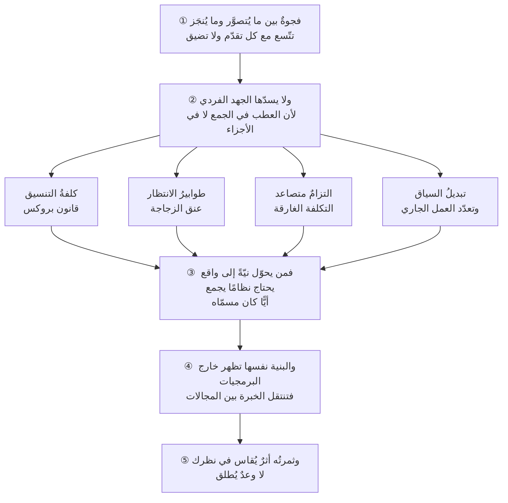

# الفصل 01 — لماذا هذا العلم؟ فجوة ما نتخيّله وما ننجزه

---

> [!important] قبل أن تبدأ — أرجئ تصوّرك عن كلمة «إدارة»
> إن كان أوّل ما يحضرك عند سماع «إدارة المشاريع» هو مخطّط جانت (Gantt Chart)، أو اجتماعٌ يوميّ، أو تقريرُ حالةٍ يُرفع كلّ خميس، أو لوحة كانبان (Kanban Board) ملأى بالبطاقات — فأرجئ هذا التصوّر إلى حين. ولا تُلغِه، فله موضعه.
>
> إنما هذه كلُّها **أدوات**، ونسبتها إلى هذا العلم نسبةُ المشرط إلى الطبّ: لازمةٌ في يد من عرف أين يقطع، عابثةٌ في يد من لم يعرف. والسؤال الذي يسبقها جميعًا — وهو الذي يُفتح به هذا الباب — سؤالٌ أعمق منها:
>
> **لماذا تتعثّر المشاريع أصلًا؟**
>
> وما لم يُعرف سببُ التعثّر، صار اختيار الأداة بالذوق: تُشترى لأنها مشهورة، وتُترك لأنها لم تنفع — بلا أن يُعرف في الحالتين ما الذي كانت تعالجه.

---

## 🏛️ لماذا تقرأ هذا الفصل؟

**المشكلة:** يجتمع في الفريق الواحد مبرمج ماهر ومصمّم متقن وبائع حاذق، ثم يتأخّر المنتج سنة ويخرج ناقصًا — فيبحث كلٌّ منهم عن المقصّر ولا يجده، لأن المقصّر ليس أحدهم.

**وماذا لو لم تعرف؟** من ظنّ المشكلة نقصَ مهارة أنفق سنواته في تحسين ما ليس معطوبًا: يزيد المهارة التقنية والمشروع يتأخّر للسبب نفسه، ويستبدل الأشخاص فيتكرّر الفشل بأشخاص آخرين. وثمنُ ذلك يُدفع في ثلاثة مواضع تُرى:

- **في قراراتك:** تحكم على المقترحات بما يبدو منها لا بما تعالجه، فتشتري أداةً لمشكلةٍ ليست في الأدوات، وتضيف أشخاصًا حيث تزيدهم الإضافةُ تأخّرًا.
- **في تقديراتك:** تُعطي رقمًا واحدًا حيث لا يصحّ إلا مدى، فيُبنى عليه وعدٌ لعميل، ثم تُحاسَب على وعدٍ لم تكن تعرف أنك قطعته.
- **في خبرتك نفسها:** تتراكم عندك سنواتٌ بلا أن يتحسّن حكمُك، لأن التجربة لا تُعلّم وحدها؛ إنما يُعلّم **تفسيرُها**. ومن جهل تفسير ما وقع صار بعد عشر سنين أسرعَ في الخطأ نفسه لا أبعدَ عنه.

**وبعد هذا الفصل ستستطيع:**

- **أن تميّز** — في تقرير يُعرض عليك أو في يومك أنت — بين نشاطٍ بُذل، ومُخرَج (Output) سُلّم، وأثرٍ (Outcome) تحقّق؛ فلا تقرأ الانشغال إنجازًا.
- **أن تفسّر** تعثّر مشروعٍ لا مقصّر فيه بآليّة لها اسم — كلفةُ تنسيقٍ متضخّمة، أو طابورُ انتظارٍ خفيّ، أو التزامٌ متصاعد — بدل الجملة التي تُنهي النقاش ولا تفسّر شيئًا: «لم يطبّقوها كما ينبغي».
- **أن تحكم** على اقتراحٍ يُطرح عليك من نوع «نضيف أشخاصًا» أو «نشتري أداة»، بسؤال واحد: أيَّ آليّةٍ من آليّات التعثّر يعالج هذا الاقتراح تحديدًا؟

> [!info] بطاقة الفصل
> **النوع:** تأسيسيّ
> **المستوى:** 🟢 مبتدئ
> **زمن القراءة:** نحو 50 دقيقة
> **أهمّيته في الباب:** ★★★★★
> **موضعك:** هذا أوّل فصول الباب ← **⬤ أنت هنا** ← يليه [[02 - طبيعة العلم وهويته]]

> [!abstract] موقع هذا الفصل
> **يبني على:** [[Scope Creep]] · [[Definition of Done]] — يُذكَر هنا ولا يُعاد شرحه.
> **ويؤسّس:** [[Brooks's Law]] · [[Sunk Cost Fallacy]] — يُقدَّم هنا أوّل مرّة فيصير متاحًا لما بعده.

---

## 🧭 السؤال المركزي

> [!question] السؤال الذي يجيب عنه هذا الفصل كلّه
> **لماذا يعجز الناس عن إنجاز ما يقدرون على تصوّره؟**

**واحمل معك هذه الأسئلة وأنت تقرأ:**

- هل يمكن أن يفشل مشروعٌ كلُّ فرد فيه ناجح؟
- ما الفرق بين أن تكون مشغولًا وأن تكون منجزًا؟
- هل أنت مدير مشروع في عملك ولو لم يكن هذا مسمّاك؟
- ولماذا يكثر التعثّر في المشاريع التي اجتمع لها ألمعُ الناس، لا في أبسطها؟

---

## 🗺️ الجواب المختصر — قبل التفصيل

> [!summary] الجواب في ثلاثة أسطر — عُد إليه كلّما التبس عليك موضعك من الفصل
> 1. **الخلل ليس في إنتاج الأفراد، بل في جَمْعِه.**
> 2. **وكلُّ زيادةٍ في العدد أو المدّة أو التشابك تُولّد كلفةً لا يضعها أحدٌ في حسابه** — وهي تنمو أسرع من الطاقة المضافة، فتلتهمها ثم تلتهم بعض ما كان قائمًا قبلها.
> 3. **وهذا العلم يُدير تلك الكلفة**؛ لا يجعل الفرد أسرع، بل يمنع أن يضيع بين الأفراد ما ينتجه كلٌّ منهم.

العجز ليس في القدرة الفردية. الناس أقدر اليوم منهم في أي وقت مضى: أدواتهم أمضى، ومعرفتهم أوسع، وما يستطيع فردٌ واحدٌ بناءه في أسبوع كان يحتاج قبل عقدين إلى فريق. ومع ذلك تتأخّر المشاريع وتخرج ناقصة بالنسبة نفسها تقريبًا. **فالخلل إذن ليس في إنتاج الأفراد، بل في جَمْعِه.**

والذي يحدث أن كل زيادة في عدد المشاركين، وفي طول المدّة، وفي تشابك الأجزاء، تُولّد **كلفةً لا يضعها أحدٌ في حسابه**: كلفةَ أن يعرف كلٌّ ما يفعله الآخر، وكلفةَ أن ينتظر بعضهم بعضًا، وكلفةَ أن يُراجَع قرارٌ اتُّخذ قبل شهور. وهذه الكلفة تنمو أسرع من نموّ الطاقة المضافة، فتلتهمها ثم تلتهم بعض ما كان قائمًا قبلها. ومن هنا يقع أغرب ما في هذه الصنعة: **فريقٌ يزداد عدده فيقلّ إنتاجه، وكلُّ فردٍ فيه مشغول طول اليوم.**

وعلم إدارة المشاريع البرمجية هو ما وُضع لإدارة هذه الكلفة. ليس ليجعل الفرد أسرع — تلك مهمّة التقنية والمهارة — بل ليمنع أن يضيع بين الأفراد ما ينتجه كلٌّ منهم. ولهذا يبدو للناظر من بعيد علمًا في «التنظيم»، وهو في حقيقته علمٌ في **تقليل الهدر الناشئ عن الاجتماع**، وفي **المفاضلة** حين لا تكفي الموارد لكل ما يُشتهى، وفي **التصرّف تحت عدم يقين** لأن أكثر ما يلزم معرفته لا يُعرف إلا بعد فوات أوان الاستفادة منه.

**وما بقي من هذا الفصل برهانٌ على هذا الجواب في خمس خطوات:**

1. أنّ الفجوة بين التصوّر والإنجاز ثابتةٌ وتتّسع ولا تُغلقها التقنية.
2. أنّ ما يمنع سدّها آليّاتٌ أربعٌ معلومةٌ لها أسماء.
3. أنّ من يواجهها ليس صاحب المسمّى وحده.
4. أنّ بنيتها تظهر خارج البرمجيات فتنتقل الخبرة إليها ومنها.
5. أنّ أثر هذا العلم في صاحبه يُقاس بعلاماتٍ ظاهرة لا يُدَّعى بأوصاف.

> [!abstract] مفاهيم يُدخلها هذا الفصل في قاموسك
> `Brooks's Law` · `Sunk Cost Fallacy`

> [!warning] مفاهيم يكثر الخلط بينها هنا
> `Activity` مقابل `Output` مقابل `Outcome` — احملها في ذهنك، فالفصل يفرّقها في محطّة التمييز.

---

## 🧱 الفكرة الأولى: الإنسان يتخيّل أكثر ممّا ينجز، وهذه الفجوة هي ما وُلد منه هذا العلم

*موضعها من الفصل: هذه أوّل خطوةٍ في البرهان، وموضعها أن تُقيم أصل المشكلة قبل أن يُطلب لها علاج — أنّ ما نعجز عنه ليس سوءَ تنفيذٍ لخطّةٍ سليمة، بل مسافةٌ بنيويّة بين حيّزين يختلفان في قوانينهما. وما بعدها كلُّه فرعٌ عن قبول هذا الأصل.*

**الفكرة الرئيسة:** بين ما يستطيع الإنسان أن **يتصوّره** وما يستطيع أن **ينجزه** فجوةٌ ثابتة لا تُغلق، وهي تتّسع مع كل تقدّم لا تضيق. وهذا العلم لم يُوجد ليُلغيها — فذلك محال — بل ليُديرها: أن تُعرف سعتها، وأن تُختار مواضع تضييقها، وأن يُدفع ثمنها بوعي بدل أن يُدفع فجأةً في آخر شهر من المشروع.

> [!summary] حدُّ «الفجوة» — يُرجَع إليه في الباب كلّه
> **الفجوة هي المسافة بين ما يمكن أن يُتصوَّر بلا كلفة، وما يمكن أن يُسلَّم فعلًا بموارد محدودة وتحت عدم يقين.**
>
> وهي أكثر كلمةٍ تتردّد في هذا الباب، فيلزم أن يكون لها حدٌّ واحدٌ يُرجَع إليه كلّما وردت. ولاحظ ما **ليست** هي: ليست تقصيرًا في العزم، ولا خطأً في التقدير وحده، ولا أثرًا لسوء اختيار الفريق. إنما هي **فارقٌ بنيويّ** بين حيّزين يختلفان في قوانينهما — حيّزٍ لا يكلّف فيه شيء، وحيّزٍ يكلّف فيه كلُّ شيء.

*ومسار هذه الفكرة سبعة أسئلة متتابعة: لماذا الفجوة ثابتة أصلًا؟ ← ولماذا تبدو المشاريع سهلةً قبل أن تبدأ؟ ← ولماذا تتّسع لا تضيق؟ ← ولماذا لم تُغلقها التقنية؟ ← فما حدُّ هذا العلم إذن؟ ← ولماذا لا يسدّها الجهد وحده؟ ← ولماذا يخطئ التقدير بنيويًّا لا كسلًا؟*

### لماذا الفجوة ثابتة أصلًا؟

لأن **التصوّر مجّانيّ والتنفيذ مكلف**. لا يكلّفك أن تتخيّل منتجًا فيه عشرون ميزةً أكثر ممّا يكلّفك أن تتخيّله بميزتين؛ الجملتان تُقالان في نَفَسٍ واحد. أمّا بناء العشرين فليس عشرة أضعاف بناء الاثنتين، بل أكثر منه. والعلّة أن الميزات لا تُصفّ صفًّا، بل يتشابك بعضها ببعض؛ فتزيد كلفةُ كلِّ واحدةٍ بعدد ما قبلها.

**وهنا يظهر أوّل معنًى للتعقيد (Complexity) في هذا الباب**، ويحسن أن يُصرَّح به لأنه موضع خطأٍ شائع: **ليست المشكلة أن المشروع كبير، بل أن أجزاءه مترابطة.** والفرق بين الأمرين يُرى في مثالٍ واحد:

- **عشر ميزاتٍ مستقلّة** — تُبنى كلُّ واحدةٍ وتُختبَر وتُسلَّم وحدها. فالعشر عشرةُ أضعاف الواحدة تقريبًا، ويمكن أن يعمل عليها عشرةٌ في وقتٍ واحد بلا أن يعطّل بعضهم بعضًا.
- **عشر ميزاتٍ يعتمد بعضها على بعض** — تمسّ الحسابات نفسها، والصلاحيات نفسها، والفاتورة نفسها. فكلُّ تغييرٍ في واحدةٍ يفتح سؤالًا في الباقيات، وكلُّ اختبارٍ يلزم أن يشمل ما قبله، وكلُّ خطأٍ يحتمل أن يكون مصدره أيَّ واحدةٍ من العشر.

**فالحجم يُجمَع، والترابط يُضرَب.** ولهذا قد يكون مشروعٌ من خمس عشرة ميزةً مستقلّة أهونَ من مشروعٍ من ستٍّ متشابكة، وهو في الورق أوسعُ منه مرّتين ونصفًا. ومن قدّر بعدّ الميزات وحدها قدّر أظهرَ ما في المشروع وأغفل أثقلَ ما فيه. وستعود هذه القاعدة نفسها في الفكرة الثانية بصيغةٍ عددية، حين يكون المترابط أشخاصًا لا ميزات.

وثلاثة فروقٍ بين حيّز الخيال وحيّز التنفيذ تفسّر هذا كلّه:

1. **الخيال لا يعرف الترتيب.** أنت تتخيّل النتيجة النهائية دفعةً واحدة: الشاشة وقد اكتملت، والعميل وقد رضي. والتنفيذ لا يقبل هذا؛ يفرض عليك تسلسلًا وتبعيّات: لا واجهةَ قبل واجهة برمجية (API)، ولا واجهة برمجية قبل نموذج بيانات، ولا نموذج بيانات قبل أن يُحسم سؤالٌ في العمل نفسه لم يُطرح بعد.
2. **الخيال لا يعرف الاحتكاك.** في الصورة الذهنية لا أحد ينتظر موافقة، ولا بيئةَ اختبارٍ معطّلة، ولا مطوّرًا مريضًا، ولا سوءَ فهمٍ يُكتشف بعد أسبوعين من العمل في الاتجاه الخطأ. وفي الواقع هذه الأشياء ليست استثناءً يعترض الخطة؛ **هي الخطة**، وأكثر ما يمرّ من الوقت يمرّ فيها.
3. **الخيال لا يعرف الحدّ.** الموارد فيه غير محدودة، فلا مفاضلة فيه أصلًا: تريد السرعة والجودة والسعة كلَّها معًا، ولا شيء يمنعك. والتنفيذ محكومٌ بحدٍّ لا يُتجاوز، فكلُّ «نعم» فيه هي «لا» لشيء آخر. **وهنا تقع أوّل صدمةٍ يتلقّاها من ينتقل من التخيّل إلى المسؤولية.**

### ولماذا تبدو المشاريع سهلةً قبل أن تبدأ؟

يجمع هذه الفروق الثلاثة أصلٌ واحد يستحقّ أن يُفرد، لأنه يفسّر أكثرَ ما يُستغرب في أوّل المشاريع: **أن العقل يبني الصورة النهائية ولا يبني الطريق إليها.** فأنت حين تتخيّل المنتج تراه وقد اكتمل — الشاشة، والعميل، والرضا — ولا تُعرَض عليك في الصورة نفسها الخطواتُ التي بينك وبينه. والصورة تُبنى في ثانية، والطريق يُقطع في أشهر؛ ومن قدّر الثاني بالنظر إلى الأوّل فقد قاس شيئًا بمقياس شيءٍ آخر.

**ويترتّب على ذلك أثرٌ أغرب:** أن التعقيد لا يُرى تدرّجًا، بل يُرى **قفزةً**. تأمّل فريقًا قدّر عملًا بأسبوع:

- **اليوم الأوّل:** «هذا عمل أسبوع.»
- **بعد أسبوع:** «غريب… لماذا لم ينتهِ بعد؟»
- **بعد شهر:** «تبيّن أن المشروع معقّد جدًّا.»

والذي تغيّر في هذه المدّة ليس المشروع. **فالتعقيد كان فيه يوم قيل عنه إنه عمل أسبوع**، ولم يُضِف إليه أحدٌ شيئًا. إنما تغيّرت **رؤيتُه**: إذ لا ينكشف التعقيد إلا بالاصطدام به، وكلُّ اصطدامٍ يُظهر جزءًا كان قائمًا من قبل. ولهذا يُخطئ الفريق حين يقول «المشروع تعقّد»، والأصدق أن يقول «رأينا تعقيده».

**وثمرة التفريق بين العبارتين عملية لا لفظية:** «تعقّد» تدفعك إلى السؤال عمّن أدخل التعقيد، و«رأيناه» تدفعك إلى سؤالٍ آخر — **كيف نراه أبكر؟** وهذا السؤال الثاني هو الذي تُبنى عليه أنفع ممارسات هذا العلم: أن يُجرَّب المجهول تجربةً صغيرة في الأسبوع الأوّل، لا أن يؤجَّل إلى حيث ينكشف ولا يبقى وقتٌ للتصرّف فيما انكشف.

### ولماذا تتّسع لا تضيق؟

لأن الطرفين لا ينموان بالوتيرة نفسها. طاقةُ التنفيذ تنمو نموًّا متدرّجًا: أدوات أفضل، ومكتبات جاهزة، وخبرة متراكمة. أمّا سقف ما يُتصوَّر فيقفز مع كل قفزةٍ تقنية، لأن كل قدرةٍ جديدة تُري الناس ما لم يكونوا يعرفون أنهم يريدونه.

وأوضح ما يكون هذا في السنوات الأخيرة مع أدوات الذكاء الاصطناعي التوليدي: رفعت سقف ما يُتصوَّر رفعًا حادًّا — إذ صار بناء نموذج أوّلي (Prototype) لفكرةٍ عملَ ساعات — بينما لم ترتفع طاقة **التسليم الكامل** بالقدر نفسه، لأن التسليم ليس بناءَ النموذج الأوّلي، بل ما بعده: الحالات الحدّية، والأمن، والتشغيل، والدعم، والتكامل مع ما هو قائم. فالنتيجة موجةٌ ممّا يُبدأ ولا يُنهى، لا لضعف من بدأه، بل لأن الفجوة اتّسعت من طرفها الأعلى فجأةً.

ويتّسع الطرف الآخر أيضًا، فتُدفع الفجوة من الجهتين: [[Scope Creep|تمدُّد النطاق (Scope Creep)]] يوسّع ما يُتصوَّر أثناء العمل نفسه — طلبٌ صغير هنا وإضافةٌ «بسيطة» هناك — وتراكمُ التعقيد يبطئ ما يُنجَز. فتنفتح المسافة من الأمام والخلف معًا، ويبقى الفريق يجري وهو يظنّ أنه يقترب.

### ولماذا لم تُغلقها التقنية وهي تتقدّم؟

في تاريخ هذه الصنعة سلسلةٌ من الوعود، كلُّ واحدٍ منها قيل عنه في وقته إنه سيُنهي المشكلة: اللغاتُ عالية المستوى حين حلّت محلّ لغة الآلة، ثم أدواتُ التوليد الآلي للشيفرة في الثمانينيّات، ثم الأطر الجاهزة، ثم المنصّات منخفضة الشيفرة (Low-Code)، ثم أدوات الذكاء الاصطناعي التوليدي اليوم. **وكلُّها زادت الطاقة زيادةً حقيقية لا يُنكرها عاقل، ولم يُغلق واحدٌ منها الفجوة.**

وأوضحُ تفسيرٍ لهذا كتبه **فريدريك بروكس** في مقالته **“No Silver Bullet”** (1986)، وخلاصته تمييزٌ بين نوعين من التعقيد:

- **تعقيدٌ عرَضيّ (Accidental):** ناشئٌ عن الأدوات ووسائل العمل لا عن المشكلة نفسها — كالتعامل مع إدارة الذاكرة يدويًّا، أو كتابة ما يمكن توليده. **وهذا هو الذي تُنقصه التقنية**، وقد أنقصته كثيرًا.
- **تعقيدٌ جوهريّ (Essential):** ناشئٌ عن المشكلة نفسها — أن تفهم عملًا بشريًّا متشابكًا، وأن يتّفق أصحاب المصلحة على ما يريدون، وأن تُحسم استثناءاتٌ لا يعرفها أحدٌ منهم حتى تُسأل عنها. **وهذا لا تمسّه أداة**، لأنه ليس في كتابة الحلّ بل في **معرفة ما يُكتب**.

**ولازمُ ذلك أن كلّ أداةٍ تُنقص العرَضيّ ترفع نصيب الجوهريّ من العمل.** فمن كان قبل عشرين سنة ينفق نصف وقته في تفاصيل تقنية صار ينفق أكثره في الاتّفاق والتوضيح والقرار. **فالتقنية لم تُلغِ العمل الأصعب؛ أزاحت عنه ما كان يستره.**

وهذا بعينه ما يفسّر أمرًا يُستغرب كثيرًا: أن يزداد الحديث عن الإدارة والتنسيق كلّما تقدّمت الأدوات، لا أن يقلّ. فليس ذلك تضخّمًا إداريًّا كما يُظنّ أحيانًا، بل **انتقالٌ في موضع الصعوبة** — والصنعة إنما تُطلب حيث الصعوبة.

### الحدّ الافتتاحيّ لهذا العلم

ممّا سبق يُصاغ الحدّ الذي يقوم عليه هذا الباب كلّه:

> [!summary] حدُّ الصنعة
> **إدارة المشاريع البرمجية هي الصنعة التي تُدير الفجوة بين ما يُتصوَّر وما يُنجَز، بموارد محدودة وتحت عدم يقين.**

وثلاثة قيود في هذا الحدّ لا يُفهم بدونها: أنها **تُدير** الفجوة ولا تُلغيها، وأن مواردها **محدودة** فالمفاضلة أصلٌ فيها لا استثناء، وأنها تعمل **تحت عدم يقين** فحكمها ترجيحيّ في أكثر مسائله لا قطعيّ. ومن طلب منها اليقين طلب ما ليس عندها، ثم اتّهمها بالتقصير — وهذا وحده أصلُ خصومةٍ طويلة بين الممارسين وبين هذا العلم، سيفصّلها [[02 - طبيعة العلم وهويته|الفصل الثاني]] حين يتكلّم عن نوع المعرفة فيه.

وللقيدين الأخيرين معنًى أدقُّ ممّا يُفهم منهما لأوّل وهلة، فيحسن تحريره هنا لأن الباب كلَّه يُبنى عليهما:

> [!info] ما معنى «تحت عدم يقين»؟
> ليس المقصود أنّا لا نعرف شيئًا — فذاك عجزٌ لا يُدار أصلًا. المقصود حالٌ أدقّ: **أن نعرف بعض ما يلزم، ونجهل منه ما هو مؤثّر، جهلًا لا يرتفع إلا بالتقدّم في العمل نفسه.**
>
> ويلزم من ذلك فرقٌ لا يصحّ إهماله، حرّره الاقتصاديّ **فرانك نايت (Frank Knight)** سنة 1921: بين **المخاطرة (Risk)** — وهي ما تُعرف نتائجه المحتملة فتُنسب إليها احتمالات، فتُحسب وتُسعَّر ويُحتاط لها برقم — وبين **عدم اليقين (Uncertainty)** بالمعنى الدقيق، وهو ما لا توزيعة احتمالية له أصلًا، بل قد تُجهل فيه قائمةُ النتائج نفسها. وتفصيله في [[Knightian Uncertainty|عدم اليقين النايتي]].
>
> **وأثرُ التفريق عمليّ لا نظريّ:** ما كان مخاطرةً عولج بالحساب والاحتياط؛ وما كان عدم يقينٍ لم يُعالَج بمزيدٍ من الحساب مهما دُقّق، وإنما **بشراء المعلومة** — تجربةٌ صغيرة رخيصة تنقل البند من «لا نعرف» إلى «نعرف بتقريبٍ مقبول». فمن طلب من التخطيط أن يُزيل عدم اليقين طلب ما ليس في وسعه؛ والذي يُزيله **العملُ** لا الخطّة.

> [!info] إضافة مرجعية — «موارد محدودة» أوسعُ من المال بكثير
> يُقرأ قيد الموارد في الغالب على أنه ميزانية، فيُظنّ أن المشروع المموَّل جيّدًا قد فُكَّ قيدُه. وليس كذلك؛ فأربعةٌ من موارد المشروع لا تُشترى بالمال، وهي التي تنفد أوّلًا في أكثر المشاريع المتعثّرة:
>
> 1. **الوقت** — أضيقها، لأنه لا يُخزَّن ولا يُستعاد. والمال يُنفَق فيه ولا يشتريه.
> 2. **الانتباه** — أي طاقةُ من يقرّر ومن ينفّذ على حمل عددٍ محدود من الأمور معًا. وبهذا يصير تعدّدُ الأعمال الجارية استنزافًا لمورد، لا مجرّد سوءٍ في الترتيب.
> 3. **الثقة** — رصيدُ ما يُصدَّق من كلامك عند العميل والفريق والراعي. وهو ينفد بتأخيرٍ يُعلَن على دفعات، ولا يُشترى بعد نفاده بأيّ مبلغ.
> 4. **الوضوح** — مقدارُ ما استقرّ من الأسئلة الكبرى. والمشروع الذي بقيت أسئلته مفتوحة يدفع في كلّ قرارٍ ثمنَ ما لم يُحسم قبله.
>
> **وأثرُ هذا في المفاضلة:** أن السؤال ليس «أعندنا ميزانية؟» بل «أيُّ هذه الموارد يُنفَق في هذا القرار، وهل هو أضيقُها اليوم؟». فكثيرٌ من القرارات التي تبدو رخيصةً ماليًّا باهظةٌ في الانتباه أو في الثقة، وهي لا تظهر في أيّ بندٍ من بنود الميزانية.

### ولماذا لا يسدّها الجهد وحده؟

هذا هو الجواب الأوّل الذي يقفز إلى الذهن: إن كانت الفجوة اتّساعًا بين المتصوَّر والمنجَز، فلنزد المنجَز — ساعاتٌ أطول، وعطلةُ نهاية أسبوع، وحماسةٌ أكبر. وهو جوابٌ يعمل مرّةً واحدة في مدىً قصير، ثم ينقلب على صاحبه.

وعلّة انقلابه أن الجهد يزيد **مقدار** ما يُنتَج ولا يغيّر **اتّجاهه**. فإن كان الاتّجاه خطأً — تُبنى ميزةٌ لا يريدها أحد، أو يُحلّ عرَضٌ لا سببٌ — فكل ساعةٍ إضافية توسّع الفجوة بدل أن تضيّقها، لأنها تنتج شيئًا سيُهدَم أو سيُصان بلا فائدة. ثم تأتي بعد ذلك كلفةُ الإرهاق: تقلّ جودةُ ما يُكتب، فيزيد ما يُعاد، فيزيد الوقت اللازم. وتُسمّى هذه الحلقة في أدبيات التدفّق **حلقةَ إعادة العمل**، وهي أوضح أمثلة أن الحلّ السريع يصنع المشكلة التي جاء ليحلّها.

فالذي يسدّ جزءًا من الفجوة ليس مزيدًا من الجهد، بل **نظامٌ يجمع الجهود ويصوّب اتّجاهها**: يقرّر ما يُبنى أوّلًا، ويكشف الخطأ مبكرًا وهو رخيص، ويمنع تسرّب الطاقة في الانتظار والتكرار. وهذا النظام هو ما تسمّيه هذه الصنعة **إدارةَ مشروع**، أيًّا كان اسم من يقوم به.

### ولماذا يخطئ التقدير بنيويًّا لا كسلًا؟

يُقرأ خطأ التقدير في أكثر المنظّمات على أنه **تقصيرٌ في العناية**: لو دقّق المقدِّر لأصاب. وهذا التفسير يعلّق سببًا ظاهرًا على مشكلةٍ بنيوية، فيمنع علاجها. والحقيقة أن للخطأ مصدرين لا يزولان بمزيدٍ من العناية:

**الأوّل: التقدير يقوم على معرفةٍ لا تكتمل إلا بالعمل نفسه.** فأنت تُسأل عن مدّة شيءٍ لم تفعله بعد، وأدقُّ ما ستعرفه عنه ستعرفه أثناء فعله. ولهذا يكون مدى الخطأ في أوّل المشروع واسعًا جدًّا، ثم يضيق كلّما تقدّم العمل، حتى ينعدم يوم التسليم — إذ يصير التقدير معرفةً لا تقديرًا. وقد رسم **باري بوم (Barry Boehm)** هذا التناقص في *Software Engineering Economics* (1981) بيانيًّا في صورة قمعٍ يضيق، وشاع لاحقًا بتسمية **«مخروط عدم اليقين» (Cone of Uncertainty)** عند ستيف مكونيل.

**والثاني: انحيازٌ في العقل نفسه.** فقد وصف **دانيال كانمان وعاموس تفيرسكي** ما سمّياه **مغالطة التخطيط (Planning Fallacy)**: أن الإنسان يقدّر مدّة عملٍ بتصوّر **مساره الأفضل** — إذ يتخيّل الخطوات ولا يتخيّل ما يعترضها — ويُهمل في الوقت نفسه سجلَّ أعمالٍ مشابهة أنجزها هو أو أنجزها غيره. والعلاج الذي اقترحاه ليس التنبيه على التفاؤل، بل تغيير **مصدر** التقدير: أن يُنظر إلى العمل **من الخارج (Outside View)**، فيُسأل: كم استغرق عندنا آخرُ خمسة أعمالٍ من هذا النوع؟ فالسجلّ يعرف عن نفسه ما لا يعرفه الحدس.

**وأثر هذا في الممارسة سطرٌ واحد:** التقدير ليس رقمًا، بل **مدىً باحتمال**. فقولك «بين ثلاثة أسابيع وستّة، والأرجح أربعة» أصدقُ من «شهر»، وأنفعُ لمن يبني عليه قرارًا. ومن أُلزم برقمٍ واحدٍ قاطع فقد أُلزم بأن يخفي عن سائله أهمَّ ما يعرفه: مقدارَ ما لا يعرفه.

> [!info] إضافة مرجعية — تنبيهٌ على «مخروط عدم اليقين»
> يُعرض هذا المخروط في كثيرٍ من العروض التدريبية على أنه **قانونٌ يجري بنفسه**: أن الدقّة تتحسّن تلقائيًّا كلّما مضى الوقت. وهذه قراءةٌ تقلب معناه.
>
> فالمخروط يصف **أفضلَ ما يمكن بلوغه** من الدقّة عند كل مرحلة، لا ما سيقع حتمًا. وقد نبّه **ستيف مكونيل** — وهو من شاع الاسم على يديه في *Software Estimation* (2006) — على أن المخروط **لا يضيق من تلقاء نفسه**: إنما يضيق بقدر ما يُتّخذ من قراراتٍ تُزيل تغايرًا قائمًا — أن يُثبَّت النطاق، وأن تُحسم الخيارات المفتوحة، وأن يُجرَّب المجهول تجربةً صغيرة. فمشروعٌ مضى عليه نصفُ مدّته وكلُّ خياراته ما زالت مفتوحة **لا يزال في عرض المخروط الأوّل**، وإن كان قد استهلك نصف وقته.
>
> **والمعنى العمليّ:** الوقتُ وحده لا يشتري دقّة؛ الذي يشتريها **القرار**.

> [!example] كيف تظهر الفجوة في يومين اثنين
> اجتمع ثلاثة شركاء في الرياض ساعتين ليتّفقوا على متجرٍ إلكتروني لبيع التمور. خرجوا من الاجتماع بصورةٍ واضحة في أذهانهم: صفحةُ منتجات، وسلّة، ودفع، وتتبّع شحنة. وقدّروا: **ستة أسابيع**.
>
> ثم بدأ التنفيذ، فظهر ما لم يكن في الصورة:
>
> - **الدفع** ليس زرًّا؛ بل بوّابةُ دفعٍ لها عقدٌ وحسابٌ تاجريّ ومدّةُ تفعيلٍ لا يملكها الفريق.
> - **الفاتورة الإلكترونية** مطلبٌ نظاميّ في السوق السعودي، بمواصفةٍ فنّية وربطٍ ومراحلَ للامتثال — ولم يكن أحدٌ في الاجتماع يعلم أنها في النطاق.
> - **ضريبة القيمة المضافة** تدخل في حساب السعر والفاتورة والمرتجعات، فتمسّ الشيفرة في مواضع لم تكن مرسومة.
> - **الشحن** ليس حقلَ عنوان؛ بل شركةُ شحنٍ لها واجهةٌ برمجية، وأسعارٌ تختلف بالمنطقة، وحالاتُ فشلٍ يجب أن يراها العميل.
> - **اللغتان** — عربية وإنجليزية — تعنيان اتّجاهًا مزدوجًا في الواجهة، وتاريخين، وقالبَ فاتورةٍ لكلٍّ منهما.
>
> سُلّم المتجر في **أربعة أشهر ونصف**. ولم يكن أحدٌ من الثلاثة مقصّرًا، ولم يكن التقدير كذبًا. إنما قُدِّر ما في الصورة الذهنية، ونُفِّذ ما في الواقع — والفرق بينهما هو الفجوة عينُها.

> [!example] وصورةٌ ثانية — حين يكون التمدّد من جهةٍ لا تملكها
> جهةٌ حكومية تعتزم نقل ترخيص نشاطٍ تجاريّ من مراجعةٍ ورقية إلى منصّة إلكترونية. والتصوّر المعلَن في أوّل اجتماع: **ثلاث خطوات، في ستّة أشهر**.
>
> ثم ظهر في التنفيذ ما لم يكن في الصورة: أن الترخيص الواحد تمرّ به **خمس جهاتٍ أخرى**، لكلٍّ منها نظامُها ودورةُ عملها وتعريفُها الخاصّ لبيانات المنشأة نفسها. فصار الجزء الأكبر من العمل تكاملًا لا برمجة، وتوحيدًا لتعريفاتٍ متعارضة لا تصميمَ شاشات.
>
> **والفرق بين هذه الصورة وسابقتها هو موضعُ القيد، وهو فرقٌ يستحقّ الوقوف عنده.** ففي المتجر كان ما جهله الفريق **معلومًا لغيره وممكنَ المعرفة**: نظامُ الفوترة منشور، ومواصفتُه مقروءة، وكان يكفي أسبوعُ بحثٍ قبل التقدير. وهنا كان القيد في **إيقاع جهةٍ لا يملكها الفريق**: لا يستطيع أن يُسرّعها، ولا أن يعرف متى تجيب، ولا أن يُلزمها بتعريفٍ للبيانات يوافق تعريف غيرها.
>
> فالأوّل **تقديرٌ ينقصه بحث**، والثاني **تقديرٌ ينقصه سلطانٌ على مورد**. ومن خلط بينهما بحث حيث لا ينفع البحث، ثم وعد بما ليس في يده.

> [!tip] كيف تستعمل هذه الفكرة
> في أوّل اجتماعٍ لأي عمل جديد، اكتب **قائمتين متجاورتين** على السبّورة نفسها: **«ما تصوّرناه»** و**«ما سنسلّمه في أوّل ستّة أسابيع»**. لا تناقش القائمة الأولى ولا تقلّصها — دعها كما هي، فهي الطموح ولها موضعها. المهمّ أن تُكتب الثانية بجانبها بخطٍّ واحد.
>
> والفرق بين القائمتين هو **الفجوة عندك أنت، مقيسةً بالأسماء لا بالإحساس**. ومن رآها مكتوبةً في أوّل يوم لم يفاجأ بها في آخر شهر.
>
> **وإن لم يكن بين يديك فريقٌ ولا سبّورة، فالتمرين نفسه يجري على ورقة.** خذ آخر عملٍ التزمتَ به — تقريرًا، أو بحثًا، أو ترتيبَ مناسبة — واكتب سطرين اثنين: **ما الذي تصوّرتُه يوم بدأت؟** و**ما الذي واجهته فعلًا؟** والمسافة بين السطرين هي فجوتك أنت، مقيسةً على حالةٍ تعرف تفاصيلها كلَّها. وهذا أصدقُ ما تبدأ به، لأنك لا تستطيع أن تعزو فيه شيئًا إلى غيرك.

> [!warning] الحفرة الشائعة — أن تُعالَج الفجوة برفع الطموح
> حين تظهر الفجوة، يكون أشيع الحلول **خطّةً أشدّ تفاؤلًا**: تُضغط المدّة، وتُقلَّص التقديرات، ويُعلَن تاريخٌ «طَموح» لتحفيز الفريق.
>
> **ولماذا يقع فيها العقلاء؟** لأن التفاؤل يُقرأ في الاجتماعات **التزامًا**، والتحفّظ يُقرأ **ضعفَ همّة**. فمن قال «ثمانية أسابيع» بدا أحرصَ ممّن قال «خمسة أشهر»، وإن كان الثاني هو الصادق. ثم يُكافأ الأوّل في الاجتماع ويُحاسَب في التسليم — فيتعلّم الجميع الدرسَ المعكوس: أن يقولوا ما يُرضي الآن، ويؤجّلوا الحقيقة إلى أن تفرض نفسها.
>
> **وصورةٌ مصغّرة تقع فعلًا:** قدّر فريقٌ عملًا بعشرة أسابيع، فأُعلن ثمانيةً «حتى لا نفتر». وسُلّم في الأسبوع الثامن فعلًا — بميزةٍ أُخرجت من النطاق بلا محضر، واختبارَين أُجّلا، وحلٍّ مؤقّتٍ نوى صاحبه إصلاحه. **فبلغ التاريخُ موعده ولم يبلغه العمل**، ودُفع الفرق بعد شهرين في بلاغاتٍ لم يُعرف لها سبب — إذ لم يكن في أيّ ورقةٍ أنّ شيئًا قد قُصّر.
>
> **وأثرها المقيس:** أن تفقد التواريخُ معناها. فإذا أُعلن التأخير على دفعاتٍ صغيرة متتابعة — أسبوعان، ثم أسبوعان، ثم شهر — لم يعد أحدٌ يصدّق أيَّ تاريخ، بمن فيهم من يعلنه. وعندها يخسر المشروع أثمنَ ما يملكه: أن تكون كلمته موثوقة.

> [!question]- تأكّد أنك فهمت — مشروعٌ تأخّر ثلاثة أشهر وفريقه يعمل ساعاتٍ إضافية منذ ستّة أسابيع. ما أوّل ما تفحصه؟
> **أوّل ما تفحصه: من أي طرفٍ اتّسعت الفجوة — من طرف التصوّر أم من طرف التنفيذ؟**
>
> فإن كان النطاق اليوم أوسع ممّا اتُّفق عليه في البداية، فالمشكلة في **الطرف الأعلى**، وزيادةُ الساعات لن تلحقه أبدًا لأنه يتمدّد أسرع ممّا تُنتج. وإن كان النطاق ثابتًا والتنفيذ هو الذي تباطأ، فالسؤال ينتقل إلى **أين تذهب الساعات فعلًا**: في البناء، أم في الانتظار وإعادة العمل؟
>
> وفي الحالتين، ما لا يصلح هو الاستمرار في الساعات الإضافية بلا تشخيص — لأنها تعالج عرَضًا واحدًا (نقص المُخرَج) بأداةٍ واحدة (زيادة الجهد)، مهما كان السبب مختلفًا. **والدواء الذي يُعطى قبل التشخيص لا يُحمد على شفاءٍ ولا يُلام على ضرر — لأنه لم يكن يعرف ماذا يعالج.**

> [!summary]- خلاصة الفكرة في سطرين
> **الفجوة بين ما يُتصوَّر وما يُنجَز ثابتةٌ تتّسع مع كلّ تقدّمٍ ولا تضيق، وهذا العلم يُديرها ولا يُلغيها.**
> والذي تملكه ليس إغلاقها، بل **اختيارُ موضع تضييقها وموعدُ دفع ثمنها** — ومن لم يختر، دفع الثمن كلَّه دفعةً واحدة في آخر شهر.

> [!question] تأمّلٌ تطبيقيّ — لا جواب له في هذا الفصل
> خذ آخر تقديرٍ أعطيتَه وقارنه بما وقع فعلًا، ثمّ اسأل: **أين كانت الفجوة أوسع** — في تصوّر العمل نفسه، أم في تقدير زمنه، أم في ما لم يكن في الحسبان أصلًا؟
>
> **والثلاثة تُعالَج بثلاثة علاجاتٍ مختلفة** — الأوّل بتفكيكٍ أدقّ، والثاني بسجلّ أعمالٍ مشابهة، والثالث باحتياطيٍّ معلن. فمن خلطها عالج واحدًا وترك اثنين، ثمّ ظنّ أنّ التقدير لا يُصلَح.

---

## 🧱 الفكرة الثانية: الفشل الجماعي ليس مجموع أخطاء فردية

*موضعها من الفصل: عُرف أنّ للفجوة سعةً تُقاس ومصادرَ تُسمّى، وأنّ الجهد وحده لا يسدّها. وتزيد هذه الفكرة سؤالًا أشدّ إلحاحًا: لماذا لا يسدّها اجتماعُ عشرةٍ أكفياء — بل قد يوسّعها اجتماعُهم؟*

**الفكرة الرئيسة:** حين يتعثّر مشروعٌ لا مقصّر فيه، فالعطب ليس في الأجزاء بل في **العلاقات بينها**. وهذا نوعٌ من الخلل لا يظهر بفحص أيّ جزءٍ على حدة، لأنه لا يوجد في أيّ جزء؛ إنما ينشأ من اجتماعها. ولهذا يصحّ أن يكون كلُّ فردٍ في الفريق ناجحًا والفريقُ فاشلًا، بلا تناقض.

*ومسار هذه الفكرة ثمانية أسئلة: ما نوع هذا الخلل أصلًا؟ ← ولماذا يشتدّ حيث اجتمع الأمهر؟ ← فما آليّاته الأربع؟ ← ولماذا تُعمَّر ولا تُعالَج؟ ← وكيف تجتمع في حلقةٍ تُغذّي نفسها؟ ← ولماذا لا يراها أهلها وهم فيها؟ ← فأين تبقى المسؤولية الفردية إذن؟ ← وكيف تعرف أيَّها يعمل عندك؟*

### خاصّيةٌ تنشأ من الاجتماع لا من الأجزاء

في أدبيات [[Systems Thinking|تفكير الأنظمة (Systems Thinking)]] تُسمّى هذه **الخصائص المنبثقة (Emergent Properties)**: صفاتٌ يملكها النظام كلُّه ولا يملكها أيُّ جزءٍ منه. فالازدحام المروري صفةٌ للطريق لا لأيّ سيّارةٍ فيه؛ ولو فحصتَ كل سيّارةٍ على حدة لوجدتها سليمةً تسير بسرعةٍ معقولة. وأنت لا تصلح الازدحام بإصلاح السيّارات.

والفشل الجماعي في المشاريع من هذا الباب تمامًا. ولهذا تفشل أشيعُ محاولات العلاج، لأنها تعالج الأجزاء: يُستبدَل المطوّر البطيء، ويُدرَّب المصمّم، ويُنبَّه مديرُ الفريق — ثم يتكرّر التعثّر بأشخاصٍ آخرين وبالوتيرة نفسها تقريبًا. **وتكرارُ النتيجة مع تغيّر الأشخاص هو أقوى دليلٍ عمليّ على أن العطب في النظام لا فيهم.**

وهذه بشارةٌ لا نذارة، وإن كانت تُقرأ أوّل وهلةٍ عكسَ ذلك: **النظام يُغيَّر، والطباع لا تُغيَّر.** فمن شخّص المشكلة في الأشخاص وقف عند حدٍّ لا يملك تجاوزه؛ ومن شخّصها في النظام وجد بين يديه أشياءَ يستطيع أن يمسّها غدًا — ترتيبَ العمل، وحدودَ الانتظار، ومواضعَ القرار.

### ولماذا يكثر التعثّر حيث اجتمع ألمعُ الناس؟

سؤالٌ يبدو مقلوبًا، وجوابه يلزم ممّا سبق لزومًا: **زيادةُ الذكاء الفرديّ لا تُنقص التعقيد الجماعيّ.** فالذكاء يرفع طاقة الجزء، والتعقيد قائمٌ في العلاقة بين الأجزاء — وهو موضعٌ لا تبلغه براعةُ أحدهم مهما بلغت.

بل قد تزيده من ثلاثة أبواب:

1. **الطموح يتّسع بسعة القدرة.** فالفريق الذي يعلم أنه قادر يختار مشكلةً أوسع، فتكثر الأجزاء وتكثر العلاقات بينها. وهذا اتّساعٌ في **الطرف الأعلى** من الفجوة لا تضييقٌ لها.
2. **الرأي المتمكّن أبطأُ في النزول عنه.** فحيث يكون لكلٍّ تصوّرٌ مبنيٌّ على خبرةٍ حقيقية، يطول النقاش ويعزّ التنازل، فيتحوّل ما كان يُحسم في دقائق إلى قرارٍ معلَّقٍ أسابيع.
3. **القادر على البناء وحده أقلُّ حاجةً إلى إعلام غيره.** فينشأ عملٌ متوازٍ صحيحٌ في ذاته، لا يلتقي إلا متأخّرًا — وعند الالتقاء يظهر أن كلًّا بنى على فهمٍ مختلف، وأن الفهمين معًا معقولان.

**والخلاصة التي تُبنى عليها بقيّة هذه الفكرة:** ليس الذي يفشل مجموعَ القدرات، بل **الطريقةَ التي جُمعت بها**. ولهذا لا يُصلَح بترقية الأجزاء.

### أربع آليّاتٍ تُنتج هذا الفشل — ولها أسماء

الفرق بين ممارسٍ يقول «المشروع متعثّر» وممارسٍ يقول «العطب هنا» هو أن الثاني يملك **أسماءَ الآليّات**. وأكثرها حضورًا أربع:

#### ① كلفة التنسيق تنمو أسرع من الطاقة المضافة

هذا هو [[Brooks's Law|قانون بروكس (Brooks's Law)]]، وصاغه فريدريك بروكس في *The Mythical Man-Month* (1975) بعد قيادته تطوير نظام تشغيل IBM System/360، ونصّه: **«إضافة قوى عاملة إلى مشروع برمجي متأخّر تزيده تأخّرًا.»**

وعلّته أمران يجتمعان:

1. **كلفة الاستيعاب.** الوافد إلى مشروعٍ جارٍ لا ينتج من يومه؛ يحتاج إلى فهم النطاق والمعمارية والاصطلاحات وأسباب القرارات السابقة. ومصدر هذا الفهم هم **الأكثر إنتاجيةً في الفريق**، فينتقل جزءٌ من طاقتهم إلى الشرح. فتنخفض إنتاجية الفريق أوّلًا قبل أن ترتفع — وفي مشروعٍ متأخّر لا يوجد وقتٌ للانتظار حتى ترتفع.
2. **الانفجار التواصليّ.** عدد القنوات بين ‎n‎ شخصًا يساوي ‎n(n−1) ÷ 2‎. فخمسةٌ بينهم عشر قنوات، وعشرةٌ بينهم خمس وأربعون، وخمسة عشر بينهم مئةٌ وخمس. **أي أن مضاعفة الفريق تضرب عبء التنسيق أربعة أضعافٍ تقريبًا**، فيتحوّل جزءٌ متزايد من وقت الجميع إلى مزامنةٍ واجتماعات لا إلى إنتاج.

وليس القانون مطلقًا، وبروكس نفسه وصفه لاحقًا بأنه تبسيطٌ شديد. وشرطه أن يكون العمل **غير قابلٍ للتجزئة بلا تواصل**: فترجمة مئة مستندٍ مستقلّ تتسارع بإضافة الناس فعلًا، وتغييرٌ معماريٌّ في نظامٍ قائم يزداد تأخّرًا بها يقينًا. وأكثر العمل البرمجي بين الحالين، فيشتدّ أثر القانون أو يخفّ بحسب قابلية العمل للفصل وجودة البنية والتوثيق.

#### ② العمل ينتظر أكثر ممّا يُعمل عليه

المشروع سلسلةٌ من الخطوات المتعلّق بعضها ببعض، والإنجاز فيه لا يقيّده أسرعُ حلقةٍ بل **أبطؤها**. وهذا هو مبدأ [[Theory of Constraints|نظرية القيود (Theory of Constraints)]]، وصاحبُ [[Bottleneck|عنق الزجاجة (Bottleneck)]] فيه هو الذي يحدّد إيقاع الجميع.

ومن هنا يأتي أغربُ مشاهد هذه الصنعة: **الكلُّ مشغولٌ مئةً في المئة، والتسليم صفر.** والسبب أن انشغال كل واحدٍ بعمله لا يعني أن العمل يتحرّك؛ فقد يكون مشغولًا ببدء شيءٍ جديد بينما ما بدأه أمسِ ينتظر غيره. وهذا ما تسمّيه أدبيات التدفّق [[100 Percent Utilization Fallacy|مغالطة الاستغلال الكامل]]: أن استغلال الطاقة بالكامل — الذي يبدو غايةَ حسن الإدارة — هو نفسه ما يُطيل زمن الانتظار، لأن الطابور ينمو حين لا تبقى سعةٌ فارغة يمرّ فيها ما يصل.

وحين تُقاس المشاريع بمقياس [[Flow Efficiency|كفاءة التدفّق]] — أي نسبةِ الزمن الذي يُعمل فيه على البند فعلًا إلى زمن رحلته كاملًا — يظهر أن الجزء الأكبر من عمر البند يمضي **منتظِرًا** لا مُشتغَلًا عليه. ومعنى ذلك عمليًّا أن تسريع من يعمل لا يغيّر كثيرًا، لأنك تسرّع الجزء الصغير من الرحلة.

#### ③ القرار لا يُراجَع لأنّ مراجعته اعتراف

الآليّة الثالثة نفسيّةٌ وتنظيمية معًا، وهي [[Sunk Cost Fallacy|مغالطة التكلفة الغارقة (Sunk Cost Fallacy)]]: أن يُواصَل الإنفاق على مسارٍ **بسبب ما أُنفق عليه سابقًا** لا بسبب العائد المتوقّع منه. والمنفَق سابقًا لا يُسترَدّ في الحالتين — الاستمرار أو الإيقاف — فهو معلومةٌ غير ذات صلةٍ منطقيًّا بأيّ قرارٍ قادم. وإدخالها في الحساب هو المغالطة بعينها.

ولها في المنظّمات وجهٌ أقوى من وجهها الحسابيّ: مَن أقرّ المشروع لا يريد أن يظهر مخطئًا، والفريق يخشى تفكيكه، والراعي ربط سمعته بالإطلاق. فيستمرّ المشروع بقوّة القصور الذاتيّ، ثم يبدأ ما هو أخطر: **تتلوّن التقارير بلون القرار**. فتُرفع أخبارٌ متفائلة لتبرير الاستمرار، فتفسد بيانات القرار نفسها، فتضعف جودةُ كل قرارٍ لاحق. وحين يصل الأمر أخيرًا إلى الإيقاف تكون الخسارة أضعاف ما كانت عليه لحظةَ ظهور الإشارات الأولى.

**والعلامة اللغوية التي تكشفها بلا خبرة:** انظر بأيّ زمنٍ صيغ مبرِّر الاستمرار. فـ«أنفقنا عليه ثمانية أشهر» جملةٌ ماضية لا قيمة قراريّة لها؛ و«سيعود علينا كذا مقابل كذا» جملةٌ مستقبلية تُناقَش وتُوزَن. واللغة نفسها هي أداة التشخيص.

#### ④ تبديلُ السياق يستهلك ما لا يظهر في أيّ جدول

الآليّة الرابعة أخفاها جميعًا، لأنها لا تترك أثرًا في أيّ سجلّ: **كلفةُ الانتقال من عملٍ إلى عمل**. فالعقل لا يستأنف من حيث وقف؛ يحتاج إلى استرجاع السياق — أين كنتُ، ولماذا اخترتُ هذا، وما الذي كنتُ أوشك أن أفعله. وهذه هي [[Context Switching Cost|كلفةُ تبديل السياق (Context Switching Cost)]].

وأثرها أن العمل على ثلاثة أشياء معًا **لا يعطي كلَّ واحدٍ ثلثَ الوقت، بل أقلّ**، لأن جزءًا من الوقت يُنفق في الانتقال لا في العمل. وقد شاعت في أدبيات الإدارة الهندسية جداولُ تقريبية لهذا الفاقد، أشهرها ما أورده **جيرالد واينبرغ** في *Quality Software Management* (1992)، وهو **جدولٌ توضيحيّ يبيّن اتّجاه الأثر لا قياسٌ محكَّم**، فيُستشهد به على المبدأ ولا يُنقل رقمًا.

**وصلتُه بما قبله أوضحُ ممّا يبدو.** فتعدّد الأعمال الجارية يبدو للناظر زيادةً في الإنتاج، وهو في الحقيقة زيادةٌ في الطوابير. ويقول [[Little's Law|قانون ليتل (Little's Law)]] إن **زمن رحلة البند = العمل الجاري ÷ الإنتاجية**؛ ومعناه أن مضاعفة العمل الجاري بلا زيادةٍ في الإنتاجية **تضاعف زمن الرحلة** لا غير. أي أن كل بندٍ تبدؤه اليوم يُطيل انتظار كلّ بندٍ بدأتَه أمس — وأنت تحسب أنك زدتَ الإنجاز.

> [!info] إضافة مرجعية — بأيّ شرطٍ يصحّ قانون ليتل؟
> يُنقل هذا القانون أحيانًا وكأنه معادلةٌ تُطبَّق على أيّ فريقٍ في أيّ أسبوع، فيُحسب به «زمنُ التسليم» ثم يُوعَد به عميل. وهذا تجاوزٌ لشرطه.
>
> فالقانون علاقةٌ رياضية ثابتة، **لكنها تصحّ على نظامٍ مستقرّ وعلى مدىً زمنيّ كافٍ**: أي أن يكون ما يدخل قريبًا ممّا يخرج، وألّا يُقاس على أسبوعٍ واحدٍ استثنائيّ. فإن كان العمل يتراكم دخولًا أكثر ممّا يخرج، أو كانت البنود متفاوتةً تفاوتًا شديدًا في الحجم، خرج الحسابُ برقمٍ صحيحٍ حسابيًّا ومضلّلٍ عمليًّا.
>
> **ولهذا يُستعمل هنا على وجهه الصحيح:** بيانًا لاتّجاه العلاقة — أن زيادة العمل الجاري تُطيل زمن الرحلة — لا آلةً تُخرج وعدًا بتاريخ.

### ولماذا تُعمَّر هذه الآليّات الأربع؟

لأن كلَّ واحدةٍ منها **تُنتج علاماتٍ مطمئنّة**. فإضافةُ الأشخاص تُقرأ استجابةً حاسمة، والانشغالُ الكامل يُقرأ حسنَ استغلالٍ للموارد، والاستمرارُ في المسار يُقرأ ثباتًا على القرار، وتعدّدُ الأعمال الجارية يُقرأ سعةَ إنتاج. **فلا واحدةَ منها تشكو**، وما لا يشكو لا يُعالَج. ولهذا لا يُكشف شيءٌ منها بالملاحظة العابرة، بل بمقياسٍ يقيس **الرحلة كاملة** أو بسؤالٍ يقصد إليها قصدًا.

### ومفارقةٌ تجمعها: النظام قد يعاقب على النجاح

تعمل الآليّات الأربع متفرّقةً، وأخطرُ ما يقع أن تجتمع في **حلقةٍ تُغذّي نفسها**. وأشيعُ صور هذه الحلقة أنّ النجاح نفسه هو ما يُطلقها:

**فريقٌ يسلّم جيّدًا** ← فيوثَق به ← فتُوجَّه إليه طلباتٌ أكثر ← فيزيد ما هو مفتوح عنده في وقتٍ واحد ← فيطول الانتظار ويكثر تبديل السياق ← **فيبطؤ التسليم** ← فيُقرأ البطء تراجعًا في الأداء، فتُزاد الطلبات إلحاحًا أو يُزاد عدد الفريق ← **فتدور الحلقة أشدَّ ممّا كانت.**

وتأمّل أن كلّ خطوةٍ في هذه السلسلة **قرارٌ معقولٌ في موضعه**: فمن وثق بالفريق المتقن أصاب، ومن أسند العمل إلى أقدر من يؤدّيه أصاب، ومن استعجل حين تباطأ التسليم أصاب في مقصده. **ومجموعُ القرارات الصائبة أنتج نتيجةً لا يريدها أحد** — وهذه علامةُ الخلل النظاميّ الفارقة، وهي التي يصفها [[Systems Thinking|تفكير الأنظمة]] بأنّ **البنية تُنتج السلوك**: أنّ ما تراه من نتائج تابعٌ لشكل الحلقة، لا لنوايا من يدور فيها.

**وعلاجها لا يكون بمزيدٍ من الجهد داخل الحلقة، فذلك يزيدها دورانًا.** إنما تُكسَر من موضعٍ واحد: أن يُوضع حدٌّ لما يُقبل من العمل في وقتٍ واحد، فيصير قبولُ طلبٍ جديد مشروطًا بانتهاء طلبٍ قائم. وهذا هو [[WIP Limit|حدُّ العمل الجاري]] — وأثرُه الحقيقيّ ليس في الرقم الذي يُختار، بل في أنه يجعل الطلب الحادي عشر **يُناقَش** بدل أن يُبتلَع في صمت.

### ولماذا لا يراه أهله وهم فيه؟

لأن كلَّ واحدٍ يرى جزأه، ويراه سليمًا — وهو صادق. ومن رأى جزأه سليمًا انتقل تفسيره إلى غيره، فوقع فيما يسمّيه علم النفس [[Fundamental Attribution Error|خطأ الإسناد الأساسي]]: أن نفسّر خطأ غيرنا **بطبعه** وخطأنا **بظرفنا**. فيقول المطوّر: «المتطلّبات تصلني ناقصة»، ويقول محلّل الأعمال: «يبدأون قبل أن يقرأوا»، ويقول المختبِر: «يُلقى إليّ كلُّ شيءٍ في آخر يومين». وكلُّ واحدٍ منهم يصف **الظاهرة نفسها من موقعه**، ويحسب أنه يصف تقصير غيره.

**ومن هنا تأتي علامةٌ تشخيصية نافعة:** إذا اجتمع الفريق للبحث عن المقصّر ولم يُعثَر عليه، فليست هذه علامةَ عجزٍ في التحقيق؛ **هي نتيجةٌ في ذاتها** — تقول إن ما تبحث عنه ليس شخصًا.

### فمتى يصحّ إذن أن يُقال: هذا تقصيرٌ شخصيّ؟

وهنا سؤالٌ يلزم أن يُطرح، لأن تركه يقلب هذه الفكرة إلى ضدّها: **إن كان العطب في النظام دائمًا، فهل سقطت المسؤولية الفردية؟** ومن قرأ الفكرة على هذا الوجه صار يملك عذرًا جاهزًا لكل تقصير — «النظام» — وهذا فسادٌ أكبر ممّا جاءت تصلحه.

**والجواب أن التفسير النظاميّ يفسّر النمط ولا يُبطل الفعل.** فبينهما فرقٌ يُعرف بأمرين:

1. **أيتكرّر مع تغيّر الأشخاص؟** فما تكرّر مع كلّ من مرّ بالموضع فهو من النظام يقينًا؛ وما وقع من واحدٍ في موضعٍ لم يقع فيه لغيره، فالنظر فيه إلى صاحبه أوّلًا.
2. **أهو خطأٌ في الحكم أم إخلالٌ بالأمانة؟** فالخطأ في التقدير أو في القرار وارد، ويُعالَج بالنظام وبالتعلّم. وأمّا **إخفاء ما يجب أن يُقال** — تقريرٌ يُكتب خلاف الواقع، أو مقايضةٌ تُجرى في السرّ — فليس خطأً في الحكم، ولا يعالجه نظام، لأن كل نظامٍ يقوم على صدق ما يُدخَل فيه.

**وهذا الفصل يقف عند هذا الحدّ عمدًا**، ويكتفي بأن يمنع الخلط بين الأمرين. أمّا تحرير حدّ المسؤولية الفردية فموضعه [[15 - أخلاق المهنة|الفصل الخامس عشر]]، وتحريرُ كيف يُميَّز الخطأ في الحكم من غيره موضعه [[12 - كيف يفكر مدير المشروع|الفصل الثاني عشر]].

### كيف تعرف أيَّ آليّةٍ تعمل عندك؟

لا تُشخَّص هذه الآليّات بالتأمّل، بل بعلامةٍ ظاهرة يتلوها فحصٌ صغير يُنجَز في ساعة:

| العلامة التي تراها | الآليّة المرجَّحة | أوّل فحصٍ تجريه |
|---|---|---|
| زاد عدد الفريق ولم يزد التسليم | كلفة التنسيق | كم من وقت القدامى ذهب في الشرح هذا الشهر؟ |
| الجميع مشغول والتسليم قليل | طابور الانتظار | ارسم رحلة خمسة بنود، واجمع الزمن الواقف منها |
| المشروع لا يُوقَف ولا يُطلَق | التزامٌ متصاعد | بأيّ زمنٍ صيغ آخرُ مبرِّرٍ لاستمراره: ماضٍ أم مستقبل؟ |
| كلُّ شيءٍ «بدأ» ولا شيء «انتهى» | تبديل السياق وتعدّد العمل الجاري | عُدَّ ما هو مفتوحٌ الآن، واقسمه على عدد الأشخاص |
| البنود تعود بعد إغلاقها | إعادة العمل — وهي غالبًا **أثرُ** غيرها لا سببٌ مستقلّ | كم نسبةُ ما أُعيد فتحه من مجموع ما أُغلق؟ |

**وقاعدة الحكم:** الآليّات تجتمع ولا تتعاقب، فالغالب أن تعمل اثنتان أو ثلاثٌ معًا. **ولا تُعالَج كلُّها دفعةً واحدة**؛ تُختار أشدُّها أثرًا فتُعالج وحدها، ثم يُعاد القياس بعد أسبوعين. فمن عالج أربعًا معًا لم يعرف أيَّ علاجٍ نفع، وخرج بتحسّنٍ لا يستطيع أن يُعيده.

> [!tip] علامةٌ أنك بدأت تفكّر بعقل هذه الصنعة
> راقب صيغة السؤال الذي تفتتح به مراجعة أيّ تعثّر:
>
> - **قبلها:** «لماذا تأخّرنا؟» — سؤالٌ يبحث عن سببٍ وقع، وجوابه في الغالب اسمُ شخصٍ أو حادثة.
> - **بعدها:** «لماذا كان هذا التأخير متوقَّعًا، ولم نره؟» — سؤالٌ يبحث عن **إشارةٍ كانت قائمة ولم تُقرأ**.
>
> والفرق بينهما أن الأوّل يُنهي المراجعة بجواب، والثاني يُنهيها **بتغييرٍ فيما تراقبه بعدها**. فمن اعتاد الثاني وجد لكلّ تعثّرٍ علامةً سبقته بأسابيع: طابورًا كان يطول، أو بندًا فُتح ولم يتحرّك، أو سؤالًا عُلِّق ولم يُحسم. **ومن رأى العلامة مرّةً صار يراها قبل أن يقع أثرها.**

> [!example] فريقٌ زاد عدده فقلّ تسليمه
> شركةٌ متوسّطة في جدّة، فريقُها ستّة مطوّرين ومختبِرٌ واحد. في الربع الأوّل كان الفريق يُنهي نحو اثنتي عشرة قصّةً (Story) في السبرنت (Sprint)، ويصل منها إلى الإنتاج ستٌّ أو سبع. والباقي «شبه منتهٍ».
>
> قرأت الإدارة الرقم على أنه نقصُ طاقة، فأضافت **مطوّرَين** في منتصف الربع الثاني. وكانت النتيجة:
>
> - ارتفع ما يُنهيه المطوّرون إلى نحو ستّ عشرة قصّة.
> - وبقي المختبِر واحدًا، فارتفع طابور الانتظار أمامه من خمس قصصٍ إلى تسع.
> - ونزل التسليم الفعليّ إلى الإنتاج إلى **خمس قصص** — أي أقلّ ممّا كان قبل الإضافة.
> - وانشغل اثنان من القدامى نحو ثلاثة أسابيع في تهيئة الوافدَين، فتأخّر عملهما هما أيضًا.
>
> فاجتمعت الآليّتان الأوليان في مشهدٍ واحد: **كلفةُ الاستيعاب** أنقصت طاقة القدامى، و**عنقُ الزجاجة** عند الاختبار ابتلع الزيادة كلَّها. ولو أُنفق نصفُ ما أُنفق على المطوّرَين في توسيع طاقة الاختبار — بشخصٍ أو بأتمتةٍ للاختبارات — لتحرّك التسليم من يومه، بلا أن يزيد أحدٌ ساعةً من عمله.

> [!tip] كيف تستعمل هذه الفكرة
> بدّل السؤال الذي تبدأ به مراجعتك. لا تسأل: **«من أخّرنا؟»** بل اسأل: **«أين ينتظر العمل؟»**
>
> والتنفيذ عمليّ ولا يحتاج أداةً جديدة: خذ آخر خمسة بنودٍ سُلّمت، وارسم لكلٍّ منها خطًّا زمنيًّا من لحظة بدئه إلى لحظة وصوله للمستخدم، وعلّم عليه **متى كان يُعمل عليه ومتى كان واقفًا**. ثم اجمع الأوقات الواقفة. وفي أكثر الفرق التي تفعل هذا أوّل مرّة، تكون المفاجأة في **حجم** الجزء الواقف لا في وجوده.
>
> ثم عالج أطول طابورٍ وحده، ودع الباقي. فتوسيع ما ليس عنق الزجاجة **لا يزيد التسليم شيئًا** — وهذه نتيجةٌ تلزم منطقيًّا، لا رأيًا يُناقَش.

> [!warning] الحفرة الشائعة — أن يُستبدَل الأشخاص بدل أن يُغيَّر النظام
> حين يتكرّر التعثّر، يكون أشيع القرارات: تغييرُ مدير المشروع، أو نقلُ عضوٍ من الفريق، أو الاستعانة بشركةٍ أخرى.
>
> **ولماذا يقع فيها العقلاء؟** لأن استبدال الشخص **فعلٌ ظاهر يُرى ويُوثَّق ويُنسَب إلى صاحبه**، وتغيير النظام فعلٌ بطيء لا يظهر أثره في تقرير هذا الشهر. فمن أراد أن يُظهر أنه «تصرّف» وجد الأوّل جاهزًا والثاني مؤجَّلًا. ثم إن الاستبدال يريح نفسيًّا لأنه يُنهي سؤال المسؤولية بجواب.
>
> **وصورةٌ مصغّرة تقع فعلًا:** تعثّر مشروعٌ فأُبدل مديره. فجاء الثاني وأعاد ترتيب الأولويات، ومضت ثلاثة أشهر وتعثّر، فأُبدل بثالث. وكان القرار في كلّ مرّةٍ معقولًا في موضعه، وبقي في كلّ مرّةٍ ما لم يُمَسّ: أنّ كلّ طلبٍ يدخل بلا أن يخرج غيره، وأنّ كلّ شيءٍ يمرّ على مراجعٍ واحد. **فتغيّر ثلاثةُ أشخاصٍ ولم يتغيّر الطابور** — ثمّ قيل في الرابعة إنّ «هذا المشروع منحوس».
>
> **وأثرها المقيس:** أن تفقد المنظّمة **ذاكرتها**. فمع كل استبدالٍ يخرج من يعرف لماذا اتُّخذ قرارٌ قديم، ويدخل من يعيد اكتشاف الطريق من أوّله — فتتكرّر الأخطاء نفسها بوجوهٍ جديدة، ويبدو للناظر أن المشكلة «في الناس دائمًا»، وهي في الحقيقة في أنه لم يبقَ أحدٌ طويلًا بما يكفي ليصلح شيئًا.

> [!question]- تأكّد أنك فهمت — في فريقك كلُّ فردٍ مشغولٌ طول اليوم، والتسليم للمستخدم قليل. ما الذي تستنتجه؟
> **تستنتج أن الانشغال ليس دليلًا على التدفّق، وأن العمل واقفٌ في مكانٍ ما بين البدء والتسليم.**
>
> وعلّته أن الانشغال يقيس **بدءَ** العمل، والتسليم يقيس **انتهاءه**. وبينهما مسافةٌ يملؤها الانتظار: انتظارُ مراجعة، أو موافقة، أو بيئة، أو شخصٍ واحدٍ يمرّ عليه كلُّ شيء.
>
> وأخطر ما في هذه الحالة أنها **تُنتج علاماتٍ مطمئنّة**: الجميع يعمل، والأعمال الجارية كثيرة، والتقارير تُظهر نشاطًا واسعًا. ولهذا تُعمَّر طويلًا — لأنها لا تشكو. فلا يُكشف الخلل إلا بمقياسٍ يقيس **الرحلة كاملةً** لا اللحظة: كم بندًا وصل إلى المستخدم هذا الأسبوع؟ فإن كان الجواب صفرًا، فلا يهمّ كم عملنا.

> [!summary]- خلاصة الفكرة في سطرين
> **العطبُ الذي لا يوجد في أيّ جزءٍ يوجد في العلاقات بينها؛ ولذلك يصحّ أن ينجح كلُّ فردٍ ويفشل الفريق، بلا تناقض.**
> ولازمُه العمليّ ثقيل: **أنّ فحص الأفراد واحدًا واحدًا لا يكشفه أبدًا** — فمن بحث عن المقصّر بحث حيث لا يوجد، ثمّ استبدل الأشخاص فتكرّر الفشل بأشخاصٍ آخرين.

> [!question] تأمّلٌ تطبيقيّ — لا جواب له في هذا الفصل
> استحضر آخر تعثّرٍ شهدتَه وسُئل فيه: «من المسؤول؟» — ثمّ أبدل السؤال بواحدٍ غيره: **أيُّ معلومةٍ لو وصلت إلى شخصٍ آخر في وقتٍ أبكر لتغيّر المسار؟**
>
> فإن وجدتَ لها جوابًا محدَّدًا، فقد عرفتَ أنّ العطب في **مسار المعلومة** لا في صاحبها. **والفرق بين السؤالين هو الفرق بين إصلاحٍ يدوم وإصلاحٍ يُعيد نفسه مع الوجه التالي.**

---

## 🧱 الفكرة الثالثة: كلّ من يحوّل نيّةً إلى واقع يحتاج هذا العلم

*موضعها من الفصل: إذا كان العطب في الجمع لا في الأجزاء، لزم أن يكون لمن يجمع صنعةٌ تُتعلَّم. وتفارق هذه الفكرةُ سابقتَها بأنّها تسأل عن **صاحب** الصنعة لا عن موضوعها: أهو صاحب المسمّى وحده، أم كلُّ من يقرّر؟*

**الفكرة الرئيسة:** هذا العلم ليس تخصّص صاحب المسمّى الوظيفيّ «مدير مشروع». من يملك قرارًا في **ما يُبنى أوّلًا**، أو يقايض بين **الوقت والجودة والسعة**، أو يتحمّل نتيجة قرارٍ اتّخذه غيره بناءً على ما قاله — فهو يمارس هذه الصنعة، عرَف ذلك أو جهله. والمسمّى يوزّع المسؤولية الرسمية، ولا يوزّع الحاجة إلى الفهم.

### الدور فعلٌ لا بطاقة

لتعرف ما إذا كنتَ في هذا الموضع، لا تنظر إلى بطاقتك؛ انظر إلى **ثلاثة أفعال**:

1. **هل تقرّر ترتيبًا؟** أي: حين يجتمع عندك عملان ولا يتّسع الوقت لهما، من يقرّر أيّهما أوّلًا؟ إن كنتَ أنت، فأنت تمارس أخصَّ ما في هذه الصنعة.
2. **هل تقايض؟** أي: هل تفاضل بين إتقانٍ أطول وتسليمٍ أبكر، أو بين ميزةٍ وأمان، أو بين حلٍّ سريع يُصان لاحقًا وحلٍّ بطيء لا يُصان؟
3. **هل يُبنى على قولك قرار؟** أي: هل يُتَّخذ قرارٌ في مكانٍ آخر بناءً على تقديرٍ قلتَه أو حالةٍ وصفتَها؟

ومن أجاب بنعمٍ عن واحدٍ منها فهو داخلٌ في هذا العلم من بابٍ ضيّق، ومن أجاب بنعمٍ عن الثلاثة فهو يدير مشروعًا ولو كان مسمّاه «مطوّر أوّل».

### أربعة مداخل — وأربعة أسئلةٍ مختلفة

وهنا موضعُ خطأٍ شائع: أن يُظنّ أن الجميع يحتاجون **الشيء نفسه بدرجاتٍ متفاوتة**، فيُكتفى بكتابٍ واحدٍ يُعطى للمبتدئ مختصرًا وللمتقدّم مطوّلًا. وليس الأمر كذلك؛ فلكلٍّ **سؤالٌ مختلف** يدخل منه، لا نسخةٌ مخفّفة من سؤالٍ واحد.

#### ① المهندس والمبرمج — سؤاله: لماذا يُطلب منّي هذا الآن؟

يظنّ كثيرٌ من المهندسين أن هذا العلم يخصّ من فوقهم. والحقيقة أنّ أدقّ قرارَين في المشروع يقعان في يد المهندس وحده:

- **قرار الجودة الموضعيّ.** كم أُتقن هذا الجزء؟ فالإتقان الزائد فيما سيُغيَّر بعد شهر هدرٌ، والتساهل فيما سيبقى ثلاث سنين دَينٌ يُسدَّد بفائدة — وهو ما يسمّى [[Technical Debt|الدَّين التقني (Technical Debt)]]. ولا يستطيع أحدٌ أن يقرّر هذا نيابةً عنه، لأنه وحده يرى الشيفرة. وليقرّره يحتاج أن يعرف **موضع ما يبنيه من الخطّة كلّها** — وهذه معرفةٌ إداريّةٌ لا تقنية.
- **قرار التقدير.** كم يستغرق هذا؟ والتقدير الذي يقوله المهندس يتحوّل خارج الغرفة إلى **وعدٍ لعميل**. فمن قدّر بلا فهمٍ لما يُبنى على تقديره، سلّم غيرَه سلاحًا لا يعرف إلى أين يُوجَّه.

#### ② المستقلّ — سؤاله: كيف أمنع النطاق من التمدّد بلا مقابل؟

المستقلّ (Freelancer) هو الحالة التي **تجتمع فيها الأدوار كلُّها في شخصٍ واحد**: هو من يبيع، ومن يحلّل، ومن يبني، ومن يسلّم، ومن يتحمّل خسارة الخطأ من جيبه مباشرةً. ولهذا يكون أثر الجهل بهذا العلم عليه أسرعَ ظهورًا وأشدَّ إيلامًا من أثره على موظّفٍ في شركة.

وأخطر ما يواجهه هو [[Scope Creep|تمدُّد النطاق]]: طلباتٌ صغيرة متتابعة، كلُّ واحدةٍ منها يسيرةٌ في ذاتها، ومجموعها يبتلع هامش الربح كلَّه ثم يأكل من رأس المال. وليست عدّته في مواجهته حزمًا في الطبع، بل **أداتين مكتوبتين**: [[Definition of Done|تعريفُ الاكتمال (Definition of Done)]] الذي يقول بأيّ شيءٍ يُعرف أن البند انتهى، وسطرٌ واحدٌ في الاتّفاق يقول إن كلّ طلبٍ خارج القائمة يُسعَّر ويُجدوَل. فهاتان عنده **رأسُ مالٍ لا رفاهية**.

#### ③ صاحب الشركة والراعي — سؤاله: بأيّ شيءٍ أحكم على تقريرٍ يُرفع إليّ؟

صاحب القرار لا يحتاج أن يعرف كيف يُدار سبرنت، ولا كيف تُقدَّر قصّة. يحتاج شيئًا واحدًا: **أن يميّز طبقات ما يُقال له**. فالجملة التي تصل إليه قد تكون حقيقةً مقيسة، أو تقديرًا احتماليًّا، أو وعدًا التزم به قائله، أو رغبةً يتمنّاها — وهي تصل كلُّها بنبرةٍ واحدة وفي شريحةٍ واحدة.

ومن لم يميّز بينها اتّخذ قراراتٍ كبارًا على رغباتٍ يظنّها حقائق. وهذا وحده هو ما يفصّله [[12 - كيف يفكر مدير المشروع|الفصل الثاني عشر]] حين يتكلّم عن طبقات الحقيقة.

#### ④ قائد الفريق — سؤاله: كيف أجعل عمل عشرةٍ يساوي عشرة؟

وهذا هو السؤال الذي فتحته الفكرة الثانية. فقائد الفريق لا يُقاس بإنتاجه هو، بل **بمقدار ما لا يضيع بين أفراده**. وأكثر ما يستهلك وقته ليس العمل نفسه، بل ما ينشأ عن اجتماع الناس: التنسيق، والانتظار، وتضارب الأولويات، والقرارات المعلّقة.

وهذه المداخل الأربعة مجموعةً في جدولٍ واحد، ليجد كلُّ قارئٍ موضعه ومدخله:

| من أنت؟ | سؤالك الذي تدخل منه | ما تخسره إن جهلتَه | من أين تبدأ في هذا الباب |
|---|---|---|---|
| **مهندس · مبرمج** | لماذا يُطلب منّي هذا الآن؟ | تُقايض بين الوقت والجودة بلا أن يعلم أحد | [[06 - لسان العلم\|06]] ← [[08 - القواعد الكلية وسنن المشاريع\|08]] |
| **مستقلّ** | كيف أمنع النطاق من التمدّد بلا مقابل؟ | يذهب هامش ربحك في طلباتٍ «بسيطة» | [[03 - فلسفة المشروع\|03]] ← [[09 - المقاصد والثنائيات والمفاضلات\|09]] |
| **صاحب شركة · راعٍ** | بأيّ شيءٍ أحكم على تقريرٍ يُرفع إليّ؟ | تبني قراراتٍ كبارًا على رغباتٍ تظنّها حقائق | [[05 - ما ليس من إدارة المشاريع\|05]] ← [[14 - أمراض الممارسة\|14]] |
| **قائد فريق** | كيف أجعل عمل عشرةٍ يساوي عشرة؟ | يضيع بين أفرادك أكثرُ ممّا ينتجه كلٌّ منهم | [[08 - القواعد الكلية وسنن المشاريع\|08]] ← [[12 - كيف يفكر مدير المشروع\|12]] |

### ولماذا لا يصلح جوابٌ واحد للأربعة؟

لأن كلًّا منهم يقف من المشروع في **موقعٍ مختلف** فيرى منه ما لا يراه غيره: المهندس يرى العمق ولا يرى العرض، وصاحب القرار يرى العرض ولا يرى العمق، والمستقلّ يرى الاثنين ولا يملك من الوقت ما يكفيهما، وقائد الفريق يرى الحركة ولا يرى دائمًا الاتّجاه.

**ولهذا رُسمت في [[المدخل إلى علم إدارة المشاريع البرمجية|فهرس هذا الباب]] مساراتُ قراءةٍ مختلفة** — ليس تنويعًا في العرض، بل لأن الترتيب الذي يبني الفهم عند صاحب القرار ليس هو الترتيب الذي يبنيه عند الممارس.

### ولماذا لا يكفي أن يعرفه مديرُ المشروع وحده؟

يُقال أحيانًا: ما دام في الفريق من يحمل هذا المسمّى، فليتخصّص هو، وليتفرّغ الباقون لصنعتهم. وهو ترتيبٌ معقول في الظاهر، ويكسره أمرٌ واحد: **أن المعلومة اللازمة للقرار موزّعة، والقرار واحد.**

خذ أبسط قرارٍ يتكرّر كلَّ أسبوع: هل نُدخل هذا التغيير الآن أم نؤجّله؟ فللحكم عليه تلزم ثلاث معلومات، لا يملكها شخصٌ واحد:

1. **كلفتُه الحقيقية** — وهذه عند المهندس وحده، لأنه يرى ما تمسّه الشيفرة.
2. **قيمتُه** — وهذه عند من يعرف المستخدم والسوق: مالكُ المنتج أو العميل.
3. **القيدُ المحيط به** — تعاقديًّا أو نظاميًّا أو زمنيًّا، وقد يكون عند طرفٍ ثالث لا يحضر الاجتماع أصلًا.

فمن ركّز الفهم في شخصٍ واحد جعله **عنقَ زجاجةٍ معرفيًّا**: يمرّ عليه كلُّ قرار، فيتأخّر كلُّ شيءٍ بقدر ما يتأخّر هو، وتضيع دقّةُ ما يُنقل إليه في الطريق لأن كلَّ ناقلٍ يختصر. ثم إن غاب أو انتقل، خرجت المنظّمة من موقعها كلِّه دفعةً واحدة.

**والغاية إذن ليست أن يصير الجميع مديري مشاريع** — فذلك يضاعف التنسيق ولا يقلّله، وهو نفسه ما حذّرت منه الفكرة الثانية. الغاية أن يملك كلٌّ **اللغةَ المشتركة** التي بها يُخرج ما عنده إلى من يقرّر: أن يقول المهندس «هذا التغيير يمسّ ثلاثة مواضع، وسيكلّفنا صيانةً دائمة» بدل «صعب»، وأن يقول صاحب القرار «هذا يقدَّم على ذاك، وهذا ما نؤجّله» بدل «كلاهما مهمّ». **وهذه اللغة هي بعينها ما يبنيه [[06 - لسان العلم|الفصل السادس]]**، وبها يصير الاجتماع نقلًا للمعرفة لا تبادلًا للانطباعات.

### وماذا عن فريقٍ من اثنين أو ثلاثة؟

يُقال كثيرًا: نحن ثلاثة، ونعرف بعضنا، ونتكلّم كلَّ يوم — فأيّ حاجةٍ بنا إلى هذا كلّه؟ وهو اعتراضٌ وجيه، وجوابه أن الحاجة **تتغيّر صورتُها ولا تسقط**.

فالفرق الصغير معافًى من أكثر ما مضى: كلفةُ التنسيق عنده ضئيلة (ثلاثةٌ بينهم ثلاث قنوات لا أكثر)، ولا يحتاج تقارير ولا لوحاتٍ ولا اجتماعاتٍ مجدولة، **وكلُّ ما يُفرض عليه من ذلك هدرٌ صريح**. لكنه لا يُعفى من ثلاثة، وهي التي لا تكبر بكبر الفريق ولا تصغر بصغره:

1. **قرارُ الترتيب.** فحتّى الاثنان لا يتّسع وقتهما لكل ما يريدان، ومن لم يقرّر الترتيب صراحةً قرّره **الحماسُ** — فيُبنى الممتع قبل الضروريّ.
2. **تعريفُ الاكتمال.** إذ يكون في الفريق الصغير أخفى وأخطر، لأن الاتّفاق الضمنيّ يبدو كافيًا حتى يظهر أن كلًّا كان يفهم «انتهى» فهمًا مختلفًا.
3. **حدُّ ما يُبدأ ولا يُنهى.** فمغالطةُ العمل الجاري المتعدّد لا علاقة لها بعدد الأفراد، بل بعدد ما هو مفتوح. **وشخصٌ واحدٌ يفتح خمسة أشياءَ معًا يعاني ما يعانيه فريقٌ من عشرة.**

**فالقاعدة:** ما يزيده كِبَرُ الفريق هو **كلفةُ التنسيق ووسائلُه**، لا أصلُ الحاجة. ولهذا كان أسوأ ما يقع بالفرق الصغيرة أن تُنقَل إليها أدوات الفرق الكبيرة بحذافيرها، فتدفع ثمن حلٍّ لمشكلةٍ ليست عندها — وهذا وجهٌ آخر من وجوه [[14 - أمراض الممارسة|أمراض الممارسة]].

> [!example] أربعة عشر طلبًا صغيرًا
> اتّفق مستقلٌّ مع عيادةٍ في الدمّام على «تطبيق حجز مواعيد» بسعرٍ مقطوع ومدّةٍ ستّة أسابيع. ولم يُكتب بينهما إلا رسالةٌ فيها ستّة أسطرٍ تصف الفكرة.
>
> وخلال التنفيذ وصلت أربعة عشر طلبًا، كلُّها بصيغةٍ واحدة: «إضافةٌ بسيطة». تذكيرٌ برسالة نصّية · إلغاءُ الموعد من طرف المريض · شاشةٌ للسكرتيرة · تصديرٌ إلى ملفّ · طبيبان في العيادة بدل واحد · ثم أربعةُ أطبّاء بجداولَ مختلفة… ولم يعتذر عن واحدٍ منها، لأن كلَّ طلبٍ في لحظته بدا أصغرَ من أن يُناقَش.
>
> سُلّم التطبيق في أربعة أشهر بالسعر نفسه. وحين حسبَ أجرَه على ساعات العمل الفعلية وجده دون أجر موظّفٍ مبتدئ. **ولم يكن ينقصه مهارةٌ تقنية؛ كان ينقصه سطران:** واحدٌ يعرّف الاكتمال، وواحدٌ يقول إن ما خرج عن القائمة يُسعَّر. ولو كُتبا في اليوم الأوّل لما تغيّر شيءٌ من علاقته بالعميل — إلا أن كلَّ طلبٍ كان سيصل ومعه سؤالُه الطبيعيّ: بكم، ومتى؟

> [!tip] كيف تستعمل هذه الفكرة — جردٌ لقراراتك أنت
> لا تسأل نفسك «هل أنا مدير مشروع؟»، فالجواب عنها انطباع. **املأ بدلًا من ذلك أربع خانات** عن أسبوعك الماضي، صفًّا لكلّ قرارٍ خرج منك:
>
> | ما الذي قرّرتُه؟ | ماذا قدّمتُ؟ | وماذا أخّرتُ مقابله؟ | ومن عَلِم أنّ هذا وقع؟ |
> |---|---|---|---|
> | … | … | … | … |
>
> **وثلاثة ألفاظٍ لا تُقبل في الخانتين الوسطيين:** «أسرعنا» · «حسّنّا» · «رتّبنا الأولويات». فهذه أوصافٌ للشعور لا أسماءٌ لشيءٍ قُدِّم وشيءٍ أُخِّر، ومن كتبها فقد ملأ الخانة ولم يملأ فراغ المعرفة.
>
> ثمّ اقرأ ما كتبت:
>
> - **إن لم يخرج لك صفٌّ واحد**، فأنت في موضع التنفيذ لا الإدارة — وحاجتك إلى هذا العلم حينئذٍ **أن تفهم من يقرّر عنك**، لتعرف كيف تُقنعه بلغته وتُريه ما لا يراه من موضعه.
> - **وإن خرجت لك خمسة**، فأنت تدير مشروعًا وإن لم يكن هذا مسمّاك — وحاجتك أن تعرف بأيّ ميزانٍ تقرّر، لأنك تقرّر على كل حال.
> - **وانظر خاصّةً في العمود الأخير.** فالصفّ الذي لم يعلم به أحد قرارٌ وقع خارج سجلّ المشروع، وهو أخطر ما في الورقة.
>
> **ويُعاد هذا الجرد كلَّ ربع سنة**، لأن الجواب يتغيّر بلا إعلان: كثيرٌ من الناس ينتقلون من الموضع الأوّل إلى الثاني بالتدريج، ولا ينتبهون إلا بعد أن يُحاسَبوا على قراراتٍ لم يعلموا أنها صارت قراراتهم.

> [!warning] الحفرة الشائعة — «هذا يخصّ مدير المشروع، لا أنا»
> جملةٌ صادقةٌ في ظاهرها: لكلٍّ عمله، وليس من الحكمة أن يشتغل الجميع بكل شيء.
>
> **ولماذا يقع فيها العقلاء؟** لأن المسمّى الوظيفيّ يخلق **وهم الحدّ**: يظنّ صاحبه أن ما ليس في وصفه ليس مسؤوليته، وأن ما ليس مسؤوليته لا يحتاج أن يفهمه. وهذا صحيحٌ في المسؤولية، خاطئٌ في الفهم.
>
> **وأثرها المقيس:** أن يُتَّخذ القرار **بلا صاحبه**. وأشيع صورها المطوّرُ الذي يقرّر خفض الجودة بصمتٍ لأن الموعد ضاغط: يترك اختبارًا، أو يكتب حلًّا مؤقّتًا ينوي إصلاحه، أو يتجاوز مراجعة. وهو لا يظنّ نفسه اتّخذ قرارًا إداريًّا — بل يظنّ أنه «أنجز تحت الضغط». وقد قايض في الحقيقة بين الوقت والجودة، وهي أخصُّ مقايضةٍ في هذه الصنعة، **ولكنه قايض بلا أن يعلم أحدٌ أن المقايضة وقعت** — فيُفاجأ الجميع بأثرها بعد أشهر، ولا يجدون في أيّ محضرٍ أنها حدثت.

> [!question]- تأكّد أنك فهمت — مطوّرٌ اضطرّ لاختصار الاختبارات ليُسلّم في موعده، ولم يخبر أحدًا. ما الذي وقع بالضبط؟
> **وقع قرارُ مقايضةٍ بين الوقت والجودة، اتّخذه من يملك المعلومة ولا يملك الصلاحية، فبقي خارج سجلّ المشروع.**
>
> ولا يُلام المطوّر على المقايضة نفسها؛ فقد تكون هي الصواب في موضعها — أحيانًا يكون التسليم في الموعد أثمنَ من اختبارٍ إضافيّ. إنما الخلل في أن المقايضة **لم تُعلَن**، فترتّب عليها أمران:
>
> 1. **بنى غيرُه على معلومةٍ ناقصة.** فمن قرأ «سُلّم في الموعد» حسب أنه سُلّم بالمواصفة المتّفق عليها، وخطّط على ذلك.
> 2. **ضاع الأثر.** فحين تظهر الأخطاء بعد شهرين لا يجد أحدٌ لها سببًا مسجَّلًا، فيُنسب العطب إلى «ضعف الجودة عمومًا» — وهو تشخيصٌ لا يُصلح شيئًا.
>
> **والفرق بين ممارسٍ وآخر هنا جملةٌ واحدة تُقال في وقتها:** «سأسلّم في الموعد، وهذا ما تركته، وهذا ما يلزم لاستدراكه لاحقًا.»

> [!summary]- خلاصة الفكرة في سطرين
> **من ملك قرارًا في ترتيب ما يُبنى، أو قايض بين وقتٍ وجودةٍ وسعة، فهو يمارس هذه الصنعة — سُمّي بها أو لم يُسمَّ.**
> **والمسمّى يوزّع المسؤولية الرسمية ولا يوزّع الحاجة إلى الفهم**؛ ومن قرّر وهو لا يعلم أنّه يقرّر، لم يُراجع قرارَه لأنّه لم يعدّه قرارًا.

> [!question] تأمّلٌ تطبيقيّ — لا جواب له في هذا الفصل
> عُدّ قرارات أسبوعك الماضي، واستخرج منها ما كان في حقيقته **مفاضلة**: قدّمتَ فيه شيئًا فأخّرتَ غيره، ولو لم تسمّه كذلك.
>
> ثمّ اسأل: **كم واحدًا منها بقي له أثرٌ مكتوب؟** — فما لم يُكتب لا يُتعلَّم منه، لأنّك بعد ستّة أشهر لن تذكر أنّك اخترت، وإنّما ستذكر أنّ الأمور جرت هكذا.

---

## 🧱 الفكرة الرابعة: المشروع بنيةٌ تظهر خارج بيئة العمل أيضًا

*موضعها من الفصل: اتّسع الدور حتى شمل كلَّ من يقرّر، ويتّسع هنا الموضوع نفسه: فالبنية التي وُصفت إلى الآن ليست خاصّةً بالبرمجيات أصلًا. وهذا الاتّساع هو أنفعُ ما تكسبه من الفصل، لأنّه وحده ما ينقل خبرتك بين ميادين لا تجمعها صنعة.*

**الفكرة الرئيسة:** ما تسمّيه هذه الصنعة «مشروعًا» ليس صنفًا من أعمال البرمجيات، بل **بنيةٌ متكرّرة** تظهر كلّما اجتمعت غايةٌ محدَّدة، ومدّةٌ لها بداية ونهاية، وموارد لا تتّسع لكل ما يُشتهى، وأطرافٌ متعدّدة، وقدرٌ من الجهل بما سيقع. وحين تراها بنيةً لا صنفًا، انتقلت خبرتك بين مجالاتٍ لا تجمعها صنعةٌ واحدة.

### البنية الواحدة تحت صورٍ مختلفة

خذ خمس صورٍ لا يجمعها في الظاهر شيء:

| الصورة | الغاية | أوضح ما فيها من عدم اليقين |
|---|---|---|
| **بناء بيت** | مسكنٌ يُسلَّم بمواصفةٍ متّفق عليها | ما تحت الأرض · تقلّب أسعار المواد |
| **رسالة ماجستير** | بحثٌ يُجاز | ألّا تسند النتائجُ الفرضيةَ أصلًا |
| **حملة إغاثية** | وصولُ مساعدةٍ إلى مستحقّيها | الوصول · التنسيق مع جهاتٍ لا تملكها |
| **رحلة عمرة لمجموعة** | أداءُ النسك بلا تعثّر | التأشيرات · الازدحام · صحّة كبار السنّ |
| **طلبُ علمٍ لمدّة سنة** | إتقان مادّةٍ إلى حدٍّ معلوم | ألّا يُقاس التقدّم إلا متأخّرًا |

والأركان المشتركة بينها ستّة، وهي نفسها التي تجعل المشروع البرمجيّ مشروعًا:

1. **غايةٌ محدَّدة** يُعرف بها متى انتهى العمل — ولولاها لكان نشاطًا مستمرًّا لا مشروعًا.
2. **مدّةٌ لها طرفان**، ونهايةٌ ليست انقطاعًا بل تسليم.
3. **موارد محدودة**، فتلزم المفاضلة ابتداءً لا عند الأزمة.
4. **أطرافٌ متعدّدة** مصالحها متفاوتة وقد تتعارض — وهم [[Stakeholder Map|أصحاب المصلحة (Stakeholders)]].
5. **عدم يقين** يتناقص مع الزمن، وأغلى المعلومات فيه أقلُّها إتاحةً في أوّله.
6. **نتيجةٌ تُسلَّم ثم تُستعمل**، فتبدأ عندها حياةٌ أخرى ليست من المشروع.

### والفارق بينها ليس في البنية بل في درجة الجهل

لو كانت هذه الصور متطابقةً في كل شيء لأُديرت بطريقةٍ واحدة، وليست كذلك. والذي يفرّق بينها **مقدارُ ما يمكن أن يُعرف مقدَّمًا**:

- **بناء البيت** غامضٌ في تفاصيله، معلومٌ في بنيته: الأساس قبل الجدران، والجدران قبل السقف، والترتيب لا يُعكس. ولهذا يُدار بالتخطيط المسبق، ويكون تغييرُ المخطّط بعد صبّ الأساس مكلفًا جدًّا.
- **المنتج البرمجيّ** كثيرًا ما يكون مجهول **المتطلَّب نفسه**: لا يعرف صاحبه ما يريد بدقّة حتى يرى شيئًا يستعمله. ولهذا يُدار بالتكرار: يُبنى قليل، ويُعرَض، ويُتعلَّم منه، ويُصحَّح الاتّجاه.

**والقاعدة التي تُبنى على هذا:** *أسلوب الإدارة يتبع درجةَ عدم اليقين، لا نوعَ الصناعة.* فمشروعٌ برمجيّ متطلّباته محسومة وثابتة يُدار بالخطّة، ومشروعٌ إنشائيّ في أرضٍ مجهولة يُدار بمراحلَ وقراراتٍ مؤجَّلة. وهذه القاعدة بعينها هي ما يفصّله [[11 - لماذا اختلفت المدارس|الفصل الحادي عشر]] حين يفسّر لماذا اختلفت المدارس ولم يغلب بعضها بعضًا.

### ما تكسبه من هذا التجريد عمليًّا

ليست هذه الفكرة تمرينًا ذهنيًّا؛ لها ثلاث ثمرات تُقبض:

1. **تنتقل خبرتك من حيث لا تحتسب.** من نظّم عُرسًا، أو رحلةً لأربعين شخصًا، أو حملةً خيرية في رمضان — فقد مارس تقديرًا، وتعاملًا مع أصحاب مصلحةٍ متعارضين، وخطّةَ طوارئ. وما تعلّمه هناك **مبدأ** ينتقل، لا أداةٌ تخصّ موضعها.
2. **تقيس فهمك بمقياسٍ صادق.** إن كنتَ تُتقن الإجراء في العمل وتعجز عن تنظيم أمرٍ مشابهٍ خارجه، فالغالب أنك تحفظ إجراءً لا تفهم مبدأ. **فالمبدأ ينتقل، والإجراء لا ينتقل** — وهذا أدقّ ما يفرّق بين من تعلّم ومن حفظ.
3. **تفهم لماذا اختلفت المدارس** بلا حفظ أسمائها، لأنك ترى أن اختلافها تابعٌ لاختلاف درجة الجهل في البيئة التي نشأت فيها.

### وحدُّ هذا التعميم

لا يعني ذلك أن كلّ عملٍ مشروع. فالعمل **المتكرّر بالمدخلات نفسها والذي لا ينتهي** عمليةٌ لا مشروع: تشغيلُ الخوادم، والردّ على تذاكر الدعم، وإصدار الفواتير شهريًّا. وهذه تُدار بمقاييس مختلفة وبعقلٍ مختلف. وتفصيل الحدّ بين المشروع والعملية والمنتج موضعه [[03 - فلسفة المشروع|الفصل الثالث]].

### وأين ينكسر التشبيه؟

أشيعُ تشبيهات هذا المجال وأخطرها تشبيهُ بناء البرمجيات ببناء العمارات. وهو نافعٌ في موضعه: يشرح التبعيّات (لا سقفَ قبل جدار)، ويشرح أنّ الخطأ المكتشَف مبكرًا أرخص من الخطأ المكتشَف متأخّرًا — وهي نتيجةٌ مقيسة في البرمجيات نفسها، رسم منحناها **باري بوم** وتُعرف بمنحنى كلفة التغيير.

**لكنه ينكسر في ثلاثة مواضع**، ومن لم يعرف أين ينكسر بنى أحكامه على صورةٍ لا على واقع:

1. **المادّة.** الطوب لا يتغيّر بعد وضعه، والشيفرة تُغيَّر. وكونُ التغيير ممكنًا في البرمجيات ليس ميزةً خالصة؛ **هو نفسه ما يُغري بالإفراط فيه**، فيصير الطلب المتأخّر مقبولًا لأنه «ممكن» — بلا نظرٍ في ثمنه.
2. **التكرار.** البيت يُبنى مرّةً ثم يُسكن، والمنتج البرمجيّ يُبنى ويُعاد بناؤه **وهو يعمل**. ولهذا لا يكفي في البرمجيات أن يُسأل: أيُبنى هذا؟ بل يُسأل معه: أيُصان هذا خمس سنين؟
3. **المعرفة بالمطلوب.** صاحب البيت يعرف أنه يريد أربع غرف قبل أن يُحفر الأساس. وصاحب المنتج كثيرًا ما **لا يعرف ما يريد حتى يرى شيئًا يستعمله** — فيتغيّر المطلوب لا لتقلّبه، بل لأن الاستعمال نفسه هو ما أنتج المعرفة.

**وقاعدةٌ في استعمال التشبيهات كلِّها تُستفاد من هذا:** يُستعمل التشبيه ليُفهَم به المجهول، **ثم يُترك عند حدّه**. ومن استمرّ يستدلّ به بعد أن انكسر لم يعد يستدلّ على الواقع، بل على الصورة التي في ذهنه عن الواقع — وهي أشدُّ ما يخدع، لأنها متماسكة.

### تشبيهات هذا الفصل، وحدُّ كلٍّ منها

وقد مرّ في هذا الفصل سبعةُ تشبيهات، ولم يُذكر واحدٌ منها زينةً. وهذه هي مجموعةً على ميزانٍ واحد، ليُقرأ كلٌّ منها بحدّه لا بإطلاقه:

| التشبيه | يُفهَم به | ويُترك عند |
|---|---|---|
| **المشرط في يد الطبيب** | أنّ الأداة لا معنى لها قبل التشخيص | فالمشرط له استعمالٌ واحد، وأدوات هذه الصنعة يتبدّل نفعها بتبدّل موضعها |
| **الازدحام المروريّ** | أنّ للنظام صفةً لا يملكها أيُّ جزءٍ منه | فالسيّارات لا تتعلّم ولا يتغيّر سلوكها بعلمها بالازدحام، والفريق يتغيّر |
| **بناء البيت** | التبعيّاتُ، وأنّ الخطأ المبكّر أرخص من المتأخّر | فالمادّة لا تُغيَّر بعد وضعها، والمطلوب يُعرف قبل الحفر — وكلاهما ينكسر في البرمجيات |
| **النجّار وكرسيُّه** | الفرق بين النشاط والمُخرَج والأثر | فأثر الكرسيّ يُرى في الغرفة، وأثر الميزة لا يُرى إلا بمن يذهب فيقيس |
| **خريطة المدينة والقيادة** | أنّ التصوّر شرطٌ ولا يُغني عن المهارة | فالخريطة ثابتة، وخريطة المشروع تتغيّر وأنت تسير فيها |
| **قائمة التحقّق الجراحية** | أنّ الخطأ في العمل المعقّد يقع في المعلوم لا في المجهول | فخطوات الجراحة معلومةٌ محصورة، وخطوات المشروع يُكتشف بعضها أثناءه |
| **تحقيق حوادث الطيران** | أنّ معرفة ما وقع تُفصَل عن محاسبة من وقع منه | فالحادثة الجوّية لحظةٌ واحدة تُحقَّق، وتعثّر المشروع تدرُّجٌ بلا لحظةٍ يُوقَف عندها |

**وانظر ما تشترك فيه السبعة:** كلُّ واحدٍ منها يُفهَم به **آليّة**، ثم ينكسر عند حدٍّ واحدٍ في الغالب — أنّ ما في التشبيه **ثابتٌ معلومٌ مغلق**، وأنّ ما يقابله في المشروع **يتغيّر ويُكتشف أثناء العمل**. فمن أراد أن يستعمل تشبيهًا جديدًا لم يُذكر هنا فليَسأل عنه هذا السؤال قبل أن يبني عليه: **أين يثبت هذا التشبيه، وأين يتحرّك ما يقابله في الواقع؟** فالجواب هو حدُّه، وما بعد الحدّ استدلالٌ على صورةٍ لا على مشروع.

> [!example] رسالة ماجستير — مشروعٌ كاملُ الأركان
> طالبةٌ في الرياض تُعدّ رسالة ماجستير في تسعة عشر شهرًا. وانظر كيف تنطبق الأركان الستّة حرفيًّا:
>
> - **الغاية:** بحثٌ يُجاز — ولها معيار قبولٍ معلن، وهو أقربُ شيءٍ إلى [[Definition of Done|تعريف الاكتمال]].
> - **المدّة:** لها بداية ونهاية نظامية، ويترتّب على تجاوزها كلفة.
> - **الموارد:** وقتُها هي وحدَها، وهو أضيقُ مورد وأقلُّه قابليةً للزيادة.
> - **أصحاب المصلحة:** المشرف — وهو صاحب سلطة اعتماد لا مجرّد مستشار — ثم اللجنة، ثم القسم.
> - **عدم اليقين:** لا في التنفيذ فحسب، بل في **النتيجة نفسها**؛ فقد لا تسند البياناتُ الفرضية.
> - **التسليم ثم الاستعمال:** تُناقَش الرسالة، ثم تبدأ حياتها الأخرى مرجعًا لغيرها.
>
> ويقع فيها من أنماط التعثّر ما يقع في المشاريع البرمجية بحذافيره: **تمدُّد النطاق** («وأضيفي فصلًا عن…»)، و**التزامٌ متصاعد** بفرضيةٍ ظهر ضعفها مبكرًا، و**عنق زجاجةٍ** عند شخصٍ واحد هو المشرف يمرّ عليه كلُّ شيء.
>
> ومن يتخرّج في وقته ليس أذكاهم غالبًا، بل **من ثبّت سؤاله مبكرًا** فأغلق باب التمدّد، **ومن سلّم مسوّداتٍ ناقصةً على دفعات** بدل أن ينتظر النصّ الكامل — أي من قصّر حلقة التغذية الراجعة (Feedback) بغير أن يعرف أن لها اسمًا.

### والتعميم يجري في الاتّجاهين

كما تنتقل خبرتك من خارج البرمجيات إليها، فقد استعارت هذه الصنعة أهمَّ ممارساتها من صناعاتٍ أخرى سبقتها إلى المشكلة نفسها. وثلاثة أمثلةٍ موثَّقة تكشف كم هو قليلٌ ما اخترعه هذا المجال بنفسه:

1. **من التصنيع — الحدّ من العمل الجاري وسحبُ العمل بدل دفعه.** أصلُه [[Toyota Production System|نظام إنتاج تويوتا]] الذي نشأ في اليابان لخفض الهدر في خطوط التجميع، ومنه جاءت [[Pull System|أنظمة السحب]] ولوحاتُ الإظهار البصريّ وفكرةُ أن **المخزون بين المراحل هدرٌ لا احتياطي**. وهو نفسه ما صار في البرمجيات حدًّا للعمل الجاري.
2. **من الطبّ — قوائم التحقّق.** وثّق الجرّاح **أتول غاواندي** في *The Checklist Manifesto* (2009) أثرَ قائمة تحقّقٍ جراحية بسيطة وضعتها منظّمة الصحّة العالمية، وأن خبرة الجرّاح لا تُغني عن قائمةٍ تمنع سهوًا في خطوةٍ معروفة. **والدرس المنقول ليس القائمة نفسها، بل مبدؤها:** أن الخطأ في الأعمال المعقّدة يقع غالبًا في المعلوم لا في المجهول.
3. **من الطيران — التحقيق بلا لوم.** فمنهجُ تحليل الحوادث الجوّية يفصل بين **معرفة ما وقع** و**محاسبة من وقع منه**، لأن الخلط بينهما يُنهي تدفّق المعلومة من مصدرها. وهذا أصلُ [[Blameless Postmortem|المراجعة بلا لوم]] في هندسة البرمجيات.

**والقاعدة المستفادة:** حين تعجز عن حلّ مشكلةٍ في مجالك، فاسأل **من واجه بنيتها قبلك** في مجالٍ آخر. فالمشكلات تتشابه في بنيتها أكثر ممّا تتشابه في لباسها، وأكثر ما يبدو ابتكارًا في مجالٍ هو نقلٌ موفَّق من مجالٍ آخر.

> [!tip] كيف تستعمل هذه الفكرة
> خذ آخر عملٍ **غير برمجيّ** نجحتَ في إنجازه — رحلة، أو عرسًا، أو حملة، أو نقلَ بيت — واكتب ثلاثة أشياء صنعت نجاحه.
>
> ثم انظر في الثلاثة: كم منها **مبدأ** (حسمتَ القائمة مبكرًا · جعلتَ شخصًا واحدًا يقرّر · تركتَ هامشًا للطارئ) وكم منها **أداة** (استعملتُ تطبيقًا فلانيًّا)؟ فالمبادئ هي ما ينتقل إلى مشروعك القادم مهما اختلف مجاله؛ والأدوات تبقى حيث كانت.
>
> وهذا التمرين نفسه هو **جسرك إلى هذا العلم**: أنت لا تبدأ من الصفر، بل تسمّي ما كنتَ تفعله بلا اسم.

> [!warning] الحفرة الشائعة — «كلّ شيءٍ مشروع»
> الحفرة هنا معكوسةُ الحفرة السابقة: أن يُعجَب صاحبُ الفكرة بالتجريد فيقلب حياته كلَّها مشاريعَ — لوحةُ مهامّ للأعمال اليومية المتكرّرة، وميثاقٌ لكل عملٍ صغير، وتقريرُ حالةٍ لما لا حالة له.
>
> **ولماذا يقع فيها العقلاء؟** لأن من تعلّم أداةً جديدة استمتع بتطبيقها، ولأن المشروع **يُرى ويُقاس** والعملُ التشغيليّ المتكرّر لا يُرى. فيُقحَم قالبُ المشروع على ما ليس مشروعًا طلبًا لهذا الظهور.
>
> **وصورةٌ مصغّرة تقع فعلًا:** فريقُ دعمٍ يستقبل نحو أربعين تذكرةً في الأسبوع، أُلزم بعد ورشةٍ تدريبية بميثاقٍ مصغَّر لكلّ تذكرة، وتقديرٍ بالنقاط، ومراجعةٍ أسبوعية «لسبرنت الدعم». فصار ما يُنفَق في تعبئة الحقول ونقل البطاقات قريبًا من ساعةٍ لكلّ فرد يوميًّا، ولم يتغيّر عدد التذاكر ولا زمن إغلاقها. **فالدعم عملٌ متكرّر بلا نهاية معلومة، وقد أُلبس قالبَ ما له بداية ونهاية** — فدفع ثمن القالب ولم يقبض نفعه.
>
> **وأثرها المقيس:** أن يتحوّل جزءٌ من وقت العمل إلى **صيانة أدوات المتابعة** بدل العمل نفسه. وعلامتُها الفارقة أن تجد اجتماعًا يُعقد لتحديث لوحةٍ لا يقرأها أحد، وتقريرًا يُكتب لأنه مجدوَل لا لأن أحدًا سيقرّر به شيئًا. وهذا بابٌ من أبواب [[14 - أمراض الممارسة|أمراض الممارسة]] لا من هذا العلم.

> [!question]- تأكّد أنك فهمت — صديقٌ يتقن إدارة المشاريع في عمله، ثم ينهار تنظيمُه في أمرٍ شخصيّ بسيط. ما التفسير الأقرب؟
> **الأقرب أنه يُتقن الإجراء ولا يملك المبدأ.**
>
> فالإجراء مربوطٌ ببيئته: أداةٌ قائمة، وفريقٌ يذكّره، واجتماعٌ مجدوَل، وقالبٌ يملؤه. فإذا خرج من البيئة سقطت السقالة كلُّها ولم يبقَ تحتها بناء.
>
> **والمبدأ لا يسقط بسقوط بيئته**: أن يُحسم النطاق قبل البدء، وأن يُترك هامشٌ للطارئ، وأن يكون لكل قرارٍ صاحب، وأن يُقصَّر الوقت بين العمل وبين مراجعته. وهذه تُطبَّق بورقةٍ وقلم كما تُطبَّق بأغلى الأدوات.
>
> **والمعيار العمليّ:** إن كان لا يستطيع أن يفعل شيئًا من هذا بلا أداته المعتادة، فما تعلّمه هو الأداة لا العلم.

> [!summary]- خلاصة الفكرة في سطرين
> **«المشروع» بنيةٌ تتكرّر حيثما اجتمعت غايةٌ ومدّةٌ وموارد وأطرافٌ وقدرٌ من الجهل — لا صنفٌ من أعمال البرمجيات.**
> ولازمُ ذلك أنّ خبرتك **قابلةٌ للنقل** إلى مجالاتٍ لا تجمعها بها صنعة، بشرطٍ واحد: أن تنقل البنية لا التفاصيل.

> [!question] تأمّلٌ تطبيقيّ — لا جواب له في هذا الفصل
> اختر عملًا من **خارج وظيفتك** أنجزتَه هذه السنة — انتقالَ بيت، أو رحلةً، أو مناسبةً عائلية — وافحص فيه الخمسة: أين كانت الغاية؟ وأين النهاية المعلنة؟ وأين الندرة؟ ومن الأطراف؟ وما الذي لم يكن معلومًا؟
>
> **ثمّ انظر أيَّ واحدٍ منها كان الغائب.** فالغالب أنّه الغائب نفسه في مشاريع عملك — والبنية واحدة وإن اختلف الميدان.

---

## 🧱 الفكرة الخامسة: ما يتغيّر فيك بعد هذا العلم أثرٌ يُقاس لا وعدٌ يُطلق

*موضعها من الفصل: استقرّ ما هذا العلم، وأين يجري، ومن يحتاجه. وتفارق هذه الفكرةُ ما قبلها بأنّها تنقل السؤال من العلم إلى قارئه: ما الذي يتغيّر فيك أنت إن تعلّمتَه — وبأيّ شيءٍ تعرف أنّه تغيّر؟*

**الفكرة الرئيسة:** يُوعَد قارئ كتب الإدارة عادةً بأوصافٍ لا تُفحَص: «ستصير أكثر تنظيمًا»، «ستقود بثقة». وهذه جملٌ لا يستطيع صاحبها أن يعرف بعد ستّة أشهر أتحقّقت فيه أم لا. **والوعدُ الذي لا علامةَ له لا يُقاس ولا يُكذَّب، فلا قيمة له.** وأثر هذا العلم في صاحبه يمكن أن يُوصف وصفًا آخر: تغيّراتٌ في الحكم، لكلٍّ منها **علامةٌ سلوكية ظاهرة** يفحص بها نفسه.

### ستّة تغيّرات، ولكلٍّ علامة

#### ① أن ترى الترابط بدل الأجزاء

قبلها: يُنظر إلى الطلب في ذاته — «كم يستغرق هذا؟». وبعدها: يُنظر إليه في شبكته — «وما الذي يتأثّر إن فعلناه؟».

**وعلامته الظاهرة:** أن يصير أوّلُ سؤالك عن أيّ تغيير **«ما الذي يتحرّك معه؟»** لا «كم يستغرق؟». فالسؤال الأوّل يكشف التبعيات والأثر الجانبيّ قبل وقوعه، والثاني يكشف رقمًا يُنسى بعد يومين.

#### ② أن تفصل الأثر عن المُخرَج

هذا هو التمييز الذي يبني عليه هذا الباب كلَّه لاحقًا: [[Outcome vs Output|المُخرَج (Output) هو ما سلّمناه، والأثر (Outcome) هو ما تغيّر بسببه]]. والفريق الذي لا يفرّق بينهما يقيس نجاحه بعدد ما بنى، ويستطيع أن يبني سنةً كاملة بلا أن يتغيّر شيءٌ عند أحد.

**وعلامته الظاهرة:** أن تسأل عن ميزةٍ سُلّمت قبل شهر: **«هل استُعملت؟»** — لا أن تكتفي بأنها في قائمة المُسلَّم. وهذا سؤالٌ يُغضب أحيانًا، لأنه يفتح احتمالًا يفضّل الجميع إغلاقه.

#### ③ أن تفاضل بدل أن تَعِد بكلّ شيء

المفاضلة (Trade-off) هي جوهر المهنة لا جانبٌ منها. فالوقت والتكلفة والنطاق والجودة مرتبطةٌ بعضها ببعض، لا يتحرّك أحدها إلا تحرّك غيره — وهذا ما يشير إليه [[Iron Triangle|المثلّث الحديدي (Iron Triangle)]] وإن كان تبسيطًا لصورةٍ أوسع.

**وعلامته الظاهرة:** أن تصير الجملة التي تخرج منك عند كل طلبٍ جديد: **«إن أردنا هذا، فما الذي نؤجّله؟»** — بدل «سنحاول». فالأولى تنقل النقاش إلى ميزانٍ يشترك فيه الطرفان، والثانية تؤجّل الصدام إلى موعد التسليم.

#### ④ أن تكشف الافتراض قبل أن ينكشف بنفسه

كلُّ خطّةٍ تقوم على افتراضاتٍ أكثر ممّا تقوم على حقائق: أن الجهة الفلانية ستوافق في أسبوع، وأن الواجهة البرمجية الخارجية تعمل كما هو موثَّق، وأن من يعرف النظام القديم سيبقى في الشركة. وهذه الافتراضات لا تُختبَر عادةً حتى تسقط — وحين تسقط تُسمّى «ظروفًا خارجة عن الإرادة».

**وعلامته الظاهرة:** أن يظهر في خطّتك قسمٌ مكتوب اسمه **«ما نفترضه»**، وأن يُراجَع في كل مرحلة. فالافتراض المكتوب يُختبَر، وغيرُ المكتوب يُصدَّق.

#### ⑤ أن تسأل عن الثمن قبل المكسب

كلُّ اقتراحٍ يُعرض بمكاسبه، ولا يُعرض بثمنه — لا إخفاءً غالبًا، بل لأن صاحبه لا يراه. والثمن ثلاثة أنواع، أظهرها أصغرها:

1. **ثمنٌ يُدفع الآن:** الوقت والجهد اللازمان للبناء — وهذا وحده ما يُقدَّر عادةً.
2. **ثمنٌ يُدفع دائمًا:** الصيانة والتشغيل والدعم والتوثيق وأثرُه على كلّ تغييرٍ قادم. **وهذا هو الأكبر، وهو الذي لا يُحسب.** فكلُّ ميزةٍ تُطلق تُحسب مرّةً وتُدفع شهريًّا.
3. **ثمنُ ما تركناه:** أي [[Opportunity Cost|تكلفة الفرصة (Opportunity Cost)]] — فالموارد التي ذهبت إلى هذا لم تذهب إلى أفضل بديلٍ متاح.

**وعلامته الظاهرة:** أن يصير سؤالك عن أيّ شيءٍ جديد: **«وما كلفةُ إبقائه بعد إطلاقه؟»** — وهو سؤالٌ يُسقط وحده كثيرًا ممّا كان سيُبنى، لا لأنه سيّئ، بل لأنه لا يستحقّ ثمنه الدائم.

#### ⑥ أن ترى المخاطرة داخل الفرصة لا مقابلها

يُعامَل الأمران في أكثر الحديث الإداري على أنهما ضدّان: فرصةٌ تُغتنَم ومخاطرةٌ تُتجنَّب. وهما في الحقيقة **وجهان لعدم اليقين نفسه**: فالفرصة موجودةٌ لأن النتيجة غير مؤكّدة، ولو كانت مؤكّدةً لاقتنصها غيرك من قبل.

ومن فصل بينهما خطّط للفرصة وحدها ثم فوجئ بالمخاطرة، وهو لم يُفاجأ بشيءٍ جديد — إنما فوجئ **بالوجه الآخر لما خطّط له**.

**وعلامته الظاهرة:** أن يظهر في كلامك عن أيّ فرصة سؤالُ **«وما الذي يجب أن يصحّ ليتحقّق هذا؟»** — فما تجيب به هو قائمة افتراضاتك، وهي بعينها **قائمةُ مخاطرك** بصياغةٍ أخرى. ومن كتب الأولى فقد كتب الثانية بلا أن يفتح لها ملفًّا.

### ولماذا سُمّيت أثرًا لا وعدًا؟

لأن كلَّ واحدٍ منها له **علامةٌ يستطيع القارئ أن يفحص نفسه بها بعد شهرين**، ويستطيع من حوله أن يشهدوا بها لو سئلوا: أوّلُ سؤالك عن التغيير، وسؤالك عن الاستعمال، وصيغةُ ردّك على الطلب الجديد، ووجودُ قسمٍ للافتراضات في خطّتك، وسؤالُك عن كلفة الإبقاء، وسؤالُك عمّا يجب أن يصحّ. وهذه ستُّ علاماتٍ تُرى، لا ستُّ صفاتٍ تُدَّعى.

وتفصيل هذه التغيّرات وما وراءها موضعه [[13 - كيف يغير هذا العلم تفكيرك|الفصل الثالث عشر]]، وقد أُفرد له فصلٌ كامل لأنه ثمرة الباب لا مقدّمته.

### وكم يستغرق هذا التغيّر؟

لا يقع شيءٌ من هذا بقراءة فصل، ولا بقراءة الباب كلّه. **إنما يقع بدورةٍ تُعاد:** قرارٌ تتّخذه، ثم نتيجةٌ تراها، ثم **تفسيرٌ** تربط به الثانية بالأوّل. والخطوة الثالثة هي الفارقة، وهي التي تُهمَل غالبًا — فمن اتّخذ ألف قرارٍ ولم يفسّر واحدًا منها لم يتعلّم من الألف شيئًا.

**والعائق البنيويّ هنا أن قرارات المشاريع بطيئة الأثر.** فالقرار الذي تتّخذه اليوم قد لا تظهر ثمرته أو مضرّته إلا بعد أشهر، وحينها تكون الظروف قد تغيّرت فلا يُعرف أيُّ شيءٍ سبّب أيًّا. وهذا الفارق الزمنيّ بين الفعل ونتيجته هو نفسه ما يجعل التعلّم من التجربة في هذا المجال أبطأَ منه في مجالاتٍ يظهر أثر الفعل فيها من ساعته.

وثلاثٌ تختصر هذا الأمد اختصارًا حقيقيًّا:

1. **قصِّر الحلقة عمدًا.** لا تنتظر نتيجة القرار الكبير لتتعلّم؛ اتّخذ قراراتٍ صغيرة تظهر نتائجها في أسبوع، فتجمع في الشهر عشر دوراتٍ بدل واحدة.
2. **اكتب القرار وسببه قبل نتيجته.** فسطران يُكتبان اليوم — *ماذا قرّرت، وماذا أتوقّع* — يمنعانك بعد ثلاثة أشهر من إعادة تفسير الماضي بما يوافق ما وقع. وهو ما يفعله [[Decision Log|سجلّ القرارات]].
3. **تعلّم من قرارات غيرك.** فتجاربُ الآخرين تصلك **وقد ظهرت نتائجها**، فتُختصر عليك سنواتُ الانتظار. وهذه هي علّة أن تُقرأ الحالات والمراجعات لا الكتب النظرية وحدها — وتفصيل منهج ذلك في [[16 - كيف يطلب هذا العلم|الفصل السادس عشر]].

### وما الذي لا يتغيّر؟

وبإزاء ما يتغيّر، أربعةُ أشياء **لا** يصنعها هذا العلم، والتصريح بها هنا أنفعُ من تركها ليكتشفها القارئ بخيبة:

1. **لا يجعلك تتنبّأ.** غايتُه أن يضيّق مدى الخطأ ويكشفه مبكرًا، لا أن يُعلمك ما سيقع. ومن باعك تنبّؤًا فقد باعك ما ليس عنده.
2. **لا يمنع الفشل.** بعض المشاريع تفشل وقد أُديرت إدارةً ممتازة، لأن الفكرة لم تكن صالحة أو لأن السوق تغيّر. **وأثرُ الإدارة الجيّدة هنا أن يقع الفشل مبكرًا ورخيصًا** لا أن يُتجنّب.
3. **لا يعوّض ضعف الفكرة ولا نقص الخبرة التقنية.** فأدقُّ إدارةٍ لمنتجٍ لا يريده أحد تُوصلك إلى لا شيء في موعده.
4. **لا يعوّض غياب الأمانة.** ولا حيلةَ لأيّ نظامٍ في تقريرٍ يُكتب خلافَ الواقع، لأن كلَّ ما بعده يُبنى عليه. وهذا وحده ما أُفرد له [[15 - أخلاق المهنة|فصلٌ كامل]].

### وحدٌّ صريح لا يُتجاوز

> [!warning] التصوّر شرطٌ لا يُغني
> **بناء التصوّر يمنع سوء الفهم، ولا ينتج مهارة.** ومن أتقن هذا الباب كلَّه لا يستطيع أن يدير مشروعًا، كما أن من حفظ خريطة مدينةٍ لا يعرف قيادة السيارة.
>
> والمهارة إنما تُبنى بالممارسة ومراجعتها. وثمرةُ هذا الباب أن تكون ممارستك **مفهومة**: أن تعرف لماذا نجح ما نجح، فتُعيده لا لأنه اتّفق بل لأنك تعرف علّته.

> [!example] طلبٌ واحد، وجوابان يفصل بينهما هذا العلم
> يقول مديرُ المنتج للفريق يوم الأحد: **«نحتاج تسجيل الدخول بحساب جوجل هذا الأسبوع.»**
>
> **الجواب الأوّل** — قبل هذا العلم:
> «تمام، سنحاول. تقديري يومان.»
>
> **الجواب الثاني** — بعده:
> «قبل أن أقدّر، ثلاثة أسئلة: **ما الذي نحلّه بهذا؟** إن كان المشكلة هجرَ المستخدمين لشاشة التسجيل، فلدينا رقمٌ يقول إن نصف من يبدأ لا يُكمل — وقد يكون السبب طولَ النموذج لا طريقةَ الدخول. **وما الذي يتأثّر؟** لدينا حساباتٌ قائمة بالبريد نفسه، فيلزم قرارٌ في دمجها، وهو أطولُ من العمل نفسه. **وما الذي نؤجّله؟** أمامنا هذا الأسبوع إصلاحُ الفاتورة، فإن قدّمنا هذا تأخّر ذاك.
> أمّا التقدير فيومان للعمل التقني، وأربعة إن دخل الدمج — والدمج داخلٌ بلا شكّ.»
>
> والفرق بين الجوابين ليس في الأدب ولا في الحماسة، بل في **ثلاثة أشياء صارت مرئية**: الأثر المقصود، والترابط، والثمن. ولاحظ أن الجواب الثاني **لم يرفض شيئًا**؛ إنما نقل القرار إلى صاحبه ومعه ما يلزم لاتّخاذه.

> [!tip] كيف تستعمل هذه الفكرة
> علّق العلامات الستّ أمامك شهرًا واحدًا — سطرًا واحدًا لكلٍّ منها — وضع بجانب كلٍّ عدّادًا بسيطًا: كم مرّةً سألتَ «ما الذي يتأثّر؟» هذا الأسبوع؟ وكم مرّةً سألتَ عن ميزةٍ قديمة «هل استُعملت؟» وكم مرّةً سألتَ «وما كلفةُ إبقائه؟»
>
> والغاية ليست الرقم؛ **الغاية أن تنقل التغيّر من إحساسٍ إلى شيءٍ تراه.** فمن ظنّ أنه تغيّر ولم يجد في شهرٍ كاملٍ مرّةً واحدة سأل فيها هذه الأسئلة، فقد عرف الجواب.

> [!warning] الحفرة الشائعة — أن يُقاس التغيّر بالمصطلحات المكتسبة
> بعد قراءةٍ في هذا المجال، يشعر القارئ بتقدّمٍ حقيقيّ لأنه صار يعرف عشرين مصطلحًا لم يكن يعرفها، ويستطيع أن يجاري نقاشًا كان يصمت فيه.
>
> **ولماذا يقع فيها العقلاء؟** لأن المصطلح **يُرى ويُسمع ويُكافأ فورًا** في الاجتماعات، والحكم لا يُرى إلا في القرار، والقرار لا يظهر أثره إلا بعد شهور. فيُقاس التقدّم بأسرع المقياسين لا بأصدقهما.
>
> **وأثرها المقيس:** أن يصير صاحبها قادرًا على **وصف** ما يقع وعاجزًا عن **تغييره**. وعلامتها الفارقة أن تسمعه يشخّص بدقّة — «هذه مشكلة تدفّق، وهذا عنق زجاجة» — ثم لا يترتّب على تشخيصه قرارٌ واحد. **ومن سمّى الداء ولم يغيّر شيئًا فقد ازداد بلاغةً لا فهمًا.**

> [!question]- تأكّد أنك فهمت — كيف تعرف بعد ستّة أشهر أن هذا الباب غيّر فيك شيئًا فعلًا؟
> **بأن تفحص أثرًا يراه غيرك، لا شعورًا تجده في نفسك.**
>
> وأدقّ فحصٍ عمليّ اثنان:
>
> 1. **راجع ما كتبتَه أنت.** افتح آخر رسالةٍ أو تقديرٍ أو خطّةٍ كتبتَها قبل ستّة أشهر، واقرأها اليوم. فإن وجدتَ فيها التزامًا أطلقتَه بلا شرط، أو تقديرًا بلا افتراضاته، أو وعدًا بكل شيءٍ بلا ذكر ثمنه — فقد تحرّك عندك شيء.
> 2. **اسأل من يعمل معك:** هل تغيّرت الأسئلة التي أسألها؟ فالتغيّر الحقيقيّ يظهر في **أسئلتك** قبل أن يظهر في أجوبتك، ومن حولك يلاحظون ذلك قبلك.
>
> أمّا الشعور بالتقدّم فليس دليلًا في الاتّجاهين: فقد يشعر به من لم يتغيّر لأنه جمع مصطلحات، وقد لا يشعر به من تغيّر لأن التغيّر التدريجيّ لا يُحسّ من داخله. **وأصدقُ ما يُقاس به التعلّم أثرُه على ما تفعله، لا انطباعُك عن نفسك.**

> [!summary]- خلاصة الفكرة في سطرين
> **الوعدُ الذي لا علامة له لا يُقاس ولا يُكذَّب، فلا قيمة له؛ وأثرُ هذا العلم في صاحبه يُوصف بعلاماتٍ سلوكيةٍ تُرى.**
> فالسؤال بعد ستّة أشهر ليس «أصرتُ أفضل؟» — بل: **ما الجملة التي صرتُ أقولها ولم أكن أقولها؟ وما السؤال الذي صار يخطر لي بلا استدعاء؟**

> [!question] تأمّلٌ تطبيقيّ — لا جواب له في هذا الفصل
> اكتب اليوم — على ورقةٍ بتاريخها — **ثلاث علاماتٍ سلوكية** تتوقّع أن تظهر عليك بعد ثلاثة أشهر من قراءة هذا الباب، كلٌّ منها فعلٌ يُرى لا صفةٌ تُدَّعى.
>
> ثمّ ضع للورقة موعدًا وأغلقها. **فالفرق بين من قرأ ومن تغيّر لا يُعرف بالشعور، وإنّما بورقةٍ كُتبت قبل أن يُعرف الجواب.**

---

## ⚠️ أين يكثر الخطأ؟

ثلاثة تصوّراتٍ تتكرّر كلّما فُتح هذا الباب، وهي مكتوبةٌ هنا **بصيغتها التي تُقال بها فعلًا** لا بصيغةٍ مهذّبة لا يقولها أحد. ولكلِّ واحدٍ منها وجهُ صدق، وهذا سرّ بقائه.

### ① «المشكلة أننا لا نملك أداةً جيّدة»

**التصحيح: الأداة مرآةٌ لا يدٌ عاملة.** تُظهر الحالة ولا تغيّرها. فلوحةٌ إلكترونية تُري طابور الانتظار أوضحَ ممّا كان، ولا تُقصّره؛ ومن نقل فوضاه من جدولٍ إلى نظامٍ أغلى نقلها منظَّمةً ولم يُنهها. وأصدق ما يقال هنا: **الأداة تضاعف ما هو قائم** — فتُسرّع الفريقَ المنضبط، وتُسرّع الفوضى في الفريق المضطرب.

**ولماذا يجذب؟** لأن شراء الأداة **قرارٌ يُنفَّذ في يومٍ وله أثرٌ مرئيّ فورًا** — لوحةٌ ملوّنة وتقاريرُ جاهزة يراها الجميع في الأسبوع الأوّل — بينما تغيير طريقة العمل قرارٌ يمتدّ شهورًا ولا يُنسب في تقرير الربع إلى أحد. ومن كان مطالَبًا بأن يُظهر أنه عالج المشكلة وجد الأوّل في متناوله. وتفصيل هذا الداء في [[14 - أمراض الممارسة|أمراض الممارسة]].

### ② «الفريق لو التزم بالمواعيد لانتهى المشروع»

**التصحيح: الموعد مقياسٌ لا رافعة.** فهو **نتيجةٌ لا سبب** — حاصلُ ما يمرّ في النظام من عملٍ وانتظارٍ وإعادة. والضغط عليه يحرّك المؤشّر ولا يحرّك ما يقيسه، ولا يخلق الالتزامُ به سعةً لم تكن موجودة. والفريق الذي يُطلب منه أن «يلتزم» بموعدٍ لا تحتمله طاقتُه لا يملك إلا واحدةً من ثلاث: أن يقتطع من الجودة، أو يقتطع من النطاق سرًّا، أو يُعلن التأخير — وأشيعها الأولى لأنها لا تُرى في حينها.

**ولماذا يجذب؟** لأنه **يحوّل مشكلةً نظامية إلى مسألة انضباط**، والانضباطُ يمكن طلبه في اجتماع، وأمّا إعادة ترتيب العمل فتحتاج قرارًا وسلطةً ووقتًا. فالتفسير الانضباطيّ أرخصُ التفسيرات ثمنًا وأسرعُها إلى اللسان.

### ③ «إدارة المشاريع بيروقراطيةٌ تُبطئ العمل»

**التصحيح: أكثر ما يُلعن باسم هذا العلم ليس منه.** فما يُوصَف بهذا الوصف في الغالب ليس إدارةَ مشاريع؛ هو **إجراءٌ بلا سؤال** — تقريرٌ يُرفع ولا يُقرأ، واجتماعٌ يُعقد لأنه في التقويم، ووثيقةٌ تُملأ ولا يُبنى عليها قرار. وهذا العلم نفسه يحكم على ذلك بأنه هدر، ويقول: **كلّ إجراءٍ لا يغيّر قرارًا فهو تكلفةٌ بلا مقابل.**

**ولماذا يجذب؟** لأنه مبنيٌّ على **تجربةٍ صادقة**. فأكثر من ذاق «إدارة المشاريع» في منظّمةٍ كبيرة ذاقها في صورة نماذجَ وتقارير، لا في صورة قراراتٍ أفضل. فحكم على العلم بما رآه من أسوأ تطبيقاته — وهذا حكمٌ مفهوم، وهو خطأٌ في محلّ النسبة لا في الملاحظة.

### والجامع بين الثلاثة

انظر في التصوّرات الثلاثة تجدها تشترك في شيءٍ واحد: **كلُّها تنقل المشكلة إلى موضعٍ يسهل التصرّف فيه.** فالأوّل ينقلها إلى ما يُشترى، والثاني إلى ما يُطلَب في اجتماع، والثالث إلى ما يُلغى. وثلاثتها تُريح من يقولها لأنها تعطيه **فعلًا يفعله اليوم**.

وليست هذه علّةً في أصحابها؛ **هي علّةٌ في طبيعة المشكلة نفسها**. فالتشخيص الصحيح — أن العطب في نظام العمل — لا يعطي صاحبه فعلًا سريعًا يُرى، ويعطيه بدلًا منه عملًا بطيئًا لا يُنسب إليه في تقرير. **ولهذا يُهزم التشخيصُ الصحيح في أكثر الاجتماعات لا لضعف حجّته، بل لأن حجّته لا تُنهي الاجتماع بقرار.**

> [!info] إضافة مرجعية — أين اضطربت المراجع
> تتكرّر في مقدّمات كتب هذا المجال وفي عروضه التدريبية أرقامٌ عن نسب فشل المشاريع البرمجية، مصدرُها الأشهر تقارير **CHAOS** الصادرة عن *The Standish Group* منذ 1994. وتُنقل هذه الأرقام في الغالب بوصفها حقيقةً مستقرّة.
>
> **وقد نُوقشت منهجيّتها نقاشًا واسعًا في الأدبيات المحكَّمة**، وأشهر ما نُشر في ذلك دراسة *J. Laurenz Eveleens* و*Chris Verhoef* بعنوان **“The Rise and Fall of the Chaos Report Figures”** في مجلّة *IEEE Software* سنة 2010، ومأخذها الأساسيّ على تعريف «الفشل» نفسه: فالمشروع يُعدّ فاشلًا أو «مضطربًا» لتجاوزه الوقت أو الميزانية أو نقص النطاق — **ولو أنتج قيمةً كبيرة**. ومن ثَمّ يدخل في خانة الفشل مشروعٌ تأخّر ستّة أسابيع وغيّر عملَ مؤسّسةٍ كاملة، ويخرج منها مشروعٌ سُلّم في موعده ولم يستعمله أحد.
>
> **والقاعدة العملية:** يُستشهد بهذه التقارير على **اتّجاهٍ** — أن نسبةً معتبرة من المشاريع لا تبلغ ما وُعدت به — ولا يُستشهد بها على **رقمٍ بعينه**. ومن نقل الرقم مجرّدًا عن تعريفه نقل نصف المعلومة، وهو هنا نصفٌ يقلب دلالتها.

---

## ⚖️ كيف تميّزه عمّا يشبهه؟

الفرقُ الذي يحسم أكثرَ ما مضى في هذا الفصل ثلاثيٌّ لا ثنائيّ: **نشاط (Activity)** و**مُخرَج (Output)** و**أثر (Outcome)**. وأكثر التقارير التي تُرفع في المنظّمات تخلط بينها في السطر الواحد، فيقرأ صاحبُ القرار انشغالًا ويحسبه إنجازًا.

**وأسرعُ ما يُثبّت الفرق مثالان، أوّلهما من خارج هذا المجال كلِّه:**

| | النشاط — ما بُذل | المُخرَج — ما سُلِّم | الأثر — ما تغيّر |
|---|---|---|---|
| **نجّار** | قصَّ الخشب ونجره يومين | كرسيٌّ قائم | جلس عليه من كان يقف |
| **مبرمج** | كتب ألف سطرٍ في أسبوع | ميزةٌ تعمل على الإنتاج | صار المستخدم يُتمّ ما كان يتركه |

وانظر في الصفّ الأوّل ما يفوت في الثاني: أن الكرسيّ الذي لم يجلس عليه أحد **كرسيٌّ تامُّ الصنعة**، ولا يقول أحدٌ إن النجّار قصّر في عمله. وكذلك الميزة التي لم تُستعمل: تامّةٌ، ومُختبَرة، ومُسلَّمة في موعدها — **وبلا أثر**. والفرق الوحيد أن غياب الجالس يُرى في الغرفة، وغيابَ المستعمِل لا يراه إلا من ذهب فسأل.

**اختبار التمييز** — اقرأ الشرط، فالحكم أمامه:

| إذا كان… | فهو… |
|---|---|
| بُذل فيه جهدٌ ولم يخرج منه شيءٌ يُسلَّم بعد | **نشاط** |
| خرج منه شيءٌ يُسلَّم ويُعايَن ويقول صاحبه «ها هو» | **مُخرَج** |
| تغيّر بسببه سلوكُ مستخدمٍ أو رقمٌ في العمل | **أثر** |
| لا تعرف ما الذي كان سيختلف لو لم تفعله | **نشاطٌ مهما بدا منتجًا** |
| سُلّم كاملًا في موعده ولم يستعمله أحد | **مُخرَجٌ بلا أثر** |
| تحرّك المؤشّر وأنت لا تعرف أيُّ عملٍ حرّكه | **أثرٌ غير منسوب — يُتحقَّق منه قبل أن يُبنى عليه** |

**الفارق الحاسم:** النشاط يُقاس بالجهد، والمُخرَج بالتسليم، والأثر بالتغيّر. وأسئلتها الثلاثة: **كم عملنا؟** و**ماذا سلّمنا؟** و**ما الذي اختلف؟** — والسؤال الثالث وحده هو الذي يهمّ من يدفع.

**ولماذا ثلاثيٌّ لا ثنائيّ؟** لأن التقسيم الثنائيّ الشائع — «جهدٌ في مقابل نتيجة» — يُخفي أخطرَ الحالتين: **المُخرَج الذي لا أثر له**. فهو يجتاز كل فحوص الثنائيّ بامتياز: سُلّم، وفي موعده، وبمواصفته. ولا يكشفه إلا سؤالٌ ثالث لا موضع له في التقسيم الثنائيّ أصلًا.

> [!example] بندٌ واحد في ثلاث طبقات
> *«أعدنا تصميم صفحة التسجيل.»*
>
> - **نشاط:** ثلاثة أسابيع من التصميم والبرمجة والمراجعة. حقيقيّ، ولا يقول شيئًا وحده.
> - **مُخرَج:** الصفحة الجديدة تعمل على الإنتاج منذ الاثنين. حقيقيّ أيضًا، وهو ما سيُكتب في التقرير.
> - **أثر:** كم من الذين يبدأون التسجيل صاروا يُكملونه، مقارنةً بما قبل؟ **وهذا وحده هو ما بُنيت الصفحة من أجله** — وقد لا يُعرف جوابه إلا بعد أسبوعين، وقد يكون الجواب: لا شيء.
>
> ولاحظ أن الطبقات الثلاث **كلَّها صادقة**، وأن المشكلة ليست في الكذب بل في الاكتفاء بالطبقة الثانية وتسميتها نجاحًا.

> [!tip] كيف تستعمله على تقريرٍ يصلك؟
> خذ آخر تقرير حالةٍ وصلك، وضع أمام كلّ سطرٍ فيه حرفًا واحدًا: ن للنشاط، وم للمُخرَج، وأ للأثر. ثم انظر النسبة. وفي أكثر التقارير تكون الأسطر كلُّها من النوعين الأوّلين — لا لأن الأثر معدوم، بل لأن قياسه يحتاج جهدًا ويحتمل جوابًا غير سارّ.
>
> **وفي اجتماعك القادم، سؤالان يفعلان الشيء نفسه بلا ورقٍ ولا تصنيف.** إذا قيل «أنجزنا ثمانين في المئة من المهامّ»، فاسأل: **«وكم منها وصل إلى مستخدمٍ فعليّ؟»** ثم اسأل: **«وما الذي تغيّر عنده بعد أن وصل؟»**
>
> والمسافة بين الأجوبة الثلاثة هي صورةُ تقدّمك الحقيقية. **والرقم الأوّل وحده لا يقول واحدةً منها** — وقد يكون الثمانون في المئة صادقةً تمامًا، ولم يصل شيء.

> [!note] وأين يقع هذا كلُّه في سياقك أنت؟
> الفجوة واحدة، **وموضع الألم فيها يختلف باختلاف المكان الذي تعمل فيه**. وهذه إشاراتٌ ترجيحية لا أحكامٌ لازمة، غايتها أن تعرف من أين تبدأ:
>
> - **في الشركات الناشئة:** أشدُّ ما يخصّك **الطرف الأعلى من الفجوة** — أن يتّسع المتصوَّر أسرع ممّا يُبنى، فتكثر الأبوابُ المفتوحة ولا يُغلق منها باب. وآليّتك الغالبة **تعدّدُ العمل الجاري**، لا كلفةُ التنسيق؛ فأنتم قلّة. **وأوّل ما يُفحص عندك عددُ ما هو مفتوحٌ الآن مقسومًا على عدد الأشخاص.**
> - **في الجهات الحكومية والقطاع العام:** الغالب أن يكون القيد في **إيقاع جهةٍ لا تملكها** — كما في الصورة الثانية من صور الفكرة الأولى. وأخطر آليّاتك **الالتزام المتصاعد**، لأنّ إيقاف ما أُقرّ يكلّف صاحبَه أكثر ممّا يكلّفه إتمامُه متأخّرًا. **فاجعل أوّل سؤالك عن أيّ مبرِّرٍ للاستمرار: أماضٍ هو أم مستقبل؟**
> - **في شركات الخدمات والمستقلّين:** أشدُّ ما يخصّك **تمدُّد النطاق**، لأنّك تدفع ثمنه من ربحك مباشرةً لا من ميزانية جهةٍ أخرى. وحاجتك ليست إلى حزمٍ في الطبع بل إلى **سطرين مكتوبين**: تعريفُ الاكتمال، وقاعدةُ أنّ ما خرج عن القائمة يُسعَّر ويُجدوَل.
> - **في المؤسّسات الكبيرة القائمة:** الغالب **كلفةُ التنسيق وطوابيرُ الانتظار** معًا، لأنّ العمل يمرّ بمواضع موافقةٍ متعدّدة. **وأوّل ما يُفحص عندك رحلةُ خمسة بنودٍ سُلّمت**: كم من عمرها مضى مُشتغَلًا عليه، وكم مضى واقفًا؟

---

## 🚧 خارج نطاق هذا الفصل

- **أنّ كلّ شيءٍ يحتاج إدارة مشروع** — فالعمل المتكرّر تحكمه العملية لا المشروع، وإقحام أدوات المشاريع في التشغيل اليومي من أشيع صور الهدر. **ويحرّر [[03 - فلسفة المشروع|الفصل الثالث]] الفرق بينهما بمعيارٍ عمليّ**: بأيّ علامةٍ تعرف أنّ ما بين يديك عمليةٌ مستمرّة لا مشروعًا له نهاية، وماذا يترتّب على الخطأ في التصنيف من اختيار أدواتٍ لا تناسب.
- **حدُّ المشروع نفسه** وتمييزه عن المنتج والبرنامج والمحفظة — أُشير هنا إلى أركانه الستّة إشارةً. **ويبيّن [[03 - فلسفة المشروع|الفصل الثالث]] و[[23 - Project Program Portfolio]] كيف تختلف هذه الأوعية الإدارية الأربعة** في المدى وفي من يملك القرار فيها ولماذا يُخلط بينها في الممارسة خلطًا يُكلّف.
- **نوعُ المعرفة في هذا العلم** وحدودُ ما يستطيع أن يجيب عنه — اكتُفي هنا بذكر أنه يعمل تحت عدم يقين. **ويقسّم [[02 - طبيعة العلم وهويته|الفصل الثاني]] ما فيه إلى خمس طبقاتٍ لكلٍّ ميزانٌ يخصّها**، ويفسّر بها لماذا يختلف خبيران كلاهما مصيب، ولماذا يخرج من طلب منه اليقين بخيبةٍ يظنّها نقصًا فيه.
- **لماذا اختلفت مدارسه** ولماذا يُدار مشروعٌ بالخطّة وآخرُ بالتكرار — أُشير إلى مبدئه في الفكرة الرابعة (أنّ أسلوب الإدارة يتبع درجة عدم اليقين لا نوع الصناعة). **ويردّ [[11 - لماذا اختلفت المدارس|الفصل الحادي عشر]] كلَّ مدرسةٍ إلى البيئة التي نشأت فيها**، فيُعلم لماذا لم تغلب واحدةٌ منها الأخرى ولن تغلب.
- **تفصيل ما يتغيّر في تفكيرك** وقد ذُكرت هنا ستُّ علاماتٍ منه. **ويبسط [[13 - كيف يغير هذا العلم تفكيرك|الفصل الثالث عشر]] ما وراء العلامات**: أيّ عادةٍ ذهنية تُنتج كلَّ واحدةٍ منها، وكيف تُبنى بالممارسة لا بالقراءة — وهو ثمرة الباب لا مقدّمته.
- **أمراض الممارسة** التي أُشير إلى ثلاثةٍ منها في محطّة الالتباس. **ويعرض [[14 - أمراض الممارسة|الفصل الرابع عشر]] كلَّ داءٍ منها بعلامته الظاهرة وسببه وعلاجه**، لأنّ أكثرها لا يُعرَف بوصفه داءً حتى يُسمّى.

### وما الذي لا يعلّمه هذا الباب كلُّه؟

يحسن أن يُقال هذا في أوّل فصلٍ لا في آخره، لئلّا يقرأ أحدٌ الباب كلَّه وهو ينتظر ما ليس فيه:

- **لا يعلّمك استعمال أداةٍ بعينها** — لا Jira ولا Trello ولا غيرهما. فالأدوات تتبدّل، وأثرُ الواحدة منها تابعٌ لما تُوضع فوقه من طريقة عمل، لا لخصائصها في ذاتها.
- **ولا يشرح سكرم (Scrum) خطوةً خطوة**، ولا يعرض أحداثه ومصنوعاته بترتيبها. وموضع ذلك ملاحظاتُ الأطر في هذه الموسوعة، لا هذا الباب.
- **ولا يعلّمك بناء مخطّط جانت** ولا حساب المسار الحرج ولا ضبط خطّ الأساس.
- **ولا يعطيك إجراءً جاهزًا** تنقله إلى فريقك صباح الغد فتنحلّ به مشكلةٌ قائمة.

**والذي يعطيه بدل ذلك:** أن تعرف **متى** تصلح كلُّ واحدةٍ من هذه، ولماذا تفشل حين تُوضع في غير موضعها. فالأداة تُتعلَّم في ساعات، وأمّا الحكم على موضعها فهو الذي يستغرق السنين — وهو وحده ما يبقى نافعًا بعد أن تتبدّل الأدوات كلُّها.

---

## 💡 الفكرة التي لا تنسَها

> [!summary] لو لم يبقَ معك من هذا الفصل إلا سطر
> **ليست المشكلة أنّ الناس لا يعرفون كيف يعملون، بل أنّ ما يعرفونه لا يجتمع.**

**وإن اتّسع لك ثلاثُ جملٍ بدل الواحدة، فلتكن هذه:**

1. **التقنية ترفع الطاقة ولا تُزيل التعقيد الجوهريّ** — بل تكشفه بعد أن كانت التفاصيل تستره، فيزداد الحديث عن الإدارة كلّما تقدّمت الأدوات لا العكس.
2. **الانشغال ليس تدفّقًا، والمُخرَج ليس أثرًا** — وبين الطبقات الثلاث يقع الفرق بين تقريرٍ يطمئنّ وواقعٍ يتغيّر.
3. **إدارة المشاريع ليست إدارةَ الناس؛ هي إدارةُ الفجوة** بين ما يُتصوَّر وما يُنجَز — والناسُ طرفٌ فيها، لا موضوعُها.

**وخريطة الفصل** — عقدةٌ لكلّ فكرة، والأسهم تقول كيف تُفضي كلٌّ إلى ما بعدها:

*والقراءة: الفجوة ① تُنشئ الحاجة، والفكرة ② تفسّر لماذا لا يسدّها الاجتهاد الفردي بأربع آليّاتٍ مسمّاة، ومن هذه الآليّات تلزم الحاجة إلى نظامٍ يجمع ③، ثم يتّسع النظر فيرى البنية خارج مجالها ④، وتُقاس الثمرة أخيرًا بعلاماتٍ ظاهرة ⑤.*

---

## 🧪 طبّق ما تعلّمته

ثلاثة مواقفَ تتكرّر في كلّ منظّمة، وكلٌّ منها يفحص فكرةً من فكر هذا الفصل. واقرأ الموقف وأجب عنه قبل أن تفتح الجواب — فالجواب الذي يُقرأ قبل المحاولة يُصدَّق ولا يُتعلَّم.

> [!question]- ① يُعرض عليك تقريرٌ أسبوعيّ فيه: «أُنجزت 34 مهمّة، وأُغلقت 12 تذكرة، وعُقدت 9 اجتماعات». بم تحكم على أسبوع الفريق؟
> **المبدأ: ما ذُكر كلُّه من طبقة النشاط، فلا يُحكم به على شيء.**
>
> فالأرقام الثلاثة تقيس **ما بُذل**، ولا يقول واحدٌ منها إن شيئًا وصل إلى مستخدمٍ أو تغيّر عند أحد. ويمكن أن تكون هذه الأرقام نفسها في أسبوعٍ ممتاز وفي أسبوعٍ ضائع، بلا فرقٍ في الرقم.
>
> **والسؤالان اللذان يُعيدان التقرير إلى معناه:** ما الذي وصل إلى المستخدم هذا الأسبوع؟ وما الذي تغيّر بسببه؟ فإن كان الجواب «لا شيء بعد» فذلك جوابٌ مقبول في أسبوعٍ من مشروعٍ طويل — لكنه **جوابٌ مختلف تمامًا** عن «أنجزنا 34 مهمّة»، وعلى الفرق بينهما تُبنى قرارات.

> [!question]- ② مشروعٌ مرّ عليه ثمانية أشهر ولم يُطلق. يقول الراعي في الاجتماع: «أنفقنا عليه كثيرًا، لا يصحّ أن نتركه الآن.» كيف تردّ؟
> **المبدأ: ما أُنفق لا يُسترَدّ في الحالتين، فلا يدخل في قرارٍ قادم.**
>
> وهذه [[Sunk Cost Fallacy|مغالطة التكلفة الغارقة]] في أوضح صورها، وأداةُ كشفها **زمنُ الفعل في الجملة**: «أنفقنا» ماضٍ، والقرار مستقبل.
>
> **والردّ لا يكون بتخطئة الراعي؛** فمواجهةُ المنطق بالمنطق تُخسِر الموضوع كلَّه لأن الأمر عنده تنظيميّ لا حسابيّ. الردّ أن يُقلَب السؤال إلى صيغةٍ مستقبلية يقبلها الجميع: **«لو كنّا نبدأ اليوم من الصفر، وأمامنا هذه الأشهر الأربعة الباقية وهذه الميزانية — أكنّا نختار هذا المسار أم غيره؟»**
>
> فإن كان الجواب نعم، فالاستمرار صوابٌ لأسبابٍ قادمة لا ماضية. وإن كان لا، فقد ظهر أن ما يُبقي المشروع هو ماضيه لا مستقبله. **والاستمرار قد يكون صوابًا؛ إنما الخطأ أن يكون مبرِّرُه ما لا يُسترَدّ.**

> [!question]- ③ فريقٌ من ثمانيةٍ يتأخّر، والاقتراح المطروح: نضمّ إليه ثلاثة من فريقٍ آخر لثلاثة أسابيع. ما رأيك؟
> **المبدأ: قبل الحكم على الاقتراح، يُسأل عن الآليّة التي يعالجها.**
>
> فإن كان التأخّر سببُه **نقصَ أيدٍ في عملٍ قابلٍ للفصل** — كإعداد مئة شاشةٍ متشابهة — فالإضافة تنفع، وقد لا ينطبق [[Brooks's Law|قانون بروكس]] هنا أصلًا.
>
> وإن كان سببُه **طابورًا عند مرحلةٍ واحدة** — مراجعةً أو اختبارًا أو موافقة — فالإضافة تزيد الطابور طولًا لا قِصَرًا، لأنها تضخّ عملًا أكثر إلى العنق نفسه.
>
> وإن كان العمل **متشابك التبعيات**، فالثلاثةُ الوافدون سيستهلكون من وقت الثمانية قبل أن ينتجوا، وثلاثة أسابيع مدّةٌ لا تكفي لاسترداد ما استُهلك — فتخرج المنظّمة بخسارةٍ صافية في الفريقين معًا.
>
> **والسؤال الواحد الذي يحسم:** أين يقف العمل اليوم؟ فإن لم يكن للسائل جوابٌ عن هذا، فهو يقترح دواءً قبل أن يعرف الداء.

> [!example] تمرين هذا الأسبوع — خمسة بنودٍ وخطٌّ زمنيّ
> اختر **خمسة بنودٍ سُلّمت مؤخّرًا** في عملك (مهامّ · طلبات · تذاكر — أيًّا كان اسمها عندكم)، وافعل بها ثلاثة أشياء:
>
> 1. **ارسم لكلّ بندٍ خطًّا زمنيًّا** من لحظة بدء العمل عليه إلى لحظة وصوله إلى مستخدمه، وعلّم عليه المدد التي كان فيها **واقفًا** ينتظر شيئًا.
> 2. **اجمع الأوقات الواقفة** واقسمها على المدّة الكاملة. والرقم الذي يخرج لك هو حصّتك من الانتظار.
> 3. **صنّف كلّ بندٍ** بحرفٍ واحد: ن نشاط · م مُخرَج · أ أثر — أي: أَبُذل فيه جهدٌ فقط، أم سُلّم شيء، أم تغيّر شيء؟
>
> والغاية ليست الأرقام؛ **الغاية أن ترى بعينك أن أكثر الوقت لم يمضِ في العمل**، وأن بعض ما تُوّج بالتسليم لم يُنتج أثرًا. ومن رأى هذا مرّةً واحدة في بياناته هو لم يعد يقرأ تقرير الانشغال كما كان يقرؤه.

---

## 🔄 ما الذي تغيّر في تفكيرك؟

الفصل لا يُقاس بما حفظتَ منه، بل **بالسؤال الذي صار يسبق إلى ذهنك حين يُعرض عليك تعثّر**. وهذا جدولٌ للمقابلة، اقرأ صفَّه الأيمن ثمّ اسأل نفسك: أهذا حالي الآن فعلًا، أم ما زلت في الأيسر؟

| كنتَ قبل هذا الفصل | وصرتَ بعده |
|---|---|
| تسأل عند التعثّر: **من أخّرنا؟** | تسأل: **أين ينتظر العمل؟** |
| تقرأ انشغال الفريق طولَ اليوم **دليلَ إنتاج** | تسأله سؤالًا واحدًا: **وكم بندًا وصل إلى مستخدمٍ هذا الأسبوع؟** |
| تعالج التعثّر بـ**زيادة الجهد أو زيادة العدد** | تسأل أوّلًا: **أيَّ آليّةٍ من الأربع يعالج هذا الاقتراح تحديدًا؟** |
| تعطي التقدير **رقمًا واحدًا قاطعًا** | تعطيه **مدىً باحتمال، ومعه الافتراضاتُ التي يسقط بسقوطها** |
| تسأل عن الميزة: **أسُلّمت في موعدها؟** | تسأل: **أاستُعملت؟ وما الذي اختلف بعد أن وصلت؟** |
| تحسب هذا العلم **تخصُّصَ صاحب المسمّى** | تسأل نفسك: **أأملك قرارًا في الترتيب أو المقايضة؟ فإن ملكتُه فأنا فيه** |
| تقيس تقدّمك **بما صرتَ تعرفه من المصطلحات** | تقيسه **بالسؤال الذي صار يخطر لك بلا استدعاء** |

> [!question] السؤال الذي تخرج به من هذا الفصل
> حين تسمع بعد اليوم من يقول: **«المشروع تأخّر لأنّ الفريق لم يلتزم»** — ما أوّل سؤالٍ تسأله؟
>
> والجواب الذي دُرِّب عليه هذا الفصل شطران: **أتكرّرت هذه النتيجة مع تغيُّر الأشخاص؟** و**أين وقف العمل فعلًا بين بدئه وتسليمه؟** — فالأوّل يفصل النظام عن الشخص، والثاني يقول أين يُوضع العلاج. ومن ملكهما لم يعد بحاجةٍ إلى أن يحفظ الآليّات الأربع، لأنّه صار يبلغها من الموقف نفسه.
>
> **وحدُّ هذا الفصل صريحٌ فيه:** أنّ التفسير النظاميّ يفسّر النمط ولا يُسقط الفعل — **وتحريرُ ما يبقى على الفرد موضعه [[15 - أخلاق المهنة]]**. **وأثرُ هذا كلِّه المتراكم على طريقة نظرك موضعه [[13 - كيف يغير هذا العلم تفكيرك]]**، فهذا الجدول أثرُ فصلٍ واحد، وذاك أثرُ الباب كلِّه.

---

## 🌉 تابع القراءة

**التالي:** [[02 - طبيعة العلم وهويته]] · **الفهرس:** [[المدخل إلى علم إدارة المشاريع البرمجية]]

**ولماذا الفصل التالي بالذات؟** عرفتَ أنّ لهذه الفجوة علمًا يسدّها؛ ويبقى أن تعرف **أيّ نوعٍ من العلوم هو** — لأن نوعه يحدّد ما يصحّ أن تطلبه منه. فمن طلب من علمٍ ترجيحيٍّ أحكامًا قطعية خرج منه بخيبةٍ يظنّها نقصًا فيه، وهي في الحقيقة خطأٌ في السؤال.

> [!example] 🧵 عافية هنا — ثلاثةٌ يُرسلون التعليمات إلى المنفّذ في أسبوعٍ واحد
> كلٌّ منهم عاقلٌ حسنُ النيّة، والمنفّذ ينفّذ آخر رسالةٍ تصله — **فأين العطب إن لم يكن في أحدٍ منهم؟**
> **والمحطّة كاملةً في [[خيط عافية عبر الباب|🧵 خيط عافية عبر الباب]]** — مشروعٌ واحد يُعاد تفسيرُه سبع عشرة مرّة.

## 📚 مراجع الفصل

> [!tip] من أين تبدأ إن قرأتَ واحدًا فقط؟
> جدول المراجع كاملًا يُربك من يريد خطوةً واحدة، فاختر سطرًا بحسب ما شغلك:
>
> - **إن شغلك أنّ عملًا يتعثّر ولا مقصّر فيه** → *Thinking in Systems* لدونيلا ميدوز — **أقصرها وأقربها** إلى الفكرة الثانية من هذا الفصل.
> - **وإن شغلك لماذا لا تُصلح زيادةُ الأشخاص التأخّر** → *The Mythical Man-Month* لبروكس — **الأصل نفسه**، ويكفيك منه الفصلان الثاني والسابع.
> - **وإن شغلك أنّ تقديراتك تُخطئ في اتّجاهٍ واحد دائمًا** → كانمان *Thinking, Fast and Slow* — **أوسعها شرحًا للآليّة**، ويُقرأ منه بابُ التخطيط لا الكتاب كلُّه.
> - **وإن شغلك أنّ الجميع مشغولٌ والتسليم قليل** → غولدرات *The Goal* — **روايةٌ لا كتابٌ نظريّ**، تُقرأ في جلستين وتترك عندك سؤالًا واحدًا: أين القيد؟

| المرجع | ما يضيفه |
|---|---|
| Frederick Brooks — *The Mythical Man-Month* (1975) | الأصل الذي صيغ فيه [[Brooks's Law\|قانون بروكس]]، وتفسيرُ كلفة الاستيعاب والانفجار التواصليّ — وهي أقدم سنن هذا العلم وأثبتها |
| Eliyahu Goldratt — *The Goal* (1984) | أن إنتاج النظام يحدّده أبطأ حلقةٍ فيه، وأن تحسين ما ليس قيدًا لا يزيد المُخرَج — وهو أساس [[Theory of Constraints\|نظرية القيود]] |
| Donella Meadows — *Thinking in Systems* (2008) | لماذا تنشأ للنظام خصائصُ لا يملكها أيُّ جزءٍ منه، وأين تقع نقاط الرفع التي يغيّر تحريكها سلوكَ النظام كلَّه |
| Daniel Kahneman — *Thinking, Fast and Slow* (2011) | الانحيازات التي تُفسد التقدير والقرار، ومنها ما يغذّي [[Sunk Cost Fallacy\|التكلفة الغارقة]] والإفراطَ في التفاؤل عند التقدير |
| J. L. Eveleens & C. Verhoef — “The Rise and Fall of the Chaos Report Figures”, *IEEE Software* (2010) | نقدٌ منهجيّ لأشهر أرقام فشل المشاريع، وبيانُ كيف يقلب تعريفُ «الفشل» دلالةَ الرقم |
> [!abstract] 🕸️ هذا الفصل في الشبكة
> **يعرّف:** [[Brooks's Law]] · [[Sunk Cost Fallacy]]
> **يستعمل ولا يعرّف:** [[Scope Creep]] · [[Definition of Done]]
> **يُبنى عليه في:** [[02 - طبيعة العلم وهويته]] · [[08 - القواعد الكلية وسنن المشاريع]] · [[13 - كيف يغير هذا العلم تفكيرك]] · [[14 - أمراض الممارسة]]
> **يجيب عن:** لماذا يعجز الناس عن إنجاز ما يقدرون على تصوّره؟
> **ويثير ولا يجيب:** إن كان العطب في النظام لا في الأشخاص، فما حدُّ مسؤولية الفرد إذن؟ ومتى يصحّ أن يُقال «هذا تقصير» لا «هذا نظام»؟ — سؤالٌ لا يحسمه هذا الفصل، وطرفاه في [[15 - أخلاق المهنة]] و[[12 - كيف يفكر مدير المشروع]].
> **يتّصل بعلوم:** الإدارة · علم النفس التنظيمي · الاقتصاد · تفكير الأنظمة
