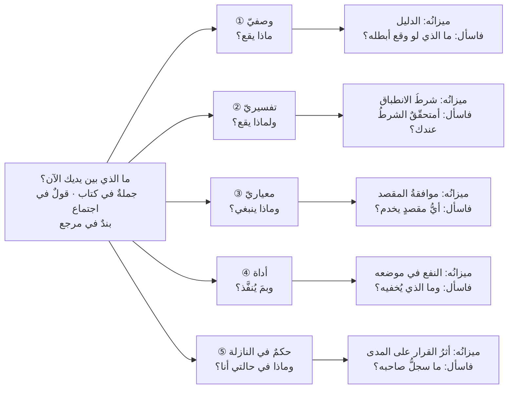
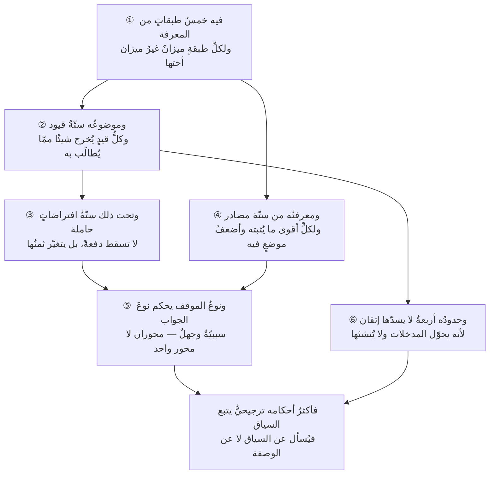

# الفصل 02 — طبيعة العلم وهويته — نوعه وموضوعه وحدوده

---

## 🏛️ لماذا تقرأ هذا الفصل؟

**المشكلة:** يقرأ الدارس كتابين معتبرين فيجدهما يتناقضان في حكم واحد، فيستنتج أنّ أحدهما مخطئ — والحقّ أنّ كليهما صائب في سياقه، لأنّ أكثر أحكام هذا العلم ترجيحيّة تتبع السياق لا قطعيّة.

**وماذا لو لم تعرف؟** من طلب في هذا العلم وصفةً لا تتغيّر أنفق عمره يبحث عمّا ليس فيه، ثم اتّهم العلم بالتفاهة حين لم يجدها. ومن ظنّ كلّ أحكامه رأيًا أهدر ما فيه من سنن ثابتة تُقاس.

**وبعد هذا الفصل ستستطيع:**

- **أن تميّز** — في أيّ كلامٍ يُعرض عليك في هذا المجال — بين **دعوى عن الواقع** تُطلب لها الأدلّة، و**حكمٍ عمّا ينبغي** يُطلب له المقصد، و**وصفِ أداةٍ** يُسأل عمّا تُخفيه لا عن صدقه؛ فلا تُجادل في دعوى وأنت تظنّها حكمًا، ولا تُسلّم لحكمٍ وأنت تحسبه قانونًا.
- **أن تحكم** على دليلٍ يُستشهد به أمامك بمرتبته لا بمصدره: أن تقول عن حالةٍ مفردة إنها تُثبت **الإمكان** وتُبطل دعوى كلّية ولا تُثبت **سببيةً** ولا **معدّلًا**، وأن تسأل عن كلّ تحسّنٍ أُعلن: كيف كان الحال قبله مباشرةً، وما الذي تغيّر معه في الوقت نفسه.
- **أن تصنّف** موقفًا أمامك بمحورين اثنين — أتُعرف علاقةُ السبب بالنتيجة قبل الفعل؟ أتُعرف احتمالاتُ النتائج؟ — فتختار الأسلوب على قدر الجواب: تحليلًا مسبقًا حيث يصحّ، وتجربةً حيث لا يصحّ، وخيارًا معماريًّا حيث لا تُجدي التجربةُ أصلًا.

> [!info] بطاقة الفصل
> **النوع:** تأسيسيّ
> **المستوى:** 🟢 مبتدئ
> **زمن القراءة:** نحو 40 دقيقة
> **أهمّيته في الباب:** ★★★★★
> **موضعك:** انتهيتَ من [[01 - لماذا هذا العلم]] ← **⬤ أنت هنا** ← يليه [[03 - فلسفة المشروع]]

> [!abstract] موقع هذا الفصل
> **يبني على:** [[Brooks's Law]] · [[Sunk Cost Fallacy]] — يُذكَر هنا ولا يُعاد شرحه.
> **ويؤسّس:** [[Cynefin]] · [[Knightian Uncertainty]] — يُقدَّم هنا أوّل مرّة فيصير متاحًا لما بعده.

---

## 🧭 السؤال المركزي

> [!question] السؤال الذي يجيب عنه هذا الفصل كلّه
> **أيُّ نوع من العلوم هذا، وماذا يترتّب على نوعه؟**

**واحمل معك هذه الأسئلة وأنت تقرأ:**

- هل يوجد في هذا العلم قانون لا يتخلّف؟
- لماذا ينجح الأسلوب نفسه في فريق ويفشل في آخر؟
- ما الذي لا تستطيع إدارةُ المشاريع أن تحلّه مهما أُتقنت؟

---

## 🗺️ الجواب المختصر — قبل التفصيل

هذا العلم **ليس نوعًا واحدًا من المعرفة**، وأكثرُ الجدل حوله ناشئٌ من افتراض أنه كذلك. فيه **طبقةٌ وصفية** تقول ما يقع في الواقع — وهي تُقاس وتُختبر ويمكن أن يُقال ما الذي يُبطلها، وهي أقربُ ما فيه إلى القانون. وفيه **طبقةٌ معيارية** تقول ما ينبغي أن يُفعل — وهذه لا تُوصف بصدقٍ ولا كذب، وإنما بموافقة مقصدٍ في سياق. وفيه **أدواتٌ مصنوعة** تُقاس بنفعها لا بصدقها، و**حكمٌ في النازلة** لا يَنقله نصٌّ ولا يُختبر بامتحان. **ومن وزن طبقةً بميزان غيرها خرج بحكمٍ باطل، ثم نسبه إلى العلم لا إلى ميزانه.** **وحتى طبقتُه الوصفية لا تبلغ يقين الفيزياء، ولن تبلغه بمزيدٍ من البحث** — لأنّ موضوعها بشرٌ يقرؤون ما يُكتب عنهم فيتغيّرون به، والإلكترون لا يفعل.

**ويترتّب على هذا التركيب أثرٌ عمليّ يمسّ كلَّ يومٍ من عملك:** أنّ أكثر أحكامه **ترجيحيّةٌ تتبع السياق** لا قطعيّةٌ تصدق في كل حال — لأنّها مبنيّةٌ على ستّة افتراضاتٍ عن الواقع لا يسقط منها شيءٌ عادةً، ولكن **يتغيّر ثمنُه** من بيئةٍ إلى أخرى فتتحرّك معه نقطةُ التوازن. ولأنّ ما يصحّ من الأساليب تابعٌ لنوع الموقف: **أتُعرف علاقةُ السبب بالنتيجة قبل الفعل؟ وأتُعرف احتمالاتُ النتائج؟** — ومن هنا نجح الأسلوب نفسه في فريقٍ وتعثّر في آخر، بلا أن يكون أحدهما مقصّرًا. **فالسؤال الصحيح ليس «أيُّ منهجيةٍ أفضل؟» بل «أيُّ نوعٍ من المشكلات هذه؟»**

**وما بقي من هذا الفصل تحريرٌ لهذا الجواب في ستّ خطوات:**

1. الطبقاتُ الخمس وميزانُ كلٍّ منها.
2. موضوعُ العلم مفكَّكًا قيدًا قيدًا وما يُخرجه كلُّ قيد.
3. الافتراضاتُ الستّة الحاملة وماذا لو تغيّر ثمنُها.
4. مصادرُ المعرفة فيه ومراتبُها — ومتى تكون حالةٌ واحدة حجّةً قاطعة ومتى لا تُثبت شيئًا.
5. المحوران اللذان يُصنَّف بهما الموقف.
6. أربعةُ حدودٍ لا يستطيعها هذا العلم مهما أُتقن.

> [!abstract] مفاهيم يُدخلها هذا الفصل في قاموسك
> `Cynefin` · `Knightian Uncertainty`

> [!warning] مفاهيم يكثر الخلط بينها هنا
> `Risk` مقابل `Uncertainty` مقابل `Complexity` — احملها في ذهنك، فالفصل يفرّقها في محطّة التمييز.

---

## 🧱 الفكرة الأولى: العلوم ليست سواء، وهذا العلم مركّب لا واحدٌ منها

*موضعها من الفصل: هذه أوّل خطوةٍ في التحرير، وموضعها أن يُقام الميزان قبل أن يُوزن به شيء — فما لم يُعرف أنّ في هذا العلم خمسَ طبقاتٍ لا طبقةً واحدة، لم يُعرف أيُّ سؤالٍ يصحّ أن يُسأل عن كلّ جملةٍ فيه. **وما بعدها من الأفكار الخمس كلُّها يُصنَّف بهذه الطبقات.***

**الفكرة الرئيسة:** السؤال الذي يُفتتح به كلُّ جدلٍ حول هذه الصنعة — «أهي علمٌ أم فنّ؟» — سؤالٌ رديء الوضع، لأنه يفترض أن ما فيها نوعٌ واحد من المعرفة يُقبل جملةً أو يُردّ جملةً. والذي فيها **خمس طبقاتٍ مختلفة**، لكلِّ طبقةٍ ميزانٌ يُوزن به غير ميزان أختها. ومن وزن طبقةً بميزان غيرها خرج بحكمٍ باطل، ثم نسب البطلان إلى العلم لا إلى ميزانه الذي أخطأ اختياره.

> [!question] سؤالٌ احمله معك في هذه الفكرة
> **لماذا يختلف خبيران كبيران، وكلٌّ منهما يملك الأدلّة، ثم يوصي كلٌّ منهما بنقيض ما يوصي به صاحبه؟**
>
> الجواب الذي يتبادر أنّ أحدهما لم يبلغه ما بلغ الآخر، فيُنفَق النقاش في تبادل الشواهد. **والأقربُ أنّهما لا يختلفان في الواقع أصلًا** — إنما يتكلّم كلٌّ منهما من **طبقةٍ** غير طبقة صاحبه، أو يُحسّن على **مقصدٍ** غير مقصده ولم يُعلنه واحدٌ منهما.
>
> وستجد جواب هذا السؤال في موضعين من هذه الفكرة: في **الطبقات الخمس** أوّلًا، ثم في **قاعدة هيوم** آخرًا. فإن عرفتَ الجواب عرفتَ معه لماذا لا يُحسَم مثلُ هذا الخلاف بمزيدٍ من الأدلّة.

### الطبقات الخمس — وميزانُ كلِّ واحدة

1. **طبقةٌ وصفية (Descriptive):** دعاوى عمّا **يقع** في الواقع. مثالها: أن إضافة أشخاص إلى مشروعٍ متأخّر تزيده تأخّرًا في الغالب ([[Brooks's Law|قانون بروكس]])، وأن طوابير الانتظار تنشأ عند كل موردٍ يقترب من الاستغلال الكامل، وأن التقدير البشري يميل إلى التفاؤل ميلًا منتظمًا لا عشوائيًّا. **وميزانها الدليل:** تصدق أو تكذب، ويمكن أن يُقال ما الذي لو وقع لأبطلها. وهذه أقربُ ما في العلم إلى القانون.
2. **طبقةٌ تفسيرية (Explanatory):** لا تصف ما يقع بل تقول **لماذا** يقع، بآليّاتٍ مستعارة من علومٍ أخرى: نظرية الطوابير، ونظرية القيود، وديناميكا النظم، والاقتصاد السلوكي. **وميزانها شرطُ الانطباق:** أن يُذكر الشرط الذي تصحّ الآليّة تحته، فالنموذج المستعار بلا شرطه دعوى بلا سند — وهذا موضع أكثر ما يُقال في هذا المجال بلسان العلم وليس منه.
3. **طبقةٌ معيارية (Normative):** أحكامٌ عمّا **ينبغي** أن يُفعل: «رتّب قائمة الأعمال بالقيمة»، «حدّد تعريفًا للاكتمال»، «راجع الخطّة دوريًّا». **وميزانها موافقةُ المقصد في السياق**، لا الصدقُ ولا الكذب. فالحكم المعياريّ لا يُوصف بأنه «صحيح» وصفَ الدعوى الوصفية، وإنما يُوصف بأنه **مناسبٌ لغرضٍ في حالٍ معلومة**.
4. **طبقةٌ آليّة صناعية (Technē):** الأدوات والمصنوعات — مخطّط جانت (Gantt)، ولوح كانبان (Kanban)، وقائمة الأعمال، ومصفوفة المخاطر، ونقاط القصّة. وهذه **مُخترَعة لا مكتشَفة**: لم تكن في الطبيعة فتُستخرج، بل صنعها بشرٌ لغرض. **وميزانها النفع في موضعها**، فيُسأل عنها: ما الذي تُظهره وما الذي تُخفيه؟ ولا يُسأل عنها: أصادقةٌ هي أم كاذبة؟ — فذلك سؤالٌ لا معنى له في حقّ مطرقة.
5. **طبقةُ الحكم في النازلة (Phronēsis):** أن تعرف — في هذه الحالة بعينها، بهؤلاء الناس، في هذا الأسبوع — أيَّ حكمٍ معياريٍّ تُقدّم وأيَّ أداةٍ تختار وأيَّ قاعدةٍ تُعلّق. **وميزانها أثرُ قراراتك على مدىً طويل**، وهي وحدها التي لا يَنقلها نصٌّ ولا تُختبر بامتحان.

**وهذا الترتيب ليس هرمًا يعلو بعضه بعضًا.** الطبقات الخمس تعمل معًا في القرار الواحد: تلاحظ أمرًا (وصفيّ)، فتفسّره بآليّة (تفسيريّ)، فتشتقّ منه ما ينبغي فعله بحسب مقصدك (معياريّ)، فتختار له أداةً تُنفّذه (آليّ)، ثم تقرّر متى تُخالف كلَّ ذلك لأن حالتك ليست الحالة العامّة (حكم).

**وهذه صورةُ الطبقات وموازينها في نظرةٍ واحدة:**

*والخريطة فروعٌ متوازية لا سُلَّمٌ يُصعَد: خمسةُ أجوبةٍ ممكنة لسؤالٍ واحد، ليس بينها علوٌّ ولا تدرُّج — فليست الطبقة الخامسة «أعلى» من الأولى، ولا الرابعة مبنيّةً على الثالثة. وما يجمعها أنّ السؤال واحد، وما يفرّقها أنّ الجواب في كلٍّ منها يُطلب من ميزانٍ غير ميزان أختها. وقد رُسم لكلّ طبقةٍ ميزانُها وسؤالُها معًا، لأنّ معرفة الطبقة بلا ميزانها تسمية لا تنفع.*

### ولماذا لا تبلغ طبقتُه الوصفية يقينَ الفيزياء؟

يخطر هنا سؤالٌ لا يُجاب عنه في أكثر ما يُكتب في هذا الباب، وتركُه هو ما يجعل القارئ يظنّ أنّ في العلم نقصًا سيُسدّ يومًا: إن كانت الطبقة الأولى **تُقاس وتُختبر**، فلماذا لا تُنتج قوانين لا تتخلّف كقوانين الفيزياء؟ ولماذا يُقال فيها «في الغالب» و«يميل إلى» ولا يُقال «يقع»؟

**والجواب في موضوع العلم لا في نضجه.** فموضوع الفيزياء مادّةٌ لا تعلم أنّها تُقاس: لا يبلغ الإلكترونَ أنّ لك فرضيةً عنه فيسعى إلى تصديقها أو تكذيبها، ولا يغيّر مسارَه لأنّك نشرتَ عنه ورقة. **وموضوع هذا العلم بشرٌ ومؤسّسات: يتعلّمون، ويتوقّعون، ويقرؤون القاعدة التي وُضعت لوصفهم — ثمّ يتصرّفون على ما قرؤوا.** فالقاعدة في الفيزياء **خارج** ما تصفه، والقاعدة هنا **جزءٌ منه**.

**وأظهرُ صوره ما يقع بمجرّد إعلان المقياس.** فإن أُعلن في فريقٍ أنّ الإدارة ستقيس عددَ الأسطر البرمجية، تغيّر ما يفعله الفريق في الأسبوع نفسه — لا لأنّ أحدًا نوى الخداع، بل لأنّ الناس يتّجهون إلى ما يُقاسون به اتّجاهًا تلقائيًّا لا يشعرون به. فيصير المقياسُ الذي وُضع ليصف الإنتاج **علّةً في تشويهه**، وهو [[Goodhart's Law|قانون غودهارت]] في أصله. **ولا نظير لهذا في المادّة أصلًا:** لا يوجد ترمومترٌ إذا أُعلن أنّه سيُقاس به ارتفعت الحرارةُ استجابةً للإعلان.

**ويترتّب على هذا ثلاثةُ أشياء عملية:**

1. **ألّا يُنتظر من هذا العلم يقينٌ من ذلك النوع** — ومن انتظره ردَّ العلمَ كلَّه لأنّه لم يجد فيه ما ليس فيه، وهي بعينها الحفرة التي مرّت في مقدّمة هذه الفكرة.
2. **أن تُقرأ قيود الدعوى الوصفية جزءًا منها لا تحفّظًا لفظيًّا.** فقولنا «إضافة أشخاصٍ إلى مشروعٍ متأخّر تزيده تأخّرًا **ما لم يكن العمل قابلًا للتجزئة التامّة**» ليس تلطيفًا للعبارة؛ **القيدُ هو نصفُ القاعدة**، ومن حذفه لم يختصرها بل غيّرها.
3. **أنّ كلّ مقياسٍ تُعلنه تدخّلٌ لا رصد.** فأنت تعلن ما تقيس وأنت تعلم أنّك تغيّر ما تقيسه — ولذلك كان السؤال عن كلّ مؤشّرٍ سؤالين: ماذا يقيس؟ **وكيف سيتصرّف الناس حين يعلمون أنّه يُقاس؟**

**وليست هذه نقيصةً في العلم تُرجى إزالتها بمزيدٍ من البحث؛ هي صفةُ موضوعه.** ولو بلغ هذا العلم يقين الفيزياء يومًا، لكان ذلك دليلًا على أنّ الناس كفّوا عن التعلّم.

### والنموذج تبسيطٌ مقصود، لا نسخةٌ مصغّرة من الواقع

الطبقة الثانية كلُّها تعمل بالنماذج: نظريةُ الطوابير، ونظريةُ القيود، وإطارُ كونيفين، والمثلّث الحديديّ. وقلّ من يقف عند السؤال الذي تحتها جميعًا: **وما النموذج أصلًا؟**

> [!summary] حدّ النموذج
> **تبسيطٌ مقصود للواقع، يحذف منه عمدًا ليُبقي ما يكفي لاتّخاذ قرار.**

**والكلمة الحاكمة فيه «مقصود».** فليس النموذج صورةً ناقصة وقع فيها النقص سهوًا، ولا نسخةً مصغّرة من الواقع؛ **الحذفُ فيه هو الصنعة**، وهو ما يجعله يُرى ويُحمَل ويُتداوَل في اجتماع. ويلزم من هذا لازمٌ يبدو مفارقًا وهو أدقّ ما في الباب: **كلُّ نموذجٍ نافعٍ نافعٌ لأنّه ناقص.** فلو استوعب تفاصيل الواقع كلَّها لصار الواقعَ نفسَه، ولاحتاج بدوره إلى نموذجٍ يُفهم به.

> [!note] نموذج ذهني من خارج المجال — خريطتان لمدينةٍ واحدة
> خذ خريطة مترو الأنفاق: هي **تكذب في المسافات والاتّجاهات عمدًا** — تُقوّم الخطوط المنحنية، وتُسوّي البُعد بين المحطّات المتباعدة والمتقاربة. ومع ذلك هي أفضلُ ما بيدك لتعرف: من أين أركب، وأين أبدّل، وكم محطّةً تبقى.
>
> وخذ خريطة التضاريس للمدينة نفسها: صادقةٌ في المسافات والارتفاعات، **ولا تكاد تنفعك في معرفة خطوط المترو**.
>
> **ولا يُقال إنّ إحداهما صحيحة والأخرى خاطئة؛ يُقال إنّ كلًّا منهما رُسمت لسؤالٍ آخر.** ومن حمل خريطة المترو ليمشي على قدميه ضلّ الطريق، ثمّ لام الخريطة — وهي لم تَعِده بشيءٍ من ذلك.
>
> **وأطرُ هذا المجال خرائط بهذا المعنى حرفًا بحرف:** فمنها ما يرسم إيقاع المراجعة والتعلّم داخل فريقٍ واحد ويصمت عن التنسيق بين عشرين فريقًا، ومنها ما يرسم مسير العمل عبر المنظّمة كلّها ويصمت عن كيف يُبنى الشيء داخل الفريق. **فالسؤال ليس أيُّها أصدق، بل أيُّ سؤالٍ رُسمت له** — وتفصيل ذلك في [[11 - لماذا اختلفت المدارس]].

**وثمنُ التبسيط يُدفع دائمًا، والذي يميّز الممارس أنّه يعرف مقدارَه.** فكلّما ارتفع التجريد اتّسع مدى الانطباق **وقلّت دقّة التوجيه في الحالة المفردة**، والعكس بالعكس:

| القول | مداه | وماذا يفعل بك غدًا |
|---|---|---|
| «الموارد محدودة، فكلُّ نعمٍ هي لا لشيءٍ آخر» | يصدق في كلّ مكانٍ وزمان | لا يقول لك ماذا تفعل صباح الغد |
| «قسِّم الفريق إذا جاوز التسعة» | يصدق في بعض الأحوال | يقول لك ماذا تفعل — وقد يكون خطأً في نصف الحالات |

**فلا يوجد قولٌ واسعُ الانطباق دقيقُ التوجيه معًا.** وكلُّ صعودٍ في سلّم التجريد يشتري اتّساعًا بثمنٍ من الدقّة، وكلُّ نزولٍ يشتري دقّةً بثمنٍ من الاتّساع. **ولازمُ ذلك في القراءة:** أن تُقرأ القاعدة العامّة **قيدًا يوجّه بحثك** لا وصفةً تُنفَّذ، وأن تُقرأ التوصية الدقيقة **معايرةً لسياقٍ بعينه** يُسأل عن شروطه قبل نقلها — وتحرير هذا الفرق في [[08 - القواعد الكلية وسنن المشاريع]].

**ومن هنا تُفهم الطبقة الخامسة على وجهها، فليست زيادةً في العدّ:** كلُّ إطارٍ نموذج، وكلُّ نموذجٍ حذف، وما حُذف منه لا يزول من واقعك — إنّما يزول من الصفحة. **فكلُّ إطارٍ ناجحٍ يفترض عقلًا يفكّر، وليس فيها إطارٌ يحلّ محلّ التفكير.** ومن وجد إطارًا يُغنيه عن الحكم في نازلته، فقد وجد إطارًا حذف نازلته لا أكثر.

> [!note] الأداة لا تحلّ المشكلة، بل تجعلها مرئية
> يُشترى اللوحُ والنظامُ والمخطّط على أنّها **حلول**، وهي في حقيقتها **عدساتٌ**؛ ومن اشترى عدسةً وهو ينتظر منها دواءً خرج بخيبةٍ يلوم بها الأداة:
>
> - **كانبان لا يُزيل الاختناق؛ يُظهره.** فالعملُ المتكدّس أمام مرحلةٍ واحدة كان متكدّسًا قبل اللوح، ولكن في رؤوس الناس لا على جدارٍ يراه الجميع.
> - **ولوحةُ المخاطر لا تمنع الخطر؛ تمنع تجاهله.** فالخطر الذي لم يُكتب يقع كما يقع المكتوب، وإنما يفترق الحالان في أنّ أحدهما وقع وقد أُعدّ له.
> - **ومخطّط الاحتراق لا يُسرع الفريق؛ يُقدّم موعدَ السؤال** عن الفجوة بين ما بقي من عملٍ وما بقي من وقت — فيُطرح في أسبوعٍ يمكن أن يُفعل فيه شيء، لا في أسبوعٍ لا يمكن.
>
> **وقاعدةٌ عملية تجمع الثلاثة: الأداةُ تُضخّم النظام القائم ولا تُنشئ سواه.** فالفريق المنضبط يزداد بنظامٍ كجيرا (Jira) انضباطًا، إذ يجد فيه ما يحفظ ترتيبَه ويُذكّره بما نسي. **والفريق المضطرب يجد فيه اضطرابَه معروضًا في لوحةٍ أوضح:** تذاكر فُتحت قبل أشهر ولا يعرف أحدٌ حالها، وأولوياتٌ متساوية كلُّها «عاجل»، وحقولٌ إلزامية تُملأ بلا معنى. **ولا يُزيل النظامُ شيئًا من ذلك؛ يجعله مكتوبًا** — وهذه فائدةٌ حقيقية إن قُصدت، وخيبةٌ مؤكّدة إن انتُظر منها الإصلاح.
>
> **فالأداة تنقل المشكلة من حيّز الظنّ إلى حيّز النظر، ويبقى الحلُّ قرارًا يتّخذه بشر.** ومن هنا كان السؤال عن كلّ أداةٍ سؤالين لا واحدًا: ما الذي تُظهره؟ **وما الذي تُخفيه بإظهارها؟** — فكلُّ إظهارٍ اختيار، وما لم تختره الأداةُ يصير بعدها أخفى ممّا كان قبلها، لأنّ العين استراحت إلى ما تُريها.

### فلماذا يظنّ الناس أنّ هذا العلم منهجياتٌ وأدوات؟

لأنّ **الطبقة الرابعة وحدها هي التي تُرى**. فسكرم له اسمٌ ومعتمَدون وشهادات، وكانبان له لوحٌ يُعلَّق على جدار، وجيرا (Jira) له اشتراكٌ شهريّ وشاشةٌ تُفتح كلَّ صباح. أمّا الطبقةُ الوصفية فلا شعار لها، والافتراضاتُ الستّة لا يذكرها كتاب، والمقصدُ الذي تُحسّن عليه لا يُشترى بترخيص.

**فيقع خطأٌ في التسمية قبل أن يقع في الفهم:** يُسمّى ما يُرى باسم الكلّ، فيصير «إدارةُ المشاريع» في ذهن السامع مجموعةَ أدواتٍ ومنهجيات — ويصير تعلّمُها تعلُّمَ استعمالها.

**ولازمُ هذا الخطأ أثرٌ يُرى في التقارير:** أن يُقاس نجاحُ المشروع بانضباط أداته. فاللوحُ محدَّث، والتذاكرُ مغلقة، والتقاريرُ تصدر في موعدها — ويُسلَّم منتجٌ لا ينتفع به أحد. **وانضباطُ الأداة يقول إنّ الأداة تعمل، ولا يقول إنّ العمل يعمل.**

**وأمارةُ أنّ هذا الخطأ ليس خطأ المبتدئين وحدهم** أنّ مرجعًا في وزن `PMBOK` راجع صورةَ عرضه لأجله — وتفصيلُه في صندوق «موضعان تسامحت فيهما مراجع منشورة» آخر هذا الفصل.

### أين الخصومة الحقيقية إذن؟

الذي يقول «هذا ليس علمًا» ينظر إلى الطبقة **المعيارية** ويطلب منها ما يُطلب من الطبقة **الوصفية**: برهانًا مثل براهين الفيزياء. ولن يجده، لأن الأحكام المعيارية ليست من جنس ما يُبرهَن — إذ لا يُبرهَن على «ينبغي» إلا بعد أن يُسلَّم بمقصد.

والذي يقول «هذا علمٌ محكم» ينظر إلى الطبقة **الوصفية** فيجد فيها ما يُقاس فعلًا — الطوابير تتكوّن، والتقدير ينحاز، والإنتاجية تنهار عند حدٍّ معلومٍ من العمل المتوازي — ثم يُعمّم الإحكام على الطبقات كلّها، فيُلبس أداةً أو حكمًا معياريًّا ثوبَ القانون.

**فكلاهما ينظر إلى طبقةٍ ويحكم على البناء.** والسؤال الصحيح ليس «أعلمٌ هو أم فنّ؟» بل: **أيّ طبقةٍ من طبقاته أنا فيها الآن؟** — وهذا سؤالٌ يُجاب عنه في جملةٍ واحدة، ويغيّر ما تطلبه من محدّثك تغييرًا كاملًا.

### القاعدة التي تُغني عن نصف الجدل: لا يُشتقّ الحكم من الوصف وحده

نبّه **ديفيد هيوم** في *A Treatise of Human Nature* (1739) على أن الانتقال من قضايا «هو كذا» إلى قضايا «ينبغي كذا» انتقالٌ لا يستقيم إلا بمقدّمةٍ ثالثة مسكوتٍ عنها — وهي **المقصد**. وهذه الملاحظة الفلسفية القديمة هي أنفعُ ما في هذا الفصل للممارس، لسببٍ عمليّ محض:

> [!note] نموذج ذهني من خارج المجال — الطبُّ لا يُفتي في القانون
> يقول الطبّ: **التدخين يرفع احتمال المرض.** وهذه دعوى وصفية بيّنة: تُقاس، وتُختبر، ويمكن أن يُقال ما الذي لو وقع أبطلها — ولا يكاد يخالف فيها طبيبان.
>
> ثم يُسأل سؤالٌ آخر: **أفيُمنع التدخين بالقانون؟** وهذا سؤالٌ **لا يجيب عنه الطبّ**، وإن كان لا يُسأل إلا بعده. فجوابه موازنةٌ بين أشياء ليست من الطبّ في شيء: حرّيةُ الفرد، وكلفةُ الإنفاذ، وما تُنتجه السوق السوداء، وأثرُ ذلك في الفقراء دون غيرهم، وما الذي تريده هذه الدولةُ بعينها من مواطنيها.
>
> **ولذلك يتّفق طبيبان على الأولى ويختلفان في الثانية بلا أن يكون أحدهما أضعفَ علمًا.** فالطبيبُ الذي يوصي بالمنع لا يوصي به بوصفه طبيبًا؛ يوصي به بوصفه صاحبَ مقصدٍ اختاره، وقد استعان بعلمه في الطريق.
>
> **وصنعتُك على هذا حرفًا بحرف:** «إضافة أشخاص إلى مشروعٍ متأخّر تزيده تأخّرًا» هي الطبّ. و«فلا تُضِف» هي القانون. وبينهما مقصدٌ لم يُقل.

خذ الدعوى الوصفية: *إضافة أشخاص إلى مشروعٍ متأخّر تزيده تأخّرًا.* ماذا يلزم منها عملًا؟ **لا شيء بمفردها.** فإن كان مقصدك ألّا يتأخّر التسليم، لزم ألّا تضيف. وإن كان مقصدك أن تبني طاقةً دائمة لخطٍّ سيمتدّ ثلاث سنوات — وأنت تقبل تأخّر هذا الإصدار ثمنًا لذلك — فالإضافة **صحيحة**، والدعوى الوصفية نفسها لم تتغيّر؛ إنما تغيّر ما تريده منها.

**ولازم هذا لازمٌ ثقيل:** أن خبيرين ينظران إلى الواقع نفسه، ويتّفقان على الدعاوى الوصفية كلّها، ثم **يوصيان بالنقيضين** — بلا أن يكون أحدهما جاهلًا. لأن خلافهما ليس في الوصف بل في المقصد المضمَر. ومن لم يفطن لذلك أنفق النقاش في تبادل الشواهد، وهي ليست موضع الخلاف أصلًا.

**والعلاج جملةٌ واحدة تُقال في أوّل الاجتماع لا في آخره:** *على أيّ شيء نُحسّن؟* فإن لم يُحسم هذا، فكلُّ ما بعده جدلٌ في الوسائل وقد اختُلف في الغايات.

> [!example] استشاريان، ورأيان متناقضان، وكلاهما مصيب
> فريقٌ في جدّة من أحد عشر مطوّرًا يعمل على منتجٍ واحد، والتسليم يتعثّر. استُشير اثنان.
>
> **قال الأوّل:** قسّموه فريقين مستقلّين، لكل فريقٍ نطاقُه ومالكُ منتجه. وحجّته وصفية صحيحة: كلفةُ التنسيق في فريقٍ من أحد عشر أضعافُها في فريقين من خمسة وستّة، والوقت الضائع في المزامنة يُرى في التقويم.
>
> **وقال الثاني:** لا تقسّموه الآن. وحجّته وصفية صحيحة أيضًا: التقسيم يستلزم فصلًا في الشيفرة والملكية لم يُنجَز بعد، فسيُنتج فريقين يتعثّر كلٌّ منهما بالآخر، وتُدفع كلفةُ الانتقال كاملةً بلا أن تُقبض ثمرتُها.
>
> **ولم يكن أحدهما جاهلًا بحجّة صاحبه.** كان الأوّل يُحسّن على **الإصدار القادم بعد أربعة أشهر**، والثاني يُحسّن على **قدرة المنظّمة بعد سنتين**. فلمّا سُئلا صراحةً: «على أيّ شيء نُحسّن؟» انحسم الأمر في عشر دقائق — واختير التقسيم مؤجَّلًا إلى ما بعد الإصدار، بشرطِ أن يبدأ فصلُ الملكية في الشيفرة من الأسبوع القادم.
>
> والذي حسمه لم يكن دليلًا جديدًا؛ كان **إعلانَ المقصد**.

> [!tip] كيف تستعمل هذه الفكرة — خمسةُ أسئلةٍ تُغني عن حفظ الفصل
> ضع على كلّ جملةٍ تُقال في هذا المجال — في كتاب، أو دورة، أو اجتماع — خمسةَ أسئلةٍ بترتيبها، وقف عند أوّل واحدٍ يُجاب بنعم؛ فإنّ جوابه يقول لك **ماذا تطلب بعده**:
>
> 1. **«هل تصف ما يقع؟»** → دعوى وصفية. فاطلب دليلها، واسأل عمّا لو وقع أبطلها.
> 2. **«هل تفسّر لماذا يقع؟»** → نموذجٌ تفسيريّ. فاطلب شرطَ صحّته، واسأل: أمتحقّقٌ عندنا؟
> 3. **«هل توصي بشيء؟»** → حكمٌ معياريّ. فاطلب مقصده أوّلًا؛ فالحكم بلا مقصدٍ معلَن لا يُقبل ولا يُردّ.
> 4. **«هل تصف أداة؟»** → فاسأل: ما الذي تُظهره وما الذي تُخفيه؟ ولا تسألها عن صدقها.
> 5. **«هل هي اجتهادٌ في حالةٍ بعينها؟»** → حكمٌ في النازلة. فاسأل عن سجلّ صاحبه: في كم حالةٍ حكم، وأين أخطأ، وبمَ عرف أنه أخطأ.
>
> **وهذه الخمسة هي الطبقاتُ الخمس نفسُها مقلوبةً إلى أسئلة**؛ فمن حفظها لم يحتج أن يحفظ سواها من هذه الفكرة.
>
> وأكثرُ ما ستجده في الكتب من النوع الثالث معروضًا بلسان النوع الأوّل. وأنت لا تحتاج أن تردّه؛ تحتاج أن تُعيده إلى مرتبته، فتعرف ماذا تطلب منه.

> [!warning] الحفرة الشائعة — إنزال الحكم المعياريّ منزلة القانون
> تُقرأ عباراتٌ من قبيل «دليل سكرم (Scrum) ينصّ على…» أو «معيار المؤسّسة يوجب…» كأنها قوانين طبيعية لا تُخالَف. وهي في حقيقتها **أحكامٌ معيارية اختارها بشرٌ لمقصدٍ صرّحوا به أو أضمروه**، وهي بذلك قابلة للنقاش والمخالفة بحجّة.
>
> **ولا يعني هذا التهوينَ من المراجع.** فالمرجع يحمل خلاصةَ تجربةٍ واسعة، ومخالفتُه بلا حجّةٍ حمق. إنما يعني أن الحجّة الصحيحة في مخالفته ليست «نحن مختلفون»، بل: *المقصد الذي وُضع لأجله هذا الحكم يتحقّق عندنا بطريقٍ آخر، وهذا بيانه.*
>
> **وصورةٌ مصغّرة تقع فعلًا:** فريقٌ من أربعةٍ يجلسون في غرفةٍ واحدة ويتكلّمون طول اليوم. تسألهم: لماذا تعقدون الوقفة اليومية؟ فيكون الجواب: «لأنّها في الدليل». وهذا جوابٌ عن **مصدر** الحكم لا عن **مقصده**، ولذلك لم يستطع أحدٌ منهم أن يقول أيَّ شيءٍ تُنتجه الوقفة عندهم لا يُنتجه جلوسُهم معًا. فبقيت تُعقد ولا تُراجَع — لا لأنّها نافعة ولا لأنّها غير نافعة، **بل لأنّ السؤال عنها صار يُقرأ مخالفةً**. ولو عُرف مقصدُها — أن يفحص المطوّرون تقدّمهم نحو هدفهم ويعدّلوا خطّتهم — لأمكنهم أن يحكموا: أمتحقّقٌ هذا عندنا بطريقٍ آخر أم لا؟ **وهذا الحكم بعينه هو ما مُنعوا منه حين نُزّل الحكم المعياريّ منزلة القانون.**
>
> **والعلامة الفارقة:** من قال «هذا هو الصواب» فقد أوقف النقاش، ومن قال «هذا يخدم هذا المقصد، فإن كان مقصدنا غيره فلننظر» فقد فتحه. والفرق بينهما ليس تواضعًا في اللفظ؛ هو **دقّةٌ في مرتبة الدعوى**.

> [!question]- تأكّد أنك فهمت — قال لك زميلٌ: «الدراسات تُثبت أن الفرق الصغيرة أنجح، فيجب أن نقسّم فريقنا.» فأين الخلل في هذه الجملة؟
> **الخلل أنها ركّبت طبقتين وجعلتهما واحدة.**
>
> فالشقّ الأوّل — أن الفرق الصغيرة أقلّ كلفةً في التنسيق — **دعوى وصفية** لها سندٌ معتبر، وهي بذلك محلّ نظرٍ في دليلها وحدوده.
>
> والشقّ الثاني — «فيجب أن نقسّم فريقنا» — **حكم معياريّ** لا يلزم من الأوّل بحال، لأنه يحتاج مقدّمةً ثالثة لم تُقل: *أن مقصدنا الآن هو تقليل كلفة التنسيق، وأنه أولى من كلفة الانتقال ومن أيّ مقصدٍ آخر يزاحمه.*
>
> **والجواب الصحيح ليس «هذا غير صحيح»**، بل: «الشقّ الأوّل مقبول. فعلى أيّ شيء نُحسّن هذا الربع؟ فإن كان جوابنا كذا لزم ما تقول، وإن كان كذا لزم غيره.»

> [!summary]- خلاصة الفكرة في سطرين
> **خمسُ طبقاتٍ في هذا العلم، لكلِّ طبقةٍ ميزانٌ غيرُ ميزان أختها؛ ومن وزن طبقةً بميزان غيرها خرج بحكمٍ باطلٍ ثمّ نسبه إلى العلم لا إلى ميزانه.**
> **والسؤال الذي يُغني عن نصف الجدل جملةٌ واحدة:** أيُّ طبقةٍ أنا فيها الآن؟ — فمن أجاب عنه قبل أن يُجادل، وجد أنّ أكثر ما كان يجادل فيه ليس محلَّ خلافٍ أصلًا.

> [!question] تأمّلٌ تطبيقيّ — لا جواب له في هذا الفصل
> في اجتماعك القادم، أنصت عشر دقائق ولا تشارك، واكتب **ثلاث جملٍ** قيلت فيه، وضع أمام كلٍّ منها طبقتها من الخمس.
>
> ثمّ انظر في الخلاف الذي دار — إن دار: **أكان في المعلومة نفسها، أم في أنّ كلَّ طرفٍ يتكلّم من طبقةٍ غير طبقة صاحبه؟** فإن كان الثاني، فالمزيد من الشواهد لن يحسمه، وجملةٌ واحدة تحسمه: *على أيّ شيءٍ نُحسّن؟*

---

## 🧱 الفكرة الثانية: موضوعه يُفكَّك كلمةً كلمة

*موضعها من الفصل: عُرفت طبقاتُ المعرفة في هذا العلم وموازينُها، ويبقى سؤالٌ سابقٌ عليها كلِّها: فيمَ ينظر أصلًا؟ **وتفارق هذه الفكرةُ سابقتَها بأنّ تلك سألت عن نوع ما يُقال، وهذه تسأل عن الشيء الذي يُقال فيه.***

**الفكرة الرئيسة:** لكل علمٍ **موضوعٌ** هو الشيء الذي يبحث في أعراضه، وحدُّ العلم غير موضوعه: الأوّل يقول **ما هو**، والثاني يقول **فيمَ ينظر**. وقد أُثبت حدُّ هذه الصنعة في [[01 - لماذا هذا العلم|الفصل السابق]]؛ وموضوعها هو:

> [!summary] موضوع العلم
> **تنظيمُ تحويلِ مواردَ محدودةٍ إلى قيمةٍ مقصودة، خلال زمنٍ محدَّد، مع إدارة التغيّر وعدم اليقين.**

وليست هذه عبارةً تُحفظ. **كلُّ قيدٍ فيها يُخرج شيئًا من الموضوع**، ومعرفةُ ما أُخرج أنفعُ من معرفة ما أُدخل — لأن أكثر ما يُنسب إلى هذا العلم من عجزٍ إنما هو مطالبةٌ له بما أخرجه حدُّه أصلًا.

### القيود الستّة، وما يُخرجه كلُّ واحد

1. **«تنظيم»** — يُخرج **التنفيذ نفسه**. فمن يكتب الشيفرة يبني، ومن ينظّم لا يبني؛ ولذلك لا يُقاس مديرُ المشروع بما أنتجت يداه بل بما أمكن الفريقَ أن ينتجه. **وأثرُ هذا القيد عمليّ:** أنّ المنظِّم الذي انشغل بالتنفيذ ترك موضعه شاغرًا، ولن يشتكي أحدٌ من شغوره حالًا — إنما يظهر بعد شهرين في قراراتٍ لم تُتّخذ. وتفصيل هذا الحدّ في [[05 - ما ليس من إدارة المشاريع]].
2. **«تحويل»** — يُخرج **الحفظ والتشغيل المستمرّ**. فالنظام الذي يُشغَّل ويُصان ولا يتحوّل إلى حالٍ أخرى ليس مشروعًا؛ هو **عمليةٌ مستمرّة (Operations)**، ومقاييسها غير مقاييس المشروع: تُقاس بالاستقرار والاستمرارية لا بالتسليم والإغلاق. وتمييز المشروع من العملية المستمرّة موضعُه [[03 - فلسفة المشروع]].
3. **«موارد محدودة»** — يُخرج **ما لا ندرة فيه**. وحيث لا ندرة لا مفاضلة، وحيث لا مفاضلة **لا إدارة أصلًا** بل تنفيذٌ متتابع. وهذا يفسّر أمرًا يلاحظه كثيرون ولا يفسّرونه: أن مشروع الهواية الذي يعمل عليه صاحبه وحده لا يحتاج إدارةً بالمعنى الاصطلاحي — لا لأنه صغير، بل لأن مورده الوحيد وقتُ صاحبه، والمفاضلة فيه تجري في رأسه بلا كلفة نقلٍ ولا اتّفاق.
4. **«قيمةٍ مقصودة»** — يُخرج شيئين: **النشاطَ الذي لا يقصد شيئًا**، و**المُخرَجَ الذي لا يُحدث أثرًا**. ولفظُ «مقصودة» هو ثقلُ هذا القيد كلّه: فالقيمة ليست خاصّيةً في الشيء تُقاس فيه كما يُقاس وزنُه، بل **حكمٌ يُصدره منتفِعٌ بعينه في وقتٍ بعينه**. والذي يترتّب على ذلك أن القيمة تُقاس عند **المنتفِع لا عند المنتِج**، وأن ما لا منتفِع له لا قيمة له مهما أُتقن. وتفصيل الفرق بين النشاط والمُخرَج والأثر في المحطّة السادسة من هذا الفصل، وأصلُه في [[22 - Outputs and Outcomes]].
5. **«خلال زمنٍ محدَّد»** — يُخرج **ما لا نهاية له**. وليست البداية والنهاية تفصيلًا إداريًّا يُضاف للترتيب؛ هما **شرطُ إمكانِ الحكم**. فالذي لا ينتهي لا يُقال فيه نجح أو أخفق، وإنما يُقال فيه: ما يزال جاريًا — وهذه جملةٌ تصلح أن تُقال عشر سنوات. **ومن هنا** كان أخطرَ ما يُصيب المبادراتِ الكبرى أن تفقد نهايتها المعلنة، فتصير كِيانًا دائمًا يستهلك ولا يُحاسَب.
6. **«مع إدارة التغيّر وعدم اليقين»** — يُخرج **ما هو معلومٌ تامَّ المعرفة ومكرَّر**. فلو عُلم كلُّ شيء سلفًا لصار العمل **تنفيذًا** لا إدارة، ولكفت فيه الجدولة الحسابية. وهذا القيد بالذات هو ما تتفرّع عنه أكثرُ خلافات المجال، لأنه يقول ضمنًا إنّ **درجة الجهل تحكم أسلوب العمل** — وهو ما تفصّله الفكرة الخامسة من هذا الفصل.

### والقيد السابع: ولماذا «البرمجية» بالذات؟

يبقى بعد هذه الستّة قيدٌ في الاسم لا في الحدّ: أنها إدارة مشاريع **برمجية**. وليست هذه لافتةَ تخصّصٍ تُضاف؛ للبرمجيات ثلاث خصائص تجعل إدارتها تختلف عن إدارة ما يُبنى بالحديد والإسمنت. وقد وصفها **فريدريك بروكس** في *No Silver Bullet* (1986) بوصفها من الخصائص **الجوهرية** لا العرَضية — أي التي لا تُزيلها أداة:

- **اللامرئية (Invisibility):** ليس للبرمجية شكلٌ هندسيّ طبيعيّ يُرى فيُعرف منه ما تمّ وما بقي. فالجدار المبنيّ نصفُه يُرى نصفًا، والوحدة البرمجية المكتوبة «تسعين بالمئة» قد تكون في نصفها أو في عُشرها ولا يُعرف. **ولازمُ ذلك أن كلَّ ما نستعمله لقياس التقدّم بديلٌ عن الرؤية لا رؤية**: مخطّطُ الاحتراق، ونسبةُ الإنجاز، وعددُ المهامّ المغلقة. وكلُّ بديلٍ يقبل أن يُخدَع — وأشدُّها قابليةً للخداع أكثرُها اطمئنانًا في العين.
- **الطواعية (Changeability):** يُتوقَّع من البرمجية أن تتغيّر لأنها «طريّة»؛ ولا يُطلب من صاحب المبنى أن ينقل جدارًا حاملًا بعد صبّ السقف، ويُطلب من الفريق نظيرُ ذلك كلَّ أسبوع. **وهذه نعمةٌ ونقمة معًا:** هي التي تجعل تصحيح المسار ممكنًا، وهي نفسها التي تجعل [[Scope Creep|تمدُّد النطاق]] مرضًا مزمنًا لا حادثًا عارضًا.
- **التطابق (Conformity):** يُلزَم البرنامج بأن يوافق أنظمةً بشرية لم تُوضع بمنطقٍ رياضيّ — لوائحَ ضريبية، وهياكلَ إدارية، واستثناءاتٍ تراكمت في مؤسّسةٍ على مدى عشرين سنة. **فالتعقيد ها هنا مستورَد لا مولَّد**: ليس في البرمجة، بل في العالم الذي تصفه البرمجة. ولهذا لا يُصلحه مهندسٌ أمهر، إنما يُصلحه قرارٌ من صاحب العمل بأن يُبسِّط ما عنده.

> [!example] مشروعٌ سقط منه قيدٌ واحد فبقي ستّ سنوات
> جهةٌ تعليمية في الدمّام أطلقت مبادرةً اسمها «تحسين التجربة الرقمية». خُصّص لها فريقٌ من سبعةٍ وميزانيةٌ سنوية، وعُقد لها اجتماعٌ شهريّ يحضره وكيلٌ ومديران.
>
> بعد **ستّ سنوات** كانت المبادرة ما تزال قائمة، وقد أنتجت فعلًا عملًا معتبَرًا: تسع بوّاباتٍ محسَّنة، ونظامَ تذاكر، وتطبيقًا للجوّال. ولم يستطع أحدٌ أن يجيب عن سؤالٍ واحد طرحه مراجعٌ داخليّ: **هل نجحت؟**
>
> والعلّة أنّ القيد الخامس ساقط منها من أوّل يوم — **لا زمنَ محدَّدًا ولا نهايةَ معلنة**. فلم تكن هناك حالٌ يُقال إنها إن بُلغت فقد تمّ الأمر، فصارت المبادرة **جهةً تشتغل** لا **مشروعًا يُسلَّم**. وتبع ذلك أن سقط القيد الرابع أيضًا: إذ لمّا لم تكن ثمّة نهاية، لم يكن ثمّة أثرٌ يُقاس عندها، فحلّ محلَّه عدُّ ما أُنجز — وهو نشاطٌ يُعدّ لا قيمةٌ تُقاس.
>
> **والإصلاح لم يكن إلغاءها.** كان أن أُعيدت صياغتها ثلاثةَ مشاريع، لكلٍّ منها نهايةٌ ومقياسٌ واحد يُحكم به عندها، وبقي ما هو تشغيلٌ مستمرّ (الدعم والصيانة) خارجها بميزانيةٍ تشغيلية وبمقاييس استقرارٍ لا مقاييس تسليم.

> [!tip] كيف تستعمل هذه الفكرة
> إذا وُضع على مكتبك عملٌ يُسمّى «مشروعًا»، فامرره على القيود الستّة قبل أن تُعطيه أدوات المشروع:
>
> 1. **أهو تحويلٌ إلى حالٍ جديدة، أم تشغيلٌ مستمرّ سُمّي مشروعًا؟** فإن كان الثاني فأدواتُه غير أدواتك، ومقاييسُه غيرُ مقاييسك.
> 2. **أله نهايةٌ يُعرف عندها أنه تمّ؟** فإن لم تكن له نهاية، فأوّلُ عملٍ تعمله أن تصنع له واحدة — أو أن تُعلن أنه ليس بمشروع.
> 3. **أثمّ منتفعٌ بعينه يُقاس عنده الأثر؟** فإن كان الجواب «المؤسّسة» أو «المستخدم» على الإطلاق، فلا منتفعَ بعدُ، وما سيُقاس هو النشاط.
> 4. **أثمّ ندرةٌ حقيقية تُوجب المفاضلة؟** فإن كان كلُّ ما طُلب ممكنًا بلا مزاحمة، فأنت أمام قائمة مهامّ لا مشروع، ولا تُثقلها بجهازٍ لا تحتاجه.
>
> **والفائدة العملية لهذا الفحص ليست التصنيف؛ هي أنه يمنع خطأً مكلفًا:** أن تُدار عمليةٌ مستمرّة بأدوات المشروع فتُقاس بما لا يُقاس به، أو أن يُدار مشروعٌ بأدوات التشغيل فلا يُغلَق أبدًا.

> [!warning] الحفرة الشائعة — أن يصير كلُّ شيء «مشروعًا»
> حين يُسمّى كلُّ عملٍ مشروعًا، تفقد الكلمة معناها ويُفقد معها أثرُها العمليّ. والعلامة الظاهرة: أن تجد في المنظّمة أربعين «مشروعًا» جاريًا، أكثرُها بلا نهايةٍ معلنة وبلا مالكٍ واحد، وأن تجد اجتماعَ مراجعةٍ شهريًّا يُستعرض فيه الأربعون في تسعين دقيقة — أي دقيقتان لكلٍّ منها.
>
> **وضررُ ذلك ليس في اللفظ بل في المفاضلة.** فالمشاريع الأربعون تتنافس على الأشخاص أنفسهم، ولمّا كانت كلُّها «جارية» لم يُغلق منها شيء، فيتوزّع كلُّ فردٍ على أربعةٍ منها فلا يتقدّم في واحد — وهذا هو تبديلُ السياق الذي مرّ في [[01 - لماذا هذا العلم|الفصل الأوّل]] وقد تسلّل من باب التسمية.
>
> **والدواء تسميةٌ صادقة:** ما لا نهايةَ له يُسمّى تشغيلًا، وما لا مفاضلةَ فيه يُسمّى مهمّة، ويبقى اسم «المشروع» لما استحقّه — فيقلّ العدد، ويصير للمراجعة معنى.

> [!question]- تأكّد أنك فهمت — قيل لك: «فريق الدعم الفنّي مشروعٌ مستمرّ نديره بلوحٍ وسبرنتات». فما وجه الخلل؟
> **وجه الخلل في العبارة نفسها: «مشروعٌ مستمرّ» تركيبٌ متناقض** — فالقيد الخامس (زمنٌ محدَّد) يُخرج ما لا نهاية له، والدعم الفنّي بطبيعته لا ينتهي.
>
> **ولا يعني هذا أن اللوح والسبرنت خطأ عليه.** فالأداة (الطبقة الرابعة من الفكرة الأولى) تُقاس بنفعها لا بانتمائها؛ ولوحُ العمل نافعٌ في التشغيل نفعَه في المشروع، لأنه يُظهر العمل الجاري ويحدّ منه.
>
> **الذي يقع فيه الخلل هو المقاييس والتوقّعات:** أن يُطلب من الدعم «نسبةُ إنجاز» و«موعدُ تسليم» و«إغلاقُ نطاق» — وهذه مقاييس مشروع. ومقاييسه الصحيحة من جنسه: زمنُ الاستجابة، وزمنُ المعالجة، ومعدّلُ المعاودة، والاستقرار تحت الحمل.
>
> **والقاعدة:** خذ من أدوات المشروع ما ينفعك في التشغيل، ولا تأخذ معها مقاييسه — فالأداة تُستعار، والمقياس لا يُستعار.

> [!summary]- خلاصة الفكرة في سطرين
> **كلُّ قيدٍ في حدّ هذا العلم يُخرج شيئًا، ومعرفةُ ما أُخرج أنفعُ من معرفة ما أُدخل.**
> فأكثر ما يُنسب إليه من عجزٍ إنّما هو **مطالبةٌ له بما أخرجه حدُّه أصلًا** — وأشيعُ صوره أن يُطالَب تشغيلٌ مستمرّ بمقاييس المشروع، فلا يُغلَق أبدًا ويُلام على أنّه لم يُغلَق.

> [!question] تأمّلٌ تطبيقيّ — لا جواب له في هذا الفصل
> خذ ما يُسمّى «مشروعًا» في مكانك، وامرره على القيود الستّة. **وقف عند الخامس خاصّةً: أله نهايةٌ يُعرف عندها أنّه تمّ؟**
>
> فإن لم تجد لها جوابًا في جملةٍ واحدة، فأنت أمام كِيانٍ يستهلك ولا يُحاسَب. **والسؤال حينئذٍ ليس «كيف نُسرّعه؟» بل: من يملك أن يصنع له نهاية، ومتى يُطلب منه ذلك؟**

---

## 🧱 الفكرة الثالثة: تحته ستّة افتراضات لا تُعلَن

*موضعها من الفصل: استقرّ الموضوع بقيوده، وتنزل هذه الفكرة إلى ما تحته. **والفرق أنّ القيود تَحُدّ الموضوع والافتراضاتِ تحمله**: فسقوطُ قيدٍ يُخرج حالةً من الباب، وضعفُ افتراضٍ يُسقط حكمًا كان صحيحًا وهو باقٍ في الباب.*

**الفكرة الرئيسة:** يقوم هذا العلم كلُّه على **ستّة افتراضاتٍ عن الواقع** لا يكاد يذكرها كتابٌ ولا دورة، لأنها من شدّة بداهتها عند أهلها صارت كالهواء لا يُنبَّه عليه. وهي مع ذلك افتراضاتٌ لا بديهيّات: كلُّ واحدٍ منها **قد يضعف في سياق**، وحين يضعف يسقط معه جزءٌ من العلم مبنيٌّ عليه — فتفشل الوصفةُ الصحيحة، ويُقال «لم يطبّقوها كما ينبغي»، والحقيقةُ أنّ أرضًا من أرضها لم تكن موجودة.

**ولذلك يُذكر كلُّ افتراضٍ هنا في ثلاثة أسطر:** الافتراضُ نفسه، ثم **ما يلزم عنه** عملًا، ثم **ماذا لو سقط** — وهذا الأخير هو ما يكشف أنّ الافتراض حاملٌ لا زينة.

### ① المستقبل لا يُعلم علمًا تامًّا

- **ولازمُه:** أنّ الخطّة **فرضيةٌ** لا وعد، وأن مراجعتها ليست اعترافًا بفشلٍ بل هي وظيفتها. ومن هنا كانت كلُّ الأطر — على اختلافها — تُوجب نقاط مراجعةٍ دورية، سمّتها مراحلَ أو بوّاباتٍ أو سبرنتات.
- **ولو سقط:** لو عُلم المستقبل تامًّا لصار التخطيط **حسابًا** لا اجتهادًا، ولانتفت الحاجة إلى الاحتياطي، وإلى التسليم على دفعات، وإلى التغذية الراجعة (Feedback) أصلًا. ولصار هذا العلم فرعًا من بحوث العمليات، تُحلّ مسائله بمسألة جدولةٍ مثلى.

### ② الموارد محدودة

- **ولازمُه:** أن كلَّ «نعم» هي «لا» لشيءٍ آخر، وأن **من لم يرفض شيئًا لم يختر شيئًا**. ولهذا كان أخصُّ ما في الترتيب أنه يقول ما يُؤجَّل، لا ما يُقدَّم — فتقديمُ كلِّ شيءٍ لا يُقدّم شيئًا.
- **ولو سقط:** لو كانت الموارد بلا حدّ لسقطت المفاضلة، ولسقط معها نصفُ أدوات هذا العلم: الترتيب، والنطاق، والميزانية، والمقايضة بين السرعة والجودة. **ويبقى منه ما يخصّ التنسيق وحده** — إذ يظلّ الناس محتاجين أن يعرف كلٌّ ما يفعله الآخر ولو كان المال بلا حدّ.

### ③ الإنسان يخطئ ويتحيّز بانتظام لا عشوائيًّا

- **ولازمُه:** أنّ العلاج **تصميمُ النظام** لا التنبيه على الحرص. فالتحيّز المنتظم لا يزول بالتحذير؛ يزول بأن يُغيَّر ما يراه صاحبُ القرار ومتى يراه. ومنه: أن يُطلب التقدير مدىً لا رقمًا، وأن يُنظر إلى سجلّ الأعمال المشابهة لا إلى الحدس ([[01 - لماذا هذا العلم|مغالطة التخطيط]])، وأن يُوضع للمبادرة **معيارُ توقّفٍ مكتوبٌ قبل بدئها** لا بعد تعثّرها ([[Sunk Cost Fallacy|مغالطة التكلفة الغارقة]]).
- **ولو سقط:** لو كان الخطأ عشوائيًّا لأمكن تصحيحُه بالمتوسّط — إذ يُلغي بعضُه بعضًا. وإنما استحقّ التحيّزُ أن يُبنى له في العلم أدواتٌ خاصّة لأنه **يميل إلى جهةٍ واحدة عند الجميع**، فيتراكم ولا يتقاصّ.

### ④ القرارات متشابكة، فأمثليّةُ الجزء تضرّ بالكلّ

- **ولازمُه:** أنّ تحسين كلِّ قسمٍ لنفسه قد يُسيء إلى المنظّمة كلّها. فقسمُ التطوير يُحسّن على إنتاجه فيُراكم عملًا لم يُختبر، وقسمُ الجودة يُحسّن على دقّته فيُطيل الانتظار، وكلٌّ منهما يبلغ هدفه ويسوء التدفّق الكلّي. وهذا هو **الأمثلية الموضعية (Local Optimum)**، وأصلُها في [[Theory of Constraints|نظرية القيود]].
- **ولو سقط:** لو كانت القرارات مستقلّةً لأمكن أن تُدار المنظّمة أقسامًا منفصلة، ولكان مجموعُ نجاح الأجزاء نجاحًا للكلّ. **ولانتفت الحاجة إلى إدارة المشروع من أصلها**، إذ لا معنى لدورٍ ينظر إلى ما بين الأجزاء إن لم يكن بينها شيء.

### ⑤ القيمة تتغيّر بتغيّر الترتيب

هذا أقلُّ الستّة بداهةً وأثقلُها أثرًا، ومعناه: **أن مجموع القيمة الناتجة يختلف باختلاف ترتيب العمل، وإن لم يتغيّر مجموعُ العمل نفسه.**

- **ولازمُه:** أن يكون للترتيب معنى أصلًا. ولولا هذا الافتراض لكانت قائمة الأعمال المرتَّبة عبثًا، ولاستوى أن تبني الميزة الأنفع أوّلًا أو آخرًا.
- **وعلّته أمران:** أنّ القيمة تتوزّع في **الزمن**، فالميزة التي تصل بعد ثلاثة أشهر تُنتج أكثر ممّا تُنتجه بعد تسعة، والفرق بينهما [[Cost of Delay|تكلفة التأخير]]. وأنّ المعرفة المبكّرة **تغيّر ما بعدها**: فما تتعلّمه من إطلاقٍ صغيرٍ اليوم قد يُلغي عملَ شهرين كنتَ ستبذلهما.
- **ولو سقط:** لصار العمل قائمةً تُنجَز بأيّ ترتيب، ولكان أنفعُ ما يُفعل أن يُزاد عددُ العاملين حتى تنتهي — وقد رأينا في [[Brooks's Law|قانون بروكس]] إلى أين يفضي ذلك.

### ⑥ التغيير حتميّ لا استثنائيّ

- **ولازمُه:** أنّ استقبال التغيير **تصميمٌ يُبنى** لا حادثٌ يُستنكر: أن تُقسَّم الدفعات صغيرةً ليقلّ ما يُهدم، وأن يُفضَّل القرارُ القابل للتراجع، وأن تُؤخَّر القراراتُ التي لا رجعة فيها إلى آخر لحظةٍ مسؤولة.
- **ولو سقط:** لو كانت المتطلبات تُقفل قفلًا تامًّا في أوّل المشروع ولا تتغيّر، لكان التسليم على دفعةٍ واحدة أرخصَ وأسرع — إذ تنتفي كلفةُ التقسيم والتكامل المتكرّر بلا مقابل.

### الستّة في نظرةٍ واحدة

| الافتراض | ما بُني عليه من العلم | ولو ضعف عندك |
|---|---|---|
| ① المستقبل لا يُعلم تامًّا | الخطّةُ فرضية · نقاطُ المراجعة الدورية · الاحتياطي | يقترب التخطيط من الحساب، ويقلّ نفع المراجعة المتكرّرة |
| ② الموارد محدودة | الترتيب · حدُّ النطاق · المقايضة بين السرعة والجودة | تسقط المفاضلة، ويبقى التنسيق وحده |
| ③ الإنسان يتحيّز بانتظام | التقديرُ مدىً · معيارُ التوقّف المكتوب سلفًا · ضوابطُ التصميم | يكفي المتوسّط لتصحيح الخطأ، وتقلّ قيمة الضوابط |
| ④ القرارات متشابكة | دورُ من ينظر بين الأجزاء · الحذرُ من الأمثلية الموضعية | تصلح الإدارة أقسامًا منفصلة، ويقلّ الاحتياج إلى التنسيق |
| ⑤ القيمة تتغيّر بالترتيب | قائمةُ الأعمال المرتَّبة · تكلفةُ التأخير · التسليمُ المبكر | يستوي ترتيبُ العمل، فتصير المسألة مسألةَ طاقةٍ لا مسألةَ اختيار |
| ⑥ التغيير حتميّ | الدفعاتُ الصغيرة · تفضيلُ القرار القابل للتراجع · تأخيرُ ما لا رجعة فيه | يرخص التسليم على دفعةٍ واحدة، ويقلّ نفعُ تأجيل القرارات |

**ولا يُقرأ العمود الثالث شرطًا يقع أو لا يقع؛ يُقرأ اتّجاهًا يتحرّك.** فالافتراضات الستّة نادرًا ما تسقط سقوطًا تامًّا في بيئةٍ حقيقية — وإنما يخفّ أثرُها أو يثقل، فتتحرّك معه نقطةُ التوازن. وهذا هو تحديدًا ما يُحرَّر في صندوق «الافتراض لا يسقط دفعةً، بل يتغيّر سعرُه» بعد قليل.

### ولماذا يهمّك أن تعرفها وهي مضمرة؟

لأنّ **أكثرَ ما يُنسب إلى سوء التطبيق مردُّه إلى افتراضٍ لا يصحّ عندك بالثمن الذي افترضه صاحبُ الطريقة.**

خذ الافتراض السادس مثالًا. تقوم عليه أطرٌ كثيرة قيامًا ظاهرًا، وتُبنى عليه توصيةٌ صريحة: رحِّب بالتغيير ولو تأخّر. **وهذه توصيةٌ مبنيّة على سعرٍ مضمَر: أن كلفة استقبال التغيير معقولة.** فإن كنت تعمل على برمجيات جهازٍ طبّيّ خاضعٍ لاعتماد جهةٍ تنظيمية، فإن كلَّ تغييرٍ بعد نقطةٍ معيّنة يستدعي إعادةَ اعتمادٍ وتوثيقٍ واختبارٍ موثَّق — فسعرُ التغيير عندك أضعافُ سعره في متجرٍ إلكتروني.

**والنتيجة ليست أن الطريقة خاطئة، ولا أن سياقك «مختلف فلا ينطبق عليه شيء».** النتيجةُ أنّ **ميزان المفاضلة تحرّك**: تبقى الدفعاتُ الصغيرة نافعة، ويبقى التسليم المبكر نافعًا، ويقلّ نفعُ تأخير القرارات المعمارية لأنّ تأخيرها عندك يشتري خيارًا بثمنٍ باهظ. وهذا حكمٌ دقيق لا يُنتجه إلا من يعرف على أيّ افتراضٍ تقف التوصية.

> [!info] إضافة مرجعية — الافتراض لا يسقط دفعةً، بل يتغيّر سعرُه
> يُقرأ هذا القسم أحيانًا قراءةً حدّية: «في سياقنا لا يصحّ افتراض حتمية التغيير، فلا يلزمنا شيءٌ ممّا بُني عليه». وهذه قفزةٌ لا يحملها الدليل.
>
> فالافتراضات الستّة **نادرًا ما تسقط سقوطًا تامًّا**؛ إنما يتغيّر **ثمنُها**. والمتطلبات في الجهاز الطبّي تتغيّر أيضًا — ولكن بكلفةٍ أعلى وبوتيرةٍ أبطأ وبحوكمةٍ أثقل. فالحكم الصحيح ليس «سقط الافتراض فسقط ما بُني عليه»، بل: **«ارتفع ثمنُه، فتغيّرت نقطةُ التوازن»** — وهذه صياغةٌ تُبقي الأدوات في يدك وتغيّر معايرتها، والأولى تُلقيها كلَّها.
>
> **وأمارةُ الفرق بينهما:** من قال «ارتفع الثمن» استطاع أن يقول **بكم** ارتفع وما الذي يخفّضه. ومن قال «لا ينطبق علينا» أنهى النقاش ولم يُنتج قرارًا.

> [!example] افتراضٌ واحدٌ اختلف ثمنُه، فانقلب الحكم
> شركةٌ في الرياض تبني منتجين بفريقٍ واحد ومنهجيةٍ واحدة: تطبيقُ حجزٍ استهلاكيّ، ووحدةُ برمجياتٍ تعمل داخل جهازٍ يُركَّب في مصانع ويُشحن إلى العميل.
>
> جرى الفريق على قاعدةٍ واحدة: **إصدارٌ كلَّ أسبوعين، والتغييرات مرحَّبٌ بها متى وردت.** فنجحت في الأوّل نجاحًا ظاهرًا، وأنتجت في الثاني ثلاثة أشهرٍ من إعادة العمل.
>
> ولم يكن السبب أنّ «المنهجية لا تصلح للأنظمة المضمَّنة». كان أن **ثمن التغيير مختلف**: تحديثُ التطبيق يصل إلى المستخدم في ساعة، وتحديثُ الوحدة المضمَّنة يستلزم اختبارَ توافقٍ مع ثلاثة طُرزٍ من العتاد، وشهادةَ سلامةٍ تُجدَّد، وزيارةً ميدانية عند بعض العملاء. فالتغيير المتأخّر في الأوّل يكلّف ساعات، وفي الثاني يكلّف أسابيع.
>
> **والذي فعله الفريق بعد التشخيص لم يكن تركَ المنهجية.** أبقى الدفعات الصغيرة والتكامل المستمرّ في المنتجين معًا، وأبقى المراجعة كلَّ أسبوعين. وغيّر شيئين اثنين فقط: **قدّم** حسم القرارات المعمارية وواجهات العتاد في المنتج الثاني إلى مرحلةٍ مبكّرة بدل تأخيرها، **وأخّر** فتحَ باب التغييرات الوظيفية فيه إلى ما بعد تثبيت تلك الواجهات. فانخفضت إعادة العمل في الدورة التالية إلى أقلّ من أسبوع.
>
> **ونفس التصميم، وسعران مختلفان لتغيير واحد — فحُكمان مختلفان.**

> [!tip] كيف تستعمل هذه الفكرة
> قبل أن تستورد طريقةً نجحت في مكانٍ آخر، اسأل عنها سؤالين لا واحدًا:
>
> 1. **على أيّ افتراضٍ من الستّة تقف هذه الطريقة أثقلَ وقوف؟** فأكثرُ الطرق تتّكئ على واحدٍ أو اثنين اتّكاءً حاسمًا، وعلى البقيّة اتّكاءً خفيفًا.
> 2. **وبكم يُثمَّن هذا الافتراض عندي مقارنةً بحيث نشأت؟** — لا: أصحيحٌ هو أم باطل، بل: **بكم**. وإن لم تستطع أن تُعطي جوابًا بعددٍ تقريبيّ (ساعات · أسابيع · ريالات · موافقات)، فأنت لم تفحص الافتراض بعدُ، إنما أبديتَ انطباعًا عنه.
>
> **ثم لا تتّخذ القرار كلَّه دفعة:** غيّر معايرة الطريقة على الثمن الذي وجدته، وأبقِ ما لا يتأثّر به. فأكثرُ ما في الطرق الناجحة لا يقف على الافتراض المتغيّر أصلًا.

> [!warning] الحفرة الشائعة — أن تُتَّخذ الافتراضات عذرًا لا أداةَ تشخيص
> هذه الفكرة سلاحٌ ذو حدّين، وحدُّها الثاني أشيعُ ممّا يُظنّ: أن تصير جملةُ «افتراضاتها لا تنطبق علينا» غطاءً جاهزًا يُردّ به كلُّ جديد. وعلامتُها أن يُقال ذلك **بلا عدد**: بلا أن يُذكر أيُّ افتراضٍ بعينه، ولا كم يكلّف عندنا، ولا ما الذي يخفّضه.
>
> **والفرق بين التشخيص والعذر ظاهرٌ في أثرهما:** التشخيص يُنتج **معايرةً** — نأخذ هذا ونترك ذاك ونغيّر هذه المدّة. والعذر يُنتج **بقاءً على الحال** ثم يُسمّيه خصوصية.
>
> **وصورةٌ مصغّرة تقع فعلًا:** عُرض على فريقٍ أن يُقصّر دورة الإصدار من ثلاثة أشهر إلى أسبوعين، فقيل: «هذا لا ينطبق علينا، فنحن في قطاعٍ خاضعٍ للرقابة». وحين سُئل السؤالُ **بعدد**، ظهر أنّ الموافقة النظامية تلزم لثلاثة أنواعٍ من التغييرات من أحدَ عشر نوعًا، وأنّ مدّتها أحدَ عشر يومًا في المتوسّط. فالثمانيةُ الباقية لم يكن يمنعها شيء، وكانت تنتظر مع الثلاثة في الدفعة نفسها ثلاثة أشهر. **فما كان القيدُ عامًّا، وإنّما عُمِّم ليكفي عذرًا** — ولمّا حُسب، تبيّن أنّ العلاج ليس تغيير الطريقة بل فصلُ الدفعتين.
>
> **واختبارٌ واحدٌ يفصل بينهما:** اسأل صاحب الدعوى — *ما الذي لو تغيّر عندنا لصارت الطريقة صالحة؟* فإن أجاب بشيءٍ محدَّد، فقد شخّص. وإن لم يجد ما يقوله، فلم يكن يتكلّم عن الافتراضات أصلًا.

> [!question]- تأكّد أنك فهمت — في فريقٍ من ثلاثةٍ يعمل على منتجٍ واحدٍ في غرفةٍ واحدة، أيُّ الافتراضات الستّة يضعف؟ وماذا يترتّب عليه؟
> **يضعف الرابع خاصّةً — تشابكُ القرارات — ويخفّ معه أثرُ الأوّل.**
>
> فالقرارات في هذا الفريق ما تزال متشابكة، لكنّ **كلفة نقل المعلومة بينها تكاد تكون صفرًا**: لا يحتاج أحدهم اجتماعًا ليعرف ما فعله الآخر، ولا وثيقةً ليُعلمه بقرارٍ غيّره. فالوظيفة التي تؤدّيها الاجتماعاتُ والوثائقُ والأدوات مؤدّاةٌ أصلًا بمجرّد الجلوس معًا.
>
> **والذي يترتّب على ذلك أنّ جهاز التنسيق يصير كلفةً بلا مقابل**: وقفةٌ يومية بين ثلاثةٍ يتكلّمون طول اليوم، ولوحٌ يُحدَّث ليُعلم به من يعلمه، وتقريرٌ أسبوعيّ لا يقرؤه أحد.
>
> **وما الذي لا يضعف؟** الثاني (محدودية الموارد) — بل هو أشدّ في فريقٍ صغير، فالمفاضلة عندهم أقسى. والخامس (أثر الترتيب) — بل هو أثقل، لأن الطاقة القليلة تجعل خطأ الترتيب أغلى. والثالث (التحيّز) — فالتفاؤل في التقدير لا يقلّ بقلّة العدد.
>
> **والخلاصة:** في الفريق الصغير يُخفَّف **جهاز التنسيق** ولا يُخفَّف **حسمُ الأولويات**. وأكثرُ ما تُخطئ فيه الفرقُ الصغيرة أنها تُسقط الثاني وتظنّ أنها أسقطت الأوّل.

> [!summary]- خلاصة الفكرة في سطرين
> **تحت هذا العلم ستّةُ افتراضاتٍ عن الواقع لا تُعلن، ونادرًا ما تسقط — وإنّما يتغيّر ثمنُها، فتتحرّك معه نقطةُ التوازن.**
> **والفرق بين التشخيص والعذر أنّ الأوّل يُجيب بعدد:** أيُّ افتراضٍ بعينه، وبكم يكلّف عندنا، وما الذي يخفّضه. أمّا «سياقنا مختلف» بلا عددٍ فهي بقاءٌ على الحال وقد سُمّي خصوصية.

> [!question] تأمّلٌ تطبيقيّ — لا جواب له في هذا الفصل
> اختر طريقةً استوردتَها ولم تعمل عندك كما وُعدت، واسأل عنها سؤالين: **على أيّ افتراضٍ من الستّة تقف أثقلَ وقوف؟ وبكم يُثمَّن هذا الافتراض عندك مقارنةً بحيث نشأت؟**
>
> **وإن لم تستطع أن تُعطي عددًا تقريبيًّا — ساعاتٍ أو موافقاتٍ أو ريالات — فأنت لم تفحص الافتراض بعدُ، إنّما أبديتَ انطباعًا عنه.**

---

## 🧱 الفكرة الرابعة: من أين تأتي المعرفة في هذا العلم؟

*موضعها من الفصل: عُرف ما يقوم عليه هذا العلم، ويبقى سؤالُ من يريد أن يزن قولًا يُعرض عليه اليوم: **من أين جاءت هذه المعرفة؟** وتفارق هذه الفكرةُ ما قبلها بأنّها لا تنظر في مضمون الدعوى بل في **سندها** — ومرتبةُ السند هي التي تقرّر مقدار ما يُبنى عليه.*

**الفكرة الرئيسة:** ليست الأدلّة في هذا المجال سواءً، ولا هي على درجةٍ واحدة من القوّة. وسِتّة مصادر تُنتج ما نسمّيه معرفةً هنا، **ولكلٍّ منها أقوى ما يُثبته وأضعفُ موضعٍ فيه**. ومن جهل مرتبة الدليل قبل شيئًا لا يستحقّ القبول، أو ردّ شيئًا لا يستحقّ الردّ — والخطآن يقعان في هذا المجال بالقدر نفسه.

### المصادر الستّة

**① التجربة المضبوطة.** أن يُقسَم المشاركون قسمين، فيعمل أحدهما بالطريقة ويعمل الآخر بغيرها، ثم يُقارَن. وهي **أقوى الأدوات وأندرُها هنا**، وندرتها ليست تقصيرًا: لا يُعاد المشروع الواحد مرّتين ليُقارن بنفسه، ولا يُقبل عمليًّا أن تُوزَّع فرقُ منظّمةٍ على منهجيات بالقرعة سنتين لغرض البحث. **وما وُجد منها فأكثرُه على طلاب** في تمارين قصيرة، وتعميمُه على فريقٍ يعمل سنتين على نظامٍ قائم قفزةٌ كبيرة يُنبَّه عليها.

**② الدراسات الرصدية والإحصاء.** أن تُجمع بياناتُ عشراتٍ أو مئاتٍ من المشاريع فيُبحث عمّا يقترن بالنجاح. وقوّتها في **السعة**، وضعفُها في ثلاثة مواضع مجتمعة:

- **الاقتران ليس سببية** ([[Correlation vs Causation]]): فوجودُ لوحٍ للعمل في الشركات الناجحة لا يقول إن اللوح أنجحها.
- **الاختيار الذاتي:** المنظّمات التي تتبنّى طريقةً جديدة ليست عيّنةً عشوائية — هي غالبًا التي عندها فائضُ قدرةٍ على التغيير أصلًا، وكانت ستتحسّن بأيّ شيء تتبنّاه.
- **انحياز الناجين:** تُدرَس الشركات القائمة ولا تُدرَس التي أغلقت، فتُنسب إلى الطريقة نجاحاتٌ ولا تُنسب إليها إخفاقات، إذ ذهب أصحابُها من العيّنة.

**③ الإجماع المهني.** ما استقرّ عليه أهل الصنعة ودوّنته الهيئات: `PMBOK` من معهد إدارة المشاريع، ودليل سكرم (Scrum Guide)، ومواصفة `ISO 21502`. وقوّته في أنه **خلاصةُ تجربةٍ واسعة ولسانٌ مشترك** يُغني عن إعادة اختراع الاصطلاح في كل شركة. **وضعفُه أنّ الإجماع دعوى عن اتّفاق الناس لا عن صدق المسألة**؛ وأنه بطيء الحركة، فالمعمول به اليوم قد يكون خلاصةَ عقدٍ مضى؛ وأنّ من يدوّنه ليس محايدًا تمامًا — إذ لبعض من يصدر هذه المراجع مصلحةٌ في شهاداتٍ تُباع عليها.

**④ النماذج المستعارة من علومٍ أخرى.** نظريةُ الطوابير، ونظريةُ القيود، وضبطُ العمليات، والاقتصادُ السلوكي. وقوّتها أنّ خلفها **رياضياتٍ ثابتة**. وضعفُها في موضعٍ واحدٍ يقع فيه أكثرُ الناس: **أن تُنقل الصيغةُ ويُترك شرطُها**. فـ[[Little's Law|قانون ليتل]] يشترط نظامًا مستقرًّا حتى يصحّ، وصيغُ الطوابير تفترض توزيعًا معيّنًا للوصول والخدمة. **والصيغة بلا شرطها ليست علمًا؛ هي زينةٌ رياضية على رأي.**

**⑤ خبرة الممارس.** ما جمعه من عمل عشرين سنة. وقوّتها في أنها تحمل ما **لا تحمله دراسة**: قرائنَ السياق، وما يصلح مع هذا النوع من الناس دون ذاك، وما لا يُكتب لأنه لا يُصاغ. وضعفُها ثلاثة: عيّنةٌ صغيرة، وذاكرةٌ تُعيد صياغة الماضي على ما استقرّ عليه صاحبُها، **وأن سنواته قد تكون سنةً واحدة تكرّرت عشرين مرّة** إن لم يكن قد راجع تفسيره لما وقع.

**⑥ الحالة المفردة.** حكايةُ مشروعٍ واحد بتفصيله. وهي أكثرُ ما يُتداول في هذا المجال، وأكثرُ ما يُساء استعماله — ولها القسم التالي وحدها.

### متى تكون حالةٌ واحدة حجّة؟ ومتى لا تكون؟

هذا سؤالٌ لا يكاد يُطرح في أدبيات المجال، مع أنّ الحالة المفردة هي عملة التداول فيه: مؤتمراتُه حكايات، ومقالاتُه حكايات، وأقوى ما يُقنع المدير حكايةُ من جرّب. **والجواب أنّ لها مواضعَ تُثبت فيها إثباتًا قاطعًا، ومواضعَ لا تُثبت فيها شيئًا** — والفرق بينهما حادّ لا متدرّج.

**فالحالة الواحدة حجّةٌ قاطعة في ثلاثة:**

1. **إثباتُ الإمكان.** إن قيل: «يستحيل أن يعمل فريقٌ من ثلاثمئة مهندس على فرعٍ واحد»، فحالةٌ واحدة تفعله **تُسقط الدعوى نهائيًّا**. ولا يلزم منها أنّ ذلك يصلح لك، ولا أنه الأفضل؛ يلزم فقط أنه ممكن — وهذا وحده يكفي لإسقاط كلمة «يستحيل» من النقاش.
2. **إبطالُ دعوى كلّية.** وهو المعنى نفسه من جهته الأخرى، وقد نبّه عليه **كارل بوبر** في *The Logic of Scientific Discovery*: أنّ بين الإثبات والإبطال **عدمَ تناظر** — فألفُ بجعةٍ بيضاء لا تُثبت أنّ كلّ البجع أبيض، وبجعةٌ سوداء واحدة تُبطلها. **وكلُّ دعوى تبدأ بـ«لا يمكن» أو «دائمًا» أو «كلّ» فهي معرَّضةٌ لحالةٍ واحدة تُسقطها.**
3. **توليدُ فرضية.** أن تُلاحظ في حالةٍ ما يستحقّ أن يُبحث. وهذا موضعٌ مشروع تمامًا، بشرط أن يُسمّى باسمه: **فرضيةً تُختبَر، لا نتيجةً تُعمَّم**.

**وليست حجّةً في ثلاثة:**

1. **المعدّل.** «انخفض زمن التسليم عندنا 40٪» لا تقول شيئًا عمّا سيقع عندك، لأن الحالة الواحدة لا تُنشئ توزيعًا. والرقمُ المذكور في حالةٍ مفردة **وصفٌ لها لا تنبّؤٌ لك**.
2. **التفضيل العامّ.** أنّ الطريقة أفضل من غيرها — إذ لم يُقارَن بغيرها أصلًا في تلك الحالة.
3. **السببية.** أنّ الطريقة **هي** التي أنتجت النتيجة. وهذا أخطرُها وأكثرُها وقوعًا، لأن الحالة المفردة **لا نظير لها يُقارَن به**: أنت لا ترى ما كان سيقع لو لم تفعل شيئًا. وقد تغيّرت في تلك السنة أشياء أخرى — دخل الفريقَ مهندسٌ بارع، وهدأ سوقٌ كان مضطربًا، وأُغلق منتجٌ كان يستنزف الوقت — فنُسب الأثرُ إلى ما لُوحظ لا إلى ما وقع.

**وثمّة فخٌّ ثالثٌ يخصّ الحالة المفردة تحديدًا:** [[Regression to the Mean|الارتداد إلى المتوسّط]]. فالمنظّمات لا تتبنّى الطرق الجديدة في أحسن أحوالها، بل **في أسوأها**: بعد ربعٍ سيّئ، أو تسليمٍ متعثّر، أو خسارةِ عميل. والقياس الذي يُؤخذ في القاع يميل إلى التحسّن بعده **ولو لم يُفعل شيء**، لأن القاع نادرًا ما يدوم. **فكلُّ تدخّلٍ يُجرى عند القاع يُنسَب إليه تحسّنٌ بعضُه ليس منه** — وهذا وحده يفسّر جانبًا كبيرًا من حكايات النجاح في هذا المجال، بلا أن يكون فيها كذبٌ ولا مبالغة.

### جدول مراتب الأدلّة

| المصدر | أقوى ما يُثبته | أضعفُ موضعٍ فيه |
|---|---|---|
| تجربة مضبوطة | أثرٌ سببيّ في الشروط التي جُرّبت فيها | نادرةٌ هنا، وأكثرها قصير المدى وعلى غير الممارسين |
| دراسات رصدية | اقترانٌ واسع، وأنماطٌ تستحقّ البحث | لا تفصل السبب من المقترن، ويتسرّب إليها انحياز الاختيار والناجين |
| إجماع مهنيّ | لسانٌ مشترك، وخلاصةُ تجربةٍ واسعة | دعوى اتّفاقٍ لا دعوى صدق · بطيء · وناشرُه ذو مصلحة |
| نموذج مستعار | آليّةٌ تفسّر **لماذا** يقع ما يقع | يسقط بسقوط شرطه، والشرط أوّلُ ما يُحذف عند النقل |
| خبرة ممارس | ما لا يُقاس: قرائنُ السياق والحكم في النازلة | عيّنةٌ صغيرة · ذاكرةٌ منحازة · وتكرارُ سنةٍ واحدة |
| حالة مفردة | **الإمكان** · إبطالُ دعوى كلّية · توليدُ فرضية | لا معدّل، ولا تفضيل، ولا سببية — إذ لا نظير يُقارَن به |

### ولكلِّ سؤالٍ دليلُه — فليست الأدلّة تجيب عن سؤالٍ واحد

الجدول السابق يرتّب الأدلّة **بقوّتها**، وهذا ترتيبٌ صحيح وناقصٌ وحده. فالقوّة ليست صفةً في الدليل تُلازمه كيفما استُعمل؛ هي **علاقةٌ بينه وبين السؤال المطروح عليه**. ومن أخذ الترتيب وحده وقع في خطأين متقابلين: ردَّ حالةً مفردة تُجيب عن سؤالها إجابةً قاطعة لأنها «أضعف الأدلّة»، أو قبِل دراسةً واسعة في سؤالٍ لا تجيب عنه أصلًا لأنها «أقوى».

| إذا كان سؤالك… | فالذي يجيبه… | ولا يجيبه… |
|---|---|---|
| **أهذا ممكنٌ أصلًا؟** | حالةٌ واحدة موثّقة وقعت فعلًا | لا يحتاج أكثر — والإحصاء هنا ترفٌ لا يزيدك يقينًا |
| **وما الأكثر وقوعًا؟** | دراسةٌ رصدية واسعة تُنشئ توزيعًا | حالةٌ مفردة مهما فُصّلت وأُتقن سردُها |
| **وهل هو السبب؟** | تجربةٌ مضبوطة، أو مقارنةٌ بنظيرٍ لم يُتدخَّل فيه | الاقترانُ مهما قوي، والتتابعُ الزمنيّ مهما لزم |
| **ولماذا يقع ما يقع؟** | نموذجٌ تفسيريّ بشرطه المذكور | الإحصاءُ وحده — فهو يقول ما يقع لا لِمَ يقع |
| **وماذا أفعل في حالتي أنا؟** | خبرةُ ممارسٍ يعرف سياقك بعينه | المعدّلُ العامّ، فأنت لستَ عيّنةً من متوسّط |
| **وبأيّ لفظٍ نتفاهم؟** | إجماعٌ مهنيّ مدوَّن | التجربةُ المضبوطة — إذ ليست المسألةُ مسألةَ صدق |

**والذي يُثبّت هذا القسم كلَّه سطرٌ واحد:** الحالةُ المفردة **أضعفُ الأدلّة** في سؤال المعدّل، **وأقواها** في سؤال الإمكان — ولم تتغيّر الحالة، إنما تغيّر السؤال. **فقبل أن تسأل: أقويٌّ هذا الدليل؟ اسأل: على أيّ شيءٍ أستشهد به؟**

### ولماذا تُصدَّق الأرقام بلا سؤال؟

لأنّ العقل يقرأ **الدقّة** علامةً على **الصحّة**، وهما شيئان مختلفان تمامًا: الدقّة صفةُ العدد في نفسه، والصحّة صفةُ مطابقته للواقع. فقولك «73.4٪» أدقُّ من «أكثرُهم» وقد يكون أبعدَ عن الحقّ منه.

**وأشهر ما جرى على هذا في هذه الصنعة** دعوى أنّ كلفة إصلاح العيب تتضاعف أضعافًا كلّما تأخّر اكتشافُه — وتُعرض غالبًا بأرقامٍ بعينها (واحد في التحليل، وعشرة في التطوير، ومئة بعد الإطلاق). وقد تتبّع **لوران بوسافي** في *The Leprechauns of Software Engineering* (2015) سلاسلَ الإحالة لهذه الدعوى وأمثالها، فوجد نمطًا يتكرّر: **إحالةٌ تُحيل إلى إحالةٍ تُحيل إلى ورقةٍ لا تحمل الرقمَ أصلًا**، أو تحمله عن بياناتٍ ضيّقة جدًّا من سياقٍ لم يعد قائمًا.

**والمقصود من ذكر هذا ليس أنّ الدعوى باطلة** — فاتّجاهُها العامّ معقول، وكلُّ من مارس يعرف أنّ العيب المكتشَف مبكرًا أرخص. المقصود أنّ **الرقم يُنقل بقوّةٍ لا يملكها أصلُه**، فيُبنى عليه في العروض والقرارات ما لا يحتمله. وهذا هو بعينه ما يُنبَّه عليه في الطبقة الوصفية من الفكرة الأولى: أن يُطلب للدعوى دليلُها، وأن تُذكر مرتبتُه معها.

**وثمّة مقابلٌ لهذا الفخّ لا يقلّ عنه ضررًا:** [[McNamara Fallacy|مغالطة مكنمارا]] — أن يُقصر النظرُ على ما يُقاس، ثم يُظنّ أنّ ما لا يُقاس لا وجود له. فجودةُ العلاقة مع العميل، وثقةُ الفريق في قيادته، وسهولةُ تعديل الشيفرة بعد سنتين — كلُّها تُغيّر مصير المشروع ولا تدخل لوحةَ المؤشّرات. **فالخطأ الأوّل يُصدّق الرقمَ الضعيف، والثاني يُلغي ما لا رقم له. وكلاهما استبدالٌ للحكم بالعدّ.**

> [!example] «الدراسات تُثبت» — ثلاثة أسئلةٍ أوقفت قرارًا
> عُرض على مديرة هندسة في شركة سعودية أن تفرض البرمجة الثنائية على الفريق كلّه، والحجّة: «الدراسات تُثبت أنها ترفع الجودة وتخفّض العيوب.»
>
> فسألت ثلاثة أسئلة:
>
> - **من قاسه؟** فتبيّن أنّ أكثر ما استُشهد به تجاربُ في بيئةٍ جامعية على تمارين تُنجَز في ساعات، وأنّ ما أُجري منها في الصناعة أقلُّ عددًا وأشدُّ تباينًا في نتائجه.
> - **في أيّ سياق؟** فتبيّن أنّ أقوى النتائج كانت في مهامّ **جديدة على من يؤدّيها**، وأنّ الأثر يضعف أو ينعكس في العمل الروتينيّ المعروف.
> - **وقُورنت بماذا؟** فتبيّن أن المقارنة كانت غالبًا بعملٍ فرديّ **بلا مراجعةِ شيفرة أصلًا** — لا بعملٍ فرديّ مع مراجعةٍ منضبطة، وهو ما يجري عليه فريقُها فعلًا.
>
> **فتغيّر القرار من فرضٍ عامّ إلى تجربةٍ محدودة:** ثنائيةٌ إلزامية في مسارٍ واحد — تعديل نظام الفوترة القديم الذي لا يعرفه إلا مهندسٌ واحد — لأنه المسار الذي تنطبق عليه أقوى النتائج (مهمّةٌ مجهولة، ومعرفةٌ محتكَرة عند فرد). وبقي ما عداه على المراجعة المعتادة.
>
> **ولم يكن ما فعلته ردًّا للدليل، بل وضعَه في حدّه.** والفرق بين الأمرين هو الفرق بين مديرٍ يقرأ الأدلّة وآخرَ يستشهد بها.

> [!tip] كيف تستعمل هذه الفكرة
> اجعل لكلّ دعوى تُقدَّم إليك — أو تُقدّمها أنت — **سطرًا يذكر مرتبتها**، لا لتقبلها أو تردّها بل لتعرف ماذا تطلب بعدها:
>
> | إن كانت الدعوى… | فالسؤال التالي… |
> |---|---|
> | «الدراسات تُثبت…» | من قاسه؟ في أيّ سياق؟ وقُورن بأيّ بديل؟ |
> | «المرجع الفلانيّ ينصّ…» | لأيّ مقصدٍ وُضع هذا النصّ؟ وأيَّ نسخةٍ تقرأ؟ |
> | «جرّبناها ونجحت» | وماذا كان حالكم قبلها مباشرةً؟ وما الذي تغيّر معها في الوقت نفسه؟ |
> | «خبرتي تقول» | في كم حالة؟ وهل كانت متشابهة؟ وما الحالة التي خالفت؟ |
> | صيغةٌ رياضية | ما شرطُ صحّتها؟ وهل هو متحقّق عندنا؟ |
> | «ينبغي أن نفعل كذا» | لأيّ مقصد؟ وما الذي نُضحّي به إن فعلنا؟ |
> | «هذه الطريقة أفضل» | أفضلُ **لأيّ هدف**؟ ومقارنةً بأيّ بديل؟ وأفضلُ لمن؟ |
>
> **والسؤال الأنفع في الجدول كلّه هو الثالث**، لأنه يستدعي الحالَ الذي كان قبل التدخّل — وبه وحده تُميّز أثرَ ما فعلتَه من [[Regression to the Mean|ارتدادٍ إلى المتوسّط]] كان سيقع بدونك.
>
> **وهذا الجدولُ هو بعينه ما تُقرأ به الكتب في هذا المجال.** فليس المطلوب من القارئ أن يُصدّق أو يُكذّب، بل أن يضع أمام كلّ سطرٍ سؤالَه: فإن أجاب المؤلّف عنه في الصفحة التالية فقد كسب ثقتك بحقّ، وإن مضى ولم يجب فقد عرفتَ أنّك أمام **رأيٍ مُحسَنِ الصياغة** — وهو ما قد ينفعك أيضًا، بشرط أن تعرف أنّه هو.

> [!warning] الحفرة الشائعة — شكٌّ يجري في اتّجاهٍ واحد
> الفكرةُ كلُّها قد تنقلب إلى ضدّها: أن يصير «أين الدليل؟» أداةً **لمنع كلّ جديد** لا لفحصه. وعلامتُه أن يُطالَب المقترحُ الجديد ببرهانٍ قاطع، بينما يبقى **الوضعُ القائم** بلا مطالبةٍ أصلًا — وهو ليس أوثقَ دليلًا منه، إنما هو الشيء الذي لا يُسأل عنه أحد لأنه موجود.
>
> **والشكّ الذي لا يجري إلا في جهةٍ واحدة ليس شكًّا؛ هو تفضيلٌ لبس ثوبَ الشكّ.**
>
> **وميزانُه العمليّ:** أن يُسأل عن الطريقة القائمة ما يُسأل عن المقترحة حرفًا بحرف — من قاسها عندنا؟ ومقارنةً بماذا؟ وما الذي كنّا سنفعله لو لم نكن نفعلها؟ فإن لم يكن للقائم جوابٌ أحسن من جواب المقترَح، فالمفاضلة بينهما ليست بين مُثبَتٍ ومشكوكٍ فيه، بل **بين مجهولين أحدهما مألوف**.

> [!question]- تأكّد أنك فهمت — قال مديرٌ في مؤتمر: «تبنّينا هذه المنهجية فانخفض زمن التسليم من تسعة أسابيع إلى خمسة.» فما الذي أثبته هذا القول، وما الذي لم يُثبته؟
> **أثبت شيئًا واحدًا: الإمكان.** أنّ زمنَ تسليمٍ قدره خمسة أسابيع ممكنٌ في منظّمةٍ من هذا النوع. وهذا **يُبطل قطعًا** كلَّ دعوى تقول «يستحيل أن ينزل عن تسعة في مثل حالنا» — والإبطال هنا تامّ لا يحتاج شيئًا آخر.
>
> **ولم يُثبت ثلاثة:**
>
> - **أنّ المنهجية هي السبب.** فلا نظير يُقارَن به: لا نعرف ماذا كان سيقع لو لم يفعلوا شيئًا، ولا ما الذي تغيّر عندهم في تلك الأشهر أيضًا.
> - **أنّ الأثر سينتقل إليك.** فالرقم وصفٌ لحالتهم لا تنبّؤٌ لحالتك.
> - **أنّها أفضلُ من بديلها.** إذ لم يُقارَن ببديلٍ أصلًا.
>
> **وفوق ذلك يلزمك سؤالٌ واحدٌ يكشف أكثر ممّا يكشفه ما سبق:** *وكم كان زمنُ التسليم عندكم في السنة التي قبل التسعة؟* فإن كان ستّة، فالتسعة كانت **قاعًا** — وجزءٌ من التحسّن ارتدادٌ إلى المتوسّط لا أثرُ منهجية.

> [!summary]- خلاصة الفكرة في سطرين
> **قوّةُ الدليل ليست صفةً ملازمةً له، بل علاقةٌ بينه وبين السؤال المطروح عليه** — فالحالة المفردة أضعفُ الأدلّة في سؤال المعدّل، وأقواها في سؤال الإمكان، ولم تتغيّر الحالة بل تغيّر السؤال.
> **وأنفعُ سؤالٍ في هذا الباب كلِّه:** *وكيف كان حالكم قبله مباشرةً؟* — فبه وحده يُميَّز أثرُ ما فُعل من ارتدادٍ إلى المتوسّط كان سيقع بدونه.

> [!question] تأمّلٌ تطبيقيّ — لا جواب له في هذا الفصل
> خذ آخر رقمٍ استشهدتَ به **أنت** — لا رقمًا استُشهد به عليك — وأجرِ عليه أسئلة الجدول: من قاسه؟ وفي أيّ سياق؟ وقُورن بأيّ بديل؟
>
> **والمقصود أن تعرف حجم ما بيدك، لا أن تردّه.** فمن عرف أنّ ما معه حالةٌ مفردة قدّمه فرضيةً قويّة، ومن ظنّها برهانًا بنى عليها قرارًا لا تحتمله.

---

## 🧱 الفكرة الخامسة: نوع المشكلة يحكم نوع الجواب

*موضعها من الفصل: عُرفت مراتب الأدلّة، وبقي أنّ أقوى دليلٍ قد لا ينفع في موقعك. وقد تكرّر إلى هنا أنّ أحكام هذا العلم «تتبع السياق»، **وهذه الفكرة هي التي تمنع تلك الجملة من أن تصير كلمةً تُنهي كلَّ نقاش**: فتقول بأيّ محورين يختلف السياق تحديدًا.*

**الفكرة الرئيسة:** قيل فيما مضى إنّ أكثر أحكام هذا العلم **تتبع السياق**. وهذه جملةٌ لا تُغني شيئًا ما لم يُقل: **بأيّ محورٍ يختلف السياق؟** فلولا ذلك لصارت «السياق مختلف» كلمةً تُنهي كلَّ نقاش ولا تُنتج قرارًا. **والمحوران الأنفع محوران اثنان لا واحد:** نوعُ **السببية** في الموقف — وهو ما يصفه [[Cynefin|إطار كونيفين]]؛ ونوعُ **جهلك** به — وهو ما يفرّقه [[Knightian Uncertainty|تمييز نايت بين المخاطرة وعدم اليقين]]. وهما محوران مستقلّان يُخلط بينهما كثيرًا.

> [!summary] وما «السياق» الذي تتبعه هذه الأحكام؟
> تكرّرت هذه الكلمة في الفصل حتى الآن، وحقُّها أن تُحدّ قبل أن يُبنى عليها:
>
> **السياق (Context) هو مجموعةُ الظروف التي تجعل الحكم مناسبًا هنا وغيرَ مناسبٍ هناك** — طبيعةُ المنتج وما يترتّب على خطئه، وحجمُ الفريق وتوزّعُه، والقيودُ التنظيمية والتعاقدية، ونضجُ المنظّمة وما تحتمله من تغيير، وثمنُ الخطأ وقابليتُه للرجوع، والمقصدُ الذي تُحسّن عليه.
>
> **وفائدةُ الحدّ أنه يُخرج ما ليس منه:** فقولُ «نحن مختلفون» ليس سياقًا، لأنه لا يُسمّي ظرفًا بعينه ولا يقول بكم يغيّر الحكم. **والسياق يُذكر بعناصره أو لا يُذكر**؛ ومن لم يستطع أن يعدّ منه ثلاثةً بأسمائها، فليس عنده سياقٌ يحتجّ به — عنده شعورٌ بالتمايز.

### المحور الأوّل: أيُّ نوعٍ من السببية أمامك؟

صاغ **ديف سنودن** إطار كونيفين في أواخر التسعينيات، وذاع بعد مقالته مع **ماري بون** في *Harvard Business Review* (2007). وهو يصنّف **الموقف** لا الحلّ، بحسب حال العلاقة بين السبب والنتيجة فيه:

1. **الواضح (Clear):** العلاقة بيّنةٌ معروفةٌ لكل مدرَّب. والأسلوب: **استشعر ← صنّف ← استجب**، والصواب فيه **ممارسةٌ فُضلى** واحدة معلومة. وموضعُه الإجراءاتُ الموثّقة والأتمتة.
2. **المعقّد (Complicated):** العلاقة موجودةٌ مستقرّة لكنها غير ظاهرة، تحتاج خبيرًا يستخرجها. والأسلوب: **استشعر ← حلّل ← استجب**، وفيه **ممارساتٌ جيّدة** بالجمع — أي حلولٌ صحيحة عدّة لا حلٌّ واحد. وهذا مجال الهندسة والتحليل، وفيه يصحّ التخطيط المسبق ويصحّ التقدير.
3. **المركّب (Complex):** لا تُعرف العلاقة قبل الفعل، والنظام **يتغيّر بتدخّلك فيه**، والنمط لا يُرى إلا بأثرٍ رجعيّ. والأسلوب: **جرِّب ← استشعر ← استجب**، بتجارب صغيرة **آمنة الفشل** تُضخَّم ناجحُها ويُخمَد فاشلُها. والممارسة فيه **منبثقة** لا مستنسَخة.
4. **الفوضويّ (Chaotic):** لا سببيةَ يُعوَّل عليها، والانهيار جارٍ الآن. والأسلوب: **تصرَّف ← استشعر ← استجب**؛ والغاية إيقافُ النزيف حتى ينتقل الموقف إلى المركّب.
5. **الاضطراب (Disorder):** ألّا تعرف في أيّ مجالٍ أنت. **وهو أخطرُها**، لأن كلَّ طرفٍ يقرأ الموقف بمجاله المألوف: فالمهندس يراه معقّدًا، والإداريّ يراه واضحًا، ورائد الأعمال يراه مركّبًا — ويظنّ الجميع أنهم يختلفون في الحلّ وهم مختلفون في **تشخيص الموقف**.

**وأشدُّ ما في هذا الإطار نفعًا التمييزُ بين المعقّد والمركّب**، وهو الذي يُخلط عربيًّا لتقارب اللفظين: **الطائرة معقّدة** — فيها ملايينُ القطع، ويستطيع خبيرٌ أن يفكّكها ويتنبّأ بسلوكها. **وحركةُ المرور في مدينةٍ مركّبة** — مكوّناتها أبسط بكثير، وسلوكها ينبثق من تفاعل الناس ويتغيّر بمجرّد أن تتدخّل فيه. **فالمعيار ليس عددَ القطع بل قابليةَ التنبّؤ.**

**وأخطر خطأٍ إداريّ في هذا الباب أن يُعامَل المركّبُ معاملةَ المعقّد:** أن تُطلب دراسةٌ مكتبية ثم قرارٌ ثم تنفيذٌ كامل، لموقفٍ لا تُعرف فيه العلاقةُ إلا بالفعل — فيُكتشف الخطأ بعد أن صار غاليًا.

### المحور الثاني: أيُّ نوعٍ من الجهل عندك؟

طرح **فرانك نايت** في *Risk, Uncertainty and Profit* (1921) تمييزًا صار أصلًا في الاقتصاد، وهو **ثلاث درجاتٍ لا درجتان**:

- **مخاطرة (Risk):** تعرف فضاءَ النتائج **وتعرف احتمالاتها**، لأنّ لك سوابقَ وبيانات. وهذه **تُحسب وتُسعَّر ويُشتقّ منها احتياطي**.
- **غموض (Ambiguity):** تعرف النتائج الممكنة **ولا تعرف احتمالاتها**، أو يختلف فيها الخبراء اختلافًا واسعًا. وعلاجه أن تُجمع نطاقاتٌ من خبراء متعدّدين، **وأن يُعامَل تباينُهم إشارةً لا إزعاجًا** — فالتباين نفسه يقول إن النموذج الذهنيّ محلُّ خلاف.
- **عدمُ يقين (Uncertainty):** لا تعرف فضاءَ النتائج أصلًا. وهذا **لا يُحسب**، ويُدار بغير أدوات الحساب: بتجربةٍ رخيصة تشتري المعلومة، أو بتصميمٍ يُبقي الخيارات مفتوحة.

**والقاعدة العملية الحاسمة هنا سطرٌ واحد:** *كتابةُ رقمٍ أمام بندٍ لا سوابق له لا تجعله مخاطرة؛ تجعله عدمَ يقينٍ مكتوبًا بخطٍّ جميل.* فالنموذج يطلب خانةً فتُملأ، ثم تُبنى على الخانة قراراتٌ كأنها محسوبة — وهذه **دقّةٌ زائفة** لا يُنبَّه عليها كثيرًا لأنّ صورتها في الجدول كصورة الرقم الصحيح.

**والرافعةُ التي تُخرجك من عدم اليقين ليست مزيدًا من التفكير، بل شراءَ المعلومة:** أن تُسأل عن كل بندٍ مجهول: **ما أرخصُ تجربةٍ تنقله من «لا نعرف» إلى «نعرف بتقريبٍ مقبول»؟** فكلُّ نموذجٍ أوّليّ وكلُّ إطلاقٍ محدود هو في حقيقته **شراءُ بياناتٍ تُنشئ توزيعًا حيث لم يكن**.

> [!info] إضافة مرجعية — المحوران ليسا محورًا واحدًا
> يُعرض الإطاران كثيرًا كأنّ أحدهما صياغةٌ أخرى للآخر: أن المركّب هو عدمُ اليقين، وأن المعقّد هو المخاطرة. وهذا تقريبٌ يصدق في الغالب **ولا يصدق دائمًا**، والحالاتُ التي يُخلف فيها هي أنفعُ ما في التمييز.
>
> فالمحور الأوّل يسأل عن **الواقع**: هل تُعرف علاقةُ السبب بالنتيجة قبل الفعل؟ والثاني يسأل عن **معرفتك**: هل تملك ما تبني به توزيعًا احتماليًّا؟
>
> **ومثالُ افتراقهما بيّن:** أن تنتظر قرارًا من جهةٍ تنظيمية. فالسببية هنا **واضحةٌ تمامًا** — إن صدر الاشتراطُ لزمك كذا، وإن لم يصدر فلا؛ ولا تعقيد في العلاقة ولا انبثاق. ومع ذلك فأنت في **عدم يقينٍ تامّ**، إذ لا احتمالَ تنسبه إلى صدوره. **فالموقف بسيطُ السببية، مجهولُ الاحتمال** — ولا يعالَج بتجربةٍ آمنة الفشل (فلا شيء تجرّبه)، وإنما يُعالَج بشراء **خيار**: تصميمٌ يحتمل الحالين بكلفةٍ إضافيةٍ صغيرة اليوم بدل إعادةِ بناءٍ باهظة غدًا.
>
> **والفائدة العملية:** أن سؤالك عن كل بند سؤالان لا سؤال — *أتُعرف السببية؟* و*أيُعرف الاحتمال؟* — وأنّ الجواب باختلافهما يُعطي أربعَ حالات لا حالتين، ولكلٍّ منها علاجٌ مختلف.

### فماذا يترتّب على المحورين؟ اختيارُ الطريقة تابع، لا مقدَّم

هنا يقع جوابُ السؤال الذي افتُتح به هذا الباب كلُّه: **لماذا نجح الأسلوب نفسه في فريقٍ وتعثّر في آخر؟**

لأنّ الأسلوب في حقيقته **جوابٌ عن نوعٍ من المشكلات**، فإذا وُضع على نوعٍ آخر لم يعمل — لا لعيبٍ فيه ولا في من طبّقه. فالتخطيط التفصيليّ المسبق **صحيحٌ ومحكم** في العمل المعقّد، و**عاجزٌ بنيويًّا** في العمل المركّب، لأنه يطلب معرفةً لا توجد بعدُ. والتجريبُ المتكرّر **صحيح** في المركّب، و**تبديدٌ للوقت** في العمل الواضح الذي له إجراءٌ معلوم يُنفَّذ.

**والقاعدة التي تنتظم ذلك:** *يُصنَّف الموقف أوّلًا، ثم تُختار الطريقة على قدره.* وهذا هو عينُه ما تقوله جملةُ هذا الباب الجامعة: **لا تبدأ بالأداة قبل أن تعرف السؤال الذي جاءت لتجيب عنه.**

**ولا يقع مشروعٌ كامل في مجالٍ واحد أبدًا.** ومن ثمّ كان **التصنيف على مستوى المكوّن لا المشروع** أنفعَ ما يُستفاد من هذا كلّه عمليًّا؛ فالمشروع الواحد يجمع عادةً عملًا واضحًا وعملًا معقّدًا وعملًا مركّبًا، وإدارتُه كلِّه بأسلوبٍ واحد تظلم ثلثيه.

> [!example] مشروعٌ واحد، وأربعةُ أنواعٍ من العمل تحت سقفه
> شركةُ تأمينٍ في الرياض تبني تطبيقًا لمطالبات حوادث المركبات. المدّة عشرة أشهر، والفريق أربعة عشر.
>
> صُنّف العمل مكوّنًا مكوّنًا فظهر أنه أربعةُ أنواع لا نوعٌ واحد:
>
> - **الربطُ بسجلّ المركبات الوطنيّ وبوّابة الدفع:** عملٌ **معقّد**. سببُه ونتيجته معلومان لخبراء التكامل، وله مواصفةٌ منشورة. فبقي على تخطيطٍ تفصيليّ مسبق وتقديرٍ موثوق — **وكان هذا الجزء يسير جيّدًا أصلًا**.
> - **أرشفةُ المستندات وسير الاعتماد الداخليّ:** عملٌ **واضح**. له إجراءٌ موثّق يُكرَّر، فصلح له إجراءٌ تشغيليّ وأتمتةٌ مباشرة، ولم يحتج نقاشًا.
> - **هل يقبل العميل أن يصوّر الضرر بنفسه ويُقيَّم آليًّا؟** عملٌ **مركّب**. لا تُعرف علاقةُ السبب بالنتيجة قبل الفعل، لأنها في سلوك الناس لا في النظام. وكان يُدار بأسلوب المعقّد: دراسةٌ مكتبية، ثم قرار، ثم بناءٌ كامل.
> - **هل تُلزم الجهةُ المنظِّمة بمراجعةٍ بشرية لكل تقييمٍ آليّ؟** ليس مركّبًا أصلًا — **السببية فيه واضحة**، ولكن **الاحتمال مجهول**. فلا تُجدي فيه تجربةٌ ميدانية بحال.
>
> **وتغيّرت الخطّة أربعَ تغييراتٍ مختلفة لا تغييرًا واحدًا:** بقي التكامل على حاله، وأُتمتت الأرشفة، وحُوّل مسارُ التصوير الذاتيّ إلى **ثلاث تجارب متوازية** مع مئةٍ وخمسين مطالبةً حقيقية ولكلٍّ منها معيارُ توقّفٍ مكتوبٌ قبل بدئها، **وعولج البند التنظيميّ بشراء خيار**: فُصلت طبقةُ التقييم عن طبقة القرار في التصميم، فصار إدخالُ مراجعٍ بشريّ — إن لزم — تغييرَ إعدادٍ لا إعادةَ بناء.
>
> **والذي تغيّر لم يكن جهدَ الفريق ولا ميزانيته؛ كان أنّ كلَّ نوعٍ من العمل أُعطي أسلوبَه.**

> [!tip] كيف تستعمل هذه الفكرة
> افتح أيّ مبادرةٍ كبيرة بجلسةٍ واحدة قبل التخطيط، تسير على أربع خطوات:
>
> 1. **فكّك المبادرة مكوّناتٍ** — خمسةً إلى عشرة، لا أكثر. فالتصنيف على مستوى «المشروع» لا يُنتج شيئًا.
> 2. **اسأل عن كلٍّ سؤالين:** أتُعرف علاقةُ السبب بالنتيجة قبل الفعل؟ وأتُعرف احتمالاتُ النتائج؟
> 3. **أعطِ كلَّ مكوّنٍ أسلوبَه:** إجراءٌ وأتمتة للواضح · تخطيطٌ وتحليل خبير للمعقّد · تجاربُ آمنة الفشل للمركّب · خياراتٌ معمارية واحتياطي لما كان الاحتمالُ فيه مجهولًا.
> 4. **أعد التصنيف كلَّ مرحلة.** فالمكوّنات تنتقل: ما كان مركّبًا يستقرّ معقّدًا بعد أن تُعرف أنماطُه، ثم يصير واضحًا حين يُوثَّق إجراؤه.
>
> **وأنفعُ ما في الجلسة ليس التصنيف نفسه، بل الحالاتُ التي يختلف فيها الحاضرون.** فالمكوّن الذي يراه المهندس معقّدًا ويراه صاحبُ المنتج مركّبًا هو الذي يستحقّ ساعةً من النقاش — لأن الخلاف فيه ليس على الحلّ بل على طبيعة المشكلة، وهذا خلافٌ لا ينحسم بالتصويت على الحلول.

> [!warning] الحفرة الشائعة — مصطلحاتٌ تُقال ولا يتغيّر بها قرار
> أن يُقال «هذه مشكلةٌ مركّبة» في العرض التقديميّ، ثم تمضي الخطّةُ نفسها بلا تغيير: التقديرُ نفسه، والدفعةُ نفسها، والمراجعةُ نفسها، وصاحبُ القرار نفسه. **وهذا أسوأ من عدم استعمال الإطار أصلًا**، لأنه يمنح السلوك القديم غطاءً بلاغيًّا ويُحصّن الخطّة من النقد.
>
> **وميزانُه:** كلُّ تصنيفٍ يجب أن يغيّر شيئًا ملموسًا يُشار إليه — نوعَ العقد، أو حجمَ الدفعة، أو دوريّة المراجعة، أو من يملك القرار. فإن لم يتغيّر شيءٌ من هذه، فلم يقع تصنيفٌ وإنما وقعت تسمية.
>
> **وحفرةٌ ثانية مقابلةٌ لها:** أن يُتَّخذ لفظُ «مركّب» إذنًا بالارتجال — فلا تقدير، ولا التزام، ولا حساب. **والأمر على العكس تمامًا:** العمل في المركّب يستلزم انضباطًا **أعلى** لا أدنى — فرضيةٌ مكتوبة قبل التجربة، وسقفُ إنفاق، ومعيارُ توقّفٍ يُتّفق عليه سلفًا، وآليّةٌ لتضخيم الناجح وإخماد الفاشل. **والتجريب بلا هذه الضوابط ليس عملًا في المركّب؛ هو فوضى وقد وجدت لنفسها اسمًا محترمًا.**

> [!question]- تأكّد أنك فهمت — طُلب منك تقديرٌ بهامش ±10٪ لميزةٍ لم يُبنَ مثلُها من قبل ولا يُعرف أيقبلها المستخدمون. فما جوابك؟
> **الجواب ليس رقمًا أدقّ ولا رفضًا للتقدير؛ الجواب تفكيكُ الطلب.** فالسؤال خلط شيئين مختلفين:
>
> - **شقٌّ معقّد:** بناءُ الميزة تقنيًّا. وهذا **يُقدَّر** — قد لا يبلغ ±10٪، لكن له سوابقُ داخلية يُبنى عليها نطاق.
> - **شقٌّ مركّب أو مجهول الاحتمال:** أيقبلها المستخدمون؟ وكم يستعملها؟ **وهذا لا يُقدَّر بحال**، لأن التقدير يستلزم توزيعًا، ولا توزيع.
>
> **فما تلتزم به ليس رقمَ إنجاز، بل ثلاثةُ أشياء:** سقفُ إنفاق، ونافذةٌ زمنية، وقرارُ مراجعةٍ عند نهايتها.
>
> **وقبل ذلك كلِّه:** أرخصُ تجربةٍ تشتري المعلومة الغائبة — بابٌ وهميّ أو نموذجٌ أوّليّ أمام مئة مستخدمٍ حقيقيّ في أسبوعين. فإن عادت التجربةُ بجواب، انتقل البند من «عدم يقين» إلى «مخاطرة»، **وصار التقدير الذي طُلب منك ممكنًا فعلًا** — لا لأنك صرت أدقّ، بل لأنك اشتريت ما كان ناقصًا.
>
> **والصياغة التي تُقال بها هذه في اجتماع:** «أُعطيك ±10٪ على البناء، ولا أُعطيك رقمًا على القبول — وأُعطيك بدلًا منه جوابًا عنه بعد أسبوعين بستّين ألفًا.»

> [!summary]- خلاصة الفكرة في سطرين
> **الأسلوب في حقيقته جوابٌ عن نوعٍ من المشكلات؛ فإذا وُضع على نوعٍ آخر لم يعمل — لا لعيبٍ فيه ولا فيمن طبّقه.**
> **ولا يقع مشروعٌ كامل في مجالٍ واحد أبدًا**، ولذلك كان التصنيف على مستوى **المكوّن** لا المشروع أنفعَ ما يُستفاد من هذا كلِّه؛ فإدارةُ المشروع كلِّه بأسلوبٍ واحد تظلم ثلثيه.

> [!question] تأمّلٌ تطبيقيّ — لا جواب له في هذا الفصل
> فكّك مبادرةً تعمل فيها الآن إلى **خمسة مكوّنات**، وضع أمام كلٍّ منها الجوابين: أتُعرف علاقةُ السبب بالنتيجة قبل الفعل؟ وأتُعرف احتمالاتُ النتائج؟
>
> **ثمّ انظر إلى المكوّن الذي اختلف فيه اثنان منكم.** فذاك وحده يستحقّ ساعةً من النقاش — لأنّ الخلاف فيه ليس على الحلّ بل على **طبيعة المشكلة**، وهذا خلافٌ لا ينحسم بالتصويت على الحلول.

---

## 🧱 الفكرة السادسة: حدود العلم — أربعةٌ لا يستطيعها

*موضعها من الفصل: عُرف كيف يُصنَّف الموقف فيُختار له جوابُه، وتبقى مواضعُ لا يُجدي فيها التصنيف شيئًا. **وتفارق هذه الفكرةُ ما قبلها بأنّها لا تقول أين يختلف الجواب، بل أين لا جواب عند هذا العلم أصلًا** — وهي خاتمة البناء لأنّ حدَّ الشيء لا يُعرف إلا بعد أن يُعرف.*

**الفكرة الرئيسة:** ذُكرت هذه الحدود في [[01 - لماذا هذا العلم|الفصل الأوّل]] سطرًا واحدًا عند الكلام على ما لا يتغيّر في صاحب هذا العلم. **وموضعُ تحريرها هنا**، لأنها لا تُفهم إلا بعد أن يُعرف موضوعُ العلم وافتراضاتُه؛ فحدُّ الشيء يُعرف من موضوعه. وهي **أربعةُ نقائص لا يسدّها إتقان**، وعلّتها الجامعة واحدة: أنّ هذا العلم **يحوّل مدخلاتٍ ولا يُنشئها**. فمن جاءه بمدخلٍ ناقص خرج بناقص، وليس ذلك عيبًا فيه بل حدًّا لطبيعته.

**وحذفُ هذا القسم هو ما يحوّل المرجع إلى مادّةٍ تسويقية للمفهوم**، فيُوعَد القارئ بما لا يقع، ثم يُلام حين لا يقع.

### ① لا يُصلح فكرةً رديئة

التنفيذ المتقن لمنتجٍ لا يريده أحد لا يُنتج نجاحًا؛ يُنتج **فشلًا أسرع وأتقن**. فالطاقةُ التي تُبذل في الترتيب والجدولة والجودة تُوصل إلى النتيجة عاجلًا، والنتيجةُ خطأ.

**ولكن هذا الحدّ ليس عدمًا محضًا، وفيه دقّةٌ تُفوَّت:** فهذا العلم وإن لم يُصلح الفكرة، **يُرخّص اكتشافَ رداءتها**. والفرق بين أن تعرف أنّ فكرتك لا سوق لها بعد ستّة أسابيع وبألف ريال، وأن تعرفه بعد سنتين وبمليونين — هو بعينه ما تشتريه بهذا العلم. **فليست وظيفتُه أن يجعل كلّ مبادرةٍ تنجح؛ وظيفتُه أن يجعل الفاشلةَ تفشل مبكرًا ورخيصةً.**

**وأمارةُ من فاته هذا الفرق:** أن يُقاس نجاحُ الإدارة بعدد المبادرات التي أُكملت. فالمنظّمة التي تُكمل كلَّ ما تبدؤه ليست منضبطة؛ هي منظّمةٌ **لا تتعلّم**، إذ لو كانت تتعلّم لأوقفت بعضَ ما بدأت.

### ② لا يعوّض غياب الأمانة

هذا أخطرُ الأربعة، وعلّتُه بنيوية لا أخلاقية فحسب: **كلُّ أدوات هذا العلم تعمل على معلوماتٍ يقدّمها الناس عن حالهم.** التقدير خبرٌ عمّا يظنّه المقدِّر، وحالةُ المهمّة خبرٌ عمّا بلغه صاحبُها، وسجلُّ المخاطر خبرٌ عمّا يخشاه من كتبه. **فإن كان قولُ الحقيقة يُعاقَب، صارت كلُّ أداةٍ في هذا العلم أداةً لقياس الكذب قياسًا دقيقًا.**

**والذي يقع في الغالب ليس كذبًا صريحًا؛ هو ترشيحٌ صاعد.** يقول المطوّر: «فيه تعثّرٌ بسيط». فيقول قائدُ الفريق: «يسير بتأخّرٍ محدود». فيقول المدير: «على المسار مع ملاحظات». فيقول التقرير التنفيذيّ: **أخضر**. ولم يكذب أحدٌ منهم كذبةً كاملة؛ إنما لطّف كلٌّ منهم قليلًا، فأنتج التلطيفُ المتراكم عبر أربع طبقاتٍ صورةً مقلوبة. **ثم يُكتشف الأمر في آخر شهر، فيُسأل: كيف لم يعلم أحد؟ وقد كان الجميع يعلم، وكلٌّ قال بعضَه.**

وعلاجُ هذا ليس في الأدوات ولا في مطالبة الناس بالصدق. علاجُه في **ما يقع لمن أخبر بالسوء مبكرًا**: أيُشكَر أم يُستجوَب؟ فهذا وحده يحدّد جودةَ كلّ رقمٍ في المنظّمة. وتفصيلُه في [[14 - أمراض الممارسة]] و[[15 - أخلاق المهنة]].

### ③ لا يُصلح مؤسّسةً معطوبةَ البنية

وأظهرُ صور العطب: **أن تُفصل المسؤولية عن الصلاحية.** أن يُحاسَب على النتيجة من لا يملك أن يقرّر ما يُبنى، ولا أن يوقف عملًا، ولا أن يرفض طلبًا. وهذا ليس نقصًا في المنهجية يُسَدّ بمنهجيةٍ أحسن؛ هو **تناقضٌ في التصميم التنظيميّ**، وأيُّ طريقةٍ تُنزَّل عليه تصير اسمًا يُلام حين تفشل.

**وثمّة عطبٌ ثانٍ ألطفُ وأعمقُ أثرًا**، صاغه **ملفن كونواي** سنة 1968 فيما صار يُعرف بـ[[Conway's Law|قانون كونواي]]: أنّ بنية النظام الذي تبنيه المنظّمة **تحاكي بنية اتّصالاتها**. فالمنظّمة المقسّمة أربعة أقسام لا تتكلّم بينها إلا في اجتماعٍ شهريّ تُخرج نظامًا في أربعة أجزاء، بينها واجهاتٌ ثقيلة تُشبه اجتماعَها الشهريّ. **فالعطب في خريطة الاتّصال يظهر في المعمارية**، ولا يُصلحه اجتماعٌ إضافيّ ولا لوحٌ أفضل — إنما تُصلحه إعادةُ رسم الحدود ومن يتكلّم مع من.

**والحدّ الصادق هنا:** أنّ ما يستطيعه هذا العلم في مؤسّسةٍ كهذه هو **أن يُظهر العطب ويُسمّيه**، لا أن يزيله. وهذا وحده ليس قليلًا: فالفرق بين منظّمةٍ تعرف أن قيدها في هيكلها، ومنظّمةٍ تظنّه في أدواتها، هو الفرق بين من يُعالَج ومن يستبدل الدواء كلَّ سنة.

### ④ لا يعوّض نقصَ الخبرة التقنية

من يدير عملًا تقنيًّا ولا يفهم شيئًا من طبيعته **لا يستطيع أن يميّز الاعتراضَ الحقيقيّ من المعاذير**، فيصير رهينةَ أوثقِ الحاضرين نبرةً لا أصدقِهم تقديرًا. وحين تُعرض عليه مقايضةٌ — «نُسرع الآن ونتحمّل دَينًا تقنيًّا» — لا يملك أن يسأل عن ثمن الدَّين ولا عن أجل سداده، فيوافق على ما لا يعرف كلفتَه.

**والحدّ العمليّ لهذا ليس أن يكون مهندسًا.** هو أدقّ من ذلك وأيسر: **أن يعرف أنّ الجواب الأوّل ليس كافيًا، وأن يملك السؤال الثاني.** فإذا قيل له «هذا صعبٌ تقنيًّا» لم يقف عندها، بل سأل: صعبٌ في أيّ جزء؟ وما البديل الأرخص؟ وماذا يلزم لو قبلنا نصفَه؟ **فهو لا يحتاج أن يعرف الجواب؛ يحتاج أن يعرف أنّ ثمّة جوابًا ثانيًا يُطلب.**

### والجامعُ بين الأربعة

انظر إلى الأربعة معًا تجد بنيةً واحدة: **فكرةٌ تستحقّ، وأمانةٌ في الخبر، وصلاحيةٌ تُطابق المسؤولية، وكفايةٌ تقنية.** هذه **مدخلاتٌ** يعمل عليها هذا العلم ولا يُنشئها؛ ووظيفتُه أن يحوّلها إلى أثرٍ مسلَّم. فإن نقص مدخلٌ منها لم يُحوِّل شيئًا — كطاحونةٍ تدور بلا حَبّ.

**وفي بيان الحدّ نفسِه فضيلةٌ تُغفَل، بل هي علامةُ نضج العلم لا نقصِه:** فليست قيمة العلم في أن يجيب عن كلّ سؤالٍ يُعرض عليه، وإنّما في أن يعرف بدقّة **أيُّ الأسئلة ليست من اختصاصه** — فيردّها إلى أهلها بدل أن يُجيب عنها بلسانه فيُخطئ ويُخطئ معه من صدّقه. **والعلم الذي لا حدَّ له لا موضوع له**، لأنّ الحدّ هو ما يفصل موضوعًا عن موضوع. ومن هنا كان أخطرَ ما يُقرأ في هذا المجال ما يعرض حدًّا إداريًّا في مسألةٍ هي في حقيقتها مسألةُ ملكيةٍ أو صلاحيةٍ أو أمانة — فيبدو الجواب مهنيًّا، وهو جوابٌ من علمٍ لا يملك المسألة.

**غير أنّ الطاحونة تفعل شيئًا في هذه الحال، وهو أنفعُ ما فيها:** **تُظهر النقصَ سريعًا.** فالمنظّمة التي أخذت بهذا العلم أخذًا جادًّا تكتشف في ثلاثة أشهر أنّ مشكلتها ليست في التنفيذ بل في فكرةٍ لا سوق لها، أو في تقاريرَ لا تقول الحقيقة، أو في مديرٍ يُحاسَب ولا يملك. **والمنظّمة التي لم تأخذ به تُنفق ثلاث سنواتٍ وهي تظنّ أن مشكلتها في الأداة.**

> [!example] ثمانية عشر شهرًا من إصلاح ما ليس معطوبًا
> شركةُ خدماتٍ لوجستية في جدّة تعثّرت مشاريعُها الداخلية سنتين. فبدأت الإصلاح من الأدوات: استُبدل نظامُ إدارة المهامّ مرّتين، ودُرِّب المديرون على منهجيةٍ ثم على أخرى، وعُيّن مكتبُ إدارة مشاريع، ووُضعت قوالبُ للتقارير.
>
> وبعد ثمانية عشر شهرًا لم يتغيّر شيءٌ في مواعيد التسليم.
>
> ثم تبيّن في مراجعةٍ خارجية أنّ **العطب لم يكن في شيءٍ ممّا عولج**:
>
> - **مديرو المشاريع الأربعة لا يملكون رفضَ طلب.** فأيُّ مديرٍ تنفيذيّ يُدخل ما يشاء في أيّ مشروعٍ متى شاء، والمديرُ يُحاسَب على موعدٍ لا يملك أسبابه. **مسؤوليةٌ بلا صلاحية.**
> - **التقارير خضراءُ حتى الأسبوع الأخير.** إذ جرت العادة أنّ من رفع علمًا أحمر استُدعي إلى اجتماعٍ يُسأل فيه عن تقصيره لا عن حاجته. **فصار الإخبار المبكّر بالسوء مكلفًا، وصارت التقارير كلُّها جميلة.**
> - **وثلاثةٌ من المشاريع الستّة كانت لأفكارٍ لم يُسأل أحدٌ قطُّ عمّن سينتفع بها.**
>
> **فلم تكن الأدوات هي المشكلة، ولذلك لم يُصلحها استبدالُها.** وأوّلُ ما تغيّر بعد التشخيص لم يكن أداةً ولا منهجية: صار لكلِّ مشروعٍ راعٍ واحد يملك الرفض، وأُعلن أنّ أوّل من يرفع علمًا أحمر يُسأل عمّا يحتاجه لا عمّا فعله، وأُوقف مشروعان قبل أن يبدآ. **وبعد ذلك، عملت الأدوات التي كانت عندهم منذ سنتين.**
>
> **وهذه هي الحدود الأربعة في صورةٍ واحدة:** أُنفق ثمانية عشر شهرًا في تحسين المُحوِّل، والنقصُ كان في المدخلات.

> [!tip] كيف تستعمل هذه الفكرة
> إذا تعثّر عمل، **افحص المدخلات الأربعة قبل أن تمسّ العملية**، بأربعة أسئلةٍ تُجاب بنعم أو لا:
>
> 1. **أنعرف من ينتفع بهذا ولماذا؟** فإن كان الجواب اسمَ جهةٍ عامّة أو «المستخدم»، فلا مدخلَ بعد.
> 2. **أيُشكَر من أخبر بالسوء مبكرًا، أم يُستجوَب؟** والجوابُ يُعرف بالوقائع لا بالسياسات المكتوبة: انظر إلى آخر ثلاثة أعلامٍ حمراء رُفعت وماذا جرى لأصحابها.
> 3. **أيملك المسؤولُ عن النتيجة أن يقول «لا»؟** فإن لم يملك، فأنت أمام عطبٍ في التصميم لا في التنفيذ.
> 4. **أيستطيع من يقرّر أن يطرح السؤال الثاني؟** لا أن يعرف الجواب، بل ألّا يقف عند الجواب الأوّل.
>
> **فإن خرج من الأربعة «لا» واحدة، فتوقّف عن إصلاح العملية.** كلُّ ريالٍ يُنفق على المنهجيات والأدوات وأنت على هذه الحال يُنفق في المكان الخطأ، ولن يظهر أثرُ خطئه إلا بعد أشهر — بعد أن يكون قد استهلك الصبرَ الذي كنتَ ستحتاجه للإصلاح الحقيقي.

> [!warning] الحفرة الشائعة — أن تُتّخذ الحدود يأسًا
> بيانُ الحدود قد ينقلب إلى نقيض مقصوده: «ما دام لا يُصلح المؤسّسة ولا الفكرة ولا الأمانة، فما فائدتُه؟» وهذا استدلالٌ يبدو منطقيًّا وهو فاسد، لأنه يقيس العلم بما لا يدّعيه.
>
> **فالطبُّ لا يمنع الموت، ولا يُقال فيه إنه بلا فائدة.** وحدُّه أنه يؤخّره ويخفّف ألمه ويُعرّف صاحبَه بحاله — وهذا كثير.
>
> **وهذا العلم كذلك:** لا يُنشئ المدخلات، لكنه **يُظهر أيُّها ناقص، ويُظهره مبكرًا وبكلفةٍ زهيدة**، ثم يحوّل ما اكتمل منها تحويلًا لا يقع بغيره. ومن جرّب فريقًا يعرف على أيّ شيء يُحسّن، ويقول الحقيقة في تقاريره، ويملك أن يرفض — ثم رأى الفرق بين أن يُدار وألّا يُدار — علم أنّ ما بين الحالين ليس صغيرًا.
>
> **والفرق بين الحدّ واليأس أنّ الحدّ يقول لك أين تذهب.** فمن عرف أنّ عطبه في الأمانة لا في الأداة، فقد عرف عملَه غدًا — وهذا نفسُه ثمرةُ العلم لا نقضٌ له.

> [!question]- تأكّد أنك فهمت — إن كان هذا العلم لا يُصلح فكرةً رديئة، فبأيّ شيءٍ يُقاس نفعُه في مبادرةٍ فشلت لأنّ فكرتها رديئة؟
> **يُقاس بثلاثةٍ، لا بنجاح المبادرة:**
>
> - **بمتى عُرف.** أبعد ستّة أسابيع أم بعد سنتين؟ فالزمن حتى الاكتشاف هو المقياس الأوّل، وهو الذي يملكه هذا العلم فعلًا.
> - **وبكم كلّف حتى عُرف.** فالمبادرة التي أُوقفت بعد نموذجٍ أوّليّ ومئة مستخدم أرخصُ من التي أُوقفت بعد بناءٍ كامل وفريقٍ عمل عليه سنة.
> - **وبماذا بقي بعدها.** أمعرفةٌ تنتقل إلى المبادرة التالية — أنّ هذه الشريحة لا تدفع، وأنّ هذا القيد النظاميّ حاسم — أم أنّ ما بقي لومٌ وإحباطٌ وحكايةٌ تُروى؟
>
> **والمنظّمة التي تُتقن الثلاثة تفشل بالقدر نفسه وتتقدّم أسرع.** فليست الغاية أن يقلّ الفشل — بعضُه ثمنٌ ضروريّ للاكتشاف — بل أن **يقلّ ثمنُ الوحدة الواحدة منه**.
>
> **وهذا هو الجواب على من يقول: «إن كنتم لا تضمنون النجاح فما نفعُكم؟»** — النفع أنّ الفشل عندنا رخيص، وأنّه يُعلّم. وليس في المشاريع من يضمن أكثرَ من ذلك، ومن ادّعاه فقد ادّعى ما ليس لأحد.

> [!summary]- خلاصة الفكرة في سطرين
> **هذا العلم يحوّل المدخلات ولا يُنشئها، فأربعةُ نقائصَ لا يسدّها إتقان: فكرةٌ تستحقّ، وأمانةٌ في الخبر، وصلاحيةٌ تُطابق المسؤولية، وكفايةٌ تقنية.**
> **وما يفعله عند نقصها ليس قليلًا:** يُظهر أيُّها ناقص، ويُظهره مبكرًا وبكلفةٍ زهيدة — والمنظّمة التي لم تأخذ به تُنفق ثلاث سنواتٍ وهي تظنّ مشكلتها في الأداة.

> [!question] تأمّلٌ تطبيقيّ — لا جواب له في هذا الفصل
> افحص المدخل الثاني وحده — **الأمانة** — بواقعةٍ لا بسياسة: انظر إلى آخر **ثلاثة أعلامٍ حمراء** رُفعت عندكم، وماذا جرى لأصحابها بعدها.
>
> **فإن كان أحدهم قد سُئل عمّا فعله لا عمّا يحتاجه، فأنت تعرف الآن لماذا تقاريرُكم خضراء حتّى الأسبوع الأخير** — ولا يُصلح ذلك نظامُ تقاريرَ أفضل، لأنّ العطب ليس في الأداة التي تجمع الخبر بل في ثمن قوله.

---

## ⚠️ أين يكثر الخطأ؟

ثلاثُ عباراتٍ تُقال في هذا الباب أكثرَ ممّا يُظنّ، ولكلٍّ منها ما يجذب إليها. وهي مكتوبةٌ هنا **بلفظها الذي يُقال به فعلًا**، لا بصيغةٍ مهذّبة لا يقولها أحد:

### ① «إدارة المشاريع فنٌّ لا علم — التجربة وحدها تُعلّمها»

**ويُصاحبها غالبًا:** «الشهادات ورق، والميدان شيءٌ آخر».

**وسببُ جاذبيّتها** أنّ فيها صدقًا جزئيًّا محسوسًا: من مارس عشر سنين يجد في نفسه أحكامًا لا يقدر أن يردّها إلى كتاب، ويرى من حفظ الكتب فعجز في أوّل موقف. **وهذا كلُّه صحيح، وهو وصفٌ للطبقة الخامسة وحدها** — الحكم في النازلة — وقد اتُّخذ حكمًا على البناء كلِّه.

**وتصحيحُها** أنّ في العلم طبقةً وصفيةً تُقاس ولا تتعلّمها بالتجربة إلا بثمنٍ باهظ: أنّ الإنتاجية تنهار عند حدٍّ من العمل المتوازي، وأنّ الطوابير تنشأ عند الاستغلال الكامل، وأنّ التقدير يميل ميلًا منتظمًا. **فالتجربة تُعلّمك هذه** — ولكن بعد أن تدفع ثمنها ثلاث مرّات، وقد لا تُعلّمك إيّاها أصلًا إن كنتَ تفسّر ما وقع تفسيرًا خاطئًا. **والعلم ها هنا اختصارُ ثمن.**

### ② «هذه المنهجية أثبتت نجاحها»

**وسببُ جاذبيّتها** أنّ كلمة «أثبتت» تُنهي النقاش بلا أن تُلزم قائلَها بشيء، وأنّ سامعها يستحيي أن يسأل عن سندٍ لما «ثبت».

**وتصحيحُها** أنّ «أثبتت» دعوى **مرتبةٍ في الدليل** نادرًا ما يكون لها مرجعٌ إذا طُلب. والسؤال المهذّب الذي يكشفها ثلاثةُ أشطر: *أثبتت أين؟ ومقارنةً بأيّ بديل؟ ومن قاس؟* — وأكثرُ ما يُجاب به عنها حالةٌ مفردة، وقد عُلم في الفكرة الرابعة أنّ الحالة المفردة تُثبت الإمكان ولا تُثبت التفضيل.

**والأصل في الجواب ليس الردّ**، بل: «أقبلُها فرضيةً قوية. فما أرخصُ تجربةٍ تُثبتها عندنا؟»

### ③ «سياقنا مختلف، فلا ينطبق علينا شيء»

**وسببُ جاذبيّتها** أنّها صحيحةٌ في نصفها: السياق يغيّر الأحكام فعلًا، وهذا ما قرّرته الفكرة الثالثة كلُّها. **وموضع الخلل أنّها تُعمّم الاختلاف على الطبقات كلّها.**

**وتصحيحُها** أنّ السياق يغيّر **الترجيحيّات** ولا يُبطل **الوصفيّات**. فطوابيرُ الانتظار تتكوّن في شركتك كما تتكوّن في غيرها، وتبديلُ السياق يكلّف مطوّريك ما يكلّف سواهم، والتفاؤلُ في التقدير لا يستثني بلدًا. **الذي يختلف هو ما ينبغي أن تفعل حيال ذلك** — وهذا كثير، وليس هو كلَّ شيء.

**وأصلُ قوّة هذه العبارة أنّ «السياق» تُستعمل استعمالَ الغيب: شيءٌ يُشار إليه ولا يُفصَّل، فلا يُناقَش.** وهي ليست كذلك؛ بل هي **مركَّبٌ من عناصر تُعدّ وتُسأل واحدًا واحدًا:**

- **نوع العمل ودرجةُ الجهل فيه** — أتستطيع أن تكتب اليوم معايير قبولٍ لما ستبنيه بعد ثلاثة أشهر؟
- **حجم الفريق وتوزُّعه** — أيسمع من يحتاج أن يعرف قرارًا بالمصادفة، أم يحتاج ترتيبًا مكتوبًا؟
- **كلفة التغيير في تقنيتك** — كم يستغرق تعديلٌ صغير حتى يصل إلى المستخدم؟
- **بنية العقد والتمويل** — أتملك أن تُبدّل عنصرًا بعنصرٍ مساوٍ له بلا ملحقٍ تعاقديّ؟
- **درجة الرقابة النظامية** — أثمّة جهةٌ خارج مشروعك تملك المنع، ولها دورةٌ ثابتة؟
- **ثقافة إعلان الخطأ** — ماذا وقع فعلًا لآخر من أخبر بالسوء مبكّرًا؟
- **كلفة الخطأ وقابليتُه للتراجع** — أيُصلَح ما يقع في ساعة، أم أنّه بياناتٌ رُحِّلت وإفصاحٌ نُشر؟
- **سرعة وصول التغذية الراجعة** — كم يمضي بين أن تبني شيئًا وأن ترى أثره عند من يستعمله؟

**فمن عدّ هذه الثمانية وأجاب عنها بوقائع فقد شخّص سياقه، وصار قادرًا أن يقول أيُّ الأحكام يتغيّر عنده وأيُّها لا يتغيّر.** ومن قال «سياقنا مختلف» ثمّ لم يستطع أن يسمّي عنصرًا منها ويقول بكم يختلف، فقد وصف شعورًا لا سياقًا. **وتفصيل هذه العناصر وأثرُها في اختيار المدرسة موضعه [[11 - لماذا اختلفت المدارس]].**

**وأمارةُ التشخيص من العذر** مرّت في الفكرة الثالثة: أن يُسأل صاحبُ الدعوى *أيُّ افتراضٍ بعينه لا يصحّ عندنا، وبكم يكلّف؟* فمن أجاب بعدد فقد شخّص، ومن لم يجد ما يقوله فقد اعتذر.

### والجامع بين الثلاثة

كلُّها أخطاءٌ في **مرتبة الدعوى** لا في المعلومة:

- **الأولى** تُنكر أنّ في العلم دعاوى وصفية أصلًا، فتُلغي الطبقة الأولى.
- **والثانية** ترفع دعوى معيارية إلى مرتبة المُثبَت، فتخلط الطبقة الثالثة بالأولى.
- **والثالثة** تُنزل الوصفيّ إلى مرتبة المحلّيّ، فتُلغي ما لا يتغيّر بتغيّر المكان.

**وثلاثتُها تُعالَج بسؤالٍ واحد** هو خلاصة هذا الفصل: *أيُّ طبقةٍ من طبقات هذا العلم أنا فيها الآن؟* — فمن أجاب عنه قبل أن يجادل، وجد أنّ أكثر ما كان يجادل فيه ليس محلَّ خلافٍ أصلًا.

> [!info] إضافة مرجعية — موضعان تسامحت فيهما مراجع منشورة
> ليس المقصود من هذا الصندوق التشكيك في المراجع، بل التنبيه على أنّ التسامح يقع فيها كما يقع في غيرها، وأنّ الفحص لا يُوقف عند غلافٍ معتبَر:
>
> **الأوّل: أرقامٌ تُنقل بقوّةٍ لا يملكها أصلُها.** مرّ في الفكرة الرابعة ما وثّقه **لوران بوسافي** (2015) من تتبّع سلاسل الإحالة لدعاوى مشهورة في هندسة البرمجيات — كتضاعف كلفة إصلاح العيب بأرقامٍ بعينها — ووجدانِه أنّ الإحالة تنتهي عند ورقةٍ لا تحمل الرقم، أو تحمله عن عيّنةٍ ضيّقة من سياقٍ لم يعد قائمًا. **والدعوى في اتّجاهها العامّ معقولة؛ إنما المتسامَح فيه صرامةُ الرقم.**
>
> **والثاني: أن يُعرض كتالوجُ عملياتٍ كأنه العلمُ نفسه.** فقد كان `PMBOK` في نسخته السادسة (2017) مبنيًّا على تسعٍ وأربعين عمليةً بمدخلاتها وأدواتها ومخرجاتها. **ثم أعاد معهد إدارة المشاريع بناءه في النسخة السابعة (2021)** على **مبادئ** و**مجالات أداء** بدل قائمة العمليات، وصرّح بأنّ العلّة اختلافُ سياقات التسليم اختلافًا لا يحتمل وصفةً واحدة.
>
> **والقصد من ذكر هذا التحوّل ليس تخطئةَ النسخة السابقة** — فهي وثيقةٌ نافعة ما تزال تُقرأ — بل أنّ **مرجعًا في هذا الوزن راجع صورةَ عرضه** حين تبيّن أنّ الصورة نفسها تُوهم القارئ بأنّ الطبقة الرابعة (الأدوات والعمليات) هي العلمُ كلُّه. **وهذا شاهدٌ على الفكرة الأولى من داخل المراجع لا من خارجها.**

---

## ⚖️ كيف تميّزه عمّا يشبهه؟

التمييز في هذا الفصل على محورين، فله جدولان: أوّلهما يصنّف **الكلام** الذي يُقال لك، وثانيهما يصنّف **الموقف** الذي أنت فيه. وكلاهما شرطيّ — اقرأ الشرط، فالحكم أمامه.

### أوّلًا: أيُّ مرتبةٍ من الدعوى هذه؟

| إذا كانت العبارة… | فهي… | وما تطلبه بعدها |
|---|---|---|
| تصف ما يقع، ويمكن أن يُقال ما الذي لو وقع لأبطلها | **دعوى وصفية** — أقربُ ما في العلم إلى القانون | دليلُها، وحدودُ ما قيست فيه |
| تتبدّل بتبدّل حجم الفريق أو الصناعة أو الثقافة | **حكمٌ ترجيحيّ يتبع السياق** | أيُّ سياقٍ يُبدّله، وبكم |
| تقول «ينبغي» ولا تذكر مقصدًا | **حكمٌ معياريّ مستتر المقصد** | مقصدَه — قبل قبوله أو ردّه |
| تصف آلةً تُنتج مصنوعًا (لوحًا · تقديرًا · مخطّطًا) | **أداة** تُقاس بنفعها لا بصدقها | ما الذي تُظهره، وما الذي تُخفيه |
| تشرح **لماذا** يقع ما يقع بصيغةٍ أو نموذج | **نموذجٌ تفسيريّ مستعار** | شرطَ صحّته، وهل هو متحقّق عندك |
| تحكم في هذه الحالة بعينها بلا أن تُعمَّم | **حكمٌ في النازلة** | سجلَّ صاحبها: في كم حالةٍ حكم، وأين أخطأ |

### ثانيًا: أيُّ نوعٍ من المواقف هذا؟

| إذا كان… | فهو… | والأسلوب |
|---|---|---|
| تُعرف علاقةُ السبب بالنتيجة، ويعرفها كلُّ مدرَّب | **واضح (Clear)** | إجراءٌ موثّق وأتمتة |
| تُعرف العلاقة لكنّها تحتاج خبيرًا يستخرجها | **معقّد (Complicated)** | تحليلٌ مسبق، والتقدير فيه مشروع |
| لا تُعرف العلاقة إلا بأثرٍ رجعيّ، والنظام يتغيّر بتدخّلك | **مركّب (Complex)** | تجاربُ آمنة الفشل بمعيار توقّفٍ مكتوب |
| لا سببيةَ يُعوَّل عليها، والانهيار جارٍ الآن | **فوضويّ (Chaotic)** | تصرّفٌ فوريّ لتحقيق الاستقرار |
| يُعرف فضاءُ النتائج **واحتمالاتها** | **مخاطرة (Risk)** | تُحسب ويُشتقّ منها احتياطي |
| يُعرف فضاءُ النتائج ولا تُعرف احتمالاتُها | **غموض (Ambiguity)** | نطاقاتٌ من خبراء متعدّدين، والتباينُ إشارة |
| لا يُعرف فضاءُ النتائج أصلًا | **عدمُ يقين (Uncertainty)** | تجربةٌ تشتري المعلومة، أو خيارٌ يُبقي البابين |

**الفارق الحاسم:** من طلب في هذا العلم قانونًا لا يتغيّر طلب ما ليس فيه؛ ومن ظنّ كلّ أحكامه رأيًا أهدر ما فيه من سننٍ ثابتة. **والجدولان يُقرآن معًا لا أحدهما:** فالأوّل يقول لك **ماذا تطلب من محدّثك**، والثاني يقول لك **ماذا تفعل بعد أن يجيب**.

> [!note] وأين يقع هذا كلُّه في سياقك أنت؟
> الطبقاتُ خمسٌ في كلّ مكان، **وموضع الخلل فيها يختلف باختلاف المكان الذي تعمل فيه**. وهذه إشاراتٌ ترجيحية لا أحكامٌ لازمة، غايتها أن تعرف من أين تبدأ:
>
> - **في الشركات الناشئة:** أشدُّ ما يخصّك **المحور الثاني — نوعُ جهلك**. فأكثرُ ما تواجهه لا تُعرف احتمالاتُه أصلًا، ويُطلب منك مع ذلك تقديرٌ برقم. **وأنفعُ ما تنقله من هذا الفصل جملةٌ واحدة تقولها:** أُعطيك رقمًا على البناء، ولا أُعطيك رقمًا على القبول — وأُعطيك بدلًا منه تجربةً تشتري الجواب.
> - **في الجهات الحكومية والقطاع العام:** الغالب عندك **الطبقة الثالثة منزَّلةً منزلة الأولى** — أن يُقرأ ما وُضع لمقصدٍ بوصفه نصًّا لا يُخالَف، فتُؤدّى الصورة ويُترك المقصد. **وسؤالك الأوّل عن كلّ إجراءٍ قائم: لأيّ غرضٍ وُضع، وأيتحقّق ذلك الغرض بغيره؟** — لا لتُلغيه، بل لتعرف أيّه يستحقّ أن يُدافَع عنه.
> - **في شركات الخدمات والتنفيذ للغير:** أشدُّ ما يخصّك **مرتبةُ الدليل**، لأنّ ما يصلك من العميل ومن السوق يصلك بصيغة «الدراسات تُثبت» و«فلانٌ يفعلها». **وأربحُ سؤالٍ تتعوّده: وكيف كان حالُهم قبلها مباشرةً؟** فبه وحده تُفرّق بين طريقةٍ نفعت وارتدادٍ إلى المتوسّط كان واقعًا بدونها.
> - **في المؤسّسات الكبيرة القائمة:** الغالب عندك **الافتراضات الستّة وثمنُها**، فأنت تستورد طرقًا نشأت في بيئاتٍ ثمنُها فيها غير ثمنها عندك. **وأوّل ما يُفحص عندك ليس الطريقة، بل الافتراض الذي تقف عليه أثقلَ وقوف — وبكم يكلّف عندك بالعدد.**

---

## 🚧 خارج نطاق هذا الفصل

- **تفصيل المدارس والمنهجيات** — فهذا الفصل يصف طبيعة العلم لا مذاهبه، وموضع المذاهب [[11 - لماذا اختلفت المدارس]].
- **ما المشروع في حقيقته** — أُخذ هنا موضوعًا للعلم، وتُحرَّر ماهيّتُه وما يميّزه من العملية المستمرّة في [[03 - فلسفة المشروع]].
- **موضع هذا العلم من العلوم المجاورة** — عُرف هنا نوعُه، ويبقى أين يقع من الهندسة والاقتصاد والإدارة وعلم النفس التنظيميّ: [[04 - أين يقع هذا العلم]].
- **الحدود مع إدارة المنتج والقيادة والهندسة** — أُشير إليها هنا عرَضًا عند قيد «التنظيم»، وتُرسم كاملةً في [[05 - ما ليس من إدارة المشاريع]].
- **ألفاظ العلم واصطلاحاته** — استُعملت هنا وستُحرَّر في موضعها: [[06 - لسان العلم]].
- **القواعد الكلّية وسننُه تفصيلًا** — ذُكرت هنا أمثلةٌ منها في الطبقة الوصفية، وتفصيلُها بشروطها في [[08 - القواعد الكلية وسنن المشاريع]].
- **لماذا تُنتهك حدودُ الأمانة، وكيف تُصان** — بُيّن هنا أنّ العلم لا يعوّض غيابها، وموضعُ العلاج [[14 - أمراض الممارسة]] و[[15 - أخلاق المهنة]].

---

## 💡 الفكرة التي لا تنسَها

> [!summary] لو لم يبقَ معك من هذا الفصل إلا سطر
> **من عرف أنّ أكثر أحكام هذا العلم ترجيحيّة كفّ عن البحث عن الوصفة، وبدأ يسأل عن السياق.**

**وخريطة الفصل:**

*والخريطة تُقرأ من أعلى: الطبقاتُ الخمس هي الإطار الذي يُصنَّف به كلُّ ما بعده — يُصنَّف به **الموضوع** فتظهر قيودُه، ويُصنَّف به **الدليل** فتظهر مراتبُه. ثم يلتقي الفرعان عند سؤال السياق، وتنضمّ إليهما الحدودُ لتقول أين لا يُجدي السياقُ شيئًا.*

---

## 🧪 طبّق ما تعلّمته

ثلاثةُ مواقف تقع فعلًا، ولا يُختبر فيها حفظُك للأقسام بل قدرتُك على أن تسأل السؤال الذي يفتح الموقف. **واقرأ الموقف ثم أجب قبل أن تفتح الجواب** — فالفرق بين من يقرأ الجواب أوّلًا ومن يحاول ثم يقرأه فرقٌ في الرسوخ لا في الوقت.

> [!question]- ① عرض عليك مديرُك تقريرًا: «تبنّينا لوحًا جديدًا في الربع الماضي، وارتفعت إنتاجية الفريق 30٪». فماذا تسأل؟
> **لا تبدأ بالتشكيك في الرقم؛ ابدأ بثلاثة أسئلة ترفع مرتبة الدليل أو تكشف ضعفها:**
>
> 1. **«وكيف كان الربعان اللذان قبل الربع الماضي؟»** — لأنّ الفرق بين تحسّنٍ من قاعٍ استثنائيّ وتحسّنٍ من مستوىً معتاد هو الفرق بين [[Regression to the Mean|ارتدادٍ إلى المتوسّط]] وأثرٍ حقيقيّ. وهذا السؤال أهمُّ الثلاثة، وأقلُّها استعمالًا.
> 2. **«وما الذي تغيّر معه في الوقت نفسه؟»** — التحاقُ مهندسٍ، أو إغلاقُ منتجٍ كان يستنزف الوقت، أو انتهاءُ مرحلةٍ صعبة. فالحالة المفردة **لا نظير لها يُقارَن به**، والتغيّرات المتزامنة هي ما يملأ هذا الفراغ.
> 3. **«وبأيّ شيءٍ قِسنا الإنتاجية؟»** — فإن كانت عددَ المهامّ المغلقة فقد يكون ما وقع تفتيتًا للمهامّ لا زيادةً في الأثر. وهذا موضعٌ يستحقّ الحذر: **المقياس الذي يُكافأ عليه الناس يتحرّك، وقد لا يتحرّك معه ما كان يقيسه.**
>
> **ثم انتبه إلى شيءٍ يفوت كثيرين:** لا شيء ممّا سبق يقول إنّ اللوح لم ينفع. غايتُه أن تعرف **ما الذي تملكه من دليل** — فتُقدّم على تعميمه أو تتريّث. **والفرق بين مديرٍ يقرأ الأدلّة وآخرَ يستشهد بها هو أنّ الأوّل يعرف حجم ما بيده.**

> [!question]- ② تعثّر مشروعٌ عندك، فاقترح فريقٌ منهجيةً جديدة واقترح آخرون أداةً أفضل. فمن أين تبدأ؟
> **لا تبدأ من أيّ منهما. ابدأ من فحص المدخلات الأربعة** (الفكرة السادسة)، لأنّ كلَّ ريالٍ يُنفق على المُحوِّل وأحدُ المدخلات ناقص يُنفق في المكان الخطأ:
>
> - أنعرف من ينتفع بهذا العمل ولماذا؟
> - أيُشكَر من أخبر بالسوء مبكرًا — بشهادة آخر ثلاثة أعلامٍ حمراء لا بشهادة السياسات المكتوبة؟
> - أيملك المسؤولُ عن النتيجة أن يقول «لا»؟
> - أيستطيع من يقرّر أن يطرح السؤال الثاني بعد «هذا صعبٌ تقنيًّا»؟
>
> **فإن كانت الأربعة سليمة، فانتقل إلى المحور الثاني:** صنّف مكوّنات المشروع — أيُّها واضحٌ وأيُّها معقّد وأيُّها مركّب، وأيُّ بندٍ منها مجهولُ الاحتمال لا مركّبَ السببية. **فأكثرُ التعثّر الذي يُنسب إلى المنهجية إنما هو أسلوبٌ صحيح وُضع على نوعٍ من العمل ليس له.**
>
> **ولا تسأل «أيُّ منهجيةٍ أفضل؟» في أوّل الطريق ولا في آخره؛** فالمنهجية تابعةٌ لنوع العمل وللمقصد الذي تُحسّن عليه، والسؤال عنها مجرّدةً سؤالٌ عن أداةٍ قبل معرفة الشغل.

> [!question]- ③ سألك مديرٌ تنفيذيّ: «متى ينتهي هذا؟» — وأنت في أوّل مشروعٍ لم يُبنَ مثلُه عندكم. فبماذا تجيب؟
> **الجواب الخاطئ رقمٌ واحدٌ قاطع، والجواب الخاطئ الآخر «لا أستطيع أن أعرف».** فالأوّل يُخفي عن سائلك أهمَّ ما تعرفه — مقدارَ ما لا تعرفه — والثاني يترك سائلك بلا شيءٍ يقرّر به، فيذهب إلى من يعطيه رقمًا.
>
> **والجواب الصحيح ثلاثة أشطر:**
>
> 1. **فصّل ما يُقدَّر ممّا لا يُقدَّر:** «هذا الجزء له عندنا سوابق، وأُعطيك عليه مدىً. وهذا الجزء لا سوابق له، ولا أُعطيك عليه رقمًا لأنّ الرقم سيكون مُختلَقًا.»
> 2. **التزم على المجهول بغير الرقم:** سقفُ إنفاق، ونافذةٌ زمنية، وقرارُ مراجعةٍ عند نهايتها.
> 3. **وأعطِه موعدًا لجوابٍ أفضل:** «أرخصُ تجربةٍ تكشف هذا تكلّف كذا وتنتهي في أسبوعين، وبعدها أُعطيك مدىً على هذا الجزء أيضًا.»
>
> **والشطر الثالث هو الذي يُنجيك.** فالمدير التنفيذيّ لا يطلب الرقم لذاته؛ يطلب أن يستطيع أن يقرّر. **ومن أعطاه موعدًا يعرف فيه، أعطاه ما يريد فعلًا — بلا أن يعده بما لا يملك.**

> [!example] تمرين هذا الأسبوع — ورقتان
> **الورقة الأولى: افحص عشر عبارات.** خذ آخر عرضٍ تقديميّ عُرض عليك، أو فصلًا من كتابٍ في هذا المجال تقرؤه، أو محضرَ اجتماعٍ حضرتَه. استخرج منه **عشر عباراتٍ حكميّة**، ثم ضع أمام كلٍّ منها حرفًا واحدًا:
>
> - **و** — دعوى وصفية (فاطلب دليلها).
> - **ت** — نموذجٌ تفسيريّ (فاطلب شرطه).
> - **م** — حكم معياريّ (فاطلب مقصده).
> - **أ** — وصفُ أداة (فاسأل عمّا تُخفيه).
> - **ح** — حكمٌ في نازلة (فاسأل عن سجلّ صاحبه).
>
> **والذي ستجده — وهو المقصود من التمرين — أنّ أكثرها من نوع «م» معروضٌ بلسان «و».** ولستَ مطالبًا بردّ شيء؛ إنما بأن تعرف مرتبته.
>
> **الورقة الثانية: صنّف مشروعك.** اكتب مكوّنات مشروعك الحاليّ — خمسةً إلى عشرة، لا أكثر — وضع أمام كلٍّ منها جوابين:
>
> | المكوّن | أتُعرف السببية قبل الفعل؟ | أيُعرف الاحتمال؟ | فماذا يلزم؟ |
> |---|---|---|---|
> | | نعم / لا | نعم / لا / جزئيًّا | |
>
> **ثم انظر إلى الصفوف التي كتبتَ فيها «لا» في العمودين معًا.** هذه هي التي تُدار الآن — على الأرجح — بأدوات المجال المعقّد: خطّةٌ وتقديرٌ وتنفيذٌ كامل. **وواحدةٌ منها تكفي:** اختر أثقلها، وصمّم لها تجربةً واحدة بسقف تكلفةٍ ومعيار توقّفٍ مكتوبين، وأجرِها قبل نهاية الشهر.
>
> **وإن لم تستطع أن تكتب لها معيار توقّف، فتلك إشارةٌ في نفسها:** أنك لا تعرف بعدُ ما الذي تختبره.

---

## 🔄 ما الذي تغيّر في تفكيرك؟

هذا الفصل لا يُقاس بما حفظتَ من طبقاته الخمس، بل **بالسؤال الذي صار يسبق إلى ذهنك حين تُعرض عليك دعوى**. وهذا جدولٌ للمقابلة، اقرأ صفَّه الأيمن ثمّ اسأل نفسك: أهذا حالي الآن فعلًا، أم ما زلت في الأيسر؟

| كنتَ قبل هذا الفصل | وصرتَ بعده |
|---|---|
| تسأل: **أهذه الصنعة علمٌ أم فنّ؟** | تسأل عن كلّ جملةٍ فيها: **أيُّ طبقةٍ من الخمس هذه؟** |
| تُعالج خلافَ خبيرين بـ**مزيدٍ من الشواهد** | تسأل: **أيتكلّمان من طبقةٍ واحدة؟ وعلى أيّ شيءٍ يُحسّن كلٌّ منهما؟** |
| تقرأ «المرجع ينصّ على كذا» **حكمًا لا يُخالَف** | تسأل: **لأيّ مقصدٍ وُضع؟ وأيتحقّق عندنا بطريقٍ آخر؟** |
| تردّ الطريقة التي لم تنجح عندك بـ**«سياقنا مختلف»** | تسأل بعدد: **أيُّ افتراضٍ بعينه، وبكم يكلّف عندنا؟** |
| تسمع «جرّبناها فنجحت» فتعدّه **دليلًا على الأثر** | تسأل: **وكيف كان حالكم قبلها مباشرةً؟** |
| تسأل عن الأساليب: **أيُّها أفضل؟** | تسأل عن الموقف: **أيُّ نوعٍ من المشكلات هذا؟** |
| تُقدّر ما لم يُبنَ مثلُه **برقمٍ له هامش** | تفرّق: **ما له توزيعٌ فيُقدَّر، وما لا توزيع له فيُشترى بتجربة** |

> [!question] السؤال الذي تخرج به من هذا الفصل
> حين تسمع بعد اليوم من يقول: **«الدراسات تُثبت أنّ هذه الطريقة أفضل»** — ما أوّل سؤالٍ تسأله؟
>
> والجواب الذي دُرِّب عليه هذا الفصل ثلاثة أشطر: **من أيّ طبقةٍ هذه الدعوى؟ وأفضلُ لأيّ مقصد؟ وكيف كان حالُهم قبلها مباشرةً؟** — فالأوّل يعرّفك أيَّ ميزانٍ تستعمل، والثاني يُخرج المقصد المستتر إلى العلن، والثالث يفصل الأثر عمّا كان واقعًا بدونه.
>
> **ويبقى شطرٌ رابع لا يحرّره هذا الفصل: أفضلُ لأيّ نوعٍ من العمل؟** — وموضعه [[03 - فلسفة المشروع]] حيث تُحرَّر أوعية العمل، ثمّ [[11 - لماذا اختلفت المدارس]] حيث تُردّ كلُّ مدرسةٍ إلى بيئتها. **وأثرُ هذا كلِّه المتراكم على طريقة نظرك موضعه [[13 - كيف يغير هذا العلم تفكيرك]]**، فهذا الجدول أثرُ فصلٍ واحد، وذاك أثرُ الباب كلِّه.

---

## 🌉 تابع القراءة

**السابق:** [[01 - لماذا هذا العلم]] · **التالي:** [[03 - فلسفة المشروع]] · **الفهرس:** [[المدخل إلى علم إدارة المشاريع البرمجية]]

**ولماذا الفصل التالي بالذات؟** عرفتَ نوع العلم وموضوعه؛ وموضوعه هو **المشروع** — فلزم أن تعرف ما المشروع في حقيقته قبل أن تدير واحدًا.

> [!example] 🧵 عافية هنا — تقييمٌ أعطى عرض المنفّذ 4.3 من 10
> **أحكمٌ قطعيٌّ هذا أم ترجيح؟** وما الذي يجعل رقمًا كهذا معلومةً لا انطباعًا؟
> **والمحطّة كاملةً في [[خيط عافية عبر الباب|🧵 خيط عافية عبر الباب]]** — مشروعٌ واحد يُعاد تفسيرُه سبع عشرة مرّة.

## 📚 مراجع الفصل

> [!tip] من أين تبدأ إن قرأتَ واحدًا فقط؟
> اختر واحدًا بحسب الطبقة التي شغلتك، ولا تفتح الجدول كلَّه:
>
> - **إن شغلك تصنيف المواقف قبل اختيار الأسلوب** → مقالة سنودن وبون في *HBR* — **عشر صفحاتٍ تُغني عن كتاب**.
> - **وإن شغلك الفرق بين ما يُحسب وما لا يُحسب** → نايت (1921) — **الأصل الذي منه التفريق**، ويُقرأ بابُه وحده.
> - **وإن شغلك كيف تكتسب الأرقام قوّةً لا يملكها أصلها** → بوسافي (2015) — **أقربها إلى التطبيق**، ويُقرأ منهجًا في فحص المصادر لا قائمةَ تخطئة.

| المرجع | ما يضيفه |
|---|---|
| **Frank Knight — *Risk, Uncertainty and Profit*** (1921) | الأصل الذي فُرِّق فيه بين ما يُعرف احتمالُه وما لا يُعرف. وأنفعُ ما فيه للممارس أنّ التمييز طُرح ابتداءً لتفسير **الربح** — أي أنّ تحمّل ما لا يُحسب هو موضع القيمة، لا عبءٌ يُتجنّب |
| **Dave Snowden & Mary Boone — “A Leader’s Framework for Decision Making”**, *Harvard Business Review* (2007) | العرض الذي ذاع به إطار كونيفين. وفيه التنبيه الذي يُغفَل: أنه إطارُ **استشعار** لا تصنيف، وأنّ حدّ ما بين الواضح والفوضويّ **جرفٌ** لا حدود متدرّجة |
| **Frederick Brooks — “No Silver Bullet”** (1986) | خصائصُ البرمجيات الجوهرية — اللامرئية والطواعية والتطابق — وهي ما يجعل إدارتها تختلف عن إدارة ما يُبنى بالحديد. ومنه أُخذ القيد السابع في هذا الفصل |
| **PMI — *PMBOK Guide*، النسخة السابعة** (2021) | مثالٌ موثَّق على مرجعٍ راجع **صورةَ عرضه**: انتقل من كتالوج تسعٍ وأربعين عملية إلى مبادئ ومجالات أداء. ويُقرأ مع النسخة السادسة (2017) لا بدلًا عنها، لأن الفرق بينهما هو الفائدة |
| **Laurent Bossavit — *The Leprechauns of Software Engineering*** (2015) | تتبّعٌ لسلاسل الإحالة في دعاوى مشهورة بهذا المجال، وكشفٌ لكيفية اكتساب الأرقام قوّةً لا يملكها أصلُها. يُقرأ منهجًا في فحص المصادر لا قائمةَ تخطئة |
| **Karl Popper — *The Logic of Scientific Discovery*** | عدمُ التناظر بين الإثبات والإبطال، وهو أصلُ القاعدة التي عليها مدارُ الفكرة الرابعة: أنّ حالةً واحدة تُبطل دعوى كلّية ولا تُثبتها ألف حالة |
| **George Box — “Science and Statistics”**, *JASA* (1976) | الصياغة التي ذاعت عنه: أنّ النماذج كلَّها خاطئة وبعضَها نافع. وهي سندُ ما قُرِّر في الفكرة الأولى من أنّ نفع النموذج في نقصه المقصود، وأنّ السؤال عنه: **أنافعٌ لهذا الغرض؟** لا: أصادقٌ هو؟ |
| **Marilyn Strathern — “Improving ratings: audit in the British University system”** (1997) | الصياغة المتداولة لقانون غودهارت: أنّ المقياس متى صار هدفًا فسد بوصفه مقياسًا. ويُقرأ هنا سندًا للفرق بين موضوع الفيزياء وموضوع هذا العلم — أنّ المقيس هنا **يقرأ المقياس ويستجيب له** |
> [!abstract] 🕸️ هذا الفصل في الشبكة
> **يعرّف:** [[Cynefin]] · [[Knightian Uncertainty]]
> **يستعمل ولا يعرّف:** [[Brooks's Law]] · [[Sunk Cost Fallacy]]
> **يجيب عن:** أيُّ نوع من العلوم هذا، وماذا يترتّب على نوعه؟
> **ويثير ولا يجيب:** إن كان أكثرُ أحكام هذا العلم ترجيحيًّا يتبع السياق، **فبأيّ شيءٍ يُدرَّس ويُعتمَد أصلًا؟** وكيف يُبنى تأهيلٌ مهنيّ وشهادةٌ تُمنح على معرفةٍ هذا شأنُها؟ — يُحرَّر شقُّه الأوّل في [[11 - لماذا اختلفت المدارس]]، وشقُّه الثاني في [[16 - كيف يطلب هذا العلم]].
> **يتّصل بعلوم:** فلسفة العلوم · نظرية القرار · الإحصاء

