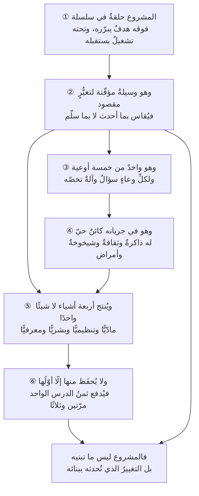

# الفصل 03 — فلسفة المشروع — الماهية والسلسلة الوجودية

---

## 🏛️ لماذا تقرأ هذا الفصل؟

**المشكلة:** تُدار المنتجات بأدوات المشاريع فتُغلَق يوم التسليم وقد بدأ عمرها لتوّه، وتُدار العمليات المتكرّرة بميثاق وخطّة وخاتمة فتُستهلك في التوثيق. والسبب واحد: لفظٌ واحد أُطلق على أربعة أشياء مختلفة.

**وماذا لو لم تعرف؟** من لم يفرّق بينها اختار المنهجية الخطأ من أوّل يوم، ثم أنفق سنة يعالج أعراض خطأٍ في التصنيف لا في التنفيذ.

**وبعد هذا الفصل ستستطيع:**

- **أن تصنّف** عملًا يُعرض عليك في واحدٍ من خمسة أوعية — مشروعٍ أو منتجٍ أو برنامجٍ أو محفظةٍ أو عملية — **بالسؤال الذي يجيب عنه لا بالاسم المكتوب على غلافه**؛ فتعرف أيّ آلةٍ إداريةٍ تصلح له قبل أن تُنفق عليها سنة.
- **أن تكتب** لأيّ مشروعٍ جملةَ تغيُّرٍ من ثلاثة أشطر — ما يقع اليوم، وما سيقع بعده، ومن يلاحظ الفرق بصفته — فإن تعذّر عليك شطرٌ منها عرفتَ **موضع الخلل قبل أن يبدأ الإنفاق**، لا بعد أن يُسلَّم العمل ولا يتغيّر شيء.
- **أن تكشف** موضع الانقطاع في السلسلة التي يقع فيها المشروع: أفوقه — فلا يُعرف أيّ هدفٍ يخدم؟ أم تحته — فلا يُعرف من يستلمه ويشغّله بعد التسليم؟ فتُسمّي العطب باسمه بدل أن تعالج أعراضه في الجدول والميزانية.

> [!info] بطاقة الفصل
> **النوع:** تأسيسيّ
> **المستوى:** 🟢 مبتدئ
> **زمن القراءة:** نحو 50 دقيقة
> **أهمّيته في الباب:** ★★★★★
> **موضعك:** انتهيتَ من [[02 - طبيعة العلم وهويته]] ← **⬤ أنت هنا** ← يليه [[04 - أين يقع هذا العلم]]

> [!abstract] موقع هذا الفصل
> **يبني على:** [[Cynefin]] · [[Iron Triangle]] — يُذكَر هنا ولا يُعاد شرحه.
> **ويؤسّس:** [[Product Maturity]] · [[Knowledge Management]] — يُقدَّم هنا أوّل مرّة فيصير متاحًا لما بعده.

---

## 🧭 السؤال المركزي

> [!question] السؤال الذي يجيب عنه هذا الفصل كلّه
> **ما المشروع في حقيقته، وبمَ يفارق ما يجاوره؟**

**واحمل معك هذه الأسئلة وأنت تقرأ:**

- متى ينتهي المشروع فعلًا: يوم التسليم أم يوم يتوقّف الأثر؟
- هل كلّ منتج نشأ عن مشروع؟ وهل كلّ مشروع يُنتج منتجًا؟
- ما الذي بقي في مؤسّستك من آخر مشروع أنجزته؟

---

## 🗺️ الجواب المختصر — قبل التفصيل

المشروع **ليس وعاءً للمهامّ، ولا هو غايةٌ في نفسه**. هو **وسيلةٌ مؤقّتة لإحداث تغيُّرٍ مقصودٍ في واقعٍ قائم، تحت قيدٍ من الموارد والزمن** — ومن هذا التعريف وحده يتخرّج ما بقي من الفصل. فلأنه **وسيلة**، جاز أن يكون إيقافُه نجاحًا متى ظهر أنه لم يعد أقصرَ طريقٍ إلى التغيّر المقصود. ولأنه **مؤقّت**، وجب أن يُخطَّط لزواله من أوّل يومٍ فيه: من يستلم، وبأيّ ميزانيةٍ يُشغّل، وبأيّ معرفةٍ يُدار. ولأن التغيّر **مقصود**، صار مقياسُه ما تغيّر في الواقع لا ما سُلّم من مصنوعات. ولأن الواقع **قائمٌ قبله**، لزم أن يكون المشروع **حلقةً في سلسلة** تبدأ فوقه بهدفٍ يبرّره، وتمتدّ تحته بتشغيلٍ يستقبله — ومن انقطعت عنده إحدى الحلقتين أنفق عمرَه يعالج في التنفيذ عطبًا موضعُه ليس التنفيذ.

**ويترتّب على هذا فرقٌ عمليّ يمسّ اختيارك للأداة من أوّل أسبوع:** أن **المشروع** ليس نوعًا وحيدًا من العمل، بل واحدٌ من خمسة أوعيةٍ يُسأل عن كلٍّ منها سؤالٌ مختلف — والخطأ الغالب ليس في التسمية بل في أن تُستعمل آلةُ وعاءٍ في الإجابة عن سؤال وعاءٍ آخر: كأن يُدار منتجٌ مستمرّ بأدوات مشروعٍ ينتهي، فيُحلّ فريقُه يوم بدأ عمرُه. **ويترتّب عليه ثانيًا** أن المشروع في أثناء جريانه أقربُ إلى **الكائن الحيّ** منه إلى الآلة: له ذاكرةٌ تحبس قراراتِه الأولى في بنيته، وثقافةٌ تتشكّل في أسابيعه الأولى ثم تجمد، ونموٌّ وشيخوخةٌ وأمراض — فيُسأل عن **حاله** لا عن مطابقته للخطّة وحدها. **ويترتّب عليه ثالثًا وأخيرًا** أن كلّ مشروعٍ يُنتج **أربعة أشياء** — مصنوعًا مادّيًّا، وأثرًا تنظيميًّا، وأثرًا بشريًّا، وأثرًا معرفيًّا — ينتجها شاء أهلُه أم أبَوا؛ ثم لا تحفظ المؤسّسة منها إلا **أوّلها**، فتدفع ثمن الدرس الواحد مرّتين وثلاثًا وهي تحسب أنها تتعلّم.

**وما بقي من هذا الفصل تحريرٌ لهذا الجواب في ستّ خطوات:**

1. موضعُ المشروع من السلسلة وأين تنقطع.
2. التعريف نفسه مفكَّكًا كلمةً كلمة وما يلزم من كلٍّ منها.
3. الأوعية الخمسة بأسئلتها لا بأسمائها.
4. التشبيه الذي يُغيّر سؤالك عن حال المشروع.
5. مخرجاتُه الأربعة.
6. علّةُ ضياع ثلاثةٍ منها وما يُبقيها.

> [!abstract] مفاهيم يُدخلها هذا الفصل في قاموسك
> `Product Maturity` · `Knowledge Management`

> [!warning] مفاهيم يكثر الخلط بينها هنا
> `Project` مقابل `Product` مقابل `Program` مقابل `Portfolio` مقابل `Process` — احملها في ذهنك، فالفصل يفرّقها في محطّة التمييز.

---

## 🧱 الفكرة الأولى: المشروع حلقة في سلسلة تبدأ قبله وتمتدّ بعده

*موضعها من الفصل: قبل أن يُحَدّ المشروع بتعريف، يُوضَع في موضعه — فالحدّ يصفه في نفسه، وهذه الفكرة تصفه فيما حوله. وثمرتها أن تعرف أنّ أكثر ما يُعالَج داخل المشروع علّتُه خارجه.*

**الفكرة الرئيسة:** لا يبدأ المشروع يوم انطلاقه ولا ينتهي يوم تسليمه. هو **حلقةٌ في سلسلةٍ متّصلة**: فوقه ما يبرّر وجوده، وتحته ما يستقبل ثمرته. ومن نظر إلى مشروعه معزولًا عن حلقتيه، أتقن صناعة شيءٍ لا يُعرف لماذا صُنع، أو صنع شيئًا صحيحًا ثم تركه بلا من يُبقيه حيًّا.

### السلسلة كما هي — وكلُّ حلقةٍ تجيب عن سؤالٍ لا تجيب عنه أختُها

الترتيب المتداوَل في أدبيات الإدارة، ومعه سؤالُ كلِّ حلقةٍ لأنه هو المهمّ لا الاسم:

| الحلقة | السؤال الذي تجيب عنه | ما تفرضه على ما بعدها |
|---|---|---|
| **الرؤية** | إلى أين نريد أن نصير؟ | معنى «الأفضل» في كل مفاضلةٍ لاحقة |
| **الرسالة** | ما الذي نفعله ولمن؟ | حدود ما نقبل أن نعمل فيه |
| **الاستراتيجية** | كيف نصل، وبأيّ اختياراتٍ نتخلّى عن غيرها؟ | ما الذي **لا** يُعمل — وهذا أنفع ما فيها |
| **الأهداف** | بمَ نعرف أننا نتقدّم هذه السنة؟ | مقاييس يُحتكم إليها لا شعارات |
| **المبادرات** | أيّ رهاناتٍ كبرى نأخذها لبلوغها؟ | حزم العمل ونطاقها |
| **المشاريع** | أيّ تغييرٍ محدَّدٍ نُحدثه، بأيّ موارد وفي أيّ مدّة؟ | التسليم والقيود الثلاثة |
| **المنتجات** | ما الذي يبقى يُنتج قيمةً بعد التسليم؟ | من يرعاه وبأيّ ميزانية |
| **التشغيل** | كيف نُبقيه يعمل بثباتٍ يومًا بعد يوم؟ | كلفةَ البقاء لا كلفةَ البناء |
| **التحسين** | ما الذي كشفه الاستعمال ولم نكن نعرفه؟ | مشاريع الجولة القادمة |

**والسلسلة تُقرأ في اتّجاهين لا اتّجاهٍ واحد.** فالتخطيط ينزل من أعلى إلى أسفل: الرؤيةُ تُقيّد الاستراتيجية، والاستراتيجيةُ تختار المبادرات، والمبادرةُ تُولّد مشاريع. **والتعلّم يصعد من أسفل إلى أعلى**: التشغيل يكشف ما لم يظهر في التخطيط، والاستعمالُ يُبطل فرضيةً بُنيت عليها الاستراتيجية كلُّها. والمؤسّسة التي تُتقن النزول وحده تُنفّذ استراتيجيةً قديمةً بإحكامٍ متزايد. والتي تُتقن الصعود وحده تُصلح أعراضًا بلا اتّجاه.

### وموضع العطب حلقتان لا حلقات

في التطبيق، لا تنكسر السلسلة في كل مفصلٍ منها؛ تنكسر عند **مفصلَي المشروع** تحديدًا — فوقه وتحته. وهذان هما ما يجب أن تفحصهما:

**① الانقطاع الأعلى: مشروعٌ لا يُعرف أيّ هدفٍ يخدم.** وعلامته الفارقة سؤالٌ واحد: *لو أُلغي هذا المشروع اليوم، أيُّ رقمٍ في المؤسّسة يسوء؟* فإن كان الجواب صمتًا، أو كان «سنتأخّر عن المنافس» بلا بيان، فالمشروع **معلَّقٌ في الهواء**. وخطره أنه قد يُنفَّذ تنفيذًا بارعًا: في موعده، وبميزانيته، وبكامل نطاقه — ثم لا يتغيّر شيء. وهذا أخطر من التعثّر، لأن التعثّر يستدعي المراجعة والنجاح الظاهر يُغلق بابها.

**② الانقطاع الأسفل: مشروعٌ لا يُعرف من يستلمه.** وعلامته سؤالٌ ثانٍ: *بعد ثلاثة أشهر من التسليم، من الشخص الذي يُسأل عن هذا الشيء باسمه، ومن أيّ بندٍ في الميزانية يُدفع تشغيلُه؟* فإن لم يكن للجواب اسمٌ ورقم، فالمشروع سيُسلَّم إلى **الفراغ**. وأثرُ ذلك يظهر متأخّرًا وبطيئًا: يعمل الشيء شهرًا أو شهرين بزخم التسليم، ثم تتراكم الاستثناءات بلا من يحسمها، فيلتفّ الناس حوله بطرقهم القديمة، ويبقى قائمًا في السجلّات ميّتًا في الاستعمال.

**والفرق بين العطبين في العلاج لا في الوصف:** الانقطاع الأعلى يُصلَح **بقرارٍ من فوق المشروع** — أن يُربَط بهدفٍ أو يُوقَف؛ ولا يملك مديرُ المشروع إصلاحه، وإنما يملك **إظهاره** مكتوبًا. والانقطاع الأسفل يُصلَح **داخل المشروع نفسه** بجعل الاستلام بندًا في النطاق لا أثرًا جانبيًّا له: مالكٌ مسمّى، وتدريبٌ محدَّد، وفترةُ رعايةٍ لصيقة بعد الإطلاق ([[Hypercare|الرعاية المركّزة]])، وميزانيةُ تشغيلٍ معتمدة. ولذلك كان الفرق بين **الإغلاق** و**التسليم** فرقًا جوهريًّا لا لفظيًّا، وموضع تحريره [[Closure vs Handover|الإغلاق في مقابل التسليم]].

> [!info] إضافة مرجعية — لماذا أُفرد تحقُّق المنفعة بابًا مستقلًّا
> نشأ في أدبيات المؤسّسات المهنية بابٌ مستقلّ اسمه **إدارة تحقُّق المنافع (Benefits Realization Management)**، وعلّةُ إفراده هي هذا الانقطاع بعينه: أن اكتمال التسليم شيء، وتحقُّق المنفعة شيءٌ آخر يقع **بعده** وقد لا يقع أصلًا. وقد نقل **معهد إدارة المشاريع (PMI)** في الإصدار السابع من دليله (2021) ثقلَ العرض من «مجموعات العمليات» إلى **مبادئ ومجالات أداء** ضمن ما سمّاه **نظام تسليم القيمة (Value Delivery System)** الذي يضمّ المحفظة والبرنامج والمشروع والتشغيل معًا — وهذا تغيُّرٌ موثَّق في طريقة عرض المرجع نفسِه، لا تخطئةٌ للإصدار السادس (2017) الذي يبقى في متناول القارئ في كتبٍ ودوراتٍ كثيرة.
>
> **وحدُّ هذا الباب أنه يصف مسؤوليةً لا يملكها المشروع وحده.** فالمنفعة تقع في التشغيل بعد أشهرٍ من إغلاق المشروع وحلّ فريقه، ومن حمّل مديرَ المشروع تبعتَها كاملةً حمّله ما لا يملك أدواتِه. والصياغة الدقيقة: **المشروع مسؤولٌ عن أن يكون تحقُّق المنفعة ممكنًا ومُسنَدًا إلى مالكٍ معلوم، لا عن أن يقع بيده.**

> [!example] نظامٌ سُلّم على وجهه، ثم مات في أربعة أشهر
> شركة صناعية في الدمّام بنت نظامًا لجرد المستودعات ليحلّ محلّ جداول متفرّقة كان كلُّ مستودعٍ يمسك واحدًا منها. سُلّم المشروع في موعده، وبميزانيته، وباجتيازِ اختبارات القبول كلِّها، وأُغلق باحتفالٍ حضره الرعاة.
>
> **وفوقه كانت الحلقة سليمة:** الهدف معلن — تقليل فروق الجرد السنوي، ورقمُه مكتوب. **وتحته كانت مقطوعة:** لم يُسمَّ من يملك إدخال حركات الصرف اليومية. كان ذلك في المشروع بندًا في «التدريب»، لا في «التشغيل».
>
> فمضى شهرٌ والزخم قائم، ثم بدأت حركاتٌ تُدخَل متأخّرةً يومين، ثم أسبوعًا. وحين اختلف رقمُ النظام عن رقم الرفّ في ثلاثة أصنافٍ حسّاسة ولم يكن ثمّة من يحسم أيَّهما المعتمد، رجع أمناءُ المستودعات إلى جداولهم «حتى يستقرّ النظام». وبعد أربعة أشهر كان النظام يعمل بلا عطبٍ تقنيّ واحد، وبياناتُه لا يُعتمد عليها، والجرد يُجرى على الجداول القديمة.
>
> **وفي تقرير إغلاق المشروع:** «أُنجز بنسبة 100% من النطاق.» وهو صادق. المشروع أنجز ما في نطاقه؛ والذي لم يكن في نطاقه هو الحلقة التي تليه.

> [!tip] كيف تستعمل هذه الفكرة — اختبار الحلقتين قبل أوّل ريال يُنفق
> اكتب جملتين، ولا تبدأ حتى تكتمل كلٌّ منهما بلا تعميم:
>
> 1. **«هذا المشروع يخدم الهدف الفلانيّ، وعلامةُ ذلك أنّ المؤشّر الفلانيّ سينتقل من كذا إلى كذا.»**
> 2. **«حين يُسلَّم، يستلمه فلانٌ بصفته كذا، ويُشغَّل من البند كذا بكلفةٍ سنوية قدرها كذا.»**
>
> فإن تعذّرت الأولى فأنت أمام **انقطاعٍ أعلى**، وموضع علاجه فوقك: ارفعه مكتوبًا وسمِّه باسمه، ولا تُطفئه بجملةٍ عامّة تُرضي القارئ. وإن تعذّرت الثانية فأنت أمام **انقطاعٍ أسفل**، وهو في يدك: أدخِل الاستلام في النطاق الآن، فكلفتُه اليوم بندٌ صغير، وكلفتُه بعد التسليم مشروعٌ ثانٍ.
>
> **والاختبار نافعٌ حتى حين لا تُصلَح الحلقة.** فالمشروع الذي بدأتَه وأنت تعلم أنّ حلقته العليا مقطوعة تُديره إدارةً مختلفة: تُقلّل رهانَك فيه، وتُبقي مخارجَك مفتوحة، وتُوثّق ما رفعتَ ولمن.

> [!warning] الحفرة الشائعة — السلسلة المقلوبة
> أشيعُ عطبٍ في هذه السلسلة ليس انقطاعَها، بل **قلبُها**: أن يُقرَّر المشروع أوّلًا — لأن أداةً اشتُريت، أو ميزانيةً ظهرت في آخر السنة، أو منافسًا أعلن شيئًا، أو قياديًّا حضر مؤتمرًا — ثم تُكتب له بعد ذلك مسوّغاتٌ تربطه بهدفٍ استراتيجيّ.
>
> **وعلامتُه الفارقة تاريخيّة لا لفظية:** أن تكون وثيقةُ المسوّغ ([[Business Case|دراسة الجدوى]]) مؤرّخةً **بعد** اختيار المورّد أو بعد اعتماد الميزانية. فالمسوّغ الذي يأتي متأخّرًا لا يفحص القرار، وإنما يُلبسه ثوبًا.
>
> **وصورتُه في أبسط ما يقع:** يعود مديرٌ تنفيذيّ من مؤتمرٍ وقد رأى تطبيقًا لمنافس، فتُعتمد ميزانيةُ تطبيقٍ مثله في الأسبوع نفسه. وبعد شهرٍ تُطلب دراسةُ جدوى، فتُكتب وفيها ما يُثبت الحاجة — لأنّ من كُلّف بكتابتها يعلم ما الجواب المطلوب. **والسؤال الذي لم يُطرح قطُّ ليس «أهذا التطبيق نافع؟» فقد يكون نافعًا؛ السؤال: أهذا أنفعُ ما تُنفَق فيه هذه الميزانية هذه السنة؟** — وهو سؤالٌ لا يُطرح إلّا حين يُقارَن المشروع بغيره، والمسوّغ المتأخّر يُكتب لواحدٍ بلا مُقارَن.
>
> **ولا يعني هذا أن كل مشروعٍ نشأ من فرصةٍ عارضة مشروعٌ فاسد.** فالفرص تظهر فعلًا، ومنها ما يستحقّ أن يُلتقط. إنما يعني أن يُقال ذلك صراحةً: *هذه فرصةٌ ظهرت، وهذا وجهُ اتّصالها بأهدافنا، وهذا ما نضحّي به لأجلها.* والفرق بين هذا وبين المسوّغ المتأخّر أنّ الأوّل **يُبقي الرهان مرئيًّا فيراجَع**، والثاني يُخفيه في وثيقةٍ تبدو تحليلًا.

> [!question]- تأكّد أنك فهمت — قال مديرٌ تنفيذيّ: «هذا مشروعٌ استراتيجيّ، فلا يحتاج إلى دراسة جدوى.» فما موضع الخلل؟
> **الخلل أنّ الجملة تستعمل لفظ «استراتيجيّ» في معنيين متعاكسين وتنتقل بينهما بلا إعلان.**
>
> فـ«استراتيجيّ» في معناه الأوّل **دعوى عن موضع المشروع من السلسلة**: أنه معلَّقٌ بحلقةٍ عليا معلومة. وهذه الدعوى — إن صحّت — **تُوجب البيان ولا تُسقطه**؛ إذ يلزم منها بالضبط أن يُقال: أيُّ هدفٍ يخدم، وبمَ يُعرف تقدّمه، وما الذي نتخلّى عنه لأجله. فالاستراتيجيّة اختيارٌ وتضحية، ومن لم يذكر ما ضحّى به لم يذكر استراتيجيةً بعد.
>
> و«استراتيجيّ» في معناه الثاني — وهو المقصود في الجملة غالبًا — **حكمٌ بإعفاء المشروع من الفحص**؛ أي أنه فوق السؤال. وهذا ليس وصفًا لموضعٍ في السلسلة، بل **إلغاءٌ للسلسلة**.
>
> **والجواب العملي ليس المطالبة بالوثيقة**، فقد تكون ثقيلةً بلا فائدة في بعض السياقات، بل: «موافق — وحتى نُحسن خدمته، أيّ هدفٍ من أهداف السنة يخدم؟ وما المؤشّر الذي نتوقّع أن يتحرّك؟ وما الذي نؤجّله لأجله؟» **فثلاثة أسئلةٍ في ثلاث جملٍ تفعل ما لا تفعله وثيقةٌ من ثلاثين صفحة** — لأنها تطلب مضمون الدعوى لا شكلَها.

> [!summary]- خلاصة الفكرة في سطرين
> **المشروع حلقةٌ بين هدفٍ فوقه يبرّره وتشغيلٍ تحته يستقبله، والسلسلة لا تنكسر عادةً إلّا عند هذين المفصلين.**
> والانقطاع الأعلى تملك **إظهاره** لا إصلاحه، والانقطاع الأسفل تملك إصلاحه اليوم ببندٍ صغير في النطاق — وثمنُه بعد التسليم مشروعٌ ثانٍ.

> [!question] تأمّلٌ تطبيقيّ — لا جواب له في هذا الفصل
> استحضر آخر مشروعٍ أنجزتَه أو شاركتَ فيه، وحدّد أين كان الانقطاع في سلسلته: **أفوقه** — فلم يكن يُعرف أيَّ هدفٍ يخدم؟ **أم تحته** — فلم يكن يُعرف من يستلمه ويشغّله؟
>
> ثمّ اسأل نفسك سؤالًا واحدًا: **ما الذي كان يمكن أن تفعله في أسبوعه الأوّل لو عرفتَ ذلك يومئذٍ؟** — فالجواب عن هذا هو ما ستحمله إلى مشروعك القادم، لا الفكرة مجرّدةً.

---

## 🧱 الفكرة الثانية: المشروع وسيلةٌ لإحداث تغيير منظَّم في الواقع

*موضعها من الفصل: عرفتَ موضع المشروع ممّا حوله، فبقي أن تعرف ما هو في نفسه. وهذه الفكرة تُبدّل تعريفًا شائعًا **يصف شكله** بتعريفٍ **يصف وظيفته** — ويتبدّل بتبدُّله ميزانُ الحكم عليه كلُّه: متى يُحكَم، ومن يحكم، وعلى أيّ شيء.*

**الفكرة الرئيسة:** التعريف المتداوَل — «مجموعة مهامّ مترابطة لها بدايةٌ ونهاية» — وصفٌ صحيحٌ لشكل المشروع، وصامتٌ عن حقيقته. وهو صمتٌ مكلِّف، لأنّ ما يسكت عنه هو بعينه ما يُحتكم إليه عند كل قرارٍ صعب. والصياغة التي تُعيد ترتيب ما بعدها كلَّه هي:

> [!summary] حدّ المشروع
> **وسيلةٌ مؤقّتة لإحداث تغيُّرٍ مقصودٍ في واقعٍ قائم، تحت قيدٍ من الموارد والزمن.**

### التعريفات المتداوَلة: ما تلتقطه وما تتركه

أشهر تعريفٍ في هذا المجال هو تعريف **معهد إدارة المشاريع (PMI)**: أن المشروع **مسعًى مؤقّت يُضطلَع به لإيجاد منتجٍ أو خدمةٍ أو نتيجةٍ فريدة**. وقريبٌ منه ما تصفه معايير المنظّمة الدولية للمعايير في سلسلة `ISO 21500`/`ISO 21502` من كونه عملًا له بدايةٌ ونهاية وأهدافٌ ومواردُ مخصَّصة.

**وما تلتقطه هذه التعريفات ثلاثةُ أوصافٍ صحيحةٍ مهمّة:** أنه **مؤقّت** فله نهايةٌ في تصميمه، وأنه **فريد** فليس تكرارًا لما سبق، وأنه **مقيَّد** بموارد مخصَّصة له.

**والذي تتركه وصفان هما موضع الحكم:** أنه **وسيلةٌ لا غاية** — أي أنّ الحكم عليه بما أحدث لا بما أنجز؛ وأنه **يقع في واقعٍ له ما قبل** — أي أنّ الفريد فيه ليس المصنوع وحده بل التغيُّر الذي يُحدثه في حالٍ قائمة.

**وهذا الصمت ليس عيبًا في التعريفات.** فالتعريف يُوضع لغرض، وغرضُ هذه التعريفات **ترسيم ما يدخل تحت هذا العلم وما لا يدخل** — أي التمييز عن العمل التشغيلي المتكرّر. وهي تؤدّي غرضها. إنما العيب أن يُقرأ التعريف الحاصر وكأنه التعريف الكاشف، فيُبنى عليه سلوكٌ لم يُوضع له: أن يُغلق المشروع عند حدود ما سُلّم، وأن يُقال «انتهينا» في اللحظة التي لم يقع فيها من المقصود شيءٌ بعد.

### الحدّ مفكَّكًا — وكلُّ كلمةٍ فيه تُلزم بشيء

**① وسيلة.** أوّل الكلمات وأثقلُها. فالوسيلة تُقاس بالغاية التي جاءت لها، ويجوز في حقّها ما لا يجوز في حقّ الغاية: أن تُبدَّل بغيرها إن ظهر ما هو أقصر، وأن تُوقَف إن انقطعت صلتُها بغايتها. **ومن هنا كان إيقاف مشروعٍ قد يكون نجاحًا لا فشلًا** — وهو حكمٌ يصعب على النفس لأن الجهد المبذول يُثقلها، وهو أثر [[Sunk Cost Fallacy|مغالطة الكلفة الغارقة]] التي عرفتَها في الفصل الأوّل. والعلاج الوحيد الذي يعمل عمليًّا: أن تُكتب **شروط الإيقاف ([[Kill Criteria]]) في أوّل المشروع** — يوم لا يملك أحدٌ فيه شيئًا ليدافع عنه. فمن لم يكتبها ابتداءً لم يكتبها أبدًا، لأن كتابتها بعد سنةٍ من الإنفاق تُقرأ اتّهامًا لا انضباطًا.

**② مؤقّتة.** و«المؤقّت» هنا **ليس وصفًا لطول المدّة، بل شرطٌ في التصميم**: أنّ الشيء مصمَّمٌ ليزول. وفريق المشروع وحوكمتُه وبند ميزانيته **سقالة** حول بناء، والسقالة تُقاس بأمرين: أن تحمل البناء ما دام يُشيَّد، وأن **تُفكَّك** حين يقوم. **ويلزم من ذلك لزومًا لا مفرّ منه: أنّ ما صُمِّم ليزول يجب أن يُخطَّط لزواله من أوّل يوم.** فمن أجّل سؤال «ماذا بعدنا؟» إلى الشهر الأخير، وجد نفسه يبني آليّة استلامٍ في أضيق أوقاته وأقلّها ميزانية. **وحين لا تُفكَّك السقالة تصير جزءًا من البناء**: فريقٌ «مؤقّت» بقي أربع سنوات، وحوكمةٌ للمشروع صارت طبقةً إداريةً دائمة، وميزانيةٌ استثنائية صارت بندًا لا يُسأل عنه.

**③ تغيُّرٍ مقصود.** والقيدان في هذه العبارة قيدان لا قيد: أن يكون ثمّة **تغيُّر** — فلا يكفي نشاط؛ وأن يكون **مقصودًا** — فلا يكفي أن يقع تغيُّرٌ ما. وهذا هو الفصل بين المُخرَج والأثر الذي حُرّر في [[22 - Outputs and Outcomes|المخرجات والآثار]]: أن يُسلَّم الشيء غيرُ أن يتغيّر شيء.

**④ في واقعٍ قائم.** فلكلّ مشروعٍ **حالٌ قبله**، وأكثر المشاريع لا تُنشئ من عدم بل تُبدّل شيئًا يعمل اليوم بطريقةٍ ما — ولو كانت طريقةً رديئة. **وهذا القيد هو أكثر ما يُنسى في المشاريع البرمجية تحديدًا**، لأن الفريق يرى الشاشة الجديدة ولا يرى الطريقة القديمة التي التفّ بها الناسُ على غياب الشاشة: الجدولُ الجانبي، والاتّفاق الشفهي، والاستثناء الذي يُمرَّر بمكالمة. **والنظام الجديد لا ينافس العدم؛ ينافس ذلك كلَّه** — وقد يكون أضعفَ منه في نظر من يستعمله.

**⑤ تحت قيدٍ من الموارد والزمن.** وهذا ما يجعله عملًا **إداريًّا** لا مجرّد عملٍ صائب. فلو كان الزمنُ مفتوحًا والمالُ بلا حدّ لما احتيج إلى ترتيبٍ ولا مفاضلة، ولصار كلُّ سؤالٍ عن الأولوية بلا معنى. **والقيود الثلاثة المتشابكة ([[Iron Triangle|المثلّث الحديدي]]) صورةٌ من صور هذا القيد**، وهي معروفةٌ عندك من قبل؛ والذي يعني هنا أنّ وجودها هو ما يجعل المشروع محلًّا لعلمٍ أصلًا.

> [!important] ولازمُ القيد الخامس: لا توجد قرارات مجّانية
> **كلُّ قرارٍ إداريّ يشتري شيئًا بثمنٍ من شيءٍ آخر**، والقرار الذي لا يظهر له ثمنٌ لم يُفحص بعدُ — لا لأنّه بلا ثمن، بل لأنّ ثمنه يقع في مكانٍ لا ينظر إليه صاحبُه:
>
> - **سرعةٌ** في مقابل **جودةٍ** يُدفع ثمنُها لاحقًا في الإصلاح.
> - **مرونةٌ** في مقابل **استقرارٍ** يعتمد عليه من بنى فوقك.
> - **توثيقٌ أوفى** في مقابل **وقتٍ** يُقتطع من البناء.
> - **استقلالُ الفرق** في مقابل **صعوبةٍ في التنسيق** بينها.
> - **تثبيتُ النطاق** في مقابل **قدرةٍ على استقبال ما يتبيّن لاحقًا**.
>
> **والإدارة ليست البحث عن أفضل خيار، بل اختيار المقايضة الصحيحة** — أي: أن تعرف بماذا تدفع، ولمن، ومتى يظهر أثرُه. ومن ظنّ أنّ أمامه خيارًا بلا ثمن، فقد اختار الثمن ولم يعلم به.
>
> **وتحرير هذا الباب — المقاصد التي يُفاضَل عليها، والثنائيات المتكرّرة، وكيف تُحسم المفاضلة حين تتعارض المقاصد — موضعه [[09 - المقاصد والثنائيات والمفاضلات]].** والذي يعنينا هنا أنّ المقايضة ليست عارضًا يقع في المشاريع المتعثّرة، بل **لازمٌ من لوازم حدّ المشروع نفسِه**: فما دام مقيَّدًا بالموارد والزمن، فكلُّ «نعم» فيه «لا» لشيءٍ آخر.

### ولازمُ التعريف: يتغيّر ميزانُ الحكم

إذا كان المشروع وسيلةً لتغيُّر، فسؤال آخر يومٍ فيه ليس «أسلّمنا كلّ ما في النطاق؟» بل «**أوقع التغيُّر الذي لأجله بدأنا؟**». وهذا ينقل ثلاثة أشياء دفعةً واحدة:

1. **ينقل موعد الحكم**، فيصير بعد التسليم بمدّةٍ يُتّفق عليها ابتداءً لا يومَ التسليم.
2. **ينقل صاحب الحكم**، فيصير من يعيش التغيّر — المستفيد والمشغّل — لا من صنعه.
3. **ينقل صياغة النطاق نفسه**، فما لا يخدم التغيُّر المعلن يصير مرشَّحًا للحذف بحجّة، لا بندًا محفوظًا لأنه كُتب في وثيقةٍ قديمة.

> [!info] إضافة مرجعية — «إن لم يتغيّر رقم فلم يقع شيء» قاعدةٌ لها شرط
> يُنقل هذا المعنى أحيانًا في صورةٍ حادّة: أنّ كلّ مشروعٍ يجب أن يُقاس بأثرٍ رقميّ يظهر بعده مباشرةً، وأنّ ما لم يُحرّك مؤشّرًا فهو عبث. **وهذه الصيغة أوسع من الحقّ، وثلاثةُ أصنافٍ من المشاريع تُبطلها:**
>
> - **مشاريع الامتثال النظاميّ** — يُنفَّذ فيها ما تُوجبه جهةٌ تنظيمية، والتغيُّر المقصود منها **بقاءُ الترخيص أو تجنّبُ العقوبة**. وهو تغيُّرٌ حقيقيّ يمكن التصريح به، وإن لم يظهر في مؤشّر نموّ.
> - **المشاريع الممكِّنة** — كتحديث بنيةٍ تحتية أو نقل بيانات. وأثرُها يظهر **من خلال مشاريع أخرى** تصير ممكنةً أو أرخص، لا في مؤشّرٍ لها وحدها. ونسبةُ أثر هذه إلى نفسها مباشرةً تُظلمها، ونسبتُه إلى غيرها بلا ضابطٍ تُضخّمها.
> - **مشاريع شراء الخيار** — يُنفَق فيها القليل لفتح إمكانٍ قد لا يُستعمل. وقياسُها بما تحقّق منها خطأ في المبدأ، لأن قيمتها في **توفّر الخيار** لا في استعماله.
>
> **والصيغة الدقيقة إذن:** لكلّ مشروعٍ تغيُّرٌ مقصود، **وليس كلُّ تغيُّرٍ مقصودٍ رقمًا**. والذي يلزم في كل حالٍ أن تستطيع أن تقول: **ما الذي سيكون مختلفًا في العالم، ومن الذي يلاحظ الفرق.** فمن عجز عن هذين لم يُعفَ لأن مشروعه «ممكِّن»؛ إنما عجز عن بيان مقصده.

> [!example] «أعيدوا تصميم التطبيق» — وكيف انكمش نصفُ المشروع في جلسةٍ واحدة
> جاء الطلب إلى فريقٍ في الرياض بهذه الصيغة: **إعادة تصميم تطبيق الطلبات**. ومعه تقديرٌ أوّليّ بخمسة أشهرٍ وميزانيةٌ معتمدة، وسببٌ معلَن: «الواجهة قديمة، والمنافسون أحدث منّا.»
>
> فسأل قائد الفريق سؤالًا واحدًا في الاجتماع الأول: **ما الذي يفعله المستخدم اليوم ولا نريده أن يظلّ يفعله؟** فلم يكن ثمّة جواب جاهز. وحين استُخرجت بيانات الاستعمال، ظهر أنّ **41% من المستخدمين الجدد لا يُكملون أوّل طلبٍ لهم**، وأنّ أكثر التخلّي يقع في شاشةٍ واحدة يُطلب فيها إدخال العنوان يدويًّا.
>
> فأُعيدت صياغة المشروع بجملةٍ من ثلاثة أشطر: **«اليوم لا يُكمل 41% من المستخدمين الجدد أوّل طلب؛ وبعد هذا المشروع يُكمله أكثرهم دون مساعدة؛ ويلاحظ الفرقَ مديرُ النموّ في تقرير التحويل الأسبوعي.»**
>
> **وأثر ذلك في النطاق كان فوريًّا:** سقط تحديث نظام الألوان والأيقونات إلى مرحلةٍ لاحقة، وسقطت إعادة بناء شاشتين لم يكن فيهما تخلٍّ يُذكر، وبقي عملٌ مركَّزٌ على مسار الطلب الأوّل وإدخال العنوان. فصار المشروع سبعة أسابيع بدل خمسة أشهر.
>
> **ولم يكن الفرق في المهارة الهندسية ولا في التقدير؛ كان في أنّ الطلب الأوّل وصف مصنوعًا، والصياغة الثانية وصفت تغيُّرًا.** فالأوّل يُنجَز بإنفاق كامل الميزانية، والثاني يُنجَز بأقلّ ما يكفي.

> [!tip] كيف تستعمل هذه الفكرة — أداةُ «جملة التغيُّر الثلاثية»
> لا تقبل مشروعًا ولا تُقرّه حتى تكتمل هذه الجملة بأشطرها الثلاثة، بلا تعميمٍ في شطرٍ منها. **واملأ الخانات بألفاظك أنت قبل أن تقرأ ما بعدها:**
>
> | الشطر | السؤال الذي يُملأ به | اكتب هنا |
> |---|---|---|
> | **① الحال** | ماذا يقع اليوم فعلًا، بما يُرى أو يُقاس؟ | اليوم يقع … |
> | **② التبدّل** | ما الذي سيصير مختلفًا بعد المشروع تحديدًا؟ | وبعد هذا المشروع سيقع … |
> | **③ الشاهد** | من يلاحظ الفرق، وبأيّ صفةٍ يلاحظه، وفي أيّ تقرير؟ | ويلاحظ الفرقَ … بصفته … |
>
> **وشرطُ الملء أن يخلو كلُّ شطرٍ من ثلاثة ألفاظ:** «تحسين»، و«تطوير»، و«المستخدم» مطلقةً بلا تعيين. فهذه الثلاثة تُملأ بها الخانةُ ولا يُملأ بها فراغُ المعرفة.
>
> - **تعذَّر الشطر الأوّل؟** فأنت لا تعرف الحال القائمة، وستبني على تصوّرٍ لا على واقع. وعلاجه أسبوعُ ملاحظةٍ وبيانات، وهو أرخص أسبوعٍ في المشروع كلِّه.
> - **تعذَّر الثاني؟** فليس عندك مشروعٌ بعد، بل رغبةٌ في نشاط.
> - **تعذَّر الثالث؟** فأنت أمام **مُخرَجٍ بلا مستفيد** — وهذه أخطر الحالات الثلاث، لأنها الوحيدة التي يمكن أن تُنجَز بامتياز.
>
> **وأنفع ما في هذه الجملة أنها تُكتب في سطرٍ واحد فتُقرأ في اجتماعٍ ويُختلف عليها.** أمّا الوثيقة الطويلة فتُعتمد بلا أن تُقرأ، لأن الاعتراض عليها يكلّف أكثر من السكوت.

> [!warning] الحفرة الشائعة — موعدُ الاحتفال أسبقُ من موعد الحكم
> يُغلق المشروع ويُحتفل به **يوم التسليم**؛ ويُعرف هل وقع التغيُّر **بعد أشهر**. وهذا الفارق الزمنيّ وحده يُنتج ثلاثة آثارٍ بلا أن يقصدها أحد:
>
> 1. **يُثبَّت في الذاكرة المؤسّسية أنّ المشروع نجح** قبل أن تتوفّر معلومةُ الحكم؛ وما ثبت نجاحه لا يُراجَع.
> 2. **يُحلّ الفريق ويتفرّق** قبل ظهور ما يحتاج إلى معرفته؛ فإذا ظهر العطب لم يبقَ من يعرف علّته.
> 3. **يُكافَأ التسليم ولا يُكافَأ الأثر**، فيتعلّم الناس — بلا أن يُقال لهم — أنّ المطلوب أن تُسلّم.
>
> **ولا يعني هذا إلغاء الاحتفال بالتسليم**، فالتسليم إنجازٌ حقيقيّ يستحقّ أن يُعترف به، وإنكارُه يُطفئ الفريق بلا فائدة. إنما يعني **الفصل بين حدثين**: احتفالٌ بالتسليم يُقال فيه ما هو — أنّنا سلّمنا؛ ثم **مراجعةٌ للأثر** بعد مدّةٍ متّفقٍ عليها ابتداءً، لها موعدٌ في التقويم ومالكٌ مسمّى.
>
> **وعلامة أنّك في هذه الحفرة:** أن تسأل عن آخر خمسة مشاريع أُغلقت في مؤسّستك، فتجد لكلٍّ منها تقرير إغلاق، ولا تجد لواحدٍ منها **مراجعةَ أثرٍ بعد ستّة أشهر**.

> [!question]- تأكّد أنك فهمت — سُلّم المشروع في موعده، وبميزانيته، وبكامل نطاقه. فهل نجح؟
> **الجواب: هذه إجابةٌ عن سؤالٍ آخر — سؤالِ الوسيلة لا سؤالِ الغاية.**
>
> فما ذُكر ثلاثةُ أوصافٍ **للأداء الإداريّ**: أنّ الزمن ضُبط، وأنّ المال ضُبط، وأنّ ما التُزم به سُلّم. وهي أوصافٌ محمودة تدلّ على انضباط تنفيذٍ حقيقيّ، ولا يصحّ التهوين منها — فالفريق الذي يُسلّم ما وعد به في موعده يملك قدرةً ليست عند غيره.
>
> **لكنها كلَّها أوصافٌ للسقالة لا للبناء.** فالمشروع وسيلة، والحكم على الوسيلة إنما يكون **بالغاية التي جاءت لها**. ويبقى السؤال الذي لم يُجَب: *وهل وقع التغيُّر المقصود؟*
>
> **وثلاثةُ احتمالاتٍ تفتح عندها، وكلُّها واقع:**
>
> - **سُلّم ووقع التغيُّر** — فهذا نجاحٌ تامّ، ويُوثَّق بشقّيه لا بشقّه الأوّل وحده.
> - **سُلّم ولم يقع التغيُّر** — وهذا أخطر الأحوال، لأن كلّ علامةٍ ظاهرة تقول إنّ الأمر تمّ. وموضع العطب حينئذٍ ليس التنفيذ، بل الفرضية التي بُني عليها: أن هذا المصنوع يُحدث ذلك التغيُّر.
> - **لم يُسلَّم كلُّ النطاق ووقع التغيُّر** — وهذا يقع أكثر ممّا يُظنّ، ويكون فيه ما لم يُسلَّم دليلًا على أنّ النطاق كان أوسع من الحاجة.
>
> **والصياغة الدقيقة:** «نجح المشروع في التسليم، وحكمُ الأثر مؤجَّلٌ إلى المراجعة في الشهر الفلانيّ.» — وهذه جملةٌ يمكن أن تُكتب في تقرير الإغلاق، وتُبقي البابَ الذي يُغلقه الاحتفالُ مفتوحًا.

> [!summary]- خلاصة الفكرة في سطرين
> **المشروع وسيلةٌ مؤقّتة لتغيُّرٍ مقصود، فيُقاس بما أحدث لا بما سلّم** — ومن هذا الحدّ وحده يتخرّج جوازُ إيقافه، ووجوبُ التخطيط لزواله، وأنّ نطاقه يُقاس بمقصده لا بوثيقةٍ قديمة.
> **ولا يلزم أن يكون التغيُّر رقمًا؛ يلزم أن تستطيع أن تقول: ما الذي سيصير مختلفًا، ومن يلاحظه.**

> [!question] تأمّلٌ تطبيقيّ — لا جواب له في هذا الفصل
> اكتب جملة التغيُّر الثلاثية لمشروعٍ تعمل فيه الآن، ثمّ انظر في **نطاقه المعتمَد** بندًا بندًا واسأل عن كلّ بند: **أيّ شطرٍ من الجملة يخدم؟**
>
> والذي يعنينا ليس البنود التي تخدم، بل **البنود التي لا تجد لها موضعًا في الجملة**: أهي فعلًا خارج المقصد فتُؤجَّل، أم أنّ الجملة نفسها أضيق من المقصد الحقيقيّ فتُعاد كتابتها؟ **والفصل بين الاحتمالين قرارٌ لا يُملى عليك من كتاب.**

---

## 🧱 الفكرة الثالثة: الفروق الخمسة التي يقوم عليها كلّ ما بعد

*موضعها من الفصل: استقرّ أنّ المشروع وسيلةٌ لتغيُّرٍ مقصود، فتضعه هذه الفكرة في عائلته: أربعةُ أوعيةٍ تجاوره، أشدُّها التباسًا به **المنتج**. والفرق عن سابقتها أنّها لا تسأل «ما المشروع؟» بل: **أهذا الذي بين يديك مشروعٌ أصلًا، أم شيءٌ آخر يُدار بآلته؟***

**الفكرة الرئيسة:** المشروع والمنتج والبرنامج والمحفظة والعملية **ليست خمسة أنواعٍ من الأشياء**؛ هي **خمسة أسئلةٍ مختلفة يمكن أن تُسأل عن العمل نفسه**، ولكلّ سؤالٍ آلةٌ إدارية وُضعت له. والخطأ المكلف ليس في التسمية — بل في أن تُستعمل آلةُ سؤالٍ في الإجابة عن سؤالٍ آخر، فتُعطيك جوابًا محكمًا عن شيءٍ لم تسأل عنه.

### الأوعية الخمسة بأسئلتها

| الوعاء | سؤاله المركزي | متى ينتهي | ما يقتله |
|---|---|---|---|
| **المشروع** (Project) | أنُحدث التغيُّر المقصود في حدود مواردنا؟ | حين يقع التغيُّر أو يظهر أنه لن يقع | أن يُقاس بالنشاط لا بالتغيُّر |
| **المنتج** (Product) | أما زال يستحقّ أن يبقى ويُستثمر فيه؟ | حين يُوقَف عمدًا بقرار | أن يُترك بلا مالكٍ بعد الإطلاق |
| **البرنامج** (Program) | أتتحقّق المنفعة المشتركة بين مكوّناته؟ | حين تُحصَّل المنفعة | أن يُدار جدولًا كبيرًا لا تبعياتٍ متشابكة |
| **المحفظة** (Portfolio) | أهذا هو العمل الذي ينبغي أن يُعمل أصلًا؟ | لا ينتهي ما دامت المنظّمة | أن تُضاف إليها ولا يُحذف منها |
| **العملية** (Process) | أتجري بثباتٍ وبأقلّ هدر؟ | لا تنتهي، بل تُحسَّن أو تُلغى | أن تُدار بميثاقٍ وخاتمةٍ كأنها مشروع |

**والمستويات الثلاثة الأولى من هذه الخمسة — المشروع والبرنامج والمحفظة — لها تحريرٌ إداريّ مفصَّل في [[23 - Project Program Portfolio|المشروع والبرنامج والمحفظة]]**، وفيه جدول التمييز بينها بمقاييس نجاحها وقراراتها المميِّزة. والذي يعنينا هنا وجهٌ آخر: **موضعُ المنتج والعملية من هذه الخمسة**، لأنهما موضع أكثر الخلط في العمل البرمجيّ تحديدًا.

### الفرق الذي يكلّف أكثر من غيره: المشروع في مقابل المنتج

المشروع **ينتهي**، والمنتج **يستمرّ**. وهذه جملةٌ يوافق عليها الجميع نظريًّا، ثم تُخالَف في التنفيذ لأن مخالفتها لا تظهر إلا بعد سنة.

**فالمشروع مصمَّمٌ على منطق الاكتمال:** نطاقٌ يُغلق، وفريقٌ يُجمَع ثم يُحلّ، وبند ميزانيةٍ يُفتح ثم يُقفل، وتغييرٌ بعد التسليم يُسمّى «خارج النطاق» فيُطلب له طلبُ تغييرٍ أو مشروعٌ جديد.

**والمنتج مصمَّمٌ على منطق البقاء:** لا يكتمل، وإنما يمرّ بأطوارٍ في السوق ([[Product Life Cycle|دورة حياة المنتج]]) لكلّ طورٍ فيها معيارُ قرارٍ مختلف، وينتهي فقط حين يُوقَف عمدًا بقرارٍ مدروس ([[Sunset and Deprecation|الإيقاف والإحالة إلى التقاعد]]).

**والفرق بينهما يظهر أدقَّ ما يظهر في المساءلة**، لأنّ المساءلة هي التي تُنتج السلوك اليوميّ لا التعريف المكتوب في وثيقة:

| وجه المقارنة | المشروع | المنتج |
|---|---|---|
| **السؤال الذي يُسأل عنه** | أأنجزنا ما التزمنا به؟ | أما زلنا نُنتج قيمةً تستحقّ ما يُنفق؟ |
| **مقياس النجاح** | التسليم في المدّة والميزانية والنطاق | البقاء والنموّ واستمرارُ الاستعمال |
| **من يُسأل** | من يقود التسليم | من يملك المنتج ومصيرَه |
| **متى تنتهي المسؤولية** | عند التسليم أو الإيقاف | لا تنتهي إلّا بقرار إيقافٍ مدروس |
| **ما يُعدّ نجاحًا في آخر السنة** | «أُغلق في موعده» | «تجدّد الاستعمال، وقُرّر ما يُبنى في السنة القادمة» |

**والصفّ الأخير هو موضع الخلط في العمل اليوميّ:** فمن يُدير منتجًا وهو يُسأل سؤال المشروع، يسعى إلى **إغلاق** ما وظيفتُه أن **يبقى**.

**وحين يُدار المنتج بآلة المشروع ينقلب منحنى الكلفة رأسًا على عقب.** فأرخصُ التغييرات في أيّ نظامٍ برمجيّ هي تلك التي تقع **بُعيد الإطلاق مباشرةً**: البنية ما تزال مرنة، والمعرفة ما تزال في رؤوس من بنوا، والافتراضات الخاطئة تُكتشف حينها لأن الاستعمال الحقيقيّ بدأ لتوّه. وهي بعينها اللحظة التي تُغلق فيها آلةُ المشروع البابَ: حُلّ الفريق، وأُقفل بند الميزانية، وصار كلُّ تعديلٍ يحتاج دورةَ اعتمادٍ كاملة. **فيصير أرخصُ التغييرات تقنيًّا أغلاها إداريًّا** — وهذه ليست مصادفةً في مؤسّسةٍ بعينها، بل نتيجةٌ لازمة لتركيب الآلة على العمل الخطأ.

### والفرق الثاني: المشروع في مقابل العملية

**العملية عملٌ متكرّرٌ بمدخلاتٍ متشابهة ومخرجاتٍ متوقّعة**: معالجة طلبات الدعم، وإصدار التقرير الشهري، وتهيئة موظّفٍ جديد. وميزانُها **الثبات وقلّة الهدر** لا الإنجاز؛ إذ لا معنى لأن «تنتهي» عمليةُ الدعم الفنّي.

**وحين تُدار العملية بآلة المشروع** — ميثاقٌ وخطّةٌ وتقرير إغلاق لكلّ دورةٍ متكرّرة — تُستهلك في التوثيق، ويصير لكلّ شيءٍ بسيطٍ مسارٌ إداريّ أطول من العمل نفسه. وعلامتُه: أن يكون زمنُ الإجراءات المحيطة بالعمل أطول من زمن العمل.

**وحين يُدار المشروع بآلة العملية** — وهو العطب المعاكس وأقلُّ ذكرًا — يُعامَل عملٌ فريدٌ عالي الجهل كأنه قائمةُ تحقّقٍ تُنفَّذ خطوةً خطوة. فتُملأ الخطواتُ كلُّها ولا يُسأل عن الفرضية التي بُنيت عليها. وهذا هو موضع اتّصال هذه الفكرة بما استقرّ عندك في الفصل السابق: **إنّ اختيار الآلة تابعٌ لنوع الموقف** — فما كانت علاقةُ سببه بنتيجته معلومةً سلفًا صلحت له الوصفة، وما لم تكن كذلك لم تُغنِ عنه ([[Cynefin|كونيفين]]).

> [!info] إضافة مرجعية — «من المشروع إلى المنتج»: ما تقوله هذه الدعوى وما لا تقوله
> صار لهذا الفرق في العقد الأخير أدبٌ مستقلّ، أشهرُ كتبه **«Project to Product»** لـ**ميك كيرستن (Mik Kersten)** (2018)، ودعواه المركزية أنّ تمويل العمل البرمجيّ في صورة مشاريع مؤقّتة يُنتج فرقًا تتفكّك وتتجمّع دوريًّا، فتُهدر المعرفة المتراكمة، ويُقاس العملُ بما سُلّم لا بما تدفّق من قيمةٍ إلى المستفيد.
>
> **وهذه دعوى عن التمويل وثبات الفرق قبل أن تكون دعوى عن الألفاظ.** ولها في الفرق البرمجية سندٌ ملموس: أنّ إعادة تكوين الفريق تُعيد بناء المعرفة الضمنية من الصفر، وهي أغلى ما في العمل البرمجيّ لأنها لا تُنقل بالوثائق (وهذا موضع الفكرة السادسة من هذا الفصل).
>
> **وما لا تقوله — وكثيرًا ما يُحمَّل عليها:** أنّ المشاريع صارت لاغية. فما زالت في كلّ مؤسّسةٍ أعمالٌ **مشاريعُ بحقّ**: ترحيل مركز بيانات، والامتثال لتغييرٍ نظاميّ له تاريخ نفاذ، ودمج نظامَي شركتين بعد استحواذ. هذه لها بدايةٌ ونهايةٌ حقيقيّتان، وتنتهي فعلًا ولا تُترك تُنتج قيمةً بعد ذلك. **فالدعوى الصحيحة ليست «لا مشاريع بعد اليوم»، بل: لا يُدار ما يستمرّ بآلة ما ينتهي.** ومن قرأها على الإطلاق وقع في العطب المعاكس: أن تُلغى انضباطاتُ المشروع — من تحديد نطاقٍ وقيدٍ ومراجعةٍ — بحجّة أنّ «هذا منتج».

> [!example] بوّابةٌ داخلية بُنيت مشروعًا، وكلّفت بعد سنتين أكثر من بنائها
> بنت شركةٌ في جدّة بوّابةً داخلية لشؤون الموظّفين: طلبات الإجازات والتعريفات والمستحقّات. أُديرت مشروعًا كاملًا — نطاقٌ محدَّد، وفريقٌ من خمسة، وستّة أشهر، وتسليمٌ في موعده — ثم حُلّ الفريق وأُقفل البند وعاد الجميع إلى أعمالهم.
>
> **وفي الشهر الثاني بعد الإطلاق** ظهرت الحاجة إلى نوع إجازةٍ لم يكن في النطاق، لأن سياسةً داخلية تغيّرت. فلم يكن ثمّة فريقٌ ولا بند، فأُدخل الطلب في «قائمة انتظار تحسينات الأنظمة الداخلية». **وفي الشهر الخامس** كانت في القائمة أربعة عشر طلبًا، وكان الموظّفون قد بنَوا لأنفسهم مخرجًا: نموذجٌ في جدولٍ مشترك يُرسل بالبريد إلى الموارد البشرية «للحالات التي لا تقبلها البوّابة».
>
> **وبعد سنتين** كان الوضع هكذا: البوّابة تعمل، ونحو ثلث المعاملات يجري خارجها، ولا أحد من بُناتها الخمسة في الشركة، وكلُّ تعديلٍ فيها يحتاج قراءةَ شيفرةٍ من جديد. فقُدِّر مشروعُ «تطوير البوّابة» بضعف كلفة بنائها الأصلية — **وأكثرُ الفارق لم يكن ثمنَ العمل الجديد، بل ثمنَ استرجاع معرفةٍ كانت موجودةً مجّانًا في الشهر الثاني**.
>
> **ولم يكن العطب في جودة البناء ولا في مهارة الفريق.** كان في أنّ شيئًا يُنتج قيمةً كلّ يوم أُدير بآلةٍ مصمَّمةٍ لتُقفَل.

> [!tip] كيف تستعمل هذه الفكرة — أربعةُ أسئلةٍ قبل اختيار الآلة
> لا تسأل «أهذا مشروع أم منتج؟»، فالسؤال عن الاسم لا يُنتج قرارًا. اسأل عن **الآلة** بأربعة أسئلةٍ إجاباتها ملزِمة:
>
> 1. **هل يستمرّ إنتاج القيمة بعد التسليم؟** فإن كان نعم، فيلزمك **مالكٌ دائم وبند تشغيلٍ دائم** مهما سمّيت العمل.
> 2. **هل يتكرّر العمل بمدخلاتٍ متشابهة؟** فإن كان نعم، فالميزان **الثبات وقلّة الهدر**، ولا تُثقله بميثاقٍ وخاتمة.
> 3. **هل الجهل فيه كبير؟** فإن كان نعم، فلا تُخطّط الطريق كلَّه؛ خطّط ما يكشف الجهل أوّلًا.
> 4. **هل تتشابك مكوّناته بحيث لا تُقبض المنفعة إلا باكتمالها معًا؟** فإن كان نعم، فأنت في **برنامج**، وإدارتك الحقيقية للتبعيات لا للجدول.
>
> **والإجابات قد تجتمع في عملٍ واحد**، وهذا طبيعيّ لا متناقض: يجوز أن يكون عندك **مشروع** يُنشئ الإصدار الأوّل من **منتج**، على أن يُسلَّم إلى فريقٍ دائم يوم الإطلاق. والذي لا يجوز أن تُنشئ منتجًا بمشروعٍ **ثم لا تُسمّي من يستلمه**.

> [!warning] الحفرة الشائعة — النزاع على الاسم بدل النزاع على الآلة
> يقع في المؤسّسات جدلٌ طويلٌ من هذا النوع: «هذا ليس مشروعًا، هذا منتج» — «بل هو مشروع، له نطاقٌ وتاريخ» — ويستهلك اجتماعاتٍ ولا يُنتج قرارًا. **وعلّة عقمه أنّ الاسم في أكثر المؤسّسات مرتبطٌ بالميزانية والمسمّيات الوظيفية**، فالنزاع عليه نزاعٌ على الملكية والصلاحية لا على تصنيفٍ معرفيّ — وهو يُدار بلسانٍ تصنيفيّ فلا يُحسم أبدًا.
>
> **والمخرج أن تنقل السؤال من الاسم إلى أثره:** «لِنُسمِّه ما شئتم. والسؤال الذي يلزمنا: **بعد التسليم بثلاثة أشهر، من يملك التغييرات ومن أيّ بندٍ تُموَّل؟**» فمن أجاب عن هذا فقد قرّر ما يهمّ، وسقط الخلاف على التسمية من نفسه.
>
> **والعلامة الفارقة:** أنّ الجدل على الاسم يُستأنف في كل اجتماع، والجواب عن سؤال الملكية يُكتب مرّةً فيُغني.

> [!question]- تأكّد أنك فهمت — منصّةٌ داخلية للتقارير تُستعمل كلّ يوم، وتُموَّل بمشروعٍ سنويّ يُفتح في يناير ويُقفل في ديسمبر. فأين العطب؟
> **العطب أنّ آلتين مختلفتين رُكّبتا على عملٍ واحد، فصار العملُ يتشكّل على شكل الميزانية لا على شكل الحاجة.**
>
> فالمنصّة **منتج** بكل وصف: تُستعمل يوميًّا، وتُنتج قيمةً مستمرّة، وتتغيّر حاجاتُها بتغيّر من يستعملها. **وتمويلها مشروع** ينتهي بنهاية السنة.
>
> **ويترتّب على هذا التركيب ثلاثةُ أعراضٍ يمكن أن تُلاحظ قبل أن تُشخَّص:**
>
> 1. **تكدُّس العمل في آخر السنة** — لأن ما لم يُنفَق يسقط، فيُشترى في نوفمبر ما لا حاجة إليه، ويُؤجَّل في فبراير ما تشتدّ الحاجة إليه.
> 2. **تقطُّع الفريق** — يُجمَع في يناير من متعاقدين أو من فرقٍ أخرى، ويتفرّق في ديسمبر، فتُبنى المعرفة الضمنية بالمنصّة كلَّ سنةٍ من جديد.
> 3. **الصيانة تُصنَّف عملًا غير قابلٍ للتمويل** — لأن ميزانية المشروع تُبرَّر بجديدٍ يُضاف، فيُهمَل السداد ويتراكم [[Technical Debt|الدين التقني]] حتى يبتلع سنةً كاملة.
>
> **والعلاج ليس تغيير الاسم**، بل تغيير أصغر شيءٍ يُنتج الأعراض الثلاثة: **بندُ تشغيلٍ مستمرّ صغير** يبقى مفتوحًا خارج دورة السنة، ومالكٌ مسمّى، ونسبةٌ ثابتة من الطاقة للصيانة لا تُساوَم عليها. وقد يبقى بعد ذلك تمويلٌ سنويّ للتوسّعات الكبرى — وهذا لا بأس به، لأنّ التوسّع الكبير **مشروعٌ بحقّ** فوق منتجٍ قائم.

> [!summary]- خلاصة الفكرة في سطرين
> **الأوعية الخمسة خمسةُ أسئلةٍ لا خمسةُ أسماء، ولكلّ سؤالٍ آلةٌ إدارية وُضعت له.**
> والعطب المكلف ليس خطأً في التسمية، بل أن تعمل الآلةُ بإتقانٍ وهي تجيب عن سؤالٍ غير سؤالك — **وأشيع صوره: منتجٌ يُدار بآلةٍ صُمِّمت لتُقفَل**.

> [!question] تأمّلٌ تطبيقيّ — لا جواب له في هذا الفصل
> خذ العمل الذي تُدير أكبر جزءٍ منه اليوم، وأجب عن سؤالٍ واحد: **بعد التسليم بثلاثة أشهر، من يملك تغييراتِه، ومن أيّ بندٍ تُموَّل؟**
>
> فإن لم يكن للجواب **اسمٌ ورقم**، فأنت أمام أحد أمرين لا ثالث لهما: إمّا أنّ العمل مشروعٌ بحقٍّ وينتهي فعلًا — **فمن الذي سيعيش مع أثره؟** — وإمّا أنّه منتجٌ لم يُسمَّ مالكُه بعد. **والفرق بينهما ليس في طبيعة العمل وحدها، بل فيما تنوي أن تفعله به بعد الاحتفال.**

---

## 🧱 الفكرة الرابعة: المشروع كائن حيّ لا آلة

*موضعها من الفصل: صنّفتَ العمل واخترتَ آلته، ويبقى سؤالٌ لا تجيب عنه الآلة: كيف يُنظر إلى المشروع **وهو جارٍ**؟ وهذه الفكرة تُبدّل السؤال المعتاد — «أنُفِّذت الخطّة؟» — بسؤالٍ آخر يُجاب بمعلوماتٍ لا تظهر في لوح المهامّ: **ما حالُه؟***

**الفكرة الرئيسة:** أكثرُ ألفاظ هذا العلم مأخوذٌ من تشبيه المشروع بـ**آلة**: مدخلاتٌ تُضخّ فتخرج مخرجات، و«انحرافٌ» عن الخطّة يُقاس، و«تصحيحُ مسار» يُجرى، و«ضبطٌ» يُعاد. والتشبيه نافعٌ في موضعه، وناقصٌ في موضعٍ آخر — لأنّه يفترض أنّ الشيء المُدار **لا يتغيّر جوهرُه بمرور الزمن**، وأنّ ما صحّ فيه في الشهر الأوّل يصحّ في الشهر الثامن عشر. والمشروع ليس كذلك: له **ذاكرةٌ وثقافةٌ ونموٌّ وشيخوخةٌ وأمراض**. ومن سأل عنه سؤال الآلة — «أنُفِّذت الخطّة؟» — أخذ جوابًا صحيحًا عن شيءٍ لا يكفي. والسؤال الذي يكشف: **ما حالُ المشروع؟**

### خمس خصائص حيّة — ولكلٍّ علامةٌ تُرى ولازمٌ إداريّ

**① الذاكرة.** يحمل المشروع قراراته الأولى في بنيته وفي عادات من يعملون فيه، ويصعب نقضها بعد حين لا لأنها صائبة بل لأنّ ما بُني فوقها صار كثيرًا. فاختيارُ قاعدة بياناتٍ في الأسبوع الثالث يُقيّد ما يمكن فعله في الشهر الثامن عشر، وطريقةُ أوّل مراجعة شيفرةٍ تصير هي الطريقة. **ولازمُ ذلك أنّ القرارات الأولى تستحقّ نصيبًا من التداول لا يتناسب مع حجمها الظاهر**، وأنّ ما يُكتب منها يجب أن يُكتب مع **بدائله المرفوضة وسبب رفضها** ([[Decision Log|سجلّ القرارات]]) — إذ يأتي بعد سنةٍ من يسأل: «لماذا فعلوا هذا؟»، ولا يجد جوابًا فيعيد التجربة كلَّها.

**② الثقافة.** تنشأ في المشروع أعرافٌ لم يكتبها أحد: ما الذي يُرفع وما الذي يُبتلع، وهل يُقابَل من أعلن مشكلةً مبكّرًا بالشكر أم بالسؤال عن سبب تقصيره، وهل يُقال «لا أعرف» في الاجتماع. **وأخطر ما في هذه الخاصية أنّ الثقافة تتشكّل في الأسابيع الأولى ثم تجمد** — لأنّ أوّل حادثةٍ ترفع فيها مشكلةً هي التي تُعلِّم الجميع ماذا يفعلون في المرّة القادمة. **ولازمُها أنّ ما يفعله قائد المشروع في أوّل بلاغ سيّئ يصله يساوي في أثره سياساتٍ مكتوبةً كثيرة** — وتحرير هذا في [[Psychological Safety|الأمان النفسي]].

**③ النموّ.** كلّما كبر المشروع نمت كلفةُ تنسيقه أسرع من نموّ حجمه، لأنّ قنوات التواصل تزيد على وتيرةٍ أسرع من عدد الأفراد. وهذا هو أصل [[Brooks's Law|قانون بروكس]] الذي عرفتَه في الفصل الأوّل بشرطه — أنه لا يجري على العمل القابل للتجزئة التامّة. **ولازمُه أنّ إضافة الطاقة ليست خطًّا مستقيمًا**، وأنّ السؤال قبل الإضافة ليس «كم نحتاج؟» بل «هل العمل مقسومٌ قسمةً تُغني عن التنسيق؟».

**④ الشيخوخة.** يتراكم في المشروع ما لا يُرى في الجدول: تسوياتٌ تقنية أُخذت بوعيٍ ولم تُسدَّد، واستثناءاتٌ صارت قاعدة، وحلولٌ التفافية وُضعت «مؤقّتًا» ثم بُني عليها. **وعلامتُه نسبةٌ تُقاس ولا تُذكر في التقارير: كم من طاقة الفريق يذهب إلى عملٍ جديد، وكم يذهب إلى إبقاء القديم حيًّا؟** فإن انقلبت النسبة تدريجيًّا فالمشروع يشيخ، وإن بقيت التقارير خضراء.

**⑤ الأمراض.** وللمشروع أمراضٌ لها أسماء وأعراضٌ ومسارٌ معلوم، وأهمّ ما فيها قاعدةٌ تصلح في الطبّ كما تصلح هنا: **موضع العَرَض ليس موضع العلّة**. فالتأخّر المتكرّر في الاختبار قد تكون علّته في طريقة قبول المتطلّبات قبله بشهرين، والاجتماعات التي تتكاثر عَرَضٌ لانعدام وضوح الصلاحية لا لكسلٍ في التنظيم. **وتحرير هذه الأمراض بأسمائها موضعُه [[14 - أمراض الممارسة]]**، وإنما يعنينا هنا أن يُعرف أنها موجودة، وأنّ الفحص عنها فحصٌ عن **الحال** لا عن المطابقة.

### ولازمُ التشبيه: فحصُ الحال غيرُ تقرير الحالة

الفرق بين السؤالين ليس في الصياغة بل في نوع المعلومة التي يطلبها كلٌّ منهما:

| تقرير الحالة يسأل | وفحص الحال يسأل |
|---|---|
| كم أُنجز من النطاق؟ | ما الذي نعرفه اليوم ولم نكن نعرفه قبل شهر؟ |
| هل نحن في الموعد؟ | هل يزيد يقيننا بالموعد أم ينقص؟ |
| كم من الميزانية أُنفق؟ | هل تزداد كلفة التغيير الواحد أم تنقص؟ |
| ما المخاطر المفتوحة؟ | متى آخر مرّة أُغلق فيها خطرٌ أو أُضيف؟ |
| هل أُنجزت المهامّ؟ | كم موضعًا في المشروع يعتمد على شخصٍ واحد؟ |

**والعمود الأيمن كلُّه يُجاب عنه بمعلوماتٍ لا تظهر في لوح المهامّ**، ولهذا يُهمل: فليس في إهماله كسلٌ، بل أنّ الأداة التي بين يدي الفريق تُظهر أحدهما ولا تُظهر الآخر. وهذا نفسُه من طبيعة الأداة التي عرفتَها في الفصل السابق: **يُسأل عنها ما تُظهره وما تُخفيه.**

### وسقفٌ لا يتجاوزه المشروع مهما صحّ حالُه: بيئتُه

الكائن الحيّ لا يُقاس بذاته وحدها، بل بذاته في بيئته؛ والمشروع كذلك. **فبيئتُه هي المؤسّسة التي يجري فيها، وهي التي تضع سقفَ ما يمكن أن يكونه** — مهما بلغت كفاءة من يقودونه. وهذا المعنى له في أدبيات المنتج اسمٌ ومقياس: **[[Product Maturity|نضج المؤسّسة في ممارسة إدارة المنتج]]**، وهو المستوى الذي بلغته المؤسّسة في **طريقة اتّخاذ قرارات المنتج**: من يقرّر ماذا يُبنى، وعلى أيّ أساس، وبأيّ قدرٍ من القرب من المستفيد والبيانات.

**وأوضحُ علامةٍ عليه سؤالٌ واحد: حين يصل عملٌ جديد إلى الفريق، أيصل حلًّا محدَّدًا أم مشكلةً مطلوبًا حلُّها؟** فالفريق الذي يصله حلٌّ جاهزٌ وتاريخٌ ملتزمٌ به لا يستطيع أن يمارس شيئًا ممّا في هذا الفصل مهما أراد: لا يُعيد صياغة الطلب تغيُّرًا، ولا يُسقط من النطاق ما لا يخدم المقصد، ولا يقترح إيقافًا. **ولازمُ ذلك حكمٌ منصفٌ يُقال صراحةً: كثيرٌ ممّا يبدو ضعفَ كفاءةٍ فردية هو في حقيقته نقصُ شرطٍ مؤسّسيّ** — وهذا امتدادٌ مباشر لحدود العلم الأربعة التي حُرّرت في الفصل السابق: أنّ العلم يُظهر أنّ القيد في الهيكل لا في الأداة، ولا يملك رفعَه بنفسه.

**ولا يُخلط بين هذا وبين طور المنتج في السوق.** فـ«النضج» في [[Product Life Cycle|دورة حياة المنتج]] طورٌ سوقيّ يقع بين النموّ والانحدار ويُقرأ بمنحنى المبيعات؛ و«النضج» هنا وصفٌ لبنية القرار داخل المؤسّسة. **وقد يكون المنتج ناضجًا في السوق والمؤسّسةُ التي تديره منخفضةَ النضج في الممارسة، والعكس** — واللفظ واحدٌ والمعنيان متباعدان، فيُذكر المقصود عند أوّل استعمال.

> [!info] إضافة مرجعية — التشبيهان معًا، ولكلٍّ موضعه
> ليس المقصود إبدال تشبيه الآلة بتشبيه الكائن الحيّ، فذلك استبدالُ نقصٍ بنقص. **والصواب أنّ لكلٍّ منهما موضعًا يُعرف بميزانٍ استقرّ عندك في الفصل السابق**: أتُعرف علاقةُ السبب بالنتيجة قبل الفعل؟
>
> - **حيث تكون العلاقة معلومةً وقابلةً للتكرار** — كترحيل بياناتٍ بمواصفةٍ واضحة، أو تنفيذ تغييرٍ نظاميّ محدَّد — **فتشبيه الآلة هو الصحيح**: خطّطْ، ونفّذْ، وقِسِ الانحراف، وصحّح. والبحث عن «حال المشروع» هنا ترفٌ يُبطئ عملًا واضحًا.
> - **وحيث تكون العلاقة غير معلومةٍ إلا بعد الفعل** — وهو حال أكثر المشاريع البرمجية التي تبني شيئًا لم يُبنَ من قبل لمستخدمين لم يُسألوا بعد — **فتشبيه الكائن الحيّ هو الأصدق**، لأنّ الشيء يتغيّر جوهرُه أثناء بنائه.
>
> **ولحدّ التشبيه الحيّ موضعان يُساء فيهما استعماله، وكلاهما يقع:**
>
> 1. **أن يُنسب إلى المشروع إرادة** — «المشروع يقاوم»، «النظام لا يريد». وهذه العبارات تُريح المتكلّم لأنها تنقل الفعل إلى فاعلٍ لا يُسأل. **والمشروع لا يفعل شيئًا؛ يفعله ناسٌ في بنيةٍ حوافزُها معلومة.** فمتى سمعتَ نسبةَ الفعل إلى المشروع فاسأل: من الذي فعل، وأيّ حافزٍ جعل فعله معقولًا؟
> 2. **أن يُتّخذ عذرًا لترك القياس** — «هذا عملٌ عضويّ لا يُقاس». وهذا قلبٌ للمقصود، فالكائن الحيّ **أكثرُ** ما يُفحص لا أقلّ؛ إنما تختلف أدوات فحصه عن أدوات معايرة الآلة. والطبيب لا يترك القياس لأنّ المريض حيّ.

> [!example] مشروعٌ أخضرُ في التقارير، شائخٌ في الواقع
> مشروعٌ في الرياض لبناء نظام مطالباتٍ لشركة تأمين، مضى عليه أربعة عشر شهرًا. تقارير الحالة الشهرية كلُّها خضراء: النطاق منجَزٌ بنسبة 78%، والإنفاق مطابقٌ للخطّة بفارق 3%، ولا مخاطر حمراء مفتوحة.
>
> **وفحص الحال أعطى صورةً أخرى تمامًا:**
>
> - **موضعٌ واحد يعرفه شخصٌ واحد:** كلُّ سؤالٍ عن حساب الاستحقاق يمرّ بمهندسٍ واحد، وهو الوحيد الذي يفهم ثلاثة ملفّاتٍ كُتبت في الشهر الثاني. وقد أخذ إجازةً أسبوعين فتوقّف عملٌ لم يكن أحدٌ يتوقّع توقّفه.
> - **حلٌّ «مؤقّت» صار بنية:** التفافٌ وُضع في الشهر الثاني على عطبٍ في نظامٍ خارجيّ، ثم نُسخ في ثلاثة مواضع، وصار افتراضًا تعتمد عليه شاشتان.
> - **كلفة التغيير الواحد ترتفع:** كان تعديلُ قاعدةِ حسابٍ يستغرق يومًا في الشهر الرابع، وصار يستغرق أربعة أيّام في الشهر الثاني عشر — والسبب أنّ القواعد تفرّقت في ثلاثة مواضع بلا أن يقصد أحدٌ ذلك.
> - **الخطر الذي لم يُفتح:** سجلّ المخاطر لم تتغيّر فيه حالة خطرٍ واحدٍ منذ خمسة أشهر. وهذا في ذاته علامة — فسجلٌّ لا يتحرّك في مشروعٍ يتحرّك ليس سجلًّا يُدار.
>
> **وكلُّ ما سبق كان يمكن معرفتُه بلا أداةٍ جديدة**، ولم يظهر في التقارير لأنّ التقرير يقيس المطابقة لا الحال. **ولمّا انفجر العطب في الشهر السابع عشر — وقد غادر ذلك المهندس — سُمّي «تأخّرًا مفاجئًا»**، وهو لم يكن مفاجئًا؛ كان مقروءًا منذ ثمانية أشهر لمن سأل السؤال الآخر.

> [!tip] كيف تستعمل هذه الفكرة — فحصُ حالٍ كلّ ربعٍ في نصف ساعة
> اجلس مع فريقك مرّةً كلّ ثلاثة أشهر، واسأل خمسة أسئلةٍ لا يظهر جوابُ واحدٍ منها في لوح المهامّ. واكتب الأجوبة، فقيمتها في **مقارنتها بجواب الربع الماضي** لا في ذاتها:
>
> 1. **كم موضعًا يعتمد على شخصٍ واحد؟** واذكرها بأسمائها، فالعدّ وحده يُنتج قرارًا.
> 2. **كم استغرق آخرُ تغييرٍ صغير؟ وكم كان يستغرق مثلُه قبل ستّة أشهر؟** — وهذا أدقّ مؤشّرٍ على الشيخوخة.
> 3. **ما «المؤقّت» الذي ما زال قائمًا؟** واكتب تاريخ وضعه، فالتواريخ تقول ما لا تقوله الأوصاف.
> 4. **متى آخر مرّة أُغلق فيها خطرٌ أو أُضيف؟** — سجلٌّ ساكنٌ في مشروعٍ متحرّك علامةُ إهمالٍ لا علامةُ استقرار.
> 5. **ما الذي عرفناه هذا الربع ولم نكن نعرفه؟** — فإن لم يكن ثمّة جواب، فأنت تُنفّذ ولا تتعلّم، وهذه حالٌ خطرة في عملٍ جهلُه كبير.
>
> **وقاعدة الحكم:** الجواب المقلق ليس السيّئ، بل **الجواب الذي يسوء ربعًا بعد ربع** — فالمشروع الذي يشيخ يشيخ ببطءٍ لا دفعةً واحدة، وهذا سبب أنّه لا يُلاحَظ.

> [!warning] الحفرة الشائعة — أن تُلتمَس الأعذار في مكان العَرَض
> حين يظهر عَرَضٌ متكرّرٌ في موضعٍ واحد — اختبارٌ يتأخّر كلَّ إصدار، أو نشرٌ يفشل كلَّ مرّة — يقع الميل الطبيعيّ إلى إصلاحه في موضعه: أدواتٌ أفضل للاختبار، أو خطواتٌ أدقّ للنشر. وقد يُصلح ذلك العَرَض بضعة أسابيع، ثم يعود.
>
> **وعلامة أنّك تعالج عَرَضًا لا علّة: أن يتكرّر العطبُ نفسُه بعد كلّ إصلاح، وأن يكون كلُّ إصلاحٍ أثقلَ من سابقه.** فتراكمُ ثقل الإجراءات في موضعٍ واحد دليلٌ على أنّ العلّة قبله لا فيه.
>
> **والسؤال الذي يُخرجك منها:** «ما الذي يجب أن يكون قد وقع **قبل** هذه المرحلة حتى يقع هذا العطب فيها؟» فالاختبار الذي يتأخّر كلّ إصدار قد تكون علّتُه أنّ ما يصله لم يُقبَل قبولًا واضحًا أصلًا — وموضع الإصلاح حينئذٍ [[Definition of Ready|تعريف الجاهزية]] لا أداةُ الاختبار.

> [!question]- تأكّد أنك فهمت — قال قائد فريق: «أنجزنا 80% من النطاق في 60% من الوقت، فنحن في حالٍ ممتازة.» فبمَ تسأله؟
> **الجملة تصف مطابقةً للخطّة، ولا تقول شيئًا عن حال المشروع. وهي قد تكون صحيحةً تمامًا، وقد تكون أسوأ ممّا لو كان متأخّرًا.**
>
> **والسبب أنّ النسبة لا تقول أيّ ثمانين أُنجزت.** فقد تكون الثمانون هي **الأسهل** — الشاشات والحقول والتقارير — ويكون العشرون الباقي هو الذي فيه الجهل كلُّه: التكامل مع نظامٍ خارجيّ لم يُجرَّب، أو قاعدةُ حسابٍ لم تُحسم مع الجهة المالكة بعد. وهذا هو الحال الغالب، لأنّ الفرق تبدأ عادةً بما تعرف.
>
> **والأسئلة التي تكشف الحال:**
>
> - **ما الذي بقي، وأيّهما أكثر جهلًا: ما أُنجز أم ما بقي؟** فإن كان الجهل في الباقي، فنسبةُ الزمن لا تُقاس على نسبة النطاق.
> - **هل تكاملنا مع الأنظمة الخارجية فعلًا، أم أجّلناها؟** — فتأجيل التكامل هو أشيع ما يجعل الثمانين سهلة.
> - **هل نقص عددُ الأسئلة المفتوحة مع الجهات الأخرى أم زاد؟** — فالمشروع الذي يتقدّم في النطاق وتتكاثر أسئلتُه المعلّقة يجمع سيولةً من نوعٍ سيُدفع لاحقًا.
> - **هل يزداد يقيننا بالموعد أم ينقص؟** — وهذا هو السؤال الجامع: **المشروع السليم يزداد يقينُه مع تقدّمه؛ فإن أنجزتَ 80% ولم يزدد يقينُك بالباقي، فالإنجاز في غير موضع الجهل.**
>
> **وليس المقصود ردّ الخبر السارّ**، فقد يكون الفريق فعلًا في حالٍ ممتازة. المقصود ألّا يُؤخذ رقمُ المطابقة بديلًا عن فحص الحال، فالرقم يقيس ما قُطع من الطريق ولا يقيس ما بقي فيه من مجهول.

> [!summary]- خلاصة الفكرة في سطرين
> **تشبيه الآلة يصلح حيث تُعرف علاقةُ السبب بالنتيجة قبل الفعل، وتشبيه الكائن الحيّ أصدقُ حيث لا تُعرف إلّا بعده** — ولكلٍّ سؤالُه: الأوّل يسأل عن المطابقة، والثاني يسأل عن الحال.
> **وأبطأ ما يُلاحَظ في المشاريع هو الشيخوخة، لأنّها تقع ببطءٍ وتُبقي التقارير خضراء.**

> [!question] تأمّلٌ تطبيقيّ — لا جواب له في هذا الفصل
> اسأل عن مشروعك سؤالين من العمود الأيمن في جدول فحص الحال، واكتب جوابيهما بتاريخ اليوم: **كم موضعًا يعتمد على شخصٍ واحد؟** و**كم استغرق آخرُ تغييرٍ صغير؟**
>
> ثمّ ضع للورقة موعدًا بعد ثلاثة أشهر تسأل فيه السؤالين نفسيهما. **فالرقم اليوم لا يقول شيئًا وحده؛ الذي يقول هو اتّجاهُه** — وأنت لا تملك أن تعرف الاتّجاه إلّا إن بدأتَ القياس قبل أن تحتاجه.

---

## 🧱 الفكرة الخامسة: كلّ مشروع يُنتج أربعة أشياء لا شيئًا واحدًا

*موضعها من الفصل: انتقلنا من المشروع في جريانه إلى ما يُخلّفه بعد انتهائه. وهذه الفكرة **تُوسّع دائرة الحساب**: ما يُنتجه المشروع أربعةٌ لا واحد، وثلاثةٌ منها لا تدخل تقرير الإغلاق — ومن هنا يصير المشروع المُلغى شيئًا غير الصفر.*

**الفكرة الرئيسة:** يُحاسَب المشروع على شيءٍ واحد — **ما سلّمه** — وهو يُنتج أربعة. فإلى جانب المصنوع المادّيّ، يُخلّف في المؤسّسة **أثرًا تنظيميًّا** وفي الناس **أثرًا بشريًّا** وفي المعرفة **أثرًا معرفيًّا**. **والأربعة تُنتَج سواء خُطِّط لها أو لم يُخطَّط**؛ فليس الاختيار بين أن تقع وألّا تقع، بل بين أن تكون **مقصودةً فتُوجَّه** أو **عارضةً فتقع كيفما اتّفق**.

### المخرجات الأربعة

**① المخرَج المادّيّ.** النظام، والتقرير، والمنشأة، والوثيقة المعتمَدة. وهو الوحيد الذي يظهر في وثائق النطاق، والوحيد الذي تُبنى عليه معايير القبول، والوحيد الذي يُحتفل به.

**② الأثر التنظيميّ.** ما تغيّر في **بنية المؤسّسة وطرائق عملها** بسبب المشروع: إجراءٌ جديد استُحدث، وعلاقةٌ بين إدارتين لم تكن قائمة، وصلاحيةٌ انتقلت من موضعٍ إلى موضع، وقرارٌ صار يُتَّخذ في اجتماعٍ أسبوعيّ لم يكن موجودًا. **وهذا أدومُ المخرجات الأربعة غالبًا وأقلُّها تخطيطًا** — إذ يبقى الإجراء بعد أن يُستبدل النظام نفسُه.

وليس هذا أثرًا عارضًا لا يُوجَّه؛ فالعلاقة بين بنية المنظّمة وبنية ما تنتجه علاقةٌ معروفة رُصدت منذ [[Conway's Law|قانون كونواي]] (1968): أنّ النظم تميل إلى محاكاة خرائط التواصل في المنظّمات التي تبنيها. **وقد استُعملت هذه الملاحظة عكسيًّا في الممارسة الحديثة** — بأن تُعاد هيكلة الفرق عمدًا لبلوغ معماريةٍ مقصودة، وهو ما يُعرف بـ«مناورة كونواي العكسية». وهذا بعينه معنى أنّ الأثر التنظيميّ **قابلٌ للقصد** لا مجرّد رواسبَ تتخلّف.

**③ الأثر البشريّ.** ما صار الناس **قادرين عليه** بعد المشروع ولم يكونوا: مهارةٌ تقنية، وخبرةٌ بمجال العمل، وقدرةٌ على قيادة تفاوضٍ صعب. **وهو أثرٌ ذو اتّجاهين**: فقد يخرج من المشروع خمسةٌ يعرفون ما لم يكونوا يعرفون، وقد يخرج منه خمسةٌ تعلّموا أنّ من رفع مشكلةً مبكّرًا يُسأل عن سبب تقصيره — وهذه معرفةٌ أيضًا، وهي تنتقل معهم إلى كلّ مشروعٍ بعده.

**④ الأثر المعرفيّ.** ما صارت المؤسّسة **تعرفه عن نفسها وعن محيطها**: أنّ تقديراتها في هذا النوع من العمل تقلّ عن الواقع بمقدارٍ معلوم، وأنّ التكامل مع هذا النظام الخارجيّ يستغرق أضعاف ما يُعلَن، وأنّ هذه الشريحة من المستخدمين تتصرّف على غير ما كان مفترضًا، وأنّ هذا المورّد يفي وذاك يماطل. **وهذه معرفةٌ اشتُريت بمالٍ ووقت**، وهي موضوع [[Knowledge Management|إدارة المعرفة]] الذي يُفتح هنا أوّل مرّة ويُحرَّر في الفكرة التالية.

> [!info] إضافة مرجعية — هذه القسمة الرباعية تركيبُ هذا الفصل لا نقلٌ عن مرجع
> **لا يُنسب هذا التقسيم إلى مؤسّسةٍ مهنيةٍ ولا إلى مؤلَّفٍ بعينه**، وإنما هو ترتيبٌ جامعٌ لأشياء كلٌّ منها موثَّقٌ في موضعه: أنّ للمشروع أثرًا في بنية المنظّمة (وسندُه قانون كونواي واستعمالُه العكسيّ)، وأنّ المعرفة المؤسّسية أصلٌ يُدار له حقلٌ قائم بذاته (وسندُه أدبيات إدارة المعرفة من تمييز **مايكل بولاني** بين المعرفة الضمنية والصريحة إلى نموذج **نوناكا وتاكيوتشي** لخلق المعرفة التنظيمية)، وأنّ القدرة البشرية أثرٌ يُبنى ويُهدَم.
>
> **وذكرُ ذلك واجبٌ لا تواضع**، لأنّ القارئ يميّز بين ما يُنقل عن مرجعٍ فيُراجَع فيه، وما يُركَّب في هذا المستودع فيُوزن بحجّته وحدها.

### والأربعة تتفاوت في العمر تفاوتًا معكوسًا لتفاوتها في الاهتمام

هذا هو موضع المفارقة. فالمخرَج المادّيّ **أسرعُها تقادمًا**: نظامٌ يُبنى اليوم يُعاد بناؤه بعد خمس سنواتٍ أو سبع. والأثر التنظيميّ يبقى بعده، والقدرة البشرية والمعرفة قد تبقيان عقدًا. **ومع ذلك: الميزانية تُخصَّص للأوّل، والتقارير تُكتب عن الأوّل، والاحتفال يُقام للأوّل، ومعايير القبول تُصاغ للأوّل وحده.** والثلاثة الباقية تُترك لتقع كيفما اتّفق — ثم يُشتكى من أنّ المؤسّسة «لا تتعلّم».

**ولازمُ هذا حكمٌ يخالف الحسّ الأوّل: أنّ المشروع المُلغى ليس صفرًا.** فالمشروع الذي أُوقف بعد أشهرٍ بلا مخرَجٍ مادّيّ قد يكون أنتج الثلاثة الأخرى بغزارة: كشف عطبًا في بيانات المؤسّسة كان سيُفسد مشروعًا أكبر بعده، وبنى في ثلاثةٍ من الناس خبرةً بمجالٍ لم يكن فيه أحد، وأصلح إجراءَ تعاقدٍ معطوبًا. **والمؤسّسة التي لا تحصي إلا الأوّل تكتبه خسارةً كاملة — ثم تُتلف الثلاثة الباقية بطريقة استجابتها**: باللوم فينقلب الأثر البشريّ سالبًا، وبتفريق الفريق فتتبخّر المعرفة، وبطيّ الملفّ فلا يبقى ما يُقرأ. **فيخسر المشروعُ مرّةً، وتخسره المؤسّسةُ مرّتين.**

> [!example] مشروعٌ أُوقف في شهره التاسع، وسُجّل خسارةً كاملة
> شركةٌ في الرياض بدأت مشروعًا لبناء نظام تحليلاتٍ موحَّد يجمع بيانات أربعة أنظمةٍ تشغيلية في مكانٍ واحد. أُوقف في الشهر التاسع بقرارٍ صائب: تبيّن أنّ البيانات في نظامين من الأربعة **غيرُ صالحةٍ للدمج أصلًا** — معرِّفات العملاء فيها غير موحّدة، وثلاث سنواتٍ من السجلّات فيها فجواتٌ لا تُسدّ بأثرٍ رجعيّ.
>
> **وما أنتجه المشروع فعلًا:**
>
> - **مادّيًّا:** لا شيء يُسلَّم. صحيح.
> - **تنظيميًّا:** انكشف أنّ ملكية جودة البيانات لم تكن مسندةً إلى أحد، فأُسندت — وهذا إصلاحٌ كان سيكلّف اكتشافُه لاحقًا أضعافًا.
> - **بشريًّا:** ثلاثةٌ من المهندسين صاروا يعرفون بنية الأنظمة الأربعة معرفةً لم تكن عند أحدٍ في الشركة.
> - **معرفيًّا:** صار معلومًا — بالقياس لا بالظنّ — أنّ توحيد المعرِّفات شرطٌ سابقٌ لأيّ عملٍ تحليليّ، وأنّ تقدير «شهرين لتنظيف البيانات» الذي تكرّر في ثلاثة مقترحاتٍ سابقة كان بعيدًا عن الواقع.
>
> **وفي محضر الإغلاق سطرٌ واحد:** «أُوقف المشروع. الكلفة المهدرة: كذا.» ثم فُرّق الفريق على مشاريع مختلفة، ولم يُكتب من الثلاثة شيء.
>
> **وبعد أربعة عشر شهرًا** بدأت الشركة مشروعًا آخر يحتاج البيانات نفسها، بفريقٍ جديد، فأنفق ثلاثة أشهر ليكتشف ما كان قد اكتُشف. **ولم يكن أحدٌ من أهل المشروع الأوّل في الفريق الثاني، وكان اثنان منهم على بُعد طابقين.**

> [!tip] كيف تستعمل هذه الفكرة — إغلاقٌ رباعيّ بدل إغلاقٍ أحاديّ
> في أيّ إغلاق — ناجحًا كان أو متعثّرًا أو مُلغى — اسأل أربعة أسئلةٍ وسمِّ **مالكًا** لكلّ جواب. والمالك هو المهمّ، لأنّ الجواب بلا مالكٍ يبقى في المحضر ولا يخرج منه:
>
> | المخرَج | السؤال | ومن يملكه بعد الإغلاق |
> |---|---|---|
> | مادّيّ | ما الذي سُلّم، ومن يشغّله ويموّله؟ | مالك التشغيل — بالاسم |
> | تنظيميّ | ما الإجراء أو الصلاحية التي تغيّرت، وهل تبقى؟ | مالك العملية |
> | بشريّ | من صار قادرًا على ماذا، وأين يُوضع بعد ذلك؟ | المدير المباشر |
> | معرفيّ | ما الذي عرفناه ولم نكن نعرفه، وأين يُقرأ؟ | مالك المعرفة في المجال |
>
> **وأثقلُ السطور الثالث.** فتوزيع الفريق بعد المشروع يُتّخذ عادةً على أساس **الشواغر** لا على أساس **القدرة التي بُنيت**، فتُبدَّد أغلى نتائج المشروع في قرارٍ يُتّخذ في دقيقتين. **وسؤالٌ واحد يمنع ذلك: أين تُستثمر هذه القدرة الآن وهي طازجة؟**

> [!warning] الحفرة الشائعة — قياسُ الأثر البشريّ بالرضا
> حين يُلتفت إلى الأثر البشريّ، يُقاس عادةً باستبيان رضا: «كيف كانت تجربتك في المشروع؟». والرضا **مزاجٌ في لحظة**، يتأثّر بآخر أسبوعين وبطريقة الإغلاق أكثر ممّا يتأثّر بما بُني في اثني عشر شهرًا.
>
> **والأثر البشريّ يُقاس بشيئين يُلاحظان لا يُستفتى فيهما:**
>
> 1. **ما صار الشخص قادرًا على فعله وحده** ولم يكن — وهذا يُعرف بأن يُسأل: ما العمل الذي كان يحتاج مساندةً وصار يُنجزه بلا مساندة؟
> 2. **ما تعلّمه الناس عن أمانِهم في هذا المكان** — ويُعرف بواقعةٍ لا برأي: ماذا جرى فعلًا لمن أعلن مشكلةً مبكّرًا؟ فإن كان قد شُكر ثم عولجت المشكلة، فقد أُنتج أثرٌ بشريّ موجب؛ وإن كان قد سُئل عن سبب تقصيره، فقد أُنتج أثرٌ سالبٌ يتبع أصحابه إلى مشاريعهم القادمة.
>
> **والفريق «الراضي» الذي لا يستطيع أفرادُه أن يسمّوا مهارةً اكتسبوها لم يُنتج أثرًا بشريًّا؛ أنتج ذكرى طيّبة.**

> [!question]- تأكّد أنك فهمت — مشروعٌ أُنجز مصنوعُه على وجهه، وخرج من فريقه ثلاثةٌ يريدون الاستقالة. أنجح هو أم فاشل؟
> **السؤال بصيغته يفترض ميزانًا واحدًا، والمشروع أنتج أربعة أشياء فيلزمه أربعة أحكام.**
>
> - **في مخرَجه المادّيّ:** نجح، ولا يُهوَّن من ذلك.
> - **وفي أثره البشريّ:** أنتج قيمةً سالبة، وهي **أطولُ عمرًا من المصنوع نفسه**. فالثلاثة إن خرجوا خرجت معهم معرفةٌ لا تُنقل بالوثائق، وإن بقوا بقوا بأداءٍ أقلّ وبقناعةٍ ينقلونها إلى غيرهم.
> - **وفي أثره التنظيميّ والمعرفيّ:** لا يُعرف بعد، ولا يصحّ الحكم بلا سؤال.
>
> **وأنفع ما يُفعل ليس إصدار حكمٍ جامعٍ بل السؤال عن العلّة**، لأنّ لكل علّةٍ علاجًا مختلفًا تمامًا: أكان ضغطًا مؤقّتًا زال بالإغلاق؟ أم إجهادًا مستمرًّا من تقديرٍ غير واقعيّ التُزم به؟ أم أنّ ما رفعوه من مشكلاتٍ لم يُسمَع؟ **فالأوّل يُحتمل، والثاني عطبٌ في التقدير يتكرّر، والثالث عطبٌ في الثقافة ينتقل إلى كل مشروعٍ بعده.**
>
> **والجواب الصحيح إذن:** «نجح فيما يُقاس عادةً، وخسر فيما لا يُقاس عادةً — والخسارة الثانية هي التي ستدفعها المشاريع التالية.»

> [!summary]- خلاصة الفكرة في سطرين
> **يُنتج المشروع أربعةً: مصنوعًا مادّيًّا، وأثرًا تنظيميًّا، وأثرًا بشريًّا، وأثرًا معرفيًّا — ينتجها شاء أهلُه أم أبَوا.**
> والمفارقة أنّ **أسرعها تقادمًا هو وحده الذي يُخطَّط له ويُحتفل به**، والثلاثة الأطولَ عمرًا تُترك تقع كيفما اتّفق.

> [!question] تأمّلٌ تطبيقيّ — لا جواب له في هذا الفصل
> اختر مشروعًا انتهى في ماضيك، وأجب: **ما الأثر التنظيميّ والبشريّ والمعرفيّ الذي تركه فعلًا — ولو لم يُوثَّق ولم يخطر لأحد؟**
>
> ثمّ السؤال الأثقل: **لو عدتَ إلى أسبوعه الأوّل، ما الذي كنت ستُدخله في النطاق ليبقى منها شيء؟** — وانتبه إلى أنّ الجواب في الغالب بندٌ صغيرٌ جدًّا: اسمٌ يُكتب، أو سطرٌ يُضاف إلى قالب، أو قرارٌ يُسجَّل ببدائله.

---

## 🧱 الفكرة السادسة: ولا تُحفَظ إلا أوّلها

*موضعها من الفصل: عُدّت المخرجات الأربعة، فبقي أن يُعرف **لماذا لا يبقى منها إلّا أوّلُها**. وهي فكرتان في واحدة: **٦/أ** تُشخّص العلّة في أربعة أسبابٍ بنيوية لا في الغفلة، و**٦/ب** تقول ما الذي يُبقي الثلاثة الباقية. وهي خاتمة الفصل لأنّها موضع أغلى ما يُهدر فيه.*

**الفكرة الرئيسة:** توثّق المؤسّسات **ما سلّمته** توثيقًا دقيقًا — عقودًا ومواصفاتٍ ومحاضرَ تسليم — وتُهمل **ما تعلّمته**. فتدفع ثمن الدرس الواحد مرّتين وثلاثًا، وهي في كل مرّةٍ تحسب أنها تكتشف شيئًا جديدًا. **وليست العلّة كسلًا ولا سوء نيّة**، وإلّا لأصلحها التذكير؛ العلّة أربعةُ أسبابٍ بنيوية، ولكلٍّ منها علاجٌ مختلف.

### ٦/أ — لماذا تضيع المعرفة تحديدًا؟ أربعة أسبابٍ لا سببٌ واحد

**① الوعاء الخطأ.** تُحفظ الدروس في وثيقة «الدروس المستفادة» تُكتب عند الإغلاق وتُودَع في مجلَّد المشروع. **وعيبُها ليس أنها رديئة، بل أنّ من سيحتاجها لا يعرف أنها موجودة ولا أين يبحث عنها.** فالمهندس الذي يواجه بعد سنتين قرارَ تكاملٍ مع نظامٍ خارجيّ لا يخطر له أن يفتح مجلّد مشروعٍ اسمُه لا يدلّ على مشكلته. **والمعرفة التي لا تُوجد لحظةَ الحاجة ليست معرفةً مؤسّسية؛ هي أرشيف.**

**② التوقيت الخطأ.** يُلتقط الدرس في آخر المشروع، وقد ذهبت التفاصيل، وصار المزاج إمّا احتفاليًّا يُجمّل أو مريرًا يُحمّل. **ولحظةُ الالتقاط الصحيحة هي لحظةُ القرار نفسِه** — يوم يُختار بين بديلين ويُرفض أحدهما لسبب. فما يُكتب حينها ثمين، لأنّ فيه ما لا يبقى بعد أسبوعين: **البدائل المرفوضة وعلّة رفضها**. ولذلك كان [[Decision Log|سجلّ القرارات]] الذي يسجّل المرفوض أنفعَ من محضرٍ يسجّل المعتمَد وحده — إذ الذي يُعاد النظر فيه بعد سنةٍ هو المرفوض.

**③ الحافز المعاكس.** أثمنُ المعرفة هي **المعرفة السلبية**: ما جُرِّب ففشل ولماذا. وهي بعينها التي يكلّف تسجيلُها صاحبَه، متى كان الخطأ في مؤسّسته يُسعَّر على الأشخاص. **فتُصفَّى المعرفة تصفيةً منهجية عند التدوين: يُكتب ما نجح، ويُصاغ ما فشل بصيغة المبني للمجهول، ويُحذف ما يُحرج.** ولهذا لم يكن [[Blameless Postmortem|تشريح ما بعد الحادثة بلا لوم]] لطفًا في المعاملة، بل **شرطًا في صحّة المعلومة** — إذ لا يُنتظر أن يُقال الصدق حيث يُعاقَب قائلُه.

**④ غياب المالك وتاريخ الصلاحية.** الوثيقة التي لا مالك لها تتقادم بلا أن يُسأل عنها أحد. **والمعرفة القديمة غير الموسومة بتاريخها أخطرُ من غياب المعرفة**، لأنها تُتَّبع بثقة: يقرأ القارئ إجراءً كُتب قبل ثلاث سنوات لنظامٍ استُبدل، فيُطبّقه على غير محلّه. وهذا هو موضع الخطوة التي تُهمل أكثر من غيرها في دورة حياة المعرفة: **الإحالة إلى التقاعد**.

### ٦/ب — كيف تُبنى معرفةٌ مؤسّسية حيّة؟ والعلاج ليس أن تُوثّق أكثر

هذا هو الجواب الخطأ الأشيع، وهو يُنتج ما يُشبه العلاج ولا يعالج: يزداد حجمُ ما يُكتب، ولا يزداد ما يُقرأ. **والغرض ليس أن تُكتب المعرفة، بل أن يجد المحتاجُ الجوابَ في لحظة حاجته ويثق أنه صحيحٌ اليوم.** وهذه مسألة **استرجاعٍ** قبل أن تكون مسألة **التقاط**. وثلاثة انقلاباتٍ عملية تُصلح أكثر ممّا تُصلحه الزيادة:

1. **من «درسٍ مستفاد» إلى «قرارٍ مسجَّلٍ ببدائله».** فالدرس مكتوبٌ بصيغةٍ وعظية عامّة («يجب تحسين التواصل مع المورّدين») لا تُنتج فعلًا؛ والقرار المسجَّل واقعةٌ محدَّدة تُقرأ ويُبنى عليها.
2. **من «وثيقةٍ في نهاية المشروع» إلى «التقاطٍ عند اللحظة».** خمس دقائق بعد قرارٍ صعب أنفعُ من ورشةٍ نصف يومٍ بعد ثمانية أشهر.
3. **من «أرشيفٍ» إلى «مكان العمل».** المعرفة توضع حيث يقع العمل — في المستودع الذي يفتحه المهندس، وفي الصفحة التي يقرأها من يهيّئ التكامل — لا في نظامٍ لا يُفتح إلا عند التدقيق.

**وقد أضاف العقد الأخير شرطًا لم يكن قائمًا:** أن تكون المعرفة صالحةً للبشر **وللأنظمة** معًا. فالنصّ الذي يفهمه الموظّف الجديد قد يفشل مع نظام استرجاعٍ آليّ لأسبابٍ شكلية محضة: وثيقةٌ واحدة تخلط عشرة مواضيع فتُقطَّع تقطيعًا يُفسد المعنى، وضمائرُ تشير إلى فقراتٍ بعيدة تفقد مرجعها، ومصطلحٌ واحد بأربع تسمياتٍ يمنع المطابقة. **ولهذا صار من شروط المعرفة الصالحة اليوم: موضوعٌ واحد لكلّ وثيقة، وعناوينُ وصفية، ومعجمٌ موحَّد للمصطلحات، وبياناتٌ وصفية للتاريخ والمالك.** وهذه شروطٌ تنفع القارئ البشريّ أصلًا، فليست ضريبةً تُدفع للآلة.

**وسطر المعيار العمليّ:** اسأل عن **آخر ثلاثة دروسٍ تعلّمتها مؤسّستُك**. فإن لم يستطع أحدٌ أن يسمّيها ويقول **أين تُقرأ**، فالمؤسّسة لم تتعلّمها؛ تعلّمها أفرادٌ فيها — **وهم يغادرون**.

> [!example] الدرس نفسه، ثلاث مرّات، وفي الثالثة كان صاحبُه حاضرًا
> شركةٌ في جدّة تبني أنظمةً لجهاتٍ حكومية، ولها ثلاثة مشاريع في ثلاث سنوات احتاج كلٌّ منها التكامل مع بوّابة تحقّقٍ خارجية.
>
> - **في المشروع الأوّل:** قُدّر التكامل بأسبوعين، فاستغرق سبعة. والسبب أنّ البوّابة تفرض بيئة اختبارٍ لا تُمنَح إلا بطلبٍ رسميّ يستغرق وحده خمسة أسابيع. كُتب الدرس في تقرير الإغلاق: «ضرورة البدء المبكّر في إجراءات الوصول للأنظمة الخارجية.»
> - **وفي المشروع الثاني بعد سنة:** قُدّر بثلاثة أسابيع، فاستغرق ثمانية. وكُتب في تقرير الإغلاق سطرٌ مشابه.
> - **وفي المشروع الثالث:** قُدّر بثلاثة أسابيع، فاستغرق ستّة. **وكان قائدُ الفريق الثالث أحدَ مهندسي المشروع الأوّل.**
>
> **وهذا الأخير هو موضع العبرة.** فالرجل كان يعرف؛ لكنّه دخل التقدير في اجتماعٍ سُئل فيه على عجل عن رقمٍ لبندٍ من عشرين بندًا، فأعطى رقمًا معقولًا من ذاكرته العامّة، ولم يخطر له في تلك اللحظة أنّ هذا البند بعينه هو الذي كسر مشروعين قبله. **والمعرفة لم تكن غائبة؛ كانت غيرَ حاضرةٍ في اللحظة التي تُستعمل فيها.**
>
> **والذي أنهى التكرار لم يكن وثيقةً ولا ورشة**، بل سطرٌ أُضيف إلى قالب التقدير الذي يُملأ في كل عرضٍ فنّيّ: *«أيّ أنظمةٍ خارجية في هذا العمل؟ ولكلٍّ منها: كم استغرق الحصول على بيئة اختبارها آخرَ مرّة؟»* — سؤالٌ في مكان العمل، في لحظة القرار، يُجاب عنه برقمٍ سابقٍ لا برأي.

> [!tip] كيف تستعمل هذه الفكرة — سؤالان يُكتبان مع كلّ قرارٍ كبير
> لا تُنشئ نظامًا جديدًا لإدارة المعرفة؛ أضِف سطرين إلى ما تكتبه أصلًا عند كل قرارٍ يُغيّر مسارًا:
>
> 1. **«ما البدائل التي نظرنا فيها ورفضناها، ولماذا؟»** — وهذا يحوّل المحضر من إعلانٍ إلى **حجّة**، ويُغني من يأتي بعد سنةٍ عن إعادة التجربة كلِّها. وأنفعُ ما فيه أنه يُنصف القرار الذي بدا لاحقًا خاطئًا: فقد يكون صحيحًا بالمعلومات التي كانت متاحةً حينها، ولا يُعرف ذلك إلا بمعرفة ما رُفض ولماذا.
> 2. **«ما الذي لو ظهر لجعلَنا نعكس هذا القرار؟»** — وهو أنفعُ السطرين وأقلُّهما كتابةً. فهو يُحوّل القرار من حكمٍ نهائيّ إلى **رهانٍ له شرطُ مراجعة**، ويجعل عكسه لاحقًا انضباطًا لا تراجعًا. وهو أيضًا الصورة الصغرى من [[Kill Criteria|شروط الإيقاف]] التي ذُكرت في الفكرة الثانية.
>
> **وضعهما حيث يقع العمل** — في المستودع مع الشيفرة، أو في الصفحة التي تُفتح عند التخطيط — لا في نظامٍ منفصل. **فالمعرفة التي تحتاج إلى رحلةٍ للوصول إليها لا يُوصل إليها.**
>
> **وخطوةٌ تفعلها هذا الأسبوع بلا إذنٍ من أحدٍ ولا أداةٍ جديدة:** في أوّل اجتماعٍ لفريقك، اطرح سؤالين واكتب الجوابين في المستند الذي تفتحونه أصلًا — لا في مستندٍ جديد:
>
> 1. **ما القرار الذي اتّخذناه الأسبوع الماضي؟**
> 2. **وما البدائل التي رفضناها، ولماذا؟**
>
> **افعلها شهرًا، ثمّ احكم بعلامةٍ واحدة:** أعاد أحدٌ فتحَ المستند بعد ذلك في نقاشٍ لاحق؟ فإن حدث فقد بدأتَ معرفةً مؤسّسية؛ وإن لم يحدث فالموضع خطأ، لا الفكرة — **وانقل السؤالين إلى الموضع الذي يُفتح فعلًا عند القرار.**

> [!warning] الحفرة الشائعة — التوثيق طقسًا
> يوجد في مؤسّساتٍ كثيرة **سجلّ دروسٍ مستفادة يكبر كلَّ ربع ولا يُقرأ أبدًا**. وهو يؤدّي وظيفةً حقيقية، لكنها ليست الوظيفة المعلنة: يُثبت أنّ الإجراء اتُّبع، فيمرّ التدقيق. **وهذا امتثالٌ لا معرفة.**
>
> **وعلامته سؤالٌ واحد يحسم:** *سمِّ قرارًا واحدًا تغيّر في هذه المؤسّسة بسبب ما في هذا السجلّ.* فإن لم يكن ثمّة جواب، فالسجلّ لا يُنتج معرفةً مهما كبر — **وكبرُه في هذه الحال دليلُ عطبٍ لا دليل عافية**، لأنّه يُنفق عليه وقتٌ حقيقيّ ويُعطي طمأنينةً كاذبة بأنّ المسألة معالَجة.
>
> **والعلاج ليس إلغاء السجلّ**، فقد يكون مطلوبًا لأغراضٍ تنظيمية مشروعة. العلاج أن يُفصل ما هو للامتثال عمّا هو للاستعمال، وألّا يُحسب الأوّل عن الثاني. **ومقياس الثاني وحده: أن يُقرأ لحظةَ الحاجة، وأن يُغيّر قرارًا.**

> [!question]- تأكّد أنك فهمت — طُلب منك أن «تُحسّن إدارة المعرفة» في مؤسّستك بعد تكرار الأخطاء نفسها. فمن أين تبدأ؟
> **لا تبدأ من الالتقاط ولا من الأداة؛ ابدأ من واقعةٍ بعينها.**
>
> فالبداية الأشيع — اختيار نظامٍ جديد ثم مطالبة الفرق بالتوثيق فيه — تفشل غالبًا، لأنها تعالج **العرض الظاهر** (لا يوجد مكانٌ للمعرفة) وتترك الأسباب الأربعة كلَّها قائمة: الوعاء ما زال بعيدًا عن مكان العمل، والتوقيت ما زال في الآخر، والحافز ما زال معاكسًا، ولا مالك ولا تاريخ صلاحية.
>
> **والبداية الصحيحة ثلاث خطوات صغيرة:**
>
> 1. **اختر خطأً واحدًا تكرّر ثلاث مرّات** — بعينه، برقمه وتاريخه. فالعمل على واقعةٍ يُنتج ما لا يُنتجه العمل على مبدأ.
> 2. **اسأل: في أيّ لحظةٍ بالضبط كان يمكن أن تمنع المعرفةُ هذا الخطأ؟** — وستجد الجواب دائمًا لحظةً محدَّدة: عند التقدير، أو عند اختيار مورّد، أو عند تصميمٍ معماريّ.
> 3. **ضع الجواب في تلك اللحظة نفسِها** — سطرًا في القالب الذي يُملأ حينها، أو سؤالًا في قائمة التحقّق التي تُفتح عندها. لا في وثيقةٍ تُقرأ متى تُذكِّر أحدًا.
>
> **وقاعدة الحكم:** إذا لم تستطع أن تقول **في أيّ لحظةٍ ستُقرأ** هذه المعرفة، فأنت تُنشئ أرشيفًا. **فالمعرفة المؤسّسية لا تُقاس بما كُتب، بل بما وُجد لحظة الحاجة.**

> [!summary]- خلاصة الفكرة في سطرين
> **تضيع المعرفة لأربعةٍ بنيوية — وعاءٌ بعيد، وتوقيتٌ متأخّر، وحافزٌ معاكس، ولا مالك ولا تاريخ صلاحية — لا لأنّ أحدًا كسل.**
> **والعلاج نقلٌ لا زيادة:** من الدرس المستفاد إلى القرار المسجَّل ببدائله، ومن آخر المشروع إلى لحظة القرار، ومن الأرشيف إلى مكان العمل.

> [!question] تأمّلٌ تطبيقيّ — لا جواب له في هذا الفصل
> سمِّ **آخر ثلاثة دروسٍ تعلّمتها مؤسّستك**، وقل عن كلٍّ منها: أين يُقرأ اليوم، ومن يملكه؟
>
> فإن عجزتَ عن الثلاثة — وهو الغالب — فلا تسأل «كيف نُوثّق أكثر؟»، بل اسأل: **أيُّ الأسباب الأربعة هو الغالب عندنا؟** فالوعاء البعيد يُعالَج بنقل المكان، والتوقيت المتأخّر بنقل اللحظة، **وأمّا الحافز المعاكس فلا يُعالَج بأداةٍ أصلًا** — وهذا وحده يستحقّ أن تعرف أيُّها حالُك.

---

## ⚠️ أين يكثر الخطأ؟

ثلاثُ عباراتٍ تُقال بألفاظها في اجتماعاتٍ حقيقية، ولكلٍّ منها وجهُ صوابٍ هو سبب بقائها:

### ① «انتهى المشروع، سلّمنا.»

**وسببُ جاذبيّتها** أنّ التسليم حدثٌ ظاهر له تاريخٌ وتوقيعٌ ومحضر، والانتهاء حكمٌ يحتاج معلومةً لا تتوفّر بعد. فتُستعمل العلامةُ المتوفّرة بدلًا من الحكم الغائب.

**والتصحيح:** التسليم **حدثٌ** يقع في يوم، والانتهاء **حكمٌ** لا يقع إلا بعد أن يظهر أثرُ ما سُلّم. والمشروع بينهما مرحلةٌ لها اسمٌ وعملٌ: من يستلم، وبأيّ معرفة، وتحت أيّ رعايةٍ لصيقة، وإلى متى. **ومن ساوى بين الحدث والحكم أغلق البابَ قبل أن يدخل أحد.** وتفصيله في [[Closure vs Handover|الإغلاق في مقابل التسليم]].

### ② «هذا منتجٌ لا مشروع، فلا يحتاج نطاقًا ولا خطّة.»

**وسببُ جاذبيّتها** أنها ردٌّ صحيحٌ في أصله على عطبٍ حقيقيّ عاناه كثيرون: أن يُدار عملٌ مستمرّ بآلةٍ مصمَّمةٍ لتُقفَل. فالمتكلّم يهرب من عطبٍ رآه بعينه.

**والتصحيح أنّ الهروب وقع إلى العطب المقابل.** فكون العمل مستمرًّا يُسقط عنه **الإقفال**، ولا يُسقط عنه **القيد**. ويبقى للمنتج نطاقٌ في كل دورة، وحدٌّ للموارد، ومفاضلةٌ بين ما يُعمل وما يُؤجَّل — بل هي فيه أشدّ لزومًا، لأنّ ما لا ينتهي بطبيعته يبتلع كلّ طاقةٍ تُعطى له إن لم يُقيَّد. **وعلامة الوقوع في هذه: خارطة طريقٍ تُضاف إليها بنودٌ ولا يُحذف منها شيء، وفريقٌ يعمل بلا انقطاع بلا أن يستطيع أن يقول ما الذي أنجزه هذا الربع.**

### ③ «فشل المشروع، فلا شيء فيه.»

**وسببُ جاذبيّتها** أنّ النظام المحاسبيّ والتقارير كليهما يعرفان مخرَجًا واحدًا يُدخل في الدفاتر: المصنوع المادّيّ. فما لم يُسلَّم شيءٌ مادّيّ فالخانة صفر، والقول بغير ذلك يبدو تجميلًا للفشل.

**والتصحيح ليس تجميلًا بل إحصاءٌ أدقّ.** فالمشروع أنتج أربعة، وثلاثةٌ منها لا تدخل الدفاتر ولا يعني ذلك أنها لم تقع. **والأخطر من عدم إحصائها أن يُتلفها ردُّ الفعل نفسُه** — باللوم، وبتفريق الفريق، وبطيّ الملفّ. فتُخسر مرّتين: مرّةً في المشروع، ومرّةً في الاستجابة له.

### والجامع بين الثلاث

**كلُّها تخلط بين الوعاء والعمل.** فالأولى تجعل حدَّ الوعاء (التسليم) حدًّا للعمل، والثانية تُسقط انضباطات العمل لأنّ الوعاء تغيّر اسمُه، والثالثة تحصي ما يسع الوعاءُ إحصاءه وتُلغي ما لا يسعه. **والقاعدة الجامعة التي تُخرج من الثلاث: الوعاء أداةٌ إدارية تُختار، والعمل وأثرُه هو الشيء نفسُه** — فيُسأل عن الأداة ما تُظهر وما تُخفي، ولا يُسأل عنها أن تكون هي الحقيقة.

> [!info] إضافة مرجعية — موضعان يُساء فيهما فهم المراجع
> **① التعريف المشهور للمشروع يُقرأ كاشفًا وهو حاصر.** فتعريف **معهد إدارة المشاريع (PMI)** — «مسعًى مؤقّت يُضطلَع به لإيجاد منتجٍ أو خدمةٍ أو نتيجةٍ فريدة» — وُضع لغرضٍ محدَّد هو **ترسيم ما يدخل تحت هذا العلم**، فيميّزه عن العمل التشغيلي المتكرّر. وهو يؤدّي غرضه بدقّة. **والخلل يقع حين يُقرأ بوصفه بيانًا كاملًا لحقيقة المشروع**، فيُستنتج منه أنّ ما تمّ إيجادُه فقد تمّ المشروع — وهو استنتاجٌ لا يقوله التعريف ولا ينفيه، لأنّه ليس موضوعه أصلًا.
>
> **وقد تحرّك المرجعُ نفسُه في هذا الاتّجاه:** فقد نقل المعهد في **الإصدار السابع من دليله (2021)** ثقلَ العرض من مجموعات العمليات إلى **مبادئ ومجالات أداء** ضمن **نظام تسليم القيمة**، وأدخل تسليم القيمة والمنفعة في صلب الصياغة. **وهذا تغيّرٌ في طريقة عرض المرجع، لا حكمٌ ببطلان الإصدار السادس (2017)** الذي يبقى قائمًا في كتبٍ ودوراتٍ يلقاها القارئ اليوم — ومعرفتُه أنّه **سابقٌ** لا **خاطئ** توفّر عليه حيرةً لا داعي لها.
>
> **② دعوى «من المشروع إلى المنتج» تُنقل على الإطلاق وهي مقيَّدة.** فهي في أصلها دعوى عن **التمويل وثبات الفرق وقياس التدفّق**، لا إلغاءٌ للمشاريع. ويُقرأ منها في التداول ما ليس فيها: أنّ التخطيط والنطاق والقيد أدواتٌ عتيقة. **والأمانة في النقل تقتضي التفريق بين ما تقوله الدعوى وما يُبنى عليها** — وهذا الفرق بعينه هو مثالٌ حيّ على ما تقرّر في الفصل السابق: أنّ الدعوى الوصفية شيء، والحكم المعياريّ المشتقّ منها شيءٌ آخر يحتاج مقصدًا مُعلَنًا.

---

## ⚖️ كيف تميّزه عمّا يشبهه؟

التمييز هنا يجري على محورين مستقلّين، فيلزمه جدولان: **الأوّل يصنّف العملَ نفسَه**، و**الثاني يصنّف ما تفعله أنت به**. ولا يُغني أحدهما عن الآخر، لأنّ العطب يقع في **الفجوة بينهما**.

### أوّلًا: ما هذا العمل في نفسه؟

اقرأ الشرط، فالحكم أمامه:

| إذا كان… | فهو… |
|---|---|
| مؤقّتًا له بدايةٌ ونهايةٌ معلومتان، ويُحدث تغيُّرًا محدَّدًا ثمّ يزول | **مشروع** |
| متكرّرًا بالمدخلات نفسها، وميزانُه الثبات وقلّة الهدر لا الإنجاز | **عملية** |
| يظلّ يُنتج قيمةً بعد التسليم، ويحتاج من يرعاه ويقرّر مصيره | **منتج** |
| حزمةَ مشاريع متشابكةٍ لا تُقبض منفعتُها إلّا باكتمالها معًا | **برنامج** |
| ما يُختار ويُرتَّب ويُوقَف من هذا كلّه على مستوى المنظّمة | **محفظة** |

### ثانيًا: وأيّ آلةٍ تستعملها أنت عليه؟

وهذا الجدول تشخيصيّ: اقرأ العلامة التي تراها في مؤسّستك، فالحكم أمامها:

| إذا رأيت هذه العلامة… | فأنت تُدير… |
|---|---|
| فريقٌ يُحلّ يوم التسليم، والعمل ما زال يُنتج قيمة | منتجًا بآلة مشروع |
| ميثاقٌ وخطّةٌ وتقرير إغلاقٍ لعملٍ يتكرّر كلّ شهر | عمليةً بآلة مشروع |
| قائمةُ تحقّقٍ تُملأ خطوةً خطوةً في عملٍ لم يُفعل من قبل | مشروعًا بآلة عملية |
| جدولٌ كبير يجمع مشاريعَ بلا إدارةٍ للتبعيات بينها | برنامجًا بآلة مشروع |
| بنودٌ تُضاف إلى الخطّة ولا يُحذف منها شيء أبدًا | محفظةً بلا قرار إيقاف |
| ميزانيةُ تشغيلٍ لا وجود لها، وكلُّ تعديلٍ يحتاج مشروعًا جديدًا | منتجًا بلا مالك |

**وكيف يُقرأ الجدولان معًا:** صنّف عملك بالجدول الأوّل، ثم افحص آلتك بالجدول الثاني. **فإن اتّفقا فلا شأن لك بهذا القسم. وإن اختلفا فأنت أمام أهمّ ما في هذا الفصل عمليًّا: عطبٌ لا يظهر في مؤشّرات الأداء، لأنّ الآلة تعمل بإتقانٍ — لكنها تجيب عن سؤالٍ غير سؤالك.**

**والفارق الحاسم في جملة:** المشروع يسأل **أسلّمنا؟**، والمنتج يسأل **أما زال يستحقّ أن يبقى؟**، والعملية تسأل **أتجري بثبات؟**، والبرنامج يسأل **أتحقّقت المنفعة؟**، والمحفظة تسأل **أهذا ما ينبغي أن يُعمل أصلًا؟** — **والخمسة قد تُسأل عن الشيء الواحد في اليوم الواحد، ولا يصحّ أن يُجاب عنها كلِّها بأداةٍ واحدة.**

> [!note] وأين يقع هذا كلُّه في سياقك أنت؟
> الفصل واحد، وموضع الألم فيه يختلف باختلاف المكان الذي تعمل فيه. **وهذه إشاراتٌ ترجيحية لا أحكامٌ لازمة**، غايتها أن تعرف من أين تبدأ:
>
> - **في الشركات الناشئة:** أشدُّ ما يخصّك **الفرق بين المشروع والمنتج** (الفكرة الثالثة). والانقطاع الغالب عندك **أعلى** لا أسفل: الاستراتيجية تتبدّل أسرع ممّا يُنجَز المشروع، فيُسلَّم عملٌ لهدفٍ لم يعد قائمًا. **وأنفعُ ما تفعله أن تُقصّر المدّة بين الإقرار والتسليم**، لا أن تُحكم ربط المشروع بهدفٍ سيتغيّر.
> - **في الجهات الحكومية والقطاع العام:** الغالب هو **الانقطاع الأسفل** — أن يُسلَّم النظام ولا يُعرف من يشغّله ومن أيّ بند. ويليه في الأهمّية **الأثر المعرفيّ** (الفكرة الخامسة)، لأنّ دوران الأشخاص بين الجهات يجعل ما لم يُكتب يخرج مع صاحبه. **والاستلام هنا بندٌ في النطاق لا لطفًا بل ضرورةً.**
> - **في شركات الخدمات والتنفيذ للغير:** أشدُّ ما يخصّك **الفرق بين المشروع والعملية**، فأنت تُكرّر عملًا متشابهًا لعملاء مختلفين، والخطأ الشائع أن يُدار كلُّ عميلٍ مشروعًا من الصفر بميثاقه وخطّته — أو أن يُدار المشروعُ الفريد بقائمة تحقّقٍ صُنعت لعميلٍ آخر. **وموضع ربحك في التمييز بين ما يتكرّر فيُعالَج بعملية، وما يفترق فيُعالَج بمشروع.**
> - **في المؤسّسات الكبيرة القائمة:** الغالب أن يكون العطب في **الوعاء** لا في التنفيذ: منتجاتٌ مموَّلة سنويًّا كأنّها مشاريع، وبرامجُ تُدار جداولَ كبيرة بلا إدارةٍ للتبعيات. **وأوّل ما يُفحص عندك بندُ الميزانية لا لوحُ المهامّ.**

---

## 🚧 خارج نطاق هذا الفصل

- **كيفية إدارة كلٍّ منها** — فهذا وصفٌ للماهية لا دليل تشغيل، وموضع التشغيل [[01 - Agile|الأساسيات]] و[[التطبيق العملي لإدارة المشاريع الرشيقة]].
- **التفصيل الإداريّ للمستويات الثلاثة** — بمقاييس نجاحها وقراراتها المميِّزة وعلامات فشلها، وموضعه [[23 - Project Program Portfolio|المشروع والبرنامج والمحفظة]].
- **دقّة الألفاظ نفسها** — الفرق بين المُخرَج والأثر والمنفعة والقيمة، ولماذا لا يصحّ استعمالها متبادلةً، وموضعه [[06 - لسان العلم]].
- **موضع هذا العلم من العلوم المجاورة** — وأين ينتهي إلى إدارة المنتج والهندسة وتحليل الأعمال، وموضعه [[04 - أين يقع هذا العلم]] ثم [[05 - ما ليس من إدارة المشاريع]].
- **أمراض المشروع بأسمائها ومساراتها** — فقد ذُكر هنا أنّها موجودة وأنّ موضع العَرَض ليس موضع العلّة، وتحريرها في [[14 - أمراض الممارسة]].
- **ما يقع في الإغلاق من مسائل الأمانة** — كتصوير المشروع أنجح ممّا كان، وتحميل التبعة من لا يملك القرار، وموضعه [[15 - أخلاق المهنة]].
- **بناء منظومة المعرفة عمليًّا** — دورةُ حياة المعرفة وأدواتها وأنماط فشلها، وموضعه [[Knowledge Management|إدارة المعرفة]].
- **كيف تُحسم المقايضة حين تتعارض المقاصد** — قُرِّر هنا أنّ كلّ قرارٍ يشتري شيئًا بثمنٍ من غيره، لأنّه لازمٌ من لوازم حدّ المشروع؛ **وأمّا ميزانُ الترجيح نفسُه** فموضعه [[09 - المقاصد والثنائيات والمفاضلات]].

---

## 💡 الفكرة التي لا تنسَها

> [!summary] لو لم يبقَ معك من هذا الفصل إلا سطر
> **المشروع ليس ما تبنيه، بل التغيير الذي تُحدثه ببنائه.**

**وخريطة الفصل:**

*تُقرأ من الحلقة إلى الحدّ: فموضعُ المشروع من السلسلة (①) هو ما يجعله وسيلةً لا غاية (②)؛ ومن الوسيلة يتفرّع فرعان — اختيارُ الوعاء وآلتِه (③) الذي يحكم كيف يُدار وهو حيّ (④)، ومخرجاتُه الأربعة (⑤) التي يضيع منها ثلاثة (⑥). ويلتقي الفرعان عند حكمٍ واحد (Ⓖ).*

---

## 🧪 طبّق ما تعلّمته

> [!question]- ① أُسند إليك «مشروع تحسين تجربة المستخدم»: ميزانيةٌ معتمدة، وستّة أشهر، ولا هدفٌ رقميّ ولا مالكٌ بعد التسليم. فماذا تفعل في الأسبوع الأوّل؟
> **المبدأ: أنت أمام انقطاعٍ في السلسلة من الطرفين معًا، والانقطاعان يختلفان في من يملك علاجهما — فيختلف تصرّفك فيهما.**
>
> **والانقطاع الأعلى ليس في يدك.** فلا تملك أن تُنشئ للمشروع هدفًا استراتيجيًّا من عندك، ولا يصحّ أن تخترع رقمًا لتملأ به الخانة. **والذي تملكه أن تُظهره مكتوبًا**: ترفع في الأسبوع الأوّل سطرين — «الهدف الذي نفهم أنّ هذا المشروع يخدمه هو كذا، والمؤشّر الذي نتوقّع تحرّكه هو كذا. فإن كان الفهم غير صحيح فالتصحيح الآن أرخص من التصحيح بعد أربعة أشهر.» **ورفعُه مكتوبًا يفعل شيئين:** يفتح باب التصحيح وهو مفتوح، ويحفظ الموقف إن لم يُصحَّح.
>
> **والانقطاع الأسفل في يدك.** فأدخِل الاستلام في النطاق من اليوم: مالكٌ مسمّى، وميزانيةُ تشغيلٍ مقدَّرة، وفترةُ رعايةٍ لصيقة بعد الإطلاق. وكلفتُه في الأسبوع الأوّل بندٌ صغير، وكلفتُه في الشهر السادس مشروعٌ ثانٍ.
>
> **ثم ما تفعله في يومك الثالث وهو أنفع ما في الأسبوع:** انظر في بيانات الاستعمال أو اجلس مع خمسةٍ يستعملون النظام اليوم، واكتب **الشطر الأوّل من جملة التغيُّر**: ما الذي يقع اليوم فعلًا؟ **فالمشروع الذي لا يعرف حاله القائمة سيبني على تصوّرٍ عن المستخدم لا على المستخدم.**
>
> **وإن رُفض هذا كلُّه؟** فقد صار عندك معلومةٌ ثمينة عن **سقف البيئة** التي تعمل فيها — وهي معلومةٌ تُغيّر إدارتك للمشروع: تُقلّل رهانك فيه، وتُبقي مخارجك مفتوحة، وتُوثّق ما رفعت ولمن.

> [!question]- ② مضى على المشروع ثمانية أشهر، وتغيّرت السوق فلم يعد أثرُه المتوقَّع قائمًا. يقول رئيسك: «أنفقنا كثيرًا لنتوقّف الآن.» فبمَ تجيب؟
> **المبدأ: الجملة تجعل ما أُنفق سببًا في قرارٍ لا يملك أن يكون سببًا فيه، لأنه لا يُسترجَع بالمضيّ ولا يُفقَد بالتوقّف** — وهي [[Sunk Cost Fallacy|مغالطة الكلفة الغارقة]] في صورتها اليومية.
>
> **ولا تُجب بتسمية المغالطة.** فتسميتها في اجتماعٍ تُقرأ تعاليًا فيُغلق النقاش بدل أن يُفتح. **أجب بتحويل السؤال إلى صيغةٍ تُقاس:**
>
> > «الثمانية الماضية أُنفقت في كل الأحوال. والسؤال الذي أمامنا: **ما الذي يلزم من هنا فصاعدًا، وما الذي نحصّله مقابله؟** فإن كان الباقي ثلاثة أشهر لنُحصّل ما قيمتُه كذا، فالمضيّ صحيح. وإن كان الباقي ثلاثة أشهر لنُحصّل ما لم يعد يُطلب، فالمضيّ إنفاقٌ جديدٌ لا حمايةٌ لقديم.»
>
> **وهذه الصياغة تفعل شيئًا لا تفعله المواجهة:** تُبقي القرار قرار رئيسك، وتُغيّر المعطى الذي يُبنى عليه.
>
> **ثم اعرض ما ليس ثنائيًّا**، فالسؤال يُطرح عادةً «نمضي أم نتوقّف» وبينهما خياراتٌ أنفع: **تضييق** المشروع إلى الجزء الذي ما زال أثرُه قائمًا وتسليمُه، أو **تحويل** ما بُني إلى استعمالٍ آخر، أو **تجميد** مع حفظ ما أُنجز وشرطٍ معلَنٍ لاستئنافه.
>
> **وأنفعُ ما تفعله بعد هذا كلِّه لا يخصّ هذا المشروع**: أن تقترح كتابة [[Kill Criteria|شروط الإيقاف]] لكلّ مشروعٍ قادمٍ في أوّله. **فالنقاش الذي تخوضه اليوم ثمنُه عالٍ لأنه يُخاض في وقتٍ يملك فيه كلُّ أحدٍ شيئًا يدافع عنه؛ والنقاش نفسُه في الأسبوع الأوّل لا يكلّف شيئًا.**

> [!question]- ③ سُلّم مشروعٌ بنجاحٍ وحُلّ فريقه، وبعد شهرين تتوالى طلباتُ تغييرٍ صغيرة، وكلٌّ منها يُقال فيه: «هذا يحتاج مشروعًا جديدًا.» فما التشخيص؟
> **المبدأ: هذا منتجٌ أُدير بآلة مشروع، والعَرَض الذي تراه ليس كثرةَ الطلبات بل ارتفاعَ كلفةِ الطلب الواحد.**
>
> **والتشخيص يُبنى على علامةٍ واحدة تحسم:** أنّ العمل **ما زال يُنتج قيمةً كلَّ يوم** — وهذا هو حدّ المنتج بعينه؛ بينما الآلة التي تحكمه صُمِّمت لتُقفَل: بند ميزانيةٍ أُغلق، وفريقٌ تفرّق، ونطاقٌ اعتُمد فصار كلُّ ما خارجه «طلبًا جديدًا».
>
> **وأخبثُ ما في هذه الحال أنها تقع في أرخص لحظةٍ ممكنة.** فالشهران التاليان للإطلاق هما أرخصُ وقتٍ للتغيير على الإطلاق: البنية ما تزال مرنة، والمعرفة ما تزال في رؤوس من بنَوا، والافتراضات الخاطئة تظهر الآن لأنّ الاستعمال الحقيقيّ بدأ لتوّه. **فتُقفَل الآلةُ في اللحظة التي يبلغ فيها التغييرُ أدنى كلفته التقنية وأعلى كلفته الإدارية.**
>
> **وعلاجٌ صغير يُنهي أكثر العَرَض:** بندُ تشغيلٍ صغير مستمرّ، ونسبةٌ محفوظة من طاقة فريقٍ قائم (ولو يومين في الأسبوع)، ومالكٌ مسمّى يقرّر ما يدخل ولا يحتاج كلُّ تعديلٍ إلى دورة اعتماد. **وليس هذا فتحَ بابٍ بلا قيد:** يبقى ترتيبٌ للأولويات وحدٌّ للطاقة — وإنما ينتقل القرار من **بوّابةٍ إدارية** إلى **مفاضلةٍ داخل حدّ**.
>
> **وما تفعله للمشاريع القادمة:** أن يكون تسليمُ المنتج إلى مالكٍ دائمٍ **بندًا في النطاق** لا أثرًا جانبيًّا يُترك لما بعد الاحتفال.

> [!example] تمرين هذا الأسبوع — ورقتان
> **الورقة الأولى — جملةُ التغيُّر.** خذ المشروع الذي تعمل فيه الآن، واكتب بخطّ يدك:
>
> > «اليوم يقع ______ ؛ وبعد هذا المشروع سيقع ______ ؛ ويلاحظ الفرقَ ______ بصفته ______ .»
>
> ثم **اعرضها على ثلاثةٍ من فريقك، كلٍّ على حدة، واطلب منه أن يكتب جملته قبل أن يرى جملتك.** والذي يعنيك ليس أن تصحّ جملتك، بل **مقدارُ التباعد بين الأربع**. فإن تباعدت، فأنتم تعملون في أربعة مشاريع باسمٍ واحد — وهذا وحده يستحقّ جلسةً هذا الأسبوع.
>
> **الورقة الثانية — المخرجات الأربعة بعد سنة.** جدولٌ من ثلاثة أعمدة، وأربعةُ صفوفٍ لا تُترك خانةٌ فيها فارغة:
>
> | المخرَج | ما الذي يبقى منه بعد سنة؟ | من يملكه بالاسم؟ |
> |---|---|---|
> | مادّيّ | | |
> | تنظيميّ | | |
> | بشريّ | | |
> | معرفيّ | | |
>
> **والصفوف الثلاثة الأخيرة هي التمرين كلُّه.** فالأوّل ستملؤه في ثانية، والثلاثة الباقية إمّا أن تكشف لك أنّك لم تفكّر فيها قطّ — وهذا هو المكسب — أو أن تكشف لك أنّ لها مالكًا فعليًّا، **فتكون قد وجدتَ في مؤسّستك ما هو أندر ممّا تظنّ**.

---

## 🔄 ما الذي تغيّر في تفكيرك؟

الفصل لا يُقاس بما حفظتَ منه، بل **بالسؤال الذي صار يسبق إلى ذهنك حين يُعرض عليك عمل**. وهذا جدولٌ للمقابلة، اقرأ صفَّه الأيمن ثمّ اسأل نفسك: أهذا حالي الآن فعلًا، أم ما زلت في الأيسر؟

| كنتَ قبل هذا الفصل | وصرتَ بعده |
|---|---|
| تسأل: **ما المهامّ المطلوبة؟** | تسأل: **ما التغيُّر المقصود، ومن يلاحظه؟** |
| ترى المشروع يبدأ بانطلاقه وينتهي بتسليمه | تراه **حلقةً**: فوقه هدفٌ يبرّره، وتحته تشغيلٌ يستقبله |
| تعدّ التسليم في الموعد وبالميزانية **حكمًا بالنجاح** | تعدّه **حكمًا على الوسيلة**، وتُبقي حكم الأثر إلى موعدٍ يُتّفق عليه |
| تسأل عن العمل: **أهو مشروع أم منتج؟** | تسأل: **أيّ آلةٍ تُدار به، ومن يملكه بعد التسليم؟** |
| تسأل عن المشروع الجاري: **أنُفِّذت الخطّة؟** | تسأل: **ما حالُه — أيزداد يقيننا أم ينقص؟** |
| تحسب المشروع المُلغى **صفرًا** | تسأل عن مخرجاته الثلاثة الأخرى، وتعرف أنّ إتلافها خسارةٌ ثانية |
| تعالج تكرار الخطأ بـ**«وثّقوا أكثر»** | تسأل: **في أيّ لحظةٍ ستُقرأ هذه المعرفة؟** |

> [!question] السؤال الذي تخرج به من هذا الفصل
> حين تسمع بعد اليوم من يقول: **«هذه أفضل طريقة لإدارة المشاريع»** — ما أوّل سؤالٍ تسأله؟
>
> والجواب الذي دُرِّب عليه هذا الفصل ثلاثة أشطر: **أفضلُ لأيّ نوعٍ من العمل؟ ولأيّ مقصدٍ تُحسّن عليه؟ وبأيّ دليلٍ عرفتَ ذلك؟** — ومن ملك هذه الثلاثة لم يعد بحاجةٍ إلى أن يحفظ الفصل، لأنّه صار يُعيد إنتاجه عند كلّ موقف.
>
> **وأثرُ هذا الفصل خاصّةً في الشطر الأوّل**، إذ صار عندك للعمل خمسةُ أوعيةٍ لا وعاءٌ واحد. **وتمامُ الجواب في [[02 - طبيعة العلم وهويته]]** حيث حُرّر الشطران الثاني والثالث، **وأثرُه المتراكم على طريقة نظرك كلِّها موضعه [[13 - كيف يغير هذا العلم تفكيرك]]**.

---

## 🌉 تابع القراءة

**السابق:** [[02 - طبيعة العلم وهويته]] · **التالي:** [[04 - أين يقع هذا العلم]] · **الفهرس:** [[المدخل إلى علم إدارة المشاريع البرمجية]]

**ولماذا الفصل التالي بالذات؟** عرفتَ ما المشروع؛ ويبقى أن ترى **أين يقف علمُه** من العلوم المحيطة به.

## 📚 مراجع الفصل

> [!tip] من أين تبدأ إن قرأتَ واحدًا فقط؟
> اختر بحسب ما بقي في ذهنك بعد هذا الفصل:
>
> - **إن شغلك لماذا يفشل تمويل المنتجات بأدوات المشاريع** → *Project to Product* لكيرستن — **أقربها إلى الفكرة الثالثة**.
> - **وإن شغلك ما لا يُسلَّم مع الشيفرة من معرفةٍ لا تُكتب** → بولاني *The Tacit Dimension* — **الأصل الفلسفيّ**، ويكفي منه الفصل الأوّل.
> - **وإن أردت النصّ الحاكم لا الشرح** → `ISO 21502` — **المرجع الذي يُحتكم إليه في العقود**، وهو أدقّ من الشروح المتداولة وأقصر.
> - **وإن شغلك أنّ بنية فريقك تظهر في بنية نظامك** → ورقة **كونواي** (1968) — **أقلّها حجمًا وأبعدها أثرًا**، وتُقرأ في جلسة.

| المرجع | ما يضيفه |
|---|---|
| **PMI — A Guide to the Project Management Body of Knowledge (PMBOK Guide), 7th ed., 2021** | التعريف المرجعيّ للمشروع، ونقلُ ثقل العرض إلى المبادئ ومجالات الأداء ضمن **نظام تسليم القيمة** الذي يجمع المحفظة والبرنامج والمشروع والتشغيل — وهو الشاهد على أنّ حدّ المشروع بالتسليم وحده كان يضيق عن غرضه. |
| **ISO 21502:2020 — Project, programme and portfolio management: Guidance on project management** | صياغةٌ معياريةٌ محايدة لحدّ المشروع وحوكمته، تنفع للمقارنة مع صياغة المؤسّسات المهنية — فاتّفاق مرجعين مختلفَي المشرب على النواة يقوّيها، واختلافُهما يكشف موضع الاجتهاد. |
| **Mik Kersten — *Project to Product*, 2018** | تحرير الفرق بين تمويل العمل مشاريعَ مؤقّتة وتمويله منتجاتٍ مستمرّة، وأثرُ تفكيك الفرق في هدر المعرفة المتراكمة. ويُقرأ بحدّه: دعوى عن التمويل وثبات الفرق، لا إلغاءٌ للمشاريع. |
| **Melvin Conway — «How Do Committees Invent?», 1968** | الملاحظة التي تُبيّن أنّ الأثر التنظيميّ للمشروع ليس رواسبَ عارضة: أنّ النظم تحاكي خرائط التواصل في المنظّمات التي تبنيها — ومن ثمّ استُعملت عكسيًّا لبلوغ معماريةٍ مقصودة. |
| **Michael Polanyi — *The Tacit Dimension*, 1966** | أصل التمييز بين المعرفة الضمنية والصريحة بعبارته «نعرف أكثر ممّا نستطيع أن نقول» — وهو تفسير أنّ تفكيك الفريق يُتلف معرفةً لا تُنقل بالوثائق. |
| **Ikujiro Nonaka & Hirotaka Takeuchi — *The Knowledge-Creating Company*, 1995** | نموذج خلق المعرفة التنظيمية، وفكرتُه المحورية أنّ المعرفة المؤسّسية **تُخلَق في دورةٍ متكرّرة** ولا تُجمَع — وهي سند القول بأنّ العلاج ليس زيادة التوثيق. |
> [!abstract] 🕸️ هذا الفصل في الشبكة
> **يعرّف:** [[Product Maturity]] · [[Knowledge Management]]
> **يستعمل ولا يعرّف:** [[Cynefin]] · [[Iron Triangle]]
> **يجيب عن:** ما المشروع في حقيقته، وبمَ يفارق ما يجاوره؟
> **ويثير ولا يجيب:** إن كان المشروع وسيلةً تُقاس بالتغيُّر الذي تُحدثه، وكان التغيُّر لا يظهر إلّا بعد الإغلاق بأشهر، **فبأيّ ميزانٍ يُحكَم عليه في أثنائه — يوم لا يكون الأثر قد ظهر بعد، والقرارُ لا يحتمل الانتظار؟** — يُحرَّر شقُّه اللغويّ في [[06 - لسان العلم]] حيث تُفصل ألفاظ المُخرَج والأثر والمنفعة، وشقُّه العمليّ في [[09 - المقاصد والثنائيات والمفاضلات]] حيث تُوزن المؤشّرات السابقة للأثر بما فيها من نفعٍ وخطر.
> **يتّصل بعلوم:** إدارة المنتج · نظرية الأنظمة · إدارة المعرفة

