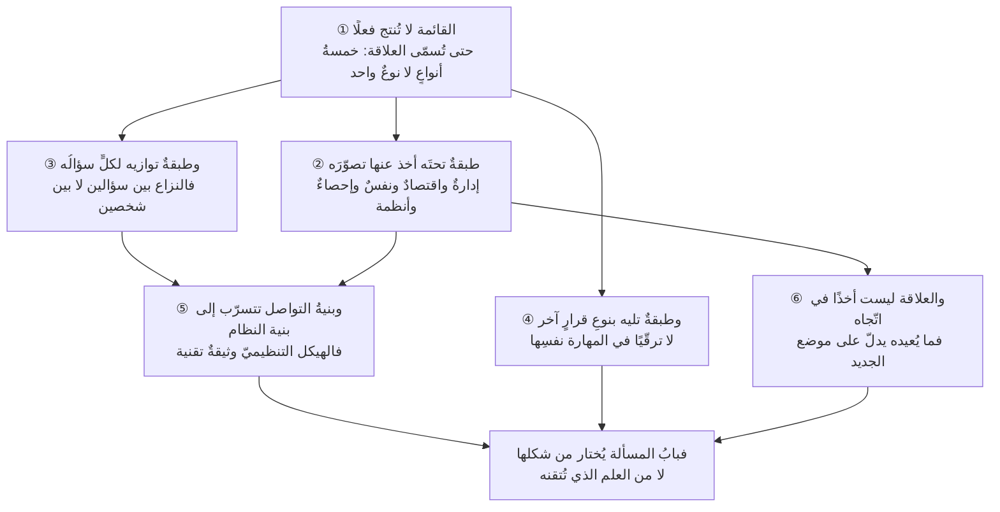

# الفصل 04 — أين يقع هذا العلم؟ خارطة المعرفة وطبقاتها

---

## 🏛️ لماذا تقرأ هذا الفصل؟

**المشكلة:** يقف الدارس أمام مسألة تقدير كلفة فلا يدري: أيدخلها من الاقتصاد أم من الإحصاء أم من هندسة البرمجيات؟ فيدخلها من الباب الذي يعرفه لا من الباب الذي تفتح منه.

**وماذا لو لم تعرف؟** من جهل خارطة علمه دخل كلّ مسألة من باب واحد يعرفه، فأصاب حيث وافق وأخطأ حيث خالف — وهو لا يدري أنّ للمسألة بابًا آخر.

**وبعد هذا الفصل ستستطيع:**

- **أن تسمّي العلاقة** التي تربطك بأيّ علمٍ مجاور — أيؤسّسك، أم تعتمد عليه في أداة، أم يوازيك بسؤالٍ خاصّ به، أم يمتدّ بعدك؟ — فتعرف **ماذا تطلب منه**: تصوّرًا تبني عليه، أم أداةً تستعيرها بشرطها، أم حدًّا تتفاوض عليه، أم مهارةً لم يحن وقتُها بعد.
- **أن تختار باب المسألة** من شكلها لا من عادتك: فتعرف أنّ ما يبدو «ضعفًا في التقدير» قد يكون مسألة **طوابيرَ وانتظار**، وأنّ ما يبدو «فتورًا في الفريق» قد يكون مسألة **بنيةِ حوافزَ** لا مسألة تحفيز، وأنّ ما يبدو خلافًا شخصيًّا هو غالبًا **خلافٌ بين سؤالين** كلاهما مشروع.
- **أن تقرأ الهيكل التنظيميّ وثيقةً تقنية**: فترى قبل أن يقع أين ستنشأ الحدود الهشّة في نظامك — عند المواضع التي يفصل فيها التنظيمُ من يلزم أن يتحدّثا — وتعرف متى يكون العلاج معماريًّا ومتى يكون تنظيميًّا.

> [!info] بطاقة الفصل
> **النوع:** تركيبيّ
> **المستوى:** 🟡 متوسّط
> **زمن القراءة:** نحو 45 دقيقة
> **أهمّيته في الباب:** ★★★★★
> **موضعك:** انتهيتَ من [[03 - فلسفة المشروع]] ← **⬤ أنت هنا** ← يليه [[05 - ما ليس من إدارة المشاريع]]

> [!abstract] موقع هذا الفصل
> **يبني على:** [[Brooks's Law]] · [[Technical Debt]] — يُذكَر هنا ولا يُعاد شرحه.
> **ويؤسّس:** [[Systems Thinking]] · [[Conway's Law]] — يُقدَّم هنا أوّل مرّة فيصير متاحًا لما بعده.

---

## 🧭 السؤال المركزي

> [!question] السؤال الذي يجيب عنه هذا الفصل كلّه
> **أين يقع هذا العلم من المعرفة، وبأيّ نوع من العلاقة يرتبط بجيرانه؟**

**واحمل معك هذه الأسئلة وأنت تقرأ:**

- من أيّ علم تدخل إلى مسألة تحفيز فريق؟ ومن أيّ علم إلى مسألة تقدير؟
- ما الذي يفتحه لك إتقان هذا العلم من تخصّصات؟
- هل العلم اللاحق أرقى من السابق أم يفترضه فحسب؟

---

## 🗺️ الجواب المختصر — قبل التفصيل

هذا العلم **ليس علمًا أصيلًا نشأ من أصوله**، وليس **تطبيقًا فرعيًّا لعلمٍ واحد**؛ هو **علمٌ تركيبيّ** استمدّ تصوّراته من طبقةٍ تحته، ويعمل في المشروع الواحد جنبًا إلى جنبٍ مع طبقةٍ توازيه، ويقود بعد إتقانه إلى طبقةٍ تليه. **والذي يحوّل هذه الخريطة من زينةٍ تصنيفية إلى أداةٍ تُستعمل ليس أسماءُ الجيران، بل تسميةُ نوع العلاقة بكلٍّ منهم.** فما تطلبه من علمٍ يختلف باختلاف علاقتك به:

- **من العلم المؤسِّس** تطلب **تصوّرًا** لا يُفهم بابُك بدونه.
- **ومن العلم الذي تعتمد عليه** تطلب **أداةً بشرطها**، ويجوز أن تُستبدل بغيرها.
- **ومن العلم الموازي** لا تطلب شيئًا، وإنّما **تتفاوض معه على حدّ**.
- **ومن العلم اللاحق** لا تطلب اليوم شيئًا، لأنّ وقته لم يحن.

**ويترتّب على هذا أثرٌ عمليّ هو غرض الفصل كلِّه:** أنّ **باب المسألة يُختار من شكلها لا من عادتك**:

- **ما فيه ازدحامٌ وانتظار** بابُه الطوابير والتدفّق، وإن سُمّي «مشكلة تقدير».
- **وما فيه سلوكٌ متكرّر** لا يفسّره سوء نيّةٍ ولا نقصُ كفاءة، بابُه **بنيةُ النظام وحوافزُه** لا الأشخاص.
- **وما فيه مفاضلةٌ بين خيارين مشروعين**، بابُه **الاقتصاد** لا الإقناع.

**ومن دخل كلّ مسألةٍ من البابِ الذي يُتقنه أصاب حيث وافق وأخطأ حيث خالف، وهو لا يدري أنّ للمسألة بابًا آخر.**

**وفوق ذلك كلِّه علاقةٌ تجعل هذه الخريطة قيدًا هندسيًّا لا ترتيبًا معرفيًّا:** أنّ **بنية التواصل في المؤسّسة تتسرّب إلى بنية النظام الذي تبنيه** — فحدود الفرق تصير حدودًا في المنتج، والموضع الذي يفصل فيه التنظيمُ من يلزم أن يتحدّثا هو الموضع الذي ستنشأ فيه أهشُّ الوصلات وأكثرُ العيوب. **فالهيكل التنظيميّ وثيقةٌ تقنية**، وقراءتُه على هذا الوجه من أنفع ما يفعله من يقود مشروعًا برمجيًّا.

**وما بقي من هذا الفصل تحريرٌ لهذا الجواب في ستّ خطوات:**

1. أنواعُ العلاقة الخمسة التي تُبنى عليها الخريطة.
2. الطبقة المؤسِّسة وماذا أخذ عن كلٍّ منها بالتحديد.
3. الطبقة الموازية وكيف يُرسم الحدّ معها.
4. الطبقة اللاحقة وشرطُ الانتقال إلى كلٍّ منها.
5. قانون كونواي بوصفه الموضع الذي تلتقي فيه خارطة التنظيم بخارطة المنتج.
6. ما يُعيده هذا العلم إلى العلوم التي أخذ عنها.

> [!abstract] مفاهيم يُدخلها هذا الفصل في قاموسك
> `Systems Thinking` · `Conway's Law`

> [!warning] مفاهيم يكثر الخلط بينها هنا
> `Foundation` مقابل `Parallel` مقابل `Extension` — احملها في ذهنك، فالفصل يفرّقها في محطّة التمييز.

---

## 🧱 الفكرة الأولى: قائمة «علوم ذات صلة» لا تفيد شيئًا ما لم تُسمَّ العلاقة

*موضعها من الفصل: هذه أوّل خطوةٍ في البناء، وموضعها أن تُقيم أداة الترتيب قبل أن يُرتَّب بها شيء — **فالأفكار الثلاث بعدها ليست إلّا هذه الأداةَ مطبَّقة**: طبقةٌ مؤسِّسة، وطبقةٌ موازية، وطبقةٌ لاحقة.*

**الفكرة الرئيسة:** تُختم مناهج هذا العلم وكتبه عادةً بقائمةٍ عنوانها «علوم ذات صلة»، فيها الإدارة والاقتصاد وعلم النفس وهندسة البرمجيات وتحليل الأعمال. **والقائمة صحيحةٌ ولا تُنتج فعلًا واحدًا**، لأنها تقول إنّ ثمّة صلةً ولا تقول **أيّ صلة**. والفرق بين قائمةٍ وخريطة أنّ الخريطة تُسمّي نوع الطريق: أهو طريقٌ تسلكه إليه، أم يسلكه إليك، أم تلتقيان عليه، أم لا يُفتح لك بعد؟

### أنواع العلاقة الخمسة

**① تأسيس (Foundation).** أن يمدّك العلم بـ**تصوّرك** لا بأداةٍ فيه. **وعلامته الفارقة: لو رُفع لما فُهمت مسائلك أصلًا** — لا أن تصعب، بل أن تفقد معناها. فلكلّ «نعم» ثمنٌ هو ما تركتَه لأجلها. ومن لم يعرف هذا لم يفهم معنى الترتيب أصلًا، **إذ ترتيب قائمة الأعمال بلا تصوّر كلفة الفرصة البديلة إجراءٌ بلا مضمون**. **وما تطلبه من العلم المؤسِّس: أن تفهمه، لا أن تستعمله.**

**② اعتماد (Dependency).** أن يمدّك العلم بـ**أداةٍ أو نتيجةٍ في مسألةٍ بعينها**، بلا أن يمدّك بتصوّر. **وعلامته الفارقة: أنه قابلٌ للاستبدال** — فإن وجدتَ أداةً أخرى تؤدّي الغرض جاز أن تُبدّلها بلا أن ينهار شيء. فمحاكاة مونت كارلو أداةٌ لبيان مدى التقدير، وثمّة غيرُها. **وما تطلبه منه: أن تستعمله بشرطه** — أي أن تعرف الشروط التي تصحّ تحتها نتيجتُه، وهذا أكثر ما يُهمل.

**③ موازاة (Parallel).** أن يلتقي بك في المشروع الواحد ولا يتبع أحدُكما الآخر: لكلٍّ منكما **سؤالُه المشروع**، وتلتقيان في قرارٍ واحد يمسّ السؤالين معًا. **وعلامته الفارقة: أنّ النزاع معه يتكرّر ولا يُحسم بالمعرفة** — لأنه ليس خلافًا على معلومة بل على أيّ سؤالٍ يُقدَّم. **وما تطلبه منه: لا شيء. وإنما تتفاوض معه على حدٍّ مكتوب: من يقرّر ماذا، ومتى يُستشار، ومتى يُعلَم فقط.**

**④ امتداد (Extension).** أن يفترض هذا العلمَ ويزيد عليه **نوعًا آخر من القرار**. **وعلامته الفارقة: أنك تدخله بمهاراتك ثم تكتشف أنّ نجاحك السابق يصير عائقًا** — فالبراعة في إنجاز العمل تصير في الموضع اللاحق سببًا في احتباس القرار عندك. **وما تطلبه منه اليوم: لا شيء. وإنما تعرف أنّه هناك حتى لا تخلط بين قرارٍ من مستواك وقرارٍ من مستواه.**

**⑤ تغذية راجعة (Feedback).** أن يعيد هذا العلم إلى ما استمدّ منه شيئًا لم يكن فيه — نتيجةً أو مفهومًا أو أسلوب فحص. **وعلامته الفارقة: أن يوجد مفهومٌ نشأ في ميدان المشاريع ثم انتقل إلى العلم الأمّ فاستُعمل فيه.** **وما تطلبه منه: موضعُ البحث عن الجديد** — إذ يدلّك على أنّ أحدث ما في المسألة قد يكون في أدبيات ميدانك لا في العلم الأصل.

### وهذه الأنواع الخمسة ليست تصنيفًا للعلوم، بل للعلاقة

وهذه نقطةٌ يُخطئ فيها من يحفظ الخريطة جدولًا. **فالعلم الواحد قد يكون مؤسِّسًا لك في مسألةٍ ومعتمَدًا عليه في مسألةٍ أخرى**: فالإحصاء مؤسِّسٌ حين يعطيك تصوّر أنّ التقدير توزيعٌ لا نقطة — وهذا تصوّرٌ لا يُستبدل؛ وهو معتمَدٌ عليه حين يعطيك أسلوبًا بعينه لحساب المدى — وهذا يُستبدل. **فاسأل عن العلاقة في المسألة التي بين يديك، لا عن العلاقة في المطلق.**

### ولماذا خريطةٌ خاصّة بالمشاريع البرمجية؟

سؤالٌ يُطرح هنا بحقّ: **أليست خريطة العلوم واحدةً في المشاريع كلِّها؟** فما الذي يجعل خريطة مشروعٍ برمجيّ تختلف عن خريطة مشروع إنشاءٍ أو تنظيمِ مؤتمر؟

**والجواب أنّ الطبقة المؤسِّسة مشتركةٌ إلى حدٍّ بعيد، والطبقة الموازية تختلف اختلافًا جوهريًّا — وأنّ اختلافها ليس في أسماء الجيران بل في وزن كلٍّ منهم.** وثلاثةُ فروقٍ تفسّر ذلك:

**① الجهلُ في العمل البرمجيّ أكبر، فيثقل وزن العلوم التي تعالج الجهل.** فمشروع الإنشاء يُبنى على معرفةٍ مستقرّة: خصائصُ المواد معلومة، وطرقُ التنفيذ مجرَّبة، والتصميمُ يُعتمد قبل أن يُصبّ شيء. **والعمل البرمجيّ يُكتشف أثناء عمله** — وهذا ما سمّاه بروكس **الطواعية**: أنّ البرمجيات تُطلَب منها التغيّر لأنّها تبدو قابلةً له. فيثقل عندنا وزنُ **الإحصاء وعلوم القرار** (لأنّ التقدير مدىً لا نقطة) و**تفكير الأنظمة** (لأنّ الأثر يظهر متأخّرًا)، ويخفّ وزنُ التخطيط التفصيليّ المسبق الذي يصلح هناك.

**② المنتج غيرُ مرئيّ، فيثقل وزن العلوم التي تُظهره.** فتأخّرُ مشروع إنشاءٍ يُرى بالعين من الطريق، وتأخّرُ مشروعٍ برمجيّ لا يُرى إلا في تقرير. **وهذه اللامرئية هي التي جعلت أدوات جعل العمل مرئيًّا — من ألواحٍ ومقاييسِ تدفّقٍ ورسومٍ تراكمية — ركنًا في هذا الميدان، وهي في غيره أقلُّ شأنًا** لأنّ الواقع نفسه يُظهر الحال.

**③ الحدُّ بين المنتج والمشروع مضطربٌ في البرمجيات وحدها.** فالجسر يُسلَّم فيُشغَّل ولا يُعاد بناؤه كلَّ ثلاثة أشهر، **والنظام البرمجيّ يبقى يتغيّر ما دام يُستعمل**. ولهذا كانت **إدارة المنتج** جارًا موازيًا ثقيل الوزن عندنا، وهي في مشاريع الإنشاء غيرُ مذكورةٍ أصلًا.

**ويُضاف إليها الجاران اللذان لا نظير لهما في الميادين الأخرى بهذه الصورة:** **الأمن السيبرانيّ**، لأنّ ما تبنيه يُهاجَم من طرفٍ لا تعرفه ولا يتوقّف؛ و**قانون كونواي**، لأنّ أثر التنظيم في المنتج في البرمجيات أظهرُ منه في أيّ ميدانٍ آخر — إذ المنتج نفسُه بنيةُ معلوماتٍ وتواصل.

**وأثر هذا في قراءتك:** أنّ كتب إدارة المشاريع العامّة صادقةٌ في الطبقة المؤسِّسة، **ويجب أن تُقرأ بحذرٍ في الطبقة الموازية** — فما تقوله عن التخطيط والتعاقد والتنظيم ينفعك، وما تقوله عن ضبط النطاق ومنع التغيير قد يكون منقولًا من ميدانٍ شرطُه غيرُ شرطك.

> [!example] ثلاثة أسئلةٍ عن الشيء نفسه، وثلاثة أبواب
> فريقٌ في الرياض يسلّم متأخّرًا في كل إصدار. وطُرحت المسألة في ثلاثة اجتماعاتٍ متتالية، وفي كلٍّ منها دخلها المتحدّث من بابٍ مختلف — وكلُّهم كان يجيب إجابةً صحيحة عن سؤالٍ غير سؤال صاحبه:
>
> - **مدير الهندسة دخلها من باب هندسة البرمجيات** (موازٍ): «الشيفرة متشابكة، والنشر يدويّ، وكلُّ إصدارٍ يحتاج ثلاثة أيّام تثبيتٍ يدويّ.» — **وهذا صحيح، وسؤاله: كيف يُبنى النظام بحيث يتغيّر بأمان؟**
> - **مدير الموارد دخلها من باب الإدارة** (مؤسِّس): «الفريق ناقص، ونحتاج مطوّرَين.» — **وهذا سؤالٌ عن الطاقة، وجوابه محكومٌ بشرطٍ يعرفه من قرأ [[Brooks's Law|قانون بروكس]]: أنّ الإضافة لا تُسرّع إلّا فيما يقبل القسمة.**
> - **محلّل البيانات دخلها من باب الإحصاء والتدفّق** (مؤسِّس في تصوّره، معتمَدٌ عليه في أداته): «انظروا في الأرقام: متوسّط زمن العنصر الواحد من بدايته إلى تسليمه أحدَ عشر يومًا، والعمل الفعليّ فيه ثلاثة. الثمانية الباقية **انتظار**.»
>
> **والباب الثالث هو الذي فتح.** فلم تكن المسألة في سرعة العمل ولا في عدد العاملين، بل في أنّ عدد العناصر المفتوحة في وقتٍ واحد كان يزيد على ضعف ما يحتمله الفريق، فصار كلُّ عنصرٍ ينتظر أكثر ممّا يُعمَل فيه. **وحين حُدّ العمل الجاري ([[WIP Limit|حدّ العمل الجاري]]) لم يزد أحدٌ ساعةً واحدة من عمله، ونزل زمنُ العنصر إلى ستّة أيّام.**
>
> **ولم يكن الاثنان الأوّلان مخطئين** — فالشيفرة متشابكةٌ فعلًا، والفريق مضغوطٌ فعلًا. إنما كان جوابُهما عن سؤالٍ آخر، وكانت كلفةُ إصلاحه أعلى وأثرُه أبطأ.

> [!tip] كيف تستعمل هذه الفكرة — سؤالٌ واحد قبل كل استعارة
> كلّما استعرتَ مفهومًا أو أداةً من علمٍ آخر — وأنت تفعل ذلك أكثر ممّا تظنّ — قِف عند سؤالٍ واحد: **«أهذا تصوّرٌ أبني عليه، أم أداةٌ أستعملها؟»**
>
> - **فإن كان تصوّرًا**، فاسأل: هل فهمتُه أم حفظتُ عبارته؟ فالتصوّر المحفوظ لا يعمل، لأنّه إنما ينفع حين يُطبَّق على حالةٍ لم يُذكر فيها.
> - **وإن كان أداة**، فاسأل: **ما الشرط الذي تصحّ تحته؟** — فهذا هو السؤال الذي يُهمَل فتُنقل النتيجة إلى حيث لا تصحّ.
>
> **والفرق بينهما عمليّ لا نظريّ:** التصوّر تُخطئ في تطبيقه فتُصحّح ببطء، والأداة تُخطئ في شرطها فتُعطيك رقمًا **يبدو دقيقًا وهو باطل** — وهذا أخطر، لأنّ الرقم يُطمئن.

> [!warning] الحفرة الشائعة — الخريطة سلّمَ فضلٍ لا ترتيبَ بناء
> يُقرأ ترتيب الطبقات — مؤسِّسٌ ثم موازٍ ثم لاحق — سلّمًا في المكانة: أنّ العلم اللاحق أرقى، وأنّ من بلغ إدارة المحافظ فقد تجاوز إدارة المشاريع. **وهذا خطأ في نوع الترتيب نفسه.**
>
> **فالترتيب في الخريطة ترتيبُ افتراضٍ لا ترتيبُ فضل:** أن يفترض اللاحقُ ما قبله ولا يستغني عنه. والحسابُ يفترض الجبر ولا يعلوه، والطبُّ يفترض الكيمياء ولا يعلوها.
>
> **وأثر هذا الخطأ في السلوك ملموس:** أن يُعامَل البقاء في إدارة المشاريع «تعثّرًا في المسار الوظيفيّ»، فيندفع من يُتقنها إلى موضعٍ لا يريده ولا يُحسنه — ويُفقَد بذلك اثنان: مديرُ مشروعٍ بارع، ومديرُ محفظةٍ ضعيف. **والتعمّق أفقيًّا مسارٌ مشروع**، وسيأتي بيان شرط الانتقال في الفكرة الرابعة.

> [!question]- تأكّد أنك فهمت — قيل لك: «مشكلتنا أنّ الفريق غير متحمّس.» فمن أيّ بابٍ تدخلها؟
> **المبدأ: العبارة تصف حالةً وتُضمر تشخيصًا. فهي تقول «فتور» — وهذا ملاحَظ — ثم تضع علّته في الأشخاص، وهذا حكمٌ لم يُفحص بعد.**
>
> **والأبواب المحتملة ثلاثة، ولكلٍّ علاجٌ مختلفٌ تمامًا:**
>
> - **بابُ بنية النظام وحوافزه** (تفكير الأنظمة): أن يكون السلوك ناتجًا عن بنيةٍ تُنتجه بانتظام — كأن يُطلب من الفريق أن يُتقن ويُعجَّل به في آن، أو أن يُقاس بمؤشّرٍ لا يملك تحريكه، أو أن يُعاد ترتيب أولوياته كلَّ أسبوعين فيرى أنّ ما يبنيه لا يصل. **وعلامتُه: أنّ الفتور يصيب من يدخل الفريق بعد شهرين من دخوله**، وهذا ما لا يفسّره «أشخاصٌ غير متحمّسين».
> - **بابُ الدافعية** (علم النفس): أن يكون النقص في استقلالِ القرار، أو في الإتقان — عملٌ لا يتعلّم منه أحد شيئًا، أو في المعنى — لا يُرى لِمَ يُبنى ما يُبنى.
> - **بابُ الأشخاص فعلًا**: وهو وارد، لكنّه **آخرُ ما يُفحص لا أوّلُه**، وعلامتُه أن يكون الفتور مقصورًا على أفرادٍ بأعيانهم في بيئةٍ ينشط فيها غيرُهم.
>
> **والسؤال الواحد الذي يفصل بين الأوّل والثالث:** *لو استُبدل بهؤلاء خمسةٌ آخرون، أيتغيّر السلوك بعد ثلاثة أشهر؟* **فإن كان الجواب لا، فالعلّة في البنية قطعًا** — وقد استُبدل الناسُ ولم يتغيّر شيء. وهذا هو معنى قول أهل الأنظمة: **البنية تُولّد السلوك.**

> [!summary]- خلاصة الفكرة في سطرين
> **قائمة «علوم ذات صلة» تقول إنّ ثمّة صلةً ولا تقول أيَّ صلة، فلا تُنتج فعلًا واحدًا.**
> **والخريطة تُسمّي نوع الطريق** — أتسلكه إليه، أم يسلكه إليك، أم تلتقيان عليه، أم لا يُفتح لك بعد؟ وباختلاف النوع يختلف ما تفعله: تتعلّم، أو تُحيل، أو ترسم حدًّا، أو تصبر.

> [!question] تأمّلٌ تطبيقيّ — لا جواب له في هذا الفصل
> اكتب أسماء الأدوار التي تعاملت معها في مشروعك آخر شهر — مصمّمًا، ومعماريًّا، ومحلّلًا، ومسؤول تشغيل — وضع أمام كلٍّ منها **نوع الطريق** لا اسمه فقط.
>
> **ثمّ انظر إلى الاسم الذي ترددتَ فيه**: هل هو موازٍ فيُرسم معه حدٌّ مكتوب، أم مؤسِّسٌ فيُتعلَّم منه؟ **فأكثر الاحتكاك اليوميّ مصدرُه أنّ الطرفين لم يتّفقا على نوع الطريق بينهما.**

---

## 🧱 الفكرة الثانية: الطبقة المؤسِّسة — منها استمدّ مفاهيمه

*موضعها من الفصل: سُمّيت أنواع الصلة، وتبدأ هنا أوّلُ الطبقات الثلاث وأعمقُها أثرًا. **وما يخصّها من أنواع الصلة أنّها لا تُستعمل بل تُفهم** — فهي تحت العلم لا بجانبه، وأثرُها يظهر حيث لا يُذكر اسمُها.*

**الفكرة الرئيسة:** خمسةُ علومٍ تحت هذا العلم، **وما أخذه عنها تصوّراتٌ لا أدوات**. ولهذا لا يُغني عن معرفتها أن تحفظ أدواتها؛ إذ الأداة تُستعمل حيث تُذكر، والتصوّر يعمل في الحالة التي لم يُذكر فيها. **وهذا الفصل يذكر عن كلٍّ منها ثلاثة أشياء: ما أخذه بالتحديد، وما لم يأخذه، والعلامة التي تعرف بها أنّك في بابها.**

### ① الإدارة — أخذ منها البنية، وورث عنها عطبًا

**ما أخذه — أربعة تصوّرات:**

- **أنّ العمل الجماعيّ يحتاج بنيةً للقرار**: أن يُعرف من يقرّر ماذا، ومن يُسأل عن ماذا. **وأنّ الصلاحية والمساءلة يجب أن تتلازما** — فمن سُئل عن نتيجةٍ لا يملك أدواتها فقد وُضع في موضعٍ لا يُنجيه منه اجتهاد. وهذا المبدأ وحده يفسّر أكثر ما يقع من عطبٍ في أدوار المشاريع.
- **أنّ للتفويض حدًّا وشرطًا**: أنّ ما يُفوَّض هو القرار لا العمل، وأنّ التفويض بلا معلومةٍ ولا صلاحيةٍ تحميلٌ لا تفويض.
- **أنّ نطاق الإشراف محدود** — أنّ للمرء حدًّا فيمن يستطيع أن يتابعهم متابعةً ذات معنى. **وهذا في العمل البرمجيّ أضيقُ منه في العمل المتكرّر**، لأنّ متابعة عملٍ يُكتشف أثناء عمله تحتاج حوارًا لا تقريرًا.
- **أنّ التنسيق كلفةٌ لا مجّان** — وأنّها تنمو بنموّ العدد، وهذا ما فصّله [[Brooks's Law|قانون بروكس]] بشرطه في هذا الميدان بعينه.

**وما ورثه معها:** نموذجَ **الخطّة ثمّ التنفيذ ثمّ الرقابة على الانحراف**، الموروثَ من [[Scientific Management|الإدارة العلمية]] ومن ميدان التصنيع الذي نشأت فيه. **والنموذج صحيحٌ في موضعه** — حيث يكون العمل معلومًا قابلًا للتحديد المسبق، كخطّ إنتاجٍ يُعرف زمن كل خطوةٍ فيه. **وعطبُه أنّه انتقل إلى ميدانٍ يختلف عنه في الشرط الحاسم**: أنّ العمل البرمجيّ يُكتشف أثناء عمله. فصار «الانحراف عن الخطّة» يُقرأ تقصيرًا في التنفيذ، وهو في كثير من الأحيان **معلومةٌ جديدة** كان الجهل بها هو الأصل. **وهذا أوضح مثالٍ في الباب كلِّه على أنّ الاستعارة بلا شرطها تنقل العطب مع النفع.**

**وعلامة أنّك في باب الإدارة:** أن يكون السؤال عن **من يقرّر** أو عن **كيف يُنسَّق**، لا عن ماذا يُقرَّر.

### ② الاقتصاد — أخذ منه معنى الاختيار

**ما أخذه:** أربعةَ تصوّراتٍ تحكم كلَّ قرار ترتيبٍ في هذا العلم:

- **[[Opportunity Cost|كلفة الفرصة البديلة]]** — أنّ ثمن ما اخترتَه ليس ما دفعتَه فيه، بل **أفضلُ ما تركتَه لأجله**. وهذا هو التصوّر الذي يجعل «الترتيب» عملًا ذا مضمون، إذ لولاه لكان كلُّ عملٍ نافعٍ جديرًا بأن يُعمل.
- **[[Sunk Cost Fallacy|الكلفة الغارقة]]** — أنّ ما أُنفق لا يدخل في قرار المضيّ، لأنّه لا يُسترجَع بالمضيّ ولا يُفقَد بالتوقّف.
- **[[Cost of Delay|كلفة التأخير]]** — أنّ للتأخّر ثمنًا يُحسب، وأنّ ترتيب الأعمال بلا اعتبارِ كلفةِ تأخير كلٍّ منها ترتيبٌ ناقص. **وهذا التصوّر تحديدًا هو ما يفصل الأولوية عن الاستعجال**، إذ الاستعجال إحساسٌ وكلفةُ التأخير حساب.
- **الحدّ والهامش** — أنّ ما يستحقّ الفعل ليس النافع، بل **الذي منفعتُه الإضافية أكبرُ من كلفته الإضافية**. ومن هنا يُفهم لماذا يكون الاختبار الإضافي بعد حدٍّ معيّن خسارةً وإن كان نافعًا.

**وما لم يأخذه:** أدوات الاقتصاد الكمّية — التسعير، والنماذج الكلّية، وتحليل الأسواق. فهي ليست من بابه، ومن أقحمها أثقل قرارًا لا يحتمل.

**وعلامة أنّك في بابه:** أن تكون أمام **خيارين مشروعين** لا خيارٍ صائبٍ وآخر خاطئ.

### ③ علم النفس والسلوك التنظيمي — أخذ منه أنّ الخطأ منتظمٌ لا عشوائيّ

**ما أخذه:**

- **أنّ انحيازات الحكم منتظمة**، أي أنها تميل في اتّجاهٍ واحد ويمكن التنبّؤ بها وتصحيحُها — لا أخطاءٌ متفرّقة يُعالجها الحرص. ومن أشهرها في هذا الميدان **[[Anchoring|التثبيت]]**: أنّ أوّل رقمٍ يُذكر في الاجتماع يشدّ إليه ما بعده وإن كان مرتجلًا. وسائرُها في [[Cognitive Bias|الانحيازات المعرفية]].
- **أنّ الدافعية الداخلية بنيةٌ لا حالة** — وأنّ ما يُنتجها في العمل المعرفيّ ثلاثةٌ: استقلالُ القرار في الطريقة، وإمكانُ الإتقان، ووضوحُ المعنى. وهذا ما حرّرته **نظرية تقرير المصير (Self-Determination Theory)** عند **إدوارد ديسي (Edward Deci)** و**ريتشارد رايان (Richard Ryan)**.
- **أنّ إعلان الخطأ سلوكٌ يحكمه الأمان لا الأخلاق** — وهذا ما رصدته **إيمي إدموندسون (Amy Edmondson)** في أبحاث الفرق: أنّ الفرق التي تُبلّغ عن أخطاءٍ أكثر قد تكون أقلَّ خطأً لا أكثر، لأنّ ما يُقاس هو **الإبلاغ** لا الوقوع. وتفصيله في [[Psychological Safety|الأمان النفسي]].

**وما لم يأخذه — وهذا موضع تنبيه:** أدواتِ تصنيف الشخصيات. فتُستعمل في ورش الفرق مقاييسُ تُوزّع الناس على أنماطٍ معدودة، وتُبنى عليها قراراتُ تشكيلٍ وتوزيعِ أدوار. **وسندُها القياسيّ أضعف بكثيرٍ ممّا يوحي به استعمالُها**: من ثباتٍ ضعيفٍ للنتيجة عند إعادة الاختبار، ومن تقسيمٍ ثنائيّ لصفاتٍ هي في الواقع متّصلة. **ولا يعني هذا أنّ لا فائدة في الحديث عن أنماط العمل** — ففتحُ حديثٍ بين الناس عن تفضيلاتهم نافع؛ إنما يعني ألّا يُبنى على النتيجة قرارُ إسنادٍ أو استبعاد.

**وعلامة أنّك في بابه:** أن يتكرّر السلوك نفسُه من أشخاصٍ مختلفين في مواقف متشابهة.

### ④ الإحصاء وعلوم القرار — أخذ منها أنّ الجواب مدىً لا نقطة

**ما أخذه:**

- **أنّ التقدير توزيعٌ لا رقم.** وهذا تصوّرٌ مؤسِّس لا أداة: فمن فهمه لا يسأل «كم يستغرق؟» بل «ما مدى ما يستغرقه، وبأيّ ثقة؟». وأدواتُه — ومنها [[Monte Carlo Simulation|محاكاة مونت كارلو]] — **معتمَدٌ عليها لا مؤسِّسة**، أي تُستبدل بغيرها بلا خسارة.
- **أنّ الازدحام يُفسَّر بالطوابير لا بالكسل.** فزمنُ إنجاز العنصر الواحد هو زمنُ العمل فيه **زائدًا زمنَ انتظاره**، وأنّ الانتظار ينمو نموًّا حادًّا كلّما اقترب المورد من الاستغلال الكامل. ومن هنا [[Little's Law|قانون ليتل]] بشرطه الذي عرفتَه: أنّه يصف نظامًا مستقرًّا، فمن طبّقه على نظامٍ يتغيّر مدخلُه أخذ رقمًا لا معنى له.
- **أنّ التاريخ أصدق من الرأي**: أن يُقاس ما وقع فعلًا في أعمالٍ مشابهةٍ سبقت، بدل أن يُقدَّر ما سيقع من الصفر.

**وما لم يأخذه:** الاستدلالَ الإحصائيّ الصارم بشروطه. فالعيّنات في المشاريع صغيرة، والملاحظات غير مستقلّة، والظروف تتبدّل بين مشروعٍ وآخر. **ومن أدخل أدوات دلالةٍ إحصائية على بيانات فريقٍ من ثمانية أشخاص في ستّة أشهر أعطى نفسه ثقةً لا يسندها شيء.**

**وعلامة أنّك في بابها:** أن يكون في المسألة **تكرارٌ وانتظارٌ وتفاوت**.

### ⑤ تفكير الأنظمة — أخذ منه طريقة التشخيص

وهو **آخرُها انضمامًا وأعمقُها أثرًا في تغيير طريقة النظر**. و[[Systems Thinking|التفكير النُّظُمي]] منهجٌ يفترض أنّ سلوك أيّ نظام — فريقٍ أو مؤسّسةٍ أو منتج — ينشأ في المقام الأوّل من **بنيته الداخلية**: عناصرِه، والعلاقاتِ بينها، وحلقاتِ التغذية الراجعة، وتأخّرِ الاستجابة، والغرضِ الذي يخدمه فعلًا. وقد أسّس حقلَه المنهجيّ **جاي فورستر (Jay Forrester)** في معهد ماساتشوستس للتقنية في أواخر الخمسينيات باسم **ديناميكا الأنظمة**، ونقلته **دونيلا ميدوز (Donella Meadows)** إلى لغةٍ يقرأها صانع القرار.

**وما أخذه هذا العلم عنه أربعة تصوّرات:**

1. **البنية تُولّد السلوك.** فالمشكلة المتكرّرة **عَرَضٌ لبنيةٍ تُنتجه بانتظام**، لا حادثٌ ولا سوء أداءٍ فرديّ. ومن هنا كان تغييرُ الأشخاص أضعفَ أنواع التدخّل أثرًا، لأنّ العلاقات والحوافز تُعيد إنتاج السلوك نفسِه بالعناصر الجديدة.
2. **الغرض الفعليّ يُستدلّ عليه من السلوك لا من الوثائق.** فنظامٌ يُعلن أنّ غرضه الجودة ثم لا يكافئ إلا السرعة، غرضُه الفعليّ السرعة — وهذا هو أنفعُ سؤالٍ تسأله عن مؤسّستك.
3. **حلقتان تفسّران أكثر ما يقع:** حلقةُ تعزيزٍ تُضخّم التغيير في اتّجاهه — كالضغط الذي يدفع إلى تخطّي الاختبار فيزيد الخللَ فيزيد الضغط؛ وحلقةُ توازنٍ تقاوم التغيير وتشدّ النظام إلى حاله — وهي سبب أنّ تدخّلاتٍ كثيرة تبدو بلا أثر، لأنّ النظام يمتصّها.
4. **الأمثل الموضعيّ ليس الأمثل الكلّيّ.** فتحسينُ جزءٍ ليس في عنق الزجاجة لا يُحسّن المخرَج الكلّيّ ألبتّة، وقد يسوءُ به — وهذا ما يحرّره [[Theory of Constraints|نظرية القيود]]، ومواضعُ التدخّل مرتّبةً بقوّة أثرها في [[Leverage Points|نقاط الرافعة]].

**وعلامة أنّك في بابه:** أن يعود العطب بعد كلّ إصلاح، وأن يكون **موضع العَرَض غيرَ موضع العلّة**.

### وهذه الخمسة لا تُقرأ متوازيةً بل متداخلة

فقد يبدو من العرض السابق أنّ لكلّ علمٍ منها بابًا مستقلًّا، وأنّ المسألة تدخل من أحدها. **والواقع أنّ أعمق المسائل تدخل من بابين معًا، وأنّ الاكتفاء بأحدهما هو ما يجعل العلاج ناقصًا:**

- **الانحياز في التقدير** ليس مسألة علم نفسٍ وحده. فالانحياز نفسيّ، **لكنّ ما يجعله يتكرّر بلا تصحيح بنيةٌ نُظُمية**: أنّ من يقدّر لا يرى نتيجة تقديره، أو أنّ التقدير المتحفّظ يُقابَل بالتشكيك فيتعلّم الناس أن يقدّروا ما يُقبَل. **فالعلاج النفسيّ وحده — تدريبٌ على التقدير — يصطدم بالبنية ويعود.**
- **العمل الجاري الزائد** ليس مسألة تدفّقٍ وحده. فالطوابير تفسّر **الأثر**، والذي يفسّر **السبب** بنيةُ حوافز: أنّ فتح عملٍ جديد يُرى إنجازًا وإغلاقَ عملٍ قائم لا يُرى، أو أنّ كلّ جهةٍ طالبة تُقاس بعدد ما أُدخل لها في الخطّة.
- **والقرار المؤجَّل** ليس مسألة إدارةٍ وحدها. فغيابُ الصلاحية إداريّ، **وثمنُ التأجيل اقتصاديّ** — ومن لم يحسب الثاني لم يستطع أن يُحرّك الأوّل، لأنّه يطلب تغييرًا بلا أن يذكر ما يشتريه.

**والقاعدة العملية من هذا:** إذا وجدتَ تشخيصك يقع كلُّه في بابٍ واحد، **فاسأل عن الباب الثاني قبل أن تُقرّه** — فالمسائل التي تُعالَج ولا تُشفى هي في الغالب مسائلُ ذاتُ بابين عولجت من واحد.

### وجدولُ الأبواب

| إذا كان شكل المسألة… | فبابُها… |
|---|---|
| خيارٌ بين أمرين كلاهما نافع | الاقتصاد — والسؤال: ما الذي نتركه؟ |
| ازدحامٌ وانتظارٌ وتفاوتٌ في الزمن | الإحصاء والتدفّق — والسؤال: أين الانتظار؟ |
| سلوكٌ يتكرّر من أشخاصٍ مختلفين | علم النفس والسلوك — والسؤال: ما الذي يجعله معقولًا؟ |
| عطبٌ يعود بعد كل إصلاح | تفكير الأنظمة — والسؤال: أيّ بنيةٍ تُنتجه؟ |
| التباسٌ في من يقرّر ومن يُستشار | الإدارة — والسؤال: أين الصلاحية؟ |

> [!example] «فريقٌ لا يُحسن التقدير» — وقد كان تقديرُه صحيحًا
> فريقٌ في جدّة يُخالف تقديراتِه بمقدار الضعف تقريبًا في كل دورة. فدخلت المؤسّسة المسألة من الباب الذي يُدخَل منه عادةً: **باب مهارة التقدير**. فأُقيمت ورشة، واعتُمدت نقاط القصّة بدل الأيّام، وصار كلُّ تقديرٍ يمرّ بمراجعة أقران. **ومضت أربعة أشهر ونسبةُ الانحراف كما هي.**
>
> **ثم قِيس شيءٌ لم يكن يُقاس:** زمنُ العنصر من لحظة بدء العمل فيه إلى تسليمه، مقسومًا إلى زمنِ عملٍ وزمنِ انتظار. فكان **العملُ الفعليّ ثلاثة أيّام في المتوسّط، والانتظارُ ثمانية**. والانتظار كان في ثلاثة مواضع: بانتظار مراجعة الشيفرة، وبانتظار بيئة اختبار مشتركة، وبانتظار قرارٍ من جهةٍ خارج الفريق.
>
> **فتبيّن أنّ التقديرات كانت صحيحة** — كانت تقدّر **العمل**، وهو ثلاثة أيّام؛ والذي كُسر هو الوعد بالتسليم، وهو أحد عشر. **والفريق كان يُحاسَب على رقمٍ لا يملك أكثرَه.**
>
> **وأثرُ تصحيح الباب كان في نوع العلاج لا في مقداره:** لم يُغيَّر أسلوب التقدير أصلًا، وإنما حُدّ العمل الجاري، وأُفردت بيئةُ اختبارٍ للفريق، وجُمعت القرارات الخارجية في موعدٍ أسبوعيّ ثابت بدل أن تُطلب متفرّقة. **فنزل الانتظار إلى ثلاثة أيّام، وصار الوعدُ يُوفى بلا أن يتغيّر التقدير.**
>
> **والعبرة في كلفة الباب الخطأ:** أربعة أشهرٍ من عملٍ حقيقيّ ومخلص، أُنفقت في تحسين ما لم يكن معطوبًا.

> [!tip] كيف تستعمل هذه الفكرة — لا تشخّص من الباب الأوّل الذي يُفتح
> اجعل قاعدتك: **قبل أن تُقرّ تشخيصًا، اعرض المسألة على بابين آخرين على الأقلّ**. ولا يستغرق ذلك أكثر من دقائق:
>
> 1. **اكتب المسألة بصيغةٍ خاليةٍ من التشخيص.** «نتأخّر في كل إصدار» — لا «الفريق بطيء» ولا «التقدير ضعيف». **فأكثرُ العبارات المتداوَلة تحمل تشخيصَها في صياغتها**، فتُغلق البحث قبل أن يبدأ.
> 2. **مُرّها على جدول الأبواب الخمسة** واسأل عن كلٍّ: ماذا يقول هذا الباب لو كانت المسألة من عنده؟
> 3. **اختر الباب الذي يُنتج فرضيةً قابلةً للقياس هذا الأسبوع** — لا الباب الأصحّ نظريًّا. فقياسُ نسبة الانتظار يمكن أن يبدأ غدًا، وتقويمُ الثقافة لا.
>
> **وقاعدة الحكم:** إن كان تشخيصُك يُلقي التبعةَ على أشخاصٍ بأعيانهم، **فالاحتمال الراجح أنّك في الباب الخطأ** — لا لأنّ الأشخاص لا يخطئون، بل لأنّ هذا الباب هو أوّلُ ما يُفتح وأقلُّه إنتاجًا للعلاج.

> [!warning] الحفرة الشائعة — الاستعارة بلا شرطها
> أشيعُ عطبٍ في هذه الطبقة كلِّها ليس الجهل بها، بل **نقلُ نتيجةٍ منها إلى موضعٍ لا تصحّ فيه**. وقد رأيتَ صوره في ما مضى: قانونُ بروكس يُطبَّق على عملٍ قابلٍ للقسمة فيمنع إضافةً نافعة، وقانونُ ليتل يُطبَّق على نظامٍ غير مستقرّ فيُعطي رقمًا جميلًا لا معنى له، ونموذجُ التخطيط والرقابة يُنقل من خطّ إنتاجٍ معلومٍ إلى عملٍ يُكتشف أثناء عمله.
>
> **وعلّةُ شيوع هذا العطب أنّ النتيجة تُنقل عاريةً عن شرطها في التداول.** فالورقة الأصلية تذكر شرطها، والكتابُ الذي يلخّصها يذكره في هامش، والشريحةُ التي تعرضه تُسقطه، والجملةُ التي تُقال في الاجتماع تحمله قانونًا مطلقًا.
>
> **والعلاج سؤالٌ واحد يُسأل قبل الاستعمال:** *ما الحالة التي لا يصحّ فيها هذا؟* **فمن لم يستطع أن يذكر حالةً واحدة لا تصحّ فيها القاعدة، فهو لا يعرف القاعدة؛ يعرف عبارتها.** وهذا معيارٌ يصلح لك ولمن تسمعه.

> [!question]- تأكّد أنك فهمت — قال زميل: «مشكلتنا إدارية بحتة، لا علاقة لها بالتقنية.» فما رأيك؟
> **المبدأ: الجملة قد تكون صحيحةً في وصف موضع العلّة، وهي خاطئةٌ حتمًا في نفي الأثر — لأنّ العلل الإدارية تُخلّف آثارًا تقنيةً دائمة.**
>
> **فقد يصحّ الشقّ الأوّل:** أن يكون موضعُ العطب في الصلاحية أو الحوافز أو ترتيب الأولويات لا في المهارة الهندسية. وهذا تشخيصٌ وارد ونافع.
>
> **ويبطل الشقّ الثاني دائمًا**، لسببين:
>
> 1. **لأنّ العطب الإداريّ يترسّب في الشيفرة.** فالضغط الذي يُجبر على تخطّي الاختبار يُخلّف عيوبًا، والأولوياتُ التي تتقلّب كلَّ أسبوعين تُخلّف بناءً نصفَ منجَزٍ في ثلاثة مواضع، وكلاهما [[Technical Debt|دينٌ تقنيّ]] يُدفع بفوائده بعد سنة. **فالعلّة إدارية والأثر تقنيّ، وهو يبقى بعد زوال العلّة.**
> 2. **ولأنّ بنية التنظيم تُملي بنية النظام** — وهذا موضوع الفكرة الخامسة من هذا الفصل. فالحدّ التنظيميّ بين إدارتين يصير حدًّا في المنتج، والمسألة «الإدارية البحتة» تُخلّف معماريةً لا تُصلَح بقرارٍ إداريّ لاحق.
>
> **والصياغة الدقيقة:** «موضعُ العلّة إداريّ، وموضعُ الأثر تقنيّ — فالإصلاحان لازمان معًا. ولو أُصلح الإداريّ وحده لبقي أثرُه في النظام سنواتٍ يدفع ثمنَه من لم يشهد العلّة.»

> [!summary]- خلاصة الفكرة في سطرين
> **ما أخذه هذا العلم عن العلوم التي تحته تصوّراتٌ لا أدوات، ولذلك لا يُغني عن معرفتها حفظُ أدواتها.**
> **فالأداة تُستعمل حيث تُذكر، والتصوّر يعمل في الحالة التي لم يُذكر فيها** — وهي الحالة التي تُمتحن فيها فعلًا.

> [!question] تأمّلٌ تطبيقيّ — لا جواب له في هذا الفصل
> خذ قرارًا اتّخذتَه بحدسٍ ونجح، ثمّ حاول أن تردّه إلى **تصوّرٍ** من التصوّرات المؤسِّسة: أهو طابورُ انتظار؟ أم قيدٌ في منظومة؟ أم تحيّزٌ منتظم؟ أم كلفةُ تنسيق؟
>
> **فإن وجدتَ له اسمًا، انتقل من حدسٍ يقع مرّةً إلى أداةٍ تُستدعى متى تكرّر الموقف.** وإن لم تجد، فهذه إشارةٌ إلى بابٍ لم تدخله بعد.

---

## 🧱 الفكرة الثالثة: الطبقة الموازية — معها يتقاطع في المشروع الواحد بلا تبعية

*موضعها من الفصل: كانت الطبقة السابقة تحتك فتُفهم، وهذه بجانبك فتُحاذَر. **والفرق بينهما فرقٌ في نوع الخطر**: تلك يُخطئ فيها من استعار أداةً وترك تصوّرها، وهذه يُخطئ فيها من ظنّ الخلاف على معلومةٍ وهو على أيّ سؤالٍ يُقدَّم.*

**الفكرة الرئيسة:** ستّةُ علومٍ تعمل معك في المشروع الواحد، ولا يتبع أحدُها الآخر. **ولكلٍّ منها سؤالٌ مشروع** يجيب عنه إجابةً صحيحة، **والنزاع بينكم ليس نزاعًا على معلومةٍ بل على أيّ سؤالٍ يُقدَّم** — ولهذا يتكرّر ولا يُحسم بمزيدٍ من الشرح. وقاعدة العمل معها: **لا تطلب منها شيئًا، وإنما ارسم معها حدًّا مكتوبًا: من يقرّر ماذا، ومتى يُستشار، ومتى يُعلَم فقط.**

### الجيران الستّة بأسئلتهم

| العلم الموازي | سؤاله المشروع | موضع النزاع المتكرّر |
|---|---|---|
| **هندسة البرمجيات** | كيف يُبنى النظام بحيث يصمد ويتغيّر بأمان؟ | متى يُسدَّد الدين التقنيّ، ومن يقرّر تأجيله |
| **تحليل الأعمال وهندسة المتطلّبات** | ما الذي تحتاجه الجهة فعلًا وراء ما طلبته؟ | أتغيّر المتطلَّب أم انكشف ما كان مجهولًا؟ |
| **إدارة المنتج** | ما الذي يستحقّ أن يُبنى ولماذا؟ | من يملك الترتيب، ومن يملك الرفض |
| **تجربة المستخدم** | كيف يُفهم النظام ويُستعمل بلا تعليم؟ | أيؤخّر البحثُ التسليمَ أم يمنع بناءَ ما لا يُستعمل؟ |
| **الجودة والأمن السيبرانيّ** | بأيّ ثقةٍ نُطلق، وما الذي نخسره إن أُسيء الاستعمال؟ | متى يدخلان: قيدًا مبكّرًا أم بوّابةَ رفضٍ في الآخر |
| **القانون والتعاقد** | بمَ التزمنا، وبمَ نُساءل؟ | أيُقرأ العقد مرّةً عند التوقيع أم يُراجَع عند كل تغيير؟ |

**وثلاثةٌ من هذه الستّة يُخلط بينها وبين علمك خلطًا خاصًّا**، لأنّ الحدّ بينها وبينه دقيق لا واضح: **إدارة المنتج** و**تحليل الأعمال** و**هندسة البرمجيات**. **وتحرير هذا الحدّ بتفصيله موضوعُ [[05 - ما ليس من إدارة المشاريع]]**، والذي يعنينا هنا **نوعُ العلاقة** لا موضعُ الحدّ: أنها موازاةٌ لا تبعية، وأنّ ما يُطلب فيها اتّفاقٌ على الصلاحية لا حسمٌ لمن هو أعلم.

### وأكثر نزاعات المشاريع البرمجية نزاعٌ بين سؤالين لا بين شخصين

وهذه هي الفكرة العملية في هذا القسم. فحين يقول المهندس المعماريّ «نحتاج أسبوعين لإعادة بناء طبقة الوصول إلى البيانات» ويقول مديرُ المشروع «لا نملك أسبوعين»، **فليس أحدُهما مخطئًا في معلومة**. الأوّل يجيب عن سؤاله: كيف يبقى هذا النظام قابلًا للتغيير بعد سنتين؟ والثاني يجيب عن سؤاله: كيف نفي بما التزمنا به في هذا الربع؟ **وكلا السؤالين مشروع، والخلاف في أيّهما يُقدَّم — وهو خلافٌ في المقصد لا في الوصف** كما استقرّ عندك في الفصل الثاني.

**ولذلك لا يُحسم هذا النزاع بمزيدٍ من الحجّة، ولا بمن هو أعلى منصبًا، وإنما بأحد طريقين:**

1. **أن يُحوَّل إلى مقايضةٍ معروضة** — أن يقول المهندس لا «نحتاج أسبوعين» بل: «الأسبوعان يشتريان كذا؛ وثمن تأجيلهما أنّ كلَّ تعديلٍ في هذه الطبقة سيكلّف كذا ابتداءً من كذا. **والقرار لك.**» **فبهذا ينتقل من مطالبٍ إلى مُخبِرٍ عن ثمن**، ويصير القرار قرارًا مسؤولًا لا معركةً يُغلب فيها أحدُهما.
2. **أن يُرفع إلى من يملك المقصد** — إن كانت المفاضلة بين ربعٍ وسنتين تتجاوز صلاحيتكما معًا، **فرفعُها ليس عجزًا بل تصنيفٌ صحيح لمستوى القرار**.

> [!info] إضافة مرجعية — أشيع خطأ في التعامل مع الموازي: أن يُعامَل مورّدًا
> الخطأ البنيويّ الأكثر تكرارًا في هذه الطبقة ليس النزاع، بل **أن يُنزَّل العلم الموازي منزلة المورّد**: أن يُطلب من تجربة المستخدم «تصميمُ الشاشات» بوصفه بندًا في الخطّة له مدّة، ومن الجودة «تنفيذُ الاختبارات» بوصفه مرحلةً في الآخر، ومن تحليل الأعمال «كتابةُ المتطلّبات» بوصفه مُخرَجًا يُسلَّم.
>
> **وعلامتُه الفارقة في الوثائق:** أن يظهر عملُ هذه العلوم في الخطّة **مهمّةً لها مدّة**، ولا يظهر قطّ **قرارًا له مالك**. فمن كان عمله كلُّه مهامَّ في خطّةٍ فهو منفّذ؛ ومن له قرارٌ يملكه فهو شريكٌ في مستوى القرار.
>
> **وأثرُ هذا الخطأ يظهر متأخّرًا وبكلفةٍ عالية:** فالجودة إن أُدخلت في الآخر لم يبقَ لها إلا أن تكون **بوّابةَ رفض** — تقول «لا» في وقتٍ صار فيه قول «لا» أغلى ما يمكن؛ ولو أُدخلت في أوّله لكانت **قيدًا يُصاغ عليه التصميم** بلا كلفةٍ تُذكر. **وهي في الحالين تقول الشيء نفسه، ويختلف ثمنُه اختلافًا هائلًا باختلاف موضعها من الزمن.**

> [!example] أسبوعان في نزاع، وعشر دقائق في مقايضة
> في شركةٍ بجدّة، تكرّر في ثلاثة اجتماعاتٍ متتالية النزاعُ نفسه: مهندسٌ معماريّ يطلب أسبوعين لإعادة بناء طبقةٍ صارت متشابكة، ومديرُ مشروعٍ يرفض لأنّ الإصدار بعد خمسة أسابيع. **وفي كلّ مرّةٍ كان النقاش يدور حول من هو أدرى بمصلحة المشروع، وينتهي بلا قرارٍ ثمّ يُستأنف.**
>
> **وفي الرابعة غُيّرت صياغة الطلب لا مضمونُه.** جاء المهندس بثلاثة أرقام:
>
> - **ما يشتريه الأسبوعان:** أنّ التعديل في قواعد التسعير — وهي أكثر ما يتغيّر في هذا النظام — ينزل من أربعة أيّامٍ إلى يوم.
> - **ثمن التأجيل:** أنّ في خارطة الربع القادم أربعة بنودٍ تمسّ هذه الطبقة، فالتأجيل يكلّف نحو اثني عشر يومًا إضافية موزّعةً عليها.
> - **وما لا يعرفه:** أنّ هذه البنود الأربعة قد تُلغى إن تغيّرت الأولويات، فيسقط الثمن.
>
> **فانحسم الأمر في عشر دقائق، وبقرارٍ لم يقترحه أحدُهما:** أُجّلت إعادة البناء الكاملة، وأُنجز منها في الإصدار الحاليّ الجزءُ الذي تمسّه البنود الأربعة وحدَه — ثلاثة أيّامٍ لا أسبوعين.
>
> **والذي تغيّر لم يكن المعلومات؛ كانت عند المهندس من أوّل اجتماع.** الذي تغيّر أنّه **نقل نفسَه من موضع المطالِب إلى موضع المُخبِر عن ثمن**، فصار القرار قرارَ من يملكه بمعلومةٍ كاملة — بدل أن يكون غَلَبةً لأحد الطرفين.

> [!tip] كيف تستعمل هذه الفكرة — ورقة الحدود في جلسةٍ واحدة
> اجمع من يمثّلون الجيران في مشروعك، واملؤوا معًا جدولًا من أربعة أعمدة. **ولا تملأه وحدك ثم تعرضه، فالغرض من الجلسة هو الخلاف الذي يظهر فيها لا الورقة التي تخرج منها:**
>
> | الجار | سؤاله | ما يقرّره وحده | ما نقرّره معًا |
> |---|---|---|---|
> | هندسة البرمجيات | كيف يُبنى ليصمد؟ | كيفية البناء والتقنيات | ثمنُ التأجيل ومتى يُدفع |
> | تجربة المستخدم | كيف يُستعمل؟ | أسلوب البحث ومخرجاته | مقدارُ ما نتحقّق منه قبل البناء |
> | الجودة | بأيّ ثقةٍ نُطلق؟ | ما يُختبر وكيف | حدُّ الثقة الذي نطلق عنده |
>
> **وثلاث قواعد لملئه:**
>
> 1. **العمود الثالث لا يُساوَم عليه.** فما يقرّره الجار وحده يقرّره وحده — ومن نازعه فيه أفسد الحدّ كلَّه.
> 2. **الخانة التي يُختلف عليها هي المكسب.** فالخانات المتّفق عليها كانت معلومةً قبل الجلسة؛ والقيمة كلُّها في الخانتين أو الثلاث التي ظهر فيها أنّ كلَّ طرفٍ كان يظنّ أنّها له.
> 3. **لا تُضِف عمودًا رابعًا «من يُعلَم فقط» في الجلسة الأولى.** فهو يجرّ إلى تفصيلٍ إجرائيّ يُنسي الغرض، ويمكن أن يُلحق لاحقًا بأدواتٍ من نوع [[RACI|مصفوفة المسؤوليات]] لمن احتاجها.

> [!warning] الحفرة الشائعة — أن يُحسم الخلاف بالمنصب فيهاجر إلى الشيفرة
> حين يُحسم خلافٌ بين سؤالين بالمنصب — «أنا مدير المشروع وهذا قراري» أو «أنا المهندس الأقدم وهذا قراري» — **فالخلاف لا يزول؛ ينتقل إلى موضعٍ لا يُرى فيه**.
>
> **فالمهندس الذي غُلب لا يُخالف علنًا**، وإنما يبني على وجهٍ يجعل ما يراه صوابًا ممكنًا لاحقًا: طبقةٌ إضافية «للاحتياط»، أو تعميمٌ لم يُطلب، أو تجنّبٌ للمساس بالجزء المتنازَع عليه. **ومحلّل الأعمال الذي غُلب يكتب متطلَّبًا فضفاضًا يحتمل التأويلين.** وكلاهما يفعل ذلك بحسن نيّةٍ غالبًا، ولا يُسمّيه معارضة.
>
> **وأثرُه أنّ التكلفة تُدفع مرّتين:** مرّةً في القرار الذي اتُّخذ، ومرّةً في الالتفاف عليه — **وهذه الثانية لا يراها أحدٌ في التقارير، ويدفعها من يأتي بعد سنة**.
>
> **والعلامة الفارقة:** أن تجد في النظام تعقيدًا لا يفسّره أيُّ متطلَّب مكتوب. **فالتعقيد الذي لا سببَ له في المتطلّبات له سببٌ في الاجتماعات.**

> [!question]- تأكّد أنك فهمت — قال مالك المنتج: «هذه الميزة أولوية.» وقال المهندس: «ستكسر التصميم.» فمن الحكم؟
> **المبدأ: السؤال بصيغته يطلب حكمًا بين طرفين، والمسألة لا تحتاج حكمًا لأنّ الطرفين لا يتنازعان أصلًا — كلٌّ منهما يقرّر في مجاله.**
>
> **ففصل القرارين يحلّ ثلاثة أرباع المسألة:**
>
> - **«أهذه أولوية؟»** قرارٌ يملكه مالك المنتج وحده، ولا يُنازَع فيه بحجّةٍ تقنية.
> - **«كيف تُبنى؟»** قرارٌ يملكه المهندسون وحدهم، ولا يُنازَعون فيه بحجّة الأولوية.
>
> **ويبقى الربع الرابع، وهو موضع العمل الحقيقيّ:** أنّ قول المهندس «ستكسر التصميم» **ليس قرارًا تقنيًّا بل إخبارٌ عن ثمن** — والثمن يُعرض ولا يُقرَّر من طرفٍ واحد. **فالصياغة التي تُخرج المسألة من النزاع:**
>
> > «تُبنى على ثلاثة أوجه: **الأوّل** في ثلاثة أيّام ويزيد كلفة كل تعديلٍ لاحق في هذا الموضع؛ **والثاني** في تسعة أيّام ولا يزيد شيئًا؛ **والثالث** في أربعة أيّام يُنجز نصفَها الآن ويؤجّل النصف بشرطٍ مكتوب. **أيَّها نختار؟»**
>
> **وبهذا صار لمالك المنتج قرارٌ يملكه بمعلومةٍ كاملة، وللمهندس مسؤوليةٌ أدّاها بإظهار الثمن لا بمنع الميزة.** ومن لم يبقَ له قرارٌ إلّا «نعم» أو «لا» فقد وُضع في موضعٍ لا يستطيع فيه إلا أن يُغضِب أحدَهما.
>
> **وحدُّ هذا:** أن يكون ثمّة حدٌّ لا يُساوَم عليه — كخللٍ أمنيّ أو مخالفةٍ نظامية. **فتلك ليست مقايضةً تُعرض، بل قيدٌ يُعلَن**، والفرق بينهما أنّ المقايضة لها بدائل والقيد ليس له.

> [!summary]- خلاصة الفكرة في سطرين
> **ستّةُ علومٍ تعمل معك في المشروع الواحد ولا يتبع أحدُها الآخر، ولكلٍّ منها سؤالٌ مشروع يجيب عنه إجابةً صحيحة.**
> **والنزاع بينكم ليس على معلومةٍ بل على أيّ سؤالٍ يُقدَّم** — ولهذا يتكرّر ولا يُحسم بمزيدٍ من الشرح، وإنّما يُحسم بحدٍّ مكتوب: من يقرّر ماذا، ومتى يُستشار، ومتى يُعلَم فقط.

> [!question] تأمّلٌ تطبيقيّ — لا جواب له في هذا الفصل
> اختر أكثر خلافٍ يتكرّر بينك وبين جهةٍ مجاورة، واكتب في سطرين: **ما السؤال الذي تجيب عنه أنت؟ وما السؤال الذي تجيب عنه هي؟**
>
> **فإن كان السؤالان مختلفين — وهو الغالب — فالخلاف ليس على الصواب بل على الترتيب.** وحينئذٍ لا يُطلب من أحدكما أن يتنازل، وإنّما يُتّفق على من يُقدَّم سؤالُه في هذا الموضع بعينه ولماذا.

---

## 🧱 الفكرة الرابعة: الطبقة اللاحقة — إليها يقود بعد إتقانه

*موضعها من الفصل: تمّت الطبقتان اللتان تعملان معك اليوم، وتنظر هذه إلى ما بعد اليوم. **وتفارق سابقتيها بأنّها لا تُطلب الآن**: فما فيها لا يُقرأ استعدادًا لترقية، وإنّما ليُعرف أنّ الانتقال إليه **تغيُّرٌ في نوع القرار لا ترقٍّ في المهارة نفسها**.*

**الفكرة الرئيسة:** أربعةُ مواضعَ تفتح لمن أتقن هذا العلم، **وليس الانتقال إليها ترقّيًا في المهارة نفسها بل تغيُّرًا في نوع القرار**. **ولكلّ موضعٍ منها صورةُ فشلٍ واحدة تتكرّر: أن يظلّ الداخلُ يمارس صنعةَ الموضع الذي جاء منه، وهي التي أوصلته — فتصير هي بعينها ما يُعطّله.**

### المواضع الأربعة

**① إدارة البرامج.** والقرار الجديد فيها **التبعيات لا الجدول**: أن يُدار ما بين المكوّنات لا ما داخلها، وأن يُفاضَل بين مشروعٍ يتأخّر ليُسرع غيرُه. **وصورة فشلها:** أن يُدار البرنامج مشروعًا كبيرًا — جدولٌ من مئات البنود يُتابَع بندًا بندًا. **وعلامتُها أنّ اجتماع البرنامج يستعرض حالة كلّ مشروعٍ على حدة، ولا يذكر وصلةً واحدة بينها.**

**② إدارة المحافظ.** والقرار الجديد فيها **الإيقاف**. فالمحفظة تُدار بما يُحذف منها لا بما يُضاف إليها، **وهذا هو أصعب ما في الأربعة نفسيًّا وتنظيميًّا**: لأنّ الإضافة تُنسب إلى صاحبها والإيقاف يُخاصَم عليه. **وصورة فشلها:** أن تصير المحفظة قائمةً تنمو أبدًا، فتُوزَّع الطاقة على أضعافِ ما تحتمل، فيتأخّر كلُّ شيءٍ قليلًا ولا يُلغى شيء — وهذا أسوأ توزيعٍ ممكن، لأنّ الكلّ يُنفق ولا يُقبض شيءٌ في وقته.

**③ الحوكمة المؤسّسية.** والقرار الجديد فيها **تصميمُ آليّة القرار لا اتّخاذه**: من يقرّر ماذا، وبأيّ معلومةٍ يقرّر، وكيف يُراجَع. و[[Governance|الحوكمة]] بهذا المعنى **بنيةٌ تُصمَّم**، وأثرُها في السلوك أقوى من أثر أيّ توجيه. **وصورة فشلها:** أن تنقلب بوّابات موافقةٍ متتالية، فيُنفَق الوقتُ في العبور بدل أن يُنفَق في القرار. **وعلامتُها:** أن تكون النسبةُ الغالبة من مخرجات الحوكمة **موافقاتٍ** لا **قواعدَ قرارٍ تُغني عن الموافقة**.

**④ القيادة الهندسية.** والقرار الجديد فيها **بناءُ القدرة لا إنجازُ العمل**. **وصورة فشلها أشهرُ الأربع وأشدُّها التباسًا بالفضيلة:** أن يبقى القائد أفضلَ مهندسٍ في فريقه. فيُسنَد إليه أصعبُ الأعمال لأنه أسرعُ من يُنجزها، فيصير **عنقَ الزجاجة** الذي ينتظره الجميع، **وينمو الفريق حوله ولا ينمو به**. **وعلامتُها: أن يكون أطولُ انتظارٍ في الفريق هو انتظارَ وقته.**

### والأربعة في جدولٍ واحد

| الموضع | القرار الذي يتغيّر | صورةُ فشله | علامتُها |
|---|---|---|---|
| **إدارة البرامج** | التبعيات بين المكوّنات لا الجدول | أن يُدار مشروعًا كبيرًا | الاجتماع يستعرض كلّ مشروعٍ على حدة ولا يذكر وصلة |
| **إدارة المحافظ** | **الإيقاف** | أن يُضاف ولا يُحذف | كلُّ شيءٍ يتأخّر قليلًا ولا يُلغى شيء |
| **الحوكمة** | تصميمُ آليّة القرار لا اتّخاذه | أن تنقلب بوّابات موافقة | مخرجاتُها موافقاتٌ لا قواعدُ قرار |
| **القيادة الهندسية** | بناءُ القدرة لا إنجازُ العمل | أن يبقى القائد أفضلَ مهندس | أطولُ انتظارٍ في الفريق هو انتظارُ وقته |

**والعمود الثالث فيه القاعدة كلُّها:** أنّ صورة الفشل في المواضع الأربعة **واحدةٌ في جوهرها** — أن يُمارَس في الموضع الجديد ما كان يُتقَن في القديم. **ولهذا لا تُعالَج بالجدّ ولا بالساعات، لأنّ صاحبها يعمل كثيرًا ويُتقن ما يعمل؛ إنما تُعالَج بأن يُسأل عن نوع القرار لا عن مقداره.**

### والانتقال يُخطئ فيه من ينظر إليه ترقيةً

وهذه ملاحظةٌ رصدها **لورنس بيتر (Laurence J. Peter)** في كتابه *The Peter Principle* (1969) بصياغةٍ ساخرة صارت مشهورة: أنّ الترقية في المؤسّسات تجري على أساس **الإتقان في الموضع الحاليّ**، وهي بذلك تدفع بالناس إلى مواضعَ تحتاج مهاراتٍ أخرى، حتى يستقرّ كلٌّ في موضعٍ لا يُتقنه.

**والعلاج المستفاد منها عمليّ لا ساخر:** أنّ شرط الانتقال ليس الإتقان في الموضع السابق، بل **إثبات القدرة على نوع القرار الجديد قبل الانتقال** — ولو في نطاقٍ صغير. فمن يُراد نقلُه إلى إدارة برنامجٍ يُسأل: **هل أدار من قبلُ تبعيةً بين فريقين لا يتبعانه؟** ومن يُراد نقلُه إلى محفظةٍ يُسأل: **هل أوقف من قبلُ عملًا كان قد بدأه؟**

**ولا يُقرأ هذا كلُّه سلّمًا يجب صعودُه.** فالتعمّق أفقيًّا في هذا العلم مسارٌ كاملٌ مشروع: أن يصير المرء مرجعًا في نوعٍ من المشاريع بعينه — الترحيلات، أو الأنظمة عالية الاعتمادية، أو التكامل مع الجهات التنظيمية. **والمؤسّسة التي لا تملك مسارًا للتعمّق تدفع بأبرع ممارسيها إلى الإدارة، فتخسرهم مرّتين: تفقد ممارسًا نادرًا، وتكسب مديرًا متوسّطًا.**

> [!example] رُقّي فأدار برنامجًا كما يُدار مشروع
> مديرُ مشروعٍ بارع في الرياض، سلّم ثلاثة مشاريعَ متتالية في مواعيدها. فرُقّي إلى إدارة برنامجٍ يضمّ خمسة مشاريعَ لبناء منظومةٍ متكاملة.
>
> **ففعل ما أتقنه:** جمع خطط المشاريع الخمس في خطّةٍ واحدة من نحو أربعمئة بند، وجعل اجتماعًا أسبوعيًّا يستعرض فيه حالةَ كلِّ مشروعٍ على حدة، وطلب تقريرًا موحّدًا من كل مدير مشروع.
>
> **وبعد خمسة أشهر:** كانت المشاريع الخمسة تسير قريبًا من خططها — أربعةٌ في مواعيدها وواحدٌ متأخّر أسبوعين. **وكان البرنامج متعثّرًا.** فالمنظومة لم تُختبر مجتمعةً قطّ، وكان كلُّ مشروعٍ قد بنى تصوّره الخاصّ لصيغة البيانات المتبادلة، **وثلاثةٌ من الخمسة كانت تنتظر واجهةً يبنيها الرابع ولم يكن في خطّته أنه يبنيها لهم**.
>
> **والاجتماع الأسبوعيّ لم يكن ليكشف ذلك أبدًا** — لأنّه كان يسأل كلَّ مشروعٍ عن نفسه، ولم يسأل مرّةً واحدة: **ما الذي ينتظره كلُّ فريقٍ من غيره؟**
>
> **وحين تغيّر سؤال الاجتماع وحده** — من «أين وصلتم؟» إلى «ما الذي تنتظرونه من الآخرين، وما الذي ينتظره الآخرون منكم؟» — ظهرت في الجلسة الأولى إحدى عشرة وصلةً لم تكن مكتوبةً في أيّ خطّة. **ولم يتغيّر شيءٌ في المهارة؛ تغيّر نوعُ القرار الذي يُنظر فيه.**

> [!tip] كيف تستعمل هذه الفكرة — اختبار الاستعداد قبل القبول
> إن عُرض عليك انتقالٌ إلى أحد المواضع الأربعة، فاسأل نفسك ثلاثة أسئلةٍ قبل أن تسأل عن الراتب والمسمّى:
>
> 1. **«ما نوع القرار الذي سأتّخذه ولا أتّخذه اليوم؟»** — فإن لم تجد جوابًا واضحًا، فأنت لا تنتقل إلى موضعٍ آخر؛ أنت تفعل الشيء نفسه بحجمٍ أكبر ومسمّى أفخم. **وهذا أشيع صور «الترقية» التي لا تُنتج نموًّا.**
> 2. **«هل مارستُ هذا النوع من القرار ولو مرّةً في نطاقٍ صغير؟»** — فإن لم تكن، **فاطلب أن تمارسه قبل الانتقال لا بعده**: أن تُسنَد إليك تبعيةٌ بين فريقين، أو أن تُشارك في قرار إيقافٍ واحد.
> 3. **«ما الذي أُتقنه اليوم وسيصير عائقًا؟»** — وهذا أنفعُ الثلاثة وأقلُّها سؤالًا. فالمهندس البارع سيُعيقه أنه أسرعُ من يُنجز، ومديرُ المشروع الدقيق سيُعيقه أنّه يرى التفاصيل كلَّها فلا يُفوّض.
>
> **وإن كان الجواب عن الثاني لا، فليس المعنى أن ترفض** — بل أن تعرف أنّ **أوّل ستّة أشهرٍ تعلّمٌ لا أداء**، وأن تُصرّح بذلك لمن يُسندك، فتُقاس بما يليق بمرحلتك لا بما يليق بسابقك.

> [!warning] الحفرة الشائعة — أن تُقاس المواضع اللاحقة بمقاييس السابقة
> يُنقل المرء إلى موضعٍ نوعُ قراره مختلف، **ثم يُقاس بمقاييس موضعه القديم** — فيُسأل مديرُ المحفظة كم مشروعًا أُنجز، ويُسأل قائد الهندسة كم ميزةً سُلّمت، ويُسأل مديرُ البرنامج أفي الجدول هو أم لا.
>
> **وأثرُ ذلك أنّ الشخص يعود إلى سلوك موضعه السابق وهو يعلم أنّه ليس الصواب** — لأنّ ما يُقاس به هو ما يفعله، مهما قيل له في وصف الدور. **وهذا [[Goodhart's Law|قانون غودهارت]] في صورته اليومية: أنّ المؤشّر متى صار هدفًا كفّ عن أن يكون مؤشّرًا صالحًا.**
>
> **والعلامة الفارقة:** أن تقرأ وصف الدور فتجد فيه «تصميم آليّة القرار»، ثم تقرأ ما يُسأل عنه صاحبُه في المراجعة الفصلية فتجد عددًا من المشاريع المنجَزة. **فحين يفترق وصفُ الدور عن مقياسه، فالمقياس هو الدور.**

> [!question]- تأكّد أنك فهمت — عُرض عليك أن تنتقل من إدارة المشاريع إلى «مديرٍ أوّل لإدارة المشاريع» تُشرف فيه على أربعة مديري مشاريع. أهذا انتقالٌ إلى موضعٍ لاحق؟
> **المبدأ: الفرق بين الحجم والنوع. فالانتقال إلى موضعٍ لاحق يُعرف بـ«ما نوع القرار الذي سأتّخذه ولا أتّخذه اليوم؟» — لا بعدد من يتبعك.**
>
> **والجواب: قد يكون ليس انتقالًا أصلًا، وقد يكون انتقالًا حقيقيًّا — والفارق بينهما في وصف الدور لا في مسمّاه.**
>
> **فإن كان عملك أن تُتابع أربع خططٍ بدل خطّةٍ واحدة، وتجمع تقاريرها، وتتدخّل حين يتعثّر أحدها** — فأنت تفعل ما تفعله اليوم بحجمٍ أكبر. **وهذا مشروعٌ ونافع، ولكنّه توسّعٌ أفقيّ لا انتقالٌ إلى نوعٍ آخر من القرار.** وخطرُه أن يُظنّ نموًّا فيُتوقّف عنده.
>
> **وإن كان عملك أن تُقرّر أيّ المشاريع الأربعة يتأخّر ليُسرع غيرُه، وأن تُصمّم كيف تُتّخذ القرارات في الأربعة بلا أن تمرّ بك** — فأنت في موضعٍ لاحقٍ فعلًا، لأنّ هذين قراران من نوعٍ لا تتّخذه اليوم.
>
> **والسؤال الواحد الذي يفصل:** *هل سيُنقل إليّ قرارٌ لم يكن عندي، أم سيُنقل إليّ عملٌ كان عند غيري؟*
>
> **وثمّة صورةٌ ثالثة تستحقّ التنبيه:** أن يكون الدور إشرافًا إداريًّا على الأشخاص — تقييمًا وتطويرًا وتوظيفًا — بلا قرارٍ في المشاريع نفسها. **وهذا نوعٌ ثالثٌ مختلف عن الاثنين، مهارتُه بناءُ الناس لا إدارةُ العمل**، ومن دخله يظنّه امتدادًا لإدارة المشاريع وجد نفسه في صنعةٍ لم يتدرّب عليها.

> [!summary]- خلاصة الفكرة في سطرين
> **الانتقال إلى ما بعد هذا العلم ليس ترقّيًا في المهارة نفسها، بل تغيُّرٌ في نوع القرار.**
> **ولكلّ موضعٍ صورةُ فشلٍ واحدة تتكرّر:** أن يظلّ الداخل يمارس صنعةَ الموضع الذي جاء منه — وهي التي أوصلته، فتصير هي بعينها ما يُعطّله.

> [!question] تأمّلٌ تطبيقيّ — لا جواب له في هذا الفصل
> إن كنتَ تنظر إلى موضعٍ أوسع بعد سنتين، فاكتب: **ما الذي أُتقنه اليوم وسيصير عبئًا هناك؟**
>
> والجواب لا يكون «سأترك التفاصيل»، بل شيءٌ محدَّد: قرارٌ كنتَ تتّخذه بنفسك وسيصير عليك أن تتركه لغيرك وهو يخطئ فيه. **فمن لم يُسمِّ هذا الشيء قبل أن ينتقل، سمّاه له غيرُه بعد أن ينتقل.**

---

## 🧱 الفكرة الخامسة: بنية المؤسّسة تُملي بنية النظام

*موضعها من الفصل: تمّت الطبقات الثلاث، وكانت إلى هنا **ترتيبًا معرفيًّا** يقول ماذا تطلب من كلّ جار. وتفارقها هذه الفكرة بأنّها تحوّل الخريطة إلى **قيدٍ هندسيّ** يقع عليك سواءٌ عرفتَه أو جهلتَه: أنّ شكل تواصلكم يظهر في شكل ما تبنونه.*

**الفكرة الرئيسة:** كلُّ ما مضى في هذا الفصل ترتيبٌ معرفيّ، وهذه الفكرة هي التي تجعله **قيدًا هندسيًّا**. صاغها **ملفن كونواي (Melvin Conway)** في ورقةٍ بعنوان *How Do Committees Invent?* نُشرت في مجلّة *Datamation* سنة 1968:

> [!quote] [[Conway's Law|قانون كونواي]]
> **«المنظّمات التي تصمّم أنظمةً مضطرّةٌ إلى إنتاج تصاميم تحاكي بنيةَ التواصل داخل تلك المنظّمات.»**

ومؤدّاه أنّ **الهيكل التنظيميّ يتسرّب إلى المنتج**: فحدود الفرق تصير حدودًا في النظام، والفريقان اللذان لا يتحدّثان يُنتجان مكوّنين يتكلّف الربطُ بينهما.

### ولماذا يقع هذا حتمًا؟

لأنّ **الواجهة بين مكوّنين هي في حقيقتها اتّفاقٌ بين شخصين**. فمن أراد واجهةً نظيفةً بين وحدتين احتاج حوارًا متكرّرًا بين من يبنيهما: يُجرَّب، ويُراجَع، ويُعدَّل مرارًا. **فحيث يكون الحوار سهلًا تنظف الواجهة، وحيث يكون عسيرًا — فريقٌ في إدارةٍ أخرى، أو مورّدٌ خارجيّ، أو منطقةٌ زمنية بعيدة — يميل المهندس إلى تجنّبه.** ولا يفعل ذلك تمرّدًا، بل لأنّ تجنّبه هو الخيار المعقول أمامه: فيكرّر الوظيفة عنده بدل أن يطلبها، أو يبني واجهةً على أضعفِ افتراضٍ عن الطرف الآخر، أو يلتفّ على النظام كلِّه.

**وهذا يجعل القانون حالةً خاصّة من قاعدةٍ عرفتَها في الفكرة الثانية: البنية تُولّد السلوك.** والبنية هنا بنيةُ التواصل، والسلوكُ الناتج معماريةٌ برمجية.

### ولازمُه ثلاثة، وكلُّها عمليّ

**① الهيكل التنظيميّ وثيقةٌ تقنية.** فمن أراد أن يعرف أين ستنشأ أهشُّ الوصلات في نظامه، **فلينظر في خارطة من يتحدّث إلى من**، لا في مخطّط المعمارية المرسوم. **والمخطّط يقول ما يُراد، والخارطة تقول ما سيقع.**

**② إعادة التنظيم قرارٌ معماريّ، والقرار المعماريّ قرارٌ تنظيميّ.** فمن قسّم فريقًا واحدًا فريقين قد قرّر — بلا أن يشعر — أن ينشأ في النظام حدٌّ حيث لم يكن. **ومن أراد معماريةً موحّدة في موضعٍ فرّق التنظيمُ أهلَه، فهو يدفع ضدّ تيّار.**

**③ ويُستعمل عكسيًّا** — وهو ما يُعرف بـ**مناورة كونواي العكسية (Inverse Conway Maneuver)**: أن تُعاد هيكلة الفرق **عمدًا** لتُنتج المعماريةَ المقصودة. فمن أراد وحداتٍ مستقلّة، بنى فرقًا مستقلّةً تملك ما تبنيه من طرفه إلى طرفه.

**وهنا يظهر لماذا كانت خريطة العلوم في أوّل هذا الفصل عمليةً لا تصنيفية:** فالحدّ بينك وبين العلم الموازي — بين تحليل الأعمال والهندسة مثلًا — إن كان حدًّا تنظيميًّا صلبًا لا يُعبَر إلا بوثيقة، **فسيصير حدًّا في المنتج**: تكون وصلةُ «المتطلَّب إلى التنفيذ» هي بعينها موضعَ أكثر العيوب. **فالخريطة التي رسمتَها في الفكرة الثالثة ليست خريطةَ معرفةٍ فحسب؛ هي أيضًا رسمٌ أوّليّ لخطوط الصدع في نظامك.**

> [!info] إضافة مرجعية — «أنت تشحن هيكلك التنظيمي»: شعارٌ يُسقط الآليّة
> يُختصر القانون في التداول بعبارةٍ لمّاحة: **«أنت تشحن هيكلك التنظيمي»**. والعبارة صحيحة في مؤدّاها العامّ، **وتُسقط الكلمة التي عليها مدار القانون: التواصل.**
>
> **فكونواي لم يقل «بنية السلطة» ولا «مخطّط التبعية»، بل قال بنية التواصل.** والفرق بينهما عمليّ حاسم:
>
> - **فريقان في إدارتين مختلفتين يجلسان معًا ويتحدّثان يوميًّا لا يُنتجان صدعًا**، وإن كان مخطّط التبعية يفرّقهما.
> - **وفريقان تحت مديرٍ واحد لا يتحدّثان — لاختلاف المواعيد، أو لتباعد الأولويات، أو لخصومةٍ قديمة — يُنتجان صدعًا** وإن كان المخطّط يجمعهما.
>
> **ولهذا لا تعمل المناورة العكسية بإعادة الرسم.** فمن غيّر مربّعات المخطّط ولم يغيّر ما يُغيّر التواصل فعلًا — من يجلس مع من، ومن يُقاس معه بمقياسٍ واحد، ومن يحضر أيّ اجتماع، ومن يملك أن يطلب من من — **لم يغيّر شيئًا سيظهر في الشيفرة**.
>
> **وحدُّ القانون أنّه انتظامٌ ملحوظٌ له آليّةٌ قويّة، لا قانونٌ حتميّ.** فيمكن لمنظّمةٍ متقاربةِ التواصل أن تُنتج نظامًا وحداتُه غيرُ منطبقةٍ على فرقها. **والصياغة الدقيقة: أنّ المعمارية التي تخالف بنية التواصل مكلفةٌ في صيانتها، فتميل مع الزمن إلى الانهيار إليها** — إمّا أن تُصلَح البنية، أو أن تُصلَح المعمارية نفسَها إلى ما يشبهها.

> [!example] وحدةُ المدفوعات التي كُتبت مرّتين
> شركةٌ في الرياض لها تطبيقٌ للتجارة الإلكترونية. وكان في هيكلها فريقان: **فريق المنصّة الرقمية** تحت إدارة التقنية، و**فريق أنظمة المالية** تحت الإدارة المالية. ولكلٍّ منهما مديرٌ ومقاييسُ ومواعيدُ تخطيطٍ مختلفة، ولم يكن بينهما اجتماعٌ دوريّ واحد.
>
> **وبعد سنتين ظهر في النظام ما يلي:** منطق حساب المبالغ المستردّة مكتوبٌ **في موضعين** — مرّةً في خدمة المدفوعات عند فريق المالية، ومرّةً في التطبيق عند فريق المنصّة. وليس أحدهما نسخةً من الآخر: بينهما فروقٌ دقيقة في معالجة الطلبات الجزئية وفي التقريب.
>
> **ولم يكن أحدٌ قد قرّر ذلك.** سألت المراجعةُ المهندسَ الذي كتب النسخة الثانية، فكان جوابُه بسيطًا: «احتجتُها في أسبوعٍ واحد. وطلبُها من فريق المالية يعني طلبًا رسميًّا وانتظارًا إلى دورة التخطيط التالية — ستّة أسابيع. فكتبتُها.» **وكان قرارًا معقولًا تمامًا من موضعه.**
>
> **وثمنُه ظهر بعد ذلك:** كلُّ تغييرٍ في سياسة الاسترداد يحتاج تعديلين ينسّقهما فريقان لا يجتمعان، **وفي كل مرّةٍ ينسى أحدُهما شيئًا** — فكان أكثر بلاغات هذا الجزء ناشئًا عن اختلاف النسختين لا عن عطبٍ في أيٍّ منهما.
>
> **والعلاج الذي جُرّب أوّلًا لم يعمل:** كُتبت وثيقةُ «مصدرٍ واحد للحقيقة» وأُلزم الفريقان بها، فعاد الوضع كما كان في ثلاثة أشهر — **لأنّ الحافز الذي أنتج التكرار بقي كما هو.** والذي عمل: أن يُحضَر مهندسٌ من فريق المالية إلى تخطيط المنصّة، وأن يُفتح للفريقين قناةٌ يطلب فيها أحدُهما من الآخر تغييرًا صغيرًا خارج دورة التخطيط. **فلمّا رخص التواصل، رخص أن يُطلب بدل أن يُكتب من جديد.**

> [!example] وحين يكون الحدّ بين جهتين لا بين فريقين
> منصّةٌ تعليمية تديرها جهةٌ حكومية، تُربط ببوّابة دفعٍ وطنية تديرها جهةٌ أخرى. **والفريقان لا يجمعهما مديرٌ ولا مقياسٌ ولا دورةُ تخطيط**، وكلُّ طلبٍ بينهما يمرّ خطابًا رسميًّا يُنتظر جوابُه أسابيع.
>
> **فأنتج التصميم — بلا أن يقرّره أحد — طبقةً وسيطة** تُحوّل البيانات بين الطرفين وتحمل نسختها الخاصّة من قواعد التسوية. **وصارت هذه الطبقةُ بعينها موضعَ أكثر الأعطال**، لأنّها لم تُبنَ على حدٍّ في وظيفة النظام، بل على حدٍّ في التنظيم.
>
> **والذي يفارق به هذا المثالُ سابقَه أنّ العلاج الأوّل لم يكن متاحًا أصلًا.** ففتحُ قناةٍ تُرخّص الطلب بين إدارتين في شركةٍ واحدة قرارٌ يُتّخذ في اجتماع؛ وبين جهتين لكلٍّ منهما نظامُها ومسؤوليّتها ليس كذلك. **فلم يبقَ إلّا أن يُقبل الحدّ ويُدفع ثمنُه معلنًا:** أن تُصمَّم الطبقة الوسيطة عمدًا حدًّا دائمًا له مالكٌ واختباراتٌ وعقدُ بياناتٍ مكتوب، لا ترقيعًا مؤقّتًا لا يعترف به أحد.
>
> **وأسوأ ما يقع في هذه الحال أن يُطلب من الفريقين أن يعملا كأنّ الحدّ غيرُ موجود** — فيُلاما على بطءٍ سببُه في البنية لا فيهما.

> [!tip] كيف تستعمل هذه الفكرة — خريطتان على ورقةٍ واحدة
> اجلس ساعةً وارسم رسمين متجاورين:
>
> 1. **مكوّنات نظامك الرئيسية** وحدودها — كما هي فعلًا لا كما في وثيقة المعمارية.
> 2. **من يتحدّث إلى من فعلًا** — لا مخطّط التبعية. والمعيار عمليّ: من يجلس في اجتماعٍ واحد أسبوعيًّا، ومن يستطيع أن يطلب من الآخر تغييرًا صغيرًا بلا وثيقة.
>
> ثم اسأل ثلاثة أسئلة:
>
> - **أين ينطبق الرسمان؟** فتلك المواضع مستقرّة، ولا تحتاج منك شيئًا.
> - **أين يفترقان؟** فتلك المواضع هي التي تُنتج أكثرَ العيوب وأطولَ الانتظار. **وتحقّق من ذلك بالأرقام لا بالحدس: أين تقع بلاغاتُك؟**
> - **وأين أُريد معماريةً لا يسندها تواصل؟** فذلك رهانٌ يُدفع ثمنُه في الصيانة، وإمّا أن تُغيّر البنية أو أن تقبل الثمن معلنًا.
>
> **والمخرَج من الساعة قرارٌ واحد لا خطّة:** أرخصُ تغييرٍ في **التواصل** يُغني عن تغييرٍ في **المعمارية**. وهو غالبًا شيءٌ تافه الظاهر: أن يُدعى فلانٌ إلى اجتماعٍ يُعقد أصلًا، أو أن يُفتح طريقٌ لطلبٍ صغير بلا وثيقة.

> [!warning] الحفرة الشائعة — إعادة الهيكلة اسمًا
> يُقرأ القانون فيُستنتَج منه الحكم الصحيح: أنّ إعادة تنظيم الفرق تُغيّر المعمارية. **ثم تُنفَّذ إعادةُ تنظيمٍ لا تُغيّر شيئًا ممّا يُغيّر التواصل**: تُبدَّل أسماء الفرق، ويُعاد رسم المربّعات، ويُعلَن هيكلٌ جديد — **ويبقى الناس في أماكنهم، وتبقى المقاييس كما هي، ويبقى من كان يطلب بوثيقةٍ يطلب بوثيقة.**
>
> **وأثرُ ذلك أسوأ من عدم الفعل**، لأنّه يُنفق رصيدَ الثقة في تغييرٍ لا يُثمر، فيصعب أن يُقبل التغييرُ الحقيقيّ بعده.
>
> **وأربعةُ أشياء هي التي تُغيّر التواصل فعلًا، وما عداها زخرفة:**
>
> 1. **من يجلس مع من** — أو من يحضر أيّ اجتماعٍ متكرّر.
> 2. **من يُقاس بمقياسٍ واحد** — فالمقياس المشترك يُنتج حوارًا، والمقياسان المتنافسان يقطعانه.
> 3. **من يملك أن يطلب من من بلا وثيقة.**
> 4. **من يملك القرار في الوصلة بينهما.**
>
> **فإن لم يتغيّر واحدٌ من هذه الأربعة، فلم تقع إعادة هيكلةٍ وإن صدر بها قرار.**

> [!question]- تأكّد أنك فهمت — أردتَ معماريةً من وحداتٍ مستقلّة، وفرقُك مقسومةٌ بحسب التخصّص (واجهاتٌ · خلفياتٌ · قواعد بيانات). فما الذي سيقع؟
> **المبدأ: ستحصل على معماريةٍ مقسومةٍ بحسب الطبقة التقنية لا بحسب الوحدة، وستُدفع كلفةُ ذلك في كلّ ميزةٍ تُبنى — لا مرّةً واحدة.**
>
> **والسبب في الآليّة لا في المصادفة:** أنّ الوحدة المستقلّة تحتاج قرارًا يُتّخذ من طرفها إلى طرفها — واجهةً وخلفيةً وبيانات — وهذا القرار في تنظيمك **موزّعٌ على ثلاثة فرقٍ لكلٍّ منها مديرٌ وأولوياتٌ وموعدُ تخطيط**. فكلُّ ميزةٍ تحتاج تنسيقًا ثلاثيًّا، وكلُّ تنسيقٍ ينتظر أبطأَ الثلاثة، **ويصير الحدّ الطبيعيّ في النظام هو الحدّ بين الطبقات لا بين الوحدات**.
>
> **وثلاثة أعراضٍ ستراها قبل أن تُشخّصها:** أنّ إنجاز ميزةٍ صغيرة يستغرق أضعاف زمن عملها لأنّه ينتظر ثلاث دورات؛ وأنّ الوحدات «المستقلّة» يتغيّر بعضُها بتغيّر بعض؛ وأنّ أطول اجتماعاتكم اجتماعُ تنسيقٍ بين الفرق الثلاثة.
>
> **وأمامك ثلاثة خيارات، وكلُّها مشروع بشرط أن يكون معلنًا:**
>
> 1. **أن تُغيّر بنية الفرق** لتُصبح كلُّ وحدةٍ مملوكةً من طرفها إلى طرفها — وهذا هو الطريق الذي يُنتج ما أردتَ، وثمنُه شهورٌ من الاضطراب وفقدُ بعض العمق التخصّصيّ.
> 2. **أن تُبقي البنية وتُعدّل المعمارية** إلى ما يوافقها — فهذا أصدق من معماريةٍ معلنةٍ لا يعيش عليها أحد.
> 3. **أن تُبقيهما وتدفع الثمن معلنًا** — وقد يكون هذا صوابًا في مؤسّسةٍ صغيرة يكفيها التواصلُ المباشر. **والشرط أن يُقال، فلا يُلام الفريق على بطءٍ سببُه في الهيكل لا فيه.**
>
> **وأسوأ الخيارات رابعٌ لا يُعدّ خيارًا:** أن تُعلَن المعمارية المستقلّة، وتبقى البنية على حالها، **ويُطلب من الناس أن يحقّقوا بالانضباط ما تمنعه البنية** — فهذا يُنتج إرهاقًا وشعورًا بالفشل، وثمنُه معماريةٌ نصفُ مستقلّة، وهي أسوأ من الاثنتين.

> [!summary]- خلاصة الفكرة في سطرين
> **بنيةُ النظام الذي تبنيه المنظّمة تحاكي بنية اتّصالاتها، فالعطب في خريطة الاتّصال يظهر في المعمارية.**
> **ولازمُه أنّ إعادة رسم الحدود ومن يتكلّم مع من قرارٌ هندسيّ لا إداريّ** — ولا يُصلحه اجتماعٌ إضافيّ ولا أداةٌ أفضل.

> [!question] تأمّلٌ تطبيقيّ — لا جواب له في هذا الفصل
> ارسم في ورقةٍ واحدة صندوقًا لكلّ فريقٍ يعمل على نظامك، وخطًّا بين كلّ فريقين يتكلّمان أسبوعيًّا فأكثر. ثمّ ارسم بجانبها **مكوّنات النظام** والواجهات بينها.
>
> **وقارن الشكلين.** فإن تطابقا فقد رأيتَ القانون يعمل أمامك، وإن اختلفا فاسأل: أيُّهما يقاوم الآخر الآن، وكم يكلّفنا هذا شهريًّا؟

---

## 🧱 الفكرة السادسة: والعلاقة ليست أخذًا في اتجاه واحد

*موضعها من الفصل: مضى الفصل كلُّه في **ما يأخذه** هذا العلم من جيرانه، وتغلق هذه الفكرة الدائرة بما يُعيده إليهم. **وليست تكميلًا للإنصاف**: فالحقل الذي لا يُعيد شيئًا ليس علمًا له جبهةُ بحث، بل مجموعةُ تطبيقاتٍ لعلومٍ أخرى — **وفي موضع ما يُعيده تجد أنت موضعَ الجديد.***

**الفكرة الرئيسة:** يُعرض هذا العلم عادةً مستهلكًا محضًا: يأخذ من الإدارة والاقتصاد وعلم النفس ولا يُعطي. **وهذا وصفٌ ناقص، وله لازمٌ ثقيل** — إذ الحقل الذي لا يُنتج شيئًا يعود إلى أصوله ليس علمًا له جبهةُ بحث، بل **مجموعةُ تطبيقاتٍ لعلومٍ أخرى**. **والحقّ أنّه يُعيد أربعة أشياء، وأنّ ما يُعيده أقلُّ ممّا يأخذ — وهذا طبيعيٌّ في حقلٍ عمرُه المنهجيّ نحو سبعين سنة، ولا يُجمَّل بالمبالغة.**

### أربعةٌ يُعيدها

**① إلى تصميم المنظّمات: قانون كونواي نفسُه.** فقد نشأت الملاحظة في ميدان بناء الأنظمة سنة 1968، ثم صارت **أداةً في تصميم المنظّمات عمومًا** عبر المناورة العكسية: أن تُصمَّم الفرقُ لبلوغ بنيةٍ مقصودة في المُنتَج. **وهذا أوضح ما في الباب**: مبدأٌ وُلد في ميدان المشاريع البرمجية وانتقل إلى العلم الذي فوقه.

**② إلى تفكير الأنظمة: ميدانُ تجريبٍ سريع.** فحلقة التغذية الراجعة في نظامٍ بيئيّ أو سياسةٍ عامّة تحتاج سنواتٍ لتُقاس، وفي نظام تسليمٍ برمجيّ تُقاس في أسابيع. **فصار هذا الميدان مختبرًا يُرى فيه ما يُنظَّر له هناك:** حلقةُ التعزيز التي تجعل الضغط يُنتج عيوبًا تُنتج ضغطًا، وحلقةُ التوازن التي تمتصّ التدخّلات فتُعيد النظام إلى حاله، و**تأخّرُ الاستجابة** الذي يجعل أثر القرار يظهر بعد أن يُنسى القرار. **وهذه الأخيرة أنفعُ ما أعطاه الميدان**، لأنّ قصر الدورة يجعل التأخّر مرئيًّا فيُدرَس.

**③ إلى الإدارة: التخطيط التكيّفيّ بديلًا عن تحسين التنبّؤ.** وهذا أثقلُ الأربعة أثرًا. فالإدارة الموروثة كانت تعالج عدم اليقين **بتحسين التنبّؤ**: تخطيطٌ أدقّ، وتقديرٌ أضبط، ودراساتٌ أطول قبل البدء. **والذي استقرّ في ميدان المشاريع البرمجية — بعد أن جُرّب الأوّل وفشل — أنّ العلاج في اتّجاهٍ آخر: تقصيرُ حلقة التغذية الراجعة بدل إطالة التخطيط.** أي أن تُقلّل حجم ما تراهن عليه دفعةً واحدة، وتُسرّع وصول الخبر بأنّك أخطأت. **وقد انتقل هذا التصوّر من هنا إلى ميادينَ أخرى** — إلى التسويق في صورة التجريب المتّصل، وإلى تطوير المنتجات المادّية، وإلى بعض ممارسات السياسات في صورة التجريب المحدود قبل التعميم.

**④ إلى الاقتصاد السلوكيّ: ميدانُ شواهدَ ميدانية غزيرة.** فانحياز التفاؤل وتصاعدُ الالتزام في قرارٍ خاسر مفهومان درسهما علمُ النفس والاقتصاد السلوكيّ في المختبر أوّلًا. **وميدان المشاريع الكبرى أعطاهما ما لا يُعطيه المختبر: حالاتٍ حقيقية بمبالغَ كبيرة وقراراتٍ موثّقة وسجلٍّ زمنيّ يمتدّ سنوات.** **ولا يُقال إنّ المفهوم نشأ هنا** — إنما يُقال إنّ هذا الميدان صار من أغنى ميادين شواهده.

### ولماذا يهمّك هذا؟

**لسببين، ثانيهما عمليّ محض:**

**الأوّل أنّه يحسم سؤال المرتبة** الذي أُثير في الفصل الثاني: فالحقل الذي يُعيد نتائج إلى أصوله له جبهةُ بحثٍ خاصّة به، وليس تطبيقًا فرعيًّا. **وهذا لا يجعل أحكامَه قطعية** — فهي ترجيحيّةٌ تتبع السياق كما استقرّ هناك — لكنّه يجعله ميدانًا يُنتج معرفةً لا ميدانًا يستهلكها.

**والثاني أنّه يدلّك على موضع البحث عن الجديد.** فأنت تظنّ — بحكم الخريطة — أنّ أعمق ما في مسألتك ستجده في العلم المؤسِّس: في الاقتصاد أو علم النفس. **وهذا صحيحٌ في التصوّرات، وغيرُ صحيحٍ في الممارسة.** ففي المسائل التي هذا الميدان أسبقُ فيها — إدارةُ التدفّق، وتقصيرُ حلقة التغذية الراجعة، وتصميمُ الفرق للمعمارية — **ستجد أحدثَ ما فيها في أدبيات هذا الميدان نفسِه: في تقاريره الميدانية ومؤتمراته وكتب ممارسيه، لا في كتب العلم الأمّ.**

> [!example] لغةُ التدفّق تخرج من قسم الهندسة
> شركةٌ في الرياض بدأت في فرق التطوير قياسَ ثلاثة أرقامٍ بسيطة: **زمنُ العنصر من بدايته إلى تسليمه**، و**عددُ العناصر المفتوحة في وقتٍ واحد**، و**نسبةُ الانتظار من الزمن الكلّيّ**. ولم يكن الغرض إلا تحسين التسليم.
>
> **وبعد سنة كان الفريق القانونيّ يستعمل الثلاثة نفسها** على مراجعة العقود. والقصّة أنّ مديرَ العقود حضر عرضًا لفريق التطوير فسأل سؤالًا: «وهل يصلح هذا عندنا؟» — فقيس زمنُ العقد من وصوله إلى توقيعه، فكان **واحدًا وعشرين يومًا في المتوسّط، منها أربعة أيّامِ عملٍ فعليّ**.
>
> **ولم يكن الباقي كسلًا**، بل أنّ كلّ عقدٍ يمرّ بثلاث مراجعاتٍ متتابعة، وأنّ عدد العقود المفتوحة في وقتٍ واحد يزيد على ضعف الطاقة. **فلمّا حُدَّ العدد المفتوح ودُمجت مراجعتان في جلسةٍ واحدة، نزل الحادي والعشرون إلى تسعة.**
>
> **وليس في هذا اكتشافٌ نظريّ**، فنظرية الطوابير أقدمُ من البرمجيات كلِّها. **إنما فيه ما يعنينا:** أنّ اللغة انتقلت من الهندسة إلى الإدارة العامّة **لأنّ الهندسة هي التي قِيست فيها أوّلًا** — إذ دورتُها أقصر، فظهر فيها الأثرُ سريعًا، فصارت هي الميدانَ الذي يُقتبس منه.

> [!tip] كيف تستعمل هذه الفكرة — أين تبحث عن الجديد
> إذا واجهتك مسألةٌ وأردت أن تعرف أعمقَ ما قيل فيها، **فاسأل أوّلًا: أيُّ ميدانٍ يقيس هذا أسرع؟** — لأنّ المعرفة تنمو حيث تكون الدورة أقصر:
>
> - **مسائل التدفّق والانتظار وحجم الدفعة، وتقصير حلقة التغذية الراجعة، وتصميم الفرق للمعمارية** — أحدثُ ما فيها في أدبيات هذا الميدان نفسِه.
> - **مسائل الحكم والانحياز والدافعية والقرار تحت الجهل** — أحدثُ ما فيها في العلم المؤسِّس؛ وما يُكتب عنها في كتب المشاريع غالبًا **نقلٌ متأخّرٌ ومبسَّط**، وقد يكون منقولًا عن نقل.
>
> **والقاعدة العملية:** حين تقرأ في كتاب إدارة مشاريع فصلًا في علم النفس، **فاعلم أنّك تقرأ الطبقة الثالثة من النقل** — وارجع إلى الأصل إن كان القرار كبيرًا. **وحين تقرأ فيه فصلًا في التدفّق، فأنت غالبًا في المصدر.**

> [!warning] الحفرة الشائعة — دعوى الاستقلال أو دعوى التبعية
> يقع في هذا الموضع خطآن متقابلان، وكلاهما يُنتج ممارسًا أضعف:
>
> **① دعوى الاستقلال:** «هذا علمٌ قائمٌ بذاته، له أطرُه وشهاداتُه، ولا يحتاج إلى غيره.» **وأثرُها أنّ صاحبها يواجه مسائلَ أبوابُها في العلوم المؤسِّسة بأدوات علمه وحدها** — فيعالج مسألة طوابير بتحسين التقدير، ومسألة بنيةٍ بتغيير الأشخاص، ومسألة مفاضلةٍ اقتصادية بالإقناع. **وهذا أشيع ما يُنتج ممارسًا يعمل كثيرًا ويُغيّر قليلًا.**
>
> **② دعوى التبعية:** «هذا ليس علمًا، بل تطبيقٌ للإدارة العامّة والحسّ السليم.» **وأثرُها أنّ صاحبها لا يطلب من الميدان معرفةً** — فلا يقرأ فيه، ولا يقيس، ويستغني بالخبرة الشخصية. وقد رأيتَ في الفصل الثاني ما تُثبته الخبرة المفردة وما لا تُثبته.
>
> **والصياغة التي تسلم من الطرفين:** أنّه **علمٌ تركيبيّ له جبهةُ بحثٍ ضيّقة وأصولٌ واسعة**. فمن جهة الأصول يلزمك أن تدخل من أبوابها ولا تكتفي بعلمك؛ ومن جهة الجبهة يلزمك أن تعرف المواضع التي هو فيها **الأسبق**، فلا تلتمس فيها الجواب عند غيره.

> [!question]- تأكّد أنك فهمت — قرأتَ في كتاب إدارة مشاريع فصلًا عن الانحيازات المعرفية، وفصلًا عن حدّ العمل الجاري. أتقرأ الفصلين بالثقة نفسها؟
> **المبدأ: لا. ولا لأنّ أحد الفصلين أضعفُ تحريرًا، بل لأنّ موضع الكتاب من الموضوعين مختلف — ففي أحدهما ناقلٌ في الطبقة الثالثة، وفي الآخر مصدرٌ في ميدانه.**
>
> **ففصلُ الانحيازات نقلٌ عن نقل:** فقد نشأ المفهوم في علم النفس المعرفيّ، ثمّ انتقل إلى الاقتصاد السلوكيّ، ثمّ إلى كتب الإدارة، ثمّ إلى كتب إدارة المشاريع. **وفي كلّ نقلةٍ يُفقد شيء** — أوّلُ ما يُفقد **شرطُ التجربة** التي رُصد فيها الانحياز، وحجمُ أثره، والحالات التي لم يظهر فيها. فما يصلك جملةٌ مطلقة: «الناس متفائلون في التقدير» — بلا مقدارٍ ولا شرط.
> **وما تفعله:** إن كان القرار كبيرًا فارجع إلى الأصل؛ وإن كان صغيرًا فخذ الاتّجاه ولا تأخذ الرقم.
>
> **وفصلُ حدّ العمل الجاري في المصدر أو قريبٌ منه**، لأنّ هذا الميدان هو الذي قِيس فيه أوّلًا وتراكمت فيه بياناتُه. **فتقرأه بثقةٍ أعلى، ويبقى عليك السؤال نفسُه الذي يُسأل لكلّ أداة: ما الشرط الذي يصحّ تحته؟**
>
> **والقاعدة الجامعة:** اسأل عن كلّ فصلٍ تقرؤه: **«أهذا الميدان مصدرٌ في هذه المسألة أم ناقل؟»** — والجواب يُعرف بسؤالٍ واحد: **أفي هذا الميدان تُقاس هذه المسألة أوّلًا، أم تُقاس في غيره ثمّ تُنقل إليه؟**

> [!summary]- خلاصة الفكرة في سطرين
> **هذا العلم يأخذ من جيرانه أكثر ممّا يُعيد، ويُعيد أربعةَ أشياء لا شيء — وهذا طبيعيٌّ في حقلٍ عمرُه المنهجيّ نحو سبعين سنة.**
> **والحقلُ الذي لا يُعيد شيئًا ليس علمًا له جبهةُ بحث بل مجموعةُ تطبيقاتٍ لعلومٍ أخرى** — فالإنصاف هنا ليس تواضعًا، بل تحريرٌ لمرتبة الحقل.

> [!question] تأمّلٌ تطبيقيّ — لا جواب له في هذا الفصل
> اسأل نفسك عمّا تعلّمتَه في هذا العلم: **أيُّه يصلح أن يُقال لمهندسٍ أو محاسبٍ أو طبيبٍ فيستفيد منه في عمله هو؟**
>
> **فما وجدتَ له مخرجًا خارج بابك فهو من أصول الصنعة، وما لم يصلح إلا داخلها فهو من فروعها.** والتمييز بينهما يُفيدك مرّتين: في تقدير ما تحمل، وفي معرفة ما يستحقّ أن تُعلّمه غيرك.

---

## ⚠️ أين يكثر الخطأ؟

ثلاثُ عباراتٍ تُقال بألفاظها، ولكلٍّ وجهُ صوابٍ هو سبب بقائها:

### ① «إدارة المشاريع مهاراتٌ ناعمة، والباقي تفاصيل تقنية.»

**وسببُ جاذبيّتها** أنّ الجزء الظاهر من عمل مدير المشروع تواصلٌ واجتماعاتٌ وتفاوض، وهذا صحيحٌ فيما يُرى. **وأنّ ما وراءه — قرار الترتيب، وقراءة التدفّق، وتصنيف الموقف — يجري في الذهن ولا يُرى.**

**والتصحيح:** أنّ التواصل **وسيلةُ نقلٍ لقرارٍ سبقه**، وأنّ ما ينقله هو المضمون. **وعلامة الفرق واحدة: مديران يعقدان الاجتماع نفسه بالمهارة نفسها، أحدهما يسأل «أين وصلتم؟» والآخر يسأل «أين ينتظر العمل؟» — والمهارة الناعمة عندهما سواء، والنتيجة ليست سواء.** ومن ظنّ العلم مهاراتٍ ناعمة أنفق عمره يُحسّن **كيف يقول**، ولم يُحسّن **ماذا يقول** — وهذا موضع الفرق كلِّه.

### ② «مدير المشروع يجب أن يكون أفضل مهندسٍ في الفريق» — وضدُّها: «لا يحتاج أن يفهم التقنية إطلاقًا»

**وهاتان عبارتان متقابلتان، والخطأ فيهما واحد:** أنّ كلًّا منهما يجعل المعرفة التقنية **مقياسًا كمّيًّا** — أكثر أو أقلّ — والمسألة ليست في المقدار بل في **الغرض**.

**وسببُ جاذبيّة الأولى** تجاربُ حقيقية مع مديرين لم يفهموا شيئًا فوعدوا بما لا يُوعَد به، ووافقوا على ما لا يُوافَق عليه. **وسببُ جاذبيّة الثانية** تجاربُ حقيقية مع مديرين فهموا كثيرًا فصاروا يقرّرون في غير مجالهم.

**والتصحيح — والحدّ العمليّ استقرّ في الفصل الثاني:** **ألّا يحتاج أن يعرف الجواب، بل أن يعرف أنّ الجواب الأوّل ليس كافيًا.** أي أن يملك من الفهم ما يكفي لأن يطرح السؤال الثاني: «وما ثمنُ هذا بعد سنة؟»، «وهل جرّبنا هذا مع بياناتٍ حقيقية؟»، «وما الذي لا نعرفه بعدُ في هذا البند؟». **وهذا قدرٌ من الفهم يمكن أن يُبلَغ في أشهر، ولا يحتاج أن يكون صاحبُه قد كتب سطرًا.**

### ③ «هذه مسألةٌ تنظيمية، لا علاقة لها بالمعمارية.»

**وسببُ جاذبيّتها** أنّ التنظيم والمعمارية في مؤسّساتٍ كثيرة **مسؤوليّتا شخصين مختلفين يجتمعان قليلًا**، فيبدو الفصل بينهما بديهيًّا.

**والتصحيح هو الفكرة الخامسة من هذا الفصل:** أنّ بنية التواصل تتسرّب إلى بنية النظام، فالقرارُ التنظيميّ قرارٌ معماريّ وإن لم يُسمَّ كذلك. **وعلامة الوقوع فيها: أن تُتّخذ قراراتُ إعادة التنظيم بلا أن يحضرها أحدٌ يعرف معمارية النظام** — فتُرسم الحدود على ورقٍ اليوم، وتظهر في الشيفرة بعد سنة، ولا يربط أحدٌ بينهما.

### والجامع بين الثلاث

**كلُّها تفصل ما هو موصول.** فالأولى تفصل المهارة عن المضمون، والثانية تفصل الإدارة عن التقنية بجدارٍ في أحد الاتّجاهين، والثالثة تفصل التنظيم عن المنتج. **والخريطة التي رسمها هذا الفصل ليست خريطةَ حدودٍ تفصل، بل خريطةَ طرقٍ تصل** — وهذا هو الفرق بين أن تعرف موضعك وأن تنعزل فيه.

> [!info] إضافة مرجعية — موضعان يُنقلان بلا شرطهما
> **① قانون كونواي يُختصر شعارًا فيفقد آليّته.** فالعبارة الشائعة «أنت تشحن هيكلك التنظيمي» تُبدّل **بنيةَ التواصل** بـ**مخطّط التبعية**، وهما مختلفان — وقد فُصّل ذلك في صندوق الفكرة الخامسة. **وأثرُ هذا الاختصار عمليّ لا لفظيّ:** أنّ من قرأ الشعار يظنّ أنّ تغيير المخطّط يكفي، فيُعيد الهيكلة اسمًا ولا يتغيّر شيء.
>
> **② قوائم «العلوم ذات الصلة» في المناهج تسرد ولا تُسمّي العلاقة.** وهذه ملاحظةٌ على **جنسٍ من الكتابة** لا على مؤلَّفٍ بعينه، وهي أصل هذا الفصل كلِّه: أنّ القائمة تُخبر أنّ ثمّة صلةً ولا تُخبر أيَّ صلة، **فلا يُشتقّ منها فعل**. والقارئ يحفظها للامتحان ولا يستعملها في مسألة، ثم يظنّ أنّ العيب في ذاكرته.
>
> **ولا يُقال إنّ هذه القوائم خطأ**، فهي تؤدّي غرضًا في التعريف بحدود الحقل. إنما يُقال إنّها **لا تكفي أداةً**، وأنّ ما يُحوّلها أداةً هو عمودٌ ثانٍ فيها: **نوعُ العلاقة، وما تطلبه من كلّ علمٍ بناءً عليها.**

---

## ⚖️ كيف تميّزه عمّا يشبهه؟

التمييز هنا على محورين لا محور: **الأوّل يصنّف العلمَ بالنسبة إليك**، و**الثاني يصنّف المسألةَ التي بين يديك**. والأوّل يقول لك **ماذا تطلب**، والثاني يقول لك **من أين تبدأ**.

### أوّلًا: أيّ نوعٍ من الصلة يربطني بهذا العلم؟

| إذا كان… | فهو… | وما تطلبه منه |
|---|---|---|
| لا تُفهم مسألتك أصلًا بغير مفاهيمه | **علمٌ مؤسِّس** | أن تفهمه، لا أن تستعمله |
| يعطيك أداةً في مسألةٍ بعينها، ويقبل أن تُستبدل بغيرها | **علاقةُ اعتماد** | أن تعرف **شرطها** قبل أن تستعملها |
| تلتقيان في المشروع الواحد ولكلٍّ سؤالُه، بلا تبعية | **علمٌ موازٍ** | حدًّا مكتوبًا: من يقرّر ماذا |
| لا تدخله إلّا بعد إتقان هذا، ونوعُ قراره مختلف | **علمٌ لاحق** | لا شيءَ اليوم — ومعرفةَ أنّه هناك |
| يستعير مفاهيمك ويعيد إليك أخرى | **تغذيةٌ راجعة** | موضعَ البحث عن الجديد |

### ثانيًا: من أيّ بابٍ أدخل هذه المسألة بعينها؟

| إذا كان شكل المسألة… | فبابُها… |
|---|---|
| خيارٌ بين أمرين كلاهما نافع | الاقتصاد — والسؤال: ما الذي نتركه؟ |
| ازدحامٌ وانتظارٌ وتفاوتٌ في الزمن | الإحصاء والتدفّق — والسؤال: أين الانتظار؟ |
| سلوكٌ يتكرّر من أشخاصٍ مختلفين في الموقف نفسه | علم النفس والسلوك — والسؤال: ما الذي يجعله معقولًا؟ |
| عطبٌ يعود بعد كلّ إصلاح، وموضعُ عَرَضه غيرُ موضع علّته | تفكير الأنظمة — والسؤال: أيّ بنيةٍ تُنتجه؟ |
| التباسٌ في من يقرّر ومن يُستشار ومن يُعلَم | الإدارة — والسؤال: أين الصلاحية؟ |
| حدٌّ في المنتج ينطبق على حدٍّ بين فريقين | قانون كونواي — والسؤال: أين انقطع التواصل؟ |

**وكيف يُقرآن معًا:** الجدول الثاني يدلّك على **الباب**، والأوّل يدلّك على **ماذا تطلب من ورائه**. فإن كان بابُ مسألتك تفكيرَ الأنظمة، وكانت علاقتك به علاقةَ **تأسيس**، فما تطلبه فَهْمُ آليّته لا استعارةُ أداةٍ منه — **ومن استعار من العلم المؤسِّس أداةً وترك تصوّره، أخذ أضعفَ ما فيه.**

**والفارق الحاسم:** لا تسأل **«هل هذا العلم ذو صلة؟»** — فالجواب نعم دائمًا وهو لا يُنتج شيئًا. اسأل: **«أيّ نوعٍ من الصلة؟»** ثم: **«وأيّ بابٍ تفتح منه هذه المسألة بعينها؟»**

> [!note] وأين يقع هذا كلُّه في سياقك أنت؟
> الخريطة واحدة، **وأثقلُ طبقاتها يختلف باختلاف المكان الذي تعمل فيه**. وهذه إشاراتٌ ترجيحية لا أحكامٌ لازمة، غايتها أن تعرف من أين تبدأ:
>
> - **في الشركات الناشئة:** الطبقةُ الموازية تجتمع كلُّها **في شخصٍ واحد** — فأنت تسأل سؤال المنتج وسؤال الهندسة وسؤال التصميم في الساعة نفسها. **فورقة الحدود عندك لا تُكتب بينك وبين غيرك، بل بينك وبين نفسك:** أيَّ سؤالٍ أجيب في هذه الجلسة، وأيَّها أؤجّل؟ فالخلط بينها في رأسٍ واحد أخفى من الخلاف بين شخصين، ولا أحدَ ينبّهك إليه.
> - **في الجهات الحكومية والقطاع العام:** أشدُّ ما يخصّك **قانون كونواي في صورته بين الجهات لا داخل الفريق**. فحدودُ الأنظمة تحاكي حدود الجهات، والتكاملُ الذي يبدو مسألةً تقنية هو في أصله مسألةُ من يتحدّث إلى من وبأيّ صلاحية. **وأوّل ما يُفحص عندك: أين انقطع التواصل قبل أن ينقطع النظام؟**
> - **في شركات الخدمات والتنفيذ للغير:** علاقتك بالعميل **موازيةٌ لا تابعة** وإن كان هو الدافع. **فأربحُ ما تنقله من هذا الفصل ورقةُ الحدود مكتوبةً في العقد**: من يقرّر ماذا، ومتى يُستشار، ومتى يُعلَم فقط — فما لم يُكتب منها يُحسم عند أوّل خلافٍ بالمنصب، ثمّ يهاجر إلى الشيفرة.
> - **في المؤسّسات الكبيرة القائمة:** أثقلُ ما عليك **الطبقة اللاحقة ومقاييسُها** — أن يُنقل الناس إلى مواضع نوعُ قرارها مختلف ثمّ يُقاسوا بمقاييس مواضعهم القديمة. **وأوّل ما يُفحص عندك ليس وصفَ الدور بل ما يُسأل عنه صاحبُه في المراجعة الفصلية** — فحين يفترق الوصف عن المقياس، فالمقياس هو الدور.

---

## 🚧 خارج نطاق هذا الفصل

- **تعليم العلوم المجاورة نفسها**، و**الحدّ الدقيق بينها وبين هذا العلم** — فهذا الفصل يذكر موضع النزاع المتكرّر مع كلّ جارٍ في الفكرة الثالثة، ولا يقول أين ينتهي عملُ من يقود المشروع ويبدأ عملُ محلّل الأعمال أو مالك المنتج أو المهندس المعماريّ. **وذلك موضوع [[05 - ما ليس من إدارة المشاريع]]**، وفيه تُرسم الحدود بينها كما تُمارَس لا كما تُوصَف. والخريطة ترتيبٌ في البناء لا في الفضل: فالعلم اللاحق ليس أرقى من السابق وإنما يفترضه.
- **ألفاظ العلم ودقّتها** — فهذا الفصل يسمّي العلوم ولا يحرّر مصطلحاتها، وموضع ذلك [[06 - لسان العلم]].
- **تاريخُ اقتباس هذا العلم من جيرانه** — متى أخذ عن التصنيع، ومتى انفصل عنه، ولماذا. وموضعه [[10 - كيف تطور هذا العلم]]، ومنه تُفهم المدارس في [[11 - لماذا اختلفت المدارس]].
- **ما يفعله من وجد بنية مؤسّسته تمنع ما يراه صوابًا** — فهذا الفصل يُظهر القيد ولا يعطي مخرجًا منه، وموضعه [[12 - كيف يفكر مدير المشروع]] و[[14 - أمراض الممارسة]].
- **تفصيل الأدوات المذكورة هنا مرورًا** — كنقاط الرافعة وحدود العمل الجاري ونظرية القيود — وموضعُ كلٍّ منها مدخلُه في [[معجم المصطلحات]].

---

## 💡 الفكرة التي لا تنسَها

> [!summary] لو لم يبقَ معك من هذا الفصل إلا سطر
> **معرفة موضع العلم ليست ترفًا تصنيفيًّا، بل هي ما يحدّد من أيّ باب تدخل إلى كلّ مسألة.**

**وخريطة الفصل:**

*تُقرأ من التصنيف إلى القيد: فتسميةُ العلاقة (①) هي التي تُنشئ الطبقات الثلاث (②③④)؛ ثم تلتقي الطبقةُ المؤسِّسة بالموازية عند قانون كونواي (⑤) الذي يحوّل الخريطة من ترتيبٍ معرفيّ إلى قيدٍ هندسيّ؛ وتُغلق الدائرةُ بما يُعاد إلى الأصول (⑥). والثلاثة تنتهي إلى حكمٍ واحد (Ⓖ).*

---

## 🧪 طبّق ما تعلّمته

> [!question]- ① قيل لك: «الجودة عندنا ضعيفة، فزيدوا الاختبار.» فمن أيّ بابٍ تدخل، وماذا تقترح؟
> **المبدأ: العبارة تحمل تشخيصَها في صياغتها — فهي تسمّي العَرَض (عيوبٌ كثيرة) وتُلحق به العلاج (اختبارٌ أكثر) وتترك العلّة بلا فحص. وقاعدةُ هذا الفصل أن يُعرض العَرَض على أكثر من بابٍ قبل إقرار التشخيص.**
>
> **والأبواب المحتملة أربعة، ولكلٍّ علاجٌ لا يُشبه غيره:**
>
> - **بابُ تفكير الأنظمة:** أن تكون ثمّة **حلقةُ تعزيزٍ** تُنتج العيوب بانتظام — ضغطٌ يدفع إلى تخطّي الاختبار، فتزيد العيوب، فيزيد وقتُ إصلاحها، فيزيد الضغط. **وعلامتُها أنّ زيادة الاختبار جُرّبت من قبلُ فامتصّها النظام وعاد إلى حاله.**
> - **بابُ التدفّق:** أن تكون العيوب ناشئةً عن **حجم الدفعة** — إصداراتٌ كبيرة متباعدة يتراكم فيها التغيير، فيصعب عزلُ سبب العطب. **والعلاج هنا عكسُ ما طُلب: أن يُقلَّل ما يُطلق دفعةً واحدة، لا أن يُزاد اختبارُه.**
> - **بابُ الموازاة:** أن تكون الجودة قد **أُدخلت متأخّرة** فصارت بوّابةَ رفضٍ في الآخر. **وعلاجُه نقلُها في الزمن لا زيادةُ حجمها.**
> - **بابُ كونواي:** أن تكون العيوب متركّزةً في **وصلةٍ واحدة** بين مكوّنين يملكهما فريقان لا يتحدّثان. **وهذا يُفحص برقمٍ لا برأي: أين تقع البلاغات؟**
>
> **والخطوة الأولى واحدةٌ في الأبواب الأربعة: صنّف بلاغات آخر ثلاثة أشهر بموضعها.** فإن تركّزت في وصلةٍ واحدة فالباب الرابع، وإن انتشرت مع كبر الإصدارات فالثاني، وإن ارتبطت بفترات الضغط فالأوّل. **وهذا تصنيفٌ يستغرق ساعتين ويُغني عن ثلاثة أشهرٍ من العلاج في الباب الخطأ.**

> [!question]- ② أنت مدير مشروع، ويقول لك المهندس المعماريّ: «هذا الحلّ خاطئ تقنيًّا.» وأنت لا تملك أدوات الحكم. فماذا تفعل؟
> **المبدأ: أنت لا تحتاج أن تعرف الجواب، بل أن تعرف أنّ الجواب الأوّل ليس كافيًا — وهذا حدٌّ عمليّ يمكن بلوغُه بلا خلفيةٍ هندسية.**
>
> **ولا تفعل واحدًا من هذين:** أن تُسلّم بلا سؤالٍ لأنّ المسألة تقنية — فتكون قد نقلت قرارًا له ثمنٌ زمنيّ إلى من لا يملك ميزانياته؛ ولا أن تُنازع في التقنية نفسها — فتدخل مجالًا ليس لك، وتخسر ثقةً لا تُستردّ.
>
> **والذي تفعله ثلاثة أسئلةٍ لا تحتاج معرفةً تقنية للسؤال بها، وتحتاجها للإجابة عنها — وأنت لا تُجيب:**
>
> 1. **«خاطئ بالنسبة إلى أيّ شيء؟»** — فقد يكون خاطئًا لأنّه لا يحتمل نموًّا عشرة أضعاف، ونحن لا نتوقّع ذلك النموّ؛ وقد يكون خاطئًا لأنّه يُفقد بيانات، وهذا لا يُساوَم عليه. **والوصف «خاطئ» وحده لا يميّز بين الحالتين.**
> 2. **«وما ثمنُه ومتى يُدفع؟»** — فينتقل الكلام من حكمٍ إلى مقايضةٍ معروضة، وهذه هي القاعدة التي مضت في الفكرة الثالثة.
> 3. **«وما البديل، وكم يكلّف؟»** — فمن قال «خاطئ» ولم يذكر بديلًا لم يُعطك قرارًا بعد.
>
> **وإن بقي الخلاف بعد الثلاثة، فهو ليس خلافًا تقنيًّا بل خلافًا في المقصد** — أيُقدَّم الربعُ أم السنتان — **وهذا مستوى قرارٍ فوقكما معًا، ورفعُه تصنيفٌ صحيح لا عجز.**

> [!question]- ③ يُقترح على مؤسّستك إعادةُ هيكلةٍ تفصل فريق البيانات عن فرق المنتجات. ولستَ صاحب القرار. فما الذي تقوله في الجلسة؟
> **المبدأ: هذا قرارٌ معماريّ يُعرض بلسانٍ تنظيميّ، فما تُضيفه ليس رأيًا في الهيكل — بل إظهارُ أثرِه التقنيّ قبل وقوعه.**
>
> **وما تقوله ثلاث جملٍ لا أكثر، وكلُّها إخبارٌ عن أثرٍ لا اعتراضٌ على قرار:**
>
> 1. **«إن فُصلوا، فسينشأ في النظام حدٌّ حيث لم يكن.»** وسمِّه بعينه: الوصلة بين المنتج ومخزن البيانات ستصير حدًّا بين فريقين لهما مديران وأولوياتٌ ومواعيدُ تخطيطٍ مختلفة. **وهذا ليس تنبّؤًا بالغيب؛ هو ما يقع كلّما رخُص التكرارُ وغلا الطلب.**
> 2. **«وسيظهر أثرُه في شيئين بأعيانهما»**: أن تُكرَّر منطقيّاتُ الحساب في الموضعين، وأن يطول انتظارُ أيّ تغييرٍ يمسّ الطرفين. **واذكرهما بصيغةٍ تُقاس** حتى يمكن أن يُراجَع الأمر بعد ستّة أشهر بدل أن يبقى رأيًا متقابلًا.
> 3. **«فإن كان الفصل مطلوبًا لأسبابٍ أرجح، فهذه ثلاثةُ أشياء تُرخّص التواصل بينهما»**: أن يحضر أحدُهم تخطيطَ الآخر، وأن يُفتح طريقٌ لطلبٍ صغير بلا وثيقة، وأن يشتركا في مقياسٍ واحد على الأقلّ.
>
> **والنقطة الثالثة هي التي تجعل كلامك مسموعًا.** فمن اعترض ولم يُقدّم مخرجًا صار عقبةً تُتجاوَز؛ **ومن قال «إن فعلتم فهذا ثمنُه، وهذه طريقةُ تخفيفه» صار جزءًا من القرار وإن لم يملكه.**

> [!example] تمرين هذا الأسبوع — ورقتان
> **الورقة الأولى — خمسُ مسائلَ وخمسةُ أبواب.** اكتب خمس مسائلَ مفتوحةً في مشروعك اليوم، **بصيغةٍ خاليةٍ من التشخيص** (لا «الفريق بطيء» بل «العنصر يستغرق أحدَ عشر يومًا»). ثم ضع أمام كلٍّ منها عمودين:
>
> | المسألة | البابُ الذي دخلتُها منه فعلًا | بابٌ آخر لم أجرّبه |
> |---|---|---|
>
> **والعمود الثالث هو التمرين.** وستجد على الأرجح أنّ العمود الثاني يحمل البابَ نفسه في المسائل الخمس — **وذلك هو بابُك المعتاد، وهو الذي يجعلك تصيب حيث وافق وتخطئ حيث خالف.**
>
> **الورقة الثانية — الخريطتان.** ارسم في وجهٍ واحد: **مكوّنات نظامك وحدودها**، وفي الوجه المقابل: **من يتحدّث إلى من فعلًا** (بمعيار: من يجلس في اجتماعٍ أسبوعيّ واحد، ومن يستطيع أن يطلب تغييرًا صغيرًا بلا وثيقة). ثم ضع دائرةً على كلّ موضعٍ يفترق فيه الرسمان.
>
> **ثم تحقّق برقمٍ لا بالحدس:** انظر أين وقعت بلاغاتُ آخر ثلاثة أشهر. **فإن وجدتَ أكثرها في المواضع المُدوَّرة، فقد رأيتَ قانون كونواي في مشروعك أنت — وهذا أرسخُ في الذهن من قراءته عشر مرّات.**

## 🔄 ما الذي تغيّر في تفكيرك؟

الفصل لا يُقاس بما حفظتَ منه، بل **بالسؤال الذي صار يسبق إلى ذهنك**. وهذا جدولٌ للمقابلة — اقرأ صفَّه الأيمن ثمّ اسأل نفسك: أهذا حالي فعلًا؟

| كنتَ قبل هذا الفصل | وصرتَ بعده |
|---|---|
| ترى «العلوم ذات الصلة» قائمةً تُذكر في آخر المنهج | تسأل عن كلٍّ منها: **أيّ نوعٍ من الطريق بيني وبينه؟** |
| تتعلّم من العلوم المجاورة **أدواتها** | تتعلّم **تصوّراتها** — فالأداة تُستعمل حيث تُذكر، والتصوّر يعمل حيث لا يُذكر |
| ترى النزاع مع تحليل الأعمال أو التصميم **خلافًا في المعلومة** | تراه خلافًا على **أيّ سؤالٍ يُقدَّم**، فلا تعالجه بمزيدٍ من الشرح |
| تنظر إلى معمارية النظام قرارًا هندسيًّا محضًا | تسأل: **أيّ بنيةٍ في اتّصالاتنا أنتجت هذه البنية؟** |
| ترى الانتقال إلى موضعٍ أوسع **ترقّيًا في المهارة نفسها** | تراه **تغيُّرًا في نوع القرار**، وتسأل: ما الذي يلزمني أن أكفّ عنه؟ |
| تعدّ هذا العلم مستهلكًا محضًا لعلومٍ أخرى | تعرف ما يُعيده إليها، وتعرف أنّه أقلُّ ممّا يأخذ — وتقول ذلك بلا تجميل |

**وهذا أثرُ فصلٍ واحد؛ وأمّا الأثر المتراكم على طريقة النظر كلِّها فموضعه [[13 - كيف يغير هذا العلم تفكيرك]].**

> [!question] السؤال الذي تخرج به من هذا الفصل
> حين تجد نفسك تقول: **«هذا ليس من اختصاصي»** — ما أوّل سؤالٍ تسأله قبل أن تمضي؟
>
> والجواب الذي دُرِّب عليه هذا الفصل: **أيُّ نوعٍ من الطريق بيني وبين هذا؟** فإن كان **مؤسِّسًا** فهو يلزمك تعلُّمُ تصوّره وإن لم تملك أدواته، وإن كان **موازيًا** فلا يلزمك إلّا حدٌّ مكتوب: من يقرّر، ومتى يُستشار.
>
> **والجملة نفسها تصدق مرّةً وتكون عذرًا مرّة** — والفارق بينهما هو هذا السؤال.

---

---

## 🌉 تابع القراءة

**السابق:** [[03 - فلسفة المشروع]] · **التالي:** [[05 - ما ليس من إدارة المشاريع]] · **الفهرس:** [[المدخل إلى علم إدارة المشاريع البرمجية]]

**ولماذا الفصل التالي بالذات؟** عرفتَ أين يقع؛ ويبقى الأدقّ والأنفع: **أين ينتهي** — فحدُّ العلم يُعرف بجيرانه.

> [!example] 🧵 عافية هنا — نقل بيانات المرضى خارج المملكة
> **أمسألةٌ قانونية هي، أم معمارية، أم إدارةُ خطر؟** ومن أيّ بابٍ من هذه الأبواب تُفتح أوّلًا؟
> **والمحطّة كاملةً في [[خيط عافية عبر الباب|🧵 خيط عافية عبر الباب]]** — مشروعٌ واحد يُعاد تفسيرُه سبع عشرة مرّة.

## 📚 مراجع الفصل

> [!tip] من أين تبدأ إن قرأتَ واحدًا فقط؟
> اختر بحسب المسألة التي تشغلك اليوم لا بحسب ترتيب الجدول:
>
> - **إن كان يعنيك أثر بنية المنظّمة في بنية النظام** → ورقة كونواي (1968) — **ستّ صفحاتٍ تُقرأ في جلسة**.
> - **وإن كان يعنيك لماذا تُنتج الأنظمة سلوكًا لا يريده أحد** → ميدوز *Thinking in Systems* — **أيسرها مدخلًا**، وفورستر أصلُها لمن أراد الرياضيات بعدها.
> - **وإن كان يعنيك لماذا تصمت الفرق عن الأخطاء** → إدموندسون *The Fearless Organization* — **أقربها إلى ما تراه في اجتماعاتك**.
> - **وإن كان يعنيك لماذا يفتر فريقٌ لا شكوى في أفراده** → ديسي ورايان في نظرية تقرير المصير — **تقرأ منها الأصل البحثيّ لا ملخّصات الدورات**، فالملخّصات تُسقط شروطها.
> - **وإن كان معروضًا عليك انتقالٌ إلى موضعٍ أوسع** → *The Peter Principle* — **يُقرأ لملاحظته لا لسخريته**: أنّ الإتقان في الموضع السابق ليس دليلًا على القدرة في اللاحق.

| المرجع | ما يضيفه |
|---|---|
| **Melvin Conway — «How Do Committees Invent?», *Datamation*, 1968** | نصّ القانون في أصله، ومعه الآليّة التي تُفهم منها حدودُه: أنّ المدار على **بنية التواصل** لا على مخطّط التبعية — وهي الكلمة التي يُسقطها الشعار المتداوَل. |
| **Donella Meadows — *Thinking in Systems: A Primer*** | أوضح مدخلٍ إلى تفكير الأنظمة بلغةٍ يقرأها صانع القرار: حلقتا التعزيز والتوازن، وتأخّرُ الاستجابة، والغرضُ الفعليّ الذي يُستدلّ عليه من السلوك لا من الوثائق. وصاحبتُه أيضًا تصنيفُ مواضع التدخّل في [[Leverage Points|نقاط الرافعة]]. |
| **Jay Forrester — أعمال ديناميكا الأنظمة (من أواخر الخمسينيات)** | أصل الحقل المنهجيّ الذي أُخذ عنه تصوّرُ «البنية تُولّد السلوك»، ومنشؤه في هندسة التحكّم لا في الإدارة — وهذا يفسّر لماذا كانت أدواتُه أدقَّ من أدوات الإدارة الوصفية. |
| **Edward Deci & Richard Ryan — نظرية تقرير المصير (Self-Determination Theory)** | السند البحثيّ لكون الدافعية الداخلية **بنيةً لا حالة**: استقلالُ القرار، وإمكانُ الإتقان، ووضوحُ المعنى — وهو ما يفصل تحفيز العمل المعرفيّ عن تحفيز العمل المتكرّر. |
| **Amy Edmondson — أبحاث الفرق و*The Fearless Organization*, 2018** | الملاحظة التي تقلب قراءة الأرقام: أنّ الفريق الذي يُبلّغ عن أخطاءٍ أكثر قد يكون أقلَّ خطأً — لأنّ المقيس هو **الإبلاغ** لا الوقوع. وتفصيله في [[Psychological Safety]]. |
| **Laurence J. Peter & Raymond Hull — *The Peter Principle*, 1969** | صياغةٌ ساخرةٌ لملاحظةٍ جادّة: أنّ الترقية على أساس الإتقان في الموضع السابق تدفع بالناس إلى مواضعَ تحتاج نوعًا آخر من القرار — وهي علّةُ اشتراط إثبات القدرة على القرار الجديد **قبل** الانتقال. |
> [!abstract] 🕸️ هذا الفصل في الشبكة
> **يعرّف:** [[Systems Thinking]] · [[Conway's Law]]
> **يستعمل ولا يعرّف:** [[Brooks's Law]] · [[Technical Debt]]
> **يجيب عن:** أين يقع هذا العلم من المعرفة، وبأيّ نوع من العلاقة يرتبط بجيرانه؟
> **ويثير ولا يجيب:** إن كانت بنيةُ المؤسّسة تُملي بنية النظام، وكان من يقود المشروع **لا يملك تغيير بنية المؤسّسة** — **فما الذي يملكه فعلًا، وأين ينتهي ما يُسأل عنه إلى ما لا يُسأل عنه؟** — يُحرَّر شقُّه العمليّ في [[12 - كيف يفكر مدير المشروع]] حيث يُبيَّن ما يملكه فعلًا في بنيةٍ لا يملكها، وشقُّه الأخلاقيّ في [[15 - أخلاق المهنة]] حيث تُوزَن التبعة بمقدار الصلاحية.
> **يتّصل بعلوم:** هندسة البرمجيات · تحليل الأعمال · تفكير الأنظمة · الاقتصاد

