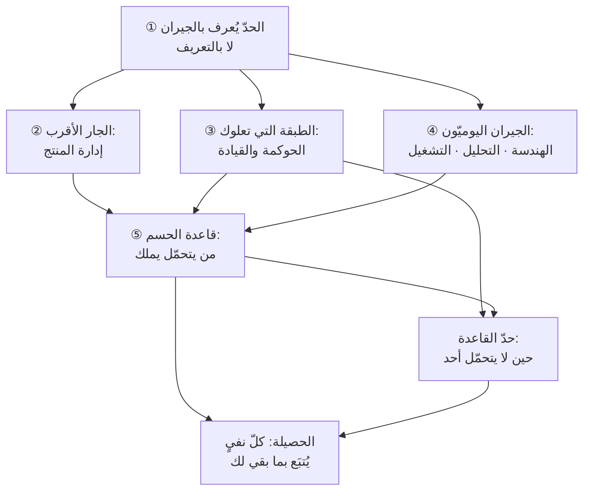

# الفصل 05 — ما الذي ليس من إدارة المشاريع؟ حدّ العلم من جهة جيرانه

---

## 🏛️ لماذا تقرأ هذا الفصل؟

**المشكلة:** يُطلب من مدير المشروع أن يقرّر ما يُبنى، ويُلام على جودة الكود، ويُسأل عن استراتيجية السوق — ثم يُقال إنّ إدارة المشاريع لم تنفع. وهو لم يُوضع لشيء من ذلك أصلًا.

**وماذا لو لم تعرف؟** من لم يعرف حدّ علمه حمّله ما لا يحتمل فأخفق، أو أخرج منه ما هو فيه فأهمله — وفي الحالتين يقع اللوم في غير موضعه ويبقى الخلل.

**وبعد هذا الفصل ستستطيع:**

- **أن تصنّف أيّ مطلبٍ يصلك بسؤاله** لا بمن أرسله: أهو سؤال «كيف نصل؟» فهو من بابك، أم «ماذا يستحقّ أن نبني؟» فهو من باب جارك، أم «ضمن أيّ صلاحية نقرّر؟» فهو فوقك لا بجانبك — **وأن تقول ذلك بلا أن يُقرأ تنصّلًا**، لأنّك تُتبع كلّ نفيٍ بما بقي عليك فيه.
- **أن تحكم في نزاع اختصاصٍ بقاعدةٍ واحدة** — *من يتحمّل نتيجة الخطأ؟* — وأن تتعرّف بها على أشيع أمراض هذا الميدان: **أن يُحمَّل التحمّلُ من لا يملك الصلاحية**، وأن تعرف أنّ علاجه بنيويّ لا أخلاقيّ، وأنّه لا يُصحَّح إلّا بأحد أمرين لا ثالث لهما.
- **أن تميّز [[Governance|الحوكمة]] من الإدارة**، فتعرف أيّ قرارٍ ليس لك أن تتّخذه أصلًا، وأيّ قرارٍ لك ولا تملك أثره، وأن تكشف الحوكمة الصورية من علاماتها لا من كثرة لجانها.

> [!info] بطاقة الفصل
> **النوع:** تصحيحيّ
> **المستوى:** 🟡 متوسّط
> **زمن القراءة:** نحو 40 دقيقة
> **أهمّيته في الباب:** ★★★★★
> **موضعك:** انتهيتَ من [[04 - أين يقع هذا العلم]] ← **⬤ أنت هنا** ← يليه [[06 - لسان العلم]]

> [!abstract] موقع هذا الفصل
> **يبني على:** [[Brooks's Law]] · [[Scope Creep]] — يُذكَر هنا ولا يُعاد شرحه.
> **ويؤسّس:** [[Governance]] — يُقدَّم هنا أوّل مرّة فيصير متاحًا لما بعده.

---

## 🧭 السؤال المركزي

> [!question] السؤال الذي يجيب عنه هذا الفصل كلّه
> **أين ينتهي هذا العلم، ومن يملك القرار حين تتداخل المسؤوليات؟**

**واحمل معك هذه الأسئلة وأنت تقرأ:**

- أين تنتهي مسؤولية مدير المشروع وتبدأ مسؤولية مالك المنتج؟
- من يملك القرار حين يتقاطع اختصاصان؟
- ما الذي يفشل فيه هذا العلم مهما أُتقن؟

---

## 🗺️ الجواب المختصر — قبل التفصيل

**حدّ هذا العلم أنّه يملك الطريق ولا يملك المقصد، ويملك الوصول ولا يملك البقاء.** فهو يملك **كيف يصل ما تقرّر: بأيّ تتابعٍ وبأيّ كلفةٍ وتحت أيّ مخاطر**، ولا يملك **ماذا يستحقّ أن يُقرَّر** — فذلك سؤال إدارة المنتج؛ ولا **إلى أين تتّجه المؤسّسة أصلًا** — فذلك سؤال القيادة والإدارة التنفيذية؛ ولا **كيف يُبنى الشيء تقنيًّا** — فذلك سؤال الهندسة؛ ولا **كيف يبقى ما بُني يعمل بعد التسليم** — فذلك سؤال التشغيل. **وفوق هؤلاء جميعًا طبقةٌ ليست جارًا أفقيًّا بل سقفًا: [[Governance|الحوكمة]]**، وهي التي تقرّر ابتداءً **أيّ القرارات تملكها أنت أصلًا، وأيّها يُصعَّد، وإلى من، وفي كم يومًا**.

**وهذا النفي كلُّه لا يعني الإخلاء.** فأخطر ما يُصنع بفصلٍ عنوانه «ما ليس من هذا العلم» أن يُقرأ صكَّ براءةٍ لمن يديره: ليس قراري، وليست مسؤوليتي، وقد سلّمتُ في موعدي. **ولذلك تجري في هذا الفصل قاعدةٌ واحدة لا يُستثنى منها موضع: كلُّ ما يُنفى عن هذا العلم يُتبَع بما يبقى فيه له.** فمدير المشروع لا يقرّر المعمارية، **ويملك ألّا تُتّخذ صامتةً بلا إعلان كلفتها بالزمن**؛ ولا يقرّر ما يستحقّ أن يُبنى، **ويملك أن يُكتب لكلّ بندٍ الرقمُ الذي يُتوقّع أن يتحرّك ومن قرّره**؛ ولا يملك ما بعد التسليم، **ولا يُغلق المشروع ما لم يكن للاستلام اسمٌ وميزانية**. فما بين النفي والإثبات هو ميدان هذا الفصل، لا النفي وحده.

**وأمّا حين تتداخل الاختصاصات فعلًا** — وهو الغالب لا النادر — **فالفصل بينها لا يقع بالمسمّى الوظيفيّ ولا بالخبرة ولا بمن يعرف أكثر، بل بسؤالٍ واحد: من يتحمّل نتيجة الخطأ؟** فمن يتحمّلها يملك القرار، ومن لا يتحمّلها يُستشار ولا يقرّر. **والحالة التي ينكسر فيها هذا الميزان هي أشيع أمراض هذا الميدان وأقلُّها تسمية: أن يُحمَّل رجلٌ نتيجةَ قرارٍ لا يملك أن يتّخذه.** وهي لا تُعالَج بالشجاعة ولا بالمصارحة، وإنّما بأحد أمرين لا ثالث لهما: **أن تُمنح الصلاحية لمن يتحمّل، أو أن يُنقل التحمّل إلى من يملك.**

**وما بقي من هذا الفصل تحريرٌ لهذا الجواب في خمس خطوات:**

1. لماذا يُعرف الحدّ بجيرانه لا بتعريفه وحده.
2. الجار الأقرب والأكثر التباسًا — إدارة المنتج.
3. الطبقة التي تعلوك ولا توازيك — الحوكمة والقيادة والإدارة التنفيذية.
4. الجيران الثلاثة الذين يقع التداخل معهم يوميًّا — الهندسة والتحليل والتشغيل.
5. القاعدة التي تحسم عند التداخل وحدودُها.

> [!abstract] مفاهيم يُدخلها هذا الفصل في قاموسك
> `Governance`

> [!warning] مفاهيم يكثر الخلط بينها هنا
> `Project Management` مقابل `Product Management` مقابل `Leadership` مقابل `Operations` — احملها في ذهنك، فالفصل يفرّقها في محطّة التمييز.

---

## 🧱 الفكرة الأولى: حدّ العلم يُعرف بجيرانه لا بتعريفه وحده

*موضعها من الفصل: هذه أوّل خطوةٍ وهي منهج الفصل كلِّه، وموضعها أن يُقرَّر **أين يُنظر**: لا في مركز العلم حيث لا يخلط أحد، بل عند حدّه حيث يقع الخلط كلُّه. **والأفكار الثلاث بعدها ليست إلّا هذا المنهج مطبَّقًا على ثلاث جهاتٍ من الحدّ.***

**الفكرة الرئيسة:** التعريف يقول لك **ما هو الشيء**، والجارُ يقول لك **أين يقف**. والثاني أنفع عمليًّا من الأوّل، **لأنّ الخلط لا يقع في المركز بل عند الحدّ**. فما من أحدٍ يخلط بين تخطيط سبرنت (Sprint) وكتابة استعلامٍ في قاعدة بيانات؛ إنّما يقع الخلط في مواضع بعينها: من يقرّر أن هذه الميزة تُؤجَّل؟ ومن يقول إنّ هذا التصميم لا يحتمل الحمل المتوقَّع؟ ومن يتحمّل أنّ ما سُلِّم لم يستعمله أحد؟ **وهذه المواضع كلُّها على الحدود، فمن حفظ التعريف ولم يعرف الحدّ لم يُجب عن سؤالٍ واحدٍ منها.**

### وليس هذا إعادةً لخريطة الفصل الرابع

سؤالٌ يُطرح هنا بحقّ، ويُصرَّح بجوابه لئلّا يُقرأ ما سيأتي تكرارًا: **أليست هذه هي الخريطة التي رُسمت في [[04 - أين يقع هذا العلم|الفصل الرابع]]؟** فقد ذُكرت هناك إدارةُ المنتج وهندسةُ البرمجيات وتحليلُ الأعمال والتشغيل، وسُمّيت كلُّها «طبقةً موازية».

**والجواب: أنّ الخريطتين تنظران إلى الأسماء نفسها من محورين مختلفين، وأنّ الموضع الواحد يختلف موقعه فيهما.**

- **خريطة الفصل الرابع خريطةُ معرفة**، وسؤالها: *ماذا أطلب من هذا العلم؟* تصوّرًا أبني عليه، أم أداةً أستعيرها بشرطها، أم حدًّا أتفاوض عليه؟
- **وخريطة هذا الفصل خريطةُ مسؤولية**، وسؤالها: *من يقرّر، ومن يُسأل حين يقع الخطأ؟*

**وبين الخريطتين فرقٌ عمليّ لا لفظيّ.** فقد تكون على أتمّ الفهم لخريطة المعرفة — تعرف من أيّ بابٍ تدخل المسألة وماذا تطلب من كلّ علم — **وأنت مع ذلك تُسأل يوميًّا عن قراراتٍ لا تملكها، وتُعطى قراراتٍ ليست لك**. فمعرفة أنّ إدارة المنتج جارٌ موازٍ لا تقول لك من الذي يوقّع على تأجيل ميزة، ولا من الذي يتحمّل حين تُطلق فلا تُستعمل. **والأولى تعصمك من الخطأ في التشخيص، والثانية تعصمك من الخطأ في الحساب.**

### والحدّ ثلاثة أنواع لا نوعٌ واحد

وأكثر ما يُفسد الكلام في الحدود أن يُتصوَّر الحدُّ خطًّا واحدًا حادًّا في كلّ موضع. **وهو في الواقع ثلاثة أنواع، ولكلٍّ منها علاجٌ مختلف:**

**① الحدّ الفاصل.** موضعٌ لا تلتقي فيه الوظيفتان أصلًا: من يكتب الاستعلام، ومن يضبط إعدادات الخادم، ومن يقرّر ميزانية التسويق السنوية. **وهذا أيسرها، ولا يقع فيه نزاعٌ إلّا نادرًا** — لأنّ كلّ طرفٍ يرى بوضوح أنّه ليس له.

**② الحدّ المشترك.** منطقةٌ يعمل فيها الاثنان معًا بحقّ، ولا يصحّ أن تُقسَّم بينهما قسمةً حادّة: تقديرُ الجهد يحتاج الهندسة والإدارة، وترتيبُ الأولويّات عند ضيق الوقت يحتاج مالك المنتج ومدير المشروع، والاستعدادُ للإطلاق يحتاج الثلاثة والتشغيل معهم. **وهذا موضع النزاع الحقيقيّ، وعلاجه ليس بأن يُقسَّم بل بأن يُفصَّل: من يقرّر أيّ جزءٍ منه بالتحديد؟** وسيأتي في الفكرة الثانية نموذجٌ محرَّر لهذا التفصيل.

**③ الحدّ المتحرّك.** موضعٌ يختلف موقعه باختلاف المؤسّسة وحجمها ونضجها: ففي فريقٍ من ستّة أشخاص قد يجمع شخصٌ واحد ثلاثة أدوار، وفي مؤسّسةٍ من ستّمئة يكون لكلّ دورٍ إدارةٌ كاملة. **وهذا أخطرها، لأنّه يُقرأ في الكتب حدًّا ثابتًا فيُطبَّق حيث لا يصلح.** ومن أدخل حدود مؤسّسةٍ كبيرة على فريقٍ من ستّة أنتج طبقات موافقةٍ تخنقه، ومن أدخل حدود الفريق الصغير على مؤسّسةٍ كبيرة أنتج فوضى قرارٍ لا تُحسم.

**والقاعدة الجامعة للأنواع الثلاثة: الحدّ الذي لا يُرسم بالاتّفاق يُرسم بالضغط.** فحين لا يُكتب من يقرّر، يقرّر **أعلى الأصوات** أو **أعلى المناصب** أو **من يحضر الاجتماع**، ويُحمَّل الخطأ **أضعفَ الأطراف** أو **آخرَ من لمس الملف**. وهذا لا يُنتج قرارًا رديئًا فحسب، بل يُنتج شيئًا أسوأ: **أنّ أحدًا لا يتعلّم من الخطأ، لأنّ من حُمِّله لم يكن صاحبه.**

> [!example] مشروعٌ سُلّم في موعده تمامًا، ثمّ سُئل مديره: «لماذا لم يزد الاستخدام؟»
> منصّةُ خدماتٍ داخلية في جهةٍ حكوميةٍ بالرياض. المشروع: إعادة بناء بوّابة طلبات الموظّفين. المدّة المعتمدة خمسة أشهر، والنطاق تسعة عشر بندًا، والميزانية معتمدة.
>
> **وسُلّم في الأسبوع الحادي والعشرين — أي قبل موعده بأسبوع — وبالبنود التسعة عشر كاملةً، وبلا تجاوزٍ في الميزانية.** ثمّ مرّت ثلاثة أشهر، فإذا نسبة الموظّفين الذين قدّموا طلبًا واحدًا عبر البوّابة **واحدٌ وعشرون بالمئة**، والباقون على البريد والورق كما كانوا.
>
> **فعُقد اجتماع مراجعة، وكان السؤال الأوّل فيه موجَّهًا إلى مدير المشروع: «لماذا لم ينجح المشروع؟»**
>
> وهذا السؤال — بهذه الصيغة وإلى هذا الشخص — **خطأٌ في العنوان لا في المضمون**. فالسؤال مشروعٌ تمامًا، بل هو أهمّ سؤالٍ في الغرفة؛ لكنّه **سؤال عن الاختيار لا عن التسليم**: لماذا اختيرت هذه البنود التسعة عشر؟ ومن الذي تحقّق أنّ الموظّفين يمتنعون لأنّ البوّابة القديمة رديئة، لا لأنّ **المدير المباشر يشترط توقيعًا ورقيًّا** لا تُنتجه البوّابة أصلًا؟
>
> **وقد تبيّن بعد ذلك أنّ هذا هو السبب:** أنّ ثلاثة عشر بندًا من التسعة عشر كانت تحسينًا في تجربة الاستخدام، وأنّ العائق الحقيقيّ كان بندًا واحدًا لم يُدرج — إخراج نسخةٍ موقَّعة رقميًّا تُقبل من المدير المباشر. **فالمشروع نجح، والمنتج فشل، ولا تناقض بينهما.**
>
> **ولكن — وهذا هو تمام الحكم — لم يكن مدير المشروع بريئًا تمامًا.** فهو لم يكن يملك أن يقرّر البنود، **وكان يملك أن يسأل عند اعتماد النطاق سؤالًا واحدًا: «ما الرقم الذي نتوقّع أن يتحرّك بهذه البنود، ومن قدّره؟»** — ولو سُئل السؤال ودُوّن جوابه، لظهر أنّ لا أحد قدّر شيئًا، ولانتقل النقاش إلى موضعه قبل خمسة أشهرٍ من الإنفاق. **فهو لم يكن يملك المنع، وكان يملك أن يجعل الرهان معلنًا.**

> [!tip] كيف تستعمل هذه الفكرة — سمِّ سؤال المطلب قبل أن تقبله
> كلّما وصلك مطلبٌ أو سؤالٌ أو لومٌ، **لا تسأل أوّلًا: أهذا من عملي؟** فهذا سؤالٌ عن نفسك ويُجاب بالهوى. **اسأل: ما السؤال الذي يجيب عنه هذا المطلب؟** واكتبه في جملةٍ واحدةٍ تبدأ بإحدى أربع:
>
> - **«كيف نصل…»** ← بابك أنت. فهذا سؤال التتابع والكلفة والمخاطر.
> - **«ماذا يستحقّ…»** ← باب إدارة المنتج. فهذا سؤال القيمة والمفاضلة.
> - **«إلى أين نتّجه ولماذا…»** ← باب القيادة والإدارة التنفيذية.
> - **«هل يبقى يعمل…»** ← باب التشغيل.
>
> **وأضِف إليها سؤالًا خامسًا يعلوها كلَّها: «هل أملك أن أقرّر هذا أصلًا؟»** — فهذا سؤال الحوكمة، وهو الذي يُنسى أكثرها.
>
> **والفائدة العملية أنّ تسمية السؤال تنقل النقاش من الأشخاص إلى الاختصاص.** فقولك «هذا ليس عملي» يُقرأ امتناعًا، وقولك «هذا سؤالٌ عن قيمة البند لا عن جدوله، وصاحبه فلان، وأثره على تاريخنا كذا» يُقرأ ما هو: **توجيهًا للسؤال إلى من يملك جوابه.**

> [!warning] الحفرة الشائعة — أن يصير الحدّ درعًا
> أشيع سوء استعمالٍ لهذا الفصل كلِّه أن يتحوّل إلى **معجم أعذار**: «هذا ليس من اختصاصي»، «أنا سلّمت في موعدي»، «القرار ليس قراري». **وكلُّ واحدةٍ من هذه الجمل قد تكون صحيحةً في نفسها، وضارّةً إن وُقف عندها.**
>
> **والعلّة أنّ الحدّ يفصل القرار ولا يفصل المعلومة.** فأنت لا تملك أن تقرّر المعمارية، **وتملك أن تعلم أنّ قرارها سيؤخّر الاختبار أسبوعين وأن تقول ذلك**؛ ولا تملك أن تقرّر إسقاط بند، **وتملك أن تقول إنّ بقاءه يعني تأخّر التاريخ اثني عشر يومًا**. **ومن كتم هذا فقد قصّر في عمله هو، لا في عمل جاره.**
>
> **والصيغة التي تجمع الأمرين جملةٌ من ثلاثة أجزاء:** *«هذا قرارُ فلان — وهذا أثره كما أقيسه — وأحتاج جوابًا قبل يوم كذا وإلّا انزلق التاريخ كذا.»* فالأوّل يعيد القرار إلى صاحبه، والثاني يؤدّي واجبك في الإعلام، والثالث يمنع أن يُترك القرار معلّقًا — **وتعليقُ القرار هو الصورة التي يقع بها أكثر الضرر، لا رفضُه.**

> [!question]- تأكّد أنك فهمت — لماذا يقع الخلط عند الحدود لا في المركز، ولماذا يهمّ هذا؟
> **المبدأ: لأنّ المركز يُعرَف بالمشاهدة، والحدَّ لا يُعرف إلّا بالاتّفاق.**
>
> فمركزُ كلّ اختصاصٍ ظاهرٌ لكلّ من رآه: من يكتب الشيفرة معلوم، ومن يعدّ خطة الإصدار معلوم. **أمّا الحدّ فهو موضعٌ لا يقع فيه عملٌ ظاهر، وإنّما يقع فيه قرار** — والقرار لا يُرى، فلا يُعرف صاحبه إلّا إذا سُمّي مسبقًا.
>
> **وأثر هذا في الممارسة ثلاثة:**
>
> - **أنّ تعريف الدور لا يكفي مهما دُقّق.** فالوصف الوظيفيّ يصف المركز، والنزاع يقع على الحدّ. ومن أنفق شهرًا في تحرير الوصف الوظيفيّ ولم يكتب سطرًا في حدود الصلاحية، لم يحلّ شيئًا.
> - **أنّ الحدود تُختبر عند الضغط لا عند الرخاء.** ففي الشهر الأوّل يتعاون الجميع ولا يحتاج أحدٌ إلى سؤال «من يقرّر»؛ وفي الأسبوع الذي يسبق الإطلاق يُسأل السؤال مرّةً واحدة، ويكون الجواب حينها متأخّرًا.
> - **وأنّ الموضع الذي يقع فيه النزاع مرّتين يجب أن يُكتب.** فالنزاع الأوّل حادثة، والثاني علامةٌ على حدٍّ غير مرسوم — **ومن انتظر الثالث فقد اختار أن يدفع ثمنه ثلاثًا.**

> [!summary]- خلاصة الفكرة في سطرين
> **الحدّ يُعرف بجيرانه لا بتعريفه وحده، لأنّ الخلط لا يقع في المركز بل عند الحدّ.**
> **فمن حفظ التعريف ولم يعرف الجار لم يُجب عن سؤالٍ واحدٍ ممّا يقع فعلًا**: من يقرّر تأجيل الميزة؟ ومن يقول إنّ التصميم لا يحتمل الحمل؟ ومن يتحمّل أنّ ما سُلّم لم يستعمله أحد؟

> [!question] تأمّلٌ تطبيقيّ — لا جواب له في هذا الفصل
> اكتب ثلاثة قراراتٍ وقعت عندكم الشهر الماضي ولم يكن واضحًا **من يملكها**، ثمّ ضع أمام كلٍّ منها الجار الذي تقع على حدّه.
>
> **والذي يعنينا ليس تصنيفها، بل أن تسأل عن كلٍّ منها: من تحمّل نتيجة الخطأ فيها فعلًا؟** — فذاك هو مالكها في الواقع، سواءٌ وافق التنظيمُ أم خالفه.

---

## 🧱 الفكرة الثانية: إدارة المشاريع في مقابل إدارة المنتج

*موضعها من الفصل: عُرف أنّ الحدّ يُعرف بالجار، ويبدأ هنا أوّلُ الجيران وأشدُّهم التباسًا. **وتخصُّها من بين ما بعدها أنّ الخلط فيها لا يقع في الممارسة وحدها بل في الوصف الوظيفيّ نفسه** — حتّى جُمع السؤالان في إعلان وظيفةٍ واحدة.*

**الفكرة الرئيسة:** الأولى تسأل: **كيف نُسلّم ما تقرّر؟** والثانية تسأل: **ماذا يستحقّ أن يُبنى أصلًا؟** — وهذا أشيع خلطٍ في الوصف الوظيفيّ العربيّ على الإطلاق، حتّى صار يُكتب في إعلان وظيفةٍ واحدة: «مدير مشروع/مالك منتج» كأنّهما مسمّيان لشيء. **وهما ليسا مسمّيين لشيء، بل سؤالان مختلفان يُقاس صاحب كلٍّ منهما بمقياسٍ مختلف — وقد يفشل أحدهما وينجح الآخر في المشروع نفسه.**

### والفرق الجوهريّ ليس في المهامّ بل في موضع القياس

فلو نظرتَ في المهامّ اليومية للاثنين لوجدت بينهما تشابهًا يخدع: كلاهما يجتمع بأصحاب المصلحة، وكلاهما يرتّب أعمالًا، وكلاهما يفاوض على الوقت. **وإنّما يفترقان حين تسأل: بأيّ شيءٍ يُحكم على كلٍّ منهما بعد سنة؟**

- **مدير المشروع يُقاس بالمُخرَج**: أسُلِّم ما اتُّفق عليه، في الوقت، بالكلفة، بالجودة المتّفق عليها، وبمخاطر أُديرت لا فُوجئ بها؟
- **ومالك المنتج يُقاس بالأثر**: أتغيّر شيءٌ عند المستخدم أو في رقم العمل نتيجةَ ما سُلِّم؟

**وهذا التمييز بعينه — النشاط والمُخرَج والأثر — قد مرّ بك في [[01 - لماذا هذا العلم|الفصل الأوّل]]، وهو هنا في موضع الحكم لا في موضع التعريف.** فما كان هناك ثلاثةَ مستوياتٍ للحكم على العمل، هو هنا **حدٌّ بين رجلين**: أحدهما يملك المُخرَج ولا يملك الأثر، والآخر يملك الأثر ولا يملك المُخرَج.

**ويترتّب على هذا نتيجةٌ يستنكرها كثيرون وهي صحيحة:** أنّ **مشروعًا ناجحًا تمامًا لمنتجٍ فاشلٍ تمامًا ليس تناقضًا، بل هو الدليل على أنّ الحدّ حقيقيّ**. ولو كان كلُّ مشروعٍ ناجحٍ يُنتج بالضرورة منتجًا ناجحًا، لَما كان بين الاختصاصين فرق، ولكفى أحدهما.

### وفرقٌ ثانٍ في الزمن، ومنه يجيء أكثر الضرر

**المشروع مؤقّت، والمنتج مستمرّ.** وقد تقرّر في [[03 - فلسفة المشروع|الفصل الثالث]] أنّ «مؤقّت» ليست وصفًا للمدّة بل شرطًا في التصميم — أنّ للعمل نهايةً مقصودة يُسلَّم عندها ويُحلّ فريقه. **وأمّا المنتج فليس له طرفٌ ثانٍ ما دام يُستعمل.**

**وأثر هذا الفرق أنّ من أدار منتجًا بعقل المشروع بنى ما لا يُصان.** فعقل المشروع يُحسن التخلّص من كلّ ما لا يلزم لبلوغ التاريخ: يُختصر التوثيق، ويُؤجَّل الاختبار الآليّ، ويُبنى حلٌّ يكفي لسنةٍ لأنّ المشروع لن يعيش سنة. **وكلُّ هذه قراراتٌ صحيحةٌ في مشروع، قاتلةٌ في منتج** — لأنّ المنتج سيعيش سبع سنواتٍ ويُطلب منه التغيّر كلّ أسبوع.

**والعكس صحيحٌ أيضًا وأقلُّ ذكرًا:** أنّ من أدار مشروعًا بعقل المنتج لم يُنهه أبدًا. فعقل المنتج يرى كلّ نهايةٍ مرحلةً، وكلّ إطلاقٍ بدايةً، ولا يعرف معنًى لكلمة «تمّ». **وحيث يكون العمل مشروعًا حقًّا — لأنّه مؤقّتٌ بطبيعته كترحيلٍ أو امتثالٍ لمتطلَّبٍ نظاميّ — فإنّ عقل المنتج يحوّله إلى نفقٍ بلا آخر.**

### وقبل المضيّ: مالك المنتج ليس مدير المنتج

وهذا التباسٌ ثانٍ يُركَّب على الأوّل فيضاعفه، وأصله أنّ اللفظين متقاربان في العربية والإنجليزية معًا.

- **مالك المنتج (Product Owner) دورٌ معرَّف في إطار سكرم**، ونصّه محدّد: أن يُعظّم قيمة المنتج الناتج عن عمل الفريق، وأن يملك قائمة أعمال المنتج وترتيبها. **وهو دورٌ داخل فريقٍ واحد.**
- **ومدير المنتج (Product Manager) مسمًّى وظيفيّ** أوسع وأقدم من سكرم، يشمل استكشاف السوق والتسعير وخارطة المنتج والعلاقة بالتسويق والمبيعات. **وهو موضعٌ في المؤسّسة لا دورٌ في فريق.**

**والصورة الغالبة في المؤسّسات: أن يُسمّى الشخص «مالك منتج» ويُطلب منه عمل مدير المنتج، أو العكس.** وأشيع من ذلك أن يُعطى مسمّى مالك المنتج لمن لا يملك قرار القيمة أصلًا — **فيصير ناقلًا للمتطلَّبات من إدارةٍ أخرى إلى الفريق**، وهو حينئذٍ محلّل أعمالٍ بمسمًّى ثالث، لا مالك منتج.

**والفحص الذي يكشفها في سؤالٍ واحد:** *هل يستطيع هذا الشخص أن يقول «لا» لطلبٍ من مديرٍ تنفيذيّ، ويُقبل منه؟* **فإن كان لا يستطيع فهو لا يملك المنتج مهما كُتب في بطاقته** — لأنّ ملكية الترتيب لا معنى لها إن كان كلّ طلبٍ من أعلى يدخل في الصدارة.

**ولماذا يعنيك هذا وأنت مدير المشروع؟** لأنّ حدّك يُرسم مع **صاحب قرار القيمة الحقيقيّ لا مع حامل المسمّى**. فإن كنتَ تعرض مقايضاتك على من لا يملك أن يبتّ فيها، **فأنت تُعلِم ولا تستأذن**، وستكتشف ذلك عند أوّل ضغط — حين يُنقض ما اتّفقتما عليه من فوقكما معًا.

### وفرقٌ ثالث: أيّ ضلعٍ هو المتحرّك؟

وقد مرّ بك [[Iron Triangle|المثلّث الحديديّ]]: نطاقٌ وزمنٌ وكلفة، ولا يُثبَّت الثلاثة معًا. **والفرق بين الاختصاصين أيّ ضلعٍ يُعامَل عادةً بوصفه المتحرّك:**

- **في المشروع** — وخاصّةً في المشروع التعاقديّ ذي السعر الثابت — **النطاق أقرب إلى الثبات**، لأنّه مكتوبٌ في عقدٍ ومرتبطٌ بدفعات، والمتحرّك عادةً هو الزمن أو الموارد.
- **وفي المنتج، النطاق هو المتغيّر الدائم**، لأنّ السؤال «ماذا يستحقّ أن يُبنى؟» يُعاد سؤاله كلّ أسبوعين على ضوء ما تعلّمناه.

**ومن هنا يجيء أكثر النزاع بين الرجلين، وهو نزاعٌ بين مشروعين لا بين منضبطٍ وفوضويّ.** فما يراه مدير المشروع **[[Scope Creep|زحفَ نطاق]]** يراه مالك المنتج **اكتشافًا**. وكلاهما يصف الشيء نفسه: بندٌ لم يكن في الخطّة ودخل فيها.

**والفصل بينهما ليس بترجيح أحد الوصفين، بل بعلامةٍ واحدةٍ تفرّق بين الحالتين:**

- **إن دخل البند بقرارٍ معلومِ الصاحب، مقيَّمِ الأثر على التاريخ والكلفة، مسجَّلٍ في موضعه** — فهذا **تغييرٌ مشروع**، وهو صحّةٌ لا مرض، سواءٌ سُمّي اكتشافًا أو تعلّمًا.
- **وإن دخل بلا قرارٍ ولا تقديرٍ ولا أثر** — فهذا **زحف**، وليست علّته أنّ البند رديء، بل أنّ ثمنه دُفع من رصيدٍ لم يُعلن أحدٌ أنّه يُنفق منه.

**فالزحف ليس اسمًا للتغيير، بل اسمًا للتغيير غير المحاسَب.** ومن ضبط النطاق بمنع التغيير فقد عالج الصحّة على أنّها مرض؛ ومن تركه بلا محاسبةٍ فقد جعل التاريخ أمنية.

### والحدّ المشترك بينهما: من يقرّر ماذا يسقط عند ضيق الوقت؟

وهذا هو أضيق مواضع الحدّ وأكثرها إنتاجًا للنزاع، ولذلك يستحقّ تفصيلًا لا قسمة. **والقسمة المحرَّرة فيه:**

- **مالك المنتج يقرّر *ماذا* يسقط** — لأنّه السؤال عن القيمة، وهو سؤاله.
- **ومدير المشروع يقول *كم* يجب أن يسقط** — لأنّه السؤال عن السعة والزمن، وهو سؤاله.

**والخلل يقع حين يتبادلان الموضعين.** فإن قال مدير المشروع «نُسقط التقارير» فقد قرّر في القيمة بمعيار السهولة، وإن قال مالك المنتج «نُبقي كلّ شيءٍ ونضغط» فقد قرّر في السعة بمعيار الرغبة. **وأشدُّ صور هذا الخلل خفاءً أنّ الضغط بلا إسقاطٍ يُسقط شيئًا على كلّ حال — لكنّه يُسقط ما لا يُرى:** الاختبار، والمراجعة، والتوثيق، وسلامة البنية. **فما لم يُسقَط بقرارٍ سقط بالصمت.**

> [!example] بندٌ استغرق ستّة أسابيع، واستُعمل إحدى عشرة مرّة
> منصّة توظيفٍ في جدّة، تخدم شركاتٍ صغيرة ومتوسّطة. في تخطيط الإصدار الثاني، أُدرج بندٌ عنوانه «تقارير متقدّمة»: لوحاتٌ تحليلية تعرض مصادر المتقدّمين ومعدّلات التحوّل بين مراحل التوظيف.
>
> **قدّر الفريق البند بستّة أسابيع من أصل ستّة عشر للإصدار كلِّه** — أي قرابة الثلث. واعترض مدير المشروع مرّتين، **لا على قيمة البند بل على حجمه**: إنّ ثلث الإصدار لبندٍ واحدٍ كثير. وكان جواب مالك المنتج في المرّتين: «العملاء يطلبونه في كلّ اجتماع.»
>
> **فبُني البند، وسُلّم الإصدار في موعده — بتأخير ثلاثة أيّامٍ فقط عن التاريخ المعتمد.** وبعد ثلاثة أشهر، كان عدد المرّات التي فُتحت فيها اللوحات التحليلية من الحسابات كلِّها **إحدى عشرة مرّة**، سبعٌ منها من موظّفي المنصّة نفسها.
>
> **وحين رُوجعت المسألة تبيّن أنّ الطلب كان حقيقيًّا والاستنتاج خاطئًا.** فالعملاء كانوا يقولون فعلًا: «نريد أن نعرف من أين يأتي المتقدّمون» — لكنّهم كانوا يريدون **رقمًا واحدًا في رسالة أسبوعية**، لا لوحةً يدخلون إليها. **والفرق بين الاثنين ستّة أسابيع.**
>
> **فمن المسؤول؟ صاحب قرار المحتوى، بلا لبس.** فمدير المشروع لم يكن يملك أن يمنع البند، ولا كان يصحّ منه أن يقرّر أنّ التقارير أقلُّ قيمةً من غيرها — **وهذا ليس تواضعًا بل حدُّ اختصاص**.
>
> **لكنّ الحساب لا يتمّ عند هذا الحدّ.** فقد كان مدير المشروع يملك ثلاثة أشياء لم يفعل منها شيئًا:
>
> 1. **أن يطلب تدوين الرهان**: ما الرقم الذي يُتوقّع أن يتحرّك بهذا البند؟ — ولو كُتب «نتوقّع أن يفتحها 40% من الحسابات شهريًّا» لصار للحكم بعد ثلاثة أشهر معيارٌ لا رأي.
> 2. **أن يعرض المقايضة بالزمن لا بالقيمة**: «ستّة أسابيع لهذا البند تعني تأجيل ثلاثة بنودٍ إلى الإصدار الثالث — أهذه هي المقايضة المقصودة؟» — **فالمقايضة معروضةً غيرُ المقايضة مضمرة.**
> 3. **أن يقترح أرخص صورةٍ تُختبر بها الفكرة**: رسالة أسبوعية بثلاثة أرقام، تُبنى في ثلاثة أيّام. **وهذا اقتراحٌ في الطريق لا في المقصد، فهو من بابه.**
>
> **فحاصل الحكم: القرار لمالك المنتج، والتقصير الإجرائيّ على مدير المشروع.** ولا يُنقض أحدهما بالآخر.

> [!tip] كيف تستعمل هذه الفكرة — سطران في كلّ بند
> لا تحتاج إلى صلاحيةٍ جديدة ولا إلى إعادة هيكلة لتُصلح أكثر ما يفسد في هذا الحدّ. **يكفي أن يحمل كلّ بندٍ في قائمة العمل سطرين، ويُملأ السطران قبل أن يبدأ العمل لا بعده:**
>
> - **«الرقم الذي نتوقّع أن يتحرّك»** — ولو كان تقديرًا خشنًا، ولو كان «لا نعرف، وهذا بندُ تعلّمٍ نُنفق عليه أسبوعًا لنعرف».
> - **«من قرّر»** — بالاسم، لا بالإدارة.
>
> **ولاحظ أنّ هذين السطرين لا يغيّران القرار ولا ينقلانه إليك** — فأنت لا تملكه ولن تملكه بعد كتابتهما. **وإنّما يغيّران ما يُتعلَّم من القرار.** فالمشروع الذي فيه هذان السطران يستطيع بعد سنةٍ أن يقول: من هذه البنود الأربعين، تحرّك الرقم في اثني عشر — **وهذه معلومةٌ تُغيّر السلوك**. والمشروع الذي ليس فيهما لا يستطيع أن يقول شيئًا، فيُعاد النقاش نفسه في الإصدار التالي بالحجج نفسها.
>
> **وهذه هي الصورة العملية للقاعدة الحاكمة في هذا الفصل:** أنّك حين لا تملك القرار، **تملك أن تجعله قرارًا يُتعلَّم منه.**

> [!warning] الحفرة الشائعة — مدير المشروع الذي صار مالك منتجٍ بالأمر الواقع
> لا يقع هذا بانتزاعٍ ولا بطموح، وإنّما بالفراغ: **أن يكون سؤال «ماذا يستحقّ أن يُبنى؟» بلا صاحبٍ مسمّى**، فيبقى معلّقًا حتّى يُضطرّ من يواجه الفريق يوميًّا أن يجيب عنه ليمضي العمل.
>
> **وخطر هذه الحالة ليس في اختلاط المسمّيات، بل في أنّ قرارات القيمة تُتّخذ بمعيار الجدول.** فمن كان مسؤولًا عن التاريخ ثمّ أُلزم بترتيب الأولويّات، رتّبها — بلا قصدٍ سيّئ ولا وعيٍ غالبًا — على ما يُبلغه التاريخَ سالمًا: **يُقدَّم السهل على النافع، ويُؤخَّر ما يحتاج بحثًا، ويُسقَط ما لا يُقاس أثره سريعًا.** وهذا ترتيبٌ معقولٌ تمامًا ممّن هو في ذلك الموضع، **وهو بالضبط الترتيب الذي وُجدت إدارة المنتج لتمنعه.**
>
> **وعلامتها التي تُكشف بها:** أن تسأل عن بندٍ في قائمة الأعمال: *لماذا هذا قبل ذاك؟* فإن كان الجواب في أغلب البنود يعود إلى الجاهزية والاعتماديات والسعة، **فأنت أمام قائمةٍ رُتّبت بعقل التسليم لا بعقل القيمة** — ولو كان على رأسها مالك منتجٍ بالاسم.
>
> **وعلاجها ليس أن يمتنع مدير المشروع.** فامتناعه يوقف العمل ولا يُوجد مالك منتج. **وإنّما أن يُعلن الفراغ صراحةً**: أن يُكتب في تقرير الحالة أنّ ترتيب الأولويّات يجري اليوم بمعيار الجدول لغياب صاحب قرار القيمة، وأن يُطلب تسميته. **فالفراغ المعلَن يُملأ، والفراغ المستور يُملأ من لا يملكه.**

> [!question]- تأكّد أنك فهمت — منتجٌ نجح نجاحًا كبيرًا، ومشروعه تأخّر ثلاثة أشهر وتجاوز ميزانيته بالثلث. فأيّهما فشل؟
> **المبدأ: كلاهما يُحكم عليه بمقياسه، ولا يُغطّي أحدهما على الآخر — والخلط بينهما يُنتج خطأً في الاتّجاهين.**
>
> **فالمنتج نجح، وهذا حكمٌ نهائيّ لا يُنقص منه التأخّر.** ولو كان الأثر الذي تحقّق يساوي أضعاف التجاوز، لكان القرار صحيحًا اقتصاديًّا بكلّ المقاييس. **ومن قال «لا عبرة بالنجاح ما دام قد تأخّر» فقد جعل الخطّة غايةً، والخطّة وسيلة.**
>
> **والمشروع تعثّر، وهذا حكمٌ لا يُنقض بالنجاح.** لأنّ السؤال الذي يُطرح عليه ليس «أنجح المنتج؟» بل: **هل كان يمكن أن يتحقّق النجاح نفسه بأقلّ من هذا؟** وهذا سؤالٌ مشروعٌ ولا يُجاب عنه بالنتيجة.
>
> **والأهمّ من الحكمين: أن يُعرف سبب التأخّر، فمنه يُعرف من يُسأل.**
>
> - **إن كان التأخّر من تغيّر النطاق** — أي أنّ ما سُلّم غير ما اتُّفق عليه — **فليس تأخّرًا أصلًا، بل هو خطأٌ في المقارنة**: قِيس المُنجَز على خطّةٍ لم تعد قائمة. **والتقصير هنا إجرائيّ: أنّ خطّ الأساس لم يُحدَّث عند كلّ تغييرٍ معتمَد.**
> - **وإن كان التأخّر من ضعف التقدير أو من مخاطر لم تُدَر أو من عوائق لم تُصعَّد** — **فهو تعثّرٌ في محلّه**، ويُسأل عنه صاحب الطريق.
> - **وإن كان من قرارٍ واعٍ اتُّخذ في منتصف الطريق — أن نمدّد شهرين لأنّ ما اكتشفناه يستحقّ — فهذا ليس تعثّرًا بل مفاضلةً نجحت**، بشرطٍ واحد: أن تكون قد اتُّخذت قرارًا معلنًا لا انزلاقًا مكتشَفًا بعد وقوعه.
>
> **والخلاصة التي تُبقي الحدّ قائمًا:** أنّ **النجاح لا يُبرّئ من سوء الإدارة، وسوء الإدارة لا يُبطل النجاح** — وأنّ من خلط بينهما تعلّم من هذا المشروع أنّ التقدير لا يهمّ، وهو أسوأ درسٍ يمكن أن يخرج به.

> [!summary]- خلاصة الفكرة في سطرين
> **إدارة المشروع تسأل: كيف نُسلّم ما تقرّر؟ وإدارة المنتج تسأل: ماذا يستحقّ أن يُبنى أصلًا؟ — وهما سؤالان لا مسمّيان لشيء.**
> **ويُقاس صاحبُ كلٍّ منهما بمقياسٍ مختلف**، حتّى ليصحّ أن ينجح أحدُهما ويفشل الآخر في المشروع نفسه — وهذا وحده يُبطل جمعهما في وصفٍ وظيفيّ واحد.

> [!question] تأمّلٌ تطبيقيّ — لا جواب له في هذا الفصل
> انظر في وصفك الوظيفيّ أو في وصف من تعمل معه: **أيُّ السؤالين مكتوبٌ فيه، وأيُّهما تُحاسَب عليه فعلًا؟**
>
> **فإن كنتَ تُحاسَب على السؤال الثاني ولا تملك جوابه، فأنت في الموضع الذي يُنتج أكثر الإحباط في هذه المهنة**: مسؤوليةٌ عن قيمةٍ لا تملك أن تقرّرها. والعلاج ليس اجتهادًا أكبر، بل تسميةُ الفجوة لمن يملك سدّها.

---

## 🧱 الفكرة الثالثة: الإدارة والقيادة والحوكمة والإدارة التنفيذية

*موضعها من الفصل: كان الجار السابق **دورًا** يُخلط بدورك، وتنظر هذه الفكرة في **أربعة ألفاظٍ** تُستعمل استعمالًا متبادلًا وهي أربعة أشياء. **والفرق أنّ ذاك خلطٌ فيمن يفعل ماذا، وهذا خلطٌ في اللفظ يسبقه** — فيُسمّى الشيء بغير اسمه، ثمّ يُطلب منه غيرُ ما يُطلب منه.*

**الفكرة الرئيسة:** أربعةٌ تُستعمل استعمالًا متبادلًا في الكلام اليوميّ، وهي أربعة أشياء مختلفة تمامًا: **[[Governance|الحوكمة]] تضع إطار القرار ولا تتّخذه، والإدارة تُنفّذ داخله، والقيادة تصنع الاتّجاه وتُنتج الالتزام، والإدارة التنفيذية تملك الموارد وتفاضل بين المشاريع.** ولكلٍّ منها سؤالٌ يجيب عنه وحده، ولا يُجيب عنه غيره مهما اجتهد.

### والأولى بالبيان: الحوكمة ليست جارًا بجانبك بل سقفًا فوقك

وهذا هو الموضع الذي يفترق فيه هذا القسم عمّا قبله. **فإدارة المنتج والهندسة والتشغيل جيرانٌ يقاسمونك المشروع الواحد؛ وأمّا الحوكمة فلا تقاسمك شيئًا، وإنّما تحدّد ابتداءً ماذا تملك أن تقرّر.** فهي ليست على يمينك بل فوق رأسك، ومن تصوّرها جارًا أفقيًّا لم يفهم لماذا لا يُحسم النزاع معها بالحجّة.

**و[[Governance|الحوكمة]] في تحريرها: الإطار الذي يحدّد من يقرّر ماذا، وبأيّ صلاحية، ومتى، وبناءً على أيّ دليل.** وليست اجتماعًا ولا مستندًا ولا لجنة — **بل هذه أدواتها، وهي تُقاس بما تُنتجه من قرارات، لا بما تعقده من جلسات.**

**ومكوّناتها العملية أربعة، وكلُّها إجابةٌ مسبقةٌ عن سؤالٍ سيقع حتمًا:**

1. **حدود الصلاحية** — أكبر قرارٍ تملك أن تتّخذه بلا استئذان، مقدَّرًا بأيّام العمل وبنسبة الميزانية وبأثره على تاريخ الإطلاق. **وما فوقه يُصعَّد.**
2. **مسار التصعيد** — إلى من يُصعَّد، وبأيّ صيغة، **وفي كم يومًا يجب أن يعود الجواب**. ومسار التصعيد بلا سقفٍ زمنيّ ليس مسارًا بل أمنية.
3. **السجلّات الملزمة** — [[Decision Log|سجلّ القرارات]] بأصحابها وتواريخها ومبرّراتها، و[[RAID Log|سجلّ المخاطر والقضايا]]، وسجلّ [[Change Request|طلبات التغيير]]. **وهذه هي الذاكرة المؤسّسية، ومن دونها يُعاد النقاش نفسه كلّ ربع.**
4. **قواعد اللعب** ([[Guard Rails]]) — الحدود التي يتحرّك الفريق داخلها بحرّيةٍ تامّةٍ بلا إذن. **والحوكمة الجيّدة توسّع هذه المساحة، ولا تطلب الإذن على كلّ خطوة.**

**والاختبار الذي يفصل الحوكمة عن الإدارة في جملةٍ واحدة:** إن كان السؤال **«كيف نُنجزه؟»** فهو إدارة، وإن كان **«هل نُنجزه أصلًا، وبأيّ شروط، وعلى حساب ماذا؟»** فهو حوكمة.

**ولها مبدأٌ حاكم يُهمَل كثيرًا: التناسب.** فلا توجد حوكمةٌ «صحيحة» على الإطلاق، بل حوكمةٌ متناسبة مع حجم المشروع ومخاطره وعدد الأطراف فيه. **فثلاث لجانٍ وأربعة نماذج اعتمادٍ لتغييرٍ ينفّذ في ساعتين ليست انضباطًا بل شللًا**؛ **وحوكمةٌ رخوةٌ على مشروعٍ يمسّ خمس إداراتٍ ليست رشاقةً بل فوضى قرارٍ مؤجّلة**. والقاعدة: كلّما زاد عدد الجهات المتأثّرة وحجم المال المعرَّض للخطر، زادت كثافة الحوكمة المطلوبة — **والعكس صحيحٌ تمامًا، وهو الشقّ الذي يُنسى.**

### والقيادة ليست درجةً أعلى من الإدارة

وهذا تصحيحٌ يلزم، لأنّ أشيع ما يُقال في هذا الباب — «المدير يهتمّ بالأشياء والقائد يهتمّ بالناس»، «المدير يدفع والقائد يجذب» — **تقسيمٌ بلاغيٌّ يُطرب ولا يُنتج فعلًا واحدًا**، ثمّ يُستعمل في الغالب ذمًّا لمن يُتقن الإدارة.

**والتحرير الأدقّ — وهو الذي حرّره جون كوتر في مقالته المعروفة عن الفرق بينهما — أنّهما نظامان مختلفان للعمل، متكاملان، ولكلٍّ منهما ناتجٌ لا يُنتجه الآخر:**

- **الإدارة تُنتج الاتّساق وقابلية التنبّؤ**: خططٌ وميزانياتٌ وهياكل وقياسٌ وتصحيحُ انحراف. **وناتجها أن يُنجَز ما وُعد به على وجهٍ يمكن الاعتماد عليه.**
- **والقيادة تُنتج الاتّجاه والالتزام**: رؤيةٌ للحال الذي نقصده، ومواءمةُ الناس عليها، ودافعيةٌ تُبقيهم عليها حين يصعب. **وناتجها أن يُقبِل الناس على التغيير بدل أن يُساقوا إليه.**

**والفرق العمليّ الذي يترتّب على هذا:** أنّ **القيادة لا تحتاج سلطةً رسمية، والإدارة تحتاجها**. فمهندسٌ في الفريق قد يقود تغييرًا في طريقة العمل بلا أن يملك على أحدٍ أمرًا؛ ومدير المشروع يمارس القيادة بغير سلطةٍ في أكثر أوقاته، لأنّ من يعمل معه لا يتبعه إداريًّا في الغالب. **ومن ثمّ فالقيادة صفةٌ في العمل لا موضعٌ في الهيكل — وهي مطلوبةٌ من مدير المشروع، لكنّها ليست الاختصاص الذي يُسأل عنه.**

**وأمّا الإدارة التنفيذية فتملك ما لا يملكه أحدٌ ممّن سبق: المفاضلة *بين* المشاريع لا داخلها.** فقرار «نوقف هذا لصالح ذاك» ليس قرار مدير المشروع ولا مالك المنتج، **لأنّ كليهما ينظر من داخل مشروعه، ومن نظر من داخل المشروع لم يستطع أن يقارن**. ومن طلب من مدير مشروعٍ أن يقرّر التنازل عن موارده لمشروعٍ آخر، فقد طلب منه أن يحكم في قضيّةٍ هو خصمٌ فيها.

### وأين يقع مكتب إدارة المشاريع من هذا كلّه؟

سؤالٌ يُطرح هنا بالضرورة، لأنّ مكتب إدارة المشاريع (PMO) يُوصف في مؤسّسةٍ بأنّه جهة حوكمة، وفي أخرى بأنّه جهة دعم، وفي ثالثةٍ بأنّه يدير المشاريع بنفسه. **وليس هذا اضطرابًا في المصطلح، بل ثلاثة أنماطٍ مختلفةٍ فعلًا يجمعها اسمٌ واحد:**

1. **مكتبٌ داعم.** يُقدّم القوالب والأدوات والتدريب والدروس المستفادة، **ولا يملك على مدير المشروع أمرًا.** ودرجة سيطرته منخفضة، ونفعه في توفير ما لا يُعقل أن يبنيه كلُّ مشروعٍ لنفسه.
2. **مكتبٌ رقابيّ.** يشترط الالتزام بمنهجيّةٍ ونماذج وتقاريرَ بعينها، **ويراجع ويُدقّق.** وهو أقرب الأنماط إلى الحوكمة، **وأكثرها عرضةً لأن ينقلب إلى طقسٍ ورقيّ** إن قِيس بعدد النماذج المستوفاة لا بجودة القرار.
3. **مكتبٌ موجِّه.** يملك مديري المشاريع أنفسهم إداريًّا ويُسندهم إلى المشاريع. **وهو حينئذٍ ليس حوكمةً بل إدارة**، وله رئيسٌ يُسأل عن أداء المشاريع كلِّها.

**والفائدة العملية من هذا التقسيم أنّه يُجيب عن سؤالٍ يقع فيه نزاعٌ حقيقيّ: هل أنا مسؤولٌ أمام مكتب إدارة المشاريع أم أمام راعي المشروع؟** والجواب يختلف باختلاف النمط: **ففي النمط الداعم أنت مسؤولٌ أمام الراعي وحده، والمكتب مورِدُ أدوات؛ وفي النمط الموجِّه أنت مسؤولٌ أمام الاثنين — أمام الراعي عن المشروع، وأمام المكتب عن ممارستك المهنية.**

**والخطأ الشائع أن يُطلب من نمطٍ ما ليس فيه.** فيُنشأ مكتبٌ داعمٌ بلا صلاحية، ثمّ يُسأل: لماذا لم تمنع تعثّر المشاريع؟ — **وهو لا يملك أن يمنع شيئًا.** أو يُنشأ مكتبٌ رقابيّ ثمّ يُلام على البطء، **وهو إنّما يفعل ما أُنشئ له.** **فالسؤال قبل إنشائه: ماذا نريد أن يقرّر؟ فإن كان الجواب «لا شيء» فهو داعمٌ ولا يُحاسَب على القرارات.**

### والحالة المرضية: الحوكمة الصورية

وهي أن تكون الأدوات كلُّها قائمةً والوظيفة كلُّها غائبة — **وهذا أخطر من غيابها، لأنّ الغياب يُرى فيُعالَج، والصورية تُنتج علاماتٍ مطمئنّة تمنع العلاج.**

**وعلاماتها التي تُعرف بها:**

- **اجتماعاتٌ تُعرض فيها الشرائح وتنتهي بلا قرارٍ مسجَّل.** والاختبار: افتح محضر آخر ثلاثة اجتماعات، وعُدّ القرارات التي تغيّر شيئًا. فإن كانت صفرًا فهو عرضٌ لا حوكمة.
- **حضورٌ بالوكالة الدائم** ممّن لا يملك البتّ — فيؤجَّل كلُّ بندٍ إلى الاجتماع التالي بصيغة «سأعرضه وأعود إليكم».
- **سجلّ قراراتٍ يُملأ بأثرٍ رجعيّ** قبل التدقيق بأسبوع. **وهذا يُنتج وثيقةً صحيحةً في محتواها، عديمةَ النفع في وظيفتها** — لأنّ السجلّ إنّما ينفع إن كُتب حين القرار لا حين المراجعة.
- **وتقاريرُ حالةٍ خضراء حتّى الأسبوع الذي يسبق الإخفاق مباشرة** — وهي أشهر علاماتها، وتُسمّى في الممارسة «تقارير البطّيخ»: خضراء من الخارج حمراء من الداخل.

**وأصل هذه العلامات كلِّها واحد: أنّ الحوكمة تُقاس بانعقادها لا بإنتاجها.** فمن سأل «أعُقدت لجنة التوجيه هذا الشهر؟» حصل على «نعم» صادقة ولم يعرف شيئًا؛ ومن سأل «أيّ قرارٍ صدر عنها غيّر مسار المشروع؟» عرف الحال في دقيقة.

> [!example] قرارٌ بقي معلّقًا خمسة أسابيع، ولم يرفضه أحد
> مشروع ترحيل نظامٍ ماليّ في مؤسّسةٍ بالرياض، تشترك فيه إدارتا المالية وتقنية المعلومات ومورّدٌ خارجيّ. وفي الأسبوع السابع، ظهر خلافٌ على صيغة ترحيل أرصدة الحسابات المغلقة: أتُرحَّل بالتفصيل — وهو أثقل وأدقّ — أم بالأرصدة الختامية فقط؟
>
> **والفرق بين الخيارين تسعة أيّام عمل وأثرٌ على تقارير المراجعة السنوية.** فعرض مدير المشروع الخيارين بأثرهما مكتوبًا، وطلب قرارًا.
>
> **فمرّت خمسة أسابيع ولم يُرفض الخياران ولم يُعتمد أحدهما.** وسِيرَة القرار في تلك الأسابيع كالتالي: عُرض على مدير تقنية المعلومات فقال إنّ الأثر ماليٌّ لا تقنيّ؛ وعُرض على مدير المالية فقال إنّه يحتاج رأي المراجعة الداخلية؛ وردّت المراجعة الداخلية بأنّها تُبدي رأيًا ولا تعتمد؛ وأُدرج في جدول أعمال لجنة التوجيه فأُجّل مرّتين لضيق الوقت. **ولم يقل أحدٌ «لا» ولا مرّة واحدة.**
>
> **وكلفة الأسابيع الخمسة لم تكن خمسة أسابيع.** فقد كان الفريق ينتظر القرار لبناء طبقة الترحيل، فشُغل في هذه المدّة ببنودٍ ثانوية، ثمّ لمّا صدر القرار وجب إعادة عملٍ استغرق أحد عشر يومًا لأنّ البنود الثانوية بُنيت على افتراضٍ نُقض. **فصار حاصل التعليق سبعة أسابيع.**
>
> **والعلاج لم يكن اجتماعًا جديدًا ولا لجنةً إضافية، بل ثلاثة أسطرٍ أُدرجت في وثيقة المشروع:**
>
> 1. **عتبة صلاحية:** كلّ قرارٍ أثره دون خمسة أيّام عملٍ وواحدٍ بالمئة من الميزانية يعتمده مدير المشروع ويُسجّله.
> 2. **مالكٌ مسمّى لكلّ نوعٍ من القرارات:** ما مسّ صحّة البيانات المالية فصاحبه المدير الماليّ بالاسم، ولا يُحوَّل.
> 3. **سقفٌ زمنيّ للتصعيد:** كلّ قرارٍ مُصعَّد يُبتّ فيه خلال خمسة أيّام عمل، **وإلّا اعتُمد الخيار الذي يوصي به مدير المشروع ويُسجَّل أنّه اعتُمد بمضيّ المدّة.**
>
> **والثالث هو الذي أنهى المشكلة**، لأنّه غيّر كلفة الصمت: فقد كان الصمت قبله مجّانيًّا وصار له ثمنٌ يقع على من صمت.

> [!tip] كيف تستعمل هذه الفكرة — ثلاثة أسئلةٍ في أوّل أسبوع
> لا تنتظر أوّل نزاعٍ لتكتشف حدود صلاحيتك. **اسأل هذه الثلاثة في الأسبوع الأوّل من كلّ مشروع، واطلب جوابًا مكتوبًا لا شفويًّا:**
>
> 1. **ما أكبر قرارٍ أملك أن أتّخذه بلا استئذان؟** — بالأيّام وبالنسبة وبأثره على التاريخ.
> 2. **من يبتّ فيما فوق ذلك؟** — بالاسم لا بالإدارة، **فالإدارات لا تقرّر، الأشخاص يقرّرون.**
> 3. **وفي كم يومًا يجب أن يعود الجواب؟ وماذا يحدث إن لم يعد؟**
>
> **والثالث أهمّها وأقلُّها سؤالًا**، لأنّه وحده الذي يعالج الصورة الغالبة للضرر: **لا الرفض، بل التعليق.** فأكثر ما يقتل المشاريع ليس قرارًا خاطئًا اتُّخذ، بل قرارًا صحيحًا لم يُتّخذ في وقته.
>
> **وقيمة السؤال لا تتوقّف على الجواب.** فإن لم تجد جوابًا مكتوبًا لهذه الثلاثة، **فقد عرفتَ معلومةً ثمينة قبل أن تدفع ثمنها: أنّ مشروعك بلا حوكمةٍ مهما كثرت لجانه** — وحينئذٍ تكتبها أنت وتعرضها للاعتماد، ولو في صفحةٍ واحدة. **فالحوكمة المكتوبة من أسفلَ ومُعتمَدة خيرٌ من حوكمةٍ متوقَّعة من أعلى ولا تجيء.**

> [!warning] الحفرة الشائعة — أن يقوم مدير المشروع مقام الحوكمة الغائبة
> إذا غابت الحوكمة، لم يبقَ في الغرفة إلّا رجلٌ واحد يحتاج أن يمضي العمل غدًا: **مدير المشروع.** فيبدأ في اتّخاذ قراراتٍ لا يملكها — لا استيلاءً، بل لأنّ البديل التوقّف.
>
> **وهذه الحالة تُنتج ضررًا مركّبًا:**
>
> - **قراراتٌ تُتّخذ بمعلوماتٍ ناقصة**، لأنّ من يملكها لم يحضر.
> - **ولا يُشكر عليها إن صحّت**، لأنّها لم تكن له فتُنسب إلى «سير الأمور».
> - **ويُلام عليها إن أخطأت**، لأنّه هو الذي اتّخذها فعلًا — **وهذا ثابتٌ في المحاضر.**
>
> **وأخطر ما فيها أنّها تستقرّ.** فالمؤسّسة تكتشف أنّ الأمور تمضي بلا حوكمة، فتُثبِّت الغياب: «لماذا نُشكّل لجنةً وكلُّ شيءٍ يسير؟» — **وهي تسير لأنّ رجلًا واحدًا يحمل ما لا يُحمَل، إلى أن يقع قرارٌ كبيرٌ فيقع معه.**
>
> **والفرق بين مواجهة الفراغ ومداراته سطرٌ واحد في تقرير الحالة:** أن يُكتب أنّ هذا القرار اتُّخذ لتعذّر الوصول إلى صاحبه، ويُسمّى صاحبه، ويُذكر تاريخ الطلب. **فالتوثيق هنا ليس دفاعًا عن النفس، بل هو الطريقة الوحيدة التي يصير بها الغياب مرئيًّا لمن يملك سدّه.**

> [!question]- تأكّد أنك فهمت — لجنة توجيهٍ تنعقد شهريًّا بانتظام، وتُعرض عليها الشرائح، ويحضرها الجميع. أهذه حوكمة؟
> **المبدأ: الحوكمة تُقاس بما تُنتجه من قرارات لا بما تعقده من جلسات — وانتظامُ الانعقاد علامةٌ محايدة، تصلح للحالتين معًا.**
>
> **وثلاثة فحوصٍ تفصل بينهما، ولا يحتاج واحدٌ منها إلى حضور اللجنة:**
>
> - **افتح محاضر آخر ثلاثة اجتماعات وعُدّ القرارات التي غيّرت شيئًا** — تاريخًا، أو نطاقًا، أو تخصيص موردٍ، أو ترتيب أولويّة. **فإن كان العدد صفرًا وكانت المشاريع تسير، فاللجنة تُعلَم ولا تحكم**، وهذا استعمالٌ مشروعٌ إن سُمّي باسمه، وخطرٌ إن ظُنّ حوكمة.
> - **اسأل عن آخر قرارٍ مُصعَّد: كم بقي معلّقًا؟** فإن كان الجواب بالأسابيع، **فالمسار موجودٌ في الورق ومفقودٌ في العمل.**
> - **وانظر في تقارير الحالة قبل آخر إخفاقٍ بشهر.** فإن كانت خضراء ثمّ انقلبت حمراء دفعةً واحدة، **فالمنظومة تُنتج طمأنينةً لا معلومات** — والقرار المبنيّ عليها لا يُعتدّ به مهما كان صاحبه مخوَّلًا.
>
> **والخلاصة التي يُبنى عليها الحكم:** أنّ اللجنة التي لا تُصدر قرارًا **ليست حياديّة، بل هي طرفٌ في القرار**: فهي تقرّر — بصمتها — أن يبقى الحال على ما هو عليه، ويتحمّل النتيجةَ من ينفّذ. **ولذلك كان أخطر ما في الحوكمة الصورية أنّها لا تُنتج فراغًا، بل تُنتج قرارًا مجهول الصاحب.**

> [!summary]- خلاصة الفكرة في سطرين
> **الحوكمة تضع إطار القرار ولا تتّخذه، والإدارة تُنفّذ داخله، والقيادة تصنع الاتّجاه، والإدارة التنفيذية تملك الموارد وتفاضل بين المشاريع.**
> **ولكلٍّ منها سؤالٌ لا يُجيب عنه غيرُه مهما اجتهد** — ومن طلب من الإدارة أن تصنع اتّجاهًا، أو من القيادة أن تضبط إطارًا، طلب من كلٍّ منهما ما ليس عندها.

> [!question] تأمّلٌ تطبيقيّ — لا جواب له في هذا الفصل
> خذ قرارًا كبيرًا يُنتظر عندكم منذ أسابيع، واسأل: **أيُّ الأربعة يملكه؟**
>
> **فأكثرُ ما يُعطّل القرارات ليس صعوبتها، بل أنّها تنتظر عند بابٍ لا يملك فتحه.** ومن عرف الباب الصحيح اختصر أسابيع بجملةٍ واحدة تُقال في الموضع الصحيح.

---

## 🧱 الفكرة الرابعة: هندسة البرمجيات وتحليل الأعمال والإدارة التشغيلية

*موضعها من الفصل: مضت الجهاتُ التي يقع الخلط معها في **الصلاحية**، وتنظر هذه في ثلاثةٍ يقع التداخل معها **يوميًّا لا شهريًّا**: عند كلّ قرارٍ معماريّ، ومتطلَّبٍ يُصاغ، وإطلاقٍ يُسلَّم. **وتفارق ما قبلها بأنّ القرار فيها لغيرك غالبًا — ويبقى لك فيها عملٌ لا يُسقطه ذلك.***

**الفكرة الرئيسة:** ثلاثةٌ يقع التداخل معها يوميًّا لا شهريًّا، ولكلٍّ منها سؤالٌ يُخلط بسؤالك خلطًا لا يُرى: **من يقرّر المعمارية؟ ومن يصوغ المتطلَّب؟ ومن يملك ما بعد الإطلاق؟** ولكلٍّ منها موضعٌ يبقى لك فيه عملٌ لا يُسقطه أنّ القرار لغيرك.

### ① هندسة البرمجيات — من يقرّر المعمارية؟

**لا يقرّرها مدير المشروع، ولا يصحّ أن يقرّرها، ولو كان مهندسًا سابقًا.** فالقرار المعماريّ يحتاج معرفةً بالنظام لا يملكها إلّا من يبنيه، والحكم فيه على ما لن يظهر أثره قبل سنة.

**غير أنّ الشقّ الآخر من الحكم هو موضع النفع:** أنّ **كلّ قرارٍ معماريّ هو قرار جدولٍ وكلفةٍ متنكّرًا في ثوبٍ تقنيّ.** فاختيار أن تُبنى الخدمة على قاعدةٍ واحدةٍ مشتركةٍ أو على قواعد منفصلة ليس اختيارًا تقنيًّا خالصًا: هو مقايضةٌ تشتري سرعةً اليوم بتكلفة تغييرٍ غدًا، أو العكس. **ومن قرأ القرار المعماريّ على أنّه «شأن المهندسين» فقد وقّع على مقايضةٍ لم يقرأها.**

**فالذي يملكه مدير المشروع ثلاثة، وليس فيها شيءٌ من التقنية:**

1. **أن يُعلن القرار** — أي ألّا يُتّخذ صامتًا. فالقرار المعماريّ الذي لا يعلمه إلّا كاتبه يصير بعد ستّة أشهر قيدًا يُكتشف ولا يُناقَش.
2. **أن يُطلب بديلُه وكلفةُ كلٍّ منهما بالزمن** — لا ليحكم بينهما، بل ليعرف ماذا اشترى وماذا باع.
3. **أن يُسجَّل ثمنه المؤجَّل** — فما يُختار اليوم اختصارًا للوقت يصير [[Technical Debt|دَينًا تقنيًّا]] يُسدَّد لاحقًا بفائدة. **وقد مرّ بك المفهوم؛ والجديد هنا موضعه من الحدود: أنّ الدَّين الذي يُؤخذ بقرارٍ مُعلَنٍ ومسجَّلٍ وله أجلٌ دَينٌ مُدار، والذي يُؤخذ صامتًا لا يُسمّى دَينًا بل مفاجأة.**

**ومن أوضح صور هذا التداخل — وأكثرها وقوعًا — أن يتأخّر المشروع فيُطلب من مدير المشروع أن «يضيف مطوّرين».** وهذا يُظنّ قرارًا إداريًّا خالصًا، وهو **قرارٌ محكومٌ بشرطٍ هندسيّ**: فقد مرّ بك [[Brooks's Law|قانون بروكس]]، وحاصله أنّ الإضافة إلى مشروعٍ متأخّرٍ قد تزيده تأخّرًا لأنّ الداخل الجديد يستهلك وقت القدامى في التهيئة والتواصل. **وشرطُ نفعه هندسيّ لا إداريّ: أن يكون في النظام عملٌ قابلٌ للفصل بحدودٍ واضحة يُسلَّم إلى الداخل الجديد بلا أن يُشابك القائمين.** فمن استشار الهندسة في «أين يمكن أن يعمل شخصٌ جديد بلا احتكاك؟» قبل أن يقرّر العدد، **جعل قرارًا إداريًّا يُبنى على معلومةٍ هندسيّة — وهذا هو الاستعمال الصحيح للحدّ.**

### ② تحليل الأعمال — من يصوغ المتطلَّب؟

**يصوغه محلّل الأعمال، ويقرّر أولويّته مالك المنتج، ولا يفعل مدير المشروع أحدهما.** فصياغة المتطلَّب مهنةٌ لها أدواتها: استخراج الحاجة من قائلها، والتمييز بين ما يطلبه وما يحتاجه، ونمذجة العملية، وكتابة معايير القبول.

**والذي يبقى لمدير المشروع هنا نوعٌ مختلف من الحقّ يستحقّ أن يُسمّى بدقّة: الشرط الإجرائيّ.** فله أن يشترط ألّا يدخل بندٌ في الخطّة ما لم يكن له معيار قبولٍ مكتوب، **وليس له أن يقول ما ينبغي أن يكون هذا المعيار.**

**والفرق بينهما هو الفرق بين شرطٍ في الشكل ورأيٍ في المضمون** — وهو حدٌّ دقيقٌ يُخترق كثيرًا في الاتّجاهين:

- **فمن اشترط الشكل ثمّ أملى المضمون** («أريد معيار قبولٍ… ويجب أن يكون كذا») فقد تجاوز.
- **ومن ترك الشكل بحجّة ألّا يتدخّل** فقد قصّر في عمله هو — **لأنّ بندًا بلا معيار قبولٍ لا يُقدَّر ولا يُختبر ولا يُعرف متى تمّ، وهذه ثلاثةٌ من صميم اختصاصه.**

**فالقاعدة: أنت تملك شروط قابلية التخطيط، ولا تملك محتوى المتطلَّب.**

**والحالة الغالبة في كثيرٍ من المؤسّسات ألّا يوجد محلّلٌ أصلًا**، فيقع التحليل على مدير المشروع بحكم الأمر الواقع. **وهذا جمعُ دورين في شخص، وهو مشروعٌ إن أُعلن، ضارٌّ إن لم يُعلن.** وعلّة ضرره أنّ **الحدّ الذي يصير داخليًّا لا يُرى، وما لا يُرى لا يُحرَس**: فيصير من يكتب المتطلَّب هو من يقدّر زمنه هو من يقبله عند التسليم — **وثلاثتها في يدٍ واحدة تُسقط كلّ فحصٍ متبادَل**، بلا أن يقصد أحدٌ سوءًا.

**وعلاجه لا يكون بتوظيف محلّل — فهذا ليس بيدك — بل بأن يُستعاد الفحص من خارج:** أن يراجع معايير القبول مستخدمٌ حقيقيّ أو مهندسٌ لم يشارك في صياغتها. **فالغرض ليس تعدّد الأشخاص، بل تعدّد الزوايا.**

### ③ الإدارة التشغيلية — من يملك ما بعد الإطلاق؟

**وهذا أخطر الثلاثة، لأنّ الفرق فيه ليس في السؤال بل في الزمن: المشروع ينتهي، والتشغيل لا ينتهي.** ولذلك كانت **لحظة التسليم أخطر لحظةٍ في المشروع كلِّه** — لا لأنّ العمل يكثر فيها، بل لأنّها الموضع الذي تنتقل فيه المسؤولية، **وكلُّ انتقالٍ للمسؤولية موضعُ سقوط.**

**والتفريق اللازم هنا بين ثلاثة يُخلط بينها:**

- **انتهاء العمل**: أن يتمّ ما اتُّفق عليه ويجتاز الاختبار.
- **الانتقال إلى التشغيل**: أن تستلمه جهةٌ مسمّاة، بميزانيةٍ وإجراءاتٍ ومناوبة.
- **إغلاق المشروع**: أن يُوثَّق ويُحرَّر فريقه وتُصفّى التزاماته.

**والخطأ الغالب أن يُظنّ الأوّل هو الثالث.** فيُعلن الإغلاق لأنّ العمل تمّ، **ولم يستلمه أحد** — فيبقى المنتج معلَّقًا في فراغٍ: يعمل، ولا مالك له.

**وبين انتهاء العمل واستقرار التشغيل مدّةٌ لها اسمٌ واصطلاح: [[Hypercare|فترة الرعاية المكثّفة]]** — أسابيع متّفقٌ عليها بعد الإطلاق يبقى فيها فريق البناء متاحًا بقدرٍ محدّدٍ ومكتوب، **ثمّ ينفكّ**. وشرط نفعها أن يكون لها **بدايةٌ ونهايةٌ وميزانية**؛ فإن كانت مفتوحةً فليست رعايةً مكثّفة، بل صيانةٌ دائمةٌ لم يُعترف بها.

**وشروط الإغلاق الصحيح ثلاثة، ولا يُغني بعضها عن بعض:**

1. **جهةٌ مسمّاةٌ تستلم**، بشخصٍ لا بإدارة.
2. **بند ميزانيةٍ للتشغيل** — فمن استلم بلا ميزانيةٍ لم يستلم، وإنّما قَبِل مجاملة.
3. **إجراءاتٌ مكتوبة** ([[Runbook|دليل التشغيل]]): ماذا يُفعل حين يقع العطل الفلانيّ، ومن يُتّصل به، وكيف يُستعاد النظام.

**وعلامة العطب في هذا الحدّ لا تظهر في المشروع المنتهي، بل في الذي يليه** — وهذا سبب استعصائها: أن يبقى مطوّرو المشروع السابق «يساندونه» بعد ستّة أشهر بلا بند ميزانية، **فتُستهلك طاقة المشروع الجديد في صيانة القديم، ولا يظهر ذلك في خطّةٍ ولا في تقرير**، فيُقرأ التأخّر ضعفًا في التقدير وهو في حقيقته **دَينُ إغلاقٍ لم يُسدَّد.**

> [!example] نظامٌ سُلّم في الدمّام، وفاتورته دُفعت من المشروع التالي
> نظام إدارة مستودعاتٍ لشركة توزيع. سُلّم في موعده، واجتاز اختبار القبول، وأُقيم اجتماع إغلاقٍ وشُكر الفريق. **ولم يكن في المؤسّسة فريق تشغيلٍ لهذا النوع من الأنظمة، ولم يُثر أحدٌ المسألة لأنّ النظام كان يعمل.**
>
> **وما جرى بعد ذلك جرى بالتدريج، وهذا سبب خفائه:**
>
> - **في الشهر الأوّل**: بلاغان أو ثلاثة أسبوعيًّا، يجيب عنهما المطوّران اللذان بنيا النظام مباشرةً في مجموعة واتساب مع مشرفي المستودعات. **وكان هذا يبدو كفاءةً وسرعةَ استجابة.**
> - **في الشهر الثالث**: صارت المجموعة قناة الدعم الرسمية غير الرسمية، وصار المطوّران يُسألان عن تدريب الموظّفين الجدد وعن تعديل تقارير.
> - **في الشهر الخامس**: كان المشروع التالي — نظام تتبّع الشحنات — متأخّرًا بنحو **أربعين بالمئة** عن خطّته.
>
> **وحين بُحث سبب التأخّر، لم يظهر في أيّ خطّة.** فالمهامّ كانت مقدَّرةً تقديرًا معقولًا، والفريق كامل، ولا مخاطر مسجَّلة. **وإنّما ظهر السبب حين سُئل المطوّران عن يومهما ساعةً بساعة: نحو ثلاث ساعاتٍ يوميًّا لكلٍّ منهما في مسائل النظام القديم** — وهي ثلاث ساعاتٍ لم تكن في خطّةٍ ولا في ميزانية، **ولا كان أحدٌ يعتبرها عملًا.**
>
> **فالمشروع الأوّل لم يُغلق، وإنّما تبخّر.** وقد بدا منتهيًا لأنّ العمل انتهى، **ولم تنتقل مسؤوليّته إلى أحد** — فبقيت حيث كانت، تُدفع من رصيدٍ لا يظهر في دفتر.
>
> **والعلاج الذي طُبِّق بعدها كان بندًا واحدًا في قائمة الإغلاق:** ألّا يُعلَن إغلاق مشروعٍ ما لم يُذكر **اسم** من يستلم و**بند الميزانية** الذي يُخصم منه دعمُه. **وقد أخّر هذا البند إغلاق مشروعين، وهو التأخير الوحيد الذي وفّر وقتًا.**

> [!tip] كيف تستعمل هذه الفكرة — سؤالٌ واحد قبل إعلان الإغلاق
> قبل أن تكتب «مكتمل» في أيّ مشروع، اسأل سؤالًا واحدًا بصيغته الحادّة هذه، ولا تقبل جوابًا عامًّا:
>
> **«من الشخص المسمّى الذي سيستلم بلاغ عطلٍ غدًا الساعة الثانية صباحًا، وما بند الميزانية الذي يُخصم منه وقته؟»**
>
> **وثلاثة أجوبةٍ تُردّ ولا تُقبل:** «فريق تقنية المعلومات» (إدارةٌ لا شخص)، و«المطوّرون سيساعدون في البداية» (وعدٌ بلا مدّةٍ ولا ميزانية)، و«لن تقع أعطال» (تمنٍّ لا خطّة).
>
> **وفائدة أن يُسأل السؤال بهذه الحدّة أنّه ينقل المسألة من التمنّي إلى التخصيص.** فمن لم يجد جوابًا اليوم لن يجده بعد شهرين، **لكنّه اليوم يملك أن يشتريه** — بأسبوعٍ في الخطّة، أو ببند رعايةٍ مكثّفةٍ محدّد المدّة، أو بتأجيل الإغلاق حتّى يُسمّى المستلم.
>
> **وهذا من المواضع القليلة التي يكون فيها تأخير الإعلان عن الاكتمال هو الفعل الصحيح** — لأنّ إغلاقًا مبكرًا يشتري راحةَ اليوم بفوضى ستّة أشهر.

> [!warning] الحفرة الشائعة — الخلط بين انتهاء العمل وانتهاء المسؤولية
> ينتهي العمل بحدثٍ ظاهر: اختبارٌ يُجتاز، وتوقيعٌ يُوقَّع، واجتماعٌ يُشكر فيه الفريق. **وتنتهي المسؤولية بشيءٍ لا يظهر: أن يوجد من استلمها فعلًا.** ولأنّ الأوّل مرئيٌّ والثاني غير مرئيّ، يُقاس الثاني بالأوّل.
>
> **وأثر هذا الخلط أنّه يُنتج نوعًا من الدَّين لا يظهر في أيّ دفتر.** فالمشروع المُعلَن اكتماله والذي لم يُستلم يبقى يستهلك من طاقة المؤسّسة شهرًا بعد شهر، **وكلُّ ذلك الاستهلاك يُقيَّد على المشروع التالي** — فيبدو الفريق أبطأ، وتبدو تقديراته أسوأ، ويُطلب منه أن «يتحسّن».
>
> **وأخبث ما في هذه الحفرة أنّها تكافئ من يقع فيها في المدى القصير.** فمن أغلق مبكّرًا بدا أسرع، ومن اشترط استلامًا مسمًّى بدا متعثّرًا. **ولا يُعرف الفرق إلّا بعد ستّة أشهر، حين يكون قد أُغلق ثلاثةٌ على الطريقة نفسها.**

> [!question]- تأكّد أنك فهمت — طُلب منك أن تقرّر بين قاعدتي بياناتٍ لأنّ الفريق اختلف. ماذا تفعل؟
> **المبدأ: لا تقرّر، ولا تنسحب — بل حوِّل السؤال التقنيّ إلى مقايضةٍ يملك أطرافُها البتّ فيها.**
>
> **فالخطأ الأوّل أن تقرّر.** لأنّك لا تملك المعرفة التي يُبنى عليها الحكم، ولأنّك إن قرّرت انتقلت المسؤولية إليك عن نتيجةٍ ستظهر بعد سنةٍ ولا تملك أدواتها.
>
> **والخطأ الثاني أن تنسحب** بقولك «هذا شأنكم فاتّفقوا» — لأنّ خلافًا تقنيًّا لم يُحسم في أسبوعٍ لن يُحسم في شهر، **وكلفة التعليق تقع عليك أنت.**
>
> **والصواب أن تفعل ثلاثة، وكلُّها من اختصاصك لا من اختصاصهم:**
>
> 1. **أن تطلب من كلّ طرفٍ صياغة موقفه في ثلاثة أسطر: ماذا يشتري خيارُه وماذا يبيع، وبكم من الزمن.** — وكثيرٌ من الخلافات التقنية ينحلّ عند هذه الخطوة وحدها، لأنّ الطرفين يكتشفان أنّهما يُحسنان لمعيارين مختلفين.
> 2. **أن تُظهر ما يخصّك من الأثر:** أيّ الخيارين يؤخّر أوّل إصدارٍ قابلٍ للاختبار، وأيّهما يزيد كلفة التغيير بعد ستّة أشهر. **فهذه معلوماتُ جدولٍ وكلفة، وهي بابك.**
> 3. **أن تُحدّد صاحب القرار وسقفه الزمنيّ:** إن كان في الفريق قائدٌ تقنيّ فهو صاحبه، وإن لم يكن فهو مصعَّدٌ إلى من يملك المعمارية، **ويُبتّ خلال مدّةٍ مكتوبة**.
>
> **والمعيار الذي تعرف به أنّك بقيت داخل حدّك:** أن يكون كلُّ ما قدّمتَه **معلوماتٍ عن الأثر وإجراءً للحسم**، لا ترجيحًا لخيارٍ على خيار. **فإن وجدتَ نفسك تقول «أرى أنّ الأولى أفضل تقنيًّا» فقد خرجت — ولو كنتَ محقًّا.**

> [!summary]- خلاصة الفكرة في سطرين
> **ثلاثةٌ يقع التداخل معها يوميًّا — الهندسة وتحليل الأعمال والتشغيل — ولكلٍّ منها سؤالٌ يُخلط بسؤالك خلطًا لا يُرى.**
> **ويبقى لك في كلٍّ منها عملٌ لا يُسقطه أنّ القرار لغيرك**: فأنت لا تقرّر المعمارية، ولكن تملك أن تسأل عن ثمنها ومتى يُدفع.

> [!question] تأمّلٌ تطبيقيّ — لا جواب له في هذا الفصل
> اختر واحدًا من الثلاثة تحتكّ به أكثر، واكتب سطرين: **ما القرار الذي لا أملكه فيه؟ وما العمل الذي يبقى لي رغم ذلك؟**
>
> **فإن لم تجد للسطر الثاني ما تكتبه، فأنت إمّا تتدخّل فيما ليس لك، وإمّا تركتَ موضعك شاغرًا** — وكلاهما يظهر أثره متأخّرًا، والثاني أخفى لأنّ أحدًا لا يشتكي من فراغٍ لا يراه.

---

## 🧱 الفكرة الخامسة: قاعدة الحكم عند التداخل — بمن تُناط المسؤولية؟

*موضعها من الفصل: مضت أربعُ جهاتٍ من الحدّ، وفي كلٍّ منها موضعُ تداخلٍ يُترك بلا حاسم. **وهذه الفكرة هي التي تُغني عن حفظها كلِّها**: قاعدةٌ واحدة تُطبَّق على أيّ تداخلٍ جديد لم يُذكر هنا — فمن ملكها لم يحتج إلى جدولٍ لكلّ جار.*

**الفكرة الرئيسة:** الاختصاص عند التداخل لا يُحسم بالمسمّى الوظيفيّ ولا بالأقدمية ولا بمن يعرف أكثر، **بل بسؤالٍ واحد: من يتحمّل نتيجة الخطأ؟** فمن يتحمّلها يملك القرار، **ومن لا يتحمّلها يُستشار ولا يقرّر.**

### ولماذا هذه القاعدة دون «من يعرف أكثر»؟

وهذا اعتراضٌ يُورد بحقّ: أليس الأولى أن يقرّر الأعلم؟ **والجواب أنّ المعرفة تُستشار ولا تحكم، لثلاثة أسباب لا واحد:**

1. **أنّ المعرفة موزّعةٌ لا مجتمعة.** فالأعلم بالمعمارية ليس الأعلم بالمخاطر التعاقدية ولا بحساسية العميل. **ولو حكّمنا الأعلم لتنقّل القرار في كلّ مسألةٍ إلى شخصٍ آخر، فلم يستقرّ لصاحبٍ ولم يُسأل عنه أحد.**
2. **أنّ المعرفة لا تُلزِم.** فمن أشار برأيٍ صائبٍ ثمّ خرجت النتيجة سيّئةً لا يلحقه شيء، ومن التزم بالنتيجة يلحقه. **والقرار الذي لا يعقبه تبعةٌ يُتّخذ بخفّةٍ لا يُتّخذ بها القرار الذي تعقبه تبعة** — وهذه ليست تهمةً في الأشخاص بل خاصّيةٌ في القرار نفسه.
3. **أنّ التحمّل هو الذي يُنتج التعلّم.** فمن دفع ثمن خطئه غيّر نظره في المرّة القادمة، ومن أشار ومضى لا يعرف أنّ إشارته كانت خطأً أصلًا.

**فالمعرفة شرطٌ في جودة القرار، والتحمّل شرطٌ في نسبته.** ومن جمع بينهما فقد أصاب، ومن فرّق بينهما وقع في المرض الذي يأتي بيانه.

### والتمييز الذي يقوم عليه هذا كلّه: المساءلة والتنفيذ

**المساءلة** أن يُسأل الشخص عن النتيجة، **والتنفيذ** أن يقوم بالعمل. **وبينهما فرقٌ بنيويّ: المساءلة لا تتعدّد، والتنفيذ يتعدّد.** فيمكن أن يشترك في تنفيذ عملٍ سبعةٌ، ولا يمكن أن يُسأل عن نتيجته سبعة — **لأنّ ما يُسأل عنه سبعةٌ لا يُسأل عنه أحد.**

**وأداة [[RACI]] موضوعةٌ لتحرير هذا بالضبط**، بشرطها الذي يُهمَل: أنّ الصفّ الذي فيه حرفان `A` ليس جدول مسؤوليّاتٍ بل **نزاعٌ مؤجَّلٌ مكتوبٌ بخطٍّ جميل**. ومتى وجدتَ في الجدول صفًّا لا تستطيع أن تضع فيه `A` واحدًا، **فقد وجدتَ موضع العطب قبل أن يقع** — وهذا وحده يكفي مبرّرًا لملء الجدول ولو لم يُقرأ بعد ذلك مرّة.

### والمرض الكبير: أن يتحمّل من لا يملك

**وهذه أشيع الحالات في هذا الميدان وأقلّها تسمية:** أن يُسأل مدير المشروع عن **تاريخٍ لم يضعه**، وعن **نطاقٍ لم يقرّره**، وعن **فريقٍ لا يملك تحريكه**، وعن **جودةٍ يقرّرها غيره**.

**وليست هذه شكوى، بل تشخيصٌ بنيويّ له نتيجةٌ يمكن التنبّؤ بها:** أنّ **كلّ نظامٍ يفصل التحمّل عن الصلاحية يُنتج أحد سلوكين، وكلاهما عقلانيٌّ تمامًا ممّن هو في ذلك الموضع:**

- **التغطية.** أن تُقدَّم الأخبار مصفّاةً وتُبقى المؤشّرات خضراء ما أمكن — **لا كذبًا، بل لأنّ من يُسأل ولا يملك العلاج يتعلّم بسرعةٍ أنّ الإبلاغ عن مشكلةٍ لا يجلب إليه إلّا اللوم.**
- **الشلل.** ألّا يُتّخذ قرارٌ إلّا بتوقيع، فتتحوّل الرسائل إلى محاضر، ويُستهلك ثلث الوقت في تأمين الغطاء بدل العمل — **وهذا أيضًا عقلانيٌّ ممّن يعلم أنّه سيُسأل عمّا لم يملك.**

**والدليل على أنّ العلّة بنيويّةٌ لا شخصية: أنّ استبدال الشخص لا يغيّر السلوك.** فمن جاء بعده — وهو أنشط وأشجع — يمارس السلوك نفسه خلال أشهر. **وهذا هو معنى قول أهل الأنظمة إنّ البنية تُولّد السلوك، وقد مرّ بك في [[04 - أين يقع هذا العلم|الفصل الرابع]].**

**ولذلك فعلاجه ليس أخلاقيًّا — «كن شجاعًا»، «صارِح الإدارة» — بل بنيويّ، وهو أحد أمرين لا ثالث لهما:**

1. **أن تُمنح الصلاحية لمن يتحمّل**: فمن يُسأل عن التاريخ يملك أن يقرّر ما يسقط منه، أو يملك على الأقلّ أن يعترض اعتراضًا موثَّقًا يوقف المضيّ.
2. **أو أن يُنقل التحمّل إلى من يملك**: فيُسجَّل صراحةً أنّ التاريخ قرارٌ تجاريّ اتّخذه فلان، وأنّ ما دون ذلك تنفيذ.

**وما عدا هذين فمداراةٌ تؤجّل الانفجار ولا تمنعه.**

**والصيغة العملية التي تُطبَّق بها القاعدة على كلّ التزامٍ يُطلب منك** سؤالٌ واحد تسأله نفسك قبل أن تلتزم: **«أأملك تحريك المتغيّرات التي يعتمد عليها هذا الالتزام؟»**

- **فإن كان الجواب نعم** → فالتزامٌ تامّ.
- **وإن كان لا** → فالتزامٌ **مشروط**، ويُكتب شرطه في موضعه: «التاريخ قائمٌ ما دام فريق الاختبار متاحًا في الأسبوع الثالث، وقرارُ إتاحته ليس لي.»

**والالتزام المشروط ليس تهرّبًا، بل هو الصورة الصادقة الوحيدة لالتزامٍ يعتمد على غيرك.**

### وللقاعدة حدّان لا تعمل خارجهما

**وذكرهما من تمام الأمانة، فالقاعدة الحادّة التي تُذكر بلا حدودها تنقلب في الاستعمال إلى ضدّها.**

**الحدّ الأوّل: أنّ من لا يتحمّل لا يُقصى، بل يُشرَك على درجةٍ تُسمّى بدقّة.** **فالدرجات أربعٌ لا اثنتان**، ثلاثٌ منها تقع بين «يقرّر» و«لا شأن له» — والخلط بينها هو الذي يجعل الجداول تُكتب ولا تُغيّر شيئًا:

1. **يقرّر.** يملك البتّ، ويتحمّل النتيجة. **وواحدٌ لا غير.**
2. **يوافق.** لا يبتّ، **ويملك المنع.** ومنه الأمن المعلوماتيّ في قرار الإطلاق، والشؤون القانونية في صيغة العقد. **وعلامة هذه الدرجة أنّ «لا» منه توقف**، وإلّا فهو في الدرجة التي تليها.
3. **يُستشار.** يُسأل **قبل** القرار، ويُنتظر جوابه في مدّةٍ معلومة، **ويُذكر رأيه في السجلّ إن خُولف.** والشقّ الأخير هو الذي يفصل الاستشارة الحقيقية من المجاملة: **فمن خُولف رأيه ولم يُسجَّل أنّه قال، لم يُستشر وإنّما استُمع إليه.**
4. **يُعلَم.** يُبلَّغ **بعد** القرار، ولا يُنتظر جوابه.

**والخطأ الأشيع أن تُكتب درجةٌ وتُمارَس أخرى.** فمن كتب في جدول مسؤوليّاته أنّ الهندسة «تُستشار» ثمّ أبلغها بعد القرار، **فقد كتب شيئًا وفعل غيره** — وهذا أسوأ من ألّا يكتب، لأنّه أفسد الوثيقة نفسها فلم يعد يُوثق بسطرٍ منها.

**والخطأ الثاني — وهو أخفى — أن تُمنح درجة «يوافق» توسّعًا لمن لا تبعة عليه.** فكلُّ جهةٍ تُعطى حقّ المنع تصير عقدةً في الطريق، **وحقُّ المنع بلا تحمّلٍ للنتيجة يُنتج امتناعًا افتراضيًّا**: إذ لا يُلام من منع ولم يقع شيء، ويُلام من أذن ووقع. **فيُضيَّق باب «يوافق» على من يقع عليه ضرر الخطأ فعلًا، ويُوسَّع باب «يُستشار».**

**والحدّ الثاني: أنّ ثمّة قراراتٍ لا يتحمّل نتيجتَها أحدٌ حقيقةً**، فلا تجد القاعدةُ فيها مَن تُعلّق عليه الحكم. ومن أمثلتها القرار الذي يظهر أثره بعد ثلاث سنواتٍ وقد انتقل كلّ من في الغرفة إلى غيرها، والقرارُ الذي يقع ضرره موزّعًا على المؤسّسة كلِّها فلا تحسّه إدارةٌ بعينها.

**وحينئذٍ لا يُتكلَّف تطبيق القاعدة، بل يُنتقل إلى بديلها: [[Governance|الحوكمة]].** فيُسجَّل القرار بصاحبه وتاريخه ومبرّره والبديل الذي رُفض — **فتنوب الذاكرة المؤسّسية عن التحمّل الشخصيّ الغائب.** وهذا هو الجواب الدقيق عن سؤال «ما فائدة سجلّ القرارات؟»: **أنّه الأداة التي تُبقي المساءلة قائمةً حين لا يبقى المسؤول.**

> [!example] من يقرّر تأجيل الإطلاق أسبوعين بسبب عيبٍ أمنيّ؟
> منصّة مدفوعاتٍ لجهةٍ في الرياض، والإطلاق بعد ستّة أيّام، وقد أُعلن التاريخ للعملاء وارتبطت به حملةٌ تسويقية. **وفي المراجعة الأمنية الأخيرة ظهر عيبٌ يسمح — في حالةٍ نادرةٍ ومركّبة — بأن يرى مستخدمٌ آخرَ أربعة أرقامٍ من بطاقة مستخدمٍ آخر.**
>
> **وتوزّعت الآراء في الغرفة على أربعة، وكلٌّ منها صحيحٌ من زاويته:**
>
> - **الأمن المعلوماتيّ:** لا يُطلق قبل الإصلاح، والحالة ممكنةٌ ولو كانت نادرة.
> - **الهندسة:** الإصلاح السليم يحتاج تسعة أيّام، وثمّة إصلاحٌ جزئيٌّ في يومين يغلق الحالة المعروفة ولا يعالج أصلها.
> - **مالك المنتج:** التأجيل يفقدنا موسمًا كاملًا، والأثر التجاريّ كبير.
> - **مدير المشروع:** التأجيل أسبوعين يكلّف كذا ويصطدم بإجازة فريق الاختبار.
>
> **والقرار ليس لأحدٍ من هؤلاء الأربعة، وهذا هو موضع الفائدة.** فتطبيق القاعدة يبدأ بسؤالٍ واحد: **من يتحمّل نتيجة الخطأ لو وقع؟** — أي: لو تسرّبت بياناتُ عميلٍ بعد الإطلاق، من الذي يقف أمام الجهة التنظيمية والعملاء والصحافة؟
>
> **والجواب: الراعي التنفيذيّ، لا أحدٌ سواه.** فالأمن المعلوماتيّ يُسأل عن الكشف عن العيب وقد كشفه، والهندسة تُسأل عن الإصلاح، ومالك المنتج يُسأل عن قيمة المنتج، ومدير المشروع يُسأل عن التنفيذ والإبلاغ — **وأمّا التبعة النظامية والسمعية فتقع على من يملك المؤسّسة أمام الخارج.**
>
> **وما فعله مدير المشروع هو تمام عمله ولا شيء منه قرار:** جمع الخيارات الثلاثة (إطلاقٌ بالإصلاح الجزئيّ · تأجيلٌ أسبوعين للإصلاح الكامل · إطلاقٌ محدودٌ لشريحةٍ صغيرة مع الإصلاح الكامل بعده)، وكتب لكلٍّ منها أثره بالزمن والكلفة والمخاطرة في صفحةٍ واحدة، **وحدّد أنّ القرار مطلوبٌ خلال يومين وإلّا سقط خيار التأجيل نفسه** لأنّ إجازة فريق الاختبار تبدأ.
>
> **واختير الخيار الثالث.** والذي يعنينا ليس أنّه الأصوب، **بل أنّه صدر عمّن يتحمّله، ومسجَّلٌ باسمه وتاريخه ومبرّره** — فلو ساءت النتيجة لكان معلومًا من قرّر وعلى أيّ معلومةٍ قرّر، ولأمكن أن يُتعلَّم منه. **ولو اتُّخذ في الممرّ بلا تسجيلٍ لكان درسًا ضائعًا مهما كانت نتيجته.**

> [!tip] كيف تستعمل هذه الفكرة — الجملة ذات الوظائف الثلاث
> حين تجد نفسك أمام قرارٍ ليس لك وقد دُفع إليك، **قل جملةً واحدةً من ثلاثة أجزاء، ولا تُسقط منها جزءًا:**
>
> > **«هذا قرارك — وهذا أثره كما أقيسه — وسأنفّذه وأسجّله.»**
>
> **ولكلّ جزءٍ منها وظيفةٌ لا يؤدّيها غيره:**
>
> - **«هذا قرارك»** يعيد القرار إلى صاحبه، **فيمنع أن ينتقل التحمّل إليك بالسكوت.**
> - **«وهذا أثره كما أقيسه»** يؤدّي واجبك في الإعلام، **فيمنع أن يكون امتناعك عن القرار امتناعًا عن المعلومة.**
> - **«وسأنفّذه وأسجّله»** يمنع أن يُقرأ الأمر كلُّه اعتراضًا أو تباطؤًا، **ويُبقي أثر القرار قابلًا للتعلّم منه بعد ستّة أشهر.**
>
> **وقلْها في الكتابة لا في المجلس وحده.** لا لأنّها وثيقةُ دفاع — فهذا استعمالٌ ضيّقٌ لها ومُفسد — **بل لأنّ القرار الذي لم يُكتب لم يقع في نظر المؤسّسة بعد ستّة أشهر**، فلا يُراجَع ولا يُتعلَّم منه ولا يُعرف صاحبه.

> [!warning] الحفرة الشائعة — أن تُستعمل القاعدة للتهرّب
> **القاعدة تنقل القرار، ولا تنقل واجب الإبلاغ.** ومن قال «ليس قراري» ثمّ سكت فقد أخذ نصف القاعدة وترك نصفها، **والنصف المتروك هو الذي فيه عمله هو.**
>
> **وثلاث صورٍ لهذا التهرّب، تُقال كلُّها بصيغةٍ مهنيّةٍ صحيحةِ الظاهر:**
>
> - **«لقد أبلغتُهم»** — بلا أن يُذكر الأثر بالرقم. **والإبلاغ الذي لا يحمل الأثر ليس إبلاغًا بل تسجيلُ حضور.**
> - **«القرار عندهم منذ ثلاثة أسابيع»** — بلا سقفٍ زمنيٍّ ولا تصعيد. **والتعليق ضررٌ واقع، وليس انتظارًا محايدًا.**
> - **«هذا خارج نطاقي»** — تُقال عن **أثرٍ** لا عن **قرار**. فأثر القرار على جدولك من نطاقك دائمًا، ولو كان القرار من نطاق غيرك.
>
> **والمعيار الذي تفرّق به بين الحدّ الصحيح والتهرّب:** أنّ **الحدّ الصحيح ينقل القرار ويُبقي المعلومة، والتهرّب ينقل الاثنين معًا.**

> [!question]- تأكّد أنك فهمت — قيل لك: «أنت مدير المشروع، فأنت المسؤول عن نجاحه.» أتقبل هذه العبارة؟
> **المبدأ: تُقبل بعد تحريرٍ ترفض بدونه — لأنّ كلمة «نجاح» فيها تحمل معنيين، وأنت مسؤولٌ عن أحدهما فقط.**
>
> **فإن أُريد بالنجاح أن يُنجَز ما اتُّفق عليه، في زمنٍ وكلفةٍ وجودةٍ متّفقٍ عليها، بمخاطر تُدار لا يُفاجَأ بها، وبقرارٍ لا يُترك معلّقًا بلا تصعيد — فنعم، وهذا هو عملك بعينه، ولا عذر فيه.**
>
> **وإن أُريد بالنجاح أن يُحقّق المنتج أثره في السوق ويُستعمل ويُربح — فلا.** وليس هذا تنصّلًا، **بل هو حكمٌ يلزم من المقدّمة نفسها:** فأنت لا تقرّر ماذا يُبنى، ولا تقرّر السعر، ولا تملك قناة التوزيع، ولا تقرّر متى يُوقف المنتج. **ومن حُمِّل أثرًا لا يملك أيًّا من مدخلاته فقد حُمِّل قرعةً لا مسؤولية.**
>
> **والدليل الحاسم على صحّة هذا التفريق مثالٌ عمليّ:** أنّ مديري مشاريع ممتازين يديرون مشاريع لمنتجاتٍ فاشلة، **وأنّ منتجاتٍ ناجحةً تخرج من مشاريع أُديرت إدارةً رديئة** — ولو كان النجاحان شيئًا واحدًا لَما وقع هذا ولا ذاك.
>
> **والصيغة التي تُقبل بها العبارة في مجلسٍ رسميّ:** *«أنا مسؤولٌ عن أن يصل هذا إلى السوق في الموعد وبالجودة المتّفق عليها، وعن أن يكون كلُّ قرارٍ يؤثّر في ذلك قد وصل إلى صاحبه في وقته وسُجّل. وأمّا أن يختار السوقُ هذا المنتج فمسؤوليّة من اختار أن يُبنى.»*
>
> **ولاحظ أنّ هذه الصيغة لا تُنقص من التزامك شيئًا، بل تزيده تحديدًا** — وهذا هو الفرق بين الحدّ والتهرّب: **الحدّ يجعل التزامك أوضح، والتهرّب يجعله أقلّ.**

> [!summary]- خلاصة الفكرة في سطرين
> **الاختصاص عند التداخل لا يُحسم بالمسمّى ولا بالأقدمية ولا بمن يعرف أكثر، بل بسؤالٍ واحد: من يتحمّل نتيجة الخطأ؟**
> **فمن يتحمّلها يملك القرار، ومن لا يتحمّلها يُستشار ولا يقرّر** — وكلُّ ترتيبٍ يخالف هذا يُنتج مسؤوليةً بلا صلاحية، وهي أشدّ صور العطب التنظيميّ شيوعًا.

> [!question] تأمّلٌ تطبيقيّ — لا جواب له في هذا الفصل
> استحضر خلافًا قائمًا الآن على «من يقرّر»، واطرح فيه السؤال وحده: **إن وقع الخطأ، من الذي يُسأل عنه بالاسم؟**
>
> **والغالب أنّ الجواب يحسم النزاع في دقيقتين.** فإن لم يحسمه، فأنت أمام حالةٍ أخطر: أن يكون الخطأ بلا صاحبٍ أصلًا — وهذه لا تُعالَج باتّفاقٍ بين الأطراف، بل تُرفع إلى من يملك أن يُسنِد.

---

## ⚠️ أين يكثر الخطأ؟

**أربعة تصوّراتٍ شائعة، تُذكر هنا بالصيغة التي تُقال بها فعلًا في المجالس لا بصيغةٍ مهذَّبةٍ لا يقولها أحد:**

**① «مدير المشروع هو المسؤول عن المشروع.»**

**والتصحيح:** أنّه المسؤول عن **إدارة** المشروع، والمسؤول عن **المشروع بوصفه استثمارًا** هو [[Sponsor|الراعي التنفيذيّ]] — فهو من يملك [[Business Case|حالة العمل]]، وهو من يوقّع على الاستمرار أو الإيقاف، وهو من يُسأل: أكان هذا الإنفاق صائبًا؟

**وسبب جاذبيّة العبارة أنّ فيها راحةً للجميع.** فهي تعطي المؤسّسة عنوانًا واحدًا تسأله عن كلّ شيء، **وتعطي مدير المشروع شعورًا بالمكانة** — إلى أن يقع الخطأ، فتتحوّل المكانة إلى عهدة. **وأشدُّ ما يُنتجه قبولُها أنّها تُخرج الراعي من المعادلة**، فيصير حضوره تفضّلًا لا واجبًا، **وغيابُه هو السبب الأوّل في تعثّر المشاريع الكبيرة، لا ضعفُ إدارتها.**

**② «إن كنتَ مديرًا جيّدًا فلن تحتاج إلى تحديد الحدود — بادِر وتصرّف!»**

**والتصحيح:** أنّ المبادرة تُحمد ولا تُغني عن الحدّ، **لأنّ الحدّ غير المكتوب يُقرأ بأثرٍ رجعيّ بحسب النتيجة:** فإن نجحت المبادرة قيل «هذا من عمله»، وإن أخفقت قيل «ومن أذن له؟». **فالعامل نفسه والفعل نفسه يُحكم عليهما حكمين مختلفين، والفارق الوحيد النتيجة.**

**وسبب جاذبيّتها أنّها تُقال في سياق مدحٍ للرشاقة والمبادرة**، وهما مطلوبان فعلًا. **لكنّ الرشاقة تعني حدودًا واسعةً واضحة، لا حدودًا غائبة.** فالفريق الذي يعرف أنّه يملك أن يقرّر كلّ ما دون خمسة أيّامٍ بلا استئذانٍ أسرعُ من الفريق الذي لا يعرف حدّه أصلًا — **لأنّ الثاني يستأذن في كلّ شيءٍ خوفًا، أو لا يستأذن في شيءٍ ثمّ يُحاسَب.**

**③ «التداخل صحّيّ، والفرق الناضجة لا تسأل: من المسؤول؟»**

**والتصحيح:** أنّ هذه العبارة **نصفُ صحيحة، ونصفُها الصحيح هو الذي يُضلّل.** فالفرق الناضجة فعلًا **لا تحتاج** أن تسأل كثيرًا — **لكنّ سبب ذلك أنّ حدودها استقرّت بالممارسة حتّى صارت معلومةً بلا سؤال، لا أنّها غير موجودة.** والفرق بين الحالتين يظهر عند أوّل ضغط: **فالفريق الذي حدوده مستقرّةٌ يمرّ بالأزمة بلا نقاشٍ في الصلاحيات، والفريق الذي لا حدود له يقضي الأزمة كلَّها في نقاش الصلاحيات.**

**وسبب جاذبيّتها أنّها تُشبه كلام الثقة والتعاون**، وأنّ نقيضها يُشبه البيروقراطية. **وحقيقتها أنّها تنقل كلفة الوضوح من وقت الرخاء — حيث تُدفع رخيصةً في اجتماعٍ واحد — إلى وقت الأزمة، حيث تُدفع أغلى ما تكون.**

**④ «إدارة المشاريع دورٌ إداريّ، فلا يحتاج صاحبه إلى فهمٍ تقنيّ.»**

**والتصحيح:** أنّ الخلط هنا بين **أن تقرّر** و**أن تفهم**. فمدير المشروع لا يقرّر في التقنية — وقد تقرّر ذلك في الفكرة الرابعة — **لكنّ كلّ قرارٍ يتّخذه هو مبنيٌّ على معلومةٍ تقنية**: تقديرٌ يقبله أو يردّه، ومخاطرةٌ يقدّر شدّتها، وسببُ تأخّرٍ يفرّق فيه بين تعثّرٍ حقيقيّ ومشكلةٍ عابرة، وقرارٌ معماريٌّ يقرأ مقايضته.

**ومن لم يفهم لم يستطع أن يسأل السؤال الصحيح، فاكتفى بنقل ما يُقال إليه.** ومن نقل ما يُقال إليه صار **قناةً لا مديرًا** — وهذا هو النمط الذي يُسمّى في الممارسة «مدير مشروعٍ منسّق اجتماعات».

**وسبب جاذبيّة العبارة أنّها تحتوي نصفَ حقيقةٍ نافع:** أنّ مدير المشروع **لا يحتاج أن يكون قادرًا على بناء النظام**، وأنّ من حاول أن يقود تقنيًّا وهو ليس أهلًا لذلك أفسد. **والحدّ الدقيق بين النصفين: أن تفهم بما يكفي لتسأل وتقيس وتشكّ، لا بما يكفي لتقرّر.** وعلامتُك على أنّك بلغت هذا الحدّ أن تستطيع أن تعيد صياغة السبب التقنيّ للتأخّر بكلماتك، **فيقول من شرحه لك: نعم، هذا هو.**

> [!info] إضافة مرجعية — أين اضطربت المراجع نفسها
> ليس هذا الاضطراب في الممارسة وحدها؛ **فقد أسهمت المراجع المنشورة فيه بثلاثة أمور، تُنقل هنا كما هي بلا تحميلٍ لها ما ليس فيها:**
>
> **① انتقال دليل PMBOK من العمليات إلى المبادئ — تغيّرٌ في العرض غيّر ما يُفهم من حدّ الدور.** فالإصدار السادس (2017) يعرض العمل تسعًا وأربعين **عملية** بمدخلاتها وأدواتها ومخرجاتها؛ والإصدار السابع (2021) يعرضه **مبادئ ومجالات أداء** وقيمةً تُسلَّم.
>
> **وأثر التغيير على قراءة الحدّ أنّ كلّ عرضٍ منهما يُغري بقراءةٍ متوسّعة من جهة:** فالعرض القائم على العمليات يُقرأ منه أنّ كلّ ما في الجداول من اختصاص مدير المشروع، لأنّه هو المخاطَب بالكتاب؛ والعرض القائم على القيمة يُقرأ منه أنّه مسؤولٌ عن **الأثر** لا عن التسليم. **وكلتا القراءتين توسّعٌ لا ينصّ عليه النصّ.** ويُذكر هذا **تغيّرًا في العرض لا تصحيحًا لخطأ**؛ فالإصدار السادس لم يكن باطلًا، وإنّما كان يخاطب سياقًا آخر — والقارئ يلقى الإصدارين معًا في الدورات والكتب، فمعرفتُه أنّ أحدهما **سابقٌ** لا **خاطئ** توفّر عليه حيرة.
>
> **② دليل سكرم 2020 لا يذكر دور «مدير المشروع» أصلًا.** وهذا نصٌّ صحيحٌ في موضعه: فسكرم إطارٌ يعرّف ثلاث مسؤوليّات (مالك المنتج · سكرم ماستر · المطوّرون) وليس فيها هذا المسمّى.
>
> **وأشيع سوء قراءةٍ له أن يُفهم منه أنّ الوظيفة أُلغيت.** والدليل لا يقول ذلك ولا يعنيه؛ **إنّما يقول إنّ سكرم لا يعرّفها.** فالأعمال التي تُسمّى في غير سكرم «إدارة مشروع» — من تنسيقٍ خارجيّ وإدارة مخاطر وتعاقدٍ مع مورّدين وحوكمة — **موجودةٌ في المؤسّسة على كلّ حال، وسكرم لا يتكفّل بتوزيعها.** والصورة المرضية التي تنشأ من سوء القراءة معروفةٌ ومتكرّرة: **أن يُلغى المسمّى ويبقى العبء بلا صاحب** — فلا مالك المنتج يتفرّغ له لأنّه ليس عمله، ولا سكرم ماستر يملكه لأنّه ليس سلطته.
>
> **③ وفي تحليل الأعمال يقع نظير ذلك:** فأدبيات المهنة (BABOK — الصادر عن IIBA) تعرّف تحليل الأعمال **مهنةً مستقلّةً بأدواتها ومخرجاتها**، ولا تجعله فرعًا من إدارة المشروع. **وفي أكثر المؤسّسات العربية يُدمج الدوران في شخصٍ واحد** — وهذا جائزٌ عمليًّا، **بشرط أن يُعلن أنّه جمعُ دورين لا أنّ الدورين شيءٌ واحد.**

---

## ⚖️ كيف تميّزه عمّا يشبهه؟

**اختبار التمييز** — اقرأ الشرط، فالحكم أمامه:

| إذا كان… | فهو… |
|---|---|
| السؤال: كيف نُسلّم ما تقرّر؟ | إدارة المشاريع |
| السؤال: ماذا يستحقّ أن يُبنى؟ | إدارة المنتج |
| السؤال: ضمن أيّ إطار يُتّخذ القرار؟ | حوكمة |
| السؤال: إلى أين نتّجه ولماذا؟ | قيادة |
| السؤال: كيف يبقى ما بُني يعمل؟ | إدارة تشغيلية |

**وجدولٌ ثانٍ على محورٍ آخر — لا «من يقرّر؟» بل «من يُسأل حين يقع؟»:**

| إذا وقع هذا… | فالمساءلة على… |
|---|---|
| سُلِّم في موعده وبالنطاق كاملًا، ولم يستعمله أحد | صاحب قرار المحتوى — إدارة المنتج |
| سُلِّم متأخّرًا ثلاثة أشهر والنطاق لم يتغيّر | إدارة المشروع |
| انهار في التشغيل لأنّ البنية لم تحتمل الحمل المتوقَّع | الهندسة |
| انهار في التشغيل ولم يكن أحدٌ يراقب ولا يستلم البلاغ | إدارة المشروع — فالإغلاق من عملها |
| بقي قرارٌ معلّقًا خمسة أسابيع فانزلق كلّ شيء | الحوكمة — لغياب عتبةٍ ومسارٍ وسقفٍ زمنيّ |
| بُني ما لا يحتاجه أحد لأنّ أحدًا لم يقرّر أصلًا | الراعي والإدارة التنفيذية |

**وكيف يُقرآن معًا:** الأوّل يقول **من يقرّر**، والثاني يقول **من يُسأل**. **فإذا تطابق جوابهما في مسألةٍ فالبنية سليمة، وإذا اختلفا فقد وجدتَ بالضبط موضع المرض** — أن يُسأل عن النتيجة من لم يملك القرار. **وهذا ليس تشخيصًا نظريًّا: ضع الجدولين متجاورين على مشروعك القائم، فالصفوف التي يختلف فيها الجوابان هي وحدها التي تحتاج علاجًا.**

**وجدولٌ ثالث للحالة التي تنكسر فيها القاعدة نفسها — حين يجتمع دوران في شخصٍ واحد**، وهو الغالب في الفرق الصغيرة. **والحدّ حينئذٍ لا يزول، بل يصير داخليًّا — وما صار داخليًّا لا يُرى، وما لا يُرى لا يُحرَس. فيلزمه حارسٌ بديل:**

| الدوران المجموعان | الفحص الذي يسقط | الحارس البديل |
|---|---|---|
| مدير المشروع + مالك المنتج | ما يسقط عند الضغط يُختار بالسهولة لا بالقيمة | يُكتب لكلّ بندٍ رقمُه المتوقَّع **قبل** أن يقع الضغط |
| مدير المشروع + محلّل الأعمال | من يكتب المتطلَّب يقدّر زمنه ويقبله | تُراجَع معايير القبول من خارج: مستخدمٌ حقيقيّ أو مهندسٌ لم يصغها |
| مدير المشروع + القائد التقنيّ | يُقايَض الدَّين التقنيّ بالجدول بلا إعلان | يُسجَّل كلّ تنازلٍ تقنيٍّ في سجلٍّ مرئيٍّ وله أجلُ سداد |
| الراعي + مالك المنتج | لا أحد يعترض على [[Business Case\|حالة العمل]] | يُعلَن [[Kill Criteria\|معيار الإيقاف]] مسبقًا، ويُقاس عليه في موعدٍ محدَّد |

**والقاعدة الجامعة للأربعة: الجمع بين دورين مشروعٌ إن أُعلن، ضارٌّ إن ظُنّ أنّ الدورين شيءٌ واحد.** فمن أعلنه عرف أيّ فحصٍ سقط فوضع له بديلًا، ومن لم يعلنه فقد ما لا يدري أنّه فقده.

**الفارق الحاسم:** من يتحمّل نتيجة الخطأ يملك القرار؛ ومن لا يتحمّلها يُستشار ولا يقرّر.

> [!note] وأين يقع هذا كلُّه في سياقك أنت؟
> الحدود واحدة، **وموضع انكسارها يختلف باختلاف المكان الذي تعمل فيه**. وهذه إشاراتٌ ترجيحية لا أحكامٌ لازمة، غايتها أن تعرف من أين تبدأ:
>
> - **في الشركات الناشئة:** الأدوار مجموعةٌ فيك أو في اثنين، **وهذا مشروعٌ ما دام معلنًا**. وأخصُّ ما يخصّك من الفصل جدولُ **ما يسقط عند الجمع**: فحين يجتمع سؤال «ماذا يستحقّ أن يُبنى؟» وسؤال «كيف نُسلّم؟» في رأسٍ واحد، يسقط الفحص المتبادل بينهما صامتًا — فيُختار عند الضغط **الأسهلُ لا الأنفع**. **فاكتب لكلّ بندٍ ما تتوقّعه منه قبل أن يقع الضغط**، فذلك بديلُ الفحص الساقط.
> - **في الجهات الحكومية والقطاع العام:** أشدُّ ما يخصّك الفكرة الثالثة — **الحوكمة تُخلط بالإدارة**. فتُطلب من لجنةٍ تضع إطار القرار أن تتّخذ القرار نفسه، فتتأخّر وهي تفعل ما ليس عملها. **وسؤالك الأوّل عن كلّ لجنة: أتضع الإطار أم تقرّر داخله؟** — والجواب يقول لك أتُنتظَر أم يُمضى.
> - **في شركات الخدمات والتنفيذ للغير:** أخطرُ ما عندك أنّ **الراعي ومالك المنتج جهةٌ واحدة عند العميل**، فلا أحد يعترض على حالة العمل. **فأربحُ ما تنقله من هذا الفصل معيارُ الإيقاف معلنًا في أوّل الطريق** ومقيسًا في موعدٍ متّفقٍ عليه — فهو الفحص الذي سقط بالجمع.
> - **في المؤسّسات الكبيرة القائمة:** الغالب عندك انكسارُ **قاعدة الحكم نفسها** — أن يُحسم التداخل بالمسمّى أو الأقدمية لا بمن يتحمّل النتيجة. **وأوّل ما يُفحص عندك في أيّ قرارٍ متنازَع فيه: من يبقى بعد سنةٍ ليدفع ثمن خطئه؟** فإن لم يكن هو من قرّر، فالعطب في التصميم لا في التنفيذ.

---

## 🚧 خارج نطاق هذا الفصل

- **إنكار التداخل أصلًا.** فالحدود في الواقع رماديّة وتختلف باختلاف المؤسّسة وحجمها، وقد يجمع شخصٌ واحد دورين في فريق صغير. والمقصود أن تُعرف الأدوار لتُوزَّع بوعي، لا أن يُدّعى أنّ لها حدًّا واحدًا في كل مكان.
- **ولا يقرّر هذا الفصل الهيكل التنظيميّ الصحيح.** فمتى يُفرَد مالك منتجٍ لكلّ فريق؟ ومتى يُكتفى بواحدٍ لثلاثة؟ ومتى يُنشأ مكتب إدارة مشاريع أصلًا؟ **هذه أسئلة تصميمٍ تنظيميّ تُحكم بحجم المؤسّسة ونضجها وطبيعة منتجها**، ولا يُجاب عنها بقاعدةٍ عامّة. والفصل يعطيك **المحاور** التي تُوزَّع عليها المسؤولية، لا **التوزيعة** الصحيحة.
- **ولا يعالج النزاع حين يكون خلافًا على السلطة نفسها لا على الاختصاص.** فثمّة نزاعٌ ظاهره «من يقرّر هذا؟» وحقيقته صراعٌ على النفوذ أو على الموارد أو على من يُنسب إليه الإنجاز — **وهذا لا يُحلّ بجدول مسؤوليّات، لأنّ الجدول نفسه يصير ساحة النزاع.** وموضعه [[14 - أمراض الممارسة|الفصل الرابع عشر]]، وما يتّصل به من أخلاقيّات في [[15 - أخلاق المهنة|الفصل الخامس عشر]].

---

## 💡 الفكرة التي لا تنسَها

> [!summary] لو لم يبقَ معك من هذا الفصل إلا سطر
> **لا يُعرف العلم بحدّه وحده، بل بما يقف عنده — ومن نسب إليه ما ليس منه عابه حين عجز عمّا لم يُوضع له.**

**وخريطة الفصل:**

---

## 🧪 طبّق ما تعلّمته

> [!question]- ① وصلك في بريدٍ واحد: «نحتاج أن نضيف الدفع بالتقسيط قبل الإطلاق، والتاريخ لا يتغيّر.» فما أوّل ما تفعل؟
> **المبدأ: لا تُجب عن الطلب، بل فكِّكه — فهو في ظاهره طلبٌ واحد وفي حقيقته ثلاثة، ولكلٍّ منها صاحبٌ مختلف.**
>
> **والثلاثة:**
>
> 1. **«نضيف الدفع بالتقسيط»** — سؤالُ قيمة: أيستحقّ هذا أن يُبنى الآن؟ **وصاحبه مالك المنتج.**
> 2. **«قبل الإطلاق»** — سؤال سعةٍ وتتابع: أيمكن؟ وبأيّ كلفة؟ **وهذا سؤالك أنت، وأنت الذي تجيب عنه بالرقم لا بالرأي.**
> 3. **«والتاريخ لا يتغيّر»** — **ليس معلومةً بل قيدٌ مضاف**، وهو الذي يجعل الطلب مستحيلًا في ظاهره. **وهو قرارٌ في المفاضلة، وصاحبه من يملك التاريخ.**
>
> **فأوّل ما تفعل: أن تحوّل الطلب إلى مقايضةٍ معروضة، لا أن تقبله ولا أن ترفضه.** فتحسب كلفة البند بالأيّام، ثمّ تعرض ثلاثة طرق لا رأيًا واحدًا: **أن يسقط ما يعادله من النطاق فيبقى التاريخ**، أو **أن يتحرّك التاريخ كذا يومًا**، أو **أن يُبنى منه أرخصُ صورةٍ تُختبر بها الفكرة** إن كان الغرض اختبار الطلب لا إشباعه.
>
> **وثانيها: أن تُعيد كلّ سؤالٍ إلى صاحبه بالاسم**، وأن تضع سقفًا زمنيًّا للجواب مبيّنًا ما يقع إن مضى.
>
> **وثالثها — وهو ما يُنسى — أن تسأل عمّا لم يُذكر في الرسالة:** لماذا الآن؟ **فقد يكون خلف الطلب سببٌ يغيّر الجواب كلَّه** (التزامٌ مع شريك، أو موسمٌ، أو منافسٌ أعلن) — وقد يكون لا شيء إلّا أنّ أحدهم اقترحه في اجتماع.
>
> **وما لا تفعله:** ألّا تقول «سنحاول». **فهذه الكلمة تنقل التحمّل إليك وتُبقي القرار عند غيرك، وهي بعينها المرض الذي شخّصته الفكرة الخامسة.**

> [!question]- ② في مراجعةٍ بعد إخفاق، قال مدير التقنية: «المشكلة أنّ إدارة المشاريع لم تنفع.» بماذا تجيب؟
> **المبدأ: العبارة حكمٌ على أداةٍ بلا تحديد المسألة التي استُعملت فيها — ولا تُقبل ولا تُردّ، بل تُفكَّك إلى أسئلةٍ يمكن أن يكون لها جواب.**
>
> **وثلاثة أسئلةٍ تفصل فيها، تُطرح بهذا الترتيب:**
>
> 1. **ما الذي أخفق بالتحديد؟** أتأخّر التسليم، أم سُلّم ولم يُستعمل، أم انهار بعد الإطلاق، أم أُنفق أكثر ممّا يستحقّ؟ **فهذه أربعةٌ، ولكلٍّ منها صاحبٌ مختلف بحسب جدول المساءلة.**
> 2. **أكانت المدخلات التي يقوم عليها العمل موجودة؟** أكان التاريخ مقدَّرًا أم مُملى؟ وكان النطاق مقرَّرًا من صاحبه أم متنقّلًا؟ وكانت القرارات تصل في وقتها أم تُعلَّق أسابيع؟ **فالإدارة تُدير ما يُعطى لها، ولا تُنشئ ما لم يُقرَّر.**
> 3. **وأيّ شيءٍ من عمل الإدارة نفسه لم يُؤدَّ؟** — وهذا السؤال يجب أن تطرحه أنت على نفسك أوّلًا وبصدق: أكانت المخاطر مسجَّلةً ومُتابَعة؟ وأصُعِّد العالق في وقته؟ وأكان خطّ الأساس يُحدَّث عند كلّ تغييرٍ معتمَد؟ **فإن كان في هذه خللٌ فهو خللٌ في محلّه ويُقرّ به.**
>
> **والصيغة التي تُقال بها الإجابة في مجلسٍ لا تجعلها دفاعًا:** *«لنحدّد ما أخفق أوّلًا، فإن كان التأخّر فأنا أجيب عنه؛ وإن كان أنّ ما بُني لم يُستعمل فالسؤال عن اختيار البنود لا عن جدولها. وهذه هي القرارات التي بقيت معلّقةً وتواريخها.»*
>
> **والغرض ليس نقل اللوم، بل أن يُوجَّه العلاج إلى موضعه.** فمن شخّص «إدارة المشاريع لم تنفع» عالج بأدواتٍ إدارية أكثر — تقارير أكثف واجتماعاتٌ أكثر — **فزاد الحمل ولم يمسّ العلّة**، وأخفق المشروع التالي بالسبب نفسه.

> [!question]- ③ في فريقٍ من سبعة أشخاص، أنت مدير المشروع ومالك المنتج ومحلّل الأعمال معًا. أهذا خطأ؟
> **المبدأ: ليس خطأً في نفسه — بل هو الحال الطبيعية في الفرق الصغيرة، ولا يُعالَج بتوظيفٍ لا تملكه. وإنّما الخطأ أن يُظنّ أنّ الأدوار الثلاثة صارت دورًا واحدًا لأنّها في شخصٍ واحد.**
>
> **فالحدّ لا يزول بجمع الأدوار، وإنّما يصير داخليًّا — والحدّ الداخليّ لا يُرى فلا يُحرَس.**
>
> **والفحوص التي تسقط بالجمع ثلاثة، وكلٌّ منها يحتاج حارسًا بديلًا:**
>
> - **سقط الفحص بين القيمة والجدول**: فحين يضيق الوقت ستُسقط ما يسهل إسقاطه لا ما يقلّ قيمته، **بلا أن تشعر** — لأنّه لا أحد في الغرفة يمثّل القيمة وحدها. **وحارسه: أن يُكتب الرقم المتوقَّع لكلّ بندٍ قبل أن يقع الضغط.**
> - **وسقط الفحص بين الكاتب والمقدِّر والقابل**: فأنت تكتب المتطلَّب، وتقدّر زمنه، وتقبله عند التسليم. **وحارسه: أن يراجع معايير القبول من خارج — مستخدمٌ حقيقيّ أو مهندس.**
> - **وسقط الفحص بين ما يُطلب وما يُوعَد به**: فلا أحد يقول لك «هذا الوعد لا يحتمله الفريق». **وحارسه: أن يُعرض التزامك على من ينفّذه قبل أن يُعلن.**
>
> **والقاعدة العملية: أعلِن الجمع في أوّل المشروع، وسمِّ القبّعة التي تتكلّم بها في كلّ قرارٍ كبير.** فقولك في المجلس «أتكلّم الآن بصفتي مالك المنتج، وسأعود بعد قليلٍ بصفتي مدير المشروع لأقول كم يكلّف هذا» **يبدو متكلَّفًا في أوّل مرّة، ثمّ يصير أنفع عادةٍ في الفريق الصغير** — لأنّه يُبقي السؤالين مفترقين وإن اجتمع صاحبهما.

> [!example] تمرين هذا الأسبوع — صفحةٌ واحدة
> **خذ ورقةً واحدة، واكتب فيها ثلاثة أقسامٍ عن مشروعك القائم، ولا تأخذ الأمر أكثر من ساعة:**
>
> **① أكبر خمسة قراراتٍ ستُتّخذ في الأشهر الثلاثة القادمة.** واكتب أمام كلٍّ منها **اسمَ** من يملكه — لا إدارته. **وضع علامة استفهامٍ أمام كلّ قرارٍ لم تستطع أن تكتب له اسمًا؛ فهذه العلامات هي خريطة ما سيتعطّل.**
>
> **② ثلاثة أشياء تُسأل عنها ولا تملك مدخلاتها.** واكتب أمام كلٍّ منها أحد أمرين لا ثالث: **«أطلب الصلاحية»** أو **«أنقل التحمّل بالتوثيق»** — ثمّ نفّذ واحدًا منها هذا الأسبوع. **واحدًا يكفي.**
>
> **③ سؤال الإغلاق.** إن كان مشروعك يقترب من التسليم، فاكتب جواب السؤال الواحد: **من الشخص المسمّى الذي يستلم بلاغ العطل، وما بند ميزانيّته؟** — فإن لم يكن له جواب اليوم، **فقد عرفتَ المهمّة الأهمّ في الشهر القادم.**
>
> **ثمّ اعرض الورقة على راعي المشروع في عشر دقائق.** فالغرض ليس أن تُوثّق لنفسك، **بل أن يصير الفراغ مرئيًّا لمن يملك سدّه** — وأكثر الفراغات لا تبقى بعد أن تُرى.

> [!example] 🧪 مختبر حكمٍ على هذا الفصل — من يقرّر ما الذي يُحذف؟
> شهرٌ باقٍ وعملُ شهرين، والفريق يقول «قل لنا ماذا نحذف»، ومالك المنتج يقول «قرّروا أنتم، أنا أثق بكم».
> **ثلاثةُ طرقٍ وتحليلُها في [[مختبرات الحكم|🧪 مختبرات الحكم]]، والأداة التي تُصعَد بها في [[سلم الحكم|🪜 سُلَّم الحكم]].** واكتب اختيارك قبل أن تفتح التحليل — **فالذي يقرأ الجواب أوّلًا يجد نفسه دائمًا موافقًا عليه.**

## 🔄 ما الذي تغيّر في تفكيرك؟

الفصل لا يُقاس بما حفظتَ منه، بل **بالسؤال الذي صار يسبق إلى ذهنك**. وهذا جدولٌ للمقابلة — اقرأ صفَّه الأيمن ثمّ اسأل نفسك: أهذا حالي فعلًا؟

| كنتَ قبل هذا الفصل | وصرتَ بعده |
|---|---|
| تحسم الاختصاص عند التداخل **بالمسمّى الوظيفيّ** | تحسمه بسؤالٍ واحد: **من يتحمّل نتيجة الخطأ؟** |
| تقرأ «مدير مشروع / مالك منتج» في إعلانٍ فلا تستنكره | تعرف أنّهما سؤالان لا مسمّيان، ويُقاس صاحباهما بمقياسين |
| تستعمل «الإدارة» و«القيادة» و«الحوكمة» بالتناوب | تسأل: **أيُّ الأربعة يملك هذا القرار بعينه؟** |
| ترى تعثّر قرارٍ **بطئًا في الناس** | تسأل: **أينتظر عند بابٍ لا يملك فتحه؟** |
| تظنّ أنّ ما لا تملك قراره ليس شغلك | تسأل: **ما العمل الذي يبقى لي وإن كان القرار لغيري؟** |
| ترى الاحتكاك مع الهندسة والتشغيل أمرًا شخصيًّا | تراه حدًّا غير مرسوم، فتكتبه: من يقرّر · ومتى يُستشار · ومتى يُعلَم فقط |

**وهذا أثرُ فصلٍ واحد؛ وأمّا الأثر المتراكم على طريقة النظر كلِّها فموضعه [[13 - كيف يغير هذا العلم تفكيرك]].**

> [!question] السؤال الذي تخرج به من هذا الفصل
> حين تسمع: **«هذا كلُّه إدارة مشاريع في النهاية»** — ما أوّل سؤالٍ تسأله؟
>
> والجواب الذي دُرِّب عليه هذا الفصل: **وأيَّ سؤالٍ يجيب عنه هذا العمل تحديدًا؟** — فإدارة المشروع تسأل «كيف نُسلّم ما تقرّر؟»، وما عداها يسأل غيره.
>
> **وثمرة السؤال ليست حراسة اللقب**، بل أن يُعرف من يُسأل حين يقع الخطأ — فمسؤوليةٌ بلا صلاحيةٍ لا تُصلحها منهجية.

---

---

## 🌉 تابع القراءة

**السابق:** [[04 - أين يقع هذا العلم]] · **التالي:** [[06 - لسان العلم]] · **الفهرس:** [[المدخل إلى علم إدارة المشاريع البرمجية]]

**ولماذا الفصل التالي بالذات؟** عرفتَ موضعه وحدّه من الخارج؛ فآن أن تدخل — وأوّل ما يلزم الداخلَ **لسانُ أهله**.

> [!example] 🧵 عافية هنا — مديرة المشروع أوقفت العمل أسبوعين
> وهي لا تملك الشيفرة ولا الميزانية — **أكان ذلك من عملها، أم تجاوزًا احتُمل لأنّه نجح؟**
> **والمحطّة كاملةً في [[خيط عافية عبر الباب|🧵 خيط عافية عبر الباب]]** — مشروعٌ واحد يُعاد تفسيرُه سبع عشرة مرّة.

## 📚 مراجع الفصل

> [!tip] من أين تبدأ إن قرأتَ واحدًا فقط؟
> اختر بحسب الحدّ الذي يشغلك، فلكلّ حدٍّ مرجعُه:
>
> - **إن كان الحدّ مع القيادة** → مقالة كوتر *What Leaders Really Do* (1990) — **أصل التفريق المتداول اليوم**، وهي مقالةٌ لا كتاب.
> - **وإن كان الحدّ مع التشغيل** → `ITIL 4` — **المرجع الذي يُحتكم إليه**، ويكفيك منه بابُ الانتقال إلى التشغيل.
> - **وإن كان الحدّ مع تحليل الأعمال** → `BABOK` — **أوسعها في صياغة المتطلّب**، وهو من الجهة المقابلة لا من جهتك.

| المرجع | ما يضيفه |
|---|---|
| **PMI — PMBOK Guide, 7th ed. (2021)** | يعرض العمل مبادئَ ومجالات أداءٍ لا عملياتٍ ومخرجات، ويفصل مسؤولية الراعي عن مسؤولية مدير المشروع. ويُقرأ مع الإصدار السادس (2017) لمعرفة **ما تغيّر في العرض** لا ما صُحِّح من خطأ |
| **ISO 21502:2020 — Project, programme and portfolio management** | يفرد الحوكمة بابًا مستقلًّا عن الإدارة، ويحرّر ما يقع على الجهة الحاكمة وما يقع على من يدير — وهو من أوضح المراجع في هذا الفصل بعينه |
| **Scrum Guide (2020)** | لا يذكر دور مدير المشروع أصلًا، وثلاث مسؤوليّاته المعرَّفة هي ما يجب أن يُقرأ عليه أيّ ادّعاءٍ بأنّ سكرم «ألغى» الوظيفة |
| **IIBA — BABOK Guide v3** | يعرّف تحليل الأعمال مهنةً مستقلّةً بمخرجاتها، فيكشف حدّ ما ليس من إدارة المشروع في صياغة المتطلَّب |
| **John Kotter — «What Leaders Really Do» (Harvard Business Review, 1990)** | التحرير الذي يُعتمد عليه في الفرق بين القيادة والإدارة: أنّهما نظامان متكاملان لكلٍّ ناتجُه — الاتّجاه والالتزام في مقابل الاتّساق وقابلية التنبّؤ |
| **ITIL 4 — Service Management** | يرسم حدّ ما بعد التسليم: الفرق بين المشروع المنتهي والخدمة المستمرّة، وما يلزم لانتقال المسؤولية من الأوّل إلى الثانية |
> [!abstract] 🕸️ هذا الفصل في الشبكة
> **يعرّف:** [[Governance]]
> **يستعمل ولا يعرّف:** [[Brooks's Law]] · [[Scope Creep]]
> **يجيب عن:** أين ينتهي هذا العلم، ومن يملك القرار حين تتداخل المسؤوليات؟
> **ويثير ولا يجيب:** *كيف يُعالَج النزاع حين يكون الخلاف على السلطة نفسها لا على الاختصاص — أي حين يصير جدول المسؤوليّات ساحةَ النزاع لا أداةَ حسمه؟* موضعه [[14 - أمراض الممارسة]] و[[15 - أخلاق المهنة]].
> **يتّصل بعلوم:** إدارة المنتج · القيادة · الحوكمة المؤسسية
