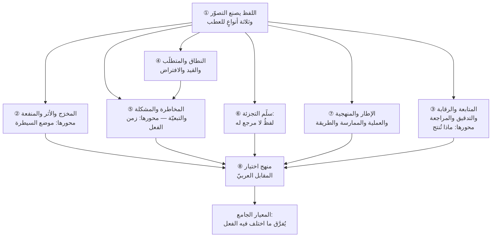

# الفصل 06 — لسان العلم — الفروق الدقيقة بين ألفاظه

---

## 🏛️ لماذا تقرأ هذا الفصل؟

**المشكلة:** يجلس أربعة إلى طاولة واحدة يتناقشون في «النطاق»، ويخرجون متّفقين — ثم يتبيّن بعد شهر أنّ كلّ واحد كان يقصد شيئًا آخر. فالخلاف الذي بدا خلافًا في الرأي كان خلافًا في تعريف كلمة لم يتّفق عليها أحد.

**وماذا لو لم تعرف؟** من لم يضبط الألفاظ ظنّ الاتّفاق حاصلًا وهو غير حاصل، ودفع ثمن اكتشاف ذلك متأخّرًا — وهو أغلى الأثمان في هذا العلم.

**وبعد هذا الفصل ستستطيع:**

- **أن تكشف اللفظ المحمَّل معنيين قبل أن يكلّفك شيئًا** — باختبارٍ واحدٍ تُجريه على أيّ وثيقة: أن تضع تعريف الكلمة مكانها، فإن استقامت الجملة بمعنيين متقابلين فقد وجدتَ موضع الانفجار قبل أن ينفجر.
- **أن تحكم على أيّ تفريقٍ اصطلاحيّ: أيستحقّ أن يُصرَف إليه وقت أم لا؟** — بمعيارٍ واحد: **أن يترتّب على اللفظين فعلان مختلفان**. فما لا يختلف فيه الفعل لا يستحقّ التفريق، وما يختلف فيه زمنُ الفعل أو صاحبُه فالخلط فيه يُضيّع شهورًا.
- **أن تفسّر لماذا لا يُحسم كثيرٌ من نزاعات الاصطلاح بالمراجع** — لأنّ صنفًا من ألفاظ هذا العلم **لا مرجع له أصلًا**، وأنّ علاجه ليس مواصلة البحث بل الاتّفاق المكتوب داخل الفريق.

> [!info] بطاقة الفصل
> **النوع:** تصحيحيّ
> **المستوى:** 🟡 متوسّط
> **زمن القراءة:** نحو 50 دقيقة
> **أهمّيته في الباب:** ★★★★★
> **موضعك:** انتهيتَ من [[05 - ما ليس من إدارة المشاريع]] ← **⬤ أنت هنا** ← يليه [[07 - الأسئلة الكبرى]]

> [!abstract] موقع هذا الفصل
> **يبني على:** [[Cynefin]] · [[Knightian Uncertainty]] — يُذكَر هنا ولا يُعاد شرحه.
> **ويؤسّس:** [[Outcome vs Output]] · [[RAID Log]] — يُقدَّم هنا أوّل مرّة فيصير متاحًا لما بعده.

---

## 🧭 السؤال المركزي

> [!question] السؤال الذي يجيب عنه هذا الفصل كلّه
> **كيف يصنع اللفظ التصوّر، وأين الفروق التي يُخطئ فيها أكثر الناس؟**

**واحمل معك هذه الأسئلة وأنت تقرأ:**

- ما الفرق بين ما سلّمتَه وما تغيّر بسببه؟
- متى تصير المخاطرة مشكلة؟
- هل «إطار عمل» و«منهجية» لفظان لشيء واحد؟

---

## 🗺️ الجواب المختصر — قبل التفصيل

**اللفظ في هذا العلم ليس غلافًا للمعنى بل قالبٌ يصبّه: فالكلمة التي تختارها لوصف الموقف تحدّد السؤال الذي ستطرحه عنه، والسؤالُ يحدّد الفعل.** فمن سمّى الموقف «مخاطرة» سأل عن احتماله فأدارَه قبل وقوعه، ومن سمّاه «مشكلة» سأل عن حلّه فطلب قرارًا اليوم — **والموقف واحد، والفعل مختلف، والفرق كلُّه في الاسم.**

**ولذلك فمعيار جدوى التفريق الاصطلاحيّ في هذا الفصل ليس الدقّة اللغوية بل أثرها في الفعل:** فما اختلف فيه اللفظان ولم يختلف الفعل المترتّب عليهما **لا يستحقّ أن يُصرف إليه وقت**، وما اختلف فيه **زمنُ الفعل** أو **صاحبُه** أو **معيارُ الحكم عليه** فالخلط فيه يُكلّف شهورًا. وعلى هذا المعيار وحده اختيرت الفروق الثمانية في هذا الفصل من بين مئاتٍ غيرها.

**وأمّا مواضع العطب فثلاثة، ولها رابعٌ خاصٌّ بهذا الميدان:**

1. **لفظٌ واحدٌ حُمِّل معنيين متقابلين** — وهو أخطرها على الإطلاق، **لأنّ القارئ لا يستطيع أن يكتشفه**: فهو يقرأ كلمةً يعرفها فيمرّ. ومثاله «المُخرَج» عند من يستعملها لـ`Output` و`Outcome` معًا.
2. **لفظان لمعنًى واحدٍ بلا سبب** — وهذا تشتيتٌ لا لبس، وضرره أخفّ وأظهر.
3. **لفظٌ صحيحٌ لغةً يحمل إيحاءً يقلب المعنى** — كترجمة `Visualize` بـ«تصوّر»، فتنصرف إلى التخيّل الذهنيّ والمقصود ضدُّه: الإظهار البصريّ.
4. **ولفظٌ لا مرجع له أصلًا** — كسلّم التجزئة (مبادرة · ملحمة · قصّة · مهمّة)، فليس في مرجعٍ حاكمٍ تعريفٌ لحدوده. **وهذا صنفٌ يُخطئ الناس في علاجه لا في تشخيصه**: يبحثون عن مرجعٍ يحسمه فلا يجدون، ويظنّون النقص فيهم. **وعلاجه أن يقوم الاتّفاق المكتوب داخل الفريق مقام المرجع الغائب.**

**وأمّا الفروق نفسها فتُبنى على محاور ثلاثة تتكرّر في هذا الفصل كلِّه:** **موضع السيطرة** (أتملكه أم ترجّحه أم يملكه غيرك؟) — وعليه يقوم الفرق بين المخرَج والأثر والمنفعة؛ و**زمن الفعل** (أقبل الوقوع أم بعده؟) — وعليه يقوم الفرق بين المخاطرة والمشكلة؛ و**ما يترتّب على الشيء** (معلومةٌ أم تصحيحٌ أم حكم؟) — وعليه يقوم الفرق بين المتابعة والرقابة والتدقيق.

**وما بقي من هذا الفصل تحريرٌ لهذا في ثماني خطوات:**

1. كيف يصنع اللفظُ التصوّر.
2. سلسلة النتائج.
3. ألفاظ الضبط الأربعة.
4. ألفاظ المطلوب الأربعة.
5. ألفاظ عدم اليقين الأربعة.
6. سلّم التجزئة.
7. الخمسة التي يُخطئ فيها أكثر ما يُكتب.
8. منهج اختيار المقابل العربيّ نفسه.

> [!abstract] مفاهيم يُدخلها هذا الفصل في قاموسك
> `Output` · `Outcome` · `Benefit` · `Risk` · `Issue` · `Dependency`

> [!warning] مفاهيم يكثر الخلط بينها هنا
> `Scope` مقابل `Requirement` مقابل `Constraint` مقابل `Assumption` — احملها في ذهنك، فالفصل يفرّقها في محطّة التمييز.

---

## 🧱 الفكرة الأولى: اللفظ يصنع التصوّر، واللفظ الواحد المحمَّل معنيين هو أصل اللبس

*موضعها من الفصل: هذه أوّل خطوةٍ وهي علّة الفصل كلِّه، وموضعها أن يُثبَت أنّ التفريق بين الألفاظ **عملٌ في القرار لا في اللغة**. **والمجموعات الستّ بعدها ليست إلّا هذا المبدأ مطبَّقًا** — ومن لم يقبله هنا قرأها معجمًا.*

**الفكرة الرئيسة:** ليست هذه دعوى فلسفية عن اللغة والفكر، بل ملاحظةٌ عملية تُختبر في اجتماعٍ واحد: **أنّ الكلمة التي تصف بها الموقف تحدّد السؤال الذي تطرحه عنه، والسؤالُ يحدّد ما تفعله.** فسمِّ الموقف «تأخّرًا» تسأل عن سببه ومن قصّر فيه؛ وسمِّه «معلومةً جديدة» تسأل ماذا تغيّر في تقديرك؛ وسمِّه «مخاطرةً تحقّقت» تسأل ماذا كان في خطّة استجابتك. **والموقف واحدٌ في الثلاثة.**

### وثلاثة أنواعٍ للعطب، وواحدٌ منها وحده هو القاتل

**① لفظٌ واحدٌ حُمِّل معنيين متقابلين.** كأن تُستعمل «المُخرَج» مرّةً لما سلّمه الفريق ومرّةً للتغيّر الذي أحدثه. **وهذا أخطر الثلاثة بفارقٍ بعيد، وعلّة خطره ليست في المعنى بل في الكشف: أنّ القارئ لا يستطيع أن يكتشفه.** فهو يقرأ كلمةً يعرفها، فلا يقف ولا يسأل ولا يستوضح — **فيمضي معتقدًا أنّه فهم، وهو لم يفهم.** ولو استُعملت كلمةٌ غريبة لسأل عنها فصحّ المعنى في أوّل دقيقة.

**② لفظان لمعنًى واحدٍ بلا سبب.** كأن يُقال في وثيقةٍ «أصحاب المصلحة» وفي أخرى «الأطراف المعنيّة» وفي ثالثة «أصحاب العلاقة». **وهذا تشتيتٌ لا لبس**، وضرره أنّه يُتعب القارئ ويُوهمه أنّ ثمّة فرقًا يبحث عنه فلا يجده. **وهو أهون العطبين لأنّه يُكتشف بالقراءة**، ويُعالَج بقائمةٍ واحدة.

**③ لفظٌ صحيحٌ لغةً يحمل إيحاءً يقلب المعنى.** وهذا أبطؤها ضررًا وأمكرها. فترجمة `Visualize` بـ«تصوّر» صحيحةٌ في المعجم، **وهي تنصرف بالقارئ إلى التخيّل الذهنيّ والمقصود نقيضه: أن يُخرَج العمل من الرؤوس إلى لوحٍ يراه الجميع.** ونظيرها ترجمة `Increment` بـ«التزايد» — فالأصل شيءٌ مُسلَّمٌ قائمٌ بنفسه، و«التزايد» يوحي بمقدارٍ ينمو. **فالقارئ هنا لا يُخطئ في المعنى دفعةً واحدة، بل ينحرف عنه قليلًا في كلّ استعمال، حتّى يبني تصوّرًا كاملًا على انحرافٍ لم ينتبه له.**

### ولماذا يشتدّ هذا في العربية بالذات؟

**لسببٍ بنيويّ لا لضعفٍ في اللغة: أنّ أكثر مصطلحات هذا العلم تصل إلينا مترجمة، والترجمة تقع صفحةً صفحة لا مستودعًا كاملًا.** فالمترجم يختار المقابل الذي يناسب سياقه أمامه، ثمّ يأتي مترجمٌ آخر في وثيقةٍ أخرى فيختار غيره، **ولا أحد يملك أن يوحّد بينهما لأنّ أحدًا لا يملك القرار في اللفظ أصلًا.**

**وتزيد الترجمة الآلية الأمر شدّةً**، لأنّها تختار المقابل الأشيع إحصائيًّا لا الأدقّ اصطلاحيًّا — فتُترجم `Prompt` بـ«المطالبة» وهي تنصرف إلى المطالبة الحقوقية، و`Feedback` بـ«الملاحظات» وهي تلتبس بالتعليقات العابرة. **والنتيجة أن تجد في المؤسّسة الواحدة ثلاثة مقابلاتٍ للمصطلح الواحد، ومعناهما عند أصحابها ثلاثة.**

**فالعلاج ليس في إتقان الترجمة، بل في أن يكون للفظ *صاحب قرار* داخل المؤسّسة** — تمامًا كما أنّ للقرار الإداريّ صاحبًا. **والمعجم في هذا المعنى ليس أداةً لغوية بل أداة حوكمة**: قرارٌ مكتوبٌ في اللفظ، يُرجع إليه ولا يُعاد فتحه في كلّ وثيقة.

### والاختبار الذي يكشف اللفظ المحمَّل قبل أن يكلّفك شيئًا

**ضع تعريف الكلمة مكانها في الجملة، ثمّ اقرأ الجملة.** فإن استقامت بمعنيين مختلفين، فاللفظ محمَّلٌ وقد وجدتَ موضع الانفجار قبل أن ينفجر.

فجملة **«نقيس مخرجات المشروع كلَّ ربع»** تستقيم بمعنيين:

- «نُحصي ما سُلِّم كلَّ ربع» — وهذا **يُنجَز** ويُعرف الجواب في ساعة.
- «نقيس التغيّر الذي وقع بسبب ما سُلِّم كلَّ ربع» — وهذا **مشروعُ قياسٍ كامل** يحتاج خطّ أساسٍ وأداة قياسٍ وصاحبًا يملك الرقم.

**والفرق بين المعنيين في الكلفة عشرة أضعاف، وفي الغرض أبعد.** ومن كتب الجملة يقصد الثاني، ومن قرأها يقصد الأوّل — **وكلاهما يظنّ أنّه اتّفق.**

> [!example] أربعة اتّفقوا على «المخرجات»، واختلفوا بعد أربعة أشهر
> اجتماعٌ في جهةٍ بالرياض لاعتماد خطّة برنامجٍ رقميّ، حضره أربعة، وكان البند الأهمّ فيه: **«تُراجَع مخرجات البرنامج كلّ ربع، ويُبنى على المراجعة قرارُ الاستمرار.»** ومرّ البند بلا نقاشٍ يُذكر، لأنّ الجميع رآه معقولًا.
>
> **وكان في رؤوس الأربعة أربعة معانٍ:**
>
> - **مدير البرنامج** فهم: **ما سُلِّم** — عددُ الخدمات التي أُطلقت. وهذا يملكه ويستطيع أن يعرضه في جدول.
> - **المدير الماليّ** فهم: **ما تحصّل** — كم وُفِّر من كلفة التشغيل. وهذا لا يملكه أحدٌ في الغرفة.
> - **مالك المنتج** فهم: **ما تغيّر عند المستخدم** — نسبة من هجر الفرع إلى القناة الرقمية.
> - **ممثّل الجهة الرقابية** فهم: **ما اكتُمل من التزامات الخطّة الوطنية** — وهو شيءٌ رابع.
>
> **ولم يظهر الخلاف في الربع الأوّل ولا الثاني**، لأنّ الأرقام في الربعين الأوّلين كانت تصعد بكلّ المعاني الأربعة، فبدا الاتّفاق قائمًا.
>
> **وظهر في الربع الثالث** — حين أُطلقت سبع خدمات (ارتفعت الأولى)، وثبتت نسبة الاستخدام (لم تتحرّك الثالثة)، ولم يُغلق فرعٌ واحد (لم تتحرّك الثانية). **فقال مدير البرنامج إنّ الخطّة تجاوزت مستهدفها، وقال المدير الماليّ إنّ البرنامج لم يُنتج شيئًا — وكلاهما صادق، وكلاهما يشير إلى الجملة نفسها في المحضر نفسه.**
>
> **وكلفة الأشهر الأربعة لم تكن في الجدل، بل في أنّ القياس الذي كان يجب أن يبدأ في اليوم الأوّل لم يبدأ.** فقياس نسبة التحوّل من الفرع إلى القناة الرقمية يحتاج **خطّ أساسٍ يُلتقط قبل الإطلاق**، وقد فات وقته. **فصار الحكم على البرنامج متعذّرًا لا مختلفًا فيه** — وهذا أسوأ من الخلاف، لأنّ الخلاف يُحسم والتعذّر لا يُعالَج بأثرٍ رجعيّ.
>
> **ولو أنّ أحدهم سأل في ذلك الاجتماع سؤالًا واحدًا — *ما الرقم الذي سنقرأه في نهاية الربع؟* — لانكشف الخلاف كلُّه في خمس دقائق.**

> [!tip] كيف تستعمل هذه الفكرة — «ما الرقم الذي سنقرأه؟»
> لا تسأل عن تعريف الكلمة، **فسؤال التعريف يُجاب بتعريفٍ عامٍّ يوافق عليه الجميع ولا يكشف شيئًا.** واسأل بدلًا منه سؤالًا يُلزم بالتحديد:
>
> > **«حسنًا — ففي نهاية الربع، ما الرقم الذي سنفتحه وننظر فيه؟ ومن يملكه؟»**
>
> **وفائدة صيغة السؤال أنّها لا تحتمل جوابًا عامًّا.** فمن قال «مخرجات البرنامج» يُطلب منه أن يسمّي الرقم، **فيظهر عند التسمية أنّ في الغرفة أربعة أرقام لا رقمًا واحدًا** — بلا أن يُتّهم أحدٌ بسوء الفهم، وبلا أن يتحوّل الاجتماع إلى مناقشةٍ في اللغة.
>
> **وأخوها في المتطلَّبات:** *«اذكر لي مثالًا على شيءٍ يستوفي هذا الشرط، ومثالًا على شيءٍ لا يستوفيه.»* **فالمثال المضادّ يكشف حدود الكلمة، والتعريف لا يكشفها.**

> [!warning] الحفرة الشائعة — أن يُظنّ ضبط اللفظ ترفًا لغويًّا
> يُقال في هذا الباب: «لا تُضِع الوقت في الألفاظ، المهمّ أن نتفاهم» — **وهي عبارةٌ تبدو عملية، وهي في حقيقتها تأجيلٌ للكلفة لا إلغاءٌ لها.**
>
> **فكلفة ضبط اللفظ تُدفع مرّةً واحدة، مبكّرة، وصغيرة**: عشر دقائق في اجتماعٍ واحد، أو سطران في وثيقة. **وكلفةُ تركه تُدفع متأخّرةً وكثيرًا**: عملٌ بُني على فهمٍ خاطئ، وقياسٌ فات وقته، ونزاعٌ يُعاد كلَّ ربع لأنّ أحدًا لم يحسمه.
>
> **والفرق بين الحالتين ليس في مقدار الوقت بل في موضعه.** وهذا هو بعينه ما يجعل هذه الحفرة تعمّر: **أنّ من تجنّب الكلفة المبكّرة يبدو أسرع، ولا يظهر حسابُه إلّا بعد أشهر — حين لا يُنسب التأخّر إلى سببه.**
>
> **وحدُّ هذه القاعدة يُذكر تمامًا لها:** أنّ ضبط اللفظ **ليس غايةً في نفسه**، وأنّ من صرف الاجتماع كلَّه في تحرير المصطلحات وهو لا يترتّب عليها فعلٌ مختلف فقد وقع في الحفرة المقابلة. **والمعيار الفاصل ما تقرّر في صدر الفصل: أن يختلف الفعل. فإن لم يختلف، فالتفريق ترفٌ حقًّا.**

> [!question]- تأكّد أنك فهمت — لماذا اللفظ الواحد المحمَّل معنيين أخطر من لفظين لمعنًى واحد؟
> **المبدأ: لأنّ الثاني يُنتج سؤالًا، والأوّل يُنتج طمأنينةً كاذبة.**
>
> **فاللفظان لمعنًى واحد** — «أصحاب المصلحة» و«الأطراف المعنيّة» — **يُتعبان القارئ ويُوقفانه**: فهو يسأل «أثمّة فرق؟»، **فيُكشف الأمر في دقيقة**. وأقصى ضررهما ضياعُ وقتٍ يسير وثقلٌ في النصّ.
>
> **وأمّا اللفظ المحمَّل معنيين فلا يُوقف أحدًا**، لأنّه كلمةٌ معروفة. **فالخلاف يبقى مستورًا تحت اتّفاقٍ ظاهر، ولا يظهر إلّا حين يترتّب عليه فعل** — وهو حينئذٍ يظهر متأخّرًا بالقدر الذي مضى.
>
> **وثلاث علاماتٍ تدلّ عليه قبل أوانه:**
>
> - **أن يُوافق الجميع على بندٍ بلا نقاش.** فالبند الذي لا يعترض عليه أحدٌ في موضعٍ فيه مصالح مختلفة **علامةٌ على أنّ كلًّا فهمه على وجهه**، لا على أنّه بديهيّ.
> - **أن يُستعمل اللفظ بلا رقمٍ ولا مثال.** فالمعاني تتعدّد في المجرّد وتنحصر في المحسوس.
> - **أن يختلف صاحبا اللفظ في *الفعل* المترتّب عليه** وهما متّفقان على تعريفه. **وهذه أوثق العلامات**، لأنّ الفعل لا يُجامل.
>
> **والأثر العمليّ:** أنّ أخطر ما في وثائقك ليس ما اختُلف عليه، **بل ما اتُّفق عليه بلا نقاش.**

> [!summary]- خلاصة الفكرة في سطرين
> **الكلمة التي تصف بها الموقف تحدّد السؤال الذي تطرحه عنه، والسؤالُ يحدّد ما تفعله — والموقف واحد.**
> **فسمِّه «تأخّرًا» تبحث عن مقصّر، وسمِّه «معلومةً جديدة» تُراجع تقديرك، وسمِّه «مخاطرةً تحقّقت» تسأل عن خطّة استجابتك** — وثلاثتها أوصافٌ لواقعةٍ واحدة.

> [!question] تأمّلٌ تطبيقيّ — لا جواب له في هذا الفصل
> استحضر آخر خبرٍ سيّئ وصلك، واكتب له **ثلاث تسمياتٍ** مختلفة على الثلاثة أعلاه، ثمّ اكتب تحت كلٍّ منها الفعل الذي يلزم عنها.
>
> **ثمّ اسأل: أيَّ التسميات اخترتَ يومئذٍ، ولماذا؟** فالغالب أنّك لم تختر، وإنّما اختارت لك أوّلُ كلمةٍ قيلت في الغرفة — **وهذا وحده يفسّر لماذا انتهى النقاش إلى ما انتهى إليه.**

---

## 🧱 الفكرة الثانية: المخرَج والأثر والمنفعة — سلسلة لا مترادفات

*موضعها من الفصل: تبدأ هنا المجموعات، وأوّلُها **ليست ألفاظًا متجاورة بل حلقاتٍ متتابعة**. وهذا ما يخصّها من بين ما بعدها: أنّ الخلط فيها لا يُضيّع اسم الشيء فحسب، **بل يُسقط سؤال المِلكية — من يُسأل عن هذه الحلقة بعينها؟***

**الفكرة الرئيسة:** هذه الثلاثة — ومعها حلقتان تكتنفانها — **ليست مترادفاتٍ يُختار منها ما يحسُن في السياق، بل حلقاتٌ متتابعة، كلُّ حلقةٍ منها يملكها شخصٌ مختلف.** ومن جمعها في كلمةٍ واحدة لم يُخطئ في اللغة فحسب، **بل أسقط سؤال المِلكية: من الذي يُسأل عن هذه الحلقة بعينها؟**

### والسلسلة ستّ حلقاتٍ لا حلقتان

**وأكثر ما يُختصر في هذا الباب أن يُعرض المخرَج والأثر طرفين متقابلين**، وهما في الحقيقة حلقتان متجاورتان في سلسلةٍ أطول. **وجمع المرجعيّتين الكبريين يعطي الصورة كاملة**: فـPMI يضيف **المنفعة** بعد الأثر، وOECD-DAC يضيف **الأثر بعيد المدى** في آخرها.

| # | الحلقة | ما هي | من يملكها |
|---|---|---|---|
| 1 | **المُدخَل** (Input) | ما يُنفق: مالٌ ووقتٌ وطاقة | من يخصّص |
| 2 | **النشاط** (Activity) | ما يُفعل: ورشٌ وبرمجةٌ واجتماعات | الفريق |
| 3 | **المخرَج** (Output) | ما يُسلَّم ويمكن عدُّه: خدمةٌ أُطلقت، تقريرٌ أُنجز | الفريق |
| 4 | **الأثر** (Outcome) | التغيّر الذي وقع عند المستخدم أو في العمل | مشتركة |
| 5 | **المنفعة** (Benefit) | ما تحصّله المنظّمة: مالٌ مكسوبٌ أو مُوفَّرٌ أو خطرٌ مُزال | من يملك القرار التشغيليّ |
| 6 | **الأثر بعيد المدى** (Impact) | ما يتغيّر في السوق أو المجتمع بعد سنوات | لا أحد وحده |

**والتحرير الكامل لهذه السلسلة موضعه [[22 - Outputs and Outcomes]]**، وهو المرجع الحاكم لها في هذا المستودع. **والذي يخصّ هذا الفصل منها شيءٌ واحد: اللفظ.**

### فأمّا اللفظ فهذه مقابلاته المعتمدة وعللها

**والمقابلات المعتمدة في هذا المستودع:** `Output` = **المخرَج** · `Outcome` = **الأثر** · `Benefit` = **المنفعة** · `Impact` (في السلسلة) = **الأثر بعيد المدى**.

**ولكلّ اختيارٍ منها علّةٌ تُذكر، لأنّ القرار الذي لا يُعرف سنده يُعاد فتحه في كلّ مراجعة:**

- **«الناتج» لـ`Output` مردودة** لأنّها تلتبس بناتج الحساب؛ **و«النتائج» مردودةٌ أشدّ** لأنّها تنصرف في ذهن القارئ إلى `Outcome` نفسه، **فتقلب المعنى لا تُضعفه**.
- **«المُخرَج» لـ`Outcome` مردودة** لأنّها هي `Output` نفسه لفظًا — **وتحميلها المعنى المقابل هو أصل اللبس كلِّه في هذا الباب.**
- **«العائد» لـ`Benefit` مردودة** لأنّها تنصرف إلى `Return` الماليّ، **و«الفائدة» عامّةٌ لا اصطلاحية.**

**واستثناءٌ واحدٌ موثَّق:** أنّ `Learning Outcomes` تبقى **«نواتج التعلّم»** بعرف التعليم — **فالمفهوم ثابتٌ واللفظ يجوز أن يتغيّر بالسياق، بشرطين: ألّا يُوقع في لبس، وأن يكون الاصطلاح موثَّقًا في موضعه.**

### وموضع السيطرة هو المحور الذي تُقرأ عليه السلسلة كلُّها

**فالفرق الجوهريّ بين الحلقات ليس في الزمن ولا في الحجم بل في *من يملك*:**

- **المخرَج تملكه**: إن قرّرتَ أن تُطلق الخدمة أطلقتها.
- **والأثر ترجّحه ولا تملكه**: فأن يهجر الناسُ الفرع إلى القناة الرقمية سلوكٌ لهم لا لك، **وأنت تُرجّحه بحسن التصميم ولا تُلزم به**.
- **والمنفعة يملكها غيرك غالبًا**: فأن تُخفَّض كلفة الفروع **قرارٌ تشغيليّ** لا يقع بمجرّد أن يهجر الناسُ الفرع.

**ومن هنا القاعدة العملية التي يُبنى عليها كلُّ ما بعدها: المخرَج مسؤولية الفريق، والأثر مسؤولية مشتركة، والمنفعة مسؤولية من يملك القرار التشغيليّ.** ومشروعٌ لا يُسمّى فيه **مالك المنفعة** هو مشروعٌ سيُسلَّم ثمّ يُنسى — **وقد تقرّر في [[05 - ما ليس من إدارة المشاريع|الفصل الخامس]] أنّ التسمية هي بعينها ما يمنع أن يبقى التحمّل بلا صاحب.**

### وحلقةٌ في الإنجليزية نفسها فيها عطبٌ لا تُصلحه ترجمة

**وهذا موضعٌ يستحقّ وقفة، لأنّه يُبيّن أنّ اضطراب الاصطلاح ليس دائمًا ذنب المترجم:** فكلمة `Impact` تحمل في أدبيات المجال **معنيين لا صلة لأحدهما بالآخر**:

- **في سلسلة النتائج** (وأصلُها أدبيات تقييم التنمية عند OECD-DAC) هي **آخر الحلقات**: ما يتغيّر في المجتمع بعد سنوات.
- **وفي إدارة المخاطر** (PMBOK · ISO 31000) هي **شدّة ما يقع إن تحقّق الخطر** — أحد بُعدَي مصفوفة الاحتمال والأثر.

**وهذان مفهومان مختلفان تمامًا يشتركان في لفظٍ إنجليزيّ واحد.** ولذلك اعتُمد في هذا المستودع أن تكون `Impact` في السلسلة **«الأثر بعيد المدى»**، وفي المخاطر **«الأثر»** أو **«شدّة الأثر»**، **ويُصرَّح بالفرق عند كلّ التقاء.**

**والدرس الذي يتجاوز هذا المثال:** أنّ **العطب قد يكون في المصطلح الأجنبيّ نفسه**، وأنّ العربية حينئذٍ **تُصلح ما لم تُصلحه لغةُ الأصل** بأن تُفرد لكلّ معنًى لفظًا. **فليست الترجمة دائمًا في موضع التابع.**

> [!example] أثرٌ تحقّق، ومنفعةٌ لم تُحصَّل
> نظام حجز مواعيدَ إلكترونيّ في مركز خدماتٍ بجدّة، بُني ليخفّف الضغط على نافذة الاستقبال. **وقد نجح نجاحًا لا يُنازَع فيه:**
>
> - **المخرَج:** النظام أُطلق كاملًا في موعده. ✔
> - **الأثر:** ارتفعت نسبة المراجعين الذين يحجزون مسبقًا من صفرٍ إلى **ثمانيةٍ وستّين بالمئة** في خمسة أشهر، وانخفض متوسّط زمن الانتظار في الصالة من واحدٍ وأربعين دقيقةً إلى اثنتي عشرة. ✔
>
> **ثمّ نُظر في الحساب بعد سنة، فلم توجد وفورات.** فقد بقيت نوافذ الاستقبال الأربع مفتوحةً كما كانت، وبقي الموظّفون الستّة في مواضعهم — **يعملون أقلّ، ويكلّفون كما كانوا.**
>
> **والسبب أنّ الحلقة الخامسة لم يكن لها صاحب.** فتقليص النوافذ من أربعٍ إلى اثنتين، أو نقلُ موظّفين إلى عملٍ آخر، **قرارٌ تشغيليّ إداريّ لا يقع بأن يحجز الناسُ مواعيدهم.** وقد ظُنّ أنّه سيقع «طبيعيًّا» حين تخفّ الحاجة، **ولا يقع شيءٌ طبيعيًّا في المنظّمات.**
>
> **ولاحظ ما لم يقع هنا:** لم يفشل المشروع، ولم يُخطئ الفريق، ولم يكن التصميم رديئًا. **إنّما أُنفق المال على أثرٍ تحقّق، وبقيت المنفعة التي كانت هي مقصود الإنفاق كلِّه معلّقةً على قرارٍ لم يُطلب من أحد.**
>
> **وما كان يمنع ذلك سطرٌ واحدٌ في وثيقة البدء:** *«مالك المنفعة: مدير التشغيل — والمنفعة المستهدَفة: خفض نوافذ الاستقبال من أربعٍ إلى اثنتين خلال ثلاثة أشهرٍ من بلوغ نسبة الحجز المسبق ستّين بالمئة.»* **فالسطر لا يضمن وقوعها، لكنّه يجعل عدم وقوعها سؤالًا يُسأل عنه أحد.**

> [!tip] كيف تستعمل هذه الفكرة — ثلاثة أسطرٍ في كلّ بندٍ كبير
> في كلّ بندٍ يستحقّ أن يُنفق عليه أسبوعان فأكثر، اكتب ثلاثة أسطرٍ لا سطرًا واحدًا:
>
> 1. **«ما سنسلّمه»** (المخرَج) — وهذا يعرفه الجميع ويُكتب دائمًا.
> 2. **«ما نتوقّع أن يتغيّر، وبأيّ رقمٍ يُقاس، ومن أيّ خطّ أساس»** (الأثر) — **وذكرُ خطّ الأساس هو الشقّ الذي يُنسى، وبنسيانه يصير القياس متعذّرًا لا مختلفًا فيه.**
> 3. **«ما تحصّله المنظّمة إن تغيّر ذلك، ومن الذي يقرّر تحصيله»** (المنفعة) — **وهذا السطر الثالث هو الذي يفرّق بين مشروعٍ يُنفَّذ ومشروعٍ يُثمر.**
>
> **والسطر الثالث هو الذي يُحذف أوّلًا حين يضيق الوقت، وهو الذي كان يجب أن يُكتب أوّلًا.** فمن كتبه اكتشف — أحيانًا في نصف ساعة — **أنّ المنفعة المزعومة ليست لأحد**، فوفّر المشروع كلَّه.

> [!warning] الحفرة الشائعة — «نحن فريق موجَّه بالأثر»
> عبارةٌ صارت شعارًا، **ويُكشف صدقها بسؤالٍ واحد: بماذا يُقاس الفريق فعلًا في تقريره الشهريّ؟** فإن كان يُقاس بعدد الميزات المُطلَقة وبنسبة إنجاز الخطّة، **فهو فريقٌ موجَّه بالمخرَج مهما قال** — لأنّ ما يُقاس به المرء هو ما يوجّهه، لا ما يعلنه.
>
> **والحفرة أعمق من مجرّد التناقض بين القول والقياس**، وفيها ثلاث صورٍ تستحقّ التسمية:
>
> - **أن يُصاغ المخرَج بلغة الأثر ويبقى مخرَجًا**: «إطلاق لوحة تحليلات لتمكين اتّخاذ القرار» — فالفعل المقيس هو الإطلاق، وما بعد «لتمكين» أمنية.
> - **أن يُقاس الأثر بمؤشّرٍ يملكه الفريق**: كأن تُقاس «سهولة الاستخدام» بعدد النقرات في التصميم لا بسلوك المستخدم. **فالمؤشّر الذي تملك تحريكه بلا أن يتغيّر أحدٌ ليس أثرًا.**
> - **أن يُنتظر الأثر ولا يُنتظر شيء**: فتُطلق الخدمة، ولا يُلتقط رقمٌ بعدها، ثمّ يُقال بعد سنةٍ إنّها «نجحت». **وهذا ادّعاءٌ لا قياس.**
>
> **والقاعدة التي تحسم:** أنّ التوجّه بالأثر **قرارٌ في نظام القياس والحوافز لا في اللغة**. ومن أراد أن يعرف حال فريقه فليفتح تقريره الشهريّ، **فالتقرير أصدقُ من الشعار.**

> [!question]- تأكّد أنك فهمت — تحقّق الأثر ولم تتحقّق المنفعة. أفشل المشروع؟
> **المبدأ: لم يفشل، ولم ينجح — بل بلغ الحلقة التي يملكها وتوقّف عند حلقةٍ يملكها غيره. والحكم يقع على من ملك، لا على من نفّذ.**
>
> **ولهذا التفريق ثلاثة آثارٍ عملية:**
>
> - **أنّ اللوم لا يقع على الفريق.** فقد سلّم مخرَجه ورجّح أثره وتحقّق. **ومن حمّله المنفعة فقد حمّله قرارًا تشغيليًّا لا يملكه** — وهذه هي بعينها الحالة التي سُمّيت في [[05 - ما ليس من إدارة المشاريع|الفصل الخامس]]: أن يتحمّل من لا يملك.
> - **وأنّ الإنفاق مع ذلك لم يُثمر ثمرته المقصودة.** فالحكم على المشروع بوصفه **استثمارًا** يُقاس بالمنفعة لا بالأثر، **وهذا حكمٌ صحيحٌ لا يُنقض بأنّ الفريق أدّى ما عليه.** والحكمان يجتمعان ولا يتناقضان.
> - **وأنّ العلاج معلوم الموضع.** فحين يُعرف أنّ الانقطاع في الحلقة الخامسة، يُعرف أنّ ما ينقص **قرارٌ إداريّ** لا ميزةٌ إضافية. **وهذا هو أنفع ما تعطيه السلسلة: أن تدلّك على موضع الانقطاع بدل أن تعطيك حكمًا واحدًا على الجملة.**
>
> **والخطأ الذي تمنعه هذه التفرقة أشيع ممّا يُظنّ:** أن يُقرأ عدمُ تحقّق المنفعة نقصًا في المنتج، **فيُبنى المزيد** — ميزاتٌ جديدةٌ تُضاف إلى نظامٍ ناجحٍ أصلًا — **بينما الذي كان ينقص قرارٌ لا يُبنى.**

> [!summary]- خلاصة الفكرة في سطرين
> **المخرَج والأثر والمنفعة حلقاتٌ متتابعة يملك كلَّ حلقةٍ منها شخصٌ مختلف، لا مترادفاتٌ يُختار منها ما يحسُن في السياق.**
> **ومن جمعها في كلمةٍ واحدة أسقط سؤال المِلكية:** من الذي يُسأل عن هذه الحلقة بعينها؟ — وحيث لا مالك، لا يُسأل أحد، ولا يُصلَح شيء.

> [!question] تأمّلٌ تطبيقيّ — لا جواب له في هذا الفصل
> خذ آخر ما سلّمه فريقك، وارسم سلسلته: ما المخرَج؟ ثمّ ما الأثر المتوقّع؟ ثمّ ما المنفعة التي تُجنى؟ **وضع أمام كلّ حلقةٍ اسمًا — اسم شخصٍ لا اسم إدارة.**
>
> **فالحلقة التي لا تجد لها اسمًا هي التي ستنكسر**، لا لأنّ أحدًا أهملها، بل لأنّ كلَّ واحدٍ ظنّها في عهدة غيره.

---

## 🧱 الفكرة الثالثة: الإدارة والرقابة والتدقيق والمتابعة

*موضعها من الفصل: كانت السابقة سلسلةً تمتدّ في الزمن، وهذه **أربعةٌ في مستوًى واحد** يُخلط بينها لأنّها تقع كلُّها على العمل الجاري. **ومحورُ التفريق فيها: أيُّ سؤالٍ يجيب عنه كلٌّ منها وحده، وأيُّ ناتجٍ لا يُنتجه غيره.***

**الفكرة الرئيسة:** أربعةُ ألفاظٍ تُستعمل استعمالًا متبادلًا في أكثر ما يُكتب بالعربية، **ولكلٍّ منها سؤالٌ يجيب عنه وحده، وناتجٌ لا يُنتجه غيره.** وأمّا **الحوكمة** فقد حُدَّت في [[05 - ما ليس من إدارة المشاريع|الفصل الخامس]] — وهي تعلو هذه الأربعة ولا تُعدّ منها.

### والمحور الذي تُفرَّق عليه: ماذا يترتّب عليها؟

**فالفرق بينها ليس في شدّة النظر بل في ناتجه:**

- **المتابعة (Monitoring): تُنتج معلومة.** جمعُ بياناتٍ عن الحال بانتظام: أين وصل العمل، وما المصروف، وأين تقف البنود. **ولا حكم فيها ولا تصحيح** — وهذا هو حدّها، ومن طلب منها أكثر فقد طلب من الميزان أن يُنقص الوزن.
- **الرقابة (Controlling): تُنتج تصحيحًا.** مقارنةُ ما وقع بما خُطِّط، ثمّ **فعلٌ يردّ الانحراف** أو يعتمده فيُعدّل الخطّة. **والرقابة التي لا يترتّب عليها فعلٌ ليست رقابةً بل متابعةً مكلفة.**
- **التدقيق (Audit): يُنتج حكمًا على الالتزام.** فحصٌ **من جهةٍ مستقلّة** عن مدى الالتزام بقاعدةٍ أو معيارٍ أو إجراء. **ولا يصحّح بنفسه، وإنّما يُقرّر ويُبلِّغ من يملك التصحيح.**
- **المراجعة (Review): تُنتج حكمًا على المحتوى.** نظرُ أهل الشأن في العمل نفسه: أهذا التصميم سليم؟ أهذه الشيفرة صالحة؟ **وهي حكمٌ على الجودة لا على الالتزام.**

**والشرط الذي يُميّز التدقيق عن الثلاثة استقلالُ من يقوم به.** **والاستقلال شرطٌ في التدقيق لا صفةٌ فيه**: فمن دقّق عمله لم يدقّق، ومن دقّق عمل من يرأسه أو يُقيّمه لم يدقّق. **وهذا هو الشرط الذي يُسقَط أوّلًا حين يُنشأ «تدقيق داخليّ» من داخل الفريق.**

### والفرق بينها يظهر في السؤال الذي تجيب عنه

| اللفظ | سؤاله | من يقوم به | وماذا بعده؟ |
|---|---|---|---|
| متابعة | أين نحن الآن؟ | من ينفّذ | تُرفع المعلومة |
| رقابة | أين نحن ممّا خُطِّط، وماذا نفعل؟ | من يدير | يُصحَّح أو تُعدَّل الخطّة |
| تدقيق | أالتزمنا بالقاعدة؟ | جهةٌ مستقلّة | يُبلَّغ من يملك التصحيح |
| مراجعة | أهذا العمل جيّد؟ | أهل الشأن | يُقبل أو يُعاد |

**والخطأ العمليّ الأشيع أن يُسمّى الاجتماع باسمٍ ويُطلب منه ناتجُ اسمٍ آخر.** فيُسمّى «اجتماع متابعة» — أي أنّه لجمع المعلومة — **ثمّ يُطلب فيه اتّخاذ قراراتٍ تصحيحية**، ولم يُدعَ إليه من يملكها. **فيخرج الحاضرون بقراراتٍ لا نفاذ لها**، ويُعاد الاجتماع نفسه في الأسبوع القادم بالبنود نفسها.

**وعكسه:** أن تُسمّى **المراجعة** «تدقيقًا» — فتُعطى صفة الحُكم النهائيّ لعملٍ قام به من ليس مستقلًّا، **فيُبنى على نتيجته قرارٌ لا تحتمله.**

> [!example] «لجنة تدقيق داخليّ» أعضاؤها من الفريق
> شركة في الدمّام أرادت أن تنضبط قبل تدقيقٍ خارجيّ مرتقب، **فشُكّلت «لجنة تدقيق داخليّ» من ثلاثة: قائد الفريق التقنيّ، ومحلّل الجودة، ومنسّق المشروع.** واجتمعت شهريًّا، وأصدرت تقاريرَ منظّمة، وكانت النتيجة في ثلاثة تقاريرَ متتالية: **«لا ملاحظات جوهرية.»**
>
> **ثمّ جاء التدقيق الخارجيّ فأخرج إحدى عشرة ملاحظة، أربعٌ منها جوهرية.**
>
> **والسبب لم يكن تقصيرًا ولا مجاملة، وهذا ما يستحقّ الانتباه.** فالثلاثة كانوا مجتهدين، **لكنّهم كانوا يدقّقون على إجراءاتٍ شاركوا في وضعها ويعملون بها كلّ يوم**. وأربعٌ من الملاحظات الجوهرية كانت في مواضع **لم يخطر لهم أن يسألوا عنها أصلًا** — لأنّها عندهم بديهيّةٌ مستقرّة، وهي عند من جاء من الخارج **افتراضٌ يُسأل عن سنده**.
>
> **وهذا هو معنى أنّ الاستقلال شرطٌ لا صفة:** فالمدقّق غير المستقلّ لا يُخفي شيئًا، **وإنّما لا يرى ما لا يخطر له أن ينظر فيه** — وهذا عيبٌ لا تُصلحه النزاهة ولا الاجتهاد.
>
> **والعلاج الذي طُبِّق بعدها لم يكن إلغاء اللجنة**، بل تصحيح اسمها وناتجها: **صارت «مراجعة جاهزية» — وهي مراجعةٌ لا تدقيق**، وأُضيف إليها شرطٌ واحد: أن يحضرها في كلّ ربعٍ شخصٌ من خارج المشروع، **وأن يكون بندُه الوحيد أن يسأل: لماذا تفعلون هذا على هذه الصورة؟**

> [!tip] كيف تستعمل هذه الفكرة — سؤالُ الناتج لكلّ اجتماعٍ دوريّ
> افتح تقويمك، وانظر في كلّ اجتماعٍ متكرّر، **واسأل عنه سؤالًا واحدًا: ما ناتجه؟ معلومةٌ أم تصحيحٌ أم حكمٌ على الالتزام أم حكمٌ على المحتوى؟**
>
> **ثمّ افحص شرطين:**
>
> 1. **أيحضره من يملك أن يُنتج هذا الناتج؟** فاجتماعٌ ناتجه تصحيحٌ ولا يحضره من يملك تحريك مورد **اجتماعُ متابعةٍ بلا أن يعلم أهله**.
> 2. **أخرج منه هذا الناتج فعلًا في آخر ثلاث مرّات؟** فإن كان الناتج المعلن تصحيحًا ولم يقع تصحيحٌ في ثلاثة أشهر، **فالاسم يكذب على التقويم.**
>
> **وأكثر ما ستجده أنّ الاجتماعات كثيرةٌ في المعلومة قليلةٌ في التصحيح** — لأنّ المعلومة سهلةٌ لا تُكلّف أحدًا، والتصحيح يحتاج صاحب قرار. **والعلاج ليس بزيادة اجتماع، بل بأن يُنقل إلى الاجتماع القائم من يملك أن يقرّر فيه.**

> [!warning] الحفرة الشائعة — الرقابة التي لا تُنتج تصحيحًا
> أشيع صور العطب في هذه الأربعة أن تُبنى منظومة رقابةٍ كاملة — تقاريرُ ولوحاتٌ ومؤشّراتٌ ودوريّة منتظمة — **ثمّ لا يترتّب على أيّ انحرافٍ فيها فعل.**
>
> **وعلامتها الفارقة أن يبقى المؤشّر أحمر ثلاثة أشهرٍ متتالية، ويُذكر في كلّ تقرير، ولا يتغيّر شيء.** فالانحراف حينئذٍ **لم يعد معلومةً بل صار ديكورًا**: يعتاده الحاضرون فيمرّون عليه كما يمرّون على ترويسة الصفحة.
>
> **وضررها مركّب:** فهي تُكلّف كلفةَ الرقابة كاملةً — وقتُ الجمع والإعداد والعرض — **وتُعطي في مقابله شعورًا بالسيطرة يمنع البحث عن علاجٍ حقيقيّ.** فالمؤسّسة التي عندها لوحةٌ حمراء لا تشعر أنّها غافلة، **وهي غافلةٌ عن الفعل لا عن المعلومة.**
>
> **والفحص الذي يكشفها في دقيقة:** خذ آخر ثلاثة تقارير، **وابحث عن انحرافٍ واحدٍ ترتّب عليه فعلٌ يمكن أن تسمّيه.** فإن لم تجد، **فما عندك متابعةٌ سُمّيت رقابة** — وتسميتها باسمها الصحيح أنفع من الإبقاء على الوهم، لأنّها حينئذٍ تُطلب من موضعها.

> [!question]- تأكّد أنك فهمت — أُنشئ في مؤسّستك «مكتب متابعة» لمتابعة المشاريع المتعثّرة. أيصلح؟
> **المبدأ: لا — والعطب في الاسم قبل أن يكون في التصميم. فالتعثّر لا تُعالجه معلومةٌ إضافية، لأنّ المعلومة موجودة أصلًا.**
>
> **فالمشروع المتعثّر في الغالب معلومٌ تعثّرُه لمن فيه**، وإنّما يعجز عن الخروج منه لأحد ثلاثة، وليس في المعلومة منها شيء:
>
> - **قرارٌ معلّقٌ لا يملكه أحدٌ ممّن في الغرفة** — وعلاجه حوكمة.
> - **مواردُ لا تكفي وطلبٌ لا يُخفَّض** — وعلاجه تصحيحٌ يملكه من يخصّص.
> - **أو خللٌ في الطريقة لا يُرى من داخله** — وعلاجه مراجعةٌ من خارج.
>
> **فمكتبٌ ناتجه المعلومة يضيف إلى الثلاثة تقارير، ويستهلك من وقت الفريق المتعثّر ما يزيد تعثّره** — وهذا هو المعنى الذي فيه القول المشهور: **أنّ وزن الخنزير لا يزيد بكثرة وزنه.**
>
> **والصورة التي تصحّ من هذا المكتب واحدةٌ من اثنتين، بشرط أن يُسمّى باسمها:**
>
> - **أن يكون ناتجه تصحيحًا** — فيُمنح صلاحية إعادة تخصيص موردٍ أو تعديل نطاق. **وهو حينئذٍ مكتب رقابةٍ لا متابعة، ويجب أن يُسمّى كذلك ويُعطى ما يلزمه.**
> - **أو أن يكون ناتجه حكمًا مستقلًّا على الطريقة** — فيراجع المشروع المتعثّر من خارجه ويرفع ما لا يُرى من داخله. **وهو حينئذٍ مراجعة، وشرطُها ألّا يكون هو من وضع الإجراءات التي يراجعها.**
>
> **والخلاصة: أنّ السؤال قبل إنشاء أيّ جهةٍ رقابية سؤالٌ عن الناتج لا عن الاسم — «ماذا تُنتج؟» فإن كان الجواب «تقارير» فقد عُرف الجواب عن جدواها.**

> [!summary]- خلاصة الفكرة في سطرين
> **الإدارة والرقابة والتدقيق والمتابعة أربعةٌ لكلٍّ منها سؤالٌ يجيب عنه وحده، وناتجٌ لا يُنتجه غيره.**
> **واستعمالها متبادلةً يُنتج طلبًا في غير موضعه**: أن يُطلب من المتابعة أن تحكم، أو من التدقيق أن يُصلح — فيُلام كلٌّ منهما على ما ليس من عمله.

> [!question] تأمّلٌ تطبيقيّ — لا جواب له في هذا الفصل
> انظر في تقاريرك الدورية واسأل عن كلّ تقرير: **أيَّ الأربعة يخدم؟ ومن يقرؤه؟ وأيّ قرارٍ يُتّخذ بناءً عليه؟**
>
> **فالتقرير الذي لا يُجيب عن الثلاثة تقريرُ متابعةٍ يُقرأ بوصفه رقابة** — يُستهلك وقتٌ في إعداده، ولا يُغيّر شيئًا، ولا يجرؤ أحدٌ على إيقافه لأنّ إيقافه يبدو تفريطًا.

---

## 🧱 الفكرة الرابعة: النطاق والمتطلّب والقيد والافتراض

*موضعها من الفصل: كانت الألفاظ السابقة تصف **ما تفعله بالعمل**، وهذه تصف **ما يُطلب منك أصلًا**. **ومحورُ التفريق فيها قابليةُ التفاوض:** فهذه أربعةٌ تُجمع في كلمة «المطلوب»، وجمعُها فيها يُبطل التفاوض من أصله — إذ يصير كلُّ نقاشٍ إمّا مستحيلًا أو بلا معنى.*

**الفكرة الرئيسة:** أربعةٌ يجمعها الناس في كلمةٍ واحدة — **«المطلوب»** — **وجمعُها فيها يُبطل التفاوض من أصله.** لأنّ التفاوض إنّما يجري على **المتطلَّبات**، ولا يجري على **القيود**، **والافتراضات** لا يُتفاوض عليها أصلًا بل تُختبر. **فمن وضع الأربعة في سلّةٍ واحدة صار كلُّ نقاشٍ فيها إمّا مستحيلًا أو بلا معنى.**

### والأربعة محرَّرة

**① النطاق (Scope): حدُّ ما يشمله العمل — وما لا يشمله.** والشقّ الثاني هو الذي يُهمل، **والنطاق الذي لا يُذكر فيه المستثنى ليس نطاقًا بل قائمة أمنيات**. فحدُّ الشيء يُعرف بما خرج عنه كما يُعرف بما دخل فيه، **وقد تقرّر هذا في [[05 - ما ليس من إدارة المشاريع|الفصل الخامس]] في حدّ العلم، وهو في حدّ المشروع أظهر.**

**② المتطلَّب (Requirement): ما يجب أن يفعله النظام أو يتّصف به.** وهو **داخل** النطاق ومحلُّ التفاوض: يُقدَّم ويُؤخَّر ويُسقَط ويُبسَّط.

**③ القيد (Constraint): حدٌّ مفروضٌ من خارجٍ لا تملك تغييره.** كتاريخٍ نظاميّ، أو سقفٍ للميزانية، أو تقنيةٍ إلزامية، أو نظامٍ قائمٍ يجب التكامل معه. **وعلامته أنّه لا يُتفاوض على وجوده، وإنّما يُتفاوض على الاعتراف به** — أي على أن يُدرَج في الحساب بدل أن يُتجاهل.

**④ الافتراض (Assumption): شيءٌ بُني عليه العمل ولم يُتحقّق منه، وإن سقط تغيّرت الخطّة.** وهو **الوحيد من الأربعة الذي قد لا يكون صحيحًا أصلًا** — وهذا ما يجعله أخطرها.

### والفرق العمليّ الحاسم: القيد يُخطَّط داخله، والافتراض يُخطَّط عليه ثمّ يُختبر

**وهذه الجملة وحدها تُنتج فعلين مختلفين تمامًا:**

- **فالقيد** يُؤخذ كما هو ويُبنى الحلّ داخله. **ولا يُصرف عليه وقتٌ في التحقّق، لأنّه لن يتغيّر.**
- **والافتراض** يُبنى عليه العمل مؤقّتًا، **ويُوضع له تاريخُ تحقّقٍ وخطّةٌ إن سقط.**

**فمن كتب افتراضًا في خانة القيود جمّده** — أي عامل شيئًا مشكوكًا فيه معاملةَ المسلّم به، فلم يتحقّق منه أحد حتّى سقط في وقتٍ لا يحتمل السقوط. **ومن كتب قيدًا في خانة الافتراضات أضاع وقتًا يختبر ما لا يتغيّر**، وأورث الفريق أملًا كاذبًا بأنّ التاريخ النظاميّ «قد يُمدَّد».

**والفرق بينهما لا يُعرف بالنظر إلى الشيء نفسه، بل بسؤالٍ واحد: *من يملك تغييره؟*** فإن كان أحدٌ يملك تغييره فهو **قيدٌ قابلٌ للتفاوض** — أي متطلَّبٌ في ثوب قيد؛ **وإن لم يملكه أحدٌ في متناولك فهو قيدٌ حقيقيّ؛ وإن كنتَ لا تدري أصحيحٌ هو أصلًا فهو افتراض.**

### ومن هنا يُفهم زحف النطاق فهمًا صحيحًا

**وقد مرّ بك [[Scope Creep|زحف النطاق]] في [[05 - ما ليس من إدارة المشاريع|الفصل الخامس]] بوصفه *تغييرًا غير محاسَب*.** والذي يضيفه هذا الفصل **علّته اللغوية**: أنّ أكثر الزحف لا يقع لأنّ أحدًا أدخل بندًا خِلسة، **بل لأنّ النطاق كُتب بلا مستثنًى، فصار كلُّ ما يخطر لأحدٍ داخلًا فيه بالتفسير.**

**فجملة «النظام يدير طلبات الموظّفين» تحتمل عشرة أنظمة مختلفة.** ومن كتبها ظنّ أنّه حدّ، **وإنّما فتح**. **والذي يحدّها سطران يُكتبان تحتها: «ويشمل ذلك… ولا يشمل…».** وأصعب ما في هذين السطرين أنّ كتابة المستثنى تبدو **عدائية** في اجتماعٍ ودّيّ — **وهي في حقيقتها أرحم ما يُفعل بالطرفين، لأنّ الخلاف عليها اليوم كلفتُه دقائق، واكتشافُه بعد أربعة أشهر كلفتُه إعادة عمل.**

> [!example] افتراضٌ لم يُكتب، فسقط بلا إنذار
> مشروع بوّابةٍ للخدمات الداخلية في شركةٍ بالرياض، وفيه بندٌ ظاهرُه بسيط: **«التكامل مع نظام الموارد البشرية لجلب بيانات الموظّف.»** قُدِّر البند بأسبوع.
>
> **وكان تحت البند افتراضٌ لم يكتبه أحد: أنّ لنظام الموارد البشرية واجهةً برمجية (API) يمكن الاتّصال بها.** ولم يكن هذا تهاونًا — **بل كان بديهيًّا في نظر الفريق**، لأنّ كلّ نظامٍ عملوا عليه في السنوات الخمس الماضية كان له واجهة.
>
> **ولم يكن للنظام واجهة.** كان نظامًا قديمًا مغلقًا، والمورّد يطلب مقابلًا وستّة أسابيع لبناء واجهةٍ محدودة.
>
> **واكتُشف ذلك في الأسبوع التاسع من مشروعٍ مدّته ستّة عشر أسبوعًا** — أي بعد أن بُني على الافتراض شيءٌ كثير: تصميمُ شاشاتٍ يفترض توفّر بيانات فورية، ومنطقُ تحقّقٍ يفترض تحديثًا لحظيًّا، **وتقديرٌ للمشروع كلِّه بُني على أنّ هذا البند أسبوع.**
>
> **والحاصل: ستّة أسابيع تأخيرًا، وإعادة تصميمٍ لأربع شاشات.**
>
> **والذي كان يمنعه سطرٌ واحد في وثيقة البدء، وخمس دقائق في الأسبوع الأوّل:** *«نفترض أنّ لنظام الموارد البشرية واجهةً برمجية للقراءة. وإن لم يكن، فالأثر ستّة أسابيع وتغييرٌ في التصميم. ويُتحقَّق من ذلك قبل نهاية الأسبوع الثاني — والمسؤول: فلان.»*
>
> **ولاحظ أنّ السطر لا يمنع سقوط الافتراض**، فالنظام سيبقى بلا واجهةٍ على كلّ حال. **وإنّما ينقل اكتشاف السقوط من الأسبوع التاسع إلى الأسبوع الثاني** — وهذا وحده هو الفرق بين تعديلٍ في الخطّة وأزمةٍ في المشروع.

> [!tip] كيف تستعمل هذه الفكرة — الافتراض بلا تاريخ تحقّقٍ ليس افتراضًا بل أمنية
> اكتب كلّ افتراضٍ بصيغةٍ من أربعة أجزاء، ولا تقبل ثلاثة منها:
>
> > **«نفترض أنّ … · وإن لم يصحّ فالأثر … · ويُتحقَّق منه قبل … · والمسؤول عن التحقّق …»**
>
> **والجزءان الأخيران هما اللذان يُحذفان دائمًا، وهما اللذان يُحوّلان الافتراض من ملاحظةٍ إلى فعل.** فالافتراض المكتوب بلا تاريخٍ ولا مسؤول **يبقى في الوثيقة يُقرأ ولا يُختبر**، ثمّ يُستشهد به بعد وقوع الضرر بصيغة «كنّا قد افترضنا…» — وهذا استعمالٌ للوثيقة في غير ما وُضعت له.
>
> **وقاعدةٌ عملية في الترتيب: اختبر أوّلًا الافتراض الذي *أثرُ سقوطه أكبر*، لا الذي *سقوطه أرجح*.** فالافتراض الذي احتمال سقوطه عشرة بالمئة وأثره ستّة أسابيع **أولى بالاختبار المبكّر** من افتراضٍ احتمال سقوطه النصف وأثره يومان. **والناس يفعلون العكس عادةً، لأنّهم يختبرون ما يشكّون فيه لا ما يخيفهم.**

> [!warning] الحفرة الشائعة — أن يُكتب الافتراض ليُحتجّ به لا ليُختبر
> ثمّة استعمالٌ للافتراضات يبدو انضباطًا وهو نقيضه: **أن تُملأ الوثيقة بعشرين افتراضًا في أوّل المشروع، ثمّ لا يُنظر فيها مرّةً واحدة** — إلى أن يقع الضرر، فتُفتح ويُقال: «هذا كان مذكورًا».
>
> **وعلامتها ثلاثٌ تُعرف بها:**
>
> - **أن تكون الافتراضات كثيرةً جدًّا** — فمن كتب عشرين افتراضًا لم يفكّر في عشرين، وإنّما نسخ قائمة.
> - **ألّا يكون لأيٍّ منها تاريخٌ ولا مسؤول.**
> - **وأن تكون صياغتها تحصينًا لا وصفًا:** «نفترض تعاون جميع الجهات» — **وهذا ليس افتراضًا يُختبر بل شرطٌ مستحيل التحقّق يُحتجّ به عند الإخفاق.**
>
> **والفرق بين الافتراض المكتوب للاختبار والمكتوب للاحتجاج يظهر في سؤالٍ واحد: ماذا سنفعل غدًا بسببه؟** فإن كان الجواب «لا شيء» **فهو مكتوبٌ للاحتجاج**، ومكانه أن يُحذف أو يُعطى تاريخًا.

> [!question]- تأكّد أنك فهمت — قيل لك: «الميزانية مئتا ألف ولا تزيد.» أهذا قيدٌ أم متطلَّب؟
> **المبدأ: لا يُعرف من العبارة، بل من جواب سؤالٍ واحد: *من يملك تغييره؟* — والجواب هو الذي يحدّد فعلك، لا صيغة الجملة.**
>
> **وثلاث حالاتٍ تحتملها العبارة نفسها:**
>
> - **قيدٌ حقيقيّ**: أن يكون السقف مقرَّرًا في موازنةٍ معتمدة لا يملك أحدٌ في متناولك تعديلها هذه السنة. **وفعلك حينئذٍ: أن تصمّم الحلّ داخله، وأن تعرض ما لا يتّسع له بوصفه *خارج النطاق* لا بوصفه *مطلبًا مؤجَّلًا*.**
> - **قيدٌ قابلٌ للتفاوض** — أي متطلَّبٌ في ثوب قيد: أن يكون الرقم تقديرًا وضعه شخصٌ يملك تعديله إن رأى مبرّرًا. **وفعلك حينئذٍ: أن تعرض المقايضة بالرقم — «بمئتين نبني هذا، وبمئتين وأربعين نبني ذاك» — فيكون القرار لصاحبه على بيّنة.**
> - **افتراضٌ يظنّه قائله قيدًا**: أن يكون الرقم مأخوذًا من مشروعٍ سابقٍ أو من تقديرٍ قديم، **ولم يتحقّق أحدٌ من كفايته أصلًا.** وفعلك حينئذٍ: أن تختبره مبكّرًا — **فسقوطه في الشهر الأوّل تعديلٌ في الخطّة، وسقوطه في الشهر الخامس أزمة.**
>
> **والسؤال الذي يفرز الثلاثة في جملة:** *«من الذي لو اقتنع تغيّر هذا الرقم؟»* — فإن كان له اسمٌ فهو محلُّ تفاوض، **وإن لم يكن له اسمٌ في متناولك فهو قيد، وإن لم يعرف أحدٌ من أين جاء الرقم فهو افتراض.**
>
> **وأثر الخطأ في التصنيف مختلفٌ في كلّ اتّجاه:** فمن عامل المتفاوَض عليه قيدًا **فقد تنازل قبل أن يُطلب منه**، ومن عامل القيد متفاوَضًا عليه **أضاع وقته وأفقد نفسه المصداقية**، ومن عامل الافتراض قيدًا **بنى مشروعه على رقمٍ لا سند له.**

> [!summary]- خلاصة الفكرة في سطرين
> **النطاق والمتطلّب والقيد والافتراض أربعةٌ يجمعها الناس في «المطلوب»، وجمعُها يُبطل التفاوض من أصله.**
> **فالتفاوض يجري على المتطلّبات، ولا يجري على القيود، والافتراضات لا يُتفاوض عليها بل تُختبر** — ومن وضع الأربعة في سلّةٍ واحدة صار كلُّ نقاشٍ فيها إمّا مستحيلًا وإمّا بلا معنى.

> [!question] تأمّلٌ تطبيقيّ — لا جواب له في هذا الفصل
> خذ وثيقة نطاقٍ عندك، ومُرّ على بنودها بندًا بندًا واضعًا أمام كلٍّ منها حرفًا: **ن** نطاق · **م** متطلّب · **ق** قيد · **ف** افتراض.
>
> **ثمّ عُدّ الافتراضات خاصّةً.** فإن لم تجد فيها شيئًا فليست الوثيقة خاليةً من الافتراضات، إنّما هي **غير مكتوبة** — وستظهر واحدًا واحدًا في صورة «تغييراتٍ» يُلام عليها العميل.

---

## 🧱 الفكرة الخامسة: المخاطرة والمشكلة والافتراض والتبعية

*موضعها من الفصل: مضت ألفاظُ ما يُطلب، وهذه ألفاظُ **ما يعترضه** — تُجمع كلُّها في «عوائق» و«تحدّيات». **ومحورُ التفريق فيها زمنُ الفعل وصاحبه**، وهو الذي يحوّل سجلّ RAID من أربعة أعمدةٍ تُملأ قبل الاجتماع إلى أداةٍ تُنتج قرارًا.*

**الفكرة الرئيسة:** أربعةٌ يجمعها الناس في كلمة «عوائق» أو «تحدّيات»، **والفرق بينها هو *زمن الفعل وصاحبه*** — وهو الفرق الذي يجعل [[RAID Log|سجلّ RAID]] أداةً مفهومة بدل أن يكون أربعة أعمدةٍ تُملأ قبل الاجتماع.

### والأربعة بأفعالها

- **المخاطرة (Risk): لم تقع بعد، ولها احتمالٌ وأثر.** ← **تُدار قبل وقوعها**: بتفاديها أو تقليل احتمالها أو تخفيف أثرها أو نقلها أو قبولها عمدًا.
- **المشكلة (Issue): وقعت فعلًا، وتحتاج قرارًا الآن.** ← **تُحلّ**، ولها مالكٌ وتاريخُ إغلاق.
- **الافتراض (Assumption): بُني عليه ولم يُتحقّق منه.** ← **يُختبر** بتاريخٍ ومسؤول.
- **التبعية (Dependency): تنتظر إنجاز غيرك لتبدأ أو لتكتمل.** ← **تُنسَّق**، ولها طرفٌ ثانٍ وتاريخٌ متّفقٌ عليه.

**ومن هذه الأربعة يتركّب [[RAID Log|سجلّ RAID]]:** المخاطر (Risks) · الافتراضات (Assumptions) · المشكلات (Issues) · التبعيّات (Dependencies). **والسجلّ إنّما ينفع لأنّ كلّ عمودٍ فيه يستدعي فعلًا مختلفًا في زمنٍ مختلف** — ومن جمعها في «قائمة عوائق» أسقط الفعل وأبقى الشكوى.

### وأخطر الخلط: نقل المشكلة إلى عمود المخاطر

**فالمخاطرة يُقال فيها «سنراقبها»، والمشكلة يُقال فيها «من يقرّر، ومتى؟».** ومن سجّل مشكلةً وقعت في خانة المخاطر — **بلا قصدٍ غالبًا** — فقد أجّل علاجها إلى أجلٍ غير مسمّى، **وأبقاها في اللوحة صفًّا برتقاليًّا محتمَلًا بدل أن تكون صفًّا أحمرَ يطلب قرارًا.**

**وهذا النقل يقع لسببٍ نفسيٍّ مفهوم:** أنّ المخاطر تُقرأ **كفاءةً في الاستشراف**، والمشكلات تُقرأ **إخفاقًا في التنفيذ**. **فاللوحة التي فيها مخاطر كثيرةٌ ومشكلاتٌ قليلة تبدو أفضل** — وهي في الغالب أسوأ، لأنّها إمّا تخفي وقائعَ حدثت، وإمّا تدلّ على فريقٍ لا يعترف بها.

**والعلامة التي تكشفه في دقيقتين:** افتح السجلّ، **وابحث عن صفٍّ في عمود المخاطر لم تتغيّر حالته منذ شهرين.** فالمخاطرة إمّا أن تقع فتصير مشكلة، وإمّا أن يمضي وقتها فتُغلَق، **وإمّا أن يُفعل شيءٌ فيقلّ احتمالها.** أمّا الصفّ الجامد فهو في الغالب أحد اثنين: **مشكلةٌ وقعت ولم تُنقل، أو مخاطرةٌ لم يفعل فيها أحدٌ شيئًا منذ كُتبت.**

### وحدُّ اللغة الأوّل: ليس كلُّ مجهولٍ مخاطرة

**فكلمة «مخاطرة» تحمل في طيّها دعوى: أنّك تستطيع أن تقدّر لها احتمالًا وأثرًا، ولو تقديرًا خشنًا.** وعلى هذه الدعوى بُنيت أدوات هذا الباب كلُّها: مصفوفة الاحتمال والأثر، وترتيب المخاطر، والاحتياطيّ المحسوب.

**وثمّة صنفٌ لا تصحّ فيه هذه الدعوى: ما لا يُقدَّر له احتمالٌ أصلًا** — وقد مرّ بك في [[02 - طبيعة العلم وهويته|الفصل الثاني]] باسم [[Knightian Uncertainty|اللايقين النايتيّ]]. ومثاله قرارُ جهةٍ تنظيميةٍ لم تُعلن اتّجاهها، أو دخولُ منافسٍ لا تعرف عنه شيئًا.

**ومن أدخل هذا الصنف في سجلّ المخاطر بعمود احتمال، اضطُرّ أن يكتب رقمًا مخترعًا، ثمّ بنى عليه ترتيبًا وميزانية.** **والرقم المخترع أسوأ من لا رقم**، لأنّه يُطمئن ويُرتَّب عليه.

**وعلاجه ليس تحسين التقدير بل تغيير نوع الاستجابة:** فما لا يُقدَّر احتماله **يُعالَج بالخيارات لا بالحساب** — أن تُبقي بابًا مفتوحًا: عقدٌ قابلٌ للإنهاء، أو تصميمٌ يحتمل الاتّجاهين، أو قرارٌ يُؤجَّل حتّى تصل المعلومة. **وكلفة إبقاء الباب مفتوحًا هي ثمنُ ما لا يُقدَّر، وهي كلفةٌ معلومةٌ تُدفع بوعي.**

### وحدُّ اللغة الثاني: كلمة «مشكلة» تفترض أنّ لها حلًّا

**وهذا موضعٌ يزيده [[Cynefin|كونيفين]] تحريرًا — وقد مرّ بك في [[02 - طبيعة العلم وهويته|الفصل الثاني]] — لأنّ لفظ «مشكلة» يحمل تصوّرًا كاملًا للفعل: أنّ ثمّة حلًّا صحيحًا يُعرف بالتحليل أو يعرفه خبير.**

**وهذا صحيحٌ في المجالين الأوّلين:** فالموقف **الواضح** له ممارسةٌ معلومة، والموقف **المعقّد** له حلٌّ يعرفه المتخصّص.

**وهو باطلٌ في المجال المركّب**، حيث لا تُعرف العلاقة بين السبب والنتيجة إلّا بعد وقوعها. **فتسميةُ الموقف المركّب «مشكلة» تدفع صاحبها إلى الفعل الخطأ: أن يطلب حلًّا من خبير، أو أن يُطيل التحليل انتظارًا لجوابٍ لن يجيء.** والصواب فيه أن يُجرَّب تجريبًا آمنًا صغيرًا يُرى أثره ثمّ يُبنى عليه.

**فاللفظ هنا لا يصف الموقف فحسب، بل يصف *نوع العلاج* الذي ستطلبه له** — وهذا هو معنى قولنا في صدر الفصل إنّ الكلمة قالبٌ يصبّ التصوّر لا غلافٌ يستره.

> [!example] سجلٌّ فيه أربعةٌ وثلاثون صفًّا، وأحد عشر منها كذب
> مشروع منصّةٍ تعليمية في جدّة. وكان مدير المشروع منضبطًا في سجلّه: **أربعةٌ وثلاثون صفًّا في عمود المخاطر**، لكلٍّ احتمالٌ وأثرٌ ومالكٌ واستجابةٌ مقترحة، **يُعرض في كلّ اجتماعٍ شهريّ.**
>
> **وفي مراجعةٍ من خارج المشروع، طُرح على السجلّ سؤالٌ واحد: *أيّ هذه الصفوف لم تتغيّر حالته منذ شهرين؟***
>
> **فكان الجواب: تسعةَ عشر صفًّا.** ولمّا نُظر فيها واحدًا واحدًا تبيّن أنّها ثلاثة أصناف:
>
> - **أحدَ عشر صفًّا كانت مشكلاتٍ وقعت فعلًا** — كأن يكون «خطر عدم توفّر بيئة الاختبار» قد وقع منذ سبعة أسابيع، **والبيئة غير متوفّرةٍ الآن**، والصفّ ما يزال مكتوبًا فيه: احتمال 60%. **وقد كان الفريق يعرف ذلك تمامًا، ولم ينقله أحدٌ لأنّ لا أحد يملك حلّه — فبقي حيث لا يطلب قرارًا.**
> - **وخمسةُ صفوفٍ كانت افتراضاتٍ لا مخاطر** — كـ«خطر أن يتأخّر اعتماد الهوية البصرية»، وهو في حقيقته افتراضٌ بأنّ الاعتماد سيجيء في وقتٍ ما، **بلا تاريخٍ ولا مسؤول.**
> - **وثلاثةٌ كانت لايقينًا لا يُقدَّر** — كـ«خطر تغيّر متطلّبات الجهة المنظِّمة»، **وقد كُتب له احتمال 30% وهو رقمٌ لا سند له.**
>
> **والأثر العمليّ للتصنيف كان فوريًّا وكبيرًا:** فأحدَ عشر صفًّا انتقلت إلى المشكلات **فصار لكلٍّ منها مالكٌ وتاريخ إغلاق**، وثلاثةٌ منها أُغلقت في أسبوعين لأنّها كانت تحتاج قرارًا صغيرًا لم يُطلب من أحد. **والخمسة صارت افتراضاتٍ لها تواريخ تحقّق. والثلاثة أُخرجت من المصفوفة إلى قائمةٍ مستقلّة عنوانها «ما نُبقي له بابًا مفتوحًا».**
>
> **ولاحظ أنّه لم يُضَف إلى السجلّ صفٌّ واحد، ولم يُحذف منه شيء.** **وإنّما نُقلت الصفوف إلى أعمدتها الصحيحة، فتغيّر الفعل المترتّب عليها** — وهذا هو كلُّ ما يفعله ضبط اللفظ.

> [!tip] كيف تستعمل هذه الفكرة — فحص السجلّ في دقيقتين
> لا تحتاج إلى مراجعة السجلّ صفًّا صفًّا لتعرف حاله. **اسأل عنه ثلاثة أسئلةٍ فقط:**
>
> 1. **أيّ صفٍّ لم تتغيّر حالته منذ شهرين؟** ← وهذه هي المشكلات المستورة والافتراضات المهمَلة.
> 2. **كم مشكلةً أُغلقت في الشهر الماضي؟** ← فإن كان الجواب صفرًا في مشروعٍ يعمل، **فالمشكلات لا تُسجَّل أصلًا** — لأنّ المشروع الحيّ يُنتجها بالضرورة.
> 3. **أيّ مخاطرةٍ نزل احتمالها بفعلٍ فعلناه؟** ← فهذا وحده هو الدليل على أنّ السجلّ يُدار لا يُملأ. **ومن لم يجد مثالًا واحدًا فسجلُّه أرشيفٌ لا أداة.**
>
> **والثالث أهمّها وأقلّها سؤالًا**، لأنّه ينقل الحكم من كثرة الصفوف إلى أثر الفعل — **وهو المعيار نفسه الذي فُرّق به بين الرقابة والمتابعة في الفكرة الثالثة.**

> [!warning] الحفرة الشائعة — تحسين اللوحة بدل تحسين الحال
> أخبث ما يقع في هذا الباب ليس الإهمال، **بل الانضباط الشكليّ الذي يخدم الصورة**: أن تُنقل المشكلة إلى المخاطر فتبدو اللوحة أفضل، **أو أن تُقسَّم مشكلةٌ كبيرةٌ إلى ثلاث صغيرة فتنخفض شدّتها، أو أن يُخفَّض تقدير الأثر عند اقتراب موعد العرض.**
>
> **وليس هذا في الغالب كذبًا مقصودًا، وهذا سبب انتشاره.** فمن يعلم أنّ لوحته الحمراء ستُقرأ إخفاقًا لا معلومة، **يتعلّم بسرعةٍ أن يُلوّنها** — وهو السلوك نفسه الذي وُصف في [[05 - ما ليس من إدارة المشاريع|الفصل الخامس]] حين يُفصل التحمّل عن الصلاحية.
>
> **وعلاجه ليس في السجلّ بل فيمن يقرؤه:** أنّ الجهة التي تُكافئ اللوحة الخضراء تُنتج لوحاتٍ خضراء، **والتي تسأل «ما أكبر مشكلةٍ عندك الآن؟» وتُعين على حلّها تُنتج سجلًّا صادقًا.** فصدق السجلّ **صفةٌ في المؤسّسة لا في مديره.**

> [!question]- تأكّد أنك فهمت — «قد لا يوافق فريق الأمن على التصميم.» أمخاطرةٌ هذه أم مشكلةٌ أم افتراضٌ أم تبعيّة؟
> **المبدأ: العبارة بصيغتها لا تكفي للحكم — والفارق يقع بسؤالين: أوقع شيءٌ بعد؟ ومن يملك تحريكه؟**
>
> **وأربع حالاتٍ تحتملها العبارة نفسها، ولكلٍّ فعلٌ مختلف:**
>
> - **إن كان التصميم قد عُرض على الأمن ورُفض فعلًا** ← **مشكلة**. وقعت وتحتاج قرارًا: أنُعدّل التصميم أم نطلب استثناءً؟ **ولها مالكٌ وتاريخ إغلاق.**
> - **وإن لم يُعرض بعدُ، وثمّة سببٌ يُخشى منه** ← **مخاطرة**، تُدار قبل وقوعها: أن يُعرض مبكّرًا ولو ناقصًا، وأن تُعرف معاييرهم قبل البناء عليها.
> - **وإن كان الفريق يمضي في البناء على أنّ الأمن سيوافق ولم يسأل أحدٌ أحدًا** ← **افتراض**، **وهذا أخطر الأربعة لأنّه لا يُرى**: فليس في اللوحة صفٌّ ولا في الأذهان قلق، وإنّما بناءٌ صامتٌ على ظنّ.
> - **وإن كانت الموافقة إجراءً لازمًا له طابورٌ ومدّةٌ معروفة** ← **تبعيّة**، تُنسَّق بتاريخٍ متّفقٍ عليه مع الطرف الثاني، **ولا تُدار على أنّها احتمال.**
>
> **والحالة الرابعة هي التي يُخطئ فيها أكثر الناس**: فيُسجَّل انتظارُ جهةٍ أخرى «مخاطرةً باحتمال 40%»، **والحقيقة أنّه ليس فيه احتمالٌ أصلًا** — سيقع حتمًا، وإنّما المجهول **متى**. **والفعل الصحيح فيه ليس المراقبة بل الحجز المبكّر في جدول الطرف الآخر.**
>
> **والدرس الجامع: أنّ التصنيف ليس توصيفًا للحال بل اختيارًا للفعل.** فمن سمّاها مخاطرةً راقب، ومن سمّاها تبعيّةً حجز موعدًا، ومن سمّاها مشكلةً طلب قرارًا — **وثلاثتهم ينظرون إلى الشيء نفسه.**

> [!summary]- خلاصة الفكرة في سطرين
> **المخاطرة والمشكلة والافتراض والتبعية أربعةٌ يجمعها الناس في «العوائق»، والفرق بينها زمنُ الفعل وصاحبُه.**
> **فالمخاطرة لم تقع بعدُ وتملك أن تستعدّ لها، والمشكلة وقعت وتملك أن تعالجها، والافتراض يُختبر، والتبعية عند غيرك** — واختلافُ الفعل هو ما يجعل [[RAID Log|سجلّ RAID]] أداةً تُفهم، لا أربعةَ أعمدةٍ تُملأ قبل الاجتماع.

> [!question] تأمّلٌ تطبيقيّ — لا جواب له في هذا الفصل
> افتح سجلّ المخاطر عندك — إن وُجد — واقرأ خمسة بنودٍ منه، وضع أمام كلٍّ منها صنفه الصحيح.
>
> **والغالب أن تجد فيه مشكلاتٍ وقعت مكتوبةً بوصفها مخاطر**، لأنّ نقلها إلى عمود المشكلات يستدعي مالكًا وموعدًا. **والسجلّ الذي لا تتغيّر حالةُ بندٍ فيه بين مراجعتين ليس سجلًّا، بل وثيقةٌ تُجدَّد.**

---

## 🧱 الفكرة السادسة: المبادرة والملحمة والقصّة والمهمّة

*موضعها من الفصل: مضت ألفاظٌ لها في الأدبيات حدودٌ يُحتكم إليها، **وتفارق هذه المجموعةُ ما قبلها بأنّه لا معيار يحكمها أصلًا** — فهي سلّمُ تجزئةٍ اصطلح عليه كلُّ فريقٍ بحسبه. **ولذلك ينتقل الحكم فيها من موافقة المرجع إلى اتّساق الفريق مع نفسه.***

**الفكرة الرئيسة:** هذه أربعةٌ تصف **سلّم التجزئة**: [[Initiative|المبادرة]] ← [[Epic|الملحمة]] ← القصّة ← المهمّة. **والحقيقة التي يجب أن تُقال في أوّل هذه الفكرة لا في آخرها: أنّه لا يوجد لهذا السلّم تعريفٌ معياريّ واحدٌ يحكمه.**

### وهذا هو الصنف الرابع: لفظٌ لا مرجع له

**فليس في دليل سكرم شيءٌ اسمه «ملحمة» ولا «مبادرة»**؛ فيه **عنصر قائمة أعمال المنتج** لا غير. **والملحمة والمبادرة والموضوع (Theme) ألفاظٌ شاعت من مصدرين: أدوات إدارة العمل — وعلى رأسها Jira — وأطرٌ لتوسيع أجايل على مستوى المؤسّسة كـSAFe.** وليس واحدٌ منهما مرجعًا حاكمًا يُحتكم إليه، **وإنّما هما استعمالٌ شائعٌ انتشر حتّى ظُنّ اصطلاحًا مستقرًّا.**

**وهذا الصنف — اللفظ الذي لا مرجع له — يُخطئ الناس في *علاجه* لا في تشخيصه.** فهم يشعرون بالاضطراب، **ثمّ يبحثون عن مرجعٍ يحسمه**: يُفتح كتابٌ ثمّ مقالٌ ثمّ فيديو، ويُصرف على ذلك وقتٌ طويل، **وينتهي الأمر إلى أنّ كلّ مصدرٍ يقول شيئًا** — فيُظنّ النقص في البحث لا في الموضوع.

**والعلاج أن يقوم الاتّفاق المكتوب داخل الفريق مقام المرجع الغائب.** وشرطه شرطان: **أن يُكتب** — فالاتّفاق الشفويّ يتبخّر مع أوّل عضوٍ جديد؛ **وأن يُعلن أنّه اتّفاقٌ محلّيّ لا نقلٌ عن مرجع** — لئلّا يُخاصَم به من جاء من مؤسّسةٍ تصطلح على غيره.

### والمعيار الوحيد الذي يصمد: القابلية للعرض، لا الحجم

**وأكثر ما يُقال في هذا السلّم أنّه سلّم *أحجام*: المبادرة كبيرةٌ جدًّا، والملحمة كبيرة، والقصّة صغيرة، والمهمّة أصغر.** **وهذا وصفٌ لا يُنتج حكمًا**، لأنّ الحدّ بين «كبيرة» و«صغيرة» لا ينضبط، فيبقى الخلاف كما كان.

**والمعيار الذي يصمد ويُنتج حكمًا هو *ما يمكن أن يُعرض على من ليس في الفريق*:**

- **القصّة** ما يمكن أن يُنجز ويُختبر داخل تكرارٍ واحد، **ويُعطي عند إتمامه شيئًا يمكن أن يُعرض على مستخدمٍ فيفهمه.**
- **والمهمّة** جزءٌ تقنيٌّ من القصّة، **لا يُعرض وحده لأنّه لا يعني شيئًا لمن هو خارج الفريق**: «إنشاء الجدول»، «تهيئة بيئة النشر».
- **والملحمة** ما لا يُنجز في تكرارٍ واحد فيُقسَّم إلى قصص.
- **والمبادرة** ما يجمع ملاحمَ تخدم هدفًا واحدًا، **وهي أقرب إلى لغة التخطيط منها إلى لغة التنفيذ.**

**فالفرق بين القصّة والمهمّة ليس في عدد الأيّام بل في *لمن تُقال*.** وقد مرّ بك في [[11 - User Stories|قصص المستخدم]] أنّ القصّة **دعوةٌ إلى حوارٍ** لا مواصفةٌ مغلقة — **ولا يصحّ الحوار إلّا مع من يفهم ما تقول.**

### وأثر الخطأ فيه عمليٌّ لا اصطلاحيّ

**فالفريق الذي يعامل المهامّ التقنية قصصًا يجد نفسه في مراجعة السبرنت بلا شيءٍ يُعرض:** أُنجزت سبعة بنود، **وليس فيها بندٌ واحدٌ يراه من ليس مبرمجًا.** فتتحوّل المراجعة إلى تقرير حالةٍ شفويّ، **ويفقد الفريق أنفع ما فيها: التغذية الراجعة من خارج.**

**والعكس أيضًا يقع:** فريقٌ يجعل كلّ شيءٍ قصّةً بصيغة «بصفتي مستخدمًا…» حتّى الترقيات التقنية، **فيكتب قصصًا مصطنعةً لا مستخدمَ فيها** — «بصفتي مستخدمًا أريد أن تكون قاعدة البيانات مفهرسة» — **وهذه ليست قصّةً بل مهمّةٌ لُبِّست ثوبًا.**

> [!example] سبعة بنودٍ أُنجزت، ولا شيء يُعرض
> فريقٌ من ستّة في الرياض، يبني نظام إدارة عقود. وكان في سبرنته الثالث سبعة بنودٍ مكتوبةٍ كلُّها بصيغة القصّة، وأُنجزت كلُّها: **«إعداد مخطّط قاعدة البيانات»، «تهيئة خطّ النشر»، «بناء طبقة الوصول للبيانات»، «إضافة سجلّ الأحداث»…**
>
> **ولمّا جاءت مراجعة السبرنت وحضرها ثلاثةٌ من أصحاب المصلحة، لم يكن في الشاشة شيءٌ يُعرض.** فعرض الفريق مخطّطًا لقاعدة البيانات وشرح طبقة الوصول، **وجلس الحاضرون عشرين دقيقةً يستمعون إلى ما لا يستطيعون الحكم عليه** — ثمّ خرجوا بانطباعٍ واحد: أنّ الفريق بطيء.
>
> **وكان الفريق قد أنجز عملًا حقيقيًّا كثيرًا، وهذا ما يجعل الحالة مؤسفة.** فالسبعة كلُّها كانت لازمة، **ولم يكن العطب في العمل بل في وحدة التقطيع**: أنّ السبرنت قُطّع بمنطق البناء التقنيّ — الأساس ثمّ الجدران ثمّ السقف — لا بمنطق ما يمكن أن يُرى.
>
> **والتصحيح لم يكن أن يعمل الفريق أكثر ولا أسرع.** بل أن يُعاد التقطيع **رأسيًّا**: أن يكون في السبرنت **قصّةٌ واحدةٌ نحيفة تمرّ بالطبقات كلِّها** — «أن يُنشئ الموظّف عقدًا بحقلين ويحفظه ويراه في قائمة» — **ومعها المهامّ التقنية الستّ بوصفها مهامّ لا قصصًا.**
>
> **والنتيجة في السبرنت التالي: أُنجز عملٌ أقلّ من حيث الحجم التقنيّ، وخرج أصحاب المصلحة بأربع ملاحظاتٍ غيّرت تصميم شاشتين** — **وهذه الملاحظات الأربع هي الفرق كلُّه**، وقد كانت ستُكتشف بعد ثلاثة أشهرٍ لولا ذلك.

> [!tip] كيف تستعمل هذه الفكرة — ثلاثة أسطرٍ على لوح الفريق
> **لا تبحث عن مرجعٍ يحسم لك هذا السلّم، فلا مرجع.** واكتب بدلًا من ذلك ثلاثة أسطرٍ يتّفق عليها الفريق في عشر دقائق، وعلّقها حيث تُرى:
>
> > **المهمّة:** جزءٌ تقنيّ لا يُعرض وحده على من ليس في الفريق.
> > **القصّة:** ما يُنجز ويُختبر في تكرارٍ واحد، **ويُعرض فيفهمه المستخدم.**
> > **الملحمة:** ما لا يُنجز في تكرارٍ واحد، فيُقسَّم إلى قصص.
>
> **وأضِف إليها سطرًا رابعًا هو الأهمّ:** *«هذا اصطلاحُنا نحن، لا نقلٌ عن مرجع.»*
>
> **وفائدة هذا السطر أكبر ممّا يبدو**: فهو يمنع الجدل مع كلّ عضوٍ جديدٍ يجيء من مؤسّسةٍ تصطلح على غيره، **ويمنع أن يُحتجّ بالاصطلاح المحلّيّ على الناس** — إذ يصير الخلاف على **الاصطلاح** لا على **الصواب**، وهذا خلافٌ يُحسم في دقيقة.

> [!warning] الحفرة الشائعة — البحث عن مرجعٍ يحسم ما لا مرجع فيه
> يُصرف في هذه المسألة بالذات وقتٌ لا يتناسب مع ثمرتها: تُقرأ مقالاتٌ متعارضة، ويُستشهد بأدواتٍ لا سلطان لها، **ويُعقد اجتماعٌ كامل ينتهي إلى ما كان يمكن أن يُتّفق عليه في عشر دقائق.**
>
> **والعلّة ليست في كسل الباحث بل في توقّعه:** أنّه يفترض أنّ لكلّ مصطلحٍ في المجال مرجعًا حاكمًا، **فيظنّ أنّ عجزه عن إيجاده نقصٌ في بحثه.** فيواصل، **ولا يجد لأنّه ليس ثمّة ما يُوجَد.**
>
> **والعلامة التي تعرف بها أنّك في هذا الصنف:** أن تجد ثلاثة مصادرَ معتبرةٍ تقول ثلاثة أشياء، **وليس فيها معيارٌ رسميٌّ يُحال إليه.** **فحينئذٍ توقّف عن البحث وابدأ بالاتّفاق** — فالوقت الذي تنفقه بعد ذلك مهدور.
>
> **وحدُّ هذه القاعدة يُذكر معها:** ألّا تُستعمل ذريعةً للتوقّف عن البحث في ما **له** مرجع. **فالفرق بين الحالتين أن تنظر هل ثمّة جهةٌ معياريةٌ تكلّمت في المسألة أصلًا** — فالمخرَج والأثر لهما مراجع، وسلّم التجزئة ليس له.

> [!question]- تأكّد أنك فهمت — عضوٌ جديد قال: «عندنا في الشركة السابقة، القصّة تعني شيئًا آخر.» فماذا تفعل؟
> **المبدأ: لا تصحّحه ولا تُصحَّح له — بل أرِه أنّ الخلاف على اصطلاحٍ محلّيّ لا على حقيقة، ثمّ اسأل عن الفعل.**
>
> **فأمّا أن تصحّحه** بأن تقول «هذا خطأ، والصحيح كذا» **فباطلٌ لأنّه ليس ثمّة صحيحٌ يُحتكم إليه** — وستُطالَب بالدليل فلا تجده، **فتخسر مصداقيّتك في مسألةٍ لا تستحقّ.**
>
> **وأمّا أن تتنازل** فتُدخل اصطلاحه إلى جانب اصطلاح الفريق، **فتُنتج لفظين لمعنًى واحدٍ في المكان الواحد** — وهو العطب الثاني في الفكرة الأولى.
>
> **والصواب ثلاث خطواتٍ في دقائق:**
>
> 1. **أن تُسمّي الحال باسمها:** «هذا اصطلاحٌ يختلف باختلاف المؤسّسات، وليس فيه مرجعٌ حاكم — واصطلاحنا هنا كذا، وهو مكتوبٌ على اللوح.»
> 2. **أن تسأل عن الفعل لا عن التعريف:** *«عندكم، أكان يُعرض هذا في المراجعة أم لا؟»* — **فإن كان الفرق في التعريف ولا فرق في الفعل، فالخلاف لفظيٌّ محض وينتهي هنا.**
> 3. **وأن تنظر: أفي اصطلاحه ما هو أنفع؟** فقد يجيء بتمييزٍ يفيد — **فيؤخذ ويُعدَّل السطر على اللوح.** والاصطلاح المحلّيّ ليس مقدَّسًا، وإنّما هو مكتوبٌ ليُرجع إليه ويُعدَّل، لا ليُدافَع عنه.
>
> **والفائدة الأبعد من هذا الموقف بعينه:** أنّ العضو الجديد يتعلّم في أوّل أسبوعٍ أنّ في هذا الفريق **فرقًا بين ما يُحتكم فيه إلى مرجع وما يُحتكم فيه إلى اتّفاق** — **وهذه معرفةٌ تنفعه في عشرات المسائل بعدها.**

> [!summary]- خلاصة الفكرة في سطرين
> **المبادرة والملحمة والقصّة والمهمّة سلّمُ تجزئة، ولا يوجد له تعريفٌ معياريّ واحد يحكمه.**
> **ولذلك يُكتب حدُّه داخل الفريق** — فالنزاع على «أهذه ملحمةٌ أم قصّة؟» نزاعٌ لا يحسمه مرجع، ويحسمه اتّفاقٌ مكتوبٌ في سطرين.

> [!question] تأمّلٌ تطبيقيّ — لا جواب له في هذا الفصل
> اسأل ثلاثةً من فريقك — كلًّا على حدة — أن يكتبوا لك حدَّ **القصّة** عندكم: ما أكبر ما تحتمله؟ وما أصغر ما يستحقّ أن يُكتب؟
>
> **فإن اختلفت الأجوبة الثلاثة — وهو الغالب — فقد وجدتَ سببَ أكثر جدالكم في التقدير.** ولا يُصلحه مرجعٌ أجنبيّ، وإنّما يُصلحه سطران يُكتبان اليوم ويُراجعان بعد ربع.

---

## 🧱 الفكرة السابعة: إطار العمل والمنهجية والعملية والممارسة والطريقة

*موضعها من الفصل: كانت المجموعات الخمس السابقة ألفاظًا **داخل** المشروع، وهذه أسماءُ **طرق العمل نفسها**. **ومحورُ التفريق فيها بنيويّ لا تدريجيّ** — أي أنّ هذه الخمسة ليست مراتبَ في شيءٍ واحد، ومن سمّى الشيء بغير اسمه توقّع منه غير ما يعطي.*

**الفكرة الرئيسة:** خمسةٌ تُستعمل استعمالًا متبادلًا في أكثر ما يُكتب بالعربية عن هذا المجال، **وهي خمسة أشياء مختلفة في البنية لا في الدرجة.** والخطأ فيها ليس اصطلاحيًّا فحسب: **فمن سمّى الشيء بغير اسمه توقّع منه غير ما يعطي.**

### والخمسة محرَّرة

**① إطار العمل (Framework): يصف بنيةً وأدوارًا ومناسباتٍ ومصنوعات.** ومثاله سكرم: ثلاث مسؤوليّات، وخمسة أحداث، وثلاثة مصنوعات. **وعلامته أنّه يمكن أن يُسأل عنه: من الأدوار فيه؟ وما أحداثه؟ فيُجاب.**

**② المنهجية (Methodology): فلسفةٌ وطريقة عملٍ أشمل** تحكم كيف يُقارَب العمل من أوّله إلى آخره، وتحتها عادةً عملياتٌ وأدوات. **وهي أعمّ من إطار العمل**، ولذلك كانت تسمية سكرم «منهجية» تسميةً للأخصّ باسم الأعمّ.

**③ العملية (Process): خطواتٌ متسلسلةٌ لها مدخلاتٌ ومخرجات.** كعملية إدارة التغيير: يُقدَّم الطلب، ويُقيَّم أثره، ويُعرض على المخوَّل، ويُعتمد أو يُردّ، ويُحدَّث خطّ الأساس.

**④ الممارسة (Practice): سلوكٌ متكرّرٌ قابلٌ للتبنّي وحده** بلا أن يُتبنّى ما حوله. كالبرمجة الثنائية، ومراجعة الشيفرة، والتكامل المستمرّ. **وعلامتها الفارقة: أنّك تستطيع أن تأخذها وحدها إلى بيئتك القائمة فتعمل.**

**⑤ الطريقة (Method): تُطبَّق *فوق* عمليةٍ قائمةٍ فتغيّر إدارتها بلا أن تفرض بنيةً جديدة.** **وكانبان مثالها**، وهو المثال الذي يُخطأ فيه تحديدًا.

### ولماذا كانبان ليست إطار عمل؟

**لأنّها لا تعرّف دورًا ولا حدثًا ولا مصنوعًا.** فليس فيها «مالك منتج» ولا «سبرنت» ولا «قائمة أعمال» بمعناها في سكرم. **وإنّما فيها مبادئُ وممارساتٌ تُطبَّق على ما عندك كما هو** — وأوّل مبادئها المعلنة: **ابدأ بما تفعله الآن.**

**والفرق ليس تصنيفيًّا بل عمليّ:** فمن ظنّها إطارًا **بحث فيها عن الأدوار والأحداث فلم يجد، فظنّها ناقصةً فأكملها** — بأن أضاف أدوارًا وأحداثًا من سكرم، **فأنتج شيئًا ثالثًا لا هو كانبان ولا سكرم**، وضاع منه أنفعُ ما في كانبان: أنّها **لا تطلب إعادة تنظيمٍ لتبدأ**.

**ومن عرفها طريقةً أخذها على وجهها:** أظهر ما يفعله الآن، وحدّ العمل الجاري، وقاس زمن العبور، **ثمّ غيّر ما ظهر أنّه يحتاج تغييرًا** — بلا أن يعيد تشكيل فريقه في اليوم الأوّل.

**وتفصيل هذا في [[03 - Kanban|كانبان]]، وموضعه من هذا الفصل اللفظ لا المفهوم.**

### وأمّا أجايل فليست واحدًا من الخمسة أصلًا

**وهذا تحريرٌ يلزم لأنّ الخلط فيه أعمّ:** فـ**أجايل ليست إطار عملٍ ولا منهجيةً ولا عمليةً ولا ممارسةً ولا طريقة — بل مجموعة قيمٍ ومبادئ** أعلنها بيانُ عام 2001.

**ولازمُ ذلك عمليٌّ ومهمّ:** أنّ قول القائل **«نحن نطبّق أجايل»** لا يُنتج جملةً قابلةً للفحص. **فما الذي يُفحص فيه؟** لا أدوارَ تُطابَق، ولا أحداثَ تُعدّ، ولا خطواتٍ تُتّبع. **والسؤال الذي يُنتج جوابًا: *أيّ إطارٍ أو طريقةٍ أو ممارساتٍ تستعملون، وأيّ قيمةٍ من القيم الأربع تظهر في قراركم الأخير؟***

**والخطأ المقابل أن يُقال «أجايل مجرّد كلام» لأنّها لا تُفحص كإطار.** **والقيم تُفحص، لكن بأثرها في القرار لا بمطابقة قائمة**: فمن قدّم خطّةً جامدةً على معلومةٍ جديدةٍ ظهرت، فقد خالف القيمة الرابعة مهما عقد من مراسم.

> [!example] فريقٌ طُلب منه «تطبيق كانبان»، فأنشأ أحداثًا وأدوارًا
> فريق دعمٍ فنّيّ في شركةٍ بجدّة، عمله متدفّقٌ لا دفعات: بلاغاتٌ تصل بلا موعدٍ ولا حجم، وأولويّاتها تتغيّر في اليوم. **وقد جُرِّب فيه سكرم قبل سنةٍ فلم يصلح**، لأنّ الالتزام لسبرنتٍ من أسبوعين كان يُكسر في أوّل يومٍ ببلاغٍ عاجل.
>
> **فقيل: نطبّق كانبان.** **وما فُعل بعدها هو موضع العبرة:**
>
> - عُيّن **«كانبان ماستر»** — وليس في كانبان هذا الدور ولا ما يشبهه.
> - وأُنشئ **«تخطيط كانبان»** كلَّ أسبوعين — أي أُعيدت الدفعات من باب آخر.
> - وقُسّم العمل إلى **«سبرنتات كانبان»**.
>
> **والنتيجة أنّهم عادوا إلى سكرم باسمٍ آخر، ومعه المشكلة نفسها التي هربوا منها.**
>
> **وسبب ذلك كلِّه كلمةٌ واحدة:** أنّهم عاملوا كانبان **إطار عمل**، والإطار يُسأل: ما أدواره وأحداثه؟ **فلمّا لم يجدوا جوابًا، اخترعوه.**
>
> **والتصحيح كان إسقاط ما أضافوه والبدء بثلاثة أشياء لا رابع لها:** أن يُظهروا ما يفعلونه الآن على لوحٍ بأعمدته الحقيقية (بلاغٌ وارد · تحت الفحص · ينتظر العميل · قيد الإصلاح · مغلق)؛ **وأن يحدّوا العمل الجاري في العمودين الأوسط**؛ وأن يقيسوا زمن العبور من الورود إلى الإغلاق.
>
> **وبعد ستّة أسابيع ظهر أنّ أطول انتظارٍ كان في عمود «ينتظر العميل» — تسعةَ عشر يومًا وسطيًّا** — وأنّه لم يكن في وعي أحدٍ أصلًا، لأنّه ليس عملًا يفعله الفريق. **ولم يكن ليظهر بأيّ عددٍ من الاجتماعات، لأنّ الاجتماعات تسأل عمّا نفعله لا عمّا ننتظره.**

> [!tip] كيف تستعمل هذه الفكرة — ثلاثة أسئلةٍ تصنّف أيّ شيء
> إذا عُرض عليك شيءٌ جديد — سكرم، كانبان، سيف، ممارسةٌ بعينها — **فاسأل عنه ثلاثة أسئلةٍ قبل أن تسأل عن جدواه:**
>
> 1. **أيعرّف أدوارًا؟**
> 2. **أيعرّف مناسباتٍ ثابتة؟**
> 3. **أيعرّف مصنوعاتٍ يُلزم بها؟**
>
> **فإن كان الجواب نعم في الثلاثة فهو إطار عمل** — وحينئذٍ تبنّيه قرارٌ تنظيميّ يمسّ الأدوار، **ولا يُتبنّى بعضه ويُترك ما يجعله يعمل.**
>
> **وإن كان الجواب لا في الثلاثة فهو طريقةٌ أو ممارسة** — وحينئذٍ **يُطبَّق فوق ما عندك بلا إعادة تنظيم**، وهذه بشرى لا نقص.
>
> **وإن كان الجواب مختلطًا فانظر: أهي حزمةٌ من ممارساتٍ جُمعت باسمٍ واحد؟** — فحينئذٍ **يجوز أن تأخذ منها ما ينفعك**، وهو ما لا يجوز في إطار العمل.
>
> **وفائدة السؤال أنّه يحدّد *كلفة التبنّي* قبل أن تبدأ:** فالإطار يحتاج قرارًا من فوقك، والممارسة تحتاج فريقك وحده.

> [!warning] الحفرة الشائعة — أنّ الخطأ ليس في التصنيف بل فيما يترتّب عليه
> يُظنّ أنّ الخلاف في هذه الخمسة خلافُ تسميةٍ لا يترتّب عليه شيء. **وأثره يقع في اتّجاهين، كلاهما مكلف:**
>
> - **من سمّى الممارسة إطارًا توقّع منها ما لا تعطيه**: انتظر أن تُنظّم فريقه وتحدّد أدواره، **فلمّا لم تفعل ظنّها فاشلةً وتركها** — وهي إنّما لم تُوضع لذلك.
> - **ومن سمّى الإطار ممارسةً تبنّى بعضه وترك ما يجعله يعمل**: أخذ السبرنت والوقفة اليومية وترك مالك المنتج ومراجعة السبرنت، **فبقيت المراسم وذهبت التغذية الراجعة** — وهذا هو المسمّى في الممارسة «سكرم بالاسم».
>
> **والقاعدة التي تحسم الاتّجاهين: أنّ إطار العمل يُتبنّى كاملًا أو يُسمّى باسمٍ آخر، والممارسة تُتبنّى مفردةً بلا حرج.** **ومن أخذ نصف الإطار فليقل إنّه أخذ ممارساتٍ منه** — فهذا صادقٌ ونافع، **والادّعاء بأنّه يطبّق الإطار هو الذي يُنتج الحكم الخاطئ على الإطار نفسه حين يخفق.**

> [!question]- تأكّد أنك فهمت — قيل لك: «سنطبّق سيف (SAFe) لأنّها منهجية أشمل من سكرم.» ما موضع الخطأ في الجملة؟
> **المبدأ: في الجملة خطآن مستقلّان، ولكلٍّ منهما أثرٌ مختلف — وأحدهما لفظيّ والآخر في القرار.**
>
> **الخطأ الأوّل لفظيّ:** أنّ سيف **إطارٌ لتوسيع أجايل على مستوى المؤسّسة**، لا منهجية. **وعلامة ذلك أنّها تعرّف أدوارًا ومناسباتٍ ومصنوعاتٍ بكثرة** — وهذا هو حدُّ إطار العمل بعينه. **وتسميتها منهجيةً تُوحي بأنّها فلسفةٌ تُقارَب بها الأمور، فيُتوقّع أن تُؤخذ منها الروح ويُترك التفصيل — وهي في حقيقتها تفصيلٌ كثير.**
>
> **والخطأ الثاني في القرار، وهو الأهمّ:** أنّ **«أشمل» ليست مزيّةً في نفسها**. فالشمول يعني هنا **أدوارًا أكثر ومناسباتٍ أكثر وطبقاتٍ أكثر** — وهذا نافعٌ حيث تتعدّد الفرق وتتشابك تبعيّاتها، **وعبءٌ خالصٌ حيث لا تتعدّد.** **فالسؤال الصحيح ليس «أيّهما أشمل؟» بل «أيّ مشكلةٍ عندنا يعالجها هذا الشمول؟»**
>
> **والسؤال الفارق الذي يُسأل قبل التبنّي:** *كم فريقًا يعمل على منتجٍ واحد، وكم تبعيّةً بينها في الربع الأخير؟* **فإن كانت الفرق ثلاثةً والتبعيّات قليلة، فالشمول كلفةٌ بلا مقابل.**
>
> **وأثر الخطأين مجتمعين:** أن يُتبنّى إطارٌ ثقيلٌ بوصفه «فلسفة»، **فيُؤخذ منه ما يبدو خفيفًا ويُترك ما يجعله يعمل** — فلا الفريق بقي على ما كان، ولا الإطار أُعطي شرطه. **وهذا أسوأ الحالتين معًا.**

> [!summary]- خلاصة الفكرة في سطرين
> **إطار العمل والمنهجية والعملية والممارسة والطريقة خمسةٌ تختلف في البنية لا في الدرجة.**
> **ومن سمّى الشيء بغير اسمه توقّع منه غير ما يعطي** — فمن سمّى كانبان «إطار عمل» انتظر منها أدوارًا وأحداثًا، ثمّ عدّ غيابَها نقصًا فيها وهو من حدّها.

> [!question] تأمّلٌ تطبيقيّ — لا جواب له في هذا الفصل
> اكتب اسم ما تعملون به اليوم، ثمّ صنّفه بالخمسة: **أهو إطارٌ يعرّف أدوارًا وأحداثًا؟ أم طريقةٌ تُطبَّق فوق عمليةٍ قائمة؟ أم ممارسةٌ واحدة تُتبنّى وحدها؟**
>
> **ثمّ اسأل: ما الذي كنّا نتوقّعه منه وليس من طبيعته أصلًا؟** — فأكثر خيبات التبنّي مصدرها توقّعٌ لم يَعِد به أحد.

---

## 🧱 الفكرة الثامنة: كيف يُختار المقابل العربي؟

*موضعها من الفصل: مضت ستُّ مجموعاتٍ هي **نتائج**، وتعرض هذه **المنهج الذي أُنتجت به**. **وهي وحدها ما ينفعك في لفظٍ لم يُذكر هنا** — ومن ملكها استغنى عن أن يُملى عليه كلُّ مقابلٍ جديد، ومن حفظ النتائج وحدها وقف عند آخر كلمةٍ في الفصل.*

**الفكرة الرئيسة:** الفروق السبعة السابقة كلُّها **نتائج**، وهذه الفكرة **هي المنهج الذي أُنتجت به** — فمن أتقنه استغنى عن أن يُملى عليه كلُّ مقابلٍ جديد. **والفكرة المركزية فيه أنّ اختيار اللفظ عملٌ في المفهوم لا في اللغة**، وأنّ من بدأ بالمعجم قبل أن يفهم ما يترجمه أخطأ ولو أحسن العربية.

### والمنهج سبع خطوات، ثلاثٌ منها بحثٌ وواحدةٌ قرارٌ وثلاثٌ تحرير

1. **جمع تعريفات الجهات المرجعية** — ثلاثٍ فأكثر **من مشاربَ مختلفة**: معيارٌ رسميّ، وجهةٌ صناعية، وكتابٌ مرجعيّ. **ولا يصلح مصدرٌ واحد، ولا ثلاثةٌ ينقل بعضها عن بعض** — فاتّفاقُ ثلاثةٍ ينقلون عن أصلٍ واحدٍ ليس اتّفاقًا بل صدًى.
2. **استخراج العناصر المشتركة** — وما اتّفقت عليه الجهات كلُّها هو **نواة التعريف**، وعليه يُبنى.
3. **تحديد نقاط الاختلاف** — **وهي أثمن الخطوات وأكثرها إهمالًا**، لأنّها موضع الإضافة: فما يذكره مصدرٌ ويغفله غيره يصير في الملاحظة قسمًا **يزيدها على كلّ مصدرٍ منفرد**. ويُنسب كلُّ خلافٍ إلى قائله.
4. **اعتماد اللفظ العربيّ** — بعلّته المكتوبة. **وهذه هي خطوة القرار، وما قبلها بحثٌ وما بعدها تحرير.**
5. **صياغة تعريفٍ عربيّ أصيل** يجمع النواة **بلسانٍ عربيّ لا يتبع ألفاظ أيّ مصدرٍ ولا ترتيبه.**
6. **اختبار الاتّساق** مع ما استقرّ: أيخالف هذا تعريفًا قائمًا؟ وهل يستعمل لفظًا حُمِّل معنًى آخر في موضعٍ ثانٍ؟ **وهذه الخطوة هي التي تكشف التعارض قبل أن يستقرّ.**
7. **توثيق العلّة** — لأنّ **القرار الذي لا يُعرف سنده يُعاد فتحه في كلّ مراجعة**، والذي يُعرف سنده يُناقَش بمقابلة سندٍ بسند.

**وحدُّ المنهج: ألّا تُدمج مرحلة البحث في مرحلة التحرير.** **فمن بدأ يكتب وهو يجمع، كتب تعريف أوّل مصدرٍ قرأه ثمّ زيّنه.**

### وثلاثة معايير يُردّ بها المقابل

**① أن يكون محجوزًا لمفهومٍ آخر في المستودع نفسه.** فـ«الترميز» محجوزةٌ لـ`Notation`، فلا تُستعمل لـ`Tokenization`. **والحجز ليس حكمًا على اللغة بل على الاتّساق الداخليّ**: فقد يكون المقابل صحيحًا في نفسه، **ويكون استعماله هنا لبسًا لأنّ اللفظ مشغولٌ عندنا.**

**② أن يحمل إيحاءً يقلب المعنى أو يزيد عليه ما ليس فيه.** فترجمة `Hallucination` بـ«الاختلاق» **توحي بقصدٍ لا يوجد** — فالنموذج لا يعلم أنّه يخطئ. **والفرق بين «هلوسة» و«اختلاق» ليس في الأناقة بل في نسبة النيّة.**

**③ أن يكون أعمّ من الأصل أو أخصّ منه.** فـ«الفائدة» أعمّ من `Benefit` فلا تحمل اصطلاحه، **و«الدورة» أخصّ من `Iteration` بل تلتبس بـ`Cycle`.**

### ومثالٌ محرَّر: خطأ لا يُكشف بالذوق

**خير ما يُبيّن أنّ اختيار اللفظ عملٌ في المفهوم مثالُ `RAG`.** فقد شاعت له ترجمةٌ عربية: **«الاسترجاع المعزَّز بالتوليد»** — وهي **قلبٌ تامٌّ للمعنى**.

**فالأصل `Retrieval-Augmented Generation`: المعزَّز هو *التوليد*، والمعزِّز هو *الاسترجاع*.** فالنظام **يسترجع أوّلًا ثمّ يولّد على ما استرجع**. والترجمة الشائعة تصف نظامًا يسترجع بمعونة التوليد — **وهو نظامٌ لا وجود له.**

**والذي يعنينا من هذا المثال أمران:**

- **أنّ الخطأ لا يُكشف بالذوق اللغويّ ولا بمراجعة العربية**، فالجملة عربيّةٌ سليمةٌ فصيحة. **وإنّما يُكشف بفهم المعمارية** — أي بأن تعرف ماذا يفعل النظام أوّلًا وماذا يفعل ثانيًا.
- **وأنّ الترجمة الشائعة لا تُصحَّح بالشيوع.** فقد انتشرت حتّى صارت الأكثر ورودًا، **وهي مع ذلك تصف شيئًا آخر** — والشيوع ليس دليلًا في الاصطلاح، وإنّما هو **سببٌ يوجب التنبيه** لئلّا يُظنّ التصحيح شذوذًا.

**ونظيره في هذا الميدان `Artifacts`:** تُرجمت «الأركان» — **وهي ترجمةٌ لا تقابل الأصل أصلًا** — وتُرجمت «المخرجات» وهي **محجوزةٌ لـ`Outputs`**. **فاعتُمدت «المصنوعات»**، وعلّتها أنّ قائمة الأعمال **أداةُ عملٍ حيّة** لا نتيجةً نهائية، فتسميتها مخرَجًا تقلب وظيفتها.

**وموضع هذا كلِّه من المستودع [[معجم المصطلحات]]** — فهو الذي يحمل القرار وعلّته، **وهذا الفصل يُحيل إليه ولا يزاحمه.**

> [!example] لو تُرجمت «الإنتاجية» سرعةً لسقط مقياسان
> في مقاييس التدفّق مصطلحان مختلفان يقع الخلط بينهما كثيرًا:
>
> - **`Velocity` — السرعة:** مقدار ما ينجزه الفريق في تكرارٍ واحد، مقيسًا بوحدةٍ داخلية (نقاطٍ مثلًا). **وهي مقياسٌ داخليٌّ للتخطيط، ولا تُقارَن بين فريقين لأنّ وحدتها ليست واحدة.**
> - **`Throughput` — الإنتاجية:** عدد العناصر التي تكتمل في وحدة زمن. **وهي مقياسٌ موضوعيٌّ قابلٌ للمقارنة، ولا يحتاج تقديرًا أصلًا.**
>
> **ولو تُرجمت `Throughput` بـ«السرعة» — وهي ترجمةٌ يقبلها المعجم — لالتبس المقياسان، ولترتّب على الالتباس ثلاثة أخطاءٍ عملية:**
>
> 1. **أن تُقارَن الفرق بمقياسٍ لا يُقارَن به** — فتُقاس سرعة فريقٍ بسرعة آخر وقد اختلفت وحدتهما.
> 2. **أن يُظنّ أنّ رفع الرقم غايةٌ في نفسه** — وهي حفرةٌ في السرعة معروفة: تُرفع بتضخيم التقدير بلا أن يتغيّر شيء.
> 3. **وأن يُفقد المقياس الذي لا يحتاج تقديرًا** — وهو أنفعهما لمن لا يقدّر أصلًا.
>
> **ولهذا اعتُمد في هذا المستودع: `Velocity` = السرعة · `Throughput` = الإنتاجية** — **والعلّة مكتوبة: أنّ «السرعة» محجوزة، فلا تُحمَّل مقياسًا ثانيًا.**

> [!tip] كيف تستعمل هذه الفكرة — لا تبدأ بالترجمة، ابدأ بثلاثة تعريفات
> حين يواجهك مصطلحٌ جديد بلا مقابلٍ مستقرّ، **قاوِم أوّل ما يخطر لك — وهو أن تفتح المعجم أو تسأل مترجمًا.** فالمعجم يعطيك مقابلات الكلمة في اللغة، **وأنت تحتاج مقابلها في الاصطلاح**، وبينهما فرق.
>
> **وابدأ بدلًا من ذلك بثلاث خطواتٍ لا تستغرق ساعة:**
>
> 1. **اجمع ثلاثة تعريفاتٍ من مشاربَ مختلفة**، واكتب ما اتّفقت عليه في جملة.
> 2. **اسأل: ما اللفظ العربيّ الذي يصف *النواة* لا الصورة؟** — فكثيرٌ من الترجمات الرديئة تترجم صورة المصطلح لا وظيفته.
> 3. **ثمّ افحص الحجز:** أهذا اللفظ مستعملٌ عندك لشيءٍ آخر؟ **فإن كان، فاطلب غيره ولو كان أقلّ أناقة** — فالاتّساق أنفع من الجمال.
>
> **واكتب العلّة في سطرٍ واحدٍ إلى جانب المقابل.** فهذا السطر هو الذي يمنع أن يُعاد النقاش بعد سنة، **وهو الذي يجعل الخلاف — إن وقع — خلافًا يُحسم بمقابلة سندٍ بسند.**

> [!warning] الحفرة الشائعة — البحث عن «الترجمة الصحيحة» كأنّها موجودةٌ تُكتشف
> يُتصوَّر في هذا الباب أنّ لكلّ مصطلحٍ ترجمةً صحيحةً واحدة، **وأنّ مهمّة الباحث أن يعثر عليها.** **وهذا التصوّر هو نفسه أصل التعب**، لأنّه يجعل الأمر بحثًا لا اختيارًا.
>
> **والحقيقة أنّ ثمّة مقابلاتٍ متفاوتةً في الجودة، وأنّ الاختيار بينها *قرارٌ* له صاحبٌ وعلّة.** فما نملكه **قرارٌ تحريريٌّ في مستودعنا**، لا حكمٌ على اللغة ولا على من كتب بغيره — **وقد يكون المقابل الذي تجنّبناه صحيحًا في موضعه، مستعمَلًا عند غيرنا بحقّ.**
>
> **ولذلك يُقال «غير معتمدٍ عندنا» ولا يُقال «ممنوع».** **والفرق ليس تلطّفًا بل دقّةً في الحكم**: فقد يظهر بعد سنةٍ مرجعٌ أقوى، أو يتغيّر عرف المجال — **و«ممنوع» تُغلق باب المراجعة، و«غير معتمد» تُبقيه مفتوحًا بلا أن تُضعف الاتّساق اليوم.**
>
> **وأثر هذا في سلوكك العمليّ:** ألّا تدخل نقاش المصطلحات مدخل المصحّح، **بل مدخل من يعرض قرارًا بعلّته** — فالأوّل يخسر النقاش ولو كان محقًّا، والثاني يُحسم معه الأمر في دقائق.

> [!question]- تأكّد أنك فهمت — وجدتَ في وثائق مؤسّستك ثلاثة مقابلاتٍ لمصطلحٍ واحد. أتوحّدها فورًا؟
> **المبدأ: لا — بل يُعتمد المقابل أوّلًا بعلّته، ثمّ يُحرَّر التعريف، ثمّ تُثبَّت الأمثلة، ثمّ يُنفَّذ التعديل الجماعيّ. ومن كنس قبل أن يعتمد أعاد بعض عمله حتمًا.**
>
> **وعلّة هذا الترتيب أنّ الكنس المبكّر يُبنى على قرارٍ لم يُتّخذ بعد**، فقد يستقرّ الرأي على غير ما كُنس عليه، **فيُعاد العمل مرّتين — والثانية أشقّ لأنّ المراجعين تعبوا من الأولى.**
>
> **وثلاثة تنبيهاتٍ في التنفيذ:**
>
> - **الكنس عملٌ تحريريّ لا آليّ.** فيُقرأ كلُّ موضعٍ ليُعرف **المقصود** من الكلمة فيه، **فقد يحمل اللفظ الواحد في وثائقك معنيين** — وهو بعينه سبب المشكلة التي تعالجها. **والبدل الشامل بلا قراءة سياقٍ يُنتج نصًّا متّسق اللفظ مضطرب المعنى.**
> - **وليس كلُّ اختلافٍ تعارضًا.** فقد يكون اللفظان لمفهومٍ واحدٍ في سياقين مختلفين، **وهذا تنويعٌ مشروع** بثلاثة شروط: اتّساقٌ داخل نطاقه، وانتفاء اللبس، **وتوثيقٌ يقول إنّه مقصود.** **والذي لا يُقبل حالٌ واحدة: لفظٌ واحدٌ حُمِّل معنيين متقابلين.**
> - **ويبدأ التوحيد بالوثائق المرجعية لا بالجميع.** فالمصادر الخام والتفريغات **تُحفظ كما هي أمانةً في النقل**، ويُوضع فيها إحالةٌ إلى الاصطلاح المعتمد. **فتصحيح المنقول ليس تصحيحًا بل تحريف.**
>
> **وأخيرًا: افحص أنّه لم يبقَ استعمالٌ مخالف** — فالتوحيد الذي لا يُفحص يعود بعد ثلاثة أشهر من حيث لا تنتبه، لأنّ الناس ينسخون من وثائقهم القديمة.

> [!summary]- خلاصة الفكرة في سطرين
> **اختيار اللفظ عملٌ في المفهوم لا في اللغة؛ فمن بدأ بالمعجم قبل أن يفهم ما يترجمه أخطأ ولو أحسن العربية.**
> **والفروق السابقة كلُّها نتائج، وهذه هي المنهج الذي أُنتجت به** — ومن أتقنه استغنى عن أن يُملى عليه كلُّ مقابلٍ جديد.

> [!question] تأمّلٌ تطبيقيّ — لا جواب له في هذا الفصل
> خذ مصطلحًا إنجليزيًّا تستعمله بلا مقابلٍ عربيّ مستقرّ، وطبّق عليه الخطوات: **ما المفهوم بالضبط؟ وما الذي يُخرجه؟ وأيُّ لفظٍ عربيّ محجوزٌ لغيره فلا يصلح له؟**
>
> **وإن انتهيتَ إلى إبقاء الأصل الإنجليزيّ فذلك قرارٌ صحيح ما دام معلَّلًا** — فالمقصود ألّا يُترك اللفظ للصدفة، لا أن يُعرَّب كلُّ شيءٍ بأيّ ثمن.

---

## ⚠️ أين يكثر الخطأ؟

**ثلاثة تصوّراتٍ شائعة، بصيغتها التي تُقال بها فعلًا:**

**① «هذه خلافاتٌ لغويّة، والمهمّ أن نفهم بعضنا.»**

**والتصحيح:** أنّ الفهم المشترك هو **بعينه** ما يُفقد بالخلاف اللغويّ، فالعبارة تعِد بما تمنعه. **وقد رأيتَ في الفكرة الأولى أنّ الأربعة الذين فهموا «المخرجات» أربعة أفهام كانوا يظنّون أنّهم يفهمون بعضهم تمامًا** — **ولم يُكتشف خلافهم إلّا حين ترتّب عليه فعل.**

**وسبب جاذبيّتها أنّها تُقال في موضعٍ يكون فيه النقاش قد طال فعلًا**، وأنّها تُميّز قائلها بأنّه عمليٌّ لا يضيّع الوقت. **والفرق بين الجدل اللفظيّ العقيم وضبط اللفظ النافع هو المعيار الذي تقرّر في صدر الفصل: أن يختلف الفعل المترتّب.** فمن ناقش «أنسمّيه مخرجًا أم مُنتَجًا؟» ولا يختلف الفعل، فالعبارة عليه صادقة؛ **ومن ناقش من يملك الرقم الذي سيُقاس، فليس هذا لغةً وإن بدا لغة.**

**② «نستعمل الإنجليزية ونتجنّب المشكلة كلَّها.»**

**والتصحيح:** أنّ هذا **نصف حلٍّ يُنتج مشكلتين جديدتين**:

- **أنّه يحلّ اللبس بين المقابلات العربية، ويُبقي اللبس داخل الإنجليزية نفسها.** وقد رأيتَ `Impact` تحمل مفهومين متباعدين، **فمن قال `Impact` لم يحسم شيئًا.**
- **وأنّه يقطع من لا يتقن الإنجليزية من أصحاب المصلحة** — وهم في كثيرٍ من مؤسّساتنا **أصحاب القرار لا صغار الموظّفين**. فيُنتج طبقةً تفهم وطبقةً توافق، **وهذا أسوأ من اللبس لأنّه لا يُكتشف أصلًا.**

**والصورة الثالثة الأسوأ: أن يُخلط اللسانان في الجملة الواحدة** فتنشأ لغةٌ ثالثة لا تُكتب في وثيقةٍ ولا تُقرأ في مرجع: «نحتاج نـ align على الـ scope قبل الـ kickoff». **وهذه لا تحلّ اللبس ولا تحفظ الدقّة، وإنّما تخفي الجهل بالمصطلح خلف نطقه.**

**③ «المعجم يُوضع مرّةً ثمّ يُنتهى منه.»**

**والتصحيح:** أنّ المعجم **قرارٌ حيّ**: تصدر نسخةٌ جديدة من مرجعٍ فيتغيّر التعريف، أو يستقرّ مقابلٌ أفضل، أو يظهر أنّ لفظًا اعتُمد يُنتج لبسًا لم يكن متوقّعًا. **ومن أقفله بعد كتابته أنتج وثيقةً تُخالف الواقع ثمّ يتركها الناس** — وترْكُ المعجم أسوأ من عدمه، لأنّه يُوهم بوجود مرجعٍ ثمّ يُخيّب.

**وسبب جاذبيّتها أنّ المعجم يُنجَز مشروعًا فيُحتفل بإنجازه.** **والصواب أن يُعامَل أصلًا يُصان**: يُراجَع دوريًّا، ويُسجَّل فيه **متى** تغيّر التعريف و**لماذا** — فالقارئ يلقى النسخة القديمة في كتبٍ ودوراتٍ كثيرة، **ومعرفتُه بأنّها سابقةٌ لا خاطئة توفّر عليه حيرةً لا داعي لها.**

> [!info] إضافة مرجعية — أين اضطربت المراجع نفسها
> ليس هذا الاضطراب في الممارسة وحدها. **وثلاثة مواضع تُذكر بأمانةٍ بلا أن يُنسب إلى مرجعٍ ما ليس فيه:**
>
> **① `Impact` تحمل مفهومين متباعدين في أدبيّاتٍ متجاورة.** فهي عند OECD-DAC **آخر حلقات سلسلة النتائج** — ما يتغيّر في المجتمع بعد سنوات؛ وهي في PMBOK وISO 31000 **شدّة ما يقع إن تحقّق الخطر**. **وليس أحدهما خطأً**، بل هما مجالان مختلفان استعملا اللفظ نفسه. **والذي يقع من ذلك عمليًّا أن تُقرأ جملةٌ واحدةٌ في وثيقةٍ تجمع بين البابين بمعنيين متضادّين في الأثر.** **وعلاجه أن يُفرَد لكلٍّ لفظٌ عربيٌّ مستقلّ ويُصرَّح بالفرق عند كلّ التقاء** — وهو ما اعتُمد هنا: «الأثر بعيد المدى» في السلسلة، و«شدّة الأثر» في المخاطر.
>
> **② دليل سكرم غيّر ألفاظه بين نسختين، وهذا تغيّرٌ يُذكر لا خطأٌ يُصحَّح.** فقد أُلغي مسمّى **«فريق التطوير»** (Development Team) في نسخة 2020 واعتُمد **«المطوّرون»**، لأنّه لم يعد داخل فريق سكرم فريقٌ فرعيٌّ مستقلّ. **وحُذفت الأسئلة الثلاثة من الوقفة اليومية** في النسخة نفسها، وصارت مثالًا لا نصًّا.
>
> **والقارئ يلقى النسختين معًا في الدورات والكتب المتداولة**، فمعرفتُه بأنّ ما بيده **سابقٌ لا خاطئ** توفّر عليه حيرة. **ولذلك يُنقل في المصادر الخام والتفريغات ما فيها كما هو، ويُوضع إلى جانبه ما استقرّ عليه المرجع اليوم** — فتصحيح المنقول تحريفٌ لا تحرير.
>
> **③ وثمّة ما يُنسب إلى المرجع وليس فيه أصلًا.** فـ**السرعة (Velocity) ليست في دليل سكرم**، ولا **تقدير النقاط**، ولا قاعدة **«ساعةٌ لكلّ أسبوع»** في تحديد مدد الأحداث. **وهذه كلُّها ممارساتٌ شائعةٌ نافعةٌ في مواضعها**، وإنّما العطب أن تُعرض **بلسان المرجع** فيُصحَّح بها فريقٌ لا خطأ فيه. **والقاعدة: ما ليس في المرجع يُقال إنّه ليس فيه صراحةً، ولا يمنع ذلك من ذكره ولا من بيان فائدته.**

---

## ⚖️ كيف تميّزه عمّا يشبهه؟

**اختبار التمييز** — اقرأ الشرط، فالحكم أمامه:

| إذا كان… | فهو… |
|---|---|
| ما سُلِّم فعلًا وأمكن عدّه | مخرَج (Output) |
| التغيّر الذي وقع عند المستخدم أو المنظّمة | أثر (Outcome) |
| لم يقع بعدُ وله احتمال | مخاطرة (Risk) |
| وقع فعلًا ويحتاج قرارًا الآن | مشكلة (Issue) |
| بُني عليه ولم يُتحقّق منه | افتراض (Assumption) |
| ينتظر إنجاز غيره ليبدأ | تبعية (Dependency) |
| يصف بنية وأدوارًا ومناسبات | إطار عمل |
| يصف فلسفة وطريقة عمل أشمل | منهجية |

**وجدولٌ ثانٍ لا يصنّف اللفظ بل يقول ماذا يترتّب عليه** — وهو الذي يُعرف به **هل يستحقّ التفريق أصلًا**:

| اللفظ | الفعل المترتّب | زمنه | من يملكه |
|---|---|---|---|
| مخرَج | يُسلَّم ويُعدّ | عند التسليم | الفريق |
| أثر | يُقاس من خطّ أساس | بعد الاستعمال | مشترك |
| منفعة | تُحصَّل بقرارٍ تشغيليّ | بعد الأثر | من يملك التشغيل |
| مخاطرة | تُدار قبل وقوعها | قبل | مالكٌ مسمّى |
| مشكلة | تُحلّ بقرارٍ الآن | الآن | مالكٌ وتاريخ إغلاق |
| افتراض | يُختبر بتاريخٍ ومسؤول | قبل أن يسقط | مسؤول التحقّق |
| تبعيّة | تُنسَّق بموعدٍ مع الطرف الثاني | مبكّرًا | الطرفان |
| قيد | يُخطَّط داخله ولا يُختبر | دائمًا | لا أحد في متناولك |
| متطلَّب | يُتفاوض عليه | عند الترتيب | صاحب قرار القيمة |

**وكيف يُقرآن معًا:** الأوّل يقول **ما اسم هذا**، والثاني يقول **ماذا أفعل به ومتى ومن يملكه**. **وبالثاني وحده يُعرف هل التفريق نافعٌ أم ترفٌ لغويّ: فما اختلف فيه اسمُ الشيء ولم يختلف سطرُه في هذا الجدول لا يستحقّ أن يُصرف إليه وقت.** **وهذا هو المعيار الذي اختيرت به فروق هذا الفصل الثمانية من بين مئاتٍ غيرها.**

**الفارق الحاسم:** إطار العمل يقول لك ما الهيكل، والمنهجية تقول لك بأيّ روح تملؤه.

> [!note] وأين يقع هذا كلُّه في سياقك أنت؟
> الألفاظ واحدة، **وأشدُّ ما يكلّفك خلطُه يختلف باختلاف المكان الذي تعمل فيه**. وهذه إشاراتٌ ترجيحية لا أحكامٌ لازمة، غايتها أن تعرف من أين تبدأ:
>
> - **في الشركات الناشئة:** أشدُّ ما يخصّك **المخرَج في مقابل الأثر** (الفكرة الثانية). فأنت تُطلق كثيرًا وتقيس قليلًا، ومن قال «أطلقنا» وحسبها جوابًا عن «هل نفع؟» بنى سنةً كاملة على الحلقة الأولى وحدها. **وأرخصُ ما تفعله أن تكتب لكلّ إطلاقٍ سطرَ الأثر المتوقَّع قبل أن تُطلقه** — فبعد الإطلاق يصير كلُّ رقمٍ مقبولًا.
> - **في الجهات الحكومية والقطاع العام:** أشدُّ ما يخصّك **الرقابة والتدقيق والمتابعة** (الفكرة الثالثة)، إذ تجتمع عليك ثلاثُ جهاتٍ يظنّ كلٌّ منها أنّها تفعل ما تفعله الأخرى، فتُطلب منك التقارير ثلاثًا ولا يتغيّر بها قرار. **وسؤالك عن كلّ تقريرٍ يُطلب: أيَّ سؤالٍ من الأربعة يجيب؟** — فما لم يُجب واحدًا منها فهو نسخةٌ من غيره.
> - **في شركات الخدمات والتنفيذ للغير:** أغلى خلطٍ عليك **القيد في مقابل المتطلَّب** (الفكرة الرابعة)، لأنّه يقع في العقد لا في اللوح. **فما سُمّي متطلَّبًا يُتفاوض عليه، وما سُمّي قيدًا يُخطَّط داخله ولا يُناقَش** — ومن قبِل أن يُسمّى قيدًا ما هو متطلَّبٌ عند العميل، فقد تنازل قبل أن يبدأ التفاوض.
> - **في المؤسّسات الكبيرة القائمة:** أشدُّ ما يخصّك **إطار العمل والمنهجية والطريقة** (الفكرة السابعة)، فأنت تتبنّى المسمّيات أسرع ممّا تتبنّى ما تحتها. **وأوّل ما يُفحص عندك: ما الذي تغيّر في القرار بعد التبنّي؟** — فإن لم يتغيّر شيء فقد اشتُري الاسم وحده.

---

## 🚧 خارج نطاق هذا الفصل

- **استيعاب المعجم كلّه** — فهذا الفصل يعالج الفروق التي يقع فيها الخلط، لا كلّ مصطلح في المجال. والمعجم الكامل في [[معجم المصطلحات]]، وهذا الفصل يُحيل إليه ولا يزاحمه.
- **ولا يعالج الفروق التي يقع فيها الخلاف بين المدارس لا بين المترجمين.** فثمّة ألفاظٌ يختلف معناها باختلاف المدرسة لا باختلاف الترجمة — **وهذا اختلافٌ في التصوّر يظهر في اللفظ، لا اضطرابٌ في اللفظ يُصلَح بالتوحيد.** وموضعه [[11 - لماذا اختلفت المدارس|الفصل الحادي عشر]].
- **ولا يضع معجمًا لفريقك نيابةً عنك.** فالمقابلات المعتمدة هنا **قرارٌ تحريريٌّ في هذا المستودع**، وقد تعمل في مؤسّسةٍ لها اصطلاحها المستقرّ. **والمنهج في الفكرة الثامنة هو ما يُنقل، لا القائمة.**

---

## 💡 الفكرة التي لا تنسَها

> [!summary] لو لم يبقَ معك من هذا الفصل إلا سطر
> **الخلاف الذي يبدو خلافًا في الرأي يكون في أكثره خلافًا في تعريف كلمة لم يتّفق عليها أحد.**

**وخريطة الفصل:**

---

## 🧪 طبّق ما تعلّمته

> [!question]- ① في محضر اجتماع كُتب: «يلتزم الفريق بتسليم النطاق المتّفق عليه في الربع الثالث.» ما الخلل؟
> **المبدأ: الجملة تبدو محكمةً وفيها ثلاثة ألفاظٍ محمَّلة، كلٌّ منها يحتمل معنيين — وحاصلُ الاحتمالات أنّ الجملة لا تُلزم بشيءٍ يمكن أن يُفحص.**
>
> **والثلاثة:**
>
> - **«النطاق المتّفق عليه»** — أهو ما في وثيقة البدء، أم ما استقرّ عليه الأمر بعد التغييرات المعتمَدة، أم ما فُهم في آخر اجتماع؟ **فإن لم يُشَر إلى وثيقةٍ بتاريخها ونسختها، فليس ثمّة نطاقٌ متّفقٌ عليه أصلًا** — إنّما ثلاثةُ نطاقاتٍ في ثلاثة رؤوس.
> - **«التسليم»** — أهو أن يُنجَز العمل ويجتاز الاختبار؟ أم أن يُنشَر في بيئة الإنتاج؟ أم أن يستلمه المستخدم ويقبله؟ **وبين الثلاثة أسابيع.**
> - **«الربع الثالث»** — أفي أوّله أم في آخره؟ **وفرقُ ثلاثة أشهرٍ يُخفى في لفظٍ يبدو محدّدًا.**
>
> **والصياغة التي تُصلحها:** *«يُسلّم الفريق البنود المذكورة في وثيقة النطاق نسخة 1.4 بتاريخ كذا — منشورةً في بيئة الإنتاج ومجتازةً لاختبار القبول — قبل 20 سبتمبر.»*
>
> **ولاحظ أنّ الصياغة الجديدة *أقصر في الالتزام وأوضح فيه***: فهي لا تعِد بأكثر، **وإنّما تعِد بما يمكن أن يُفحص**. **وهذا هو أثر ضبط اللفظ في الالتزام: أنّه يجعله أصغر وأصدق.**

> [!question]- ② مدير قال لك: «لا أريد مخاطر في هذا المشروع.» بماذا تجيب؟
> **المبدأ: العبارة تخلط بين *المخاطرة* و*الضرر*. فالمخاطرة ليست شيئًا يقع بل احتمالٌ قائم، ووجودها في السجلّ ليس عيبًا بل دليلٌ على أنّها رُئيت.**
>
> **ولازم العبارة على ظاهرها أحد أمرين، كلاهما غير مقصود:**
>
> - **إمّا ألّا يُعمل شيءٌ فيه جديد** — فالمشروع الذي لا مخاطر فيه هو الذي يُكرّر ما فُعل مئة مرّة، **وهو حينئذٍ عملٌ تشغيليٌّ لا مشروع.**
> - **وإمّا ألّا تُكتب المخاطر** — **وهذا ما يقع فعلًا حين تُقال العبارة**: فيتعلّم الفريق أنّ تسجيل المخاطرة يُقرأ تشاؤمًا أو ضعفًا، **فيسكت عنها حتّى تقع، فتصير مشكلةً بلا استعداد.**
>
> **والجواب الذي ينقل النقاش إلى موضعه:** *«ولا أنا. ولذلك سجّلناها — فالسجلّ ليس قائمة ما نخشاه، بل قائمة ما نفعله قبل أن يقع. وهذه أكبر ثلاث مخاطر، وهذا ما نفعله في كلٍّ منها هذا الشهر، وهذه واحدةٌ منها أحتاج قرارك فيها.»*
>
> **ولاحظ ما فعلته هذه الصيغة:** لم تجادل في اللفظ، **وإنّما نقلت المخاطرة من كونها *خبرًا سيّئًا* إلى كونها *بندًا فيه فعلٌ وطلبُ قرار*** — **وهذا هو ما يجعل السجلّ يُقرأ بدل أن يُخبَّأ.**
>
> **وإن كان المدير يقصد شيئًا آخر — أنّ سقف تحمّله للمخاطرة منخفضٌ في هذا المشروع بعينه — فهذه معلومةٌ ثمينة، وهي مطلبٌ مشروعٌ يُترجم إلى قرارات:** خياراتٌ أكثر تحفّظًا، وهامشٌ أوسع، وتسليمٌ على دفعات. **فاسأله عن ذلك صراحةً، فقد يكون هو المقصود، والعبارة لم تُسعفه.**

> [!question]- ③ تكتب وثيقةً لجمهورٍ مختلط: تقنيّون وماليّون وجهةٌ رقابية. أيّ لسانٍ تختار؟
> **المبدأ: لا يُختار لسانٌ واحد، بل يُضبط اللفظ مرّةً واحدةً في موضعٍ واحد ثمّ يُستعمل بلا تبديل — فالمشكلة ليست في اختلاف الجمهور بل في تنقّل الكاتب.**
>
> **وأربع قواعدَ عملية:**
>
> 1. **صيغة أوّل ظهور:** العربية أوّلًا ثمّ الإنجليزية بين قوسين — «الأثر (Outcome)» — **ثمّ العربية وحدها بعد ذلك.** فالعربية وحدها تقطع القارئ عن المراجع والبحث، والإنجليزية وحدها تجعل النصّ ترجمةً ناقصة.
> 2. **جدول مصطلحاتٍ في صدر الوثيقة لا في ذيلها** — **وفيه ما يقع فيه اللبس فقط، لا كلّ مصطلح.** فجدولٌ من خمسة صفوف يُقرأ، ومن أربعين لا يُقرأ.
> 3. **لكلّ مصطلحٍ محمَّل: مثالٌ ومثالٌ مضادّ.** فـ«الأثر» يُتبع بمثالٍ يستوفيه وآخر لا يستوفيه — **والمثال المضادّ يفعل ما لا يفعله التعريف.**
> 4. **وحيث يختلف عرف الجمهور اختلافًا مستقرًّا، يُذكر الاختلاف صراحةً.** فإن كانت الجهة الرقابية تسمّي ما تسمّيه أنت «الأثر» شيئًا آخر، **فسطرٌ واحدٌ يقول ذلك أنفع من محاولة توحيد لسانها بلسانك.**
>
> **وأمّا ما لا يصحّ فاثنان:** أن تُكتب نسختان مختلفتان للجمهورين — **فهما ستفترقان بعد التعديل الثالث، وحينها لن يُعرف أيّهما المعتمدة**؛ وأن يُبدَّل المقابل داخل الوثيقة الواحدة طلبًا للتنويع الأسلوبيّ. **فالتنويع فضيلةٌ في النثر، وعيبٌ في المصطلح.**

> [!example] تمرين هذا الأسبوع — نصف ساعة
> **① افتح سجلّ المخاطر عندك، واسأل عنه سؤالًا واحدًا:** *أيّ صفٍّ لم تتغيّر حالته منذ شهرين؟* — **وانظر في كلّ صفٍّ منها: أهو مخاطرةٌ فعلًا، أم مشكلةٌ وقعت ولم تُنقل، أم افتراضٌ بلا تاريخ، أم تبعيّةٌ سُجّلت احتمالًا؟** **ثمّ انقله إلى عموده.** ولا تُضِف صفًّا ولا تحذف؛ **فالنقل وحده يغيّر الفعل.**
>
> **② خذ آخر وثيقةٍ كتبتها، وابحث فيها عن كلمة «المخرجات».** **وضع مكانها في كلّ موضعٍ ما تقصده فعلًا**: «ما سنسلّمه» أو «التغيّر الذي نتوقّعه». **فإن لم تستطع أن تحسم في موضعٍ منها، فقد وجدتَ موضعًا سيُختلف عليه.**
>
> **③ اكتب على لوح الفريق ثلاثة أسطرٍ تعرّف المهمّة والقصّة والملحمة**، وتحتها سطرٌ رابع: «هذا اصطلاحنا نحن، لا نقلٌ عن مرجع.» **واطلب من الفريق أن يعترض عليها في عشر دقائق — فما لم يُعترض عليه في عشر دقائق لن يُختلف عليه بعدها.**

## 🔄 ما الذي تغيّر في تفكيرك؟

الفصل لا يُقاس بما حفظتَ منه، بل **بالسؤال الذي صار يسبق إلى ذهنك**. وهذا جدولٌ للمقابلة — اقرأ صفَّه الأيمن ثمّ اسأل نفسك: أهذا حالي فعلًا؟

| كنتَ قبل هذا الفصل | وصرتَ بعده |
|---|---|
| تختار اللفظ **بما يحسُن في الجملة** | تختاره بما **يحدّد السؤال** الذي سيُطرح بعده |
| تقول «المخرجات» فتعني بها كلَّ شيء | تفرّق: مخرَجٌ · أثرٌ · منفعة — **ولكلّ حلقةٍ مالكٌ يُسأل عنها** |
| تكتب في «المطلوب» النطاق والمتطلّب والقيد والافتراض معًا | تفرزها، لأنّ التفاوض يجري على واحدٍ منها لا على أربعتها |
| تُسمّي كلّ عائقٍ «تحدّيًا» | تسأل: **أوقع أم لم يقع؟ وعندي أم عند غيري؟** |
| تُسمّي كلّ ما تعملون به «منهجية» | تسأل: **أهو إطارٌ أم طريقةٌ أم ممارسة؟** فتتوقّع منه بقدر ما هو |
| تنقل المصطلح من المعجم | تبدأ بالمفهوم، ثمّ تختار له لفظًا لم يُحجَز لغيره |

**وهذا أثرُ فصلٍ واحد؛ وأمّا الأثر المتراكم على طريقة النظر كلِّها فموضعه [[13 - كيف يغير هذا العلم تفكيرك]].**

> [!question] السؤال الذي تخرج به من هذا الفصل
> حين تسمع في اجتماعٍ لفظًا تشكّ أنّ كلَّ حاضرٍ يحمله على معنًى — ما أوّل ما تفعل؟
>
> والجواب الذي دُرِّب عليه هذا الفصل جملةٌ واحدة: **«ماذا تقصد بهذه الكلمة تحديدًا؟»** — تُقال في أوّل الاجتماع لا في آخره.
>
> **وليست تنطّعًا في اللفظ.** فثمنُ السؤال دقيقةٌ واحدة، وثمنُ تركه شهران يعمل فيهما طرفان في اتّجاهين وكلاهما يظنّ أنّه ينفّذ ما اتُّفق عليه.

---

---

## 🌉 تابع القراءة

**السابق:** [[05 - ما ليس من إدارة المشاريع]] · **التالي:** [[07 - الأسئلة الكبرى]] · **الفهرس:** [[المدخل إلى علم إدارة المشاريع البرمجية]]

**ولماذا الفصل التالي بالذات؟** ضبطتَ الألفاظ؛ فصرتَ تستطيع أن تقرأ **أسئلة العلم** بلا أن تختلط عليك.

## 📚 مراجع الفصل

> [!tip] من أين تبدأ إن قرأتَ واحدًا فقط؟
> اختر بحسب العنقود الذي أشكل عليك:
>
> - **إن أشكلت سلسلة المخرَج والأثر والمنفعة** → معجم `OECD-DAC` — **الأصل الذي تنقل عنه أكثر المراجع**، وهو صفحاتٌ معدودة.
> - **وإن أشكل بابُ المخاطرة وما حولها** → `ISO 31000` — **المرجع الاصطلاحيّ الحاكم**، ونايت (1921) أصلُه النظريّ لمن أراده بعده.
> - **وإن أشكل بابُ الأطر والمنهجيات** → أندرسون *Kanban* (2010) — **أوضح ما يبيّن الفرق بين طريقةٍ وإطار**، لأنه يقوله عن نفسه.

| المرجع | ما يضيفه |
|---|---|
| **OECD-DAC — Glossary of Key Terms in Evaluation and Results-Based Management** | المرجع الذي فصل حلقات سلسلة النتائج فصلًا اصطلاحيًّا، ومنه أنّ المخرجات **داخل سيطرة الفريق المنفّذ ومنسوبةٌ إليه** — وهو أصل تحرير «الأثر بعيد المدى» |
| **PMI — Benefits Realization Management Framework** | يضيف حلقة **المنفعة** بعد الأثر ويعرّفها مكسبًا تحقّقه المنظّمة، فيسدّ الفجوة التي يقع فيها أكثر المشاريع: أثرٌ تحقّق ومنفعةٌ لم تُحصَّل |
| **PMI — PMBOK Guide, 7th ed. · ISO 31000** | مرجعا لغة المخاطر: الاحتمال والأثر بوصفهما بُعدَي التقييم — ومنهما المعنى الثاني لـ`Impact` الذي يفترق عن معناها في سلسلة النتائج |
| **Frank Knight — *Risk, Uncertainty and Profit* (1921)** | التفرقة الأصلية بين ما يُقدَّر له احتمالٌ وما لا يُقدَّر، وهي التي تمنع أن يُكتب رقمٌ مخترعٌ في عمود الاحتمال ثمّ يُبنى عليه |
| **Scrum Guide (2020)** | نصّ ما هو من الإطار وما ليس منه: إلغاء مسمّى «فريق التطوير»، وحذف الأسئلة الثلاثة، وغيابُ السرعة والنقاط عنه أصلًا |
| **David J. Anderson — *Kanban* (2010)** | المرجع الذي تُقرأ عليه دعوى أنّ كانبان **طريقةٌ لا إطار عمل**: مبادئُ وممارساتٌ بلا أدوارٍ ولا أحداثٍ ولا مصنوعات، وأوّلها «ابدأ بما تفعله الآن» |
> [!abstract] 🕸️ هذا الفصل في الشبكة
> **يعرّف:** [[Outcome vs Output]] · [[RAID Log]]
> **يستعمل ولا يعرّف:** [[Cynefin]] · [[Knightian Uncertainty]]
> **يجيب عن:** كيف يصنع اللفظ التصوّر، وأين الفروق التي يُخطئ فيها أكثر الناس؟
> **ويثير ولا يجيب:** *متى يكون الاختلاف في اللفظ اختلافًا في المدرسة لا في الترجمة — أي متى لا يُعالَج بالتوحيد لأنّه أثرُ تصوّرين مختلفين لا اضطرابُ نقل؟* موضعه [[11 - لماذا اختلفت المدارس]].
> **يتّصل بعلوم:** علم الدلالة · تحليل الأعمال · هندسة المتطلّبات
