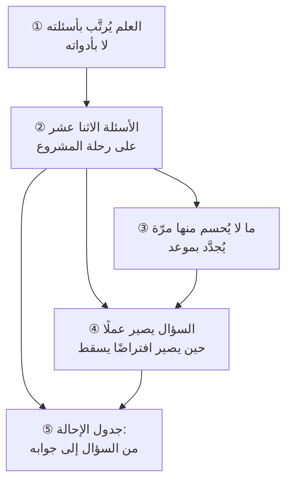

# الفصل 07 — الأسئلة الكبرى — مسائل هذا العلم

---

## 🏛️ لماذا تقرأ هذا الفصل؟

**المشكلة:** يُرتَّب أكثر ما يُدرَّس في هذا المجال بالأدوات: فصلٌ للوحات وفصلٌ للتقارير وفصلٌ للأداة الرائجة هذا العام. فإذا تغيّرت الأداة بعد ثلاث سنين، تقادم العلم كلّه في ذهن صاحبه.

**وماذا لو لم تعرف؟** من رتّب علمه بالأدوات فقد علمه بفقدها؛ ومن رتّبه بالأسئلة بقي علمه وتبدّلت أجوبته.

**وبعد هذا الفصل ستستطيع:**

- **أن تفرّق بين مسألةٍ من مسائل هذا العلم وبين وسيلةٍ تخدمها** — باختبارٍ واحد: أن تفترض زوال الأداة كلِّها، فما بقي سؤالًا فهو مسألة، وما زال بزوالها فهو وسيلة. **وأثرُه العمليّ أن تعرف ماذا يلزمك أن تُتقن وماذا يكفيك أن تُحسن استعماله.**
- **أن تحكم على أيّ إطارٍ أو أداةٍ بسؤالٍ واحد: أيّ مسألةٍ يجيب عنها، وأيّ مسألةٍ يتركها لك؟** — فلا تنتظر من سكرم (Scrum) أن يقول لك هل يستحقّ هذا المشروع أن يُبدأ، ولا من مخطّط جانت (Gantt Chart) أن يقول لك هل نجح.
- **أن تحوّل السؤال المفتوح إلى افتراضٍ له علامة سقوطٍ معلومة** — فتعرف قبل أن تصرف ريالًا واحدًا **ما الذي يجب أن يكون صحيحًا حتّى يصحّ هذا كلّه**، وأيّ اختبارٍ أرخصَ يكفي للحكم عليه.

> [!info] بطاقة الفصل
> **النوع:** منهجيّ
> **المستوى:** 🟡 متوسّط
> **زمن القراءة:** نحو 40 دقيقة
> **أهمّيته في الباب:** ★★★★★
> **موضعك:** انتهيتَ من [[06 - لسان العلم]] ← **⬤ أنت هنا** ← يليه [[08 - القواعد الكلية وسنن المشاريع]]

> [!abstract] موقع هذا الفصل
> **يبني على:** [[Cynefin]] · [[Knightian Uncertainty]] — يُذكَر هنا ولا يُعاد شرحه.
> **ويؤسّس:** [[Assumption Mapping]] — يُقدَّم هنا أوّل مرّة فيصير متاحًا لما بعده.

---

## 🧭 السؤال المركزي

> [!question] السؤال الذي يجيب عنه هذا الفصل كلّه
> **ما الأسئلة التي وُجد هذا العلم للإجابة عنها؟**

**واحمل معك هذه الأسئلة وأنت تقرأ:**

- أيّ سؤال يجيب عنه سكرم (Scrum)؟ وأيّ سؤال لا يجيب عنه؟
- ما السؤال الذي يتكرّر في كل مشروع ولا يُحسم مرّة واحدة؟
- إذا حُذفت كلّ الأدوات، أيّ الأسئلة يبقى؟

---

## 🗺️ الجواب المختصر — قبل التفصيل

**هذا العلم لم يوجد ليُعلِّمك أدواتٍ، بل ليجيب عن اثني عشر سؤالًا تتكرّر في كلّ مشروعٍ بُني على وجه الأرض — والأدوات كلُّها، من مخطّط جانت إلى سكرم إلى آخر ما ظهر هذا العام، ليست إلا أجوبةً مقترحةً عن واحدٍ أو اثنين منها.** فمن حفظ الأجوبة وحدها بقي أسيرًا لسياق من كتبها، ومن عرف الأسئلة استطاع أن يزن كلّ جوابٍ جديدٍ يُعرض عليه: **أيّ سؤالٍ يجيب عنه؟ وبأيّ ثمن؟ وأيّ سؤالٍ يتركه لك ولا يذكره؟**

**وليس كلُّ سؤالٍ يخطر في مشروعٍ سؤالًا مؤسِّسًا.** ولذلك يُعلَن في هذا الفصل **معيارُ قبولٍ** قبل عرض القائمة، ثمّ تُطبَّق القائمة عليه — وهو ثلاثة شروطٍ مجتمعة: أن يتكرّر السؤال في كلّ مشروعٍ بلا استثناء، وألّا يكون جوابه مشتقًّا من جواب سؤالٍ آخر في القائمة، وأن يكون **الجهل به مغيِّرًا للقرار لا مؤخِّرًا له فحسب**. وبهذا المعيار سقطت أسئلةٌ تبدو كبيرةً وهي في حقيقتها فرعٌ أو وسيلة — وسيأتي في موضعه أيُّها سقط ولماذا.

**والأسئلة الاثنا عشر ليست على منزلةٍ واحدة، بل تنقسم قسمين مختلفَي الطبيعة.** فمنها **ما يُحسم مرّةً ويستقرّ** — كسؤال «ما داخل الحدّ وما خارجه؟» — فإذا فُتح بعد استقراره بلا سببٍ جديدٍ صار المشروع بلا قرارٍ ثابت. ومنها **ما لا يقبل الحسم أصلًا وإنّما يُعاد بموعد** — كسؤال «أيستحقّ هذا أن يستمرّ؟» — فإذا حُسم مرّةً وأُغلق صار المشروع يمشي بالقصور الذاتيّ لا بالقرار. **والقاعدة الفارقة بينهما: السؤال المتكرّر يُجدَّد بموعد، والسؤال المحسوم يُفتح بسبب.** ومَن عكسهما — فحسم المتكرّر وأعاد فتح المحسوم — أصابه المرضان معًا.

**ويبقى بعد ذلك ما يحوّل السؤال من كلامٍ إلى عمل: أن يُصاغ افتراضًا يُتصوَّر بطلانه.** فالسؤال المفتوح لا يُختبَر ولا يُغلَق ولا يُبنى عليه قرار؛ وإنّما يُختبَر الافتراض الذي له **علامة سقوطٍ معلومة** — رقمٌ أو سلوكٌ أو حدثٌ إن ظهر عرفنا أنّنا كنّا مخطئين. **وما لا تستطيع أن تتصوّر ما يُبطله فليس افتراضًا بل رأيًا**، ولا يُصرف عليه بحثٌ ولا يُبنى عليه التزام.

**وما بقي من هذا الفصل تحريرٌ لهذا في خمس خطوات:**

1. لماذا يُرتَّب العلم بأسئلته لا بأدواته.
2. الأسئلة الاثنا عشر على ترتيب رحلة المشروع.
3. ما لا يُحسم منها مرّةً واحدة.
4. كيف يصير السؤال افتراضًا قابلًا للسقوط.
5. جدولُ إحالةٍ يدلّك على موضع جواب كلّ سؤالٍ في هذا المستودع.

> [!abstract] مفاهيم يُدخلها هذا الفصل في قاموسك
> `Assumption Mapping`

> [!warning] مفاهيم يكثر الخلط بينها هنا
> `Question` مقابل `Method` مقابل `Tool` — احملها في ذهنك، فالفصل يفرّقها في محطّة التمييز.

---

## 🧱 الفكرة الأولى: العلم يُرتَّب بأسئلته لا بأدواته

*موضعها من الفصل: هذه أوّل خطوةٍ وهي علّة الفصل، وموضعها أن يُقام **مبدأ الترتيب** قبل أن تُعرض القائمة. **فمن لم يقبل أنّ الأداة تُستبدَل ولا تُستبدَل بها المسألة، قرأ الأسئلة الاثني عشر قائمةً أخرى تُحفظ** — والقائمة التالية لا تُفهم إلّا بهذا المبدأ.*

**الفكرة الرئيسة:** الأداة تُستبدَل ولا تُستبدَل بها المسألة. فمخطّط جانت ظهر في العقد الثاني من القرن العشرين ولم يزل يُستعمل، وسكرم كُتب دليلُه الأوّل سنة 2001 وتغيّر ستّ مرّات، وأدوات اللوحات الرقمية تتبدّل كلّ بضع سنين — **والسؤال الذي جاءت كلُّها لتخدمه واحدٌ لم يتغيّر: كيف أرى العملَ الذي لا يُرى؟** فمن رتّب علمه بالأدوات كان علمه مؤقّتًا بأعمارها، ومن رتّبه بالمسائل رأى كلّ أداةٍ جديدة **جوابًا مقترحًا يزنه** لا وحيًا يتّبعه.

### ثلاث مراتب لا تُخلط: المسألة والطريقة والأداة

وهذا التفريق هو مدار الفصل كلِّه، وهو ثلاث مراتبَ متنازلة:

1. **المسألة (Question)** — سؤالٌ يفرضه طبعُ العمل نفسه، لا يزول بزوال شيء. مثاله: **«بأيّ ترتيبٍ نفعل هذا العمل؟»**. وهو قائمٌ سواءٌ استعملتَ لوحةً أم دفترًا أم لم تستعمل شيئًا.
2. **الطريقة (Method)** — منهجٌ مقترحٌ في الجواب، له منطقٌ يفسّره. مثاله: **«رتّبه بحسب أطول سلسلةٍ من الأعمال المتعاقبة»** — وهو منطق [[Critical Path|المسار الحرج]]. أو: **«لا ترتّب مقدَّمًا، بل حُدَّ العملَ الجاري ودَع الترتيب يتشكّل بالسحب»** — وهو منطق كانبان.
3. **الأداة (Tool)** — ما يُنفَّذ به المنهج. مثاله: مخطّط جانت، أو لوحةٌ بأعمدة، أو برنامجٌ بعينه.

**والخلط يقع في الاتّجاه النازل دائمًا: أن يُظنّ أنّ من أتقن الأداة أجاب عن المسألة.** فمن أتقن برنامج الجدولة يعرف كيف يرسم التبعيّات ويحسب الطفو، **ولا يعرف بذلك متى يستحقّ التسلسلُ الصارم أصلًا ومتى يكون تكلّفًا يُنتج خطّةً جميلةً تُهجَر في الأسبوع الثالث.** والفرق بينهما ليس فرقًا في المهارة بل في المرتبة: الأولى مهارةُ تشغيل، والثانية حكمٌ على المسألة.

**وثمّة خلطٌ أخفى من هذا، وهو أن تُرقّى الطريقة إلى مرتبة المسألة** — أي أن يصير الجوابُ المقترح غايةً تُطلب لذاتها. **وعلامته أن تسمع الطريقة مذكورةً في موضع الهدف**: «هدفنا هذا الربع أن نسلّم على دفعاتٍ أصغر»، أو «غايتنا أن نصير أكثر رشاقة». **فالتسليم على دفعاتٍ أصغر ليس هدفًا بل جوابٌ عن سؤال «متى نغيّر الخطة؟» في سياقٍ يكون فيه التغيير كثيرًا.** فإن كان سياقك عقدًا محدَّد النطاق يُسلَّم مرّةً واحدة، **فالدفعات الأصغر تكلفةٌ بلا عائد** — وقد تُنتج من الحِمل الإداريّ ما لا تعوّضه.

**وضررُ هذا الخلط أنّه يُغلق باب المراجعة.** فالطريقة إذا صارت غايةً لم يعد يُسأل عنها **«هل تخدم مسألتنا؟»** بل **«كم بلغنا من تطبيقها؟»** — ويصير التعثّر مفسَّرًا دائمًا بنقص التطبيق لا باحتمال أنّ الطريقة نفسها لا تناسب المسألة. **والسؤال الذي يفتح الباب المغلق واحد: أيّ مسألةٍ من الاثنتي عشرة تخدمها هذه الطريقة عندنا؟** فإن لم يكن لها جوابٌ فقد صارت الطريقة هويّةً لا أداة.

### وثلاثة آثارٍ عملية لهذا الترتيب

**الأوّل: أنّه يُعطيك سؤالًا واحدًا تزن به كلّ جديد.** فإذا عُرض عليك إطارٌ أو أداةٌ أو ممارسة، فالسؤال ليس «أهي جيّدة؟» — فهذا سؤالٌ لا جواب له بلا سياق — بل **«أيّ مسألةٍ تجيب عنها، وأيّ مسألةٍ تتركها لي ولا تذكرها؟»**. والشقّ الثاني هو الأنفع، لأنّ الأطر تُحسن عرض ما تجيب عنه ولا تُحسن عرض ما تسكت عنه.

**والثاني: أنّه يفسّر لك التعثّر الذي لا سبب ظاهر له.** فالفريق الذي يطبّق إطارًا بحذافيره ويتعثّر ليس مقصّرًا في التطبيق بالضرورة؛ **قد يكون مشكلتُه في مسألةٍ لا يعالجها هذا الإطار أصلًا** — كفريقٍ يطبّق سكرم إتقانًا ومشكلتُه أنّ أحدًا لم يقرّر هل يستحقّ هذا المنتج أن يُبنى. وسكرم لا يجيب عن هذا السؤال ولا يدّعي أنّه يجيب عنه.

**والثالث: أنّه يجعل علمك قابلًا للنقل.** فمن يعرف اثني عشر سؤالًا يستطيع أن يعمل في مشروع إنشاءٍ أو مشروع بحثٍ أو مشروع برمجيّ، لأنّ الأسئلة واحدة والأجوبة تختلف. **ومن يعرف أداةً واحدةً يستطيع أن يعمل حيث تُستعمل تلك الأداة وحدها.**

### سؤالٌ واحد، وثلاثة أجوبةٍ في قرن

**وأوضح ما يُري هذا التفريقَ أن تُتابع سؤالًا واحدًا عبر الزمن** — ولنأخذ السؤال العاشر من القائمة الآتية: **«متى نغيّر الخطة ومتى نتمسّك بها؟»**. فهو سؤالٌ قائمٌ في كلّ مشروعٍ منذ وُجدت المشاريع، **وقد أُجيب عنه في قرنٍ واحدٍ بثلاثة أجوبةٍ متعاقبة، كلٌّ منها معقولٌ في سياقه:**

1. **الجواب الأوّل: اضبط التغيير.** أن يُنشأ للتغيير مسارٌ رسميّ — طلبٌ مكتوب، وتقديرٌ لأثره، ولجنةٌ تعتمده ([[Change Control Board]]). **وعلّته المعقولة أنّ التغيير كان غاليًا فعلًا**: فحيث تكون كلفة إعادة العمل باهظةً، يكون تقليل التغيير أرخص من تسهيله.
2. **والجواب الثاني: قصِّر الدورة حتّى يرخُص التغيير.** أن يُعمل على دفعاتٍ صغيرةٍ تُراجَع كلَّ أسبوعين، **فيصير التغيير أقلّ كلفةً لا أقلّ عددًا.** وهذا هو منطق [[01 - Agile]] في هذه المسألة بعينها.
3. **والجواب الثالث: اجعل التغيير هو الحالة الطبيعية.** أن تُبنى قدرةٌ على التسليم المتّصل واختبارٍ آليٍّ وتراجعٍ سريع، **فلا يُسأل عن كلفة التغيير أصلًا لأنّها صارت قريبةً من الصفر في أكثر الحالات.**

**والذي يعني هذا الفصل ليس أيُّها أصحّ — فهذا سؤالٌ لا جواب له بلا سياق — بل أنّ الثلاثة أجوبةٌ عن سؤالٍ واحدٍ لم يتغيّر.** فمن حفظ الجواب الثاني وحده ظنّ أنّ الأوّل خطأٌ عفا عليه الزمن، **فوجد نفسه عاجزًا في عقدٍ محدَّد الثمن تُحاسَب فيه الجهةُ على النطاق المتّفق عليه** — وهو موضعٌ يكون فيه ضبط التغيير هو الجواب الصحيح لا المتخلّف. **ومن عرف السؤال رأى الثلاثة أدواتٍ في يده، يختار منها بحسب كلفة التغيير عنده.**

### ولماذا تُرتَّب الدورات والكتب بالأدوات إذن؟

**لا لجهلٍ في أصحابها، بل لسببٍ بنيويٍّ يستحقّ أن يُفهم لا أن يُلام: أنّ الأداة قابلةٌ للتعليم والاختبار والشهادة، والمسألة ليست كذلك.**

فتستطيع أن تُعلِّم مئةً كيف يُبنى مخطّط تبعيّات، وأن تختبرهم فيه بأسئلةٍ لها جوابٌ واحد، **وأن تمنح من نجح شهادةً تدلّ على شيءٍ محدَّد.** وأمّا **متى يستحقّ التسلسل الصارم أصلًا** فحكمٌ يختلف باختلاف السياق، **ولا يُختبر فيه بسؤالٍ له جوابٌ واحد، ولا تُمنح فيه شهادةٌ تدلّ على شيء.**

**فالسوق يُنتج ما يستطيع أن يقيسه.** وليس في هذا مؤامرةٌ ولا تقصير، **وإنّما فيه حدٌّ يلزم أن يعرفه من يطلب هذا العلم: أنّ ما يُشهَد له ليس هو كلَّ ما يلزم**. ولازمه العمليّ أنّ الشهادة تُقرأ على وجهها — دليلًا على معرفةٍ بالأدوات والمصطلح، **لا دليلًا على حكمٍ ناضجٍ في المسائل** — وأنّ من اكتفى بها بقي في المرتبة الثالثة من المراتب الثلاث. **وتحرير هذا كلِّه موضعه [[16 - كيف يطلب هذا العلم]].**

> [!info] إضافة مرجعية — أثرُ هذا الترتيب في المراجع نفسها
> هذا ليس ترتيبًا مخترعًا في هذا المستودع، بل **تحوّلٌ وقع في المراجع الرسمية نفسها وصُرِّح به فيها**. فدليل `PMBOK` كان إلى نسخته السادسة (2017) مبنيًّا على **العمليات**: تسعةٌ وأربعون عمليةً بمُدخلاتها وأدواتها ومخرجاتها. ثمّ أُعيد بناء نسخته السابعة (2021) على **مبادئ ومجالات أداء** — أي على *ما يُراد تحقيقه* لا على *الخطوات التي تُتَّبع*.
>
> **وهذا تغيُّرٌ في العرض يُذكر تغيُّرًا، لا نسخًا لما قبله.** فالعمليات لم تصر خطأً، وقد نُقلت إلى دليلٍ منفصلٍ للممارسات. **والذي يعنينا منه أنّ أكبر مرجعٍ في المجال انتقل من ترتيب الأدوات إلى ترتيب المقاصد** — وأنّ من قرأ النسخة السادسة لا يقرأ كتابًا خاطئًا، بل كتابًا يجيب عن السؤال نفسه بترتيبٍ آخر.

> [!example] فريقان في جدّة، وأداةٌ واحدة، ونتيجتان
> فريقان في شركةٍ واحدة اعتمدا اللوحة نفسها والبرنامج نفسه في الربع نفسه.
>
> **الفريق الأوّل** سأل قبل أن يعتمد: **ما المسألة التي نشكو منها؟** فكان الجواب أنّ العمل يبقى «قيد التنفيذ» أسابيعَ ولا أحد يعرف أين يقف. فوضعوا اللوحة، **وأضافوا إليها ما لم تكن الأداة تفرضه**: حدًّا أعلى لما يجوز أن يكون قيد التنفيذ في وقتٍ واحد، وقياسًا لزمن العنصر من دخوله إلى خروجه. فظهر بعد ستّة أسابيع أنّ متوسّط الزمن 22 يومًا، منها 14 في انتظار المراجعة. فنقلوا المراجعة إلى جلستين ثابتتين أسبوعيًّا، فنزل المتوسّط إلى 11 يومًا.
>
> **والفريق الثاني** اعتمد اللوحة لأنّها اعتُمدت في الفريق الأوّل. فنقلوا إليها مهامّهم، وصارت اللوحة صورةً دقيقةً لما يجري. **ولم يتغيّر شيء** — لأنّ المسألة عندهم لم تكن غياب الرؤية بل كثرة الأعمال المفتوحة دفعةً واحدة، **واللوحة تُظهر ذلك ولا تمنعه**.
>
> **والفرق بين الفريقين ليس في الأداة ولا في الاجتهاد**، بل في أنّ الأوّل عرف مسألته فاختار للأداة ما يخدمها، والثاني ظنّ أنّ الأداة هي الجواب.

> [!tip] كيف تستعمل هذه الفكرة — اختبار الزوال
> **قبل أن تعتمد أداةً أو تطلب تدريبًا عليها، اكتب في سطرٍ واحدٍ المسألة التي تشكو منها، ثمّ اسأل ثلاثة أسئلةٍ بترتيبها:**
>
> 1. **لو زالت هذه الأداة كلُّها، هل يبقى ما أشكو منه؟** — إن كان الجواب لا، فأنت لا تشكو من مسألةٍ بل من أداةٍ سيّئة، وعلاجك تبديلها لا دراستها.
> 2. **هل تجيب هذه الأداة عن مسألتي، أم تُظهرها فحسب؟** — وهذا أكثر ما يُخلط: فاللوحة تُظهر تكدّس العمل ولا تحدّه، والتقرير يُظهر التأخّر ولا يقرّر شيئًا. **والإظهار خطوةٌ نافعة، لكنّه ليس جوابًا.**
> 3. **ما المسائل التي تتركها هذه الأداة ولا تذكرها؟** — واكتبها صراحةً في سطر، فهي التي ستفاجئك.

> [!warning] الحفرة الشائعة — أن يصير الترتيب بالأسئلة ذريعةً لعدم الإتقان
> **وهذه حفرةٌ تُحفر من الجهة المقابلة، ومن وقع فيها استعمل هذا الفصل نفسه حجّةً عليه.** فقد يُفهم منه أنّ الأدوات ثانوية، فيُهمَل إتقانها ويقال «المهمّ الأسئلة».
>
> **وهذا خطأ من وجهين.** أوّلهما أنّ الأداة التي لا تُتقن لا تُنتج جوابًا: فمن لا يُحسن قراءة مخطّط التبعيّات لا يعرف أنّ تأخّر أسبوعٍ في عنصرٍ بعينه يؤخّر التسليم كلَّه. وثانيهما أنّ **إتقان الأداة هو الذي يُريك حدودها**: فلن تعرف ما لا تجيب عنه اللوحةُ حتّى تستعملها استعمالًا جادًّا شهورًا.
>
> **فالترتيب الصحيح: المسألة تُحدّد أيّ الأدوات تتعلّم، ثمّ تُتقن الأداة إتقانًا يكشف لك حدودها.** والمقصود ألّا يكون إتقان الأداة **بديلًا** عن معرفة المسألة، لا أن يكون منقصةً.

> [!question]- تأكّد أنك فهمت — «نحن نستعمل الطريقة الرشيقة (Agile)» هل هذه إجابةٌ عن مسألة؟
> **لا، لأنّها لا تقول عن *أيّ* مسألةٍ تجيب — وهذا هو موضع النقد لا مجرّد اللفظ.**
>
> فالطريقة الرشيقة قيمٌ ومبادئ، وهي تجيب بوضوحٍ عن مسألةٍ واحدةٍ من الاثنتي عشرة: **متى نغيّر الخطة ومتى نتمسّك بها؟** — وجوابها فيها صريح: قصِّر دورة التغذية الراجعة حتّى يصير التغيير رخيصًا، ثمّ غيِّر بالمعلومة الجديدة لا بالخطّة القديمة.
>
> **وهي لا تجيب عن أسئلةٍ أخرى ولا تدّعي:** لا تقول لك هل يستحقّ هذا المشروع أن يُبدأ، ولا كيف تقدّر كلفةً بعقدٍ محدَّد الثمن، ولا من يملك قرار إيقافه.
>
> **فالإجابة الصحيحة عن سؤال «ماذا تستعملون؟» تكون على هذه الصورة:** «نستعمل دوراتٍ قصيرةً ومراجعةً كلَّ أسبوعين لأنّ متطلّباتنا غير مستقرّة، **وأمّا قرار الاستمرار فتحكمه لجنةٌ توجيهية بمعايير خروجٍ مكتوبة، وأمّا التقدير فنعطيه مدًى لا رقمًا.**» — **وثلاثة أسئلةٍ في جملةٍ واحدة، وكلٌّ منها له جوابه.**

> [!summary]- خلاصة الفكرة في سطرين
> **الأداة تُستبدَل ولا تُستبدَل بها المسألة؛ فمن رتّب علمه بالأدوات كان علمه مؤقّتًا بأعمارها.**
> **ومن رتّبه بالمسائل رأى كلَّ أداةٍ جديدة جوابًا مقترحًا يَزِنه** لا وحيًا يتّبعه — وبهذا لا تُبطل ثلاثون سنةً من تبدّل الأدوات شيئًا ممّا يعرفه.

> [!question] تأمّلٌ تطبيقيّ — لا جواب له في هذا الفصل
> خذ أحدث أداةٍ دخلت عملك، واسأل: **أيَّ سؤالٍ من الأسئلة الاثني عشر جاءت لتخدمه؟**
>
> **فإن لم تجد لها سؤالًا، فهي إمّا حلٌّ لمشكلةٍ ليست عندك، وإمّا جوابٌ عن سؤالٍ لم تصغه بعد.** والحالان يختلفان في العلاج اختلافًا تامًّا: الأولى تُترك، والثانية تُوجب عليك أن تصوغ السؤال أوّلًا.

---

## 🧱 الفكرة الثانية: الأسئلة الاثنا عشر على ترتيب رحلة المشروع

*موضعها من الفصل: عُرف أنّ العلم يُرتَّب بأسئلته، وتعرض هذه الفكرة القائمة نفسها. **وتفارق سائر القوائم بأنّها تُعلن معيار قبولها قبل أن تُعرض** — فيستطيع القارئ أن يزيد عليها وأن يُسقط منها، وهذا ما يفصل التصنيف عن السرد.*

**الفكرة الرئيسة:** ليست هذه قائمةً جُمعت بالاستقراء ثمّ رُقِّمت، بل قائمةٌ **مرَّت على معيارِ قبولٍ معلن**، وسقط بهذا المعيار ما هو أشهر منها. **وإعلان المعيار قبل القائمة هو ما يفصل التصنيف عن السرد**: فالقائمة التي لا تقول لماذا دخلها ما دخلها لا يستطيع القارئ أن يزيد عليها ولا أن ينقص منها بحقّ.

### معيار القبول: ثلاثة شروطٍ مجتمعة

**لا يُعدّ السؤال مؤسِّسًا حتّى تجتمع فيه الثلاثة:**

1. **أن يتكرّر في كلّ مشروعٍ بلا استثناء** — لا في المشاريع الكبيرة وحدها ولا في نوعٍ من الصناعات. فالمشروع الذي يستغرق ثلاثة أسابيع يواجه السؤال نفسه الذي يواجهه برنامجٌ من ثلاث سنين، وإنّما يختلف **قدرُ ما يُصرَف على جوابه** لا وجودُ السؤال.
2. **ألّا يكون جوابه مشتقًّا من جواب سؤالٍ آخر في القائمة** — فالسؤال الذي يُجاب عنه تبعًا لغيره فرعٌ لا أصل. ومثاله «كم عدد الأشخاص الذين نحتاجهم؟»: فهذا يُشتقّ من جواب سؤال الحجم والترتيب، فليس مسألةً مستقلّة.
3. **أن يكون الجهل به مغيِّرًا للقرار لا مؤخِّرًا له** — وهذا أدقُّ الثلاثة. فكثيرٌ من الأسئلة إن جُهلت أُخِّر العمل حتّى يُعرف جوابها، **وهذه أسئلةٌ تشغيلية**. أمّا المسألة المؤسِّسة فالجهل بها **يُبقي العمل ماضيًا في اتّجاهٍ خاطئ** دون أن يظهر شيء — وهذا هو خطرها.

**وبهذا المعيار سقطت أسئلةٌ تُطرح كأنّها كبرى:**

- **«أيّ إطارٍ نتّبع؟»** — سقط بالشرط الثاني، فجوابه مشتقٌّ من طبيعة عدم اليقين ومن قيود العقد، وهي أسئلةٌ أخرى في القائمة. **ومن جعله سؤالًا أوّلًا اختار الإطار ثمّ فصَّل مشروعه عليه.**
- **«أيّ أداةٍ نستعمل؟»** — سقط بالشرطين الأوّل والثالث معًا، فليس في كلّ مشروعٍ ضرورةً، والجهل به يؤخّر ولا يُضلّ.
- **«من يقود الفريق؟»** — سقط بالشرط الثاني، فهو فرعُ سؤال «من يقرّر ماذا؟» ولا يستقلّ عنه.
- **«كم نجتمع وكم مدّة الاجتماع؟»** — سقط بالثلاثة جميعًا. **وذِكرُه هنا مقصود، لأنّه يستهلك من وقت الفرق أضعافَ ما تستهلكه أسئلةٌ من القائمة لا تُطرح أصلًا.**

### والأسئلة الاثنا عشر في أربع مجموعات

وهي مرتّبةٌ على رحلة المشروع لا على أهمّيّتها، **لأنّ ترتيب الرحلة هو الذي يجعلها تُستحضر في موضعها**. وتُقرأ كلُّ مجموعةٍ بوصفها بابًا يُفتح ولا يُغلق حتّى تُجاب أسئلته الثلاثة.

#### المجموعة الأولى — أسئلة الوجود: أنبني هذا أصلًا؟

وهذه ثلاثةٌ تُطرح **قبل أن يوجد المشروع**، وهي أكثر ما يُقفَز عنه — لأنّ المشروع في العادة يصل إلى مدير المشروع وقد وُجد، فيبدأ من السؤال الرابع ويظنّ أنّ الثلاثة قبله محسومة.

**① لماذا نفعل هذا أصلًا؟ ما التغيّر المقصود، ومن يريده؟**

**وهو أوّل الأسئلة وأكثرها إهمالًا**، لأنّ الجواب عنه يبدو حاضرًا دائمًا: «لأنّ الإدارة طلبته». وهذا ليس جوابًا بل إحالةٌ إلى من يملك الطلب. **والجواب الصحيح يذكر ثلاثة: ما الذي هو قائمٌ الآن وليس مرضيًّا، وما الذي نريده أن يصير، ومن الذي يتغيّر حالُه إن صار.**

**وما يترتّب على الجهل به:** أنّ المشروع يمشي بلا معيارٍ يُحكم به عليه، فيصير الحكم عليه بمقدار ما أُنجز منه لا بمقدار ما حقّق. **وهو أخطر أنواع الجهل، لأنّه لا يُنتج تعثّرًا ظاهرًا**: فالمشروع يمضي في وقته وميزانيّته، وينتهي إلى شيءٍ لا يحتاجه أحد. وموضع تحريره [[Business Case|دراسة الجدوى]] و[[Problem Statement|بيان المشكلة]].

**② ما الذي سنعدّه نجاحًا، وكيف نعرف أنّه وقع؟**

وهذا ليس تكرارًا للأوّل بل شرطُ قابليّته للفحص. فالسؤال الأوّل يطلب **التغيّر المقصود**، وهذا يطلب **العلامة التي تدلّ على وقوعه**. والفرق بينهما فرقُ ما بين «نريد أن نخفّف الضغط على الفروع» وبين «تنخفض معاملات الفروع من 4,000 شهريًّا إلى أقلّ من 2,500 خلال ستّة أشهرٍ من الإطلاق».

**وما يترتّب على الجهل به:** أن يتنازع أهلُ المشروع بعد انتهائه في نجاحه، **ولا مرجع يحسم** — لأنّ العلامة لم تُتّفق عليها قبلًا، فصار كلٌّ يستدلّ بما يوافقه. **وأخصُّ صور هذا الجهل ألّا يُقاس خطُّ الأساس قبل البدء**، فيصير الحكم متعذّرًا لا مختلفًا فيه: إذ لا يُعرف كم كان الرقم قبل أن نبدأ. وموضعه [[22 - Outputs and Outcomes]] و[[Baseline|خطّ الأساس]].

**③ على أيّ افتراضاتٍ يقوم هذا كلُّه؟**

**وهذا أخفاها وأخطرها**، لأنّ الافتراض الذي يُبنى عليه المشروع لا يُذكر عادةً في وثيقةٍ ولا يُناقش في اجتماع — إذ يبدو لأهل الغرفة بديهيًّا. **ومن أمثلته: أنّ البيانات القائمة نظيفةٌ بما يكفي، وأنّ الجهة الأخرى ستوفّر واجهة التكامل في موعدها، وأنّ المستخدم يريد أن ينجز الأمر بنفسه.**

**وما يترتّب على الجهل به:** أنّ المشروع قد يُدار إدارةً ممتازة — بمخاطره مرصودةً وجدولِه منضبطًا — ثمّ ينهار كلُّه لأنّ اعتقادًا في أساسه كان باطلًا. **والفرق بينه وبين المخاطرة أنّ المخاطرة حدثٌ قد يقع في المستقبل، والافتراض اعتقادٌ قائمٌ الآن قد يكون خاطئًا منذ اليوم الأوّل.** وتحريره في الفكرة الرابعة من هذا الفصل، وفي [[Assumption Mapping|رسم الافتراضات]].

#### المجموعة الثانية — أسئلة الحدّ والحجم: ما مقدار هذا؟

وهذه ثلاثةٌ تُجاب بعد أن استقرّ أنّ المشروع يستحقّ أن يوجد، وغرضها أن يُعرف **قدرُه**.

**④ ما الذي يدخل في هذا العمل وما الذي لا يدخل؟**

**والشقّ الثاني هو المسألة، لا الأوّل.** فقائمةُ ما سنفعله يكتبها كلُّ أحد، وأمّا **ما لن نفعله** فلا يُكتب إلا بقرار — ومن لم يكتبه فقد ترك حدَّه مفتوحًا. **والنطاق الذي لا استثناءات فيه ليس نطاقًا بل قائمة أمانٍ**، وهذا هو الفرق العمليّ بين [[Scope Statement|بيان النطاق]] وبين قائمة رغبات.

**وما يترتّب على الجهل به:** [[Scope Creep|زحف النطاق]] — وهو ليس أن يزيد العمل، فالزيادة قد تكون قرارًا صحيحًا؛ **بل أن يزيد بلا أن يُحتسب أثره في الزمن والكلفة**. فتُضاف الأعمال واحدًا واحدًا وكلٌّ منها صغير، ثمّ يُطلب التسليم في موعده الأوّل، **ولا أحد يستطيع أن يُري متى تغيّر الاتّفاق لأنّه لم يُكتب.**

**⑤ كم يكلّف وكم يستغرق — وبأيّ درجة ثقة؟**

**والقيد الثالث في السؤال هو المسألة كلُّها.** فإعطاءُ رقمٍ يستطيعه كلُّ أحد؛ وإنّما المسألة أن يُعطى الرقم **بمدى ثقةٍ يناسب ما يُعرف اليوم**. فالتقدير في أوّل المشروع لا يمكن أن يكون دقيقًا مهما اجتهد المقدِّر، **لأنّ ما يُجهل حينئذٍ أكثر ممّا يُعلَم — وهذا حدٌّ في طبيعة المعرفة لا نقصٌ في المهارة.**

**وما يترتّب على الجهل به:** أن يُعطى رقمٌ واحدٌ مجرّدٌ من مداه فيُنقل صعودًا في الإدارة بوصفه التزامًا، **فيتحوّل التقدير إلى وعدٍ من حيث لا يقصد صاحبه**. وموضعه [[Estimation|التقدير]] و[[12 - Story Points]].

**⑥ بأيّ ترتيبٍ نفعل هذا العمل؟**

والترتيب مسألةٌ قائمةٌ بنفسها لأنّ **العمل الواحد يختلف أثرُه باختلاف موضعه**: فما يُنجز أوّلًا يكشف مجهولًا فيُرخِّص ما بعده، وما يؤخَّر يبقى مجهولُه معلَّقًا على المشروع كلِّه. **والقاعدة الحاكمة: يُقدَّم ما يُنقص الجهل، لا ما يسهل إنجازه.**

**وما يترتّب على الجهل به:** أن يُرتَّب العمل بحسب سهولته أو بحسب ما يُتقنه الحاضرون، **فيصير الجزء الغامض آخرَ ما يُبدأ به — وهو الذي كان ينبغي أن يكون أوّله.** فيُكتشف الخللُ حين لا يبقى وقتٌ لعلاجه. وموضعه [[15 - Roadmap]] و[[13 - Backlog]].

#### المجموعة الثالثة — أسئلة الحركة: كيف يمشي هذا؟

وهذه ثلاثةٌ تُصاحب التنفيذ من أوّله إلى آخره، وهي التي يُصرَف عليها أكثرُ وقت مدير المشروع فعلًا.

**⑦ من يقرّر ماذا، ومن يتحمّل نتيجته؟**

**والشقّ الثاني هو المسألة.** فتوزيع القرارات يُكتب في جدولٍ ويُعلَّق؛ وأمّا **من يتحمّل** فلا يُعرف إلا حين يقع الخطأ — وحينها يكون الوقت قد فات على ترتيبه. **والقاعدة: لا يُعطى قرارٌ لمن لا يتحمّل نتيجته، ولا يُحمَّل أحدٌ نتيجةَ قرارٍ لا يملكه.** وقد حُرّر هذا في [[05 - ما ليس من إدارة المشاريع]].

**وما يترتّب على الجهل به:** أن يُعلَّق القرار أسابيعَ لأنّ صاحبه غير معروف، **أو — وهو أسوأ — أن يُتّخذ صامتًا** فيمضي المشروع على قرارٍ لم يقرّره أحد ولا يستطيع أحدٌ أن يراجعه. وموضعه [[Governance|الحوكمة]] و[[Decision Log|سجلّ القرارات]] و[[Sponsor|الراعي]].

**⑧ ما الذي قد يسوء، وماذا نفعل حياله الآن؟**

**والقيد الأخير — «الآن» — هو ما يفصل إدارة المخاطر عن التنبّؤ.** فإحصاء ما قد يسوء تمرينٌ ذهنيّ لا قيمة له بذاته؛ وإنّما تُقاس المسألة **بما تغيّر في خطّتك اليوم بسبب ما رصدتَه**. فالخطر الذي عُرف ولم يتغيّر بسببه شيء لم يُدَر، وإنّما سُجِّل.

**وما يترتّب على الجهل به:** أن يُدار المشروع بردّ الفعل: **ينتقل الفريق من إطفاءٍ إلى إطفاء، فيبدو أكثر انشغالًا وأشدّ اجتهادًا**، وهو في حقيقته يدفع ثمن ما كان يمكن أن يُمنع بقرارٍ رخيصٍ قبل شهور. وموضعه [[19 - Risk Management]] و[[RAID Log|سجلّ RAID]].

**⑨ كيف نعرف أين نحن فعلًا — لا أين نقول إنّنا؟**

**وقيد «فعلًا» هو المسألة.** فكلُّ مشروعٍ له تقرير حالة، وأكثر التقارير يقول إنّ الأمور تسير جيّدًا حتّى الأسبوع الذي يقول فيه إنّها لم تعد كذلك. **والمسألة ليست في وجود التقرير بل في أن يكون فيه ما يستطيع أن يُظهر السوء إن كان قائمًا.**

**وما يترتّب على الجهل به:** أن يُفاجَأ الجميع في وقتٍ واحد — وهو ما يُسمّى في هذا المستودع **تقرير البطّيخة**: أخضرُ من خارجه أحمرُ من داخله. **وعلامته الفارقة: أن تنتقل حالة المشروع من «أخضر» إلى «أحمر» بلا مرورٍ بالأصفر** — فالانتقال المفاجئ دليلٌ على أنّ الأصفر كان قائمًا ولم يكن يُقال. وموضعه [[Project Health Report|تقرير حالة المشروع]] و[[17 - Burndown Chart]].

**والمؤشّر الذي يستطيع أن يُظهر السوء تجتمع فيه ثلاثة، ومن فقد واحدًا منها لم يُظهر شيئًا:**

- **أن يُقاس من واقعٍ لا من تقدير.** فنسبة الإنجاز التي يقولها المنفّذ عن نفسه رأيٌ في ثوب رقم؛ **وزمنُ العنصر من دخوله إلى خروجه** ([[Cycle Time]]) واقعةٌ لا تحتمل التأويل.
- **وأن يسوء قبل أن يسوء التسليم لا معه.** فالمؤشّر الذي يتغيّر يوم التسليم لم يُنذر بشيء، **وإنّما نفعُ المؤشّر في تقدّمه على الحدث.**
- **وألّا يملكه من يُقيَّم به.** فمن يُحاسَب على رقمٍ يملك إدخاله يُصلحه قبل أن يُصلح ما يقيسه، **وليس هذا سوء نيّةٍ بل أثرٌ متوقَّعٌ لترتيبٍ خاطئ.**

#### المجموعة الرابعة — أسئلة النهاية: متى ينتهي هذا وماذا يبقى؟

وهذه ثلاثةٌ تُطرح في الآخر وتُجاب في الأوّل — **وهذا هو الخطأ الشائع فيها: أنّها تُؤجَّل إلى وقت الحاجة إليها، ووقتُ الحاجة إليها هو أسوأ وقتٍ للإجابة عنها.**

**وعلّة ذلك واحدةٌ في الثلاثة: أنّ كلًّا منها يُجاب حين يكون في الغرفة طرفٌ خاسرٌ من الجواب.** فمعنى «تمّ» يُتّفق عليه بسهولةٍ في الشهر الأوّل حين لا يخصّ أحدًا بعينه، **ويصير في يوم التسليم نزاعًا على من يتحمّل إعادة العمل.** وشرط الإيقاف يُكتب بلا حرجٍ قبل أن يتعلّق أحدٌ بالمشروع، **ويصير بعد سنةٍ اتّهامًا لمن اقترحه.** وقاعدة التغيير تُقبل مقدَّمًا وتُقرأ في وسط الضغط تعطيلًا.

**فالقاعدة الجامعة لهذه المجموعة: ما يُتّفق عليه قبل أن يكون له خاسرٌ معلوم أرخصُ ألف مرّةٍ ممّا يُتّفق عليه بعده.** وهي أوضح صور المفارقة في هذا الفصل: **أنّ أسئلة النهاية هي أرخص ما يُجاب في البداية، وأغلى ما يُجاب في النهاية.**

**⑩ متى نغيّر الخطة ومتى نتمسّك بها؟**

**وهي مسألةٌ لا حلَّ نهائيًّا لها بل مفاضلةٌ دائمة**، لأنّ طرفيها ضارّان: فالخطّة التي لا تتغيّر تُنفَّذ على معلوماتٍ ماتت، والخطّة التي تتغيّر كلَّ أسبوع لا يُبنى عليها التزام ولا يستطيع أحدٌ أن يخطّط على أساسها. **والفارق العمليّ بينهما: أن يكون للتغيير سببٌ مُعلَنٌ ومسارٌ معلوم** — فما تغيّر بمعلومةٍ جديدة تغيُّرٌ صحيح، وما تغيّر بضغطٍ في اجتماعٍ تقلُّب.

**وما يترتّب على الجهل به:** أحد مرضين متقابلين — إمّا خطّةٌ جامدةٌ يُنفَّذ منها ما بطل نفعه، وإمّا مشروعٌ بلا شكلٍ ثابتٍ لا يُعرف ما التزم به. وموضعه [[Change Request|طلب التغيير]] و[[01 - Agile]].

**⑪ ما معنى «تمّ»، وبأيّ مستوى جودة؟**

**وهذا أكثر الاثني عشر تسبّبًا في نزاعٍ صريحٍ في آخر المشروع.** فكلمة «تمّ» عند المطوّر تعني أنّ الكود كُتب، وعند المختبِر أنّه اجتاز الفحص، وعند مالك المنتج أنّه يعمل على بيانات الإنتاج، وعند العميل أنّ موظّفيه يستطيعون استعماله بلا مساعدة. **وأربعة معانٍ في كلمةٍ واحدةٍ لا يُكتشف اختلافها إلا يوم التسليم.**

**وما يترتّب على الجهل به:** أن يُعلَن الإنجاز ثمّ يُعاد فتحه، **فتتراكم أعمالٌ «منتهية» غير قابلة للتسليم** — وهذه أخبث صور التأخّر لأنّها لا تظهر في أيّ مؤشّر: الرقم يقول إنّ العمل تمّ. وموضعه [[Definition of Done|تعريف الاكتمال]] و[[20 - Quality Management]].

**⑫ متى نتوقّف — بالنجاح أو بغيره — وماذا يبقى بعدنا؟**

**والشقّان مسألتان في سؤالٍ واحد، ويجمعهما أنّهما يُهملان معًا.** فالتوقّف يُظنّ أنّه إعلانُ فشل، فلا يُخطّط له؛ **ولذلك تستمرّ مشاريعُ لا لأنّ أحدًا قرّر استمرارها بل لأنّ أحدًا لم يقرّر إيقافها.** وأمّا ما يبقى بعدنا فيُظنّ أنّه شأنُ التشغيل، **مع أنّ قابليّة التشغيل تُقرَّر أثناء البناء لا بعده.**

**وما يترتّب على الجهل به:** في الشقّ الأوّل، أن تُصرَف الميزانية على مشروعٍ بطل مبرِّره لأنّ إيقافه يحتاج شجاعةً واستمرارَه لا يحتاج قرارًا. وفي الثاني، أن يُسلَّم نظامٌ يعمل ولا يستطيع أحدٌ أن يشغّله. وموضعه [[Kill Criteria|معايير الإيقاف]] و[[Runbook|دليل التشغيل]] و[[Hypercare|الرعاية المكثّفة]].

### وأيُّها أثقل وزنًا؟ الأسئلة التي يصمت إهمالُها

**الأسئلة الاثنا عشر متساويةٌ في كونها مؤسِّسة، ومتفاوتةٌ تفاوتًا بعيدًا في *ثمن إهمالها*. والذي يحكم هذا التفاوت ليس أهمّية السؤال في نفسه بل: هل يُصدر إهمالُه ضجيجًا أم يصمت؟**

**فالأسئلة ④ و⑤ و⑥ و⑧ و⑨ إهمالُها *يُسمَع*.** فالنطاق الغامض يُنتج نزاعًا في أوّل تسليم، والتقدير الغائب يُنتج سؤالًا من الراعي في أوّل أسبوع، والترتيب السيّئ يُنتج تعطّلًا يشتكي منه الفريق. **وهذه أسئلةٌ تدافع عن نفسها**: من أهملها ذُكِّر بها سريعًا، فتُصحَّح بكلفةٍ محتملة.

**وأمّا الأسئلة ① و② و③ و⑫ فإهمالُها *صامت*.** فالمشروع الذي لا مبرِّر واضحًا له يمضي كما يمضي غيره، والذي لم يُقَس خطُّ أساسه يُسلَّم في موعده، **والذي قام على افتراضٍ باطل قد يكون أسرعَ من غيره** لأنّ الافتراض الباطل يُخفّف العمل غالبًا. **ولا يظهر شيءٌ من ذلك إلا بعد التسليم — حين لا يبقى ما يُصلَح.**

**ويترتّب على هذا التفاوت أثران عمليّان:**

1. **أنّ ترتيب الاهتمام يجب أن يكون معكوسًا لترتيب الإلحاح.** فما يُلحّ عليك يُدافع عن نفسه، **وما يصمت هو الذي يحتاج أن تُخصِّص له وقتًا لا يطلبه أحد منك.** وهذه قاعدةٌ تخالف طبع العمل اليوميّ، ولذلك يندر أن تُتَّبع بلا موعدٍ مكتوب.
2. **وأنّ الفريق قد يبدو منضبطًا انضباطًا تامًّا وهو مُهمِلٌ لأثقل الأسئلة.** فمن أجاب عن الخمسة الضاجّة أجوبةً محكمة **أنتج كلَّ علامات النضج**: خطّةٌ دقيقة، وسجلُّ مخاطرَ حيّ، وتقاريرُ منتظمة. **والذي أهمله لا يُرى في شيءٍ من ذلك، ولا يظهر إلا في السؤال الذي يُطرح بعد سنة: ما الذي تغيّر بسبب هذا كلِّه؟**

**والعلامة العملية الفارقة: أن تسأل عن آخر مرّةٍ نُوقش فيها سؤالٌ من الأربعة الصامتة.** فإن كان الجواب «في اجتماع الاعتماد قبل تسعة أشهر»، **فالمشروع منضبطٌ في ظاهره، مكشوفٌ من حيث لا يُرى.**

### ولماذا اثنا عشر بالذات؟

**العدد نتيجةٌ للمعيار لا هدفٌ سُعي إليه** — وهذا يستحقّ التصريح، لأنّ الأعداد في مثل هذه القوائم تُتَّخذ عادةً أوّلًا ثمّ يُملأ فراغها. **ولو رُخِّص في شرطٍ واحدٍ من الثلاثة لتغيّر العدد تغيُّرًا كبيرًا:**

- **فلو رُفع الشرط الثاني** (ألّا يكون الجواب مشتقًّا) **لصارت القائمة نحو ثلاثين**، إذ تدخل فيها كلُّ الأسئلة الفرعية: من المستخدم؟ وكم عددنا؟ وأيّ بنيةٍ تقنية؟ وأيّ عقدٍ نوقّع؟ **وهذه أسئلةٌ حقيقية تُطرح فعلًا، ولكنّها تُجاب تبعًا لا استقلالًا** — ومن جعلها أصولًا وجد نفسه يجيب عن السؤال قبل أن يوجد ما يُشتقّ منه جوابه.
- **ولو رُفع الشرط الأوّل** (التكرار في كلّ مشروع) **لدخلت أسئلةٌ صحيحةٌ في نوعٍ من المشاريع دون غيره**: كسؤال الامتثال التنظيميّ، وسؤال ترحيل البيانات، وسؤال الاعتماد على مورّدٍ خارجيّ. **وهذه أسئلةٌ كبرى في مواضعها**، ولكنّ إدخالها يُحوّل القائمة من أصلٍ عامٍّ إلى قائمةٍ لصنفٍ من المشاريع.
- **ولو رُفع الشرط الثالث** (أن يُضلّ الجهلُ لا أن يؤخّر) **لدخل كلُّ ما يُصرَف عليه وقتٌ في المشاريع**، وصارت القائمة وصفًا لما يفعله الناس لا تشخيصًا لما يلزمهم.

**فالعدد إذن قابلٌ للنقاش، والمعيار هو الذي يُناقَش.** ومن رأى أنّ سؤالًا سقط وهو مستوفٍ للشروط الثلاثة **فحجّته على المعيار لا على العدد**، وهذا هو المقصود من إعلانه.

**وموضعٌ يستحقّ التنبيه: أنّ بعض المراجع تجمع الأسئلة ① و② و③ في بابٍ واحدٍ تسمّيه «المبرِّر» أو «حالة العمل».** **وهذا جمعٌ سائغٌ في العرض، وضارٌّ في التطبيق** — لأنّ الثلاثة تُجاب في ثلاثة أوقاتٍ مختلفة وبثلاثة أنواعٍ من الدليل: الأوّل يُجاب برأيٍ مسبَّبٍ من صاحب القرار، والثاني برقمٍ يُقاس قبل البدء، **والثالث بدليلٍ خارجيٍّ يُختبَر ميدانيًّا**. فمن جمعها بابًا واحدًا كتبها في وثيقةٍ واحدةٍ في جلسةٍ واحدة، **وأجاب عن الثلاثة بنوعٍ واحدٍ من الكلام — وهو الأوّل، لأنّه أرخصها.**

> [!example] مشروعٌ في الرياض أجاب عن تسعةٍ وأهمل ثلاثة
> منصّة داخلية لإدارة طلبات الصيانة في جهةٍ ذات ثمانية عشر فرعًا. المدّة المخطَّطة سبعة أشهر، والفريق ستّة.
>
> **وقد أُجيب عن تسعةٍ من الأسئلة إجابةً حسنة:** النطاق مكتوبٌ باستثناءاته، والتقدير أُعطي بمدًى (6–8 أشهر)، والترتيب قدَّم التكامل مع نظام الموارد البشرية لأنّه أغمضها، وسجلّ المخاطر كان يتغيّر فعلًا لا يُنسخ، والحالة تُقرأ من زمن العناصر لا من نسبةٍ مئوية. **وسُلِّم المشروع في الشهر السابع، بنطاقه كاملًا، وفي حدود ميزانيّته.**
>
> **والثلاثة التي أُهملت:**
>
> - **السؤال ②** — لم يُقَس خطّ أساس. فلم يُعرف كم كان **متوسّط زمن إغلاق طلب الصيانة** قبل النظام. وبعد الإطلاق قيس فكان 3.1 يوم، **ولم يستطع أحدٌ أن يقول أهذا تحسُّنٌ أم لا.**
> - **السؤال ⑫ في شقّه الثاني** — لم يُسأل من يشغّل النظام بعد التسليم. فلمّا انتهى الفريق تفرّق أفرادُه على مشاريع أخرى، وبقي مطوّرٌ واحدٌ يجيب على الاستفسارات من هاتفه.
> - **السؤال ③** — كان في الأساس افتراضٌ لم يُكتب: **أنّ مشرفي الفروع سيُدخلون الطلبات بأنفسهم.** وقد كانوا يُملونها على موظّف الاستقبال، فبقي الأمر كذلك بعد النظام. فصار مستخدمو النظام ثمانية عشر موظّف استقبالٍ لا مئةً وعشرين مشرفًا.
>
> **والدرس أنّ تسعةً من اثني عشر لا تكفي، وأنّ أثقلها وزنًا ليس أكثرها عملًا.** فالنطاق والتقدير والجدول استغرقت من الفريق أسابيعَ، **والسؤال ③ كان يُجاب في جلسةٍ من ثلاث ساعات.**

> [!tip] كيف تستعمل هذه الفكرة — الأسئلة الاثنا عشر ورقةً واحدة
> **اكتب الاثني عشر في ورقةٍ واحدة، وضع أمام كلٍّ منها ثلاثة أعمدة: الجواب في سطر · من قاله · متى.** ثمّ املأها عن مشروعك القائم اليوم لا عن مشروعٍ مقبل.
>
> **واقرأ الورقة بثلاث علاماتٍ لا بواحدة:**
>
> 1. **الخانة الفارغة** — سؤالٌ لم يُجَب. وهذا أخفُّها، لأنّه ظاهر.
> 2. **الخانة التي فيها جوابٌ بلا اسم** — أخطر من الفارغة، لأنّ جوابًا لا يملكه أحدٌ لا يُراجَع ولا يُدافَع عنه، **وأوّل ضغطٍ يُسقطه.**
> 3. **الخانة التي تاريخها قديم** — جوابٌ صحيحٌ حين قيل، ولا يُدرى أهو صحيحٌ اليوم. وهذه مقدّمة الفكرة الثالثة.
>
> **ولا تُصلح الورقة كلَّها دفعةً واحدة.** ابدأ بأعلى الأسئلة الفارغة في القائمة، فالأسئلة مرتّبةٌ على الرحلة، **وما فُقد في أوّلها أفسدَ ما بعده.**

> [!warning] الحفرة الشائعة — أن تصير الاثنا عشر استمارةً تُملأ
> **وهذه حفرةٌ تُبتلع فيها كلُّ قائمةٍ نافعة**: أن تتحوّل من أداةِ تفكيرٍ إلى نموذجٍ يُملأ ليُعتمد المشروع.
>
> **وعلامتها أن تُملأ الخانات كلُّها في جلسةٍ واحدة**، فيُكتب أمام السؤال الأوّل «تحسين تجربة المستخدم»، وأمام الثاني «رضا المستخدمين»، وأمام الثالث «لا توجد افتراضات جوهرية». **وهذه ليست أجوبةً بل أصداءٌ للسؤال.**
>
> **والفرق بين الجواب والصدى علامةٌ واحدة: أيمكن أن يكون خاطئًا؟** فـ«رضا المستخدمين» لا يمكن أن يكون خاطئًا لأنّه لا يقول شيئًا يُختبَر؛ و«ينخفض المتوسّط من 3.1 يوم إلى أقلّ من يوم» يمكن أن يكون خاطئًا، **ولذلك وحده هو جواب.**
>
> **وحدُّ هذا التحذير:** ليس المطلوب أن تكون الأجوبة الاثنا عشر كاملةً مبكّرًا — فبعضها لا يُعرف في الشهر الأوّل. **والمطلوب أن يُكتب «لا نعرف بعد، وسنعرف بكذا في وقت كذا»** — فهذا جوابٌ صحيحٌ عن سؤالٍ مفتوح، والخانة الفارغة الصادقة أنفع من خانةٍ مملوءةٍ بكلامٍ لا يُختبر.

> [!question]- تأكّد أنك فهمت — «متى نتوقّف؟» سؤالٌ للمشاريع الفاشلة وحدها؟
> **بل هو أخطر ما يكون في المشروع الناجح، وهذا هو موضع المفارقة.**
>
> فالمشروع المتعثّر يفرض سؤال التوقّف على أهله فرضًا: تتأخّر التسليمات وتظهر الأرقام فيُطرح السؤال ولو كارهين. **وأمّا المشروع الذي يمضي في وقته وميزانيّته فلا شيء فيه يستدعي السؤال أصلًا** — وقد يكون مبرِّره قد بطل منذ شهور: تغيّر السوق، أو صدر نظامٌ جديد، أو حلّت الحاجةَ أداةٌ جاهزة اشترتها المؤسّسة لغرضٍ آخر.
>
> **ولهذا كان سؤال التوقّف سؤالًا مؤسِّسًا لا سؤال طوارئ:** إذ يستمدّ ضرورته من **بقاء المبرِّر** لا من **سلامة التنفيذ**. وهذا هو المعنى الذي جعله `PRINCE2` مبدأً قائمًا بنفسه سمّاه **«استمرار المبرّر التجاري»** (Continued Business Justification): أن يُراجَع المبرِّر دوريًّا لا مرّةً عند الاعتماد.
>
> **والعلاج العمليّ أن يُكتب في أوّل المشروع سطرٌ واحد**: «نوقف هذا المشروع إذا…» — بشرطٍ يُتصوَّر وقوعه. **فالمكتوب قبل التعلّق بالمشروع يستطيع أن يُقرأ بعده**، ومن أراد أن يكتبه يوم الحاجة إليه وجد أنّ الحاجة إليه هي بعينها ما يمنع كتابته.

> [!summary]- خلاصة الفكرة في سطرين
> **القائمة التي لا تُعلن معيار قبولها سردٌ لا تصنيف؛ فلا يستطيع القارئ أن يزيد عليها ولا أن ينقص منها بحقّ.**
> **وإعلانُ المعيار قبل القائمة هو ما يجعلها قابلةً للنقد** — وقد سقط به ما هو أشهر ممّا دخلها، وهذا في نفسه دليلٌ على أنّ المعيار يعمل.

> [!question] تأمّلٌ تطبيقيّ — لا جواب له في هذا الفصل
> اقرأ الاثني عشر، ثمّ اكتب سؤالًا تظنّ أنّه يستحقّ أن يُضاف — من واقع عملك أنت لا من كتاب.
>
> **ثمّ امتحنه بالمعيار المعلن نفسه.** فإن اجتاز فقد أضفتَ إلى الباب بحقّ، وإن سقط فقد عرفتَ لماذا — **والفائدة في الحالين واحدة: أنّك صرتَ تحكم بمعيارٍ لا بانطباع.**

---

## 🧱 الفكرة الثالثة: أسئلةٌ لا تنتهي بجوابٍ واحد

*موضعها من الفصل: عُرفت الأسئلة، وتنظر هذه الفكرة في **منزلتها من الدوام** لا في مضمونها. **وهذا ما تزيده على سابقتها:** أنّ منها ما يُحسم مرّةً ويستقرّ، ومنها ما لا يقبل الحسم أصلًا وإنّما يُجدَّد — والخلط بين الصنفين يُنتج مرضين متقابلين، كلاهما يبدو انضباطًا في عين صاحبه.*

**الفكرة الرئيسة:** الأسئلة الاثنا عشر ليست على منزلةٍ واحدة في **دوام أجوبتها**. فمنها ما يُحسم مرّةً ويستقرّ، ومنها ما لا يقبل الحسم أصلًا وإنّما يُجدَّد. **والخلط بين الصنفين ينتج مرضين متقابلين، وكلاهما شائع، وكلاهما يبدو انضباطًا في عين صاحبه.**

### لماذا يُعاد السؤال أصلًا؟

**لا لأنّ جوابه الأوّل كان خاطئًا — وهذا أهمّ ما في المسألة.** فالسؤال المتكرّر يُعاد لأنّ **ما بُني عليه الجوابُ يتحرّك**: تتغيّر السوق، ويصدر نظام، وينتقل من كان يريده، ويُعرف اليوم ما لم يكن يُعرف حين أُجيب. **فإعادة السؤال ليست مراجعةً للقرار السابق بل تجديدٌ لصلاحيّته.**

**وهذا التفريق ليس لفظيًّا بل يغيّر من يستطيع أن يطرح السؤال.** فالمراجعة تُوحي بأنّ ثمّة خطأً يُبحث عنه وصاحبًا له، **فيدافع أهل القرار عن قرارهم بدل أن يفحصوه**. أمّا التجديد فيُوحي بأنّ الزمن مضى وأنّ الصلاحيّة انتهت، **وليس في انتهاء الصلاحية اتّهامٌ لأحد** — فيسهل على صاحب القرار أن يقول إنّ ما قرّره في يناير لم يعد يصلح في يونيو.

### الصنفان، وقاعدة التفريق بينهما

**والقاعدة الحاكمة جملةٌ واحدة: السؤال المتكرّر يُجدَّد بموعد، والسؤال المحسوم يُفتح بسبب.**

| | السؤال المتكرّر | السؤال المحسوم |
|---|---|---|
| **ما يحرّكه** | مضيّ الزمن وتغيّر المعطيات | ظهور معلومةٍ جديدةٍ بعينها |
| **ما الذي يفتحه** | موعدٌ مكتوبٌ مقدَّمًا | سببٌ يُذكر ويُسجَّل |
| **جوابه الأوّل** | صحيحٌ إلى أجل | صحيحٌ حتّى يُنقض |
| **مثاله** | أيستحقّ هذا أن يستمرّ؟ · أهذه هي المشكلة الحقيقية؟ | ما داخل النطاق؟ · ما معنى «تمّ»؟ |
| **ومرضُه إن عُومل معاملة الآخر** | يمضي المشروع بالقصور الذاتيّ | لا يستقرّ للمشروع شكلٌ يُلتزم به |

**وأمّا الأسئلة المتكرّرة فأربعةٌ بأعيانها**، وهي التي لا تُغلق ما دام المشروع قائمًا:

1. **أيستحقّ هذا أن يُفعل أصلًا؟** — وقد كان جوابه صحيحًا يوم الاعتماد، والمسألة أهو صحيحٌ اليوم. **وما يُبطله ليس ظهور خطأٍ في التقدير الأوّل بل تغيُّر ما بُني عليه**: أن يحلّ الحاجةَ حلٌّ آخر، أو يتغيّر النظام، أو ينتقل من كان يريده. **وعلامة إهماله أن يكون آخر عرضٍ للمبرِّر هو عرضُ الاعتماد نفسه.**
2. **أهذا وقته؟** — فالفكرة الصحيحة في الوقت الخطأ تُهزم هزيمة الفكرة الخاطئة، **والفرق أنّها تُدفن معها**: إذ يُقيَّد فشلُها في سجلّ المؤسّسة على أنّها فكرةٌ لا تصلح، فلا يُعاد النظر فيها حين يحين وقتها. **ولهذا كان توثيق سبب التأجيل أنفع من توثيق قرار التأجيل** — فالسبب هو الذي يُخبرك متى يزول.
3. **أهذه هي المشكلة الحقيقية؟** — فأكثر ما يصل إلى الفرق حلولٌ لا مشكلات: «نريد تطبيقًا للجوّال»، «نريد لوحة مؤشّرات». **وقد يكون الحلّ المطلوب صحيحًا ومشكلتُه المفترضة عرَضًا لغيرها** — كمن يطلب لوحةً لأنّ التقارير تتأخّر، والتأخّر سببُه أنّ البيانات تُدخَل يدويًّا في آخر الشهر. **فتُبنى اللوحة وتبقى تتأخّر، وقد صارت الآن تتأخّر بشكلٍ أجمل.**
4. **أنستمرّ أم نتوقّف؟** — وهو السؤال ⑫، وقد مرّ أنّه أخطر في المشروع الناجح. **وإنّما أُفرد هنا لأنّه الوحيد من الأربعة الذي يترتّب عليه فعلٌ فوريّ**، فالثلاثة قبله قد تُجاب ويُقال «نمضي»، وهذا إن أُجيب بالوقف توقّف الصرف من الغد.

**وهذه الأربعة يجمعها وصفٌ واحد: أنّها كلَّها أسئلةُ *صلاحيّة* لا أسئلةُ *صحّة*.** فليس المطلوب فيها أن يُعرف أكان القرار الأوّل صوابًا، **بل أن يُعرف أما زال صالحًا** — ومن خلط بينهما حوّل الموعد إلى محاكمةٍ فامتنع الناس من عقده.

### ولماذا يُهمل الصنف المتكرّر بالذات؟

**لسببٍ بنيويّ لا لتقصيرٍ في الأشخاص: أنّ الاستمرار لا يحتاج قرارًا، والتوقّف يحتاجه.** فالمشروع القائم له ميزانيةٌ مرصودة وفريقٌ مخصَّصٌ واجتماعاتٌ في التقويم، **وكلُّ ذلك يمضي بنفسه ما لم يوقفه أحد**. وأمّا الإيقاف فيحتاج من يقوله، ويحتاج أن يُبرَّر، وقد يُقرأ اعترافًا بخطأٍ سابق.

**فالميل إلى الاستمرار ليس ضعفًا في العزيمة بل انحيازٌ بنيويّ في ترتيب المؤسّسة نفسها.** ويزيده [[Sunk Cost Fallacy|انحياز الكلفة الغارقة]]: أنّ ما أُنفق يُحسب في قرار الاستمرار وهو لا يُسترجَع بالاستمرار ولا بالتوقّف، **فلا يصحّ أن يدخل في الحساب أصلًا.**

**والعلاج بنيويٌّ كذلك، لا وعظيّ: أن يكون للسؤال موعدٌ مكتوبٌ لا ينتظر شجاعة أحد.** وهو ما تفعله بوّابات القرار ([[Go or No-Go Decision]]): موعدٌ يُطرح فيه السؤال بحكم التقويم، **فلا يحتاج طارحُه إلى مبرِّرٍ ولا يُقرأ اتّهامًا** — إذ يطرحه الجدول لا الشخص.

### وثلاث علاماتٍ تدلّ أنّ السؤال طُرح ولم يُعَد فعلًا

**والموعد وحده لا يكفي، فقد يُعقد وتُملأ ساعتُه ولا يُطرح فيه سؤالٌ أصلًا.** وثلاثُ علاماتٍ تكشف ذلك، وكلُّها قابلةٌ للفحص من المحاضر بلا حضور:

1. **ألّا يُذكر في المحضر رقمُ المعطى الذي بُني عليه القرار الأوّل.** فمن راجع مبرِّر المشروع ولم يقل كم كان الرقم يوم الاعتماد وكم هو اليوم، **فقد راجع انطباعه لا مبرِّره.** وهذه أظهر الثلاث، وأسهلها فحصًا.
2. **أن يكون جواب كلّ موعدٍ هو جواب سابقه حرفًا.** فتكرار الجواب ممكنٌ وصحيح — قد يكون المبرِّر باقيًا فعلًا — **ولكنّ تكراره بالصيغة نفسها ثلاث مرّاتٍ متتالية دليلٌ على أنّه نُسخ لا على أنّه فُحص.** وأصدق ما يكشفه أن تُقارن جملتان في محضرين.
3. **ألّا يكون في تاريخ البرنامج كلِّه موعدٌ انتهى إلى تغيير.** **وهذه أخفاها وأدلُّها**: فآليّة المراجعة التي لم تُغيّر شيئًا قطُّ منذ أُنشئت ليست آليّة مراجعة، **وإنّما هي طقسٌ يُثبت أنّ المراجعة قائمة.** ولا يلزم أن تُغيّر كلَّ مرّة، ولكن **ألّا تُغيّر أبدًا** يُسقط الغرض منها.

**والعلاقة بين الثلاث تصاعدية:** الأولى تكشف ضعف الإعداد، والثانية تكشف ضعف الفحص، **والثالثة تكشف أنّ القرار لم يكن مطروحًا أصلًا** — إذ الموعد الذي لا يُتصوَّر أن يخرج منه قرارٌ بالإيقاف ليس بوّابةَ قرارٍ بل محطّة إعلام.

> [!example] برنامجٌ في الدمّام استمرّ سنةً بعد أن بطل مبرِّره
> برنامجٌ لبناء نظام تتبّعٍ للشحنات في شركة توزيع، اعتُمد بمبرِّرٍ واضح: أنّ العملاء يتّصلون بمركز الاتّصال 900 مرّة شهريًّا للسؤال عن مواضع شحناتهم، وأنّ التتبّع الذاتيّ سيخفض هذا.
>
> **وفي الشهر الخامس** تعاقدت الشركة مع شركة شحنٍ خارجية تولّت نحو ثلثي الشحنات، **ولها تطبيقُ تتبّعٍ خاصّ بها يستعمله العملاء مباشرة.** فانخفضت مكالمات الاستفسار إلى نحو 300 بحكم هذا التغيّر وحده.
>
> **ولم يُطرح السؤال.** لا لأنّ أحدًا أخفى شيئًا — فرقم المكالمات كان في تقرير مركز الاتّصال شهريًّا يقرأه من يعنيه — **بل لأنّ الرقم كان في تقريرٍ وقرارُ البرنامج في اجتماعٍ آخر، ولم يكن في التقويم موعدٌ يُقرأ فيه أحدهما عند الآخر.**
>
> **ومضى البرنامج سنةً أخرى** بميزانيّته وفريقه، وسُلِّم في موعده بنطاقه كاملًا، **ثمّ لم يستعمله أحدٌ استعمالًا يُذكر** لأنّ ثلثي العملاء كانوا قد استقرّوا على تطبيق شركة الشحن.
>
> **وأثقل ما في هذه الحالة أنّها لا تُقرأ فشلًا:** فالبرنامج سُلِّم في وقته وميزانيّته ونطاقه، **وكلُّ مؤشّرٍ فيه أخضر.** والذي فشل ليس التنفيذ بل غياب موعدٍ يُسأل فيه: أما زال المبرِّر قائمًا؟

> [!tip] كيف تستعمل هذه الفكرة — أربعة مواعيد في التقويم لا أربع نيّات
> **افتح تقويم البرنامج، وضع فيه أربعة مواعيدَ ثابتة، كلٌّ منها لسؤالٍ واحدٍ من الأربعة، ولا يزيد الواحد على ثلاثين دقيقة.** واجعل دوريّتها بحسب سرعة تغيّر معطياتك — شهريًّا فيما يتحرّك سريعًا، وربعيًّا فيما يستقرّ.
>
> **وثلاثة شروطٍ تجعل الموعد نافعًا، وبدونها يصير اجتماعًا خامسًا:**
>
> 1. **أن يُفتح بالرقم لا بالرأي** — فيبدأ الموعد بعرض المعطى الذي بُني عليه القرار الأوّل وقيمتِه اليوم، قبل أن يتكلّم أحد.
> 2. **أن يكون «نستمرّ كما نحن» قرارًا يُسجَّل** بتاريخه وصاحبه، لا مجرّد ألّا يُقال شيء. **فالفرق بين قرارٍ بالاستمرار وبين غياب قرارٍ بالتوقّف هو مدار هذه الفكرة كلِّها.**
> 3. **ألّا يكون صاحبه هو مدير المشروع وحده** — فمن يملك تنفيذ الشيء ليس أقدر الناس على الحكم بإيقافه، لا لسوء نيّةٍ بل لأنّ موضعه يُريه الكلفة أظهر ممّا يُريه الجدوى.

> [!warning] الحفرة الشائعة — المرض المقابل: إعادة فتح ما استقرّ
> **وهذا الفصل كلُّه قد يُقرأ دعوةً إلى إبقاء كلّ شيءٍ مفتوحًا، وهذه حفرةٌ لا تقلّ عن الأولى ضررًا.**
>
> فالسؤال المحسوم — كالنطاق ومعنى «تمّ» ومن يقرّر — **إن فُتح بلا سببٍ جديد، فُقد للمشروع شكلُه**: لا يُبنى عليه التزام، ولا يُخطّط على أساسه أحد، **ويصير كلُّ ما استُقرّ عليه محلَّ نقاشٍ في كلّ اجتماع** — فيُستهلك وقتُ الفريق في إعادة إنتاج قراراتٍ قد أُنتجت.
>
> **والعلامة الفارقة سؤالٌ واحد يُطرح على من يريد إعادة الفتح: ما المعلومة التي ظهرت ولم تكن حين قرّرنا؟** فإن كان ثمّة معلومةٌ فالفتحُ واجب ويُسجَّل سببه؛ وإن لم يكن إلا أنّ القرار لم يعجب أحدَ الحاضرين، **فهذا ليس فتحًا للسؤال بل التفافٌ على القرار**، وعلاجه أن يُقال ذلك صراحةً لا أن يُدار نقاشٌ خامس.

> [!question]- تأكّد أنك فهمت — كيف تُصنّف «ما معنى تمّ؟» وقد رأيت أنّها تُراجَع في الاسترجاع؟
> **هي سؤالٌ محسومٌ يُفتح بسبب، لا سؤالٌ متكرّرٌ يُجدَّد بموعد — والفرق ظاهرٌ فيما يحدث حين يتغيّر الجواب.**
>
> فتعريف الاكتمال ([[Definition of Done]]) قد يتغيّر فعلًا، **ولكنّه لا يتغيّر لأنّ ثلاثة أشهرٍ مضت، بل لأنّ شيئًا بعينه ظهر**: انكشف أنّ عملًا يُعلَن منتهيًا ثمّ يُعاد فتحه، أو أُضيفت بيئة اختبارٍ لم تكن، أو صار في العقد شرطُ قبولٍ جديد. **فالذي يفتحه سببٌ لا تاريخ.**
>
> **والفارق العمليّ بين المعاملتين ظاهرٌ فيما يحدث بعد التغيير:** فالسؤال المتكرّر إذا تغيّر جوابه لم يترتّب على ذلك إلا قرارٌ جديد — نستمرّ أو نتوقّف. **وأمّا هذا فإذا تغيّر جوابه لزم أن يُقال ما حكم ما أُنجز على التعريف القديم**: أيُعاد فحصه أم يبقى؟ **وهذا الأثر الرجعيّ هو علامة السؤال المحسوم**، وهو بعينه ما يمنع أن يُفتح بلا سبب.
>
> **وأمّا استرجاع السبرنت** ([[10 - Sprint Retrospective]]) فليس موعدًا لإعادة السؤال، بل **موعدٌ منتظمٌ يُبحث فيه عمّا يستحقّ أن يُفتح.** والفرق بينهما دقيقٌ ونافع: الاسترجاع يبحث عن **السبب**، ولا يجعل مضيَّ الزمن سببًا.

> [!summary]- خلاصة الفكرة في سطرين
> **أسئلة هذا العلم ليست على منزلةٍ واحدة في دوام أجوبتها: فمنها ما يُحسم مرّةً ويستقرّ، ومنها ما لا يقبل الحسم وإنّما يُجدَّد.**
> **والخلط بين الصنفين يُنتج مرضين متقابلين، وكلاهما يبدو انضباطًا في عين صاحبه**: أن يُعاد فتحُ ما استقرّ، أو أن يُقفل ما كان حقُّه أن يُراجَع.

> [!question] تأمّلٌ تطبيقيّ — لا جواب له في هذا الفصل
> اكتب ثلاثة قراراتٍ استقرّت عندكم، وثلاثةً تُعاد مناقشتها كلَّ شهر، ثمّ اسأل عن كلّ صفٍّ: **أهو في موضعه الصحيح؟**
>
> **وأخطرُهما القرارُ الذي أُقفل وحقُّه التجديد** — لأنّه لا يُحدث ضجيجًا، ويظلّ يعمل بمعطياتٍ زالت من سنتين، ولا يُراجَع إلّا بعد أن يقع ما يُلجئ إلى مراجعته.

---

## 🧱 الفكرة الرابعة: السؤال لا يصير عملًا حتّى يصير افتراضًا قابلًا للسقوط

*موضعها من الفصل: عُرف أيُّ الأسئلة يُحسم وأيُّها يُجدَّد، ويبقى ما يحوّلها كلَّها من كلامٍ إلى عمل. **وتفارق هذه الفكرةُ ما قبلها بأنّها لا تصنّف الأسئلة بل تُغيّر صيغتها**: من سؤالٍ مفتوحٍ لا يُتصوَّر له جوابٌ خاطئ، إلى جملةٍ خبريّةٍ يُعرف ما الذي يُسقطها.*

**الفكرة الرئيسة:** السؤال المفتوح لا يُختبَر ولا يُغلَق ولا يُبنى عليه قرار — **لأنّه لا يُتصوَّر له جوابٌ خاطئ.** فسؤال «هل سيتقبّل المستخدمون الخدمة الجديدة؟» يستطيع فريقٌ كاملٌ أن يناقشه ثلاث ساعاتٍ فيخرج بانطباعاتٍ لا بحكم. **وإنّما يصير السؤال عملًا حين يُصاغ افتراضًا: جملةً خبريّةً تحتمل الصدق والكذب، ولها علامة سقوطٍ معلومة، ولها اختبارٌ أرخصُ يكفي للحكم عليها.**

### ثلاث نقلاتٍ من السؤال إلى القرار

**النقلة الأولى: من الاستفهام إلى الخبر.** فـ«هل سيتقبّل المستخدمون؟» تصير: **«أكثر من نصف أصحاب المنشآت الصغيرة سيُنجزون التجديد بأنفسهم بدل إرساله إلى وسيط.»** — والفرق أنّ الثانية يمكن أن تكون خاطئة، والأولى لا يمكن.

**والنقلة الثانية: من الخبر إلى علامة السقوط.** فلا يكفي أن تكون الجملة قابلةً للخطأ نظريًّا، بل يجب أن يُكتب **ما الذي إن ظهر عرفنا أنّنا كنّا مخطئين**: «إن كان في اثنتي عشرة مقابلةً ميدانية أقلُّ من ستّةٍ يقولون إنّهم سيُنجزون بأنفسهم، فالافتراض ساقط.» **والرقم هنا ليس دقّةً متكلَّفة بل هو ما يمنع التأويل بعد ظهور النتيجة** — إذ لولاه لقيل: «الجواب مختلط ويحتاج بحثًا أعمق»، وهي جملةٌ تصلح لكلّ نتيجة.

**والنقلة الثالثة: من علامة السقوط إلى أرخص اختبارٍ كافٍ.** **وقيد «كافٍ» هو المسألة، لا «أرخص».** فالاختبار المطلوب ليس أدقَّ اختبارٍ ممكن بل **أقلُّ ما يُغيّر قرارك**: فإن كانت اثنتا عشرة مقابلةً تكفي لتقرّر، فدراسةُ سوقٍ بألف مستجيبٍ إنفاقٌ بلا عائدٍ في القرار. **والسؤال الضابط: لو جاءت النتيجة على أحد وجهيها، أيتغيّر ما سأفعله غدًا؟ فإن كان الجواب لا، فالاختبار كلُّه لا لزوم له مهما كان رخيصًا.**

**والنقلة الرابعة — وهي التي تُنسى: من نتيجة الاختبار إلى القرار المكتوب قبلها.** فقد تُجرى النقلات الثلاث كاملةً ثمّ تأتي النتيجة فيُقال: «هذا مؤشّرٌ مقلق، وسنراقبه». **وهذا إلغاءٌ للاختبار بعد إجرائه.** فيُكتب قبل بدء الاختبار — لا بعده — سطرٌ واحد: **«إن جاءت النتيجة دون كذا فسنفعل كذا.»**

**والفرق بين هذه النقلة وسابقتها دقيقٌ ونافع:** فعلامة السقوط تقول **متى نعدّ الافتراض باطلًا**، وهذه تقول **ماذا نفعل حينئذٍ**. **ويمكن أن تُعرف الأولى ولا تُعرف الثانية**، وهي أشيع حالات الجمود: أن يتّفق الجميع على أنّ الافتراض سقط، ثمّ يختلفوا شهرًا فيما يترتّب عليه — **لأنّ من كان سيتحمّل كلفة القرار لم يكن حاضرًا حين وُضعت العلامة.**

### الافتراض والفرضية: فرقٌ في الصياغة يغيّر الاختبار

**ويُخلط كثيرًا بين الافتراض (Assumption) و[[Hypothesis|الفرضية]] فيُستعملان مترادفين، وبينهما فرقٌ عمليّ:**

- **الافتراض** اعتقادٌ **قائمٌ ضمنًا** تعمل على أساسه وأنت لا تنتبه له غالبًا: «سجلّ العناوين نظيف». **وهو موجودٌ قبل أن تكتبه**، ومهمّتك أن تستخرجه لا أن تُنشئه.
- **والفرضية** جملةٌ **تُصاغ قصدًا للاختبار**، لها بنيةٌ ثلاثية: ما نعتقده، وما نتوقّع ملاحظته إن صحّ، وعتبةٌ رقمية. **وهي لا توجد قبل أن تُكتب.**

**والعلاقة بينهما ترتيبٌ لا ترادف: الافتراض يُستخرج، ثمّ ما وقع منه في ربع الخطر يُحوَّل إلى فرضية، ثمّ تُختبَر الفرضية.** ومن بدأ بالفرضيات مباشرةً اختبر ما خطر له لا ما يهدّده، **لأنّ الافتراض الأخطر هو الذي لا يخطر أصلًا** — إذ يبدو لأهل الغرفة بديهيًّا فلا يُصاغ فرضيةً لأنّ أحدًا لا يشكّ فيه.

### رسم الافتراضات — وما يخصّ هذا الفصل منه

**و[[Assumption Mapping|رسم الافتراضات]] هو الممارسة المنظَّمة التي تُجري هذه النقلات على مقترحٍ كامل**: تُستخرج فيها كلُّ الاعتقادات غير المُثبتة التي يتوقّف عليها نجاحه، ثمّ تُصنَّف على بعدين — **أهمّيّتها** (لو بطلت، أينهار المقترح أم يتأثّر؟) و**يقيننا فيها** (كم لدينا من دليلٍ خارجيّ لا انطباع؟) — فيظهر ربعٌ واحدٌ تجتمع فيه الأهمّية العالية واليقين المنخفض، **وهو وحده الذي يُصرَف عليه البحث.**

**والتحرير الكامل لهذه الممارسة — بفئاتها الأربع وخطواتها الاثنتي عشرة وأخطائها — موضعه [[Assumption Mapping]]، ولا يُعاد هنا.** والذي يخصّ هذا الفصل منها شيءٌ واحد: **أنّها الجسر الذي يعبر عليه السؤال ليصير عملًا.** فكلّ سؤالٍ من الاثني عشر يمكن أن يُترك انطباعًا، ويمكن أن يُصاغ افتراضًا يُختبَر — **والفرق بينهما هو الفرق بين مشروعٍ يعرف أين جهله ومشروعٍ يجهل أين جهله.**

**وممّا يخصّ هذا الفصل أيضًا شرطٌ في محور اليقين وحده: أنّ اليقين لا يرتفع إلا بدليلٍ خارجيّ.** فاتّفاق الغرفة ليس دليلًا، **بل هو في الغالب مؤشّرٌ على أنّ الجميع يشترك في المصدر نفسه من المعلومات** — وقد يشترك في العمى نفسه. ورأي المدير الأعلى ليس دليلًا كذلك، **وإنّما هو افتراضٌ برتبةٍ أعلى**، وخطره أنّه يدخل ربع اليقين بلا اختبارٍ لمكانة قائله.

### الافتراض والمخاطرة: فرقٌ في الزمن يغيّر العلاج

**وقد مرّ في [[06 - لسان العلم]] أنّ ألفاظ عدم اليقين أربعة، وهذا موضع الفرق الذي يعني هذا الفصل:**

- **المخاطرة** حدثٌ **قد يقع في المستقبل**، فيُدار باحتمالٍ وأثرٍ وخطّة استجابة.
- **الافتراض** اعتقادٌ **قائمٌ الآن** قد يكون خاطئًا منذ اليوم الأوّل، فلا يُدار باحتمالٍ بل **يُختبَر**.

**واللازم العمليّ من هذا الفرق أنّ الافتراض الباطل لا يظهر في مؤشّرات التنفيذ إطلاقًا.** فالمشروع الذي قام على افتراضٍ باطل يسير في وقته وميزانيّته ونطاقه — **بل قد يسير أحسن من غيره**، لأنّ الافتراض الباطل غالبًا ما يجعل العمل أسهلَ ممّا لو كان صحيحًا. **فلا يُنقذ منه سجلُّ مخاطرَ ولا تقريرُ حالة، ولا يُنقذ منه إلا اختبارٌ مبكّر.**

### وحدُّ هذه القاعدة: ثلاثة أسئلةٍ لا تُصاغ افتراضًا

**وليست كلُّ الأسئلة قابلةً لهذا التحويل، وذكرُ حدِّه شرطُ صحّته** — وإلا صار الفصل يدعو إلى إخضاع كلّ شيءٍ للاختبار، وهو ما لا يستقيم:

1. **سؤال القيمة والأولوية.** فـ«أيّهما أولى: خدمةُ الفئة الأكثر عددًا أم الفئة الأشدّ حاجة؟» **سؤالٌ لا يُحسم باختبار**، لأنّ الاختبار يقول لك ماذا سيقع لا ماذا ينبغي. **وهو يُحسم بقرارٍ يملكه صاحبه ويُعلَن سببه** — وهذا هو موضع الفرق بين المفاضلة والفحص.
2. **سؤال الالتزام النظاميّ.** فحين ينصّ نظامٌ على أنّ البيانات الشخصية تُحفظ داخل النطاق الجغرافيّ، **لا يُقال «نفترض أنّ ذلك مطلوب» ثمّ يُختبر** — بل يُقرأ النصّ ويُلتزم به. **وتحويل النصّ إلى افتراضٍ عبثٌ في أحسن أحواله ومخاطرةٌ قانونية في أسوئها.**
3. **سؤال ما لا يُتصوَّر تغيُّرُ قرارك به.** وقد مرّ في الجدول الثاني من محطّة التمييز: **ما لا يتغيّر بجوابه فعلٌ تفعله غدًا لا يستحقّ اختبارًا ولو كان مجهولًا.**

**والجامع بين الثلاثة أنّ الاختبار أداةُ معرفةٍ بما هو كائن، فلا يصلح حيث يكون السؤال عن *ما ينبغي* أو عمّا هو *مفروض*.** ومن أخضع هذين للاختبار **لم يزدد علمًا، وإنّما أجّل قرارًا كان يملكه** — وهذا تسويفٌ في هيئة انضباط.

> [!info] إضافة مرجعية — من أين جاءت هذه الممارسة
> **رسم الافتراضات ليس منصوصًا في مرجعٍ حاكمٍ لإدارة المشاريع** — لا في `PMBOK` ولا في `ISO 21502` ولا في دليل سكرم. وإنّما نشأ في أدبيات **اختبار أفكار الأعمال**، وأشهر تحريرٍ منشورٍ له كتاب `Testing Business Ideas` لديفيد بلاند وألكسندر أوسترفالدر (2019)، وفيه بُنيت الأرباع على بعدَي الأهمّية واليقين، وصُنّفت الافتراضات في أربع فئات: الرغبة والجدوى التقنية والاستدامة والقابلية للاستخدام.
>
> **ويسبقه في الفكرة مصطلحُ «افتراضات القفزة الإيمانية»** (Leap of Faith Assumptions) في أدبيات الشركات الناشئة الرشيقة: أي الافتراضات التي يقوم عليها المشروع كلُّه، فإن سقطت سقط ما فوقها.
>
> **وذكرُ هذا واجبٌ لسببين:** أوّلهما ألّا يُنسب إلى المراجع الرسمية ما ليس فيها. **والثاني أنّ نسبه يفسّر حدَّه:** فالممارسة نشأت حيث يكون **المنتج نفسه** موضع الشكّ، ولذلك تقوى في المشاريع الاستكشافية، **وتضعف حيث يكون المطلوب معلومًا بنصٍّ أو نظام** — كمشروع امتثالٍ لمتطلّبٍ تنظيميّ. وهذا ليس عيبًا فيها بل حدُّ نفعها.

> [!example] ثلاث ساعاتٍ غيّرت هيكل مشروعٍ في جدّة
> جهةٌ تعتزم إطلاق خدمةٍ رقميّةٍ تتيح للمنشآت الصغيرة تجديد رخصها ذاتيًّا بدل مراجعة الفروع. الميزانية المقترحة 2.4 مليون ريال، والمدّة أحد عشر شهرًا.
>
> **وقبل الاعتماد عُقدت جلسة رسم افتراضاتٍ مدّتها ثلاث ساعات**، حضرها ممثّلون عن التقنية والعمليات والامتثال ومركز الاتّصال — لا فريق المنتج وحده. فاستُخرج 34 افتراضًا، وقع منها أربعةٌ في ربع «مهمّ جدًّا · يقينٌ منخفض».
>
> **ورُتِّبت الاختبارات بالكلفة لا بالأهمّية وحدها.** فكان أرخصها مطابقةَ عيّنةٍ من 5,000 سجلٍّ للتحقّق من افتراضٍ تقنيّ: **أنّ سجلّ العناوين متطابقٌ مع بيانات الرخص بنسبةٍ تكفي للتحقّق الآليّ.** استغرقت المطابقة ثلاثة أيّام، فظهر تطابقٌ في 71٪ فقط — **أي أنّ نحو ثلث المعاملات كانت ستتعثّر**، وهو ما كان سيظهر في مرحلة القبول بعد تسعة أشهر.
>
> **وأمّا الافتراض الأخطر فاختُبر باثنتي عشرة مقابلةً ميدانية**، وكان: «أصحاب المنشآت يفضّلون الإنجاز الذاتيّ على إرسال وسيط». فقال تسعةٌ من اثني عشر إنّهم سيستمرّون على الوسيط حتّى مع وجود الخدمة الذاتية — **لا لصعوبةٍ تقنية، بل لأنّ الوسيط يتحمّل مسؤولية الخطأ ويتابع حتّى الإنجاز.**
>
> **والافتراض الحقيقيّ المكشوف لم يكن عن الواجهة بل عن *من يتحمّل المخاطرة*.** فأُعيد تشكيل النطاق: أُدرج مسارُ تحقّقٍ يدويٌّ احتياطيّ، وأُضيفت واجهة تفويضٍ تسمح لصاحب المنشأة بتوكيل طرفٍ ثالثٍ داخل النظام نفسه — **بدل محاربة سلوكٍ قائم.** ونزلت ميزانية المرحلة الأولى إلى 1.3 مليون.
>
> **والدرس في الكلفة النسبية:** ثلاث ساعاتٍ وثلاثة أسابيع اختبار، في مقابل تسعة أشهرٍ كان الاكتشاف سيتأخّر إليها.

> [!tip] كيف تستعمل هذه الفكرة — جملة الافتراض بأربعة أجزاء
> **متى وجدتَ نفسك تناقش سؤالًا مفتوحًا أكثر من عشر دقائق، فأوقف النقاش واكتب الجملة على هذه الصورة:**
>
> **«نفترض أنّ [كذا]. ولو بطل هذا لكان أثره [كذا]. ونعرف بطلانه إن [علامة معلومة]. ونتحقّق منه بـ[أرخص اختبارٍ كافٍ] قبل [تاريخ]، ومسؤوله [اسم].»**
>
> **وثلاثة تنبيهاتٍ على استعمالها:**
>
> 1. **رتِّب بالأثر لا بالاحتمال.** فالافتراض الذي لا تملك له احتمالًا معلومًا لا تُخرجه من الحساب — **بل هو غالبًا أخطرها** ([[Knightian Uncertainty]])، لأنّ ما لا يُقدَّر احتماله لا يُشترى له تأمينٌ ولا يُبنى له بديل.
> 2. **اختبر ثلاثةً إلى خمسةٍ لا أكثر.** فقائمةٌ بعشرين افتراضًا «مهمًّا» تعني عمليًّا أنّه لا أولويّة فيها.
> 3. **وأدرج افتراض «عدم الفعل».** أي: «الطريقة الحالية مكلفةٌ بمقدار كذا» — **فهذا أكثر الافتراضات إغفالًا**، وقد يكون البديل القائم ولو كان يدويًّا أكفأ ممّا يُظنّ.

> [!warning] الحفرة الشائعة — أن يُصاغ الافتراض بحيث لا يسقط
> **وهذه أمكر حفرة في هذه الفكرة، لأنّها تُنتج كلَّ صور الانضباط بلا شيءٍ منه.**
>
> فتُصاغ الجملة على صورةٍ لا يتصوَّر لها بطلان: «نفترض أنّ المستخدمين سيجدون النظام مفيدًا». **فأيُّ نتيجةٍ تظهر يمكن أن تُقرأ تأكيدًا لها** — إن استعملوه فقد وجدوه مفيدًا، وإن لم يستعملوه فالمشكلة في التدريب أو التوقيت أو الواجهة.
>
> **وصورتها الثانية أخفى: أن تُكتب علامة السقوط بعد ظهور النتيجة لا قبلها.** فيُجرى الاختبار، فتأتي النتيجة 43٪، فيُقال «كنّا نتوقّع نحو الأربعين، فالافتراض صامد». **ولو جاءت 61٪ لقيل الشيء نفسه** — والعلامة التي تُكتب بعد النتيجة ليست علامة سقوطٍ بل تبرير.
>
> **والعلاج شكليٌّ لا نيّويّ: أن تُكتب العلامة والتاريخ في موضعٍ لا يُعدَّل** — في [[Decision Log|سجلّ القرارات]] أو محضرٍ معتمد — **قبل أن يبدأ الاختبار.** فالنيّة الحسنة لا تحرس من هذا، لأنّ صاحبها لا يشعر أنّه يبرّر.

> [!question]- تأكّد أنك فهمت — «أعتقد أنّ فريق الأمن السيبراني لن يوافق على هذه المعمارية» أهذا افتراض؟
> **بصورته هذه: لا. وهو مثالٌ نافعٌ لأنّه يبدو افتراضًا تمامًا — فيه اعتقادٌ وفيه احتمالُ خطأ.**
>
> **وينقصه ثلاثةٌ من الأربعة:**
>
> - **علامة السقوط:** ما الذي إن ظهر عرفنا أنّه موافق؟ **وهذا يُحسم بأرخص اختبارٍ يمكن تصوّره: أن تُعرض المعمارية عليهم.**
> - **الأثر:** لو لم يوافقوا، ماذا يسقط؟ أهي إعادة تصميمٍ لأسبوع، أم انهيارُ الجدول كلِّه؟ **وبهذا وحده يُعرف أيستحقّ أن يُصرف عليه شيء.**
> - **الموعد والمسؤول:** فبلاهما تبقى الجملة قلقًا في رأس قائلها لا بندًا في خطّة.
>
> **وأمّا صياغته الصحيحة فتكشف أنّه ليس افتراضًا واحدًا بل ثلاثة أشياءٍ مختلطة:**
>
> 1. **افتراضٌ يُختبَر اليوم:** «نفترض أنّ المعمارية المقترحة تستوفي ضوابط الأمن المعتمدة. ونعرف بطلانه بعرضها على الفريق في مراجعةٍ مدّتها ساعة قبل نهاية الأسبوع.»
> 2. **ومخاطرةٌ إن ثبت الاستيفاء:** أنّ الضوابط قد تتغيّر قبل الإطلاق — **فهذه حدثٌ مستقبليّ يُدار، لا اعتقادٌ يُختبر.**
> 3. **ومشكلةٌ إن ثبت عدمه:** فتصير أمرًا واقعًا يحتاج قرارًا اليوم، لا احتمالًا يُرصد.
>
> **والفائدة أنّ جملةً واحدةً قلقةً تفكّكت إلى ثلاثة أعمالٍ مختلفةٍ لثلاثة أوقاتٍ مختلفة** — وهذا بعينه ما تفعله الصياغة الجيّدة: لا تُجيب عن السؤال، بل تُري كم سؤالًا كان مختبئًا فيه.

> [!summary]- خلاصة الفكرة في سطرين
> **السؤال المفتوح لا يُختبَر ولا يُغلَق ولا يُبنى عليه قرار، لأنّه لا يُتصوَّر له جوابٌ خاطئ.**
> **وإنّما يصير عملًا حين يُصاغ افتراضًا:** جملةً خبريّةً تحتمل الصدق والكذب، لها علامةُ سقوطٍ معلومة، ولها اختبارٌ أرخصُ يكفي للحكم عليها.

> [!question] تأمّلٌ تطبيقيّ — لا جواب له في هذا الفصل
> خذ أكبر سؤالٍ مفتوحٍ في مشروعك، وأعد صياغته **افتراضًا** في جملةٍ واحدة، ثمّ اكتب تحته سطرين: **ما الذي لو رأيتُه عرفتُ أنّ الافتراض سقط؟ وما أرخصُ ما يكشفه؟**
>
> **وإن لم تستطع أن تكتب علامة السقوط، فأنت لا تعرف بعدُ ما الذي تختبره** — والجلسة التي تُعقد لمناقشته ستُنتج انطباعاتٍ لا حكمًا، مهما طالت.

---

## 🧱 الفكرة الخامسة: جدول الإحالة — من السؤال إلى موضع جوابه

*موضعها من الفصل: صارت الأسئلة معلومةً ومصنَّفةً وقابلةً للاختبار، ويبقى أين تجد أجوبتها. **وتفارق هذه الفكرةُ ما قبلها بأنّها ليست فكرةً تُفهَم بل أداةً تُستعمل** — وبها يتحوّل هذا المستودع من مجموعة ملاحظاتٍ إلى مرجعٍ يُسأل.*

**الفكرة الرئيسة:** ما نفع قائمةٍ من اثني عشر سؤالًا إن لم يعرف القارئ أين يجد جوابها؟ **فهذا الجدول ليس زينةً في آخر الفصل بل هو ثمرته العملية**: خريطةُ تصفّحٍ تُحوِّل هذا المستودع من مجموعة ملاحظاتٍ إلى مرجعٍ يُسأل. **والإحالة فيه إلى المستودع كلِّه لا إلى هذا الباب وحده**، لأنّ هذا الباب يضع الأسئلة والأجوبةُ موزّعةٌ على ما بعده.

### وكيف يُقرأ؟

**بأربعة أعمدةٍ لا بعمودين**، وإنّما زِيدَ العمودان الأخيران لأنّ الجدول لو اقتصر على «السؤال ← الملاحظة» لصار فهرسًا، **وأنفعُ ما فيه ليس أين تقرأ بل متى يلزمك أن تقرأ وما الذي يسقط إن لم تفعل.**

| السؤال | متى يُطرح | موضع جوابه | وما يسقط إن أُهمل |
|---|---|---|---|
| ① لماذا نفعل هذا أصلًا؟ | قبل الاعتماد، ثمّ كلّ ربع | [[Business Case]] · [[Problem Statement]] · [[01 - لماذا هذا العلم]] | يُحكم على المشروع بما أُنجز لا بما تحقّق |
| ② ما الذي نعدّه نجاحًا؟ | قبل البدء — **ولا يُقاس بعده** | [[22 - Outputs and Outcomes]] · [[Baseline]] · [[North Star Metric]] | يتعذّر الحكم أصلًا لغياب خطّ الأساس |
| ③ على أيّ افتراضاتٍ يقوم؟ | قبل صرف أوّل ريال، ثمّ عند كل نقطة قرار | [[Assumption Mapping]] · [[Hypothesis]] · [[Confirmation Bias]] | ينهار المشروع من أساسه بلا إنذارٍ في المؤشّرات |
| ④ ما داخل الحدّ وما خارجه؟ | عند التخطيط، ويُفتح بسببٍ فقط | [[Scope Statement]] · [[Scope Creep]] · [[Gold Plating]] | يزيد العمل بلا أن يُحتسب أثرُه |
| ⑤ كم يكلّف ويستغرق وبأيّ ثقة؟ | مبكّرًا بمدًى، ويضيق المدى بالمعرفة | [[Estimation]] · [[12 - Story Points]] · [[Reality Factor]] | يتحوّل التقدير إلى التزامٍ من حيث لا يُقصد |
| ⑥ بأيّ ترتيبٍ نفعل؟ | عند التخطيط، ويُراجَع كلّ دورة | [[15 - Roadmap]] · [[13 - Backlog]] · [[Cost of Delay]] | يُؤجَّل الغامض إلى حين لا يبقى وقتٌ لعلاجه |
| ⑦ من يقرّر ومن يتحمّل؟ | في الأسبوع الأوّل | [[05 - ما ليس من إدارة المشاريع]] · [[Governance]] · [[Decision Log]] · [[Steering Committee]] | تُعلَّق القرارات أو تُتّخذ صامتة |
| ⑧ ما الذي قد يسوء؟ | أسبوعيًّا، لا عند وقوعه | [[19 - Risk Management]] · [[RAID Log]] · [[Risk Register]] | يُدار المشروع بردّ الفعل ويبدو ذلك اجتهادًا |
| ⑨ أين نحن فعلًا؟ | دوريًّا وبمؤشّرٍ يستطيع أن يُظهر السوء | [[Project Health Report]] · [[17 - Burndown Chart]] · [[Cycle Time]] | يُفاجَأ الجميع في وقتٍ واحد |
| ⑩ متى نغيّر ومتى نتمسّك؟ | كلّما ظهرت معلومةٌ جديدة | [[01 - Agile]] · [[Change Request]] · [[Change Control Board]] | إمّا خطّةٌ ميّتة وإمّا مشروعٌ بلا شكل |
| ⑪ ما معنى «تمّ»؟ | قبل أوّل تسليم | [[Definition of Done]] · [[20 - Quality Management]] · [[UAT]] · [[Sign-off]] | تتراكم أعمالٌ «منتهية» غير قابلة للتسليم |
| ⑫ متى نتوقّف وماذا يبقى؟ | يُكتب في الأوّل ويُراجَع دوريًّا | [[Kill Criteria]] · [[Go or No-Go Decision]] · [[Runbook]] · [[Hypercare]] · [[Lessons Learned]] | يستمرّ ما بطل مبرِّره، ويُسلَّم ما لا يُشغَّل |

**وثلاث ملاحظاتٍ على قراءته:**

**الأولى: أنّ عمود «متى يُطرح» أنفع أعمدته.** فأكثر ما يقع من الخلل ليس في جهل الجواب بل في **طلبه في غير وقته** — كأن يُسأل «ما معنى تمّ؟» في أوّل تسليمٍ متنازَعٍ عليه، أو يُقاس خطّ الأساس بعد الإطلاق. **والسؤال الذي يُطرح متأخّرًا يُجاب إجابةً صحيحة ولا ينفع.**

**والثانية: أنّ العمود الأخير ليس تخويفًا بل تشخيص.** فإن رأيت في مشروعك عرَضًا من الأعراض المذكورة فيه، **فاقرأ الصفّ من يمينه إلى يساره لتعرف أيّ سؤالٍ أُهمل** — فهو بهذا يُقرأ في الاتّجاهين: من السؤال إلى أثره، ومن الأثر إلى سببه.

**وممّا يُقرأ في العمود الثالث أنّه يخلط بين مستويين عمدًا: فصولٍ من هذا الباب، وملاحظاتٍ مرجعية، ومداخلَ معجم.** وليس هذا تساهلًا في التصنيف بل **جوابٌ عن نوعين من الحاجة**: فمن أراد أن يفهم السؤال في أصله يبدأ بالفصل أو الملاحظة المرجعية، **ومن أراد لفظًا يستعمله في وثيقةٍ غدًا يقصد مدخل المعجم.** والقاعدة الحاكمة تبقى قائمة: **الملاحظة المرجعية وحدها مصدر الحقيقة في المفهوم**، والمعجم يقرّر اللفظ ويشرح موضعه.

**والثالثة — وهي أهمّها — أنّ الجدول يُصرِّح بما ليس فيه.** فليست الأجوبة الاثنا عشر محرَّرةً في هذا المستودع بدرجةٍ واحدةٍ من العمق: **فأسئلة النطاق والمخاطر والاكتمال لها ملاحظاتٌ مرجعية مستقرّة، وأمّا سؤال الإيقاف (⑫ في شقّه الأوّل) وسؤال التقدير بمدى الثقة (⑤) فلهما مداخل معجمٍ لا ملاحظاتٍ مرجعيةً كاملة.** **وذِكرُ ذلك مقصود**: فالفجوة المعلنة أنفع من الفجوة المستورة، إذ يعرف القارئ أين يجد تحريرًا وأين يجد إشارة، **ويعرف كاتب المستودع أين يعمل بعد.**

### وكيف تبني نسختك منه؟

**هذا الجدول مبنيٌّ على هذا المستودع، ونفعُه الأكبر أن تبني نظيره على مؤسّستك أنت** — بأن تُبدل العمود الثالث وحده: فتضع مكان الملاحظات **الوثيقة التي يُجاب فيها هذا السؤال عندكم، والشخص الذي يملك جوابه.** وتبقى الأعمدة الثلاثة الأخرى كما هي، لأنّها لا تتغيّر باختلاف المؤسّسة.

**وأنفع ما يظهر من هذا التمرين ليس ما يُملأ بل ما يبقى فارغًا:**

- **سؤالٌ لا وثيقة له** — فجوابه يعيش في رؤوسٍ وينتهي بانتقال أصحابها.
- **سؤالٌ له وثيقةٌ ولا مالك** — وقد مرّ أنّ هذا أخطر من الفراغ.
- **وسؤالٌ له ثلاث وثائقَ تقول ثلاثة أشياء** — وهذه أخفاها، لأنّ كثرة الوثائق تُقرأ نضجًا وهي في هذه الحال دليلُ ضدِّه: أنّ أحدًا لا يعرف أيُّها المعتمد.

> [!example] كيف استُعمل هذا الجدول في مراجعةٍ من ساعتين
> جهةٌ في الرياض طلبت مراجعةً لبرنامجٍ متعثّر: ثلاثة تسليماتٍ متأخّرة، وفريقٌ يعمل أكثر من طاقته، وراعٍ فقد ثقته في التقديرات.
>
> **ولم تُفتح المراجعة بالسؤال عن التأخّر**، بل قُرئ الجدول من عموده الأخير: **أيّ الأعراض المذكورة نراها هنا؟** فوُجد ثلاثة: أعمالٌ تُعلَن منتهيةً ثمّ تُعاد (الصفّ ⑪)، وانتقالُ الحالة من أخضر إلى أحمر بلا أصفر (الصفّ ⑨)، وزيادةُ العمل بلا أثرٍ في الجدول (الصفّ ④).
>
> **فرُدّت الأعراض الثلاثة إلى أسئلتها، فظهر أنّ سؤالين منها فقط هما الأصل:** أنّ «تمّ» لم يكن له تعريفٌ مكتوب، وأنّ ما يُضاف من عملٍ لم يكن يمرّ بأحد. **وأمّا الصفّ ⑨ فكان عرَضًا لهما لا مرضًا مستقلًّا** — إذ التقرير كان يقول الصدق عن حالةٍ مبنيّةٍ على تعريفٍ خاطئٍ لكلمة «منتهٍ».
>
> **والذي وفّرته هذه القراءة ليس التشخيص بل ترتيبه.** فالفريق كان قد بدأ يُصلح التقارير — وهو الصفّ ⑨، أي العرَض — **ولو مضى في ذلك لأنتج تقريرًا أدقّ عن أرقامٍ لا تعني شيئًا.**

> [!tip] كيف تستعمل هذه الفكرة — الجدول ورقةَ دخولٍ لا فهرسَ قراءة
> **لا يُقرأ هذا الجدول من أوّله إلى آخره، فليس هذا غرضه. وإنّما يُدخل إليه من أحد ثلاثة أبواب:**
>
> 1. **من السؤال** — حين يكون بين يديك قرارٌ وتريد أن تعرف أين تقرأ قبل أن تتّخذه.
> 2. **من العرَض** — حين ترى في مشروعك خللًا ولا تعرف سببه، فتقرأ العمود الأخير أوّلًا.
> 3. **من الوقت** — حين تبدأ مشروعًا جديدًا، فتقرأ عمود «متى يُطرح» وتضع في تقويمك ما يُطرح في الأسبوع الأوّل: الأسئلة ①②③④⑦. **وهذه الخمسة إن فاتت في الأسبوع الأوّل لم تُستدرك بعده إلا بكلفة.**

> [!warning] الحفرة الشائعة — أن يُقرأ الجدول ترتيبًا زمنيًّا صارمًا
> **الأسئلة مرتّبةٌ على رحلة المشروع، وليست مراحلَ تُغلق واحدةً بعد الأخرى.**
>
> فمن قرأها كذلك ظنّ أنّ سؤال الافتراضات (③) ينتهي بانتهاء التخطيط، وأنّ سؤال النجاح (②) يُجاب مرّةً في الاعتماد. **والصواب أنّ منها ما يُصاحب المشروع كلَّه** — وقد مرّ في الفكرة الثالثة أيُّها.
>
> **والعلامة الفارقة في عمود «متى يُطرح» نفسه:** فما كُتب فيه وقتٌ واحدٌ («قبل أوّل تسليم») فهو سؤالٌ يُحسم؛ وما كُتب فيه دوريّةٌ («ثمّ كلّ ربع» · «عند كل نقطة قرار») فهو سؤالٌ يُجدَّد. **والعمود يحمل الحكمين معًا، فاقرأه على هذا.**

> [!question]- تأكّد أنك فهمت — إن لم تجد في الجدول موضعًا لسؤالٍ يشغلك، فما الحكم؟
> **ثلاثة احتمالاتٍ لا واحد، والفصل بينها يوفّر عليك بحثًا لا ينتهي:**
>
> 1. **أن يكون سؤالك فرعًا لأحد الاثني عشر ولم تنتبه.** وهذا أشيعها. فسؤال «كم مطوّرًا نحتاج؟» ليس مسألةً مستقلّة بل فرعُ ⑤ و⑥، **وجوابه لا يوجد إلا بعد جوابهما.** فأعد صياغة سؤالك بلفظ القائمة، فإن استقام فقد وجدت موضعه.
> 2. **أن يكون سؤالًا تشغيليًّا لا مؤسِّسًا** — أي يؤخّر الجهلُ به ولا يُضلّ (الشرط الثالث من معيار القبول). **وهذا لا يُبحث عنه في مرجع، بل يُجاب في مكانه.**
> 3. **أن يكون سؤالًا مؤسِّسًا لم يُحرَّر في هذا المستودع بعد.** **وهذا يقع فعلًا، والاعتراف به جزءٌ من أمانة المرجع** — كما صُرِّح في الملاحظة الثالثة أعلاه. **والحكم حينئذٍ ألّا يُخترع له جواب**، بل يُكتب السؤال ويُنتظر تحريره؛ فالمستودع الذي يُظهر فجواته يُوثق به فيما أثبته.
>
> **والفارق بين الثلاثة عمليّ:** الأوّل يُحلّ بإعادة الصياغة، والثاني بألّا تصرف عليه وقتًا، **والثالث بأن تكتبه لتحرّره لاحقًا** — ولا يصحّ أن يُعامل أحدها معاملة الآخر.

> [!summary]- خلاصة الفكرة في سطرين
> **جدول الإحالة ليس زينةً في آخر الفصل بل ثمرتُه العملية: خريطةُ تصفّحٍ تحوّل المستودع من ملاحظاتٍ إلى مرجعٍ يُسأل.**
> **والإحالة فيه إلى المستودع كلِّه لا إلى هذا الباب وحده**، لأنّ هذا الباب يضع الأسئلة، والأجوبةُ موزّعةٌ على ما بعده.

> [!question] تأمّلٌ تطبيقيّ — لا جواب له في هذا الفصل
> اختر من الاثني عشر **السؤال الذي يؤرّقك اليوم**، واتبع إحالته إلى موضع جوابه، واقرأه قبل أن تُكمل هذا الباب.
>
> **فالقراءة على ترتيب الحاجة أرسخُ من القراءة على ترتيب الفهرس** — وهذا الجدول موضوعٌ لتقرأ به على حاجتك، لا لتُطالعه ثمّ تمضي.

---

## ⚠️ أين يكثر الخطأ؟

**ثلاثة تصوّراتٍ شائعة، تُذكر بالصيغة التي تُقال بها فعلًا:**

**① «هذه فلسفة؛ ونحن نحتاج إلى ما يُنفَّذ يوم الاثنين.»**

**والتصحيح:** كلُّ ما في هذا الفصل قابلٌ للتنفيذ يوم الاثنين، **وقد كُتب كذلك عمدًا**: ورقةٌ باثني عشر صفًّا وثلاثة أعمدة (الفكرة الثانية)، وأربعة مواعيد في التقويم (الثالثة)، وجملةٌ بأربعة أجزاء (الرابعة)، وجدولٌ يُدخل إليه من ثلاثة أبواب (الخامسة). **وأمّا جاذبيّة هذا الاعتراض فمن أنّ الأسئلة تبدو أقلّ إلحاحًا من المهامّ** — والمهمّة لها موعدٌ يطاردك، والسؤال لا. **ولهذا يُهمل السؤال دائمًا لصالح المهمّة، حتّى في الفرق التي تعرف قيمته.**

**② «الأسئلة الاثنا عشر للمشاريع الكبيرة؛ ونحن فريقٌ صغير.»**

**والتصحيح:** الأسئلة واحدة، **والذي يختلف هو قدرُ ما يُصرف على جوابها لا وجودُ السؤال.** فسؤال «من يقرّر؟» في فريقٍ من ثلاثة يُجاب في خمس دقائق ويُكتب في سطر؛ وفي برنامجٍ من ثلاثمئة يحتاج لجنةً ومصفوفةً وسجلًّا. **وقد مرّ في [[05 - ما ليس من إدارة المشاريع]] أنّ الفريق الصغير هو الأحوج إلى وضوح الأسئلة لا الأقلّ حاجةً إليه** — لأنّ اجتماع الأدوار في شخصٍ واحد يُسقط الفحص المتبادل، **فلا يبقى إلا أن يفحص المرءُ نفسه بسؤالٍ مكتوب.**

**③ «إن سألنا هذه الأسئلة كلَّها لن نبدأ أبدًا.»**

**والتصحيح:** ليس المطلوب أن تُجاب كلُّها قبل البدء، **بل أن يُعرف أيُّها مجهول.** والفرق بين المشروعين ليس في مقدار ما يعرفانه بل في أنّ أحدهما يعرف أين جهله. **وأمّا الشلل فمصدره خلطٌ بين سؤالٍ يمنع البدء وسؤالٍ يُصاحب المسير:** فسؤال «من يقرّر؟» يجب أن يُجاب قبل البدء لأنّ جهله يُعطّل، **وسؤال «هل ستنجح الفكرة؟» لا يمكن أن يُجاب قبل البدء أصلًا** — وإنّما يُصاغ افتراضًا ويُختبَر أثناءه.

**④ «الأسئلة الكبرى شأنُ الراعي والإدارة العليا؛ ونحن ننفّذ.»**

**والتصحيح:** ملكيّة الجواب شيء، **والمسؤولية عن *طرح* السؤال شيءٌ آخر.** فجواب ① و② و⑫ يملكه الراعي فعلًا، ولا يصحّ أن ينتحله مدير المشروع — **وقد حُرّر هذا في [[05 - ما ليس من إدارة المشاريع]]، وأنّ من يقرّر ما لا يتحمّل نتيجته قد أفسد الحدّ لا حرسه.** **ولكنّ الذي يملك السؤال غير الذي يملك الجواب**: فمدير المشروع يملك أن يسأل، وأن يُسجّل أنّه سأل، وأن يبيّن ما يترتّب على بقاء السؤال بلا جواب.

**وجاذبيّة هذا التصوّر أنّه يبدو تواضعًا وهو في حقيقته راحة**: فالسؤال الذي لا يُطرح لا يُحرج أحدًا. **وعلامته الفارقة أنّ صاحبه لا يستطيع أن يُري تاريخًا سأل فيه** — فمن سأل يملك رسالةً أو محضرًا يدلّ عليه، ومن اكتفى بأن يقول «ليس هذا شأني» لا يملك شيئًا. **والقاعدة في هذا امتدادٌ لما تقرّر هناك: كلُّ ما يُنفى عن هذا الدور يُتبَع بما يبقى فيه له.**

> [!info] إضافة مرجعية — أين اضطربت المراجع
> **ليس في مرجعٍ رسميٍّ منشورٍ قائمةٌ باسم «الأسئلة الكبرى» ولا عددٌ متّفقٌ عليه لها.** **فالقائمة الاثنا عشرية في هذا الفصل تركيبٌ خاصٌّ بهذا المستودع**، مبنيٌّ على معيار القبول المعلن في صدر الفكرة الثانية، **ولا تُنسب إلى مرجع.**
>
> **والذي في المراجع أقربُ ما يكون إليها من جهتين:**
>
> - **`PMBOK` السابع (2021)** يعرض ثمانية **مجالات أداء** (أصحاب المصلحة · الفريق · منهج التطوير ودورة الحياة · التخطيط · العمل · التسليم · القياس · عدم اليقين). **وهي أقرب إلى المقاصد منها إلى الأدوات**، ولذلك تلتقي مع أكثر أسئلة هذا الفصل — **ولكنّها ليست أسئلةً بل مجالاتِ عملٍ**، ولا تحوي بابًا مستقلًّا لسؤال الإيقاف.
> - **`ISO 21502:2020`** يعرض ممارسات إدارة المشروع مرتّبةً على ما يُدار (النطاق · الموارد · الجدول · الكلفة · المخاطر · القضايا · التغيير · الجودة…). **وهذا ترتيبٌ بالموضوعات لا بالأسئلة**، وفرقُه العمليّ أنّ الموضوع يُجاب فيه بـ«ماذا نفعل»، والسؤال يُجاب فيه بـ«ولماذا هذا الفعل دون غيره».
>
> **وأمّا موضع التسامح الذي يُنبَّه عليه فليس خطأً في هذه المراجع بل في قراءتها:** أنّ عرضها مرتّبًا بالموضوعات يُقرأ في كثيرٍ من الدورات **قائمةَ عملٍ تُنجَز** — فيُظنّ أنّ من أعدّ خطّة النطاق وخطّة المخاطر وخطّة الجودة فقد أدّى ما عليه. **والمراجع نفسها تنصّ على أنّ هذه ممارساتٌ تُكيَّف بحسب السياق، لا قوائمَ إلزامية.** فالتسامح في التلقّي لا في النصّ، **وهو يقع لأنّ القائمة تُحفظ والتكييف يحتاج حكمًا.**

---

## ⚖️ كيف تميّزه عمّا يشبهه؟

**اختبار التمييز** — اقرأ الشرط، فالحكم أمامه:

| إذا كان… | فهو… |
|---|---|
| يبقى السؤال لو زالت الأداة كلّها | مسألة من مسائل العلم |
| يزول بزوال الأداة | وسيلة |
| له علامة سقوط معلومة | افتراض قابل للاختبار |
| لا يُتصوّر ما يُبطله | رأي لا افتراض |

**الفارق الحاسم:** المسألة تبقى وإن زالت الأداة؛ والأداة تُستبدَل ولا تُستبدَل بها المسألة.

**وجدولٌ ثانٍ لمن استقرّ عنده أنّه أمام مسألة** — فالسؤال حينئذٍ ليس ما هي، بل **كيف تُعامَل**:

| إذا كان… | فحكمه… | وعلامة الخطأ فيه |
|---|---|---|
| جوابه يبطل بمضيّ الزمن ولو لم يتغيّر شيء | سؤالٌ يُجدَّد **بموعد** | أن يُنتظر له سببٌ يفتحه، فلا يُفتح أبدًا |
| جوابه يبطل بمعلومةٍ بعينها تظهر | سؤالٌ يُفتح **بسبب** | أن يُعاد فتحه بلا معلومةٍ جديدة، فلا يستقرّ |
| يترتّب على تغيّر جوابه حكمٌ **رجعيّ** على ما أُنجز | سؤالٌ محسوم، ويُوثَّق تغيّره | أن يُغيَّر صامتًا فيختلف حكم القديم والجديد |
| لا يتغيّر بجوابه فعلٌ تفعله غدًا | ليس مسألةً بل **فضول** | أن يُصرف عليه بحثٌ باسم الدقّة |

**وكيف يُقرأ الجدولان معًا؟** **الأوّل يقول لك أأنت أمام مسألةٍ أم وسيلة، والثاني يقول لك كيف تحرسها.** والصفّ الأخير في الثاني هو ميزان الفصل كلِّه: **فالسؤال الذي لا يتغيّر به فعلٌ تفعله غدًا ليس مسألةً وإن بدا عميقًا** — وهو أدقّ ما في هذا الباب، لأنّ الأسئلة الكبرى تجذب إليها من يحبّ التأمّل، **وهذا الشرط وحده هو ما يمنع الفصل من أن ينقلب تفلسفًا.**

> [!note] وأين يقع هذا كلُّه في سياقك أنت؟
> الأسئلة الاثنا عشر واحدة، **وأيُّها يقتلك مهملًا يختلف باختلاف المكان الذي تعمل فيه**. وهذه إشاراتٌ ترجيحية لا أحكامٌ لازمة، غايتها أن تعرف من أين تبدأ:
>
> - **في الشركات الناشئة:** أخصُّ ما يخصّك أنّ أسئلتك أكثرُها من الصنف **الذي يُجدَّد لا الذي يُحسم** — فما استقرّ الشهر الماضي قد بطل بمعلومةٍ وصلت أمس. **وداؤك الغالب أن تُحسم أسئلةٌ لا تُحسم**، فتُبنى خطّةٌ على جوابٍ انتهى أجلُه. **فاجعل لأسئلتك الحيّة مواعيدَ مراجعةٍ لا أسبابًا تنتظرها.**
> - **في الجهات الحكومية والقطاع العام:** داؤك المقابل — **أن تُجدَّد أسئلةٌ محسومة**، فيُعاد فتح ما استقرّ بلا معلومةٍ جديدة كلّما تغيّر من يحضر الاجتماع. **وميزانك الصفُّ الثاني في الجدول:** ما المعلومة التي ظهرت وتوجب إعادة الفتح؟ فإن لم توجد فالسؤال مفتوحٌ بلا سبب.
> - **في شركات الخدمات والتنفيذ للغير:** أشدُّ ما يخصّك **السؤال الأوّل** — لماذا نبني هذا أصلًا؟ — لأنّه السؤال الذي لا تملك جوابه وتُحاسَب على نتيجته. **فما لم تنقل جوابه من رأس العميل إلى ورقةٍ في أوّل الطريق، ستُقاس بمقياسٍ لم تره.**
> - **في المؤسّسات الكبيرة القائمة:** أغلى ما عندك الصفُّ الثالث — **السؤال المحسوم الذي يُغيَّر صامتًا**، فيختلف حكم القديم والجديد ولا يعرف أحدٌ متى انقلب الميزان. **فوثِّق تغيُّر الجواب لا الجواب وحده**، فذلك ما يمنع أن يُحاسَب عملٌ قديم بمعيارٍ لم يكن قائمًا يوم أُنجز.

---

## 🚧 خارج نطاق هذا الفصل

- **الإجابة عن الأسئلة نفسها** — فهذا الفصل يضعها ويبيّن موضع جوابها، والأجوبة موزّعة على الفولت. وليست قائمةً مغلقة كذلك: كلّ مرحلة في [[10 - كيف تطور هذا العلم]] أضافت سؤالها.
- **ترتيب الأولويات بين الأسئلة عند تعارضها** — فهذا الفصل يقول ما الأسئلة ومتى تُطرح، **ولا يقول ماذا تفعل حين يتعارض جوابان**: كأن يقتضي سؤال الجودة (⑪) ما لا يحتمله سؤال الوقت (⑤). **وموضع ذلك [[09 - المقاصد والثنائيات والمفاضلات]]**، فالمفاضلة بابٌ قائمٌ بنفسه.
- **ما استقرّ من أجوبة هذه الأسئلة تكرارًا يصحّ الاعتماد عليه** — وهو موضوع [[08 - القواعد الكلية وسنن المشاريع]] التالي مباشرة.
- **أخطاء طرح الأسئلة نفسها** — كأن تُطرح لتُوثَّق لا لتُجاب، أو تُطرح على من لا يملك جوابها. **وهذا بابٌ من [[14 - أمراض الممارسة]]**، لأنّه مرضٌ في الممارسة لا نقصٌ في المعرفة.

---

## 💡 الفكرة التي لا تنسَها

> [!summary] لو لم يبقَ معك من هذا الفصل إلا سطر
> **من عرف السؤال لم يضلّ في الأجوبة؛ ومن حفظ الأجوبة وحدها لم يعرف أيّها يصلح لحاله.**

**وخريطة الفصل:**

---

## 🧪 طبّق ما تعلّمته

> [!question]- وصلك مشروعٌ وقد وُجد: اعتُمدت ميزانيّته وحُدّد موعده وكُلِّفتَ بإدارته. فمن أين تبدأ؟
> **المبدأ:** الأسئلة الثلاثة الأولى (الوجود) هي التي تُقفَز عادةً حين يصل المشروع موجودًا، **وهي التي لا تُستدرك بعد ذلك إلا بكلفة.** فلا تبدأ من السؤال الرابع وإن بدا أنّ ما قبله محسوم.
>
> **والتطبيق في أسبوعك الأوّل، بثلاث خطواتٍ لا أكثر:**
>
> 1. **اطلب جواب ① و② مكتوبًا ممّن اعتمد المشروع** — لا لتراجع قراره، بل بصيغةٍ لا تُقرأ اعتراضًا: **«حتّى أعرف كيف نقيس النجاح، ما الرقم الذي نريد أن يتغيّر؟ وكم هو اليوم؟»** فإن لم يكن له جوابٌ فقد كشفتَ أخطر ما في المشروع في أوّل أسبوع.
> 2. **اجمع من يعرف القيود — لا فريقك وحده — ساعتين لاستخراج الافتراضات (③)**، وأخرج بثلاثةٍ في ربع الخطر لكلٍّ منها اختبارٌ ومسؤولٌ وتاريخ.
> 3. **واكتب جواب ⑦ في سطرٍ واحدٍ وأرسله**: من يقرّر تغيير النطاق، ومن يقرّر الإيقاف، وما الحدّ الذي أقرّر تحته بنفسي. **وإرساله هو الخطوة، لا كتابته** — فالمكتوب الذي لم يُرسَل لا يُلزم أحدًا.
>
> **وأمّا خطّ الأساس (②) فهو الوحيد الذي لا يقبل التأجيل يومًا واحدًا**، لأنّه يُقاس على الحالة قبل التغيير — **وكلّ يومٍ يمرّ يجعل قياسه أقلّ صدقًا حتّى يتعذّر.**

> [!question]- عُرض عليك إطارُ عملٍ جديدٌ في دورةٍ تدريبية، وقيل إنّه يحلّ مشكلات فريقك. بأيّ سؤالٍ تزنه؟
> **المبدأ:** لا يُوزن الجديد بجودته في نفسه بل بمطابقته لمسألتك، **وسؤالُ الوزن شقّان: أيّ مسألةٍ يجيب عنها، وأيّ مسألةٍ يتركها ولا يذكرها؟** والشقّ الثاني هو النافع، لأنّ الأطر تُحسن عرض ما تجيب عنه ولا تُحسن عرض ما تسكت عنه.
>
> **والتطبيق في أربع خطوات:**
>
> 1. **اكتب مسألتك أنت أوّلًا** — بأيّ الأسئلة الاثني عشر تتّصل؟ فإن لم تستطع أن تنسبها إلى واحدٍ منها، **فالمشكلة في تشخيصك لا في اختيارك.**
> 2. **اسأل عارضَه: أيّ الأسئلة الاثني عشر يجيب عنها إطارُك؟** — وإن جاء الجواب «كلَّها»، **فقد عرفتَ ما يكفي**: فما ادّعى الإجابة عن كلّ شيءٍ لم يُحرَّر حدُّه، ومن لا حدَّ له لا يُقاس.
> 3. **اسأله: وأيّها لا يجيب عنه؟** — والجواب الصريح عن هذا علامةُ ثقةٍ لا ضعف، **ودليل سكرم نفسه يفعله**: يقول عن نفسه إنّه إطارٌ ناقصٌ عمدًا، وإنّه لا يصف كيف تُبنى المنتجات.
> 4. **ثمّ اسأل: ما الذي سيبقى منه لو زالت الأداة التي تنفّذه؟** — فإن لم يبقَ شيء، فما عُرض عليك أداةٌ سُمّيت إطارًا.

> [!question]- قال لك مطوّرٌ أقدم: «كلّ هذا كلام؛ ونحن نعرف عملنا.» فبمَ تجيبه — بلا مواجهة؟
> **المبدأ:** لا تُجاب هذه بحجّة، **لأنّ صاحبها في الغالب مُحقٌّ في نصف دعواه**: فهو يعرف عمله فعلًا، وقد رأى قوائم ونماذجَ مُلئت ولم تُغيّر شيئًا (وهي حفرة الفكرة الثانية بعينها). **وإنّما تُجاب بأن يُختبر السؤال نفسه أمامه.**
>
> **والتطبيق: اختر سؤالًا واحدًا يعرف هو أنّه مصدر ألمٍ متكرّر — و⑪ («ما معنى تمّ؟») أنسبُها للمطوّرين** لأنّ إعادة فتح ما أُغلق تقع عليهم قبل غيرهم. ثمّ:
>
> 1. **اسأله هو والمختبِر ومالك المنتج، كلًّا على حدة: «متى تعدّ هذا العنصر منتهيًا؟»** — واكتب الأجوبة بلا تعليق.
> 2. **اعرض الأجوبة الثلاثة معًا.** فإن اتّفقت فقد استفدتَ يقينًا وسقطت حجّتك بحقّ؛ **وإن اختلفت — وهو الغالب — فقد أراك الاختلافُ ما لم تكن حجّةٌ لتُريه.**
>
> **والفرق الذي يستحقّ أن يُلتفت إليه: أنّك لم تُقنعه بأنّ السؤال مهمّ، بل أريتَه أنّ الجواب عنده مختلفٌ عن جواب زميله** — والثاني يُقنع من لا يُقنعه الأوّل. **ومن هنا فالقاعدة: لا تدافع عن السؤال، أَجْرِه.**

> [!example] تمرين هذا الأسبوع — ثلاث ساعات، وثلاثة مخرجات
> **خذ مشروعك القائم اليوم — لا مشروعًا مقبلًا — وافعل هذا على ثلاث جلسات:**
>
> **الجلسة الأولى (ساعة، وحدك):** اكتب الأسئلة الاثني عشر في ورقةٍ بثلاثة أعمدة (الجواب في سطر · من قاله · متى). واملأها بما تعرفه أنت الآن **بلا أن تسأل أحدًا** — فالغرض أن ترى ما في رأسك أنت.
>
> **والجلسة الثانية (ساعة، مع اثنين من الفريق):** أعطِ كلَّ واحدٍ ورقةً فارغة، واطلب أن يملأ أربعة أسئلةٍ بعينها: ① و② و⑦ و⑪. ثمّ قارنوا الأوراق الثلاث.
>
> **والجلسة الثالثة (ساعة، معهما):** التقطوا **أكبر اختلافٍ ظهر**، وصوغوه افتراضًا بالأجزاء الأربعة (نفترض · ولو بطل لكان الأثر · ونعرف بطلانه إن · ونتحقّق بـ… قبل… ومسؤوله…).
>
> **والمخرجات ثلاثة:**
>
> 1. **قائمةٌ بالخانات الفارغة** — وهي أخفّ ما ستجد.
> 2. **قائمةٌ بالخانات التي فيها جوابٌ بلا اسم** — وهي أخطر منها، وأكثرها في العمود ⑦.
> 3. **وافتراضٌ واحدٌ له اختبارٌ ومسؤولٌ وتاريخ** — **وهذا وحده هو ما يجعل التمرين عملًا لا ورقة.**
>
> **وعلامة أنّ التمرين وقع فعلًا: أن يتغيّر شيءٌ في خطّة الأسبوع القادم.** فإن انتهت الجلسات الثلاث وبقيت الخطّة كما هي، **فقد جرى تمرينٌ في التوثيق لا في الأسئلة.**

## 🔄 ما الذي تغيّر في تفكيرك؟

الفصل لا يُقاس بما حفظتَ منه، بل **بالسؤال الذي صار يسبق إلى ذهنك**. وهذا جدولٌ للمقابلة — اقرأ صفَّه الأيمن ثمّ اسأل نفسك: أهذا حالي فعلًا؟

| كنتَ قبل هذا الفصل | وصرتَ بعده |
|---|---|
| ترتّب معرفتك في هذا المجال **بالأدوات** | ترتّبها **بالمسائل**، فلا تتقادم معرفتك بتقادمها |
| ترى الأداة الجديدة تقدّمًا يُلحق به | تسأل: **أيّ سؤالٍ جاءت لتجيب عنه؟** |
| تقبل قائمةً لأنّها في مرجعٍ معتبَر | تسأل عن **معيار قبولها**: بمَ دخلها ما دخلها، وبمَ سقط ما سقط؟ |
| تُعيد فتح ما استقرّ، وتُقفل ما حقُّه أن يُجدَّد | تسأل عن كلّ قرار: **أمن الصنف الذي يُحسم مرّةً أم الذي يُجدَّد؟** |
| تناقش سؤالًا مفتوحًا ثلاث ساعاتٍ فتخرج بانطباعات | تصوغه **افتراضًا** له علامةُ سقوطٍ واختبارٌ رخيص |
| تبحث عن الجواب في هذا الباب | تعرف أنّ الباب يضع الأسئلة، فتتبع الإحالة إلى موضع الجواب |

**وهذا أثرُ فصلٍ واحد؛ وأمّا الأثر المتراكم على طريقة النظر كلِّها فموضعه [[13 - كيف يغير هذا العلم تفكيرك]].**

> [!question] السؤال الذي تخرج به من هذا الفصل
> حين يُعرض عليك حلٌّ جاهز — أداةٌ أو منهجيةٌ أو قالب — ما أوّل سؤالٍ تسأله؟
>
> والجواب الذي دُرِّب عليه هذا الفصل: **أيَّ سؤالٍ من الأسئلة الكبرى يعالج هذا؟** فإن لم يكن له سؤالٌ عندك، فهو جوابٌ عن مشكلةٍ ليست مشكلتك.
>
> **والفائدة أنّك لا تردّه ولا تقبله**، وإنّما تضعه في موضعه — وتعرف بمَ تحكم عليه بعد ثلاثة أشهر.

---

---

## 🌉 تابع القراءة

**السابق:** [[06 - لسان العلم]] · **التالي:** [[08 - القواعد الكلية وسنن المشاريع]] · **الفهرس:** [[المدخل إلى علم إدارة المشاريع البرمجية]]

**ولماذا الفصل التالي بالذات؟** عرفتَ الأسئلة؛ ويبقى أن تعرف ما استقرّ من أجوبتها — أي **ما يتكرّر في المشاريع تكرارًا يصحّ الاعتماد عليه**.

## 📚 مراجع الفصل

> [!tip] من أين تبدأ إن قرأتَ واحدًا فقط؟
> اختر بحسب السؤال الذي يؤرّقك من الاثني عشر:
>
> - **إن كان سؤال «أيّ نوعٍ من العمل هذا؟»** → سنودن وبون (2007) — **أقصرها وأشهرها**.
> - **وإن كان سؤال «كيف أقرّر وأنا لا أعرف؟»** → نايت (1921) — **الأصل**، ويكفي منه بابُ التفريق.
> - **وإن كان سؤال «كيف أختبر قبل أن أبني؟»** → *Testing Business Ideas* — **أقربها إلى التطبيق**، وهو كتالوج تجاربَ يُستعمل ولا يُقرأ.

| المرجع | ما يضيفه |
|---|---|
| **PMI — `A Guide to the PMBOK`, 7th ed. (2021)** | إعادةُ بناء الدليل على **مبادئ ومجالات أداء** بدل العمليات — وهو أوضح شاهدٍ على انتقال المرجع نفسه من ترتيب الأدوات إلى ترتيب المقاصد. ويُقرأ معه أنّ العمليات لم تُنسخ بل نُقلت إلى دليل ممارساتٍ منفصل. |
| **ISO 21502:2020 — `Project management — Guidance on project management`** | ترتيبٌ للممارسات بحسب **ما يُدار** (النطاق · الجدول · الكلفة · المخاطر · القضايا · التغيير · الجودة). يُقرأ في هذا الفصل مقابلًا نافعًا: كيف يبدو المجال حين يُرتَّب بالموضوعات لا بالأسئلة. |
| **AXELOS — `Managing Successful Projects with PRINCE2`** | مبدأ **«استمرار المبرّر التجاري»** (Continued Business Justification) قائمًا بنفسه: أنّ المبرّر يُراجَع دوريًّا لا مرّةً عند الاعتماد. وهو السند المنشور لما في الفكرة الثالثة من هذا الفصل. |
| **Snowden & Boone — `A Leader's Framework for Decision Making` (HBR, 2007)** | التحرير المنشور لإطار [[Cynefin]]: أنّ نوع الموقف هو الذي يحدّد نوع الجواب المشروع، فما يصلح في الواضح لا يصلح في المركّب. ويُقرأ هنا تفسيرًا لماذا لا يصلح جوابٌ واحدٌ لسؤالٍ واحدٍ في كلّ المشاريع. |
| **Frank Knight — `Risk, Uncertainty and Profit` (1921)** | التفريق الأصليّ بين ما يُقدَّر له احتمال وما لا يُقدَّر ([[Knightian Uncertainty]]). ويُقرأ هنا سندًا لقاعدة الترتيب بالأثر لا بالاحتمال في الفكرة الرابعة. |
| **Bland & Osterwalder — `Testing Business Ideas` (2019)** | التحرير المنشور لـ[[Assumption Mapping|رسم الافتراضات]]: بُعدا الأهمّية واليقين، والفئات الأربع (الرغبة · الجدوى · الاستدامة · القابلية للاستخدام)، وقاعدة أرخص اختبارٍ كافٍ. |
> [!abstract] 🕸️ هذا الفصل في الشبكة
> **يعرّف:** [[Assumption Mapping]]
> **يستعمل ولا يعرّف:** [[Cynefin]] · [[Knightian Uncertainty]]
> **يجيب عن:** ما الأسئلة التي وُجد هذا العلم للإجابة عنها؟
> **ويثير ولا يجيب:** *هل يجوز أن يُبدأ مشروعٌ وسؤال الجدوى فيه مؤجَّلٌ عمدًا — كأن يُشترى به خيارٌ أو تُكتسب به قدرة؟* فقد مرّ في [[03 - فلسفة المشروع]] أنّ من المشاريع ما لا يُقاس بتغيّر رقم، وهذا يفتح احتمال أن يكون التأجيل قرارًا رشيدًا لا تقصيرًا. **وحدّه المذكور هنا: أنّ التأجيل المعلن بموعدٍ غيرُ الإهمال المستور.** أمّا تحرير المفاضلة نفسها فموضعه [[09 - المقاصد والثنائيات والمفاضلات]]، وأمّا انقلابها ذريعةً فموضعه [[14 - أمراض الممارسة]].
> **يتّصل بعلوم:** المنطق · تصميم البحث · تحليل الأعمال
