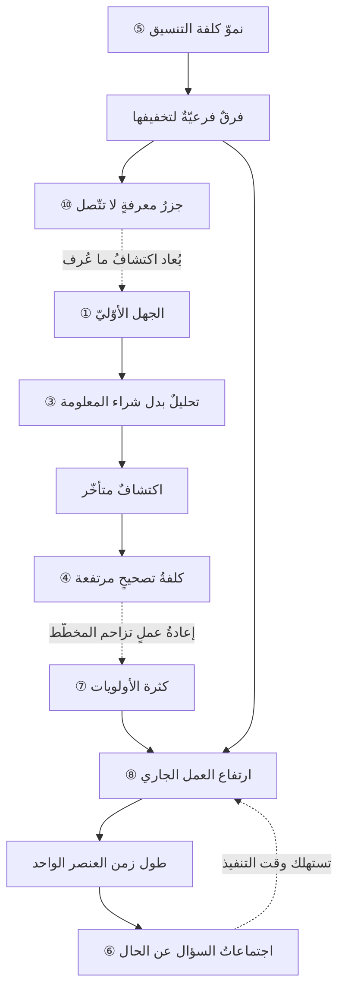
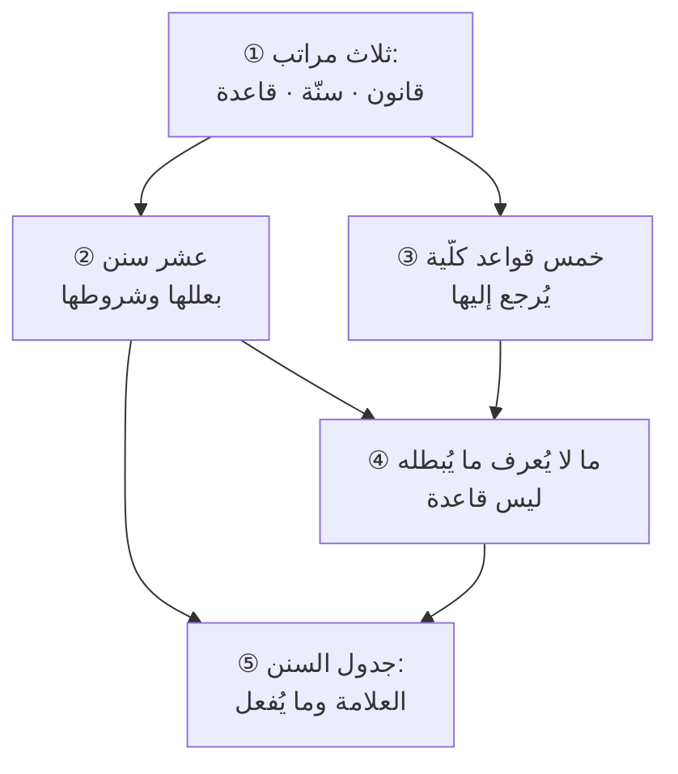

# الفصل 08 — القواعد الكلّية وسنن المشاريع

---

## 🏛️ لماذا تقرأ هذا الفصل؟

**المشكلة:** يُفاجأ الفريق في كل مشروع بما فوجئ به في المشروع الذي قبله: التقدير يتضاعف، والاجتماعات تكثر، والأولويات تتساوى فتنعدم. ويُعامَل ذلك كلّه بوصفه سوء حظّ، وهو في الحقيقة اطّرادٌ يُتوقَّع.

**وماذا لو لم تعرف؟** من لم يعرف السنن استقبل كلّ مرّة أثرَها بوصفه مفاجأة، فأنفق طاقته في ردّ الفعل بدل أن يبني عليها توقّعًا.

**وبعد هذا الفصل ستستطيع:**

- **أن تميّز بين ما ثبت بالقياس وما اطّرد بالملاحظة وما هو شعارٌ يُردَّد** — وأثرُه العمليّ أنّ ما ثبت بالقياس لا تُحاول الالتفاف عليه، وما اطّرد بالملاحظة تعرف شرطه فتعرف متى يتخلّف، **والشعار لا تبني عليه قرارًا مهما كثر ترديده.**
- **أن تحكم على أيّ قاعدةٍ تُعرض عليك بسؤالٍ واحد: ما الذي لو وقع عرفتُ أنّها لا تنطبق هنا؟** — فإن لم يكن لها جوابٌ فليست قاعدة، **مهما كانت صحيحةً في نفسها ومقبولةً عند الناس.**
- **أن تفسّر ما يتكرّر في فريقك بعلّته لا بأشخاصه** — فتعرف لماذا يطول زمن المهمّة وعددُ المنجَز ثابت، ولماذا تكثر الاجتماعات حيث تغيب الشفافية، **ولماذا يزيد إضافةُ الناس التأخيرَ في موضعٍ ويُنقصه في آخر.**

> [!info] بطاقة الفصل
> **النوع:** تأسيسيّ
> **المستوى:** 🟡 متوسّط
> **زمن القراءة:** نحو 45 دقيقة
> **أهمّيته في الباب:** ★★★★★
> **موضعك:** انتهيتَ من [[07 - الأسئلة الكبرى]] ← **⬤ أنت هنا** ← يليه [[09 - المقاصد والثنائيات والمفاضلات]]

> [!abstract] موقع هذا الفصل
> **يبني على:** [[Cynefin]] · [[Outcome vs Output]] — يُذكَر هنا ولا يُعاد شرحه.
> **ويؤسّس:** [[Cost-of-Change Curve]] · [[Little's Law]] — يُقدَّم هنا أوّل مرّة فيصير متاحًا لما بعده.

---

## 🧭 السؤال المركزي

> [!question] السؤال الذي يجيب عنه هذا الفصل كلّه
> **هل في هذا العلم ما يتكرّر تكرارًا يصحّ الاعتماد عليه؟**

**واحمل معك هذه الأسئلة وأنت تقرأ:**

- ما الذي يتكرّر في كل مشروع عملتَ فيه؟
- ما الذي لو وقع عرفتَ أنّ هذه القاعدة لا تنطبق هنا؟
- لماذا يكبر ثمن الخطأ كلّما تأخّر اكتشافه؟

---

## 🗺️ الجواب المختصر — قبل التفصيل

**نعم، فيه ما يتكرّر — ولكنّه ليس على درجةٍ واحدة، وأخطر ما يُفعل به أن يُعامَل كلُّه معاملةً واحدة.** ففي هذا العلم **قوانين** ثبتت بالقياس أو بالبرهان الرياضيّ، ولا يُلتفّ عليها بالاجتهاد؛ وفيه **سنن** اطّردت بالملاحظة ولها شروطٌ تتخلّف عندها؛ وفيه **قواعد كلّية** تُرجَع إليها عند الجزئيات فتوجّه الحكم ولا تُغني عنه؛ **وفيه شعاراتٌ لا يُعرف لها نقيضٌ فلا تصلح أن يُبنى عليها شيء.**

**والخلط بين هذه المراتب لا يُنتج جهلًا فحسب، بل يُنتج خطأً في اتّجاهين متقابلين:** فمن رفع السنّة إلى مرتبة القانون صار قدريًّا يعتذر بها عن كلّ تعثّر — «قانون بروكس يقول إنّ الإضافة تؤخّر، فلا حيلة لنا». **ومن نزّل القانون إلى مرتبة الرأي ظنّ أنّ الاجتهاد يُبطل الحساب** — فحاول أن يُقصِّر زمن التسليم مع بقاء العمل المفتوح على حاله، **وهذا لا يقع لا لقلّة اجتهادٍ بل لأنّ القسمة لا تُجامل أحدًا.**

**والمعيار الحاكم في هذا الفصل كلِّه جملةٌ واحدة: القاعدة التي لا يُعرف ما يُبطلها ليست قاعدة.** فكلُّ سنّةٍ تُذكر هنا يُذكر معها **شرطُها** — أي الحال التي تتخلّف فيها — **لأنّ القاعدة بلا شرطٍ تصير شعارًا يُستشهد به في كلّ موقفٍ فلا يوجّه في أيّ موقف.** وهذا امتدادٌ لما جرى عليه هذا الباب منذ فصله الأوّل.

**وأمّا هذه السنن فليست عشوائيةً متفرّقة، بل ترجع في جملتها إلى ثلاث علل:**

1. **طبيعة المعرفة** — أنّنا نبدأ ونحن أجهل ما نكون، وأنّ الجهل لا يزول بمرور الوقت بل بدفع ثمنه. **ومنها تنشأ سنن التقدير والتغيّر وكلفة التصحيح المتأخّر.**
2. **طبيعة التنظيم** — أنّ الناس يتواصلون، وأنّ مسارات التواصل تنمو أسرع من عدد الناس. **ومنها تنشأ سنن التنسيق والاجتماعات وشكلِ المنتج التابع لشكل الفريق.**
3. **طبيعة التدفّق** — أنّ العمل يمرّ في طوابير، وأنّ للطوابير حسابًا لا يتأثّر بالنيّة. **ومنها تنشأ سنن العمل الجاري وزمن الإنجاز وتزاحم الأولويات.**

**فمن عرف العلل الثلاث لم يحتج إلى حفظ السنن**، لأنّه يستطيع أن يشتقّ منها ما لم يُذكر له — **وهذا هو الفرق بين من يحمل قائمةً ومن يحمل تفسيرًا.**

**وثمرة هذا الفصل ليست أن تُلغى السنن — فهي لا تُلغى — بل أن يُنقَل ثمنُها من *مفاجأةٍ تُدفع* إلى *قرارٍ يُحسب*.** فكلفة التنسيق ستُدفع في كلّ حال، **وإنّما الفرق أن تُدفع وأنت تعلم مقدارها فتختار بنيةً تُنقصها، أو تُدفع وأنت تحسبها تقصيرًا في الأشخاص فتُعالجها باجتماعٍ سادس.** **وهذا هو معنى «الاعتماد» في السؤال المركزيّ: لا أن تُلغى، بل أن يُبنى عليها توقّعٌ يسبق وقوعها.**

> [!abstract] مفاهيم يُدخلها هذا الفصل في قاموسك
> `Cost-of-Change Curve` · `Little's Law`

> [!warning] مفاهيم يكثر الخلط بينها هنا
> `Law` مقابل `Rule` مقابل `Slogan` — احملها في ذهنك، فالفصل يفرّقها في محطّة التمييز.

---

## 🧱 الفكرة الأولى: السنّة والقاعدة والقانون — ثلاثة لا تُخلَط

*موضعها من الفصل: هذه أوّل خطوةٍ وهي شرطُ ما بعدها، وموضعها أن تُعرف **مرتبةُ ما سيُعرض** قبل أن يُعرض. **فالفصل يضع بين يديك عشر سننٍ وجملةَ قواعد، ولا ينفعك واحدٌ منها ما لم تعرف بأيّ ميزانٍ تأخذه** — وأيَّها يُلزمك وأيَّها يُرجَّح به فحسب.*

**الفكرة الرئيسة:** هذه المراتب الثلاث تختلف في **مصدر ثبوتها** وفي **درجة إلزامها** وفي **ما تفعله بها عند القرار**. والخلط بينها يُنتج تشدّدًا في موضع التخفيف وتساهلًا في موضع الشدّة — **ولا يُصلحه اجتهادٌ ولا حسنُ نيّة، لأنّه خطأٌ في تصنيف المعرفة لا في العمل بها.**

### المراتب الأربع، بمصدرها وإلزامها

**① القانون: ما ثبت بالبرهان أو بالقياس المتكرّر، وله مقدارٌ يُحسب.**

ومثاله الأصدق [[Little's Law|قانون ليتل]]: أنّ زمن الدورة يساوي متوسّط العمل الجاري مقسومًا على الإنتاجية. **وهذه ليست ملاحظةً استقرائية بل قضيّةٌ مبرهَنة رياضيًّا** أثبتها جون ليتل سنة 1961 في نظرية الطوابير، **وهي صادقةٌ في أيّ نظامٍ مستقرّ بلا استثناء** — لأنّها لا تقول شيئًا عن سلوك البشر، وإنّما تقول ما يلزم عن تعريف الكميّات الثلاث نفسها.

**ودرجة إلزامه: لا يُخالَف.** فمن أراد أن يُقصِّر زمن الدورة ولم يُنقص العمل الجاري ولم يرفع الإنتاجية، **فهو يطلب من الحساب ما لا يعطيه** — ولا يُغيِّر ذلك اجتهادٌ ولا إضافة ساعات.

**② السنّة: ما اطّرد بالملاحظة في أكثر الحالات، ولها شرطٌ تتخلّف عنده.**

ومثالها الأشهر [[Brooks's Law|قانون بروكس]]: أنّ إضافة أشخاصٍ إلى مشروعٍ متأخّرٍ تزيده تأخّرًا. **وتسميته «قانونًا» تسميةٌ شائعة لا دقيقة** — فهو تعميمٌ استقرائيّ من خبرة بروكس في بناء نظام تشغيل، **وعلّته أنّ الوافد يحتاج إلى تدريبٍ يستهلك وقت القدماء، وأنّ مسارات التواصل تنمو نموًّا أسرع من نموّ عدد الأشخاص.** ولذلك **يتخلّف حيث تنتفي علّته**: في العمل القابل للتجزئة تجزئةً تامّة بلا تنسيق، وفي الإضافة المبكّرة التي يبقى بعدها وقتٌ يكفي للتدريب.

**ودرجة إلزامها: يُبنى عليها التوقّع، ولا يُعتذر بها.** فالفرق بين استعمالها استعمالًا صحيحًا وبين الاختباء وراءها هو أن يُقال: **«الإضافة تؤخّر في هذا الموضع لأنّ العمل غير قابل للتجزئة هنا، وأمّا هذا الجزء فقابل، فتُضاف فيه»** — بدل أن يُقال «الإضافة تؤخّر» وتُغلق المسألة.

**③ القاعدة الكلّية: ما يُرجع إليه عند الجزئيات فيوجّه الحكم ولا يُغني عنه.**

ومثالها: **«ما زاد فيه عدم اليقين زادت فيه الحاجة إلى المرونة»**. **وهذه ليست وصفًا لما يقع بل توجيهًا لما ينبغي**، وهذا هو ما يفرّقها عن السنّة: فالسنّة تصف، والقاعدة تحكم. **ولا تُطبَّق تطبيقًا آليًّا** لأنّها تحتاج إلى تقديرٍ للحالة قبلها — كم مقدار عدم اليقين هنا؟ — **وهذا التقدير هو موضع الاجتهاد الذي لا تُغني عنه القاعدة.**

**ودرجة إلزامها: تُرجَّح بها الكفّة، ولا تُحسم بها الحالة.** وقد تتعارض قاعدتان صحيحتان في موقفٍ واحد، **وهذا لا يُبطل واحدةً منهما** — وإنّما ينقل المسألة إلى باب المفاضلة، وهو الفصل التالي.

**④ والشعار: ما لا يُتصوَّر له نقيض.**

كقولهم «تواصل أكثر»، و«خطّط جيّدًا»، و«ركّز على القيمة». **وهذه كلُّها كلامٌ صحيحٌ لا يُنتج قرارًا**، لأنّه لا أحد يدعو إلى ضدّه. **وعلامته الفارقة: أن تضع نقيضه في جملةٍ فتجدها لا تُقال** — فلا أحد يقول «تواصل أقلّ» أو «خطّط سيّئًا»، **ولذلك فالقول الأوّل لا يزيدك علمًا بشيء.**

**وأمّا الجملة التي يُقال نقيضها فهي التي تحمل معلومة:** «قلّل عدد المهامّ المفتوحة ولو بقي منفّذون بلا عمل» — **فهذه لها نقيضٌ يقوله كثيرون فعلًا** («لا تترك أحدًا بلا عمل»)، **ولذلك فهي قاعدةٌ تُناقَش وتُختبر.**

**وصنفٌ خامسٌ يُذكر لئلّا يُحسب من الأربعة: ما قيل ساخرًا فنُقل جادًّا.** فمن هذه «القوانين» المتداولة ما وُضع في أصله **تهكّمًا لا تقريرًا** — كقانون مورفي («ما يمكن أن يسوء سيسوء»)، وقانون باركنسون («يتمدّد العمل ليملأ الوقت المتاح له»)، **وقد كُتب الثاني في مقالةٍ ساخرةٍ عن البيروقراطية سنة 1955.**

**وحكمُها أنّها تُقرأ *ملاحظاتٍ فطنة* لا قواعدَ يُبنى عليها قرار.** ففيها بصيرةٌ حقيقية — أنّ الوقت المفتوح يُستهلك، وأنّ ما لم يُحسب يقع — **ولكنّها ليست مقيسةً ولا مشروطةً ولا يُعرف لها حدّ.** **فمن ساقها في اجتماعٍ ليُغلق بها نقاشًا فقد استعمل نكتةً في محلّ حجّة**، ومن استفاد منها في أن يضع لعملٍ سقفًا زمنيًّا معلنًا **فقد أخذ منها ما تحتمله.**

### ولماذا يقع الخلط بينها أصلًا؟

**لأنّ اللفظ الشائع لا يفرّق: فكلُّها تُسمّى «قوانين» في الكتابة الدارجة** — قانون بروكس، وقانون كونواي، وقانون باركنسون، وقانون مورفي. **وثلاثةٌ من هذه الأربعة ليست قوانين بالمعنى الدقيق**، بل واحدٌ منها ساخرٌ في أصله لا يُقصد به التقرير.

**وهذه التسمية ليست بريئة، لأنّها تنقل درجة الإلزام بلا أن ينتبه أحد.** فمن سمع «قانونًا» ظنّ أنّه لازمٌ في كلّ حال، **فلم يسأل عن شرطه** — وسؤال الشرط هو بعينه ما يجعل السنّة نافعة. **وحين يُخالف الواقعُ «القانون» مرّةً واحدةً يُطرح كلُّه**، لأنّه قُدِّم على أنّه لا يتخلّف. **فتسميته سنّةً بشرطها تحفظه من الطرفين معًا.**

### وأثر هذا التفريق في *طلب العلم* لا في القرار وحده

**وثمّة أثرٌ لهذه المراتب أبعد من الاجتماع الذي بين يديك: أنّها تقول لك ما الذي يستحقّ أن يُحفَظ وما الذي يستحقّ أن يُفهَم.**

**فالقوانين قليلةٌ وتُحفَظ بصيغتها**، لأنّ صيغتها هي معناها: من حفظ أنّ زمن الدورة = العمل الجاري ÷ الإنتاجية **يملك أداةً يستعملها في كلّ موضع**، ولا يحتاج إلى أكثر من ذلك.

**والسنن تُفهَم بعللها ولا تُحفَظ بأسمائها.** فمن حفظ «قانون بروكس» اسمًا **لم يستفد شيئًا**، إذ لا يعرف متى يشتدّ ومتى يتخلّف؛ **ومن فهم أنّ علّته نموُّ مسارات التواصل استطاع أن يشتقّ منه ما لم يُسمَّ له**: أنّ إضافة جهةٍ خارجية إلى المشروع أثقل من إضافة موظّف، **وأنّ تقسيم فريقٍ واحدٍ إلى فريقين يُنتج كلفة تنسيقٍ جديدةً لم تكن.**

**والقواعد الكلّية تُمارَس ولا تُقرأ.** فقراءتها لا تُنتج قدرةً على استعمالها، **لأنّ استعمالها يقتضي تقديرًا للحالة يسبق تطبيقها** — وهذا التقدير لا يُكتسب إلا بأن تُعرض عليها جزئيّاتٌ حقيقيّة مرّةً بعد مرّة. **ولذلك كان أنفع ما يُفعل بها أن تُسجَّل معها السوابق**: أنّ هذه القاعدة رجّحت هذا في تلك الحالة، وهذا في الأخرى.

**فمن أراد أن يعرف لماذا يتفاوت اثنان قرآ الكتب نفسها تفاوتًا بعيدًا، فهذا أحد أسبابه:** أنّ أحدهما حفظ أسماء السنن **وحفظ معها ما لا يُحفَظ ولم يفهم ما يُفهَم**، والآخر فهم العلل فصار يشتقّ. **وتحرير هذا كلِّه في [[16 - كيف يطلب هذا العلم]].**

> [!example] قسمةٌ لا تُجامل: فريقٌ في الرياض أراد أن يُقصِّر الزمن بالاجتهاد
> فريقٌ من ثمانية في جهةٍ حكومية شكا الراعي من طول زمن إنجاز الطلبات: **متوسّط 26 يومًا من فتح الطلب إلى إغلاقه.** فطُلب منهم تقصيره إلى النصف في ربعٍ واحد.
>
> **ففعلوا ما يفعله أكثر الفرق:** زادوا ساعات العمل، وعقدوا وقفةً يومية ثانية في آخر اليوم، ووضعوا لوحةً أظهرت كلَّ طلبٍ ومسؤوله. **وبعد سبعة أسابيع كان المتوسّط 24 يومًا.**
>
> **ثمّ قِيست الكميّات الثلاث فظهر الحساب:** العمل الجاري في المتوسّط **31 طلبًا مفتوحًا**، والإنتاجية **1.2 طلبٍ مغلقٍ في اليوم**. وقسمة الأولى على الثانية تعطي **نحو 26 يومًا** — وهو المتوسّط نفسه المرصود.
>
> **فلم يكن ثمّة لغز.** الفريق كان يفتح من الطلبات أكثر ممّا يغلق، **فالزمن لم يكن ينتظر اجتهادًا بل قسمة.** وقد كانت اللوحة الجديدة تُظهر ذلك بوضوحٍ تامّ — **وهي أظهرته ولم تمنعه**، وهذا هو الفرق بين الإظهار والجواب.
>
> **فوُضع حدٌّ للعمل الجاري: لا يزيد المفتوح على 12.** فارتفع الاعتراض في الأسبوع الأوّل — إذ صار بعض الأفراد بلا طلبٍ يفتحونه — **وهذا بعينه ما كان الحدّ يقصده: أن يتوجّه الفارغون إلى ما يُعطّل غيرهم بدل أن يفتحوا جديدًا.** فنزل المتوسّط في ستّة أسابيع إلى **11 يومًا**، والإنتاجية ارتفعت قليلًا لا كثيرًا (1.4).
>
> **والدرس: أنّ ما فشلت فيه سبعةُ أسابيع من الاجتهاد حسمه تغييرٌ واحدٌ في العدد** — لأنّ المسألة كانت في مرتبة القانون لا في مرتبة الهمّة.

> [!tip] كيف تستعمل هذه الفكرة — ثلاثة أسئلةٍ تُنزِل كلّ «قانون» منزلته
> **متى سمعتَ قاعدةً تُساق في اجتماعٍ ليُبنى عليها قرار، فاسأل عنها ثلاثة أسئلة بترتيبها:**
>
> 1. **من أين ثبتت؟** — أبرهانٍ رياضيّ (فهي قانون)، أم بملاحظةٍ متكرّرة (فهي سنّة)، أم بأنّها تبدو صحيحة (فهي رأيٌ حتّى يثبت غيره)؟
> 2. **ما شرطها؟ ومتى تتخلّف؟** — **وهذا السؤال هو الذي يفصل من يفهمها ممّن يحفظها.** فمن ساق قانون بروكس ولم يستطع أن يذكر متى لا ينطبق، **فهو ينقل جملةً لا يملك معناها.**
> 3. **ماذا تُغيّر في قراري غدًا؟** — فإن لم تُغيّر شيئًا فهي معلومةٌ عامّة لا قاعدةَ قرار، **ولا تُصرف عليها مدّة الاجتماع.**
>
> **وثمرة الأسئلة الثلاثة أنّها تُحوِّل النقاش من «هل هذا صحيح؟» — وهو نقاشٌ لا ينتهي — إلى «هل ينطبق هنا؟»، وهو سؤالٌ له جواب.**

> [!warning] الحفرة الشائعة — السنّة تُساق عذرًا لا تفسيرًا
> **وهذه أشيع سوء استعمالٍ لهذا الفصل كلِّه، وعلامتها أن تُذكر السنّة *بعد* وقوع الأثر لا قبله.**
>
> فيُقال بعد التأخّر: «هذا قانون بروكس»، وبعد فشل التقدير: «التقديرات دائمًا تخيب»، وبعد كثرة الاجتماعات: «هكذا المؤسّسات الكبيرة». **وكلُّ هذه صحيحةٌ في نفسها، ومستعمَلةٌ استعمالًا فاسدًا** — لأنّ السنّة إنّما تُذكر لتُبنى عليها **خطّة قبل الوقوع**، فإذا ذُكرت بعده صارت تسميةً للألم لا علاجًا له.
>
> **والعلامة الفارقة سؤالٌ واحد: هل كانت هذه السنّة مكتوبةً عندك قبل أن يقع أثرُها؟** فمن كتب في خطّته «الإضافة المتأخّرة تؤخّر، فسنُضيف قبل الشهر الرابع أو لا نضيف» **فقد استعملها**؛ ومن ذكرها في تقرير ما بعد الحدث فقد استشهد بها على نفسه.
>
> **وحدُّ هذا التحذير:** ليس المقصود أن يُمنع تفسير ما وقع — **فالتفسير بعد الوقوع بابٌ من التعلّم لا يُغلق** ([[Lessons Learned]]). **وإنّما المقصود ألّا يُكتفى به**: فالتفسير الذي لا يُنتج قاعدةً مكتوبةً للمرّة القادمة ليس تعلّمًا بل تسليةً بالفهم.

> [!question]- تأكّد أنك فهمت — «قانون كونواي» أهو قانون أم سنّة؟
> **سنّةٌ بالغةُ الاطّراد، وليست قانونًا بالمعنى الدقيق — والفرق نافعٌ لا لفظيّ.**
>
> فـ[[Conway's Law|ملاحظة كونواي]] (1968) أنّ المؤسّسة التي تصمّم نظامًا تُنتج تصميمًا يحاكي بنية تواصلها هي. **وعلّتها مفهومة: أنّ الحدود بين المكوّنات تتبع الحدود التي يسهل التفاهم عبرها** — فما يعمل عليه فريقٌ واحدٌ يميل إلى أن يصير مكوّنًا واحدًا، وما يتوزّع على فريقين تنشأ بينهما واجهة.
>
> **ولكنّها لا تُشتقّ من تعريفٍ ولا تُبرهَن، وإنّما تُلاحَظ — ولها شرطٌ يتخلّف عنده:** أن يكون التصميم متروكًا لمن يبنيه. **فحيث تُفرض المعمارية من خارج الفرق فرضًا** — كأن يمليها معيارٌ تنظيميّ أو نظامٌ قائمٌ يجب التكامل معه — **يضعف أثرها ولا يبطل**.
>
> **واللازم العمليّ من كونها سنّةً لا قانونًا أنّها تُستعمل في اتّجاهين:** أن **تُتوقَّع** — فلا تُدهش حين تجد نظامك مقسَّمًا كما تُقسَّم فرقُك؛ **وأن تُستثمر** — وهو ما يُعرف بمناورة كونواي العكسية: **أن تُشكِّل الفرق على الشكل الذي تريد أن يخرج به النظام.** ولو كانت قانونًا لما صحّ الاتّجاه الثاني، **لأنّ القانون يُحسب ولا يُوجَّه.**

> [!summary]- خلاصة الفكرة في سطرين
> **السنّة تصف ما يقع غالبًا، والقاعدة تحكم بما ينبغي، والقانون لا يتخلّف — وهي تختلف في مصدر ثبوتها وفي درجة إلزامها.**
> **والخلط بينها يُنتج تشدّدًا في موضع التخفيف وتساهلًا في موضع الشدّة**، ولا يُصلحه حسنُ نيّة — لأنّه خطأٌ في تصنيف المعرفة لا في العمل بها.

> [!question] تأمّلٌ تطبيقيّ — لا جواب له في هذا الفصل
> خذ ثلاث جملٍ تُقال عندكم بوصفها بديهيّات، وضع أمام كلٍّ منها مرتبتها: **سنّة · قاعدة · قانون.**
>
> **ثمّ اسأل عن كلّ ما صنّفتَه قانونًا: ما الذي لو وقع لأبطله؟** فإن لم تجد جوابًا، فليس قانونًا — وإنّما هي عادةٌ اكتسبت لهجةَ اليقين بطول التكرار.

---

## 🧱 الفكرة الثانية: عشر سننٍ متكرّرة — بعللها وشروطها

*موضعها من الفصل: عُرفت المراتب، وتبدأ هنا أدناها إلزامًا وأكثرها نفعًا — **السنن، وهي تصف ما يقع لا ما ينبغي**. وتخصُّها من بين ما بعدها أنّ كلّ واحدةٍ منها تُذكر بشرطها الذي تتخلّف عنده: **فالسنّة بلا شرطٍ تصير خرافةً محترمة.***

**الفكرة الرئيسة:** هذه عشرٌ ترجع إلى العلل الثلاث التي مرّت في الجواب المختصر: **طبيعة المعرفة، وطبيعة التنظيم، وطبيعة التدفّق.** **وكلٌّ منها تُذكر بثلاثة: صياغتها، وعلّتها التي تفسّرها، وشرطها الذي تتخلّف عنده** — فالسنّة بلا علّةٍ تُحفَظ ولا تُفهم، **وبلا شرطٍ تصير شعارًا.**

### أوّلًا: سننٌ علّتها طبيعة المعرفة

**① أنت أجهل ما تكون حين يُطلب منك أدقّ التقديرات.**

**والصياغة على هذا الوجه مقصودة**، لأنّ المسألة ليست أنّ التقدير المبكّر خاطئ — بل أنّ **الطلب** يقع في أسوأ لحظةٍ ممكنة: قبل الاعتماد، حين لا يكون قد عُرف من النظام إلا اسمه. **وعلّتها أنّ المعرفة بالمشروع تُبنى بالعمل فيه**، فلا سبيل إلى معرفةٍ سابقةٍ للعمل مهما طال التحليل.

**ومن لوازمها أنّ خطأ التقدير غير متناظر:** فالتقدير يخيب إلى الزيادة أكثر ممّا يخيب إلى النقصان. **وعلّة عدم التناظر أنّ عدد الطرق التي يسير بها العمل على غير ما توقّعتَ أكبر بكثيرٍ من عدد الطرق التي يسير بها أسرع** — فالمفاجآت السارّة قليلةٌ والمزعجة كثيرة. **ولذلك فالمدى الصحيح للتقدير مائلٌ لا متوازن**: أن يُقال «من ستّة إلى أحد عشر أسبوعًا» لا «ثمانية زائد أو ناقص اثنين».

**وشرطها:** تتخلّف في العمل **المتكرّر المعروف** — فمن بنى عشرين موقعًا تعريفيًّا متشابهًا يستطيع أن يقدّر الحادي والعشرين بدقّةٍ عالية، **لأنّ جهله انتهى قبل أن يبدأ.** ولذلك فالسنّة تشتدّ بقدر جِدّة العمل، **وتضعف كلّما اقترب من المكرَّر** — وتفصيلها في [[Estimation|التقدير]].

**② ما دام النظام يُرى فسيتغيّر المطلوب منه.**

**وليست علّتها تقلّبَ العملاء كما يُقال**، بل أنّ رؤية النظام تُنتج فهمًا لم يكن ممكنًا قبلها: **فالمستخدم لا يعرف ما يريد على وجه التحديد حتّى يرى شيئًا يستطيع أن يقول عنه «ليس هذا».** فالتغيير هنا **ثمرةُ نجاحٍ في الإظهار لا عرَضُ فشلٍ في التحليل.**

**وشرطها:** تتخلّف حيث يكون المطلوب **منصوصًا خارج إرادة الطرفين** — كنظامٍ يُبنى لتنفيذ لائحةٍ تنظيمية بنصّها. **فهناك لا يتغيّر المطلوب بالرؤية، وإنّما يتغيّر بتغيّر اللائحة.** وهذا هو الفرق العمليّ بين المجال الواضح والمجال المركّب في [[Cynefin|كونيفين]].

**③ الجهل لا يزول بمرور الوقت، بل يُشترى بثمن.**

**وهذه أخفى الثلاث وأكثرها إهمالًا.** فكثيرٌ من الفرق تؤجّل القرار انتظارًا لوضوحٍ يأتي بنفسه، **والوضوح لا يأتي بنفسه**: إنّما يأتي بتجربةٍ أو مقابلةٍ أو نموذجٍ أوّليّ أو مطابقة بيانات. **فالانتظار وحده لا يُنقص الجهل، وإنّما يُنقص الوقتَ الباقي للتصرّف فيه.**

**وشرطها:** تتخلّف حيث يكون الجهل معلَّقًا على **حدثٍ خارجيٍّ له موعد** — كقرار جهةٍ تنظيمية يصدر في تاريخٍ معلوم. **فهنا الانتظار قرارٌ صحيح**، وإنّما يجب أن يُكتب بوصفه قرارًا: ننتظر حتّى كذا، ونفعل كذا إن لم يصدر.

**④ كلفة التصحيح ترتفع كلّما تأخّر الاكتشاف.**

**وهذا هو [[Cost-of-Change Curve|منحنى كلفة التغيير]]:** أنّ الخطأ الذي يُكتشف في وثيقة المتطلّبات يُصلَح بتعديل جملة، **والخطأ نفسه بعد الإطلاق يقتضي تعديل كودٍ وإعادة اختبارٍ ونشرَ إصدارٍ وربّما تعويضَ متضرّرين.** وعلّته أنّ ما بُني فوق الخطأ يجب أن يُنقض معه، **فالكلفة تتبع ما تراكم لا ما أُخطئ فيه.**

**وشرطها — وهو أهمّ شروط هذا الفصل:** أنّ **حِدّة** المنحنى ليست ثابتة. فقد صيغ في أصله على أعمالٍ يفصل بين مراحلها شهورٌ ولا يوجد فيها اختبارٌ آليّ ولا تكاملٌ مستمرّ، **فكان انحداره شديدًا.** وحيث تُبنى قدرةٌ على الاختبار الآليّ والتسليم المتّصل والإصدارات الصغيرة **يتسطّح المنحنى** — **ولا يستوي.** فيبقى المبدأ صحيحًا (المبكّر أرخص دائمًا)، **ويتغيّر المقدار تغيُّرًا كبيرًا** — وتحريره في [[Cost-of-Change Curve]].

### ثانيًا: سننٌ علّتها طبيعة التنظيم

**⑤ كلفة التنسيق تنمو أسرع من عدد الأشخاص.**

**والعلّة حسابية لا نفسية:** أنّ عدد المسارات الثنائية بين `ن` من الأشخاص يساوي `ن(ن−1)÷2`. فخمسةٌ بينهم عشرة مسارات، **وعشرةٌ بينهم خمسة وأربعون** — فتضاعف العدد يقارب أن يُربّع كلفة التنسيق. **ومن هنا يُفهم [[Brooks's Law|قانون بروكس]] فهمًا صحيحًا:** أنّ الوافد يضيف طاقةً ويضيف مسارات، **وقد يزيد ما يضيفه من المسارات على ما يضيفه من الطاقة.**

**وأختُ هذه السنّة [[Conway's Law|ملاحظة كونواي]]**: أنّ شكل النظام يتبع شكل تواصل من بناه. **وهما وجهان لعلّةٍ واحدة**: أنّ التواصل مكلفٌ فيُقتصَد فيه، **والاقتصاد في التواصل يترك أثره في المنتج نفسه.**

**واللازم العمليّ من الحساب أنّ الحلّ ليس في *تنظيم* التواصل بل في *إنقاص الحاجة إليه*.** فالاجتماع الأسبوعيّ الجامع لا يُنقص المسارات، **وإنّما ينقلها إلى ساعةٍ واحدةٍ فتُدفع كلفتها دفعةً واحدة.** وأمّا ما يُنقصها فعلًا فأمران: **حدودٌ واضحةٌ في الملكية** (أن يكون لكلّ جزءٍ صاحبٌ يقرّر فيه بلا استئذان)، **وواجهاتٌ مستقرّةٌ بين الأجزاء** (أن يُتّفق على ما يعبر بين المكوّنين مرّةً فلا يُتفاوض عليه كلّ أسبوع). **وكلاهما قرارٌ معماريٌّ في ظاهره، وهو في حقيقته قرارٌ في كلفة التنسيق.**

**وشرطها:** تتخلّف بقدر ما يكون العمل **قابلًا للتجزئة بلا تنسيق** — فمهامٌّ مستقلّةٌ استقلالًا تامًّا تُضاف إليها الأيدي بلا كلفةٍ تُذكر. **وهذا هو بعينه ما تفعله المعمارية الجيّدة: أنّها تُنقص الحاجة إلى التنسيق فتُضعِف السنّة.**

**⑥ الاجتماعات تكثر حيث تغيب الشفافية.**

**وعلّتها أنّ الاجتماع في أصله *آلة نقل معلومة*، فحيث لا تصل المعلومة بغيره يكثر.** فالفريق الذي لا يستطيع أحدٌ فيه أن يعرف حال العمل إلا بأن يسأل **مضطرٌّ** إلى اجتماعٍ يوميّ للحالة؛ والراعي الذي لا يرى رقمًا موثوقًا **مضطرٌّ** إلى اجتماعٍ أسبوعيّ يطمئنّ فيه.

**واللازم العمليّ أنّ علاج كثرة الاجتماعات ليس منعها بل إغناءها**: فمن ألغى اجتماعًا ولم يضع محلَّه طريقًا آخر للمعلومة **لم يوفّر شيئًا** — إذ تتحوّل الحاجة إلى رسائل واستفساراتٍ فرديّة أكثر كلفةً وأقلّ نظامًا.

**وثمّة نوعٌ ثالثٌ لا يُغني عنه شيء: الاجتماع الذي غرضه *بناء الفهم المشترك*** — كأن يُناقَش خيارٌ معماريٌّ حتّى يصير معلومًا عند الجميع لا معلومًا عند كاتبه. **وهذا لا تُغني عنه وثيقةٌ مهما أُحكمت**، لأنّ ثمرته ليست المعلومة بل **الاتّفاق على معناها**. **وعلامته أنّ الحاضرين يخرجون وقد تغيّر فهم بعضهم**، لا وقد علموا شيئًا كانوا يجهلونه.

**وشرطها:** تتخلّف حيث يكون الاجتماع **لصناعة قرارٍ لا لنقل معلومة** — فهذا لا يُغني عنه لوح ولا تقرير، **لأنّ القرار يحتاج حضور من يملكه.** والخلط بين الأنواع أصل أكثر ما يُشكى منه: **اجتماعٌ يُعقد لصناعة قرارٍ فيُستهلك في نقل المعلومات، فينتهي وقتُه قبل أن يُقرَّر شيء.** **والعلاج شكليٌّ ورخيص: أن يُكتب في عنوان كلّ دعوةٍ نوعُها — نقلُ معلومةٍ أم صناعةُ قرارٍ أم بناءُ فهم** — فالنوع الأوّل يُلغى غالبًا، والثاني يُقصَر على من يملك، **والثالث وحده هو الذي يستحقّ أن يطول.**

**⑦ إذا كثرت الأولويات انعدمت.**

**وعلّتها أنّ الأولوية معنًى نسبيّ لا وصفٌ ذاتيّ**: فقولك «هذا مهمّ» لا يقول شيئًا حتّى تقول «أهمّ من ماذا». **فحين يصير كلُّ شيءٍ ذا أولويةٍ عالية، ينتقل قرارُ الترتيب من صاحبه إلى المنفّذ** — فيرتّب بحسب ما يستطيع أو ما يُلحّ عليه أقربُ الناس إليه. **وهذا ليس تمرّدًا بل ضرورة**: لا بدّ لمن يعمل أن يبدأ بشيء.

**وشرطها:** تتخلّف حين تكون الأعمال **متوازيةً حقًّا** بفرقٍ مستقلّةٍ لا تتزاحم على مورد. **وهذا نادرٌ عمليًّا**، لأنّ التزاحم يقع غالبًا على موردٍ مشترك لا يُنتبه له — كمراجعٍ واحدٍ أو بيئة اختبارٍ واحدة.

### ثالثًا: سننٌ علّتها طبيعة التدفّق

**⑧ زيادة العمل الجاري تطيل زمن كلّ عنصرٍ ولا تزيد المنجَز.**

**وهذه أوثق ما في هذا الفصل ثبوتًا، لأنّها [[Little's Law|قانون ليتل]] نفسه لا سنّةً استقرائية.** فزمن الدورة = العمل الجاري ÷ الإنتاجية، **فإن ثبتت الإنتاجية وزاد العمل الجاري، طال الزمن حتمًا.**

**وأثرها العمليّ المضادّ للحدس: أنّ ترك بعض المنفّذين بلا عملٍ جديدٍ قد يكون هو الفعل الصحيح.** فالطاقة المعطَّلة ظاهرةٌ فتُؤلم، **والزمن الضائع في الانتظار مستترٌ فلا يُرى** — ولذلك تختار أكثر الفرق أن تملأ الطاقة وتدفع الثمن مستترًا.

**وشرطها:** أنّ القانون يشترط **نظامًا مستقرًّا** — أي لا يتراكم فيه العمل بلا نهاية ولا يتغيّر معدّله تغيّرًا حادًّا. **فحسابُه على أسبوعٍ واحدٍ في نظامٍ مضطرب يُعطي رقمًا لا يعني شيئًا**، وإنّما يُقاس على مدًى يكفي لاستقرار المتوسّطات.

**⑨ لكلّ قرارٍ ثمن، ولتأجيله ثمنٌ أيضًا.**

**وعلّتها أنّ التأجيل يبدو مجّانيًّا لأنّ كلفته لا تظهر في بند.** فمن أجّل قرار اختيار قاعدة البيانات شهرًا **لم يدفع شيئًا في الميزانية**، ودفع في المقابل شهرًا من عملٍ بُني على افتراضين متعارضين، **وأسبوعين من إعادة العمل بعد أن حُسم.**

**وشرطها — وهي أوّل ما يُساء فهمه هنا: أنّ التأجيل ليس دائمًا خطأً.** فقرارٌ يزداد وضوحًا بالانتظار، ولا يمنع الانتظارُ العملَ من المضيّ، **هو قرارٌ يستحقّ التأجيل** — وهذا هو معنى تأخير القرار إلى آخر لحظةٍ مسؤولة. **والفارق: أن يُعرف ما تكسبه بالانتظار وما تدفعه فيه**، وأن يُكتب موعدٌ يُحسم عنده لا أن يُترك مفتوحًا.

**واختبارُ التمييز بينهما سؤالان يُجابان في دقيقة:** **«ماذا سأعرف غدًا ولا أعرفه اليوم؟»** — فإن لم يكن ثمّة جوابٌ فالانتظار لا يشتري شيئًا وإنّما يُنفق وقتًا. **و«ما الذي يُبنى الآن على هذا القرار وهو مجهول؟»** — فإن كان ثمّة عملٌ يمضي على احتمالين، **فكلفة التأجيل تتراكم كلَّ يومٍ وهي غير ظاهرة في أيّ بند.** **فالتأجيل الرشيد ما اجتمع فيه جوابٌ للأوّل وعدمُه للثاني**، وما عداه تسويفٌ يُسمّى مرونة.

**⑩ أوسع ما يُنتجه المشروع معرفةٌ، وأسرع ما يضيع منه معرفةٌ.**

**وعلّتها أنّ أكثر ما يتعلّمه الفريق لا يُكتب في مكان:** لماذا رُفض هذا الخيار، وما الذي جُرِّب فلم ينجح، **وأيّ افتراضٍ كان خاطئًا وكيف اكتُشف.** فهذه معرفةٌ تعيش في رؤوس أفراد، **وتنتقل بانتقالهم وتزول بزوالهم.**

**واللازم العمليّ أنّ أنفع ما يُوثَّق ليس ما فُعل بل *ما لم يُفعل ولماذا*** — فما فُعل ظاهرٌ في المنتج نفسه يقرأه من يأتي بعدك، **وما رُفض لا يبقى منه أثر**، فيُعاد اقتراحه بعد سنةٍ ويُصرف عليه وقتٌ قد صُرف من قبل.

**والذي يضيع ثلاثة أصنافٍ متفاوتةٍ في خطرها:** **أوّلها أرخصها** — ما فُعل وكيف، وهو محفوظٌ في الكود والوثائق فيُستدرَك بالقراءة. **وثانيها أغلاها** — لماذا رُفض البديل، وهو لا يُستدرَك أبدًا إلا بإعادة التجربة. **وثالثها أخفاها** — ما جُرِّب فلم ينجح ولم يُذكر لأحدٍ لأنّ صاحبه رآه فشلًا لا يستحقّ الذكر. **وهذا الثالث هو أغلى ما يشتريه المشروع بماله، وأسرع ما يُلقيه في الطريق.**

**والعلاج شكليٌّ ورخيصٌ كذلك: أن يكون في كلّ قرارٍ يُسجَّل سطرٌ ثابتٌ اسمه «البدائل التي رُفضت وسببُ رفضها»** ([[Decision Log]]). **فسطرٌ واحدٌ اليوم يوفّر أسبوعًا بعد سنة**، وهذه من أعلى نسب العائد إلى الكلفة في هذا العلم كلِّه.

**وشرطها:** تتخلّف حيث يبقى الفريق نفسه على المنتج نفسه مدّةً طويلة — **فالمعرفة الضمنية تكفي ما دام أصحابها حاضرين.** ولهذا يظهر أثرها فجأةً عند أوّل انتقال، **لا تدريجيًّا**، فتُقرأ خطأً على أنّها مشكلةٌ في الموظّف الجديد.

### وكيف تتراكب هذه السنن؟

**وأنفع من معرفة العشر مفردةً أن تُعرف كيف تتّصل، لأنّها في الواقع لا تقع مفردة.** **فالعرَض الواحد الذي يشكو منه الفريق يكون في الغالب طرف سلسلةٍ من ثلاث سننٍ يشدّ بعضها بعضًا** — ومن عالج آخرها ظنّ أنّه عالج، ثمّ عاد الأثر بعد أسابيع.

**وثلاث تراكيب هي الأشيع:**

**① دوّامة التزاحم: ⑦ ← ⑧ ← ⑥.** فحين تكثر الأولويات (⑦) يُفتح كلُّ طلبٍ فور وصوله، **فيرتفع العمل الجاري (⑧)، فيطول زمن العنصر الواحد** — فلا يعود أحدٌ يعرف أين وصل شيء، **فتكثر اجتماعات السؤال عن الحال (⑥).** **وعلاجُها من رأسها وحده:** فمن بدأ بإلغاء الاجتماعات أعادها بعد شهرٍ في صورة رسائل استفسار، **ومن بدأ بترتيب الأولويات انحلّت الثلاث معًا.**

**② دوّامة الاكتشاف المتأخّر: ① ← ③ ← ④.** فالجهل الأوّليّ (①) يُنتج تقديرًا واسعًا، **فيُطلب تضييقه بمزيدٍ من التحليل بدل شراء المعلومة (③)** — والتحليل لا يُنقص الجهل بل يُنقص الوقت. **فيتأخّر أوّل اكتشافٍ حقيقيّ** حتّى يقع في مرحلة القبول، **وهناك يعمل منحنى كلفة التغيير (④) بأشدّ ما يكون.** **وعلاجها من وسطها:** أن يُشترى أوّل اختبارٍ حقيقيّ مبكّرًا، **فينكسر الطرفان معًا** — يضيق المدى، ويرخُص التصحيح.

**③ دوّامة الفريق المتوسّع: ⑤ ← ⑧ ← ⑩.** فحين يكبر الفريق تنمو كلفة التنسيق (⑤)، **فتُنشأ فرقٌ فرعيّةٌ لتخفيفها، فيرتفع مجموع العمل المفتوح لأنّ كلّ فرعٍ يفتح لنفسه (⑧)**، ثمّ تتوزّع المعرفة على جزرٍ لا تتّصل (⑩) **فيُعاد اكتشاف ما عُرف في الجزيرة المجاورة.** **وعلاجها من رأسها كذلك:** أن تُنقص الحاجة إلى التنسيق بحدودٍ في المعمارية والملكية، **لا أن يُنقص التواصل بحدودٍ في التنظيم.**

**والقاعدة المستفادة من التراكيب الثلاثة واحدة: يُعالَج رأس السلسلة لا أظهر حلقاتها.** **وأظهرُ الحلقات دائمًا هي الأخيرة** — الاجتماعات، وإعادة العمل، وضياع المعرفة — **لأنّها هي التي تُؤلم؛ والرأس هادئٌ لا يُشكى منه أحد.**

**وهذه التراكيب الثلاثة مرسومةً — ولاحظ أنّ الرؤوس الثلاثة في اليسار، وأنّ ثلاثة أسهمٍ منقّطة تُعيد الأثر إلى رأسٍ آخر فتصير الدوّامات دوّامةً واحدة:**

*الرؤوس ⑦ و① و⑤ — وهي الهادئة التي لا يُشكى منها — والحلقات المؤلمة ⑥ و④ و⑩ في أطرافها. والأسهم المنقّطة هي ما لا يظهر في أيّ تقرير: أنّ ثمن كلّ دوّامة يُدفع في رأس أختها، فيبدو العلاج بلا أثرٍ وقد كان صحيحًا في موضعه.*

> [!info] إضافة مرجعية — ما نصّ عليه أصحاب هذه السنن وما أُضيف إليهم
> **ثلاثة تنبيهاتٍ على النسبة، لأنّ هذه السنن أكثر ما يُنقل في المجال بلا تحقيق:**
>
> - **قانون بروكس** نصَّ عليه فريدريك بروكس في `The Mythical Man-Month` (1975)، **وذكر معه علّته وشرطه بنفسه**: أنّه يشتدّ بقدر ما يحتاج العمل إلى تواصل، وأنّ العمل القابل للتجزئة التامّة يخرج منه. **فالشرط من كلامه لا من عندنا** — وإنّما الذي يُهمَل هو نقلُه معه.
> - **منحنى كلفة التغيير** أشهر ما نُشر فيه أعمال باري بويم في `Software Engineering Economics` (1981). **وأمّا نسبُ أرقامٍ بعينها إليه — كأنّ الكلفة تتضاعف عشرة أضعافٍ في كلّ مرحلة — فتُنقل في كثيرٍ من العروض على أنّها قياسٌ مستقرّ، وهي في أصلها بياناتٌ من سياقٍ محدود.** **فالمبدأ ثابت، والمقادير محلُّ نظر**، وما بُني على معماريّاتٍ حديثةٍ فيه أقلّ حدّةً بكثير.
> - **قانون ليتل** وحده من هذه العشر **مبرهَنٌ رياضيًّا** (جون ليتل، 1961). **فلا يُقاس عليه في درجة اليقين شيءٌ ممّا معه في هذه القائمة**، وذكرُه معها لا يعني تسويتها به.
>
> **والقاعدة الجامعة: ما لم يُذكر شرطُه لم يُنقل نقلًا أمينًا** — لأنّ حذف الشرط يُحوِّل ملاحظةً مشروطةً إلى حكمٍ مطلق، **وهو تحريفٌ وإن كان بحسن نيّة.**

> [!example] سنّتان تعملان معًا في مشروعٍ بجدّة
> منصّة حجزٍ لسلسلة عياداتٍ، الفريق سبعة، والمدّة تسعة أشهر. **وفي الشهر السادس تأخّر المشروع نحو خمسة أسابيع**، فقرّر الراعي إضافة ثلاثة مطوّرين.
>
> **وبعد ستّة أسابيع كان التأخّر سبعة أسابيع لا خمسة.** فالوافدون الثلاثة استغرقوا نحو ثلاثة أسابيع حتّى صاروا منتجين، **واستهلكوا في ذلك من وقت الثلاثة الأقدم ما يقارب يومين أسبوعيًّا لكلٍّ منهم** — أي أنّ الفريق خسر نحو ثمانية عشر يوم عملٍ من أقدر أفراده في الوقت الذي كان أشدّ حاجةً إليهم.
>
> **ثمّ عملت السنّة الثامنة مع الخامسة:** فالعشرة صاروا يفتحون من العمل أكثر ممّا كان يفتحه السبعة، **فارتفع العمل الجاري من 14 إلى 23** — والإنتاجية لم ترتفع لأنّ عنق الزجاجة كان مراجعةَ الكود، **وهي عند شخصين لم يتغيّر عددهما.** فطال زمن العنصر الواحد بحكم القسمة.
>
> **والذي أصلح الحال لم يكن عكس القرار:** فالإضافة كانت قد وقعت وكلفتُها دُفعت. **وإنّما نُقل اثنان من الوافدين إلى المراجعة بعد تأهيلهما**، **ووُضع حدٌّ للعمل الجاري عند 12.** فاتّسع عنق الزجاجة ونزل العمل الجاري معًا، **وعاد الزمن ينكمش من الأسبوع الحادي عشر.**
>
> **والدرس المزدوج:** أنّ السنّة الخامسة كانت تُنذر بأنّ الإضافة المتأخّرة تؤخّر، **وأنّ السنّة الثامنة تقول أين يذهب الأثر** — فالأولى تفسّر لماذا لم تنفع الزيادة، والثانية تدلّ على الموضع الذي يُعالَج. **ولا تكفي إحداهما وحدها.**

> [!tip] كيف تستعمل هذه الفكرة — اقرأ العشر مرّتين لا مرّة
> **المرّة الأولى: اقرأها *قبل* المشروع، واكتب من كلّ سنّةٍ الجملةَ التي تخصّك.** لا تنقلها كما هي، بل قيِّدها بحالك: «العمل عندنا غير قابلٍ للتجزئة في وحدة التكامل، فلا تُضاف فيها أيدٍ بعد الشهر الرابع». **فالسنّة المكتوبة بشرط مشروعك أنفع من السنّة العامّة عشر مرّات.**
>
> **والمرّة الثانية: اقرأها عند كلّ عرَضٍ لا تعرف سببه** — طول الزمن، أو كثرة الاجتماعات، أو تكرار إعادة العمل. **واسأل: أيُّ سنّةٍ من العشر تفسّر هذا؟** فأكثر الأعراض في المشاريع ليست خاصّةً بها، **وإنّما هي أثرٌ لسنّةٍ لم تُحسَب.**
>
> **وعلامة أنّك تستعملها استعمالًا صحيحًا:** أن تكون قادرًا على أن تقول **متى لا تنطبق**. فمن يستطيع أن يقول «هذه لا تنطبق علينا لأنّ عملنا مجزَّأ» **يملك السنّة**؛ ومن يسوقها في كلّ حال **تملكه.**

> [!warning] الحفرة الشائعة — أن تُقرأ العشر قائمةَ حتميّاتٍ فتُنتج قدريّة
> **فالسنن تصف ما يقع *إن تُرك الأمر لطبعه*، لا ما يجب أن يقع.** ومن قرأها حتميّاتٍ خرج بأنّ التقدير لا يُضبط، وأنّ التغيير لا يُدار، وأنّ التنسيق يفسد حتمًا كلّما كبر الفريق — **وهذه قراءةٌ تُنتج استسلامًا أنيقًا مسنودًا بمراجع.**
>
> **والصواب أنّ كلّ واحدةٍ من العشر تُقابَل بفعل**، وأنّ ذكر العلّة هو الذي يدلّ على الفعل: فما علّته نموّ المسارات يُقابَل **بإنقاص الحاجة إلى التنسيق** لا بمنع التوظيف؛ وما علّته الجهل الأوّليّ يُقابَل **بشراء المعلومة مبكّرًا** لا بترك التقدير؛ وما علّته الطوابير يُقابَل **بحدٍّ للعمل الجاري** لا بمضاعفة الجهد.
>
> **وحدُّ هذا التحذير من الجهة الأخرى:** أنّ بعض ما تصفه السنن **لا يُلغى وإنّما يُقلَّل**. فكلفة التنسيق لا تصير صفرًا مهما أحسنتَ التقسيم، **والجهل الأوّليّ لا يزول بالتحليل مهما طال.** **فالمقصود إدارةُ مقدارها لا إنكار وجودها** — ومن ظنّ أنّه أبطلها بالكلّية فقد وقع في الطرف المقابل من القدريّة، وهو الغرور بالمنهج.

> [!question]- تأكّد أنك فهمت — «الأولويات إذا كثرت انعدمت» — أليس ترتيبها كلَّها ممكنًا؟
> **ممكنٌ في الورق، ممتنعٌ في الأثر — والعلّة أنّ الترتيب معلومةٌ لا تُستعمل إلا حين يقع التزاحم.**
>
> فأن تكتب مئة عنصرٍ مرتّبةً من الأوّل إلى المئة عملٌ ممكنٌ ونافع. **وأمّا أن تُعطى مئة عنصرٍ كلُّها في خانة «أولوية عليا» فهذا هو الانعدام** — لأنّ الترتيب لم يعد يقول شيئًا عند اللحظة التي يُحتاج إليه فيها: **لحظةَ يتفرّغ منفّذٌ فيسأل «ما التالي؟».**
>
> **والاختبار العمليّ الفاصل: هل يعرف كلُّ فردٍ ما يفعله *بعد* أن يُنهي ما بين يديه، بلا أن يسأل؟** فإن كان الجواب نعم فالترتيب قائم؛ **وإن كان يسأل في كلّ مرّة، فما عندكم قائمةٌ مرتّبة بل قائمةٌ مصنَّفة** — والفرق أنّ التصنيف يجمع المتشابهات، والترتيب يفصل بينها.
>
> **وأمّا الحيلة الشائعة — أن تُستحدث درجةٌ أعلى من العليا («حرج»، «عاجل جدًّا») — فهي تُعيد المشكلة بعد أسابيع** بعد أن تمتلئ الدرجة الجديدة. **والعلاج البنيويّ أن يكون الترتيب *خطّيًّا لا طبقيًّا*** — أي أن يكون لكلّ عنصرٍ موضعٌ واحدٌ لا يشاركه فيه غيره، **فيمتنع التساوي امتناعًا شكليًّا لا بالاتّفاق.**

> [!summary]- خلاصة الفكرة في سطرين
> **السنن العشر ترجع إلى ثلاث علل: طبيعة المعرفة، وطبيعة التنظيم، وطبيعة التدفّق — ولذلك تتكرّر في بيئاتٍ لا تجمعها صنعة.**
> **والسنّة بلا علّةٍ تُحفَظ ولا تُفهم، وبلا شرطٍ تصير شعارًا** — فالشرط هو ما يمنعها من أن تُطبَّق حيث لا تصحّ.

> [!question] تأمّلٌ تطبيقيّ — لا جواب له في هذا الفصل
> اختر سنّةً منها رأيتَ أثرها عندك، واكتب ثلاثة أسطر: **صياغتها · علّتها · وشرطها الذي تتخلّف عنده.**
>
> **ثمّ ابحث في تاريخك عن حالةٍ تخلّفت فيها.** فإن وجدتَها فقد عرفتَ شرطها بالتجربة لا بالنقل، **وإن لم تجد فاعلم أنّك لم تُطبّقها في مدًى واسعٍ بعدُ** — لا أنّها لا تتخلّف.

---

## 🧱 الفكرة الثالثة: قواعد كلّية يُرجع إليها عند الجزئيات

*موضعها من الفصل: مضت السنن وهي تصف **ما يقع**، وهذه تحكم بـ**ما ينبغي** — وهذا فرقٌ في النوع لا في الدرجة، وهو ما يجعلها بابًا مستقلًّا لا تكرارًا. **وأنفعُ ما فيها ليس الحالة المألوفة بل النازلة التي لا نصّ فيها**، إذ ذاك موضع الرجوع إلى الكلّيّ.*

**الفكرة الرئيسة:** السنن تصف ما يقع، **والقواعد تحكم بما ينبغي** — وهذا هو الفرق الذي يجعلها بابًا مستقلًّا لا تكرارًا. **وهي كلّيةٌ بمعنى أنّها تحكم فروعًا كثيرةً لا تُحصى، فيُرجع إليها حين تنزل بك جزئيةٌ لا نصّ فيها.** ولذلك فنفعها الأكبر ليس في الحالات المألوفة — تلك لها إجراءاتٌ مكتوبة — **بل في الحالة التي لم يتوقّعها أحد، وهي التي تكشف من يملك أصولًا ممّن يحفظ إجراءات.**

### ومن أين تُشتقّ القاعدة الكلّية أصلًا؟

**لا من كتاب — وهذا يستحقّ التصريح، لأنّ القواعد تُقرأ عادةً منقولةً فيُظنّ أنّها تُستورد.** **وإنّما تُشتقّ من نزاعٍ تكرّر:** فحين يقع في المؤسّسة الخلاف نفسه ثلاث مرّاتٍ في ثلاث حالاتٍ مختلفة، **فذلك دليلٌ على أنّ تحته أصلًا لم يُصرَّح به** — وأنّ كلّ مرّةٍ تُحسم على حدةٍ بترجيح أقوى الحاضرين لا بقاعدة.

**وعلامة القاعدة الصالحة للاشتقاق ثلاث:**

1. **أن يكون النزاع الذي تحسمه متكرّرًا لا عارضًا** — فما وقع مرّةً يُحسم قرارًا ولا يُصاغ قاعدة.
2. **وأن تكون مصوغةً بلفظٍ يحتمل النقيض** — وإلا فهي شعارٌ يُوقَّع عليه ولا يُرجَع إليه.
3. **وأن يكون لها موضعٌ يُقرأ منه** — فالقاعدة التي تعيش في رأس شخصٍ واحدٍ ليست قاعدةً بل رأيًا له سلطة.

**والقواعد الخمس الآتية مصوغةٌ على هذا الوجه**، ومصادرها ثلاثة مختلطة: **ما استقرّ في أدبيات المجال، وما اطّرد في هذا المستودع من تحريرٍ سابق، وما يُشتقّ من العلل الثلاث في الجواب المختصر.** **وليست منقولةً بنصّها عن مرجعٍ واحد**، فتُقرأ تركيبًا يُوزَن بحجّته لا نقلًا يُوثَّق بسنده.

### الخمس، بحجّة كلٍّ منها

**① الخطّة لا تُغيَّر بالظنّ بل بالمعطى.**

فبين «أظنّ أنّنا لن نلحق» و«أُنجز في الأسابيع الأربعة الماضية 22 عنصرًا وبقي 60 وأمامنا ستّة أسابيع» فرقٌ في **مرتبة الدعوى** لا في الأسلوب. **والقاعدة لا تمنع الحدس** — فالحدس أوّل ما ينبّه — **وإنّما تمنع أن يُغيَّر الالتزام قبل أن يُترجَم الحدس إلى معطى.**

**وعلّتها أنّ الخطّة عقدٌ بين أطراف**، فتغييرها بالظنّ يُفقدها صفة العقد: **إذ يصير كلُّ طرفٍ قادرًا على فتحها بانطباع**، فلا يبقى شيءٌ يُبنى عليه. **وأثرها العمليّ: أنّ أوّل ما يُطلب من كلّ اقتراحٍ بتغيير الخطّة هو الرقم الذي يسنده.**

**ولها حدٌّ يجب أن يُذكر معها وإلا انقلبت ضدَّ نفسها: أنّ *انتظار* المعطى ليس مجّانيًّا.** فقد يكون الحدس صحيحًا وينتظر صاحبه شهرًا حتّى يصير رقمًا، **وقد فات في الشهر ما كان يُصلَح.** **فالصياغة التامّة: لا يُغيَّر الالتزام بالظنّ، ويُبدأ *بشراء المعطى* فور نشوء الظنّ.** فمن ظنّ أنّ الفريق لن يلحق **لا يُعلن تأخيرًا اليوم**، ولكنّه **يبدأ اليوم** في قياس ما أُنجز في الأسابيع الماضية — **فالقاعدة تحكم متى يتغيّر الالتزام، لا متى يبدأ العمل على معرفة الحال.**

**② ما زاد فيه عدم اليقين زادت فيه الحاجة إلى المرونة.**

**وهذه أظهر القواعد وأكثرها انتهاكًا في وقتٍ واحد.** فمن كان في مجالٍ مركّبٍ لا يُعرف فيه أثر الفعل قبل فعله ([[Cynefin|كونيفين]]) **يحتاج إلى دوراتٍ قصيرةٍ ومسارٍ رخيصٍ للتراجع**؛ ومن كان في مجالٍ واضحٍ معروف الخطوات **فالمرونة عنده كلفةٌ بلا عائد.**

**وانتهاكها يقع في الاتّجاهين معًا**، ولذلك تُذكر بشقّيها: فتُفرض العملية الصارمة على عملٍ استكشافيّ فتُنتج خططًا تُهجَر، **وتُفرض المرونة على عملٍ معروفٍ متكرّرٍ فتُنتج فوضى وحملًا إداريًّا بلا فائدة.** **والقاعدة تقول: طابِق درجة الضبط بدرجة اليقين — لا أن تُحسِن اختيار أحدهما مطلقًا.**

**وأدقّ ما فيها أنّ المشروع الواحد ليس على درجةٍ واحدةٍ من اليقين.** فمشروعٌ يجمع تكاملًا مع نظامٍ حكوميٍّ موثَّقٍ توثيقًا تامًّا **ووجهةَ استخدامٍ جديدةً لم تُجرَّب** — نصفُه واضحٌ ونصفُه مركّب. **فتطبيق درجةٍ واحدةٍ من الضبط على النصفين خطأٌ في كلا النصفين معًا.** **واللازم العمليّ: أن تُطبَّق القاعدة على *أجزاء* المشروع لا على المشروع كلِّه** — فيُضبط الجزء المعلوم بخطّةٍ تفصيلية، ويُدار الجزء المجهول بدوراتٍ قصيرةٍ واختباراتٍ رخيصة. **ومن جعلها حكمًا واحدًا على المشروع أضاع فرصة أن يكون دقيقًا حيث تُمكن الدقّة، ومرنًا حيث تلزم المرونة.**

**③ المشروع يُقاس بأثره لا بعدد مهامّه.**

**وقد مرّ تحرير [[Outcome vs Output|المخرَج والأثر]] في [[06 - لسان العلم]] وفي [[22 - Outputs and Outcomes]]، والذي يخصّ هذا الفصل منه شيءٌ واحد: أنّه قاعدةٌ تُرجَّح بها الجزئيات.** فإذا تزاحم عملان — أحدهما ينجز خمسة عناصر والآخر عنصرًا واحدًا يُغيِّر رقمًا يهمّ — **فالقاعدة ترجّح الثاني وإن بدا الأوّل أغزر.**

**وعلّة إفرادها هنا أنّ لها خصمين لهما اسمان:** [[Goodhart's Law|قانون غودهارت]] — أنّ المقياس متى صار هدفًا فسد بوصفه مقياسًا، **لأنّ الناس يُحسّنون الرقم لا ما يقيسه**؛ و[[McNamara Fallacy|مغالطة ماكنمارا]] — أنّ ما يُقاس بسهولةٍ يُعطى وزنًا أكبر، **حتّى يُهمَل ما يهمّ لأنّه لا يُقاس بسهولة.** فالقاعدة إذن تُطبَّق بحذرٍ في اتّجاهين: **ألّا يُكتفى بعدد المهامّ، وألّا يُعبَد الرقم الذي حلّ محلّها.**

**④ الخطر يُدار قبل أن يصير مشكلة.**

**وعلّتها الاقتصاد لا الحذر:** أنّ خيارات المعالجة تكون أوسع وأرخص ما تكون قبل الوقوع. **فالخطر الذي رُصد مبكّرًا يُقابَل بأربعة أفعال** — أن يُتجنَّب بتغيير المسار، أو يُنقَل إلى من هو أقدر عليه، أو يُخفَّف أثره، أو يُقبَل قبولًا معلنًا مع مبلغٍ محتجَز. **وأمّا بعد الوقوع فلا يبقى إلا الرابع بلا اختيار**، وقد صار أغلى.

**وأثرها في الجزئيات: أنّ أوّل سؤالٍ عند كل معلومةٍ جديدة هو «أهذا خطرٌ يُدار أم أمرٌ وقع؟»** — وقد مرّ في [[06 - لسان العلم]] أنّ اللفظ هنا يقرّر الفعل، **وأنّ الخطر الذي عُرف ولم يتغيّر بسببه شيءٌ لم يُدَر بل سُجِّل.** وتفصيلها في [[19 - Risk Management]].

**وحدُّها الذي يُغفَل: أنّ إدارة الخطر نفسها لها كلفة**، وأنّ مشروعًا يُدار كلُّ خطرٍ فيه بخطّة استجابةٍ كاملةٍ يُنفق على الاحتياط أكثر ممّا يُنفق على البناء. **فالقاعدة لا تقول «أدِر كلَّ خطر» بل «لا تدع الخطر يصير مشكلةً وأنت تملك أن تمنعه بثمنٍ أقلّ ممّا يكلّفه وقوعُه»** — وهذه مقارنةٌ عدديّة لا موقفٌ حذر. **وعلامة تجاوز الحدّ: سجلُّ مخاطرَ فيه ثلاثون بندًا لكلٍّ منها خطّةُ استجابة، وأربعةٌ فقط منها يُتصوَّر أن تُنفَّذ.**

**⑤ ثقافة الفريق أقوى أثرًا من الإجراء المكتوب.**

**وعلّتها أنّ الإجراء يحكم *ما يُفعل حين يُنظَر*، والثقافة تحكم *ما يُفعل حين لا يُنظَر*** — وأكثر ما يقع في المشروع يقع حين لا يُنظَر: أيُذكر الخبر السيّئ مبكّرًا أم يُؤجَّل؟ أيُقال «لا أعرف» في اجتماعٍ فيه رئيسٌ أم يُقال كلامٌ عامّ؟

**واللازم العمليّ أنّ الإجراء الذي يخالف الثقافة لا يُطبَّق وإن اعتُمد**: فسياسةُ إبلاغٍ مبكّرٍ عن التأخّر لا تعمل في فريقٍ يُلام فيه المبلِّغ، **بل تُنتج ضدَّها** — إذ يتعلّم الناس أن يخفوا أطول. **وأثرها في الجزئيات: أن تُسأل عن كلّ إجراءٍ جديد: ما الذي يجعل اتّباعه مأمونًا لمن يتّبعه؟** فإن لم يكن له جواب فلن يُتَّبع — **وهذا هو معنى [[Psychological Safety|الأمان النفسيّ]] بوصفه شرطًا تشغيليًّا لا قيمةً لطيفة.**

**وهذه القاعدة أكثر الخمس عرضةً لأن تُقرأ يأسًا**، إذ يُفهم منها أنّ الثقافة تُبطل كلَّ إجراء فلا فائدة من الكتابة. **والصواب أنّ الإجراء يصنع الثقافة إذا كان *يُنفَّذ في اللحظة الحاسمة*** — فسياسة «من أبلغ مبكّرًا لا يُلام» لا تُصدَّق بإعلانها، **وتُصدَّق بأوّل مرّةٍ يُبلِّغ فيها أحدٌ بخبرٍ سيّئ فيُشكَر عليه على ملأ.** **فالإجراء بذرةٌ والثقافة تربةٌ**: لا تنبت البذرة في تربةٍ لا تحتملها، **ولكنّ التربة نفسها تُغيَّر بما يُزرع فيها ويُسقى — لا بما يُكتب عنها.**

### وأنّ القواعد تتعارض — وهذا ليس عيبًا فيها

**فالقاعدة ① تقول: لا تُغيّر الخطّة إلا بمعطى. والقاعدة ② تقول: ما زاد فيه عدم اليقين زادت فيه المرونة.** **وفي أوّل مشروعٍ استكشافيّ تتقابلان**: فالمعطيات قليلةٌ بطبيعة الحال، **فإن انتظرتَ المعطى تجمَّد المشروع، وإن غيّرت بالظنّ فقدت الخطّة معناها.**

**والحلّ ليس في ترجيح إحداهما ترجيحًا دائمًا — فهذا يُبطل الأخرى — بل في أن يُعرف أنّ هذا موضع مفاضلةٍ لا موضع خطأ.** **والقواعد الكلّية تدلّ على الطريق ولا تمشيه عنك**؛ فإذا تعارضت وجب الترجيح بمقاصد أعلى منها، **وهو موضوع [[09 - المقاصد والثنائيات والمفاضلات]] بتمامه.**

> [!example] قاعدةٌ حسمت جزئيةً لا نصّ فيها — الدمّام
> فريقٌ يبني نظام إدارة مخزونٍ لشركة توزيع. **وفي الشهر الخامس اكتُشف أنّ طريقة احتساب الكميّات المرتجَعة في النظام تخالف ما تفعله المستودعات فعلًا** — والفرق يبلغ نحو 4٪ من إجمالي الحركة.
>
> **ولم يكن في وثائق المشروع نصٌّ في هذه المسألة**، ولا في العقد، ولا في تعريف الاكتمال. **فاختلف الحاضرون على أربعة مواقف كلُّها معقولة:** أن يُصحَّح الآن ويتأخّر التسليم أسبوعين؛ أن يُسلَّم كما هو ويُصحَّح في تحديثٍ لاحق؛ أن يُترك بلا تصحيحٍ لأنّ 4٪ ضمن هامش القبول؛ أن يُحال إلى العميل ليقرّر.
>
> **فرُجع إلى القاعدتين ③ و④:** أمّا الثالثة فسألت **بأيّ أثرٍ يُقاس هذا؟** — فتبيّن أنّ الرقم يدخل في تسوية جردٍ سنويّةٍ لها أثرٌ ماليّ مباشر، **فليس تفصيلًا شكليًّا.** وأمّا الرابعة فسألت: **أهذا خطرٌ يُدار أم أمرٌ وقع؟** — وكان قد وقع فعلًا في بيانات الاختبار، **فخرج من باب المخاطر إلى باب القرار الواجب اليوم.**
>
> **فسقط الخياران الثاني والثالث بالقاعدة الثالثة، وسقط الرابع بأنّه إحالةٌ لا قرار** — إذ كان يقتضي أن يُعرض على العميل بلا توصيةٍ ولا بيان أثر. **فاستقرّ الأمر على التصحيح مع إعلان تأخّرٍ أسبوعين وسببه مكتوبًا.**
>
> **والذي يعني هذا الفصل ليس أنّ القرار كان صائبًا — فقد يُنازَع فيه — بل أنّه اتُّخذ في أربعين دقيقةً بأصلين معلومين**، بدل أن يُصرف عليه اجتماعان ينتهيان إلى ترجيح رأي أقوى الحاضرين.

> [!tip] كيف تستعمل هذه الفكرة — القاعدة تُختبر بجزئيةٍ لا بتصديق
> **متى قرأتَ قاعدةً وأردت أن تعرف أفهمتَها أم حفظتَها، فاعرض عليها جزئيةً وقعت لك فعلًا واسأل: ماذا كانت ستقول؟**
>
> **وثلاثة شروطٍ تجعل هذا التمرين نافعًا:**
>
> 1. **اختر جزئيةً لا نصّ فيها** — فالجزئية التي فيها إجراءٌ مكتوب لا تُختبَر بها القاعدة، **لأنّ الإجراء يكفي.**
> 2. **اذكر ماذا فعلتم فعلًا قبل أن تذكر ماذا تقول القاعدة** — وإلا صار التمرين تبريرًا لما فُعل. **وهذا هو الخطأ الشائع في مثل هذه المراجعات.**
> 3. **واقبل أن تكون القاعدة قد رجّحت خلاف ما فعلتم** — **فهذا وحده هو ما يجعل التمرين ذا قيمة**؛ والتمرين الذي يوافق كلَّ ما فُعل لم يُختبَر فيه شيء.
>
> **ثمّ اكتب النتيجة في موضعٍ يُقرأ** ([[Decision Log|سجلّ القرارات]])، فتصير القاعدة عندكم **مسنودةً بسابقةٍ** لا منقولةً عن كتاب — **وهذا ما يجعلها تُستدعى في المرّة القادمة تلقائيًّا.**

> [!warning] الحفرة الشائعة — أن تُستعمل القاعدة الكلّية في محلّ النصّ الخاصّ
> **فالقاعدة الكلّية تُرجَع إليها *عند الجزئيات التي لا نصّ فيها*، لا في كلّ جزئية.** ومن أهمل الإجراء المكتوب واحتجّ بأصلٍ عامّ فقد قلب الترتيب: **إذ الإجراء الخاصّ أعرف بحالته من الأصل العامّ**، وهو في الغالب مكتوبٌ بعد تجربةٍ سابقة.
>
> **وأشيع صورها: أن يُترك تعريف الاكتمال المكتوب ويُقال «القاعدة أنّ المشروع يُقاس بأثره»** — فيُسلَّم عملٌ لم يجتز فحصه بحجّة أنّه «يحقّق الأثر». **وهذا استعمالٌ للقاعدة في هدم ما وُضعت لحراسته.**
>
> **والترتيب الصحيح ثلاث درجات:** النصّ الخاصّ إن وُجد، ثمّ القاعدة الكلّية إن لم يوجد، **ثمّ المفاضلة بالمقاصد إن تعارضت قاعدتان.** ولا يُقفز عن درجةٍ إلى ما بعدها **إلا ببيانٍ يُكتب** — أنّ النصّ الخاصّ لا يشمل هذه الحالة ولماذا. **فالقفز الصامت هو الحفرة، لا القفز نفسه.**

> [!question]- تأكّد أنك فهمت — إجراءٌ اعتُمد ولم يُطبَّق، أتزيده إلزامًا أم تُلغيه؟
> **لا هذا ولا ذاك ابتداءً — بل تسأل بالقاعدة ⑤: ما الذي يجعل اتّباعه مكلفًا لمن يتّبعه؟**
>
> فالإجراء الذي لا يُطبَّق نوعان لا نوعٌ واحد، **وعلاجهما متضادّ:**
>
> - **إجراءٌ كلفتُه أعلى من نفعه** — كأن يُطلب ملء ستّة حقولٍ لتسجيل خطرٍ واحد. **وعلاجه التخفيف لا التشديد**، فإنّ إلزامًا أشدّ يُنتج حقولًا مملوءةً بلا معنًى — **وهذه أسوأ من الفراغ لأنّها تُطمئن.**
> - **وإجراءٌ يُعرّض من يتّبعه لضرر** — كأن يُطلب الإبلاغ المبكّر عن التأخّر في فريقٍ يُسأل فيه المبلِّغ «ولماذا لم تُخبرنا قبل؟». **وعلاجه في الثقافة لا في النصّ**: أن يُعلَن ويُمارَس أنّ من أبلغ مبكّرًا لا يُلام، **ويُثبت ذلك مرّةً واحدةً على ملأٍ ليصدَّق.**
>
> **والفرق بين النوعين يُكشف بسؤالٍ واحدٍ يُوجَّه إلى من لم يتّبعه: «ماذا كنتَ ستخسر لو اتّبعته؟»** فإن كان الجواب «وقتًا» فهو الأوّل، **وإن كان الجواب صمتًا أو ابتسامة، فهو الثاني** — والثاني لا يُعالَج بتعديل نموذج.

> [!summary]- خلاصة الفكرة في سطرين
> **السنن تصف ما يقع، والقواعد تحكم بما ينبغي — وهذا هو الفرق الذي يجعلها بابًا مستقلًّا لا تكرارًا.**
> **ونفعُها الأكبر ليس في الحالات المألوفة** — فتلك لها إجراءاتٌ مكتوبة — **بل في الحالة التي لم يتوقّعها أحد، وهي التي تكشف من يملك أصولًا ممّن يحفظ إجراءات.**

> [!question] تأمّلٌ تطبيقيّ — لا جواب له في هذا الفصل
> استحضر موقفًا نزل بك ولم تجد له إجراءً مكتوبًا، واسأل: **بأيّ قاعدةٍ حكمتَ فيه يومئذٍ؟**
>
> **فإن استطعتَ أن تُسمّيها، فأنت تملك أصلًا يتكرّر نفعه.** وإن لم تستطع — وكان الحكم صائبًا — فاكتبها الآن، **فالقاعدة التي لا تُصاغ تبقى حدسًا لا يُورَّث ولا يُراجَع.**

---

## 🧱 الفكرة الرابعة: القاعدة التي لا يُعرف ما يُبطلها ليست قاعدة

*موضعها من الفصل: عُرضت السنن والقواعد، **وهذه الفكرة تحرسها كلَّها** — ولذلك موضعها بعدها لا قبلها. **وتفارق ما مضى بأنّها لا تزيدك قاعدةً بل تُسقط ما ليس قاعدة**: فما انطبق على كلّ حالٍ لم يعد يفرّق بين حالين، وصار مثلًا حسنًا يُستشهد به ولا يُقرَّر به شيء.*

**الفكرة الرئيسة:** هذه هي الفكرة التي تحرس الفصل كلَّه من أن ينقلب إلى مجموعة أمثالٍ حسنةٍ يُستشهد بها في كلّ موقف. **فالقاعدة إنّما تنفع لأنّها تفرّق بين حالٍ وحال؛ فإن صارت تنطبق على كلّ حالٍ لم تعد تفرّق شيئًا** — وقد صارت حينئذٍ وصفًا للواقع كلِّه، **والوصف الذي يشمل كلَّ شيءٍ لا يدلّ على شيء.**

### الاختبار: ثلاثة أسئلةٍ بترتيبها

**① ما الذي لو وقع عرفتُ أنّها لا تنطبق هنا؟**

**وهذا أوّل الأسئلة وأحسمها.** فإن استطعت أن تصف حالةً تتخلّف فيها القاعدة، **فقد عرفت حدَّها فصارت أداةً في يدك.** وإن لم تستطع، **فليست القاعدة قويّةً لأنّها شاملة، بل هي فارغةٌ لأنّها لا تستثني شيئًا.**

**والفرق ظاهرٌ بين جملتين:** «التواصل مهمّ» — ولا يمكن أن تصف حالًا لا يكون فيها كذلك، **فهي شعار**. و«إضافة الأشخاص إلى عملٍ متأخّرٍ تزيده تأخّرًا» — **ويمكن أن تصف حالًا تتخلّف فيها** (عملٌ قابل للتجزئة، وإضافةٌ مبكّرة)، **فهي سنّةٌ لها حدّ.**

**② هل تُقال بنقيضها؟**

فإن كان نقيض القاعدة كلامًا يقوله عاقلٌ فعلًا، **فالقاعدة تحمل معلومة.** وإن كان نقيضها ممّا لا يقوله أحد، **فهي لا تُضيف شيئًا إلى ما يعرفه الناس.**

**واختبِر بذلك ما يُكتب في وثائق المشاريع:** «نلتزم بالجودة العالية» — **نقيضها لا يُكتب في وثيقة، فهي زينة.** «نُفضِّل تأخير الإصدار على إصداره بخطأٍ في بيانات الفواتير» — **نقيضها يُقال ويُفعل كثيرًا**، فهذه سياسةٌ يُبنى عليها قرار.

**③ ماذا تُغيّر في فعلٍ أفعله غدًا؟**

**وقد مرّ نظيره في [[07 - الأسئلة الكبرى]]، ويُعاد هنا لأنّ موضعه هنا أوجب:** فالقاعدة التي لا يتغيّر بها فعلٌ ليست خطأً — قد تكون صحيحةً تمامًا — **وإنّما هي معرفةٌ لا قاعدة عمل.** **والفصل بينهما يوفّر وقت الاجتماعات أكثر من أيّ تحسينٍ آخر**، لأنّ أكثر ما يُصرف فيها يُصرف على تصديق ما لا يترتّب عليه شيء.

### والفرق بين الحدّ والاستثناء — وهو ما يُخلط فيه كثيرًا

**فليس كلُّ ما يخالف القاعدة يُبطلها، وليس كلُّ ما يخالفها استثناءً يُتسامَح فيه. وبينهما فرقٌ يغيّر ما تفعله:**

- **الحدّ** وصفٌ **لطائفةٍ من الحالات** تخرج عن القاعدة **بعلّةٍ معلومةٍ مطّردة**. ومثاله: أنّ قانون بروكس لا ينطبق على العمل القابل للتجزئة التامّة. **وهذا يُكتب مع القاعدة، ويُتوقَّع، ولا يُستأذن فيه أحد** — إذ خروجه منها خروجٌ بحكمها لا عليها.
- **والاستثناء** حالةٌ **واحدةٌ بعينها** تُخالَف فيها القاعدة **مع بقاء علّتها قائمة**، لأنّ مصلحةً أخرى رجحت. ومثاله: أن تُضاف أيدٍ إلى مشروعٍ متأخّرٍ وأنت تعلم أنّها تؤخّره. **وهذا يُستأذن فيه، ويُكتب سببه، ويُحسب ثمنه.**

**والفارق العمليّ بينهما في ثلاثة:** أنّ الحدّ **يُكتشف بالفهم** والاستثناء **يُقرَّر بالسلطة**؛ وأنّ الحدّ **يتكرّر** والاستثناء **لا يتكرّر وإلا صار حدًّا لم يُصرَّح به**؛ وأنّ الحدّ **يُقوّي القاعدة** بأن يضبطها، **والاستثناء يُضعفها كلّما كثر** حتّى تصير القاعدة هي الاستثناء.

**وأخطر ما في هذا الباب: الاستثناء الذي يتكرّر ولا يُراجَع.** فحين تُخالَف القاعدة في كلّ ربعٍ «لظرفٍ خاصّ»، **فالظرف الخاصّ لم يعد خاصًّا** — وقد صار حدًّا حقيقيًّا يجب أن يُكتب، أو صارت القاعدة لا تناسب المؤسّسة فيجب أن تُعدَّل. **والإبقاء عليها مع مخالفتها الدائمة أسوأ الاحتمالات**، لأنّه يُنتج قاعدةً مكتوبةً لا تصف ما يجري، **فيتعلّم الناس أنّ المكتوب شيءٌ والعمل شيء.**

### وكيف تُولَد القاعدة الزائفة؟

**وأنفع من معرفة الاختبار أن تُعرف الآليّة التي تُنتج قواعد زائفةً في الفرق كلّ يوم، وهي ثلاث:**

**الأولى: الرجوع إلى المتوسّط يُنسب إلى التدخّل.** فالفريق الذي كان أسوأ الفرق في الربع الماضي يتحسّن في الربع التالي **بحكم الإحصاء وحده** ([[Regression to the Mean]])، لأنّ الأداء المتطرّف نادرًا ما يتكرّر. **فأيّ تدخّلٍ وقع بينهما ينال الفضل** — تدريبٌ، أو تغيير قائد، أو أداةٌ جديدة. **فتُولَد «قاعدة» مسنودةٌ بتجربةٍ حقيقيةٍ وسببٍ موهوم.**

**والثانية: الاقتران يُقرأ سببيّة.** فيُلاحَظ أنّ المشاريع التي تُكتب فيها وثيقةٌ مطوَّلةٌ في البداية أقلُّ تعثّرًا، **فتُستنبَط قاعدة «الوثيقة المطوّلة تُقلّل التعثّر»** — وقد يكون الاثنان أثرًا لسببٍ ثالث: أنّ المشاريع التي تُعطى وقتًا للتحضير هي المشاريع التي لم يكن عليها ضغطٌ زمنيّ أصلًا. **وتفصيله في [[Correlation vs Causation]].**

**والثالثة: الناجون وحدهم يُروون تجاربهم.** فتُقرأ سِيَر المشاريع الناجحة فتُستخرج منها «قواعد»، **ولا يُقرأ ما فعله مثلَها فأخفق لأنّه لم يُكتب عنه شيء.** **فتُنسب إلى الممارسة نتيجةٌ قد يكون لها سببٌ آخر لم يُرصد.**

**والجامع بين الثلاث أنّها كلَّها تُنتج قواعد *مسنودةً بخبرةٍ حقيقيّة*** — وهذا ما يجعلها عصيّةً على النقاش: **فصاحبها رأى بعينه.** **والاختبار الوحيد الذي ينفع معها هو الأوّل: ما الذي لو وقع عرفتَ أنّها لا تنطبق؟** فمن قال «رأيتُها تنجح ثلاث مرّات» يُسأل: **وهل رأيتَها تفشل مرّةً؟ وما الذي كان مختلفًا فيها؟** — **فبهذا وحده تتحوّل التجربة من حكايةٍ إلى قاعدةٍ لها شرط.**

### ولماذا يصعب إسقاط القاعدة الزائفة بالذات؟

**لثلاثة أسبابٍ يجتمع بعضها إلى بعض، ومعرفتها تُغيّر أسلوب النقاش فيها:**

**الأوّل: أنّ لها صاحبًا.** فالقاعدة الزائفة في المؤسّسة ليست جملةً في كتاب، **بل خلاصةُ خبرةِ شخصٍ بعينه**، وغالبًا من أقدم الحاضرين وأكثرهم إخلاصًا. **فنقدها يُقرأ نقدًا له**، ولو صيغ في أدقّ عبارة. **ولذلك كان أنفع مدخلٍ إليها أن يُطلب منه هو أن يذكر الحالة المخالفة** — فيصير هو الذي يحدّها لا الذي تُحدّ عليه.

**والثاني: أنّها تُصدَّق كلَّما عُمل بها.** فإذا استقرّ في الجهة أنّ المشاريع لا تنجح إلا بمديرٍ متفرّغ، **فُرّغ المديرون للمشاريع المهمّة وحدها** — فتنجح، **فيزداد الاعتقاد.** والمشاريع التي لم تُعطَ متفرّغًا هي في الأصل ما لم يُعتنَ به، **فتتعثّر فتُقرأ شاهدًا آخر.** **فالقاعدة تُنتج بنفسها الشواهد التي تؤكّدها**، وهذا أخطر ما فيها.

**والثالث: أنّ إسقاطها يبدو مطالبةً بالمخاطرة.** فمن قال «التفرّغ ليس هو السبب» يُفهَم منه أنّه يطلب تجربةً بلا تفرّغ، **وهي تجربةٌ ثمنها مشروعٌ قد يتعثّر.** **ولذلك فالطريق العمليّ ليس التجربة بل البحث العكسيّ في السجلّ القائم**: أن يُبحث عن حالةٍ مخالفةٍ وقعت **فعلًا** فيما مضى، **فتُدرس بلا أن يُخاطَر بشيء** — وهذا ما فعله المثال الآتي.

> [!example] قاعدةٌ صمدت ثلاث سنواتٍ ثمّ سقطت في اختبارٍ واحد
> استقرّ في جهةٍ بالرياض ما يُشبه القاعدة: **«المشاريع التي يُعيَّن لها مديرٌ متفرّغ تنجح، والتي يُدار مديرها مشروعين تتعثّر.»** وكانت مسنودةً بسجلٍّ ظاهر: من أحد عشر مشروعًا في ثلاث سنوات، **تعثّرت خمسةٌ كلُّها بمديرٍ غير متفرّغ.**
>
> **فلمّا عُرضت على السؤال الأوّل — ما الذي لو وقع عرفنا أنّها لا تنطبق؟ — لم يكن لأصحابها جواب**، فبُحث في السجلّ نفسه بحثًا عكسيًّا: **هل من مشروعٍ نجح بمديرٍ غير متفرّغ؟** فوُجد اثنان.
>
> **وكان الفارق بينهما وبين الخمسة أمرًا آخر لا صلة له بالتفرّغ:** أنّ المشروعين الناجحين كان لكلٍّ منهما **راعٍ واحدٌ يملك القرار**، **وأنّ أربعةً من الخمسة المتعثّرة كان القرار فيها موزّعًا على جهتين أو ثلاث.** والتفرّغ كان مقترنًا بالأمرين لأنّ الجهة تُفرّغ المدير للمشاريع التي تراها أهمّ، **وهي نفسها التي يُحسم لها راعٍ واحد.**
>
> **فأُعيدت صياغة القاعدة بشرطها:** «تعثُّر المشروع يرتبط بتوزّع صاحب القرار أكثر ممّا يرتبط بتفرّغ مديره؛ **وأثر التفرّغ يشتدّ حيث يكثر التنسيق بين جهات، ويضعف حيث يكون القرار عند واحد.**»
>
> **وأثرها العمليّ انقلب:** فقد كانت القاعدة القديمة تُوصي بتفريغ مديرٍ للمشروع التالي — **وكلفتُه راتبٌ كامل**؛ وأوصت الجديدة بتسمية راعٍ واحدٍ بصلاحيةٍ مكتوبة، **وكلفتُه اجتماعٌ ورسالة.**

> [!tip] كيف تستعمل هذه الفكرة — سؤالٌ واحد في كلّ اجتماع
> **متى ساق أحدٌ قاعدةً ليُبنى عليها قرار، فاسأله سؤالًا واحدًا بصيغةٍ لا تُقرأ تحدّيًا:**
>
> **«ما الحالة التي تعرفها ولم تنطبق فيها؟»**
>
> **وثلاثة أجوبةٍ محتملةٍ لكلٍّ منها معنًى:**
>
> 1. **أن يذكر حالةً ويصف ما كان مختلفًا فيها** — **فهذه أحسن الإجابات**، وقد صارت القاعدة عندكم مشروطةً في دقيقتين.
> 2. **أن يقول «لا أعرف حالةً»** — فهذا لا يُبطلها، **وإنّما يُنزلها من مرتبة القاعدة إلى مرتبة الملاحظة** حتّى تُختبر. ويُكتب كذلك.
> 3. **أن يقول «تنطبق دائمًا»** — **فهذه علامة الشعار**، وحينئذٍ يُنتقل إلى السؤال الثاني: ما نقيضها؟ **فإن لم يكن لنقيضها قائل، فلا يُبنى عليها قرار.**
>
> **وفائدة صياغة السؤال بهذا اللفظ أنّه يطلب *خبرةً* لا *دفاعًا*** — فمن سُئل «ما دليلك؟» تحصَّن، **ومن سُئل «متى لم تنطبق؟» تذكَّر.**

> [!warning] الحفرة الشائعة — أن يصير الاختبار أداةَ تعطيلٍ لكلّ قاعدة
> **وهذه حفرةٌ يقع فيها من أحسن فهم هذه الفكرة ثمّ أساء استعمالها**: أن يصير في الفريق من يردّ كلَّ قاعدةٍ بأنّ لها استثناءً، **فلا يبقى شيءٌ يُبنى عليه — وهذا شلَلٌ في هيئة دقّة.**
>
> **والفرق بين النقد النافع والتعطيل واحد: أنّ النقد النافع يُنتج صياغةً أدقّ، والتعطيل يُنتج فراغًا.** فمن قال «هذه لا تنطبق حيث يكون العمل مجزّأً» **قد حسّن القاعدة**؛ ومن قال «كلُّ حالةٍ مختلفة» **لم يقل شيئًا** — إذ لو كانت كلُّ حالةٍ مختلفةً اختلافًا تامًّا لما أمكن التعلّم أصلًا.
>
> **والقاعدة الحاكمة: وجود الاستثناء لا يُسقط القاعدة، بل يحدّها.** ومن أراد إسقاطها لزمه أن يُري أنّ الاستثناء هو الغالب لا النادر. **والعبء في هذا على من يدّعي السقوط لا على من يستعمل القاعدة**، وإلا صار كلُّ عملٍ موقوفًا على يقينٍ لا يُبلَغ.

> [!question]- تأكّد أنك فهمت — «كلّما زاد التوثيق قلّت الأخطاء» أقاعدةٌ هي؟
> **ليست قاعدةً بصيغتها هذه، وسبب سقوطها ليس أنّها خاطئة بل أنّها *بلا حدّ* — وهذا أدقّ من أن يُقال إنّها كذب.**
>
> **فعلى الاختبار الأوّل:** ما الذي لو وقع عرفنا أنّها لا تنطبق؟ **الجواب حاضرٌ لمن جرّب**: أن يبلغ التوثيق حدًّا لا يُقرأ عنده، **فتزيد الأخطاء لا تقلّ** — إذ يُبنى العمل على وثيقةٍ قديمةٍ يظنّها قارئها محدَّثة. **فالعلاقة إذن ليست مطّردةً بل ذاتُ ذروة**، وبعد الذروة ينعكس الأثر.
>
> **وعلى الاختبار الثاني:** أيُقال نقيضها؟ **نعم ويُفعل كثيرًا** — «وثِّق أقلّ وأسرِع في الإصدار» مذهبٌ له أهله وحججه. **فالجملة إذن تحمل معلومةً، وليست شعارًا** — وهذا هو الفرق بينها وبين «التوثيق مهمّ».
>
> **وعلى الاختبار الثالث:** ماذا تُغيّر غدًا؟ **بصيغتها المطلقة: لا شيء يُنفَّذ** — إذ لا تقول كم توثيقًا ولا أيَّ نوع.
>
> **فتُعاد صياغتها قاعدةً صالحة على هذا الوجه:** «يُوثَّق ما يُتّخذ عليه قرارٌ ومَن اتّخذه ولماذا رُفض البديل؛ **ولا يُوثَّق ما يُقرأ من الشيء نفسه.**» **فهذه لها حدٌّ، ولنقيضها قائل، وتُغيّر ما يُكتب غدًا** — وهي مع ذلك أقلُّ إبهارًا من الأولى، **وهذا شأن القواعد الصالحة عمومًا: أنّها أضيق وأنفع.**

> [!summary]- خلاصة الفكرة في سطرين
> **القاعدة التي لا يُعرف ما يُبطلها ليست قاعدة، لأنّ القاعدة إنّما تنفع بأنّها تفرّق بين حالٍ وحال.**
> **فإن صارت تنطبق على كلّ حالٍ لم تعد تفرّق شيئًا** — وصارت وصفًا للواقع كلِّه، والوصفُ الذي يشمل كلَّ شيءٍ لا يدلّ على شيء.

> [!question] تأمّلٌ تطبيقيّ — لا جواب له في هذا الفصل
> خذ أشهر مقولةٍ تُردَّد عندكم في الإدارة، واسألها سؤالًا واحدًا: **أعطني حالةً تكون فيها خاطئة.**
>
> **فإن أعطتك حالةً فهي قاعدةٌ تعمل، وإن لم تُعطك فهي حكمةٌ تُقال ولا يُبنى عليها قرار.** ولا بأس بالحكمة في موضعها — إنّما البأس أن تُستعمل في موضع القاعدة فتُنهي النقاش بلا أن تحسم شيئًا.

---

## 🧱 الفكرة الخامسة: جدول السنن العملي

*موضعها من الفصل: **ما مضى تفسير، وهذه تشغيل.** وتفارق ما قبلها بأنّها لا تسأل: ما هذه السنّة ولمَ تصحّ؟ بل: **بأيّ علامةٍ أعرف أنّها تعمل عندي الآن؟** — إذ لا يقول لك أحدٌ «هنا يعمل قانون ليتل»، وإنّما ترى أثرًا فتردُّه إلى علّته.*

**الفكرة الرئيسة:** ما مضى تفسيرٌ، وهذا تشغيل. **فالسنّة لا تنفع حتّى تُعرف *علامتُها* في فريقك أنت** — إذ لا يقول لك أحدٌ «هنا يعمل قانون ليتل»، **وإنّما ترى أثرًا فتردُّه إلى علّته.** ولذلك بُني الجدول على أربعة أعمدة، **أثقلها الثالث**: العلامة التي تُرى بلا تحليل.

| السنّة | أثرها إن تُركت | العلامة التي تكشفها | وما يُفعَل عندها |
|---|---|---|---|
| ① الجهل الأوّليّ أكبر ما يكون في البداية | تقديرٌ يُنقل التزامًا فيُخلَف | رقمٌ واحدٌ بلا مدًى في أوّل عرضٍ للمشروع | يُعطى مدًى، ويضيق المدى كلّما اشتُريت معلومة |
| ② المطلوب يتغيّر كلّما رُئي النظام | يُقاوَم التغيير فيُلتفّ عليه من خارج المسار | طلباتٌ تصل مباشرةً إلى المطوّرين لا إلى القائمة | يُقصَّر زمن الإظهار، ويُجعل للتغيير مسارٌ رخيص |
| ③ الجهل يُشترى ولا يُنتظَر | قرارٌ معلَّقٌ بلا موعد، والعمل يمضي على احتمالين | «ننتظر حتّى تتّضح الصورة» بلا تاريخٍ ولا مَن | يُشترى بأرخص اختبارٍ كافٍ، أو يُكتب موعد الحسم |
| ④ كلفة التصحيح ترتفع بتأخّر الاكتشاف | إعادة عملٍ ضخمةٌ قرب التسليم | تُكتشف أكثر العيوب في مرحلة القبول لا قبلها | تُقدَّم الملاحظة: نموذجٌ أوّليّ · مراجعة · اختبارٌ آليّ |
| ⑤ كلفة التنسيق تنمو أسرع من العدد | يزداد العدد ولا تزداد السرعة | اجتماعُ تنسيقٍ جديدٌ بعد كلّ توسّع | تُنقص الحاجة إلى التنسيق قبل أن يُنقص العدد |
| ⑥ الاجتماعات تكثر حيث تغيب الشفافية | يُستهلك وقت المنفّذين في نقل ما يمكن أن يُرى | أكثر الاجتماعات يبدأ بـ«أين وصلنا؟» | يُبنى مصدرٌ واحدٌ للحقيقة، ويُلغى ما صار نقلًا |
| ⑦ كثرة الأولويات تُلغيها | يرتّب المنفّذ بنفسه، فيُفاجأ صاحب القرار | أكثر من عنصرٍ في المرتبة الأولى | يُجعل الترتيب خطّيًّا لا طبقيًّا: موضعٌ واحدٌ لكلّ عنصر |
| ⑧ زيادة العمل الجاري تطيل الزمن | يطول زمن كلّ عنصرٍ والمنجَز ثابت | يزيد المفتوح ولا يزيد المغلق شهرًا بعد شهر | يُوضع حدٌّ للعمل الجاري، ويُغلق قبل أن يُفتح |
| ⑨ لتأجيل القرار ثمنٌ لا يظهر في بند | عملٌ يُبنى على احتمالين ثمّ يُنقض أحدهما | قرارٌ مفتوحٌ أكثر من شهرٍ بلا مالكٍ ولا موعد | يُكتب: ننتظر حتّى كذا، فإن لم يصل فالقرار كذا |
| ⑩ المعرفة أوسع المنتَج وأسرعه ضياعًا | يُعاد اقتراح ما رُفض، ويُعاد اكتشاف ما عُرف | سؤالٌ يتكرّر: «لماذا فعلنا هذا هكذا؟» | يُوثَّق ما رُفض وسببه، لا ما فُعل فقط |

**وثلاث ملاحظاتٍ على قراءته:**

**الأولى: أنّ العمود الثالث هو الذي يُقرأ أوّلًا.** فلا أحد يبدأ من السنّة، **وإنّما يبدأ من عرَضٍ يزعجه**. فاقرأ العمود الثالث ماسحًا، **فإذا وقعت على علامةٍ تعرفها في فريقك فاقرأ صفَّها كلَّه** — وبهذا يُقرأ الجدول من وسطه لا من أوّله.

**والثانية: أنّ العلامات مصوغةٌ ليُجاب عنها بنعم أو لا في دقيقة، بلا أداةٍ ولا قياس.** وهذا مقصود: **فالعلامة التي تحتاج إلى تحليلٍ لن تُفحَص**، وقد سقطت من هذا الجدول علاماتٌ أدقُّ منها لأنّها كانت تحتاج بيانات.

**وممّا يُصرَّح به أنّ في الجدول عمودًا غائبًا عمدًا: *كم تكلّف كلُّ علامة؟*** فلم يُوضع لأنّ كلفتها تختلف اختلافًا بعيدًا باختلاف حجم المشروع وطبيعته، **وأيُّ رقمٍ يُكتب هنا يُنقل بعد ذلك بوصفه معيارًا وهو ليس كذلك.** **والقاعدة في هذا المستودع أن يُترك ما لا يُضبط لا أن يُملأ بتقدير** — ومن أراد أن يعرف كلفة علامةٍ عنده **فطريقُه أن يقيسها في مشروعه لا أن ينقلها**: كم ساعةً تُصرف في الاجتماعات أسبوعيًّا؟ وكم عنصرًا أُعيد فتحه بعد إعلان اكتماله؟ **فهذه أرقامٌ تُجمع في نصف ساعةٍ وتكون خاصّةً بك.**

**والثالثة — وهي حدُّ الجدول: أنّ العمود الرابع دواءٌ لا وصفة.** **فما يُفعَل عند السنّة يختلف باختلاف مقدارها وسياقها**، والعمود يذكر **اتّجاه العلاج** لا مقداره: فـ«يُوضع حدٌّ للعمل الجاري» لا يقول كم، **والرقم يُشتقّ من عدد المنفّذين وطبيعة العمل لا من هذا الجدول.** **ومن نقل العمود الرابع نقلًا حرفيًّا أصاب الاتّجاه وأخطأ المقدار** — وهذا خيرٌ من أن يُخطئ الاتّجاه، وليس هو الصواب.

### وبأيّ صفٍّ تبدأ إن أشّرتَ على أربعة؟

**بثلاثة مرجّحاتٍ بترتيبها، لا بأشدّ الأعراض إيلامًا:**

1. **ابدأ بما هو *رأس سلسلة* لا حلقةً فيها.** فراجع تراكيب السنن الثلاثة في الفكرة الثانية: **إن كنتَ أشّرت على ⑥ و⑦ و⑧ معًا فالرأس ⑦**، وإصلاحُه يُسقط الاثنين معه. **وهذا وحده يوفّر أكثر ممّا توفّره بقيّة المرجّحات مجتمعة.**
2. **ثمّ ابدأ بما علاجه *امتناع* لا بما علاجه *إنشاء*.** فوضع حدٍّ للعمل الجاري لا يحتاج أداةً ولا ميزانيةً ولا موافقة، **ويظهر أثره في أسابيع**؛ وبناء مصدرٍ واحدٍ للحقيقة مشروعٌ قائمٌ بنفسه. **والأوّل يُشترى بقرار، والثاني بوقت.**
3. **ثمّ ابدأ بما له *رقمٌ يُقاس اليوم*** — فلا لأنّه أهمّ، بل لأنّ أوّل علاجٍ تجربه يجب أن يكون قابلًا للحكم عليه، **وإلا لم تعرف أنجحت طريقتك أم لا فتفقد الثقة في الباقي.**

**وأمّا الصفوف التي لا رقم لها — كالعاشر — فلا تُبدأ بها ولا تُترك:** **يُوضع لها موعدٌ لا مؤشّر** (وهي قاعدة [[07 - الأسئلة الكبرى]]). **فمن انتظر أن يُقنعه رقمٌ بضياع المعرفة انتظر حتّى يفوت الأوان**، إذ لا يظهر أثرها إلا بعد انتقال أصحابها.

> [!example] ثلاث علاماتٍ في مراجعةٍ من نصف ساعة — جدّة
> فريقٌ في شركة تجارةٍ إلكترونية شكا من أنّه «يعمل كثيرًا ويُنجز قليلًا». **ولم تُفتح المراجعة بسؤالٍ عن العمل، بل بقراءة العمود الثالث من هذا الجدول بندًا بندًا** — فظهرت ثلاث علاماتٍ من عشر:
>
> - **الصفّ ⑧:** المفتوح في أوّل الربع 19، وفي آخره 27؛ **والمغلق في الربعين متساوٍ تقريبًا.**
> - **الصفّ ⑦:** أربعة عشر عنصرًا في خانة «أولوية عليا» من ثلاثين.
> - **الصفّ ⑥:** ثلاثة اجتماعاتٍ أسبوعيةٍ يبدأ كلٌّ منها بجولة «أين وصلنا؟».
>
> **ثمّ ظهر أنّ الثلاثة ليست ثلاث مشكلات بل واحدةٌ لها ثلاثة وجوه:** فكثرة الأولويات جعلت كلَّ طلبٍ يُفتح فور وصوله، **فارتفع العمل الجاري، فطال زمن العنصر، فصار لا أحد يعرف أين وصل شيء، فكثرت اجتماعات السؤال عن الحال.**
>
> **فلم يُعالَج إلا رأس السلسلة:** جُعل الترتيب خطّيًّا (موضعٌ واحدٌ لكلّ عنصر، يقرّره شخصٌ واحد)، **ووُضع حدٌّ للمفتوح عند 10.** ولم يُمَسّ الاجتماعان الأسبوعيّان.
>
> **وبعد سبعة أسابيع سقط اجتماعٌ منهما من نفسه** — إذ حضره ثلاثةٌ في مرّةٍ فقيل «صار كلُّ شيءٍ على اللوحة»، **فأُلغي بلا قرارٍ إداريّ.** **وهذا هو الفرق بين علاج العرَض وعلاج علّته:** فلو بُدئ بإلغاء الاجتماعات لعادت رسائلُ الاستفسار مكانها.

> [!tip] كيف تستعمل هذه الفكرة — نصف ساعةٍ كلّ شهر
> **اجعل هذا الجدول بندًا شهريًّا ثابتًا لا مرجعًا يُفتح عند الأزمة**، فقراءته وقت الأزمة تأتي متأخّرة:
>
> 1. **امسح العمود الثالث في خمس دقائق**، وضع علامةً على كلّ صفٍّ تراه في فريقك اليوم.
> 2. **اختر صفًّا واحدًا لا أكثر.** فمن عالج ثلاثًا معًا لم يعرف أيُّها أثّر، **وقد وقع في السنّة الثامنة نفسها من حيث لا يشعر.**
> 3. **واقرأ الصفوف المؤشَّرة معًا قبل أن تختار** — فبعضها سببٌ لبعض كما في المثال أعلاه، **والعلاج يبدأ من السبب لا من أظهر الأعراض.**
> 4. **ثمّ سجّل الرقم الذي تراقبه** (المفتوح · متوسّط الزمن · عدد الاجتماعات)، **فبلا رقمٍ لا تعرف أنجح العلاج أم مضى الوقت وحده** — وهذه [[Regression to the Mean|قاعدة الرجوع إلى المتوسّط]] تعمل ضدّك.

> [!warning] الحفرة الشائعة — أن يُعالَج ما يُقاس بسهولة
> **فمن السنن العشر ما علامته رقمٌ ظاهر (⑧ · ⑦)، ومنها ما لا علامة رقميّة له أصلًا (⑩ · ⑤ في شقّه الثقافيّ).** **والفرق ليس في الأهمّية بل في سهولة الرصد** — وهذه بعينها [[McNamara Fallacy|مغالطة ماكنمارا]]: أن يُعطى ما يُقاس بسهولةٍ وزنًا أكبر، **حتّى يُهمَل ما يهمّ لأنّه لا يُعدّ.**
>
> **وأظهر ضحاياها السنّة العاشرة.** فضياع المعرفة لا يظهر في أيّ لوحةٍ ولا مؤشّر، **ولا يُحسّ به إلا بعد سنةٍ حين يُعاد اقتراح ما رُفض** — ولذلك يُؤجَّل دائمًا لصالح ما يُرى أثرُه هذا الأسبوع.
>
> **والعلاج ألّا يُترك العلاج لدلالة الأرقام وحدها:** أن يُثبَّت لكلّ سنّةٍ بلا رقمٍ **موعدٌ** يُنظَر فيه بحكم التقويم — **فما لا يُقاس يُجدَّد بالموعد** (وهي قاعدة [[07 - الأسئلة الكبرى]] بعينها). **وإلا فُحصت خمسٌ من عشرٍ فحصًا دقيقًا، وبقيت الخمس الأخرى لا تُذكر أصلًا** — وأنت تحسب أنّك تفحص الجدول كلَّه.

> [!question]- تأكّد أنك فهمت — أشّرتَ على ستّة صفوفٍ من الجدول، أفتبدأ بأشدّها إيلامًا؟
> **لا، والألم ليس واحدًا من المرجّحات الثلاثة.** ابدأ بما هو **رأس سلسلةٍ** لا حلقةً فيها، فإصلاح الرأس يُسقط ما تحته وإصلاح الحلقة يُعيدها الرأسُ بعد أسابيع. ثمّ بما علاجه **امتناعٌ** لا **إنشاء**، فوضع حدٍّ لا يحتاج أداةً ولا موافقةً ويظهر أثره في أسابيع. ثمّ بما له **رقمٌ يُقاس اليوم** — لا لأنّه أهمّ، بل لأنّ أوّل علاجٍ تجرّبه يجب أن يكون قابلًا للحكم عليه وإلّا فقدتَ الثقة في الطريقة كلِّها.
>
> **وإنّما رُدَّ الألم مرجّحًا لأنّه يدلّ على موضع الأثر لا على موضع السبب** — وأشدّ الأعراض إيلامًا هو في الغالب حلقةٌ في سلسلةٍ رأسُها صامت.

> [!summary]- خلاصة الفكرة في سطرين
> **السنّة لا تنفع حتّى تُعرف علامتُها في فريقك أنت؛ إذ لا يقول لك أحدٌ «هنا يعمل قانون ليتل»، وإنّما ترى أثرًا فتردُّه إلى علّته.**
> **ولذلك كان أثقلَ أعمدة الجدول عمودُ العلامة**: ما الذي يُرى بلا تحليلٍ ولا أداةٍ ولا رقم.

> [!question] تأمّلٌ تطبيقيّ — لا جواب له في هذا الفصل
> امسح عمود العلامات في الجدول مسحًا واحدًا، وضع علامةً أمام كلّ ما رأيتَه عندكم في الشهرين الماضيين.
>
> **ثمّ خذ أكثرها تكرارًا وحده** — لا كلَّها — وارجع به إلى علّته في الجدول. **فمن عالج علّةً واحدة بأثرٍ مقيس أنفعُ ممّن قرأ العشر ثمّ لم يغيّر شيئًا.**

---

## ⚠️ أين يكثر الخطأ؟

**ثلاثة تصوّراتٍ شائعة، تُذكر بالصيغة التي تُقال بها فعلًا:**

**① «هذه قوانين، فلا حيلة لنا فيها.»**

**والتصحيح:** واحدةٌ من العشر قانونٌ بالمعنى الدقيق ([[Little's Law|قانون ليتل]])، **والبقيّة سننٌ لها علّةٌ وشرط** — ومعرفة العلّة هي بعينها ما يدلّ على الفعل. **وأمّا جاذبيّة هذا التصوّر فأنّه يريح**: إذ يحوّل ما يمكن أن يُعالَج إلى قدرٍ يُحتمَل، **ويعطي صاحبه لغةً محترمةً يعتذر بها.** **وعلامته الفارقة أن تُذكر السنّة بعد الأثر لا قبله**، كما مرّ في الفكرة الأولى.

**② «هذه ملاحظاتٌ قديمة كُتبت في زمن الشلّال، وقد تغيّر كلُّ شيء.»**

**والتصحيح:** ما تغيّر هو **المقدار** لا **الاتّجاه**. فمنحنى كلفة التغيير تسطّح تسطُّحًا حقيقيًّا بالاختبار الآليّ والتكامل المستمرّ والإصدارات الصغيرة، **ولم يستوِ**: فالمبكّر أرخص دائمًا. وكلفة التنسيق خفّت بأدوات التواصل، **ولم تُلغَ**: فالمسارات ما تزال تنمو بالقانون نفسه. **وأمّا جاذبيّة هذا التصوّر فأنّ فيه شقًّا صحيحًا** — وهذا أخطر أنواع الخطأ: **أنّه يبدأ بملاحظةٍ صادقةٍ ثمّ يمدّها إلى ما لا تحتمل.**

**③ «سننُ المشاريع تصلح للمشاريع الكبيرة؛ ونحن ثلاثة.»**

**والتصحيح:** ثلاثةٌ بينهم ثلاثة مسارات، **وليست هذه المسألة.** **والسنن التي تشتدّ في الفرق الصغيرة غيرُ التي تشتدّ في الكبيرة**: فالخامسة (التنسيق) تضعف عندكم، **والعاشرة (ضياع المعرفة) تشتدّ اشتدادًا بالغًا** — إذ يكفي انتقال واحدٍ من ثلاثةٍ ليذهب ثلثُ ما يعرفه الفريق. **وكذلك الثامنة تشتدّ**، لأنّ الفرد الواحد في فريقٍ من ثلاثةٍ قد يفتح خمسة أعمالٍ معًا فيصير هو بنفسه طابورًا.

**④ «نحن لا نحتاج إلى هذا؛ فريقنا ناضجٌ ولا نقع في هذه الأخطاء.»**

**والتصحيح:** السنن ليست أخطاءً يقع فيها الضعفاء، **بل آثارٌ لطبيعة العمل تقع على الجميع** — والفريق الناضج يختلف عن غيره في أنّه **يدفع ثمنها عن قصدٍ وحساب**، لا في أنّه خارجٌ عنها. **فمن قال إنّ عمله الجاري لا يطيل زمنه فهو يخالف قسمةً لا رأيًا.**

**وأمّا جاذبيّة هذا التصوّر فأنّه يستند إلى شاهدٍ صحيح**: أنّ الفريق الناضج **لا تظهر عنده الأعراض** التي في العمود الثالث من جدول الفكرة الخامسة. **وهذا صحيحٌ ومضلِّلٌ معًا** — إذ غياب العرَض قد يكون لأنّ السنّة تُدار لا لأنّها لا تعمل. **وعلامة التمييز: أن يُسأل الفريق عن *كيف* يدير كلَّ واحدةٍ منها؛ فمن أجاب عن ثمانٍ من عشرٍ فهو ناضج، ومن لم يفهم السؤال فهو غافلٌ لم يُبتلَ بعد.**

> [!info] إضافة مرجعية — أين اضطربت المراجع
> **موضعان يُنبَّه عليهما، وكلاهما في *نقل* المراجع لا في نصوصها:**
>
> - **أرقام منحنى كلفة التغيير.** يُنقل في كثيرٍ من العروض التدريبية أنّ كلفة إصلاح العيب تتضاعف عشرة أضعافٍ في كلّ مرحلةٍ من مراحل دورة الحياة، **ويُقدَّم ذلك قياسًا مستقرًّا.** والأصل الذي يُحال إليه أعمال باري بويم، **وبياناتُه من سياقٍ زمنيٍّ وتقنيٍّ محدود**، وقد أعادت دراساتٌ لاحقة النظر في حدّة المنحنى في البيئات ذات التكامل المستمرّ. **فالمبدأ منصوصٌ ومستقرّ، وأمّا المقادير فتُنسب بتحفّظ ولا تُقدَّم قياسًا عامًّا.**
> - **قانون بروكس مقطوعًا عن شرطه.** فبروكس ذكر في `The Mythical Man-Month` علّة قانونه وحدَّه: **أنّه يشتدّ بقدر حاجة العمل إلى التواصل، وأنّ العمل القابل للتجزئة التامّة خارجٌ عنه.** **ثمّ يُنقل في أكثر ما يُكتب جملةً واحدةً بلا شرط**، فيصير حكمًا مطلقًا بمنع الإضافة. **وهذا تحريفٌ بالحذف** — والقاعدة 4/أ في هذا المستودع تحكمه: ما ليس في المرجع لا يُقال بلسانه، **وما فيه من شرطٍ يُنقل معه.**
>
> **وأمّا [[Little's Law|قانون ليتل]] فلا اضطراب فيه، وإنّما يُساء استعماله**: إذ يُطبَّق على أنظمةٍ غير مستقرّة — كفريقٍ يتراكم عنده العمل تراكمًا مطّردًا — **فيُخرج رقمًا لا يعني شيئًا.** **والشرط منصوصٌ في القانون نفسه**، وإهماله في التطبيق لا في النقل.

---

## ⚖️ كيف تميّزه عمّا يشبهه؟

**اختبار التمييز** — اقرأ الشرط، فالحكم أمامه:

| إذا كان… | فهو… |
|---|---|
| تكرّر واطّرد ويُعرف ما يخالفه | سنّة |
| يُرجع إليه عند الجزئيات ويحكم فروعًا كثيرة | قاعدة كلّية |
| قِيس وثبت وله مقدار | قانون |
| لا يُتصوّر له نقيض ولا علامة سقوط | شعار لا قاعدة |

**الفارق الحاسم:** اسأل عن القاعدة: ما الذي لو وقع عرفتُ أنها لا تنطبق هنا؟ فإن لم تجد جوابًا فليست قاعدة.

**وجدولٌ ثانٍ لمن عرف المرتبة** — فالسؤال حينئذٍ ليس ما هي، بل **ماذا تفعل بها في قرارٍ بين يديك**:

| المرتبة | درجة إلزامها | ما تفعله بها | وخطؤها الشائع |
|---|---|---|---|
| **قانون** | لا يُخالَف، ويُحسب | تُقاس كميّاته وتُبنى عليه خطّةٌ عدديّة | أن يُطبَّق خارج شرطه فيُخرج رقمًا بلا معنى |
| **سنّة** | يُبنى عليها توقّعٌ ويُذكر شرطها | تُكتب **قبل** الوقوع في الخطّة، وتُقيَّد بحالك | أن تُساق **بعد** الوقوع عذرًا لا تفسيرًا |
| **قاعدة كلّية** | تُرجَّح بها الكفّة ولا تُحسم بها الحالة | يُرجَع إليها فيما لا نصّ فيه، وتُسجَّل سابقتها | أن تُستعمل في محلّ النصّ الخاصّ فتهدمه |
| **شعار** | لا إلزام | يُطلب ما وراءه: أيّ فعلٍ يقتضيه؟ | أن يُبنى عليه قرارٌ لأنّه لا يُعارَض |

**وكيف يُقرأ الجدولان معًا؟** **الأوّل يقول لك في أيّ مرتبةٍ أنت، والثاني يقول لك ماذا تفعل بها — وأنفع ما فيه عموده الأخير**، لأنّ لكلّ مرتبةٍ خطأً يخصّها: **فالقانون يُخطأ فيه بتجاوز شرطه، والسنّة بتحويلها إلى عذر، والقاعدة باستعمالها في غير موضعها، والشعار بمجرّد البناء عليه.** ومن عرف خطأ المرتبة التي يستعملها **حرَس نفسه من أشيع ما يقع فيه غيره.**

> [!note] وأين يقع هذا كلُّه في سياقك أنت؟
> السنن واحدة، **وأيُّها يعمل عندك أشدَّ عملٍ يختلف باختلاف المكان الذي تعمل فيه**. وهذه إشاراتٌ ترجيحية لا أحكامٌ لازمة، غايتها أن تعرف من أين تبدأ:
>
> - **في الشركات الناشئة:** أشدُّ السنن عملًا عندك ما يتّصل بـ**تعدّد العمل الجاري** — فقلّةُ العدد تُغري بأن يفتح كلُّ واحدٍ أربعة أبواب. **وأمّا القواعد الكلّية فنفعُها عندك أكبرُ منه في غيرك**، لأنّ أكثر ما ينزل بك **نازلةٌ لا نصّ فيها**: لا سابقةَ في الشركة يُرجع إليها، ولا إجراءَ مكتوب.
> - **في الجهات الحكومية والقطاع العام:** أخطرُ ما عليك **الشعار في مرتبة القاعدة** — عبارةٌ لا يُعارضها أحد فيُبنى عليها قرار، لأنّ معارضتها تبدو معارضةً للخير نفسه. **وسؤالك عنها واحد: أيَّ فعلٍ تقتضي غدًا؟** فإن لم يكن لها فعلٌ فهي زينةٌ في عرضٍ تقديميّ.
> - **في شركات الخدمات والتنفيذ للغير:** أشيعُ ما يقع عندك **السنّة تُساق بعد الوقوع عذرًا لا قبله تفسيرًا** — «هكذا مشاريع البرمجيات». **والفرق بينهما زمنيّ محضٌ يُفحص بالسجلّ:** أكُتبت هذه السنّة في الخطّة قبل أن يقع ما وقع، أم ذُكرت في تقرير التأخير؟
> - **في المؤسّسات الكبيرة القائمة:** أغلى خطأٍ عندك **القانون يُطبَّق خارج شرطه** — كأن يُحسب زمنُ التسليم بقانون ليتل على نظامٍ يتراكم فيه الداخل على الخارج، فيخرج رقمٌ صحيحٌ حسابيًّا يُوعَد به عميل. **فقبل أن تُبنى خطّةٌ عدديّة على قانون، يُسأل عن شرطه: أمتحقّقٌ عندنا هذا الربع؟**

---

## 🚧 خارج نطاق هذا الفصل

- **معاملة هذه السنن معاملة القوانين الفيزيائية** — فهي اطّرادات في سلوك بشريّ وتنظيميّ، تصدق غالبًا وتتخلّف أحيانًا، والتعامل معها معاملة اليقين خطأ يقابل إهمالها.
- **الترجيح بين قاعدتين إذا تعارضتا** — فهذا الفصل يُثبت القواعد ويحدّها، **ولا يقول أيُّها يُقدَّم حين تتقابلان** كما في تقابل «لا تُغيّر بالظنّ» مع «زد المرونة حيث يزيد الجهل». **وموضعه [[09 - المقاصد والثنائيات والمفاضلات]].**
- **كيف تُبنى القدرة التي تُضعِف السنّة** — كأن يُبنى اختبارٌ آليٌّ يُسطِّح منحنى الكلفة، أو معماريةٌ تُنقص التنسيق. **فهذا عملٌ هندسيّ موضعه [[هندسة البرمجيات]] وليس من مسائل هذا العلم**، وإنّما يعنينا منه أنّه **قرارُ استثمارٍ يُوازَن**.
- **أمراض تحويل السنن إلى طقوس** — كأن يُوضع حدٌّ للعمل الجاري ثمّ يُلتفّ عليه بفتح عناصر خارج اللوحة. **وهذا بابٌ من [[14 - أمراض الممارسة]]**، لأنّه مرضٌ في التطبيق لا نقصٌ في القاعدة.

---

## 💡 الفكرة التي لا تنسَها

> [!summary] لو لم يبقَ معك من هذا الفصل إلا سطر
> **أخطر ما في المشروع ليس ما تجهله، بل ما تجهل أنّك تجهله وتحسبه معلومًا.**

**وخريطة الفصل:**

---

## 🧪 طبّق ما تعلّمته

> [!question]- فريقك يعمل أكثر من طاقته والمنجَز لا يزيد. ما أوّل ما تقيسه؟
> **المبدأ:** لا يُبدأ بالسؤال عن الجهد، **لأنّ الجهد ليس أحد حدود المعادلة.** ويُبدأ بالكميّات الثلاث في [[Little's Law|قانون ليتل]]: **متوسّط المفتوح، وعدد المغلق في المدّة، وزمن العنصر من فتحه إلى إغلاقه.**
>
> **والتطبيق في ثلاث خطوات لا تحتاج أداةً جديدة:**
>
> 1. **عُدّ المفتوح اليوم**، ثمّ عُدّه مرّةً أخرى بعد أسبوعين — **فالفرق وحده يقول لك أيتراكم النظام أم يستقرّ**، وهذا شرط تطبيق القانون أصلًا.
> 2. **عُدّ المغلق في الأسبوعين واقسم على عدد أيّام العمل** — فهذه الإنتاجية.
> 3. **اقسم الأوّل على الثاني**، وقارن الناتج بما تشعرون به. **فإن تطابقا فقد وجدتَ العلّة**، وإن اختلفا فالنظام غير مستقرّ **وهذه معلومةٌ أهمّ من الرقم نفسه.**
>
> **ثمّ افعل الفعل الوحيد الذي يُنقص الزمن بلا زيادة أحد: أنقص المفتوح.** وسيقاوَم هذا لأنّه يترك بعض الطاقة معطّلةً ظاهرًا — **فقل صراحةً إنّ الطاقة المعطّلة ثمنٌ معلومٌ مقابل زمنٍ أقصر**، فالمقاومة تنشأ من أنّ الثمن ظاهرٌ والعائد مؤجَّل.

> [!question]- عُرضت عليك «قاعدة» مستخلصةٌ من تجربة الجهة نفسها، وسندُها سجلٌّ حقيقيّ. كيف تفحصها؟
> **المبدأ:** أنّ التجربة الحقيقية أصلٌ لثلاثة أنواعٍ من الاستنباط الزائف: **الرجوع إلى المتوسّط، وقراءة الاقتران سببيّةً، والاكتفاء بسِيَر الناجين.** **فالسند الحقيقيّ لا يكفي، وإنّما يلزم أن يُسأل عن الحالات المخالفة.**
>
> **والتطبيق في أربع خطوات:**
>
> 1. **ابحث في السجلّ نفسه بحثًا عكسيًّا:** هل من حالةٍ توفّر فيها السبب المزعوم ولم تقع النتيجة؟ **وهذه هي الخطوة التي تُهمَل دائمًا**، لأنّ من صاغ القاعدة بحث عن مؤيّدها لا عن مخالفها.
> 2. **فإن وجدتَ مخالفًا، فاسأل: ما الذي كان مختلفًا فيه؟** — فقد يكون هو السبب الحقيقيّ، **كما وقع في مثال التفرّغ والراعي أعلاه.**
> 3. **واسأل عن الحالة المتطرّفة:** أكانت الحالة التي وقع فيها التدخّل هي الأسوأ حينها؟ **فإن كانت، فبعض التحسّن يعود إلى الإحصاء لا إليك** ([[Regression to the Mean]]).
> 4. **ثمّ أعد صياغة القاعدة بشرطها** ولو ضاق نطاقها. **فالقاعدة الضيّقة الصحيحة تُغيّر قرارًا، والواسعة المشكوكة تُغيّر ميزانية.**

> [!question]- قال قائدٌ في اجتماع: «لا تأتوني بمشاكل، ائتوني بحلول.» فأيّ سنّةٍ يُفعِّل بلا أن يدري؟
> **المبدأ:** أنّ هذه الجملة — على حسن مقصدها — **ترفع كلفة الإبلاغ المبكّر**، فتُعطّل القاعدة الرابعة (الخطر يُدار قبل أن يصير مشكلة) **وتُفعِّل السنّة العاشرة معًا** (ضياع المعرفة)، **لأنّ ما لا يُقال لا يُوثَّق.**
>
> **وعلّتها بيّنة:** أنّ كثيرًا من المخاطر يراها من لا يملك حلَّها — يراها مطوّرٌ صغيرٌ ويملك حلَّها معماريّ، أو يراها موظّف دعمٍ ويملك حلَّها مالك المنتج. **فاشتراط الحلّ مع البلاغ يعني عمليًّا: لا يُبلِّغ إلا من يملك.** **والنتيجة أنّ الخطر يُكتم حتّى يقع، فيصير مشكلةً لا خيار فيها.**
>
> **والتطبيق: لا يُواجَه القائد بالاعتراض بل يُعرض عليه التمييز.** فيُقال: **«نأتيك بالمخاطر بلا حلول، وبالمشكلات مع خياراتٍ وأثرِ كلٍّ منها.»** — وهذه صياغةٌ تحفظ مقصده (ألّا يُنقَل إليه العمل) **وترفع الحاجز عن الإنذار المبكّر**، والفرق بينهما هو الفرق بين الخطر والمشكلة الذي مرّ في [[06 - لسان العلم]].
>
> **وعلامة أنّ الحاجز ما يزال قائمًا: أن يكون سجلّ المخاطر مليئًا بما يقع خارج الفريق (تأخّر جهةٍ أخرى · تغيّر نظام) وخاليًا ممّا يقع داخله.** **فالسجلّ الذي لا خطر فيه على الفريق نفسه ليس سجلًّا نظيفًا بل سجلٌّ مُنقًّى.**

> [!example] تمرين هذا الأسبوع — ورقةٌ واحدة وثلاثة أرقام
> **خذ مشروعك القائم، وافعل هذا في جلستين لا أكثر:**
>
> **الجلسة الأولى (نصف ساعة، وحدك):** امسح العمود الثالث من جدول الفكرة الخامسة، وضع علامةً على كلّ علامةٍ تراها **اليوم** لا في الماضي. ثمّ **اكتب أمام كلّ صفٍّ أشّرت عليه شرطَه**: أهذه السنّة تنطبق علينا بعلّتها، أم فيها ما يُخرجنا منها؟ **فمن أشّر على الصفّ الخامس وعمله مجزّأٌ تجزئةً تامّة، فقد أشّر على ما لا ينطبق.**
>
> **والجلسة الثانية (ساعة، مع الفريق):** اعرض ما أشّرت عليه، **واطلب من كلّ حاضرٍ أن يذكر علامةً واحدةً لم تُذكر** — فالعمود الثالث مصوغٌ ليراه المنفّذ قبل المدير.
>
> **ثمّ اختاروا صفًّا واحدًا، وسجّلوا له ثلاثة أرقام قبل أن تفعلوا شيئًا:** الرقم اليوم · الرقم الذي تريدونه · وتاريخ القياس التالي. **والثالث هو أهمّها**، لأنّ بلا موعد قياسٍ لا يُعرف أنجح العلاج أم رجع الرقم إلى متوسّطه وحده.
>
> **وعلامة أنّ التمرين وقع فعلًا: أن يكون في الأسبوع القادم شيءٌ *امتنعتم* عنه** — عملٌ لم يُفتح، أو اجتماعٌ لم يُعقد، أو قرارٌ لم يُؤجَّل. **فأكثر ما تقتضيه هذه السنن امتناعٌ لا فعل، وهذا أصعب ما يُطلب من فريقٍ مجتهد.**

## 🔄 ما الذي تغيّر في تفكيرك؟

الفصل لا يُقاس بما حفظتَ منه، بل **بالسؤال الذي صار يسبق إلى ذهنك**. وهذا جدولٌ للمقابلة — اقرأ صفَّه الأيمن ثمّ اسأل نفسك: أهذا حالي فعلًا؟

| كنتَ قبل هذا الفصل | وصرتَ بعده |
|---|---|
| تسمع قاعدةً فتأخذها أو تتركها | تسأل عن **مرتبتها**: أسنّةٌ أم قاعدةٌ أم قانون؟ |
| تحفظ السنّة بصياغتها | تحفظها **بعلّتها وشرطها**، فتعرف متى تتخلّف ولا تُفاجأ |
| تعدّ المقولة قويّةً لأنّها تنطبق على كلّ حال | تعرف أنّ ما ينطبق على كلّ حالٍ لا يفرّق شيئًا، فلا يُبنى عليه قرار |
| تنتظر تحليلًا لتعرف أين الخلل | تعرف **العلامة التي تُرى بلا تحليل**، ثمّ تردّها إلى علّتها |
| تُحسّن حيث ترى العَرَض | تسأل: **أهذا الموضع هو القيد؟** |
| تسأل عن الحالة النادرة: أين إجراؤها المكتوب؟ | تسأل: **أيّ قاعدةٍ كلّية أرجع إليها؟** |

**وهذا أثرُ فصلٍ واحد؛ وأمّا الأثر المتراكم على طريقة النظر كلِّها فموضعه [[13 - كيف يغير هذا العلم تفكيرك]].**

> [!question] السؤال الذي تخرج به من هذا الفصل
> حين تسمع من يقول: **«هذا قانونٌ في إدارة المشاريع»** — ما أوّل سؤالٍ تسأله؟
>
> والجواب الذي دُرِّب عليه هذا الفصل: **وما الذي لو وقع أبطله؟** فإن وجد صاحبُه ما يقوله فهي دعوى تُفحص، وإن لم يجد فهي عادةٌ اكتسبت لهجة اليقين بطول التكرار.
>
> **والسؤال نفسه يحرسك من الطرف المقابل:** ألّا تردّ سنّةً ثابتةً لأنّها تخلّفت مرّةً في موضعٍ سقط شرطُها.

---

---

## 🌉 تابع القراءة

**السابق:** [[07 - الأسئلة الكبرى]] · **التالي:** [[09 - المقاصد والثنائيات والمفاضلات]] · **الفهرس:** [[المدخل إلى علم إدارة المشاريع البرمجية]]

**ولماذا الفصل التالي بالذات؟** عرفتَ ما يتكرّر؛ ويبقى **بأيّ شيء تُقاس المناهج نفسها** حين تتزاحم.

> [!example] 🧵 عافية هنا — بوّابة الدفع احتاجت أربعة أسابيع انتظار
> وتقديرُ المبرمج كان صحيحًا، والمشروع وقف أربعة أسابيع بفريقٍ كامل — **فأيّ سنّةٍ كُسرت هنا؟ وهل كانت تُكشَف قبل وقوعها؟**
> **والمحطّة كاملةً في [[خيط عافية عبر الباب|🧵 خيط عافية عبر الباب]]** — مشروعٌ واحد يُعاد تفسيرُه سبع عشرة مرّة.

## 📚 مراجع الفصل

> [!tip] من أين تبدأ إن قرأتَ واحدًا فقط؟
> اختر بحسب السنّة التي رأيتَ أثرها عندك:
>
> - **إن رأيتَ أثر الطوابير والانتظار** → ريننِرتسِن *The Principles of Product Development Flow* — **أوسعها تفصيلًا**، وقانون ليتل يُقرأ في صفحةٍ قبله.
> - **وإن رأيتَ أثر كلفة التنسيق** → بروكس *The Mythical Man-Month* — **الأصل**، ويُقرأ منه الفصل الثاني.
> - **وإن رأيتَ أثر المقاييس التي تفسد بالضغط عليها** → ورقة ستراثيرن (1997) — **أقصرها وأحسمها**.

| المرجع | ما يضيفه |
|---|---|
| **Frederick Brooks — `The Mythical Man-Month` (1975 · ط. الذكرى 1995)** | النصّ الأصليّ لقانون بروكس، **وفيه علّته وشرطه بقلم صاحبه**: أنّه يشتدّ بقدر حاجة العمل إلى التواصل، وأنّ العمل القابل للتجزئة التامّة خارجٌ عنه. ويُقرأ لأجل الشرط قبل أن يُقرأ لأجل القانون. |
| **Melvin Conway — `How Do Committees Invent?` (Datamation, 1968)** | المقالة الأصلية لملاحظة كونواي، ويُقرأ فيها أنّها **ملاحظةٌ عن بنية التواصل** لا عن الهياكل الإدارية وحدها — وهو الفرق الذي يجعلها قابلةً للاستثمار لا للتوقّع فقط. |
| **John D. C. Little — برهان قانون ليتل (1961)** | البرهان الرياضيّ للعلاقة بين العمل الجاري وزمن الدورة والإنتاجية، **وشرطُ استقرار النظام منصوصٌ فيه** — وهو الشرط الذي يُهمَل في أكثر التطبيقات العملية. |
| **Barry Boehm — `Software Engineering Economics` (1981)** | الأصل الذي يُحال إليه في منحنى كلفة التغيير. يُقرأ لمعرفة **حدود بياناته وسياقها**، لا لاستخراج نسبٍ تُقدَّم قياسًا عامًّا. |
| **Donald Reinertsen — `The Principles of Product Development Flow` (2009)** | التحرير الاقتصاديّ لسنن التدفّق: لماذا تُنتج الطوابير تأخيرًا غير مرئيّ، ولماذا يكون تعطيل بعض الطاقة أرخص من إطالة الزمن، وكيف تُسعَّر كلفة التأخير. |
| **Marilyn Strathern — `Improving ratings: audit in the British University system` (1997)** | الصياغة المتداولة لـ[[Goodhart's Law|قانون غودهارت]]: أنّ المقياس متى صار هدفًا فسد بوصفه مقياسًا. ويُقرأ سندًا لحدِّ القاعدة الثالثة في الفكرة الثالثة. |
> [!abstract] 🕸️ هذا الفصل في الشبكة
> **يعرّف:** [[Cost-of-Change Curve]] · [[Little's Law]]
> **يستعمل ولا يعرّف:** [[Cynefin]] · [[Outcome vs Output]]
> **يجيب عن:** هل في هذا العلم ما يتكرّر تكرارًا يصحّ الاعتماد عليه؟
> **ويثير ولا يجيب:** *متى يصحّ أن تُخالَف سنّةٌ عن قصدٍ وأنت تعلم أثرها؟* — كأن تُضاف أيدٍ إلى مشروعٍ متأخّرٍ وأنت تعلم أنّها تؤخّره، لأنّ بقاء المشروع نفسه متوقّفٌ على أن يُرى أنّ الجهة تستجيب. **وحدّه المذكور هنا: أنّ المخالفة المعلنةَ ثمنُها محسوبٌ غيرُ المخالفة الجاهلة.** أمّا الترجيح نفسه فموضعه [[09 - المقاصد والثنائيات والمفاضلات]]، وأمّا صيرورته عادةً فموضعه [[14 - أمراض الممارسة]].
> **يتّصل بعلوم:** الإحصاء · نظرية الطوابير · علم النفس المعرفي
