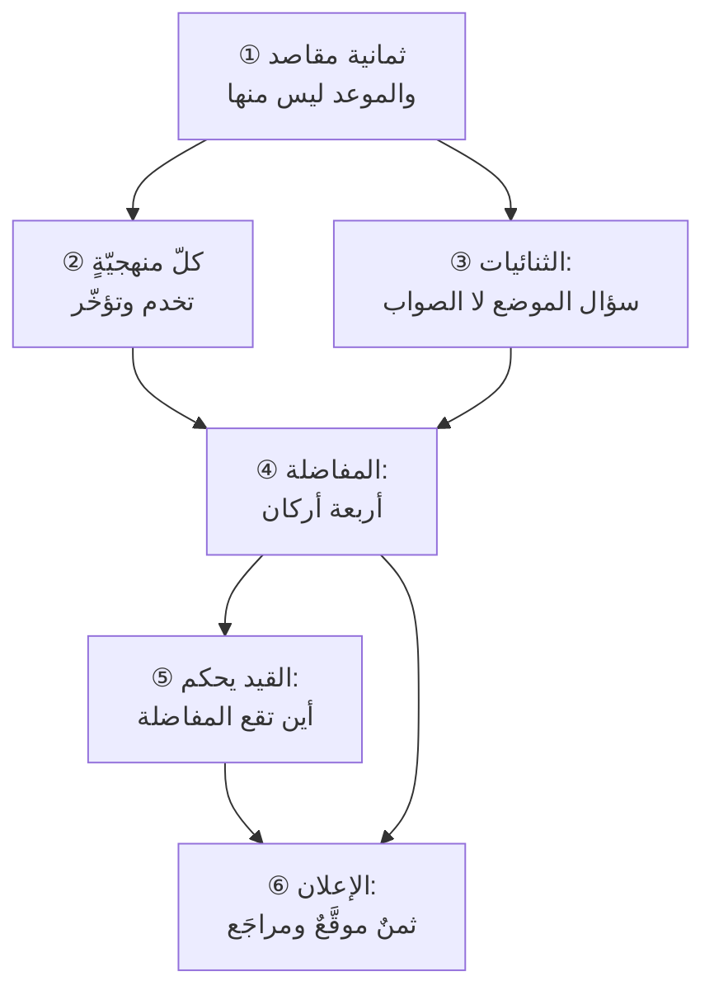

# الفصل 09 — المقاصد والثنائيات والمفاضلات

---

## 🏛️ لماذا تقرأ هذا الفصل؟

**المشكلة:** تُختار المنهجية بشهرتها أو بما يُطلب في إعلانات الوظائف، ثم يُسأل بعد سنة: هل نجحت؟ ولا يجد أحد معيارًا يجيب به، لأن المعيار لم يوضع قبل الاختيار.

**وماذا لو لم تعرف؟** من لم يملك مقاصد يقيس بها ظلّ ينتقل بين المناهج كلّما ظهر أحدث، ويظنّ الانتقال تطويرًا وهو دوران.

**وبعد هذا الفصل ستستطيع:**

- **أن تميّز المقصد من الوسيلة ومن القيد** — فتعرف لماذا لا يكون «التسليم في الموعد» مقصدًا وإن كان مطلوبًا، ولماذا يكون المشروع الذي سُلّم في موعده وبميزانيته **فاشلًا فشلًا تامًّا** بلا أن يخالف أحدٌ خطّةً ولا يتأخّر أحدٌ يومًا.
- **أن تحكم على أيّ منهجيّةٍ تُعرض عليك بسؤالين لا بواحد: أيّ مقصدٍ تخدم؟ وأيّ مقصدٍ تؤخّر؟** — **وأن تعرف من أين يجيء ثمنها**: أهو منصوصٌ في نصّها فلا يُلام عليه صاحبها، أم لازمٌ من بنيتها فيُناقَش، أم عارضٌ من تطبيق الناس فيُصلَح ولا يُنسب إليها.
- **أن تفسّر لماذا لا ينفع كثيرٌ من التحسين** — فتعرف أنّ المفاضلة التي وقعت في غير موضع القيد **مكسبُها صفرٌ وثمنُها كامل**، وأنّ ثنائيّاتٍ كثيرةً تُعرض عليك اختيارًا وهي في الحقيقة **عجزٌ في المنظومة يُخفي نفسه في صورة اختيار**.

> [!info] بطاقة الفصل
> **النوع:** منهجيّ
> **المستوى:** 🔴 متقدّم
> **زمن القراءة:** نحو 45 دقيقة
> **أهمّيته في الباب:** ★★★★★
> **موضعك:** انتهيتَ من [[08 - القواعد الكلية وسنن المشاريع]] ← **⬤ أنت هنا** ← يليه [[10 - كيف تطور هذا العلم]]

> [!abstract] موقع هذا الفصل
> **يبني على:** [[Governance]] · [[Definition of Done]] — يُذكَر هنا ولا يُعاد شرحه.
> **ويؤسّس:** [[Iron Triangle]] · [[Theory of Constraints]] — يُقدَّم هنا أوّل مرّة فيصير متاحًا لما بعده.

---

## 🧭 السؤال المركزي

> [!question] السؤال الذي يجيب عنه هذا الفصل كلّه
> **بأيّ شيء تُقاس المنهجيات نفسها؟**

**واحمل معك هذه الأسئلة وأنت تقرأ:**

- هل إنهاء المشروع في موعده نجاحٌ في ذاته؟
- ما الذي ضحّيتَ به آخر مرّة أسرعتَ فيها؟
- من يدفع ثمن المفاضلة التي لم تُعلَن؟

---

## 🗺️ الجواب المختصر — قبل التفصيل

**تُقاس المنهجية بمقاصدها لا بتماسكها الداخليّ ولا بشيوعها — أي بما تُقدّمه من مقاصد هذا العلم وما تؤخّره منها، لا بمدى إتقانك اتّباعَ خطواتها.** فالمنهجية المطبَّقة تطبيقًا صحيحًا حرفًا بحرف قد تكون **اختيارًا خاطئًا لموضعك** بلا أن يُخطئ فيها أحد، لأن الخطأ وقع في **الاختيار** لا في التنفيذ. **ومن قاس منهجيّته بانضباط تطبيقها وحده قاس الآلة بنفسها.**

**ومقاصد هذا العلم ثمانية**، تُقبل في هذه القائمة بثلاثة شروط مجتمعة: أن **يُطلب المقصد لذاته** لا لأجل غيره، وأن **يمكن التضحية به فعلًا** فيُرى أثر التضحية، وأن **تختلف المناهج فيه** — إذ ما استوت فيه المناهج كلّها لا يصلح ميزانًا يُفاضل به بينها. **وبهذه الشروط يسقط أشهر ما يُظنّ مقصدًا: التسليم في الموعد.** فهو مطلوبٌ لأجل نافذةٍ سوقية أو التزامٍ تعاقديّ أو ثقةٍ تُبنى — **ومطلوبٌ لأجل غيره فليس مقصدًا بل قيدًا**، والقيد يُحترم ولا يُقاس به النجاح.

**ولا تتزاحم المقاصد كلُّها؛ وهذا أوّل ما يُخطئ فيه من تعلّم أن «كلّ شيء مفاضلة».** فبين تقليل الهدر وتحقيق القيمة تعاضدٌ لا تقابل، وبين حفظ المعرفة وجودة القرار كذلك. **والتزاحم إنّما يقع حيث يتنافس الطرفان على موردٍ واحدٍ لا يزيد** — وقتٍ، أو انتباهٍ، أو تحمّلٍ للخطأ، أو التزامٍ يُقطَع. **فمن عامل كلّ شيءٍ مفاضلةً صنع أثمانًا لم تكن موجودة**، ودفعها.

**وحين يقع التزاحم حقًّا فالسؤال ليس أيّ الطرفين أفضل، بل أين أنت.** فالتخطيط والمرونة ليسا مذهبين يُنتصر لأحدهما، وإنّما هما **نصيبان يُوزَّعان بمقدار ما تجهل**؛ والمركزية واللامركزية كذلك، وإنّما تُوزَّعان بندرة القرار وكِبَر أثره. **والمنهجية إنّما هي إجابةٌ محفوظة على هذه الثنائيات، صاغها من واجه سياقًا بعينه** — فمن أخذها بلا أن يعرف سياقها أخذ جوابًا عن سؤالٍ لم يسأله.

**وقبل أن تُفاضل، اسأل: هل هذه مفاضلةٌ أصلًا؟** فبين يديك ثلاثة أحوال لا حالٌ واحدة: **تزاحمٌ حقيقيّ** لا يزول مهما تحسّنت المنظومة، فيُوزَّع بمعيارٍ معلن؛ **وتزاحمٌ قصير المدى** يزول إذا مدَدتَ الأفق، فيُحسم بتحرير الأفق لا بالترجيح؛ **وعجزٌ في المنظومة** يزول باستثمارٍ معلوم الكلفة، **وهو أكثر ما يُسمّى مفاضلةً وليس منها**. فمن كان اختباره ثلاثة أسابيع فهو أمام تقابلٍ حقيقيٍّ بين السرعة والجودة اليوم؛ **فإن أمكن أن يصير الاختبار ثلاث ساعات، فالتقابل لم يكن قانونًا بل كان ثمنَ آلةٍ لم تُشترَ.**

**ثمّ سؤالٌ أخير يسبق التنفيذ: أين القيد؟** فإنّ أداء المنظومة محكومٌ بأضعف حلقةٍ فيها، **والمفاضلة التي وقعت في غير موضع القيد مكسبُها صفرٌ وثمنُها كامل** — فمن ضحّى بجودة الشيفرة ليُسرع، وقيدُه شخصٌ واحد يوقّع على النشر، فقد دفع الثمن كلَّه ولم يقصّر يومًا واحدًا.

**وثمرة هذا الفصل كلِّه ليست أن تُلغى الأثمان — فهي لا تُلغى — بل أن تُنقَل من *ثمنٍ يُدفع صامتًا* إلى *ثمنٍ يُعلَن ويُوقَّع عليه*.** فالفرق بين المهنيّ وغيره ليس أنّ أحدهما يفاضل والآخر لا يفاضل؛ **كلاهما يفاضل، وإنّما أحدهما يعلم ماذا اشترى وبماذا دفع، والآخر يكتشف ذلك بعد سنة حين يُسأل: لماذا صار الأمر هكذا؟ فلا يجد جوابًا.**

> [!abstract] مفاهيم يُدخلها هذا الفصل في قاموسك
> `Iron Triangle` · `Theory of Constraints`

> [!warning] مفاهيم يكثر الخلط بينها هنا
> `Goal` مقابل `Objective` مقابل `Purpose` — احملها في ذهنك، فالفصل يفرّقها في محطّة التمييز.

---

## 🧱 الفكرة الأولى: مقاصد هذا العلم العليا ثمانية، وإنهاء المشروع ليس منها

*موضعها من الفصل: هذه أوّل خطوةٍ وهي شرطُ الفصل كلِّه، **إذ لا تُوزن كفّةٌ بكفّة حتّى يُعرف على أيّ شيءٍ يُحسَّن**. ولذلك تبدأ بقسمةٍ ثلاثية — مقصدٌ ووسيلةٌ وقيد — لأنّ أكثر ما يُتنازع فيه في تقييم المشاريع مردُّه إلى الخلط بينها لا إلى خلافٍ في الوقائع.*

**المقصد غايةٌ تُطلب لذاتها، والوسيلة تُطلب لأجل غيرها، والقيد شرطٌ يُحترم ولا يُقاس به النجاح.** وهذه القسمة الثلاثية هي أوّل ما يجب أن يستقرّ، لأنّ أكثر ما يُتنازع فيه في تقييم المشاريع مردُّه إلى خلطٍ بينها لا إلى خلافٍ في الوقائع.

**وقبل عدّ الثمانية يلزم إعلان معيار قبولها**، وإلّا صارت القائمة سردًا لا يستطيع القارئ أن يزيد عليه بحقٍّ ولا أن ينقص منه. **والشروط ثلاثةٌ مجتمعة:**

1. **أن يُطلب لذاته.** فتسأل عنه: *ولماذا نريده؟* فإن وجدتَ وراءه غايةً أخرى فهو وسيلةٌ إليها لا مقصدٌ في نفسه.
2. **أن يمكن التضحية به فعلًا.** فما لا يمكن التفريط فيه أصلًا ليس مقصدًا يُوازَن، بل شرطُ وجود. **وما لا يظهر لتركه أثرٌ فليس مقصدًا بل عبارةٌ حسنة.**
3. **أن تختلف المناهج فيه.** فالمقصد الذي تخدمه المناهج كلُّها بالدرجة نفسها **صحيحٌ ولا يصلح ميزانًا**، لأنّ الميزان إنّما ينفع حيث يفرّق.

**وبهذه الشروط الثلاثة تنتظم ثمانيةٌ، وتنقسم ثلاث مجموعات، كلُّ مجموعةٍ تجيب عن سؤالٍ مختلف:**

### المجموعة الأولى — مقاصد الأثر: ماذا يُنتج هذا العمل؟

**① تحقيق القيمة.** أن يتغيّر شيءٌ عند من يستعمل ما بُني — فيوفَّر وقتٌ، أو يُمنع خطأ، أو يُفتح بابٌ لم يكن مفتوحًا. **وعلامة تحقّقه أن يُذكر التغيّر ويُقاس، لا أن يُذكر ما سُلّم.** وتفصيل الفرق بين ما يُسلَّم وما يتغيّر محرَّرٌ في [[22 - Outputs and Outcomes]]، والذي يخصّنا هنا شيءٌ واحد: **أنّ هذا المقصد هو الوحيد الذي إذا سقط لم ينفع بقاء السبعة.**

**② الإنصاف بين أصحاب المصلحة.** أن يُنظر في مصالح من يتأثّر بالمشروع لا في مصلحة من يموّله وحده. **وعلامة تحقّقه أنّ من لا يملك المنع سُئل رأيه وسُجّل** — فالمستخدم النهائيّ، وفريق التشغيل الذي سيَرِث المنتج، والجهة التي ستُسأل عنه بعد سنة، هؤلاء يملكون **أن يتضرّروا** ولا يملكون **أن يمنعوا**، وهذا بعينه ما يجعل مصالحهم أوّل ما يُهمَل.

### المجموعة الثانية — مقاصد الكفاءة: بأيّ ثمنٍ يُنتج؟

**③ تقليل الهدر.** والهدر ما اسْتُهلك ولم يُنتج قيمةً لأحد: عملٌ بُني ولم يُستعمل، وانتظارٌ بين مرحلتين، وإعادةُ عملٍ بسبب خطأٍ اكتُشف متأخّرًا، واجتماعٌ لم يُنتج قرارًا. **وعلامة تحقّقه أن يُعرف مقدارُ ما لا يُستعمل من المبنيّ** — وهو رقمٌ لا تحتفظ به أكثر الفرق، **ومن لا يعرفه لا يستطيع أن يدّعي أنّه يقلّل الهدر.**

**④ تنظيم الموارد.** أن تُوجَّه الطاقة المحدودة إلى أعلى ما يمكن أن تُنتجه، وأن يُعرف من يعمل على ماذا. **وعلامة تحقّقه أنّ الأولويات مرتّبةٌ ترتيبًا صارمًا لا مجموعةٌ متساوية** — فالقائمة التي كلُّ ما فيها «عالي الأولوية» ليست مرتّبةً بل مُعادٌ فيها تسمية الحال.

**⑤ تقليل المخاطر.** ألّا يُفاجأ المشروع بما كان يمكن أن يُتوقَّع، وأن يُنقَل ثمن المجهول من كارثةٍ إلى تكلفةٍ محسوبة. **وعلامة تحقّقه أنّ في السجلّ خطرًا واحدًا على الأقلّ *تغيّرت حالتُه* بين مراجعتين** — فالسجلّ الجامد سجلُّ توثيقٍ لا سجلُّ إدارة.

### المجموعة الثالثة — مقاصد البقاء: وماذا يبقى بعده؟

**⑥ حفظ المعرفة.** أن تبقى في المنظّمة معرفةُ **لماذا** فُعل ما فُعل، لا معرفة ما فُعل وحدها. **وعلامة تحقّقه أن تستطيع بعد سنةٍ أن تعرف لماذا رُفض البديل الثاني** — وهذه أغلى المعرفة وأسرعُها ضياعًا، لأنّها لا تُكتب في مخرَجٍ ولا تظهر في شيفرة.

**⑦ الاستدامة.** أن يكون هذا الأداء قابلًا للتكرار في الربع القادم بالفريق نفسه. **وعلامة تحقّقه أنّ الوتيرة التي مشى بها المشروع الأخير هي الوتيرة التي يُخطَّط بها للمشروع القادم** — فمن سلّم بجهدٍ استثنائيّ ثمّ خطّط على أنّه الطبيعيّ، فقد استهلك رصيدًا لا يعرف مقداره ([[Sustainable Pace|الوتيرة المستدامة]] · [[Burnout|الاحتراق]]).

**⑧ رفع جودة القرار.** أن يكون القرار القادم أصوب من الذي قبله، لأنّ المعلومة وصلت أسرع ووصلت إلى من يملك. **وعلامة تحقّقه أن يُذكر قرارٌ واحدٌ تغيّر لأنّ معلومةً وصلت، لا أن تُذكر تقاريرُ أُرسلت.**

> [!example] مشروعان في جهةٍ واحدة، وأحدهما «ناجح» بلا مقصد
> جهةٌ تعليمية في **الرياض** أطلقت مشروعين في السنة نفسها. **الأوّل** بوّابة تسجيلٍ داخليّة: سُلّم في موعده بالضبط، وبميزانيته إلى ريالٍ واحد، وبنطاقه الكامل — **ثمّ تبيّن بعد ستّة أشهرٍ أنّ 9% من الموظّفين استعملوها**، لأنّ الأكثرين يسجّلون عبر مسؤول القسم كما اعتادوا، ولم يُسأل أحدٌ منهم قبل البناء.
>
> **والثاني** تعديلٌ على نظام حجز القاعات: تأخّر ثلاثة أسابيع، وتجاوز ميزانيته بنحو 12%، **وأُسقط منه ثلث ما كان مخطّطًا**. غير أنّ نسبة الحجوزات المتعارضة نزلت من 31 حالةً في الشهر إلى أربع، **وصار فريق التشغيل يعرف كيف يضيف قاعةً جديدة بلا أن يطلب المطوّر**.
>
> **فالأوّل خدم القيد وأخطأ المقاصد كلَّها**: لا قيمةً حقّق، ولا معرفةً أبقى، ولا سأل من يتأثّر. **والثاني خالف القيد وحقّق أربعةً منها.** ولو قيس المشروعان بالمثلث وحده لكان الحكم معكوسًا تمامًا — **وهذا بعينه سبب هذا الفصل.**

### ولماذا ليس «التسليم في الموعد» مقصدًا؟

**لأنّه يسقط بالشرط الأوّل من الشروط الثلاثة.** فاسأل: *ولماذا نريد التسليم في الموعد؟* فلن تجد جوابًا يقف عند نفسه: نريده لأنّ الموسم يفوت (قيمة)، أو لأنّ العقد يفرض غرامة (تكلفة)، أو لأنّ الثقة تُبنى بالوفاء (أثرٌ في العلاقة). **فالموعد إذن قيدٌ مشتقٌّ من مقصدٍ وراءه، والقيد يُحترم ولا يُقاس به النجاح.**

**والفرق ليس لفظيًّا، بل يظهر في ثلاثة قرارات تُتّخذ كلّ أسبوع:**

- **إذا كان مقصدًا،** فكلُّ تأخيرٍ فشلٌ وكلُّ التزامٍ بالموعد نجاح — **ولو سُلّم ما لا يستعمله أحد.**
- **وإذا كان قيدًا،** فالسؤال عند الضغط يصير: *أيّ مقصدٍ نحمي بالتزامنا بهذا الموعد؟* فإن كان الموسم فالتسليم الجزئيّ في الموسم أنفع من الكامل بعده؛ **وإن كانت الغرامة فالحساب مالٌ في مالٍ يُقارَن**؛ وإن كانت الثقة، **فربّما كان الإخبار المبكّر بالتأخير أحفظ لها من التسليم الناقص في موعده.**
- **وإذا سقط سبب القيد،** كأن يُلغى الموسم أو تُعدَّل الغرامة، **فالموعد يُعاد النظر فيه ولا يبقى مقدَّسًا بقصوره الذاتيّ** — وهذا ما لا يخطر ببال من عدّه مقصدًا أصلًا.

**ويسقط بالمعيار نفسه ثلاثةٌ أخرى تُذكر كثيرًا في قوائم «أهداف المشروع»:**

| ما يُذكر مقصدًا | بأيّ شرطٍ سقط | وما هو في الحقيقة |
|---|---|---|
| **الالتزام بالمنهجية** | الأوّل — يُطلب لأجل ما وراءه | وسيلةٌ خالصة، **وقياسُ النجاح بها هو عين ما يحذّر منه هذا الفصل** |
| **رضا العميل** | الثاني — يُشتقّ ولا يُوزَن | **مؤشّرٌ مركّبٌ** على مقاصد أخرى (قيمة · إنصاف · وفاء)، ينفع كإشارةٍ ولا ينفع كميزانٍ يُفاضَل به |
| **سرعة التسليم** | الأوّل — تُطلب لأجل القيمة المبكّرة | **وسيلةٌ ثمينة**، وهي المقياس المتقدّم لأربعةٍ من الثمانية — ولذلك يسهل أن تُرقّى مقصدًا |
| **جودة الشيفرة** | الأوّل — تُطلب لأجل ما بعدها | **استثمارٌ** في الاستدامة وتقليل الهدر، يُوازَن بأفقه لا يُطلب لذاته |

**وليس في هذا الجدول تهوينٌ من شيءٍ ممّا فيه.** فسرعة التسليم من أنفع ما يُقاس، وجودة الشيفرة يُدفع ثمنُها مضاعفًا إن أُهملت. **وإنّما فيه تنبيهٌ واحد: أنّ الوسيلة إذا رُقّيت مقصدًا امتنع السؤال عن جدواها** — إذ لا يُسأل عن المقاصد *لماذا؟*، وإنّما يُسأل عن الوسائل. **فترقيةُ الوسيلة إغلاقٌ لباب المراجعة عنها**، وهو المعنى نفسه الذي مرّ في [[07 - الأسئلة الكبرى]] حين تُرقّى الطريقة إلى مرتبة السؤال.

### وهل تتزاحم الثمانية كلُّها؟ لا — وهذا أوّل ما يُخطئ فيه من تعلّم أنّ «كلّ شيء مفاضلة»

**بين هذه المقاصد تعاضدٌ أكثر ممّا بينها تقابل**، والذي يجعل الناس يظنّون خلاف ذلك أنّهم يرون التقابل في **الأسبوع** ولا يرون التعاضد إلا في **الربع**.

**وثلاثة أزواجٍ يتعاضد فيها المقصدان تعاضدًا بنيويًّا لا عارضًا:**

- **تقليل الهدر وتحقيق القيمة.** فما لا يُستعمل هدرٌ بتعريفه، **وكلُّ ما نقص من المبنيّ غير المستعمَل زاد في الطاقة الموجَّهة إلى المستعمَل.** والزيادة هنا في الطرفين معًا لا في أحدهما على حساب الآخر.
- **حفظ المعرفة ورفع جودة القرار.** فالقرار إنّما يُصيب بقدر ما بلغه من العلم، **ومن أضاع علّة قرارٍ سابقٍ لزمه أن يدفع ثمن اكتشافها ثانيةً قبل أن يقرّر.**
- **الاستدامة وتقليل الهدر.** فالإرهاق يرفع نسبة الخطأ فترتفع إعادة العمل، **فالوتيرة المستدامة ليست رفقًا بالناس فحسب بل تقليلٌ للهدر بأخصر طريق.**

**وثلاثة أزواجٍ يقع فيها التقابل فعلًا، وهي مواضع المفاضلة الحقيقية في هذا العلم:**

- **تقليل المخاطر وسرعة بلوغ القيمة.** فكلُّ فحصٍ يُضاف يشتري أمانًا ويبيع أيّامًا، **وهذا تقابلٌ لا يزول إلا برخص الفحص نفسه.**
- **الإنصاف بين أصحاب المصلحة وتنظيم الموارد.** فالسؤال والاستماع والموازنة بين مصالح متعارضة **تُنفَق فيها ساعاتٌ لا تُنتج شيئًا يُرى**، ومن ضغط الجدول ضغطها أوّل ما يضغط.
- **حفظ المعرفة والسرعة في الأجل القصير.** فالكتابة تُبطئ اليوم وتُسرّع بعد سنة، **والذي يجعلها أوّل ما يسقط أنّ ثمنها حاضرٌ وعائدها مؤجَّلٌ إلى من قد لا يكون هو نفسه.**

**والفائدة العملية من هذه القسمة أنّها تمنع اختراع أثمانٍ لا وجود لها.** فمن اقترح تقليل ما يُبنى ولا يُستعمل **لا يُسأل «وماذا سنخسر؟»** — إذ لا خسارة في الطرف الآخر أصلًا، **وإنّما يُسأل: كيف نعرف ما لا يُستعمل؟** **وأمّا من اقترح إضافة مرحلة فحصٍ ثالثة فيُسأل عن الثمن ويُطالَب بمقداره، لأنّ التقابل هنا قائمٌ فعلًا.** **والفرق بين السؤالين هو الفرق بين فريقٍ يتقدّم وفريقٍ يتشكّك في كلّ اقتراح.**

### وأيّ المقاصد يُضحّى به أوّلًا؟

**ليس أهونها ولا أخفاها أثرًا، بل الذي لا يملك أحدٌ في الغرفة تمثيلَه.** وهذه ملاحظةٌ تنظيميّةٌ قبل أن تكون أخلاقية، وهي تفسّر ما لا تفسّره النيّات:

- **القيمة** يمثّلها مالك المنتج، فله صوتٌ يعترض.
- **التكلفة** يمثّلها المالية، ولها نظامٌ يمنع.
- **الموعد** يمثّله الراعي، وله سلطةٌ تُصعِّد.
- **وأمّا حفظ المعرفة والاستدامة والإنصاف بين أصحاب المصلحة، فلا يجلس لها أحدٌ على الطاولة.** فليس في المؤسّسة من وظيفتُه أن يقول: «هذا القرار يُفقدنا معرفةً لن نستردّها»، ولا من يقول: «هذا الجدول يُنهك الفريق في الربع القادم».

**والنتيجة أنّ هذه الثلاثة تُدفع منها الأثمان دائمًا، لا لأنّها أقلّ قيمةً بل لأنّها بلا محامٍ.** **والعلاج ليس وعظًا بل تمثيلًا:** أن يُسأل في كلّ قرارٍ كبيرٍ سؤالٌ صريحٌ عن هذه الثلاثة ولو لم يُطلب من أحد، **وأن يُسمّى من يجيب عنه.** فالسؤال الذي لا مالك له لا يُطرح، **والمقصد الذي لا يُطرح عنه سؤالٌ لا يُدافع عن نفسه.**

> [!tip] كيف تستعمل هذه الفكرة — رتّب ثلاثةً لا ثمانية
> لا تحمل الثمانية في كلّ قرار — **بل رتّب ثلاثةً منها لهذا المشروع بعينه، واكتبها في مكانٍ يراه الفريق.** والترتيب يختلف باختلاف المشروع في الجهة الواحدة: فمشروعٌ تنظيميّ إلزاميّ مقاصده الأولى (الإنصاف · تقليل المخاطر · حفظ المعرفة)، **ومنتجٌ جديدٌ في سوقٍ لم يُختبر مقاصده الأولى (القيمة · جودة القرار · تقليل الهدر)** — والذي يوحّدهما ترتيبًا واحدًا يُخطئ في أحدهما حتمًا.
>
> **وفائدة الكتابة أنّها تُنشئ حَكَمًا حين يقع الخلاف.** فالنقاش الذي يبدأ بـ«أرى» و«لا أرى» لا ينتهي إلا بالسلطة؛ **والذي يبدأ بـ«أيُّ مقاصدنا الثلاثة يخدم هذا؟» ينتهي بحجّة.**

> [!warning] الحفرة الشائعة — أن تُكتب المقاصد الثمانية كلُّها ثمّ لا يُرتَّب شيء
> **القائمة التي فيها كلُّ شيءٍ لا تُرجّح شيئًا.** ومن كتب الثمانية على الجدار وقال «كلُّها مهمّة» فقد كتب زينةً لا ميزانًا — **وسيُضحّى في مشروعه بالثلاثة التي لا محامي لها كما لو لم يكتب شيئًا.** **وعلامة أنّ الترتيب صوريّ: أن يكون مطابقًا لترتيب مشروعٍ آخر مختلفٍ عنه في طبيعته.**

> [!question]- تأكّد أنك فهمت — شركةٌ تعرض عليك أن تُسلّم مشروعك في نصف المدّة بالنطاق نفسه والميزانية نفسها. أيّ مقصدٍ تسأل عنه أوّلًا؟
> **الجواب: تسأل عن المقاصد الثلاثة التي لا محامي لها — الاستدامة، وحفظ المعرفة، والإنصاف بين أصحاب المصلحة.** لا لأنّها أهمّ من غيرها، **بل لأنّ الثلاثة الأخرى محميّةٌ بمن يمثّلها**: النطاق يحرسه مالك المنتج، والميزانية تحرسها المالية، والموعد يحرسه الراعي. **فإن كان الوعد صادقًا فلا بدّ أن يكون الثمن قد خرج من الأبواب غير المحروسة.**
>
> **والأسئلة الثلاثة بصيغتها العملية:** بأيّ وتيرةٍ سيعمل الفريق؟ (فإن كان الجواب «سنكثّف مؤقّتًا» فالثمن استدامة). وما الذي سيُختصر من التوثيق والمراجعة؟ (فالثمن معرفة). ومن الذي كان سيُسأل رأيه ولن يُسأل الآن؟ (فالثمن إنصاف).
>
> **فإن لم يظهر ثمنٌ في هذه الثلاثة ولا في تلك الثلاثة، فأحد أمرين لا ثالث لهما:** إمّا أنّ التقدير الأصليّ كان مضخَّمًا — **وهذه معلومةٌ نافعةٌ تستحقّ أن تُعرف** — وإمّا أنّ الثمن سيظهر بعد التسليم في صورة صيانةٍ وإعادة عمل. **وليس منهما احتمالٌ ثالثٌ اسمه «التزام أعلى».**

> [!summary]- خلاصة الفكرة في سطرين
> **المقصد يُطلب لذاته، والوسيلة تُطلب لغيره، والقيد يُحترم ولا يُقاس به النجاح — وإنهاء المشروع وسيلةٌ لا مقصد.**
> **وأكثر ما يُتنازع فيه عند تقييم المشاريع مردُّه إلى خلطٍ بين الثلاثة لا إلى خلافٍ في الوقائع** — فيُحتفى ببلوغ وسيلةٍ ويُسكت عن مقصدٍ لم يتحرّك.

> [!question] تأمّلٌ تطبيقيّ — لا جواب له في هذا الفصل
> اكتب المقاصد الثمانية في عمود، وضع أمام كلٍّ منها: **أنُقاس عندنا؟ وبأيّ رقم؟ ومن يقرؤه؟**
>
> **فالمقصد الذي لا مقياس له لا يُدافَع عنه عند المزاحمة** — وسيُضحّى به أوّلًا كلّما ضاق الوقت، لا لأنّه أقلّ أهمّية، بل لأنّه أقلّ ظهورًا في الجدول.

---

## 🧱 الفكرة الثانية: كلّ منهجية تُسأل: أيّ مقصد تخدم؟ وأيّ مقصد تضحّي به؟

*موضعها من الفصل: صارت المقاصد الثمانية معلومة، **وتستعملها هذه الفكرة ميزانًا يُوزن به ما يُعرض عليك** — لا لتُفاضل بين المنهجيات، بل لتعرف عن كلٍّ منها ما لا تُعلنه: أيَّ مقصدٍ تُقدّم، وأيَّ مقصدٍ تُؤخّر ثمنًا لذلك.*

**لا توجد منهجيّةٌ تخدم المقاصد الثمانية معًا، والتي تدّعي ذلك لم تُعلن ثمنها بعد.** وليس هذا اتّهامًا لأحد، بل لازمٌ بنيويّ: **فالمنهجية ترتيبٌ للعمل، وكلّ ترتيبٍ تقديمٌ لشيءٍ على شيء.** ومن قدّم شيئًا فقد أخّر غيره بالضرورة، **وإن لم يُسمّ ما أخّره.**

### ثلاثة أنواعٍ من الثمن — والخلط بينها ظلمٌ في اتّجاهين

**وهذا التفريق هو أهمّ ما في هذه الفكرة**، لأنّه يفصل نقد المنهجية عن نقد من طبّقها، **وهما يُخلطان في أكثر ما يُكتب فيُظلم الطرفان معًا:**

1. **ثمنٌ منصوصٌ في المنهجية نفسها.** كتثبيت مدّة السبرنت في سكرم: فمن التزم به **فقد قبل صراحةً ألّا يُغيّر وجهته قبل انتهاء المدّة**، وهذا مكتوبٌ في نصّها لا مستنبَط. **وهذا الصنف لا يُلام عليه صاحب المنهجية**، لأنّه أعلنه؛ وإنّما يُلام من أخذها بلا أن يقرأ ثمنها.
2. **ثمنٌ لازمٌ من بنيتها وإن لم يُنصّ عليه.** فكلُّ منهجيّةٍ تقوم على تكراراتٍ قصيرة **تُضعف بالضرورة القدرة على الالتزام بعيد المدى** — لا لأنّها تنهى عنه، بل لأنّ آليّتها كلَّها مبنيّةٌ على أنّ الوجهة تُراجَع. **وهذا الصنف يُناقَش ولا يُنكَر**: فمن احتاج التزامًا بعيدًا لجهةٍ تمويلية، لزمه أن يبني ما يسدّ هذه الثغرة، **ولا يكفيه أن يقول إنّ المنهجية لم تمنعه.**
3. **ثمنٌ عارضٌ من التطبيق الشائع لا من النصّ.** كضياع التوثيق في الفرق الرشيقة: **فليس في [[Agile Manifesto|بيان أجايل]] ولا في دليل سكرم نهيٌ عن التوثيق**، وإنّما فيه تقديم البرمجية العاملة عليه عند التزاحم — **وبين التقديم عند التزاحم والإلغاء مسافةٌ واسعة قطعتها الممارسة لا النصّ.** **وهذا الصنف يُصلَح ولا يُنسب إلى المنهجية.**

**والقاعدة العملية:** **الثمن المنصوص يُقرأ قبل التبنّي، واللازم يُسدّ ببناءٍ خارجها، والعارض يُعالَج بالانضباط.** **ومن خلط بينها وقع في واحدٍ من خطأين:** إمّا أن يُحمّل المنهجية ما ليس فيها فيرفضها بلا حقّ، **وإمّا أن يبرّئها ممّا يلزم عنها لزومًا بنيويًّا فيتبنّاها ثمّ يُفاجأ.** والأوّل أشيع في نقّادها، والثاني أشيع في أنصارها.

### أربع منهجيّاتٍ بميزان المقاصد

| المنهجية | أظهرُ مقصدٍ تخدمه | أظهرُ مقصدٍ تؤخّره | ونوع الثمن |
|---|---|---|---|
| **المرحليّ البوّابيّ** (Stage-Gate) | **تقليل المخاطر · الإنصاف التعاقديّ** — فالبوّابة موضعُ وقفٍ يملك فيه الطرفان أن يعترضا | **القيمة المبكّرة · جودة القرار** — إذ لا يُعرف صواب الفرض قبل التسليم | **لازمٌ من بنيتها**: التتابع يؤخّر التغذية الراجعة بالضرورة |
| **سكرم** | **جودة القرار · القيمة المبكّرة** — بتقصير حلقة التغذية الراجعة إلى أسابيع | **قابلية التنبّؤ بعيدة المدى** | **لازمٌ** في التنبّؤ · **وعارضٌ** في ضياع التوثيق |
| **كانبان** | **تقليل الهدر · تنظيم الموارد** — بإظهار الطابور وتحديد المفتوح | **الإيقاع المُلزِم** الذي يفرض وقفةً للمراجعة | **لازمٌ**: طريقةٌ تُطبَّق فوق عمليةٍ قائمة فلا تفرض حدثًا |
| **[[SAFe]]** | **تنظيم الموارد عبر فرقٍ كثيرة · الإنصاف بين الجهات** | **سرعة القرار · اللامركزية** | **منصوصٌ**: التزامن المؤسّسيّ ركنٌ معلنٌ فيها |

**وثلاث ملاحظاتٍ على قراءة هذا الجدول، بغيرها يُساء استعماله:**

**الأولى:** أنّ عمود «تؤخّر» **ليس عيبًا** بل ثمنٌ، والثمن يُقابَل بمكسبٍ فيُقارن. **فمن قرأه قائمة عيوبٍ قلَب الجدول إلى ما وُضع لمنعه.**

**والثانية:** أنّ الصفّ الواحد **يختلف باختلاف الحال.** فسكرم في فريقٍ واحدٍ يخدم غير ما يخدمه في عشرين فريقًا؛ **والجدول يصف الميل الغالب لا حكمًا لازمًا في كلّ سياق.**

**والثالثة:** أنّ ما في العمود الأخير **يقرّر ماذا تفعل**: فالمنصوص يُقرأ ويُقبل أو يُترك، **واللازم يلزمك أن تبني له سدًّا** — كأن تضع مع سكرم خارطة طريقٍ فصليّةً تُعلَن بمدياتٍ لا بمواعيد، **والعارض يلزمك انضباطٌ داخليّ** — كأن تجعل التوثيق بندًا في [[Definition of Done|تعريف الاكتمال]] فيصير جزءًا من العمل لا عملًا إضافيًّا يُؤجَّل.

> [!example] جهتان اختارتا المنهجية نفسها، فنجحت عند إحداهما وتعثّرت عند الأخرى
> جهةٌ حكوميّةٌ في **الدمّام** ومنصّةٌ تجاريّةٌ ناشئةٌ في **جدّة** تبنّتا سكرم في الشهر نفسه بالتدريب نفسه.
>
> **فالناشئة** مقاصدها الأولى: القيمة، وجودة القرار، وتقليل الهدر. **وثمن سكرم عندها — ضعف التنبّؤ بعيد المدى — ثمنٌ لا يؤلمها**، لأنّ خطّتها لسنةٍ كاملة تُراجَع في كلّ حال. **فاشترت ما تحتاجه بما لا تحتاجه، وهذه أفضل صفقةٍ ممكنة.**
>
> **والحكوميّة** مقاصدها الأولى: الإنصاف، وتقليل المخاطر، وحفظ المعرفة — **وميزانيّتها تُعتمد سنويًّا ببنودٍ مُقفلة، وتُسأل عن كلّ بندٍ في تقريرٍ ربعيّ.** فالثمن الذي لم يؤلم الأولى **هو بعينه أثقل ما تحمله الثانية**. ولم يفشل تطبيقها لأنّ أحدًا أخطأ في السبرنت، **بل لأنّها اشترت ما لا تحتاجه بما تحتاجه أشدّ الحاجة.**
>
> **والذي كان يُصلح حالها ليس ترك سكرم**، بل أن تُدرك أنّ ثمنه **لازمٌ لا عارض** — فتبني له سدًّا: التزامٌ مُعلنٌ بالمدى لا باليوم، ونطاقٌ مُتفَّقٌ على أدناه لا على تفصيله. **وهذا بابٌ يُفتح بمعرفة نوع الثمن، ويُغلق بالجهل به.**

### وعلامات المنهجية التي تدّعي خدمة الجميع

**ثلاثٌ، وأخطرها الثانية:**

1. **ألّا تذكر متى لا تصلح.** فالمنهجية التي ليس في أدبيّاتها فصلٌ في حدودها **إمّا لم تُجرَّب في مواضع متباينة، وإمّا جُرِّبت ولم تُكتب نتائجها كاملة.**
2. **أن يُنسب كلُّ فشلٍ فيها إلى سوء التطبيق.** وهذا الجواب **يُبطل نفسه إن قيل دائمًا**، لأنّه يجعلها غير قابلةٍ للنقض: فلا شيء يمكن أن يُعدّ شاهدًا ضدّها. **وقد تقرّر في [[08 - القواعد الكلية وسنن المشاريع]] أنّ ما لا يُعرف ما يُبطله ليس قاعدة — وهذا هو حكمه بعينه، منقولًا من القواعد إلى المناهج.**
3. **ألّا تُسمّي ما تركته.** فكلُّ منهجيّةٍ ناضجةٍ تعرف على أيّ سؤالٍ لا تجيب، **والتي تجيب عن كلّ شيءٍ لا تجيب عن شيء.**

**وليس المقصود أنّ «سوء التطبيق» عذرٌ باطلٌ دائمًا** — فهو واقعٌ كثير، والتطبيق الناقص يُفسد الصحيح. **وإنّما المقصود أنّه إن كان الجواب الوحيد في كلّ حالة، فقد صار حصانةً لا تفسيرًا.** **والفارق العمليّ سؤالٌ واحد يُطرح على صاحب المنهجية: ما شكل الفشل الذي لو وقع قلتَ إنّ المنهجية لا تناسب هذا الموضع؟** **فمن لم يكن له جوابٌ لم يعرض عليك منهجيّةً بل عقيدة.**

> [!tip] كيف تستعمل هذه الفكرة — لا تقارن المناهج بعضها ببعض
> **المقارنة بين منهجيّتين سؤالٌ لا جواب له**، لأنّه سؤالٌ بلا موضع. **والصواب أن تُقارن كلًّا منها بموضعك أنت، في ثلاث خطوات:**
>
> 1. **رتّب ثلاثة مقاصد** لهذا المشروع (الفكرة الأولى).
> 2. **اسأل عن كلّ منهجيّةٍ:** أيّ مقاصدي الثلاثة تخدم؟ **وأيّ ثمنٍ تطلب؟ ومن أيّ نوعٍ هو؟**
> 3. **ثمّ اسأل السؤال الحاسم:** أأستطيع أن أدفع هذا الثمن بعينه في **هذه الجهة** — لا في الجهة المثالية؟ **فالثمن الذي لا تستطيع دفعه يُسقط المنهجية وإن كانت أصلح المناهج في نفسها.**
>
> **وقد صاغ بويم وتيرنر هذا الاختيار في خمسة عوامل تُقاس** — حجم الفريق، وحرَجُ ما يُبنى، وسرعة تغيّر المتطلبات، وخبرة الأفراد، وثقافة المنظّمة — **وهي أنفع ما كُتب في المسألة، لأنّها نقلت السؤال من الميل الشخصيّ إلى خمسة محاورَ تُقاس.** (انظر جدول المراجع.)

### والمنهجيّة المركَّبة: أن تُؤخذ المحاسن وتُترك الأثمان

**أكثر ما يُطبَّق في الواقع تركيبٌ لا منهجيّةٌ خالصة**: بوّابات اعتمادٍ من المرحليّ، وسبرنتٌ من سكرم، ولوحةٌ وحدٌّ للمفتوح من كانبان. **وهذا مشروعٌ في نفسه** — بل هو الغالب في المؤسّسات التي لها التزامات خارجية. **وإنّما تفسد هذه التركيبات بخطأٍ واحدٍ يتكرّر: أن يُؤخذ من كلّ منهجيّةٍ مكسبُها ويُترك ثمنُها، فيُفقَد المكسبان معًا.**

**ومثاله الأشيع:** أن يُؤخذ من سكرم **إيقاعُه** — سبرنتٌ من أسبوعين ومراجعةٌ في آخره — **ويُترك ثمنُه المنصوص، وهو تثبيت النطاق داخل المدّة.** فيُفتح باب الإدخال في منتصف السبرنت، **فلا يبقى للإيقاع معنًى إذ لا شيء يُلتزم به، ولا يبقى للمرونة معنًى إذ لا شيء يُختار بين المدّتين.** **والنتيجة اجتماعاتُ سكرم بلا فائدة سكرم**، وهي أثقل ما يمكن أن يُحمَّله فريق.

**والقاعدة الحاكمة للتركيب:** **تُركَّب الممارسات ولا تُركَّب الأثمان المتقابلة.** فالممارسة تُؤخذ وحدها ما دام يمكن تبنّيها منفردة — كتحديد المفتوح، أو المراجعة الدورية، أو تعريف الاكتمال. **وأمّا ثمنان يتناقضان — أن يُثبَّت النطاق وأن يُفتح بابه في الوقت نفسه — فلا يُجمعان، ومن جمعهما لم يركّب بل ألغى.**

**وعلامة التركيب الفاسد سؤالٌ واحد: أيّ شيءٍ صار *ممنوعًا* بعد التبنّي؟** **فكلُّ منهجيّةٍ تمنع شيئًا، والتركيب الذي لم يمنع شيئًا لم يأخذ من أيّ منهجيّةٍ إلا اسمها وطقوسها.**

> [!warning] الحفرة الشائعة — تبنّي المنهجية لأنّ سوقَ العمل يطلبها
> وهذا **دافعٌ مشروعٌ في التوظيف، فاسدٌ في اختيار المنهجية.** فحاجتك إلى موظّفين تعرف السوقُ تدريبَهم شيء، **وصلاحُ المنهجية لمشروعك شيءٌ آخر** — والخلط بينهما يجعلك تشتري ثمنًا لا يخدم مقاصدك.
>
> **وعلاجه أن يُفصل القراران:** تُختار المنهجية بميزان المقاصد، **ثمّ يُنظر في كلفة تدريب الناس عليها بوصفها كلفةً في ميزان الاختيار لا سببًا له.** **وعلامة أنّ الخلط واقع: أن يُذكر في تبرير الاختيار «هذا ما يفعله الجميع» ولا يُذكر مقصدٌ واحد.**

> [!question]- تأكّد أنك فهمت — عُرضت عليك منهجيّةٌ يقول أصحابها إنّها ترفع السرعة والجودة والتنبّؤ معًا. ما أوّل سؤالٍ تسأله؟
> **الجواب: ما شكل الفشل الذي لو وقع قلتم إنّها لا تناسب هذا الموضع؟** — لا «أين طُبّقت؟» ولا «ما نتائجها؟»، **فهذان سؤالان يُجابان بشواهد النجاح وحدها**، وكلُّ منهجيّةٍ تملك شواهد نجاح.
>
> **وعلّة هذا السؤال أنّه يفحص المرتبة لا الدعوى.** فإن جاء جوابٌ محدّد — «لا تناسب حيث يكون النطاق مقفلًا تعاقديًّا» — **فأنت أمام منهجيّةٍ تعرف حدودها، وقد صار بين يديك ميزانٌ تقيس به موضعك.** وإن جاء الجواب: «تناسب الجميع، وإنّما يخطئ من يطبّقها ناقصة»، **فقد أُغلق باب الفحص، والدعوى التي لا تُفحص لا تُبنى عليها ميزانية.**
>
> **ثمّ سؤالٌ ثانٍ يكشف الباقي:** ماذا صار أبطأ عندكم بعد تبنّيها؟ **فكلّ ترتيبٍ للعمل يُبطئ شيئًا**، ومن قال «لا شيء» فإمّا أنّه لم يقس، وإمّا أنّ الأثر لم يظهر بعدُ في الموضع الذي سيظهر فيه.

> [!summary]- خلاصة الفكرة في سطرين
> **لا توجد منهجيّةٌ تخدم المقاصد الثمانية معًا، والتي تدّعي ذلك لم تُعلن ثمنها بعد.**
> **فالمنهجية ترتيبٌ للعمل، وكلُّ ترتيبٍ تقديمٌ لشيءٍ على شيء** — ومن قدّم شيئًا فقد أخّر غيره بالضرورة، وإن لم يُسمِّ ما أخّره.

> [!question] تأمّلٌ تطبيقيّ — لا جواب له في هذا الفصل
> خذ المنهجية التي تعملون بها، واكتب سطرين: **أيَّ مقصدٍ تخدم أوّلًا؟ وأيَّ مقصدٍ تضحّي به وأنت راضٍ؟**
>
> **فإن لم تستطع أن تُسمّي المضحَّى به، فأنت لا تعرف منهجيّتك بعدُ** — إنّما تعرف شعائرها. والمنهجية التي لا يُعرف ثمنها تُلام على نتائج اختيارٍ لم يُعلَن أنّه اختيار.

---

## 🧱 الفكرة الثالثة: الثنائيات — لا يُنتصر لطرف بل يُسأل عن الموضع

*موضعها من الفصل: كانت السابقة تسأل المنهجية عن مقاصدها، وتنزل هذه إلى **التجاذبات التي تلقاها في يومك** بلا منهجيةٍ ولا اسم. **وتزيد عليها أمرًا هو أخطرُ ما في الباب:** ألّا تسأل أيَّ الطرفين أصوب، بل **أثنائيّةٌ هي أصلًا؟** — فكثيرٌ ممّا يُعرض تقابلًا لا تقابل فيه، وقبولُه يُدفع ثمنًا لم يكن لازمًا.*

**الثنائية سؤالٌ عن الموضع لا عن الصواب.** فمن سأل «أيّهما أفضل: التخطيط أم المرونة؟» سأل سؤالًا لا جواب له، **كمن سأل: أيّهما أفضل، الملح أم الماء؟** والجواب في الحالين واحد: **بحسب ما تطبخ، وبأيّ مقدار.**

**غير أنّ أخطر ما في الثنائيات ليس الانتصار لطرف، بل أن يُقبل التقابل نفسه بلا فحص.** فكثيرٌ ممّا يُعرض علينا ثنائيّةً ليس ثنائيّةً أصلًا، **وقبولُه كذلك يجعلنا ندفع ثمنًا لم يكن لازمًا.**

### الاختبار الذي يسبق كلّ ثنائية

**اسأل: على أيّ موردٍ يتزاحم الطرفان؟** فإن سمّيتَ موردًا محدودًا فعلًا — وقتًا، أو انتباهًا، أو تحمّلًا للخطأ، أو التزامًا يُقطَع فلا يُسترجَع — **فأنت أمام ثنائيّةٍ حقيقية.** وإن لم تجد موردًا، **فما بين يديك عجزٌ في المنظومة يُخفي نفسه في صورة اختيار.**

**والأحوال ثلاثة، وحكم كلٍّ منها مختلف:**

1. **ثنائيّةٌ حقيقية** — التزاحم قائمٌ مهما تحسّنت المنظومة، لأنّ الطرفين يتقاسمان موردًا لا يزيد. **وحكمها: تُوزَّع بمعيارٍ معلن، ويُسمّى من دفع.**
2. **ثنائيّةٌ قصيرة المدى** — التزاحم قائمٌ في الأسابيع وزائلٌ في الأشهر. **وحكمها: لا تُحسم بالترجيح بل بتحرير الأفق** — فالسؤال الصحيح: على أيّ مدًى نحكم؟
3. **عجزٌ في المنظومة** — التزاحم يزول باستثمارٍ معلوم الكلفة. **وحكمها: تُسعَّر الكلفة ويُتّخذ قرار استثمار، لا قرارُ تضحية.**

**وأثر هذا التصنيف عمليٌّ لا نظريّ:** فالحالة الأولى تُدار، **والثانية تُوضَّح، والثالثة تُشترى.** ومن عالج الثالثة معالجة الأولى **ظلّ يوزّع الفقر بين طرفين وهو يملك أن يرفع السقف عنهما معًا.**

### السبع الكبرى

#### ① التخطيط والمرونة — يتزاحمان على *الالتزام*

**فكلّ التزامٍ تقطعه اليوم يشتري لك ثقةً ويبيع منك خيارًا.** والقاعدة: **نصيب المرونة يزيد بمقدار ما تجهل، لا بمقدار ما تُحبّ.** **وعلامة الإفراط في التخطيط: أن تُنفَق ساعاتٌ في تفصيل ما لن يُبنى قبل ستّة أشهر** — وهو عملٌ تامّ الجودة سيُرمى، **والهدر في المخطَّط لا يقلّ عن الهدر في المبنيّ وإن كان أخفى منه.** **وعلامة الإفراط في المرونة: أن يُسأل الفريق أين سيكون في الربع القادم فلا يستطيع أن يقول شيئًا** — **وهذا ليس رشاقةً بل عجزٌ عن الالتزام سُمّي باسمٍ حسن.**

**والحلّ الوسط ليس نصفًا من كلٍّ**، بل **تخطيطٌ متدرّج الدقّة:** تفصيلٌ للأسابيع القريبة، ومديات للأشهر، واتّجاهاتٌ للسنة. **فتُقطع التزاماتٌ من نوعٍ مختلف بمدى الأفق، ويُعلَن نوعها** — فمن سمع «مدًى» ففهم «موعدًا» لم يُخدَع، **بل لم يُقل له إنّ ما سمعه مدًى.**

#### ② السرعة والجودة — تزاحمٌ قصير المدى في أكثر أحواله

**وهذه أشهر الثنائيات وأكثرها سوء فهم.** فالتقابل بينهما حقيقيٌّ في الأسابيع الأولى: **من تخطّى المراجعة والاختبار سلّم أسرع، بلا شكّ.** **ثمّ ينقلب الأمر بعد شهرين أو ثلاثة**، إذ يبدأ زمن إصلاح العيوب وإعادة العمل يأكل ما وُفّر ثمّ يزيد عليه — **فتصير الجودة الرديئة سببًا للبطء لا ثمنًا للسرعة.**

**والقاعدة: التقابل بين السرعة والجودة تقابلٌ محدود الأفق، فمن مدّ الأفق وجدهما في صفٍّ واحد.** **وحدُّها:** أنّ هذا يصدق في الجودة **الداخلية** — سلامة البناء وقابلية التعديل والاختبار — **ولا يصدق على إطلاقه في الجودة الظاهرة**: فصقلُ واجهةٍ لم يطلبها أحد، وتلميعُ ميزةٍ لا تُستعمل، **إنفاقٌ لا يعود بشيءٍ مهما مُدّ الأفق.** **فالسؤال الصحيح ليس «كم جودة؟» بل «جودة ماذا؟»**

**وهنا موضع [[Definition of Done|تعريف الاكتمال]] من هذه الثنائية:** فالجودة التي لا تُكتب تبقى مفاوضةً مفتوحةً تُخسَر عند كلّ ضغط، **لأنّ الطرف الذي لا حدّ له هو الذي يُقتطع منه.** **وتعريف الاكتمال هو ما يحوّل الجودة من نيّةٍ حسنة إلى شرطٍ معلن** — فلا تُقتطع صامتةً، **وإنّما يُطلب تعديلها صراحةً فيُرى من طلب ومتى.**

#### ③ الابتكار والاستقرار — يتزاحمان على *تحمّل الخطأ* لا على الوقت

**وهذا ما يُخطئ فيه أكثر من يعالج هذه الثنائية**، فيظنّ العلاج تخصيص وقتٍ للابتكار — يومًا في الشهر، أو نسبةً من الطاقة — **ثمّ يجد ذلك الوقت خاليًا من ابتكارٍ حقيقيّ.** والعلّة أنّ المورد المتزاحَم عليه ليس الوقت بل **احتمال أن تُخطئ ولا يُلامَ عليك**: فالابتكار يقتضي أن يُجرَّب ما قد يفشل، **والاستقرار يقتضي ألّا يفشل شيء.** **ومن جمع بين إعطاء الوقت ومحاسبة الفاشل فقد أعطى المورد الذي لا يلزم ومنع الذي يلزم.**

**والعلاج المعروف في الأدبيات: الفصل — إمّا بالزمن، وإمّا بالمكان، وإمّا بالمعيار.** أي أن تُفصل مساحةٌ يُحكم عليها بمعيارٍ آخر: **لا بعدد ما نجح، بل بعدد ما تعلّمنا وسرعةِ ما أوقفنا.** **وقد سمّى جيمس مارش الطرفين «الاستكشاف» و«الاستثمار»، وبيّن أنّ المنظّمة تنجرف إلى الثاني انجرافًا بنيويًّا** لأنّ عائده أقرب وأوضح — **فالانحياز إلى الاستقرار لا يحتاج قرارًا، وإنّما يحتاجه الخروج عنه.**

#### ④ الحرية والحوكمة — يتزاحمان على *الوقت قبل القرار*

**وهذا هو المورد بالضبط: كم يمرّ من الوقت بين أن يُرى الصواب وأن يُفعل؟** فكلُّ بوّابةٍ تُضاف تشتري فحصًا وتبيع أيّامًا. **و[[Governance|الحوكمة]] هنا ليست عدوًّا للسرعة بل ثمنًا يُشترى به منعُ خطأٍ بعينه** — **والسؤال الذي يُصحّح أكثر النقاش: أيّ خطأٍ تحديدًا تمنعه هذه البوّابة؟** فمن لم يستطع تسمية الخطأ، **فبوّابته إجراءٌ لا حوكمة.**

**والقاعدة المعايِرة: درجة الحوكمة تُقاس بكلفة الخطأ لا بحجم المشروع.** فتعديلٌ صغيرٌ في نظام صرف الرواتب أشدُّ حاجةً إلى بوّابةٍ من مشروعٍ كبيرٍ في لوحة تقارير داخلية — **والذي يربط الحوكمة بالحجم يحرس أكبر المشاريع ويترك أخطرها.**

**وعلامة الإفراط في الحوكمة: أن تُوقَّع الوثيقة بلا أن تُقرأ.** **فهذه ليست حوكمةً ضعيفة بل حوكمةٌ ميتة**، وهي أسوأ من غيابها لأنّها تُنشئ شعورًا بالأمان بلا فحص. **وعلامة الإفراط في الحرية: أن يُكتشف قرارٌ كبيرٌ بعد وقوعه** — لا لأنّ أحدًا أخفاه، بل لأنّه لم يكن ثمّة موضعٌ يمرّ به.

#### ⑤ الثقة والرقابة — ثنائيّةٌ سُئلت سؤالًا خاطئًا

**فليس بين الثقة والرقابة تقابلٌ بذاته، وإنّما التقابل بين الثقة والرقابة *على الخطوات*.** فالرقابة على **نتيجةٍ متّفقٍ عليها سلفًا** لا تنقص الثقة شيئًا — بل تُنشئها، **لأنّها تجعل الحكم على العمل بمعيارٍ معلوم لا بانطباع.** وإنّما الذي يهدم الثقة **متابعةُ كيف يعمل الرجل ساعةً بساعة** ([[Micromanagement|الإدارة التفصيلية]]).

**فالسؤال الصحيح ليس «كم نراقب؟» بل «ماذا نراقب؟»** — والفرق بين المراقبتين أنّ الأولى تسأل **ما الذي تحقّق؟** والثانية تسأل **ماذا تفعل الآن؟** **والأولى تُغني عن الثانية إن كانت النتيجة معلنةً ومقيسة، ولا شيء يُغني عن الثانية إن لم تكن.** **فمن اشتكى ضعف الثقة في فريقه فليفحص أوّلًا: أثمّ نتيجةٌ معلنةٌ يُحكم بها؟** **فالمدير الذي يتابع الخطوات كثيرًا ما يفعل ذلك لأنّه لا يملك شيئًا آخر يطمئنّ به.**

#### ⑥ المركزية واللامركزية — يتزاحمان على *الاتّساق مقابل السرعة*

**والقاعدة التي تحسم أكثر مواضعها: مركزيّة ما نَدَر وكَبُر أثره، ولامركزيّة ما تكرّر وصَغُر أثره.** فقرار المعمارية الأساسية أو منصّة البيانات **نادرٌ كبير الأثر فيُمركَز**، وقرارُ تسمية دالّةٍ أو ترتيب شاشةٍ **متكرّرٌ صغير الأثر فيُترك لمن يعمل.** **وقلبُ هذه القاعدة هو أشيع أمراض المنظّمات المتوسّطة**: تُمركَز الصغائر المتكرّرة فتختنق، وتُترك الكبائر النادرة فتتناقض.

**وحدُّ هذه القاعدة أنّها تفترض أنّ «كبر الأثر» معلومٌ وقت القرار، وكثيرًا ما لا يكون.** **فيُضاف إليها معيارٌ ثانٍ: قابلية الرجوع.** فما يمكن الرجوع عنه بكلفةٍ يسيرة يُترك ولو ظُنّ كبيرًا، **وما لا رجعة فيه يُمركَز ولو ظُنّ صغيرًا** — **فالخطأ في تقدير الأثر يُغتفر إن كان الباب يُفتح، ولا يُغتفر إن كان يُغلق.**

#### ⑦ المنتج والمشروع — يتزاحمان على *الأفق*

**فالمشروع له نهايةٌ بتعريفه، والمنتج لا نهاية له.** ومن أدار منتجًا حيًّا بعقليّة المشروع **أنتج تسليمًا بلا مالك**: يُسلَّم النظام، ويُفكَّك الفريق، **ثمّ يبقى شيءٌ حيٌّ لا أحد مسؤولٌ عن تطويره ولا عن انحداره.** ومن أدار مشروعًا محدودًا بعقليّة المنتج **أنتج عملًا بلا خطّ نهاية**: يُضاف إليه ويُضاف، **ولا يجد الراعي موضعًا يقول عنده: تمّ.**

**والعلاج ليس اختيار أحدهما، بل التصريح بأيّهما أنت فيه، وبمصير المخرَج بعد النهاية.** **وأنفع سؤالٍ يُطرح قبل التسليم: من مالكه بعد ثلاثة أشهر؟ وما ميزانيته؟** **فإن لم يكن للسؤال جوابٌ مكتوبٌ فأنت تُسلّم إلى الفراغ**، وسيعود إليك ما سلّمتَه في صورة أعطالٍ لا في صورة تطوير.

### وهل تُحسم الثنائيّة مرّةً واحدة؟

**لا، وليست كلُّها على درجةٍ واحدة في ذلك — وهذا ممّا يُغفَل فيُنفَق الوقت في غير موضعه.** **فمنها ما يُحسم مرّةً ويُكتب فيستقرّ، ومنها ما يُجدَّد بموعدٍ لأنّ الموضع نفسه يتحرّك.**

**فالمنتج والمشروع (⑦) تُحسم حسمًا واحدًا** — إذ لا معنى لأن تُسأل كلّ ربع: أنحن في مشروعٍ أم في منتج؟ **وحسمُها أن يُكتب مصير المخرَج ومالكه بعد التسليم، ثمّ لا يُعاد النقاش.** ومثلها **الحرية والحوكمة (④)** في أصل ترتيبها: فمعيار «الحوكمة بكلفة الخطأ لا بالحجم» يُقرَّر مرّةً ويُطبَّق على ما يجدّ.

**وأمّا التخطيط والمرونة (①) والمركزية واللامركزية (⑥) فيُجدَّدان بموعد** — **لأنّ الموردَ الذي يتزاحمان عليه يتغيّر مقداره مع الوقت:** فالجهل ينقص كلّما تعلّمت، **فينقص معه نصيب المرونة المستحقّ**، ومن ثبّت النسبة التي اختارها في الشهر الأوّل ظلّ يدفع ثمن جهلٍ زال. وكذلك المركزية: **فما كان نادرًا كبير الأثر قد يصير متكرّرًا صغيره** حين تنضج المنصّة، **فالقرار الذي كان يستحقّ أن يُمركَز يصير اختناقًا بلا فائدة.**

**والعلامة الفارقة بين الصنفين:** أن تسأل: **أيتغيّر مقدارُ المورد المتزاحَم عليه بمرور الوقت؟** **فإن كان يتغيّر فالثنائيّة تُجدَّد، وإن كان ثابتًا فتُحسم وتُكتب.** — وهذا امتدادٌ لما تقرّر في [[07 - الأسئلة الكبرى]] من أنّ من الأسئلة ما يُجدَّد بموعدٍ ومنها ما يُفتح بسبب.

**وأثرها العمليّ:** أنّ الأولى تُوضع في ميثاق المشروع ولا تُفتح، **والثانية تُوضع بندًا في مراجعةٍ فصليّةٍ بسؤالٍ واحد: أما زال هذا التوزيع صحيحًا؟** **فمن جعل الجميع في الميثاق تجمّد، ومن جعل الجميع في المراجعة الفصلية أعاد النقاش نفسه أربع مرّاتٍ في السنة بلا جديد.**

> [!example] ثنائيّةٌ واحدةٌ في ثلاثة أحوال
> فريقٌ في **الرياض** يقف أمام السرعة والجودة، وفي كلّ حالٍ الحكم مختلف:
>
> - **الحال الأولى:** دورة الاختبار اليدويّ ثلاثة أسابيع. **فالتقابل حقيقيٌّ اليوم**: كلُّ إسراعٍ يعني اختبارًا أقلّ. **والحكم: عجزٌ في المنظومة لا ثنائية** — فتُسعَّر أتمتة الاختبار (ولنقل ثلاثة أشهرٍ من مطوّرٍ واحد)، **ويُعرض القرار استثمارًا لا تضحية.**
> - **والحال الثانية:** الاختبار آليٌّ يعمل في عشرين دقيقة، والضغط على تخطّي **مراجعة الشيفرة**. **والحكم: ثنائيّةٌ قصيرة المدى** — تُكسب أيّامًا هذا الشهر وتُخسر أضعافها بعد ثلاثة. **فالحسم بتحرير الأفق: على أيّ مدًى نحكم على هذا القرار؟**
> - **والحال الثالثة:** طُلب تحسين زمن استجابة شاشةٍ من 400 جزءٍ من الثانية إلى 120، والمستخدمون لا يشتكون. **والحكم: ليست ثنائيّةً أصلًا** — فليس هذا مقابلًا بين سرعةٍ وجودة، **بل بين شيءٍ لا يُطلب وشيءٍ يُطلب**، والمورد المتزاحَم عليه إنّما هو الأولوية.
>
> **والفرق بين الأحوال الثلاث لا يظهر في وصف المشكلة — فوصفها واحدٌ في الثلاث: «نريد أن نُسرع بلا أن تنزل الجودة». وإنّما يظهر بسؤال المورد.**

> [!tip] كيف تستعمل هذه الفكرة — سمِّ المورد قبل أن ترجّح
> **قبل أن تناقش أيّ ثنائيّةٍ خمس دقائق، اكتب جملةً واحدة: «الطرفان يتزاحمان على ______».** فإن استطعت أن تملأ الفراغ بموردٍ محدود، **فالنقاش نافعٌ وسيصل.** وإن لم تستطع، **فأوقف النقاش وابحث عن العجز المستتر** — **فأكثر الاجتماعات التي لا تنتهي مبنيّةٌ على ثنائيّةٍ لم يُسمَّ مورد التزاحم فيها**، فيدور الكلام لأنّ الطرفين يصفان حالين مختلفين بكلماتٍ واحدة.

> [!warning] الحفرة الشائعة — الوسط بوصفه جوابًا
> **«نأخذ من كلٍّ بنصف» ليس ترجيحًا بل امتناعٌ عن الترجيح في صورة اعتدال.** فالوسط بين المركزية واللامركزية يُنتج قرارًا يمرّ ببوّابةٍ لا تفحص وتؤخّر معًا؛ والوسط بين التخطيط والمرونة يُنتج خطّةً لا يُلتزم بها ولا يُعتذر عن تركها.
>
> **والصواب أنّ التوزيع يكون بالموضع لا بالمقدار:** لا نصفًا من كلٍّ في كلّ شيء، **بل هذا الصنف من القرارات هنا وذاك هناك.** **وعلامة الوسط الزائف: ألّا تستطيع أن تُسمّي قرارًا واحدًا سيُتّخذ بطريقةٍ مختلفة بعد الاتفاق.**

> [!question]- تأكّد أنك فهمت — قيل لك: «فريقنا يحتاج إلى مزيدٍ من الثقة، فالإدارة تراقب كلّ شيء.» ما أوّل ما تفحصه؟
> **الجواب: تفحص هل ثمّ نتيجةٌ معلنةٌ يُحكم بها — قبل أن تفحص سلوك الإدارة.** **فأكثر الرقابة التفصيلية عَرَضٌ لا مرض**، وعلّتها أنّ المدير لا يملك شيئًا يطمئنّ به سوى أن يرى الحركة. **ومن عالج العرض بالوعظ — «ثِقْ بفريقك» — طلب من رجلٍ أن يُغمض عينيه بلا أن يعطيه ما يستدلّ به.**
>
> **والفحص في ثلاثة أسئلة:** أثمّ شيءٌ متّفقٌ عليه يُقال بعده «تمّ» لا يختلف فيه اثنان ([[Definition of Done|تعريف الاكتمال]])؟ وأثمّ موضعٌ **يراه المدير بنفسه** بلا أن يسأل أحدًا؟ وأتصله الأخبار السيّئة مبكّرةً أم متأخّرة؟
>
> **فإن كان الجواب «لا» على الأوّل والثاني، فالعلاج بناءُ ما يُطمئن لا طلبُ الثقة.** وإن كانا موجودَين والرقابة قائمة، **فالمسألة حينئذٍ في الشخص لا في المنظومة**، وهي مسألةٌ أخرى تُعالَج بغير هذا الباب.

> [!summary]- خلاصة الفكرة في سطرين
> **الثنائية سؤالٌ عن الموضع لا عن الصواب؛ فمن سأل «أيّهما أفضل: التخطيط أم المرونة؟» سأل سؤالًا لا جواب له.**
> **والجواب في كلّ ثنائيةٍ واحد:** بحسب ما تطبخ، وبأيّ مقدار — أي بحسب الموقف وثمن الخطأ فيه.

> [!question] تأمّلٌ تطبيقيّ — لا جواب له في هذا الفصل
> اختر ثنائيةً يتكرّر النزاع عليها عندكم، وامتنع عن ترجيح طرفٍ منها، واكتب بدله: **في أيّ الحالات نميل إلى هذا الطرف، وفي أيّها إلى ذاك؟**
>
> **فالمكتوب في سطرين يُنهي نزاعًا يتكرّر كلَّ شهر** — لأنّ النزاع لم يكن على الصواب أصلًا، بل على أنّ كلَّ طرفٍ يستحضر حالةً غير حالة صاحبه.

---

## 🧱 الفكرة الرابعة: علم المفاضلة هو جوهر المهنة

*موضعها من الفصل: عُرفت المقاصد وفُحصت الثنائيات، **وهذه الفكرة هي الفعل الواقع بينهما**. وتفارق ما قبلها بأنّها لا تُصنّف شيئًا: **فالمقاصد تُعرَف، والثنائيات تُفحَص، والمفاضلة تُفعَل** — وبها يتحوّل ما مضى من تصنيفٍ إلى صنعة.*

**من وعد بتحسين الأربعة معًا لم يُلغِ المفاضلة، وإنّما أخفى من سيدفعها.** وهذه الفكرة هي التي تحوّل ما مضى من تصنيفٍ إلى صنعة: **فالمقاصد تُعرَف، والثنائيات تُفحَص، والمفاضلة هي الفعل الذي يقع بينهما.**

### أوّل صياغةٍ جعلت الثمن مرئيًّا: مثلث القيود

**[[Iron Triangle|مثلث القيود]]** نموذجٌ يصف التقابل الإجباريّ بين ثلاثة: **النطاق** و**الزمن** و**التكلفة**، وفي مركزه **الجودة** بوصفها محصّلةً لا ضلعًا. **وقاعدته: لا تُثبَّت الثلاثة معًا؛ فإن ثبّتّها جميعًا دُفع الثمن من المركز صامتًا.** ويُنسب أوّل صوغٍ له إلى **مارتن بارنز** نحو سنة 1969، **ولم يأتِ من نصّ معيارٍ بل من ممارسةٍ ثمّ شاع** — وهذا يفسّر كثرة صيغه واختلافها.

**وقد نُقد المثلث نقدًا صحيحًا في ثلاثة مواضع:**

1. **أنّه يصف كفاءة التنفيذ ولا يصف صواب ما يُنفَّذ.** فمشروعٌ متوازن الأضلاع تمامًا قد لا يُنتج قيمةً لأحد — **وهذا مثال البوّابة في الفكرة الأولى بعينه.**
2. **أنّه يُوهم أنّ الأضلاع متساوية المرونة، وهي ليست كذلك.** فالزمن مرتبطٌ بالسوق أو بالعقد، والتكلفة لا تُترجَم إلى سرعةٍ ترجمةً خطّية، **والنطاق وحده هو القابل للتفاوض والتجزئة بلا إتلافٍ بنيويّ** — فالمثلث يعرض ثلاثة أبوابٍ متساوية والواقع بابٌ واحدٌ واسعٌ وبابان ضيّقان.
3. **أنّ وضع الجودة في المركز — وهو أدقّ ما فيه — يجعلها الضلع الذي يُدفع منه بلا قرار.** **فما لا يُذكر في الرسم لا يُطلب أحدٌ الإذنَ باقتطاعه.**

**وبقي منه بعد النقد كلِّه أنفعُ ما فيه: أنّه أوّل صيغةٍ جعلت الثمن قابلًا للعرض في صورةٍ واحدةٍ يفهمها غير المختصّ.** **فهو أداة تواصلٍ لا أداة حساب** — ومن استعمله ميزانًا يحسب به أخطأ، ومن استعمله بابًا يفتح به حديث الثمن مع راعي المشروع **أصاب ما وُضع له.** **وتحريره الكامل بأضلاعه وأمثلته في [[Iron Triangle]]، والذي يخصّ هذا الفصل منه شيءٌ واحد: أنّه صياغةٌ للثمن، لا قانونٌ للمقادير.**

### أركان المفاضلة أربعة، وأكثرها سقوطًا الرابع

**كلُّ مفاضلةٍ تامّةٍ فيها أربعة، ونقصانُ أيّها يُبطلها بوجهٍ مختلف:**

1. **البدائل** — اثنان فأكثر. **ومن عرض بديلًا واحدًا لم يعرض مفاضلةً بل طلب موافقة.**
2. **المعيار** — بأيّ شيءٍ نفاضل؟ **وهو المقاصد الثلاثة المرتّبة (الفكرة الأولى)**، وبغيره تكون المفاضلة ذوقًا.
3. **الثمن** — ماذا نخسر في كلّ بديل، **مذكورًا بمقداره لا بوصفه**: «نؤجّل ستّ ميزاتٍ إلى إصدارٍ بعد ثمانية أسابيع» لا «نؤجّل بعض الأمور قليلًا».
4. **من يدفعه** — **وهذا أكثر الأركان سقوطًا، وأخطرها.** فالثمن الذي لا يُسمّى دافعُه يُدفع من الأبواب التي لا محامي لها: من الفريق في الربع القادم، ومن فريق التشغيل بعد التسليم، ومن المستخدم الذي لم يجلس.

**وعلامة سقوط الركن الرابع بيّنة: أن تُصاغ المفاضلة بالمبنيّ للمجهول.** «سيُؤجَّل التوثيق» · «ستُقلَّص المراجعة» · «سيُضغَط الجدول». **فالجملة التي لا فاعل فيها ولا مفعول لا تُنشئ مساءلة**، وهي أنجح صيغةٍ اخترعها الناس لنقل ثمنٍ إلى غائب.

### المفاضلة وتحسين المنظومة: الفرق الذي يوفّر أكثر الأموال

**المفاضلة توزيعٌ بين طرفين تحت سقفٍ ثابت، وتحسين المنظومة رفعٌ للسقف نفسه.** والخلط بينهما يجعل الفرق **تفاضل حيث ينبغي أن تستثمر**، فتظلّ توزّع الشحّ سنواتٍ وهي تملك أن تُنهيه.

**والاختبار الفاصل سؤالان يُطرحان بترتيبٍ لا يُعكس:**

- **قبل أن تفاضل:** *أثمّ استثمارٌ معلومٌ يرفع الطرفين معًا؟* — فإن كان، **فما بين يديك قرار استثمارٍ لا قرار تضحية.**
- **وبعد أن تفاضل:** *كم يكلّف رفع السقف؟* — **وهذا السؤال هو الذي يحوّل الشكوى المتكرّرة إلى بندٍ في ميزانية.** فالفريق الذي يشكو ضيق الوقت كلّ ربعٍ منذ سنتين يملك أن يقول: **«كلفة إنهاء هذه الشكوى كذا، وهي تُدفع مرّةً وتوفّر كذا في السنة»** — وهذا كلامٌ يُبتّ فيه، والشكوى لا يُبتّ فيها.

**وحدُّ هذه القاعدة أنّ رفع السقف ليس مجّانيًّا ولا فوريًّا**: فأتمتة الاختبار تُنفق اليوم وتعود بعد أشهر، **وفي أثناء ذلك تبقى المفاضلة الحقيقية قائمة.** **فالجواب الصحيح غالبًا ليس أحدهما بل كلاهما معًا:** تُدار المفاضلة اليوم بمعيارٍ معلن، **ويُبدأ الاستثمار الذي يُنهيها بعد أشهر.** **ومن اكتفى بالأوّل ظلّ يدفع أبدًا، ومن اكتفى بالثاني تعطّل حتّى يجيء الفرج.**

### المفاضلة تحت الجهل: حين لا تستطيع أن تُسعّر الطرفين

**وأكثر مفاضلات المشاريع البرمجية تقع تحت جهل**، إذ لا يُعرف مقدار الربح ولا مقدار الخسارة بدقّة. **والخطأ حينئذٍ أن يُنتظر اليقين** — فلا يجيء، **أو أن يُخترع رقمٌ ثمّ يُبنى عليه.**

**والقاعدة العملية: حين يتساوى البديلان في تقديرك، قدِّم الذي يُبقي الباب مفتوحًا.** أي الذي إن تبيّن خطؤه أمكن الرجوع عنه بكلفةٍ يسيرة. **وهذا هو معنى «تأجيل القرار إلى آخر لحظةٍ مسؤولة»**: لا التسويف، **بل ألّا يُغلق بابٌ قبل أن تلزم الحاجة إلى إغلاقه** — **والفرق بينهما أنّ التأجيل المسؤول يعرف متى تلزم الحاجة، والتسويف لا يعرف.**

> [!info] إضافة مرجعية — بابٌ يُفتح وبابٌ لا يُفتح
> صيغةٌ متداولةٌ ونافعة نشرتها **أمازون في خطاب المساهمين لسنة 2015**: أنّ القرارات صنفان — **قرارٌ ذو بابٍ يُفتح في الاتّجاهين** فيُتّخذ بسرعةٍ وبمن هو أقرب إلى العمل، **وقرارٌ ذو بابٍ يُفتح في اتّجاهٍ واحد** فيُتأنّى فيه ويُرفع. **وأنّ أكثر ما يُبطئ المنظّمات معاملةُ الصنف الأوّل معاملةَ الثاني.**
>
> **وتُذكر هنا لأنّها تُعطي معيارًا يُقاس بدل الميل الشخصيّ**، وتتّصل بمعيار «قابلية الرجوع» في ثنائية المركزية أعلاه. **وهي ممارسةٌ منشورةٌ لشركةٍ بعينها لا نصُّ مرجعٍ في هذا العلم** — فتُنقل بوصفها كذلك.

### وحدُّ هذا كلِّه: ليس كلُّ قرارٍ يستحقّ مفاضلة

**للمفاضلة نفسها ثمن: وقتُ من يفاضل، وتأخيرُ ما ينتظر القرار.** **فمن أخضع كلّ قرارٍ لأربعة أركانٍ أنفق في الميزان أكثر ممّا يزنه**، وأنتج فريقًا لا يقرّر شيئًا إلا في اجتماع.

**والضابط في سؤالين:** **ما مقدار أثر هذا القرار؟ وهل بابه يُغلق أم يُفتح؟** فما صغر أثرُه وأمكن الرجوع عنه **يُقرَّر في دقيقةٍ ومن أقرب الناس إلى العمل، وتوثيقُه هدرٌ لا انضباط.** **وما كبر أثره أو أُغلق بابُه فهو موضع الأركان الأربعة.**

**وأثر هذا الضابط أنّه يحمي القاعدة من نفسها.** فأكثر ما يُسقِط أنظمة التوثيق أنّها تبدأ بتوثيق كلّ شيء، **فتُثقل حتّى تُهجَر، ثمّ يُقال إنّ التوثيق لا ينفع** — **والذي لم ينفع هو المقدار لا الفعل.** **فالسجلّ الذي فيه اثنا عشر قرارًا في السنة يُقرأ ويُنقَض ويُستفاد منه، والذي فيه أربعمائة لا يُفتح.**

> [!tip] كيف تستعمل هذه الفكرة — اكتب المفاضلة في أربعة أسطر
> **قبل أيّ قرارٍ يستحقّ اسم القرار، اكتب أربعة أسطرٍ لا أكثر:**
>
> - **البدائل:** … / …
> - **المعيار:** أيّ مقاصدنا الثلاثة يخدم كلٌّ منهما؟
> - **الثمن:** ماذا نخسر في كلٍّ منهما، **بمقداره**؟
> - **من يدفع:** … **باسمه أو باسم فريقه، لا بالمبنيّ للمجهول.**
>
> **والسطر الرابع وحده يكشف أكثر ممّا تكشفه اجتماعاتٌ كثيرة**، لأنّ كتابته تُلزمك أن تنظر خارج الغرفة. **وإن وجدتَ أنّ الدافع ليس في الغرفة، فقد وجدتَ سبب تعثّر القرار قبل أن يُتّخذ.**

> [!warning] الحفرة الشائعة — تسعير ما يُقاس وحده
> **حين يكون أحد الطرفين ذا رقمٍ والآخر بلا رقم، فاز ذو الرقم ولو كان أقلّ شأنًا.** فتكلفة تأخير التسليم تُحسب بالريال، **وكلفة إنهاك الفريق أو ضياع المعرفة لا رقم لها** — فتُرجَّح الكفّة المسعَّرة لا الكفّة الأرجح. **وهذا وجهٌ من [[McNamara Fallacy|مغالطة مكنمارا]]: أن يُهمَل ما لا يُقاس ثمّ يُعامَل كأنّه غير موجود.**
>
> **والعلاج ليس اختراع رقمٍ للجانب الآخر — فالرقم المخترَع أسوأ من غيابه لأنّه يُكسبه ثقةً كاذبة.** **بل أن يُكتب الأثر غير المسعَّر في الجملة نفسها ويُوقَّع عليه:** «قرّرنا كذا، وثمنه تأخّر تسليمٍ قدره أسبوعان **ووتيرةُ عملٍ فوق المعتاد لثلاثة أسابيع، يوقّع عليها قائد الفريق ويُراجَع أثرها في تاريخ كذا».** **فالثمن الموقَّع لا يُنسى، والمسعَّر وحده يُنسى ما لم يُسعَّر.**

> [!question]- تأكّد أنك فهمت — طُلب منك أن تختصر المدّة من شهرين إلى ستّة أسابيع، والنطاق ثابتٌ والفريق ثابت. بماذا تجيب؟
> **المبدأ: لا تُجيب بـ«لا يمكن» ولا بـ«سنحاول»، فكلاهما يُخرجك من المهنة.** **الأولى تُغلق الباب على راعٍ يملك ألّا يقبله، والثانية تُخفي الثمن وتُؤجّله.** **والجواب المهنيّ: أن تُسعّر الطلب لا أن تردّه.**
>
> **والتطبيق في أربع خطوات:**
>
> 1. **اسأل عن المقصد وراء الموعد** (الفكرة الأولى): ما الذي يفوت إن تأخّرنا أسبوعين؟ **فإن كان موسمًا فالتسليم الجزئيّ فيه أنفع من الكامل بعده — وهذا وحده قد يحلّ المسألة.**
> 2. **اعرض ثلاثة بدائل لا واحدًا:** نطاقٌ أقلّ في الموعد · نطاقٌ كاملٌ متأخّر · نطاقٌ كاملٌ في الموعد **بثمنٍ في الجودة الداخلية يُسدَّد بعد الإطلاق**. **والثالث خيارٌ مشروعٌ إن أُعلن** ([[Technical Debt|الدين التقنيّ]])، **وغشٌّ إن سُكت عنه.**
> 3. **سعِّر كلًّا منها بمقداره:** كم ميزةً تُؤجَّل؟ كم أسبوعًا؟ **وكم يقدَّر ما سيُدفع بعد الإطلاق؟** — والتقدير بمدًى أصدق من رقمٍ واحد.
> 4. **وسمِّ الدافع في كلّ بديل** — فالثالث يدفعه فريق الصيانة في الربع القادم، **وهو الوحيد الذي ليس في الغرفة.**
>
> **وعلامة أنّك أدّيت المهنة: أن يخرج الراعي وقد اختار — لا أن يخرج مطمئنًّا.** فالاطمئنان الذي يُشترى بإخفاء الثمن **يُستردّ بعد ثلاثة أشهر بفائدة.**

> [!summary]- خلاصة الفكرة في سطرين
> **من وعد بتحسين الأربعة معًا لم يُلغِ المفاضلة، وإنّما أخفى من سيدفعها.**
> **والمقاصد تُعرَف، والثنائيات تُفحَص، والمفاضلة هي الفعل الذي يقع بينهما** — وهي جوهر المهنة لا مرحلةً فيها.

> [!question] تأمّلٌ تطبيقيّ — لا جواب له في هذا الفصل
> استحضر آخر مطلبٍ قُبل عندكم بلا نقاش، واسأل: **ماذا تأخّر في مقابله؟ ومن الذي دفع الثمن؟**
>
> **فالثمن مدفوعٌ في كلّ حال؛ والذي يختلف هو أن يُعرف دافعُه أو لا يُعرف.** ومن لم يُسمَّ دافعُ الثمن دفعه من لا يملك أن يعترض — وهو غالبًا الفريق نفسه أو الجودة.

---

## 🧱 الفكرة الخامسة: القيد يحكم المنظومة كلّها

*موضعها من الفصل: صارت المفاضلة صنعةً تُحسن أداءها، **وتقول هذه الفكرة أين تقع أو لا تقع فيها كلُّها**. وتفارق ما قبلها بأنّها لا تُحسّن المفاضلة بل تُصحّح موضعها: **فالمفاضلة الواقعة في غير موضع القيد مكسبُها صفرٌ وثمنُها كامل** — والجهد فيها حقيقيّ والتضحية حقيقية، والنتيجة وحدها هي المعدومة.*

**كلُّ ما مضى من مفاضلةٍ يُخطئ موضعه إن لم يُعرف القيد.** **فالمفاضلة التي وقعت في غير موضع القيد مكسبُها صفرٌ وثمنُها كامل** — وهذه أشدّ صور الهدر خفاءً، **لأنّ الجهد فيها حقيقيّ والتضحية فيها حقيقية، والنتيجة وحدها هي المعدومة.**

### الفكرة في سطر

**[[Theory of Constraints|نظرية القيود]]** — صاغها **إلياهو غولدرات** في الثمانينيات — تقول: **إنّ أداء أيّ منظومةٍ محكومٌ في كلّ لحظةٍ بأضعف حلقةٍ فيها، وأنّ تحسين ما ليس هو القيد لا يزيد إنتاجية المنظومة شيئًا.** **والسلسلة أقوى ما تكون بقوّة أضعف حلقاتها لا بمتوسّط قوّتها** — وهذا هو الفرق الذي يُغفَل: **فالمتوسّط يتحسّن بتحسين أيّ حلقة، والمخرَج لا يتحسّن إلا بتحسين واحدة.**

**وخطواتها خمسٌ متتابعة:** أن **يُحدَّد** القيد، ثمّ **يُستغلّ** إلى أقصى طاقته بلا استثمارٍ جديد، ثمّ **تُخضَع** بقيّة المنظومة لطاقته فلا تُغرقه بما لا يستطيع، ثمّ **تُرفع** طاقته باستثمارٍ إن بقي، ثمّ **يُعاد** الأمر من أوّله لأنّ القيد ينتقل. **وتحريرها الكامل بأمثلتها في [[Theory of Constraints]]، والذي يخصّ هذا الفصل منها أثرُها على المفاضلة والأولوية.**

### أثرها على الأولوية — وهو أهمّ ما فيها

**الأولوية ليست ما هو أهمّ، بل ما يُطلق القيد.** وهذه جملةٌ تُغيّر ترتيب قوائم كثيرة: **فالمهمّة التي تُطلق القيد قد تكون في نفسها صغيرة الشأن** — إذنٌ يُستخرج، أو بيئةٌ تُهيَّأ، أو شخصٌ يُدرَّب — **ومع ذلك تسبق ميزةً كبيرةً ينتظرها العملاء**، لأنّ الميزة الكبيرة ستقف في الطابور نفسه.

**وأثرها الثاني على التوظيف والاستثمار:** أنّ الموارد الجديدة **تُوجَّه إلى القيد لا إلى أوضح مكانٍ يظهر فيه الانشغال.** **فإضافة مطوّرَين حيث يكون القيد في المراجعة الأمنية لا تزيد المخرَج شيئًا، بل تزيد طول الطابور أمام المراجع** — **فتُدفع الكلفة وتُساء الحال معًا.**

### كيف تعرف القيد؟

**بثلاث علامات، وأوثقها الثانية:**

1. **أنّ أمامه طابورًا لا ينفدّ** — عملٌ منتظرٌ لا يقلّ مهما مرّ الوقت.
2. **وأنّ ما بعده يجوع** — فالمراحل التالية تنتظر، **وهذه أوثق العلامات لأنّ الطابور وحده قد يكون عارضًا وأمّا الجوع بعده فلا يقع إلا من قيد.**
3. **وأنّه لا يتوقّف عن العمل** — فإن توقّف يومًا خسرت المنظومة يومًا لا يُعوَّض، بخلاف غيره.

**وأخطر ما يُخطئ فيه الناظر: أن يخلط بين *أكثر الناس انشغالًا* و*القيد*.** فالانشغال حالُ كثيرين، **والقيد هو الذي يحدّ مخرَج المنظومة كلِّها** — **وكثيرًا ما يكون القيد شخصًا هادئًا لا يبدو مرهقًا، وإنّما ينتظره الجميع.**

### والقيد كثيرًا ما لا يكون تقنيًّا

**وهذه أنفع ملاحظةٍ في تطبيق هذه النظرية على مشاريعنا:** فأشيع القيود في المشاريع المؤسّسية والحكومية **ليس مرحلةً في مسارٍ تقنيّ بل *قرارًا*:** توقيعٌ واحدٌ ينتظره كلُّ شيء، أو جهةٌ تراجع ولها موعدٌ شهريّ، أو شخصٌ يملك المعرفة وحده فلا يمضي شيءٌ إلا بمروره عليه.

**والدليل عليه أن تُقاس المدّة من طلب القرار إلى صدوره وتُقارن بمدّة العمل نفسه.** **فإن كانت الأولى أضعاف الثانية فالقيد قرارٌ لا شيفرة** — **وكلُّ ساعةٍ تُنفَق في تسريع البرمجة حينئذٍ إنفاقٌ في غير موضعه.** **وعلاجه من جنسه:** تفويضٌ بحدٍّ معلوم، أو نافذة قرارٍ أسبوعية بدل الشهرية، أو معيارٌ مكتوبٌ يُغني عن الرأي في الحالات المتكرّرة.

### وحدُّ النظرية — فليست كلَّ الجواب

**وُلدت هذه النظرية في المصانع، ومنها جاءت قوّتها ومنها جاء حدُّها.** **وثلاثة شروطٍ تتخلّف في العمل المعرفيّ فيلزم التنبّه إليها:**

1. **أنّها تفترض عملًا متجانسًا يمرّ في مسارٍ واحد.** وعمل البرمجيات ليس كذلك: **فعنصرٌ قد يمرّ بالمراجعة الأمنية وآخر لا يمرّ بها أصلًا** — **فالقيد قد يكون قيدًا لصنفٍ من العمل دون صنف**، ومن عالجه لجميع العمل عالج ما لا يحتاج علاجًا.
2. **أنّ القيد في العمل المعرفيّ قد لا يكون محطّةً في مسارٍ بل *معرفةً* عند شخص.** **وهذا صنفٌ لا تنفع معه خطوة «الإخضاع» كثيرًا**، إذ ليس أمامه طابورٌ يُنظَّم؛ **وعلاجه من جنسه: أن تُنشَر المعرفة لا أن يُنظَّم الطابور** — وهو علاجٌ أبطأ وأبقى.
3. **وأنّ تحسين ما ليس قيدًا ليس هدرًا دائمًا.** **فقد يكون استعدادًا لانتقال القيد إليه** — وهو انتقالٌ واقعٌ لا محالة (الخطوة الخامسة). **والفرق بين الاستعداد والهدر أن يكون الانتقال متوقَّعًا بدليل: أن تكون المرحلة الثانية في ترتيب الانتظار وقريبةً من الأولى.** **فالاستثمار في الحلقة الثانية إذا كانت تبعد يومًا واحدًا عن الأولى استعداد، وإذا كانت تبعد أسبوعين فهو الهدر بعينه.**

**فالخلاصة: القاعدة صحيحة، والتشخيص هو الذي يحتاج عنايةً في العمل المعرفيّ** — **إذ ليس القيد فيه ظاهرًا كآلةٍ تقف في خطّ إنتاج، وإنّما يُستدلّ عليه بالانتظار لا بالمشاهدة.**

> [!example] فريقٌ أضاف مطوّرَين فازداد التأخير
> منصّةٌ في **جدّة** فيها ثمانية مطوّرين، وشكواها أنّ الميزة تستغرق خمسة أسابيع من طلبها إلى ظهورها. **فقُرِّر توظيف مطوّرَين، فصارت المدّة ستّة أسابيع بعد ثلاثة أشهر.**
>
> **وحين رُسم المسار تبيّن التفصيل:** البرمجة يومان، والمراجعة والاختبار الأمنيّ **أربعة عشر يومًا** — يقوم بها شخصٌ واحدٌ يراجع لثلاثة فرق، والباقي انتظارٌ بين المراحل. **فالقيد المراجعة لا البرمجة**، والمطوّران الجديدان لم يفعلا سوى أن أطالا الطابور أمامها.
>
> **والعلاج كان بخطوات النظرية لا بالتوظيف:** أُعفي المراجع من الاجتماعات (استغلال)، **واتُّفق على ألّا يُرسَل إليه أكثر من ثلاثة عناصر معًا** (إخضاع) — **وهذا هو الذي قوبل بالاعتراض، لأنّه يعني أن يقف بعض العمل ظاهرًا** — ثمّ دُرّب مطوّرٌ ثانٍ على المراجعة (رفع). **فنزلت المدّة إلى ثمانية عشر يومًا بلا موظّفٍ جديد.**
>
> **ثمّ ظهر القيد التالي فورًا: موافقة العميل على النشر، وكانت تُجمع أسبوعيًّا.** **وهذا هو المتوقَّع لا المفاجئ** — فالقيد ينتقل، ومن ظنّ أنّه حلّ المسألة نهائيًّا بنى سياسته الدائمة على حالٍ زائلة.

> [!tip] كيف تستعمل هذه الفكرة — ارسم المسار وقِس الانتظار لا العمل
> **خذ آخر خمسة عناصر سُلّمت، وارسم لكلٍّ منها المراحل التي مرّ بها، واكتب أمام كلّ مرحلة رقمين: كم بقي *ينتظر* قبلها، وكم استغرق العمل *فيها*.** **وأكثر الفرق تعرف الرقم الثاني ولا تعرف الأوّل، وهو الذي يكشف القيد.**
>
> **وستجد غالبًا أنّ مجموع الانتظار أضعاف مجموع العمل** ([[Flow Efficiency|كفاءة التدفّق]]) — **وهذه ليست علامة كسلٍ بل علامة نظامٍ مصمَّمٍ على إشغال الناس لا على تسريع العمل** ([[100 Percent Utilization Fallacy|مغالطة الاستغلال الكامل]]).

> [!warning] الحفرة الشائعة — أن يُبنى الهيكل الدائم على قيدٍ زائل
> **القيد ينتقل، والسياسة التي وُضعت لأجله لا تنتقل.** فيبقى في المنظّمات إجراءٌ وُضع قبل أربع سنواتٍ لحماية مرحلةٍ لم تعد قيدًا، **فيُبطئ حيث كان يُسرّع.** **وعلامته أن تُسأل عن علّة الإجراء فلا يجيبك أحدٌ بأكثر من: هكذا نفعل.**
>
> **والعلاج أن يُكتب مع كلّ سياسةٍ سببُها وموعد مراجعتها** — **فالسياسة التي كُتب سببها تموت حين يموت سببها، والتي لم يُكتب سببها تعمّر إلى الأبد.**

> [!question]- تأكّد أنك فهمت — طُلب منك أن تُسرّع التسليم، وميزانيّتك تكفي لتوظيف اثنين. أين تضعهما؟
> **المبدأ: لا يُقرَّر موضع المورد الجديد قبل أن يُعرف القيد، وإلّا كانت الزيادة إطالةً للطابور لا تسريعًا.** **فالسؤال ليس «أين نحتاج أيدي عمل؟» — إذ يحتاجها الجميع — بل «أيّ مرحلةٍ إذا زادت طاقتُها زاد مخرَج المنظومة كلِّها؟»**
>
> **والتطبيق في ثلاث خطوات:**
>
> 1. **اقس الانتظار قبل كلّ مرحلة** في آخر خمسة عناصر. **والمرحلة التي أمامها أطول انتظارٍ وبعدها جوعٌ هي القيد.**
> 2. **وقبل أن توظّف، استنفد الخطوتين الأرخص:** أن يُعفى القيد ممّا يشغله عن عمله (استغلال)، **وأن يُمنع إغراقه** (إخضاع). **فكثيرًا ما تكفيان، وكلفتهما اجتماعٌ واتّفاق.**
> 3. **فإن بقي القيد بعدهما فوجِّه المورد إليه** — **ولو كان في مرحلةٍ لا يبدو فيها انشغالٌ ظاهر.**
>
> **وسيُقاوَم هذا الترتيب** لأنّ الخطوة الثانية تُظهر طاقةً معطّلةً في مراحل أخرى. **فيُقال صراحةً: نحن نشتري زمنًا أقصر بطاقةٍ معطّلةٍ ظاهرة** — **والفريق الذي يظهر عليه شيءٌ من الفراغ ويُسلّم أسرع أنفع من فريقٍ مشغولٍ كلُّه ولا يخرج منه شيء.**

> [!summary]- خلاصة الفكرة في سطرين
> **كلُّ مفاضلةٍ وقعت في غير موضع القيد مكسبُها صفرٌ وثمنُها كامل.**
> **وهذه أشدّ صور الهدر خفاءً**، لأنّ الجهد فيها حقيقيّ والتضحية فيها حقيقية، والنتيجة وحدها هي المعدومة — فلا يشكو أحد، ويُظنّ أنّ المطلوب مزيدٌ من الجهد نفسه.

> [!question] تأمّلٌ تطبيقيّ — لا جواب له في هذا الفصل
> ارسم مسار العمل عندكم من الطلب إلى التسليم، وقِس عند كلّ مرحلةٍ **زمن الانتظار قبلها** لا زمن العمل فيها.
>
> **فأطول انتظارٍ هو القيد على الأرجح.** ثمّ انظر أين بذلتم تحسيناتكم آخر ربع — **فإن كانت في غير هذا الموضع، فقد عرفتَ لماذا لم يتغيّر شيء في المدّة الكلّية.**

---

## 🧱 الفكرة السادسة: كيف تُعلن المفاضلة بدل أن تُخفى؟

*موضعها من الفصل: مضى الفصل كلُّه في **أن تُحسن المفاضلة**، وتسأل هذه الفكرة عمّا يبقى منها بعد أن تقع. **وتفارق ما قبلها بأنّ ما فيها لا يُحسّن قرارك اليوم بل قرار من يأتي بعدك** — فالفرق بين المهنة والارتجال ليس في وقوع المفاضلة، بل في أن يبقى لها أثرٌ مكتوب.*

**المفاضلة المخفيّة تُدفع مرّتين: مرّةً حين تقع، ومرّةً حين يُبحث عن سببها فلا يُوجد.** **والفرق بين المهنة والارتجال ليس في وقوع المفاضلة بل في أن يبقى لها أثرٌ مكتوب.**

### لماذا تُخفى؟ ثلاثة أسبابٍ ليس أحدها سوء النيّة

**وهذا التفصيل ضروريّ**، لأنّ من ظنّ الإخفاء خُلقًا سيّئًا سيعالجه بالوعظ، **ولن يُصلح شيئًا:**

1. **لأنّ المعلَن يُحاسَب والصامت لا يُحاسَب.** فمن كتب: «قرّرنا تأجيل المراجعة الأمنية» **جعل لنفسه سطرًا يُسأل عنه**، ومن لم يكتب شيئًا مضى الأمر كأن لم يكن. **فالنظام نفسه يكافئ الصمت، والوعظ لا يغيّر الحوافز.**
2. **لأنّ من يدفع الثمن ليس في الغرفة** (الفكرة الأولى). **فالثمن الذي لا يعترض عليه أحدٌ لا يُنتبه إليه أصلًا** — وليس هذا إخفاءً عن قصدٍ بل غيابُ من يُظهره.
3. **ولأنّ المكسب حاضرٌ والثمن مؤجَّل.** **وهذا هو أشدّها، ولا يحتاج سوء نيّةٍ البتّة:** فالعقل يرى الأسبوعين المكسوبين اليوم أوضح ممّا يرى الشهر المفقود بعد نصف سنة، **وهذا انحيازٌ عامٌّ في البشر لا خُلقٌ في فريقٍ بعينه.**

**فالعلاج إذن بنيويٌّ لا أخلاقيّ: أن يُصنع للمفاضلة موضعٌ تُكتب فيه بأربع صيغ.**

### أربع صياغاتٍ تُظهر الثمن وقت القرار

**① صيغة «مقابل».** ألّا يُقال «سنُسرع» بل «سنُسرع **مقابل** تأجيل كذا». **والقاعدة العملية: كلّ طلبٍ يُستقبل بسؤال المقابل لا بنعم ولا بلا.** **وفائدتها المزدوجة أنّها تحفظ العلاقة وتحفظ المهنة معًا**: فأنت لم تعترض على الطلب، **وإنّما عرضتَ سعره** — **ومن اعترض ثلاث مرّاتٍ صار معطِّلًا، ومن سعّر ثلاث مرّاتٍ صار مرجعًا.**

**② صيغة الرقم قبل القرار.** أن يُكتب الأثر المتوقّع رقمًا **وتاريخُ قياسه** قبل التنفيذ لا بعده. **فالرقم الذي يُكتب بعد وقوع الأمر يُختار ليؤيّده** — وهذا يقع بلا قصدٍ في الغالب. **وأمّا المكتوب قبله فيفصل بين أن نكون قد أصبنا وأن نكون قد أقنعنا أنفسنا**، وهو امتدادٌ لما تقرّر في [[07 - الأسئلة الكبرى]] من أنّ السؤال لا يصير عملًا حتّى يصير افتراضًا له علامةُ سقوط.

**③ صيغة الموقِّع.** أن يُسمّى **من قرّر** لا أن يُقال «تقرّر». **وليس هذا تحميلًا للّوم بل حفظًا للمعرفة:** فبعد سنةٍ سيُسأل عن هذا القرار، **ومن لا اسم له لا يُسأل ولا يُستفاد من علمه بما كان يعرفه يومئذ.** **وقد مرّ في [[05 - ما ليس من إدارة المشاريع]] أنّ الحدّ الذي يصير داخليًّا لا يزول بل يفقد حارسه — والقرار الذي لا موقِّع له كذلك: لا يزول أثره، وإنّما يزول من يُسأل عنه.**

**④ صيغة الدفتر.** [[Decision Log|سجلّ قرارات]] مختصر، أربعة أعمدةٍ لا أكثر: **القرار · البديل المرفوض · العلّة · تاريخ المراجعة.** **وأثمن أعمدته الثاني.** فمعرفة **ما فُعل** محفوظةٌ في المنتج نفسه، **ومعرفة *لماذا رُفض البديل* لا تُحفظ في شيء** — وهي التي يُعاد اكتشافها بالثمن نفسه بعد سنتين حين يقترح قادمٌ جديدٌ ما جُرِّب ورُفض. **وقد تقرّر في [[08 - القواعد الكلية وسنن المشاريع]] أنّ هذا أغلى أصناف المعرفة المفقودة وأخفاها؛ وهذا العمود هو علاجه العمليّ.**

**والعمود الرابع — تاريخ المراجعة — هو ما يمنع القرار من أن يعمّر بقصوره الذاتيّ.** **فالقرار الذي له موعد مراجعةٍ يموت حين يموت سببه، والذي لا موعد له يصير عرفًا ثمّ يصير سياسة.**

> [!example] سطران في وثيقةٍ منعا خلافًا بعد سنة
> فريقٌ في **الرياض** قرّر أن يبني تكامل الدفع بمزوّدٍ واحدٍ بدل اثنين ليكسب ثلاثة أسابيع. **وكتب في سجلّ القرارات سطرين:**
>
> > **القرار:** مزوّدٌ واحد. **البديل المرفوض:** اثنان بتجريدٍ بينهما. **العلّة:** كسب ثلاثة أسابيعَ لإطلاق الموسم، **وثمنه أنّ إضافة مزوّدٍ ثانٍ ستكلّف نحو أربعة أسابيع لاحقًا.** **المراجعة:** بعد الموسم.
>
> **وبعد أحد عشر شهرًا طُلب مزوّدٌ ثانٍ، فقُدِّر العمل بأربعة أسابيع.** **فلم يقع خلافٌ ولا اتُّهم أحدٌ بسوء التصميم**، لأنّ الأربعة أسابيع **كانت ثمنًا مُعلنًا مدفوعًا عن قصد** لا مفاجأةً ولا تقصيرًا.
>
> **ولو لم يُكتب السطران لوقع ما يقع دائمًا:** أن يُسأل «لماذا بُني هكذا؟»، فلا يجد أحدٌ جوابًا، **فيُحمل الأمر على قلّة الخبرة** — **ويُدفع ثمنٌ ثانٍ في الثقة زيادةً على الأسابيع الأربعة.**

> [!tip] كيف تستعمل هذه الفكرة — ابدأ بقرارٍ واحدٍ في الشهر
> **لا تُنشئ نظامًا، فالنظام الذي يبدأ كبيرًا يُهجَر في الشهر الثاني.** **بل اكتب قرارًا واحدًا كبيرًا في الشهر بأعمدته الأربعة، في ملفٍّ واحدٍ في مستودع المشروع نفسه لا في مكانٍ منفصل.**
>
> **وأنفع وقتٍ لكتابته: حين تشعر أنّ القرار *واضح* ولا يحتاج توثيقًا.** **فالواضح اليوم هو بعينه الذي سيصير غامضًا بعد سنة**، لأنّ وضوحه اليوم مستمَدٌّ من سياقٍ حاضرٍ في الأذهان لا مكتوبٍ في شيء — **وذلك السياق هو أوّل ما يزول.**

> [!warning] الحفرة الشائعة — الإعلان الشفويّ
> **«لقد ذكرناها في الاجتماع» لا تُنشئ إعلانًا.** فالمذكور شفويًّا في اجتماعٍ حضره خمسة **يزول من الأذهان في أسابيع**، ولا يبلغ من انضمّ بعد ثلاثة أشهر، ولا يُسترجَع حين يُسأل عنه.
>
> **وعلامة الإعلان الصوريّ سؤالٌ واحد: أتستطيع بعد ثلاثة أشهرٍ أن تُخرج نصّه في دقيقة؟** **فإن لم تستطع، فما وقع إعلانٌ بل مجرّد ذكر.**

### وحدُّ هذه القاعدة: لا كلُّ مفاضلةٍ تُعلن للجميع

**فبعض الأثمان تمسّ أشخاصًا بأعيانهم** — كإعادة توزيع عملٍ لأنّ فلانًا لم يبلغ المتوقَّع منه، أو تأجيل ترقيةٍ لأجل ميزانية. **وإعلان هذه على الفريق كلِّه ضررٌ لا شفافية.**

**والضابط: تُعلن المفاضلة لمن يملك القرار ولمن يدفع الثمن، لا للجميع.** **فالغاية من الإعلان مساءلةٌ وحفظُ معرفة، لا عرضٌ عامّ.** **ومن وسّعه حتّى صار عرضًا عامًّا أنتج أثرًا معاكسًا: أن يُصاغ ما يُكتب صياغةً آمنةً تُرضي كلّ قارئٍ محتمل — فيُكتب كلامٌ لا يقول شيئًا، وهذا أسوأ من ألّا يُكتب.**

**وسطر المعيار العمليّ:** **إن مرّ القرار ولم يُكتب له ثمنٌ ولا موقِّعٌ ولا موعد مراجعة، فقد وقع قرارٌ ولم تقع مفاضلة** — **مهما طال النقاش الذي سبقه.**

> [!question]- تأكّد أنك فهمت — كيف تعرف أنّ فريقك يُعلن مفاضلاته فعلًا لا اسمًا؟
> **المبدأ: لا يُسأل الفريق أيُعلن أم لا — فسيقول نعم وهو صادق — بل يُفحص أثرٌ يُرى.** **والفحص بثلاثة أسئلةٍ تُطرح على السجلّ لا على الناس:**
>
> 1. **أفي السجلّ بديلٌ مرفوضٌ واحدٌ على الأقلّ لكلّ قرار؟** **فالسجلّ الذي كلُّ قراراته بلا بديلٍ مرفوض ليس سجلّ قرارات بل سجلّ إعلانات.**
> 2. **أفيه ثمنٌ مذكورٌ بمقداره؟** — «أسبوعان» لا «بعض التأخير». **فالثمن الذي لا مقدار له لا يُقارن بشيء.**
> 3. **أثمّ قرارٌ واحدٌ رجع الفريق عنه في موعد مراجعته؟** **وهذا أوثق الثلاثة**، لأنّ السجلّ الذي لم يُنقض منه شيءٌ قطُّ إمّا أنّه لا يُقرأ، **وإمّا أنّ ما فيه صِيغ صياغةً لا تُنقض.**
>
> **وعلامةٌ رابعةٌ تُغني عن الثلاث إن وُجدت: أن يستطيع من انضمّ حديثًا أن يعرف بنفسه لماذا بُني شيءٌ على هذه الصورة، بلا أن يسأل أحدًا.** **فهذا هو الغرض كلُّه، وما عداه وسائل إليه.**

> [!summary]- خلاصة الفكرة في سطرين
> **المفاضلة المخفيّة تُدفع مرّتين: مرّةً حين تقع، ومرّةً حين يُبحث عن سببها فلا يُوجد.**
> **والفرق بين المهنة والارتجال ليس في وقوع المفاضلة، بل في أن يبقى لها أثرٌ مكتوب** — يُرجع إليه بعد سنةٍ فيُعرف أنّ ما جرى كان اختيارًا لا قدَرًا.

> [!question] تأمّلٌ تطبيقيّ — لا جواب له في هذا الفصل
> اكتب لآخر مفاضلةٍ فعلتموها أربعة أسطر: **ما البديلان؟ وما الذي رجّح؟ ومن قرّر؟ ومتى يُعاد النظر؟**
>
> **وأثقلها السطر الرابع.** فالمفاضلة التي لا موعد لمراجعتها تتحوّل بعد سنةٍ إلى «هكذا نعمل» — ويُدافَع عنها بوصفها سياسةً، وقد كانت في أصلها معايرةً لظرفٍ زال.

---

## ⚠️ أين يكثر الخطأ؟

**أربعة تصوّراتٍ تُقال بصيغتها هذه في الاجتماعات، وكلُّها معقولٌ ظاهره:**

**① «المفاضلة اعتذارٌ عن الضعف؛ والفريق القويّ يحقّق الجميع.»**
**والتصحيح:** أنّ ثمّ فرقًا بين **توزيعٍ تحت سقف** و**رفعٍ للسقف**، وأنّ رفع السقف ممكنٌ ومطلوبٌ **وله ثمنٌ يُسعَّر ومدّةٌ ينضج فيها.** **فمن أنكر المفاضلة لم يرفع سقفًا، وإنّما نقل الثمن إلى بابٍ لا حارس له.** **وجاذبيّة هذا التصوّر أنّه صحيحٌ نصفَ صحّة** — إذ كثيرٌ ممّا يُسمّى مفاضلةً عجزٌ فعلًا (الفكرة الثالثة) — **وأخطر الأخطاء ما كان نصفُه صوابًا.**

**② «المثلث الحديديّ نموذجٌ قديمٌ تجاوزته الرشاقة.»**
**والتصحيح:** أنّ الرشاقة **لم تُلغِ المثلث بل قلبت أيَّ ضلعٍ يطفو**: فثبّتت الزمن (بمدّةٍ محدّدة) والتكلفة (بفريقٍ ثابت) **وجعلت النطاق هو المتغيّر** — **وهذا أنقى تطبيقٍ عمليّ للمثلث لا خروجٌ عليه.** **وجاذبيّته أنّ «قديم» و«حديث» أيسر على العقل من «أيّ ضلعٍ ثبّتنا ولماذا».**

**③ «كلُّ شيءٍ مفاضلة.»**
**والتصحيح:** أنّ بين مقاصد كثيرةٍ تعاضدًا لا تقابلًا — **فتقليل الهدر يزيد القيمة، وحفظ المعرفة يرفع جودة القرار، والوتيرة المستدامة تُقلّل إعادة العمل.** **ومن عامل كلَّ شيءٍ مفاضلةً صنع أثمانًا لم تكن موجودةً ثمّ دفعها**، **وأخطر ما يُنتجه هذا التصوّر أنّه يجعل كلّ اقتراح تحسينٍ مشبوهًا**: فيُسأل دائمًا «وماذا سنخسر؟» حتّى في موضعٍ لا خسارة فيه. **وجاذبيّته أنّه يبدو نضجًا، وأنّه يعصم صاحبه من أن يُتَّهم بالسذاجة.**

**④ «نحن نُعلن مفاضلاتنا؛ نناقشها في كلّ اجتماع.»**
**والتصحيح:** أنّ **المناقشة ليست إعلانًا**، وأنّ ما لا يُكتب لا يُنشئ مساءلةً ولا يبلغ من لم يحضر. **وعلامته المذكورة أعلاه: أن تُطلب نصوص ثلاثة قراراتٍ من الربع الماضي فلا تُخرَج في دقيقة.** **وجاذبيّة هذا التصوّر أشدّ من الثلاثة قبله، لأنّ أصحابه صادقون** — **فهم يناقشون فعلًا، وإنّما يخلطون بين أن يُقال الشيء وأن يبقى.**

> [!info] إضافة مرجعية — أين اضطربت المراجع
> **موضعان يكثر فيهما التسامح، وكلاهما في *نقل* المرجع لا في نصّه:**
>
> **الأوّل: مثلث القيود يُقدَّم قانونًا وهو ليس بنصّ معيار.** فأصله ممارسةٌ شاعت — **ويُنسب أوّل صوغٍ له إلى مارتن بارنز نحو 1969** — ولم يُثبَت في `PMBOK` بوصفه القيود الوحيدة: **بل عدّت الطبعة السادسة قيودًا متنافسةً أكثر من ثلاثة** (النطاق · الجدول · التكلفة · الجودة · الموارد · المخاطر)، **وانتقلت الطبعة السابعة (2021) إلى ثمانية مجالات أداءٍ وإلى تسليم القيمة** فلم تعد تجعل المثلث محورًا. **فالمثلث صحيحٌ بوصفه صياغةً للثمن، لا بوصفه تعدادًا حاصرًا ولا نصًّا معياريًّا** — **والدقّة هنا تنفع القارئ حين يُحاجَج بأنّ «المعيار يقول».**
>
> **والثاني: «اختر اثنين من ثلاثة» تُساق مساق البرهان.** وهي بميزان [[08 - القواعد الكلية وسنن المشاريع|مراتب القواعد]] **شعارٌ لا قاعدة**: لا يُعرف لها شرط سقوط، ولا مقدار، ولا يُتصوّر لها نقيضٌ يُفحَص. **ولا يعني هذا أنّها بلا فائدة** — **بل هي من أنفع ما يُفتح به حديث الثمن مع غير المختصّ**، وهذه وظيفتها. **وإنّما يعني ألّا يُبنى عليها قرارٌ بمقدار، ولا يُختم بها نقاشٌ بوصفها حجّة.**

---

## ⚖️ كيف تميّزه عمّا يشبهه؟

**اختبار التمييز** — اقرأ الشرط، فالحكم أمامه:

| إذا كان… | فهو… |
|---|---|
| أُعلن الثمن لصاحب القرار وقت اتّخاذه | مفاضلة معلنة |
| وُعد بتحسين الأطراف كلّها معًا | ثمنٌ مؤجَّل ينكره الجميع |
| حُسّنت المنظومة نفسها لا التوزيع بين أطرافها | مكسبٌ حقيقيّ لا مفاضلة |
| حُسّن ما ليس قيدًا | جهدٌ لا يظهر أثره |

**الفارق الحاسم:** حين يقول لك أحدهم إنّه سيحسّن الجودة والسرعة والتكلفة معًا، لم يُلغِ المفاضلة — إنّما أخفى مَن سيدفعها.

**وجدولٌ ثانٍ لمن وقف أمام تقابلٍ بعينه** — فالسؤال حينئذٍ ليس ما نوع القرار، بل **أيّ نوعٍ من التقابل هذا، وماذا تفعل به**:

| إذا كان التزاحم… | فهي… | وما تفعله بها |
|---|---|---|
| قائمًا على موردٍ لا يزيد مهما تحسّنت المنظومة | **ثنائيّةٌ حقيقية** | تُوزَّع بمعيارٍ معلن، **ويُسمّى من دفع** |
| يزول إذا مدَدتَ الأفق من أسابيع إلى أشهر | **ثنائيّةٌ قصيرة المدى** | لا تُرجَّح بل **يُحرَّر الأفق**: على أيّ مدًى نحكم؟ |
| يزول باستثمارٍ معلوم الكلفة | **عجزٌ في المنظومة لا ثنائية** | **تُسعَّر الكلفة** ويُتّخذ قرار استثمار |
| يزول إذا فُرِّق بين موضعين (نادرٍ ومتكرّر · نتيجةٍ وخطوة) | **ثنائيّةٌ سُئلت سؤالًا خاطئًا** | **يُعاد السؤال: أين؟ لا أيّهما؟** |

**وجدولٌ ثالثٌ يفرّق ثلاثة ألفاظٍ يُخلط بينها في كلّ وثيقةٍ تقريبًا** — وقد وُعد به في صدر الفصل. **والفرق بينها ليس لغويًّا بل في *ما يُفعل بكلٍّ منها*:**

| اللفظ | ما هو | العلامة الفارقة | وماذا يُفعل به |
|---|---|---|---|
| **المقصد** (Purpose) | لماذا يوجد هذا العمل أصلًا | **لا يُنجَز ولا ينتهي** — يبقى ما بقي العمل | يُرجَع إليه عند الخلاف، **ولا يُوضع في جدول** |
| **الغاية** (Goal) | حالٌ نريد بلوغها في أفقٍ معلوم | **تُبلَغ ولا تُقاس بذاتها** — «أن يصير التسجيل ذاتيًّا» | تُرتَّب ويُشتقّ منها الأهداف |
| **الهدف** (Objective) | صياغةٌ محدّدةٌ مقيسةٌ بمدّة | **يُقاس فيُعرف أبلغناه أم لا** — «٦٠٪ من التسجيلات ذاتيًّا قبل نهاية الربع» | يُقاس ويُراجَع في موعد |

**والقاعدة الجامعة في سطر: المقصد لا يُنجَز، والغاية تُبلَغ، والهدف يُقاس.** **وأشيع الخطأ أن يُكتب مقصدٌ في خانة هدف** — «تحسين تجربة المستخدم» — **فيبقى محقَّقًا وغير محقَّقٍ في آنٍ واحد، لا يُنقَض ولا يُثبَت**، وهذا بعينه الشعار الذي مرّ حكمه في [[08 - القواعد الكلية وسنن المشاريع]]. **ويقابله خطأٌ ثانٍ أقلّ شيوعًا وأشدّ ضررًا: أن يُرقّى هدفٌ مقيسٌ إلى مرتبة المقصد** — فيصير الرقم مطلوبًا لذاته، **وحينئذٍ يُبلَغ الرقم بأيّ سبيلٍ ويُفقَد ما وُضع لأجله** ([[Goodhart's Law|قانون غودهارت]]).

**وكيف تُقرأ الجداول الثلاثة معًا؟** **الأوّل يصنّف القرار بعد وقوعه، والثاني يصنّف التقابل قبل أن تقرّر فيه شيئًا، والثالث يصحّح اللفظ الذي تكتب به الاثنين** — **فمن أخطأ في الثالث لم ينفعه إتقان الأوّلين، إذ سيكتب ثمنًا لا يُقاس في خانةٍ لا تحتمل إلا المقيس.** **وأنفع ما في الثاني صفُّه الأخير**، لأنّه الوحيد الذي لا يُصلَح بترجيحٍ ولا بمال: **فالسؤال الخطأ لا يُجاب عنه جوابًا صحيحًا مهما أُحسن التفكير فيه.** **وأكثر ما تُستهلك فيه اجتماعاتُ الفرق من هذا الصفّ**: الثقة والرقابة، والمركزية واللامركزية، والحرية والحوكمة — **ثلاثتها تُحسم بسؤال «أين» ويُستحال حسمُها بسؤال «أيّهما».**

> [!note] وأين يقع هذا كلُّه في سياقك أنت؟
> المقاصد ثمانيةٌ في كلّ مكان، **وأيُّها يُضحّى به صامتًا يختلف باختلاف المكان الذي تعمل فيه**. وهذه إشاراتٌ ترجيحية لا أحكامٌ لازمة، غايتها أن تعرف من أين تبدأ:
>
> - **في الشركات الناشئة:** المقصد المضحَّى به عندك دائمًا **الاستدامة** — أي ما يبقى بعد التسليم من شيفرةٍ تُصان ومعرفةٍ تنتقل. **وليس هذا خطأً في ذاته**، فالسرعة قد تكون هي المقصد الصحيح في موضعها. **إنّما الخطأ أن يُضحّى به بلا أن يُسمّى**، فيُكتشف بعد سنتين أنّ ما بُني لا يحتمل ما بُني عليه.
> - **في الجهات الحكومية والقطاع العام:** الغالب أن يُرقَّى **القيد إلى مرتبة المقصد** — فيصير الالتزام بالإجراء هو ما يُقاس به النجاح، لا الأثر الذي وُضع الإجراء لأجله. **وسؤالك الفارق: أهذا شرطٌ يُحترم، أم غايةٌ تُطلب لذاتها؟** فالأوّل لا يُقاس به نجاح، وإنّما يُقاس به الامتثال.
> - **في شركات الخدمات والتنفيذ للغير:** أخصُّ ما يخصّك **الفكرة السادسة — إعلان المفاضلة**، لأنّ ما لم يُكتب عندك يُدفع مرّتين: مرّةً حين تُقايض تحت الضغط، ومرّةً حين يُطالبك العميل بعد سنةٍ بما ظنّ أنّه اشتراه. **وسطران في محضرٍ أرخصُ من جلسة تفاوضٍ واحدة.**
> - **في المؤسّسات الكبيرة القائمة:** أشدُّ ما يخصّك **الفكرة الخامسة — موضع القيد**، فسعةُ مواردك تُغري بتحسينٍ واسعٍ في غير موضعه: تُدرَّب فرقٌ ليست هي العنق، وتُشترى أدواتٌ لمرحلةٍ لا تنتظر عندها البنود. **فقبل أيّ مبادرة تحسينٍ عندك، يُسأل: أين يقف العمل اليوم؟** فما لم يكن الجواب معلومًا، فالمكسب صفرٌ والثمن كامل.

---

## 🚧 خارج نطاق هذا الفصل

- **عدّ المفاضلة اعتذارًا عن الضعف.** فوجودها لا يعني أنّ كلّ تحسين مستحيل؛ إذ يظلّ رفع كفاءة المنظومة نفسها ممكنًا، وهو غير التوزيع بين أطرافها.
- **ترتيب المقاصد لمؤسّستك أنت.** فهذا الفصل يعطي **المعيار** الذي يُرتَّب به ولا يعطي الترتيب — **إذ يختلف باختلاف القطاع والمرحلة وطبيعة التمويل**، وترتيبٌ واحدٌ يُفرض على مؤسّساتٍ مختلفةٍ خطأٌ في أكثرها. **وأمّا لماذا اختلفت المدارس في هذا الترتيب بالذات فموضعه [[11 - لماذا اختلفت المدارس]].**
- **أدوات تسعير القيمة والتأخير** — كترتيب الأعمال بأقصر مهمّةٍ مرجّحة، وحساب [[Cost of Delay|كلفة التأخير]]، و[[MoSCoW Prioritization|تصنيف موسكو]]. **فهذه تقنيّاتٌ تُنفّذ ما قرّره هذا الفصل**، وموضعها الملاحظات المرجعية لا هنا.
- **الحكم الأخلاقيّ على من يدفع الثمن.** فهذا الفصل يوجب **إعلان** الثمن وتسمية دافعه، **ولا يقول متى يكون تحميلُه إيّاه عدلًا ومتى يكون ظلمًا** — **فالإعلان شرطٌ في العدل وليس هو العدل**، وموضع تحريره [[15 - أخلاق المهنة]].
- **بناء القدرة التي تُلغي التقابل** — كأتمتة الاختبار أو تجريد طبقة التكامل. **فهذا عملٌ هندسيّ**، وإنّما يعنينا منه أنّه **قرار استثمارٍ يُسعَّر ويُوازن.**

---

## 💡 الفكرة التي لا تنسَها

> [!summary] لو لم يبقَ معك من هذا الفصل إلا سطر
> **لا تُقاس المنهجية بما تَعِد به، بل بما تُصارحك بأنك ستخسره.**

**وخريطة الفصل:**

---

## 🧪 طبّق ما تعلّمته

> [!question]- قال مديرك: «أريد سرعةً أعلى وجودةً أعلى معًا، ولا أقبل بمفاضلة.» ماذا تفعل؟
> **المبدأ: لا تُصحّح له المقولة، بل صنّف الحالة أوّلًا — فقد يكون محقًّا.** **فبين السرعة والجودة ثلاثة أحوالٍ لا حالٌ واحدة (الفكرة الثالثة)، وردُّ الطلب قبل التصنيف خطأٌ كردّه بلا سعر.**
>
> **والتطبيق في أربع خطوات:**
>
> 1. **اقس نسبة إعادة العمل** في آخر شهرين: كم من وقت الفريق ذهب في إصلاح ما بُني قريبًا؟ **فإن كانت مرتفعة فالجودة الرديئة هي سبب البطء لا ثمن السرعة** — **ومطلب مديرك حينئذٍ ليس مستحيلًا بل هو عين الصواب**، وسبيله رفع الجودة الداخلية.
> 2. **وإن كانت منخفضة، فاسأل عن المورد المتزاحَم عليه** (اختبار الفكرة الثالثة): أين يُنفَق الوقت الذي لو وُفّر لأسرعنا؟ **فإن كان انتظارًا في مرحلةٍ بعينها فالمسألة قيدٌ لا مفاضلة** (الفكرة الخامسة).
> 3. **وإن كان تزاحمًا حقيقيًّا على وقت الفريق نفسه، فسعِّر رفع السقف:** كم تكلّف الأتمتة أو الأداة أو الشخص الذي يُنهي هذا التقابل؟ **واعرضه استثمارًا بمدّة استرداد، لا شكوى.**
> 4. **وما بقي بعد الثلاث فهو المفاضلة الحقيقية** — **وهي حينئذٍ صغيرةٌ محدّدةٌ يسهل البتّ فيها**، لا خلافًا مبدئيًّا.
>
> **وأنفع ما في هذا الترتيب أنّه لا يضعك في مواجهةٍ مع مديرك.** **فأنت لم تقل «لا يمكن»، وإنّما قلت: لنعرف أيّ الحالات الثلاث نحن فيها** — **وفي حالتين من الثلاث يكون هو المصيب.**

> [!question]- طُلب منك تأجيل سداد دينٍ تقنيّ متراكمٍ ربعًا آخر. من يدفع؟ وكيف تُعلن ذلك؟
> **المبدأ: أنّ هذا القرار قد يكون صحيحًا تمامًا — فليس المطلوب رفضه، بل أن يُسمّى دافعُه وأن يُوقَّع.** **فالدين التقنيّ كالدين المالي: قد يكون اقتراضه أعقل من تعطيل العمل** — **وإنّما الفرق أنّ فائدته لا تظهر في كشف حساب.**
>
> **والدافع ثلاثةٌ ليس أحدهم في الغرفة:** الفريق في الربع القادم — **إذ يبطؤ كلّ تعديلٍ في المواضع التي تراكم فيها الدين**؛ وفريق التشغيل — **إذ يزيد احتمال العطل وتطول مدّة تشخيصه**؛ **والفريق نفسه بعد ثلاثة أرباعٍ حين يصير سداده أكبر من أن يُجدوَل، فيُقترح إعادة البناء من جديد** — **وهذا هو أغلى الأثمان وأبعدها عن الغرفة اليوم.**
>
> **والتطبيق:** يُكتب في السجلّ بأعمدته الأربعة، **ويُضاف إليه سطران يخصّان هذا النوع بعينه:** **علامةٌ تُنبّه** — كأن يُقاس زمن تعديلٍ متوسّطٍ في الوحدة المتأثّرة كلّ شهر — **وحدٌّ لا يُتجاوَز**: كأن يُقال إنّ التأجيل ربعٌ واحدٌ وإنّ الربع الثاني يقتضي عرضًا جديدًا لا امتدادًا تلقائيًّا. **فالقرار الذي يُمدَّد بلا عرضٍ جديدٍ يُمدَّد إلى الأبد، لأنّ تمديده لا يكلّف أحدًا شيئًا اليوم.**

> [!question]- وقفتَ أمام قاعدتين متعارضتين: «لا تُغيّر الخطّة بالظنّ» و«زد المرونة حيث يزيد الجهل». فبأيّهما تأخذ؟
> **المبدأ: أنّ القاعدتين لا تتعارضان في الواقع، وإنّما تُقرآن على أنّهما جوابان عن سؤالٍ واحد وهما جوابان عن سؤالين.** **فالأولى تحكم *كلفة التغيير* والثانية تحكم *مقدار الالتزام ابتداءً*** — **ومن جمعهما في سؤالٍ واحد أوقع بينهما تعارضًا لم يكن.** وهذا هو الترجيح الذي وُعد به في [[08 - القواعد الكلية وسنن المشاريع]].
>
> **والحسم بثلاثة أسئلةٍ بترتيبها:**
>
> 1. **أهذا التزامٌ قُطع أم خطّةٌ لم تُعلَن بعد؟** — فالثانية تُعدَّل بلا ثمنٍ يُذكر، **والأولى ثمنُها في الثقة لا في العمل، وهو أغلى ما يُدفع وأبطؤه استردادًا.**
> 2. **وما مقدار الجديد الذي بلغك؟** — **فالقاعدة الأولى تمنع التغيير بالظنّ لا بالعلم.** فإن كان الذي بلغك خبرًا يقلب الفرض (انسحاب المزوّد · صدور نظام) **فليس تغييرًا بالظنّ بل تصحيحٌ بالعلم**، وإن كان انطباعًا في اجتماعٍ فالقاعدة الأولى أولى.
> 3. **وما كلفة التأخّر في التغيير؟** — **فكلّما تأخّر التصحيح كبُر ثمنه** ([[Cost-of-Change Curve|منحنى كلفة التغيير]]). **فإن كان الفرق بين أن تُصحّح اليوم وأن تُصحّح بعد شهرٍ كبيرًا، رجحت كفّة التغيير ولو كان العلم ناقصًا.**
>
> **والقاعدة الجامعة: زِد المرونة *قبل* أن تلتزم، والتزم ثمّ لا تُغيّر إلا بعلمٍ يقلب الفرض.** **فمن أراد أن يُغيّر كثيرًا فليلتزم قليلًا ابتداءً** — **والذي يقع في الفرق كثيرًا أن يُلتزَم كثيرًا ثمّ تُطلب المرونة بلا ثمن، وهذا لا يكون.**

> [!example] تمرين هذا الأسبوع — ورقةٌ واحدة، ثلاثة مقاصد، وقرارٌ واحد
> **خذ مشروعك القائم، وافعل هذا في جلستين:**
>
> **الجلسة الأولى (نصف ساعة، وحدك):** اكتب المقاصد الثمانية، **ورتّب ثلاثةً منها لهذا المشروع بعينه**. ثمّ اكتب أمام كلّ واحدٍ من الخمسة الباقية: **بأيّ شيءٍ ضحّينا به في آخر ثلاثة أشهر، ومن دفع؟** **ولا تكتب «لم نضحِّ بشيء» — فهذا يعني أنّك لم تجد الثمن، لا أنّه لم يُدفع.**
>
> **والجلسة الثانية (ساعة، مع الفريق):** اعرض الترتيب **ولا تعرض التضحيات**، **واطلب من الحاضرين أن يقولوا هم أيّ المقاصد يُضحّى به عندكم.** **فإن ذكروا ما ذكرتَ فالصورة مشتركة؛ وإن ذكروا غيره فقد وجدتَ فجوةً أنفع من التمرين نفسه** — **إذ يعني أنّ الثمن يُدفع في موضعٍ لا تراه أنت.**
>
> **ثمّ اختاروا قرارًا واحدًا قادمًا، واكتبوه بالأعمدة الأربعة قبل أن يُتّخذ:** القرار · البديل المرفوض · الثمن ومن يدفعه · تاريخ المراجعة. **وضعوه في مستودع المشروع لا في مكانٍ منفصل.**
>
> **وعلامة أنّ التمرين وقع فعلًا: أن يكون في الورقة اسمٌ لشخصٍ أو فريقٍ ليس في الغرفة.** **فإن خلت منه فقد كُتبت الأركان الثلاثة وسقط الرابع — وهو الذي كُتب التمرين لأجله.**

## 🔄 ما الذي تغيّر في تفكيرك؟

الفصل لا يُقاس بما حفظتَ منه، بل **بالسؤال الذي صار يسبق إلى ذهنك**. وهذا جدولٌ للمقابلة — اقرأ صفَّه الأيمن ثمّ اسأل نفسك: أهذا حالي فعلًا؟

| كنتَ قبل هذا الفصل | وصرتَ بعده |
|---|---|
| تعدّ إنهاء المشروع في موعده **مقصدًا** | تعدّه **وسيلة**، وتسأل عن المقصد الذي جاءت تخدمه |
| تسأل: **أيّ منهجيةٍ أفضل؟** | تسأل: **أيّ مقصدٍ تخدم؟ وأيّ مقصدٍ تضحّي به؟** |
| تنتصر في الثنائيات لطرفٍ على طرف | تسأل عن **الموضع**: في أيّ الحالات هذا، وفي أيّها ذاك؟ |
| تقبل الوعد بتحسين كلّ شيءٍ معًا | تسأل: **ومن يدفع؟** |
| تُحسّن حيث يسهل التحسين | تسأل: **أهذا هو القيد؟** وتعرف أنّ ما سواه مكسبُه صفرٌ وثمنُه كامل |
| تُفاضل ولا تكتب | تكتب أربعة أسطر: البديلان · والمرجِّح · ومن قرّر · ومتى يُعاد النظر |

**وهذا أثرُ فصلٍ واحد؛ وأمّا الأثر المتراكم على طريقة النظر كلِّها فموضعه [[13 - كيف يغير هذا العلم تفكيرك]].**

> [!question] السؤال الذي تخرج به من هذا الفصل
> حين تسمع: **«سنُسرّع التسليم بلا أن نُضحّي بشيء»** — ما أوّل سؤالٍ تسأله؟
>
> والجواب الذي دُرِّب عليه هذا الفصل كلمتان: **ومن يدفع؟** فالثمن مدفوعٌ في كلّ حال، والذي يختلف هو أن يُعرف دافعُه أو لا يُعرف.
>
> **ومن لم يُسمَّ دافعُ الثمن دفعه من لا يملك أن يعترض** — وهو غالبًا الجودةُ أو الفريق، وكلاهما يشتكي متأخّرًا.

---

---

## 🌉 تابع القراءة

**السابق:** [[08 - القواعد الكلية وسنن المشاريع]] · **التالي:** [[10 - كيف تطور هذا العلم]] · **الفهرس:** [[المدخل إلى علم إدارة المشاريع البرمجية]]

**ولماذا الفصل التالي بالذات؟** عرفتَ بمَ تُقاس المناهج؛ ويبقى أن تعرف **من أين جاءت** — فلكلٍّ منها عجزٌ وُلدت منه.

> [!example] 🧵 عافية هنا — «أربعة أشهر» في العرض، و«7–12» في التقدير
> **ما الذي يُشترى وما الذي يُباع في كلٍّ من الرقمين؟** ومن الذي يدفع ثمن الفرق بينهما، ومتى؟
> **والمحطّة كاملةً في [[خيط عافية عبر الباب|🧵 خيط عافية عبر الباب]]** — مشروعٌ واحد يُعاد تفسيرُه سبع عشرة مرّة.

## 📚 مراجع الفصل

> [!tip] من أين تبدأ إن قرأتَ واحدًا فقط؟
> اختر بحسب ما تحتاجه غدًا لا بحسب الأشهر:
>
> - **إن احتجت أن تُفاضل بين الانضباط والمرونة بحجّة** → بوهم وتيرنر *Balancing Agility and Discipline* — **أنصف ما كُتب في هذا الباب**.
> - **وإن احتجت أن تعرف أين تقع المفاضلة النافعة** → جولدرات *The Goal* — **أيسرها**، ويُقرأ روايةً في جلستين.
> - **وإن احتجت أن تفهم لماذا لا يُنتظر الحلّ الأمثل** → سايمون *Administrative Behavior* — **الأصل الذي منه مفهوم الاكتفاء**.

| المرجع | ما يضيفه |
|---|---|
| **Barry Boehm & Richard Turner — `Balancing Agility and Discipline` (2003)** | **أنفع ما كُتب في اختيار المنهجية بميزانٍ يُقاس لا بميلٍ شخصيّ**: خمسة عوامل (الحجم · حرَج ما يُبنى · سرعة تغيّر المتطلبات · خبرة الأفراد · ثقافة المنظّمة) تُرسم على شكلٍ واحدٍ فيُرى موضعك. |
| **Eliyahu Goldratt — `The Goal` (1984) · `Theory of Constraints` (1990)** | الأصل الذي منه خطوات التركيز الخمس، **وفيه العلّة التي تجعل تحسين غير القيد بلا أثر** — وهي أنّ مخرَج المنظومة يقيسه أضعف حلقةٍ لا متوسّط حلقاتها. |
| **James G. March — `Exploration and Exploitation in Organizational Learning` (1991)** | التحرير الأصليّ لثنائية الابتكار والاستقرار، **وفيه أنّ الانجراف إلى الاستثمار في المعلوم انجرافٌ بنيويٌّ لا اختيارٌ سيّئ** — لأنّ عائده أقرب وأوضح وأقلّ تباينًا. |
| **PMI — `PMBOK Guide` (الطبعة السادسة 2017 · والسابعة 2021)** | يُقرأ للتحوّل نفسه: **من قيودٍ متنافسةٍ أكثر من ثلاثة في السادسة، إلى ثمانية مجالات أداءٍ وتسليمِ قيمةٍ في السابعة** — وهو سندُ ما في `[!info]` أعلاه من أنّ المثلث ليس نصًّا معياريًّا. |
| **AXELOS — `PRINCE2` (طبعة 2017 فما بعدها)** | فيه **آليّةٌ صريحةٌ لإعلان المفاضلة قبل وقوعها**: حدود التسامح (Tolerances) على ستّة أبعاد — الزمن · التكلفة · النطاق · الجودة · المخاطر · المنافع — **فيُعرف سلفًا كم يجوز أن ينحرف كلُّ بعدٍ قبل أن يُرفع الأمر.** |
| **Herbert A. Simon — `Administrative Behavior` (1947) وما بعده** | أصل **العقلانية المحدودة** و«الاكتفاء بالكافي»: أنّ القرار الواقعيّ يُتّخذ تحت جهلٍ وكلفةِ بحث، **فالخيار الأمثل ليس هدفًا عمليًّا** — وهو سند ما في الفكرة الرابعة عن المفاضلة تحت الجهل. |
| **Martin Barnes — صياغة مثلث الزمن والتكلفة والجودة (نحو 1969)** | **يُنسب إليه أوّل صوغٍ للمثلث**، ويُقرأ لمعرفة أنّ أصله **ممارسةٌ في ضبط العقود** لا نصُّ معيار — وهذا ما يفسّر اختلاف صيغه وتعدّد ما وُضع في مركزه. |
> [!abstract] 🕸️ هذا الفصل في الشبكة
> **يعرّف:** [[Iron Triangle]] · [[Theory of Constraints]]
> **يستعمل ولا يعرّف:** [[Governance]] · [[Definition of Done]]
> **يجيب عن:** بأيّ شيء تُقاس المنهجيات نفسها؟
> **ويثير ولا يجيب:** *من يملك أن يرتّب المقاصد حين يختلف الراعي والفريق؟* — فهذا الفصل يعطي المعيار ويوجب إعلان الثمن، **ولا يقول لمن تكون الكلمة الأخيرة حين يرى الراعي القيمة أوّلًا ويرى الفريق الاستدامة أوّلًا.** **وحدّه المذكور هنا: أنّ الاختلاف المعلن أهون من الاتّفاق الصوريّ**، وأنّ من يدفع الثمن يُسمّى في الحالين. أمّا موضع القرار وسلطتُه فبابٌ من [[Governance|الحوكمة]] ومن [[12 - كيف يفكر مدير المشروع]]، وأمّا عدلُ التحميل فمن [[15 - أخلاق المهنة]].
> **يتّصل بعلوم:** الاقتصاد · نظرية القرار · هندسة الأنظمة
