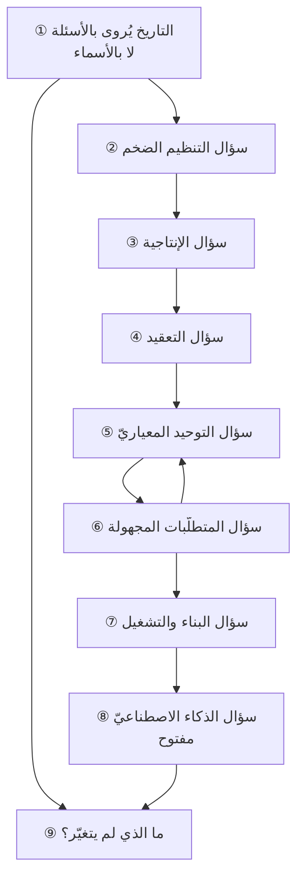

# الفصل 10 — كيف تطوّر هذا العلم؟ تاريخ الأسئلة لا الأشخاص

---

## 🏛️ لماذا تقرأ هذا الفصل؟

**المشكلة:** يُروى تاريخ هذا العلم قائمةَ أسماء وتواريخ، فيحفظها الدارس ولا تفيده في شيء — لأنها لا تقول له لماذا ظهرت الفكرة ولا متى تسقط.

**وماذا لو لم تعرف؟** من ظنّ أنّ المناهج تظهر بظهور مؤلّف حسبها موضةً تُتبع؛ ومن عرف أنّها تظهر بظهور عجز عرف متى تصلح ومتى انتهت حاجتها.

**وبعد هذا الفصل ستستطيع:**

- **أن تميّز المرحلة من الموجة من المعيار** — فتعرف أنّ الثلاثة تُعرض عليك بالنبرة نفسها وتُقاس بموازين مختلفة، وأنّ سؤالًا واحدًا يفرزها: *أيّ عجزٍ موصوفٍ وُلدت منه؟* **فما لم يُولد من عجزٍ يُسمّى فهو إعادة تسميةٍ لما قبله، ولو جاء في كتابٍ وشهادةٍ ومؤتمر.**
- **أن تحكم على أيّ ممارسةٍ قائمةٍ عندك اليوم بسؤالين: ما العجز الذي أُنشئت له؟ وهل ما يزال قائمًا؟** — فكثيرٌ ممّا يُتعب الفرق اليوم كان جوابًا صحيحًا عن سؤالٍ لم يعد أحدٌ يسأله، **وبقي بعد أن ذهبت علّته لأنّ أحدًا لم يكن مكلَّفًا بإلغائه.**
- **أن تفسّر لماذا لم تُلغِ مرحلةٌ ما قبلها ولو ادّعت ذلك** — فتعرف أنّ التقدير والجدولة لم يسقطا ببيان أجايل، وأنّ الأدلّة المرجعية لم تبطل بـDevOps، **وأنّ الذي يقع فعلًا هو انتقال الموضع لا الإلغاء**: يهبط ما كان مركزيًّا إلى الطبقة التحتية فيصير مُسلَّمًا لا مذكورًا.

> [!info] بطاقة الفصل
> **النوع:** تركيبيّ
> **المستوى:** 🟡 متوسّط
> **زمن القراءة:** نحو 45 دقيقة
> **أهمّيته في الباب:** ★★★★☆
> **موضعك:** انتهيتَ من [[09 - المقاصد والثنائيات والمفاضلات]] ← **⬤ أنت هنا** ← يليه [[11 - لماذا اختلفت المدارس]]

> [!abstract] موقع هذا الفصل
> **يبني على:** [[Conway's Law]] · [[Iron Triangle]] — يُذكَر هنا ولا يُعاد شرحه.
> **ويؤسّس:** [[Technical Debt]] — يُقدَّم هنا أوّل مرّة فيصير متاحًا لما بعده.

---

## 🧭 السؤال المركزي

> [!question] السؤال الذي يجيب عنه هذا الفصل كلّه
> **كيف تطوّر هذا العلم، ولأيّ سؤال جاءت كلّ مرحلة منه؟**

**واحمل معك هذه الأسئلة وأنت تقرأ:**

- ما العجز الذي وُلدت منه كلّ مرحلة؟
- لماذا لم تُلغِ المرحلةُ اللاحقةُ ما قبلها؟
- ما الذي لم يتغيّر في هذا العلم منذ أوّله؟

---

## 🗺️ الجواب المختصر — قبل التفصيل

**تطوّر هذا العلم بسبعة أسئلةٍ متعاقبة، كلُّ سؤالٍ منها وُلد من *عجزٍ واقعيٍّ موصوف* عن شيءٍ صار مطلوبًا ولم تعد الأدوات القائمة تبلغه.** ولم تظهر مرحلةٌ لأنّ أحدًا أراد منهجًا جديدًا، ولا لأنّ مؤلّفًا كتب كتابًا فأقنع الناس. **الكتاب يأتي بعد العجز لا قبله**، وإنّما يصير مشهورًا لأنّه سمّى ما كان الناس يعانونه بلا اسم.

**والأسئلة السبعة بترتيبها:** كيف يُنظَّم آلافٌ على غايةٍ واحدة؟ ثمّ كيف يُقاس العمل ويُقلَّل هدره؟ ثمّ كيف يُنسَّق عملٌ لم يُفعَل من قبل؟ ثمّ كيف تصير الممارسة مهنةً لها جسمٌ معرفيّ؟ ثمّ كيف يُدار ما لا تُعرف متطلّباته مقدّمًا؟ ثمّ كيف تصل القيمة إلى المستخدم لا إلى بيئة الاختبار؟ ثمّ — وهو المفتوح اليوم — ما الذي يتغيّر حين تصير أجزاءٌ من العمل قابلةً للتوليد؟

**والذي يربط السبعة رابطٌ واحد: أنّ ثمن كلّ جوابٍ هو الذي ولّد السؤال الذي يليه.** فالإدارة العلمية أجابت عن سؤال الإنتاجية إجابةً نافعة، **وثمنُها أنّها اختزلت العامل إلى وحدة إنتاج**، فولّد ذلك سؤال الإنسان في العمل. والتوحيد المعياريّ أجاب عن سؤال المهنة، **وثمنُه أنّ الالتزام بالعملية صار يقوم مقام الحكم**، فولّد ذلك سؤال المتطلّبات المجهولة. **فليست هذه سلسلة تصحيحٍ لأخطاء، بل سلسلة أثمانٍ متعاقبة** — وكلُّ مرحلةٍ حلّت مشكلةً حقيقيّة واشترت بذلك مشكلةً جديدة، وهذا هو معنى الفصل 09 مقروءًا في الزمن.

**ولهذا لم تُلغِ مرحلةٌ واحدةٌ ما قبلها، وإنّما نقلت موضعه.** فالتقدير والجدولة كانا في الصدارة ثمّ صارا خدمةً في الخلفية، والأدلّة المرجعية كانت هي الجواب ثمّ صارت مرجعًا يُستشار. **والعلامة على ذلك أنّ ما «أُلغي» يُستعمل كلَّ يوم بلا أن يُسمّى**: فالفريق الذي يرفض «الشلال» ثمّ يرسم تسلسلًا لأربعة أعمالٍ متعاقبة قد استعمل التتابع وهو يظنّ أنّه تركه.

**وقاعدةٌ ثالثة تحكم قراءة هذا كلِّه: تاريخُ الاسم غير تاريخ الفكرة.** فالفكرة تُمارَس قبل أن تُسمّى بعقودٍ أحيانًا، ثمّ يأتي من يسمّيها فيُظنّ أنّه أنشأها. **ومن أرّخ للفكرة بتاريخ تسميتها أنتج أسطورة القطيعة**: أنّ الناس كانوا في ضلالٍ ثمّ جاء البيان أو الكتاب فاهتدوا. **والواقع أنّ الاسم إنّما ينتشر لأنّ العجز صار عامًّا، لا لأنّ الفكرة صارت جديدة.**

**وما لم يتغيّر منذ أوّل هذا العلم إلى اليوم ثلاثة، وهي علّة تكرار الأسئلة:** أنّ **الموارد محدودة** فيلزم الاختيار، وأنّ **المستقبل مجهول** فيلزم التقدير والمراجعة، وأنّ **الناس يعملون مع الناس** فيلزم التواصل والثقة والحدود. **فكلّ مرحلةٍ تُغيّر أدوات معالجة هذه الثلاثة، ولا تُلغي واحدًا منها** — ولو أُلغي واحدٌ منها لانتهى هذا العلم لا لتطوّر.

**وثمرة الفصل عمليّةٌ لا ثقافيّة:** أن تنظر إلى الممارسات القائمة في مكانك اليوم — الاجتماع الأسبوعيّ، والوثيقة التي تُوقَّع، والمراجعة التي تسبق النشر — **فتسأل عن كلٍّ منها: أيُّ عجزٍ أنشأها؟ وهل هو قائم؟** فما تزال علّته قائمةً فاحرسه، **وما ذهبت علّته فأنت تدفع ثمنًا بلا مقابل، وأكثرُ ما يُتعب الفرق من هذا الصنف** — لا من نقصٍ في الأدوات.

> [!abstract] مفاهيم يُدخلها هذا الفصل في قاموسك
> `Technical Debt`

> [!warning] مفاهيم يكثر الخلط بينها هنا
> `Method` مقابل `Trend` مقابل `Standard` — احملها في ذهنك، فالفصل يفرّقها في محطّة التمييز.

---

## 🧱 الفكرة الأولى: التاريخ يُروى بالأسئلة لا بالأسماء

*موضعها من الفصل: هذه أوّل خطوةٍ وهي منهج الفصل كلِّه، وموضعها أن يُقرَّر **بمَ يُروى التاريخ** قبل أن يُروى. **والأسئلة السبعة بعدها ليست إلّا هذا المنهج مطبَّقًا** — ومن قرأها على منهج الأسماء خرج بقائمة رجالٍ وتواريخ، ولم يخرج بما يستطيع أن يفعل به شيئًا.*

**رواية الأشخاص تُوهم أنّ الأفكار تظهر بظهور مؤلِّف؛ ورواية الأسئلة تُظهر أنّها تظهر بظهور مشكلة.** والفرق بين الروايتين ليس في أناقة العرض، بل في **ما يستطيع القارئ أن يفعله بعد أن يقرأ**.

**فمن حفظ الأسماء ملك جدولًا:** تايلور 1911، وجانت نحو 1910، والمسار الحرج 1957، وبيان أجايل 2001. وهذا الجدول **لا يجيب عن سؤالٍ واحدٍ ممّا يواجهه في عمله**: لا يقول له هل تصلح هذه الأداة لموضعه، ولا متى انتهت حاجتها، ولا كيف يحكم على أداةٍ جديدةٍ تُعرض عليه غدًا لم تدخل الجدول بعد.

**ومن عرف الأسئلة ملك ميزانًا.** فإذا عُرضت عليه ممارسةٌ سأل: *أيّ عجزٍ جاءت لتسدّه؟* فإن وجد العجز موصوفًا وموجودًا عنده تبنّاها، وإن وجده موصوفًا وغير موجودٍ عنده تركها بلا حرج، **وإن لم يجد عجزًا موصوفًا أصلًا عرف أنّه أمام إعادة تسمية.**

### ولماذا تغلب رواية الأسماء رغم قلّة نفعها؟

لثلاثة أسباب، كلُّها بريءٌ في نفسه وضارٌّ في أثره:

1. **أنّها أسهل تعليمًا وامتحانًا.** فالاسم والتاريخ يُسألان في اختبارٍ ويُجابان بكلمة، **والعجز لا يُسأل عنه إلا بحالةٍ تُعرض ورأيٍ يُبنى** — وهذا أعسر تصحيحًا، فتنصرف عنه المناهج.
2. **أنّها تُنتج بطولةً تُروى.** فالقصّة التي فيها شخصٌ رأى ما لم يره غيره أبقى في الذاكرة من قصّةٍ فيها عشرون منظّمةً واجهت العجز نفسه فوصلت إلى حلولٍ متقاربة. **والذاكرة تُفضّل البطل، والحقيقة غالبًا تراكم.**
3. **أنّ التسمية نفسها حدثٌ له تاريخ، والممارسة ليس لها تاريخٌ محدَّد.** فيوم البيان معلوم، **وأمّا اليوم الذي بدأت فيه الفرق تسلّم على دفعاتٍ صغيرة فليس له يوم** — فيُؤرَّخ بما له تاريخ.

> [!example] أشهر خطأٍ في تأريخ هذا العلم
> يُنسب «نموذج الشلال» إلى ورقةٍ نشرها **وينستون رويس** سنة **1970** بعنوان *Managing the Development of Large Software Systems*. وتُروى القصّة هكذا: رجلٌ اقترح نموذجًا متتابعًا، فاتّبعته الصناعة ثلاثين سنة، ثمّ تبيّن خطؤه.
>
> **والذي في الورقة نفسها غير ذلك.** فرويس عرض التسلسل البسيط ثمّ **حكم عليه بأنّه محفوفٌ بالخطر ويدعو إلى الفشل**، واقترح عليه إضافاتٍ جوهرية — منها بناء نموذجٍ أوّليّ يُرمى، وإشراك العميل في مواضع محدَّدة، **و«افعلها مرّتين»**. أي أنّ الورقة التي تُقدَّم بوصفها أصل الشلال هي في جوهرها **حجّةٌ على التكرار**.
>
> **ولفظ «الشلال» ليس فيها أصلًا.** ظهر في أدبيّاتٍ لاحقة، ثمّ استقرّ بعد أن تبنّته مواصفاتٌ حكوميّة للتعاقد في الثمانينيّات — **وهنا موضع العبرة: الذي ثبّت النموذج المتتابع لم يكن ورقةً علمية بل كان *عقدًا***. فالجهة التي تشتري تحتاج أن تعرف ماذا تشتري قبل أن تدفع، فيلزمها مواصفةٌ مغلقةٌ مقدّمًا، **ويلزم من المواصفة المغلقة تتابعٌ صارم.** فما نُسب إلى مهندسٍ كان في حقيقته أثرًا لبنية الشراء.

### وثلاثة أخطاءٍ تولّدها رواية الأسماء

**الأوّل: أن يُؤرَّخ للفكرة بتاريخ تسميتها.** فالتطوير التكراريّ التدريجيّ لم يبدأ سنة 2001؛ وقد وثّق **كريج لارمان** و**فيكتور باسيلي** في مراجعةٍ منشورة سنة 2003 استعماله في مشروعاتٍ كبرى منذ خمسينيّات القرن الماضي وستّينيّاته. **فالبيان لم يُنشئ الممارسة، وإنّما جمع من كانوا يمارسونها متفرّقين وأعطاهم لسانًا مشتركًا** — وهذا وحده صنيعٌ عظيم، ولكنّه غير الاختراع.

**والثاني: أن يُنسب إلى الشخص ما هو تراكم.** فمخطّط جانت يُنسب إلى **هنري جانت** نحو 1910، **وقد سبقه إليه المهندس البولنديّ كارول أدامييتسكي بصورةٍ قريبةٍ منه في تسعينيّات القرن التاسع عشر** — غير أنّه نشرها بالبولندية في دوريّةٍ محلّية، فلم تعبر. **والدرس أنّ الفكرة لا تنتشر بصحّتها وحدها، بل بلسانها وموضعها ومن يحملها** — وهذا امتدادٌ مباشر لما قرّره [[06 - لسان العلم|الفصل 06]]: أنّ اللسان ليس زينةً على المعرفة بل شرطُ انتقالها.

**والثالث: أن يُقاس أثر الأداة بما قيل عنها لا بما ثبت منها.** وسيأتي في الفكرة الرابعة مثالٌ مقيسٌ على ذلك من أشهر مشروعات القرن.

### وكيف تُولد المرحلة؟ خمس خطواتٍ تتكرّر في كلّ واحدةٍ منها

**والمراحل السبع التي يعرضها هذا الفصل لم تُولد ولادةً مختلفة؛ كلُّها مرّت بالخطوات نفسها بالترتيب نفسه.** ومعرفة هذا التسلسل أنفع من معرفة المراحل، **لأنّه يُتيح لك أن تحكم على ما يقع أمامك اليوم — وأنت في وسطه لا بعده:**

1. **عجزٌ يتكرّر بلا اسم.** فيشتكي منه العاملون في مواضع متفرّقة ولا يعرف بعضهم بعضًا، **ويُنسب في كلّ موضعٍ إلى سببٍ محلّيّ**: هذا فريقٌ ضعيف، وذاك عميلٌ متقلّب، وثالثٌ إدارةٌ لا تفهم. **وهذه أطول الخطوات زمنًا وأخفاها، لأنّ العجز فيها يُقرأ مشكلةً شخصيّةً لا نمطًا.**
2. **تسميةٌ تجمع المتفرّقين.** فيأتي من يقول: هذا الذي تعانونه له اسم، وله سبب، وليس عيبًا فيكم. **وأثر التسمية أعظم ممّا يُظنّ**: فهي تنقل الشكوى من كونها اعترافًا بالعجز إلى كونها وصفًا لظاهرة، **فيصير الحديث فيها ممكنًا في اجتماعٍ رسميّ** — وقبلها لم يكن.
3. **تدوينٌ ومتن.** فتُكتب الممارسة وتُشرح آليّتها ويُوضَع لها ترتيب، **وتنتقل من «ما نفعله عندنا» إلى «ما يمكن أن يُنقل إلى غيرنا».**
4. **مأسسةٌ وسوق.** فتظهر شهاداتٌ وتدريبٌ ومستشارون وأدوات، **وهذه خطوةٌ ضروريّةٌ للانتشار وخطِرةٌ على المعنى معًا** — إذ يصير للناس مصلحةٌ في بقاء المتن أكثر ممّا لهم مصلحةٌ في صوابه.
5. **ثمنٌ يظهر فيولّد العجز التالي.** وهو ما يُغلق الدائرة ويفتح التي بعدها.

**وأنفع ما في هذا التسلسل أنّه يُعطيك موضعك من الأمر.** فما تراه في الخطوة الرابعة — شهاداتٌ ومؤتمراتٌ وسوقٌ قائمة — **يعني أنّ عجزه وُصف قبل سنين وأنّ ثمنه لم يظهر بعد**، فاطلبه واسأل عنه. **وما تراه في الخطوة الثانية — اسمٌ جديدٌ يجمع شكاوى متفرّقة — لم يُدوَّن بعدُ ولا سوق له**، فلا تحكم عليه بغياب الدليل المدوَّن، **فالدليل يأتي بعد.** ومن حاكم كلَّ شيءٍ بميزان الخطوة الرابعة ردَّ كلَّ جديدٍ لأنّه لم يُدوَّن، **ومن حاكم كلَّ شيءٍ بميزان الثانية تبنّى كلَّ اسمٍ جديدٍ لأنّه يشبه ما يشتكي منه.**

> [!tip] كيف تستعمل هذه الفكرة
> إذا عُرض عليك اسمٌ — منهجيّة، أو إطار، أو ممارسة — **فلا تسأل أوّلًا: ما هو؟ بل اسأل: أيّ عجزٍ وُلد منه؟** واطلب أن يُوصف لك العجز في جملةٍ فيها موقفٌ ومقدار: «كانت الفرق تكتشف أنّ ما بنته غير مطلوبٍ بعد ستّة أشهر» جوابٌ صالح؛ **و«لأنّ الطرق القديمة لم تعد تناسب العصر» ليس جوابًا بل نبرة.** فمن لم يستطع أن يصف لك العجز، فالغالب أنّه ينقل عن ناقلٍ لا عن مصدر.

> [!warning] الحفرة الشائعة — أن ينقلب هذا إلى إنكار الأشخاص
> رواية الأسئلة **لا تعني أنّ الأفراد لا أثر لهم**. فالتسمية الموفَّقة صنيعٌ حقيقيّ، وجمع المتفرّقين على لسانٍ واحد صنيعٌ أكبر، **ومن سمّى الدَّين التقني أتاح للفرق أن تتحدّث عن شيءٍ كانت تعانيه بلا اسم.**
>
> **والمقصود شيءٌ أدقّ:** أنّ الشخص **يُسمّي** العجز ويصوغ جوابه، ولا **يُنشئ** العجز. فمن فهم هذا قرأ المؤلِّف بوصفه شاهدًا على حال زمانه، **ومن لم يفهمه قرأه بوصفه مشرّعًا** — فالتزم حرفه بعد أن ذهب سببه.

> [!question]- تأكّد أنك فهمت — قيل لك «هذه الممارسة من أساسيّات المهنة، وضعها فلانٌ سنة كذا». فما أوّل ما تسأل؟
> **تسأل عن العجز لا عن التاريخ: ما الذي كان يقع قبلها ولم يعد يقع بعدها؟ وهل ما كان يقع يقع عندنا؟**
>
> فالتاريخ والاسم لا يفيدانك في قرارٍ واحد؛ **وأمّا وصف العجز فيفيدك في ثلاثة**: أن تعرف أتصلح لك أم لا، وأن تعرف بأيّ علامةٍ تحكم عليها بعد سنة، وأن تعرف متى تُلغيها بلا حرج — وهو أنفعها وأندرها، **لأنّ الممارسة التي دخلت باسم «الأساسيّات» لا يجرؤ أحدٌ على مراجعتها.**

> [!summary]- خلاصة الفكرة في سطرين
> **روايةُ الأشخاص تُوهم أنّ الأفكار تظهر بظهور مؤلِّف، وروايةُ الأسئلة تُظهر أنّها تظهر بظهور مشكلة.**
> **والفرق بينهما ليس في أناقة العرض بل فيما يستطيع القارئ أن يفعله بعد القراءة**: فمن حفظ الأسماء عرف من قال، ومن عرف الأسئلة عرف متى يُستدعى ما قيل.

> [!question] تأمّلٌ تطبيقيّ — لا جواب له في هذا الفصل
> اختر ممارسةً تعملون بها اليوم ولا تعرف من أين جاءت، واسأل: **أيَّ عجزٍ جاءت لتسدّه يوم ظهرت؟**
>
> **ثمّ اسأل السؤال الذي يليه: أما زال ذلك العجز قائمًا عندنا؟** فإن زال العجز وبقيت الممارسة، فأنت أمام إجراءٍ يعمل بلا علّة — وهو أثقل ما يُحمَل، لأنّ إزالته لا صاحب لها.

---

## 🧱 الفكرة الثانية: سؤال التنظيم الضخم — كيف يعمل ألفٌ على غايةٍ واحدة؟

*موضعها من الفصل: يبدأ هنا أوّل الأسئلة السبعة، **وهو أقدمُ من العلم نفسه بآلاف السنين** — ولذلك قُدّم. وما يخصّه من بينها أنّه لم يُطرح سؤالًا نظريًّا قطّ، وإنّما فرضته أعمالٌ لم تكن تُنجَز بغير جوابٍ عنه.*

**أوّل أسئلة هذا العلم أقدمُ من العلم نفسه بآلاف السنين: كيف يُوجَّه عملُ أعدادٍ كبيرةٍ من الناس إلى غايةٍ واحدة لا يراها أكثرهم؟** والأعمال الكبرى القديمة — من السدود والقنوات إلى دور الصناعة البحرية والعمارة الكبرى — لم تُنجَز بالمصادفة؛ فيها تقسيمُ عمل، وتوريدُ موادّ في مواعيد، وتعاقبُ مراحل، وإشرافٌ متدرّج.

**غير أنّ العلم لم يبدأ هناك، وهذا هو موضع العبرة.** فالذي بقي لنا من تلك الأعمال هو **المنجَز** لا **المنهج**: بقيت الأبنية ولم تبقَ الطريقة. **والمعرفة كانت تنتقل بالصحبة والتلمذة والانتماء إلى صنعة**، لا بنصٍّ مكتوبٍ يُدرَّس. فالمعلّم يُلازمه الصبيّ سنين حتى يصير معلّمًا، وتُحفظ الطريقة في الأشخاص لا في الورق.

**وهذا نظامُ حفظٍ ناجحٌ في شرطه، عاجزٌ في شرطين:**

1. **حين يتضاعف العدد فجأة.** فتلمذةُ سنينَ لا تُخرّج ألف عاملٍ في سنة.
2. **حين ينقطع الخيط.** فالمعرفة القائمة في الرؤوس تذهب بذهاب أصحابها، ولا يبقى منها ما يُستأنف عليه.

> [!example] لماذا لا تجد كتابًا في إدارة المشاريع قبل القرن العشرين؟
> ليس لأنّ المشاريع الكبرى لم تكن تُدار، **بل لأنّ إدارتها لم تكن تحتاج أن تُكتب.** فالعملُ كان يجري في مكانٍ واحدٍ يراه المشرف بعينه، وبأدواتٍ لا تتغيّر في جيل، وبعمالةٍ تنتقل إليها الصنعة بالمعايشة.
>
> **فلمّا تفرّق العمل على مواقع، وتغيّرت الآلة في العمر الواحد مرّاتٍ، ولزم تشغيل من لم يتتلمذ — انكشف العجز، فوُلدت الحاجة إلى الكتابة.** والكتابة هنا ليست ترفًا توثيقيًّا، **بل هي الجواب الوحيد الممكن حين يزيد العدد على ما تحتمله المعايشة.**

### وما بقي من هذه المرحلة إلى اليوم

بقي منها أصلان يعمل بهما كلُّ مشروعٍ اليوم بلا أن يُنسبا إلى أحد:

- **تقسيم العمل ثمّ ربطه.** أن يُجزّأ الكبير إلى ما يُنجَز، **ثمّ — وهو الأهمّ — أن يُعرَف كيف تعود الأجزاء إلى كلٍّ يعمل.** فالتقسيم وحده سهل، والربط هو الصعب، **وهو الذي ما يزال يكسر المشاريع الكبيرة إلى اليوم** بصورة الاعتماديات والتسليمات بين الفرق.
- **التسلسل الإشرافيّ بوصفه أداة سعة لا أداة سلطة.** فالإنسان لا يتابع عددًا غير محدود، **فنشأ التدرّج لعجزٍ في السعة لا لرغبةٍ في التسلّط** — وهذا أصلٌ يُنسى، فيُدافَع عن الهرمية بوصفها قيمةً أو يُهاجَم بوصفها ظلمًا، **وهي في أصلها حلٌّ لمشكلة نطاق إشراف.**

### وهذا السؤال لم يُغلق، بل عاد بلباسٍ جديد

**فأحدث ما يُتداول اليوم في تنسيق الفرق الكثيرة — أُطر التوسّع على اختلافها ([[SAFe]] وغيره) — إنّما هو الجواب السابع عن السؤال الأوّل.** فالسؤال واحدٌ لم يتغيّر: **كيف يعمل عددٌ كبيرٌ على غايةٍ واحدة؟** والذي تغيّر أنّ «الكبير» صار يُعدّ بالفرق لا بالأفراد، وأنّ الترابط صار في الشيفرة لا في الموادّ.

**وثمنُ الجواب هو ثمنُه القديم نفسه: بُعد القرار عن موضع العمل.** فكلّما زادت طبقات التنسيق زاد ما يمرّ به القرار من محطّاتٍ حتى يصل إلى من يعرف تفاصيله، **وزاد معه ما يُسمّى في هذا الباب «الضريبة التنظيمية»**: عملٌ يُنفَق لا في بناء شيءٍ بل في مواءمة من يبنون.

**والعلامة العملية الواحدة التي تُظهر أنّك تجاوزت الحدّ:** أن ينفق الفريق من وقته في **التنسيق** أكثر ممّا ينفقه في **العمل**. وهذا رقمٌ يُقاس بأسبوعٍ واحدٍ من التقويم، **ولا يحتاج إلى دراسة**: كم ساعةً في هذا الأسبوع صُرفت في مواءمة فريقين، وكم صُرفت في إنجاز شيء؟ **فإن غلبت الأولى فالمشكلة في الحدود لا في الأداة**، وقد قرّرها [[Conway's Law|قانون كونواي]] من جهته: أنّ العمل الذي يعبر فريقين كثيرًا دليلٌ على أنّ الحدّ مرسومٌ في غير موضعه.

> [!tip] كيف تستعمل هذه الفكرة
> إذا واجهتك مشكلة تنسيقٍ بين فرقٍ كثيرة، **فقبل أن تشتري أداةً أو تضيف اجتماعًا، اسأل: هل هذه مشكلة تقسيمٍ أم مشكلة ربط؟** فمشكلة التقسيم علاجها إعادة رسم الحدود، ومشكلة الربط علاجها تقليل عدد المواضع التي يجب أن تلتقي فيها الفرق أصلًا. **وأكثر ما يُشترى من أدوات التنسيق إنّما يُسهّل الربط بدل أن يُقلّل الحاجة إليه** — فيُخفّف الألم ويُبقي السبب.

> [!warning] الحفرة الشائعة — أن يُقاس المشروع الحديث بمقياس المشروع القديم
> الأعمال الكبرى القديمة يجمعها وصفٌ واحد: **أنّ المطلوب كان معلومًا والطريق مجهولًا.** فالسدّ معروفٌ شكله ووظيفته، والمجهول كيف يُبنى.
>
> **وأكثر المشاريع البرمجية على العكس: الطريق معلومٌ نسبيًّا والمطلوب مجهول.** فأدواتُ البناء مستقرّة، **والمجهول هو ما ينبغي أن يُبنى أصلًا.** ومن نقل خبرة النوع الأوّل إلى النوع الثاني بلا تنبّه أنفق جهده في إحكام **كيف** والمجهول عنده هو **ماذا** — وهذا بعينه ما ولّد السؤال الخامس بعد نحو قرن.

> [!question]- تأكّد أنك فهمت — لماذا يقال إنّ إدارة المشاريع «قديمة الممارسة حديثة التدوين»؟
> **لأنّ الممارسة كانت تُحفظ في الأشخاص بالتلمذة والمعايشة، فلم تحتج إلى تدوين ما دام العمل في مكانٍ واحدٍ وبأدواتٍ لا تتغيّر وبعمالةٍ تُتلمذ.**
>
> **فلمّا تفرّق العمل وتسارعت الأدوات وزادت الأعداد فوق ما تحتمله المعايشة، انكشف عجز النقل الشفويّ فوُلد التدوين.** ولهذا يبدأ تاريخ العلم المدوَّن في زمنٍ متأخّرٍ جدًّا عن تاريخ الممارسة — **لا لأنّ من قبله لم يكونوا يديرون، بل لأنّهم لم يكونوا محتاجين إلى أن يُخرجوا المعرفة من رؤوسهم.**

> [!summary]- خلاصة الفكرة في سطرين
> **أوّل أسئلة هذا العلم أقدمُ منه بآلاف السنين: كيف يُوجَّه عملُ أعدادٍ كبيرة إلى غايةٍ واحدة لا يراها أكثرهم؟**
> **والأعمال الكبرى القديمة لم تُنجَز بالمصادفة** — فيها تقسيمُ عملٍ وتوريدٌ في مواعيد وتعاقبُ مراحل؛ إنّما الذي تأخّر هو **تدوينُ ذلك علمًا يُنقل**، لا الفعل نفسه.

> [!question] تأمّلٌ تطبيقيّ — لا جواب له في هذا الفصل
> اسأل عن أكبر عملٍ يجري عندكم: **كم واحدًا من العاملين فيه يستطيع أن يصف الغاية في جملةٍ واحدة؟**
>
> ولا تُجب بالتخمين — اسأل ثلاثةً من مواضع مختلفة. **فالفرق بين أجوبتهم هو المسافة التي يقطعها التوجيه عندكم فعلًا**، وهي المسألة نفسها التي فُتح بها هذا العلم قبل آلاف السنين.

---

## 🧱 الفكرة الثالثة: سؤال الإنتاجية — كيف يُقاس العمل ويُقلَّل هدره؟

*موضعها من الفصل: حصلت القدرة على **توجيه** أعدادٍ كبيرة، فانكشف عجزٌ خلفها: أنّ التوجيه لا يقول أيُّ طريقةٍ في أداء العمل خيرٌ من غيرها. **وهذا ما يزيده هذا السؤال على سابقه** — أنّ الجواب انتقل من خبرة المعلّم، وهي لا تُنقل ولا تُقارَن، إلى شيءٍ يُقاس.*

**مع المصانع الكبرى في مطلع القرن العشرين صار العجز محدَّدًا: كيف يُعرف أنّ هذه الطريقة في أداء العمل أفضل من تلك؟** فقبل ذلك كان الجواب: بخبرة المعلّم. **والخبرة لا تُنقل ولا تُقارَن ولا تُدرَّب عليها ألفُ عاملٍ في سنة.**

**فجاء الجواب بفكرةٍ واحدةٍ غيّرت الصناعة: أن يُدرَس العمل نفسه دراسةً منهجية.** وهذا ما سمّاه **فريدريك تايلور** في كتابه *The Principles of Scientific Management* سنة **1911** بـ«الإدارة العلمية». **ولبّها ثلاثة:** أن تُقاس المهمّة بأجزائها وأزمنتها، وأن تُختار الطريقة الأقلّ هدرًا فتصير قياسيّةً يُدرَّب عليها الجميع، وأن يُفصَل **تخطيط** العمل عن **تنفيذه** فيصير التخطيط اختصاصًا قائمًا بذاته.

**وفي المسار نفسه ظهرت أدوات الجدولة المبكّرة**: مخطّط جانت الذي يعرض المهامّ على محور زمنٍ فيرى الناظر ما يجري متوازيًا وما يجري متعاقبًا. **وقيمته الحقيقية ليست في الجدولة بل في أنّه *أظهر العمل*** — نقل ما كان في رأس المشرف إلى ورقةٍ يراها الجميع، فصار الخلاف على شيءٍ منظور. **وهذا نفسه ما تفعله لوحات العمل اليوم بعد قرن**، وهو ما تقوم عليه [[03 - Kanban|كانبان]] في أصلها.

> [!example] ما الذي يفعله «إظهار العمل» وحده، بلا أداةٍ ولا منهجيّة؟
> فريقٌ في **الدمّام** من تسعة أشخاص كان كلُّ فردٍ فيه يعرف ما بين يديه ولا يعرف ما بين يدي غيره. **وكان الشكوى المتكرّرة: «نعمل كثيرًا ولا نُنجز».**
>
> فعُلِّقت لوحةٌ واحدةٌ في الممرّ، عليها بطاقةٌ لكلّ عملٍ قائمٍ فعلًا. **ولم يُغيَّر شيءٌ آخر: لا اجتماعٌ أُضيف، ولا أداةٌ اشتُريت، ولا دورٌ استُحدث.**
>
> **وظهر في أوّل أسبوعٍ ما لم يكن أحدٌ يعرفه: أنّ العمل الجاري 31 بندًا لتسعة أشخاص**، وأنّ أحد عشر منها متوقّفٌ على أطرافٍ خارج الفريق، **وأنّ أقدمها بدأ قبل أربعة أشهر ولا يذكره أحد في الاجتماعات.** فلم يكن الفريق بطيئًا؛ **كان يبدأ أكثر ممّا يُنهي، وكلٌّ يرى نصيبه من ذلك فيظنّه حالًا خاصّةً به.**
>
> **وهذا هو الأثر الذي جاء به مخطّط جانت قبل قرن، ولم يتغيّر: أنّ ما يُرى يُناقَش، وما لا يُرى يُعزى إلى الأشخاص.** فالعمل المستور يُفسَّر دائمًا بالتقصير، **لأنّ التقصير هو التفسير الوحيد المتاح حين لا تُرى البنية.**

### والثمن — وهو أعظم من أن يُذكر عرضًا

**ثمنُ هذه المرحلة أنّها اختزلت العامل إلى وحدة إنتاج.** فحين يُفصَل التفكير عن التنفيذ ويصير التنفيذ اتّباعًا لطريقةٍ قياسيّة، **يُلغى من العامل أنفعُ ما فيه: أنّه أقربُ الناس إلى العمل وأعرفُهم بمواضع خلله.** فتصير المنظّمة عمياء عن معرفةٍ تملكها ولا تسمعها.

**وقد ظهر ذلك في أثره قبل أن يُنظَّر له.** فالتجارب التي أُجريت في مصنع هوثورن التابع لشركة ويسترن إلكتريك بين سنتَي 1924 و1932 لدراسة أثر ظروف العمل المادّية في الإنتاج **جاءت بنتائج لم تكن متوقّعة**: أنّ التغيّر في الإنتاج لم يكن مفسَّرًا بالمتغيّر المادّيّ وحده، وأنّ لِما يقع بين الناس أثرًا لا يُهمَل. **وعليها قام ما سُمّي حركة العلاقات الإنسانية.**

> [!info] إضافة مرجعية — وهذا موضعٌ يلزم فيه الاحتراز
> نتائج هوثورن **تُروى في كثيرٍ من كتب الإدارة بيقينٍ لا تحتمله**، حتى صار «أثر هوثورن» يُساق قانونًا مقرَّرًا. **والصواب أنّ تفسير تلك التجارب محلّ خلافٍ إلى اليوم**، وقد أعاد باحثون لاحقون تحليل بياناتها فناقشوا قوّة الاستدلال ومنهج التجربة نفسها.
>
> **والذي يصحّ أن يُؤخذ منها بيقين هو أثرها التاريخيّ لا نتيجتها الكمّية:** أنّها فتحت في هذا العلم بابًا لم يكن مفتوحًا — **أنّ العامل ليس آلةً تُعاير** — وأنّ ذلك الباب لم يُغلق بعدها. **وهذا نموذجٌ لقاعدةٍ عامّة: التجربة قد يضعف استدلالها ويبقى أثرها في تحويل مسار العلم.** ومن خلط بين الأمرين إمّا أن يُبالغ فيسوقها قانونًا، وإمّا أن يُنكرها فيُسقط معها ما بنته.

### وما بقي من هذه المرحلة اليوم

بقي منها أكثرُ ممّا يُظنّ، وبأسماءٍ جديدة:

- **قياس العمل نفسه لا العامل** — وهو أصلُ مقاييس التدفّق كلّها: [[Cycle Time|زمن الدورة]] و[[Throughput|الإنتاجية]] و[[Lead Time|زمن الإنجاز]].
- **تسمية الهدر وتصنيفه** — وقد بلغ صورته الناضجة في نظام تويوتا للإنتاج ([[Toyota Production System]])، وفي تصنيف [[Muda, Mura, Muri|الهدر والتذبذب والإرهاق]]، **وفيه انتقالٌ حاسم عن تايلور: أنّ الذي يكتشف الهدر ويُصلحه هو من يعمل، لا من يخطّط له.** وهذا هو [[Kaizen|التحسين المستمرّ]]، وهو تصحيحٌ للثمن من داخل المسار نفسه.
- **الفصل بين التخطيط والتنفيذ** — وما يزال قائمًا في كثيرٍ من المنظّمات، **وهو أكثر ما ورثناه من هذه المرحلة بلا مراجعة.**

### والحدّ الذي انكسر هنا: قياس العمل في مقابل قياس العامل

**والفرق بينهما هو الذي يفصل ما نفع من هذه المرحلة عمّا أضرّ، وهو فرقٌ يسهل بيانه ويصعب حفظه.**

**فقياس العمل يسأل: أين يقف الشيء ولماذا؟** — كم يومًا تنتظر المهمّة قبل أن يبدأ فيها أحد؟ وكم مرّةً تعود إلى الوراء؟ وأين يتراكم الصفّ؟ **وهذه أسئلةٌ جوابُها يُصلح النظام، ولا يُسأل عنها شخصٌ بعينه.**

**وقياس العامل يسأل: من أنتج أكثر؟** — وهذا سؤالٌ جوابه، حتى لو كان صحيحًا، **لا يُنتج إلا واحدًا من اثنين: إمّا أن يُغيَّر الشخص، وإمّا أن يتعلّم الناس كيف يُحسّنون الرقم.** والثاني هو ما يقع دائمًا، وهو أرخص عليهم من الأوّل.

**وثلاث علاماتٍ تكشف أنّ المقياس انزلق من الأوّل إلى الثاني:**

1. **أن يصير للرقم اسمُ شخصٍ بجانبه** في تقريرٍ يُقرأ فوق مستواه.
2. **أن يُقارَن به الأفراد بعضهم ببعض** — لا هذا الشهر بالذي قبله.
3. **أن يُطلَب رفعه صراحةً** بدل أن يُطلب فهم سببه. **وهذه أخطرها، لأنّ الرقم الذي يُطلَب رفعُه يرتفع دائمًا** — فقد صار له من يعمل عليه، وربّما لم يتغيّر شيءٌ ممّا كان يقيسه ([[Goodhart's Law|قانون غودهارت]]).

**والقاعدة الحاكمة: يُقاس العمل لا العامل، ويُنظر إلى الاتّجاه لا إلى الرقم، ويُسأل عن السبب لا عن الفاعل.** ومن كسر هذه الثلاثة فقد أعاد إنتاج ثمن تايلور كاملًا **بأدواتٍ حديثةٍ وواجهاتٍ أنيقة** — وهذا يقع اليوم في لوحات القياس أكثر ممّا وقع في المصنع، لأنّ الجمع صار مجّانيًّا.

> [!tip] كيف تستعمل هذه الفكرة — أظهِر العمل قبل أن تُصلحه
> **أنفع ما بقي من هذه المرحلة ليس القياس بل ما سبقه: أن يخرج العمل من الرؤوس إلى سطحٍ يراه الجميع.** فخذ عمليةً واحدةً متكرّرةً عندكم، وارسمها صفًّا صفًّا في ثلاث خانات:
>
> | الخطوة | من يستلمها ومن يسلّمها | كم تنتظر قبل أن تبدأ |
> |---|---|---|
> | … | … | … |
>
> **والعمود الثالث هو المقصود**، فالانتظار لا يظهر في أيّ تقريرٍ ولا يشكو منه أحد، وهو في أكثر العمليات أطول من العمل نفسه. **ولا تُقبل في الخانات ألفاظ:** «تحسين العملية» · «رفع الكفاءة» · «تسريع الإجراء» — فهذه أحكامٌ على ما لم يُرسم بعد.

> [!warning] الحفرة الشائعة — أن يُقاس المخرَج فيُنسى الأثر
> منطق الإنتاجية سليمٌ حيث يكون المطلوب معلومًا والمشكلة في طريقة إنجازه؛ **وينقلب ضدَّ صاحبه حيث يكون المطلوب نفسه مجهولًا.** فمن قاس عدد الميزات المسلَّمة في الشهر وضغط لرفعه، **فقد ضاعف سرعة بناء ما قد لا يُستعمل** — والهدر هنا لم يقلّ بل تضاعف بأناقة.
>
> **والقاعدة التي تحفظ هذه المرحلة من الانقلاب: تُقاس الكفاءة بعد أن يُتحقّق من الجدوى لا قبلها.** فسؤال «هل نبني هذا بسرعةٍ كافية؟» لا يُطرح قبل سؤال «هل ينبغي أن يُبنى؟» ([[22 - Outputs and Outcomes|المخرجات والآثار]]).

> [!question]- تأكّد أنك فهمت — ما الذي أخذته الإدارة الرشيقة من الإدارة العلمية، وما الذي قلبته؟
> **أخذت منها المنهج: أنّ العمل يُدرَس ويُقاس ويُصلَح بالبيان لا بالانطباع، وأنّ الهدر يُسمّى ويُلاحَق.**
>
> **وقلبت فيها موضع المعرفة:** فتايلور جعل معرفة الطريقة الفضلى عند من يخطّط، **والرشيقة جعلتها عند من يعمل** — فصار التحسين يأتي من داخل الفريق لا من إدارةٍ فوقه. **وهذا هو الفرق الذي يجعلهما مرحلتين لا مذهبين متعاديين:** الثانية احتفظت بأداة الأولى وردّت عليها ثمنَها.

> [!summary]- خلاصة الفكرة في سطرين
> **سؤال الإنتاجية نشأ من عجزٍ محدَّد: كيف يُعرف أنّ هذه الطريقة في أداء العمل أفضل من تلك؟**
> **فقبله كان الجواب: بخبرة المعلّم — والخبرة لا تُنقل ولا تُقارَن ولا يُدرَّب عليها ألفُ عاملٍ في سنة.** ومن هنا وُلد القياس، وبه وُلدت أمراضه أيضًا.

> [!question] تأمّلٌ تطبيقيّ — لا جواب له في هذا الفصل
> خذ عملًا يتكرّر عندكم أسبوعيًّا، واسأل: **هل يُؤدّى بطريقةٍ واحدة، أم بطريقة كلِّ شخصٍ على حدة؟**
>
> **فإن كان الثاني، فالسؤال ليس «أيّهم أصوب؟» بل: أيُّ الفروق بينهم يستحقّ أن يُوحَّد وأيُّها يستحقّ أن يُترك؟** — فتوحيدُ ما لا أثر لفرقه انضباطٌ بلا عائد، وتركُ ما له أثرٌ إهمالٌ باسم الحرّية.

---

## 🧱 الفكرة الرابعة: سؤال التعقيد — كيف يُنسَّق عملٌ لم يُفعَل من قبل؟

*موضعها من الفصل: كانت أدوات المرحلة السابقة كلُّها تقوم على **التكرار** — إذ لا يُقاس زمنُ عملٍ إلّا بعد أن يُؤدّى مرارًا. **وهذا بعينه ما سقط هنا:** ظهر عملٌ ضخمٌ مترابطٌ لم يُفعَل من قبل، فلا معياريّةَ تُشتقّ منه ولا زمنَ مهمّةٍ يُعرف — فلزم نوعٌ آخر من الأدوات.*

**بعد منتصف القرن العشرين ظهر نوعٌ من المشاريع لم تصلح له أدوات المصنع: مشروعاتٌ ضخمة، آلافُ الأنشطة المترابطة، وعشراتُ الجهات، وأهمُّ ما فيها أنّ العمل نفسه لم يُفعَل من قبل** — فلا معياريّةَ تُشتقّ من تكرار، ولا زمنَ مهمّةٍ يُقاس بساعة توقيت لأنّ المهمّة تُؤدّى مرّةً واحدة.

**والعجز هنا مختلفٌ عن سابقه**: ليس «كيف نؤدّي هذه المهمّة بأقلّ هدر؟» بل **«أيّ المهامّ يجب أن يُنتبه إليها أصلًا؟»** فحين تكون أمامك ألفُ مهمّةٍ مترابطة، فإنّ تأخّر بعضها لا يؤخّر شيئًا وتأخّر بعضها يؤخّر كلَّ شيء — **والفرق بينهما لا يُدرَك بالحدس مهما بلغت خبرة المدير.**

**فجاء الجواب من الرياضيات لا من الإدارة: أن يُمثَّل المشروع شبكةً من الأنشطة والاعتماديات، ثمّ يُحسب فيها أطول مسارٍ زمنيّ متّصل.** وهذا هو [[Critical Path|المسار الحرج]]، وقد طُوّر سنة **1957** في عملٍ مشترك بين شركتي DuPont وRemington Rand على يد مورغان ووكر وجيمس كيلي لجدولة أعمال صيانة المصانع. **وفي السنة التالية، 1958، ظهر [[PERT]] في مكتب المشروعات الخاصّة بالبحرية الأمريكية ضمن برنامج صواريخ بولاريس** — يضيف إلى الشبكة التعامل مع **الجهل بالمدد** بثلاثة تقديرات لا تقديرٍ واحد.

**وأهمّ ما في هذه المرحلة ليس الأداتين، بل ما أثبتتاه: أنّ بعض أسئلة الإدارة لها أجوبةٌ محسوبة لا مقدَّرة.** فسؤال «أيّ الأنشطة يؤخّر تأخّرُه المشروع؟» **له جوابٌ واحدٌ صحيح** يُستخرج من بنية الاعتماديات، ولا يحتمل الخلاف. **وهذه هي الطبقة الحسابيّة من العلم، وهي التي أعطته صفة العلم عند كثيرين.**

> [!info] إضافة مرجعية — وأين اضطرب النقل هنا
> يُروى في مواضع كثيرة أنّ PERT اختصر برنامج بولاريس سنتين كاملتين. **وهذه الرواية محلُّ نقدٍ منهجيٍّ منشور**؛ فقد فحص **هارفي سابولسكي** البرنامج في دراسةٍ صدرت سنة **1972** (*The Polaris System Development*) وخلص إلى أنّ لِـPERT وظيفةً أخرى إلى جانب الجدولة: **أنّه أعطى البرنامج صورةَ الانضباط أمام الجهات الرقابية والممولة، فحمى استقلاله وموارده.**
>
> **ولا يعني هذا أنّ الأداة بلا قيمة** — فتحليل الشبكات نافعٌ نفعًا مقيسًا. **وإنّما يعني أنّ الأثر المنسوب إليها اختلط فيه أثران:** أثرٌ في **الجدولة**، وأثرٌ في **الشرعية التنظيمية**. **والعبرة العملية أنّ الأداة قد تُتبنّى لأنّها تُطمئن من يراقب، لا لأنّها تُحسّن ما تدّعي تحسينه** — وهذا يقع اليوم كما وقع حينها، فسَلْ عن كلّ أداةٍ إدارية: **ماذا تُحسّن؟ ومن تُطمئن؟** فإن كان الجواب الثاني وحده حاضرًا فأنت أمام شعيرةٍ لا أداة.

### وما بقي وما سقط

**بقي منها منطقُ الاعتماديّة كلُّه:** أنّ تأخّر عملٍ لا يُقاس بحجمه بل بموضعه في الشبكة، وأنّ الاختناق لا يُعالَج بمضاعفة الجهد في غير موضعه — **وهو الأصل الذي بلغ صورته العامّة بعد ثلاثين سنة في [[Theory of Constraints|نظرية القيود]]، ثمّ في مقاييس التدفّق.** فمن فهم المسار الحرج فقد فهم نصف نظرية القيود قبل أن يقرأها.

**وبقي منها أيضًا شيءٌ أدقّ يُغفَل: أنّها أوّل من أدخل *الجهل نفسه* في الحساب.** فتقدير PERT بثلاث نقاط — متفائلٍ وأرجحَ ومتشائم — **اعترافٌ صريحٌ بأنّ المدّة ليست رقمًا بل مدًى**، وأنّ عرضها رقمًا واحدًا إخفاءٌ لمعلومة. **وهذا هو الأصل الذي يعود اليوم في التقدير بمدًى وفي عرض النتائج احتمالاتٍ لا مواعيدَ قاطعة** — فمن قال «بين أوّل مارس ومنتصف أبريل باحتمالٍ راجح» قال أكثر ممّا قال من عيّن يومًا واحدًا، **وإن بدا الثاني أوثق.**

**وسقط منها ادّعاءُ الدقّة.** فالشبكة لا تكون أدقّ من التقديرات التي بُنيت عليها، **ومشروعٌ بألف نشاطٍ مقدَّرةٍ تقديرًا واهيًا يُخرج تاريخًا بيوم محدَّد فيصدَّق لأنّه خرج من حساب.** وهذه هي الحفرة الأصلية لهذه المرحلة، وما تزال تعمل.

**وسقط منها كذلك افتراضٌ صامتٌ لا يصمد في العمل البرمجيّ: أنّ الأنشطة معلومةٌ قبل البدء.** فالشبكة تفترض أنّك تعرف ما ستفعله وتجهل كم يستغرق؛ **وأكثر ما يكسر مشاريع البرمجيات أنشطةٌ لم تكن في الشبكة أصلًا** — تكاملٌ لم يُتوقّع، أو قيدٌ أمنيّ ظهر متأخّرًا، أو تحويلُ بياناتٍ تبيّن أنّها غير نظيفة. **والشبكة لا تُخطئ في تقدير هذه، بل لا تراها.** فمن أراد أن يستعملها في هذا النوع لزمه أن يُبقي فيها متّسعًا لِما لا يعرفه — **وهذا لا يُقاس بالحساب بل بحجم الجهل، وهو حكمٌ لا معادلة.**

> [!example] حين يكون المسار الحرج صحيحًا والتأخير في غيره
> جهةٌ في **جدّة** كانت تُدير برنامج ربطٍ بين ستّة أنظمة، وشبكتُها مرسومةٌ رسمًا جيّدًا: 214 نشاطًا، ومسارٌ حرجٌ محسوبٌ يمرّ بتطوير واجهة الدفع. **فرُكِّز الجهد كلُّه عليها، وأُضيف إليها مطوّران.**
>
> **ثمّ سُلّم البرنامج متأخّرًا ثمانية أسابيع، ولم يكن أيٌّ منها من واجهة الدفع.** فقد كانت كلُّ تكاملةٍ تحتاج موافقةً أمنيّةً من لجنةٍ تجتمع مرّةً في الشهر، **وهذه الموافقات لم تكن في الشبكة أصلًا** — لأنّها ليست «عملًا» يُنجزه أحد، بل انتظارًا لموعدٍ لا يملكه المشروع.
>
> **والحساب لم يخطئ؛ المُدخَل كان ناقصًا.** فالشبكة لا ترى إلا ما وُضع فيها، **وأكثر ما يؤخّر المشاريع المؤسّسية عندنا انتظارٌ لا يُسجَّل نشاطًا لأنّه لا يُسنَد إلى أحد.** ولمّا أُدرجت نوافذ اللجنة أنشطةً لها مددها انتقل المسار الحرج كلُّه إلى مسارٍ آخر، **وتبيّن أنّ المطوّرَين المضافَين لم يقصّرا يومًا واحدًا.**

> [!tip] كيف تستعمل هذه الفكرة — اسأل عن الاعتماديات لا عن المدد
> لستَ محتاجًا إلى أداةٍ لتنتفع بهذه المرحلة، وإنّما إلى ثلاثة أسئلةٍ تُجاب في ورقة:
>
> 1. **ما أطول سلسلةٍ متّصلةٍ عندنا؟** — أي أيُّ الأعمال ينتظر بعضُها بعضًا فلا يمكن أن تجري معًا مهما زدتَ الناس.
> 2. **أيّ عقدةٍ ينتظرها أكثر من طرف؟** — فهذه أخطر من أطولها زمنًا، إذ يتضاعف أثر تأخّرها بعدد من ينتظرها.
> 3. **وما الذي يقع لو تأخّرت مهمّةٌ خارج السلسلة أسبوعًا؟** — فإن كان الجواب «لا شيء» فقد عرفتَ أين لا يستحقّ الضغط.
>
> **ولا يُقبل جوابٌ بصيغة «كلُّها مهمّة»** — فهذا هو عين ما جاء المسار الحرج ليُبطله.

> [!warning] الحفرة الشائعة — أن تُقرأ دقّة الحساب على أنّها دقّة المعرفة
> **الحساب دقيقٌ في نفسه، ودقّته لا تنتقل إلى مدخلاته.** فإن كانت المدد مقدَّرةً بالظنّ فالمخرَج ظنٌّ مرتَّبٌ ترتيبًا حسنًا — **وخطره أنّه يبدو معرفةً وليس منها.**
>
> **والعلامة العملية:** انظر إلى المخطّط، **فإن كان يعطي تاريخًا واحدًا بلا مدًى ولا احتمال، فهو يخفي الجهل بدل أن يُظهره.** وقد أُتيح علاجه في هذه المرحلة نفسها — فتقديرات PERT الثلاثة كانت اعترافًا صريحًا بالجهل — **غير أنّ الأسهل دائمًا أن يُعرض رقمٌ واحد، فذهب الاعتراف وبقي الرقم.**

> [!question]- تأكّد أنك فهمت — أداةٌ جدوليّة يُقال إنّها اختصرت مشروعًا كبيرًا سنتين. فبأيّ شيءٍ تحكم على الدعوى؟
> **تسأل: بأيّ شيء قيست السنتان؟ ومقارنةً بأيّ حالٍ بديل؟**
>
> فالمشروع الواحد لا يُعاد تشغيله بلا الأداة لتُقاس الفروق، **فالدعوى في أصلها مقارنةٌ بحالٍ لم يقع.** ثمّ تسأل السؤال الثاني: **ما الأثر الآخر الذي أحدثته الأداة غير الأثر المدَّعى؟** فقد تكون قد أطمأنت الممولين فحمت الموارد — **وهذا نفعٌ حقيقيّ، لكنّه ليس النفع المكتوب على العلبة.** ومن خلط بين النفعين تبنّى الأداة لسببٍ ولن يحصل عليه ([[08 - القواعد الكلية وسنن المشاريع|وقارن بآليّات تولّد القاعدة الزائفة]]).

> [!summary]- خلاصة الفكرة في سطرين
> **سؤال التعقيد ظهر حين جاء عملٌ لم يُفعَل من قبل: فلا معياريّةَ تُشتقّ من تكرار، ولا زمنَ مهمّةٍ يُقاس بساعة توقيت.**
> **وأدوات المصنع لم تصلح له لأنّها تفترض التكرار**، فلزم أن تُبتكر أدواتٌ تُنسّق ما يُفعل مرّةً واحدة — ومنها وُلد التخطيط الشبكيّ ومساره الحرج.

> [!question] تأمّلٌ تطبيقيّ — لا جواب له في هذا الفصل
> صنّف عملك الحاليّ بسؤالٍ واحد: **كم منه فُعل عندكم من قبل، وكم منه يُفعل أوّل مرّة؟**
>
> **ثمّ انظر بأيّ أدواتٍ تُدير القسمين.** فإن كنتَ تُديرهما بأداةٍ واحدة، فأنت تُقدّر ما لا سابقة له بمقاييس ما له سوابق — **وهذا وحده يفسّر أكثر انحرافات الجدول عندكم.**

---

## 🧱 الفكرة الخامسة: سؤال التوحيد المعياريّ — كيف تصير الممارسة مهنة؟

*موضعها من الفصل: **وهذا أوّل سؤالٍ في الفصل ليس عجزُه في العمل نفسه.** فالأسئلة الثلاثة قبله كانت في أداء العمل وتنسيقه، وهذا في **الاعتراف** به: أن يصير لما يفعله آلافُ الناس اسمٌ واحد وحدٌّ واحد ومسارُ تأهيلٍ يُحتكم إليه.*

**بحلول ستّينيّات القرن العشرين وسبعينيّاته صار في العالم آلافٌ يديرون مشروعات، ولكلٍّ منهم طريقته.** وهذا يُنتج عجزًا من نوعٍ ثالث: **لا في أداء العمل ولا في تنسيقه، بل في *الاعتراف* به.**

**وصورة العجز ثلاثة أسئلةٍ عملية لا تجد جوابًا:** كيف تعرف جهةٌ أنّ من تستأجره يعرف ما يقول؟ وكيف ينتقل من عمل في قطاعٍ إلى قطاعٍ آخر ومعه ما يشهد له؟ وكيف يُدرَّس هذا العلم أصلًا إن لم يكن له متنٌ متّفقٌ عليه؟ **فالمهنة لا تقوم بوجود ممارسين، بل بوجود *جسمٍ معرفيٍّ مشترك* يُرجَع إليه ويُمتحَن فيه.**

**فجاء الجواب بالمأسسة.** تأسّست جمعياتٌ مهنية — منها IPMA سنة 1965 وPMI سنة 1969 — ثمّ شرعت في تدوين ما اتّفقت عليه الممارسة: عمليّاتٍ ومجالاتِ معرفةٍ ومصطلحاتٍ موحّدة. **وصدر أوّل تصوّرٍ لِما صار يُعرف بدليل PMBOK في مطلع الثمانينيّات ورقةَ عمل، ثمّ صار كتابًا في منتصف التسعينيّات، ثمّ صار معيارًا معتمدًا.** وفي المسار البريطانيّ نشأ PRINCE سنة 1989 ثمّ PRINCE2 سنة 1996. وفي سنة 2012 صدر ISO 21500 معيارًا دوليًّا.

**وفي هذه المرحلة بعينها استقرّ [[Iron Triangle|مثلّث القيود]] معيارًا للنجاح**: نطاقٌ وزمنٌ وكلفة. **ولم يستقرّ لأنّه أصحُّ ما يوصف به المشروع، بل لأنّه أصلحُ ما يُكتب في عقد** — فالأركان الثلاثة تُقاس وتُتعاقَد عليها وتُدقَّق، **وأمّا الأثر فلا يُقاس في وقت التسليم ولا يقبل به مدقّق.** فصار ما يُقاس هو ما يُدار.

### وثمن هذه المرحلة — وهو الذي ولّد ما بعدها

**ثمنُها أنّ الالتزام بالعملية صار يقوم مقام الحكم.** فحين يُكتب المتن ويُمتحَن فيه ويُدقَّق عليه، **يصير أسلمُ ما يفعله الممارس أن يُثبت أنّه اتّبع** — لأنّ من اتّبع فأخفق معذور، ومن اجتهد فأخفق مسؤول. **فتنشأ حوافزُ لا يقصدها أحد وتعمل في كلّ اجتماع.**

**وثمنٌ ثانٍ: أنّ الجسم المعرفيّ صار سوقًا.** فالشهادة تُباع وتُشترى ويُتدرَّب عليها، **ويصير لحملتها مصلحةٌ في بقاء المتن كما هو** — لا عن سوءٍ، بل لأنّ ما استُثمر فيه يُدافَع عنه. **وهذا يُبطئ المراجعة في علمٍ موضوعه متغيّر.**

**وثمنٌ ثالث وهو ألطفها وأخطرها: أنّ المتن الموحَّد كُتب من خبرة المشاريع التي كان المطلوب فيها معلومًا** — إنشاءاتٍ ودفاعٍ وبنيةٍ تحتية. **فلمّا طُبِّق على البرمجيات طُبِّق على نوعٍ لم يُشتقّ منه**، فصار يطالب بتثبيت نطاقٍ لا يُعرف ابتداءً. **ومن هنا تحديدًا وُلد السؤال التالي.**

> [!example] ما الذي أُنجز فعلًا في هذه المرحلة؟
> يسهل أن يُقرأ هذا القسم ذمًّا للتوحيد، **وهو غير مقصود.** فقبل هذه المرحلة لم يكن لِما نتحدّث عنه كلُّه لسانٌ واحد: كان «النطاق» يعني عند كلّ جهةٍ شيئًا، **ولم يكن يُمكن أن يُكتب فصلٌ كهذا أصلًا** لأنّه لا يوجد اصطلاحٌ يُحال عليه.
>
> **والذي أنجزته المأسسة ثلاثة:** أعطت المهنة **لسانًا مشتركًا** يُتفاهم به عبر القطاعات والحدود، **وأعطتها ذاكرةً مكتوبة** فلم تعد الخبرة تذهب بذهاب أصحابها، **وأعطتها حدًّا أدنى** يحمي من يتعامل مع ممارسٍ لا يعرفه. **وهذه مكاسبُ لا يُستغنى عنها، وثمنُها ما ذُكر — وليس في المقايضة عيبٌ متى عُرفت** ([[09 - المقاصد والثنائيات والمفاضلات|الفصل 09]]).

### وكيف يُراجَع المعيار نفسه؟

**والمعيار الذي لا يتغيّر في علمٍ موضوعه متغيّر ليس ثباتًا بل انقطاعًا عن مادّته.** فالسؤال الذي يُحكم به على جسمٍ معرفيٍّ ليس «أهو مستقرّ؟» بل **«بأيّ إجراءٍ يُراجَع، ومتى راجع نفسه آخر مرّة؟»**

**وقد وقع هذا فعلًا وهو مقروءٌ في النصوص نفسها.** فدليل PMBOK بقي عقودًا مبنيًّا على **عمليّاتٍ ومجالاتِ معرفة** — أي على «افعل كذا ثمّ كذا». **ثمّ أضافت نسخته السادسة (2017) دليلًا مرافقًا للممارسة الرشيقة، ثمّ نقلت السابعة (2021) البناء كلَّه إلى مبادئ ومجالاتِ أداءٍ وتسليمِ قيمة** — أي من وصف **ما تفعل** إلى وصف **ما ينبغي أن يتحقّق**، وتُترك الطريقة لسياقك.

**وهذا التحوّل يُقرأ على وجهين، وكلاهما صحيح:**

- **أنّه اعترافٌ بأنّ العملية الموحَّدة لا تصلح للأنواع كلِّها**، وأنّ ما جاءت به المرحلة التالية دخل في المتن ولم يُبطله. **فالمعيار استوعب خصمه، وهذا شأن المعايير الحيّة.**
- **وأنّه يُصعّب الاستعمال على المبتدئ.** فالمتن الذي يقول «افعل» يُتَّبع، والذي يقول «حقّق» يحتاج حكمًا — **ومن لا يملك الحكم بعدُ يجد نفسه أمام مبادئ لا يعرف كيف ينزلها.** فالثمن هنا انتقل من *الامتثال بلا حكم* إلى *الحيرة بلا خطوات*، **وليس أحدهما مجّانيًّا.**

**واللازم العمليّ:** إذا أُحيل عليك مرجعٌ معياريّ فاسأل عن **نسخته**، فالإحالة المطلقة إلى «المعيار» بلا رقم نسخةٍ وسنة **إحالةٌ إلى شيءٍ قد تغيّر** — وكثيرٌ ممّا يُنسب اليوم إلى الأدلّة المرجعية إنّما هو نصّ نسخةٍ نُسخت.

> [!tip] كيف تستعمل هذه الفكرة
> **اقرأ المرجع المعياريّ بوصفه *قائمة أسئلةٍ لا يصحّ أن تُهمَل*، لا بوصفه *قائمة خطواتٍ يجب أن تُنفَّذ*.** فقيمته الحقيقية أنّه يمنعك أن تنسى بابًا كاملًا — كإدارة أصحاب المصلحة أو المشتريات — **وليست في أن تُنتج كلّ وثيقةٍ ورد ذكرها.** والعلامة على أنّك تقرؤه على وجهه: **أن تستطيع أن تقول عن قسمٍ منه «هذا لا ينطبق على مشروعي ولهذا السبب»** — فمن لا يستطيع أن يستثني، لا يستعمل المرجع بل يمتثل له.

> [!warning] الحفرة الشائعة — أن تُقرأ الشهادة إثباتًا للكفاءة
> الشهادة تُثبت شيئًا واحدًا بدقّة: **أنّ حاملها يعرف المتن.** وهذا نافعٌ حقًّا — فهو يضمن لسانًا مشتركًا وحدًّا أدنى من المفاهيم، **ويوفّر على الجهة أن تشرح من الصفر.**
>
> **والذي لا تُثبته أنّ حاملها يُحسن الحكم في موضعٍ لم يَرِد في المتن** — وهذا هو أكثر ما يُواجهه في عمله. **والفرق بين المعرفتين يظهر في سؤالٍ واحدٍ يُطرح في المقابلة:** لا تسأل «ما خطوات كذا؟» فهذا يُجيب عنه المتن؛ **بل اسأل «متى خالفتَ ما يقوله المرجع، ولماذا، وماذا كانت النتيجة؟»**
>
> **فمن لم يُخالف قطّ إمّا أنّه لم يواجه موقفًا حقيقيًّا، وإمّا أنّه لا يعرف أنّ للمتن حدودًا.** ومن خالف بلا أن يُعلن مخالفته ويُشارك فيها من يملك، **فقد اجتهد اجتهادًا صحيحًا بطريقةٍ تُعرّضه للسؤال وحده** — وهذا ما يجعل كثيرين يؤثرون الامتثال ولو رأوا غيره أصوب.

> [!question]- تأكّد أنك فهمت — لماذا يُنتج التوحيد المعياريّ «الامتثال في مقابل الحكم» بلا أن يقصد ذلك أحد؟
> **لأنّه يُنشئ فرقًا في المسؤولية بين من اتّبع ومن اجتهد.** فمن اتّبع المتن فأخفق قال: فعلتُ ما تقول به المهنة — **وهذا عذرٌ مقبولٌ في كلّ مراجعة.** ومن اجتهد فخالف المتن فأخفق سُئل: ولمَ خالفت؟ — **فيتحمّل نتيجة الاجتهاد وحده.**
>
> **فالنتيجة أنّ الاتّباع أرخص على الممارس ولو كان أضرَّ بالمشروع**، وهذا حافزٌ بنيويّ لا يُعالَج بالوعظ. **وعلاجه أن تُعلَن *المخالفة* وسببها قبل وقوع النتيجة وتُوقَّع** — فمن أعلن اجتهاده مقدّمًا وشاركه من يملك، لم يبقَ وحده تحت السؤال. وهذا هو سجلّ القرارات في وظيفته الثانية: **حمايةُ من يجتهد، لا محاسبته.**

> [!summary]- خلاصة الفكرة في سطرين
> **سؤال التوحيد المعياريّ عجزٌ من نوعٍ ثالث: لا في أداء العمل ولا في تنسيقه، بل في الاعتراف به.**
> **فحيث لا لسانٌ مشترك لا تُقارَن الخبرات ولا تُنقل بين المنظّمات** — ومن هنا جاءت الأدلّة والشهادات، وجاءت معها آفةُ أن يُقاس المرء بورقته لا بحكمه.

> [!question] تأمّلٌ تطبيقيّ — لا جواب له في هذا الفصل
> اسأل نفسك: **بأيّ لسانٍ تصف خبرتك حين تنتقل من مكانٍ إلى مكان؟**
>
> فإن كان وصفك «عملتُ على كذا وكذا»، فأنت تصف مشاريع لا قدرات. **وإن كان «أُتقن كذا وأُقاس بكذا»، فأنت تستعمل اللسان المشترك الذي وُضع لهذا بعينه** — والفرق يظهر في أوّل مقابلةٍ لا بعد سنة.

---

## 🧱 الفكرة السادسة: سؤال المتطلّبات المجهولة — كيف يُدار ما لا يُعرف مقدّمًا؟

*موضعها من الفصل: كانت الأسئلة الأربعة قبله تفترض كلُّها أنّ **المطلوب معلوم**، وإنّما الشأن في بلوغه. **وهنا سقط هذا الافتراض نفسه:** ظهرت فرقٌ تُسلّم بالضبط ما طُلب منها، في موعده وبميزانيّته، فلا يُستعمل — فانتقل العجز من التنفيذ إلى ما قبله.*

**العجز الذي ولّد هذه المرحلة موصوفٌ بدقّة، ويقع في جملةٍ واحدة: أنّ فرقًا كثيرةً كانت تُسلّم بالضبط ما طُلب منها، فلا يُستعمَل.** لا خلل في التنفيذ، ولا تجاوزَ ميزانية، ولا تأخّرَ جدول — **وإنّما تبيّن بعد شهورٍ أنّ ما طُلب في البداية لم يكن هو المطلوب، ولم يكن أحدٌ يعلم ذلك حين طُلب.**

**وهذا نوعٌ من الفشل لا تراه أدوات المراحل الثلاث السابقة أصلًا**: فمقاييس الإنتاجية تقول إنّ العمل أُنجز بكفاءة، والشبكة تقول إنّ المسار الحرج حُفظ، والمعيار يقول إنّ العمليات اتُّبعت. **فكلُّ لوحات القيادة خضراء والنتيجة صفر** — وهذا بعينه ما يجعل هذا العجز مولِّدًا لمرحلةٍ جديدة لا مصحّحًا داخل القائمة.

**وسبب العجز بنيويّ لا سلوكيّ:** أنّ البرمجيات في أكثرها **منتَجٌ لا يُرى قبل أن يُبنى**. فطالب المتطلَّب لا يعرف ما يريد معرفةً تامّة، **لا لأنّه مقصّر، بل لأنّ رأيه في الشيء يتكوّن حين يراه** — وهذه حقيقةٌ في الإدراك لا عيبٌ في الشخص. **فتثبيت النطاق مقدّمًا في هذا النوع تثبيتٌ لجهلٍ لا لمعرفة.**

### والجواب: أن يُقصَر أفق الالتزام بدل أن يُحكَم إغلاقه

**فبدل أن يُطلب من الجاهل أن يقرّر مرّةً واحدةً لسنتين، يُطلب منه أن يقرّر قليلًا ويرى ثمّ يقرّر مرّةً أخرى.** وهذه هي الفكرة كلُّها: **تحويل الجهل من خطرٍ يُتجنَّب إلى معلومةٍ تُشترى على دفعات.** ويلزم منها أن يُسلَّم شيءٌ يعمل مبكّرًا، وأن تُقصَّر حلقة التغذية الراجعة ([[Feedback Loop]])، وأن يُقبَل التغيير بوصفه ناتجًا طبيعيًّا للتعلّم لا إخفاقًا في التخطيط.

**وقد أُعلن هذا لسانًا موحَّدًا في بيان أجايل ([[Agile Manifesto]]) سنة 2001 حين اجتمع سبعة عشر في سنوبيرد بولاية يوتا.** غير أنّ الفكرة كانت تُمارَس قبل ذلك بعقود: **فقد وُثّق استعمال التطوير التكراريّ التدريجيّ في مشروعاتٍ كبرى منذ الخمسينيّات**، وسبقت البيانَ أُطرٌ عاملة — سكرم عُرض سنة 1995، والبرمجة القصوى في أواخر التسعينيّات، وDSDM سنة 1994. **فالبيان لم يخترع شيئًا؛ أعطى المتفرّقين اسمًا واحدًا** — وهذا هو التاريخ الحقيقيّ لهذه المرحلة، لا قصّة القطيعة.

### ولماذا نضجت في ذلك الوقت بالذات؟

**والسؤال الأنفع ليس «من كتب البيان؟» بل «لماذا لم يُكتب قبل ذلك بعشرين سنة والفكرة موجودة؟»** والجواب أنّ أربعة شروطٍ اجتمعت، ولم يكن يكفي واحدٌ منها:

1. **أنّ كلفة التغيير انخفضت.** فما دام تعديل البرنامج يستلزم دورةً طويلةً من إعادة البناء والاختبار اليدويّ، **فإنّ التسليم المتكرّر ترفٌ لا يُحتمل ثمنه.** فلمّا تحسّنت أدوات البناء والاختبار الآليّ صار التكرار ممكنًا اقتصاديًّا — **والفكرة الصحيحة التي لا تُحتمل كلفتها لا تنتشر** ([[Cost-of-Change Curve|منحنى تكلفة التغيير]]).
2. **أنّ كلفة التوزيع انهارت.** فقبل الشبكة كان الإصدار يعني أقراصًا تُطبَع وتُشحَن، **فلا معنى لإصدارٍ كلَّ أسبوعين.** فلمّا صار البرنامج يُحدَّث في مكانه ذهب المانع المادّيّ من التسليم المتكرّر.
3. **أنّ الطلب تحوّل إلى نوعٍ مجهول المتطلَّبات.** فقد كان أكثر ما يُبنى نظمًا داخليّةً لعملياتٍ معروفة، **ثمّ صار كثيرٌ منه منتجاتٍ تواجه سوقًا لا يُسأل عن رأيه بل يُختبَر.** والفرق بينهما أنّ الأوّل يمكن أن يُوصَف مقدّمًا، **والثاني يُكتشف.**
4. **أنّ سجلّ الإخفاق تراكم حتى صار ظاهرة.** فالعجز الفرديّ يُنسب إلى صاحبه، **والعجز المتكرّر عند الجميع يُنسب إلى الطريقة** — وهذه هي الخطوة الأولى من خطوات ولادة المرحلة، وقد استغرقت في هذا الباب عقدين.

**فالبيان جاء حين اجتمعت الأربعة، لا حين خطرت الفكرة.** **ويلزم من هذا لازمٌ عمليٌّ في كلّ تبنٍّ:** أنّ الممارسة لا تصلح لك لأنّها صحيحة، **بل لأنّ شروطها متحقّقةٌ عندك.** فمن أراد تسليمًا أسبوعيًّا وكلفةُ إصدارِه ليلةٌ كاملةٌ لاثني عشر شخصًا، **فقد أخذ الجواب وترك شرطه** — وسيكتشف أنّ الشرط يُطالبه بحقّه بعد شهرين.

**والذي فعله البيان بمثلّث القيود لا يُوصف بأنّه إلغاء.** فالمثلّث بقي على حاله؛ **وإنّما تغيّر أيّ ضلعٍ يُثبَّت وأيّه يُترك متغيّرًا**: كان النطاق يُثبَّت ويُترك الزمن والكلفة للمساومة، **فصار الزمن والكلفة يُثبَّتان ويُترك النطاق قابلًا للتفاوض.** فمن قال «أجايل ألغت المثلّث» أخطأ في اسم ما وقع؛ **والمثلّث لم يُلغَ بل قُلب** — وهذا استعمالٌ له لا ردٌّ عليه.

### وما الذي قاله البيان فعلًا؟

**ونصّه أقصر ممّا يُظنّ: أربعة أزواجٍ يُرجَّح في كلٍّ منها طرفٌ على طرف** — الأفرادُ وتفاعلُهم على العمليّات والأدوات، والبرمجيّةُ العاملة على التوثيق الشامل، والتعاونُ مع العميل على التفاوض التعاقديّ، والاستجابةُ للتغيير على اتّباع الخطّة.

**ثمّ جملةٌ واحدةٌ تختمه، وهي التي تُحذف في أكثر ما يُنقل عنه:** *أنّ في بنود الطرف الأيمن قيمةً، غير أنّ قيمة الطرف الأيسر عندنا أرجح.*

**وحذفُ هذه الجملة هو أصل أكثر ما نُسب إلى هذه المرحلة ممّا ليس فيها.** فالبيان **لم يُلغِ** العملية ولا الأدوات ولا التوثيق ولا العقد ولا الخطّة؛ **رتّبها.** والترتيب يقول: **حين يتعارض الطرفان — وهو موضعٌ لا يقع كلَّ يوم — فقدِّم الأيسر.** فمن قرأ الترجيح إلغاءً **حوّل بيانًا في الأولويّات إلى بيانٍ في الجواز**، فألغى ما لم يُلغَ، ثمّ لاقى نتيجة ذلك بعد سنة.

**والعلامة على القراءة الصحيحة أن تُذكر مواضع التعارض بأعيانها.** فالتوثيق ليس مذمومًا، **والمذموم أن تُكتب مواصفةٌ من مئتَي صفحةٍ لا يقرؤها أحد بينما لم يُشغَّل شيءٌ يُرى.** والعقد ليس مذمومًا، **والمذموم أن يصير المرجع في الخلاف بندًا وُقّع قبل سنةٍ بدل أن يكون حوارًا مع من يعرف حاجته اليوم.** والخطّة ليست مذمومة، **والمذموم أن تُتَّبع بعد أن ظهر ما يُبطل فرضَها.**

**فمن أراد أن يعرف أهو على البيان أم على صورةٍ منه، فليسأل: أيّ توثيقٍ نكتبه وقد تركنا غيره ولماذا؟** فالجواب «نكتب قليلًا» ليس جوابًا؛ **والجواب «نكتب قرارات المعمارية وسبب رفض البدائل، ولا نكتب مواصفة الشاشات لأنّها تتغيّر قبل أن تُقرأ» جوابُ من رتّب فعلًا.**

### وهنا وُلد اسمٌ لثمنٍ كان يُدفع بلا اسم

**فحين صارت السرعة قيمةً معلنة، لزم أن يُسمّى ثمنُها.** وقد سمّاه المبرمج **وارد كنينغهام** سنة **1992** بـ**[[Technical Debt|الدَّين التقني]]**، على استعارةٍ من الدَّين المالي: **أنّ الحلّ السريع اليوم قرضٌ من وقت الغد، تتراكم عليه فائدةٌ صورتُها بطءٌ في التطوير وكثرةٌ في الأخطاء.**

**وفي هذه الاستعارة ثلاثة يلزم أن تُقال هنا، وتفصيلها في مدخلها:**

1. **أنّها ليست ذمًّا.** فالاقتراض قرارٌ مشروعٌ في موضعه — يُشترى به وقتُ وصولٍ إلى السوق أو تعلُّمٌ مبكّر. **والمذموم أن يُقترَض بلا تسجيل، فيُنسى الدَّين ويبقى.**
2. **أنّ الذي يؤلم هو الفائدة لا أصل الدَّين.** فالكلفة لا تظهر يوم القرار بل بعد أشهر، **في صورة عملٍ صار أبطأ بلا سببٍ ظاهر** — وهذا ما يجعله يُهمَل، فهو الوحيد بين الأثمان الذي لا يُصرَّح به في يومه.
3. **أنّ كنينغهام نفسه أوضح لاحقًا أنّ استعارته أُسيء فهمها.** فمراده أن تُبنى النسخة الأولى على أحسن ما يُفهَم اليوم، **ثمّ يُعاد تشكيل الشيفرة حين يتحسّن الفهم** — **لا أن يُكتب كودٌ رديء عمدًا ثمّ يُسمّى دَينًا.** فالرداءة المعروفة ليست دَينًا بل إهمال، **والفرق بينهما أنّ الدَّين يُقترَض مقابل شيءٍ يُشترى.**

> [!tip] كيف تستعمل هذه الفكرة — اقصر أفق الالتزام ولا تُلغِ الخطّة
> الجواب هنا ليس «لا تخطّط» بل «لا تلتزم بما لا تعلمه». وخانتان تُملآن لكلّ بندٍ كبيرٍ في خطّتكم:
>
> | الخانة | ما يُكتب فيها |
> |---|---|
> | **ما ألتزم به الآن** | ما يُمكن أن يُبنى ويُعرض ويُحكَم عليه خلال أربعة أسابيع |
> | **آخر موعدٍ يُؤجَّل إليه القرار** | تاريخٌ بعينه — بعده يصير التأجيل كلفةً لا احتياطًا |
>
> **والخانة الثانية هي التي تفصل التأجيل المتعمَّد من التسويف.** **ولا تُقبل فيها:** «حين تتّضح الصورة» · «في المرحلة القادمة» — فما لا تاريخ له لا يُقرَّر أبدًا.

> [!warning] الحفرة الشائعة — أن يُقرأ هذا إلغاءً للتخطيط
> لم تقل هذه المرحلة إنّ التخطيط لا ينفع؛ **قالت إنّ *دقّة* الخطّة لا تصحّ أن تزيد على *معرفة* واضعها.** فالتخطيط قائمٌ فيها لكنّه متدرّج: عريضٌ للبعيد ودقيقٌ للقريب، **وهذا أشقّ من الخطّة الجامدة لا أسهل منها** — لأنّه يُلزم صاحبه بالمراجعة الدائمة.
>
> **والعلامة على أنّ فريقًا وقع في الحفرة: أن يُسأل عن الربع القادم فلا يجد جوابًا ويقول «نحن رشيقون».** وهذا خلطٌ بين ألّا تُقفل الخطّة وألّا توجد خطّة، **وقد نصّ البيان نفسه على استجابةٍ للتغيير *أكثر* من اتّباع الخطّة — لا على إلغائها.**

> [!question]- تأكّد أنك فهمت — فريقٌ يسلّم كلَّ أسبوعين ولا يُستعمل ما يسلّمه. أرشيقٌ هو؟
> **لا. هو يؤدّي شكل الجواب ولم يبلغ العجز الذي جاء الجواب له.**
>
> **فالعجز كان أنّ ما يُبنى لا يُستعمل، والجواب أن تُقصَّر الحلقة *لتصل التغذية الراجعة فتغيّر ما بعدها*.** فمن سلّم كلَّ أسبوعين ولم يقس استعمال ما سلّم، ولم يتغيّر ترتيب أعماله بسبب ما تعلّم، **فقد اشترى تكلفة التسليم المتكرّر ولم يشترِ فائدته** — وهو أسوأ حالًا ممّن سلّم مرّةً واحدة، لأنّه دفع الثمن مرّتين وحصّل الفائدة صفرًا. **والعلامة الواحدة الفاصلة: أن يُذكر عنصرٌ واحدٌ حُذف أو قُدِّم بسبب ما ظهر في التسليم الأخير.**

> [!summary]- خلاصة الفكرة في سطرين
> **العجز الذي ولّد هذه المرحلة موصوفٌ بدقّة: فرقٌ تُسلّم بالضبط ما طُلب منها فلا يُستعمَل.**
> **لا خلل تنفيذ، ولا تجاوز ميزانية، ولا تأخّر جدول** — وإنّما تبيّن بعد شهورٍ أنّ ما طُلب في البداية لم يكن هو المطلوب، ولم يكن أحدٌ يعلم ذلك حين طُلب.

> [!question] تأمّلٌ تطبيقيّ — لا جواب له في هذا الفصل
> استحضر شيئًا سُلّم عندكم كما طُلب تمامًا ثمّ لم يُستعمل، واسأل: **متى كان يمكن أن نعرف ذلك بأرخص ثمن؟**
>
> **والجواب دائمًا موجود، وهو دائمًا أبكر ممّا وقع.** فالمسألة ليست أنّ المعرفة كانت متعذّرة، بل أنّ أحدًا لم يشترها — لأنّ شراءها يستلزم إقرارًا بأنّ ما طُلب قد لا يكون هو المطلوب.

---

## 🧱 الفكرة السابعة: سؤال الفجوة بين البناء والتشغيل

*موضعها من الفصل: **وهذا مثالٌ صريح على قاعدة الفصل كلِّه: أنّ حلَّ العجز يكشف عجزًا كان مستورًا خلفه.** فلمّا قصُرت حلقة البناء إلى أسبوعين، ظهر ما كان مختفيًا تحت طولها: أنّ الشيفرة المكتملة والقيمة الواصلة شيئان — وأنّ المسافة بينهما لا يُقصّرها من قصّر البناء.*

**لمّا نجحت المرحلة السابقة في تقصير حلقة البناء، انكشف عجزٌ جديدٌ كان مستورًا خلفها: أنّ الشيفرة المكتملة والقيمة الواصلة شيئان، وبينهما مسافة.** فالفريق يُنهي عمله في أسبوعين، **ثمّ ينتظر ستّة أسابيع حتى يُنشَر** — لأنّ النشر عملُ جهةٍ أخرى، لها أولوياتها ونوافذها ومخاوفها.

**وهذا عجزٌ لا يُرى إلا بعد حلّ ما قبله**، وهذا شأن العجز كلِّه في هذا العلم: **أنّه يظهر حين يُزال ما كان يحجبه.** فما دام البناء يستغرق سنة، لا يُلحَظ أنّ النشر يستغرق ستّة أسابيع. **فلمّا صار البناء أسبوعين صار الانتظار هو المشروع.**

**وسبب الفجوة تنظيميّ في أصله لا تقنيّ.** فقد نشأ في المنظّمات فصلٌ بين من **يبني** ومن **يشغّل**، ولكلٍّ حافزٌ مضادّ لحافز الآخر: **مقياس الأوّل معدّل التغيير، ومقياس الثاني الاستقرار — والتغيير عدوّ الاستقرار.** فصار كلّ فريقٍ يحسن عمله بالمقياس المعطى له، **ويُنتج مجموعُ الإحسانين شللًا**.

**وهنا يعمل [[Conway's Law|قانون كونواي]] في أوضح صوره: الحدّ التنظيميّ بين البناء والتشغيل صار حدًّا في النظام نفسه** — تسليمًا موثَّقًا، وبيئاتٍ متباعدة، وإجراءَ تغييرٍ ثقيلًا يقف بين المكتوب والمستعمَل. **ولهذا لم يكن الجواب أداةً بل إعادةَ رسمٍ للحدود.**

**وقد اجتمع لهذا الجواب اسمٌ حول سنة 2009 — DevOps — نشأ من لقاءاتٍ بدأت في مدينة غنت ببلجيكا**، وسبقه في السنة نفسها عرضٌ مشهور بعنوان *10+ Deploys per Day* قدّمه مهندسان من شركة فليكر يصفان فيه ممارسةً قائمةً عندهما. **وهو مثالٌ آخر على قاعدة الفكرة الأولى: الممارسة قبل الاسم، والاسم إنّما ينتشر لأنّ العجز صار عامًّا.**

**ولبّ الجواب ثلاثة:** أن يُؤتمَت طريق التسليم كلُّه حتى يصير النشر حدثًا صغيرًا متكرّرًا لا حدثًا كبيرًا نادرًا، **وأن تُوحَّد المسؤولية فيملك من بنى تشغيلَ ما بنى**، وأن يُقاس التسليم بمقاييس تُظهر الطرفين معًا — فلا يُقاس بالسرعة وحدها ولا بالاستقرار وحده.

> [!example] لماذا تُقلّل الدفعة الصغيرة الخطر وهي أكثر عددًا؟
> جهةٌ في **الدمّام** كانت تنشر مرّةً كلَّ ثلاثة أشهر، **وكلُّ نشرةٍ ليلةٌ كاملةٌ يحضرها اثنا عشر شخصًا.** وكانت الحجّة معقولة في ظاهرها: النشر خطر، **فليقلّ عدده.**
>
> **والذي كان يقع أنّ كلّ نشرةٍ تحمل عمل ثلاثة أشهر**، فإذا ظهر خلل لم يُعرف أيّ التغييرات الثلاثمائة سببُه، **وصار الرجوع عن النشرة كلِّها هو الخيار الوحيد.** فالخطر لم يقلّ بقلّة العدد، **بل تركّز**.
>
> ولمّا صار النشر أسبوعيًّا ثمّ يوميًّا، **صارت كلُّ نشرةٍ تحمل تغييرًا أو تغييرين**، فإذا ظهر خلل عُرف مصدره في دقائق ورُجع عنه وحده. **والعبرة: قلّة عدد النشرات لا تقلّل الخطر بل تُكبّر حجم الوحدة التي تنكسر** — وهذا هو معنى أن يكون التكرار نفسه إجراءَ سلامة.

### وثمن هذه المرحلة — فلكلّ مرحلةٍ ثمن

**ويُغفَل ثمنُ هذه المرحلة أكثر ممّا يُغفَل ثمنُ ما قبلها، لأنّها أحدثُها ولأنّ مكاسبها مقيسةٌ ظاهرة.** وهو ثلاثة:

- **أنّ عبء التشغيل انتقل إلى من يبني.** فتوحيد المسؤولية مكسبٌ في جودة القرار وخسارةٌ في راحة المهندس: **صار من يكتب هو من يُوقَظ ليلًا.** وهذا مقبولٌ متى قُدِّر وحُسب في السعة، **وضارٌّ متى أُضيف إلى عمله السابق كاملًا** — فيُدفع الثمن من الاستدامة ولا يظهر في مقياس ([[Sustainable Pace|الوتيرة المستدامة]] · [[Burnout|الاحتراق]]).
- **أنّ طريق التسليم نفسه صار نظامًا يحتاج صيانة.** فمن بنى أتمتةً كاملةً فقد بنى منتجًا ثانيًا له أعطاله وترقياته، **ومن لم يخصّص له مالكًا صريحًا وجده يتآكل** حتى يصير أبطأ ممّا كان يدويًّا — وهي حالٌ تقع كثيرًا ولا يُصرَّح بها.
- **أنّ السرعة قد تسبق الحوكمة.** فحين يصير النشر أمرًا يوميًّا، **فإنّ ضوابط الأمن والامتثال المبنيّة على مراجعةٍ تسبق كلَّ إصدار تصير مستحيلةً عمليًّا** — فإمّا أن تُبنى داخل الطريق نفسه فحصًا آليًّا، **وإمّا أن تُتجاوز صمتًا.** والثاني هو ما يقع حين لا يُنتبه، **فتُشترى السرعة بضمانةٍ لا يعرف أحدٌ أنّها سقطت.**

**فليست هذه حجّةً على المرحلة، بل قراءتها على أصلها:** أنّ كلّ جوابٍ في هذا العلم يشتري مشكلةً جديدة، **وأنّ المهنيّ من يعرف ماذا اشترى.**

> [!tip] كيف تستعمل هذه الفكرة
> **لا تبدأ بالأدوات، وابدأ بقياس الانتظار.** خذ خمس تسليماتٍ أخيرة واحسب لكلٍّ منها: **متى صار العمل جاهزًا، ومتى وصل إلى المستخدم؟** فالفرق بين الرقمين هو حجم الفجوة عندك، **وهو الرقم الوحيد الذي يجعل الحديث في هذا الباب حديثًا في واقعٍ لا في مثال.** فإن كان الفرق ساعاتٍ فليس عندك هذا العجز أصلًا ولا تشترِ له علاجًا، **وإن كان أسابيع فاسأل: أين يقف العمل واقفًا؟ ومن يملك أن يُحرّكه؟**

> [!warning] الحفرة الشائعة — أن يُشترى الجواب أدواتٍ ويُترك سببه
> أكثرُ ما يقع في هذه المرحلة أن تُشترى منظومة أتمتةٍ كاملة **وتبقى الفرق مفصولةً كما كانت والحوافز متضادّةً كما كانت**، فيصير عندك خطُّ تسليمٍ سريعٌ ينتهي إلى بوّابة موافقةٍ تستغرق أسبوعين. **وقد أُنفق المال وبقي الانتظار.**
>
> **والقاعدة من قانون كونواي: ما دامت بنية التواصل على حالها فستعود المعمارية إليها** — فمن أراد تسليمًا متّصلًا ولم يوحّد المسؤولية، فقد بنى طريقًا سريعًا ينتهي إلى بوّابةٍ بحارس. **والعلامة الفاصلة: من يملك أن يوقّع على النشر؟ فإن كان خارج الفريق فالفجوة قائمةٌ مهما بلغت الأدوات.**

> [!question]- تأكّد أنك فهمت — ما وجه كون DevOps جوابًا تنظيميًّا لا أدواتيًّا، وقد قام على الأتمتة؟
> **لأنّ العجز الذي وُلد منه كان في *الحدود والحوافز* لا في *القدرة التقنية*.** فالأتمتة كانت ممكنةً قبله بسنين، **ولم تكن تُبنى لأنّها ليست من مصلحة أيّ فريقٍ منفردًا:** فريقُ البناء لا يملك بيئة التشغيل، وفريقُ التشغيل لا يُكافأ على تسريع غيره.
>
> **فالأتمتة أداةُ الجواب، والجواب نفسه أن تُوحَّد المسؤولية فيصير لأحدٍ مصلحةٌ في بنائها.** ولهذا ينتهي من اشترى الأدوات وأبقى الحدود إلى أدواتٍ لا يستعملها أحد — **وهذا يقع كثيرًا، ويُفسَّر خطأً بأنّ الفريق مقاوِمٌ للتغيير، وإنّما هو تابعٌ لحوافزه.**

> [!summary]- خلاصة الفكرة في سطرين
> **لمّا قصُرت حلقة البناء انكشف عجزٌ كان مستورًا خلفها: أنّ الشيفرة المكتملة والقيمة الواصلة شيئان بينهما مسافة.**
> **فالفريق يُنهي في أسبوعين ثمّ يُنتظر ستّة حتّى يُنشَر** — لأنّ النشر عملُ جهةٍ أخرى لها أولوياتها ونوافذها ومخاوفها. **وتسريع نصف السلسلة لا يُسرّع السلسلة.**

> [!question] تأمّلٌ تطبيقيّ — لا جواب له في هذا الفصل
> قِس عندكم زمنين لا زمنًا واحدًا: **من بدء العمل إلى انتهائه**، و**من انتهائه إلى وصوله إلى مستخدمٍ حقيقيّ.**
>
> **فإن كان الثاني أطول من الأوّل، فكلُّ تحسينٍ في الأوّل مكسبُه صغير** — والموضع الذي يستحقّ جهدك هو الذي لا يُرى في تقارير الفريق أصلًا، لأنّه يقع بعد أن يُعلن الفريق أنّه انتهى.

---

## 🧱 الفكرة الثامنة: سؤال الذكاء الاصطناعيّ — وهو مفتوحٌ لا محسوم

*موضعها من الفصل: مضت ستّة أسئلةٍ نعرف أجوبتها لأنّها وقعت، **وتفارقها هذه بأنّنا داخلها** — فلا يُعرف من داخل الحدث أمرحلةٌ هو أم موجة. **ولذلك تُعرض سؤالًا لا جوابًا**، وحكمُ الفصل فيها معلَّق قصدًا لا عجزًا.*

**السؤال الذي يُطرح اليوم: ما الذي يتغيّر في هذا العلم حين تصير أجزاءٌ من العمل قابلةً للتوليد؟** وهذا القسم يُعرض سؤالًا لا جوابًا، **والحكم فيه سابقٌ لأوانه** — فالفصل بين ما هو مرحلةٌ وما هو موجة لا يُدرَك من داخل الحدث، وإنّما بعده بسنين.

**غير أنّ عدم الحسم لا يعني عدم القول.** فبين يديك ثلاثة أصنافٍ من الكلام في هذا الباب، ويلزم فرزها:

**الأوّل: ما هو مقرَّرٌ لأنّه ملحوظٌ بالمشاهدة.** أنّ كلفة إنتاج **المسوّدة الأولى** لكثيرٍ من الأعمال انخفضت انخفاضًا كبيرًا — مسوّدة شيفرة، ومسوّدة وثيقة، ومسوّدة اختبار، ومسوّدة تحليل. **وهذا وحده تغيُّرٌ في اقتصاد العمل**: فما كانت كلفته تمنع تجربته صارت تجربته رخيصة.

**والثاني: ما هو مقرَّرٌ لأنّه يلزم من مبادئ هذا الباب نفسه.** وهو أنّ **تسريع مرحلةٍ ليست هي القيد لا يُنتج تسريعًا في المنظومة** ([[Theory of Constraints|نظرية القيود]]، والفصل 09). فالشيفرة المولَّدة تمرّ بعدُ على مراجعة، واختبار، وموافقة نشر، وقرارِ من يملك. **فإن كان قيدك مراجعةً أمنيّةً يقوم بها شخصٌ واحد، فمضاعفةُ سرعة الكتابة تزيد صفَّ الانتظار عنده ولا تزيد التسليم شيئًا** — بل قد تُنقصه، لأنّ الطابور الأطول يزيد زمن الانتظار ويُخفي الأولوية.

**والثالث: ما هو متنازَعٌ فيه ولا يُحسَم بالقول.** وهو أثر ذلك كلِّه في **المحصّلة**: أيتحوّل الكسب في التوليد إلى كسبٍ في القيمة الواصلة؟ **وهذا سؤالٌ تجريبيّ لا مذهبيّ، وجوابه يُقاس ولا يُتوقَّع** — والقياس فيه ما يزال يتكوّن.

**وثمّ أثرٌ يستحقّ الانتباه لأنّه قلبٌ لِما استقرّ:** أنّ هذا العلم قام في أكثر مراحله على أنّ **الإنتاج مكلِف والمراجعة رخيصة**. فإن انعكست النسبة — فصار الإنتاج رخيصًا والمراجعة هي المكلِفة — **فإنّ كثيرًا من ممارساتنا مبنيّةٌ على الفرض القديم**: تقديرُ الجهد بحجم ما سيُكتب، ومنعُ العمل الزائد لأنّه غالي الثمن، والحرصُ على ألّا يُبنى إلا ما تأكّد. **وليس لازمًا أن تسقط هذه الممارسات؛ اللازم أن يُعاد فحص علّتها** — وهو بعينه ما قرّره الفصل 07 في السؤال الذي يُفتح بسبب.

> [!example] فريقان في المدينة نفسها، والأداة واحدة والنتيجة مختلفة
> فريقان في **الرياض** تبنّيا أدوات التوليد في الشهر نفسه، **وكلاهما قاس فوجد أنّ زمن كتابة المسوّدة الأولى نزل إلى نحو الثلث.**
>
> **فأمّا الأوّل** فكان أطول ما في مساره **مراجعةً بشريّةً تنتظر مراجعًا واحدًا** بمعدّل أربعة أيام. فلمّا تضاعف ما يصل إليه صار الانتظار أحد عشر يومًا، **فطال زمن التسليم بعد أن قصر زمن الكتابة.** وحين نُظر في الأرقام كان الفريق يُنتج أكثر ويُسلّم أقلّ — **وهي حالٌ تُقرأ في أوّل وهلةٍ إخفاقًا في الأداة، وهي في الحقيقة إخفاقٌ في موضع تطبيقها.**
>
> **وأمّا الثاني** فلم يكن قيده الكتابة ولا المراجعة، بل **كتابة الاختبارات** التي كانت تُؤجَّل دائمًا فتُنتج عودةً متأخّرة. فوجّه التوليد إليها أوّلًا، **فنزل معدّل ما يعود من الاختبار إلى التطوير**، ونزل معه زمن التسليم فعلًا.
>
> **والفرق بينهما لم يكن في الأداة ولا في المهارة، بل في أنّ أحدهما سأل «أين القيد؟» قبل أن يسأل «أين نستعملها؟»** — وهذا هو حكم الفصل 09 مطبَّقًا على أحدث ما في الباب.

### وأيّ عجزٍ قد تُولد منه، إن كانت مرحلة؟

**وبمنطق هذا الفصل، لا تصير مرحلةً بأن تكون تقنيةً عظيمة، بل بأن يُوصف لها عجزٌ لم تكن الأدوات القائمة تبلغه.** وثلاثةٌ مرشَّحةٌ لذلك، ويُذكرن احتمالًا لا تقريرًا:

1. **العجز عن مواكبة تكلفة *الفهم* بعد أن رخُصت تكلفة *الإنتاج*.** فإن صار إنتاج الشيفرة رخيصًا وبقيت قراءتها ومراجعتها والوثوق بها بالكلفة نفسها، **فقد اختلّت نسبةٌ قام عليها كثيرٌ من ممارساتنا** — وهذا عجزٌ يمكن أن يُوصف ويُقاس: **نسبة ما يُنتَج إلى ما يُراجَع.**
2. **العجز عن حفظ المعرفة حين يقلّ العمل اليدويّ.** فقد كان جزءٌ كبيرٌ من معرفة الفريق يتكوّن **أثناء** كتابة الشيفرة وقراءتها — أي بالممارسة لا بالتوثيق. **فإن نقصت الممارسة نقص معها ما كان يتكوّن عرَضًا**، وصار حفظ المعرفة يحتاج فعلًا مقصودًا بعد أن كان أثرًا جانبيًّا. **وهذا يمسّ مقصدًا من مقاصد الفصل 09 مسًّا مباشرًا.**
3. **العجز عن إسناد المسؤولية.** فحين يشترك في إنتاج المخرَج فاعلٌ لا يُسأل، **يصير السؤال «من قرّر هذا؟» أعسر جوابًا** — وقد قرّر الفصل 09 أنّ الركن الذي يسقط أوّلًا في المفاضلة هو **من يدفع الثمن**، وعلامتُه المبني للمجهول. **فإن كثر المبنيّ للمجهول في تعليل القرارات فذلك عجزٌ يستحقّ اسمًا.**

**وليس المقصود ترجيح واحدٍ منها.** المقصود أن يُرى **شكل** السؤال: **أنّه لا يُحسم بعرض ما تستطيعه الأداة، بل بوصف ما عجزنا عنه بسببها.** فمن تابع الأدوات وحدها بقي يتلقّى أخبارًا، **ومن تابع العجز عرف متى يصير الخبر علمًا.**

> [!info] إضافة مرجعية — هذا القسم حكمٌ لا نقل
> ما في هذه الفكرة تركيبٌ على مبادئ هذا الباب، **لا نقلٌ عن مرجعٍ مستقرّ** — لأنّ المسألة أحدثُ من أن يكون لها مرجعٌ مستقرّ. **فتُقرأ بوصفها اجتهادًا مؤرَّخًا يُراجَع، لا بوصفها معرفةً مثبتة** (القاعدة 11). **وأمانةُ العرض هنا أنفعُ من الجزم**، لأنّ أكثر ما يُكتب في هذا الباب اليوم يُقدَّم بيقينٍ لا سند له من الطرفين معًا: من يبشّر بزوال المهنة، ومن يجزم بأنّ شيئًا لن يتغيّر.

> [!tip] كيف تستعمل هذه الفكرة — كيف تحكم عليه بعد سنتين بثلاث علامات
> لا تنتظر أن يُقال لك أكانت مرحلةً أم موجة؛ **بل احكم بهذه الثلاث، فهي التي فرزت المراحل السابقة:**
>
> 1. **أيُوصَف لها عجزٌ بعينه؟** فالمرحلة تُولد من عجزٍ يُسمّى ويُقاس. **فإن بقي الكلام في «تغيير كلّ شيء» ولم ينزل إلى عجزٍ موصوف، فهي موجة.**
> 2. **أظهر لها ثمنٌ معلوم؟** فكلُّ مرحلةٍ حقيقيةٍ في هذا العلم اشترت مشكلةً جديدة. **والذي لا ثمن له لم يُغيّر شيئًا** — فالثمنُ علامةُ الأثر لا علامةُ الفشل.
> 3. **أتغيّرت المقاييس أم بقيت؟** فالمرحلة تُنتج مقاييسَ لم تكن، كما أنتج سؤال التدفّق مقاييسه. **فإن بقي الناس يقيسون بالمقاييس القديمة نفسها، فما وقع تغيُّرٌ في الأدوات لا في العلم.**

> [!warning] الحفرة الشائعة — أن يُجزَم من داخل الحدث
> يُقال اليوم بلسان الجزم أحد قولين: «هذه مرحلةٌ تقلب المهنة» أو «هذه موجةٌ ستمرّ كما مرّ غيرها». **وكلاهما حكمٌ لا يملك أحدٌ الآن دليله**، لأنّ ما يفصل المرحلة من الموجة هو **أن يُولَد عنها عجزٌ جديدٌ لا تسدّه أدوات ما قبلها** — وذلك لا يُعرف إلّا بعد سنين، كما لم يُعرف في أيّ مرحلةٍ من السبع إلّا بعد وقوعها.
>
> **وعلّة الوقوع فيها أنّ الجزم يُريح ويُشترى:** فالسامع يطلب جوابًا لا فرزًا، والمتحدّث يُثاب على الوضوح لا على الدقّة. **وعلامتك على أنّك وقعتَ فيها أن تجد نفسك تدافع عن حكمٍ لم تضع له علامةً تُبطله.**

> [!question]- تأكّد أنك فهمت — قيل لك إنّ الفريق صار يكتب الشيفرة في نصف الزمن، فلماذا لا يلزم أن يُسلَّم في نصف الزمن؟
> **لأنّ الكتابة مرحلةٌ واحدة في سلسلة، والسلسلة محكومةٌ بأضعف حلقةٍ فيها لا بأسرعها.**
>
> **فما لم تكن الكتابة هي القيد، فالمكسب فيها يذهب إلى الانتظار عند القيد.** والعلامة العملية بسيطة: **قِس المسافة بين لحظة جاهزية العمل ولحظة وصوله إلى المستخدم قبل التغيير وبعده.** فإن لم يتغيّر هذا الرقم، **فقد تسارع البناء وبقي التسليم** — وهو بعينه العجز الذي ولّد الفكرة السابعة، عائدًا في صورةٍ جديدة.

> [!summary]- خلاصة الفكرة في سطرين
> **سؤال الذكاء الاصطناعيّ يُعرض هنا سؤالًا لا جوابًا، والحكم فيه سابقٌ لأوانه.**
> **فالفصلُ بين ما هو مرحلةٌ وما هو موجة لا يُدرَك من داخل الحدث وإنّما بعده بسنين** — ومن جزم اليوم بأثره فقد ادّعى ما لا يملكه أحد.

> [!question] تأمّلٌ تطبيقيّ — لا جواب له في هذا الفصل
> اكتب اليوم — بتاريخه — **توقّعك في ثلاثة أسطر** عمّا سيتغيّر في عملك خلال سنتين بسبب هذه الأدوات، وما تظنّه لن يتغيّر.
>
> **ثمّ ضعه في موضعٍ ترجع إليه.** فقيمة الورقة ليست في صدق التوقّع، بل في أنّها تجعلك بعد سنتين تعرف **كيف تُخطئ أنت** حين تُقدّر أثر ما هو جديد — وهذه معرفةٌ تنفعك في كلّ موجةٍ بعدها.

---

## 🧱 الفكرة التاسعة: وما الذي لم يتغيّر؟

*موضعها من الفصل: مضى الفصل كلُّه في **ما تبدّل**، وتُغلقه هذه الفكرة بما ثبت. **وليست خاتمةً للإنصاف بل علّةً لما قبلها:** فلولا هذه الثوابت الثلاثة لما تكرّرت الأسئلة على هذا النحو — ولو سقط واحدٌ منها لانتهى هذا العلم لا لتطوّر.*

**بعد سبعة أسئلةٍ ومئة سنة، يبقى في هذا العلم ثلاثةٌ لم يمسّها شيء — وهي علّة تكرار الأسئلة كلِّها.** فلو تغيّر واحدٌ منها لانتهى هذا العلم لا لتطوّر:

1. **الموارد محدودة.** فمهما بلغت الأدوات، لا يمكن أن يُعمَل كلُّ شيءٍ في وقتٍ واحد. **ويلزم من ذلك الترتيب، ويلزم من الترتيب أن يُؤخَّر شيء، ويلزم من التأخير أن يُغضَب أحد.** فالأولوية ليست مهارةً إداريّة نستغني عنها بالتقدّم؛ **هي أثرٌ مباشرٌ لمحدوديّة لا تزول.**
2. **المستقبل مجهول.** فالتقدير يبقى تقديرًا، والخطر يبقى خطرًا، **والتعلّم يبقى واقعًا بعد الالتزام لا قبله.** وقد تحسّنت أدواتنا في **تقصير** المسافة بين الالتزام والتعلّم — وهذا مكسبٌ حقيقيّ — **ولم تُلغِ المسافةَ ولن تُلغيها.**
3. **الناس يعملون مع الناس.** فالمشروع في جوهره **اتّفاقاتٌ بين أشخاصٍ لهم مصالحُ وحدودُ سعةٍ وثقةٌ تُبنى وتُنقض.** ولهذا بقيت أعطالُ التواصل هي أكثر أسباب التعثّر في كلّ مرحلةٍ من هذه المراحل، **بلا استثناءٍ واحد.**

**وهذه الثلاثة هي التي تجعل السؤال الواحد يُطرح في كلّ جيلٍ بلباسٍ جديد.** فسؤال «كيف نلتزم ونحن نجهل؟» طُرح في شبكات الخمسينيّات وطُرح في بيان 2001 ويُطرح اليوم، **والذي تغيّر هو الأداة والاسم، والذي بقي هو السؤال.**

### ولماذا يعود السؤال ولا يُغلق؟

**لأنّ جواب كلّ مرحلةٍ يُعالج *صورةً* من الثابت لا الثابت نفسه.** فالمستقبل مجهول؛ **فجاءت الشبكة تعالج جهلنا بالمدد، فبقي جهلنا بالمطلوب. ثمّ جاء التكرار يعالج جهلنا بالمطلوب، فبقي جهلنا بأثر ما بنينا في السوق.** فكلَّما عولجت صورةٌ انكشفت أخرى كانت مستورةً خلفها، **وليس هذا فشلًا في العلاج بل هو معنى أن يكون الثابت ثابتًا.**

**ولهذا علامةٌ يُعرف بها التقدّم الحقيقيّ من الدوران: أنّ المرحلة الصادقة تُغيّر *الصورة* التي نتعامل معها، والموجة تُغيّر *الاسم* الذي نسمّي به الصورة القديمة.** فمن قصّر زمن اكتشاف الخطأ من سنةٍ إلى أسبوعين فقد نقل الجهل من صورةٍ إلى صورة، **ومن سمّى الاجتماع الأسبوعيّ اسمًا جديدًا لم ينقل شيئًا.**

**والثمرة العملية أنّك لا تنتظر يومًا يُحسم فيه أحد هذه الثلاثة.** فالسؤال الصحيح ليس «متى نتخلّص من عدم اليقين؟» بل **«كم يكلّفني اكتشاف الخطأ اليوم، وكم كان يكلّفني قبل سنة؟»** — وهذا سؤالٌ له جواب، وجوابه يتحسّن أو يسوء، **وهو المقياس الوحيد الذي يقيس هذا العلم على شرطه هو لا على شرطٍ لا يستطيعه.**

> [!tip] كيف تستعمل هذه الفكرة — الثوابت الثلاثة قائمةَ فحصٍ لأيّ خطّة
> **خذ أيّ خطّةٍ بين يديك وافحصها بالثلاثة، سؤالًا لكلّ واحد:**
>
> 1. **الموارد محدودة** → **ما الذي لن يُعمل؟** فالخطّة التي تعدّ ما سيُعمل ولا تسمّي ما تُرك **لم تُقرّر شيئًا**؛ إنّما سجّلت أمنيات. **والقائمة التي كلُّ ما فيها مطلوبٌ في الربع الواحد ليست ترتيبًا.**
> 2. **المستقبل مجهول** → **أيّ فرضٍ إن سقط أسقط هذه الخطّة؟** فلكلّ خطّةٍ فرضٌ حاملٌ لا تصمد بدونه — أنّ الجهة الفلانية ستوافق، أو أنّ البيانات نظيفة، أو أنّ المستخدم يريد هذا. **فسمِّه، ثمّ اسأل: متى نعرف أنّه صحيح؟ وبكم؟** فإن كان جوابك «عند التسليم» فقد أجّلت أخطر معلومةٍ إلى أعجز لحظةٍ عن التصرّف.
> 3. **الناس يعملون مع الناس** → **من يجب أن يوافق، ومن يكفي أن يُعلَم؟** فالخلط بين الصنفين يُنتج شللًا في الحالين: **إمّا أن يُنتظر إذنُ من لا يملك، وإمّا أن يُفاجأ من يملك فيعترض متأخّرًا.**
>
> **وثلاثة أسئلةٍ تُجاب في نصف ساعةٍ تكشف من عيوب الخطّة أكثر ممّا تكشفه مراجعةٌ تستغرق يومًا** — لأنّها تسأل عن الثوابت لا عن التفاصيل، **والخطط تنكسر عند الثوابت.**

### الجدول الجامع — سبعة أسئلةٍ في صفحةٍ واحدة

| السؤال | العجز الذي ولّده | جوابه | ثمنه | وما بقي منه اليوم |
|---|---|---|---|---|
| **التنظيم الضخم** | معرفةٌ في الرؤوس لا تتّسع لأعدادٍ كبيرة ولا تنجو من انقطاع الخيط | التدوين · تقسيم العمل · التدرّج الإشرافيّ | بُعد القرار عن موضع العمل | تقسيم العمل ثمّ ربطه · نطاق الإشراف |
| **الإنتاجية** | لا سبيل إلى معرفة أيّ الطرائق أقلّ هدرًا | دراسة العمل وقياسه · توحيد الطريقة · إظهاره بصريًّا | اختزال العامل إلى وحدة إنتاج | مقاييس التدفّق · تسمية الهدر · اللوحات المرئية |
| **التعقيد** | لا يُدرَك بالحدس أيُّ الأنشطة يؤخّر تأخّرُه الكلّ | تمثيل المشروع شبكةً · المسار الحرج · التقدير بثلاث نقاط | دقّةٌ محسوبة تُخفي جهلًا في مدخلاتها | منطق الاعتماديّة والاختناق · التقدير بمدى |
| **التوحيد المعياريّ** | لا جسم معرفيّ مشترك، فلا اعترافَ ولا انتقالَ ولا تدريس | الجمعيات المهنية · الأدلّة المرجعية · الشهادات | الامتثال يقوم مقام الحكم | لسانٌ مشترك · ذاكرةٌ مكتوبة · حدٌّ أدنى |
| **المتطلّبات المجهولة** | يُسلَّم ما طُلب فلا يُستعمل، ولوحاتُ القياس كلُّها خضراء | تقصير أفق الالتزام · التسليم المبكّر · حلقة راجعة قصيرة | [[Technical Debt\|الدَّين التقني]] · تشتّت الأفق البعيد | التخطيط المتدرّج · قلب أضلاع المثلّث |
| **البناء والتشغيل** | العمل جاهزٌ ولا يصل، والحدُّ التنظيميّ صار حدًّا في النظام | توحيد المسؤولية · أتمتة طريق التسليم · مقاييس تُظهر الطرفين | كلفةُ بناء الطريق · وعبءُ التشغيل على من يبني | الدفعة الصغيرة · ملكيّةٌ من الطلب إلى التشغيل |
| **الذكاء الاصطناعيّ** | *مفتوح* — والعجز لم يستقرّ وصفُه بعد | *لم يستقرّ* | *لم يظهر* | *يُحكَم عليه بعلامات الفكرة الثامنة* |

*والجدول يقرأ التاريخ عمودًا واحدًا في كلّ صفّ: أنّ عمود «الثمن» هو الذي يُنتج «العجز» في الصفّ الذي يليه — فاقرأه قطريًّا لا أفقيًّا.*

> [!warning] الحفرة الشائعة — أن يُتّخذ الثابت حجّةً على ترك التعلّم
> يُقال: «ما دامت الموارد محدودةً والمستقبل مجهولًا والعمل يقع بين ناسٍ وناس، فما الجديد تحت الشمس؟» — **وهذا يقلب وظيفة الثوابت رأسًا على عقب.** فهي تفسّر **لماذا يعود السؤال**، ولا تقول إنّ **الجواب لم يتبدّل**؛ وبين السؤال وجوابه مئةُ سنةٍ من الأدوات.
>
> **وصورتها المصغّرة:** مديرٌ يردّ كلّ ممارسةٍ جديدةٍ بأنّ «الإدارة إدارة»، فيبقى يعالج تعقيد اليوم بأدوات سؤال الإنتاجية. **والثابت عنده صار عذرًا، وهو في أصله سببُ الحاجة إلى ما استُحدث.**

> [!question]- تأكّد أنك فهمت — إن كانت الثوابت ثلاثةً لا تتغيّر، فبأيّ شيءٍ يكون هذا العلم قد تقدّم أصلًا؟
> **تقدّم في *كلفة* التعامل مع الثوابت لا في إلغائها.**
>
> فالمستقبل ما يزال مجهولًا، **لكنّ المسافة بين الالتزام واكتشاف الخطأ نزلت من سنواتٍ إلى أسابيع**، وكلفة تغيير القرار نزلت معها ([[Cost-of-Change Curve|منحنى تكلفة التغيير]]). والموارد ما تزال محدودة، **لكنّ أدوات إظهار ما يُنفَق عليه صارت أوضح.** والناس ما يزالون يعملون مع الناس، **لكنّ ما كان يُعزى إلى الأشخاص صار يُعرف أنّه أثرُ بنيةٍ وحوافز.**
>
> **فالتقدّم في هذا العلم ليس في بلوغ اليقين، بل في تقصير المسافة إلى اكتشاف الخطأ وتخفيض ثمنه.** ومن انتظر منه أن يُلغي الجهل انتظر ما لا يقع، **ومن قاسه بهذا المقياس رآه واقفًا وهو يتقدّم.**

> [!summary]- خلاصة الفكرة في سطرين
> **بعد سبعة أسئلةٍ ومئة سنة يبقى ثلاثةٌ لم يمسّها شيء، وهي علّة تكرار الأسئلة كلِّها.**
> **ولو تغيّر واحدٌ منها لانتهى هذا العلم لا لتطوّر** — فبقاؤها هو ما يجعل ما تتعلّمه اليوم صالحًا بعد عشرين سنة، وإن تبدّلت الأدوات كلُّها.

> [!question] تأمّلٌ تطبيقيّ — لا جواب له في هذا الفصل
> اقرأ الثلاثة، ثمّ اسأل نفسك عمّا تعلّمتَه هذه السنة: **أيُّه متّصلٌ بواحدٍ منها، وأيُّه متّصلٌ بأداةٍ بعينها؟**
>
> **واجعل الأوّل رأس مالك والثاني نفقتك الجارية.** فالأوّل يبقى معك حيثما انتقلت، والثاني يلزمك تجديده كلّما تغيّرت البيئة — ومن خلط بينهما ظنّ أنّه يتقدّم وهو يُجدّد ما يبلى.

---

## ⚠️ أين يكثر الخطأ؟

**أوّلًا: «الشلال منهجيّةٌ قديمة اخترعها رويس ثمّ تجاوزناها».** وهذه جملةٌ تُقال كلَّ يوم، وفيها ثلاثة أخطاءٍ مجتمعة: **أنّ الورقة المنسوب إليها الشلال تحذّر من التتابع البسيط وتقترح التكرار**، وأنّ اللفظ نفسه ليس فيها، **وأنّ الذي رسّخ النموذج المتتابع لم يكن نصًّا علميًّا بل بنيةَ تعاقدٍ تشترط مواصفةً مغلقةً قبل الدفع.** وجاذبيّتها أنّها تُعطي قصّةً مرتّبة: خطأٌ قديم وبطلٌ صحّحه.

**وثانيًا: «كلُّ مرحلةٍ ألغت ما قبلها».** وهذه أسطورة التقدّم المستقيم، **وأثرُها العمليّ أنّ من صدّقها يرمي أدواتٍ يحتاجها.** فالفريق الذي «تجاوز التقدير» يجد نفسه عاجزًا عن الجواب حين يُسأل عن ميزانية السنة، **والذي «تجاوز التوثيق» يكتشف بعد استقالة اثنين أنّ ثلث نظامه لا يعرفه أحد.** **والصواب أنّ ما وقع انتقالُ موضع: يهبط ما كان مركزيًّا إلى الطبقة التحتية فيصير مُسلَّمًا لا مذكورًا** — والدليل أنّه يُستعمل بلا أن يُسمّى.

**وثالثًا: «هذا كلُّه تدويرٌ للأسماء، ولا جديد فيه».** وهذا نقيض الأوّل وخطؤه من الجهة الأخرى، **وهو أكثر ما يقوله ذوو الخبرة الطويلة** — لأنّهم رأوا موجاتٍ كثيرة تمرّ. **وفيه صوابٌ جزئيّ يجعله خطِرًا:** فبعض ما يُعرض تدويرٌ فعلًا. **غير أنّ الحكم بذلك على الكلّ يُسقط تغيّراتٍ مقيسةً حقيقية:** أنّ زمن اكتشاف الخطأ نزل من سنواتٍ إلى أسابيع، وأنّ كلفة النشر نزلت من ليلةٍ يحضرها اثنا عشر شخصًا إلى دقائق. **وهذه ليست أسماءً جديدةً لشيءٍ قديم، بل مقاديرُ تغيّرت.**

**ورابعًا — وهو أخفاها: «تاريخ العلم ثقافةٌ لا تنفع في العمل».** وقائلُه صادقٌ فيما رأى، **لأنّ ما رآه من التاريخ كان أسماءً وتواريخ، وهي فعلًا لا تنفع.** **والذي يفوته أنّ سؤال «أيّ عجزٍ أنشأ هذه الممارسة؟» أداةُ تشخيصٍ تعمل اليوم لا معرفةً عن الأمس** — وهو الأداة الوحيدة التي تُجيز إلغاء ممارسةٍ قائمة. فمن لا يملكها **يستطيع أن يضيف ولا يستطيع أن يحذف**، فيتراكم عنده الإجراء على الإجراء حتى يصير العمل كلُّه حراسةً لأشياء ذهبت عللها.

**وخامسًا: «هذا علمٌ نشأ في سياقٍ آخر، ولا يناسب سياقنا».** وهذه تُقال بصيغتين متقابلتين: صيغةِ من يردّه كلَّه، وصيغةِ من ينقله كلَّه بلا نظر — **وكلتاهما تُسقط التفريق الذي بُني عليه هذا الفصل.**

**فالأسئلة السبعة تنشأ من الثوابت الثلاثة، والثوابت لا تخصّ مكانًا:** الموارد محدودةٌ هنا كما هي هناك، والمستقبل مجهولٌ في الحالين، والناس يعملون مع الناس في كلّ أرض. **فالسؤال عالميّ، وأمّا الجواب فمعايَرٌ على سياقه** — على بنية الجهات، وعلى موضع القرار فيها، وعلى ما تحتمله من إعلان الخطأ.

**واللازم من ذلك ثلاثة:**

- **أنّ الجواب المستورَد يُسأل عن *عجزه* لا عن *شهرته*.** فالإطار الذي وُلد من عجز التنسيق بين مئة فريقٍ لا يحلّ شيئًا عند من عنده ثلاثة، **ولا يصير مناسبًا بأنّه معتمَدٌ في كبريات الشركات.**
- **أنّ بعض الأعجاز عندنا لا يُوجد له جوابٌ جاهز أصلًا** — كتعدّد الجهات المصادقة في المشروع الحكوميّ، وطول دورة الاعتماد، وضعف استمرار الفريق الواحد. **فهذه أسئلةٌ لم تُكتب أجوبتها في المتون المنقولة، وموضع الاجتهاد فيها لا موضع النقل.**
- **وأنّ الردّ الكلّيّ أخطر من النقل الكلّيّ.** فالناقل يشتري كلفةً بلا فائدة، **والرادّ يبقى مع العجز نفسه وقد أغلق على نفسه باب من عالجه** — ثمّ يسمّي ذلك خصوصيّة.

> [!info] إضافة مرجعية — أين اضطربت المراجع
> ثلاثة مواضعَ تسامحت فيها كتبٌ ودوراتٌ منشورة، **وتُذكر هنا بأمانةٍ بلا أن يُنسب إلى مؤلَّفٍ ما ليس فيه:**
>
> - **نسبة «الشلال» إلى ورقة رويس (1970).** والورقة تعرض التسلسل ثمّ **تحكم عليه بأنّه محفوف بالخطر**، وتقترح عليه بناء نموذجٍ أوّليّ والتكرار وإشراك العميل. **فمن أحال عليها بوصفها أصلَ الشلال أحال على نصٍّ يقول ضدَّ ما نُسب إليه.**
> - **إسناد أثرٍ زمنيّ محدَّدٍ إلى PERT في برنامج بولاريس.** وقد نُوقشت هذه الدعوى في دراسة سابولسكي (1972)، **وبُيّن أنّ للأداة وظيفةً في الشرعية التنظيمية إلى جانب وظيفتها في الجدولة.**
> - **عرضُ نتائج هوثورن قانونًا مقرَّرًا.** وتفسيرها **محلُّ خلافٍ منهجيٍّ قائم**، وقد أُعيد تحليل بياناتها ونوقش استدلالها. **والذي يثبت منها أثرُها في فتح باب الإنسان في العمل، لا مقدارٌ كمّيّ يُبنى عليه.**
>
> **والجامع بين الثلاثة واحد: أنّ الرواية المشهورة أنظمُ من الواقعة.** والقصّة المرتّبة تنتقل أسرع من الحقيقة المضطربة، **فيلزم في المرجع أن يُقال: هذا ما في النصّ، وهذا ما أُضيف إليه.**

---

## ⚖️ كيف تميّزه عمّا يشبهه؟

**اختبار التمييز** — اقرأ الشرط، فالحكم أمامه:

| إذا كان… | فهو… |
|---|---|
| ظهر ليحلّ عجزًا واقعيًّا موصوفًا | مرحلة في تاريخ العلم |
| ظهر ليعيد تسمية ما قبله | موضة اصطلاحية |
| أُلغي ما قبله بظهوره | دعوى تحتاج دليلًا |
| تغيّر موضعه ولم يبطل | الحال الغالب في هذا العلم |

**وجدولٌ ثانٍ للثلاثة التي يكثر الخلط بينها** — وهي تُعرض عليك بالنبرة نفسها وتُقاس بموازين مختلفة:

| الوجه | الموجة (Trend) | الطريقة (Method) | المعيار (Standard) |
|---|---|---|---|
| **ما الذي ولّدها؟** | حاجةٌ إلى التمايز أو التسويق | عجزٌ موصوفٌ في الممارسة | حاجةُ جماعةٍ إلى مرجعٍ مشترك |
| **من يملك تعريفها؟** | لا أحد — يتبدّل بتبدّل من يتكلّم | صاحبها ومن وثّقها | جهةٌ تُصدره وتُراجعه بإجراء |
| **ماذا يقع لمن خالفها؟** | لا شيء | يتحمّل نتيجة اجتهاده | يُسأل: ولمَ خالفت؟ |
| **كيف تنتهي؟** | تُنسى بلا أن يُعلن انتهاؤها | تبقى في موضعها أو تُدمَج في غيرها | تصدر لها نسخةٌ تنسخ ما قبلها |
| **وأثرها بعد عشر سنين؟** | لفظٌ في سيرةٍ ذاتية | ممارسةٌ تُستعمل بلا أن تُسمّى | مرجعٌ يُحال عليه في عقد |

**وكيف يُقرآن معًا؟** الأوّل يصنّف **الدعوى** التي أمامك — أهي مرحلةٌ أم موضةٌ أم دعوى إلغاء. **والثاني يصنّف *ما هو الشيء نفسه* حتى تعرف بأيّ ميزانٍ تزنه** — فالموجة لا تُحاكَم بالدليل لأنّها لا تدّعيه، **والطريقة تُحاكَم بعجزها الموصوف وثمنها، والمعيار يُحاكَم بمن أصدره وكيف يُراجَع.** ومن حاكم الثلاثة بميزانٍ واحدٍ ظلم اثنين منها: **بالغ في نقد الموجة، وأهمل السؤال عن سند المعيار.**

**الفارق الحاسم:** لم يظهر أيّ من هذه المناهج لأنّ أحدًا أراد منهجًا جديدًا، بل لأنّ أحدًا عجز عن شيء.

> [!note] وأين يقع هذا كلُّه في سياقك أنت؟
> الأسئلة السبعة وقعت كلُّها في التاريخ، **وأيُّها ما زال مفتوحًا عندك يختلف باختلاف المكان الذي تعمل فيه** — فالمنظّمات لا تمرّ بها على ترتيبها الزمنيّ، وإنّما يبقى بعضها معلَّقًا فيها عقودًا. وهذه إشاراتٌ ترجيحية لا أحكامٌ لازمة:
>
> - **في الشركات الناشئة:** أنت في السؤال السادس منذ يومك الأوّل — **المطلوب نفسه مجهول**. وأخطرُ ما تفعله أن تستورد أدوات السؤال الرابع (خططًا وتقديرًا شاملًا لعملٍ لم يُفعل مثلُه)، فتدفع ثمن جوابٍ لسؤالٍ ليس سؤالك.
> - **في الجهات الحكومية والقطاع العام:** الغالب أنّك في **الخامس** — التوحيد المعياريّ والاعتراف — وأنّ السادس مطروحٌ عليك بلغة السادس وأنت ما زلت تجيب عن الخامس. **وهذا ليس تخلّفًا:** فالجهة التي تُصرف ميزانيتُها بموافقاتٍ نظامية تحتاج المعياريّة حاجةً حقيقية، والسؤال عندك كيف يتّسع نصُّها للتعلّم لا كيف يُلغى.
> - **في شركات الخدمات والتنفيذ للغير:** أنت في **الرابع والسادس معًا**، وهما متجاذبان: العقد يفترض أنّ المطلوب معلوم، والعمل يكشف أنّه ليس كذلك. **وأنفع ما ينقله إليك هذا الفصل أنّ التجاذب بنيويّ لا خلافٌ مع عميلك** — وأنّ موضع علاجه في **صيغة العقد** لا في مقدار الاجتهاد.
> - **في المؤسّسات الكبيرة القائمة:** أكثر ما يعطّلك **السابع** — أن تُنهي الفرق عملها في أسبوعين ثمّ ينتظر النشرُ أسابيع. **وعلامتُه رقمٌ واحد يُقاس في يوم:** كم يمضي بين اكتمال الشيفرة ووصولها إلى مستخدم؟ فإن كان أضعافَ زمن البناء، فعجزُك هناك لا في البناء.

---

## 🚧 خارج نطاق هذا الفصل

- **عدّ هذه المراحل طبقاتٍ يُلغي بعضُها بعضًا.** فالتقدير والجدولة لم تسقط بظهور أجايل، والأدلّة المرجعية لم تبطل بظهور DevOps — وإنما تغيّر موضع كلٍّ منها.
- **لماذا بقيت المدارس متعدّدةً ولم تُختزل في واحدة؟** فالفصل يعرض **تعاقب** الأسئلة، **ولا يفسّر بقاء الأجوبة متجاورة** — وموضعه [[11 - لماذا اختلفت المدارس|الفصل 11]].
- **التحرير الكامل لكلّ إطارٍ ذُكر هنا** — سكرم وكانبان والشلال وغيرها — موضعه ملاحظاتها المرجعية في `01 - الأساسيات`؛ **والذي يخصّ هذا الفصل شيءٌ واحد: العجز الذي وُلد منه كلٌّ منها.**
- **تاريخ الفكر الإداريّ العامّ** — نشأة نظرية المنظّمة والبيروقراطية والإدارة بالأهداف — علمٌ مجاورٌ يُرجَع فيه إلى موضعه من خارطة [[04 - أين يقع هذا العلم|الفصل 04]]، **ويُؤخذ منه هنا ما مسّ المشروع وحده.**
- **الحكم الأخلاقيّ على قياس الناس** — وهو سؤالٌ حقيقيّ يفتحه قسم الإدارة العلمية ولا يحسمه: **متى يصير القياس إنصافًا ومتى يصير تجريدًا للإنسان؟** وموضعه [[15 - أخلاق المهنة|الفصل 15]].
- **القياس التجريبيّ لأثر الذكاء الاصطناعيّ في التسليم.** فهذا الفصل يعطيك **علاماتِ حكمٍ** لا **نتيجةَ قياس**، والفرق بينهما مقصود.

---

## 💡 الفكرة التي لا تنسَها

> [!summary] لو لم يبقَ معك من هذا الفصل إلا سطر
> **لم يظهر أيّ من هذه المناهج لأنّ أحدًا أراد منهجًا جديدًا، بل لأنّ أحدًا عجز عن شيء.**

**وخريطة الفصل:**

*والسهم من ⑥ راجعًا إلى ⑤ مقصود: فالمرحلة اللاحقة لم تُلغِ المعيار بل دخلت فيه — وقد استوعبت الأدلّة المرجعية نفسها منطقَ التكرار في نسخها المتأخّرة.*

---

## 🧪 طبّق ما تعلّمته

> [!question]- مديرٌ يقول: «جرّبنا أجايل فلم تنجح، سنعود إلى الطريقة القديمة». فبأيّ شيءٍ تجيبه؟
> **لا تدافع عن الاسم ولا تهاجمه؛ اسأل عن *شكل الفشل* أوّلًا، فبه وحده يُعرف أيّ عجزٍ عندك.**
>
> **وثلاثة أشكالٍ يُسمّى كلٌّ منها «فشل أجايل» وعلاجاتها متضادّة:**
>
> 1. **سُلّم كثيرًا ولم يُستعمل شيء.** فهذا ليس فشلًا في الطريقة بل في وصل الحلقة: **قُصّرت مسافة التسليم ولم تُقصَّر مسافة التعلّم.** والعودة إلى التتابع تزيده سوءًا، لأنّها تُطيل المسافة نفسها.
> 2. **تعذّر التخطيط والتعاقد، فلم يعد يُعرف ما يُوعَد به.** وهذا **عجزٌ حقيقيّ** ناتجٌ عن قراءة «لا خطّة» بدل «خطّةٌ متدرّجة»، **وعلاجه إعادة التخطيط بمستويين — أفقٌ عريضٌ للسنة وتفصيلٌ للقريب — لا الرجوع إلى خطّةٍ مغلقة.**
> 3. **كان المطلوب معلومًا ابتداءً ومستقرًّا.** فهذا موضعٌ لا عجزَ فيه أصلًا، **والتتابع فيه جوابٌ صحيح لا تراجعًا** — كنقل نظامٍ قائمٍ بمواصفةٍ محدَّدة.
>
> **فالجواب: أيّ الثلاثة وقع عندنا؟** فمن لم يميّزها عاد إلى طريقةٍ لا تحلّ مشكلته، **ثمّ سمّى ذلك تجربةً أثبتت شيئًا وهي لم تُثبت إلا أنّ التصنيف لم يقع.**

> [!question]- مورّدٌ يعرض عليك «منهجيّةً جديدة». فما الأسئلة الثلاثة قبل أن تنظر في تفاصيلها؟
> **الأوّل: أيُّ عجزٍ وُلدت منه؟** واطلب أن يُوصف بموقفٍ ومقدارٍ لا بنبرة. **فإن لم يُوصف عجزٌ فأنت أمام إعادة تسميةٍ لما عندك.**
>
> **والثاني: أيّ ثمنٍ تدفعه، ومن أيّ نوعٍ هو؟** — أمنصوصٌ في نصّها، أم لازمٌ من بنيتها، أم عارضٌ من تطبيق الناس (الفصل 09)؟ **والمنهجيّة التي لا يعرف صاحبُها ثمنَها لم يستعملها في موضعٍ حقيقيّ.**
>
> **والثالث: ما شكل الفشل الذي لو وقع قلتَ إنّها لا تناسب هذا الموضع؟** فمن أجاب بأنّ كلّ فشلٍ يعود إلى سوء التطبيق **فقد أعطاك دعوى لا تُنقَض، وما لا يُنقَض لا يُختبَر** ([[08 - القواعد الكلية وسنن المشاريع|الفصل 08]]).
>
> **وسؤالٌ رابعٌ إن أردت الحسم: ما الذي يصير *ممنوعًا* بعد تبنّيها؟** فالجواب عن هذا يكشف بنيتها أكثر ممّا يكشفه وصفُ منافعها.

> [!question]- «هذه الممارسة تفعلها الشركات الكبرى، فلنفعلها». فأين الخلل في هذا الاستدلال؟
> **في ثلاثة مواضع، وأخطرها الثالث.**
>
> **الأوّل: الاستدلال بسِيَر الناجين وحدهم.** فأنت ترى من تبنّاها ونجح، **ولا ترى من تبنّاها فلم يبلغ به أحدٌ أن يكتب عنه** — فالعيّنة مقطوعةٌ من طرفٍ واحد.
>
> **والثاني: أنّ الممارسة قد تكون *أثرًا* للنجاح لا *سببًا* له.** فالمنظّمة التي بلغت حجمًا معيّنًا احتاجت هذا الترتيب، **ومن نقله إليه وهو في حجمٍ آخر نقل جوابًا عن سؤالٍ لم يبلغه بعد.**
>
> **والثالث — وهو الذي يخصّ هذا الفصل: أنّ الممارسة وُلدت من عجزٍ في سياقها، والسياق لا يُنقَل مع الممارسة.** فمن كانت مشكلته آلاف المهندسين في عشرات الفرق بنى ترتيبًا يحلّها؛ **ومن عنده اثنا عشر مهندسًا لا مشكلة عنده أصلًا، فينقل الترتيب فيجني كلفته كاملةً وفائدته صفرًا.** **والسؤال الفاصل: ما العجز الذي أنشأ هذا عندهم؟ وهل هو عندي؟**

> [!example] تمرين هذا الأسبوع — اكتب تاريخ مكانك بالأسئلة
> **اختر ثلاث ممارساتٍ قائمةٍ عندك اليوم** لا يُناقشها أحد: اجتماعٌ متكرّر، ووثيقةٌ تُملأ، وموافقةٌ تسبق شيئًا. **واكتب لكلٍّ منها أربعة أسطر:**
>
> 1. **متى بدأت، ومن أدخلها؟** — وإن لم يعرف أحد، فاكتب «لا يُعرف»، **فهذه وحدها معلومةٌ ثقيلة.**
> 2. **ما العجز الذي أُنشئت له؟** — بموقفٍ وقع لا بمبدأٍ عامّ.
> 3. **أما يزال ذلك العجز قائمًا؟** — بشاهدٍ من الأشهر الستّة الماضية.
> 4. **ما ثمنها اليوم؟** — ساعاتٍ تُحسب، أو تأخيرًا يُقاس.
>
> **ثمّ اعرض الأربعة على من يمارسها فعلًا، لا على من أنشأها.**
>
> **وعلامة نجاح التمرين واحدة: أن تجد ممارسةً واحدةً على الأقلّ ذهبت علّتها وبقيت هي.** فإن لم تجد فأحد أمرين: **إمّا أنّ مكانك نادرٌ في انضباطه، وإمّا أنّك سألت من أنشأها لا من يدفع ثمنها.** والثاني أرجح.

## 🔄 ما الذي تغيّر في تفكيرك؟

الفصل لا يُقاس بما حفظتَ منه، بل **بالسؤال الذي صار يسبق إلى ذهنك**. وهذا جدولٌ للمقابلة — اقرأ صفَّه الأيمن ثمّ اسأل نفسك: أهذا حالي فعلًا؟

| كنتَ قبل هذا الفصل | وصرتَ بعده |
|---|---|
| تروي تاريخ هذا المجال **بالأسماء والتواريخ** | ترويه **بالأسئلة**: أيّ عجزٍ ولّد هذا؟ |
| تعدّ ما تعملون به **الطريقة الحديثة** | تسأل: **أيّ عجزٍ جاءت له؟ وهل هو عجزنا نحن؟** |
| تنسب إلى «الشلال» ما شاع عنه | تعرف أنّ النصّ الأصليّ يقول غير ذلك، فتقرأ الأصل قبل الشرح |
| ترى تسريع البناء تسريعًا للتسليم | تقيس **زمنين**: من البدء إلى الانتهاء، ومن الانتهاء إلى مستخدمٍ حقيقيّ |
| تعدّ كلَّ جديدٍ مرحلةً جديدة في تاريخ العلم | تعرف أنّ الفصل بين المرحلة والموجة لا يُدرَك من داخل الحدث |
| تخلط فيما تتعلّمه ما يبلى بما يبقى | تفصل **رأس المال** عن **النفقة الجارية**: الأسئلة تبقى والأدوات تُجدَّد |

**وهذا أثرُ فصلٍ واحد؛ وأمّا الأثر المتراكم على طريقة النظر كلِّها فموضعه [[13 - كيف يغير هذا العلم تفكيرك]].**

> [!question] السؤال الذي تخرج به من هذا الفصل
> حين تسمع: **«هذه هي الطريقة الحديثة، والباقي قديم»** — ما أوّل سؤالٍ تسأله؟
>
> والجواب الذي دُرِّب عليه هذا الفصل: **وأيَّ عجزٍ جاءت لتسدّه؟** فكلُّ ما في هذا التاريخ وُلد من عجزٍ موصوف، وما لا يُعرف عجزُه لا يُعرف موضعُه.
>
> **ويتبعه سؤالٌ ثانٍ أثقل:** أما زال ذلك العجز قائمًا عندنا؟ — فالممارسة التي زال عجزُها وبقيت هي أثقل ما يُحمَل، لأنّ إزالتها تحتاج قرارًا وبقاءها لا يحتاج شيئًا.

---

---

## 🌉 تابع القراءة

**السابق:** [[09 - المقاصد والثنائيات والمفاضلات]] · **التالي:** [[11 - لماذا اختلفت المدارس]] · **الفهرس:** [[المدخل إلى علم إدارة المشاريع البرمجية]]

**ولماذا الفصل التالي بالذات؟** رأيتَ كيف تراكمت الأجوبة؛ فصار السؤال: **لماذا بقيت متعدّدة** ولم تُختزل في واحد؟

> [!example] 🧵 عافية هنا — عقدٌ بمنطق تسليمٍ مغلق، وتنفيذٌ بسبرنتات
> **فأيّ عجزٍ تاريخيٍّ أنتج كلًّا منهما؟ ولمَ التقيا في مشروعٍ واحد؟**
> **والمحطّة كاملةً في [[خيط عافية عبر الباب|🧵 خيط عافية عبر الباب]]** — مشروعٌ واحد يُعاد تفسيرُه سبع عشرة مرّة.

## 📚 مراجع الفصل

> [!tip] من أين تبدأ إن قرأتَ واحدًا فقط؟
> اختر بحسب المرحلة التي تعنيك:
>
> - **إن أردت أن ترى بعينك كيف يُنسب إلى نصٍّ ما ليس فيه** → ورقة رويس (1970) نفسها — **اقرأ الأصل ولا تقرأ ما قيل عنه**.
> - **وإن أردت الأصل الذي جاء منه سؤال الإنتاجية** → تايلور (1911) — **الأصل التاريخيّ**، ويُقرأ بحذر التاريخ لا بحماسة التبنّي.
> - **وإن أردت القياس الكمّيّ لفجوة البناء والتشغيل** → *Accelerate* (2018) — **أقربها إلى القرار اليوم**.

| المرجع | ما يضيفه |
|---|---|
| Winston W. Royce — *Managing the Development of Large Software Systems* (1970) | النصّ الذي يُنسب إليه «الشلال»، وفيه أنّ التسلسل البسيط محفوفٌ بالخطر، واقتراحُ التكرار وبناء نموذجٍ أوّليّ |
| Craig Larman & Victor Basili — *Iterative and Incremental Development: A Brief History* (IEEE Computer, 2003) | يوثّق استعمال التطوير التكراريّ التدريجيّ في مشروعاتٍ كبرى منذ الخمسينيّات، فيُبطل أسطورة القطيعة |
| Frederick W. Taylor — *The Principles of Scientific Management* (1911) | الأصل الذي جاء منه سؤال الإنتاجية، وفيه فصلُ التخطيط عن التنفيذ صريحًا |
| Harvey M. Sapolsky — *The Polaris System Development* (1972) | مراجعةٌ نقديّة للأثر المنسوب إلى PERT، وبيانُ وظيفته في الشرعية التنظيمية |
| *Manifesto for Agile Software Development* (2001) | نصّ البيان بقيمه الأربع ومبادئه الاثني عشر — يُقرأ فيه أنّ الطرف الأيمن لم يُلغَ بل رُجّح عليه |
| Ward Cunningham — تقرير OOPSLA (1992) وتفسيره اللاحق لاستعارة الدَّين (2009) | أصل [[Technical Debt\|الدَّين التقني]] وحدُّه: أنّه قرضٌ يُسجَّل لا كودٌ رديء يُبرَّر |
| Melvin Conway — *How Do Committees Invent?* (1968) | الورقة التي منها [[Conway's Law\|قانون كونواي]]، وهي سند الفكرة السابعة |
| Nicole Forsgren · Jez Humble · Gene Kim — *Accelerate* (2018) | القياس الكمّي لسؤال الفجوة بين البناء والتشغيل، وأربعةُ مقاييسه |
| PMI — *PMBOK Guide*, من النسخة الأولى (1996) إلى السابعة (2021) | يُقرأ فيه تحوّل المرجع نفسه: من عمليّاتٍ ومجالاتِ معرفة إلى مبادئ ومجالاتِ أداء |
> [!abstract] 🕸️ هذا الفصل في الشبكة
> **يعرّف:** [[Technical Debt]]
> **يستعمل ولا يعرّف:** [[Conway's Law]] · [[Iron Triangle]]
> **يجيب عن:** كيف تطوّر هذا العلم، ولأيّ سؤال جاءت كلّ مرحلة منه؟
> **ويثير ولا يجيب:** *أيتقدّم هذا العلم حقًّا، أم ينقل الثمن من موضعٍ إلى موضع؟* — وقد وُضع له هنا حدّان: أنّ **مقاديرَ تغيّرت فعلًا** (زمن اكتشاف الخطأ · كلفة النشر · كلفة التغيير)، وأنّ **نسبة المشاريع التي تُحدث أثرًا لم تتحسّن بالقدر نفسه**. وتحريره في [[11 - لماذا اختلفت المدارس]] و[[14 - أمراض الممارسة]].
> **يتّصل بعلوم:** تاريخ التقنية · الاقتصاد الصناعي · هندسة البرمجيات
