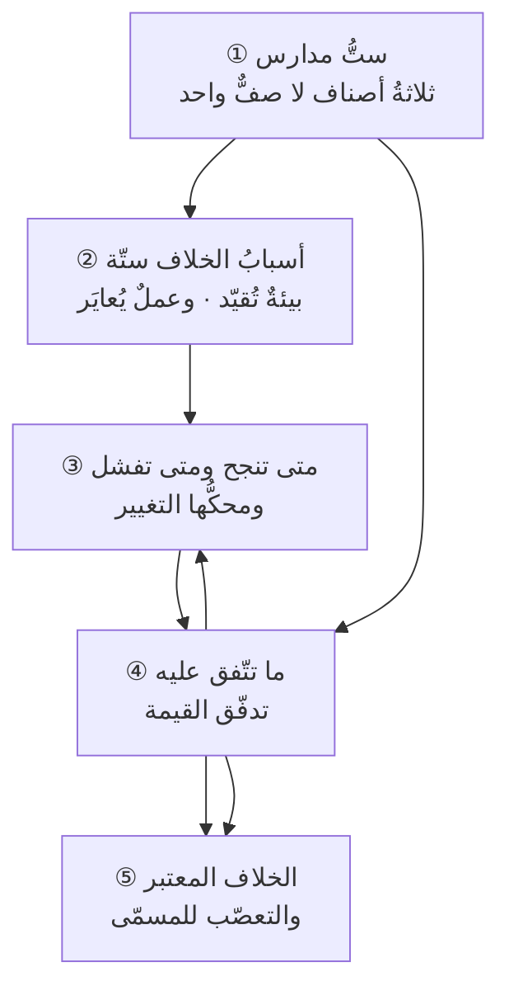

# الفصل 11 — لماذا اختلفت المدارس؟ وسبب الخلاف لا الخلاف وحده

---

## 🏛️ لماذا تقرأ هذا الفصل؟

**المشكلة:** يُسأل السؤال دائمًا هكذا: أيّهما أفضل، الشلال أم أجايل؟ وهو سؤال لا جواب له، لأن المدرستين لا تتنافسان على جواب واحد بل تجيبان عن سؤالين مختلفين.

**وماذا لو لم تعرف؟** من ظنّ الخلاف تفاضلًا تعصّب لمدرسة وحمّلها ما لا تحتمل، ثم لامها حين خذلته في سياق لم تُوضع له.

**وبعد هذا الفصل ستستطيع:**

- **أن تميّز ما هو مدرسةٌ في التسليم ممّا هو عدسةُ نظرٍ وممّا هو قاعدةُ تركيب** — فتعرف أنّ الستّة التي تُعرض في جدولٍ واحد ليست على صفٍّ واحد أصلًا، وأنّ **تفكير المنتج وتفكير الأنظمة لا يخبرانك كيف تُدير سبرنتًا، بل أين تنظر**، وأنّ «الهجين» ليس مدرسةً ثالثة بل **قرارَ تركيبٍ يُحكَم عليه بعلّته المعلنة**.
- **أن تحكم على أيّ سياقٍ بأيّ مدرسةٍ يناسبه بأسبابٍ ستّة لا بسببٍ واحد** — وأن تفرّق بين **ما تملك تغييره** (درجة الجهل · التقنية · حجم الفريق) و**ما يُفرَض عليك من خارجك** (بنية التعاقد · تنظيم الصناعة · ثقافة الجهة)، **فتختار المدرسة على الثاني وتُعايرها على الأوّل**.
- **أن تفسّر الخلاف بردّه إلى موضعه** — فتعرف أنّ أكثر ما يُتنازع فيه في الاجتماعات ليس خلافًا على المدرسة، **بل خلافًا على تشخيص السياق** أُلبس ثوب خلافٍ في المذهب؛ **وأنّ زحف النطاق شيءٌ مختلف في كلّ مدرسة، فمن نقل تعريفه من واحدةٍ إلى أخرى اتّهم فريقه بما ليس فيه.**

> [!info] بطاقة الفصل
> **النوع:** تركيبيّ
> **المستوى:** 🔴 متقدّم
> **زمن القراءة:** نحو 45 دقيقة
> **أهمّيته في الباب:** ★★★★★
> **موضعك:** انتهيتَ من [[10 - كيف تطور هذا العلم]] ← **⬤ أنت هنا** ← يليه [[12 - كيف يفكر مدير المشروع]]

> [!abstract] موقع هذا الفصل
> **يبني على:** [[Scope Creep]] · [[Change Request]] — يُذكَر هنا ولا يُعاد شرحه.
> **ويؤسّس:** [[Value Stream]] — يُقدَّم هنا أوّل مرّة فيصير متاحًا لما بعده.

---

## 🧭 السؤال المركزي

> [!question] السؤال الذي يجيب عنه هذا الفصل كلّه
> **لماذا اختلفت المدارس، ومتى يصلح كلٌّ منها؟**

**واحمل معك هذه الأسئلة وأنت تقرأ:**

- ما الذي يجعل مدرسة تصلح هنا ولا تصلح هناك؟
- هل الجمع بين مدرستين انتقاءٌ أم تصميم؟
- ما الذي تتّفق عليه المدارس كلّها رغم خلافها؟

---

## 🗺️ الجواب المختصر — قبل التفصيل

**اختلفت المدارس لأنّها لم تجب عن سؤالٍ واحد، وإنّما عن أسئلةٍ مختلفةٍ ظنّ الناس أنّها سؤالٌ واحد.** فالمدرسة التنبّؤية جوابٌ عن سؤال: **كيف نلتزم ونتعاقد على عملٍ كبيرٍ معلوم المطلوب؟** والرشيقة جوابٌ عن سؤال: **كيف نبني ما لا تُعرف متطلّباته إلا بالبناء؟** واللين جوابٌ عن سؤالٍ ثالثٍ لا صلة له بالاثنين: **لماذا يستغرق العمل الصغير زمنًا طويلًا وأكثرُه انتظارٌ لا عمل؟** **فالثلاثة لا تتنافس، لأنّ التنافس لا يكون إلا على سؤالٍ مشترك.**

**والستّة التي تُعرض عادةً في جدولٍ واحد ليست على صفٍّ واحد، وهذا أوّل ما يلزم تصحيحه.** فثلاثٌ منها **مدارس في التسليم** تقول لك كيف يُنظَّم العمل (التنبّؤية · الرشيقة · اللين)، **وواحدةٌ ليست مدرسةً أصلًا بل قاعدةُ تركيب** (الهجينة)، **واثنتان عدستا نظرٍ لا منهجَي عمل**: تفكير المنتج ينقل وحدة التمويل والملكية من مشروعٍ ينتهي إلى منتجٍ يبقى، وتفكير الأنظمة يفسّر لماذا يُسيء تحسينُ الجزء إلى الكلّ. **ومن قارن الستّة في جدولٍ واحدٍ قارن ما لا يُقارَن، ثمّ خرج بحكمٍ لا معنى له.**

**وأسباب الخلاف ستّة لا واحد، وهي تنقسم قسمين بينهما فرقٌ عمليّ حاسم.** فثلاثةٌ منها **في طبيعة العمل** — درجة عدم اليقين، والتقنية وكلفة التغيير فيها، وحجم المشروع وعدد من يعملون فيه — **وهذه تتغيّر بالتعلّم وبالاستثمار، وأنت تملك بعضها.** وثلاثةٌ **في بيئته** — بنية التعاقد والتمويل، ودرجة تنظيم الصناعة ورقابتها، وثقافة الجهة وتحمّلها لإعلان الخطأ — **وهذه لا تتغيّر بقرارٍ منك ولا في ربعٍ واحد.** **ولازمُ ذلك قاعدةٌ تُغني عن جدلٍ طويل: تُختار المدرسة على أسباب البيئة، وتُعايَر على أسباب العمل.** فمن اختارها على ما يستطيع تغييره اصطدم بما لا يستطيع.

**ولهذا يسقط السؤال «أيّها أفضل؟» سقوطًا تامًّا** — لا تلطّفًا ولا مجاملةً للجميع، **بل لأنّه سؤالٌ يفترض ترتيبًا واحدًا يصلح للسياقات كلّها، والأسباب الستّة تقلب الترتيب من موضعٍ إلى موضع.** **والسؤال الذي يقوم مقامه: أيُّ الأسباب الستّة غالبٌ عندي؟**

**ومحكّ التمييز بينها عمليٌّ لا نظريّ: اعرض على كلٍّ منها *تغييرًا*.** فالتنبّؤية تجعل له مسارًا مُعلَنًا يُقيَّم فيه أثره ويُوقَّع ويُحدَّث خطّ الأساس ([[Change Request|طلب التغيير]])، **وترفع كلفته عمدًا لا عجزًا** — إذ القصد ألّا يقع اعتباطًا. والرشيقة تُخفّض كلفته عمدًا وتستقبله مُدخَلًا طبيعيًّا للتعلّم، **فلا يكاد يكون عندها «طلب تغيير» بالمعنى الإجرائيّ أصلًا.** واللين لا موقف له من التغيير في ذاته، **وإنّما يسأل عن أثره في حجم العمل الجاري وطول الطابور.** **ومن نقل تعريف [[Scope Creep|زحف النطاق]] من مدرسةٍ إلى أخرى اتّهم فريقه بمرضٍ ليس فيه**، فالزحف في الأولى دخولُ تغييرٍ بلا مسار، **وفي الثانية ليس دخولَ عنصرٍ جديد بل ألّا يخرج شيءٌ في مقابله.**

**ومع هذا الخلاف كلِّه، تتّفق المدارس على شيءٍ واحدٍ هو الذي يجعل الجمع بينها ممكنًا: [[Value Stream|تدفّق القيمة]].** أي أنّ الوحدة التي يُحكَم بها **المسارُ الكامل** من الحاجة إلى القيمة الواصلة، لا الخطوةُ المنفردة فيه. **فالثلاثة كلُّها ترفض «نصف عملية»**، وإن اختلفت في حجم ما تُسلّمه ووتيرته. **وهذا الاتّفاق هو المقياس المشترك:** فمن أراد أن يعرف أيّ المدرستين أنفع في موضعه فليقس الشيء نفسه قبل وبعد — **زمن المسار كاملًا، ونسبة العمل فيه إلى الانتظار** — لا أن يقيس التزام الفريق بالطقوس.

**وثمرة الفصل أن يزول عنك سؤالٌ ويحلّ محلّه سؤالان.** يزول «أيّهما أصحّ؟»، **ويحلّ محلّه: أأعرف ما أريد بناءه بدقّةٍ تكفي لأن أثبّته؟ ومن يدفع ثمن تغييره إن تغيّر؟** فمن أجاب عن هذين أجاب عن سؤال المدرسة بلا أن يسأله، **ومن لم يُجب عنهما لم ينفعه أن يحفظ المدارس الستّ بأسمائها.**

> [!abstract] مفاهيم يُدخلها هذا الفصل في قاموسك
> `Value Stream`

> [!warning] مفاهيم يكثر الخلط بينها هنا
> `Predictive` مقابل `Agile` مقابل `Lean` مقابل `Hybrid` — احملها في ذهنك، فالفصل يفرّقها في محطّة التمييز.

---

## 🧱 الفكرة الأولى: ستّ مدارس، كلٌّ بالمشكلة التي جاءت لها

*موضعها من الفصل: هذه أوّل خطوةٍ وهي شرطُ ما بعدها، **إذ لا يُسأل عن سبب الخلاف قبل أن يُعرف المختلفون**. وأوّل ما تصحّحه أنّ الستّة **ليست بدائل على رفٍّ واحد** بل ثلاثة أصنافٍ يُسأل عن كلٍّ منها سؤالٌ آخر — ومن جهل هذا قارن ما لا يُقارَن.*

**وقبل عرضها يلزم تصحيحٌ في ترتيبها، وإلّا فسد ما بعده: أنّ الستّة ليست ستّة بدائل على رفٍّ واحد.** فهي ثلاثة أصنافٍ مختلفة، وكلُّ صنفٍ يُسأل عنه سؤالٌ آخر:

- **مدارس التسليم (ثلاث):** تجيب عن **كيف يُنظَّم العمل؟** — التنبّؤية والرشيقة واللين. **وهذه وحدها التي يصحّ أن يُقال فيها إنّك «تعمل بها».**
- **قاعدة التركيب (واحدة):** الهجينة — **وليست مدرسةً لأنّها لا تحمل فرضًا خاصًّا بها ولا وحدةَ عملٍ خاصّة**، وإنّما تقول: ركّب من الثلاث بحسب طبيعة الجزء.
- **عدستا النظر (اثنتان):** تفكير المنتج وتفكير الأنظمة. **وهاتان لا تخبرانك كيف تُدير أسبوعك، بل *أين تنظر* وبأيّ وحدةٍ تحكم** — فتنطبق كلٌّ منهما على أيّ مدرسةٍ من الثلاث.

**فمن وضع الستّة في جدول مقارنةٍ واحدٍ بأعمدةٍ متطابقة أنتج جدولًا لا يقول شيئًا** — إذ يُسأل فيه عن «مدّة التكرار في تفكير الأنظمة»، وهو سؤالٌ لا معنى له.

### ① المدرسة التنبّؤية (Predictive)

**المشكلة التي جاءت لها: كيف يُلتزَم ويُتعاقَد على عملٍ كبيرٍ يشترك فيه كثيرون ومطلوبُه معلوم؟** ففي المشروع الذي تُشترى فيه موادّ بمواعيد، وتُحجَز له طاقاتٌ من جهاتٍ متعدّدة، ويُدفَع ثمنه من ميزانيةٍ معتمَدة — **يلزم أن يُعرف ماذا سيُسلَّم ومتى قبل أن يُبدأ**، لا لأنّ ذلك أفضل، **بل لأنّ من يموّل ومن يورّد لا يستطيعان أن يلتزما بمجهول.**

**وفرضها المركزيّ:** أنّ المطلوب يمكن أن يُعرَف قبل البناء بدقّةٍ كافية. **ووحدة عملها:** المرحلة المنتهية ببوّابةٍ يُراجَع عندها ويُصادَق. **وموقفها من التغيير:** أنّه استثناءٌ يُضبَط بمسارٍ معلوم.

**وأكثر ما يُظلَم فيه هذا المذهب أنّ ارتفاع كلفة التغيير عنده يُقرأ عجزًا، وهو في أصله *تصميم*.** فالقصد أن يكون التغيير مكلفًا **حتى لا يقع اعتباطًا** — إذ في المشروع الذي تعتمد عليه ثلاث جهاتٍ أخرى، **يكون تغييرُ فردٍ لرأيه في الأسبوع الثاني عشر أغلى على المنظومة من إلزامه برأيه الأوّل.** فالبطء هنا حارسٌ لا خلل، **والحكم عليه إنّما يصحّ حين يُوضع في موضعٍ لا يحتاج حارسًا.**

> [!info] إضافة مرجعية — التنبّؤية أوسع من «الشلال»، والخلط بينهما يُفسد النقاش
> يُستعمل «الشلال» و«التنبّؤية» استعمالًا مترادفًا في أكثر ما يُكتب، **وهما ليسا كذلك.** فالتنبّؤية **مدرسة** فرضُها أنّ المطلوب يُعرَف مقدّمًا، **والشلال شكلٌ واحدٌ من أشكالها** — أشدُّها تتابعًا: مرحلةٌ لا تبدأ حتى تنتهي التي قبلها انتهاءً تامًّا.
>
> **وللمدرسة نفسها أشكالٌ أخرى تُغفَل:** المرحليّ ببوّاباتٍ يُعاد عندها تقييم الجدوى فيجوز الإيقاف لا التعديل فقط · **والتزايديّ المخطَّط** الذي يُثبَّت فيه النطاق كلُّه مقدّمًا ثمّ يُسلَّم على دفعاتٍ مخطَّطة · **والحلزونيّ** الذي يُكرَّر فيه التحليل والبناء دوراتٍ يُقصد بكلِّ دورةٍ خفضُ خطرٍ بعينه.
>
> **وأثر التفريق عمليّ لا اصطلاحيّ:** فمن رفض «الشلال» ظنَّ أنّه رفض التنبّؤية كلَّها، **فحُرم من أشكالها التي تحتمل التعلّم داخلها** — كالبوّابة التي يجوز عندها الإيقاف، وهو أنفع ما في المدرسة وأقلُّه استعمالًا. **فأكثر من يعمل تنبّؤيًّا لا يستعمل بوّاباته إلا مصادقةً على المضيّ، ولم يُوقَف عندها مشروعٌ قطّ** — وحينئذٍ فقدت البوّابة وظيفتها وبقيت كلفتها.

### ② المدرسة الرشيقة (Agile)

**المشكلة التي جاءت لها: كيف يُبنى ما لا تُعرف متطلّباته إلا بالبناء؟** — وقد فُصّل عجزها في [[10 - كيف تطور هذا العلم|الفصل 10]]: فرقٌ تُسلّم بالضبط ما طُلب منها فلا يُستعمل، **ولوحاتُ القياس كلُّها خضراء.**

**وفرضها المركزيّ:** أنّ رأي الطالب في الشيء يتكوّن حين يراه، **فتثبيت النطاق مقدّمًا تثبيتٌ لجهلٍ لا لمعرفة.** **ووحدة عملها:** زيادةٌ عاملةٌ تُسلَّم في مدّةٍ قصيرة. **وموقفها من التغيير:** أنّه **مُدخَل** لا استثناء، **وتُخفَّض كلفته عمدًا** بالأتمتة والتصميم القابل للتبديل.

**وحدُّها الذي يُغفَل: أنّها تفترض وجود من يقرّر.** فالمرونة لا تعني أنّ كلّ ما يُطلب يُبنى، **بل أنّ ترتيب ما يُبنى يُعاد النظر فيه باستمرار — وإعادة النظر تحتاج من يملك أن يقول: لا، ليس الآن.** فحيث لا يوجد هذا الشخص لا تُنتج الرشيقة مرونةً، **بل تُنتج قائمةً تنمو ولا تُرتَّب.**

### ③ اللين (Lean)

**والمشكلة التي جاء لها ليست في الاثنتين أعلاه: لماذا يستغرق العمل الصغير زمنًا طويلًا، وأكثرُ ذلك الزمن انتظارٌ لا عمل؟**

**وفرضه المركزيّ** مقيسٌ لا مذهبيّ: **أنّ نسبة زمن العمل الفعليّ إلى زمن المسار كلِّه صغيرةٌ في أكثر المنظومات** — فالعنصر ينتظر في طوابير أكثر ممّا يُعمَل فيه. **ووحدة عمله:** العنصر الواحد وهو يعبر المسار. **وموقفه من التغيير:** لا موقف — **وهذا ما يُغفل عنه كثيرًا.** فاللين لا يقول شيئًا في تثبيت النطاق ولا في فتحه، **وإنّما يقول في *حجم العمل الجاري* وفي *حدّه*.**

**وكانبان طريقة (Method) لا إطار عمل**، والفرق عمليّ لا لفظيّ: **فهي لا تعرّف دورًا ولا حدثًا ولا مصنوعًا، وإنّما تُطبَّق فوق عمليةٍ قائمةٍ فتغيّر إدارتها.** ولهذا كان أوّل مبادئها: **ابدأ بما تفعله الآن.** **ولازمُه العمليّ الذي يُخطئ فيه كثيرون: أنّ من لم تكن عنده عمليةٌ قائمةٌ أصلًا لم تُعطه كانبان عملية** — إنّما تُظهر له فوضاه بصورةٍ أوضح، وهذا نافعٌ في نفسه وليس هو ما طلبه.

### ④ الهجينة (Hybrid) — وليست مدرسةً بل قرارَ تركيب

**المشكلة التي جاءت لها: أنّ المشروع الواحد ليس قطعةً واحدة.** ففيه جزءٌ مطلوبُه معلومٌ ومرتبطٌ بجهاتٍ خارجية (ترحيل بيانات · شراء عتاد · ربطٌ بجهةٍ حكومية له نافذةٌ ثابتة)، **وجزءٌ مطلوبه مجهولٌ يُكتشف بالاستعمال** (شاشاتٌ يستعملها الناس · تقاريرُ لا يُعرف ما يُطلب منها).

**ولأنّها ليست مدرسةً، فليس لها نصٌّ يُرجَع إليه، ولا يصحّ أن يُقال «الهجين يقول كذا».** **وإنّما يُحكَم عليها بشيءٍ واحد: أعُلّتها معلنة أم لا؟** فالهجين المصمَّم يقول: **هذا الجزء تنبّؤيّ لأنّ كلفة تغييره تُدفع خارج الفريق، وهذا رشيقٌ لأنّ جهلنا فيه كبير.** والهجين المنتحَل يقول: **نأخذ من كلٍّ أحسن ما فيه** — وهذه جملةٌ لا تُترجَم إلى قرار.

### ⑤ تفكير المنتج (Product Thinking) — عدسةٌ تُغيّر وحدة الملكية

**المشكلة التي جاء لها: أنّ المشروع ينتهي والمنتج يبقى.** فالمشروع مؤقّتٌ بطبعه، **فإذا كان ما يُبنى شيئًا سيُستعمَل سنين، صار انتهاء المشروع لحظةَ تفرّقٍ لمن يعرفه** — ثمّ يُطلب بعد ستّة أشهر تعديلٌ فلا يوجد من يُنفّذه إلا بعقدٍ جديدٍ وفريقٍ جديدٍ يقرأ ما كتب غيره.

**وما يُغيّره ليس طريقة العمل بل *وحدة التمويل والملكية*:** من تمويل **مشروعٍ** له بداية ونهاية، إلى تمويل **فريقٍ دائمٍ** مسؤولٍ عن تدفّقٍ من القيمة يستمرّ. **وسؤاله الفاصل واحد: من مالكه بعد ثلاثة أشهر؟ وما ميزانيته؟** — فمن لم يجد لهذا السؤال جوابًا فما بين يديه مشروعٌ سيُيتَّم.

### ⑥ تفكير الأنظمة (Systems Thinking) — عدسةٌ تُفسّر ما لا تفسّره الثلاث

**المشكلة التي جاء لها: أنّ تحسين الجزء قد يُسيء إلى الكلّ.** فالمدارس الثلاث كلُّها تنظر إلى **مسارٍ** — مرحلةً أو تكرارًا أو تدفّقًا — **ولا تفسّر لماذا يُنتج الحلُّ الصحيح في موضعه ضررًا في موضعٍ آخر بعد ثلاثة أشهر.**

**وما تضيفه ثلاثة:** أنّ في المنظومة **حلقاتٍ راجعة** لا خطوطًا مستقيمة ([[Feedback Loop]])، وأنّ بين السبب وأثره **تأخّرًا** يجعل الناس ينسبون الأثر إلى غير سببه، **وأنّ لكلّ حلٍّ أثرًا ثانيًا** يظهر بعد أن يكون قد نُسي.

**ومثاله الذي يقع في كلّ مكان:** يُطلَب تسريع الاختبار فيُضاف مختبِرون، فيزيد ما يصل إلى النشر، فيزداد الضغط على من يوقّع، **فيطول الانتظار عنده فيصير الزمن الكلّيّ أطول ممّا كان.** **والمدارس الثلاث لا تُخطئ هنا؛ إنّها لا ترى هذا أصلًا** لأنّها تنظر إلى المسار ولا تنظر إلى الحلقة.

### وكيف تجتمع العدستان مع المدرسة؟ — طبقتان لا ثلاثة خيارات

**والعدستان لا تُختاران بدل المدرسة، بل تُركَّبان فوقها — وكلٌّ منهما تُغيّر شيئًا مختلفًا:**

- **تفكير المنتج يُغيّر *ما تُموّله وما تملكه*.** فأنت قد تعمل بسكرم وتُموّل مشروعًا ينتهي، **فيتفرّق الفريق بعد التسليم وتذهب معرفته.** وقد تعمل بسكرم نفسِه وتُموّل فريقًا دائمًا على منتج، **فتبقى المعرفة ويستمرّ التحسين.** **والمنهج واحدٌ في الحالين، والنتيجة بعد سنتين مختلفةٌ اختلافًا تامًّا** — وهذا يبيّن أنّ العدسة تعمل في طبقةٍ فوق المنهج لا في منافسته.
- **وتفكير الأنظمة يُغيّر *أين تبحث عن السبب*.** فأنت قد تعمل بالمنهج نفسه وتردّ بطء التسليم إلى الفريق، **فتضيف إليه أشخاصًا فيزداد بطئًا** ([[Brooks's Law|قانون بروكس]]) — وقد تردّه إلى الحلقة فتجد أنّ الإضافة زادت ما يصل إلى موضعٍ لم يتّسع، **فتُعالج الموضع ولا تضيف أحدًا.**

**فالبناء ثلاث طبقاتٍ لا صفٌّ من ستّة:** **مدرسةٌ تُنظّم العمل**، و**عدسةُ ملكيّةٍ تقرّر ما تُموّله ومن يبقى معه**، و**عدسةُ نظرٍ تقرّر أين تبحث عن السبب حين يسوء شيء.**

**ومن غاب عنه هذا وقع في واحدةٍ من حالتين:** إمّا أن يُغيّر منهجه مرّةً بعد مرّةٍ والعطب في طبقةٍ أخرى — **فيُجرّب سكرم ثمّ كانبان ثمّ يعود، والمشكلة أنّ الفريق يتفرّق بعد كلّ مشروع فلا تتراكم معرفة**؛ وإمّا أن يتكلّم في العدسات وحدها **فلا يعرف فريقه ماذا يفعل يوم الأحد.**

> [!example] جدولٌ يجمع الستّة — ولا يسوّي بينها
> **والعمود الأخير هو موضع القراءة:** فالثلاث الأولى تُجيب عنه إجابةً مختلفة، والثلاث الباقية لا تُسأل عنه أصلًا.
>
> | المدرسة | المشكلة التي جاءت لها | فرضها المركزيّ | وحدة عملها | وماذا تفعل بالتغيير؟ |
> |---|---|---|---|---|
> | **التنبّؤية** | الالتزام والتعاقد على عملٍ كبيرٍ معلوم | المطلوب يُعرَف قبل البناء | المرحلة والبوّابة | مسارٌ معلَن، وكلفةٌ مرفوعة **عمدًا** |
> | **الرشيقة** | المتطلّبات لا تُعرف إلا بالبناء | الرأي يتكوّن عند الرؤية | الزيادة العاملة | مُدخَلٌ طبيعيّ، وكلفةٌ مخفَّضة عمدًا |
> | **اللين** | الزمن الطويل أكثرُه انتظار | نسبة العمل إلى الانتظار صغيرة | العنصر في المسار | لا موقف — بل أثرُه في الطابور |
> | **الهجينة** | المشروع ليس قطعةً واحدة | لأجزائه طبائعُ مختلفة | *لا وحدة خاصّة بها* | بحسب الجزء، **والعلّة معلنة** |
> | **تفكير المنتج** | المشروع ينتهي والمنتج يبقى | الملكية تدوم ولا تنتهي بالتسليم | المنتج والفريق الدائم | *ليست من أسئلته* |
> | **تفكير الأنظمة** | تحسين الجزء يضرّ الكلّ | المنظومة حلقاتٌ لا خطوط | المنظومة كلُّها | *ليست من أسئلته* |

### ولماذا لا تندثر مدرسةٌ منها؟

**والسؤال الذي يلحّ بعد هذا العرض: إن كانت الرشيقة أنسب لأكثر ما يُبنى اليوم، فلماذا لم تندثر التنبّؤية بعد عشرين سنة؟**

**والجواب في ثلاثةٍ، وأوّلها هو الحاسم:**

1. **أنّ سؤالها لم يسقط.** فما دام هناك من يشتري بعقد، ومن يموّل بميزانيةٍ معتمَدةٍ سلفًا، **فسيبقى سؤال «كيف نلتزم أمام من لا يستطيع أن يلتزم بمجهول؟» مطروحًا.** **والمدرسة لا تندثر إلا إذا اندثر عجزُها** — وهذا هو حكم [[10 - كيف تطور هذا العلم|الفصل 10]] مطبَّقًا هنا.
2. **أنّ أكثر ما يُبنى ليس منتجًا جديدًا.** فالصورة الشائعة عن هذا المجال مأخوذةٌ من بناء المنتجات المبتكرة، **وأكثر العمل الفعليّ في العالم ترحيلٌ وتكاملٌ وتطبيقُ نظمٍ جاهزةٍ وتحديثُ بنيةٍ قائمة** — وهذه أعمالٌ مطلوبها معروفٌ إلى حدٍّ بعيد.
3. **أنّ الأثر غير القابل للتراجع لم يزل موجودًا.** فحيث لا يُصلَح الخطأ بنشرةٍ جديدة، **يبقى للمراجعة المسبقة معنى.**

**ويلزم من هذا ما يلزم بالعكس أيضًا: أنّ الرشاقة لن تندثر ولو تغيّرت التقنيات كلُّها، ما دام الإنسان لا يعرف ما يريد حتى يراه.** **فالمدارس تبقى ببقاء أسئلتها، وتنكمش وتتّسع بحسب نصيب كلّ سؤالٍ من العمل القائم في زمانها** — لا بحسب من انتصر في نقاشٍ على منصّة.

> [!tip] كيف تستعمل هذه الفكرة
> **قبل أن تسمّي مدرستك، سمِّ المشكلة التي عندك بجملةٍ واحدةٍ فيها موقفٌ ومقدار.** فإن كانت «نُسلّم فلا يُستعمَل» فأنت أمام سؤال الرشيقة. وإن كانت «نُنجز بسرعة ثمّ ينتظر العمل شهرًا» فأنت أمام سؤال اللين، **والرشيقة لن تحلّه لأنّها لم تُوضع له.** وإن كانت «لا نستطيع أن نلتزم أمام جهةٍ ممولة» فأنت أمام سؤال التنبّؤية.
>
> **والعلامة على أنّك سمّيت المشكلة تسميةً صحيحة: أن يصير اسم المدرسة نتيجةً لا اختيارًا.**

> [!warning] الحفرة الشائعة — أن تُؤخذ العدسة مكان المنهج
> **تفكير المنتج وتفكير الأنظمة لا يُدار بهما مشروع.** فمن قال «نحن نعمل بتفكير الأنظمة» ولم يكن تحته منهجُ تسليم، **فقد وصف زاوية نظرٍ وترك السؤال عن كيفية العمل بلا جواب** — ثمّ يجد فريقه لا يعرف ما يفعله يوم الأحد.
>
> **والعكس أضرّ منه:** أن يُدار المشروع بمنهجٍ محكمٍ بلا عدسة، **فيُحسَّن كلُّ جزءٍ على حدة ويسوء الكلّ**، ولا يفهم أحدٌ لماذا — لأنّ كلَّ لوحةٍ تقول إنّ نصيبها تحسّن. **فالعدسة والمنهج طبقتان تعملان معًا، لا بديلان يُختار أحدهما.**

> [!question]- تأكّد أنك فهمت — لماذا لا يصحّ أن تُوضع كانبان وسكرم في عمودين متقابلين بالطريقة نفسها؟
> **لأنّ سكرم إطار عمل يعرّف مسؤولياتٍ وأحداثًا ومصنوعات، وكانبان طريقة تُطبَّق *فوق* عمليةٍ قائمةٍ ولا تعرّف شيئًا من ذلك.**
>
> **فالسؤال «أيّهما نتبنّى؟» صحيحٌ في الأوّل وناقصٌ في الثاني:** إذ لا يُتبنّى كانبان بديلًا عن عمليّتك، **بل يُطبَّق على عمليّتك أيًّا كانت** — ولهذا يمكن أن تعمل بسكرم وتُطبّق حدود العمل الجاري عليه، ولا يمكن العكس بالمعنى نفسه. **ومن سوّى بينهما في جدولٍ واحد لزمه أن يملأ عن كانبان خاناتٍ ليست فيها** (أدوارها · أحداثها · مدّة تكرارها)، **فيُنتج فروقًا لا وجود لها** ثمّ يبني عليها قرارًا.

> [!summary]- خلاصة الفكرة في سطرين
> **المدارس الستّ ليست ستّة بدائل على رفٍّ واحد، بل ثلاثة أصنافٍ يُسأل عن كلّ صنفٍ سؤالٌ آخر.**
> **ومن عرضها بدائل متساوية جعل الاختيار بينها ذوقًا** — وهي في الحقيقة أجوبةٌ عن مشكلاتٍ مختلفة، فلا يصحّ أن يُقارن الجواب بالجواب قبل أن تُقارن المشكلة بالمشكلة.

> [!question] تأمّلٌ تطبيقيّ — لا جواب له في هذا الفصل
> اكتب اسم المدرسة التي تعملون بها، ثمّ اكتب تحتها: **ما المشكلة التي وُضعت لها أصلًا؟**
>
> **ثمّ اسأل: أهي مشكلتنا؟** فإن لم تكن، فليس العطب في المدرسة ولا فيمن طبّقها — بل في أنّ جوابًا صحيحًا وُضع على سؤالٍ ليس له، **وهذا لا يُصلحه إتقانٌ أكبر في التطبيق.**

---

## 🧱 الفكرة الثانية: أسباب الخلاف ستّة لا واحد

*موضعها من الفصل: عُرفت المدارس، وتسأل هذه الفكرة **لماذا افترقت**. **وتزيد على الجواب المتداول أنّها لا تكتفي بدرجة عدم اليقين** — وهو أقوى الأسباب أثرًا وأنقصُها وحده: فمن اكتفى به أوصى جهةً حكوميّةً بالتسليم الأسبوعيّ ثمّ تعجّب لِمَ لم تفعل، وهي لا تملك أن تفعل لا أنّها لا تريد.*

**والسبب الذي يُذكر وحده — درجة عدم اليقين — صحيحٌ وناقص.** فهو أقوى الستّة أثرًا، **غير أنّ الاكتفاء به يجعلك تُوصي فريقًا في جهةٍ حكوميّةٍ بالتسليم الأسبوعيّ ثمّ تتعجّب لِمَ لم يفعل** — وهو لا يملك أن يفعل، لا لأنّه لا يريد.

**والستّة تنقسم قسمين، والقسمة هي الفائدة لا العدّ:**

### القسم الأوّل — أسبابٌ في طبيعة العمل، وأنت تملك بعضها

**① درجة عدم اليقين.** وهي مقدار ما تجهله عن المطلوب وعن الطريق إليه معًا. **وتُقاس بثلاثة أسئلةٍ لا بانطباع:**

- هل تستطيع أن تكتب اليوم معايير قبولٍ لما ستبنيه بعد ثلاثة أشهر؟
- كم مرّةً تغيّر فهمك للمطلوب في الأشهر الثلاثة الماضية؟
- ما نسبة ما بُني ثمّ أُعيد بناؤه أو حُذف؟

**فمن كانت أجوبته «نعم · لا مرّة · قريبٌ من الصفر» فهو في موضع التنبّؤية ولو كره ذلك**، ومن كانت أجوبته المقابلة فهو في موضع الرشيقة ولو كان في جهةٍ لا تعرفها. وتصنيف حال العمل نفسه محرَّرٌ في [[Cynefin|إطار كونيفين]].

**② التقنية وكلفة التغيير فيها.** **فالمرونة لا تُشترى بالنيّة بل بالبنية.** فمن كان تعديله يستلزم إعادة اختبارٍ يدويٍّ لأسبوع، **فالتسليم الأسبوعيّ عنده مستحيلٌ اقتصاديًّا لا ثقافيًّا** ([[Cost-of-Change Curve|منحنى تكلفة التغيير]]). **وهذا هو السبب الذي يُغفَل حين يُلام الفريق على «مقاومة التغيير»**، وإنّما هو يستجيب لكلفةٍ حقيقيّة يعرفها ولا يعرفها من يوصيه.

**③ الحجم وعدد من يعملون.** فما يصلح لسبعةٍ في غرفةٍ لا يصلح لسبعين في أربع جهات — **لا لأنّ المبادئ تتغيّر، بل لأنّ ما كان يقع في الأولى بالحديث يحتاج في الثانية إلى ترتيبٍ مكتوب.** **والعلامة الفارقة: متى صار من يحتاج أن يعرف قرارًا لا يسمعه بالمصادفة، لزم الترتيب.**

### القسم الثاني — أسبابٌ في البيئة، لا تتغيّر بقرارٍ منك

**④ بنية التعاقد والتمويل.** **وهذا أقوى الستّة قهرًا وأقلُّها ذكرًا.** فالجهة التي تشتري بعقدٍ محدَّد النطاق والسعر **قد ألزمت مورّدها بالمدرسة التنبّؤية قبل أن يبدأ**، مهما تكلّم الطرفان عن الرشاقة. **والعقد يختار المدرسة، لا الفريق.** ومن أراد أن يغيّر المدرسة فليبدأ من هنا لا من لوحة العمل.

**⑤ درجة تنظيم الصناعة ورقابتها.** فحيث تكون هناك جهةٌ تُصادق، أو معيارٌ يُلزم بأثرٍ موثَّق، أو مراجعةٌ لاحقةٌ تسأل عمّا وقع — **يصير التوثيق شرطًا لا اختيارًا.** **وهذا لا يمنع الرشاقة، لكنّه يمنع صورةً منها**: تلك التي تختصر التوثيق لأنّه «غير ذي قيمة».

**⑥ الثقافة، ومحكُّها واحد: أيُعلَن الخطأ أم يُستَر؟** فكلُّ ما بُني على التعلّم من التغذية الراجعة يفترض أنّ الخبر السيّئ يمكن أن يُقال بلا ثمنٍ شخصيّ. **فحيث يكون قائل الخبر السيّئ هو من يُحاسَب، تُنتج المراسم الرشيقة تقارير خضراء أسبوعية** — أسرعَ من ذي قبل، ولكنّها كاذبةٌ بالوتيرة نفسها.

### وكيف تُشخَّص أسباب البيئة؟ — بأسئلةٍ تُجاب لا بانطباع

**وأسباب البيئة أعسر تشخيصًا من أسباب العمل، لأنّ الناس يصفونها بما يتمنّونه لا بما هي عليه.** **فتُشخَّص بأسئلةٍ عن وقائع، وكلُّ سؤالٍ منها جوابه حادثةٌ لا رأي:**

**④ بنية التعاقد والتمويل:**

- **إن أردنا أن نُبدّل عنصرًا بعنصرٍ مساوٍ له في الحجم، كم يستغرق ذلك؟** فإن كان جوابك «يومًا» فأنت حرّ، **وإن كان «ملحقًا تعاقديًّا في ستّة أسابيع» فقد أُغلق بابك.**
- **ومتى يُصرَف المال؟** أعند بلوغ مرحلةٍ محدَّدة مسبقًا، أم على مدّةٍ زمنيّة؟ **فالأوّل يُلزمك بتعريف المراحل مقدّمًا، والثاني يُتيح لك أن تُعيد ترتيبها.**

**⑤ درجة تنظيم الصناعة:**

- **من يستطيع أن يوقف نشرك؟** وكم يستغرق حتى يقرّر؟ **فإن كانت هناك جهةٌ خارج مشروعك تملك المنع ولها دورةٌ ثابتة، فقد تحدّد إيقاعُك من خارجك.**
- **وإن سُئلنا بعد سنتين عن قرارٍ اتُّخذ اليوم، بأيّ شيءٍ نُثبته؟** **فوجود جوابٍ لهذا السؤال يجعل التوثيق ضرورةً لا اختيارًا** — ومن أراد أن يخفّفه فليخفّفه بعد أن يعرف هذا لا قبله.

**⑥ ثقافة إعلان الخطأ — ومحكّها واقعة لا وصف:**

- **متى آخر مرّةٍ قال أحدٌ في اجتماعٍ إنّ عمله متأخّرٌ قبل أن يُسأل؟** فإن لم تجد واقعةً في ستّة أشهر، **فالتغذية الراجعة عندك لا تصل مهما قصّرتَ حلقاتها.**
- **وماذا وقع لمن فعل ذلك؟** — وهذا هو السؤال الحاسم. **فالمنظّمة لا تتعلّم من شعاراتها بل من أوّل حالةٍ رأت فيها ما يقع لقائل الخبر السيّئ**، ثمّ تعمّم الحكم في يومٍ واحد.

**والفائدة أنّ هذه الأسئلة الستّة تُجاب في جلسةٍ واحدة، وتُنتج تشخيصًا يصمد** — **بينما «نحن جهةٌ منضبطة» أو «نحن نؤمن بالشفافية» أوصافٌ لا يُبنى عليها قرار.**

### وإذا تعارضت الأسباب، فأيّها يُقدَّم؟

**والغالب أنّها تتعارض؛ فقلّما تجتمع الستّة على وجهةٍ واحدة.** **والترتيب الذي يُرجَّح به ثلاثة، مرتّبةٌ بقوّة القهر لا بقوّة الحجّة:**

1. **يُقدَّم ما لا تملك تغييره على ما تملكه.** فبنية العقد تسبق درجة الجهل في الترجيح — **لا لأنّها أهمّ، بل لأنّ مخالفتها لا تُنتج قرارًا بل نيّة.** فمن اختار ما يمنعه عقدُه لم يختر شيئًا.
2. **ثمّ يُقدَّم ما كان أثر الخطأ فيه غير قابلٍ للتراجع.** فحيث يكون الخطأ يُصلَح في ساعةٍ يُرجَّح التجريب، **وحيث يكون لا يُصلَح — بياناتٌ رُحِّلت، أو مبلغٌ صُرف، أو إفصاحٌ نُشر — يُرجَّح التثبيت والمراجعة المسبقة**، وإن كان جهلك كبيرًا. **بل كِبَرُ الجهل هنا حجّةٌ على التمهّل لا عليه.**
3. **ثمّ تُرجَّح درجة الجهل، وهي التي تُعيّر الباقي كلَّه** — طولَ الأفق، ومقدارَ ما يُثبَّت، وحجمَ الدفعة.

**ولازمُ هذا الترتيب أنّ التعارض بين ①و③ هو أكثر ما يقع، وهو الذي يُنتج الحاجة إلى الهجين أصلًا:** جهلٌ كبيرٌ يدفع إلى الرشاقة، **وعقدٌ مغلقٌ يمنعها.** **وأنفع ما يُفعل حينئذٍ ليس اختيار أحدهما، بل *تسمية التعارض ورفعه إلى من يملك رفعه*** — فتُقترح مراحل تعاقدٍ متتابعة، أو تُشترى مخصّصات تغييرٍ معلنة، أو يُثبَّت جزءٌ ويُترك جزءٌ مفتوحًا في العقد نفسه.

**والفريق الذي يبتلع التعارض ولا يرفعه يدفع ثمنه سنةً كاملة، ثمّ يُسأل: لماذا تأخّرتم؟** — **فيجيب بما لا يُقنع، لأنّ سببه الحقيقيّ قرارٌ اتُّخذ قبل أن يبدأ.**

### والأسباب تتغيّر، فالمدرسة تُراجَع بموعد

**وأكثر ما يُغفَل في هذا الباب أنّ الأسباب الستّة ليست ثابتةً في عمر المشروع الواحد، فضلًا عن عمر المنظّمة.** **فدرجة الجهل تنخفض بطبعها كلّما بُني شيءٌ وشُوهد أثره** — وهذا مقصود التسليم المبكّر أصلًا. **ويلزم من ذلك لازمٌ يُنكره كثيرٌ ممّن يعمل بالرشاقة: أنّ المشروع قد ينتقل مع الزمن إلى ما يشبه التنبّؤية في جزءٍ منه**، لا تراجعًا بل لأنّ سببه تغيّر.

**ومثاله ظاهر:** منتجٌ في سنته الأولى لا يُعرف ما يُطلب منه، **فيُدار بجهلٍ عالٍ وأفقٍ قصير.** فإذا استقرّ في سنته الثالثة وصار له مستعملون يعتمدون عليه وواجهاتٌ يبني عليها آخرون، **فقد ارتفع أثر الخطأ وانخفض الجهل معًا** — فصار جزءٌ منه يحتمل التثبيت بل يطلبه.

**وفي المقابل تتغيّر أسباب البيئة أيضًا وإن ببطء:** فبنية العقد تُعاد صياغتها عند التجديد، **وثقافة إعلان الخطأ تتغيّر بتغيّر من يجلس على رأس الطاولة** — وهذان يتغيّران في سنواتٍ لا في أرباع، ولكنّهما يتغيّران.

**فالقاعدة: اختيار المدرسة سؤالٌ يُجدَّد بموعد، لا سؤالٌ يُحسم مرّةً** — على ما قرّره [[07 - الأسئلة الكبرى|الفصل 07]] في تفريق ما يُجدَّد بموعدٍ عمّا يُفتح بسبب. **وموعدُه الطبيعيّ عند تغيّر العقد، أو عند انتقال المنتج من طورٍ إلى طور، أو عند تضاعف عدد من يعملون فيه.** **وأمّا العلامة على أنّه لم يُجدَّد فواحدة: أن يُجاب سؤال «لماذا نعمل هكذا؟» بـ«هكذا وجدنا الأمر».**

> [!info] إضافة مرجعية — وأصلٌ منشورٌ لهذه القسمة
> عرض **باري بويم** و**ريتشارد تيرنر** في *Balancing Agility and Discipline* (2003) **خمسة عوامل** يُحدَّد بها موضع المشروع بين الانضباط والرشاقة: **الحجم · الحرجيّة (أثر الخطأ) · التغيّر · مستوى الفريق · الثقافة**، ورسموها رسمًا خماسيًّا يُظهر إلى أيّ الطرفين يميل السياق.
>
> **والستّة أعلاه تلتقي معهما في أربعة وتفترق في اثنين، ويُصرَّح بذلك:** فقد أُفرد هنا **بنيةُ التعاقد والتمويل** و**درجةُ تنظيم الصناعة** سببين مستقلّين — **وهما عند بويم وتيرنر داخلان في «الحرجيّة» و«الثقافة» ضمنًا لا صراحة.** **وعلّة إفرادهما أنّ القارئ في المنطقة العربية يعمل غالبًا في مشاريع جهاتٍ عامّةٍ أو شبه عامّة، والعقدُ فيها هو المحدِّد الأوّل عمليًّا** — فإبقاؤه مستترًا داخل عاملٍ آخر يُخفي أقوى ما يقيّده. **فهذه إضافةٌ في التبويب لا في الأصل**، وتُقرأ اجتهادًا مؤرَّخًا لا نقلًا عنهما.

> [!example] جهةٌ واحدة، ومشروعان، ومدرستان — بلا تناقض
> جهةٌ حكوميّةٌ في **الرياض** كانت تُدير في السنة نفسها مشروعين، وأصرّ مكتب إدارة المشاريع فيها أوّلًا على منهجٍ واحدٍ للاثنين «توحيدًا للممارسة».
>
> **الأوّل:** استبدال نظام الرواتب. المطلوب معلومٌ إلى حدٍّ بعيد لأنّه محكومٌ بلوائح مكتوبة، والخطأ فيه شديد الأثر، والتكامل مع جهاتٍ خارجيّةٍ له نوافذ ثابتة، والعقد محدَّد النطاق. **فالأسباب الستّة كلُّها تدفع إلى التنبّؤية**، ولم يكن في ذلك تخلّفٌ عن العصر.
>
> **والثاني:** بوّابة خدماتٍ للمستفيدين. لا أحد يعرف أيّ الخدمات ستُستعمل، والخطأ فيه رخيص لأنّه قابلٌ للتراجع، والنشر بيد الفريق نفسه. **فأسبابه تدفع إلى الرشيقة.**
>
> **ولمّا فُرض المنهج الواحد وقع ما يُتوقّع:** في الأوّل تعثّرت المرونة على نافذة التكامل الفصليّة، **وفي الثاني أُنتجت مواصفةٌ من مئةٍ وأربعين صفحةً تغيّر ثلثاها قبل أن تُقرأ.** **فالخطأ لم يكن في المدرستين، بل في أنّ التوحيد طُلب لسببٍ إداريّ — سهولة المتابعة — وأُنزل على سببٍ فنّيّ لا يحتمله.**

> [!tip] كيف تستعمل هذه الفكرة — القسمة قبل الاختيار
> **افحص الأسباب الستّة بالترتيب، وابدأ بالقسم الثاني لا الأوّل.** فأسباب البيئة **تُقيّدك** — فاعرف قيدك أوّلًا حتى لا تختار ما لا تستطيع. ثمّ افحص أسباب العمل، **فهذه تُعايِر**: تقول لك كم تُطيل التكرار، وكم تُثبّت من النطاق، وكم توثّق.
>
> **وإن وجدت تعارضًا — كأن يدفع جهلُك إلى الرشاقة ويدفع عقدُك إلى التثبيت — فلا تُلغِ أحدهما، بل سمِّ الثمن:** أن يُثبَّت النطاق في العقد وتُشترى فيه **مخصّصات تغييرٍ معلنة**، أو أن يُقسَّم العقد مراحلَ يُعاد التعاقد عند كلٍّ منها. **وهذا هو الهجين المصمَّم في أصله: ليس مزجًا للأساليب، بل رفعًا لتعارضٍ بين سببين.**

> [!warning] الحفرة الشائعة — أن يُستعمل الحجم أو القطاع بديلًا عن السبب الحقيقيّ
> «أجايل للشركات الناشئة، والشلال للجهات الحكوميّة» — **قاعدةٌ تصيب كثيرًا وتُفسد التفكير دائمًا.** فهي تُصيب لأنّ القطاع **مؤشّرٌ مرتبط** بالأسباب الحقيقية غالبًا، **وتُفسد لأنّها تجعل القارئ يقرأ اللافتة بدل أن يفحص السبب.**
>
> **والدليل على فسادها الحالتان اللتان تنكسر فيهما:** جهةٌ حكوميّةٌ تبني بوّابةً تجريبيّةً لا يعرف أحدٌ ما يُطلب منها — **فحالها حال شركةٍ ناشئة**؛ وشركةٌ ناشئةٌ تبني تكاملًا مع نظامٍ مصرفيٍّ له مواصفةٌ مغلقةٌ ونافذةُ نشرٍ فصليّة — **فحالها حال جهةٍ منظّمة.** **والقاعدة: القطاع علامةٌ يُستأنس بها، والحكم للأسباب الستّة.**

### وماذا تفعل إن كانت المدرسة مفروضةً عليك؟

**وهذه حال أكثر القرّاء، فلا يُترك السؤال بلا جواب.** **فمن لا يملك الاختيار يملك ثلاثة، وهي مرتّبةٌ بما يستطيعه اليوم:**

1. **أن يُعايِر داخل المفروض.** فالمدرسة التنبّؤية لا تمنع أن يُبنى شيءٌ صغيرٌ يُشاهَد مبكّرًا داخل مرحلةٍ من مراحلها، **ولا تمنع أن تُقصَّر الحلقة بين من يبني ومن يقرّر.** **وأكثر ما يُظنّ ممنوعًا في هذه المدرسة إنّما هو عادةٌ لا نصّ** — فراجع الوثيقة قبل أن تفترض.
2. **أن يُسمّي الثمن ويُسجّله.** فإن كان المفروض يُنتج ضررًا معلومًا، **فأنفع ما يُفعل ألّا يُدفع صامتًا**: يُكتب في سطرين أنّ هذا القيد يُنتج كذا، وأنّه اختيرَ لهذه العلّة، ويُوقَّع. **فلا يُلغي ذلك الضرر، ويُبقي بابًا للمراجعة عند التجديد** — وهو ما لا يبقى إن دُفع بلا تسجيل.
3. **أن يُغيّر السبب لا الاسم.** **فالفريق لا يملك أن يُغيّر بنية العقد، ويملك أن يُعدّ الحجّة التي تُغيّرها** — بأن يُقاس زمن المسار ويُعرَض أنّ ثلثه انتظارٌ لملحقاتٍ تعاقدية. **فالرقم يصل إلى من يملك، والشكوى لا تصل.**

**وحدّ هذا كلِّه: أنّ ما لا يُستطاع اليوم قد يُستطاع عند التجديد، ومن لم يُعدّ حجّته اليوم لم يجدها حين يُفتح الباب.** **فمهمّة من لا يملك الاختيار أن يجمع البيان الذي يجعله مملوكًا لغيره.**

> [!question]- تأكّد أنك فهمت — لماذا تُختار المدرسة على أسباب البيئة وتُعايَر على أسباب العمل، ولا يُعكس؟
> **لأنّ أسباب البيئة قيودٌ لا تتغيّر في مدّة المشروع، وأسباب العمل متغيّراتٌ تتغيّر داخله.**
>
> **فمن اختار على ما يستطيع تغييره اصطدم بما لا يستطيع.** مثاله: فريقٌ اختار الرشاقة لأنّ جهله كبير — وهذا صحيح — **وعقدُه محدَّد النطاق والسعر.** فكلُّ ما تعلّمه من التسليم المبكّر لم يستطع أن يحوّله إلى تغييرٍ في المخرَج، **لأنّ التغيير كان يستلزم ملحقًا تعاقديًّا يستغرق شهرين.** فاجتمع عليه ثمنُ التسليم المتكرّر وثمنُ الجمود معًا.
>
> **ولو بدأ من القيد لعرف أنّ أوّل ما يجب أن يُعالَج هو *بنية العقد* لا وتيرة التسليم** — وأنّ محادثةً واحدةً مع الجهة المتعاقدة تُنتج أكثر ممّا تُنتجه سنةٌ من إحكام المراسم.

> [!summary]- خلاصة الفكرة في سطرين
> **أسباب اختلاف المدارس ستّة لا واحد، ودرجة عدم اليقين أقواها أثرًا وليست وحدها.**
> **والاكتفاء بها يجعلك توصي جهةً حكوميّةً بالتسليم الأسبوعيّ ثمّ تتعجّب لِمَ لم تفعل** — وهي لا تملك أن تفعل، لا أنّها لا تريد.

> [!question] تأمّلٌ تطبيقيّ — لا جواب له في هذا الفصل
> مرّ على الستّة واحدًا واحدًا، وضع أمام كلٍّ منها: **أهو عندنا مرتفعٌ أم منخفض؟**
>
> **ثمّ انظر إلى السبب الذي وجدتَه أبعدَ ما يكون عمّا تفترضه مدرستكم الحاليّة.** فذاك هو موضع الاحتكاك اليوميّ عندكم — وهو الذي يُنفَق فيه أكثر الجهد بلا أن يُسمّى.

---

## 🧱 الفكرة الثالثة: متى تنجح كلّ مدرسة ومتى تفشل — ومحكُّها التغيير

*موضعها من الفصل: عُرفت المدارس وأسبابُ افتراقها، **وتنتقل هذه الفكرة من التفسير إلى الحكم**: أيُّها يصلح لموضعك ومتى ينكسر؟ **وتفارق ما قبلها بأنّها تختبرها بمحكٍّ واحد — التغيير** — إذ عنده تظهر بنيةُ كلِّ مدرسةٍ كلُّها: ماذا تعدّه، وبأيّ مسارٍ تُدخله، وعلى من ترمي ثمنه.*

**وأصدق ما تُمتحَن به مدرسةٌ أن يُعرَض عليها *تغيير*.** فعنده تظهر بنيتها كلُّها: ماذا تعدّ التغيير؟ وبأيّ مسارٍ تُدخله؟ وعلى من ترمي ثمنه؟

### كيف تتعامل كلٌّ منها مع طلب التغيير؟

**في التنبّؤية:** [[Change Request|طلب التغيير]] **كيانٌ إجرائيٌّ قائم**: يُرفَع مكتوبًا، ويُقدَّر أثره في النطاق والزمن والكلفة، ويُعرَض على من يملك الاعتماد، **فإن اعتُمد حُدِّث خطّ الأساس فصار هو المرجع الجديد.** **وقيمة هذا المسار ليست في الورق بل في أنّه يُجبر على تسعير التغيير قبل قبوله** — وهذا بعينه ما قرّره [[09 - المقاصد والثنائيات والمفاضلات|الفصل 09]] في إعلان الثمن.

**وفي الرشيقة:** لا يكاد يوجد «طلب تغيير» بهذا المعنى، **لأنّ الالتزام قصير الأفق أصلًا**، فما لم يُبدأ فيه ليس تغييرًا بل ترتيبًا. **والتغيير يدخل بندًا في قائمة الأعمال ويُرتَّب مع غيره.** **وثمنه لا يُلغى بل يُنقَل: من كلفة إجرائيةٍ في وقت الطلب، إلى كلفةٍ هندسيّةٍ دائمةٍ تُدفَع في كلّ يوم** — أتمتةً وتصميمًا قابلًا للتبديل واختباراتٍ تُعاد بلا جهد.

**وفي اللين:** التغيير لا يُسأل عنه في ذاته، **وإنّما يُسأل عن أثره في الطابور**: أزاد العمل الجاري؟ أطال زمن الإنجاز؟ **فأنت هنا لا تُقيّم الطلب، بل تُقيّم أثر قبوله على ما هو قائمٌ الآن.**

### وزحف النطاق: مرضٌ واحدٌ بثلاثة أسماء

**و[[Scope Creep|زحف النطاق]] لا يعني الشيء نفسه في الثلاث، وهذا موضعُ خطأٍ يقع كلَّ يوم:**

| المدرسة | فما هو الزحف عندها؟ | وبأيّ علامةٍ يُرى؟ |
|---|---|---|
| **التنبّؤية** | تغييرٌ دخل **بلا مسار** — فلا تقدير أثرٍ ولا اعتماد | خطّ الأساس لم يُحدَّث منذ أشهر والعمل تغيّر |
| **الرشيقة** | **زيادةٌ بلا خروج** — يُضاف ولا يُرتَّب ولا يخرج مقابله شيء | القائمة تنمو، ولم يُحذف منها بندٌ منذ شهور |
| **اللين** | **دخولٌ يفوق الخروج** — يبدأ أكثر ممّا ينتهي | العمل الجاري يرتفع وزمن الإنجاز يطول |

**والقاعدة الجامعة تحت الثلاثة واحدة: زحف النطاق ليس زيادة العمل، بل زيادةٌ لم يُدفع لها ثمن.** فمن أضاف وحذف مقابلها فقد قرّر، **ومن أضاف بلا حذفٍ ولا تمديدٍ ولا زيادةِ طاقةٍ فقد اقترض من الجودة أو من الناس صامتًا** — وهو الثمن الوحيد الذي لا يحتاج توقيعًا أحد.

### وأين تنجح كلٌّ منها؟ — بسببٍ لا بحكمٍ مرسل

**تنجح التنبّؤية حيث يكون *ثبات الالتزام* أثمن من *سرعة الاستجابة*.** وذلك في أربعة مواضعَ يقع أكثرها في المنطقة العربية:

- **حيث يعتمد عليك آخرون بمواعيدهم** — جهةٌ ستطلق حملةً، أو مقاولٌ سيبدأ عمله بعدك، **فتغيير موعدك يُنتج كلفةً عند غيرك لا عندك.**
- **حيث يكون أثر الخطأ غير قابلٍ للتراجع** — بياناتٌ تُرحَّل، أو حساباتٌ ماليّةٌ تُقفَل. **فالتجريب هنا ليس رخيصًا.**
- **حيث تُشترى موادّ أو تراخيص بمواعيد** — إذ لا يُشترى نصف خادمٍ ولا يُؤجَّل عقد ترخيصٍ أسبوعين لأنّ فهمنا تغيّر.
- **وحيث يكون المطلوب محكومًا بنصٍّ مكتوب** — لائحةٌ أو نظامٌ أو معيار. **فالمطلوب هنا معروفٌ فعلًا، وادّعاء الجهل به تكلّف.**

**وتنجح الرشيقة حيث يكون *ثمن الخطأ في تحديد المطلوب* أعلى من *ثمن تغيير المسار*.** وعلامتها الجامعة: **أن يكون التراجع رخيصًا** — فما بُني ولم يُستعمل يُحذَف، وما نُشر وأخطأ يُرجَع عنه في دقائق. **فحيث يكون التراجع رخيصًا صار التجريب أرخص من التحليل**، وهذا هو مناطها كلُّه. ويلزم منها ثلاثة تُذكر لأنّها تُترك: **مالكٌ يستطيع أن يقرّر، وتعريفٌ للاكتمال لا يُتجاوز، وقدرةٌ تقنيّةٌ تجعل النشر حدثًا صغيرًا.** **فمن غاب عنه واحدٌ من الثلاثة لم يأخذ الرشاقة، وإنّما أخذ اسمها.**

**وينجح اللين حيث يكون *العمل متكرّر النوع* و*القيدُ في المسار*.** أي حيث تمرّ أشياءٌ متشابهةٌ في طبيعتها — طلباتُ تغييرٍ، وبلاغاتٌ، وميزاتٌ صغيرة — **فيصير للطابور معنى، ويصير زمن الإنجاز رقمًا يُتوقَّع به.** **وأوضح علاماته أن يكون الفريق مشغولًا ولا يُنهي**، إذ ذلك دليلٌ على أنّ العمل يُبدأ أكثر ممّا يُختم، وهو بعينه ما وُضعت له حدود العمل الجاري.

**وينجح الهجين حيث تكون *أجزاء المشروع مختلفة الطبيعة اختلافًا يمكن أن يُرسم له حدّ*.** **والشرط في آخر الجملة هو الشرط كلُّه:** فإن لم تستطع أن ترسم خطًّا يقول «هذا الجزء هنا وهذا هناك، ونقطة التقائهما كذا» — **فما بين يديك ليس تركيبًا بل خلطًا**، لأنّ التركيب يقتضي حدودًا ووصلاتٍ معلومة.

### وأين تفشل كلٌّ منها؟

**تفشل التنبّؤية حين يكون الجهل أكبر ممّا تحتمله بوّابتها** — فتُنتج خطّةً محكمةً لشيءٍ خاطئ، **وتُنفق أدقّ تخطيطها على أبعد ما يُعرَف.** **وعلامتها الكمّية: أن يتجاوز عدد طلبات التغيير المعتمَدة حدًّا يصير معه خطّ الأساس الأصليّ وثيقةً تاريخية** — فحينها لم تعد تُدير خطّةً بل تُدير سلسلة استثناءات، **والإجراء الذي بُني ليكون حارسًا صار طابورًا.**

**وتفشل الرشيقة في ثلاثة مواضع:**

1. **حين تكون كلفة التغيير مدفوعةً خارج الفريق** — نافذة نشرٍ فصليّة، أو موافقةٌ من جهةٍ أخرى، أو عتادٌ يُشترى. **فالمرونة تتوقّف عند حدّ من لا يملك أن يتحرّك بوتيرتك.**
2. **وحين لا يوجد من يقرّر** — فتصير قائمة الأعمال مستودعًا لا ترتيبًا.
3. **وحين تُطلب المرونة في شيءٍ لا يحتملها بطبعه** — كواجهةٍ تعاقديّةٍ يعتمد عليها آخرون. **فتغييرها المتكرّر ليس رشاقةً بل نقضٌ لالتزام.**

**ويفشل الهجين في صورةٍ واحدةٍ لها اسم: أن تُجمَع الأعباء وتُترك الآليّات.** فتُؤخذ من التنبّؤية بوّابةُ الاعتماد ويُترك ما يقابلها من وضوح النطاق مقدّمًا، **وتُؤخذ من الرشيقة وتيرةُ التسليم ويُترك ما يقابلها من صلاحية الترتيب.** **فيجتمع على الفريق بطءُ الاعتماد وعدمُ استقرار النطاق معًا** — وهما أسوأ ما في المدرستين، وقد كان لكلٍّ منهما في موضعه ما يعوّضه.

**وعلامته الفارقة سؤالٌ واحد: أيّ *آليّةٍ* أُخذت مع كلّ عبء؟** فالبوّابة عبءٌ آليّتُه أنّ ما وراءها لا يتغيّر؛ **فمن أخذ البوّابة وترك الثبات فقد اشترى الكلفة وترك المقابل.** **والقاعدة: لا يُؤخذ من مدرسةٍ عبءٌ إلا ومعه ما يشتريه به.**

**ويفشل اللين حين لا يكون القيد في التدفّق أصلًا.** فمن كان اختناقه **قرارًا** لا محطّةً — توقيعٌ واحد، أو لجنةٌ تجتمع شهريًّا، أو معرفةٌ عند شخص — **فإنّ حدود العمل الجاري تجعل الطابور أقصر وأنظمَ ولا تجعله أسرع.** **وهذا هو حكم القيد مطبَّقًا على المدارس نفسها:** المدرسة التي عولج بها غيرُ القيد مكسبُها صفرٌ وثمنها كامل.

### وأين يُرسم الحدّ في الهجين؟ — ثلاث قواعد

**وإذ كان الهجين قرارَ تركيبٍ لا مدرسة، فإنّ جودته كلَّها في *موضع الحدّ*.** **وثلاث قواعد تحكم رسمه:**

**① يُرسم الحدّ على *كلفة التغيير* لا على التخصّص التقنيّ.** فالتقسيم الشائع — «الواجهة رشيقة والخلفية تنبّؤية» — **تقسيمٌ خاطئٌ لأنّه على التخصّص**، وكلُّ ميزةٍ تعبر الاثنين فتخضع للمنهجين معًا فتُصاب بأسوأ ما فيهما. **والصواب أن يُنظر: أيّ أجزاء العمل تغييرُها رخيصٌ ويقع داخل الفريق؟ فتلك موضع الرشاقة.** وأيّها تغييرُه يستلزم جهةً أخرى أو مالًا أو نافذةً ثابتة؟ **فتلك موضع التثبيت.**

**② يُرسم الحدّ حيث يوجد *عقدٌ يمكن أن يُكتب*.** فالحدّ الذي لا يمكن أن يُوصف بجملةٍ يفهمها الطرفان ليس حدًّا. **والوصف اللازم ثلاثة: ماذا يُسلَّم عند الحدّ، ومتى، وبأيّ شرطٍ يُقبَل.** **ومتى تعذّر هذا الوصف فالحدّ في غير موضعه** — إذ التركيب يقتضي وصلةً معلومة.

**③ يُقلَّل عدد الحدود ما أمكن، فكلُّ حدٍّ ثمنه انتظار.** **فالهجين الذي فيه أربعة حدودٍ أسوأ من مدرسةٍ واحدةٍ غير مثالية**، لأنّ الانتظار عند الحدود يتراكم تراكمًا يفوق ما كسبته المواءمة. **والقاعدة العملية: حدٌّ واحدٌ يُدافَع عنه خيرٌ من ثلاثةٍ يُبرَّر كلٌّ منها على حدة.**

**وتحت الثلاث قاعدةٌ جامعة: الهجين الصحيح يقلّ فيه عدد القرارات لا يكثر.** فمن وجد نفسه يقرّر في كلّ عنصرٍ بأيّ منهجٍ يُعامَل، **فقد رسم حدًّا لا يعمل** — إذ الحدُّ الصحيح يُرسم مرّةً ثمّ يعمل بلا أن يُستشار في كلّ مرّة.

> [!example] ثلاثة فرقٍ رفضت الطلب نفسه، وثلاثة أجوبةٍ كلُّها صحيحة
> طُلب من ثلاثة فرقٍ في **جدّة** أن تُضيف تقريرًا جديدًا في منتصف العمل.
>
> **الأوّل — تنبّؤيّ:** قدّر الأثر (أحد عشر يومًا · تأخيرٌ في بوّابة الاختبار)، ورفعه، **فاعتمده الراعي وحدّث خطّ الأساس.** فالتغيير وقع، **وثمنه وقع معلنًا.**
>
> **والثاني — رشيق:** أدخله في القائمة وسأل مالك المنتج: **أيُقدَّم على أيّ عنصر؟** فأُخرج عنصرٌ في مقابله. **فالثمن دُفع في اللحظة نفسها، ولم يحتج إجراءً.**
>
> **والثالث — يعمل باللين:** نظر فوجد العمل الجاري عند حدّه، **فوضع الطلب في الطابور ولم يبدأ فيه.** فسأل الطالب: ومتى؟ **فأُجيب برقمٍ لا بوعد**: بحسب زمن الإنجاز الحالي، بين أحد عشر يومًا وثمانية عشر.
>
> **والثلاثة أدّوا الشيء نفسه بثلاث لغات: منعوا أن يدخل عملٌ بلا ثمن.** **وأمّا الفريق الرابع فقال: «نعم، سنُدخله»** — ولم يُخرج شيئًا ولم يُمدّد ولم يُسعّر، **فسلّم في موعده بجودةٍ أقلّ ولم يُسجَّل ذلك في ورقة.**

> [!tip] كيف تستعمل هذه الفكرة — اختبار التغيير في ثلاث دقائق
> **خذ آخر ثلاثة تغييراتٍ دخلت مشروعك واسأل عن كلٍّ منها ثلاثة أسئلة:**
>
> 1. **من قرّر دخوله؟** — باسمٍ لا بصيغة مبنيّةٍ للمجهول.
> 2. **ما الذي خرج في مقابله؟** — عنصرٌ حُذف، أو موعدٌ تحرّك، أو طاقةٌ زيدت.
> 3. **أين كُتب ذلك؟**
>
> **فإن كانت الأجوبة الثلاثة حاضرةً فمدرستك تعمل، أيًّا كان اسمها.** وإن غاب الثاني وحده **فأنت أمام زحف نطاقٍ بالتعريف الجامع** ولو كانت لوحتك مرتّبةً وسبرنتاتك منتظمة.

> [!warning] الحفرة الشائعة — أن يُنسب إلى المدرسة فشلٌ سببُه أنّها وُضعت في غير موضعها
> **وهذا أشيع خطأٍ في الحكم على المدارس، ويُنتج قرارات ارتدادٍ لا تُصلح شيئًا.** فالفريق الذي أخذ الرشاقة وعقدُه محدَّد النطاق **يفشل فشلًا حقيقيًّا**، ثمّ يُقال: «جرّبنا فلم تنجح» — **والذي لم ينجح ليس المدرسة بل *وضعُها في موضعٍ يمنع آليّتها من العمل*.**
>
> **والفرق بين الحكمين يظهر في سؤالٍ واحد: هل عملت آليّة المدرسة أصلًا؟** فآليّة الرشيقة أن يُبنى قليلٌ فيُرى أثره فيتغيّر ما بعده. **فإن كان التغيير ممنوعًا بالعقد، فالآليّة لم تعمل يومًا واحدًا، فلا يصحّ أن يُشهَد عليها بشيء.**
>
> **والقاعدة: لا يُحكَم على مدرسةٍ إلا بعد التحقّق من أنّ شرطها تحقّق** — كما لا يُحكَم على دواءٍ لم يبلغ موضع الداء. **وهذا هو تصنيف الثمن في [[09 - المقاصد والثنائيات والمفاضلات|الفصل 09]] مطبَّقًا على المدارس:** فالفشل هنا **عارضٌ من موضع التطبيق**، لا **لازمٌ من بنية المدرسة** — وبينهما فرقٌ يُغيّر القرار كلَّه: **الأوّل يُصلَح بنقل المدرسة إلى موضعها أو بإصلاح الموضع، والثاني وحده يُوجب تركها.**

> [!question]- تأكّد أنك فهمت — قيل «الرشيقة ترحّب بالتغيير» — أفليست بذلك أقلَّ انضباطًا من التنبّؤية؟
> **لا، بل نقلت موضع الانضباط ولم تُلغِه.**
>
> **فالتنبّؤية تضبط التغيير عند *بابه*** — إجراءٌ وتقديرٌ واعتماد. **والرشيقة تضبطه في *بنيتها*** — اختباراتٌ آليّة، وتصميمٌ قابلٌ للتبديل، وتعريفٌ للاكتمال لا يُتجاوَز، وقائمةٌ مرتّبةٌ ترتيبًا صارمًا يقتضي أن يخرج شيءٌ كلّما دخل شيء.
>
> **والانضباط الثاني أشقّ من الأوّل لا أهون**، لأنّه يُدفع كلَّ يومٍ ولا يُدفع عند الطلب. **ولهذا كان أشيع صور فشل الرشيقة أن يُؤخَذ ترحيبها بالتغيير ويُترك ثمنُه البنيويّ** — فيبقى الترحيب وحده، **وهو حينئذٍ ليس رشاقةً بل غيابَ ضابط.**

> [!summary]- خلاصة الفكرة في سطرين
> **أصدق ما تُمتحَن به مدرسةٌ أن يُعرَض عليها تغيير؛ فعنده تظهر بنيتها كلُّها.**
> **ماذا تعدّ التغيير؟ وبأيّ مسارٍ تُدخله؟ وعلى من ترمي ثمنه؟** — وثلاثة الأجوبة تكشف من طبيعتها ما لا يكشفه وصفٌ نظريّ في عشر صفحات.

> [!question] تأمّلٌ تطبيقيّ — لا جواب له في هذا الفصل
> استحضر آخر تغييرٍ طُلب منكم بعد أن بدأ العمل، وأجب عن الثلاثة بالوقائع: **بمَ سمّيتموه؟ وبأيّ بابٍ دخل؟ ومن دفع ثمنه؟**
>
> **فإن كان الجواب الثالث «الفريق» في كلّ مرّة، فأنتم لا تُدخلون التغيير بل تُخفونه** — والمدرسة حينئذٍ اسمٌ مكتوبٌ على بابٍ لا يُعمل بما وراءه.

---

## 🧱 الفكرة الرابعة: ما تتّفق عليه المدارس رغم خلافها — تدفّق القيمة

*موضعها من الفصل: مضى الفصل كلُّه في **ما تفترق فيه**، وتنظر هذه الفكرة فيما تلتقي عليه. **وليست تكميلًا للإنصاف بل شرطًا لما بعدها:** فالجمع بين مدرستين لا يصحّ إلّا إذا كان بينهما مقياسٌ واحد يُحتكم إليه — **ولولا هذا الملتقى لكان الجمع تلفيقًا.***

**وبعد هذا الخلاف كلِّه، تلتقي المدارس على شيءٍ واحدٍ هو الذي يجعل الجمع بينها ممكنًا أصلًا.** **ولولا هذا الملتقى لكان الجمع بينها تلفيقًا** — إذ لا يُركَّب شيئان لا يقيسهما مقياسٌ واحد.

**والملتقى هو [[Value Stream|تدفّق القيمة]]: التسلسل الكامل للخطوات التي تحوّل حاجةً عند المستفيد إلى قيمةٍ متحقّقةٍ بين يديه** — من الحدث المُطلِق إلى اللحظة التي يُستعمَل فيها الشيء فعلًا، **مارًّا بكلّ ما يمرّ به من أقسامٍ وأنظمةٍ وأشخاص.**

**وأهمّ ما فيه أنّه *أفقيّ والمنظّمة رأسيّة*.** فالتدفّق يعبر الإدارات عرضًا، **والمنظّمة مبنيّةٌ على إداراتٍ يملك كلٌّ منها جزءًا من المسار ولا يملك أحدٌ المسار كلَّه.** **وهذا التقاطع بعينه أصلُ أكثر ما يُشتكى منه** — التسليمات بين الفرق، والانتظار عند الحدود، وأن يكون كلُّ قسمٍ محسنًا لنصيبه والمجموع سيّئًا. **وقد قرّر [[Conway's Law|قانون كونواي]] هذا من جهةٍ أخرى: أنّ حدود الفرق تصير حدودًا في النظام.** **فالتدفّق هو الوجه الآخر للعملة: حدود الفرق تصير أيضًا مواضعَ انتظارٍ في المسار.**

### وما وجه الاتّفاق بين المدارس عليه؟

**ليس الاتّفاق على لفظ «القيمة» — فهذا يقوله الجميع ولا يفرّق بين أحد.** **وإنّما الاتّفاق على شيءٍ أدقّ: أنّ الوحدة التي يُحكَم بها هي *المسار الكامل* لا الخطوة فيه.** فكلُّ مدرسةٍ تقول ذلك بصيغتها:

- **التنبّؤية** ترفض أن تُغلَق بوّابةٌ على مرحلةٍ لا تُنتج شيئًا قابلًا للتحقّق، **وتربط الدفعة بمخرَجٍ يُقبَل لا بجهدٍ بُذل.**
- **الرشيقة** تشترط أن تكون الزيادة **عاملةً** — أي عابرةً للمسار كلِّه من الطلب إلى الاستعمال، **لا مكوّنًا يعمل في بيئة الاختبار.**
- **اللين** يجعل وحدة القياس **العنصرَ وهو يعبر المسار**، ويقيس فيه العمل إلى الانتظار ([[Flow Efficiency|كفاءة التدفّق]]).

**والثلاثة يرفضون الشيء نفسه: «نصف عملية».** أي مخرَجًا لا يُنتج قيمةً حتى يلحقه غيره. **وهذا الرفض المشترك هو المقياس الذي يُقاس عليه أيٌّ منها.**

### وتدفّق القيمة ليس العملية ولا القسم ولا الوحدة

**وثلاثةٌ تُسمّى تدفّقًا وليست منه، والخلط بينها هو أوّل ما يُفسد القياس:**

- **العملية (Process)** قد تقع كلُّها داخل قسمٍ واحد وتنتهي بمخرَجٍ داخليّ. **والتدفّق لا ينتهي إلا بقيمةٍ يستعملها مستفيد.** فـ«عملية اعتماد الطلب» عمليةٌ، **وليست تدفّقًا لأنّها تنتهي بتوقيعٍ لا بقيمة.**
- **القسم** ليس تدفّقًا لأنّه رأسيّ والتدفّق أفقيّ. **فالقسم يشارك في تدفّقاتٍ عدّة بأدوارٍ مختلفة**، ومن قاس أداء القسم ظنّ أنّه قاس المسار.
- **والوحدة البرمجية** ليست تدفّقًا كذلك، **بل مكوّنٌ يظهر في أكثر من مسار.** ومن قسّم مشروعه وحداتٍ ظنّ أنّه قسّمه تدفّقات، **فسلّم وحداتٍ لا تُنتج واحدةٌ منها قيمةً حتى تكتمل الباقية** — فتأجّل كلُّ النفع إلى آخر الشهور، وتكدّست المخاطر كلُّها في آخرها.

**والمحكّ الفاصل بين الثلاثة وبين التدفّق سؤالٌ واحد: لو سلّمتُ هذا وحده، أيستطيع أحدٌ أن يستعمله ويستفيد منه؟** **فإن كان الجواب لا، فحدودك مرسومةٌ خطأً وما بين يديك نصفُ عملية** — وهذا هو الشرط الذي يجعل التسليم المبكّر ممكنًا أصلًا، **إذ لا معنى لأن تُسلّم مبكّرًا شيئًا لا يعمل وحده.**

### ولازمُه العمليّ: قِس التدفّق لا المدرسة

**فمن أراد أن يعرف أنفعَهما في موضعه فليقس الشيء نفسه قبل التغيير وبعده:** **زمنَ المسار كاملًا** من لحظة الطلب إلى لحظة الاستعمال، **ونسبةَ العمل فيه إلى الانتظار.** **وهذان رقمان لا يخصّان مدرسةً، فيصلحان حكمًا بينها.**

**وأمّا قياس التزام الفريق بالطقوس — أعقد الوقفة اليوميّة؟ أكتب القصص بالصيغة؟ — فقياسٌ للامتثال لا للنتيجة**، ومن قاس به لم يستطع أن يعرف يومًا هل نفعه ما تبنّاه.

**وأخطر ما يكشفه التدفّق: التحسين الموضعيّ.** فالخطوة التي تُسرَّع وليست هي القيد **تزيد صفَّ ما بعدها ولا تزيد المخرَج** — وهذا حكم القيد نفسه (الفصل 09)، **غير أنّ التدفّق يجعله *مرئيًّا* بدل أن يبقى استدلالًا.** **ولهذا كانت أوّل جلسةٍ يُرسم فيها المسار كاملًا أكثرَ الجلسات إزعاجًا في أيّ منظّمة**: لأنّها تُظهر أنّ أكثر الزمن ليس عند أحد.

**وتحريره الكامل — بتدفّقات المنظّمة القياسية، وطريقة رسمها وقياسها — موضعه [[Value Stream|مدخل تدفّق القيمة]] و[[Value Stream Mapping|خريطة تدفّق القيمة]]؛ والذي يخصّنا هنا شيءٌ واحد: أنّه الوحدة المشتركة التي تجعل المدارس قابلةً للمقارنة.**

### ومن يملك التدفّق؟ — السؤال الذي يكشف العطب في جملة

**وإذ كان التدفّق أفقيًّا والمنظّمة رأسيّة، فإنّ سؤالًا واحدًا يكشف صحّتها أو عطبها: من يملك المسار كلَّه؟**

**والجواب في أكثر المنظّمات: لا أحد.** فلكلّ خطوةٍ مالك، **وليس للمسار مالك** — فالتحليل عند إدارة، والبناء عند أخرى، والاختبار عند ثالثة، والنشر عند رابعة. **ويلزم من ذلك أثرٌ بنيويّ لا يقصده أحد: أنّ الانتظار بين الخطوات لا يظهر في تقرير أحد.** فكلُّ مديرٍ يعرض زمن خطوته وهو حسن، **والمجموع سيّئٌ ولا يعرضه أحد**، لأنّ الزمن الضائع يقع في المسافات بينهم لا عند أيٍّ منهم.

**ولهذا كان أوّل ما يُصلح التدفّق ليس تحسين خطوةٍ بل *تسمية مالكٍ للمسار*** — شخصٌ يُسأل عن الرقم الكلّيّ لا عن نصيبه منه. **وهذا قرارٌ تنظيميّ لا تقنيّ**، ولهذا يُقاوَم: فهو يُنشئ من يسأل مديرين عن بطءٍ لا يقع في نطاقهما وحدهما.

**والعلامة العملية على أنّ للمسار مالكًا: أن يوجد رقمٌ واحدٌ يُعرض في اجتماعٍ واحدٍ يقيس الزمن من الطلب إلى الاستعمال.** فإن كانت الأرقام المعروضة كلُّها أنصبةً — زمن التحليل، زمن البناء، زمن الاختبار — **فالمسار بلا مالك، وما ستراه من تحسّناتٍ سيكون موضعيًّا يزيد الطابور بعده.**

> [!example] الرقم الذي أنهى جدلًا استمرّ ثلاثة أشهر
> فريقٌ في **الدمّام** انقسم بين من يريد سكرم ومن يريد كانبان، **واستُهلكت في ذلك ثلاثة أشهرٍ من الاجتماعات.**
>
> فاقتُرح شيءٌ واحد قبل الحسم: **أن يُقاس زمن المسار الكامل لعشرة طلباتٍ أخيرة** — من يوم وصول الطلب إلى يوم استعماله فعلًا.
>
> **فكان المتوسّط 47 يومًا، منها 6 أيّامٍ عملٌ فعليّ.** أي أنّ **87% من الزمن انتظار**: تسعةَ عشر يومًا في انتظار تحليلٍ من جهةٍ أخرى، وأحدَ عشر في انتظار بيئة اختبار، وأحدَ عشر بين الاعتماد والنشر.
>
> **وعندها انتهى الجدل بلا تصويت.** فلا سكرم ولا كانبان يمسّ أيًّا من هذه الثلاثة، **إذ كلُّها خارج الفريق أصلًا.** **والعبرة: أنّ سؤال «أيّ مدرسة؟» كان يُطرح في موضعٍ لا يملك إلا ستّة أيّامٍ من سبعةٍ وأربعين** — وأنّ قياس التدفّق أعاد السؤال إلى موضعه في جلسةٍ واحدة.

### وحدّ المقياس: أين لا يصلح زمن التدفّق حكمًا؟

**وهذا الحدّ يلزم أن يُذكر، وإلّا انقلب التدفّق إلى ما انقلبت إليه الإنتاجية في الفصل 10: مقياسٌ نافعٌ صار غايةً فأفسد ما جاء ليُصلح.** **فزمن المسار يقيس *سرعة الإيصال*، ولا يقيس *صواب ما أُوصل*** — وثلاثة أصنافٍ من العمل يُظلَم فيها:

1. **عمل الامتثال.** فالضابط الذي يُطيل المسار عمدًا — مراجعةٌ أمنيّة، أو فصلٌ بين من يطوّر ومن ينشر — **ليس هدرًا بل ثمنٌ مقصود.** **وقياسه بزمن التدفّق وحده يجعله يبدو عطبًا يجب إزالته**، وهو حارسٌ لا عطب. **والصواب أن يُقاس مع أثره: كم منع من حوادث؟** فإن لم يكن يمنع شيئًا فهو حينئذٍ طقسٌ يُراجَع — **ولكن بهذا الميزان لا بميزان الزمن وحده.**
2. **عمل الاكتشاف.** فالبحث في مشكلةٍ لا يُعرف حلُّها **لا يقبل أن يُقاس بزمنٍ متوقَّع**، لأنّ مخرَجه معرفةٌ لا تسليم. **ومن أدخله في الطابور نفسه وقاسه بالمقياس نفسه دفع الفريق إلى تفضيل ما يُنجَز على ما يُتعلَّم** — وهو أخطر تحيّزٍ يُنتجه هذا المقياس ([[Dual-Track Agile|المساران المتوازيان]]).
3. **العمل الذي قيمته في *إبقاء الباب مفتوحًا*.** كبناء قدرةٍ تُستعمَل لاحقًا، أو استثمارٍ في خفض كلفة التغيير نفسه. **فهذا زمنه اليوم كلُّه «انتظار» بمقياس المسار، وقيمته في مسارٍ لم يبدأ بعد.**

**والقاعدة الجامعة: يُقاس بالتدفّق ما كان تكرارُه غالبًا وقيمتُه في وصوله؛ وما كانت قيمته في *ما يمنعه* أو *ما يعلّمه* أو *ما يُتيحه لاحقًا* فله ميزانٌ آخر.** **ومن قاس الجميع بميزانٍ واحدٍ حصل على منظومةٍ سريعةٍ في إيصال ما لا ينفع.**

> [!warning] الحفرة الشائعة — أن يُرسم التدفّق ثمّ لا يُقاس
> **رسم المسار على السبّورة يُعطي شعورًا بالإنجاز، وهو نصف العمل ونصفه الأضعف.** فالرسم يُظهر **الخطوات**، **والقياس وحده يُظهر أين يذهب الزمن** — وهما مختلفان: **فأطول الخطوات ليست دائمًا أطولها انتظارًا، وأكثر المواضع ازدحامًا ليس بالضرورة موضع القيد.**
>
> **والعلامة على أنّ الجلسة كانت رسمًا بلا قياس: أن يخرج الحاضرون متّفقين.** فالقياس يكاد لا يخرج بلا مفاجأةٍ لأحد، **والرسم يخرج بما كان الجميع يظنّونه** — لأنّه يرسم ما يعرفونه، والانتظار هو ما لا يعرفه أحدٌ لأنّه لا يقع عند أحد.

> [!tip] كيف تستعمل هذه الفكرة — قِس مسارًا واحدًا في ساعتين
> **لا تبدأ بمشروعٍ بأكمله ولا بورشةٍ لعشرين شخصًا؛ ابدأ بخمسة طلباتٍ انتهت فعلًا، وارجع فيها إلى الوراء:**
>
> 1. **حدّد نقطة البداية عند *الطالب* لا عند الفريق** — يوم قال المستفيد إنّه يريد، لا يوم وصلت المهمّة إلى اللوحة. **وأكثر ما يُغشّ في هذا القياس هنا**، إذ يُبدأ العدّ بعد أطول انتظارٍ في المسار فيخرج رقمٌ جميلٌ لا معنى له.
> 2. **حدّد نقطة النهاية عند *الاستعمال* لا عند النشر** — فما نُشر ولم يُستعمل لم يصل.
> 3. **سجّل لكلّ طلبٍ رقمين فقط:** الزمن الكلّيّ، والزمن الذي كان أحدٌ يعمل فيه فعلًا. **ولا تدقّق في الساعات؛ التقريب باليوم كافٍ لأنّ الفرق بين الرقمين عادةً كبيرٌ جدًّا.**
> 4. **ثمّ اجمع مواضع الانتظار وسمِّها** — فما تكرّر في ثلاثةٍ من الخمسة فهو نمطٌ لا حادثة.
>
> **وهذا كلُّه لا يحتاج أداةً ولا موافقةً ولا تغييرًا في المنهج**، ويُعطيك ما لا تُعطيه ثلاثة أشهرٍ من الجدل في اسم المدرسة.

> [!question]- تأكّد أنك فهمت — كيف يجعل تدفّق القيمة الجمعَ بين مدرستين تصميمًا لا تلفيقًا؟
> **لأنّه يعطي المدرستين مقياسًا واحدًا يُحكَم به عليهما، فيصير الجمع قرارًا يُختبَر لا ذوقًا يُدافَع عنه.**
>
> **فالمصمِّم يقول:** هذا الجزء من المسار كلفة التغيير فيه عالية ويُدفع ثمنها خارجنا، **فيُدار تنبّؤيًّا**؛ وهذا الجزء جهلُنا فيه كبير وكلفة التغيير فيه رخيصة، **فيُدار رشيقًا**؛ **والحكم على القرار كلِّه رقمٌ واحد: أنقص زمن المسار الكامل أم لا؟**
>
> **والملفِّق لا يملك هذا الرقم**، فيبقى نقاشه في الأسماء: أهذا سكرم حقيقيّ أم لا؟ **وهو سؤالٌ لا يُقاس، فلا ينتهي.**

> [!summary]- خلاصة الفكرة في سطرين
> **تلتقي المدارس كلُّها على تدفّق القيمة، وهذا الملتقى هو ما يجعل الجمع بينها ممكنًا أصلًا.**
> **ولولاه لكان الجمع تلفيقًا** — إذ لا يُركَّب شيئان لا يقيسهما مقياسٌ واحد. **فمن أراد أن يخلط فليخلط على هذا المحور، لا على الشعائر.**

> [!question] تأمّلٌ تطبيقيّ — لا جواب له في هذا الفصل
> ارسم مسار القيمة عندكم من أوّل طلبٍ إلى أوّل استعمال، ثمّ ضع على المسار أسماء ما تستعملونه من كلّ مدرسة.
>
> **فما وجدتَه يخدم المسار أبقِه، وما وجدتَه يخدم اسم المدرسة وحدها فاسأل عن ثمنه.** والسؤال ليس «أهذا سكرم صحيح؟» بل: **أيُقصّر هذا زمنَ وصول القيمة أم يُطيله؟**

---

## 🧱 الفكرة الخامسة: الخلاف المعتبر والتعصّب للمسمّى

*موضعها من الفصل: عُرف موضع الخلاف وموضع الاتّفاق، **وتحكم هذه الفكرة على الخلاف نفسه: أيُّه يستحقّ وقتك وأيُّه يستهلكه.** وتفارق ما قبلها بأنّها لا تنظر في المدارس بل في **المتنازعين** — وميزانُها واحد: أهو خلافٌ في الواقع أم في الاسم؟*

**وليس كلُّ خلافٍ في هذا الباب سواءً؛ فمنه ما يستحقّ أن يُصرَف إليه الوقت، ومنه ما يستهلكه بلا مقابل.** **والفرق بينهما لا يُعرف بحدّة النقاش ولا بمقدار ما فيه من مراجع، بل بشيءٍ واحد: أهو خلافٌ في *الواقع* أم في *الاسم*؟**

**فالخلاف المعتبر يقع في موضعين لا ثالث لهما:**

1. **خلافٌ على تشخيص السياق.** أن يرى أحدهما جهلَنا كبيرًا ويراه الآخر محدودًا، **وهذا خلافٌ يُحسم بالبيان: كم مرّةً تغيّر فهمنا في آخر ثلاثة أشهر؟ وما نسبة ما أُعيد بناؤه؟** — وهو أنفع خلافٍ يقع في هذا الباب، لأنّه يُنتج معرفةً بعد أن يُحسم.
2. **خلافٌ على الثمن الذي نقبله.** أن يقبل أحدهما بطء التغيير مقابل قابليّة الالتزام، ولا يقبله الآخر. **وهذا خلافٌ لا يُحسم بالدليل بل بمن يملك القرار — ويُحسم بأن يُعلَن الثمن ويُوقَّع** (الفصل 09).

**وأمّا التعصّب للمسمّى فخلافٌ على ماذا نسمّي ما نفعل، ولا يترتّب عليه فعلٌ يتغيّر — وهذا هو محكّه.** ومحكّ الفصل 06 حاكمٌ هنا: **ما لم يختلف فيه الفعل المترتّب لا يستحقّ أن يُصرَف إليه وقت.**

**وثمّ صنفٌ ثالثٌ لا يُذكر في الكتب وهو أكثرها وقوعًا: خلافٌ يبدو مذهبيًّا وهو في حقيقته خلافٌ على *من يملك*.**

**فحين يقول مديرٌ إنّ الرشاقة «لا تناسب طبيعة عملنا»، قد يكون المعنى الحقيقيّ أنّها تنقل قرار الترتيب من يده إلى مالك المنتج.** **وحين يصرّ فريقٌ على أنّ التوثيق «هدر»، قد يكون المعنى أنّه يُنشئ على الفريق حسابًا لم يكن.** **وحين تصرّ إدارة المشاريع على تقريرٍ أسبوعيٍّ ثقيل، قد يكون المعنى أنّها تحرس موضعها من الخريطة لا معلومةً تحتاجها.**

**وليس في هذا اتّهامٌ لأحدٍ بسوء نيّة؛ فهذا يقع بلا وعيٍ في أكثر الأحوال** — إذ يميل الإنسان إلى تصديق ما يحفظ موضعه، ويجد له حججًا صادقةً في نفسها.

**وعلامته أن يُقبَل المبدأ ويُردّ كلُّ صورةٍ منه.** فيُقال: نعم للتسليم المبكّر، **ثمّ يُردّ كلُّ اقتراحٍ عمليٍّ لتحقيقه بعلّةٍ خاصّة.** **وعلاجه ليس الجدل بل تسمية القرار المتنازَع عليه صراحةً:** «يبدو أنّ الخلاف ليس على السبرنت، بل على من يقرّر ترتيب الأعمال. **أنُناقش هذا؟**» **فهذا السؤال ينهي في دقيقةٍ ما لا تنهيه ثلاث جلسات** — لأنّه ينقل النقاش إلى موضعه.

### ثلاث علاماتٍ يُعرف بها التعصّب

**① أن يُصان الاسم بتغيير المعنى.** فإذا أُخبر المتعصّب بحالةٍ فشل فيها ما ينتصر له، أجاب: **«هذا ليس سكرم الحقيقيّ».** **وهذا ردٌّ يُبطل نفسه إن قيل دائمًا**، لأنّه يجعل الدعوى غير قابلةٍ للنقض — **وما لا يُنقَض لا يُختبَر** ([[08 - القواعد الكلية وسنن المشاريع|الفصل 08]]). **وعلاجه سؤالٌ واحد: ما شكل الفشل الذي لو وقع لقلتَ إنّ هذا الإطار لا يناسب هذا الموضع؟**

**② أن يُطلب الدليل من المخالف وحده.** فيُسأل من يريد التوثيق: **ما دليلك أنّه ينفع؟** ولا يُسأل من يريد تركه: ما دليلك أنّه لا ينفع؟ **والعبء يُوضع على من يخالف السائد في الغرفة، لا على من يدّعي.**

**③ أن يُجاب سؤال «متى لا يصلح؟» بـ«يصلح دائمًا».** **وهذه أوضحها وأقلّها انتباهًا**، لأنّ الجواب يبدو ثقةً وهو في حقيقته إقرارٌ بأنّ المتكلّم لم يستعمله في موضعٍ حقيقيٍّ اختبر حدوده.

### ولماذا يقع التعصّب أصلًا؟ — ثلاثة أسبابٍ ليس فيها سوء نيّة

**وفهم السبب أنفع من ذمّ الفعل، لأنّ من عرف السبب أمكنه أن يعالجه في نفسه قبل غيره:**

1. **أنّ التعلّم كلفةٌ دُفعت.** فمن أنفق سنتين ودورةً وشهادةً في إطارٍ **صار له فيه ما يُشبه الاستثمار**، والقول بأنّه لا يصلح هنا يُقرأ في نفسه على أنّه تقليلٌ لِما دفع. **وهذا ميلٌ إنسانيٌّ عامّ لا عيبٌ في المهنة**، وعلاجه أن يُفصَل بين قيمة ما تعلّمه وبين صلاحيّته لهذا الموضع بعينه — **فالمعرفة التي لا تصلح هنا تصلح هناك، ولا تسقط بسقوط موضعٍ واحد.**
2. **أنّ المنهج يصير جزءًا من التعريف بالنفس.** فحين يُقدَّم الرجل بأنّه «مدرّب رشيق» أو «مدير مشاريع محترف»، **صار نقدُ المنهج يُسمع نقدًا للشخص.** **وعلامته أن يتحوّل النقاش من صيغة «هذا لا يناسب هنا» إلى صيغة «أنت لا تفهم»** — وهي علامةٌ يجب أن تُرصد لأنّها تعني أنّ النقاش خرج من موضوعه.
3. **أنّ السوق يكافئ اليقين لا التحفّظ.** فالمستشار الذي يقول «يصلح في هذه الحال ولا يصلح في تلك» **أقلُّ إقناعًا لمن يشتري ممّن يقول «هذا هو الحلّ»**، وأقلُّ قابليّةً للتحويل إلى دورةٍ وشهادة. **فالحوافز نفسها تدفع إلى الإطلاق وتعاقب التقييد** — وهذا سببٌ بنيويّ لا أخلاقيّ، ولهذا يعمّر.

**ولازمُ الثلاثة قاعدةٌ في القراءة: انظر إلى من يتكلّم عن الحدود.** **فالمرجع الذي يقول لك متى لا يصلح ما يعرضه أوثق من الذي لا يقول** — لا لأنّه أعلم بالضرورة، **بل لأنّه يتكلّم ضدّ حافزه.**

### وثلاثةٌ تُذكر بأعيانها لأنّها أكثر ما يُتعصَّب له

**سكرم ليس عقيدة، ودليله نفسه يقول ذلك.** ففيه أنّه **إطارٌ غير مكتملٍ عمدًا**، لا يعرّف إلا ما يلزم لتحقيق نظريّته، **ويُترك ما وراء ذلك لمن يستعمله.** **فمن أراد أن يُلزم به تفصيلًا ليس فيه فقد ألزم بما لم يُلزِم به مؤلّفوه.**

**والدليل المرجعيّ ليس نصًّا مقدّسًا.** وقد رأيت في [[10 - كيف تطور هذا العلم|الفصل 10]] أنّ المرجع نفسه تحوّل من عمليّاتٍ إلى مبادئ — **فالذي كان يُحتجّ به قبل سنواتٍ ليس هو نصّه اليوم.** **والإحالة المطلقة إلى «المعيار» بلا رقم نسخةٍ إحالةٌ إلى شيءٍ قد تغيّر.**

**وكانبان ليست حلًّا لكلّ شيء.** فهي لا تعرّف دورًا ولا حدثًا ولا مصنوعًا، **وإنّما تُطبَّق فوق عمليةٍ قائمة.** **فمن كانت مشكلته أنّه لا يعرف من يقرّر ولا ما هو المطلوب، لم تُعطه كانبان جوابًا** — أعطته صورةً أوضح للسؤال، وهذا نافعٌ وليس هو ما طلب.

### وحدُّ هذا كلِّه: أنّ نقد التعصّب ليس دعوةً إلى التمييع

**وهذا الحدّ يلزم أن يُصرَّح به، وإلّا انقلب هذا القسم إذنًا عامًّا بأن يُؤخَذ من كلّ شيءٍ ما يريح.** **فالإطار الذي يُؤخَذ نصفُه لا يعطي نصف نتيجته، بل قد لا يعطي شيئًا** — لأنّ آليّاته متساندة: **فالتسليم القصير بلا تعريفٍ للاكتمال يُنتج تراكم دَينٍ لا سرعة، والوقفة اليوميّة بلا هدفٍ مشتركٍ تُنتج تقرير حالةٍ لا تنسيقًا.**

**والفرق بين التكييف والتفريغ فرقٌ واحدٌ يُختبَر في جملة:**

- **التكييف** يقول: **تركنا كذا، لهذه العلّة، ويقوم مقامه كذا.**
- **والتفريغ** يترك ولا يُبدّل، ثمّ يبقي الاسم.

**وسطر المعيار العمليّ:** إن سُئل الفريق: **ما الذي تركتموه من هذا الإطار وما الذي وضعتموه مكانه؟** فلم يجد جوابًا مكتوبًا — **فما وقع تكييفٌ بل تفريغ، ولو كان الاسم قائمًا واللوحة مرتّبةً والاجتماعات منعقدةً في مواعيدها.**

> [!example] فريقان تركا الشيء نفسه، وأحدهما كيّف والآخر فرّغ
> فريقان في **الرياض** تركا تقدير الأعمال بالنقاط، **وكلاهما قال العبارة نفسها: «التقدير هدر».**
>
> **أمّا الأوّل** فسُئل: وما الذي كان التقدير يفعله عندكم؟ **فأجاب بثلاثة:** أنّه كان يكشف الاختلاف في فهم المطلوب حين يتباعد تقدير اثنين تباعدًا كبيرًا، وأنّه كان يعطي الراعي مدًى يبني عليه، وأنّه كان يُجبر على تقسيم العنصر الكبير. **فوضع مكان كلٍّ منها بديلًا:** سؤالٌ صريحٌ في التنقيح — «ما الذي قد يجعل هذا أطول ممّا نظنّ؟» — **وتوقّعٌ يُبنى من زمن الإنجاز المقيس لا من التقدير**، وحدٌّ أعلى لحجم العنصر يُلزم بالتقسيم.
>
> **وأمّا الثاني** فترك التقدير ولم يضع شيئًا. **فبعد ثلاثة أشهر:** صار الراعي يسأل «متى؟» فلا يجد جوابًا إلا «قريبًا»، وصارت العناصر تدخل بأحجامٍ متفاوتةٍ جدًّا فيبقى الكبير منها أسابيع، **واختفى الموضع الوحيد الذي كان يظهر فيه اختلاف الفهم بين المطوّرَين قبل البدء.**
>
> **والقول واحدٌ في الحالين، والفعل مختلف: الأوّل سأل عن *الوظيفة* والثاني نظر إلى *الحدث*.** **وهذا هو الفرق بين التكييف والتفريغ في صورةٍ واحدة** — ولاحظ أنّ الأوّل انتهى إلى نظامٍ أخفَّ وأدقَّ من الأصل، **فالتكييف الصحيح لا يعني الإبقاء على العبء.**

> [!info] إضافة مرجعية — وهل يتقدّم هذا العلم أم ينقل الثمن؟
> أثار [[10 - كيف تطور هذا العلم|الفصل 10]] هذا السؤال وأحال تحريره إلى هنا، **وتدفّق القيمة هو الذي يجعله قابلًا للجواب** — إذ يعطي مقياسًا لا يخصّ مدرسةً.
>
> **والجواب بشقّين، ولا يصحّ أحدهما وحده:**
>
> - **فيما يُقاس بالتدفّق: تقدّمَ العلم تقدّمًا مقيسًا.** فزمن المسار من الحاجة إلى الاستعمال انخفض في أنواعٍ كثيرةٍ من العمل انخفاضًا كبيرًا، **وكلفة إعادة النشر بعد خطأٍ انخفضت معه** — وهذه مقاديرُ تتغيّر لا أسماءٌ تتبدّل.
> - **وفيما لا يُقاس بالتدفّق: لا شاهد على تقدّمٍ مماثل.** **فنسبة ما يُبنى ويُحدث أثرًا** ليست مقيسةً قياسًا يُعتمد عليه أصلًا، **ومن ادّعى فيها تقدّمًا أو تراجعًا فقد ادّعى ما لا بيانَ له.**
>
> **فالقول الصادق: تقدّم العلم في *كلفة اكتشاف الخطأ*، ولم يثبت تقدّمه في *نسبة إصابة الصواب*.** وتحرير الشقّ الثاني موضعه [[14 - أمراض الممارسة]].

> [!tip] كيف تستعمل هذه الفكرة — أنهِ الجدل بسؤالين
> **إذا وقع خلافٌ على المدرسة في اجتماع، فاطرح سؤالين بهذا الترتيب ولا تناقش قبلهما:**
>
> 1. **«ما الذي سيتغيّر في عملنا يوم الأحد إن أخذنا برأيك؟»** — فإن لم يتغيّر شيءٌ ملموس، **فالخلاف في الاسم، وقد انتهى.**
> 2. **«وما الذي نخسره إن أخذنا به؟»** — فإن كان الجواب «لا شيء»، **فالمتكلّم لم يستعمله في موضعٍ حقيقيّ**، ورأيه نقلٌ لا خبرة.
>
> **وقلّما يصمد جدلٌ في هذا الباب أمام السؤالين معًا.**

> [!warning] الحفرة الشائعة — أن يُقاس التبنّي بالتزام الطقوس
> **أسهل ما يُقاس في أيّ إطارٍ هو مراسمه**: أعُقدت الوقفة؟ أُقيمت المراجعة؟ أكُتبت القصص بالصيغة؟ **وهذه كلُّها تُملأ في جدولٍ ويُخرَج منها نسبةُ التزام.**
>
> **والمشكلة أنّ هذه النسبة ترتفع بالتمرين وحده ولا تدلّ على شيء.** فالفريق الذي يعقد أحداثه كلَّها في مواعيدها **قد يكون أشدّ الفرق تفريغًا للإطار**، لأنّ المراسم عنده صارت هي الغاية.
>
> **والعلاج أن يُقاس معها رقمٌ واحدٌ من التدفّق** — زمن المسار أو نسبة الانتظار — **فيُنظر: أتحرّك الرقم؟** فإن ارتفع الالتزام ولم يتحرّك الرقم بعد ربعين، **فما بُني مراسمُ لا منهج.**

> [!question]- تأكّد أنك فهمت — فريقٌ ترك مراجعة السبرنت لأنّها «لا تُناسبنا». فكيف تحكم: أتكييفٌ هو أم تفريغ؟
> **تسأل عن الوظيفة لا عن الحدث: ما الذي كانت المراجعة تفعله، وما الذي يقوم مقامه الآن؟**
>
> **فوظيفتها أن يرى من يملك القرار ما بُني فعلًا، فيتغيّر ترتيب ما بعده بناءً على ما رأى.** **فإن كان الفريق قد استبدل بها شيئًا يؤدّي هذه الوظيفة** — عرضًا مسجَّلًا يُشاهده أصحاب المصلحة ثمّ يُعقد عليه قرارٌ مكتوب، أو إطلاقًا حقيقيًّا يُقاس استعماله — **فهذا تكييفٌ صحيح، وقد يكون أنسب لسياقه من الاجتماع نفسه.**
>
> **وإن لم يكن ثمّ بديل، فالوظيفة سقطت والاسم بقي** — **وعلامته الحاسمة: أن يُسأل «ما آخر عنصرٍ تغيّر ترتيبه بسبب ما رآه صاحب القرار؟» فلا يوجد جواب.** فحينها لم يُترك اجتماعٌ ثقيل، **بل تُركت الحلقة التي كانت تصل ما يُبنى بمن يقرّر** — وهي التي جاءت المدرسة كلُّها لأجلها.

> [!summary]- خلاصة الفكرة في سطرين
> **ليس كلُّ خلافٍ في هذا الباب سواءً: فمنه ما يستحقّ الوقت، ومنه ما يستهلكه بلا مقابل.**
> **والفرق لا يُعرف بحدّة النقاش ولا بكثرة المراجع فيه، بل بشيءٍ واحد:** أهو خلافٌ في **الواقع** أم في **الاسم**؟ — فالأوّل يُحسم بتجربةٍ أو بقياس، والثاني لا يُحسم أبدًا لأنّه ليس فيه ما يُقاس.

> [!question] تأمّلٌ تطبيقيّ — لا جواب له في هذا الفصل
> استحضر آخر جدالٍ منهجيّ طال عندكم، وضعه على المحكّ: **ما الذي سيتغيّر في العمل غدًا إن رجّحنا هذا الرأي على ذاك؟**
>
> **فإن لم يتغيّر شيء، فالخلاف على الاسم** — وأنفع ما يُفعل به أن يُعلَّق صراحةً: «نسمّيه ما شئتم، ونعمل بكذا». وإن تغيّر شيءٌ محدَّد، فقد صار الخلاف قابلًا للحسم بتجربةٍ صغيرة.

---

## ⚠️ أين يكثر الخطأ؟

**أوّلًا: «أجايل للشركات الناشئة، والشلال للجهات الحكوميّة».** وهذه قاعدةٌ تصيب كثيرًا **ولهذا بالذات تُفسد التفكير**: فالقطاع مؤشّرٌ مرتبطٌ بالأسباب الحقيقية غالبًا، فيعتاد الناظر أن يقرأ اللافتة ويترك الفحص. **وتنكسر في الحالتين اللتين تُهمّان: الجهة العامّة التي تبني شيئًا لا يعرف أحدٌ ما يُطلب منه، والشركة الناشئة التي تتكامل مع نظامٍ له مواصفةٌ مغلقة.** **وأثرها العمليّ أنّها تُعطي عذرًا جاهزًا: «نحن جهةٌ حكوميّة» — فتُقفل بها أسئلةٌ كان يمكن أن تُفتح.**

**وثانيًا: «نحن نعمل بالنموذج الهجين».** وهي في أكثر ما تُقال **غطاءٌ لا وصف**، ومعناها عمليًّا: **مراسم الرشيقة مع حوكمة التنبّؤية معًا** — سبرنتاتٌ ووقفاتٌ ومراجعات، **وفوقها خطّةٌ سنويّةٌ مثبَّتةٌ وبوّابةُ اعتمادٍ لكلّ تغيير.** **فيُدفع ثمن المدرستين ولا تُجنى فائدة أيٍّ منهما**: لا سرعةَ استجابةٍ لأنّ الاعتماد بطيء، ولا قابليّةَ التزامٍ لأنّ الخطّة تتغيّر داخليًّا بلا أن تُحدَّث. **وعلامته الفارقة: أن يُسأل عن *علّة* كلّ جزءٍ فلا توجد علّة، بل توجد جهةٌ فرضته.**

**وثالثًا: «المدارس كلُّها تقول الشيء نفسه بألفاظٍ مختلفة».** **وهذا التسطيح يجذب لأنّه يبدو حكمةً ويُعفي من الدرس.** **وفساده أنّه يُسقط فروقًا يترتّب عليها فعلٌ مختلف**: فالتنبّؤية تسعّر التغيير عند بابه واللين يقيسه في طابوره، **وهذان إجراءان مختلفان يوم الأحد لا لفظان مختلفان في كتاب.** **والقاعدة: ما اختلف فيه الفعل فليس اختلافًا في اللفظ** (الفصل 06).

**ورابعًا — وهو أخفاها: «اختيار المدرسة قرارٌ تقنيّ يقرّره الفريق».** **وهذا خطأٌ في تحديد مالك القرار، وأثره أنّ الفريق يُحمَّل ما لا يملك.** فالمدرسة تمسّ **بنية العقد** و**دورة التمويل** و**من يُصادق على النشر** — **وثلاثتها خارج الفريق في أكثر المنظّمات.** **فالفريق يملك أن يُعايِر لا أن يختار**، ومن حمّله الاختيار ثمّ لامه على الفشل **حاسبه على قرارٍ لم يكن له.**

**وخامسًا: «سنبدأ رشيقين ثمّ نستقرّ على منهجٍ ثابت».** **وهذه تُقال بحسن نيّة، وفيها قلبٌ لترتيب الأسباب.** فالرشاقة إنّما تُطلب حيث يكون الجهل كبيرًا، **والجهل أكبر ما يكون في أوّل المشروع فينخفض بعده** — فترتيبها في أوّله صحيح. **غير أنّ الجملة تُقال في الغالب على غير هذا المعنى**، وإنّما تعني: نبدأ بلا انضباطٍ حتى نستقيم. **والفرق بينهما جسيم:** فالأوّل انتقالٌ بسببٍ يُعلَن ويُراجَع بموعد، **والثاني تأجيلٌ للانضباط إلى وقتٍ لا يأتي** — لأنّ الضوابط التي لم تُوضع في الأوّل تصير في الشهر السادس تكلفةً يُعتذَر عنها بضيق الوقت. **والعلامة الفارقة: أن يُسأل عن *موعد* الاستقرار وعن *علامته*، فإن لم يوجدا فليست خطّةً بل تأجيل.**

> [!info] إضافة مرجعية — أين اضطربت المراجع
> ثلاثة مواضعَ تسامحت فيها كتبٌ ودوراتٌ منشورة، **وتُذكر هنا بأمانةٍ بلا أن يُنسب إلى مؤلَّفٍ ما ليس فيه:**
>
> - **الخلط بين «أجايل» و«سكرم» حتى صارا اسمين لشيءٍ واحد.** والأوّل **فلسفةٌ ومجموعة قيمٍ ومبادئ** لا تعرّف دورًا ولا حدثًا، والثاني **إطار عمل** يعرّف ذلك كلَّه. **ولازمُ الخلط أنّ نقد سكرم يُقرأ نقدًا لأجايل، وأنّ من ترك سكرم يُحسب تاركًا للرشاقة** — وكلاهما غير لازم.
> - **تسمية كانبان «إطار عمل».** وهي **طريقة** لا تعرّف دورًا ولا حدثًا ولا مصنوعًا، **وأصل نشأتها أن تُطبَّق فوق عمليةٍ قائمةٍ فتغيّر إدارتها.** **وأثر الخطأ عمليّ:** أنّ من عدّها إطارًا يتوقّع منها أن تعطيه بنيةً، **فيلومها على ما لم تَعِد به.**
> - **عرضُ «الهجين» بوصفه مدرسةً ثالثةً لها نصٌّ يُرجَع إليه.** **ولا نصّ له**؛ وما يُعرض من أُطرٍ لتوسيع الرشاقة على المنظّمات الكبيرة **اجتهاداتٌ مركّبةٌ لأصحابها لا معايير**، ويصحّ أن تُقرأ وتُنقد وتُقتبس، **ولا يصحّ أن يُحتجّ بها احتجاجًا بمرجعٍ حاكم.**
>
> **والجامع بين الثلاثة: أنّ رفع الشيء إلى مرتبةٍ فوق مرتبته يُسقط السؤال عن حدوده** — فما صار إطارًا لا يُسأل عمّا لا يعرّفه، وما صار معيارًا لا يُسأل عن سنده. **وهذا هو ترتيب المراتب الذي أُثبت في الفصل 08 مطبَّقًا على المدارس.**

---

## ⚖️ كيف تميّزه عمّا يشبهه؟

**اختبار التمييز** — اقرأ الشرط، فالحكم أمامه:

| إذا كان… | فهو… |
|---|---|
| تعرف ما تبنيه بدقّة تكفي لتثبيته | تصلح المدرسة التنبّؤية |
| المتطلّبات تُكتشف بالبناء لا قبله | تصلح المدرسة الرشيقة |
| القيد في التدفّق لا في التخطيط | يصلح اللين وكانبان |
| اختير الجمع بعلّة معلنة | نموذج هجين مصمَّم |
| التُقط من كلّ مدرسة ما يريح وتُرك ما يُلزم | انتقاءٌ لا تصميم |

**وجدولٌ ثانٍ على الأوجه** — لأنّ الفرق بين الأربعة يجري على أكثر من محور، فلا يكفي فيه الجدول الشرطيّ:

| الوجه | التنبّؤية | الرشيقة | اللين | الهجينة |
|---|---|---|---|---|
| **سؤالها المركزيّ** | كيف نلتزم ونتعاقد؟ | كيف نبني ما نجهله؟ | لماذا يطول الزمن؟ | أيّ جزءٍ بأيّ مدرسة؟ |
| **فرضها** | المطلوب يُعرَف مقدّمًا | الرأي يتكوّن بالرؤية | أكثر الزمن انتظار | لأجزائه طبائع مختلفة |
| **وحدة تسليمها** | مرحلةٌ تُعتمَد | زيادةٌ عاملة | عنصرٌ ينتهي | بحسب الجزء |
| **ما تفعله بالتغيير** | مسارٌ وتسعيرٌ واعتماد | ترتيبٌ في القائمة | أثرٌ في الطابور | بحسب الجزء |
| **ما تُقاس به** | الالتزام بخطّ الأساس | القيمة المسلَّمة والمستعمَلة | زمن الإنجاز وكفاءة التدفّق | زمن المسار الكامل |
| **علامة فشلها** | استثناءاتٌ تفوق الخطّة | قائمةٌ تنمو ولا تُرتَّب | طابورٌ منظَّمٌ لا أسرع | ثمنُ مدرستين بلا فائدة أيٍّ منهما |

**وكيف يُقرآن معًا؟** **الأوّل يصنّف *حالتك* فيدلّك على الباب، والثاني يصف *ما وراء الباب* فيقول لك بأيّ شيءٍ ستُحكَم بعد سنة.** **والصفّان الأخيران هما موضع النفع:** فالمدرسة تُختار بالصفوف العليا **وتُحاسَب بالصفّين الأخيرين** — ومن اختار ولم ينظر فيهما تبنّى مدرسةً بلا أن يعرف بأيّ شيءٍ سيُعرف نجاحه فيها ولا بأيّ علامةٍ سيُنذَر.

**وتنبيهٌ على قراءة الجدول الثاني:** الصفّ الأخير — **علامة الفشل** — ليس تحذيرًا عامًّا بل **أداة تشخيصٍ عكسيّة**. فإن رأيت في مكانك «قائمةً تنمو ولا تُرتَّب» **فقد عرفت مدرستك الفعلية قبل أن تسأل عنها**: أنت في الرشيقة وقد سقط شرطها. **وإن رأيت «طابورًا منظَّمًا ولا أسرع» فقد طُبِّق اللين في غير موضع القيد.** **فالجدول يُقرأ من أعلاه حين تختار، ومن أسفله حين تُشخّص** — وأكثر القرّاء يحتاجون القراءة الثانية لأنّ الاختيار وقع قبلهم.

**الفارق الحاسم:** لا تسأل أيّهما أصحّ، بل اسأل: أأعرف ما أريد بناءه بدقّة تكفي لأن أثبّته؟

> [!note] وأين يقع هذا كلُّه في سياقك أنت؟
> الأسباب الستّة تعمل في كلّ مكان، **وأيُّها يحكم اختيارك يختلف باختلاف المكان الذي تعمل فيه**. وهذه إشاراتٌ ترجيحية لا أحكامٌ لازمة، غايتها أن تعرف من أين تبدأ:
>
> - **في الشركات الناشئة:** السبب الحاكم عندك **درجةُ عدم اليقين** وحدها تقريبًا، وبقيّة الأسباب خفيفةُ الثقل — فلا عقدَ يقيّدك ولا رقابةَ نظاميّة ولا إرثَ تقنيّ. **ولذلك تصلح عندك أخفُّ المدارس، ويكون خطؤك في الاتّجاه المقابل:** أن تتبنّى من الطقوس ما وُضع لفرقٍ لا تشبهك.
> - **في الجهات الحكومية والقطاع العام:** يحكمك سببان لا يملك أحدٌ إلغاءهما: **بنيةُ التمويل والموافقات، وكلفةُ الخطأ وقابليّته للرجوع**. **فلا يُقاس ما تفعله بمقياس من لا يقيّده هذان** — والسؤال عندك ليس كيف تصير أخفّ، بل **أين يتّسع نصُّك للتعلّم دون أن ينكسر التزامُه**.
> - **في شركات الخدمات والتنفيذ للغير:** السبب الحاكم عندك **صيغة العقد**، وهو أشدّها إغفالًا في النقاش المتداول. **فالعقد المقطوع يفرض تثبيت النطاق مهما قيل في الورش عن المرونة** — ومن أراد أن يعمل بمدرسةٍ لا تناسب عقده، فليبدأ من العقد لا من اللوح.
> - **في المؤسّسات الكبيرة القائمة:** أخصُّ ما يخصّك الفكرة الخامسة — **التعصّب للمسمّى**. فأنت الأكثر عرضةً لأن يتحوّل اختيار المدرسة إلى هُويّةٍ لفرقٍ وأقسام، فيُنفَق الوقت في نزاعٍ على الاسم. **وميزانُك أنّ الخلاف الذي لا يتغيّر به قرارٌ الأسبوع القادم خلافٌ في الاسم**، وحسمُه ألّا يُحسَم.

---

## 🚧 خارج نطاق هذا الفصل

- **شرح المنهجيات نفسها** — فهذا الفصل يفسّر سبب تعدّدها، وتفصيل كلٍّ منها في [[01 - Agile|الأساسيات]] وفي [[نماذج العمل في المشاريع التقنية]].
- **تحرير المصطلحات التي مرّت هنا** — [[Scope Creep|زحف النطاق]] و[[Change Request|طلب التغيير]] و[[Flow Efficiency|كفاءة التدفّق]] لها مداخلها، **وأُخذ منها هنا قدرُ ما يقوم به الفرق بين المدارس لا أكثر.**
- **أُطر توسيع الرشاقة على المنظّمات الكبيرة** — تُذكر هنا بوصفها اجتهاداتٍ مركّبة، **ولا يُحكَم عليها في هذا الفصل حكمًا مفصَّلًا**، فذلك يحتاج فحصًا لكلٍّ منها بعجزه وثمنه على منهج [[10 - كيف تطور هذا العلم|الفصل 10]].
- **كيف يُدير مدير المشروع نفسه داخل المدرسة المختارة** — أي كيف يقرّر ويُخاطر ويوازن يومًا بيوم — موضعه [[12 - كيف يفكر مدير المشروع|الفصل 12]].
- **الحكم على المدرسة بأثرها في الناس** — إرهاقًا أو إنصافًا أو تمكينًا — **وهو سؤالٌ حقيقيّ لا يُختصر في زمن المسار**، وموضعه [[14 - أمراض الممارسة]] و[[15 - أخلاق المهنة]].
- **كيف يُقنَع من يملك القرار بتغيير المدرسة** — فهذا فنُّ تأثيرٍ وتفاوضٍ لا فنُّ تشخيص، **وهذا الفصل يُعطيك الحجّة ولا يُعطيك طريقة إيصالها**؛ وموضعه [[12 - كيف يفكر مدير المشروع|الفصل 12]] فيما يخصّ صياغة القرار، و[[16 - كيف يطلب هذا العلم|الفصل 16]] فيما يخصّ بناء الأهليّة التي تُسمَع.

---

## 💡 الفكرة التي لا تنسَها

> [!summary] لو لم يبقَ معك من هذا الفصل إلا سطر
> **المدارس لا تتنافس على جواب واحد، وإنما تجيب عن أسئلة مختلفة ظنّ الناس أنها سؤال واحد.**

**وخريطة الفصل:**

*والسهم الراجع من ④ إلى ③ مقصود: فتدفّق القيمة هو ما يجعل الحكم على نجاح المدرسة رقمًا يُقاس بدل أن يكون رأيًا يُدافَع عنه.*

---

## 🧪 طبّق ما تعلّمته

> [!question]- يصرّ الراعي على منهجٍ واحدٍ لكلّ مشاريع الجهة «توحيدًا للممارسة». فبمَ تجيبه؟
> **لا تردّ الطلب، فله علّةٌ صحيحة؛ وإنّما افصل ما يصحّ توحيده عمّا لا يصحّ.**
>
> **فالذي يريده الراعي حقيقةً ثلاثةٌ مشروعة:** أن يعرف حال المشاريع بلغةٍ واحدة، وأن ينتقل الناس بين الفرق بلا إعادة تعلّم، وأن يُقارن بينها. **وهذه كلُّها تتحقّق بتوحيد *المخرجات الإدارية* لا بتوحيد *منهج العمل*.**
>
> **فاقترح توحيد ثلاثة، وهي التي تحلّ مشكلته:**
>
> 1. **لغةٌ واحدةٌ في التقارير** — الحالة، والخطر، وما تغيّر منذ آخر مرّة.
> 2. **مقياسان مشتركان لا يخصّان مدرسة** — زمن المسار الكامل، ونسبة العمل إلى الانتظار.
> 3. **قواعدُ حوكمةٍ واحدة** — متى يُصعَّد، ومن يعتمد ماذا.
>
> **ثمّ اترك *كيفيّة العمل* لكلّ مشروعٍ بحسب أسبابه الستّة، على أن يُكتب سببُ الاختيار في سطرين.** **فبهذا يحصل الراعي على ما أراد — القدرة على القراءة والمقارنة — بلا أن يُفرض على مشروعٍ منهجٌ لا يحتمله سياقُه.** **والمقارنة إنّما تصحّ بتوحيد المقياس، لا بتوحيد الطريقة.**

> [!question]- فريقان في منظّمةٍ واحدة، أحدهما يعمل بسكرم والآخر بكانبان، وبينهما تسليمات. فما الذي يجب أن تُنبته أوّلًا؟
> **الحدّ بينهما، لا اختيارَ أحد المنهجين.**
>
> **فالمشكلة في هذه الحال لا تقع داخل أيٍّ منهما بل في نقطة التسليم**: فالأوّل يعمل بإيقاعٍ ثابت، والثاني بتدفّقٍ متّصل، **فيكون الفريق الثاني جاهزًا يوم الثلاثاء والأوّل لا يستقبل إلا في بداية السبرنت** — فينتظر العمل خمسة أيّامٍ لا لسببٍ إلا اختلاف الإيقاع.
>
> **والمعالجة ثلاثة، بترتيبها:** أن يُقاس هذا الانتظار أوّلًا **فيُعرف مقداره قبل أن يُتنازع فيه**؛ ثمّ أن يُتّفق على **عقدٍ صريحٍ عند الحدّ** — ماذا يعني «جاهز» عند الأوّل، وبأيّ وتيرةٍ يستقبل الثاني؛ ثمّ — وهو الأنفع — **أن يُنظر هل الحدّ نفسه مرسومٌ في موضعه**، فكثرة العمل العابر بين الفريقين علامةٌ على أنّه ليس كذلك ([[Conway's Law|قانون كونواي]]).
>
> **وأمّا توحيد المنهجين فآخرُ ما يُفكَّر فيه، وهو غالبًا علاجٌ للعرَض:** إذ يُوحَّد الإيقاع فيقلّ الانتظار، **ويبقى الحدّ في غير موضعه فيعود بصورةٍ أخرى.**

> [!question]- مشروعٌ سُلّم في موعده وبميزانيته، ويقول الفريق إنّ المدرسة التي اتّبعوها هي السبب. فكيف تفحص الدعوى؟
> **بثلاثة أسئلة، وأوّلها هو الحاسم.**
>
> **① ما الذي كان سيقع لو لم يتّبعوها؟** — وهذه مقارنةٌ بحالٍ لم تقع، فلا تُحسم بيقين. **غير أنّ لها بديلًا: أن يُنظر في مشروعٍ آخر في الجهة نفسها بنفس درجة الجهل ونفس بنية العقد.** فإن لم يوجد، **فالدعوى مقبولةٌ ظنًّا لا يقينًا، ويُقال ذلك.**
>
> **② أتغيّر رقمٌ من أرقام التدفّق؟** — فإن انخفض زمن المسار أو نسبة الانتظار **فثمّ أثرٌ مقيس**؛ وإن سُلّم في الموعد ولم يتغيّر رقم، **فالغالب أنّ الموعد بلغ لأنّ النطاق قُلّص أو لأنّ الفريق عمل ساعاتٍ إضافية** — وكلاهما ثمنٌ دُفع ولم يُسجَّل.
>
> **③ ومن الذي لم يكن في الغرفة حين قيل إنّه نجاح؟** — فمن دفع الثمن غالبًا ليس ممّن يُسأل عن النتيجة: **فريق التشغيل الذي ورث ما لم يُوثَّق، والمطوّرون الذين سدّدوا الدَّين في الربع التالي.** **فإن كان النجاح مُعلنًا من طرفٍ واحد، فهو نصف قراءة.**

> [!example] تمرين هذا الأسبوع — شخِّص سياقك قبل أن تسمّي مدرستك
> **خذ مشروعًا واحدًا قائمًا عندك، واملأ عنه ورقةً واحدة:**
>
> 1. **الأسباب الستّة، بدرجةٍ من ثلاث لكلٍّ منها** (منخفض · متوسّط · مرتفع) — وابدأ بالثلاثة البيئيّة: **بنية التعاقد · تنظيم الصناعة · ثقافة إعلان الخطأ.**
> 2. **ثمّ اكتب في سطرٍ واحد: ما المدرسة التي تدفع إليها هذه الدرجات؟**
> 3. **ثمّ اكتب في سطرٍ ثانٍ: وما المدرسة التي نعمل بها فعلًا؟**
> 4. **ثمّ — إن اختلف السطران — اكتب الثمن الذي ندفعه اليوم بسبب الاختلاف**، ساعاتٍ تُحسب أو تأخيرًا يُقاس، لا وصفًا عامًّا.
> 5. **وأخيرًا: قِس زمن المسار الكامل لآخر خمسة طلبات** — من يوم وصول الطلب إلى يوم استعماله، **ثمّ احسب كم منه عملٌ فعليّ.**
>
> **وعلامة نجاح التمرين ليست أن يتّفق السطران، بل أن يكون الرقم الأخير مفاجئًا.** **فإن لم يفاجئك فأحد أمرين: إمّا أنّك تقيسه من قبل — وهذا نادر — وإمّا أنّك قسته من طرف الفريق لا من طرف الطالب**، فبدأتَ العدّ بعد أطول انتظارٍ في المسار.

## 🔄 ما الذي تغيّر في تفكيرك؟

الفصل لا يُقاس بما حفظتَ منه، بل **بالسؤال الذي صار يسبق إلى ذهنك**. وهذا جدولٌ للمقابلة — اقرأ صفَّه الأيمن ثمّ اسأل نفسك: أهذا حالي فعلًا؟

| كنتَ قبل هذا الفصل | وصرتَ بعده |
|---|---|
| ترى المدارس الستّ **بدائل على رفٍّ واحد** | تراها **ثلاثة أصناف**، ولكلّ صنفٍ سؤالٌ يُسأل عنه |
| تعزو اختلافها إلى **درجة عدم اليقين** وحدها | تفحص الأسباب الستّة، وتعرف أنّ بعضها لا يملك الفريق تغييره أصلًا |
| تحكم على مدرسةٍ بوصفها النظريّ | تحكم عليها بما تفعله **حين يُعرَض عليها تغيير** |
| ترى الجمع بين المدارس تلفيقًا | تعرف المحور الذي يجمعها: **تدفّق القيمة** — فتخلط عليه لا على الشعائر |
| تدخل في الجدل المنهجيّ كلِّه | تسأل أوّلًا: **أهو خلافٌ في الواقع أم في الاسم؟** |
| تسأل: **أيّ مدرسةٍ نتبع؟** | تسأل: **ما مشكلتنا، وأيّ مدرسةٍ وُضعت لها؟** |

**وهذا أثرُ فصلٍ واحد؛ وأمّا الأثر المتراكم على طريقة النظر كلِّها فموضعه [[13 - كيف يغير هذا العلم تفكيرك]].**

> [!question] السؤال الذي تخرج به من هذا الفصل
> حين تسمع: **«نحن نطبّق سكرم»** أو «نحن أجايل» — ما أوّل سؤالٍ تسأله؟
>
> والجواب الذي دُرِّب عليه هذا الفصل: **وما الذي تغيّر في قراراتكم بسببه؟** — لا: أتعقدون الأحداث؟ ولا: أعندكم لوح؟ بل: أيُّ قرارٍ يُتّخذ اليوم على غير ما كان يُتّخذ قبله؟
>
> **فإن لم يتغيّر قرار، فالمدرسة اسمٌ مكتوبٌ على باب** — وهذا ليس اتّهامًا لأهلها، بل وصفٌ يقبل الفحص.

---

---

## 🌉 تابع القراءة

**السابق:** [[10 - كيف تطور هذا العلم]] · **التالي:** [[12 - كيف يفكر مدير المشروع]] · **الفهرس:** [[المدخل إلى علم إدارة المشاريع البرمجية]]

**ولماذا الفصل التالي بالذات؟** فرغتَ من العلم في ذاته؛ وتبدأ الآن المرحلة التي تنقله من كتابك إلى **طريقة نظرك**.

> [!example] 🧵 عافية هنا — البيئة تقول شيئًا وطبيعةُ العمل تقول غيره
> عقدٌ ثابتٌ وجهةٌ صحية ومورّدٌ خارجيّ من جهة، وجهلٌ عالٍ بالمتطلبات من جهة — **فعلى أيّهما تُختار المدرسة، وعلى أيّهما تُعايَر؟**
> **والمحطّة كاملةً في [[خيط عافية عبر الباب|🧵 خيط عافية عبر الباب]]** — مشروعٌ واحد يُعاد تفسيرُه سبع عشرة مرّة.

## 📚 مراجع الفصل

> [!tip] من أين تبدأ إن قرأتَ واحدًا فقط؟
> اقرأ نصّ المدرسة لا الشرح المتداول عنها، فأكثر الخلاف في هذا الباب مصدره وسائط لا أصول:
>
> - **إن أردت أجايل** → دليل سكرم (2020) — **ثلاث عشرة صفحة**، وهي أقصر نصٍّ معياريّ في هذا الباب كلِّه.
> - **وإن أردت كانبان** → أندرسون (2010) — **الأصل**، وفيه يظهر لماذا هي طريقةٌ لا إطار.
> - **وإن أردت الحكم بين المدارس لا الانتصار لواحدة** → بوهم وتيرنر (2003) — **أنصفها**، وهو مكتوبٌ من خارج الخصومة.

| المرجع | ما يضيفه |
|---|---|
| *Manifesto for Agile Software Development* (2001) | نصّ القيم الأربع ومبادئها، وفيه الجملة التي تُحذف كثيرًا: أنّ في الطرف الأيمن قيمةً وإنّما رُجّح الأيسر |
| Ken Schwaber & Jeff Sutherland — *The Scrum Guide* (2020) | نصّه على أنّ سكرم **إطارٌ غير مكتملٍ عمدًا** لا يعرّف إلا ما يلزم لنظريّته — وهو أصل ردّ التعصّب له |
| David J. Anderson — *Kanban: Successful Evolutionary Change* (2010) | أنّ كانبان **طريقة** تُطبَّق فوق عمليةٍ قائمة، وأوّل مبادئها «ابدأ بما تفعله الآن» |
| James Womack & Daniel Jones — *Lean Thinking* (1996) | تحديد القيمة من عين المستفيد، و[[Value Stream\|تدفّق القيمة]] وحدةً للتحليل قبل التحسين |
| Barry Boehm & Richard Turner — *Balancing Agility and Discipline* (2003) | خمسة عوامل يُحدَّد بها موضع المشروع بين الانضباط والرشاقة — وهي أصل قسمة الأسباب في الفكرة الثانية |
| PMI — *PMBOK Guide* 7th ed. (2021) + *Agile Practice Guide* (2017) | يُقرأ فيه انتقال المرجع المعياريّ نفسه إلى المبادئ، واستيعابه لِما كان يُعرض خصمًا له |
| AXELOS — *PRINCE2* | التسامحات على ستّة أبعاد بوصفها إعلانًا مسبقًا لحدود التغيير المسموح — صورةٌ منضبطة للمرونة داخل المدرسة التنبّؤية |
| Donella H. Meadows — *Thinking in Systems* (2008) | عدسة الأنظمة: الحلقات والتأخّرات ومواضع الرفع — وبها يُفسَّر ضررُ التحسين الموضعيّ |
| Marty Cagan — *Inspired* (2008 · 2017) | تفكير المنتج: الانتقال من تمويل مشروعٍ ينتهي إلى فريقٍ دائمٍ يملك منتجًا |
> [!abstract] 🕸️ هذا الفصل في الشبكة
> **يعرّف:** [[Value Stream]]
> **يستعمل ولا يعرّف:** [[Scope Creep]] · [[Change Request]]
> **يجيب عن:** لماذا اختلفت المدارس، ومتى يصلح كلٌّ منها؟
> **ويثير ولا يجيب:** *أيملك مدير المشروع أن يختار المدرسة أصلًا، أم أنّ بنية المنظّمة تختارها عنه؟* — وقد وُضع له هنا حدّان: أنّ **ثلاثةً من الأسباب الستّة خارج يده** (العقد · تنظيم الصناعة · الثقافة)، وأنّ **ما يملكه ليس الاختيار بل المعايرة وإعلان الثمن**. وتحريره في [[12 - كيف يفكر مدير المشروع]] و[[14 - أمراض الممارسة]].
> **يتّصل بعلوم:** نظرية المنظّمات · هندسة البرمجيات · إدارة التغيير
