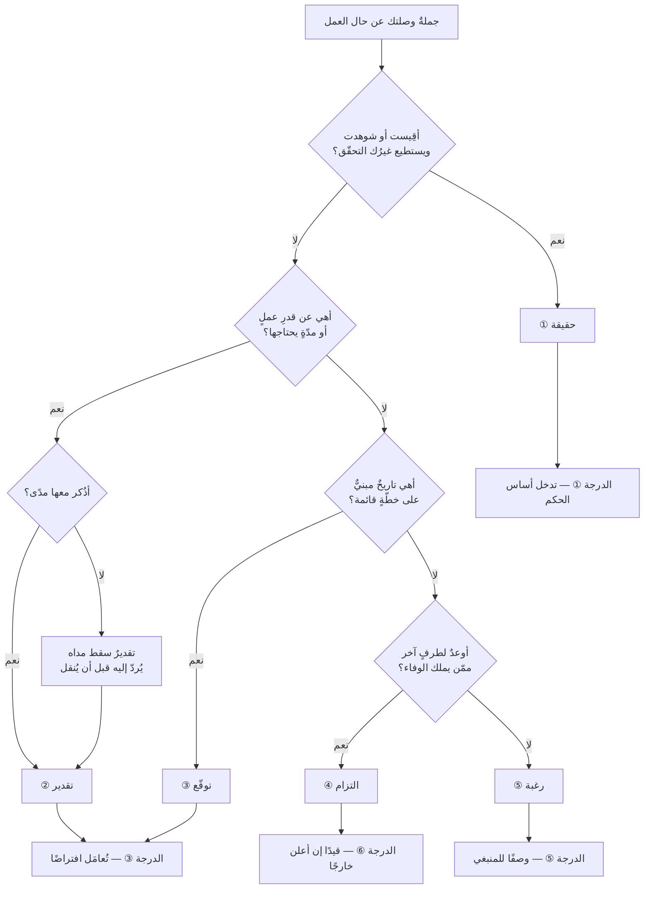
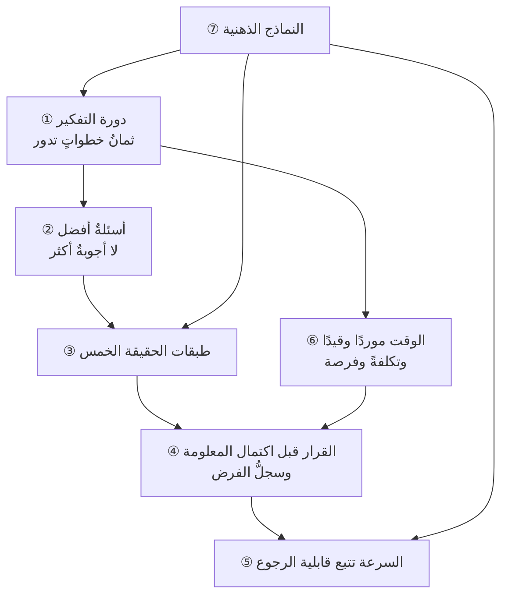

# الفصل 12 — كيف يفكّر مدير المشروع — هندسة القرار والسؤال

---

## 🏛️ لماذا تقرأ هذا الفصل؟

**المشكلة:** يُدرَّب مديرو المشاريع على الأدوات والقوالب، ثم يُوضعون أمام موقف لا قالب له فيتجمّدون — لأن ما يفصل الماهر من غيره ليس ما يعرفه بل ترتيب ما يسأل عنه.

**وماذا لو لم تعرف؟** من لم يبنِ عادات التفكير ظلّ يتقن الأدوات ويعجز عن المواقف، فيُحسن ملء النموذج ويُسيء الحكم.

**وبعد هذا الفصل ستستطيع:**

- **أن تميّز طبقة أيّ رقمٍ يُقال أمامك قبل أن تُناقشه** — أحقيقةٌ هو أم تقديرٌ أم توقّعٌ أم التزامٌ أم رغبة — **وأن تعرف الآليّة التي يتحوّل بها التقدير إلى التزامٍ في ثلاث خطواتٍ بلا أن يكذب أحد**، فتقطعها عند الخطوة الأولى.
- **أن تحكم على سرعة أيّ قرارٍ بمعيارٍ واحدٍ لا بمكانة صاحبه ولا بحجمه: كلفةُ التراجع عنه** — **وأن تعرف أنّ أنفع ما تفعله بالقرار الثقيل ليس إتقان اتّخاذه بل *هندسةُ خفض كلفة التراجع عنه* حتى يصير خفيفًا.**
- **أن تفسّر لماذا يبقى المدير المدرَّب المشهود له عاجزًا في المواقف** — فتعرف أنّ تحت الأدوات طبقةً من **النماذج الذهنية** تحكم كيف تُستعمل الأداة، **وأنّ النموذج الفاسد يقلب الأداة الصالحة على غايتها**، وأنّ الشهادة تضيف معرفةً ولا تُصلح نموذجًا.

> [!info] بطاقة الفصل
> **النوع:** منهجيّ
> **المستوى:** 🔴 متقدّم
> **زمن القراءة:** نحو 50 دقيقة
> **أهمّيته في الباب:** ★★★★★
> **موضعك:** انتهيتَ من [[11 - لماذا اختلفت المدارس]] ← **⬤ أنت هنا** ← يليه [[13 - كيف يغير هذا العلم تفكيرك]]

> [!abstract] موقع هذا الفصل
> **يبني على:** [[Knightian Uncertainty]] · [[Assumption Mapping]] — يُذكَر هنا ولا يُعاد شرحه.
> **ويؤسّس:** [[Reversible vs Irreversible Decisions]] · [[Decision Log]] — يُقدَّم هنا أوّل مرّة فيصير متاحًا لما بعده.

---

## 🧭 السؤال المركزي

> [!question] السؤال الذي يجيب عنه هذا الفصل كلّه
> **ما الذي يجري في ذهنه قبل أن يتكلّم؟**

**واحمل معك هذه الأسئلة وأنت تقرأ:**

- ما الفرق بين رقمٍ قدّرتَه ورقمٍ التزمتَ به؟
- أيّ قراراتك يمكن الرجوع عنه؟
- ما السؤال الغائب عن اجتماعك الأخير؟

---

## 🗺️ الجواب المختصر — قبل التفصيل

**الذي يجري في ذهنه ليس استحضارَ جوابٍ محفوظ، بل *تصنيفٌ سريعٌ* لِما بين يديه قبل أن يتكلّم فيه.** فهو يسأل نفسه ثلاثة أسئلةٍ في ثوانٍ: **ما طبقة هذا الكلام؟ وما صنف هذا القرار؟ وما الفرض الذي يقوم عليه؟** — **ومن أجاب عن الثلاثة قبل أن يتكلّم قال في جملةٍ ما يقوله غيره في اجتماع.**

**وعمله كلُّه يدور في حلقةٍ من ثماني خطوات، ولا يُتقن أحدٌ كلَّها بالتساوي؛ وإنّما يُعرف الماهر بأنّه *يعرف في أيّ خطوةٍ هو الآن*.** فالخطوات: أن تُصاغ المشكلة، ثمّ يُبحث عن سببها، ثمّ تُولَّد البدائل، ثمّ يُفاضَل بينها، ثمّ يُقرَّر، ثمّ يُنفَّذ، ثمّ يُقاس، ثمّ يُتعلَّم فتعود. **وأكثر الإخفاق ليس خطأً في خطوةٍ بل *قفزًا فوق خطوة*** — وأشيعها ثلاث: القفز من المشكلة إلى الحلّ بلا سببٍ ولا بدائل، والقفز من القرار إلى التنفيذ بلا قياس، والقفز من القياس إلى قرارٍ جديدٍ بلا أن يُسجَّل ما تعلّمناه.

**وأوّل الخطوات أخطرها وأقلُّها وقتًا: صياغة المشكلة.** **فالخطأ فيها يجعل كلَّ ما بعدها صحيحًا وعديم الفائدة** — إذ تُحلّ المسألة الخطأ حلًّا محكمًا. **وعلامة الصياغة السليمة أن تكون خاليةً من حلٍّ مضمر:** فـ«نحتاج أداةً لتتبّع المهامّ» ليست مشكلةً بل حلٌّ سُمّي مشكلة، **والمشكلة أن يُقال: لا نعرف حالة العمل إلا إذا سألنا، والسؤال يستغرق يومين.** والفرق بينهما أنّ الثانية تحتمل خمسة حلولٍ والأولى تحتمل واحدًا.

**وما يفصل الخبير عن غيره ليس مقدار ما يملك من أجوبة بل جودة ما يملك من أسئلة.** **فالجواب يُنتج فعلًا واحدًا، والسؤال يُنتج مسارًا**؛ والأجوبة تتقادم بتغيّر المجال والأسئلة تبقى. **وأنفع الأسئلة وأندرها: ما الذي لو ظهر لغيّر رأيي؟** — فمن لم يستطع أن يذكر شيئًا يقلب رأيه، **فليس عنده رأيٌ بل موقفٌ متّخذ.**

**وأمّا أكثر أزمات الجدولة شيوعًا فمصدرها واحد: أنّ الكلام في المشاريع خمس طبقاتٍ تُعامَل معاملةً واحدة.** **حقيقةٌ** وقعت ويمكن التحقّق منها، و**تقديرٌ** هو أفضل ما نعلمه الآن **وله مدًى** — فالتقدير بلا مدًى ليس تقديرًا، و**توقّعٌ** مشتقٌّ من بياناتٍ مقيسةٍ لا من حدس، و**التزامٌ** له مالكٌ ومقابل، و**رغبةٌ** لا سند لها. **والانحدار الصامت من التقدير إلى الالتزام يقع في ثلاث خطوات: يُذكر الرقم شفويًّا بمدًى، ثمّ يُكتب في شريحةٍ بلا مدًى، ثمّ يُقرأ في اجتماعٍ أعلى بوصفه موعدًا — ولم يكذب أحد.**

**والقرار يُتَّخذ دائمًا قبل اكتمال المعلومة، لأنّ المعلومة لا تكتمل.** **والانتظار نفسه قرارٌ له ثمنٌ يُدفَع كلَّ يوم**، والسؤال الفاصل: **ما المعلومة التي لو وصلت غدًا لغيّرت قراري؟** فإن لم توجد فليس ثمّ ما يُنتظَر. **ويُفرَّق هنا بين ما تُعرَف احتمالاته فيُحسَب، وما لا تُعرَف فلا يُصنَع له رقمٌ يُوهم اليقين** ([[Knightian Uncertainty]]) — **بل تُستعمل أدوات الجهل: التجريب الرخيص، والاحتياطي، وإبقاء الباب مفتوحًا.**

**وسرعة القرار تتبع شيئًا واحدًا: كلفة التراجع عنه — لا حجمه ولا مكانة صاحبه ولا مبلغه.** **فالقابل للتراجع يُفوَّض ويُسرَّع، وغير القابل يُصعَّد ويُبطَّأ**؛ ومعاملة الصنفين معاملةً واحدةً إمّا أن تشلّ العمل وإمّا أن تُهلكه. **وأنفع ما يُفعل هنا ليس إتقان اتّخاذ القرار الثقيل، بل *هندسة خفض كلفة التراجع عنه*** حتى ينتقل من صنفٍ إلى صنف.

**وتحت هذا كلِّه طبقةٌ لا تظهر في شهادةٍ ولا في قالب: النماذج الذهنية التي يحملها عن العميل والفريق والجودة والمخاطرة والقيمة.** **وفسادُ النموذج يقلب الأداة الصالحة على غايتها** — فمن كان نموذجه عن الفريق «موردًا يُوزَّع» تعلّم أدوات التدفّق فاستعملها لرفع نسبة الإشغال، **أي استعمل أداة التدفّق ضدّ التدفّق.** **ولهذا لا تُصلح الشهادةُ نموذجًا فاسدًا: فهي تضيف معرفةً، والنموذج هو الذي يحكم كيف تُستعمل المعرفة.**

> [!abstract] مفاهيم يُدخلها هذا الفصل في قاموسك
> `Reversible vs Irreversible Decisions` · `Decision Log`

> [!warning] مفاهيم يكثر الخلط بينها هنا
> `Estimate` مقابل `Commitment` مقابل `Forecast` مقابل `Wish` — احملها في ذهنك، فالفصل يفرّقها في محطّة التمييز.

---

## 🧱 الفكرة الأولى: دورة التفكير — ثمان خطوات تدور ولا تنتهي

*موضعها من الفصل: هذه أوّل خطوةٍ وهي هيكل الفصل كلِّه، **إذ تُعطي القارئ خريطةً يعرف بها موضعه قبل أن تُفصَّل له المحطّات**. **وما بعدها من الأفكار الستّ ليس خطواتٍ أخرى، بل تعميقٌ لمحطّاتٍ بعينها منها** — فالثالثة تعمّق خطوة قراءة الواقع، والرابعة والخامسة خطوة القرار.*

**وهذه الدورة ليست إجراءً يُتَّبع خطوةً خطوة، بل *قائمةَ موضعٍ*: تقول لك أين أنت الآن، وأيّ خطوةٍ قفزتَ فوقها.** **فالمدير لا يمرّ بالثماني في كلّ مسألة**، وإنّما يعرف — حين يتعثّر — في أيّ منها وقع التعثّر.

| # | الخطوة | سؤالها | وعلامة القفز فوقها |
|---|---|---|---|
| ① | **صياغة المشكلة** | ما الذي يقع فعلًا، ومنذ متى؟ | تُوصف بحلٍّ مضمر: «نحتاج أداة…» |
| ② | **البحث عن السبب** | ولماذا يقع؟ | يُشار إلى شخصٍ لا إلى آليّة |
| ③ | **توليد البدائل** | وماذا يمكن أن نفعل غير هذا؟ | البديل واحد، أو اثنان أحدهما شكليّ |
| ④ | **المفاضلة** | وما ثمن كلٍّ منها، ومن يدفعه؟ | يُذكر النفع ولا يُذكر الثمن |
| ⑤ | **القرار** | ومن قرّر، وعلى أيّ فرض؟ | لا يُعرف بعد أسبوعٍ من قرّر |
| ⑥ | **التنفيذ** | ومن يملكه، ومتى؟ | «سنعمل عليه» بلا اسمٍ ولا موعد |
| ⑦ | **القياس** | وبأيّ رقمٍ نعرف أنّه نفع؟ | يُسأل «كيف الأمور؟» فيُجاب «جيّدة» |
| ⑧ | **التعلّم** | وما الذي نغيّره في المرّة القادمة؟ | يُقال «تعلّمنا الدرس» ولا يُكتب شيء |

### وأخطر خطوة هي الأولى — وهي أقلُّها وقتًا

**فالمشكلة التي صيغت خطأً تُحلّ حلًّا محكمًا ولا يتغيّر شيء.** **والفساد فيها له صورةٌ واحدةٌ تتكرّر: أن يُوضَع الحلُّ في مكان المشكلة.**

- «نحتاج مكتب إدارة مشاريع» ← **حلّ**. والمشكلة: أنّ ثلاثة مشاريعَ تطلب الشخص نفسه في الأسبوع نفسه، ولا أحد يفصل.
- «نحتاج توثيقًا أفضل» ← **حلّ**. والمشكلة: أنّ من يعرف كيف يُنشَر النظام واحدٌ، وقد اعتذر عن العمل مرّتين هذا الشهر.
- «الفريق يحتاج تدريبًا على أجايل» ← **حلّ**. والمشكلة: أنّنا نُسلّم كلَّ أسبوعين ولا يُستعمل ما نُسلّمه.

**والفرق العمليّ أنّ المشكلة الموصوفة وصفًا صحيحًا تحتمل خمسة حلول، والمشكلة التي هي حلٌّ مقنّع تحتمل حلًّا واحدًا** — هو الذي جاء مدسوسًا في صياغتها. **ومن قبِل الصياغة قبِل القرار قبل أن يُناقشه.**

### وقاعدة الثلاثة في البدائل

**إن لم يكن أمامك إلا خيارٌ واحد فأنت لا تقرّر بل تنفّذ.** **وإن كان أمامك خياران فالغالب أنّهما «افعل / لا تفعل»** — وهو تأطيرٌ ضيّقٌ يُخفي ما بينهما.

**والثالث موجودٌ دائمًا، وهو غالبًا واحدٌ من ثلاثة:**

1. **التأجيل بشرطٍ معلن** — لا تأجيلًا مفتوحًا: «نؤجّل حتى يصل رقم كذا، وأقصاه ثلاثة أسابيع».
2. **الحلّ الجزئيّ** — أن يُعالَج ثلث المشكلة بعُشر الكلفة، ويُنظَر.
3. **شراء المعلومة** — أن يُنفَق وقتٌ قليلٌ صراحةً في تقليل الجهل قبل الالتزام: تجربةٌ صغيرة، أو مقابلةُ ثلاثة مستخدمين، أو نموذجٌ يُرمى.

**والثالث هو أكثر البدائل إغفالًا، لأنّه لا يبدو «عملًا»** — فمن أنفق ثلاثة أيّامٍ في اختبار فرضٍ يشعر أنّه لم يُنتج شيئًا، **وقد يكون منع ثلاثة أشهرٍ من البناء الخاطئ.**

### وأين تنكسر الدورة عادةً؟ — بين ⑦ و⑧

**فالخطوات السبع الأولى تُنجَز في أكثر المنظّمات بدرجةٍ ما، والثامنة تسقط كاملةً.** **والسبب ليس كسلًا: أنّ التعلّم يقتضي *اعترافًا* بأنّ ما فُعل لم يكن أحسن ما يمكن** — والاعتراف له كلفةٌ اجتماعيّةٌ يدفعها من يعترف وحده، **وفائدته تعود على الجميع.** فمن أنفق الكلفة على نفسه ووزّع الفائدة على غيره لن يكرّرها إلا في بيئةٍ تُكافئه عليها.

**ولهذا كانت الخطوة الثامنة هي الوحيدة في الثماني التي *لا تُصلَح بانضباط الفرد*، بل بشرطٍ في البيئة** — وهو الذي سُمّي في [[11 - لماذا اختلفت المدارس|الفصل 11]] ثقافةَ إعلان الخطأ. **وأثر سقوطها تراكميّ لا لحظيّ:** فالمنظّمة التي تدور فيها الدورة سبعَ خطواتٍ لا ثماني **تُنتج الحلّ نفسه للمشكلة نفسها كلّ سنتين**، ويظنّ الجميع أنّهم يواجهونها لأوّل مرّة.

**وثلاثةٌ تُنقذ هذه الخطوة بأقلّ كلفةٍ ممكنة:**

1. **أن يُسأل عن *الفرض* لا عن *الفاعل*.** فسؤال «ما الذي كنّا نفترضه ولم يصحّ؟» يمكن أن يُجاب بلا أن يُتّهم أحد، **وسؤال «من أخطأ؟» يُنتج دفاعًا لا معرفة.**
2. **أن يُكتب سطرٌ واحد.** فالتعلّم الذي لا يُكتب لا يُنقَل إلى من لم يحضر، **ودوران الناس في المنظّمات يجعل «تعلّمنا الدرس» يعني «تعلّمه من سيغادر بعد سنة».**
3. **أن يُوصَل بقرارٍ قادم لا بتقريرٍ عامّ.** **فالدرس الذي لا يُغيّر بندًا في قائمةٍ أو سطرًا في معيار لم يُتعلَّم**، وإنّما كُتب.

> [!example] فريقٌ صاغ مشكلته مرّتين فاختلف الجواب اختلافًا تامًّا
> جهةٌ في **جدّة** رفعت مشكلةً إلى الإدارة بهذه الصيغة: **«نحتاج زيادة فريق الاختبار من ثلاثة إلى ستّة».**
>
> فسُئلوا: وما الذي يقع الآن؟ **فأُعيدت الصياغة: «الميزة تنتظر في الاختبار تسعة أيّامٍ في المتوسّط، وقد كانت ثلاثة قبل ستّة أشهر».**
>
> **فتغيّر السؤال من «كم مختبِرًا نوظّف؟» إلى «ولماذا تضاعف الانتظار ثلاث مرّات؟»** — فظهر عند البحث سببان لا صلة لهما بالعدد: **أنّ فرقًا ثلاثةً صارت تُسلّم إلى الفريق نفسه بعد إعادة تنظيم**، وأنّ **43% من الميزات تعود من الاختبار مرّةً واحدةً على الأقلّ** لنقصٍ في شروط القبول — فتُختبَر مرّتين.
>
> **فكان القرار: توضيح شروط القبول قبل الدخول، وتوزيع استقبال الفريقين الآخرين.** ونزل الانتظار إلى أربعة أيّامٍ في ستّة أسابيع **بلا توظيف أحد.** **ولو نُفّذت الصياغة الأولى لوُظّف ثلاثةٌ ثمّ عاد الانتظار إلى ما كان، لأنّ المعاد إلى الاختبار كان سيتضاعف معهم.**

> [!tip] كيف تستعمل هذه الفكرة
> **علّق الخطوات الثماني في مكانٍ تراه، واستعملها سؤالًا واحدًا عند كلّ تعثّر: في أيّ خطوةٍ نحن الآن؟**
>
> **وستجد أنّ أكثر الاجتماعات تدور في الخطوة ⑤ (القرار) والخلل في ① أو ②.** فالناس يتجادلون في «ماذا نفعل؟» **ولم يتّفقوا بعدُ على ما يقع ولا على سببه** — ولهذا لا ينتهي الجدل: **إذ لا يمكن أن يُتَّفق على جوابٍ قبل أن يُتَّفق على سؤاله.**
>
> **والتدخّل الأنفع جملةٌ واحدة:** «قبل أن نختار، أنتّفق على وصف ما يقع في جملةٍ فيها رقم؟»

> [!warning] الحفرة الشائعة — أن تُقرأ الدورة إجراءً فتصير عبئًا
> **من فهمها إجراءً لزمه أن يمرّ بالثماني في كلّ مسألةٍ صغيرة، فتصير الإدارة بطيئةً بلا فائدة** — وهذا يُنتج ردّة فعلٍ عكسية: يُترك الترتيب كلُّه لأنّه أثقل من نفعه.
>
> **والصواب أنّ *عمق* المرور بها يتبع صنف القرار** (الفكرة الخامسة): **فالقرار القابل للتراجع يُمرّ عليه في دقيقتين ذهنيًّا، وغير القابل يُمرّ عليه مكتوبًا ومع غيرك.** **والدورة قائمة الفحص لا استمارة الإجراء** — ومن حوّلها استمارةً أنتج ما أنتجه التوحيد المعياريّ في [[10 - كيف تطور هذا العلم|الفصل 10]]: امتثالًا يقوم مقام الحكم.

> [!question]- تأكّد أنك فهمت — اجتماعٌ استمرّ ساعةً ولم يُغلق. فبأيّ خطوةٍ تشخّص العطب؟
> **بالخطوتين الأوليين لا بالخامسة، وإن كان الجدل كلُّه يبدو في الخامسة.**
>
> **فالاجتماع الذي لا يُغلق سببه في الغالب أحد أمرين:** أنّ الحاضرين يصفون مشكلاتٍ مختلفة ويظنّونها واحدة، **أو أنّهم متّفقون على الوصف ومختلفون في السبب ولم يُصرَّح بذلك** — فيتناقشون في الحلول وكلُّ حلٍّ يعالج سببًا مختلفًا، فلا يُقنع أحدهم الآخر.
>
> **والاختبار العمليّ: اطلب من ثلاثةٍ من الحاضرين أن يكتب كلٌّ منهم المشكلة في سطرٍ على ورقةٍ بلا أن يرى الآخر.** **فإن خرجت ثلاث مشكلاتٍ فقد وجدتَ العطب** — ولن يُغلق هذا الاجتماع ولا الذي بعده حتى تُحسم الخطوة الأولى.

> [!summary]- خلاصة الفكرة في سطرين
> **دورةُ التفكير ليست إجراءً يُتَّبع خطوةً خطوة، بل قائمةَ موضعٍ: تقول لك أين أنت الآن، وأيَّ خطوةٍ قفزتَ فوقها.**
> **فالمدير لا يمرّ بالثماني في كلّ مسألة**، وإنّما يعرف — حين يتعثّر — في أيّها وقع التعثّر. وهذا هو الفرق بين من يملك دورةً ومن يحفظ خطوات.

> [!question] تأمّلٌ تطبيقيّ — لا جواب له في هذا الفصل
> خذ مسألةً تعثّرتَ فيها هذا الشهر، ومُرّ عليها بالثماني، وضع علامةً عند الخطوة التي لم تقع.
>
> **والغالب أن تجدها واحدةً من اثنتين: تحديدُ السؤال، أو إعلانُ المقصد.** فهما أوّل ما يُقفَز فوقه لأنّهما لا يُنتجان شيئًا يُرى — **وثمنُهما يُدفع في الخطوات الستّ الباقية كلِّها.**

---

## 🧱 الفكرة الثانية: الخبراء يملكون أسئلة أفضل لا أجوبة أكثر

*موضعها من الفصل: عُرفت الدورة، وتسأل هذه الفكرة عن **ما يجعل واحدًا يُحسن إدارتها وآخرَ يُخطئ وكلاهما يعرفها**. **وجوابُها يقلب ما يُظنّ:** أنّ الفارق ليس في مخزون الأجوبة بل في جودة الأسئلة — إذ الجواب يُنتج فعلًا واحدًا، والسؤالُ يُنتج مسارًا.*

**والعلّة في ذلك بنيويّةٌ لا بلاغية: أنّ الجواب يُنتج فعلًا واحدًا، والسؤال يُنتج مسارًا.** فمن أُعطي جوابًا حلّ مسألةً، **ومن أُعطي سؤالًا صار يحلّ صنفًا من المسائل.** **ويُضاف إلى ذلك ما قرّره [[10 - كيف تطور هذا العلم|الفصل 10]]: أنّ أجوبة هذا المجال تتقادم بتقادم سياقها، وأسئلته تبقى** — فمن بنى رأس ماله أجوبةً وجد رأس ماله ينقص كلَّ سنة.

### وأسئلة الإدارة أربعة أصناف، وأنفعها أندرها

1. **سؤال الواقعة: ماذا يقع، ومنذ متى، وبأيّ مقدار؟** — وهو أساس كلّ ما بعده، **وأكثر ما يُتخطّى** لأنّ الجميع يظنّ أنّه يعرفه.
2. **سؤال السبب: ولماذا يقع؟** — **وشرطه أن يُجاب بآليّةٍ لا بشخص.** فـ«لأنّ فلانًا متأخّر» ليس سببًا بل موضعُ وقوع؛ **والسبب: لأنّه الوحيد الذي يملك الصلاحية، وقد اجتمع عليه ثلاثة فرق.**
3. **سؤال الفرض: وما الذي نبني عليه ولم نتحقّق منه؟** — وهذا هو موضع [[Assumption Mapping|رسم الافتراضات]]: **تُستخرج الاعتقادات غير المثبتة، ثمّ يُختبَر أوّلًا ما كان *عالي الأثر ضعيف اليقين*** — لا ما كان أسهل اختبارًا.
4. **سؤال الحدّ: وما الذي لو ظهر لغيّر رأيي؟** — **وهو أنفعها وأندرها.** فمن لم يستطع أن يذكر شيئًا واحدًا يقلب رأيه **فليس عنده رأيٌ بل موقف**، ولا يُتوقَّع منه أن يتراجع مهما جاءه من بيان. **وهذا السؤال يُوجَّه إلى النفس قبل الخصم.**

### وكيف يُكتشف السؤال الغائب؟

**والسؤال الغائب هو الذي يُفسد الاجتماعات وهو غير مذكورٍ فيها؛ فلا يُكتشَف بالتفكير في الأجوبة بل بثلاث علامات:**

- **من يتضرّر ولم يُسأل؟** فانظر إلى قائمة الحاضرين، **ثمّ اسأل: من سيتأثّر بهذا القرار وليس هنا؟** — فريق التشغيل الذي سيَرِث، أو المستخدم النهائيّ، أو الفريق الذي سيعتمد على الواجهة. **وغيابهم هو غياب أسئلتهم.**
- **ما الرقم الذي لم يُذكر؟** فالاجتماع الذي مضى ساعةً بلا رقمٍ واحد **جرى كلُّه في طبقة الآراء**. واسأل: كم؟ ومنذ متى؟ وكم مرّة؟
- **ما الذي قيل بالمبنيّ للمجهول؟** — «سيُراجَع» · «تقرّر أن» · «يُفضَّل ألّا». **فكلُّ فعلٍ بلا فاعلٍ يُخفي سؤالًا عن مالك**، وهذا امتدادٌ لِما قرّره [[09 - المقاصد والثنائيات والمفاضلات|الفصل 09]]: أنّ الركن الذي يسقط أوّلًا في المفاضلة هو **من يدفع**، وعلامته صيغة المجهول.

### وسؤالٌ خامسٌ نادر: ما الذي لا نتكلّم فيه؟

**وفي كلّ فريقٍ مسائلُ يعرفها الجميع ولا تُذكر في اجتماع** — أنّ الموعد المعلَن غير ممكن، أو أنّ الجهة الفلانية لن تسلّم، أو أنّ من يملك القرار لا يقرأ ما يُرسَل إليه. **وتسميتها ممنوعةٌ بلا أن يمنعها أحدٌ صراحةً.**

**وقد وصف كريس أرغيريس آليّةً تفسّر ذلك: أنّ الجماعات تُنشئ ما لا يُتكلَّم فيه، ثمّ — وهذا هو الأخبث — *تُنشئ أنّ عدم الكلام فيه لا يُتكلَّم فيه أيضًا*.** فلا يُقال «لا نتحدّث في هذا»، **بل يُنتقل إلى غيره بسلاسةٍ لا يشعر بها أحد.**

**وأثره في هذا الباب مباشر: أنّ أخطر الافتراضات هي بالضبط ما لا يُتكلَّم فيه** — إذ لو كان قابلًا للنقاش لنُوقش ولحُلّ.

**وثلاث علاماتٍ تدلّ عليه:**

- **أن يُقال الشيء في الممرّ بعد الاجتماع ولا يُقال فيه.** **وهذا أوضحها**، وهو يُرى في كلّ مكان.
- **أن يضحك الحاضرون ضحكةً قصيرةً عند ذكرٍ عابرٍ ثمّ يُنتقَل** — فالضحك هنا علامة اعترافٍ جماعيٍّ بما لا يُقال.
- **أن يُجاب سؤالٌ مباشرٌ بإجابةٍ عن سؤالٍ آخر** بلا أن ينتبه أحد.

**وعلاجه ليس شجاعةً فرديّةً تُطلَب من الجميع — فهذا يُحمّل الأفراد ما هو من شأن البيئة — بل *أن يُسأل عنه بصيغةٍ لا تُلزم أحدًا بتبنّيه*:** «ما الذي لو قاله أحدنا الآن لأزعج الاجتماع؟ **أذكره أنا نيابةً عمّن لا يريد أن يذكره.**» **فمن قالها بصفته المسؤول نقل الكلفة عن الأفراد إلى نفسه** — وهذا أنفع ما يُنفق فيه رصيدُ الموقع.

### وكيف تعرف أنّك سألت السؤال الخطأ؟

**بعلامةٍ واحدةٍ حاسمة: أن يُجاب عنه ولا يتغيّر شيء.** فسؤال «هل الفريق متحمّس؟» جوابه لا يترتّب عليه فعل، **وسؤال «كم مرّةً في الشهر يبدأ أحدٌ عملًا ثمّ يُطلب منه تركه؟» جوابه يُغيّر ترتيبًا.**

**وقاعدةٌ ثانيةٌ في الصياغة: يُصاغ السؤال بحيث يمكن أن يكون جوابه «لا».** **فالسؤال الذي جوابه نعم دائمًا ليس سؤالًا بل طلبُ تصديق** — كـ«هل نتّفق على أنّ الجودة مهمّة؟». **ومقابله: «هل نقبل أن نؤجّل ثلاث ميزاتٍ لنسدّ هذا؟»**

> [!example] السؤال الذي غيّر مسار مشروعٍ بجملةٍ واحدة
> في مراجعةٍ لمشروع منصّة تدريبٍ داخليّةٍ في **الرياض**، كان الجدل كلُّه في: **أنبني تطبيقًا للهاتف أم نكتفي بالويب؟** واستمرّ ثلاثة أسابيع، ولكلّ طرفٍ حججٌ صحيحة.
>
> **فسأل أحد الحاضرين سؤالًا من الصنف الثالث: وما الذي نفترضه ولم نتحقّق منه؟**
>
> **فظهر فرضٌ واحدٌ يقوم عليه المشروع كلُّه ولم يُختبَر: أنّ الموظّفين سيدخلون التدريب في وقتهم الخاصّ.** **فإن كان صحيحًا فالهاتف لازم، وإن كان خاطئًا فالويب يكفي** — بل ينقلب المشروع كلُّه، إذ يصير السؤال: كيف يُخصَّص وقتٌ في الدوام؟
>
> **فاختُبر الفرض في أربعة أيّامٍ بمقابلة أحد عشر موظّفًا وقراءة سجلّ منصّةٍ قديمة**، فتبيّن أنّ 92% من الدخول كان في ساعات الدوام. **فسقط الجدل كلُّه بلا أن يُحسَم**، لأنّه كان قائمًا على فرضٍ لم يصمد. **ولاحظ أنّ الأسابيع الثلاثة كلَّها أُنفقت في الخطوة ③ والعطب في ما قبلها.**

> [!tip] كيف تستعمل هذه الفكرة — ثلاثة أسئلةٍ تُغلق أيّ اجتماع
> **اجعلها ختامًا ثابتًا، وستجد أنّ كثيرًا من الاجتماعات لا تجتاز الأوّل:**
>
> 1. **«ما الذي سنفعله يوم الأحد اختلافًا عمّا كنّا سنفعله لولا هذا الاجتماع؟»** — فإن لم يوجد جوابٌ فقد انعقد لقاءٌ لا اجتماع.
> 2. **«ومن يملكه، ومتى؟»** — باسمٍ وتاريخ. **ولا يصحّ أن يكون المالك فريقًا، فالفريق لا يُذكِّر نفسه.**
> 3. **«وما الفرض الذي لو سقط ألغى هذا القرار؟»** — فيُكتب في سطر، **ويصير هو موعد إعادة الفتح** (الفكرة الرابعة).

> [!warning] الحفرة الشائعة — أن يصير السؤال أداةَ تعطيلٍ لا أداةَ فهم
> **وهذه حفرةٌ يقع فيها من أتقن هذا الباب خاصّةً.** فمن ملك أسئلةً جيّدة استطاع أن يوقف أيّ اقتراحٍ بسؤالٍ لا جواب له — **«وما دليلك أنّ هذا سينفع؟»** — وهو سؤالٌ صحيح، **غير أنّه يُوجَّه انتقائيًّا إلى ما لا يُريد وحده.**
>
> **والعلامة الفاصلة: أن يُوجَّه السؤال إلى الحالتين معًا.** فمن سأل «ما دليلك أنّ التوثيق ينفع؟» **لزمه أن يسأل: وما دليلنا أنّ تركه لا يضرّ؟** **والسؤال الذي لا يُطرح إلا على المخالف ليس فحصًا بل موقفٌ في ثوب فحص** ([[11 - لماذا اختلفت المدارس|الفصل 11]]).

> [!question]- تأكّد أنك فهمت — ما الذي يجعل «ما الذي لو ظهر لغيّر رأيي؟» أنفع الأسئلة الأربعة؟
> **لأنّه السؤال الوحيد الذي يُنتج *شرط النقض*، وبه وحده يصير الرأي قابلًا للاختبار.**
>
> فالأسئلة الثلاثة الأولى تجمع معلومةً، **وهذا يُحدّد سلفًا أيّ معلومةٍ ستُغيّر الحكم** — فيتحوّل النقاش من مبارزةِ حججٍ إلى **اتّفاقٍ على ما نبحث عنه**. **وحين يتّفق طرفان على شرط النقض فقد انتهى نصف الخلاف قبل أن يُجمع البيان.**
>
> **وأثره الثاني أنّه يكشف الموقف المتخفّي في صورة رأي.** فمن أجاب «لا شيء يغيّر رأيي» **فقد أعفاك من أن تُتعب نفسك في إقناعه بالبيان** — وأوجب عليك أن تنقل النقاش إلى موضعه الحقيقيّ: من يملك القرار.

> [!summary]- خلاصة الفكرة في سطرين
> **الخبراء يملكون أسئلةً أفضل لا أجوبةً أكثر؛ لأنّ الجواب يُنتج فعلًا واحدًا والسؤال يُنتج مسارًا.**
> **فمن أُعطي جوابًا حلّ مسألة، ومن أُعطي سؤالًا صار يحلّ صنفًا من المسائل** — ويُضاف إليه أنّ أجوبة هذا المجال تتقادم بتقادم سياقها وأسئلته تبقى.

> [!question] تأمّلٌ تطبيقيّ — لا جواب له في هذا الفصل
> راجع آخر استشارةٍ طلبتَها، واسأل: **أخرجتَ منها بجوابٍ أم بسؤالٍ صرتَ تطرحه؟**
>
> **فالأوّل ينفعك في تلك الحالة وحدها، والثاني يعمل في كلّ حالةٍ تشبهها.** ومن قاس قيمة الاستشارة بعدد الأجوبة التي حملها، اشترى حلولًا وترك ما يُنتج الحلول.

---

## 🧱 الفكرة الثالثة: طبقات الحقيقة الخمس

*موضعها من الفصل: مضى ما يُحسّن **سؤالك**، وتنظر هذه الفكرة في **ما يصل إليك من أجوبة**. **وموضعها من الدورة خطوةُ قراءة الواقع**، إذ لا يُقرأ الواقع إلّا من كلامٍ ينقله غيرك — وأكثر أزمات الجدولة والثقة مصدرها أنّ خمس طبقاتٍ مختلفة تُقال بنبرةٍ واحدة وتُعامَل معاملةً واحدة.*

**وأكثر أزمات الجدولة والثقة في هذا المجال مصدرها واحد: أنّ الكلام في المشاريع خمس طبقاتٍ مختلفة، تُقال بالنبرة نفسها وتُكتب بالخطّ نفسه، ثمّ تُعامَل معاملةً واحدة.**

| الطبقة | ما هي؟ | ومن أين جاءت؟ | واختبارها في جملة |
|---|---|---|---|
| **حقيقة** | ما وقع ويمكن التحقّق منه | سجلٌّ أو قياس | **أين سُجّلت؟** |
| **تقدير** (Estimate) | أفضل ما نعلمه الآن **بمدًى** | حكم أهل الخبرة | **أله مدًى؟** فبلا مدًى ليس تقديرًا |
| **توقّع** (Forecast) | ما يُشتقّ من بياناتٍ مقيسة | تاريخُ الأداء نفسه | **من أيّ بياناتٍ اشتُقّ؟** |
| **التزام** (Commitment) | وعدٌ يُحاسَب عليه صاحبه | قرارٌ بمقابل | **من وعد؟ وبماذا التزم الطرف الآخر؟** |
| **رغبة** (Wish) | ما يُراد بلا سند | أمنيةٌ أو ضغط | **وما الذي يجعله ممكنًا؟** فلا جواب |

**والفرق بين التقدير والتوقّع يُغفَل كثيرًا وهو عمليٌّ جدًّا:** **فالتقدير رأيٌ مسنَد، والتوقّع استقراءٌ من قياس.** فحين يقول الفريق «نظنّها ثلاثة أسابيع» فهذا تقدير؛ **وحين يقول «زمن إنجاز آخر ثلاثين عنصرًا كان بين تسعة أيّامٍ وثلاثةٍ وعشرين، وهذا العنصر من صنفها» فهذا توقّع.** **والثاني أقوى لأنّه لا يعتمد على تفاؤل صاحبه** — ولهذا كان أوّل ما يُبنى في فريقٍ ناضج **سجلُّ أزمنةٍ فعليّةٍ يُغني عن كثيرٍ من الجدل.**

### والانحدار الصامت: كيف يصير التقدير التزامًا بلا أن يكذب أحد؟

**في ثلاث خطوات، كلُّها بريئةٌ في نفسها:**

1. **يُذكر الرقم شفويًّا بمدًى وتحفّظ:** «بين ثلاثة وخمسة أسابيع، والأمر يعتمد على جاهزية البيانات».
2. **ثمّ يُكتب في شريحةٍ بلا المدى ولا الشرط**، لأنّ الشريحة ضيّقة ولأنّ «الأربعة» وسطٌ معقول. **وهنا وقع الانحدار، وهو الموضع الوحيد الذي يمكن أن يُقطَع فيه.**
3. **ثمّ تُقرأ الشريحة في اجتماعٍ أعلى** لا يحضره من قال الرقم، **فتُقرأ موعدًا.** ويُبنى عليها إعلانٌ أو تعاقدٌ أو وعدٌ لجهةٍ أخرى.

**ولم يكذب أحد، ولم يُخالف أحدٌ إجراءً.** **وإنّما سقط في الطريق شيءٌ واحد: المدى.** ثمّ يأتي التأخير فيُقال إنّ الفريق أخلف، **والفريق لم يَعِد أصلًا** — إنّما قدّر، وأُخذ تقديره التزامًا.

**والعلاج ثلاثة، والثالث أهمّها:**

- **لا يُذكر رقمٌ بلا مدًى، ولو في محادثةٍ عابرة.** فالرقم المفرد يُنقَل والمدى لا يُنقَل معه إلا إذا كان جزءًا منه.
- **يُسمّي المتكلّم صنف كلامه صراحةً:** «هذا تقديرٌ لا التزام». **وهذه جملةٌ ثقيلةٌ على النفس في أوّل مرّة، خفيفةٌ بعدها** — وهي أرخص وقايةٍ في هذا الباب كلِّه.
- **ولا يُعطى الالتزام إلا بمقابل.** **فالالتزام عقدٌ لا إعلان**: أن يُثبَّت النطاق، أو يُبتّ في قرارٍ معلَّقٍ بموعد، أو تُضمَن جاهزية طرفٍ ثالث. **فمن طُلب منه التزامٌ ولم يُعطَ شيئًا في مقابله فقد طُلبت منه رغبةٌ باسم الالتزام.**

### وماذا تفعل حين تسمع تقديرك يُعاد التزامًا؟

**وهذا موقفٌ يقع كثيرًا ويُترك دائمًا: أن تسمع في اجتماعٍ رقمًا قلتَه أنت تقديرًا، يُعاد الآن موعدًا.** **والسكوت عنه في تلك اللحظة هو الذي يُتمّ الانحدار** — إذ يصير سكوتُك إقرارًا، ويصعب نقضه بعد أسبوعٍ لأنّه بُني عليه.

**والتصحيح في اللحظة يبدو ثقيلًا، وثقلُه في الصياغة لا في الفعل.** **فالصيغة الخاطئة اعتراضٌ:** «أنا لم أقل ذلك» — **فتُنتج دفاعًا وتُوقف الاجتماع.** **والصيغة الصحيحة زيادةُ معلومةٍ لا نفيُ قول:**

> «أضيف على الرقم شيئًا حتى لا يُبنى عليه خطأ: هذا تقديرٌ مداه من كذا إلى كذا، **ويصير موعدًا إن ثُبّت كذا. فهل نثبّته؟**»

**وثلاثة وقعت في هذه الجملة:** لم تنسب إلى أحدٍ خطأً، **وأعدتَ المدى الذي سقط**، **وحوّلتَ الموقف إلى سؤالٍ عمليٍّ يُجاب** — فإن ثُبّت النطاق فقد صار الموعد ممكنًا بحقّ، وإن لم يُثبَّت فقد سُمع الجميع أنّه لم يُثبَّت.

**وإن مضى الاجتماع ولم يُتَح لك أن تقولها، فاكتبها في سطرين بعده إلى من حضر** — لا تسجيلًا للموقف، **بل لأنّ الرقم سيُنقَل إلى اجتماعٍ ثالثٍ لا تحضره، والسطران وحدهما ما سيسافر معه.**

### والصعود المشروع: كيف تُرفَع الطبقة بحقّ؟

**وليس المطلوب أن يبقى الكلام كلُّه في طبقة التقدير — فالمشاريع تحتاج التزاماتٍ ولا تقوم بلا وعود.** **والمطلوب أن يكون الصعود *مشترًى* لا *منزلقًا إليه*.** **ولكلّ درجةٍ ثمنٌ معلوم:**

| من ← إلى | وما ثمن الصعود؟ |
|---|---|
| **رغبة ← تقدير** | أن يُفحَص: ما الذي يجعله ممكنًا؟ فإن لم يوجد جوابٌ بقيت رغبة |
| **تقدير ← توقّع** | أن يُقاس ما مضى — فالتوقّع لا يُشترى بالتفكير بل ببيانات |
| **توقّع ← التزام** | أن يُثبَّت ما كان متغيّرًا: نطاقٌ يُغلَق، أو قرارٌ يُبَتّ، أو طاقةٌ لا تُسحَب |

**فالنزول صامتٌ مجّانيّ، والصعود له فاتورة.** **وهذا هو الميزان كلُّه:** فمن طلب منك التزامًا فقد طلب أعلى الطبقات، **فاسأله عمّا يدفعه في مقابله** — لا مكابرةً، بل لأنّ الالتزام بلا مقابلٍ ليس التزامًا بل رغبةً غُيّر اسمها.

**وفائدةٌ ثانيةٌ في هذا الجدول: أنّه يعطي الفريق طريقًا بدل أن يعطيه رفضًا.** **فبدل أن يُقال «لا نستطيع أن نلتزم»، يُقال: «نحن الآن في التوقّع، وينقصنا واحدٌ من ثلاثة لنصعد — فأيّها تستطيع أن تعطينا؟»** — **وهذا يحوّل الموقف من صدامٍ إلى مسألةٍ فيها ثلاثة حلول.**

> [!info] إضافة مرجعية — أصلٌ منشورٌ لهذا التقسيم وزيادتنا عليه
> فرّق **ستيف مكونيل** في *Software Estimation* (2006) بين ثلاثة يُخلَط بينها في العمل اليوميّ: **التقدير (Estimate)** وهو تحليلٌ لأفضل ما نعلمه، **والمستهدَف (Target)** وهو ما تريده الأعمال، **والالتزام (Commitment)** وهو وعدٌ بتسليمٍ في وقتٍ محدَّد. **ومن أشهر ما قرّره أنّ التقدير المفرد بلا مدًى يُخفي معلومةً لا يُعوَّض فقدُها**، وأنّ خلط الثلاثة هو أصل أكثر ما يُسمّى «فشلًا في التقدير» وهو في الحقيقة فشلٌ في التفريق.
>
> **والطبقات الخمس أعلاه تزيد عليه اثنتين ويُصرَّح بذلك:** أُضيفت **الحقيقة** في أوّلها لأنّ كثيرًا من الجدل يقع في وقائع لم يتحقّق منها أحد، **وأُفرد التوقّع (Forecast)** عن التقدير لأنّ الفرق بينهما — رأيٌ مسنَد في مقابل استقراءٍ من قياس — **صار عمليًّا اليوم بعد أن صار سجلّ الأزمنة متاحًا في أدوات العمل**، ولم يكن كذلك حين كُتب. **فهذه زيادةٌ في التبويب على أصلٍ منشور، لا نقلٌ عنه.**

> [!example] رقمٌ واحدٌ عبر أربع طبقاتٍ في ثلاثة أسابيع
> في جهةٍ بـ**الدمّام**، قال مهندسٌ في محادثةٍ جانبيّة: **«لو رُفعت القيود، ربّما ننتهي في ستّة أسابيع».** — وهذه **رغبةٌ مشروطة**، بلفظ «لو» و«ربّما».
>
> فكتب مدير المنتج في ملخّصه: **«التقدير المبدئيّ: ستّة أسابيع».** — فصارت **تقديرًا** بلا مدًى ولا شرط.
>
> فعرضها مدير البرنامج في اجتماع الربع: **«التسليم في الأسبوع السادس».** — فصارت **التزامًا**.
>
> فبنى عليها فريق التسويق حملةً وحجز مساحاتٍ إعلانيّة. — **فصارت واقعةً لها كلفةٌ مدفوعة.**
>
> **ولمّا تأخّر التسليم أسبوعين، سُئل المهندس: لماذا أخلفتَ وعدك؟** **وهو لم يَعِد؛ إنّما تمنّى بصوتٍ مسموع.** **والمسؤولية هنا ليست عليه ولا على من نقل، بل على *غياب قاعدةٍ تُوجب ذكر الصنف مع الرقم*** — فلو كُتب مع الرقم الأوّل «رغبةٌ مشروطة بإزالة قيدين» لسقطت السلسلة عند خطوتها الأولى.

> [!tip] كيف تستعمل هذه الفكرة — وسم الرقم بصنفه
> **اجعل لكلّ رقمٍ يُكتب في مستنداتك وسمًا من ثلاثة أحرف قبله:** `[ح]` حقيقة · `[ق]` تقدير · `[و]` توقّع · `[ز]` التزام. **ولا تكتب رقمًا بلا وسم.**
>
> **وستجد أثرين سريعين:** أنّ من يقرأ يعرف كيف يتعامل معه بلا أن يسأل، **وأنّك ستتردّد قبل أن تضع `[ز]`** — وهذا التردّد نفسه هو الفائدة.
>
> **والأنفع منه في الاجتماعات جملةٌ واحدةٌ تُقال قبل أيّ رقم:** «هذا تقديرٌ مداه من كذا إلى كذا، ويصير التزامًا إذا ثُبّت كذا». **فمن قالها مرّتين في اجتماعين تغيّرت طريقة سؤاله عن الأرقام.**

**وهذا هو التصنيف مرسومًا شجرةَ قرار — تُقرأ من أعلى، وكلُّ عقدةٍ سؤالٌ يُجاب بنعم أو لا، ومنتهاها موضعُ الجملة من [[سلم الحكم|سُلَّم الحكم]] لا تسميتُها وحدها:**

*ولاحظ السهم من «② تقدير» و«③ توقّع» إلى الدرجة الثالثة: فالتقدير الصحيح ليس حقيقةً وإن كان من خبير، وموضعُه بين ما نفترضه لا بين ما نعرفه — وهذا وحده يمنع أكثر ما يقع من بناءٍ على رقمٍ لم يُقَس.*

> [!warning] الحفرة الشائعة — أن تُذمّ الرغبة فتُطرَد من الغرفة
> **الرغبة ليست مذمومةً في ذاتها؛ الطموح مشروعٌ ونافع، وكثيرٌ ممّا أُنجز بدأ رغبةً لا خطّة.** **والمذموم أن تُلبَس ثوب التقدير** فتُبنى عليها التزامات.
>
> **فمن ذمّ الرغبة ذمًّا مطلقًا أنتج فريقًا لا يطمح** — يعطي أرقامًا آمنةً دائمًا فيمتدّ العمل إليها ولا يقلّ عنها. **والصواب أن تُقال الرغبة باسمها: «أتمنّى ستّة أسابيع؛ وتقديرنا من عشرةٍ إلى أربعة عشر؛ فما الذي يمكن أن نُسقطه لنقترب؟»** — **فهذه جملةٌ تحفظ الطموح وتمنع الانحدار معًا.**

> [!question]- تأكّد أنك فهمت — طُلب منك التزامٌ بتاريخٍ ولم يُعطَ لك شيءٌ في مقابله. فما جوابك؟
> **لا تقل «لا أستطيع»، ولا تقل «سأحاول» — بل حوّل الطلب إلى عقدٍ بشقّين.**
>
> **فالصيغة: «أستطيع أن ألتزم بهذا التاريخ إن تحقّق كذا وكذا؛ فإن لم يتحقّق فتقديري كذا بمداه».** **وشروطك يجب أن تكون أفعالًا يملكها الطالب لا أمنيات**: أن يُثبَّت النطاق عند حدٍّ مكتوب، أو يُبتّ في قرارٍ معلّقٍ قبل تاريخ، أو تُخصَّص طاقةٌ لا تُسحب.
>
> **وثمرة هذه الصيغة أنّها تنقل النقاش من *قدرتك* إلى *ثمن التاريخ*** — فيصير الحديث في ما يجب أن يُدفع مقابله، لا في همّتك. **وإن رُفضت الشروط وأُصرّ على التاريخ، فقد أُخِذ الالتزام قسرًا، وحينئذٍ يُكتب في سطرٍ ويُرسَل** (الفكرة الرابعة): **لا محاسبةً لأحد، بل حفظًا لِما سيُسأل عنه بعد ثلاثة أشهر.**

> [!summary]- خلاصة الفكرة في سطرين
> **الكلام في المشاريع خمس طبقاتٍ مختلفة، تُقال بالنبرة نفسها وتُكتب بالخطّ نفسه، ثمّ تُعامَل معاملةً واحدة.**
> **ومن هنا تنشأ أكثر أزمات الجدولة والثقة** — إذ يُؤخذ الظنّ التزامًا، ويُقرأ الاحتمال وعدًا، فيُبنى على كلٍّ منهما ما لا يحتمله.

> [!question] تأمّلٌ تطبيقيّ — لا جواب له في هذا الفصل
> اقرأ آخر رسالةٍ أرسلتَها عن حالة العمل، وضع أمام كلّ جملةٍ فيها طبقتها من الخمس.
>
> **ثمّ اسأل: أيَّ طبقةٍ سيفهمها القارئ؟** فإن كنتَ تكتب من طبقة الظنّ وهو يقرأ من طبقة الالتزام، فالخلاف بعد شهرٍ ليس سوء نيّةٍ من أحدكما — **بل ثمنُ جملةٍ لم تُوسَم بمرتبتها.**

---

## 🧱 الفكرة الرابعة: كيف يُتَّخذ القرار قبل اكتمال المعلومة

*موضعها من الفصل: صار الواقع مقروءًا بطبقاته، **وتنتقل الدورة هنا من القراءة إلى الفعل**. **وأوّل ما تُقرّره هذه الفكرة أصلٌ يسبق كلَّ تقنيةٍ في القرار:** أنّ المعلومة لا تكتمل أبدًا — فانتظار اكتمالها ليس تأنّيًا بل امتناعٌ لا يُصرَّح به، وله ثمنٌ يُدفع كلّ يومٍ ولا يظهر في تقرير.*

**والأصل الذي يلزم أن يستقرّ أوّلًا: أنّ المعلومة لا تكتمل أبدًا.** **فانتظار الاكتمال ليس تأنّيًا بل امتناعٌ لا يُصرَّح به**، وله ثمنٌ يُدفَع كلَّ يومٍ ولا يظهر في تقرير.

**فالانتظار نفسه قرار.** ومن أجّل قرارًا شهرًا **فقد اختار أن يدفع كلفة شهرٍ من التأخير مقابل معلومةٍ لم يقس قيمتها** ([[Cost of Delay|كلفة التأخير]] · [[Opportunity Cost|كلفة الفرصة البديلة]]). **والسؤال الذي يحسم هذا في دقيقة:**

> **ما المعلومة التي لو وصلت غدًا لغيّرت قراري؟**

**فإن وُجدت، فاعرف كم تكلّف وكم تستغرق، وقارنها بكلفة يومٍ من التأخير.** **وإن لم توجد — وهذا هو الغالب — فلا شيء يُنتظَر، والتأجيل حينئذٍ ليس حكمةً بل تجنّبًا لثقل القرار.**

### ودرجة الثقة: تُذكر ولا يُدَّعى فيها ما ليس منها

**ومن أنفع العادات أن يُذكر مع القرار مقدار الثقة فيه: «ثقتي في هذا ستّةٌ من عشرة».**

**وفائدتها ليست في دقّتها — فهي تقديرٌ ذاتيٌّ لا حسابٌ إحصائيّ، وليست ممارسةً منصوصةً في إطارٍ مرجعيّ** — **بل في أنّها تفتح بابًا كان مغلقًا.** فمن قال «ثقتي أربعةٌ من عشرة» **دعا غيره صراحةً إلى أن يسأله: ولماذا؟ وما الذي يرفعها؟** — وهذا سؤالٌ لا يُطرح على من يتكلّم بيقين، **إذ يُقرأ طرحُه عليه تحدّيًا.**

**وأثرها الثاني أنّها تُتيح تدرّج المتابعة:** فالقرار بثقةٍ عاليةٍ يُمضى ويُنسى، **والقرار بثقةٍ منخفضةٍ يُوضع له موعد مراجعةٍ قريب وعلامةٌ تُنبّه** — فلا يُعامَل الاثنان معاملةً واحدة.

### وحيث لا تُعرف الاحتمالات، لا يُصنَع رقم

**وهذا التفريق هو أدقّ ما في هذه الفكرة، وقد حرّره [[Knightian Uncertainty|عدم اليقين النايتي]]: فبين يديك حالان لا حالٌ واحدة.**

- **حيث تُعرف النتائج الممكنة وتُنسَب إليها احتمالات** — كتعطّل مكوّنٍ له تاريخُ أعطالٍ مسجَّل — **فالحساب مشروعٌ ونافع**، وتُستعمل أدوات المخاطرة المعتادة.
- **وحيث لا تُعرف الاحتمالات، بل قد لا تُعرف قائمة النتائج نفسها** — كأثر تغيّرٍ تنظيميٍّ لم يقع بعد، أو قبول سوقٍ لمنتجٍ لم يُطرح — **فصناعة رقمٍ احتماليٍّ هنا ليست تقديرًا بل تزيينٌ للجهل.**

**والخطأ الشائع أن تُطبَّق مصفوفة الاحتمال والأثر على مواضع لا احتمال فيها**، فيخرج رقمٌ مركَّبٌ يُعطى ثقةً لا يستحقّها. **وأدوات النطاق الثاني مختلفةٌ في جنسها لا في مقدارها:** التجريب الرخيص، والاحتياطي الصريح، **وإبقاء الباب مفتوحًا** — وهو موضوع الفكرة التالية.

### والاحتياطي: أداة الجهل حين لا يصلح الحساب

**وحيث لا تُعرف الاحتمالات، تبقى أداةٌ واحدةٌ صادقة: الاحتياطيّ.** **وهو الاعتراف الصريح بأنّ ما لا نعرفه سيقع، بلا أن ندّعي معرفة أيّه.**

**وثلاثة تُفسده، وهي التي تجعله في أكثر المشاريع بلا أثر:**

1. **أن يُوزَّع على البنود بدل أن يُجمَع.** فإذا أُضيف إلى كلّ تقديرٍ 20% صار الاحتياطيّ مخفيًّا في التقديرات، **فيُستهلَك كلُّه حتمًا** — إذ يمتدّ العمل إلى ما أُعطي له، **والبند الذي انتهى مبكّرًا لا يُعيد فائضه إلى أحد.** **والصواب أن يُقدَّر كلُّ بندٍ على أحسن ما يُعلَم، ثمّ يُجمَع الاحتياطيّ في موضعٍ واحدٍ ظاهر.**
2. **ألّا يكون له مالكٌ يأذن بالسحب منه.** **فالاحتياطيّ الذي يملكه الجميع لا يملكه أحد**، ويُستهلَك بلا أن يُعرف فيمَ ذهب. **والصواب أن يُسمّى من يأذن، وأن يُسجَّل كلُّ سحبٍ بسببه** — فيصير معدّل استهلاكه مؤشّرًا يُقرأ: **إن ذهب ثلثاه في ثلث المدّة، فهذا خبرٌ يصل مبكّرًا.**
3. **أن يُخفى عن الراعي حياءً.** **وهذا أسوأ الثلاثة**، لأنّه يجعل الاحتياطيّ سرًّا يُظنّ أنّه مكرٌ من الفريق. **والصواب أن يُعلَن بوصفه ثمن الجهل**: «هذه المدّة تشمل احتياطيًّا مقداره كذا، وعلّته أنّ ثلاثة أطرافٍ خارجيّةٍ في المسار». **فالاحتياطيّ المعلَن يُدافَع عنه، والمخفيّ يُقتطَع في أوّل ضغط.**

**والقاعدة الجامعة: الاحتياطيّ ليس تجميلًا للتقدير بل بندًا مستقلًّا له علّةٌ ومالكٌ وقياس** — **ومن لم يجعله كذلك فقد أنفقه ولم ينتفع به.**

### وسجلّ القرارات: يحفظ ما بُني عليه القرار لا القرار وحده

**وقد ذُكر [[Decision Log|سجلّ القرارات]] في [[09 - المقاصد والثنائيات والمفاضلات|الفصل 09]] بوصفه إحدى صور إعلان الثمن، وموضع تحريره هنا** — لأنّ وظيفته الحقيقيّة تظهر في هذا الباب بالذات: **باب القرار تحت الجهل.**

**فالسجلّ ليس محضر اجتماعٍ ولا قائمة مهامّ؛ هو مستندٌ لنوعٍ واحدٍ من المعلومات: القرارات المُغلقة ومبرّراتها.** **ومبدؤه: أنّ القرار غير المكتوب يتحوّل بعد أسابيع إلى خلافٍ على الذاكرة.**

**والأعمدة الستّة التي تجعله يعمل:**

| العمود | ولماذا هو فيه؟ |
|---|---|
| **القرار** | صياغةٌ واحدةٌ لا تحتمل تأويلين |
| **الفرض الذي قام عليه** | **وهو العمود الذي يميّزه، وسيأتي بيانه** |
| **البديل المرفوض وعلّته** | أغلى المعرفة وأسرعها ضياعًا (الفصل 09) |
| **درجة الثقة** | تُحدّد كثافة المتابعة |
| **تاريخ المراجعة** | يمنع أن يعمّر القرار بعد سببه |
| **الموقِّع** | لا للّوم، بل ليُعرف من يُسأل عن *تغييره* |

**وأمّا عمود الفرض فهو الذي يحوّل السجلّ من أرشيفٍ إلى أداةٍ عاملة.** **فالقرار يُعاد فتحه حين يسقط فرضُه، لا حين يشتكي أحد** — وهذا فرقٌ جوهريّ: فالاشتكاء يأتي متأخّرًا ومن أعلى الأصوات، **وسقوط الفرض يقع في وقتٍ يمكن التصرّف فيه.** فمن كتب «قرّرنا كذا بناءً على أنّ الجهة الفلانية ستُطلق واجهتها في الربع الثاني» **صار عنده جرسٌ يدقّ من نفسه**: إذا تأخّرت الجهة فُتح القرار تلقائيًّا بلا أن يحتاج أحدٌ إلى شجاعةٍ ليفتحه.

**وحدُّه: لا يُسجَّل كلُّ شيء.** **فالسجلّ الذي فيه اثنا عشر قرارًا في السنة يُقرأ، والذي فيه أربعمائة لا يُفتح.** **والمعيار: يُسجَّل ما كان غالي التراجع، أو ما تنازع فيه اثنان، أو ما بُني على فرضٍ قد يسقط** — وما عدا ذلك يمضي بلا ورق.

### ومتى يُصعَّد القرار؟ — بثلاثة معايير لا بالحيرة

**والتصعيد يُساء استعماله في اتّجاهين: يُصعَّد ما لا يستحقّ فيُثقَل من فوقك ويُضعَف موقعك، ويُحتفَظ بما يجب أن يُصعَّد فيقع الضرر عند من لم يُخبَر.** **والمعيار ليس صعوبة القرار ولا حيرتك فيه، بل ثلاثة:**

1. **أن يتجاوز أثرُه حدود ما تملك.** فالقرار الذي يمسّ ميزانيةً لا تملكها أو التزامًا مع طرفٍ خارجيّ **ليس لك أن تُبتّ فيه ولو كنت أعرف الناس به.** **والخلط هنا شائع: أن يُظنّ أنّ من يعرف أكثر يقرّر — والمعرفة تُؤهّل للتوصية لا للملكية.**
2. **أن يكون من الباب الواحد وأثره يمتدّ إلى ما بعد بقائك.** **فالقرار الذي يعيش بعدك يجب أن يشترك فيه من سيعيش معه.**
3. **أن يكون بين طرفين لا يتبعان لك، وقد تعذّر الاتّفاق.** **وهذا موضع التصعيد الأصيل: رفعُ التعارض إلى من يملك الطرفين، لا طلبُ رأيٍ فيما تعرفه.**

**وأمّا الصورة الصحيحة للتصعيد فأن يُرفَع *بقرارٍ مقترحٍ لا بسؤال مفتوح*:** «الوضع كذا، والبدائل ثلاثة، وتوصيتي الثاني لهذه العلّة، **وأحتاج قرارك قبل الخميس وإلّا مضيتُ بالثاني**». **فهذه صيغةٌ تحترم وقت من فوقك وتحفظ حركة العمل معًا** — **بخلاف «ما رأيك؟» التي تنقل العبء كلَّه وتُنتج انتظارًا مفتوحًا.**

**وسطر المعيار العمليّ:** إن رُفع الأمر ولم يُذكر معه بديلٌ موصًى به ولا موعدٌ للجواب ولا ما سيقع إن لم يصل، **فقد وقع سؤالٌ لا تصعيد.**

> [!example] فرضٌ سقط، وقرارٌ فُتح قبل أن يتضرّر أحد
> فريقٌ في **جدّة** اختار أن يبني تكاملًا مباشرًا مع نظام جهةٍ خارجيّة بدل بناء طبقةٍ وسيطة، **وكتب في سجلّه سطرًا واحدًا: «القرار قائمٌ على أنّ الجهة لن تُغيّر واجهتها قبل 18 شهرًا (أُخذ من إعلانها في يناير)، وتاريخ المراجعة: بعد ستّة أشهر أو عند أوّل إعلانٍ يخالف ذلك».**
>
> **وبعد أربعة أشهر أعلنت الجهة نسخةً جديدة تُوقف القديمة خلال تسعين يومًا.**
>
> **فلم يحتج أحدٌ إلى أن يكتشف المشكلة، لأنّ الفرض كان مكتوبًا وله حارس.** فأُعيد فتح القرار في أسبوعه، **وبُنيت الطبقة الوسيطة وقد بقي من المهلة ثمانون يومًا.**
>
> **والمقارنة هي موضع العبرة:** ففريقٌ آخر في المشروع نفسه اتّخذ قرارًا مشابهًا ولم يكتب فرضه، **فاكتشف الأمر قبل التوقّف بأحد عشر يومًا** — والقرار نفسه، والفرق كلُّه سطرٌ واحد.

> [!tip] كيف تستعمل هذه الفكرة
> **ابدأ السجلّ بثلاثة أعمدةٍ لا ستّة، وأضف الباقي بعد شهرين:** القرار · الفرض · تاريخ المراجعة. **فهذه الثلاثة وحدها تُعطيك أكثر النفع بأقلّ عبء.**
>
> **واجعل مراجعة السجلّ بندًا في اجتماعٍ قائمٍ عندك أصلًا** — لا اجتماعًا جديدًا، **فالاجتماع الجديد يموت خلال شهرين.** والسؤال في المراجعة واحد: **«أيُّ فرضٍ من هذه سقط أو تزعزع؟»**
>
> **ولا تبدأ بأثرٍ رجعيّ.** فمن أراد أن يوثّق كلّ ما مضى لم يبدأ أبدًا؛ **ابدأ من القرار القادم.**

> [!warning] الحفرة الشائعة — أن يُنتظَر اليقين فيُسمّى ذلك حكمة
> **التأنّي فضيلةٌ حيث يكون له مقابل، وتجنّبٌ للمسؤولية حيث لا مقابل له** — والفرق بينهما لا يُرى في السلوك بل في الجواب عن سؤالٍ واحد: **ماذا تنتظر بالضبط؟**
>
> **فمن أجاب: «أنتظر أن يصلني رقم تكلفة الترخيص، وهو يصل الخميس، وسيغيّر الاختيار إن تجاوز كذا»** — فهذا تأنٍّ.
>
> **ومن أجاب: «حتى تتّضح الصورة» فهذا امتناع.** **وعلامته أنّ الصورة لن تتّضح، لأنّ ما ينقصه ليس معلومةً بل استعدادًا لتحمّل نتيجة الاختيار.** **وثمن هذا الامتناع يُدفَع كاملًا ولا يُنسب إلى أحد**، لأنّ من لم يقرّر لا يُلام على قرار.

> [!question]- تأكّد أنك فهمت — لماذا يُعدّ عمود «الفرض» أنفع من عمود «العلّة» في السجلّ؟
> **لأنّ العلّة تشرح *لماذا قرّرنا*، والفرض يحدّد *متى يسقط القرار* — والثاني وحده يعمل من نفسه.**
>
> **فالعلّة معرفةٌ ساكنة**: تنفع من يقرأ السجلّ بعد سنةٍ ليفهم، **ولا تُنبّه أحدًا.** **والفرض معرفةٌ عاملة**: يربط القرار بواقعةٍ خارجيّةٍ يمكن أن تتغيّر، **فيصير له حارسٌ لا يحتاج إلى أن يتذكّره أحد.**
>
> **ولهذا كان أشيع أمراض القرارات أن تعمّر بعد زوال سببها** ([[10 - كيف تطور هذا العلم|الفصل 10]]) — **وعلاجه ليس مراجعةً دوريّةً شاملة، فتلك تُترَك بعد ثلاثة أشهر، بل أن يُكتب الفرض مع القرار فيُنبّه هو بنفسه.**

> [!summary]- خلاصة الفكرة في سطرين
> **المعلومة لا تكتمل أبدًا، وانتظارُ اكتمالها ليس تأنّيًا بل امتناعٌ لا يُصرَّح به.**
> **وله ثمنٌ يُدفَع كلَّ يومٍ ولا يظهر في تقرير** — لأنّ كلفة القرار المؤجَّل لا يكتبها أحد، بينما كلفة القرار الخاطئ يكتبها الجميع.

> [!question] تأمّلٌ تطبيقيّ — لا جواب له في هذا الفصل
> اكتب قرارًا معلَّقًا عندكم منذ أكثر من شهر، وأجب عن ثلاثة: **ما المعلومة الناقصة؟ وبكم تُشترى؟ وكم يكلّفنا التأجيل أسبوعيًّا؟**
>
> **فإن كان ثمن المعلومة أقلّ من كلفة أسبوعين من التأجيل، فاشترها اليوم.** وإن لم تكن تُشترى بحال، **فالقرار لا ينتظر معلومةً — إنّما ينتظر من يتحمّله.**

---

## 🧱 الفكرة الخامسة: سرعة القرار تتبع قابليته للرجوع

*موضعها من الفصل: أثبتت الفكرة السابقة **أنّ القرار يقع قبل اكتمال المعلومة**، وتُجيب هذه عن السؤال الذي يليه مباشرةً: **فبأيّ سرعةٍ إذن؟** وتفارق ما قبلها بأنّها تُعطي متغيّرًا واحدًا يُفرِّق بين قرارٍ وقرار — وليس هو حجمَه ولا مبلغَه ولا مكانةَ صاحبه، بل **كلفةَ العودة عنه**.*

**والمتغيّر الحاكم في سرعة أيّ قرار ليس حجمه، ولا مبلغه، ولا مكانة من يتّخذه — بل *كلفة العودة عنه*.**

**وقد أُشير إلى هذا في [[09 - المقاصد والثنائيات والمفاضلات|الفصل 09]] عرَضًا عند الحديث عن المفاضلة تحت الجهل، وموضع تحريره هنا.** والصياغة المشهورة له **ممارسةٌ منشورةٌ علنًا في رسائل أمازون السنوية إلى المساهمين** — ولا سيّما رسالة 2015: **قرارٌ كالباب الواحد لا يُفتح إلا في اتّجاه، وقرارٌ كالباب الدوّار يُفتح في الاتّجاهين.** **والملاحظة التنظيميّة المرافقة أهمّ من التقسيم نفسه: أنّ المنظّمات كلّما كبرت مالت إلى معاملة قرارات الباب الدوّار بإجراءات الباب الواحد، فتُصاب ببطءٍ عامّ لا يشكو منه أحدٌ بعينه.**

### والمبلغ ليس دليلًا — وهذا موضع الخطأ الأوّل

**فقرارٌ بمليون ريالٍ قد يكون قابلًا للتراجع** — كاشتراكٍ سنويٍّ يمكن ألّا يُجدَّد. **وقرارٌ بلا كلفةٍ مباشرة قد يكون غير قابلٍ للتراجع** — كنشر واجهةٍ برمجيّةٍ عامّةٍ يبني عليها عملاء، أو إعلان سعرٍ للسوق، أو الإفصاح عن موعدٍ لجهةٍ رقابيّة.

**ومصادر عدم القابلية أربعة، يُفحَص كلٌّ منها صراحةً:**

1. **التزامٌ تعاقديّ** طويل، أو غرامة خروجٍ مرتفعة.
2. **أثرٌ على أطرافٍ ثالثةٍ بنَت عليك** — عملاء اعتمدوا واجهتك، أو سوقٌ سمع إعلانك.
3. **بياناتٌ لا تُستعاد** — حذفٌ، أو ترحيلٌ يُفقد التاريخ.
4. **أثرٌ بشريٌّ وسمعيّ** — والثقة إذا كُسرت لا تُستعاد بقرارٍ مضادّ.

### والقابلية سُلَّمٌ لا ثنائية — وهنا أنفع ما في الفكرة

**فالقرارات تقع على درجاتٍ: تراجعٌ فوريٌّ شبه مجّانيّ، ثمّ تراجعٌ مكلفٌ لكنّه ممكن، ثمّ تراجعٌ نظريٌّ بكلفة بناءٍ جديد، ثمّ استحالةٌ فعليّة.**

**والسؤال الذي يفصل المدير الماهر عن غيره ليس «أيُّ درجةٍ هذا القرار؟» بل: *أنستطيع أن ننزل به درجةً؟***

**فتحويل قرارٍ من الباب الواحد إلى الباب الدوّار أنفع من إتقان اتّخاذه**، وله صورٌ معلومةٌ تُشترى بثمنٍ معلوم:

- **أن يُطلَق للفئة قبل الجميع**، فيُختبَر على 5% ويُرجَع عنه بلا أثر.
- **أن يُوضع خلف مفتاحٍ يُطفأ** بدل أن يُدمَج دمجًا لا رجعة فيه.
- **أن يُقسَّم العقد مرحلتين** بدل مرحلةٍ واحدة، ولو بكلفةٍ أعلى قليلًا — **فالفرق ثمنُ خيارٍ لا زيادةُ سعر.**
- **أن يُحتفَظ بنسخةٍ من البيانات** قبل الترحيل مدّةً معلومة.
- **أن يُعلَن للداخل قبل الخارج**، فما أُعلن للسوق لا يُسحَب.

**وكلُّ واحدةٍ من هذه تكلّف شيئًا، والقرار فيها مفاضلةٌ معلَنة** (الفصل 09): **أتدفع 8% زيادةً لتشتري حقّ التراجع؟** **والجواب يختلف باختلاف ثقتك — ولهذا كان ذكر درجة الثقة في الفكرة السابقة شرطًا لهذه.**

### وصنفٌ ثالثٌ لا يُنتبَه له: القرار الذي تُغلَق نافذة الرجوع عنه

**وبين البابين صنفٌ ثالثٌ هو أكثرها وقوعًا وأقلُّها تصنيفًا: قرارٌ قابلٌ للتراجع اليوم، وغيرُ قابلٍ بعد ثلاثة أشهر.**

**ومثاله ظاهر:** اختيار مخطّطٍ لقاعدة البيانات في الأسبوع الأوّل يُغيَّر في ساعة، **وبعد أن تُكتَب عليه مئة ألف سجلٍّ ويُبنى عليه عشرون تقريرًا يصير من الباب الواحد.** وكذلك اختيار مورّدٍ قبل الدفعة الأولى وبعدها، **وكذلك بنيةُ الفرق قبل أن تنشأ العلاقات وبعدها.**

**فالقابلية للتراجع ليست صفةً ثابتةً في القرار، بل *دالّةً في الزمن تتناقص*.** **ويلزم من ذلك حكمان عمليّان:**

1. **أنّ السؤال ليس «أهو قابلٌ للتراجع؟» بل «إلى متى؟»** — فيُكتب مع القرار **تاريخُ إغلاق النافذة**، ويُوضَع قبله بمدّةٍ موعدُ مراجعة. **وهذا هو عمود «تاريخ المراجعة» في السجلّ، وقد ظهرت الآن علّتُه الحقيقية: لا الدوريّةُ، بل انقضاءُ فرصة الرجوع.**
2. **وأنّ أرخص ما يُشترى في هذا الصنف هو *إطالة النافذة*** — بأن يُؤجَّل ما يُثبّت القرار: تُؤخَّر كتابة التقارير العشرين، أو تُبقى طبقةٌ عازلةٌ بين النظام والمخطّط. **فأنت لم تؤجّل القرار، وإنّما أطلتَ مدّة إمكان الرجوع عنه** — وهو أنفع من التأجيل لأنّك تمضي وتتعلّم معًا.

**وأخطر ما في هذا الصنف أنّه يُعامَل معاملة الباب الدوّار عند اتّخاذه — وهو صحيح — ثمّ يُنسى.** **فلا أحد يُنبّه يوم تُغلَق النافذة، إذ لا يقع في ذلك اليوم شيءٌ ظاهر.**

### وأثرها التنظيميّ: هذا هو معيار التفويض

**فالقرار القابل للتراجع يُفوَّض، وغير القابل يُصعَّد.** **وهذا هو المعيار الصحيح للتفويض، لا المستوى الوظيفيّ ولا حجم المبلغ** — وهما المعياران السائدان، وكلاهما يُنتج الخطأين معًا: **يُصعَّد الصغير القابل للتراجع فيبطؤ العمل، ويُمرَّر الكبير غير القابل لأنّ مبلغه صغير.**

**والصورة العملية لهذا في جهةٍ: أن تُكتب قائمةٌ من سطرين — ما يقرّره الفريق وحده، وما يُرفَع — ويكون الفارق بينهما كلفة التراجع لا الدرجة الوظيفيّة.** **وأثرُها أنّ الفريق يكفّ عن الاستئذان في التافه، ويكفّ عن المضيّ في الخطير.**

> [!example] قراران في أسبوعٍ واحد، عومل الصغير معاملة الكبير والعكس
> جهةٌ في **الرياض** أخذت أربعة أسابيع في اعتماد **تغيير ألوان لوحة التقارير الداخليّة** — ثلاث لجانٍ ومذكّرة. **وهو قرارٌ يُرجَع عنه في ساعة.**
>
> **وفي الأسبوع نفسه، وقّع مدير المشروع على تفعيل ترحيلٍ للبيانات يحذف السجلّ التاريخيّ لِما قبل سنتين** — لأنّ كلفته المباشرة صفر، ولأنّه «إجراءٌ تقنيّ». **وهو قرارٌ من الباب الواحد بالمعيار الثالث: بياناتٌ لا تُستعاد.**
>
> **فلمّا طُلب بعد خمسة أشهرٍ تقريرٌ مقارنٌ بثلاث سنوات، لم يكن ثمّ ما يُقارَن به.**
>
> **والعبرة أنّ الجهة لم تكن متساهلةً ولا متشدّدة؛ كانت تُصنّف بالمعيار الخطأ:** ما له أثرٌ ظاهرٌ يراه الناس يُصعَّد، **وما هو «تقنيّ» يُمرَّر.** **ولو سُئل سؤالٌ واحدٌ في الحالين — كم تكلّف العودة؟ — لانقلب التعامل معهما.**

> [!tip] كيف تستعمل هذه الفكرة
> **اجعل أوّل سؤالٍ في أيّ قرارٍ يُعرض عليك: «لو تبيّن بعد شهرٍ أنّه خطأ، كم يكلّف الرجوع؟»** — **وأجب برقمٍ أو بمدّة، لا بـ«صعب» و«سهل».**
>
> **ثمّ اتبعه بالسؤال الهندسيّ: «وهل نستطيع أن نجعله أرخص تراجعًا، وبكم؟»**
>
> **وهذان السؤالان يستغرقان دقيقتين، ويُغنيان عن أكثر ما يُقال في اجتماعات الاعتماد** — لأنّهما ينقلان النقاش من «أهو صواب؟» وهو سؤالٌ لا يُحسم، **إلى «كم يكلّف أن نخطئ؟» وهو سؤالٌ له جواب.**

### وحين يُتَّخذ القرار جماعةً

**والقرار الجماعيّ يُستعمَل في غير موضعه كثيرًا، وعلّته حسنةٌ: أن يُشارك الناس فيُلتزَم بما قرّروا.** **غير أنّه يُنتج ثلاثة أضرارٍ حين يُطبَّق على كلّ صنف:**

- **يُبطئ ما لا يستحقّ.** فقرار الباب الدوّار الذي يُجمَع له خمسةٌ في اجتماعٍ كلّف أكثر ممّا يكلّف الخطأ فيه أصلًا.
- **ويُذيب الملكيّة.** **فالقرار الذي قرّره الجميع لا يملك مراجعتَه أحد** — وحين يسقط فرضه لا يوجد من يشعر أنّ عليه أن يفتحه.
- **ويُنتج انزلاقًا إلى الوسط.** إذ يخرج الجميع بأقلّ ما يُتّفق عليه، **وهو غالبًا الخيار الذي لا يعترض عليه أحدٌ لا الخيار الذي يُقنع أحدًا** ([[09 - المقاصد والثنائيات والمفاضلات|وقارن بحفرة «الوسط بوصفه جوابًا»]]).

**والصيغة التي تجمع النفعين: أن يكون *الاستشارة جماعيّةً والقرار فرديًّا معلَنًا*.** فيُقال قبل النقاش: **«سأقرّر أنا بعد أن أسمعكم، والقرار سيُكتب باسمي»** — **فيُعطى الناس أثرًا حقيقيًّا في المحتوى، وتبقى الملكيّة معلومة.**

**وأمّا الحال التي يجب أن يكون فيها القرار جماعيًّا حقًّا فواحدة: حين يكون *تنفيذه* متوقّفًا على قبول من سينفّذه.** **فالقرار الصحيح الذي لا يُقبَل لا يُنفَّذ، والقرار الأضعف الذي يُقبَل يُنفَّذ** — وحينئذٍ يكون الإجماع جزءًا من جودة القرار لا زينةً عليه.

> [!warning] الحفرة الشائعة — أنّ ما يتراجع تقنيًّا قد لا يتراجع بشريًّا
> **وهذا أدقّ حدود هذه الفكرة، وأكثر من يُخطئ فيه من أتقنها.** فالنشر يُرجَع عنه في دقائق، **والوعد الذي أُعلن للفريق لا يُرجَع عنه في دقائق.**
>
> **فإعلانُ خطّةٍ ثمّ نقضُها مرّتين يُنتج فريقًا لا يتحرّك حتى يتأكّد** — وهذا ثمنٌ لا يظهر في أيّ قياسٍ تقنيّ. **وكذلك الوعد للعميل: يُسحَب فيبقى أثره.**
>
> **والقاعدة: يُفحَص القرار على المصادر الأربعة كلِّها لا على التقنيّ وحده** — **والرابع (الأثر البشريّ والسمعيّ) هو أكثرها إغفالًا وأبطؤها إصلاحًا**، لأنّه لا يُكتَب في سجلٍّ ولا يُنبّه عليه نظام.

> [!info] إضافة مرجعية — وجواب ما أثاره الفصل 11
> أثار [[11 - لماذا اختلفت المدارس|الفصل 11]] سؤالًا وأحاله إلى هنا: **أيملك مدير المشروع أن يختار المدرسة أصلًا، أم أنّ بنية المنظّمة تختارها عنه؟**
>
> **والجواب الصريح: لا يملك اختيارها في الغالب، ويملك أربعةً لا تُنتزَع منه** — وهي مادّة هذا الفصل كلِّه:
>
> 1. **صياغة السؤال** — وهي أوّل ما يُقرَّر في أيّ مسألة، **ويملكها من يتكلّم أوّلًا لا من يملك السلطة.**
> 2. **تصنيف الكلام** — أن يُقال عن الرقم أيّ طبقةٍ هو، **فيمنع الانحدار الصامت.**
> 3. **تصنيف القرار** — بكلفة التراجع، **فيُسرَّع ما يستحقّ ويُبطَّأ ما يستحقّ.**
> 4. **تسجيل الفرض والثمن** — **فيبقى للقرار حارسٌ بعد أن ينساه الجميع.**
>
> **والأربعة كلُّها لا تحتاج صلاحيّةً ولا ميزانيّة، وأثرُها في المشروع أكبر من أثر اختيار المدرسة.** **فمن قال «لا أملك قرارًا» فقد وصف ما لا يملك ونسي ما يملك** — وتمام هذا في [[15 - أخلاق المهنة|الفصل 15]] فيما يخصّ حدود ما يجب أن يُقال ولمن.

> [!question]- تأكّد أنك فهمت — لماذا يكون تحويل صنف القرار أنفع من إتقان اتّخاذه؟
> **لأنّ إتقان الاتّخاذ يُحسّن *احتمال الصواب*، وتحويل الصنف يُخفّض *كلفة الخطأ* — والثاني أوثق لأنّه لا يعتمد على أن تكون على صواب.**
>
> **فالتحليل الأعمق يرفع فرصتك من 70% إلى 80% مثلًا، ويبقى 20% تدفعه كاملًا.** **وخفضُ كلفة التراجع يجعل الـ20% رخيصةً مهما وقعت** — فأنت لم تُراهن على ذكائك، بل على بنيةٍ تحتمل خطأك.
>
> **وهذا امتدادٌ مباشر لِما قرّره [[11 - لماذا اختلفت المدارس|الفصل 11]] عن أهل الرشاقة:** أنّهم لم يُلغوا الانضباط بل نقلوه من *باب القرار* إلى *بنية النظام*. **فالمبدأ واحد: من لا يستطيع أن يعرف مقدّمًا، فليجعل الخطأ رخيصًا.**

> [!summary]- خلاصة الفكرة في سطرين
> **المتغيّر الحاكم في سرعة أيّ قرار ليس حجمه ولا مبلغه ولا مكانة متّخذه، بل كلفةُ العودة عنه.**
> **فما يُرجَع عنه بلا ثمنٍ يُتّخذ سريعًا ويُصحَّح بالتجربة، وما لا رجعة فيه يُبطّأ عمدًا** — والخلط بينهما يُنتج بطئًا في الصغائر وتسرّعًا في الكبائر معًا.

> [!question] تأمّلٌ تطبيقيّ — لا جواب له في هذا الفصل
> صنّف قرارات أسبوعك بسؤالٍ واحد: **كم يكلّف الرجوع عن هذا بعد شهر؟**
>
> **ثمّ انظر إلى الوقت الذي أعطيتَه لكلٍّ منها.** فإن وجدتَ ساعةً أُنفقت على قرارٍ يُرجَع عنه بضغطة زرّ، ودقائقَ أُنفقت على قرارٍ معماريّ يبقى ثلاث سنين، **فقد عرفتَ أين يذهب وقتك ولماذا لا يظهر أثره.**

---

## 🧱 الفكرة السادسة: الوقت موردًا وقيدًا وتكلفةً وفرصة

*موضعها من الفصل: مضت الأفكار في **كيف تقرّر**، وتنظر هذه في المورد الذي تُنفقه في كلّ قرارٍ منها. **وتفارق ما قبلها بأنّها لا تصف عمليةً بل قيدًا يجري تحتها كلِّها** — فالوقت وحده من موارد المشروع لا يُدَّخر ولا يُشترى ولا يُعوَّض، ولذلك كان تأجيلُ القرار قرارًا يُنفَق ثمنُه.*

**والوقت وحده من بين موارد المشروع لا يُدَّخر ولا يُشترى ولا يُعوَّض.** فالمال يُدَّخر ويُقترَض، والناس يُزادون بشرطهم ([[Brooks's Law|قانون بروكس]])، **والوقت يمضي على كلّ حالٍ سواءٌ استُعمل أو لم يُستعمل** — ولهذا كان أوّل ما يُساء تقديره.

**وهو يظهر في المشروع بأربعة أوجهٍ مختلفة، والخلط بينها يُنتج قراراتٍ متناقضة:**

**① الوقت موردًا:** يُنفَق على شيءٍ فيُمنَع عن غيره — وهذه [[Opportunity Cost|كلفة الفرصة البديلة]]. **وأكثر ما يُنفَق منه بلا حساب ليس وقت الساعة بل *وقت الانتباه*:** فالمهندس الذي يُقطَع عليه عمله ثلاث مرّاتٍ في اليوم لم يفقد ثلاثين دقيقة، **بل فقد ثلاث دخلاتٍ في العمق.** **ولهذا كان الاجتماع الذي يحضره ستّةٌ ساعةً ليس ساعةً بل ستًّا** — ثمّ يُضاف إليها ما يتلوها من إعادة الدخول.

**② الوقت قيدًا:** موعدٌ يُفرَض من خارج المشروع — نافذةُ سوقٍ، أو موسمٌ، أو التزامٌ تعاقديّ. **وهذا الوجه هو الذي يُساء فهمه أكثر من غيره**، إذ يُعامَل عدوًّا وهو ما يجعل الترتيب واجبًا.

**③ الوقت تكلفةً:** فكلُّ يومٍ يمرّ يستهلك ميزانيةً — **وأثقل بنودها الرواتب.** **فالتأخير ليس تأخيرًا فحسب بل إنفاقٌ يجري** — ومن قال «تأخّرنا شهرًا ولم نتجاوز الميزانية» فقد تجاوزها غالبًا وهو لا يحسبها بهذا الوجه.

**④ الوقت فرصةً:** وهو ما يُخسَر لأنّ الشيء لم يصل بعد — [[Cost of Delay|كلفة التأخير]]. **وهذه غير الوجه الثالث ولا تُجمَع معه:** فالثالث ما أنفقتَه، **والرابع ما لم تكسبه.** **وأكثر المنظّمات تحسب الثالث ولا تحسب الرابع، وهو غالبًا أكبر منه بمراتب.**

### والقيود ليست أعداءً — بل هي ما يجعل المشروع مشروعًا

**فلو انتفت القيود لانتفت الحاجة إلى الإدارة أصلًا.** إذ لا معنى للترتيب حيث يمكن أن يُعمَل كلُّ شيء، **ولا معنى للأولوية حيث لا يُمنَع شيء.** **والإدارة صنعةٌ وُجدت لأنّ الموارد محدودة** ([[10 - كيف تطور هذا العلم|الفصل 10]]) — فالقيد شرطُ وجودها لا خصمُها.

**والقيد الحقيقيّ يُنتج ثلاثة:**

- **يُجبر على الترتيب** — فما لا موعد له لا يُرتَّب.
- **يُظهر الأولوية الحقيقيّة** — فحين يضيق الوقت يظهر ما كان الناس يقولون إنّه مهمّ وما هو مهمٌّ عندهم فعلًا.
- **ويُنتج حلولًا لم تكن تُطلَب** — إذ الحلّ الأرخص لا يُبحَث عنه ما دام الأغلى ممكنًا.

### وحدُّه: القيد المصطنَع لا يُنتج شيئًا من ذلك

**فالموعد الذي لا سبب له خارج المشروع لا يُنتج ترتيبًا، بل يُنتج قصًّا للجودة وإرهاقًا للناس.** **والعلامة الفاصلة سؤالٌ واحد: وما الذي يقع إن تأخّرنا أسبوعًا؟**

- **إن كان الجواب واقعةً** — غرامةٌ في العقد، أو موسمٌ يفوت، أو جهةٌ تنتظر ولها جدولها — **فهو قيدٌ حقيقيّ يُحترَم.**
- **وإن كان الجواب «سيغضب فلان» أو «وعدنا بذلك»** — **فهو موعدٌ لا قيد**، وقد يكون التزامًا حقيقيًّا يجب الوفاء به، **غير أنّه لا يملك ما يملكه القيد من تسويغ التضحية.**

**ومن عامل المواعيد كلَّها معاملة القيود الحقيقيّة أنتج فريقًا في حالة طوارئ دائمة** — **وحالة الطوارئ الدائمة ليست طوارئ، بل هي الوتيرة الجديدة**، وأثرها أنّ الطارئ الحقيقيّ حين يقع لا يجد أحدًا يستجيب له، إذ استُنفدت الطاقة كلُّها ([[Sustainable Pace|الوتيرة المستدامة]]).

### ووقت المدير نفسه — وهو المورد الذي ينساه صاحبه

**والمدير يُحسن حساب وقت فريقه ويُهمل حساب وقته هو، وأثر ذلك أكبر ممّا يُظنّ:** **لأنّه في الغالب أحدُ قيود المنظومة** — إذ تمرّ به قراراتٌ لا تمرّ بغيره، **فكلُّ ساعةٍ يُنفقها فيما يستطيعه غيره تُنتج انتظارًا عند من ينتظر قراره.**

**وثلاثة تستهلك وقته بلا مقابل، وهي التي يجب أن تُفحَص أوّلًا:**

- **حضور اجتماعاتٍ لا يُقرَّر فيها شيءٌ يخصّه.** **والاختبار: هل سيتغيّر ناتج الاجتماع بغيابي؟** فإن كان لا، فحضوري إعلامٌ يمكن أن يصل بسطرين.
- **قراراتٌ يُستأذَن فيها وهي من الباب الدوّار.** **وهذه ليست مشكلة الفريق بل مشكلة حدودٍ لم تُكتب** (الفكرة الخامسة): فمن لم يُعلَن له ما يملكه استأذن في كلّ شيء احتياطًا.
- **نقلُ المعلومة بين طرفين يمكن أن يتحدّثا.** **وهي أخبثها، لأنّها تُشعر بالنفع** — إذ يمرّ عبره كلُّ شيءٍ فيبدو محوريًّا، **وهو في الحقيقة قد صار هو الاختناق.**

**وأمّا ما يستحقّ وقته فثلاثة لا يستطيعها غيره غالبًا:** **رفعُ التعارض** بين الأطراف، **وصياغةُ السؤال** في المسائل الغامضة، **وحمايةُ الفريق من الانقطاع** — وهذا الأخير من أعلى ما يُنتج، إذ يُحوّل ساعةً من وقته إلى ساعاتٍ من تركيز غيره.

**والقاعدة: يُفحَص تقويم المدير كما يُفحَص مسار العمل** — فيُنظر: كم منه في الثلاثة الأولى وكم في الثلاثة الثانية؟ **ومن وجد الأولى غالبةً فليعلم أنّه لا يشكو من ضيق الوقت بل من حدودٍ لم يرسمها.**

### وتفريقٌ في التقدير يُغفَل: الجهد ليس المدّة

**فخمسة أيّام عملٍ ليست أسبوعًا.** فبينها انتظارٌ لطرفٍ آخر، وتشتّتٌ بين مهامّ، ومراجعةٌ تنتظر مراجعًا. **ومن قدّر بالجهد ووعد بالمدّة أخطأ بمقدار كلّ انتظارٍ لم يحسبه** — **وهذا هو أصل أكثر التأخيرات التي لا يُعرف لها سبب**: إذ يُسأل الفريق «هل تأخّرتم في العمل؟» فيقول لا بحقّ، والمدّة تضاعفت.

**والعلاج ليس تضخيم التقدير بمعامل أمان، فذلك يُخفي المشكلة ويُضخّم كلّ شيء.** **بل أن يُفرَّق في الكلام: هذا جهدُ كذا، ومدّتُه المتوقّعة كذا بحسب ما نقيسه من الانتظار** — فيصير الانتظار نفسه شيئًا يُرى ويُعالَج، بدل أن يُدفَن في معامل.

> [!example] فريقٌ حسب الجهد ونسي المدّة
> فريقٌ في **الدمّام** قدّر أنّ الميزة تحتاج **ستّة أيّام عمل**، فوعد بها بعد أسبوعٍ ونصف «مع هامش».
>
> **فسُلّمت بعد سبعةٍ وعشرين يومًا.** **ولم يقصّر أحد**: العمل الفعليّ كان ستّة أيّامٍ كما قُدِّر تمامًا.
>
> **والباقي كلُّه انتظار:** خمسةُ أيّامٍ في انتظار حسابٍ تجريبيّ من جهةٍ أخرى، وأربعةٌ في انتظار مراجعةٍ من الشخص الوحيد الذي يراجع، **وستّة موزّعةٌ على أيّامٍ عمل فيها المهندس على شيءٍ آخر لأنّه سُحب إلى بلاغٍ عاجل.**
>
> **ولمّا قِيس هذا وعُرض، تغيّر النقاش كلُّه:** فلم يعد عن دقّة التقدير — وهي كانت دقيقةً تمامًا — **بل عن ثلاثة مواضعَ انتظارٍ لم يكن أحدٌ يعرف مقدارها.** **وهذا هو الفرق بين أن تُخطئ في التقدير وأن تُقدّر شيئًا غير الذي وعدت به.**

> [!tip] كيف تستعمل هذه الفكرة
> **افحص كلّ موعدٍ في مشروعك بسؤالين، واكتب الجواب بجانبه:**
>
> 1. **«ما الذي يقع إن تأخّرنا أسبوعًا؟»** — فما لم يكن جوابه واقعةً فليس قيدًا، **ورتّبه على هذا الأساس.**
> 2. **«أهذا جهدٌ أم مدّة؟»** — **وستجد أنّ أكثر المواعيد التي تُعطى محسوبةٌ بالجهد ومُعلَنةٌ بالمدّة.**
>
> **وستجد بعد هذا الفحص أنّ عدد «المواعيد الحرجة» في مشروعك ينخفض إلى الثلث** — وهذا وحده يُحرّر طاقةً كانت تُنفَق في حراسة مواعيد لا يحرسها أحدٌ من الطرف الآخر.

> [!warning] الحفرة الشائعة — أن يُستعمل هذا الباب عذرًا عن كلّ تأخير
> **من فهم أنّ أكثر الزمن انتظارٌ خارج يده، صار له تفسيرٌ جاهزٌ لكلّ تأخير** — وهو تفسيرٌ صحيحٌ في أكثر الأحيان، **وهذا بعينه ما يجعله خطِرًا.**
>
> **والفرق بين التشخيص والعذر في شيءٍ واحد: أن يُتبَع الرقم بطلبٍ محدَّد.** فمن قال «خمسةُ أيّامٍ ضاعت في انتظار حسابٍ تجريبيّ» **ولم يطلب شيئًا** فقد اعتذر؛ **ومن قال ذلك ثمّ طلب: أن يُنشأ حسابٌ دائمٌ للفريق، أو أن يُسمّى مسؤولٌ بمهلةٍ يومين** — فقد شخّص.
>
> **والقاعدة: كلُّ رقمٍ عن الانتظار يُعرَض ومعه ما يُطلَب، وإلّا فهو شكوى مُرقَّمة.**

> [!question]- تأكّد أنك فهمت — مشروعٌ لا موعد له ولا قيد. أهذا نعمةٌ أم مشكلة؟
> **مشكلة، وأخفى ممّا يُظنّ — لأنّ عوارضها تظهر متأخّرةً جدًّا.**
>
> **فالقيد هو ما يُجبر على الترتيب**، وحيث لا قيد لا يُرتَّب شيء: **فتُبنى الميزات كلُّها بالتساوي، ويُقبَل كلُّ طلبٍ لأنّه «سنصل إليه»**، ولا تُعرف الأولوية الحقيقيّة أبدًا لأنّها لا تُختبَر إلا عند الضيق.
>
> **وأثره الثاني أخطر: أنّ المشروع بلا موعدٍ لا يملك علامةً يُعرف بها أنّه تعثّر.** فالمتأخّر عن موعدٍ يُرى، **والذي لا موعد له يمضي سنتين ثمّ يُلغى فجأةً حين يُسأل عنه أوّل مرّة.**
>
> **والعلاج ليس اختراع موعدٍ وهميّ — فذاك القيد المصطنَع وثمنه معلوم — بل أن يُوضع *معيار خروجٍ* بدل الموعد:** ما الذي إذا تحقّق قلنا إنّ هذه المرحلة انتهت؟ ومتى نراجع الجدوى أصلًا؟ **فيُستبدَل بضغط الوقت ضغطُ الجدوى، وهو أنفع منه وأصدق.**

> [!summary]- خلاصة الفكرة في سطرين
> **الوقت وحده من موارد المشروع لا يُدَّخر ولا يُشترى ولا يُعوَّض؛ فالمال يُقترض، والناس يُزادون بشرطهم، والوقت يمضي على كلّ حال.**
> **ولهذا كان أوّل ما يُساء تقديره** — إذ يُعامَل بوصفه موردًا مرنًا وهو أشدّ الموارد صرامة، ولا يُسترجَع منه شيءٌ بأيّ ثمن.

> [!question] تأمّلٌ تطبيقيّ — لا جواب له في هذا الفصل
> انظر في جدولك الأسبوعيّ واسأل: **كم ساعةً منه تصنع قرارًا، وكم ساعةً تنقل معلومةً كان يمكن أن تُقرأ؟**
>
> **فالثانية هي أوّل ما يُستردّ.** وليس المقصود إلغاء الاجتماعات، بل أن يُعرف أنّ ساعةً مع ستّة أشخاصٍ ستّ ساعاتٍ لا واحدة — **وأنّ هذا الحساب لا يظهر في أيّ ميزانيةٍ عندكم.**

---

## 🧱 الفكرة السابعة: النماذج الذهنية التي يحملها

*موضعها من الفصل: مضى الفصل كلُّه في **ما يفعله** مدير المشروع، وتنزل هذه الفكرة إلى الطبقة التي تحته: **الصور المختصرة التي يحملها عن أشياء عمله فتحكم كيف يُفسّر ما يراه.** **وموضعها آخرًا مقصود**، لأنّها لا تُفهم إلّا بعد أن تُرى آثارها في الأفكار الستّ قبلها — وهي وحدها ما لا يظهر في شهادةٍ ولا يُقاس في مقابلة.*

**وتحت الأدوات والقوالب والأسئلة كلِّها طبقةٌ لا تظهر في شهادةٍ ولا تُقاس في مقابلة: النماذج الذهنية.** **وهي الصور المختصرة التي يحملها المرء عن أشياء عمله، فتحكم كيف يُفسّر ما يراه وكيف يستعمل ما تعلّمه** — قبل أن يبدأ التفكير الواعي.

**وخمسةٌ منها هي التي تحكم عمل مدير المشروع:**

### ① نموذج العميل

- **الفاسد:** خصمٌ يجب أن يُحكَم عليه بالعقد، أو طرفٌ لا يعرف ما يريد فيُتحمَّل.
- **وأثره:** أن يُجمَع كلُّ شيءٍ مكتوبًا للاحتجاج به لاحقًا، **فيصير التوثيق سلاحًا لا ذاكرة**، وأن يُدعى العميل بعد القرار لا قبله.
- **والأصحّ:** شريكٌ يملك معرفةً لا أملكها — بواقع عمله ومستخدميه — **ويجهل ما أعرفه** بكلفة البناء وأثر التغيير.
- **وعلامة الفرق:** **أيُدعى قبل القرار أم يُبلَّغ بعده؟**

### ② نموذج الفريق

- **الفاسد:** موردٌ يُوزَّع، فالمقياس نسبة إشغال كلّ فرد.
- **وأثره:** أن يُملأ وقت الجميع فيصير كلُّ أحدٍ مشغولًا وينخفض ما يُنجَز، **إذ يزيد العمل الجاري فيطول زمن الإنجاز** ([[Little's Law|قانون ليتل]]).
- **والأصحّ:** منظومةُ تعلّمٍ وتدفّق: **تُبطئها الاعتماديّات والتشتيت، وتُسرعها الملكيّة الكاملة والتركيز.**
- **وعلامة الفرق:** **أينظر إلى انشغال الأفراد أم إلى زمن إنجاز العمل؟**

### ③ نموذج الجودة

- **الفاسد:** طبقةٌ تُضاف في النهاية، أو ترفٌ يُقصّ أوّلَ ما يضيق الوقت.
- **وأثره:** أنّ الجودة تكون دائمًا أوّل ما يُضحّى به، **لأنّها الوحيدة التي لا يحرسها أحدٌ في الغرفة** (الفصل 09).
- **والأصحّ:** خاصّيّةٌ تُبنى في **الطريقة** لا تُضاف على المنتج — **ومن قصّها لم يوفّر بل اقترض** ([[Technical Debt|الدَّين التقني]]).
- **وعلامة الفرق:** **ما أوّل ما يُقصّ عند الضغط؟** فجوابك عن هذا هو نموذجك، لا ما تقوله في اجتماع.

### ④ نموذج المخاطرة

- **الفاسد:** شيءٌ سيّئٌ يُتجنَّب، وسجلٌّ يُملأ في بداية المشروع ثمّ يُنسخ في كلّ تقرير.
- **وأثره:** سجلُّ مخاطرَ جامدٌ لا تتغيّر فيه حالة خطرٍ بين مراجعتين — **وهو سجلّ توثيقٍ لا سجلّ إدارة.**
- **والأصحّ:** أنّ المخاطرة **معلومةٌ عن المستقبل تُشترى بثمن**، وأنّ المشروع الذي لا مخاطرة فيه غالبًا لا يستحقّ أن يُعمَل — إذ لا جديد فيه.
- **وعلامة الفرق:** **متى آخر مرّةٍ أُغلق فيها خطرٌ أو صُعِّد؟**

### ⑤ نموذج القيمة

- **الفاسد:** ما طلبه من يدفع.
- **وأثره:** أن يُسلَّم المطلوب كاملًا ولا يتغيّر شيءٌ عند أحد، **وأن تكون كلُّ لوحات القياس خضراء** — وهو بعينه العجز الذي ولّد مرحلةً كاملةً في [[10 - كيف تطور هذا العلم|الفصل 10]].
- **والأصحّ:** التغيّر الذي يقع عند من يستعمل ([[22 - Outputs and Outcomes|المخرجات والآثار]]).
- **وعلامة الفرق:** **حين يُسأل «كيف حال المشروع؟» أيُجاب بما سُلّم أم بما تغيّر؟**

### ولماذا لا تُصلح الشهادةُ نموذجًا فاسدًا؟

**لأنّ الشهادة تضيف *معرفة*، والنموذج هو الذي يحكم *كيف تُستعمل المعرفة*.** **فهو يعمل في طبقةٍ أسبق منها، ولا يُلامسها أصلًا.**

**ومثاله الحاسم:** مديرٌ نموذجه عن الفريق «موردٌ يُوزَّع» تعلّم أدوات التدفّق ولوحات العمل. **فماذا فعل بها؟** استعملها ليرى **من ليس مشغولًا** فيُسند إليه، **فارتفع العمل الجاري وطال زمن الإنجاز** — **أي استعمل أداةً وُضعت لخفض العمل الجاري في رفعه.** **ولم يُخطئ في الأداة ولا في فهمها، وإنّما استعملها في خدمة نموذجٍ يخالف غايتها.**

**وهذا هو تفسير الظاهرة التي تُحيّر كثيرين: مديرٌ مدرَّبٌ، حاصلٌ على شهادات، يقرأ ويحضر، ويُخفق في المواقف.** **فالعطب ليس في معرفته.**

### وكيف يُصلَح النموذج إذًا؟

**لا بالقراءة وحدها — فالنموذج لا يُغيَّر بمعلومةٍ تُضاف بل بواقعةٍ تُناقضه ويُنتبَه إليها.** **وثلاثة تُصلحه:**

1. **حادثةٌ تخالف التوقّع ويُوقَف عندها.** كأن يُضاف شخصان فيبطؤ العمل — **فهذه واقعةٌ تُكسّر نموذج «الفريق موردٌ يُوزَّع» تكسيرًا لا تفعله عشرُ مقالات.** **وشرطها أن يُوقَف عندها ويُسأل: ما الذي كنتُ أفترضه ولم يصحّ؟**
2. **رقمٌ يُقاس فيخالف الانطباع.** كأن يُقاس زمن الانتظار فيتبيّن أنّه 87% ([[11 - لماذا اختلفت المدارس|الفصل 11]]).
3. **مراجعةٌ لاحقةٌ بلا لوم** ([[Blameless Postmortem]]) — **فهي الموضع المصمَّم لهذا الغرض بالذات:** أن يُنظر في حادثةٍ نظرًا يكشف الفرض بدل أن يبحث عن فاعل. **وقيد «بلا لوم» ليس لطفًا بل شرطٌ تقنيّ**، إذ حيث يُبحَث عن فاعلٍ لا يُذكر فرضٌ ولا يُقال ما وقع فعلًا.

### والنماذج تُورَّث — ولهذا يبقى أثرها بعد صاحبها

**والنموذج لا يبقى في رأس صاحبه؛ ينتقل إلى الفريق في أسابيع، ويبقى بعد أن يذهب هو.** **وانتقاله لا يقع بالكلام بل بثلاثٍ:**

- **بما يُسأل عنه.** فالمدير الذي يسأل كلَّ أحدٍ «على ماذا تعمل الآن؟» علّم فريقه أنّ المقياس الانشغال، **وإن كان يقول في اجتماعه إنّ المهمّ هو التدفّق.** **فالسؤال المتكرّر يُعلّم أكثر ممّا يُعلّمه الشعار المعلّق.**
- **وبما يُقصّ عند الضيق.** **فأوّل مرّةٍ يُقصّ فيها الاختبار تحت الضغط تُعلَن سياسةٌ لا يُنقضها كلامٌ بعدها** — إذ رأى الفريق الميزان الحقيقيّ عند التزاحم، وهو الموضع الوحيد الذي يظهر فيه.
- **وبما يقع لمن أخبر بالخبر السيّئ.** **وحادثةٌ واحدةٌ تكفي**، ويعمّم الفريق حكمها في يومٍ واحد.

**ولازمُ ذلك أنّ إصلاح النموذج عند المدير الواحد يُنتج أثرًا يمتدّ سنين**، **وأنّ فسادَه كذلك** — فالفريق الذي تعلّم أنّ الأرقام تُجمَّل قبل أن تُرفَع لا يُصلحه مديرٌ جديدٌ بإعلانٍ في أوّل أسبوع، **بل بحادثةٍ يُرفَع فيها رقمٌ سيّئٌ فلا يقع شيء.**

**والقاعدة العملية: تُغيَّر النماذج بالوقائع، فمن أراد أن يُغيّر نموذجًا فليصنع الواقعة التي تناقضه ويُشير إليها.** — **ومن اكتفى بأن يقول ما يؤمن به علّم فريقه شيئًا واحدًا: أنّ ما يُقال شيءٌ وما يُفعَل شيءٌ آخر.**

> [!example] النموذج الواحد وقد ظهر في ثلاثة قراراتٍ لا يجمعها ظاهر
> مديرٌ في **جدّة** اتّخذ في شهرٍ واحدٍ ثلاثة قراراتٍ بدت متفرّقة: **رفض** طلب مهندسٍ أن يُخصَّص يومان لتنظيف وحدةٍ متشابكة؛ و**أضاف** مهندسين إلى فريقٍ متأخّر؛ و**أجّل** كتابة اختباراتٍ آليّة إلى ما بعد الإطلاق.
>
> **ولمّا سُئل عن كلّ قرارٍ على حدةٍ كان له فيه حجّة معقولة.** **ولمّا وُضعت الثلاثة معًا ظهر النموذج الواحد تحتها: أنّ العمل *كمّيّةٌ تُنجَز*، وأنّ كلَّ ساعةٍ لا تُنتج ميزةً ساعةٌ ضائعة.**
>
> **فالقرارات الثلاثة صحيحةٌ داخل هذا النموذج، وخاطئةٌ خارجه:** فالتنظيف والاختبار كلاهما استثمارٌ في **خفض كلفة التغيير**، والإضافة إلى فريقٍ متأخّرٍ تُبطئه.
>
> **والعبرة في طريقة الاكتشاف لا في الحكم:** **فالنموذج لا يُرى في قرارٍ واحدٍ لأنّ لكلّ قرارٍ تعليلَه، وإنّما يُرى في *نمطٍ* من ثلاثة.** **فمن أراد أن يعرف نموذجه فلينظر في آخر خمسة قراراتٍ متفرّقةٍ اتّخذها، ويسأل: أيّ اعتقادٍ واحدٍ يجعل الخمسة كلَّها معقولة؟**

> [!tip] كيف تستعمل هذه الفكرة
> **استعمل «علامة الفرق» في الخمسة أعلاه فحصًا لنفسك لا لغيرك، فهي مصوغةٌ لتُجاب بواقعةٍ لا برأي:**
>
> - أدُعي العميل قبل آخر قرارٍ كبير أم بُلِّغ به؟
> - أنظرتُ الأسبوع الماضي إلى انشغال الأفراد أم إلى زمن الإنجاز؟
> - ما أوّل ما قُصّ في آخر ضغطٍ مرّ بنا؟
> - متى آخر مرّةٍ تغيّرت فيها حالة خطر؟
> - وحين سُئلتُ آخر مرّةٍ عن حال المشروع، أذكرتُ ما سُلّم أم ما تغيّر؟
>
> **وخمسة أجوبةٍ صادقةٍ تكشف عن نماذجك أكثر ممّا يكشفه أيّ اختبار شخصيّة** — **لأنّها تسأل عمّا فعلتَ لا عمّا تؤمن به.**

> [!warning] الحفرة الشائعة — أن يُظنّ أنّ النماذج تُصلَح بالإعلان عنها
> **فمن قرأ هذا القسم قد يقول: «نموذجي عن الفريق سليم، أنا أؤمن بالتدفّق» — ثمّ يعود يوم الأحد فيسأل عن نسبة الإشغال.**
>
> **والسبب أنّ النماذج تعمل تحت الوعي وتحت الضغط خاصّةً.** **فما تقوله في وقت السَّعة ليس نموذجك؛ نموذجك ما تفعله في الأسبوع الذي تأخّر فيه المشروع.**
>
> **فالعلامة الوحيدة المعتبرة سلوكٌ تحت ضغط، لا إقرارٌ في وقت رخاء.** **ولهذا كانت الأسئلة أعلاه كلُّها عن *وقائع مضت*** — إذ لا يُسأل المرء عمّا يعتقد، **بل عمّا يفعل حين لا يكون في باله أنّه يُختبَر.**

> [!question]- تأكّد أنك فهمت — مديران قرأا الكتاب نفسه وحضرا الدورة نفسها، فاختلف أثرهما اختلافًا كبيرًا. فبمَ تفسّر ذلك؟
> **بأنّ المعرفة دخلت على نموذجين مختلفين، فأُنتج منها شيئان مختلفان.**
>
> **فالمعرفة لا تعمل وحدها؛ تعمل من خلال نموذجٍ يقرّر أين تُوضَع.** **فمن كان نموذجه عن الفريق «منظومةَ تدفّق» أخذ من الدورة حدودَ العمل الجاري فطبّقها لخفض ما يُبدأ**، ومن كان نموذجه «موردًا يُوزَّع» **أخذ منها اللوحة نفسها فطبّقها ليرى من ليس مشغولًا** — والكتاب واحد، والمدرّب واحد، والنتيجة متضادّة.
>
> **ولازمه العمليّ في تقييم التدريب:** أنّ سؤال «هل تعلّم؟» ناقصٌ، **والسؤال التامّ: «وفي أيّ اتّجاهٍ استعمل ما تعلّم؟»** — ولهذا لا يُقاس أثر التدريب بامتحانٍ بعده، **بل بقرارٍ اتُّخذ بعده بشهرين.**
>
> **وهذا يفسّر أيضًا لماذا يكون التدريب أحيانًا ضارًّا:** إذ يُعطي النموذجَ الفاسد أدواتٍ أقوى، **فيُنفّذ به أسرع.**

> [!summary]- خلاصة الفكرة في سطرين
> **تحت الأدوات والقوالب والأسئلة كلِّها طبقةٌ لا تظهر في شهادةٍ ولا تُقاس في مقابلة: النماذج الذهنية.**
> **وهي الصور المختصرة التي تحكم كيف تُفسّر ما ترى وكيف تستعمل ما تعلّمت** — قبل أن يبدأ التفكير الواعي، ولهذا كان تغييرها أبطأ من تعلّم أيّ أداة وأبقى منه.

> [!question] تأمّلٌ تطبيقيّ — لا جواب له في هذا الفصل
> اكتب النموذج الذهنيّ الذي تحمله عن **فريقك**: أهو آلةٌ تُضبط؟ أم كائنٌ يُرعى؟ أم سوقٌ تتفاوض فيه؟
>
> **ثمّ انظر في آخر ثلاثة تدخّلاتٍ فعلتها معه — أتتّسق مع النموذج الذي كتبتَه؟** فإن اختلفت، فالنموذج الذي كتبتَه ليس الذي تعمل به، **والذي تعمل به هو ما يُفسّر سلوكك لا ما تُصرّح به.**

---

## ⚠️ أين يكثر الخطأ؟

**أوّلًا: «المدير الجيّد يحسم بسرعة».** **وهذه نصف قاعدةٍ عُومِلت معاملة الكاملة.** فالسرعة فضيلةٌ **مشروطةٌ بقابلية التراجع**، ومن أطلقها أنتج أحد ضررين: **إمّا مديرًا يمضي في قرارات الباب الواحد بلا مشورة، وإمّا فريقًا يخاف أن يعترض لأنّ الحسم صار قيمةً في ذاته.** **وجاذبيّتها أنّها تُقابَل بنقيضٍ أسوأ منها — التردّد المزمن — فيُظنّ أنّ لا ثالث لهما.** **والثالث موجود: سرعةٌ مصنَّفة.**

**وثانيًا: «الحدس خبرة، فلا يُسأل عن سنده».** **وفيه صوابٌ جزئيٌّ يجعله خطِرًا.** فالحدس المدرَّب معتبرٌ فعلًا — **لكن بشرطين مقيسين: أن تكون البيئة منتظمةً بما يكفي لتُتعلَّم أنماطها، وأن تكون التغذية الراجعة سريعةً ومتكرّرة.** **وكثيرٌ من قرارات المشاريع لا يستوفي الشرطين**: فالمشروع يُسلَّم مرّةً، وأثر القرار يظهر بعد أشهر، **وقد تغيّر معه عشرون شيئًا.** **فالحدس هنا أضعف ممّا يُظنّ، والعلاج ليس ردَّه بل إسنادَه**: أن يُقال «حدسي كذا» ثمّ يُبحَث عمّا يؤيّده أو ينقضه.

**وثالثًا: «التوثيق بيروقراطيّة تُبطئ العمل».** **وهذا صحيحٌ في التوثيق الذي يُكتب ليُقرأ عند المساءلة، باطلٌ في الذي يُكتب ليُقرأ عند القرار.** **والفرق بينهما في عمودٍ واحد: الفرض.** فالسجلّ الذي يحفظ الفرض **يحمي من يجتهد** — إذ يُثبت أنّ القرار كان صوابًا بمعلومات يومه — **ويُنبّه من نفسه حين يسقط الفرض.** **وأمّا الذي يكتب ما وقع بلا أفتراضٍ ولا بديلٍ مرفوض، فهو أرشيفٌ لا يُقرأ، والشكوى منه في محلّها.**

**ورابعًا — وهو أخفاها: «هذه عاداتٌ فطريّة، إمّا أن تكون عندك أو لا تكون».** **وجاذبيّتها أنّها تُعفي من التمرين وتُفسّر الإخفاق بلا عمل.** **وفسادها أنّ كلّ ما في هذا الفصل *إجراءٌ يُتعلَّم*:** أن تسأل عن كلفة التراجع، وأن تسمّي طبقة الرقم، وأن تكتب الفرض. **ولا شيء من ذلك يحتاج سِمةً تُولد بها؛ يحتاج أن يُفعَل عشرين مرّةً حتى يصير عادة.** **وأثر هذا الوهم عمليّ: أنّ من صدّقه لا يتمرّن — فيُصبح صحيحًا في حقّه وحده.**

**وخامسًا: «القرار الجيّد هو الذي أدّى إلى نتيجةٍ جيّدة».** **وهذا خلطٌ بين جودة القرار وجودة النتيجة، وهما شيئان تحت الجهل.** **فالقرار يُحكَم عليه بما كان متاحًا يومَ اتُّخذ**: أصُنّف صنفه؟ أنُظر في بدائله؟ أسُمّي فرضه؟ **والنتيجة تتأثّر بما لم يكن أحدٌ يعلمه.** **فقد يكون القرار سليمًا والنتيجة سيّئة، والعكس أكثر وقوعًا وأشدّ ضررًا** — إذ يُكافَأ من قرّر بلا فحصٍ فنجح بالمصادفة، **فيتعلّم الجميع الدرس الخطأ.**

**وجاذبيّتها أنّها المقياس الوحيد الظاهر بعد الوقت**، ولأنّ الحكم على القرار بمعلومات يومه يقتضي أن يكون ما بُني عليه **مكتوبًا** — وهو ما لا يوجد غالبًا. **فالعلاج نفسه هو السجلّ:** فمن كتب فرضه وبديله المرفوض **يستطيع أن يُحاسَب على قراره لا على حظّه**، ومن لم يكتب لا يملك إلا النتيجة يُحاسَب بها.

> [!info] إضافة مرجعية — أين اضطربت المراجع
> ثلاثة مواضعَ تسامحت فيها كتبٌ ودوراتٌ منشورة، **وتُذكر هنا بأمانةٍ بلا أن يُنسب إلى مؤلَّفٍ ما ليس فيه:**
>
> - **استعمال «التقدير» و«الالتزام» استعمالًا مترادفًا.** والمراجع المعياريّة تفرّق بين التقدير وخطّ الأساس المعتمَد، **غير أنّ كثيرًا ممّا يُدرَّس يعرض التقدير ثمّ يتحدّث عن «الالتزام بالجدول» بلا أن يُبيّن أين وقع التحوّل بينهما ولا من ملكه.** **والفرق ليس لفظيًّا: التقدير يُنقَض بمعلومةٍ جديدة، والالتزام يُنقَض بتفاوضٍ ومقابل.**
> - **تطبيق مصفوفة الاحتمال والأثر على مواضع لا احتمال فيها.** فالمصفوفة أداةٌ صالحةٌ في نطاق **المخاطرة** حيث تُعرَف النتائج وتُنسَب إليها احتمالات؛ **وتطبيقها على عدم اليقين بالمعنى النايتيّ يُخرج رقمًا مركَّبًا من تقديرين لا سند لهما**، ثمّ يُعامَل معاملة المقيس. **والتفريق منصوصٌ عليه منذ 1921، وأكثر ما يُدرَّس اليوم لا يذكره.**
> - **عرض «درجة الثقة» بوصفها احتمالًا محسوبًا.** **وهي تقديرٌ ذاتيٌّ نافعٌ لفتح الحوار، وليست إحصاءً ولا نصًّا في إطارٍ مرجعيّ** — **ومن عرضها احتمالًا أعطاها ثقةً تُبنى عليها قراراتٌ لا تحتملها.**
>
> **والجامع بين الثلاثة واحد: إعطاءُ رقمٍ ثقةً لا يستحقّها بسبب صورته.** فالرقم المكتوب في خانةٍ يبدو مقيسًا وإن كان رأيًا، **والعلاج أن يُذكر مع كلّ رقمٍ من أين جاء** — وهو المبدأ نفسه الذي قامت عليه طبقات الحقيقة الخمس.

---

## ⚖️ كيف تميّزه عمّا يشبهه؟

**اختبار التمييز** — اقرأ الشرط، فالحكم أمامه:

| إذا كان… | فهو… |
|---|---|
| وقع ويمكن التحقّق منه | حقيقة |
| أفضل ما نعلمه الآن وله احتمال | تقدير |
| وُعد به وسيُحاسَب عليه | التزام |
| يُراد ولا سند له | رغبة |
| يمكن الرجوع عنه بكلفة محتملة | قرار يُسرَّع |
| لا يمكن الرجوع عنه | قرار يُبطَّأ ويُشاوَر فيه |

**وجدولٌ ثانٍ على الأوجه** — لأنّ الطبقات الخمس تفترق على أكثر من محور، ولأنّ **التوقّع** لا يظهر في الجدول الأوّل وهو أكثرها نفعًا وأقلّها استعمالًا:

| الوجه | حقيقة | تقدير | توقّع | التزام | رغبة |
|---|---|---|---|---|---|
| **مصدره** | سجلّ أو قياس | خبرة وحكم | بياناتٌ تاريخيّة | قرارٌ بمقابل | أمنيةٌ أو ضغط |
| **أله مدًى؟** | لا يحتاجه | **نعم، وإلّا فليس تقديرًا** | نعم، باحتمال | لا — رقمٌ واحد | لا |
| **من يملكه؟** | لا أحد — هو كذلك | من له الخبرة | من يملك البيانات | من وقّع عليه | لا أحد |
| **ماذا يقع إن أُخلّ به؟** | يُصحَّح | يُحدَّث بلا لوم | يُعاد حسابه | **تبعةٌ ومساءلة** | لا شيء |
| **وكيف يُنقَض؟** | ببيانٍ مضادّ | بمعلومةٍ جديدة | ببياناتٍ أحدث | **بتفاوضٍ ومقابل** | لا يُنقَض |

**وكيف يُقرآن معًا؟** **الأوّل يصنّف الجملة التي سمعتَها للتوّ فيقول لك بأيّ ميزانٍ تزنها؛ والثاني يقول لك ماذا يترتّب على تصنيفك بعد أن تُصنّف.** **والصفّ الأخير هو موضع النفع:** فالفرق بين التقدير والالتزام أنّ الأوّل **يُنقَض بمعلومة** والثاني **لا يُنقَض إلا بتفاوض** — **ومن أعطى التزامًا وهو يظنّه تقديرًا سيكتشف الفرق حين يحاول أن ينقضه بمعلومة، فلا يُقبَل منه.**

**الفارق الحاسم:** حين يتحوّل التقدير إلى التزام بلا أن يعلم صاحبه، فقد وقعت أكثر أزمات الجدولة شيوعًا.

> [!note] وأين يقع هذا كلُّه في سياقك أنت؟
> الدورة واحدة، **وأشدُّ محطّاتها عليك تختلف باختلاف المكان الذي تعمل فيه**. وهذه إشاراتٌ ترجيحية لا أحكامٌ لازمة، غايتها أن تعرف من أين تبدأ:
>
> - **في الشركات الناشئة:** أشدُّ ما يخصّك **الفكرة الخامسة — قابليّة الرجوع**. فأكثرُ قراراتك يُرجَع عنها بكلفةٍ زهيدة، **وخطؤك الغالب أن تُعامِلها كلَّها معاملةَ ما لا يُرجَع عنه** فتُبطئ حيث لا يلزم الإبطاء. **واسأل عن كلّ قرارٍ يُؤجَّل: كم يكلّف الرجوع عنه لو أخطأنا؟** فإن كان يسيرًا فالتأجيل أغلى من الخطأ.
> - **في الجهات الحكومية والقطاع العام:** أثقلُ ما عليك **الفكرة السادسة — الوقت**، إذ يمضي فيك بلا أن يُنسَب إنفاقُه إلى أحد: تنتظر موافقةً أربعة أسابيع فلا يُكتب في أيّ تقريرٍ أنّ أربعة أسابيع أُنفقت. **فاجعل زمن الانتظار بندًا يُقاس ويُرفَع**، فما لم يُقَس لم يُصلَح.
> - **في شركات الخدمات والتنفيذ للغير:** أخطرُ ما يقع عندك **الفكرة الثالثة — طبقات الحقيقة**، لأنّ تقديرك يعبر من فمك إلى عرضٍ سعريّ فيصير التزامًا في يومٍ واحد. **فاجعل لكلّ رقمٍ تقوله طبقتَه معلنةً معه** — «هذا تقدير بمدى، وليس التزامًا حتّى يُحسم كذا» — فذلك أرخص من كلّ تفاوضٍ لاحق.
> - **في المؤسّسات الكبيرة القائمة:** الغالب عندك **الفكرة الرابعة — انتظار اكتمال المعلومة**، إذ يُطلب لكلّ قرارٍ مزيدٌ من التحليل، ويبدو الطلب حرصًا وهو في حقيقته امتناعٌ لا يُصرَّح به. **وميزانك: ما المعلومة التي ينتظرها هذا القرار بعينها، ومتى تصل، وماذا سيتغيّر بها؟** فما لم يُسمَّ فليس انتظارًا لشيء.

---

## 🚧 خارج نطاق هذا الفصل

- **وصف شخصية بعينها.** فالمقصود عاداتٌ ذهنية تُكتسب بالتمرين، لا سماتٌ يُولد بها المرء أو يُحرمها.
- **تقنيات التقدير بأنواعها** — النسبيّ والمرجعيّ والاحتماليّ — **فهذا الفصل يفرّق بين *أصناف الكلام* لا يعلّم *طرق الحساب***؛ وموضعها [[Estimation|مدخل التقدير]] و[[Monte Carlo Simulation]].
- **إدارة المخاطر بأدواتها** — السجلّ والاستجابات والمالكون — وموضعها [[19 - Risk Management]]؛ **والذي يخصّ هذا الفصل نموذج المخاطرة الذهنيّ لا آلة إدارتها.**
- **فنّ الإقناع والتفاوض** — فهذا الفصل يُعطيك ما تقوله ولا يُعطيك كيف تُقنع به من يخالفك؛ **وأمّا بناء الأهليّة التي تُسمَع فموضعه [[16 - كيف يطلب هذا العلم|الفصل 16]].**
- **الحكم الأخلاقيّ حين يتعارض ما تعرفه مع ما يُطلَب منك أن تقوله** — وهو سؤالٌ يفتحه هذا الفصل في أكثر من موضع (الالتزام المأخوذ قسرًا · الرقم الذي يُطلب تجميله) **ولا يحسمه**، وموضعه [[15 - أخلاق المهنة|الفصل 15]].
- **الأنماط المرضيّة التي تُنتجها المنظّمة نفسها** — كأن يكون الجهاز كلُّه لا يحتمل الخبر السيّئ — وموضعها [[14 - أمراض الممارسة]].

---

## 💡 الفكرة التي لا تنسَها

> [!summary] لو لم يبقَ معك من هذا الفصل إلا سطر
> **لا يُعرف مدير المشروع بما يعرفه، بل بما يسأل عنه قبل أن يعرف.**

**وخريطة الفصل:**

*والعقدة ⑦ تدخل على غيرها ولا يدخل عليها شيء — وهذا مقصود: فالنماذج تعمل في طبقةٍ أسبق من الأدوات كلِّها، ولهذا لا تُصلحها شهادةٌ ولا قالب.*

---

## 🧪 طبّق ما تعلّمته

> [!question]- سُئلتَ في اجتماعٍ أمام الجميع: «متى ينتهي هذا؟» ولا تملك جوابًا. فماذا تقول؟
> **لا تقل رقمًا لتُنهي الموقف، ولا تقل «لا أعرف» فتُترك بلا شيء — بل أعطِ ثلاثةً في جملتين.**
>
> **الصيغة:** «أعطيك اليوم **توقّعًا** بمدًى: العناصر المشابهة أخذت بين كذا وكذا. **وأعطيك تقديرًا** بعد أن نفحص كذا — وذلك يوم الثلاثاء. **والذي يجعل الرقم يتحرّك** هو كذا وكذا».
>
> **وثلاثة أشياء وقعت في هذه الجملة:** أعطيتَ رقمًا فلم تُترَك بلا جواب، **ووسمتَه بطبقته فلم يتحوّل إلى التزام**، **وسمّيتَ ما يحرّكه فصار السائل شريكًا في تقليل الجهل لا منتظرًا لوعد.**
>
> **وأمّا الخطأ الشائع فأن يُقال رقمٌ مفردٌ «تقريبًا»** — فإنّ لفظ «تقريبًا» يسقط في أوّل نقلٍ للكلام، **والرقم يبقى.**

> [!question]- طُلب منك اعتماد قرارٍ خلال ساعة، والمعلومة ناقصة. فكيف تتصرّف؟
> **بأربعة أسئلةٍ بهذا الترتيب، وتُجاب كلُّها في أقلّ من عشر دقائق:**
>
> 1. **«كم يكلّف الرجوع عنه لو تبيّن خطؤه؟»** — فإن كان رخيصًا فاعتمده الآن ولا تُطل، **فالتأخير هنا خسارةٌ بلا مقابل.**
> 2. **«وإن كان غاليًا: أنستطيع أن نجعله أرخص؟»** — بإطلاقٍ جزئيّ، أو مفتاحٍ يُطفأ، أو مرحلةٍ أولى تُختبَر. **فإن أمكن، فقد صار السؤال الأوّل هو الحاكم.**
> 3. **«وما المعلومة التي لو وصلت غدًا غيّرت القرار؟»** — فإن وُجدت وكانت تصل غدًا وكلفة يومٍ محتملة، **فالانتظار قرارٌ صحيحٌ ويُعلَن بوصفه قرارًا لا ترددًا.**
> 4. **«ومن يتأثّر وليس في الغرفة؟»** — فسؤالٌ واحدٌ إلى غائبٍ يملك معلومةً أرخص من قرارٍ يُنقَض.
>
> **فإن اعتمدتَ، فاكتب سطرين: الفرض، وتاريخ المراجعة.** **وقد استغرق هذا كلُّه عشر دقائق من الساعة، وبقيت خمسون.**

> [!question]- يقول لك مهندسٌ إنّ الميزة ستأخذ أسبوعين، وحدسك يقول شهرًا. فماذا تفعل؟
> **لا تُقابل حدسك بحدسه، فتلك مبارزةٌ لا تنتهي وينتصر فيها الأعلى رتبةً لا الأقرب صوابًا.**
>
> **بل انزل بالخلاف إلى ما يمكن أن يُفحَص، بثلاثة:**
>
> 1. **اطلب المدى لا الرقم:** «ما أسوأ حالٍ معقول؟» **فإن قال أربعة أسابيعَ فقد اتّفقتما وأنتما تظنّان أنّكما مختلفان** — إذ كان يعطيك أفضل حالٍ وكنتَ تسمع منه توقّعًا.
> 2. **اسأل عن التوقّع لا التقدير:** «وكم أخذت آخر ثلاث ميزاتٍ مشابهة؟» **فالبيانات تفصل بلا أن يخسر أحدٌ ماء وجهه.**
> 3. **واسأل سؤال الفرض:** «وما الذي إن لم يتحقّق ضاعف المدّة؟» — **فمن حدسك غالبًا مبنيٌّ على انتظارٍ رآه يتكرّر ولم يحسبه هو**، إذ هو يقدّر الجهد وأنت تتوقّع المدّة (الفكرة السادسة).
>
> **وفي الأحوال الثلاثة انتقل الخلاف من *ثقةٍ في شخص* إلى *شيءٍ يُفحَص*** — وهذا وحده ثمرة هذا الفصل كلِّه.

> [!example] تمرين هذا الأسبوع — افحص خمسة قراراتٍ مضت
> **خذ آخر خمسة قراراتٍ اتّخذتَها أو حضرتَها، واكتب عن كلٍّ منها أربعة أسطر:**
>
> 1. **بأيّ صياغةٍ عُرضت المشكلة؟** وهل كان فيها حلٌّ مضمر؟
> 2. **كم بديلًا نُوقش فعلًا؟** — واحدٌ يعني تنفيذًا لا قرارًا، واثنان يعني «افعل / لا تفعل».
> 3. **كم كان يكلّف الرجوع؟** — برقمٍ أو مدّة. **وهل عومل بما يناسب ذلك؟**
> 4. **وما الفرض الذي قام عليه؟** وهل ما يزال قائمًا اليوم؟
>
> **ثمّ ابحث في الخمسة عن نمطٍ واحد — لا عن خطأٍ في واحد.** **فالسؤال: أيّ اعتقادٍ واحدٍ يجعل الخمسة كلَّها تبدو معقولة؟** فذلك اعتقادك، وهو أنفع ما تخرج به.
>
> **وعلامة نجاح التمرين: أن تجد قرارًا واحدًا على الأقلّ قام على فرضٍ سقط ولم يُعَد فتحه.** **فإن لم تجد فأحد أمرين: إمّا أنّ قراراتك قليلةٌ جدًّا، وإمّا أنّك تفحص القرارات التي تذكرها — وهي التي نجحت** ([[08 - القواعد الكلية وسنن المشاريع|وهذا تحيّز الناجين بعينه]]).

> [!example] 🧪 مختبر حكمٍ على هذا الفصل — «الحالة ممتازة، والإنجاز 60٪»
> تقريرٌ يوميّ يطمئن، ورقمٌ أسبوعيّ لا سند له، وسؤالٌ واحد عن عدد الميزات الجاهزة بقي يومين بلا جواب.
> **ثلاثةُ طرقٍ وتحليلُها في [[مختبرات الحكم|🧪 مختبرات الحكم]]، والأداة التي تُصعَد بها في [[سلم الحكم|🪜 سُلَّم الحكم]].** واكتب اختيارك قبل أن تفتح التحليل — **فالذي يقرأ الجواب أوّلًا يجد نفسه دائمًا موافقًا عليه.**

## 🔄 ما الذي تغيّر في تفكيرك؟

الفصل لا يُقاس بما حفظتَ منه، بل **بالسؤال الذي صار يسبق إلى ذهنك**. وهذا جدولٌ للمقابلة — اقرأ صفَّه الأيمن ثمّ اسأل نفسك: أهذا حالي فعلًا؟

| كنتَ قبل هذا الفصل | وصرتَ بعده |
|---|---|
| تُقاس بعدد الأجوبة التي تحملها | تُقاس **بالأسئلة التي تملكها**، فالجواب يحلّ مسألةً والسؤال يحلّ صنفًا منها |
| تنتظر أن تكتمل المعلومة قبل أن تقرّر | تسأل: **بكم تُشترى الناقصة؟ وكم يكلّفنا التأجيل أسبوعيًّا؟** |
| تُعطي كلّ قرارٍ وقتًا بحسب **حجمه** | تُعطيه بحسب **كلفة الرجوع عنه** |
| تقرأ الكلام في المشاريع كلَّه بمرتبةٍ واحدة | تسأل: **من أيّ طبقةٍ من طبقات الحقيقة قيل هذا؟** |
| تعدّ الوقت موردًا كسائر الموارد | تعرف أنّه وحده لا يُدَّخر ولا يُشترى ولا يُعوَّض |
| تنسب تعثّرك إلى نقص معلومةٍ أو ضيق وقت | تسأل: **أيّ خطوةٍ من الثماني قفزتُ فوقها؟** |

**وهذا أثرُ فصلٍ واحد؛ وأمّا الأثر المتراكم على طريقة النظر كلِّها فموضعه [[13 - كيف يغير هذا العلم تفكيرك]].**

> [!question] السؤال الذي تخرج به من هذا الفصل
> حين يُطلب منك رقمٌ قاطع لعملٍ لا سابقة له عندكم — ما أوّل ما تفعل؟
>
> والجواب الذي دُرِّب عليه هذا الفصل ثلاثة أشطر: **تفصل ما يُقدَّر عمّا لا يُقدَّر، وتلتزم على المجهول بغير الرقم — سقفِ إنفاقٍ ونافذةٍ وقرارِ مراجعة، وتُعطي موعدًا لجوابٍ أفضل.**
>
> **وأنجى الثلاثة الشطرُ الأخير.** فالسائل لا يطلب الرقم لذاته؛ يطلب أن يستطيع أن يقرّر — ومن أعطاه موعدًا يعرف فيه، أعطاه ما يريد بلا أن يَعِده بما لا يملك.

---

---

## 🌉 تابع القراءة

**السابق:** [[11 - لماذا اختلفت المدارس]] · **التالي:** [[13 - كيف يغير هذا العلم تفكيرك]] · **الفهرس:** [[المدخل إلى علم إدارة المشاريع البرمجية]]

**ولماذا الفصل التالي بالذات؟** عرفتَ كيف يفكّر داخل عمله؛ ويبقى الأبقى: **ما الذي يتغيّر فيك أنت** حين تصير هذه العادات نظرك المعتاد.

> [!example] 🧵 عافية هنا — «سأخبركم بعد أسبوع — حين أعرف كيف خرج هذا الرقم»
> **أيّ طبقةٍ من طبقات القول رفضت سلمى أن تنزل إليها؟ وماذا كانت تخسر لو قالت: نعم، أربعة أشهر؟**
> **والمحطّة كاملةً في [[خيط عافية عبر الباب|🧵 خيط عافية عبر الباب]]** — مشروعٌ واحد يُعاد تفسيرُه سبع عشرة مرّة.

## 📚 مراجع الفصل

> [!tip] من أين تبدأ إن قرأتَ واحدًا فقط؟
> اختر بحسب الخطوة التي تتعثّر عندها من الثماني:
>
> - **إن تعثّرتَ في التقدير** → ماكونيل *Software Estimation* — **أوسعها عمليًّا**، وأنفع ما فيه فصلُ التفريق بين التقدير والمستهدَف والالتزام.
> - **وإن تعثّرتَ في القرار قبل اكتمال المعلومة** → هَبَرد *How to Measure Anything* — **أقربها إلى التطبيق**، وفيه أنّ القياس تقليلٌ لعدم اليقين لا إزالةٌ له.
> - **وإن تعثّرتَ في الثقة بحدسك** → كانمان وكلاين (2009) — **ورقةٌ واحدة** تحسم متى يُعتبر الحدس ومتى يُطرح.

| المرجع | ما يضيفه |
|---|---|
| Steve McConnell — *Software Estimation: Demystifying the Black Art* (2006) | التفريق بين التقدير والمستهدَف والالتزام، وأنّ الرقم المفرد بلا مدًى يُخفي معلومةً لا تُعوَّض |
| Frank H. Knight — *Risk, Uncertainty and Profit* (1921) | الأصل الذي منه [[Knightian Uncertainty\|التفريق بين المخاطرة وعدم اليقين]]، وحدُّ ما يصلح فيه الحساب الاحتماليّ |
| Daniel Kahneman & Gary Klein — *Conditions for Intuitive Expertise* (American Psychologist, 2009) | شرطا اعتبار الحدس المدرَّب: بيئةٌ منتظمة، وتغذيةٌ راجعةٌ سريعةٌ متكرّرة — وأكثر قرارات المشاريع لا يستوفيهما |
| Daniel Kahneman — *Thinking, Fast and Slow* (2011) | التحيّزات التي تعمل في التقدير والحكم، ولا سيّما التثبيت على أوّل رقمٍ يُذكر |
| Herbert A. Simon — *Administrative Behavior* (1947) | العقلانية المحدودة والاكتفاء بالحلّ الكافي — وبها يُفهَم لماذا لا يُنتظَر اكتمال المعلومة أصلًا |
| Douglas W. Hubbard — *How to Measure Anything* (2007) | أنّ القياس تقليلٌ لعدم اليقين لا إزالةٌ له، وقيمةُ المعلومة قبل شرائها بوقتٍ أو مال |
| Amazon — رسائل المساهمين (2015 وما بعدها) | **ممارسةٌ منشورة علنًا**: قرارات الباب الواحد والباب الدوّار، وميلُ المنظّمات الكبيرة إلى معاملة الثانية بإجراءات الأولى |
| Donald G. Reinertsen — *The Principles of Product Development Flow* (2009) | [[Cost of Delay\|كلفة التأخير]] بوصفها رقمًا يُحسَب، وأثرُ تأجيل القرار في المنظومة |
| Chris Argyris — *Teaching Smart People How to Learn* (HBR, 1991) | لماذا يصعب على الأكفاء تحديدًا مراجعة نماذجهم الذهنية، والتعلّم ذو الحلقة المزدوجة |
> [!abstract] 🕸️ هذا الفصل في الشبكة
> **يعرّف:** [[Reversible vs Irreversible Decisions]] · [[Decision Log]]
> **يستعمل ولا يعرّف:** [[Knightian Uncertainty]] · [[Assumption Mapping]]
> **يجيب عن:** ما الذي يجري في ذهنه قبل أن يتكلّم؟
> **ويثير ولا يجيب:** *متى يكون رفض القرار هو القرار الصحيح — أي متى يجب أن يُقال «لا» لمن يملك؟* — وقد وُضع له هنا حدّان: أنّ **الإعلان والتسجيل يسبقان الرفض دائمًا** (فأكثر ما يُظنّ رفضًا واجبًا يزول ببيانٍ مكتوب)، وأنّ **ما لا يزول بالبيان يخرج من باب الحكم الفنّيّ إلى باب الأمانة**. وتحريره في [[15 - أخلاق المهنة]] و[[14 - أمراض الممارسة]].
> **يتّصل بعلوم:** نظرية القرار · علم النفس المعرفي · المنطق
