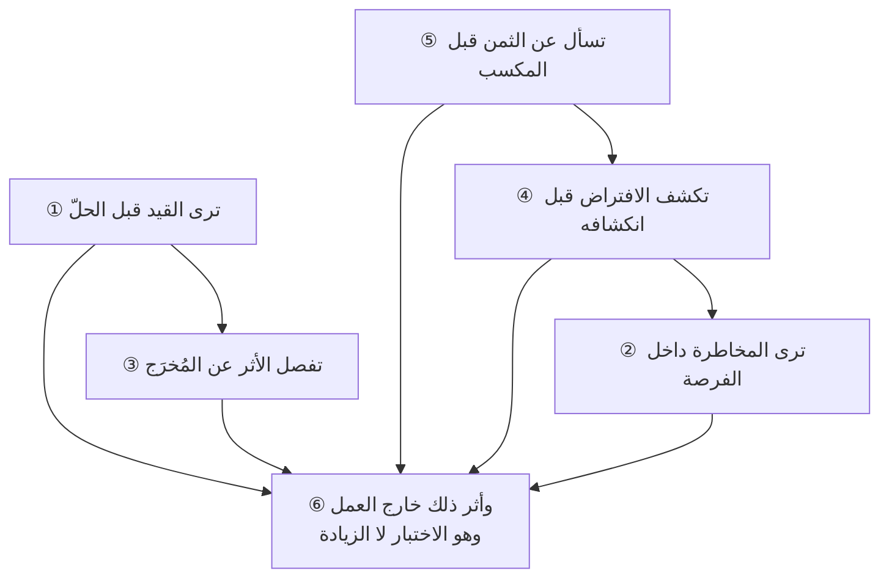

# الفصل 13 — كيف يغيّر هذا العلم طريقة تفكيرك؟

---

## 🏛️ لماذا تقرأ هذا الفصل؟

**المشكلة:** يُقاس تعلّم هذا العلم بما حُفظ منه: كم إطارًا تعرف، وكم شهادة تحمل. ولا يُسأل السؤال الذي يفرّق العالم من الحافظ: **ما الذي صرتَ تراه ولم تكن تراه؟**

**وماذا لو لم تعرف؟** من قاس تعلّمه بالمحفوظ ظنّ نفسه قد بلغ وهو لم يبرح مكانه، لأنّ المعرفة تتراكم والنظر لا يتغيّر.

**وبعد هذا الفصل ستستطيع:**

- **أن تميّز المعرفة من المهارة من النظر بمعيارٍ يُرى لا بانطباع** — فتعرف أنّ الثلاثة تفترق في **متى تُستدعى ومن يُطلقها**: فالمعرفة تُستدعى عند السؤال، والمهارة عند الموقف المألوف، **والنظر يعمل بلا أن يُستدعى** — ولهذا يُختبَر **خارج** موضع العمل لا داخله.
- **أن تحكم على نفسك في كلّ تغيّرٍ من الخمسة بعلامةٍ قابلةٍ للملاحظة** — جملةٍ تقولها أو سؤالٍ تجد نفسك تسأله — **وأن تعرف لكلّ واحدٍ منها *تشوّهَه* الذي يُشبهه**، فما من نظرٍ صحيحٍ إلا وله رذيلةٌ تُلابسه من جهة الزيادة لا من جهة النقص.
- **أن تفسّر لماذا لا تُنتج الخبرة الطويلة نظرًا في كثيرٍ من الأحيان** — فتعرف أنّ التكرار وحده لا يُعلّم، **وأنّ عشر سنواتٍ في بيئةٍ لا تُعطي تغذيةً راجعة تُنتج سنةً واحدةً مكرّرةً عشر مرّات**، وأنّ ما ينتقل من هذا العلم إلى غيره **أسئلتُه لا أحكامُه**.

> [!info] بطاقة الفصل
> **النوع:** تركيبيّ
> **المستوى:** 🔴 متقدّم
> **زمن القراءة:** نحو 45 دقيقة
> **أهمّيته في الباب:** ★★★★★
> **موضعك:** انتهيتَ من [[12 - كيف يفكر مدير المشروع]] ← **⬤ أنت هنا** ← يليه [[14 - أمراض الممارسة]]

> [!abstract] موقع هذا الفصل
> **يبني على:** [[Outcome vs Output]] · [[Theory of Constraints]] — يُذكَر هنا ولا يُعاد شرحه.
> **ويؤسّس:** *لا مصطلح تقنيّ جديد؛ هذا الفصل قيميّ لا اصطلاحيّ.*

---

## 🧭 السؤال المركزي

> [!question] السؤال الذي يجيب عنه هذا الفصل كلّه
> **ما الذي يتغيّر فيك أنت، لا ما الذي تتعلّمه؟**

**واحمل معك هذه الأسئلة وأنت تقرأ:**

- ما الذي صرتَ تراه في اجتماع لم تكن تراه قبل سنة؟
- هل تسأل عن الثمن قبل أن تسأل عن المكسب؟
- هل ينفعك هذا العلم خارج عملك؟

---

## 🗺️ الجواب المختصر — قبل التفصيل

**الذي يتغيّر ليس مقدار ما تعرفه بل *ما تلتقطه عينك بلا أن تقصد*.** فالمعرفة تُستدعى حين تُسأل، والمهارة تُستدعى حين يقع الموقف المألوف، **وأمّا النظر فيعمل قبل أن تطلبه — وهذا هو الفرق كلُّه.** **وعلامته أنّه يعمل حيث لا يُطلَب منك شيء:** حين تقرأ خبرًا، أو تسمع وعدًا إعلانيًّا، أو تقف في طابور دائرةٍ حكوميّة. **ولهذا كان أثر هذا العلم خارج العمل ليس زيادةً على ثمرته بل هو *اختبارها*** — إذ داخل العمل يُذكّرك دورُك ويُلجئك الموقف، **وخارجه لا يُذكّرك أحد.**

**وخمسة تغيّراتٍ هي ثمرة هذا العلم في صاحبه، وكلُّها انتقالٌ من *ما يُفعَل* إلى *ما يمنع أو يُدفَع أو يُفترَض*:**

**أوّلها: أن ترى القيد قبل الحلّ.** فتسمع المشكلة فلا يقفز ذهنك إلى ما يُفعَل، بل إلى **ما الذي يمنع؟ وأين يقف العمل واقفًا؟** — **وهو أثر [[Theory of Constraints|نظرية القيود]] حين تصير عادةً لا أداة.**

**والثاني: أن ترى المخاطرة داخل الفرصة، والفرصة داخل المخاطرة.** فهما وجهان لشيءٍ واحدٍ هو عدم اليقين، **ومن رأى أحدهما وحده لم يرَ الموقف بل نصفه.** ويلزم منه ما يُنكره كثيرون: **أنّ المشروع الذي لا مخاطرة فيه لا فرصة فيه**، فمن أراد إلغاء الخطر ألغى القيمة معه.

**والثالث: أن تفصل الأثر عن المُخرَج بلا تكلّف.** فيصير سؤالك الأوّل عن أيّ عملٍ: **وماذا تغيّر عند من يستعمله؟** — لا **ماذا سُلِّم**. **وعلامته الحاسمة أن يُقلقك التقرير الأخضر بدل أن يُطمئنك.**

**والرابع: أن تكشف الافتراض قبل أن ينكشف بنفسه.** فتفحص من الخطّة ما لم يُقَل فيها لا ما قيل: **ما الذي يجب أن يكون صحيحًا لتصحّ هذه الخطّة؟** **وهو أرخص تأمينٍ في هذا العلم كلِّه**، لأنّ كلفته دقائق وأثره أشهر.

**والخامس: أن تسأل عن الثمن قبل المكسب.** فتصير جملة **«وماذا نُسقط في مقابله؟»** أوّل ما تقول، **ولا تعود تصدّق وعدًا بلا ثمنٍ لا في عملك ولا خارجه.**

**ولكلّ واحدٍ من الخمسة *تشوّهٌ يُشبهه* — وهذا ما يغفل عنه أكثر ما يُكتب في هذا الباب.** فرؤية القيد تنقلب **شللًا تشخيصيًّا**، ورؤية المخاطرة تنقلب صوتَ «لكن» في كلّ غرفة، وطلبُ الأثر ينقلب **رفضًا لكلّ ما لا يُقاس**، وكشفُ الافتراض ينقلب شكًّا لا يُبنى عليه شيء، وسؤالُ الثمن ينقلب **تسعيرًا قهريًّا يصنع أثمانًا لم تكن**. **والرذيلة هنا لا تأتي من نقص النظر بل من زيادته بلا حدّ** — ولهذا يقع فيها المتقن لا المبتدئ.

**ومقدار هذا الأثر يلزم أن يُقال بلا مبالغة، وإلّا انقلب الفصل دعايةً لعلمه.** **فهذه خمس عاداتٍ في *ترتيب الأسئلة* لا تحوّلٌ في الطبع ولا حكمةٌ تُكتسَب.** **ولا تجعلك أذكى، ولا أصدق، ولا أقدر على إقناع من لا يريد أن يقتنع.** **وإنّما تجعلك تلتقط في الموقف أشياء كانت تمرّ عليك** — وهذا نفعٌ حقيقيّ، وهو أقلّ ممّا يُوعَد به في كثيرٍ ممّا يُكتب في هذا الباب.

**وأخيرًا: هذا العلم ينقل إليك *أسئلةً* ولا ينقل *أحكامًا*.** فمن أتقنه لم يصر حَكَمًا في الطبّ ولا في التربية ولا في تدبير بيته، **وإنّما صار أحسنَ سؤالًا للطبيب والمعلّم.** **ومن ظنّ أنّه يملك حكمةً عامّة أفسد بها ما ليس من بابه** — وأخطر صور ذلك أن تُدار العلاقات إدارةَ مشاريع.

> [!warning] مفاهيم يكثر الخلط بينها هنا
> `Knowledge` مقابل `Skill` مقابل `Perspective` — احملها في ذهنك، فالفصل يفرّقها في محطّة التمييز.

---

## 🧱 الفكرة الأولى: ترى القيد قبل الحلّ

*موضعها من الفصل: تُقدَّم أوّلًا لأنّها **أسرع التبدّلات ظهورًا وأقربها إلى الفحص** — تُرى في اجتماعٍ واحد ولا تحتاج شهورًا. **وترتيب الخمسة بعدها ليس ترتيبًا في الفضل بل في الأمد**: كلَّما تأخّر التبدّل في القائمة طال زمنُ ظهوره وخفيت علامته.*

**وهذا أوّل ما يتبدّل، وأسرعه ظهورًا، وأشدّه أثرًا في اجتماعٍ واحد.**

**فقبله:** تسمع المشكلة فيقفز ذهنك إلى **ما يُفعَل** — نضيف شخصًا، نشتري أداةً، نجتمع أسبوعيًّا. **وبعده:** تسمعها فيقفز ذهنك إلى **ما يمنع** — أين يقف العمل واقفًا؟ ومن ينتظر من؟ وما الذي لو أُزيل تحرّك كلُّ شيء؟

**والفرق بينهما ليس في الذكاء بل في *ترتيب السؤال*.** فالحلّ الذي يسبق التشخيص يُصيب أحيانًا بالمصادفة، **ويُنفَق ثمنه دائمًا.** **وقد قرّر [[09 - المقاصد والثنائيات والمفاضلات|الفصل 09]] القاعدة التي تحكم هذا: أنّ التحسين الواقع في غير موضع القيد مكسبُه صفرٌ وثمنه كامل** — والذي يزيده هذا الفصل أنّ القاعدة تتحوّل من **شيءٍ تعرفه** إلى **شيءٍ تفعله بلا أن تتذكّره**.

### ولماذا يصعب هذا التحوّل بالذات؟

**لأنّ الحوافز في الاجتماعات تعمل ضدّه.** فمن اقترح حلًّا بدا نافعًا في اللحظة نفسها، **ومن سأل عن القيد بدا معطّلًا أو متباطئًا** — إذ يُؤخّر الوصول إلى ما يبدو أنّه الغاية. **والفرق أنّ نفع المقترح يظهر في الدقيقة، وضرره بعد ثلاثة أشهر ولا يُنسَب إليه.**

**ولهذا كان تكوّن هذه العادة لا يقع بالقراءة بل بشيءٍ واحد: أن تُخطئ ثلاث مرّاتٍ وتقيس.** فمن ضاعف طاقة مرحلةٍ فلم يتغيّر شيء، **ثمّ رأى ذلك مقيسًا لا مُقدَّرًا**، لم يعد قادرًا على أن ينسى.

### وكيف تُقاوَم عادة القفز إلى الحلّ؟

**والقفز إلى الحلّ ليس عيبًا في الخلق بل في الاقتصاد الذهنيّ: فالحلّ يُنهي التوتّر الذي تُحدثه المشكلة، والتشخيص يُطيله.** **ولهذا لا تُعالَج هذه العادة بالعزم، بل بثلاثة إجراءاتٍ صغيرةٍ تُحدث فجوةً بين السماع والاقتراح:**

1. **أن تُعيد صياغة المشكلة بلفظك قبل أن تقترح.** «إذًا الذي يقع: أنّ الطلب يصل الأحد ولا يبدأ فيه أحدٌ قبل الأربعاء — أهذا صحيح؟» **وهذه الجملة تُنتج أثرين: تكشف أنّك فهمتَ أو لم تفهم، وتشتري ثلاثين ثانيةً يهدأ فيها اندفاع الاقتراح.**
2. **أن تسأل «ومنذ متى؟» قبل أن تسأل أيّ شيءٍ آخر.** **فالجواب يفرز في الحال بين مشكلةٍ جديدةٍ لها سببٌ حادث ومشكلةٍ قديمةٍ لها سببٌ بنيويّ** — وهما يختلفان في العلاج اختلافًا تامًّا.
3. **أن تكتب الحلّ الذي خطر لك ولا تقله.** **فهذا يُخفّف الضغط الذي يدفعك إلى قوله، ويحفظه إن كان صوابًا** — وستجد بعد التشخيص أنّك تُلقي بأكثر ما كتبتَ.

**وأمّا في نفسك فالعلامة التي تُنبّهك: أن تشعر بأنّك تعرف الحلّ وأنت لم تسمع نصف الكلام.** **فذلك الشعور بعينه هو موضع الخطر** — إذ لا يجيء من فهمٍ للموقف بل من مشابهته لموقفٍ آخر رأيتَه. **والمشابهة أنفع ما عند الخبير وأخطر ما عنده معًا.**

### وعلامة أنّه وقع فيك

**أن تجد نفسك تسأله في موضعٍ ليس من عملك.** فتقف في طابور جهةٍ خدميّةٍ فترى أنّ الموظّفين خمسةٌ وأنّ الطابور لا يتحرّك، **وتنتبه أنّ الواقف الحقيقيّ ليس النافذة بل التوقيع الذي يُطلَب من غرفةٍ في الطابق الثاني.**

**فحين يعمل هذا النظر وأنت لست في دورك، فقد صار لك.**

### ودرجات هذا النظر ثلاث، لا حالان

**وليس الأمر أنّك ترى أو لا ترى؛ بل ثلاث درجاتٍ يمرّ بها المرء بترتيبها:**

1. **أن تراه بعد أن يُقال لك.** فيُشرَح لك موضع القيد فتقتنع وتقول: صحيح. **وهذه معرفةٌ لا نظر**، وعلامتها أنّك لم تكن ستراه لولا أن أشار إليه غيرك.
2. **أن تسأل عنه.** فتُدخل السؤال في الاجتماع عمدًا لأنّك تعلم أنّه ينفع. **وهذه مهارة**، وعلامتها أنّك تحتاج أن تتذكّر أن تسأل.
3. **أن تراه في الصمت.** أي أن تلتقطه ممّا **لم يُقَل** — فتنتبه أنّ أحدًا لم يذكر الفريق الفلانيّ طوال الاجتماع مع أنّ كلّ ما نُوقش يمرّ به، **أو أنّ الجدول فيه أربع مراحل ومرحلةٌ واحدةٌ منها لا يُذكر لها مالك.** **وهذه هي الدرجة الثالثة، وعلامتها أنّ ما التقطتَه لم يكن في الكلام أصلًا.**

**والانتقال من الثانية إلى الثالثة هو أبطأ ما في هذا الفصل، ولا يقع بالتمرين وحده بل بأن ترى نتيجة ما شخّصتَه مرارًا** — إذ العين لا تلتقط ما لم تتعلّم أنّه ذو دلالة.

### وأربعة أصنافٍ للقيد تتكرّر — ومعرفتها تُقصّر الطريق

**والقيد في المشاريع البرمجيّة قلّما يكون آلةً أو طاقةً حاسوبيّة؛ وإنّما يعود في أكثر ما يقع إلى أربعة:**

| الصنف | صورته | وعلامته |
|---|---|---|
| **قرارٌ عند شخص** | توقيعٌ واحد، أو لجنةٌ شهريّة | العمل جاهزٌ ولا أحد يعمل فيه |
| **معرفةٌ عند شخص** | من يعرف وحده كيف يُنشَر أو يُصلَح | يتوقّف صنفٌ كامل من العمل بغيابه |
| **موردٌ مشترك** | بيئةُ اختبارٍ واحدة، أو مراجعٌ لثلاثة فرق | طابورٌ يطول كلّما زاد من يُنتج |
| **انتظارٌ خارجيّ** | جهةٌ لها نافذةٌ ثابتة | تأخيرٌ منتظمٌ لا يتغيّر مهما اجتهد الفريق |

**وأنفع ما في هذا التصنيف أنّه يدلّ على *صنف العلاج* لا على موضعه فقط:** **فقيدُ القرار يُعالَج بتفويضٍ مكتوب، وقيدُ المعرفة بمرافقةٍ وتوثيقٍ لا بتوظيف، والموردُ المشترك بجدولةٍ أو نسخٍ ثانٍ، والانتظارُ الخارجيّ بإعادة ترتيب العمل حوله لا بمحاولة تسريعه.** **ومن أخطأ الصنف عالج بالعلاج الخطأ — كأن يُوظَّف اثنان لقيدٍ سببُه توقيع.**

> [!example] ثلاثة اجتماعاتٍ في جهةٍ واحدة، وسؤالٌ واحدٌ غيّر اثنين منها
> جهةٌ في **الرياض** كانت تعقد كلّ أسبوعٍ اجتماعًا لتسريع التسليم، وتخرج منه بقراراتٍ من صنفٍ واحد: **نُضيف موردًا، أو نزيد اجتماعًا، أو نُطالب بالتزامٍ أشدّ.**
>
> **فأُدخل على الاجتماع سؤالٌ واحدٌ يُطرح قبل أيّ اقتراح:** *أين يقف العمل واقفًا الآن؟*
>
> **فتغيّر ناتج الاجتماعين التاليين تغيّرًا تامًّا.** إذ تبيّن في الأوّل أنّ نصف الطلبات تنتظر توضيحًا من مالك المنتج، **وهو يحضر الاجتماع نفسه ولم يكن أحدٌ قد قال ذلك أمامه** — لا كتمانًا، بل لأنّ النقاش كان يبدأ دائمًا من الحلول. **وتبيّن في الثاني أنّ بيئة الاختبار مشتركةٌ بين ثلاثة فرقٍ وتتعطّل يومين في الأسبوع.**
>
> **والاجتماع الثالث لم يتغيّر**، لأنّ القيد فيه كان قرارًا عند جهةٍ أعلى، **فلم يملك الحاضرون إلا أن يُسمّوه.** **وتسميتُه وحدها نفعت:** إذ توقّف الفريق عن لوم نفسه، **وصار في المحضر سطرٌ يمكن أن يُرفَع.**

> [!tip] كيف تستعمل هذه الفكرة
> **اجعلها جملةً واحدةً تقولها قبل أن يُقترَح شيء:** *«قبل أن نختار حلًّا — أين يقف العمل واقفًا الآن؟»*
>
> **وثلاثة تجعلها تعمل:**
>
> 1. **أن تُطرح قبل الاقتراحات لا بعدها** — فبعد أن يُقترَح الحلّ يصير السؤال نقدًا لصاحبه، وقبله يصير تشخيصًا مشتركًا.
> 2. **أن يُطلَب لها رقم** — «كم يومًا ينتظر العمل هناك؟» فبلا رقمٍ يصير الجواب رأيًا، **ولكلّ حاضرٍ رأيٌ عن موضع القيد وأكثرها يشير إلى قسمٍ آخر.**
> 3. **أن يُقبَل الجواب «القيد خارجنا»** — ويُسجَّل ويُرفَع، **فهذا نصف العلاج ولا يُدرَك بلا السؤال.**

### وأصعب صورةٍ من هذا النظر: أن يكون القيد أنت

**وآخر ما يراه المرء في هذا الباب — وأشقّه — أن يكون هو الموضع الذي يقف عنده العمل.**

**ولا يقع هذا لتقصيرٍ غالبًا، بل لأنّ الموقع نفسه يجمع الطرق:** فكلُّ ما يحتاج قرارًا يمرّ به، **وكلُّ ما يحتاج توضيحًا يُسأل عنه، وكلُّ ما بين فريقين يُنقَل عبره.** **فيصير محوريًّا في نظره ومختنقًا في نظر المنظومة، والوصفان صحيحان معًا.**

**وثلاث علاماتٍ تكشفه، وكلُّها تُرى في أسبوعٍ واحد:**

- **أن يُوجَد في الفريق عملٌ جاهزٌ ينتظر ردَّك** — ولو لساعات، فإن تكرّر يوميًّا فهو نمط.
- **أن يُسأل عنك السؤال نفسه من أكثر من واحد** — فهذه معرفةٌ لم تخرج من رأسك، **وقد صرتَ قيدًا معرفيًّا.**
- **وأن يتوقّف صنفٌ من العمل في إجازتك.** **وهذا أوضحها وأقلُّها انتباهًا، لأنّه يُقرأ عادةً دليلًا على الأهمّية.**

**وأمّا العلاج فليس أن تعمل أكثر — فهذا يزيد الاختناق ويؤخّر اكتشافه — بل الثلاثة التي تُعالَج بها القيود كلُّها:** **أن يُستخرَج من العمل ما لا يحتاجك حقًّا** (وهو أكثره)، **وأن يُكتب ما تعرفه وحدك في صفحةٍ لا في ذهنك**، **وأن يُعلَن ما يقرّره الفريق بلا استئذانك** ([[12 - كيف يفكر مدير المشروع|الفصل 12]]).

**وأصعب ما في هذا أنّ إزالة هذا القيد تُنقص من شعورك بالأهمّية.** **فمن كان كلُّ شيءٍ يمرّ به يشعر أنّه محور، ومن رتّب الأمور حتى صارت تمشي بلا مروره بها يشعر أنّه فائض** — **وهذا الشعور خدّاع، فالثاني أنفع للمنظومة من الأوّل بمراتب.** **والعلامة على أنّك تجاوزته: أن تُسَرّ حين تجد قرارًا صحيحًا اتُّخذ بلا أن تُستشار.**

> [!warning] الحفرة الشائعة — الشلل التشخيصيّ — وهي رذيلة الزيادة لا النقص
> **فمن أتقن رؤية القيد قد ينقلب إلى من لا يبدأ شيئًا حتى يُزال القيد**، ويصير التشخيص عذرًا لا مقدّمة: *«لا فائدة، القيد عند الإدارة».*
>
> **وفسادها من وجهين:** أنّ **القيد ينتقل** — فمن انتظر إزالته لم يستعدّ لانتقاله إلى موضعٍ يملكه؛ **وأنّ بعض العمل يُنجَز داخل القيد** ولو لم يزل: فتحضير ما ينتظر التوقيع حتى يمضي في يومٍ بدل أسبوع نافعٌ وإن بقي الموقّع كما هو.
>
> **والحدّ الفاصل: أن يُتبَع التشخيص بسؤالٍ ثانٍ دائمًا — «وما الذي نستطيعه اليوم داخل هذا القيد؟»** فمن وقف عند الأوّل شخّص وعطّل، **ومن أتبعه الثاني شخّص وعمل.**

> [!question]- تأكّد أنك فهمت — كيف تعرف أنّ رؤية القيد صارت نظرًا لا معلومةً تتذكّرها؟
> **بأنّها تعمل حين لا تكون في وضع العمل، وبأنّها تعمل *قبل* أن تسمع الحلول لا بعدها.**
>
> **فالمعلومة تُستدعى**: تقرأ عن نظرية القيود، ثمّ تتذكّرها حين تُواجه مسألة إن أسعفتك الذاكرة. **والنظر يسبق**: تسمع الجملة الأولى من المشكلة فيتشكّل في ذهنك سؤال «أين يقف؟» بلا أن تختاره.
>
> **والاختبار العمليّ صادقٌ لأنّه لا يُتكلَّف:** انظر في آخر مرّةٍ سمعتَ فيها شكوى — من زميلٍ، أو في خبر، أو من أحد أهلك. **أكان أوّل ما خطر لك اقتراحًا أم سؤالًا عمّا يمنع؟** فجوابك عن هذا هو حالك، **لا ما ستفعله في اجتماع الغد وأنت تعلم أنّك تُختبَر.**

> [!summary]- خلاصة الفكرة في سطرين
> **أوّل ما يتبدّل فيك أن ترى القيد قبل الحلّ، وهو أسرعها ظهورًا وأشدّها أثرًا في اجتماعٍ واحد.**
> **فالحلّ الذي لا يمرّ بالقيد لا يُغيّر شيئًا مهما حسُن** — ومن اقترحه بحسن نيّةٍ استهلك وقتَ الغرفة كلَّه في تحسينٍ مكسبُه صفر.

> [!question] تأمّلٌ تطبيقيّ — لا جواب له في هذا الفصل
> في أوّل اجتماعٍ تُعرض فيه حلول، امتنع عن اقتراح حلٍّ واطرح سؤالًا واحدًا: **ما الذي يمنعنا اليوم تحديدًا؟**
>
> **ولاحظ ماذا يقع في الغرفة بعده.** فالغالب أن يظهر أنّ الحاضرين يقترحون حلولًا لثلاثة قيودٍ مختلفة يظنّونها واحدًا — **وهذا وحده يُختصر به نصفُ الوقت.**

---

## 🧱 الفكرة الثانية: ترى المخاطرة داخل الفرصة

*موضعها من الفصل: كان التبدّل الأوّل في **ما تراه في الحاضر**، وهذا في **ما تتوقّعه ممّا لم يقع بعد**. **وتفارق سابقتَها بأنّها تُلغي تقابلًا مستقرًّا في الذهن** — أنّ الفرصة تُغتنَم والمخاطرة تُتجنَّب — وتُثبت أنّهما وجهان لعدم اليقين نفسه، لا شيئان متقابلان.*

**والمخاطرة والفرصة ليستا شيئين متقابلين، بل *وجهين لشيءٍ واحدٍ هو عدم اليقين*.** فكلتاهما «قد تقع»، **والفرق بينهما في اتّجاه الأثر لا في طبيعته.** **ولهذا تعدّ المراجع المعياريّة الفرصةَ خطرًا موجبًا وتُدرجها في السجلّ نفسه** — وهو تصنيفٌ يبدو لفظيًّا وهو في أثره عمليّ.

**ويلزم من هذا ما يُنكره كثيرون بلا أن ينتبهوا: أنّ المشروع الذي لا مخاطرة فيه لا فرصة فيه.** فما لا خطر فيه معلومٌ مسبقًا، **وما كان معلومًا مسبقًا لا يُنتج ميزةً على أحد** — إذ يستطيعه غيرك. **فمن سعى إلى إلغاء المخاطرة سعى إلى إلغاء القيمة وهو يظنّ أنّه يحمي.**

### فما الذي يتبدّل في نظرك؟

**قبله:** تسمع عرضًا مغريًا فتُقيّم مكسبه. **وبعده:** تسمعه فيتشكّل في ذهنك سؤالٌ واحد — **«وما الذي يجب أن يصحّ ليتحقّق هذا؟»**

**وهذا ليس اعتراضًا بل استكمالٌ للصورة.** والفرق بينهما في النبرة والموضع: **فالاعتراض يأتي في آخر العرض ويقول «لن ينجح»؛ والاستكمال يأتي في أثنائه ويقول «فلنُسمِّ الشروط».**

**والوجه المقابل يُغفَل وهو أنفع: أن ترى *الفرصة داخل المخاطرة*.** فالخطر الذي يعرفه الجميع ولا يستعدّ له أحد **يصير ميزةً لمن استعدّ** — لا لأنّه أذكى، بل لأنّه وحده جاهز. **ومن رأى في تشدّد التنظيم عبئًا رآه غيرُه بابًا يدخله وحده لأنّ منافسيه لم يستعدّوا.**

**وعلامة هذا في العمل واحدة: أن يكون في سجلّ مخاطرك بندٌ واحدٌ على الأقلّ *موجب*** — أي احتمالٌ نافعٌ تستعدّ له كما تستعدّ للضارّ. **والسجلّ الذي كلُّ ما فيه سلبيّ يكشف نظرًا نصفَ مفتوح.**

### والاستعداد للخطر ليس منعه — وهذا ما يُغفَل

**ومن رأى الخطر ظنّ أنّ المطلوب منه منعُه، وأكثر المخاطر لا تُمنَع.** **والاستجابات الممكنة أربعٌ لا واحدة، ولكلّ واحدةٍ موضعها:**

1. **أن يُمنَع** — بأن يُترَك السبب أصلًا: لا نستعمل هذه التقنية، ولا نتعاقد مع هذا الطرف. **وهذا أغلاها لأنّه يُلغي معه الفرصة.**
2. **أن يُخفَّف** — بأن يُقلَّل احتماله أو أثره: نسخةٌ احتياطيّة، إطلاقٌ تدريجيّ، طرفٌ ثانٍ.
3. **أن يُنقَل** — إلى من يحتمله أحسن: تأمينٌ، أو بندٌ في عقد، أو خدمةٌ مُدارة. **ولا يعني هذا زواله، بل انتقال من يدفع.**
4. **أن يُقبَل معلَنًا** — وهذا أكثرها وقوعًا وأقلّها إعلانًا. **والفرق بين القبول والغفلة أنّ القابل *يعلم* ويكتب: «قبلنا هذا، وإن وقع فخطّتنا كذا».**

**وأنفع ما في هذا التصنيف في هذا الباب أنّه يُخرجك من ثنائيّة «نمنعه أو نتجاهله»** — وهي الثنائيّة التي تجعل الناس يتجاهلون، **إذ يرون المنع مستحيلًا فيسكتون.**

**والعلامة على أنّ نظرك صار كاملًا هنا: أن تجد نفسك تقول عن خطرٍ حقيقيّ: «نقبله» — بلا حرج.** **فالقبول المعلَن موقفٌ مهنيّ، والسكوت عنه غفلة، وكلاهما يبدو من الخارج شيئًا واحدًا.**

### وثلاثة مواضع تُخطئ فيها العين — ولا يُصلحها إلا القصد

**ورؤية المخاطرة ليست موهبةً تُصيب دائمًا؛ فللعين البشريّة انحيازاتٌ منتظمةٌ في هذا الباب، ومن عرفها استطاع أن يُقاومها قصدًا:**

- **الخطر المألوف يُستهان به.** فما تكرّر ولم يقع منه ضررٌ بعدُ يُقرأ «مأمونًا»، **وهو لم يُؤمَن وإنّما لم يقع.** ومثاله: النشر اليدويّ الذي مضى عليه سنتان بلا حادثة. **والعلامة: أن يُقال «نحن نفعل هذا دائمًا» جوابًا عن سؤالٍ عن الخطر — وهذه ليست إجابة.**
- **والخطر النادر الحاضر في الذاكرة يُبالَغ فيه.** فحادثةٌ واحدةٌ مؤلمةٌ وقعت قبل ثلاث سنين تُنتج إجراءً يُدفَع ثمنه كلَّ أسبوع، **وقد لا تتكرّر الحادثة أبدًا.** **والعلامة: إجراءٌ لا يعرف أحدٌ لماذا وُضع إلا أنّه «بسبب ما حدث في مشروع كذا».**
- **والخطر البطيء لا يُرى أصلًا — وهو أخطرها.** فما يزداد قليلًا كلَّ أسبوع لا يُنبّه أحدًا في أيّ أسبوعٍ بعينه: **الدَّين التقنيّ، وتآكل المعرفة بذهاب الناس، وبطءٌ يزيد دقيقةً في كلّ إصدار.** **والعلامة الوحيدة التي تكشفه المقارنةُ بالسنة الماضية لا بالشهر الماضي** — ولهذا كان القياس على مدًى طويلٍ نافعًا حيث لا ينفع الانطباع.

**والقاعدة الجامعة: العين تلتقط ما هو *مفاجئٌ وحديث*، وأكثر ما يقتل المشاريع *بطيءٌ وقديم*.** **فمن أراد أن يرى فليقصد النظر إلى ما لم يتغيّر منذ زمن، لا إلى ما تغيّر أمس.**

> [!example] الخطر نفسه، ورأيان، ونتيجتان
> جهتان في **جدّة** واجهتا الأمر نفسه: إعلانُ متطلَّبٍ تنظيميٍّ جديدٍ يلزم الالتزام به خلال سنة.
>
> **الأولى رأته خطرًا محضًا**، فأجّلت النظر فيه حتى تتّضح التفاصيل، **وصرفت جهدها إلى ما هو مؤكّد.** فلمّا صدرت التفاصيل قبل الموعد بأربعة أشهر، **أُوقف نصف خارطة المنتج لأجل الامتثال، وسُلّم في آخر أسبوع.**
>
> **والثانية رأت فيه وجهين:** خطرًا يلزم الاستعداد له، **وفرصةً في أنّ أكثر منافسيها سيؤجّل كما أجّلت الأولى.** فبنت الأساس المشترك مبكّرًا — تسجيلَ الأحداث وفصلَ البيانات — **وهو عملٌ كانت تحتاجه على كلّ حال.**
>
> **فلمّا صدرت التفاصيل أنجزت المتبقّي في ستّة أسابيع، وأعلنت الالتزام قبل غيرها بشهور، فصار ذلك في عروضها.**
>
> **والفارق لم يكن في المعلومة — فكلتاهما قرأت الإعلان نفسه في اليوم نفسه — بل في أنّ الأولى رأت وجهًا والثانية رأت وجهين.**

> [!tip] كيف تستعمل هذه الفكرة
> **اقرأ سجلّ مخاطرك، ثمّ اقلب كلّ بندٍ فيه واسأل: وما الوجه الآخر؟**
>
> - «قد تتأخّر الجهة الخارجية» ← **وما الذي يفتحه لنا التأخير؟** ربّما وقتٌ لسداد دَينٍ تقنيّ كنّا نؤجّله.
> - «قد يتغيّر التنظيم» ← **ومن سيتضرّر أكثر منّا؟** فإن كان منافسونا أبطأ استعدادًا، فهذه ميزة.
>
> **ولا يعني هذا التفاؤل بلا سند**؛ يعني ألّا يمرّ احتمالٌ واحدٌ بلا أن يُنظَر في وجهيه. **وأربعة أسئلةٍ من هذا النوع في جلسةٍ واحدة تُخرج عادةً فرصةً لم تكن على أحدٍ من بال.**

> [!warning] الحفرة الشائعة — أن تصير صوت «لكن»
> **فمن أتقن رؤية المخاطر انقلب عند كثيرين إلى من لا يُذكَر أمامه اقتراحٌ إلا وجد فيه ثغرة** — وثغراته صحيحةٌ غالبًا، **وهذا بعينه ما يجعلها ضارّة**، إذ لا تُردّ فيسكت الناس ويكتمون.
>
> **وأثرها التنظيميّ أنّها تُنشئ عادةً في الفريق: ألّا تُعرَض الفكرة إلا ناضجةً تامّة** — فتقلّ الأفكار وتتأخّر، **ويُحرَم الفريق من أنفع مراحلها وهي مرحلة النصف.**
>
> **والعلاج في قاعدةٍ واحدة: لا يُذكَر خطرٌ إلا ومعه ما يُطلَب.** فبدل «هذا محفوفٌ بالمخاطر» يُقال: **«هذا يتوقّف على كذا؛ فهل نختبره في ثلاثة أيّامٍ قبل أن نلتزم؟»** — **فالأوّل يوقف، والثاني يُقدّم الفكرة خطوةً وقد ذكر الخطر نفسه.**

> [!question]- تأكّد أنك فهمت — لماذا يُقال إنّ المشروع الذي لا مخاطرة فيه لا يستحقّ أن يُعمَل؟
> **لأنّ انتفاء المخاطرة يعني انتفاء الجهل، وانتفاءُ الجهل يعني أنّ ما ستفعله معلومٌ للجميع — فلا يُنتج ميزةً لأحد.**
>
> **وهذا لا يعني أنّ كلّ عملٍ يجب أن يكون خطِرًا**؛ فمن العمل ما يُطلَب لأنّه واجبٌ لا لأنّه مربح: **صيانةٌ، وامتثالٌ، وسدُّ ثغرة.** **وهذه لا يُنظَر فيها إلى الميزة أصلًا فلا يَرِد عليها الحكم.**
>
> **والمقصود بابٌ واحد: ما يُطلَب منه *مكسبٌ* — منتجٌ جديد، أو سوقٌ جديد، أو تحسينٌ يُنتظَر منه أثر.** فهذا إن خلا من الخطر فقد خلا من الفرصة، **وحينئذٍ يُسأل عنه سؤالٌ آخر: ولمَ نفعله إذًا؟** — وقد يكون له جوابٌ صحيح، **والمهمّ ألّا يُظنّ أنّ خلوّه من الخطر فضيلةٌ فيه.**

> [!summary]- خلاصة الفكرة في سطرين
> **المخاطرة والفرصة وجهان لشيءٍ واحد هو عدمُ اليقين، والفرق بينهما في اتّجاه الأثر لا في طبيعته.**
> **ولهذا تعدّ المراجع المعياريّة الفرصةَ خطرًا موجبًا وتُدرجها في السجلّ نفسه** — وهو تصنيفٌ يبدو لفظيًّا وأثرُه عمليّ: أن تُخطَّط لها كما يُخطَّط للخطر.

> [!question] تأمّلٌ تطبيقيّ — لا جواب له في هذا الفصل
> افتح سجلّ المخاطر عندك وعُدّ البنود الموجبة فيه. **فإن كانت صفرًا — وهو الغالب — فالسجلّ نصفُ سجلّ.**
>
> ثمّ أضف واحدًا: فرصةً قد تقع ولا تملك ضمانها، **واكتب لها ما تكتبه للخطر: احتمالها، وأثرها، ومن يملك أن يقتنصها، وما الذي يجب أن يكون جاهزًا يوم تقع.**

---

## 🧱 الفكرة الثالثة: تفصل الأثر عن المُخرَج تلقائيًّا

*موضعها من الفصل: **وهذا أوّل تبدّلٍ في القائمة لا جديد في معلومته** — فالفرق بين ما سُلّم وما تغيّر معلومٌ لكلّ من قرأ في هذا المجال ويُذكر في كلّ دورة. **وما تزيده هذه الفكرة كلمةٌ واحدة في عنوانها: «تلقائيًّا»** — إذ ليس الشأن أن تعرف الفرق، بل أن يصير هو السؤال الأوّل الذي يخطر لك بلا استدعاء.*

**والفرق بين [[Outcome vs Output|ما سُلِّم وما تغيّر]] معلومٌ لكلّ من قرأ في هذا المجال، ويُذكر في كلّ دورةٍ وكلّ كتاب.** **والذي يفرّق العالم من الحافظ ليس معرفة الفرق، بل أن يصير هو *السؤال الأوّل* الذي يخطر بلا استدعاء.**

**فقبله:** يُسأل «كيف حال المشروع؟» فيُجاب بما أُنجز: أُغلقت أربعة عشر بندًا، وسُلّمت الوحدة الثانية. **وبعده:** يُجاب بما تغيّر: **صار المستفيد ينهي المعاملة في خطوتين بعد خمس، وانخفضت مكالمات الدعم في هذا الباب من أربعين في الأسبوع إلى تسع.**

**وأدقّ ما في هذا التحوّل أنّه يُعيد ترتيب ما يُقلقك.** **فالتقرير الأخضر كان يُطمئن، وصار يُقلق** — لأنّك تعرف الآن أنّ الأخضر يقيس **الالتزام بالخطّة** ولا يقيس **أثر ما التزمنا به**، وأنّ المشروع الذي وُصف في [[10 - كيف تطور هذا العلم|الفصل 10]] — سُلّم بالضبط فلم يُستعمل — **كانت لوحاته خضراء إلى آخر يوم.**

### وسؤالٌ يسبق سؤال الأثر: ولمن؟

**فقبل أن يُسأل «ماذا تغيّر؟» يلزم أن يُسأل «عند من؟» — وهذا السؤال يسقط في أكثر المشاريع سقوطًا صامتًا.**

**فيُقال «المستخدم» ويُظنّ أنّه شيءٌ واحد، وهو في الحقيقة ثلاثة أصنافٍ مصالحها مختلفة بل متضادّة أحيانًا:**

- **من يستعمل** — ويريد أن يُنجز عمله بأقلّ خطوات.
- **من يشتري أو يموّل** — ويريد ضبطًا وتقاريرَ وخفض كلفة.
- **ومن يُشرف أو يُدقّق** — ويريد أثرًا موثَّقًا يُرجَع إليه.

**وتحسينُ تجربة الأوّل قد يكون على حساب الثالث بالضبط**: فكلُّ خطوةٍ تُحذَف قد تكون حقلًا لا يُسجَّل. **فمن قال «حسّنّا الأثر» ولم يقل «عند من» فقد أخفى مفاضلةً وقعت.**

**والقاعدة العملية: يُكتب اسم الصنف مع كلّ أثرٍ يُدَّعى** — «انخفضت خطوات **من يستعمل** من خمسٍ إلى اثنتين، **وزاد ما يُطلَب من مدخلات التدقيق بحقلٍ واحد**». **فهذه جملةٌ صادقةٌ كاملة، والأولى نصف جملة.**

**وأثرها في النظر أنّك تصير تسمع كلمة «المستخدم» فتسأل تلقائيًّا: أيُّهم؟** — **وهذا وحده يكشف في اجتماعٍ واحدٍ خلافًا كان مستورًا شهورًا**، إذ يتبيّن أنّ اثنين من الحاضرين كانا يبنيان لشخصين مختلفين وهما يظنّان أنّهما متّفقان.

### والسؤال اليوميّ الذي يتولّد عنه

**وهو سؤالٌ من شقّين، والثاني هو الذي يُغفَل ويُغني عن كثير:**

> **من سيستعمل هذا؟ وماذا يفعل اليوم بدلًا منه؟**

**فالشقّ الأوّل يُسأل أحيانًا، والثاني نادرًا.** **وهو الذي يكشف أنّ للناس حلًّا قائمًا بالفعل** — ملفَّ جداولَ، أو رسالةً إلى موظّفٍ يعرفهم، أو طريقةً التفّوا بها منذ سنين. **فما تبنيه لا ينافس العدم؛ ينافس ما يفعلونه الآن.** **ومن لم يعرف البديل القائم لم يعرف بأيّ شيءٍ سيُقاس ما بناه.**

### وللأثر ثلاث درجات، والخلط بينها يُنتج جدلًا لا ينتهي

**فحين يُقال «ما الأثر؟» يجيب كلُّ واحدٍ عن درجةٍ غير التي يسأل عنها الآخر، فيتنازعان وهما متّفقان:**

1. **أثرٌ عند المستخدم** — تغيّرٌ في سلوكه: خطواتٌ قلّت، أو خطأٌ لم يعد يقع، أو شيءٌ صار يفعله ولم يكن. **ويُقاس في أسابيع، وهو أقرب الثلاثة وأوثقها.**
2. **أثرٌ في المنظّمة** — كلفةٌ انخفضت، أو طاقةٌ تحرّرت، أو مخاطرةٌ زالت. **ويُقاس في أشهر، ويتداخل فيه أثر أشياء أخرى فيصعب عزله.**
3. **أثرٌ في السوق أو المستفيد النهائيّ** — حصّةٌ، أو رضًا، أو التزامٌ نُظُميّ. **ويُقاس في سنين، ولا يكاد يُعزى إلى عملٍ بعينه.**

**والقاعدة العملية: يُطالَب الفريق بالدرجة الأولى، ويُشارك في الثانية، ولا يُحاسَب على الثالثة.** **فمن طالب فريقًا بأثرٍ في السوق فقد طالبه بما لا يملكه، وأنتج مقاييسَ صوريّةً حتمًا** — إذ لا بدّ للناس من جوابٍ يُقال. **ومن اكتفى بالدرجة الأولى ولم يصل إلى الثانية أبدًا فقد يُحسّن سلوكًا لا قيمة لتحسينه.**

**وأنفع سؤالٍ يربط بينها: «ولو تغيّر هذا السلوك عند ألفٍ منهم، فماذا يترتّب على المنظّمة؟»** — فإن لم يوجد جوابٌ معقول، **فالأثر الأوّل حقيقيٌّ وغيرُ ذي شأن.**

### وحدّه — فليس كلُّ أثرٍ يُقاس اليوم

**وهذا الحدّ يلزم ذكره وإلّا انقلب النظر إلى رفضٍ لكلّ ما لا رقم له.** فمن الأثر ما يظهر بعد سنتين، **ومنه ما هو *منعُ ضرر* فلا يُرى أثره إلا في غيابه** — كضابطٍ أمنيٍّ منع حادثةً لم تقع.

**والقاعدة: السؤال واجبٌ دائمًا، والجواب قد يكون «لا نعرف بعد» — وهو جوابٌ مشروع.** **والممنوع أن يُسكَت عن السؤال، لا أن يُعترَف بأنّه لم يُجَب.** **ومن أوجب لكلّ عملٍ رقمًا اليوم دفع فريقه إلى تفضيل ما يُقاس بسرعة على ما ينفع بعمق** ([[11 - لماذا اختلفت المدارس|وهذا حدّ مقياس التدفّق نفسه]]).

> [!example] الرقم الذي بقي أخضر ثمانية أشهر
> فريقٌ في **الدمّام** بنى بوّابةً لطلبات الصيانة الداخليّة، **وسُلّمت في موعدها بميزانيّتها ونطاقها كاملًا.** وبقيت لوحة المشروع خضراء ثمانية أشهرٍ متّصلة.
>
> **ولمّا سُئل السؤال ذو الشقّين — من يستعملها؟ وماذا كان يفعل قبلها؟ — تبيّن ما لم يكن مكتوبًا في أيّ تقرير:** أنّ الموظّفين كانوا يرسلون طلب الصيانة **رسالةً إلى فنّيٍّ يعرفونه بالاسم**، فيأتي في اليوم نفسه. **والبوّابة الجديدة تُصدر تذكرةً تُوزَّع على الوردية فتُنجَز في يومين.**
>
> **فالنظام كان أفضل من جهة الترتيب والتتبّع، وأسوأ من جهة من يستعمله.** **ولهذا لم يُستعمَل: 71% من الطلبات ظلّت تصل رسائل.**
>
> **والعبرة أنّ ثمانية أشهرٍ من الأخضر لم تكن كذبًا ولا تقصيرًا؛ كانت تقيس شيئًا صحيحًا وغير ذي صلة.** **ولو سُئل السؤال الثاني في الأسبوع الأوّل لتغيّر التصميم كلُّه** — إذ كانت الحاجة أن يُوثَّق ما يقع لا أن يُغيَّر ما يقع.

> [!tip] كيف تستعمل هذه الفكرة
> **أضف إلى كلّ عنصرٍ كبيرٍ في قائمتك سطرًا واحدًا قبل أن يُبدأ فيه:** *«سنعرف أنّه نفع إذا …»* — **ويجب أن يكون فيه شيءٌ يتغيّر عند غيرك، لا شيءٌ تفعله أنت.**
>
> - ✗ «سنعرف أنّه نفع إذا أطلقنا الشاشة الجديدة» — **هذا مُخرَج.**
> - ✓ «سنعرف أنّه نفع إذا نزل عدد المكالمات في هذا الباب إلى النصف خلال شهرين» — **هذا أثر.**
>
> **وإن لم تستطع أن تكتب السطر، فهذه معلومةٌ نافعةٌ في ذاتها:** إمّا أنّك لا تعرف لمن تبني، **وإمّا أنّ العمل من الصنف الذي لا يُقاس أثره قريبًا** — **فيُكتب أيّ الاثنين هو، ويُمضى.**

### وكيف يُقاس الأثر حين لا تملك أداة قياس؟

**وأكثر ما يُعتذَر به عن ترك سؤال الأثر: «لا نملك أدوات قياس».** **وهذا صحيحٌ في الغالب وغيرُ مانع** — فثلاث طرقٍ رخيصةٍ تُغني عن أكثر ما يُشترى:

1. **أن تسأل خمسةً ممّن يستعمل.** **لا استبيانًا يُرسَل إلى مئة فيُجيب سبعة، بل خمس محادثاتٍ قصيرة** بسؤالٍ واحد: **«أرِني كيف تفعل هذا اليوم».** **والمشاهدة تُعطي في نصف ساعةٍ ما لا يُعطيه استبيانٌ في شهر**، لأنّ الناس يصفون ما يظنّون أنّهم يفعلونه ويفعلون غيره.
2. **أن تعدّ يدويًّا أسبوعًا واحدًا.** فما لا يُسجّله نظامك يمكن أن يُسجَّل في ورقة: **كم مكالمةً وصلت في هذا الباب؟ كم مرّةً طُلبت المساعدة؟** **وأسبوعٌ من العدّ اليدويّ يكفي لخطّ أساسٍ تُقاس عليه بعد ثلاثة أشهر.**
3. **أن تُقارن بسجلٍّ قائمٍ لم يُوضَع لهذا الغرض.** **فسجلّات الدعم، ورسائل البريد، وطلبات الصيانة — كلُّها بياناتٌ موجودةٌ لم تُقرأ.** **وأنفعها ما كان يُجمَع قبل التغيير**، إذ يُعطيك مقارنةً لا يستطيع أحدٌ أن يتّهمها بأنّها صُمّمت لتُثبت شيئًا.

**والقاعدة: القياس التقريبيّ المبكّر أنفع من القياس الدقيق المتأخّر** — **فرقمٌ فيه خطأ 20% يُتَّخذ به قرارٌ اليوم خيرٌ من رقمٍ دقيقٍ يصل بعد أن يُتَّخذ القرار.** **ومن انتظر الأداة الكاملة لم يقس شيئًا، ثمّ نسب ذلك إلى ضعف الإمكانات.**

> [!warning] الحفرة الشائعة — أن ينقلب إلى رفض ما لا يُقاس
> **فمن أتقن هذا النظر قد يصير لا يقبل عملًا إلا ومعه رقمٌ يتحرّك خلال ربع** — **فيُترَك ما لا يُقاس بسرعة: بحثٌ يفتح بابًا بعد سنة، وسدادُ دَينٍ تقنيٍّ أثرُه في ثلاث سنين، وامتثالٌ قيمتُه في حادثةٍ لم تقع.**
>
> **وأثرها أخبث من أن يُترَك هذا العمل: أنّ الفريق يتعلّم أن يصوغ لكلّ شيءٍ رقمًا** — فيُخترَع مقياسٌ سريع الحركة يُرضي القاعدة، **ويُدار به المشروع بدل أن يُدار بالغاية** ([[Goodhart's Law|قانون غودهارت]]).
>
> **والحدّ: أنّ السؤال «وماذا يتغيّر؟» يُوجَّه إلى كلّ عمل، وأنّ *مهلة* الجواب تختلف باختلاف العمل.** **فتُقبَل إجابةُ «بعد سنتين، وعلامتُنا المرحليّة كذا» — ولا تُقبَل إجابةُ «لا نسأل هذا هنا».**

### وحالٌ شائعةٌ عندنا: فريقٌ لا يملك الوصول إلى المستخدم

**وكثيرٌ ممّن يعمل في المنطقة يعمل مورِّدًا لجهةٍ لا تُتيح له أن يرى مستخدميها**، **فيُقال له: اسأل عن الأثر — وهو لا يملك أن يسأل أحدًا.** **وترك السؤال هنا معقول، وهو مع ذلك خسارة.**

**وثلاثة تُبقي السؤال حيًّا وإن لم تُتَح لك المشاهدة:**

1. **أن تسأل *من يقابل* المستخدم لا المستخدم نفسه.** فبين الجهة وبينك موظّفٌ يستقبل الشكاوى، وآخر يدرّب، وثالثٌ يُشغّل. **وهؤلاء يعرفون عن الاستعمال أكثر ممّا يعرفه من يوقّع على المواصفة**، ولا يُسألون غالبًا.
2. **أن تطلب *رقمًا* لا *رأيًا*.** فطلب مقابلة المستخدمين قد يُرفَض، **وطلب «كم بلاغًا وصلكم في هذا الباب الشهر الماضي؟» يُجاب غالبًا** — لأنّه لا يستدعي إذنًا ولا يمسّ خصوصيّة.
3. **وأن يُكتب في العقد أو في محضر البدء بندٌ واحد: كيف سنعرف أنّ هذا نفع؟** **فالوقت الوحيد الذي تملك فيه أن تطلب هذا هو قبل التوقيع** — وبعده تصير طلباتك تفضّلًا.

**وإن تعذّرت الثلاثة، فالمهنيّة أن يُكتب صراحةً: «سُلّم كذا، ولم يُتَح لنا قياس أثره، وهذه علّتُه»** — **فيُنقَل الجهل من كونه سكوتًا إلى كونه معلومةً مسجَّلة.** **وهذا كلُّ ما يملكه من لا يملك، وهو ليس قليلًا:** فالجملة المكتوبة تُقرأ بعد سنةٍ حين يُسأل لماذا لم يُستعمَل النظام.

> [!question]- تأكّد أنك فهمت — لماذا يُقلق التقرير الأخضر من صار يرى الأثر؟
> **لأنّه يعرف أنّ الأخضر يقيس المطابقة للخطّة، والخطّة نفسها فرضٌ قد يكون خاطئًا.**
>
> **فاللون الأخضر يقول: نحن نفعل ما قلنا إنّنا سنفعله.** **ولا يقول شيئًا عن السؤال الأهمّ: أوَكان ما قلناه صوابًا؟** **بل إنّ الأخضر المتّصل قد يكون علامةً على أنّ أحدًا لم يفحص الفرض منذ البداية** — إذ لو فُحص لظهر شيءٌ يستدعي تعديلًا، ولانكسر الاتّصال.
>
> **والعلامة العملية التي تفصل: كم مرّةً تغيّر شيءٌ في الخطّة بسبب ما رأيناه عند المستخدم؟** **فإن كان الجواب «ولا مرّة» مع ثمانية أشهرٍ خضراء، فالأخضر يصف انضباطًا في التنفيذ وانقطاعًا عن الواقع معًا** — وهذان يجتمعان أكثر ممّا يُظنّ.

> [!summary]- خلاصة الفكرة في سطرين
> **الفرق بين ما سُلِّم وما تغيّر معلومٌ لكلّ من قرأ في هذا المجال، ويُذكر في كلّ دورةٍ وكلّ كتاب.**
> **والذي يفرّق العالم من الحافظ ليس معرفة الفرق، بل أن يصير هو السؤال الأوّل الذي يخطر بلا استدعاء** — والفرق بينهما لا يظهر في امتحانٍ، وإنّما في أوّل اجتماعٍ يُعرض فيه إنجاز.

> [!question] تأمّلٌ تطبيقيّ — لا جواب له في هذا الفصل
> اقرأ آخر تقرير إنجازٍ وصلك، وعُدّ فيه شيئين: **كم بندًا يصف ما سُلِّم، وكم بندًا يصف ما تغيّر عند أحد؟**
>
> **فالنسبة بينهما تصف منظّمتك أدقّ ممّا يصفها أيُّ استبيان.** وإن كان الثاني صفرًا، فليس الخلل في كاتب التقرير — **بل في أنّ أحدًا لم يطلب منه ذلك قطّ.**

---

## 🧱 الفكرة الرابعة: تكشف الافتراض قبل أن ينكشف بنفسه

*موضعها من الفصل: مضت تبدّلاتٌ في **ما تنظر إليه**، وهذا تبدّلٌ في **ما تنظر إلى غيابه**. **وتفارق ما قبلها بأنّها لا تفحص ما قيل في الخطّة بل ما لم يُقَل فيها** — ولذلك كانت أبطأها ظهورًا: فالسؤال عن الموجود يخطر، والسؤال عن الغائب لا يخطر حتّى يُدرَّب عليه.*

**فقبله:** تسمع الخطّة فتفحص خطواتها — أمنطقيّةٌ؟ أمُرتَّبة؟ أكافيةُ الوقت؟ **وبعده:** تفحص ما **لم يُقَل** فيها: **ما الذي يجب أن يكون صحيحًا لتصحّ هذه الخطّة أصلًا؟**

**وهذه العادة أرخص تأمينٍ في هذا العلم كلِّه.** فكلفتها دقائق، **وأثرها أشهر** — إذ الافتراض الخاطئ لا يُبطل خطوةً من الخطّة بل يُبطلها كلَّها، **ولا يظهر بطلانه إلا بعد أن يُنفَق عليه أكثر ما سيُنفَق.**

### وأين تختبئ الافتراضات؟ — ثلاثة مواضع

1. **في الأفعال المبنيّة للمجهول.** «سيُوفَّر الحساب» · «ستُراجَع الوثيقة» — **فكلُّ فعلٍ بلا فاعلٍ يحمل افتراضًا بأنّ أحدًا سيفعله، ولم يُسأل.**
2. **في الأرقام التي لا مصدر لها.** فالرقم الذي يُذكر بلا «من أين جاء» يحمل معه سلسلةً من الفروض بُنيت عليها، **وقد سقط بعضها في الطريق** (طبقات الحقيقة في [[12 - كيف يفكر مدير المشروع|الفصل 12]]).
3. **وفي الجمل التي يوافق عليها الجميع بسرعة — وهذا أخفاها وأنفعها.** **فسرعة الإجماع علامةُ افتراضٍ مشترَكٍ لم يُفحَص**، إذ لو كان مفحوصًا لاختلفوا في تفاصيله. **والجملة التي مرّت بلا سؤالٍ في غرفةٍ فيها ثمانية أحقُّ بالسؤال من التي جادلوا فيها ساعة.**

### ومتى يُعاد فحص الفرض؟ — ثلاثة مواقيت

**وكشفُ الافتراض مرّةً واحدةً في أوّل المشروع نصفُ العمل، إذ الافتراضات لا تسقط يوم كُتبت بل بعد أشهر.** **وثلاثة مواقيت تُوجب إعادة الفحص، ومن عرفها استغنى عن مراجعةٍ دوريّةٍ شاملة تُترَك بعد شهرين:**

1. **عند تغيّرٍ في الخارج يمسّ فرضًا مكتوبًا.** — وهذا يقع بنفسه إن كان الفرض مسجَّلًا ([[Decision Log|سجلّ القرارات]])، **ولا يقع أبدًا إن لم يكن.**
2. **عند أوّل نتيجةٍ تخالف التوقّع.** **فالمفاجأة إشارةٌ إلى فرضٍ خاطئ لا إلى سوء حظّ** — وهذا هو الموضع الذي يُهدَر أكثر من غيره: **إذ تُعالَج المفاجأة ويُمضى، ولا يُسأل: أيّ فرضٍ كان يجب أن يسقط لتُتوقَّع؟**
3. **وعند تغيّر من يعمل.** **فالفريق الجديد يرث القرارات ولا يرث فروضها**، فيُدافع عمّا لا يعرف علّته. **ومن دخل فريقًا قائمًا فأنفع ما يفعله في شهره الأوّل أن يسأل عن فروض ما هو قائم** — **فهو الوحيد الذي يستطيع أن يسأل بلا أن يُتَّهم بنقض ما بناه.**

**وسطر المعيار العمليّ:** إن مرّت في المشروع مفاجأةٌ ولم يُكتب بعدها فرضٌ سقط، **فقد عُولج العرَض وبقي ما أنتجه.**

### ومتى تصير عادةً؟

**بعد حادثتين لا بعد قراءة.** فمن انكشف له فرضٌ متأخّرًا مرّةً فدفع ثمنه، ثمّ رأى ثانيةً كيف كان يمكن أن يُكتشَف في نصف ساعة، **صار لا يسمع خطّةً إلا وسأل عمّا تحتها.**

**وقد حرّر [[Assumption Mapping|رسم الافتراضات]] الأداةَ المنهجيّة لهذا؛ والذي يخصّ هذا الفصل شيءٌ واحد: أنّ الأداة تُستعمل في ورشة، والنظر يعمل في المصعد.**

### والافتراض عن نفسك أخفى من الافتراض عن العالم

**وأكثر ما يُفحَص من الافتراضات ما كان عن الخارج: عن السوق، وعن الجهة الأخرى، وعن التقنية.** **وأخفاها ما كان عنك أنت وعن فريقك — لأنّه لا يُشعَر بأنّه افتراضٌ أصلًا، بل يُشعَر بأنّه معرفةٌ بالنفس.**

**وثلاثةٌ منها تتكرّر في كلّ خطّةٍ تقريبًا:**

- **أنّنا سنكون متفرّغين لهذا.** **وهذا أشيعها وأشدّها كذبًا**: فالخطّة تُبنى على أنّ الفريق يعمل عليها كلَّ يوم، **والواقع أنّ ثلث وقته يذهب في الدعم والبلاغات والاجتماعات.** **والفحص سهل: انظر في الشهر الماضي — كم يومًا فعليًّا ذهب إلى العمل المخطَّط؟**
- **أنّ الفريق نفسه سيبقى.** **فالخطّة التي تمتدّ ثمانية أشهرٍ تفترض ضمنًا ألّا يغادر أحد ولا يُنقَل ولا يمرض.**
- **وأنّنا سنُتقن هذا بسرعة.** فالتقنية الجديدة تُقدَّر على أساس أنّنا نعرفها، **وأوّل ثلاثة أسابيع فيها تعلّمٌ لا إنتاج.**

**والقاعدة: افحص افتراضاتك عن نفسك بالسجلّ لا بالنيّة.** **فالنيّة صادقةٌ دائمًا، والسجلّ يقول ما وقع فعلًا** — ومن قابل خطّته بشهره الماضي عرف في دقائق أين بالغ.

### وعلامة أنّه صار لك

**أن تسأله في قرارٍ شخصيّ.** فحين تنظر في وظيفةٍ جديدة، **يخطر لك: ما الذي أفترضه هنا ولم أتحقّق منه؟** — أنّ المدير الذي قابلني سيبقى؟ أنّ ما وُصف لي هو ما سأفعله؟ **فمن وجد نفسه يفعل هذا بلا تكلّف، فقد انتقل النظر من دوره إلى نفسه.**

> [!example] فرضٌ واحدٌ كشفه سؤالٌ في ثلاث دقائق
> فريقٌ في **الرياض** عرض خطّة ترحيلٍ لنظامٍ قديمٍ في ثمانية أسابيع، **مفصَّلةً أسبوعًا أسبوعًا وبمنطقٍ سليمٍ في كلّ خطوة.**
>
> فسأل أحد الحاضرين: **«وما الذي يجب أن يكون صحيحًا لتصحّ هذه الخطّة كلُّها؟»**
>
> **فذُكرت ثلاثة، ثمّ ذُكر رابعٌ بعد صمت: أنّ بيانات النظام القديم *نظيفة* — أي أنّ الحقول مملوءةٌ بما تدلّ عليه أسماؤها.**
>
> **ولم يكن أحدٌ قد فحص ذلك.** **ففُحصت عيّنةٌ من ألف سجلٍّ في يومين، فتبيّن أنّ 34% من حقول «رقم الهوية» تحمل قيمًا لا تطابق الصيغة**، وأنّ حقل «الفرع» استُعمل سنتين لغرضٍ آخر.
>
> **فصارت الخطّة أربعة عشر أسبوعًا لا ثمانية.** **وهذا سيّئ، وهو أحسن كثيرًا من أن يُكتشَف في الأسبوع السابع** — إذ كان سيُكتشَف حينئذٍ بعد أن بُني على الفرض كلُّ ما بُني، **فتُعاد الخطّة من أوّلها ويُدفَع الثمن مرّتين.**

> [!tip] كيف تستعمل هذه الفكرة
> **اسأل السؤال بصيغته هذه بالذات — فالصيغة تصنع الفرق:**
>
> - ✗ «هل من مخاطر؟» — **يُجاب عنه بما هو معروفٌ ومكتوبٌ سلفًا.**
> - ✓ **«ما الذي يجب أن يكون صحيحًا لتصحّ هذه الخطّة؟»** — **يُجبر السائل والمسؤول على النظر تحت الخطّة لا فيها.**
>
> **ثمّ رتّب ما خرج بمحورين لا بمحورٍ واحد** (وهذا حدّ [[Assumption Mapping|رسم الافتراضات]]): **أثرُه إن كان خاطئًا × يقيننا فيه.** **ولا تفحص إلا ما اجتمع فيه أثرٌ عالٍ ويقينٌ ضعيف** — فهذه وحدها تستحقّ وقتًا، **والباقي يُكتب ويُمضى.**

> [!warning] الحفرة الشائعة — الشكّ الذي لا يُبنى عليه شيء
> **فمن أدمن نبش الافتراضات صار لا تمرّ أمامه جملةٌ إلا شكّكها**، حتى يصير الحوار مستحيلًا **ويصير كلُّ قرارٍ محتاجًا إلى بحث.**
>
> **وفسادها في أنّها تُلغي التمييز:** فالمنهج كلُّه قائمٌ على أنّ الافتراضات **تُرتَّب** لا أن تُفحَص جميعًا. **ومن فحص كلَّ شيءٍ لم يفحص شيئًا**، لأنّ وقته يذهب في ما لا أثر له.
>
> **وعلامتها في الاجتماع: أن يُسأل عن فرضٍ لا يترتّب على بطلانه شيء.** **والدواء سؤالٌ يُوجَّه إلى النفس قبل أن يُنطَق: «ولو تبيّن أنّ هذا الفرض خاطئ، أيتغيّر قرارنا؟»** — فإن كان لا، **فالسؤال عنه استعراضٌ لا فحص.**

> [!question]- تأكّد أنك فهمت — لماذا تكون الجملة التي وافق عليها الجميع بسرعة أحقَّ بالفحص من التي طال الجدل فيها؟
> **لأنّ سرعة الإجماع دليلٌ على أنّ الجملة لامست افتراضًا مشترَكًا، لا على أنّها صحيحة.**
>
> **فالجملة التي جودلت ساعةً قد فُحصت من زوايا** — وخرجت بأثر ذلك أوثق. **والتي مرّت في ثانيتين لم تُفحَص أصلًا**، وإنّما وافقت ما في رؤوس الجميع فمرّت بلا احتكاك.
>
> **وهذا خطِرٌ خاصّةً في الفرق المتجانسة** — من تخرّجوا من مكانٍ واحد، أو عملوا سنينَ معًا — **فاشتراكهم في الخبرة يجعل اشتراكهم في *العمى* أشدّ.** **ولهذا كان أنفع ما يُفعَل في مثل هذه الغرف أن يُسأل من هو أقلُّهم خبرةً بالمجال: «وأيّ شيءٍ قيل هنا لم يكن واضحًا لك؟»** — **فسؤاله يُخرج ما اتّفق الجميع على ألّا يقولوه لأنّه «معروف».**

> [!summary]- خلاصة الفكرة في سطرين
> **قبله تفحص خطوات الخطّة: أمنطقيّةٌ؟ أمرتّبة؟ أكافيةُ الوقت؟ وبعده تفحص ما لم يُقَل فيها.**
> **والسؤال الذي يتبدّل به نظرُك جملةٌ واحدة:** ما الذي يجب أن يكون صحيحًا لتصحّ هذه الخطّة أصلًا؟ — فالخطط لا تسقط بخطأٍ في خطواتها غالبًا، بل بافتراضٍ لم يُكتب.

> [!question] تأمّلٌ تطبيقيّ — لا جواب له في هذا الفصل
> خذ خطّةً معتمدةً عندكم، واستخرج منها **ثلاثة افتراضاتٍ غير مكتوبة** تقوم عليها، ثمّ رتّبها بسؤالٍ واحد: **أيُّها لو سقط كان أفدحَ أثرًا؟**
>
> **ثمّ اكتب لأفدحها ما يكشفه مبكرًا.** فالافتراض الذي لا علامة له يُكتشف يوم يسقط — وذلك اليوم هو أغلى يومٍ ممكن لاكتشافه.

---

## 🧱 الفكرة الخامسة: تسأل عن الثمن قبل المكسب

*موضعها من الفصل: **وهذه خاتمة التبدّلات داخل العمل**، وأشدُّها أثرًا في ما يُبنى وما لا يُبنى. وتفارق ما قبلها بأنّها لا تُصحّح قراءتك للموقف بل **ترتيبَ سؤالك عنه**: فكلُّ اقتراحٍ يُعرض بمكاسبه ولا يُعرض بثمنه — لا إخفاءً غالبًا، بل لأنّ صاحبه لا يراه.*

**فقبله:** يُعرَض عليك اقتراحٌ فتقيس نفعه: أينفع؟ كم ينفع؟ **وبعده:** يُعرَض فيخطر لك سؤالان قبل أن يُتمّ صاحبه عرضه — **ومن يدفع؟ وماذا سنكفّ عنه في مقابله؟**

**والثاني هو الأثقل والأنفع.** **فكلُّ إضافةٍ في منظومةٍ ممتلئةٍ هي في حقيقتها إزاحة**، وما لم يُسمَّ ما أُزيح فقد أُزيح شيءٌ صامتًا: **جودةٌ، أو راحةُ ناس، أو عملٌ كان مؤجَّلًا فتأجّل أكثر.** **وهذا هو حكم [[09 - المقاصد والثنائيات والمفاضلات|الفصل 09]] وقد صار عادةً: زحفُ النطاق ليس زيادة العمل بل زيادةً لم يُدفَع لها ثمن.**

### وثلاثة أثمانٍ لا تظهر في ميزانيّة

**والأثمان التي تُحسَب سهلة، وإنّما يُعرَف صاحب النظر بأنّه يرى ما لا يُحسَب.** **وثلاثةٌ منها تُدفَع في كلّ منظّمةٍ ولا يظهر منها ريالٌ واحدٌ في تقرير:**

- **ثمنُ الانقطاع.** فمقاطعة المهندس ثلاث مرّاتٍ في اليوم لا تُكلّف ثلاثين دقيقةً بل ثلاث دخلاتٍ في العمق. **ولا يُقاس هذا في نظامٍ ماليّ، ويُقاس أثره في التسليم بوضوح.**
- **وثمنُ الحمل المعرفيّ.** فكلُّ استثناءٍ يُضاف إلى العملية — «إلا في حالة كذا» — **يُضاف إلى ما يجب أن يحمله كلُّ فردٍ في رأسه**، فتزيد الأخطاء لا لضعفٍ في الناس بل لزيادةٍ في الحمل. **ولهذا كان لكلّ استثناءٍ ثمنٌ يفوق ثمن الحالة التي وُضع لها.**
- **وثمنُ الثقة.** وهو أثقلها وأبطؤها ردًّا. **فالوعد الذي يُنقَض مرّتين يُنتج فريقًا لا يتحرّك حتى يتأكّد، فتزيد المدد كلُّها بلا أن يتغيّر شيءٌ ظاهر.** **ولا يُسترَدّ هذا الثمن بقرارٍ مضادّ** ([[12 - كيف يفكر مدير المشروع|الفصل 12]]).

**والذي يتغيّر في نظرك أنّك تصير تحسبها في قرارك وإن لم تستطع أن تُدرجها في جدول.** **فتقول: «هذا يوفّر ثلاثة أيّامٍ ويُضيف استثناءً سيحمله ستّة أشخاصٍ سنتين — أنقبله؟»** **فتُصبح المفاضلة كاملةً وإن بقي أحد طرفيها بلا رقم.**

**والقاعدة: ما لا يُقاس يُذكر في الجملة نفسها.** **فمن أسقطه لأنّه لا يُقاس رجّح المقيس دائمًا** — وهو ما حذّر منه [[09 - المقاصد والثنائيات والمفاضلات|الفصل 09]] عند الحديث عن تسعير ما يُقاس وحده.

### ومن يدفع؟ — أن تمسح الغرفة بحثًا عمّن ليس فيها

**وسؤال «من يدفع؟» يتحوّل بعد حينٍ إلى عادةٍ بصريّة: أن تنظر في الحاضرين فترى الغائبين.**

**فأنت تعرف أنّ الثمن يقع دائمًا على من لا يملك المنع** ([[09 - المقاصد والثنائيات والمفاضلات|الفصل 09]])، **وأنّ الحاضرين يحرسون مصالحهم فلا يُظلمون غالبًا.** **فمن جلس على الطاولة أُخذت مصلحته في الحسبان بحكم حضوره لا بحكم عدلٍ خاصّ.**

**وأربعةٌ لا يجلسون في أكثر اجتماعات المشاريع، وهم الذين يدفعون:**

- **فريق التشغيل** الذي سيَرِث ما بُني ويُسأل عنه ليلًا.
- **المستخدم النهائيّ** الذي لا يعرف أنّ شيئًا يُقرَّر عنه.
- **الفريق الذي سيأتي بعد سنتين** ويقرأ ما نكتبه اليوم.
- **وفريقك نفسه في الربع القادم** حين يُسدّد ما اقترضناه اليوم.

**ولا يعني هذا أن يُدعى الجميع إلى كلّ اجتماع — فتلك مفسدةٌ أخرى.** **وإنّما يعني أن يُقال في الاجتماع نفسه: «هذا القرار يدفع ثمنه فلانٌ وليس هنا؛ أنسأله أم نمضي ونُعلمه؟»** — **فمجرّد نطق الاسم يُغيّر القرار في كثيرٍ من الأحيان**، لا لأنّ أحدًا كان يقصد الإضرار، **بل لأنّ الغائب لم يكن في الصورة أصلًا.**

### وأدقّ صوره: أن تسأل عن ثمنك أنت

**فأكثر الناس يُحسنون سؤال «ما ثمن هذا على المشروع؟» ويغفلون: «وما ثمنه عليّ أنا؟»** — من وقتٍ، ومن انتباه، ومن رصيدٍ عند من أطلب منه. **فالمدير الذي يقبل كلَّ ما يُعرَض عليه لأنّه «لا يريد أن يقول لا» يُنفق رصيده كلَّه في أشياء صغيرة، فلا يبقى له شيءٌ يوم يحتاج أن يمنع شيئًا كبيرًا.**

### والثمن الذي لا يُرى: ثمن ما لم يُقرَّر

**وأخفى الأثمان كلِّها ثمنُ القرار الذي لم يُتَّخذ.** فالقرار المُتَّخَذ له ثمنٌ يُرى ويُنسَب إلى صاحبه، **والقرار المؤجَّل ثمنُه يُدفَع كلَّ يومٍ ولا يُنسَب إلى أحد** — لأنّ من لم يقرّر لم يفعل شيئًا يُلام عليه.

**وثلاث صورٍ لهذا الثمن تتكرّر:**

- **عملٌ يتوقّف انتظارًا للقرار.** وهو أظهرها، ويُقاس بأيّامٍ مضروبةٍ في عدد من ينتظر.
- **وخيارٌ يُغلَق بمرور الوقت.** فالقرار الذي كان قابلًا للتراجع صار غير قابلٍ لأنّه بُني عليه ما بُني ([[12 - كيف يفكر مدير المشروع|الفصل 12]]) — **فالتأجيل هنا ليس حيادًا بل اختيارٌ للحالة القائمة.**
- **وثقةٌ تتآكل.** فمن رفع أمرًا ثلاث مرّاتٍ فلم يُبتّ فيه **يكفّ عن الرفع** — ثمّ يُقال بعد سنة إنّ الفريق لا يُبلّغ.

**ومن صار يرى هذا الثمن تغيّرت عنده جملةٌ واحدة: لم يعد يقول «لم نقرّر بعد» بوصفها وصفًا محايدًا.** **بل يقول: «نحن نُبقي الحال على ما هي عليه، وثمن ذلك كذا يوميًّا» — وهي الجملة نفسها بمعنًى مختلف تمامًا.**

**وهذا أنفع تحوّلٍ في هذا الباب لمن يعمل في جهاتٍ بطيئة القرار**، **لأنّه ينقل التأجيل من *لا شيء* إلى *بندٍ له رقم*** — والرقم يُرفَع، والسكوت لا يُرفَع.

### وأثره خارج العمل — وهو أوضح مواضعه

**فمن اعتاد أن يسأل عن الثمن لم يعد يصدّق وعدًا بلا ثمن.** **فالإعلان الذي يَعِد بلا مقابل، والبرنامج الذي يَعِد بالإتقان في أسبوع، والعرض الذي كلُّ ما فيه مكاسب — كلُّها تُصبح مريبةً لا لأنّك متشائم، بل لأنّك تعرف أنّ الثمن موجودٌ ولم يُذكر، ومن لم يُذكر ثمنُه دفعه المشتري بلا أن يعلم.**

**وهذا أوضح ما ينتقل من هذا العلم إلى خارجه، وأسرعه ظهورًا.**

> [!example] «نعم» واحدةٌ كلّفت ربعًا كاملًا
> مديرٌ في **جدّة** قَبِل في اجتماعٍ طلبًا يبدو صغيرًا: تقريرٌ إضافيٌّ لجهةٍ داخليّة. **وقال «نعم» في ثانيتين، وكان يرى أنّه أحسن التعامل.**
>
> **ولم يُسأل يومها سؤالان:** من يدفع؟ **وماذا نُسقط في مقابله؟**
>
> **وأمّا الجواب فظهر بعد أحد عشر أسبوعًا:** التقرير احتاج بياناتٍ لم تكن تُجمَع، فاستدعى تعديلًا في ثلاثة مواضع، **وأخّر عملًا كان في القائمة قبله.** ثمّ طُلبت له تحسينات، **فصار بندًا دائمًا يستهلك نحو يومٍ في الأسبوع.**
>
> **ولو قيل يومها: «نعم، ويُزاح في مقابله كذا — أتوافق؟» لَما تغيّر شيءٌ في العلاقة**، وربّما سُحب الطلب أصلًا حين ظهر ثمنه. **فالذي أفسد لم يكن القبول، بل القبول بلا تسعير** — إذ صار الطلب مجّانيًّا فتكرّر.

> [!tip] كيف تستعمل هذه الفكرة
> **بدّل جملتك في الرفض والقبول معًا:**
>
> - **بدل «لا نستطيع»** ← **«نستطيع، وثمنه كذا — أنقبل؟»**
> - **وبدل «نعم»** ← **«نعم، وسيُزاح كذا — أتوافق؟»**
>
> **وأثر هذا التبديل ثلاثة:** أنّك لم تعد معطِّلًا في نظر أحد، **وأنّ الطلب صار له ثمنٌ فقلّت الطلبات العابرة**، **وأنّ من يطلب صار شريكًا في القرار لا خصمًا فيه.**
>
> **وقد قرّر [[09 - المقاصد والثنائيات والمفاضلات|الفصل 09]] هذا في جملةٍ تُحفَظ: من اعترض ثلاث مرّاتٍ صار معطِّلًا، ومن سعّر ثلاث مرّاتٍ صار مرجعًا.**

> [!warning] الحفرة الشائعة — التسعير القهريّ — أن يصير كلُّ شيءٍ مفاضلة
> **فمن أتقن سؤال الثمن قد ينقلب إلى من يرى في كلّ اقتراحٍ خسارةً مقابلة، فيُصنَع ثمنٌ لم يكن موجودًا ثمّ يُدفَع.**
>
> **وأثره أنّ كلَّ اقتراح تحسينٍ يصير مشبوهًا** — إذ يُسأل عنه دائمًا «وماذا سنخسر؟» **في مواضع لا خسارة فيها أصلًا:** فبين تقليل الهدر وتحقيق القيمة تعاضدٌ لا تقابل، وبين حفظ المعرفة وجودة القرار كذلك.
>
> **والحدّ الذي يمنع الانقلاب: أنّ سؤال الثمن يُطرح حيث يوجد *موردٌ واحدٌ متزاحَمٌ عليه لا يزيد*** — وقتٌ، أو انتباه، أو تحمّلٌ للخطأ. **فحيث لا يوجد مورد كذلك، فالسؤال الصحيح ليس «بكم؟» بل «كيف؟»** (الفصل 09).

> [!question]- تأكّد أنك فهمت — ما الفرق العمليّ بين «لا نستطيع» و«نستطيع وثمنه كذا»؟
> **الأولى تنقل القرار إليك وتجعلك خصمًا، والثانية تُبقيه عند صاحبه وتجعلك مرجعًا — والمحتوى واحد.**
>
> **فحين تقول «لا نستطيع» فقد قرّرتَ نيابةً عن غيرك، وحرمتَه من أن يزن.** **فقد يكون الطلب عنده يستحقّ الثمن فعلًا** — لأنّه يعلم من الصورة ما لا تعلم. **فمن رفض بدل أن يُسعّر قد يكون منع نفعًا وهو يظنّ أنّه يحمي.**
>
> **وحين تقول «نستطيع وثمنه كذا» فقد أعطيتَه ما يحتاجه ليقرّر، وأبقيتَ التبعة عنده.** **وأثر ذلك تراكميّ: فمن سعّر مرارًا صار يُستشار قبل أن يُطلَب منه** — إذ عرف الناس أنّ عنده الصورة الكاملة، **وهذا أوثق ما يبنيه المهنيّ عند من حوله.**

> [!summary]- خلاصة الفكرة في سطرين
> **قبله يُعرَض عليك اقتراحٌ فتقيس نفعه، وبعده يخطر لك سؤالان قبل أن يُتمّ صاحبه عرضه: ومن يدفع؟ وماذا سنكفّ عنه في مقابله؟**
> **وليس هذا تشاؤمًا بل إتمامٌ للحساب** — إذ المكسب وحده نصفُ المعادلة، ومن قرّر بنصفها قرّر بنصف علم.

> [!question] تأمّلٌ تطبيقيّ — لا جواب له في هذا الفصل
> في الاقتراح القادم الذي يُعرض عليك، اكتب قبل أن تُجيب سطرين: **من يدفع ثمنه؟ وما الذي سيتأخّر بسببه؟**
>
> **ثمّ اطرحهما بصيغة سؤالٍ لا اعتراض.** فالفرق بين «هذا لن ينجح» و«ما الذي سيتأخّر إن فعلناه؟» هو الفرق بين من يُوصَف بالتعطيل ومن يُستشار في القرار التالي.

---

## 🧱 الفكرة السادسة: وأثر ذلك خارج العمل

*موضعها من الفصل: مضت خمسةُ تبدّلاتٍ موضعُها كلِّها **داخل العمل**، **وهذه ليست سادسَها بل اختبارُها**. وعلّةُ ذلك أنّ داخل العمل يُذكّرك دورُك ويُلجئك الموقف، **وخارجه لا يُذكّرك أحد ولا يُطلَب منك شيء** — فما ظهر منك هناك فهو ما صار لك.*

**وهذا القسم ليس زيادةً على ثمرة العلم، بل هو *اختبارها*.** فداخل العمل يُذكّرك دورُك ويُلجئك الموقف؛ **وخارج العمل لا يُذكّرك أحد، ولا يُطلَب منك شيء.** **فما ظهر منك هناك فهو ما صار لك، وما لم يظهر فهو معرفةٌ تُستدعى عند الحاجة.**

### وثلاثة مواضعَ ينتقل إليها بحقّ

**① تنظيم وقتك.** **فقاعدة العمل الجاري تنطبق على حياة صاحبها كما تنطبق على فريقه:** من بدأ خمسة أشياء لم يُنهِ منها شيئًا، **وليس ذلك لضعفٍ في همّته بل لأنّ التنقّل نفسه له ثمن.**

**وثلاثة تنتقل هنا بحقّ:**

- **حدُّ ما تبدؤه لا حدُّ ما تخطّط له.** فأكثر ما يُكتب في تنظيم الوقت يعالج **الترتيب**، والمشكلة في **العدد**: أن يكون بين يديك ستّة أشياء «جارية» فتُنهي الشهر ولم يكتمل منها شيء. **والعلاج واحد: لا تبدأ الجديد حتى يخرج القديم.**
- **الأولوية تُختبَر بما تُلغيه لا بما تكتب.** **فالقائمة التي لم يُحذَف منها شيءٌ منذ شهرين ليست قائمة أولويّات بل قائمة أمنيات** — إذ لا أولويّة إلا حيث يوجد منع.
- **وأن تُقاس مدّتك لا جهدك.** فما قدّرتَه ساعتين ليس ساعتين في تقويمك، **لأنّ بينهما انقطاعاتٍ لم تحسبها** — وهذا هو التفريق نفسه الذي في [[12 - كيف يفكر مدير المشروع|الفصل 12]] وقد انتقل إلى صاحبه.

**وعلامة أنّ هذا انتقل إليك: أن تُلغي شيئًا من قائمتك بلا أن تُنجزه ولا تشعر بذنب** — إذ الحذف قرارٌ لا تقصير.

**② قراراتك الخاصّة.** **فتصنيف القرار بكلفة التراجع** ([[12 - كيف يفكر مدير المشروع|الفصل 12]]) **ينفع في أخصّ شؤونك، وأثره فيها أكبر من أثره في عملك** — لأنّ قراراتك الشخصيّة أقلُّ عددًا وأثقلُ وزنًا.

**فتصير تسأل: أهذا من الباب الدوّار أم من الباب الواحد؟** — **وتُدرك أنّ كثيرًا ممّا نتردّد فيه شهورًا من الباب الدوّار** فيُجرَّب في أسبوع، **وأنّ ما نمضي فيه بسرعةٍ أحيانًا من الباب الواحد.** **وتصير تسأل الأنفع منه: أنستطيع أن نجعل الرجوع عنه أرخص؟** — أن تستأجر قبل أن تشتري، وأن تُجرّب المدينة قبل أن تنتقل إليها، وأن تعمل بدوامٍ جزئيٍّ قبل أن تترك عملك.

**وكذلك أن تكتب لنفسك سطرين عن القرار الكبير: على أيّ فرضٍ بنيتُه، ومتى أعيد النظر.** **فما يُنسى في المشاريع يُنسى في الأعمار** — بل أشدّ، **إذ لا أحد يُراجعك في قراراتك الخاصّة، ولا يوجد اجتماعٌ ربعيٌّ لحياتك.**

**③ حكمك على ما يُعرَض عليك.** فتصير ترى ثلاثة بلا أن تقصد: **الوعد الذي لا ثمن له، والرقم الذي لا مدى له، والدعوى التي لا يمكن أن تُنقَض** ([[08 - القواعد الكلية وسنن المشاريع|الفصل 08]]).

**وهذه الثلاثة تكفيك في أكثر ما يُعرَض عليك.** فالبرنامج الذي يَعِد بإتقانٍ في أسبوعٍ **بلا أن يذكر ما ستتركه في مقابله** — إمّا أن يكون الوعد مبالغًا فيه وإمّا أن يكون الثمن مخفيًّا. **والعرض الذي يقول «يوفّر حتى 40%» — تسأل: حتى؟ فأين الحدّ الأدنى؟ وقياسًا لماذا؟** **والادّعاء الذي كلَّما ذُكرت له حالةٌ مخالفة قيل «تلك حالةٌ خاصّة» — تعرف أنّه لا يُنقَض، فلا يُختبَر، فلا يُبنى عليه.**

**ولا يجعلك هذا سيّئ الظنّ بالناس؛ يجعلك بطيء التصديق للدعاوى** — **وبينهما فرقٌ يعرفه من جرّبه.**

### ورابعٌ هو أنفعها في معاملة الناس: أن تكفّ عن نسبة ما هو بنيويّ إلى الأشخاص

**وأكثر ما يتغيّر في نظرك إلى غيرك أنّك تصير تسأل عن *البنية* قبل أن تحكم على *الشخص*.**

**فقبله:** ترى فريقًا يتأخّر فتقول: **لا يبالون.** وترى موظّفًا لا يجيب فتقول: **مهمل.** **وبعده:** تسأل: **ما الذي يجعل هذا السلوك معقولًا من موضعه؟** — **فتجد غالبًا أنّه معقول:** الفريق يتأخّر لأنّه يُقاس بشيءٍ آخر، والموظّف لا يجيب لأنّه يصله ستّون طلبًا في اليوم ولا أحد رتّبها له.

**وهذا ليس التماسًا للأعذار، بل هو أدقّ في التشخيص وأنفع في العلاج معًا.** **فالنسبة إلى الشخص تُنتج علاجًا واحدًا: أن يُستبدَل أو يُوبَّخ** — **وكلاهما لا يُغيّر شيئًا إن كانت البنية هي التي أنتجت السلوك**، إذ سيفعل الذي بعده ما فعل.

**وقد قرّرت هذا فصولٌ قبل هذا الفصل بصيغٍ مختلفة:** أنّ العمل المستور يُفسَّر بالتقصير لأنّه التفسير الوحيد المتاح، **وأنّ قانون كونواي يردّ عطبًا تقنيًّا في ظاهره إلى سببٍ تنظيميّ، وأنّ الحوافز تُنتج سلوكًا لا يقصده أحد.** **والذي يزيده هذا الفصل أنّ ذلك كلَّه يصير *أوّل ما يخطر* لا استنتاجًا يُبلَغ بعد جهد.**

**وحدُّه لازمٌ وإلّا انقلب: أنّ ردّ كلّ شيءٍ إلى البنية يُلغي المسؤولية الفرديّة، وهي موجودة.** **فثمّ تقصيرٌ حقيقيّ، وثمّ من يعرف ويستطيع ولا يفعل.** **والفارق: أن تسأل — هل كان يملك أن يفعل غير ما فعل؟** فإن كان يملك وبقي الأمر متكرّرًا مع غيره أيضًا، **فالبنية شريكة**؛ وإن كان يملك ولم يقع من غيره، **فالمسؤولية شخصيّةٌ ويُقال ذلك** ([[15 - أخلاق المهنة|وتحرير هذا في الفصل 15]]).

### وخامسٌ لا يُذكَر: أنّ إصغاءك يتغيّر

**وأخفى ما ينتقل من هذا العلم ليس في السؤال بل في *الاستماع*.** فمن اعتاد أن يفصل بين طبقات الكلام ([[12 - كيف يفكر مدير المشروع|الفصل 12]]) صار يسمع في الجملة الواحدة ما لا يسمعه غيره.

**فحين يقول لك أحدهم: «الجميع يشتكي من هذا»، تسمع ثلاثة أشياء لا شيئًا واحدًا:** دعوى كمّيّةً بلا عدد، **وحكمًا نُقل عن آخرين فلا يُعرف أوّله**، ورغبةً في أن يُقبَل الطلب بلا مناقشة. **ولا تردّها ولا تُصدّقها، وإنّما تسأل: كم واحدًا؟ ومتى؟ وماذا قالوا بالضبط؟** — **لا تشكيكًا في صدقه، بل لأنّ الفرق بين «ثلاثةٌ ذكروها الأسبوع الماضي» و«الجميع» فرقٌ في القرار لا في العبارة.**

**وكذلك تسمع في «سنحاول» أنّها ليست التزامًا، وفي «من المفترض أن» أنّ ثمّ فاعلًا لم يُسمَّ، وفي «كما هو معلوم» أنّ ثمّ افتراضًا لم يُفحَص.**

**وهذا التغيّر أنفع ما ينتقل خارج العمل وأشدّه خفاءً**، لأنّه لا يظهر في سلوكٍ يُرى: **فأنت لا تفعل شيئًا مختلفًا، وإنّما تسمع شيئًا مختلفًا.**

**وله حدٌّ يجب أن يُذكر: أنّ هذا الإصغاء يُستعمَل في *الشأن الذي يُقرَّر فيه* لا في كلّ حديث.** **فمن استعمله في كلّ مجلسٍ صار ثقيلًا** — إذ ليس كلُّ كلام الناس دعاوى تُفحَص، **وأكثره مشاركةٌ لا مطالبة.** **والذي يفرّق: أيُطلَب منّي فعلٌ بناءً على هذا الكلام؟** فإن كان نعم فافحص، **وإن كان لا فاسمع.**

### وكيف تعرف أنّه انتقل ولم ينقلب؟

**فبين النقل الصحيح والنقل الفاسد فرقٌ دقيق، وله محكّان:**

**الأوّل: أيُنتج سؤالًا أم حكمًا؟** فالنقل الصحيح يجعلك تسأل الطبيب: **ما البدائل؟ وما ثمن كلٍّ منها؟** — والنقل الفاسد يجعلك تُخالفه في التشخيص لأنّك «تعرف كيف تُتَّخذ القرارات».

**والثاني: أيزيد الإصغاء أم يُنقصه؟** **فمن انتقل إليه هذا النظر صار يسمع أكثر لأنّه يعرف أنّ عنده أسئلةً ولا يعرف الأجوبة.** **ومن انقلب عنده صار يسمع أقلّ لأنّه يظنّ أنّ عنده مفتاحًا عامًّا.**

**والعلامة العملية الجامعة: أنّ من نقله على وجهه صار *أهون* على من حوله لا أثقل.** **فإن وجدتَ الناس يتحفّظون في الكلام أمامك بعد أن تعلّمتَ هذا العلم، فراجع ما نقلتَه** — إذ الثمرة الصحيحة أن تُيسّر لهم القول لا أن تُعسّره.

### وأربعةٌ لا تنتقل — ويجب أن يُقال ذلك صراحةً

**① أنّ الناس ليسوا موارد، وأنّ العلاقة ليست مسارًا يُحسَّن.** **فأخطر ما يمكن أن يفعله من أتقن هذا العلم أن يُدير بيته إدارةَ مشروع:** لوحةٌ للمهامّ، ومراجعةٌ أسبوعيّة، ومقاييس. **فالبيت لا يُطلَب منه إنتاجٌ يُقاس**، ومن قاس فيه أفسد الشيء الذي كان يريد أن يحفظه. **والعلاقة تُبنى بالحضور والصبر لا بالكفاءة**، وكفاءتها ليست فضيلةً فيها.

**② أنّ ما يُقاس في العمل لا يُقاس خارجه.** **فليس كلُّ ما ينفع يُقاس، وليس كلُّ ما يُقاس ينفع** — وهذا صحيحٌ في العمل ومضاعفٌ خارجه.

**③ أنّ *أحكام* الخبرة لا تنتقل بين المجالات، وإنّما تنتقل *أسئلتها*.** **فمن أتقن إدارة المشاريع لا يصير حَكَمًا في الطبّ ولا في التربية ولا في الاقتصاد** — لأنّ الحكم يحتاج معرفةً بالمادّة نفسها. **وإنّما يصير أحسنَ سؤالًا للطبيب والمعلّم:** ما البدائل؟ وما ثمن كلٍّ منها؟ وعلى أيّ فرضٍ بُني هذا؟ وما الذي يجعلك تغيّر رأيك؟ **وهذا نفعٌ حقيقيٌّ ومحدود، ومن جاوزه إلى الحكم صار متطفّلًا واثقًا — وهي أسوأ التركيبات.**

**④ وأنّه لا يصنع أخلاقًا.** **فهذا العلم يجعلك أقدر، والقدرة تخدم النيّة أيًّا كانت.** **فمن أتقن تسعير الثمن أتقن أيضًا أن يُخفيه، ومن عرف كيف يُصاغ السؤال عرف كيف يُصاغ ليُخرِج جوابًا بعينه.** **وهذا وحده يستحقّ فصلًا مستقلًّا، وهو [[15 - أخلاق المهنة|الفصل 15]].**

> [!example] الأثر الصحيح والأثر الفاسد في بيتٍ واحد
> رجلٌ أتقن هذا الباب فنقل منه إلى بيته شيئين، فنفعه أحدهما وأضرّه الآخر.
>
> **أمّا النافع فأنّه صار يسأل عن الثمن قبل أن يقبل.** فحين عُرض عليه أن يشترك في لجنةٍ تطوّعيّةٍ تجتمع أسبوعيًّا، **لم يقل «نعم» تلقائيًّا كما اعتاد، بل سأل نفسه: وماذا سأكفّ عنه؟** — فتبيّن أنّ الموعد يقع في اليوم الوحيد الذي يجتمع فيه بأولاده. **فاعتذر واقترح إسهامًا آخر.** **ولم يكن هذا حسابًا باردًا، بل كان تسميةً لثمنٍ كان سيُدفَع صامتًا.**
>
> **وأمّا الضارّ فأنّه علّق في مطبخه لوحةً لأعمال البيت بأعمدةٍ ثلاثة، وجعل مساء الجمعة «مراجعة أسبوعيّة».**
>
> **فصمدت اللوحة ثلاثة أسابيع، ثمّ صارت مصدر توتّر.** **لا لأنّ الفكرة سيّئة في ذاتها، بل لأنّها نقلت إلى البيت شيئًا لا يحتمله: أن يكون بين أهله *حسابٌ على الأداء*.** **فالعمل يحتمل أن يُسأل المرء: لماذا لم يُنجَز؟ والبيت لا يحتمله**، لأنّ العلاقة فيه هي الغاية لا الوسيلة.
>
> **والفرق بين الاثنين أنّ الأوّل نقل *سؤالًا* والثاني نقل *نظامًا*.** **والأسئلة تنتقل، والنُّظُم لا تنتقل.**

### ومتى يظهر هذا كلُّه؟ — فلا يُنتظَر في شهر

**والخمسة لا تتكوّن معًا ولا بوتيرةٍ واحدة، وهذا يُريح من ظنّ أنّه لم يتقدّم.**

**فأسرعها ظهورًا: سؤال الثمن ورؤية القيد** — إذ لهما صيغةٌ تُقال في جملةٍ ويُرى أثرها في الاجتماع نفسه، **فيظهران في أسابيع.**

**وأبطؤها: كشف الافتراض ورؤية المخاطرة داخل الفرصة** — **لأنّهما يحتاجان أن ترى أثر ما فاتك مرارًا**، وذلك لا يقع إلا بعد أن يُغلَق عددٌ من الأعمال ويُنظَر فيها.

**وأمّا فصل الأثر عن المُخرَج فبينهما**، ويتوقّف على شيءٍ واحد: **أن تكون قريبًا ممّن يستعمل ما تبنيه.** **فمن عمل سنتين في مشروعٍ لا يرى مستخدميه لن يتكوّن عنده هذا مهما قرأ** — إذ لم يرَ قطُّ مخرَجًا تامًّا لم يُنتج أثرًا.

**واللازم من هذا في تقويم النفس: لا تسأل «هل تغيّرتُ؟» بل «أيُّها تغيّر؟»** — **فالجواب الأوّل انطباعٌ لا يُبنى عليه، والثاني يدلّك على ما تُوجّه إليه جهدك في السنة القادمة.**

> [!tip] كيف تستعمل هذه الفكرة
> **اختبر نفسك بثلاثة مواقفَ خارج العمل هذا الأسبوع، وانظر أيَعمل نظرك فيها بلا استدعاء:**
>
> 1. **حين تقرأ خبرًا فيه رقم** — أخطر ببالك: من قاسه؟ وقياسًا لماذا؟
> 2. **حين يُعرَض عليك عرضٌ تجاريّ** — أخطر ببالك: أين ثمنه؟ فما من عرضٍ بلا ثمن، **وإنّما يكون في الوقت أو البيانات أو الالتزام الطويل.**
> 3. **حين تُصادف طابورًا أو إجراءً بطيئًا** — أخطر ببالك: أين يقف العمل واقفًا؟
>
> **فإن خطرت الثلاثة بلا أن تتعمّد، فقد صار لك نظر.** **وإن احتجت أن تُذكّر نفسك، فأنت في طور المهارة بعدُ — وهو طورٌ صحيحٌ لا نقص فيه، ويحتاج تكرارًا لا قراءةً أخرى.**

> [!warning] الحفرة الشائعة — أن تُدار العلاقات إدارةَ مشاريع
> **وهذه أخطر ما في هذا الفصل كلِّه، وأكثر ما يقع لمن أتقن.** فالأدوات نافعةٌ، **وهذا بعينه ما يُغري بنقلها إلى حيث لا تصلح.**
>
> **والعلامة الفارقة سؤالٌ واحد: أهذا شيءٌ يُنتَج أم علاقةٌ تُعاش؟** **فما يُنتَج يُخطَّط له ويُقاس ويُحسَّن؛ وما يُعاش يُحضَر فيه ويُصبَر ولا يُقاس.**
>
> **ومن أخطأ في هذا التصنيف أفسد الأمرين معًا:** فلا هو حصّل الكفاءة — إذ العلاقات لا تستجيب لها — **ولا هو حفظ العلاقة، إذ صار حضوره فيها مشروطًا بناتج.** **والذي يُنقَل إلى خارج العمل *سؤالٌ يُلقى في النفس*، لا *نظامٌ يُعلَّق على الجدار*.**

> [!question]- تأكّد أنك فهمت — لماذا يُختبَر النظر خارج موضع العمل لا داخله؟
> **لأنّ داخل العمل يُلجئك الموقف ويُذكّرك دورُك، فلا يُعرَف أهو نظرٌ صار لك أم استجابةٌ لمثيرٍ خارجيّ.**
>
> **فأنت في الاجتماع تعلم أنّك مدير المشروع، والجميع ينتظر منك أسئلةً من هذا الصنف** — **فسؤالك عن القيد أو الثمن قد يكون أداءً للدور لا نظرًا تغيّر.** **وهذا ليس تصنّعًا ولا رياءً؛ هو الطبيعيّ**: فالموقف يستدعي، والذاكرة تُسعف.
>
> **وأمّا خارج العمل فلا دور ولا انتظار ولا مثير.** **فما ظهر منك هناك ظهر لأنّه صار طريقة نظرك لا لأنّه طُلب منك.**
>
> **ولازمه في تقويم النفس: لا تسأل «أأعرف هذا؟» — فالجواب نعم دائمًا — بل اسأل: «متى آخر مرّةٍ خطر لي هذا وأنا لستُ في عملي؟»** فإن لم تجد واقعةً في شهر، **فما عندك معرفةٌ ومهارة، والنظر لم يتكوّن بعد.**

> [!summary]- خلاصة الفكرة في سطرين
> **أثر هذا العلم خارج العمل ليس زيادةً على ثمرته بل اختبارٌ لها.**
> **فداخل العمل يُذكّرك دورُك ويُلجئك الموقف، وخارجه لا يُذكّرك أحد ولا يُطلب منك شيء** — فما ظهر منك هناك فهو ما صار لك، وما لم يظهر فمعرفةٌ تُستدعى عند الحاجة لا طبعٌ استقرّ.

> [!question] تأمّلٌ تطبيقيّ — لا جواب له في هذا الفصل
> اختر قرارًا شخصيًّا مؤجَّلًا عندك منذ شهور — شراءً، أو انتقالًا، أو تعلّمَ شيء — وأجرِ عليه ما تُجريه على مشروع: **ما القيد؟ وما الافتراض غير المكتوب؟ وأهو قرارٌ يُرجَع عنه أم لا؟**
>
> **فإن تحرّك القرار بهذه الأسئلة، فقد صار العلم طبعًا.** وإن لم يتحرّك، فأنت تعرف الأدوات ولا تستعملها إلّا حيث يُطلب منك — **وهذا فرقٌ يعرفه صاحبه وحده.**

---

## ⚠️ أين يكثر الخطأ؟

**أوّلًا: «تعلّمتُ أجايل وسكرم وحملتُ الشهادة، فقد صرتُ مدير مشاريع».** **وهذا خلطٌ بين المعرفة والنظر، وهو أشيع ما في هذا الباب.** **وجاذبيّته أنّ المعرفة تُقاس ويُشهَد لها والنظر لا يُشهَد له** — فمن أراد دليلًا على تقدّمه لم يجد إلا ما يُقاس. **والتصحيح: أنّ المعرفة *شرطٌ* في النظر وليست هي.** **والعلامة الفاصلة أن يُسأل صاحبها: ما الذي صرتَ تراه ولم تكن تراه؟ فإن أجاب بما *يعرفه* لا بما *يراه*، فقد أجاب عن سؤالٍ آخر.**

**وثانيًا: «هذا كلامٌ عامٌّ لا يُقاس».** **وهذا اعتراضٌ وجيهٌ على أكثر ما يُكتب في هذا الباب، باطلٌ على ما يُعطى له علامة.** **فكلُّ تغيّرٍ من الخمسة أعلاه له علامةٌ تُرى وجملةٌ تُقال ووقتٌ تُقاس فيه** — كأن يُقلقك التقرير الأخضر، أو تجد نفسك تسأل عن القيد في طابور. **والقاعدة التي تحكم هذا الفصل كلَّه: ما لم تستطع أن تُسمّي علامته فلم يقع.** **ومن ادّعى تغيّرًا في نظره ولم يذكر واقعةً، فقد وصف شعورًا لا معرفة.**

**وثالثًا: «النظر يتكوّن بالخبرة، وعشر سنواتٍ تكفي».** **وهذا أخطرها لأنّه يبدو بديهيًّا.** **والصواب أنّ التكرار وحده لا يُعلّم؛ إنّما يُعلّم التكرار الذي يتبعه *جوابٌ عن الصواب والخطأ*.** **فحيث تكون التغذية الراجعة بطيئةً أو غائبة — وهو حال أكثر قرارات المشاريع — يُنتج التكرار ثقةً ولا يُنتج مهارة.** **ولهذا تجد من أمضى عشر سنواتٍ فأصاب سنةً واحدةً مكرّرةً عشر مرّات**، وتجد من أمضى ثلاثًا في بيئةٍ تُقاس فيها النتائج وتُراجَع فسبقه. **والمائز ليس المدّة بل ما يقع بعد كلّ قرار.**

**ورابعًا — وهو نقيض الأوّل: «صار عندي نظرٌ، فلا أحتاج إلى الأدوات».** **وهذا يقع لمن تقدّم لا لمن ابتدأ، ولهذا يمرّ بلا اعتراض.** **وفساده أنّ النظر بلا أداةٍ انطباع:** فمن «يشعر» أنّ القيد في الاختبار **ولا يقيس**، إنّما يُرجّح ظنًّا — **وقد قرّر [[08 - القواعد الكلية وسنن المشاريع|الفصل 08]] أنّ الخبرة الطويلة تُنتج قواعد زائفةً مسنودةً بشواهد.** **والصحيح أنّ النظر يقول لك *أين تنظر*، والأداة تقول لك *ماذا هناك*.** **ومن استغنى بأحدهما عن الآخر أخطأ من الجهتين: بلا نظرٍ يقيس كلَّ شيء، وبلا أداةٍ يرى ما يتوقّعه.**

**وخامسًا: «إذا تغيّر نظري فسيتغيّر عملي تبعًا».** **وهذا هو الوهم الأخير وأصعبها على من بلغ.** فالنظر يجعلك **ترى**، ولا يجعلك **تملك** ولا **تُسمَع**. **فقد ترى القيد وتعجز عن إزالته، وترى الثمن ويُتّخذ القرار على خلافه، وترى الفرض الساقط ولا يُصغى إليك.**

**وأثر هذا الوهم أنّه يُنتج مرارةً عند أهل النظر خاصّةً**: فمن كان لا يرى كان مرتاحًا، **ومن صار يرى ولا يستطيع صار يحمل ما لا يُفرَّج عنه.** **وهذه حالٌ حقيقيّةٌ لا تُعالَج بالإنكار.**

**والتصحيح شقّان:** أنّ ما يملكه الرائي أربعةٌ لا تُنتزَع — **أن يصوغ السؤال، وأن يُسمّي الطبقة، وأن يُصنّف القرار، وأن يُسجّل الفرض** ([[12 - كيف يفكر مدير المشروع|الفصل 12]]) — **وأنّ الرؤية التي لا تُسمَع اليوم تُسجَّل فتُسمَع بعد ستّة أشهر حين يقع ما تُنبّه إليه.** **فالسجلّ هو ما يحوّل النظر إلى أثرٍ في بيئةٍ لا تُصغي** — وهو أنفع ما يفعله من يرى ولا يملك.

> [!info] إضافة مرجعية — أين اضطربت المراجع
> موضعان تسامحت فيهما كتبٌ ودوراتٌ منشورة، **ويُذكران هنا بأمانةٍ بلا أن يُنسب إلى مؤلَّفٍ ما ليس فيه:**
>
> - **قاعدة «عشرة آلاف ساعة».** انتشرت في صيغةٍ مبسَّطة: أنّ من مارس شيئًا عشرة آلاف ساعةٍ بلغ الإتقان. **والبحث الذي بُنيت عليه لا يقول ذلك**؛ إنّما يتحدّث عن **ممارسةٍ متعمَّدة** بشروط: هدفٌ محدَّد يفوق مستواك قليلًا، وتغذيةٌ راجعةٌ فوريّة، وتصحيحٌ مقصود، **وغالبًا مدرّبٌ يرى ما لا تراه.** **وقد اعترض إريكسون نفسه على الصيغة الشائعة** ونبّه على أنّ الرقم متوسّطٌ في مجالٍ بعينه لا عتبةً عامّة. **وأثر الخطأ في هذا الباب مباشر: أنّ من صدّق الصيغة المبسَّطة عدّ سنواته لا مراجعاته.**
> - **الادّعاء بأنّ مهارات الإدارة تنتقل انتقالًا واسعًا بين المجالات.** **وانتقال التعلّم بين المجالات محلُّ بحثٍ طويلٍ ونتائجه متحفّظة**، وأقربُ ما يُوثَق منه أنّ ما ينتقل **أطرُ السؤال وطرقُ التمثيل** لا **الأحكام في المادّة**. **فمن قدّم نفسه خبيرًا في مجالٍ لأنّه أدار فيه مشروعًا فقد ادّعى ما لا يُسنَد.**
>
> **والجامع بينهما: أنّ صيغةً مبسَّطةً من بحثٍ حقيقيٍّ تنتشر أسرع من البحث نفسه** — لأنّها تُحفَظ وتُقال في جملة. **وهذا هو الخطأ نفسه الذي بُني عليه [[10 - كيف تطور هذا العلم|الفصل 10]]: أنّ الرواية المشهورة أنظمُ من الواقعة.**

---

## ⚖️ كيف تميّزه عمّا يشبهه؟

**اختبار التمييز** — اقرأ الشرط، فالحكم أمامه:

| إذا كان… | فهو… |
|---|---|
| تحفظ أطرًا وتعدّد أدوات | معرفة |
| تُحسن تنفيذ ما تعلّمته في موقف مألوف | مهارة |
| ترى في الموقف الجديد ما لا يراه غيرك | نظرٌ تغيّر |
| تسأل عن الثمن قبل أن يُعرض عليك | صارت العادة لك لا لك عليها |

**وجدولٌ ثانٍ على الأوجه** — لأنّ الثلاثة تفترق على أكثر من محور، **وأنفع محاورها الأوّل: متى تُستدعى؟**

| الوجه | المعرفة (Knowledge) | المهارة (Skill) | النظر (Perspective) |
|---|---|---|---|
| **متى تُستدعى؟** | حين تُسأل | حين يقع الموقف المألوف | **بلا استدعاء — تسبق الموقف** |
| **من يُطلقها؟** | السائل | الموقف | **لا أحد** |
| **كيف تُكتسب؟** | بالقراءة والتلقّي | بالتكرار في موقفٍ مألوف | **بتكرارٍ تتبعه تغذيةٌ راجعة تُناقض التوقّع** |
| **كيف تُختبَر؟** | بامتحان | بأداءٍ في موقفٍ مألوف | **بموقفٍ جديدٍ خارج موضع العمل** |
| **وماذا يقع إن غابت؟** | تجهل الاسم | تعرف ولا تُحسن | **تُحسن ولا ترى — فتُتقن حلَّ المسألة الخطأ** |

**وكيف يُقرآن معًا؟** **الأوّل يصنّف حالك اليوم، والثاني يقول لك ما الطريق من درجةٍ إلى التي فوقها.** **والصفّ الأخير هو موضع النفع:** فالخطر في غياب المعرفة أن تجهل، **والخطر في غياب النظر أن *تُتقن حلَّ المسألة الخطأ*** — وهذا أضرّ، لأنّ إتقانك يُخفيه ويُكسبك ثقةً تُبعدك عن المراجعة.

**وتنبيهٌ على قراءة الجدولين: الدرجات الثلاث *تتراكم ولا تتعاقب*.** **فليس النظر بديلًا عن المهارة ولا المهارة بديلًا عن المعرفة**، وإنّما كلٌّ منها يقوم على ما تحته: **فمن رأى موضع القيد ولا يعرف كيف يُقاس زمن الانتظار رأى ولم يستطع، ومن أتقن القياس ولا يعرف أنّ القيد يُقدَّم على غيره قاس ما لا ينفع.**

**ولهذا كان الخطأ الشائع في هذا الباب أن يُطلَب النظر بترك ما تحته** — فيُقال «المهمّ الفهم لا الأدوات». **والصواب أنّ النظر *ثمرةٌ* للاثنين لا بديلٌ عنهما، وأنّ من تركهما لم يبلغه بل بلغ الانطباع.**

**الفارق الحاسم:** المعرفة تُقاس بما تستطيع أن تقوله، والنظر يُقاس بما صرتَ تراه بلا أن تقصد.

> [!note] وأين يقع هذا كلُّه في سياقك أنت؟
> التبدّلات الخمسة واحدة، **وأيُّها يُكافَأ عليه صاحبه وأيُّها يُكلّفه يختلف باختلاف المكان الذي تعمل فيه** — وهذا ما يجعل بعضها يثبت وبعضها يذبل. وهذه إشاراتٌ ترجيحية لا أحكامٌ لازمة:
>
> - **في الشركات الناشئة:** أسرعُ ما يثبت عندك **السؤال عن الثمن** (الخامس)، لأنّ ندرة الموارد تُظهر أثره في أسبوع. **وأبطؤها الرابع — كشفُ الافتراض** — إذ يُقرأ في بيئةٍ متعجّلة تباطؤًا، فيكفّ صاحبه عنه لا لأنّه لم يقتنع به بل لأنّه دفع ثمنه مرّتين.
> - **في الجهات الحكومية والقطاع العام:** أنفعُ ما يثبت عندك **كشفُ الافتراض** (الرابع)، لأنّ أكثر ما يتعثّر في مشاريعك يقف على موافقةٍ أو جهةٍ افتُرض أنّها ستفعل. **وأصعبُها الأوّل — رؤية القيد** — إذ القيد عندك كثيرًا ما يكون خارج سلطتك، فيصير رؤيتُه ألمًا بلا فعلٍ ما لم يُصعَّد إلى من يملكه.
> - **في شركات الخدمات والتنفيذ للغير:** أشدُّ ما يخصّك **فصلُ الأثر عن المُخرَج** (الثالث)، وهو أثقلُها عليك أيضًا: فأنت تُحاسَب تعاقديًّا على المُخرَج وتُذكَر بالأثر. **وموضع نجاتك أن تُعلن الاثنين في أوّل الطريق** — هذا ما نسلّمه، وهذا ما نتوقّع أن يتغيّر، وهذا ما لا نملكه منه.
> - **في المؤسّسات الكبيرة القائمة:** أخطرُ ما عندك أنّ **التبدّلات كلَّها قد تبقى في لسانك ولا تبلغ قرارك** — فتتقن وصف القيد والافتراض والثمن في العروض، ولا يتغيّر بها بندٌ واحد. **وميزانك ما مرّ في [[14 - أمراض الممارسة]]:** أيَّ قرارٍ غيّرتْه هذه الرؤية هذا الربع؟ فمن سمّى الداء ولم يغيّر شيئًا فقد ازداد بلاغةً لا نظرًا.

---

## 🚧 خارج نطاق هذا الفصل

- **ادّعاء أنّ هذا العلم يصنع حكمةً عامّة.** فأثره في النظر حقيقيّ ومحدود، ولا يُغني عن خبرة المجال ولا عن أخلاق صاحبه — وهو ما يعالجه [[15 - أخلاق المهنة]].
- **كيف يُكتسَب هذا النظر عمليًّا** — بأيّ ترتيبٍ يُقرأ، وبأيّ تمارين، وبأيّ مصادر — **فهذا الفصل يصف *ما يتكوّن* ولا يرسم *طريق تكوينه***؛ وموضعه [[16 - كيف يطلب هذا العلم|الفصل 16]].
- **الصور المرضيّة لهذا النظر حين تستقرّ في منظّمة** — لا في فردٍ — كأن يصير سؤال الثمن أداةَ منعٍ مؤسّسيّة، **وموضعها [[14 - أمراض الممارسة]].**
- **التفصيل في المفاهيم التي استُعملت هنا** — القيد، والأثر، والافتراض، والمفاضلة — **فقد حُرّرت في فصولها ومداخلها**، وأُخذ منها هنا قدرُ ما يقوم به وصفُ التغيّر في النظر.
- **الحكم على أثر هذا العلم في الشخصيّة حكمًا نفسيًّا** — فذلك بابٌ آخر له أهله، **وهذا الفصل يصف تغيّرًا في *ترتيب الأسئلة* لا تغيّرًا في الطبع.**

---

## 💡 الفكرة التي لا تنسَها

> [!summary] لو لم يبقَ معك من هذا الفصل إلا سطر
> **لا تُقاس ثمرة هذا العلم بما تستطيع أن تقوله، بل بما صرتَ تراه بلا أن تقصد.**

**وخريطة الفصل:**

*والأسهم بين الخمسة مقصودة: فكشفُ الافتراض هو ما يجعل رؤية المخاطرة ممكنة، ورؤيةُ القيد هي ما يجعل سؤال الأثر ذا معنًى — وسؤالُ الثمن هو أوّل ما يدلّك على افتراضٍ لم يُذكر.*

---

## 🧪 طبّق ما تعلّمته

> [!question]- زميلٌ يقول: «أنا أعرف كلّ هذا، ولستُ أرى أنّ شيئًا تغيّر فيّ». فبمَ تفحص دعواه — وبمَ تفحص دعواك؟
> **بسؤالٍ واحدٍ لا يُجاب إلا بواقعة: «اذكر لي موقفًا في الشهر الماضي رأيتَ فيه ما لم يره الحاضرون».**
>
> **فإن جاء بواقعةٍ فيها موقفٌ ومن حضر وما قيل — فقد ثبت النظر.** **وإن أجاب بما يعرفه** — «أنا أعرف أنّ القيد يجب أن يُشخَّص أوّلًا» — **فقد أجاب عن سؤالٍ آخر.**
>
> **وثلاثة أسئلةٍ تُتمّ الفحص، وكلُّها عن وقائع لا آراء:**
>
> 1. **متى آخر مرّةٍ غيّرتَ رأيك في شيءٍ كنتَ تراه بديهيًّا؟** — فمن لم يُغيّر رأيه في سنة لم يواجه ما يُناقض نموذجه، **وما لم يُناقَض النموذج لم يتغيّر النظر.**
> 2. **ما آخر شيءٍ ألغيتَه لأنّ علّته زالت؟** — فالإلغاء أصعب من الإضافة، ولا يقدر عليه إلا من يرى العلّة لا الشيء.
> 3. **ومتى آخر مرّةٍ خطر لك أحد هذه الأسئلة وأنت خارج عملك؟**

> [!question]- بدأتَ في وظيفةٍ جديدةٍ في مجالٍ لا تعرفه. فبأيّ شيءٍ ينفعك ما تعلّمته، وبأيّ شيءٍ لا ينفعك؟
> **ينفعك بأسئلته، ولا ينفعك بأحكامه — وهذا هو التفريق الذي يحفظك من خطأين متقابلين.**
>
> **فأمّا ما ينفع فأربعة تُستعمَل في أوّل أسبوع:** أن تسأل **أين يقف العمل واقفًا** فتعرف بنية المكان قبل أن تعرف تفاصيله؛ وأن تسأل **من يستعمل هذا وماذا يفعل اليوم بدلًا منه**؛ وأن تسأل **على أيّ فرضٍ بُني هذا** فتعرف تاريخ المكان بلا أن يرويه لك أحد؛ وأن تسأل **من دفع ثمن آخر قرارٍ كبير**.
>
> **وأمّا ما لا ينفع فالحكم في المادّة نفسها.** **فمن دخل مجالًا جديدًا ومعه نظرٌ حادٌّ وجهلٌ بالمادّة كان خطره على نفسه وعلى غيره أكبر من نفعه** — إذ يرى البنية ويُخطئ في المضمون، **وثقتُه في نظره تُخفي عنه جهله.**
>
> **والقاعدة العملية للشهور الثلاثة الأولى: اسأل ولا تُفتِ.** **فأسئلتك ستكون أفضل من أسئلة من حولك، وأحكامك أسوأ — فاستعمل الأولى واصمت عن الثانية حتى تعرف المادّة.**

> [!question]- تقول لك مديرتك: «أريدك أن تُطبّق ما تعلّمته على الفريق». فمن أين تبدأ؟
> **من نفسك لا من الفريق — لا تواضعًا، بل لأنّ ما في هذا الفصل *نظرٌ* والنظر لا يُفرَض، وإنّما يُرى فيُقتدى به.**
>
> **فالبداية الخاطئة أن تُعلَّم الفريق: تُعقَد ورشةٌ عن نظرية القيود، ويُطلَب أن يُكتب الأثر لكلّ عنصر.** **وأثرها أنّ الناس يُنتجون الشكل** — تُملأ الخانات ولا يتغيّر النظر، **وهو التفريغ الذي وُصف في [[11 - لماذا اختلفت المدارس|الفصل 11]].**
>
> **والبداية الصحيحة أن تُغيّر ثلاثة أسئلةٍ تقولها أنت، وتُكرّرها حتى تُعدي:**
>
> 1. في كلّ اجتماعٍ قبل الاقتراحات: **«أين يقف العمل واقفًا؟»**
> 2. عند كلّ طلبٍ جديد: **«نعم، وسيُزاح كذا — أتوافق؟»**
> 3. وعند كلّ خطّة: **«ما الذي يجب أن يكون صحيحًا لتصحّ هذه؟»**
>
> **فبعد ستّة أسابيع ستسمع أحدهم يسألها قبلك — وهذه هي العلامة.** **فالنماذج تنتقل بما يُسأل عنه لا بما يُدرَّس** ([[12 - كيف يفكر مدير المشروع|الفصل 12]]).

> [!question]- قيل لك: «صرتَ ثقيلًا في الاجتماعات منذ أن درستَ هذا». فكيف تفحص العبارة بدل أن تردّها أو تنكسر لها؟
> **افحصها بالتشوّهات الخمسة، فالغالب أنّ فيها صدقًا وأنّها تشير إلى واحدٍ منها بعينه.**
>
> **فاسأل نفسك عن آخر خمسة اجتماعاتٍ حضرتَها:**
>
> - **هل شخّصتُ ولم أقترح شيئًا يمكن فعله اليوم؟** (الشلل التشخيصيّ)
> - **هل ذكرتُ خطرًا بلا أن أُتبعه بما أطلب؟** (صوت «لكن»)
> - **هل طالبتُ برقمٍ في عملٍ لا يُقاس أثره قريبًا؟** (شلل القياس)
> - **هل نبشتُ فرضًا لا يتغيّر القرار بسقوطه؟** (الشكّ العقيم)
> - **هل سعّرتُ اقتراحًا لا مورد فيه متزاحَمًا عليه؟** (التسعير القهريّ)
>
> **فإن كان جوابك عن اثنين منها نعم، فالعبارة صادقة وليست مقاومةً للتغيير.**
>
> **وأمّا العلاج فليس أن تكفّ عن السؤال، بل أن تُلحق بكلّ سؤالٍ *ما يُبنى عليه*:** فبدل «هذا يفترض كذا» ← **«هذا يفترض كذا، وأقترح أن نختبره في يومين قبل أن نلتزم»**. **فالسؤال الذي معه اقتراحٌ يُنتج تقدّمًا، والسؤال المجرّد يُنتج وقوفًا** — والناس لا يشكون من الأسئلة، **يشكون من الوقوف.**

> [!question]- تعمل في مكانٍ لا يُقاس فيه شيءٌ ولا تُراجَع فيه القرارات. فهل يتكوّن نظرك أصلًا؟
> **يتكوّن أبطأ، ويتكوّن ناقصًا إن تُرك للبيئة — وأنت تستطيع أن تصنع لنفسك بديلًا مصغَّرًا عمّا لا تُعطيه.**
>
> **فالذي ينقصك واحد: التغذيةُ الراجعة التي تقول لك أكنتَ مصيبًا أم مخطئًا.** **وأرخص ما يقوم مقامها *التوقّع المكتوب*:** أن تكتب قبل الحدث ما تظنّ أنّه سيقع — **بجملةٍ ورقمٍ وتاريخ** — ثمّ تفتح ما كتبتَ بعد شهر.
>
> - «أظنّ أنّ هذه المهمّة ستأخذ أسبوعين لا أسبوعًا، وسببي أنّ التكامل يمرّ بجهةٍ خارجية.»
> - «أظنّ أنّ هذا الاجتماع لن يُنتج قرارًا، لأنّ من يملكه لا يحضر.»
>
> **وثلاثة تجعل هذا يعمل:** أن يُكتب **قبل** الحدث لا بعده — فالذاكرة تُعيد صياغة ما توقّعتَه لتجعله مطابقًا لما وقع؛ **وأن يُكتب السبب لا التوقّع وحده** — فالفائدة في فحص سببك لا في إصابتك؛ **وأن يُقرأ في موعدٍ ثابت** — عشر دقائق في آخر الشهر تكفي.
>
> **وأثره أنّك حوّلت بيئةً لا تُعطي إشاراتٍ إلى بيئةٍ تُعطيك أنت إشاراتك.** **وأمّا ما لا يُصلحه هذا فهو وصفٌ للمكان لا للشخص** — وهو موضوع [[14 - أمراض الممارسة|الفصل التالي]].

> [!example] تمرين هذا الأسبوع — دفتر الوقائع الخمس
> **افتح صفحةً واحدة، واكتب فيها خمسة عناوينَ هي الخمسة أعلاه: القيد · المخاطرة والفرصة · الأثر · الافتراض · الثمن.**
>
> **ثمّ في نهاية كلّ يومٍ لسبعة أيّام، اكتب تحت أحدها *واقعةً واحدةً فقط*:** موقفٌ خطر لك فيه ذلك السؤال — **وأشِر بعلامةٍ إن كان خارج عملك.**
>
> **ولا تكتب ما فعلتَه؛ اكتب ما *خطر لك* وإن لم تقله.** **فالمقصود قياس ما تراه لا ما تُظهره.**
>
> **وبعد أسبوعٍ انظر في الصفحة، فستُخبرك بثلاثة:**
>
> - **أيّ الخمسة صار لك** — وهو الذي تكرّر ثلاث مرّاتٍ فأكثر.
> - **وأيّها ما يزال معرفةً** — وهو الفارغ أو الذي فيه واقعةٌ واحدةٌ تكلّفتها.
> - **وهل انتقل شيءٌ خارج العمل** — بعدّ العلامات.
>
> **وعلامة نجاح التمرين ليست أن تمتلئ الصفحة، بل أن يكون فيها *عمودٌ فارغ*.** **فمن امتلأت عنده الخمسة في أسبوعٍ فالغالب أنّه كان يبحث عن الوقائع لا يلتقطها** — **والصفحة الصادقة فيها دائمًا موضعٌ لم يتكوّن بعد.**

## 🔄 ما الذي تغيّر في تفكيرك؟

الفصل لا يُقاس بما حفظتَ منه، بل **بالسؤال الذي صار يسبق إلى ذهنك**. وهذا جدولٌ للمقابلة — اقرأ صفَّه الأيمن ثمّ اسأل نفسك: أهذا حالي فعلًا؟

| كنتَ قبل هذا الفصل | وصرتَ بعده |
|---|---|
| تبدأ من **الحلّ** حين تُعرض مشكلة | تبدأ من **القيد**: ما الذي يمنعنا اليوم تحديدًا؟ |
| ترى المخاطرة والفرصة شيئين متقابلين | تراهما وجهين لعدم اليقين، فتخطّط للفرصة كما تخطّط للخطر |
| **تعرف** الفرق بين المخرَج والأثر | يصير سؤالك **الأوّل** الذي يخطر بلا استدعاء |
| تفحص خطوات الخطّة | تفحص **ما لم يُقَل فيها**: ما الذي يجب أن يكون صحيحًا لتصحّ؟ |
| تقيس نفع الاقتراح المعروض عليك | يخطر لك سؤالان قبل أن يُتمّ صاحبُه عرضه: **ومن يدفع؟ وماذا نكفّ عنه؟** |
| تُطبّق هذا كلَّه داخل العمل | تجد نفسك تُطبّقه حيث لا يطلبه أحد — **وذاك وحده محكّ أنّه صار لك** |

**وهذا الفصل موضعُ الأثر المتراكم كلِّه؛ فما في سائر فصول الباب من جداول «قبل · بعد» فروعٌ تجتمع هنا.**

> [!question] السؤال الذي تخرج به من هذا الفصل
> حين تقرأ فصلًا كهذا فتوافق على كلّ سطرٍ فيه — ما أوّل سؤالٍ تسأل نفسك؟
>
> والجواب الذي دُرِّب عليه هذا الفصل: **وما العلامة التي تُريني أنّي تغيّرت فعلًا؟** — فالموافقة أرخص ما يُبذَل، ولا تُنتج شيئًا وحدها.
>
> **والعلامة فعلٌ يُرى لا شعورٌ يُدَّعى:** جملةٌ صرتَ تقولها ولم تكن تقولها، أو سؤالٌ سبق إلى ذهنك قبل أن تستدعيه. **ومن لم يجد واحدةً منهما بعد ثلاثة أشهر، فقد قرأ ولم يتغيّر** — وهذا يعرفه صاحبه وحده.

---

---

## 🌉 تابع القراءة

**السابق:** [[12 - كيف يفكر مدير المشروع]] · **التالي:** [[14 - أمراض الممارسة]] · **الفهرس:** [[المدخل إلى علم إدارة المشاريع البرمجية]]

**ولماذا الفصل التالي بالذات؟** عرفتَ ما يصنعه العلم في صاحبه حين يصحّ؛ ويبقى أن تعرف **كيف يفسد** وقد بقيت صورته كاملة.

> [!example] 🧵 عافية هنا — «تمام، ماشي الحال» تصل كلّ مساء، ثلاثة أسابيع
> **ما السؤال الذي صار يخطر لك عند سماعها ولم يكن يخطر قبل هذا الباب؟** فهذا وحده قياسُ ما تغيّر فيك.
> **والمحطّة كاملةً في [[خيط عافية عبر الباب|🧵 خيط عافية عبر الباب]]** — مشروعٌ واحد يُعاد تفسيرُه سبع عشرة مرّة.

## 📚 مراجع الفصل

> [!tip] من أين تبدأ إن قرأتَ واحدًا فقط؟
> اختر بحسب ما تريد أن يثبت فيك:
>
> - **إن أردت أن تعرف كيف تتعلّم من الممارسة نفسها** → شون *The Reflective Practitioner* — **أصل هذا الباب كلِّه**.
> - **وإن أردت شرطَ أن تُثمر الممارسة خبرةً لا تكرارًا** → هوجارث *Educating Intuition* — **أقربها إلى بيئات العمل الرديئة التغذية الراجعة**، وهي حال أكثر المشاريع.
> - **وإن أردت الفصل بين ما سُلِّم وما تغيّر عمليًّا** → سايدن *Outcomes Over Output* — **أقصرها**، ويُقرأ في ساعة.

| المرجع | ما يضيفه |
|---|---|
| Donald A. Schön — *The Reflective Practitioner* (1983) | التفريق بين المعرفة المنقولة و**المعرفة في أثناء الفعل**، ولماذا يعجز المتقن عن شرح ما يفعله |
| K. Anders Ericsson & Robert Pool — *Peak* (2016) | شروط الممارسة المتعمَّدة، وتصحيحُ صاحبها للصيغة الشائعة عن «عشرة آلاف ساعة» |
| Daniel Kahneman & Gary Klein — *Conditions for Intuitive Expertise* (2009) | لماذا لا يُنتج التكرار خبرةً إلا حيث تكون التغذية الراجعة سريعةً منتظمة |
| Robin M. Hogarth — *Educating Intuition* (2001) | تقسيم بيئات التعلّم إلى **رفيقةٍ وغادرة** بحسب صدق ما تُعطيه من إشارات — وأكثر بيئات المشاريع من الثانية |
| Chris Argyris — *Teaching Smart People How to Learn* (HBR, 1991) | التعلّم ذو الحلقة المزدوجة: أن يُراجَع الفرضُ لا الفعل، ولماذا يقاومه الأكفاء خاصّةً |
| Eliyahu M. Goldratt — *The Goal* (1984) | [[Theory of Constraints\|أصل رؤية القيد]] — ويُقرأ هنا بوصفه عادةَ نظرٍ لا أداةَ حساب |
| Josh Seiden — *Outcomes Over Output* (2019) | صياغةٌ عمليّةٌ موجزة لسؤال الأثر: أيّ سلوكٍ بشريٍّ تغيّر؟ |
| PMI — *PMBOK Guide* 7th ed. (2021) | عدُّ الفرصة **خطرًا موجبًا** يُدرَج في السجلّ نفسه — وهو سند الفكرة الثانية |
> [!abstract] 🕸️ هذا الفصل في الشبكة
> **يعرّف:** *لا مصطلح تقنيّ جديد.*
> **يستعمل ولا يعرّف:** [[Outcome vs Output]] · [[Theory of Constraints]]
> **يجيب عن:** ما الذي يتغيّر فيك أنت، لا ما الذي تتعلّمه؟
> **ويثير ولا يجيب:** *أيمكن أن يتكوّن هذا النظر أصلًا في بيئةٍ لا تُعطي تغذيةً راجعة؟ وإن لم يمكن، فما مسؤولية من يعمل فيها؟* — وقد وُضع له هنا حدّان: أنّ **الفرد يستطيع أن يصنع لنفسه تغذيةً راجعةً مصغَّرة** (أن يكتب توقّعه قبل أن يقع الشيء ثمّ يقارن)، وأنّ **ما لا يُصلحه الفرد يصير وصفًا للمكان لا للشخص**. وتحريره في [[14 - أمراض الممارسة]] و[[16 - كيف يطلب هذا العلم]].
> **يتّصل بعلوم:** علوم التعلّم · علم النفس المعرفي · الفلسفة العملية
