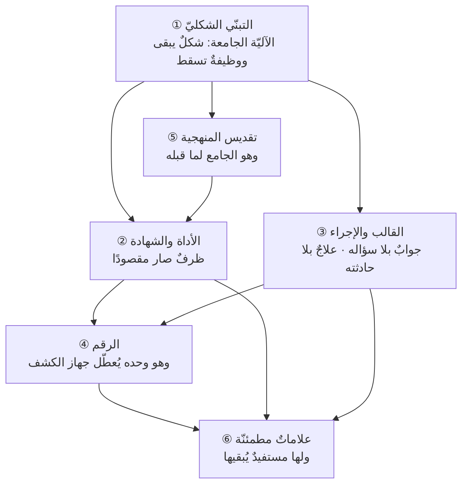

# الفصل 14 — أمراض الممارسة — كيف يبقى الاسم ويذهب المعنى

---

## 🏛️ لماذا تقرأ هذا الفصل؟

**المشكلة:** تُعقد الاجتماعات في مواعيدها، وتُملأ اللوحات، وتُرفع التقارير خضراء — ولا يشكو أحد. ثم يسقط المشروع فجأة. فكلّ العلامات الظاهرة كانت تقول إنّ الأمر يجري على ما ينبغي.

**وماذا لو لم تعرف؟** الفشل الذي يُنتج علاماتٍ مطمئنّة يعمّر طويلًا، لأن لا أحد يملك دليلًا على وجوده حتى يقع الانهيار.

وقد تعوّدنا أن يُقال في مثل هذا الموضع: «المشكلة أنّهم لم يطبّقوا الطريقة تطبيقًا صحيحًا». **وهذه الجملة هي أوّل ما يُصحّحه هذا الفصل**، لا لأنّها كاذبة دائمًا، بل لأنّها تفسّر كلّ شيء — وما فسّر كلّ شيءٍ لم يُعلِّم شيئًا. فالفريق الذي عقد اجتماعاته كلّها في مواعيدها **طبّق الشكل تطبيقًا لا مأخذ عليه**، والعطب لم يكن في انضباطه بل في موضعٍ آخر: أنّ الشكل بقي والوظيفة ذهبت، **ولا شيء في النظام كلّه يقيس الوظيفة**.

**وبعد هذا الفصل ستستطيع:**

1. **أن تميّز** الطقس من العملية الحيّة بسؤالٍ واحدٍ لا يُجاب إلا بواقعة: ما القرار الذي تغيّر بسببه؟
2. **أن تحكم على** مؤشّرٍ عندك أفاسدٌ هو أم صالح، بأن تعرف من يُكافأ عليه، وبأيّ آليّةٍ من أربعٍ يُمكن رفعه بلا خلق قيمة.
3. **أن تفسّر** لماذا يعمّر الفشل الذي يُنتج علاماتٍ حسنة، وأن تُسمّي **المستفيد** من بقائه — فتعرف أيَّ علاجٍ يُجدي وأيَّه إنفاقٌ للوقت.

> [!info] بطاقة الفصل
> **النوع:** تصحيحيّ
> **المستوى:** 🔴 متقدّم
> **زمن القراءة:** نحو 45 دقيقة
> **أهمّيته في الباب:** ★★★★★
> **موضعك:** انتهيتَ من [[13 - كيف يغير هذا العلم تفكيرك]] ← **⬤ أنت هنا** ← يليه [[15 - أخلاق المهنة]]

> [!abstract] موقع هذا الفصل
> **يبني على:** [[Scope Creep]] · [[Technical Debt]] — يُذكَر هنا ولا يُعاد شرحه.
> **ويؤسّس:** [[Goodhart's Law]] — يُقدَّم هنا أوّل مرّة فيصير متاحًا لما بعده.

---

## 🧭 السؤال المركزي

> [!question] السؤال الذي يجيب عنه هذا الفصل كلّه
> **كيف يبقى الاسم ويذهب المعنى، وبمَ يُكشَف ذلك؟**

**واحمل معك هذه الأسئلة وأنت تقرأ:**

- ما القرار الذي تغيّر بسبب اجتماعكم الأخير؟
- أيّ مؤشّر عندكم يُكافأ عليه أحد؟
- لو أُلغيت هذه الوثيقة، من الذي سيفتقدها؟

---

## 🗺️ الجواب المختصر — قبل التفصيل

لكلّ ما في هذا العلم **عروتان**: **شكلٌ يُرى** — اجتماعٌ له موعد، ووثيقةٌ لها حقول، ورقمٌ له لوحة، وشهادةٌ لها ورقة، ومنهجٌ له نصّ — **ووظيفةٌ لا تُرى**: قرارٌ يتغيّر، ومعلومةٌ تنتقل من رأسٍ إلى رأس، وخطرٌ يُكشَف قبل أن يقع، وخطأٌ يُصحَّح قبل أن يتراكم. والفرق بين العروتين ليس فرقًا في الأهمّية بل **فرقٌ في الكلفة**: فالشكل يبقى بلا ثمن — يكفيه موعدٌ في التقويم وحقلٌ في نموذج — **والوظيفة تحتاج في كلّ مرّةٍ إلى من يدفع ثمنها**: أن يُقال ما لا يسرّ، وأن يُعترف بأنّ التقدير كان بعيدًا، وأن يُلغى ما أُنفق عليه.

**فحين يشتدّ الضغط يُدفع ثمن الوظيفة أوّلًا** — لأنّها غير مرئيّة فلا يُحاسَب أحدٌ على سقوطها — **ويبقى الشكل لأنّه مرئيٌّ ومحاسَبٌ عليه.** وهذا هو المرض في جوهره وفي جملةٍ واحدة: **أن تنفكّ العروة بين الشكل ووظيفته، ثم يُقاس الشكل.**

وخمسة أمراضٍ هي أشهر صور هذا الانفكاك: **مرض الأداة**، و**مرض الشهادة**، و**مرض القالب**، و**مرض الإجراء**، و**مرض الرقم** — وفوقها جامعٌ يجمعها: **تقديس المنهجية**. وكلّها فروعٌ لأصلٍ واحد: أنّ التبنّي الشكليّ لا خصم له، فلا شيء يقاومه.

**والفحص واحدٌ في الخمسة جميعًا، وهو سؤالٌ لا يُجاب إلا بواقعة: ماذا يقع لو خُولف؟** فالشيء الحيّ إن خُولف **انكشف عجزٌ** — تعطّل قرار، أو تأخّرت معلومة، أو ظهر خطرٌ لم يكن أحد ينتبه له. والشيء الميّت إن خُولف **لم يقع شيء إلا اللوم**. فمن أراد أن يعرف أيُّ ممارساته حيّةٌ وأيُّها فارغة، فلا يسأل عن قيمتها — إذ لكلّ ممارسةٍ قيمةٌ في وصف من يدافع عنها — **بل يسأل عن أثر مخالفتها**.

> [!abstract] مفاهيم يُدخلها هذا الفصل في قاموسك
> `Goodhart's Law`

> [!warning] مفاهيم يكثر الخلط بينها هنا
> `Process` مقابل `Ritual` مقابل `Metric` — احملها في ذهنك، فالفصل يفرّقها في محطّة التمييز.

---

## 🧱 الفكرة الأولى: أشيع صور الفشل ليست الرفض بل التبنّي الشكليّ

*موضعها من الفصل: هذه أوّل خطوةٍ وهي الحدّ الجامع لأمراض الباب كلِّها، **وموضعها أن يُنقَل النظر عن الصورة التي يتوقّعها القارئ**: أنّ الداء ليس أن تُردّ الممارسة، بل أن تُقبَل ويبقى اسمُها وتذهب وظيفتُها. **والأمراض الخمسة بعدها ليست إلّا صورًا لهذا الحدّ**، ولا يُفهم واحدٌ منها ما لم يُقبَل هو أوّلًا.*

**الفكرة في سطر:** *الممارسة التي تُرفَض تجد من يخاصمها فتُناقَش؛ والممارسة التي تُتبنّى شكلًا لا خصم لها، فتعمّر بلا أن يعترض عليها أحد.*

حين يُقال «فشلت الرشاقة في هذه الشركة» يتّجه الذهن إلى صورةٍ واحدة: فريقٌ رفض، ومدراء قاوموا، وثقافةٌ لم تحتمل. وهذه الصورة تقع فعلًا، **لكنّها ليست الصورة الغالبة، وليست الخطيرة.** فالرفض له خاصّيةٌ نافعة: **أنّه ظاهر**. فمن رفض قال إنّه يرفض، فصار الخلاف مسألةً على الطاولة يُتحاجّ فيها، وربّما كان الرافض مصيبًا فكُشف بخلافه عيبٌ في الطريقة نفسها أو في موضع تطبيقها.

**أمّا التبنّي الشكليّ فليس له خصم.** لأنّه لا يُكلّف أحدًا شيئًا: الاجتماع في موعده، والوثيقة مرفوعة، والحقول مملوءة، والتقرير أُرسل. **فمن ذا الذي يعترض على شيءٍ يُؤدَّى في وقته؟** والاعتراض عليه يحتاج إلى من يدّعي أنّ ما يُرى ليس هو ما يقع — وهي دعوى ثقيلة، عبء إثباتها على صاحبها، ومصلحة الجميع أن تسقط.

### كيف تُفرَغ الممارسة من وظيفتها؟ — أربع خطوات تبدأ من النجاح لا من الفشل

وأهمّ ما في هذه الآليّة أنّها **لا تبدأ من عطب**. فما فشل يُترك ولا يُعمَّم؛ **وما نجح هو الذي يُعمَّم — وفي التعميم يقع الخلل**:

1. **تُتبنّى الممارسة بوظيفتها في موضعٍ يحتاجها، فتُنتج أثرًا.** فريقٌ كان يكتشف تعارض العمل متأخّرًا، فبدأ وقفةً يومية قصيرة، فصار يكتشفه في يومه. والوظيفة هنا حاضرة: **كشفُ التعارض مبكّرًا**.
2. **يُلاحَظ الأثر فيُطلَب التعميم — والتعميم ينقل الشكل ولا ينقل الشرط.** فيُقال: «الفرق التي تعقد وقفةً يومية أفضل حالًا، فلتعقدها الفرق كلّها». ويُنقل الموعدُ والمدّةُ والوقوف، **ولا يُنقل الشرط الذي جعلها نافعة**: أن يكون بين أعمال الحاضرين تعارضٌ يُكتشَف.
3. **تُطبَّق حيث لا يتحقّق شرطها، فلا تُنتج شيئًا — لكنّها تُؤدَّى.** ففريقٌ كلُّ فردٍ فيه يعمل على منتجٍ منفصلٍ عن الآخر لا تعارض بينهم أصلًا؛ فتصير الوقفة **تقريرَ حالةٍ متبادَلًا** لا أحد يستفيد منه، ويصمت فيه الجميع بأدب.
4. **يصير الأداء نفسه هو المطلوب، فيُقاس الحضور لا الأثر.** ويُسأل: «هل يعقدون الوقفة؟» ولا يُسأل: «ما الذي كُشِف فيها؟». **وعند هذه الخطوة تمّ المرض**، لأنّ النظام صار يملك جوابًا عن سؤاله ولا يملك سؤالًا آخر.

**والدرس المستفاد من ترتيب الخطوات أهمّ من الخطوات نفسها:** أنّ الإفراغ **ثمنٌ للنجاح لا عَرَضٌ للفشل**. فكلّ ممارسةٍ ناجحة مرشّحةٌ لأن تُفرَغ، لأنّ نجاحها هو الذي يستدعي نقلها إلى حيث لا تصلح. **ومن أراد أن يقي ممارسةً من هذا المصير فليكتب معها شرطها لا خطواتها**: أن يُكتب في وصف الوقفة اليومية أنّها **لكشف التعارض**، فمن لا تعارض بينهم فلا حاجة لهم بها.

### ثلاث علاماتٍ يُعرَف بها أنّ الممارسة فرغت

وهذه علاماتٌ تُرى ولا تحتاج إلى دعوى:

1. **لا أحد يعرف من الذي يملك إلغاءها.** فالممارسة الحيّة لها مالك، وله رأيٌ في بقائها. والفارغة **يتيمة**: تُسأل عنها فيُقال «هكذا نعمل».
2. **لا أحد يستطيع أن يذكر آخر مرّةٍ تغيّر بسببها شيء.** لا رأيًا عامًّا («هي مفيدة») بل واقعةً بتاريخٍ وقرار.
3. **تُؤدَّى في موعدها حتى حين تكون مادّتها غائبة.** وهذه أدقّ الثلاث. فالاسترجاع الذي يُعقد ولا قرار فيه، والمراجعة التي تُعقد ولا يحضرها من سيستعمل ما بُني، والتقدير الذي يُعاد وليس فيه معلومةٌ جديدة تغيّره — **كلّها ممارساتٌ صار الموعد أقوى فيها من السبب**.

> [!example] فريقٌ في جدّة — وقفةٌ يومية عمرها ثلاث سنوات
> فريق تطويرٍ من ستّة أفراد في شركةٍ لوجستية بجدّة، يعقد وقفته اليومية منذ ثلاث سنوات في التاسعة إلا ربعًا، لا يتخلّف أحد. ولمّا سُئل الفريق: **ما آخر مرّةٍ تغيّر فيها شيءٌ بسبب الوقفة؟** — سكت الجميع، ثم قال أحدهم إنّ ذلك وقع «كثيرًا» بلا أن يذكر واحدة.
> فلمّا فُحص التسجيل وجد أنّ الوقفة تستغرق **إحدى عشرة دقيقة**، وأنّ كلّ فردٍ يقول ثلاث جملٍ عن أمسه ويومه، وأنّ **آخر مرّة قال فيها أحدٌ «أنا معطَّل» كانت قبل سبعة أشهر** — لا لأنّ التعطّل لم يقع، بل لأنّه صار يُحلّ في محادثةٍ جانبية بعد الوقفة بعشر دقائق، **لأنّ قوله أمام الجميع صار مكلفًا**.
> فالوقفة لم تكن عبثًا؛ كانت **تُعلن التعطّل قبل سنتين**، ثمّ نُقلت وظيفتها إلى قناةٍ أخرى وبقي شكلها. والكلفة السنوية للشكل وحده: نحو ستّ وأربعين ساعةً من وقت الفريق مجتمعًا.

### وليس كلّ ما لا يُغيّر قرارًا عبثًا — وهذا حدٌّ يمنع الإفراط في الاستئصال

قد يُفهم ممّا سبق أنّ ميزان كلّ ممارسةٍ هو القرار وحده، فيُلغى كلّ ما لا يُنتج قرارًا. **وهذا خطأٌ يقع فيه من يقرأ هذا الفصل بحماسة.** فمن الممارسات ما وظيفتها المعلَنة ليست القرار: وقفةٌ لفريقٍ موزّعٍ على ثلاث مدنٍ قد تكون وظيفتها الأولى **أن يعلم كلٌّ أنّ الآخرين موجودون وأنّ العمل واحد** — وهذه وظيفة حقيقية، لأنّ الفريق الموزّع الذي فقد الإحساس بوجود الآخرين يدفع ثمنه في مواضع كثيرة. ومن الوثائق ما وظيفتها **الأثر النظاميّ** لا القرار: أن يوجد سجلٌّ يُرجَع إليه إن نُوزع أو دُقِّق.

**فالقاعدة الصحيحة ليست «ما لا يُغيّر قرارًا يُلغى»، بل: لكلّ ممارسةٍ وظيفةٌ معلَنةٌ تُقاس بها هي، فإن لم تكن لها وظيفةٌ معلَنة فذلك هو المرض بعينه.** والسؤال الأوّل إذن ليس «ماذا تُنتج؟» بل **«لأيّ شيءٍ وُضعت؟»** — ثمّ يُقاس ما تُنتجه بما وُضعت له لا بما نتوقّعه نحن.

وهذا هو **سياج تشيسترتون** بعينه، وقد صاغه الأديب البريطاني ج. ك. تشيسترتون سنة 1929 في مثالٍ صار قاعدةً في الإصلاح: أن تجد سياجًا في طريقٍ لا تعرف علّته، فتقول «لا أرى له فائدة، فلنزله». والجواب: **لا تُزله حتى تعرف لماذا وُضع؛ فإذا عرفت، فربّما أذنتُ لك بإزالته.** وموضع نفعها هنا أنّ **الجاهل بوظيفة الشيء والفارغَ منها يقولان الجملة نفسها**: «لا أرى لهذا فائدة». والفرق بينهما أنّ الأوّل لم يبحث، والثاني بحث فلم يجد.

> [!tip] كيف تستعمل هذه الفكرة — الإلغاء المؤقّت أرخص من الجدل
> الجدل حول جدوى ممارسةٍ قائمة لا ينتهي، لأنّ كلّ طرفٍ يستدلّ بما لا يُرى. **والبديل تجربةٌ رخيصة: عطّلها ثلاث دورات، وسجّل ما افتُقد.**
> وشروطها ثلاثة حتى تكون فحصًا لا فوضى:
> 1. **أن تكون مؤقّتةً معلَنة بمدّةٍ وتاريخ عودة** — فالتعطيل المفتوح إلغاءٌ متنكّر، ويُقاوَم بحقّ.
> 2. **أن يُكتب قبل التعطيل ما نتوقّع أن يقع** — فمن لم يكتب توقّعه فسّر ما وقع كيفما شاء.
> 3. **أن يُسجَّل ما افتُقد بواقعةٍ لا بشعور** — «تأخّر اكتشاف التعارض في المكوّن الفلانيّ ثلاثة أيام» لا «شعرنا بأنّ التواصل قلّ».
>
> وثمرة هذا الفحص أنّه يُنتج جوابًا في أسبوعين عمّا لا يُنتجه الجدل في سنة — **ويُنتج شيئًا أنفع من الجواب: أن يعرف الفريق وظيفة ممارسته لأنّه رآها غائبة.**

> [!warning] الحفرة الشائعة — أن يصير هذا الفصل رخصةً لهدم ما لا تفهمه
> أخطر ما يُصنع بهذا الفصل أن يُقرأ إذنًا بالاستغناء: «إذن الاجتماعات طقوس، والوثائق حشو، والمقاييس فاسدة». **وهذه ليست نتيجة الفصل بل مرضٌ آخر من جنس ما يصفه** — لأنّها هي أيضًا حكمٌ بلا فحص، وشكلٌ من التبنّي بلا فهم، غايةُ ما فيه أنّه تبنٍّ للنفي لا للإثبات.
> **والفارق بين الطبيب والهادم أنّ الطبيب يسمّي المرض قبل أن يستأصل.** فمن قال «هذا طقس» لزمه أن يذكر وظيفته المعلَنة، وأن يبيّن أنّها لا تتحقّق، وأن يقول ماذا يؤدّيها إن أُلغي. **وهذه القاعدة — البديل قبل الإلغاء — تجري في هذا الفصل كلّه**، وستعود في الإجراءات وفي المنهجيات بنصّها.

> [!question]- تأكّد أنك فهمت — فريقان: أحدهما رفض الاسترجاع صراحةً وقال «لا وقت لدينا»، والآخر يعقده كلّ أسبوعين منذ سنتين ولا يخرج منه بشيء. أيّهما أقرب إلى العلاج، ولماذا؟
> **الأوّل أقرب إلى العلاج، وإن بدا الثاني أفضل حالًا.**
>
> **لأنّ الأوّل عنده *مشكلةٌ لها اسم*:** قال إنّه لا يعقده وذكر علّته. فالخلاف معه ممكن، والحجّة تُعرض عليه، وقد يكون في قوله حقٌّ يُكتشَف — كأن يكون فريقًا لا يملك تغيير شيءٍ ممّا سيخرج به، فيكون امتناعه صوابًا وعلاجه في مكانٍ آخر (وهذا حال من لا يملك اختيار مدرسته، وقد مرّ في [[11 - لماذا اختلفت المدارس]]).
>
> **وأمّا الثاني فعنده *جوابٌ يمنع السؤال*.** فمن سأله «كيف تصحّحون؟» أجاب «نعقد استرجاعًا كلّ أسبوعين» — وهو جوابٌ صحيحٌ شكلًا يُغلق الباب. **والنظام الذي يملك جوابًا مطمئنًّا عن سؤالٍ لا يستطيع أن يجيبه فعلًا هو أسوأ حالًا من النظام الذي لا جواب عنده**، لأنّ الثاني يبحث والأوّل مستريح.
>
> **والعلامة الفارقة:** اسأل الفريقين سؤالًا واحدًا — **«ما آخر شيءٍ غيّرتموه في طريقة عملكم، ومتى؟»** فإن عجز الثاني عن الجواب وقد عقد خمسين استرجاعًا، فقد أنفق نحو خمسٍ وسبعين ساعةً في إنتاج **علامةٍ مطمئنّة** لا أكثر.

> [!summary]- خلاصة الفكرة في سطرين
> **أشيع صور الفشل ليست الرفض بل التبنّي الشكليّ: فالممارسة التي تُرفَض تجد من يخاصمها فتُناقَش.**
> **والتي تُتبنّى شكلًا لا خصم لها، فتعمّر بلا أن يعترض عليها أحد** — وتُنتج في كلّ مراجعةٍ علاماتٍ تقول إنّ الأمر يجري على ما ينبغي.

> [!question] تأمّلٌ تطبيقيّ — لا جواب له في هذا الفصل
> اختر ممارسةً تُؤدّى عندكم كلَّ أسبوع، واسأل: **ما الذي كان سيختلف لو تركناها شهرًا؟**
>
> **فإن لم تجد جوابًا محدَّدًا، فقد وجدتَ واحدةً من هذه.** ولا يلزم أن تُلغى — يلزم أن يُعاد إليها سؤالُها الذي وُضعت له، **فإن لم يكن لها سؤالٌ قائم، فإلغاؤها هو الأمانة لا التفريط.**

---

## 🧱 الفكرة الثانية: مرض الأدوات ومرض الشهادات

*موضعها من الفصل: يبدأ هنا عرض الأمراض، **وأوّلها ما يقع على ما يُملَك**: أداةٌ تُشترى وشهادةٌ تُنال. **وقُدّما لأنّهما أظهرُ الخمسة وأسهلُها اعترافًا** — إذ يُشار إليهما بالإصبع، ولذلك كانا أقلَّها ضررًا وأكثرَها ذكرًا.*

**الفكرة في سطر:** *الأداة والشهادة كلتاهما ظرفٌ لمعرفة، فإذا صار الظرف هو المقصود صار امتلاكه دليلًا على ما ليس فيه.*

### أوّلًا: مرض الأدوات — ولماذا هو مرضٌ بنيويّ لا كسل

المرض أن يُظنّ إتقان الأداة إتقانًا للعلم: أن يُتقن الرجل إعدادَ لوحاتٍ في نظام إدارة المهامّ، وربطَ الحقول، وتوليدَ التقارير — فيُحسَب أنّه صار يعرف كيف تُدار المشاريع. **وهو مرضٌ تُخطئ العادةُ في تشخيصه فتنسبه إلى الكسل أو حبّ الظهور، وليس منهما في شيء.** بل هو أثرٌ لخاصّيةٍ في بنية التعلّم نفسها:

**الأداة تُعطي تغذيةً راجعةً فوريّةً ومؤكّدة، والعلم يُعطي تغذيةً راجعةً متأخّرةً وملتبسة.** فمن تعلّم ميزةً في الأداة رأى أثرها في دقيقة: ظهرت اللوحة، وانتظمت الحقول، وخرج التقرير. ومن تعلّم أن يصوغ سؤالًا أدقّ قبل بدء العمل لا يرى أثر ذلك إلا بعد أشهر، **ولا يستطيع أن يجزم أنّ الأثر كان منه**. والعقل يتّجه بطبعه إلى ما يُثيبه سريعًا ويؤكّد له أنّه تقدّم. **فالانجراف إلى الأداة عقلانيٌّ لا فاسد** — وهذا بعينه ما يجعله شائعًا في المتقنين لا في المقصّرين.

**وعلامته الظاهرة** أن يكون أوّل سؤالٍ يُطرح عند كلّ مشكلة: **«بأيّ أداةٍ نحلّها؟»** — قبل أن يُقال ما المشكلة أصلًا. وعلامته الثانية أن يُقاس التحسّن بعدد الحقول المملوءة ودرجة انضباط اللوحة، فيُقال «صار عندنا انضباط» ويُراد به أنّ البيانات كاملة، لا أنّ القرارات صارت أفضل.

#### كلّ أداةٍ تحمل نموذجًا عن العمل — فمن اختار أداةً فقد اختار نموذجًا

وهذا أدقّ ما في المسألة، وأقلّ ما يُنتبَه له: **الأداة ليست محايدة.** فكلّ أداةٍ بُنيت على تصوّرٍ لطبيعة العمل، وهي تفرض ذلك التصوّر على من يستعملها وإن لم يُصرّح به أحد:

- **مخطّط جانت** مبنيٌّ على أنّ العمل **معلومٌ قابل للتفكيك إلى مهامّ لها مدد وتتابعات**. فمن استعمله في عملٍ مجهولٍ ينكشف بالتنفيذ لم يخطئ في استعماله فحسب، **بل تبنّى دعوى أنّ العمل معلوم** — ثم صار يُدافع عنها بلا أن يعرف أنّه يدافع عن شيء.
- **لوحة كانبان** مبنيّة على أنّ العمل **تدفّقٌ مستمرّ من عناصر متشابهةٍ في الطبيعة مختلفةٍ في المحتوى**. فمن استعملها لمشروعٍ له تاريخ تسليمٍ واحدٍ ومسارٌ حرجٌ لا يرى فيها ما يحتاجه.
- **جدول الميزانية بالبنود** مبنيٌّ على أنّ الكلفة تُعزى إلى بنودٍ منفصلة. **فما لا بند له فيه يختفي** — كلفةُ الانتظار، وكلفةُ الاختلاف الذي لم يُحسم، وكلفةُ التبديل بين المهامّ.

**والقاعدة العملية المستفادة: انظر إلى ما لا حقل له في أداتك — فهناك يسكن ما ستنساه.** فالأداة تجعل بعض الأسئلة سهلةً وبعضها مستحيلًا، وما ليس فيه حقلٌ لا يُملأ، وما لا يُملأ لا يظهر في تقرير، وما لا يظهر في تقرير **لا يُناقَش في اجتماع**. فأداتك ترسم — صامتةً — حدود ما تستطيعون الحديث عنه.

> [!example] أداةٌ صحيحةٌ قُلبت على غايتها
> فريقٌ في الرياض أدخل نظام تتبّع مهامّ، وكان مقصد إدخاله أن تُرى الأعمال المعطَّلة. وبعد ثلاثة أشهر أضافت الإدارة تقريرًا شهريًّا يعرض **عدد المهامّ التي أغلقها كلّ فرد**.
> فما وقع بعده كان متوقّعًا: صار الأفراد يقسّمون المهمّة الواحدة ثلاثًا، فترتفع الأعداد. وارتفع متوسّط ما يُغلقه الفرد من 9 مهامّ إلى 23 في ربعين، **ولم ينقص زمن وصول أيّ ميزةٍ إلى المستخدم يومًا واحدًا**. ثمّ وقع ما هو أسوأ: صار أحدٌ يتجنّب المهمّة الكبيرة الغامضة — وهي الأهمّ غالبًا — لأنّها تُبقيه شهرًا برقمٍ منخفض.
> **فالأداة نفسها لم تتغيّر، وإنّما تغيّر ما يُقرأ منها.** ولهذا كان أوّل ما فُعل في العلاج ليس تبديل الأداة بل **إلغاء التقرير الفرديّ** والاكتفاء بمقياسٍ على مستوى الفريق. ولمَ عاد المرض؟ لأنّ المرض لم يكن في الأداة يومًا.

### ثانيًا: مرض الشهادات — والشهادة إشارةٌ لا برهان

الشهادة في أصلها **شاهدٌ على معرفة**: أن يثبت أنّ صاحبها درس متنًا وامتُحن فيه. فإذا صارت غايةً انقلبت من شاهدٍ إلى مقصود، ومن دليلٍ إلى بديل.

**وآليّة الانقلاب اقتصاديّةٌ لا أخلاقية:** فسوق التوظيف يحتاج إلى شيءٍ **رخيص القراءة** يُفرز به آلاف السير الذاتية. والقدرة الحقيقية لا تُقرأ إلا بكلفةٍ عالية (مقابلات عميقة · تجربة عمليّة · شهور من العمل)، والشهادة تُقرأ في ثانية. فتُستعمل **إشارةً (Signal)** — وهذا استعمالٌ مشروعٌ في أصله، وقد حرّر الاقتصاديّ مايكل سبنس (1973) منطقه: أنّ الإشارة تنفع حين تكون كلفة الحصول عليها **أقلّ على القادر منها على غير القادر**، فتفرز بينهما فرزًا معقولًا. **فإذا رخصت الإشارة على الجميع سواءً — دوراتُ حفظٍ وبنوكُ أسئلة — سقط شرط نفعها وبقي استعمالها.**

**وهنا تلتقي هذه الفكرة بالفكرة الرابعة قبل أوانها:** فالشهادة مقياسٌ صار هدفًا. وسيأتي في مرض الأرقام أنّ المقياس يفسد بمجرّد أن يُضغط عليه؛ **والشهادة أقدم أمثلة ذلك وأوسعها.**

#### الشهادة تفعل ثلاثة أشياء حقيقية — والمرض في رابعٍ لا تفعله

وإنصاف الشهادة واجبٌ هنا، لأنّ نقدها يُقرأ عادةً دعوةً إلى تركها. **وهي تفعل ثلاثة أشياء لا يُنكرها منصف:**

1. **تُعطي لغةً مشتركة.** فالفريق الذي درس أفراده متنًا واحدًا يفهم بعضه بنصف الكلام، وهذه قيمةٌ حقيقية مرّ تحريرها في [[06 - لسان العلم]].
2. **تُعطي خريطةً لما لا تعرف أنّك لا تعرفه.** وهذه أنفع الثلاث، لأنّ الجهل بالموجود أشدّ من الجهل بالتفاصيل: من لم يسمع بإدارة أصحاب المصلحة لا يبحث عنها أصلًا.
3. **تفتح بابًا** حيث تُشترط — في المناقصات وفي معايير التوظيف. وهذا نفعٌ واقعيٌّ لا يُلام طالبُه عليه.

**والمرض في رابعٍ لا تفعله: أن تُظنّ دليلًا على القدرة.** فالامتحان يقيس **معرفة النصّ**، والعمل يُقاس **بأثرٍ متأخّر في بيئةٍ متغيّرة**. وبينهما فجوةٌ لا تسدّها ورقة.

**والفحص الذي يفصل بين من انتفع بها ومن جعلها غاية سؤالان:**

- **ما الذي تغيّر في عملك بعدها؟** — بواقعةٍ لا بشعور.
- **وهل تستطيع أن تذكر موضعًا خالفتَ فيه ما درسته لأنّ سياقك خالفه؟** — **فمن لم يخالف نصَّه مرّةً لم يفهمه، إنّما حفظه.** إذ الفهم هو ما يجعلك تعرف حدّ القاعدة، ومن عرف الحدّ خالف عنده بالضرورة.

> [!example] شرطُ الشهادة الذي لم يغيّر شيئًا
> جهةٌ في الرياض اشترطت في كلّ من يدير مشروعًا فيها شهادةً معتمدة، وموّلت لموظّفيها دوراتِ إعداد. فارتفع عدد الحاملين من 4 إلى 31 في ثمانية عشر شهرًا.
> **وبعد سنتين لم يتغيّر أداء المشاريع تغيّرًا يُقاس.** ولمّا فُحصت أسباب التعثّر في اثني عشر مشروعًا لم يكن أكثرها من جنس ما يُمتحَن فيه: **كان مصدر الأكثر منها بنية التعاقد وغياب الصلاحية وتأخّر قرارات جهاتٍ أخرى** — وهي **أسباب البيئة** التي مرّ في [[11 - لماذا اختلفت المدارس]] أنّها لا تتغيّر بقرارٍ من مدير المشروع.
> **فالشهادة لم تكذب ولم تخدع؛ إنّما أُجيب بها عن سؤالٍ لم تُوضَع له.** والدرس: قبل أن تُنفق على تأهيل الأشخاص، افحص أين يقع سبب التعثّر — فإن كان في البيئة، فتأهيل الأشخاص إنفاقٌ في غير موضعه مهما حسنت نيّته.

> [!tip] كيف تستعمل هذه الفكرة — سؤالان قبل شراء أداةٍ أو تمويل شهادة
> 1. **ما القرار الذي سيتغيّر بعدها ولا يمكن أن يتغيّر قبلها؟** فإن لم يوجد جوابٌ محدّد، فأنت تشتري إشارةً لا قدرة — **وهذا جائز إن أُعلن أنّه المقصود** (كأن يُشترط في مناقصة)، وضارٌّ إن ظُنّ علاجًا.
> 2. **أين سيسكن ما لا حقل له؟** فقبل تبنّي الأداة، اكتب ثلاثة أشياء تحتاج إلى الحديث عنها ولا مكان لها فيها، ثمّ قرّر أين ستحفظها — وإلا اختفت في شهرين.

> [!warning] الحفرة الشائعة — أن يُقرأ نقد الأدوات دعوةً إلى تركها
> الأداة الجيّدة توفّر وقتًا حقيقيًّا وتجعل الحال مرئيّةً لمن ليس في الغرفة، **والفريق الذي يرفض الأدوات باسم «التركيز على الجوهر» يدفع ثمنًا آخر: أن تصير المعرفة في رؤوسٍ بعينها فتذهب بذهاب أصحابها.** فالمرض ليس في الأداة بل في **ترتيبها**: أن تسبق السؤال بدل أن تتبعه. **والقاعدة: تُختار الأداة بعد أن يُعرف السؤال، وتُقاس بأثرها على القرار لا بانضباط بياناتها.**

> [!question]- تأكّد أنك فهمت — قيل لك: «فريقنا محترف — كلّ أعضائه حاصلون على شهادات، ونستعمل أحدث أداةٍ في السوق». فبأيّ سؤالٍ واحدٍ تفحص هذه الدعوى؟
> **بسؤال: «ما آخر قرارٍ اتّخذتموه *خلافًا* لما تقوله الأداة أو المتن، ولماذا؟»**
>
> **وعلّة هذا السؤال بعينه** أنّه لا يُجاب إلا بواقعةٍ فيها موقفٌ وسببٌ واختيار. والذي يملك المعرفة لا الظرفَ وحده يذكرها في ثوانٍ: «عطّلنا قاعدةً في الأداة لأنّها كانت تُجبرنا على تجزئة عملٍ لا يُجزّأ»، أو «خالفنا ترتيب الخطوات لأنّ الجهة التنظيمية عندنا تشترط مراجعةً مسبقة». **ومن أجاب بأنّه لم يخالف قطّ فقد أخبرك بشيءٍ واحد: أنّ أداته ومتنه يحكمانه، لا أنّه يحكمهما.**
>
> **وانتبه إلى ما لا يفحصه هذا السؤال:** فهو لا يقيس جودة الفريق ولا كفاءته، **إنّما يقيس أين تقع سلطة القرار** — أفي الفريق أم في الظرف. وهذا وحده كافٍ لتعرف كيف ستُدار أوّل حالةٍ لا يغطّيها النصّ.

> [!summary]- خلاصة الفكرة في سطرين
> **الأداة والشهادة كلتاهما ظرفٌ لمعرفة؛ فإذا صار الظرف هو المقصود صار امتلاكه دليلًا على ما ليس فيه.**
> **ولهذا يُشترى النظام قبل أن يُعرف العطب، وتُجمع الشهادة قبل أن يُمارس الحكم** — والاثنان يُنتجان شعورًا بالتقدّم لأنّهما يُنتجان شيئًا يُرى.

> [!question] تأمّلٌ تطبيقيّ — لا جواب له في هذا الفصل
> اكتب أسماء الأدوات التي تدفعون اشتراكها، وضع أمام كلٍّ منها: **أيَّ عطبٍ اشتريناها له؟ وهل زال؟**
>
> **فالأداة التي لا تعرف عطبها لن تعرف متى تُوقفها** — وستبقى تُدفع سنواتٍ لأنّ إيقافها يحتاج قرارًا، وبقاءها لا يحتاج شيئًا.

---

## 🧱 الفكرة الثالثة: مرض القوالب ومرض الإجراءات

*موضعها من الفصل: كان الداء السابق فيما **يُملَك**، وهذا فيما **يُورَث**: قالبٌ نقل جواب تجربةٍ ولم ينقل سؤالها، وإجراءٌ عولجت به حادثةٌ فنُسيت الحادثة وبقي هو. **وتزيد على سابقتها بيانَ علّة التراكم:** أنّ إضافة القالب والإجراء لها صاحبٌ يُنسب إليه، وإزالتَهما ليس لها صاحب.*

**الفكرة في سطر:** *القالب خلاصةُ تجربةٍ نقلت جوابها ولم تنقل سؤالها، والإجراء علاجُ حادثةٍ نُسيت الحادثةُ وبقي العلاج — فيتراكم الاثنان لأنّ إضافتهما لها صاحبٌ وإزالتهما ليس لها صاحب.*

### أوّلًا: مرض القوالب — نقل الجواب بلا سؤاله

القالب في أصله **شرف**: إذ هو خلاصة تجربةٍ رُفعت من رأس صاحبها إلى ورقةٍ ينتفع بها من لم يمرّ بها. فمن كتب قالب ميثاق المشروع كان قد رأى مشاريع تعثّرت لأنّ الراعي لم يُسمَّ، ومشاريع تنازعت لأنّ الحدود لم تُكتب. **فالقالب مذكِّرةُ ما نُسي فكلّف.**

**ومرضه أنّه ينقل الجواب ولا ينقل السؤال.** فالحقل الذي عنوانه «المخاطر» هو **جوابٌ لسؤالٍ لم يُكتب**: أنّ صاحب القالب كان يسأل نفسه «ما الذي إن وقع أوقف هذا المشروع؟» فلمّا كتب خلاصته صار عنوانًا اسميًّا مجرّدًا. **ومن ملأ جوابًا بلا سؤالٍ ملأ حقلًا.**

**وعلامته قابلةٌ للفحص في عشر دقائق، وهي أدقّ علاماتِ هذا الفصل جميعًا:** افتح آخر خمس وثائق من نوعٍ واحد — خمسة مواثيق، أو خمس خطط اختبار، أو خمسة تقارير إغلاق — **واقرأ الحقل نفسه في الخمسة.** فما تطابق فيها أو تقارب تقاربًا شديدًا **فهو حقلٌ ميّت**: يُملأ لأنّه موجود لا لأنّه سُئل. وستجد غالبًا أنّ حقل «الافتراضات» في الخمسة يحمل الجملة نفسها: «توفّر الموارد البشرية في الوقت المحدّد».

**والعلاج ليس حذف القالب بل قلبه: أن يُكتب في كلّ حقلٍ *السؤال* الذي جاء ليجيب عنه، بدل العنوان الاسميّ.**

| العنوان الاسميّ — يُملأ | السؤال — يُجاب أو يظهر فراغه |
|---|---|
| المخاطر | ما الذي إن وقع أوقف هذا المشروع، ومن يعلم به قبلنا بأسبوع؟ |
| الافتراضات | ما الذي نبني عليه ولا نملك التحقّق منه اليوم، ومتى يُتحقَّق؟ |
| أصحاب المصلحة | من يملك أن يوقف هذا العمل، ولو لم يكن في فريقه أحد؟ |
| معايير القبول | بأيّ شيءٍ نعرف أنّنا انتهينا، بحيث يوافقنا من يستلم؟ |
| الدروس المستفادة | ما الذي سنفعله على غير ما فعلناه، ومن سيفعله في أيّ مشروع؟ |

**والفرق بين العمودين عمليٌّ لا لفظيّ:** فالعنوان الاسميّ **يُملأ بأيّ شيء** ويظهر مكتملًا؛ والسؤال إن لم يُجَب **ظهر فراغه**. وهذا هو المطلوب من الوثيقة أصلًا: أن تكشف ما لا نعرفه لا أن تُخفيه تحت خطٍّ مملوء.

#### تفريقٌ لازم: القالب يقترح والمعيار يُلزم

ويُخلط بين الاثنين خلطًا يُنتج مرضين متقابلين:

- **قالبٌ يُعامَل معيارًا** فيُملأ بلا جدوى، ويُلام من تركه حقلًا فارغًا وإن لم يكن للحقل في مشروعه معنى.
- **ومعيارٌ يُعامَل قالبًا** فيُخالَف حيث لا يجوز — في الامتثال النظاميّ، وفي السلامة، وفيما يُعاقَب على تركه.

**والفرق الفارق: ماذا يقع لو خُولف؟** فإن كان الجواب «نتحمّل نتيجة اجتهادنا» فهو قالب، وإن كان «نخالف نظامًا أو عقدًا» فهو معيار. **ومن لم يُصرّح بأيّهما هو تركه للتأويل عند الضغط** — فيُخالَف المعيارُ ظنًّا أنّه قالب، ويُملأ القالبُ خوفًا أنّه معيار، وكلاهما خسارة.

### ثانيًا: مرض الإجراءات — ولماذا تتراكم ولا تنقص

**كلّ إجراءٍ وُلد علاجًا لحادثة.** فالموافقة الإضافية قبل النشر وُلدت يوم أُسقطت الخدمة ساعتين. ونموذج طلب التغيير ذو الأربع عشرة خانةً وُلد يوم دخل تغييرٌ بلا أن يعلم به أحد. **ولا يُوجد في المؤسّسات إجراءٌ عبثيّ في أصله؛ إنّما توجد إجراءاتٌ نُسيت حوادثها.**

**والسبب البنيويّ للتراكم ليس البيروقراطية بوصفها طبعًا، ولا حبّ السلطة، بل عدم تماثلٍ في المسؤولية:**

- **من أضاف إجراءً بعد حادثةٍ يُشكَر ولا يتحمّل شيئًا.** فالكلفة التي أضافها موزّعةٌ على الجميع وغير مرئيّة، والفائدة منسوبةٌ إليه وظاهرة.
- **ومن أزال إجراءً يتحمّل وحده مسؤولية الحادثة القادمة.** فإن مضت السنة بلا حادثة لم يُشكر أحد، وإن وقعت واحدةٌ سُئل: «من الذي ألغى الفحص؟»

**فالمعادلة تدفع في اتّجاهٍ واحد: الإضافة رخيصةٌ على صاحبها، والإزالة غالية.** ولهذا تتضخّم الإجراءات في كلّ مؤسّسةٍ تكبر، لا لأنّ فيها من يريد ذلك، بل **لأنّ ليس فيها من يملك مصلحةً في نقصانها.**

#### وثمن الإجراء ليس دقائق ملئه

يُحسَب ثمن الإجراء عادةً بزمن تعبئته: «عشر دقائق، وما أهون عشر دقائق». **وهذا حسابٌ يغفل عن أكبر بندين:**

1. **زمن الانتظار الذي يُضيفه.** فالإجراء الذي يحتاج توقيع شخصٍ لا يكلّف عشر دقائق بل **يومين إلى خمسة** — لأنّ الطلب يدخل طابور ذلك الشخص. **والانتظار هو الغالب على كلّ زمن التسليم لا العمل**، وقانون ليتل ([[Little's Law]]) يقول ما هو أدقّ: أنّ زمن المسار يتناسب مع طول الطابور. **فكلّ إجراءٍ يُضيف طابورًا يُضيف زمنًا لا يظهر في تقدير أحد.**
2. **تفاعل الإجراءات بعضها ببعض.** فخمسة إجراءاتٍ كلٌّ منها يضيف يومًا لا تضيف خمسة أيام، **بل أكثر** — لأنّ بعضها ينتظر بعضًا، ولأنّ كلّ انتظارٍ يُنتج تبديلًا بين المهامّ وعودةً إلى السياق بعد نسيانه. **ولهذا يُفاجَأ الجميع بأنّ «تغييرًا صغيرًا» احتاج ثلاثة أسابيع، وكلٌّ يُقسم أنّ حصّته منها ساعة.**

> [!example] أربع عشرة موافقةً كلٌّ منها لها قصّة
> جهةٌ خدميّة في الدمّام قاست مسار تغييرٍ صغيرٍ في نظامٍ داخليّ: من طلب صاحب العمل إلى وصوله للمستخدم. **فكان زمن العمل الفعليّ ستّ ساعاتٍ ونصفًا، وزمن المسار واحدًا وعشرين يومًا** — أي أنّ نسبة العمل إلى المسار نحو ٤٪.
> وفي المسار **أربع عشرة موافقة**. ولمّا سُئل عن كلّ واحدةٍ منها: **متى وُضعت ولأيّ حادثة؟** — أمكن معرفة سبب سبعٍ منها فقط، وثلاثٌ منها كانت لحوادث في نظامٍ **لم يعد قائمًا أصلًا**، وأربعٌ لم يعرف أحدٌ سببها ولا مالكها.
> **والذي وقع في العلاج لم يكن إلغاء الأربع عشرة**، بل تصنيفها: أُلغيت ثلاثٌ لزوال محلّها، ونُقلت ستٌّ من **موافقةٍ مسبقة** إلى **فحصٍ لاحقٍ على عيّنة**، وحُوّلت اثنتان إلى **قيدٍ مؤتمتٍ** في خطّ البناء يمنع النشر إن لم يتحقّق الشرط. فصار المسار **ستّة أيام**، وبقي كلّ ما كان يُحرَس محروسًا.

#### ثلاث درجاتٍ للحارس — وأرخصها أشدّها

وممّا في المثال السابق قاعدةٌ عامّة تستحقّ أن تُفرد، لأنّها هي التي تجعل نقد الإجراءات نافعًا بدل أن يكون شكوى: **الحراسة ثلاث درجات، وكلفتها وقوّتها يسيران في اتّجاهين متعاكسين:**

| الدرجة | كلفتها | قوّتها | متى تصلح |
|---|---|---|---|
| **موافقة مسبقة** من شخص | أعلاها — طابورٌ لكلّ حالة | أضعفها — تعتمد على انتباه إنسانٍ مشغول يوقّع الخمسين | حيث يكون القرار اجتهاديًّا لا يُختزل في قاعدة، وأثره غير قابل للتراجع |
| **فحص لاحق** على عيّنة | متوسّطة — لا توقف المسار | متوسّطة — تكشف النمط لا الحالة | حيث يكون الخطأ قابلًا للتصحيح، والغاية ردعُ التساهل لا منعُ حالةٍ بعينها |
| **قيد مؤتمت** في المسار | أدناها بعد بنائها | أعلاها — لا ينسى ولا يجامل ولا يُستثنى | حيث يكون الشرط قابلًا للصياغة بدقّة (تغطية · توقيع · بيئة · فحص أمان) |

**والخطأ الشائع أن يُعالَج كلّ شيءٍ بالدرجة الأولى**، لأنّها الأسهل إنشاءً: يكفي أن يُقال «من الآن فصاعدًا يُعرض عليّ». **وهي في الحقيقة أغلى الثلاث وأضعفها** — إذ من يوقّع خمسين طلبًا في الأسبوع لا يفحص شيئًا، فصارت كلفةً بلا حراسة.

#### ومثالٌ يجمع المرضين: مسارُ تغييرٍ يُنتج زحف النطاق بدل أن يمنعه

ووظيفة مسار طلب التغيير ([[13 - Change Request|Change Request]]) أن يمنع [[Scope Creep|زحف النطاق]]. وقد مرّ في [[11 - لماذا اختلفت المدارس]] أنّ زحف النطاق ليس زيادة العمل بل **زيادةٌ لم يُدفع لها ثمن** — فالمسار إذن وُضع ليجعل لكلّ زيادةٍ ثمنًا معلَنًا: أن يُقدَّر أثرها في الوقت والكلفة، وأن يوافق عليها من يملك دفع ذلك الثمن.

**فإذا انفكّت عروته وقع أمرٌ يبدو مقلوبًا: يبقى المسار كاملًا ويقع الزحف كاملًا.** وله آليّتان تعملان معًا، وكلّ واحدةٍ منهما مرضٌ ممّا سبق:

- **الأولى في القالب:** أن يُملأ حقل «أثر التغيير» في كلّ طلبٍ بجملةٍ واحدة: «لا يوجد أثرٌ جوهريّ». **وهذا هو الحقل الميّت بعينه** — فالنموذج مكتمل، والثمن لم يُحسب، والموافقة وقعت على رقمٍ لا وجود له.
- **والثانية في الإجراء:** أن يطول المسار حتى يصير الالتفاف عليه هو الطريق العمليّ الوحيد لإنجاز العمل. فيدخل التغيير من بابٍ آخر باسم «تصحيح» أو «توضيح متطلبٍ قائم»، ولا يمرّ بالمسار أصلًا. **فالمسار الثقيل لا يمنع الزحف بل يُخفيه**، لأنّه يجعل الاعتراف بالتغيير أغلى على صاحبه من إخفائه.

**والعلامة الجامعة: أن يكون سجلّ طلبات التغيير خفيفًا والعمل الفعليّ ثقيلًا.** فسجلٌّ فيه ثلاثة طلباتٍ في ستّة أشهرٍ لمشروعٍ تغيّر فيه كثير، لا يدلّ على انضباطٍ **بل على أنّ التغيير يمرّ من مكانٍ آخر لا يُسجَّل.**

**والعلاج ليس تشديد المسار — فتشديده يزيد الالتفاف — بل خفض كلفة الاعتراف:** بابٌ سريعٌ للتغيير الصغير يُسجَّل ولا يُوقَف، فيُعرف ثمنه ولو دُفع متأخّرًا. **إذ المقصود من ضبط التغيير أن يُعرف ثمنه لا أن يُمنع وقوعه** — وأكثر المسارات تخلط بين الأمرين، فتحصل على المنع ظاهرًا وتخسر معرفة الثمن حقيقةً.

> [!tip] كيف تستعمل هذه الفكرة — لكلّ إجراءٍ ثلاثة أشياء مكتوبة معه
> اجعل شرطَ بقاء أيّ إجراءٍ عندكم أن يُكتب في سطرٍ واحدٍ إلى جانبه:
> 1. **الحادثة التي وُلد منها** بتاريخها — فالإجراء الذي لا يُعرف سببه **لا يستطيع أحدٌ أن يحكم بزواله**، فيبقى للأبد بحقّ الجهل به لا بحقّ الحاجة إليه.
> 2. **مالكه** — من الذي يملك تعديله وإلغاءه، بالاسم.
> 3. **تاريخ مراجعته** — لا لكي يُلغى، بل لكي يُسأل مرّةً في السنة: أما زال محلّه قائمًا؟
>
> **وهذه الأسطر الثلاثة هي الفرق بين إجراءٍ وتقليد.** وكلفة كتابتها دقيقتان عند الإنشاء؛ وكلفة غيابها أن يُوجد بعد خمس سنين أربعُ موافقاتٍ لا يعرف أحدٌ لماذا هي موجودة، **ولا يجرؤ أحدٌ على إلغائها لهذا السبب بعينه**.

> [!warning] الحفرة الشائعة — أن يُقرأ نقد الإجراء دعوةً إلى الفوضى
> من يطلب إلغاء إجراءٍ يسمعه الحاضرون على أنّه يطلب إسقاط الحراسة، **فيُقاوَم بحقّ** — لأنّ الحادثة التي وُلد منها كانت حقيقية، ومن نسيها هو الذي يطالب بالإلغاء لا من يدافع.
> **والقاعدة التي ترفع هذا: من طلب إلغاء إجراءٍ لزمه أن يقول ما الذي يحرس ما كان يحرسه.** فالإجراء الذي لا بديل له **لا يُلغى بل تُخفَّض كلفته** — بنقله في السلّم أعلاه من موافقةٍ مسبقة إلى فحصٍ لاحقٍ أو قيدٍ مؤتمت.
> **وهي القاعدة نفسها التي مرّت في الفكرة الأولى — البديل قبل الإلغاء — وستعود في الفكرة الخامسة.** وتكرارها في ثلاثة مواضع مقصود: **لأنّ هذا الفصل يصف أمراضًا، وأقرب ما يُصنع بفصلٍ يصف أمراضًا أن يُتّخذ رخصةً في الهدم.**

> [!question]- تأكّد أنك فهمت — وجدتَ في مشروعك وثيقةً من أربعين صفحةً تُحدَّث شهريًّا، وقيل لك إنّ أحدًا لم يفتحها منذ عام. أتُلغيها؟
> **لا تُلغيها ولا تُبقيها؛ اسأل عنها ثلاثة أسئلةٍ بترتيبها، ثمّ افعل ما يقتضيه الجواب.**
>
> 1. **لأيّ شيءٍ وُضعت؟** — فقد تكون وظيفتها المعلَنة ليست القراءة الدورية بل **الوجود عند الحاجة**: أن يُرجَع إليها عند نزاعٍ أو تدقيقٍ أو تسليمٍ لفريقٍ آخر. **وهذه وظيفة حقيقية لا يُبطلها أنّ أحدًا لم يفتحها**، كما أنّ إطفائيّة الحريق لا تُقاس بعدد مرّات استعمالها.
> 2. **ومن يفتقدها لو غابت؟** — لا من يدافع عنها في اجتماع، بل من **يتعطّل عمله**. فإن كان الجواب «المدقّق» أو «الفريق الذي سيستلم بعد سنة» فهي حيّة، **وإنّما المرض في وتيرة تحديثها لا في وجودها**.
> 3. **وأيّ جزءٍ منها هو المطلوب؟** — فالغالب أن تكون الأربعون صفحةً فيها ستٌّ حيّةٌ وأربعٌ وثلاثون ميّتة. **والعلاج حينئذٍ ليس الإلغاء ولا الإبقاء بل الفرز.**
>
> **والحكم العمليّ:** إن كانت لها وظيفة عند الحاجة فأبقِها **وأوقف تحديثها الشهريّ** واجعله عند التغيّر لا عند حلول الشهر — فقد كانت الكلفة في الوتيرة لا في الوثيقة. وإن لم تكن لها وظيفةٌ يذكرها أحد، **فعطّل تحديثها ثلاثة أشهر معلنًا** وانظر من يسأل. **فمن لم يسأل عنها في ثلاثة أشهر لن يسأل عنها في ثلاث سنين.**

> [!summary]- خلاصة الفكرة في سطرين
> **القالب خلاصةُ تجربةٍ نقلت جوابها ولم تنقل سؤالها، والإجراء علاجُ حادثةٍ نُسيت الحادثةُ وبقي العلاج.**
> **ويتراكم الاثنان لأنّ إضافتهما لها صاحبٌ وإزالتهما ليس لها صاحب** — فينمو الجهاز الإداريّ نموًّا لا يعكسه أحد، وكلُّ بندٍ فيه له تاريخُ ميلادٍ ولا موعد وفاة.

> [!question] تأمّلٌ تطبيقيّ — لا جواب له في هذا الفصل
> خذ قالبًا تملؤونه دوريًّا، واسأل عن **حقلين** فيه: **من قرأ آخر ما كُتب فيهما، ومتى، وأيّ قرارٍ اتُّخذ بسببه؟**
>
> **فالحقل الذي لا جواب له يُحذف اليوم.** ولا يُحذف القالب كلُّه — فذلك ردُّ فعلٍ لا إصلاح — **وإنّما تُقلَّم حقولُه حقلًا حقلًا بالسؤال نفسه، حتّى يبقى ما يُقرأ.**

---

## 🧱 الفكرة الرابعة: مرض الأرقام — والمقياس يفسد بمجرّد أن يُكافأ عليه

*موضعها من الفصل: مضت أمراضٌ في **ما يُملَك ويُورَث**، وهذا في **ما يُقاس** — أي في العين التي ترى بها الثلاثة قبله. **وهو أخطرها لذلك:** فإذا فسد المقياس لم يعد في المنظّمة ما تُكتشف به بقيّة الأمراض، **إذ صار الرقم يقول إنّ كلّ شيءٍ بخير.***

**الفكرة في سطر:** *كلّ مقياسٍ وكيلٌ عن نتيجةٍ لا يقيسها مباشرةً، والعروة بينهما قائمةٌ ما لم يُضغط عليها — فإذا ضُغط عليها وُجد طريقٌ إلى الرقم لا يمرّ بالنتيجة.*

هذه أنقى صور المرض في هذا الفصل كلّه، **وأخطرها لعلّةٍ تخصّها وحدها**: أنّ المقياس ليس ممارسةً من الممارسات، **بل هو الشكل الذي وُضع أصلًا ليحرس الوظيفة**. فحين تفسد الوثيقة يبقى الرقم يكشفها، وحين يفسد الاجتماع يبقى الرقم يكشفه؛ **فإذا فسد الرقم نفسه فقد فسد جهاز الكشف، فلم يبقَ في النظام ما ينبّه.**

### التأسيس: قانون غودهارت — الفكرة لواحدٍ والصياغة لأخرى

**[[Goodhart's Law|قانون غودهارت]]** ينصّ في صياغته الشائعة على أنّ **المقياس متى صار هدفًا كفّ عن كونه مقياسًا جيّدًا**. والدقّة العلمية تقتضي فصل الفكرة عن صياغتها:

- **الفكرة** لتشارلز غودهارت (Charles Goodhart)، الاقتصاديّ البريطانيّ ومستشار بنك إنجلترا، طرحها سنة **1975** في نقد سياسات استهداف المجاميع النقدية، وصياغته الأصلية أضيق وأدقّ: **أنّ أيّ انتظامٍ إحصائيٍّ مُلاحَظ يميل إلى الانهيار متى مورس عليه ضغطٌ لأغراض التحكّم**. أي أنّ العلاقة التي رُصدت في ظروف المراقبة لا تصمد حين تُتّخذ أداةً للسياسة.
- **والصياغة المشهورة** لعالمة الأنثروبولوجيا البريطانية مارلين ستراذرن (Marilyn Strathern) سنة **1997**، في مقالٍ عن نظم التدقيق في الجامعات، ذكرت فيه الفكرة منسوبةً إلى غودهارت بلغتها المكثّفة هي.
- **وله قانونٌ موازٍ مستقلّ**: صاغ عالم النفس الاجتماعيّ دونالد كامبل (Donald T. Campbell) في السبعينيّات مبدأً مفاده أنّ **المؤشّر الكمّيّ كلّما استُعمل أكثر في القرار كان أعرض للفساد وأقدر على تشويه ما يُفترض أن يرصده**. **واجتماع رجلين من حقلين مختلفين على النتيجة نفسها هو ما يجعلها قاعدةً لا ملاحظة.**

**ولماذا يقع هذا؟** لأنّ المقياس **ليس النتيجة بل وكيلٌ (Proxy) عنها**. فأنت تريد «فريقًا يسلّم قيمةً بانتظام» فتقيس عدد النقاط المنجزة؛ وتريد «برمجيّةً موثوقة» فتقيس نسبة التغطية الاختبارية. والعروة بين الوكيل والنتيجة **علاقةٌ إحصائيّةٌ قائمةٌ في ظروفٍ طبيعية غير مضغوطة**. فإذا وُجّه الضغط والحافز إلى الوكيل، وجد الناس — **بذكاءٍ ومن غير سوء نيّةٍ بالضرورة** — طريقًا إلى رفعه أرخص وأسرع من الطريق المارّ بالنتيجة. فيصعد الرقم وتبقى النتيجة مكانها أو تتراجع.

### أربع آليّاتٍ للانهيار — وأخطرها الرابعة لأنّها ليست مخالفةً أصلًا

ومعرفة الآليّة هي التي تحدّد العلاج، فلا يُعالَج الأربعة بعلاجٍ واحد:

1. **الغشّ الصريح** — تزوير البيانات أو تعديل التعريف بعد جمعها. وهو أقلّها وقوعًا وأسهلها كشفًا، وعلاجه انضباطيّ لا تصميميّ.
2. **اللعب بالحدود (Gaming)** — الالتزام بحرفيّة المقياس ونقض غايته: إغلاق التذكرة بلا حلّ، وتجزئة الطلب ليصير طلبين، وردٌّ آليٌّ يُحسب ردًّا أوّل.
3. **الانتقاء (Selection)** — تحسين الرقم بتغيير **من يُقاس** لا بتحسين الأداء: تجنّب الحالات الصعبة، وتأخير تصنيف ما يُفسد المتوسّط.
4. **إزاحة الجهد (Effort Displacement)** — تحويل الانتباه والموارد من المهمّ **غير المقيس** إلى المقيس الأقلّ أهمّية. **وهذه أخطرها على الإطلاق لأنّها ليست مخالفةً في شيء**: فالناس يعملون بجدٍّ على ما يُقاس، ويتركون ما لا يُقاس، **وهو سلوكٌ عقلانيٌّ تامّ تحت الحافز — وليس فيه ما يُلام عليه أحد، وليس فيه ما يظهر في تدقيق.**

### تطبيقها على مقاييس هذا المجال بأعيانها

والقاعدة تبقى مجرّدةً حتى تُنزَل على أرقامٍ يعرفها القارئ:

- **السرعة ([[18 - Velocity|Velocity]]).** هي وحدة تخطيطٍ **داخليّةٌ نسبيّة** تُستعمل ليقدّر الفريق ما يسعه في دورة. فإذا صارت هدفًا يُكافأ عليه ارتفعت — **ولا تحتاج في رفعها إلى كذبٍ ولا حيلة، لأنّ التقدير رأيٌ في أصله.** فيكفي أن يُقدَّر العنصر خمسًا وقد كان ثلاثًا، **وليس في ذلك ما يُثبَت على أحد.** **وعلامته القاطعة: أن ترتفع السرعة ولا ينقص الزمن حتى وصول الميزة إلى المستخدم.** فمن كان عنده الرقمان معًا كشف الأمر في دقيقتين؛ ومن ليس عنده إلا الأوّل لا يستطيع أن يعرف شيئًا.
- **التغطية الاختبارية.** هي نسبة أسطر الكود التي **نُفِّذت** أثناء تشغيل الاختبارات — **ولاحظ أنّها لا تقيس ما فُحص بل ما نُفِّذ**. فيمكن رفعها إلى تسعين بالمئة باختباراتٍ تستدعي الدوالّ ولا تتحقّق من نتائجها. **فالتغطية مقياسٌ صادقٌ لما يقيسه، والفساد في قراءتنا له لا فيه.**
- **مخطّط الإنجاز ([[17 - Burndown Chart|Burndown]]).** وظيفته أن يُظهر الفجوة **مبكّرًا** ليُتّخذ قرار. فإذا صار الهدف أن يبدو المخطّط حسنًا، خرج خطًّا يهبط هبوطًا منتظمًا لا يُشبه أيّ عملٍ حقيقيّ. **والاستقامة المفرطة في مخطّطٍ يصف عملًا فيه اكتشافٌ عَرَضٌ لا إنجاز**، لأنّ العمل المكتشَف يهبط قفزًا لا انحدارًا.
- **حالة التقارير بالألوان.** حين يصير اللون الأخضر هو المطلوب، صار التقرير **تمرينًا في اللون لا وصفًا للحال**. وعلامته سؤالٌ واحدٌ يأتي في محطّة الالتباس بعد قليل.

### كيف تفصل بين تحسينٍ حقيقيّ ولعبٍ بالمقياس؟

**بسؤالٍ واحدٍ يصلح أداةَ حوارٍ لا أداةَ اتّهام: هل كان هذا الفعل سيُتَّخذ لو لم يكن هذا الرقم مقيسًا؟**

فإن كان الجواب نعم فهو تحسينٌ حقيقيّ صادف أنّه رفع الرقم. وإن كان لا فهو لعبٌ بالمقياس. **وحُسن هذا السؤال أنّه لا يفترض سوء النيّة**، وأكثر اللعب يقع بحسن نيّةٍ كاملةٍ تحت ضغط الهدف — فيمكن طرحه في اجتماعٍ بلا أن يشعر أحدٌ بأنّه مُتَّهم.

**وعلامةٌ ثانية تشخيصية:** **القفزة الكبيرة السريعة في مقياسٍ مُدارٍ بلا تغيّرٍ معلومٍ في العملية تُعامَل فرضيّةَ لعبٍ حتى يثبت العكس.** فالتحسين الحقيقيّ له سببٌ يُروى: غيّرنا كذا فانخفض كذا. **والقفزة التي لا يُعرف سببها لها سببٌ لا يُقال.**

> [!info] إضافة مرجعية — أين يقع الخلط في هذا الباب بعينه
> **أوّلًا: «السرعة» ليست في دليل سكرم.** لا في نسخة 2020 ولا فيما قبلها. وهي ممارسةٌ شائعةٌ ونافعةٌ أداةَ تخطيطٍ داخليّة، لكنّها تُعرض في كثيرٍ من الكتب والدورات بلسان المرجع. **وعرضها بلسان المرجع هو أوّل خطوةٍ في تحويلها إلى هدف** — إذ ما كان «من المنهج» صار مطالَبًا به، وما طُولب به قِيس، وما قِيس كوفئ عليه. فتصحيح النسبة هنا ليس تدقيقًا لفظيًّا بل **قطعٌ لأوّل حلقةٍ في السلسلة**.
> **وثانيًا: الصياغة المشهورة للقانون ليست لغودهارت.** فالفكرة له سنة 1975 بلغةٍ اقتصاديةٍ عن انهيار الانتظام الإحصائيّ تحت ضغط التحكّم، والصياغة المكثّفة لستراذرن سنة 1997. **ونسبةُ الصياغة إليه شائعةٌ في أكثر ما يُكتب**، وذكرُها على وجهها يُعطي القارئ ما هو أنفع من التصحيح: أنّ الأصل **أضيق** من المشهور، فلا يُحمَّل القانون ما لا يحتمل.
> **وثالثًا: التغطية الاختبارية** يُقال فيها كثيرًا إنّها تقيس جودة الاختبار، **وهي تقيس تنفيذ الكود لا التحقّق من نتيجته** — وهذا فرقٌ منصوصٌ عليه في أدبيات الاختبار نفسها، ومع ذلك يُشترط في العقود بوصفه دليل جودة.

> [!tip] كيف تستعمل هذه الفكرة — أربع رافعاتٍ في التصميم، وأنفعها الثالثة
> 1. **حزمة مقاييس متوتّرة داخليًّا** لا مقياسًا واحدًا: سرعةٌ مع جودةٍ مع كلفة، بحيث لا يُرفع أحدها إلا ظهرت كلفته في الآخر.
> 2. **مقياسٌ مضادٌّ بحدٍّ رقميٍّ معلَنٍ قبل البدء**، ومعه قرارٌ مسبقٌ عند تجاوزه — فالحدّ الذي يُقرّر بعد التجاوز يُفاوَض عليه.
> 3. **فصل مقاييس التعلّم عن مقاييس المساءلة.** وهذه أنفعها وأقلّها تطبيقًا: **فالمقياس الذي لا يُحاسَب عليه أحدٌ يبقى صادقًا**، لأنّه لا حافز لأحدٍ في تحريكه. **ولا يُطلب من رقمٍ واحدٍ أن يكون صادقًا وأداةَ محاسبةٍ معًا** — فهما وظيفتان متعارضتان، ومن جمعهما في رقمٍ واحدٍ خسر الصدق وأبقى المحاسبة.
> 4. **تدقيقٌ نوعيٌّ على عيّنةٍ عشوائية** — عشرون حالةً تُقرأ يدويًّا كلّ شهر، يُسأل فيها سؤالٌ واحد: أيطابق الرقم ما جرى فعلًا؟

> [!warning] الحفرة الشائعة — «إذن لا نقيس»
> هذه هي الحفرة المقابلة، وهي أعمق من الأولى وإن بدت تواضعًا. **فالقانون لا يقول لا تقس، بل يقول لا تُدِر برقمٍ واحدٍ بلا سياج.** والقياس شرط الإدارة الرشيدة، والتحذير إنّما هو من **الاختزال**.
> **ومن ترك القياس لم يترك المقياس**، إنّما استبدل به مقياسًا آخر غير معلَنٍ ولا مراجَع: **الانطباع**. والناس يلعبون بالانطباع كما يلعبون بالرقم، وأدواتهم فيه الظهورُ في الاجتماعات، والقربُ من صاحب القرار، وحُسنُ العرض. **فالبديل عن المقياس السيّئ مقياسٌ أفضل، لا غيابُ المقياس** — وغيابه ينقل السلطة من الرقم إلى العلاقة، **وهذا أشدّ فسادًا وأقلّ قابليةً للمراجعة.**
> وقد مرّ في [[13 - كيف يغير هذا العلم تفكيرك]] أنّ من تشوّهات النظر **شلل القياس**: أن يُرفض كلّ ما لا يُقاس. **وهذا الفصل وذاك يحرسان بابين متقابلين لطريقٍ واحد.**

> [!question]- تأكّد أنك فهمت — طلبت الإدارة رفع السرعة ٢٠٪ في الربع القادم، وربطت بها جزءًا من التقييم. فماذا تقول، وبمَ تستدلّ؟
> **لا تُناقش الرقم ابتداءً؛ صنّفه أوّلًا، ثمّ اعرض ما سيدفعه النظام ثمنًا له.**
>
> **أوّلًا صنّف الكلام** (وهو ما مرّ في [[12 - كيف يفكر مدير المشروع]]): أهذا **رغبةٌ** — أن نسلّم أكثر — أم **التزامٌ** على رقمٍ بعينه؟ فإن كانت رغبةً فهي مشروعة والحديث في كيفيّتها؛ وإن كانت التزامًا على الوكيل فقد التزم النظام بما يستطيع تحقيقه **بلا أن يتحقّق مقصده**.
>
> **ثمّ قل الأمر على وجهه بلا مواجهة:** «السرعة وحدة تقديرٍ نسبيّةٌ يضعها الفريق نفسه، **فرفعها ٢٠٪ مضمونٌ في الربع القادم بلا أيّ تحسّن** — يكفي أن تتغيّر عادة التقدير. **فإن أردنا ما تريده الإدارة فعلًا فلنقس ما تريده:** الزمن حتى وصول الميزة إلى المستخدم».
>
> **ثمّ اعرض بديلًا محدّدًا لا اعتراضًا:** حزمةً من ثلاثة — زمن المسار (وهو المطلوب فعلًا)، مع حارسٍ للجودة (معدّل فشل التغييرات مثلًا ألّا يتجاوز حدًّا معلَنًا)، مع بقاء السرعة **أداةً للفريق لا للتقييم**. **فهذا هو تطبيق الرافعة الثالثة بعينها: يبقى المقياس صادقًا لأنّه خرج من دائرة المحاسبة.**
>
> **وإن رُفض البديل وبقي الربط بالتقييم**، فأنت أمام قرارٍ من نوعٍ آخر: **سجّل الفرض والثمن في سجلّ القرار** ([[Decision Log]]) — «رُبط التقييم بالسرعة في تاريخ كذا، والفرض أنّ ارتفاعها يعني تسليمًا أسرع، والفحص بعد ربعٍ هو زمن المسار». **فإن ارتفعت السرعة ولم ينقص الزمن، فقد صار عندك دليلٌ لا رأي.**

> [!summary]- خلاصة الفكرة في سطرين
> **كلُّ مقياسٍ وكيلٌ عن نتيجةٍ لا يقيسها مباشرةً، والعروة بينهما قائمةٌ ما لم يُضغط عليها.**
> **فإذا ضُغط عليها وُجد طريقٌ إلى الرقم لا يمرّ بالنتيجة** — ولا يستلزم ذلك سوء نيّة، بل يكفي أن يريد الناس أن يُحسنوا فيما يُقاسون به.

> [!question] تأمّلٌ تطبيقيّ — لا جواب له في هذا الفصل
> خذ مقياسًا يُكافأ عليه أحدٌ عندكم، واسأل: **ما أقصر طريقٍ إلى تحسينه بلا تحسين ما يقيسه؟**
>
> **ولا تسأل هذا اتّهامًا، بل استكشافًا** — فإن وجدتَ طريقًا قصيرًا، فسيجده غيرك حتمًا. **والعلاج ليس مراقبةً أشدّ، بل مقياسًا مضادًّا يُقرأ معه فيُغلق الطريق القصير.**

---

## 🧱 الفكرة الخامسة: مرض تقديس المنهجية

*موضعها من الفصل: **وهذا أشملها**، إذ يبتلع الأربعة قبله: فالأداة والشهادة والقالب والمقياس تصير كلُّها شواهدَ على الامتثال. **وتفارق ما قبلها بأنّ داءها في المقصد لا في الوسيلة** — أن يصير السؤال «أنطبّقها صحيحًا؟» بدل «أنبلغ مقصدها؟»، والسؤالان لا يلتقيان إلّا بالمصادفة.*

**الفكرة في سطر:** *المنهجية وسيلةٌ إلى مقصد، فإذا صار الامتثال لنصّها هو المقياس، صار السؤال «أنطبّقها صحيحًا؟» بدل «أنبلغ مقصدها؟» — والسؤالان لا يلتقيان إلا بالمصادفة.*

وهذا المرض جامعٌ للأربعة قبله لا واحدًا منها، لأنّه يُنتجها جميعًا: **فمن قدّس المنهجية طلب أدواتها، وامتحن في نصّها، وملأ قوالبها، وقاس امتثاله بأرقامها.** وهو يقع في الفرق التي بذلت جهدًا حقيقيًّا في التعلّم، لا في المتساهلة — **إذ لا يُقدِّس النصَّ إلا من تعب في تحصيله.**

**وعلامته الفارقة أن يُستدلّ على صحّة القرار بالنصّ لا بالأثر.** فإذا سُئل الفريق: لماذا فعلتم كذا؟ فقال: «لأنّ الدليل يقول» — وقف عند هذا الحدّ. **وهذا هو الفرق بين من يتّبع منهجيةً ومن يتعبّد بها**: فالأوّل يذكر النصّ ثمّ يذكر ما حقّقه عندهم، والثاني يذكر النصّ ويكتفي، **لأنّ النصّ عنده هو الغاية لا الطريق إليها.**

### مفارقةٌ تستحقّ الوقوف: أخفّ الأطر ادّعاءً هو أشدّها تقديسًا

ويقع في هذا الباب أمرٌ يبدو مقلوبًا: **أنّ الإطار الذي يصرّح بأنّه ناقصٌ هو الذي يُعامَل معاملة النصّ الكامل.** فدليل سكرم يقول عن نفسه صراحةً إنّه **«إطارٌ غير مكتملٍ عمدًا»**، وإنّه يصف ما يلزم لتطبيقه ولا يعطي إجاباتٍ عن كيفيّة العمل، وإنّ على من يستعمله أن يضيف إليه ممارساتٍ من عنده. **وهذا التصريح في صدره لا في حاشيته**، ومع ذلك يُعامَل في الميدان معاملةً لا تُعامَل بها أطرٌ أوسع منه وأكثر تفصيلًا.

**ولمَ ذلك؟** لسببٍ بنيويٍّ لا صدفة: **لأنّ قصر النصّ يجعله قابلًا للحفظ، والقابل للحفظ قابلٌ للامتحان، والقابل للامتحان يصير معيارًا يُقاس به الناس.** فالمتن الذي يُقرأ في ساعةٍ يصير مرجعًا يُحتكَم إليه بالنصّ، والمتن الذي يقع في سبعمئة صفحةٍ لا يُحفظ فلا يُحتكَم إليه بهذه الطريقة أصلًا — **فينجو من التقديس بطوله لا بفضله.** وهنا يظهر التقاء هذا المرض بمرض الشهادات: **إذ ما يصلح للامتحان هو ما يصلح للتقديس، والامتحان هو الآلة التي تحوّل المتن إلى معيار.**

### والمقابل مرضٌ لا صحّة: «نحن لا نتّبع منهجية»

وفي الطرف الآخر جملةٌ تُقال بلهجة الواقعيّة: «نحن براغماتيّون، نأخذ ما يناسبنا ولا نتقيّد بمنهج». **وهي في الغالب اسمٌ آخر لغياب الاتّفاق لا للتحرّر منه.**

**فالفريق الذي «لا منهج له» له منهجٌ بالضرورة** — إذ لا بدّ لهم من طريقةٍ يقرّرون بها ما يُبنى، وكيف يُراجَع، ومتى يُسلَّم — **لكنّه غير مكتوب.** وما لم يُكتب لا يُناقَش، وما لم يُناقَش لا يُصحَّح. **وثمنه المحدّد: أن يُعاد التفاوض على كلّ قرارٍ من الصفر**، فتُستهلك في كلّ دورةٍ ساعاتٌ في مسائل حُسمت من قبل ولم يُكتب حسمها. **وأشدّ من ذلك أنّ المنهج غير المكتوب يكون في الغالب منهجَ أقواهم صوتًا** — لا لأنّه أفضل، بل لأنّه الوحيد الذي لا يُطالَب أحدٌ ببيانه.

**فالطرفان — التقديس والرفض — يشتركان في شيءٍ واحد: أنّ كليهما يُعفي من المسؤولية عن القرار.** فالمقدِّس يحيلها إلى النصّ، والرافض يحيلها إلى الحال. **والموضع الصحيح بينهما ثقيل: أن تُقرّر وتكتب علّتك.**

### ثلاث درجاتٍ في التعامل مع النصّ — والوسطى أخبثها

| الدرجة | ما يقع | حكمها |
|---|---|---|
| **امتثالٌ بلا فهم** | يُطبَّق النصّ حرفًا ولو خالف الحال | يُنتج شكلًا بلا وظيفة، **وهو مرض التقديس** |
| **مخالفةٌ بلا تدوين** | يُخالَف النصّ عند الضغط ولا يُكتب شيء | **وهذه أخبثها**، وسمّها **تسرّبًا** لا تكييفًا |
| **مخالفةٌ مدوَّنةٌ بعلّتها** | يُخالَف النصّ ويُكتب لماذا وما البديل | **وهذا التكييف**، وهو المطلوب |

**ولماذا كانت الوسطى أخبثها وهي تبدو أخفّ من الأولى؟** لأنّ **المؤسّسة تظنّ نفسها في الحال الأولى وهي في الثانية.** فالمعلَن أنّنا نتّبع، والواقع أنّنا نخالف عند كلّ ضغط، **فلا نحن انتفعنا بانضباط النصّ ولا نحن تعلّمنا من مخالفتنا** — إذ التعلّم يحتاج إلى أن يُعرف ما خُولف ومتى وبأيّ نتيجة. **والتسرّب لا يترك أثرًا يُتعلَّم منه**، وسجلّ القرار ([[Decision Log]]) الذي أُسّس في [[12 - كيف يفكر مدير المشروع]] هو ما يحوّل التسرّب تكييفًا: **سطرٌ يقول ما خالفنا، ولأيّ علّة، وما الذي يؤدّي وظيفته، ومتى نراجع.**

### حدّ الترخيص في التكييف: يُكيَّف الشكل ولا تُلغى الآليّة

وهذا هو الموضع الذي يفرّق بين تكييفٍ ناضجٍ وتفكيكٍ باسم التكييف. **فليس كلّ ما في المنهجية على درجةٍ واحدة**: منها **أشكالٌ** قابلةٌ للتبديل، ومنها **آليّاتٌ** هي علّة وجودها.

- **الشكل قابلٌ للتكييف:** مدّة الدورة، وموعد الاجتماع، وشكل اللوحة، وأسماء الحالات، وكون المراجعة حضوريّةً أو مسجَّلة.
- **والآليّة لا تُلغى:** أن يوجد **موضعٌ يُصحَّح فيه أسلوب العمل نفسه** (وهو ما يفعله الاسترجاع)، وأن يوجد **من يُرجَّح عند تعارض الطلبات بشخصٍ واحدٍ لا لجنة**، وأن يوجد **معيارٌ متّفقٌ عليه للاكتمال** يمنع اختلاف معنى «انتهيت».

**فمن ألغى الاسترجاع لأنّه «لا وقت» لم يُكيّف شيئًا؛ ألغى آليّة التصحيح** — وصار فريقًا لا يملك أن يتحسّن إلا بالصدفة. **والقاعدة: من ألغى آليّةً لزمه أن يقول ما الذي يؤدّي وظيفتها.** فإن قال «نصحّح في محادثةٍ أسبوعية مع كلّ فرد» فقد أبقى الآليّة وبدّل شكلها، **وإن لم يقل شيئًا فقد ألغى ولم يُكيّف.**

**وهذه هي القاعدة نفسها — البديل قبل الإلغاء — في موضعها الثالث في هذا الفصل**، بعد الممارسات في الفكرة الأولى والإجراءات في الثالثة. **وتكرارها ليس سهوًا: فهي الحدّ الذي يمنع فصلًا في الأمراض من أن يصير أداةً لهدمٍ أوسع من الأمراض التي يصفها.**

> [!example] فريقٌ خالف النصّ فأصاب، وآخر خالفه فتسرّب
> **الأوّل:** فريقٌ في جهةٍ صحّيّةٍ يعمل بدوراتٍ أسبوعين، ووجد أنّ المراجعة في آخر الدورة لا يحضرها من يستعمل النظام فعلًا (ممرّضون ومنسّقو أقسام) لتعارضها مع المناوبات. **فخالف النصّ**: نقل المراجعة إلى جلستين قصيرتين في وقتين مختلفين، وكتب في سجلّ القرار: «العلّة تعارض المناوبات، والوظيفة المحفوظة أن يرى المستخدمُ الفعليّ ما بُني ويعلّق عليه، والمراجعة بعد ربع». **فهذا تكييف**: بُدّل الشكل وبقيت الآليّة، ومعها ما يسمح بمراجعتها.
> **والثاني:** فريقٌ يعمل بالدورات نفسها، وكلّما اشتدّ الضغط أُلغي الاسترجاع «هذه المرّة فقط». وفي عامٍ عُقد أربع مرّاتٍ من ستٍّ وعشرين. **ولم يُكتب في ذلك حرف.** فحين سُئلوا: لماذا لم تتحسّن الأمور؟ قالوا: «نحن نعقد استرجاعًا كلّ دورة». **ولم يكذبوا** — إنّما كانوا يصفون ما هو مكتوبٌ في طريقة عملهم لا ما يقع فيها. **وهذا هو التسرّب: أن تفترق الطريقة المعلَنة عن الواقعة بلا أن يعلم بالفرق أحد.**

> [!tip] كيف تستعمل هذه الفكرة — سؤالٌ واحدٌ يُسأل مرّةً كلّ ربع
> **«ما آخر شيءٍ في منهجيّتنا خالفناه عن قصد، وماذا كتبنا في علّته؟»**
> وله ثلاثة أجوبةٍ لا رابع لها، وكلٌّ منها تشخيصٌ تامّ:
> - **«لم نخالف شيئًا»** ← إمّا أنّكم في بيئةٍ تطابق فروض المنهجية تمام المطابقة — وهو نادر — **وإمّا أنّكم لم تُقرّروا شيئًا، إنّما امتثلتم.**
> - **«خالفنا كثيرًا ولم نكتب»** ← **تسرّب**، وعلاجه ليس العودة إلى النصّ بل **تدوين المخالفات القائمة بعلّتها** — فأنتم تعملون بمنهجٍ آخر لم يُكتب بعد.
> - **«خالفنا كذا لعلّة كذا، والبديل كذا، ونراجع في كذا»** ← **تكييف**، وهذه هي الحال الوحيدة التي تستطيعون فيها أن تتعلّموا من طريقتكم.

> [!warning] الحفرة الشائعة — «سنطبّق بحذافيره أوّلًا ثمّ نكيّف»
> وهي نصيحةٌ تُقال بحسن نيّة، وفيها حقٌّ جزئيّ: أن يُفهم النصّ قبل أن يُخالَف — **وهو سياج تشيسترتون نفسه** الذي مرّ في الفكرة الأولى. **وموضع الخلل فيها أنّها بلا حدٍّ زمنيٍّ ولا معيار انتقال**، فتصير حالةً دائمة: يُقال في السنة الثالثة ما قيل في الشهر الأوّل.
> **وعلاجها أن يُكتب من البداية متى يُراجَع القرار وبأيّ علامة:** «نطبّق كما هو ستّ دورات، ثمّ نجلس ونسأل: أيّ عنصرٍ منها لم يُنتج عندنا وظيفته، ولماذا؟». **فالتطبيق الحرفيّ مرحلة تعلّمٍ لها أوّلٌ وآخر، ومن جعلها حالًا دائمةً لم يتعلّم بل استسلم.**

> [!question]- تأكّد أنك فهمت — مستشارٌ زاركم وقال: «مشكلتكم أنّكم لا تطبّقون سكرم تطبيقًا صحيحًا». فبمَ تفحص هذه الجملة قبل أن تقبلها أو تردّها؟
> **بفحصٍ واحد: اطلب منه أن يذكر *العنصر* بعينه، و*الوظيفة* التي سقطت بسقوطه، و*العلامة* التي تُرى.**
>
> **فإن قال:** «لا يحضر مالك المنتج المراجعة، فالوظيفة الساقطة أن يرى صاحبُ القرار ما بُني قبل بناء ما بعده، وعلامته أنّ ثلاثة عناصر بُنيت في الربع الماضي ثمّ أُعيد بناؤها بعد اعتراضه المتأخّر» — **فهذه دعوى قابلةٌ للفحص، وقد سمّى العنصر والوظيفة والعلامة.** فاقبلها إن صحّت العلامة.
>
> **وإن قال:** «أنتم لا تطبّقونه صحيحًا» ولم يزد — **فهذه جملةٌ لا يمكن إبطالها**، إذ تفسّر كلّ فشلٍ وقع وكلّ فشلٍ سيقع. **وما لا يمكن إبطاله لا يُتعلَّم منه شيء**، وهو المعنى نفسه الذي مرّ في [[09 - المقاصد والثنائيات والمفاضلات]] عن المنهجيّة التي يُنسَب كلّ فشلٍ فيها إلى سوء التطبيق: **ردٌّ يُبطل نفسه إن قيل دائمًا.**
>
> **وانتبه إلى الاتّجاه المقابل:** لا يصحّ ردّ الجملة لمجرّد أنّها ثقيلة على السمع. **فقد يكون الرجل مصيبًا** — وأكثر ما يُسمّى «سكرم» في الميدان ليس كذلك. **والفحص المذكور ينصف الطرفين**: يمنع الدعوى المرسلة، ويُلزمك بقبولها إن جاءت بعلامة.

> [!summary]- خلاصة الفكرة في سطرين
> **المنهجية وسيلةٌ إلى مقصد؛ فإذا صار الامتثال لنصّها هو المقياس صار السؤال «أنطبّقها صحيحًا؟» بدل «أنبلغ مقصدها؟».**
> **والسؤالان لا يلتقيان إلّا بالمصادفة** — ولهذا يمكن أن يكون التطبيق تامًّا والمقصد ضائعًا، بلا أن تُظهر مراجعةٌ واحدة خللًا.

> [!question] تأمّلٌ تطبيقيّ — لا جواب له في هذا الفصل
> اسأل عن أشدّ الشعائر انضباطًا عندكم — الحدث الذي لا يُلغى أبدًا — سؤالًا واحدًا: **ما القرار الذي تغيّر في آخر ثلاث مرّاتٍ عُقد فيها؟**
>
> **فإن لم يتغيّر شيء، فهو انعقادٌ لا اجتماع.** والعلاج ليس إلغاءه، بل أن يُعاد إليه سؤاله: ما الذي جاء هذا الحدث ليقرّره، ومن يملك أن يقرّره فيه؟

---

## 🧱 الفكرة السادسة: ولماذا تُنتج هذه الأمراض علاماتٍ مطمئنّة؟

*موضعها من الفصل: مضت خمسةُ أمراضٍ موصوفة، **وهذه ليست سادسَها بل علّتها الجامعة**: لماذا تُعمَّر كلُّها ولا يشكو منها أحد؟ **وموضعها آخرًا مقصود**، إذ لا تُصدَّق هذه العلّة قبل أن يُرى أثرُها في خمسة مواضع — ولولاها لبقي السؤال قائمًا: كيف يدوم داءٌ هذا وضوحُه سنين؟*

**الفكرة في سطر:** *العلامات التي نراقبها هي مخرجات الشكل لا مخرجات الوظيفة — والشكل يُنتج علاماته بنفسه ومجّانًا، أمّا الوظيفة فلا تُنتج علامةً إلا إن سألها أحد.*

هذه الفكرة تجمع الخمس قبلها، وهي التي تفسّر لماذا تعمّر الأمراض سنينَ في مؤسّساتٍ فيها أذكياء ومخلصون. **والجواب ليس في الأشخاص بل في طبيعة العلامات نفسها:**

- **الاجتماع يُنتج حضورًا** — وهو علامةٌ تُسجَّل بلا جهد.
- **الوثيقة تُنتج تسليمًا** — تاريخٌ ورقمُ نسخة.
- **الإجراء يُنتج امتثالًا** — توقيعٌ في خانة.
- **المقياس يُنتج رقمًا** — ويُنتجه سواءٌ صدق أم كذب.
- **الشهادة تُنتج ورقةً** — تُرى في السيرة الذاتية.

**وكلّ واحدةٍ من هذه علاماتٌ حقيقيةٌ يُنتجها الشكل بنفسه، ولا تحتاج إلى أن تتحقّق الوظيفة.** أمّا وظائفها — أن يُكشف تعارض، وأن يُصحَّح خطأ، وأن يُمنع خطر — **فلا تُنتج علامةً إلا إن سألها أحدٌ سؤالًا محدّدًا.** ومن هنا الجملة الجامعة لهذا الفصل: **العلامة الحسنة مجّانية، والعلامة الصادقة تحتاج إلى من يطلبها.**

### درجات الخفاء الثلاث — ويُرتَّب العلاج عكس ترتيب الوضوح

وليست الأمراض في الخفاء سواءً، **وأخطرها ليس أشدّها ضررًا في الحادثة الواحدة بل أطولها عمرًا**:

1. **مرضٌ يُنتج شكوى.** كالإجراء الثقيل، يشكو منه من ينفّذه في كلّ مرّة. **وهذا أسهلها لأنّ له صوتًا**، وإنّما يبقى لأنّ الشكوى تُسمع ولا يملك سامعها الإلغاء.
2. **مرضٌ لا يُنتج شكوى ولا علامة.** كالقالب الميّت، لا أحد يشكو من ملء حقلٍ في عشر ثوانٍ، ولا أحد ينتفع به. **وهذا يبقى بالسكوت لا بالمقاومة.**
3. **مرضٌ يُنتج علامةً حسنة.** كالمقياس الفاسد والتقرير الأخضر. **وهذا وحده الذي يُكافأ صاحبه على استمراره** — فالإبقاء عليه مصلحةٌ لمن يُقاس به ولمن يقيس معًا.

**والقاعدة العملية: يُرتَّب العلاج عكس ترتيب الوضوح.** فأوّل ما تراه — الشكوى من الإجراء — آخر ما تعالجه، لأنّه أقلّها ضررًا وأكثرها ضجيجًا. **وآخر ما تراه — الرقم الحسن — أوّل ما يُعالَج**، لأنّه هو الذي يُعمي بقيّة النظام. **وأكثر الحملات الإصلاحية تفعل العكس**، إذ تبدأ بما يشتكي منه الناس فتنال رضاهم، ثمّ تنتهي وقد بقي جهاز الكشف معطَّلًا كما كان.

### الفحص الحاسم: من المستفيد من بقاء هذا؟

وهذا هو أنفع سؤالٍ في الفصل كلّه، **لأنّه وحده الذي يقول لك أيُّ علاجٍ يُجدي**. فالمرض الذي لا مستفيد له يزول بمجرّد الإشارة إليه؛ **والمرض الذي له مستفيدٌ لا يزول بالإقناع مهما بلغت حجّتك — لأنّ الإقناع علاجٌ للجهل لا للمصلحة.**

**وثلاث مصالح هي التي تُبقي أمراض الممارسة، وليست واحدةٌ منها سوء نيّة:**

1. **الحماية من اللوم.** فمن اتّبع الإجراء نجا وإن فشل المشروع، ومن اجتهد فأخطأ سُئل: «ولماذا لم تتّبع؟». **فالإجراء في بيئةٍ تلوم ليس عائقًا بل درع.** ومن تمسّك بدرعه في موضع ضربٍ عاقلٌ لا فاسد.
2. **إثبات الوجود.** فالإدارة التي لا تُنتج وثائق ولا اجتماعاتٍ ولا تقارير **لا يُرى عملها** — إذ عملها في أصله منعُ ما لم يقع، وما لم يقع لا يُشكَر عليه أحد. **فتُنتج ما يُرى.**
3. **تبرير موردٍ قائم.** ففريقٌ وظيفته إدارة أداةٍ لا يستطيع أن يقول إنّ الأداة لم تعد لازمة، **لا كذبًا بل لأنّ السؤال لا يخطر لمن هو داخله.**

**وليست هذه المصالح فسادًا في الأشخاص بل انعكاسًا لبيئتهم.** فمن يحمي نفسه من اللوم في بيئةٍ تلوم يفعل ما يفعله كلّ عاقل. **والعلاج في البيئة لا في الشخص** — وهو ما مرّ في [[11 - لماذا اختلفت المدارس]] من أنّ ثلاثة من أسباب الخلاف الستّة تسكن في البيئة لا في العمل، **وهي بعينها التي تُنتج هذه المصالح.**

**وسلّم العلاج ثلاثيّ، ومن أخطأ في تشخيص الدرجة أنفق سنةً في غير موضعها:**

| مصدر العطب | كيف تعرفه | ما لا يُجدي | ما يُجدي |
|---|---|---|---|
| **جهل** | يُبيَّن فيُقبَل ويتغيّر السلوك | — | **البيان** — شرحُ الوظيفة وعلامتها |
| **عادة** | يُقال «هكذا نعمل» ولا أحد يدافع | البيان وحده، فقد يُقبَل ولا يتغيّر شيء | **الإلغاء المؤقّت والقياس** — فالعادة تنكشف بالغياب لا بالكلام |
| **مصلحة** | يُبيَّن فيُقبَل قولًا ويُدافَع عنه بحجج جديدة كلّما سقطت الأولى | البيان والإقناع مهما تكرّرا | **تغيير ما يُكافأ عليه** — أو إعلانُ المصلحة صراحةً والتفاوض عليها |

**والعلامة التي تفرّق بين الثانية والثالثة:** أنّ صاحب العادة إذا سقطت حجّته سكت، **وصاحب المصلحة إذا سقطت حجّته أتى بأخرى** — ولا يفعل ذلك تحايلًا، بل لأنّ الحجج عنده تفسيرٌ لموقفٍ سابقٍ عليها لا سببٌ له.

### ولماذا لا يقوم أحدٌ فيقولها؟

وقد يُقال: إن كان الأمر بهذا الوضوح — اجتماعٌ فارغٌ ورقمٌ مصنوعٌ وتقريرٌ أخضرُ لا يصف شيئًا — **فلمَ لا يقوم أحدٌ فيقول؟** والجواب أنّ ما يمنع قولها ليس الجهل بها؛ **فأكثر من في الغرفة يعرفها.** إنّما هي من صنف **ما لا يُقال**.

وقد وصف كريس أرجيريس (1991) هذه الحال بأنّ في المؤسّسات **روتيناتٍ دفاعيّة**: أنماطًا يتعلّمها الناس تحمي من الإحراج والتهديد، وتُنتج قاعدتين تعملان معًا — **ألّا يُذكر ما يُحرج، وألّا يُذكر أنّه لا يُذكر.** والثانية هي التي تُبقي الأولى؛ إذ لو جاز الحديث عن السكوت نفسه لانكشف ما سُكت عنه.

**ولهذا لا تُعالَج هذه الأمراض بالمصارحة وحدها.** فمن قام في اجتماعٍ فقال «هذا التقرير غير صادق» **لم يُغيّر النظام بل عرّض نفسه** — وهو غالبًا يعرف ذلك قبل أن يقوم، فيسكت، **فيبدو للناظر من الخارج أنّه راضٍ.** ومن هنا يُخطئ من يفسّر السكوت رضًا؛ **والسكوت في بيئةٍ تُكلّف الكلامَ ثمنًا ليس رأيًا في المسألة، بل رأيٌ في ثمن الكلام.**

**والذي ينفع أن يُنقل الكلام من الأشخاص إلى الآليّة:** لا «التقرير غير صادق» بل **«متى آخر تقريرٍ كان أحمر؟»**؛ ولا «أنتم تضخّمون التقدير» بل **«هل نقص زمن المسار؟»**. **فالسؤال عن الآليّة لا يتّهم أحدًا ويُنتج مع ذلك الجواب نفسه** — وهذا هو الفرق العمليّ بين من يشخّص فيُصلح ومن يشخّص فيُعزَل.

### ولماذا لا يظهر الفشل إلا فجأة؟

لأنّ **التراكم صامتٌ والانكشاف حادّ**. ومثاله الأوضح [[Technical Debt|الدين التقنيّ]]: فالدين لا يُنتج حادثةً يوم يُقترض، **إنّما يُنتج فائدةً غير مرئية** — بطءٌ يسيرٌ يُضاف إلى كلّ تغييرٍ لاحق. وهذا البطء **موزّعٌ على كلّ عملٍ فلا يُنسَب إلى شيء**: يُقال «التقديرات عندنا متفائلة» ولا يُقال «سطح التعديل ثقيل». حتى يبلغ حدًّا يصير التغيير الصغير عنده مستحيلًا، **فيظهر الأمر في يومٍ واحدٍ وكأنّه وقع في ذلك اليوم.**

**والقاعدة: ما يُرى فجأةً لم يقع فجأة، إنّما ظهر فجأة.** ولها لازمٌ عمليّ: **أنّ السؤال بعد الانهيار عن «ما الذي وقع هذا الأسبوع؟» سؤالٌ خاطئ**، وأنّ الجواب الصحيح يقع دائمًا قبل ذلك بشهور، في مواضع لم تكن تُنتج علامةً حينها.

**وثلاث علاماتٍ مبكّرة يستطيع القارئ أن يفحصها اليوم**، وكلّها تسبق الانكشاف بأشهر:

1. **أن تُعرف الأخبار السيّئة من خارج القناة الرسمية.** أن يعلم المدير بالتعثّر من محادثةٍ جانبيّةٍ أو من مورّدٍ أو من شكوى مستخدم، لا من تقريرٍ رُفع إليه. **والفحص: متى آخر مرّةٍ حمل تقريرٌ رسميٌّ خبرًا سيّئًا لم يكن أحدٌ يعلمه؟** فإن لم يقع ذلك منذ شهور، **فالقناة الرسمية لا تحمل أخبارًا، إنّما تحمل تأكيدات.**
2. **أن يطول عمر المخاطر بلا تغيّر حالة.** سجلٌّ فيه خطرٌ بحالته نفسها منذ ستّة أشهر يقول أحد أمرين: **إمّا أنّه ليس خطرًا فيُشطب، وإمّا أنّه خطرٌ لا يُعالجه أحد.** وكلاهما عطب، والسجلّ الذي لا تتغيّر فيه حالة خطرٍ بين مراجعتين ليس سجلًّا بل قائمة.
3. **أن تنحصر التقديرات انحصارًا شديدًا.** أن يتقارب تقدير الفريق تقاربًا لا يشبه عملًا فيه جهل. **فالتقارب الشديد ليس دقّةً في الغالب، بل التقاطُ إشارةٍ من الأعلى**: عرف الجميع الرقم المرغوب فقدّروه. **وسعة التقديرات علامة صحّة لا اضطراب**، وضيقها المفاجئ يستحقّ سؤالًا.

### الجدول الجامع: خمسة أمراضٍ ببنيةٍ واحدة

وهذا الجدول يُقرأ **صفًّا صفًّا لا عمودًا عمودًا**، فكلّ صفٍّ حكايةٌ كاملةٌ لمرضٍ واحد من مولده إلى فحصه:

| المرض | وظيفته الأصلية | ما الذي انفكّ | العلامة المطمئنّة التي يُنتجها | الفحص الذي يكشفه |
|---|---|---|---|---|
| **الأداة** | إظهارُ الحال لمن ليس في الغرفة | صار الانضباط في البيانات هو الغاية | لوحةٌ مكتملةٌ ونظيفة | ما القرار الذي تغيّر بسبب ما فيها؟ وما الذي لا حقل له فيها؟ |
| **الشهادة** | إشارةٌ على معرفةٍ ولغةٌ مشتركة | صارت دليلًا على القدرة | عددُ الحاصلين يرتفع | ما آخر موضعٍ خالفتَ فيه ما درستَه، ولماذا؟ |
| **القالب** | نقلُ خلاصة تجربةٍ إلى من لم يمرّ بها | نُقل الجواب ولم يُنقل سؤاله | وثائق مكتملة الحقول | اقرأ الحقل نفسه في آخر خمس وثائق: أتطابقت؟ |
| **الإجراء** | حراسةٌ ضدّ حادثةٍ وقعت | نُسيت الحادثة وبقي العلاج | امتثالٌ تامٌّ وتوقيعاتٌ كاملة | متى وُضع؟ ولأيّ حادثة؟ ومن مالكه؟ |
| **الرقم** | إظهارُ ما لا يُرى بالعين | صار هدفًا يُكافأ عليه | رقمٌ يتحسّن باطّراد | هل كان هذا الفعل سيُتَّخذ لو لم يُقس هذا الرقم؟ |

**والصفّ الأخير يختلف عن الأربعة قبله في شيءٍ واحد**، وقد مرّ في موضعه: **أنّ الأربعة تُبقي إمكان الاكتشاف، والخامس يُعطّله.** فمن فسد قالبه بقي عنده رقمٌ يكشف؛ ومن فسد رقمه لم يبقَ عنده شيء.

### وجواب ما أثاره الفصل الحادي عشر: لماذا تقدّم العلم في التدفّق ولم يتقدّم في نسبة ما يُحدث أثرًا؟

مرّ في [[11 - لماذا اختلفت المدارس]] أنّ هذا العلم **تقدّم تقدّمًا مقيسًا فيما يُقاس بالتدفّق** — زمنُ المسار، وكلفةُ التراجع، وتواتر التسليم — **ولا شاهد على تقدّمٍ مماثلٍ في نسبة ما يُبنى فيُحدث أثرًا.** وأُحيل الجواب إلى هذا الفصل. **وهذا موضعه، لأنّ الجواب هو المرض نفسه في أوسع صوره:**

**التدفّق يُقاس بما يخرج من النظام**: وهو **داخل سيطرة الفريق**، و**مرئيٌّ**، و**قصير الحلقة** — يُغيَّر شيءٌ اليوم فيُرى أثره في أسابيع. **والأثر يُقاس بما يقع خارج النظام**: بعد أشهر، بأسبابٍ متعدّدةٍ لا يُعزل أثر واحدها، **وعند جهةٍ أخرى غالبًا** — عند التسويق، أو عند العمليات، أو عند المستخدم الذي لا يملك الفريق الوصول إليه أصلًا.

**فالأوّل قابلٌ للتحسين المُقاس، والثاني لا يُغلق حلقته أحد.** ثمّ يقع ما يقع في كلّ مرضٍ من هذا الباب: **يُحسَّن ما يُقاس ويُترك ما لا يُقاس** — **وهي إزاحة الجهد بعينها، لكن على مستوى العلم كلّه لا على مستوى فريقٍ واحد.**

**ولازمُه الذي يستحقّ أن يُقال صريحًا: أنّ التسريع بلا إغلاق حلقة الأثر لا يُنتج قيمةً، بل يُنتجها أسرع — أو يُنتج ضدّها أسرع.** فالفريق الذي خفّض زمن مساره من ستّة أسابيع إلى ثلاثة أيّام صار يُوصل إلى المستخدم ما يبنيه في ثلاثة أيّام؛ **فإن كان يبني ما لا يحتاجه أحد، فقد ضاعف معدّل إنتاج ما لا يُحتاج.** وهذا ليس نقدًا للتدفّق — فقصر الحلقة شرطٌ في التعلّم — **بل بيانٌ أنّه شرطٌ لا يكفي وحده**، وأنّ [[Outcome vs Output|الفرق بين المخرَج والأثر]] هو الفجوة التي بقيت مفتوحةً على اتّساعها بعد كلّ ما تقدّم.

> [!tip] كيف تستعمل هذه الفكرة — اقلب لوحة علاماتك
> خذ خمس علاماتٍ تطمئنّ إليها اليوم — اجتماعًا ينعقد، ووثيقةً تُحدَّث، ومؤشّرًا أخضر — واملأ أمام كلٍّ منها سطرين:
>
> | العلامة | أهي مخرَج **شكل** أم مخرَج **وظيفة**؟ | وماذا كان سيقع لو خُولف الشكل؟ |
> |---|---|---|
> | … | … | … |
>
> **والعمود الثالث هو الفحص كلُّه:** فما كان جوابه «لا شيء إلا اللوم» فعلامتُه شكليّة، وما انكشف بمخالفته عجزٌ حقيقيّ فوظيفتُه حيّة. **ولا يُقبل في العمود الثاني «كلاهما»** — فالتردّد فيه هو نفسه جوابُ الشكل.

> [!warning] الحفرة الشائعة — أن يُقلب هذا ارتيابًا في كلّ علامة
> من قرأ هذه الفكرة فصار يردّ كلّ رقمٍ ولوحةٍ واجتماعٍ بأنّه «شكلٌ بلا وظيفة»، **فقد استبدل عمًى بعمًى** — وصار لا يملك ما يحكم به على شيء. **فالعلامة لا تُردّ لأنّها علامة، وإنّما تُسأل عمّا تدلّ عليه.**
>
> **والفارق سؤالٌ واحدٌ لا موقفٌ عامّ:** ما الذي كان سيقع لو خُولف هذا؟ فإن انكشف عجزٌ فالعلامة حيّة وتُصان، **وإن لم يقع إلّا اللوم فهي شكلٌ يُراجَع** — بالبديل قبل الإلغاء كما تقدّم. **ومن ردّ العلامات كلَّها فقد ألغى ولم يُكيّف.**

> [!question]- تأكّد أنك فهمت — مؤسّستان: في الأولى يشكو الجميع من ثقل الإجراءات، وفي الثانية لا يشكو أحدٌ والمؤشّرات كلّها خضراء منذ عام. أيّهما أقرب إلى الخطر؟
> **الثانية — وبفارقٍ كبير.**
>
> **لأنّ الشكوى معلومة.** فالمؤسّسة الأولى عندها إشارةٌ تصل: يعرف من فيها أين يؤلم، وتستطيع أن ترتّب علاجها، **وثمن مرضها ظاهرٌ يُحسَب** (بطءٌ وكلفة). ومرضها من الدرجة الأولى في سلّم الخفاء: **يُنتج شكوى، فله صوت.**
>
> **وأمّا الثانية فليس عندها إشارةٌ أصلًا.** والاطمئنان فيها ليس دليل صحّة بل احتمالان لا ثالث لهما غالبًا:
> - **إمّا أنّها فعلًا في حالٍ حسنة** — وهذا ممكنٌ ويُفحَص بسؤالٍ واحد: **متى آخر تقريرٍ كان أحمر، وماذا وقع لكاتبه؟** فإن وُجد تقريرٌ أحمرُ قريبٌ ولم يُصب كاتبه أذًى، فالخضرة صادقة.
> - **وإمّا أنّ جهاز الكشف عندها معطَّل** — فالأخبار السيّئة لا تصعد، والمخاطر لا تتغيّر حالتها، والتقديرات متقاربة، **والعلامات الثلاث المبكّرة كلّها حاضرة ولا أحد ينظر إليها.**
>
> **والفرق العمليّ بين الحالين:** الأولى تدفع ثمنًا **متّصلًا معلومًا**، والثانية تُراكم ثمنًا **مؤجَّلًا مجهولًا** — ثمّ يظهر دفعةً واحدة، لا لأنّه وقع دفعةً واحدة بل لأنّه لم يُرَ قبل ذلك. **ومن رأى مؤسّسةً لا يشكو فيها أحدٌ فلا يقل: ما أصحّها. بل ليقل: أين تذهب الشكاوى؟**

> [!summary]- خلاصة الفكرة في سطرين
> **العلامات التي نراقبها هي مخرجات الشكل لا مخرجات الوظيفة؛ والشكل يُنتج علاماته بنفسه ومجّانًا.**
> **أمّا الوظيفة فلا تُنتج علامةً إلّا إن سألها أحد** — ولهذا كانت هذه الأمراض تعمّر: لا لأنّ أحدًا يخفيها، بل لأنّ كلّ ما يُرى منها يقول إنّها بخير.

> [!question] تأمّلٌ تطبيقيّ — لا جواب له في هذا الفصل
> اختر مرضًا من الخمسة تظنّه فيكم، واكتب له **علامةً واحدة لا يُنتجها الشكل** — أي علامةً لا تظهر إلّا إن كانت الوظيفة تعمل فعلًا.
>
> **ثمّ اجعلها سؤالًا يُطرح في المراجعة الدورية.** فالسؤال الواحد الذي لا يُجاب عنه تلقائيًّا أنفعُ من عشرة مؤشّراتٍ تُنتج نفسها — **وهو أرخص ما يُضاف، وأثقل ما يُغيَّر.**

---

## ⚠️ أين يكثر الخطأ؟

وهذه ثلاث جملٍ تُقال بألفاظها في الاجتماعات، لا بصيغةٍ مهذّبةٍ لا يقولها أحد:

### ① «الأمر يجري على ما يرام — المؤشّرات كلّها خضراء»

**ولماذا تجذب؟** لأنّها تستند إلى شيءٍ ظاهرٍ مكتوب، ومن ردّها لزمه أن يأتي بدليلٍ مضادّ وليس عنده إلا انطباع. **فالميزان مائلٌ لصالحها ابتداءً.**

**والتصحيح:** اللون الأخضر **مُنتَجٌ بشريّ** لا قياسٌ آليّ، وله كاتبٌ يعلم أنّه سيُسأل عنه. **فالسؤال ليس عن اللون بل عن نظامه: متى آخر تقريرٍ كان أحمر، وماذا وقع لكاتبه؟** فإن لم يوجد أحمرُ منذ عام، فالمؤشّر لا يقيس حال المشروع بل **يقيس ما يجرؤ الناس على كتابته**. وإن وُجد أحمرُ وقد أُتبع باستدعاءٍ ولومٍ ومطالبةٍ بخطّة إنقاذ في يومين، **فقد تعلّم الجميع الدرس ولن يتكرّر.**

**والعلامة القاطعة أنّ نظام الحالة صحّيّ: أن يكون في التقارير أحمرُ قريب، وأن يكون كاتبه سالمًا، وأن يكون الأحمر قد جلب معونةً لا محاسبة.** فالنظام الذي يجلب فيه الأحمرُ المعونةَ يُنتج أحمرَ صادقًا؛ **والنظام الذي يجلب فيه الأحمرُ اللومَ يُنتج أخضرَ دائمًا** — وهذا هو غودهارت مطبَّقًا على لونٍ لا على رقم.

### ② «المشكلة أنّهم لا يطبّقون الطريقة تطبيقًا صحيحًا»

**ولماذا تجذب؟** لأنّها تحمي المنهجية وتحمي قائلها معًا: فالطريقة سليمة، والخلل في الناس، **وليس على أحدٍ أن يراجع شيئًا.**

**والتصحيح:** هذه جملةٌ **لا يمكن إبطالها**، لأنّها تفسّر كلّ فشلٍ وقع وكلّ فشلٍ سيقع. **وما لا يمكن إبطاله لا يُتعلَّم منه شيء** — وقد مرّ حكمه في [[09 - المقاصد والثنائيات والمفاضلات]]. **ولا يعني هذا أنّها كاذبة دائمًا**، فأكثر ما يُسمّى باسم منهجيّةٍ في الميدان ليس هي. **إنّما يعني أنّها لا تصير دعوى حتى تُسمّي ثلاثة: العنصر الساقط، والوظيفة التي سقطت بسقوطه، والعلامة التي تُرى.**

**والعلامة الفارقة بين تشخيصٍ ودفاع:** أنّ صاحب التشخيص يستطيع أن يذكر **ما الذي كان سيقع لو طُبِّقت الطريقة صحيحًا**، وأن يذكره بواقعةٍ مقابلة. **وأمّا من لا يملك إلا نسبة الفشل إلى سوء التطبيق فقد جعل منهجيّته غير قابلةٍ للاختبار، وأخرجها بذلك من العلم إلى شيءٍ آخر.**

### ③ «نحن لا نقيس شيئًا — فنحن في مأمنٍ من فساد المقاييس»

**ولماذا تجذب؟** لأنّها تبدو تواضعًا وواقعيّة، **ولأنّ فيها نصف حقيقة**: من لا يقيس لا يقع في اللعب بالمقياس.

**والتصحيح:** من ترك القياس **لم يترك المقياس**، إنّما استبدل به مقياسًا **غير معلَنٍ ولا يُراجَع: الانطباع**. والانطباع يُلعَب به كما يُلعَب بالرقم، **بل أسهل** — لأنّ اللعب بالرقم يترك أثرًا قابلًا للتدقيق، واللعب بالانطباع لا يترك شيئًا. وأدواته معروفة: الظهورُ في المواضع التي يحضرها صاحب القرار، وحُسنُ العرض، والقربُ، والانشغالُ الظاهر. **وضحيّته دائمًا من يعمل عملًا حقيقيًّا لا يُرى**: من يمنع المشكلات قبل وقوعها، ومن يعمل في طبقةٍ لا يراها أحد.

**فالبديل عن المقياس السيّئ مقياسٌ أفضل، لا غيابُ المقياس.** وغيابه ينقل السلطة من الرقم إلى العلاقة، **وهذا أشدّ فسادًا لأنّه لا يُراجَع ولا يُطعَن فيه.** ثمّ إنّ حجّة «لا نقيس» تسقط عمليًّا عند أوّل سؤالٍ من الخارج: فحين يُسأل الفريق «لماذا تأخّر؟» **سيُقاس** — ولكن بمقياسٍ يضعه غيره في لحظة الأزمة، وهو أسوأ وقتٍ لاختيار المقاييس.

> [!info] إضافة مرجعية — أين تسامحت المراجع
> هذه المسائل الثلاث يقع فيها التسامح في مراجع ودوراتٍ منشورة، وتُنقل هنا بأمانةٍ بلا أن يُنسب إلى مؤلَّفٍ ما ليس فيه:
> - **نسبةُ «السرعة» إلى سكرم.** لا ذكر لها في دليل سكرم 2020 ولا فيما قبله، وهي ممارسةٌ صناعيّةٌ شائعة. **وهي نافعةٌ أداةَ تخطيطٍ داخليّة**، والخلل في عرضها بلسان المرجع (وهذا من باب القاعدة نفسها التي تُذكر بها الأسئلةُ الثلاثة في الوقفة اليومية: مُستحسَنةٌ لا منصوصة).
> - **نسبةُ الصياغة المشهورة إلى غودهارت.** الفكرة له سنة 1975، **والصياغة المكثّفة لمارلين ستراذرن سنة 1997**؛ وهي منسوبةٌ إليه في أكثر ما يُكتب.
> - **قراءةُ التغطية الاختبارية دليلَ جودة.** وهي تقيس **تنفيذ** الكود لا **التحقّق** من نتيجته، وهذا منصوصٌ عليه في أدبيات الاختبار — ومع ذلك تُشترط في عقودٍ بوصفها ضمانَ جودة.
>
> **والقصد من هذه الثلاث واحد:** أنّ أوّل خطوةٍ في تحويل ممارسةٍ نافعةٍ إلى مرضٍ هي **ترقيتها من ممارسةٍ إلى نصّ**. فما صار «من المنهج» طُولب به، وما طُولب به قِيس، وما قِيس كوفئ عليه — **وعند ذلك يعمل غودهارت عمله.**

---

## ⚖️ كيف تميّزه عمّا يشبهه؟

**اختبار التمييز** — اقرأ الشرط، فالحكم أمامه:

| إذا كان… | فهو… |
|---|---|
| تغيّر بسببه قرار | عملية حيّة |
| أُدّي ثم عُمل بما كان | طقس |
| صار المؤشّر هدفًا يُكافأ عليه | مقياس فاسد |
| يُنتج علامات مطمئنّة ولا أحد يشكو | أخطر صور الفشل |
| لو أُلغي لما افتقده أحد | عبء لا أداة |
| خُولف فانكشف عجزٌ في موضعٍ آخر | حارسٌ حقيقيّ يُبقى وتُخفَّض كلفته |
| خُولف فلم يقع شيءٌ إلا اللوم | شكلٌ فارغ |

**والفارق الحاسم:** اسأل عن اجتماعكم الأخير: ما القرار الذي تغيّر بسببه؟ فإن لم يتغيّر شيء فقد أدّيتم طقسًا.

**وجدولٌ ثانٍ لأنّ التمييز هنا يجري على محورٍ آخر** — فالأوّل يصنّف **الممارسة**، وهذا يصنّف **مصدر بقائها**. وقراءتهما معًا هي المقصود: **الأوّل يقول لك أمريضٌ هو، والثاني يقول لك أيُّ علاجٍ يُجدي.**

| إذا كان… | فمصدره… | فالعلاج… |
|---|---|---|
| يُبيَّن فيُقبَل ويتغيّر السلوك | جهل | البيان وحده |
| يُقال عنه «هكذا نعمل» ولا يدافع عنه أحد | عادة | الإلغاء المؤقّت والقياس |
| كلّما سقطت حجّةٌ عنه جاءت أخرى | مصلحة | تغيير ما يُكافأ عليه — لا الإقناع |
| يشكو منه من ينفّذه ولا يملك سامعه إلغاءه | صلاحيّة | نقل القرار إلى من يملكه، أو خفض كلفة الحارس |

**وأكثر ما يُهدَر من جهد الإصلاح** إنّما يُهدَر في تشخيصٍ خاطئٍ لهذا الجدول بعينه: أن يُعالَج ما مصدره **مصلحة** بعلاج ما مصدره **جهل** — فيُشرح ويُقنع ويُعرض الدليل سنةً كاملة، ولا يتغيّر شيء، **ثمّ يُقال إنّ الناس لا يفهمون.** وهم فاهمون، وإنّما يدفعهم إلى ما يدفعهم شيءٌ آخر لم يُمسّ.

> [!note] وأين يقع هذا كلُّه في سياقك أنت؟
> الأمراض الخمسة تقع في كلّ مكان، **وأيُّها يعمّر عندك يختلف باختلاف المكان الذي تعمل فيه**. وهذه إشاراتٌ ترجيحية لا أحكامٌ لازمة، غايتها أن تعرف من أين تبدأ:
>
> - **في الشركات الناشئة:** أشيعُ ما يقع عندك **مرض الأدوات** — أن يُشترى نظامٌ جديد كلّما اضطرب العمل، لأنّ الشراء قرارُ يومٍ واحد وتغييرَ طريقة العمل قرارُ شهور. **وعلامتُه أن تعدّ الأدوات التي جرّبتموها هذه السنة**؛ فإن جاوزت الثلاث، فما كان ينقصكم أداة.
> - **في الجهات الحكومية والقطاع العام:** أثقلُ ما عليك **مرض الإجراءات** — إذ لكلّ إجراءٍ صاحبٌ أضافه بعد حادثة، وليس لإزالته صاحب، فيتراكم بلا سقف. **وأنفعُ ما تفعله أن يُلحَق بكلّ إجراءٍ جديد سؤالان مكتوبان: أيَّ حادثةٍ يمنع؟ ومتى يُراجَع؟** — فبغيرهما لا يخرج منه شيءٌ أبدًا.
> - **في شركات الخدمات والتنفيذ للغير:** أخطرُ ما عندك **مرض الأرقام**، لأنّ مقاييسك متعاقَدٌ عليها فتُكافأ عليها مباشرةً: نسبةُ الإنجاز، وزمنُ الاستجابة، وعددُ التذاكر المغلقة. **وميزانك أن تسأل عن كلّ مقياسٍ مكافَأ: ما أقصرُ طريقٍ إلى تحسينه لا يمرّ بالنتيجة؟** فما وجدتَ له طريقًا كهذا، فقد وُجد فعلًا وإن لم تره.
> - **في المؤسّسات الكبيرة القائمة:** الغالب عندك **تقديس المنهجية ومرض الشهادات** معًا، إذ يقوم عليهما مسارُ الترقّي نفسُه فيصير الاعتراض عليهما اعتراضًا على السلّم كلِّه. **وأصدقُ فحصٍ عندك سؤالٌ واحد:** أيَّ قرارٍ غيّرته آخرُ مراجعةٍ منهجيّةٍ أُجريت؟ فإن لم يتغيّر قرار، فقد جرت مراسمُ لا مراجعة.

---

## 🚧 خارج نطاق هذا الفصل

- **عدّ نقد الأدوات والشهادات دعوةً إلى تركها.** فالمرض في جعلها غايةً لا في استعمالها وسيلةً، والقالب النافع يبقى نافعًا ما دام يُملأ بفهم. وأمّا **علاج ما مصدره الأمانة** فموضعه [[15 - أخلاق المهنة]].
- **الحكم على أشخاصٍ بأعيانهم.** فهذا الفصل يصف **بنًى تُنتج سلوكًا**، لا نوايا تُنسب إلى أحد. والقاعدة التي يجري عليها أنّ أكثر ما نراه من سلوكٍ سيّئٍ في المؤسّسات **استجابةٌ عاقلةٌ لحوافز قائمة** — وقد قرّر إدواردز ديمنغ أنّ الأغلب الأعمّ من المشكلات يعود إلى النظام لا إلى الأفراد. **فمن قرأ هذا الفصل ليُسمّي المذنب فقد قلبه على وجهه.**
- **التشخيص التنظيميّ الشامل.** فأمراض البنية والسلطة والحوافز على مستوى المنظّمة بابٌ آخر له أهله في نظرية المنظّمات، **وإنّما يؤخذ منه هنا قدرُ ما يفسّر بقاء المرض** (المستفيد · الحماية من اللوم).
- **تصحيح ما فسد من تعلّمك أنت.** فهذا الفصل يشخّص ما في الممارسة، **وأمّا كيف يُطلَب هذا العلم طلبًا يقي من هذه الأمراض ابتداءً** فموضعه [[16 - كيف يطلب هذا العلم]].

---

## 💡 الفكرة التي لا تنسَها

> [!summary] لو لم يبقَ معك من هذا الفصل إلا سطر
> **أخطر ما يصيب هذا العلم ليس أن يُرفَض، بل أن يُتبنّى كاملًا في صورته وقد فرغ من وظيفته.**

**وخريطة الفصل:**

*والأسهم مقصودة: فتقديس المنهجية يغذّي مرض الشهادة لأنّ ما يصلح للامتحان هو ما يصلح للتقديس؛ والأداة والقالب يُنتجان أرقامًا؛ **والرقم وحده هو الذي يُغلق الدائرة**، لأنّه بعد فساده لا يبقى في النظام ما يكشف الأربعة قبله.*

---

## 🧪 طبّق ما تعلّمته

> [!question]- ورثتَ فريقًا فيه **تسعة اجتماعاتٍ دورية وستّ وثائق تُحدَّث**. فكيف تفرز في أسبوعين، بلا أن تُلغي ما لا تعرف؟
> **بأربع خطواتٍ بترتيبها، ولا تُقدَّم متأخّرتها:**
>
> 1. **اسأل عن الوظيفة المعلَنة قبل الأثر.** لكلّ واحدٍ من الخمسة عشر: **لأيّ شيءٍ وُضع؟** واكتب الجواب في سطر. **فما لم يُوجد له جوابٌ فقد شُخِّص وحده** — إذ ليس عبئًا فحسب بل شيءٌ لا يعرف أحدٌ لأيّ شيءٍ يُؤدّى.
> 2. **ثمّ اسأل السؤال الوحيد الذي لا يُجاب إلا بواقعة:** **متى آخر مرّةٍ تغيّر بسببه قرار؟** بتاريخٍ وقرار. ولا تقبل «هو مفيد» ولا «الفريق يحبّه».
> 3. **ثمّ صنّف بالجدول الثاني: أهو جهلٌ أم عادةٌ أم مصلحةٌ أم صلاحيّة؟** فإن وجدت اجتماعًا يبقى لأنّ إلغاءه يعني أنّ إدارةً ما لم يعد يُرى عملها — **فهذا مستفيد، ولا تُنفق فيه حجّةً واحدة**؛ اعرض بديلًا يُبقي له ما يُرى ويُسقط الكلفة (تقريرٌ قصيرٌ بدل ساعة).
> 4. **ثمّ عطّل مؤقّتًا ما بقي مشتبهًا فيه: ثلاث دوراتٍ معلنة، بتوقّعٍ مكتوبٍ قبلها، وتسجيلٍ بالوقائع.**
>
> **وما لا تفعله في الأسبوعين:** ألّا تُلغي شيئًا نهائيًّا. **فالمدير الجديد الذي يبدأ بالإلغاء يُنفق رصيده كلّه على سياجٍ لم يعرف علّته** — وقد يكون بعضها هو الشيء الوحيد الذي يحمي فريقه. **والتعطيل المؤقّت يعطيك ما يعطيه الإلغاء من معلومةٍ بلا أن يُكلّفك ثمنه.**

> [!question]- مديرك ربط تقييم الفريق بمؤشّرٍ واحد، ورفض بديلك. فما الذي تملكه بعد ذلك، ولا يحتاج إلى صلاحيّة؟
> **ثلاثة أشياء، وكلّها في يدك وحدك:**
>
> 1. **أن تُسجّل الفرض والثمن في [[Decision Log|سجلّ القرار]].** سطرٌ يقول: **ما القرار · متى · على أيّ فرضٍ يقوم · وبأيّ علامةٍ يُراجَع.** «رُبط التقييم بالمؤشّر الفلانيّ، والفرض أنّ ارتفاعه يعني تحسّنًا في كذا، والفحص بعد ربعٍ بمقياسٍ آخر». **وقيمته أنّه يحوّل النزاع من رأيٍ في مقابل رأيٍ إلى فرضٍ يُفحَص** — والقرار يُعاد فتحه حين يسقط فرضه لا حين يشتكي أحد.
> 2. **أن تُبقي مقياسًا واحدًا خارج دائرة المحاسبة.** فمهما رُبطت المكافأة بمؤشّر، تستطيع أن تقيس داخل فريقك رقمًا **لا يُرفع إلى أحد** — زمن المسار مثلًا — **فيبقى صادقًا لأنّه لا حافز لأحدٍ في تحريكه.** وهذه هي الرافعة الثالثة في يد من لا يملك تغيير النظام.
> 3. **أن تصف ما تتوقّعه قبل وقوعه.** اكتب اليوم — لنفسك أو لفريقك — **ما الذي تتوقّع أن يقع خلال ربع**: سيرتفع المؤشّر، ولن ينقص زمن المسار. **فإن وقع ما توقّعتَ، صار عندك دليلٌ لا رأي، وصار الحديث بعد ثلاثة أشهر حديثًا آخر.**
>
> **ولاحظ أنّ الثلاثة لا تحتاج إذنًا من أحد** — وهي بعينها ممّا مرّ في [[12 - كيف يفكر مدير المشروع]] من أنّ المدير يملك أربعةً لا تُنتزَع منه وإن لم يملك اختيار مدرسته.

> [!question]- أنت في فريق مورّدٍ يبني لجهةٍ أخرى، **ولا ترى مستخدمًا واحدًا ولا تعرف ماذا حلّ بما بنيتَه**. فما مسؤوليّتك في بيئةٍ لا تُعطيك تغذيةً راجعة؟
> **مسؤوليّتك أن تصنع لنفسك حلقةً لا تنتظر أن تُعطاها.** فالبيئة التي لا تُعطي تغذيةً راجعة تُنتج شيئين معًا: **أنّك لا تتعلّم، وأنّك تظنّ أنّك تتعلّم** — لأنّ سنوات الخبرة تمرّ ولا شيء يُصحّح ما فيها من خطأ. وقد سمّى روبن هوغارث (2001) هذين النوعين من المحيط: **بيئةَ تعلّمٍ لطيفةً** تُعيد إليك نتيجة فعلك بسرعةٍ ووضوح، **وبيئةً شرسةً** تُعيدها متأخّرةً أو ملتبسةً أو لا تُعيدها — **والحدس في الثانية لا يتحسّن بالخبرة، بل يترسّخ.**
>
> **وثلاثة أشياء تصنع بها حلقتك، وكلّها في يدك:**
>
> 1. **اكتب توقّعك قبل التسليم في ثلاثة أسطر.** «أتوقّع أن يستعمل هذه الشاشة نحو كذا، وأن يكون أكثر ما يُسأل عنه كذا، وأن يقع الخلل في كذا». **ثمّ افتح الورقة بعد ثلاثة أشهر.** وكلفته دقائق، وعائده أنّه **الشيء الوحيد الذي يجعل خبرتك تُصحَّح**.
> 2. **اطلب أرخص وكيلٍ متاحٍ عن الأثر.** فإن مُنعت من المستخدم، فلست ممنوعًا من: عدد بلاغات الدعم في الشهر الأوّل بعد كلّ إصدار، وعدد أسئلة التدريب المتكرّرة، وما طلب العميل تغييره بعد شهرين. **وكلّها أدلّةٌ ضعيفةٌ متاحةٌ خيرٌ من دليلٍ قويٍّ ممنوع.**
> 3. **واجعل طلب الحلقة بندًا في العقد لا رجاءً بعده.** فأنسبُ لحظةٍ لطلب الوصول إلى المستخدم أو إلى بياناتٍ عن الاستعمال هي **قبل التوقيع**، حين يكون لطلبك ثمنٌ يُقايَض به.
>
> **وحدّ هذه المسؤولية أن تُقال بإنصاف:** لا يُحاسَب من في بيئةٍ شرسةٍ على أنّه لم يبلغ أثرًا لا يملك رؤيته، **وإنّما يُسأل عن شيءٍ واحد: أصنعتَ لنفسك حلقةً في حدود ما تملك، أم انتظرتَ أن تُعطاها؟**

> [!example] تمرين هذا الأسبوع — ساعةٌ واحدة
> **أوّلًا (عشرون دقيقة): فحص الحقل الميّت.** افتح آخر خمس وثائق من نوعٍ واحدٍ عندكم — خمسة تقارير حالة، أو خمس خطط، أو خمسة نماذج طلب تغيير — **واقرأ حقلًا واحدًا في الخمسة.** فما تطابق أو تقارب تقاربًا شديدًا فهو حقلٌ ميّت. **ثمّ لا تحذفه: اقلبه سؤالًا** كما في جدول الفكرة الثالثة، وانظر ماذا يُكتب فيه في الوثيقة السادسة.
> **ثانيًا (عشرون دقيقة): فحص الحارس.** خذ أثقل إجراءٍ عندكم واسأل عنه ثلاثة: **متى وُضع؟ ولأيّ حادثة؟ ومن مالكه؟** فإن عجزتم عن واحدٍ منها، فاكتبوا ذلك صريحًا — **فالعجز عن جواب هذه الثلاثة هو نفسه معلومةٌ ثمينة**، لأنّه يفسّر لماذا لم يستطع أحدٌ إلغاءه.
> **ثالثًا (عشرون دقيقة): فحص القناة.** ابحث في تقارير آخر ستّة أشهر عن **أوّل خبرٍ سيّئٍ لم يكن أحدٌ يعلمه قبل التقرير**. فإن لم تجد واحدًا، **فقد وجدت أهمّ نتيجة في هذا التمرين كلّه** — وليست في الوثائق ولا في الإجراءات، بل في أنّ قناتكم الرسمية تحمل تأكيداتٍ لا أخبارًا.

## 🔄 ما الذي تغيّر في تفكيرك؟

الفصل لا يُقاس بما حفظتَ منه، بل **بالسؤال الذي صار يسبق إلى ذهنك**. وهذا جدولٌ للمقابلة — اقرأ صفَّه الأيمن ثمّ اسأل نفسك: أهذا حالي فعلًا؟

| كنتَ قبل هذا الفصل | وصرتَ بعده |
|---|---|
| تفحص الممارسات التي يرفضها الناس | تفحص **المتبنّاة شكلًا**، فهي التي لا خصم لها فتعمّر |
| ترى الأداة حلًّا اشتُري | تراها ظرفًا، وتسأل: **أيّ عطبٍ اشتريناها له؟ وهل زال؟** |
| تُضيف القالب والإجراء حين يقع الخطأ | تسأل عن كلّ حقلٍ فيهما: **من قرأه؟ ومتى؟ وأيّ قرارٍ نتج عنه؟** |
| تثق بالمقياس لأنّه يتحسّن | تسأل: **ما أقصر طريقٍ إلى الرقم لا يمرّ بالنتيجة؟** |
| تسأل: **أنطبّق المنهجية تطبيقًا صحيحًا؟** | تسأل: **أنبلغ مقصدها؟** |
| تطمئنّ إلى العلامات الخضراء | تسأل: **أهذه علامةٌ يُنتجها الشكل أم الوظيفة؟** |

**وهذا أثرُ فصلٍ واحد؛ وأمّا الأثر المتراكم على طريقة النظر كلِّها فموضعه [[13 - كيف يغير هذا العلم تفكيرك]].**

> [!question] السؤال الذي تخرج به من هذا الفصل
> حين ترى لوحة المؤشّرات كلَّها خضراء — ما أوّل سؤالٍ تسأله؟
>
> والجواب الذي دُرِّب عليه هذا الفصل: **أيُّ علامةٍ من هذه لا يستطيع الشكل أن يُنتجها وحده؟** فالشكل يُنتج علاماته بنفسه ومجّانًا، والوظيفة لا تُنتج علامةً إلّا إن سألها أحد.
>
> **فإن لم تجد في اللوحة علامةً واحدة من هذا النوع، فاللوحة تصف انعقاد الشعائر لا حال العمل** — ولا يُصلحها مؤشّرٌ عاشر، وإنّما سؤالٌ واحدٌ يُطرح في المراجعة ولا يُجاب عنه تلقائيًّا.

---

---

## 🌉 تابع القراءة

**السابق:** [[13 - كيف يغير هذا العلم تفكيرك]] · **التالي:** [[15 - أخلاق المهنة]] · **الفهرس:** [[المدخل إلى علم إدارة المشاريع البرمجية]]

**ولماذا الفصل التالي بالذات؟** عرفتَ ما يفسد الممارسة من جهة الشكل؛ ويبقى ما يفسدها من جهة **الذمّة** — وهو ما لا تُصلحه منهجية. **وقد ترك هذا الفصل سؤالًا معلّقًا بنصّه:** فأنت الآن تعرف كيف تُشخّص، وتعرف أنّ بعض ما شخّصتَه له مستفيدٌ لا يزول بالإقناع — **فمتى يصير السكوت عن مرضٍ تراه مشاركةً فيه؟** وهذا سؤال ذمّةٍ لا سؤال تشخيص، ولا يُجاب بأدوات هذا الفصل.

## 📚 مراجع الفصل

> [!tip] من أين تبدأ إن قرأتَ واحدًا فقط؟
> اختر بحسب المرض الذي رأيتَه عندك:
>
> - **إن رأيتَ مرض الأرقام** → ورقة ستراثيرن (1997) — **أوضح صياغةً من جودهارت نفسه**، وهي صفحاتٌ معدودة.
> - **وإن رأيتَ مرض الإجراءات المتراكمة** → تشِسترتون *The Thing* (1929) — **صفحةٌ واحدة تحكم بابًا كاملًا**.
> - **وإن رأيتَ أنّ الأكفاء عندكم أعصى على المراجعة** → أرجيريس (1991) — **أقسى ما كُتب في هذا الباب وأنفعه**.

| المرجع | ما يضيفه |
|---|---|
| **G. K. Chesterton — *The Thing* (1929)** | مثال السياج: لا يُزال ما لا يُعرف سببه. وهو الحدّ الذي يمنع فصل الأمراض من أن يصير أداة هدم |
| **Charles Goodhart (1975)** | الصياغة الأصلية: انهيار الانتظام الإحصائي تحت ضغط التحكّم — أضيق من المشهور وأدقّ |
| **Marilyn Strathern (1997)** | الصياغة المكثّفة المتداولة عالميًّا، ونسبتها الصحيحة إليها لا إلى غودهارت |
| **Donald T. Campbell (1979)** | قانونٌ موازٍ من تقييم البرامج الاجتماعية — واجتماع حقلين على النتيجة يجعلها قاعدة |
| **Michael Spence — *Job Market Signaling* (1973)** | لماذا تُشترى الشهادة إشارةً، ومتى يسقط شرط نفعها |
| **Scrum Guide (2020)** | نصّه على أنّه «إطارٌ غير مكتملٍ عمدًا» — وخلوّه من ذكر السرعة |
| **Chris Argyris — *Teaching Smart People How to Learn* (1991)** | لماذا يتعلّم الأذكياء ببطء: الروتينات الدفاعية التي تُبقي المرض |
| **Ward Cunningham (1992)** | استعارة الدين التقنيّ: تراكمٌ صامتٌ وانكشافٌ حادّ |
| **W. Edwards Deming — *Out of the Crisis* (1986)** | أنّ الأغلب الأعمّ من المشكلات في النظام لا في الأفراد — وعليه يقوم حدّ هذا الفصل |
| **Robin Hogarth — *Educating Intuition* (2001)** | بيئات التعلّم اللطيفة والشرسة: لماذا لا يتحسّن الحدس حيث لا تعود التغذية الراجعة |
| **Brown et al. — *AntiPatterns* (1998)** | النمط المضادّ: حلٌّ متكرّر يبدو صوابًا ويُنتج ضررًا — وهو التوصيف الاصطلاحيّ لما يصفه هذا الفصل |
> [!abstract] 🕸️ هذا الفصل في الشبكة
> **يعرّف:** [[Goodhart's Law]]
> **يستعمل ولا يعرّف:** [[Scope Creep]] · [[Technical Debt]]
> **يجيب عن:** كيف يبقى الاسم ويذهب المعنى، وبمَ يُكشَف ذلك؟
> **ويثير ولا يجيب:** *متى يصير السكوت عن مرضٍ تراه مشاركةً فيه؟* — فهذا سؤال ذمّةٍ لا تشخيص، وموضع جوابه [[15 - أخلاق المهنة]].
> **يتّصل بعلوم:** علم النفس التنظيمي · القياس · نظرية المنظّمات

