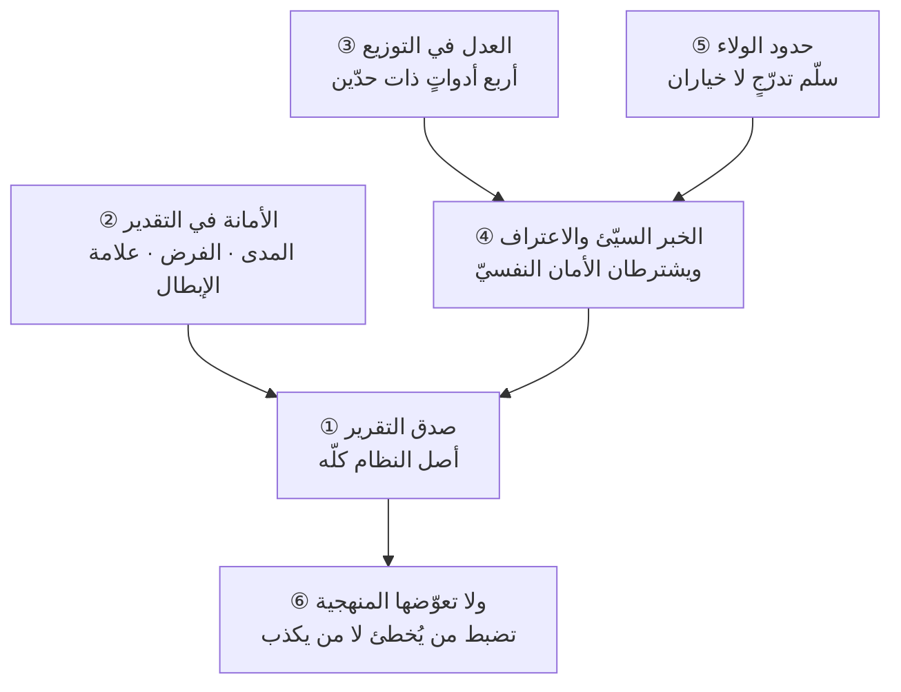

# الفصل 15 — أخلاق المهنة — ما لا تعوّضه المنهجية

---

## 🏛️ لماذا تقرأ هذا الفصل؟

**المشكلة:** يُبنى النظام كلّه على تقارير يرفعها بشر: تقدير يقوله مهندس، وحالة يعلنها قائد فريق، وخطر يُذكر أو يُسكَت عنه. فإن لم تكن هذه صادقةً، فكلّ ما فوقها بناءٌ على رمل مهما أُحكم.

**وماذا لو لم تعرف؟** من ظنّ الإجراء يعوّض غياب الأمانة أنفق طاقته في إحكام النموذج، والخبر الذي يملؤه كاذب — فيصير الإحكام نفسه أداةَ إخفاء.

**وقبل أن تمضي، اعلم ما لا يفعله هذا الفصل:** لن يقول لك إنّ الصدق حسنٌ وإنّ الظلم قبيح، فما من أحدٍ في المهنة يخالف في ذلك ولا أحدٌ يوصي بضدّه. **والذي يُكتب في هذا الباب إنّما هو ما يقع عند التعارض:** حين يكون الصدق مكلفًا، وحين تتعارض أمانتان لا تُؤدَّيان معًا، وحين لا يكون الحقّ ظاهرًا فيُحتاج إلى ترتيب. **والوعظ في هذا الموضع ليس عديم النفع وحسب، بل ضارّ** — لأنّه يُشعر القارئ أنّه فرغ من المسألة وقد وافق، وهو لم يبلغ بعدُ الموضع الذي تُختبر فيه.

**وبعد هذا الفصل ستستطيع:**

1. **أن تميّز** إدارة التوقّعات المشروعة من حجب المعلومة، بمحكٍّ واحدٍ لا يحتاج إلى الحكم على نيّة أحد.
2. **أن تحكم على** بيئتك: أهي بيئةٌ يصل فيها الخبر السيّئ، أم بيئةٌ تعلّم أهلُها أنّ نقله مكلف — بعلاماتٍ تُرى لا بانطباع.
3. **أن تفسّر** لماذا لا يعوّض إحكامُ الإجراء غيابَ الأمانة، بل قد يزيد الإخفاء — وأن تُسمّي الآليّات التي تُخفّض كلفة الصدق بدل أن تكتفي بالمطالبة به.

> [!info] بطاقة الفصل
> **النوع:** تأسيسيّ
> **المستوى:** 🟡 متوسّط
> **زمن القراءة:** نحو 45 دقيقة
> **أهمّيته في الباب:** ★★★★★
> **موضعك:** انتهيتَ من [[14 - أمراض الممارسة]] ← **⬤ أنت هنا** ← يليه [[16 - كيف يطلب هذا العلم]]

> [!abstract] موقع هذا الفصل
> **يبني على:** [[Governance]] · [[Decision Log]] — يُذكَر هنا ولا يُعاد شرحه.
> **ويؤسّس:** [[Psychological Safety]] — يُقدَّم هنا أوّل مرّة فيصير متاحًا لما بعده.

---

## 🧭 السؤال المركزي

> [!question] السؤال الذي يجيب عنه هذا الفصل كلّه
> **ما الذي لا تعوّضه المنهجية مهما أُحكمت؟**

**واحمل معك هذه الأسئلة وأنت تقرأ:**

- هل يستطيع أصغر من في الفريق أن ينقل خبرًا سيّئًا بلا ثمن؟
- ماذا تفعل حين يتعارض ولاؤك لمؤسّستك مع حقّ عميلك؟
- متى آخر مرّة اعترفتَ بخطأ في تقدير أعلنتَه؟

---

## 🗺️ الجواب المختصر — قبل التفصيل

**الذي لا تعوّضه المنهجية هو صدقُ ما يدخل إليها.** فكلّ حوكمةٍ في آخر أمرها **نظامُ معالجة معلومات**، ومدخلاتها بشر: رقمٌ يقوله من ينجز، وحالةٌ يعلنها من هو فيها، وخطرٌ يذكره من رآه أو يسكت عنه. والنظام يستطيع أن يكشف **التناقض** بين رقمين، و**الشذوذ** في قفزةٍ لا سبب لها، و**التخلّف** عن إجراءٍ مقرّر. **ولا يستطيع أن يكشف ما لم يُرفع إليه أصلًا** — فالحذف لا يترك أثرًا في أيّ سجلّ. **ومن هنا القاعدة التي يقوم عليها هذا الفصل كلّه: الحوكمة تضبط من يُخطئ ولا تضبط من يكذب** — لأنّ الخطأ يقع **داخل** العملية فيترك أثرًا يُتتبَّع، والكذب يدخل من **باب المدخلات** فيصير جزءًا من الحقيقة التي يعمل عليها النظام.

**وهذا حدٌّ بنيويّ لا نقصٌ يُصلَح بمزيد الإجراء.** بل فيه مفارقةٌ تنقلب على من لا ينتبه لها: **أنّ زيادة الإحكام قد ترفع كلفة الصدق فتزيد الإخفاء.** فمن اعترف بتأخّرٍ في نظامٍ محكمٍ واجه اجتماعًا استثنائيًّا وخطّة تصحيحٍ ومراجعةً وتوثيقًا؛ ومن أخفاه لم يواجه شيئًا حتى ينكشف بعد شهرين. **فالنظام الذي جعل الاعتراف مكلفًا صنع بيده ما يُخفى عنه.**

**ولهذا يجري الفصل على ثلاثةٍ في كلّ مسألة، ولا يُكتفى فيه بواحد:**

1. **الثمن الذي يُدفع** — فالخلق الذي لم يُذكر ثمنه موعظة.
2. **الحدّ الذي لا يُتجاوز** — فالمعنى العامّ بلا حدٍّ محدَّدٍ يُفاوَض عليه في كلّ حال.
3. **الآليّة التي تُخفّض الثمن** — **فالثمن الذي لم تُذكر آليّة خفضه تكليفٌ بما لا يُطاق**، وليس من الإنصاف أن تُطلَب من الأفراد بطولةٌ يوميّة في نظامٍ يُعاقب الصادق.

**ويخاطب الفصل قارئين في وقتٍ واحد، ويقول في كلّ مسألةٍ أيّهما المعنيّ بها:** أنت **بوصفك فردًا** — وما يلزمك لا يسقط بفساد بيئتك؛ وأنت **بوصفك من يملك شيئًا من البنية** — ولك حينئذٍ ما هو أثقل. **فمن ملك البنية ثمّ أنفق خطابه في الوعظ، فقد نقل تكلفةً كان يملك رفعها، ثمّ وضعها على أضعف من في الغرفة.**

> [!abstract] مفاهيم يُدخلها هذا الفصل في قاموسك
> `Psychological Safety`

> [!warning] مفاهيم يكثر الخلط بينها هنا
> `Loyalty` مقابل `Honesty` مقابل `Compliance` — احملها في ذهنك، فالفصل يفرّقها في محطّة التمييز.

---

## 🧱 الفكرة الأولى: صدق التقرير أصل النظام كلّه

*موضعها من الفصل: هي أوّل الخمس وأصلُها، **وموضعها أوّلًا لأنّ ما بعدها كلَّه يقوم عليها**: فالتقدير خبرٌ عن مستقبل، والعدل يُحاسَب عليه بما يُرفع، والحوكمة لا ترى إلّا ما قيل لها. **وتفارق مقدّمة الفصل بأنّ تلك أعلنت أنّ لكلّ خلقٍ ثمنًا، وهذه تُريك أوّل الأثمان: أنّ الخبر الصادق يقع ثمنُه على قائله وحده.***

**الفكرة في سطر:** *ليس في هذا العلم مقياسٌ يقيس نفسه؛ فكلّ رقمٍ على كلّ لوحةٍ خبرٌ رفعه إنسان — والخبر المزيَّن لا يُخطئ مرّةً واحدة، بل يُفسد كلّ قرارٍ بُني عليه بعدها.*

انظر في أيّ لوحة قياسٍ عندك، واسأل عن أصل كلّ رقمٍ فيها: نسبةُ الإنجاز يقولها من ينجز، والخطر يذكره من رآه، وحالةُ المشروع يعلنها من هو فيه. **وحتى ما يُستخرَج آليًّا مبنيٌّ على تصنيفٍ يدويّ**: فمن الذي ينقل البطاقة إلى «منجَز»؟ ومتى يقرّر أنّها انتهت؟ **فالآلة لا تقيس العمل، إنّما تعدّ ما أعلنه البشر عن العمل.**

### ولماذا يكون ضرر الخبر غير الصادق غير متناسبٍ مع حجمه؟

لأنّه **لا يقف عند القرار الذي دخل فيه**. فالقرار الذي بُني عليه يُبنى عليه قرارٌ آخر، **وكلٌّ منها صحيحٌ بالنسبة إلى مدخلاته** — وهذا بعينه ما يجعل تتبّع الأصل مستحيلًا بعد حين. فتقريرٌ يقول «سبعون بالمئة» والحال خمسة وأربعون يُنتج سلسلةً في أسابيع:

1. **تُسحَب موارد** إلى مشروعٍ آخر لأنّ هذا «شارف على الانتهاء».
2. **يُوعَد عميلٌ بموعد** بناءً على ذلك السحب.
3. **يُوقَّع عقدُ تشغيلٍ أو صيانةٍ** يبدأ من الموعد الموعود.
4. **تُخطَّط ميزانية الربع القادم** على أنّ هذا الفريق سيتفرّغ.

**فحين ينكشف الرقم بعد شهرين لا يكون العلاج تصحيح رقم، بل نقض أربعة قرارات** — أحدها بلغ عقدًا مع طرفٍ خارجيّ. **ولهذا يُقال: كلفة الخبر غير الصادق ليست فيه بل فيما بُني عليه**، وهي تتضاعف بمرور الوقت لا بحجم الفارق.

### ثلاث درجاتٍ لا يجوز الخلط بينها — وأشيعها أخفاها

1. **الكذب**: أن يُقال ما يُعلَم خلافه. وهو أقلّها وقوعًا وأسهلها في الحكم.
2. **التزيين**: أن يُقال الصحيح بصياغةٍ تُنتج انطباعًا غير الواقع — «تقدّمٌ جيّد في معظم المسارات» حيث المسار الحرج متوقّف.
3. **الحذف**: أن يكون **كلّ ما في التقرير صحيحًا**، وما ليس فيه هو الخبر. **وهذه أشيعها وأصعبها إثباتًا** — إذ لا يستطيع أحدٌ أن يقول لك إنّك كتبتَ باطلًا، وأنت تعلم أنّك لم تكتب الذي يهمّ.

**فالتقرير يُقاس بما فيه وبما ليس فيه معًا.** ومن جعل معياره «هل فيه كذبة؟» فقد اختار المعيار الذي تنجو منه أكثر التقارير غير الصادقة.

**والمحكّ العمليّ الذي يُغني عن هذا الجدل كلّه:**

> **التقرير الصادق هو الذي لو قرأه من يملك القرار لاتّخذ القرارَ الذي كان سيتّخذه لو حضر بنفسه ورأى.**

**وحُسنُ هذا المحكّ أنّه لا يسأل عن نيّتك** — وهي ممّا لا يُحكم فيه بين اثنين — **بل يسأل عن أثرٍ تستطيع أن تفحصه أنت في نفسك قبل أن تُرسل.** واسأله بصيغته المباشرة: *لو حضر من يقرأ هذا اجتماعنا أمس ورأى ما رأيت، أكان سيقرّر ما سيقرّره بعد قراءته؟* فإن كان الجواب لا، **فقد عرفتَ أنّ في تقريرك نقصًا وإن لم تكتب فيه باطلًا.**

> [!example] سبعون بالمئة وخمسة وأربعون
> فريقٌ في جهةٍ حكوميّةٍ بالرياض يبني نظامًا داخليًّا. وفي تقرير الشهر الرابع كُتب «نسبة الإنجاز ٧٠٪». والذي جرى أنّ الفريق أنجز سبعة مكوّناتٍ من عشرة **عدًّا**، وأنّ الثلاثة الباقية هي **أثقل** ما في النظام وأكثره ارتباطًا بجهاتٍ خارجية.
> **ولم يكذب كاتب التقرير:** فسبعة من عشرة سبعون بالمئة. **وإنّما حذف أنّ المكوّنات ليست متساوية**، وأنّ الثلاثة الباقية قُدّرت وحدها بستّة أشهرٍ في الخطّة الأصلية.
> **وما وقع في الثمانية أسابيع التالية:** نُقل مطوّران إلى مشروعٍ آخر، وأُبلغ العميل الداخليّ بموعد إطلاقٍ بعد ستّة أسابيع، وأُدرج التدريب في تقويم الموارد البشرية، وحُجزت قاعة. **ثمّ تبيّن أنّ الباقي يحتاج أربعة أشهر.**
> **والذي كلّف فعلًا لم يكن الشهرين**، بل أنّ الجهة كانت تستطيع — لو علمت في الشهر الرابع — أن تقلّص نطاق أحد المكوّنات الثلاثة وتُطلق في موعدها. **فالخيار الذي ضاع هو الثمن، لا التأخير.**

### الثمن — والآليّات التي تخفضه

**ثمن الصدق هنا ظاهرٌ لا يُنكَر:** سؤالٌ لم يكن ليُسأل، واجتماعٌ استثنائيّ، ونظرةٌ في الاجتماع القادم، وربّما لومٌ صريح. **ومن أنكر هذا الثمن لم يُقنع قارئًا واحدًا**، لأنّ القارئ يعرفه من تجربته لا من كتاب.

**وثلاث آليّاتٍ تُخفّضه، وكلّها في يد من يملك شيئًا من البنية:**

1. **أن يُكتب [[Definition of Done|تعريف الاكتمال]] فلا يبقى للتقدير الشخصيّ مجال.** **فأكثر ما يُظنّ كذبًا في التقارير اختلافٌ في التعريف لا نقصٌ في الأمانة**: هذا يعدّ العنصر منجَزًا إذا كُتب، وذاك إذا اختُبر، وثالثٌ إذا وصل إلى المستخدم. **ومن لم يُوحّد التعريف فقد اتّهم فريقه بما هو من صنعه.**
2. **أن يُفصل التقرير عن التقييم.** فالرقم الذي يُحاسَب عليه صاحبُه يفسد كما مرّ في [[14 - أمراض الممارسة]]، **والرقم الذي لا يُحاسَب عليه أحد يبقى صادقًا** لأنّه لا حافز لأحدٍ في تحريكه.
3. **أن يكون في التقرير حقلان: «ما تغيّر منذ آخر تقرير» و«ما الذي أعرفه اليوم ولم أكن أعرفه».** **فالحقل الذي يسأل عن التغيّر يكشف الجمود** — وتقريرٌ لم يتغيّر فيه شيءٌ ثلاثة أشهر إمّا أنّ العمل واقفٌ وإمّا أنّ التقرير واقف، وكلاهما يستحقّ سؤالًا.

> [!tip] كيف تستعمل هذه الفكرة — فحص الدقيقة الواحدة قبل الإرسال
> قبل أن ترسل أيّ تقريرٍ أو تحديث، اسأل ثلاثة أسئلةٍ لا تستغرق دقيقة:
> 1. **ما الشيء الذي أعرفه ولم أكتبه؟** — واكتب اسمه ولو في سطر. **فإن وجدتَ نفسك تُعلّل عدم كتابته، فذلك هو الخبر.**
> 2. **لو قرأه من يملك القرار، أيقرّر ما كان سيقرّره لو حضر؟**
> 3. **ولو انكشف بعد شهرين ما أعرفه اليوم، أيقول أحدٌ: «كان يعلم»؟** **وهذا السؤال وحده يفرز أكثر ممّا يفرزه الاثنان قبله**، لأنّه ينقلك من لحظة الكتابة إلى لحظة الانكشاف — وهي اللحظة التي تُحكَم فيها التقارير كلّها.

> [!warning] الحفرة الشائعة — أن يُقرأ هذا اتّهامًا لمن يكتبون التقارير
> أكثر التقارير غير الصادقة ليست كذبًا، وهذا تقريرٌ لا مجاملة. وثلاثةٌ تُنتجها بلا نيّةٍ سيّئة: **اختلافُ التعريف** وهو أوسعها، و**التفاؤل البنيويّ** في التقدير البشريّ وهو ميلٌ منتظمٌ لا اختيار، و**الخوف المتعلَّم** ممّا وقع لمن سبق. **فمن عالج الثلاثة بالخطاب الأخلاقيّ لم يُصب واحدًا منها.**
> **والحدّ:** يبقى الكذب الصريح كذبًا لا يُعذَر صاحبه بشيءٍ من هذا. **إنّما المقصود ألّا يُنسب إلى الذمّة ما مصدره التعريف أو البنية** — وهو امتدادٌ مباشر لقاعدة [[14 - أمراض الممارسة]] في تشخيص مصدر العطب قبل اختيار علاجه.

> [!question]- تأكّد أنك فهمت — كتبتَ في تقريرك كلّ ما هو صحيح، وسكتَّ عن أنّ مورّدًا لم يردّ عليك منذ أسبوعين. أهذا كذب؟
> **ليس كذبًا، وهو مع ذلك تقريرٌ غير صادق — والفرق بين الوصفين هو موضع هذه الفكرة كلّها.**
>
> **فالمحكّ ليس ما كتبتَ بل ما يقرّره القارئ:** لو علم من يملك القرار أنّ المورّد صامتٌ أسبوعين، **أكان سيتّخذ القرار نفسه؟** والغالب لا — فقد كان سيتّصل بجهةٍ أعلى عنده، أو يُفعّل بديلًا، أو يؤخّر وعدًا أعطاه لغيره. **فالذي حجبتَه ليس معلومةً بل خيارًا كان يملكه.**
>
> **ثمّ انظر في العلّة التي حملتك على السكوت، فهي التي تحدّد الحكم:**
> - إن كنتَ **تنتظر أن يُحلّ قبل الاجتماع القادم** فهذا شائعٌ ومفهوم، **وخطؤه أنّك قرّرت عن غيرك ما يستحقّ أن يعرفه.** والقاعدة: **تملك أن تقترح، ولا تملك أن تُقرّر نيابةً عمّن يملك بحجبك عنه ما يُقرّر به.**
> - وإن كان **خوفًا من أن يُقال إنّك لم تتابع**، فالمشكلة أوسع من التقرير، وموضعها الفكرة الرابعة.
>
> **وأدنى ما يُؤدّى هنا سطرٌ واحد:** «المورّد لم يردّ منذ ١٤ يومًا · أثره المحتمل: تأخير المكوّن الفلانيّ أسبوعين · والمقترَح: تصعيدٌ إلى جهة كذا هذا الأسبوع». **وكلفته ثلاثون ثانية، وقيمته أنّه يردّ الخيار إلى صاحبه.**

> [!summary]- خلاصة الفكرة في سطرين
> **ليس في هذا العلم مقياسٌ يقيس نفسه؛ فكلّ رقمٍ على كلّ لوحةٍ خبرٌ رفعه إنسان.**
> **ولذلك لا يُفسد الخبرُ المزيَّن قرارًا واحدًا، بل كلَّ قرارٍ بُني عليه بعده** — ويبقى فسادُه خفيًّا لأنّ اللوحة تظلّ تعمل، والأرقام تظلّ تصدر في مواعيدها.

> [!question] تأمّلٌ تطبيقيّ — لا جواب له في هذا الفصل
> انظر إلى آخر ثلاثة أعلامٍ حمراء رُفعت عندكم، واكتب ماذا جرى لأصحابها بعدها: **أشُكروا على الإخبار، أم سُئلوا عن التقصير؟**
>
> **ولا تنظر في السياسات المكتوبة، فهي تقول الشيء الصحيح دائمًا.** والوقائع الثلاث تقول لك ثمنَ الصدق عندكم — **وبقدر ذلك الثمن تكون دقّةُ كلّ رقمٍ في تقاريركم.**

---

## 🧱 الفكرة الثانية: الأمانة في التقدير

*موضعها من الفصل: كان الأوّل خبرًا عن **ما وقع**، وهذا خبرٌ عن **ما لم يقع بعد** — والفرق أنّ الأوّل يُعرف ويُخفى، والثاني لا يُعرف أصلًا. **وتزيد على سابقتها بأنّ الأمانة هنا ليست في الرقم بل فيما يُعطى معه**: مداه، وفرضه، والعلامة التي تُبطله.*

**الفكرة في سطر:** *أمانة المقدِّر ليست في إصابة الرقم — فالتقدير في الجهل لا يُصيب — بل في أن يُعطي مع الرقم ما يجعل غيره يقرّر معه: مداه، وفرضه، والعلامة التي تُبطله.*

مرّ في [[12 - كيف يفكر مدير المشروع]] أنّ الكلام في المشاريع طبقات، وأنّ **التقدير غير الالتزام**. وهذه الفكرة تسأل سؤالًا آخر: ما الذي يلزمك في **طبقة التقدير** نفسها حتى تكون قد أدّيتَ الأمانة؟

### أربع صورٍ لخيانة التقدير — ثنتان بالنقص وثنتان بالزيادة

1. **التقدير الذي يُقال ليُرضي.** أن يُسأل الفريق: «أيمكن إنجازه في ثلاثة أسابيع؟» فيُقال نعم. **وهو أشيعها**، وعلّته أنّ **السؤال نفسه صيغ صياغةً تحمل جوابها**: فمن سُئل «أيمكن؟» أُدخل في موضع من يُبرّر العجز إن قال لا. **ولهذا كان أوّل علاجه في يد السائل لا المسؤول** — أن يُسأل «كم يحتاج؟» لا «أيمكن في كذا؟».
2. **إسقاط المدى.** أن يُعطى رقمٌ واحدٌ وقد كان في الأصل مدًى. **وهذه لا يعدّها أحدٌ كذبًا، وهي أكثرها ضررًا** — وسيأتي بيان علّة ذلك.
3. **الحشو الخفيّ.** أن يُضاف احتياطٌ غير معلَن داخل كلّ بند. **وليس الاحتياط نفسه هو المشكلة** — بل **خفاؤه**. فالاحتياط المعلَن ([[Buffer|احتياطي]]) أداةٌ مشروعة يملكها من يملك القرار ويوزّعها حيث يشاء؛ **والخفيّ ينقل قرار الاحتياط من صاحبه إلى من قدّر**، ويُفسد كلّ حسابٍ يُبنى على الرقم لأنّه يُخفي أين يقع الجهل فعلًا. **والقاعدة: يُوضع الاحتياط في موضعٍ واحدٍ معلومٍ يملكه صاحب القرار، ولا يُوزَّع خفيةً على البنود.**
4. **الصمت عن انكشاف الخطأ.** أن يُعلَم أنّ التقدير سقط ولا يُقال حتى يُسأل. **وهذا هو الموضع الذي تُقاس فيه أمانة المقدِّر، لا لحظةُ التقدير** — إذ التقدير اجتهادٌ في جهل، والإعلان عند الانكشاف اختيارٌ في علم.

### ولماذا كان إسقاط المدى أشدّها ضررًا وهو أخفّها في الشعور؟

لأنّ الطرف الآخر **لا يعرف أنّه فقد شيئًا**. فمن سمع «ستّة أسابيع» لا يدري أنّ الأصل كان «أربعةً إلى عشرة»، فلا يبني احتياطًا، ولا يُهيّئ خطّةً ثانية، ولا يؤخّر وعدًا أعطاه. **فالذي سقط في الطريق ليس الرقم بل درجةُ الجهل** — وهي المعلومة التي كان يقرّر بها.

**وهذا هو الانحدار الصامت نفسه الذي وُصف في [[12 - كيف يفكر مدير المشروع]]، لكنّه هنا يقع في الخطوة الأولى لا الثالثة:** فالمدى لم يسقط في شريحة العرض، **بل سقط في فم من قدّر.**

### ما الذي يُؤدّي الأمانة؟ ثلاثة لا رقمٌ واحد

**أن يُعطى مع كلّ تقديرٍ ثلاثة أشياء:**

| الشيء | صيغته | ولماذا هو لازم |
|---|---|---|
| **المدى** | «أربعة إلى عشرة أسابيع، والأرجح ستّة» | ينقل درجة الجهل، وهي ما يُبنى عليه الاحتياط |
| **الفرض** | «على فرض أن تردّ الجهة الفلانيّة في أسبوعين» | يجعل القرار قابلًا لإعادة الفتح حين يسقط فرضه لا حين يشتكي أحد |
| **العلامة التي تُبطله** | «إن لم تردّ خلال ثلاثة أسابيع فالرقم كلّه ساقط» | تنقل المراجعة من الشعور إلى حدثٍ يُرى |

**والقاعدة الجامعة: من أعطى الثلاثة فقد أدّى الأمانة وإن أخطأ الرقم؛ ومن أعطى الرقم وحده لم يؤدّها وإن أصاب.** فالإصابة في التقدير حظٌّ يشترك فيه الصادق وغيره، **والذي يُملَك هو نقل ما تعرفه عن جهلك.**

### ولمن يُقال المدى؟ — فالتقدير الأمين يحتاج مستمعًا أمينًا

**وفي هذا الباب واجبٌ مقابلٌ يُغفَل، وبغيره تسقط الفكرة كلّها.** فالمقدِّر الذي أعطى مداه وفرضه وعلامة إبطاله **قد أدّى ما عليه**؛ فإن أخذ السامع الرقم الأوسط ورفعه وحده، **فالذي كسر الأمانة هو الثاني لا الأوّل.**

**وثلاثة يلزم من يستقبل التقدير، وهي في يده وحده:**

1. **أن ينقله بمداه إلى من فوقه.** فالمدى الذي وصلك مدًى **يُنقَل مدًى**، ومن ضغطه رقمًا واحدًا فقد أسقط درجة الجهل في الطبقة التي هو فيها — **وهذا هو الانحدار الصامت الذي وُصف في [[12 - كيف يفكر مدير المشروع]] وقد وقع منه هو.**
2. **ألّا يُكافئ الرقم المتفائل ولا يُعاقب المتحفّظ.** **فأسرع طريقٍ إلى إفساد التقديرات كلّها أن يُقابَل المدى الواسع بالتذمّر والرقم الضيّق بالارتياح** — فيتعلّم الفريق في دورتين ما يُرضي، **ولا يعود عندك مقدِّرٌ واحدٌ صادق.**
3. **أن يسأل عن الفرض ويكتبه.** فإن لم يُسجَّل الفرض ضاع الأساس الذي تُبنى عليه المحاسبة العادلة بعد ثلاثة أشهر، **ولم يبقَ إلا الرقم — فيُحاسَب عليه.**

**فالأمانة في التقدير عقدٌ بين طرفين لا واجبٌ على طرفٍ واحد.** **ومن طلب مدًى ثمّ عاقب على سعته فقد طلب صدقًا وعاقب عليه، ولن يُطلَب منه مرّتين.**

### وهذا هو ما يجعل المحاسبة عادلة

فسجلّ القرار ([[Decision Log]]) الذي أُسّس في [[12 - كيف يفكر مدير المشروع]] هو الذي يحفظ الثلاثة، **وبه تتحوّل المحاسبة من ظلمٍ إلى عدل**:

- **المحاسبة على الرقم ظلم** — لأنّ التقدير في الجهل لا يُصيب، ومن حاسب عليه علّم فريقه شيئًا واحدًا: **أن يبالغ**. فتتضخّم التقديرات في دورتين، ويصير الرقم بلا معنى، ثمّ يشكو الجميع من أنّ «التقديرات عندنا غير واقعية» — **وهم الذين صنعوها.**
- **والمحاسبة على الفرض عدل** — فيُسأل سؤالان: أكان هذا فرضًا معقولًا **ساعة قيل**؟ وهل أُعلن **حين سقط**؟ **فمن أخطأ الرقم وفرضُه كان معقولًا وأعلن سقوطه فقد أدّى ما عليه تمامًا.**

**فقاعدة العدل في التقدير: يُحاسَب المقدِّر على ما كان يعلمه ساعة قدّر، لا على ما انكشف بعده.** وهي قاعدةٌ تُقال بسهولة وتُخالَف كثيرًا، **لأنّ الذي يُحاسِب يعلم اليوم ما لم يكن يُعلَم أمس، ولا يستطيع أن ينسى أنّه يعلمه.**

> [!example] «أيمكن في ثلاثة أسابيع؟»
> اجتماعٌ في شركةٍ بجدّة. سأل مدير المنتج فريق التطوير: «أيمكن إنجاز بوّابة الدفع في ثلاثة أسابيع؟» — وكان تقدير الفريق الداخليّ **من أربعة إلى تسعة أسابيع** بحسب استجابة مزوّد الدفع، وهي جهةٌ خارجيّةٌ لا يملكون منها موعدًا.
> **فقال قائد الفريق: «سنحاول».** ولم يكذب، ولم يلتزم — **وإنّما أعطى جملةً تُقرأ التزامًا وتُدافَع عنها تقديرًا.** فكُتب في المحضر «ثلاثة أسابيع»، وأُبلغ فريق التسويق، وحُدّد موعد حملة.
> **وفي الأسبوع السادس كان المزوّد لم يردّ بعد.** فسُئل الفريق عن التأخير، فقال: «كنّا نعلم أنّها قد تبلغ تسعة». **فسأل مدير المنتج السؤال الذي لا جواب له: ولمَ لم تقولوها؟**
> **والذي كان يكفي جملةٌ واحدةٌ في الاجتماع الأوّل:** «أربعة إلى تسعة، والفارق كلّه في ردّ المزوّد؛ فإن لم يردّ خلال أسبوعين فالثلاثة مستحيلة». **وكلفتها ثوانٍ، وكانت ستغيّر ثلاثة قرارات.**

> [!tip] كيف تستعمل هذه الفكرة — بدّل السؤال قبل أن تبدّل الجواب
> **إن كنتَ أنت السائل** — وهو موضع أكثر من يقرأ هذا الفصل — فبيدك أن تمنع أشيع صور خيانة التقدير بلا أن تطلب من أحدٍ شجاعة:
> 1. **لا تسأل «أيمكن في كذا؟» بل «كم يحتاج، وما الذي يقلبه؟»** — فالسؤال الأوّل يعرض رقمك ويطلب موافقةً عليه، والثاني يطلب معلومة.
> 2. **واسأل عن المدى صراحةً:** «ما أسرع ما يمكن، وما أسوأ حالٍ معقول؟» — **فمن أعطى رقمًا واحدًا فاسأله عن الآخر، ولا تعدّ سكوته عنه إجابة.**
> 3. **واسأل: «ما الذي لو تغيّر لتغيّر هذا الرقم؟»** — وهذا سؤال الفرض، وهو الذي يجعل للتقدير عمرًا معلومًا بدل أن يبقى صحيحًا إلى الأبد في أذهان الناس.

> [!warning] الحفرة الشائعة — أن يُتّخذ المدى ستارًا
> **كما يُساء استعمال الرقم الواحد، يُساء استعمال المدى.** فمن قال «بين أسبوعين وستّة أشهر» لم يُعطِ معلومةً بل امتنع عن الإجابة في ثوب الدقّة. **والمدى المفيد له شرطان: أن يكون **معقول السعة** بحيث يُبنى عليه قرار، وأن يكون **مُعلَّلًا** بما يجعله متّسعًا.** فإن اتّسع اتّساعًا يمنع القرار، **فقد صار الجواب الصحيح شيئًا آخر: «لا أستطيع أن أقدّر قبل أن أعرف كذا — وأستطيع أن أعرفه في ثلاثة أيّام».**
> **وهذا هو شراء المعلومة بدل التقدير عليها**، وهو أفضل ما يُفعل حين يكون الجهل أوسع من أن يُحمَل في مدًى.

> [!question]- تأكّد أنك فهمت — قدّرتَ عملًا بستّة أسابيع فاستغرق أحد عشر. متى تكون قد أخللتَ بالأمانة ومتى لا تكون؟
> **لا يُحكَم بشيءٍ من هذا حتى يُسأل عن ثلاثةٍ غير الرقم:**
>
> 1. **أكان الرقم مدًى فأُسقط، أم كان مدًى فقيل بمداه؟** فإن قلتَ «ستّة» وأنت تعلم أنّه «أربعة إلى عشرة»، **فقد أخللتَ ساعة قلتَ** — لا ساعة انكشف.
> 2. **أكان الفرض معقولًا ساعة قيل؟** فإن بنيتَه على أنّ الجهة الفلانيّة تردّ في أسبوعين وكان ذلك عادتها، **فالفرض معقولٌ وإن سقط**. وإن بنيتَه على ما لم يقع منها قطّ، **فالخلل في الفرض لا في الحظّ.**
> 3. **ومتى علمتَ أنّه سقط، وماذا فعلتَ ساعتئذٍ؟** — **وهذا أهمّ الثلاثة.** فمن علم في الأسبوع الرابع أنّ الستّة مستحيلة فقال، **فقد أدّى الأمانة كاملةً وإن بلغ أحد عشر**. ومن علم وسكت حتى انقضى الأسبوع السادس، **فقد أخلّ — لا لأنّه أخطأ التقدير بل لأنّه احتكر معلومةً كان غيره يقرّر بها.**
>
> **والخلاصة: الإخلال يقع في لحظتين لا في النتيجة — لحظةِ إسقاط المدى، ولحظةِ السكوت بعد الانكشاف.** وأمّا الفارق بين ستّةٍ وأحد عشر فهو في نفسه **معلومةٌ عن جهلنا لا شهادةٌ على ذمّة أحد**، وموضعه أن يُتعلَّم منه في التقدير القادم.

> [!summary]- خلاصة الفكرة في سطرين
> **أمانة المقدِّر ليست في إصابة الرقم — فالتقدير في الجهل لا يُصيب — بل في أن يُعطي مع الرقم ما يجعل غيره يقرّر معه.**
> **وثلاثةٌ تُقال مع كلّ تقدير:** مداه، والفرض الذي بُني عليه، والعلامة التي تُبطله. **ومن أعطى رقمًا عاريًا نقل جهلَه إلى غيره في هيئة يقين.**

> [!question] تأمّلٌ تطبيقيّ — لا جواب له في هذا الفصل
> خذ آخر تقديرٍ أعطيتَه، وأعد كتابته بالثلاثة: **من كذا إلى كذا · بشرط أن يكون كذا · ويسقط إن وقع كذا.**
>
> **ثمّ اسأل نفسك سؤالًا واحدًا: أكنتُ سأُعطي الرقم نفسه لو كُتب الشرط معه؟** — فالغالب أنّ الرقم العاري يُقال لأنّ كتابة شرطه تكشف أنّه لم يكن رقمًا.

---

## 🧱 الفكرة الثالثة: العدل في التوزيع

*موضعها من الفصل: مضت أمانتان في **ما تقوله**، وهذه في **ما تفعله بالناس** — وهي أخصُّ ما في الفصل بهذا العلم دون سائر أبواب الأخلاق، إذ الصدق يشترك فيه الناس كلُّهم. **وتفارق ما قبلها بأنّ أدواتها في يدك كلَّ أسبوع وقد لا تنتبه أنّك توزّع بها شيئًا.***

**الفكرة في سطر:** *لا يملك مدير المشروع سيفًا ولا مالًا، ويملك أربع أدواتٍ كلٌّ منها ذو حدّين — فبها يعدل وبها يجور، والفرق ليس في الأداة.*

هذه الفكرة أخصّ ما في هذا الفصل بهذا العلم دون سائر أبواب الأخلاق. فالكلام في الصدق يشترك فيه الناس كلّهم؛ **وأمّا العدل في توزيع العمل والتقدير والظهور، فهو ما يقع في يد من يدير مشروعًا كلَّ أسبوع وقد لا ينتبه أنّه يوزّع شيئًا.**

### أربع أدواتٍ يُعدَل بها ويُجار

1. **التقدير الذي يُفرَض.** أن يُقدَّر عن الناس ثمّ يُطالَبوا بما قُدِّر. **وأثره أنّه ينقل كلفة خطأ التقدير إلى من لم يقدّر** — فيعمل ساعاتٍ إضافيّةً ليصحّح رقمًا لم يضعه ولم يُسأل عنه. **وعلامته الفارقة: أن يُسمَّى العجز عن بلوغ رقمٍ مفروضٍ «تقصيرًا».**
2. **المقياس الذي يُنتقى.** أن يُختار من الأرقام ما يُظهر فريقًا ويُخفي آخر. **والانتقاء لا يحتاج كذبًا** — يكفي أن يُعرض العدد المطلق حيث يخدم، والنسبة حيث تخدم، ومتوسّط ثلاثة أشهرٍ حيث يخدم. **وعلامته: أن يتغيّر شكل العرض من ربعٍ إلى ربعٍ بلا سببٍ معلن.**
3. **العمل الذي يُكدَّس على من لا يعترض.** **وهذه أخفاها وأشدّها اطّرادًا.** فمن يُنجز ولا يشتكي يُعطى المزيد — لا مكافأةً له، **بل لأنّ إسناد العمل إليه أقلّ كلفةً على من يُسند**: لا نقاش، ولا متابعة، ولا احتمال أن يُردّ الطلب. **فتُكافَأ الكفاءة بالحمل** حتى ينكسر صاحبها أو يذهب. **وعلامتها قابلةٌ للقياس لا للانطباع: أن يكون توزيع العمل بين أفرادٍ متساوي المسمّى شديدَ التفاوت** — فافتح لوحتك واعدد.
4. **الظهور الذي يُوزَّع.** من الذي يعرض في الاجتماع الكبير؟ ومن الذي يُذكر اسمه في رسالة إعلان النجاح؟ ومن الذي يُقدَّم لصاحب القرار؟ **وهذا مالُ المهنة الحقيقيّ** — إذ الترقية تتبع الظهور أكثر ممّا تتبع الإسهام، ومن لا يُرى لا يُرقّى وإن كان عليه قوام العمل. **ومدير المشروع يملك توزيعه بلا كلفةٍ تُذكر، فهو أرخص عدلٍ يستطيعه وأكثر ما يُغفَل عنه.**

> [!info] إضافة مرجعية — العمل غير المرئيّ، وهو أوّل ما يُظلَم فيه
> في كلّ فريقٍ أعمالٌ تُبقيه قائمًا ولا تظهر في أيّ لوحة: من يجيب أسئلة الجدد، ومن يُصلح البيئة حين تنكسر صباحًا، ومن يكتب الوثيقة التي لا تُعدّ إنجازًا، ومن يتابع مورّدًا لا يردّ، ومن يُهدّئ خلافًا قبل أن يبلغ اجتماعًا.
> **وهذه الأعمال تجتمع غالبًا في أفرادٍ بأعيانهم** — لأنّ من أدّاها مرّةً صار هو الذي يُسأل عنها. ثمّ تُقاس إنتاجيّتهم بما ظهر على اللوحة، **فيبدو أنّهم أقلّ إنجازًا وهم الذين أبقوا الإنجاز ممكنًا.**
> **ولا يُعدَل في توزيع ما لم يُسمَّ.** فأوّل خطوةٍ ليست إعادة التوزيع بل **الإحصاء**: أن تُكتب هذه الأعمال في قائمةٍ ظاهرة، ويُسأل عن كلٍّ منها: من يؤدّيه اليوم؟ وكم يستغرق؟ **فمجرّد ظهورها يُغيّر توزيعها**، لأنّ أكثر تكديسها يقع بلا أن يعلم به من يُسند ولا من يُسند إليه.

### وليس العدل تسويةً — وهذا موضع أشيع سوء فهمٍ في هذا الباب

فالتسوية بين مختلفين جور: من له خمس سنواتٍ من الخبرة ومن له سنة، ومن يعمل في مكوّنٍ غامضٍ ومن يعمل في مكرَّرٍ معلوم — **تسويتهم في الحمل ظلمٌ للأوّل، وتسويتهم في التقدير ظلمٌ للثاني.**

**والعدل هنا ثلاثة شروطٍ مجتمعة، وليس فيها تسوية:**

1. **أن يكون المعيار معلنًا** — أن يُعرف على أيّ أساسٍ يُوزَّع العمل والظهور والتقدير.
2. **أن يُطبَّق على الجميع** — فالمعيار الذي له استثناءٌ دائمٌ لشخصٍ بعينه ليس معيارًا.
3. **أن يُسأل عنه بلا ثمن** — **وهذا أهمّها**، إذ المعيار الذي لا يُسأل عنه لا يُعرف أنّه طُبّق. **ومن أعلن معيارًا ثمّ ضاق بمن سأل عنه فقد ألغاه بيده.**

### الحدّ الذي لا يُتجاوز

**ألّا يُبنى تسليمٌ على استنزافٍ لم يُعلَن ثمنه.** فليست [[Sustainable Pace|الوتيرة المستدامة]] رفاهيةً ولا لطفًا، **بل حسابٌ بارد**: الفريق المستنزَف يُنتج أخطاءً أكثر فيزيد العمل الذي يُعاد، ويتباطأ حكمه فيتّخذ قراراتٍ أسوأ، ثمّ يذهب خيرُ من فيه أوّلًا لأنّه أقدرهم على أن يجد غيره. **وكلفة استبدال فردٍ خبيرٍ في نظامٍ قائم أضعافُ ما وُفِّر بالأسابيع التي أُخذت منه** — إذ تُدفع مرّتين: مرّةً في التوظيف والتهيئة، ومرّةً في المعرفة التي ذهبت معه ولم تكن مكتوبةً في مكان.

**والخطر الذي يستحقّ التصريح: أنّ الاستنزاف يُنتج في أوّله أرقامًا حسنة.** فالفريق الذي يعمل ستّين ساعةً في الأسبوع يُسلّم أكثر في الشهر الأوّل، **فيُقرأ ذلك نجاحًا للضغط**، ويُطلب المزيد. **وهذه هي العلامة المطمئنّة بعينها التي وُصفت في [[14 - أمراض الممارسة]]** — ولهذا يعمّر هذا النمط سنةً أو سنتين قبل أن يظهر ثمنه دفعةً واحدة في صورة استقالاتٍ متتالية ([[Burnout|الاحتراق الوظيفي]]).

> [!example] فردٌ واحدٌ يحمل ثلث اللوحة
> فريقٌ من سبعةٍ في شركةٍ بالدمّام. ولمّا عُدّت البطاقات المنجَزة في ربعٍ كامل، تبيّن أنّ فردًا واحدًا أنجز **٣١٪** من مجموع ما أنجزه الفريق، وأنّه هو الذي أُسند إليه **كلّ** عملٍ عاجلٍ دخل في الربع (تسع بطاقات من إحدى عشرة).
> **ولم يقرّر أحدٌ ذلك.** وإنّما كان كلّ إسنادٍ منفردًا معقولًا: هو أعرفهم بالمكوّن، وهو لا يجادل في الموعد، وهو يُنجز. **فتجمّع من قراراتٍ صغيرةٍ كلّها صائبةٌ وحدها ظلمٌ ظاهرٌ في مجموعها.**
> **وما لم يظهر في اللوحة أشدّ:** أنّه كان يجيب أسئلة اثنين من الجدد يوميًّا، وأنّه هو الذي يُصلح بيئة الاختبار حين تنكسر. **فحين استقال بعد أربعة أشهر لم تكن المشكلة أن يُوظَّف بديل، بل أنّ ثلاثة أعمالٍ لم يكن أحدٌ يعلم أنّها تُؤدَّى أصلًا** — فظهرت بغيابه لا بذهابه.

> [!tip] كيف تستعمل هذه الفكرة — ثلاثة أعدادٍ تُحصى في عشرين دقيقة
> لا يُعرَف الجور في التوزيع بالشعور، ويُعرَف بالعدّ. **وثلاثة أعدادٍ تكشف أكثره:**
> 1. **توزيع العمل:** كم بطاقةً أنجز كلّ فردٍ في آخر ربع؟ **ولا تنظر إلى العدد بل إلى الفارق بين أعلاهم وأدناهم** مع تساوي المسمّى.
> 2. **توزيع العاجل:** من الذي أُسند إليه العمل الطارئ؟ **فالعاجل هو ما يكسر التخطيط ويأكل المساء**، وتركّزه في شخصٍ أشدّ من تركّز العمل العاديّ.
> 3. **توزيع الظهور:** من عرض في آخر ثلاثة اجتماعاتٍ حضرها من هو أعلى؟ ومن ذُكر اسمه في آخر ثلاث رسائل إعلان؟
>
> **ثمّ لا تُعالج بالتسوية بل بالإعلان:** أن يُقال في الفريق «لاحظتُ أنّ العاجل كلّه يذهب إلى فلان، وسنُدير هذا بالتناوب مع تهيئةٍ لمن سيتناوب». **فالإعلان وحده يُصلح أكثر ممّا يُصلحه إعادة التوزيع صامتًا**، لأنّ الظلم في التوزيع مصدره الخفاء لا القصد.

> [!warning] الحفرة الشائعة — أن يُقرأ العدل مساواةً فيُظلَم المتقن
> من قرأ هذا الباب فسوّى بين أفراده في الحمل والتقدير **لم يعدل بل ظلم من جهةٍ أخرى**: فأنقص من المتقن حقَّه، وأعطى غيره ما ليس له، **ثمّ خسر المتقن نفسه لأنّه لم يعد يرى فرقًا بين أن يُتقن وألّا يُتقن.**
> **والفرق بين التوزيع العادل والتسوية: أنّ الأوّل يُفرّق بمعيارٍ معلن، والثانية تُلغي المعيار.** فالحمل يزيد على من زادت قدرته — **بشرطين: أن يُعلَن أنّه لذلك، وأن يزيد معه التقدير والظهور بالقدر نفسه.** **وأمّا أن يزيد الحمل وحده فذاك هو الجور بعينه، وإن سُمّي ثقةً.**

> [!question]- تأكّد أنك فهمت — في فريقك فردٌ يُنجز ضعف غيره ولا يشتكي أبدًا. ما واجبك تجاهه؟
> **واجبك أن تفحص ثلاثة، لأنّ الحال تحتمل ثلاث علل مختلفة تمامًا، وعلاج كلٍّ منها غير الآخر:**
>
> 1. **أهو يُنجز ضعفهم لأنّه أقدر، أم لأنّه أُسند إليه ضعف ما أُسند إليهم؟** — وهذا ليس سؤالًا واحدًا بل سؤالان: عدّ ما **أُسند** ثمّ عدّ ما **أُنجز**. فإن كان الإسناد متساويًا والإنجاز مضاعفًا فذاك قدرة؛ **وإن كان الإسناد نفسه مضاعفًا فأنت أمام تكديسٍ لا تفوّق.**
> 2. **وأيَظهر بقدر ما يُنجز؟** — فإن كان يحمل الثلث ولا يعرف اسمَه من هو أعلى، **فقد أخذتَ منه ما هو مال المهنة عنده وأعطيته لغيره** — ولا يشتكي، لأنّ الظهور ممّا لا يُطلَب في العادة إلا بكلفةٍ في الصورة.
> 3. **ولماذا لا يشتكي؟** — **وهذا أهمّها وأخفاها.** فقد يكون راضيًا، وقد يكون **تعلّم أنّ الاعتراض لا يُجدي أو يُكلّف**. **وسكوته ليس معلومةً عن رضاه بل معلومةٌ عن بيئته** — وقد مرّ في [[14 - أمراض الممارسة]] أنّ السكوت في بيئةٍ تُكلّف الكلام ثمنًا ليس رأيًا في المسألة بل رأيٌ في ثمن الكلام. **والفحص: متى آخر مرّةٍ ردّ أحدٌ في هذا الفريق طلبًا، وماذا وقع له؟**
>
> **ولا يصحّ أن يُقال «ما دام راضيًا فلا شيء عليّ».** فالرضا لا يُسقط حقّ العدل، **ولأنّ ما تبنيه على استمراره أنت لا هو: فيوم يذهب — وهو أقدر الجميع على أن يجد غيره — تنكشف ثلاثة أعمالٍ لم يكن أحدٌ يعلم أنّها تُؤدّى.**

> [!summary]- خلاصة الفكرة في سطرين
> **لا يملك مدير المشروع سيفًا ولا مالًا، ويملك أربع أدواتٍ كلٌّ منها ذو حدّين.**
> **فبها يعدل وبها يجور، والفرق ليس في الأداة** — بل في أن يُعلن معيارَ استعمالها قبل أن يستعملها، فيصير قرارُه قابلًا للمراجعة بدل أن يكون قابلًا للتأويل.

> [!question] تأمّلٌ تطبيقيّ — لا جواب له في هذا الفصل
> اختر أداةً من الأربع استعملتَها هذا الشهر — إسنادَ مهمّةٍ ثقيلة، أو ترشيحًا، أو توزيعَ ظهورٍ أمام الإدارة — واسأل: **بأيّ معيارٍ اخترتُ من اخترت؟**
>
> **ثمّ اسأل الأصعب: أيعرف الفريق هذا المعيار؟** فالمعيار الذي يعرفه صاحبُه وحده لا يُميَّز من الهوى، **لا لأنّه هوًى بالضرورة، بل لأنّ من وقع عليه لا يملك ما يفحصه به.**

---

## 🧱 الفكرة الرابعة: الاعتراف بالخطأ وشجاعة نقل الخبر السيّئ

*موضعها من الفصل: الثلاث قبلها في **ما يلزمك أنت**، وهذه في **ما يجعل أداءه ممكنًا** — إذ لا يدوم صدقٌ يدفع ثمنه قائله وحده. **وموضعها بعد الواجبات مقصود**: أن يُعرف الواجب أوّلًا، ثمّ يُسأل: في أيّ بيئةٍ يُؤدَّى؟*

**الفكرة في سطر:** *للخبر السيّئ خاصّيّتان تمنعانه من الوصول تلقائيًّا — أنّ قيمته تنقص بمرور الوقت، وأنّ كلفة قوله تقع على قائله وفائدته تقع على غيره — فما لم تُعالَج المعادلة بقي التأخير هو السلوك العاقل.*

### لماذا لا يصل الخبر السيّئ من نفسه؟

**أوّلًا: قيمته تنقص بسرعة.** فالخطر الذي يُعرَف مبكّرًا رخيصٌ لأنّ الخيارات أمامه كثيرة؛ وهو نفسه بعد شهرين غالٍ لأنّه لم يبقَ إلا خيارٌ واحد. **فقيمة الخبر السيّئ في أوّله، وهذا بعينه وقتُ ما يزال فيه غير مؤكّد** — ومن أراد أن ينتظر حتى يتيقّن انتظر حتى يفقد الخبر قيمته.

**وثانيًا — وهو الأهمّ — أنّ الكلفة والفائدة لا تقعان على واحد.** فمن نقل الخبر تحمّل السؤال والنظرة والاجتماع، **والفائدة كلّها لغيره: للمشروع، وللمؤسّسة، ولمن كان سيقرّر على خطأ.** **فالمعادلة تدفع إلى التأخير دفعًا، ومن أخّر فهو يستجيب لها لا يخون.** وهذا وصفٌ بنيويّ لا اتّهام، **وهو الذي يجعل العلاج تصميمًا لا وعظًا.**

### تأسيس: الأمان النفسيّ ([[Psychological Safety|Psychological Safety]])

**[[Psychological Safety|الأمان النفسي]]** أن يستطيع الفرد في فريقه أن يقول ما يراه خطأً أو خطرًا، وأن يعترف بجهلٍ عنده، وأن يخالف الرأي السائد — **بلا أن يخاف عقابًا ولا إحراجًا ولا ضررًا في سمعته المهنية.**

وصاغت المفهوم الباحثة **إيمي إدموندسون (Amy Edmondson)** في دراسةٍ على فرقٍ طبّيّة سنة 1999. **وأدقّ ما فيه أنّها بدأت بفرضٍ معاكسٍ لما وجدت:** كانت تتوقّع أنّ الفرق الأفضل أداءً تُخطئ أقلّ، **فوجدت في البيانات أنّها تُبلّغ عن أخطاءٍ أكثر.** ثمّ تبيّن أنّ الفرق لم يكن في **وقوع** الخطأ بل في **الإبلاغ** عنه: فالفرق الآمنة تُظهر أخطاءها فتُصلحها مبكّرًا، والفرق غير الآمنة تُخفيها فتظهر متأخّرةً وقد كبرت.

**ولازم هذا للمدير مقلوبٌ عمّا يتبادر، ويستحقّ أن يُقال صريحًا: أنّ ارتفاع عدد البلاغات بعد تدخّلك علامةُ نجاحٍ لا فشل.** فمن أدخل قناةً للإبلاغ عن المخاطر فارتفعت الأرقام فقال «ساءت الأمور» — **أعاد فريقه إلى الصمت في أسبوع**، وتعلّم الجميع أنّ الإبلاغ يُقرأ سوءًا لا انكشافًا.

**وثلاثة أشياء ليست هي الأمان النفسيّ، ويُخلط بينها وبينه:**

- **ليس لطفًا ولا مجاملة.** فالفريق الذي يُجامل بعضه لا يقول ما يراه أصلًا.
- **وليس غياب النقد.** بل هو أن يكون النقد **على العمل** بلا خطرٍ **على الشخص**.
- **وليس انخفاض المعايير.** **وهذا أخطر ما يُظنّ به**، وقد فرّقت إدموندسون بينهما تفريقًا صريحًا: **فالأمان محورٌ والمعيار محورٌ آخر**، والجمع بينهما مرتفعين هو موضع الأداء العالي. **فالمعيار العالي بلا أمانٍ يُنتج قلقًا وإخفاءً؛ والأمان بلا معيارٍ يُنتج راحةً بلا إنجاز؛ وانخفاضهما معًا لا مبالاة.**

### وما يبنيه ليس الكلام بل ثلاثة أفعال

**فلا يُبنى الأمان بإعلانٍ في اجتماعٍ ولا بجملةٍ في ميثاق الفريق.** بل بثلاثةٍ تُرى:

1. **ما يقع لأوّل من يأتي بخبرٍ سيّئ.** **وهذا هو الحدث المؤسِّس** — يراه الجميع، ويقيسون عليه سنةً كاملة، ولا يحتاجون إلى تجربةٍ ثانية. فإن جاء أحدٌ بخبرٍ سيّئٍ فسُئل أوّلًا «كيف وقع هذا؟» بنبرة استجواب، **فقد أُغلق الباب على من بعده وإن لم يُعاقَب أحد.**
2. **أن يعترف من له سلطةٌ بخطئه أوّلًا.** **فلا يُطلَب من الأضعف ما لم يفعله الأقوى.** ومن أراد أن يفتح البابَ فليقل في اجتماعٍ عامّ: «قرّرتُ كذا قبل شهرين، والذي انكشف أنّ فرضي كان خاطئًا، وهذا ما سنغيّره» — **فهذه الجملة تُنتج أثرًا لا تُنتجه عشر دعواتٍ إلى الشفافية.**
3. **أن يُفصل السؤال عن السبب من السؤال عن الفاعل** ([[Blameless Postmortem|المراجعة اللاحقة بلا لوم]]). **وليس «بلا لوم» تعطيلًا للمساءلة كما يُظنّ**، بل **ترتيبٌ للسؤال**: يُسأل عن الآليّة أوّلًا — كيف سمح النظام بأن يقع هذا؟ — فإن بقي بعد استيفائها تقصيرٌ فرديٌّ متعمّدٌ أو متكرّر فله موضعه ولا يسقط. **ومن بدأ بالفاعل لم يبلغ الآليّة أبدًا**، لأنّ كلّ من في الغرفة سينصرف إلى الدفاع عن نفسه، **فتُغلق المراجعة وقد عُرف من فعل ولم يُعرف كيف وقع.**

### وثلاث درجاتٍ للاعتراف — وأصعبها ليست الأولى

**ويُظنّ أنّ الاعتراف بابٌ واحد، وهو ثلاثة يختلف ثقلها اختلافًا بيّنًا:**

1. **الاعتراف بالخطأ في فعل** — «كتبتُ الرقم على غير وجهه» أو «نسيتُ أن أُبلغ». **وهو أثقلها في الشعور وأخفّها في الأثر**، لأنّه يمسّ واقعةً واحدةً انقضت ويمكن تصحيحها.
2. **الاعتراف بتغيّر الرأي** — «قلتُ قبل شهرين إنّ هذا الطريق أفضل، وأنا اليوم أرى غيره». **وهو أثقل من الأوّل عند كثيرٍ من الناس**، لأنّه يُقرأ في بعض البيئات تذبذبًا لا تعلّمًا. **والقاعدة التي تُخرجه من ذلك: أن يُذكر معه ما تغيّر من المعلومة** — فمن قال «تغيّر رأيي لأنّ الفرض الفلانيّ سقط» لم يتذبذب بل تعلّم، **ومن غيّر رأيه بلا أن يذكر ما استجدّ فقد أعطى الناس حقًّا في أن يسألوه.**
3. **الاعتراف بالجهل** — «لا أعرف»، «لم أفهم هذا الجزء»، «هذه المسألة خارج ما أُتقنه». **وهذه أصعبها في المهنة على الإطلاق**، لأنّها لا تمسّ فعلًا بل تمسّ **الكفاءة** نفسها في نظر السامع — ولأنّ من يقولها يظنّ أنّه وحده الذي لا يعرف، والحقيقة أنّ نصف الغرفة لا يعرف ويسكت للسبب نفسه.

**ولهذا كان أثر «لا أعرف» من فمِ من له سلطةٌ أكبر من أثر أيّ إعلانٍ عن الشفافية.** فهي تُخبر الحاضرين بشيءٍ لا يُقال بغيرها: **أنّ الجهل في هذه الغرفة حالةٌ تُعالَج لا عيبٌ يُخفى.** وقد وُصفت هذه الدرجات الثلاث في بحث الأمان النفسيّ بوصفها سلوكياتٍ تُقاس — **لا مشاعرَ تُوصف** — وهذا هو الذي يجعلها قابلةً للفحص: **افتح محضر آخر خمسة اجتماعات، وابحث عن جملةٍ واحدةٍ فيها «لا أعرف».**

> [!example] الحدث المؤسِّس — دقيقتان تصنعان سنة
> فريقٌ يعمل على تكاملٍ مع نظامٍ بنكيّ. اكتشف مطوّرٌ حديثُ الانضمام قبل الإطلاق بيومين أنّ حالةً طرفيّةً في التحقّق من الرصيد قد تُعطّل نحو ٥٪ من العمليات.
> **وهذه اللحظة هي التي تُبنى فيها البيئة أو تُهدَم.** فأمامه احتمالان يعرفهما: أن يقول فيُؤجَّل الإطلاق ويُسأل عن سبب اكتشافه المتأخّر؛ أو أن يسكت **فالاحتمال أنّها لا تقع**.
> **وما جرى أنّه قال في الوقفة اليومية.** فكان أوّل ما قاله قائد الفريق أمام الجميع: **«هذا أفضل خبرٍ سمعناه هذا الأسبوع، لأنّه وصلنا قبل العملاء بيومين لا بعدهم بأسبوع».** ثمّ سُئل عن الآليّة لا عنه: لماذا لم يلتقط الاختبارُ هذه الحالة؟ فتبيّن أنّ لا اختبار لها في الأصل، فأُضيف.
> **وأُجّل الإطلاق يومًا واحدًا.** **والذي وقع فعلًا أكبر من الخلل:** أنّ ستّة أشخاصٍ رأوا الجملة الأولى وحفظوها، **فصار الإبلاغ المبكّر عندهم رخيصًا لأنّهم رأوا ثمنه بأعينهم مرّةً واحدة.**

> [!tip] كيف تستعمل هذه الفكرة — أوّل ردٍّ سؤال، لا حكم
> **الأثر كلّه في الجملة الأولى بعد الخبر السيّئ، لا في السياسة المكتوبة.** واجعلها قاعدةً على نفسك:
> - **الأوّل دائمًا: «ما الذي نستطيع فعله الآن؟»** — فهذا يُبقي الغرفة في موضع الحلّ.
> - **والثاني: «وما الذي جعل هذا يمرّ؟»** — سؤالٌ عن آليّةٍ لا عن شخص.
> - **و«كيف وقع منك هذا؟» لا موضع له في الجملتين الأوليين**، وإن كان له موضعٌ فبعد أن يُستوفى ما قبله وفي مجلسٍ آخر.
>
> **وأضف بابًا للتصحيح بلا تبعة:** أن يُعلَن أنّ من صحّح خبرًا رفعه خلال أسبوع لم يُسأل عن تأخّره في التصحيح. **فالمقصود المعلومة لا الاعتراف بالذنب**، ومن جعل التصحيح يستوجب سؤالًا فقد جعل الخطأ الأوّل قدرًا لا يُراجَع.

> [!warning] الحفرة الشائعة — أن يُتّخذ «الأمان النفسيّ» درعًا ضدّ التقويم
> من قال «هذا يمسّ أماني النفسيّ» كلّما قُوِّم عمله **قلب المفهوم على وجهه**. فالأمان أن يُنتقد عملُك بلا أن تُهدَّد أنت، **لا أن يُمنع نقد عملك**. **والفريق الذي لا يُنتقد فيه شيءٌ ليس آمنًا بل غير مبالٍ** — وقد مرّ أنّ الأمان والمعيار محوران لا محورٌ واحد.
> **والفارق العمليّ الذي يفصل بينهما: أهو نقدٌ للعمل أم حكمٌ على الشخص؟** فـ«هذا التصميم لا يحتمل الحمل المتوقّع، وهذا سببه» نقدٌ للعمل مهما اشتدّ؛ و«أنت لا تُتقن» حكمٌ على الشخص مهما لُطِّف. **والأوّل مطلوبٌ في البيئة الآمنة لا ممنوعٌ فيها.**

> [!question]- تأكّد أنك فهمت — كيف تعرف — بلا سؤالٍ مباشر — أنّ فريقك لا يصله الخبر السيّئ؟
> **بثلاث علاماتٍ تُرى، ولا تحتاج إلى أن تسأل أحدًا عن شعوره** — فالسؤال المباشر («أتشعرون بالأمان؟») لا يُجاب في بيئةٍ غير آمنة إلا بنعم:
>
> 1. **متى آخر مرّةٍ علمتَ بخبرٍ سيّئٍ من القناة الرسمية قبل أن تعلمه من غيرها؟** فإن كنتَ تعلم دائمًا من محادثةٍ جانبيّةٍ أو من شكوى مستخدمٍ أو من مورّد، **فقناتك تحمل تأكيداتٍ لا أخبارًا** — وهي علامة مرّت في [[14 - أمراض الممارسة]] بلفظها.
> 2. **وماذا وقع لآخر من جاءك بخبرٍ سيّئ؟** — **ابحث عنه بعينه**: أسُئل ثلاثة أسئلةٍ استنكاريّة؟ أذُكر اسمه في تقرير التصعيد؟ أدخل في مراجعةٍ استغرقت أسبوعًا؟ **فهذا هو الدرس الذي تعلّمه الفريق كلّه، لا ما قلتَه في الاجتماع.**
> 3. **وهل يُذكر في الاجتماعات ما لا يعرفه الجميع؟** فالاجتماع الذي يخرج منه الحاضرون بما دخلوا به **لم ينقل معلومةً**، وإنّما أدّى طقسًا. **والفريق الآمن تُقال فيه أشياء تُفاجئ.**
>
> **وعلامةٌ رابعة تصلح للتشخيص السريع: انظر إلى سجلّ المخاطر ([[Risk Register]]).** فسجلٌّ لم يُضَف إليه خطرٌ جديدٌ منذ شهرين في مشروعٍ ما يزال يعمل، **يعني أنّ المخاطر لا تُرفع لا أنّها لا توجد.** **والمخاطر لا تنقص في مشروعٍ حيّ، إنّما تتبدّل.**

> [!summary]- خلاصة الفكرة في سطرين
> **للخبر السيّئ خاصّيّتان تمنعانه من الوصول تلقائيًّا: أنّ قيمته تنقص بمرور الوقت، وأنّ كلفة قوله تقع على قائله وفائدته تقع على غيره.**
> **وما لم تُعالَج هذه المعادلة بقي التأخير هو السلوك العاقل** — فالساكت لا يُخاطر بشيء، والمخبِر يُخاطر وحده. **ولا يُصلح ذلك حثٌّ على الشجاعة، وإنّما يُصلحه قلبُ المعادلة.**

> [!question] تأمّلٌ تطبيقيّ — لا جواب له في هذا الفصل
> اسأل نفسك عن خبرٍ سيّئٍ تعرفه الآن ولم ترفعه بعد: **ما الذي يمنعني تحديدًا؟**
>
> **ثمّ زن الجواب بميزانٍ واحد: بكم ستزيد كلفةُ هذا الخبر بعد أسبوعين؟** فإن كانت الزيادة أكبر ممّا تخشاه، فتأخيرُك ليس حذرًا بل مقايضةٌ خاسرة عقدتَها مع نفسك بلا أن تحسبها.

---

## 🧱 الفكرة الخامسة: حدود الولاء حين تتعارض

*موضعها من الفصل: كلُّ ما مضى يفترض أنّ واجباتك متّفقة، **وهذه فيما إذا تعارضت** — فلا يبقى السؤال «أأصدق؟» بل «لمن أصدق حين لا يستقيم الصدق للجميع؟». **وتزيد على ما قبلها بأنّ جوابها سلّمٌ من ستّ درجات لا خياران.***

**الفكرة في سطر:** *ليس أمامك عند التعارض خياران — امتثالٌ أو استقالة — بل سلّمُ تدرّجٍ من ستّ درجات؛ ومن بدأ من آخرها لم يُصلح شيئًا وخسر موضعه.*

**وأنت في هذه المهنة تحمل أربعة ولاءات، لا واحدًا:** للمؤسّسة التي توظّفك، ولفريقك الذي يعمل معك، وللعميل الذي تعاقد، **وللمستخدم النهائيّ — وهو الرابع الذي يُنسى وهو أضعفهم صوتًا**، إذ ليس له ممثّلٌ في أيّ اجتماعٍ من اجتماعاتكم. **وأكثر ما يُكتب في أخلاق المهنة يفترض أنّ الأربعة تتّفق، وأصعب المواقف حيث لا تتّفق.**

### أوّلًا: أكثر التعارض متوهَّم — فلا يُتّخذ موقفٌ قبل سؤالٍ يُوضّح

**ولهذا كانت الخطوة الأولى دائمًا سؤالًا لا موقفًا.** وسببان يُنتجان أكثر التعارض المتوهَّم:

- **قِصَر الأفق.** فما يضرّ العميل اليوم يضرّ المؤسّسة بعد سنةٍ في التجديد أو السمعة. **فالتعارض في المدى لا في الجهة**، وأكثره يزول بأن يُسأل: «وماذا يقع بعد سنة؟» — **وهذا سؤالٌ يُقال في اجتماعٍ بلا مواجهة، ويغيّر الموقف كثيرًا.**
- **سوء الفهم.** فكثيرٌ ممّا يُظنّ طلبًا بالإخفاء ليس كذلك: من قال «لا تُدخل هذا في تقرير المجلس» قد يعني **التوقيت** لا الحجب، أو يعني أنّ للمجلس مسارًا آخر لهذا الصنف. **فالسؤال: «أفهم أنّك تريد أن يُعرض في موضعٍ آخر — فأين أضعه؟» يفرز الطلبين في جملة.**

**فمن اتّخذ موقفًا قبل أن يسأل خسر في نصف الحالات موقفًا لم يكن له محلّ**، وأنفق رصيده حيث لا يحتاجه، **فلم يبقَ له منه شيءٌ يوم يقع التعارض الحقيقيّ.**

### ثانيًا: وحيث يكون التعارض حقيقيًّا — ترتيب الترجيح

| المرتبة | ما يُقدَّم | لماذا هو أعلى |
|---|---|---|
| ① | **ما يمسّ سلامة الناس أو أموالهم أو بياناتهم** | لا يُوازن به شيء، ولا يدخل في مفاضلةٍ أصلًا |
| ② | **ما يمسّ من لا يملك أن يعرف** | المستخدم الذي لا يستطيع أن يفحص أُولى بالحماية ممّن يملك الفحص ولم يفحص |
| ③ | **ما يمسّ التزامًا مكتوبًا** — عقدًا أو نظامًا | لأنّ غيرك بنى عليه، ولأنّ نقضه يمسّ الثقة العامّة لا طرفًا واحدًا |
| ④ | **مصلحة المؤسّسة** | حقيقيّةٌ ومشروعة، وموضعها بعد الثلاثة |
| ⑤ | **راحة الفريق ومصلحتك أنت** | حقيقيّةٌ أيضًا، ولا تُقدَّم على ما قبلها |

**والعلّة الجامعة في هذا الترتيب: أنّ الأعلى فيه من لا يملك الدفاع عن نفسه.** فالمؤسّسة تملك محامين وميزانيّة، والفريق يملك أن يستقيل، **والمستخدم الذي لا يعرف أنّ بياناته في خطرٍ لا يملك شيئًا** — ولهذا كان أولى.

### والولاء الرابع: المستخدم الذي ليس له مقعدٌ في اجتماعكم

**وهذا هو الذي يسقط أوّلًا، لا لأنّ أحدًا يقصد إسقاطه بل لأنّه ليس في الغرفة.** فالمؤسّسة يمثّلها مديرها، والفريق يمثّله قائده، والعميل يمثّله من وقّع العقد — **والمستخدم النهائيّ لا يمثّله أحد.** وقد يكون العميل الذي وقّع **غير** المستخدم الذي سيعمل عليه كلّ يوم؛ **بل قد تتعارض مصلحتهما**: فمن اشترى يريد لوحةً تُرى في العرض، ومن يعمل يريد شاشةً تُنجز عمله في نصف الوقت.

**والخطر أنّ إسقاطه لا يُنتج خصومةً ولا اعتراضًا** — إذ لا صوت له في محضرٍ ولا في تصعيد. **فيمرّ في كلّ مرّةٍ بلا كلفة، حتى يظهر أثره في شيءٍ واحدٍ متأخّر: أن يُبنى النظام ولا يُستعمل.**

**وثلاثة أشياء تُملَك تجاهه، وليس فيها بطولةٌ ولا مواجهة:**

1. **أن يُسأل عنه في كلّ قرارٍ يمسّه**، بجملةٍ واحدة: **«ومن الذي سيعمل على هذا كلّ يوم — وهل سأله أحد؟»**. **فمجرّد طرح السؤال في الغرفة يُنشئ له حضورًا لم يكن.**
2. **أن يُطلب لقاؤه ولو مرّةً واحدة**، وأن يُجعل ذلك بندًا في الاتّفاق لا رجاءً بعده — **كما مرّ في [[14 - أمراض الممارسة]] في بناء حلقة التغذية الراجعة.**
3. **ألّا تُوصف موافقة العميل بأنّها موافقة المستخدم.** فهذا خلطٌ يقع في محاضر كثيرة، **ويُسقط سؤالًا كاملًا بلفظةٍ واحدة.**

**ولهذا وُضع في جدول الترجيح ثانيًا لا آخرًا: «ما يمسّ من لا يملك أن يعرف».** فالمرتبة ليست تفضيلًا للمستخدم على المؤسّسة في نفسه، **بل تعويضٌ عن أنّه الوحيد الذي لا يستطيع أن يدافع عن مصلحته في هذه الغرفة.**

### ثالثًا: سلّم التدرّج — ستّ درجاتٍ لا خياران

**والخطأ الذي يُشلّ به كثيرٌ من الناس أن يُتصوَّر الأمر خيارين: أن تمتثل أو أن تستقيل.** وبينهما أربع:

1. **التوضيح.** أن تتأكّد أنّك فهمت الطلب على وجهه. **ولا تُعدّ هذه درجةً ضعيفة، فهي التي تحسم أكثر الحالات.**
2. **الاعتراض في السرّ مع بديل.** لا في اجتماعٍ عامّ — فالاعتراض العلنيّ يُلجئ صاحبه إلى الدفاع عن موقفه. **ولا اعتراض بلا بديل**: «لا أستطيع أن أكتب ٧٠٪، وأستطيع أن أكتب: سبعة مكوّناتٍ من عشرة أُنجزت، والثلاثة الباقية أثقلها».
3. **التوثيق.** أن يُكتب رأيك في [[Decision Log|سجلّ القرار]] — **لا اتّهامًا بل تسجيلًا للفرض والثمن**: «اتُّخذ القرار الفلانيّ في تاريخ كذا · والفرض الذي يقوم عليه كذا · والثمن المتوقّع إن سقط الفرض كذا». **وهذه أرخص الدرجات وأكثرها إغفالًا**، وقيمتها أنّها تُحوّل الخلاف من رأيٍ في مقابل رأيٍ إلى **فرضٍ يُفحَص بعد ربع**.
4. **التصعيد بالمسار.** إلى من يملك القرار، بمسارٍ معلومٍ لا بشكوى — ومعه **مقترحٌ لا سؤالٌ مفتوح**، كما مرّ في [[12 - كيف يفكر مدير المشروع]].
5. **الامتناع عن الفعل بنفسك.** أن تقول: **لا أوقّع هذا، ولا أكتب هذا باسمي** — دون أن تمنع غيرك ودون أن تجعلها معركة. **وهذه درجةٌ يُغفَل عنها وهي كثيرة النفع**، لأنّ كلفتها عليك محدودةٌ وأثرها في الغرفة كبير.
6. **الانسحاب.** آخر الأمر، وحين يكون الحدّ الذي لا يُتجاوز قد وقع فعلًا ولم يُجدِ ما قبله.

**والقاعدتان: لا تُقفز درجة، ولا يُبدأ من الأخيرة.** فمن بدأ من السادسة **لم يُصلح شيئًا وخسر موضعه** — **والأثر الأخلاقيّ يُقاس بما تغيّر لا بما شعرتَ به.** وأشدّ ما يُهدَر في هذا الباب أن يُنفَق شعورُ الاستقامة في موقفٍ لم يُغيّر شيئًا، ثمّ يبقى الأمر على حاله ويذهب من كان يستطيع تغييره.

### رابعًا: الحدّ الذي لا يُتجاوز يُكتب قبل الأزمة لا فيها

**وهذا هو أنفع ما في هذه الفكرة، وعلّته نفسيّةٌ لا أخلاقيّة.** فالحدّ الذي يُقرَّر **في اللحظة** يُفاوَض عليه؛ والذي كُتب **قبلها** يُذكَر. واللحظة تأتي دائمًا ومعها **ثمنٌ حاضرٌ ومكسبٌ مؤجّل**: الخسارة إن رفضتَ واضحةٌ اليوم، والضرر إن قبلتَ محتملٌ بعد أشهرٍ وقد لا يقع. **والعقل تحت الثمن الحاضر يجد للتنازل تسويغًا معقولًا في كلّ مرّة** — «هذه المرّة فقط»، «ليست مسؤوليّتي»، «لو رفضتُ لجاء غيري ففعلها».

**فاكتب لنفسك ثلاثة أشياء لا تفعلها مهما كان**، قبل أن تُطلب منك. **وثلاثةٌ تتّفق عليها مواثيق المهنة في عمومها** وتصلح أن تكون أساسًا لقائمتك:

1. **ألّا تُخفي معلومةً يقع بجهلها ضررٌ على من لا يملك معرفتها.**
2. **ألّا توقّع أو تشهد بما لا تعلم** — لا تقريرًا، ولا تسليمًا، ولا إقرارَ مطابقة.
3. **ألّا تستعمل موضعك لمنفعةٍ خاصّةٍ لم تُعلَن** — في اختيار مورّدٍ أو توصيةٍ أو معلومةٍ تملكها بحكم موقعك.

**وقيمة كتابتها أنّها تُخرج القرار من لحظة الضغط إلى لحظة الصفاء**، وهو المبدأ نفسه الذي جرى عليه [[14 - أمراض الممارسة]] في الحدود المعلَنة قبل القياس: **الحدّ الذي يُقرَّر بعد التجاوز يُفاوَض عليه.**

### وإنصافٌ لازمٌ لا يجوز أن يُترك

**ليس كلّ من امتثل لما لا يرضاه ضعيفًا.** فمن له من يعول، وليس له بديلٌ في سوقٍ ضيّق، وثمن القول عليه إخراجٌ من عمله — **لا يُطالَب بما يُطالَب به من يملك.** **والمسؤولية تتبع القدرة**، وهذا أصلٌ عامٌّ لا يُستثنى منه هذا الباب.

**ولكنّه يملك أدنى الدرجات دائمًا: أن يُسجّل.** فالتسجيل لا يحتاج صلاحيّةً ولا شجاعة، **وكلفته قريبةٌ من الصفر**، وقيمته أنّه يجعل ما رأيتَه موجودًا في مكانٍ يبقى. **ومن سجّل فقد أدّى ما يملك؛ ومن لم يسجّل فقد اختار — وإن سمّى اختياره عجزًا.**

> [!example] «لا تُدخل هذا في تقرير المجلس»
> مديرٌ يقول لمدير مشروعٍ قبل اجتماع المجلس بيومين: «لا تُدخل مسألة المورّد في التقرير».
> **والتدرّج الصحيح لا يبدأ بموقف:**
> - **① التوضيح:** «أفهم أنّ المجلس ليس موضعها — فأين تريد أن تُعرض؟ ومتى؟». **وهنا انفرزت الحالة**: فإن قال «سنعرضها في لجنة المخاطر الأسبوع القادم» **فليس ثمّة تعارضٌ أصلًا، وإنّما مسارٌ آخر لم أكن أعرفه.**
> - وإن قال: «لا تُعرض أصلًا، فالمجلس سيقرّر تمويل المرحلة الثانية ولا نريد أن نربكه» — **فالتعارض حقيقيّ**، إذ صار المطلوب أن يُقرَّر تمويلٌ على معلومةٍ ناقصة.
> - **② الاعتراض مع بديل:** «لا أستطيع أن أرفع تقريرًا يُقرَّر به تمويلٌ وهو ناقص؛ وأستطيع أن أضعها في سطرٍ واحدٍ في المخاطر بلا تفصيلٍ يُربك: *اعتماد على مورّدٍ خارجيٍّ · تأخير محتمل أسبوعان · وقيد المتابعة قائم*».
> - **③ التوثيق:** إن أصرّ، يُكتب في سجلّ القرار: «قُرّر ألّا تُعرض مسألة المورّد على المجلس بتاريخ كذا · الفرض: أنّها ستُحلّ قبل بدء المرحلة الثانية · الثمن إن سقط الفرض: أن يكون التمويل قد أُقرّ على معلومةٍ ناقصة».
> **ولم يبلغ الأمر الدرجة الرابعة في هذه الحال.** **والذي غيّر مجراه هو الدرجة الأولى لا الثالثة** — إذ لولا السؤال الأوّل لكان الأمر خصومةً في مسألةٍ لها مسارٌ آخر.

> [!tip] كيف تستعمل هذه الفكرة — اكتب حدودك اليوم لا يوم تُطلب
> خصّص عشر دقائق واكتب في ملفٍّ خاصٍّ بك ثلاثة أسطر: **«لن أفعل كذا، ولا كذا، ولا كذا — مهما كان.»** ثمّ اكتب تحت كلٍّ منها سطرًا واحدًا: **«وإن طُلب منّي، فسأفعل كذا»** — أي الدرجة التي ستبدأ منها.
> **وقيمة هذا التمرين لا تظهر إلا يوم يقع الطلب**، وحينها تكون قد فعلتَ شيئًا واحدًا نافعًا: **نقلتَ القرار من عقلٍ تحت الضغط إلى عقلٍ في راحة.** ومن لم يكتبها فسيقرّرها في اللحظة، **وفي اللحظة يكون الثمن حاضرًا والمبدأ مجرّدًا** — والحاضر يغلب المجرّد في كلّ مرّة.

> [!warning] الحفرة الشائعة — أن يُقفز من الدرجة الأولى إلى السادسة
> «لو قلتُ الحقيقة لخسرتُ موضعي، ولا نفع لأحدٍ من ذلك» — **جملةٌ فيها حقٌّ جزئيّ وخطأٌ بنيويّ.** فالحقّ فيها أنّ المسؤولية تتبع القدرة، **وخطؤها أنّها تقفز من الدرجة الأولى إلى السادسة وتُسقط أربعًا بينهما** — ومن قال هذا في الغالب **لم يجرّب الثانية بعد**، ولم يُجرّب الثالثة التي لا كلفة لها أصلًا.
> **والفحص على نفسك بسؤالٍ واحد: أيّ درجةٍ بلغتُ فعلًا؟** فإن كنتَ لم تبلغ الثانية، **فأنت لا تختار بين الامتثال والاستقالة، إنّما تُسمّي امتناعك عن الدرجة الثانية باسم الدرجة السادسة.**

> [!question]- تأكّد أنك فهمت — طُلب منك أن ترفع تقريرًا «أخضر» والحال برتقاليّة، حتى ينتهي اجتماع المجلس. ماذا تفعل — وبأيّ ترتيب؟
> **ابدأ بالأولى، ولا تُقرّر قبلها:**
>
> 1. **وضّح:** «أتقصد أن نؤجّل عرضها إلى لجنةٍ أخرى، أم ألّا تُعرض؟» — **فأكثر هذه الطلبات طلبُ توقيتٍ لا طلبُ إخفاء**، وقد وقعت خصوماتٌ كثيرة على فرقٍ في الفهم.
> 2. **فإن كان طلب إخفاءٍ حقًّا، فاسأل سؤال الأثر:** **ما القرار الذي سيُتّخذ في هذا الاجتماع؟** فإن كان اجتماعَ إحاطةٍ لا يُقرَّر فيه شيء، فالمسألة أهون وموضعها ترتيب العرض. **وإن كان سيُقرَّر به تمويلٌ أو موعدٌ أو التزامٌ لطرفٍ ثالث، فقد صار الأمر من الدرجة الثانية في جدول الترجيح: قرارٌ يقع على من لا يملك أن يعرف.**
> 3. **اعترض مع بديل، لا اعتراضًا مجرّدًا:** اعرض صيغةً تحفظ المعلومة وتحفظ ما يخشاه — سطرًا واحدًا في المخاطر بلا تفصيلٍ يُربك النقاش.
> 4. **فإن أصرّ، سجّل** — الفرضَ والثمنَ لا الاتّهام. **وهذه الدرجة لا تحتاج إذنًا من أحد.**
> 5. **ولا توقّع أنت بما لا تعلم.** فبين أن تُخفي معلومةً وأن **تكتب أنّ الحال خضراء وأنت تعلم خلافه** فرقٌ في النوع لا في الدرجة: **الأوّل حذفٌ، والثاني شهادةٌ بغير علم.** **والثاني من الحدود الثلاثة التي لا تُتجاوز.**
>
> **والفارق الذي يحكم هذا كلّه:** أنّ **إدارة التوقّعات مشروعة** وهي اختيارُ التوقيت والصيغة وترتيبِ العرض؛ **والحجب ممنوع** وهو منعُ المعلومة عمّن يقرّر بها. **والمحكّ بينهما واحدٌ لا يحتاج إلى الحكم على نيّة أحد: أيملك من يقرّر — بعد كلامك — أن يقرّر ما كان سيقرّره لو علم؟**

> [!summary]- خلاصة الفكرة في سطرين
> **ليس أمامك عند تعارض الولاءات خياران — امتثالٌ أو استقالة — بل سلّمُ تدرّجٍ من ستّ درجات.**
> **ومن بدأ من آخر السلّم لم يُصلح شيئًا وخسر موضعه**، ومن وقف عند أوّله ظنّ أنّه فعل ما عليه وقد اكتفى بالتذمّر. **والدرجات وسائل تُستنفد بترتيبها، لا مواقف تُختار بالمزاج.**

> [!question] تأمّلٌ تطبيقيّ — لا جواب له في هذا الفصل
> استحضر موقفًا طُلب منك فيه ما لا تراه صوابًا، وحدّد **أيّ درجةٍ بلغتَ من السلّم**، ثمّ اسأل: **وما الدرجة التي تليها، ولماذا لم أبلغها؟**
>
> **فإن كان الجواب «لأنّي خفت» فهذا جوابٌ يُفهم، وإن كان «لأنّي لم أعلم أنّ ثمّة درجةً تالية» فهذا ما يُصلحه هذا الفصل** — والفرق بينهما أنّ الأوّل قرارٌ اتّخذتَه، والثاني بابٌ لم تعلم أنّه موجود.

---

## 🧱 الفكرة السادسة: ولماذا لا تعوّض المنهجيةُ غيابَ الأمانة

*موضعها من الفصل: مضت خمسُ مسائلَ في الذمّة، **وهذه ليست سادستَها بل علّتها الجامعة**: لماذا لم يُكتفَ عنها كلِّها بالحوكمة والإجراء؟ **وموضعها آخرًا مقصود**، إذ لا تُصدَّق دعوى «المنهجية لا تُغني» قبل أن تُرى المسائل الخمس التي لا تبلغها.*

**الفكرة في سطر:** *الحوكمة تعمل على ما رُفع إليها، فتكشف التناقض والشذوذ والتخلّف عن الإجراء — ولا تملك أن تكشف ما لم يُرفع إليها أصلًا؛ ولهذا تضبط من يُخطئ ولا تضبط من يكذب.*

### ما تستطيعه الحوكمة وما لا تستطيعه — بحدٍّ واضح

| تستطيع أن تكشف | لأنّها… | ولا تستطيع أن تكشف | لأنّ… |
|---|---|---|---|
| **التناقض** بين رقمين في مصدرين | تملك المصدرين معًا | **الحذف** — ما لم يُذكر أصلًا | لا أثر له في أيّ سجلّ |
| **الشذوذ** — قفزةٌ بلا سببٍ معلوم | تملك السلسلة الزمنية | **التزيين** — صياغةً تُنتج انطباعًا | كلّ لفظةٍ فيه صحيحة |
| **التخلّف** عن إجراءٍ مقرّر | تملك الإجراء ومواعيده | **الاتّفاق على الصمت** بين طرفين | لا يترك أحدهما أثرًا يخالف الآخر |

**فالخطأ يقع داخل العملية فيصطدم بحرّاسها؛ والكذب يدخل من باب المدخلات فيمرّ بلا حارس** — لأنّ الحارس نفسه إنّما وُضع ليفحص **الاتّساق**، والخبر الكاذب المتّسق لا يُخالف شيئًا. **وهذا حدٌّ بنيويٌّ لا نقصٌ يُصلَح بمزيد الإجراء**، إذ لا يوجد إجراءٌ يفحص ما لم يُقَل.

### وما الذي تفعله [[Governance|الحوكمة]] إذن؟ ثلاثةٌ، وكلّها تفترض الصدق ولا تُنتجه

**ولئلّا يُقرأ ما سبق تهوينًا، فلنقل ما تفعله الحوكمة على وجهه.** فهي تفعل ثلاثةً لا يفعلها الخلق وحده:

1. **توزّع حقوق القرار.** فتقول من الذي يقرّر ماذا، وإلى أيّ حدّ، ومتى يجب أن يرفع الأمر إلى غيره. **وهذا وحده يمنع صنفًا كاملًا من النزاع** — لا لأنّه يجعل الناس أعدل، بل لأنّه يجعل السؤال «من يقرّر؟» مجابًا قبل أن يقع الخلاف.
2. **تُثبّت المساءلة على أثرٍ باقٍ.** فتربط كلّ قرارٍ بصاحبه وتاريخه، **فلا تذهب المعرفة بذهاب الأشخاص** ولا يُعاد فتح ما حُسم لأنّ من حسمه انتقل.
3. **تُسوّي بين الناس.** فيُعامَل الفريق الذي لا يملك من يُدافع عنه بما يُعامَل به الفريق الذي يملك، **وهذا في نفسه عدلٌ لا يُنتجه الخلق الفرديّ** — إذ الخلق يجعلك عادلًا فيما تراه، والنظام يجعلك عادلًا فيما لا تراه.

**فالحوكمة تُوزّع حقوق القرار، والأمانة هي التي تملأ ما وُزّع بمعلومةٍ صادقة.** ولذلك كانت العلاقة بينهما علاقة **شرطٍ لا علاقة بديل**: **فنظامٌ يُحصي، وثقافةٌ تجعل الإحصاء صادقًا — وأيّهما غاب لم يُغنِ الآخر.** فالحوكمة بلا صدقٍ تُنتج قراراتٍ محكمة الإجراء فاسدة المدخلات، **والصدق بلا حوكمةٍ يُنتج مؤسّسةً تعتمد على وجود صالحين — وهذا رهانٌ لا يصمد أمام دورةٍ واحدةٍ من تغيّر الأشخاص.**

### المفارقة: الإحكام قد يزيد الإخفاء

**وهنا موضعٌ يستحقّ أن يُقرأ مرّتين.** فمن يُصلح الحوكمة يزيدها إحكامًا: يضيف مراجعةً، ويشترط تفسيرًا لكلّ انحراف، ويربط بكلّ تأخيرٍ خطّة تصحيح. **وكلّها معقولةٌ منفردة، ومجموعها يرفع كلفة الاعتراف.** فمن اعترف بتأخّرٍ في نظامٍ محكمٍ واجه اجتماعًا استثنائيًّا وخطّةً وتوثيقًا ومتابعةً أسبوعيّة؛ **ومن أخفاه لم يواجه شيئًا حتى ينكشف — وقد ينكشف بعد أن يكون قد لحق بموعده.**

**فالمعادلة التي صنعها النظام بيده تقول لمن فيه: أخفِ.** ومن هنا القاعدة:

> **كلّما شُدِّد الإجراء وجب أن تُخفَّض كلفة الاعتراف بالقدر نفسه — وإلا فقد اشتريتَ انضباطًا ودفعتَ عمًى.**

**وثلاثة أشياء تُخفّض كلفة الاعتراف**، وكلّها في يد من يملك:

1. **بابٌ للتصحيح بلا تبعةٍ خلال مدّة** — من صحّح خبره خلال أسبوعٍ لم يُسأل عن تأخّره، **فالمقصود المعلومة لا الاعتراف بالذنب.**
2. **فصل التقرير عن التقييم** — وقد مرّ في [[14 - أمراض الممارسة]] أنّه أنفع الرافعات وأقلّها تطبيقًا.
3. **أن يكون أوّل ردٍّ على الخبر السيّئ سؤالًا لا حكمًا** — وقد مرّ في الفكرة الرابعة، **وهو أرخصها جميعًا وأشدّها أثرًا.**

### ولماذا لا تُصلح العقوبةُ هذا الباب؟

**والجواب الأوّل الذي يخطر لمن قرأ ما سبق: فلتُشدَّد العقوبة على من يُخفي.** وهو جوابٌ معقولٌ ظاهرًا وضارٌّ في أثره، **وعلّته حسابيّةٌ لا أخلاقية:**

**فالعقوبة لا ترفع كلفة الكذب، وإنّما ترفع كلفة *أن يُكتشَف*.** وقد تقرّر في صدر هذه الفكرة أنّ **الاكتشاف نفسه ضعيف** — إذ الحذف لا أثر له، والتزيين كلّ لفظةٍ فيه صحيحة. **فالذي رُفع إذن كلفةٌ مضروبةٌ في احتمالٍ صغير، وأثرها في القرار قليل.**

**وفي المقابل ترتفع كلفةٌ أخرى ارتفاعًا مؤكّدًا: كلفة الاعتراف.** فمن أراد أن يُصحّح خبرًا رفعه صار يعلم أنّه يدخل بنفسه في باب العقوبة المشدَّدة. **فالتشديد نقل الأمر من احتمالٍ بعيدٍ إلى يقينٍ قريب — في الاتّجاه المعاكس لما أراده.**

**ولازمه أنّ من أراد إصلاح هذا الباب فأمامه طريقان لا ثالث لهما:**

1. **أن يرفع احتمال الاكتشاف** — بالتدقيق النوعيّ على عيّنة، وبمصادر معلومةٍ متعدّدةٍ للخبر الواحد، وبأن يُسأل من هو أقرب إلى العمل لا من هو أقرب إلى التقرير. **وهذا هو الأثر الحقيقيّ، وهو أغلى وأبطأ.**
2. **أو أن يخفض كلفة الاعتراف** — وهو أرخص ما يُملَك وأسرعه أثرًا.

**وأمّا العقوبة فتبقى لازمةً في موضعٍ واحدٍ لا يُتجاوَز: الكذب الصريح المتعمّد بعد قيام البيّنة.** **فوجودها هناك ضروريّ**، إذ البيئة التي لا يقع فيها شيءٌ على من كذب متعمّدًا تُساوي بينه وبين الصادق فتظلم الصادق. **وإنّما الخطأ في جعلها الأداةَ الأولى في بابٍ أكثرُ عطبه ليس كذبًا أصلًا.**

### ومتى يصير السكوت عن مرضٍ تراه مشاركةً فيه؟

**وهذا السؤال تركه [[14 - أمراض الممارسة]] معلّقًا بنصّه، وموضع جوابه هنا** — لأنّه سؤال ذمّةٍ لا سؤال تشخيص.

**ولا يصير السكوت مشاركةً إلا باجتماع ثلاثة، فإن سقط واحدٌ منها اختلف الحكم:**

1. **أن تعلم علمًا لا ظنًّا** — أن تكون قد رأيتَ **علامةً** لا انطباعًا: رقمًا، أو واقعةً، أو قولًا سمعتَه. **فالظنّ لا يُبنى عليه إلزام**، ومن تكلّم على ظنٍّ أفسد أكثر ممّا أصلح، وأسقط ثقة من يسمعه يوم يتكلّم على علم.
2. **أن تملك أن تقول** — أن يكون لك قناةٌ يصلح القول فيها، وأن يكون ثمنه محتمَلًا. **ومن كان القول عليه يُهلكه لا يُطالَب به**، فالمسؤولية تتبع القدرة.
3. **أن يقع الضرر على من لا يعلم** — **وهذا أدقّها.** فالسكوت عن ضررٍ يقع على من يعلمه ويقبله ليس كالسكوت عن ضررٍ يقع على من لا يملك أن يعرف: مستخدمٌ لا يُخبَر، أو جهةٌ تُقرّر على تقريرٍ ناقص، أو زميلٌ يُبنى عليه وعدٌ لم يُستشَر فيه.

**فإن اجتمعت الثلاثة صار السكوت موقفًا لا امتناعًا.** فأنت حينئذٍ لم تمتنع عن فعل، **بل فعلتَ فعلًا اسمُه الإبقاء.**

**وإن سقط منها واحد، فالحكم مختلف — ولا يسقط عنك أدنى ما يُملَك: أن تُسجّل.** فالتسجيل لا يحتاج قناةً ولا صلاحيّةً ولا مواجهة، **وهو الشيء الوحيد الذي لا يُنتزَع من أحد.** ولهذا كانت القاعدة الجامعة:

> **ليست المسألة أن تتكلّم أو تسكت، بل أن يكون سكوتك قرارًا تعرف علّته — لا هروبًا لا تُسمّيه.**

**فمن سكت وهو يعرف لماذا سكت، ويعرف ما الذي كان يملكه ولم يفعله، ويعرف متى يتغيّر حكمه** — قد اتّخذ موقفًا يستطيع أن يراجعه. **ومن سكت ثمّ بنى لسكوته تفسيرًا بعد وقوعه، فقد صنع لنفسه راحةً لا حكمًا.**

> [!example] ثلاثةٌ سكتوا، وحكم كلٍّ منهم غير حكم صاحبه
> **الأوّل:** مطوّرٌ يظنّ أنّ زميله يبالغ في تقديراته. **لم يرَ علامة، وإنّما شعر.** — **والشرط الأوّل ساقط، فلا إلزام**، ولو تكلّم على ظنّه لاتّهم بلا بيّنة. **وما يملكه: أن يفحص — أن يقارن ثلاثة تقديراتٍ بما استغرقته فعلًا** قبل أن يقول شيئًا.
> **والثاني:** موظّفةٌ في فريق مورّدٍ رأت أنّ تقرير التسليم يذكر اختبارًا لم يُجرَ، **وهي على عقدٍ مؤقّتٍ ينتهي بعد شهر، ومديرها هو من كتب التقرير.** — **الشرطان الأوّل والثالث قائمان، والثاني موضع نظر.** فإن كان القول يعني إنهاء عقدها بلا بديل، **فلا تُطالَب بالدرجات العليا**، ويبقى عليها: **أن تُسجّل ما رأت بتاريخه في موضعٍ يبقى، وأن تمتنع أن يُوقَّع باسمها هي.** **وهما درجتان لا سادسة.**
> **والثالث:** مدير مشروعٍ يرى أنّ التقارير الخضراء لا تصف الحال، **وهو في موضعٍ مستقرّ، ويحضر اجتماعًا يُقرَّر فيه تمويل مرحلةٍ ثانية.** — **الثلاثة مجتمعة.** فسكوته هنا **موقفٌ لا امتناع**، ولا يُعذَر بأنّ غيره ساكت. **وأدنى ما يلزمه سؤالٌ في الغرفة لا اتّهام: «ما آخر تقريرٍ كان أحمر عندنا؟»**

> [!tip] كيف تستعمل هذه الفكرة — سؤالٌ واحد يفحص حوكمتك كلّها
> **«ما الذي يستطيع أحدنا أن يُخفيه عن هذا النظام بلا أن يُكتشف؟»**
> اطرحه على من يعرف النظام من الداخل — لا على من صمّمه — **واطلب أمثلةً محدّدة لا أحكامًا عامّة.** وستجد الجواب في الغالب ثلاثةً: **ما ليس له حقل** (فلا مكان لذكره)، و**ما لا يُسأل عنه أحد** (فلا يُذكر)، و**ما يُكلّف ذكرُه صاحبَه** (فيُذكر متأخّرًا).
> **والفائدة أنّ هذا السؤال يُخرجك من محاولة إحكام ما هو محكمٌ أصلًا** — فأكثر جهد تحسين الحوكمة يُنفَق في تشديد ما يُرفع، **والثغرة كلّها فيما لا يُرفع.**

> [!warning] الحفرة الشائعة — أن يُفهم هذا تهوينًا من الحوكمة
> ليس المقصود أنّ الحوكمة قليلة النفع، **بل أنّ لها حدًّا يُعرف فلا يُنتظر منها ما ليس فيها.** فهي تفعل أشياء لا يفعلها الخلق وحده: تُبقي الأثر بعد ذهاب الأشخاص، وتكشف التناقض الذي لا تراه عين، وتُساوي بين الناس فلا يُعامَل أحدٌ بغير ما يُعامَل به غيره، **وتحمي الصادق نفسه** — إذ السجلّ الذي كتب فيه فرضه هو الذي يُنصفه يوم يُسأل.
> **فالخطأ في انتظار ما ليس فيها، لا في الاعتماد عليها فيما فيها.** **ومن أراد الجمع فالقاعدة: نظامٌ يُحصي، وثقافةٌ تجعل الإحصاء صادقًا — وأيّهما غاب لم يُغنِ الآخر.**

> [!question]- تأكّد أنك فهمت — أضافت مؤسّستكم بعد حادثةٍ أربع مراجعاتٍ جديدة، ثمّ لاحظتم أنّ الأخبار السيّئة صارت تصل متأخّرةً أكثر من قبل. ما التفسير، وما العلاج؟
> **التفسير أنّ الإحكام رفع كلفة الاعتراف ولم يُخفَّض شيءٌ في المقابل — فتغيّر السلوك العاقل.**
>
> **وانظر إلى المعادلة من موضع من يعمل، لا من موضع من صمّم:** قبل المراجعات الأربع كان من يعترف بتأخّرٍ يواجه سؤالًا؛ **وبعدها يواجه أربع مراجعاتٍ وخطّة تصحيحٍ ومتابعةً أسبوعيّة.** أمّا من أخفى فيواجه — كما كان — **لا شيء حتى ينكشف.** **فالفارق بين الطريقين اتّسع، والناس تسير في الأرخص.**
>
> **ولاحظ ما لم يقع:** لم يصر أحدٌ أقلّ أمانةً، ولم تتغيّر النيّات في شهر. **وإنّما تغيّرت الأسعار.** — وهذا هو تشخيص العطب بمصدره الذي مرّ في [[14 - أمراض الممارسة]]: **عطبٌ بالمصلحة لا بالجهل، فلا يُعالَج بالبيان.**
>
> **والعلاج ليس إلغاء المراجعات** — فالحادثة كانت حقيقيّة، ولها من الحراسة نصيبٌ مستحقّ. **بل أن يُوازَن كلّ تشديدٍ بخفضٍ لكلفة الاعتراف:**
> - **بابٌ سريع:** من رفع تأخّرًا خلال أسبوعٍ من علمه دخل مسارًا مختصرًا — مراجعةً واحدةً لا أربعًا.
> - **ونطاقٌ محدود:** ألّا تُطبَّق الأربع على كلّ تأخيرٍ بل على ما تجاوز حدًّا معلنًا، **فالحراسة التي تشمل كلّ شيءٍ لا تحرس شيئًا.**
> - **وفصلُ التقرير عن التقييم**، حتى لا يكون الاعتراف بابًا إلى المساءلة الشخصية.
>
> **والفحص بعد ربع:** أعاد الخبر السيّئ يصل من القناة الرسمية قبل أن يصل من غيرها؟ **فهذا وحده هو المقياس، لا عدد المراجعات ولا اكتمال نماذجها.**

> [!summary]- خلاصة الفكرة في سطرين
> **الحوكمة تعمل على ما رُفع إليها، فتكشف التناقض والشذوذ والتخلّف عن الإجراء — ولا تملك أن تكشف ما لم يُرفع إليها أصلًا.**
> **ولهذا تضبط من يُخطئ ولا تضبط من يكذب** — والمنظّمة التي تُضاعف إجراءاتها لتعالج نقص الأمانة تزيد كلفةَ الصادقين ولا تمسّ من عناها الإجراء.

> [!question] تأمّلٌ تطبيقيّ — لا جواب له في هذا الفصل
> خذ أثقل إجراءٍ رقابيّ عندكم، واسأل: **أيَّ صورةٍ من الخطأ يمنع؟ وهل يمنع من قرّر ألّا يقول؟**
>
> **فإن تبيّن أنّه لا يمنع الثاني، فقد عرفتَ أنّه يُنفَق في غير موضعه** — ولا يعني ذلك إلغاءه، بل أنّ ما تعانيه ليس نقصَ ضبطٍ يُسدّ بإجراء، وأنّ علاجه في مكانٍ آخر: فيما يقع لمن قال.

---

## ⚠️ أين يكثر الخطأ؟

وهذه ثلاث جملٍ تُقال بألفاظها، لا بصيغةٍ مهذّبةٍ لا يقولها أحد:

### ① «هذه أمورٌ شخصيّة — والمهمّ هو النظام»

**ولماذا تجذب؟** لأنّ فيها تواضعًا ظاهرًا: أن يُبنى على النظم لا على أخلاق الأفراد، فلا تتوقّف المؤسّسة على وجود صالحين. **وهذا مقصدٌ صحيح**، وهو نفسه ما جعل الحوكمة تُبنى أصلًا.

**والتصحيح:** النظام يعمل على **مدخلات**، والمدخلات أشخاص. **فمن قال «المهمّ النظام» فقد وصف نصف الآلة** — ونصفها الآخر لسانُ من يُخبرها. والقاعدة التي تُقال في نظم المعلومات تُقال هنا بحرفها: **نظامٌ أُطعم بيانًا فاسدًا يُخرج قرارًا فاسدًا مهما بلغ إحكام معالجته**، ثمّ يُخرجه **بثقةٍ أعلى** لأنّه مرّ بمراجعاتٍ كثيرة.

**والصياغة الصحيحة للمقصد نفسه:** أن يُبنى النظام بحيث **لا يحتاج إلى بطولة**، لا بحيث يستغني عن الصدق. **وبين الأمرين فرق:** الأوّل يُخفّض كلفة الصدق حتى يستطيعه المتوسّط، **والثاني يظنّ أنّه يستطيع الاستغناء عنه — وهذا ما لا يكون.**

### ② «أنا لا أكذب — أنا أُدير التوقّعات»

**ولماذا تجذب؟** لأنّها صادقةٌ في كثيرٍ من الأحيان. **فإدارة التوقّعات مهارةٌ حقيقيّةٌ ومطلوبة**: أن تعرف متى تُعرض المعلومة، وبأيّ صياغة، وأمام من، وبأيّ ترتيبٍ حتى تُفهم على وجهها لا على أسوأ وجوهها.

**والتصحيح ليس في ردّ الجملة بل في تحديد حدّها.** فإدارة التوقّعات مشروعةٌ ما دامت **اختيارًا للتوقيت والصيغة**، وتصير حجبًا حين تصير **منعًا للمعلومة عمّن يقرّر بها**.

**والمحكّ الفاصل واحدٌ، وقد جرى في هذا الفصل كلّه:** **أيملك من يقرّر — بعد كلامك — أن يقرّر ما كان سيقرّره لو علم؟** فإن كان يملك فقد أدرتَ توقّعًا؛ **وإن كان لا يملك فقد قرّرت عنه.**

**وعلامةٌ عمليّةٌ تكشف الفرق بلا جدل: إدارة التوقّعات لها تاريخٌ يُذكر — «سأعرضها الأسبوع القادم في لجنة كذا».** **والحجب ليس له تاريخ**، وإنّما يُؤجَّل إلى «حين يتّضح» — **وما لا موعد له لا يقع.**

### ③ «لو قلتُ الحقيقة لخسرتُ موضعي — ولا نفع لأحدٍ من ذلك»

**ولماذا تجذب؟** لأنّ فيها حقًّا: المسؤولية تتبع القدرة، ومن ليس له بديلٌ لا يُطالَب بما يُطالَب به من يملك. **وهذا مقرَّرٌ في هذا الفصل صراحةً، لا يُنكَر ولا يُهوَّن.**

**والتصحيح أنّها تقفز من الدرجة الأولى إلى السادسة وتُسقط أربعًا بينهما.** فالسؤال ليس «أتقول أم تسكت؟» بل **«أيّ درجةٍ بلغتَ؟»**: أوضّحتَ؟ أعرضتَ بديلًا في السرّ؟ **أسجّلتَ؟** — **والدرجة الثالثة لا كلفة لها أصلًا، ومع ذلك يُغفلها أكثر من يقول هذه الجملة.**

**والفحص على النفس بعبارةٍ واحدة:** *ما آخر شيءٍ فعلتُه فعلًا في هذه المسألة؟* **فإن لم يكن الجواب فعلًا يُذكر بتاريخه، فأنت لا تختار بين الامتثال والاستقالة — إنّما تُسمّي امتناعك عن الدرجة الثانية باسم الدرجة السادسة.**

> [!info] إضافة مرجعية — أين تسامحت المراجع
> ثلاثة مواضع يقع فيها التسامح في مراجع ودوراتٍ منشورة، تُنقل هنا بأمانةٍ بلا أن يُنسب إلى مؤلَّفٍ ما ليس فيه:
> - **«الأمان النفسيّ» يُقدَّم كثيرًا بمعنى اللطف والراحة**، وهو في أصل بحث إدموندسون **سلوكٌ يُقاس بمعدّل الإبلاغ لا شعورٌ يُدَّعى** — والفرق أنّ الأوّل يُفحَص والثاني يُوصَف. **ومن أشهر ما يسقط في النقل: أنّ الفرق الأعلى أمانًا تُبلّغ عن أخطاءٍ أكثر لا أقلّ** — وهو الاكتشاف الأصليّ في الدراسة، وأنفع ما فيها عمليًّا.
> - **مواثيق المهنة تُعرض أحيانًا بوصفها مُلزِمةً قانونًا**، وهي في الغالب **التزامٌ عضويٌّ تجاه جهةٍ مانحة** يترتّب على مخالفته إجراءٌ مهنيّ — كسحب اعتمادٍ أو منع تجديد — **لا حكمٌ قضائيّ، إلا حيث ينصّ نظامٌ محلّيٌّ على غير ذلك.** **والخلط بينهما يُنتج ثقةً في غير موضعها**، فيُظنّ أنّ في الميثاق حمايةً وهي في الحقيقة عند نظام العمل أو في العقد.
> - **«بلا لوم» (Blameless)** تُقرأ في كثيرٍ من النقل إلغاءً للمساءلة، **وهي في أصلها ترتيبٌ للسؤال لا إسقاطٌ له**: تُستوفى الآليّة أوّلًا، فإن بقي بعدها تقصيرٌ متعمّدٌ أو متكرّر فله موضعه.

---

## ⚖️ كيف تميّزه عمّا يشبهه؟

**اختبار التمييز** — اقرأ الشرط، فالحكم أمامه:

| إذا كان… | فهو… |
|---|---|
| يُرفع الخبر كما هو ولو ساء | أمانة |
| يُرفع ما يُرضي المستقبِل | تجميل |
| يُسكَت عن الخطر خوفًا من اللوم | بيئة بلا أمان نفسي |
| يُتّبع الإجراء ويُخفى الجوهر | امتثال شكليّ لا استقامة |
| يُؤجَّل العرض إلى موعدٍ مذكور | إدارة توقّعات |
| يُؤجَّل إلى «حين يتّضح» بلا موعد | حجب |
| يُعطى الرقم بمداه وفرضه وعلامة إبطاله | تقدير مؤدًّى على وجهه |

**الفارق الحاسم:** الحوكمة تضبط من يُخطئ، ولا تضبط من يكذب — لأنها تفترض صدق ما يُرفع إليها.

**وجدولٌ ثانٍ لأنّ التمييز هنا يجري على محورٍ آخر:** فالأوّل يصنّف **الفعل**، وهذا يصنّف **من الذي يُطالَب به**. **وقراءتهما معًا هي المقصود: الأوّل يقول لك ما حكم ما وقع، والثاني يقول لك على من يقع إصلاحه.**

| المسألة | ما يلزمك بوصفك فردًا — ولا يسقط بفساد بيئتك | وما يلزمك إن ملكتَ شيئًا من البنية |
|---|---|---|
| **صدق التقرير** | أن ترفع ما لو قُرئ لاتُّخذ القرار نفسه | أن تكتب [[Definition of Done\|تعريف الاكتمال]]، وأن تفصل التقرير عن التقييم |
| **التقدير** | أن تُعطي المدى والفرض والعلامة | أن تُحاسب على الفرض لا على الرقم، وأن تسأل «كم يحتاج؟» لا «أيمكن في كذا؟» |
| **الخبر السيّئ** | أن تنقله وقيمته لم تنقص بعد | أن يكون أوّل ردٍّ سؤالًا، وأن تفتح بابًا للتصحيح بلا تبعة |
| **التوزيع** | ألّا تسكت على حملٍ ظالمٍ تراه، ولو لم تكن أنت المظلوم | أن يكون المعيار معلنًا ويُسأل عنه، وأن تُوزّع الظهور كما تُوزّع العمل |
| **التعارض** | أن تتدرّج ولا تقفز، وأن تُسجّل ولو لم تملك غيره | ألّا تضع أحدًا في موضعٍ يُكلّفه الصدقُ فيه موضعَه |

**والفارق الحاسم في هذا الجدول:** **من ملك البنية ثمّ أنفق خطابه في الوعظ، فقد نقل تكلفةً كان يملك رفعها ووضعها على أضعف من في الغرفة.** **والعمود الأوّل لا يسقط بحال** — فليس فساد البيئة عذرًا في تركه، وإنّما هو عذرٌ في الدرجات العليا من سلّم التدرّج لا في أدناها.

> [!note] وأين يقع هذا في سياقك أنت؟
> المسائل الخمس تقع في كلّ مكان، **وأشدُّها عليك يختلف باختلاف من تعمل عنده ومن يملك القرار حولك**. وهذه إشاراتٌ ترجيحية لا أحكامٌ لازمة، غايتها أن تعرف من أين تبدأ:
> 
> - **في الشركات الناشئة:** الغالب أنّ البيئة مفتوحةٌ والوصول إلى صاحب القرار قريب، **فأشدُّ ما يخصّك التقدير لا الصدق**: تُطلَب الأرقام في اجتماعٍ عابر فتُقال شفهيًّا، ثمّ تصير التزامًا بلا أن يُقال مداها. **فابدأ بأن تُلحق بكلّ رقمٍ تقوله فرضَه وعلامةَ إبطاله**، ولو في رسالةٍ من سطرين بعد الاجتماع.
> - **في الجهات الحكومية والقطاع العام:** الغالب أنّ التقرير يصعد طبقاتٍ قبل أن يبلغ من يقرّر، **فأشدُّ ما يخصّك الحذف لا الكذب** — إذ يسقط في كلّ طبقةٍ ما يُحرج، فيصل الخبر صحيحًا في كلّ جملةٍ مضلِّلًا في مجموعه. **وأنفعُ ما تفعله حقلٌ ثابتٌ في التقرير: «ما تغيّر منذ آخر تقرير»** — فهو يُلزم بذكر ما كان يُسكت عنه.
> - **في شركات الخدمات والتنفيذ للغير:** أنت بين ولاءين مدفوعَين — للمؤسّسة وللعميل — **وأخطرُ ما عندك الولاء الرابع الذي لا يدفع: المستخدم النهائيّ**. **فاجعل له في وثيقة البدء اسمًا وحالًا** («المتقدّم الذي لا يملك حسابًا بنكيًّا»)، فما لا يُسمّى لا يُدافَع عنه في اجتماع.
> - **في المؤسّسات الكبيرة القائمة:** الغالب أنّك تملك شيئًا من البنية وإن قلّ، **فأشدُّ ما يخصّك العمود الثاني من الجدول أعلاه لا الأوّل**. **فابدأ بأرخص ما فيه وأبقاه أثرًا: أن يكون أوّل ردّك على الخبر السيّئ سؤالًا لا حكمًا** — فهو لا يحتاج صلاحيةً ولا ميزانية، ويُغيّر ما يصلك بعد شهر.

---

## 🚧 خارج نطاق هذا الفصل

- **الفتوى في النوازل المهنية** ولا تفصيل الأحكام. فهذا الفصل يعرض المعاني العامّة التي تتّفق عليها مواثيق المهنة وما يُدرَك بالفطرة، ومن نزلت به نازلة معيّنة فمرجعه أهل الاختصاص لا كتاب في الإدارة.
- **الأحكام القانونية والتعاقدية.** فما يترتّب على مخالفة عقدٍ أو نظامٍ محلّيٍّ يُسأل عنه أهله، **ولا يُبنى على ما في هذا الفصل حكمٌ في نزاع.** وإنّما يُنبَّه هنا على أنّ الميثاق المهنيّ والنظام القانونيّ ليسا شيئًا واحدًا.
- **الحكم على نوايا الأشخاص.** فالفصل يصف **أفعالًا وآثارًا وحوافز**، ولا يقضي في نيّة أحد — **والمحكّات فيه كلّها صيغت صياغةً لا تحتاج إلى معرفة ما في القلوب**، وهذا مقصودٌ لا صدفة.
- **علاج ما مصدره الشكل لا الذمّة** — فذاك موضعه [[14 - أمراض الممارسة]]، وقد بُني هذا الفصل على تشخيصه: **فلا يُعالَج بالخطاب الأخلاقيّ ما مصدره تعريفٌ مختلفٌ أو حافزٌ قائم.**
- **بناء الخلق في النفس ابتداءً** — فهذا الفصل يقول ما يلزم وما يُخفّض ثمنه، **ولا يقول كيف يصير الإنسان أهلًا لذلك.** وطرفٌ من جوابه في [[16 - كيف يطلب هذا العلم]]، وتمامه في [[17 - المشروع والاستخلاف]].

---

## 💡 الفكرة التي لا تنسَها

> [!summary] لو لم يبقَ معك من هذا الفصل إلا سطر
> **يستطيع مدير المشروع أن يظلم بالنظام كما يستطيع أن يعدل به — والفرق ليس في النظام.**

**وخريطة الفصل:**

*والأسهم مقصودة: فالتقدير والخبر السيّئ **مادّتان** يتغذّى بهما صدق التقرير، فمن فسد فيهما فسد التقرير وإن لم يكذب كاتبه. **والعدل في التوزيع شرطٌ للخبر السيّئ** — إذ من يُحمَّل ما لا يُطيق ولا يُنصَف لا ينقل خبرًا يزيد حمله. **وحدود الولاء تعمل في الموضع نفسه**، لأنّ أكثر ما يُسكَت عنه إنّما يُسكَت عنه عند تعارض ولاءين. ثمّ **ينتهي الجميع إلى ⑥** — وهو ليس فكرةً سادسةً بقدر ما هو الحدّ الذي يقول لمَ لا يُغني عن الخمس قبله إجراء.*

---

## 🧪 طبّق ما تعلّمته

> [!question]- عرض عليك مورّدٌ تتعامل معه هديّةً ثمينةً بعد تسليمٍ ناجح. وأنت الذي ستوصي بتجديد عقده بعد شهرين. ماذا تفعل — وما القاعدة التي تحكم الجواب؟
> **القاعدة: لا يُنظر إلى ما وقع في نفسك، بل إلى ما يستطيع غيرك أن يعرفه.**
>
> **فالسؤال الخاطئ هنا: «أسيؤثّر هذا في حكمي؟»** — وهو خاطئٌ لسببين: أنّك لست حكمًا في نفسك، **وأنّ أثر ما يُهدى في الحكم لا يُشعَر به في الغالب**، فهو يعمل في تفسير الأدلّة لا في قلبها.
>
> **والسؤال الصحيح: هل يستطيع من يقرأ توصيتي بعد شهرين أن يعرف أنّ هذا وقع؟** فإن كان لا يستطيع، **فقد صرتَ تحمل معلومةً تُغيّر وزن كلامك عند غيرك وهو لا يعلمها** — وهذا هو الحدّ الثالث من الحدود الثلاثة: **ألّا تستعمل موضعك لمنفعةٍ خاصّةٍ لم تُعلَن.** **والكلمة الحاكمة فيه «لم تُعلَن» لا «منفعة»** — إذ ليست المنفعة في نفسها هي المحذور، بل خفاؤها.
>
> **فالفعل الصحيح على ثلاث درجاتٍ بحسب الحال:**
> 1. **إن كان في مؤسّستك سياسةٌ مكتوبة، فهي الحاكمة** — ولا اجتهاد مع نصّ.
> 2. **وإن لم تكن، فأعلِن قبل أن تقبل**: أن تُخبر من هو أعلى منك ومن سيراجع التوصية. **فالإعلان يُسقط المحذور كلّه** — إذ صار من يقرّر يعلم ما تعلم.
> 3. **وإن كان الإعلان متعذّرًا أو محرجًا، فذلك في نفسه هو الجواب.** **فما لا تستطيع أن تُعلنه لا تفعله** — وهذا محكٌّ عامٌّ يصلح لما هو أوسع من الهدايا.
>
> **وانتبه إلى ما لا يفعله هذا الجواب:** لا يقول إنّ من قبل هديّةً فسد حكمه، **ولا يُصدر حكمًا على أحد.** إنّما يقول إنّ **البيّنة على من يقرّر بعدك**، وإنّ حقّه أن يعرف ما قد يُثقّل كفّةً عندك ولو لم تشعر أنت.

> [!question]- ورثتَ فريقًا. فبأيّ ثلاثة أشياء تعرف — في أسبوعين — أهي بيئةٌ يصل فيها الخبر السيّئ أم لا؟
> **بثلاثة فحوصٍ كلّها عن وقائع، ولا يُسأل فيها أحدٌ عن شعوره** — إذ السؤال المباشر لا يُجاب في بيئةٍ غير آمنة إلا بنعم:
>
> 1. **ابحث عن آخر خبرٍ سيّئٍ وصل، واقرأ ما وقع بعده.** لا ما قيل في السياسات، بل: من الذي جاء به؟ وماذا كانت الجملة الأولى التي سمعها؟ وأدخل في مراجعة؟ **وهذا هو الدرس الذي تعلّمه الفريق كلّه، ولن يُخبرك به أحدٌ لأنّه لا يُقال بل يُشاهَد.**
> 2. **اقرأ سجلّ المخاطر ([[Risk Register]]) وانظر تواريخه لا محتواه.** متى أُضيف آخر خطر؟ وكم خطرًا تغيّرت حالته في ثلاثة أشهر؟ **فسجلٌّ جامدٌ في مشروعٍ حيٍّ يقول إنّ المخاطر لا تُرفع لا إنّها لا توجد** — والمخاطر لا تنقص في مشروعٍ يعمل، إنّما تتبدّل.
> 3. **احضر اجتماعين واسأل نفسك: أقيل شيءٌ فاجأ أحدًا؟** فالاجتماع الذي يخرج منه الحاضرون بما دخلوا به **لم ينقل معلومة**، وقد أدّى طقسًا — وهو المعيار الذي مرّ في [[14 - أمراض الممارسة]].
>
> **ثمّ افعل أوّل ما يُبنى به الأمان، ولا تنتظر:** **اعترف بخطأٍ من عندك في اجتماعٍ عامّ.** فمن أراد أن يفتح الباب فليدخل منه أوّلًا — **ولا يُطلَب من الأضعف ما لم يفعله الأقوى.** **وكلفة هذا عليك دقيقة، وأثره أنّ الجميع يعرفون أنّ ذكر الخطأ ممكنٌ في هذه الغرفة.**

> [!question]- أنت في مؤسّسةٍ ترى فيها ما لا يُرضيك، ولستَ تملك تغييره، وثمن الكلام عليك ثقيل. فما الذي يلزمك، وما الذي لا يلزمك؟
> **الجواب على قاعدةٍ عامّة: المسؤولية تتبع القدرة — ولها في هذا الباب حدّان لا يُهمَل أحدهما.**
>
> **فما لا يلزمك:** لا يلزمك أن تُهلك نفسك ولا من تعول. **ومن جعل الاستقالة معيار الاستقامة أفسد على الناس دينهم في معاشهم**، وحمّلهم ما لا يُطاق، ثمّ لم يُغيّر شيئًا في المؤسّسة التي تركها. **ولا يلزمك أيضًا أن تُصلح ما لا تملكه** — فالمدير الذي يحمّل نفسه إصلاح ثقافةٍ لا يملك حوافزها ينكسر ولا يُصلح.
>
> **وما يلزمك ثلاثة، وكلّها في يدك:**
> 1. **ألّا تكون أنت الفاعل.** فبين أن تعمل في نظامٍ فيه عوجٌ وأن تكون أنت الذي يكتب الرقم المزيَّن **فرقٌ في النوع لا في الدرجة.** **والحدود الثلاثة لا تسقط بضعف الموضع** — بل هي بعينها ما وُضعت له: الشدّة لا الرخاء.
> 2. **أن تُسجّل.** فالتسجيل لا يحتاج صلاحيّةً ولا مواجهة ولا قناة، **وكلفته قريبةٌ من الصفر.** ومن سجّل فقد أدّى ما يملك، **ووُجد ما رآه في مكانٍ يبقى بعده.**
> 3. **أن تعدل فيما تملكه أنت.** فإن كنتَ تدير خمسةً فأنت تملك بيئةً من خمسة: **توزيع العمل والعاجل والظهور، وما يقع لأوّل من يأتيك بخبرٍ سيّئ.** **ومن لم يملك المؤسّسة ملك غرفته** — وهي أوسع ممّا يُظنّ.
>
> **وأمّا سؤال [[14 - أمراض الممارسة]] — متى يصير السكوت مشاركة؟ — فحكمه هنا:** لا يصير مشاركةً إلا باجتماع الثلاثة (**علمٌ لا ظنّ · قدرةٌ على القول · وضررٌ يقع على من لا يعلم**). **فإن سقط شرط القدرة عنك سقط عنك الإلزام بالدرجات العليا، وبقي عليك أدناها.** **والذي لا يسقط بحالٍ أن تعرف لماذا سكتّ** — **فسكوتٌ تعرف علّته موقفٌ يُراجَع، وسكوتٌ تُبنى له العلّة بعد وقوعه راحةٌ لا حكم.**

> [!example] تمرين هذا الأسبوع — أربعون دقيقة
> **أوّلًا (عشر دقائق): اكتب حدودك الثلاثة.** ثلاثة أسطرٍ في ملفٍّ خاصٍّ بك: «لن أفعل كذا مهما كان»، وتحت كلٍّ منها: «وإن طُلب منّي فسأبدأ بكذا». **ولا تنشرها ولا تُعلنها — فليست بيانًا بل قرارًا اتُّخذ في وقت صفاء.**
> **ثانيًا (عشر دقائق): عُدّ ثلاثة أعدادٍ في التوزيع.** كم بطاقةً أنجز كلّ فردٍ في آخر ربع؟ ومن أُسند إليه العمل العاجل؟ ومن عرض في آخر ثلاثة اجتماعاتٍ حضرها من هو أعلى؟ **وانظر في الفارق بين أعلاهم وأدناهم مع تساوي المسمّى — فالعدد وحده لا يقول شيئًا، والفارق يقول.**
> **ثالثًا (عشر دقائق): ابحث عن آخر خبرٍ سيّئٍ وصلك من القناة الرسمية.** فإن لم تجد واحدًا في ثلاثة أشهر، **فقد وجدت أهمّ نتيجةٍ في هذا التمرين** — وليست في أخلاق أحد، بل في أنّ قناتك لا تحمل أخبارًا.
> **رابعًا (عشر دقائق): افتح آخر ثلاثة تقارير كتبتَها أنت، واسأل عن كلٍّ منها السؤال الثالث في فحص الدقيقة الواحدة:** *لو انكشف بعد شهرين ما كنتُ أعرفه يومها، أكان أحدٌ يقول: «كان يعلم»؟*

## 🔄 ما الذي تغيّر في تفكيرك؟

الفصل لا يُقاس بما حفظتَ منه، بل **بالسؤال الذي صار يسبق إلى ذهنك**. وهذا جدولٌ للمقابلة — اقرأ صفَّه الأيمن ثمّ اسأل نفسك: أهذا حالي فعلًا؟

| كنتَ قبل هذا الفصل | وصرتَ بعده |
|---|---|
| تقرأ الرقم في اللوحة **معطًى** | تقرؤه **خبرًا رفعه إنسان**، وتسأل: ما ثمن الصدق عليه؟ |
| ترى أمانة التقدير في **إصابة الرقم** | تراها في أن يُعطى معه **مداه وفرضُه وما يُبطله** |
| ترى العدل في التوزيع **نيّةً حسنة** | تراه **معيارًا مُعلنًا قبل الاستعمال**، وإلّا فلا يُميَّز من الهوى |
| تعالج تأخّر الخبر السيّئ بالحثّ على الشجاعة | تسأل: **على من تقع كلفةُ قوله، وعلى من تقع فائدته؟** |
| ترى التعارض في الولاء **امتثالًا أو استقالة** | تراه **سلّمًا من ستّ درجات** تُستنفد بترتيبها |
| تعالج نقص الأمانة **بمزيدٍ من الإجراءات** | تعرف أنّ الإجراء يضبط من يُخطئ ولا يضبط من يكذب |

**وهذا أثرُ فصلٍ واحد؛ وأمّا الأثر المتراكم على طريقة النظر كلِّها فموضعه [[13 - كيف يغير هذا العلم تفكيرك]].**

> [!question] السؤال الذي تخرج به من هذا الفصل
> حين تُعرض عليك لوحةٌ خضراءُ كلُّها في آخر الشهر — ما أوّل سؤالٍ تسأله؟
>
> والجواب الذي دُرِّب عليه هذا الفصل: **وماذا جرى لآخر من قال غير ذلك؟** — فالأرقام لا تصف حال العمل وحده، بل تصف أيضًا **ما يُكافأ عليه من رفعها**.
>
> **ومن عرف هذا لم يعد يقرأ اللوحة قراءةً واحدة:** يقرأ فيها ما يقوله الرقم، ويقرأ فيها ما يمنع الرقمَ من أن يقول.

---

---

## 🌉 تابع القراءة

**السابق:** [[14 - أمراض الممارسة]] · **التالي:** [[16 - كيف يطلب هذا العلم]] · **الفهرس:** [[المدخل إلى علم إدارة المشاريع البرمجية]]

**ولماذا الفصل التالي بالذات؟** عرفتَ ما يصون العلم في صاحبه؛ فبقي أن تعرف **كيف يُطلب** طلبًا يبلغ به ذلك. **وقد ترك هذا الفصل سؤالًا لم يُجبه:** فالحدود والآليّات والدرجات كلّها تفترض إنسانًا **يستطيع** أن يقول ويصبر ويعدل — **فمن أين يجيء هذا الاستطاعة؟ أتُكتسَب بالتعلّم، أم بالصحبة، أم بمواقفَ لا يُختار وقتها؟** وطرفٌ من الجواب في الفصل التالي، وتمامه في [[17 - المشروع والاستخلاف]].

## 📚 مراجع الفصل

> [!tip] من أين تبدأ إن قرأتَ واحدًا فقط؟
> اختر بحسب ما يعنيك من هذا الباب:
>
> - **إن كان يعنيك لماذا يسكت الناس عن الخطأ وهم يرونه** → إدموندسون *The Fearless Organization* — **أقربها إلى ما تراه في اجتماعاتك**.
> - **وإن كان يعنيك سلّم التدرّج عند تعارض الولاءات** → هيرشمان *Exit, Voice, and Loyalty* — **الأصل الذي منه التقسيم كلُّه**.
> - **وإن كان يعنيك ما تُلزمك به المهنة نصًّا** → `PMI — Code of Ethics` — **المرجع الذي يُحتكم إليه**، وهو صفحاتٌ معدودة.

| المرجع | ما يضيفه |
|---|---|
| **Amy Edmondson — *Psychological Safety and Learning Behavior in Work Teams* (1999)** | أصل المفهوم، والاكتشاف المقلوب: الفرق الأفضل تُبلّغ عن أخطاءٍ **أكثر** لا أقلّ |
| **Amy Edmondson — *The Fearless Organization* (2019)** | أنّ الأمان والمعيار محوران لا محورٌ واحد، وأنّ خفض المعيار ليس أمانًا |
| **Google — Project Aristotle (2015)** | دراسةٌ داخليّةٌ منشورة وجدت الأمان النفسيّ أقوى عاملٍ منفردٍ في أداء الفرق |
| **PMI — Code of Ethics and Professional Conduct** | القيم الأربع (المسؤولية · الاحترام · العدل · الأمانة)، ونصّه على أنّ العدل يشمل تضارب المصالح والإفصاح عنه |
| **Albert O. Hirschman — *Exit, Voice, and Loyalty* (1970)** | أنّ الخروج والصوت بديلان لا مترادفان، وأنّ الولاء هو ما يُرجّح الصوت على الخروج — وعليه بُني سلّم التدرّج |
| **Chris Argyris — *Teaching Smart People How to Learn* (1991)** | الروتينات الدفاعية: ما لا يُقال، وألّا يُقال إنّه لا يُقال |
| **W. Edwards Deming — *Out of the Crisis* (1986)** | «أخرِجوا الخوف» بندًا مستقلًّا، وأنّ الأغلب الأعمّ من المشكلات في النظام لا في الأفراد |
| **Steve McConnell — *Software Estimation* (2006)** | الفرق بين التقدير والالتزام، وأثر إسقاط المدى، والحشو الخفيّ مقابل الاحتياطي المعلَن |
| **Google — SRE Book, *Postmortem Culture*** | «بلا لوم» ترتيبًا للسؤال لا إسقاطًا للمساءلة |
| **Tom DeMarco & Timothy Lister — *Peopleware* (1987)** | كلفة الدوران الوظيفيّ والمعرفة غير المكتوبة، وأنّ الضغط يُنتج أرقامًا حسنةً في أوّله |

> [!abstract] 🕸️ هذا الفصل في الشبكة
> **يعرّف:** [[Psychological Safety]]
> **يستعمل ولا يعرّف:** [[Governance]] · [[Decision Log]]
> **يجيب عن:** ما الذي لا تعوّضه المنهجية مهما أُحكمت؟
> **ويثير ولا يجيب:** *من أين يجيء من يستطيع أن يقول ويصبر ويعدل — أيُكتسَب ذلك بالتعلّم أم بالصحبة؟* — وطرفٌ من جوابه في [[16 - كيف يطلب هذا العلم]]، وتمامه في [[17 - المشروع والاستخلاف]].
> **يتّصل بعلوم:** أخلاقيات المهنة · القيادة · الحوكمة

