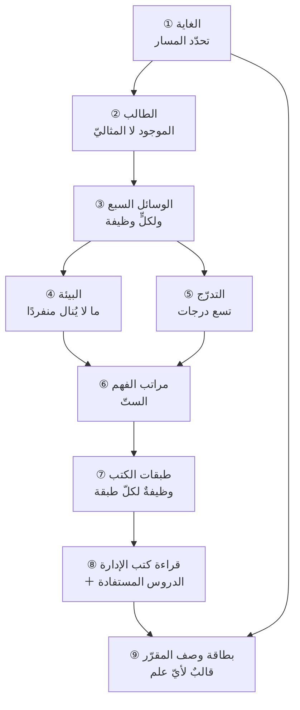

# الفصل 16 — كيف يُطلب هذا العلم؟ منهج الطلب وبطاقة وصف المقرّر

---

## 🏛️ لماذا تقرأ هذا الفصل؟

**المشكلة:** يجمع الطالب عشرين كتابًا ودورتين وشهادة، ثم يقف أمام أوّل موقف حقيقيّ عاجزًا — لأنه جمع مصادر ولم يبنِ مسارًا، ولم يسأل عن كتاب واحد منها: لماذا أقرؤه الآن؟

**وماذا لو لم تعرف؟** من لم يضع لنفسه مسارًا قرأ بترتيب ما يصل إليه لا بترتيب ما يبني عليه، فبقي في مرتبة الحفظ يحسبها نهاية الطريق. والثمن يُرى في موضعين: أنّه يُنفق سنواتٍ في تحصيلٍ لا يزيد حكمَه دقّةً، وأنّه لا يملك — حين يُسأل عن سبب اختياره — إلّا أن يقول: هكذا قرأت.

**وبعد هذا الفصل ستستطيع:**

- **أن تميّز** بين خطّة تعلّمٍ وقائمة مصادر، فتعرف من الملفّ الذي بين يديك أيحسم لك ترتيب غدٍ أم يزيدك خياراتٍ ويتركك.
- **أن تحكم على** موضعك من مراتب الفهم الستّ بعلامةٍ تُرى لا بشعورٍ بالثقة، وأن تسمّي المرتبة التي تقف عندها في مفهومٍ بعينه.
- **أن تفسّر** لماذا تُنتج عشرُ سنواتٍ من الممارسة عند رجلٍ إتقانًا وعند آخر أُلفةً، وأن تسمّي العنصر الغائب في الحال الثانية.
- **أن تصف** أيّ علمٍ جديدٍ تُقبل عليه ببطاقةٍ من خمسة حقول قبل أن تشتري له كتابًا واحدًا.

> [!info] بطاقة الفصل
> **النوع:** منهجيّ
> **المستوى:** 🟡 متوسّط
> **زمن القراءة:** نحو 50 دقيقة
> **أهمّيته في الباب:** ★★★★★
> **موضعك:** انتهيتَ من [[15 - أخلاق المهنة]] ← **⬤ أنت هنا** ← يليه [[17 - المشروع والاستخلاف]]

> [!abstract] موقع هذا الفصل
> **يبني على:** [[Brooks's Law]] · [[Systems Thinking]] · [[Deliberate Practice]] · [[Community of Practice]] — يُذكَر هنا ولا يُعاد شرحه.
> **ويؤسّس:** [[Lessons Learned]] — يُقدَّم هنا أوّل مرّة فيصير متاحًا لما بعده.

---

## 🧭 السؤال المركزي

> [!question] السؤال الذي يجيب عنه هذا الفصل كلّه
> **كيف يُطلب هذا العلم، وكيف يُوصَف أيّ علم آخر بالطريقة نفسها؟**

**واحمل معك هذه الأسئلة وأنت تقرأ:**

- إلى أيّ موقع تريد أن تصل، وما الذي يلزمه فعلًا؟
- في أيّ مرتبة من مراتب الفهم أنت الآن؟
- ما وظيفة الكتاب الذي بين يديك: أيبني تصوّرًا أم يعلّم أداة؟

---

## 🗺️ الجواب المختصر — قبل التفصيل

جوابه في جملة: **هذا العلم لا يُطلب بجمع المصادر، وإنّما بتصميم حلقةٍ تُغلَق.** فالقيد الذي يقف بينك وبين الحذق ليس عدد ما لم تقرأه بعد، بل عدد المرّات التي حكمتَ فيها على موقفٍ ثمّ رأيتَ إلامَ آل حكمُك، فعرفتَ أصبتَ أم أخطأت وبأيّ سبب. والمصادر تُوازى — تقرأ كتابين في شهرٍ وأربعةً في شهرين — **وأمّا الحلقات فتتتابع ولا تُوازى**؛ ولهذا يبلغ رجلٌ في ثلاث سنواتٍ ما لا يبلغه آخر في اثنتي عشرة، وكلاهما حاضرٌ في العمل كلّ يوم.

وهذا القيد في مهنتنا أشدّ منه في غيرها، لأنّ البيئة لا تُغلق الحلقة عنك: نتيجة قرارك تظهر بعد أشهر، وتظهر عند جهةٍ أخرى، وتصلك مخلوطةً بعشرة أسباب. **فطلبُ هذا العلم صناعةُ حلقةٍ حيث لا تعطيك البيئةُ واحدة** — بتوقّعٍ يُكتب قبل أن تظهر النتيجة، وبجماعةٍ تُمرّ بك حالاتِ غيرك بكلفة ساعةٍ بدل سنة، وبدرسٍ لا يُعدّ درسًا حتى يتغيّر به شيءٌ يمنع تكراره. **وأمّا الحقول الخمسة التي يختم بها هذا الفصل — أين موضع العلم · وما رسالته · وكيف بُني · وكيف يُطلب · وإلى أين يقود — فهي هذا كلُّه مضغوطًا في بطاقةٍ تُملأ قبل أن تشتري كتابًا واحدًا، وتصلح لأيّ علمٍ لا لهذا وحده.**

> [!abstract] مفاهيم يُدخلها هذا الفصل في قاموسك
> `Lessons Learned`

> [!warning] مفاهيم يكثر الخلط بينها هنا
> `Learning Path` مقابل `Reading List` مقابل `Certification` — احملها في ذهنك، فالفصل يفرّقها في محطّة التمييز.

---

## 🧱 الفكرة الأولى: المسار تابعٌ للغاية — فلا ترتيب واحد يلزم الجميع

*موضعها من الفصل: هي أوّل خطوةٍ لأنّها الوحيدة التي إن أخطأتَها لم ينفعك ما بعدها — والفرق عن مقدّمة الفصل أنّ تلك قالت إنّ الطلب تصميمُ حلقة، وهذه تسأل: حلقةٌ إلى أين؟*

**الفكرة الرئيسة:** لا يوجد «مسارٌ لتعلّم إدارة المشاريع». يوجد مسارٌ إلى موقعٍ بعينه، والمواقع مختلفة اختلافًا يجعل ما هو أوّل الطريق عند أحدها آخرَه عند غيره. **ومن نسخ مسار غيره فقد ورث قيده لا خبرته.**

### خمس غاياتٍ، ولكلٍّ سؤالٌ يوميّ يختلف

الخلط يقع لأنّ المسمّيات متقاربة والأعمال متباعدة. وهذه الغايات الخمس الأشيع، وأمام كلٍّ منها السؤال الذي يشغل صاحبها فعلًا في يومه:

| الغاية | سؤالها اليوميّ | المهارة القيدة | ما يُؤجَّل بلا ضرر |
|---|---|---|---|
| **مدير مشروع** | أنُسلّم ما اتُّفق عليه في مداه؟ | ضبط النطاق والتقدير والتواصل | معمارية النظم · اقتصاد المنتج |
| **مدير تقنيّ** | أهذا الحلّ يحتمل ما سيأتي بعد سنتين؟ | المفاضلة التقنية وقراءة الدَّين | إدارة المحافظ · التعاقد |
| **مدير هندسة** | أفريقي ينمو أم يستهلك نفسه؟ | بناء القدرات والتدفّق والتوظيف | تحليل السوق |
| **مدير منتج** | أنبني الشيء الذي يستحقّ أن يُبنى؟ | اكتشاف الحاجة وقياس الأثر | جدولة المسار الحرج |
| **مؤسّس** | أنبقى شهرًا آخر؟ | التمويل والبيع والاختيار | مؤسّسية العمليات |

**وأثر هذا الجدول ليس في تصنيف الناس، بل في تحرير الوقت.** فالعمود الأخير هو أنفعها: من عرف ما يؤجَّل بلا ضرر ربح أشهرًا كان سينفقها في تحصيلٍ صحيحٍ في نفسه، لا محلّ له في موضعه.

### والغاية تُصاغ قدرةً لا مسمًّى

أكثر ما يفسد هذه الخطوة أن يُكتب في خانة الغاية مسمًّى وظيفيّ: «أن أصير مدير مشاريع». وهذا لا يدلّ على شيء، لأنّ المسمّى الواحد يعني في شركةٍ ناشئةٍ من ثلاثين موظّفًا غير ما يعنيه في جهةٍ حكوميّةٍ من ثلاثة آلاف. **والصياغة التي تنفع تصف يومًا لا لقبًا:** «أن أستطيع أن أقود تسليم منتجٍ فيه ثلاثة فرق مترابطة، وأن أقول لراعي المشروع في شهره الثالث أينبغي أن يستمرّ أم يُوقَف — بدليلٍ لا بانطباع».

ومتى صيغت الغاية على هذا النحو، انكشف المسار وحده تقريبًا. فالجملة السابقة تقول صراحةً إنّ صاحبها يحتاج إلى التبعيات بين الفرق، وإلى قياس الأثر، وإلى شجاعة التوصية بالإيقاف — وهذه ثلاثة أبوابٍ يعرف الآن أين يبدأ فيها. أمّا «أن أصير مدير مشاريع» فلا تدلّه إلّا على قائمة كتبٍ عامّة.

### والغاية تتبدّل — وحينها يُعاد الترتيب ولا يُهدم

قد يُفهم من هذا أنّ الغاية تُقرَّر مرّةً فيُلزَم بها صاحبها، وليس كذلك. **فالغاية تتبدّل بأمرين مشروعين:** أن تدخل موقعًا فتراه من داخله فتكتشف أنّه ليس ما تصوّرت، أو أن يتبدّل ما تُحسنه فيفتح لك بابًا لم يكن مفتوحًا.

**والذي يُهدر بالتبدّل أقلُّ ممّا يُظنّ.** فالمراتب الستّ والدرجات التسع وطبقات الكتب لا تختصّ بغايةٍ دون أخرى، وكذلك عادةُ التوقّع المكتوب والدرسُ الشخصيّ. **والذي يسقط هو ترتيب الأولويّات وحده** — أي أيُّ الأبواب يُقدَّم وأيُّها يُؤجَّل. فمن بدّل غايته أعاد ترتيب ما بقي، ولم يبدأ من الصفر.

**وأمّا التبدّل الذي يُهدر فعلًا فله علامةٌ واحدة:** أن يتكرّر كلّ بضعة أشهرٍ بلا أن يسبقه دخولُ موقفٍ جديد. **فالتبدّل بعد تجربةٍ معرفةٌ، والتبدّل بعد قراءةِ مقالٍ حماسةٌ** — والثاني هو الذي يُنتج من قرأ في خمسة أبوابٍ ولم يبلغ في واحدٍ منها الدرجة الرابعة.

> [!example] ثلاثةٌ في الرياض، وقائمة قراءةٍ واحدة
> اتّفق ثلاثة زملاء في شركةٍ واحدةٍ على أن يقرؤوا الكتب نفسها بالترتيب نفسه، وواظبوا تسعة أشهر.
>
> - **الأوّل** كان يريد أن يقود تسليمًا لعميلٍ حكوميّ، وأشدّ ما أعياه صياغة النطاق ومسار التغيير — فانتفع بالطبقة الثالثة والرابعة من القائمة انتفاعًا مباشرًا.
> - **الثاني** كان يريد أن يتولّى فريق هندسةٍ من تسعة، ومشكلته أنّ نصف وقت فريقه يذهب في الانتظار — وقائمةُ القراءة لم يكن فيها عن التدفّق والقدرة إلّا فصلٌ واحد، فخرج بعد تسعة أشهرٍ بلغةٍ جديدةٍ ومشكلةٍ قديمة.
> - **الثالث** كان يريد أن يؤسّس، وقيدُه أن يعرف أيّ الأفكار يستحقّ أن يُبنى أصلًا — وكانت القائمة كلّها في **كيف يُنفَّذ**، وسؤاله في **ماذا يُنفَّذ**.
>
> والقائمة لم تكن رديئة. **كانت قائمةً واحدةً لثلاث غايات.**

> [!tip] كيف تستعمل هذه الفكرة — بطاقة الغاية
> ثلاث خاناتٍ تُملأ في عشر دقائق، ولا تُقبل واحدةٌ منها فارغةً ولا مصوغةً بلقب:
>
> 1. **اليوم الذي أريده:** اكتب فقرةً واحدةً تصف يوم عملٍ بعد ثلاث سنين — ماذا يُطلب منك فيه، وما القرار الذي تُوقّع عليه.
> 2. **شخصٌ يشغله فعلًا:** اسم إنسانٍ تعرفه أو تستطيع الوصول إليه يعمل هذا العمل اليوم. فإن لم تجد أحدًا، فأنت لا تعرف الموقع بعدُ معرفةً تكفي لأن تقصده.
> 3. **ثلاثة أفعالٍ أسبوعية لا أستطيعها:** ثلاثة أشياء يفعلها ذلك الشخص كلّ أسبوعٍ ولا تستطيعها اليوم. **وهذه الثلاثة هي خطّتك**، وما عداها تحصيلٌ عامّ.
>
> **وألفاظٌ لا تُقبل في الخانات:** «التطوّر» · «القيادة» · «النموّ المهنيّ» · «أن أكون أفضل». فهذه تُملأ بها الخانة ولا يُملأ بها فراغ المعرفة.

> [!warning] الحفرة الشائعة — الوسيلة تنتحل موضع الغاية
> يُكتب في خانة الغاية: «أن أحصل على شهادة PMP». وهذه ليست غايةً بل وسيلة، وحين تحتلّ موضع الغاية يصير المقياس **اجتياز اختبار** لا **أداء عمل** — فيُقرأ ما يُسأل عنه ويُترك ما يُحتاج إليه، وهما لا يتطابقان.
>
> **وصورةٌ مصغّرة تقع فعلًا:** مهندسٌ قال إنّه يريد أن يصير «مدير مشاريع». فلمّا سُئل أن يصف يومه المطلوب، وصف يومًا كلُّه مراجعةُ تصاميم وقراراتُ معمارية وتوجيهُ مهندسين — وذلك يوم **مدير هندسة** لا مدير مشروع. وكان قد بدأ بقراءة دليل معرفة إدارة المشاريع، وليس فيه من يومه المطلوب شيء.

> [!question]- تأكّد أنك فهمت — لماذا لا تُصاغ الغاية بالمسمّى الوظيفيّ؟
> **لأنّ المسمّى الواحد يصف أعمالًا مختلفةً باختلاف حجم المنظّمة وقطاعها ونضجها، فلا يدلّ على مهارةٍ بعينها.** والصياغة بالقدرة — «أن أستطيع أن أفعل كذا في موقفٍ كذا» — تدلّ على المهارة القيدة مباشرةً، فتنكشف بها الخطوة التالية. والمسمّى يصلح **بعد** أن تُصاغ القدرة، لا قبلها.

> [!summary]- خلاصة الفكرة في سطرين
> **الدعوى:** لا مسار واحدًا لهذا العلم، وإنّما مسارٌ لكلّ غاية، والغاية تُصاغ قدرةً في يومٍ لا لقبًا في بطاقة.
> **ولازمها:** أنّ أوّل ما تكتبه ليس قائمة كتب، بل ثلاثة أفعالٍ أسبوعية يفعلها من تريد أن تصير مثله ولا تستطيعها اليوم.

> [!question] تأمّلٌ تطبيقيّ — لا جواب له في هذا الفصل
> استحضر آخر كتابٍ أو دورةٍ بدأتَها في هذا المجال، ثمّ اسأل: أيَّ فعلٍ من الأفعال الثلاثة كانت تخدم؟ فإن لم تجد لها موضعًا في الثلاثة، فمن أين جاءت — من حاجتك أم من ترشيحٍ رآه غيرُك نافعًا لغايةٍ غير غايتك؟

---
## 🧱 الفكرة الثانية: الخطّة تُصمَّم للطالب الموجود لا للطالب المثاليّ

*موضعها من الفصل: عرفتَ إلى أين تمضي، ويبقى من أين تنطلق — والفرق عن سابقتها أنّ تلك وصفت الوِجهة، وهذه تصف الراكب: وقتَه الحقيقيّ، وموضعَه من الممارسة، وما يستطيع أن يواظب عليه فعلًا.*

**الفكرة الرئيسة:** أكثر خطط التعلّم تفشل لا لخطأٍ في محتواها، بل لأنّها صُمِّمت لطالبٍ لا وجود له: يملك عشر ساعاتٍ أسبوعيًّا، ويجد من يراجع له، ويطبّق ما يقرأ في اليوم التالي. **والخطّة التي تفترض ما ليس موجودًا تُهجَر في أسبوعها الثالث، ثمّ يُحسَب هجرُها ضعفًا في العزم وهو خطأٌ في التصميم.**

### أربعة مدخلاتٍ تُقاس قبل أن تُكتب خطوة

1. **مستواك الحقيقيّ في المفهوم بعينه** — لا في المجال كلّه. فقد تكون في التقدير مبتدئًا وفي إدارة أصحاب المصلحة متمرّسًا، وخطّةٌ تُسوّي بينهما تُضيع وقتك في نصفها.
2. **وقتك الفعليّ** — لا المرجوّ. والقياس ماضٍ لا نيّة: كم ساعةً بذلتَ في التعلّم في الأسابيع الأربعة الماضية فعلًا؟ **ذلك رقمك**، وابنِ عليه ولو كان ساعتين.
3. **موضعك من الممارسة** — وهذا أخطرها وأكثرها إغفالًا: **أعندك اليوم مشروعٌ تجري عليه ما تتعلّمه؟** فمن لا مشروع له يلزمه مسارٌ مختلفٌ في بنيته لا في ترتيبه، وسيأتي في الفكرة الثالثة.
4. **طريقة تعلّمك** — بمعنًى عمليّ لا نفسانيّ: أتُثبِّت الفهمَ بالكتابة أم بالشرح لغيرك أم بالتجريب المباشر؟ والجواب يُعرف بالنظر في ما ثبت معك من قبلُ، لا باختيارٍ تختاره الآن.

**وإنّما قُيّد الرابع بهذا القيد عمدًا**، لأنّ ما شاع في موادّ التدريب من «أنماط التعلّم» — سمعيٌّ وبصريٌّ وحركيّ — لم تجد فرضيّتُه سندًا كافيًا حين فُحص، والمقصود هنا غيره: **ليس نمطًا تُصنَّف به، بل عادةً ثبت أثرُها عندك بالتجربة.** فمن وجد أنّ ما يشرحه لغيره يبقى معه أطولَ ممّا يلخّصه لنفسه، **فتلك معلومةٌ عن نفسه اكتسبها بالفحص لا بالاختبار النفسانيّ**، وهي التي تُبنى عليها خطّته.

### وشروط التمرين المتعمّد — معيار تصميمٍ لا وعدًا

يُقال في هذا الباب كلامٌ كثيرٌ عن «السنوات»، وأدقُّ ما قيل فيه أنّ السنوات وحدها لا تفسّر شيئًا. فقد حرّر عالم النفس **أندرس إريكسون (K. Anders Ericsson)** وزملاؤه سنة 1993 مفهومَ [[Deliberate Practice|التدريب المتعمّد]]، وخلاصته أنّ التمرين الذي يُنتج إتقانًا يجتمع فيه أربعة: **هدفٌ ضيّقٌ أصعب قليلًا ممّا تُتقنه · وتركيزٌ كاملٌ يُجهِد · وتغذيةٌ راجعةٌ سريعةٌ تقول أين الخطأ بالضبط · وتكرارٌ على الموضع الضعيف وحده لا على الأداء كلّه.**

**ولازمه القاسي:** أنّ الخبرة المتراكمة بلا تصميمٍ تُنتج **أُلفةً** لا إتقانًا — فمن مارس عملًا عشرين سنةً على النمط نفسه قد يكون كرّر سنته الأولى عشرين مرّة. وهذا وحده يفسّر ما تراه من رجلين في القسم نفسه: مضى على كليهما عشر سنين، وأحدهما يقرأ الموقف قراءةً لا يستطيعها الآخر.

> [!info] إضافة مرجعية — حدُّ هذا المفهوم وأين يُساء استعماله
> شروط إريكسون نشأت في مجالاتٍ ذات **قواعد مستقرّة ومعايير أداء واضحة**: الموسيقى والشطرنج والرياضة والجراحة. أمّا الإدارة فمجالٌ مفتوحٌ ضعيف التغذية الراجعة، وقد جرى — ولا يزال — جدلٌ أكاديميٌّ حقيقيّ في حجم أثر التمرين مقارنةً بغيره من العوامل، وفي قابلية نتائجه للتعميم. **فالموقف المهنيّ السليم أن تُتّخذ الشروط الأربعة معيارًا تُصمَّم به حلقة التعلّم، لا وعدًا بأنّ تكرارًا كافيًا يصنع خبيرًا في كلّ مجال.**
>
> **وأمّا «قاعدة العشرة آلاف ساعة» فلم يقلها إريكسون**، بل هي صيغةٌ مبسَّطةٌ انتشرت عبر كتّابٍ آخرين، **وقد اعترض عليها هو نفسه صراحةً** لأنّها اختزلت أطروحته في الكمّ وأسقطت جوهرها وهو نوعيّة التمرين وشروطه.

والشرط الثالث — التغذية الراجعة السريعة الدقيقة — هو أصعب الأربعة في مهنتنا وأهمُّها، وهو بعينه ما قيل في مقدّمة هذا الفصل. ولهذا يُعوَّض عن تأخّره بآلاتٍ تُصنع صنعًا: توقّعٌ مكتوبٌ قبل النتيجة، ومراجعةٌ منظَّمةٌ بعدها، ومرشدٌ يرى ما لا تراه. **والفكرة الثالثة والرابعة في هذا الفصل ليستا إلّا تفصيلًا لهذه الآلات الثلاث.**

> [!example] خطّةٌ ماتت في أسبوعها الثالث
> وضع مهندسٌ في جدّة خطّةً لستّة أشهر: كتابان في الشهر، ودورةٌ مسجَّلةٌ ساعتين أسبوعيًّا، وملخّصٌ مكتوبٌ لكلّ فصل. وحسبها معتدلة.
>
> وكانت ساعاته الفعليّة في الأسابيع الأربعة السابقة **ساعةً وأربعين دقيقة** في المجموع. فالخطّة كانت تطلب منه ستّة أضعاف ما بذله فعلًا، لا زيادةً يسيرة.
>
> ومضى أسبوعان، ثمّ تعثّر في الثالث، ثمّ ترك — وقال لنفسه إنّه «لا ينضبط». **ولو كتب في الخانة الأولى رقمَه الحقيقيّ لخرجت الخطّة كتابًا واحدًا كلّ ستّة أسابيع وتمرينًا واحدًا في الأسبوع، ولأتمّها.** والفرق بين الخطّتين ليس في الطموح بل في أنّ إحداهما تصف طالبًا موجودًا.

> [!tip] كيف تستعمل هذه الفكرة — بطاقة الطالب
> خمس خاناتٍ تُملأ بالأرقام والأسماء لا بالنيّات:
>
> | الخانة | ما يُكتب فيها | ما لا يُقبل |
> |---|---|---|
> | **ساعاتي الفعليّة** | مجموع ساعات آخر أربعة أسابيع مقسومًا على أربعة | «سأخصّص…» |
> | **مشروعي الجاري** | اسم مشروعٍ أو مهمّةٍ أعمل عليها هذا الشهر | «قريبًا سيكون…» |
> | **أضعف موضعٍ عندي** | مهارةٌ واحدةٌ ضيّقة، مشخَّصةٌ بموقفٍ أخفقتُ فيه | «التخطيط عمومًا» |
> | **من يعطيني التغذية الراجعة** | اسمُ شخصٍ أو آليّةٌ مسمّاة | «سأطلب من أحدهم» |
> | **موعدي المحجوز** | يومٌ وساعةٌ في التقويم | «وقت الفراغ» |
>
> **والخانة التي تعجز عن ملئها باسمٍ أو رقمٍ هي أوّل عملك**، لا الكتاب الذي كنت ستبدأ به.

> [!warning] الحفرة الشائعة — أن يُحسَب خطأُ التصميم ضعفًا في العزم
> حين تُهجَر الخطّة يُفسَّر الهجر بالنفس: «لا أواظب». وهذا التفسير مريحٌ لأنّه يُبقي الخطّة سليمة، **وهو أيضًا الذي يمنع إصلاحها** — إذ المرّة القادمة تُوضع الخطّة نفسها ويُشتدّ على النفس، فيقع ما وقع.
>
> **وصورةٌ مصغّرة:** ثلاثة زملاء وضعوا خطّة قراءةٍ مشتركة، فتوقّف اثنان في الشهر الثاني، فزادوا في الشهر الثالث «التزامًا بالحضور» ولم ينقصوا صفحةً واحدة. وتوقّف الثالث في الرابع. **والخطّة لم تُراجَع مرّةً واحدة.**

> [!question]- تأكّد أنك فهمت — لماذا يُقاس الوقت بالماضي لا بالنيّة؟
> **لأنّ النيّة تصف أعلى ما تستطيعه في أسبوعٍ صافٍ، والماضي يصف متوسّطك في أسابيعك الحقيقية بمقاطعاتها وطوارئها.** والخطّة تجري على المتوسّط لا على الذروة، فمن بناها على الذروة بنى على حالٍ تقع مرّةً في الشهر. **والرقم الصغير الصادق يُنتج خطّةً تتمّ؛ والرقم الكبير المرجوّ يُنتج خطّةً تُهجَر ثمّ يُلام صاحبها.**

> [!summary]- خلاصة الفكرة في سطرين
> **الدعوى:** الخطّة تُبنى على أربعة مقيسة — المستوى في المفهوم بعينه، والساعات الماضية، ووجود مشروعٍ تجري عليه، وما يُثبّت الفهم عندك — لا على طالبٍ مثاليّ.
> **ولازمها:** أنّ هجر الخطّة عَرَضٌ يُشخَّص في تصميمها أوّلًا، ولا يُردّ إلى العزم إلّا بعد أن تُراجَع أرقامها.

> [!question] تأمّلٌ تطبيقيّ — لا جواب له في هذا الفصل
> احسب الآن ساعاتك الفعليّة في الأسابيع الأربعة الماضية، ثمّ انظر في آخر خطّةٍ وضعتها: كم ضِعفًا كانت تطلب؟ وإن كانت أكثر من الضعف، فما الذي كنتَ تفترضه في نفسك حين كتبتها؟

---

## 🧱 الفكرة الثالثة: الوسائل سبعٌ، ولا تُغني إحداها عن الأخرى — لأنّ لكلٍّ وظيفةً لا تؤدّيها غيرها

*موضعها من الفصل: صار عندك وِجهةٌ وطالبٌ موصوف، ويبقى بأيّ شيءٍ يُقطع الطريق — والفرق عن سابقتها أنّ تلك قاست الطاقة، وهذه توزّعها؛ إذ أكثر الطاقة تُنفق في وسيلةٍ واحدةٍ رخيصةٍ وتُترك ستّ.*

**الفكرة الرئيسة:** وسائل الطلب سبع، وكلٌّ منها تعطي شيئًا لا تعطيه الأخرى. **والخلل الأشيع ليس ترك الوسائل كلّها، بل استبدال الرخيصة بالغالية**: تُقرأ الكتب فيُظنّ أنّ ذلك يُغني عن التطبيق، وتُحضر الدورات فيُظنّ أنّ ذلك يُغني عن المراجعة.

### ما تعطيه كلُّ وسيلةٍ وما لا تعطيه أبدًا

| الوسيلة | ما تعطيه وحدها | وما لا تعطيه أبدًا |
|---|---|---|
| **المعلّم** | يختصر عليك سنواتٍ من الترتيب، ويريك ما لا تعرف أنّك تجهله | لا يُنقل به الحكم؛ فالحكم يحتاج أن تدفع ثمن قرارك أنت |
| **الكتاب** | التصوّر المنظّم والمصطلح الدقيق والأصول التي يقوم عليها الباب | لا يقول لك ما يصلح لحالتك بعينها |
| **المشروع** | الموقف الحقيقيّ بقيوده وثمنه — وهو الوحيد الذي يكشف ما تظنّه فهمًا | لا يعطي إطارًا يفسّر ما وقع، فيبقى حادثةً لا قاعدة |
| **المراجعة** | تحوّل ما وقع إلى قاعدةٍ تُستعمل مرّةً ثانية | لا تُنشئ تجربةً لم تقع |
| **المناقشة** | تكشف الخلل في حجّتك حين تُقال بصوتٍ مسموع | لا تُنتج معرفةً ليست عند أحد الطرفين |
| **الاختبار** | يميّز ما تعرفه ممّا تألفه، ويكسر الطلاقة الكاذبة | لا يقيس إلّا ما وُضع لقياسه، وهو أضيق من العمل |
| **التغذية الراجعة** | تربط ما فعلتَه بما ترتّب عليه — وهي عصب الحلقة كلّها | لا تصلح إن جاءت متأخّرةً أو عامّةً أو مجاملة |

**وقاعدة الجدول:** أنّ العمود الأوسط لا يُقرأ وحده. فمن قرأ فيه «الكتاب يعطي التصوّر» فرح، ومن قرأ العمود الثالث معه علم لماذا خرج من عشرين كتابًا بلغةٍ غنيّةٍ وحُكمٍ لم يتغيّر.

### ولماذا يقع الاستبدال؟ لأنّ نظام تعلّمك له قيدٌ واحدٌ وأنت تزيد في غيره

انظر إلى تعلّمك بعين [[Systems Thinking|تفكير الأنظمة]]: هو نظامٌ له **مدخلات** (ما تقرأ وتسمع)، و**مخزون** (ما استقرّ عندك)، و**حلقةٌ راجعة** (ما جرّبتَه فرأيتَ أثره)، و**تأخيرٌ** بين الفعل والنتيجة. ثمّ اسأل: **أين القيد؟**

عند أكثر الناس القيد في الحلقة لا في المدخل. **وزيادةُ المدخل على نظامٍ قيدُه في مخرَجه لا تُنتج إنتاجًا، وإنّما تُنتج مخزونًا يتكدّس** — كوّمَ كتبٍ مقروءةٍ لا قدرةً على القرار. وهذه هي عينها القاعدة التي تعرفها في العمل: أنّ إغراق نظامٍ مختنقٍ بمزيدٍ من الطلبات يطيل الطابور ولا يزيد التسليم.

**وأمّا لماذا نستبدل الرخيصة بالغالية فله سببٌ بنيويّ لا كسليّ:** أنّ القراءة تعطي تغذيةً راجعةً فوريّة — صفحةٌ انتهت، وفصلٌ طُوي، وشعورٌ واضحٌ بالتقدّم — والممارسةُ تعطيها بعد أشهر، مخلوطةً، وربّما لم تعطها أصلًا. **فيُختار ما يعطي الإشارة الأسرع لا ما يعطي الأثر الأكبر**، ويستمرّ الاختيار سنين لأنّه مُعزَّزٌ في كلّ مرّة.

### فكيف تُصنع التغذية الراجعة حيث لا تعطيها البيئة؟ ثلاث آلات

الوسيلة السابعة أعلى السبع أثرًا وأقلُّها إتاحةً في مهنتنا، ولذلك تُصنع صنعًا. وهذه ثلاث آلاتٍ مرتّبةٍ من الأرخص إلى الأغلى، والأولى منها لا تحتاج إذنًا من أحد:

1. **التوقّع المكتوب قبل النتيجة.** سطرٌ واحدٌ قبل القرار: ما الذي أظنّ أنّه سيقع، ومتى، **وبأيّ علامةٍ أعرف أنّي أخطأت**. وقيمتُه أنّه يمنع الذاكرة من أن تُعيد تشكيل ظنّك على صورة ما وقع — وهي تفعل ذلك بلا أن تشعر، فيَصدُق كلُّ أحدٍ في نظر نفسه. **والعلامة المُبطِلة هي أهمّ الثلاثة**، لأنّ التوقّع الذي لا يُتصوَّر خطؤه لا يُفحَص.
2. **أقرب وكيلٍ متاحٍ عن الأثر.** أكثر ما يمنع الحلقة أنّ الأثر الحقيقيّ بعيدٌ أو مملوكٌ لجهةٍ أخرى، فيُترك القياس كلُّه. **والصواب أن يُؤخذ أقربُ ما يُتاح ولو كان ناقصًا**: عدد التذاكر الواردة في الشهر الأوّل، أو زمن إنجاز عمليةٍ واحدةٍ قبل التغيير وبعده. **والوكيل الناقص المعلوم نقصُه خيرٌ من انتظار المقياس الكامل**، لأنّ الثاني لا يجيء ويُبقيك بلا حلقةٍ سنوات.
3. **أن يصير الوصول إلى النتيجة بندًا لا رجاءً.** فمن سلّم ثمّ انصرف لا يعرف أثر عمله أبدًا. **والعلاج بنيويّ لا شخصيّ:** أن يُكتب في العقد أو في تعريف الاكتمال أنّ للفريق مراجعةً بعد ثلاثة أشهرٍ من التشغيل يُعرَض فيها رقمان متّفق عليهما. **وثمنُه سطرٌ في وثيقة، وعائدُه أن يبقى الفريق يتعلّم بعد أن سلّم.**

**والثلاث تشترك في أصلٍ واحد:** أنّ ما لا يُكتب قبل النتيجة لا يُفحَص بعدها.

> [!example] خمسة كتبٍ في التقدير، وتقديرٌ واحدٌ لم يُكتب
> قرأ مديرٌ في الدمّام خمسة كتبٍ ومقالاتٍ كثيرةً في التقدير، وصار يتكلّم في مخروط عدم اليقين والتقدير النسبيّ ومصادر التحيّز كلامًا صحيحًا.
>
> وحين رُوجعت تقديراته في تسعة أشهر، لم يُوجد بينها **تقديرٌ واحدٌ كُتب قبل التنفيذ ثمّ قُورن بما وقع**. كان يُعطي الرقم شفهيًّا في الاجتماع، ثمّ يُنسى الرقم وتبقى النتيجة.
>
> **فالمدخل عنده وافر، والحلقة مفتوحة.** ولو كتب رقمه ومداه في سطرٍ واحدٍ قبل كلّ مهمّة، وفتح السطر بعدها، لكان عنده في تسعة أشهرٍ ثلاثون حلقةً مغلقة — وهي أنفع له من الكتاب السادس.

> [!tip] كيف تستعمل هذه الفكرة — ميزان الوسائل السبع
> اكتب الوسائل السبع في عمود، وأمام كلٍّ منها **تاريخ آخر مرّةٍ استعملتَها فيها استعمالًا حقيقيًّا** — لا نيّةً ولا استعمالًا عابرًا:
>
> - المعلّم: آخر مرّةٍ عرضتَ فيها موقفًا على من هو أعلم منك وطلبتَ رأيه؟
> - الكتاب: آخر كتابٍ أتممتَه؟
> - المشروع: آخر شيءٍ طبّقتَه في عملٍ حقيقيّ؟
> - المراجعة: آخر مرّةٍ نظرتَ فيها في قرارٍ ماضٍ لك بعد ظهور نتيجته؟
> - المناقشة: آخر مرّةٍ عرضتَ فيها رأيك على من يخالفه؟
> - الاختبار: آخر مرّةٍ حاولتَ أن تشرح مفهومًا فوجدتَ أنّك لا تُحكمه؟
> - التغذية الراجعة: آخر مرّةٍ عرفتَ فيها أثرَ فعلٍ فعلتَه؟
>
> **والصفوف التي مضى عليها أكثر من ستّة أشهر هي خطّتك للربع القادم** — لا الكتاب التالي.

> [!warning] الحفرة الشائعة — وهم الاستهلاك
> أن يُحسَب المستهلَك محصَّلًا: ثلاثون ساعةَ دوراتٍ مشاهَدة، وأربعُ مئة صفحةٍ مقروءة، ودفترُ ملخّصاتٍ ممتلئ. وكلُّ ذلك مدخلات، **ولم يُسأل عن واحدةٍ منها: أيَّ قرارٍ غيّرت؟**
>
> **وصورةٌ مصغّرة:** فريقٌ حضر ورشةً في تقدير الأعمال، وخرج بانطباعٍ ممتاز. وبعد أربعة سبرنتات كان يقدّر بالطريقة نفسها التي كان يقدّر بها قبلها، ولم يتغيّر إلّا اسمُ الوحدة التي يقدّر بها. **الورشة نُقلت، ولم تُغلق عليها حلقة.**

> [!question]- تأكّد أنك فهمت — لماذا لا تكفي زيادة القراءة وإن كانت في الموضع الصحيح؟
> **لأنّ القراءة تزيد في المدخل، والقيد عند أكثر الناس في الحلقة الراجعة.** والزيادة على غير موضع القيد تُنتج مخزونًا يتكدّس لا قدرةً تُستعمل — ويظهر ذلك في علامةٍ واحدة: أن تتّسع لغتُك ولا يتغيّر قرارُك. **والعلاج ليس أن تقرأ أقلّ، بل أن تُغلق على ما قرأتَه حلقةً واحدةً على الأقلّ قبل أن تفتح التالي.**

> [!summary]- خلاصة الفكرة في سطرين
> **الدعوى:** الوسائل سبعٌ لكلٍّ وظيفةٌ لا تؤدّيها غيرها، والخلل استبدالُ الرخيصة سريعةِ الإشارة بالغالية بطيئةِ الأثر.
> **ولازمها:** أنّ خطّة الربع القادم تُشتقّ من الوسيلة التي مضى عليها أطول وقتٍ بلا استعمال، لا من الوسيلة التي تُحسنها.

> [!question] تأمّلٌ تطبيقيّ — لا جواب له في هذا الفصل
> املأ ميزان الوسائل السبع الآن بالتواريخ. أيُّ صفٍّ فيه أقدم تاريخ؟ ثمّ اسأل نفسك سؤالًا أصعب: **أهو أقدمها لأنّه أقلّها نفعًا لك، أم لأنّه أغلاها ثمنًا عليك؟**

---
## 🧱 الفكرة الرابعة: البيئة تعطيك ما لا تُنال بالاجتهاد المنفرد — لأنّ الخبرة لا تُوازى

*موضعها من الفصل: عرفتَ الوسائل، وأربعٌ منها لا تعمل إلّا بوجود آخرين — والفرق عن سابقتها أنّ تلك عدّت الأدوات وهذه تسأل: من أين تجيء الحالاتُ التي تتمرّن عليها أصلًا؟*

**الفكرة الرئيسة:** ثلاثة أشياء لا يعطيها إلّا وجود الآخرين: **الحالات التي لم تمرّ بك** · **الردّ الذي يكشف ما لا تعرف أنّك تجهله** · **معايرة حكمك بأن ترى كيف يحكم غيرُك على الموقف نفسه.** ومن طلب هذه الثلاثة منفردًا طلب المستحيل، لا لضعفٍ فيه بل لأنّها لا تُوجد عنده أصلًا.

### ولماذا هي بالذات ممّا لا يُنال منفردًا؟

انظر في قانونٍ تعرفه من موضعٍ آخر: [[Brooks's Law|قانون بروكس]]. قال فريدريك بروكس سنة 1975 إنّ إضافة قوى عاملةٍ إلى مشروعٍ برمجيٍّ متأخّرٍ تزيده تأخّرًا، وردّ ذلك إلى أصلٍ أعمّ في تسمية كتابه نفسها: **أنّ الرجال والأشهر ليسا قابلين للتبادل إلّا في العمل القابل للتجزئة تجزئةً تامّة.** وضرب لذلك مثالًا صار مشهورًا: أنّ حمل الطفل تسعةُ أشهرٍ مهما بلغ عدد النساء الموكَّل إليهنّ.

**وهذا بعينه ينطبق على بناء الحكم.** فأنت لا تستطيع أن تُوازي تجاربك: لا يمكنك أن تدير أربعة مشاريع في وقتٍ واحدٍ لتحصّل خبرة أربعٍ في مدّة واحد، لأنّ الذي يبني الحكم هو **الدورة الكاملة**: تحكم، ثمّ تنتظر، ثمّ ترى، ثمّ تراجع. والانتظار جزءٌ من الدورة لا فضلةٌ فيها.

**لكنّ شيئًا واحدًا يقبل التوازي وهو التعرّض.** فحالةُ زميلك التي مرّت به في ثمانية أشهر تصلك أنت في ساعةٍ إذا عُرضت عرضًا صحيحًا: قرارُه الذي اتّخذه، وما توقّعه حينها، وما وقع فعلًا. **فالجماعة هي الآلة الوحيدة التي تجعل خبرةً غيرَ قابلةٍ للتوازي تبدو متوازية** — لا لأنّها تختصر دوراتك أنت، بل لأنّها تضمّ إليك دورات غيرك.

**وحدُّه لازمٌ لئلّا تُطلب من الحكاية ما ليس فيها:** الذي يُنقل بها هو **التعرّض للنمط** — أن ترى موقفًا لم تره وتعرف أنّه يوجد. **وأمّا الحكم فلا ينتقل**، لأنّه يقوم على أنّك دفعتَ ثمن قرارك ورأيتَ أثره في نفسك. ولهذا تجد من سمع مئة حكايةٍ ثمّ وقع في الموقف فتصرّف كمن لم يسمع شيئًا: سمع، ولم يمرّ به.

### وجماعة الممارسة ليست فريقًا ولا لجنةً ولا قائمةً بريدية

للمعنى المقصود اسمٌ محرَّر: [[Community of Practice|جماعة الممارسة]]، صاغه **جان ليف وإتيان فينجر** سنة 1991. **والفارق الذي يميّزها أنّ الفريق يجتمع على عمل، والجماعة تجتمع على حِرفة** — فالفريق ينحلّ إذا انتهى عمله، والجماعة تبقى ما بقيت الحِرفة. وتقوم على ثلاثة مجتمعة: **مجالٍ** يعرّف حدودها، و**جماعةٍ** تتفاعل تفاعلًا منتظمًا، و**ممارسةٍ** تُنتج ذخيرةً مشتركةً من الحلول والقوالب والقواعد. وغيابُ الثالث هو الذي يحوّلها إلى مجموعةِ محادثةٍ نشيطةٍ لا تُخرج شيئًا.

> [!example] خمسةٌ وحالةٌ واحدةٌ كلَّ شهر
> اتّفق خمسة من مديري المشاريع في جدّة على لقاءٍ شهريٍّ مدّته تسعون دقيقة، بشرطٍ واحد: **أن يعرض واحدٌ منهم حالةً حقيقيّةً واحدةً جاريةً عنده** — لا موضوعًا عامًّا ولا كتابًا قرأه.
>
> وكان ترتيب اللقاء ثابتًا: يعرض صاحبُ الحالة الموقف والقرار الذي يميل إليه **وتوقّعه لما سيقع**، ثمّ يسأل الأربعة أسئلةً لا يعطون نصائح، ثمّ يخرج بقرارٍ واحدٍ يكتبه. وفي اللقاء الذي يليه يُفتح ما كُتب.
>
> ورأى كلٌّ منهم في سنةٍ واحدةٍ **اثنتي عشرة حالةَ تعثّرٍ مختلفة**، بينها ثلاثٌ ما كان ليمرّ بها في عشر سنواتٍ من موقعه.
>
> **وأهمّ ما في الترتيب شرطان:** أنّ التوقّع يُقال قبل النتيجة فيصير اللقاء التالي حلقةً مغلقة، وأنّ الأربعة يسألون ولا ينصحون — فالنصيحة تُنهي التفكير عند صاحب الحالة، والسؤال يُتمّه.

> [!tip] كيف تستعمل هذه الفكرة — عقد الحلقة في خمسة بنود
> إن لم تجد جماعةً فأنشئ واحدةً صغيرة. وهذه بنودها، تُنسخ وتُملأ:
>
> | البند | ما يُكتب |
> |---|---|
> | **العدد** | من ثلاثةٍ إلى ستّة — أقلُّ من ثلاثةٍ حوارٌ، وأكثرُ من ستّةٍ ندوة |
> | **المادّة** | حالةٌ حقيقيّةٌ واحدةٌ جاريةٌ عند أحدكم، باسم صاحبها ووقتها |
> | **التوقّع** | يقول صاحب الحالة ما يظنّ أنّه سيقع **قبل** أن يقع، ويُكتب |
> | **الأدب** | أسئلةٌ لا نصائح — ويُذكَّر به في أوّل كلّ لقاء |
> | **المخرَج** | قرارٌ واحدٌ يخرج به صاحب الحالة، ويُفتح في اللقاء التالي |
>
> **وألفاظٌ لا تُقبل في خانة المادّة:** «نتناقش في أجايل» · «نتحدّث عن التقدير» · «موضوع مفتوح». فالموضوع العامّ يُنتج آراءً، والحالة المعيَّنة تُنتج معايرة.

> [!warning] الحفرة الشائعة — الجماعة تُقاس بحركتها لا بذخيرتها
> تُقاس المجموعة بعدد أعضائها وغزارة رسائلها، وكلاهما مؤشّر حركةٍ لا مؤشّر أثر. **والعلامة الحاسمة سؤالٌ واحد: ما الذي تملكه الجماعة اليوم ولم تكن تملكه قبل سنة؟** قالبٌ، أو قاعدةٌ متّفق عليها، أو حلٌّ لمشكلةٍ متكرّرة. فإن لم يوجد شيء، فهي قائمةٌ بريديةٌ نشِطة.
>
> **وصورةٌ مصغّرة:** مجموعةٌ مهنيّةٌ فيها ألفٌ ومئتا عضو، تُنشر فيها المقالات يوميًّا. وحين سُئل أعضاؤها عن حالةٍ واحدةٍ عُرضت فيها بتفاصيلها ثمّ عُرفت نتيجتها، لم يُذكر مثالٌ واحد. **حركةٌ كثيرةٌ وذخيرةٌ خالية.**

> [!question]- تأكّد أنك فهمت — ما الذي ينتقل بالجماعة وما الذي لا ينتقل؟
> **ينتقل التعرّض للنمط: أن ترى موقفًا لم يمرّ بك فتعرف أنّه ممكن، وأن ترى كيف حكم غيرُك عليه فتُعاير حكمك.** ولا ينتقل الحكم نفسه، لأنّه يُبنى بأن تدفع ثمن قرارك وترى أثره في موقعك. **وأثر ذلك عمليّ:** أنّ الجماعة تسرّع تعلّمك ولا تُغني عن مشروعك — فمن حضر ولم يعرض حالته قطُّ أخذ نصف ما فيها.

> [!summary]- خلاصة الفكرة في سطرين
> **الدعوى:** دوراتُ خبرتك لا تُوازى، والتعرّضُ يُوازى — وجماعة الممارسة هي الآلة التي تضمّ إليك دورات غيرك.
> **ولازمها:** أنّ الجماعة تُقاس بذخيرتها لا بحركتها، وأنّ الحالة المعيَّنة بتوقّعٍ مكتوبٍ أنفعُ من عشرة موضوعاتٍ عامّة.

> [!question] تأمّلٌ تطبيقيّ — لا جواب له في هذا الفصل
> اكتب أسماء ثلاثة أشخاصٍ تستطيع أن تعرض عليهم موقفًا حقيقيًّا هذا الشهر وتسمع رأيهم. فإن عجزتَ عن إتمام الثلاثة، فهذه — لا قائمة الكتب — أوّل مهمّةٍ عندك.

---

## 🧱 الفكرة الخامسة: التدرّج تسع درجات، وقفزُ الدرجة يُنتج من يعرف ولا يستطيع

*موضعها من الفصل: صار عندك وِجهةٌ وطاقةٌ ووسائلُ وبيئة، ويبقى الترتيب — والفرق عن سابقتها أنّ تلك وصفت من أين تجيء الحالات، وهذه تصف بأيّ حجمٍ تُؤخذ حتّى لا تسبق قدرتَك.*

**الفكرة الرئيسة:** لهذا العلم تسع درجاتٍ يصعد فيها الطالب: **المفاهيم ← الأدوات ← الأطر ← المشاريع الصغيرة ← المتوسّطة ← الفرق ← المؤسّسات ← البرامج ← المحافظ.** والثلاث الأولى تُنال بالتحصيل، **والستّ بعدها لا تُنال إلّا بالتعرّض** — ومن قفز منها درجةً صار يعرف ما لا يستطيع.

### والدرجات لا تزيد الحجم، وإنّما تُبدّل السؤال

الوهم الشائع أن يُظنّ أنّ الصعود توسيعٌ لما تفعله: مشروعٌ أكبر، وفريقٌ أكثر، وميزانيةٌ أعلى. وليس كذلك. **فكلّ درجةٍ تُبدّل السؤال الذي تقف عنده:**

| الدرجة | السؤال الذي يشغلك عندها | وما الذي يصير مسلَّمًا |
|---|---|---|
| المفاهيم · الأدوات · الأطر | ما اسم هذا؟ وكيف يُستعمل؟ | لا شيء بعدُ |
| المشاريع الصغيرة | أنُسلّم في المدى؟ | المصطلح |
| المشاريع المتوسّطة | أين التبعيات وما الذي يُقايَض؟ | التسليم في ذاته |
| الفرق | كيف يتدفّق العمل وكيف تُبنى القدرة؟ | إنجاز الأفراد |
| المؤسّسات | أيّ حوافزَ تُنتج هذا السلوك؟ | كفاءة الفريق الواحد |
| البرامج | أين المنفعة المشتركة بين المشاريع؟ | نجاح المشروع منفردًا |
| المحافظ | **أيّ المشاريع يُوقَف؟** | أنّ ما بُدئ يُتمّ |

**وانظر في الصفّ الأخير**، فهو الذي يكشف أنّ الصعود تبديلُ سؤالٍ لا تكبيرُ حجم: أعلى الدرجات سؤالُ **اختيارٍ** لا سؤال تنفيذ، ومن كان جوابه عن «أيّ المشاريع يُوقَف؟» أنّه يُتمّ ما بُدئ، فهو في الدرجة الرابعة وإن كان مسمّاه في التاسعة.

### وأخطر مواضع الكسر: من الثالثة إلى الرابعة

الثلاث الأولى تُنال بالقراءة، ولها امتحاناتٌ وشهاداتٌ ودوراتٌ تُصدّق بلوغها. **وأمّا الرابعة فلا تُنال إلّا بأن تتحمّل نتيجةَ قرارٍ اتّخذتَه أنت.** ولهذا يكثر الواقفون على حافّتها: عندهم المصطلح والأداة والإطار، وليس عندهم موقفٌ واحدٌ دفعوا فيه ثمنًا.

**وعلامة الدرجة ليست ما مررتَ به، بل ما تغيّر في قراراتك بعده.** فمن أدار ثلاثة مشاريع بالطريقة نفسها ولم يتبدّل عنده شيء، فقد أدار مشروعًا واحدًا ثلاث مرّات — وهذا هو عينه ما قيل في التمرين المتعمّد بلغةٍ أخرى.

> [!example] «مدير برامج» لم يُغلق مشروعًا قطّ
> رُقّي مهندسٌ في جهةٍ حكوميّةٍ إلى «مدير برامج» فأُسندت إليه ثلاثة مشاريع متوازية. وكان قد عمل في مشاريع كثيرة، لكنّه لم يتولَّ واحدًا منها **من بدايته إلى إغلاقه**.
>
> فظهر النقص في موضعٍ واحدٍ متكرّر: كان يُحسن متابعة كلّ مشروعٍ على حدة، ويعجز عن الحكم حين تتعارض ثلاثة طلباتٍ على موردٍ واحد — لأنّ ذلك يقتضي أن يعرف **أيّ التأخيرات يحتمل وأيّها لا يحتمل**، وتلك معرفةٌ تُبنى من إغلاق مشاريع لا من متابعتها.
>
> **والدرجات الأربع التي فوقه لم تكن تحتاج ذكاءً أكثر، بل حالاتٍ مرّت به فعلًا.**

> [!tip] كيف تستعمل هذه الفكرة — خريطة الدرجات التسع
> اكتب الدرجات التسع في عمود، وأمام كلٍّ منها خانتان:
>
> - **سنةٌ ومشروعٌ باسمه** — الموقف الذي مررتَ به في تلك الدرجة، لا الكتاب الذي قرأتَه فيها.
> - **قرارٌ تبدّل عندك بسببه** — جملةٌ واحدة: كنتُ أفعل كذا فصرتُ أفعل كذا.
>
> **والدرجة التي تجد لها كتابًا ولا تجد لها اسم مشروعٍ هي درجةٌ مقروءةٌ لا ممروسة.** والدرجة التي تجد لها مشروعًا ولا تجد لها قرارًا تبدّل، **فقد مررتَ بها ولم تصعدها**.
>
> **وألفاظٌ لا تُقبل في الخانة الثانية:** «صرتُ أكثر خبرة» · «فهمتُ أكثر» · «تحسّن أدائي». فالتبدّل يُكتب فعلًا يُرى.

> [!warning] الحفرة الشائعة — أن يسبق المسمّى الدرجة
> تُمنح الترقية بسدّ شاغرٍ أو بأقدميّة، فيجد الرجل نفسه في درجةٍ لم يصعدها. **والضرر لا يقع عليه وحده:** فهو يتّخذ في مواضع الاختيار قراراتِ تنفيذ، ولا يظهر الخلل إلّا بعد فوات المدّة.
>
> **وصورةٌ مصغّرة:** مديرٌ في الدرجة السابعة سُئل: أيُّ مشاريعكم الأربعة تُوقفه لو لزم؟ فأجاب بأنّ الأربعة كلّها مهمّة، وأنّ الحلّ زيادةُ الفريق. **وهذا جوابُ الدرجة الرابعة في موضع السابعة** — وقد ردّ سؤال الاختيار إلى سؤال القدرة.

> [!question]- تأكّد أنك فهمت — لماذا لا تُنال الدرجة الرابعة بالقراءة؟
> **لأنّها أوّل درجةٍ تقتضي أن تتحمّل نتيجة قرارٍ اتّخذتَه أنت.** والثلاث قبلها معرفةٌ عن الشيء، والرابعة معرفةٌ به: أن تُقايض وأنت تعلم أنّك ستدفع ثمن المقايضة، وأن ترى بعد شهرين ما ترتّب على اختيارك. **والقراءة تُعطيك المفردات التي تصف بها الموقف، ولا تُعطيك أن تكون أنت من يُسأل عنه.**

> [!summary]- خلاصة الفكرة في سطرين
> **الدعوى:** الدرجات تسعٌ، وثلاثٌ منها تُنال بالتحصيل وستٌّ بالتعرّض، وكلُّ درجةٍ تُبدّل السؤال لا تكبّر الحجم.
> **ولازمها:** أنّ درجتك تُعرف بما تبدّل في قراراتك لا بما مرّ عليك، وأنّ من أجاب عن سؤال اختيارٍ بجوابٍ تنفيذيٍّ فهو دون درجته المعلنة.

> [!question] تأمّلٌ تطبيقيّ — لا جواب له في هذا الفصل
> املأ خريطة الدرجات التسع الآن. أين أوّل درجةٍ تجد لها كتابًا ولا تجد لها اسم مشروع؟ ثمّ اسأل: ما أصغرُ موقفٍ حقيقيٍّ يمكنك أن تدخله في الشهور الثلاثة القادمة ليصير لهذه الخانة اسم؟

---

## 🧱 الفكرة السادسة: مراتب الفهم ستّ — ولكلٍّ علامةٌ تُرى لا شعورٌ يُدَّعى

*موضعها من الفصل: عرفتَ الدرجات وهي مقياس السياق الذي دخلتَه، ويبقى مقياسٌ آخر يجري داخل كلّ درجة — والفرق عن سابقتها أنّ الدرجة تسأل: في أيّ حجمٍ عملت؟ وهذه تسأل: وأيَّ نوعٍ من المعرفة تملك عمّا عملت فيه؟*

**الفكرة الرئيسة:** الفهم ليس حالًا واحدةً تُنال أو تُفقد، بل ستّ مراتبَ متتابعة: **يحفظ المصطلح ← يفهم العلاقة ← يرى النمط ← يحسن الاختيار ← يحسن التوقّع ← يحسن التعليم.** ومعرفةُ مرتبتك تمنع أشدَّ ما يُعطّل الطلب: **أن يُحسَب الحفظ نهايةَ الطريق.**

### وكلّ مرتبةٍ لها اختبارٌ يكشفها

قيمة هذا الترتيب ليست في التصنيف، بل في أنّ لكلّ مرتبةٍ علامةً تُرى؛ فيستطيع الطالب أن يحكم على نفسه بلا مجاملة:

| المرتبة | ما يستطيعه صاحبها | الاختبار الذي يكشفها |
|---|---|---|
| ① **الحفظ** | يعرّف المصطلح تعريفًا صحيحًا | أن يُسأل: ما هو؟ فيجيب |
| ② **العلاقة** | يعرف موضع المفهوم ممّا حوله | أن يُسأل: **ولماذا لا يصحّ العكس؟** |
| ③ **النمط** | يرى في موقفين مختلفين ظاهرًا مشكلةً واحدة | أن يقول: هذه حالةٌ من كذا — في موقفٍ لم يُذكر فيه اسمُه |
| ④ **الاختيار** | يفاضل بين أداتين بحسب السياق | أن يُسأل: **ومتى لا تستعمل ما تُحسنه؟** |
| ⑤ **التوقّع** | يقول ما الذي سيقع إن فُعل كذا، ثمّ يقع | **توقّعٌ مكتوبٌ قبل النتيجة**، يُفتح بعدها |
| ⑥ **التعليم** | يُفهم غيره، ويردّ الاعتراض الذي لم يُحضّر له | أن يُسأل سؤالًا لم يتوقّعه فيردّه إلى أصله |

**وأنفع صفّين فيه الرابع والخامس.** فالرابع هو الفارق بين من تعلّم أداةً ومن صار مهنيًّا: **المهنيّ يُعرف بما يمتنع عنه لا بما يُحسنه.** والخامس هو الفارق بين المهنيّ والخبير: الرابع يُحسن أن يختار، والخامس يُحسن أن يقول ما الذي سيقع — **وهذا وحده هو ما يقبل الفحص**، لأنّه يُكتب قبل أن تظهر النتيجة فلا يقبل تأويلًا بعدها ([[Decision Log|سجلّ القرارات]]).

### وكيف يُنتقل من مرتبةٍ إلى التي تليها؟

معرفة المرتبة تشخيصٌ، ولكلّ انتقالٍ فعلٌ يخصّه — **والخطأ الشائع أن يُعالَج كلُّ نقصٍ بزيادة القراءة، وهي لا تنفع إلّا في الانتقال الأوّل:**

| من ← إلى | الفعل الذي ينقلك |
|---|---|
| الحفظ ← العلاقة | أن تسأل عن كلّ مفهومٍ: **ولماذا لا يصحّ العكس؟** ثمّ تكتب الجواب |
| العلاقة ← النمط | أن تجمع ثلاثة مواقف مرّت بك وتسأل: **ما القاسم بينها؟** — والنمط لا يُرى في موقفٍ واحد |
| النمط ← الاختيار | أن تُجري مقايضةً تدفع ثمنها، وتكتب لماذا اخترتَ ولماذا تركتَ البديل |
| الاختيار ← التوقّع | أن تكتب توقّعك بعلامةٍ تُبطله، ثمّ تفتحه — عشر مرّاتٍ لا مرّة |
| التوقّع ← التعليم | أن تشرح لمن يخالفك، وتجمع الاعتراضات التي لم تُحضّر لها |

**وانظر في العمود الأيمن:** أربعةٌ من الخمسة لا تُنال إلّا بموقفٍ حقيقيّ. **وهذا هو نفسه ما قيل في الفكرة الخامسة بلغة الدرجات** — والمرتبة والدرجة مقياسان لشيءٍ واحدٍ من جهتين: الدرجة تسأل عن حجم ما دخلتَه، والمرتبة عن نوع المعرفة التي خرجتَ بها منه. **ولذلك يمكن أن ترتفع درجتُك وتبقى مرتبتُك**، وهو حال من مرّ بمشاريع كثيرةٍ ولم يخرج منها بقاعدة.

**والمرتبة السادسة ليست زينةً تُضاف.** فمن لم يستطع أن يُفهم غيره لم يفصل بعدُ بين ما فهمه وبين الطريق الذي وصل به إليه — وهو يشرح طريقه لا الفكرة، فينفع من سلك طريقه وحده. ولهذا كان الشرح أقسى امتحانٍ للفهم وأرخصَه ثمنًا.

> [!info] إضافة مرجعية — وهذه المراتب ليست تصنيف بلوم
> يُشبه هذا السلّمُ في ظاهره **تصنيف بلوم (Bloom's Taxonomy)** المنشور سنة 1956 والمنقَّح سنة 2001، ويلتقيان في أصلٍ واحد: أنّ المعرفة مستوياتٌ لا حالٌ واحدة. **لكنّهما ليسا شيئًا واحدًا**، والفرق في الغاية: تصنيف بلوم وُضع لصياغة أهداف تعليمية تصلح لكلّ المواد، **وهذه المراتب مُفردةٌ لعلمٍ ضعيفِ التغذية الراجعة** — ولذلك جُعل مقياسها الحاسم **التوقّعَ المكتوب قبل النتيجة**، وهو مقياسٌ لا يحتاجه علمٌ تظهر نتائجه في الحصّة نفسها.
>
> ويقرب منها كذلك نموذج **دريفوس (Dreyfus)** لاكتساب المهارة المنشور سنة 1980 بمراتبه الخمس، وهو أقرب إلى وصف انتقال المتعلّم من اتّباع القاعدة إلى إدراك الموقف كوحدة. **ويُذكران هنا نسبةً للفضل وتمييزًا للحدّ، لا استدلالًا بهما على هذا الترتيب.**

> [!example] مرتبتان في مفهومٍ واحد
> سُئل اثنان عن **تعريف الاكتمال** ([[Definition of Done]]).
>
> - قال الأوّل: «معاييرُ يتّفق عليها الفريق ليُعدَّ العمل منتهيًا» — وهذا تعريفٌ صحيحٌ يدلّ على المرتبة الأولى.
> - وقال الثاني: «هو ما يمنع أن يُقال منتهٍ لعملٍ يحتاج بعدُ إلى ثلاثة أيّام. ولهذا لا يصحّ أن يُخفَّف عند الضغط، **لأنّ تخفيفه لا يُسرّع العمل بل ينقل بقيّته إلى موضعٍ لا يُرى فيه** — وهذا هو نفسه ما يقع في الدَّين التقنيّ».
>
> **والثاني لم يُضف معلومةً إلى تعريف الأوّل**، وإنّما ردّه إلى نمطٍ أعمّ ثمّ قال ما الذي يقع إن خُولف. وذلك انتقالٌ من المرتبة الأولى إلى الثالثة والخامسة في جملتين.

> [!tip] كيف تستعمل هذه الفكرة — سلّم المرتبة على مفهومٍ واحد
> خذ مفهومًا واحدًا تظنّ أنّك تُحكمه، واكتب أمام كلّ مرتبةٍ جملةً واحدة:
>
> | المرتبة | اكتب |
> |---|---|
> | الحفظ | تعريفه في سطر |
> | العلاقة | ولماذا لا يصحّ العكس؟ |
> | النمط | موقفان مختلفان ظاهرًا هو فيهما |
> | الاختيار | متى لا تستعمله وأنت تُحسنه؟ |
> | التوقّع | ما الذي سيقع في مشروعك إن خُولف — بتاريخٍ وعلامة |
> | التعليم | أشدُّ اعتراضٍ يمكن أن يُورَد عليه، وجوابه |
>
> **وأوّل مرتبةٍ تعجز عن ملئها هي موضعك في هذا المفهوم**، وما فوقها ليس معرفةً عندك بعدُ وإن كنتَ تتكلّم فيه. **ولا تُقبل في الخانات ألفاظ:** «مهمّ» · «يساعد على» · «أفضل ممارسة».

> [!warning] الحفرة الشائعة — الطلاقة تُقرأ فهمًا
> الحفظ يُنتج طلاقةً في الكلام، والطلاقة تُقرأ فهمًا عند السامع **وعند صاحبها أيضًا** — وهذا أخطر شقّيها. فمن تكلّم في موضوعٍ مرارًا صارت عبارته سلسةً فظنّ السلاسة إحكامًا، وإنّما هي أثرُ التكرار.
>
> **وصورةٌ مصغّرة:** رجلٌ يتكلّم في التدفّق وحدود العمل الجاري كلامًا مرتّبًا، فسُئل سؤالًا واحدًا: **«أيُّ عنصرٍ في لوحتكم اليوم لم يتحرّك منذ أسبوع، ولماذا؟»** فلم يجد جوابًا، ولم يكن قد نظر في اللوحة من هذه الجهة قطّ. **كان في الأولى والثانية، وكلامُه يوحي بالخامسة.**

> [!question]- تأكّد أنك فهمت — لماذا كان التوقّع المكتوب هو مقياس المرتبة الخامسة؟
> **لأنّه المقياس الوحيد الذي لا يقبل التأويل بعد وقوع النتيجة.** فالذاكرة تُعيد تشكيل ما ظنَنّاه على صورة ما وقع، فيَصدُق كلُّ أحدٍ في نظر نفسه. **والكتابةُ قبل النتيجة تقطع هذا الباب**: يبقى نصُّ توقّعك ثابتًا، فيُقارَن بما وقع فيظهر مقدار دقّتك ومواضع خطئك المتكرّرة. وبغير ذلك تتراكم عندك ثقةٌ لا خبرة.

> [!summary]- خلاصة الفكرة في سطرين
> **الدعوى:** الفهم ستّ مراتب، ولكلٍّ منها اختبارٌ يُرى — وأفرقُها الرابعة (متى لا أستعمل ما أُحسنه؟) والخامسة (التوقّع المكتوب قبل النتيجة).
> **ولازمها:** أنّ الطلاقة ليست دليل مرتبة، وأنّ أوّل خانةٍ تعجز عن ملئها في مفهومٍ بعينه هي موضعك فيه مهما بلغ كلامك فيه.

> [!question] تأمّلٌ تطبيقيّ — لا جواب له في هذا الفصل
> اختر مفهومًا تُدرّسه لغيرك أو تتكلّم فيه كثيرًا، واملأ سلّم المرتبة عليه الآن. أين توقّفت؟ ثمّ اسأل نفسك: **أكنتَ تُدرّس مرتبةً أعلى ممّا تملك؟**

---
## 🧱 الفكرة السابعة: للكتب سبع طبقات — ومن جهل وظيفة الكتاب طلب منه ما لم يُوضع له

*موضعها من الفصل: عرفتَ مرتبتك، وأكثر ما يُنقلك بين المراتب كتاب — والفرق عن سابقتها أنّ تلك قاست ما عندك، وهذه تُصنّف ما تستعين به؛ إذ الكتاب الذي يُطلب منه غيرُ وظيفته يُتّهم بالقصور وهو مؤدٍّ لِما وُضع له.*

**الفكرة الرئيسة:** ليست الكتب في هذا العلم صنفًا واحدًا يُرتَّب بالجودة، بل **سبع طبقاتٍ لكلٍّ منها وظيفةٌ ومَوضعٌ من المسار**. ومن جهل الطبقة طلب من الكتاب ما ليس فيه، فخرج بحكمٍ خاطئٍ على كتابٍ صحيح.

### الطبقات السبع

| الطبقة | ما تعطيه | ما لا يُطلب منها | متى تُقرأ |
|---|---|---|---|
| ① **الرؤية** | لماذا يوجد هذا العلم، وما الذي تغيّر في العالم فأوجده | إجراءٌ يُنفَّذ غدًا | أوّلًا، ومرّةً كلَّ حين |
| ② **الأصول** | المفاهيم الحاكمة والمصطلح المحرَّر | تفصيلاتٌ تشغيلية | مبكّرًا، ويُرجَع إليها دائمًا |
| ③ **الأطر والمنهجيات** | بنيةٌ متكاملةٌ بأدوارها وأحداثها وحدودها | أن تصلح لكلّ سياق | بعد أن يستقرّ التصوّر |
| ④ **الأدوات** | كيف يُفعل الشيء بعينه خطوةً خطوة | تفسيرٌ لِمَ يُفعل | عند الحاجة، لا ابتداءً |
| ⑤ **التطبيقات** | كيف جرى الأمر في قطاعٍ أو حجمٍ بعينه | التعميم على غير سياقه | مع أوّل مشروعٍ حقيقيّ |
| ⑥ **القيادة والسلوك** | كيف يُقنَع الناس ويُختلَف معهم ويُبنى الثقة | آليّةً تُطبَّق بلا سياق | مع الدرجة السادسة فما فوق |
| ⑦ **التخصّصات المكمّلة** | ما يجاور العلم: التمويل · العقود · المنتج · هندسة البرمجيات | إحاطةً بمجالها | حين يظهر الجهل بها عائقًا |

**والخطأ الأشيع أن يُبدأ بالطبقة الثالثة.** وعلّته ظاهرة: الأطر أوضح الطبقات حدودًا، وأكثرها موادَّ ودوراتٍ وشهادات، وأسرعها إعطاءً لشعور التقدّم. **فيُبنى الإطارُ على غير تصوّر، فيصير الإطار هو التصوّر** — وذلك بعينه ما يُنتج تقديس الإطار الذي وُصف في [[14 - أمراض الممارسة]]. ومن قرأ الطبقة الأولى والثانية قبله رأى الإطار جوابًا عن سؤالٍ يحمله، فأمكنه أن يعرف متى يسكت هذا الجواب.

**والخطأ الثاني عكسه:** أن يُطلب من كتاب الرؤية إجراء، فيُقال «كتابٌ نظريٌّ لا فائدة فيه» — وهو لم يُوضع للفائدة التي طُلبت منه. أو يُطلب من كتاب الأداة تصوُّرٌ، فيخرج القارئ بخطواتٍ يُحسن تنفيذها ولا يعرف متى تُترك.

**ومنه قاعدةٌ عمليّةٌ في الاستعمال:** كتاب الأصول يُقرأ مرّةً ويُرجَع إليه مرارًا، وكتاب الأداة **لا يُقرأ ابتداءً وإنّما يُفتح عند الحاجة**، وكتاب التطبيقات لا يُقرأ إلّا ومعك مشروعٌ تُنزّله عليه وإلّا صار حكاياتٍ مسلّية.

### والطبقة السابعة أكثرها إهمالًا وأحسمها في المواقف الصعبة

الطبقات الستّ الأولى داخل العلم، **والسابعة عند جيرانه** — التمويل، والعقود، وإدارة المنتج، وهندسة البرمجيات. وهي أكثر ما يُؤجَّل لأنّها تبدو خارج التخصّص، **وهي التي تحسم أكثر المواقف التي يتعثّر فيها المتمكّن من الستّ.**

وعلّة ذلك أنّ أصعب المواقف لا تقع داخل حدود العلم بل على تخومه: مسألةٌ تبدو تأخّرًا في التسليم وأصلُها بندٌ في العقد لم يُقرأ، أو خلافٌ يبدو في الأولويّات وأصلُه أنّ مصدر التمويل يُقاس بشيءٍ آخر، أو قرارٌ يبدو إداريًّا وأصلُه دَينٌ تقنيٌّ لا يُرى في أيّ تقرير. **ومن لم يملك من الجار ما يكفي لأن يسأل سؤالًا صحيحًا، لم يعرف أنّ المسألة ليست عنده أصلًا.**

**والقدر المطلوب من الجار محدودٌ وواضح:** أن تعرف مصطلحه، وأسئلته الأساسية، **ومتى يجب أن تسأل أهله**. ولا يُطلب فيه إحاطة — فتلك مهنةُ غيرك. **وعلامة الكفاية أن تستطيع أن تصوغ سؤالك لمختصٍّ صياغةً يفهمها ويجيب عنها بلا أن تُترجم له مشكلتك مرّتين.**

> [!example] «هذا الكتاب جافّ» — أهو جافٌّ أم مرجع؟
> بدأ مهندسٌ طريقه بدليل معرفة إدارة المشاريع يقرؤه من أوّله كما يُقرأ الكتاب، فبلغ فصله الثالث ثمّ توقّف، وخرج بحكمٍ: أنّ هذا العلم جافٌّ لا روح فيه.
>
> **والدليل ليس كتاب قراءةٍ أصلًا بل كتاب رجوع**: بنيته بنية مرجعٍ يُقصد عند سؤال، لا بنية تعليمٍ يأخذ بيد مبتدئ. ولو بدأ بطبقة الرؤية ثمّ الأصول، ثمّ جاء إلى الدليل يسأله سؤالًا بعينه، لوجد فيه ما يجيبه.
>
> **ويُستثنى من هذا ما وُضع قصيرًا عمدًا** — كدليل سكرم (Scrum Guide)، فهو بضع عشرة صفحةً تُقرأ كاملةً في جلسة، وقارئُه من أوّله إلى آخره مصيبٌ لا مخطئ.

> [!tip] كيف تستعمل هذه الفكرة — بطاقة الكتاب قبل أن تفتحه
> ثلاث خاناتٍ تُملأ في دقيقتين، وتوفّر أسابيع:
>
> 1. **أيّ طبقةٍ هو؟** — واحدةٌ من السبع باسمها. فإن لم تستطع تصنيفه من فهرسه ومقدّمته، فالكتاب مضطربٌ أو أنت لا تعرف بعدُ ما تريد منه.
> 2. **أيّ سؤالٍ أحمله إليه؟** — سؤالٌ بصيغة الاستفهام، مكتوبٌ بلسانك. **ولا يُقبل: «لأتعلّم عن التقدير».**
> 3. **بأيّ علامةٍ أعرف أنّي انتهيتُ منه؟** — جملةٌ تصف فعلًا: «أن أستطيع أن أكتب معايير قبولٍ لثلاث قصصٍ في قائمة أعمالنا». **ولا يُقبل: «أن أُنهي فصوله».**
>
> **والخانة الثالثة هي أنفعها**، لأنّها وحدها تأذن لك بأن تترك الكتاب في منتصفه وقد أخذتَ منه ما جئتَ لأجله.

> [!warning] الحفرة الشائعة — أن يُقرأ المرجع من الغلاف إلى الغلاف
> المراجع — دليل معرفة إدارة المشاريع، ودليل تحليل الأعمال، ومعايير المؤسّسات — بُنيت لتُقصد عند سؤال، لا لتُقرأ تتابعًا. **وقارئُها تتابعًا يُنفق شهورًا في تحصيلٍ لا يستدعيه موقف، فينساه قبل أن يحتاجه.**
>
> **وصورةٌ مصغّرة:** فريقٌ قرّر أن يقرأ المرجع فصلًا كلّ أسبوع «ليؤسّسوا معرفتهم». وبعد أحد عشر أسبوعًا كانوا يعرفون أسماء المجموعات والعمليات، ولم يتغيّر في اجتماعاتهم شيء. **والسبب أنّهم لم يحملوا إليه سؤالًا واحدًا، فأجابهم عن كلّ شيءٍ ولم يُجب عن شيءٍ يخصّهم.**

> [!question]- تأكّد أنك فهمت — لماذا لا يُبدأ بالطبقة الثالثة وهي أوضح الطبقات؟
> **لأنّ وضوحها هو بعينه خطرها.** فالإطار يعطي بنيةً كاملةً بأدوارٍ وأحداثٍ وحدود، فمن بدأ به وجد جوابًا جاهزًا عن سؤالٍ لم يتشكّل عنده بعد — فصار الإطار عنده هو تعريف العلم لا أداةً من أدواته. **وأثر ذلك أنّه لا يستطيع أن يعرف متى لا يصلح**، لأنّ معرفة حدّ الإطار تقتضي أن تعرف السؤال الذي جاء ليجيب عنه، وذلك في الطبقتين قبله.

> [!summary]- خلاصة الفكرة في سطرين
> **الدعوى:** الكتب سبع طبقاتٍ لكلٍّ وظيفةٌ وموضع، والحكم على كتابٍ يبدأ بتصنيف طبقته لا بجودة صياغته.
> **ولازمها:** أنّ الكتاب يُفتح بسؤالٍ مكتوبٍ وعلامةِ انتهاءٍ معلومة، وأنّ المرجع يُقصد ولا يُقرأ تتابعًا.

> [!question] تأمّلٌ تطبيقيّ — لا جواب له في هذا الفصل
> انظر في آخر ثلاثة كتبٍ قرأتَها في هذا المجال، وصنّف كلًّا منها في طبقته. أتراها اجتمعت في طبقةٍ واحدة؟ وإن كان كذلك، فأيُّ الطبقات الستّ الباقية لم تدخلها منذ سنة؟

---

## 🧱 الفكرة الثامنة: كتب الإدارة لا تُقرأ كما تُقرأ الكتب المقنَّنة — وأربعُ عملياتٍ تُخرجها من الرفّ

*موضعها من الفصل: صنّفتَ الكتاب وعرفتَ وظيفته، ويبقى كيف يُقرأ — والفرق عن سابقتها أنّ تلك تسأل: ماذا آخذ منه؟ وهذه تسأل: بأيّ فعلٍ يتحوّل ما أخذتُه إلى شيءٍ يبقى؟*

**الفكرة الرئيسة:** الكتاب المقنَّن — في الرياضيات أو النحو أو المعايير — يُقرأ بالتتابع والضبط والتمرين المغلق الذي له جوابٌ واحد. **وكتاب الإدارة حجّةٌ في سياق، لا قانونٌ يُطبَّق**؛ فقراءته بطريقة الأوّل تُنتج حفظًا لمقولاتٍ لا تُستعمل. وأربع عمليّاتٍ تُخرجه من الرفّ: **استخراج النموذج · رسم الخريطة · التطبيق على موقفٍ واحد · المراجعة بعد التطبيق.**

### العمليّات الأربع

1. **استخراج النموذج.** اسأل في كلّ فصل: ما البنية التي يقوم عليها الكلام؟ متغيّراتٌ وعلاقات: «كلّما زاد كذا نقص كذا بشرط كذا». **فما لم تستطع أن ترسمه في ثلاثة أسطرٍ لم تُمسك بنموذجه**، وإنّما أعجبتك عبارته.
2. **رسم الخريطة.** ضع بجانب كلّ عنصرٍ في النموذج **ما يقابله عندك بالاسم**: من صاحب القرار في مثاله ومن يقابله في مؤسّستك؟ وما القيد الذي افترضه وهل هو قيدُك؟ **وهذه الخطوة هي التي تكشف أنّ نصف ما في الكتاب لا ينطبق عليك**، وهي معرفةٌ ثمينةٌ لا نقص.
3. **التطبيق على موقفٍ واحد.** فكرةٌ واحدةٌ على موقفٍ واحدٍ في أسبوعٍ واحد. **والواحد شرطٌ لا تواضع:** فالتغييران معًا يمنعان أن تعرف أيّهما أثّر.
4. **المراجعة بعد التطبيق.** وهي التي تُغلق الحلقة، وبها يصير ما جرى **درسًا**.

### تأسيس: الدروس المستفادة ([[Lessons Learned]])

**[[Lessons Learned|الدروس المستفادة]]** ممارسةٌ تحوّل التجربة إلى معرفةٍ قابلةٍ للتطبيق — لا إلى محضرٍ يُؤرشَف. **وحدُّها الفاصل: أنّ الدرس لم يُتعلَّم حتى يتغيّر شيءٌ يمنع تكراره.** فالتسجيل ليس تعلّمًا، والقياس بعدم التكرار لا بوجود الملفّ.

**والفرق بين الملاحظة والدرس** هو أوّل ما يلزم ضبطه: «تأخّرت البيانات» ملاحظةٌ تصف عَرَضًا. والدرس يبدأ من **السبب** — ويُبلغ إليه بأن تسأل «ولماذا؟» حتى لا يبقى للسؤال جوابٌ أعمق — وينتهي إلى **تغييرٍ في النظام**: قالبٍ أو بوّابةٍ أو معيارٍ أو دور. والتوصية التي تعتمد على النيّة («نهتمّ بالبيانات مبكّرًا») لا تنتقل بين المشاريع؛ والتي تعتمد على البنية تنتقل.

**ونسخته الفردية** — وهي ما يخصّ هذا الفصل، إذ الأصل في المصطلح مؤسّسيّ. **وفرقُ النسختين في المخرَج لا في المنهج:** المؤسّسة تُغيّر بوّابةً أو قالبًا، **والفرد يُغيّر سؤالًا يسأله أو بندًا في قائمة تحقّقه**. وبطاقتها أربع خانات:

| الخانة | ما يُكتب فيها |
|---|---|
| **الموقف** | ما الذي واجهك، بتاريخه — في سطر |
| **ما توقّعتُه** | ما ظننتَ أنّه سيقع، **مكتوبًا قبل أن يقع** |
| **ما وقع** | ما جرى فعلًا، ومتى ظهر |
| **وما الذي أفعله مختلفًا** | فعلٌ يُرى: سؤالٌ أضيفه، أو بندٌ في قائمتي، أو حدٌّ أقوله مبكّرًا |

**ولا تُقبل في الخانة الرابعة جملةٌ تبدأ بـ«سأهتمّ» أو «سأركّز» أو «سأنتبه»** — فهذه نيّاتٌ لا تنتقل من أسبوعٍ إلى أسبوع، ولا يُعرف بها هل تغيّر شيء.

**وتُفرَّق عن [[Retrospective|الاستعادة]]:** الاستعادة ممارسةٌ **دوريّةٌ داخل الفريق** تُحسّن طريقة عمله في التكرار التالي، ومداها قصيرٌ وأثرها محلّيّ؛ والدروس ممارسةٌ **مؤسّسيّةٌ بين المشاريع**. ولا تُغني إحداهما عن الأخرى، وتفصيل ذلك في مدخل المعجم.

**ولماذا تموت أكثر سجلّات الدروس؟** لثلاثةٍ مجتمعة: أنّها تُجمع في نهاية المشروع حين تبهت الذاكرة وينفضّ الفريق، وأنّها تُصاغ صياغةً دبلوماسيّةً تتجنّب تسمية السبب، وأنّها تُخزَّن حيث لا يمرّ بها أحدٌ عند بدء المشروع التالي. **وهذا سجلٌّ مستوفى الشكل معطَّل الوظيفة، وهو عين ما وُصف في [[14 - أمراض الممارسة]]** — يُملأ فيُطمئن، ولا يُغيّر قرارًا.

> [!example] فكرةٌ واحدةٌ في سبرنتٍ واحدٍ في الدمّام
> قرأ مديرٌ فصلًا في تقدير الأعمال، فاستخرج منه نموذجًا في ثلاثة أسطر: أنّ خطأ التقدير يقلّ إذا قُدِّرت الأعمال نسبةً إلى عملٍ مرجعيٍّ معلوم بدل تقديرها بالساعات المطلقة.
>
> ثمّ رسم الخريطة: عملُه المرجعيّ عنده كذا، وفريقُه خمسةٌ، والقيدُ الذي افترضه الكتاب — استقرارُ الفريق — متحقّقٌ عنده.
>
> ثمّ طبّق على سبرنتٍ واحدٍ وحده، **وكتب قبله سطرًا**: «أتوقّع أن ينقص انحرافُنا عن نصف السبرنت إلى الثلث». وبعد السبرنت فتح السطر: كان الانحراف قد نقص قليلًا، **وظهر أنّ أكثر الخطأ ليس في التقدير أصلًا بل في عملٍ يدخل بعد بدء السبرنت** — وهذا شيءٌ لم يكن في الكتاب.
>
> **فخرج بدرسٍ ليس من الكتاب، وما كان ليخرج به لولا أنّه قرأه على هذا الوجه.**

> [!tip] كيف تستعمل هذه الفكرة — أربع خاناتٍ لكلّ كتاب
> اجعل لكلّ كتابٍ تقرؤه صفحةً واحدةً فيها أربع خانات، وامنع نفسك من فتح كتابٍ جديدٍ قبل أن تمتلئ الرابعة:
>
> | الخانة | شرطها |
> |---|---|
> | **النموذج** | ثلاثة أسطرٍ فيها متغيّرات وعلاقات — لا اقتباسٌ جميل |
> | **الخريطة** | ما يقابل كلّ عنصرٍ عندك **بالاسم**، وما لا مقابل له |
> | **التطبيق** | فكرةٌ واحدةٌ · موقفٌ واحدٌ · مدّةٌ محدّدة · **وتوقّعٌ مكتوبٌ قبله** |
> | **الدرس** | البطاقة الرباعية أعلاه، والخانة الرابعة فعلٌ يُرى |

> [!warning] الحفرة الشائعة — أن يُقرأ الكتاب مرّتين بدل أن يُطبَّق مرّة
> إذا لم يظهر أثر الكتاب، كان الحلّ الأوّل في الذهن: أن يُعاد. وإعادةُ القراءة أرخص من التطبيق وأسرعُ إشارةً، **وهي تزيد الألفة بالنصّ ولا تزيد القدرة على استعماله**.
>
> **وصورةٌ مصغّرة:** قارئٌ أعاد كتابًا في القيادة ثلاث مرّات في سنتين، وصار يستشهد بفصوله بأرقامها. وحين سُئل عن موقفٍ واحدٍ غيّر فيه تصرّفه بسبب الكتاب، لم يجد. **ثلاث قراءاتٍ وصفرُ حلقات.**

> [!question]- تأكّد أنك فهمت — متى يصير ما وقع درسًا؟
> **حين يصل إلى السبب لا إلى العَرَض، وينتهي إلى تغييرٍ يُرى يمنع تكراره.** فالوصف ملاحظة، والتوصية العامّة نيّة، **والدرس ما غيّر بندًا في قائمة تحقّقك أو سؤالًا تسأله أو بوّابةً في نظام عملك.** ومقياسه بعد ذلك واحدٌ لا ثانيَ له: أن يُنظر بعد ستّة أشهر — أتكرّر؟

> [!summary]- خلاصة الفكرة في سطرين
> **الدعوى:** كتاب الإدارة حجّةٌ في سياقٍ لا قانون، ويُقرأ بأربع عمليّات آخرها المراجعة — وبها وحدها يصير ما جرى درسًا.
> **ولازمها:** أنّ الدرس لم يُتعلَّم حتى يتغيّر شيءٌ يمنع تكراره، وأنّ خانة «ما أفعله مختلفًا» لا تُملأ بنيّةٍ بل بفعلٍ يُرى.

> [!question] تأمّلٌ تطبيقيّ — لا جواب له في هذا الفصل
> استحضر آخر تعثّرٍ وقع في مشروعك، واكتب بطاقته الرباعية الآن. ثمّ انظر في الخانة الرابعة: أهي فعلٌ يستطيع غيرُك أن يتحقّق من وقوعه، أم جملةٌ لا يعرف صدقَها إلّا أنت؟

---
## 🧱 الفكرة التاسعة: بطاقة وصف المقرّر — خمسة حقولٍ تُملأ قبل أيّ علم

*موضعها من الفصل: هي آخر الأفكار وجامعُها — والفرق عن سابقاتها أنّ الثمانيَ قبلها تُجيب عن «كيف يُطلب هذا العلم»، وهذه تُخرج من الجواب قالبًا يصلح لأيّ علمٍ تُقبل عليه بعده.*

**الفكرة الرئيسة:** كلُّ ما مضى في هذا الفصل يُضغط في **خمسة حقولٍ تُملأ قبل أن تُنفق ساعةً واحدةً في علمٍ جديد**: أين موضعه · وما رسالته · وكيف بُني · وكيف يُطلب · وإلى أين يقود. **وهي أسئلة القارئ الخمسة قبل أن يبذل وقته، ومن لم يجد لها جوابًا بذل وقته على الثقة.**

### ٩/أ — القالب: الحقول الخمسة وشرط كلٍّ منها

| الحقل | السؤال الذي يجيب عنه | وشرطه |
|---|---|---|
| ① **أين موضعه** | ما هذا العلم، وما الذي يجاوره وليس منه؟ | أن يُذكر **ما ليس منه** صراحةً؛ فالحدّ يُعرَّف بجاره لا بنفسه |
| ② **ما رسالته** | أيّ سؤالٍ جاء ليجيب عنه، ومن يخدم؟ | سؤالٌ بصيغة الاستفهام، لا وصفُ منافع |
| ③ **كيف بُني** | على أيّ أصولٍ قام، ومن أيّ مصادر، ومتى تغيّر ولماذا؟ | أن يُذكر **ما تغيّر بين نسختين** ومتى، لا أن تُعرض الأخيرة وحدها |
| ④ **كيف يُطلب** | ما ترتيبه، وبأيّ وسائل، وأين مواضع الخطر فيه؟ | أن يقول ما يُؤجَّل، لا ما يُقرأ فحسب |
| ⑤ **إلى أين يقود** | أيّ قدرةٍ تُنتَج، وما الذي يفتحه بعده؟ | قدرةٌ تُوصف بفعلٍ يُرى، لا بمسمًّى وظيفيّ |

**وأنفع ما في البطاقة أنّها تكشف ما ليس علمًا.** فالذي لا يستطيع أصحابُه أن يقولوا كيف بُني — على أيّ أصولٍ ومن أيّ مصادر — ولا إلى أيّ قدرةٍ يقود، **ليس علمًا بل عرضًا يُباع**. وقد نفعت هذه البطاقة أوّل ما نفعت في ردّ ما يُسوَّق بوصفه «منهجيةً جديدة» وليس فيه إلّا إعادة تسميةٍ لممارساتٍ قائمة: تُملأ حقولُه الخمسة فيسقط اثنان منها فارغين.

**ولمَ خمسةٌ لا أكثر؟** لأنّ البطاقة إن طالت لم تُملأ، **والبطاقة التي لا تُملأ لا تحكم على شيء**. وقد اختير هذا العدد على شرطٍ واحد: أن يكون كلُّ حقلٍ منها **قادرًا وحده على أن يوقفك عن الشراء** — فإن سقط الثاني فأنت لا تعرف السؤال، وإن سقط الثالث فأنت لا تعرف النسب، وإن سقط الخامس فأنت لا تعرف العائد. **وما لا يقدر على إيقافك وحده فهو معلومةٌ نافعةٌ لا حقلٌ في بطاقة.**

**والحقل الثالث أشدُّها كشفًا للنضج.** فالعلم الحيّ يعرف أهلُه متى تغيّر ولماذا، ويقولون: كان كذا فصار كذا في السنة الفلانية للعلّة الفلانية. **والذي يُعرض بلا تاريخٍ يُعرض كأنّه نزل تامًّا** — وذلك أوّل ما يمنع القارئ من أن يسأله سؤالًا.

> [!example] بطاقةٌ سقط منها حقلان
> عُرض على فريقٍ برنامجٌ تدريبيٌّ باسم «منهجية التسليم المتسارع» في أربعة أيّامٍ بمقابلٍ غير يسير. فمُلئت البطاقة من موادّه التسويقية:
>
> - **موضعه:** لم يُذكر ما ليس منه، ولا بمَ يفارق ما هو قائم.
> - **رسالته:** «رفع كفاءة التسليم وتقليل الهدر» — وصفُ منافع لا سؤال.
> - **كيف بُني:** لا مصدر، ولا أصل، ولا تاريخ. ✗
> - **كيف يُطلب:** أربعة أيّامٍ لكلّ المستويات، بلا ترتيبٍ ولا ما يُؤجَّل.
> - **إلى أين يقود:** «شهادة معتمَدة» — مسمًّى لا قدرة. ✗
>
> **وحقلان فارغان من خمسة كافيان.** ولم يكن الحكم على المحتوى — فقد يكون فيه نافع — وإنّما على أنّه **لا يعرف من أين جاء ولا إلى ماذا يصل**، فلا سبيل إلى الحكم عليه قبل شرائه.

### ٩/ب — البطاقة عاملةً: ثلاث بطاقاتٍ مملوءةٍ من هذا الفولت

القالب لا يُفهم موصوفًا، فهذه ثلاث قواعد معرفةٍ في هذا الفولت، مملوءةً باختصار:

**① [[Project Management|إدارة المشاريع البرمجية]]**

- **موضعه:** علمُ إيصال تغييرٍ مقصودٍ إلى موضعه في ظرفٍ محدود. **وليس منه:** هندسةُ البرمجيات (كيف يُبنى النظام)، ولا إدارةُ المنتج (ماذا يستحقّ أن يُبنى)، ولا الإدارةُ التشغيلية (ما يتكرّر ولا ينتهي).
- **رسالته:** كيف يُوصَل عملٌ لم يُعمَل من قبلُ إلى نهايته، مع عدم يقينٍ لا يُرفَع وقيودٍ متعارضة؟
- **كيف بُني:** على أصولٍ من الهندسة الصناعية وبحوث العمليات في منتصف القرن العشرين، ثمّ انقلبت أسئلته مع البرمجيات في التسعينيّات وما بعدها. **وتغيَّر جوهريًّا** في انتقال المعيار المرجعيّ من العمليّات إلى المبادئ ومجالات الأداء سنة 2021، وفي حذف «فريق التطوير» من دليل سكرم سنة 2020.
- **كيف يُطلب:** بالدرجات التسع، وقيدُه التغذية الراجعة لا المصادر. **ويُؤجَّل** فيه: إدارةُ المحافظ والبرامج حتى تُغلَق مشاريع.
- **إلى أين يقود:** أن تقود تسليمًا فيه أطرافٌ متعارضة، وأن تقول متى يُوقَف. **ويفتح بعده:** إدارة المنتج، والحوكمة، وإدارة البرامج.

**② [[نمذجة النظم]]**

- **موضعه:** كيف يُمثَّل نظامٌ تمثيلًا يُفهَم ويُتّفق عليه. **وليس منه:** بناءُ النظام، ولا هندسةُ المتطلبات وإن جاورتها.
- **رسالته:** كيف يُوصَل ما في الرؤوس إلى صورةٍ واحدةٍ يختلف الناس عليها قبل أن يُبنى لا بعده؟
- **كيف بُني:** على توحيد ثلاث مدارسَ في التسعينيّات في لغةٍ واحدة (UML)، ثمّ استقرّ معيارها عند مجموعة إدارة الأغراض (OMG)، ومعه معيار وصف المعمارية ISO/IEC/IEEE 42010.
- **كيف يُطلب:** من المفهوم إلى المخطّط إلى النظام الكامل، ووسيلتُه المراجعة مع من يقرأ المخطّط لا مع من رسمه.
- **إلى أين يقود:** أن تُخرج خلافًا كامنًا إلى السطح بمخطّطٍ واحد. **ويفتح بعده:** معمارية النظم، ونمذجة البيانات.

**③ [[الذكاء الاصطناعي]]**

- **موضعه:** كيف تُبنى النظم التي تتعلّم من البيانات وتُستعمل. **وليس منه:** أتمتةُ القواعد الثابتة، ولا تحليلُ البيانات الوصفيّ.
- **رسالته:** ما الذي تستطيعه هذه النظم فعلًا، وأين حدُّها الذي لا تتجاوزه؟
- **كيف بُني:** على أصولٍ إحصائيةٍ وحسابيةٍ قديمة، ثمّ نقلته معمارية المحوّل (Transformer) سنة 2017 نقلةً غيّرت أسئلته كلَّها. **وأشدُّ ما فيه اضطرابًا اصطلاحُه**، ولهذا أُفرد له جدول مصطلحاتٍ خاصّ.
- **كيف يُطلب:** من التصوّر إلى الاستعمال إلى البناء، وقيدُه أنّ أكثر ما يُنشر بالعربية فيه مترجَمٌ آليًّا.
- **إلى أين يقود:** أن تحكم على دعوى مورّدٍ فيه، وأن تعرف أيّ المشكلات لا يصلح لها. **ويفتح بعده:** هندسة النظم القائمة عليه، وحوكمتها.

**وسطر المعيار العمليّ:** إن مُلئت البطاقة الخمسُ ولم يتغيّر بها **ترتيبُ ما ستقرؤه غدًا**، فقد وُصف مقرَّرٌ ولم يُخطَّط طلب.

> [!tip] كيف تستعمل هذه الفكرة — البطاقة جاهزةً للنسخ
> انسخ هذه الخانات لأيّ علمٍ تُقبل عليه، واملأها قبل أن تشتري له كتابًا:
>
> ```
> ① موضعه:        …   وليس منه: …
> ② رسالته:        السؤال: …؟
> ③ كيف بُني:      أصوله: …   مصادره الحاكمة: …   وما تغيّر ومتى: …
> ④ كيف يُطلب:     الترتيب: …   الوسائل: …   وما يُؤجَّل: …
> ⑤ إلى أين يقود:  القدرة: أن تستطيع …   ويفتح بعده: …
> ```
>
> **والحقل الذي تعجز عن ملئه من مصادر العلم نفسها هو حكمُك عليه**، لا نقصٌ فيك. فإن عجزتَ عن الثالث فأنت أمام مادّةٍ لا تعرف نسبها، وإن عجزتَ عن الخامس فأنت أمام مادّةٍ لا تعد بشيءٍ يُقاس.

> [!warning] الحفرة الشائعة — أن تُملأ البطاقة بلسان البائع
> تُنسخ عبارات الصفحة التعريفية إلى الحقول، فتخرج بطاقةٌ مكتملةُ الشكل خاليةُ الحكم: «يمكّنك من إتقان أحدث الممارسات العالمية». **والبطاقة أداةُ فحصٍ لا أداةَ تلخيص**، ومن ملأها بلسان صاحب المادّة سلّمه الحكم الذي وُضعت البطاقة لتحتفظ به.
>
> **وصورةٌ مصغّرة:** فريقٌ ملأ بطاقة برنامجٍ تدريبيّ، فكتب في «إلى أين يقود»: «إلى فهمٍ أعمق للمنهجيات الرشيقة». وهذه ليست قدرةً تُرى ولا تُفحَص، **وهي منقولةٌ بحروفها من إعلان البرنامج**.

> [!question]- تأكّد أنك فهمت — لماذا كان حقل «كيف بُني» أشدَّها كشفًا؟
> **لأنّه الحقل الوحيد الذي لا يستطيع صاحب المادّة أن يملأه بالوعد.** فالموضع والرسالة والقدرة الموعودة كلُّها تقبل الصياغة الجميلة، **وأمّا الأصول والمصادر والتغيّر بتاريخه فأمرٌ إمّا أن يكون وإمّا ألّا يكون.** وأثرُه الثاني في القارئ نفسه: أنّ العلم الذي يُعرَض بلا تاريخٍ يُعرَض كأنّه نزل تامًّا، فيمتنع القارئ عن سؤاله — ومن لم يسأل لم يبلغ المرتبة الثانية فيه أصلًا.

> [!summary]- خلاصة الفكرة في سطرين
> **الدعوى:** خمسة حقولٍ تُملأ قبل أيّ علم — موضعه ورسالته وكيف بُني وكيف يُطلب وإلى أين يقود — وأشدُّها كشفًا الثالث.
> **ولازمها:** أنّ البطاقة أداةُ فحصٍ لا تلخيص، وأنّها إن لم تُغيّر ترتيبَ ما تقرؤه غدًا فقد وصفت مقرَّرًا ولم تُخطّط طلبًا.

> [!question] تأمّلٌ تطبيقيّ — لا جواب له في هذا الفصل
> املأ البطاقة الخمس لعلمٍ تنوي أن تدخله هذا العام — لا لهذا العلم. أيُّ حقلٍ عجزتَ عن ملئه من مصادره نفسها؟ وهل يكفي عجزُك عنه لأن تؤجّله، أم تحتاج أن تسأل من دخله قبلك؟

---

## ⚠️ أين يكثر الخطأ؟

ثلاثة تصوّراتٍ تُقال في هذا الباب بألفاظها، وكلٌّ منها فيه شيءٌ صحيحٌ هو الذي يُبقيه:

### ① «أنا أتعلّم بالممارسة، ولا أحتاج كتبًا»

**وفيه حقٌّ:** أنّ الكتاب وحده لا يُنتج حكمًا، وأنّ من قرأ ولم يُطبّق لم يبلغ الدرجة الرابعة.

**وخطؤه** أنّ الممارسة بلا إطارٍ تُنتج **حوادثَ لا قواعد**. فأنت ترى ما وقع ولا تعرف من أيّ نوعٍ هو، فلا تنقله إلى موقفٍ ثانٍ يشبهه. **والأخطر منه** أنّ بيئة الإدارة بطيئة التغذية الراجعة ومختلطةُ الأسباب: قرارٌ رديءٌ ينجح بحظٍّ فيُعزَّز، وقرارٌ سليمٌ يخفق لسببٍ خارجيٍّ فيُترَك. **فالممارسة المجرّدة في مثل هذه البيئة لا تُصحّح الخطأ بل تُثبّته**، وتُنتج ثقةً بمقدار ما تُنتج من الخبرة أو أكثر.

### ② «سآخذ الشهادة أوّلًا ثمّ أبدأ»

**وفيها حقٌّ ثلاثة:** أنّها تعطي **لغةً مشتركة** تُيسّر العمل مع من درسوها، وأنّها تعطي **خريطةً لِما لا تعرف أنّك تجهله** فتكشف أبوابًا لم تكن لتقصدها، وأنّها **بابٌ لازمٌ حيث تشترطها الجهة** فلا يُدخل إلّا منه.

**وخطؤها** أن يُطلب منها شيءٌ رابعٌ لا تعطيه: **إثبات القدرة**. فهي إشارةٌ إلى أنّك بذلتَ جهدًا في تحصيلٍ منظَّم، والإشارةُ تصلح لتمييز الناس في سوقٍ لا يستطيع فحص كلّ أحد، **ولا تصلح دليلًا على أنّك تُحسن العمل**. وأثر ذلك في الترتيب: أن تُؤخَّر إلى ما بعد أن يكون لك موقعٌ تجرّب فيه، فتجد لِما تدرسه محلًّا. **ومن أخذها قبل ذلك حفظ أسماء أدواتٍ لم يرَ واحدةً منها تعمل.**

### ③ «أعطني قائمة كتبٍ مرتّبةً تُغنيني عن الحيرة»

**وفيه حقٌّ:** أنّ كثرة الخيارات تُعطّل، وأنّ ترتيبًا من ذي خبرةٍ يوفّر شهورًا.

**وخطؤه** أنّ القائمة تُغني عن **البحث** ولا تُغني عن **الاختيار**. فهي لا تعرف غايتك ولا ساعاتك ولا وجود مشروعٍ عندك — وهي الثلاثة التي بُني عليها هذا الفصل كلُّه. **والقائمة التي لا تقول متى يُترك الكتاب تنقل الحيرة ولا ترفعها**: كان القارئ حائرًا بين عشرين كتابًا، فصار حائرًا في أيّها يبدأ وأيّها يُتمّ.

> [!info] إضافة مرجعية — أين اضطربت المراجع
> **① «قاعدة العشرة آلاف ساعة».** تُنسب في كتاباتٍ كثيرةٍ إلى أندرس إريكسون، **وقد اعترض عليها هو نفسه صراحةً**: فأطروحته أنّ الفارق في **نوعيّة** التمرين وشروطه لا في عدد ساعاته، والصيغةُ المشهورة انتشرت عبر كتّابٍ آخرين اختزلوها في الكمّ. فمن استدلّ بها منسوبةً إليه نسب إليه خلاف قوله.
>
> **② تعميم شروط التمرين المتعمّد على الإدارة.** نشأت هذه الشروط في مجالاتٍ ذات قواعد مستقرّةٍ ومعايير أداءٍ واضحة، **وقابليّةُ نتائجها للتعميم موضعُ جدلٍ أكاديميٍّ قائمٍ لم يُحسم**. وأكثر ما يُكتب في تطوير المهارات الإدارية ينقلها بوصفها قانونًا مستقرًّا، وهي عندنا **معيارُ تصميمٍ نافع** لا قانون.
>
> **③ «أنماط التعلّم» (سمعيّ · بصريّ · حركيّ).** شاعت شيوعًا واسعًا في موادّ التدريب، **ولم تجد فرضيّتُها الأساسية — أنّ مطابقة أسلوب العرض لنمط المتعلّم تُحسّن التحصيل — سندًا تجريبيًّا كافيًا في المراجعات المنهجية**. ولهذا صيغ السؤال الرابع في هذا الفصل صياغةً عمليّة: **ما الذي ثبت معك من قبلُ؟** — لا: أيُّ نمطٍ أنت؟

---

## ⚖️ كيف تميّزه عمّا يشبهه؟

**اختبار التمييز** — اقرأ الشرط، فالحكم أمامه:

| إذا كان… | فهو… |
|---|---|
| يقول لك ماذا تقرأ الآن وما تؤجّله ولماذا | خطّة تعلّم |
| يعدّد ما هو موجود بلا ترتيب | قائمة مصادر |
| يُثبت أنّك بذلتَ جهدًا في تحصيلٍ منظَّم، ويُقرأ في سوقٍ لا يفحص كلّ أحد | شهادة |
| يقيس ما استطعتَ فعله لا ما قرأتَه | اختبار إتقان |
| تعرف ما يُبطل ما تعلّمتَه | بلغتَ مرتبة الفهم لا الحفظ |
| تتّسع لغتُك ولا يتغيّر قرارُك | مخزونٌ يتكدّس لا قدرةٌ تُبنى |

**الفارق الحاسم:** قائمة الكتب تقول لك ما تقرأ؛ وخطّة التعلّم تقول لك ما تقرؤه الآن وما تؤجّله ولماذا.

**وجدولٌ ثانٍ يُقرأ حين تعرف أنّك متعثّرٌ ولا تعرف بمَ تُعالج** — فأكثر الجهد يُهدَر في معالجة عجزٍ بوسيلةٍ لا تصلح له:

| العجز الذي تجده في نفسك | الوسيلة التي تصلحه | والوسيلة التي لا تصلحه مهما زدتَ منها |
|---|---|---|
| لا أفهم المصطلح ولا موضعه ممّا حوله | كتاب الأصول | المشروع — سيمرّ بك ولا تسمّيه |
| أفهم وأعجز عن الاختيار بين أداتين | التطبيق على موقفٍ واحد | القراءة — ستزيدك خيارات |
| أختار ثمّ لا أعرف أصبتُ أم أخطأت | التوقّع المكتوب ثمّ المراجعة | المعلّم — لن يرى نتيجتك في موقعك |
| لم يمرّ بي هذا النوع من المواقف أصلًا | جماعة الممارسة | الاجتهاد المنفرد — لا تُوجد عندك |
| أتكلّم بطلاقةٍ ثمّ أُسأل فأتلعثم | أن تُعلّم غيرك | إعادة القراءة — تزيد الألفة لا الإحكام |

> [!note] وأين يقع هذا في سياقك؟
> **الفصل واحد، وموضع الألم فيه يختلف باختلاف مكانك:**
>
> - **في الشركات الناشئة:** الغالب أنّ الحالات تمرّ بك كثيرةً سريعةً والحلقة قصيرة، **فقيدُك ليس التعرّض بل التدوين** — تمرّ التجربة وتُنسى قبل أن تصير قاعدة. فابدأ من البطاقة الرباعية للدرس الشخصيّ، وهي أرخص ما في هذا الفصل عليك وأعلاه عائدًا.
> - **في الجهات الحكومية:** الدورة طويلةٌ والأثر يظهر بعد سنين وعند جهةٍ أخرى، **فقيدُك الحلقة نفسها**. فابدأ من التوقّع المكتوب قبل النتيجة، ومن أقرب وكيلٍ متاحٍ عن الأثر حتى لو كان ناقصًا.
> - **في شركات الخدمات:** تمرّ بك مشاريع كثيرةٌ متشابهةٌ عند عملاء مختلفين، **فقيدُك أن تميّز ما هو نمطٌ ممّا هو خصوصيّة عميل**. فأشدّ ما يخصّك المرتبة الثالثة — رؤية النمط — وإلّا تراكمت عندك عشرون حالةً تحسبها عشرين درسًا وهي درسٌ واحدٌ مكرَّر.
> - **في المؤسّسات الكبيرة القائمة:** تعرف الأطر ولا تملك تغييرها، **فقيدُك قربُك من قرار الاختيار لا معرفتُك بالتنفيذ**. فابدأ من جماعة ممارسةٍ داخليّة، ومن الدرجات العليا: أيّ المشاريع يُوقَف ولماذا.

---

## 🚧 خارج نطاق هذا الفصل

- **فرض ترتيب واحد يلزم الجميع.** فالمسار تابع للغاية، وما يصلح لمن يريد قيادة فريق لا يصلح لمن يريد تأسيس شركة.
- **ترشيح قائمة كتبٍ بعينها.** فالكتب تتبدّل والطبقات تبقى، وموضع ما يُرشَّح جدولُ المراجع في آخر كلّ فصل — لا هذا الفصل.
- **أيّ الشهادات يُؤخذ ومتى.** وقد رُسم حدُّها هنا وفي [[14 - أمراض الممارسة]]، وأمّا المفاضلة بينها فمسألةُ سوقٍ متغيّرةٍ لا مسألةَ علم.
- **بناء برنامجٍ تدريبيٍّ لمؤسّسة.** فذلك علمٌ آخر — التصميم التعليميّ — وهذا الفصل في طلب الفرد لنفسه.
- **كيف تواظب.** وهو بابُ العادات والدافع، وليس من هذا العلم؛ وقد اكتفى الفصل بأن يُصمّم الخطّة على طاقةٍ مقيسةٍ تُحتمل المواظبة عليها.
- **ما الذي يجعلك تبذل أصلًا.** وهو السؤال الذي يقف خارج الصنعة كلّها، وموضعه [[17 - المشروع والاستخلاف]].

---

## 💡 الفكرة التي لا تنسَها

> [!summary] لو لم يبقَ معك من هذا الفصل إلا سطر
> **لا يُطلب هذا العلم بقراءة أكثر، بل بأن يُعرَف قبل كلّ كتابٍ لماذا يُقرأ ومتى يُترك.**

**وخريطة الفصل:**



**وقراءتها:** أنّ الغاية تُغذّي طرفَي الفصل — أوّلَه لأنّها تحدّد المسار، وآخرَه لأنّ البطاقة لا تُملأ إلّا لمن يعرف إلى أين يمضي. وأنّ المرتبة (⑥) لا تُبنى بالوسائل وحدها ولا بالتدرّج وحده، بل بهما معًا.

---

## 🧪 طبّق ما تعلّمته

> [!question]- ① زميلٌ أنهى ثلاث دوراتٍ في ستّة أشهر ويقول إنّه لم يتحسّن — بمَ تبدأ معه؟
> **بالمبدأ:** أنّ التحسّن يقع بإغلاق الحلقة لا بزيادة المدخل، **فالقيد عنده في المخرَج لا في المصدر**. فتسأله سؤالين قبل أن ترشّح له شيئًا: أعندك مشروعٌ تجري عليه ما تعلّمتَه؟ ومتى آخر مرّةٍ عرفتَ فيها أثرَ قرارٍ اتّخذتَه؟
>
> **ثم التطبيق:** إن كان الجواب عن الأوّل «لا» فمشكلته في الفكرة الثانية — لا مشروع فلا حلقة — وعلاجها موقفٌ حقيقيٌّ صغيرٌ يدخله. وإن كان عنده مشروعٌ والجواب عن الثاني «لا أذكر» فمشكلته في الوسيلة السابعة، وعلاجها **توقّعٌ واحدٌ مكتوبٌ هذا الأسبوع**. **ولا تُرشّح له كتابًا رابعًا** — فذلك زيادةٌ في الموضع الذي لم يكن قيدًا.

> [!question]- ② أُسندت إليك ثلاثة مشاريع بعد أن كنتَ تدير واحدًا — أيَّ درجةٍ دخلت، وما أوّل ما يلزمك؟
> **بالمبدأ:** أنّ الدرجات تُبدّل السؤال لا تكبّر الحجم. **فالانتقال من واحدٍ إلى ثلاثةٍ ليس زيادةً في المتابعة، بل دخولٌ في سؤال المقايضة بين المشاريع** — أيّها يتأخّر إذا تنازع الثلاثة على موردٍ واحد.
>
> **ثم التطبيق:** أوّل ما يلزمك ليس أداة متابعةٍ أكبر، بل أن تعرف عن كلّ مشروعٍ **ما الذي يحتمله من التأخير وما لا يحتمله** — وذلك يُبنى من مشاريع أُغلقت لا من مشاريع تُتابَع. **فإن لم تكن أغلقتَ مشروعًا من أوّله إلى آخره فأنت في الدرجة الرابعة بمسمّى السادسة**، وأسرع علاجٍ متاح: أن تجد من مرّ بهذا وتعرض عليه حالتك المعيَّنة.

> [!question]- ③ قرأتَ فصلًا أعجبك ولا تدري بمَ تبدأ — ما أوّل ثلاثة أسطرٍ تكتبها؟
> **بالمبدأ:** أنّ الإعجاب أثرُ الصياغة، والنموذج هو ما يبقى بعد أن تذهب الصياغة. **فأوّل عملٍ أن تفصل النموذج عن العبارة.**
>
> **ثم التطبيق:** ثلاثة أسطر — **الأوّل:** النموذج في صيغة متغيّراتٍ وعلاقة («كلّما زاد كذا نقص كذا بشرط كذا»). **والثاني:** ما يقابل كلّ عنصرٍ عندك بالاسم، وما لا مقابل له — وهذا يكشف مقدار ما ينطبق. **والثالث:** موقفٌ واحدٌ هذا الأسبوع، وتوقّعك لما سيقع فيه مكتوبًا بتاريخه. **فإن عجزتَ عن السطر الأوّل فلم تُمسك بشيءٍ بعد**، والإعادة هنا نافعةٌ لأنّك تُعيد بسؤالٍ لا بلا سؤال.

> [!example] تمرين هذا الأسبوع — خمسٌ وأربعون دقيقة
> في جلسةٍ واحدة، وبقلمٍ وورقة:
>
> 1. **عشر دقائق:** اكتب بطاقة الغاية — اليوم الذي تريده، واسم شخصٍ يشغله، وثلاثة أفعالٍ أسبوعيّةٍ لا تستطيعها.
> 2. **عشر دقائق:** املأ ميزان الوسائل السبع بالتواريخ، وضع دائرةً حول أقدمها.
> 3. **عشر دقائق:** خذ مفهومًا واحدًا تُحسنه، واملأ عليه سلّم المراتب الستّ، وقف عند أوّل خانةٍ تعجز عنها.
> 4. **خمس عشرة دقيقة:** اكتب **توقّعًا واحدًا** لشيءٍ يقع في مشروعك خلال ثلاثة أسابيع، بتاريخٍ وعلامةٍ تُبطله، وضع في تقويمك موعدًا لفتحه.
>
> **والرابع وحده هو التمرين**، والثلاثة قبله تشخيص. فمن فعل الثلاثة وترك الرابع فقد وصف حاله ولم يُغلق حلقة.

---

## 🔄 ما الذي تغيّر في تفكيرك؟

اقرأ الصفّ ثمّ اسأل نفسك: أهذا حالي فعلًا؟

| كنتَ قبل هذا الفصل | وصرتَ بعده |
|---|---|
| تسأل: **ما الكتاب التالي؟** | تسأل: **أيّ حلقةٍ لم أُغلقها بعد؟** |
| تقيس تقدّمك بـ**ما استهلكتَه** | تقيسه بـ**ما تغيّر في قرار اتّخذتَه** |
| تقول: **لم أنضبط** حين تُهجَر الخطّة | تسأل: **كم ضِعفًا كانت تطلب فوق ساعاتي الحقيقيّة؟** |
| تحكم على كتابٍ بأنّه **جافٌّ أو نظريّ** | تسأل: **من أيّ طبقةٍ هو، وأيَّ سؤالٍ حملتُ إليه؟** |
| ترى الخبرة **سنواتٍ تتراكم** | تراها **دوراتٍ تُغلَق**، وتعرف أنّها لا تُوازى |
| تعرف أنّك **تفهم** أو **لا تفهم** | تسمّي **مرتبتك الستّ** بعلامةٍ تُرى في مفهومٍ بعينه |
| تسأل عن علمٍ جديد: **من أين أبدأ؟** | تملأ فيه **خمسة حقول** قبل أن تشتري له كتابًا |

> [!question] السؤال الذي تخرج به من هذا الفصل
> **حين تسمع بعد اليوم من يقول: «عندي عشر سنوات خبرة في هذا» — ما أوّل سؤالٍ تسأله؟**
>
> الجواب الذي دُرّبتَ عليه: **«وما الذي تفعله اليوم مختلفًا عمّا كنتَ تفعله في سنتك الثانية؟»** — فالسنوات تُحصى ولا تدلّ، والدورات المغلقة هي التي تُبنى بها الخبرة. **ومن لم يجد جوابًا فقد كرّر سنته الأولى، ومن وجده فقد أخبرك بمرتبته من حيث لا يقصد.**
>
> **ويُقرأ هذا مع [[13 - كيف يغير هذا العلم تفكيرك]]:** فذاك يصف الأثر المتراكم لهذا العلم كلِّه على طريقة نظرك، وهذا أثرُ فصلٍ واحدٍ في طريقة طلبك — ولا يُغني أحدهما عن الآخر.

---

## 🌉 تابع القراءة

**السابق:** [[15 - أخلاق المهنة]] · **التالي:** [[17 - المشروع والاستخلاف]] · **الفهرس:** [[المدخل إلى علم إدارة المشاريع البرمجية]]

**ولماذا الفصل التالي بالذات؟** فرغتَ من الصنعة كلّها: علمِها وعقلِها وطريقِ طلبها. ويبقى سؤالٌ يقف خارجها وتقوم هي عليه: **لماذا يستحقّ هذا العمل أن يُتقَن أصلًا؟**

## 📚 مراجع الفصل

> [!tip] من أين تبدأ إن قرأتَ واحدًا فقط؟
> - **إن كان يشغلك أنّ سنواتك تمضي بلا تحسّنٍ ملموس** — فابدأ بـ*Peak* لإريكسون وبول؛ فهو أقرب موادّ التمرين المتعمّد إلى القارئ العامّ، وفيه تصحيح صاحب النظرية لِما نُسب إليه.
> - **إن كنتَ تعمل منفردًا وتشعر أنّ الحالات لا تمرّ بك** — فابدأ بـ*Cultivating Communities of Practice*؛ فهو أعملُها، إذ يصف كيف تُنشأ الجماعة وتُقاس لا ما هي.
> - **إن كان يعنيك لماذا لا تتعلّم من التجربة في بيئةٍ بطيئة النتائج** — فابدأ بـ*Educating Intuition* لهوغارث؛ فهو أصل التفريق بين بيئات التعلّم اللطيفة والشرسة.
> - **إن كنتَ تريد أن تفهم لماذا لا تُختصر الخبرة بالعدد** — فابدأ بـ*The Mythical Man-Month*؛ أقصرُها وأشهرُها، وحُجّتُه في عدم قابلية العمل للتجزئة تجري على التعلّم كما تجري على التسليم.

| المرجع | ما يضيفه |
|---|---|
| **Frederick Brooks — *The Mythical Man-Month*** (1975) | أصل عدم قابلية العمل للتجزئة، ومنه أُخذ في هذا الفصل أنّ دورات الخبرة تتتابع ولا تُوازى |
| **Ericsson, Krampe & Tesch-Römer** (1993) — الورقة المؤسِّسة | الشروط الأربعة للتمرين المتعمّد، ومنها أنّ التغذية الراجعة شرطٌ لا تحسين |
| **Ericsson & Pool — *Peak*** (2016) | الأطروحة لجمهورٍ عامّ، **وفيه اعتراض صاحبها على «قاعدة العشرة آلاف ساعة»** |
| **Lave & Wenger — *Situated Learning*** (1991) | تحرير مفهوم جماعة الممارسة، وأنّ التعلّم مشاركةٌ في ممارسةٍ لا نقلُ معلومة |
| **Wenger, McDermott & Snyder — *Cultivating Communities of Practice*** (2002) | العناصر الثلاثة: المجال والجماعة والممارسة — وكيف تُنشأ وتُقاس |
| **Robin Hogarth — *Educating Intuition*** (2001) | بيئات التعلّم اللطيفة والشرسة، وأنّ الممارسة في الثانية تُثبّت الخطأ ولا تصحّحه |
| **Donald Schön — *The Reflective Practitioner*** (1983) | أنّ المهنيّ يتعلّم بالتأمّل في فعله لا بتطبيق نظريةٍ عليه — وهو أصل «المراجعة بعد التطبيق» |
| **David Kolb — *Experiential Learning*** (1984) | دورة التعلّم بالتجربة: تجربةٌ ← تأمّلٌ ← تجريدٌ ← تجريب، وهي الحلقة التي يقوم عليها الفصل |
| **Bloom (1956) · Anderson & Krathwohl (2001)** | تصنيف مستويات المعرفة — يُقارَن بمراتب هذا الفصل ولا يُطابقها |
| **Dreyfus & Dreyfus** (1980) | نموذج اكتساب المهارة بمراتبه الخمس، ومنه الانتقال من اتّباع القاعدة إلى إدراك الموقف |
| **PMI — *PMBOK Guide*, 7th ed.** (2021) · **Scrum Guide** (2020) | مثالان متقابلان في الطبقة: الأوّل مرجعٌ يُقصد عند سؤال، والثاني قصيرٌ يُقرأ كاملًا |
| **ابن خلدون — *المقدّمة*** | فصولُه في تعليم العلم وشرط التدرّج فيه، وأنّ إلقاء الغايات على المبتدئ من مفسدات التعليم |

> [!abstract] 🕸️ هذا الفصل في الشبكة
> **يعرّف:** [[Lessons Learned]]
> **يستعمل ولا يعرّف:** [[Brooks's Law]] · [[Systems Thinking]] · [[Deliberate Practice]] · [[Community of Practice]] · [[Decision Log]] · [[Definition of Done]] · [[Retrospective]]
> **يجيب عن:** كيف يُطلب هذا العلم، وكيف يُوصَف أيّ علم آخر بالطريقة نفسها؟
> **ويثير ولا يجيب:** *أُجيب هنا شطرُ ما أثاره [[15 - أخلاق المهنة]] — من أين يجيء من يستطيع أن يقول ويصبر ويعدل؟ — فالتعلّم يعطي معرفة الحدّ والقدرة على تسميته، والصحبةُ تُعاير الحكم وتجعل ثمن المخالفة محتمَلًا. **ويبقى ما لا يعطيه واحدٌ منهما: ما الذي يحمل الرجل على أن يُتقن عملًا لا يراه أحدٌ ولا يُحاسَب على تركه؟** وموضعه [[17 - المشروع والاستخلاف]].*
> **يتّصل بعلوم:** التصميم التعليمي · علوم التعلّم · إدارة المعرفة


