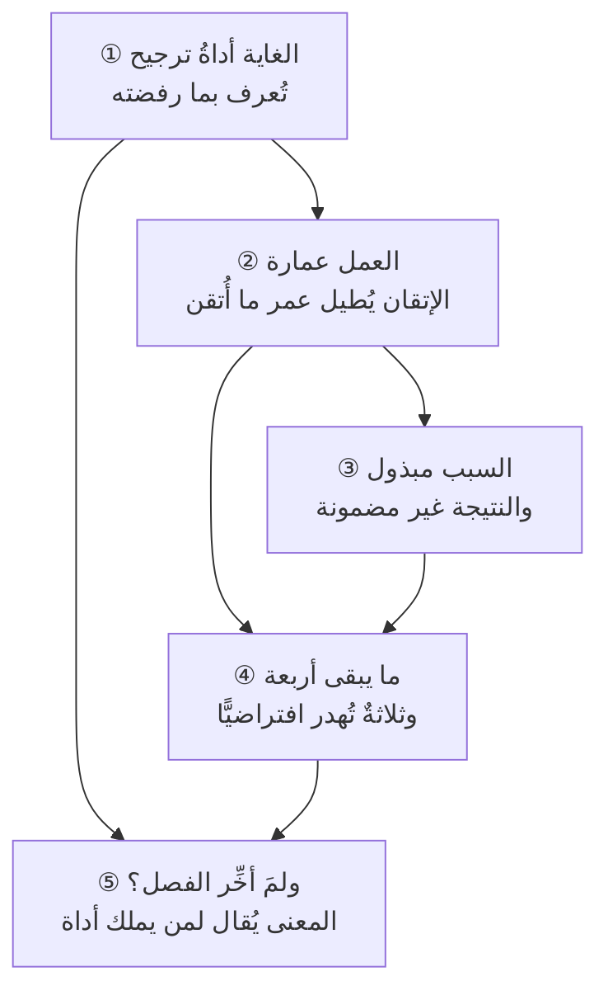

# الفصل 17 — المشروع والاستخلاف — لماذا يستحقّ هذا العمل أن يُتقَن؟

> [!important] قبل أن تبدأ — كيف يستعمل هذا الفصل كلمة «الاستخلاف»؟
> يستعملها بمعناها اللغويّ العامّ وحده: **أن يكون ما في يدك أمانةً لم تُنشئها، وأنّك تاركها لمن بعدك.** وهو معنًى يشترك فيه المتديّن وغيره، ويترتّب عليه أثرٌ عمليٌّ واحد: **أنّ سؤال «ماذا يبقى؟» جزءٌ من العمل لا زيادةٌ عليه.**
>
> **ولا يستعملها استدلالًا.** فليس في هذا الفصل — ولا في هذا الباب — تصحيحُ منهجيةٍ إداريةٍ بنصّ، ولا ترجيحُ أداةٍ على أخرى بحكمٍ دينيّ. والمنهجيات اجتهاداتٌ بشريةٌ تُقاس بمقاصدها وأثرها، **وموضع القيمة أن تحكم ما نختار أن نبنيه وكيف نعامل من نعمل معهم** — لا أن تُرقّي أداةً إلى منزلة النصّ. وهذا حدٌّ يُعاد ذكره في محطّة النطاق.

---

## 🏛️ لماذا تقرأ هذا الفصل؟

**المشكلة:** يُتقن الفريق التنفيذ ولا يسأل أحدٌ عمّا يُبنى ولمن، فيُبذل جهدٌ نظيف في شيء لا ينفع أحدًا — وهذا هدرٌ لا تكشفه أيّ لوحة مؤشّرات، لأن كلّ مؤشّراتها خضراء.

**وماذا لو لم تعرف؟** من لم تكن له غايةٌ تتجاوز التسليم لم يجد ما يُفاضل به حين تتعارض الخيارات، فيرجع إلى ما يُرضي الأعلى صوتًا. والثمن يُرى في ثلاثة: أنّ كلّ طلبٍ يصير عاجلًا، وأنّ شيئًا لا يُرفض، وأنّ التغيير يُقبل بمن طلبه لا بما يُغيّره.

**وبعد هذا الفصل ستستطيع:**

- **أن تميّز** بين غايةٍ تعمل وشعارٍ معلَّق، بعلامةٍ واحدةٍ تُرى: ما الذي أسقطته هذه الغاية من الطلبات؟
- **أن تحكم على** قرارٍ ماضٍ بجودته وقت اتّخاذه لا بنتيجته التي ظهرت بعده، وأن تسمّي أخطر الأحوال الأربع.
- **أن تفسّر** لماذا يزيد الإتقانُ الضررَ حين يقع في بناء ما لا ينبغي أن يُبنى.
- **أن تجرد** ما يبقى من مشروعٍ بعد إغلاقه في أربعة صفوفٍ بأسماءٍ وأرقام، لا بعباراتٍ عامّة.

> [!info] بطاقة الفصل
> **النوع:** تركيبيّ
> **المستوى:** 🟢 مبتدئ
> **زمن القراءة:** نحو 45 دقيقة
> **أهمّيته في الباب:** ★★★★☆
> **موضعك:** انتهيتَ من [[16 - كيف يطلب هذا العلم]] ← **⬤ أنت هنا** ← وهو خاتمة الباب

> [!abstract] موقع هذا الفصل
> **يبني على:** [[Knowledge Management]] · [[Outcome vs Output]] — يُذكَر هنا ولا يُعاد شرحه.
> **ويؤسّس:** *لا مصطلح تقنيّ جديد؛ هذا الفصل قيميّ لا اصطلاحيّ.*

---

## 🧭 السؤال المركزي

> [!question] السؤال الذي يجيب عنه هذا الفصل كلّه
> **لماذا نعمل أصلًا، وما موقع المشروع من معنى العمل؟**

**واحمل معك هذه الأسئلة وأنت تقرأ:**

- ما الذي يبقى من عملك بعد أن يُغلق المشروع؟
- هل يجوز أن تُتقن بناء شيء لا ينبغي أن يُبنى؟
- كيف يجتمع التخطيط المحكم مع التوكّل؟

---

## 🗺️ الجواب المختصر — قبل التفصيل

جوابه في جملة: **ليست القيمة طبقةً تُضاف إلى العمل بعد إتقانه، بل هي التي تُعيّن أيّ عملٍ يستحقّ الإتقان.** وهذا ليس كلامًا في الشعور بل في القرار، **وعلّته أنّ كلّ ما في هذا العلم يُرتّب داخل غايةٍ مفروضةٍ ولا يُنتج غاية**: الجدولة تقول أيُّ الطرق أسرع، والتقدير يقول أيُّها أرخص، والحوكمة تقول من يملك أن يقرّر — **وليس في واحدةٍ منها ما يقول: أيُّ هذين ينبغي أن يُبنى.** فإذا استوى خياران في الكلفة والزمن والمخاطرة، لم يبقَ ما يُرجَّح به إلّا الغاية؛ ومن لا غاية له عنده رجع إلى أعلى الأصوات في الغرفة وسمّاه أولويّة.

**ويترتّب على ذلك ثلاثة تجري في هذا الفصل كلِّه.** الأوّل أنّ **الإتقان في بناء ما لا ينبغي أن يُبنى يزيد الضرر ولا ينقصه**، لأنّ الرديء يموت بنفسه والمتقَن يعيش ويُرسّخ ما بُني عليه. والثاني أنّ **السبب مبذولٌ ملزمٌ والنتيجة غير مضمونة**، فيُحاسَب المرء على جودة قراره وقت اتّخاذه لا على ما ظهر بعده — وهذا ما يجعل التخطيط أخذًا بالأسباب لا ادّعاءً للسيطرة. والثالث أنّ **ما يبقى من المشروع أوسع ممّا سُلِّم فيه**: ما تغيّر عند المستفيد، والمعرفة التي استقرّت في المنظّمة، والناس الذين صاروا قادرين، والأثر فيمن عملوا معك.

**وأمّا لماذا جاء هذا كلُّه في آخر الباب لا في أوّله، فلعلّةٍ واحدة:** أنّ الكلام في المعنى يُقال لمن يملك أداة. **فمن قرأه قبل أن يعرف كيف يُقدّر ويُقايض ويرفض، قرأه شعارًا؛ ومن قرأه بعد ذلك قرأه ميزانًا.**

> [!warning] مفاهيم يكثر الخلط بينها هنا
> `Purpose` مقابل `Output` مقابل `Impact` — احملها في ذهنك، فالفصل يفرّقها في محطّة التمييز.

---

## 🧱 الفكرة الأولى: سؤال «لماذا أعمل؟» سؤالٌ إداريٌّ لا وعظيّ

*موضعها من الفصل: هي أوّل الأفكار لأنّها الوحيدة التي إن لم تُقبل سقط ما بعدها — والفرق عن مقدّمة الفصل أنّ تلك ادّعت أنّ القيمة تُعيّن ما يستحقّ الإتقان، وهذه تُثبت أنّ ذلك يقع في القرار لا في الشعور.*

**الفكرة الرئيسة:** الغاية ليست بابًا من أبواب التحفيز، بل **أداةُ ترجيحٍ تُستعمل عند التعارض**. ولذلك يُعرف وجودها بأثرٍ يُرى: **أنّ أشياء تُرفض بسببها.** والغاية التي لم تُسقط طلبًا قطُّ ليست غايةً بل شعارًا.

### ولماذا لا تُغني الأدوات عنها؟

لأنّ كلّ أداةٍ في هذا العلم تُجيب عن سؤالٍ **داخل** غايةٍ مفروضةٍ عليها، ولا تُجيب عن الغاية نفسها:

| الأداة | تجيب عن | ولا تجيب أبدًا عن |
|---|---|---|
| **الجدولة والمسار الحرج** | أيُّ الطرق أسرع، وأين لا يحتمل التأخير | أينبغي أن نمضي في هذا الطريق أصلًا؟ |
| **التقدير والميزانية** | كم يكلّف، وبأيّ مدى من عدم اليقين | أيستحقّ ما ننتظره هذه الكلفة؟ |
| **إدارة المخاطر** | ما الذي قد يقع، وبأيّ شدّة | أيُّ الأضرار نحتمله وأيُّها لا نقبله على أحد؟ |
| **الحوكمة** | من يملك أن يقرّر، وبأيّ صلاحية | بأيّ ميزانٍ يُرجّح صاحب الصلاحية؟ |
| **مؤشّرات الأداء** | أنمضي كما خُطّط؟ | أهذا الاتّجاه هو الصحيح؟ |

**وانظر في العمود الأخير:** كلّ أسئلته أسئلةُ ترجيحٍ بين أشياء **مباحةٍ ممكنةٍ متكافئة**، وهي بعينها المواضع التي يقف عندها الفريق فلا يجد في أدواته جوابًا. فيُحسم الأمر حينئذٍ بأحد ثلاثة: أعلى الأصوات، أو آخر من تكلّم، أو ما يقلّ فيه الاعتراض. **وليس واحدٌ من الثلاثة قرارًا، وإنّما هو انصرافٌ عن القرار في هيئة قرار.**

### وليست الغاية «شغفًا» ولا «إلهامًا»

الفرق بينهما ليس لفظيًّا. **فالشغف يُجيب عن سؤال: ما الذي يحرّكني؟ والغاية تُجيب عن سؤال: بأيّ معيارٍ أُرجّح حين تتكافأ الخيارات؟** والأوّل حالٌ تتقلّب وتخصّ صاحبها، والثاني معيارٌ يُقال ويُحتجّ به ويُسأل عنه في اجتماع.

**وأثر هذا الفرق عمليّ:** أنّ الغاية تُكتب بحيث **يُمكن أن تُخالَف**. فقولك «نبني منتجًا يُسعد المستخدم» لا يُخالفه أحد، فلا يترتّب عليه شيء. وقولك «نخدم من لا يجد بديلًا، ولو كان أقلّ ربحًا» **يترتّب عليه رفضُ عملٍ مربح** — فهذه غاية.

### وثلاث علاماتٍ تُرى في الفريق الذي لا غاية له

غياب الغاية لا يُعلَن، **وإنّما يُستدلّ عليه بثلاث علاماتٍ تُرى في الجدول والمحضر**، وكلُّها معلولةٌ بعلّةٍ واحدة: أنّه لا يوجد ميزانٌ يُوزَن به الطلب حين يصل:

1. **أن يصير كلُّ طلبٍ عاجلًا.** فالعجلة في أصلها **مقارنة**: هذا أعجل من ذاك. فإذا لم يكن ثمّة ميزان، لم تبقَ مقارنة، **فصار وصف «عاجل» صفةً يُلحقها الطالب بطلبه لا حكمًا يُصدره الفريق عليه**. ومتى صار كلّ شيءٍ عاجلًا فلا شيء عاجل، وإنّما يُنفَّذ ما يُلحّ صاحبه.
2. **ألّا يُرفض شيءٌ رفضًا صريحًا.** فالرفض يحتاج سببًا يُقال، والسبب يحتاج معيارًا. **فحين يغيب المعيار لا يُرفض شيء وإنّما يُؤجَّل** — وقائمة الأعمال تنتفخ بما لن يُعمل، ويبقى كلُّ طالبٍ منتظرًا. **وهذه أسوأ من الرفض على أصحاب الطلبات أنفسهم**، لأنّ المرفوض يبحث عن حلٍّ آخر والمؤجَّل ينتظر.
3. **أن يُقبل التغيير بمن طلبه لا بما يُغيّره.** وهذه أوضحها وأقلّها ذكرًا: يُقرأ طلب التغيير فيُنظر في توقيعه قبل مضمونه. **والعلامة الفاصلة: أن يُسأل عن الطلب سؤالٌ واحدٌ في المحضر — ما الذي يتغيّر عند المستفيد إن نُفّذ؟** فإن لم يُسأل هذا السؤال قطُّ، فالترجيح يجري بالمصدر لا بالمضمون.

**والثلاث تجتمع في أثرٍ واحد:** أنّ الفريق يعمل كثيرًا ويُنجز كثيرًا **ولا يستطيع أن يقول لماذا هذا قبل ذاك** — وهو حالٌ يُنتج لوحةً خضراء وشعورًا بالإرهاق معًا، وقد سبق وصفُه في [[14 - أمراض الممارسة]] من جهةٍ أخرى.

### ومن أين تجيء الغاية؟ ثلاثة مستوياتٍ لا تُخلط

يقع كثيرٌ من الخلاف لأنّ المتنازعين يحتجّون بمستوياتٍ مختلفةٍ ويحسبونها واحدة:

| المستوى | يجيب عن | ومداه |
|---|---|---|
| **غاية المنظّمة** | لماذا توجد هذه الجهة أصلًا؟ | سنوات — ولا تحسم خلافًا في ميزتين |
| **غاية المنتج** | لمن هذا المنتج، وما الذي يُحسنه لهم دون غيره؟ | من سنةٍ إلى ثلاث — وهي التي تحسم أكثر الخلاف |
| **غاية المشروع** | ما التغيُّر المقصود من هذا العمل بعينه؟ | مدّة المشروع — وهي التي تُكتب في وثيقة البدء |

**وكيف تُكتب غايةٌ تعمل؟** بأن تحمل **مفاضلةً معلنة** لا وصفًا لمرغوب. فكلُّ غايةٍ نافعةٍ في العمل تقول شيئين: ما نُقدّمه، **وما نُؤخّره وهو حسنٌ في نفسه**. ومن كتب الأوّل وترك الثاني كتب أمنية:

| صياغةٌ لا تعمل | وصياغةٌ تعمل — لأنّها تُقدّم وتُؤخّر |
|---|---|
| «نبني تجربةً سهلةً وغنيّةً بالخيارات» | «نُقدّم **إتمام المعاملة من أوّل مرّة** على غنى الخيارات» |
| «نخدم كلّ عملائنا» | «نُقدّم **من لا يجد بديلًا** على من عنده ثلاثة بدائل» |
| «نطلق بسرعةٍ وبجودةٍ عالية» | «نُقدّم **ألّا نُخطئ في الحساب المالي** على سرعة الإطلاق» |

**والعمود الأيمن كلُّه صحيحٌ ولا يُخالفه أحد، ولذلك لا يُرجّح شيئًا.** والعمود الأيسر يُغضب أحدًا في كلّ سطر — **وذاك ثمنه، وهو نفسه ما يجعله يعمل.**

**والخطأ الشائع: أن يُحتجّ بالأعلى في مسألةٍ يحسمها الأوسط.** فقولك «نحن نخدم المجتمع» لا يُرجّح بين ميزتين، وقولك «منتجنا لمن يدير عيادةً صغيرةً بلا موظّف إداريّ» يُرجّح بينهما في سطر. **فكلّما نزلتَ في السلّم زادت قدرة الغاية على أن تُسقط طلبًا** — وهذا هو المقياس كما تقدّم. **وأنفعها للفريق التنفيذيّ الأوسط**، والأعلى يصلح للاتّجاه العامّ لا للترجيح اليوميّ. **وتفصيل صياغة التغيُّر المقصود في [[03 - فلسفة المشروع]]**، فهو موضعه.

### وثمن الغاية التي تعمل — فلا يُوعَد بما لا يكون

يُكتب في هذا الباب كثيرًا كأنّ الغاية مكسبٌ بلا كلفة، **وليست كذلك؛ ومن لم يعرف ثمنها تركها في أوّل موضعٍ يُطالَب فيه به.** وثمنها ثلاثة:

1. **أنّك تخسر عملًا ممكنًا.** فالغاية التي تُسقط طلبًا تُسقط معه إيرادًا أو رضا جهةٍ أو فرصةً كانت في متناولك. **وهذا هو الثمن الأوّل والأظهر**، وبه وحده تُعرف الغاية من الشعار كما تقدّم.
2. **أنّك تُخيّب أحدًا في كلّ مرّة.** فكلُّ طلبٍ صاحبٌ يراه أهمّ ما في المشروع، ورفضُه بمعيارٍ معلَنٍ لا يمنع أن يجده صاحبه رفضًا. **والذي يخفّف هذا ليس تلطيف العبارة بل ثبات المعيار**: فمن رُفض طلبه بالمعيار نفسه الذي رُفض به طلبُ غيره لا يشعر أنّه استُهدف.
3. **أنّك تُطالَب بالدفاع عنها كلّما تغيّر من حولك.** فالغاية ليست قرارًا يُتّخذ مرّةً بل موقفًا يُعاد بيانه — **ومن ملّ من إعادة بيانه سقطت غايته صامتةً بلا أن يُعلن أحدٌ سقوطها.**

**ولازم هذا كلِّه:** أنّ الغاية التي لا تُكلّف شيئًا لا تُرجّح شيئًا، **وأنّ من أراد أثرها لزمه أن يقبل ثمنها** — وهذا هو نفسه ما جرى عليه [[15 - أخلاق المهنة]] في كلّ مسألةٍ من مسائله: لا يُذكر خلقٌ إلّا ومعه ثمنه.

### وماذا إن كانت الغاية مفروضةً عليك من فوق؟

هذا حال أكثر القرّاء: لستَ من يضع غاية المنظّمة ولا غاية المنتج، **وإنّما تصلك مقرَّرةً وتُطالَب بالتنفيذ فيها.** فهل يسقط هذا الباب حينئذٍ؟ **لا يسقط، ويضيق.** وثلاثة تبقى في يدك ولو لم تملك شيئًا ممّا فوقها:

1. **أن تسأل عنها مرّةً واحدةً بوضوح.** لا اعتراضًا بل استفهامًا: **ما التغيُّر المقصود من هذا، وعند من؟** وأكثر ما يقع أنّ الجواب لا يوجد مكتوبًا، **فيُكتب لأوّل مرّةٍ بسبب سؤالك** — وهذا وحده يغيّر كثيرًا من قرارات الأشهر التالية.
2. **أن تشتقّ غاية مشروعك من غاية أعلى منك ولو لم تكن معلنة.** فالمشروع الذي تديره أضيق ممّا فوقه، **وأنت تملك أن تكتب في وثيقة بدئه جملةً واحدةً تُرجّح بها** — ولو لم تكن مكتوبةً في مكانٍ آخر.
3. **أن تُظهر أثر غياب المعيار بدل أن تشكو منه.** فحين يُطلب طلبان متعارضان، لا تقل «لا توجد أولويّات واضحة»؛ **بل اعرض الخيارين وكلفتَهما واسأل مالك القرار: أيّهما نُقدّم ولماذا؟** فالشكوى تُقرأ اعتراضًا فتُردّ، **والسؤال المكتوب يُلزم بأن يُقال معيار** — ولو مرّةً واحدة، فإنّها تصلح لما بعدها.

**وحدُّ ذلك:** أنّك تُطالَب بأن تسأل وتشتقّ وتُظهر، **ولا تُطالَب بأن تصنع غايةً لمن فوقك ولا أن تُصحّحها** — فتلك ليست في يدك، والتكليف بما ليس في اليد يُنتج إنهاكًا لا إصلاحًا.

> [!example] طلبان متكافئان، ووسيلة الترجيح: من طلب
> عُرض على فريقٍ في الرياض طلبان في أسبوعٍ واحد. الأوّل من مدير المبيعات: لوحةُ تقاريرَ إضافيةٍ لعملاء كبار. والثاني من فريق الدعم: إصلاحُ خطوةٍ في التسجيل يسقط عندها نحو خُمس المستخدمين الجدد.
>
> وكان الطلبان متقاربين في الكلفة والزمن. **فرُجّح الأوّل**، والسبب المذكور في المحضر: «طلبٌ من الإدارة».
>
> ولمّا سُئل الفريق بعد ذلك عن غايته المعلنة، قال: «تمكين المستخدم من إنجاز معاملته في أقلّ وقت». **وهي غايةٌ لو كانت تعمل لرجّحت الطلب الثاني ترجيحًا ظاهرًا** — إذ الخُمس الساقط في التسجيل هو موضعها بعينه.
>
> **فلم تكن الغاية غائبةً عن الورق، وإنّما كانت غائبةً عن اللحظة التي احتيج إليها فيها** — وذلك هو غيابها الحقيقيّ.

> [!tip] كيف تستعمل هذه الفكرة — اختبار الرفض
> لا تسأل نفسك «هل عندنا غاية؟» فالجواب دائمًا نعم. اسأل بدلها:
>
> | الخانة | ما يُكتب فيها |
> |---|---|
> | **ثلاثة أشياء رفضناها هذا الربع** | بأسمائها ومن طلبها |
> | **وسبب الرفض في كلٍّ منها** | جملةٌ واحدةٌ لكلّ واحد |
> | **وأيّها رُفض بالغاية؟** | ✓ أو ✗ |
>
> **فإن كان سبب الرفض في الثلاثة «ضيق الوقت» أو «قلّة الموارد»، فليست عندك غايةٌ بل قيد.** والقيد يمنع ما لا تستطيع، والغاية تمنع ما تستطيعه ولا ينبغي لك.
>
> **وألفاظٌ لا تُقبل في خانة السبب:** «لم يكن أولويّة» · «لا يناسب المرحلة» · «قرار الإدارة». فهذه أوصافٌ للنتيجة لا أسبابٌ لها.

> [!warning] الحفرة الشائعة — الغاية التي لا يخالفها أحد
> تُصاغ الغاية بحيث لا تُغضب طرفًا: «نبني منتجًا عالميًّا يُسعد المستخدم ويحقّق نموًّا مستدامًا». **وكلُّ كلمةٍ فيها مرغوبة، ولذلك لا تُرجّح شيئًا** — إذ كلُّ خيارٍ مطروحٍ يمكن أن يُنسب إليها.
>
> **وصورةٌ مصغّرة:** فريقٌ علّق غايته على الجدار، ثمّ اختلف في ترتيب ميزتين. فاستشهد كلٌّ من الطرفين بالغاية نفسها ووجد فيها ما يؤيّده — **وانتهى النقاش إلى الأصوات**. والغاية التي تصلح حجّةً للطرفين لا تصلح حَكَمًا بينهما.

> [!question]- تأكّد أنك فهمت — لماذا يُعرف أثر الغاية في الرفض لا في القبول؟
> **لأنّ القبول لا يكلّف شيئًا فلا يدلّ على شيء.** فكلّ عملٍ يُقبل يمكن أن يُنسب إلى الغاية بتأويلٍ يسير، **والرفض وحده هو الذي يُظهر أنّ لها حدًّا**: أنّ ثمّة عملًا ممكنًا ومربحًا ومطلوبًا تُرك لأجلها. ولهذا صار اختبارها سؤالًا واحدًا: **ما الذي أسقطته هذه الغاية؟** — فإن لم تُسقط شيئًا فهي وصفٌ للنيّة لا معيارٌ للقرار.

> [!summary]- خلاصة الفكرة في سطرين
> **الدعوى:** الغاية أداةُ ترجيحٍ عند التعارض لا بابٌ من أبواب التحفيز، وأدوات هذا العلم كلُّها ترتّب داخلها ولا تُنتجها.
> **ولازمها:** أنّ وجودها يُقاس بما رُفض بسببها، وأنّ الغاية التي لا يُتصوَّر أن يخالفها أحدٌ لا تُرجّح شيئًا.

> [!question] تأمّلٌ تطبيقيّ — لا جواب له في هذا الفصل
> افتح آخر ثلاثة قراراتٍ رجّحتم فيها طلبًا على طلب، وابحث في محاضرها عن سبب الترجيح المكتوب. كم واحدًا منها يذكر معيارًا؟ وإن لم تجد، **فما المعيار الذي كان يعمل فعلًا وإن لم يُكتب؟**

---

## 🧱 الفكرة الثانية: العمل عمارةٌ للأرض لا استهلاكٌ للوقت

*موضعها من الفصل: قبلتَ أنّ الغاية أداةُ ترجيح، ويبقى: ترجيحٌ على أيّ أساس؟ — والفرق عن سابقتها أنّ تلك أثبتت الحاجة إلى معيار، وهذه تقول من أين يجيء: من أنّ ما تبنيه يبقى ويعمل بعدك بغير إذنك.*

**الفكرة الرئيسة:** ما تبنيه لا ينتهي بانتهاء عقدك معه. **يبقى ويعمل ويُلزم من يجيء بعدك بما قرّرتَه أنت** — ومن هنا كانت مسؤولية الصانع عن مصنوعه، وكان سؤال «ماذا نبني؟» سابقًا في الرتبة على «كيف نبنيه؟» وإن كان في العادة متأخّرًا عنه.

### ولازمه الأوّل: أنّ الإتقان في غير موضعه يزيد الضرر

قال **بيتر دراكر** جملةً صارت من أشهر ما قيل في الإدارة:

> *«There is nothing so useless as doing efficiently that which should not be done at all.»*
>
> **الترجمة:** «لا شيء أعبث من أن يُؤدَّى بكفاءةٍ عاليةٍ ما لا ينبغي أن يُؤدَّى أصلًا.»

وهي تُقرأ عادةً كلامًا في الهدر، **وفيها ما هو أبعد من الهدر:** أنّ الرديء يموت بنفسه ولا يحتاج من يُزيله، **والمتقَن يعيش ويُرسَّخ ويُبنى عليه** — فيصير تغييره بعد سنتين أصعب من إنشائه اليوم. فالإتقان يُطيل عمر ما أُتقن، **وذلك نعمةٌ إن كان ما أُتقن ينبغي أن يبقى، ووبالٌ إن كان لا ينبغي.**

**ومثاله الأشيع في مهنتنا: أتمتة عمليةٍ فاسدة.** فالعملية قبل الأتمتة كانت تُنتج فسادها ببطءٍ وبتدخّلٍ بشريٍّ يُعدّل بعض ما يقع، وكان الناس يشتكون منها فيبقى الضغط قائمًا على تغييرها. **فلمّا أُتقنت أتمتتُها صارت تُنتج فسادها أسرع وبلا استثناء**، وسكت الاشتكاء لأنّ الأمر «صار يعمل»، وصار تغييرها اليوم يقتضي إعادة بناءٍ وتدريبٍ وتكاملات. **فزادت الكفاءة، ورسخ ما كان يُراد نقضه.**

### ولازمه الثاني: أنّ الأثر يصل إلى من لم يجلس على الطاولة

المشروع يُقرّر في غرفةٍ فيها الراعي والمورّد والفريق، **ويقع أثره على من ليس فيها**: المستخدم الذي لا يملك بديلًا، والموظّف الذي سيُشغّله بعد سنة، والمواطن الذي ستُرفض معاملته لقاعدةٍ كُتبت في سطرٍ لم يُراجعه أحد.

**وهنا يجيء الفرق بين [[Outcome vs Output|المخرَج والأثر]] بمعناه الأثقل.** فالمخرَج ما سلّمناه ونملكه، والأثر ما تغيّر عند الناس — **والعمارة تُقاس بالثاني.** ومع ذلك يلزم حدٌّ ينصف: **الأثر لا يُملَك كلُّه**، فبينه وبين عملك عواملُ لا تملكها. **والذي يُملَك ويُسأل عنه أمران: الاتّجاه — أن تقصده ابتداءً — والاجتهاد — أن تسعى إلى معرفته لا أن تنصرف عنه.** فمن قصده وسعى إليه ثمّ لم يبلغه فقد أدّى، ومن لم يسأل عنه أصلًا فقد سلّم ولم يعمر.

**وليس هذا كلامًا في المسؤولية الاجتماعية للشركات ولا في التسويق بالقيم.** هو أضيق منهما وأثقل: **مسؤوليةُ صانعٍ عن مصنوعه** — أن يعرف من يتحمّل الضرر إن أخطأ، وأن يكون قد سأل عنه قبل أن يبني.

### ومن يملك أن يسأل، ومن يملك أن يقرّر؟

يُردّ هذا الكلام كثيرًا بجملةٍ واحدة: «هذا ليس قراري». **وهي صحيحةٌ في القرار وباطلةٌ في السؤال** — فالسؤال مباحٌ للجميع والقرار محصورٌ في أهله، والخلط بينهما هو الذي يجعل الناس يسكتون عمّا يعرفون.

**والتفريق ينفع الطرفين:** فمن يسأل لا يُتّهم بأنّه يتجاوز موضعه، لأنّه لم يدّعِ أنّه يقرّر؛ **ومن يقرّر لا يُحرَم ممّا يعرفه من هو أقرب إلى التفصيل.** والصياغة التي تحفظ الحدّين معًا معروفة: **«أسأل لأفهم، والقرار لك»** — ثمّ يُذكر ما تعرفه لا ما ترى أنّه ينبغي.

**وأنفع سؤالٍ يملكه من لا يملك القرار سؤالُ الكلفة المؤجّلة**: كم يكلّف تغيير هذا بعد سنتين مقارنةً بكلفته اليوم؟ **وعلّة نفعه أنّه لا يعترض على القرار، وإنّما يُعطي صاحبه معلومةً كان يجهلها.** وأكثر القرارات الرديئة في هذا الباب لا تُتّخذ عنادًا بل جهلًا بالكلفة البعيدة، **إذ من يقرّر لا يرى بنية البيانات ولا التكاملات، ومن يراها لا يقرّر.**

**وسطر المعيار العمليّ:** إن مرّ على مشروعك ربعٌ كاملٌ ولم يُسأل فيه سؤالٌ واحدٌ عن كلفة التغيير بعد سنتين، **فالقرار يُتّخذ بمعلوماتٍ ناقصةٍ لا لأنّ أحدًا كتمها، بل لأنّ أحدًا لم يطلبها.**

### وليست العمارة في الكبير وحده

يُظنّ أنّ هذا الكلام يخصّ المشاريع الوطنية والمنصّات التي يستعملها الملايين، **وأنّ الأداة الداخلية التي يستعملها ثلاثون موظّفًا خارجه.** وهذا غلطٌ في الحساب قبل أن يكون غلطًا في القيمة: فالأداة التي يفتحها ثلاثون موظّفًا عشر مرّاتٍ في اليوم تُلامَس ثلاثة آلاف مرّةٍ يوميًّا، **وخطوةٌ زائدةٌ فيها تُنفق من أعمار الناس ما لا تُنفقه ميزةٌ في منتجٍ يُفتح مرّةً في الشهر.**

**والمقياس ليس عدد المستخدمين بل حاصلُ ضربه في التكرار وفي عدم وجود بديل.** فالموظّف لا يملك أن ينصرف عن الأداة التي فُرضت عليه، **وانعدام البديل هو ما يجعل الأثر ثقيلًا** وإن قلّ العدد. ومن هنا كانت الأنظمة الداخلية والحكوميّة أثقلَ في هذا الباب من كثيرٍ من المنتجات الاستهلاكية، **لأنّ من يستعملها لا يستطيع أن يتركها.**

### وثلاثة أشياء تصعب على التغيير أكثر من غيرها

خانة «ما الذي سيصعب تغييره بعد سنتين؟» تبقى فارغةً عند أكثر الفرق لأنّهم لا يعرفون بمَ يملؤونها. **وهذه ثلاثةٌ هي أكثر ما يقع، مرتّبةً من الأصعب:**

1. **بنية البيانات.** فما دخل في الجداول والعلاقات بقي، ويُبنى عليه التقارير والتكاملات ثمّ يصير تغييره ترحيلًا لا تعديلًا. **وأخطر ما فيها ما فُقد ولم يُخزَّن أصلًا**: فالحقل الذي لم يُجمع لا يُستدرَك بأثرٍ رجعيّ.
2. **القاعدة التي دخلت في تكامل.** فالقاعدة داخل نظامك تُغيَّر بقرار، **وإذا صارت طرفًا في تكاملٍ مع نظامٍ آخر صار تغييرها يقتضي موافقة جهةٍ لا تملكها** — وربّما جهتين.
3. **العادة التي تكوّنت عند المستخدمين.** وهي أخفاها وأقلُّها ذكرًا في الوثائق: فالناس يبنون طرائق عملهم حول ما أعطيتَهم، **حتى ما كان منه خطأً**. ومن غيّر شاشةً بعد سنتين وجد أنّه لا يُغيّر شاشةً بل يُغيّر طريقة عملٍ استقرّت في أذهانٍ لم يستشرها.

**وقاعدة الاستعمال:** إن عجزتَ عن ملء الخانة، فانظر في هذه الثلاثة على مشروعك بالترتيب، **ولن تخرج بلا بندٍ واحدٍ على الأقلّ.**

### واختلاف الآجال — وهو أصل هذا الباب كلِّه

انظر في أربعة آجالٍ تجتمع على شيءٍ واحد، **وكلٌّ منها أطول ممّا قبله:**

| الأجل | مدّته المعتادة |
|---|---|
| **عقدك أنت** مع هذا العمل | سنةٌ إلى ثلاث |
| **المشروع** من بدئه إلى إغلاقه | أشهرٌ إلى سنتين |
| **النظام** الذي يُبنى فيه | خمسٌ إلى خمس عشرة |
| **الإجراء** الذي يُرسّخه النظام | قد يتجاوز ذلك كلَّه |

**وهنا موضع الخلل:** أنّ من يقرّر ومن ينفّذ يخرجان من الميدان **قبل** أن يبلغ ما بنياه منتصف عمره. فالقرار يُتّخذ بأفقٍ سنتين، **ويعمل أثرُه عشرًا** — ولا يبقى في الغرفة من يشهد على العلّة التي بُني عليها.

**وأثره ليس في النيّة بل في الحوافز:** أنّ ما يُقاس به الناس ويُرقَّون به يقع كلُّه داخل الأجل الأقصر — التسليم في موعده وميزانيته. **فالذي يُختار عند التعارض هو ما يُحسّن الأجل القصير**، لا لأنّ أحدًا يُهمل الطويل، بل لأنّ الطويل لا يُحاسَب عليه أحدٌ حاضر.

**ومعنى «الاستخلاف» في هذا الفصل هو هذا بعينه:** أن تعمل في أجلٍ وأنت تعلم أنّ أثرك يمتدّ إلى آجالٍ لا تشهدها. **ولازمه العمليّ واحدٌ ورخيص: أن تكتب للقادم ما لا يستطيع أن يستنتجه** — العلّة، والقيد الذي كان قائمًا، والبديل الذي تُرك ولماذا. **فمن كتب ذلك ترك لمن بعده أن يُصحّح، ومن لم يكتبه ترك له أن يُخمّن.**

### والفرق بين ضررٍ لم يُقصَد وضررٍ لم يُسأل عنه

قد يُفهم من هذا الباب تحميلٌ لا يُطاق: أن يُسأل الفريق عن كلّ ما يترتّب على عمله ولو بعد عشر سنين. **وليس هذا مرادًا ولا ممكنًا**، والفرق بين حالين يرفع الإشكال:

- **ضررٌ لم يُقصَد ولم يكن في الوسع أن يُعلم.** فهذا خطأٌ لا تفريط فيه، **وحكمه أن يُصلَح حين يظهر لا أن يُلام عليه صاحبه** — وهو عين ما تقدّم في الفكرة الثالثة: يُحاسَب المرء بما كان معلومًا حينه.
- **وضررٌ لم يُسأل عنه أصلًا.** أي أنّ السؤال كان ممكنًا يسيرًا ولم يُطرح: لم يُسأل من يستعمل هذا، ولا ماذا يقع لمن لا يملك حسابًا بنكيًّا، ولا ماذا يصنع من لا يقرأ. **وهذا هو موضع المسؤولية، لا الأوّل.**

**والفارق بينهما ليس في حجم الضرر بل في كلفة السؤال.** فمن ترك سؤالًا كان يكلّفه ساعةً في أوّل المشروع، ثمّ وقع الضرر، **لم يُخطئ في التوقّع وإنّما فرّط في البحث**. ولذلك جُعل ما في هذا الفصل **سؤالين يُكتبان قبل أوّل سطر** لا مراجعةً بعد الإطلاق — إذ السؤال في أوّله يكلّف ساعةً وفي آخره يكلّف مشروعًا.

**ومنه قاعدةٌ تُريح صاحبها:** لستَ مطالبًا بأن تعلم الغيب، **وإنّما بأن تكون قد سألتَ أسئلةً كانت في متناولك.** ومن فعل ذلك ثمّ ظهر ما لم يكن في الحسبان، **فهو في الحال الأولى — يُصلح ولا يُلام.**

> [!example] منصّةٌ متقَنةٌ رسّخت إجراءً كان يُراد إلغاؤه
> كانت جهةٌ خدميّةٌ تشترط في معاملةٍ ورقةً يُجمع عليها أنّها لا تُفيد شيئًا، وكان إلغاؤها مطروحًا في أكثر من اجتماع.
>
> ثمّ جاء مشروع الرقمنة، **فأُتقنت أتمتة الإجراء كما هو**: حقلٌ إلزاميّ، ورفعُ ملفّ، وتحقّقٌ آليٌّ يمنع المضيّ بدونه، وتكاملٌ مع نظامين آخرين يقرآن الحقل.
>
> **فصار الإلغاء اليوم مشروعًا في نفسه:** تعديلُ ثلاثة أنظمة، وترحيلُ بياناتٍ، وإعادةُ تدريب. **وقبل الأتمتة كان قرارًا في اجتماع.**
>
> ولم يُخطئ الفريق في التنفيذ في شيء — **أخطأ في أنّه لم يسأل سؤالًا واحدًا قبل أن يبدأ: أهذا الإجراء ممّا ينبغي أن يُثبَّت؟**

> [!tip] كيف تستعمل هذه الفكرة — سؤالان يُكتبان قبل أوّل سطر
> يُوضعان في وثيقة بدء المشروع، وتُملأ خاناتهما بأسماءٍ لا بفئات:
>
> | السؤال | ما يُكتب — والشرط |
> |---|---|
> | **من يتحمّل الضرر إن أخطأنا؟** | **اسمُ فئةٍ بعينها وحالُها**: «المتقدّم الذي لا يملك حسابًا بنكيًّا» — لا «المستخدمون» |
> | **ما الذي سيصعب تغييره بعد سنتين بسبب ما نبنيه اليوم؟** | بندٌ واحدٌ على الأقلّ: قاعدةٌ، أو تكاملٌ، أو بنية بيانات |
>
> **والخانة الثانية هي أنفعهما وأقلّهما استعمالًا**، لأنّ الجواب عنها يُقيّد المشروع في وقتٍ يكون فيه الحماس أعلى ما يكون. **ومن ملأها صادقًا وجد فيها بندًا واحدًا على الأقلّ يستحقّ أن يُؤجَّل حتى يُسأل عنه.**

> [!warning] الحفرة الشائعة — «نحن ننفّذ فقط»
> وهي أصدقُ ما يُقال وأخطرُ ما يُتّخذ حجّة. فصحيحٌ أنّ من لا يملك القرار لا يُحاسَب على القرار، **وليس صحيحًا أنّه لا يُحاسَب على البلاغ.** فالمنفّذ يرى ما لا يراه صاحب القرار: يرى القاعدة التي ستُسقط فئةً، ويرى الحقل الذي سيصير قيدًا بعد سنتين.
>
> **وحدُّ اللازم عليه محدّدٌ لا مفتوح:** أن يقول ما يعلم لمن يملك، مرّةً، بوضوح، ومكتوبًا إن أمكن. **وقد رُتّبت درجات ذلك في [[15 - أخلاق المهنة]]، وأدناها لا يحتاج صلاحيةً ولا مواجهة: أن تُسجّل.**
>
> **وصورةٌ مصغّرة:** مطوّرٌ رأى أنّ قاعدة التحقّق ستمنع فئةً من إتمام المعاملة، فقالها في ممرٍّ لزميل. ولم تصل إلى محضرٍ ولا إلى بريد. **وبعد الإطلاق ظهرت المشكلة، وكان قد عرفها قبل أربعة أشهر** — ولم يكن كتمانًا، وإنّما كان بلاغًا في غير موضعه.

> [!question]- تأكّد أنك فهمت — كيف يكون الإتقان سببًا في زيادة الضرر؟
> **لأنّ الإتقان يُطيل العمر ويرفع كلفة التغيير.** فالبناء الرديء يسقط بنفسه أو يبقى الضغط قائمًا على استبداله، **والبناء المتقَن يُبنى عليه غيرُه ويصير جزءًا من البنية** — فيصير نقضُه مشروعًا كاملًا بعد أن كان قرارًا. **ولذلك يُقدَّم سؤال «أهذا ممّا ينبغي أن يُبنى؟» على سؤال «كيف نُتقن بناءه؟»** — والتقديم هنا في الرتبة والزمن معًا، لأنّ تأخيره يجعل جوابه مكلفًا.

> [!summary]- خلاصة الفكرة في سطرين
> **الدعوى:** ما يُبنى يبقى ويعمل بعد صانعه، فالإتقان يُطيل عمر ما أُتقن — نعمةً إن كان ينبغي أن يبقى، ووبالًا إن كان لا ينبغي.
> **ولازمها:** أنّ سؤالَي «من يتحمّل الضرر؟» و«ما الذي سيصعب تغييره بعد سنتين؟» يُكتبان قبل أوّل سطر، وأنّ المنفّذ لا يُسأل عن القرار ويُسأل عن البلاغ.

> [!question] تأمّلٌ تطبيقيّ — لا جواب له في هذا الفصل
> انظر في أقدم نظامٍ تعمل عليه اليوم، واسأل: **أيُّ قاعدةٍ فيه يعمل بها الناس اليوم لأنّها كُتبت مرّةً ولم يُراجعها أحد؟** ثمّ اسأل نفسك السؤال الذي يليه: وما الذي تكتبه أنت هذا الشهر وسيُسأل عنه أحدٌ بعد خمس سنين؟

---
## 🧱 الفكرة الثالثة: التخطيط أخذٌ بالأسباب لا منازعةٌ للقدر

*موضعها من الفصل: عرفتَ أنّ ما تبنيه يبقى، ويلزم منه أن تُحكم البناء — والفرق عن سابقتها أنّ تلك في **ما** يُبنى، وهذه في **حال قلبك** وأنت تبنيه: أتظنّ الإحكام ضامنًا، أم تظنّ الأمر خارجًا عن يدك فتترك السبب؟*

**الفكرة الرئيسة:** طرفان متقابلان يخطئان بخطأٍ واحد: **من ترك التخطيط تديّنًا، ومن ظنّ الإحكام ضامنًا للنتيجة.** وخطؤهما واحدٌ لأنّ كليهما خلط بين **بذل السبب** وبين **ضمان النتيجة**؛ فالأوّل أسقط السبب لأنّه لا يضمن، والثاني حسب السبب ضامنًا فلمّا تخلّفت النتيجة انهار.

### والفصل بين الأمرين هو نفسه ما يقوله علم المخاطر بلغته

انظر في أيّ مصفوفة مخاطر: هي في حقيقتها إقرارٌ مكتوبٌ بأنّك **لا تملك النتيجة**، وإنّما تملك أن تخفض احتمالًا أو تحدّ أثرًا. **فمن استعملها وهو يظنّ أنّه اشترى اليقين لم يفهم الأداة التي بين يديه.** والفريق الذي يقول «حسبنا كلّ شيء فلن يقع ما لم نحسبه» لم يخالف قيمةً فحسب، **بل خالف نصّ أداته**.

**وعلى الطرف الآخر:** من ترك التقدير والجدولة والاحتياطي، وقال إنّ الأمر بيد الله وحده. **وهذا صحيحٌ في محلّه وباطلٌ في الاستدلال به على ترك السبب** — إذ لم يُترك السببُ في شيءٍ من أمور الناس بهذه الحجّة: لا في الدواء، ولا في البناء، ولا في الزرع. **وإنّما يُخصّ بها العملُ الذي يشقّ سببُه**، فتكون في الحقيقة عذرًا للمشقّة لا حكمًا في المسألة.

### والثمرة العملية: يُحاسَب المرء على قراره لا على نتيجته

هذا هو الأثر الذي يجعل الكلام كلَّه قابلًا للاستعمال. **فجودة القرار وجودة النتيجة أمران مختلفان**، وقد حرّرت **آني ديوك** في كتابها *Thinking in Bets* سنة 2018 هذا الخلط باسم **«الحكم بالنتيجة» (Resulting)**: أن يُحكَم على القرار بما آل إليه، وهو حكمٌ يبدو عادلًا وهو أصل أكثر التعلّم الفاسد. **وأحوال الأمر أربع:**

| | **نتيجة حسنة** | **نتيجة سيّئة** |
|---|---|---|
| **قرار سليم** | يُشكَر — وهو حقّه | **يُلام ظلمًا** — وهذا يُعلّم الفريق ألّا يُجازف بحقّ |
| **قرار رديء** | **يُكافأ خطأً** — وهو أخطرها | يُلام — وهو حقّه |

**وأخطر الأربع «قرارٌ رديءٌ ونتيجةٌ حسنة»**، لأنّ صاحبها يُكافأ فيتعلّم أنّ طريقته صحيحة، **ويُكرّرها حتى تلقاه مرّةً بلا حظّ**. والمنظّمة التي لا تفرّق بين الخانتين تُنتج مديرين يجيدون أن يكونوا محظوظين.

**والفصل بينهما ليس بالنيّة وإنّما بالكتابة:** أن يُكتب قبل القرار ما كان معلومًا حينها، والفرضُ الذي بُني عليه، والعلامةُ التي تُبطله. **فمن كتب الثلاثة أمكن أن يُحاسَب حسابًا عادلًا** — وهذا هو نفسه ما قُرّر في [[15 - أخلاق المهنة]] في باب التقدير، وما جُعل في [[16 - كيف يطلب هذا العلم]] مقياسًا للمرتبة الخامسة. **وبغير الكتابة تصير المحاسبة على النتيجة لا محالة، لأنّها الشيء الوحيد الباقي للنظر.**

### ولماذا تزيد الخطّة المفصّلة الثقةَ أكثر ممّا تزيد الدقّة؟

هذا هو الوجه الذي يُغفَل من الطرف الثاني: **أنّ التفصيل يُنتج شعورًا بالسيطرة لا يُقابله في الواقع مثلُه.** فحين تُقسَّم المهمّة إلى ثلاث عشرة خطوةً مقدَّرةً بالساعات، **يزداد يقينك بالمجموع أكثر ممّا يزداد صوابه** — لأنّ التفصيل يجعل السيناريو المتخيَّل أوضح في الذهن، والوضوحُ يُقرأ رجحانًا.

**ومصدر الخطأ في التفصيل نفسه:** أنّه يُحسَب على المسار الذي سار كلُّ شيءٍ فيه كما ينبغي، **ولا يترك موضعًا لِما لم يُخطر ببالك أصلًا** — وذلك أكثر ما يُؤخِّر المشاريع لا الخطوات المعروفة. وقد حرّر **كانمان وتفرسكي** سنة 1979 ما سُمّي **مغالطة التخطيط (Planning Fallacy)**: أنّ الناس يُقدّرون مشاريعهم بأقلَّ من الواقع بانتظام، **وأنّ زيادة التفصيل لا تُصلح هذا الميل** لأنّ التفصيل يجري على التصوّر نفسه المتفائل.

**والعلاج المعروف ليس تفصيلًا أكثر، بل نظرًا من خارج:** أن تُسأل عن مشاريع شبيهةٍ سابقةٍ كم استغرقت فعلًا، **فيُبنى التقدير على سجلٍّ لا على تخيّلٍ للمسار.** والفرق بين الطريقتين ليس في الدقّة وحدها، بل في أنّ الثانية تُبقي في نفس صاحبها إقرارًا بأنّه لا يملك النتيجة.

### والفرق بين المخاطرة المحسوبة والمقامرة

قد يُفهم ممّا سبق أنّ كلّ رهانٍ خسر كان قرارًا سليمًا أُسيء الحظّ به، **وهذا بابٌ يُدخَل منه كلُّ تفريط.** والفرق بين الاثنين ليس في النتيجة ولا في حجم المجازفة، **بل في أربعةٍ تُعرف قبل أن تقع النتيجة:**

| المخاطرة المحسوبة | المقامرة |
|---|---|
| **الاحتمال مقدَّرٌ ولو تقريبًا** — قيل: الأرجح كذا | لم يُسأل عن الاحتمال أصلًا |
| **الخسارة محتمَلة** — تُعرف ولا تُهلك | لم يُسأل: وماذا لو خسرنا؟ |
| **العائد يُوازن الخسارة** — بحسابٍ يُقال | العائد متخيَّلٌ والخسارة غير مقدَّرة |
| **له علامةُ خروج** — إن وقع كذا نتراجع | يُمضى فيه حتى يُنهيه الواقع |

**والرابع أفرقُها**، لأنّه الوحيد الذي يُلزم صاحبه بشيءٍ بعد القرار: **أن يعود فينظر.** فمن قال «سنجرّب ثمانية أسابيع، فإن لم يبلغ التسجيلُ كذا رجعنا» فقد خاطر؛ **ومن قال «سنمضي ونرى» فقد قامر وإن استعمل لفظ المخاطرة.**

**وأثره في المحاسبة:** أنّ المدير الذي يُحاسِب فريقه يستطيع أن يفرّق بين الحالين بلا ظلمٍ ولا تسامح — **فيسأل عن الأربعة لا عن النتيجة.** ومن أتى بها فقد أدّى وإن خسر، ومن لم يأتِ بها فقد قصّر وإن ربح. **وهذا هو الوجه العمليّ لما تقدّم في الفكرة نفسها، وهو الذي يمنع أن يصير الكلامُ في جودة القرار غطاءً لسوء التدبير.**

### ولماذا لا يكفي أن تُراجَع القرارات التي فشلت؟

أكثر المنظّمات تُراجع ما تعثّر وحده: يقع الخلل فتُعقد مراجعة، وينجح المشروع فيُحتفل به ويُمضى. **وهذا يُنتج تعلّمًا نصفَ صحيحٍ لا نصفَ ناقص** — والفرق بينهما كبير.

**وعلّته أنّ الخانات الأربع لا تُغطّى إلّا نصفها.** فمراجعة الفشل تكشف «قرارًا رديئًا ونتيجةً سيّئة»، وقد تكشف «قرارًا سليمًا ونتيجةً سيّئة» فتُنصف صاحبه. **وأمّا «القرار الرديء الذي أسعفه الحظّ» فلا يُكشف أبدًا** — إذ لا يُراجَع، لأنّ نتيجته حسنة. **فتُنقَّى المنظّمة من القرارات الرديئة التي ظهر أثرها، وتُبقي على التي لم يظهر** — وهي التي ستظهر لاحقًا في مشروعٍ أكبر.

**والعلاج أرخص ممّا يُظنّ:** ألّا تكون المراجعة معلَّقةً بالفشل، **بل بحجم القرار**. فيُراجَع كلُّ قرارٍ تجاوز حدًّا متّفقًا عليه — في المال أو في المدّة أو في عدد من يمسّهم — **أنجح أم تعثّر.** ويُسأل فيه سؤالٌ واحدٌ لا أكثر: **ما الفرض الذي بُني عليه، وهل صحّ؟**

**وأثرها الجانبيّ أنفع من أثرها الأصليّ:** أنّ المراجعة حين تُعقد للناجح والفاشل معًا **تكفّ عن أن تكون تحقيقًا**. فما دامت لا تُعقد إلّا عند الفشل، فحضورها تهمةٌ ضمنيّة، ويحضرها الناس مدافعين. **وحين تُعقد للجميع تصير عادةً لا حدثًا** — وهذا وحده يرفع نصف كلفتها النفسية، ويتّصل بما قُرّر في [[15 - أخلاق المهنة]] من أنّ خفض كلفة الاعتراف أرخص من رفع احتمال الاكتشاف.

### والاحتياطي إقرارٌ لا ترف

لهذا الإقرار صورةٌ عمليّةٌ واحدة في الخطط: **الاحتياطي**. فوجوده اعترافٌ مكتوبٌ بأنّ ثمّة ما لم يُحسَب، **وحذفُه ليس تقشّفًا وإنّما دعوى بأنّ كلّ شيءٍ عُلم.** ولذلك كان أوّل ما يُحذف عند الضغط، وكان حذفه أصدق علامةٍ على أنّ الفريق تحوّل من بذل السبب إلى ادّعاء الضمان.

**وقاعدةٌ تُميّز الاحتياطي من الحشو المستور:** أنّ الاحتياطي **يُعلَن ويُملَك ويُسأل عن صرفه** — فيُقال: عندنا أسبوعان احتياطًا، صُرف منهما ثلاثة أيّامٍ في كذا. **والحشو يُدسّ في التقديرات فلا يُعرف مقداره ولا يُعرف متى نفد.** والفرق بينهما هو الفرق بين من يعرف كم بقي له وبين من يظنّ أنّه بخير.

**وحدُّ هذا الباب لازمٌ لئلّا يصير عذرًا:** الفرق بين «بذلتُ وسعي فلم تقع» وبين «قصّرتُ ثمّ احتججتُ بالقدر» **فرقٌ مقيسٌ لا شعوريّ**: أكُتب الفرض والمدى والعلامة قبل النتيجة أم بعدها؟ **فالذي يُكتب بعد وقوع الأمر تفسيرٌ، والذي يُكتب قبله سبب.**

> [!example] فريقان في مشروعٍ واحد
> شارك فريقان في تنفيذ نظامٍ لجهةٍ واحدة.
>
> - **الأوّل** لم يضع تقديرًا ولا احتياطيًّا، وكان جوابه عند كلّ سؤالٍ عن المدّة: «نعمل وما شاء الله يكون». فلمّا تأخّر ثلاثة أشهر لم يكن عنده ما يُقال: لا فرضٌ يُراجَع ولا سببٌ يُعرف، **ولم يتعلّم من التأخّر شيئًا لأنّه لم يكن قد ادّعى شيئًا**.
> - **والثاني** وضع خطّةً في ثلاث مئة بند، وحسب لكلّ مهمّةٍ ساعاتها، ثمّ قال في اجتماع الانطلاق: «لن نتأخّر، فكلّ شيءٍ محسوب». فلمّا تعطّل تكاملٌ مع طرفٍ ثالثٍ ثلاثة أسابيع، **انهارت ثقة الفريق بالخطّة كلِّها** وصاروا لا يُراجعونها — لأنّها قُدّمت ضمانًا، فلمّا تخلّف الضمان سقطت الأداة معه.
>
> **وكلاهما خرج بلا تعلّم**، وإن كان الثاني أكثر جهدًا. **والذي كان ينقصهما واحد: أن يُقال المدى مع فرضه مع علامة إبطاله** — فيبقى للخطّة معنًى بعد أن تُخالفها الوقائع.

> [!tip] كيف تستعمل هذه الفكرة — جدول فصل القرار عن النتيجة
> خذ آخر ثلاثة قراراتٍ مهمّةٍ اتّخذتَها وظهرت نتائجها، واملأ لكلٍّ منها سطرًا:
>
> | الخانة | السؤال — والشرط |
> |---|---|
> | **ما كان معلومًا حينها** | ما كنتَ تعرفه **وقت القرار** فقط، لا ما عرفتَه بعده |
> | **أكان القرار سليمًا بذلك؟** | نعم / لا — **ويُجاب قبل النظر في النتيجة** |
> | **أكانت النتيجة حسنة؟** | نعم / لا |
> | **أيّ خانةٍ من الأربع؟** | وهي التي تُقرأ |
>
> **والصفّ الذي يقع في خانة «قرار رديء ونتيجة حسنة» هو أنفع ما ستكتبه**، لأنّه الوحيد الذي لا يُنبّهك إليه أحد. **ولا يُقبل أن تُملأ الخانة الأولى بعد معرفة النتيجة** — فإن لم تكن كُتبت وقتها فاكتب صراحةً: «لا أذكر»، وهي معلومةٌ نافعةٌ تقول لك إنّ حلقتك مفتوحة.

> [!warning] الحفرة الشائعة — التوكّل يُذكر عند الفشل ولا يُذكر عند النجاح
> علامةُ أنّ الكلام صار تفسيرًا بعديًّا لا منهجًا قبليًّا: **أن يحضر عند تخلّف النتيجة وحدها.** فإذا نجح المشروع نُسب إلى الجهد والتخطيط والكفاءة، وإذا تعثّر قيل: «لكلّ شيءٍ قدر». **والميزان لا يكون في كفّةٍ واحدة.**
>
> **وصورةٌ مصغّرة:** مديرٌ يفتتح كلّ عرضٍ للنجاح بذكر «الانضباط والتخطيط الدقيق»، ويفتتح كلّ عرضٍ للتعثّر بـ«ظروفٍ خارجة عن الإرادة». **وقد كانت الظروف خارجةً في الحالين والجهد مبذولًا في الحالين** — وإنّما اختير من التفسير ما يوافق الحال.

> [!question]- تأكّد أنك فهمت — لماذا كان «قرارٌ رديءٌ ونتيجةٌ حسنة» أخطر الأحوال الأربع؟
> **لأنّه الحال الوحيدة التي يُكافأ فيها الخطأ**، فلا يُنبّه صاحبَه أحدٌ ولا يُنبّهه أثرٌ. فيستقرّ عنده أنّ طريقته صحيحة، **ويرفع بها رهانه في المرّة التالية** حتى تلقاه مرّةً لا يُسعفه فيها الحظّ. **وأمّا «قرارٌ سليمٌ ونتيجةٌ سيّئة» فضرره في المنظّمة لا في صاحبه:** فإذا لِيمَ عليه تعلّم الناس ألّا يُجازفوا حيث تجب المجازفة، وصاروا يختارون ما يسلم به ظهرهم لا ما ينفع المشروع.

> [!summary]- خلاصة الفكرة في سطرين
> **الدعوى:** السبب مبذولٌ ملزمٌ والنتيجة غير مضمونة، فمن أسقط السبب لأنّه لا يضمن ومن حسبه ضامنًا أخطآ خطأً واحدًا.
> **ولازمها:** أنّ الحكم يكون على القرار بما كان معلومًا حينه لا بما ظهر بعده، وأنّ الفصل بينهما لا يقع إلّا بكتابة الفرض والعلامة قبل النتيجة.

> [!question] تأمّلٌ تطبيقيّ — لا جواب له في هذا الفصل
> استحضر قرارًا لك انتهى إلى نتيجةٍ حسنة، ثمّ اسأل بصدق: **أكان سليمًا بما كنتَ تعرفه يومها، أم أنّك أُسعفت؟** ثمّ اسأل الأصعب: إن كنتَ أُسعفت، **أتغيّر شيءٌ في طريقتك بعد ذلك النجاح — أم رسّخها؟**

---

## 🧱 الفكرة الرابعة: ما يبقى من المشروع أوسع ممّا سُلِّم فيه

*موضعها من الفصل: عرفتَ ما تبنيه وكيف تبنيه وبأيّ نفسٍ تبنيه، ويبقى ما بعد الإغلاق — والفرق عن سابقتها أنّ تلك في حال العمل وهو جارٍ، وهذه في ميزانه بعد أن يُقفل الملفّ وينفضّ الفريق.*

**الفكرة الرئيسة:** المشروع يُغلَق ولا ينتهي أثره. **وأربعةٌ تبقى بعده، وثلاثةٌ منها تُهدر افتراضيًّا** — أي أنّها تضيع ما لم يُفعل فعلٌ مقصودٌ يحفظها.

### الأربعة، وكيف يُهدر كلٌّ منها

| ما يبقى | كيف يُقاس | وكيف يُهدر |
|---|---|---|
| **ما تغيّر عند المستفيد** | رقمٌ واحدٌ قبل وبعد، ولو ناقصًا | ألّا يُسأل عنه أصلًا بعد التسليم |
| **المعرفة التي استقرّت في المنظّمة** | أن يجدها من يبدأ المشروع التالي في يومه الأوّل | أن تُخزَّن حيث لا يمرّ بها أحد |
| **الناس الذين صاروا قادرين** | كم شخصًا يستطيع اليوم ما لم يكن يستطيعه قبل سنة؟ | أن يُشغَّل كلٌّ فيما يُتقنه وحده طوال المشروع |
| **الأثر فيمن عملوا معك** | أيُطلَب منك رأيك مرّةً ثانية؟ | أن يُطلَب الصدق ثمّ يُعاقَب عليه |

**والصفّ الأوّل وحده هو المخرَج ونتيجته**، وهو ما شُرح في [[Outcome vs Output|الفرق بين المخرَج والأثر]]. **والثلاثة بعده تُهدر بلا أن يشعر أحدٌ بالخسارة**، لأنّ خسارتها لا تظهر في هذا المشروع بل في الذي يليه.

### والمعرفة تُهدر افتراضيًّا — فلا يكفي ألّا تُتلفها

هذا هو موضع [[Knowledge Management|إدارة المعرفة]] من هذا الفصل. **وأصلها أنّ المعرفة تتبخّر بلا أن يُتلفها أحد**: تنتقل مع الناس حين ينتقلون، وتبهت في الأذهان، وتبقى منها الوثائق بلا سياقها فلا تُفهم. **فحفظها فعلٌ مضادٌّ لاتّجاه الأشياء، لا امتناعٌ عن الإتلاف.**

**وأشقُّ ما فيها أنّ أنفعها أعصاها على الكتابة:** فالمعرفة الصريحة — القالب والقرار والرقم — تُكتب وتُنقل، **والمعرفة الضمنية** — لماذا لا يُوثَق بهذا المصدر، ومن يُسأل حين يقع كذا، وأيّ الطلبات يُقبل شكلًا ويُرفض واقعًا — **لا تُكتب إلّا بجهد، وهي التي تفرّق بين من قضى في المكان سنتين ومن جاء اليوم.** وأرخص ما ينقلها ليس التوثيق بل **الإقران**: أن يعمل الجديد مع القديم على شيءٍ حقيقيّ.

### وأثمن الأربعة: الناس

قد يكون أفضل ما أخرجه المشروع ليس المنتج، **بل من صار قادرًا بسببه**. وهذا لا يقع بالنيّة وحدها، **بل يُهدَر بقرارٍ تشغيليٍّ يبدو صوابًا**: أن يُسنَد كلُّ عملٍ إلى أسرع من يُتقنه. فيُسلَّم المشروع في موعده، **ويخرج منه كلُّ واحدٍ بما دخل به.**

**وقياسه سؤالٌ واحد:** كم شخصًا في فريقك يستطيع اليوم شيئًا لم يكن يستطيعه قبل سنة؟ **فإن لم تجد اسمًا واحدًا، فقد أنجزتَ ولم تُخلّف.**

### والصفّ الرابع أخفاها وأبقاها

الأثر فيمن عملوا معك لا يُكتب في تقرير ولا يُقاس في لوحة، **وهو أطول الأربعة عمرًا** — إذ يبقى بعد أن يزول المنتج وتُنسى المعرفة ويتفرّق الفريق. **وصورته العملية سؤالٌ واحد: أيُطلَب منك رأيك مرّةً ثانية؟** فمن سُئل مرّةً وأجاب فعُومل جوابه بما يستحقّ، سُئل ثانيةً؛ ومن سُئل فصدق فعوقب، **لم يُسأل مرّتين — وإن سُئل لم يُجب بما عنده.**

**وقد قُرّر أصلُ هذا في [[15 - أخلاق المهنة]]:** أنّ من طلب مدًى ثمّ عاقب على سعته فقد طلب صدقًا وعاقب عليه. **وموضعه هنا أنّه أثرٌ يبقى بعد المشروع لا حادثةٌ فيه**: فالفريق الذي عُومل على هذا الوجه يحمل ما تعلّمه إلى مشروعه التالي وإلى الجهة التي ينتقل إليها، ويحمله معه من غادر.

**وأثره الاقتصاديّ يُحسب وإن لم يُقَس:** أنّ من بقيت له علاقاتٌ يستطيع أن يسأل فيها **يُنجز أسرع** — يجد من يجيبه عن سؤالٍ في ساعةٍ بدل أسبوع، ويجد من يقبل أن يُراجع له تصوّرًا قبل أن يعرضه. **وهذه كلُّها تختصر دوراتٍ، وهي عين ما قُرّر في [[16 - كيف يطلب هذا العلم]] من أنّ التعرّض يُوازى والدورات لا تُوازى.**

### وأرخص ما يحفظ المعرفة: أن يُكتب «لماذا» لا «ماذا»

مَن أراد أن يحفظ المعرفة انصرف عادةً إلى توثيق **ما** بُني: الوحدات والواجهات والإعدادات. **وهذا أقلُّها نفعًا لأنّه أقلُّها ضياعًا** — إذ يبقى في الكود نفسه وفي قاعدة البيانات، ويستطيع القادم أن يقرأه.

**والذي يضيع هو «لماذا»:** لماذا اختير هذا الحلّ دون الآخر، وما الذي جُرّب فلم ينجح، وأيّ قيدٍ كان قائمًا يوم اتُّخذ القرار وقد زال اليوم. **وهذه لا أثر لها في الكود أصلًا، فإذا لم تُكتب لم يبقَ لها موضع.** ونتيجتها معروفة: أن يجيء بعد سنتين من ينظر في القرار فيراه غريبًا، **فيُغيّره وقد كان لعلّةٍ ما تزال قائمة، أو يُبقيه وقد زالت علّته من سنة.**

**وأرخص ما يحفظها [[Decision Log|سجلّ القرارات]]**: أسطرٌ قليلةٌ لكلّ قرارٍ ذي أثر — ما القرار، وما البدائل، ولماذا رُجّح، **وما القيد الذي كان قائمًا حينها.** والخانة الأخيرة أنفعها وأقلّها كتابةً، **لأنّها وحدها تقول لمن يجيء: انظر أوّلًا هل ما يزال هذا القيد قائمًا.**

**وكلفته محسوبة:** خمس دقائق لكلّ قرار، لا تُنفق إلّا في القرارات التي يُتوقَّع أن يُسأل عنها. **وعائده أن يُغني عن ساعاتٍ من الاستنتاج بعد سنتين، ويمنع نقض ما لا ينبغي نقضه** — وهو أحد أوجه [[Knowledge Management|إدارة المعرفة]] الذي يُترك لأنّه لا يظهر أثره في المشروع الذي كتبه.

### ومن يملك الأثر بعد أن يُغلق المشروع؟

فيه إشكالٌ بنيويٌّ لا يُحلّ بالنيّة: **أنّ المشروع مؤقّتٌ والأثر يظهر بعد انتهائه.** فالفريق ينفضّ في اليوم الذي يبدأ فيه الأثر بالظهور، فلا يبقى من يقيسه ولا من يُسأل عنه — **وهذا هو السبب الحقيقيّ في أنّ أكثر المشاريع تُقيَّم بالمخرَج: لا لأنّ أحدًا يفضّله، بل لأنّه الشيء الوحيد الموجود يوم الإغلاق.**

**والحلّ المعروف في أدبيات إدارة المنافع أن يكون للمنفعة مالكٌ من خارج المشروع** — من الجهة التي ستستعمل ما بُني لا من الفريق الذي بناه. **فيُسمّى في وثيقة البدء، ويُتّفق معه على رقمٍ وموعدِ قياس**، ويبقى بعد أن يُغلق الملفّ. **وبغير ذلك يُكتب في الوثائق أثرٌ مقصودٌ لا أحد مسؤولٌ عن التحقّق منه**، فلا يُتحقَّق.

**وأثر هذا على من يدير المشروع مزدوج:** أنّه يُنصفه — إذ لا يُحمَّل ما لا يملك بعد أن يخرج من الميدان — **وأنّه يُلزمه بشيءٍ واحدٍ يملكه: أن يجد المالك ويُسمّيه قبل أن يبدأ.** فمن سلّم مشروعًا بلا مالكٍ للمنفعة، سلّم مخرَجًا وسمّاه أثرًا.

### وثلاثةٌ تُحسَب باقيةً وهي ليست كذلك

يُطمأنّ إلى أشياء يُظنّ أنّها تحفظ ما يبقى، **وهي تحفظ صورته لا حقيقته:**

1. **الأداة والمنصّة.** يُقال: المعرفة محفوظة، فعندنا نظامُ إدارة معرفةٍ ومساحةُ عملٍ مشتركة. **والأداة وعاءٌ لا يحفظ ما لم يُوضع فيه، ولا يُقرأ ما وُضع فيه إن لم يمرّ به أحد.** وقد تقدّم أنّ سبعين تقرير إغلاقٍ في مجلدٍ مشتركٍ لا تساوي بندًا واحدًا في قائمة بدء المشروع.
2. **العملية المكتوبة بلا مالك.** فالإجراء المكتوب يبقى نصًّا ويموت عملًا **حين لا يكون له من يُحدّثه ويُسأل عنه**. وعلامته أنّه يُخالَف بلا أن يعترض أحد — وهو عين ما وُصف في [[14 - أمراض الممارسة]] من شكلٍ بقي ووظيفةٍ ذهبت.
3. **الشخص الذي «يعرف كلّ شيء».** وهذه أخطرها لأنّها تبدو أقواها: يوجد في الفريق من يحمل تاريخ النظام كلَّه في رأسه، فيُطمأنّ إليه ويُستغنى بمعرفته عن كتابتها. **وهي معرفةٌ لا تبقى، بل تُغادر يوم يُغادر** — ولا تُنقل بالتوثيق وحده، وإنّما بأن يعمل معه غيرُه على شيءٍ حقيقيّ قبل أن يخرج.

**والجامع بين الثلاثة:** أنّها تُنتج **شعورًا بالأمان بلا آليّةٍ تحفظ**. والشعور بالأمان هنا أضرّ من الخوف، لأنّه يمنع الفعل الذي كان سيحفظ.

### ومتى يُجمع ما يبقى؟ لا في جلسة الإغلاق

أشدُّ ما يُفسد هذا الباب أن يُؤجَّل إلى آخر يوم. **فجلسة الإغلاق تقع بعد أن تبهت الذاكرة وينشغل الناس بما بعدها**، فتُكتب فيها عباراتٌ مهذّبةٌ لا وقائع. **والصواب أن تُجمع الأربعة أثناء المشروع لا بعده:**

- **الأثر** يُتّفق على رقمه ووقت قياسه **في وثيقة البدء**، لا في نهايته — إذ لو أُخِّر لم يُوجد له خطّ أساسٍ يُقارَن به.
- **المعرفة** تُكتب عند وقوع القرار لا بعد ستّة أشهر، لأنّ الذي يُنسى أوّلًا هو **لماذا** اختير ما اختير — ويبقى **ما** اختير في الكود والوثائق.
- **القدرة** تُبنى بقرارٍ في إسناد العمل في كلّ أسبوع، **ولا تُبنى في اليوم الأخير بحال**.
- **العلاقة** تُبنى في أوّل موقفٍ يُطلب فيه خبرٌ سيّئ، لا في حفل التسليم.

**وسطر المعيار العمليّ:** إن انفضّت جلسة الإغلاق ولم يخرج منها اسمٌ ولا رقمٌ ولا موضعٌ يُقصد في المشروع التالي، **فقد عُقد وداعٌ لا إغلاق.**

> [!warning] وحدُّ هذا كلِّه: لا يُتّخذ عزاءً لمن لم يُسلّم
> الكلام في ما يبقى **يقع بعد التسليم لا بدلًا منه.** فالمشروع الذي لم يُسلّم لم يُخلّف معرفةً ولا قدرةً ولا أثرًا — وإنّما خلّف كلفةً ودرسًا لمن دفع. **ومن استعمل هذا الباب ليقول «صحيحٌ أنّنا لم نُسلّم، لكنّنا تعلّمنا كثيرًا» فقد قلب الفصل رأسًا على عقب:** التعلّم ثمرةٌ لازمةٌ للعمل، ولا يُشترى بترك العمل.

> [!example] مشروعان سُلّما في موعدهما
> سُلّم مشروعان في جهةٍ واحدةٍ في العام نفسه، وكلاهما في موعده وميزانيته.
>
> - **الأوّل** انفضّ فريقه يوم الإغلاق. وبعد سبعة أشهر بدأ مشروعٌ يشبهه، **فأُعيد بناء نحو نصف ما بُني** — لا لأنّ الأوّل رديء، بل لأنّ أحدًا لم يعرف أنّه موجود، ولم يبقَ من عرفه.
> - **والثاني** جرت فيه ثلاثة أشياء لم تكلّف أسبوعًا في مجموعها: كُتب سجلُّ قراراتٍ من صفحتين يقول **لماذا** اختير ما اختير، وأُقرن مطوّران جديدان بقديمين طوال المشروع، وسُئل عن رقمٍ واحدٍ عند المستفيد بعد ثلاثة أشهرٍ من التشغيل.
>
> **وبعد سنةٍ لم يكن الفرق بينهما في المنتج**، فكلاهما يعمل. **كان الفرق في أنّ الثاني جعل المشروع الذي بعده أرخص.**

> [!tip] كيف تستعمل هذه الفكرة — جرد ما يبقى في أربعة صفوف
> يُملأ في جلسة الإغلاق، **ولا يُقبل صفٌّ بلا اسمٍ أو رقم**:
>
> | الصفّ | ما يُكتب — والشرط |
> |---|---|
> | **الأثر** | رقمٌ واحدٌ عند المستفيد، بتاريخ قياسه — ولو كان وكيلًا ناقصًا |
> | **المعرفة** | **اسمُ الموضع** الذي سيمرّ به من يبدأ المشروع التالي، لا اسم الملفّ |
> | **الناس** | أسماءُ من صاروا يستطيعون شيئًا، وما هو بعينه |
> | **العلاقات** | اسمُ شخصٍ خارج فريقك يقبل أن تسأله مرّةً أخرى — وسببه |
>
> **وألفاظٌ لا تُقبل:** «تحسّن رضا المستخدمين» · «وُثّق كلّ شيء» · «اكتسب الفريق خبرة». فهذه تُملأ بها الخانة ولا يُملأ بها فراغ العمل.

> [!warning] الحفرة الشائعة — أن يُحسَب التوثيق حفظًا للمعرفة
> يُكتب في تقرير الإغلاق: «تمّ توثيق المشروع بالكامل»، فيُطمأنّ. **والوثيقة التي لا يمرّ بها أحدٌ عند بدء المشروع التالي ليست معرفةً محفوظةً بل معرفةً مدفونة** — وهي أسوأ من غيابها، لأنّ غيابها يُنبّه ووجودها يُسكّن.
>
> **والفرق مقيسٌ بسؤالٍ واحد:** في أيّ لحظةٍ من عمل الناس ستُقرأ هذه الوثيقة؟ فإن لم يكن لها موضعٌ في مسار عملٍ قائم — بندٌ في قائمة بدء المشروع، أو خطوةٌ في مراجعة — **فهي مكتوبةٌ لا محفوظة.**
>
> **وصورةٌ مصغّرة:** جهةٌ عندها سبعون تقرير إغلاقٍ في مجلدٍ مشترك. وحين سُئل مديرٌ بدأ مشروعًا جديدًا: أقرأتَ منها شيئًا؟ قال: لم أكن أعلم أنّها هناك. **سبعون تقريرًا، وصفرُ قراءات.**

> [!question]- تأكّد أنك فهمت — لماذا قيل إنّ ثلاثةً من الأربعة تُهدر افتراضيًّا؟
> **لأنّ خسارتها لا تظهر في المشروع الذي أنتجها بل في الذي يليه**، فلا يُحاسَب عليها أحدٌ ولا يشعر بها أحدٌ وقتها. والمعرفة تتبخّر بانتقال الناس ونسيانهم، والقدرة لا تُبنى إن أُسنِد كلُّ عملٍ إلى أسرع من يُتقنه، والعلاقة تنقطع بمن طُلب منه الصدق ثمّ عوقب عليه. **فالثلاثة تحتاج فعلًا مقصودًا يحفظها، والامتناع عن إتلافها لا يحفظها.**

> [!summary]- خلاصة الفكرة في سطرين
> **الدعوى:** يبقى من المشروع أربعة — الأثر والمعرفة والقدرة والعلاقة — وثلاثةٌ منها تضيع ما لم يُفعل فعلٌ مقصودٌ يحفظها.
> **ولازمها:** أنّ جلسة الإغلاق تُملأ بأسماءٍ وأرقامٍ لا بعبارات، وأنّ الكلام في ما يبقى لا يُتّخذ عزاءً لمن لم يُسلّم.

> [!question] تأمّلٌ تطبيقيّ — لا جواب له في هذا الفصل
> اكتب اسم شخصٍ واحدٍ في فريقك يستطيع اليوم شيئًا لم يكن يستطيعه قبل سنة، **وسمِّ الشيء بعينه**. فإن لم تجد اسمًا، فاسأل: **أهذا لأنّ الفريق ثابتٌ ماهر، أم لأنّ كلّ عملٍ ذهب في السنة الماضية إلى أسرع من يُتقنه؟**

---
## 🧱 الفكرة الخامسة: ولماذا كان موضع هذا الفصل آخر الباب

*موضعها من الفصل: هي آخر الأفكار وخاتمة الباب كلِّه — والفرق عن سابقاتها أنّ الأربع قبلها تقول ما القيمة وأين تعمل، وهذه تقول لماذا لم تُقَل في أوّل الطريق، وما الذي يحمل صاحبها على العمل بها حين لا يراه أحد.*

**الفكرة الرئيسة:** هذا الفصل **لا يُبنى على العلم، بل يُبنى عليه العلم** — إذ القيمة تُعيّن ما يستحقّ الإتقان قبل أن يُتقَن. **ومع ذلك أُخِّر إلى آخر الباب عمدًا**، لأنّ الكلام في المعنى يُقال لمن يملك أداة.

### ثلاث عللٍ لتأخيره

1. **أنّ الكلام في المعنى قبل امتلاك الأداة يُنتج حماسةً بلا قدرة.** فمن قيل له إنّ عليه أن يختار ما ينفع الناس، وهو لا يُحسن أن يُقدّر ولا أن يُقايض ولا أن يرفض طلبًا، **حُمِّل ما لا يملك أن يؤدّيه**. والحماسة التي لا تجد لها أداةً تنقلب في أشهرٍ إمّا إلى يأسٍ وإمّا إلى كلامٍ كثير.
2. **وأنّه يُقرأ في أوّل الطريق شعارًا وفي آخره ميزانًا.** فجملة «القيمة تحدّد ما يستحقّ الإتقان» يقرؤها المبتدئ فيوافق ويمضي، **ويقرؤها من عرف كيف تُرجَّح الأولويّات فيرى فيها حكمًا في مسألةٍ يقف عندها كلّ أسبوع.** والنصّ واحد، والقارئ اثنان.
3. **وأنّ تقديمه يُنتج أسوأ ما يُخشى في هذا الباب: أن يصير الكلام في القيمة بديلًا عن الكفاءة.** فيُقال «المهمّ النيّة» في موضعٍ كان المطلوب فيه تقديرًا صحيحًا، **ومن لم يُحسن التقدير لم يُصلحه أن يكون حسن النيّة** — بل إنّ حسن نيّته يجعل خطأه أطول عمرًا، لأنّ أحدًا لا يُراجع من لا يُشكّ فيه.

### وهنا يُجاب سؤال الفصل السابق: ما الذي يحمل على إتقان ما لا يراه أحد؟

سأل [[16 - كيف يطلب هذا العلم]] عن أصل الإتقان حين لا يكون عليه رقيبٌ ولا فيه محاسبة. **وأوّل ما يُقال: إنّ الجوابين المعتادين يفشلان هنا فشلًا بنيويًّا لا عارضًا.**

- **الرقابة تحتاج رؤية**، والعمل الخفيّ خفيٌّ بالتعريف. فمن ربط إتقانه بها أتقن ما يُرى وترك ما لا يُرى، **وهي عين إزاحة الجهد التي وُصفت في [[14 - أمراض الممارسة]]** — لا مخالفةً صريحةً بل انصرافًا مؤدَّبًا إلى ما يُحتسب.
- **والمكافأة تحتاج قياسًا**، وما لا يُرى لا يُقاس. **فهي تشتري سلوكًا مقيسًا وتترك ما عداه**، ثمّ يُظنّ أنّ الناس لا يهتمّون، وإنّما هم يفعلون ما هُيّئ لهم أن يُفعل.

**فلا يبقى إلّا شاهدٌ داخليّ**، وهو ليس أمنيةً تُرجى بل شيءٌ يُصنع بثلاثة:

| ما يُصنع | صورته العملية | وضدُّه الذي يُبطله |
|---|---|---|
| **معنًى معلومٌ بعينه** | أن تعرف من ينتفع بهذا العمل تحديدًا وبأيّ شيء | شعارٌ عامٌّ يصلح لكلّ مشروع |
| **وجهٌ لا رقم** | أن ترى المستفيد مرّةً واحدةً على الأقلّ، أو تسمعه | أن يبقى «المستخدم» فئةً في شريحة عرض |
| **حدٌّ مكتوبٌ قبل الضغط** | ثلاثة أشياء لا أفعلها، كُتبت في وقت الصفاء | أن يُقرَّر الحدّ في اللحظة، فيُفاوَض عليه |

**والثلاثة تشترك في أصلٍ واحد: أنّها تُنشئ شاهدًا حيث لا شاهد.** فالذي رأى وجه من ينتفع بعمله لا يحتاج مديرًا يذكّره؛ **صار في رأسه من يذكّره.**

**وإنصافٌ لازمٌ لا يُترك:** ليس معنى هذا أنّ البيئة لا أثر لها. **فالبيئة التي تُعاقب على الإتقان — بأن يُحمَّل المتقِن مزيدًا ويُترك المقصّر — تُنهك الشاهد الداخليّ ولو كان قويًّا.** وقد قُرّر في [[15 - أخلاق المهنة]] أنّ المسؤولية تتبع القدرة، **وهو هنا كذلك: يُطلب من الفرد أن يُنشئ شاهده، ولا يُطلب منه أن يحمل وحده ما أفسدته البنية.**

### وما الذي يُنهك الشاهد الداخليّ؟ ثلاثةٌ ولكلٍّ مقابل

الشاهد الداخليّ يُصنع ثمّ يحتاج من يحفظه، **وثلاثةٌ تنهكه — وكلُّها تعمل ببطءٍ فلا يُنتبه لها إلّا بعد سنة:**

| ما يُنهكه | كيف يعمل | ومقابله |
|---|---|---|
| **البُعد عن المستفيد** | يمرّ عامٌ فلا ترى وجهًا ولا تسمع صوتًا، فيعود «المستخدم» فئةً | لقاءٌ واحدٌ كلّ ربع، ولو ساعة |
| **أن يستوي المتقِن والمقصّر** | لا يُنتظر أن يُكافأ الخفيّ، **ويُنتظر ألّا يُكافأ ضدُّه** | أن يُذكر ما لا يُرى مرّةً في محضر |
| **تراكم ما لا يُغلَق** | عملٌ يُسلَّم ولا يُعرف أثره أبدًا، فيصير كلُّ جهدٍ سواءً في نظر صاحبه | حلقةٌ واحدةٌ مغلقةٌ في الربع تكفي |

**والثاني أشدُّها**، لأنّه لا يطلب ثوابًا وإنّما يطلب ألّا يكون الإتقان خسارةً صريحة. **ومن رأى أنّ المتقِن يُحمَّل ويُترك المقصّر مرّتين أو ثلاثًا، لم يترك الإتقان عن سوء نيّة بل عن حساب.** وموضع علاجه عند من يملك شيئًا من البنية، لا عند الفرد — كما قُرّر في [[15 - أخلاق المهنة]].

### وكيف تعرف أنّ عندك شاهدًا داخليًّا؟ ثلاثة فحوص

الدعوى في هذا الباب سهلة، **وثلاثة فحوصٍ تُخرجها من الدعوى إلى الوصف** — وكلُّها تسأل عن فعلٍ وقع لا عن شعورٍ يُوصف:

1. **متى آخر مرّةٍ أتممتَ شيئًا كان يمكن أن تتركه ولا يعلم به أحد؟** لا في أمرٍ جسيم، بل في الصغائر التي تُبنى منها المهنة: تعليقٌ كتبتَه لمن يأتي بعدك، وحالةٌ حديّةٌ عالجتَها ولم تكن في المتطلبات، ورقمٌ راجعتَه مرّتين وقد كان يمرّ.
2. **وهل تجد في رأسك من تُحدّثه وأنت تعمل؟** المستفيد الذي رأيته، أو الزميل الذي سيقرأ ما كتبت بعد سنة. **فالشاهد الداخليّ في صورته العملية ليس شعورًا بالواجب، وإنّما وجهٌ يحضر.** ومن لا يحضره أحد، إنّما يعمل لمن يُراجع.
3. **وهل عندك حدٌّ خالفتَ فيه هواك مرّةً وأنت تستطيع ألّا تخالفه؟** لا يلزم أن يكون كبيرًا، **ولكن يلزم أن يكون قد وقع** — إذ الحدّ الذي لم يُختبر لا يُعرف أموجودٌ هو أم مكتوب.

**والثلاثة تُقرأ معًا لا مفرَّقة.** فمن أجاب عن الأوّل ولم يجد جوابًا للثاني، فإتقانه عادةٌ حسنةٌ لا معنًى — **وهي تنفع وتُنهك بسرعة**، لأنّ العادة تحتاج وقودًا والمعنى يُولّده. **ومن وجد الثاني ولم يجد الأوّل فعنده معنًى لم يصر بعدُ فعلًا** — وهذا حال أكثر من يقرأ في هذا الباب ويوافق ولا يتغيّر عنده شيء.

### وما الذي بناه هذا الباب فيك؟

بلغتَ آخر سبعة عشر فصلًا، وهي في ثلاث مراحل، **ولكلّ مرحلةٍ سؤالٌ كانت تجيب عنه:**

| المرحلة | الفصول | السؤال الذي أجابت عنه |
|---|---|---|
| 🏔 **الرؤية** | 01 – 05 | ما هذا العلم، وأين حدُّه، وما ليس منه؟ |
| 🏛 **الدخول** | 06 – 11 | بأيّ لسانٍ يُتكلَّم فيه، وما أسئلته وقواعده، ولماذا اختلف أهله؟ |
| 🧠 **التمكّن** | 12 – 16 | كيف يفكّر صاحبه، وأين يعتلّ، وبمَ يُصان، وكيف يُطلب؟ |
| 🕊️ **الخاتمة** | 17 | ولماذا يستحقّ هذا كلُّه أن يُنفَق فيه عمر؟ |

**ولم يُعلّمك هذا الباب أن تبني جدولًا ولا أن تقدّر عملًا** — وليس ذلك نقصًا فيه بل حدُّه المعلن منذ فهرسه. **إنّما بنى فيك شيئًا واحدًا: أن تعرف السؤال قبل أن تختار الأداة.** ومن ملك ذلك تعلّم الأدوات في أشهر، ومن لم يملكه جمع الأدوات سنين ثمّ استعملها في غير مواضعها.

### ومقصد الباب كلِّه — وقد بلغتَ آخره

قام هذا الباب على مقصدٍ واحدٍ يتكرّر في صدره وخاتمته: **«لا تبدأ بالأداة قبل أن تعرف السؤال الذي جاءت لتجيب عنه.»** وهذا الفصل يزيد عليه سؤالًا أسبق منه: **وقبل السؤال عن الأداة، سؤالٌ عن العمل نفسه — أهذا ممّا ينبغي أن يُعمل، ولمن؟**

**فالسبعة عشر فصلًا كلُّها بين هذين السؤالين:** تبدأ بأن تعرف طبيعة هذا العلم وحدّه، وتنتهي بأن تعرف لماذا يستحقّ أن تُنفق فيه عمرك. **وما بينهما آلات.**

> [!example] جملةٌ واحدةٌ وقارئان
> جملة «ليست القيمة طبقةً تُضاف بعد الإتقان، بل هي التي تُعيّن ما يستحقّ الإتقان» قرأها اثنان.
>
> - **الأوّل** في شهره الأوّل في المهنة، فوافق عليها ولم يجد لها موضعًا يستعملها فيه — إذ لم يكن يملك أن يرجّح شيئًا على شيء، فبقيت عنده عبارةً حسنة.
> - **والثاني** بعد ثلاث سنين، وفي الأسبوع نفسه كان أمامه طلبان متكافئان في الكلفة والزمن. **فوجد في الجملة ما يُرجّح به**، وردّ الطلب الأعلى صوتًا وكتب سبب الردّ في المحضر.
>
> **والنصّ واحد، وإنّما اختلفت اليد التي تحمله.** ولهذا أُخِّر هذا الفصل، ولم يُقدَّم.

> [!tip] كيف تستعمل هذه الفكرة — أربعة أسئلةٍ عند بدء كلّ مشروعٍ بعد اليوم
> هذه خلاصة الباب في أربع خانات، تُملأ في صفحةٍ واحدةٍ قبل أوّل اجتماع:
>
> | السؤال | الفصل الذي يعطيك أداته | والشرط |
> |---|---|---|
> | **ما التغيُّر المقصود، ومن يلاحظه؟** | [[03 - فلسفة المشروع]] | اسمُ فئةٍ بعينها ورقمٌ يُقاس |
> | **بأيّ معيارٍ نُرجّح إذا تكافأ خياران؟** | هذا الفصل — الفكرة الأولى | معيارٌ يُتصوَّر أن يُخالَف |
> | **ما الذي سيصعب تغييره بعد سنتين بسببنا؟** | هذا الفصل — الفكرة الثانية | بندٌ واحدٌ على الأقلّ |
> | **ما الذي نريد أن يبقى بعد الإغلاق؟** | هذا الفصل — الفكرة الرابعة | أسماءٌ وأرقام، لا عبارات |
>
> **ولا تُقبل صفحةٌ فيها خانةٌ واحدةٌ فارغة** — فالفراغ فيها ليس نقصًا في الوقت بل معلومةٌ عن المشروع.

> [!warning] الحفرة الشائعة — أن يُستعمل هذا الفصل بديلًا عن الستّة عشر قبله
> يُقرأ الفصل الأخير وحده لأنّه أقربها إلى النفس وأقلّها اصطلاحًا، **فيخرج صاحبه بكلامٍ في القيمة لا يملك أن ينزله على شيء.** وهذا أسوأ استعمالٍ ممكنٍ له، لأنّه يُنتج من يُحسن الكلام في «الأثر» و«الغاية» ولا يُحسن أن يُقدّر مهمّةً أو يقرأ مصفوفة مخاطر.
>
> **وصورةٌ مصغّرة:** مديرٌ يفتتح كلّ اجتماعٍ بالسؤال عن «القيمة للمستخدم»، وحين طُلب منه أن يُرجّح بين ميزتين بحسابٍ ظاهر، رجع إلى الرأي والانطباع. **فكان السؤال عن القيمة عنده افتتاحًا للاجتماع لا أداةً فيه** — وهو حينئذٍ زينةٌ لا ميزان.

> [!question]- تأكّد أنك فهمت — لماذا تفشل الرقابة والمكافأة في العمل الذي لا يُرى؟
> **لأنّ كلًّا منهما يشترط ما هو غائبٌ بالتعريف:** الرقابة تشترط الرؤية، والمكافأة تشترط القياس، **والعمل الخفيّ لا يُرى ولا يُقاس.** فمن علّق إتقانه عليهما أتقن ما يُحتسب وترك ما لا يُحتسب — بلا مخالفةٍ ولا نيّة سوء. **ولذلك لا يبقى إلّا شاهدٌ داخليّ، وهو يُصنع لا يُرجى:** بمعنًى معلومٍ بعينه، ووجهٍ رأيتَه، وحدٍّ كتبتَه قبل أن يجيء الضغط.

> [!summary]- خلاصة الفكرة في سطرين
> **الدعوى:** الفصل قيميٌّ يُبنى عليه العلم ولا يُبنى على العلم، وأُخِّر لأنّ المعنى يُقال لمن يملك أداة — ومن قرأه وحده خرج بكلامٍ لا ينزل على شيء.
> **ولازمها:** أنّ إتقان ما لا يُرى لا تحمله رقابةٌ ولا مكافأة، وإنّما شاهدٌ يُصنع بثلاثة: معنًى معيّن، ووجهٍ رأيته، وحدٍّ كُتب قبل الضغط.

> [!question] تأمّلٌ تطبيقيّ — لا جواب له في هذا الفصل
> اكتب الآن ثلاثة أشياء لا تفعلها في عملك مهما كان الضغط. ثمّ ضع الورقة حيث تراها بعد ستّة أشهر. **والسؤال الذي لا جواب له هنا: أيّها ستجده وقد تفاوضتَ عليه، ولماذا ذاك بالذات؟**

---

## ⚠️ أين يكثر الخطأ؟

ثلاثة تُقال في هذا الباب بألفاظها، ولكلٍّ منها وجهٌ صحيحٌ هو الذي يُبقيه:

### ① «هذا كلامٌ جميل، لكنّ الواقع شيءٌ آخر»

**وفيه حقٌّ:** أنّ أكثر ما يُكتب في هذا الباب وعظٌ لا يُنزَل على قرار، فيصير القارئ محقًّا في ردّه.

**وخطؤه** أنّه يُطلق الحكم على الباب كلِّه من تجربته مع صورته الرديئة. **فما في هذا الفصل أفعالٌ تُفعل يوم الاثنين**: أن تكتب ثلاثة أشياء رفضتها وسببَها، وأن تفصل جدولًا للقرار عن النتيجة، وأن تملأ أربعة صفوفٍ في جلسة الإغلاق بأسماءٍ وأرقام. **والذي لا يحتمله الواقع هو الكلام الذي لا يترتّب عليه رفضٌ ولا قياس** — وقد أُخرج من هذا الفصل قصدًا.

### ② «القيمة تُضاف بعد أن نُتقن التنفيذ»

**وفيه حقٌّ:** أنّ من لا يُحسن التنفيذ لا تنفعه القيمة، وأنّ الترتيب في **التعلّم** يبدأ بالأداة — وهو عين ما فُعل في هذا الباب حين أُخِّر هذا الفصل.

**وخطؤه** أنّه يخلط ترتيب التعلّم بترتيب العمل. **فالقيمة في التعلّم متأخّرة، وفي العمل متقدّمة**: تُسأل قبل أن يُبنى شيء، لأنّها تُعيّن **ما** يُتقَن. ومن أخّرها في العمل أتقن ثمّ سأل، **فوجد نفسه أمام خيارين كلاهما مرّ: أن يُبقي ما لا ينبغي، أو أن ينقض ما كلّفه شهورًا.**

### ③ «ما دام العميل راضيًا فقد أدّيتُ ما عليّ»

**وفيه حقٌّ:** أنّ رضا من تعاقدتَ معه واجبٌ عليك، وأنّه ليس لك أن تنصّب نفسك وصيًّا على غايته.

**وخطؤه** أنّه يُسوّي بين **من دفع** و**من انتفع**، وهما في كثيرٍ من مشاريعنا اثنان لا واحد: تشتري الجهةُ نظامًا، ويستعمله موظّفٌ لا يُسأل، ويقع أثره على مراجعٍ لا يعرف أنّ ثمّة نظامًا أصلًا. **فرضا الأوّل لا يدلّ على نفع الثالث** — وقد رُتّب هذا في [[15 - أخلاق المهنة]] في الولاء الرابع: من ليس له مقعدٌ في اجتماعكم.

> [!info] إضافة مرجعية — أين اضطربت المراجع
> **① «الغاية» (Purpose) في أدبيات الإدارة.** تُنشر دراساتٌ كثيرةٌ ترصد ارتباطًا بين وضوح الغاية عند المنظّمات وبين أدائها، **ويصعب في أكثرها فصل السبب عن الأثر**: فالشركة الرابحة المستقرّة تملك من الوقت والمال ما يجعلها تصوغ غايةً لطيفةً وتنشرها. **فالصواب أن يُقال: ارتباطٌ مرصود؛ ولا يُقال: سببيّةٌ ثابتة.** وما في هذا الفصل لا يقوم على تلك الدراسات أصلًا، وإنّما على حجّةٍ في بنية القرار: أنّ الأدوات ترجّح داخل الغاية ولا تُنتجها.
>
> **② «ابدأ بلماذا» عند سايمون سينك (2009).** أطروحةٌ في **العرض والإقناع** لقيت انتشارًا واسعًا، **ونُقدت نقدًا معتبَرًا في أنّها لا تقوم على سندٍ تجريبيّ** يُثبت أنّ الابتداء بالغاية يُنتج أداءً أعلى. فتُذكر بوصفها صياغةً مؤثّرةً للفكرة، **لا دليلًا عليها**.
>
> **③ «الحكم بالنتيجة» (Resulting).** حرّرته **آني ديوك** سنة 2018 نقلًا عن أدبيات القرار والمراهنة، **وليس مصطلحًا في أطر إدارة المشاريع** ولا في دليل معرفتها. فلا يُنسب إليها، وإنّما يُستفاد منه في تفسير خللٍ تقع فيه.

---

## ⚖️ كيف تميّزه عمّا يشبهه؟

**اختبار التمييز** — اقرأ الشرط، فالحكم أمامه:

| إذا كان… | فهو… |
|---|---|
| اختير العمل لأنه ينفع من يُبنى له | بناءٌ على قيمة |
| اتُّخذ القرار لسبب آخر ثم أُلبس لباس القيمة | تسويغٌ بالقيمة |
| يُقاس النجاح بما تغيّر عند المستفيد | نظرٌ إلى الأثر |
| يُقاس النجاح بما سُلِّم فقط | نظرٌ إلى المخرَج |
| تُذكر الغاية فيُسقَط بها طلبٌ ممكنٌ ومربح | غايةٌ تعمل |
| تُذكر الغاية فيؤيّد بها كلُّ طرفٍ رأيه | شعارٌ معلَّق |

**الفارق الحاسم:** القيمة تُسأل قبل العمل فتوجّهه، فإن سُئلت بعده صارت تبريرًا لا معيارًا.

**وجدولٌ ثانٍ يُقرأ حين يشتبه عليك ما تُحاسَب عليه ممّا لا تُحاسَب عليه** — وهو أصل الفكرة الثالثة كلِّها:

| ما تملكه ويُسأل عنه | ما لا تملكه فلا يُسأل عنه | ولازمه العمليّ |
|---|---|---|
| **بذل السبب** — أن تُقدّر وتخطّط وتحتاط | **وقوع النتيجة** | يُحاسَب على القرار وقتَه لا على ما ظهر بعده |
| **الاتّجاه** — أن تقصد النفع ابتداءً | **بلوغ الأثر كلِّه** | يكفي أن تقصده وتسعى إلى معرفته |
| **البلاغ** — أن تقول ما تعلم لمن يملك | **قبول من يملك** | المنفّذ يُسأل عن البلاغ لا عن القرار |
| **الكتابة قبل النتيجة** | **صدق التوقّع** | من كتب فرضه وعلامته فقد أدّى وإن أخطأ الرقم |

**والسطر الأخير هو مفتاح الجدول كلِّه:** فما لا يُكتب قبل النتيجة لا يُمكن أن يُحاسَب عليه إلّا بها.

> [!note] وأين يقع هذا في سياقك؟
> **الفصل واحد، وموضع الألم فيه يختلف باختلاف مكانك:**
>
> - **في الشركات الناشئة:** الغالب أنّ الغاية حاضرةٌ وقويّة، **وأشدّ ما يخصّك الفكرة الثانية**: أنّ ما تبنونه بسرعةٍ اليوم سيصير قيدًا بعد سنتين. فابدأ بالخانة الثانية من سؤالَي ما قبل البناء.
> - **في الجهات الحكومية:** الغالب أنّك تبني ما يبقى عشرين سنة ويلزم به من لا يملك بديلًا، **فأشدّ ما يخصّك أنّ الإتقان يُرسّخ**. فابدأ بسؤال: أهذا الإجراء ممّا ينبغي أن يُثبَّت أم ممّا كان يُراد إلغاؤه؟
> - **في شركات الخدمات:** الغالب أنّ الغاية تجيء من العميل، **فأشدّ ما يخصّك التمييز بين من دفع ومن انتفع**. فابدأ من الولاء الرابع في [[15 - أخلاق المهنة]]، ومن تسمية المستفيد باسمه في وثيقة البدء.
> - **في المؤسّسات الكبيرة القائمة:** الغالب أنّ المشاريع تتعاقب والناس ينتقلون، **فأشدّ ما يخصّك الفكرة الرابعة**: أنّ ثلاثةً ممّا يبقى تُهدر افتراضيًّا. فابدأ بجرد ما يبقى في أقرب جلسة إغلاق.

---

## 🚧 خارج نطاق هذا الفصل

- **الاستدلال بنصّ شرعيّ على صحّة منهجية إدارية**، وتسويغ ممارسة مهنية بحكم دينيّ. فالمنهجيات اجتهادات بشرية تُقاس بمقاصدها وأثرها، وموضع القيمة أن تحكم **ما نختار أن نبنيه وكيف نعامل من نعمل معهم** — لا أن تُرقّي أداةً إلى منزلة النصّ. وهذا الفصل يذكر المعاني العامّة ولا يتجاوزها إلى الفتوى.
- **مسائل الحلال والحرام في العقود والمعاملات** — كالغرامات والفوائد وصيغ التمويل. فهذه مواضع نظرٍ لأهل الاختصاص، **ومن أرادها سأل أهلها ولم يأخذها من كتابٍ في الإدارة**.
- **الجدل الفلسفيّ في معنى العمل** ومذاهب الناس فيه. فالفصل يقف عند ما يترتّب عليه قرارٌ في مشروع.
- **سياسات المسؤولية الاجتماعية للشركات** وتقارير الاستدامة. وهي بابٌ آخر أوسع، **وما هنا أضيق منه وأثقل: مسؤوليةُ صانعٍ عن مصنوعه**.
- **كيف تُقنع مؤسّستك بأن تتبنّى غايةً** أو أن تُغيّر ما تُكافئ عليه. فذلك بابُ التغيير المؤسّسيّ، وطرفٌ منه في [[15 - أخلاق المهنة]] عند الكلام في من يملك شيئًا من البنية.

---

## 💡 الفكرة التي لا تنسَها

> [!summary] لو لم يبقَ معك من هذا الفصل إلا سطر
> **ليست القيمة طبقةً تُضاف إلى العمل بعد إتقانه، بل هي التي تحدّد أيّ عمل يستحقّ الإتقان.**

**وخريطة الفصل:**

**وقراءتها:** أنّ الفكرة الثانية هي محور الفصل — منها يتفرّع سؤال النفس وأنت تبني (③) وسؤال الميزان بعد أن تُغلق (④). وأنّ الأولى تصل بالأخيرة مباشرةً، لأنّ الغاية هي التي تجعل لهذا الفصل موضعًا في العمل لا في الوجدان.

---

## 🧪 طبّق ما تعلّمته

> [!question]- ① طُلب منك بناءُ نظامٍ يُؤتمت إجراءً تعلم أنّه بلا فائدة — وليس القرار بيدك. ما الذي عليك؟
> **بالمبدأ:** أنّ التنفيذ لا يرفع عنك البلاغ وإن رفع عنك القرار، **وأنّ الإتقان هنا سيُرسّخ ما لا ينبغي أن يُرسّخ** — فالمسألة ليست في جودة عملك بل في عمره.
>
> **ثم التطبيق:** قل ما تعلمه لمن يملك، مرّةً، بوضوح، ومكتوبًا — وأعطِه ما يُقرّر به: كم سيكلّف إلغاء هذا الإجراء بعد أن يُبنى مقارنةً بكلفته اليوم. **فإن مضى القرار فامضِ معه وقد سجّلت**، وأنت حينئذٍ في أدنى درجات [[15 - أخلاق المهنة|سلّم التدرّج]] وهي التي لا تحتاج صلاحيةً ولا مواجهة. **ولا تُخفّف تنفيذك احتجاجًا** — فذلك يجمع الضررين: يبقى الإجراء ويُبنى رديئًا.

> [!question]- ② مشروعٌ نجح نجاحًا ظاهرًا، وأنت تعلم أنّ قرارًا محوريًّا فيه كان مجازفةً غير محسوبة. ما الذي تفعله؟
> **بالمبدأ:** أنّ هذه هي الخانة الأخطر من الأربع — **قرارٌ رديءٌ ونتيجةٌ حسنة** — وأنّ السكوت عنها يُثبّتها لأنّ النجاح يُصدّق ما سبقه.
>
> **ثم التطبيق:** لا تُفسد الاحتفال، **واكتب في مراجعة المشروع سطرًا واحدًا**: ما الذي كان معلومًا وقتها، وما الفرض الذي بُني عليه القرار، وما الذي كان سيقع لو تخلّف الفرض. **ولا تُسمِّ شخصًا، وسمِّ الفرض.** فإن كنتَ أنت صاحب القرار فذلك أوقع، لأنّ من راجع نفسه في موضع نجاحه أذِن لغيره أن يفعل مثله.

> [!question]- ③ أُغلق مشروعك في موعده وانفضّ الفريق، وسُئلت بعد سنة: ماذا بقي؟ بمَ تُجيب؟
> **بالمبدأ:** أنّ ما يبقى أربعة، وأنّ ثلاثةً منها لا تبقى إلّا بفعلٍ مقصودٍ فُعل **قبل** أن ينفضّ الفريق لا بعده.
>
> **ثم التطبيق:** تُجيب بأربعة أسطر: رقمٌ واحدٌ عند المستفيد بتاريخ قياسه · واسمُ الموضع الذي يمرّ به من يبدأ المشروع التالي · وأسماءُ من صاروا يستطيعون شيئًا وما هو بعينه · واسمُ من يقبل أن تسأله مرّةً ثانية. **فإن لم تجد إلّا الأوّل فقد سلّمتَ ولم تُخلّف** — وهذه معلومةٌ عن جلسة إغلاقك، لا عن مشروعك.

> [!example] تمرين هذا الأسبوع — أربعون دقيقة
> في جلسةٍ واحدة، وعلى مشروعك الجاري لا على مشروعٍ مفترض:
>
> 1. **عشر دقائق:** اكتب ثلاثة أشياء رفضتموها هذا الربع وسببَ كلٍّ منها. ثمّ ضع علامةً أمام ما رُفض بالغاية لا بضيق الوقت.
> 2. **عشر دقائق:** أجب عن سؤالَي ما قبل البناء — من يتحمّل الضرر إن أخطأنا (باسمٍ لا بفئة)؟ وما الذي سيصعب تغييره بعد سنتين؟
> 3. **عشر دقائق:** خذ قرارًا واحدًا ظهرت نتيجته، وضعه في إحدى الخانات الأربع بصدق.
> 4. **عشر دقائق:** املأ جرد ما يبقى في أربعة صفوف — ولو كان المشروع في منتصفه.
>
> **والثاني والرابع هما ما ستُسأل عنهما بعد سنة**، والأوّل والثالث هما ما يُصحّحان طريقتك اليوم.

---

## 🔄 ما الذي تغيّر في تفكيرك؟

اقرأ الصفّ ثمّ اسأل نفسك: أهذا حالي فعلًا؟

| كنتَ قبل هذا الفصل | وصرتَ بعده |
|---|---|
| ترى سؤال «لماذا نعمل؟» **سؤالًا وجدانيًّا** | تراه **أداة ترجيحٍ** تُستعمل حين تتكافأ الخيارات |
| تعرف أنّ عندكم غايةً لأنّها **مكتوبة** | تسأل: **ما الذي أسقطته هذه الغاية؟** |
| ترى الإتقان **خيرًا على كلّ حال** | تسأل أوّلًا: **أهذا ممّا ينبغي أن يبقى؟** |
| تحكم على قرارٍ **بنتيجته** | تحكم عليه **بما كان معلومًا وقتَه** |
| ترى في «التوكّل» و«التخطيط» **طرفين يتنازعان** | تراهما **بذلَ سببٍ وعدمَ ضمانٍ للنتيجة**، ولا تنازع |
| تقيس المشروع **بما سُلِّم** | تقيسه **بأربعةٍ تبقى بعده**، وتعلم أنّ ثلاثةً منها تُهدر بلا فعل |
| تسأل عمّا يحمل الناس على الإتقان: **رقابةٌ أم مكافأة؟** | تعلم أنّ كليهما يسقط في العمل الخفيّ، فتسأل: **أيّ شاهدٍ صنعتُ؟** |

> [!question] السؤال الذي تخرج به من هذا الفصل — ومن الباب كلِّه
> **حين تسمع بعد اليوم من يقول: «نحن ننفّذ فقط، وما علينا إلا أن نُتقن» — ما أوّل سؤالٍ تسأله؟**
>
> الجواب الذي دُرّبتَ عليه: **«ومن يتحمّل الضرر إن كان هذا ممّا لا ينبغي أن يُبنى؟»** — فالإتقان يُطيل عمر ما أُتقن، والمنفّذ لا يُسأل عن القرار ويُسأل عن البلاغ. **ومن سأل هذا السؤال مرّةً واحدةً في أوّل المشروع، وفّر على من بعده سنواتٍ من نقض ما أُحكم.**
>
> **ويُقرأ هذا مع [[13 - كيف يغير هذا العلم تفكيرك]]:** فذاك يصف الأثر المتراكم لهذا العلم على طريقة نظرك كلِّها، وهذا أثرُ فصلٍ واحدٍ في ميزانك — ولا يُغني أحدهما عن الآخر.

---

## 🌉 تابع القراءة

**السابق:** [[16 - كيف يطلب هذا العلم]] · **الفهرس:** [[المدخل إلى علم إدارة المشاريع البرمجية]]

### وقد بلغتَ آخر الباب — فماذا بعده؟

**أوّلًا: ارجع إلى الأسئلة الستّة.** في صدر [[المدخل إلى علم إدارة المشاريع البرمجية|الفهرس]] اختبارٌ قبليٌّ بستّة أسئلةٍ قُرئت قبل أن تبدأ. **وموعد الرجوع إليه الآن** — لا لتعرف أنّك تعلم، بل لترى أيّ الأسئلة صار عندك جوابٌ فيه غيرُ الجواب الذي حملتَه.

**وثانيًا: انتقل من التصوّر إلى الأدوات.** هذا الباب **مدخلٌ لا مرجع**؛ لم يُعلّمك أن تبني جدولًا ولا أن تقدّر عملًا ولا أن تدير قائمة أعمال. **وموضع ذلك `01 - الأساسيات`** — تبدأ منه بما يخصّ عملك اليوم لا بأوّله. **ومسارات القراءة في [[Project Management]]** ترتّب لك ذلك على غايتك، وهي عين ما قُرّر في [[16 - كيف يطلب هذا العلم]]: أنّ المسار تابعٌ للغاية.

**وثالثًا: أغلق حلقةً واحدة.** فأنفع ما تخرج به من سبعة عشر فصلًا ليس أن تتذكّرها، **بل أن تكتب توقّعًا واحدًا في مشروعك بتاريخٍ وعلامة، ثمّ تفتحه.** ومن فعل ذلك مرّةً واحدةً فقد بدأ في هذا العلم بدايةً حقيقيّة، ومن لم يفعله فقد أتمّ قراءةً.

**ورابعًا: أعد قراءة فصلٍ واحدٍ بعد ستّة أشهر — لا الباب كلَّه.** واختره بقاعدةٍ واحدة: **الفصل الذي وافقتَ عليه ولم يتغيّر عندك شيءٌ بسببه.** فالموافقة بلا تغيير علامةٌ على أنّه لم يجد في يدك ما يُنزَل عليه يومئذٍ — وقد يجده بعد ستّة أشهرٍ من الممارسة. **وقد تقدّم في الفكرة الخامسة أنّ النصّ واحدٌ والقارئ اثنان**، وهذا موضع استعمال تلك القاعدة على نفسك.

**وأخيرًا:** هذا الباب لم يُكتب لتُوافق عليه، **وإنّما ليصير عندك سؤالٌ تسأله قبل أن تفتح أداة.** فإن صار عندك ذلك فقد أدّى ما وُضع له، وإن لم يصر فما ينفعه أن تُثني عليه.

## 📚 مراجع الفصل

> [!tip] من أين تبدأ إن قرأتَ واحدًا فقط؟
> - **إن كان يشغلك أنّكم تُتقنون ما لا يُسأل عن جدواه** — فابدأ بدراكر *The Effective Executive*؛ أقصرُها وأقربُها إلى القرار اليوميّ، ومنه الجملة التي يقوم عليها هذا الفصل.
> - **إن كنتَ تُحاسِب أو تُحاسَب على نتائج قراراتٍ لم تكن تملكها** — فابدأ بآني ديوك *Thinking in Bets*؛ فهو أعملُها في فصل جودة القرار عن جودة النتيجة، وفيه الجدول الرباعيّ بلغته.
> - **إن كان يعنيك ما يبقى من المشروع بعد إغلاقه** — فابدأ بنوناكا وتاكيوتشي *The Knowledge-Creating Company*؛ فهو أصل التفريق بين المعرفة الصريحة والضمنية، وهو مفتاح الفكرة الرابعة.
> - **إن كنتَ تريد أصلًا نظريًّا لمسؤولية الصانع عن مصنوعه** — فابدأ بتالب *Skin in the Game*؛ حجّتُه أنّ من لا يتحمّل شيئًا من نتيجة قراره لا يُوثَق بقراره.

| المرجع | ما يضيفه |
|---|---|
| **Peter Drucker — *The Effective Executive*** (1966) | «لا شيء أعبث من أن يُؤدَّى بكفاءةٍ عاليةٍ ما لا ينبغي أن يُؤدَّى أصلًا» — أصل الفكرة الثانية |
| **Annie Duke — *Thinking in Bets*** (2018) | **الحكم بالنتيجة (Resulting)** والجدول الرباعيّ لجودة القرار في مقابل جودة النتيجة |
| **Kahneman & Tversky** (1979) — مغالطة التخطيط | أنّ زيادة تفصيل الخطّة ترفع الثقة أكثر ممّا ترفع الدقّة — وهو حدُّ الإحكام |
| **Nonaka & Takeuchi — *The Knowledge-Creating Company*** (1995) | المعرفة الصريحة والضمنية، وأنّ أنفعها أعصاها على الكتابة |
| **Nassim Taleb — *Skin in the Game*** (2018) | مسؤولية الصانع عن مصنوعه، ومن لا يتحمّل نتيجة قراره |
| **PMI — Benefits Realization Management** | أنّ المنفعة تُقاس بعد التسليم بمدّة، وأنّ لها مالكًا بعد إغلاق المشروع |
| **OECD-DAC — سلسلة النتائج** | ترتيب المخرَج والأثر والأثر بعيد المدى، وأنّ ما تملكه يضيق كلّما ارتفعتَ في السلسلة |
| **Simon Sinek — *Start With Why*** (2009) | صياغةٌ مؤثّرةٌ للفكرة — **تُذكر بحدّها**: أطروحةٌ في الإقناع لا دليلٌ تجريبيّ (انظر «إضافة مرجعية») |
| **Viktor Frankl — *Man's Search for Meaning*** (1946) | أنّ المعنى المعيَّن يحمل صاحبه على ما لا تحمله الحوافز — أصل «الشاهد الداخليّ» |
| **ابن خلدون — *المقدّمة*** | فصوله في أنّ الكسب قيمةُ الأعمال البشرية، وأنّ العمران يقوم على العمل لا على المال وحده |

> [!abstract] 🕸️ هذا الفصل في الشبكة
> **يعرّف:** *لا مصطلح تقنيّ جديد.*
> **يستعمل ولا يعرّف:** [[Knowledge Management]] · [[Outcome vs Output]]
> **يجيب عن:** لماذا نعمل أصلًا، وما موقع المشروع من معنى العمل؟
> **ويثير ولا يجيب:** *أُجيب هنا ما أثاره [[16 - كيف يطلب هذا العلم]] عن أصل الإتقان حين لا رقيب — بأنّ الرقابة والمكافأة تسقطان بنيويًّا في العمل الخفيّ، فلا يبقى إلّا شاهدٌ يُصنع بثلاثة. **ويبقى سؤالٌ لا جواب له في هذا الباب: كم يحتمل الشاهد الداخليّ من بيئةٍ تُعاقب على الإتقان قبل أن ينهك؟** — ولا جواب له مستقرًّا، لأنّه يختلف باختلاف الناس وما يملكون، وأقربُ ما قيل فيه رُتّب في [[15 - أخلاق المهنة]] عند سلّم التدرّج وحدّ «المسؤولية تتبع القدرة».*
> **يتّصل بعلوم:** الأخلاق التطبيقية · إدارة المعرفة · القيادة

