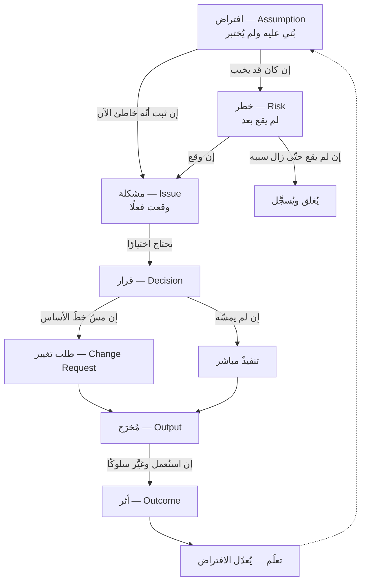

# 🗺️ أطلس العلاقات والمفارقات

> [!info] صفحةٌ لا تضيف معلومةً واحدة
> كلُّ ما فيها **مبثوثٌ في الفصول السبعة عشر**، وهي لا تشرحه ولا تُعيده. **وظيفتُها واحدة: أن تجمع ما تفرّق فيُرى شكلُه.** فما بين المفاهيم من روابط، وما بين الظواهر من تعارضٍ ظاهريّ، **لا يُرى وهو موزّع على مائتي ألف كلمة** ولو قُرئت كلُّها.
>
> **وهي نصفان:** نصفٌ يقول **أين تتعارض الظواهر** (المفارقات)، ونصفٌ يقول **كيف يتحوّل المفهوم إلى الذي بعده** (العلاقات). ولكلّ صفٍّ فيهما **موضعٌ يُرجع إليه**، فمن أراد التحرير وجده هناك لا هنا.

---

# ⚖️ القسم الأول: أطلس المفارقات

> [!warning] اقرأ هذا قبل الجدول — وإلّا انقلب نفعه ضدّه
> **المفارقة في هذا العلم ليست تناقضًا، بل شرطًا محذوفًا.** فقولك «زيادة الأشخاص تُسرّع» صحيحٌ في العمل القابل للتجزئة، وخاطئٌ في غيره؛ والعبارتان لا تتناقضان، **وإنّما حُذف من كلٍّ منهما شرطُها فبدتا متقابلتين.**
>
> **ولهذا في الجدول عمودٌ اسمه «الشرط»، وهو أهمّ أعمدته.** فمن قرأ العمودين الأوّلين وحدهما خرج بشيءٍ واحد: **أنّ كلّ شيءٍ عكسُ ما يبدو** — وهذا ليس فطنةً بل ارتيابٌ عامّ، وهو بعينه ما يحذّر منه [[13 - كيف يغير هذا العلم تفكيرك|الفصل ١٣]] حين يجعل «صوت لكنّ» فسادًا بالإفراط لا بالنقص. **والفطنة أن تعرف الشرط، لا أن تشكّ في الجملتين.**

| # | يبدو أنّ… | ولكن… | **والشرط الذي يفصل** | موضعه |
|---|---|---|---|---|
| ١ | **التخطيط يُقلّل الجهل** | أنت أجهل ما تكون **حين يُطلب منك أدقّ التقديرات** | يضعف كلّما اقترب العمل من المكرَّر المعروف، **فمن بنى عشرين موقعًا متشابهًا انتهى جهلُه قبل أن يبدأ** | [[08 - القواعد الكلية وسنن المشاريع\|٠٨ — السنّة ①]] |
| ٢ | **الانتظار يُوضّح الصورة** | الانتظار لا يُنقص الجهل، **وإنّما يُنقص الوقت الباقي للتصرّف** | يصحّ الانتظار وحده حين يكون الجهل معلَّقًا على **حدثٍ خارجيٍّ له موعد** — ويُكتب حينها قرارًا لا تسويفًا | [[08 - القواعد الكلية وسنن المشاريع\|٠٨ — السنّة ③]] |
| ٣ | **تغيُّر المتطلّبات فشلٌ في التحليل** | هو **ثمرةُ نجاحٍ في الإظهار**: فالمستخدم لا يعرف ما يريد حتّى يرى شيئًا يقول عنه «ليس هذا» | يتخلّف حيث يكون المطلوب **منصوصًا خارج إرادة الطرفين** — كنظامٍ يُبنى لتنفيذ لائحة | [[08 - القواعد الكلية وسنن المشاريع\|٠٨ — السنّة ②]] |
| ٤ | **زيادة الأشخاص تُسرّع** | المسارات بين `ن` شخصًا `ن(ن−1)÷2` — فخمسةٌ بينهم عشرة، **وعشرةٌ بينهم خمسة وأربعون** | تتخلّف بقدر ما يكون العمل **قابلًا للتجزئة بلا تنسيق**، وهذا ما تصنعه المعمارية الجيّدة | [[08 - القواعد الكلية وسنن المشاريع\|٠٨ — السنّة ⑤]] · [[Brooks's Law]] |
| ٥ | **كثرة الاجتماعات مرضٌ يُعالَج بالمنع** | الاجتماع **آلةُ نقل معلومة**، فمن ألغاه بلا بديلٍ نقل الحاجة إلى رسائل أكثر كلفةً وأقلّ نظامًا | يتخلّف في الاجتماع الذي غرضه **صناعة قرارٍ أو بناء فهمٍ مشترك** — وهذا لا تُغني عنه وثيقة | [[08 - القواعد الكلية وسنن المشاريع\|٠٨ — السنّة ⑥]] |
| ٦ | **رفعُ أولوية كلّ شيءٍ يُسرّعه** | إذا كثرت الأولويات **انعدمت**، وانتقل قرار الترتيب من صاحبه إلى المنفّذ | يتخلّف حين تكون الأعمال **متوازيةً حقًّا** بلا تزاحمٍ على مورد — وهو نادر، فالتزاحم يقع على موردٍ مشترك لا يُنتبه له | [[08 - القواعد الكلية وسنن المشاريع\|٠٨ — السنّة ⑦]] |
| ٧ | **تشغيل الجميع يزيد المنجَز** | زيادةُ العمل الجاري **تُطيل زمن كلّ عنصرٍ ولا تزيد المنجَز** — وهو حسابٌ لا استقراء | يشترط **نظامًا مستقرًّا**؛ وحسابُه على أسبوعٍ في نظامٍ مضطرب يُعطي رقمًا لا يعني شيئًا | [[08 - القواعد الكلية وسنن المشاريع\|٠٨ — السنّة ⑧]] · [[Little's Law]] |
| ٨ | **تأجيل القرار مرونة** | لتأجيله ثمنٌ **لا يظهر في أيّ بند** — شهرُ عملٍ على افتراضين متعارضين | يصحّ التأجيل إن أُجيب: «ماذا سأعرف غدًا؟» **ولم** يكن ثمّة عملٌ يمضي الآن على احتمالين | [[08 - القواعد الكلية وسنن المشاريع\|٠٨ — السنّة ⑨]] |
| ٩ | **التوثيق يحفظ المعرفة** | أغلى ما يضيع ليس **ما فُعل** — فهو في المنتج — بل **لماذا رُفض البديل**، ولا يُستدرَك إلّا بإعادة التجربة | يتخلّف ما بقي الفريق نفسه على المنتج نفسه، **فيظهر الأثر فجأةً عند أوّل انتقال لا تدريجيًّا** | [[08 - القواعد الكلية وسنن المشاريع\|٠٨ — السنّة ⑩]] · [[Decision Log]] |
| ١٠ | **الاكتشاف المبكّر أرخص دائمًا** | **صحيح** — لكنّ **حِدّة** المنحنى ليست ثابتة، ومع الاختبار الآليّ والتسليم المتّصل **يتسطّح ولا يستوي** | المبدأ ثابتٌ والمقدار متغيّر — **ومن عامل المقدار ثابتًا اشترى تحليلًا مقدَّمًا لا يحتاجه** | [[08 - القواعد الكلية وسنن المشاريع\|٠٨ — السنّة ④]] · [[Cost-of-Change Curve]] |
| ١١ | **القياس يُوضّح** | **ما يُقاس يبدأ في تشويه السلوك** حين يصير هدفًا — ووحده من بين الأمراض **يُعطّل جهاز الكشف** | يشتدّ حيث يُربط المقياس بمكافأةٍ أو تقييم، ويضعف حيث يبقى **إشارةً تُفسَّر** لا حكمًا يُنفَّذ | [[14 - أمراض الممارسة]] · [[Goodhart's Law]] |
| ١٢ | **الإسراع يُقرّب القيمة** | الإسراع بلا إغلاق حلقة الأثر **يُنتج القيمة أسرع، أو نقيضَها أسرع** | يصحّ حيث تُقاس النتيجة لا المُخرَج وحده — **فالتدفّق يُقاس داخل النظام والأثر يقع خارجه بعد أشهر** | [[14 - أمراض الممارسة]] · [[Technical Debt]] |
| ١٣ | **التسليم في الموعد نجاح** | قد يكون **مُخرَجًا بلا أثر**: سُلِّم بنطاقه وميزانيته، ولم يتغيّر رقمٌ واحد | لكلّ مشروعٍ تغيُّرٌ مقصود، **وليس كلُّ تغيُّرٍ مقصودٍ رقمًا** — فمشاريع الامتثال والتمكين تُستثنى | [[03 - فلسفة المشروع]] · [[22 - Outputs and Outcomes]] |
| ١٤ | **إيقاف مشروعٍ فشل** | قد يكون **أنجح قرارٍ في العام**، والاستمرار فيه هو الفشل | يفرّق بينهما [[Sunk Cost Fallacy\|الكلفة الغارقة]]: يُسأل عمّا يُنفَق **من اليوم** مقابل ما يُجنى، لا عمّا أُنفق | [[09 - المقاصد والثنائيات والمفاضلات]] · [[17 - المشروع والاستخلاف]] |
| ١٥ | **القرار الذي نجحت نتيجته قرارٌ صائب** | **الخانة الرابعة أخطرها:** قرارٌ رديء نجت نتيجتُه — وحدها التي يُكافأ فيها الخطأ ولا يُنبَّه أحد | يُفصل الحكم على القرار عن الحكم على النتيجة، **وتُربط المراجعة بحجم القرار لا بوقوع الفشل** | [[17 - المشروع والاستخلاف]] |
| ١٦ | **الحارس المسبق أقوى الضمانات** | **أغلاها وأضعفها**، لأنّه يقوم على انتباه إنسانٍ مشغول؛ ويعلوه الفحصُ اللاحق بالعيّنة، ثمّ **القيدُ الآليّ** | يبقى لازمًا حيث يكون الخطأ **غير قابلٍ للتصحيح بعد وقوعه** — وحينها يُدفع ثمنه عن علم | [[14 - أمراض الممارسة]] |

> [!question] تأمّلٌ تطبيقيّ — لا جواب له في هذه الصفحة
> **اختر ثلاثة صفوفٍ من الستّة عشر**، واكتب أمام كلٍّ منها جملةً واحدة: *هل الشرط متحقّقٌ في مشروعي أنا؟* — فالصفّ الذي شرطُه متحقّقٌ عندك ليس مفارقةً بل **وصفًا لحالك**، والذي لا يتحقّق شرطُه **لا يخصّك ولا تُتعب نفسك به**.

---

# 🔗 القسم الثاني: قاموس العلاقات

> [!info] وهو غير [[معجم المصطلحات]] — والفرق ليس في الحجم
> المعجم يقول **ما معنى `Risk`**، وهذا يقول **متى يصير الافتراضُ خطرًا، ومتى يصير الخطرُ مشكلة**. فالأوّل يعرّف العُقَد، **وهذا يعرّف الأسهم بينها** — وهي التي تُنسى دائمًا لأنّ أحدًا لا يعرّفها.
>
> **وأثر ذلك عمليّ:** من حفظ ستّة تعريفات يعرف ستّة ألفاظ، ومن عرف الانتقالات بينها **يعرف أين هو الآن، وما الذي يليه، وما الذي يمنعه.**

## ① السلسلة الكبرى — من افتراضٍ إلى تعلّم

**وثلاثة أسهمٍ في هذا الرسم هي التي يقع فيها الخطأ:**

| السهم | متى يقع الانتقال؟ | وما يُخطئ فيه الناس |
|---|---|---|
| **افتراض ← خطر** | حين يُنتبه إليه **ويُقدَّر احتمالُه وأثرُه** | الافتراض الذي لم يُنتبه إليه **ليس خطرًا في السجلّ، وهو أخطر ما في المشروع** — لأنّه لا يُراقَب أصلًا |
| **خطر ← مشكلة** | حين **يقع** | يُسجَّل الواقع في سجلّ المخاطر فيبقى «قيد المتابعة» شهورًا. **والفارق: الخطر يُدار باحتمال، والمشكلة تُدار بقرار** |
| **مُخرَج ← أثر** | حين **يُستعمل** فيتغيّر سلوكٌ أو رقم | يُفترض الانتقال ولا يُقاس — **فيُحتفل بالتسليم ويُطوى الملف قبل أن يُعرف أوقع الأثر أم لا** |

## ② سلسلة القياس — من الرقم إلى الحكم

**مقياس ← مؤشّر ← مستهدَف ← حكم.** والانتقالات:

- **المقياس ← المؤشّر:** يصير الرقمُ مؤشّرًا حين يُلحق به **هدفٌ وحدُّ تفسير**. فـ«عدد الحجوزات» مقياس، و«نسبة الحجوزات الفاشلة والمستهدَف أقلّ من ٢٪» مؤشّر. **والفرق عمليّ: المقياس لا يُنبّه أحدًا، والمؤشّر يُنبّه.**
- **المؤشّر ← القيمة الأساس:** لا يُقرأ المؤشّر إلا من نقطة انطلاق، **وهي غير خطّ أساس المشروع** — تلك رقمٌ واحد، وهذا نسخةٌ معتمدة من خطّة.
- **المؤشّر ← الحكم:** ويسقط هنا حين يصير المؤشّر **هدفًا** ([[Goodhart's Law]])، فيُنتَج الرقم بلا أن تُنتَج وظيفتُه.

## ③ سلسلة الكلفة — من الجهل إلى الدين

**جهلٌ ← قرارٌ بلا معلومة ← عملٌ فوقه ← اكتشافٌ متأخّر ← كلفةُ تصحيحٍ تتبع ما تراكم.**

**والعقدة الحاسمة الثالثة لا الرابعة:** فالكلفة لا تتبع **جسامة الخطأ** بل **ما بُني فوقه**. ولهذا يكون الخطأ الصغير المبكّر أغلى من الكبير المتأخّر أحيانًا — إن كان الأوّل قد صار أساسًا لعشرة أشياء. — [[08 - القواعد الكلية وسنن المشاريع|٠٨ — السنّة ④]] · [[Technical Debt]]

## ④ سلسلة البنية — من التواصل إلى المنتج

**كلفةُ التنسيق ← الاقتصادُ في التواصل ← حدودٌ في المنتج تتبع حدود الفريق.**

وهذه [[Conway's Law|ملاحظة كونواي]] و[[Brooks's Law|قانون بروكس]] **وجهان لعلّةٍ واحدة**: أنّ التواصل مكلفٌ فيُقتصَد فيه، والاقتصاد فيه يترك أثره في المنتج. **ولازمُها العمليّ أنّ ما يُنقص الكلفة ليس تنظيمَ التواصل بل إنقاصَ الحاجة إليه** — بملكيّةٍ واضحة، وواجهاتٍ مستقرّة. **وكلاهما قرارٌ معماريٌّ في ظاهره، وهو في حقيقته قرارٌ في كلفة التنسيق.**

## ⑤ سلسلة الحكم — من القول إلى القرار

**ما قيل لك ← طبقتُه ← موضعُه من سُلَّمك ← قرارُك.**

| ما صُنِّف في [[12 - كيف يفكر مدير المشروع\|الفصل ١٢]] | يدخل [[سلم الحكم\|السُّلَّم]] في |
|---|---|
| **حقيقة** — قِيست أو شوهدت | الدرجة ① نعرف |
| **تقدير · توقّع** | الدرجة ③ نفترض — **لا الأولى** |
| **التزام** | الدرجة ⑥ قيدًا، إن كان قد أُعلن خارجًا |
| **رغبة** | لا تدخل السُّلَّم، **وموضعها الدرجة ⑤** وصفًا لما ينبغي أن يكون |

**وهذه أنفع علاقةٍ في القاموس كلِّه عند العمل اليوميّ**، لأنّها تُحوّل جملةً سمعتَها في اجتماعٍ إلى **خانةٍ لها موضع** — بدل أن تدخل ذهنك كلُّها بدرجةٍ واحدة من الثقة.

---

## 🚧 خارج نطاق هذه الصفحة

- **شرح أيّ مفهومٍ ورد فيها** — كلُّ عمودٍ أخير يُحيل إلى موضعه، وهذه الصفحة **تدلّ ولا تُعرّف** (القاعدة العاشرة في المستودع).
- **حصرُ المفارقات** — الستّة عشر ما استُخرج من الفصول، **وليست كلّ ما في العلم**؛ ومن وجد صفًّا سابعَ عشرَ له موضعٌ في فصلٍ فليُضفه بشرطه: **أن يُكتب شرطُه معه**.
- **العلاقات داخل مجالٍ بعينه** — كسلاسل التشغيل والامتثال، فموضعها أبوابها.

> [!abstract] 🕸️ هذه الصفحة في الشبكة
> **تستعمل ولا تعرّف:** [[Brooks's Law]] · [[Conway's Law]] · [[Little's Law]] · [[Goodhart's Law]] · [[Cost-of-Change Curve]] · [[Sunk Cost Fallacy]] · [[Technical Debt]] · [[Decision Log]]
> **تحصد من:** [[08 - القواعد الكلية وسنن المشاريع]] أوّلًا، ثمّ [[09 - المقاصد والثنائيات والمفاضلات]] · [[14 - أمراض الممارسة]] · [[17 - المشروع والاستخلاف]] · [[03 - فلسفة المشروع]]
> **تُستعمل في:** [[سلم الحكم]] — فالقسم الثاني منها يُملأ به الدرجات الأولى · و[[مختبرات الحكم]]
> **وتثير ولا تجيب:** أيُّ هذه المفارقات مفارقةٌ في العلم نفسه، وأيُّها مفارقةٌ في **حدسنا** وحده؟ — فالسادسة عشرة مثلًا لا تُفاجئ من درس نظم الجودة، وتُفاجئ كلّ من جاء من الإدارة.
