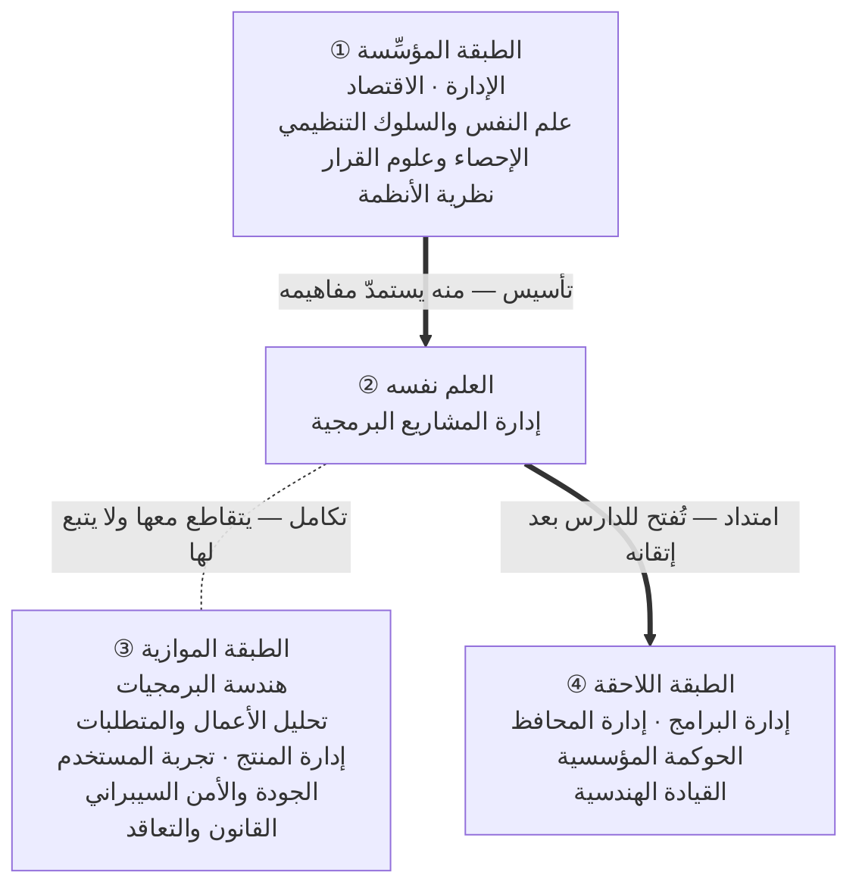

# المدخل إلى علم إدارة المشاريع البرمجية

## لماذا كُتب هذا الباب؟

في المكتبتين العربية والإنجليزية آلاف الصفحات تعلّمك **كيف** تُدير سبرنتًا (Sprint)، وكيف ترتّب قائمة أعمال (Backlog)، وكيف تحسب سرعة فريق. وقليلٌ منها يقف عند سؤال أسبق من ذلك كلّه: **لماذا وُجدت هذه الأدوات أصلًا؟ وأيّ مشكلة جاءت لتحلّها؟**

والفرق بين السؤالين ليس فرقًا نظريًّا؛ بل تراه في موقف يعرفه كل ممارس. فريقٌ طبّق سكرم (Scrum) فنجح نجاحًا ظاهرًا، وفريقٌ آخر طبّق الشيء نفسه بحذافيره فتعثّر — والاثنان أذكياء، والاثنان مجتهدان، والاثنان حاصلان على الشهادة نفسها. ثم لا يُقال في تفسير الفرق إلا: «لم يطبّقوها كما ينبغي». وهي جملة تُنهي النقاش ولا تفسّر شيئًا.

والمشكلة ليست في سكرم، ولا في الفريق الثاني. المشكلة أن **الجواب سُلِّم بلا سؤاله**. فمن حفظ الجواب وحده لم يملك إلا الحالة التي وُضع لها؛ ومن عرف السؤال ملك أن يحكم على كل جواب يُعرض عليه — يعرف متى يصلح، ومتى يصلح مقيَّدًا، ومتى لا يصلح أصلًا.

وهذا هو أكثر ما يُسمّى اليوم تعلّمًا في هذا المجال: **جمعُ أجوبةٍ بلا أسئلتها**. فتكثر عند الدارس المعلومات، ويبقى عاجزًا عن أبسط حكم يُطلب من مهنيّ: أن يقول لِمَ اخترتَ هذا دون ذاك.

فهذا الباب لا يعلّمك إطار عمل. **يعلّمك أن ترى العلم الذي أنجب هذه الأطر** — من أين جاء، وما موضوعه، وأين ينتهي، وبأي لغة يتكلّم، وعلى أي سنن يجري، ولماذا اختلف أهله. وحين تعرف ذلك تصير الأطر عندك إجاباتٍ لها سياق، لا وصفاتٍ تُتَّبع أو تُخالَف.

> [!quote] المقصد الجامع لهذا الباب
> ### «لا تبدأ بالأداة قبل أن تعرف السؤال الذي جاءت لتجيب عنه.»
>
> وتفسيرها: **مَن عرف موضع الفكرة سهُل عليه حفظها؛ ومن جهل موضعها كثرت عنده المعلومات وقلّ عنده الفهم.** وهذه الجملة الواحدة هي ما تدور عليه الفصول كلّها، وستجدها في صدر الباب وفي خاتمته لأنها الميزان لا الزينة.

> [!question]- قبل أن تبدأ — أجب عن هذه الأسئلة أوّلًا
> اكتب أجوبتك الآن في ملفّ عندك، بخطّ يدك أو بلوحة مفاتيحك، ولا تبحث عن جواب أحد:
>
> 1. ما **المشروع**؟ وما الذي يجعل عملًا ما مشروعًا وعملًا آخر ليس كذلك؟
> 2. **لماذا تفشل المشاريع؟** اكتب ثلاثة أسباب في رأيك، ورتّبها بحسب أثرها.
> 3. مشروعٌ سُلِّم في موعده وبميزانيته وبكامل نطاقه — **هل هو ناجح؟**
> 4. ما الفرق بين **إدارة المشروع** و**إدارة المنتج**؟ وهل يمكن أن يجتمعا في شخص واحد؟
> 5. لماذا نجحت **إدارة المشاريع الرشيقة (Agile)** في مواضع وفشلت في أخرى؟
> 6. ماذا يفعل **مدير المشروع** في يومه فعلًا — لا في وصفه الوظيفي؟
>
> فإذا فرغت من الفصل السابع عشر فارجع إلى ورقتك هذه. وليس المقصود أن تجد أجوبتك خاطئة — بل أن ترى **كيف** تغيّرت: أيُّ سؤال لم يعد يُجاب بكلمة واحدة، وأيُّ جواب صار مشروطًا بعد أن كان مطلقًا. وهذا الفرق بعينه هو ثمرة الباب، وهو شيء لا يُقاس إلا بمقارنة الأول بالآخر.

---

## من أين يبدأ هذا العلم؟

> [!abstract] موضع هذا الباب
> **سبعة عشر فصلًا تأسيسيًّا لا تشرح إطار عمل ولا أداة ولا حدثًا.** غايتها واحدة: أن يبني القارئ **تصوّرًا كلّيًّا (Macro Mental Model)** عن هذا العلم — ما هو، ولماذا وُجد، وما موضوعه وحدوده، وأين يقع من العلوم، وبأي لغة يتكلّم، وعلى أي قواعد يجري، وكيف يُطلب — **قبل** أن يقرأ حرفًا عن إدارة المشاريع الرشيقة (Agile) أو سكرم (Scrum) أو كانبان (Kanban).
>
> وموضعه في صدر القاعدة مقصود: هو **الباب `00`**، وما بعده (`01 - الأساسيات` والدورات والورش والحالات) تفصيلٌ يجد القارئ له موضعًا في الخريطة التي رُسمت هنا.

> [!info] اصطلاح هذا الباب
> يُكتب كل مصطلح تقنيّ **بالعربية ثم بالإنجليزية بين قوسين عند أوّل ظهور** — إدارة المشاريع الرشيقة (Agile) · سكرم (Scrum) · السبرنت (Sprint) — ثم بالعربية وحدها بعد ذلك. ويشمل هذا المصطلحات المنقولة صوتيًّا وإن شاعت، لأن شيوعها لا يغني القارئ عن الأصل الذي يبحث به ويقرأ به المراجع. والاصطلاح الحاكم كلّه في [[معجم المصطلحات]].

> [!warning] وما ليس هذا الباب
> **ليس مقدّمة تُقرأ ثم تُترك.** ولا هو مرجع في «كيف تدير مشروعًا» — لن تجد فيه خطوة تخطيط السبرنت (Sprint Planning)، ولا صيغة تقدير (Estimation)، ولا قالب ميثاق مشروع (Project Charter). تلك كلّها في [[Project Management|بقيّة القاعدة]]، وهذا الباب هو ما يجعلها **مفهومة** بدل أن تكون محفوظة.
>
> والفرق عمليّ لا شكليّ: من قرأ سكرم بلا هذا الباب حفظ خمسة أحداث وثلاث مسؤوليات؛ ومن قرأه بعده عرف **أي سؤال** جاء سكرم ليجيب عنه، فصار يعرف متى لا يصلح جوابًا.

> [!todo] تتبّع التقدّم
> راجع تقدّمك في كلّ فصول هذا الباب عبر [[لوحة التقدّم.base]].

---

## 🧭 لماذا يبدأ العلم بالتصوّر لا بالتعريف؟

أكثر ما يُكتب اليوم في إدارة المشاريع يفترض أن القارئ **يعرف موضع كل فكرة**، فيبدأ من العمليات أو الأطر أو الأدلّة مباشرةً. والنتيجة أن الدارس يجمع معلومات صحيحة لا يعرف أين يضعها، فيحفظ الأدوات ويجهل المقاصد.

وطريقة المتقدّمين في التصنيف كانت تبدأ من الطرف الآخر: **يُوصف العلم قبل أن يُشرح.** فيُذكر حدّه وموضوعه وثمرته ونسبته وواضعه ومسائله، حتى إذا دخل الطالب في التفاصيل دخلها وهو يعرف أين هو. وهذا الباب إحياء لتلك الطريقة بصياغة معاصرة.

ويبني هذا الباب **ثلاث طبقات في عقل الدارس**، كلٌّ منها تجيب عن سؤال لا تجيب عنه الأخرى:

1. **🧭 التصوّر — كيف يرى العلمَ من الخارج؟**
   حدّه وموضوعه وحدوده ومقاصده وموضعه ممّا حوله. ومصدر هذه الطبقة تراثُ وصف العلوم وآداب طلبها.
2. **🧱 الفهم — كيف ينتظم العلم من الداخل؟**
   لغته ومفاهيمه وأسئلته وسننه ومداره وسبب اختلاف أهله. ومصدر هذه الطبقة فلسفةُ العلوم وهندسة المعرفة ونظرية الأنظمة.
3. **🛤️ الطلب — كيف يتعلّمه ويواصل السير فيه؟**
   مسار متدرّج، ومراتب فهم، وطبقات كتب، وبطاقة وصف مقرّر، واختبار ذاتي. ومصدر هذه الطبقة علومُ التعلّم الحديثة.

*والطبقات الثلاث وصفٌ لما يُبنى في عقل القارئ، والمراحل الثلاث التالية وصفٌ لترتيب سيره. فالأولى **ثمرة**، والثانية **طريق**.*

---

## 📚 الفصول السبعة عشر — رحلة في ثلاث مراحل وخاتمة

### 🏔️ المرحلة الأولى: الرؤية — أن ترى العلم من خارجه

*قبل أن تدخل بيتًا تُبصره من بعيد: أين يقوم، وكم مساحته، وأين ينتهي سوره. وهذه المرحلة تعطيك ذلك: لماذا وُجد هذا العلم، وما طبيعته، وما موضوعه، وأين يقع من جيرانه، وما الذي ليس منه.*

| # | الفصل | المحاور الأساسية | الحالة |
|---|---|---|---|
| 01 | [[01 - لماذا هذا العلم]] | الفجوة بين ما نتخيّله وما ننجزه · لماذا تفشل المشاريع رغم الذكاء والجهد · من يحتاج هذا العلم (المبرمج · المستقلّ · صاحب الشركة) · ما الذي يخسره من لا يعرفه | `مكتمل` |
| 02 | [[02 - طبيعة العلم وهويته]] | نوعه: علم مركّب لا تجريبيّ خالص · موضوعه · شخصيته وروحه · **حدوده: ما لا يستطيع حلّه** · افتراضاته الكبرى · من أين تأتي المعرفة فيه ومتى تكون حالة واحدة حجّة | `مكتمل` |
| 03 | [[03 - فلسفة المشروع]] | ماهية المشروع (Project) · السلسلة الوجودية من الحلم إلى المحفظة (Portfolio) · الفروق الجوهرية · المشروع كائنًا حيًّا · **المخرجات الأربعة**: مادّي وتنظيمي وبشري ومعرفي | `مكتمل` |
| 04 | [[04 - أين يقع هذا العلم\|04 - أين يقع هذا العلم؟]] | موقعه في منظومة المعرفة · الطبقة المؤسِّسة والموازية واللاحقة · **نوع العلاقة** لا مجرّد وجودها (تأسيس · تكامل · امتداد) · ما الذي يستعيره وما الذي يُعيره | `مكتمل` |
| 05 | [[05 - ما ليس من إدارة المشاريع\|05 - ما الذي ليس من إدارة المشاريع؟]] | **حدّ العلم من جهة الجيران**: إدارة المنتج · الإدارة التنفيذية · القيادة · هندسة البرمجيات · تحليل الأعمال · الإدارة التشغيلية · قاعدة الحكم عند التداخل: بمن تُناط المسؤولية حين تتقاطع | `مكتمل` |

### 🏛️ المرحلة الثانية: الدخول — أن تدخل إلى داخله

*وحين تدخل تحتاج إلى لسانه لتفهم أهله، وإلى أسئلته لتعرف ما يشغلهم، وإلى سننه لتعرف ما يتكرّر، وإلى تاريخه لتعرف كيف صار إلى ما هو عليه، وإلى سبب خلافهم لئلّا تحسب الاختلاف فوضى.*

| # | الفصل | المحاور الأساسية | الحالة |
|---|---|---|---|
| 06 | [[06 - لسان العلم]] | لماذا يصنع اللفظ التصوّر · النطاق (Scope) والمتطلّب (Requirement) · [[Outcome vs Output\|المخرَج (Output) والأثر (Outcome)]] · [[Governance\|الحوكمة (Governance)]] والإدارة (Management) والقيادة (Leadership) · المخاطرة (Risk) والمشكلة (Issue) والتبعية (Dependency) · المبادرة (Initiative) والملحمة (Epic) والقصّة (Story) والمهمّة (Task) | `مكتمل` |
| 07 | [[07 - الأسئلة الكبرى]] | اثنا عشر سؤالًا يجيب عنها هذا العلم · وكل فصل في القاعدة كلّها جوابٌ عن واحد منها · جدول الإحالة من السؤال إلى موضعه | `مكتمل` |
| 08 | [[08 - القواعد الكلية وسنن المشاريع]] | عشرة قوانين متكرّرة (الجهل الأوّلي · تكلفة التأخير · تكلفة المعلومة · تضخّم التواصل) · قواعد كلّية يُرجع إليها عند الجزئيات | `مكتمل` |
| 09 | [[09 - المقاصد والثنائيات والمفاضلات]] | مقاصد العلم العليا وبها تُقاس المنهجيات · الثنائيات (تخطيط/مرونة · ثقة/رقابة · مركزية/لامركزية) · [[Iron Triangle\|علم المفاضلة (Trade-offs)]] وأنه جوهر المهنة | `مكتمل` |
| 10 | [[10 - كيف تطور هذا العلم\|10 - كيف تطوّر هذا العلم؟]] | **تاريخ الأسئلة لا الأشخاص**: سبع محطّات، كلٌّ منها سؤالٌ فرضته الحاجة لا اسمُ مؤلّف — التنظيم الضخم · الإنتاجية · التعقيد · التوحيد المعياري · المتطلّبات المجهولة · الفجوة بين البناء والتشغيل (DevOps) · الذكاء الاصطناعي (AI) | `مكتمل` |
| 11 | [[11 - لماذا اختلفت المدارس\|11 - لماذا اختلفت المدارس؟]] | التنبّؤية (Predictive) · الرشيقة (Agile) · اللين (Lean) · الهجينة (Hybrid) · تفكير المنتج (Product Thinking) · تفكير الأنظمة (Systems Thinking) · **سبب الخلاف** (البيئة · الحجم · الصناعة · الثقافة · درجة عدم اليقين) لا الخلاف وحده | `مكتمل` |

### 🧠 المرحلة الثالثة: التمكّن — أن تتعلّم كيف تفكّر به

*ثم يبقى ما هو أبقى من المعلومة: أن ينتقل العلم من كتابك إلى طريقة نظرك. وهذه المرحلة عن العقل الذي يصنعه هذا العلم، وعن أمراض تفسده، وأخلاق تحفظه، وطريقٍ يُطلب بها.*

| # | الفصل | المحاور الأساسية | الحالة |
|---|---|---|---|
| 12 | [[12 - كيف يفكر مدير المشروع]] | دورة التفكير من المشكلة إلى التعلّم · هندسة السؤال · النماذج الذهنية · فقه عدم اليقين والافتراضات · فقه الوقت والقيود · طبقات الحقيقة (حقيقة · تقدير · وعد · رغبة) | `مكتمل` |
| 13 | [[13 - كيف يغير هذا العلم تفكيرك\|13 - كيف يغيّر هذا العلم طريقة تفكيرك؟]] | لا ماذا يعلّمك بل **ما الذي يتغيّر فيك**: ترى القيد قبل الحلّ · وترى المخاطرة داخل الفرصة · وتفصل الأثر عن المخرَج · وتكشف الافتراض المستتر قبل أن ينكشف بنفسه · وتسأل عن الثمن قبل المكسب · وأثر ذلك خارج العمل | `مكتمل` |
| 14 | [[14 - أمراض الممارسة]] | ستّة أمراض: الأدوات · الشهادات · القوالب · الإجراءات · الأرقام · تقديس المنهجية — لكلٍّ علامته الظاهرة وآليّة إفساده وعلاجه · ولماذا تُنتج هذه الأمراض علاماتٍ مطمئنّة | `مكتمل` |
| 15 | [[15 - أخلاق المهنة]] | صدق التقرير · الأمانة في التقدير · العدل في التوزيع · الاعتراف بالخطأ · حدود الولاء للمؤسّسة والفريق والعميل حين تتعارض · ولماذا لا تعوّض المنهجيةُ غيابَ الأمانة | `مكتمل` |
| 16 | [[16 - كيف يطلب هذا العلم\|16 - كيف يُطلب هذا العلم؟]] | المطلوب والطالب والوسيلة والبيئة والتدرّج · مراتب الفهم الستّ · **طبقات الكتب** · **كيف تُقرأ** كتب الإدارة · **كيف تتدرّج** · **بطاقة وصف المقرّر** قالبًا يُطبَّق على كل كتاب وقاعدة | `مكتمل` |

### 🕊️ خاتمة الباب — زاوية نظر أخرى

*ويُختم الباب بفصل يقف خارج الصنعة كلّها، فينظر إلى العمل نفسه: لماذا يستحقّ الإتقان أصلًا، وما معنى أن تُؤتمن على جهد أناس ومال غيرك. وموضعه في النهاية مقصود، لأنه لا يُبنى على العلم بل يُبنى عليه العلم — ولا يُقرأ حقّ قراءته إلا بعد أن يعرف القارئ ما الذي في يده.*

| # | الفصل | المحاور الأساسية | الحالة |
|---|---|---|---|
| 17 | [[17 - المشروع والاستخلاف]] | النظرة القيمية للعمل · العمارة والاستخلاف · اجتماع التوكّل مع الأخذ بالأسباب · **حدود هذا الفصل صراحةً** وما لا يُقحَم فيه | `مكتمل` |

*لإضافة فصل إلى هذا الباب، استخدم [[_Chapter Template - المدخل|معمار الفصل]] — وهو بنية الفصل لا قالبًا تُملأ خاناته.*

---

## 🗺️ أين يقع هذا العلم؟

هذه صورة مصغَّرة لِما يفصّله [[04 - أين يقع هذا العلم|الفصل 04]]. والمقصود منها أن يرى القارئ الموضع، لا أن تُغني عن الفصل.

> [!tip] كيف تقرأ هذه الخارطة؟
> 1. **اقرأها طبقاتٍ لا شبكةَ أسماء.** فالمعلومة هي **موضع** العلم من الطبقة، لا وجود الاسم فيها. وترتيبها ①→②، ثم يتفرّع عن ② خطّان: أحدهما إلى ③ والآخر إلى ④.
> 2. **انظر إلى نوع الخطّ لا إلى وجوده.** فالسهم الغليظ علاقة **تأسيس أو امتداد** — أي تبعيّة في اتّجاه واحد؛ والخطّ المنقّط علاقة **تكامل** بلا تبعية. والفرق بينهما هو ما يحسم من يملك القرار حين تتقاطع المسؤوليات.
> 3. **اسأل عن موقعك أنت.** فأكثر ما يقع من الخلط في العمل مصدره أن اثنين يظنّان نفسيهما في طبقة واحدة وهما في طبقتين.

*الطبقة الأولى **تؤسّسه** فمنها يستمدّ مفاهيمه وأدواته الذهنية. والثالثة **توازيه** فيلتقي بها في المشروع الواحد بلا أن تتبع إحداهما الأخرى — وهذه بالذات هي التي يفصّل حدودَها [[05 - ما ليس من إدارة المشاريع|الفصل 05]]. والرابعة **امتداده** فتُفتح للدارس بعد إتقانه.*

---

## ❓ الأسئلة الكبرى — على ترتيب رحلة المشروع

يبسط الفصل [[07 - الأسئلة الكبرى|07]] هذه الأسئلة ويؤصّلها. وهذا الجدول دليل تصفّح: كل سؤال ومكان جوابه في الفولت كلّه لا في هذا الباب وحده.

**وترتيبها هنا مقصود:** فهي مرتّبة على **رحلة المشروع** من تعريفه إلى ما بعد انتهائه — لا على ترتيب الفصول ولا على أهمّية السؤال. فاقرأها متتابعةً تجد أنها تحكي مشروعًا كاملًا من أوّله إلى آخره، ثم يأتي السؤال الأخير خارج الرحلة كلّها لأنه عن **صاحبها** لا عنها.

| # | السؤال | أين جوابه |
|---|---|---|
| 1 | ما المشروع؟ وما الفرق بينه وبين المنتج والبرنامج والمحفظة؟ | [[03 - فلسفة المشروع]] · [[23 - Project Program Portfolio]] |
| 2 | كيف تتحوّل فكرة إلى قيمة حقيقية؟ | [[22 - Outputs and Outcomes]] · [[كورس الإنتاجية]] |
| 3 | كيف تُتَّخذ القرارات في ظلّ عدم اليقين؟ | [[12 - كيف يفكر مدير المشروع]] · [[Reversible vs Irreversible Decisions]] |
| 4 | كيف نبني فريقًا قادرًا على الإنجاز؟ | [[06 - Scrum Master]] · [[ورشة سكرم العملية]] |
| 5 | كيف نوازن بين الوقت والتكلفة والنطاق والجودة؟ | [[09 - المقاصد والثنائيات والمفاضلات]] · [[Iron Triangle]] |
| 6 | كيف نحمي المشروع ممّا لا نعرفه بعد؟ | [[08 - القواعد الكلية وسنن المشاريع]] · [[19 - Risk Management]] |
| 7 | كيف يتغيّر المشروع دون أن يفقد هويته؟ | [[11 - ضبط التغيير - طلب التغيير الرسمي]] · [[15 - Roadmap]] |
| 8 | كيف نجمع بين التخطيط المسبق والمرونة؟ | [[11 - لماذا اختلفت المدارس]] · [[نماذج العمل في المشاريع التقنية]] |
| 9 | كيف نقيس النجاح؟ وهل الالتزام بالخطة وحده نجاح؟ | [[09 - المقاصد والثنائيات والمفاضلات]] · [[ورشة مؤشرات المنتج]] |
| 10 | كيف تنتهي المشاريع؟ وكيف تُحفظ معرفتها بعد أن يتفرّق أهلها؟ | [[03 - فلسفة المشروع]] · [[Knowledge Management]] |
| 11 | لماذا تفشل المشاريع رغم وجود فرق متميّزة؟ وكيف يُتعلَّم من فشلها؟ | [[01 - لماذا هذا العلم]] · [[14 - أمراض الممارسة]] |
| 12 | كيف يغيّر هذا العلم طريقة تفكير صاحبه؟ | [[13 - كيف يغير هذا العلم تفكيرك]] · [[16 - كيف يطلب هذا العلم]] |

---

## 🪪 بطاقة الهوية العلمية

قالبٌ يُطبَّق على كل علم، وهذا أوّل تطبيق له. ويفصّله [[16 - كيف يطلب هذا العلم|الفصل 16]] ليُستعمل بعده في [[Programming Fundamentals|أساسيات البرمجة]] وغيرها.

| الحقل | إدارة المشاريع البرمجية |
|---|---|
| **السؤال المركزي** | **كيف نحوّل موارد محدودة إلى قيمة مقصودة، بأقلّ ما يمكن من الهدر والمخاطرة؟** — وكل ما في هذا العلم من أطر وأدوات ومقاييس محاولةُ جوابٍ عن هذا السؤال وحده |
| **الاسم** | إدارة المشاريع البرمجية (Software Project Management) |
| **نوع العلم** | علم **مركّب**: نظريّ في مبادئه، عمليّ في مسائله، معياريّ في أحكامه، وكثيرٌ من أحكامه **ترجيحيّ يتبع السياق** لا قطعيّ |
| **موضوعه** | تنظيم تحويل الموارد المحدودة إلى قيمة مقصودة خلال زمن محدَّد، مع إدارة التغيّر وعدم اليقين |
| **غايته** | ألّا تضيع الجهود المتفرّقة لغياب نظام يجمعها |
| **حدوده** | لا يصلح فكرة رديئة، ولا يعوّض غياب الأمانة، ولا يصلح مؤسّسة فاسدة، ولا يعوّض نقص الخبرة التقنية |
| **ما لا يجيب عنه** | كيف تُكتب الشيفرة · كيف تُصمَّم قاعدة البيانات · كيف تُختار لغة البرمجة أو الإطار التقني · كيف تُبنى معمارية النظام · كيف تُصمَّم الواجهة — وهذه كلّها لجيرانه في [[05 - ما ليس من إدارة المشاريع\|الطبقة الموازية]]، ومن طلبها هنا لم يجدها ثم ظنّ العلم ناقصًا |
| **مفاهيمه المؤسِّسة** | المشروع (Project) · القيمة (Value) · القرار (Decision) · القيد (Constraint) · المخاطرة (Risk) · صاحب المصلحة (Stakeholder) · التغيير (Change) · المعرفة (Knowledge) |
| **مدارسه** | التنبّؤية (Predictive) · الرشيقة (Agile) · اللين (Lean) · الهجينة (Hybrid) · تفكير المنتج (Product Thinking) · تفكير الأنظمة (Systems Thinking) |
| **متطلّباته السابقة** | لا شيء إلزاميّ؛ وتنفع خبرة عملية ولو صغيرة يُسقط عليها القارئ ما يقرأ |
| **ما يقود إليه** | إدارة البرامج · إدارة المحافظ · القيادة الهندسية · إدارة المنتج · الحوكمة المؤسسية |
| **أثره في صاحبه** | يرى الترابط بدل الأجزاء · يفصل الأثر عن المُخرَج · يسأل قبل أن يجيب · يفاضل بدل أن يَعِد بكل شيء |

### مراتب المعرفة فيه — ولماذا تختلف المدارس

المعرفة في هذا العلم ليست على درجة واحدة من الثبوت، وهذا وحده يفسّر أكثر ما يقع بين أهله من خلاف: فالمتنازعان قد يكونان يتحدّثان عن مرتبتين مختلفتين وهما يحسبان أنهما يختلفان في المسألة نفسها.

| المرتبة | ما يميّزها | مثالها |
|---|---|---|
| **قطعية** | تلزم منطقيًّا أو رياضيًّا، ولا يُتصوَّر خلافها | استحالة إنجاز عملٍ يعتمد على سابقه قبل إنجاز سابقه · أثر التبعية على المسار الحرج |
| **تجريبية** | مقيسة بدراسات متكرّرة قابلة للتحقّق | تصاعد كلفة تصحيح الخطأ كلّما تأخّر اكتشافه · أثر زيادة أفراد الفريق على كلفة التواصل |
| **خبرية** | مستقرّة عند أهل الصنعة بالمزاولة الطويلة، بلا قياس صارم | أن التقدير الأوّل متفائل غالبًا · أن الاجتماع بلا قرار يتكرّر |
| **ترجيحية** | يترجّح فيها رأي على رأي بحسب الموازنة، ويبقى المرجوح محتمَلًا | حجم السبرنت المناسب · حدّ التوثيق الكافي |
| **سياقية** | صحيحة في بيئة، خاطئة في أخرى، ولا يصحّ نقلها بلا شروطها | نصيب التخطيط المسبق · درجة المركزية في القرار |

**والقاعدة الحاكمة:** المرتبتان الأوليان لا تُخالَفان، والثلاث الباقية **تُناقَش بشروطها**. ومن نقل حكمًا سياقيًّا إلى بيئة أخرى بوصفه قاعدة قطعية فقد أفسد المسألتين معًا: أخطأ في بيئته، وشوّه القاعدة عند غيره.

---

## 🧭 مسارات القراءة

> [!tip] اختر مسارك بحسب غرضك ووقتك
>
> **① المسار الكامل — «أريد التصوّر كلّه»**
> الفصول 01 → 17 بالترتيب. وهو الترتيب الوحيد الذي يبني الفهم بناءً متدرّجًا، لأن كل مرحلة تفترض ما قبلها.
>
> **② مسار المستعجل (ثلاثة فصول) — «أريد أن أعرف عمّاذا يتكلّم هذا العلم»**
> [[01 - لماذا هذا العلم|01]] ← [[02 - طبيعة العلم وهويته|02]] ← [[07 - الأسئلة الكبرى|07]]
> *ثلاثة فصول تعطيك الحدّ والموضوع والمسائل. وما بعدها توسيع لها، لا معلومات جديدة عليها.*
>
> **③ مسار الممارس الذي درس أطرًا قبل هذا الباب**
> [[02 - طبيعة العلم وهويته|02]] ← [[06 - لسان العلم|06]] ← [[08 - القواعد الكلية وسنن المشاريع|08]] ← [[11 - لماذا اختلفت المدارس|11]] ← [[14 - أمراض الممارسة|14]]
> *يفترض هذا المسار أنك تعرف سكرم أو كانبان عمليًّا، فيقفز إلى ما يُعيد ترتيب ما تعرفه: اللغة، والقواعد، وسبب اختلاف المدارس، وأمراض الممارسة.*
>
> **④ مسار صاحب القرار — المدير التنفيذي وصاحب الشركة**
> [[01 - لماذا هذا العلم|01]] ← [[05 - ما ليس من إدارة المشاريع|05]] ← [[09 - المقاصد والثنائيات والمفاضلات|09]] ← [[11 - لماذا اختلفت المدارس|11]] ← [[14 - أمراض الممارسة|14]]
> *صاحب القرار لا يحتاج أن يعرف كيف يُدار سبرنت. يحتاج أن يعرف **ما الذي يشتريه** حين يشتري «تحوّلًا رشيقًا»، و**بأي شيء يحكم** على تقرير يُرفع إليه، و**أين تنتهي** مسؤولية مدير المشروع وتبدأ مسؤوليته هو. وهذه الخمسة تعطيه ذلك بلا أن تُدخله في تفاصيل لن يمارسها.*
>
> **⑤ مسار من يريد بناء منهج تعلّمه**
> [[01 - لماذا هذا العلم|01]] ← [[04 - أين يقع هذا العلم|04]] ← [[16 - كيف يطلب هذا العلم|16]]
> *ثم يعود إلى بقيّة الفصول بالترتيب الذي رسمته له بطاقة وصف المقرّر.*

> [!example] 🧵 وطبقةٌ تُقرأ **مع** أيّ مسارٍ اخترتَه — لا بدلًا منه
> **[[خيط عافية عبر الباب|🧵 خيط عافية عبر الباب]]** — مشروعٌ واحد ([[عافية - دراسة حالة|عافية]]) يمرّ به الباب على سبع عشرة محطّة، كلُّ محطّةٍ منها **عدسةُ فصل**.
>
> **وليس مثالًا يوضّح فصلًا، بل مشروعٌ يُعاد تفسيرُه سبع عشرة مرّة.** فتُفتح صفحتُه بعد كل فصلٍ فتُقرأ محطّته وحدها في سطر، ويُغلق. **وفيها سؤالٌ واحد يُكتب جوابه قبل الفصل الثامن ثمّ يُعاد الحكم عليه ثلاث مرّات** — وهو أنفع ما فيها، لأنه الوحيد الذي يقيس تبدُّل نظرك بخطّك أنت لا بدعوى الصفحة.

---

## 🌾 ماذا تكسب حين تفرغ من هذا الباب؟

جرت عادة المتقدّمين أن يذكروا **ثمرة العلم** قبل أن يُدخلوا الطالب فيه، لأن من عرف ما يجني صبر على الطريق. وثمرة هذا الباب ليست أن تُدير مشروعًا — فذلك لا يُنال بالقراءة — بل هي ستٌّ لا غنى عنها لبقيّة الرحلة:

1. **تصوّر متماسك** عن علم إدارة المشاريع البرمجية: ما هو، وأين يقع، وأين ينتهي.
2. **قدرة على التمييز** بين المفاهيم التي يكثر الخلط بينها — المخرَج والأثر، والحوكمة والإدارة، والمخاطرة والمشكلة، والمشروع والمنتج.
3. **فهمٌ لسبب اختلاف المدارس** بدل الاكتفاء بحفظ أسمائها، فتعرف أيّها يناسب حالتك ولماذا.
4. **لغة العلم الأساسية** التي ستتكرّر في كل باب بعد هذا، فلا تتوقّف عند كل مصطلح تسأل عن معناه.
5. **قدرة على قراءة أي كتاب أو إطار عمل** وأنت تعرف موضعه من الخريطة الكبرى — فتأخذ منه ما يزيدك وتترك ما لا يخصّ حالتك.
6. **عينٌ ترى ما لا يراه غيرها**: القيد قبل الحلّ، والافتراض قبل أن ينكشف، والثمن قبل المكسب.

**وأنفعها السادسة**، لأنها وحدها التي تبقى معك حين تتغيّر الأطر وتُستبدَل الأدوات ويصير ما تعلّمته اليوم تاريخًا.

---

## 🔗 بعد هذا الباب — من أين تُكمل؟

| إن أردت أن… | فمن هنا تبدأ |
|---|---|
| **تنزل بالتصوّر إلى المفاهيم** واحدًا واحدًا | [[01 - Agile\|01 - الأساسيات]] — ثلاثة وعشرون موضوعًا يجد كلٌّ منها موضعه في الخريطة التي رُسمت هنا |
| **ترى المفاهيم وهي تتّخذ قرارات** في مشروع يسير زمنيًّا | [[التطبيق العملي لإدارة المشاريع الرشيقة]] |
| **تعرف صورة الدور كما هو اليوم** بعد أن عرفت صورة العلم | [[مدير المشاريع البرمجية الحديث]] |
| **تتحقّق من لفظٍ أو تعريف** يمرّ بك في أي صفحة | [[معجم المصطلحات]] — الاصطلاح الحاكم؛ و[[06 - لسان العلم]] يُحيل إليه ولا يزاحمه |
| **تقارن نماذج العمل عمليًّا** لا تأصيليًّا | [[نماذج العمل في المشاريع التقنية]] — التفصيل العملي لِما يؤصّله [[11 - لماذا اختلفت المدارس]] |
| **تقرأ الفصول من أسفل** بمبدأ واحد يجمعها | [[الخيط الجامع]] — يقرأها من أسفل ويجمعها بمبدأ، وهذا الباب يقرأها من أعلى ويرسم موضعها. فهما متقابلان لا متكرّران |
| **ترجع إلى الأصل** الذي تفرّع عنه هذا كلّه | [[Project Management]] — القاعدة الأمّ، وهذا الباب صدرها |

---

## 📖 مراجع الباب — مصنَّفةً بغرضها

المراجع هنا ليست قائمة واحدة، لأنها لا تُقرأ لغرض واحد. فمنها ما يُرجع إليه للنصّ، ومنها ما يُقرأ لبناء العقل، ومنها ما يُقرأ لمعرفة سنن الصنعة، ومنها ما أُخذت عنه **طريقة** هذا الباب لا مادّته.

**① مراجع التأسيس — النصوص التي يُحتكم إليها**

| المرجع | ما يضيفه |
|---|---|
| PMI — *PMBOK Guide* (7th ed., 2021) | الانتقال من العمليات إلى **المبادئ ومجالات الأداء** — وهو نفسه تحوّلٌ في تصوّر العلم |
| Scrum.org — *The Scrum Guide* (2020) | النصّ الرسمي الذي يُقاس عليه ما يُنسب إلى سكرم |
| OECD-DAC — *Glossary of Key Terms in Evaluation* | سلسلة النتائج: المُدخَل ← المخرَج ← الأثر ← الأثر بعيد المدى |

**② مراجع التفكير — كيف تُرى الأنظمة**

| المرجع | ما يضيفه |
|---|---|
| Peter Senge — *The Fifth Discipline* | تفكير الأنظمة والحلقات الراجعة ونقاط الرفع |
| Donella Meadows — *Thinking in Systems* | حدود النظام والتأخيرات واللاخطّية |

**③ مراجع السنن — ما ثبت بالتكرار في هذه الصنعة**

| المرجع | ما يضيفه |
|---|---|
| Frederick Brooks — *The Mythical Man-Month* | [[Brooks's Law\|قانون بروكس]] وتضخّم كلفة التواصل — أقدم سنن هذا العلم وأثبتها |
| Barry Boehm — *Software Engineering Economics* | منحنى كلفة التصحيح المتأخّر، وأساس اقتصاديات القرار في البرمجيات |

**④ مراجع القرار — لماذا يخطئ العقل وهو مطمئنّ**

| المرجع | ما يضيفه |
|---|---|
| Daniel Kahneman — *Thinking, Fast and Slow* | التحيّزات التي تُفسد التقدير والقرار |

**⑤ مراجع المنهج — طريقة وصف العلم قبل شرحه**

| المرجع | ما يضيفه |
|---|---|
| ابن خلدون — *المقدّمة* | ترتيب النظر: أن يُعرف حال الشيء وأسبابه قبل أحكامه |
| الفارابي — *إحصاء العلوم* | وصف العلم بحدّه وموضوعه ومسائله وثمرته وموضعه من العلوم |

> [!info] إضافة مرجعية — عن المرجعين الأخيرين
> يُستفاد من *المقدّمة* و*إحصاء العلوم* في **منهج التصنيف والوصف** لا في مادّة إدارة المشاريع، فليس فيهما شيء عن المشاريع البرمجية بداهةً. وكلّ ما يُنسب إليهما في هذا الباب فهو في طريقة بناء التصوّر، ويُصرَّح بذلك في موضعه.

---

## ⚖️ حدّ صريح — يتكرّر في كل فصل

> [!warning] التصوّر شرطٌ لا يُغني
> **بناء التصوّر يمنع سوء الفهم، ولا ينتج مهارة.** من قرأ هذا الباب كلّه وأتقنه لا يستطيع أن يدير مشروعًا، تمامًا كما أن من حفظ خريطة مدينة لا يعرف قيادة السيارة.
>
> فهذا الباب **شرط للفهم لا بديل عن الممارسة**، وثمرته تظهر حين ينزل القارئ إلى [[01 - Agile|الأساسيات]] و[[التطبيق العملي لإدارة المشاريع الرشيقة|التطبيق العملي]] فيجد لكل ما يقرأ موضعًا يعرفه سلفًا.

---

## 🏁 خاتمة

إذا أتممتَ هذا الباب فلن تكون قد تعلّمت إدارة المشاريع؛ ولكنّك ستكون قد تعلّمت **كيف ترى هذا العلم**. وما يأتي بعده ليس معلومات جديدة منفصلة، بل تفاصيل تجد لكلٍّ منها مكانًا تعرفه سلفًا — فيصير التعلّم عندك **إنزالًا على خريطة** بعد أن كان جمعًا بلا موضع.

ثم ارجع إلى الأسئلة الستّة التي أجبت عنها قبل أن تبدأ. فإن وجدت أجوبتك قد صارت أطول وأكثر شرطًا وأقلّ يقينًا في مواضع، فذلك هو الأثر بعينه: **لأن أوّل ما يصنعه العلم في صاحبه أن يُريه ما كان يجهل أنه يجهله.**

> [!quote] وإلى هذا يعود الباب كلّه
> ### «لا تبدأ بالأداة قبل أن تعرف السؤال الذي جاءت لتجيب عنه.»
>
> فمن عرف موضع الفكرة سهُل عليه حفظها؛ ومن جهل موضعها كثرت عنده المعلومات وقلّ عنده الفهم.
