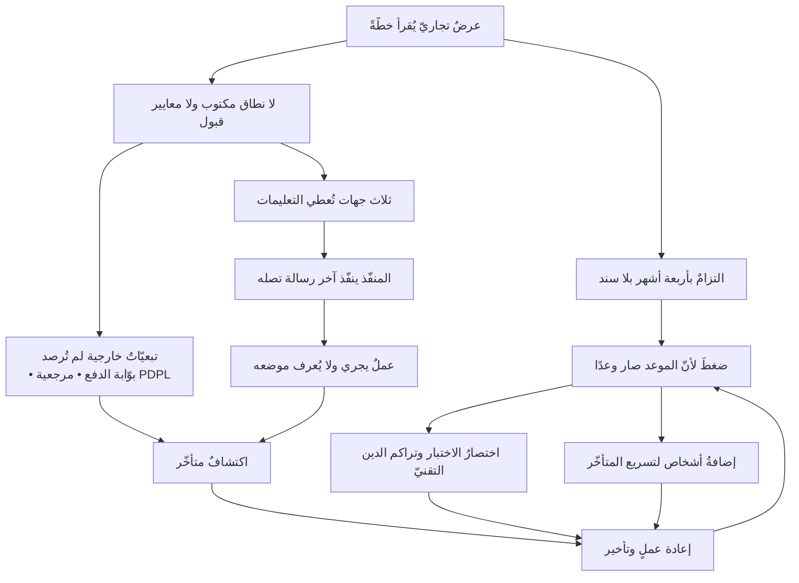

# 🧵 خيط عافية عبر الباب

> [!info] ما هذه الصفحة؟
> **ليست دراسة حالة جديدة، ولا شرحًا ثانيًا للفصول.** هي **خيطٌ واحد** يمرّ بمشروعٍ واحد — [[عافية - دراسة حالة|عافية]] — على سبع عشرة محطّة، كلُّ محطّةٍ منها **عدسةُ فصلٍ من فصول الباب**.
>
> والفرق بين هذا وبين «مثالٍ في كل فصل» فرقٌ في المقصود لا في الحجم: المثال يُوضِّح فكرةً قُرِئت للتوّ، **والخيط يُظهر أنّ المشروع نفسه يتبدّل حين تتبدّل العدسة**. فما تراه في عافية بعد الفصل الثاني عشر ليس أكثرَ ممّا رأيتَه بعد الثالث — بل **شيءٌ آخر**، وقد بقي المشروع كما هو.

> [!note] حالة تعليمية مُصاغة
> «عافية» و«أُفُق للحلول الرقمية» **اسمان افتراضيان**، وكذلك الأشخاص والأرقام التعاقدية والتواريخ. الحالة مبنيّة على **أنماط شائعة** في مشاريع المنصّات الصحية بالمنطقة لا على مشروع بعينه. والثابت القابل للتحقّق فيها هو المرجعيات النظامية وحدها — نظام [[PDPL]] السعودي، ومعايير PMI. التفصيل كلّه في [[عافية - دراسة حالة]].

---

## 🧭 كيف تُستعمل هذه الصفحة؟

**لا تُقرأ مرّةً واحدة.** موضعها أن تُفتح **بعد كل فصل**، فتقرأ سطرًا واحدًا وترجع. وثلاث طرائق لاستعمالها:

1. **مع الباب** — تُفتح بعد كل فصل، فتُقرأ محطّته وحدها. وهذا أنفعها.
2. **قبل الباب كلّه** — تُقرأ «ما تعرفه عن عافية» أدناه، ويُكتب جوابك عن **سؤال الحكم الأوّل**، ثم يُترك مغلقًا حتى الفصل الثامن.
3. **بعد الباب** — تُقرأ المحطّات كلّها متتابعة، فترى المسافة بين أوّل نظرةٍ وآخرها في صفحة واحدة.

> [!tip] القاعدة التي بُنيت عليها هذه الصفحة
> **لا يُضاف شيء إلى هذا الباب إلا إن غيّر نظرتك إلى شيءٍ قرأتَه قبلُ.** فالصفحة التي تزيدك معلومةً ليست ضرورية، والتي تُريك العلاقة بين معلومتين نافعة، والتي تُلجئك إلى **حكمٍ** أنفع، **والتي تكشف لك أنّ حكمك الأوّل كان ناقصًا هي المقصودة**.

---

## 🏥 ما تعرفه عن عافية قبل أن تبدأ

اقرأ هذه الفقرة **مرّةً واحدة**، ولا تعد إليها. فهي كلّ ما بيدك، والباب كلّه سيُعيد تفسيرها:

> [!example] المشروع في تسعة أسطر
> - **عافية** منصّة تربط القطاع الصحي السعودي. اعتمدها مجلس الإدارة، ووُقّع مع منفّذ خارجيّ — **أُفُق للحلول الرقمية**.
> - الموقَّع عليه **عرضٌ تجاريّ من ثماني صفحات**، لا عقدٌ فيه نطاقٌ ولا معايير قبول.
> - العرض وعد بـ**أربعة أشهر**، وادّعى امتثالًا لـ**HIPAA** — وهو مرجعٌ أمريكيّ لا ينطبق؛ والمرجع الواجب [[PDPL]] السعودي.
> - المطوّر والاستضافة **خارج السعودية**، وفي المنصّة بياناتٌ صحية ومدفوعات.
> - في الأسبوع الأول كان **ثلاثة أشخاص** يُرسلون تعليمات للمنفّذ: المدير العام، ومدير التسويق، ومديرة المشروع **سلمى**. وكان المنفّذ ينفّذ **آخر رسالة تصله**.
> - أوّل ما فعلته سلمى لم يكن جمع المتطلبات: **أوقفت التعليمات المتفرّقة**، ثم أوقفت العمل **أسبوعين** بلا سطر شيفرة.
> - وحين سألها الراعي «متى ننتهي؟» لم تؤكّد الأربعة أشهر ولم تنفِها، وقالت: **«سأخبركم بعد أسبوع — حين أعرف كيف خرج هذا الرقم.»**
> - في الأسبوع الثالث من التنفيذ سألت: **«كم ميزة من الاثنتي عشرة صارت جاهزة للاختبار؟»** فجاء الجواب بعد يومين: **لا أحد يعرف.**
> - وحين قُيِّم العرض **بوصفه وثيقة مشروع لا وثيقة بيع**، كانت النتيجة **4.3 من 10**.

---

## 🪢 المحطّات السبع عشرة

**اقرأ العمود الثالث وحده.** فهو سؤالٌ يكشفه المشروع عند هذه العدسة، ولم يكن مرئيًّا عند التي قبلها:

| # | الفصل | **عافية هنا** — السؤال الذي يكشفه المشروع | الوثيقة |
|---|---|---|---|
| ٠١ | [[01 - لماذا هذا العلم]] | ثلاثة أشخاص يُرسلون التعليمات، وكلٌّ منهم عاقلٌ حسنُ النيّة، والمنفّذ ينفّذ آخر رسالة. **فأين العطب إن لم يكن في أحدٍ منهم؟** | [[01 - الحوكمة]] |
| ٠٢ | [[02 - طبيعة العلم وهويته]] | التقييم أعطى العرض **4.3/10**. **أحكمٌ قطعيٌّ هذا أم ترجيح؟ وما الذي يجعل رقمًا كهذا معلومةً لا انطباعًا؟** | [[بطاقة تقييم المورّد (Vendor Scorecard)]] |
| ٠٣ | [[03 - فلسفة المشروع]] | المنصّة **مُخرَج**. فما **الأثر**؟ ومن الذي يلاحظه إن تحقّق؟ **ومتى ينتهي «مشروع عافية» ويبدأ «منتج عافية»؟** | [[ميثاق المشروع (Project Charter)]] |
| ٠٤ | [[04 - أين يقع هذا العلم]] | نقل البيانات خارج المملكة: **أمسألةٌ قانونية هي، أم معمارية، أم إدارةُ خطر؟ ومن أيّ بابٍ تُفتح أوّلًا؟** | [[07 - التسليم والقانوني]] |
| ٠٥ | [[05 - ما ليس من إدارة المشاريع]] | سلمى أوقفت العمل أسبوعين، وهي لا تملك الشيفرة ولا الميزانية. **أكان ذلك من عملها، أم تجاوزًا احتُمل لأنه نجح؟** | [[مصفوفة المسؤوليات (RACI)]] |
| ٠٦ | [[06 - لسان العلم]] | «أريد منصّة طبية» — كلمةٌ واحدة حملت **ثلاثة مشاريع**. **فأيّ الألفاظ في العرض الموقَّع يحمل اليوم أكثر من معنى؟** | [[02 - النطاق والمتطلبات]] |
| ٠٧ | [[07 - الأسئلة الكبرى]] | **أيٌّ من الأسئلة الكبرى لم يُسأل في عافية أصلًا قبل التوقيع؟ وأيٌّ منها سُئل فأُجيب بلا سند؟** | [[00 - الوثائق التنفيذية]] |
| ٠٨ | [[08 - القواعد الكلية وسنن المشاريع]] | بوّابة الدفع احتاجت **أربعة أسابيع انتظار**، وتقدير المبرمج كان صحيحًا. **فأيّ سنّةٍ كُسرت هنا؟ وهل كانت تُكشَف قبل وقوعها؟** | [[03 - التخطيط]] |
| ٠٩ | [[09 - المقاصد والثنائيات والمفاضلات]] | «أربعة أشهر» في العرض، و«7–12» في التقدير. **ما الذي يُشترى وما الذي يُباع في كلٍّ من الرقمين؟** | [[هيكل تجزئة العمل (WBS)]] |
| ١٠ | [[10 - كيف تطور هذا العلم]] | العقد مكتوبٌ بمنطق تسليمٍ مغلق، والتنفيذ يجري بسبرنتات. **فأيّ عجزٍ تاريخيٍّ أنتج كلًّا منهما؟ ولمَ التقيا في مشروعٍ واحد؟** | [[04 - التنفيذ والتتبّع]] |
| ١١ | [[11 - لماذا اختلفت المدارس]] | بيئةُ عافية تقول شيئًا (عقدٌ ثابت · جهةٌ صحية · مورّدٌ خارجيّ)، وطبيعةُ عملها تقول غيره (جهلٌ عالٍ بالمتطلبات). **فعلى أيّهما تُختار المدرسة، وعلى أيّهما تُعايَر؟** | [[04 - التنفيذ والتتبّع]] |
| ١٢ | [[12 - كيف يفكر مدير المشروع]] | «سأخبركم بعد أسبوع — حين أعرف كيف خرج هذا الرقم.» **أيّ طبقةٍ من طبقات القول رفضت سلمى أن تنزل إليها؟ وماذا كانت تخسر لو قالت: نعم، أربعة أشهر؟** | [[03 - التخطيط]] |
| ١٣ | [[13 - كيف يغير هذا العلم تفكيرك]] | «تمام، ماشي الحال» تصل كلّ مساء، ثلاثة أسابيع. **ما السؤال الذي صار يخطر لك عند سماعها ولم يكن يخطر قبل هذا الباب؟** | [[لوحة معلومات المشروع (Project Dashboard)]] |
| ١٤ | [[14 - أمراض الممارسة]] | المتتبّعات كلُّها موجودة — سجلّ قرارات، وسجلّ مشاكل، وطلبات تغيير — **وكلُّها فارغة**. **فأيّ مرضٍ هذا بعينه؟ وما العلامة المطمئنة التي كان يُنتجها؟** | [[00 - الوثائق التنفيذية]] |
| ١٥ | [[15 - أخلاق المهنة]] | العرض ادّعى امتثال HIPAA، والواجبُ [[PDPL]]. **من كان يعلم؟ ومتى؟ وكم كان يكلّفه أن يقول؟** | [[عقد معالجة البيانات (DPA)]] |
| ١٦ | [[16 - كيف يطلب هذا العلم]] | سجلّ الدروس المستفادة كُتب. **فأيّ درسٍ فيه غيّر قرارًا فعلًا؟ وأيّها بقي جملةً صحيحة لا يُبنى عليها شيء؟** | [[سجل الدروس المستفادة (Lessons Learned Register)]] |
| ١٧ | [[17 - المشروع والاستخلاف]] | **من الذي سيصحو في الثالثة فجرًا بعد سنتين من انصراف الجميع؟ وأيّ قرارٍ يُتَّخذ اليوم يجعل ليلته أهون أو أشقّ؟** | [[11 - العمليات]] |

> [!warning] الحفرة الشائعة — أن يُقرأ الجدول جوابًا
> العمود الثالث **أسئلة لا خلاصات**، وليس تحت أيٍّ منها جوابٌ في هذه الصفحة. فمن قرأها فأومأ ومضى لم يفعل شيئًا؛ **وإنما تعمل حين تُكتب إجابتها في سطرين قبل قراءة السطر التالي**. والفرق بين القراءتين يظهر في الفصل الثامن، لا هنا.

---

## 🔗 لماذا يتأخّر المشروع فعلًا؟ — خريطة عافية السببية

هذه **ليست رسمًا عامًّا عن تأخّر المشاريع**، بل سلسلة عافية بعينها كما تُقرأ من وثائقها. ولاحظ فيها شيئين: أنّ الرأس **هادئ** لا يشكو منه أحد، وأنّ فيها **حلقةً راجعة** تُغذّي نفسها:

> [!question] تأمّلٌ تطبيقيّ — لا جواب له في هذه الصفحة
> في الخريطة عقدتان تُنتجان أكثر الأسهم: **«لا نطاق مكتوب»** و**«التزامٌ بلا سند»**. وفي مشروعك أنت: **ارسم ثلاث عقدٍ فقط** — العَرَض الذي يشكو منه الناس، والذي قبله، والذي قبلهما. ثم اسأل: **أيّ الثلاث يُشكى منه؟** فالغالب أنّ المشكوّ منه هو الأخير، **والذي يُعالَج به هو الأول**.

---

## 🔁 محطّات إعادة الحكم — الجزء الذي لا يُقرأ بل يُكتب

الجدول أعلاه يُريك المشروع من سبع عشرة عدسة، **وهذا القسم يُريك نفسك**. وطريقته أن تُجيب عن سؤالٍ واحد **قبل** أن تبلغ الفصل الثامن، ثمّ لا تُعدّل جوابك أبدًا — بل تُعيد **الحكم عليه** ثلاث مرّات.

> [!example] اكتب هذا الآن، في سطرين، وأغلقه
> **السؤال:** ما سبب تأخّر مشروع عافية؟
> اكتب جوابك **بتاريخه** في [[دفتر أحكام القارئ|📒 دفتر أحكامك]]، أو في أيّ مكانٍ ترجع إليه. **والمهمّ أن يكون مكتوبًا لا محفوظًا**، فالمحفوظ يتعدّل مع القراءة بلا أن تشعر.
> **وشرطه:** ألّا تقرأ ما بعده الآن.

ثم تُعيد فتحه ثلاث مرّات، وفي كلٍّ منها **سؤالٌ عن جوابك لا عن عافية**:

| متى تفتحه | السؤال الذي تسأله عن جوابك أنت | وما الذي يفحصه |
|---|---|---|
| **بعد [[08 - القواعد الكلية وسنن المشاريع\|الفصل ٠٨]]** | هل كان تفسيري **سببيًّا أكثر ممّا تحتمله المعلومات**؟ وهل أسندتُ إلى سببٍ واحدٍ ما له في الخريطة خمسة؟ | أسطورة السبب الواحد، والارتباط يُقرأ سببيّةً |
| **بعد [[12 - كيف يفكر مدير المشروع\|الفصل ١٢]]** | هل كنتُ **أخلط الحقيقة بالتقدير بالافتراض**؟ كم جملةً في جوابي **معلومةٌ في النصّ**، وكم جملةً **ملأتُ بها فراغًا**؟ | طبقات القول، والافتراض الذي يُحسب حقيقة |
| **بعد [[17 - المشروع والاستخلاف\|الفصل ١٧]]** | هل كان حكمي على القرار **متأثّرًا بالنتيجة التي وقعت بعده**؟ ولو أنّ الأربعة أشهر كفت مصادفةً، **أكنتُ سأصف القرار نفسه بأنّه صائب**؟ | فصل جودة القرار عن جودة النتيجة |

> [!summary] لماذا هذا القسم هو المقصود من الصفحة كلّها
> الباب يُعلّمك أن **تعرف** ثم أن **تميّز**. وهذا القسم وحده يُعلّمك أن **تعيد النظر في حكمٍ أصدرتَه أنت** — وهو الشيء الوحيد الذي لا يُنقل بقراءة، لأنّ ثمنه أن ترى نقصَ نفسك مكتوبًا بخطّك. **ومن لم يكتب جوابه الأوّل، لن يجد ما يُعيد الحكم عليه؛ وسيظنّ — بحسن نيّة — أنّه كان يعرف هذا منذ البداية.**

---

## 🚧 خارج نطاق هذه الصفحة

- **شرح عافية نفسها** — مرحلةً مرحلةً بوثائقها: موضعه [[عافية - دراسة حالة]] ولا يُعاد هنا.
- **شرح مفاهيم الفصول** — موضعه الفصول أنفسها، وهذه الصفحة **تُحيل ولا تزاحم**.
- **الحكم على المشروع** — لا يوجد في هذه الصفحة جوابٌ صحيحٌ واحد لأيّ محطّة، **وهذا مقصود**: المحطّات أسئلةٌ تُفتح، والفصل هو الذي يُعطي أدوات الجواب.

---

## 🌉 تابع القراءة

**الفهرس:** [[المدخل إلى علم إدارة المشاريع البرمجية]] · **الحالة كاملة:** [[عافية - دراسة حالة]] · **حالةٌ ثانية للمقارنة:** [[00 - التأسيس وميثاق المشروع|ميقات]]

> [!abstract] 🕸️ هذه الصفحة في الشبكة
> **تستعمل ولا تعرّف:** [[PDPL]] · [[Brooks's Law]] · [[Technical Debt]] · [[Decision Log]]
> **تُبنى على:** فصول الباب السبعة عشر كلِّها — **ولا معنى لها قبل الفصل الأول**.
> **تجيب عن:** كيف يتبدّل المشروع الواحد حين تتبدّل العدسة التي يُنظر بها إليه؟
> **وتثير ولا تجيب:** هل يصلح مشروعٌ واحد شاهدًا على سبع عشرة عدسة، أم أنّ بعض العدسات لا تُرى إلا في مشروعٍ من نوعٍ آخر؟ — وهذا ما تُقاس به [[00 - التأسيس وميثاق المشروع|حالة ميقات]] حين تكتمل.
