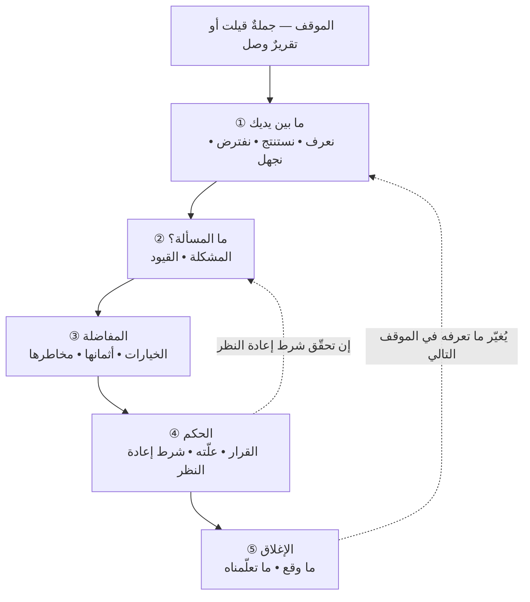

# 🪜 سُلَّم الحكم

> [!info] ما هذا؟ وما ليس هو؟
> **أداةٌ واحدة تُملأ خاناتُها، لا فصلٌ يُقرأ.** غايتها شيءٌ واحد: أن تحكم في موقفٍ **معلوماتُه ناقصة** — وهذه حال أكثر مواقف المشاريع، لا استثناءها.
>
> **وليست منهجًا لإدارة مشروع.** لا تقول لك كيف تخطّط ولا كيف تقدّر ولا كيف تدير قائمة أعمال؛ فذلك موضعه `01 - الأساسيات`. **إنّما هي منهجٌ للحكم على موقفٍ إداريّ واحد** — جملةٌ سمعتها، أو تقريرٌ وصلك، أو قرارٌ يُطلب منك اليوم.

---

## 🧭 لماذا سُلَّم أصلًا؟

حين يشتدّ الموقف يقفز الذهن قفزةً واحدة: **من «ما الذي يحدث؟» إلى «ما الذي نفعله؟»** مباشرةً. وهذه القفزة لا تُشعر صاحبها بشيء، لأنّ الجواب الذي تُنتجه **معقول** دائمًا — وهو معقولٌ فعلًا، لكنّه جوابٌ عن سؤالٍ لم يُحرَّر بعد.

**والسُّلَّم لا يجعلك أذكى، بل يمنعك من القفز.** وقيمتُه كلُّها في **درجتين يتخطّاهما الجميع**: «ما الذي نفترضه؟» و«ما الذي لا نعرفه؟». فهاتان الدرجتان هما الفرق بين من يقرّر وهو يعلم حدود علمه، ومن يقرّر وهو يحسب افتراضاته وقائع.

---

## 🪜 الدرجات الخمس عشرة

**تُملأ كلُّ خانةٍ بجملةٍ واحدة.** ولكلّ درجةٍ **ألفاظٌ لا تُقبل فيها**، لأنّ الخانة تُملأ بها ولا يُملأ بها فراغُ المعرفة.

### ① الطبقة الأولى: ما بين يديك — وهي أطول الطبقات عمدًا

| # | الدرجة | سؤالها | ولا يُقبل فيها |
|---|---|---|---|
| ١ | **ما الذي نعرفه؟** | ما الذي **قِيس أو شوهد أو وُثِّق**، ويستطيع غيري التحقّق منه؟ | «الوضع سيّئ» · «الفريق متأخّر» بلا رقمٍ ولا قياس |
| ٢ | **ما الذي نستنتجه؟** | ما الذي **يلزم** ممّا نعرفه، ولو لم يُقَل صراحةً؟ | استنتاجٌ لا تستطيع أن تصل إليه من الدرجة ①، فذاك افتراض |
| ٣ | **ما الذي نفترضه؟** | ما الذي **بنينا عليه بلا سند**، وسيسقط ما بعده إن سقط؟ | «من البديهيّ أنّ…» · «طبعًا سيكون…» |
| ٤ | **ما الذي لا نعرفه؟** | ما الفراغ الذي لو مُلئ **لتغيّر القرار**؟ | «أشياء كثيرة» · مجهولٌ لا يغيّر القرار سواءٌ عُرف أو جُهل |

**والدرجتان ② و③ هما موضع الخطأ كلِّه**، والفارق بينهما جملةٌ واحدة تُختبر بها كلُّ عبارة:

> **الاستنتاج له سندٌ في المعطيات، والافتراض ملأَ فراغًا فيها.**
> فإن سُئلتَ: «من أين لك هذا؟» — فوجدتَ الجواب في الدرجة ①، فهو استنتاج. وإن كان الجواب «هكذا يكون عادةً» أو «هذا هو المعقول»، **فهو افتراض مهما بدا صحيحًا**، وموضعه الدرجة ③.

> [!tip] كيف تستعمل هذه الفكرة — تقسيم المجهول قسمين
> **الدرجة ④ لا تُملأ قائمةً واحدة، بل عمودين**، لأنّ لكلٍّ منهما تصرّفًا مختلفًا تمامًا:
>
> | مجهولٌ **يُشترى** | مجهولٌ **يُصمَّم له** |
> |---|---|
> | يمكن معرفته اليوم بثمنٍ معلوم — اتّصال، أو تجربة، أو يومُ عمل | لا يُعرف قبل أن يقع، مهما أنفقت |
> | **فيُسأل: ما ثمن معرفته؟ وما ثمن الجهل به؟** ويُشترى إن كان الأول أرخص | **فلا يُنتظر**، وإنّما يُقرَّر قرارٌ يحتمل الاحتمالين |
>
> **وأشيع خطأٍ هنا** أن يُعامَل الأول معاملة الثاني — فيُقال «لا نستطيع أن نعرف» عن شيءٍ ثمنُ معرفته ساعةٌ واحدة. **والسؤال الكاشف: لو أُعطيتَ يومًا واحدًا لا غير، أتستطيع معرفته؟**

### ② الطبقة الثانية: ما المسألة؟

| # | الدرجة | سؤالها | ولا يُقبل فيها |
|---|---|---|---|
| ٥ | **ما المشكلة؟** | ما **الفارق** بين ما هو كائن وما ينبغي أن يكون — لا ما يشكو منه الناس؟ | صياغةُ المشكلة **بالحلّ الغائب**: «المشكلة أنّه ليس عندنا أداة تتبّع» |
| ٦ | **ما القيود؟** | ما الذي **لا أملك تغييره** في هذا الموقف — نظامًا أو عقدًا أو طاقةً أو وقتًا؟ | قيدٌ مظنون: ما لم يُختبر أنّه قيد، فهو **عادةٌ** حتى يثبت خلافها |

**والدرجة ⑤ هي التي يُختصر بها أطول الطرق.** فأكثر ما يُعرض على مدير المشروع بصيغة مشكلة هو في حقيقته **حلٌّ يقترحه صاحبه** — «نحتاج مطوّرين»، «نحتاج أداة»، «نحتاج اجتماعًا أسبوعيًّا». **والقاعدة: كلُّ عبارةٍ فيها «نحتاج» ليست مشكلة بل حلًّا، فأعد صياغتها بما يسبقها.**

### ③ الطبقة الثالثة: المفاضلة

| # | الدرجة | سؤالها | ولا يُقبل فيها |
|---|---|---|---|
| ٧ | **ما الخيارات؟** | ما **ثلاثة** مسالك فأكثر — وأحدها دائمًا **ألّا نفعل شيئًا الآن**؟ | خياران متقابلان، فالثنائية تُخفي ما بينهما |
| ٨ | **ما ثمن كلٍّ منها؟** | ما الذي **أخسره** إن اخترته — لا ما أكسبه؟ | «مكلف» · «سريع» بلا قدرٍ ولا مقارنة |
| ٩ | **ما مخاطر كلٍّ منها؟** | ما الذي **قد** يقع فيسوء به الخيار، وما احتمالُه وشدّتُه؟ | خلطُ الخطر بالمشكلة: ما وقع فعلًا ليس خطرًا |

> [!warning] الحفرة الشائعة — الخيار الثالث الذي لا يُكتب
> يُكتب في الغالب خياران: «نفعل كذا» و«نفعل كذا». **والخيار الغائب دائمًا هو «لا قرار اليوم، وإنّما نشتري معلومةً بعينها».** وغيابه ليس سهوًا، بل لأنّه **لا يبدو قرارًا**؛ فمن كتبه خشي أن يُقرأ ترددًا.
>
> **وصورةٌ مصغّرة:** اجتماعٌ يُطلب فيه اختيار مزوّد استضافةٍ بين اثنين، ولا أحد يعرف حجم البيانات المتوقّع. فيُختار الأغلى «احتياطًا». **والخيار الذي لم يُكتب:** تأجيلُ الاختيار أسبوعًا وقياسُ حجم البيانات في بيئة الاختبار — ساعتا عمل، تُغنيان عن التزامٍ سنويّ.

### ④ الطبقة الرابعة: الحكم — وهي التي تُميّز المهنيّ

| # | الدرجة | سؤالها | ولا يُقبل فيها |
|---|---|---|---|
| ١٠ | **ما القرار؟** | ما الذي **يُفعل**، ومن يفعله، ومتى؟ | قرارٌ بلا فاعلٍ ولا موعد، فذاك رأي |
| ١١ | **لماذا هذا القرار؟** | ما **العلّة** التي لو زالت لزال القرار؟ | «لأنّه الأفضل» — علّةٌ لا تُفحص فلا تُبطل |
| ١٢ | **ما الذي يجعلنا نغيّره؟** | ما **العلامة المحدَّدة** التي إن ظهرت أعدنا النظر؟ ومتى نفتحه؟ | «إن ساءت الأمور» — لا تُرى فلا تُنبّه أحدًا |

**والدرجة ⑫ هي أكثر الدرجات غيابًا وأرخصُها ثمنًا.** فالقرار الذي لا شرطَ لإعادة النظر فيه لا يُعاد النظر فيه أبدًا — لا عنادًا، بل لأنّ **لا أحد يعرف متى يفتحه**. وكتابةُ سطرٍ واحد — «نُعيد النظر إن تجاوز زمنُ الاستجابة ثانيتين، أو في الأول من الشهر القادم، أيّهما أسبق» — تصنع الفرق بين قرارٍ حيّ وقرارٍ صار حقيقةً بمرور الزمن.

### ⑤ الطبقة الخامسة: الإغلاق — ولا تُملأ اليوم

| # | الدرجة | سؤالها | ولا يُقبل فيها |
|---|---|---|---|
| ١٣ | **ماذا وقع؟** | ما الذي حدث فعلًا، **بالقياس نفسه** الذي كُتب في الدرجة ⑫؟ | روايةٌ من الذاكرة بعد أن عُرفت النتيجة |
| ١٤ | **أكان القرار سليمًا؟** | بالنظر إلى **ما كان متاحًا حينها** لا إلى ما انكشف بعدها | الحكم بالنتيجة — وهذا هو الخطأ المقصود بهذه الدرجة كلِّها |
| ١٥ | **ماذا نتعلّم؟** | أيُّ درجةٍ من الأربع عشرة كانت **أضعف** خانةً في هذا الموقف؟ | «نتعلّم أن نكون أدقّ» — درسٌ لا يُغيّر فعلًا |

> [!warning] الحفرة الشائعة — أن يُحكَم على القرار بنتيجته
> القرار السليم قد يُنتج نتيجةً سيّئة، والقرار الرديء قد ينجو بالصدفة. **وأخطر الحالات الرابعة: قرارٌ رديء نجحت نتيجتُه** — فلا أحد يراجعه، ويُكافأ صاحبه، **ويُعاد**. تفصيلها في [[17 - المشروع والاستخلاف]].
>
> **وصورةٌ مصغّرة:** فريقٌ أطلق نسخةً بلا اختبار انحداريّ لأنّ الموعد ضاق، فلم يقع عطب. فصار «الإطلاق السريع» ممارسةً معتمدة — إلى أن وقع العطب في الإطلاق السابع، وكان أثرُه أضعافَ ما وُفِّر في الستّة.

---

## ⚖️ السُّلَّم في مقابل طبقات القول — أداتان لا واحدة

يقع خلطٌ بين هذا السُّلَّم وبين **طبقات القول الخمس** في [[12 - كيف يفكر مدير المشروع]]، وهما يعملان معًا لا أحدهما بديلًا عن الآخر:

| | طبقات القول (الفصل ١٢) | سُلَّم الحكم (هنا) |
|---|---|---|
| **ماذا تصنّف؟** | ما **قِيل لك** — حقيقة · تقدير · توقّع · التزام · رغبة | ما **بين يديك أنت** — تعرفه · تستنتجه · تفترضه · تجهله |
| **متى تعمل؟** | لحظةَ سماع الجملة | بعد أن جُمعت الجُمل كلُّها |
| **ما مُخرَجها؟** | جملةٌ صُنِّفت بطبقتها | قرارٌ بعلّته وشرط إعادة النظر فيه |

**والعلاقة بينهما إسناديّة:** ما صُنِّف في الفصل الثاني عشر **حقيقةً** يدخل الدرجة ①، وما صُنِّف **تقديرًا أو توقّعًا** يدخل الدرجة ③، وما صُنِّف **رغبةً** لا يدخل السُّلَّم أصلًا — وإنّما يُنقل إلى الدرجة ⑤ بوصفه وصفًا لما **ينبغي أن يكون**.

---

## 🚧 متى لا يُصعَد السُّلَّم؟

**أداةٌ تُستعمل في كل موقفٍ تصير طقسًا**، وأصلُ ما يصف [[14 - أمراض الممارسة|الفصل الرابع عشر]] من الأمراض أنّ الشيء النافع يُعمَّم حتى يُفرَّغ. **وثلاث حالات لا يُصعَد فيها:**

1. **القرار رخيصٌ سهل العكس.** فثمن الصعود أغلى من ثمن الخطأ. والمعيار من [[12 - كيف يفكر مدير المشروع|الفصل الثاني عشر]]: **قابليّة العكس، لا حجم المبلغ ولا رتبة صاحبه**. فجرّب واعكس، ولا تجتمع.
2. **للانتظار ثمنٌ يتراكم أسرع ممّا تشتري به المعلومة.** فتسرّبُ بياناتٍ محتمل، أو خدمةٌ متوقّفة، **يُحتوى الآن ويُحقَّق بعدُ** — والصعود هنا ليس تأنّيًا بل هروب.
3. **المسألة ليست مسألتك.** فالسُّلَّم يُنتج قرارًا، ومن صعِده في أمرٍ لا يملكه أنتج **رأيًا** ثمّ تعلّق به. والدرجة ⑥ (القيود) هي التي تكشف هذا مبكرًا.

> [!summary] المعيار العمليّ لهذه الأداة كلِّها
> **السُّلَّم الذي لم يُغيّر قرارًا ولم يُنتج طلبَ معلومةٍ محدَّدًا — سُلَّمٌ تُلي ولم يُصعَد.** فليس المقصود أن تمرّ بالدرجات، بل أن تخرج منها **بشيءٍ لم يكن عندك قبلها**: إمّا قرارٌ غيرُ الذي كنت ستتّخذه، وإمّا سؤالٌ محدَّد تعرف مَن تسأله ومتى يجيبك وكم يكلّفك.

---

## 🧪 اصعده مرّةً واحدة الآن

> [!example] الموقف: «نحن متأخّرون أسبوعين، لذلك نحتاج ثلاثة مطوّرين فورًا»
> **املأ الدرجات الأربع الأولى وحدها**، في أربع جمل، قبل أن تفتح ما تحتها.

> [!question]- وهذا صعودٌ مقترح — لا جوابٌ صحيح واحد
> **① نعرف:** التأخّر أسبوعان، إن كان مقيسًا بخطّ أساسٍ معتمد. **وإن لم يكن، فحتى هذا ليس في الدرجة ①.**
> **② نستنتج:** أنّ ما بقي من العمل أكبر ممّا كان مقدَّرًا، أو أنّ إنتاجيّة الفريق أقلّ ممّا افتُرض — **أحدهما، ولا نعرف أيّهما.**
> **③ نفترض:** أنّ سبب التأخّر **قلّة الأيدي**. وهذا هو الافتراض المدسوس في كلمة «لذلك»، ولم يُقَل صراحةً ولم يُختبر.
> **④ نجهل — ويُغيّر القرار:** **أين وقف العمل بالضبط؟** فإن كان واقفًا على تبعيّةٍ خارجية — كواجهةٍ لم تصل — فإضافةُ ثلاثةٍ تزيد التأخّر ولا تُنقصه ([[Brooks's Law|قانون بروكس]]). **وهذا مجهولٌ يُشترى:** ثمنُ معرفته سؤالٌ واحد وساعةٌ من الفحص.
>
> **فالقرار الآن ليس «نضيف» ولا «لا نضيف»**، بل: *لا قرار قبل الغد، ومطلوبٌ شيءٌ واحد — قائمةُ الاثنتي عشرة ميزة وأمام كلٍّ منها: من يعمل عليها، وعلى أيّ شيءٍ تنتظر.* **ولاحظ أنّ هذا قرارٌ كامل:** له فاعلٌ وموعدٌ وعلّة.

**ثمّ سجّل ما صعدتَه في [[دفتر أحكام القارئ|📒 دفتر أحكامك]]**، وتدرّب عليه في [[مختبرات الحكم|🧪 مختبرات الحكم]] — سبعُ حالاتٍ لكلٍّ منها ثلاثة طرق، وواحدةٌ منها تُبطل ظنَّك أنّ «اطلب معلومةً» جوابٌ صالحٌ دائمًا.

> [!abstract] 🕸️ هذه الأداة في الشبكة
> **تستعمل ولا تعرّف:** [[Brooks's Law]] · [[Knightian Uncertainty]] · [[Reversible vs Irreversible Decisions]] · [[Decision Log]]
> **تُبنى على:** [[12 - كيف يفكر مدير المشروع]] · [[09 - المقاصد والثنائيات والمفاضلات]] · [[17 - المشروع والاستخلاف]]
> **تُستعمل في:** [[مختبرات الحكم]] · [[دفتر أحكام القارئ]] · [[خيط عافية عبر الباب]]
> **وتثير ولا تجيب:** كم مرّةً في الأسبوع يستحقّ موقفٌ هذا الصعود؟ — ولا جواب عامّ له، والدرجة الفاصلة قابليّة العكس لا الأهمّية.
