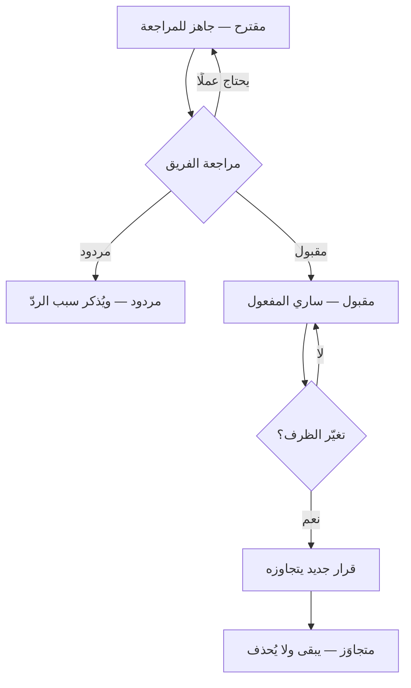

> [!info] موضوع · إدارة المشاريع البرمجية
> **لماذا يهمّك:** في كل نظام عمره أكثر من سنتين جدارٌ لا يعرف أحدٌ لماذا بُني. فيأتي فريق جديد فيهدمه — لا عن استهتار، بل لأن سببه لم يُكتب — ثم يُعاد بناؤه بعد شهرين بكلفة أضعاف. وسجلّ القرار المعماري هو الوثيقة التي تمنع هذه الدورة، وهو أرخص وثيقة في المشروع كلّه: صفحة واحدة تُكتب في ربع ساعة.

> [!abstract] التأصيل
> **يفترض أنّك تعرف:** [[Decision Log|سجلّ القرارات]] · [[03 - المنظور وزاوية النظر|المنظور وزاوية النظر]] · [[19 - Risk Management|إدارة المخاطر]] — تُذكَر هنا ولا يُعاد شرحها.
> **ويُؤصّل لك:** **المتطلب ذو الأثر المعماري (ASR)** و**حالات القرار** و**دالّة اللياقة (Fitness Function)** — تُقدَّم هنا أوّل مرّة فتصير متطلَّبًا لما بعدها.

# سجلّ القرار المعماري (Architecture Decision Record)

## الفكرة الأساسية

**سجلّ القرار المعماري (Architecture Decision Record — ADR)** وثيقة قصيرة تحفظ **قرارًا واحدًا** ذا أثر في بنية النظام: الظرف الذي فرضه، والبدائل التي دُرست ورُدّت، وما اختير، وما ترتّب عليه. وغايته في كلمة واحدة: **حفظ «لماذا».**

فالشيفرة تُظهر **ماذا** فُعل، والوثائق المعمارية تُظهر **كيف** رُكّب النظام؛ ولا يُظهر أيّهما لماذا اختير هذا دون ذاك. وهذا هو بالضبط ما يُنسى أوّلًا وأسرع، ويحتاجه من يأتي بعدك أشدّ الحاجة.

وثلاثة مصطلحات تتجاور في هذا الباب فيُخلط بينها، وتفريقها أوّل ما يُضبط:

| المصطلح | ما هو |
|---|---|
| **القرار المعماري** (Architecture Decision — AD) | الاختيار نفسه، وقع كُتب أو لم يُكتب |
| **سجلّ القرار المعماري** (ADR) | **الوثيقة الواحدة** التي تحفظ قرارًا واحدًا |
| **مجموعة القرارات المعمارية** (Architecture Decision Log — ADL) | **المجموعة كلّها** في مشروع أو منظّمة |

> [!info] إضافة مرجعية — ضبط المصطلح قبل الشرح
> يعتمد هذا المستودع: **ADR = سجلّ قرار معماري** (بالإفراد) · **ADL = مجموعة القرارات المعمارية** · **Consequences = الانعكاسات** · **Superseded = متجاوَز**.
>
> والتنبيه واجب هنا لأنّ الترجمة الشائعة تسمّي الاثنين — الوثيقة والمجموعة — «سجلّ القرارات المعمارية»، وهي فوق ذلك تشتبه بـ[[Decision Log|سجلّ القرارات]] الإداريّ الذي يخدم الحوكمة لا الهندسة. وهذان مختلفان في القارئ والغرض وموضع الحفظ، وقد فُصل بينهما في جدول التمييز أدناه.

## لماذا ظهر هذا المفهوم؟

الحاجة قديمة، والاسم حديث. فقد كانت الفرق تُودع تسويغ قراراتها في **وثيقة معمارية شاملة** تُكتب مرّة في أوّل المشروع وتُعتمد، ثم يقع لها ما يقع لكل وثيقة كبيرة: تشيخ في شهور، ويتوقّف أحد عن قراءتها، ويصير تحديثها مشروعًا في نفسه لا أحد يبدؤه.

ثم اجتمع على تفكيكها أمران في العقد الثاني من الألفية:

1. **الانتقال إلى التسليم المتكرّر**، فلم تعد المعمارية تُقرَّر مرّة واحدة في البداية، بل صارت تُقرَّر **على دفعات** ما دام النظام يتطوّر. والوثيقة الواحدة لا تحتمل قرارًا يُتّخذ كل أسبوعين.
2. **استقرار Git في قلب سير العمل**، فصار بالإمكان أن يعيش التوثيق حيث تعيش الشيفرة، ويمرّ بمراجعة الأقران نفسها، ويحمل تاريخه معه.

وفي 2011 نشر **Michael Nygard** مقالته *Documenting Architecture Decisions* فاقترح ما صار الحلّ القياسيّ: بدل وثيقة واحدة كبيرة تشيخ، **ملفّات صغيرة مرقّمة**، لكل قرار ملفّ، تُحفظ مع الشيفرة، وأقسامها أربعة لا أكثر. وقبله بستّ سنوات كان **Jeff Tyree** و**Art Akerman** في Capital One قد نشرا في *IEEE Software* قالبًا مفصّلًا من ثلاثة عشر حقلًا — فبقي الطرفان يمثّلان حدَّي هذا الباب إلى اليوم: أقصى الاختصار وأقصى التفصيل.

> [!note] نموذج ذهني / مثال
> جرّاحٌ يفتح ملفّ مريضٍ أُجريت له عملية قبل عشر سنوات. فيجد في الملفّ صورةً للحالة بعد العملية — وهذه **الوثيقة المعمارية**: تصف ما صار عليه الجسد. ويجد **تقرير العملية**: أنّ الطبيب اختار هذا المسلك دون ذاك لأنّ المريض كان يتناول مميّعًا للدم، ولأنّ المسلك الآخر كان يعرّض عصبًا للقطع.
>
> والصورة وحدها تُريه ما هو قائم؛ ولا تمنعه أن يعيد الغلط الذي تحاشاه الأوّل. **فالصورة تصف النتيجة، والتقرير يحفظ السبب** — والثاني هو ما يمنع الجرّاح الثاني من أن يقرّر بمعلومات أقلّ ممّا كان عند الأوّل.

## لماذا ينجح؟

ينجح لثلاثة أسباب يعمل كلٌّ منها في طبقة مختلفة:

- **يجعل التوثيق بحجم القرار لا بحجم النظام.** فالوثيقة الشاملة تُلزمك أن تصف كل شيء لتوثّق شيئًا واحدًا، ولذلك لا تُكتب. والوثيقة التي حدّها قرارٌ واحد تُكتب فعلًا، لأنّ كلفة كتابتها أقلّ من كلفة شرحها شفويًّا للمرّة الثالثة.
- **ينقل التوثيق من «بعد» إلى «أثناء».** فهو يُكتب حين يكون السياق حيًّا في الأذهان والبدائل مطروحة على الطاولة، لا بعد شهر حين يكون قد بقي من النقاش نتيجته وحدها.
- **ويقلب اتّجاه الحُجّة.** فالقرار غير المكتوب يُنقض بلا كلفة: يكفي أن يقول أحدهم «لِمَ لا نستعمل كذا؟». والقرار المكتوب بسببه وبديله المردود ينقل عبء الإثبات إلى من يريد نقضه — لا ليمنع النقض، بل ليُلزمه أن يأتي بجديد. **وهذا الفرق وحده هو ما يوقف دورة إعادة فتح ما أُغلق.**

## كيف يفشل؟

لا يفشل هذا المفهوم حين يُرفض — فلا أحد يعارض توثيق قراراته — بل حين **يُتبنّى شكلًا ويُفرَّغ من وظيفته**، فيبقى المجلد وتذهب فائدته. وله ثلاث صور:

1. **الوثيقة المُصادِقة (Rubber-stamp ADR).** تُكتب بعد التنفيذ لا قبله، فتسجّل ما فُعل بلا بدائل حقيقية — والبدائل المذكورة فيها بدائل صوريّة وُضعت ليُردّ عليها. فتقرأ عشرين وثيقة ولا تجد قرارًا واحدًا كان يمكن أن يقع على غير ما وقع.
2. **مجلدٌ لا يُقرأ.** تُكتب الوثائق بانتظام ولا يفتحها أحد عند العمل، لأنّ لا شيء يُذكّر بها في اللحظة التي تُنفع فيها — وهي لحظة تعديل الشيفرة التي تحكمها. فتصير أرشيفًا لا مرجعًا.
3. **الوثيقة التي لا تُخالَف.** يُكتب القرار ثم تسير الشيفرة على غيره، فتبقى الوثيقة تقول ما لم يعد صحيحًا. وهذه أضرّ من عدم التوثيق، لأنّ من يقرؤها يبني عليها.

**وأخفاها الأولى**، لأنّها الوحيدة التي **تُنتج علامات مطمئنّة**: مجلد عامر، وترقيم متّصل، ومراجعات مغلقة في مواعيدها، ومعدّل توثيق يُعرض في تقرير الجودة. كل شاهد ظاهر يقول إنّ الفريق يوثّق قراراته، والفريق لا يوثّق قراراته — إنّما يوثّق تنفيذه بعد وقوعه.

> **المعيار العملي:** إن لم تجد في مجموعتك وثيقةً **واحدة** انتهت إلى ردّ ما كان الفريق يميل إليه ابتداءً، فأنت تكتب محاضر تنفيذ لا سجلّات قرار. فالتوثيق الذي لا يغيّر قرارًا واحدًا لم يشارك في قرار قطّ.

## متى يُكتب سجلّ قرار؟ — المتطلب ذو الأثر المعماري

أكثر ما يُسأل عنه في هذا الباب سؤالان متقابلان: أنكتب لكل شيء؟ أم لا نكتب حتى نتيقّن أنّه «معماريّ»؟ وكلاهما يُنتج الفشل: الأوّل يُغرق المجموعة فلا تُقرأ، والثاني يؤجّل الكتابة حتى يفوت أوانها.

والمعيار الحاكم هو **المتطلب ذو الأثر المعماري (Architecturally-Significant Requirement — ASR)**: المتطلب الذي يُغيّر بنية النظام لا شكله. وتصنّفه أدبيات المعمارية خمسة أبواب:

1. **البنية** — كاختيار نمطٍ يقسّم النظام (خدمات مصغّرة · وحدة واحدة · معمارية مبنية على الأحداث).
2. **المتطلبات غير الوظيفية** — الأمان، والإتاحة العالية، وتحمّل الأعطال، والأداء تحت حِمل معلوم.
3. **الاعتماديات** — ما يرتبط بما، وكيف يقترن، وما الذي يصير تغييره مستحيلًا بعد ذلك.
4. **الواجهات** — واجهات البرمجة والعقود المنشورة، لأنّ ما نُشر منها لا يُسحب.
5. **أدوات البناء** — المكتبات وأطر العمل والأدوات والعمليات التي يصعب استبدالها لاحقًا.

**وأصلح من هذه الأبواب الخمسة معيارٌ واحد يجمعها ويصلح للحكم السريع: _كلفة التراجع_.** فالقرار الذي يُعكَس بعد ستّة أشهر بساعة عمل لا يستحقّ وثيقة، والذي يُعكَس بأسبوعين يستحقّها وإن بدا صغيرًا يوم اتُّخذ. وهذا يصل هذا الباب بـ[[Reversible vs Irreversible Decisions|القرارات القابلة للعكس وغير القابلة له]]: **ما لا يُعكس يُوثَّق، وما يُعكَس بسهولة يُجرَّب ولا يُوثَّق.**

> [!info] إضافة مرجعية — ما وجدناه في الممارسة يخالف التسمية
> يُنبّه أنّ اسم «المعماري» أضيق ممّا يجري عليه العمل. ففي مشروع Freeplane المفتوح — وهو برنامج خرائط ذهنية — تجد في مجلد قراراته وثيقةً كاملة عن **اصطلاح تسمية الحقول المنطقية** في إحدى إضافاته. وهذا ليس معماريًّا بالمعيار الخماسي أعلاه بحال، ومع ذلك فوجوده مبرَّر: فالاصطلاح الذي يمسّ عشرات الملفّات كلفة التراجع عنه عالية.
>
> ولهذا **تُسمّي فرقٌ كثيرة المجلد «القرارات» (decisions) لا «القرارات المعمارية»** — وهي تسمية لوحظ أنّها توسّع الاستعمال: يبدأ الفريق بإيداعه قرارات الموردين والجدولة والامتثال، وكلّها تقبل القالب نفسه. والاسم هنا ليس لفظًا: هو ما يقرّر ماذا يدخل المجلد.

## مكوّنات الوثيقة: أربعة أقسام تكفي

النواة التي تتّفق عليها المراجع كلّها — على اختلاف قوالبها — أربعة أقسام. وهي قالب Nygard بعينه، وهو **متروك للعموم (CC0)** فيُنقل بلا قيد:

1. **العنوان والحالة (Title & Status)** — جملة تصف القرار، وحالته: `مقترح` · `مقبول` · `مردود` · `متجاوَز`.
2. **السياق (Context)** — ما الظرف الذي فرض القرار؟ وما القيود التي كانت قائمة يومها: مهارات الفريق، والميزانية، والموعد، والنظام القائم. **وهذا أهمّ الأقسام على الإطلاق**، لأنّه وحده ما يجعل القارئ بعد سنتين يحكم على القرار بمعلومات صاحبه لا بمعلوماته هو.
3. **القرار (Decision)** — ما اختير، بصيغة قاطعة وبفعل مبنيّ للمعلوم: «سنستعمل…» لا «يُفضَّل أن…».
4. **الانعكاسات (Consequences)** — ما صار أسهل وما صار أصعب بسبب هذا القرار. **والقسم يُطلب فيه الضارّ كما يُطلب النافع**؛ ووثيقةٌ انعكاساتها كلّها حسنة وثيقةٌ لم تُكتب بأمانة، فما من قرار بلا ثمن.

**والبدائل المردودة** لا تظهر في قالب Nygard قسمًا مستقلًّا، وتظهر في قالب **MADR** المجتمعي باسم «الخيارات المدروسة» ومعها **دوافع القرار (Decision Drivers)** أي معايير المفاضلة. وهذه إضافة تستحقّ الأخذ: فالبديل المردود بسببه هو ما يمنع النقاش من أن يُعاد، وهو أوّل ما يسأل عنه القادم الجديد.

> [!quote] قالب Nygard — قسم الانعكاسات، بنصّه
> *"What becomes easier or more difficult to do because of this change?"*
>
> **الترجمة:** «ما الذي صار أسهل أو أصعب بسبب هذا التغيير؟»
>
> وهي أدقّ صياغة وُضعت لهذا القسم، لأنّها تسأل عن **الأثر في العمل القادم** لا عن تقييم القرار — فالسؤال عن «هل كان القرار صائبًا؟» يُنتج دفاعًا، والسؤال عن «ما الذي صار أصعب؟» يُنتج معلومة.

**وطرفا التفصيل في هذا الباب:** قالب Nygard بأربعة أقسام في صفحة، وقالب **Tyree & Akerman** بثلاثة عشر حقلًا — فيه الافتراضات والقيود والمواقف المدروسة والحُجّة والتضمينات والقرارات المرتبطة والمتطلبات المرتبطة والمبادئ المؤسّسية. والاختيار بينهما ليس مسألة ذوق: **الأربعة تناسب فريقًا يقرّر لنفسه، والثلاثة عشر تناسب قرارًا يعبر إدارات ويخضع لحوكمة أو تدقيق نظاميّ.** ومن أخذ الثلاثة عشر لفريق من خمسة، لم يوثّق أكثر — بل توقّف عن التوثيق.

## حالات القرار ودورة حياته

القرار المكتوب يمرّ بحالات معلنة، وإعلانها هو ما يجعل المجموعة قابلة للقراءة: فالقارئ يحتاج أن يعرف **أيّها ساري المفعول** قبل أن يقرأ أيّها.

**وثلاث ملاحظات على هذه الدورة تُغني عن شرحها:**

- **المردود يُكتب ويُحفظ، ولا يُمحى.** فذكر سبب الردّ هو ما يمنع أن يُعاد اقتراحه بعد سنة. والمجموعة التي ليس فيها قرار مردود واحد مجموعةٌ تُوثِّق ما فُعل لا ما تُقرّر.
- **المتجاوَز يبقى في مكانه** وتتغيّر حالته وحدها، ويُشار فيه إلى ما تجاوزه. فحذفه يمحو **مسار التفكير**، وهو الشيء الوحيد الذي لا يمكن استخراجه من الشيفرة.
- **والمراجعة تبدأ بصمت.** فمن العمليات الموثّقة أن يُفتَح اجتماع المراجعة بعشر دقائق إلى خمس عشرة **يقرأ فيها الحاضرون الوثيقة ويعلّقون كتابةً**، ثم يُناقَش التعليق. وعلّته أنّ من لم يقرأ لا يعترض، فيمرّ القرار بإجماعٍ لم يقع.

> [!info] إضافة مرجعية — خلافٌ قائم لم يُحسم: أيُعدَّل القرار المقبول؟
> هذا موضع اختلاف حقيقيّ بين المدرستين، ويُعرض خلافًا لا حقيقةً مستقرّة:
>
> - **مدرسة الثبات (Immutability):** إذا قُبل القرار صار ثابتًا لا يُمسّ، وأيّ تغيير يستوجب قرارًا جديدًا يتجاوزه. وهذا ما تنصّ عليه **إرشادات AWS**، وحجّته أنّ المجموعة تصير حينئذ **سجلًّا تاريخيًّا موثوقًا**: كل نسخة تقول ما كان معلومًا يومها.
> - **مدرسة الوثيقة الحيّة:** يُضاف الجديد إلى الوثيقة نفسها مؤرَّخًا، ومنصوصًا على أنّه ورد **بعد** القرار. وحجّتها من الممارسة: أنّ أكثر ما يُستجدّ ليس نقضًا للقرار بل معلومةً عنه — تسعيرة مورّد تغيّرت، أو نتيجة استعمال واقعيّ، أو خبرة جاء بها عضو جديد. وإنشاء قرار كامل لكل واحدة من هذه يُثقل المجموعة حتى تُهجَر.
>
> **والوسط الذي جرى عليه العمل:** يثبت **القرار** ولا يُمسّ، وتُضاف **المعلومة** مؤرَّخة في ذيل الوثيقة تحت عنوان صريح. فما غيّر الحكم استوجب قرارًا جديدًا، وما زاد الفهم كُتب حيث يُقرأ.

## من الوثيقة إلى الضمان: دالّة اللياقة

الوثيقة تحفظ القرار ولا تحرسه. فالفجوة بين ما وُثِّق وما يجري في الشيفرة تتّسع صامتة، ولا يكشفها إلا أن يقرأ إنسانٌ الوثيقة والشيفرة معًا — وهذا لا يقع بانتظام.

و**دالّة اللياقة (Fitness Function)** هي ما يسدّ هذه الفجوة: **فحصٌ آليّ مكتوب بالشيفرة يتحقّق أنّ القرار ما زال مطبَّقًا**، يُشغَّل في كل بناء فيمرّ أو يسقط.

| | تفعل ماذا | متى تعمل |
|---|---|---|
| **سجلّ القرار** | **يوثّق** القرار وسببه | يُقرأ عند الحاجة |
| **دالّة اللياقة** | **تضمن** بقاءه مطبَّقًا | تعمل في كل التزام وبناء |

**مثال يوضّح الاقتران:** القرار «نستعمل مصدرية الأحداث (Event Sourcing) لأنّ الجهة الرقابية تشترط أثرًا كاملًا للتدقيق» — ودالّة لياقته فحصٌ في خادم التكامل المستمرّ يسقط إن وُجد تغيير حالة لا يُصدر حدثًا. فالقرار صار **قابلًا للاختبار**، وانحرافه يظهر يوم يقع لا بعد سنة في مراجعة.

وأثر ذلك في الحوكمة أبعد من الجانب التقنيّ: **يصير الالتزام مقيسًا لا مشهودًا به**، فلا تحتاج المنظّمة أن تجعل من كل مراجعة معماريّة عنق زجاجة يمرّ به كل فريق.

## كيف تعرف أنّ الفريق يوثّق قراراته فعلًا؟

بدل عدّ الملفّات في المجلد، اسأل:

- هل في المجموعة قرار **مردود** واحد على الأقلّ، بسبب ردٍّ مكتوب؟
- هل تجد وثيقةً انتهت إلى **غير** ما كان الفريق يميل إليه حين فُتحت؟
- هل يستطيع عضوٌ انضمّ الشهر الماضي أن يجيب عن «لماذا هذه قاعدة البيانات؟» **من الوثائق وحدها**، بلا أن يسأل أحدًا؟
- هل أُحيل إلى وثيقة قرار في **مراجعة شيفرة** خلال الشهر الأخير؟
- هل فيها قرار **متجاوَز** لم يُحذف، ويُشير إلى ما تجاوزه؟
- وهل يُكتب القرار **قبل** التنفيذ أم بعده؟

فإن كانت الإجابة «نعم» عن معظمها فالتوثيق قائم. **وسقوط الرابع وحده كافٍ للحكم بأنّه أرشيف لا مرجع** — فالوثيقة التي لا تُستدعى في لحظة العمل لم تُنفع في شيء، مهما حسُنت كتابتها.

## جدول التمييز: سجلّ القرار المعماري وسجلّ القرارات الإداريّ

| وجه المقارنة | سجلّ القرار المعماري (ADR) | [[Decision Log\|سجلّ القرارات]] الإداريّ |
|---|---|---|
| **موضوعه** | قرار تقنيّ في بنية النظام | كل قرار مؤثّر في المشروع: نطاق، وميزانية، ومورّد |
| **من يقرؤه** | المطوّرون والمعماريّون | أصحاب المصلحة والحوكمة والعميل |
| **أين يُحفظ** | في مستودع الشيفرة، ملفًّا لكل قرار | جدول واحد مشترك مع العميل |
| **مخرَجه** | مجموعة القرارات المعمارية (ADL) | جدول القرارات ومعلّقاتها |
| **وظيفته الأولى** | منع نقض قرار بجهل سببه | حسم النزاع وتسريع البتّ |
| **ما يميّزه** | البدائل المردودة والانعكاسات | مالك القرار وأقصى موعد للبتّ |

> **السؤال الفارق:** سجلّ القرار المعماري يسأل: **لماذا بُني النظام هكذا؟** وسجلّ القرارات الإداريّ يسأل: **من قرّر ذلك ومتى وبأيّ صلاحية؟**

**وهما يتكاملان ولا يتنافسان.** والوصل بينهما قاعدة واحدة: **متى كان للقرار التقنيّ أثرٌ في الزمن أو الكلفة، قُيّد في السجلّ الإداريّ بسطرٍ يُحيل إلى وثيقته** — فيقرأ صاحب القرار أثره ولا يُثقَل بتفصيله، ويجد المهندس تفصيله كاملًا حيث يعمل.

## كيف يُطبَّق عمليًا؟

1. **أنشئ مجلدًا في المستودع** — `decisions/` أو `adr/` — وسمّه بما يوسّع استعماله لا بما يضيّقه.
2. **ابدأ بقرار واحد قائم بالفعل**، لا بقرار جديد: وثّق أهمّ قرار اتّخذه الفريق العام الماضي. فهذا يُري الجميع الفائدة قبل أن يُطلب منهم الالتزام.
3. **اكتب أوّل وثيقة عن الوثائق نفسها** — فتكون `0001` هي قرار تبنّي الطريقة وقالبها. وهذا اصطلاح شائع، ونفعه أنّه يجيب من يسأل «من قرّر هذا؟».
4. **رقّم واسمُ بصيغة موحّدة:** رقم متسلسل، ثم **فعل أمرٍ يصف القرار** — `0007-اختيار-قاعدة-البيانات.md`. والفعل مقصود: فهو يجعل الاسم يُقرأ ويُبحث فيه، ويتّسق مع صيغة رسائل الالتزام.
5. **اربطها بمراجعة الأقران.** تُقترح الوثيقة في طلب سحب، وتُراجَع كما تُراجَع الشيفرة، وتُدمَج حين تُقبل. وبهذا تكتسب تاريخها ومراجعتها بلا أداة إضافية.
6. **اجعل لكل وثيقة مالكًا مسمّى** يتولّى تحديثها والتواصل بشأنها — لا الفريق ولا «الإدارة».
7. **أعِد قراءتها بعد شهر.** ممارسةٌ موثّقة نافعة: تُقابَل الوثيقة بما جرى فعلًا، فتُلتقط الانعكاسات التي لم تُتوقَّع وتُضاف مؤرَّخة.
8. **حوّل ما يقبل الفحص إلى دالّة لياقة** — فما لا يُفحص آليًّا ينحرف صامتًا.

**مثال:** فريقٌ في منصّة تجارة إلكترونية سعودية اختار قاعدة بيانات علائقية واحدة بدل تعدّد قواعد متخصّصة. فكُتب في **السياق** أنّ الفريق خمسة، وليس فيهم من شغّل قاعدة موزّعة في الإنتاج، وأنّ الحمل المتوقّع في الموسم لا يتجاوز ضعفين ونصفًا. وفي **البدائل المردودة** أنّ التعدّد رُدّ لكلفة التشغيل لا لضعف تقنيّ. وفي **الانعكاسات** أنّ الاستعلام صار أبسط، وأنّ التوسّع الأفقيّ صار قرارًا مؤجَّلًا لا ممنوعًا، وأنّ الفريق يتحمّل عمل ترحيلٍ إن تجاوز الحمل التقدير.

وبعد سنة ونصف اقترح مهندسٌ جديد الانتقال إلى قاعدة موزّعة. فلم يُردّ اقتراحه ولم يُقبل: قُرئت الوثيقة، فتبيّن أنّ **القيدين اللذين بُني عليهما القرار قد سقطا** — الفريق صار أربعة عشر، والحمل تجاوز التقدير. فكُتب قرار جديد يتجاوز الأوّل، **وبقي الأوّل في مكانه**. واستغرق النقاش ساعةً واحدة بدل أن يكون خلافًا يمتدّ أسابيع بين من يرى الأمر تقصيرًا ومن يراه اختيارًا.

## متى يناسب ومتى لا يناسب؟

**يناسب حين:**

- يعيش النظام أطول من الفريق الذي بناه — وهذا حال أكثر الأنظمة المؤسّسية.
- يتغيّر أعضاء الفريق، أو يعمل عليه أكثر من فريق.
- تكون كلفة عكس القرار عالية (بيانات · واجهات منشورة · التزامات نظامية).
- يُسلَّم النظام إلى جهة أخرى لتشغيله، فالوثائق حينئذ جزء من **نقل المعرفة** لا زينة عليه.
- تُطلب المساءلة: تدقيق نظاميّ، أو امتثال، أو نزاع تعاقديّ.

**ولا يناسب — أو يضرّ — حين:**

- يكون العمل **استكشافًا قصيرًا** يُرمى بعده (نموذج أوّليّ · تجربة تقنية). فالقرار الذي لا يُنوى بقاؤه لا يُوثَّق، ويكفي فيه سطرٌ في الطلب.
- تكون كلفة التراجع **زهيدة**. فتوثيق ما يُعكَس بساعة إغراقٌ للمجموعة بما يحجب المهمّ.
- يُفرَض التوثيق **إجراءً إلزاميًّا مقيسًا بالعدد**. فما يُقاس بالعدد يُنتَج بالعدد، وتصير الوثائق مصادِقة بعد التنفيذ — وهي أوّل صور الفشل أعلاه.
- يكون المشروع فرديًّا قصيرًا لا يقرؤه غير كاتبه.

> [!warning] ما لا يعنيه
> - **ليس بديلًا عن الوثيقة المعمارية.** فتلك تصف النظام كما هو الآن، وهذا يحفظ لماذا صار كذلك. ومن استغنى بالثانية عن الأولى ترك القادم يستنتج شكل النظام من أربعين قرارًا متفرّقًا.
> - **ليس محضر اجتماع.** المحضر يوثّق النقاش، والوثيقة تحفظ **الخلاصة الملزِمة وسببها**. ولهذا لا تُنسخ فيها آراء الحاضرين واحدًا واحدًا.
> - **ليس عقدًا لا يُنقض.** غايته أن يُنقض بمعلومات لا بجهل. **والقرار الذي لا يُتجاوَز أبدًا علامة جمود لا علامة إتقان.**
> - **ليس خاصًّا بالمعمارية وحدها** رغم اسمه. فالقالب نفسه يخدم قرارات المورّدين والجدولة والامتثال، وقد جرى عليه العمل في فرق كثيرة.
> - **ولا يُحلّ محلّ [[Decision Log|سجلّ القرارات]] الإداريّ.** فهما مختلفان في القارئ والغرض، وقد فُصل بينهما في الجدول أعلاه.

> [!summary] الفكرة التي يجب أن تتذكرها
> الشيفرة تحفظ **ماذا**، والمخطّطات تحفظ **كيف**، ولا يحفظ **لماذا** إلا ما كُتب يوم القرار. ولهذا لا تُقاس مجموعة القرارات بعدد ما فيها، بل **بقرارٍ واحد مردود** — فالمجموعة التي ليس فيها ما رُدّ إنّما توثّق تنفيذًا وقع، لا قرارًا اتُّخذ.

## اختبر نفسك

> [!question]- 1. ما الفرق بين `ADR` و`ADL` و`AD`؟ ولماذا الخلط بينها مضرّ؟
> **AD** الاختيار نفسه، و**ADR** الوثيقة الواحدة التي تحفظه، و**ADL** المجموعة كلّها. والضرر أنّ الترجمة الشائعة تسمّي الوثيقة والمجموعة باسم واحد — «سجلّ القرارات المعمارية» — فيلتبس الطلب: يُطلب «السجلّ» فلا يُعرف أوثيقةٌ بعينها أُريدت أم المجموعة.

> [!question]- 2. كيف تحكم سريعًا: أيستحقّ هذا القرار وثيقة؟
> **بكلفة التراجع، لا بحجم القرار.** فما يُعكَس بساعة عمل لا يُوثَّق ولو بدا كبيرًا، وما يُعكَس بأسبوعين يُوثَّق ولو بدا صغيرًا — كاصطلاح تسميةٍ يمسّ عشرات الملفّات. والأبواب الخمسة (البنية · المتطلبات غير الوظيفية · الاعتماديات · الواجهات · أدوات البناء) تفصيلٌ لهذا المعيار لا بديلٌ عنه.

> [!question]- 3. لماذا يُعدّ القسم الأصعب كتابةً هو «السياق» لا «القرار»؟
> لأنّ القرار معلوم لكاتبه ساعةَ يكتبه، وأمّا السياق فمعلومٌ عنده إلى حدّ **لا ينتبه معه أنّه يحتاج كتابة**: عدد الفريق، ومهاراته، والقيد الزمني، وما كان متاحًا يومها. وهذا بعينه ما يفقده القارئ بعد سنتين — فيحكم على القرار بمعلوماته هو، وذلك حكمٌ بغير ما كان.

> [!question]- 4. أيّ صور فشل هذه الطريقة أخفاها، ولماذا؟
> **الوثيقة المصادِقة** التي تُكتب بعد التنفيذ ببدائل صوريّة. وخفاؤها أنّها الوحيدة التي تُنتج علامات مطمئنّة: مجلد عامر، وترقيم متّصل، ومراجعات مغلقة. فكل شاهد ظاهر يقول إنّ الفريق يوثّق قراراته، وهو إنّما يوثّق ما فعله بعد أن فعله.

> [!question]- 5. ما الفرق بين سجلّ القرار ودالّة اللياقة؟
> **الوثيقة توثّق، والدالّة تضمن.** فالوثيقة تُقرأ عند الحاجة وقد لا تُقرأ، والدالّة فحصٌ آليّ يمرّ أو يسقط في كل بناء. فالقرار الموثَّق وحده ينحرف عنه العمل صامتًا، والقرار الذي له دالّة لياقة يظهر انحرافه يوم يقع.

> [!question]- 6. لماذا يبقى القرار المتجاوَز والمردود ولا يُحذفان؟
> لأنّ ما يُحذف هو **مسار التفكير**، وهو الشيء الوحيد الذي لا يمكن استخراجه من الشيفرة. فالمتجاوَز يُري القارئ أنّ القرار الحالي جاء بعد غيره وبأيّ سبب، والمردود يمنع أن يُعاد اقتراح ما فُحص ورُدّ — **وهو أكثر ما يوفّره هذا التوثيق من وقت الفرق على الإطلاق.**

> [!info] مصادر
> [Michael Nygard — Documenting Architecture Decisions (2011)](https://cognitect.com/blog/2011/11/15/documenting-architecture-decisions) — أصل الطريقة وقالبها الرباعي. والقالب منشور بترخيص **CC0** فيُنقل ويُترجم بلا قيد.
> [AWS Prescriptive Guidance — Architectural Decision Records](https://docs.aws.amazon.com/prescriptive-guidance/latest/architectural-decision-records/adr-process.html) — أضبط ما نُشر في **دورة الحياة والحالات وعملية المراجعة**، ومنه شرط الثبات بعد القبول، ونطاق ما يستحقّ وثيقةً بأبوابه الخمسة.
> [Jeff Tyree & Art Akerman — Architecture Decisions: Demystifying Architecture, IEEE Software (2005)](https://www.utdallas.edu/~chung/SA/zz-Impreso-architecture_decisions-tyree-05.pdf) — الطرف المفصّل: ثلاثة عشر حقلًا للقرار الذي يعبر إدارات ويخضع لحوكمة. وسبق مقالة Nygard بستّ سنوات.
> [MADR — Markdown Any Decision Records](https://adr.github.io/madr/) — القالب المجتمعي، وأنفع ما فيه **دوافع القرار** و**الخيارات المدروسة** بمحاسنها ومساوئها. ورخصته **MIT أو CC0**.
> ISO/IEC/IEEE 42010 — *Architecture description* — المعيار الذي يجعل **تسويغ القرار المعماري** عنصرًا في وصف المعمارية لا إضافةً عليه، ويصل هذا الباب بـ[[03 - المنظور وزاوية النظر|المنظور وزاوية النظر]].
> [Neal Ford, Rebecca Parsons & Patrick Kua — Building Evolutionary Architectures](https://evolutionaryarchitecture.com/) — مصدر **دالّة اللياقة**، وفكرة أنّ القرار المعماري يُختبر آليًّا كما تُختبر الشيفرة.
> [InfoQ — Sustainable Architectural Design Decisions](https://www.infoq.com/articles/sustainable-architectural-design-decisions/) — خمسة معايير لاستدامة القرار: أن يكون استراتيجيًّا، وقابلًا للقياس والإدارة، وواقعيًّا، ومؤصَّلًا في المتطلبات، وغير سريع التقادم.
> `joelparkerhenderson/architecture-decision-record` — مجموعة قوالب وأمثلة واسعة جمعها Joel Parker Henderson (CC BY-NC-SA). أفادت في **حصر القوالب وأوجه المقارنة بينها**، ومنها التنبيه على تسمية المجلد «القرارات» وعلى الخلاف في الثبات؛ وبُنيت هذه الملاحظة من المراجع أعلاه ولم يُنقل عنه.
> `freeplane/freeplane — ai-specs/architecture-decisions` — خمسة سجلّات قرار حقيقية في مشروع مفتوح، أُخذت **شاهدًا ميدانيًّا** على ما يجري به العمل فعلًا لا نصًّا يُنقل.

## مواضيع ذات صلة

- [[Decision Log|سجلّ القرارات (Decision Log)]]
- [[Reversible vs Irreversible Decisions|القرارات القابلة للعكس وغير القابلة له]]
- [[03 - المنظور وزاوية النظر|المنظور وزاوية النظر (View & Viewpoint)]]
- [[Technical Debt|الدَّين التقني (Technical Debt)]]
- [[Governance|الحوكمة (Governance)]]
- [[Change Request|طلب التغيير (Change Request)]]
- [[RAID Log|سجلّ RAID]]
- [[Single Source of Truth|مصدر الحقيقة الواحد (Single Source of Truth)]]
- [[Baseline|خطّ الأساس (Baseline)]]
- [[19 - Risk Management|إدارة المخاطر (Risk Management)]]
- [[20 - Quality Management|إدارة الجودة (Quality Management)]]
- [[21 - Stakeholder Communication|التواصل مع أصحاب المصلحة (Stakeholders)]]
