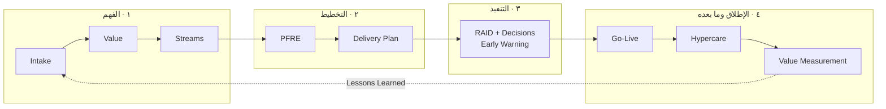

---
title: "00 — كتاب ERP Delivery Playbook: الإطار الفلسفي الجامع"
aliases:
  - ERP Delivery Playbook
  - كتاب التسليم
  - Delivery Playbook
type: فصل-مرجعي
system: "[[نظام تشغيل التسليم]]"
area: "[[Project Management]]"
tags:
  - إدارة-المشاريع
  - قيادة-التسليم
  - ERP
  - مرجع
status: لم يبدأ
source: "كتاب ERP Delivery Playbook — نظام تشغيل احترافي لتسليم مشاريع ERP · إعداد: أمجد محمد عز الدين عبد اللطيف"
---

> [!info] كيف تقرأ هذا الفصل
> هذا الفصل هو **الإطار الجامع** الذي تُعلَّق عليه كل أدوات [[نظام تشغيل التسليم]]. الفصول الستة في [[قيادة التسليم للمشاريع البرمجية]] تُعلّمك **كيف** تستخدم كل أداة؛ وهذا الفصل يُجيب **لماذا** توجد الأدوات أصلاً وكيف يترابط بعضها ببعض.
>
> **تمييز المصدر:** ما هو منقول من الكتاب موسوم بـ `> [!quote] من الكتاب`، وما هو إضافة تحليلية أو ربط بمصادر أخرى موسوم بـ `> [!tip] إضافة`. هذا التمييز مقصود حتى تعرف دائماً أين ينتهي المؤلِّف وأين تبدأ القراءة.

# كتاب ERP Delivery Playbook — الإطار الفلسفي الجامع

## 🎯 أهداف التعلّم
- أن تُفرّق بين **إدارة المشروع** و**إدارة التسليم** بجدول مقارنة تشغيلي لا بعبارات عامة.
- أن تفهم لماذا تفشل مشاريع ERP فعلاً — ولماذا التقنية آخر الأسباب لا أوّلها.
- أن تستوعب المفاهيم الأربعة المؤسِّسة: `Outcome` · القيمة · التدفّق · الحوكمة.
- أن تحفظ **الدورة التسعية** التي تربط الأدوات الـ24 في مسار واحد.
- أن تجمع **القواعد الذهبية** التي يبني عليها البرنامج كله قراراته.

---

## الفكرة المحورية

> [!quote] من الكتاب — الجملة الافتتاحية
> «هذا الكتاب ليس كتاباً تقنياً لتعليم Odoo أو SAP أو Oracle. وليس كتاباً لإدارة المشاريع بالمعنى التقليدي. بل هو **دليل عملي لبناء نظام تشغيل لتسليم مشاريع ERP** بطريقة احترافية قابلة للتوقّع والقياس والتحكّم.»

الفكرة التي يقوم عليها الكتاب كله: أغلب المؤسسات تنظر إلى مشروع ERP على أنه **تركيب نظام → إعداد موديولات → تدريب مستخدمين → Go-Live**. وهذا التصوّر ليس ناقصاً فحسب — بل هو **سبب الفشل نفسه**، لأنه يوجّه انتباه الفريق كله إلى الشيء الخطأ.

> [!quote] من الكتاب
> المشكلة الحقيقية في مشاريع ERP ليست فقط في النظام، بل في:
> - التدفّق التشغيلي
> - البيانات
> - القرارات
> - الحوكمة
> - الاعتماديات
> - التخصيصات
> - جاهزية المؤسسة

> [!tip] إضافة — لماذا هذه القائمة تحديداً؟
> لاحظ أن **ستة من السبعة لا يملكها المورّد**. البيانات والقرارات والحوكمة والجاهزية كلها في يد العميل. وهذا يفسّر ظاهرة محيّرة: فريق تقني ممتاز يسلّم مشروعاً فاشلاً. ليس لأنه أخطأ، بل لأنه كان يُحسِن الشيء الوحيد الذي يملكه (النظام) ويترك الستة الباقية بلا مالك. **دور قائد التسليم هو أن يصير مالكاً لهذه الستة — أو على الأقل أن يجعلها مرئية ومُسمّاة.** وهنا مصدر أدوات مثل [[02 - Readiness Assessment]] و [[17 - Client Responsibility RACI]] و [[15 - Decision Log]].

---

## القسم الأول: لماذا تفشل مشاريع ERP؟

### الأسباب السبعة

> [!quote] من الكتاب
> أغلب مشاريع ERP لا تفشل بسبب النظام نفسه، بل بسبب:
> - `Scope` غير مضبوط
> - قرارات متأخّرة
> - بيانات غير جاهزة
> - `UAT` ضعيف
> - `Go-Live` غير محكوم
> - توقّعات غير واقعية
> - ضعف `Governance`

### الخطأ المؤسِّس: البدء بالموديولات

> [!quote] من الكتاب
> أكبر خطأ يقع فيه مديرو المشاريع هو **البدء بالموديولات**. يسألون:
> - هل نطبّق Sales؟
> - هل نطبّق Inventory؟
> - هل نطبّق Accounting؟
>
> بينما السؤال الصحيح:
> - أين تضيع القيمة؟
> - أين يتوقّف التدفّق؟
> - ما أكبر خسارة تشغيلية؟
> - ما الذي يمنع الاستقرار؟

> [!success] القاعدة الذهبية #1
> **ERP ليس مشروع شاشات. ERP مشروع تدفّق وقيمة.**

> [!tip] إضافة — الفرق العملي في يوم العمل
> السؤال «هل نطبّق Inventory؟» يقود إلى **قائمة شاشات**، فتصير وحدة النجاح: «أنجزنا 8 شاشات من 12». والسؤال «أين يتوقّف التدفّق؟» يقود إلى **دورة كاملة**، فتصير وحدة النجاح: «العميل صار يُصدر فاتورة من الطلب في يومين بدل خمسة».
> الفارق أن الأول يمكن أن يكتمل 100% دون أن يتغيّر شيء في المؤسسة — وهذا بالضبط ما يسمّيه الكتاب «فشلاً ناجحاً إدارياً». وهذا التحوّل هو موضوع الفصل [[03 - من المديولات إلى تدفّقات القيمة]] كاملاً.

---

## القسم الثاني: إدارة المشروع مقابل إدارة التسليم

هذا هو **الجدول المؤسِّس** للبرنامج كله:

| إدارة المشروع التقليدية | ERP Delivery |
|---|---|
| `Timeline` | `Timeline` + `Governance` |
| `Tasks` | `Value Streams` |
| `Status Report` | [[20 - Project Health Report\|Project Health Report]] |
| `Support` | [[23 - Hypercare & SLA\|Hypercare]] |
| `Go-Live Date` | `Go/No-Go Decision` |

> [!quote] من الكتاب
> خطة المشروع التقليدية ليست كافية وحدها. لأنها تخبرنا **«متى نعمل»** — لكن نظام التسليم يخبرنا **«كيف ننجح»**.

### ما الذي تهتم به كل واحدة؟

| إدارة المشروع تهتم بـ | إدارة التسليم تهتم بـ |
|---|---|
| الوقت · التكلفة · النطاق | القيمة · الجاهزية · التدفّق · المخاطر · الاستقرار · `Go-Live` · التبنّي · قياس الأثر |

> [!tip] إضافة — ملاحظة على العمود الأيمن
> ثلاثية «الوقت والتكلفة والنطاق» ليست خاطئة — هي **ناقصة**. مثلث القيود يجيب: «هل التزمنا بما وعدنا؟» ولا يجيب أبداً: «هل كان ما وعدنا به يستحق؟». مشروع يُسلَّم في موعده وضمن ميزانيته ثم لا يستخدمه أحد هو مشروع **ناجح بمقياس المثلث وفاشل بمقياس القيمة**.
> ولهذا يضيف البرنامج مؤشّرين لا وجود لهما في المثلث: **`User Adoption`** (هل يستخدمونه؟) و**`Value Realization`** (هل تغيّر الرقم؟). انظر [[24 - Value Tracking & Lessons Learned]].

---

## القسم الثالث: المفاهيم المؤسِّسة الأربعة

### 1) من `Output` إلى `Outcome`

> [!quote] من الكتاب
> `Output`: ما نبنيه. — `Outcome`: ما يتغيّر بعد استخدام ما بنيناه.

| Output | Outcome |
|---|---|
| تطبيق `Sales Module` | تقليل زمن الطلب |
| `Dashboard` | قرار أسرع |
| `Workflow` | تقليل الانتظار |

> [!quote] الخطأ الشائع
> أن تعتبر المؤسسة أن المشروع نجح **لأنه تم تنفيذ النظام**. بينما النجاح الحقيقي هو **تحسّن التشغيل بعد الاستخدام**.

انظر التوسّع الكامل في [[Outcome vs Output]] و [[01 - من إدارة المهام إلى قيادة التسليم]].

### 2) القيمة في ERP ليست `Feature`

> [!quote] من الكتاب
> القيمة هي: تقليل وقت · تقليل خسارة · تقليل أخطاء · رفع دقة · رفع `Visibility` · تحسين اتخاذ القرار.
> ولهذا **لا نبدأ بالموديولات**، بل نبدأ بفهم `Customer Jobs` و`Customer Pains` و`Customer Gains`، ثم نحوّلها إلى `KPIs` و`Outcomes` و`Value Streams`.

> [!success] القاعدة الذهبية #2
> **العميل لا يشتري ERP. العميل يشتري تقليل الألم.**

الأداة: [[03 - Value Proposition Canvas]] ← ثم [[04 - Pain Gain Coverage Matrix]] ← ثم [[05 - Business Outcomes & KPIs]].

### 3) التدفّق والتأخير

> [!quote] من الكتاب
> في أغلب المؤسسات، المشكلة ليست أن الناس لا يعملون — بل أن **العمل ينتظر**: ينتظر اعتماداً، أو مراجعة، أو بيانات، أو قراراً، أو تكاملاً، أو مستخدماً.

$$\text{Flow Efficiency} = \frac{\text{Work Time}}{\text{Total Time}}$$

> [!quote] من الكتاب
> إذا كان العمل الحقيقي 3 ساعات والزمن الكلّي 78 ساعة، فهذا يعني أن **96% من الوقت ضائع في الانتظار**. وهذا ما يفسّر لماذا مشاريع كثيرة تتأخّر رغم أن الفريق «مشغول».

> [!success] القاعدة الذهبية #3
> **المشكلة ليست أن الناس لا يعملون. المشكلة أن التدفّق متوقّف.**

> [!tip] إضافة — لماذا هذا الرقم صادم عملياً
> النتيجة العملية لـ 4% كفاءة تدفّق: **لو ضاعفت سرعة فريقك، تكسب 2% فقط من الزمن الكلّي.** أمّا لو حذفت اعتماداً واحداً يستغرق يومين، فقد تكسب 30%. ولهذا يقول البرنامج إن مدير التسليم **لا يسرّع الفريق — بل يزيل الاختناقات**.
> راجع التفصيل الكامل للمعادلة `Time-to-Value = Waiting + Handoffs + Rework + Execution` في [[02 - التدفّق وكفاءته وترتيب الأولويات (WSJF)]] و [[Flow Efficiency]].

### 4) الحوكمة تُحوّل الاجتماعات إلى أدوات تحكّم

> [!quote] من الكتاب
> `Governance` تحوّل الاجتماعات إلى أدوات تحكّم. الاجتماعات الأساسية: `Daily Sync` · `Weekly Review` · `Steering Committee`.

انظر [[16 - Governance Model]].

---

## القسم الرابع: الأدوات في تسلسلها المنطقي

### أ) فهم المشروع والقيمة

| الأداة | ما تكشفه |
|---|---|
| [[01 - Project Intake]] | أول رادار: هل نعرف ما ندخل فيه؟ |
| [[02 - Readiness Assessment]] | تحويل «الشعور» إلى حالة مرئية بالألوان |
| [[03 - Value Proposition Canvas]] | لماذا يريد العميل ERP أصلاً؟ |
| [[04 - Pain Gain Coverage Matrix]] | كم % من الألم سيختفي فعلاً؟ |
| [[05 - Business Outcomes & KPIs]] | تحويل القيمة إلى أرقام لها `Baseline` و`Target` |
| [[07 - Financial Loss Analysis]] | تحويل التأخير إلى ريالات |

> [!quote] القاعدة الذهبية #4 — عن الـ Intake
> **أول خطر في ERP ليس التقنية، بل البدء قبل الجاهزية.**

> [!quote] القاعدة الذهبية #5 — عن الـ KPIs
> **أي قيمة لا يمكن قياسها لم يتم تعريفها بشكل صحيح.**

> [!quote] القاعدة الذهبية #6 — عن التحليل المالي
> **ERP ليس مشروع تكلفة. ERP مشروع تقليل خسائر.**

> [!tip] إضافة — لماذا `Pain/Gain Coverage` هي أذكى أداة في الكتاب
> معظم أدوات ما قبل البيع تجيب بنعم/لا: «هل النظام يدعم هذا؟». وهذه الأداة تجيب **بنسبة مئوية**: «سيغطّي 85% من هذا الألم، والـ15% الباقية بشرية وحوكمية». والأثر العملي مزدوج:
> 1. **تضبط توقّعات العميل قبل التوقيع** لا بعد الإطلاق.
> 2. **تحدّد أين تستثمر جهدك** — الألم الذي تغطيته 40% يحتاج تدخّلاً غير تقني (تغيير عملية، تدريب، حوكمة) لا مزيداً من التخصيص.

### ب) تحليل التدفّق والتعقيد

| الأداة | ما تكشفه |
|---|---|
| [[06 - Value Streams]] | كيف تتحرّك القيمة فعلاً: `Order to Cash` · `Procure to Pay` · `Inventory Replenishment` · `Record to Report` |
| [[08 - Fit Gap Analysis]] | ما يعمل `Standard` · ما يحتاج `Config` · ما يحتاج `Customization` |
| [[09 - PFRE Estimation]] | التقدير المركّب: لماذا سيأخذ هذا الوقت؟ |
| [[10 - PFRE Decision Model]] | ما الذي يدخل Phase 1 وما الذي يُؤجَّل — والفرق بينهما ليس الحجم |

> [!quote] القاعدة الذهبية #7
> **العميل يشعر بالتدفّق، ولا يشعر بالموديولات.**

> [!quote] عن `Criticality`
> `Criticality` **لا تقيس حجم العمل، بل تقيس تكلفة الفشل**. إذا فشل `Opening Balance` أو `Inventory Posting` أو `Invoice Posting`، فقد يفشل `Go-Live` بالكامل.

> [!quote] عن كل تخصيص
> **كل `Customization` له ثمن:** وقت · اختبار · دعم · مخاطر.

> [!quote] عن `PFRE`
> `PFRE` = *Process Fit-Gap Estimation with Reference Calibration*
> $$\text{Effort} = \text{Base Work} \times \text{Integration} \times \text{Data} \times \text{Dependencies} \times \text{Criticality}$$
> **`PFRE` لا يسأل «كم الوقت؟» فقط — بل يسأل «لماذا سيأخذ هذا الوقت؟».**

> [!quote] القاعدة الذهبية #8
> **التقدير بدون `Reality Factor` = وهم.**

> [!warning] هذا هو المصطلح المفقود
> اسم **`PFRE`** لا يرد ولا مرة واحدة في تفريغ المحاضرات الستّ — لأن المدرّب شرح الطريقة دون أن يسمّيها. الاسم موجود فقط في الكتاب والـ Excel والشرائح. راجع [[PFRE]] و [[_جدول مطابقة الأرقام]].

### ج) بناء نظام التسليم

| الأداة | ما تحكمه |
|---|---|
| [[11 - Delivery Plan]] | ليست `Timeline` — بل وثيقة تحكّم |
| [[12 - Scope Baseline]] | منع `Scope Creep` |
| [[13 - Change Request]] | لا يوجد تغيير مجّاني |
| [[14 - RAID Log]] | `Risks` · `Assumptions` · `Issues` · `Dependencies` |
| [[15 - Decision Log]] | أي قرار غير مكتوب = قرار ضائع |
| [[16 - Governance Model]] | تحويل الاجتماعات إلى قرارات |
| [[18 - Vendor Scorecard]] | إدارة المورّد بالمؤشّرات لا بالانطباع |
| [[19 - Early Warning Dashboard]] | رؤية الأزمة قبل حدوثها |
| [[20 - Project Health Report]] | هل المشروع صحّي؟ لا: ماذا تمّ؟ |

> [!quote] القاعدة الذهبية #9
> **الخطة الجيدة لا تشرح ماذا سنفعل فقط، بل كيف سنتحكّم في المشروع.**

> [!quote] القاعدة الذهبية #10
> **`RAID` ليس ملف `Excel`. `RAID` هو رادار المشروع.**

> [!quote] القاعدة الذهبية #11
> **أي مؤشّر لا يقود قراراً ليس مؤشّراً مفيداً.**

> [!tip] إضافة — القاعدة #11 هي أقسى معيار في الكتاب
> طبّقها على أي لوحة مؤشّرات عندك الآن: خذ كل مؤشّر واسأل «لو تغيّر هذا الرقم، ما القرار الذي يتغيّر؟». المؤشّرات التي لا تجيب هي **زينة تقارير**، وحذفها يرفع جودة اللوحة لا يخفضها.
> ولهذا صُمّمت [[19 - Early Warning Dashboard]] بعمود إلزامي اسمه `Action`: لا يُقبل مؤشّر بلا إجراء مقابل.

### د) الاختبار والإطلاق

| الأداة | القاعدة الحاكمة |
|---|---|
| [[21 - UAT Management]] | `UAT` ليس فترة طويلة غير منظّمة — بل **نظام جاهزية** بثلاث دورات: `Discovery` · `Stabilization` · `Readiness` |
| [[22 - Go-Live Checklist & Go NoGo]] | `Go-Live` ليس تاريخاً — بل **قرار جاهزية** |
| [[Data Dry Run]] | **70% من مشاكل `Go-Live` تأتي من البيانات** |
| [[23 - Hypercare & SLA]] | `Hypercare` ≠ `Support`: الأول استباقي والثاني ردّ فعل |
| [[24 - Value Tracking & Lessons Learned]] | النجاح ليس عند `Go-Live` — بل عند ظهور القيمة |

> [!quote] القاعدة الذهبية #12
> **إذا كان التاريخ ثابتاً فإننا لا نتحكّم في الوقت — إذاً نركّز على التحكّم في الجاهزية.**

> [!tip] إضافة — أذكى جملة في الكتاب
> القاعدة #12 هي مخرج قائد التسليم من أكثر المواقف استحالة: تاريخ إطلاق سياسي لا يُناقَش. الردّ الاحترافي ليس «مستحيل» ولا «حاضر» — بل: **«التاريخ محفوظ. والسؤال الآن ليس متى نطلق، بل بأي مستوى جاهزية سنطلق — وما الذي نحتاجه منكم لرفعه.»** وهذا يحوّل النقاش من مواجهة إلى خطة مشتركة، ويولّد `Readiness Race` بأدواته: `War Room`، `Daily Escalation`، [[Data Dry Run]]، `Contingency Plan`.

---

## القسم الخامس: الدورة التسعية — كيف تستخدم الشركات هذا النظام

> [!quote] من الكتاب — في كل مشروع
> 1. `Intake` — 2. `Value` — 3. `Streams` — 4. `PFRE` — 5. `Delivery Plan` — 6. `RAID` — 7. `Go-Live` — 8. `Hypercare` — 9. `Value Measurement`

> [!tip] إضافة — الأداة الوحيدة التي تُغلق الدائرة
> لاحظ السهم المتقطّع العائد من `Value Measurement` إلى `Intake`. هذا هو ما يحوّل الشركة من «تُنفّذ مشاريع» إلى «تملك نظام تسليم». وبدون [[24 - Value Tracking & Lessons Learned]] تبقى الدورة **خطاً مستقيماً** يبدأ من الصفر في كل مشروع.
> وهذا معنى العبارة الأخيرة في الكتاب: **«المنظّمة الناضجة لا تكرّر نفس الخطأ مرّتين.»**

---

## القسم السادس: القواعد الذهبية مجموعة

> [!success] القواعد الاثنتا عشرة
> 1. **ERP ليس مشروع شاشات — بل مشروع تدفّق وقيمة.**
> 2. **العميل لا يشتري ERP، بل يشتري تقليل الألم.**
> 3. **المشكلة ليست أن الناس لا يعملون، بل أن التدفّق متوقّف.**
> 4. **أول خطر ليس التقنية، بل البدء قبل الجاهزية.**
> 5. **أي قيمة لا يمكن قياسها لم تُعرَّف بشكل صحيح.**
> 6. **ERP ليس مشروع تكلفة، بل مشروع تقليل خسائر.**
> 7. **العميل يشعر بالتدفّق ولا يشعر بالموديولات.**
> 8. **التقدير بدون `Reality Factor` وهم.**
> 9. **الخطة الجيدة لا تشرح ماذا سنفعل، بل كيف سنتحكّم.**
> 10. **`RAID` ليس ملف Excel — بل رادار المشروع.**
> 11. **أي مؤشّر لا يقود قراراً ليس مؤشّراً مفيداً.**
> 12. **إذا ثبت التاريخ، تحكّم في الجاهزية.**

وقواعد أخرى منثورة في الكتاب والشرائح:
- **لا يوجد تغيير مجّاني** — كل تغيير له وقت وتكلفة وأثر على `UAT` وأثر على `Go-Live`.
- **كلّما اقتربنا من `Go-Live` يجب أن يقلّ التغيير حتى يصل إلى الصفر.**
- **المشروع لا يفشل فجأة — بل يعطي إشارات مبكّرة.**
- **أي قرار غير مكتوب = قرار ضائع.**
- **المستخدم غير الجاهز = مشروع غير جاهز.**
- **`Go-Live Date` ≠ `Go-Live Readiness`: التاريخ للتخطيط، والقرار للجاهزية.**
- **البيانات أخطر من الكود في ERP.**
- **التبنّي أهمّ من الإطلاق — إذا لم يستخدم الناس النظام فالمشروع لم ينجح.**
- **`Criticality` لا تقيس حجم العمل بل تكلفة الفشل.**

---

## الخاتمة

> [!quote] الرسالة الأخيرة في الكتاب
> «نحن لا نستخدم هذه القوالب **لزيادة الوثائق**، بل لبناء نظام يجعل مشاريع ERP أكثر استقراراً، وأكثر قابلية للتوقّع، وأكثر قدرة على تحقيق قيمة تشغيلية ومالية حقيقية يمكن قياسها بعد التشغيل.»

وفي الوثيقة التفسيرية صياغة أقصر تصلح جملةً ختامية أمام أي عميل:

> [!quote]
> «نحن لا نستخدم هذه القوالب لزيادة الوثائق، **بل لتقليل المفاجآت**. كل قالب هنا يجيب على سؤال تنفيذي مهم: هل المشروع يحقّق قيمة؟ هل المخاطر واضحة؟ هل القرارات محكومة؟ هل الإطلاق آمن؟ وهل ظهرت القيمة بعد التشغيل؟»

> [!tip] إضافة — معيار واحد لقياس نضجك في هذا الإطار
> لست ناضجاً في هذا الإطار حين تحفظ الأدوات الـ24، بل حين تستطيع **الاستغناء عن معظمها في مشروع صغير دون أن تفقد أياً من الأسئلة الخمسة أعلاه**. الأدوات وسائل، والأسئلة هي الأصل.

---

## اختبر نفسك

> [!question]- 1. لماذا يقول الكتاب إن «البدء بالموديولات» هو الخطأ المؤسِّس، لا مجرّد خطأ في الترتيب؟
> لأنه يحدّد **وحدة النجاح** خطأً منذ اليوم الأول. حين تكون الوحدة «شاشة مُنجَزة» يمكن للمشروع أن يكتمل 100% دون أن يتغيّر شيء في تشغيل المؤسسة. أمّا حين تكون الوحدة «دورة قيمة كاملة تعمل» فلا يمكن ادّعاء الإنجاز إلا بتغيّر واقعي قابل للقياس.

> [!question]- 2. ما الفرق العملي بين `Criticality` و`Complexity`؟ وأعطِ مثالاً يفرّق بينهما.
> `Complexity` تقيس **صعوبة البناء**، و`Criticality` تقيس **تكلفة الفشل**. المثال في الكتاب: `Dashboard` تعقيده متوسط لكن `Criticality` منخفضة (لو تعطّل نستمرّ)، بينما `Opening Balance` تعقيده متوسط أيضاً لكن `Criticality` شديدة الارتفاع (لو فشل، فشل `Go-Live` كله). النتيجة العملية: الثاني يستحق حوكمة واختباراً أعلى رغم تساويهما في الصعوبة.

> [!question]- 3. عميل يقول: «التاريخ نهائي ولا يُناقَش، والنطاق كامل ولا يُقلَّص». ما ردّ قائد التسليم وفق القاعدة #12؟
> ألّا يفاوض على ما لا يُفاوَض عليه، بل ينقل التحكّم إلى المتغيّر الثالث: **الجاهزية**. الصيغة: «التاريخ محفوظ والنطاق محفوظ؛ إذاً نتحكّم في الجاهزية.» ثم يفرض بوّابات جاهزية مبكّرة (`T-60` تجميد التصميم، `T-30` جاهزية بيانات 80%، `T-14` نجاح `UAT` 85%)، و`War Room`، و`Daily Escalation`، و[[Data Dry Run]]، وخطة طوارئ. والنتيجة قرار `Controlled Go-Live` لا `Go` أعمى.

> [!question]- 4. لماذا يكفي `Pain/Gain Coverage` بنسبة 85% ولا يُطلب 100%؟
> لأن جزءاً من الألم **غير تقني بطبيعته**: مرتبط بالناس والحوكمة والقرارات وجودة البيانات. ادّعاء 100% يعني وعداً لا يتحقّق ويولّد خيبة بعد الإطلاق. وإظهار الـ15% المتبقّية صراحةً يضبط التوقّعات **ويحدّد أين يلزم تدخّل غير تقني**.

> [!question]- 5. اذكر مؤشّراً شائعاً يسقط في اختبار القاعدة #11، ولماذا.
> «نسبة إنجاز المشروع %» — لأنه لا يقود أي قرار: 70% لا تخبرك هل تُصعّد أم تجمّد النطاق أم تمدّد `UAT`. في المقابل `Decision Delay > 48h` يقود مباشرة إلى تصعيد، و`Data Readiness < 80%` يقود إلى `Data War Room`.

## 🔗 مصطلحات ومفاهيم ذات صلة
[[PFRE]] · [[Outcome vs Output]] · [[Value Stream]] · [[Flow Efficiency]] · [[Criticality]] · [[Reality Factor]] · [[Fit-Gap Analysis]] · [[RAID Log]] · [[Decision Log]] · [[Hypercare]] · [[Data Dry Run]] · [[Project Health Report]] · [[Early Warning Dashboard]] · [[Go or No-Go Decision]] · [[Lessons Learned]]

## مصادر
- **ERP Delivery Playbook** — نظام تشغيل احترافي لتسليم مشاريع ERP: من إدارة المهام إلى قيادة القيمة والاستقرار. إعداد: أمجد محمد عز الدين عبد اللطيف.
- **ERP Delivery Playbook (وثيقة تفسيرية)** — دليل تشغيل نظام تسليم مشاريع Odoo/ERP، المصاحبة لملف `ERP Delivery Operating System Master`.
- شرائح **محاضرة الأسبوع الخامس** — Delivery Management Summary (الركائز الأربع والقواعد المنثورة).
