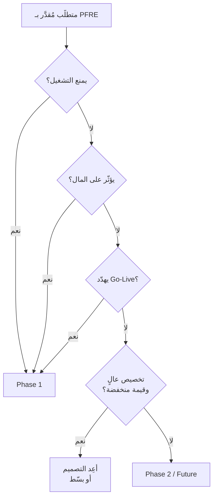

> [!info] القالب 10 · المرحلة الثالثة — التحليل
> **متى تستخدمه:** بعد حساب [[09 - PFRE Estimation]] وقبل بناء [[11 - Delivery Plan]].
> **من يملكه:** `Delivery Manager` + `Business Owner` — والقرار النهائي للـ`Sponsor`.
> **مخرجه:** قرار مُبرَّر لكل متطلَّب: `Phase 1` / `Phase 2` / `Future` / إعادة تصميم.

# PFRE Decision Model — نموذج قرار التقسيم

## لماذا هذا القالب موجود؟

> [!quote] من الوثيقة التفسيرية
> **التقدير وحده لا يحدّد التقسيم المرحلي.** التقسيم الصحيح يعتمد على `Business Operability` + `Delivery Risk`.

> [!quote] من ملف الـ Excel — الفكرة الأساسية
> `PFRE` لا يُستخدم فقط لتقدير الوقت، بل لاكتشاف: أين التعقيد الحقيقي · أين مخاطر `Go-Live` · هل يمكن تقسيم المشروع · ما الذي يجب أن يدخل `Phase 1` · ما الذي يمكن تأجيله · ما الذي يجب تبسيطه.

> [!warning] هذه هي القاعدة المضادّة للحدس في البرنامج كلّه
> **ليس كل ما يُسمّى `Enhancement` يُؤجَّل.** بعض التحسينات هي `Core Business Logic` ويجب أن تدخل `Phase 1` لأنها تؤثّر على: التشغيل · المال · التدفّق · جاهزية `Go-Live`.

---

## أسئلة القرار الخمسة

| السؤال | إذا كانت الإجابة نعم |
|---|---|
| هل **يمنع التشغيل**؟ | يدخل `Phase 1` |
| هل **يؤثّر على المال**؟ | يدخل `Phase 1` |
| هل **يهدّد `Go-Live`**؟ | يدخل `Phase 1` |
| هل يمكن العمل بدونه مؤقتاً؟ | يمكن تأجيله |
| هل هو `Customization` عالٍ منخفض القيمة؟ | يُعاد تصميمه أو يؤجَّل |

---

## القالب (فارغ)

| `Feature` | `Business Criticality` | `Operational Dependency` | `Fit/Gap` | `PFRE Units` | `Can Delay?` | `Recommended Phase` | `Decision Logic` | `Delivery Strategy` |
|---|---|---|---|---|---|---|---|---|
| | | | | | | | | |

---

## القالب مملوءاً — [[حالة النور للتوزيع]]

| `Feature` | `Criticality` | `Dependency` | `Fit/Gap` | `Units` | `Can Delay?` | `Phase` | `Decision Logic` | `Strategy` |
|---|---|---|---|---|---|---|---|---|
| `Sales Workflow` | High | Core Operation | Config | 2 | **No** | Phase 1 | أساسي للتشغيل | `Core Delivery` |
| `Barcode` | High | Inventory | Config | 4 | **No** | Phase 1 | يؤثّر على دقة المخزون | `Operational Stability` |
| `Approval Workflow` | High | Order Flow | Light Gap | 10 | **No** | Phase 1 | يؤثّر على التدفّق | `Governance Required` |
| `Credit Visibility` | **Very High** | Finance | Light Gap | 8 | **No** | Phase 1 | يؤثّر على القرار المالي | `Controlled Go-Live` |
| `Target Discount` | Medium | Pricing | **Heavy Gap** | **21** | **Possible** | Phase 2 أو تبسيط | `Customization` عالٍ | `Scope Trade-off` |
| `Branch Credit Limit` | **Very High** | Finance + Branches | **Heavy Gap** | **25** | **No** | **Phase 1** | **يمنع التشغيل المالي** | `Executive Monitoring` |
| `Mobile App` | Low | None | Heavy Gap | 18 | **Yes** | Phase 2 | لا يمنع التشغيل | `Deferred Enhancement` |
| `Advanced BI` | Low | Reporting | Heavy Gap | 14 | **Yes** | Future | قيمة لاحقة | `Future Roadmap` |

---

## كيف تقرأ الجدول — «ما بين السطور»

> [!important] الصفّ المحوري: `Branch Credit Limit`
> هو **أثقل بند في المشروع كلّه** (25 وحدة) و**تخصيص ثقيل** (`Heavy Gap`) — وكل غريزة إدارية تقول: أجّله.
> ومع ذلك القرار هو **`Phase 1` بلا تأجيل**، لأنه إن تعطّل فلن تستطيع الفروع البيع أو التحصيل. **الحرجية تغلب الحجم.**
>
> قارنه بـ`Mobile App`: 18 وحدة، `Heavy Gap` أيضاً، لكن `Criticality` منخفضة و`Dependency` = `None`. النتيجة: `Phase 2` بلا نقاش.
> **الدرس:** المعيار ليس «كم يكلّف؟» بل «ماذا يتعطّل بدونه؟».

> [!tip] إضافة 1 — العمود الحاسم هو `Operational Dependency`
> لاحظ أن كل بنود `Phase 1` لها اعتمادية تشغيلية مُسمّاة (`Core Operation`, `Inventory`, `Order Flow`, `Finance`, `Finance + Branches`)، وكل بنود التأجيل اعتماديتها ضعيفة أو `None`.
> **هذا العمود وحده يكاد يحسم القرار** — ويمكن استخدامه كفحص سريع قبل ملء بقية الجدول.

> [!tip] إضافة 2 — `Delivery Strategy` ليس زينة
> العمود الأخير يحدّد **كيف** يُدار البند لا فقط **متى**:
> | الاستراتيجية | ماذا تعني عملياً |
> |---|---|
> | `Core Delivery` | تنفيذ عادي ضمن السبرنتات |
> | `Operational Stability` | يحتاج `Cycle Count` وتدريباً مصاحباً |
> | `Governance Required` | يحتاج قراراً مكتوباً في [[15 - Decision Log]] قبل البناء |
> | `Controlled Go-Live` | يدخل بوّابة جاهزية خاصة قبل الإطلاق |
> | `Executive Monitoring` | يُتابَع في [[16 - Governance Model\|Steering Committee]] لا في الاجتماع الأسبوعي |
> | `Scope Trade-off` | يُعرَض على العميل كمقايضة صريحة |
> | `Deferred Enhancement` / `Future Roadmap` | يدخل [[12 - Scope Baseline]] تحت `Phase 2` |

> [!tip] إضافة 3 — الصيغة التدريبية لعرض القرار على العميل (من شرائح الأسبوع الثالث)
> > «هذا المتطلَّب **[قياسي / غير قياسي]**، ويحتاج **[نوع التخصيص]**، وسيؤثّر على المشروع من خلال **[الأثر الزمني/التشغيلي]**، وهو **[ضروري / غير ضروري]** للتشغيل الأساسي — لذلك القرار الأنسب هو **[Now / Phase 2 / Reject]**.»
>
> استخدمها حرفياً. فهي تحوّل القرار من **رأي شخصي** إلى **نتيجة تحليل** — وهو الفرق بين مورّد يجادل ومستشار يُستشار.

> [!quote] القاعدة العملية النهائية
> **الجملة المهنية:** لا نقول «لا» — نقول **«نعم، وهذا أثره على الوقت والتكلفة و`Go-Live`»**.

## 🔗 روابط
[[09 - PFRE Estimation]] · [[08 - Fit Gap Analysis]] · [[12 - Scope Baseline]] · [[13 - Change Request]] · [[Criticality]] · [[_جدول مطابقة الأرقام]] · [[حالة النور للتوزيع]]

## مصادر
- ورقة `PFRE Decision Model` في ملف الـ Excel (39 صفّاً).
- الوثيقة التفسيرية — القسم 15.
- شرائح الأسبوع الثالث — إطار قرار المتطلَّب بخطواته السبع والصيغة التدريبية (الشرائح 19–31).
