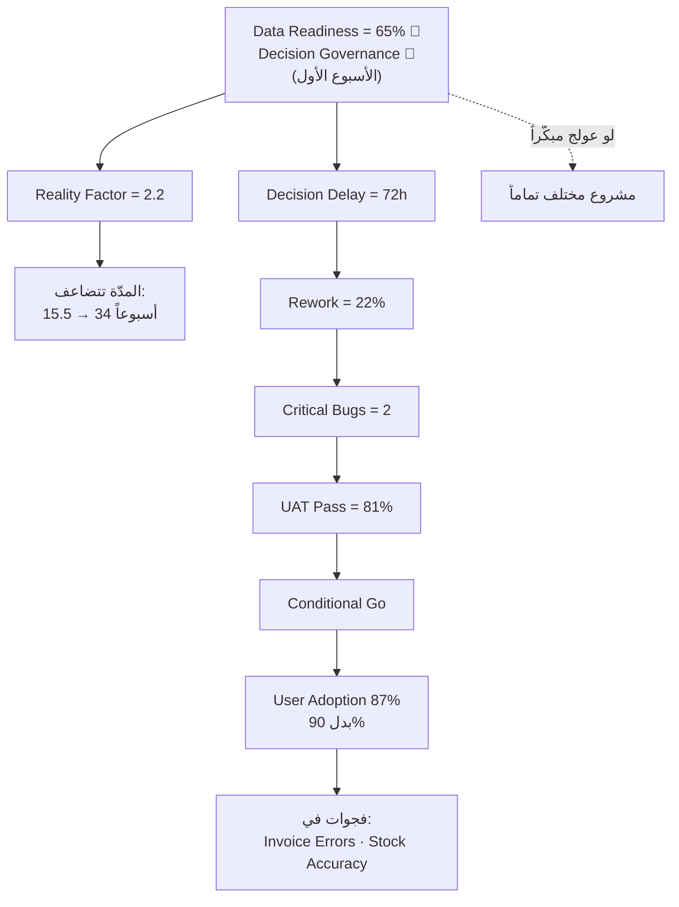

> [!abstract] عن هذه الحالة
> «شركة النور للتوزيع» هي **الحالة المرجعية** التي مُلئت بها أوراق `ERP_Delivery_Operating_System_Master_Final.xlsx` الـ39 كاملة. وهي الحالة الوحيدة في البرنامج التي تسير من **أول رادار** حتى **قياس القيمة بعد التشغيل** بأرقام متّصلة.
>
> اقرأها مرّتين: مرّة **طولياً** لتفهم المسار، ومرّة **عرضياً** لتلاحظ كيف يُغذّي كل رقم ما بعده — فمن `Data Readiness = 65%` إلى `Reality Factor = 2.2` إلى 35 أسبوعاً، سلسلة واحدة لا أرقام متفرّقة.

# حالة النور للتوزيع — من `Intake` إلى `Value`

## بطاقة المشروع

| البند | القيمة |
|---|---|
| المشروع | `Odoo ERP Transformation` |
| العميل | شركة النور للتوزيع |
| الراعي التنفيذي | `COO` |
| `Delivery Manager` | Amjed Ezaddin |
| المستخدمون · الفروع · المستودعات | **85** · **3** · **4** |
| النظام الحالي | `Excel` + `Accounting Legacy` |
| التكاملات | `Barcode` + `Bank Integration` |
| `Go-Live` المطلوب | 01-Jan-2027 |
| الاستراتيجية | إطلاق مرحلي |
| `Hypercare` | 4 أسابيع |

> [!quote] القراءة الأولى — «ما بين السطور»
> 4 مستودعات + `Barcode` + `Bank Integration` ⇒ هذا **ليس إعداد `Odoo`**، بل مشروع بيانات وعمليات وتكاملات واختبار وجاهزية تشغيل.
> **القرار:** يبدأ كـ**برنامج تسليم بحوكمة من اليوم الأول** لا كتنفيذ مباشر.

القالب: [[01 - Project Intake]]

---

## المرحلة 1 — الجاهزية: ثلاثة أحمر قبل أن يبدأ شيء

| المجال | الحالة | الملاحظة |
|---|---|---|
| `Executive Sponsorship` | 🟢 | دعم قوي من `COO` |
| **`Data Readiness`** | 🔴 | **تكرار المنتجات واختلاف الأكواد** |
| `Key Users Availability` | 🟡 | محدودية الوقت |
| **`Decision Governance`** | 🔴 | **لا يوجد `SLA` للقرارات** |
| `Infrastructure` | 🟢 | `Cloud Ready` |
| `Network Stability` | 🟢 | مستقرّة |
| `Security` | 🟡 | `MFA` غير مطبَّق بالكامل |
| **`Reporting Readiness`** | 🔴 | **لا يوجد `KPI` موحّد** |

> [!important] النمط: كل ما هو تقني أخضر، وكل ما هو بشري/تنظيمي أحمر.
> **الاستنتاج:** لن يُنقذ المشروعَ مطوّرٌ إضافي. الإجراءات الثلاثة: `Data War Room` · `Decision SLA` · [[19 - Early Warning Dashboard]] + مسار تصعيد للراعي.

القالب: [[02 - Readiness Assessment]]

---

## المرحلة 2 — القيمة: ما الذي يشتريه العميل فعلاً؟

### آلامه ومكاسبه

| `Pain` | الأثر | ← | `Gain` | القيمة |
|---|---|---|---|---|
| تأخّر الطلبات | فقدان عملاء | | طلبات أسرع | رضا العملاء |
| فروق المخزون | نقص المنتجات | | دقة مخزون أعلى | تقليل الهدر |
| أخطاء الفواتير | نزاعات مالية | | تقارير فورية | قرارات أسرع |
| التقارير اليدوية | قرارات بطيئة | | `Workflow` موحّد | استقرار تشغيلي |
| الاعتمادات اليدوية | `Bottlenecks` | | تقليل العمل اليدوي | رفع الكفاءة |
| اختلاف البيانات | فقدان السيطرة | | | |

القالب: [[03 - Value Proposition Canvas]]

### كم من الألم سيختفي فعلاً؟

| الألم | التغطية الكلّية | ما يتبقّى ولماذا |
|---|---|---|
| تأخّر الطلبات | **85%** | اعتماديات بشرية |
| ضعف دقة المخزون | **90%** | أخطاء تشغيلية |
| أخطاء الفواتير | **80%** | يحتاج تدريباً إضافياً |
| التقارير | **95%** | (لكن 65% منها في `Phase 2`!) |

القالب: [[04 - Pain Gain Coverage Matrix]]

### الأهداف بالأرقام

| `KPI` | `Baseline` | `Target` | نافذة القياس |
|---|---|---|---|
| `Order Cycle Time` | 5 أيام | يومان | 4 أسابيع |
| `Stock Accuracy` | 68% | 95% | أول `Cycle Count` |
| `Invoice Error Rate` | 12% | 2% | نهاية أول شهر |
| `Reporting Time` | يومان | لحظي | أسبوعان |
| `User Adoption` | 0% | 90% | شهر |
| `Flow Efficiency` | **4%** | **30%+** | بعد `Hypercare` |

القالب: [[05 - Business Outcomes & KPIs]]

---

## المرحلة 3 — التدفّق: أين يتوقّف العمل؟

### `Order to Cash`

| الخطوة | `Work` | `Waiting` | المسؤول | المشكلة |
|---|---|---|---|---|
| إنشاء عرض السعر | 20 د | 4 س | `Sales` | انتظار مراجعة |
| **اعتماد الطلب** | 10 د | **8 س** | `Sales Manager` | المدير مشغول |
| تجهيز الطلب | ساعتان | 6 س | `Warehouse` | فروق مخزون |
| إصدار الفاتورة | 15 د | 5 س | `Finance` | مراجعة يدوية |
| اعتماد الفاتورة | 5 د | 4 س | `Finance Manager` | تأخّر الاعتماد |
| **التحصيل** | 30 د | **48 س** | `Finance` | مطابقة يدوية |
| **الإجمالي** | **3.33 س** | **75 س** | | |

$$\text{Flow Efficiency} = \frac{3.33}{78.33} \approx \mathbf{4\%}$$

> [!important] **96% من الزمن انتظار.**
> ولهذا لو ضاعفت سرعة الفريق لكسبت 2% فقط. الحلّ ليس في السرعة بل في **حذف الانتظار**.

القالب: [[06 - Value Streams]]

### كم يكلّف هذا الانتظار؟

| السبب | الخسارة الشهرية |
|---|---|
| تأخّر الطلبات (300 طلب/يوم × 10% × 3,000 ريال) | **90,000** |
| فروق المخزون | **60,000** |
| إعادة الفواتير | **30,000** |
| إعادة العمل | **20,000** |
| **الإجمالي** | **200,000 ريال/شهر** |

> [!quote] الجملة التنفيذية للـ`COO`
> «أكبر نقطة مؤثّرة هي ضعف `Order to Cash` ودقّة المخزون — وتكلّفكم **200,000 ريال شهرياً**. نوصي بالتركيز أولاً على التدفّقات التي تقلّل هذه الخسارة مباشرة.»
>
> **ولاحظ:** `Phase 1` وحده يعالج 90k + 60k = **150,000 (75% من الخسارة)**. هذه هي الحجّة الحقيقية للتقسيم المرحلي.

القالب: [[07 - Financial Loss Analysis]]

---

## المرحلة 4 — الحلّ والتقدير

### `Fit / Gap`

| المتطلَّب | `Standard` | `Config` | `Custom` | القرار |
|---|---|---|---|---|
| `Sales Workflow` | Yes | Yes | No | Phase 1 |
| `Approval Workflow` | **Partial** | Yes | No | Phase 1 |
| `Barcode` | Yes | Yes | No | Phase 1 |
| `Loyalty Program` | No | No | Yes | Phase 2 |
| `Mobile App` | No | No | Yes | Phase 2 |
| `AI Forecasting` | No | No | Yes | Future |

القالب: [[08 - Fit Gap Analysis]]

### `PFRE` — تقدير `Order to Cash`

| المتطلَّب | `Fit/Gap` | `Base` | `Int` | `Data` | `Dep` | `Crit` | `Units` |
|---|---|---|---|---|---|---|---|
| `Lead → Opportunity` | Standard | 1 | 1 | 1 | 1 | 1 | 1 |
| `Opportunity → Quotation` | Config | 2 | 1 | 1 | 1 | 1 | 2 |
| `Quotation → Sales Order` | Config | 2 | 1 | 1 | 1 | 1 | 2 |
| `Sales Order → Delivery` | Light Gap | 4 | 1.3 | 1.2 | 1.2 | 1.3 | **9.7** |
| `Delivery → Invoice` | Config | 2 | 1.3 | 1.1 | 1.2 | 1.3 | 4.5 |
| `Invoice → Payment` | Config | 2 | 1.3 | 1.2 | 1.2 | 1.3 | 4.9 |
| `Credit Visibility` | Light Gap | 4 | 1.2 | 1.1 | 1.2 | 1.2 | 7.6 |
| **`Target Discount`** | **Heavy Gap** | 8 | 1.3 | 1.3 | 1.3 | 1.2 | **21.1** |
| **`Branch Credit Limit`** | **Heavy Gap** | 8 | 1.4 | 1.2 | 1.4 | 1.3 | **24.5** |
| | | | | | | **الإجمالي** | **77.3** |

> [!important] بندان يستهلكان 59% من الجهد
> 21.1 + 24.5 = **45.6 من 77.3**. وهذا وحده أقوى حجّة تقسيم مرحلي.

### `Reality Factor` — الثمن الحقيقي للأحمر في `Readiness`

| العامل | التقييم | النقاط | السبب |
|---|---|---|---|
| سرعة القرارات | ضعيف | **+0.4** | `Decision Delay` = 72 ساعة |
| جاهزية البيانات | ضعيف | **+0.4** | `Data Readiness` = 65% |
| التكامل والتعقيد | متوسط | **+0.2** | `Barcode` + `Bank` |
| `Base RF` | — | 1.2 | الأرضية |
| **`Reality Factor`** | | **2.2** | |

**`Realistic Duration` = (77.3 ÷ 10) × 2 × 2.2 = 34** — فتُقرَّب إلى **35 أسبوعًا**.

> [!warning] ثلاثة سيناريوهات تقسيم — راجعها قبل أي عرض
> | السيناريو | Phase 1 | Phase 2 |
> |---|---|---|
> | تقسيم الشرائح | 12–14 أسبوعاً | 18–20 أسبوعاً |
> | تقسيم `PFRE Summary` | **35 أسبوعاً** | صفر |
> | تقسيم `Decision Model` (مُشتقّ) | ≈ 25 أسبوعاً | ≈ 10 أسابيع |
>
> التفصيل الكامل في [[_جدول مطابقة الأرقام]].

القالبان: [[09 - PFRE Estimation]] · [[_جدول مطابقة الأرقام]]

### قرار التقسيم — الدرس المضادّ للحدس

| `Feature` | `Criticality` | `Units` | `Can Delay?` | `Phase` |
|---|---|---|---|---|
| `Sales Workflow` | High | 2 | No | Phase 1 |
| `Barcode` | High | 4 | No | Phase 1 |
| `Approval Workflow` | High | 10 | No | Phase 1 |
| `Credit Visibility` | Very High | 8 | No | Phase 1 |
| `Target Discount` | Medium | **21** | **Possible** | Phase 2 |
| **`Branch Credit Limit`** | **Very High** | **25** | **No** | **Phase 1** |
| `Mobile App` | Low | 18 | Yes | Phase 2 |
| `Advanced BI` | Low | 14 | Yes | Future |

> [!important] `Branch Credit Limit`: أثقل بند في المشروع — ويدخل `Phase 1`
> 25 وحدة و`Heavy Gap`، وكل غريزة تقول أجّله. لكنه **يمنع التشغيل المالي عبر الفروع**.
> قارنه بـ`Mobile App`: 18 وحدة و`Heavy Gap` أيضاً — لكن `Criticality` منخفضة و`Dependency = None` ⇒ يُؤجَّل بلا نقاش.
> **الدرس: الحرجية تغلب الحجم. ليس كل `Enhancement` يُؤجَّل.**

القالب: [[10 - PFRE Decision Model]]

---

## المرحلة 5 — الخطة والنطاق

| المرحلة | المخرَج | المدّة |
|---|---|---|
| `Discovery` | `Requirements Pack` | 3 أسابيع |
| `Design` | `Approved Design` | أسبوعان |
| `Build` | `Configured System` | 6 أسابيع |
| `Data` | `Validated Data` | 3 أسابيع |
| `Training` | `Users Ready` | 3 أسابيع |
| `UAT` (3 دورات) | `Signed UAT` | 4 أسابيع |
| `Go-Live` | `Production` | أسبوع |
| `Hypercare` | **`Value Tracking`** | 4 أسابيع |

> [!tip] أقلّ من ثلث الخطة برمجة
> البناء 31% · التهيئة البشرية والبياناتية 23% · الجاهزية والاستقرار 35%. وهذا التجسيد العملي لقاعدة **«ERP مشروع تشغيل لا مشروع بناء»**.

| `In Scope` | `Out of Scope` | `Phase 2` |
|---|---|---|
| `Sales Orders` · `Inventory` · `Purchase` · `Accounting` | `Mobile App` · `AI Forecasting` · `Customer Portal` · `Advanced BI` | `Mobile App` · `Forecasting` · `Portal` · `BI` |

### طلبات التغيير

| `CR` | الطلب | الأثر | القرار |
|---|---|---|---|
| CR-014 | `Executive Dashboard` | +أسبوعان | Phase 2 |
| CR-018 | `Loyalty Program` | +3 أسابيع | Deferred |
| CR-021 | `Mobile Sales App` | +4 أسابيع | **Rejected** |

القوالب: [[11 - Delivery Plan]] · [[12 - Scope Baseline]] · [[13 - Change Request]]

---

## المرحلة 6 — التنفيذ والحوكمة

### `RAID`

| `ID` | النوع | الوصف | `Trigger` | `Action` |
|---|---|---|---|---|
| R-01 | Risk | البيانات غير جاهزة | `< 80%` | `Data War Room` |
| R-02 | Risk | تأخّر القرارات | `> 48h` | `Escalation` |
| R-03 | Risk | ضعف `UAT` | `Pass < 85%` | `Extend UAT` |
| R-04 | Risk | فروق المخزون | `Picking Delay` | `Cycle Count` |
| I-01 | Issue | تكرار المنتجات | `UAT Errors` | `Cleanup` |
| D-01 | Dependency | `Bank API` | `API Delay` | `Vendor Follow-up` |
| A-01 | Assumption | توفّر `Key Users` | `Low Attendance` | `Sponsor Escalation` |

### القرارات

| `ID` | القرار | التوصية | النتيجة |
|---|---|---|---|
| D-01 | `Approval Workflow` | Standard | Approved |
| D-02 | `Go-Live Strategy` | **Phased** | Approved |
| D-03 | `Barcode Vendor` | Vendor A | Approved |
| D-04 | `Loyalty Program` | Exclude | Phase 2 |

### الإنذار المبكر — لحظة الحقيقة

| `Indicator` | `Threshold` | `Current` | `Status` | `Action` |
|---|---|---|---|---|
| `Decision Delay` | > 48h | **72h** | 🔴 | `Escalate` |
| `Data Readiness` | < 80% | **65%** | 🔴 | `War Room` |
| `UAT Pass Rate` | < 85% | 81% | 🟡 | `Extra Support` |
| `Rework` | > 15% | **22%** | 🔴 | `Root Cause` |
| `Critical Bugs` | > 0 | **2** | 🔴 | `Freeze Release` |

> [!important] السلسلة السببية
> ```
> Decision Delay 72h → Rework 22% → Critical Bugs 2 → UAT Pass 81%
> ```
> **الجذر واحد: تأخّر القرارات.** وهو نفسه السبب الذي رفع `Reality Factor` إلى 2.2 والذي رصدته `Readiness Assessment` **قبل أن يبدأ المشروع**.

### المورّد وصحّة المشروع

| `Vendor KPI` | الهدف | الحالي | | | `Health` | الحالة | الإجراء |
|---|---|---|---|---|---|---|---|
| `On-Time Delivery` | 90% | 86% 🟡 | | | `Scope` | 🟡 | `Scope Freeze` |
| `UAT Pass Rate` | 85% | 81% 🟡 | | | `Timeline` | 🟡 | `Escalation` |
| `Rework` | <15% | **22%** 🔴 | | | `Cost` | 🟢 | `Monitor` |
| `Critical Bugs` | 0 | **2** 🔴 | | | `Data` | 🔴 | `Cleanup Campaign` |
| `SLA Response` | 24h | 18h 🟢 | | | `UAT` | 🟡 | `Additional Cycle` |
| | | | | | `Go-Live` | 🟡 | `Final Review` |

القوالب: [[14 - RAID Log]] · [[15 - Decision Log]] · [[16 - Governance Model]] · [[17 - Client Responsibility RACI]] · [[18 - Vendor Scorecard]] · [[19 - Early Warning Dashboard]] · [[20 - Project Health Report]]

---

## المرحلة 7 — الإطلاق

| `Go/No-Go` | الحالة | التوصية |
|---|---|---|
| `Data` | 🟢 | Proceed |
| `UAT` | 🟡 | **Proceed with monitoring** |
| `Users` · `Infrastructure` · `Support` | 🟢 | Proceed |

### **القرار: `Conditional Go`**
نطلق **بشروط ومراقبة** لأن الملاحظات غير حرجة ولا تمنع التشغيل. والمالك هو الـ`Sponsor` — لا `Delivery Manager`.

القالب: [[22 - Go-Live Checklist & Go NoGo]]

---

## المرحلة 8 — `Hypercare` وقياس القيمة

| الأسبوع | التركيز | `KPI` |
|---|---|---|
| 1 | `Stabilization` | `Critical Bugs` |
| 2 | `Adoption` | `Active Users` |
| 3 | `Performance` | `Order Processing Time` |
| 4 | **`Value Measurement`** | `KPI Achievement` |

### النتيجة النهائية

| `KPI` | `Before` | `After` | `Target` | الحكم |
|---|---|---|---|---|
| `Order Cycle Time` | 5 أيام | **يومان** | يومان | ✅ |
| `Reporting Time` | يومان | **لحظي** | لحظي | ✅ |
| **`Flow Efficiency`** | **4%** | **32%** | 30%+ | ✅ **تجاوز** |
| `Stock Accuracy` | 68% | 92% | 95% | 🟡 |
| `Invoice Errors` | 12% | 3% | 2% | 🟡 |
| `User Adoption` | 0% | **87%** | 90% | 🟡 |

> [!important] `Flow Efficiency` من 4% إلى 32% — ثمانية أضعاف
> هذا هو الدليل الوحيد على أن المشروع **غيّر طريقة العمل** لا الشاشات. و`Order Cycle Time` من 5 أيام إلى يومين هو **النتيجة المباشرة** له — المؤشّران يقيسان الشيء نفسه: أحدهما ما يشعر به العميل، والآخر لماذا شعر به.

> [!warning] الفجوة الحقيقية: 13% لم يتبنّوا النظام
> 13% من 85 مستخدماً = **11 شخصاً** ما زالوا يعملون بالطريقة القديمة. وهم على الأرجح مصدر بقيّة الفجوات (أخطاء 3% بدل 2%، ودقة 92% بدل 95%).
> **الأولوية بعد الإطلاق: `Adoption Plan` — لا `Workflow` ولا تنظيف بيانات.**

القالبان: [[23 - Hypercare & SLA]] · [[24 - Value Tracking & Lessons Learned]]

---

## الدروس المستفادة — وقراءة قاسية لها

| المجال | المشكلة | السبب | التوصية |
|---|---|---|---|
| البيانات | تكرار المنتجات | ضعف الحوكمة | تنظيف مبكّر |
| النطاق | كثرة الـ`CRs` | ضعف `Scope Freeze` | `Change Gate` |
| `UAT` | ضعف المشاركة | ضعف `Ownership` | تدريب مبكّر |
| التقارير | تأخّر الاعتماد | **تعدّد أصحاب القرار** | `SLA` للقرارات |

> [!important] الدرس الحقيقي غير مكتوب في الجدول
> الدروس الأربعة **كانت كلّها معروفة قبل انطلاق المشروع**:
> - «تكرار المنتجات» ← `Data Readiness = 🔴` في الأسبوع الأول.
> - «تعدّد أصحاب القرار» ← `Decision Governance = 🔴` في الأسبوع الأول.
> - «ضعف مشاركة `UAT`» ← `Key Users = 🟡` في الأسبوع الأول.
>
> أي أن [[02 - Readiness Assessment]] **رصد ثلاثة من أربعة دروس قبل أن تحدث** — ثم لم يُتصرَّف بموجبه بما يكفي.
>
> **الدرس الخامس، وهو الأهمّ: الأداة التي تُملأ ولا تُنفَّذ أخطر من الأداة الغائبة — لأنها تمنح شعوراً زائفاً بالسيطرة.**

---

## الخيط الواحد الذي يربط الحالة كلّها



## 🔗 روابط
[[نظام تشغيل التسليم]] · [[00 - كتاب ERP Delivery Playbook]] · [[_جدول مطابقة الأرقام]] · [[حالة عيادة المسار]] · [[06 - الحالة العملية الشاملة والمسار المهني]] · [[PFRE]] · [[Reality Factor]] · [[Flow Efficiency]]

## مصادر
- `ERP_Delivery_Operating_System_Master_Final.xlsx` — الأوراق الـ39 كاملة.
- وثيقة `ERP Delivery Playbook` التفسيرية — الأقسام 4–28.
- شرائح الأسبوع الثالث والمحاضرة الرابعة — الحساب التفصيلي لـ`O2C`.
