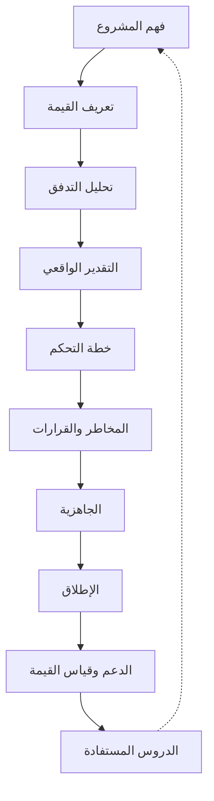

# نظام تشغيل التسليم (ERP Delivery Operating System)

> [!abstract] ما هذه القاعدة؟
> هذه القاعدة هي **الطبقة الوثائقية الرسمية** لكورس [[قيادة التسليم للمشاريع البرمجية]]. الفصول الستة في ذلك الكورس مستخرَجة من **التفريغ الصوتي** للمحاضرات — أي الشرح المنطوق بقصصه وأسئلة حضوره. أمّا هذه القاعدة فمستخرَجة من **الوثائق المكتوبة** لنفس البرنامج: الكتاب، وملف الـ Excel بقوالبه الـ39، والشرائح، وخطة التسليم، ووثيقة الحالة الدراسية.
>
> الفرق جوهري: التفريغ يعطيك **الفهم**، والوثائق تعطيك **الأسماء الرسمية والجداول الدقيقة والأرقام والقوالب القابلة للنسخ**. والمصطلح الأهم الذي لم يُنطَق في أي محاضرة هو اسم منهجية التقدير نفسها: [[PFRE]].

> [!todo] تتبّع التقدّم
> راجع [[لوحة التقدّم.base]] لحالة كل ملاحظة، و [[قوالب التسليم.base]] لتصفّح القوالب حسب مرحلة المشروع.

---

## البنية

| الملاحظة | ماذا تحوي؟ |
|---|---|
| [[00 - كتاب ERP Delivery Playbook]] | الإطار الفلسفي الجامع: لماذا تفشل مشاريع ERP · الفرق بين إدارة المشروع وإدارة التسليم · الدورة التسعية · القواعد الذهبية |
| [[_جدول مطابقة الأرقام]] | ⚠️ المصادر تتعارض عددياً (32.5 / 77.3 / 180.5 وحدة). هذه الملاحظة توثّق كل رقم ومصدره وسبب الاختلاف |
| [[حالة النور للتوزيع]] | الحالة المرجعية الكاملة بالأرقام: من `Project Intake` حتى `Value Tracking` |
| [[حالة عيادة المسار]] | حالة CLEAR 10X: كفاءة تدفّق 28% · [[WSJF]] · [[Value Proposition Canvas\|VPC]] بتطابق 85% |
| [[قوالب التسليم.base]] | لوحة تصفّح القوالب الـ24 حسب مرحلة المشروع |

---

## القوالب الـ24 (تغطّي أوراق Excel الـ39)

> [!info] لماذا 24 لا 39؟
> ملف الـ Excel يوزّع الأداة الواحدة على عدّة أوراق: `Value Proposition Canvas` وحدها في 5 أوراق (Jobs · Pains · Gains · Pain Relievers · Gain Creators)، و [[PFRE]] في 7 أوراق، و `Value Streams` في 3. جُمعت كل أداة في ملاحظة واحدة، فصار المجموع 24 قالباً يغطّي الأوراق الـ39 كاملة دون فقد.

### المرحلة 1 — الاستقبال والجاهزية (Intake)
| # | القالب | السؤال الذي يجيب عنه |
|---|---|---|
| 01 | [[01 - Project Intake]] | هل نعرف ما الذي ندخل فيه؟ |
| 02 | [[02 - Readiness Assessment]] | هل العميل **جاهز** فعلاً — لا هل وقّع العقد؟ |

### المرحلة 2 — تعريف القيمة (Value Definition)
| # | القالب | السؤال الذي يجيب عنه |
|---|---|---|
| 03 | [[03 - Value Proposition Canvas]] | ماذا يريد العميل حقاً؟ وما ألمه ومكسبه؟ |
| 04 | [[04 - Pain Gain Coverage Matrix]] | **كم % من الألم سيختفي فعلاً؟** |
| 05 | [[05 - Business Outcomes & KPIs]] | كيف نُثبت النجاح برقم؟ |
| 06 | [[06 - Value Streams]] | أين يتوقّف التدفّق؟ |
| 07 | [[07 - Financial Loss Analysis]] | كم يكلّف الألم بالريال شهرياً؟ |

### المرحلة 3 — التحليل والتقدير (Analysis & Estimation)
| # | القالب | السؤال الذي يجيب عنه |
|---|---|---|
| 08 | [[08 - Fit Gap Analysis]] | ما القياسي وما الذي يحتاج تخصيصاً؟ |
| 09 | [[09 - PFRE Estimation]] | كم يستغرق — **ولماذا** يستغرق ذلك؟ |
| 10 | [[10 - PFRE Decision Model]] | ما الذي يدخل Phase 1 وما الذي يُؤجَّل؟ |

### المرحلة 4 — التخطيط وضبط النطاق (Planning & Scope)
| # | القالب | السؤال الذي يجيب عنه |
|---|---|---|
| 11 | [[11 - Delivery Plan]] | كيف نتحكّم في المشروع — لا فقط متى نعمل؟ |
| 12 | [[12 - Scope Baseline]] | ما الداخل وما الخارج وما المؤجَّل؟ |
| 13 | [[13 - Change Request]] | كم يكلّف هذا التغيير؟ |

### المرحلة 5 — التنفيذ والحوكمة (Execution & Governance)
| # | القالب | السؤال الذي يجيب عنه |
|---|---|---|
| 14 | [[14 - RAID Log]] | ما الذي قد ينفجر — وما مؤشّره المبكّر؟ |
| 15 | [[15 - Decision Log]] | من قرّر ماذا ولماذا؟ |
| 16 | [[16 - Governance Model]] | كيف نحوّل الاجتماعات إلى أدوات قرار؟ |
| 17 | [[17 - Client Responsibility RACI]] | ما مسؤولية العميل بالاسم؟ |
| 18 | [[18 - Vendor Scorecard]] | هل المورّد شريك أم مصدر خطر؟ |
| 19 | [[19 - Early Warning Dashboard]] | هل نرى الأزمة قبل وقوعها؟ |
| 20 | [[20 - Project Health Report]] | هل المشروع **صحّي** — لا ماذا أُنجز؟ |

### المرحلة 6 — الاختبار والإطلاق (UAT & Go-Live)
| # | القالب | السؤال الذي يجيب عنه |
|---|---|---|
| 21 | [[21 - UAT Management]] | هل المستخدم جاهز — لا هل اختبرنا؟ |
| 22 | [[22 - Go-Live Checklist & Go NoGo]] | هل نحن جاهزون للإطلاق؟ |

### المرحلة 7 — ما بعد الإطلاق (Post Go-Live)
| # | القالب | السؤال الذي يجيب عنه |
|---|---|---|
| 23 | [[23 - Hypercare & SLA]] | كيف نستقرّ بدل أن ننتظر الشكاوى؟ |
| 24 | [[24 - Value Tracking & Lessons Learned]] | هل ظهرت القيمة فعلاً؟ وماذا تعلّمنا؟ |

---

## الدورة التسعية: كيف تستخدم النظام في أي مشروع

---

## العلاقة بالفصول الستة

| فصل الكورس (تفريغ) | الوثيقة المصدر المقابلة | ما تضيفه الوثيقة |
|---|---|---|
| [[01 - من إدارة المهام إلى قيادة التسليم]] | شرائح المحاضرة الأولى (73 شريحة) | جداول `Impact Matrix` و `FIT Matrix` بالأرقام |
| [[02 - التدفّق وكفاءته وترتيب الأولويات (WSJF)]] | شرائح الأسبوع الثاني (62 شريحة) | سلّم [[Flow Efficiency]] الخماسي · حلول التمارين · طبقات النطاق الثلاث |
| [[03 - من المديولات إلى تدفّقات القيمة]] | شرائح الأسبوع الثالث (45 شريحة) | معادلات [[Cost of Delay]] الأربع · الصيغة التدريبية لقرار المتطلَّب |
| [[04 - التقدير الواقعي وضبط النطاق]] | شرائح الأسبوعين 3 و4 + `PFRE Key Map` | **اسم [[PFRE]]** · `Duration Map` · الحساب الكامل |
| [[05 - بناء نظام التسليم الكامل]] | شرائح المحاضرة الرابعة (85 شريحة) + Excel | القوالب الفعلية بصيغتها الرسمية |
| [[06 - الحالة العملية الشاملة والمسار المهني]] | محاضرة الأسبوع الخامس + `Playbook_example` | `Project Intake` · `Readiness` · `Coverage Matrix` |

## 🔗 مصطلحات ومفاهيم ذات صلة
[[PFRE]] · [[Value Stream]] · [[Flow Efficiency]] · [[Reality Factor]] · [[Fit-Gap Analysis]] · [[RAID Log]] · [[Decision Log]] · [[Hypercare]] · [[Data Dry Run]] · [[Project Health Report]] · [[WSJF]] · [[Cost of Delay]]

## مصادر
- كتاب **ERP Delivery Playbook** — أمجد محمد عز الدين عبد اللطيف.
- **ERP_Delivery_Operating_System_Master_Final.xlsx** — 39 ورقة، حالة «شركة النور للتوزيع».
- **ERP Delivery Playbook (وثيقة تفسيرية)** — شرح «ما بين السطور» لملف الـ Excel.
- شرائح **Delivery Leadership Program** — الأسابيع 1 و2 و3 و4 و5.
- **Delivery plan.docx** — نموذج خطة تسليم لشركة توزيع مواد غذائية.
- **وثيقة الحالة الدراسية الكاملة** — عيادة المسار التخصصية، برنامج CLEAR 10X.
