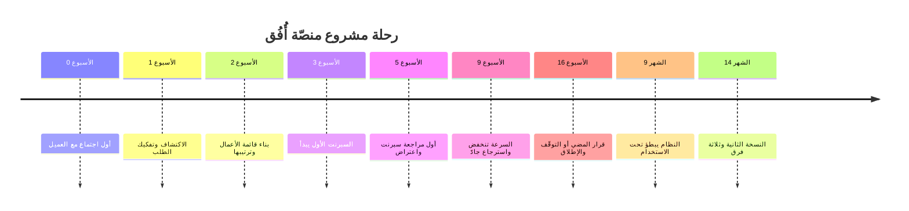

# 00 · بطاقة السيناريو

> [!info] الفصل صفر · رحلة مشروع
> **لماذا يهمّك:** لأن كل قرار في الفصول التالية سيبدو تعسّفيًّا ما لم تعرف القيود التي اتُّخذ داخلها. فالقرار الصحيح في شركة ناشئة عمرها ثمانية عشر شهرًا ليس هو القرار الصحيح في بنك، والفرق بينهما ليس في المفهوم بل في **ما تملك أن تخسره**.

---

## لماذا تبدأ الرحلة ببطاقة لا بمشهد؟

أكثر ما يُفسد كتب إدارة المشاريع أنها تعرض قرارًا ثم تحكم عليه بالصواب أو الخطأ، دون أن تخبرك بالسياق الذي جعله كذلك. فتقرأ أن «الفريق قرّر تقصير السبرنت إلى أسبوع»، فتظنّها قاعدة، وتطبّقها في فريق من اثني عشر شخصًا يعملون على نظام مصرفي، فتنهار.

ولهذا تبدأ هذه الرحلة بالقيود قبل الأحداث. ومتى وجدتَ نفسك في الفصول القادمة تسأل: **«ولماذا لم يفعلوا كذا؟»** فارجع إلى هذه البطاقة؛ فالجواب فيها غالبًا.

---

## 🏢 الشركة: نُقطة

شركة ناشئة سعودية مقرّها الرياض، تأسّست قبل ثمانية عشر شهرًا. أغلقت جولة تمويل أوّلية (`Pre-Seed`) قدرها مليون وثمانمئة ألف ريال، أُنفق منها ثلث تقريبًا على بناء نموذج أوّلي لم يصل إلى السوق.

| البند | الحالة |
| --- | --- |
| عدد الموظّفين | 9 (منهم 4 مطوّرين) |
| المدرَج المالي (`Runway`) | 11 شهرًا بمعدّل الحرق الحالي |
| الإيراد الحالي | لا يوجد — أول عميل مدفوع لم يوقّع بعد |
| المنتج | منصّة إدارة تدريب (تسجيل · جدولة · حضور · تقييم · شهادات) |
| السوق المستهدف | معاهد التدريب المعتمدة في السعودية والخليج |
| الحوكمة | مجلس من ثلاثة: المؤسّس + مستثمران |

> [!danger] القيد الذي يحكم كل شيء
> أحد عشر شهرًا من المدرَج المالي تعني أن الشركة تحتاج **عميلًا مدفوعًا يعمل فعليًّا** قبل الشهر السابع، لا لأن المنتج سيكتمل حينها، بل لأن جولة التمويل التالية لن تُفتح بلا دليل استخدام. وهذا القيد — لا أي مفهوم من مفاهيم أجايل — هو ما سيفسّر لك نصف القرارات القادمة.

---

## 👥 الفريق وأصحاب المصلحة

> [!warning] تنبيه
> هذه شخصيات **متخيَّلة** صُمّمت لتمثّل أنماطًا واقعية تقابلها في أي مشروع. أمّا الشركات الحقيقية التي تُذكر ممارساتها في الفصول القادمة فمنسوبة إلى مصادرها المعلنة (انظر [[التطبيق العملي لإدارة المشاريع الرشيقة|فهرس الرحلة]]).

### داخل نُقطة

| الشخص | الدور المعلن | ما يفعله فعلًا | الضغط الذي يحمله |
| --- | --- | --- | --- |
| **عبدالله** | المؤسّس والرئيس التنفيذي · [[Sponsor\|الراعي]] | يبيع، ويجلب المستثمرين، ويَعِد أحيانًا بما لم يُبنَ | جولة التمويل التالية |
| **ريم** | [[05 - Product Owner\|مالكة المنتج]] | تملك [[13 - Backlog\|قائمة أعمال المنتج]] وترتيبها، وتقول «لا» أكثر ممّا تقول «نعم» | أن يثبت المنتج قيمته لعميل واحد على الأقل |
| **مازن** | «مدير مشروع» | يؤدّي عمليًّا عمل [[06 - Scrum Master\|سكرم ماستر]]: يحمي الفريق، يزيل العوائق، يضمن انعقاد الأحداث | أن يُحاسَب على موعد لم يضعه |
| **سارة** | مطوّرة واجهات أمامية | تصميم وتنفيذ الواجهات، وأقرب الفريق إلى تجربة المستخدم | جودة الواجهة مقابل السرعة |
| **يوسف** | مطوّر خلفية (أقدم الفريق) | المعمارية وقاعدة البيانات — و«الشخص الذي لا يستغني عنه أحد» | أنه [[Bottleneck\|عنق الزجاجة]] بلا أن يقولها أحد |
| **طارق** | مطوّر خلفية | التكاملات والبريد والدفع | تكاملات لا يملك التحكّم فيها |
| **هند** | مطوّرة + مسؤولة الجودة | تكتب الكود وتختبر ما كتبه غيرها | أنها آخر من يمسّ العمل قبل التسليم |
| **لمى** | مصمّمة تجربة (بدوام جزئي، ثلاثة أيام أسبوعيًّا) | البحث مع المستخدمين والتصاميم | نصف حضور في فريق يعمل يوميًّا |

المطوّرون الأربعة + المصمّمة + مالكة المنتج + مازن هم ما يسمّيه سكرم **فريق سكرم**. وهو [[Cross-functional Team|فريق متعدّد التخصّصات]] بالكاد: يملك ما يكفي لبناء ميزة كاملة وتسليمها، ولا يملك اختصاصيَّ أمن ولا مهندس بنية تحتية — وهذه ثغرة حقيقية ستُدفَع فاتورتها في [[09 - بعد ستة أشهر - النظام أصبح بطيئًا|الفصل التاسع]].

### خارج نُقطة

| الشخص/الجهة | صفته | ما يريده |
| --- | --- | --- |
| **د. لطيفة** | مديرة التدريب في معهد أُفُق — من يوقّع العقد | أن ينتهي الموسم التدريبي بلا فوضى تسجيل |
| **نورة** | منسّقة التسجيل في المعهد — **المستخدمة اليومية الحقيقية** | ألّا تُدخل البيانات مرّتين، وألّا تُلام على أخطاء النظام |
| **المدرّبون** | مستخدمون متقطّعون (12 مدرّبًا) | معرفة من سيحضر غدًا، ورفع الدرجات بسرعة |
| **المتدرّبون** | المستفيد النهائي (~900 سنويًّا) | التسجيل من الجوال، والشهادة فور انتهاء الدورة |
| **الهيئة المانحة للاعتماد** | جهة تنظيمية | تقارير حضور مطابقة للنموذج المعتمد |
| **المستثمران** | عضوا مجلس | نموّ يبرّر الجولة التالية |

> [!note] نموذج ذهني: من صاحب المصلحة الأخطر؟
> تخيّل مطعمًا يفتتح فرعًا جديدًا. صاحب المطعم يريد ربحًا، والزبون يريد طعامًا جيّدًا — وكلاهما ظاهر. لكن **النادل** هو من سيستعمل النظام الجديد ثلاثمئة مرّة في اليوم، وهو الوحيد القادر على إفشاله بصمت إن كان مرهقًا: يكتب الطلبات على ورق ويُدخلها في آخر الوردية، فتنهار كل تقارير المطعم.
>
> ونورة هي نادل هذه القصّة. من يبني للدكتورة لطيفة وحدها يبني نظامًا يُوقَّع عليه ولا يُستعمل.

هذا التمييز — بين **من يشتري** و**من يستعمل** و**من يتأثّر** — هو صلب [[21 - Stakeholder Communication|التواصل مع أصحاب المصلحة]] و[[Stakeholder Map|خريطة أصحاب المصلحة]]، وسيظهر أثره في أول اجتماع.

---

## ⚙️ كيف يعمل الفريق (الحالة عند بداية الرحلة)

| العنصر | القرار الحالي | لماذا |
| --- | --- | --- |
| الإطار | [[02 - Scrum\|سكرم]] | فريق واحد، متطلّبات غير مستقرّة، حاجة إلى إيقاع مراجعة منتظم |
| طول [[14 - Sprint\|السبرنت]] | أسبوعان | أقصر ما يحتمله الفريق دون أن تلتهم الطقوس وقته |
| [[Definition of Done\|تعريف الاكتمال]] | **غير مكتوب** ❗ | لم يُكتب بعد — وهذا خطأ مقصود في السيناريو، تُدفع فاتورته في [[05 - داخل السبرنت - ما يظهر فجأة\|الفصل الخامس]] |
| التقدير | [[12 - Story Points\|نقاط القصة]] بمقياس فيبوناتشي | تقدير نسبي لا زمني |
| [[18 - Velocity\|السرعة]] | لا بيانات — لم يكتمل سبرنت واحد بعد | لا يمكن التخطيط بها في السبرنت الأول |
| الأدوات | لوحة مهام رقمية + مستودع كود + بيئة تجريبية | لا يوجد نشر آلي بعد |

> [!warning] ثلاثة أشياء ناقصة عمدًا
> غياب تعريف الاكتمال، وغياب بيانات السرعة، وغياب بيئة نشر آلية — ليست سهوًا في السيناريو. فأكثر الفرق تبدأ ناقصةً هكذا تمامًا، والرحلة تُظهر **متى** يبدأ كل نقص في إرسال فاتورته، لا كيف يبدو الفريق المثالي في اليوم الأول.

---

## 🧨 التوتّر البنيوي الأول: ما لقب مازن؟

بطاقة مازن تقول «مدير مشروع»، وعمله اليومي هو عمل سكرم ماستر. وهذا ليس تفصيلًا إداريًّا؛ إنه أوّل مأزق حقيقي في القصّة، لأن اللقبين يجيبان عن سؤالين مختلفين:

| السؤال | جواب مدير المشروع التقليدي | جواب سكرم ماستر |
| --- | --- | --- |
| من يوزّع المهامّ؟ | أنا | المطوّرون فيما بينهم |
| من يلتزم بالموعد؟ | أنا، أمام الإدارة | لا أحد يلتزم بموعد لم يُقدَّر بعد |
| ما دوري عند التأخّر؟ | أضغط وأعيد الجدولة | أكشف السبب وأزيل العائق |
| لمن أنا مسؤول؟ | للإدارة عن التسليم | للفريق عن فاعليّته، وللمؤسسة عن تبنّي سكرم |

فحين يسأل عبدالله في [[04 - تخطيط السبرنت الأول|الفصل الرابع]]: «مازن، متى تسلّمون؟» فإن السؤال نفسه يفترض اللقب الأول. وطريقة إجابة مازن — لا حماسته ولا نيّته — هي ما سيحدّد أي الدورين يمارس فعلًا.

> [!info] إضافة مرجعية
> دليل سكرم لا يعرف دورًا اسمه «مدير مشروع» ولا يمنعه؛ هو ببساطة **لا يتحدّث عنه**. فوجود اللقب في الهيكل التنظيمي ليس مخالفةً لسكرم، وإنما المخالفة أن تُنقل صلاحية ترتيب قائمة الأعمال من [[05 - Product Owner|مالك المنتج]] إليه، أو أن يُوزَّع العمل على المطوّرين (Developers) بدل أن يختاروه بأنفسهم. التفصيل في [[06 - Scrum Master|ملاحظة سكرم ماستر]].

---

## 🗓️ الخطّ الزمني للرحلة

المدّة الإجمالية للرحلة أربعة عشر شهرًا: ستّة عشر أسبوعًا حتى الإطلاق الأول، ثم عشرة أشهر من الحياة بعده. وهذه النسبة مقصودة، لأن أكثر ما يُنفَق من عمر المنتج يقع **بعد** الإطلاق لا قبله — وأكثر ما تتحدّث عنه كتب إدارة المشاريع يقع قبله.

---

## اختبر نفسك

> [!question]- لماذا وُضعت الميزانية والمدرَج المالي في بطاقة السيناريو أصلًا؟ أليست هذه تفاصيل مالية لا علاقة لها بإدارة المشروع؟
> **بل هي القيد الذي يحكم كل مفاضلة قادمة.** فحين تختار بين بناء ميزة تُبهر المستثمر وبين إصلاح تدفّق تسجيل يستعمله عميل واحد، لا يحسم الاختيارَ مفهومٌ من مفاهيم أجايل، بل يحسمه أن أمامك أحد عشر شهرًا. والمدير الذي يقرّر بلا معرفة المدرَج يقرّر في الفراغ.

> [!question]- من صاحب المصلحة الأخطر في هذه القصّة، ولماذا؟
> **نورة، منسّقة التسجيل.** فالدكتورة لطيفة توقّع العقد لكنها لن تفتح النظام ثلاث مرّات في الشهر، ونورة تفتحه عشرات المرّات يوميًّا. والنظام الذي يُوقَّع عليه ولا يُستعمل يُلغى في التجديد التالي بلا نقاش. ولهذا يُفرَّق دائمًا بين **المشتري** و**المستخدم** و**المتأثّر**.

> [!question]- ثلاثة عناصر «ناقصة» في جدول طريقة عمل الفريق. ما أخطرها ولماذا؟
> **غياب [[Definition of Done|تعريف الاكتمال]].** لأن غياب السرعة مشكلة معرفتها متاحة بعد سبرنتين، وغياب النشر الآلي مشكلة كلفتها ظاهرة يمكن قياسها. أمّا غياب تعريف الاكتمال فيجعل كلمة «منجَز» تعني شيئًا مختلفًا عند كل عضو — فيبدو العمل مكتملًا في اللوحة وغير مكتمل في الواقع، ولا يُكتشف الفارق إلا عند العرض على العميل.

> [!summary] الفكرة التي يجب أن تتذكّرها
> قبل أن تسأل «ما الإطار الصحيح؟» اسأل: **كم أملك من الوقت والمال والناس، ومن الذي سيُلام إن فشل هذا؟** فالإطار يُختار على مقاس هذه الإجابات، ولا تُختار الإجابات على مقاسه.

## ⏭️ التالي

[[01 - أول خمس دقائق مع العميل]] — جاء العميل، ويريد تطبيقًا. ما أول شيء تفعله؟
