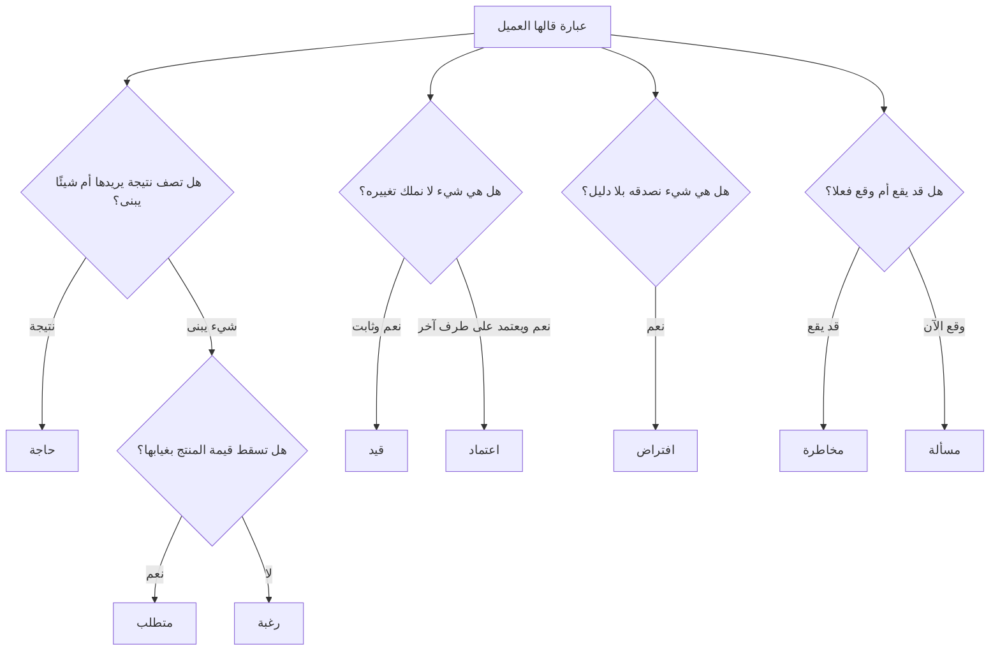

# 02 · الاكتشاف — تفكيك ما قاله العميل

> [!info] الفصل الثاني · رحلة مشروع
> **لماذا يهمّك:** لأن ما يقوله العميل ليس نوعًا واحدًا من الكلام. في الجملة الواحدة قد تجتمع حاجة ورغبة وقيد وافتراض، ومن يعاملها كلَّها بوصفها «متطلّبات» يبني نصف ما لا يُحتاج، ويكتشف نصف ما لا يستطيع بناءه في آخر أسبوع.

---

## 🚶 المشهد: يومان في مكتب نورة

قبل أي ورشة متطلّبات، جلس مازن ولمى في مكتب نورة يومًا كاملًا — لا ليسألا، بل ليريا. وهذه ممارسة قديمة من [[Toyota Production System|نظام إنتاج تويوتا]] تُسمّى [[Gemba Walk|المشي إلى الجمبا]]: اذهب إلى **حيث يقع العمل فعلًا**، لأن الوصف يمرّ بمصفاة الذاكرة، والمشاهدة لا تمرّ.

وما رآه مازن ولم يُذكر في أي اجتماع:

- تفتح نورة **أربع نوافذ في وقت واحد**: الواتساب، البريد، ملف الإكسل، تطبيق البنك.
- تنسخ رقم الجوال يدويًّا من الواتساب إلى الإكسل — **41 مرّة** في ذلك اليوم وحده.
- عندها **عمود مخفي في الإكسل** اسمه «ملاحظات» فيه معلومات لا يعرفها أحد غيرها: من طلب فاتورة باسم شركته، ومن يحتاج تنبيهًا قبل الدورة بيومين.
- تتوقّف نهائيًّا عن الردّ بين الثانية والرابعة، لأنها تُعِدّ الشهادات في وورد.

> [!danger] أثمن اكتشاف في اليومين
> **العمود المخفي.** ففيه ثلاث حالات عمل حقيقية لم تُذكر في الاجتماع الأول ولا في أي وثيقة: فوترة الشركات، والتنبيه المسبق، وقائمة انتظار غير رسمية. ولو بُني النظام على المقابلات وحدها لسقطت الثلاثة، ولعادت في الشهر الرابع بوصفها «تغييرات نطاق» — وهي في الحقيقة **متطلّبات لم تُكتشف**، لا متطلّبات جديدة.
>
> والفرق بين التوصيفين ليس لغويًّا؛ فالأول يُدفع ثمنه من ميزانية الفريق، والثاني من ميزانية العميل.

---

## 🧺 المشكلة: عندنا الآن مئة عبارة

بعد الاجتماع الأول ويومَي المراقبة وثلاث مقابلات مع مدرّبين، صار في يد الفريق نحو مئة عبارة مبعثرة. وأول غلطة يرتكبها أكثر الفرق أن تفتح أداة إدارة المهامّ وتصبّها كلّها بطاقات في قائمة الأعمال.

ولا تفعل ذلك، لأن هذه العبارات **ليست من جنس واحد**، ومصير كل نوع منها مختلف تمامًا:

---

## 🗂️ الأنواع السبعة — وما يفعله كل نوع

| النوع | تعريفه في سطر | السؤال الفارق | مصيره | مثال من أُفُق |
| --- | --- | --- | --- | --- |
| **حاجة** (Need) | نتيجة يريدها المستخدم، بصرف النظر عن وسيلة تحقيقها | ماذا يريد أن يُنجز؟ | تُصاغ [[11 - User Stories\|قصّة مستخدم]] أو [[Jobs to be Done\|مهمّة يُستأجَر لها المنتج]] | «أعرف عدد المقاعد المتبقّية بلا أن أفتح ملفًّا» |
| **متطلب** (Requirement) | قدرة محدّدة يجب أن يملكها النظام لتتحقّق الحاجة | لو غاب، هل تسقط الحاجة؟ | يدخل قائمة الأعمال ويُقدَّر | «يُحجز المقعد لحظة بدء عملية الدفع» |
| **رغبة** (Wish) | تحسين مرغوب لا تسقط القيمة بغيابه | لو غاب، هل يتوقّف أحد عن الاستخدام؟ | تُسجَّل في مؤخّرة القائمة أو تُرفض صراحةً | «شعار المعهد يظهر في زاوية كل شاشة» |
| **قيد** (Constraint) | حدّ خارجي لا نملك تغييره | من يملك تغيير هذا؟ | يُوثَّق ويُصمَّم داخله لا حوله | «الشهادة بنموذج الهيئة المعتمد حرفيًّا» |
| **افتراض** (Assumption) | ما نبني عليه ونحسبه صحيحًا بلا دليل | ما دليلي على هذا؟ | يُختبر مبكّرًا أو يُحوَّل إلى مخاطرة | «المتدرّبون مستعدّون للدفع الإلكتروني» |
| **مخاطرة** ([[19 - Risk Management\|Risk]]) | حدث محتمل لم يقع، له أثر إن وقع | ما احتماله وما أثره؟ | يدخل [[Risk Register\|سجل المخاطر]] باستجابة وصاحب | «قد ترفض البوّابة البنكية ربط الحساب» |
| **اعتماد** ([[Dependency\|Dependency]]) | ما ننتظره من طرف خارج سيطرتنا | من يملك الجدول الزمني؟ | يُجدوَل مبكّرًا ويُتابَع أسبوعيًّا | «موافقة البنك على بوّابة الدفع» |

وإليك نوعين إضافيّين يخلطهما الناس بما سبق:

| النوع | الفرق الحاسم |
| --- | --- |
| **مسألة** ([[Issue Log\|Issue]]) | المخاطرة **قد** تقع، والمسألة **وقعت**. فما إن ترفض البوّابة الربط فعلًا حتى تنتقل من سجل المخاطر إلى سجل المسائل، وتتغيّر معاملتها من «مراقبة» إلى «حلّ اليوم». |
| **غير هدف** ([[Non-Goals\|Non-Goal]]) | ما قرّرنا صراحةً ألّا نفعله — وهو أنفع سطر في أي وثيقة نطاق، لأنه يمنع نصف نقاشات الأشهر القادمة. |

> [!note] نموذج ذهني: قائمة طلبات البقالة
> حين تقول لك أمّك: «نحتاج خبزًا، ويا ريت تجيب حلوى، ولا تنسَ أن المحلّ يقفل الساعة عشرة، وأظنّ في الثلاجة بيضًا» — فهذه أربعة أنواع لا نوع واحد: **متطلّب** (الخبز)، و**رغبة** (الحلوى)، و**قيد** (وقت الإغلاق)، و**افتراض** (البيض).
>
> ومن يكتبها أربعة أسطر متساوية في قائمته سيعود بحلوى بلا خبز، بعد أن أغلق المحلّ، ليكتشف أن البيض لم يكن هناك.

---

## 🔍 التطبيق: اثنتا عشرة عبارة من جلسات أُفُق

هذا هو التمرين الحقيقي. العمود الأخير هو ما يمنع الخطأ.

| # | ما قيل حرفيًّا | التصنيف | لماذا؟ |
| --- | --- | --- | --- |
| 1 | «ما نبغى نعتذر لأحد بعد ما يدفع» | **حاجة** | نتيجة مطلوبة، لا آلية |
| 2 | «يُحجز المقعد أول ما يبدأ الدفع» | **متطلب** | آلية محدّدة تحقّق الحاجة (1) |
| 3 | «تكون الشهادة بنموذج الهيئة» | **قيد** | لا نملك تغييره، ولا يُتفاوض عليه |
| 4 | «يفضّل يكون فيه وضع ليلي» | **رغبة** | لا أحد يترك النظام بغيابه |
| 5 | «الناس كلّهم يدفعون بمدى» | **افتراض** | لم يُسأل أحد، ولم تُفحص بيانات |
| 6 | «الدفع لازم يمرّ عبر حسابنا في البنك» | **اعتماد** | يحتاج موافقة طرف خارجي |
| 7 | «ممكن يزيد عدد الدورات ثلاثة أضعاف السنة الجاية» | **مخاطرة** (احتمالية إيجابية) | لم تقع، وأثرها على التصميم كبير |
| 8 | «نورة تروح إجازة في أغسطس» | **قيد** زمني | حقيقة مجدولة، لا احتمال |
| 9 | «النظام السابق فشل بسبب الشهادات» | **معلومة سياق** | لا تُنفَّذ، لكنها ترفع أولوية (3) |
| 10 | «نبغى تطبيق جوّال أصلي» | **رغبة** متنكّرة في ثوب متطلّب | الحاجة «التسجيل من الجوال»؛ والويب المتجاوب يلبّيها |
| 11 | «ودّي ألف فاتورة باسم الشركة للموظفين المبتعثين» | **متطلّب مكتشَف** | من العمود المخفي، لا من الاجتماع |
| 12 | «ما نبغى نشتغل على الذكاء الاصطناعي حاليًّا» | **غير هدف** | قرار صريح بالاستبعاد، يوثَّق ولا يُناقش كل شهر |

> [!danger] أخطر بندين في الجدول
> **البند 10** — لأن قبوله كما قيل يضاعف الكلفة أربع مرّات (تطبيقان أصليّان + متجران + دورة مراجعة) لخدمة حاجة يلبّيها موقع متجاوب. والسؤال الذي يفكّه: «آخر مرّة سجّل فيها متدرّب، من أين دخل؟» — فإن كان الجواب «من رابط في الواتساب»، فالتطبيق الأصلي يضيف احتكاكًا لا يزيله.
>
> **البند 5** — لأنه افتراض يحمل المشروع كلّه، ومكتوب بصيغة حقيقة. فإن كان 30٪ من المتدرّبين يدفعون تحويلًا بنكيًّا، فمسار «رفع الإيصال» متطلّبٌ من الدرجة الأولى لا حالة استثنائية، وحذفه يعني فقدان ثلث المسجّلين صامتًا.

---

## 🧪 الافتراضات: أخطر ما في الاكتشاف

المتطلّب المكتوب يراه الجميع فيناقشونه، والافتراض لا يراه أحد لأنه **مكتوب بصيغة الواقع**. ولهذا تُرسم [[Assumption Mapping|خريطة الافتراضات]]: كل افتراض يوضع على محورين — **كم يضرّنا إن كان خاطئًا**، و**كم دليلًا نملك عليه**.

| الافتراض | الأثر إن كان خاطئًا | الدليل الحالي | القرار |
| --- | --- | --- | --- |
| المتدرّبون يدفعون إلكترونيًّا | **قاتل** — يسقط نموذج التسجيل كلّه | لا شيء | **يُختبر هذا الأسبوع** |
| الشهادة قابلة للتوليد آليًّا بنموذج الهيئة | **قاتل** — يسقط جزء كبير من القيمة | نموذج PDF رآه طارق مرّة | [[Spike\|استكشاف زمني]] يومان |
| نورة ستتخلّى عن الإكسل | **كبير** — نظامان متوازيان = لا مصدر حقيقة | مقاومة ملحوظة في المراقبة | تصميم يهاجر بياناتها لا يستبدلها |
| المدرّبون سيرفعون الدرجات بأنفسهم | متوسّط | مدرّبان من ثلاثة قالا نعم | يُؤجَّل اختباره للموجة الثانية |
| ثلاثة مواسم سنويًّا تكفي للربحية | كبير (للشركة لا للمنتج) | نموذج مالي داخلي | خارج نطاق الفريق |

> [!success] كيف اختُبر الافتراض القاتل في ثلاثة أيام؟
> لم يُبنَ شيء. طلبت لمى من نورة سجلّ التحويلات في آخر ثلاث دورات، فتبيّن أن **68٪ دفعوا تحويلًا بنكيًّا يدويًّا و32٪ بالبطاقة**. وسبب ذلك لا علاقة له بالتفضيل التقني: كثير من المتدرّبين تدفع عنهم جهات عملهم بأوامر دفع.
>
> فتغيّر التصميم كلّه قبل كتابة سطر واحد: مسار **رفع الإيصال وتأكيده** صار مسارًا رئيسيًّا لا استثنائيًّا. وثلاثة أيام من الفحص وفّرت شهرين من البناء في الاتجاه الخطأ.

---

## 🚧 القيود: تُصمَّم داخلها لا حولها

القيد ليس عدوًّا، بل هو ما يجعل التصميم قابلًا للحسم. وقيود مشروع أُفُق أربعة:

1. **نموذج الشهادة المعتمد** — قيد تنظيمي، يُستخرج مبكّرًا ويُعامَل معيار قبول.
2. **موسم سبتمبر** — قيد زمني خارجي لا يتحرّك، فيحدّد أقصى نطاق ممكن لا العكس.
3. **إجازة نورة في أغسطس** — قيد بشري، يعني أن التدريب والتسليم يجب أن يقعا في يوليو.
4. **حساب المعهد البنكي القائم** — قيد تعاقدي يمنع استعمال أي بوّابة لا تدعم الربط به.

> [!warning] الخطأ الشائع: معاملة القيد بوصفه مخاطرة
> «قد لا نستطيع توليد الشهادة بالنموذج المعتمد» ليست مخاطرة تُراقَب، بل **قيد يُصمَّم لأجله**. والفرق في السلوك: المخاطرة تُسجَّل ويُنتظر وقوعها، والقيد يُبنى الحلّ داخله من اليوم الأول.
>
> وأكثر ما يُخطئ فيه المبتدئ عكسُ ذلك أيضًا: أن يعامل **افتراضًا** بوصفه قيدًا، فيقيّد نفسه بحدّ لا وجود له أصلًا.

---

## 📤 مخرجات الاكتشاف

1. **بيان مشكلة** معتمَد ومكتوب، لا أكثر من فقرة.
2. **قائمة مصنَّفة** بكل ما قيل، كل بند بنوعه وصاحبه.
3. **[[Assumption Mapping\|خريطة افتراضات]]** فيها ما يُختبر هذا الأسبوع وما يُؤجَّل.
4. **قيود مكتوبة** بأصحابها ومصادرها الرسمية.
5. **قائمة «غير الأهداف»** ([[Non-Goals]]) معتمدة من العميل نصًّا.
6. **[[RAID Log\|سجل RAID]]** محدَّث بمخاطر واعتمادات ومسائل مؤرَّخة.

> [!success] المعيار العملي
> إن خرج الفريق من الاكتشاف وكل ما بيده **قائمة ميزات** — بلا افتراض واحد مكتوب، ولا «غير هدف» واحد — فقد جرى جمع طلبات لا اكتشاف. والعلامة الفارقة: **الاكتشاف الجيّد يقلّل النطاق، وجمع الطلبات يزيده دائمًا.**

---

## اختبر نفسك

> [!question]- قال العميل: «لازم النظام يشتغل حتى لو النت فصل». صنّف هذه العبارة.
> **ظاهرها متطلّب، وباطنها حاجة تحتها افتراض.** فالحاجة: «ألّا يتوقّف التسجيل يوم الدورة». والافتراض المضمر: «أن الانقطاع يقع كثيرًا». والسؤال الفاحص: «كم مرّة انقطع النت عندكم في آخر ثلاثة أشهر؟» — فإن كان الجواب «مرّة واحدة لعشر دقائق»، فبناء وضع «يعمل بلا اتصال» كاملًا استثمارٌ ضخم في مشكلة صغيرة، ويكفي بدلًا منه أن يُحفظ النموذج محليًّا ويُرسل عند عودة الاتصال.

> [!question]- ما الفرق العملي — لا اللغوي — بين المخاطرة والاعتماد؟
> **المخاطرة قد تقع وقد لا تقع، والاعتماد سيقع حتمًا لكن بجدول لا تملكه.** ولذلك تختلف الاستجابة: المخاطرة تُدار بخطّة بديلة تُفعَّل عند وقوعها، والاعتماد يُدار بالتبكير والمتابعة والتصعيد. فموافقة البنك اعتماد — ستأتي يومًا ما — والسؤال متى؛ ورفض البنك للربط مخاطرة، والسؤال ماذا نفعل حينها.

> [!question]- لماذا يُعدّ «غير الهدف» ([[Non-Goals]]) أنفع سطر في وثيقة النطاق؟
> **لأنه يمنع النقاش من أن يُعاد فتحه كل شهر.** فبند مثل «لا تطبيق جوّال أصلي في 2026» مكتوبًا ومعتمَدًا يُنهي عشرة نقاشات مستقبلية بسطر واحد. أمّا ما لم يُكتب استبعاده صراحةً فسيُفترض دخوله في النطاق، وسيُطالَب به في أسوأ لحظة ممكنة — وهذه إحدى أشهر طرق دخول [[Scope Creep|زحف النطاق]].

> [!question]- في المراقبة الميدانية اكتشف مازن «العمود المخفي». لماذا لم تكشفه المقابلات؟
> **لأن الناس لا يذكرون ما صار عادةً.** فنورة لا ترى في ذلك العمود «متطلّبًا»، بل جزءًا من طريقتها لا يستحقّ الذكر. وهذا هو حدّ المقابلة: تكشف ما يعيه المستخدم ويستطيع صياغته، وتخفي ما تحوّل إلى سلوك تلقائي. ولهذا تُكمَّل المقابلة دائمًا بمشاهدة العمل في موقعه ([[Gemba Walk]]).

> [!summary] الفكرة التي يجب أن تتذكّرها
> لا تكتب سطرًا واحدًا في قائمة الأعمال قبل أن تسأل عن كل عبارة: **أهي حاجة أم متطلّب أم رغبة أم قيد أم افتراض أم مخاطرة أم اعتماد؟** فالتصنيف الخاطئ لا يُصحَّح لاحقًا بالمجهود؛ إنه يُبنى فوقه شهورًا ثم يُكتشف باسم «تغيير النطاق».

## 🔗 ربط بالمفاهيم

- الأساسيات: [[19 - Risk Management]] · [[11 - User Stories]] · [[13 - Backlog]] · [[21 - Stakeholder Communication]]
- المعجم: [[Gemba Walk]] · [[Assumption Mapping]] · [[Dependency]] · [[Risk Register]] · [[Issue Log]] · [[Non-Goals]] · [[Jobs to be Done]] · [[Scope Creep]] · [[User Interview]] · [[Product Discovery]] · [[Spike]]

## ⏭️ التالي

[[03 - بناء قائمة الأعمال وترتيبها]] — عندنا الآن قائمة مصنَّفة. كيف تصير قائمة أعمال مرتَّبة؟
