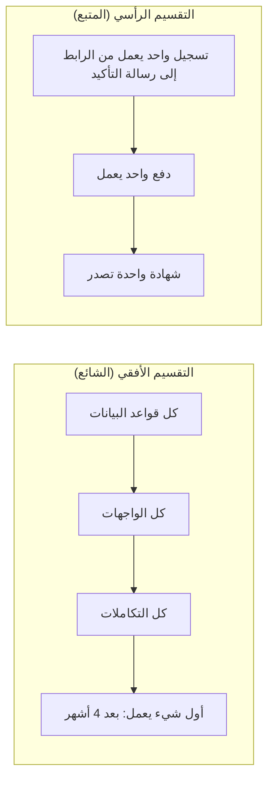

# 03 · بناء قائمة الأعمال وترتيبها

> [!info] الفصل الثالث · رحلة مشروع
> **لماذا يهمّك:** لأن ترتيب قائمة الأعمال هو أهمّ قرار أسبوعي في المشروع كلّه، وأكثره تعرّضًا للتخمين. فالفريق الذي يبني الأشياء الصحيحة بترتيب خاطئ يكتشف أخطاءه القاتلة في الشهر الخامس، والفريق الذي يبنيها بترتيب صحيح يكتشفها في الأسبوع الثاني — والفارق بين المصيرين ليس الجهد، بل **ما الذي جُرِّب أولًا**.

---

## 🧾 المشهد: ستّون بندًا على الجدار

الأربعاء صباحًا. على جدار غرفة الاجتماعات ستّون ورقة لاصقة خرجت من الاكتشاف. وريم — [[05 - Product Owner|مالكة المنتج]] — تقف أمامها وتقول جملة يقولها كل مالك منتج مرّة في عمره:

> [!quote] ريم
> «كلّها مهمّة.»

وهذه بالضبط هي المشكلة. فقائمة الأعمال التي كل بند فيها مهمّ ليست قائمة أعمال، بل **لائحة أمنيات**. ووظيفة مالك المنتج ليست أن يعرف ما هو مهمّ — ذلك يعرفه الجميع — بل أن يقرّر **ما الذي ينتظر**.

---

## 1️⃣ من العبارات إلى قصص: الصياغة أولًا

البنود التي صُنّفت **حاجاتٍ ومتطلّبات** في [[02 - الاكتشاف - تفكيك ما قاله العميل|الفصل السابق]] تُصاغ الآن [[11 - User Stories|قصص مستخدم]]. أمّا الرغبات فتُوضع في قائمة منفصلة اسمها «لاحقًا»، والقيود تتحوّل معايير قبول، والافتراضات تتحوّل بنود استكشاف.

ومعيار الصياغة الجيّدة معروف باسم [[INVEST Criteria|معايير INVEST]]. وأكثر ما يُخالَف منه بندان:

- **مستقلّة** (Independent): «شاشة التسجيل» و«حفظ بيانات التسجيل» ليستا قصّتين، بل قصّة واحدة قُسّمت أفقيًّا فصارت نصفَين لا يُسلَّم أحدهما وحده.
- **صغيرة** (Small): كل ما لا يُنجَز داخل سبرنت واحد ليس قصّة بل [[Epic|ملحمة]]، وتُقسَّم بـ[[Task and Story Slicing|التقطيع]].

> [!example] قصّة قبل الصياغة وبعدها
> **قبل:** «نظام تسجيل».
> **بعد:** «بوصفي متدرّبًا، أستطيع حجز مقعدي وتأكيده بعد الدفع، لأضمن ألّا يؤخذ المقعد وأنا أدفع.»
> **معايير القبول:**
> 1. يُحجز المقعد مؤقّتًا 15 دقيقة لحظة بدء الدفع.
> 2. عند انتهاء المهلة بلا دفع يعود المقعد للمتاح تلقائيًّا.
> 3. عند تزامن طلبين على آخر مقعد، ينجح واحد فقط ويُبلَّغ الآخر فورًا.
> 4. تصل رسالة تأكيد خلال دقيقتين.
>
> والمعيار الثالث وحده يساوي أسبوعًا من العمل، ولولا أنه كُتب هنا لاكتُشف بعد الإطلاق يوم يزدحم التسجيل.

---

## 2️⃣ الترتيب لا الأولوية: فرق ليس لغويًّا

يقول أكثر الفرق «حدّدنا الأولويات»، فتجد عندهم اثني عشر بندًا كلّها «أولوية عالية». وهذا ليس ترتيبًا.

| | **الأولوية** (Priority) | **الترتيب** (Ordering) |
| --- | --- | --- |
| الشكل | تصنيف بدرجات (عالية/متوسطة/منخفضة) | قائمة واحدة، لكل بند موضع فريد |
| السؤال | ما أهمّية هذا؟ | ما الذي يُبنى **قبل** الآخر؟ |
| النتيجة | يمكن أن تتساوى بنود كثيرة | لا يتساوى بندان أبدًا |
| القرار الذي يفرضه | لا شيء | مفاضلة حقيقية بين شيئين مهمّين |

ودليل سكرم يستعمل لفظ **الترتيب** (Ordered) لا الأولوية عمدًا، لأن القائمة المرتّبة تُجبر مالك المنتج على القرار، بينما التصنيف بدرجات يسمح له بتأجيله.

> [!note] نموذج ذهني: طابور المستشفى
> في قسم الطوارئ لا يُقال «هذه حالة مهمّة وتلك مهمّة»؛ يوجد **مريض واحد يدخل الآن**. والفرز (Triage) ليس تصنيفًا بالأهمّية، بل ترتيبٌ يفرضه سؤالان: من يتضرّر أكثر بالانتظار؟ ومن يمكن أن ينتظر بلا ضرر؟
>
> وقائمة الأعمال طابور، لا لوحة إعلانات.

---

## 3️⃣ ما الذي يحكم الترتيب فعلًا؟ خمسة محرّكات

القيمة وحدها لا تكفي لترتيب قائمة. والمحرّكات الخمسة التي يستعملها مالك المنتج المحترف:

### أ. القيمة وتكلفة التأخير

ليست «كم يساوي هذا؟» بل «**كم نخسر كل أسبوع لا يوجد فيه؟**» — وهذا هو [[Cost of Delay|تكلفة التأخير]]. وحين تقسمها على حجم العمل تحصل على [[WSJF]]، وهو أفضل ما يفكّ التعادل بين بندين متشابهين في القيمة مختلفين في الحجم.

### ب. المخاطرة والتعلّم

البند الذي **يقلّل أكبر قدر من عدم اليقين** يُقدَّم حتى لو كانت قيمته المباشرة صغيرة. فبناء توليد الشهادة بنموذج الهيئة لا يبهج أحدًا في الأسبوع الثاني، لكنه يجيب عن سؤال قد يُلغي المشروع.

### ج. الاعتمادات

ما ينتظر طرفًا خارجيًّا يبدأ مبكّرًا مهما كان صغيرًا، لأن جدوله ليس بيدك. فطلب ربط بوّابة الدفع يُقدَّم في الأسبوع الأول لا لأنه أهمّ عمل، بل لأن انتظاره ثلاثة أسابيع لن يقصر مهما بذل الفريق.

### د. الحجم والقابلية للتسليم

بندان متساويان في القيمة، أحدهما يُنجَز في يومين والآخر في ثلاثة أسابيع: يُقدَّم الصغير — لا لأنه أهمّ، بل لأنه يحوّل القيمة إلى شيء يُلمس أسرع، ويحرّر رأي المستخدم مبكّرًا.

### هـ. قابلية العكس

وهذا المحرّك أهملُها ذكرًا وأخطرها أثرًا، وقد شرحه جيف بيزوس في **رسالة المساهمين لعام 2015**:

> [!quote] رسالة مساهمي أمازون 2015 (بتصرّف في الترجمة)
> بعض القرارات كالباب ذي الاتجاه الواحد: تدخل منه فلا تعود. وهذه تستحقّ بطئًا وتشاورًا. وأكثر القرارات في الحقيقة أبواب ذات اتجاهين: إن لم تعجبك النتيجة عدتَ من حيث أتيت. ومعاملة النوع الثاني معاملةَ الأول هي ما يبطئ المؤسّسات الكبيرة.

وأثره العملي على ترتيب قائمة الأعمال — وهو ما يشرحه [[Reversible vs Irreversible Decisions|مدخل القرارات العكوسة وغير العكوسة]]:

| القرار في مشروع أُفُق | نوعه | ما يفرضه على الترتيب |
| --- | --- | --- |
| نموذج بيانات التسجيل والدفع | **باب باتجاه واحد** — تغييره لاحقًا يعني ترحيل بيانات حيّة | يُبحَث ويُقرَّر مبكّرًا وبتأنٍّ |
| اختيار بوّابة الدفع | باتجاه واحد عمليًّا (عقد + تكامل + تسويات) | يُقدَّم استكشافه |
| نصّ رسالة التأكيد | باتجاهين — يُغيَّر في دقيقتين | لا يستهلك دقيقة واحدة من نقاش التخطيط |
| ترتيب حقول نموذج التسجيل | باتجاهين | يُجرَّب ويُعدَّل بعد أول عشرين مستخدمًا |

> [!danger] المرض الشائع
> فرقٌ تقضي ساعةً في نقاش لون زرّ (باب باتجاهين)، ثم تختار نموذج قاعدة البيانات في خمس دقائق (باب باتجاه واحد) لأن «الوقت انتهى». والقاعدة المقابلة: **قدّر وقت النقاش بقدر صعوبة التراجع، لا بقدر وضوح الموضوع.**

---

## 4️⃣ ماذا يدخل قائمة الأعمال غير الميزات؟

قائمة الأعمال الصحّية لا تحوي ميزات فقط. وفي *From Project to Product* يميّز ميك كيرستن **أربعة أنواع** من العمل تتنافس على الطاقة نفسها — وهي التي يفصّلها [[كورس الإنتاجية|كورس الإنتاجية]]:

| النوع | يخدم | إن أُهمل |
| --- | --- | --- |
| **ميزة** (Feature) | قيمة جديدة للمستخدم | لا ينمو المنتج |
| **عيب** (Defect) | جودة ما بُني | يتآكل ثقة المستخدم |
| **مخاطرة** (Risk) | أمن وامتثال وموثوقية | تقع الكارثة مرّة واحدة فتكفي |
| **دَين تقني** ([[Technical Debt\|Debt]]) | قدرة الفريق على التسليم لاحقًا | تنخفض السرعة تدريجيًّا بلا سبب ظاهر |

والفريق الذي تحوي قائمته ميزات فقط ليس فريقًا سريعًا، بل فريقًا **يؤجّل الفاتورة** — وستأتيه كاملةً في [[09 - بعد ستة أشهر - النظام أصبح بطيئًا|الفصل التاسع]].

> [!warning] كيف يُمثَّل الدَّين التقني في القائمة؟
> **لا يُكتب بلغة تقنية، بل بلغة الأثر.** ففرق كبير بين:
> - ✗ «إعادة هيكلة طبقة الوصول للبيانات» — لا تعني لمالك المنتج شيئًا، فتُؤجَّل إلى الأبد.
> - ✓ «تسريع صفحة قائمة المتدرّبين من 6 ثوانٍ إلى أقلّ من ثانية، وإزالة سبب تكرار الأخطاء في تقارير الحضور» — قابلة للترتيب مقابل ميزة.
>
> ومن يقرّر ترتيبه؟ **مالك المنتج يقرّر الترتيب، والمطوّرون يقرّرون الضرورة ويشرحون الكلفة.** فالقرار مشترك: هم يملكون التشخيص، وهي تملك الموضع.

---

## 5️⃣ الاستكشاف الزمني (Spike): بند لا ينتج قيمة

أحيانًا لا تستطيع تقدير بند لأنك لا تعرف ما فيه أصلًا. ووضع تقدير على المجهول تخمينٌ مغلَّف. والحلّ بند من نوع مختلف: [[Spike|استكشاف زمني]] — عمل محدَّد المدّة سلفًا، مخرجه **معرفة** لا ميزة.

| السؤال | الجواب في مشروع أُفُق |
| --- | --- |
| متى تفتح استكشافًا؟ | حين يتعذّر التقدير، أو حين يحمل بندٌ قرارًا غير عكوس |
| ما المدّة؟ | محدَّدة قبل البدء: **يومان لتوليد الشهادة** — تنتهي المدّة سواء وصلنا أم لا |
| ما مخرجه؟ | جواب مكتوب + توصية + تقدير للبند الأصلي |
| هل يُقدَّر بنقاط؟ | يُحجز له وقت من الطاقة؛ ولا يُحسب في [[18 - Velocity\|السرعة]] لأنه لم يسلّم قيمة |
| ما خطره؟ | أن يتحوّل إلى بحث مفتوح بلا نهاية — ولهذا **المدّة قيد لا هدف** |

> [!success] ماذا أنتج استكشاف الشهادة؟
> بعد يومين، النتيجة: **نموذج الهيئة قابل للتوليد آليًّا، لكنه يشترط خطًّا عربيًّا محدّدًا ورقم اعتماد يُصدر من بوّابتهم يدويًّا.**
>
> فتحوّل الاستكشاف إلى ثلاثة بنود واضحة، وإلى **مخاطرة جديدة**: رقم الاعتماد اليدوي يعني أن الشهادة لا تصدر «فور انتهاء الدورة» كما وعد البيان الصحفي. وهذا اكتشاف يستحقّ يومين بكل تأكيد — لأن البديل اكتشافه في يوم الإطلاق.

---

## 6️⃣ التطبيق: أول اثني عشر بندًا مرتّبة

هذه هي اللحظة التي يسأل فيها القارئ: **ولماذا رتّبتِ هذه قبل تلك؟** والعمود الأخير هو الجواب.

| # | البند | نوعه | حجم | لماذا هنا بالذات؟ |
| --- | --- | --- | --- | --- |
| 1 | استكشاف: توليد الشهادة بنموذج الهيئة | استكشاف | يومان | **يقلّل أكبر خطر وجودي** في المشروع |
| 2 | تقديم طلب ربط بوّابة الدفع | اعتماد | ساعة عمل | جدوله بيد البنك — يبدأ اليوم أو يؤخّرنا 3 أسابيع |
| 3 | تسجيل متدرّب + حجز مقعد مؤقّت | ميزة | 8 | جوهر [[MVP\|أقلّ منتج قابل للتطبيق]]، وبلا هذا لا يوجد منتج |
| 4 | معالجة التزامن على آخر مقعد | مخاطرة | 5 | **الحادثة التي جاء العميل بسببها أصلًا** |
| 5 | رفع إيصال التحويل وتأكيده يدويًّا | ميزة | 5 | يخدم 68٪ من الدافعين فعليًّا (نتيجة اختبار الافتراض) |
| 6 | لوحة نورة: المقاعد المتبقّية لحظيًّا | ميزة | 3 | تُزيل أكبر ألم يومي للمستخدمة الحقيقية |
| 7 | استيراد بيانات الإكسل القائمة | ميزة/هجرة | 5 | بدونها تبقى نورة على نظامين — فيسقط مصدر الحقيقة الواحد |
| 8 | رسالة تأكيد التسجيل | ميزة | 2 | صغيرة وتُغلق حلقة ثقة المتدرّب |
| 9 | إصدار الشهادة (المسار الآلي) | ميزة | 8 | كبيرة، وتعتمد على مخرَج البند 1 |
| 10 | كشف الحضور القابل للتصدير | ميزة | 3 | قيد تنظيمي يخدم الهيئة |
| 11 | نسخ احتياطي مجدول واستعادة مختبَرة | مخاطرة | 3 | تُقدَّم **قبل** أول بيانات حقيقية لا بعدها |
| 12 | فوترة باسم جهة العمل | ميزة | 5 | متطلّب مكتشَف من العمود المخفي |

> [!question] لماذا جاء البند 11 (النسخ الاحتياطي) قبل بنود ميزات كثيرة؟
> لأنه من نوع **المخاطرة**، وقيمته ليست فيما يضيفه بل فيما يمنعه. والقاعدة العملية: كل ضابط يحمي بيانات حقيقية يجب أن يسبق دخول أول بيانات حقيقية. أمّا تأجيله «حتى نستقرّ» فهو المكان الذي تُفقد فيه البيانات فعلًا.

> [!warning] ما الذي لم يدخل القائمة أصلًا؟
> الوضع الليلي، والتطبيق الجوّال الأصلي، والذكاء الاصطناعي، ولوحة الإحصائيات اللحظية. **ولم تُحذف**، بل نُقلت إلى قائمة «لاحقًا» المعلَنة للعميل. والفرق مهمّ: البند المرفوض بصمت يعود؛ والبند الموضوع في «لاحقًا» بموافقة العميل يبقى هناك.

---

## 7️⃣ الشرائح الرأسية: لا تبنِ الطوابق

آخر قرار في هذا الفصل — وأكثره أثرًا في شكل الأشهر القادمة: **بأي وحدة نقطّع العمل؟**

فالشريحة الرأسية تمرّ بكل الطبقات وتنتج شيئًا **قابلًا للعرض على العميل**. ولو توقّف المشروع بعد الشريحة الثانية لكان بيد أُفُق نظام تسجيل ودفع يعمل. أمّا التقسيم الأفقي فلا يعطيك شيئًا صالحًا للاستعمال حتى آخر يوم — ويُخفي كل أخطاء التكامل إلى اللحظة التي لا تملك فيها وقتًا لإصلاحها.

---

## 8️⃣ متى يكون البند جاهزًا للدخول في سبرنت؟

الترتيب وحده لا يكفي؛ فالبند المرتّب أولًا قد يكون غير مفهوم. ولهذا يُتّفق على [[Definition of Ready|تعريف الجاهزية]]:

1. مكتوب بصيغة تُظهر **المستخدم والقيمة**.
2. له **معايير قبول** قابلة للاختبار.
3. **مقدَّر** من المطوّرين لا من غيرهم.
4. لا يحمل **اعتمادًا خارجيًّا** غير محلول.
5. يفهمه **أكثر من شخص واحد** في الفريق.

> [!warning] حدّ هذه القاعدة
> تعريف الجاهزية ليس في دليل سكرم؛ هو ممارسة شائعة نافعة. وخطره أن يتحوّل إلى **بوّابة بيروقراطية** يُردّ بها العمل ذهابًا وإيابًا حتى يصير التنقيح ([[Backlog Refinement]]) وظيفةً بذاتها. فيُستعمل قائمةَ فحص خفيفة، لا عقدًا بين قسمين.

> [!success] المعيار العملي
> إن نظرتَ إلى قائمة الأعمال ولم تستطع أن تشرح لماذا **البند الثالث قبل الرابع**، فالقائمة غير مرتّبة وإن بدت كذلك. وإن كان أول خمسة بنود كلّها ميزات جديدة بلا بند واحد لمخاطرة أو دَين، فأنت لا ترتّب — بل **تؤجّل الفاتورة**.

---

## اختبر نفسك

> [!question]- ميزتان: الأولى قيمتها عالية وحجمها 21 نقطة، والثانية قيمتها متوسطة وحجمها 3. أيّهما أولًا؟
> **غالبًا الثانية، والسبب ليس الحجم بل [[WSJF]].** فحاصل القيمة على الحجم في الثانية أعلى، ومعناه أن كل يوم عمل فيها يحرّر قيمة أكثر. لكن القاعدة تنكسر في حالتين: أن تكون الكبيرة **شرطًا** لعدد من البنود بعدها (اعتماد بنيوي)، أو أن تحمل **قرارًا غير عكوس** يجب حسمه قبل البناء فوقه. وحينها يُقدَّم الكبير رغم رداءة نسبته.

> [!question]- قال مطوّر: «لازم نعيد هيكلة وحدة التسجيل، الكود صار فوضى». كيف تتعامل مع الطلب؟
> **لا تقبله ولا ترفضه بصيغته؛ اطلب ترجمته إلى أثر قابل للقياس.** «ما الذي صار أبطأ أو أكثر عطبًا بسببه؟ وكم يكلّفنا شهريًّا؟» فإن كان الجواب «كل تعديل في التسجيل يكسر شيئًا في التقارير، وصار عندنا ثلاثة عيوب من هذا النوع في السبرنتين الماضيين» — فهذا **بند دَين تقني بأثر مثبَت** يُرتَّب مقابل الميزات. وإن لم يوجد أثر مقيس، فهو تفضيل هندسي يُسجَّل وينتظر. والفرق أن الأول يحمي التسليم، والثاني يستهلكه.

> [!question]- ما الفرق بين الاستكشاف الزمني (Spike) وبين قصّة صعبة؟
> **مخرَج القصّة قيمة يستعملها المستخدم، ومخرَج الاستكشاف معرفةٌ تُمكّن من التقدير أو القرار.** والاستكشاف محدَّد المدّة سلفًا وينتهي بانتهائها ولو لم يصل إلى نتيجة قاطعة — ونتيجته حينها «لم نستطع الحسم في يومين» وهي بذاتها معلومة تُغيّر الخطّة. أمّا القصّة فتنتهي بتحقّق معايير قبولها لا بانتهاء وقتها.

> [!question]- لماذا يرفض دليل سكرم كلمة «أولوية» ويستعمل «مرتّبة»؟
> **لأن الأولوية تسمح بالتعادل، والترتيب لا يسمح به.** فحين تصنّف عشرة بنود «عالية الأولوية» تكون قد أجّلت القرار لا اتّخذته، ويبقى الاختيار الفعلي عند المطوّر الذي سيسحب البند التالي — أي عند من لا يملك معلومات القيمة. أمّا القائمة المرتّبة فتجبر مالك المنتج على المفاضلة **قبل** أن يصل العمل إلى الفريق.

> [!summary] الفكرة التي يجب أن تتذكّرها
> قائمة الأعمال ليست مستودعًا لما نريده، بل **جوابًا مكتوبًا عن سؤال واحد: لو لم نبنِ إلا شيئًا واحدًا هذا الأسبوع، فما هو؟** ومالك المنتج لا يُقاس بما أدخله في القائمة، بل بما استطاع أن يتركه في مؤخّرتها وهو يعلم أنه مفيد.

## 🔗 ربط بالمفاهيم

- الأساسيات: [[13 - Backlog]] · [[11 - User Stories]] · [[12 - Story Points]] · [[05 - Product Owner]] · [[15 - Roadmap]]
- المعجم: [[INVEST Criteria]] · [[Task and Story Slicing]] · [[WSJF]] · [[Cost of Delay]] · [[Reversible vs Irreversible Decisions]] · [[Spike]] · [[Technical Debt]] · [[Definition of Ready]] · [[Backlog Refinement]] · [[Epic]] · [[MVP]] · [[MoSCoW Prioritization]]
- الكورس: [[كورس الإنتاجية]] — عناصر التدفّق الأربعة وتوزيعها.

## ⏭️ التالي

[[04 - تخطيط السبرنت الأول]] — القائمة مرتّبة. كم منها يدخل الأسبوعين القادمين؟
