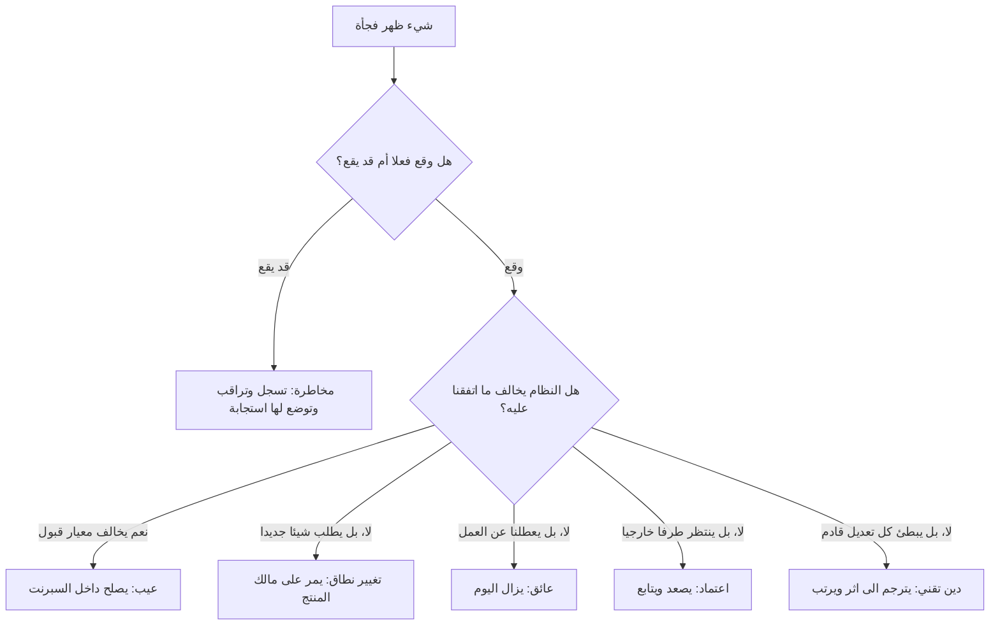

# 05 · داخل السبرنت — ما يظهر فجأة

> [!info] الفصل الخامس · رحلة مشروع
> **لماذا يهمّك:** لأن كل ما تعلّمته حتى الآن يُختبر في اللحظة التي يقول فيها أحدهم: «عندنا مشكلة». فمن لا يملك تصنيفًا يعالج كل شيء بالطريقة نفسها — بالاستعجال — فيُصلح ما لا يستحقّ، ويؤجّل ما لا يحتمل التأجيل، ويسمّي كل ذلك «مرونة».

---

## 🔔 المشهد: اليوم الثالث، 11:14 صباحًا

على قناة الفريق تصل خمس رسائل في نصف ساعة:

> [!quote] القناة
> **طارق:** البنك ردّ. رفضوا الربط لأن السجل التجاري باسم الشركة والحساب باسم المعهد.
> **سارة:** زرّ التسجيل ما يشتغل على سفاري في الآيفون. جرّبته عند ثلاثة.
> **د. لطيفة (على الواتساب لريم):** ممكن نضيف حقل «جهة العمل» في التسجيل؟ شيء بسيط.
> **يوسف:** كل ما أعدّل في التسجيل ينكسر شيء في الإشعارات. لازم نوقف ونعيد الهيكلة.
> **هند:** ما قدرت أختبر أمس، البيئة التجريبية كانت مشغولة طول اليوم.

خمس رسائل، و**خمسة أنواع مختلفة تمامًا** من العمل. وأسوأ ما يمكن أن يفعله مازن الآن أن يفتح خمس بطاقات في اللوحة ويكتب فوقها «عاجل».

---

## 🧭 لماذا التصنيف قبل الاستجابة؟

لأن كل نوع له **مالك مختلف، ومسار مختلف، وأثر مختلف على السبرنت**. والخلط بينها ليس خطأ تسمية، بل خطأ توجيه: فتذهب المشكلة إلى الشخص الخطأ، فتعود بعد أسبوع أكبر ممّا كانت.

---

## 🗂️ الأنواع الثمانية على طاولة واحدة

| النوع | السؤال الفارق | من يملك القرار؟ | أين يذهب؟ | أثره على السبرنت الحالي |
| --- | --- | --- | --- | --- |
| **مخاطرة** (Risk) | هل وقع؟ **لا** | سكرم ماستر يتابع، وصاحبها ينفّذ | [[Risk Register\|سجل المخاطر]] | لا شيء عادةً — إلا إن استلزمت عملًا وقائيًّا |
| **مسألة** ([[Issue Log\|Issue]]) | وقع، ويعطّل شيئًا خارج الكود | من يملك الصلاحية (قد يكون خارج الفريق) | سجل المسائل + تصعيد | قد يُسقط بندًا كاملًا |
| **عيب** (Bug/Defect) | النظام لا يفعل ما اتُّفق عليه في معايير القبول | المطوّرون | داخل السبرنت إن كان في عمل السبرنت | يُخصم من الطاقة مباشرة |
| **تغيير نطاق** ([[Change Request\|Change]]) | النظام يفعل ما اتُّفق عليه، والطلب شيء **جديد** | [[05 - Product Owner\|مالك المنتج]] وحده | قائمة أعمال المنتج | لا يدخل إلا بمقايضة |
| **اعتماد** ([[Dependency]]) | ننتظر طرفًا لا نملك جدوله | سكرم ماستر بالتصعيد | سجل الاعتمادات | يُخطَّط حوله لا يُنتظر |
| **عائق** ([[Blocker]]) | العمل متوقّف الآن بسبب داخلي | سكرم ماستر يزيله | الوقفة اليومية | يُحلّ اليوم لا غدًا |
| **دَين تقني** ([[Technical Debt\|Debt]]) | يعمل، لكنه يبطّئ كل تعديل قادم | المطوّرون يشخّصون، ومالك المنتج يرتّب | قائمة أعمال المنتج بلغة الأثر | يُرتَّب، ولا يُقتحم به السبرنت |
| **جودة/تواصل** | لا يخالف شيئًا مكتوبًا، ويولّد مفاجآت | فريق سكرم كلّه | الاسترجاع أو اتفاقية العمل | لا شيء فوري، وأثره تراكمي |

---

## 🔬 الحوادث الخمس: تصنيفٌ وقرار

### 1. رفض البنك — من مخاطرة إلى مسألة

كان مسجَّلًا في [[02 - الاكتشاف - تفكيك ما قاله العميل|سجل الاكتشاف]] بوصفه **مخاطرة**. واليوم وقع، فانتقل إلى **مسألة**، وتغيّرت معاملته بالكامل:

| | حين كان مخاطرة | بعد أن صار مسألة |
| --- | --- | --- |
| السؤال | ما احتماله وأثره؟ | من يحلّه ومتى؟ |
| الاستجابة | خطّة بديلة مكتوبة | تنفيذ فوري وتصعيد |
| المالك | طارق يراقب | عبدالله والدكتورة لطيفة (صلاحية قانونية) |
| الأثر | لا شيء | بند «الدفع بالبطاقة» يخرج من السبرنت |

> [!danger] القرار الصعب
> بند الدفع يخرج، لكن **هدف السبرنت لا يسقط**. لماذا؟ لأن الهدف كان: «يسجّل ويدفع ويستلم تأكيدًا». وقد سبق أن اكتُشف في [[02 - الاكتشاف - تفكيك ما قاله العميل|الاكتشاف]] أن 68٪ يدفعون تحويلًا بنكيًّا. فمسار «رفع الإيصال» — وهو داخل السبرنت أصلًا — يحقّق الهدف لأغلب المستخدمين بلا بوّابة دفع.
>
> **وهذا بالضبط ما تشتريه بهدف سبرنت مصاغ حول النتيجة لا حول البنود:** حين يسقط بند، يبقى أمامك طريق آخر إلى الهدف نفسه. ولو كان الهدف «إنجاز بنود التسجيل والدفع» لسقط السبرنت اليوم.

### 2. زرّ التسجيل على سفاري — عيب، ولكن أي عيب؟

هو **عيب** بلا جدال: النظام يخالف معيار قبول ضمنيًّا («يعمل على الجوال»). والسؤال العملي ليس «أنصلحه؟» بل «متى؟» — وجوابه يمرّ ببعدين لا بُعد واحد، وهو ما يفصّله [[Severity vs Priority|مدخل الخطورة والأولوية]]:

| | **الخطورة** (Severity) | **الأولوية** (Priority) |
| --- | --- | --- |
| تقيس | حجم الضرر التقني | إلحاح الإصلاح تجاريًّا |
| يحدّدها | المطوّر أو المختبِر | مالك المنتج |
| مثالنا | عالية — لا يُكمل المستخدم التسجيل | عاجلة — سفاري/آيفون شريحة كبيرة من السوق السعودي |

فتُصلح اليوم. ولو كان العيب «الشعار مائل ثلاث بكسلات على متصفّح لا يستعمله أحد» لكانت الخطورة منخفضة والأولوية أدنى — فيدخل قائمة الأعمال ولا يقتحم السبرنت.

> [!warning] القاعدة التي تمنع الفوضى
> **العيب في عمل السبرنت الحالي ليس عملًا جديدًا؛ إنه دليل على أن البند لم يكتمل.** فلا تُفتح له بطاقة منفصلة تُحسب نقاطًا إضافية، بل يعود البند إلى «قيد العمل». أمّا العيب في ميزة سُلّمت في سبرنت سابق فهو عمل جديد يُرتَّب في قائمة أعمال المنتج مثل غيره.

### 3. «حقل جهة العمل، شيء بسيط» — تغيير نطاق

النظام يفعل ما اتُّفق عليه، والطلب **إضافة جديدة**. وكلمة «بسيط» هنا هي الفخّ: فالحقل نفسه ساعة عمل، وما حوله ثمانية أشياء — التحقّق من الصحّة، وظهوره في التقارير، وفي كشف الحضور، وفي الفاتورة، وترجمته، واختباره، وأثره على البيانات القائمة.

> [!quote] ردّ ريم على الواتساب
> «تمام يا دكتورة. الحقل نفسه بسيط فعلًا، وأثره على التقارير والفواتير يقارب يومين. عندي خياران: يدخل السبرنت القادم بعد ثمانية أيام بلا تأثير على أي شيء، أو يدخل اليوم مقابل تأجيل رسالة تأكيد التسجيل. أيّهما أفضل لك؟»

ولاحظ ثلاثة أشياء في هذا الردّ:

1. **لم تقل «لا»**، بل عرضت الكلفة والخيارات.
2. **صحّحت تقدير «البسيط»** بلغة الأثر لا بلغة الكود.
3. **ردّت في القناة التي جاء منها الطلب**، ثم — وهذا الأهمّ — نقلت الطلب إلى قائمة الأعمال ليصير مرئيًّا للجميع.

> [!danger] كيف يتسلّل [[Scope Creep\|زحف النطاق]]؟
> لا يدخل زحف النطاق من الباب في صورة طلب كبير يُناقَش ويُقاس. يدخل من النافذة في صورة **عشرة طلبات «بسيطة»** عبر الواتساب، لا يُسجَّل منها شيء، ولا يُقاس أثرها مجتمعةً. ثم يُقال في نهاية الشهر: «الفريق بطيء».
> والعلاج ليس الرفض، بل **الرؤية**: كل طلب يُكتب في القائمة، وكل قبول يقابله تأجيل معلن.
>
> وهذا المسار يكفي ما دام العميل واحدًا ولا عقد صارمًا. أمّا حين يوجد **خطّ أساس معتمَد** أو عملاء آخرون يعيشون في النظام نفسه، فيلزم مسار أثقل — تفصيله في [[11 - ضبط التغيير - طلب التغيير الرسمي|الفصل الحادي عشر]].

### 4. «لازم نوقف ونعيد الهيكلة» — دَين تقني

طلب يوسف مشروع في ذاته، وردّ مازن عليه ليس «نعم» ولا «لا»، بل **طلب ترجمة**:

> [!quote] الحوار
> **مازن:** «كم مرّة حصل هذا في آخر أسبوعين؟»
> **يوسف:** «ثلاث مرّات. آخر واحدة أخذت مني نصف يوم.»
> **مازن:** «وإذا ما عملناها الآن، كم تتوقّع تكلفتها في السبرنتين القادمين؟»
> **يوسف:** «كل بند يمسّ التسجيل يزيد يومًا تقريبًا. عندنا أربعة بنود من هذا النوع.»

الآن صار الطلب **بندًا قابلًا للترتيب**: «فصل الإشعارات عن التسجيل — يوفّر ~4 أيام في السبرنتين القادمين، ويزيل سببًا متكرّرًا للعيوب. الكلفة: يومان». وهذا قرار تستطيع ريم أن تتّخذه؛ أمّا «الكود صار فوضى» فليس قرارًا يُتّخذ، بل شعور يُشارَك.

> [!warning] وما الذي لا يُفعل؟
> **لا يُقتحم السبرنت بإعادة هيكلة.** فالسبرنت له هدف، وإعادة الهيكلة ليست منه. والصواب أن تدخل الترتيب للسبرنت القادم — إلا أن تكون **شرطًا لإنجاز بند داخل السبرنت الحالي**، فتصير حينها جزءًا من تنفيذه لا بندًا مستقلًّا.

### 5. البيئة مشغولة — عائق

هذا ليس عيبًا ولا تغييرًا ولا دَينًا. **العمل متوقّف الآن بسبب داخلي يمكن إزالته** — وهو [[Blocker|عائق]]، وإزالته أوضح مسؤولية في عمل سكرم ماستر.

وما فعله مازن ليس أن «تابع مع هند»، بل:

1. **الحلّ اليوم:** حجز البيئة لهند ساعتين بالتنسيق مع طارق.
2. **الحلّ الجذري:** بند في قائمة الأعمال لبيئة اختبار ثانية (يوم واحد).
3. **السؤال الذي يمنع التكرار:** لماذا لم يظهر هذا في وقفة أمس؟

والجواب عن السؤال الثالث هو أخطر ما في الحادثة: لأن هند قالت في الوقفة «أكمل على الاختبار» — وهي عبارة **تقرير حالة**، لا كشف عائق.

---

## 🗣️ الوقفة اليومية: الفرق بين المزامنة وتقرير الحالة

> [!warning] ما ليست الوقفة اليومية
> ليست اجتماعًا يرفع فيه كل شخص تقريره إلى المدير. ودليل سكرم 2020 **حذف الأسئلة الثلاثة** («ماذا فعلت أمس؟ ماذا ستفعل اليوم؟ ما العوائق؟») ولم تعد نصًّا فيه، وترك للمطوّرين اختيار البنية التي تخدم الغرض. وهي حدث **للمطوّرين**، ومسؤولية سكرم ماستر أن **يضمن انعقادها** لا أن يقودها.

والفرق العملي بين الشكلين:

| | وقفة كتقرير حالة | وقفة كمزامنة نحو الهدف |
| --- | --- | --- |
| الاتّجاه | كل شخص يتكلّم إلى المدير | الفريق يتكلّم إلى بعضه |
| السؤال المحوري | ماذا فعلتَ؟ | **ما الذي يهدّد هدف السبرنت اليوم؟** |
| العائق | يُذكر إن تذكّره صاحبه | يُسأل عنه صراحةً في كل بند |
| النتيجة | معلومات | **خطّة اليوم تتغيّر** |

فبعد حادثة البيئة، غيّر الفريق سؤاله الافتتاحي إلى: **«ما الذي يقف بيننا وبين هدف السبرنت اليوم؟»** — وفي وقفة اليوم التالي ظهر عائقان لم يكونا ليُذكرا.

> [!success] المعيار العملي
> إن انصرف الفريق من الوقفة اليومية ولم تتغيّر خطّة يومهم في شيء، فقد عُقد تقرير حالة لا وقفة مزامنة.

---

## 🧵 من تويوتا: متى يُوقَف الخطّ؟

في [[Toyota Production System|نظام إنتاج تويوتا]] يستطيع أي عامل على خطّ التجميع أن يشدّ حبل **الأندون** فيوقف الخطّ كلّه عند اكتشاف خلل. والمنطق المضادّ للحدس: إيقاف الإنتاج الآن أرخص من تمرير خلل يُكتشف عند ألف سيارة.

وترجمة ذلك في الفريق البرمجي ثلاثة أشياء:

1. **إذا انكسر البناء الآلي، إصلاحه يسبق أي عمل جديد.** فلا معنى للبناء فوق أساس مكسور.
2. **العيب في عمل السبرنت الحالي يُصلَح فورًا لا يُكدَّس.** وقائمة العيوب المؤجَّلة ديْنٌ باسم آخر.
3. **حقّ إيقاف الخطّ لكل عضو**، لا للأقدم وحده. وهذا لا يُمنح بإعلان، بل يُختبر أول مرّة يوقف فيها جديدٌ العملَ ويُشكَر عليه بدل أن يُلام.

---

## 🧾 الفاتورة الأولى لغياب «تعريف الاكتمال»

في [[00 - بطاقة السيناريو - الشركة والفريق|بطاقة السيناريو]] كان [[Definition of Done|تعريف الاكتمال]] غير مكتوب. وفي اليوم التاسع وصلت فاتورته:

> [!quote] الوقفة، اليوم التاسع
> **سارة:** «التسجيل خلص.»
> **هند:** «ما اختبرته على الأندرويد.»
> **سارة:** «قصدي الكود خلص وارتفع.»
> **ريم:** «طيب أقدر أوري الدكتورة لطيفة اليوم؟»
> **يوسف:** «لا، ما فيه ترجمة للرسائل بعد.»

ثلاثة معانٍ مختلفة لكلمة «خلص»، بلا أن يخطئ أحد. ولهذا كُتب في نهاية اليوم — على جدار الغرفة لا في ملف ينساه الجميع:

> [!example] تعريف الاكتمال (النسخة الأولى)
> البند مكتمل إذا:
> 1. تحقّقت **كل** معايير قبوله.
> 2. راجع الكودَ شخصٌ غير كاتبه.
> 3. مرّت الاختبارات الآلية، وجُرّب يدويًّا على متصفّحَي جوّال.
> 4. نصوصه مترجمة عربيًّا وإنجليزيًّا.
> 5. منشور على البيئة التجريبية وقابل للعرض.
> 6. لا يُنقص تغطية الاختبار عمّا كانت.

> [!info] إضافة مرجعية
> تعريف الاكتمال **منصوص عليه في دليل سكرم** بوصفه التزامًا للزيادة البرمجية، وليس ممارسة اختيارية. والدليل لا يحدّد بنوده — فهي من عمل الفريق (أو من معيار المؤسسة إن وُجد، فيكون حدًّا أدنى لا يُنزَل عنه). وقاعدته الحاكمة: **ما لم يستوفِ تعريف الاكتمال لا يُعرض في مراجعة السبرنت ولا يُعدّ جزءًا من الزيادة.**

---

## 📤 مخرجات إدارة ما يظهر فجأة

1. **كل بند مصنَّف** بنوعه قبل أن يُعمل عليه.
2. **العوائق مُزالة في يومها**، لا مسجَّلة لتُناقش لاحقًا.
3. **تغييرات النطاق مرئية** في قائمة الأعمال بمقايضاتها المعلنة.
4. **الدَّين التقني مترجَم** إلى أثر قابل للترتيب.
5. **تعريف اكتمال مكتوب** بعد أن أرسل غيابُه فاتورته.

> [!success] المعيار العملي
> إن انتهى السبرنت وكل ما ظهر فيه عولج بالاستعجال نفسه — فلا فرق عندك بين عيب وطلب جديد وعائق — فأنت لا تدير سبرنتًا، بل تُطفئ حرائق داخل صندوق زمني.

---

## اختبر نفسك

> [!question]- اكتشفت أن ميزة سُلّمت في السبرنت الماضي لا تعمل على متصفّح معيّن. أهو عيب داخل السبرنت الحالي أم بند جديد؟
> **بند جديد يدخل قائمة أعمال المنتج ويُرتَّب مثل غيره.** فالعيب الذي يعود من عمل سابق ليس دليلًا على عدم اكتمال بند حالي، بل عملٌ جديد له كلفته. والفرق ليس محاسبيًّا فحسب: لو أُدخل داخل السبرنت بلا مقايضة لصار الفريق يفقد طاقته لعمل لم يخطّط له، ثم يُسأل لماذا لم ينجز ما التزم به. أمّا إن كان العيب **حرجًا يمنع الاستعمال**، فيدخل بقرار مالك المنتج مقابل إخراج بند — لا مجّانًا.

> [!question]- ما الفرق بين المخاطرة والمسألة، ولماذا يغيّر هذا الفرق سلوكك؟
> **المخاطرة لم تقع بعد، والمسألة واقعة.** فالمخاطرة تُدار بالاحتمال والأثر: خطّة استجابة، وصاحب، ومراجعة دورية. والمسألة تُدار بالحلّ والتصعيد: من يملك صلاحية إصلاحها، ومتى، وما البديل حتى ذلك الحين. والفريق الذي يبقي مسألة في سجل المخاطر «يراقبها» يكون قد اختار المشاهدة بدل الفعل.

> [!question]- طلب العميل تغييرًا صغيرًا في اليوم السابع. الفريق يستطيع تنفيذه بلا تأخير ظاهر. هل تقبله؟
> **تقبله فقط إن مرّ على مالك المنتج ودخل القائمة بمقايضة معلنة — حتى لو كانت المقايضة صفرًا.** فالخطر ليس في هذا الطلب بعينه، بل في **السابقة** التي يؤسّسها: طلب لا يُسجَّل، وقدرةٌ استُهلكت بلا أثر مرئي. وبعد عشرة طلبات كهذا تسقط ثقة الجميع في التقديرات، ولا يعرف أحد أين ذهبت الطاقة. فالقاعدة: **يمرّ الطلب في المسار حتى لو كان قبوله محسومًا.**

> [!question]- «لازم نعيد هيكلة الكود» — ما أول ما تطلبه من قائلها؟
> **ترجمة الطلب إلى أثر مقيس:** كم مرّة كلّفنا هذا في الأسابيع الماضية؟ وكم سيكلّفنا في القادمة؟ وما الذي سيصير أسرع أو أقلّ عطبًا بعده؟ فإن وُجد الأثر صار بندًا قابلًا للترتيب مقابل الميزات، وإن لم يوجد فهو تفضيل هندسي مشروع يُسجَّل وينتظر دليلًا. والفرق أن الأول يحمي التسليم، والثاني يستهلكه.

> [!summary] الفكرة التي يجب أن تتذكّرها
> حين يقول أحدهم «عندنا مشكلة»، لا تسأل «كيف نحلّها؟» قبل أن تسأل **«ما نوعها؟»**. فالتصنيف الصحيح يحدّد المالك والمسار والكلفة في ثلاثين ثانية؛ والاستعجال بلا تصنيف يجعل كل مشكلة تكلّف ضعف ما تستحقّ، ويجعل الفريق مشغولًا دائمًا ومنتجًا نادرًا.

## 🔗 ربط بالمفاهيم

- الأساسيات: [[07 - Daily Standup]] · [[14 - Sprint]] · [[19 - Risk Management]] · [[20 - Quality Management]] · [[06 - Scrum Master]]
- المعجم: [[Blocker]] · [[Severity vs Priority]] · [[Change Request]] · [[Scope Creep]] · [[Issue Log]] · [[Risk Register]] · [[Technical Debt]] · [[Definition of Done]] · [[Dependency]] · [[Toyota Production System]] · [[Context Switching Cost]] · [[Expedite Class]]

## ⏭️ التالي

[[06 - مراجعة السبرنت - العرض والاعتراض]] — انتهى السبرنت. غدًا نعرض على العميل.
