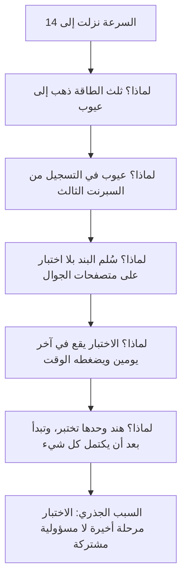

# 07 · الاسترجاع — لماذا انخفضت السرعة؟

> [!info] الفصل السابع · رحلة مشروع
> **لماذا يهمّك:** لأن انخفاض السرعة أشهر عَرَض في المشاريع الرشيقة، وأكثرها إساءةً في التشخيص. فهو رقم واحد تحته ستّة أسباب لا يشبه أحدها الآخر، وعلاج أحدها يزيد الآخر سوءًا. ومن يقرأ الرقم بوصفه إجابة يعالج المريض الخطأ.

---

## 📉 المشهد: الرقم الذي أشعل الاجتماع

بعد أربعة سبرنتات، صار للفريق تاريخ:

| السبرنت | النقاط المنجَزة |
| --- | --- |
| 1 | 20 |
| 2 | 24 |
| 3 | 22 |
| 4 | **14** |

وفي اجتماع الإدارة صباح الأحد قال عبدالله جملة يقولها كثيرون:

> [!quote] عبدالله
> «إنتاجية الفريق نزلت 36٪. لازم نشدّ الحزام.»

وهذه الجملة تحمل خطأين قبل أن تحمل حلًّا: أنها قرأت الرقم **مقياس إنتاجية** وهو ليس كذلك، وأنها قفزت من العَرَض إلى الحلّ بلا تشخيص. وقد سبق في [[04 - تخطيط السبرنت الأول|الفصل الرابع]] أن [[18 - Velocity|السرعة]] مقياس داخلي للتخطيط، لا مؤشّر أداء ولا أداة مقارنة.

> [!note] نموذج ذهني: الحرارة 39
> لا يوجد طبيب يعالج «الحرارة». فالحرارة عَرَض قد يكون تحته التهاب أو عدوى فيروسية أو ردّ فعل دوائي. ومن يعطي خافض حرارة ويمضي يكون قد **أخفى المؤشّر** وترك السبب يعمل.
> والسرعة حرارةُ المشروع: تقول إن شيئًا ما تغيّر، ولا تقول ما هو. والضغط على الفريق ليرفعها هو خافض الحرارة بعينه — ينجح أسبوعين ثم يعود المرض أشدّ.

---

## 🩺 الأسباب الستّة — وكيف تفرّق بينها

كل سبب أدناه يُنتج الانخفاضَ نفسه في الرسم البياني. والفرق كلّه في **الدليل الذي تبحث عنه**:

| # | السبب المحتمل | الدليل الذي يثبته | أين تجده | العلاج |
| --- | --- | --- | --- | --- |
| 1 | **جودة متدهورة** | ارتفاع نسبة العمل المصروف على العيوب | توزيع أنواع العمل بين السبرنتات | تشديد [[Definition of Done\|تعريف الاكتمال]] وتقديم الاختبار |
| 2 | **[[Technical Debt\|دَين تقني]]** | ارتفاع [[Cycle Time\|الزمن الدوري]] لبنود متشابهة الحجم مع الوقت | مقارنة زمن بنود بحجم واحد عبر السبرنتات | بند دَين مُرتَّب بأثر مقيس |
| 3 | **مقاطعات وعمل غير مخطَّط** | نسبة العمل الداخل بعد بدء السبرنت | لوحة المهامّ: بطاقات أُنشئت بعد يوم التخطيط | حماية السبرنت + مسار طوارئ معلن |
| 4 | **سوء تقدير** | فجوة منهجية بين التقدير والزمن الفعلي في اتّجاه واحد | [[Estimation Variance\|انحراف التقدير]] | معايرة التقدير لا لوم المقدِّر |
| 5 | **غياب عضو أو تغيّر التشكيل** | نقص في [[Capacity\|الطاقة]] المحسوبة | جدول الطاقة | تعديل التوقّع لا مطالبة الباقين بتعويضه |
| 6 | **تضخّم النقاط أو انكماشها** | ثبات عدد البنود المنجَزة مع تغيّر النقاط | عدد البنود مقابل النقاط | إعادة معايرة بمرجع ثابت |

> [!warning] سبب سابع لا يظهر في أي جدول
> **انهيار [[Psychological Safety\|الأمان النفسي]].** فالفريق الذي صار يخشى قول «لم أفهم» أو «هذا لن يكتمل» يبدأ في تضخيم التقديرات دفاعًا، وإخفاء التعثّر حتى آخر يوم. والعلامة الفارقة: الاسترجاع الذي لا يُقال فيه شيء صعب، وتنتهي جلسته قبل نصف وقتها بجوّ ودّي — وهذا ليس فريقًا لا مشكلة عنده، بل فريق لا يتكلّم.

---

## 🔎 التحقيق: خمسة أرقام بدل رقم واحد

بدل الجدال حول السرعة، جمع مازن خمسة قياسات في نصف يوم — كلّها متاحة في اللوحة، ولم ينظر إليها أحد من قبل:

### 1. توزيع أنواع العمل

| النوع | السبرنت 2 | السبرنت 4 |
| --- | --- | --- |
| ميزات | 78٪ | **41٪** |
| عيوب | 12٪ | **34٪** |
| دَين تقني | 4٪ | 5٪ |
| مخاطر/امتثال | 6٪ | 20٪ |

**القراءة:** الفريق لم يبطؤ؛ **تغيّر ما يعمل عليه**. فثلث طاقته ذهب إلى العيوب، وهذا لا يظهر في السرعة لأن العيوب في عمل سابق كثيرًا ما تُنجَز بلا نقاط.

### 2. العمل غير المخطَّط

في السبرنت الرابع دخلت **تسع بطاقات** بعد يوم التخطيط، مقابل بطاقتين في السبرنت الثاني. ومصدرها ثلاثة: طلبات الواتساب من الدكتورة لطيفة، وعيوب من السبرنت الثالث، وطلب عاجل من عبدالله لعرضٍ أمام مستثمر.

### 3. الزمن الدوري

متوسّط [[Cycle Time|الزمن الدوري]] لبند من حجم 5 نقاط:

| السبرنت | 1 | 2 | 3 | 4 |
| --- | --- | --- | --- | --- |
| الأيام | 2.5 | 2.8 | 3.4 | **5.1** |

**القراءة:** البند نفسه صار يستغرق ضعف زمنه. وهذا **ليس** بطئًا في العمل، بل زيادة في **الانتظار** — كما سيتّضح من الرقم الرابع.

### 4. الحمل ([[Flow Load|WIP]])

عدد البنود المفتوحة في وقت واحد: **3 → 4 → 6 → 9**. وأربعة أشخاص يعملون على تسعة بنود يعني أن كل واحد يتنقّل بين اثنين على الأقلّ.

> [!danger] لماذا يقتل الحمل الزائد الإنتاجية؟
> يقرّر [[Little's Law|قانون ليتل]] علاقةً بسيطة: **الزمن الدوري = الحمل ÷ الإنتاجية**. فمضاعفة الحمل بلا زيادة الإنتاجية تضاعف زمن كل بند حتمًا — لا احتمالًا. يُضاف إلى ذلك [[Context Switching Cost|كلفة تبديل السياق]]: كل تنقّل بين مهمّتين يُنفق دقائق في استرجاع الذاكرة العاملة.
> والنتيجة المفارِقة: **الفريق الذي يبدأ أشياء أكثر ينهي أشياء أقلّ.**

### 5. نسبة إعادة العمل

[[Rework Percentage|نسبة إعادة العمل]] ارتفعت من 8٪ إلى 23٪. والسبب المشترك في ثلثي الحالات: بنود لم تكن تحمل معايير قبول واضحة، فبُنيت مرّة ثم أُعيدت بعد المراجعة.

---

## 🧠 الاسترجاع: كيف تُدار الجلسة؟

الآن — وبعد أن صارت البيانات على الطاولة — يُعقد [[10 - Sprint Retrospective|الاسترجاع]]. والفرق بين استرجاع نافع وآخر شكلي ليس في القالب، بل في أربعة شروط:

### 1. أمان قبل أي شيء

تُفتتح الجلسة بالقاعدة التي كتبها **نورم كيرث** في كتابه *Project Retrospectives* (2001)، وتُعرف بـ«التوجيه الأول» للاسترجاع:

> [!quote] التوجيه الأول (ترجمة بالمعنى)
> «مهما اكتشفنا، فإننا نفهم ونصدّق بصدق أن كل واحد بذل أفضل ما يستطيع، في حدود ما كان يعرفه حينها، وبقدرته ومهارته والموارد المتاحة له وظروف الموقف الذي كان فيه.»

وليست هذه مجاملة، بل **إجراء وقائي ضدّ [[Fundamental Attribution Error|خطأ الإسناد الأساسي]]**: ميل الإنسان إلى تفسير خطأ غيره بشخصيّته وخطأ نفسه بظروفه. فالفريق الذي يبحث عن مذنب يجد واحدًا دائمًا — ولا يجد سببًا أبدًا.

### 2. من البيانات لا من الانطباعات

يبدأ الاسترجاع بعرض الأرقام الخمسة أعلاه صامتةً، ثم يُسأل: **ما الذي تقوله لكم هذه الأرقام؟** فتُبنى القراءة جماعيًّا. والفرق عن أن يأتي مازن بتفسيره جاهزًا: أن الفريق يملك التشخيص، ومن ملك التشخيص التزم بالعلاج.

### 3. الوصول إلى السبب لا الوقوف عند العَرَض

بتقنية [[Root Cause Analysis|تحليل السبب الجذري]] وسؤال «لماذا» متتاليًا:

ولاحظ أين انتهى الخيط: **ليس عند شخص، بل عند ترتيب عمل**. وهذه علامة تحليل سليم؛ فالتحليل الذي ينتهي عند اسمٍ يكون قد توقّف مبكّرًا.

### 4. مخرَجٌ واحد أو اثنان، لا عشرة

> [!danger] أكثر ما يُفشل الاسترجاعات
> جلسة تخرج بعشرة «إجراءات تحسين» بلا مالك ولا تاريخ. والنتيجة صفر، لأن الفريق نفسه الذي لم يسعه إنجاز عمله سيُطالَب الآن بعشرة أعمال إضافية. والقاعدة العملية: **تحسينان بمالك وتاريخ، يدخلان قائمة أعمال السبرنت القادم كبنود حقيقية** — لا في محضر جانبي.

---

## 🏢 من مايكروسوفت: حين أُلغي قسم الاختبار

نشرت مايكروسوفت — ضمن سلسلة عن رحلة فرق **Azure DevOps** كتب فيها آرون بيورك ونُشرت على مواقعها — تفاصيل تحوّل استغرق سنوات. وثلاثة منها تخصّ مأزق فريق نُقطة تحديدًا:

| ما فعلته مايكروسوفت | لماذا يخصّنا هنا |
| --- | --- |
| **دمج تخصّص الاختبار في الهندسة** وإلغاء قسم اختبار منفصل، فصار المهندس مسؤولًا عن اختبار ما يكتب | هذا بالضبط هو السبب الجذري الذي وصل إليه الفريق: الاختبار مرحلة أخيرة يملكها شخص واحد |
| **فرق ميزات صغيرة** (نحو ثمانية إلى اثني عشر مهندسًا) تملك ميزة من طرفها إلى طرفها | يمنع تسليم العمل بين تخصّصات، وكل تسليم انتظار |
| **سبرنت ثابت من ثلاثة أسابيع** وشحن في نهاية كل سبرنت | الإيقاع الثابت هو ما يجعل البيانات قابلة للمقارنة أصلًا |

> [!warning] كيف يُقرأ هذا المثال؟
> **لا بوصفه وصفة تُنسخ.** فمايكروسوفت أجرت هذا التحوّل على آلاف المهندسين وبسنوات من الاستثمار في الأتمتة، وفريق نُقطة أربعة. والذي يُنقل هو **المبدأ**: أن جعل الجودة مسؤولية مشتركة يزيل طابورًا كاملًا من مسار العمل. أمّا نسخ البنية التنظيمية فهو الخطأ الذي سيتكرّر بصورة أوضح في [[10 - النسخة الثانية والتوسّع|الفصل العاشر]] مع نموذج سبوتيفاي.

---

## ✅ ما خرج به الاسترجاع فعلًا

تحسينان اثنان، لا عشرة:

| التحسين | المالك | متى | كيف نعرف أنه نجح؟ |
| --- | --- | --- | --- |
| **حدّ للعمل الجاري: 4 بنود** — لا يُبدأ بند جديد قبل إنهاء آخر | الفريق كلّه | من السبرنت 5 | الزمن الدوري ينزل تحت 3.5 أيام |
| **الاختبار يبدأ مع أول يوم في البند لا في آخره**، ويُكتب سيناريو القبول قبل الكود | هند تدرّب، والمسؤولية للجميع | من السبرنت 5 | نسبة العمل على العيوب تحت 15٪ |

وقرار ثالث لم يكن للفريق: **قناة الطلبات**. فقد اتُّفق مع الدكتورة لطيفة أن كل طلب يُكتب في القائمة لا في الواتساب، ومع عبدالله أن العروض للمستثمرين تُجدوَل قبل التخطيط لا بعده.

> [!success] النتيجة بعد سبرنتين
> السرعة: 14 ← 19 ← 26. والزمن الدوري: 5.1 ← 3.2 أيام. ونسبة العيوب: 34٪ ← 11٪.
> **ولاحظ الترتيب:** لم يُطلب من أحد أن يعمل أسرع. تغيّرت **طريقة تدفّق العمل**، فتغيّر الرقم تبعًا. والسرعة تحسّنت بوصفها نتيجة، لا بوصفها هدفًا — ولو جُعلت هدفًا لارتفعت بتضخيم التقديرات وحدها.

---

## 📤 مخرجات الاسترجاع

1. **تشخيص مبنيّ على بيانات**، لا على انطباع أو اتّهام.
2. **سبب جذري** ينتهي عند نظام عمل لا عند شخص.
3. **تحسينان** بمالك وتاريخ ومعيار نجاح.
4. **بندان حقيقيان** في قائمة أعمال السبرنت القادم.
5. **قرارات خارج حدود الفريق** رُفعت إلى من يملكها.

> [!success] المعيار العملي
> إن انتهى الاسترجاع ولم يتغيّر شيء واحد **في السبرنت التالي** — لا في اللوحة ولا في اتفاقية العمل — فقد عُقدت جلسة تنفيس لا استرجاع. وإن كان الفريق يخرج منها كل مرّة بالبنود نفسها، فالمشكلة ليست في البنود، بل في أن أحدًا لا يملك صلاحية تنفيذها.

---

## اختبر نفسك

> [!question]- انخفضت السرعة سبرنتين متتاليين. ما أول ثلاثة أرقام تطلبها قبل أي نقاش؟
> **توزيع أنواع العمل** (كم ذهب للعيوب والدَّين مقابل الميزات)، و**نسبة العمل غير المخطَّط** (كم بطاقة دخلت بعد التخطيط)، و**الطاقة المتاحة فعلًا** (إجازات وغياب وأعمال دعم). فهذه الثلاثة تفسّر وحدها أغلب حالات الانخفاض، وتُغني عن نقاشٍ يدور حول من يعمل أكثر. والرقم الرابع إن أردت التعمّق: **الحمل** — لأنه غالبًا السبب الخفيّ وراء تضخّم الزمن الدوري.

> [!question]- عضو في الفريق يقدّر دائمًا أعلى من زملائه بمرّتين. أهي مشكلة؟
> **ليست مشكلة في ذاتها، وقد تكون معلومة.** فالتقدير النسبي مقياس جماعي لا فردي، والاختلاف طبيعي ما دام النقاش يوحّده. لكن الاختلاف **المنهجي والمستمرّ** يستحقّ السؤال: هل يرى هذا العضو تعقيدًا لا يراه غيره (وهذا الأنفع للفريق)؟ أم أنه يقدّر بالساعات في ذهنه لا بالحجم النسبي؟ أم أنه يضخّم دفاعًا عن نفسه بعد أن لام أحدهم تأخّرًا سابقًا؟ والاحتمال الثالث ليس مشكلة تقدير، بل مشكلة [[Psychological Safety|أمان نفسي]] ظهرت في صورة أرقام.

> [!question]- ما الفرق بين استرجاع يشخّص واسترجاع يبحث عن مذنب؟
> **الأول ينتهي عند نظام عمل، والثاني عند اسم.** فحين يكون الجواب «هند لم تختبر»، فأمامك اتّهام لا تشخيص — والدليل أنه لا يُنتج تغييرًا قابلًا للتنفيذ إلا «أن تنتبه أكثر». وحين يكون الجواب «الاختبار مرحلة أخيرة يملكها شخص واحد، فيضغطها الوقت دائمًا»، فأمامك سبب يمكن أن يُغيَّر بترتيب مختلف للعمل. والقاعدة: **إن كان الحلّ المقترح هو أن يبذل أحدهم جهدًا أكبر، فأنت لم تصل إلى السبب بعد.**

> [!question]- لماذا يخفض تحديد حدّ للعمل الجاري السرعةَ في البداية ثم يرفعها؟
> **لأنه يمنع البدء ويجبر على الإنهاء.** ففي السبرنت الأول بعد تطبيقه يبدو الفريق أبطأ: أشخاص «فارغون» لأنهم ممنوعون من فتح بند جديد، فيتّجهون إلى مساعدة زميل على إنهاء بند قائم. لكن الزمن الدوري ينزل، وتنزل معه إعادة العمل وكلفة تبديل السياق، فترتفع الإنتاجية الفعلية بعد سبرنت أو اثنين. وهذا ما يقرّره [[Little's Law|قانون ليتل]] رياضيًّا، ويقاومه الحدس الإداري الذي يرى في الانشغال إنتاجًا.

> [!summary] الفكرة التي يجب أن تتذكّرها
> السرعة عَرَض لا تشخيص. ومن يعالج العَرَض بالضغط يرفع الرقم ويخفض التسليم، لأن الفريق سيضخّم تقديراته بلا أن يقصد. **فاسأل دائمًا: ما الذي تغيّر في طريقة تدفّق العمل؟** — فالإنتاجية تتغيّر بتغيّر النظام، لا بتغيّر نيّة العاملين فيه.

## 🔗 ربط بالمفاهيم

- الأساسيات: [[10 - Sprint Retrospective]] · [[18 - Velocity]] · [[17 - Burndown Chart]] · [[20 - Quality Management]] · [[12 - Story Points]]
- المعجم: [[Cycle Time]] · [[Flow Load]] · [[WIP Limit]] · [[Little's Law]] · [[Context Switching Cost]] · [[Rework Percentage]] · [[Root Cause Analysis]] · [[Psychological Safety]] · [[Fundamental Attribution Error]] · [[Estimation Variance]] · [[Technical Debt]] · [[Goodhart's Law]] · [[Kaizen]]
- الكورس: [[كورس الإنتاجية]] — مقاييس التدفّق الستّة وتوزيع عناصر التدفّق.

## ⏭️ التالي

[[08 - الإطلاق - قرار المضي أو التوقف]] — الأسبوع السادس عشر. موسم سبتمبر بعد أحد عشر يومًا.
