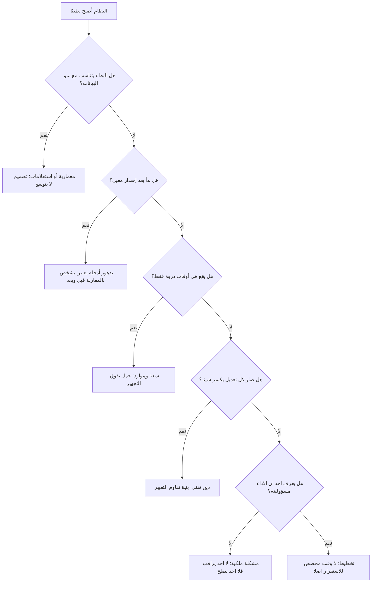

# 09 · بعد ستة أشهر — النظام أصبح بطيئًا

> [!info] الفصل التاسع · رحلة مشروع
> **لماذا يهمّك:** لأن هذا هو الفصل الذي لا تُكتب عنه كتب إدارة المشاريع، وهو الذي تقضي فيه أكثر عمرك المهني. فالمنتج الذي نجح يبدأ في التدهور **بسبب نجاحه**، والفرق بين فريق يشخّص وفريق يخمّن يظهر هنا وحده.

---

## 📬 المشهد: الشهر التاسع

ثلاث رسائل في أسبوع واحد:

> [!quote] الرسائل
> **د. لطيفة:** «النظام صار بطيء. المدرّبين يشتكون.»
> **نورة:** «صفحة المتدرّبين تاخذ وقت طويل، وأحيانًا ما تفتح.»
> **عبدالله:** «معهد ثاني كان بيوقّع، وجرّب النظام وقال بطيء. خسرنا الصفقة.»

وأمام مازن إغراءان، كلاهما خطأ:

| الإغراء | لماذا هو خطأ |
| --- | --- |
| «نفتح سبرنت أداء ونحسّن كل شيء» | تحسين بلا قياس = تخمين مكلف. وستنفق أسبوعين على ما ليس هو المشكلة |
| «هذا دَين تقني، قلنا لكم من زمان» | صحيح جزئيًّا، وعديم الفائدة كليًّا. فليس تشخيصًا، بل استرجاعُ حقّ |

---

## 🔤 أول خطوة: «بطيء» ليست معلومة

كلمة «بطيء» انطباع، وأول عمل هندسي هو تحويلها إلى **رقم له سياق**. وأربعة أسئلة تكفي:

| السؤال | الجواب في حالة أُفُق |
| --- | --- |
| بطيء **أين**؟ | صفحة قائمة المتدرّبين وتقرير الحضور. أمّا التسجيل والدفع فلا شكوى عليهما |
| بطيء **لمن**؟ | نورة والمدرّبون (المستخدمون الداخليون)، لا المتدرّبون |
| بطيء **منذ متى**؟ | «من شهرين تقريبًا» — ولا أحد يعرف بدقّة، لأن أحدًا لم يكن يقيس |
| بطيء **بكم**؟ | لا رقم — وهذه أخطر إجابة في الجدول |

### والمتوسّط يكذب

أول ما فعله طارق أنه أضاف قياسًا لزمن الاستجابة، وبعد يومين ظهر هذا:

| المقياس | صفحة المتدرّبين |
| --- | --- |
| المتوسّط | 1.4 ثانية |
| الوسيط (p50) | 0.6 ثانية |
| المئين 95 (p95) | **8.9 ثانية** |
| المئين 99 (p99) | **21 ثانية** |

> [!danger] لماذا كاد المتوسّط يقفل التحقيق؟
> لأن «1.4 ثانية» رقم ممتاز يوحي بأن لا مشكلة. والحقيقة أن **نصف الطلبات سريعة جدًّا، وواحدًا من كل عشرين يستغرق تسع ثوانٍ**. والمستخدم لا يعيش على المتوسّط؛ إنه يتذكّر أبطأ تجربة مرّت به. وهذا ما يشرحه [[Percentiles and Median vs Average|مدخل المئينات والوسيط والمتوسّط]]:
> **قِس الأداء بالمئين 95 و99، لا بالمتوسّط.** فالمتوسّط يخفي بالضبط ما تبحث عنه.

وبتقسيم الأرقام حسب المستخدم ظهر النمط: البطء يقع عند **المعاهد ذات البيانات الكبيرة**، وعند **الصفحات التي تعرض قوائم طويلة**، وفي **آخر أسبوع من كل دورة** حين يرفع الجميع الدرجات معًا.

---

## 🧭 الأسباب الستّة: شجرة التشخيص

العَرَض واحد، والأسباب ستّة، وعلاج كلٍّ منها مختلف تمامًا:

| السبب | الدليل الذي يثبته | العلاج |
| --- | --- | --- |
| **معمارية/استعلامات** | البطء يتناسب مع حجم البيانات | فهارس · ترقيم صفحات · إعادة تصميم الاستعلام |
| **تدهور أدخله تغيير** | البطء بدأ بعد إصدار محدَّد | مقارنة القياسات قبل/بعد ثم عكس التغيير أو إصلاحه |
| **سعة وموارد** | البطء مرتبط بالذروة لا بالحجم | توسيع الموارد · طوابير · تخزين مؤقّت |
| **[[Technical Debt\|دَين تقني]]** | كل تعديل يكسر شيئًا آخر | بنود دَين مُرتَّبة بأثر مقيس |
| **ملكية (People)** | لا أحد مسؤول عن الأداء بالاسم | إسناد الملكية + مؤشّرات معلَنة |
| **تخطيط** | 100٪ من الطاقة للميزات في كل سبرنت | حجز نسبة ثابتة للاستقرار |

---

## 🔬 ما وجده التحقيق فعلًا

بعد ثلاثة أيام، ثلاث نتائج — واحدة تقنية واثنتان تنظيميّتان:

### 1. السبب المباشر

تقرير الحضور كان يجلب بيانات كل متدرّب في استعلام منفصل. وعند خمسة عشر متدرّبًا (وقت البناء) كان ذلك غير محسوس؛ وعند تسعمئة متدرّب صار تسعمئة رحلة إلى قاعدة البيانات في الطلب الواحد. وأُصلح في يوم واحد.

### 2. السبب البنيوي

**لم يوجد اختبار أداء في [[Definition of Done|تعريف الاكتمال]]، ولا بيانات حجم واقعي في بيئة الاختبار.** فكل بند اختُبر على عشرين صفًّا ونجح. والنتيجة أن الفريق كان يبني — بحسن نيّة — نظامًا يعمل عند عشرين ولا يعمل عند تسعمئة، **بلا أن يكون في مساره ما يكشف ذلك**.

### 3. السبب الأعمق

> [!danger] السؤال الذي أسكت الغرفة
> «منذ متى والنظام بطيء؟» — لا أحد يعرف. **البطء بدأ قبل شهرين على الأقلّ، واكتُشف من شكوى عميل ومن صفقة ضائعة.**
> وهذه ليست مشكلة أداء، بل مشكلة **ملكية ورصد**: النظام كان يتدهور شهرين ولا أحد ينظر. وأصعب ما في هذا النوع من الفشل أنه لا يُحدِث ضجيجًا؛ يخسر المنتج مستخدميه واحدًا واحدًا في صمت.

---

## 🏢 من جوجل: حوّل «بطيء» إلى عقد رقمي

في كتاب *Site Reliability Engineering* (2016) تشرح جوجل نظامًا يفكّ هذا المأزق بالضبط، بثلاث طبقات:

| الطبقة | ما هي | مثال من أُفُق |
| --- | --- | --- |
| **[[SLI\|المؤشّر]]** (SLI) | ما نقيسه فعلًا | نسبة الطلبات التي تُخدَم في أقلّ من ثانيتين |
| **[[SLO\|الهدف]]** (SLO) | الحدّ الذي نلتزم به داخليًّا | 99٪ من طلبات صفحة المتدرّبين تحت ثانيتين |
| **[[SLA\|الاتفاقية]]** (SLA) | ما نتعهّد به للعميل، وعواقبه | 99.5٪ توافر شهريًّا، وإلا خصمٌ من الاشتراك |

ثم تأتي الفكرة التي غيّرت الصناعة: **ميزانية الخطأ** (Error Budget).

> [!quote] المبدأ (بالمعنى)
> إن كان هدفك 99.9٪، فأنت قد **أذنت لنفسك** بـ0.1٪ من الفشل. وهذه النسبة ميزانية تُنفَق: تُنفق على إطلاق ميزات جديدة وتحمّل مخاطرها. فإن نفدت الميزانية في الشهر، **تتوقّف الإطلاقات الجديدة حتى يعود النظام داخل هدفه**.

وما يحلّه هذا ليس تقنيًّا، بل **سياسيًّا**: فالنزاع الأزلي بين «نريد ميزات» و«نريد استقرارًا» يتحوّل من جدال بين قسمين إلى **رقم متّفق عليه سلفًا يحسم بنفسه**. ولا أحد يفاوض أحدًا؛ الميزانية إمّا فيها رصيد أو لا.

> [!example] ما تبنّاه فريق نُقطة
> - **هدف واحد فقط للبداية:** 99٪ من طلبات الصفحات الرئيسية تحت ثانيتين، مقيسًا بالمئين 99.
> - **قاعدة معلَنة:** إن خُرق الهدف أسبوعين متتاليين، يُخصَّص **ثلث السبرنت التالي** للاستقرار قبل أي ميزة.
> - **لوحة يراها الجميع**، بما فيهم عبدالله والدكتورة لطيفة.
>
> والفائدة الكبرى: أن ريم لم تعد مضطرّة إلى الدفاع عن بنود الاستقرار في كل تخطيط. القاعدة تدافع عنها.

---

## 🐒 من نتفليكس: لا تنتظر الفشل، أحدِثه

نشرت نتفليكس سنة 2011 على مدوّنتها التقنية وصف **جيش القرود** (The Simian Army)، وأشهر أفراده **Chaos Monkey**: أداة تُنهي خوادم عشوائيًّا **في بيئة الإنتاج وفي ساعات العمل** عمدًا.

والمنطق مقلوب على الحدس: إن كان نظامك سينهار حين يسقط خادم، فالأفضل أن ينهار الثلاثاء الساعة العاشرة وأنت تنظر، لا الجمعة الثالثة صباحًا وأنت نائم.

> [!warning] كيف يُقرأ هذا في فريق من أربعة؟
> **لا بنسخ الأداة.** فنتفليكس تشغّل آلاف الخوادم وتملك فرق موثوقية كاملة، وفريق نُقطة لا يملك مهندس بنية تحتية أصلًا (وهذه الثغرة مكتوبة في [[00 - بطاقة السيناريو - الشركة والفريق|بطاقة السيناريو]] منذ الفصل صفر).
> والذي يُنقل هو **المبدأ في صورته الصغيرة**: تمرين ربع سنوي مجدوَل يُختبر فيه ما لا يُختبر عادةً — استعادة نسخة احتياطية، وفقدان مزوّد الرسائل، وامتلاء القرص. ساعتان كل ثلاثة أشهر تكشف ما لا تكشفه سنة من الاختبارات الوظيفية.

---

## 📝 التشريح بلا لوم

بعد استقرار الوضع كُتب [[Blameless Postmortem|تشريح بلا لوم]]. وقاعدته: **يُفترض أن كل من شارك تصرّف تصرّفًا معقولًا بحسب ما كان يراه ويعرفه حينها**، والسؤال ليس «من أخطأ؟» بل «ما الذي جعل الخطأ ممكنًا وغير مرئي؟».

| القسم | ما كُتب في تشريح أُفُق |
| --- | --- |
| **ما حدث** | تدهور تدريجي في زمن استجابة صفحتين، بدأ نحو الأسبوع 28 |
| **الأثر** | شكاوى مستخدمين · صفقة معهد ثانٍ ضائعة · ساعات دعم |
| **زمن الاكتشاف** | ~8 أسابيع (من شكوى، لا من رصد) |
| **زمن الإصلاح** | 4 أيام من الاكتشاف |
| **السبب المباشر** | استعلام يتضاعف مع عدد السجلّات |
| **الأسباب المساهمة** | بلا اختبار أداء · بلا بيانات واقعية الحجم · بلا رصد لزمن الاستجابة · بلا مالك للأداء |
| **ما نجح** | القياس بالمئينات كشف المشكلة في يومين بعد أن بدأنا نقيس |
| **الإجراءات** | أربعة، بمالك وتاريخ (أدناه) |

> [!success] لماذا «بلا لوم» ليست مجاملة؟
> لأن الغاية **عملية بحتة**: الفريق الذي يُلام يخفي. فيتأخّر الإبلاغ عن العطل التالي ساعات، وتُصاغ التقارير لتبرئة الذمّة لا لكشف السبب، وتُفقد المعلومة التي كانت ستمنع التكرار. أمّا الفريق الذي لا يُلام فيُبلغ مبكّرًا ويكتب بصراحة — وهذا وحده أنفع من أي إجراء تصحيحي في التقرير.
> وهذا هو مبدأ **«السياق لا التحكّم»** الذي تنصّ عليه وثيقة ثقافة نتفليكس المنشورة: أن تُعطي الناس المعلومة الكاملة فيقرّروا، بدل أن تُحكم قبضتك على القرار.

---

## 🛠️ ثلاث طبقات من العلاج

الفريق الذي يصلح الاستعلام ويمضي سيعود إلى هنا بعد ستّة أشهر بمشكلة أخرى من العائلة نفسها. ولذلك يُعالَج على ثلاث طبقات:

| الطبقة | الإجراء | المالك | متى |
| --- | --- | --- | --- |
| **فوري** — يوقف النزيف | إصلاح استعلام تقرير الحضور + فهرسة + ترقيم صفحات | يوسف | هذا الأسبوع |
| **بنيوي** — يمنع التكرار | إضافة عتبة أداء إلى **تعريف الاكتمال** + بيئة اختبار ببيانات بحجم واقعي | الفريق | السبرنت القادم |
| **وقائي** — يكشف مبكّرًا | لوحة رصد بالمئينات + تنبيه عند خرق الهدف + تمرين فشل ربع سنوي | طارق | خلال شهر |

وقرار رابع يخصّ **الطاقة**: تخصيص **20٪ من كل سبرنت** للاستقرار والدَّين التقني، دائمًا.

> [!danger] وبند في هذا الجدول سيعود بفاتورة من نوع آخر
> «بيئة اختبار ببيانات بحجم واقعي» قرار هندسي سليم تمامًا، وقد عالج سببًا جذريًّا حقيقيًّا. لكن **طريقة تنفيذه** — نسخ قاعدة الإنتاج — ستتحوّل إلى مخالفة خصوصية تُكتشف في تدقيق بعد تسعة أشهر. تفصيلها في [[12 - التدقيق والامتثال|الفصل الثاني عشر]].
> وسبب ذكرها هنا لا هناك: **أن ترى كيف يولد الخطأ من قرار جيّد لم يُسأل عنه سؤالٌ واحد** — «وما البيانات التي سنستعملها؟».

> [!warning] ولماذا 20٪ في كل سبرنت لا «سبرنت تنظيف» كل ربع؟
> لأن سبرنت التنظيف يُلغى أول ما يظهر ضغط. فهو دائمًا البند الأسهل تأجيلًا، وسيُؤجَّل ثلاث مرّات ثم يُنسى. أمّا النسبة الثابتة داخل كل سبرنت فتصير جزءًا من الطاقة نفسها، فلا تحتاج قرارًا جديدًا كل مرّة — وما لا يحتاج قرارًا لا يُلغى تحت الضغط.

---

## 💡 لماذا يتدهور النظام الناجح تحديدًا؟

هذا ليس سوء حظّ، بل نتيجة بنيوية لثلاثة أسباب تعمل معًا:

1. **البيانات تنمو أضعافًا، والكود لا يتغيّر.** فما بُني لعشرين يعمل عند عشرين، وقلّما يُعاد النظر فيه عند تسعمئة — لأنه «يعمل».
2. **كل ميزة جديدة تزيد سطح التعقيد.** فالميزة العشرون لا تكلّف مثل الأولى، إذ تتفاعل مع تسع عشرة قبلها.
3. **الطلب يسبق التجهيز دائمًا.** فالنجاح يجلب مستخدمين قبل أن يجلب موارد لخدمتهم.

> [!summary] الخلاصة المضادّة للحدس
> النظام لم يتدهور لأن الفريق أهمل. **تدهور لأنه نجح** — نمت بياناته ومستخدموه وميزاته، بينما بقيت افتراضاته التصميمية كما وُضعت يوم كانت البيانات عشرين صفًّا. ومن لم يخطّط لنجاحه، عاقبه نجاحُه.

---

## 📤 مخرجات معالجة التدهور

1. **قياس بالمئينات** بدل الانطباع والمتوسّط.
2. **تشخيص يفرّق** بين المعماري والدَّين والسعة والملكية والتخطيط.
3. **[[SLO\|هدف مستوى خدمة]]** واحد على الأقلّ، معلَن ومرئي للجميع.
4. **قاعدة مكتوبة** تحكم المفاضلة بين الميزات والاستقرار بلا تفاوض متكرّر.
5. **[[Blameless Postmortem\|تشريح بلا لوم]]** بأربعة إجراءات بمالك وتاريخ.
6. **نسبة ثابتة من الطاقة** للاستقرار في كل سبرنت.

> [!success] المعيار العملي
> إن كان أول من يخبرك بتدهور نظامك هو **عميلك**، فأنت لا تدير منتجًا بل تنتظر الشكاوى. وإن أُصلح العَرَض ولم يُضَف شيء إلى تعريف الاكتمال ولا إلى الرصد، فأنت قد اشتريتَ أشهرًا حتى تعود المشكلة نفسها باسم آخر.

---

## اختبر نفسك

> [!question]- «النظام بطيء» — ما أول أربعة أسئلة تطرحها؟
> **أين؟ ولمن؟ ومنذ متى؟ وبكم؟** فالأولان يحصران النطاق (صفحة بعينها؟ مستخدم بعينه؟ حجم بيانات بعينه؟)، والثالث يربط البداية بحدث (إصدار؟ نموّ بيانات؟ موسم ذروة؟)، والرابع يحوّل الشكوى إلى رقم قابل للمقارنة قبل وبعد. ومن يبدأ بالتحسين قبل هذه الأربعة يصلح غالبًا ما ليس معطوبًا، ثم يفاجأ بأن الشكوى باقية.

> [!question]- لماذا يُقاس الأداء بالمئين 95 و99 لا بالمتوسّط؟
> **لأن المتوسّط يخفي الذيل، والذيل هو ما يشتكي منه المستخدمون.** فمتوسّط 1.4 ثانية قد يعني أن نصف الطلبات في 0.6 ثانية وواحدًا من كل عشرين في تسع ثوانٍ. والمستخدم لا يتذكّر تجربته المتوسّطة بل أسوأها، والعميل الذي جرّب النظام مرّة واحدة فوقع في الذيل حكم عليه بها. والقاعدة العامّة أبعد من الأداء: **كلّما كان التوزيع غير متماثل كان المتوسّط أسوأ ملخّص له.**

> [!question]- ما الذي تحلّه ميزانية الخطأ ولا يحلّه مجرّد الاتفاق على «الاستقرار مهمّ»؟
> **تحلّ النزاع بلا تفاوض متكرّر.** فالاتفاق المبدئي على أهمّية الاستقرار يسقط في أول تخطيط تحت ضغط الموعد، لأن الميزة لها موعد ظاهر والاستقرار لا. أمّا ميزانية الخطأ فتجعل القرار **آليًّا ومعلَنًا سلفًا**: إن نفدت، تتوقّف الإطلاقات. فلا يقف أحد في موقع «المعطِّل»، ولا يحتاج مالك المنتج أن يخوض المعركة نفسها كل أسبوعين. والقاعدة تحمل عبء الخلاف بدل الأشخاص.

> [!question]- ما الفرق بين إصلاح العَرَض وإصلاح النظام، وكيف تعرف أنك فعلت الثاني؟
> **العلامة الفاصلة: هل تغيّر شيء يمنع تكرار هذا النوع من الأعطال، لا هذا العطل بعينه؟** فإصلاح الاستعلام يعالج حالة واحدة. وإضافة عتبة أداء إلى تعريف الاكتمال، وبيئة اختبار ببيانات واقعية، ورصدٍ ينبّه — هذه تجعل العطل التالي من العائلة نفسها **يُكتشف قبل أن يصل إلى مستخدم**. والسؤال الفاحص بعد كل حادثة: «لو تكرّرت غدًا بصورة مختلفة قليلًا، هل نكتشفها أسرع؟» فإن كان الجواب لا، فقد أصلحت العَرَض.

> [!summary] الفكرة التي يجب أن تتذكّرها
> بعد الإطلاق تتغيّر وظيفتك: لم تعد تبني منتجًا، بل **تحافظ على منتج يعمل وهو ينمو**. وأخطر ما في هذه المرحلة أن التدهور صامت ومتدرّج، فلا يُحدث أزمةً تفرض الانتباه، بل يستنزف الثقة والعملاء واحدًا واحدًا حتى يُكتشف من صفقة ضائعة.

## 🔗 ربط بالمفاهيم

- الأساسيات: [[20 - Quality Management]] · [[19 - Risk Management]] · [[18 - Velocity]] · [[13 - Backlog]]
- المعجم: [[SLI]] · [[SLO]] · [[SLA]] · [[SRE]] · [[MTTR]] · [[Blameless Postmortem]] · [[Percentiles and Median vs Average]] · [[Technical Debt]] · [[Root Cause Analysis]] · [[Graceful Degradation]] · [[Early Warning Dashboard]] · [[Theory of Constraints]] · [[Systems Thinking]] · [[Post-Launch Review]]
- الكورس: [[كورس الإنتاجية]] — دوّامة الموت التي يصنعها الدَّين التقني.

## ⏭️ التالي

[[10 - النسخة الثانية والتوسّع]] — خمسة عشر معهدًا، وثلاثة فرق. ما الذي ينكسر؟
