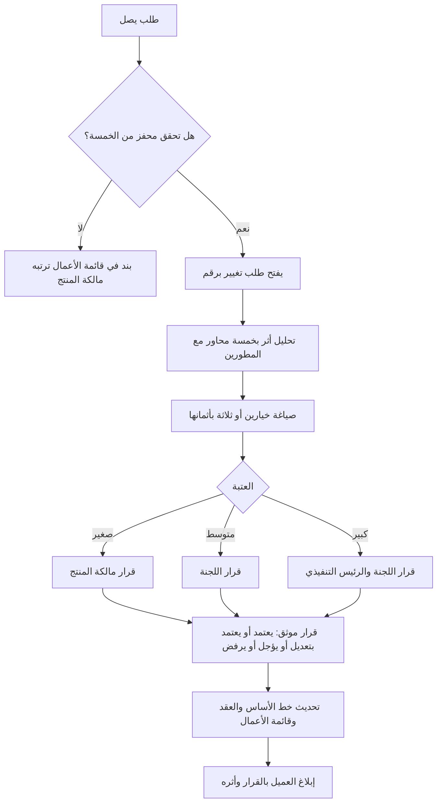

# 11 · ضبط التغيير — من الطلب غير الرسمي إلى طلب التغيير الرسمي

> [!info] الفصل الحادي عشر · رحلة مشروع
> **لماذا يهمّك:** لأن ما نجح في [[05 - داخل السبرنت - ما يظهر فجأة|الفصل الخامس]] — أن يُناقَش التغيير في قائمة الأعمال بمقايضة معلنة — **يكفّ عن الكفاية** حين يوجد عقد موقَّع، وخمسة عشر عميلًا يتشاركون نظامًا واحدًا، وسعرٌ بُني على نطاق متّفق عليه. وحينها يصير الطلب غير المضبوط تغييرًا في **الالتزام** لا في العمل، ويدفع الفريق ثمن قرار لم يتّخذه.

---

## 📩 المشهد: الشهر السادس عشر

> [!quote] بريد من مدير تقنية المعلومات في «معهد الرواد» — أكبر عملاء المنصّة
> «بعد مراجعة داخلية، نحتاج أن يُعتمَد تسجيل كل متدرّب من **مديره المباشر في جهة عمله** قبل تأكيد المقعد، وأن تُصدر لنا فاتورة تجميعية شهرية بدل فاتورة لكل متدرّب. نحتاج هذا جاهزًا قبل موسم يناير، وهو شرط لتجديد العقد.»

الطلب في سطرين، وتحته ستّة أشياء:

1. **مسار موافقة جديد** لم يوجد في النظام أصلًا.
2. **علاقة تنظيمية جديدة** (متدرّب ← مدير ← جهة عمل) تمسّ نموذج البيانات.
3. **دورة فوترة مختلفة** تمسّ المحاسبة والتكامل البنكي.
4. **موعد خارجي** مرتبط بموسم.
5. **تهديد ضمني بعدم التجديد** — أي أثر مالي مباشر.
6. **وأربعة عشر عميلًا آخرين** لم يطلبوا شيئًا من هذا، وسيعيشون في النظام نفسه.

ولو عولج هذا بأسلوب الفصل الخامس — «يدخل القائمة بمقايضة» — لكان الجواب صحيحًا في الشكل، خاطئًا في الحجم.

---

## 🔀 ما الذي تغيّر منذ الفصل الخامس؟

| | **الفصل الخامس** (عميل واحد، بلا عقد صارم) | **اليوم** (١٥ عميلًا، عقود سنوية) |
| --- | --- | --- |
| من يتأثّر بالتغيير | فريق واحد وعميل واحد | ١٥ عميلًا · المبيعات · المحاسبة · الدعم |
| ما الذي يتغيّر | ترتيب العمل | **الالتزام**: النطاق والسعر والموعد |
| كلفة الخطأ | سبرنت | عقد سنوي وسمعة |
| هل يوجد مرجع مكتوب؟ | قائمة الأعمال | **[[Baseline\|خطّ أساس]] معتمَد** في العقد |
| من يملك القرار | مالكة المنتج وحدها | مالكة المنتج + من يملك الأثر المالي والقانوني |

> [!note] نموذج ذهني: تعديل البيت قبل السكن وبعده
> قبل أن تسكن، تقول للمقاول «حرّك الجدار متر» فيحرّكه ويعدّل حسابه. وبعد أن سكنت ووُقّع التسليم، الطلب نفسه يصير شيئًا آخر: يمسّ الكهرباء والسباكة التي بُنيت خلف الجدار، وقد يمسّ تراخيص، وله ثمن يجب أن يُتّفق عليه **قبل** أن يُرفع المطرقة.
> ولم يتغيّر الطلب؛ تغيّر **ما بُني فوق الحالة القديمة**. وهذا بالضبط ما يفعله خطّ الأساس.

---

## 🚦 متى يلزم المسار الرسمي؟ خمسة محفّزات

لا يُرفع كل طلب إلى مسار رسمي — وإلا شُلّ الفريق. والمحفّزات خمسة، ويكفي **واحد** منها:

| المحفّز | مثاله | لماذا لا يكفي المسار العادي |
| --- | --- | --- |
| **يمسّ خطّ أساس معتمَدًا** في عقد أو بيان نطاق | مسار الموافقة الجديد | التزام مكتوب لا تملك تغييره وحدك |
| **يغيّر السعر أو الجدول أو شروط الخدمة** | الفوترة التجميعية | أثر مالي وقانوني خارج صلاحية الفريق |
| **يؤثّر في عملاء آخرين** | العلاقة التنظيمية الجديدة | ما يُبنى لواحد يعيش عند الجميع |
| **يمسّ ضابطًا امتثاليًّا أو أمنيًّا** | بيانات جديدة عن جهة العمل | يفتح التزامًا نظاميًّا جديدًا ([[12 - التدقيق والامتثال\|الفصل التالي]]) |
| **[[Reversible vs Irreversible Decisions\|قرار غير عكوس]]** | تغيير نموذج البيانات | التراجع عنه يعني ترحيل بيانات حيّة |

وما لم يتحقّق فيه شيء من هذه الخمسة يبقى حيث كان: **بندًا في قائمة الأعمال تحكمه مالكة المنتج**.

> [!danger] الخطأ في الاتّجاهين
> **الإفراط:** رفع كل طلب صغير إلى لجنة، فيتحوّل المشروع إلى بيروقراطية تُنتج محاضر لا برمجيات، ويبدأ الناس في الالتفاف عليها — فتخسر الضبط والسرعة معًا.
> **التفريط:** معالجة تغيير تعاقدي بوصفه بندًا عاديًّا، فيُبنى العمل ويُسلَّم ثم يُسأل: «ومن قال إن هذا داخل العقد؟» — ويكون الفريق قد أنفق شهرًا لا يقابله إيراد ولا اعتراف.

---

## 🧾 ما الذي يُثبَّت أصلًا؟ خطّ الأساس

[[Baseline|خطّ الأساس]] هو النسخة المعتمدة التي يُقاس عليها كل ما بعدها. وفي مشروع برمجي لا يكفي أن يُثبَّت النطاق والجدول والكلفة وحدها؛ فأربعة عناصر إضافية هي مصدر أكثر الخلافات:

| العنصر المثبَّت | مثاله في منصّة نُقطة | الخلاف الذي يمنعه |
| --- | --- | --- |
| **النطاق** | قائمة الوحدات المشمولة بالاشتراك | «ألم يكن هذا مشمولًا؟» |
| **الجدول** | مواعيد الإصدارات الرئيسية | «متى كان مفترضًا أن يسلّم؟» |
| **الكلفة/السعر** | سعر المقعد وحدود الخطّة | «لماذا تُحاسبوننا على هذا؟» |
| **معايير القبول** | ما معنى «يعمل» في كل وحدة | «هذا لا يعمل كما توقّعنا» |
| **[[SLO\|مستوى الخدمة]]** | التوافر وزمن الاستجابة والدعم | «النظام بطيء» ← [[09 - بعد ستة أشهر - النظام أصبح بطيئًا\|بلا رقم يُحتكم إليه]] |
| **البيانات والامتثال** | ما يُجمع وأين يُخزَّن ومن يصل | خلاف لا يظهر إلا في التدقيق |
| **حدود التكامل** | ما الأنظمة التي نتكامل معها ومن يصونها | «ألا تدعمون نظامنا القديم؟» |

> [!warning] خطّ الأساس ليس تجميدًا للنطاق
> [[Scope Freeze|تجميد النطاق]] يمنع التغيير؛ وخطّ الأساس **يجعل التغيير مرئيًّا وقابلًا للتسعير**. والفرق جوهري: الأول يعادي الرشاقة، والثاني شرطها في البيئة التعاقدية — إذ لا معنى لـ«الترحيب بالتغيير» إن لم يكن هناك مرجعٌ يُقاس منه ما تغيّر.

---

## 📄 نموذج طلب التغيير — وما يُملأ فيه فعلًا

> [!info] تنبيه على التسمية: RFC ولها معنيان
> في **إدارة المشاريع وإدارة الخدمات** ([[ITIL 4]])، `RFC` اختصار *Request for Change* وهو **طلب التغيير الرسمي** — وهو المقصود في هذا الفصل، ومرادف لـ[[Change Request|CR]].
> وفي **الهندسة البرمجية ومجتمعات المصادر المفتوحة**، `RFC` وثيقة *Request for Comments*: مقترح تصميم يُنشر ليُناقَش قبل التنفيذ، ومخرجه قرار تقني موثّق لا اعتماد تعاقدي.
> والخلط بينهما شائع في الفرق التي تجمع الثقافتين — فالأول يسأل **«هل نلتزم بهذا؟»**، والثاني يسأل **«هل هذا هو التصميم الصحيح؟»**. ونضج الفريق أن يعرف أيّهما يحتاج، وقد يحتاجهما معًا: مقترح تصميم يسبق طلب تغيير تعاقديًّا.

| الحقل | ما يُكتب فيه | ملؤه في طلب معهد الرواد |
| --- | --- | --- |
| **الرقم والتاريخ** | معرّف يُشار إليه لاحقًا | `CR-2026-014` · 12 سبتمبر |
| **مقدّم الطلب** | من طلبه ومن يمثّل | مدير تقنية المعلومات — معهد الرواد |
| **وصف التغيير** | ماذا يتغيّر بالضبط | اعتماد مدير الجهة قبل تأكيد المقعد + فوترة تجميعية شهرية |
| **المبرّر** | لماذا الآن، وما الذي يفشل بدونه | مراجعة مالية داخلية تمنع الصرف بلا اعتماد مسبق |
| **البديل المدروس** | ما جُرّب أو ما يُغني | تصدير تقرير شهري يعتمده المدير خارج النظام |
| **تحليل الأثر** | خمسة محاور (أدناه) | ↓ |
| **الخيارات** | لا خيار واحد بل ٢–٣ بأثمانها | ↓ |
| **التوصية** | رأي الفريق المعلَّل | الخيار (ب) |
| **القرار وصاحبه وتاريخه** | لا يُترك فارغًا أبدًا | ↓ |

### تحليل الأثر: خمسة محاور لا محور واحد

أكثر ما يُختصر خطأً هو هذا القسم، فيُكتب فيه «أسبوعان» ويُمضى. والتقدير الزمني واحد من خمسة:

| المحور | الأثر في هذا الطلب |
| --- | --- |
| **النطاق** | كيان جديد (جهة العمل) + حالة جديدة للتسجيل (بانتظار الاعتماد) + شاشة للمدير |
| **الجدول** | ٤ سبرنتات، وتُزاح ميزتان من خارطة الربع |
| **الكلفة** | ~٣٢ يوم عمل + كلفة تشغيلية دائمة (بريد الاعتماد، دعم إضافي) |
| **المخاطر** | حالة «بانتظار الاعتماد» تُدخل مقعدًا معلَّقًا — وتصطدم بمهلة الحجز ١٥ دقيقة من [[03 - بناء قائمة الأعمال وترتيبها\|السبرنت الأول]] |
| **الأثر على الآخرين** | ١٤ عميلًا لا يريدون خطوة إضافية ← **يجب أن تكون قابلة للإطفاء لكل عميل** |

> [!danger] المخاطرة التي لا يراها إلا من يعرف نظامه
> «بانتظار الاعتماد» تعني أن المقعد محجوز لمدّة **غير معلومة** — ساعات أو أيامًا بحسب مدير لا نتحكّم فيه. وهذا يتصادم مباشرةً مع منطق حجز المقعد المؤقّت الذي بُني عليه النظام كلّه، وقد يعيد إنتاج **الحادثة الأصلية** التي جاء العميل الأول بسببها: مقاعد تُباع أكثر من المتاح.
> فالطلب الذي يبدو إداريًّا يمسّ أخطر منطق في المنتج. **ولهذا يُكتب تحليل الأثر بمشاركة المطوّرين، لا في مكتب المبيعات.**

### الخيارات: لا تقدّم بابًا واحدًا

| الخيار | الوصف | الكلفة | الأثر على الآخرين |
| --- | --- | --- | --- |
| **(أ) كامل** | مسار اعتماد داخل النظام + فوترة تجميعية | ٣٢ يومًا | يحتاج إطفاءً لكل عميل |
| **(ب) مرحلتان** ✅ | المرحلة ١: فوترة تجميعية (٨ أيام) — تُغطّي السبب المالي الحقيقي. المرحلة ٢: مسار الاعتماد في الربع التالي | ٨ ثم ٢٤ | محدود |
| **(ج) بديل بلا بناء** | تقرير شهري يُصدَّر ويعتمده المدير خارج النظام | يومان | معدوم |

> [!success] لماذا (ب)؟
> لأن السؤال الذي طُرح على العميل كان: **«ما الذي فشل عندكم فعلًا؟»** فتبيّن أن المراجعة المالية اعترضت على **الفواتير المتفرّقة** لا على غياب الاعتماد المسبق. أي أن ثمانية أيام تحلّ ثمانين بالمئة من المشكلة، والباقي يُدرَس على مهل.
> وهذه هي الفائدة الحقيقية من المسار الرسمي: **أنه يجبرك على السؤال عن السبب قبل تقدير الحلّ** — وهو السؤال نفسه الذي فتح [[01 - أول خمس دقائق مع العميل|الفصل الأول]]، عائدًا بعد ستّة عشر شهرًا في ثوب أثقل.

---

## 🏛️ من يقرّر؟ لجنة ضبط التغيير

[[Change Control Board|لجنة ضبط التغيير]] ليست مؤسسة ضخمة؛ في شركة من خمسة وعشرين شخصًا هي **ثلاثة أشخاص وعتبة**:

| الحدّ | من يقرّر | مثال |
| --- | --- | --- |
| أقلّ من ٥ أيام عمل، بلا أثر على عملاء آخرين ولا على السعر | **مالكة المنتج وحدها** | حقل إضافي في تقرير |
| ٥–٢٠ يومًا، أو أثر على عميل آخر | **اللجنة**: مالكة المنتج + القائد التقني + المسؤول التجاري | الفوترة التجميعية |
| أكثر من ٢٠ يومًا، أو أثر على السعر أو العقد أو الامتثال | **اللجنة + الرئيس التنفيذي**، وقد تُرفع للمجلس | مسار الاعتماد الكامل |

### أربعة قرارات، ولا خامس

| القرار | متى | ما يجب أن يرافقه |
| --- | --- | --- |
| **يُعتمد** | القيمة تبرّر الأثر والتمويل متاح | تحديث خطّ الأساس والجدول والسعر |
| **يُعتمد بتعديل** | جوهر الحاجة يُلبّى بأقلّ | بيان صريح بما لم يُعتمد ولماذا |
| **يُؤجَّل** | مشروع لكن ليس الآن | **تاريخ مراجعة**، لا «لاحقًا» |
| **يُرفض** | الكلفة تفوق القيمة أو يتعارض مع اتّجاه المنتج | سبب مكتوب وبديل مقترح |

> [!warning] الحالة الخامسة الممنوعة
> **بلا قرار.** فالطلب الذي يبقى «قيد الدراسة» ثلاثة أشهر يُنتج أسوأ النتائج: العميل يفترض القبول ويخطّط عليه، والفريق يفترض الرفض فلا يستعدّ، والحقيقة تنكشف في أسوأ لحظة. **والرفض المعلَّل أرحم من الصمت المهذّب** — وهذا من ألزم ما في هذا المسار.

---

## ⚖️ هل يناقض ضبط التغيير أجايل؟

هذا أشهر اعتراض، وجوابه يفرّق بين شيئين يخلطهما السؤال:

| | **التغيير في العمل** | **التغيير في الالتزام** |
| --- | --- | --- |
| ما هو | ما يُبنى وبأي ترتيب | ما تعهّدنا به: نطاق · سعر · موعد · مستوى خدمة |
| من يملكه | مالك المنتج، ويتغيّر كل سبرنت | من يملك الأثر المالي والقانوني |
| موقف أجايل | **ترحّب به صراحةً** ولو تأخّر | لا تتكلّم عنه أصلًا |
| ما يحكمه | قائمة الأعمال والمراجعة | ضبط التغيير |

فبيان أجايل يفاضل بين «التعاون مع العميل» و«التفاوض على العقود»، **ولا يلغي العقد**. ومن ألغى ضبط التغيير باسم الرشاقة لم يجعل فريقه رشيقًا، بل جعله **يتحمّل ثمن قرارات لم يتّخذها**: يُطلب منه المزيد بالسعر نفسه في الموعد نفسه، ويُسمّى ذلك مرونة.

> [!success] الصياغة التي تحسم النقاش
> **ضبط التغيير لا يمنع التغيير؛ يمنع التغيير المجّاني.** وأرشق الفرق هي التي تستطيع أن تقول: «نعم، نستطيع — وهذا ثمنه وهذا أثره» في ثلاثة أيام. أمّا الفريق الذي لا يعرف ثمن التغيير فليس رشيقًا، بل أعمى عن كلفته.

---

## ❌ ثلاثة أنماط فشل

1. **اللجنة الخاتم.** توقّع على كل ما يصلها لأن رفض المبيعات مكلف اجتماعيًّا. فتصير طبقة بيروقراطية بلا وظيفة: تأخّر بلا ضبط. **العلاج:** أن تكون التوصية من الفريق مبنيّة على تحليل أثر مكتوب، فيصير الرفض قرارًا على ورقة لا مواجهة بين أشخاص.
2. **اللجنة المشلّة.** تجتمع كل أسبوعين، فيقع كل طلب في انتظار أسبوعين. **العلاج:** عتبات صلاحية واضحة، وقرار خلال خمسة أيام عمل للطلبات المتوسّطة.
3. **المسار الموازي.** يوجد نظام رسمي، وتُنجَز التغييرات الحقيقية في مكالمة بين المؤسّس ومطوّر. **العلاج:** ليس التشديد، بل **جعل المسار الرسمي أسرع من الالتفاف عليه**. فالناس يلتفّون على الإجراء البطيء لا على الإجراء الصارم.

---

## 📤 مخرجات ضبط التغيير

1. **خطّ أساس معتمَد** يُقاس منه ما تغيّر — بسبعة عناصر لا ثلاثة.
2. **مسار معلَن** بمحفّزات واضحة تفصل ما يُرفع عمّا لا يُرفع.
3. **طلب تغيير مرقَّم** بتحليل أثر بخمسة محاور، مكتوب بمشاركة المطوّرين.
4. **خياران أو ثلاثة بأثمانها**، لا باب واحد.
5. **قرار موثّق بصاحبه وتاريخه** في [[Decision Log|سجل القرارات]].
6. **تحديث فعلي** لخطّ الأساس والعقد وقائمة الأعمال، وإبلاغ العميل.

> [!success] المعيار العملي
> إن دخل تغيير كبير إلى المنتج ولم يستطع أحد بعد ثلاثة أشهر أن يقول **من اعتمده ومتى وبأي أثر معلن**، فلا يوجد ضبط تغيير وإن وُجدت لجنة. وإن كان أسرع طريق لإدخال تغيير هو مكالمة جانبية، فمسارك الرسمي ديكور — والناس صادقون في الالتفاف عليه.

---

## اختبر نفسك

> [!question]- ما الفرق العملي بين تنقيح قائمة الأعمال وطلب التغيير الرسمي؟
> **التنقيح يعيد ترتيب ما التزمنا به أصلًا؛ وطلب التغيير يعدّل الالتزام نفسه.** فنقل بند من المرتبة الثامنة إلى الثالثة قرار يومي لمالك المنتج ولا يمسّ أحدًا خارج الفريق. أمّا إضافة قدرة لم تكن في بيان النطاق، أو تعديل موعد معلن، أو تغيير مستوى خدمة متعاقَد عليه، فيمسّ ما وقّع عليه طرفان — ولا يملك مالك المنتج وحده أن يعدّله. والسؤال الفاحص: **هل ما أغيّره مكتوبٌ في وثيقة وقّع عليها غيري؟**

> [!question]- عميل يطلب تغييرًا صغيرًا لكنه يمسّ خمسة عملاء آخرين. أترفعه إلى المسار الرسمي؟
> **نعم، والحجم ليس هو المعيار.** فمحفّز «التأثير في عملاء آخرين» يتحقّق وحده ولو كان العمل يومًا واحدًا، لأن ما يُبنى لواحد يعيش عند الجميع في منتج متعدّد المستأجرين. والسؤال الذي يحسم التنفيذ لا القرار: **هل يمكن أن يكون قابلًا للإطفاء لكل عميل؟** فإن أمكن (بـ[[Feature Flags|علم ميزة]] أو إعداد)، هبطت المخاطرة كثيرًا وقد يكفي قرار مالكة المنتج. وإن لم يمكن، فأنت تغيّر المنتج للجميع باسم واحد — وهذا قرار لجنة لا قرار فرد.

> [!question]- لماذا يُطلب دائمًا **خياران أو ثلاثة** لا خيار واحد؟
> **لأن الخيار الواحد يجعل القرار ثنائيًّا (نعم/لا)، فيتحوّل إلى مواجهة.** أمّا الخيارات فتحوّل النقاش إلى مفاضلة بين أثمان، وهي المحادثة التي يجيدها من يملك القرار. والأهمّ أنها تكشف — كما في هذا الفصل — أن **٨٠٪ من القيمة قد تُنال بـ٢٥٪ من الكلفة**، وهو ما لا يظهر أبدًا حين يُقدَّم الحلّ الكامل وحده. والفريق الذي يقدّم خيارًا واحدًا يكون قد اتّخذ القرار نيابةً عمّن يملكه ثم طلب توقيعه.

> [!question]- المؤسّس وافق على تغيير كبير في مكالمة مع العميل بلا مرور بالمسار. ماذا تفعل؟
> **تعامله واقعًا لا تفاوضًا** — كما في [[01 - أول خمس دقائق مع العميل|الفصل الأول]] مع وعد الثلاثة أشهر. فتفتح له طلب تغيير بأثر رجعي، وتُجري تحليل الأثر كاملًا، وتعرض النتيجة على من وافق: «الالتزام قائم، وهذا ثمنه، وهذه الميزات التي ستُزاح مقابله — أي منها تختار أن يتأخّر؟». ولا تجادل في مشروعية الموافقة، بل **اجعل كلفتها مرئية**. فالسابقة لا تُمنع بالاعتراض عليها مرّة، بل بأن يرى صاحبها ثمنها بنفسه مرّتين.

> [!summary] الفكرة التي يجب أن تتذكّرها
> الرشاقة ليست أن تقول «نعم» بسرعة، بل أن تعرف **ثمن «نعم» بسرعة**. وضبط التغيير ليس عدوًّا لأجايل؛ إنه ما يجعل الترحيب بالتغيير قرارًا واعيًا لا عادةً يدفع ثمنها الفريق في صمت.

## 🔗 ربط بالمفاهيم

- الأساسيات: [[13 - Backlog]] · [[15 - Roadmap]] · [[05 - Product Owner]] · [[21 - Stakeholder Communication]] · [[19 - Risk Management]]
- المعجم: [[Change Request]] · [[Change Control Board]] · [[Baseline]] · [[Scope Statement]] · [[Scope Freeze]] · [[Scope Creep]] · [[Decision Log]] · [[Sign-off]] · [[Governance]] · [[Steering Committee]] · [[ITIL 4]] · [[RTM]] · [[Feature Flags]] · [[Reversible vs Irreversible Decisions]]
- الوثائق: [[بيان النطاق وأولويات MoSCoW]] · [[سجل القرارات - ميقات]] — قوالب معبّأة من مشروع حقيقي.

## ⏭️ التالي

[[12 - التدقيق والامتثال]] — وصل خطاب من الهيئة، واستبيان أمني من جامعة، وطلب من متدرّب بحذف بياناته.
