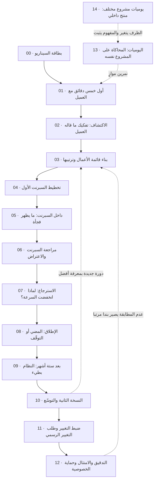

# التطبيق العملي لإدارة المشاريع الرشيقة — من الفكرة إلى الإطلاق

> [!abstract] ما هذا القسم؟
> كل ما سبق في [[Project Management|قاعدة إدارة المشاريع البرمجية]] كان **تعريفات**: ما السبرنت، ما قائمة الأعمال، ما السرعة. وهذا القسم يسأل السؤال الذي لا يجيب عنه التعريف: **متى أستعمل أيًّا منها، وكيف يبدو استعمالها يوم الثلاثاء الساعة الثانية بعد الظهر حين يتّصل العميل غاضبًا؟**
>
> فهو رحلة مشروع واحد كامل، تسير **زمنيًّا** من أول اجتماع مع العميل حتى ما بعد الإطلاق بسنة. لا يُشرح فيه مفهوم من جديد؛ كل مفهوم يظهر **وهو يعمل**، في لحظة قرار حقيقية، مرتبطًا بملاحظته المرجعية لمن أراد التعريف.

> [!warning] القاعدة الحاكمة لهذا القسم
> **الشركة والفريق والعميل في هذه الرحلة شخصيات متخيَّلة**، صُمّمت لتكون واقعية لا لتكون حقيقية. أمّا **الممارسات المنسوبة إلى شركات حقيقية** — أمازون، سبوتيفاي، نتفليكس، مايكروسوفت، جوجل، بيسكامب — فلا يُذكر منها إلا **ما نُشر علنًا** في كتاب أو ورقة أو مدوّنة هندسية أو رسالة مساهمين، مع ذكر مصدره. ولا تُختلق واقعة داخلية عن شركة حقيقية ولا رقم غير معلن، ولا يُنسب قول إلى شخص مسمّى إلا إن كان ثابتًا عنه.

---

## 🎭 المشروع الذي ستعيشه

> [!example] السيناريو في ثلاثة أسطر
> شركة ناشئة سعودية اسمها **نُقطة**، تسعة أشخاص، أخذت جولة تمويل أولية لبناء منصّة تدريب. عميلها الأول **معهد أُفُق للتدريب** يريد «تطبيقًا» — كلمة واحدة تحتها ستّة أشهر عمل، وقرارات لا تُحصى.
> ستعيش الرحلة من داخل رأس **مازن**، الذي تحمل بطاقته لقب «مدير مشروع» ويؤدّي عمليًّا دور [[06 - Scrum Master|سكرم ماستر]] — وهذا التوتّر نفسه أحد دروس الرحلة، لا سهوٌ فيها.

بطاقة الشخصيات كاملة، مع الميزانية والقيود والضغوط، في [[00 - بطاقة السيناريو - الشركة والفريق|بطاقة السيناريو]].

---

## 🗺️ خريطة الرحلة

| # | الفصل | السؤال الذي يجيب عنه |
| --- | --- | --- |
| 00 | [[00 - بطاقة السيناريو - الشركة والفريق\|بطاقة السيناريو]] | من في هذه القصّة، وما القيود التي يعمل داخلها كل قرار؟ |
| 01 | [[01 - أول خمس دقائق مع العميل\|أول خمس دقائق مع العميل]] | جاء العميل ويريد تطبيقًا — ما أول شيء أفعله، وما الذي أرفض فعله؟ |
| 02 | [[02 - الاكتشاف - تفكيك ما قاله العميل\|الاكتشاف: تفكيك ما قاله العميل]] | كيف أفرّق بين الحاجة والرغبة والقيد والافتراض والمخاطرة والاعتماد؟ |
| 03 | [[03 - بناء قائمة الأعمال وترتيبها\|بناء قائمة الأعمال وترتيبها]] | لماذا رتّبتُ هذه القصّة قبل تلك، وأين تدخل المخاطرة والدَّين والاستكشاف؟ |
| 04 | [[04 - تخطيط السبرنت الأول\|تخطيط السبرنت الأول]] | كيف أحدّد الهدف والطاقة، ولماذا لا تكفي السرعة وحدها، ومتى أقول «لا»؟ |
| 05 | [[05 - داخل السبرنت - ما يظهر فجأة\|داخل السبرنت: ما يظهر فجأة]] | ظهرت مشكلة — أهي مخاطرة أم عائق أم عيب أم تغيير نطاق أم دَين؟ |
| 06 | [[06 - مراجعة السبرنت - العرض والاعتراض\|مراجعة السبرنت: العرض والاعتراض]] | كيف أعرض، وكيف أستقبل الرفض، ومتى تتغيّر خارطة الطريق؟ |
| 07 | [[07 - الاسترجاع - لماذا انخفضت السرعة\|الاسترجاع: لماذا انخفضت السرعة؟]] | ستة أسباب محتملة لرقم واحد — كيف أعرف أيّها الصحيح؟ |
| 08 | [[08 - الإطلاق - قرار المضي أو التوقف\|الإطلاق: قرار المضي أو التوقّف]] | من يملك قرار الإطلاق، وبأي معايير، وماذا بعد الساعة الأولى؟ |
| 09 | [[09 - بعد ستة أشهر - النظام أصبح بطيئًا\|بعد ستة أشهر: النظام أصبح بطيئًا]] | العَرَض واحد والأسباب ستّة — كيف أشخّص بدل أن أخمّن؟ |
| 10 | [[10 - النسخة الثانية والتوسّع\|النسخة الثانية والتوسّع]] | ما الذي ينكسر حين يصير الفريق ثلاثة فرق والعميل عشرين عميلًا؟ |
| 11 | [[11 - ضبط التغيير - طلب التغيير الرسمي\|ضبط التغيير وطلب التغيير الرسمي (RFC)]] | متى لا يكفي «يدخل القائمة بمقايضة»، ومن يملك تعديل الالتزام؟ |
| 12 | [[12 - التدقيق والامتثال\|التدقيق والامتثال وحماية الخصوصية]] | جاء من يطلب الدليل لا الوصف — بأي حقّ تحتفظ بهذه البيانات؟ |
| 13 | [[13 - اليوميات العملية لمدير المشروع\|اليوميات العملية لمدير المشروع]] | محاكاة يومًا بيوم على المشروع نفسه: بريد، وقرار، وسبب، وما الذي رفضتُ فعله. |
| 14 | [[14 - يوميات مشروع مختلف - منصة داخلية بلا عميل خارجي\|يوميات مشروع مختلف: منتج داخلي]] | المفاهيم نفسها بلا عقد ولا مالك منتج حاضر — أيّها قاعدة وأيّها ظرف؟ |

> [!info] الفصلان الأخيران ليسا حلقتين في القصّة
> الفصول **00 إلى 12** قصّة واحدة متّصلة تسير زمنيًّا، فالترقيم فيها هو ترتيب القراءة نفسه.
> أمّا **13** فمحاكاة موازية على المشروع نفسه تُقرأ في الأخير أو وحدها، و**14** محاكاة على **مشروع آخر مختلف البنية** — منتج داخلي بلا عقد ولا مالك منتج حاضر — وغرضه أن يفصل بين ما كان **مفهومًا** في الرحلة الأولى وما كان **ظرفًا** فيها.

---

## 🧩 أين يعمل كل مفهوم؟

هذه هي القيمة الحقيقية للقسم: أن ترى **المفهوم المجرَّد وهو يتّخذ قرارًا**. والجدول يُقرأ من الاتّجاهين — من المفهوم إلى موضع استعماله، أو من الفصل إلى ما استُعمل فيه.

| المفهوم | تعريفه في | يعمل في |
| --- | --- | --- |
| [[01 - Agile\|أجايل]] | الأساسيات | كل الفصول — بوصفها الخيار لا الافتراض ([[01 - أول خمس دقائق مع العميل\|01]]) |
| [[02 - Scrum\|سكرم]] · [[03 - Kanban\|كانبان]] | الأساسيات | اختيار الإطار في [[04 - تخطيط السبرنت الأول\|04]] والانتقال إليه في [[10 - النسخة الثانية والتوسّع\|10]] |
| [[13 - Backlog\|قائمة الأعمال]] · [[11 - User Stories\|قصص المستخدم]] | الأساسيات | [[03 - بناء قائمة الأعمال وترتيبها\|03]] |
| [[12 - Story Points\|نقاط القصة]] · [[18 - Velocity\|السرعة]] | الأساسيات | [[04 - تخطيط السبرنت الأول\|04]] و[[07 - الاسترجاع - لماذا انخفضت السرعة\|07]] |
| [[08 - Sprint Planning\|تخطيط السبرنت]] · [[Sprint Goal\|هدف السبرنت]] | الأساسيات | [[04 - تخطيط السبرنت الأول\|04]] |
| [[07 - Daily Standup\|الوقفة اليومية]] · [[Blocker\|العوائق]] | الأساسيات | [[05 - داخل السبرنت - ما يظهر فجأة\|05]] |
| [[09 - Sprint Review\|مراجعة السبرنت]] · [[15 - Roadmap\|خارطة الطريق]] | الأساسيات | [[06 - مراجعة السبرنت - العرض والاعتراض\|06]] |
| [[10 - Sprint Retrospective\|الاسترجاع]] | الأساسيات | [[07 - الاسترجاع - لماذا انخفضت السرعة\|07]] |
| [[19 - Risk Management\|إدارة المخاطر]] · [[RAID Log\|سجل RAID]] | الأساسيات + المعجم | [[02 - الاكتشاف - تفكيك ما قاله العميل\|02]] و[[05 - داخل السبرنت - ما يظهر فجأة\|05]] |
| [[20 - Quality Management\|إدارة الجودة]] · [[Definition of Done\|تعريف الاكتمال]] | الأساسيات + المعجم | [[05 - داخل السبرنت - ما يظهر فجأة\|05]] و[[08 - الإطلاق - قرار المضي أو التوقف\|08]] |
| [[21 - Stakeholder Communication\|التواصل مع أصحاب المصلحة]] | الأساسيات | [[01 - أول خمس دقائق مع العميل\|01]] و[[06 - مراجعة السبرنت - العرض والاعتراض\|06]] |
| [[Technical Debt\|الدَّين التقني]] | المعجم | [[03 - بناء قائمة الأعمال وترتيبها\|03]] و[[09 - بعد ستة أشهر - النظام أصبح بطيئًا\|09]] |
| [[Spike\|الاستكشاف الزمني]] | المعجم | [[03 - بناء قائمة الأعمال وترتيبها\|03]] |
| [[Capacity\|الطاقة]] · [[Reality Factor\|معامل الواقعية]] | المعجم | [[04 - تخطيط السبرنت الأول\|04]] |
| [[Go or No-Go Decision\|قرار المضي]] · [[Hypercare\|الرعاية الفائقة]] | المعجم | [[08 - الإطلاق - قرار المضي أو التوقف\|08]] |
| [[SLO]] · [[SLA]] · [[Blameless Postmortem\|تشريح بلا لوم]] | المعجم | [[09 - بعد ستة أشهر - النظام أصبح بطيئًا\|09]] |
| [[Scope Creep\|زحف النطاق]] · [[Change Request\|طلب التغيير]] | المعجم | [[06 - مراجعة السبرنت - العرض والاعتراض\|06]] و[[11 - ضبط التغيير - طلب التغيير الرسمي\|11]] |
| [[Baseline\|خطّ الأساس]] · [[Change Control Board\|لجنة ضبط التغيير]] | المعجم | [[11 - ضبط التغيير - طلب التغيير الرسمي\|11]] |
| [[PDPL]] · [[Controller vs Processor\|المتحكّم والمعالج]] · [[ROPA\|خريطة البيانات]] | المعجم | [[12 - التدقيق والامتثال\|12]] |
| [[Audit Trail\|سجلّ التدقيق]] · [[Least Privilege\|أقلّ صلاحية]] · [[Anonymization\|إخفاء الهوية]] | المعجم | [[12 - التدقيق والامتثال\|12]] |
| [[Assumption Mapping\|خريطة الافتراضات]] | المعجم | [[02 - الاكتشاف - تفكيك ما قاله العميل\|02]] و[[14 - يوميات مشروع مختلف - منصة داخلية بلا عميل خارجي\|14]] |
| [[MoSCoW Prioritization\|ترتيب MoSCoW]] | المعجم | [[03 - بناء قائمة الأعمال وترتيبها\|03]] و[[14 - يوميات مشروع مختلف - منصة داخلية بلا عميل خارجي\|14]] |
| [[Sustainable Pace\|الوتيرة المستدامة]] · [[Reserve Capacity\|الطاقة المحجوزة]] | المعجم | [[14 - يوميات مشروع مختلف - منصة داخلية بلا عميل خارجي\|14]] |

---

## 🏢 الممارسات الموثّقة التي تظهر في الرحلة

كل ممارسة أدناه **منشورة علنًا** من الشركة نفسها أو من كتاب أو ورقة معتمدة، وتُذكر في الفصل الذي تخدمه لا لتزيينه:

| الشركة | الممارسة | مصدرها المعلن | الفصل |
| --- | --- | --- | --- |
| أمازون | **الكتابة بالعكس** ([[Working Backwards\|Working Backwards]]) وبيان PR/FAQ قبل البناء | كتاب *Working Backwards* — Colin Bryar & Bill Carr (2021) | [[01 - أول خمس دقائق مع العميل\|01]] |
| أمازون | **الأبواب ذات الاتجاه الواحد والاتجاهين** ([[Reversible vs Irreversible Decisions\|قرارات عكوسة وغير عكوسة]]) | رسالة المساهمين 2015 — Jeff Bezos | [[03 - بناء قائمة الأعمال وترتيبها\|03]] |
| أمازون | **فِرق البيتزتين** (Two-Pizza Teams) | *Working Backwards*، الفصل الثاني | [[10 - النسخة الثانية والتوسّع\|10]] |
| بيسكامب | **الشهيّة بدل التقدير** و«دورات الستّة أسابيع» ([[Shape Up]]) | كتاب *Shape Up* — Ryan Singer (2019) | [[04 - تخطيط السبرنت الأول\|04]] |
| فليكر ثم إتسي | **النشر المتكرّر وأعلام الميزات** ([[Feature Flags]]) | عرض *10+ Deploys Per Day* — Allspaw & Hammond (Velocity 2009) | [[08 - الإطلاق - قرار المضي أو التوقف\|08]] |
| نتفليكس | **هندسة الفوضى** (Chaos Monkey) و«السياق لا التحكّم» | مدوّنة نتفليكس التقنية (2011) + وثيقة الثقافة | [[09 - بعد ستة أشهر - النظام أصبح بطيئًا\|09]] |
| جوجل | **ميزانية الخطأ** ([[SLO]]) و[[Blameless Postmortem\|التشريح بلا لوم]] | كتاب *Site Reliability Engineering* (2016) | [[09 - بعد ستة أشهر - النظام أصبح بطيئًا\|09]] |
| مايكروسوفت | تحوّل فِرق Azure DevOps: سبرنت ثلاثة أسابيع، فرق ميزات، لا قسم اختبار منفصل | سلسلة *Our Agile Journey* المنشورة على مواقع مايكروسوفت — Aaron Bjork | [[07 - الاسترجاع - لماذا انخفضت السرعة\|07]] و[[10 - النسخة الثانية والتوسّع\|10]] |
| سبوتيفاي | نموذج السرب والقبيلة (Squads & Tribes) — **ومراجعته لاحقًا** | ورقة Kniberg & Ivarsson (2012)، ومقالة *Failed #SquadGoals* — Jeremiah Lee (2020) | [[10 - النسخة الثانية والتوسّع\|10]] |
| تويوتا | **حبل الأندون** وإيقاف الخطّ عند أول خلل | [[Toyota Production System\|نظام إنتاج تويوتا]] | [[05 - داخل السبرنت - ما يظهر فجأة\|05]] |
| إطار DSDM | **ترتيب [[MoSCoW Prioritization\|MoSCoW]]** بأربع درجات | Dai Clegg, *Case Method Fast-Track* (1994) ودليل DSDM | [[03 - بناء قائمة الأعمال وترتيبها\|03]] و[[14 - يوميات مشروع مختلف - منصة داخلية بلا عميل خارجي\|14]] |
| نورم كيرث | **التوجيه الأول للاسترجاع** (Prime Directive) | كتاب *Project Retrospectives* — Norm Kerth (2001) | [[07 - الاسترجاع - لماذا انخفضت السرعة\|07]] و[[14 - يوميات مشروع مختلف - منصة داخلية بلا عميل خارجي\|14]] |

---

## 🚦 كيف تقرأ هذا القسم

> [!todo] ثلاث طرق
> 1. **بالترتيب**: `00 → 14` — والفصول من 00 إلى 12 قصّة واحدة متّصلة يبني كل فصل فيها على قرار اتُّخذ في الذي قبله، ثم يتلوها تمرينا المحاكاة (13 و14).
> 2. **بالمفهوم** — تعرف السبرنت نظريًّا وتريد رؤيته يعمل؟ ادخل من جدول «أين يعمل كل مفهوم؟» إلى الفصل مباشرة.
> 3. **بالمحاكاة** — اقرأ [[13 - اليوميات العملية لمدير المشروع\|اليوميات]] وحدها بوصفها تمرينًا: توقّف عند كل سؤال، اكتب جوابك، ثم اقرأ الجواب المشروح. ثم أتبِعها بـ[[14 - يوميات مشروع مختلف - منصة داخلية بلا عميل خارجي\|يوميات المشروع المختلف]] لتعرف أي أجوبتك كانت **مفهومًا** وأيّها كان **ظرفًا** حفظته من الحالة الأولى.

> [!question]- ما الفرق بين هذا القسم و[[ميقات - دراسة حالة\|دراسة حالة ميقات]]؟
> **دراسة الحالة تحلّل مشروعًا حقيقيًّا وقع فعلًا**، فتسأل: ماذا فُعل وأين الفجوة؟ وهذا القسم **محاكاة مصمَّمة**، فيسأل: ماذا تفعل أنت الآن؟ ولذلك تظهر هنا أخطاء ومآزق لا توجد في المشروع الحقيقي — لأنها وُضعت عمدًا ليُتدرَّب على تشخيصها.

> [!summary] الفكرة التي يجب أن تتذكّرها
> المفاهيم لا تُختبَر حين تُعرَّف، بل حين **تتزاحم**: فحين يطلب العميل ميزة، ويقول المطوّر إنها تحتاج أسبوعين، ويقول المستثمر إن العرض بعد عشرة أيام — تلك اللحظة وحدها هي ما تسمّيه هذه الرحلة **إدارة مشروع**.
