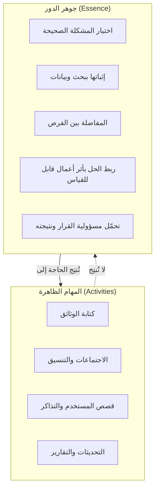
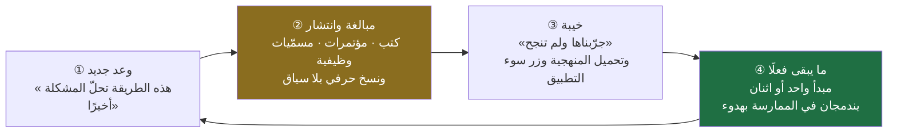
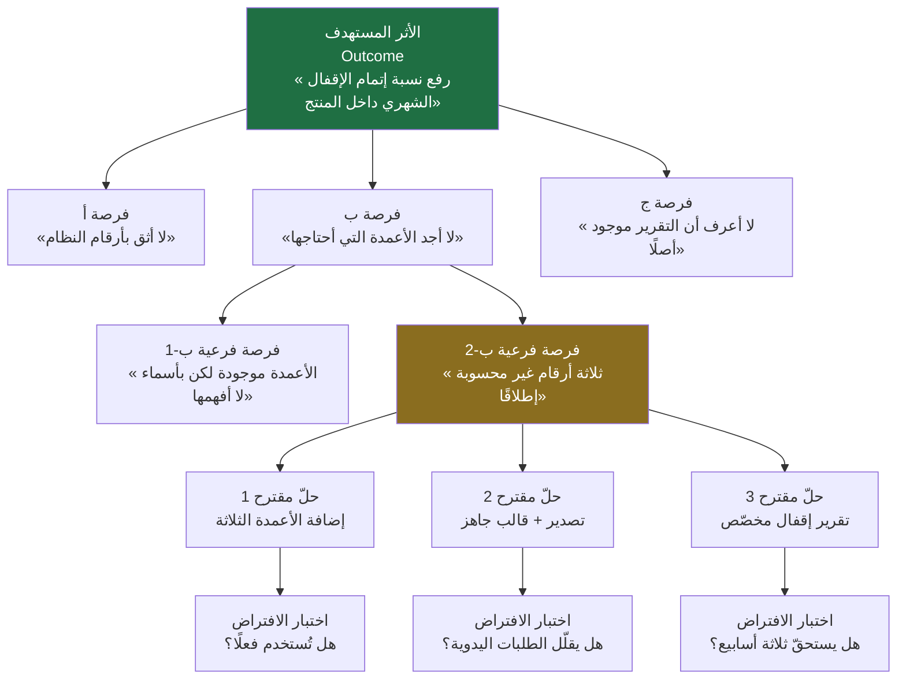
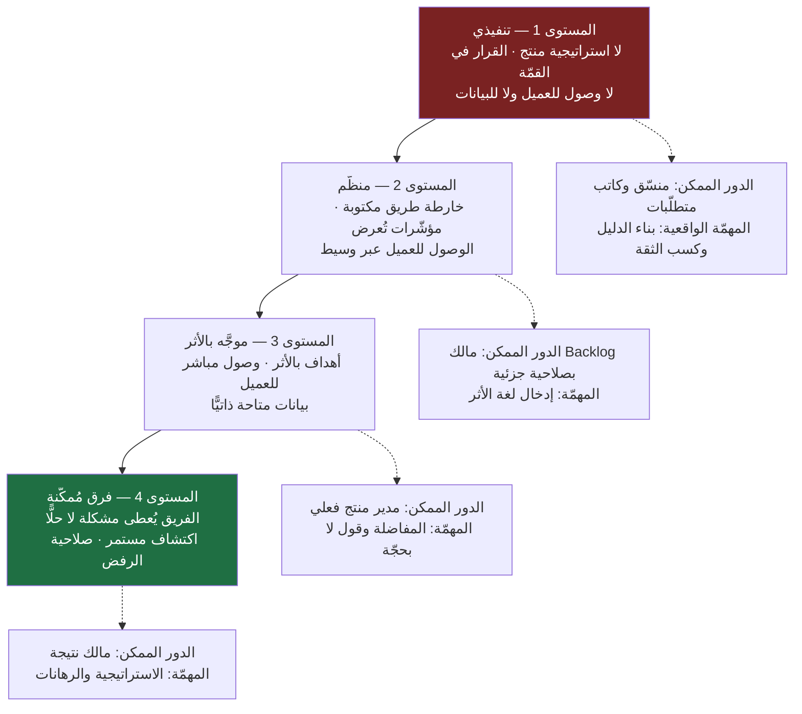
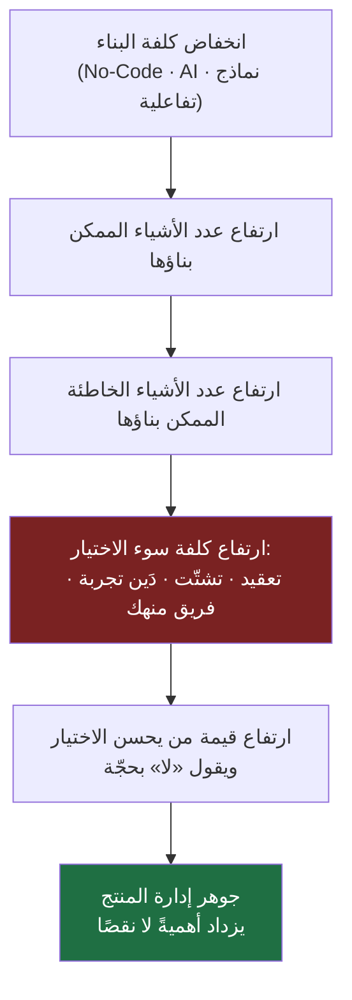

> [!info] الفصل 01 · إدارة المنتج في عصر الذكاء الاصطناعي
> **ماذا ستتعلّم:** كيف تفرّق بين **مهامّ** مدير المنتج و**جوهر دوره**، ولماذا تتكرّر موجة بعد موجة سؤالٌ واحد: «هل انتهى هذا الدور؟» — ثم لماذا تكون الإجابة في كل مرة هي نفسها. ستتعلّم تحليل الموجات السابقة (`Agile`، `Lean Startup`، `Design Thinking`، `Growth Hacking`، `No-Code`، `Vibe Coding`، والذكاء الاصطناعي) بثلاثة أسئلة ثابتة: ما الذي وعدت به؟ ما الذي بقي منها فعلًا؟ وما الخطأ الذي وقع فيه الناس؟ وستخرج بتعريف عملي لجوهر الدور مبنيّ على **أثر الأعمال** (`Business Impact`) وعلى المخاطر الأربع للمنتج، وبقدرة على تمييز ما غيّره الذكاء الاصطناعي فعلًا عمّا لم يمسّه.

# الفصل 01 — لماذا لا يزال مدير المنتج أهم من أي وقت مضى؟

## 🎯 أهداف التعلّم

- التمييز الحادّ بين **الأنشطة** التي يمارسها مدير المنتج (كتابة الوثائق، الاجتماعات، التنسيق، التذاكر) وبين **جوهر الدور**: تحديد ما يُبنى، ولمن، ولماذا، وهل يستحق أن يُبنى أصلًا.
- قراءة تاريخ الموجات المنهجية في المنتج قراءةً نقدية عبر ثلاثية: **الوعد / ما بقي فعلًا / خطأ التطبيق**.
- صياغة أي طلب ميزة بلغة **أثر الأعمال** (`Business Impact`): ماذا يكسب العميل؟ وماذا تكسب الشركة؟ وبأي مؤشّر يُقاس ذلك؟
- استخدام إطار **المخاطر الأربع للمنتج** (القيمة، قابلية الاستخدام، الجدوى التقنية، الجدوى التجارية) كتعريف دقيق لما يُحاسَب عليه مدير المنتج.
- تفسير سبب غياب «الأداة الواحدة» و«الشهادة الواحدة» لمدير المنتج، وربطه بطبيعة الدور كملتقى تخصّصات لا كمهارة تقنية.
- تحديد ما غيّره الذكاء الاصطناعي فعلًا (طريقة التنفيذ) وما لم يغيّره (مسؤولية الحُكم)، وشرح **لماذا يقاوم الحُكم الأتمتة**.
- تفكيك المفاهيم الخاطئة الشائعة عن الدور، وتمييز `Product Manager` عن `Product Owner` عن `Project Manager`.
- استخدام خمسة أطر مسمّاة (`Jobs to be Done`، `Kano`، `RICE`، `North Star Metric`، `Opportunity Solution Tree`) استخدامًا واعيًا: أصل كلٍّ منها، والمشكلة التي يحلّها، وحدّه الذي يُساء عنده استعماله.
- تحليل **لماذا يُختزل الدور في السوق العربي والخليجي** إلى تنسيق وكتابة متطلّبات، وما الذي يجب أن يتوفّر في المؤسّسة قبل أن يوجد الدور فعلًا.
- عرض الخلافات المفتوحة في المهنة بوصفها خلافات — بما فيها الحجّة القوية ضدّ وجود الدور أصلًا في الفرق الصغيرة — بدل تقديمها كحقائق مستقرّة.

## الفكرة المحورية: السؤال الخطأ والسؤال الصحيح

كل بضع سنوات تصل موجة جديدة إلى عالم بناء المنتجات. تأتي محمَّلة بمصطلح جذّاب، وكتاب يتصدّر قوائم المبيعات، ومؤتمر يتحدّث فيه شخص من شركة كبيرة عن «الطريقة التي غيّرت كل شيء عندنا». وخلال أشهر تنتشر الموجة في المقالات، ثم في إعلانات الوظائف، ثم في اجتماعات الإدارة. ومع كل موجة يتكرّر سؤالان بالحرف تقريبًا: **«هل انتهى دور مدير المنتج؟»** و**«هل ما زلنا نحتاج إلى [[PRD]]؟»**

> [!quote] من الويبينار
> عند الحديث عن أثر الذكاء الاصطناعي على المهنة، صيغ السؤال الشائع هكذا:
> *"How has AI changed the role of product management? **We don't need PRDs anymore.**"*
>
> **الترجمة:** «كيف غيّر الذكاء الاصطناعي دور إدارة المنتج؟ **لم نعد بحاجة إلى وثائق متطلّبات المنتج (`PRD`).**»
>
> ولاحظ أن المتحدّث كان **ينقل الادّعاء الشائع** ليناقشه، لا يتبنّاه. فالجملة الثانية هي ما يقوله الناس، وبقية الجلسة كانت ردًّا عليها.

المشكلة في السؤال نفسه. سؤال «هل انتهى الدور؟» يفترض أن الدور كان معرَّفًا بأدواته، فإذا تغيّرت الأدوات انتهى. وهذا افتراض خاطئ من أساسه. السؤال الأنفع — وهو السؤال الذي يقود هذا الفصل كلّه — ليس **«ما الذي تغيّر؟»** بل **«ما الذي لم يتغيّر؟»**.

لأن الذي لم يتغيّر هو تحديدًا ما يستحق أن تبني عليه مهنتك. الأدوات تتقادم؛ الأطر تُستهلك وتُستبدل؛ المصطلحات تفقد بريقها. أما السؤال «ما المشكلة التي تستحق أن نحلّها الآن، ولمن، ولماذا هي أهمّ من غيرها؟» فلم يتقادم يومًا منذ أن وُجدت المنتجات، ولن يتقادم.

وهذا الفصل ليس دفاعًا عاطفيًّا عن مهنة يشعر أهلها بالتهديد. هو محاولة لتعريفها تعريفًا دقيقًا بما يكفي لكي يصبح السؤال عن «نهايتها» سؤالًا غير ذي معنى. ولأنه كذلك، فسيعرض في مواضعه الحجج المضادّة كاملةً غير منقوصة: هناك حالات حقيقية لا يضيف فيها مدير المنتج شيئًا، وهناك نقد وجيه موجَّه إلى الأطر التي يستعملها، وهناك ما سيبتلعه الذكاء الاصطناعي فعلًا من عمله. المهنة التي لا تحتمل نقدها لا تستحقّ الدفاع عنها أصلًا.

## أولًا: ما إدارة المنتج فعلًا؟

### الخلط الشائع بين النشاط والوظيفة

اسأل عشرة أشخاص عمّا يفعله مدير المنتج، وستحصل غالبًا على قائمة من هذا النوع:

- يكتب الوثائق والمتطلّبات.
- يدير الاجتماعات وينسّق بين الفرق.
- يكتب [[11 - User Stories|قصص المستخدم]] ويفتح التذاكر.
- يتابع `Jira` ويحدّث [[15 - Roadmap|خارطة الطريق]].
- يجيب على أسئلة المهندسين والمصمّمين.
- يرسل تحديثات للإدارة.

هذه القائمة **صحيحة وصفًا وخاطئة تعريفًا**. صحيحة لأن مدير المنتج يفعل هذه الأشياء فعلًا، وقد يقضي فيها أغلب يومه. وخاطئة لأنها تصف **ما يظهر في تقويمه**، لا **ما يُحاسَب عليه**.

> [!quote] من الويبينار
> شُخّصت هذه الحالة صراحةً في الجلسة:
> *"Product management became a **very admin-heavy role**. You do a lot of user interviews, you send a lot of emails, a lot of updates, and you spend time writing requirements for designers, for engineers."*
>
> **الترجمة:** «صارت إدارة المنتج **دورًا إداريًّا ثقيلًا جدًّا**. تُجري كثيرًا من مقابلات المستخدمين، وترسل كثيرًا من الرسائل والتحديثات، وتقضي وقتك في كتابة المتطلّبات للمصمّمين وللمهندسين.»
>
> أي أن المهنة **تحوّلت** إلى دور إداري ثقيل — وهذا وصف لحالة طارئة، لا تعريف للدور.

الفرق بين الوصف والتعريف هنا ليس ترفًا لغويًّا؛ هو الفرق الذي يحدّد مصيرك المهني. لأنك إذا عرّفت نفسك بأنشطتك، فأي أداة تؤتمت هذه الأنشطة تصبح تهديدًا وجوديًّا لك. وإذا عرّفت نفسك بمسؤوليتك، صارت الأداة نفسها هديّة: أزاحت عنك ما ليس جوهرك.

### التعريف العملي للدور

**جوهر إدارة المنتج هو اتخاذ قرارات المنتج والمسؤولية عن نتائجها.** وبتفصيل أدقّ، مدير المنتج مسؤول عن الإجابة عن أربعة أسئلة والدفاع عن إجاباته:

1. **ماذا نبني؟** — أي حلّ نختار من بين الحلول الممكنة.
2. **لماذا نبنيه؟** — أي مشكلة يحلّ، وبأي دليل نعرف أنها مشكلة حقيقية.
3. **لمن نبنيه؟** — أي شريحة بالتحديد، لا «المستخدمين» ككتلة مبهمة.
4. **وهل يستحق أن يُبنى أصلًا؟** — وهذا أصعب الأسئلة وأكثرها إهمالًا، لأن إجابته الصحيحة كثيرًا ما تكون «لا».

انظر إلى السؤال الرابع طويلًا. أغلب ما يُبنى في المنتجات لم يمرّ بهذا السؤال. مُرِّرت الفكرة من الإدارة، أو طلبها عميل كبير، أو رآها أحدهم عند منافس، فدخلت خارطة الطريق مباشرةً. ودور مدير المنتج في تلك اللحظة — لا في لحظة كتابة التذكرة — هو دوره الحقيقي.

اقرأ السهمين بعناية: الجوهر يولّد المهام (لأنك قرّرت شيئًا، احتجت أن توثّقه وتنسّق تنفيذه)، لكن المهام لا تولّد الجوهر أبدًا. تستطيع أن تكتب مئة وثيقة وتغلق ألف تذكرة دون أن تتّخذ قرار منتج واحدًا.

### تشبيه الطبيب: أين تقع الأداة من المهنة؟

تخيّل طبيبًا يعرّف مهنته بقوله: «عملي كتابة التقارير الطبية وتشغيل جهاز الأشعة». سيبدو التعريف سخيفًا فورًا، ومع ذلك هو دقيق **وصفًا**: الطبيب يكتب تقارير كثيرة ويستخدم أجهزة كثيرة، وقد يقضي ساعات في ذلك.

لكن أحدًا لا يخلط. لأننا نعرف بوضوح أن **جوهر عمل الطبيب هو التشخيص ثم اختيار خطة العلاج وتحمّل مسؤوليتها**. التقرير أثر جانبي للتشخيص. جهاز الأشعة أداة تخدم التشخيص. والدليل الحاسم: لو اخترعنا غدًا جهازًا يكتب التقرير كاملًا آليًّا، ويصوّر بدقّة أعلى، ويُخرج قائمة بالاحتمالات مرتّبة — هل انتهت مهنة الطب؟ بالطبع لا. تحرّر الطبيب من العمل الكتابي، وبقي عليه ما هو أصعب: أن ينظر إلى هذا المريض بعينه، بتاريخه ووضعه وظروفه، ويقرّر.

الأمر نفسه هنا حرفًا بحرف:

| في الطب | في المنتج |
|---|---|
| التقرير الطبي | [[PRD]] ووثائق المتطلّبات |
| جهاز الأشعة والتحاليل | أدوات التحليلات ولوحات البيانات |
| ملف المريض | خارطة الطريق وسجلّ الاكتشاف |
| **التشخيص واختيار العلاج** | **تحديد المشكلة واختيار ما يُبنى** |
| المسؤولية عن نتيجة العلاج | المسؤولية عن نتيجة القرار |

وللتشبيه فائدة إضافية تُغفَل عادةً: **الطبيب الجيد يميّز العرَض من المرض.** المريض يشتكي من الصداع، فلا يكتب الطبيب مسكّنًا ويصرفه؛ يسأل: منذ متى؟ ومتى يشتدّ؟ وهل معه أعراض أخرى؟ لأن الصداع قد يكون إجهادًا وقد يكون علامة على شيء آخر تمامًا. وكذلك مدير المنتج: العميل يقول «أريد زرًّا لتصدير البيانات»، وهذا عرَض. أما المرض فقد يكون أن تقارير النظام لا تعطيه ما يحتاجه أصلًا، فيصدّر البيانات ليعالجها في مكان آخر. تلبية الطلب حرفيًّا تشبه صرف المسكّن.

> [!info] إضافة مرجعية
> هذا التمييز بين ما يطلبه المستخدم وما يحتاجه فعلًا هو أساس ما يُعرف في أدبيات المنتج بمرحلة **الاكتشاف** (`Discovery`): سلسلة من الأنشطة (مقابلات، ملاحظة، تحليل بيانات، تجارب صغيرة) هدفها التأكّد من المشكلة **قبل** الالتزام ببناء الحل. وهو المقابل المنهجي للتشخيص الطبي، وستجد تفصيله في [[02 - فلسفة إدارة المنتج|الفصل الثاني]] و[[10 - دورة حياة المنتج الكاملة|الفصل العاشر]].
>
> ويرتبط به مبدأ [[Customer and Market Validation|التحقّق من العميل والسوق]]: أن يسبق الدليلُ البناءَ، لا أن يُبنى الشيء ثم يُبحث له عن مبرّر.
>
> وللتشبيه الطبي حدّ ينبغي ذكره حتى لا يُؤخذ أبعد ممّا يحتمل: الطبيب يعمل داخل جسم بشري ثابت التشريح نسبيًّا، وله أدبيات تراكمت قرونًا وتجارب سريرية منضبطة. أما مدير المنتج فيعمل في سوق يتغيّر تحت قدميه، ولا يملك «تشريحًا» ثابتًا يرجع إليه، ونتائجه يصعب عزلها عن عشرات المؤثّرات الخارجية. فالتشبيه يوضّح **موقع الأداة من المهنة**، ولا يزعم أن لإدارة المنتج صرامة الطبّ ولا يقينه.

## ثانيًا: `Business Impact` — المعيار الذي يفصل القرار عن الرغبة

### لماذا نحتاج معيارًا خارجيًّا أصلًا؟

في أي فريق منتج، الأفكار أكثر من الوقت دائمًا. المصمّم لديه أفكار، والمهندس لديه أفكار، والمبيعات لديها قائمة طويلة، والرئيس التنفيذي رأى شيئًا أعجبه. وفي غياب معيار موضوعي، يُحسم الخلاف بأحد أمرين: **الأعلى منصبًا**، أو **الأعلى صوتًا**. وكلاهما وصفة لمنتج بلا اتجاه.

المعيار الذي يخرجك من هذا المأزق هو **أثر الأعمال** (`Business Impact`). وهو ببساطة اشتراط أن يجيب كل مقترح عن سؤالين مقترنين لا يُفصل أحدهما عن الآخر:

1. **ماذا يكسب العميل؟** — قيمة يلمسها المستخدم فعلًا.
2. **ماذا تكسب الشركة؟** — أثر يظهر في مؤشّرات العمل.

الاقتران شرط. الميزة التي تسعد المستخدم ولا تفيد الشركة بأي شكل هي هديّة لا استثمار، ولن تستمرّ الشركة في تمويلها. والميزة التي تفيد الشركة وتضرّ المستخدم هي قرض قصير الأجل يُسدَّد لاحقًا بالثقة والتسرّب.

> [!quote] من الويبينار
> هذا المعيار كان الركيزة المعلَنة الأولى للمنصّة المستضيفة:
> *"We focus very heavily on **business impact, not theories**."*
>
> **الترجمة:** «نركّز تركيزًا شديدًا على **أثر الأعمال، لا على النظريات**.»
>
> وشُرح الموقف بوضوح أكبر:
> *"We're copy and paste theories and frameworks, and this is not the idea behind Muntajat. **Muntajat is Adarath Amal** (إدارة أعمال). We want to help businesses grow, we want to solve their real problems."*
>
> **الترجمة:** «نحن ننسخ ونلصق النظريات والأطر، وهذه ليست الفكرة التي قامت عليها «منتجات». **«منتجات» هي إدارة أعمال.** نريد أن نساعد الشركات على النموّ، ونريد أن نحلّ مشكلاتها الحقيقية.»
>
> أي أن إدارة المنتج تُقدَّم هنا بوصفها **إدارة أعمال** في المقام الأول، لا حقلًا نظريًّا يُستورَد بأطره الجاهزة.

### كيف تحوّل الطلب إلى قرار: إعادة الصياغة

الأداة العملية بسيطة ومملّة ومؤثّرة: **لا تقبل طلبًا مصوغًا كحلّ؛ أعِد صياغته كأثر.**

| الصيغة المرفوضة (حلّ بلا أثر) | الصيغة المطلوبة (أثر قابل للقياس) |
|---|---|
| «نضيف زرًّا للتصدير» | «نرفع نسبة إتمام التقرير من 40% إلى 60% خلال ربع» |
| «نجدّد شكل الصفحة الرئيسية» | «نرفع [[Adoption\|التبنّي]] للميزة الأساسية بين المستخدمين الجدد» |
| «نضيف ميزة ذكاء اصطناعي» | «نخفض زمن الوصول للقيمة الأولى ([[Time to Value\|زمن الوصول للقيمة]]) من 3 أيام إلى ساعة» |
| «نبني تطبيق جوّال» | «نرفع معدّل التكرار الأسبوعي للشريحة التي تعمل ميدانيًّا» |
| «نُعيد تصميم شاشة التسجيل» | «نقلّص زمن التسجيل من 6 دقائق إلى دقيقتين ونرفع التحويل 15%» |

ولاحظ أن الصياغة الثانية لا تمنع تنفيذ الفكرة الأولى؛ هي فقط **تجعل النجاح والفشل قابلين للتمييز**. إذا أضفت زرّ التصدير ولم تتحرّك نسبة إتمام التقرير، فأنت تعلّمت شيئًا. أما إذا كان الهدف «إضافة الزر»، فقد «نجحت» بمجرد الإطلاق، وهذا نجاح لا معنى له.

> [!info] إضافة مرجعية
> هذا هو جوهر التمييز المعروف باسم [[Outcome vs Output|المخرَج والأثر]]:
> - **المخرَج** (`Output`) = ما أطلقناه: ميزة، شاشة، إصدار. قابل للعدّ.
> - **الأثر** (`Outcome`) = التغيّر الذي حدث في سلوك المستخدم أو في مؤشّرات العمل نتيجةً لذلك.
>
> الفِرق التي تقيس نفسها بالمخرَج تنشغل بالسرعة؛ والفرق التي تقيس نفسها بالأثر تنشغل بالصواب. وأخطر ما في مقاييس الناتج أنها **ترتفع دائمًا**: يمكنك دائمًا أن تُطلق أكثر، حتى وأنت تسير في الاتجاه الخطأ بسرعة أكبر.

### أسئلة الأثر السبعة

قبل أن تدخل أي بند في [[15 - Roadmap|خارطة الطريق]]، مرّره على هذه الأسئلة. إن لم تستطع الإجابة عن أربعة منها على الأقل بشيء ملموس، فأنت لا تملك قرارًا بعد، بل رغبة:

1. **من** الشريحة المتضرّرة من المشكلة تحديدًا، وكم حجمها؟
2. **ما الدليل** أن المشكلة موجودة؟ (بيانات، شكاوى، مقابلات، سلوك مرصود)
3. **ما تكلفة عدم الفعل**؟ ماذا يحدث لو لم نبنِ شيئًا هذا الربع؟
4. **أي مؤشّر** سيتحرّك، وبكم، وخلال كم؟ ([[KPI]])
5. **ما البديل الأرخص** الذي يحقّق 80% من الأثر؟
6. **ما الذي سنتنازل عنه** لأننا اخترنا هذا؟ (كل «نعم» هي «لا» لشيء آخر)
7. **كيف سنعرف أننا أخطأنا**؟ ما الإشارة التي تجعلنا نتراجع؟

السؤال السابع هو الذي يفصل الممارس الناضج عن المتحمّس. من لا يستطيع أن يصف الشكل الذي سيبدو عليه فشله، لا يملك فرضية أصلًا — يملك أمنية.

### تطبيق كامل: طلب واحد من أوّله إلى قراره

القوائم أعلاه تبقى مجرّدة حتى تراها تشتغل على طلب واحد بعينه. فلنأخذ الطلب الأشهر في تاريخ البرمجيات الإدارية.

> [!example] «أضف زرًّا لتصدير التقارير» — من الطلب إلى القرار
> **الموقف:** في اجتماع مراجعة الربع، يقول مدير المبيعات: «العملاء يطلبون زرّ تصدير للتقارير. المنافس عنده. أضِفه.» الجواب السهل: تذكرة في `Backlog` وتقدير ثلاثة أيام. الجواب المهني يبدأ بسبعة أسئلة قبل أي تقدير.
>
> **① مشكلة مَن بالضبط؟**
> «العملاء» ليست شريحة. بعد سؤال فريق الدعم وفتح تذاكر الشهرين الماضيين، يتّضح أن الطلب جاء من **أربعة حسابات** كلها من نوع واحد: شركات لديها قسم مالي مستقلّ يُغلق الحساب الشهري. أي أن الشريحة ليست «المستخدم النهائي» بل **المحاسب المسؤول عن الإقفال الشهري**، وهو غالبًا ليس المستخدم اليومي للنظام أصلًا.
>
> **② كم مرة تحدث المشكلة؟**
> مرة واحدة شهريًّا لكل حساب، في نافذة ثلاثة أيام. هذا يغيّر كل شيء: مشكلة تحدث مرة شهريًّا ليست كمشكلة تحدث عشرين مرة يوميًّا، ولا تستحق الاستثمار نفسه — إلا إذا كانت كلفة المرّة الواحدة فادحة.
>
> **③ ما كلفتها اليوم؟ وكيف يتحايل الناس عليها الآن؟**
> هنا يظهر الاكتشاف الحقيقي. المحاسب لا ينتظر زرًّا؛ هو **يلتقط صور شاشة** ويعيد إدخال الأرقام يدويًّا في جدول بيانات، أو يطلب من فريق الدعم تصديرًا يدويًّا عبر البريد. الوقت المهدور نحو ثلاث ساعات شهريًّا لكل حساب، ومعه احتمال خطأ إدخال. والأهم: **فريق الدعم عندنا يتلقّى نحو عشرين طلب تصدير يدوي شهريًّا**، ولم يكن أحد يحتسب هذه الساعات ضمن كلفة المشكلة.
>
> **④ ما المشكلة تحت الطلب؟**
> نسأل: ماذا يفعل بالملف بعد تصديره؟ الجواب: يطابق الأرقام مع النظام المحاسبي، ثم يحسب ثلاثة أرقام غير موجودة في تقاريرنا أصلًا. أي أن **الزر ليس الحلّ الكامل**: هو يخفّف الألم ولا يزيله، لأن جذر المشكلة أن تقاريرنا لا تعطي هذه الأرقام الثلاثة. من يبني الزر وحده سيكتشف بعد ثلاثة أشهر أن الطلبات اليدوية لم تنخفض كما توقّع.
>
> **⑤ ما الذي سيتغيّر، وكيف نعرف؟**
> إعادة الصياغة من حلّ إلى أثر: «نخفض طلبات التصدير اليدوي الواردة إلى الدعم من 20 إلى أقل من 5 شهريًّا خلال ربع، ونرفع نسبة إتمام الإقفال الشهري داخل المنتج من 40% إلى 60%.» هذان رقمان يمكن قياسهما قبل الإطلاق وبعده، ولدينا خطّ أساس (`Baseline`) لكليهما.
>
> **⑥ ما البديل الأرخص؟**
> ثلاثة بدائل على الطاولة: (أ) زرّ تصدير `CSV` بسيط — يومان؛ (ب) الزر + الأعمدة الثلاثة الناقصة — ثمانية أيام؛ (ج) تقرير إقفال شهري مخصّص يغني عن التصدير أصلًا — ثلاثة أسابيع. البديل (أ) يعالج العرَض، و(ج) يعالج المرض بكلفة عالية وقد يكون سابقًا لأوانه، و(ب) هو **أرخص شيء يعالج المشكلة الحقيقية**.
>
> **⑦ ما الذي نتنازل عنه؟**
> ثمانية أيام من الربع تعني تأجيل تحسين في مسار التسجيل يُتوقّع أن يمسّ عددًا أكبر من المستخدمين. وهذه هي المقارنة الصحيحة — لا «هل الزر مفيد؟» بل «هل هو أنفع من أفضل بديل متاح لنفس الأيام الثمانية؟»
>
> **القرار المكتوب:** ننفّذ البديل (ب) هذا الربع، بشرط أن يُقاس المؤشّران بعد 45 يومًا. وإن لم تنخفض طلبات الدعم إلى أقل من 8 شهريًّا، فهذه إشارة إلى أن جذر المشكلة في التقارير لا في التصدير، ونعيد فتح البديل (ج) بدليل جديد. ويُسجَّل في سجلّ القرارات أن **طلب المنافسة لم يكن سببًا في القرار**؛ السبب هو عشرون طلب دعم شهريًّا وثلاث ساعات ضائعة عند العميل.
>
> **ما الذي فعلناه هنا؟** لم نرفض الطلب ولم نقبله كما وصل. حوّلناه من جملة أمر إلى **فرضية لها مالك ورقم وموعد وشرط تراجع**. وهذا — لا كتابة التذكرة — هو العمل.

وانتبه إلى أن هذا التحقيق كلّه استغرق نحو ساعتين من العمل: نصف ساعة في تذاكر الدعم، وثلاث مكالمات قصيرة، وربع ساعة في لوحة البيانات. أما الأيام الثمانية التي كانت ستُنفَق على الحلّ الخطأ فكانت ستُنفَق كاملة. **نسبة العائد على ساعتَي التحقيق هي، عمليًّا، جوهر المهنة كلّها.**

## ثالثًا: لماذا لا توجد أداة واحدة لمدير المنتج؟

### الملاحظة المؤسِّسة

هذه واحدة من أذكى الملاحظات التي بُني عليها النقاش في الويبينار، وهي تفسّر جزءًا كبيرًا من الارتباك المزمن حول المهنة.

> [!quote] من الويبينار
> *"You don't have a **natural path to learning products**. So designers have design degrees, you have data degrees, engineering degrees, computer science degrees — and you also have **core tools**... designers have Figma, analysts have SQL and data visualization tools, engineers can learn product language. **But what do you do as a product manager? There's no tools.**"*
>
> **الترجمة:** «لا يوجد لديك **مسار طبيعي لتعلّم المنتجات**. فالمصمّمون لديهم شهادات في التصميم، وهناك شهادات في البيانات، وفي الهندسة، وفي علوم الحاسب — ولديهم أيضًا **أدوات أساسية**… المصمّم لديه `Figma`، والمحلّل لديه `SQL` وأدوات تصوير البيانات، والمهندس يستطيع أن يتعلّم لغة المنتج. **لكن ماذا تفعل أنت بوصفك مدير منتج؟ لا توجد أدوات.**»

تأمّل البنية المنطقية للملاحظة. كل دور مجاور لمدير المنتج يملك شيئين:

| الدور | المسار التعليمي | الأداة المُعرِّفة |
|---|---|---|
| المصمّم | شهادة تصميم / `UX` | `Figma` |
| محلّل البيانات | إحصاء / علوم بيانات | `SQL` وأدوات التصوير |
| المهندس | علوم حاسب / هندسة برمجيات | لغة برمجة و`IDE` |
| **مدير المنتج** | **لا مسار طبيعي واحد** | **لا أداة مُعرِّفة** |

والنتيجة العملية لهذا الغياب مزدوجة: **يصعب تعلّم المهنة** لأنك لا تعرف من أين تبدأ ولا متى «أتقنت» شيئًا، و**يسهل التشكيك فيها** لأن من لا يملك أداة يبدو وكأنه لا يملك حرفة.

### التفسير: الدور ملتقى لا تخصّص

لكن الغياب ليس نقصًا في المهنة؛ هو **نتيجة منطقية لطبيعتها**. إدارة المنتج ليست مهارة تقنية واحدة يمكن تعليمها بأداة، بل هي **نقطة التقاء** عدّة حقول، تحتاج من كلٍّ منها قدرًا كافيًا لا إتقانًا كاملًا:

- **الأعمال والاقتصاد** — نماذج الإيراد، التكلفة، الهوامش، تكلفة الفرصة البديلة.
- **التسويق** — الشرائح، الرسالة، التموضع، الوصول إلى السوق.
- **علم النفس وسلوك المستخدم** — لماذا يفعل الناس ما يفعلون، ولماذا لا يفعلون ما يقولون إنهم سيفعلونه.
- **تجربة الاستخدام (`UX`)** — الاحتكاك، المسارات، بنية المعلومات.
- **البيانات** — قراءة المؤشّرات، بناء الفرضيات، الحذر من الارتباط الزائف.
- **الفهم التقني الكافي** — لا لتكتب الكود، بل لتفهم كلفة الخيارات وتناقشها بجدّية.
- **الاستراتيجية** — أين نلعب وكيف نفوز، وما الذي لن نفعله.
- **إدارة المشاريع** — الاعتماديات، المخاطر، التسلسل الزمني.
- **التفاوض والإقناع** — لأن قرارك بلا موافقة الآخرين ليس قرارًا.

ولهذا **لا توجد شهادة واحدة تُخرِّج مدير منتج جاهزًا**. الخرّيج يخرج بحقل واحد من هذه، ويبني الباقي بالممارسة والاحتكاك.

> [!info] إضافة مرجعية
> النتيجة العملية لهذا التركيب أن مسارات الدخول إلى المهنة **متعدّدة بطبيعتها**، لا شاذّة: من التصميم، من الهندسة، من تحليل البيانات، من التسويق، من الدعم، من العمليات، من الاستشارات. ولكل مسار قوّته وثغرته المعروفة:
>
> | الخلفية | القوّة المعتادة | الثغرة التي تحتاج بناءً واعيًا |
> |---|---|---|
> | هندسة | فهم الكلفة والجدوى التقنية | ميل إلى الحلّ قبل المشكلة |
> | تصميم | تعاطف مع المستخدم وحسّ التجربة | ضعف في ربط القرار بالأرقام |
> | بيانات | صرامة في القياس | ميل إلى تحسين ما يُقاس فقط |
> | تسويق | فهم الشريحة والرسالة | مسافة عن تفاصيل التنفيذ |
> | عمليات/دعم | معرفة الألم الحقيقي يوميًّا | صعوبة رفع النظر إلى الاستراتيجية |
>
> والفائدة من هذا الجدول ليست التصنيف، بل أن تعرف **ثغرتك أنت** فتشتغل عليها قصدًا بدل أن تتركها تعمل ضدّك بصمت.

وثمّة لطيفة في الاقتباس تستحقّ الوقوف: قيل إن *"engineers can learn product language"* — المهندس يستطيع أن يتعلّم لغة المنتج. أي أن الاتجاه مفتوح في الجهتين. وهذا في ذاته دليل على أن الحدّ الفاصل ليس تقنيًّا، بل هو حدّ **المسؤولية**: من يملك القرار ويتحمّل نتيجته.

> [!info] إضافة مرجعية
> ولغياب الأداة المُعرِّفة أثر ثالث يُغفَل، وهو أثر اقتصادي على المهنة نفسها: **حين لا توجد أداة، يصعب إثبات الكفاءة، فيصير سوق العمل يوظّف بالإشارات البديلة** — اسم الشركة السابقة، وشهادات قصيرة، وحفظ أسماء الأطر. ومن هنا تحديدًا تنشأ ظاهرة «مدير المنتج الذي يعرف كل الأطر ولم يتّخذ قرارًا واحدًا».
>
> والأداة المُعرِّفة الوحيدة التي تنفع فعلًا هي **سجلّ قرارات موثّق**: ماذا قرّرت، وبأي دليل، وما البديل الذي رفضته، وما الذي حدث بعد ثلاثة أشهر، وماذا تعلّمت حين أخطأت. وهذه «حافظة أعمال» (`Portfolio`) لمدير المنتج تعادل ما يعنيه ملفّ التصاميم للمصمّم ومستودع الكود للمهندس. من يبنيها منذ سنته الأولى يسبق أقرانه بسنوات — في المقابلات، وفي جودة حكمه نفسه، لأنه المصدر الوحيد لتغذية راجعة على **قراراته** لا على تنفيذه.

## رابعًا: دورة الترند — لماذا يتزعزع هذا المجال كل بضع سنوات؟

### شكل الدورة

> [!quote] من الويبينار
> *"People get confused by product management. And **it happens cycle after cycle after cycle**... you had this whole **lean startup** and we just launched things and we don't validate things."*
>
> **الترجمة:** «يرتبك الناس في فهم إدارة المنتج. و**هذا يتكرّر دورةً بعد دورة بعد دورة**… كانت لدينا موجة `Lean Startup` كاملة، فصرنا نطلق الأشياء فحسب ولا نتحقّق منها.»
>
> الملاحظة هنا مركّبة: الارتباك ليس حادثًا عارضًا بل **دورة متكرّرة**؛ والمثال المضروب هو ما جرى مع `Lean Startup` حين تحوّل عند كثيرين إلى «أطلق بلا تحقّق» — وهو عكس ما تقوله المنهجية نفسها.

الدورة تتكرّر بأربع مراحل يمكن التنبّؤ بها:

والمرحلة الرابعة هي الأهمّ والأقلّ ضجيجًا. كل موجة تترك خلفها **رواسب صالحة** تندمج في الممارسة اليومية حتى ينساها الناس بوصفها «موجة» ويعتبرونها بديهية. من نظر إلى الرواسب وحدها، تعلّم من كل موجة ولم تجرفه أيّ منها.

### لماذا تحدث الدورة أصلًا؟

ثلاثة أسباب متضافرة:

1. **مصدر الموجة شركة استثنائية.** الممارسة تُولد في سياق شركة لها حجم معيّن، وسوق معيّن، وثقافة معيّنة، وناس معيّنون. ثم تُنقل إلى شركة مختلفة في كل هذه المتغيّرات، فتفشل — لا لأن الممارسة رديئة، بل لأن **الشرط الذي جعلها تنجح لم يُنقل معها**.
2. **صناعة المحتوى تكافئ التبسيط.** الكتاب الذي يقول «افعل هذه الخطوات الخمس» يُباع؛ والكتاب الذي يقول «الأمر يعتمد على سياقك» لا يُباع. فيصل المبدأ إلى الممارس مجرَّدًا من شروطه وقيوده.
3. **قلق الممارس نفسه.** في مهنة بلا شهادة معيارية ولا أداة مُعرِّفة، يصبح تبنّي أحدث اتجاه وسيلة لإثبات الجدارة. وهذا يخلق سوقًا دائمة للموجة التالية.

### الجدول الزمني للموجات: الوعد / ما بقي / الخطأ

> [!info] إضافة مرجعية
> ما يلي ليس من محتوى الويبينار، بل تأريخ مختصر للموجات الكبرى بناءً على ما هو موثّق ومتاح عنها. الغرض منه أن ترى **النمط** لا أن تحفظ التواريخ.
>
> **① بيان أجايل ([[01 - Agile|أجايل]]) — 2001**
> صدر «بيان تطوير البرمجيات الرشيق» عن اجتماع لمجموعة من ممارسي تطوير البرمجيات، بأربع قيم واثني عشر مبدأً.
> - *الوعد:* استبدال الدورات الطويلة الجامدة بدورات قصيرة، وتقريب الفريق من العميل، والاستجابة للتغيير بدل التمسّك بالخطة.
> - *ما بقي فعلًا:* التسليم التدريجي، التغذية الراجعة القصيرة، الفريق متعدّد التخصّصات، مراجعة الأداء دوريًّا. هذه صارت اليوم بديهيات لا يناقشها أحد.
> - *الخطأ:* تحوّل «أجايل» عند كثيرين إلى **طقوس**: اجتماعات يومية بلا قرارات، وسبرنتات تُحسب فيها النقاط ولا تُقاس فيها القيمة، و«شهادات أجايل» تُدرَّس كإجراءات. صار الشكل يُطبَّق والقيم تُهمَل — ومن هنا جاء نقد «`Agile` صار مصنع ميزات بإيقاع أسرع».
>
> **② ريادة الأعمال الرشيقة (`Lean Startup`) — كتاب إريك ريس 2011**
> - *الوعد:* لا تبنِ منتجًا كاملًا على فرضية غير مُختبَرة؛ ابنِ [[MVP|أقل منتج قابل للتشغيل]]، وقِس، وتعلّم، ثم كرّر أو غيّر المسار (`Pivot`).
> - *ما بقي فعلًا:* منطق **الفرضية والتجربة**؛ أن تعامل خطّتك كمجموعة افتراضات قابلة للاختبار لا كحقائق. وهذا من أنفع ما دخل على المهنة.
> - *الخطأ:* فُهم `MVP` على أنه «إصدار ناقص وسريع» بدل «أصغر تجربة تعطينا تعلّمًا موثوقًا». فصار الناس يطلقون أشياء رديئة ويسمّونها `MVP`، ثم **لا يقيسون شيئًا** — وهو بالضبط ما أشار إليه المتحدّث في الاقتباس أعلاه: أطلقنا ولم نتحقّق.
>
> **③ التفكير التصميمي (`Design Thinking`) — انتشر واسعًا أواخر العقد الأول من الألفية**
> - *الوعد:* منهجية تعاطف وتعريف وتوليد أفكار ونمذجة واختبار، تُخرج حلولًا من فهم الإنسان لا من فهم التقنية.
> - *ما بقي فعلًا:* أن **التعاطف والملاحظة الميدانية** جزء أصيل من العمل، وأن النمذجة السريعة أرخص من البناء، وأن توليد بدائل متعدّدة قبل الاختيار يحسّن الاختيار.
> - *الخطأ:* اختُزل في **ورش الملصقات اللاصقة**: يومان من التمارين الجماعية تنتهي بجدار ملوّن وصور جميلة، ولا يتحوّل شيء منها إلى قرار ولا إلى بند في خارطة الطريق. صارت الطقوس مخرَجًا بذاتها.
>
> **④ قرصنة النمو (`Growth Hacking`) — المصطلح صيغ نحو 2010**
> - *الوعد:* أن يكون النمو وظيفة منتجية قابلة للهندسة والتجريب، لا نشاطًا تسويقيًّا منفصلًا. تجارب سريعة، قياس دقيق، حلقات نمو مدمجة في المنتج.
> - *ما بقي فعلًا:* **ثقافة التجريب المنضبط** (`A/B Testing`)، والتفكير في حلقات الاكتساب والاحتفاظ داخل المنتج نفسه، وقياس المسار من الزيارة إلى التحويل.
> - *الخطأ:* تحوّل عند بعضهم إلى **حِيَل قصيرة الأجل**: تحسينات على الاكتساب بلا قيمة حقيقية تحتها، وأنماط ضاغطة على المستخدم ترفع الرقم هذا الشهر وتخفض الثقة على المدى الطويل. النمو فوق منتج لا يستحقّ الاحتفاظ به هو تسريب أسرع.
>
> **⑤ `No-Code` / `Low-Code` — نضجت تجاريًّا خلال العقد الثاني من الألفية**
> - *الوعد:* أن يبني غير المبرمجين تطبيقات عاملة، فتزول الاختناقة الهندسية وتتسارع التجربة.
> - *ما بقي فعلًا:* **الأتمتة الداخلية والأدوات المساعدة والنماذج الأوّلية** — وهذه مكاسب حقيقية ومستمرّة، ومنها جزء كبير من عمل فرق العمليات اليوم.
> - *الخطأ:* الاعتقاد بأن سهولة البناء تُلغي الحاجة إلى الهندسة. فظهرت أنظمة داخلية هشّة، بلا اختبارات ولا صلاحيات ولا خطّة صيانة، وصار الشيء نفسه يُعاد بناؤه لاحقًا بتكلفة أعلى.
>
> **⑥ الموجة التوليدية (`Generative AI`) — منذ أواخر 2022**
> - *الوعد:* أن تختفي كلفة الإنتاج: نصوص ووثائق وتحليلات وكود تُولَّد في دقائق.
> - *ما بقي فعلًا:* (وما زلنا في وسط الموجة، فالحكم مبكّر) — تسريع حقيقي في التوثيق، وتلخيص كمّيات من التغذية الراجعة يستحيل تحليلها يدويًّا، ودعم البحث، وتقريب البيانات من غير المتخصّصين، ونماذج أوّلية تفاعلية بدل الرسوم الساكنة.
> - *الخطأ الجاري وقوعه الآن:* الاستنتاج أن رخص البناء تعني الاستغناء عن قرار البناء. والحقيقة معكوسة تمامًا، كما سيأتي.

### الدرس المستخلص من الجدول

انظر إلى العمود الأوسط في الموجات الستّ. ما بقي من كلٍّ منها **مبدأ**، لا إجراء. التسليم التدريجي، الفرضية والتجربة، التعاطف والملاحظة، القياس المنضبط، الأتمتة العملية. أما ما مات فهو **الطقوس**: الاجتماع الشكلي، الورشة الملوّنة، الحيلة قصيرة الأجل، الأداة التي تعد بإلغاء الاختصاص.

وهذه هي القاعدة التي تنجّيك من الموجة السابعة والثامنة أيضًا: **خذ المبدأ، واترك الطقس.** وحين تصلك موجة جديدة اسألها ثلاثة أسئلة قبل أن تتبنّاها:

1. **ما الشرط الذي جعلها تنجح حيث وُلدت؟** وهل هذا الشرط متوفّر عندي؟
2. **ما المبدأ العام تحت الإجراء؟** وهل أستطيع أخذ المبدأ دون الإجراء؟
3. **ما الذي تطلب منّي أن أتوقّف عن فعله؟** فالموجة التي تطلب الإضافة فقط ولا تطلب حذف شيء، غالبًا لم تُفكَّر بعمق.

> [!info] إضافة مرجعية
> ولإنصاف الموجات ينبغي قول شيء في الاتجاه المعاكس أيضًا: **ليس كل نقد للموجة نقدًا صحيحًا.** كثير ممّن يقولون «جرّبنا `Agile` ولم ينجح» لم يجرّبوه أصلًا؛ جرّبوا اجتماعًا يوميًّا مع بنية سلطة لم تتغيّر. وكثير ممّن يقولون «الاكتشاف مضيعة وقت» لم يجروا مقابلة واحدة منظّمة في حياتهم. فالحكم على منهجية يتطلّب أن تكون قد استوفيت شرطها، وإلا فأنت تحكم على تقليد لها لا عليها.
>
> والاختبار العملي للتفريق: اسأل من ينتقد الموجة **ما الذي تخلّى عنه** حين طبّقها. من طبّق `Agile` حقًّا تخلّى عن خطة سنوية ثابتة؛ ومن طبّق الاكتشاف حقًّا تخلّى عن ميزات كان قد وعد بها. فمن لم يتخلَّ عن شيء، لم يطبّق شيئًا.

## خامسًا: تعريف دقيق لما يُحاسَب عليه مدير المنتج

قلنا إن الجوهر هو القرار والمسؤولية. لكن «القرار» كلمة واسعة. الأدبيات المهنية تقدّم صياغة أدقّ وأقدر على التحويل إلى ممارسة يومية.

> [!info] إضافة مرجعية
> في أدبيات المنتج المنتشرة على نطاق واسع — وأشهر مصادرها كتاب `INSPIRED` لمارتي كاجان، وهو من المراجع المعتمدة في تدريب فرق المنتج عالميًّا — يُعرَّف عمل فريق المنتج بأنه **معالجة أربع مخاطر قبل الالتزام بالبناء**:
>
> | الخطر | السؤال الذي يجيب عنه | المالك الأساسي | ماذا يحدث إن أُهمل؟ |
> |---|---|---|---|
> | **خطر القيمة** (`Value Risk`) | هل سيشتري الناس هذا أو يستخدمونه فعلًا؟ | مدير المنتج | تبني شيئًا صحيحًا تقنيًّا لا يريده أحد |
> | **خطر قابلية الاستخدام** (`Usability Risk`) | هل سيعرفون كيف يستخدمونه؟ | المصمّم | ميزة موجودة لا يجدها المستخدم ولا يفهمها |
> | **خطر الجدوى التقنية** (`Feasibility Risk`) | هل نستطيع بناءه بما لدينا من وقت ومهارات وتقنية؟ | المهندس | التزام بموعد يستحيل الوفاء به |
> | **خطر الجدوى التجارية** (`Business Viability Risk`) | هل يصلح لأعمالنا؟ (مالي، قانوني، تسويقي، تشغيلي، امتثال) | مدير المنتج | حلّ ممتاز يصطدم بالتكلفة أو التنظيم أو المبيعات |
>
> ولاحظ توزيع الملكية: **خطران من الأربعة على مدير المنتج مباشرةً** — القيمة والجدوى التجارية — وهما تحديدًا الخطران اللذان لا تحلّهما أداة ولا يحلّهما تخصّص واحد، لأنهما يتطلّبان حكمًا على ما يستحق وما لا يستحق. أما بقية الأدوار فتملك الخطرين الآخرين بحكم تخصّصها.
>
> وهذا الإطار مفيد بشكل خاص لأنه يحوّل السؤال المبهم «ما دور مدير المنتج؟» إلى سؤال قابل للفحص: **هل عالجتَ خطر القيمة قبل أن يبدأ الفريق؟** وإن لم تكن قد عالجته، فأنت — أيًّا كان مسمّاك — لم تمارس إدارة منتج بعد.

### حدود إطار المخاطر الأربع نفسه

الإطار أعلاه نافع، لكنه ليس وصفًا كاملًا للمهنة، ومن الأمانة أن نذكر أين يقصر — لأن الأطر التي تُقدَّم بلا حدود تتحوّل إلى عقائد.

> [!info] إضافة مرجعية
> **① يفترض فريقًا مُمكَّنًا أصلًا.** الإطار مكتوب لفريق منتج متعدّد التخصّصات يملك صلاحية اختيار الحلّ. أما في مؤسّسة تصل إليها الحلول جاهزة من الإدارة، فمعالجة «خطر القيمة» ليست خطوة في العمل بل **معركة سياسية** لا يعالجها الإطار. ولهذا يبدو الإطار لكثير من الممارسين في المؤسّسات التقليدية وصفًا لعالم لا يعيشون فيه.
>
> **② صامت عن اختيار الرهان.** المخاطر الأربع تسأل: هل هذا الشيء يصلح؟ ولا تسأل: **هل هذا هو الشيء الذي ينبغي أن نشتغل عليه من بين عشرة؟** أي أنه إطار **تحقّق** لا إطار **استراتيجية**. يمكنك أن تعالج المخاطر الأربع بامتياز على ميزة هامشية، فتنجح في الفحص وتفشل في الاختيار.
>
> **③ صامت عن التوقيت.** الفكرة نفسها قد تكون كارثة هذا العام ونجاحًا بعد ثلاث سنوات، والعكس. وخطر التوقيت (`Timing Risk`) لا يظهر في الأربعة، مع أنه من أكثر أسباب فشل المنتجات ذكرًا في تحليلات ما بعد الإغلاق.
>
> **④ تحيّز دفاعي.** لغة «المخاطر» تدرّب الفريق على السؤال «ما الذي قد يفشل؟» أكثر من السؤال «ما الذي قد يكون استثنائيًّا لو نجح؟». والمنتجات التي غيّرت أسواقها لم تكن غالبًا هي الأقلّ مخاطرة، بل هي التي قبلت مخاطرة محسوبة كبيرة. فالإطار يحسّن **متوسّط** جودة القرارات، وقد يقصّ أطرافها العليا إن استُعمل حرفيًّا.
>
> **⑤ ملكية مثالية.** في الواقع لا تُملك المخاطر بهذا الوضوح: خطر الجدوى التقنية قد يكون في جوهره خطر قيمة (لأن الحلّ الممكن تقنيًّا يقدّم قيمة أضعف)، وخطر الاستخدام قد يكون خطر تموضع تسويقي. الجدول أداة توزيع انتباه، لا خريطة مسؤوليات قانونية.
>
> **الخلاصة:** استعمل الإطار كـ**قائمة فحص قبل الالتزام**، وأضف إليه دائمًا سؤالين من خارجه: *لماذا هذا الشيء بالذات الآن؟* و*ماذا لو نجح نجاحًا كبيرًا — هل نحن مستعدّون؟*

### أمثلة موثّقة على «قرّر قبل أن تبني»

> [!info] إضافة مرجعية
> ليست فكرة «احسم القرار قبل البناء» فكرة نظرية؛ شركات كبرى بنَت عليها آليات عمل رسمية موثّقة علنًا:
>
> **① أمازون — `Working Backwards` و`PR-FAQ`**
> الفكرة المعلَنة والموثّقة (ومنها كتاب `Working Backwards` الذي ألّفه اثنان من قيادات أمازون السابقين) أن يبدأ العمل من **النهاية**: يُكتب قبل البناء بيان صحفي (`Press Release`) وهميّ كأن المنتج أُطلق بالفعل — بلغة العميل لا بلغة الفريق — ومعه قائمة أسئلة شائعة (`FAQ`) تشمل أسئلة العملاء وأسئلة الداخل الصعبة. فإن لم يخرج البيان مقنعًا، فالفكرة نفسها غير مقنعة، والتراجع في هذه المرحلة يكلّف ساعات لا أرباعًا.
> **تفصيل البنية كما هي منشورة:** البيان الصحفي صفحة واحدة تقريبًا تبدأ بعنوان يفهمه عميل عادي، ثم فقرة تلخّص المشكلة، ثم الحلّ، ثم اقتباس متخيَّل من عميل يصف ما تغيّر في حياته. أما قسم الأسئلة الشائعة فينقسم عمليًّا إلى قسمين: أسئلة **خارجية** (ماذا يكلّف؟ متى يتوفّر؟ كيف يختلف عمّا هو موجود؟) وأسئلة **داخلية** وهي الأصعب (ما الافتراضات التي يقوم عليها هذا؟ كيف نقيس النجاح؟ ما الذي سيتوقّف عن العمل إن أطلقنا هذا؟ ما اقتصاديات الوحدة؟).
> **ولماذا تنفع هذه البنية؟** لأنها تقلب اتجاه الجهد: بدل أن تُبذل أشهر في البناء ثم تُكتب رسالة تسويقية تبرّر ما بُني، تُكتب الرسالة أوّلًا فتكشف مبكّرًا أن القيمة غير قابلة للصياغة. **ما تأخذه أنت منها:** الاختبار الأرخص لفكرة هو أن تحاول شرح قيمتها في صفحة واحدة لعميل غير معنيّ بتفاصيلك الداخلية. الصعوبة في الكتابة إشارة تشخيصية، لا مشكلة تحرير.
> **وحدّها:** الكتابة الجيدة مهارة، ومن يجيدها قد يمرّر فكرة ضعيفة بصياغة جميلة، ومن لا يجيدها قد تُرفض فكرته الجيدة. فالوثيقة تقلّل الخطأ ولا تلغيه، وتظلّ محتاجة إلى بيانات ومقابلات تحتها.
>
> **② جوجل — `OKR`**
> نظام [[OKR]] (هدف + نتائج رئيسية قابلة للقياس) نشأ في `Intel` على يد آندي جروف، ونقله جون دور إلى جوجل في سنواتها الأولى، ثم انتشر منها إلى آلاف الشركات، وهو موثّق علنًا في أدبيات كثيرة أشهرها كتاب `Measure What Matters`.
> **ما تأخذه أنت منها:** بنية النظام نفسها هي ما يعنينا: **الهدف يصف الوجهة، والنتائج الرئيسية تصف الدليل على الوصول** — ولا يجوز أن تكون النتيجة الرئيسية قائمة مهام. «أطلقنا الميزة» ليست نتيجة رئيسية؛ «ارتفع التحويل من 12% إلى 18%» نتيجة رئيسية. وهذا يجعل النظام أداة مباشرة لفرض لغة الأثر على المؤسّسة.
> **وأشهر أخطاء تطبيقه — وهي موثّقة ومتكرّرة:** (أ) تحويل `OKR` إلى نظام تقييم أداء فردي مرتبط بالمكافآت، فيصير الجميع يضع أهدافًا يضمن بلوغها، وتموت وظيفة الطموح فيه؛ (ب) كثرتها — عشرة أهداف في الربع تعني أنه لا توجد أولوية أصلًا؛ (ج) نسخ الأهداف من الأعلى إلى الأسفل حرفيًّا بدل أن يشتقّ كل فريق نتائجه بنفسه، فتفقد الفرق ملكيتها؛ (د) أهداف بلا مالك واحد واضح.
> **والحدّ المهمّ:** `OKR` نظام **مواءمة وتركيز**، وليس نظام استراتيجية. إن لم تكن تعرف أين تلعب وكيف تفوز، فلن يخبرك `OKR` بذلك؛ سيساعدك فقط على أن تجري في اتجاهك الخاطئ بانتظام أكبر ووضوح أعلى.
>
> **حدّ مهمّ:** ما ذُكر أعلاه هو المتاح علنًا عن هذين النظامين. أما تفاصيل القرارات الداخلية أو الأرقام أو ما جرى في اجتماعات بعينها فلا نستطيع الجزم به، ولا ينبغي بناء استنتاجات عليه. والدرس المنقول هنا هو **البنية**، لا الحكايات.

## أطر الحُكم الخمسة: أدوات تفكير لا بدائل عنه

قلنا في القسم الرابع إن الأطر تُستهلك وتُستبدل، وإن ما يبقى منها مبدأ لا إجراء. وهذا لا يعني أن نتجاهلها؛ يعني أن نتعلّمها كما يتعلّم النجّار أدواته: يعرف ما تصلح له، ومتى تُفسد العمل، ولماذا وُجدت أصلًا. وما يلي خمسة أطر يتكرّر ذكرها في كل بيئة عمل منتج تقريبًا، معروضة بترتيب رحلة القرار: **فهم الحاجة ← تصنيفها ← ترتيب الأولويات ← قياس النجاح ← تنظيم الاكتشاف المستمر**.

والقاعدة الحاكمة قبل الدخول: **كل إطار من هذه الخمسة يحوّل حكمًا ضمنيًّا إلى حكم صريح قابل للنقاش.** هذه هي قيمته الحقيقية. أما حين يُستعمل ليُنتج رقمًا يُعفي صاحبه من التفكير، فقد انقلب إلى ضدّه.

### ① `Jobs to be Done` — المهمّة التي يُستأجَر المنتج لإنجازها

> [!info] إضافة مرجعية
> **الأصل:** صيغت الفكرة وانتشرت على نطاق واسع بفضل كلايتون كريستنسن، أستاذ إدارة الأعمال في هارفارد وصاحب مفهوم «الابتكار المزعزع»، مع مجموعة من المتعاونين معه؛ وعرضها بتوسّع في كتابه `Competing Against Luck`. والصياغة المركزية: **«الناس لا يشترون منتجات؛ هم يستأجرونها لإنجاز مهمّة في حياتهم.»**
>
> **المشكلة التي يحلّها:** الشركات تصف عملاءها بخصائص ديموغرافية (العمر، الجنس، الدخل، القطاع)، وهذه الخصائص **لا تفسّر سلوك الشراء**. فرجلان في الأربعين من القطاع نفسه قد يشتري أحدهما ويرفض الآخر، لأن ما يحدّد القرار هو **الموقف** (`Situation`) لا الشخص. `JTBD` يعيد تعريف الشريحة من «من هو؟» إلى «في أي موقف هو، وما الذي يحاول إنجازه، وما البدائل التي كان سيلجأ إليها؟».
>
> **المثال القانوني — دراسة الميلك شيك:** أشهر ما يُروى لتوضيح الفكرة أن سلسلة مطاعم أرادت زيادة مبيعات الميلك شيك، فبدأت بالطريقة المعتادة: استدعت عملاء يشبهون مشتري الميلك شيك، وسألتهم كيف يحسّنون المنتج (أحلى؟ أكثف؟ بنكهات أكثر؟)، ونفّذت اقتراحاتهم — فلم يتغيّر شيء يُذكر. ثم جاء فريق آخر ووقف في المطعم يراقب **متى** يُشترى الميلك شيك، فاكتشف أن نسبة كبيرة منه تُباع في الصباح الباكر، لأشخاص وحدهم، يأخذونه ويغادرون بالسيارة. وحين سُئلوا عمّا كانوا سيشترون لو لم يكن الميلك شيك موجودًا، ذكروا الموز والدونات والقهوة والحلوى.
> والمهمّة التي ظهرت من ذلك: **«اجعل رحلتي الطويلة إلى العمل أقلّ مللًا، وأشبِعني حتى الظهيرة، بيد واحدة، ودون أن أتّسخ.»** والميلك شيك «يؤدّي هذه المهمّة» أفضل من كل البدائل: الموز يُؤكل بسرعة، والدونات تترك دهنًا على المقود، والقهوة لا تُشبع. أما الميلك شيك الكثيف فيستغرق عشرين دقيقة بالمصّاصة — وهذا **عيب** بمقاييس تحسين المنتج، و**ميزة** بمقاييس المهمّة.
> والنتيجة المنهجية: منافس الميلك شيك في الصباح ليس ميلك شيك آخر، بل الموزة. وهذا وحده يقلب استراتيجية المنتج والتسعير والتموضع.
>
> **كيف يُطبَّق عمليًّا:** بالمقابلة الاستقصائية حول **حادثة شراء حقيقية أخيرة**، لا حول التفضيلات المجرّدة. تسأل: متى بدأت تفكّر في هذا؟ ماذا كان يحدث في حياتك حينها؟ ماذا جرّبت قبله؟ ما الذي جعلك تتوقّف عن الطريقة القديمة؟ من كان معك في القرار؟ ما الذي كاد يمنعك؟ وتُبنى على ذلك **قوى أربع** تتنازع القرار: دفع الوضع الحالي، وجذب الحلّ الجديد، وقلق التغيير، وتعلّق المستخدم بعادته.
> ثم تُكتب المهمّة بصيغة ثابتة: **«حين ______ ، أريد أن ______ ، حتى أستطيع ______ .»** مثال محلّي: «حين أُغلق الحساب الشهري تحت ضغط الوقت، أريد أن أثق بأرقام النظام دون مطابقة يدوية، حتى أُنهي الإقفال في يوم واحد بدل ثلاثة.»
>
> **الحدود والنقد الصادق:**
> - **مدارس متنافسة لا مدرسة واحدة.** هناك مدرسة تقارب `JTBD` من زاوية «لحظة التبديل» والدوافع النفسية والاجتماعية (وهي المدرسة التي ينتمي إليها مثال الميلك شيك)، ومدرسة أخرى تقاربه من زاوية «المهمّة ومقاييس نتائجها» وتحوّلها إلى قوائم كمّية من عشرات النتائج المرغوبة لكل مهمّة. المدرستان تستعملان الاسم نفسه وتختلفان في المنهج وفي المخرَج. ومن لا يعرف هذا يظنّ أنه أمام إطار واحد متّفق عليه، وهو ليس كذلك.
> - **يُستعمل بتساهل شديد.** صار شائعًا أن يُسمّى أي وصف لحاجة المستخدم «`JTBD`». كتابة جملة «حين... أريد... حتى...» فوق ميزة قُرّرت مسبقًا ليست تطبيقًا للإطار؛ هي تزيين لغويّ لقرار سابق.
> - **مستوى المهمّة اعتباطي.** المهمّة قابلة للصياغة عند أي درجة تجريد: «أنجز الإقفال الشهري» أو «أدير مالية الشركة» أو «أنم مرتاحًا». وليس في الإطار نفسه قاعدة صارمة تحدّد المستوى الصحيح؛ المستوى الخطأ يقودك إلى استنتاجات مبهمة أو ضيّقة.
> - **يصعب إبطاله.** أي سلوك مرصود يمكن أن يُفسَّر بمهمّة ما بعد وقوعه. والنظرية التي تفسّر كل شيء بعد حدوثه ضعيفة القدرة على التنبّؤ قبله.
>
> **متى تستعمله فعلًا:** حين تكون تائهًا في تعريف من تخدم، أو حين ترى سلوكًا لا تفسّره بياناتك، أو حين تريد أن تعرف منافسك الحقيقي (وهو غالبًا ليس من تظنّ). ولا تستعمله لتبرير قرار اتُّخذ.

### ② نموذج كانو — لماذا تتحوّل المفاجأة السارّة إلى شرط أساسي؟

> [!info] إضافة مرجعية
> **الأصل:** [[Kano Model|نموذج كانو]] وضعه الأكاديمي الياباني نورياكي كانو مع زملائه في ثمانينيات القرن الماضي في سياق دراسات الجودة، ثم انتقل إلى أدبيات المنتج.
>
> **المشكلة التي يحلّه:** أن العلاقة بين «مقدار ما نقدّمه من خاصية» و«مقدار رضا المستخدم» **ليست علاقة خطّية واحدة**؛ بل تختلف باختلاف نوع الحاجة. ومن يجهل هذا يستثمر في المكان الخطأ: يصقل ما لا يُلاحَظ، ويهمل ما يقتل المنتج بغيابه.
>
> **الأنواع الثلاثة الأساسية:**
>
> | النوع | إن توفّر | إن غاب | مثال |
> |---|---|---|---|
> | **حاجة أساسية** (`Must-be` / `Basic`) | لا يلاحظه أحد | غضب وتسرّب فوري | أن يحفظ النظام بياناتك دون أن تفقدها · أن تعمل كلمة المرور |
> | **حاجة أدائية** (`Performance` / `One-dimensional`) | رضا يزيد كلّما زادت | سخط يزيد كلّما نقصت | سرعة التحميل · دقّة نتائج البحث · عدد التقارير المتاحة |
> | **حاجة مُبهِجة** (`Delighter` / `Attractive`) | سعادة غير متوقّعة وولاء | لا أحد يشتكي لأنه لم يتوقّعها | اقتراح ذكي في اللحظة المناسبة · رسالة شكر مخصّصة |
>
> ويضيف النموذج نوعين أقلّ ذكرًا ومهمّين عمليًّا: **المحايد** (`Indifferent`) وهو ما لا يهتمّ به المستخدم مهما أتقنته — وهذا أكبر مقبرة للجهد في المنتجات؛ و**المعكوس** (`Reverse`) وهو ما يزعج شريحةً كلّما زاد، كإشعارات ذكية يراها بعض المستخدمين تطفّلًا.
>
> **القاعدة العملية التي تُستخرج منه:** الأساسيات **شرط دخول** لا مصدر تميّز — لا تبنِ استراتيجيتك عليها، وابنها بإتقان صامت. والأدائيات هي ساحة **المنافسة الحقيقية** وتستحق الاستثمار المتدرّج والقياس. والمُبهجات مصدر التميّز، لكن نصيبها من الجهد يجب أن يكون صغيرًا ومحسوبًا.
>
> **وأهمّ ما في النموذج — وأكثر ما يُنسى: التصنيف يتحرّك مع الزمن.** ما كان مُبهجًا قبل عشر سنوات صار اليوم أساسيًّا. تتبّع الرحلة الفورية للطلب كانت مفاجأة سارّة، ثم صارت أدائية (كم هي دقيقة؟)، ثم صارت أساسية يغضب المستخدم لغيابها. **الانحدار من «مُبهِج» إلى «متوقَّع» هو القانون الافتراضي للسوق**، وسببه بسيط: المنافس ينسخ، والمستخدم يعتاد، والاعتياد يُعيد ضبط سقف التوقّعات. والنتيجة الاستراتيجية: **من يتوقّف عن الابتكار لا يبقى في مكانه، بل ينحدر تلقائيًّا** — لأن ميزته تتحوّل تحت قدميه إلى شرط أساسي لا يشكره عليه أحد.
>
> **الحدود:** النموذج في أصله يُقاس باستبيان بصيغة مزدوجة (كيف تشعر لو توفّرت هذه الخاصية؟ وكيف تشعر لو غابت؟)، وهذا يجعله عرضةً لكل مشاكل الاستبيانات: الناس يبالغون في تقدير اهتمامهم بما لم يجرّبوه. كما أنه **صورة لحظية لشريحة بعينها**، فلا يصحّ تعميم تصنيف من شريحة إلى أخرى. واستخدامه الشائع اليوم غالبًا لا يمرّ بالاستبيان أصلًا، بل يُستعمل كمفردات تصنيف في نقاش الفريق — وهذا استعمال نافع بشرط ألّا يُقدَّم كأنه قياس.

### ③ `RICE` — ترتيب الأولويات حين تتشابه الأفكار

> [!info] إضافة مرجعية
> **الأصل:** طوّرت شركة `Intercom` هذه الصيغة لاستعمالها الداخلي ونشرتها علنًا في مدوّنتها، فانتشرت بسرعة لبساطتها. والاسم اختصار لأربعة عوامل:
>
> **النتيجة = (المدى × الأثر × الثقة) ÷ الجهد**
>
> | العامل | ما يعنيه | كيف يُقدَّر عمليًّا |
> |---|---|---|
> | **المدى** (`Reach`) | كم مستخدمًا يمسّهم هذا خلال فترة محدّدة | رقم من بياناتك: «1200 مستخدم شهريًّا يمرّون بهذه الشاشة» |
> | **الأثر** (`Impact`) | كم يتغيّر سلوك من يمسّهم | مقياس تقديري: 3 = هائل · 2 = عالٍ · 1 = متوسّط · 0.5 = منخفض · 0.25 = ضئيل |
> | **الثقة** (`Confidence`) | كم تثق بالتقديرين السابقين | 100% = مدعوم ببيانات وتجربة · 80% = دليل جزئي · 50% = تخمين متعلّم |
> | **الجهد** (`Effort`) | كلفة التنفيذ | «شهر-شخص»: 2 = شخصان لشهر، أو ما يعادله |
>
> **المشكلة التي يحلّها:** يمنع «أعلى صوتًا يفوز»، ويجبر الجميع على وضع أرقامهم على الطاولة. وقيمته الأكبر ليست في الرقم النهائي، بل في **الجدل الذي يثيره أثناء التقدير**: حين يقول التسويق إن المدى 5000 ويقول الدعم إنه 300، فقد اكتشفتم خلافًا جوهريًّا كان مختبئًا خلف كلمة «مهمّ».
>
> **ولماذا عامل الثقة تحديدًا هو الذي يُزوَّر؟** لأنه العامل الوحيد الذي **لا يوجد له مصدر خارجي يكذّبه**. المدى يمكن مراجعته في لوحة البيانات، والجهد يقدّره المهندسون وسيدافعون عن تقديرهم، والأثر يخضع لمقياس معلن. أما الثقة فرقم يضعه صاحب الاقتراح عن اقتناعه هو بنفسه — ولأنه في البسط، فرفعه من 50% إلى 90% يكاد يضاعف النتيجة بلا أي عمل إضافي. وهكذا يتحوّل `RICE` من أداة ترتيب إلى **آلة لتبرير ما كنّا نريده أصلًا**، وبطبقة رياضية تجعل الاعتراض عليه يبدو غير موضوعي.
>
> **العلاج العملي، وهو مباشر:** اربط الثقة بـ**دليل مسمّى** لا بشعور. اعتمد سلّمًا معلنًا في الفريق: 100% لا تُمنح إلا مع تجربة سابقة أو `A/B Test`؛ و80% مع بيانات كمّية قوية أو خمس مقابلات متّسقة؛ و50% مع طلب متكرّر بلا قياس؛ وما دون ذلك لا يدخل الترتيب بل يدخل قائمة **ما يحتاج اكتشافًا**. واجعل قاعدة صريحة: **أي عنصر ثقته دون 50% لا يُرتَّب، بل يُحوَّل إلى تجربة صغيرة.** بهذا تعيد للعامل وظيفته: أن يكون إشارة إلى نقص المعرفة، لا رافعة لتضخيم النتيجة.
>
> **حدود أخرى للإطار كلّه:**
> - **يفضّل الصغير الآمن على الكبير الجوهري.** الرهانات الكبيرة تكون كلفتها عالية وثقتها منخفضة بطبيعتها، فتُظلَم في المعادلة دائمًا. ولذلك تخصّص فرق ناضجة حصّة ثابتة من كل ربع للرهانات خارج الترتيب.
> - **يتجاهل الاعتماديات والتسلسل.** بند ترتيبه منخفض قد يكون شرطًا لبند ترتيبه مرتفع.
> - **يفترض قابلية الجمع.** جمع نتائج بنود متفرّقة لا يساوي أثر منتج متماسك؛ عشرة تحسينات صغيرة قد لا تعادل تغييرًا واحدًا في الاتجاه.
> - **دقّة زائفة.** رقم مثل 27.3 يوحي بدقّة لا يملكها مدخلاته. عامله كترتيب تقريبي إلى ثلاث مجموعات (عالٍ · متوسّط · منخفض)، لا كقائمة مرتّبة بدقّة.

### ④ مؤشّر النجم القطبي — مقياس واحد، وخطره الأكبر

> [!info] إضافة مرجعية
> **الأصل:** [[North Star Metric|مؤشّر النجم القطبي]] مفهوم انتشر في أوساط فرق النمو وأدوات التحليلات المنتجية، ويُنسب شيوعه إلى شون إليس وإلى أدبيات النمو التي تلته. والفكرة: أن تختار المؤسّسة **مقياسًا واحدًا** يعبّر عن القيمة الأساسية التي يتلقّاها العميل، فتلتفّ الفرق حوله بدل أن يجرّ كل فريق المنتج نحو مقياسه الخاص.
>
> **المشكلة التي يحلّه:** التشتّت. في مؤسّسة بلا مؤشّر جامع، يُحسّن التسويق التسجيلات، وتحسّن المبيعات العقود، ويحسّن الهندسة السرعة، ويحسّن الدعم زمن الاستجابة — وقد تتحسّن هذه كلها بينما المنتج نفسه لا يوصل قيمة لأحد.
>
> **شروط المؤشّر الجيّد — وهي أربعة:** أن يعبّر عن **قيمة وصلت للعميل فعلًا** لا عن نشاط؛ وأن يكون **قابلًا للتأثير** بعمل الفريق لا رهينة السوق وحده؛ وأن يكون **سابقًا** للإيراد لا لاحقًا له (أي مؤشّرًا قائدًا يتحرّك قبل النتيجة المالية بأسابيع أو أشهر)؛ وأن يكون **مفهومًا لغير المتخصّص** حتى يصلح للالتفاف حوله.
> وأمثلة على الصياغة الصحيحة: ليس «عدد المستخدمين المسجّلين» بل «عدد المستخدمين الذين أنجزوا العملية الأساسية أسبوعيًّا»؛ وليس «عدد التقارير المُنشأة» بل «عدد التقارير التي شُوركت أو اتُّخذ عليها قرار».
>
> **وضع الفشل الذي يجب أن تحفظه:** أن يرتفع المؤشّر بينما الأعمال تنحدر. وهذا يحدث بثلاث طرق موثّقة التكرار:
> 1. **المؤشّر يقيس نشاطًا لا قيمة.** «عدد الجلسات» أو «الوقت داخل التطبيق» قد يرتفع لأن المستخدمين **يعانون** في إنجاز مهمّتهم لا لأنهم سعداء. زمن أطول في شاشة الدفع ليس تفاعلًا، بل ارتباك.
> 2. **قانون جودهارت.** حين يصير المقياس هدفًا، يكفّ عن كونه مقياسًا جيّدًا — لأن الفرق تحسّنه مباشرةً بأقصر الطرق: إشعارات أكثر، خطوات مجزّأة لرفع العدّ، حملات تجلب مستخدمين لا يبقون. المؤشّر يصعد والاحتفاظ ينهار.
> 3. **التركيب المضلّل.** المؤشّر إجمالي يخفي شريحتين متعاكستين: شريحة صغيرة عالية القيمة تتسرّب، وشريحة كبيرة منخفضة القيمة تنمو. المجموع يرتفع والإيراد يهبط.
>
> **الحماية العملية:** لا تُطلق مؤشّرًا واحدًا وحده أبدًا. اربطه دائمًا بـ**مقاييس مضادّة** (`Counter Metrics`) تُعرض بجانبه في اللوحة نفسها: احتفاظ، شكاوى، إلغاءات، هامش، زمن دعم. واجعل قاعدة صريحة: **أي ارتفاع في المؤشّر يقابله انخفاض في مقياس مضادّ يُعتبر فشلًا لا نجاحًا.** وراجع تعريف المؤشّر نفسه مرّة كل سنة على الأقل، فالمؤشّر الذي صلح لمرحلة ما بعد إطلاق المنتج قد لا يصلح لمرحلة التوسّع.

### ⑤ الاكتشاف المستمر وشجرة الفرص

> [!info] إضافة مرجعية
> **الأصل:** [[Continuous Discovery|الاكتشاف المستمر]] و[[Opportunity Solution Tree|شجرة الفرص والحلول]] صاغتهما ونشرتهما تيريزا توريس، وعرضتهما بتفصيل في كتابها `Continuous Discovery Habits` (2021). والتعريف الذي تقدّمه للاكتشاف المستمر صريح: **أن يجري فريق المنتج — لا مدير المنتج وحده — تواصلًا مع العملاء بإيقاع أسبوعي على الأقل، بغرض اتخاذ قرارات المنتج الجارية.**
>
> **المشكلة التي يحلّها:** النمط السائد هو نمط المشروع: **مرحلة بحث** تستغرق أسابيع وتنتهي بتقرير، ثم **مرحلة بناء** تستغرق أشهرًا ولا يدخلها تعلّم جديد. وعيب هذا النمط أن أخطر الأسئلة تظهر أثناء البناء لا قبله، فتصطدم بجدار «الأمر محسوم». والاكتشاف المستمر يحلّ محلّه إيقاعًا ثابتًا صغيرًا: مقابلة أو مقابلتان أسبوعيًّا، وتجربة صغيرة أو اثنتان، فتبقى المعرفة تتدفّق بالتوازي مع البناء لا قبله.
>
> **الفرق العملي في جدول:**
>
> | | نمط المشروع | الاكتشاف المستمر |
> |---|---|---|
> | التوقيت | مرحلة بحث ثم مرحلة بناء | أسبوعي وبالتوازي دائمًا |
> | من يشارك | باحث أو مدير المنتج | الثلاثي: منتج · تصميم · هندسة |
> | المخرَج | تقرير يُقرأ مرّة | قرارات صغيرة متتابعة وشجرة تُحدَّث |
> | ماذا يحدث بالتعلّم المتأخّر | يُقاوَم لأنه يهدّد الخطة | يُستوعب لأن الخطة مصمّمة لاستيعابه |
>
> **شجرة الفرص والحلول** هي الأداة البصرية التي تنظّم هذا العمل، وبنيتها أربع طبقات:

> [!info] إضافة مرجعية
> **كيف تُقرأ الشجرة؟** الجذر **مُخرَج** واحد (لا عدّة أهداف). والطبقة الثانية **فرص**، وهي احتياجات ونقاط ألم ورغبات **بلغة العميل** كما سمعتَها في المقابلات — لا حلول متنكّرة. والطبقة الثالثة **حلول متعدّدة لكل فرصة مختارة**؛ وتعدّدها شرط، لأن الفريق الذي يولّد حلًّا واحدًا لم يختر شيئًا. والطبقة الرابعة **اختبارات الافتراضات**: أصغر تجربة تكشف إن كان الحلّ قائمًا على افتراض خاطئ.
>
> **ولماذا هذا الترتيب مهمّ؟** لأنه يجعل القرار الحاسم مرئيًّا: **أنت لا تختار حلًّا، أنت تختار فرصة.** واختيار الفرع الذي ستتسلّقه قرار استراتيجي يمكن مناقشته ومساءلته، بينما «اخترنا هذه الميزة» قرار لا يمكن مناقشته لأنه لا يكشف بدائله.
>
> **الحدود والنقد:**
> - **إيقاع أسبوعي مكلف وغير واقعي في كل السياقات.** في منتجات المؤسّسات الكبيرة، الوصول إلى مستخدم واحد قد يتطلّب موافقات ووسطاء وأسابيع. الحلّ العملي هو التدرّج: ابدأ بمقابلة كل أسبوعين، أو استعن ببدائل التماس (تذاكر الدعم، مكالمات المبيعات المسجّلة، جلسات التدريب) حتى تفتح قناة مباشرة.
> - **تضخّم الشجرة.** الأشجار التي تتجاوز عشرين عقدة تصير أرشيفًا لا أداة قرار. الشجرة الصالحة تُقلَّم أكثر ممّا تُوسَّع.
> - **يفترض وجود مُخرَج مُحدَّد سلفًا.** وهذا نفسه غائب في أغلب المؤسّسات منخفضة النضج، فتصير الشجرة تمرينًا شكليًّا فوق فراغ استراتيجي.
> - **لا يحسم التوتّر مع الالتزامات التعاقدية.** في شركات تبيع بعقود وتعهّدات، جزء من خارطة الطريق محجوز سلفًا، والاكتشاف يتحرّك في المساحة المتبقّية.

### الخلاصة الحاكمة على الأطر الخمسة

لاحظ ما تشترك فيه هذه الأدوات: **لا واحدة منها تتّخذ قرارًا.** `JTBD` يعطيك لغة أدقّ للحاجة، و`Kano` يعطيك تصنيفًا لأنواعها، و`RICE` يعطيك ترتيبًا مؤقّتًا، ومؤشّر النجم القطبي يعطيك تعريفًا للنجاح، وشجرة الفرص تعطيك بنية للاكتشاف. وفي كل مرة يبقى القرار النهائي — أي فرصة نتسلّق، وأي رقم نصدّق، ومتى نتجاهل الترتيب لأن الرهان يستحق — **حكمًا بشريًّا يتحمّله شخص باسمه**.

ولهذا فالممارس الذي يحفظ الأطر ولا يملك حكمًا يبدو محترفًا في العرض التقديمي وعاجزًا في اللحظة التي تهمّ. والممارس الذي يملك حكمًا بلا أطر يصيب كثيرًا ولا يستطيع أن يُقنع أحدًا ولا أن يورّث طريقته. **الأطر ليست بديلًا عن الحكم؛ هي اللغة التي يصير بها حكمك قابلًا للنقاش والنقد والتحسين** — وهذا وحده يبرّر تعلّمها.

## نماذج مؤسّسية منشورة: ماذا يُنقل منها وماذا لا يُنقل؟

عرضنا في القسم الخامس آليتين موثّقتين (أمازون وجوجل). وفيما يلي ثلاثة نماذج أخرى منشورة علنًا، اخترناها لأن كلًّا منها يعالج جانبًا مختلفًا: الأول يعالج **كيف يُحدَّد العمل**، والثاني يعالج **الخطأ الأشهر في نقل الممارسات**، والثالث يعالج **ثقافة القرار** لا إجراءاته.

### ① `Shape Up` من `Basecamp` — الشهيّة بدل التقدير

> [!info] إضافة مرجعية
> **ما هو:** طريقة عمل نشرتها شركة `Basecamp` مجّانًا في كتاب إلكتروني بعنوان `Shape Up` كتبه راين سينجر (2019)، تصف كيف تبني الشركة منتجها. وأبرز عناصرها:
>
> - **دورات ستّة أسابيع + أسبوعا تهدئة.** الدورة طويلة بما يكفي لإنجاز شيء ذي معنى، وقصيرة بما يكفي لأن يظلّ الالتزام محتملًا. وأسبوعا التهدئة بعدها ليسا استراحة زخرفية، بل وقت لإصلاح ما تراكم ولاستكشاف ما يليه.
> - **التشكيل** (`Shaping`) قبل الدورة. لا يدخل العمل بوصفه «مهمّة» ولا بوصفه «مواصفات كاملة»، بل بوصفه **حلًّا مشكَّلًا بدرجة تجريد متوسّطة**: محدّد بما يكفي ليُفهم، ومفتوح بما يكفي ليتصرّف الفريق داخله. والحدّ الأهمّ في التشكيل هو **رسم الأسوار** (`Rabbit holes`): تحديد ما لن نفعله، وأين تكمن الجحور التي قد تبتلع الفريق.
> - **الشهيّة بدل التقدير** (`Appetite`). وهذا انقلاب في السؤال: لا نسأل «كم يستغرق هذا؟» بل **«كم نحن مستعدّون أن ننفق عليه؟»** فإذا كانت الشهيّة ستّة أسابيع، صار السؤال: ما الحلّ الجيّد الذي يمكن إنجازه في ستّة أسابيع؟ **الوقت ثابت والنطاق متغيّر** — وهذا عكس ما يفعله أغلب الفرق.
> - **قاطع الدائرة** (`Circuit breaker`). إن لم يكتمل العمل في الدورة، **لا يُمدَّد تلقائيًّا**. ينتهي، ويعود إلى طاولة الرهان إن أراد أحد أن يراهن عليه مجدّدًا. والغرض المعلن: منع المشاريع الزومبي التي تجرّ فريقًا خلفها إلى ما لا نهاية، وإجبار الفريق على السؤال الصحّي: لماذا فشل التشكيل؟
> - **لا `Backlog` دائم.** ما لم يُختَر في «طاولة الرهان» لا يُخزَّن في قائمة تنتفخ إلى الأبد. والحجّة المعلنة: القائمة الطويلة تولّد شعورًا بالدَّين وتستهلك وقت الترتيب دون أن يُنفَّذ أغلبها؛ والفكرة الجيدة ستعود من تلقاء نفسها.
>
> **ما يُنقل منه إلى سياقك:** المبدأ لا الطقس. المبدأ هو **تثبيت الزمن وجعل النطاق هو المتغيّر**، وتحديد «ما لن نفعله» قبل البدء، وتحويل الفشل في الوقت إلى إشارة تشخيصية بدل تمديد صامت. تستطيع تطبيق هذه الثلاثة داخل `Scrum` أو خارجه.
>
> **وما لا يُنقل — وهذا مهمّ:** `Shape Up` وُلد في شركة ذات خصائص نادرة: منتج تملكه هي، ولا تخضع لعقود عملاء تفرض مواعيد، وفريق صغير مستقرّ عالي الخبرة، وقيادة هي نفسها المالكة فلا تحتاج إلى إقناع أحد بإلغاء `Backlog`. ومن ينقله حرفيًّا إلى شركة خدمات تعمل بعقود وتواريخ تسليم تعاقدية سيصطدم فورًا: «قاطع الدائرة» لا يعمل حين يكون التسليم التزامًا قانونيًّا، و«لا `Backlog`» غير ممكن حين تكون الطلبات جزءًا من اتفاقية مستوى خدمة. فخذ الشهيّة والتشكيل، واترك الباقي حتى يستقيم السياق.

### ② «نموذج سبوتيفاي» — أشهر خطأ نسخ في تاريخ المهنة

> [!info] إضافة مرجعية
> **القصة كما هي موثّقة علنًا:** في عام 2012 نشر اثنان من العاملين في `Spotify` — هنريك كنيبرغ وأندرس إيفارسون — ورقة ومقاطع مصوّرة تصف طريقة تنظيم الفرق عندهم: **فِرَق صغيرة مستقلّة** (`Squads`)، تنتظم في **قبائل** (`Tribes`)، مع **فصول** (`Chapters`) تجمع أصحاب التخصّص الواحد، و**نقابات** (`Guilds`) مفتوحة للاهتمامات المشتركة. انتشرت الورقة انتشارًا هائلًا، وخلال سنوات قليلة صارت شركات في كل القارات تعيد تسمية فرقها «سكوادات» و«قبائل»، وظهرت وظائف ومناصب واستشارات كاملة لبيع «نموذج سبوتيفاي».
>
> **والمفارقة الموثّقة:** أن أشخاصًا من داخل الشركة نفسها — بينهم أحد مؤلّفي الورقة الأصلية وعدد من العاملين والعاملين السابقين — كتبوا وتحدّثوا علنًا في السنوات اللاحقة ليوضّحوا أن ما وُصف كان **لقطة زمنية لحالة كانت قيد التغيّر**، وأنه وصف **طموح جزئي** لم يكن مطبَّقًا بالكامل حتى وقت نشره، وأن الشركة نفسها تجاوزته وغيّرت تنظيمها بعده، وأن الطريقة لم تكن خالية من المشاكل — ومن أشهر ما كُتب في ذلك مقالات لممارسين سابقين تناولت صعوبات التنسيق والمساءلة التي رافقت الاستقلال العالي للفرق. أي أن العالم كان ينسخ **صورة فوتوغرافية لمرحلة انتقالية في شركة واحدة**، ويسمّيها منهجية.
>
> **ما الخطأ المنهجي بالضبط؟** ثلاثة أخطاء متراكبة:
> 1. **نسخ الهيكل بدل نسخ الشروط.** الهيكل التنظيمي هو **نتيجة** ثقافة ومستوى ثقة وجودة توظيف وطبيعة منتج، لا **سبب** لها. حين تنسخ الهيكل وحده تكون قد نسخت الظلّ لا الجسم. الفرق المستقلّة تنجح حيث توجد ثقة عالية ومهندسون يملكون سياقًا استراتيجيًّا؛ وتتحوّل حيث لا توجد هذه الشروط إلى **جزر معزولة** تكرّر العمل نفسه وتتناقض قراراتها.
> 2. **الخلط بين التسمية والتغيير.** إعادة تسمية «الفريق» إلى «سكواد» لا تغيّر شيئًا في من يملك القرار. وهذا هو الشكل الأنقى لعبادة الشكل (`Cargo Cult`): تُبنى المدرّجات وتُقلَّد الإشارات، ولا تهبط الطائرات — لأن ما كان يُنزل الطائرات لم يكن المدرّج.
> 3. **تجاهل تاريخ الحالة.** ما ينفع شركة نمت من مئة إلى ألف لا ينفع بالضرورة شركة عندها ثلاثون شخصًا، ولا شركة عندها عشرة آلاف.
>
> **الدرس المعمَّم — وهو نفسه درس القسم الرابع:** حين تصلك ممارسة من شركة مرموقة، اسأل قبل التبنّي: **ما الشرط الذي جعلها تنجح هناك؟ وهل هو متوفّر عندي؟** ثم اسأل السؤال الذي لا يُطرح أبدًا: **هل الشركة نفسها ما زالت تعمل بها؟** فكثير من الممارسات المصدَّرة تكون قد هُجرت في موطنها قبل أن تصل إليك.
>
> **وإنصافًا:** الورقة الأصلية نفسها تحمل في متنها تحذيرًا من أنها وصف لحالة متغيّرة، لا وصفة. الخطأ لم يكن في من كتب، بل في من قرأ العنوان وترك التحذير.

### ③ نتفليكس — ثقافة القرار بدل عملية القرار

> [!info] إضافة مرجعية
> **ما هو المنشور:** تنشر `Netflix` علنًا وثيقة ثقافتها منذ 2009 (عُرفت أوّلًا كعرض تقديمي انتشر على نطاق واسع، ثم صارت صفحة محدَّثة على موقعها). وأبرز ما فيها ممّا يخصّ إدارة المنتج:
> - **«السياق لا التحكّم»** (`Context, not Control`). مهمّة القائد ليست أن يوافق على القرارات، بل أن يزوّد الفريق بسياق كافٍ (استراتيجية، اقتصاديات، أولويات، مخاطر) ليتّخذ الفريق قرارًا جيدًا بنفسه. وحين يتّخذ فريق قرارًا سيّئًا، يُنظر إلى **السياق الناقص** الذي أُعطي له، لا إلى غباء الفريق فقط.
> - **«محاذاة عالية، اقتران منخفض»** (`Highly Aligned, Loosely Coupled`). اتّفاق عميق على الوجهة، واستقلال واسع في الطريق. وهذا هو الشرط الذي يجعل الفرق المستقلّة تنجح — وهو ما لم يُنقل مع «نموذج سبوتيفاي».
> - **ثقافة المذكّرات والتغذية الراجعة الصريحة.** القرارات المهمّة تُكتب وتُشارَك وتُنتقد كتابةً قبل أن تُتّخذ، والنقد المباشر متوقَّع ومطلوب لا مستهجَن.
> - **«اختبار الاحتفاظ»** (`Keeper Test`) — وهو الأشدّ إثارةً للجدل: أن يسأل المدير نفسه عن كل فرد في فريقه: لو استقال اليوم، هل كنت سأقاتل لإبقائه؟ فإن كان الجواب لا، فالأفضل — بحسب الوثيقة — إنهاء العلاقة بتعويض سخيّ بدل إبقائها.
>
> **ما يخصّ مدير المنتج في هذا:** أن **جودة القرارات ليست دالّة الإجراءات وحدها، بل دالّة الثقافة**. مؤسّسة تعطي السياق وتحتمل النقد المكتوب ستتّخذ قرارات أفضل حتى بأدوات بدائية؛ ومؤسّسة تحجب السياق وتعاقب المعارضة لن ينقذها أي إطار مهما كان أنيقًا. ولهذا فإن أنفع ما يفعله مدير المنتج أحيانًا ليس تحسين عملية، بل **توسيع السياق المتاح للفريق**: أن يعرف المهندسون لماذا نبني هذا، وما البديل الذي رُفض، وما الرقم الذي نراهن عليه.
>
> **والنقد الموجَّه إليها — ويجب ذكره:** «اختبار الاحتفاظ» يُنتقد بأنه يخلق قلقًا دائمًا يضرّ بالمخاطرة والصراحة اللتين تدّعي الثقافة تشجيعهما، وبأنه يصلح لسوق عمل وفير الفرص وعالي الأجور ولا ينتقل بسلام إلى سياقات أخرى. كما أن «الحرّية والمسؤولية» تفترض مستوى نضج مهني عاليًا جدًّا لدى كل فرد، وهو افتراض مكلف. والأهمّ: **الثقافة المعلنة ليست بالضرورة الثقافة المعاشة** — والوثيقة، مهما كانت صريحة، تبقى ما تقوله الشركة عن نفسها.
>
> **وحدّ عام على هذا القسم كلّه:** كل ما ورد أعلاه مأخوذ ممّا نشرته هذه الشركات أو ممّا كتبه أفراد منها علنًا. ولا تُنسب هنا أرقام داخلية ولا قرارات خاصّة ولا تفاصيل اجتماعات، والمقصود من كل مثال هو **البنية والشرط**، لا الحكاية.

## دليل المكتبة: خمسة مراجع وما يقوله كلٌّ منها

> [!info] إضافة مرجعية
> ليس المطلوب أن تقرأ كل شيء، بل أن تعرف **ما الذي يجيب عنه كل كتاب** فتذهب إليه عند الحاجة. وهذه أشهر المراجع المتداولة في تدريب فرق المنتج، مرتّبة بترتيب نافع للمبتدئ:
>
> **① `INSPIRED` — Marty Cagan (ط1 2008، ط2 2017)**
> *ما يقوله:* كيف تعمل فرق المنتج القوية فعلًا: فريق متعدّد التخصّصات يُعطى مشكلة لا حلًّا، ومخاطر أربع تُعالَج قبل البناء، واكتشاف يجري بالتوازي مع التسليم. وهو مصدر إطار المخاطر الأربع المستعمَل في هذا الفصل.
> *لمن؟* لكل من يدخل المهنة — هو المرجع الأول المعتاد.
> *ما يُنتقد به:* أنه مكتوب من زاوية شركات التقنية الكبيرة في وادي السيليكون، وأن نبرته أحيانًا نبرة «إن لم تفعل هذا فأنت لا تمارس المهنة» — وهي نبرة محبطة لمن يعمل في مؤسّسة لا تسمح بذلك أصلًا. كما يوصف بأنه يعرض النموذج المثالي أكثر ممّا يعطي أدوات للانتقال إليه.
>
> **② `EMPOWERED` — Marty Cagan & Chris Jones (2020)**
> *ما يقوله:* الجزء المكمّل، وموجَّه إلى **القيادة** لا إلى الممارس: كيف تُصنع الفرق المُمكَّنة؟ دور المدير في التدريب (`Coaching`)، وجودة التوظيف، والاستراتيجية، والتحوّل من فرق تُنفّذ ميزات إلى فرق تُعطى مشكلات.
> *لمن؟* لمن يقود فرق منتج، أو لمن يحاول إقناع قيادته بالتغيير ويحتاج لغة تخاطبها بها.
> *ما يُنتقد به:* تكرار كثير مع الكتاب الأول، واعتماد كبير على الحكايات الملهمة، وقلّة الأدوات الملموسة لمن يعمل في بيئة مقاوِمة.
>
> **③ `Escaping the Build Trap` — Melissa Perri (2018)**
> *ما يقوله:* أن المؤسّسات تقع في «فخّ البناء»: تقيس نجاحها بعدد ما تُنتج لا بالقيمة التي تُحدثها، فتصير مصنع ميزات. ويقدّم مخرجًا من الفخّ عبر **الاستراتيجية المنتجية** ونضج المؤسّسة وبنية فرق واضحة.
> *لمن؟* لمن يعمل في مؤسّسة تقليدية أو متوسّطة النضج ويشعر أن المشكلة أكبر من فريقه — وهو غالبًا الكتاب الأنسب للسياق العربي.
> *ما يُنتقد به:* أنه أقصر وأقلّ تفصيلًا ممّا يتمنّاه القارئ، وأن جزءًا من علاجه يتطلّب دعمًا من القيادة العليا، وهو تحديدًا ما يفتقده من يحتاج الكتاب.
>
> **④ `Continuous Discovery Habits` — Teresa Torres (2021)**
> *ما يقوله:* كيف تحوّل الاكتشاف من مشروع إلى عادة أسبوعية: مقابلات منتظمة، وشجرة فرص وحلول، وتحديد الافتراضات واختبارها بأصغر تجربة ممكنة.
> *لمن؟* لمن اقتنع بأهمية الاكتشاف ولا يعرف كيف يفعله يوم الثلاثاء صباحًا. وهو الأكثر عمليةً بين الخمسة.
> *ما يُنتقد به:* أن إيقاعه الأسبوعي صعب في منتجات المؤسّسات وفي القطاعات المنظَّمة، وأن أمثلته تميل إلى منتجات `B2B` البرمجية متوسّطة الحجم.
>
> **⑤ `The Lean Startup` — Eric Ries (2011)**
> *ما يقوله:* عامل شركتك الناشئة كتجربة: حلقة «ابنِ – قِس – تعلّم»، و[[MVP|أقل منتج قابل للتشغيل]]، والمحاسبة الابتكارية، وقرار الاستمرار أو تغيير المسار.
> *لمن؟* لمن يعمل تحت عدم يقين عالٍ: منتج جديد، سوق جديد، شريحة غير مثبتة.
> *ما يُنتقد به:* أن `MVP` أسيء فهمه على نطاق واسع (كما مرّ)، وأن المنهج لا يناسب المنتجات ذات دورات التطوير الطويلة أو المخاطر العالية (الأجهزة، الطبّ، البنية التحتية)، وأن التركيز على التكرار السريع قد يصرف عن الرؤية طويلة المدى.
>
> **وأصل الأصول: بيان أجايل (2001).** ليس كتابًا بل صفحة واحدة: أربع قيم واثنا عشر مبدأً. اقرأها بنفسها مرّة واحدة على الأقل — عشر دقائق — وقارنها بما يُمارَس باسمها في مكان عملك. الفجوة التي ستراها هي أنفع درس في هذا الفصل كلّه.
>
> **ونصيحة في طريقة القراءة:** لا تقرأ هذه الكتب لتحفظها. اقرأ فصلًا واحدًا ثم **طبّق شيئًا واحدًا هذا الأسبوع** على منتجك الحالي، واكتب ما حدث. المعرفة في هذه المهنة لا تنتقل بالقراءة وحدها لأنها معرفة حكم، والحكم لا يُبنى إلا بقرارات حقيقية لها عواقب حقيقية.

## سادسًا: تشويش المسمّيات — `Product Manager` و`Product Owner` و`Project Manager`

> [!info] إضافة مرجعية
> هذا الخلط من أكثر أسباب الفوضى في الفرق العربية تحديدًا، لأن الترجمة العربية تكاد توحّد الثلاثة في «مدير المشروع/المنتج»، وأحيانًا يحمل شخص واحد المسمّيات الثلاثة بلا تعريف واضح لأيٍّ منها.
>
> | البُعد | `Product Manager` | `Product Owner` | `Project Manager` |
> |---|---|---|---|
> | **الأصل** | دور تنظيمي في شركات المنتجات | دور محدَّد داخل إطار `Scrum` | مهنة قائمة بذاتها (`PMI` وغيره) |
> | **السؤال الحاكم** | ما الذي يستحق أن يُبنى ولماذا؟ | ما ترتيب `Backlog` وما تعريف «تمّ»؟ | كيف نسلّم النطاق المتّفق عليه في الوقت والميزانية؟ |
> | **أفق الزمن** | ربع إلى سنوات (استراتيجية ورؤية) | سبرنت إلى إصدار | من بداية المشروع إلى إغلاقه |
> | **يُقاس بـ** | أثر على المستخدم والأعمال | وضوح الأولويات وتدفّق التسليم | الالتزام بالنطاق والزمن والتكلفة |
> | **علاقته بالنطاق** | يحدّد النطاق ويجادل فيه ويحذف منه | يرتّبه ويفصّله | يحميه من الزحف وينفّذه |
>
> **القاعدة العملية:** في الشركات الصغيرة يجمع شخص واحد الأدوار الثلاثة، وهذا طبيعي. المشكلة ليست في الجمع، بل في **عدم الوعي بأيّ قبعة يرتديها الآن**. فحين تجلس لترتيب `Backlog` أنت [[05 - Product Owner|مالك المنتج]]؛ وحين تقرّر أن هذه الميزة لا تستحق البناء أصلًا أنت `Product Manager`؛ وحين تتابع الاعتماديات والمخاطر الزمنية أنت `Project Manager`. والخطر الحقيقي أن تُستهلك ساعاتك كلها في القبعتين الثانية والثالثة، فتضمر الأولى بلا أن ينتبه أحد — بما فيهم أنت.
>
> وللتوسّع في الجانب التسليمي انظر [[قيادة التسليم للمشاريع البرمجية|كورس قيادة التسليم]]، فهو يعالج القبعة الثالثة بتفصيل لا يتّسع له هذا المرجع.

## البُعد المحلّي: لماذا يُختزل الدور في السوق العربي والخليجي؟

هذا القسم أقرب إلى تشخيص منه إلى تعليم، وهو مبنيّ على **ملاحظة ممارسة متكرّرة** لا على مسح إحصائي — فاقرأه بوصفه إطار تحليل تختبره على مؤسّستك، لا حكمًا مطلقًا على سوق بأكمله. وهناك في المنطقة شركات منتجات ناضجة تعمل بمستوى عالمي؛ الكلام هنا عن **النمط الغالب** لا عن الاستثناءات.

### الأعراض: كيف يبدو الدور حين يُختزل؟

في كثير من الفرق الإقليمية يحمل الشخص لقب «مدير منتج» ويمارس فعليًّا واحدًا من ثلاثة أدوار:

- **المنسّق** — حلقة وصل بين المبيعات والهندسة والدعم. يومه اجتماعات ومتابعة ورسائل تذكير. ينجح حين لا يتأخّر شيء، ويُلام حين يتأخّر — ولا أحد يسأله عمّا إذا كان ما سُلّم يستحقّ التسليم أصلًا.
- **كاتب المتطلّبات** — يستقبل قرارات اتُّخذت في مكان آخر ويحوّلها إلى وثائق وتذاكر. جودته تُقاس بوضوح الوثيقة لا بصواب القرار الذي توثّقه.
- **مدير الحساب المقنَّع** — في شركات الخدمات والبرمجيات المخصّصة، يكون في الحقيقة مسؤولًا عن إرضاء العميل، فتتحوّل خارطة الطريق إلى مجموع طلبات أكبر ثلاثة عملاء.

والقاسم المشترك بين الثلاثة أن **سؤال «هل يستحق أن يُبنى؟» لم يُطرح على أحد**، لا لأن أحدًا يرفض طرحه، بل لأنه لا يقع في مسؤولية أي مقعد في الهيكل.

### الأسباب البنيوية الخمسة

**① الدور غير موجود في الهيكل التنظيمي أصلًا.** كثير من الشركات الإقليمية نشأت إمّا كشركات خدمات ومشاريع (تنفّذ ما يطلبه العميل)، أو كشركات تجارية أضافت قسمًا تقنيًّا لخدمة عملياتها. وفي كلتا الحالتين، الهيكل مبنيّ حول **التسليم** لا حول **المنتج**. فحين يُستحدث مسمّى «مدير منتج» لاحقًا، يُلصق بهيكل لم يُصمَّم ليستوعبه، فيسقط في أقرب فراغ متاح: التنسيق.

**② عقلية المشروع تغلب عقلية المنتج.** الفرق بينهما جوهري ويستحقّ التصريح:

| | عقلية المشروع | عقلية المنتج |
|---|---|---|
| متى ينتهي؟ | عند التسليم | لا ينتهي، يتطوّر |
| ما النجاح؟ | نطاق + وقت + ميزانية | أثر على المستخدم والأعمال |
| من العميل؟ | من وقّع العقد | من يستخدم ويدفع باستمرار |
| ماذا بعد الإطلاق؟ | إغلاق وتسليم | قياس وتعلّم وتكرار |
| كيف يُتعامل مع التغيير؟ | خطر يُدار ويُقاوَم | معلومة تُستثمر |

وحين تحكم عقلية المشروع، يصير الإطلاق **خطّ النهاية**. ولأن قياس الأثر يبدأ بعد الإطلاق، فإن المؤسّسة كلها تتوقّف عن النظر عند اللحظة التي يبدأ فيها عمل مدير المنتج الحقيقي.

**③ التبعية الإدارية الخاطئة.** أين يجلس مدير المنتج في الهيكل يحدّد ما سيصبح عليه:

- **تحت الهندسة** ← يتحوّل إلى «مالك `Backlog`»: مهمّته إبقاء المهندسين مشغولين وتحويل الطلبات إلى تذاكر. يفقد القدرة على قول «لا نبني هذا» لأن سؤال الجدوى التجارية ليس في نطاق قسمه.
- **تحت المبيعات** ← تتحوّل خارطة الطريق إلى قائمة وعود بيعية. كل صفقة تجرّ معها ميزة، والمنتج يصير مجموع ما وُعد به لا ما قُرّر بناؤه.
- **تحت التسويق** ← ينزلق الدور نحو الرسالة والإطلاق والحملة، ويضمر الاكتشاف وقرار ما يُبنى.
- **تحت العمليات أو تقنية المعلومات** ← يصير الهدف كفاءة داخلية، ويختفي المستخدم النهائي من المعادلة.

والوضع الصحّي أن يتبع الدور **قيادة المنتج أو الإدارة التنفيذية مباشرةً**، لأن مسؤوليته أفقية بطبيعتها: هو يوازن بين مصالح أقسام متعارضة، ومن يتبع أحد أطراف التعارض لا يستطيع أن يحكم فيه.

**④ غياب التفويض بالقرار.** وهذا أعمق الأسباب. في كثير من المؤسّسات الإقليمية تتركّز القرارات في القمّة تركّزًا شديدًا، فيُحسم ما يُبنى في مكتب المدير العام أو المالك. والنتيجة أن مدير المنتج **يملك المسؤولية ولا يملك الصلاحية** — وهذه أسوأ تركيبة ممكنة: يُسأل عن النتيجة ولا يملك أن يغيّر المدخلات. ومن الإنصاف القول إن هذا التركّز ليس دائمًا خطأً ثقافيًّا مجرّدًا؛ في شركة صغيرة يعرف مالكها السوق منذ عشرين سنة، قد يكون قراره فعلًا أفضل من قرار موظّف جديد. المشكلة تبدأ حين تكبر الشركة ويبقى القرار في مكانه.

**⑤ انقطاع القناة إلى العميل وإلى البيانات.** الاكتشاف يحتاج شرطين ماديين: أن تستطيع الوصول إلى مستخدمين حقيقيين، وأن تستطيع قراءة سلوكهم في البيانات. وفي كثير من الفرق، الوصول إلى العميل محتكَر عند المبيعات أو إدارة الحسابات («لا تكلّم العميل مباشرةً»)، والبيانات إمّا غير مجمَّعة أصلًا أو محجوبة خلف طلب رسمي يستغرق أسبوعين. وبلا هذين، لا يمكن ممارسة الدور مهما بلغت كفاءة الشخص — **وهذه نقطة مهمّة: كثير ممّا يبدو ضعف كفاءة فردية هو في الحقيقة نقص شرط مؤسّسي.**

### مستويات نضج المؤسّسة وما يمكن أن يكونه الدور في كلٍّ منها

والفائدة العملية من هذا التدرّج أنه يحرّرك من سؤال محبط ويعطيك سؤالًا مفيدًا بدله. السؤال المحبط: «لماذا لا أمارس دوري كما في الكتب؟» والسؤال المفيد: **«في أي مستوى مؤسّستي، وما الشرط الواحد الناقص للانتقال إلى المستوى التالي؟»**

### أربعة شروط لا يوجد الدور قبلها

قبل أن توجد وظيفة «مدير منتج» حقيقية في مؤسّسة، يجب أن يتوفّر أربعة أشياء. وغياب أيّ واحد منها يحوّل الوظيفة إلى مسمّى بلا مضمون:

1. **استراتيجية منتج مكتوبة ولو في صفحة.** من نخدم، وبأي قيمة، ولماذا نحن، وما الذي لن نفعله. بلا هذا، كل ترتيب أولويات جدال ذوقي.
2. **تفويض بالقرار داخل حدود معلنة.** ليس تفويضًا مطلقًا — بل حدّ واضح: «داخل هذا النطاق وهذه الميزانية، قرارك نافذ ولا يحتاج موافقة».
3. **وصول مباشر إلى المستخدمين.** حقّ منصوص عليه في التحدّث إلى العملاء دون وسيط، وبإيقاع منتظم.
4. **وصول ذاتي إلى البيانات.** لوحة يفتحها بنفسه أو استعلام يكتبه، دون أن يمرّ بطلب رسمي كل مرة.

فإن كنت تُجري مقابلة لوظيفة إدارة منتج، فهذه أسئلتك الأربعة. وإجابات مثل «سنعمل على ذلك» أو «القرار تشاركي» تعني عمليًّا: المستوى الأول.

### مسارات الدخول المحلّية: ماذا تحمل وماذا يجب أن تتخلّى عنه؟

الدخول إلى المهنة في المنطقة يجري غالبًا بالانتقال الداخلي لا بالتوظيف المباشر، وهذه خريطة صريحة لما ينفعك وما يعطّلك:

> [!info] إضافة مرجعية
> | المسار | ما ينتقل معك (قوّتك) | ما يجب أن تتخلّى عنه (وهو الأصعب) | أول شيء تبنيه |
> |---|---|---|---|
> | **محلّل أعمال** (`BA`) | إجادة استخلاص المتطلّبات وتوثيقها ورسم العمليات | عادة **تلقّي** المتطلّبات بدل التشكيك فيها؛ والاعتقاد أن الوثيقة الجيدة = العمل الجيد | القدرة على قول «هذا الطلب لا يستحقّ» بدليل |
> | **مدير مشروع** | انضباط، إدارة مخاطر واعتماديات، تواصل مع أصحاب المصلحة | تعريف النجاح بالنطاق والوقت؛ ومعاداة التغيير بوصفه تهديدًا للخطة | لغة الأثر ومؤشّرات ما بعد الإطلاق |
> | **مصمّم** | تعاطف حقيقي، بحث نوعي، حسّ التجربة | التركيز على جودة الحلّ قبل التحقّق من قيمة المشكلة؛ وضعف الحجّة الاقتصادية | ربط كل مقترح برقم وبأثر على الأعمال |
> | **مهندس** | فهم الكلفة والجدوى، مصداقية أمام الفريق التقني | القفز إلى الحلّ؛ وتفضيل الأناقة التقنية على الأثر؛ ونفاد الصبر مع الغموض | صبر على مرحلة المشكلة قبل الحلّ |
> | **مسوّق** | فهم الشريحة والتموضع والرسالة، وقياس القمع | التركيز على الاكتساب دون الاحتفاظ؛ والمسافة عن قيود التنفيذ | فهم تقني كافٍ للمجادلة في الكلفة |
> | **دعم / عمليات** | معرفة الألم الحقيقي يوميًّا، ومصداقية مع العملاء | التعميم من الحالات الصاخبة؛ وميل إلى إطفاء الحرائق بدل معالجة الجذر | رفع النظر من الحالة الفردية إلى النمط والاستراتيجية |
>
> ولاحظ أن العمود الثالث هو الفاصل. **الانتقال إلى إدارة المنتج ليس إضافة مهارات فقط، بل تفكيك عادة نجحت بها في دورك السابق.** المهندس الذي بُني تقديره على سرعة إنتاج الحلول سيجد أن أنجع سلوك جديد هو تأجيل الحلّ، وهذا يتعارض مع غريزته المكافَأة لسنوات. ومن لا ينتبه إلى هذا يظنّ أنه ينقصه إطار جديد، والحقيقة أنه يحتاج إلى الامتناع عن سلوك قديم.

### كيف تعمل مديرَ منتج بلا صلاحية؟

هذا هو السؤال الأكثر إلحاحًا في السياق المحلّي، وأكثر ما يُجاب عنه بنصائح لا تنفع («تحدّث مع الإدارة عن أهمية دورك»). والجواب الواقعي أن **التفويض لا يُمنح، بل يُكتسب على دفعات**، وأن الطريق إلى ذلك تقني وهادئ لا خطابي:

**① ابدأ من مشكلة لا يملكها أحد ولا تخيف أحدًا.** لا تبدأ بالاعتراض على أولوية اختارها المدير العام. ابدأ بمشكلة مزعجة للجميع ولا أحد مسؤول عنها: تذاكر دعم متكرّرة، خطوة تسريب في التسجيل، شكوى تتردّد في مكالمات المبيعات. النجاح هنا رخيص التكلفة عالي الإثبات.

**② اصنع الدليل قبل أن تطلب الصلاحية.** بدل أن تقول «يجب أن نجري اكتشافًا»، أجرِ خمس مقابلات في وقتك واعرض ما وجدته في صفحة واحدة. الدليل يفتح أبوابًا لا يفتحها الطلب، لأنه يغيّر السؤال من «هل نمنحه صلاحية؟» إلى «ماذا نفعل بهذه المعلومة؟».

**③ حوّل النقاش من الرأي إلى الرقم بلا مواجهة.** لا تقل «أظنّ أن هذه الميزة لن تُستخدم». قل: «الميزة المشابهة التي أطلقناها في مارس يستخدمها 3% من الشريحة المستهدفة. أقترح أن نتحقّق قبل أن ننفق ثلاثة أسابيع». الأرقام تسمح للطرف الآخر بتغيير رأيه **دون أن يخسر ماء وجهه** — وهذه نقطة حاسمة في ثقافات العمل التي تُقدَّر فيها الهرمية.

**④ اجعل التوثيق سلاحك لا عبئك.** سجلّ قرارات بسيط: ماذا قرّرنا، ولماذا، وما البديل، ومن قرّر، وما المتوقّع. بعد ستّة أشهر يصير هذا السجلّ أقوى حجّة تملكها، لأنه يُظهر أنماطًا لا يستطيع أحد إنكارها: ما بُني بطلب مباشر وما بُني بدليل، وأيّهما نجح.

**⑤ اطلب صلاحية صغيرة محدّدة، لا اعترافًا عامًّا بالدور.** «أطلب أن يكون 20% من سعة الفريق هذا الربع تحت قراري، وأتحمّل نتيجته» طلب يمكن قبوله ورفضه ومحاسبتك عليه. أما «أريد أن أُمكَّن كمدير منتج» فطلب لا يعرف أحد كيف يوافق عليه.

**⑥ اربح رهانًا واحدًا وأعلِنه بأرقامه.** التفويض ينتقل بعد أول نتيجة موثّقة: توقّعتَ، وقرّرتَ، وقِستَ، وصحّ. وواحدة موثّقة أقوى من عشر مرافعات.

**⑦ واعرف متى تغادر.** بعض المؤسّسات لا تريد الدور ولن تريده، ولا يوجد فيها مسار للانتقال إلى المستوى التالي: القرار محتكَر، والوصول إلى العميل ممنوع، والبيانات غير موجودة، والقيادة راضية. الإصرار في هذه الحالة ليس شجاعة بل إهدار لسنوات من عمرك المهني. **والقدرة على تشخيص أن المكان غير قابل للإصلاح هي نفسها مهارة منتجية: أن تعرف متى تتوقّف.**

> [!note] ملاحظة إنصاف
> ليس كل هذا الاختزال خطأً ثقافيًّا صرفًا. جزء منه انعكاس طبيعي لمرحلة اقتصادية: أسواق كثيرة في المنطقة ما زالت في طور بناء الشركات القائمة على المنتجات الرقمية أصلًا، وكثير من الشركات الناجحة فيها هي شركات خدمات أو تجارة، وعقلية المشروع فيها **صحيحة** لأنها تطابق نموذج أعمالها. الخلل ليس في وجود عقلية المشروع، بل في تطبيقها على منتج رقمي يُفترض أن يعيش ويتطوّر سنوات. ومع اتّساع شركات المنتجات في المنطقة، يتغيّر هذا فعلًا — والدور الذي كان قبل عشر سنوات نادرًا صار اليوم مطلوبًا بوضوح متزايد.

## سابعًا: ما الذي غيّره الذكاء الاصطناعي فعلًا؟

### التغيير الحقيقي: في التنفيذ لا في الجوهر

الذكاء الاصطناعي غيّر أشياء حقيقية وملموسة في يوم مدير المنتج، ولا فائدة في إنكار ذلك أو التقليل منه:

- **تلخيص الاجتماعات** — بدل تدوين المحاضر ثم صياغتها، تصلك خلاصة ونقاط عمل.
- **المسوّدات الأولى** — أول نسخة من [[PRD]] أو إعلان ميزة أو رسالة إلى أصحاب المصلحة صارت مسألة دقائق.
- **تحليل كمّيات كبيرة من التغذية الراجعة** — مئات الآلاف من التقييمات والتذاكر يمكن تصنيفها واستخراج أنماطها، وهو عمل كان يستحيل يدويًّا فكان يُختصر إلى عيّنة صغيرة منحازة.
- **دعم البحث** — قراءة سوق، أو دراسة منافس، أو تجميع ما هو معروف عن مشكلة قبل الدخول في المقابلات.
- **تقريب البيانات** — استعلامات بلغة طبيعية بدل انتظار دورة كاملة عبر فريق البيانات.
- **النماذج الأوّلية** — نموذج تفاعلي يعمل فعلًا بدل رسم ساكن، فيتحسّن نوع التغذية الراجعة التي تحصل عليها.

هذه مكاسب معتبرة، وأثرها الأهمّ ليس السرعة بذاتها بل **إعادة توزيع الوقت**: نقل ساعات من العمل الإداري إلى العمل الذي لا يُنجَز إلا بك. وهذا محور [[09 - مدير المنتج في عصر الذكاء الاصطناعي|الفصل التاسع]] بتفصيله.

### ما لم يتغيّر: قائمة صريحة

في مقابل ذلك، هناك قائمة لم يمسّها شيء. الذكاء الاصطناعي **لا يقرّر نيابةً عنك**:

1. **أي مشكلة تستحق الحلّ الآن.** يستطيع أن يعطيك عشرين مشكلة مستخرَجة من الشكاوى؛ لا يستطيع أن يقول لك أي واحدة تُبنى عليها الأشهر الستّة القادمة.
2. **هل تستحق الحلّ أصلًا.** بعض المشاكل حقيقية ومزعجة ولا يجوز أن تُحلّ الآن، لأن كلفتها أعلى من قيمتها أو لأنها تخصّ شريحة هامشية.
3. **هل تتّسق مع الاستراتيجية.** الاتساق حكم على علاقة القرار برهانات الشركة الكبرى، وهذه معرفة سياقية لا تسكن في أي مجموعة بيانات.
4. **كيف نفاضل بين فرصتين متقاربتين.** حين تتساوى الأرقام تقريبًا، يحسم الحكم — لا الحساب.
5. **كيف نوازن بين حاجة المستخدم ومصلحة الشركة.** هذه مفاضلة قيمية، وأحيانًا أخلاقية.
6. **بمن نبدأ ومن نؤجّل.** ترتيب الشرائح قرار استراتيجي بعواقب تمتدّ سنوات.
7. **متى نتوقّف.** قرار قتل مشروع بعد استثمار فيه هو من أصعب قرارات المنتج وأكثرها كلفة نفسية.

> [!quote] من الويبينار
> وقد لخّص الموقف مبدأ صريح جاء في الجلسة — وهو أن الأصول لا تتغيّر وإنما تتغيّر الأدوات التي تجعل تنفيذها أسرع:
>
> **الأدوات الجديدة تغيّر «كيف» تؤدّي عملك، ولا تغيّر «ما» هو عملك.**
>
> بل إن الخلاصة التي خرجت بها الجلسة كانت أن سهولة البناء اليوم صنعت تشتّتًا: صار الناس يبنون بسرعة، فتراجع سؤال «لماذا نبني هذا أصلًا؟ ولمن؟ وما قيمته للأعمال؟» — ولهذا فجوهر مدير المنتج **أهمّ من أي وقت مضى**، والضغط عليه أكبر.

### المفارقة المركزية: كلّما رخص البناء غلا الاختيار

هذه أهمّ جملة في الفصل، وتستحقّ أن تُقرأ ببطء.

في العالم القديم كان بناء الشيء الخاطئ مكلفًا جدًّا — ستّة أشهر من فريق كامل — ولذلك كان الخطأ **بطيء الظهور ونادر التكرار**. كنت تخطئ مرّتين في السنة.

اليوم كلفة البناء انخفضت انخفاضًا حادًّا. تستطيع أن تُخرج ميزة في أيام. والنتيجة أنك تستطيع أن **تخطئ عشرين مرة في السنة**، وأن تراكم منتجًا مكتظًّا بميزات لا يستخدمها أحد، وتعقيدًا يصعب التراجع عنه، ودَينًا في التجربة قبل الدَّين التقني.

بعبارة اقتصادية: **انخفاض كلفة التنفيذ يرفع القيمة النسبية لجودة الاختيار.** حين كان التنفيذ يستهلك 90% من موارد الفريق، كان تحسين الاختيار بنسبة 10% أثره محدود. أما حين ينزل التنفيذ إلى 40%، يصبح الاختيار هو المتغيّر الحاكم في النتيجة النهائية. مدير المنتج يعمل تحديدًا على هذا المتغيّر.

### لماذا يقاوم الحُكم الأتمتة؟

> [!info] إضافة مرجعية
> ليست مقاومة الحُكم للأتمتة ادّعاءً دفاعيًّا؛ لها أسباب بنيويّة يمكن تسميتها واحدًا واحدًا:
>
> **① القرار يُتّخذ تحت عدم يقين ببيانات ناقصة.** النموذج يشتغل بامتياز حيث تكون البيانات وفيرة والنمط متكرّرًا. وقرارات المنتج الكبرى تُتَّخذ حيث البيانات **قليلة أو غائبة أصلًا**: سوق جديد، شريحة لم تُخدَم بعد، سلوك لم يحدث بعد. لا يوجد تاريخ تتعلّم منه، لأن ما تقرّره هو ما سيصنع التاريخ.
>
> **② الملكية والمسؤولية عن العواقب.** حين يفشل قرار، يجب أن يوجد **من يتحمّله ويشرحه ويصحّحه**. المسؤولية ليست خاصّية حسابية يمكن تفويضها إلى أداة؛ هي علاقة بين شخص ومؤسّسة. ولهذا يبقى وجود مسؤول بشري شرطًا تنظيميًّا لا تقنيًّا.
>
> **③ قراءة الواقع التنظيمي.** جزء كبير من عمل مدير المنتج معرفة **ما يمكن تمريره فعلًا**: من يملك القرار حقيقةً لا في الهيكل المعلن، وأي إدارة ستقاوم ولماذا، وكيف تُصاغ الفكرة لتمرّ. هذه معرفة غير مكتوبة في أي مكان، تُكتسب بالحضور والعلاقات وقراءة ما لم يُقَل في الاجتماع.
>
> **④ الذوق (`Taste`).** القدرة على التمييز بين حلّ جيد وحلّ ممتاز حين لا يفصل بينهما رقم. الذوق حصيلة انكشاف طويل على أمثلة كثيرة جيدة ورديئة، وهو ما يجعل شخصًا يقول «هذا ليس صحيحًا» قبل أن يستطيع تبريره — ثم يتبيّن أنه كان محقًّا.
>
> **⑤ وهذا أعمقها: النموذج يحسّن ما تطلب منه تحسينه، ولا يستطيع أن يختار ما *ينبغي* تحسينه.** هذه ليست ثغرة تقنية تُسدّ بنموذج أقوى؛ هي حدّ منطقي. اختيار دالّة الهدف نفسها قرار **قيمي**: هل نُحسّن الإيراد هذا الربع أم ثقة المستخدم على ثلاث سنوات؟ هل نرفع التفاعل ولو بأنماط ضاغطة؟ الجواب لا يُستخرج من البيانات لأنه هو الذي يحدّد أي بيانات تُجمَع أصلًا. من يملك الإجابة عن سؤال «ما الذي يستحق أن يُحسَّن؟» يملك جوهر إدارة المنتج — وهذا الشخص بشريّ بحكم طبيعة السؤال لا بحكم قصور الأداة.

### حساب صريح: ما الذي سيُبتلع فعلًا، وما الذي يقاوم؟

الكلام أعلاه صحيح، لكنه يُساء استعماله كثيرًا: يُقرأ كتعويذة تطمين. والموقف الأمين يقتضي أن نفصّل ما هو **معرَّض للاستيعاب فعلًا** خلال السنوات القادمة، لا لنخيف، بل لأن من يعرف أي جزء من عمله سيُبتلع يستطيع أن ينقل ثقله إلى الجزء الآخر مبكّرًا.

> [!info] إضافة مرجعية
> **أوّلًا — ما يُرجَّح أن يُبتلع أو يُختصر اختصارًا شديدًا:**
> - **الصياغة والتوثيق بكل أشكالها:** مسوّدات `PRD`، ملاحظات الإصدار، رسائل أصحاب المصلحة، تحويل القرار إلى قصص مستخدم ومعايير قبول. هذه أعمال تحويل صيغة، والنماذج ممتازة فيها.
> - **التلخيص والتصنيف:** محاضر، مقابلات، تذاكر دعم، تقييمات المتاجر. تصنيف عشرة آلاف تعليق إلى موضوعات صار عملًا بدقائق.
> - **المسح التنافسي والاستطلاع الأولي:** جمع ما هو منشور عن منافس أو سوق أو تنظيم.
> - **استخراج البيانات وبناء التقارير البسيطة:** الاستعلامات الروتينية التي كانت تمرّ عبر فريق البيانات.
> - **النماذج الأوّلية القابلة للنقر:** ما كان يستغرق أيامًا من التصميم صار ساعات.
> - **جزء من إدارة `Backlog`:** كشف التكرار، اقتراح تجميعات، صياغة أوصاف، اقتراح حالات حافّة منسيّة.
> - **الترجمة والتوطين الأوّلي للنصوص:** مسوّدة أولى صالحة تحتاج مراجعة بشرية لا كتابة من الصفر.
>
> وهذه القائمة ليست هامشية؛ هي **حصّة معتبرة من يوم كثير من مديري المنتجات اليوم**، خصوصًا في الشركات التي اختُزل فيها الدور إلى التوثيق والتنسيق. ومن كان هذا هو عمله كلّه فهو معرَّض فعلًا — لا لأن الدور انتهى، بل لأنه لم يكن يمارس الدور.
>
> **ثانيًا — ما يقاوم مقاومة بنيوية:**
> - **اختيار المشكلة تحت شحّ البيانات** (السبب ①أعلاه).
> - **تحمّل العواقب أمام مؤسّسة وأشخاص** (السبب ②).
> - **التفاوض وبناء الثقة والقراءة السياسية للمؤسّسة** (السبب ③).
> - **اكتشاف ما لم يُقَل:** في المقابلة، أهمّ ما يحدث هو التردّد، والتناقض بين ما يقوله المستخدم وما تفعله يده، والسؤال المتابع الذي يخطر لك في اللحظة. هذا نشاط علائقي في الزمن الحقيقي.
> - **اختيار دالّة الهدف والمفاضلات القيمية** (السبب ⑤).
> - **تحديد التوقيت:** متى نُطلق ومتى ننتظر ومتى نتوقّف — وهو حكم على السوق والمؤسّسة معًا.
>
> **ثالثًا — المنطقة الرمادية، وهي الأصدق والأقلّ ذكرًا:** بين القائمتين منطقة ستتحرّك حدودها فعلًا في السنوات القادمة، ومن الغرور ادّعاء معرفة أين تستقرّ. من ذلك: توليد فرضيات معقولة من البيانات، واقتراح تصاميم تجارب، وترتيب أوّلي للأولويات بناءً على معايير معلنة، وتحليل سببي أوّلي، ورصد إشارات مبكّرة في سلوك المستخدمين. هذه أعمال كانت تُعدّ «حكمًا» وهي في جزء كبير منها **استدلال على أنماط** — وهو ما تجيده النماذج.
> والموقف المهني الصحيح تجاه هذه المنطقة ليس الإنكار ولا التسليم، بل **الاستخدام النقدي**: استعمل النموذج ليولّد لك عشر فرضيات، ثم مارس أنت الحكم في اختيار الفرضية واختبارها وتحمّل نتيجتها. من يرفض الأداة سيتأخّر؛ ومن يسلّم لها القرار سيصبح ناقلًا لمخرجاتها — وقد قلنا إن الناقل لا يمارس إدارة منتج.
>
> **رابعًا — أثر غير متوقّع يستحقّ الانتباه:** حين ترخص كتابة الوثائق، تنخفض قيمة الوثيقة كإشارة على الجهد والتفكير. كان `PRD` جيدًا فيما مضى دليلًا ضمنيًّا على أن أحدًا فكّر مليًّا؛ واليوم قد يكون دليلًا على أن أحدًا كتب موجّهًا في ثلاث دقائق. والنتيجة أن **قيمة الإشارة تنتقل من المخرَج إلى القرار**: لن يُسأل الناس عن جودة وثائقهم بل عن جودة اختياراتهم ونتائجها. وهذا في مصلحة من يمارس الجوهر، وفي غير مصلحة من كان يتقن الشكل.
>
> **وخلاصة القسم بلا تهويل ولا إنكار:** الذكاء الاصطناعي لا يُنهي الدور، لكنه **يرفع الحدّ الأدنى لما يجعلك مفيدًا فيه**. من كان يضيف قيمة بالتوثيق والتنسيق سيجد قيمته تتآكل بسرعة؛ ومن يضيف قيمة بالاختيار والحكم والمسؤولية سيجد قيمته ترتفع لأن الطلب على الاختيار الجيد ارتفع. **هذه ليست نبوءة بأمان الوظيفة؛ هي توصيف لأين ينبغي أن تنقل ثقلك، والآن لا لاحقًا.**

## ثامنًا: مفاهيم خاطئة وممارسات سيّئة

> [!warning] خمسة مفاهيم خاطئة عن مدير المنتج
> **① «مدير المنتج هو صاحب الفكرة.»** الفكرة أرخص جزء في المعادلة، والفِرَق تغرق في الأفكار لا تعطش إليها. قيمة مدير المنتج في **التحقّق والاختيار والحذف**، لا في التوليد. بل إن المدير الذي يتشبّث بأفكاره هو أخطر من في الفريق، لأنه سيقاوم الدليل الذي ينقضها.
>
> **② «مدير المنتج هو مدير الفريق.»** في الغالبية العظمى من المؤسّسات، المهندسون والمصمّمون **لا يتبعونه إداريًّا**، ولا يقيّم أداءهم ولا يقرّر ترقياتهم. سلطته سلطة **تأثير**: مبنية على وضوح التفكير وجودة الحجّة وسجلّ من القرارات التي صحّت. وهذا يجعل الإقناع مهارة بقاء لا مهارة تكميلية.
>
> **③ «وظيفته تحويل طلبات أصحاب المصلحة إلى تذاكر.»** هذا الوصف يصف **ناقلًا** لا مديرًا. من يمرّر أي فكرة تنزل من الإدارة إلى المهندسين لم يمارس إدارة المنتج، بل ألغى الحاجة إلى وجوده. الدور يبدأ تحديدًا عند سؤال: **لماذا هذا؟ وما دليلنا؟ وما الذي سنؤجّله مقابله؟**
>
> **④ «يجب أن يكون تقنيًّا حتى يُحترَم.»** المطلوب **فهم تقني كافٍ** ليقدّر الكلفة ويناقش الخيارات ويعرف متى يُسأل سؤال أعمق. أما كتابة الكود فليست شرطًا، ووجودها لا يعوّض غياب الحكم — بل قد تُغري بالانزلاق إلى الحلّ قبل استيفاء المشكلة.
>
> **⑤ «الرشاقة (`Agile`) تُغنيه عن الاستراتيجية.»** الدورات القصيرة تحسّن **سرعة التصحيح**، ولا تحدّد **الوجهة**. فريق رشيق بلا استراتيجية هو فريق يتحرّك بسرعة عالية في اتجاهات متغيّرة — وهذا أسوأ من البطء المتّجه.

> [!failure] ثلاث ممارسات سيّئة شائعة — وحلّ عملي لكلٍّ منها
> **① مصنع الميزات (`Feature Factory`)**
> *الشكل:* الفريق يستقبل قائمة ميزات جاهزة وينفّذها بلا نقاش، والنجاح = أن يخرج ما في القائمة في موعده. لا أحد يسأل عمّا حدث بعد الإطلاق، ولا أحد يعرف أي ميزة تُستخدم فعلًا.
> *لماذا يحدث:* لأنه مريح للجميع. الإدارة ترى إنتاجًا، والفريق يرى إنجازًا، ولا أحد يواجه احتمال أن يكون كل هذا الجهد بلا أثر.
> **الحل:** اربط كل بند في خارطة الطريق بـ**مؤشّر مستهدف مكتوب مسبقًا** ورقم بداية ورقم غاية. ثم افرض **مراجعة أثر** بعد 30–60 يومًا من كل إطلاق كبير، تُعرَض فيها الأرقام كما هي. وأدخل بندًا دائمًا في كل ربع: **ما الذي سنحذفه أو نوقفه؟** فريق لا يحذف شيئًا أبدًا هو فريق لا يقيس شيئًا أبدًا.
>
> **② خارطة الطريق كقائمة ميزات بمواعيد**
> *الشكل:* جدول من ثلاثة أعمدة — الميزة، الفريق، الشهر — يُعرض على الإدارة ويتحوّل إلى وعد. وأي تعلّم جديد أثناء التنفيذ يصير تهديدًا للخطة بدل أن يكون مكسبًا.
> *لماذا يحدث:* لأن الإدارة تطلب يقينًا، والجدول يعطي شكل اليقين.
> **الحل:** حوّلها إلى **خارطة طريق قائمة على النتائج** (`Outcome-based Roadmap`): كل بند = مشكلة أو مُخرَج مستهدف، ودرجة ثقة معلنة، ونطاق زمني لا تاريخ حادّ. واستخدم أفق ثقة متدرّجًا: **الآن** (محدَّد وملتزَم به) · **التالي** (مشكلة واضحة وحلّ غير محسوم) · **لاحقًا** (اتجاه فقط). هذا لا يقلّل الوضوح، بل يجعل الوضوح صادقًا.
>
> **③ قياس النجاح بعدد الإطلاقات**
> *الشكل:* «أطلقنا 14 ميزة هذا الربع» تُعرض كإنجاز، وسرعة الفريق (`Velocity`) تُقدَّم كمؤشّر أداء للمنتج.
> *لماذا يحدث:* لأن العدّ سهل والأثر صعب، ولأن العدد يرتفع دائمًا فيصنع شعورًا جيدًا بالتقدّم.
> **الحل:** افصل بوضوح بين **مقاييس الفريق** (سرعة، جودة، انسيابية التسليم — وهي مقاييس صحّة داخلية) و**مقاييس المنتج** (تبنٍّ، احتفاظ، تحويل، رضا، إيراد — وهي مقاييس الأثر). ثم اجعل تقرير الربع يبدأ بجملة واحدة: **«ما المؤشّر الذي تحرّك بسببنا، وبكم؟»** إن لم تجد إجابة، فقد أنتجت كثيرًا ولم تُحدث شيئًا.

## النقاش المفتوح: هل نحتاج إلى مدير منتج أصلًا؟

كل ما سبق يفترض أن الدور مفيد. وهذا الافتراض **محلّ خلاف حقيقي بين ممارسين جادّين**، لا بين جهلاء بالمهنة. والفصل الذي يخفي هذا الخلاف يكون قد مارس دعاية لا تعليمًا. فلنعرض الطرفين بأقوى صورة لكلٍّ منهما.

### الحجّة ضدّ وجود الدور — في أقوى صورها

**① كل وسيط يفقد معلومات.** حين ينتقل فهم المشكلة من العميل إلى مدير المنتج ثم إلى المهندس، تُفقَد في كل انتقال تفاصيل وتُضاف تأويلات. المهندس الذي يسمع العميل بنفسه يبني حلًّا أفضل من المهندس الذي يقرأ ملخّصًا. والوسيط الذي يبرّر وجوده بالنقل يزيد التشويش من حيث يريد تقليله.

**② الدور يخلق تبعية ويقتل الملكية.** حين يوجد شخص «مسؤول عن ماذا نبني»، يتوقّف الباقون عن التفكير في السؤال. المهندس الذي كان يقترح ويعترض يصبح منفّذًا، لأن هناك من يملك الاعتراض رسميًّا. وهذا فقدان صافٍ في ذكاء الفريق.

**③ من يعرف السوق أكثر؟** في شركة ناشئة، غالبًا يكون المؤسّس هو الذي عاش المشكلة سنوات وبنى شبكة العملاء وفهم اقتصاديات القطاع. توظيف مدير منتج للقيام بالاكتشاف نيابةً عنه يعني استبدال معرفة عميقة بمعرفة ناشئة — وهو تبديل خاسر.

**④ الدور يميل إلى تبرير نفسه.** لأنه بلا مخرَج مادي يُقاس، يميل شاغله إلى إنتاج ما يُظهر عمله: وثائق، عروض، شرائح، طقوس، اجتماعات. وكلما زاد عدد مديري المنتجات في المؤسّسة زاد **العمل التنسيقي بينهم**، فتُستهلك الطاقة في التنسيق على التنسيق.

**⑤ الأدوات غيّرت المعادلة.** حين يستطيع المهندس أن يقرأ تحليلات المنتج بلغة طبيعية، ويولّد نموذجًا أوّليًّا في ساعة، ويلخّص ألف تعليق عميل، فإن جزءًا كبيرًا ممّا كان يبرّر وجود وسيط قد سقط.

### الحجّة مع وجود الدور — في أقوى صورها

**① الاختيار عمل بدوام كامل.** ليس صحيحًا أن قرار «ما الذي نبنيه» يُتّخذ في اجتماع نصف ساعة. هو حصيلة مقابلات وقراءة بيانات وفهم للسوق ومتابعة للمنافسين وتفاوض مع أقسام متعارضة. ومن يفعل هذا بجدّية لا يبقى لديه وقت لكتابة الكود — لا لأنه أعلى شأنًا، بل لأن الاثنين عملان كاملان. والمهندس الذي يقضي نصف وقته في الاكتشاف يكلّف الشركة نصف مهندس ونصف مدير منتج، وقلّما يكون هذا هو الترتيب الأمثل.

**② الملكية الموزّعة ملكية غائبة.** حين يكون الجميع مسؤولين عن قرار المنتج، لا أحد مسؤول عنه فعلًا. والفرق التي «تقرّر جماعيًّا» تنتهي غالبًا إلى قرار **أعلى صوتًا** أو **أقلّ اعتراضًا** — وهو التوافق الرمادي الذي لا يُغضِب أحدًا ولا يُسعِد مستخدمًا.

**③ التخصّص يخلق انحيازات، والدور يوازنها.** المهندس ينحاز إلى الحلّ الأنيق تقنيًّا، والمصمّم إلى التجربة المثالية، والمبيعات إلى الصفقة القادمة، والدعم إلى أصوات المشتكين. هذه انحيازات مشروعة كلّها، ووجود مقعد مسؤوليته **الحكم الكلّي** ليس ترفًا تنظيميًّا.

**④ قول «لا» يحتاج مقعدًا.** الرفض المتكرّر مكلف اجتماعيًّا. والمهندس الذي يرفض طلب المدير التجاري يدفع ثمنًا في علاقة يحتاجها. أما وجود دور وظيفته المعلنة المفاضلة والرفض بحجّة، فيحوّل الرفض من صدام شخصي إلى إجراء مهني.

**⑤ التعقيد يزداد مع الحجم بمعدّل غير خطّي.** شريحتان بدل واحدة، وثلاث منصّات بدل واحدة، وامتثال تنظيمي، وعقود، وأنظمة قديمة. عند حدّ معيّن يصبح **حمل السياق** أكبر من أن يحمله من يبني.

### متى يكون المشكّكون على حقّ؟ — شروط صريحة

هذا هو الجزء الذي يُحذف عادةً من كتب المنتج، وهو الأنفع:

> [!info] إضافة مرجعية
> **لا يضيف مدير المنتج قيمة صافية حين تجتمع هذه الشروط أو أغلبها:**
> 1. **الفريق صغير جدًّا** (ثلاثة إلى خمسة أشخاص) وكلهم في غرفة واحدة أو قناة واحدة. كلفة التنسيق أصلًا شبه معدومة، وإضافة وسيط تزيدها.
> 2. **العميل واحد وواضح**، وربما الفريق نفسه هو المستخدم (`Dogfooding`). لا حاجة إلى بحث لاكتشاف ما هو معروف بالمعايشة.
> 3. **مؤسّس ذو معرفة قطاعية عميقة واتّصال مباشر بالعملاء.** يجري هو المكالمات، ويقرأ هو الشكاوى، ويقرّر ويتحمّل. هنا مدير المنتج يكون **طبقة إضافية بين المؤسّس والحقيقة**، وهو أسوأ ما يمكن أن يكون.
> 4. **ما قبل ملاءمة المنتج للسوق** (`Pre-PMF`)، حيث السؤال الحاكم هو «هل يوجد شيء هنا أصلًا؟» — وهذا سؤال يجيب عنه من يملك حرّية تغيير المسار كاملًا، أي المؤسّس عادةً.
> 5. **الرهان واضح ومحدّد وقصير:** بناء شيء متّفق عليه لجهة محدّدة بمواصفات مغلقة. هذا مشروع لا منتج، ويحتاج مدير مشروع لا مدير منتج.
> 6. **مهندسون قريبون من المجال** يفهمون العميل بحكم خلفيتهم (أدوات المطوّرين مثلًا).
>
> **ومتى ينقلب الحكم؟** حين يظهر واحد أو أكثر من هذه:
> - **تعدّد الشرائح.** حين يصبح لديك شريحتان مصالحهما متعارضة، يظهر قرار مفاضلة لا يحسمه أحد بحكم موقعه.
> - **خروج المؤسّس من الحلقة.** حين يتوقّف عن إجراء المكالمات بنفسه، ويصير مصدره تقارير الآخرين، تنكشف فجوة معرفية لا يسدّها إلا من وظيفته سدّها.
> - **تجاوز الفريق حجمًا معيّنًا** (غالبًا حين يصير هناك أكثر من فريق يبني في المنتج نفسه)، فيظهر تعارض القرارات والازدواجية.
> - **نضوب الوضوح:** حين يبدأ سؤال «لماذا نبني هذا؟» يتلقّى إجابات مختلفة من أشخاص مختلفين في الفريق نفسه — وهذه أدقّ علامة تشخيصية على أن الدور صار مطلوبًا.
> - **دخول قيود خارجية:** امتثال، عقود، تكاملات، أسواق جديدة.
>
> **والصيغة العادلة للخلاصة:** الوظيفة قد لا تكون ضرورية، أمّا **العمل** فضروري دائمًا. في الفريق الصغير يؤدّيه المؤسّس أو المهندس الأقدم أو المصمّم، وفي المؤسّسة الأكبر يصير عبئًا بدوام كامل فيُفرَد له مقعد. والخطأ ليس في الاستغناء عن الوظيفة، بل في الاستغناء عنها ثم الظنّ أن **العمل** يتمّ من تلقاء نفسه. المنتجات التي تنتهي إلى ازدحام بلا اتجاه هي غالبًا منتجات ألغت الوظيفة ولم تسند العمل إلى أحد.

### حكم منصف على النقاش

أنفع ما يخرج به القارئ من هذا الجدل ليس موقفًا، بل **معيارًا**: انظر إلى مؤسّستك واسأل من يؤدّي فعليًّا هذه الأعمال الستّة: من يتحدّث إلى العملاء بانتظام؟ من يقرأ البيانات؟ من يقرّر ما لا نبنيه؟ من يوازن بين مصالح الأقسام؟ من يعلن تعريف النجاح مسبقًا؟ ومن يراجع النتيجة بعد الإطلاق؟

إن كانت الإجابات تشير إلى أشخاص واضحين ولو كانوا متعدّدين — فأنتم بخير، سواء وُجد المسمّى أم لم يوجد. وإن كانت إحدى الإجابات «لا أحد»، فقد وجدت فجوتك — سواء وُجد المسمّى أم لم يوجد.

## تاسعًا: كيف تبدو ممارسة الجوهر يومًا بيوم؟

كل ما سبق يبقى مجرّدًا ما لم يُترجَم إلى سلوك أسبوعي. هذه أربع عادات صغيرة تُبقي جوهر الدور حيًّا مهما ازدحم التقويم:

**① خصّص وقتًا محميًّا للاكتشاف.** ساعتان أسبوعيًّا لا تُلغى لأي سبب: مقابلة مستخدم، أو مراجعة تذاكر دعم، أو النظر في مسار تحويل. الاكتشاف لا يحدث في الوقت المتبقّي، لأن الوقت لا يتبقّى أبدًا.

**② اكتب سببًا قبل كل «نعم».** جملتان فقط تسبقان دخول أي بند: المشكلة، والمؤشّر المستهدف. إن عجزتَ عن الجملتين، فقد وجدت مشكلتك الحقيقية.

**③ احتفظ بسجلّ «قلنا لا ولماذا».** الرفض المكتوب أثمن من القبول المكتوب: يمنع عودة الطلب نفسه كل شهرين، ويحمي الفريق من التذبذب، ويكشف لاحقًا إن كنت ترفض بمعيار ثابت أم بمزاج متغيّر.

**④ راجع إطلاقًا واحدًا قديمًا كل شهر.** خذ ميزة أُطلقت قبل ثلاثة أشهر وانظر أرقامها الآن. هذه أرخص طريقة لتحسين حكمك، لأنها المصدر الوحيد للتغذية الراجعة على **قراراتك** لا على تنفيذك.

> [!note] المؤشّر التشخيصي السريع
> إذا أردت أن تعرف بسرعة أين تقف: **انظر في تقويم أسبوعك الماضي وصنّف ساعاته إلى «تنفيذ وتنسيق» و«اكتشاف وقرار».** النسبة التي تخرج بها هي وصف صادق لدورك الفعلي — بصرف النظر عمّا هو مكتوب في مسمّاك الوظيفي. ولا تُطلَب هنا نسبة مثالية، بل **اتجاه**: هل تتحسّن النسبة من شهر إلى شهر أم تسوء؟

## كيف تتمرّن على هذا الفصل

القراءة وحدها لا تبني حكمًا. وهذه ثلاثة تمارين قصيرة تستطيع إنجازها **هذا الأسبوع** على منتجك الحالي أو على أي منتج تستعمله يوميًّا إن لم تكن تعمل في منتج بعد.

**① تمرين التشريح: خمسة بنود من خارطة الطريق (نحو ساعة).**
خذ آخر خمسة بنود دخلت خارطة الطريق عندكم، واملأ لكلٍّ منها ثلاثة حقول فقط: *ما المشكلة التي يحلّها؟* · *ما الدليل على وجودها؟* · *أي مؤشّر يُفترض أن يتحرّك وبكم؟*
ثم عُدّ كم بندًا استطعت ملء حقوله الثلاثة. النتيجة النموذجية في أغلب الفرق مقلقة، وهذه هي فائدة التمرين: **أنت لا تصحّح شيئًا، أنت تقيس المسافة بين ما تظنّه يحدث وما يحدث فعلًا.** ولا تعرض النتيجة على أحد في المرة الأولى؛ اجعلها لك.

**② تمرين إعادة الصياغة: عشرة طلبات إلى عشرة أثَر (نصف ساعة).**
افتح آخر عشرة طلبات وصلتك (من المبيعات، من الدعم، من الإدارة)، وأعد كتابة كلٍّ منها من صيغة **حلّ** إلى صيغة **أثر قابل للقياس**، كما في جدول القسم الثاني. ثم لاحظ أمرين: كم طلبًا عجزتَ عن صياغته — وهذه إشارة إلى أنه لا يحمل أثرًا أصلًا؛ وكم طلبًا اتّضح بعد الصياغة أنه **الطلب نفسه مكرّرًا** بأسماء مختلفة، وهذا اكتشاف شائع ومفيد.

**③ تمرين المهمّة الحقيقية: مقابلتان (نحو ساعة).**
اختر مستخدمَين فعّالين وأجرِ مع كلٍّ منهما محادثة لا تتجاوز عشرين دقيقة، بشرط واحد: **لا تسأل عمّا يريدونه، واسأل عمّا فعلوه.** «احكِ لي آخر مرة استعملت فيها هذه الشاشة — ماذا كنت تحاول أن تنجز؟ ماذا فعلت قبلها؟ وماذا فعلت بعدها؟ وماذا كنت ستفعل لو لم يكن المنتج موجودًا؟»
ثم اكتب مهمّة واحدة بصيغة: «حين ______ ، يريد أن ______ ، حتى ______ .» وقارنها بما هو مكتوب في وثيقة المنتج عندكم. الفجوة بينهما هي مادّة عملك للأشهر القادمة.

> [!tip] تمرين رابع اختياري لمن يريد أثرًا مؤسّسيًّا
> أنشئ ملفًّا واحدًا اسمه «سجلّ القرارات»، وسجّل فيه من اليوم كل قرار منتج بأربعة أسطر: القرار · الدليل · البديل المرفوض · المؤشّر المتوقّع وموعد مراجعته. لن ترى فائدته في الشهر الأول، وستراها كاملة في الشهر السادس — وستكون حينها أقوى وثيقة تملكها عن نفسك وعن مؤسّستك.

## عاشرًا: القواعد الأربع

هذا خلاصة الفصل في أربع جمل تصلح أن تُعلَّق أمامك:

> [!success] القواعد الأربع
> **① إدارة المنتج قيادةٌ لقرارات المنتج، لا كتابةٌ للوثائق.**
> الوثيقة أثرٌ للقرار لا بديلٌ عنه. من كتب `PRD` ممتازًا عن ميزة لا تستحق البناء، أتقن الأداة وأخطأ المهنة.
>
> **② الأدوات والمنهجيات تتغيّر، والمبادئ تبقى.**
> `Agile`، `Lean`، `Design Thinking`، `Growth`، `No-Code`، `AI` — كلٌّ منها أضاف مبدأً وترك خلفه طقوسًا. خذ المبدأ واترك الطقس، وستنجو من الموجة القادمة أيضًا.
>
> **③ الذكاء الاصطناعي يرفع الإنتاجية ولا يرفع عنك مسؤولية الحكم.**
> يكتب المسوّدة، ويلخّص المقابلات، ويحلّل آلاف التقييمات. ولا يقرّر أي مشكلة تستحق، ولا يتحمّل نتيجة القرار، ولا يختار ما *ينبغي* تحسينه.
>
> **④ أفضل مدير منتج ليس أكثرهم حفظًا للأطر، بل أكثرهم إحداثًا لأثر حقيقي.**
> الأطر أدوات تفكير لا شهادات جدارة. والسؤال في نهاية كل ربع واحد: **ما الذي تحسّن للمستخدم وللشركة لأنك كنت هنا؟**

## لماذا؟

> [!question] لماذا لا نُلغي مقعد مدير المنتج ونوزّع أعماله على المهندس والمصمّم، ما دام العمل نفسه لا يحتاج بالضرورة إلى شخص ثالث؟

هذا السؤال أذكى من سؤال «هل نحتاج إلى الدور أصلًا؟»، لأنه لا ينكر العمل — ينكر **المقعد**. صاحبه يسلّم بأن أحدًا يجب أن يتحدّث إلى العملاء، ويقرأ الأرقام، ويقول «لا». لكنه لا يرى لماذا يجب أن يكون هذا الأحد شخصًا مستقلًّا بدل أن تُوزَّع هذه الأعمال على من هم موجودون بالفعل: المهندس يقرأ التحليلات، والمصمّم يجري المقابلات، والاثنان يتّفقان على الأولويات في نصف ساعة أسبوعيًّا. والإجابة الأمينة تبدأ بالاعتراف بأن هذا التوزيع **ينجح فعلًا** في كثير من الفرق، وأن جزءًا كبيرًا ممّا يُكتب دفاعًا عن الدور هو في الحقيقة دفاع عن **الوظيفة** لا عن **العمل**.

فلنأخذ حجّة التوزيع في أقوى صورها. **أولًا**، التوزيع يُقصّر المسافة بين الدليل والقرار: من سمع العميل هو من سيبني، فلا يوجد ملخّص يضيع في الطريق ولا تأويل يُضاف عليه. **ثانيًا**، التوزيع يرفع الملكية: من اختار المشكلة بنفسه يدافع عن نتيجتها بطريقة لا يفعلها من نُقلت إليه مواصفة جاهزة. **ثالثًا**، المقعد المستقلّ يُنشئ طقوسًا: اجتماع مواءمة، ووثيقة تسليم، ودورة مراجعة، وقناة تحديث — وكلّها كلفة تنسيق لم تكن موجودة قبل إضافته. **رابعًا**، الأدوات غيّرت المعادلة فعلًا: حين يستطيع المهندس أن يسأل قاعدة البيانات بلغة طبيعية، ويلخّص ألف تعليق في دقيقة، ويبني نموذجًا في ساعة، فإن جزءًا من مبرّرات الوسيط قد سقط بلا رجعة. هذه أربع حجج صحيحة، ومن يردّها بالشعارات لا يجادل بل يدافع عن راتب.

لكن التوزيع يصطدم بثلاث خصائص بنيوية في العمل نفسه، ولا علاقة لها بكفاءة الأشخاص:

**① المفاضلة لا تتجزّأ.** يمكنك أن تقسّم **الأنشطة** بلا حدود: مقابلة هنا، وتحليل هناك، ومراجعة تذاكر لثالث. أمّا **القرار الواحد** — أن نبني هذا ونؤجّل ذاك — فلا يقبل القسمة، لأنه ليس مجموع أجزاء بل ترجيح بين مصالح متعارضة. وحين يُوزَّع ترجيحٌ واحد على رأسين متكافئين، فالمخرَج المرجّح ليس أفضل القرارين، بل **القرار الذي لا يزعج أحدًا**: الميزة التي يقبلها المهندس لأنها ممكنة ويقبلها المصمّم لأنها جميلة، ولا أحد فيهما مكلّف بسؤال ما إذا كانت تستحقّ أصلًا.

**② من يبني الشيء هو أسوأ من يحكم على استحقاقه.** ليست هذه تهمة في النزاهة بل وصف لانحياز معرفي موثّق: من استثمر أسبوعين في حلٍّ يصير مقاومًا لإلغائه ([[Sunk Cost Fallacy]])، ومن يتقن أداةً يرى المشكلات التي تناسبها. المهندس ينحاز إلى البنية النظيفة، والمصمّم إلى التجربة المتّسقة — وهما انحيازان مشروعان ومفيدان، وليسا محايدَين. والمقعد الثالث لا يبرّره أنه أذكى، بل أنه **لا يملك شيئًا في الحلّ**، فيستطيع أن يقتله دون أن يقتل جزءًا من عمله.

**③ الاكتشاف أول ما يسقط تحت الضغط.** العمل الموزّع على الجميع بلا مالك يسقط عن الجميع لحظة اقتراب موعد تسليم. المهندس الذي التزم بمقابلتين أسبوعيًّا سيلغيهما في أسبوع الإصدار — وهو محقّ، لأن مسؤوليته الأولى ما وُظّف عليه. وهكذا لا ينهار النظام دفعةً واحدة، بل **يضمر بصمت**: ثلاثة أشهر بلا مقابلة، ثم ستّة، ثم يصير مصدر القرار الوحيد هو أعلى الأصوات في القناة. أضف إلى ذلك [[Context Switching Cost|كلفة تبديل السياق]]: من يقفز بين وضع البناء العميق ووضع الإصغاء المفتوح يدفع ثمنًا في الاثنين معًا.

**والفارق الحاسم الذي يحسم السؤال هو التمييز بين توزيع الأنشطة وتوزيع المسؤولية.** توزيع الأنشطة **مطلوب دائمًا** ولا يوجد فريق جيّد بدونه؛ أمّا توزيع المسؤولية فينتج غيابها. والفحص العملي بسيط: بعد ثلاثة أشهر من إطلاق ميزة لم تُحقّق شيئًا، من الذي يجلس ويقول «هذا قراري وقد أخطأت»؟ إن كانت الإجابة اسمًا واحدًا فالتوزيع سليم مهما كان المسمّى؛ وإن كانت «الفريق»، فأنت أمام قرار بلا مالك، والقرار بلا مالك لا يُراجَع، وما لا يُراجَع لا يتحسّن.

**والحكم المشروط:** وزّع العمل ولا توزّع الحكم — واستغنِ عن المقعد المستقلّ ما دامت أربعة شروط قائمة: شريحة واحدة واضحة، وقرارات أغلبها [[Reversible vs Irreversible Decisions|قابل للتراجع]]، وضغط خارجي محدود من المبيعات والامتثال والشركاء، ووجود شخص معلَن بالاسم يحمل نتيجة القرار حتى لو لم يحمل مسمّاه. فإن سقط شرط واحد من هذه الأربعة، فأنت لم تُلغِ الدور — أجّلت كلفته فقط، وستدفعها لاحقًا في صورة منتج مزدحم لا يعرف أحد لماذا صار هكذا.

## وقفة مدير المنتج

> [!quote] وقفة
> إذا أنهيت هذا الفصل وأنت تسأل «ما الأدوات التي يجب أن أتقنها؟» فأنت لم تقرأه بعد. الفصل كلّه كان يقول لك إن الأدوات هي أرخص ما في المهنة، وإن ما يُشترى بالوقت لا بالدورات هو **الحكم**: أن تعرف، وأنت تنظر إلى عشرة طلبات معقولة كلّها، أيّها يستحقّ ربعًا من عمر فريقك وأيّها يستحقّ اعتذارًا مهذّبًا.
>
> وإذا كنت تشعر بالطمأنينة لأن تقويمك ممتلئ، فتوقّف عند هذا الشعور وافحصه. الامتلاء دليل على أنك مطلوب، لا على أنك نافع. وأخطر ما في هذا الدور أنه يسمح لك بأن تكون مشغولًا سنة كاملة دون أن تتّخذ قرارًا واحدًا صعبًا: تنقل، وتنسّق، وتوثّق، وتحضر، وتُشكَر على كل ذلك — بينما السؤال الوحيد الذي سيُحاسَبُ عليه دورك يبقى بلا إجابة: ما الذي رفضتَه هذا الربع، ولماذا؟
>
> قِس نفسك بثلاثة أشياء فقط في نهاية هذا الفصل: كم مرّة قلت «لا» ومعك سبب مكتوب · كم قرارًا عدت إليه بعد إطلاقه لتعرف إن كنت مخطئًا · وكم شخصًا في فريقك يستطيع أن يجيب عن «لماذا نبني هذا؟» بالإجابة نفسها التي تقولها أنت. الثلاثة تُقاس، والثلاثة لا علاقة لها بعدد الوثائق التي كتبتها.
>
> **الدور لا يُثبَت بما تنجزه، بل بما تمنع الفريق من إنجازه بلا سبب.**

## اختبر نفسك

> [!question]- لماذا يُعدّ سؤال «هل انتهى دور مدير المنتج؟» سؤالًا خاطئًا من أساسه، وما السؤال الذي يحلّ محلّه؟
> لأنه يفترض ضمنًا أن الدور معرَّف بـ**أنشطته وأدواته** (كتابة `PRD`، إدارة الاجتماعات، فتح التذاكر)، فإذا أُتمتت الأنشطة انتهى الدور. وهذا خلط بين **الوصف** و**التعريف**: الأنشطة تصف ما يظهر في تقويم مدير المنتج، لا ما يُحاسَب عليه. جوهر الدور هو الإجابة عن أربعة أسئلة وتحمّل نتائجها: ماذا نبني؟ لماذا؟ لمن؟ وهل يستحق أن يُبنى أصلًا؟ والسؤال البديل هو: **«ما الذي لم يتغيّر؟»** — لأن ما لم يتغيّر عبر ستّ موجات متتالية هو وحده ما يصلح أن تُبنى عليه مهنة. والدليل التشبيهي: جهاز يكتب التقارير الطبية ويصوّر بدقّة أعلى لا يُنهي مهنة الطب، لأن جوهرها التشخيص لا التوثيق.

> [!question]- طُلب منك إضافة «زرّ لتصدير البيانات». صف الخطوات التي تحوّل هذا الطلب من رغبة إلى قرار.
> **أولًا** عامل الطلب كعرَض لا كمرض: اسأل عن السلوك خلفه — ماذا يفعل المستخدم بالملف بعد التصدير؟ غالبًا يعالجه في مكان آخر، ما يعني أن المشكلة الحقيقية في التقارير الداخلية لا في غياب الزر. **ثانيًا** أعد الصياغة من حلّ إلى أثر: بدل «نضيف زرًّا» ← «نرفع نسبة إتمام التقرير من 40% إلى 60% خلال ربع». **ثالثًا** مرّره على أسئلة الأثر: من الشريحة وكم حجمها؟ ما الدليل على المشكلة؟ ما تكلفة عدم الفعل؟ أي [[KPI]] سيتحرّك وبكم؟ ما البديل الأرخص الذي يحقّق 80% من الأثر؟ ماذا سنؤجّل مقابله؟ وكيف سنعرف أننا أخطأنا؟ **رابعًا** حدّد خطر القيمة تحديدًا: هل لدينا دليل أن هذه الشريحة ستستخدم الحلّ فعلًا، أم مجرّد طلب صوتي من عميل واحد؟ فإن لم تُجب عن أربعة من هذه الأسئلة بشيء ملموس، فأنت لا تملك قرارًا بعد.

> [!question]- خذ موجتين من موجات المنتج وحلّلهما بثلاثية «الوعد / ما بقي / الخطأ».
> **`Lean Startup` (2011):** *الوعد* — لا تبنِ على فرضية غير مُختبَرة؛ ابنِ [[MVP]]، وقِس، وتعلّم، ثم كرّر أو غيّر المسار. *ما بقي* — منطق الفرضية والتجربة: أن تعامل خطّتك كمجموعة افتراضات قابلة للاختبار. *الخطأ* — فُهم `MVP` على أنه «إصدار ناقص وسريع» بدل «أصغر تجربة تعطي تعلّمًا موثوقًا»، فأطلق الناس أشياء رديئة ولم يقيسوا شيئًا.
> **`No-Code` / `Low-Code`:** *الوعد* — يبني غير المبرمجين تطبيقات عاملة فتزول الاختناقة الهندسية. *ما بقي* — الأتمتة الداخلية والأدوات المساعدة والنمذجة السريعة، وهي مكاسب حقيقية مستمرّة. *الخطأ* — الاعتقاد بأن سهولة البناء تُلغي الحاجة إلى الهندسة، فنشأت أنظمة هشّة بلا اختبارات ولا صلاحيات ولا صيانة، أُعيد بناؤها لاحقًا بكلفة أعلى.
> **النمط الجامع:** ما يبقى من كل موجة **مبدأ**، وما يموت **طقس**. فخذ المبدأ واترك الطقس.

> [!question]- ما المخاطر الأربع للمنتج، ولماذا يهمّ أن اثنين منها مملوكان لمدير المنتج تحديدًا؟ وما حدّ هذا الإطار؟
> **خطر القيمة** (هل سيستخدمه الناس أو يشترونه؟) · **خطر قابلية الاستخدام** (هل سيعرفون كيف؟) · **خطر الجدوى التقنية** (هل نستطيع بناءه؟) · **خطر الجدوى التجارية** (هل يصلح لأعمالنا ماليًّا وقانونيًّا وتسويقيًّا وتشغيليًّا؟). وهو إطار مستقرّ في أدبيات المنتج المنتشرة (وأشهر مصادره `INSPIRED` لمارتي كاجان) — لا من محتوى الويبينار. الخطران الأول والرابع مملوكان لمدير المنتج، والثاني للمصمّم والثالث للمهندس. وأهمية ذلك أنه يحوّل السؤال المبهم «ما دور مدير المنتج؟» إلى فحص قابل للتطبيق: **هل عولج خطر القيمة قبل أن يبدأ الفريق؟** كما أن هذين الخطرين تحديدًا هما اللذان لا تحسمهما أداة ولا تخصّص واحد، لأنهما يتطلّبان حكمًا على ما يستحقّ وما لا يستحقّ.
> **وحدوده:** يفترض فريقًا مُمكَّنًا يملك اختيار الحلّ (وهو غير متوفّر في أغلب المؤسّسات)؛ وهو إطار **تحقّق** لا إطار **استراتيجية** فلا يجيب عن «أي رهان نختار من عشرة»؛ ولا يتضمّن خطر **التوقيت**؛ ولغته الدفاعية تميل إلى تقليص المخاطرة الكبيرة التي قد تكون هي الصواب؛ وتوزيع الملكية فيه مثالي أكثر ممّا هو واقعي.

> [!question]- «كلّما رخص البناء، غلا الاختيار.» اشرح المفارقة، ثم اذكر سببين بنيويين يجعلان الحكم عصيًّا على الأتمتة.
> **المفارقة:** حين كان بناء الشيء الخاطئ يكلّف ستّة أشهر من فريق كامل، كان الخطأ نادرًا وبطيء الظهور. واليوم، بانخفاض كلفة التنفيذ، صار ممكنًا أن تخطئ عشرين مرة في السنة وتراكم منتجًا مكتظًّا بميزات لا تُستخدم وتعقيدًا يصعب التراجع عنه. واقتصاديًّا: انخفاض كلفة التنفيذ **يرفع القيمة النسبية لجودة الاختيار** — فحين كان التنفيذ يستهلك 90% من الموارد كان تحسين الاختيار هامشيًّا، وحين ينزل إلى 40% يصبح الاختيار هو المتغيّر الحاكم. وهذا بالضبط ما يعمل عليه مدير المنتج، ولهذا يزداد الدور أهميةً لا نقصًا.
> **سببان بنيويان (من بين خمسة وردت في الفصل):** (1) **عدم اليقين وشحّ البيانات** — القرارات الكبرى تُتَّخذ حيث لا تاريخ يُتعلَّم منه: سوق جديد، شريحة لم تُخدَم، سلوك لم يحدث بعد. (2) **اختيار دالّة الهدف** — النموذج يحسّن ما تطلب منه تحسينه، ولا يستطيع أن يختار **ما ينبغي** تحسينه؛ والمفاضلة بين إيراد الربع وثقة المستخدم على ثلاث سنوات مفاضلة قيمية لا تُستخرج من البيانات لأنها هي التي تحدّد أي بيانات تُجمَع أصلًا. (ويُضاف: ملكية العواقب، وقراءة الواقع التنظيمي، والذوق.)

> [!question]- في `RICE`، لماذا يُعدّ عامل «الثقة» أكثر العوامل تزويرًا؟ وكيف تعالج ذلك عمليًّا؟ ثم اذكر حدًّا آخر للإطار.
> لأنه **العامل الوحيد الذي لا يوجد له مصدر خارجي يكذّبه**: المدى يمكن مراجعته في لوحة البيانات، والجهد يقدّره المهندسون ويدافعون عنه، والأثر يخضع لمقياس معلن؛ أمّا الثقة فرقم يضعه صاحب الاقتراح عن اقتناعه بنفسه. ولأنه في بسط المعادلة، فرفعه من 50% إلى 90% يكاد يضاعف النتيجة **بلا أي عمل إضافي**، فيتحوّل الإطار من أداة ترتيب إلى آلة لتبرير ما كنّا نريده أصلًا، مغلَّفة بطبقة رياضية تجعل الاعتراض عليها يبدو غير موضوعي.
> **العلاج:** اربط الثقة بدليل مسمّى لا بشعور، عبر سلّم معلن في الفريق: 100% لا تُمنح إلا مع تجربة سابقة أو `A/B Test`؛ 80% مع بيانات كمّية قوية أو مقابلات متّسقة؛ 50% مع طلب متكرّر بلا قياس. واجعل قاعدة صريحة: **أي بند ثقته دون 50% لا يُرتَّب بل يُحوَّل إلى تجربة صغيرة** — فيعود العامل إلى وظيفته كإشارة إلى نقص المعرفة.
> **حدّ آخر (أيّ واحد يكفي):** الإطار **يظلم الرهانات الكبيرة** لأنها عالية الكلفة منخفضة الثقة بطبيعتها؛ ويتجاهل **الاعتماديات والتسلسل**؛ ويوحي بـ**دقّة زائفة** برقم عشري لا تملكه مدخلاته. والعلاج الشائع: حصّة ثابتة من كل ربع للرهانات خارج الترتيب، ومعاملة النتيجة كثلاث مجموعات (عالٍ/متوسّط/منخفض) لا كترتيب دقيق.

> [!question]- شركة إقليمية عيّنتك «مدير منتج» وأنت تجد نفسك منسّقًا وكاتب متطلّبات. شخّص الأسباب البنيوية، ثم اذكر أربعة شروط لا يوجد الدور قبلها، وثلاث خطوات لكسب التفويض.
> **الأسباب البنيوية الخمسة:** (1) **الدور غير موجود في الهيكل** أصلًا، لأن المؤسّسة نشأت حول التسليم (خدمات/مشاريع) لا حول المنتج، فيسقط المسمّى الجديد في أقرب فراغ متاح وهو التنسيق. (2) **عقلية المشروع تغلب عقلية المنتج**، فيصير الإطلاق خطّ النهاية بينما عمل مدير المنتج الحقيقي يبدأ بعده. (3) **التبعية الإدارية الخاطئة**: تحت الهندسة يتحوّل إلى مالك `Backlog`، وتحت المبيعات تتحوّل خارطة الطريق إلى وعود بيعية، وتحت التسويق يضمر الاكتشاف. (4) **غياب التفويض بالقرار** مع بقاء المسؤولية — وهي أسوأ تركيبة: يُسأل عن النتيجة ولا يملك تغيير المدخلات. (5) **انقطاع القناة إلى العميل وإلى البيانات**، فيُمنع من التحدّث للعملاء مباشرةً وتُحجب عنه اللوحات.
> **الشروط الأربعة:** استراتيجية منتج مكتوبة ولو في صفحة · تفويض بالقرار داخل حدود معلنة · وصول مباشر ومنتظم إلى المستخدمين · وصول ذاتي إلى البيانات. وغياب أيّ منها يحوّل الوظيفة إلى مسمّى بلا مضمون — وهذه هي أسئلتك الأربعة في أي مقابلة عمل.
> **ثلاث خطوات لكسب التفويض (من سبع):** (1) ابدأ من **مشكلة لا يملكها أحد ولا تخيف أحدًا** (تذاكر دعم متكرّرة، تسريب في التسجيل) فالنجاح فيها رخيص وعالي الإثبات. (2) **اصنع الدليل قبل أن تطلب الصلاحية** — خمس مقابلات في صفحة واحدة تغيّر السؤال من «هل نمنحه صلاحية؟» إلى «ماذا نفعل بهذه المعلومة؟». (3) **اطلب صلاحية صغيرة محدّدة** («20% من سعة الفريق تحت قراري وأتحمّل نتيجته») لا اعترافًا عامًّا بالدور. ويُضاف: تحويل النقاش من الرأي إلى الرقم دون مواجهة، وسجلّ قرارات موثّق، ورهان واحد رابح معلَن بأرقامه — ومعرفة متى تغادر مؤسّسة لا تريد الدور ولن تريده.

> [!question]- اعرض أقوى حجّتين ضدّ وجود دور مدير المنتج، ثم حدّد الشروط التي يكون فيها المشكّكون على حقّ، وما الذي يقلب الحكم.
> **أقوى حجّتين ضدّ:** (1) **كل وسيط يفقد معلومات ويقتل الملكية** — المهندس الذي يسمع العميل بنفسه يبني أفضل ممّن يقرأ ملخّصًا؛ ووجود مالك رسمي لسؤال «ماذا نبني؟» يجعل الباقين يكفّون عن التفكير فيه، وهذا فقدان صافٍ في ذكاء الفريق. (2) **معرفة المؤسّس أعمق** — في شركة ناشئة عاش المؤسّس المشكلة سنوات ويملك شبكة العملاء، فتوظيف مدير منتج يعني استبدال معرفة عميقة بمعرفة ناشئة، ويضيف طبقة بين المؤسّس والحقيقة. (ويُضاف: ميل الدور إلى تبرير نفسه بالوثائق والطقوس، وسقوط جزء من مبرّراته بعد أن صار المهندس يقرأ التحليلات ويولّد النماذج بنفسه.)
> **متى يكونون على حقّ؟** حين يجتمع أغلب هذه: فريق من ثلاثة إلى خمسة في قناة واحدة · عميل واحد واضح وربّما الفريق نفسه هو المستخدم · مؤسّس ذو معرفة قطاعية عميقة واتّصال مباشر بالعملاء · مرحلة ما قبل ملاءمة المنتج للسوق · رهان محدّد قصير بمواصفات مغلقة (وهذا مشروع لا منتج) · مهندسون قريبون من المجال يفهمون العميل بحكم خلفيتهم.
> **وما الذي يقلب الحكم؟** تعدّد الشرائح ذات المصالح المتعارضة · خروج المؤسّس من حلقة المكالمات المباشرة · تجاوز حجم الفريق حدًّا معيّنًا وتعدّد الفرق في المنتج نفسه · **نضوب الوضوح** (أن يجيب أفراد الفريق نفسه بإجابات مختلفة عن «لماذا نبني هذا؟» — وهي أدقّ علامة تشخيصية) · دخول قيود خارجية كالامتثال والعقود والتكاملات.
> **الصيغة العادلة:** الوظيفة قد لا تكون ضرورية، أمّا **العمل** فضروري دائمًا. الخطأ ليس في الاستغناء عن المسمّى، بل في الاستغناء عنه ثم افتراض أن العمل يتمّ من تلقاء نفسه.

## 🔗 مصطلحات ومفاهيم ذات صلة

[[Product Thinking|التفكير المنتَجي]] · [[Outcome vs Output|المخرَج والأثر]] · [[PRD]] · [[MVP|أقل منتج قابل للتشغيل]] · [[Adoption|التبنّي]] · [[KPI]] · [[OKR]] · [[Time to Value|زمن الوصول للقيمة]] · [[01 - Agile|أجايل]] · [[05 - Product Owner|مالك المنتج]] · [[11 - User Stories|قصص المستخدم]] · [[15 - Roadmap|خارطة الطريق]] · [[Value Proposition Canvas|لوحة القيمة المقترحة]] · [[Customer and Market Validation|التحقّق من العميل والسوق]] · [[Feature Factory|مصنع الميزات]] · [[Discovery|الاكتشاف]] · [[Business Impact|أثر الأعمال]] · [[Jobs to be Done|مهام يُستأجَر المنتج لإنجازها]] · [[Kano Model|نموذج كانو]] · [[RICE Prioritization|ترتيب الأولويات بـRICE]] · [[North Star Metric|مؤشّر النجم القطبي]] · [[Continuous Discovery|الاكتشاف المستمر]] · [[Opportunity Solution Tree|شجرة الفرص والحلول]] · [[Shape Up|التشكيل والشهيّة]] · [[Product Maturity|نضج المؤسّسة المنتجية]]

**الفصول ذات الصلة:** [[02 - فلسفة إدارة المنتج|الفصل 02 — فلسفة إدارة المنتج]] يعمّق `Outcome vs Output` و`Discovery` · [[04 - الذكاء الاصطناعي ومدير المنتج|الفصل 04]] يفصّل ما أزاله `AI` وما أبقاه · [[06 - وثيقة متطلبات المنتج (PRD)|الفصل 06]] يعالج الـ`PRD` الذي شُكّك في بقائه هنا · [[09 - مدير المنتج في عصر الذكاء الاصطناعي|الفصل 09]] يحوّل «إعادة توزيع الوقت» إلى ممارسة.

## مصادر

- **المصدر الأساسي:** [[ويبينار - دور مدير المنتج في عصر الذكاء الاصطناعي]] — كل ما ورد في هذا الفصل داخل `> [!quote] من الويبينار` مأخوذ منه؛ وعند الحاجة إلى اقتباس حرفي دقيق يُرجَع إلى التسجيل الأصلي.
- **فهرس المرجع:** [[إدارة المنتج في عصر الذكاء الاصطناعي]].

**قراءات خارجية استُند إليها في فقرات «إضافة مرجعية» (للتوسّع):**

*كتب أساسية في المهنة:*

- `INSPIRED: How to Create Tech Products Customers Love` — Marty Cagan. مصدر إطار **المخاطر الأربع للمنتج** ومرجع شائع في تعريف مسؤولية فريق المنتج. يُنتقد بأنه مكتوب من زاوية شركات التقنية الكبيرة ويعرض النموذج المثالي أكثر ممّا يعطي أدوات للانتقال إليه.
- `EMPOWERED: Ordinary People, Extraordinary Products` — Marty Cagan & Chris Jones (2020). الجزء الموجَّه إلى القيادة: كيف تُصنع الفرق المُمكَّنة، والتدريب، والتوظيف، والاستراتيجية.
- `Escaping the Build Trap` — Melissa Perri (2018). «فخّ البناء» ونضج المؤسّسة والاستراتيجية المنتجية — الأقرب إلى سياق المؤسّسات متوسّطة النضج.
- `Continuous Discovery Habits` — Teresa Torres (2021). مصدر **الاكتشاف المستمر** و**شجرة الفرص والحلول** وإيقاع التماس الأسبوعي مع العملاء.
- `The Lean Startup` — Eric Ries (2011). أصل مفاهيم `MVP` وحلقة «ابنِ – قِس – تعلّم».
- `Competing Against Luck` — Clayton Christensen وآخرون. العرض الموسَّع لإطار **`Jobs to be Done`** ومثال الميلك شيك.

*ممارسات مؤسّسية منشورة علنًا:*

- `Working Backwards` — Colin Bryar & Bill Carr. عرض علني لآلية **`PR-FAQ`** والبدء من بيان صحفي وهمي قبل البناء.
- `Measure What Matters` — John Doerr. المرجع الشائع في توثيق انتقال **`OKR`** من `Intel` إلى `Google` ثم انتشاره.
- `Shape Up` — Ryan Singer / `Basecamp` (2019، منشور مجّانًا). **الشهيّة** بدل التقدير، والتشكيل، ودورات الستّة أسابيع، و**قاطع الدائرة**.
- **الورقة الأصلية لتنظيم الفرق في `Spotify`** (Henrik Kniberg & Anders Ivarsson, 2012) وما كتبه لاحقًا ممارسون من داخل الشركة وسابقون فيها من مراجعات ونقد لما شاع باسم «نموذج سبوتيفاي».
- **وثيقة ثقافة `Netflix`** المنشورة على موقع الشركة (وأصلها عرض 2009): «السياق لا التحكّم»، و«محاذاة عالية واقتران منخفض»، و«اختبار الاحتفاظ».

*أطر ومفاهيم:*

- **نموذج كانو** — Noriaki Kano وزملاؤه (ثمانينيات القرن الماضي)، في أدبيات الجودة ثم أدبيات المنتج.
- **`RICE`** — صيغة ترتيب أولويات طوّرتها `Intercom` ونشرتها علنًا في مدوّنتها.
- **مؤشّر النجم القطبي** — مفهوم شاع في أوساط فرق النمو وأدوات التحليلات المنتجية.
- **بيان أجايل** (`Manifesto for Agile Software Development`, 2001) — النصّ الأصلي بقيمه الأربع ومبادئه الاثني عشر.

> [!note] عن حدود هذا الفصل
> ما ورد عن أمازون وجوجل و`Basecamp` و`Spotify` و`Netflix` و`Intercom` مقصور على **ما هو منشور علنًا** في مصادرها المذكورة أعلاه أو فيما كتبه أفراد منها علنًا؛ ولم تُنسَب إلى أيٍّ منها أرقام داخلية أو قرارات خاصّة أو تفاصيل اجتماعات. وتواريخ الموجات ذُكرت كمعالم تقريبية لتوضيح **التسلسل والنمط**، لا كتأريخ دقيق — فبعض هذه الممارسات نشأ قبل شيوع أسمائها بسنوات.
>
> وأمّا **قسم البُعد المحلّي** فمبنيّ على ملاحظة ممارسة متكرّرة وتحليل بنيوي، لا على مسح إحصائي؛ فاقرأه بوصفه إطارًا تختبره على مؤسّستك، مع التنبّه إلى أن في المنطقة شركات منتجات ناضجة تعمل بمستوى عالمي، وأن الكلام عن **النمط الغالب** لا عن كل حالة. والمثال الممتدّ في القسم الثاني («زرّ تصدير التقارير») **مثال تعليمي مركّب** وأرقامه توضيحية، لا حالة موثّقة لشركة بعينها.
