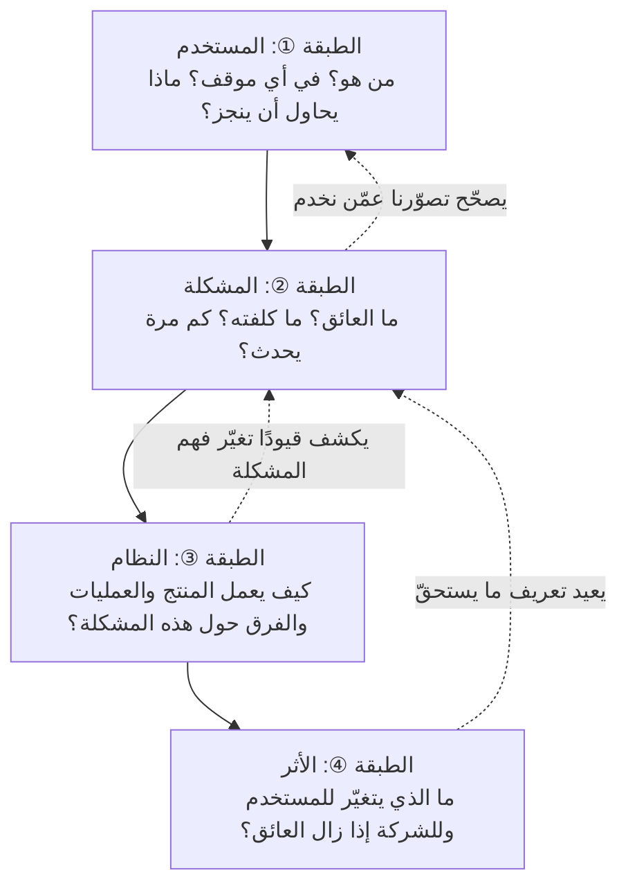
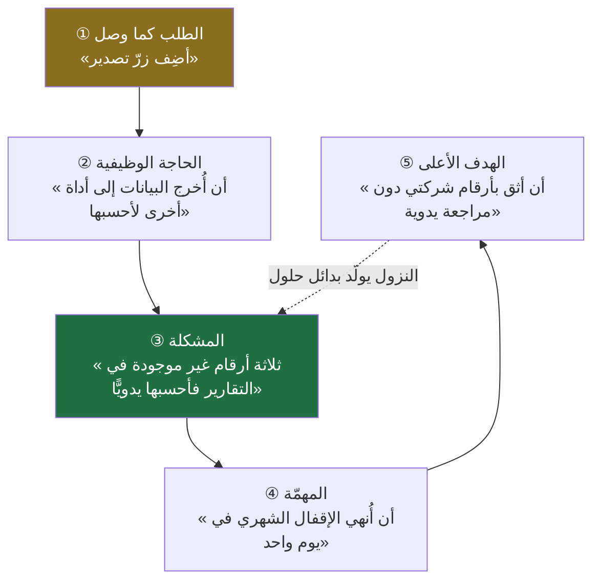
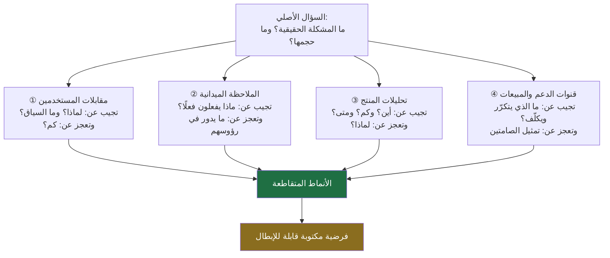
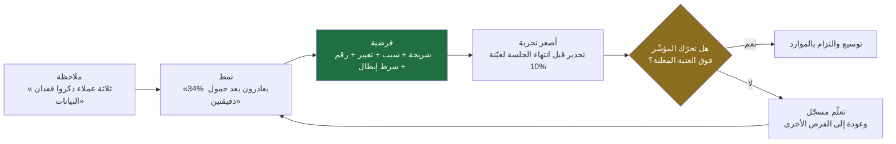
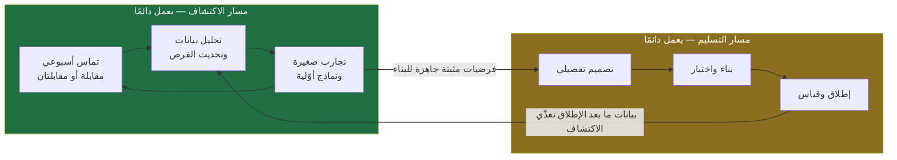
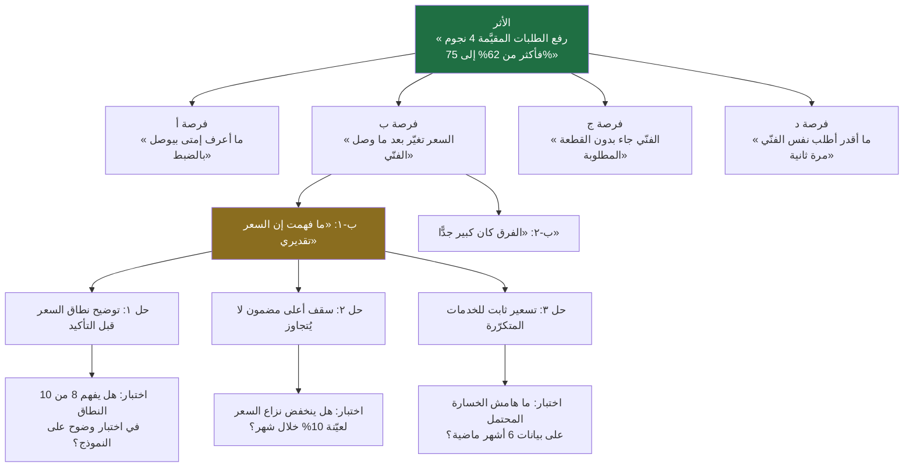
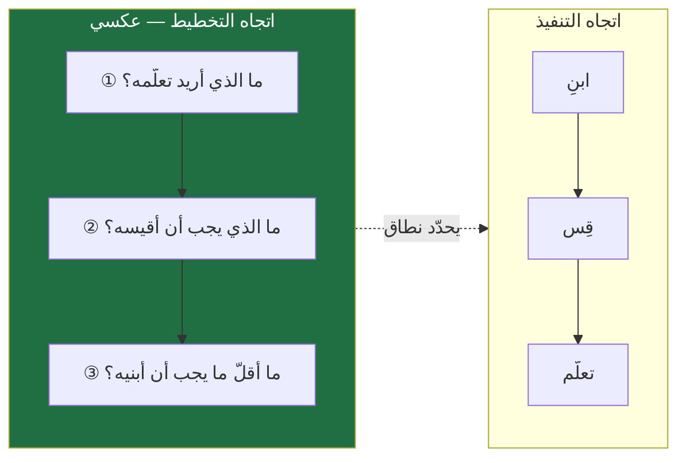

> [!info] الفصل 02 · إدارة المنتج في عصر الذكاء الاصطناعي
> **ماذا ستتعلّم:** إن كان [[01 - لماذا لا يزال مدير المنتج أهم من أي وقت مضى|الفصل الأول]] قد عرّف **جوهر الدور** ولماذا لم يمت، فهذا الفصل يعرّف **طريقة التفكير التي يُمارَس بها الدور**. ستتعلّم لماذا يبدأ مدير المنتج المحترف بالمشكلة لا بالحل، وكيف تميّز **فضاء المشكلة** من **فضاء الحل**، وكيف تُجري مقابلة مستخدم لا تكذب عليك، وكيف تُحوّل ملاحظة متفرّقة إلى **فرضية** قابلة للاختبار. وستفهم التمييز المحوري بين [[Outcome vs Output|المخرَج والأثر]]، وما هو [[Product Thinking|التفكير المنتَجي]] بطبقاته الأربع، ومن أين جاءت فلسفة `Lean` و`Agile` وما الذي بقي منهما فعلًا بعد أن انحسر الضجيج. وستخرج بمعرفة عملية بأطر مسمّاة بأصولها — [[Jobs to be Done|المهام المطلوب إنجازها]]، و[[Opportunity Solution Tree|شجرة الفرص والحلول]]، و`The Mom Test`، و`Five Whys`، و`Working Backwards` — وبموقف واضح من الدور الحقيقي للذكاء الاصطناعي في مرحلة الاكتشاف: **مُسرِّع للتحليل، لا بديل عن التماس**.

# الفصل 02 — فلسفة إدارة المنتج

## 🎯 أهداف التعلّم

- التمييز الحادّ بين **فضاء المشكلة** (`Problem Space`) و**فضاء الحل** (`Solution Space`)، وتشخيص أي جملة تصل إليك بأيّهما تنتمي.
- صياغة تعريف إجرائي لـ«المشكلة»: ليست ما يطلبه المستخدم، بل **العائق الذي يمنعه من بلوغ هدفه**، مع القدرة على استخراجه من طلب مصوغ كحلّ.
- تطبيق التمييز بين [[Outcome vs Output|المخرَج والأثر]] على خارطة طريق حقيقية، وكشف البنود التي تقيس نفسها بالإطلاق لا بالأثر.
- شرح [[Product Thinking|التفكير المنتَجي]] بوصفه أربع طبقات مترابطة (المستخدم · المشكلة · النظام · الأثر) لا شعارًا عامًّا.
- تصميم وإجراء **مقابلة اكتشاف** كاملة: التحضير، وصياغة الأسئلة السلوكية، وتجنّب الأسئلة الموجِّهة والتحيّز التأكيدي، وتحديد عدد المقابلات الكافي، وطريقة التدوين والتحليل بعدها.
- استخدام أنشطة الاكتشاف الأربعة (المقابلة · الملاحظة · التحليلات · قنوات الدعم) استخدامًا تكامليًّا، مع معرفة السؤال الذي يجيب عنه كلٌّ منها والسؤال الذي يعجز عنه.
- تحويل ملاحظة خام إلى **فرضية** مكتوبة بصيغة قابلة للإبطال، ثم إلى أصغر تجربة تختبرها.
- التفريق بين `Discovery` و`Delivery`، وشرح **المسار المزدوج** (`Dual-Track`) وسبب فشل نمط «مرحلة بحث ثم مرحلة بناء».
- بناء [[Opportunity Solution Tree|شجرة فرص وحلول]] من مُخرَج واحد، وشرح لماذا يكون **اختيار الفرصة** — لا اختيار الميزة — هو القرار الاستراتيجي الحقيقي.
- تتبّع جذور فلسفة المنتج إلى `Toyota Production System` و[[Agile Manifesto|بيان أجايل]] و`Lean Startup`، وتمييز **المبدأ الباقي** من **الطقس الميّت** في كلٍّ منها.
- كتابة **مبادئ منتج** (`Product Principles`) صالحة للاحتكام إليها عند التعارض، وتمييز المبدأ الحقيقي من الشعار المزخرف.
- تحديد ما يُحسنه الذكاء الاصطناعي في الاكتشاف (التلخيص، استخراج الأنماط، التصنيف، توليد الأسئلة) وما يعجز عنه بنيويًّا (السياق التجاري، لغة الجسد، الثقة، المسؤولية).
- عرض الحجّة القوية المعاكسة بإنصاف: **متى يكون البدء بالحل صوابًا فعلًا**، وما حدود أمثلة «الرؤية المؤسِّسة» الشهيرة.

## الفكرة المحورية: سؤالان يفصلان المبتدئ عن المحترف

هناك سؤالان يبدوان متجاورين في الصياغة، ويفصل بينهما في الواقع مسار مهنة كاملة:

**السؤال الأول:** «كيف نبني هذه الميزة؟»
**السؤال الثاني:** «لماذا نريد بناء هذه الميزة أصلًا؟»

المبتدئ يسأل الأول لأنه يبدو أكثر إنتاجية: فيه حركة، وفيه تقدير زمني، وفيه تذكرة تُفتح اليوم وتُغلق الأسبوع القادم. والمحترف يسأل الثاني لأنه يعرف أن الأول **مشتقّ** من الثاني، وأن الإجابة الممتازة عن سؤال خاطئ تبقى إجابة خاطئة. والفرق بين السؤالين ليس فرقًا في الأناقة الفكرية، بل هو الفرق العملي بين منتج يستخدمه الناس ومنتج مكتظّ بالخصائص التي لا يفتحها أحد.

وهذا هو موضع **الفلسفة** من هذه المهنة. الفلسفة هنا ليست ترفًا نظريًّا يُقرأ في المقدّمات ثم يُنسى؛ هي **مجموعة الالتزامات التي تحدّد سلوكك حين تتعارض المصالح ويضيق الوقت ويصرخ صاحب الصوت الأعلى**. من لا يملك فلسفة صريحة يملك فلسفة ضمنية على أي حال — وغالبًا ما تكون «افعل ما يطلبه من يملك الميزانية»، وهي فلسفة أيضًا، لكنها فلسفة تُنتِج منتجات بلا اتجاه.

> [!quote] من الويبينار
> جاء هذا التقرير صريحًا على لسان أحد الضيوف حين سُئل عن ترتيب أولوياته في العمل:
> *«أوكي، بصّ، أنا بالنسبة لي أهمّ حاجة في `product management` هي `problem definition`، اللي أنا أفهم أصلًا إيه المشكلة. ودي أكتر حاجة أنا شخصيًّا بأديها وقت. يعني أنا لو معايا يوم كامل أفهم مشكلة وأطلّع حل، هقعد ٩٠ في المية اليوم بفهم المشكلة و١٠ في المية بطلّع الحل.»*
>
> وعلّل ذلك مباشرةً: *«لأنّ أنا متأكّد إنّي لو مفهمتش المشكلة صح، الحلّ بتاعها هيبقى غلط.»*
>
> ثم سمّى الأمر باسمه المنهجي: *«فـ `Problem Definition` أو الـ `Discovery` اللي بيحصل هنا، هي دي أهمّ حاجة.»*
>
> **ملاحظة:** النصّ عربي بلهجة مصرية كما قيل، فلا يحتاج ترجمة؛ وقد نُقل من التفريغ الموثّق للجلسة مع تصحيح إملائي فقط.

انظر إلى النسبة المعلنة: **تسعون في المئة لفهم المشكلة، وعشرة في المئة لإخراج الحل.** ليست هذه النسبة قاعدة قياسية يجب أن تُطبَّق حرفيًّا في كل يوم عمل — هي **إعلان أولوية**. وهي تقلب التوزيع السائد في أغلب الفرق، حيث تُصرف تسعون في المئة من الطاقة على التنفيذ وعشرة في المئة — إن وُجدت — على التأكّد من أن المُنفَّذ يستحق التنفيذ.

> [!warning] عن دقّة الاقتباسات في هذا الفصل
> مصدر الجلسة تسجيل **ثنائي اللغة** فُرِّغ آليًّا ثم أُصلح لغويًّا، وجودته أقلّ من بقية مصادر هذه القاعدة. كل ما يرد داخل `> [!quote] من الويبينار` منقول من هذا التفريغ الموثّق، لكن **عند الحاجة إلى اقتباس حرفي دقيق أو رقم بعينه يُرجَع إلى التسجيل الأصلي**. وحيث بدا المقطع مشوّشًا لم يُرمَّم بالتخمين، بل أُسقط أو أُشير إلى إبهامه.

وهذا الفصل يشرح **لماذا** تلك النسبة معقولة، و**كيف** تُنفَق عمليًّا، وما الأدوات التي تُنفَق بها، وأين تفشل، ومتى يكون خصومها على حقّ.

## أولًا: لماذا يحتاج هذا الدور إلى فلسفة أصلًا؟

### المهن التي لا تملك قواعد صارمة تحتاج مبادئ صريحة

في المهن ذات القواعد الصارمة، الفلسفة مدفونة داخل الإجراء. المحاسب لا يحتاج فلسفة ليقرّر أين يضع مصروفًا في القائمة المالية؛ المعيار المحاسبي يقرّر عنه. والمهندس الإنشائي لا يحتاج فلسفة ليقرّر سماكة عمود؛ الكود الإنشائي يقرّر عنه. أما مدير المنتج فيعمل في مساحة **لا يوجد فيها معيار خارجي يحسم أغلب قراراته**: لا قانون يمنعك من بناء ميزة لا يريدها أحد، ولا هيئة تسحب رخصتك إن أهدرت ربعًا كاملًا في تحسين شاشة لا يزورها أحد.

ولهذا الفراغ نتيجتان: الأولى أن القرار يُترك للحُكم؛ والثانية أن الحُكم — إن لم يُضبط بمبادئ معلنة — ينجرف إلى ما هو أسهل اجتماعيًّا: إرضاء الأعلى منصبًا، وتجنّب المواجهة، وتفضيل ما يبدو منتِجًا على ما هو نافع.

فالفلسفة هنا وظيفتها **بديلة عن المعيار الغائب**. وهي تؤدّي هذه الوظيفة عبر ثلاثة أشياء:

1. **ترتيب مسبق للأولويات** حين تتعارض — قبل أن تقع المعركة، لا أثناءها.
2. **تعريف مسبق لما يُعدّ دليلًا** — حتى لا يتحوّل النقاش إلى مبارزة انطباعات.
3. **تعريف مسبق للنجاح والفشل** — حتى لا يُعاد تعريف النجاح بعد ظهور النتيجة.

والنقطة الثالثة هي الأخطر عمليًّا. الفريق الذي لا يكتب تعريف نجاحه قبل الإطلاق سيكتبه بعده حتمًا، وسيكتبه بطريقة تجعله ناجحًا — لأن هذا ما يفعله البشر بطبيعتهم حين يُتركون بلا التزام سابق.

### الفلسفة ليست مجموعة شعارات

هناك اختبار بسيط يفرّق بين الفلسفة والشعار: **الشعار لا يستبعد شيئًا، والفلسفة تستبعد.**

«نحن نهتمّ بالعميل» شعار، لأن أحدًا لا يقول عكسه. أما «حين يتعارض طلب عميل واحد كبير مع تجربة الأغلبية الصامتة، نرجّح الأغلبية ونعوّض العميل الكبير بحلّ خدمي لا بميزة في المنتج» فهذه فلسفة، لأنها **تخبرك بما لن تفعله**، ولأن لها ثمنًا يمكن أن تدفعه فعلًا في اجتماع حقيقي.

وسيأتي في القسم الخامس عشر من هذا الفصل تفصيل كتابة **مبادئ المنتج** بهذه الصفة الإجرائية. لكن المهم أن تحمل هذا المعيار منذ الآن وأنت تقرأ بقية الفصل: كل مبدأ يُعرض عليك، اسأله سؤالًا واحدًا — **ما الذي يمنعني من فعله؟** فإن لم يمنع شيئًا فهو زينة لغوية.

### ثلاثة أعمدة تقوم عليها فلسفة إدارة المنتج

يمكن اختزال ما سيأتي في هذا الفصل كلّه في ثلاثة التزامات مترابطة، كل واحد منها يسند الآخرين:

| العمود | الالتزام | ما ينهار بغيابه |
|---|---|---|
| **الأولوية للمشكلة** | لا يُناقَش حلّ قبل أن تُوصَف المشكلة وصفًا يقبل الإبطال | تبني بسرعة في الاتجاه الخاطئ |
| **الأولوية للمُخرَج** | لا يُحتسب النجاح بالإطلاق بل بالتغيّر الحاصل بعده | يرتفع إنتاجك ولا يتحرّك أثرك |
| **الأولوية للدليل** | لا يُعامَل الرأي كمعرفة، ولا الاستنتاج كحقيقة قبل اختباره | يفوز الأعلى صوتًا ويُعاد بناء الشيء نفسه مرّتين |

ولاحظ أن العمود الثالث يحرس الأوّلين. من يلتزم بالبدء بالمشكلة دون التزام بالدليل، سيخترع مشكلة تناسب الحلّ الذي يريده — وهذا أخطر من البدء بالحلّ صراحةً، لأنه يرتدي ثوب المنهجية.

## ثانيًا: المخرَج والأثر — حجر الأساس

### التمييز في أدقّ صيغه

[[Outcome vs Output|المخرَج والأثر]] هو أوضح تمييز في المهنة كلها وأكثرها انتهاكًا في الممارسة اليومية:

- **المخرَج** (`Output`) هو **ما أنتجناه**: ميزة أُطلقت، شاشة صُمّمت، إصدار نُشر، تذكرة أُغلقت، وثيقة كُتبت. قابل للعدّ، ويرتفع بالمجهود المباشر.
- **الأثر** (`Outcome`) هو **التغيّر الذي حدث** في سلوك المستخدم أو في مؤشّرات العمل نتيجةً لذلك المخرَج. لا يُعدّ بل يُقاس، ولا يرتفع بالمجهود وحده.

والفرق البنيوي بينهما أن **المخرَج تحت سيطرتك، والأثر ليس كذلك**. تستطيع أن تضمن إطلاق الميزة في موعدها؛ ولا تستطيع أن تضمن أن يستخدمها أحد. وهذا بالضبط سبب انجراف الفرق إلى قياس الناتج: لأنه **مريح**. المقياس الذي تسيطر عليه بالكامل يعطيك شعورًا بالإنجاز كل أسبوعين، بينما المقياس الذي لا تسيطر عليه يعرّضك لاحتمال أن تعمل شهرين ثم تكتشف أنك لم تغيّر شيئًا.

> [!info] إضافة مرجعية
> أخطر خاصيّة في مقاييس الناتج أنها **ترتفع دائمًا**. مهما كان اتجاهك، يمكنك دائمًا أن تُطلق أكثر، وتغلق تذاكر أكثر، وتنجز نقاطًا أكثر. ولهذا فإن لوحة قيادة مبنيّة على النواتج **لا تستطيع أن تُظهر فشلًا** — وأي نظام قياس عاجز عن إظهار الفشل ليس نظام قياس، بل نظام طمأنة.
>
> والعلاج المؤسّسي الشائع لهذا هو ربط كل بند في خارطة الطريق بـ**مُخرَج مستهدَف مكتوب قبل البدء** مع رقم أساس (`Baseline`) وموعد مراجعة. وهذا هو المنطق نفسه الذي يقوم عليه نظام [[OKR]]: الهدف يصف الوجهة، والنتائج الرئيسية تصف **الدليل على الوصول** — ولا يجوز أن تكون النتيجة الرئيسية قائمة مهام.

### مستويات ثلاثة لا مستويان

الاختزال الشائع يجعل المسألة ثنائية (ناتج/مُخرَج)، والأدقّ أنها ثلاثة مستويات، وأن الخلط يقع غالبًا بين الثاني والثالث لا بين الأول والثاني:

| المستوى | السؤال | مثال | من يملكه؟ |
|---|---|---|---|
| **المخرَج** (`Output`) | ماذا أطلقنا؟ | «أطلقنا الحفظ التلقائي» | الفريق — تحت سيطرته الكاملة |
| **مُخرَج المستخدم** (`User Outcome`) | ما الذي تغيّر في سلوك المستخدم؟ | «انخفض فقدان المسودّات من 12% إلى 2%» | الفريق يؤثّر فيه ولا يضمنه |
| **أثر الأعمال** (`Business Impact`) | ما الذي تغيّر في مؤشّرات الشركة؟ | «انخفض التسرّب الشهري 0.8 نقطة» | تؤثّر فيه عوامل كثيرة خارج الفريق |

وفائدة الفصل بين المستويين الثاني والثالث عملية جدًّا: **مُخرَج المستخدم هو ما يجب أن يُحاسَب عليه فريق المنتج مباشرةً**، لأن أثر الأعمال يتأثّر بالتسعير والتسويق والمنافسة والموسمية وأشياء لا يملكها الفريق. ومن يحاسب فريقًا على أثر الأعمال وحده يعلّمه أن يتوقّف عن المخاطرة. ومن يحاسبه على الناتج وحده يعلّمه أن يتوقّف عن التفكير. والصواب أن يُلزَم الفريق بـ**سلسلة سببية معلنة**: هذا الناتج ← يُفترض أن يحدث مُخرَج المستخدم هذا ← والذي يُفترض أن يساهم في أثر الأعمال هذا. ثم يُحاسَب على الحلقة الوسطى، ويُطالَب بشرح الحلقتين الأخريين.

> [!example] السلسلة السببية على طلب واقعي
> **الطلب كما وصل:** «العملاء يريدون إشعارات».
> **الناتج المقترح:** إشعار فوري عند تغيّر حالة الطلب.
> **مُخرَج المستخدم المستهدف:** انخفاض عدد المستخدمين الذين يفتحون التطبيق أكثر من ثلاث مرات في الساعة لمتابعة الطلب — من 45% إلى 20%؛ وارتفاع نسبة من يقيّمون تجربة الانتظار بأنها «واضحة».
> **أثر الأعمال المتوقّع:** انخفاض تذاكر «أين طلبي؟» من 900 إلى أقلّ من 400 شهريًّا، وما يقابله من ساعات دعم.
> **الفرضية المضادّة التي يجب ذكرها:** قد ترتفع الإشعارات وتنخفض التذاكر بينما يرتفع **إلغاء الاشتراك في الإشعارات**، وهو ما يعني أننا اشترينا راحة الدعم بثمن قناة تواصل. ولهذا يُدرَج «معدّل إلغاء الاشتراك في الإشعارات» كمقياس مضادّ (`Counter Metric`) في اللوحة نفسها.
>
> لاحظ أن هذه الفقرة كلها كُتبت **قبل** كتابة سطر كود واحد، وأنها تستغرق عشرين دقيقة، وأنها تجعل الفشل قابلًا للاكتشاف بعد شهر بدل أن يبقى غامضًا سنة.

### لماذا يقاوم الناس هذا التمييز؟

ليست المقاومة جهلًا في الغالب، بل هي عقلانية على مستوى الفرد ومدمّرة على مستوى المؤسّسة. ثلاثة أسباب متكرّرة:

**① نظام الحوافز يكافئ الناتج.** في أغلب المؤسّسات، ما يُذكر في تقرير الربع هو «ما أطلقناه»، وما يُذكر في تقييم الأداء هو «ما أنجزته». ومن يقول «لم نطلق شيئًا هذا الربع لأننا اكتشفنا أن الفرضية خاطئة» يبدو فاشلًا وإن كان قد وفّر على الشركة ربعًا كاملًا. **الحل المؤسّسي:** أن تُدرَج «التعلّمات التي غيّرت قرارًا» في تقرير الربع بوصفها إنجازًا صريحًا له عنوان مستقلّ.

**② الأثر يستغرق وقتًا ليظهر.** المخرَج يظهر يوم الإطلاق، والأثر قد يحتاج ستّة أسابيع. وفي بيئة تُراجَع كل أسبوعين، يفوز ما يظهر بسرعة. **الحل:** مواعيد مراجعة معلنة بعد الإطلاق (30 و60 و90 يومًا) تُوضع في التقويم يوم الإطلاق نفسه، لا بعده.

**③ قياس الأثر يتطلّب بنية تحتية.** إن لم تكن الأحداث (`Events`) مُعرَّفة ولا لوحات البيانات موجودة، فأنت لا تستطيع قياس الأثر حتى لو أردت. وهذا سبب حقيقي لا عذر: يُعالَج بأن يُدرَج **القياس ضمن تعريف الإنجاز** ([[Definition of Done|تعريف الإنجاز]]) لكل بند، لا بوصفه عملًا لاحقًا يُؤجَّل دائمًا.

## ثالثًا: التفكير المنتَجي — طبقاته الأربع

### تعريف يتجاوز الشعار

[[Product Thinking|التفكير المنتَجي]] من أكثر المصطلحات تداولًا وأقلّها تعريفًا. ويُستعمل غالبًا كمدح مبهم («فلان عنده حسّ منتج»)، وهو استعمال يجعل المفهوم غير قابل للتعليم ولا للتقويم. والتعريف الأنفع أن التفكير المنتَجي هو **القدرة على الانتقال بين أربع طبقات دون أن تفقد الاتصال بينها**:

والأسهم الراجعة المتقطّعة هي ما يميّز الممارس عن حافظ التعريفات. المبتدئ يمشي في اتجاه واحد: مستخدم ← مشكلة ← حل ← إطلاق. والمحترف يعرف أن كل طبقة تُعيد تشكيل ما قبلها: حين تفهم قيود النظام قد تكتشف أن المشكلة التي وصفتها ليست هي المشكلة؛ وحين تحسب الأثر قد تكتشف أن الشريحة التي اخترتها ليست الشريحة التي تستحق.

### ما الذي تضيفه كل طبقة عمليًّا؟

**الطبقة الأولى — المستخدم.** الخطأ الشائع هنا هو التعامل مع «المستخدمين» ككتلة. والتفكير المنتَجي يبدأ بتضييق: أي شريحة؟ في أي موقف؟ وما الذي يجعل هذه الشريحة مختلفة سلوكيًّا لا ديموغرافيًّا؟ ولهذا يرتبط هذا المستوى مباشرةً بإطار [[Jobs to be Done|المهام المطلوب إنجازها]] الذي يعيد تعريف الشريحة من «من هو؟» إلى «في أي موقف هو؟».

**الطبقة الثانية — المشكلة.** وهنا ثلاثة أسئلة كمّية تحوّل الكلام إلى قرار: **كم مرة تحدث؟** و**كم تكلّف في المرة؟** و**كم عدد من تصيبهم؟** حاصل ضرب هذه الثلاثة هو الحجم الحقيقي للمشكلة، وهو ما يفصل بين مشكلة مزعجة ومشكلة تستحقّ ربعًا من عمر فريق.

**الطبقة الثالثة — النظام.** المنتج ليس شاشات؛ هو **نظام** يشمل الشاشات والعمليات الخلفية وفرق الدعم والسياسات والتسعير والشركاء. وكثير من مشاكل المنتج ليست مشاكل واجهة أصلًا: المستخدم لا يُكمل التسجيل لأن سياسة التحقّق تتطلّب وثيقة لا يملكها في تلك اللحظة، لا لأن الزرّ صغير. والتفكير على مستوى النظام هو ما يمنعك من علاج عرَض في الطبقة الظاهرة بينما السبب في طبقة لا تراها.

**الطبقة الرابعة — الأثر.** وهي التي تربط كل ما سبق بلغة الشركة، وتحوّل المقترح من «شيء لطيف» إلى استثمار له عائد متوقّع وتكلفة فرصة بديلة معلنة.

> [!info] إضافة مرجعية
> **اختبار عملي لقياس التفكير المنتَجي عند مرشّح أو عند نفسك:** اعرض حالة قصيرة («انخفض معدّل إتمام التسجيل 8% خلال شهرين») واطلب **أسئلة** لا حلولًا. من يبدأ بالحلول («لعلّنا نبسّط النموذج») يفكّر في فضاء الحل. ومن يبدأ بأسئلة الطبقات («هل الانخفاض في شريحة بعينها أم في الجميع؟ هل تغيّر مصدر الزيارات؟ هل تزامن مع إطلاق داخلي؟ هل الانخفاض في بدء التسجيل أم في إتمامه؟ هل تغيّرت أي سياسة تحقّق؟») يفكّر منتجيًّا.
>
> وهذا الاختبار أدقّ من أي سؤال عن الأطر، لأن حفظ الإطار سهل والانضباط في تأجيل الحل صعب.

## رابعًا: لماذا تبدأ المؤسّسات بالحلول؟ تشريح الميل الطبيعي

### ستّة أبواب تدخل منها الحلول جاهزة

الاعتراض الأول الذي يواجهه كل من يدعو إلى البدء بالمشكلة هو: «نحن نعرف هذا، لكن الواقع لا يسمح». والواقع فعلًا لا يسمح — لأن الحلول تصل جاهزة من ستّة أبواب مختلفة، ولكل باب منطقه الخاص الذي يبدو معقولًا من موقعه:

| المصدر | الصيغة النمطية | المنطق الكامن خلفها | ما ينقصها |
|---|---|---|---|
| **الإدارة العليا** | «نحتاج تطبيقًا للجوّال» | رؤية أو ضغط تنافسي أو مقارنة مع نظير | لم تُترجَم إلى مشكلة عميل محدّدة |
| **المستثمر / المجلس** | «أضيفوا الذكاء الاصطناعي» | إشارة سوقية وقيمة سردية | لا تربط الميزة بمؤشّر تشغيلي |
| **العميل** | «أريد زرًّا للحفظ» | معاناة حقيقية عبّر عنها بأقرب حلّ يعرفه | الحلّ اقتراح لا تشخيص |
| **المبيعات** | «المنافس عنده هذه الميزة» | صفقة معلّقة وخوف من الخسارة | لا تفرّق بين سبب الرفض الحقيقي والمعلن |
| **الدعم** | «افتحوا لنا تعديل الطلب» | ألم يومي متكرّر | تعالج العرَض في أسرع نقطة وصول |
| **الفريق التقني** | «لنعِد كتابة هذه الخدمة» | دَين تقني حقيقي | لا تُترجَم إلى أثر يلمسه أحد |

والملاحظة المهمّة: **لا أحد من هؤلاء مخطئ**. كلٌّ منهم ينقل إشارة صادقة من موقعه. المشكلة أن الإشارة تصل **مصوغة كحلّ**، وأن الصياغة كحلّ تُخفي المعلومة الأهمّ: ما الذي يعانيه صاحب الطلب فعلًا.

### لماذا يصوغ الناس معاناتهم كحلول؟

ثلاثة أسباب نفسية معروفة، ومعرفتها تجعلك أقلّ انزعاجًا وأكثر مهارة في التعامل مع الطلبات:

**① الحلّ أسهل في التعبير من المشكلة.** وصف المشكلة يتطلّب استبطانًا وتحليلًا؛ أما «أريد زرًّا» فجملة جاهزة. والناس يعطونك أقصر مسار للتعبير عن انزعاجهم، لا تحليلًا منهجيًّا له.

**② الحل يبدو تعاونًا.** من يشتكي فقط يبدو متذمّرًا؛ ومن يقترح حلًّا يبدو أنه يساعدك. فالصياغة كحلّ سلوك اجتماعي مهذّب قبل أن تكون خطأً منهجيًّا.

**③ الحل يحمي صاحبه من الرفض.** المشكلة المجرّدة يمكن التشكيك فيها («هل هي فعلًا مشكلة؟»)، أما الحلّ المحدّد فيمكن الموافقة عليه أو رفضه، والموافقة أسهل اجتماعيًّا. ولهذا يميل الناس إلى تقديم طلبات صغيرة قابلة للتنفيذ بدل مشكلات كبيرة قابلة للنقاش.

> [!note] القاعدة الذهبية
> **المنتجات العظيمة لا تبدأ بفكرة عظيمة، وإنما بفهم عظيم للمشكلة.**
>
> والصيغة العملية لهذه القاعدة ليست «ارفض الحلول»، بل **«اقبل الحلّ كإشارة، ثم اصعد منه إلى مشكلته»**. من يرفض الطلبات المصوغة كحلول يفقد مصادر معلوماته خلال شهرين، لأن الناس يتوقّفون عن إخباره بشيء.

### الأسئلة الأربعة التي تصعد بك من الحلّ إلى المشكلة

هذه ليست أسئلة استجواب؛ هي أسئلة فضول مهذّب، وتُطرح في سياق محادثة عادية:

1. **«لماذا تحتاج هذا تحديدًا؟»** — تفتح السبب.
2. **«ماذا يحدث الآن حين لا يكون موجودًا؟»** — تكشف الحلّ البديل الذي يستعمله الآن (وهذا أثمن ما ستحصل عليه).
3. **«ماذا تحاول أن تنجز في تلك اللحظة؟»** — ترفع النقاش إلى مستوى المهمّة لا الأداة.
4. **«متى كانت آخر مرة واجهت فيها هذا؟ احكِ لي ماذا حدث بالضبط.»** — تنقلك من العموميات إلى واقعة محدّدة قابلة للفحص.

والسؤال الثاني هو الأقوى بلا منافس، لأن **الحلّ الالتفافي الذي يستعمله المستخدم اليوم هو أصدق وصف لمشكلته**. من يلتقط صور شاشة ويعيد كتابة الأرقام يدويًّا في جدول بيانات، يخبرك بسلوكه — لا بكلامه — أن هناك فجوة تستحقّ ثمنًا، وأنه مستعدّ لدفع ثلاث ساعات شهريًّا مقابل سدّها.

## خامسًا: ما «المشكلة» أصلًا؟ فضاء المشكلة وفضاء الحل

### التعريف الإجرائي

**المشكلة ليست ما يريده المستخدم؛ المشكلة هي العائق الذي يمنعه من تحقيق هدفه.**

وهذا التعريف يبدو بديهيًّا حتى تجرّب تطبيقه على عشرة بنود من خارطة طريقك، فتكتشف أن أغلبها مكتوب في فضاء الحل. والاختبار الحاسم بسيط: **إن كانت الجملة تذكر آلية أو واجهة أو تقنية، فهي حلّ؛ وإن كانت تذكر عائقًا وهدفًا وكلفة، فهي مشكلة.**

| صيغة في فضاء الحل | صيغة في فضاء المشكلة |
|---|---|
| «نضيف زرّ حفظ» | «المستخدم يخشى أن يفقد ما كتبه حين ينقطع الاتصال، فيتجنّب إدخال نصوص طويلة» |
| «نبني تطبيق جوّال» | «الفنّي الميداني لا يستطيع تحديث حالة الزيارة وهو خارج المكتب، فتتأخّر البيانات يومًا كاملًا» |
| «نضيف مساعدًا محادثًا» | «المستخدم الجديد لا يعرف من أين يبدأ، فيغادر قبل إتمام أول مهمّة» |
| «نغيّر لون القائمة إلى الأحمر» | «الزبون لا يستطيع قراءة الأسعار بسرعة تحت إضاءة المطعم، فيتردّد ويطيل وقت الطلب» |
| «نعيد كتابة خدمة الفوترة» | «كل تعديل في قواعد الفوترة يستغرق أسبوعين ويُنتج عيبًا في المتوسّط، فتتأخّر عروضنا التسعيرية» |

ولاحظ أن الصيغة اليمنى في كل سطر **لا تمنع** الحلّ اليساري. هي فقط تفتح الباب لثلاثة حلول أخرى، وتجعل المقارنة بينها ممكنة، وتحدّد كيف نعرف أننا نجحنا.

### السلّم بين الفضاءين

الأمر ليس ثنائيًّا حادًّا؛ بينهما سلّم من التجريد، وإتقان الصعود والنزول عليه هو المهارة الحقيقية:

**كيف تُقرأ الصورة؟** الطلب يصل عند الدرجة ①. وظيفتك أن تصعد بالأسئلة إلى الدرجة ③ على الأقل — وهي **درجة المشكلة القابلة للحلّ**. الصعود أقلّ من ذلك يجعلك منفّذ طلبات؛ والصعود أكثر من اللازم (إلى ⑤ مباشرةً) يوقعك في تجريد لا يُبنى منه شيء: «العميل يريد أن يثق بأرقامه» جملة صحيحة ولا تُنتج قرارًا.

> [!warning] فخّ التجريد المفرط
> كثير من الفرق تظنّ أن الارتقاء في السلّم فضيلة مطلقة، فتصل إلى مشكلات ضخمة نبيلة الصياغة ولا يمكن العمل عليها: «مشكلتنا أن العملاء لا يشعرون بالأمان». هذه ليست مشكلة منتج، هي **موضوع**. والعلامة التشخيصية بسيطة: **إن لم تستطع أن تتخيّل ثلاثة حلول مختلفة جوهريًّا للمشكلة كما صغتها، فأنت إمّا في فضاء الحل (حلّ واحد فقط ممكن) أو في تجريد مفرط (كل شيء يبدو حلًّا).** الدرجة الصحيحة هي التي تسمح بتوليد بدائل حقيقية وتضييقها.

### مثال ممتدّ: من «أريد زرّ حفظ» إلى قرار

> [!example] تشريح طلب واحد بالكامل
> **الطلب:** ثلاثة عملاء طلبوا خلال أسبوعين «زرّ حفظ» في شاشة إدخال طويلة.
>
> **① الأسئلة الأربعة:**
> - *لماذا تريد الزر؟* «حتى لا أفقد ما أدخلته.»
> - *ماذا يحدث الآن؟* «أحيانًا أُخرج من الشاشة فأجد الحقول فارغة.»
> - *ماذا تحاول أن تنجز؟* «إدخال بيانات عشرين موظّفًا في دفعة واحدة، وأنا أُقاطَع كثيرًا أثناء ذلك.»
> - *ماذا تفعل حين لا تجده؟* «أكتب البيانات أولًا في `WhatsApp` عندي، ثم أنسخها هنا دفعة واحدة بسرعة.»
>
> **② ما الذي كشفته الإجابة الأخيرة؟** أن المستخدم بنى حلًّا التفافيًّا (كتابة مسبقة في مكان آخر) — أي أن كلفة المشكلة عنده كبيرة بما يكفي ليخترع لها إجراءً. وأن جذر الألم ليس «غياب زرّ» بل **الانقطاع أثناء عمل طويل**: مقاطعة، أو انتهاء جلسة، أو تنقّل بين شاشات.
>
> **③ فحص البيانات:** يتبيّن أن 34% ممّن يبدؤون الشاشة لا يُكملونها، وأن متوسّط الزمن حتى المغادرة 6 دقائق، وأن 61% من حالات المغادرة تسبقها فترة خمول تتجاوز دقيقتين — وهو ما يتّسق مع رواية المقاطعة، وأن الجلسة تنتهي بعد 15 دقيقة خمول فتضيع البيانات.
>
> **④ إعادة صياغة المشكلة:** «المستخدم الذي يُدخل بيانات لأكثر من خمس دقائق معرّض لفقدان عمله عند المقاطعة أو انتهاء الجلسة، فيلجأ إلى إعداد البيانات خارج المنتج أوّلًا، ما يطيل المهمّة ويُدخل أخطاء نسخ.»
>
> **⑤ البدائل التي فتحتها الصياغة الجديدة — وكلّها غير الزر:**
> - **(أ) حفظ تلقائي** كل بضع ثوانٍ مع مؤشّر بصري صغير («حُفِظ الآن»). كلفة متوسّطة، ويعالج المقاطعة وانتهاء الجلسة معًا.
> - **(ب) تمديد الجلسة وتحذير قبل انتهائها** بدقيقتين. كلفة زهيدة جدًّا، ويعالج جزءًا من الحالات فقط.
> - **(ج) تقصير النموذج** بتقسيمه إلى ثلاث خطوات تُحفَظ كل واحدة على حدة. كلفة أعلى، ويعالج المشكلة وسبب المقاطعة معًا (لأن المهمّة تصبح قابلة للتجزئة).
> - **(د) استيراد من ملف** لمن يدخل عشرين موظّفًا دفعةً — وهو الحلّ الذي يزيل المهمّة أصلًا للشريحة الأكبر ألمًا.
> - **(هـ) زرّ حفظ يدوي** — الطلب الأصلي: أرخص شيء، ويعالج المقاطعة الواعية ولا يعالج انتهاء الجلسة ولا النسيان.
>
> **⑥ القرار:** (ب) فورًا لأنها ساعتان، ثم (أ) في الدورة القادمة، مع فتح اكتشاف مصغّر لـ(د) لأن الشريحة التي تُدخل دفعات كبيرة قد تكون هي المصدر الحقيقي للألم. أمّا (هـ) — الطلب كما وصل — **فلم يُنفَّذ**، لأن الحفظ التلقائي يغنِي عنه ويغطّي حالات لا يغطّيها.
>
> **⑦ ما الذي كسبناه؟** حللنا مشكلة العملاء الثلاثة **وحلّها لمن لم يشتكِ أصلًا** — وهم الأكثرية دائمًا. وهذا هو العائد الحقيقي للصعود من الطلب إلى المشكلة: **الحلّ الصحيح يخدم الصامتين، والحلّ الحرفي يخدم من رفع صوته فقط.**

## سادسًا: المستخدم خبير في مشكلته، لا في حلّها

### القاعدة وحدودها

هذه واحدة من أشهر قواعد المهنة، وأكثرها تعرّضًا لسوء الاستعمال في الاتجاهين:

- **الاستعمال الصحيح:** ثق بالمستخدم ثقةً كاملة حين يصف **ما يفعله وما يعانيه وما يكلّفه**؛ وتعامل مع اقتراحه للحلّ بوصفه **معلومة عن معاناته**، لا وصفة تُنفَّذ.
- **الاستعمال المنحرف:** أن تتحوّل القاعدة إلى تبرير لتجاهل المستخدمين كليًّا: «هم لا يعرفون ما يريدون، فلنبنِ ما نراه». وهذا انقلاب على القاعدة لا تطبيق لها، لأن القاعدة تقول إن المستخدم **خبير في مشكلته** — وهذه هي المعلومة التي لا تملكها أنت.

> [!example] مثال المطعم — لماذا يبدو الطلب غريبًا حتى تفهمه
> صاحب مطعم يطلب من فريق التصميم: **«أريد قائمة الطعام باللون الأحمر.»**
>
> التنفيذ الحرفي: تُصنع قائمة حمراء، ولا يتغيّر شيء في سلوك الزبائن، ويعود الطلب بعد شهر بصيغة أخرى.
>
> الصعود بالأسئلة: *لماذا الأحمر؟* «لأنه يلفت الانتباه.» *وما الذي تريد لفت الانتباه إليه؟* «الأسعار… الزبون يقف طويلًا ويسأل النادل عن السعر.» *ومتى يحدث هذا أكثر؟* «في المساء، وفي الطاولات البعيدة عن الإضاءة.»
>
> المشكلة الحقيقية: **الأسعار غير قابلة للقراءة السريعة في ظروف الإضاءة الفعلية، فيتحوّل النادل إلى واجهة استعلام ويطول زمن الطلب.**
>
> والحلول التي فتحتها هذه الصياغة: تكبير حجم خطّ السعر ورفع تباينه · محاذاة الأسعار في عمود ثابت بدل إلحاقها بنهاية الوصف · تقليل عدد الأصناف في الصفحة الواحدة · قائمة بإضاءة خلفية أو رمز `QR` · مراجعة إضاءة الصالة نفسها. واللون الأحمر أحد الاحتمالات الضعيفة في هذه القائمة، وقد يكون أسوأها إن قلّ تباينه مع الخلفية.
>
> **الدرس:** صاحب المطعم لم يكن مخطئًا؛ كان **يترجم ملاحظة صحيحة إلى أقرب حلّ يعرفه**. ووظيفتك أن تحتفظ بالملاحظة وتستبدل الترجمة.

### فجوة القول والفعل

هناك ظاهرة موثّقة جيدًا في أبحاث سلوك المستخدم تُعرف بـ**فجوة القول والفعل** (`Say-Do Gap`): ما يقوله الناس عن سلوكهم المستقبلي يختلف بانتظام عمّا يفعلونه فعلًا. وليست المشكلة أن الناس يكذبون؛ المشكلة أنهم **يتنبّأون بسلوكهم في ظروف مثالية متخيَّلة**، بينما السلوك الفعلي يحدث تحت ضغط وقت وانتباه محدود وبدائل متاحة.

> [!info] إضافة مرجعية
> ولهذا قاعدتان عمليّتان في تصميم أي سؤال بحثي:
>
> **① لا تسأل عن المستقبل، اسأل عن الماضي.** «هل ستستخدم هذه الميزة؟» سؤال بلا قيمة تنبّؤية تقريبًا. «متى كانت آخر مرة احتجت فيها إلى شيء كهذا، وماذا فعلت حينها؟» سؤال يعطيك واقعة.
>
> **② لا تسأل عن الرأي، اسأل عن الكلفة المدفوعة.** «هل تعجبك الفكرة؟» يجيب عنها الجميع بنعم مجاملةً. «كم من الوقت أنفقت الشهر الماضي على هذا؟ وهل جرّبت أداة أخرى؟ وهل دفعت مقابلها؟» تعطيك أدلّة سلوكية.
>
> وهذا المنطق نفسه هو أساس كتاب `The Mom Test` لروب فيتزباتريك (2013)، وسيأتي تفصيله في القسم الثامن. وفكرته المركزية أن الاختبار الصحيح لسؤالك هو: **هل يمكن لأمّك أن تكذب عليك في إجابته؟** فإن كان السؤال مصوغًا بحيث يستطيع أي شخص مجاملتك بالإجابة، فالسؤال معطوب لا المجيب.

### متى يكون المستخدم خبيرًا في الحلّ فعلًا؟

الإنصاف يقتضي ذكر الاستثناء، لأن القاعدة تُطبَّق أحيانًا في غير موضعها:

- **المستخدمون المحترفون في مجالات متخصّصة** (طبيب، محاسب قانوني، مهندس شبكات، مخلّص جمركي) كثيرًا ما يملكون معرفة إجرائية بمجالهم تفوق معرفتك بمراحل. حين يقول محاسب «أحتاج قيدًا عكسيًّا لا حذفًا»، فهو لا يقترح واجهة، بل ينقل **قاعدة مهنية ملزِمة** يجب أن تُحترم كقيد لا أن تُعامَل كاقتراح.
- **المستخدمون الذين بنوا حلولهم بأنفسهم** — من صنع جدول بيانات معقّدًا يعالج به نقص منتجك، يملك مواصفة عملية جاهزة استحقّها بجهده، وهي من أثمن ما يمكن أن تراه.
- **الشريحة التي جرّبت بدائل كثيرة** — من استعمل أربعة منتجات منافسة يعرف عن فضاء الحل أكثر منك غالبًا.

والقاعدة الجامعة: **افصل بين خبرة المجال وخبرة تصميم الحل.** المستخدم قد يكون خبيرًا في الأولى ونادرًا ما يكون خبيرًا في الثانية؛ ووظيفتك أن تأخذ الأولى كاملةً وتتولّى الثانية بنفسك مع المصمّم والمهندس.

## سابعًا: `Problem Discovery` — التعريف والأنشطة الأربعة

### التعريف

[[Product Discovery|اكتشاف المنتج]] — وفي سياق هذا الفصل تحديدًا **اكتشاف المشكلة** (`Problem Discovery`) — هو **عملية البحث المنهجي لفهم المشكلات الحقيقية قبل التفكير في أي حلّ، وبمستوى ثقة يكفي لتبرير الالتزام بموارد**.

وكل كلمة في هذا التعريف تحمل وزنًا:

- **منهجي**: ليس محادثة عابرة مع عميل صديق، بل نشاط له سؤال محدّد وعيّنة مقصودة وطريقة تدوين وتحليل.
- **قبل التفكير في الحل**: أي أنه انضباط في تأجيل المتعة. أصعب ما في الاكتشاف ليس تقنيًّا، بل هو **مقاومة الاندفاع إلى الحلّ** الذي يقفز إلى ذهنك في الدقيقة الثانية من المقابلة.
- **بمستوى ثقة يكفي**: لا يوجد يقين. الاكتشاف لا يهدف إلى إزالة الشكّ، بل إلى **خفضه إلى حدّ يجعل المخاطرة معقولة** بالنسبة لحجم الالتزام.

> [!quote] من الويبينار
> عُرضت بنية الاكتشاف في الجلسة بوصفها **ثلاثة أشياء** لا نشاطًا واحدًا:
> *«لمّا تيجي نتكلم على `Problem Definition`، عندك تلات حاجات محتاج تبصّ عليهم. أول حاجة هي الـ `Customer Research`… تاني حاجة، ودي مهمّة جدًّا، هي الديتا… عشان أفاليديت المشكلة. تالت حاجة بقى هي إن يبقى عندك شويّة `hypothesis`: بمعنى لو أنا عملت ده ممكن يحصل كذا.»*
>
> فالترتيب المعلَن: **بحث العملاء ← البيانات للتحقّق ← فرضيات تُختبر**. وهو ترتيب دالّ: التماس البشري يولّد الإشارة، والبيانات تتحقّق من حجمها، والفرضية تحوّل الفهم إلى شيء قابل للاختبار.

### لماذا هذا أهمّ من البرمجة؟

الجملة التي تختصر الباب كلّه: **ليس هناك شيء أسوأ من تنفيذ الحلّ الخطأ بكفاءة عالية.**

ووجه ذلك أن الكفاءة العالية في الاتجاه الخاطئ **تُضاعف الضرر** بدل أن تخفّفه: تصل أسرع إلى مكان لا تريده، وتُراكم شيفرة ينبغي صيانتها، وتخلق التزامًا نفسيًّا ومؤسّسيًّا يصعب التراجع عنه («صرفنا عليها ستّة أشهر، لا يمكن أن نغلقها الآن» — وهي مغالطة الكلفة الغارقة في أوضح صورها).

> [!info] إضافة مرجعية
> ولهذا موازٍ هندسي معروف: **منحنى تكلفة التغيير** ([[Cost-of-Change Curve|منحنى تكلفة التغيير]]). كلفة إصلاح خطأ في الفهم أثناء مرحلة التعريف تكاد تكون صفرًا (تعديل جملة في وثيقة)؛ وتزداد أضعافًا في التصميم، ثم في التطوير، ثم في الإنتاج بعد أن يصبح للميزة مستخدمون وبيانات وتكاملات واعتماد من فرق أخرى.
>
> والنتيجة العملية: **الساعة المنفَقة في الاكتشاف ليست تأخيرًا للتنفيذ؛ هي أرخص لحظة يمكن أن تُكتشف فيها الأخطاء.** وكل من يقول «ليس لدينا وقت للاكتشاف» يقول في الحقيقة «لدينا وقت لإعادة البناء لاحقًا» — لأن العمل سيُعاد على أي حال، والسؤال فقط: متى، وبأي كلفة.

### الأنشطة الأربعة وما يجيب عنه كلٌّ منها

والمنطق الحاكم لهذه الصورة هو **التثليث** (`Triangulation`): لا مصدر واحد منها كافٍ، وكل واحد منها يعوّض عجز الآخر بدقّة تكاد تكون تامّة. البيانات تخبرك **أين** يحدث النزيف ولا تخبرك **لماذا**؛ والمقابلة تخبرك **لماذا** ولا تخبرك **كم**؛ والملاحظة تكشف السلوك الذي لا يستطيع المستخدم وصفه؛ والدعم يعطيك التكرار والكلفة التشغيلية لكنه لا يمثّل من غادر بصمت دون أن يشتكي.

> [!warning] الخطأ الأكثر شيوعًا في الاكتشاف
> الاعتماد على مصدر واحد ثم بناء ثقة كاملة عليه. والصور الثلاث لهذا الخطأ:
> - **الاعتماد على البيانات وحدها** ← تحسينات دقيقة لمسارات خاطئة، وتفسيرات مخترَعة لأرقام لا تفسّر نفسها.
> - **الاعتماد على المقابلات وحدها** ← تعميم حالة استثنائية على السوق، والاستجابة لأصوات عالية تمثّل نفسها فقط.
> - **الاعتماد على الدعم وحده** ← منتج يُقاد بالشكاوى، فيتحسّن للفئة الأكثر تذمّرًا ويتجاهل الفرص التي لا يشتكي منها أحد لأنها غير موجودة أصلًا.
>
> وتذكّر: **الناس لا يشتكون من ميزة غير موجودة؛ يشتكون من ميزة موجودة ورديئة.** ولهذا فإن قناة الدعم عمياء تمامًا عن أكبر الفرص.

## ثامنًا: كيف تُجري مقابلة مستخدم فعلية؟

هذا القسم هو أطول أقسام الفصل وأكثرها تفصيلًا، لأن المقابلة هي **المهارة الأساسية** في فلسفة البدء بالمشكلة، وهي في الوقت نفسه المهارة التي يظنّ الجميع أنهم يجيدونها. والحقيقة أن أغلب ما يُسمّى «مقابلة مستخدم» في الفرق هو أحد ثلاثة أشياء أخرى: **جلسة بيع** مقنّعة، أو **عرض أفكار** ينتظر التصفيق، أو **بحث عن تأكيد** لقرار اتُّخذ سلفًا.

### ما ليست المقابلة

| ليست… | لأن… | العلامة التي تكشفها |
|---|---|---|
| **جلسة بيع** | هدفك أن تفهم لا أن تُقنع | تجد نفسك تشرح مزايا المنتج أكثر ممّا تستمع |
| **عرض أفكار** | رأي المستخدم في فكرة لم يجرّبها ضعيف القيمة | تسأل: «ما رأيك لو أضفنا…؟» |
| **استفتاء رضا** | الرضا شعور عام لا يقود إلى قرار | تسأل: «هل أنت راضٍ عن المنتج؟» |
| **بحث عن تأكيد** | ستجد ما تبحث عنه دائمًا | تشعر بالارتياح حين يوافقك وبالانزعاج حين يخالفك |
| **جلسة جمع متطلّبات** | المستخدم لا يكتب مواصفاتك | تخرج بقائمة ميزات لا بفهم |

**المقابلة هي استماع منظَّم إلى سلوك وقع فعلًا.** هذا كل شيء. وكل انحراف عن هذا التعريف يقلّل جودة ما تخرج به.

### التحضير: ما يُنجَز قبل الجلوس

**① اكتب سؤال البحث الواحد.** ليس «نريد أن نفهم المستخدمين» — بل سؤال محدّد: «لماذا يتوقّف 34% من المستخدمين في منتصف شاشة إدخال الموظّفين؟» وسؤال البحث الواحد هو ما يمنع المقابلة من التحوّل إلى دردشة لطيفة بلا مخرَج.

**② حدّد العيّنة قصدًا لا بالصدفة.** والخطأ الأكثر شيوعًا هو مقابلة **من يسهل الوصول إليه**: العميل الودود، أو من يردّ على البريد سريعًا. وهؤلاء بالتعريف غير ممثّلين. وأهمّ ثلاث شرائح تُنسى عادةً:
- **من جرّب وغادر** (`Churned`) — وهم أصدق مصدر عن العيوب القاتلة، وأصعبهم وصولًا.
- **من سجّل ولم يُكمل** (`Activated but not retained`) — يكشفون فجوة الوعد والتجربة.
- **من رفض الشراء أصلًا** — يكشفون الحاجز قبل الباب.

**③ جهّز دليل مقابلة لا نصًّا حرفيًّا.** الدليل قائمة موضوعات وأسئلة مفتوحة مرتّبة من العامّ إلى الخاصّ، تسمح بالانحراف حين يفتح المستخدم بابًا مهمًّا. والمقابلة التي تُقرأ من ورقة حرفيًّا تفقد أنفع ما فيها: **المتابعة غير المخطّطة**.

**④ ادعُ مهندسًا أو مصمّمًا للحضور صامتًا.** هذه من أعلى الممارسات عائدًا وأقلّها كلفة: عشرون دقيقة يسمع فيها المهندس المستخدم بنفسه توفّر عليك عشرين رسالة إقناع لاحقة. والملخّص المكتوب لا ينقل نبرة الإحباط في صوت المستخدم، وهي التي تغيّر الأولويات فعلًا.

**⑤ اتّفق على التسجيل والتدوين قبل البدء.** واطلب الإذن صراحةً. ولا تعتمد على ذاكرتك: ما لا يُدوَّن في اللحظة يتحوّل بعد يومين إلى انطباع مصقول يخدم رأيك المسبق.

### صياغة الأسئلة: القواعد الستّ

**① اسأل عن الماضي المحدّد لا عن العموميات.**
✗ «كيف تستخدم المنتج عادةً؟» → إجابة مصقولة عن نسخة مثالية من السلوك.
✓ «احكِ لي عن آخر مرة استخدمته فيها — متى كانت؟ ماذا كنت تفعل قبلها مباشرةً؟»

**② اسأل عن السلوك لا عن الرأي.**
✗ «هل تجد الشاشة سهلة؟»
✓ «أرِني كيف تُنجز هذه المهمّة الآن.»

**③ لا تقترح الإجابة في السؤال (السؤال الموجِّه).**
✗ «ألا ترى أن العملية طويلة بعض الشيء؟» — هذا سؤال **موجِّه** (`Leading Question`) يمنح المستخدم إجابته جاهزة، ومعظم الناس يوافقون مجاملةً.
✓ «صف لي هذه العملية كما تجري عندك.»

**④ اسأل سؤالًا واحدًا في المرة.**
✗ «هل استخدمت التقارير؟ وهل كانت مفيدة؟ وماذا كنت تتوقّع؟» — سيجيب عن آخر جزء فقط.

**⑤ اطلب الحكاية لا الحكم.**
✗ «ما أكبر مشكلة عندك؟» — سؤال تجريدي، يجيب عنه الناس بما يظنّونه لائقًا.
✓ «ما آخر مرة اضطُررت فيها للاتصال بالدعم؟ ماذا حدث؟»

**⑥ اصمت بعد السؤال.**
هذه أصعب قاعدة عمليًّا، وأعلاها عائدًا. الصمت ثلاث ثوانٍ بعد إجابة المستخدم يُنتج غالبًا **الجملة الثانية** — وهي التي تحمل المعلومة الحقيقية، لأن الجملة الأولى تكون عادةً هي الإجابة الاجتماعية المتوقّعة.

> [!info] إضافة مرجعية — `The Mom Test`
> **الأصل:** كتاب `The Mom Test` لروب فيتزباتريك (2013)، وهو من أخصر الكتب وأكثرها أثرًا في أسلوب المقابلات. وعنوانه يشرح فكرته: صُغ أسئلتك بحيث **لا تستطيع أمّك أن تجاملك في الإجابة عنها** — لأن أمّك ستقول إن فكرتك رائعة مهما كانت.
>
> **القواعد الثلاث الأساسية في الكتاب:**
> 1. **تكلّم عن حياتهم لا عن فكرتك.** بمجرّد أن تذكر فكرتك تصير المحادثة عن مشاعرهم تجاهك لا عن واقعهم.
> 2. **اسأل عن تفاصيل الماضي لا عن آراء المستقبل.** «هل ستشتري؟» بلا قيمة؛ «ماذا اشتريت آخر مرة، وكم دفعت، ولماذا؟» ذهب.
> 3. **تكلّم أقلّ واستمع أكثر.** ونسبة الكلام في المقابلة الجيدة تميل بشدّة لصالح المستخدم.
>
> **مفهوم «الالتزام والتقدّم»:** أنفع مفهوم عملي في الكتاب هو أن المديح لا يعني شيئًا، وأن الإشارة الوحيدة الموثوقة هي أن يدفع المستخدم شيئًا حقيقيًّا: **وقتًا** (يوافق على جلسة أطول أو يجرّب نموذجًا)، أو **سمعةً** (يعرّفك على زميل أو مديره)، أو **مالًا** (دفعة مقدّمة، خطاب نيّة). فحين تنتهي المقابلة بـ«الفكرة ممتازة، وفّقكم الله» ولا التزام بعدها، فأنت لم تحصل على إشارة إيجابية — حصلت على **لا مهذّبة**.
>
> **حدّ الكتاب:** موجَّه بالأساس إلى المؤسّسين في مرحلة التحقّق المبكّر من فكرة جديدة، ولغته موجّهة نحو البيع والتحقّق التجاري. أما في منتج قائم له آلاف المستخدمين، فالأسئلة تنتقل من «هل توجد مشكلة؟» إلى «أي مشكلة من بين عشرة أكبر؟» — وهذه تحتاج البيانات مع المقابلة لا المقابلة وحدها.

### أخطاء التحيّز التي تُفسد المقابلة

| التحيّز | كيف يظهر | كيف تحدّه |
|---|---|---|
| **التحيّز التأكيدي** (`Confirmation Bias`) | تسجّل ما يوافق فرضيتك وتمرّ على ما يخالفها | اكتب فرضيتك قبل المقابلة، واطلب من زميل أن يعدّ الأدلّة المضادّة |
| **السؤال الموجِّه** (`Leading Question`) | تصوغ السؤال ومعه إجابته | راجع دليلك وأزل كل سؤال يبدأ بـ«ألا ترى» أو «أليس» |
| **تحيّز الإرضاء** (`Social Desirability`) | يجاملك المستخدم لأنك من الشركة | قدّم نفسك كباحث لا كصاحب الميزة، وصرّح بأن النقد هو المطلوب |
| **تحيّز البقاء** (`Survivorship Bias`) | تقابل من بقي فقط، فتستنتج أن المنتج بخير | خصّص حصّة ثابتة لمن غادر ومن لم يشترِ |
| **تحيّز الحداثة** | تُبنى الخلاصة على آخر مقابلة سمعتها | لا تحلّل قبل اكتمال الدفعة كاملة |
| **تحيّز الخبير** | تفترض أن المستخدم يفهم مصطلحاتك | استخدم كلماته هو، ولا تصحّح مفرداته |

### كم مقابلة تكفي؟

هذا سؤال يتكرّر ولا يُجاب عنه بدقّة، والإجابة المنضبطة تقوم على مفهوم **التشبّع** (`Saturation`): تتوقّف حين تبدأ المقابلة الجديدة في تكرار ما سمعته دون إضافة نمط جديد.

> [!info] إضافة مرجعية
> **الأرقام التوجيهية المتداولة في أدبيات بحث المستخدم:**
> - **5 إلى 8 مقابلات لكل شريحة متجانسة** تكشف الأغلبية الساحقة من الأنماط النوعية المتكرّرة. وهذا الرقم شائع في أدبيات قابلية الاستخدام منذ عقود، وأصله ملاحظة أن العائد يتناقص بسرعة بعد المستخدم الخامس في اختبار مسار واحد.
> - **الشرط الحاسم: «لكل شريحة».** خمس مقابلات مع خمس شرائح مختلفة ليست عيّنة، بل خمس قصص متفرّقة. وخمس مقابلات مع شريحة واحدة متجانسة تعطيك نمطًا.
> - **للتقدير الكمّي** (كم نسبة من يعانون؟ كم يستحقّون؟) فالمقابلات لا تصلح أصلًا مهما كثرت — هذا عمل البيانات أو الاستبيان المصمَّم إحصائيًّا.
>
> **والحدّ الصادق:** هذه أرقام إرشادية لا قوانين. والمقابلات لا تُنتج تمثيلًا إحصائيًّا مهما بلغت، لأنها **بحث نوعي** غرضه توليد الفهم والفرضيات، لا قياس انتشارها. ومن يقول «قابلنا عشرة فوجدنا أن 70% يعانون» ارتكب خطأً منهجيًّا: العدد صغير، والعيّنة غير عشوائية، والنتيجة لا تُعمَّم.

### التدوين والتحليل بعد المقابلة

المقابلات التي لا تُحلَّل بطريقة منظّمة تتحوّل إلى ذكريات انتقائية، وأخطر ما فيها أنها تعطي شعورًا زائفًا بأن الفريق «تحدّث إلى العملاء». والطريقة العملية في خمس خطوات:

**① دوّن خلال 24 ساعة.** الذاكرة تُعيد بناء ما سمعت بعد ذلك لتوافق ما تعتقد.

**② افصل الملاحظة عن التفسير.** اكتب عمودين: *ما قيل أو ما لوحظ حرفيًّا* | *ما أستنتجه*. الخلط بينهما هو أصل أغلب الأخطاء اللاحقة، لأن التفسير يُنقل بعد أسبوع كأنه ملاحظة.

**③ فكّك إلى ملاحظات مفردة.** كل ملاحظة على بطاقة مستقلّة (رقمية أو ورقية)، مع رمز يشير إلى المقابلة ومصدر الملاحظة.

**④ جمّع صعودًا لا هبوطًا.** لا تبدأ بفئات جاهزة تحشر فيها الملاحظات؛ ابدأ بالملاحظات ودع الفئات تنشأ من التقارب بينها. وهذا ما يُعرف بالتجميع التقاربي (`Affinity Mapping`)، ويُفضَّل أن يُنفَّذ مع المصمّم والمهندس معًا لا بمفردك.

**⑤ اخرج بثلاثة مخرجات محدّدة:** قائمة **فرص** بلغة العميل · قائمة **افتراضات** ظهرت ولم تُختبر · قائمة **أسئلة جديدة** للجولة التالية. أما «تقرير المقابلات» فأقلّ هذه الثلاثة نفعًا، لأنه يُقرأ مرة ثم يُنسى.

> [!example] لوح المقابلات الحيّ — ممارسة صغيرة عالية العائد
> خصّص لوحًا رقميًّا واحدًا (أو صفحة في `Obsidian`) يُحدَّث بعد كل مقابلة، فيه أربعة أعمدة فقط: *الفرص المتكرّرة* · *عدد مرات ورودها* · *الاقتباس الأقوى الذي يمثّلها* · *حالتها (لم تُختبر / قيد الاختبار / مثبتة / مُبطَلة)*.
> وفائدته أنه يحوّل الاكتشاف من «مشروع بحث» ينتهي إلى **ذاكرة تراكمية** للفريق، ويمنع السؤال المرهق: «ألم نبحث هذا قبل سنة؟» — وقد بحثتموه فعلًا، لكن النتيجة كانت في رأس شخص غادر الشركة.

## تاسعًا: الملاحظة، والتحليلات، وقنوات الدعم

### الملاحظة: ما لا يستطيع المستخدم أن يخبرك به

المقابلة تعطيك ما **يعرفه المستخدم عن نفسه**، والملاحظة تعطيك ما **لا يعرفه**. والفرق كبير: الناس لا يلاحظون سلوكهم أثناء أدائه، فيسقطون تفاصيل حاسمة — التردّد قبل الضغط، والعودة إلى الخلف مرّتين، والانتقال إلى تبويب آخر للتحقّق من رقم، والسؤال الذي يوجّهونه إلى زميل بجانبهم.

**ماذا تراقب تحديدًا؟** خمس إشارات لها دلالة تشخيصية عالية:

1. **التردّد** — توقّف قبل خطوة بعينها. دلالته: غموض أو خوف من عواقب.
2. **التراجع** — عودة إلى الخلف، أو فتح الشاشة نفسها مرّتين. دلالته: عدم ثقة بأن الإجراء تمّ.
3. **الحلّ الالتفافي** — استخدام أداة خارجية، أو ورقة، أو رسالة إلى زميل. دلالته: فجوة وظيفية كبيرة يستحقّ سدّها.
4. **الضغط المتكرّر** على عنصر لا يستجيب. دلالته: توقّع تفاعلية غير موجودة (وهذا من أرخص الإصلاحات وأعلاها عائدًا).
5. **البحث عن شيء غير موجود** — التمرير بحثًا عن زرّ أو حقل. دلالته: فجوة في نموذج المستخدم الذهني.

> [!info] إضافة مرجعية
> ولهذه الممارسة أصل صناعي معروف: **`Gemba Walk`** ([[Gemba Walk|المشي إلى الموقع]]) في نظام إنتاج تويوتا، ومعناه الحرفي «الذهاب إلى المكان الفعلي». والمبدأ: **لا تُدِر ما لم ترَه بعينك حيث يحدث.** ومقابلها في المنتج أن تجلس بجانب موظّف الدعم لساعتين، أو تركب مع مندوب توصيل جولة كاملة، أو تقضي صباحًا في فرع.
>
> وأدوات الملاحظة عن بُعد (تسجيلات الجلسات، والخرائط الحرارية) مفيدة وأرخص، لكنها **تريك الشاشة ولا تريك الغرفة**: لا ترى المقاطعات، ولا الزميل الذي أجاب عن السؤال، ولا الورقة الملصقة على حافة الشاشة وفيها الاختصارات التي لم يجدها في المنتج. وتلك الورقة الملصقة، حين تراها، تساوي عشر مقابلات.

### تحليلات المنتج: تخبرك «أين» لا «لماذا»

[[KPI|المؤشّرات]] وأدوات التحليلات هي العين الكمّية للاكتشاف، ووظيفتها الأساسية أن **تحدّد موضع النزيف وحجمه**، لا أن تفسّره.

> [!example] «80% يغادرون صفحة الدفع» — ماذا تعني هذه الجملة؟
> لا تعني شيئًا بمفردها. هي **بداية سؤال** لا نتيجة. وقبل أن تُبنى عليها أي فرضية، تحتاج إلى خمسة تقسيمات:
>
> - **التقسيم بالشريحة:** هل النسبة موحّدة أم تتركّز في شريحة (مستخدم جديد مقابل عائد، جوّال مقابل حاسب، مدينة، وسيلة دفع، لغة الواجهة)؟
> - **التقسيم بالزمن:** هل النسبة ثابتة تاريخيًّا أم قفزت بعد تاريخ معيّن؟ وهل يوافق ذلك التاريخ إطلاقًا داخليًّا أو تغييرًا في مزوّد الدفع؟
> - **التقسيم بالخطوة:** أين بالضبط داخل الصفحة؟ عند إدخال البطاقة؟ عند التحقّق الإضافي؟ بعد ظهور رسوم لم تكن ظاهرة؟
> - **مقارنة بالمعيار:** كم نسبة التخلّي المعتادة في هذا النوع من المنتجات؟ 80% رقم مروّع في منتج اشتراكي، وقد يكون قريبًا من الطبيعي في سلّة تسوّق مفتوحة لجمهور عريض.
> - **التحقّق من القياس نفسه:** هل «المغادرة» معرَّفة بشكل صحيح؟ كثير من الحالات المصنّفة مغادرةً هي في الواقع **إعادة تحميل** أو عودة لتصحيح عنوان أو إتمام الدفع من جهاز آخر — وهذا خطأ قياس لا خطأ منتج، ويجب أن يُستبعَد قبل أي شيء.
>
> وبعد هذه الخمسة قد يتبيّن أن الرقم الحقيقي ليس 80% بل 31% لشريحة واحدة تدفع بوسيلة معيّنة، ظهرت بعد تحديث في مارس. وهذه جملة يمكن العمل عليها؛ أما «80% يغادرون» فجملة تصلح للذعر فقط.

> [!warning] ثلاث مغالطات شائعة في قراءة البيانات
> **① الخلط بين الارتباط والسببية.** «المستخدمون الذين يستعملون الميزة (س) يبقون أطول» — قد يكون العكس: من ينوي البقاء أصلًا هو من يستكشف الميزات. وبناء استثمار على هذا الارتباط خطأ متكرّر ومكلف.
> **② التركيز على المتوسّط.** المتوسّط يخفي التوزيع؛ ومنتج نصف مستخدميه سعداء ونصفهم غاضبون يعطي «متوسّط رضا مقبول». استعمل [[Percentiles and Median vs Average|الوسيط والمئينات]] لا المتوسّط.
> **③ تفسير الرقم قبل التحقّق من صحّة تتبّعه.** قبل أن تشرح انخفاضًا مفاجئًا، تأكّد أن حدث القياس لم ينكسر في آخر إصدار. نسبة معتبرة من «الاكتشافات» المثيرة في لوحات البيانات هي أعطال في التتبّع.

### قنوات الدعم والمبيعات: البحث عن الأنماط لا عدّ الشكاوى

الخطأ الشائع هو التعامل مع الدعم كصندوق طلبات: تُعدّ الشكاوى وتُرتَّب حسب العدد. والصواب أن يُعامَل كـ**مصدر أنماط**، وأن تُطرح على كل شكوى متكرّرة أربعة أسئلة:

1. **هل تتكرّر؟** المرة الواحدة حادثة؛ والتكرار إشارة.
2. **هل تخصّ فئة بعينها؟** (قطاع، حجم عميل، منطقة، خطّة اشتراك، جهاز)
3. **هل ظهرت بعد تحديث؟** الارتباط الزمني بإطلاق داخلي يوجّه التشخيص فورًا.
4. **ما كلفتها التشغيلية؟** كم دقيقة يستهلك حلّها؟ ضربها في التكرار الشهري يعطيك رقمًا ماليًّا يفهمه صاحب الميزانية.

> [!info] إضافة مرجعية
> والسؤال الخامس الذي يميّز الممارس: **ما الذي لا يصل إلى الدعم أصلًا؟** فقناة الدعم تلتقط من بقي وحاول؛ ولا تلتقط من جرّب مرّة وغادر بصمت. ولهذا لا يجوز أن تُقاد خارطة الطريق بالدعم وحده، لأنها ستتحسّن باستمرار للفئة الأكثر التصاقًا بالمنتج، وتزداد عمًى عن الفئة التي لم تدخل أصلًا.
>
> **ممارسة عملية:** خصّص ساعة شهريًّا لتصنيف عيّنة عشوائية من 50 تذكرة دعم بيدك — لا تقرير آلي — بثلاثة تصنيفات: *خلل* · *فجوة في الفهم* · *فجوة في القدرة*. النسبة بين الثلاثة تخبرك بدقّة عمّا يحتاجه منتجك: إصلاحًا، أم توضيحًا، أم بناءً.

## عاشرًا: من الملاحظة إلى الفرضية

### الخطأ الأشهر: «فهمت المشكلة» بعد مقابلة واحدة

المقابلة الواحدة المؤثّرة — خصوصًا حين يكون المستخدم معبّرًا وغاضبًا — تخلق شعورًا قويًّا باليقين. وهذا الشعور خادع لسببين: أن الحالة قد تكون استثنائية، وأن المقابلة الأولى تُسمع دائمًا بأذن غير مدرَّبة بعد.

**القاعدة:** لا تتحوّل الملاحظة إلى قرار مباشرةً؛ تمرّ بثلاث محطّات:

**الملاحظة ← النمط ← الفرضية ← التجربة ← القرار**

- **الملاحظة**: ما قيل أو ما رُصد في حالة واحدة.
- **النمط**: تكرار الملاحظة عبر مصادر مستقلّة (مقابلات متعدّدة + بيانات + تذاكر).
- **الفرضية**: صياغة سببية قابلة للإبطال تفسّر النمط.
- **التجربة**: أصغر إجراء يمكن أن يُظهر أن الفرضية خاطئة.
- **القرار**: التزام بموارد بناءً على نتيجة التجربة.

### كيف تُكتب فرضية صحيحة؟

الفرق بين الصياغتين التاليتين هو الفرق بين رأي وفرضية:

- ✗ **«المشكلة هي بطء التسجيل.»** — جملة تقريرية، غير محدّدة، لا تقول من ولا كم، ولا يمكن إبطالها.
- ✓ **«نعتقد أن طول نموذج التسجيل (14 حقلًا) هو السبب الرئيسي لانخفاض معدّل إكمال التسجيل لدى المستخدمين القادمين من الجوّال؛ ونتوقّع أنه إذا خُفّض إلى 6 حقول أساسية مع تأجيل الباقي، فسيرتفع معدّل الإكمال من 38% إلى 50% خلال أربعة أسابيع. وسنعتبر الفرضية مُبطَلة إن بقي المعدّل دون 42%.»**

والصيغة الكاملة تحتوي **خمسة عناصر إلزامية**:

| العنصر | السؤال الذي يجيب عنه | الخطأ الشائع |
|---|---|---|
| **الشريحة** | لمن؟ | «المستخدمون» ككتلة |
| **السبب المفترَض** | لماذا يحدث؟ | ذكر العرَض بدل السبب |
| **التغيير المقترَح** | ماذا سنفعل؟ | تغييران أو ثلاثة معًا فلا يُعرف أيّها أثّر |
| **الأثر المتوقّع بالرقم والمدّة** | ماذا سيتغيّر وكم ومتى؟ | «سيتحسّن» بلا رقم |
| **شرط الإبطال** | ما الذي يجعلنا نقول إننا أخطأنا؟ | غيابه — وهو الغياب الأخطر |

**شرط الإبطال هو ما يحوّل الفرضية من أمنية إلى أداة تعلّم.** من لا يستطيع أن يصف مسبقًا الشكل الذي سيبدو عليه فشله، سيُعيد تفسير أي نتيجة على أنها نجاح جزئي. وهذا سلوك بشري افتراضي، ولا يُقاوَم إلا بالالتزام المكتوب المسبق.

### أصغر تجربة ممكنة

ليست كل فرضية تحتاج بناءً. وأنجع الفرق تملك سلّمًا من التجارب مرتّبًا من الأرخص إلى الأغلى، ولا تصعد درجة إلا إذا عجزت الدرجة الأدنى عن الحسم:

| الدرجة | التجربة | تكلفتها | ما تختبره |
|---|---|---|---|
| ① | سؤال مباشر في خمس مقابلات | ساعتان | وجود المشكلة أصلًا |
| ② | فحص بيانات تاريخية | ساعة | حجم المشكلة وتوزيعها |
| ③ | تجربة «الباب المزيّف» (`Fake Door`) | يوم | وجود الطلب على الحل |
| ④ | نموذج أوّلي تفاعلي يُعرض على 10 مستخدمين | يومان | وضوح الحل وقابليته للفهم |
| ⑤ | حلّ يدوي خلف الكواليس (`Concierge`) | أسبوع | القيمة الفعلية قبل الأتمتة |
| ⑥ | إطلاق محدود لشريحة 5% مع قياس | أسبوعان | الأثر الحقيقي في الظروف الواقعية |
| ⑦ | البناء الكامل | أشهر | — |

> [!warning] عن تجربة «الباب المزيّف»
> فكرتها أن تضع زرًّا لميزة غير موجودة وتقيس كم يضغطه، ثم تُظهر رسالة صادقة («هذه الميزة قيد التطوير — هل تودّ أن نُعلمك عند توفّرها؟»). وهي أداة قوية لقياس الاهتمام المعلن **بشرطين أخلاقيَّين**: ألّا تُوهم المستخدم بأنه أنجز شيئًا لم يُنجَز، وألّا تُستعمل في مسارات حرجة (دفع، بيانات، سلامة). وحدّها المعرفي أنها تقيس **جاذبية الوعد** لا **قيمة المنتج**؛ فالضغط على الزرّ إشارة اهتمام لا التزام، وكثير من الأبواب المزيّفة تُظهر طلبًا عاليًا على ميزة لا يستعملها أحد بعد بنائها لأن العنوان كان أجمل من التجربة.

## حادي عشر: `Discovery` مقابل `Delivery` — والمسار المزدوج

### الفرق في جدول

| | `Discovery` (الاكتشاف) | `Delivery` (التسليم) |
|---|---|---|
| **السؤال الحاكم** | ماذا نبني؟ ولماذا؟ | كيف نبنيه؟ |
| **الغرض** | تقليل عدم اليقين | تقليل المخاطرة التنفيذية |
| **المخرَج** | قرارات وفرضيات مثبتة أو مُبطَلة | برنامج يعمل في الإنتاج |
| **مقياس النجاح** | سرعة التعلّم وجودته | جودة التنفيذ وانتظام الإيقاع |
| **الفشل فيه** | **مطلوب ورخيص** — إبطال فرضية مكسب | **مكلف** — عيب في الإنتاج خسارة |
| **الأدوات** | مقابلات، ملاحظة، بيانات، نماذج أوّلية | تصميم تفصيلي، برمجة، اختبار، نشر |
| **العقلية** | تباعُد ثم تقارُب — ولّد بدائل ثم ضيّق | تقارُب فقط — نفّذ ما اتُّفق عليه بدقّة |
| **علامة الصحّة** | «غيّرنا رأينا بناءً على دليل» | «سلّمنا في الموعد بالجودة المتّفق عليها» |

والسطر الخامس هو مفتاح الفهم كلّه: **الفشل في الاكتشاف نجاح، والفشل في التسليم فشل.** ومن يطبّق ثقافة التسليم (لا نخطئ، نلتزم بالخطة، نُقاس بالإنجاز) على مرحلة الاكتشاف، يقتلها. لأن فريقًا يُعاقَب على تغيير رأيه لن يغيّر رأيه أبدًا، وسيستمرّ في تنفيذ ما بدأه حتى وهو يعرف أنه خطأ.

> [!warning] العلامة التشخيصية على مؤسّسة كلّها تسليم
> إذا سألت فريقًا: «ما آخر فكرة أوقفتموها بعد أن بدأتم فيها، ولماذا؟» ولم تجد إجابة محدّدة خلال ستّة أشهر — فأنت أمام مؤسّسة لا تمارس الاكتشاف. **معدّل الإيقاف الصفري ليس علامة على جودة القرارات، بل على غياب آلية اكتشاف الخطأ.**

### المسار المزدوج

النمط الشائع خطأً هو النمط التتابعي: مرحلة بحث طويلة تنتهي بتقرير، ثم مرحلة بناء طويلة لا يدخلها تعلّم جديد. وعيبه البنيوي أن **أخطر الأسئلة تظهر أثناء البناء لا قبله**، فتصطدم بجدار «الأمر محسوم».

والبديل هو **المسار المزدوج** (`Dual-Track`): مساران متوازيان يعملان دائمًا، بينهما تغذية في الاتجاهين — لا مرحلتان متتابعتان:

**الشروط الثلاثة لنجاح المسار المزدوج — وغيابها هو سبب فشل أغلب المحاولات:**

1. **الثلاثي نفسه في المسارين.** مدير المنتج والمصمّم والمهندس الأول يشاركون في الاكتشاف؛ فإن انفرد مدير المنتج بالاكتشاف عاد النمط التتابعي بثوب جديد، وصار «تسليم نتائج البحث» إلى فريق لم يعشها.
2. **سعة محجوزة صراحةً.** نسبة معلنة من وقت الفريق (10–20% نموذجيًّا) مخصّصة للاكتشاف، لا «إن بقي وقت» — لأنه لا يبقى وقت أبدًا.
3. **مسافة زمنية بين المسارين.** ما يُكتشف هذا الأسبوع لا يُبنى هذا الأسبوع؛ الاكتشاف يعمل **قبل** التسليم بدورة أو دورتين، فيبني مخزونًا من الفرضيات المثبتة يسحب منها التسليم.

> [!info] إضافة مرجعية
> مفهوم [[Continuous Discovery|الاكتشاف المستمر]] عند تيريزا توريس (في كتابها `Continuous Discovery Habits`, 2021) يُعرَّف بدقّة: **تماس أسبوعي على الأقلّ مع العملاء، يجريه فريق المنتج الثلاثي، بغرض اتخاذ قرارات المنتج الجارية.** وكل قيد في هذا التعريف مقصود: *أسبوعي* (لا ربعي)، و*الفريق* (لا الباحث وحده)، و*القرارات الجارية* (لا تقرير يُؤرشَف).
>
> **وحدّه الواقعي:** الإيقاع الأسبوعي مكلف وغير ممكن في كل السياقات — في منتجات المؤسّسات (`B2B Enterprise`) قد يتطلّب الوصول إلى مستخدم واحد موافقات ووسطاء وأسابيع. والحلّ العملي هو التدرّج مع بدائل التماس: تذاكر الدعم، ومكالمات المبيعات المسجّلة، وجلسات التدريب، وزيارات نجاح العملاء — على أن يبقى الهدف فتح قناة مباشرة، لا الاكتفاء بالوسائط دائمًا.

## ثاني عشر: شجرة الفرص والحلول — تطبيق ممتدّ

### البنية

[[Opportunity Solution Tree|شجرة الفرص والحلول]] هي الأداة البصرية التي تنظّم الاكتشاف المستمرّ وتجعل منطق القرار مرئيًّا. وبنيتها أربع طبقات صارمة الترتيب:

1. **الجذر: مُخرَج واحد** (`Outcome`) — لا عدّة أهداف. الشجرة ذات جذرين ليست شجرة.
2. **الفرص** (`Opportunities`) — احتياجات ونقاط ألم ورغبات **بلغة العميل كما سُمعت**، لا حلول متنكّرة.
3. **الحلول** (`Solutions`) — بدائل متعدّدة لكل فرصة مختارة. والتعدّد شرط: **الفريق الذي يولّد حلًّا واحدًا لم يختر شيئًا.**
4. **اختبارات الافتراضات** (`Assumption Tests`) — أصغر تجربة تكشف إن كان الحلّ قائمًا على افتراض خاطئ.

### تطبيق على حالة محلّية

> [!example] منصّة حجز خدمات صيانة منزلية في السوق السعودي
> **الخلفية:** منصّة تربط أصحاب المنازل بفنّيي صيانة (سباكة، كهرباء، تكييف). المشكلة المعلَنة من الإدارة: «التقييمات منخفضة، أضيفوا نظام ولاء.» — وهذا **حلّ** وصل من الباب الأول.
>
> **الأثر الذي اتُّفق عليه بدل ذلك:** رفع نسبة الطلبات المكتملة التي يقيّمها صاحبها بأربع نجوم فأكثر، من 62% إلى 75% خلال ربعين.
>
> **الفرص التي خرجت من 14 مقابلة و300 تعليق ومراجعة تذاكر شهرين — بلغة العملاء:**

> [!example] قراءة الشجرة — ما الذي فعلته بنا؟
> **① جعلت القرار الاستراتيجي مرئيًّا.** القرار الحقيقي لم يكن «أي ميزة نبني»، بل **«أي فرصة نتسلّق؟»** — أ أم ب أم ج أم د. وهذا قرار يمكن مناقشته بالأدلّة: أيّها أكثر تكرارًا؟ أيّها أشدّ أثرًا على التقييم؟ أيّها أقلّ كلفةً في المعالجة؟ أما «اخترنا ميزة نظام الولاء» فقرار لا يمكن مناقشته لأنه لا يكشف بدائله.
> **② أظهرت أن الحلّ المطلوب من الإدارة (نظام الولاء) لا يقع تحت أي فرصة.** وهذه أنفع نتيجة يمكن أن تعطيها الشجرة، وأصعبها اجتماعيًّا. والصياغة الصحيحة للردّ ليست «فكرتكم خاطئة»، بل: **«ها هي الفرص الأربع التي وجدناها، ولم يذكر أحد الولاء. فإن كان الهدف تكرار الطلب لا رفع التقييم، فهذا مُخرَج آخر وشجرة أخرى — ونحن جاهزون لبنائها.»** أي أنك تنقل النقاش من الميزة إلى الأثر، وهو النقاش الذي تستطيع أن تكسبه بالأدلّة.
> **③ منعت الحلّ الأول من الفوز بالتزكية.** ثلاثة حلول لفرصة واحدة تجبر الفريق على المقارنة. ولاحظ اختلاف طبيعتها: الأول تواصلي (وضوح)، والثاني تعاقدي (ضمان)، والثالث نموذج عمل (تسعير). وهذا التنوّع هو ثمرة التوليد المتعمّد للبدائل.
> **④ حوّلت الافتراضات إلى اختبارات محدّدة.** لاحظ أن الاختبار الثالث ليس مقابلة ولا نموذجًا، بل **تحليل بيانات تاريخية** لقياس مخاطرة مالية. فليس كل اختبار افتراض تجربة مع مستخدمين؛ بعضها حساب.

> [!info] إضافة مرجعية — أنواع الافتراضات التي تُختبر
> يفيد تصنيف الافتراضات قبل اختبارها، لأن كل نوع يُختبر بأداة مختلفة:
> - **افتراض القيمة**: هل يهتمّ أحد؟ ← يُختبر بالطلب المعلن والسلوك (باب مزيّف، التزام).
> - **افتراض قابلية الاستخدام**: هل يفهمونه؟ ← يُختبر باختبار نموذج أوّلي مع 5 مستخدمين.
> - **افتراض الجدوى**: هل نستطيع بناءه؟ ← يُختبر بشوكة تقنية (`Spike`) قصيرة.
> - **افتراض الجدوى التجارية**: هل يصلح لأعمالنا؟ ← يُختبر بالحساب المالي والقانوني والتشغيلي.
> - **افتراض الأخلاقيات والامتثال**: هل يجوز لنا؟ ← يُختبر بمراجعة مع الجهات المعنية داخليًّا، وهو الأكثر إهمالًا وأشدّها كلفةً عند الخطأ — خصوصًا في المنتجات التي تلامس البيانات الشخصية ([[PDPL|نظام حماية البيانات الشخصية]]) أو المدفوعات أو الهوية.

## ثالث عشر: من أين جاءت هذه الفلسفة؟ `Lean` و`Agile` وما بقي منهما

فلسفة «ابدأ بالمشكلة» ليست اختراعًا حديثًا ولا فكرة ظهرت مع أدبيات المنتج في العقد الأخير. هي حصيلة ثلاثة تيارات فكرية متتابعة، ومعرفة أصولها تحميك من نوعين من الخطأ: تقديس الطقوس التي جاءت معها، ورفض المبادئ لأن الطقوس فشلت.

### ① الجذر الصناعي: نظام إنتاج تويوتا

> [!info] إضافة مرجعية
> **الأصل:** [[Toyota Production System|نظام إنتاج تويوتا]] الذي تطوّر في شركة تويوتا اليابانية عبر عقود بعد الحرب العالمية الثانية، وارتبط بأسماء منها تايتشي أونو وشيغيو شينغو. ومنه اشتُقّ لاحقًا مصطلح `Lean` في الأدبيات الغربية.
>
> **المبادئ التي انتقلت منه إلى فلسفة المنتج — وهي أعمق ممّا يُظنّ:**
> - **الهدر** ([[Muda, Mura, Muri|مودا ومورا ومورى]]): تعريف الهدر بأنه كل نشاط لا يضيف قيمة للعميل النهائي. وأشدّ صوره في البرمجيات: **بناء ما لا يُستخدم** — وهو هدر كامل، لأنه استهلك موارد وأضاف تعقيدًا وصيانة دون قيمة.
> - **الجودة عند المنبع** (`Jidoka`): أن يُوقَف الخطّ فور اكتشاف عيب بدل تمريره ليُصلَح لاحقًا. ومقابله المنتجي: أن يُوقَف بند لا يُعرف سببه بدل تمريره إلى التطوير على أمل توضيحه لاحقًا.
> - **الذهاب إلى الموقع** ([[Gemba Walk|Gemba]]): لا تُقرّر من غرفة الاجتماعات؛ اذهب حيث يحدث العمل. وهذا هو الأصل الفكري لملاحظة المستخدم.
> - **خمسة لماذا** (`Five Whys`): أداة [[Root Cause Analysis|تحليل السبب الجذري]]، وسيأتي تفصيلها.
> - **السحب لا الدفع** ([[Pull System|نظام السحب]]): أن يُسحب العمل حين تتوفّر القدرة، لا أن يُدفع إلى الفريق بلا حدّ. ومقابله المنتجي: [[WIP Limit|حدّ العمل الجاري]] الذي يمنع فتح عشر مبادرات في وقت واحد.
>
> **والحدّ المهمّ الذي يُنسى:** تويوتا تصنع سيّارات بمواصفات معروفة مسبقًا؛ عدم اليقين عندها **في العملية** لا في **ما ينبغي صنعه**. أما المنتج الرقمي فعدم اليقين فيه في الطرفين معًا. ولهذا لا تُنقل أدوات `Lean` حرفيًّا: تقليل الهدر في تصنيع الشيء الخطأ ليس تحسينًا، بل إتقان أسرع للخطأ.

### ② الجذر البرمجي: بيان أجايل

> [!info] إضافة مرجعية
> **الأصل:** [[Agile Manifesto|بيان تطوير البرمجيات الرشيق]] الصادر عام 2001 عن اجتماع لمجموعة من ممارسي تطوير البرمجيات، بأربع قيم واثني عشر مبدأً.
>
> **ما يخصّ فلسفة المنتج منه تحديدًا** — وهو ليس ما يُذكر عادةً:
> - «**أعلى أولوياتنا إرضاء العميل عبر التسليم المبكّر والمستمرّ لبرمجيات ذات قيمة**» — أي أن القيمة، لا الإنجاز، هي المعيار المعلَن منذ السطر الأول.
> - «**نرحّب بتغيّر المتطلّبات، حتى في مراحل متأخّرة**» — وهذا اعتراف صريح بأن الفهم الأوّلي للمشكلة ناقص بالضرورة، وأن التعلّم المتأخّر مكسب لا إخفاق تخطيطي.
> - «**البرمجيات العاملة هي المقياس الأساسي للتقدّم**» — وهو مبدأ نصف صحيح من منظور المنتج، وسيأتي نقده بعد قليل.
>
> **ما بقي فعلًا:** التسليم التدريجي، والتغذية الراجعة القصيرة، والفريق متعدّد التخصّصات، والمراجعة الدورية. صارت هذه اليوم بديهيات لا يناقشها أحد.
>
> **ما مات:** الطقوس. اجتماعات يومية بلا قرارات، وسبرنتات تُحسب فيها النقاط ولا تُقاس فيها القيمة، وشهادات تُدرَّس كإجراءات. صار الشكل يُطبَّق والقيم تُهمَل.
>
> **والنقد الأدقّ من منظور هذا الفصل:** بيان أجايل حلّ مشكلة **كيف نبني** ولم يحلّ مشكلة **ماذا نبني**. جعل التسليم أسرع وأكثر مرونة، ولم يقل شيئًا عن اختيار ما يستحقّ التسليم. ولهذا أنتج تطبيقه المنفرد ظاهرة [[Feature Factory|مصنع الميزات]]: فريق رشيق جدًّا في إنتاج أشياء لا أحد يحتاجها، وبإيقاع منتظم يجعل الفشل غير مرئي. ومن هنا جاءت أدبيات المنتج بعده لتسدّ الفجوة التي تركها — لا لتنقضه.

### ③ الجذر الريادي: `Lean Startup` وما أُسيء فهمه فيه

> [!info] إضافة مرجعية
> **الأصل:** كتاب `The Lean Startup` لإريك ريس (2011)، الذي نقل منطق `Lean` وحلقة التعلّم إلى سياق الشركات الناشئة تحت عدم يقين شديد.
>
> **المفاهيم الثلاثة الأساسية فيه:**
> - **حلقة ابنِ – قِس – تعلّم** (`Build–Measure–Learn`): دورة تكرارية غرضها التعلّم لا الإنتاج.
> - [[MVP|أقلّ منتج قابل للتشغيل]]: **أصغر شيء يعطينا تعلّمًا موثوقًا** عن فرضية محدّدة.
> - **التحوّل أو المثابرة** (`Pivot or Persevere`): مراجعة دورية معلنة لقرار الاستمرار في المسار من عدمه.
>
> **ما أُسيء فهمه — وهو الأهمّ:**
> **① `MVP` فُهم على أنه «إصدار ناقص وسريع»** بدل «أصغر تجربة تعطي تعلّمًا موثوقًا». والفرق حاسم: الأول يُنتج منتجًا رديئًا يُطلق ثم لا يُقاس؛ والثاني قد لا يتضمّن بناء برمجيات أصلًا. صفحة هبوط، أو خدمة تُؤدّى يدويًّا خلف الكواليس، أو ملف بيانات يُرسَل بالبريد — كلّها `MVP` صالحة إن كانت تختبر الفرضية.
> **② الحلقة تُقرأ بالترتيب الخطأ.** الاسم يبدأ بـ«ابنِ»، فيبدأ الناس بالبناء. والقراءة الصحيحة — وهي مذكورة في الكتاب نفسه — أن **التخطيط يسير عكس التنفيذ**: حدّد ما تريد أن **تتعلّمه**، ثم ما الذي يجب أن **تقيسه** لتتعلّمه، ثم ما أقلّ ما يجب أن **تبنيه** لتقيسه.

> [!quote] من الويبينار
> رُصدت هذه الظاهرة صراحةً في الجلسة بوصفها دورة متكرّرة لا حادثة عابرة:
> *"People get confused by product management. And **it happens cycle after cycle after cycle**... you had this whole **lean startup** and we just launched things and we don't validate things."*
>
> **الترجمة:** «يرتبك الناس في فهم إدارة المنتج. و**هذا يتكرّر دورةً بعد دورة بعد دورة**… كانت لدينا موجة `Lean Startup` كاملة، فصرنا نطلق الأشياء فحسب ولا نتحقّق منها.»
>
> ولاحظ دقّة التشخيص: الخطأ لم يكن في المنهجية بل في **إسقاط نصفها** — أُخذ «أطلق بسرعة» وتُرك «قِس وتعلّم»، وهما في المنهجية شيء واحد لا يُفصَل.

### الخلاصة الجامعة على الجذور الثلاثة

| التيار | ما أعطاه لفلسفة المنتج | الطقس الذي مات معه | الخطأ الذي أنتجه سوء التطبيق |
|---|---|---|---|
| `Toyota` / `Lean` | تعريف الهدر · الجودة عند المنبع · الذهاب إلى الموقع · السحب | لوحات مرئية بلا سياسات · «كايزن» كورشة سنوية | تحسين كفاءة إنتاج الشيء الخطأ |
| [[Agile Manifesto\|بيان أجايل]] | التدرّج · التغذية الراجعة القصيرة · الترحيب بالتغيير | الاجتماع اليومي الشكلي · عدّ النقاط · الشهادات | [[Feature Factory\|مصنع الميزات]] بإيقاع أسرع |
| `Lean Startup` | الفرضية والتجربة · `MVP` كأداة تعلّم · التحوّل المعلن | «أطلق بسرعة» بلا قياس | منتجات رديئة تُسمّى `MVP` ولا تُقاس |

**والقاعدة المستخلَصة:** ما يبقى من كل موجة **مبدأ**، وما يموت **طقس**. وقد سبق تفصيل هذا النمط في [[01 - لماذا لا يزال مدير المنتج أهم من أي وقت مضى|الفصل الأول]]؛ وما يعنينا هنا أن **فلسفة البدء بالمشكلة هي بالضبط المبدأ الذي بقي من الثلاثة مجتمعة** بعد أن تساقطت طقوسها.

## رابع عشر: أطر تُلزمك بالبدء من المشكلة

الأطر في هذا القسم ليست بدائل عن الحكم، بل **آليات إجبار**: بنى تجعل تخطّي مرحلة المشكلة مكلفًا أو محرجًا أو مستحيلًا إجرائيًّا. وهذه أنفع طريقة للنظر إليها — لا بوصفها وصفات، بل بوصفها **قيودًا مصمَّمة عمدًا**.

### ① `Five Whys` — النزول إلى السبب الجذري

> [!info] إضافة مرجعية
> **الأصل:** أداة من [[Toyota Production System|نظام إنتاج تويوتا]]، تُنسب صياغتها الشائعة إلى تايتشي أونو. وفكرتها: اسأل «لماذا؟» خمس مرات متتالية للنزول من العرَض إلى السبب الجذري.
>
> **مثال منتجي كامل:**
> - *المشكلة:* ارتفعت تذاكر الدعم 40% هذا الشهر.
> - *لماذا؟* لأن المستخدمين لا يجدون فواتيرهم.
> - *لماذا؟* لأن الفاتورة صارت تُرسَل بالبريد فقط ولم تعد تظهر في الحساب.
> - *لماذا؟* لأن التحديث الأخير غيّر مسار الفاتورة إلى صفحة جديدة لم يُشَر إليها من القائمة.
> - *لماذا؟* لأن مراجعة التغيير ركّزت على الوظيفة الجديدة ولم تفحص المسارات القائمة إليها.
> - *لماذا؟* لأنه لا توجد قائمة فحص للمسارات المتأثّرة ضمن [[Definition of Done|تعريف الإنجاز]].
>
> **والنتيجة:** الإصلاح الحقيقي ليس «إعادة الرابط» (وهو مطلوب فورًا) بل **تعديل تعريف الإنجاز**. ولهذا قيمة الأداة: تكشف أن العلاج المستدام في طبقة مختلفة عن طبقة العرَض.
>
> **حدود الأداة — وهي جوهرية:**
> - **تفترض سببًا واحدًا خطّيًّا.** والواقع أن أغلب مشكلات المنتج **متعدّدة الأسباب متشابكة**، وسلسلة «لماذا» واحدة تختار مسارًا وتُهمل بقيّة الشجرة.
> - **النتيجة تعتمد على من يسأل.** خمسة أشخاص يبدؤون من العرَض نفسه يصلون إلى خمسة أسباب جذرية مختلفة، لأن كل «لماذا» يتضمّن اختيارًا ضمنيًّا.
> - **قد تنزلق إلى لوم الأشخاص.** «لماذا؟ لأن فلانًا لم ينتبه» نهاية معطوبة للسلسلة. والقاعدة: **إذا انتهت السلسلة عند شخص فقد أخطأت؛ استمرّ حتى تصل إلى نظام أو سياسة أو غياب آلية.**
> - **الرقم خمسة اعتباطي.** أحيانًا يكفي ثلاثة، وأحيانًا تحتاج سبعة. والمعيار هو الوصول إلى مستوى **يمكنك التصرّف عنده**.

### ② `Working Backwards` و`PR-FAQ` — أن تكتب النهاية أولًا

> [!info] إضافة مرجعية
> **الأصل:** آلية عمل داخلية في أمازون، موثّقة علنًا في كتاب `Working Backwards` الذي ألّفه اثنان من قيادات الشركة السابقين (كولين براير وبيل كار).
>
> **البنية:** قبل البناء يُكتب **بيان صحفي وهمي** (`Press Release`) كأن المنتج أُطلق فعلًا — بلغة العميل لا بلغة الفريق — ومعه **قائمة أسئلة شائعة** (`FAQ`) خارجية وداخلية.
>
> **ولماذا تُلزمك بالبدء من المشكلة؟** لأن البيان الصحفي يبدأ بجملة يجب أن يفهمها عميل عادي لا يعرف شيئًا عن داخلك. فإن كانت المشكلة غامضة عندك، ستظهر غموضًا في الصفحة الأولى فورًا. **الصعوبة في الكتابة إشارة تشخيصية، لا مشكلة تحرير.**
>
> **وأصعب أجزائها هي الأسئلة الداخلية:** ما الافتراضات التي يقوم عليها هذا؟ كيف نقيس النجاح؟ ما الذي سيتوقّف عن العمل إن أطلقنا هذا؟ ما اقتصاديات الوحدة؟
>
> **وحدّها:** الكتابة الجيدة مهارة مستقلّة؛ فمن يجيدها قد يمرّر فكرة ضعيفة بصياغة جميلة، ومن لا يجيدها قد تُرفض فكرته الجيدة. فالوثيقة تقلّل الخطأ ولا تلغيه، وتظلّ محتاجة إلى بيانات ومقابلات تحتها.

### ③ `Shape Up` — الشهيّة بدل التقدير

> [!info] إضافة مرجعية
> **الأصل:** [[Shape Up|كتاب `Shape Up`]] لرايان سينجر من شركة `Basecamp` (2019، منشور مجّانًا على الويب).
>
> **المفهوم المركزي — «الشهيّة» (`Appetite`):** بدل أن تسأل «كم يستغرق هذا؟» تسأل **«كم يستحقّ أن يستغرق؟»**. أي أن الوقت مُدخَل ثابت والنطاق متغيّر، عكس النمط السائد.
> **ولماذا يخدم فلسفة هذا الفصل؟** لأن السؤال «كم يستحقّ؟» **لا يمكن الإجابة عنه دون فهم المشكلة وحجمها**. فالشهيّة تُجبرك على تقدير قيمة المشكلة قبل تصميم الحل.
>
> **ومفهوم «التشكيل» (`Shaping`):** أن يُصاغ العمل قبل الالتزام به عند مستوى تجريد متوسّط — أعلى من المواصفة التفصيلية وأدنى من الفكرة المجرّدة — بحيث يبقى للفريق مجال حلّ حقيقي. ومعه **«قاطع الدائرة»** (`Circuit Breaker`): إن لم يكتمل العمل في دورته المحدّدة فإنه **لا يُمدَّد تلقائيًّا**، بل يعود إلى الطاولة. وهذه آلية إجبار على المراجعة، ومضادّ مباشر لمغالطة الكلفة الغارقة.
>
> **وحدّها:** النموذج نشأ في شركة صغيرة مموَّلة ذاتيًّا، بلا التزامات تعاقدية بمواعيد، وبفرق صغيرة مستقلّة. ونقله حرفيًّا إلى مؤسّسة تبيع بعقود ذات مواعيد تسليم ملزِمة يُنتج تصادمًا مباشرًا. أما **مبدأ الشهيّة** فقابل للنقل في كل سياق تقريبًا، وهو أنفع ما فيه.

### ④ `Jobs to be Done` — إعادة تعريف من نخدم

> [!info] إضافة مرجعية
> **الأصل:** [[Jobs to be Done|إطار المهام المطلوب إنجازها]]، انتشر بفضل كلايتون كريستنسن ومتعاونيه، وعُرض بتوسّع في كتاب `Competing Against Luck`. والصياغة المركزية: **«الناس لا يشترون منتجات؛ هم يستأجرونها لإنجاز مهمّة في حياتهم.»**
>
> **علاقته بهذا الفصل:** هو الجسر بين الطبقة الأولى (المستخدم) والطبقة الثانية (المشكلة) في التفكير المنتَجي. ويعيد تعريف الشريحة من «من هو؟» (خصائص ديموغرافية لا تفسّر السلوك) إلى **«في أي موقف هو، وما الذي يحاول إنجازه، وما البدائل التي كان سيلجأ إليها؟»**.
>
> **الصيغة العملية:** «حين ______ ، أريد أن ______ ، حتى أستطيع ______ .»
> ومثال محلّي: «حين أطلب صيانة عاجلة لتكييف في ذروة الصيف، أريد أن أعرف موعد الوصول الفعلي بدقّة، حتى أستطيع ترتيب يومي دون انتظار مفتوح.»
>
> **والفائدة الاستراتيجية:** يكشف **المنافس الحقيقي**، وهو غالبًا ليس من تظنّ. منافس منصّة الصيانة في المثال أعلاه ليس منصّة صيانة أخرى، بل **رقم فنّي محفوظ في جوّال صاحب المنزل منذ سنوات** — وهو خيار يتفوّق في الثقة والمعرفة السابقة بالمنزل، ويتأخّر في التوفّر والضمان. ومن لم يعرف منافسه الحقيقي يحسّن في المحور الخطأ.
>
> **وحدوده الصريحة:** مدرستان متنافستان تحملان الاسم نفسه وتختلفان منهجًا (مدرسة «لحظة التبديل» والدوافع، ومدرسة «المهمّة ومقاييس نتائجها» الكمّية) · ومستوى المهمّة اعتباطي وليس في الإطار قاعدة تحدّده · ويصعب إبطاله لأن أي سلوك يمكن تفسيره بمهمّة **بعد وقوعه** · ويُستعمل بتساهل بالغ، فكتابة جملة «حين… أريد… حتى…» فوق ميزة قُرّرت مسبقًا ليست تطبيقًا للإطار بل تزيين لغوي لقرار سابق.

### ⑤ الـ`PRD` بوصفه آلية إجبار

هذا هو الإطار الذي ركّزت عليه الجلسة أكثر من غيره، وهو ما سيُفرَد له [[06 - وثيقة متطلبات المنتج (PRD)|الفصل السادس]] كاملًا. لكن ما يعنينا فلسفيًّا هنا أن [[PRD|وثيقة متطلّبات المنتج]] ليست عملًا كتابيًّا؛ هي **بوّابة تفكير** يستحيل عبورها دون تعريف المشكلة.

> [!quote] من الويبينار
> عُرضت وظيفة الوثيقة بوصفها سلسلة أسئلة لا قالبًا:
> *"PRD tells me what is the problem. Why is this a priority? What data do we have? What consumer research do we have? What discovery do we have? How is it going to impact the metrics? **If we don't know this, then we should not be building.**"*
>
> **الترجمة:** «الـ `PRD` يخبرني: ما المشكلة؟ ولماذا هي أولوية؟ وما البيانات التي لدينا؟ وما بحث المستهلك الذي لدينا؟ وما الاكتشاف الذي أجريناه؟ وكيف سيؤثّر هذا في المؤشّرات؟ **فإن لم نكن نعرف هذا، فلا ينبغي أن نبني.**»
>
> وشُدّد على النتيجة العكسية بوضوح:
> *"if you cannot write it then you don't know what you're building and why you're building it"*
>
> **الترجمة:** «إن لم تستطع كتابتها، فأنت لا تعرف ماذا تبني ولا لماذا تبنيه.»
>
> وحُدّد الأثر التنظيمي لغيابها:
> *"otherwise it becomes... just a role... whatever idea we have, give it to engineers, build it, whatever the CEO has. **This is not [product management]**."*
>
> **الترجمة:** «وإلّا تحوّل الأمر إلى… مجرّد دور: أي فكرة تخطر لنا نمرّرها إلى المهندسين ليبنوها، وأي شيء يريده الرئيس التنفيذي. **وهذه ليست إدارة منتج.**»
>
> *(المقطع الأخير في التفريغ متقطّع في موضعين، وقد نُقل ما أمكن فهمه بثقة فقط.)*

ولاحظ البنية المنطقية: الوثيقة ليست المطلوبة لذاتها، بل هي **الدليل على أن التفكير حدث**. ولهذا فإن سؤال «هل ما زلنا نحتاج `PRD` في عصر الذكاء الاصطناعي؟» سؤال في غير موضعه: الأداة قد تتغيّر، لكن **الأسئلة الستّة** التي تفرضها الوثيقة لا تسقط لأن أداة الكتابة تحسّنت.

> [!quote] من الويبينار
> وقد وُصف الحلّ التقني السريع بلا هذا الأساس بأنه ليس لعبًا:
> *"Vibe coding is real code. You should do it with any proper PRD first and do proper user journey mapping."*
>
> **الترجمة:** «الـ `Vibe Coding` كود حقيقي. ينبغي أن تفعله مع `PRD` سليم أوّلًا، ومع رسم صحيح لرحلة المستخدم.»
>
> *"You should not just... vibe code with random ideas and just play around."*
>
> **الترجمة:** «لا ينبغي أن… تكتب بأسلوب `Vibe Coding` بأفكار عشوائية وتلعب فحسب.»

## خامس عشر: مبادئ المنتج — الدستور الذي يُحتكم إليه عند التعارض

### لماذا تُكتب المبادئ أصلًا؟

كل ما سبق في هذا الفصل يفترض وقتًا كافيًا وعقولًا هادئة. أما الواقع فيتضمّن لحظات لا يتوفّر فيها هذا: عميل كبير يهدّد بالمغادرة، وموعد أُعلن للسوق، وخلاف بين قسمين لا يُحسم بالبيانات لأن الطرفين محقّان من موقعيهما. وفي هذه اللحظات تحديدًا تظهر قيمة **مبادئ المنتج** (`Product Principles`): جمل مكتوبة سلفًا **ترتّب الأولويات حين تتعارض**.

**والمبدأ الحقيقي له ثلاث خصائص:**
1. **يستبعد شيئًا.** له ثمن يُدفع فعلًا.
2. **يحسم تعارضًا بعينه.** يذكر طرفَي التوتّر لا قيمة واحدة معزولة.
3. **يمكن الاحتجاج به في اجتماع.** أي أن أحدًا يستطيع أن يقول: «هذا يخالف المبدأ الثالث» ويتوقّع أن يُؤخذ كلامه مأخذ الجدّ.

| شعار (لا يستبعد شيئًا) | مبدأ (يستبعد ويحسم) |
|---|---|
| «نحن نهتمّ بالمستخدم» | «حين يتعارض طلب عميل واحد كبير مع تجربة الأغلبية، نرجّح الأغلبية ونعوّض العميل بحلّ خدمي لا بميزة في المنتج» |
| «نحن نبتكر» | «نفضّل إتقان مسار واحد على تغطية ثلاثة مسارات بمستوى متوسّط» |
| «نحن سريعون» | «نطلق ناقصًا وواضحًا قبل أن نطلق كاملًا ومتأخّرًا — إلّا في المسارات التي تمسّ المال أو البيانات الشخصية، فلا إطلاق ناقصًا فيها إطلاقًا» |
| «نعتمد على البيانات» | «لا يدخل بند خارطة الطريق دون مؤشّر مستهدف مكتوب وخطّ أساس معلوم؛ وما لا يمكن قياسه يدخل بوصفه تجربة محدودة المدّة لا التزامًا» |
| «نحن نصغي للسوق» | «نبني للشريحة الأساسية أوّلًا حتى لو خسرنا صفقات خارجها، ونسجّل ما خسرناه ونراجعه كل ربع» |

### كيف تُكتب وتُختبر؟

**① اشتقّها من قرارات ماضية لا من التمنّي.** انظر إلى آخر عشرة قرارات صعبة اتُّخذت، واستخرج المبدأ الذي كان يوجّهها فعلًا — ولو كان غير معلن. المبادئ الحقيقية موجودة في مؤسّستك أصلًا؛ وظيفتك أن تكتشفها وتصححها لا أن تخترعها.

**② اجعلها قليلة.** خمسة مبادئ تُحفظ ويُحتجّ بها؛ وخمسة عشر مبدأً قائمةٌ لا يقرؤها أحد. وحين يتعارض مبدآن، الأكثر نضجًا أن يكون بينها **ترتيب معلَن**.

**③ اختبرها بسؤال الثمن.** لكل مبدأ اسأل: **متى آخر مرة كلّفنا هذا المبدأ شيئًا فعلًا؟** فإن لم يكلّف شيئًا قطّ، فهو وصف لما نفعله على أي حال، لا مبدأ يوجّهنا.

**④ راجعها سنويًّا.** المبدأ الصالح لمرحلة البحث عن [[Product-Market Fit|ملاءمة المنتج للسوق]] قد يكون ضارًّا في مرحلة التوسّع. مثال: «نقول نعم لكل طلب من العملاء العشرة الأوائل» مبدأ معقول في البداية، وكارثي بعد الوصول إلى ألف عميل.

> [!note] المبدأ الذي ينبغي أن يكون في كل قائمة
> **«لا يدخل شيء في التنفيذ قبل أن تُكتب المشكلة التي يحلّها في جملتين، ومعها الدليل عليها والمؤشّر الذي سيتحرّك.»**
>
> وقيمة هذا المبدأ أنه **إجرائي وقابل للفحص فورًا**: يمكن لأي عضو في الفريق أن يفتح البند ويقول «الجملتان غير موجودتين» دون أن يدخل في جدل حول القيم. وهذا هو الفرق بين مبدأ يعمل ومبدأ معلّق على الجدار.

## سادس عشر: الذكاء الاصطناعي في مرحلة الاكتشاف

### ما يفعله فعلًا — والمكسب الحقيقي

الذكاء الاصطناعي غيّر شيئًا واحدًا في الاكتشاف تغييرًا جوهريًّا: **أزال سقف الحجم**. كان تحليل ألف مراجعة عملًا مستحيلًا عمليًّا، فكانت الفرق تقرأ عيّنة صغيرة وتعمّم. واليوم صار تحليل مئات الآلاف من المراجعات ممكنًا في دقائق.

> [!quote] من الويبينار
> وُصف هذا الاستعمال بالتحديد وبأرقامه:
> *«في شركة زي مرسول، إحنا عندنا ملايين الـ `Users`. اللي أنا أتكلّم مع الـ `Customers` دول، اللي أنا أجمّع الـ `Feedbacks` بتاعتهم اللي أنا أفهمها — عمرها ما هتحصل `manual`.»*
>
> ثم شرح آلية العمل:
> *«عندنا `service` اسمها `order anything`، لطلب أي حاجة، بييجي عليها مئات الآلاف من الـ `reviews`. فأنا بعمل إيه؟ بجمّع الـ `reviews` دي كلها، وأقول له `summarize` بطريقة معيّنة، ويرجع لي ويقول: الناس بتشتكي من إيه، والناس مش بتشتكي من إيه. فدي بتخلّيني دايمًا `up to date`: البرودكت بتاعي الناس بتبرسِف إزاي؟»*
>
> ولاحظ الجملة الأدقّ فيها: **«الناس بتشتكي من إيه، والناس مش بتشتكي من إيه»** — فالنصف الثاني هو الأثمن، لأن معرفة ما **لا** يشتكي منه الناس تحمي من إنفاق ربع كامل على إصلاح ما ليس مكسورًا.

**الاستعمالات الستّة عالية العائد في الاكتشاف:**

| الاستعمال | ما يوفّره | الشرط الذي يجعله موثوقًا |
|---|---|---|
| **تلخيص مقابلات مفرَّغة** | ساعات تدوين | أن يُحتفظ بالتفريغ الأصلي ويُراجَع مصدر كل استنتاج |
| **استخراج الموضوعات المتكرّرة** من آلاف التعليقات | ما يستحيل يدويًّا | أن تُطلب اقتباسات داعمة لكل موضوع لا وصف مجرّد |
| **تصنيف تذاكر الدعم** إلى فئات | ساعات فرز شهرية | أن تُصحَّح الفئات يدويًّا في أول جولتين |
| **تحليل مراجعات المتاجر** ومقارنتها بالمنافسين | رؤية سوقية سريعة | الانتباه إلى تحيّز المراجعات نحو الطرفين المتطرّفين |
| **المقارنة بين المناطق أو الشرائح** | كشف اختلافات محلّية | التأكّد من تكافؤ حجم العيّنات قبل المقارنة |
| **اقتراح أسئلة متابعة** قبل المقابلة | جودة أعلى للدليل | مراجعتها لإزالة الأسئلة الموجِّهة التي تولّدها النماذج كثيرًا |

**والاستعمال السابع الأقلّ شهرة والأعلى قيمة: مساعد الاستعلام عن البيانات.**

> [!quote] من الويبينار
> وُصف المسار عمليًّا:
> *«إحنا في مرسول عندنا `Data Warehouse`، نستخدم `MetaBase connected to the database` بتاعتنا ونطلّع منها الـ `Data`. كـ `Product Manager` أنت مش مطلوب منك تبقى فاهم الـ [`schema`] بتاعة الـ `Database`. لكن أنا في الآخر عايز أكتب `queries` عشان أبدأ أفهم اللي بيحصل.»*
>
> ثم النتيجة:
> *«أنا موصّل `Cursor` بالـ `MetaBase` `through MCP`، فالـ `AI agent` بتاع `Cursor` ليه `access` على الميتابيز، فهو قدر يفهم الـ [`schema`]. فأنا بكلّمه بالإنجليزي عادي جدًّا: أنا عايز أبصّ على اليوم ده، عايز أبصّ على المتريك ده — ويرجّع لي الـ `Data`.»*
>
> والمكسب الذي وصفه بالتحديد هو **إزالة دورة انتظار كاملة**: بدل مراجعة مهندسي الواجهة الخلفية والجداول والمخطّطات ثم كتابة الاستعلام.

وأثر هذا على فلسفة الاكتشاف أعمق ممّا يبدو: حين يصبح سؤال البيانات مجانيًّا تقريبًا، **يتغيّر سلوك السؤال نفسه**. الممارس الذي يحتاج ثلاثة أيام لكل استعلام يسأل الأسئلة التي هو واثق منها؛ والذي يحصل على الجواب في دقيقتين يسأل الأسئلة الفضولية — وهي التي تُنتج الاكتشافات.

### ما لا يفعله — بحدود بنيوية لا مؤقّتة

من المهم أن يكون هذا القسم دقيقًا: بعض هذه الحدود قد تتقلّص بتحسّن النماذج، وبعضها **بنيوي لا يتقلّص**:

**① لا يجلس مع العميل.** لا يقرأ لغة الجسد، ولا يلتقط التردّد قبل الإجابة، ولا يرى الورقة الملصقة على حافة الشاشة، ولا يشمّ التوتّر في الغرفة حين يُذكر اسم قسم بعينه. والاكتشاف الحقيقي كثيرًا ما يحدث في **الدقائق الخمس بعد انتهاء المقابلة رسميًّا**، حين يقول المستخدم: «بالمناسبة، الشيء الذي يزعجني فعلًا هو…».

**② لا يفهم السياق التجاري غير المكتوب.** لا يعرف أن هذا العميل بالذات في مرحلة تجديد عقد، ولا أن قسم العمليات يمرّ بإعادة هيكلة، ولا أن المدير المالي رفض مقترحًا مشابهًا قبل ستّة أشهر لسبب لم يُوثَّق.

**③ يعكس المكتوب لا الواقع.** يحلّل ما وصله؛ فإن كانت المراجعات لا تمثّل من غادروا صامتين، أعطاك تحليلًا دقيقًا لعيّنة منحازة، وبثقة عالية في الصياغة تجعل الانحياز أصعب اكتشافًا.

**④ يميل إلى التنعيم والتوافق.** النماذج اللغوية تميل إلى إنتاج خلاصات متماسكة ومرضية. والاكتشاف الحقيقي كثيرًا ما يكون **فوضويًّا ومتناقضًا**: شريحة تريد العكس تمامًا من شريحة أخرى. والتلخيص الذي يزيل التناقض يزيل معه أهمّ معلومة في المادّة.

**⑤ لا يتحمّل مسؤولية.** وهذه الحدّ الحاسم. القرار يعني أن يوجد شخص يُسأل بعد ستّة أشهر: «لماذا قرّرت ذلك؟» — والنموذج لا يمكن أن يُسأل.

> [!warning] النمط المضادّ: «الاكتشاف الاصطناعي»
> صار ممكنًا اليوم أن يُطلب من نموذج توليد شخصيات مستخدمين متخيَّلة، ومقابلات وهمية، وحتى «إجابات» متوقّعة لأسئلة بحثية. والنتيجة تبدو محترفة تمامًا: أسماء وسياقات واقتباسات وتصنيفات مرتّبة.
>
> **وهذه أخطر ممارسة ظهرت في الاكتشاف منذ سنوات**، لأنها تنتج **مظهر الدليل بلا الدليل**. النموذج لا يعرف مستخدميك؛ يعرف ما هو شائع في نصوص تدريبه عن مستخدمين يشبهونهم في العموم. وهو بذلك يعيد إليك **متوسّط السوق العالمي**، وهو بالضبط عكس ما تحتاجه في سوق تقول تجربته إن سلوكه متفرّد.
>
> **الاستعمال المشروع الوحيد لهذا:** توليد **فرضيات وأسئلة** تُختبر بعد ذلك مع بشر حقيقيين. أما استعماله كبديل عن المقابلات فهو تزوير للأدلّة، وإن كان بحسن نيّة.

### الموقع الصحيح للأداة في العملية

> [!quote] من الويبينار
> صيغ المبدأ الحاكم لإدخال الذكاء الاصطناعي في المنتج نفسه — وهو ينطبق بحرفيّته على إدخاله في عملية الاكتشاف:
> *"We don't focus on building features of AI. **We focus on solving real business problems first.**"*
>
> **الترجمة:** «نحن لا نركّز على بناء ميزات ذكاء اصطناعي. **نركّز على حلّ مشكلات أعمال حقيقية أوّلًا.**»
>
> وفُصّل الشرط:
> *"before we have the AI layer, do we have a clean design, do you have clean architecture, or do we have the ability to track conversions and funnels...? Once I have a clean solid foundation, **AI now is the superpower to take you to the next level. But if your app is broken... AI is not the right solution here.**"*
>
> **الترجمة:** «قبل أن نضع طبقة الذكاء الاصطناعي: هل لدينا تصميم نظيف؟ هل لديك معمارية نظيفة؟ أو هل نملك القدرة على تتبّع التحويلات والمسارات؟… فمتى ما كان لديّ أساس نظيف متين، **صار الذكاء الاصطناعي قوّةً خارقة تنقلك إلى المستوى التالي. أما إذا كان تطبيقك مكسورًا… فالذكاء الاصطناعي ليس الحلّ الصحيح هنا.**»

والقياس على عملية الاكتشاف مباشر: **الذكاء الاصطناعي طبقة فوق ممارسة اكتشاف قائمة، لا بديل عن غيابها.** فريق يجري مقابلات منتظمة ويقيس ويحتفظ بذاكرة بحثية سيضاعف الأداة عائده. وفريق لا يتحدّث إلى عملائه أصلًا لن يعالجه تلخيص آلي لمراجعات لم يقرأها أحد؛ سيحصل فقط على **وهم الاكتشاف بسرعة أعلى**.

## سابع عشر: ثمن تجاهل الاكتشاف

### الأعراض الستّة

حين تتخطّى المؤسّسة مرحلة المشكلة بانتظام، لا يظهر الأثر فورًا. يظهر بعد ثلاثة أو أربعة أرباع في صورة أعراض مترابطة يظنّها الناس مشكلات مستقلّة:

1. **كثرة ميزات وقلّة استخدام.** المنتج يكبر ولا ينمو. ويظهر ذلك رقميًّا في أن أغلب الميزات المُطلقة في العام الماضي يستعملها أقلّ من 5% من المستخدمين شهريًّا.
2. **تضخّم المنتج** (`Feature Creep`). كل ميزة تضيف عنصرًا في القائمة، وحالة إضافية في الكود، وسطرًا في التوثيق، وسؤالًا محتملًا للدعم، واختبارًا في كل إصدار. والتكلفة **تراكمية ومستمرّة** بينما القيمة كانت لمرّة واحدة — إن وُجدت.
3. **استنزاف وقت الفريق.** يذهب جزء متزايد من طاقة الهندسة إلى صيانة ما لا يُستخدم، فتتباطأ سرعة كل شيء آخر، وتُفسَّر هذه البطء خطأً بأنها مشكلة إنتاجية فيُطلب حلّها بأدوات أو بضغط.
4. **تضارب الأولويات.** بلا معيار مشترك (المشكلة والأثر)، يصير الترتيب سياسيًّا. والعلامة: تغيّر الأولويات بعد كل اجتماع مع الإدارة.
5. **انخفاض رضا العملاء رغم زيادة الميزات.** لأن كل ميزة تزيد التعقيد الظاهر للمستخدم، والقيمة التي يلمسها لم تتغيّر. وهذه من أكثر النتائج إرباكًا للإدارة: «نحن نُنتج أكثر ويشتكون أكثر».
6. **صعوبة تفسير فشل الإطلاقات.** لأنه لم يُكتب تعريف نجاح مسبق، ولا فرضية، ولا شرط إبطال — فيصبح كل تحليل بعد الإطلاق سردًا مقنعًا يُكتب على مقاس النتيجة.

> [!warning] التشخيص الخاطئ الشائع
> حين تظهر هذه الأعراض، يكون التشخيص الغالب: **«مشكلتنا في التنفيذ»**. فتُستدعى حلول التنفيذ: أداة إدارة مهام جديدة، أو منهجية أخرى، أو زيادة عدد المهندسين، أو ضغط على الإيقاع.
>
> والسبب الحقيقي في أغلب الحالات ليس ضعف التنفيذ بل **اختيار المشكلة الخطأ**. ومحاولة إصلاح مشكلة اختيار بأدوات تنفيذ تزيدها سوءًا: فريق أسرع في الاتجاه الخاطئ يصل إلى الحائط أبكر.
>
> **الاختبار التشخيصي الفاصل:** خذ آخر عشرة بنود سُلّمت، واسأل عن كلٍّ منها: *ما المؤشّر الذي تحرّك بعده؟* فإن كان الجواب غير معروف في أغلبها، فالمشكلة ليست في التنفيذ قطعًا — لأنك لا تعرف أصلًا إن كان التنفيذ قد نفع.

### `Feature Creep` ومصنع الميزات

> [!info] إضافة مرجعية
> **[[Feature Factory|مصنع الميزات]]** مصطلح شاع بفضل جون كاتلر في مقالته المعروفة عن العلامات التي تدلّ على أنك تعمل في مصنع ميزات. والفكرة أن الفريق يُقاس بـ**معدّل إخراج الميزات** لا بأثرها، فيتحوّل إلى خطّ إنتاج.
>
> **العلامات التي أوردها ويشيع الاستشهاد بها:**
> - لا يُذكر الرقم قبل البناء ولا بعده — الحديث كلّه عن الإطلاق.
> - لا يُعرف أحد ماذا حدث للميزة بعد شهر من إطلاقها.
> - «الانتهاء» يعني الإطلاق، لا حصول الأثر.
> - نجاح مدير المنتج يُقاس بعدد ما أُطلق في خارطة طريقه.
> - نادرًا ما تُحذف ميزة أو تُوقف مبادرة.
> - المهندسون لا يقابلون مستخدمًا أبدًا.
> - قرارات كثيرة تُتّخذ لأن «العميل الفلاني طلبها» بلا فحص لحجم الطلب.
>
> **والعلاج ليس أخلاقيًّا بل نظاميًّا:** لا تُصلح هذه الثقافة بمحاضرة عن أهمّية الاكتشاف. تُصلح بتغيير **ما يُقاس ويُعرَض في تقرير الربع**: أن يكون العمود الأول هو المؤشّر المتحرّك لا قائمة الإطلاقات، وأن يُخصّص بند صريح لـ«ما أوقفناه ولماذا» و«ما تعلّمناه فغيّر قرارًا».

### حساب الكلفة بالأرقام

المجرّد لا يُقنع الإدارة؛ الرقم يُقنع. وهذه طريقة تقدير محافظة تصلح لعرضها:

> [!example] كلفة ميزة لم تُكتشف مشكلتها
> **الافتراضات:** فريق من 4 مهندسين ومصمّم ومدير منتج. ميزة متوسّطة استغرقت 6 أسابيع.
>
> - **كلفة البناء المباشرة:** 6 أسابيع × 6 أشخاص = 36 أسبوع-شخص.
> - **كلفة الفرصة البديلة:** ما كان يمكن بناؤه بالـ36 أسبوع-شخص نفسها — وهي غالبًا أكبر من الكلفة المباشرة، لأنها تشمل الأثر الضائع لا التكلفة فقط.
> - **الكلفة التراكمية السنوية:** صيانة، وتوثيق، واختبار انحداري في كل إصدار، وتدريب الدعم، وتعقيد إضافي يبطّئ كل ميزة لاحقة تلامس المنطقة نفسها. تقدير محافظ: **15–25% من كلفة البناء الأصلية سنويًّا، إلى الأبد** — أي أن الميزة تستمرّ في الدفع منك بعد أن توقّفت عن العطاء.
> - **كلفة الإزالة إن قُرّر حذفها لاحقًا:** ليست صفرًا؛ تشمل الترحيل، والتواصل مع المستخدمين القلائل الذين اعتادوها، ومعالجة البيانات المرتبطة.
>
> **وفي المقابل، كلفة الاكتشاف الذي كان سيمنعها:** ست مقابلات (6 ساعات)، وفحص بيانات (3 ساعات)، وتجربة باب مزيّف (يوم عمل) — أي نحو **أسبوع-شخص واحد**.
>
> **النسبة: واحد إلى ستّة وثلاثين في الكلفة المباشرة وحدها**، قبل احتساب الفرصة البديلة والصيانة الأبدية. وهذا هو العرض الذي يُقدَّم للإدارة حين يُقال «ليس لدينا وقت للاكتشاف».

## البُعد المحلّي: الاكتشاف في السوق السعودي والخليجي

### لماذا يستحقّ هذا قسمًا مستقلًّا؟

كل ما سبق مكتوب في أدبيات المنتج العالمية، لكنه مكتوب بافتراضات ضمنية عن بيئة العمل: أن مدير المنتج يستطيع أن يتحدّث إلى العملاء مباشرةً، وأن لديه لوحة بيانات ذاتية الخدمة، وأن الفريق ثلاثي متعدّد التخصّصات، وأن العميل والمستخدم شخص واحد. وهذه الافتراضات الأربعة تسقط كليًّا أو جزئيًّا في كثير من السياقات الإقليمية، فتصير النصيحة صحيحة نظريًّا ومستحيلة تنفيذيًّا.

> [!quote] من الويبينار
> كان تفرّد السوق محورًا معلَنًا في الجلسة، ونُقل عن ممارس عمل في أسواق متعدّدة:
> *"he told me... and he worked in 17 markets, and Saudi by far was the most unique, and he had to spend time and live in Saudi to understand Saudi. He couldn't do it [like] the other markets — he didn't live in the [other] markets."*
>
> **الترجمة:** «أخبرني… وقد عمل في **17 سوقًا**، وكانت السعودية **الأكثر تفرّدًا بفارق كبير**، واضطُرّ أن يقضي وقتًا ويعيش في السعودية ليفهمها. لم يستطع أن يفعل معها ما فعله مع الأسواق الأخرى — فهو لم يعش في تلك الأسواق.»
>
> وضُرب مثال على أن الاكتشاف المحلّي يُنتج تصوّرًا مختلفًا للمنتج نفسه:
> *"there is no other app that focuses on... map-driven discovery for real estate; it's all search and listings. But [Aqar] is perfect... if you live in Riyadh you have to have a map, and it makes a big difference: this part of [Hay Qurtubah] versus that part of [Hay Qurtubah]... there could be two completely different places."*
>
> **الترجمة:** «لا يوجد تطبيق آخر يركّز على **الاكتشاف عبر الخريطة** في العقار؛ الجميع يعتمد البحث والقوائم. أما [عقار] فمناسب تمامًا… فإن كنت تسكن في الرياض فلا بدّ لك من خريطة، وهي تُحدث فرقًا كبيرًا: هذا الجزء من [حيّ قرطبة] مقابل ذلك الجزء منه… قد يكونان مكانين مختلفين تمامًا.»
>
> *(أسماء الأحياء والتطبيقات وردت في التفريغ الآلي محرَّفة صوتيًّا وأُثبتت هنا بين معقوفتين بحسب أقرب قراءة موثوقة.)*

ولهذا المثال دلالة منهجية تتجاوز العقار: **الحلّ العالمي القياسي (البحث والقوائم) يفترض أن العنوان يكفي لتحديد المكان.** وهذا افتراض صحيح في أسواق ذات عناوين دقيقة وأحياء متجانسة، وغير صحيح حيث يكون الحيّ الواحد متباينًا تباينًا كبيرًا داخليًّا. ومن نسخ الحلّ القياسي دون اكتشاف محلّي لم يخطئ في التنفيذ، بل **ورث افتراضًا لم يفحصه**.

> [!quote] من الويبينار
> وذُكر مثال آخر عُرض بوصفه إشارة لا دراسة حالة:
> *"if you go to any senior product or engineering leaders in Microsoft, Amazon, and you told them about fraud [that] Haraj is having with... buyers and sellers, they would have... built [a] fancy anti-fraud machine learning algorithm with pattern recognition. **How did Haraj solve this problem?**"*
>
> **الترجمة:** «لو ذهبت إلى أي قيادات منتج أو هندسة كبار في مايكروسوفت أو أمازون وحدّثتهم عن مشكلة الاحتيال التي تواجهها [حراج] بين البائعين والمشترين، لكانوا بنَوا خوارزمية تعلّم آلي متقدّمة لمكافحة الاحتيال بالتعرّف على الأنماط. **فكيف حلّت حراج هذه المشكلة؟**»
>
> **تنبيه ضروري:** لم يُذكر في التسجيل تفصيل الحلّ الذي اعتمدته حراج. فالمثال يُنقل هنا **إشارةً** إلى أن الحلّ الملائم محليًّا قد يكون مختلفًا جذريًّا عن الحلّ القياسي عالميًّا، **لا دراسةَ حالة**؛ ولا يجوز ملء هذا الفراغ بالتخمين.

### خمسة قيود بنيوية على الاكتشاف في المؤسّسات الإقليمية

**① احتكار قناة العميل عند المبيعات.**
في كثير من الشركات — خصوصًا الموجّهة للمؤسّسات — تعتبر إدارة المبيعات أن العلاقة بالعميل ملكٌ لها، فتُمنع مقابلات المنتج المباشرة أو تُشترط بحضور مندوب المبيعات. والدافع معقول من موقعهم: خوف من إرباك العميل أو فتح توقّعات لا تُلبّى أو كشف ضعف.
**والأثر:** كل ما يصل عن العميل يصل **مصفّى ومترجَمًا إلى طلبات ميزات**، لأن هذا هو الشكل الذي تفهمه المبيعات وتُثاب عليه.
**والعلاج العملي المتدرّج:** ابدأ بحضور صامت في مكالمات المبيعات القائمة (لا تطلب مكالمة جديدة)، ثم اطلب خمس عشرة دقيقة في نهاية جلسة قائمة بعنوان «تحسين التجربة» لا «بحث»، وشارك مخرَجًا نافعًا للمبيعات بعد كل جلسة حتى تصبح مشاركتك مكسبًا لهم لا تهديدًا. وأقصر طريق لفتح الباب: أن تحلّ لهم مشكلة واحدة كانت تعطّل صفقة، ثم يصبحون هم من يدعوك.

**② نمط «العميل هو من وقّع العقد».**
في شركات المشاريع والحلول المؤسّسية، **من يدفع ليس من يستخدم**. المدير الذي وقّع العقد يريد لوحات تقارير وتحكّمًا وامتثالًا؛ والموظّف الذي سيستعمل النظام ثماني ساعات يوميًّا يريد سرعة وأقلّ عدد نقرات. والمنتج يُبنى لمن وقّع، ثم يُقاوَم ممّن يستخدم، فيظهر ما يُسمّى «فشل التبنّي» ([[Adoption|التبنّي]]) ويُفسَّر خطأً بأنه مقاومة تغيير.
**والعلاج:** أن يُدرَج في كل مشروع **مستخدمان نهائيان بالاسم** ضمن أنشطة الاكتشاف إلزاميًّا، وأن يُفصَل في الوثائق بين «متطلّبات المشتري» و«احتياجات المستخدم»، وأن يُعرَض التعارض بينهما صراحةً بدل تمريره صامتًا. والاعتراف بأن هذين ليسا شيئًا واحدًا هو نصف الحل.

**③ ضعف البنية التحليلية.**
في مؤسّسات كثيرة، لا توجد أحداث معرَّفة (`Events`) ولا لوحات ذاتية الخدمة، وكل سؤال بيانات يمرّ عبر طلب إلى فريق البيانات بمدّة انتظار أسبوع أو أكثر. والنتيجة أن مدير المنتج يسأل **أسئلة قليلة كبيرة** بدل أسئلة كثيرة صغيرة، فيفقد الفضول أثره.
**والعلاج المتدرّج:** لا تنتظر مشروع بيانات شاملًا. عرّف **خمسة أحداث فقط** تغطّي المسار الأهمّ في منتجك (بدء المهمّة، إتمامها، الخطأ الأشيع، العودة، التخلّي)، واطلب لوحة واحدة لها. خمسة أحداث صحيحة تسبق مئة حدث مؤجَّل إلى الأبد. ثمّ استعمل ما ذُكر في القسم السادس عشر: طبقة استعلام بلغة طبيعية فوق قاعدة البيانات تختصر دورة الانتظار.

**④ الهياكل الهرمية وثقافة عدم إحراج الأعلى.**
حين تصل الفكرة من أعلى، يكون طلب الدليل عليها فعلًا اجتماعيًّا محفوفًا. وهذه ليست خصوصية إقليمية مطلقة — فهي موجودة في مؤسّسات كبرى في كل مكان — لكنها أشدّ حضورًا في بيئات ذات مسافة سلطوية عالية.
**والعلاج الأنجع هو تغيير الصيغة لا المضمون:** لا تقل «أين الدليل؟»، بل قل: **«ممتاز — لنتأكّد فقط قبل أن نستثمر ستّة أسابيع: من الشريحة الأكثر استفادة؟ وما المؤشّر الذي نتوقّع أن يتحرّك؟ سأجري ثلاث مقابلات هذا الأسبوع وأعود بالنتيجة.»** أنت هنا لا ترفض ولا تتحدّى؛ **تضيف خطوة تحقّق قصيرة إلى فكرة قبلتَها ظاهريًّا**. وفي أغلب الأحيان، تكفي هذه الخطوة لتغيير الفكرة نفسها بأدلّتها لا بمواجهتك.

**⑤ الأسواق المتعدّدة اللغات والسلوكيات.**
المنتج الواحد في المنطقة يخدم غالبًا مستخدمين بالعربية والإنجليزية، وبأنماط استخدام متباينة (سعودي مقابل مصري مقابل مقيم غير ناطق بالعربية)، وبأنماط دفع مختلفة. والتحليل الإجمالي يمحو هذه الاختلافات ويُنتج متوسّطًا لا يمثّل أحدًا.
**والعلاج:** أن يكون **التقسيم بالشريحة اللغوية والجغرافية افتراضيًّا** في كل لوحة، لا خطوة إضافية تُطلب عند الشكّ. وسيأتي تفصيل هذا كلّه في [[03 - التوطين (Localization)|الفصل الثالث]] المخصّص للتوطين.

### ثلاث فرص يفتحها السياق المحلّي

الإنصاف يقتضي ألّا يُقرأ هذا القسم كقائمة عوائق فقط؛ فالسياق نفسه يمنح مزايا لا تتوفّر في أسواق أنضج:

1. **قرب المستخدم جغرافيًّا وثقافيًّا.** في أسواق كثيرة، الوصول إلى عشرة مستخدمين حقيقيين خلال أسبوع أمر ممكن فعلًا: عبر مجموعات، أو معارف، أو زيارة ميدانية لفرع أو سوق. وهذه ميزة تنافسية على المنافس العالمي الذي يبحث عن سوقك من مقرّه.
2. **مساحات غير مخدومة كثيرة.** حيث تكون الأدبيات العالمية قد استنفدت التحسينات الدقيقة، ما زالت هناك مشكلات أساسية غير محلولة في قطاعات كاملة — وهذا يعني أن عائد الاكتشاف الجيد هنا **أعلى** لا أقلّ.
3. **قابلية عالية للتغيير في السلوك الرقمي.** معدّلات التبنّي الرقمي المرتفعة في المنطقة تعني أن التجارب تُنتج إشارات أسرع، وأن الحواجز أمام تجريب أنماط تفاعل جديدة أقلّ ممّا هي في أسواق راسخة العادات.

## النقاش المفتوح: متى يكون البدء بالحلّ صوابًا فعلًا؟

الفصل كلّه دافع عن أولوية المشكلة. والأمانة الفكرية تقتضي أن تُعرض الحجّة المضادّة في أقوى صورها، لا في صورة كاريكاتيرية يسهل هدمها.

### الحجّة المعاكسة — كاملةً

**① أشهر المنتجات في التاريخ لم تأتِ من بحث عن مشكلة.** يُنسب إلى هنري فورد قول مؤدّاه أن الناس لو سُئلوا لطلبوا «حصانًا أسرع» — وقد شكّك باحثون في نسبة العبارة إليه، لكن الفكرة تبقى وجيهة بصرف النظر عن قائلها: **البحث عن الحاجات المعلنة لا يُنتج قفزة، لأن الناس يعبّرون داخل حدود ما يعرفون.** وستيف جوبز اشتُهر بموقف مماثل: أن الناس لا يعرفون ما يريدون حتى تريهم إيّاه.

**② الاكتشاف يميل إلى المحافظة بطبيعته الرياضية.** المقابلات تقيس ردود الفعل على ما هو مألوف، والبيانات لا تحتوي إلّا على ما حدث فعلًا. ولا توجد بيانات عن سلوك لم يوجد بعد. فمنهجية تعتمد كليًّا على هذين المصدرين **مبنيّة بنيويًّا لتحسين الموجود لا لخلق الجديد**، وستنتج تحسينات تدريجية ممتازة ونادرًا ما تنتج فئة منتج جديدة.

**③ في الأسواق الجديدة تمامًا، لا يوجد من تسأله.** حين يكون المنتج لسلوك لم يمارسه أحد بعد، فالسؤال عنه لا يعطي إشارة موثوقة — لأن الناس يتصوّرونه بلغة تجاربهم القديمة. والبديل الوحيد الواقعي هو **بناء شيء صغير وطرحه ليتفاعل الناس معه**؛ أي أن الحلّ نفسه يصير أداة اكتشاف.

**④ حدس المؤسّس بيانات مضغوطة لا نزوة.** المؤسّس الذي عاش المشكلة عشر سنوات يملك آلاف الملاحظات المتراكمة غير القابلة للتصريح بها. وإجباره على «إثبات» ما يعرفه بمقابلات مع خمسة أشخاص قد يكون **خفضًا لجودة القرار** لا رفعًا لها، ويستبدل معرفة عميقة بعيّنة سطحية.

**⑤ الاكتشاف نفسه له كلفة وتأخير.** في سوق سريع، ستّة أسابيع من البحث قد تكلّفك الأسبقية. وأحيانًا تكون كلفة البناء المباشر أقلّ من كلفة التأكّد — وحينها يكون **البناء هو الاختبار الأرخص**، وهذا حساب اقتصادي سليم لا تهوّر.

**⑥ بعض المشكلات لا تُكتشف إلّا بعد رؤية الحل.** المستخدم لا يستطيع أن يخبرك بألمٍ تكيّف معه حتى يرى بديلًا يكشفه له. ولهذا فإن عرض نموذج أوّلي أحيانًا **يولّد اكتشافًا** لا يمكن أن تنتجه أي مقابلة.

### الردّ المنصف — لا الرفض

**① أمثلة «الرؤية» تعاني تحيّز البقاء بشدّة.** نعرف أسماء الرهانات الحدسية التي نجحت؛ ولا نعرف أسماء آلاف الرهانات الحدسية المماثلة التي فشلت وأُغلقت بصمت. فالاستدلال بمثالين ناجحين على منهج عام هو **استدلال بالعيّنة الناجية**، وهو من أضعف أنواع الاستدلال.

**② القصص المشهورة تُختصر اختصارًا مضلّلًا.** فورد لم يقفز إلى السيارة من فراغ؛ بنى على سوق نقل قائم ومشكلة تنقّل حقيقية معروفة، وابتكاره الأكبر كان في **الإنتاج والتكلفة** لا في تصوّر الحاجة. والمنتجات المرتبطة بجوبز خضعت في مراحلها لكمّيات هائلة من عمل التصميم والاختبار والملاحظة الدقيقة لسلوك المستخدم. **الرؤية لم تُلغِ العمل؛ غيّرت موقعه فقط.**

**③ التمييز الحاسم: الحدس مصدر فرضية لا مصدر يقين.** لا أحد يقول «لا تبدأ بفكرة». الفكرة قد تأتي من أي مكان — حلم، أو ملاحظة عابرة، أو انزعاج شخصي، أو مقارنة بسوق آخر. الفلسفة لا تحرّم مصدر الفكرة؛ **تشترط أن تمرّ الفكرة بفحص قبل أن تُصرَف عليها موارد الشركة**. والفرق بين «البدء بالحل» المشروع وغير المشروع هو **ما يحدث في الأربع والعشرين ساعة التالية**: هل تُترجَم الفكرة إلى فرضية وتُختبر، أم تُترجَم إلى تذاكر مباشرةً؟

**④ الاعتراف بأن حجم المخاطرة يحدّد حجم الاكتشاف المطلوب.** وهذه هي الصيغة العملية التي تُنهي الجدل: الاكتشاف ليس ثابتًا، بل **متناسب مع الالتزام**.

| حجم الالتزام | الاكتشاف المناسب | المنطق |
|---|---|---|
| تغيير يستغرق يومًا وقابل للتراجع | لا شيء — نفّذ وقِس | كلفة الخطأ أقلّ من كلفة التحقّق |
| ميزة من أسبوعين | فحص بيانات + ثلاث مقابلات | تحقّق خفيف يكفي |
| مبادرة ربع كامل | اكتشاف كامل + تجربة قبل الالتزام | الخطأ هنا يكلّف ربعًا |
| دخول سوق أو قطاع جديد | اكتشاف موسّع + رهان محدود أوّلًا | عدم اليقين أعلى ما يكون |
| رهان استراتيجي على فئة جديدة | اكتشاف **مع** بناء استكشافي — لأن السؤال لا يُجاب عنه بالكلام | لا يوجد من تسأله؛ فالبناء هو أداة السؤال |

**والخلاصة العادلة:** الصفّ الأخير في هذا الجدول هو الحقّ الذي يملكه أصحاب الحجّة المعاكسة، وهو حقّ حقيقي. لكنّه صفّ واحد من خمسة، **ويُستشهد به لتبرير الصفوف الأربعة الأخرى**. ومن يستدعي رهان المؤسّس الاستراتيجي ليبرّر إضافة ميزة عادية بلا دليل، لا يدافع عن الرؤية — يدافع عن تخطّي عمله.

## مفاهيم خاطئة وممارسات سيّئة

> [!warning] ① «الاكتشاف مرحلة تسبق المشروع»
> **الخطأ:** التعامل معه كبوّابة تُعبَر مرّة ثم تُغلق، فيتوقّف التعلّم لحظة بدء البناء وتُقاوَم أي معلومة جديدة بوصفها تهديدًا للخطة.
> **الصواب:** نشاط مستمرّ بالتوازي، وله سعة محجوزة دائمة. أخطر الاكتشافات تظهر **أثناء** البناء وبعد الإطلاق، والنظام الذي لا يستوعبها يهدرها.

> [!warning] ② «تحدّثنا إلى عميل، فقد أجرينا اكتشافًا»
> **الخطأ:** الاكتفاء بمحادثة واحدة، غالبًا مع العميل الأقرب والأسهل وصولًا والأكثر ودًّا — وهو بالتعريف الأقلّ تمثيلًا.
> **الصواب:** التشبّع داخل شريحة متجانسة، مع تخصيص حصّة إلزامية لمن غادر ولمن لم يشترِ. والقاعدة: **إذا لم تسمع شيئًا فاجأك، فأنت لم تبحث بعد — تحقّقت فقط.**

> [!warning] ③ الخلط بين الاكتشاف وجمع المتطلّبات
> **الخطأ:** أن يُسمّى «اكتشافًا» ما هو في الواقع جولة على أصحاب المصلحة لجمع قوائم أمنياتهم، ثم تُدمَج القوائم وتُرتَّب بالتصويت.
> **الصواب:** الاكتشاف يبحث عن **مشكلات وأدلّة**؛ وجمع المتطلّبات يجمع **طلبات**. والأول يقلّص القائمة، والثاني يطيلها — وهذه أسرع علامة تشخيصية بينهما.

> [!warning] ④ «البيانات تخبرنا بما يجب أن نفعله»
> **الخطأ:** معاملة الأرقام كأنها تحمل توصية. والبيانات لا توصي بشيء؛ هي تصف ما حدث، والتفسير قرار بشري.
> **الصواب:** البيانات تحدّد **أين** ننظر وتقدّر **الحجم**؛ والمقابلة تشرح **لماذا**؛ والقرار يبقى حكمًا يتحمّله إنسان. ومن ينسب قراره إلى «ما تقوله البيانات» يتهرّب من المسؤولية بلغة موضوعية.

> [!warning] ⑤ الوقوع في التجريد النبيل
> **الخطأ:** صياغة مشكلات فخمة لا يمكن العمل عليها: «مشكلتنا أن المستخدم لا يشعر بالانتماء».
> **الصواب:** انزل درجة أو درجتين حتى تصل إلى صيغة تقبل ثلاثة حلول مختلفة جوهريًّا وتقبل القياس. وإن لم تستطع تصوّر كيف تعرف أنك حللتها، فأنت ما زلت في مستوى الموضوع لا المشكلة.

> [!warning] ⑥ اكتشاف بلا أثر: البحث الذي لا يغيّر قرارًا
> **الخطأ:** أن يُجرى البحث بانتظام، ويُكتب تقرير جميل، ولا يتغيّر شيء في خارطة الطريق. وهذا أسوأ من عدم البحث، لأنه يستهلك موارد ويمنح شعورًا زائفًا بالانضباط، ويحرق حماس الفريق للبحث القادم.
> **الاختبار الفاصل:** **ما القرار الذي تغيّر نتيجة آخر ثلاث جولات اكتشاف؟** إن لم توجد إجابة، فما تمارسه طقس لا منهج.

> [!warning] ⑦ استعمال الفرضية كديكور
> **الخطأ:** كتابة «نعتقد أن…» فوق قرار مُتَّخذ سلفًا، بلا شرط إبطال ولا نيّة للتراجع.
> **الصواب:** الفرضية بلا شرط إبطال معلن ليست فرضية. والسؤال الذي يكشف الديكور فورًا: **«ما النتيجة التي ستجعلنا نلغي هذا؟»** — فإن لم توجد نتيجة كهذه، فالكلام كلّه واجهة.

> [!warning] ⑧ «المستخدمون لا يعرفون ما يريدون» كذريعة
> **الخطأ:** تحويل ملاحظة صحيحة (المستخدم ليس خبير حلول) إلى إذن بتجاهل المستخدمين كليًّا والاعتماد على الذوق الشخصي.
> **الصواب:** القاعدة تقول لا تأخذ **حلّه**؛ وتقول أيضًا خذ **مشكلته وسياقه وسلوكه** كاملةً غير منقوصة. والذين استشهدوا بهذه العبارة لتبرير تجاهل المستخدمين حذفوا نصفها.

> [!warning] ⑨ الاكتشاف بلا مصمّم ولا مهندس
> **الخطأ:** أن ينفرد مدير المنتج بالاكتشاف ثم «يسلّم النتائج». والنتيجة: فريق ينفّذ استنتاجًا لم يعشه فلا يملكه، ويُقاوم التغيير لأنه لم يشهد ما استدعاه.
> **الصواب:** الثلاثي معًا في المقابلات والتحليل. وعائد حضور المهندس عشرين دقيقة أعلى من عائد عشرين رسالة إقناع لاحقة.

> [!warning] ⑩ «سنقيس بعد الإطلاق»
> **الخطأ:** تأجيل القياس إلى ما بعد الإطلاق. والنتيجة أن الأحداث غير معرَّفة، ولا خطّ أساس، فلا يمكن معرفة إن كان شيء قد تغيّر أصلًا.
> **الصواب:** أن يكون تعريف المؤشّر وخطّ الأساس وآلية التتبّع جزءًا من [[Definition of Done|تعريف الإنجاز]] لا عملًا لاحقًا. ما لا يُقاس عند الإطلاق لا يُقاس أبدًا.

## كيف تتمرّن على هذا الفصل

القراءة لا تبني هذه المهارات؛ الممارسة المتكرّرة تبنيها. وهذه خمسة تمارين قابلة للتنفيذ **هذا الأسبوع** على منتجك الحالي، أو على أي منتج تستعمله يوميًّا إن لم تكن تعمل في منتج بعد.

**① تمرين التصنيف: عشرة بنود بين الفضاءين (٤٥ دقيقة).**
خذ آخر عشرة بنود في خارطة الطريق أو `Backlog` عندكم، وصنّف كل بند: *فضاء حلّ* أم *فضاء مشكلة*؟ ثم أعد كتابة كل بند من فضاء الحل إلى صيغة مشكلة كاملة (شريحة + عائق + كلفة + تكرار). ولاحظ عدد البنود التي **عجزت** عن إعادة كتابتها — وهذه ليست عيبًا في مهارتك، بل هي الاكتشاف نفسه: بنود لا تحمل مشكلة تحتها.

**② تمرين الصعود في السلّم (٣٠ دقيقة).**
خذ آخر ثلاثة طلبات وصلتك مصوغة كحلول، واصعد بكلٍّ منها بالأسئلة الأربعة إلى درجة المشكلة. ثم لكل واحدة، ولّد **ثلاثة حلول بديلة** غير الحلّ المطلوب. وإن عجزت عن توليد ثلاثة، فأنت لم تصعد بما يكفي بعد.

**③ تمرين المقابلة الحقيقية (٩٠ دقيقة موزّعة).**
أجرِ ثلاث مقابلات مدّة كلٍّ منها عشرون دقيقة مع مستخدمين من **الشريحة نفسها**، وبقاعدة واحدة صارمة: **لا تذكر أي حلّ ولا أي ميزة مقترحة إطلاقًا**. اسأل عن الماضي فقط: «احكِ لي عن آخر مرة… ماذا فعلت قبلها؟ ماذا بعدها؟ ماذا كنت ستفعل لو لم يكن المنتج موجودًا؟». ثم قِس نفسك بمقياس واحد: **كم دقيقة تكلّمت أنت؟** إن تجاوزت ثلث الوقت، فقد أدرت جلسة عرض لا مقابلة.

**④ تمرين الفرضية وشرط الإبطال (٢٠ دقيقة).**
خذ أقوى اعتقاد لديك عن مستخدميك — الشيء الذي تراه بديهيًّا — واكتبه فرضيةً كاملة بالعناصر الخمسة (شريحة، سبب، تغيير، أثر بالرقم والمدّة، شرط إبطال). ثم صمّم **أرخص تجربة** تختبره من سلّم التجارب السبع. وأصعب ما في هذا التمرين — وأنفعه — هو أن تكتب شرط الإبطال قبل أن تعرف النتيجة.

**⑤ تمرين حساب الكلفة (٤٠ دقيقة).**
اختر ميزة أُطلقت قبل ستّة أشهر على الأقلّ، وابحث عن رقم استخدامها اليوم. ثم احسب كلفتها بالطريقة المعروضة في القسم السابع عشر: البناء + الفرصة البديلة + الصيانة السنوية. واكتب صفحة واحدة تعرض النتيجة. هذه الصفحة — لا أي حجّة نظرية — هي أقوى ما يمكن أن تعرضه على الإدارة لتبرير وقت الاكتشاف.

> [!tip] تمرين سادس تراكمي لمن يريد أثرًا مؤسّسيًّا
> ابدأ اليوم **لوح فرص** واحدًا (صفحة في `Obsidian` تكفي) بأربعة أعمدة: *الفرصة بلغة العميل* · *عدد مرات ورودها ومصدرها* · *الاقتباس الأقوى* · *الحالة (لم تُختبر / قيد الاختبار / مثبتة / مُبطَلة)*.
> حدّثه بعد كل مقابلة وكل مراجعة تذاكر. لن ترى فائدته في الشهر الأول، وستراه في الشهر السادس أقوى وثيقة تملكها: **ذاكرة اكتشاف لا تغادر مع من يغادر**، وسندٌ لكل نقاش أولويات، ومصدرٌ جاهز لأي `PRD` تكتبه.

## خلاصة الفصل: سبع قواعد

> [!success] القواعد السبع
> **① ابدأ بالمشكلة لا بالحل.**
> الحلّ يصلك من ستّة أبواب مصوغًا كأمر؛ ووظيفتك أن تصعد منه إلى المشكلة، لا أن ترفضه ولا أن تنفّذه حرفيًّا.
>
> **② استمع لتفهم المعاناة، لا لتنفّذ الاقتراحات.**
> المستخدم خبير في مشكلته لا في حلّها. خذ ملاحظته كاملةً واستبدل ترجمته.
>
> **③ اجمع بين المقابلة والملاحظة والبيانات.**
> البيانات تقول **أين**، والمقابلة تقول **لماذا**، والملاحظة تكشف ما لا يستطيع المستخدم قوله، والدعم يقيس التكرار والكلفة. ولا مصدر واحد منها كافٍ.
>
> **④ عامل استنتاجاتك كفرضيات لها شرط إبطال معلن.**
> ما لا يمكن أن يثبت خطؤه لا يمكن أن يثبت صوابه. ومن لا يكتب شكل فشله سيُعيد تفسير كل نتيجة على أنها نجاح.
>
> **⑤ استخدم الذكاء الاصطناعي لتسريع التحليل لا ليحلّ محلّ التماس.**
> يلخّص مئات آلاف المراجعات في دقائق، ولا يجلس مع عميل ولا يقرأ غرفة ولا يتحمّل مسؤولية قرار. وهو طبقة فوق ممارسة اكتشاف قائمة، لا بديل عن غيابها.
>
> **⑥ قِس نفسك بالأثر لا بالمخرَج.**
> عدد ما أطلقت رقم يرتفع دائمًا مهما كان اتجاهك. والسؤال الوحيد الذي يستحقّ في نهاية الربع: **ما الذي تغيّر للمستخدم وللشركة؟**
>
> **⑦ كل ساعة في فهم المشكلة توفّر عشرات الساعات في إعادة البناء.**
> ليست هذه مبالغة بلاغية بل حساب: كلفة تصحيح الفهم في مرحلة التعريف تكاد تكون صفرًا، وتتضاعف في كل مرحلة تالية حتى تصبح شبه مستحيلة بعد أن يصير للميزة مستخدمون وبيانات وتكاملات.

## لماذا؟

> [!question] لماذا لا نسأل العميل ببساطة: «ما الذي تريده؟» — ونوفّر على أنفسنا كل هذا الجهاز من الاكتشاف والفرضيات والمقابلات المصمَّمة؟

السؤال وجيه لدرجة أنه يُطرح في كل فريق تقريبًا، وغالبًا بنبرة استنكار مشروعة: إذا كان المستخدم موجودًا ويمكن الوصول إليه في دقيقتين، فلماذا نبني حوله منهجًا كاملًا بدل أن نسأله مباشرةً؟ والاعتراض يكتسب قوّته من أن الإجابة الشائعة عليه — «لأن المستخدمين لا يعرفون ما يريدون» — إجابة متعالية وخاطئة معًا. المستخدمون يعرفون ما يريدون تمامًا؛ المشكلة في مكان آخر كليًّا.

ولنبدأ بأقوى ما في الحجّة. **أولًا**، السؤال المباشر رخيص وسريع ولا يحتاج تدريبًا، وفي مقابل ذلك يعطيك شيئًا ثمينًا فورًا: **مفردات المستخدم**. الطريقة التي يسمّي بها الأشياء، والكلمة التي يستعملها بدل كلمتك، هي مادّة لا تُشترى بمال. **ثانيًا**، في بيع الشركات (`B2B`) العميل ليس مستخدمًا فقط، بل **طرفًا في عقد**: حين يقول عميل يدفع ثلث إيرادك «أريد تقريرًا شهريًّا بهذا الشكل»، فهذا ليس رأيًا يُفحَص بل قيدًا تجاريًّا يُدار. **ثالثًا**، السؤال المباشر يبني علاقة: من يُسأل يشعر بأنه شريك، ومن يُدرَس دون أن يُسأل يشعر بأنه عيّنة. **رابعًا**، في المجالات المتخصّصة قد يكون جواب العميل **قاعدة مهنية ملزِمة** لا تفضيلًا شخصيًّا، كما مرّ في القسم السادس.

لكن السؤال المباشر يعطّل ثلاثة أشياء دفعةً واحدة:

**① أنت تطلب منه أن يؤدّي عملك أنت.** «ما الذي تريده؟» ليس سؤالًا عن حاجة، بل **طلب تصميم**. وأنت بذلك تكلّف شخصًا لا يرى شيئًا ممّا تراه — لا كلفة البناء، ولا الشرائح الأخرى المتعارضة، ولا الاستراتيجية، ولا القيود التقنية، ولا ما ستُضطرّ إلى تأجيله مقابله — بأن يوازن بين قيود مخفيّة عنه. فيجيب حتمًا بأقرب حلٍّ يعرفه من تجربته السابقة، وهو غالبًا نسخة ممّا رآه في منتج آخر. الخلل ليس في ذكائه؛ الخلل في أنك سألته سؤالًا لا يملك مدخلاته.

**② حاصل جمع الرغبات ليس منتجًا.** لو سألت مئة مستخدم لخرجت بمئة إجابة معقولة، أغلبها متناقض: هذا يريد بساطة وذاك يريد خيارات، وهذا يريد سرعة وذاك يريد تحكّمًا. والقائمة الناتجة لا يمكن بناؤها كلّها، ولا يمكن ترتيبها بالتصويت — لأن كثافة الحاجة تختلف عن عدد الأصوات، ولأن من يكتب في قنوات الطلبات شريحة منحازة أصلًا: الأعلى صوتًا والأكثر تفرّغًا، لا الأكثر تمثيلًا. فإن رتّبت بالعدّ، فأنت لا تخدم مستخدميك، بل تخدم **من يشتكي منهم بصوت أعلى**.

**③ الإجابة تُنشئ التزامًا لا تملك ثمنه.** حين تسأل عميلًا صراحةً ماذا يريد، فأنت في عرفه قد وعدت ضمنيًّا. وإن لم تنفّذ، خسرت شيئًا من الثقة؛ وإن نفّذت لتحفظ الثقة، فقد صار ترتيب أولوياتك رهينة من سُئل آخر مرّة. والأدهى أن السؤال يوفّر لك **غطاءً** لقرار سيّئ: «سألناهم فطلبوا هذا» جملة تُنهي كل نقاش داخلي، وتنقل المسؤولية إلى من لا يملكها — وهذه من أنظف طرق التهرّب من [[Product Sense|الحكم المنتَجي]] المتاحة في هذه المهنة.

**والفارق الحاسم ليس بين أن تسأل وألّا تسأل، بل بين ما تعامله دليلًا وما تعامله وصفة.** حين يقول لك المستخدم «أريد زرّ تصدير»، فقد أعطاك ثلاث معلومات: أنه يمرّ بألم حقيقي (دليل قوي)، وأن الألم يقع في هذا الجزء من رحلته (دليل جيّد)، وأن الحلّ هو الزرّ (تخمين ضعيف من شخص لا يرى فضاء الحلول). الفلسفة في هذا الفصل لا تطلب منك رفض جملته؛ تطلب منك أن **تحتفظ بالمعلومتين الأوليين وتستردّ الثالثة إلى نفسك**، لأنها وحدها عملك.

**والحكم المشروط:** اسأل مباشرةً — دون حرج — حين تكون الإجابة **قيدًا** لا تفضيلًا (نظام، أو معيار مهني، أو بند تعاقدي)، أو حين يكون القرار رخيصًا وقابلًا للتراجع فيكون التنفيذ أرخص من التحقّق، أو حين تكون في بداية معرفتك بالمجال وتحتاج مفرداته قبل أي شيء. ولا تسأل هذا السؤال — أو بالأحرى لا تُعامل جوابه كمواصفة — حين يكون الرهان كبيرًا، أو الشرائح متعدّدة المصالح، أو الطلب صادرًا عن صوت واحد قويّ. والقاعدة التي تختصر هذا كلّه: **لا بأس أن تسأل «ما الذي تريده؟» ما دمت ستُتبعها بسؤال «ولماذا؟» ثلاث مرّات** — فإن اكتفيت بالأولى، فأنت لم تُجرِ بحثًا، أنت أخذت طلبًا.

## وقفة مدير المنتج

> [!quote] وقفة
> إذا خرجت من هذا الفصل ولم تتغيّر **الجملة الأولى** التي تنطق بها حين يصلك طلب جديد، فأنت لم تتعلّم شيئًا. الاكتشاف ليس مجموعة أنشطة تُضاف إلى أسبوعك؛ هو تأخير مقصود للحظة التي تشعر فيها بأنك فهمت. ومن يقيس تقدّمه في هذه المهنة بسرعة فهمه، سيبقى سريعًا وخاطئًا.
>
> راقب نفسك في أول اجتماع بعد هذا الفصل. حين يقترح أحدهم حلًّا، ستشعر بدفعة داخلية للردّ: إمّا بالموافقة لأنه يبدو معقولًا، وإمّا بالاعتراض لأن لديك حلًّا أفضل. وكلا الردّين يعني الشيء نفسه — أنك انتقلت إلى فضاء الحل قبل أن يعرف أحد ما المشكلة. الردّ الثالث، الأصعب، هو أن تسأل: «ما الذي رأيته وجعلك تقترح هذا؟» وهذه ليست تقنية سؤال، هي اعتراف بأنك لا تعرف بعد. وقدرتك على البقاء في حالة «لا أعرف» أمام أشخاص ينتظرون منك اليقين، هي أدقّ مقياس لنضجك في هذا الدور.
>
> وانتبه إلى مقياسك الشخصي للنجاح. إن كنت تخرج من الأسبوع راضيًا لأن الأمور تحرّكت، فأنت ما زلت تقيس **الحركة**. ومدير المنتج الذي نضج يخرج من أسبوعه سائلًا سؤالًا أثقل: ما الذي أعرفه اليوم عن مستخدمي ولم أكن أعرفه يوم الأحد؟ فإن كانت الإجابة «لا شيء» أسبوعين متتاليين، فأنت لا تدير منتجًا — تدير قائمة مهامّ يكتبها غيرك.
>
> **ليس التأخّر في الفهم بطئًا؛ التأخّر في اكتشاف الخطأ هو البطء الوحيد المكلف.**

## اختبر نفسك

> [!question]- ما الفرق الإجرائي بين «فضاء المشكلة» و«فضاء الحل»، وكيف تشخّص أي جملة تصلك؟
> **فضاء الحل** يصف آلية أو واجهة أو تقنية («نضيف زرّ تصدير»، «نبني تطبيق جوّال»، «نضيف مساعدًا محادثًا»). و**فضاء المشكلة** يصف عائقًا يمنع مستخدمًا محدّدًا من بلوغ هدف، مع كلفته وتكراره («المحاسب لا يجد ثلاثة أرقام في التقرير فيعيد إدخالها يدويًّا ثلاث ساعات شهريًّا»). والاختبار التشخيصي المباشر: **إن ذكرت الجملة آليةً أو واجهة فهي حلّ؛ وإن ذكرت عائقًا وهدفًا وكلفة فهي مشكلة.** واختبار ثانٍ أدقّ: **حاول توليد ثلاثة حلول مختلفة جوهريًّا للجملة كما هي.** فإن أمكنك حلّ واحد فقط فأنت في فضاء الحل؛ وإن بدا كل شيء حلًّا ممكنًا فأنت في تجريد مفرط؛ والمستوى الصحيح هو ما يسمح بتوليد بدائل حقيقية ثم تضييقها.

> [!question]- طُلب منك «زرّ حفظ». صف المسار الكامل من الطلب إلى القرار.
> **أولًا**، اطرح الأسئلة الأربعة: *لماذا تحتاجه؟* · *ماذا يحدث الآن بدونه؟* · *ماذا تحاول أن تنجز؟* · *متى كانت آخر مرة، وماذا فعلت؟* — وأهمّها الثاني، لأن **الحلّ الالتفافي الذي يستعمله المستخدم اليوم هو أصدق وصف لمشكلته**. **ثانيًا**، تحقّق بالبيانات: نسبة عدم الإكمال، وتوزيعها بالشريحة والزمن والخطوة، والتحقّق من صحّة القياس نفسه قبل تفسيره. **ثالثًا**، أعد صياغة المشكلة بصيغة كاملة: من يعاني، وما العائق، وما كلفته، وكم مرة يحدث. **رابعًا**، ولّد ثلاثة بدائل جوهريًّا على الأقلّ (حفظ تلقائي · تحذير قبل انتهاء الجلسة · تقسيم النموذج · استيراد ملف · الزرّ نفسه) وقارنها بالكلفة والتغطية. **خامسًا**، اكتب فرضية بأثر مستهدف ومدّة وشرط إبطال. **والنتيجة النموذجية:** يُنفَّذ الأرخص فورًا، ثم الأشمل في الدورة التالية، وقد **لا يُنفَّذ الطلب الأصلي إطلاقًا** — لأن الحلّ الصحيح يخدم الصامتين أيضًا، والحلّ الحرفي يخدم من رفع صوته فقط.

> [!question]- ما التمييز بين المخرَج والأثر، ولماذا تُقاوَم الفرق هذا التمييز رغم بداهته؟
> **المخرَج** هو ما أُنتج (ميزة، شاشة، إصدار) وهو قابل للعدّ وتحت سيطرة الفريق الكاملة. و**الأثر** هو التغيّر الحاصل في سلوك المستخدم أو مؤشّرات العمل نتيجةً لذلك، وهو يُقاس ولا يُضمن. والأدقّ ثلاثة مستويات: ناتج ← مُخرَج المستخدم ← أثر الأعمال؛ ويجب أن يُحاسَب الفريق مباشرةً على **الحلقة الوسطى** لأن أثر الأعمال تحكمه عوامل خارجه (تسعير، تسويق، منافسة، موسمية). **وأسباب المقاومة ثلاثة:** (1) نظام الحوافز يكافئ المخرَج — من يقول «لم نطلق شيئًا لأن الفرضية بطلت» يبدو فاشلًا وإن وفّر ربعًا؛ (2) الأثر يستغرق أسابيع ليظهر بينما المخرَج يظهر يوم الإطلاق، وفي بيئة تُراجَع كل أسبوعين يفوز السريع؛ (3) قياس الأثر يتطلّب بنية تحتية (أحداث ولوحات) قد لا تكون موجودة. **وأخطر خاصيّة في مقاييس المخرَج أنها ترتفع دائمًا**، فهي بنيويًّا عاجزة عن إظهار الفشل — وأي نظام قياس لا يستطيع إظهار الفشل ليس قياسًا بل طمأنة.

> [!question]- صمّم مقابلة اكتشاف كاملة: التحضير، والأسئلة، والتحيّزات، والعدد الكافي، والتحليل.
> **التحضير:** سؤال بحث واحد محدّد · عيّنة مقصودة تشمل من غادر ومن لم يشترِ لا من يسهل الوصول إليه · دليل موضوعات لا نصّ حرفي · مهندس أو مصمّم حاضر صامتًا · إذن بالتسجيل. **الأسئلة:** عن الماضي المحدّد لا العموميات · عن السلوك لا الرأي · بلا اقتراح للإجابة داخل السؤال · سؤال واحد في المرة · طلب حكاية لا حكم · **والصمت ثلاث ثوانٍ بعد الإجابة** لأن الجملة الثانية هي التي تحمل المعلومة. **التحيّزات:** التأكيدي (اكتب فرضيتك قبل المقابلة واطلب من زميل عدّ الأدلّة المضادّة) · السؤال الموجِّه (احذف كل «ألا ترى») · الإرضاء الاجتماعي (قدّم نفسك كباحث وصرّح بأن النقد مطلوب) · تحيّز البقاء (خصّص حصّة للمغادرين) · تحيّز الحداثة (لا تحلّل قبل اكتمال الدفعة). **العدد:** 5–8 لكل **شريحة متجانسة** حتى التشبّع؛ والمقابلات بحث نوعي يولّد الفهم والفرضيات ولا يُنتج نسبًا إحصائية مهما كثر عددها. **التحليل:** التدوين خلال 24 ساعة · فصل الملاحظة عن التفسير في عمودين · تفكيك إلى ملاحظات مفردة · تجميع تقاربي صعودًا مع الفريق لا فئات جاهزة · والخروج بثلاثة: فرص بلغة العميل، وافتراضات غير مختبَرة، وأسئلة للجولة التالية.

> [!question]- اكتب فرضية صحيحة، واذكر عناصرها الخمسة، ولماذا شرط الإبطال هو أهمّها؟
> **مثال:** «نعتقد أن طول نموذج التسجيل (14 حقلًا) هو السبب الرئيسي لانخفاض إكمال التسجيل لدى القادمين من الجوّال؛ ونتوقّع أنه إذا خُفّض إلى 6 حقول مع تأجيل الباقي، فسيرتفع الإكمال من 38% إلى 50% خلال أربعة أسابيع. ونعتبر الفرضية مُبطَلة إن بقي دون 42%.» **والعناصر الخمسة:** الشريحة (لمن؟) · السبب المفترَض (لماذا يحدث؟) · التغيير المقترَح (ماذا سنفعل؟ — واحدًا لا ثلاثة معًا وإلّا لم يُعرف أيّها أثّر) · الأثر المتوقّع بالرقم والمدّة · **شرط الإبطال**. وشرط الإبطال هو الأهمّ لأنه **يحوّل الفرضية من أمنية إلى أداة تعلّم**: من لا يصف مسبقًا شكل فشله سيُعيد تفسير أي نتيجة على أنها نجاح جزئي — وهذا سلوك بشري افتراضي لا يُقاوَم إلّا بالتزام مكتوب سابق. والسؤال الذي يكشف الفرضية الديكورية فورًا: **«ما النتيجة التي ستجعلنا نلغي هذا؟»**

> [!question]- ما الفرق بين `Discovery` و`Delivery`، وما شروط نجاح المسار المزدوج؟
> `Discovery` يجيب عن «ماذا نبني ولماذا»، وغرضه **تقليل عدم اليقين**، ومخرَجه قرارات وفرضيات، ومقياسه سرعة التعلّم، و**الفشل فيه مكسب رخيص**. و`Delivery` يجيب عن «كيف نبنيه»، وغرضه تقليل المخاطرة التنفيذية، ومخرَجه برنامج يعمل، ومقياسه جودة التنفيذ وانتظام الإيقاع، و**الفشل فيه خسارة**. ومن يطبّق ثقافة التسليم على الاكتشاف يقتله، لأن فريقًا يُعاقَب على تغيير رأيه لن يغيّره أبدًا. **وشروط المسار المزدوج ثلاثة:** (1) **الثلاثي نفسه في المسارين** — فإن انفرد مدير المنتج بالاكتشاف عاد النمط التتابعي بثوب جديد؛ (2) **سعة محجوزة صراحةً** (10–20%) لا «إن بقي وقت» لأنه لا يبقى وقت؛ (3) **مسافة زمنية بين المسارين** فيعمل الاكتشاف قبل التسليم بدورة أو دورتين ويبني مخزونًا من الفرضيات المثبتة. **والعلامة التشخيصية على مؤسّسة كلّها تسليم:** أن تسأل عن آخر فكرة أوقفوها بعد أن بدؤوا فيها فلا تجد إجابة خلال ستّة أشهر — فمعدّل الإيقاف الصفري ليس دليل جودة القرارات بل دليل غياب آلية اكتشاف الخطأ.

> [!question]- ما بنية شجرة الفرص والحلول، ولماذا يُقال إن القرار الحقيقي هو اختيار الفرصة لا اختيار الحل؟
> **أربع طبقات:** جذر واحد هو **مُخرَج** (لا عدّة أهداف؛ الشجرة ذات جذرين ليست شجرة) ← **فرص** بلغة العميل كما سُمعت لا حلول متنكّرة ← **حلول متعدّدة** لكل فرصة مختارة (والتعدّد شرط: من يولّد حلًّا واحدًا لم يختر شيئًا) ← **اختبارات افتراضات**: أصغر تجربة تكشف الافتراض الخاطئ. **ولماذا الفرصة هي القرار؟** لأن اختيار الفرع الذي ستتسلّقه قرار استراتيجي **مرئي وقابل للمساءلة بالأدلّة** (أيّها أكثر تكرارًا؟ أشدّ أثرًا؟ أقلّ كلفة؟)، بينما «اخترنا هذه الميزة» قرار لا يمكن مناقشته لأنه **لا يكشف بدائله**. وأنفع ما تعطيه الشجرة عمليًّا أن تُظهر أن الحلّ القادم من الإدارة لا يقع تحت أي فرصة مكتشَفة — والردّ المهني حينها ليس «فكرتكم خاطئة» بل نقل النقاش إلى الأثر: «لم يذكر أحد هذا في الفرص الأربع؛ فإن كان الهدف أثرًا آخر فهذه شجرة أخرى ونحن جاهزون لبنائها».

> [!question]- ما الذي بقي فعلًا من `Lean` و`Agile` و`Lean Startup`، وما الخطأ الذي أنتجه سوء تطبيق كلٍّ منها؟
> **`Toyota` / `Lean`:** بقي منه تعريف الهدر (وأشدّ صوره في البرمجيات بناء ما لا يُستخدم)، والجودة عند المنبع، والذهاب إلى الموقع ([[Gemba Walk|Gemba]]) وهو الأصل الفكري لملاحظة المستخدم، ونظام السحب. **وخطؤه:** تحسين كفاءة إنتاج الشيء الخطأ — لأن تويوتا تصنع مواصفة معروفة مسبقًا فعدم اليقين عندها في العملية، بينما عدم اليقين في المنتج الرقمي في الطرفين. **[[Agile Manifesto|بيان أجايل]] (2001):** بقي منه التسليم التدريجي والتغذية الراجعة القصيرة والترحيب بتغيّر المتطلّبات (وهو اعتراف صريح بأن الفهم الأوّلي ناقص بالضرورة). **وخطؤه:** الطقوس بلا قيم — وأدقّ نقد له من منظور هذا الفصل أنه حلّ **كيف نبني** ولم يحلّ **ماذا نبني**، فأنتج تطبيقه المنفرد [[Feature Factory|مصنع الميزات]]: فريق رشيق جدًّا في إنتاج ما لا يحتاجه أحد بإيقاع منتظم يجعل الفشل غير مرئي. **`Lean Startup` (2011):** بقي منه منطق الفرضية والتجربة، و[[MVP]] كأداة تعلّم، والتحوّل المعلن. **وخطؤه:** فهم `MVP` كإصدار ناقص سريع بدل أصغر تجربة تعطي تعلّمًا موثوقًا، وقراءة الحلقة بالترتيب الخطأ — فالتخطيط يسير عكس التنفيذ: ماذا أريد أن أتعلّم؟ ← ماذا أقيس؟ ← ما أقلّ ما أبنيه؟

> [!question]- ما الذي يُحسنه الذكاء الاصطناعي في الاكتشاف، وما حدوده البنيوية؟ وما «الاكتشاف الاصطناعي» ولماذا هو خطر؟
> **ما يحسنه:** أزال **سقف الحجم** — صار تحليل مئات الآلاف من المراجعات ممكنًا في دقائق بعد أن كان مستحيلًا يدويًّا. واستعمالاته عالية العائد: تلخيص المقابلات، واستخراج الموضوعات المتكرّرة، وتصنيف تذاكر الدعم، وتحليل مراجعات المتاجر، والمقارنة بين المناطق، واقتراح أسئلة متابعة، **والاستعلام عن البيانات بلغة طبيعية** — وهذا الأخير يغيّر سلوك السؤال نفسه: من يحصل على الجواب في دقيقتين يسأل الأسئلة الفضولية، وهي التي تُنتج الاكتشافات. **وحدوده:** لا يجلس مع العميل ولا يقرأ الغرفة ولا يلتقط ما يُقال في الدقائق الخمس بعد انتهاء المقابلة · لا يعرف السياق التجاري غير المكتوب · يعكس المكتوب لا الواقع فيعطي تحليلًا دقيقًا لعيّنة منحازة بثقة عالية · يميل إلى تنعيم التناقض بينما التناقض بين الشرائح هو أهمّ معلومة في المادّة · **ولا يتحمّل مسؤولية** — والقرار يعني وجود من يُسأل بعد ستّة أشهر «لماذا قرّرت؟». **و«الاكتشاف الاصطناعي»** هو توليد شخصيات ومقابلات وإجابات متخيَّلة تبدو محترفة تمامًا، وخطره أنه ينتج **مظهر الدليل بلا الدليل**، ويعيد إليك متوسّط السوق العالمي — وهو عكس ما تحتاجه في سوق سلوكه متفرّد. واستعماله المشروع الوحيد توليد فرضيات تُختبر بعدها مع بشر حقيقيين.

> [!question]- اعرض أقوى حجّة لصالح «البدء بالحل»، ثم الردّ المنصف عليها، ثم القاعدة التي تُنهي الجدل.
> **أقوى الحجج:** (1) أشهر المنتجات لم تأتِ من بحث عن مشكلة، والناس يعبّرون داخل حدود ما يعرفون («حصان أسرع»)؛ (2) الاكتشاف محافظ **بنيويًّا** لأن المقابلات تقيس ردود الفعل على المألوف والبيانات لا تحوي إلّا ما حدث، فلا توجد بيانات عن سلوك لم يوجد بعد؛ (3) في الأسواق الجديدة كليًّا لا يوجد من تسأله، فالبناء نفسه أداة السؤال؛ (4) حدس المؤسّس **بيانات مضغوطة** من سنوات معايشة، وإجباره على إثباتها بخمس مقابلات قد يخفض جودة القرار؛ (5) الاكتشاف نفسه له كلفة وتأخير، وأحيانًا يكون البناء هو الاختبار الأرخص؛ (6) بعض الآلام لا تُكتشف إلّا بعد رؤية بديل يكشفها. **والردّ المنصف:** أمثلة «الرؤية» تعاني **تحيّز البقاء** بشدّة — نعرف الرهانات الحدسية الناجحة ولا نعرف آلاف المماثلة التي أُغلقت بصمت؛ والقصص المشهورة تُختصر اختصارًا مضلّلًا (فورد بنى على مشكلة تنقّل قائمة وكان ابتكاره الأكبر في الإنتاج والتكلفة؛ والمنتجات المرتبطة بجوبز خضعت لكمّيات هائلة من الملاحظة والاختبار — فالرؤية لم تُلغِ العمل بل غيّرت موقعه). **والتمييز الحاسم:** الحدس مصدر **فرضية** لا مصدر يقين؛ ولا أحد يحرّم مصدر الفكرة، إنما تُشترط أن تمرّ بفحص قبل صرف موارد الشركة. **والقاعدة التي تُنهي الجدل:** حجم الاكتشاف **متناسب مع حجم الالتزام** — تغيير يوم قابل للتراجع يُنفَّذ ويُقاس بلا اكتشاف؛ وميزة أسبوعين تحتاج فحص بيانات وثلاث مقابلات؛ ومبادرة ربع تحتاج اكتشافًا كاملًا وتجربة؛ ورهان استراتيجي على فئة جديدة يحتاج اكتشافًا **مع** بناء استكشافي. وهذا الصفّ الأخير هو الحقّ الحقيقي لأصحاب الحجّة المعاكسة — لكنه صفّ واحد من خمسة، **ويُستشهد به لتبرير الأربعة الأخرى**.

## 🔗 مصطلحات ومفاهيم ذات صلة

[[Product Thinking|التفكير المنتَجي]] · [[Outcome vs Output|المخرَج والأثر]] · [[Product Discovery|اكتشاف المنتج]] · [[Continuous Discovery|الاكتشاف المستمر]] · [[Opportunity Solution Tree|شجرة الفرص والحلول]] · [[Jobs to be Done|المهام المطلوب إنجازها]] · [[Problem Statement|بيان المشكلة]] · [[Hypothesis|الفرضية]] · [[Assumption Mapping|رسم الافتراضات]] · [[User Interview|مقابلة المستخدم]] · [[The Mom Test|اختبار الأم]] · [[Leading Question|السؤال الموجِّه]] · [[Confirmation Bias|التحيّز التأكيدي]] · [[Say-Do Gap|فجوة القول والفعل]] · [[Product Analytics|تحليلات المنتج]] · [[Feature Creep|تضخّم الميزات]] · [[Feature Factory|مصنع الميزات]] · [[Dual-Track Agile|المسار المزدوج]] · [[Fake Door Test|اختبار الباب المزيّف]] · [[Product Principles|مبادئ المنتج]] · [[MVP|أقل منتج قابل للتشغيل]] · [[Lean Startup|ريادة الأعمال الرشيقة]] · [[Agile Manifesto|بيان أجايل]] · [[Toyota Production System|نظام إنتاج تويوتا]] · [[Gemba Walk|المشي إلى الموقع]] · [[Root Cause Analysis|تحليل السبب الجذري]] · [[Muda, Mura, Muri|الهدر والتذبذب والإجهاد]] · [[Pull System|نظام السحب]] · [[WIP Limit|حدّ العمل الجاري]] · [[Shape Up|التشكيل والشهيّة]] · [[Working Backwards|العمل بالعكس]] · [[PRD]] · [[KPI]] · [[OKR]] · [[Baseline|خطّ الأساس]] · [[Definition of Done|تعريف الإنجاز]] · [[Cost-of-Change Curve|منحنى تكلفة التغيير]] · [[Product-Market Fit|ملاءمة المنتج للسوق]] · [[Pain Point|نقطة الألم]] · [[Adoption|التبنّي]] · [[Value Proposition Canvas|لوحة القيمة المقترحة]] · [[Customer and Market Validation|التحقّق من العميل والسوق]] · [[Percentiles and Median vs Average|المئينات والوسيط مقابل المتوسّط]] · [[Business Impact|أثر الأعمال]]

**الفصول ذات الصلة:** [[01 - لماذا لا يزال مدير المنتج أهم من أي وقت مضى|الفصل 01]] عرّف **جوهر الدور** ولماذا لم يمت، وهذا الفصل عرّف **طريقة التفكير** التي يُمارَس بها · [[03 - التوطين (Localization)|الفصل 03]] يفصّل ما لُمح إليه هنا في «البُعد المحلّي» · [[04 - الذكاء الاصطناعي ومدير المنتج|الفصل 04]] يوسّع ما ورد في القسم السادس عشر عن حدود الأداة · [[10 - دورة حياة المنتج الكاملة|الفصل 10]] يضع `Discovery` في موقعه من الدورة الكاملة من الفكرة إلى القياس · [[06 - وثيقة متطلبات المنتج (PRD)|الفصل 06]] يفصّل الوثيقة التي عُرضت هنا بوصفها **آلية إجبار** على تعريف المشكلة · [[09 - مدير المنتج في عصر الذكاء الاصطناعي|الفصل 09]] يحوّل «إعادة توزيع الوقت من الإداري إلى الاكتشاف» إلى ممارسة.

## مصادر

- **المصدر الأساسي:** [[ويبينار - دور مدير المنتج في عصر الذكاء الاصطناعي]] — كل ما ورد داخل `> [!quote] من الويبينار` منقول من التفريغ الموثّق للجلسة. والتفريغ **آلي ثنائي اللغة** أُصلح لغويًّا، فعند الحاجة إلى اقتباس حرفي دقيق أو رقم بعينه **يُرجَع إلى التسجيل الأصلي**.
- **فهرس المرجع:** [[إدارة المنتج في عصر الذكاء الاصطناعي]].
- **المعجم المركزي:** [[معجم المصطلحات]].

**قراءات خارجية استُند إليها في فقرات «إضافة مرجعية» (للتوسّع):**

*في الاكتشاف والمقابلات:*

- `Continuous Discovery Habits` — Teresa Torres (2021). المصدر الأساسي لمفهوم **الاكتشاف المستمر** و**شجرة الفرص والحلول** وإيقاع التماس الأسبوعي بالفريق الثلاثي. **ما يعطيك:** بنية عملية جاهزة وتمارين. **وحدّه:** يفترض وصولًا سهلًا إلى المستخدمين وفرقًا مُمكَّنة، وهو افتراض لا يتحقّق في كثير من منتجات المؤسّسات حيث يمرّ الوصول عبر وسطاء وموافقات.
- `The Mom Test` — Rob Fitzpatrick (2013). أخصر مرجع وأنفعه في **صياغة أسئلة المقابلة** ومفهوم «الالتزام والتقدّم». **وحدّه:** موجَّه أساسًا إلى المؤسّسين في التحقّق المبكّر من فكرة جديدة، ولغته بيعية؛ وفي منتج قائم ينتقل السؤال من «هل توجد مشكلة؟» إلى «أيّ مشكلة أكبر؟» — وهذه تحتاج البيانات مع المقابلة.
- `Interviewing Users` — Steve Portigal. مرجع تفصيلي في **حِرفة المقابلة** نفسها: إدارة الصمت، والتعامل مع المجيب المتحفّظ، والأخلاقيات، وديناميكية الغرفة. **وحدّه:** كتاب بحث مستخدم لا كتاب منتج، فلا يعالج تحويل النتائج إلى قرارات أولويات.
- `INSPIRED` — Marty Cagan. مصدر إطار **المخاطر الأربع** وتعريف مسؤولية فريق المنتج، ومرجع شائع في الفصل بين الاكتشاف والتسليم. **وحدّه:** مكتوب من زاوية شركات التقنية الكبيرة، ويعرض النموذج المثالي أكثر ممّا يعطي أدوات للانتقال إليه.
- `Escaping the Build Trap` — Melissa Perri (2018). أوضح عرض لـ**فخّ البناء** وربط الاكتشاف بنضج المؤسّسة والاستراتيجية. **وقيمته الخاصّة هنا:** يعالج البُعد التنظيمي الذي تتجاهله كتب الاكتشاف عادةً.

*في الجذور الفلسفية:*

- `The Lean Startup` — Eric Ries (2011). أصل **حلقة ابنِ–قِس–تعلّم** و[[MVP]] و«التحوّل أو المثابرة». **وحدّه المعروف:** كتاب انتشر أكثر ممّا فُهم؛ ويُقرأ اليوم أفضل مع الانتباه إلى أن `MVP` فيه **أداة تعلّم** لا إصدار ناقص.
- **بيان أجايل** (`Manifesto for Agile Software Development`, 2001) — النصّ الأصلي بقيمه الأربع ومبادئه الاثني عشر، وهو صفحة واحدة تستحقّ القراءة المباشرة بدل الاعتماد على ما شاع عنها.
- `The Toyota Way` — Jeffrey Liker. العرض الأكاديمي الأشهر لمبادئ [[Toyota Production System|نظام إنتاج تويوتا]] ومنها `Gemba` و`Jidoka` و`Five Whys`. **وحدّه في سياقنا:** كتاب تصنيع؛ والنقل منه إلى البرمجيات يحتاج وعيًا بأن عدم اليقين في التصنيع في العملية وحدها.
- `Competing Against Luck` — Clayton Christensen وآخرون. العرض الموسَّع لإطار [[Jobs to be Done|المهام المطلوب إنجازها]]. **وحدّه:** يعرض مدرسة واحدة من مدرستين متنافستين تحملان الاسم نفسه.

*ممارسات مؤسّسية منشورة علنًا:*

- `Working Backwards` — Colin Bryar & Bill Carr. العرض العلني لآلية **`PR-FAQ`** والبدء من بيان صحفي وهمي قبل البناء، ببنيتها التفصيلية وأسئلتها الداخلية.
- [[Shape Up|`Shape Up`]] — Ryan Singer / `Basecamp` (2019، منشور مجّانًا). **الشهيّة** بدل التقدير، و**التشكيل**، و**قاطع الدائرة**. **وحدّه:** نشأ في شركة صغيرة مموّلة ذاتيًّا بلا التزامات تعاقدية بمواعيد؛ والقابل للنقل منه في كل سياق هو **مبدأ الشهيّة**.
- **كتابات John Cutler عن [[Feature Factory|مصنع الميزات]]** — المقالة المتداولة عن علامات مصنع الميزات، وهي أدقّ تشخيص منشور لأعراض تجاهل الاكتشاف.

> [!note] عن حدود هذا الفصل
> **① الاقتباسات:** كل ما نُسب إلى المتحدّثين مأخوذ من التفريغ الموثّق للجلسة، وهو تفريغ **آلي ثنائي اللغة** أُصلح لغويًّا. وحيث ورد في التفريغ اسم علم محرَّفًا صوتيًّا أُثبت بين معقوفتين بحسب أقرب قراءة موثوقة، وحيث كان المقطع مشوّشًا أُشير إلى ذلك ولم يُرمَّم بالتخمين. ولم تُنسَب إلى أحد جملة لم ترد في التفريغ.
>
> **② الأمثلة:** جميع الأمثلة الممتدّة في هذا الفصل (زرّ الحفظ · قائمة المطعم · منصّة الصيانة المنزلية · حسابات الكلفة) **أمثلة تعليمية مركّبة** وأرقامها توضيحية، لا حالات موثّقة لشركات بعينها. أما ما ذُكر عن **حراج** و**عقار** و**جاهز** و**كريم** فهو نقل لما ورد في الجلسة **بوصفه إشارة لا دراسة حالة** — ولم تُذكر في التسجيل تفاصيل تنفيذية عنها، فلا يجوز ملء الفراغ بالتخمين.
>
> **③ الأرقام الإرشادية:** «5–8 مقابلات» و«10–20% سعة اكتشاف» و«15–25% كلفة صيانة سنوية» **تقديرات إرشادية متداولة**، لا معايير مقيسة؛ اعملها نقطة بداية تعايرها بسياقك لا قاعدة تُحتجّ بها.
>
> **④ قسم البُعد المحلّي** مبنيّ على ملاحظة ممارسة متكرّرة وتحليل بنيوي، لا على مسح إحصائي. فاقرأه بوصفه إطارًا تختبره على مؤسّستك، مع التنبّه إلى أن في المنطقة شركات منتجات ناضجة تعمل بمستوى عالمي، وأن الحديث عن **النمط الغالب** لا عن كل حالة.

