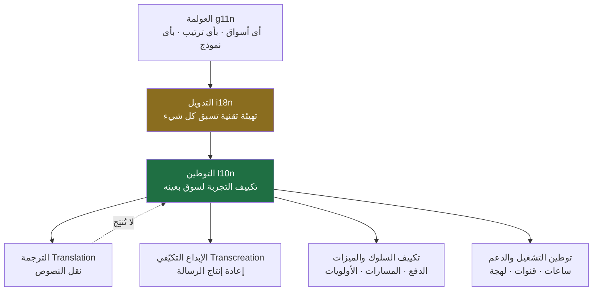
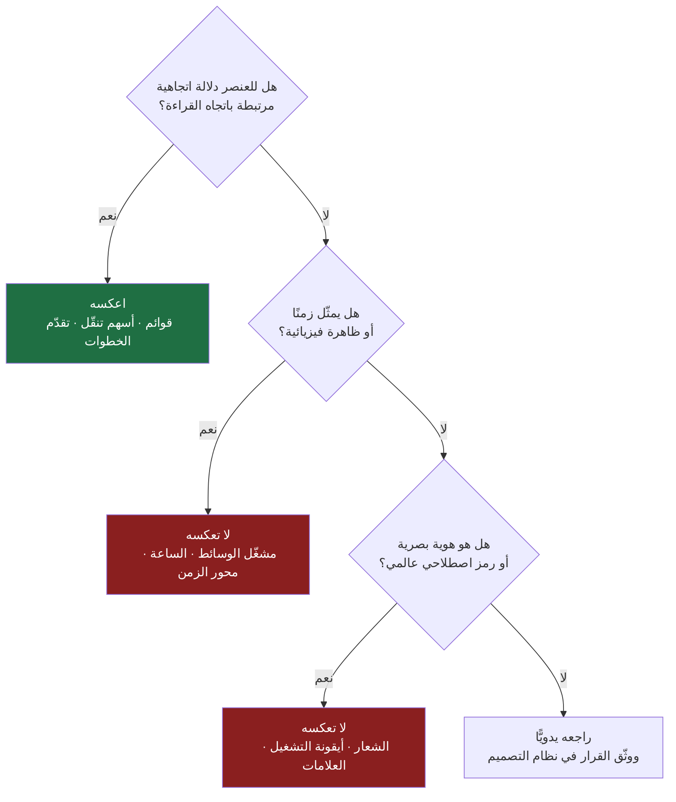
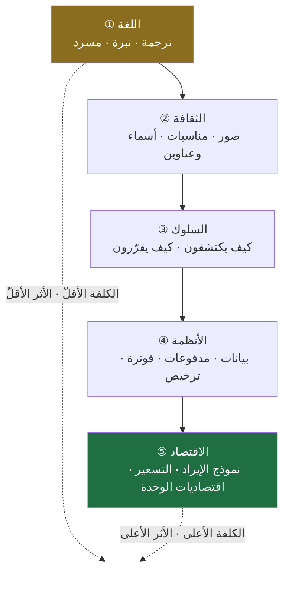
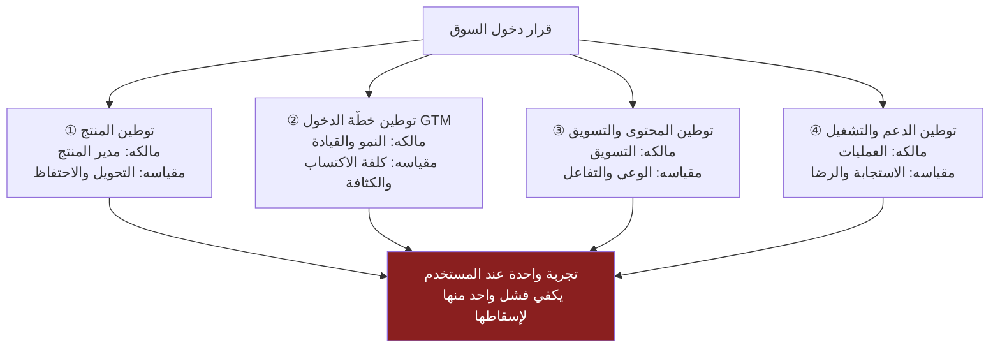
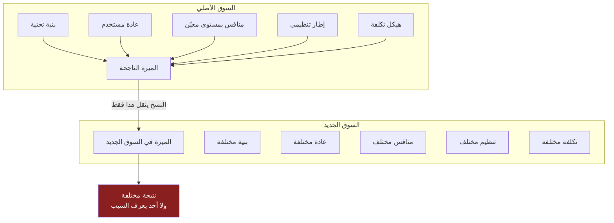
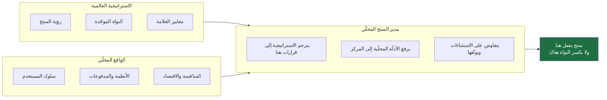
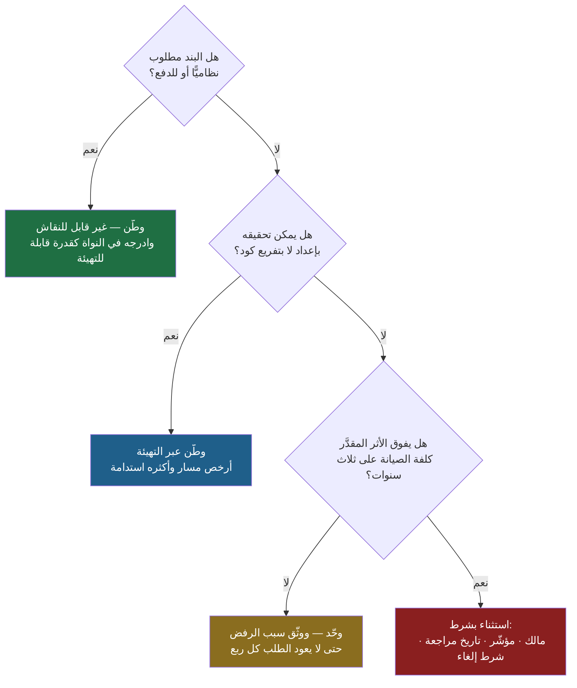

> [!info] الفصل 03 · إدارة المنتج في عصر الذكاء الاصطناعي
> **ماذا ستتعلّم:** لماذا لا يُنسخ النجاح من سوق إلى سوق، وما الذي يعنيه **التوطين** (`Localization`) حين يُفهَم بوصفه قرارًا استراتيجيًّا لا مهمّة لغوية. ستفرّق بحدّة بين خمسة مصطلحات تُخلط يوميًّا — `Translation` و`Internationalization (i18n)` و`Localization (l10n)` و`Transcreation` و`Globalization (g11n)` — وتفهم لماذا يسبق التدويل التوطينَ هندسيًّا، ولماذا يستحقّ `RTL` والعربية فصلًا هندسيًّا كاملًا لا فقرة في دليل التصميم. ثم ستتعلّم تفكيك التوطين إلى **خمس طبقات** (اللغة، الثقافة، السلوك، الأنظمة، الاقتصاد) وإلى **أربعة قرارات مستقلّة** (المنتج، خطّة الدخول، المحتوى والتسويق، الدعم والتشغيل)، وستستخدم أطرًا مسمّاة لتحليل السوق (`PESTEL`، أبعاد `Hofstede` مع نقدها، تحليل محفظة الدول، أنماط دخول السوق). وستقرأ حالات موثّقة علنًا — خروج `Uber` من الصين وجنوب شرق آسيا، وطبقات التوطين عند `Netflix` و`Spotify`، ومعركة المدفوعات في الهند — ثم تنزل إلى المنطقة: من هيمنة الدفع عند الاستلام إلى `mada` و`Apple Pay`، ومن `PDPL` إلى الفوترة الإلكترونية. وستخرج بـ**قائمة فحص تشغيلية** و**مقياس نضج من أربعة مستويات**، وبموقف منصف من السؤال المعاكس: **متى يكون التوحيد العالمي أذكى من التوطين؟**

# الفصل 03 — التوطين (`Localization`)

## 🎯 أهداف التعلّم

- **تعريف التوطين تعريفًا مهنيًّا دقيقًا** يفصله عن معناه الشائع في السوق السعودي (توظيف المواطنين)، وعن اختزاله في ترجمة الواجهة، وربطه بمسؤولية مدير المنتج لا بمسؤولية فريق المحتوى وحده.
- **التمييز العملي بين خمسة مصطلحات** — `Translation` · `Internationalization (i18n)` · `Localization (l10n)` · `Transcreation` · `Globalization (g11n)` — وتحديد مَن يملك كلًّا منها في الفريق، ومتى يكون استعمال أحدها بدل الآخر خطأً مكلفًا.
- **شرح لماذا يسبق التدويل التوطينَ هندسيًّا**، وتعداد مكوّناته الفعلية: فصل النصوص عن الكود، ودعم `Unicode`، وقواعد الجمع في `ICU`، والتقويمات المتعدّدة، وتنسيق الأرقام والعملات، وتصميم قاعدة البيانات للتعدّد اللغوي.
- **تشخيص مشكلات `RTL` والعربية تشخيصًا هندسيًّا**: ما الذي يُعكَس وما الذي لا يُعكَس أبدًا، والنصّ ثنائي الاتجاه (`Bidi`)، والأرقام العربية مقابل الهندية، والخطوط والتشكيل ومدّ الحروف، واستراتيجية اختبار قابلة للتنفيذ.
- **تفكيك أي سوق جديد إلى خمس طبقات** (لغة · ثقافة · سلوك · أنظمة وقوانين · اقتصاد) وتحديد الطبقة التي يقع فيها فشلٌ ملاحَظ، بدل التعامل مع «الفشل في السوق» ككتلة واحدة.
- **الفصل بين أربعة قرارات توطين مستقلّة** — توطين المنتج، وتوطين خطّة الدخول (`GTM`)، وتوطين المحتوى والتسويق، وتوطين الدعم والتشغيل — وإدراك أن الشركة قد تنجح في ثلاثة منها وتفشل بسبب الرابع.
- **استخدام أربعة أطر مسمّاة بأصولها**: `PESTEL` لمسح البيئة، وأبعاد `Hofstede` الثقافية **مع نقدها المنهجي**، وتحليل محفظة الدول (`Country Portfolio Analysis`) للترتيب، وأنماط دخول السوق (`Market Entry Modes`) لاختيار شكل الدخول.
- **تحليل حالات موثّقة علنًا** واستخراج المبدأ منها لا الحكاية: انسحاب `Uber` من الصين وجنوب شرق آسيا، وسياسة `Netflix` في المحتوى الإقليمي، وبنية `Spotify` في الأسواق الجديدة، وأثر `UPI` على المدفوعات في الهند.
- **ربط التوطين بالامتثال التنظيمي في المنطقة**: [[PDPL|نظام حماية البيانات الشخصية]]، وتوطين البيانات، ودور الجهات المنظِّمة في تصميم منتجات `B2B` كالفوترة الإلكترونية.
- **تطبيق قائمة فحص توطين** من ستّة محاور قبل أي دخول سوق، وتحديد موقع مؤسّستك على **مقياس نضج توطين من أربعة مستويات**.
- **عرض الحجّة المعاكسة بإنصاف**: متى يكون **التوحيد العالمي** (`Standardization`) قرارًا أذكى من التوطين — بحساب كلفة الصيانة، وتشظّي المنتج، وخطر «مئة نسخة من منتج واحد».
- **تحديد ما يفعله الذكاء الاصطناعي فعلًا في التوطين** (تلخيص التقييمات، وكشف أنماط الشكاوى، ومقارنة السلوك بين المناطق) وما لا يفعله (قرار التكييف نفسه)، بلا تهويل ولا إنكار.

## الفكرة المحورية: النجاح ليس خاصّية في المنتج

حين ينجح منتج في سوق، يميل الجميع إلى تفسير النجاح بأنه **خاصّية داخلية في المنتج نفسه**: التصميم جميل، والخوارزمية ذكية، والتجربة سلسة. وهذا التفسير مريح لأنه قابل للنقل: إذا كان النجاح في المنتج، فالمنتج ينتقل، وينتقل معه النجاح. لكن التفسير خاطئ، أو على الأقل ناقص نقصًا جوهريًّا.

النجاح ليس خاصّية في المنتج؛ هو **علاقة** بين المنتج وبين بيئة. والعلاقة تحتاج طرفين. المنتج الذي نجح في الولايات المتحدة نجح لأنه التقى بمستخدمين لهم عادات معيّنة في الدفع، وبمنافسين بمستوى معيّن، وببنية لوجستية بمواصفات معيّنة، وبقوانين تسمح بأشياء وتمنع أخرى، وبتوقّعات ثقافية عن الخصوصية والثقة والسرعة والسعر. انقل المنتج وحده، واترك الطرف الآخر خلفك، وستحصل على منتج لا علاقة له بشيء.

هذا هو الأصل الذي يقوم عليه الفصل كلّه. وما يُسمّى **التوطين** ليس زينةً تُضاف إلى منتج جاهز، بل هو **العملية التي تُعيد بناء الطرف الثاني من العلاقة**: أن تفهم البيئة الجديدة بما يكفي لتعرف أي أجزاء المنتج كانت تعتمد على البيئة القديمة اعتمادًا خفيًّا، فتعيد تصميمها.

> [!quote] من الويبينار
> جاء التوطين في الجلسة بوصفه **ركيزة معلَنة** لا موضوعًا عارضًا. فقد ورد في وصف المنصّة المستضيفة أن لها ركيزتين: «**التركيز على أثر الأعمال لا على النظريات**»، و«**التوطين (`Localization`) للسوق السعودي والعربي**».
>
> وحين سُئل المؤسّس صراحةً عن معنى الكلمة — لأن لها في السعودية دلالة أخرى معروفة — حدّده بأنه توطين «**المنتج نفسه وسلوكه وطريقة تصميمه ونصوصه (`Copywriting`) وتسويقه وطريقة الوصول إلى السوق (`Go-to-Market`) — بل وممارسات إدارة المنتج ذاتها** بما يناسب هذا السوق، لا نسخ ما ينجح في أمريكا أو أوروبا ولصقه».
>
> **ملاحظة عن الإسناد:** التسجيل ثنائي اللغة وقد فُرِّغ آليًّا، والملاحظة المرجعية لدينا عربية صياغتها تلخيصية. فما نُقل هنا هو **مضمون ما قيل كما وُثِّق في ملاحظة الأصل**، لا نصّ إنجليزي حرفيًّا. وعند الحاجة إلى اقتباس بالحرف يُرجَع إلى التسجيل الأصلي.

لاحظ في هذا التحديد أمرين يغيّران حجم الموضوع تمامًا. الأول أن القائمة **تتجاوز الواجهة**: سلوك المنتج، وطريقة تصميمه، ونصوصه، وتسويقه، وطريقة وصوله إلى السوق. والثاني — وهو الأعمق — أن القائمة تنتهي عند **ممارسات إدارة المنتج ذاتها**. أي أن الطريقة التي تُجري بها المقابلات، وتقيس بها الرضا، وترتّب بها الأولويات، وتدير بها أصحاب المصلحة، هي نفسها ممارسات نشأت في سياق ثقافي معيّن وقد تحتاج تكييفًا. وهذه فكرة نادرًا ما تُقال، وهي من أهمّ ما في الفصل.

وهذا الفصل ليس دعوة إلى «الخصوصية» بمعناها الدعائي، ولا إلى رفض المعرفة الوافدة. الأطر التي ستقرأها هنا — `PESTEL`، و`Hofstede`، وأنماط دخول السوق — كلّها وافدة، وقيمتها لا تُنقص من مصدرها. الدعوة هي إلى شيء أدقّ: **أن تعرف الشرط الذي جعل الممارسة تنجح، قبل أن تنقل الممارسة**. من نقل الممارسة بلا شرطها نقل قشرة؛ ومن رفض الممارسة لأنها أجنبية حرم نفسه من عقود من التجربة المتراكمة. والموقف المهني بينهما.

## أولًا: ما التوطين؟ تحرير المصطلح قبل استعماله

### ثلاثة معانٍ متزاحمة لكلمة واحدة

كلمة «التوطين» في العربية المعاصرة تحمل ثلاثة معانٍ متزاحمة، وخلطها سبب مباشر لسوء الفهم في الاجتماعات:

**① التوطين بالمعنى الوظيفي (`Nationalization` / السعودة).** وهو المعنى الأشيع في السياق السعودي والخليجي: رفع نسبة المواطنين في الوظائف. وهو موضوع سياسات عمل، لا موضوع هذا الفصل بحال.

**② التوطين بالمعنى الصناعي (`Localization of Supply Chain`).** أي توطين الصناعة وسلاسل الإمداد: أن يُصنَّع الشيء محليًّا بدل استيراده، وهو محور معروف في برامج التحوّل الاقتصادي في المنطقة. وهذا أيضًا ليس موضوعنا، وإن كان يشترك معه في الجذر المفهومي: نقل القدرة إلى الداخل بدل استيراد الناتج.

**③ التوطين بالمعنى المنتجي (`Product Localization` / `l10n`).** وهو موضوع الفصل: **تكييف المنتج وتجربته ونصوصه ونموذج عمله وخطّة دخوله بما يوافق ثقافة سوق بعينه وسلوك مستخدميه وأنظمته واقتصاده.**

ولأن المعنى الأول هو الأغلب في الأذهان محلّيًّا، فإن أول عمل يجب أن تفعله حين تستعمل الكلمة في اجتماع خليطٍ من الأقسام هو **تحريرها صراحةً**: «حين أقول توطين، أعني توطين المنتج لا التوظيف». هذه جملة واحدة توفّر ربع ساعة من سوء الفهم، ولها قيمة أكبر من قيمتها الظاهرة: هي إشارة إلى أن المتحدّث يعرف أن اللغة نفسها موضع توطين.

### التعريف الاشتقاقي والتعريف المهني

لغويًّا، التوطين من «الوطن»، ومعناه جعل الشيء ملائمًا لمكان ومستقرًّا فيه. وهذا الأصل اللغوي مفيد لأنه يحمل معنى **الاستقرار** لا مجرد الوجود: المنتج المُوطَّن ليس منتجًا حاضرًا في السوق، بل منتجًا **مستقرًّا** فيه، بمعنى أن المستخدم لا يشعر أنه ضيف عليه.

ومهنيًّا، التعريف الذي سنعمل به في هذا الفصل:

> [!success] تعريف عملي
> **التوطين هو إعادة تصميم المنتج ونظامه المحيط — تجربته، ونصوصه، وسلوكه، ونموذج إيراده، وخطّة دخوله، ودعمه، وعملياته — بحيث تنتج التجربةُ نفسَ المعنى ونفسَ الفعل عند مستخدم سوقٍ معيّن، مع الاعتراف بأن المدخلات التي تنتج هذا المعنى تختلف من سوق إلى سوق.**

الجزء الأخير من التعريف هو الذي يجعله عمليًّا. الهدف ليس أن تبدو الشاشة كما تبدو في السوق الأصلي؛ الهدف أن **يُحدِث** الشيء نفس الأثر. وقد يتطلّب ذلك مدخلات مختلفة تمامًا. زرّ «اشترِ الآن» في سوق يثق بالبطاقة الائتمانية قد يحتاج في سوق آخر أن يصير «اطلب الآن وادفع عند الاستلام» — ليس لأن الترجمة مختلفة، بل لأن **الفعل الذي يُطلَب من المستخدم مختلف** في ثقة كلٍّ منهما.

### لماذا هذا شأن مدير المنتج لا شأن المترجم؟

سؤال مشروع: إذا كان جزء كبير من التوطين لغويًّا، فلماذا لا يُسند كلّه إلى فريق المحتوى أو وكالة ترجمة؟

الجواب في طبيعة القرارات التي يستلزمها التوطين. المترجم يستطيع أن يختار بين «إتمام الطلب» و«إكمال الشراء»؛ لكنه لا يستطيع أن يقرّر أن **مسار الشراء نفسه** يجب أن يُختصر من ثلاث شاشات إلى واحدة لأن نسبة استخدام الجوّال في هذا السوق أعلى، ولا أن يقرّر أن **الدفع عند الاستلام** يجب أن يُضاف كخيار أول لا كخيار أخير، ولا أن يقرّر أن **إظهار السعر شاملًا الضريبة** ليس تفضيلًا تصميميًّا بل التزامًا تنظيميًّا. هذه قرارات تمسّ [[Product-Market Fit|ملاءمة المنتج للسوق]] ونموذج الإيراد والامتثال، وهي في صميم مسؤولية من يملك قرار المنتج.

> [!quote] من الويبينار
> الصياغة التي وردت في الجلسة عن سبب أهمّية التوطين لمدير المنتج تحديدًا كانت مباشرة: التوطين ليس نسخ ما ينجح في أمريكا أو أوروبا ولصقه، بل بناء المنتج بما يناسب هذا السوق — وقد امتدّت القائمة عنده إلى **ممارسات إدارة المنتج ذاتها**، لا إلى المنتج وحده.

وثمّة سبب ثانٍ أعمق: التوطين قرار **مفاضلة**، وكل مفاضلة تحتاج مقعدًا يملكها. كل ميزة تُبنى لسوق واحد هي ميزة لم تُبنَ للمنتج كلّه؛ وكل مسار يُفرَّع محلّيًّا هو مسار سيُصان مرّتين إلى الأبد. من يقرّر أن هذا التفريع يستحقّ كلفته الدائمة ليس المترجم، بل من يحمل الميزانية والمسؤولية. وسنعود إلى هذه النقطة تفصيلًا في قسم **النقاش المفتوح**، لأنها الحدّ الذي يمنع التوطين من أن يصير شهيّةً بلا سقف.

## ثانيًا: خمسة مصطلحات تُخلط يوميًّا

هذا القسم هو أكثر أقسام الفصل «قاموسية»، وهو مع ذلك أكثرها نفعًا عمليًّا، لأن أغلب الخلافات في مشاريع التوطين هي خلافات على تعريف غير محرَّر. خمسة مصطلحات، لكلٍّ منها مالك مختلف ومخرَج مختلف وكلفة مختلفة.

### ① الترجمة (`Translation`)

نقل المعنى من لغة إلى لغة. مخرَجها **نصّ**، ومالكها **مترجم**، ومعيار جودتها **الأمانة والسلاسة**. وهي جزء من التوطين لا مرادف له. والترجمة الآلية اليوم بلغت مستوى يجعلها نقطة بداية معقولة لكثير من النصوص، وهذا بالضبط ما جعل الخلط أخطر: صار من السهل أن تُترجم منتجك كاملًا في أيام، فتظنّ أنك وطّنته.

### ② التدويل (`Internationalization` — تُختصر `i18n`)

> [!info] إضافة مرجعية
> الاختصار `i18n` يعني: الحرف الأول `i`، ثم **18** حرفًا، ثم الحرف الأخير `n`. وعلى النمط نفسه: `l10n` للتوطين (`localization`)، و`g11n` للعولمة (`globalization`)، و`a11y` لإتاحة الوصول (`accessibility`). وهذا اصطلاح قديم في أوساط الهندسة البرمجية، ومعرفته تنفعك عمليًّا لأنك ستجده في أسماء المكتبات وحِزَم البرمجيات وتذاكر العمل.

التدويل هو **تهيئة المنتج تقنيًّا** بحيث يصبح قابلًا للتوطين أصلًا. مخرَجه **قدرة**، لا لغة. مالكه **الهندسة**. ومعيار جودته سؤال واحد: **كم يكلّف إضافة لغة/سوق جديد؟** إن كان الجواب «أسابيع من تعديل الكود»، فالمنتج غير مُدوَّل. وإن كان «ملف ترجمة جديد وإعدادات `Locale`»، فهو مُدوَّل.

### ③ التوطين (`Localization` — تُختصر `l10n`)

تكييف المنتج لسوق بعينه: اللغة، والتنسيقات، والمحتوى، والصور، والتجربة، والميزات، وطرق الدفع. مخرَجه **تجربة**، ومالكه **مدير المنتج بالشراكة مع التصميم والهندسة والتسويق**، ومعيار جودته سلوكي لا لغوي: هل تغيّرت مؤشّرات الاستخدام في السوق المستهدف؟

### ④ الإبداع التكيّفي (`Transcreation`)

مرحلة أبعد من الترجمة: **إعادة إنتاج الرسالة** بحيث تحدث الأثر العاطفي نفسه، ولو تغيّر النصّ كلّيًّا. هذا هو ميدان الإعلان والشعارات ونصوص العلامة. الشعار الذي يعتمد على تلاعب لفظي أو قافية أو مرجع ثقافي لا يُترجَم؛ يُعاد ابتكاره. مخرَجه **رسالة**، ومالكه **التسويق وكُتّاب المحتوى**، ومعيار جودته الأثر لا الأمانة الحرفية.

ومن الأمثلة العملية القريبة: نصوص الحالات الفارغة (`Empty States`) ورسائل الخطأ. جملة مثل `Oops! Something went wrong` تُرجمت في عشرات المنتجات العربية إلى «عفوًا! حدث خطأ ما»، وهي ترجمة سليمة وباردة. أمّا الصياغة التي تحدث الأثر نفسه فقد تكون أقرب إلى «تعذّر إتمام العملية — حاول مرّة أخرى»، لأن النبرة المرحة في رسائل الخطأ ليست متساوية القبول عبر الثقافات، وخصوصًا في المنتجات المالية حيث تُقرأ الطرافة كخفّة.

### ⑤ العولمة (`Globalization` — تُختصر `g11n`)

المظلّة الاستراتيجية التي تضمّ ما سبق كلّه، وتضمّ معه القرارات المؤسّسية: أي أسواق ندخل، وبأي ترتيب، وبأي نموذج، وبأي بنية فريق، وبأي بنية قانونية وضريبية. مخرَجها **استراتيجية**، ومالكها **القيادة**.

### الجدول الجامع

| المصطلح | السؤال الذي يجيب عنه | المخرَج | المالك المعتاد | متى يفشل؟ |
|---|---|---|---|---|
| `Translation` | ماذا تقول هذه الجملة بلغتنا؟ | نصّ | مترجم / أداة | حين يُظنّ أنه يكفي |
| `Internationalization (i18n)` | هل يستطيع منتجنا أصلًا أن يتكلّم لغة أخرى؟ | قدرة تقنية | الهندسة | حين يُؤجَّل إلى ما بعد الحاجة |
| `Localization (l10n)` | كيف نجعل التجربة طبيعية في هذا السوق؟ | تجربة | [[PRD\|مدير المنتج]] والفريق | حين يُختزل في اللغة |
| `Transcreation` | كيف نحدث الأثر العاطفي نفسه؟ | رسالة | التسويق والمحتوى | حين يُعامَل كترجمة |
| `Globalization (g11n)` | أي الأسواق ندخل ومتى وكيف؟ | استراتيجية | القيادة | حين تغيب فيصير الدخول عشوائيًّا |

اقرأ السهم المنقّط في الأسفل بعناية، فهو خلاصة القسم: **التوطين يُنتِج حاجةً إلى ترجمة، والترجمة لا تُنتِج توطينًا أبدًا.** وهذه هي البنية المنطقية نفسها التي رأيتها في [[01 - لماذا لا يزال مدير المنتج أهم من أي وقت مضى|الفصل الأول]] بين جوهر الدور ومهامّه الظاهرة: الجوهر يولّد المهمّة، والمهمّة لا تولّد الجوهر.

> [!warning] الخطأ الترتيبي الأكثر كلفة
> أكثر ما يُكلِّف الفرقَ ليس أن تُخطئ في التوطين، بل أن **تعكس الترتيب**: أن تبدأ بالترجمة، ثم تكتشف أن المنتج غير مُدوَّل، ثم تكتشف أن قرار دخول السوق نفسه لم يُدرَس. عندها تكون قد أنفقت ميزانية ترجمة على منتج قد لا يدخل هذا السوق أصلًا، وقد اشتريتَ [[Technical Debt|دَينًا تقنيًّا]] في صورة نصوص مبعثرة في الكود. الترتيب الصحيح: **قرار → قدرة → تكييف → نصّ**.

## ثالثًا: لماذا يسبق التدويل التوطينَ هندسيًّا؟

هذا القسم موجّه إلى مدير المنتج لا إلى المهندس، وغرضه أن تعرف **ما الذي تطلبه ولماذا** حين تفتح نقاش التدويل، وأن تفهم الفواتير التي ستصلك إن أُهمِل.

القاعدة البسيطة: **لا يمكنك توطين منتج لم يُدوَّل.** ومحاولة ذلك تنتهي دائمًا إلى الحلّ الالتفافي المعروف: نسخة ثانية من الكود للسوق الجديد. وهذه أسوأ نتيجة ممكنة، لأنها تضاعف كلفة كل ميزة مستقبلية إلى الأبد، وتخلق فروقًا صامتة بين النسختين تظهر بعد أشهر في صورة أخطاء لا يستطيع أحد تفسيرها.

### مكوّنات التدويل السبعة

**① فصل النصوص عن الكود (`String Externalization`).** أن تكون كل جملة يراها المستخدم في ملف موارد منفصل بمُعرِّف، لا مكتوبةً داخل الشيفرة. وهذا هو الأساس الذي يقوم عليه كل ما بعده. والمؤشّر التشخيصي البسيط الذي تستطيع أنت طلبه: **كم نصًّا ظاهرًا للمستخدم لا يزال داخل الكود؟** إن لم يعرف الفريق الجواب، فهذه إجابة في ذاتها.

**② دعم `Unicode` من الطرف إلى الطرف.** الترميز يجب أن يكون `UTF-8` في قاعدة البيانات، وفي واجهات البرمجة، وفي البريد، وفي التقارير المصدَّرة، وفي أسماء الملفات. والعطل الكلاسيكي هنا هو ما يسمّيه الناس «الطلاسم» (`Mojibake`): نصّ عربي يظهر رموزًا غير مفهومة لأن حلقةً واحدة في السلسلة تستعمل ترميزًا مختلفًا. ولاحظ أن العطل غالبًا لا يظهر في الواجهة بل في **الأطراف**: ملف `CSV` مصدَّر يفتحه المحاسب فيراه طلاسم، أو رسالة نصّية قصيرة، أو تقرير مطبوع.

**③ قواعد الجمع والتصريف (`Pluralization`).** الإنجليزية لها صيغتان (مفرد/جمع). العربية لها **ستّ** فئات في تصنيف `Unicode CLDR`: `zero` و`one` و`two` و`few` و`many` و`other`. أي أن جملة مثل «لديك ٣ رسائل» تحتاج بنية تتعامل مع: صفر رسائل، ورسالة واحدة، ورسالتين، و٣–١٠ رسائل، و١١–٩٩ رسالة، وما بعدها. والحلّ المعياري هو صيغة رسائل `ICU MessageFormat`، وهي معيار مفتوح مستعمل في أغلب أطر العمل. والفريق الذي يبني نظام نصوصه على «الجملة + الرقم» بلا هذه البنية سينتهي إلى العبارة الهجينة المشهورة: «عدد الرسائل: 3»، وهي مخرج هروبي مقبول أحيانًا وسيّئ دائمًا في المنتجات الاستهلاكية.

**④ التاريخ والتقويم.** ثلاث مشكلات متمايزة: **الصيغة** (يوم/شهر/سنة مقابل شهر/يوم/سنة)، و**التقويم** (ميلادي/هجري)، و**بداية الأسبوع** (الأحد في السعودية، الاثنين في أوروبا، وهذا يغيّر شكل كل مُنتقي تاريخ وكل تقرير أسبوعي). والتقويم الهجري تحديدًا ليس تحويلًا حسابيًّا بسيطًا، لأن فيه تقويمًا حسابيًّا وآخر مبنيًّا على الرؤية، وقد يختلفان بيوم — وهو فرق يوم واحد لا يهمّ في تطبيق ملاحظات، ويهمّ جدًّا في نظام رواتب أو استحقاق إجازات أو أقساط.

**⑤ الأرقام والعملات والوحدات.** فاصل العشرية، وفاصل الآلاف، وموضع رمز العملة، وعدد المنازل العشرية (وهو ليس اثنين في كل عملة)، والتقريب، والوحدات (كيلومتر/ميل، مئوي/فهرنهايت). والقاعدة الهندسية: **لا تُنسّق الأرقام يدويًّا**؛ استعمل واجهات `Locale` القياسية. وأما القاعدة المنتجية فأهمّ: **حدّد مبكرًا كيف تُخزَّن المبالغ متعدّدة العملات** — أبأصلها مع سعر الصرف وقت العملية، أم بعملة موحّدة؟ هذا قرار يبدو تقنيًّا وهو في الحقيقة قرار محاسبي ومنتجي، وتغييره لاحقًا مؤلم.

**⑥ تصميم قاعدة البيانات للتعدّد اللغوي.** حين يصير للمنتج محتوى يُدخِله المستخدمون أو التجّار (أسماء منتجات، أوصاف، تصنيفات)، يصبح السؤال بنيويًّا: هل الحقل نصّ واحد أم جدول ترجمات؟ وما اللغة الاحتياطية (`Fallback`) إن غابت الترجمة؟ وكيف يبحث المستخدم بالعربية عن منتج اسمه مكتوب بالإنجليزية؟ هذا الأخير مسألة **بحث** لا مسألة ترجمة، ويحتاج معالجة مثل تطبيع الهمزات والتاء المربوطة وحذف التشكيل — وسنعود إليه في القسم التالي.

**⑦ الإعداد المسبق للاتجاه (`Directionality`).** أن يكون التخطيط مبنيًّا على خصائص منطقية (بداية/نهاية) لا فيزيائية (يسار/يمين) منذ اليوم الأول. وهذا أرخص ألف مرة من إصلاحه لاحقًا، وسيأخذ القسم الرابع كاملًا.

> [!example] الترجمة الزائفة — أرخص اختبار تدويل تعرفه
> **الترجمة الزائفة** (`Pseudo-localization`) ممارسة هندسية معروفة وبسيطة: تُولَّد آليًّا «لغة» وهمية تحوّل كل نصّ إلى صورة مشوّهة منه — تُطيله بنسبة 30–40%، وتضيف إليه محارف غير لاتينية، وتحيطه بأقواس مميّزة، وتقلب اتجاهه.
>
> والفائدة أنك ترى في دقائق، **قبل أي ترجمة حقيقية**، ثلاثة أنواع من الأعطال: النصوص المحبوسة داخل الكود (لأنها تبقى إنجليزية سليمة وسط الفوضى فتنكشف فورًا)، والتخطيطات التي تنكسر مع النصّ الأطول (والعربية أقصر من الإنجليزية غالبًا لكن الألمانية والفرنسية أطول بكثير)، والمكوّنات التي لا تحترم الاتجاه.
>
> وهذا الاختبار يكلّف يومًا واحدًا من مهندس، ويُدرَج في `CI` فيعمل تلقائيًّا بعدها إلى الأبد. وهو من أعلى نِسَب العائد التي تستطيع أن تطلبها بصفتك مدير منتج.

> [!info] إضافة مرجعية
> يُنصح عمليًّا بالتفريق بين ثلاثة مستويات من هوية السوق، لأن خلطها يسبب أعطالًا محيّرة:
> - **اللغة** (`Language`): العربية.
> - **المنطقة** (`Region`): السعودية، الإمارات، مصر.
> - **الإعداد المحلّي** (`Locale`): تركيبة الاثنين مع التفضيلات — `ar-SA` مقابل `ar-EG`.
>
> والمستخدم قد يريد **واجهة إنجليزية بأرقام وتقويم وعملة سعودية**، وهي حالة شائعة جدًّا بين المهنيين في الخليج ويكسرها كل منتج يربط اللغة بالمنطقة ربطًا صلبًا. فاجعلها ثلاثة إعدادات مستقلّة: لغة العرض، والمنطقة، والعملة. وهذا قرار منتج لا قرار هندسة.

## رابعًا: `RTL` والعربية — فصل هندسي كامل

تُعامَل العربية في كثير من الفرق كأنها «الإنجليزية مقلوبة». وهذا الافتراض هو منبع أغلب الأعطال، لأن الفرق ليس في الاتجاه وحده، بل في **الاتصال بين الحروف**، و**الأشكال المتغيّرة للحرف الواحد بحسب موضعه**، و**التشكيل**، و**نظامَي أرقام**، و**النصّ المختلط**. خمس مسائل مستقلّة، كلٌّ منها له علاج مختلف.

### ① الانعكاس: ما يُعكَس وما لا يُعكَس

القاعدة العامة أن التخطيط يُعكَس أفقيًّا (`Mirroring`): القوائم من اليمين، والشريط الجانبي على اليمين، وتقدّم الخطوات من اليمين إلى اليسار، وسهم «التالي» يشير إلى اليسار. لكن الاستثناءات هي التي تفصل المنتج المتقَن عن المنتج المقلوب آليًّا:

| العنصر | يُعكَس؟ | لماذا |
|---|---|---|
| القوائم والتنقّل والأشرطة الجانبية | نعم | يتبع اتجاه القراءة |
| أسهم التنقّل (التالي/السابق) | نعم | معناها نسبي إلى اتجاه التقدّم |
| أيقونة التشغيل ▶ | **لا** | رمز عالمي لآلة التشغيل، لا سهم اتجاه |
| مؤشّر التقدّم في مشغّل الفيديو والصوت | **لا** | الزمن يمضي في اتجاه واحد عالميًّا |
| محاور الرسوم البيانية الزمنية | **لا** غالبًا | الزمن من اليسار إلى اليمين اصطلاح راسخ في قراءة البيانات |
| الأرقام نفسها (٣٤٥) | **لا** | الأرقام تُكتب من اليسار لليمين حتى داخل نصّ عربي |
| الساعات والتقويمات | **لا** | اتجاه عقارب الساعة لا يُعكَس |
| الشعارات والعلامات التجارية | **لا** | جزء من هوية بصرية محميّة |
| أيقونات الكاميرا والمرفقات والبحث | **لا** غالبًا | لا تحمل دلالة اتجاهية |
| الأيقونات التي تحمل اتجاهًا سرديًّا (تراجع/إعادة) | نعم | معناها مبنيّ على اتجاه الحركة |

> [!warning] العكس الآلي الكامل نمط مضادّ
> بعض الفرق تُفعِّل خاصّية عكس تلقائي شاملة على مستوى النظام وتعتبر المهمّة منجزة. النتيجة النموذجية: مشغّل فيديو بزرّ تشغيل يشير إلى اليسار، ورسم بياني للإيرادات يتناقص فيه الزمن، وساعة تدور عقاربها عكسيًّا. **الانعكاس قرار لكل مكوّن على حدة**، ويجب أن يُوثَّق في نظام التصميم بقائمة صريحة لما لا يُعكَس.

### ② النصّ ثنائي الاتجاه (`Bidirectional Text` / `Bidi`)

هذه أكثر المسائل تسبّبًا للأخطاء غير المفهومة، وهي شائعة جدًّا في السوق العربي حيث تختلط اللغتان في الجملة الواحدة بشكل طبيعي.

الجملة «سجّل الدخول عبر Google الآن» تحوي مقطعًا إنجليزيًّا داخل نصّ عربي. وخوارزمية `Unicode Bidi` تتولّى ترتيب العرض، لكنها تعطي نتائج غير متوقّعة عند **علامات الترقيم على الحدود**، وعند **الأرقام الملاصقة**، وعند **الأقواس**. ومن أشهر مظاهر العطل: النقطة في نهاية جملة عربية تنتهي بكلمة إنجليزية تقفز إلى بداية السطر؛ ورقم هاتف يظهر معكوسًا؛ وقوس إغلاق يظهر مكان قوس الفتح.

وهذا يتضاعف سوءًا في الحقول التي يكتب فيها **المستخدم** نصًّا مختلطًا: أسماء المنتجات، والعناوين، وأسماء الملفات، وعبارات البحث. ولا يكفي فيه اختبار الواجهة بنصوص عربية نظيفة، بل يجب الاختبار بنصوص مختلطة عمدًا: عربي + إنجليزي + أرقام + رموز + رابط.

### ③ الأرقام: العربية أم الهندية؟

هذه من أكثر النقاط سوء فهم. اصطلاحًا: `0123456789` تُسمّى **الأرقام العربية الغربية** (وهي المستعملة عالميًّا)، و`٠١٢٣٤٥٦٧٨٩` تُسمّى **الأرقام العربية الشرقية** أو الهندية.

والاستعمال يختلف داخل المنطقة نفسها: المشرق العربي ومصر يستعملان الشكلين، والمغرب العربي يستعمل الغربية غالبًا، والاستعمال في السعودية يميل إلى الغربية في السياقات الرقمية والتجارية. والقاعدة المنتجية العملية:

- **الأرقام الوظيفية** (المبالغ، أرقام الطلبات، أرقام الهواتف، رموز التحقّق، معرّفات) → **غربية دائمًا**، لأنها تُنسخ وتُلصق وتُقارَن وتُقرأ صوتيًّا، والخلط فيها يسبّب أخطاء إدخال حقيقية.
- **الأرقام السردية داخل نصّ أدبي أو تحريري** → قد تُكتب شرقية إن كان ذلك من هوية المنتج.
- **لا تخلط الشكلين في الشاشة الواحدة** أبدًا. هذا أسوأ من اختيار أيّهما.
- **حقول الإدخال يجب أن تقبل الشكلين وتطبّعهما**، لأن لوحة المفاتيح العربية على بعض الأجهزة تُخرج الشكل الشرقي. من لا يطبّع سيرفض رقم جوّال صحيح ويخبر المستخدم أنه «غير صالح».

### ④ الخطوط والتشكيل والتحكّم في الطول

العربية خطّ متّصل، ولكل حرف حتى أربعة أشكال (أولي، وسطي، نهائي، منفصل). ويترتّب على هذا نتائج عملية:

- **لا يصلح تكبير الأحرف** (`Uppercase`) في العربية — وأي مكوّن تصميم يستعمل `text-transform: uppercase` سيكون بلا أثر في العربية وبأثر كبير في الإنجليزية، فتختلّ الهرمية البصرية بين اللغتين.
- **ارتفاع السطر** (`Line Height`) الافتراضي المصمَّم للاتينية غالبًا غير كافٍ للعربية بسبب النقاط تحت الحروف والمدّات، فتتلامس السطور. القاعدة العملية: زد ارتفاع السطر بنسبة معتبرة في الأنماط العربية.
- **الوزن البصري مختلف**: الخطّ العربي بوزن `Regular` قد يبدو أخفّ أو أثقل من نظيره اللاتيني، فتحتاج مقاييس منفصلة لا الاعتماد على المقياس نفسه.
- **العربية أقصر من الإنجليزية غالبًا** بنسبة تتراوح تقديريًّا بين 20% و25% في الجمل القصيرة — وهذا يخلق مشكلة معاكسة: أزرار وبطاقات مصمَّمة على النصّ الإنجليزي تبدو فارغة بالعربية. والتصميم الجيد يختبر باللغتين معًا لا بالأطول وحدها.
- **التشكيل** (الحركات) غير مستعمل في واجهات المنتجات إلا في سياقات محدّدة (المصحف، التعليم، أسماء قد تلتبس). لكن **البحث** يجب أن يتجاهله: من يبحث عن «مُحَمَّد» يجب أن يجد «محمد».
- **تطبيع البحث** ضرورة لا تحسين: توحيد الهمزات (أ/إ/آ/ا)، والتاء المربوطة والهاء (ة/ه)، والألف المقصورة والياء (ى/ي)، وحذف التطويل (ـــ)، وحذف التشكيل. من لا يفعل ذلك ينتج بحثًا يعمل «أحيانًا» بلا سبب ظاهر للمستخدم.

### ⑤ استراتيجية اختبار قابلة للتنفيذ

> [!example] قائمة اختبار `RTL` قبل أي إصدار
> **① الترجمة الزائفة** في `CI` — تكشف النصوص المحبوسة وكسر التخطيط تلقائيًّا.
> **② لقطات مرجعية** (`Visual Regression`) للشاشات الرئيسية في وضعَي `LTR` و`RTL`، فأي انزياح يظهر كفرق بصري.
> **③ مجموعة نصوص خبيثة** ثابتة تُستعمل في كل اختبار: نصّ عربي خالص · نصّ مختلط بالإنجليزية · نصّ مع رقم هاتف · نصّ مع رابط · نصّ مع أقواس وعلامات ترقيم على الحدّ · نصّ مع رموز تعبيرية · اسم بأرقام هندية.
> **④ اختبار التبديل الحيّ** — تغيير اللغة داخل التطبيق دون إعادة تشغيل، فهذه أكثر لحظة تنكشف فيها الحالات المخزّنة بشكل خاطئ.
> **⑤ اختبار الأطراف لا الواجهة فقط**: الفواتير `PDF`، والبريد الإلكتروني، والرسائل النصّية، وملفّات `CSV` المصدَّرة، والإشعارات، وشاشة الطباعة. **أغلب أعطال العربية تظهر هنا لا في الشاشة.**
> **⑥ اختبار مع متحدّث أصلي** — لا مترجم فقط. الفرق بين «صحيح لغويًّا» و«طبيعي» لا تكشفه إلا العين المحلية.

> [!note] لماذا وضعنا هذا القسم في فصل عن الاستراتيجية؟
> قد يبدو أن تفاصيل ارتفاع السطر وتطبيع الهمزات أدنى من مستوى مدير المنتج. والحقيقة عكس ذلك تمامًا: **هذه التفاصيل هي المكان الذي يُحكَم فيه على جدّيتك في السوق.** المستخدم لا يقرأ استراتيجيتك؛ هو يرى بحثًا لا يجد اسمه، ورقم جوّال يُرفض، وفاتورة `PDF` بطلاسم. وكل واحد من هذه ينتج انطباعًا واحدًا: «هذا منتج أجنبي أُلبِس ثوبًا عربيًّا». وهذا الانطباع يكلّف في [[Adoption|التبنّي]] أكثر بكثير ممّا تكلّف معالجته هندسيًّا.

## خامسًا: طبقات التوطين الخمس

التوطين ليس مقياسًا واحدًا بل خمس طبقات مستقلّة، ترتيبها من الأسهل إلى الأصعب هو نفسه ترتيبها من الأقلّ أثرًا إلى الأكثر أثرًا. وهذا الترتيب المعكوس هو سبب أغلب الإخفاقات: تُنفَق أغلب الميزانية على الطبقة الأولى، بينما يقع الفشل في الطبقتين الرابعة والخامسة.

### الطبقة ①: اللغة

أبسط الطبقات، وأول ما يخطر بالبال، وأقلّها كفاية. والمهارة فيها ليست في نقل الكلمة بل في **إنتاج لغة يشعر المستخدم أنها لغته**.

خذ `Checkout` مثالًا: تُترجم «الدفع»، أو «إتمام الطلب»، أو «إكمال الشراء»، أو «مراجعة الطلب». وليست هذه مترادفات؛ كلٌّ منها يعِد بشيء مختلف. «الدفع» تعني أن المال سيُخصم الآن — وهي مخيفة لمستخدم لم يراجع سلّته بعد. و«إتمام الطلب» تصف الإنجاز وتناسب سوقًا يغلب فيه الدفع عند الاستلام. و«مراجعة الطلب» تعِد بخطوة وسيطة آمنة وترفع الثقة عند المتردّد. اختيارك بينها **قرار منتج له أثر قابل للقياس على معدّل التحويل**، لا قرار لغوي.

وقرارات أخرى في هذه الطبقة تُغفَل عادةً:

- **مستوى الرسمية.** هل يخاطب المنتج المستخدم بـ«أنت» أم بصيغة محايدة؟ وهل يستعمل الفصحى أم لهجة؟ والقاعدة العملية في المنطقة: **الفصحى المبسّطة** هي القاسم المشترك الآمن للواجهة، لأن اللهجة تقرّب جمهورًا وتُبعِد آخر. أما اللهجة فمكانها التسويق والدعم حيث يكون الجمهور محدَّدًا جغرافيًّا.
- **التذكير والتأنيث.** الإنجليزية محايدة جندريًّا في الأفعال، والعربية ليست كذلك. «أضفت»، «أضفتِ»، «أضفتم» — ثلاث صيغ لجملة إنجليزية واحدة. والحلّ العملي هو صياغة **مبنيّة للمجهول أو اسمية** تتجنّب المشكلة: «تمّت الإضافة» بدل «أضفتَ». وهذه حيلة تحريرية يعرفها كُتّاب المحتوى المخضرمون وتوفّر عشرات الحالات الحرجة.
- **المصطلحات التقنية.** هل تُترجم `Dashboard`؟ و`Wallet`؟ و`Cashback`؟ الإفراط في التعريب ينتج نصًّا يفهمه اللغويون ولا يفهمه المستخدم؛ والإفراط في الإبقاء على الإنجليزية ينتج نصًّا هجينًا. والحكم الفيصل: **ما الكلمة التي يستعملها المستخدم فعلًا حين يتحدّث عن هذا الشيء؟** وهذا يُعرَف بالاستماع لا بالتفضيل.
- **مسرد موحّد** (`Glossary`) و**ذاكرة ترجمة** (`Translation Memory`). بغيرهما ستجد المفهوم الواحد بثلاثة أسماء في ثلاث شاشات، وهذا يهدم الثقة بصمت.

### الطبقة ②: الثقافة

ما يُعدّ عاديًّا في سوق قد يكون غير مناسب في آخر، والعكس. وهذه الطبقة تشمل:

- **الصور والرموز البصرية.** طبيعة الصور المستعملة في المنتج والتسويق، وما تعرضه من مشاهد وملابس ومناسبات. وأكثر ما يُخطئ فيه الوافدون هو استعمال مكتبة صور عالمية بلا مراجعة، فتظهر مشاهد لا تمتّ إلى بيئة المستخدم بصلة، فيقرأها بوصفها إشارة إلى أن المنتج «ليس له».
- **الألوان والدلالات.** الألوان ليست محايدة ثقافيًّا، وإن كان تأثيرها يُبالَغ فيه كثيرًا في أدبيات التسويق. الأهمّ عمليًّا هو **الاتساق مع التوقّع المحلّي** في الدلالات الوظيفية: الأخضر للنجاح والأحمر للخطأ اصطلاح شبه عالمي في الواجهات، ولا يُنصح بمخالفته باسم الخصوصية الثقافية.
- **المناسبات الموسمية.** وهذه من أعلى بنود التوطين عائدًا وأقلّها كلفة. رمضان وحده يغيّر في المنطقة أنماط الاستهلاك وأوقات الذروة وسلوك التصفّح تغييرًا حادًّا: ذروة الطلب في توصيل الطعام تنتقل، وأنماط التسوّق تتغيّر، وتظهر فئات إنفاق موسمية. والمنتج الذي لا يعرف رمضان في تقويمه التسويقي والتشغيلي يفوّت أهمّ نافذة في سنته. وكذلك موسم العودة إلى المدارس، واليوم الوطني، وموسم الحجّ والعمرة في السياق السعودي تحديدًا.
- **الأسماء والعناوين والبيانات الشخصية.** نموذج الاسم الغربي (اسم أول + اسم أخير) لا يصف بنية الاسم العربي (اسم + اسم الأب + اسم الجدّ + اسم العائلة). والعناوين في المنطقة تحوّلت إلى نظام العنوان الوطني، وقبله كان الاعتماد على **الوصف والمَعلَم** (`Landmark`) هو الغالب — وهو ما دفع تطبيقات التوصيل إلى الاعتماد على تحديد الموقع والخرائط بدل نموذج العنوان النصّي، وهذا قرار توطين بنيوي لا تجميلي.

### الطبقة ③: السلوك

الطبقة التي يبدأ عندها التوطين في أن يصير عملًا منتجيًّا حقيقيًّا: **الناس يستعملون المنتج نفسه بطرق مختلفة**.

المثال الأوضح الذي ورد في الجلسة هو الاعتماد على **الاكتشاف عبر الخريطة** بدل البحث النصّي في العقار. والمبدأ العام أوسع من المثال: أي منتج يقوم على «اكتشاف» يجب أن يسأل سؤالًا محلّيًّا: **ما الوحدة الذهنية التي يفكّر بها المستخدم هنا؟** أهي الاسم؟ أم الفئة؟ أم الموقع؟ أم الشخص؟ أم السعر؟ الترتيب يختلف، والواجهة يجب أن تعكس الترتيب لا أن تفرضه.

ومن الأنماط السلوكية الأخرى الجديرة بالفحص في أي سوق: نسبة استخدام الجوّال إلى سطح المكتب، وتفضيل التطبيق على الويب، وقنوات التواصل المفضّلة مع الدعم (هاتف؟ محادثة؟ `WhatsApp`؟ بريد؟)، ودرجة الاستعداد لإنشاء حساب قبل التجربة، والحساسية للسعر مقابل الحساسية للسرعة، ودور التوصية الشخصية في قرار الشراء.

### الطبقة ④: الأنظمة والقوانين

هذه الطبقة **غير قابلة للتفاوض**، وهي التي تحوّل التوطين من تحسين إلى شرط دخول. وتشمل: حماية البيانات ومتطلّبات إقامتها، وأنظمة التجارة الإلكترونية، وأنظمة المدفوعات والترخيص، والفوترة والضريبة، ومتطلّبات التحقّق من الهوية، وأنظمة الإعلان والمحتوى، وأنظمة قطاعية خاصّة (صحّة، تعليم، تمويل، نقل).

وسنفرد لها قسمًا كاملًا لاحقًا في سياق المنطقة، لكن المبدأ المنتجي المهمّ هنا: **الامتثال ليس بندًا في نهاية المشروع، بل قيد تصميمي في أوّله.** الفرق بين النظرتين يقاس بأشهر: من يعامل الامتثال كطبقة تُضاف قبل الإطلاق يكتشف في الأسبوع الأخير أن بنية بياناته لا تسمح بحذف بيانات مستخدم بعينه، أو أن نموذج التسجيل لا يجمع الموافقة بالشكل المطلوب، أو أن الفاتورة تفتقر إلى حقول إلزامية.

### الطبقة ⑤: الاقتصاد ونموذج العمل

أعمق الطبقات وأكثرها إغفالًا: **حتى نموذج الإيراد يحتاج توطينًا.**

الاشتراك الشهري نموذج ناجح في أسواق اعتادت الاقتطاع التلقائي وتملك اختراقًا عاليًا للبطاقات الائتمانية وثقة راسخة في التجديد التلقائي. وفي أسواق أخرى يصطدم بثلاثة حواجز: انخفاض انتشار البطاقات الائتمانية مقابل بطاقات الخصم، والنفور من الالتزام المتكرّر، وصعوبة الإلغاء التي تصنع سمعة سلبية. والبدائل التي أثبتت فعاليتها في أسواق ناشئة: الدفع عند الاستخدام، والباقات المدفوعة مسبقًا، والاشتراك السنوي بخصم كبير (يحلّ مشكلة التكرار لا مشكلة السعر)، والنماذج المدعومة من طرف ثالث (التاجر يدفع بدل المستخدم).

وتدخل في هذه الطبقة أيضًا: **حساسية السعر ونقاط الأسعار النفسية** (التي تختلف بعملة كل سوق ولا تُنقَل بالتحويل الحسابي)، و**التسعير التفاضلي بين الأسواق** ومخاطره، و**اقتصاديات الوحدة** التي قد تنقلب رأسًا على عقب حين تتغيّر كلفة التوصيل أو رسوم الدفع أو تكلفة اكتساب العميل.

> [!warning] الخطأ التوزيعي
> النمط المتكرّر في الشركات التي «وطّنت وفشلت»: **95% من الجهد في الطبقة الأولى، و5% موزّعة على الأربع الباقية.** والنتيجة منتج مترجم ترجمة ممتازة يفشل لأن نموذج دفعه لا يناسب السوق. ولهذا فإن أول سؤال تشخيصي في أي مراجعة توطين ليس «هل الترجمة جيدة؟» بل: **في أي طبقة يقع الفشل الملاحَظ؟** والإجابة تُستخرج من البيانات: أين بالضبط يتسرّب المستخدمون في المسار؟

## سادسًا: التوطين مقابل الترجمة — الجدول الفاصل

بعد الطبقات الخمس، يصير الجدول التالي مفهومًا لا مجرّد قائمة فروق. وهو الجدول الذي يستحقّ أن يُعرَض في أول اجتماع عن دخول سوق جديد، لأنه يحسم النقاش عن الميزانية والملكية معًا.

| الوجه | الترجمة (`Translation`) | التوطين (`Localization`) |
|---|---|---|
| **موضوع العمل** | تحويل النصوص | إعادة تصميم المنتج للبيئة |
| **وحدة الاهتمام** | الكلمة والجملة | سلوك المستخدم ونتيجته |
| **طبيعة المهمّة** | مهمّة لغوية | مهمّة استراتيجية |
| **من يقودها** | مترجم أو وكالة | [[PRD\|مدير المنتج]] مع التصميم والهندسة والتسويق |
| **متى تنتهي** | بتسليم النصوص | لا تنتهي؛ تتطوّر مع السوق |
| **معيار النجاح** | دقّة وسلاسة | تحرّك [[KPI\|مؤشّرات]] الاستخدام والتحويل والاحتفاظ |
| **الكلفة** | لكل كلمة | لكل سوق، ومستمرّة |
| **الأثر على الكود** | غالبًا لا شيء | ميزات وتدفّقات وتكاملات جديدة |
| **الفشل النموذجي** | نصّ ركيك | منتج مفهوم تمامًا ولا يستعمله أحد |

والخلاصة التي تستحقّ أن تُحفظ: **يمكن أن يكون التطبيق مترجمًا 100% وما يزال غير مُوطَّن إطلاقًا.** بل إن الترجمة الممتازة قد تزيد المشكلة خفاءً، لأنها تُسكِت أظهر الأعراض فتصعب معرفة سبب ضعف الأداء.

### مقياس عملي: أربعة أسئلة تكشف الفرق فورًا

خذ أي منتج تعمل عليه واسأل عنه هذه الأربعة. عدد إجاباتك بـ«نعم» هو موقعك الحقيقي:

1. **هل يستطيع مستخدم من هذا السوق أن يُتمّ المسار الأساسي بطريقة الدفع التي يستعملها فعلًا يوميًّا؟** — لا التي نتمنّى أن يستعملها.
2. **هل نصوص المنتج مكتوبة أصلًا بالعربية، أم مترجمة عن نصّ إنجليزي؟** — الفرق يُسمَع. النصّ المترجم يحتفظ ببنية الجملة الأجنبية حتى وإن كانت مفرداته عربية سليمة.
3. **هل هناك ميزة واحدة على الأقلّ موجودة في هذا السوق وغير موجودة في الأسواق الأخرى؟** — إن كانت الإجابة «لا» في سوق مختلف جوهريًّا، فالاحتمال الراجح أنك لم توطّن بل ترجمت.
4. **هل تغيّر ترتيب الأولويات في خارطة الطريق بسبب ما تعلّمته من هذا السوق؟** — هذا هو الاختبار الأصعب، لأنه يقيس ما إذا كان السوق يؤثّر في القرار أم يستهلك مخرجاته فقط.

> [!example] كيف يبدو الفرق في شاشة واحدة: مسار الدفع
> **النسخة المترجمة:** ثلاث خطوات — سلّة، ثم بيانات البطاقة، ثم تأكيد. الأزرار مترجمة بدقّة، والأخطاء واضحة، والتصميم أنيق. معدّل إتمام الدفع منخفض ولا أحد يعرف السبب، لأن الشاشة «لا يوجد فيها خطأ».
>
> **النسخة المُوطَّنة:** تُقرأ البيانات أولًا فيتبيّن أن التسرّب يقع في خطوة بيانات البطاقة تحديدًا، وأن قسمًا كبيرًا من المستخدمين يغادرون عندها ثم يعودون لاحقًا فيكرّرون المحاولة. المقابلات تكشف السبب: الترّدد في إدخال بيانات البطاقة في منتج جديد لم تتكوّن معه ثقة بعد. فتُعاد الشاشة بناءً على ذلك: **الدفع عند الاستلام خيارًا أول ظاهرًا** لا مخفيًّا خلف «طرق أخرى»؛ و**المحافظ الرقمية وطرق الدفع المحلّية** قبل البطاقة؛ و**السعر شاملًا الضريبة والتوصيل** منذ السلّة لا في الخطوة الأخيرة (وهو أيضًا مطلب تنظيمي في كثير من الحالات)؛ و**شارة أمان محلّية مفهومة** بدل شعارات عالمية لا يعرفها المستخدم؛ و**رقم تواصل ظاهر** لأن وجود قناة بشرية يرفع الثقة في هذا السياق أكثر ممّا يرفعها في أسواق أخرى.
>
> لاحظ أن أيًّا من هذه التغييرات **ليس ترجمة**، وأن كلًّا منها كان يحتاج قرارًا من مالك المنتج، وأن اثنين منها لهما كلفة هندسية وتشغيلية حقيقية (تحصيل نقدي، وتكامل مع مزوّد دفع محلّي). هذا هو الفرق بالضبط.

> [!info] إضافة مرجعية
> ثمّة معيار عملي بسيط اشتُهر في أوساط تصميم المنتجات العالمية: أن يُطلب من مستخدم محلّي أن يصف المنتج في جملة واحدة. فإذا وردت في وصفه كلمة **«أجنبي»** أو **«مو لنا»** أو **«شكله مترجم»** — فهذه ليست ملاحظة تصميمية، بل **نتيجة قياس** على الطبقات الخمس مجتمعة. المستخدم لا يملك مفردات التشخيص، لكنه يملك الحكم النهائي، وحكمه يسبق كل لوحة بيانات.

## سابعًا: أربعة قرارات توطين مستقلّة

من أنفع ما يمكن أن يخرج به قارئ هذا الفصل: أن «التوطين» ليس قرارًا واحدًا بل **أربعة قرارات مستقلّة**، لكلٍّ منها ميزانية ومالك ومقياس نجاح. والشركة قد تُتقن ثلاثة منها وتخسر السوق بسبب الرابع، وهذا يفسّر كثيرًا من الإخفاقات المحيّرة.

### القرار ①: توطين المنتج (`Product Localization`)

الواجهة، والتدفّقات، والميزات، وطرق الدفع، والتكاملات، والبيانات. **المالك:** مدير المنتج. **المقياس:** التحويل، والتفعيل، والاحتفاظ، و[[Time to Value|زمن الوصول للقيمة]] في السوق المستهدف مقارنةً بالسوق الأصلي.

والقرار الحاكم فيه هو **حدّ التفريع**: أي أجزاء المنتج تُبنى مرّة واحدة عالميًّا، وأيها يُفرَّع لكل سوق. والمعمارية الجيدة تجعل هذا خيارًا واعيًا: نواة موحّدة + طبقة تكيّف قابلة للتهيئة (طرق دفع، وقواعد ضريبية، ونصوص، وترتيب خطوات) + استثناءات صريحة قليلة العدد وموثّقة الأسباب.

### القرار ②: توطين خطّة الدخول (`Go-to-Market Localization`)

كيف تصل إلى أول ألف مستخدم في هذا السوق: قنوات الاكتساب، والشراكات، والتسعير الافتتاحي، والتوقيت، والتسلسل الجغرافي داخل السوق نفسه (مدينة أولًا أم البلد كلّه؟).

**المالك:** النمو والتسويق بمشاركة القيادة. **المقياس:** تكلفة اكتساب العميل، وسرعة الوصول إلى كثافة كافية.

وهذا القرار هو الذي يُغفَل أكثر من غيره، لأن الفرق تفترض أن ما نجح في اكتساب المستخدمين في سوق سينجح في آخر. والحقيقة أن **قنوات الاكتساب نفسها تختلف** اختلافًا حادًّا: نسبة الاعتماد على البحث مقابل وسائل التواصل، ووزن التسويق عبر المؤثّرين، ودور الإحالة الشخصية، وفعالية المتاجر التطبيقية، وأهمّية الوجود الميداني. والشراكة المحلّية الصحيحة قد تختصر سنة من البناء العضوي — كما أن الشراكة الخاطئة قد تحبس المنتج في قناة واحدة.

> [!quote] من الويبينار
> المثال الذي ضُرب في الجلسة على هذا القرار تحديدًا كان **كريم**: ورد أنها «حاولت نقل طريقة عملها **وخطّة دخولها للسوق** من الإمارات إلى السعودية كما هي، فلم تنجح».
>
> ولاحظ الصياغة: الحديث عن **طريقة العمل وخطّة الدخول**، لا عن المنتج وحده. وهذا بالضبط هو تمييز القرار الثاني عن الأول. ولم تُذكَر في الجلسة أي تفاصيل تنفيذية عمّا جرى، **فيؤخذ المثال إشارةً إلى المبدأ لا دراسةَ حالة**.

### القرار ③: توطين المحتوى والتسويق

الرسالة، والتموضع، والنبرة، والمواد الإبداعية، والمحتوى التحريري، وتحسين الظهور في البحث بالعربية (وهو ميدان قائم بذاته لأن سلوك البحث العربي يختلف بنيويًّا: كثرة الأخطاء الإملائية، والبحث بالعامّية، والخلط بين العربية والإنجليزية في العبارة الواحدة، والاعتماد الكبير على البحث الصوتي).

**المالك:** التسويق. **المقياس:** الوعي، والوصول العضوي، ومعدّل التفاعل، وجودة الحركة الواردة.

وهذا هو ميدان `Transcreation` بامتياز. والخطأ الشائع أن تُترجم الحملة العالمية بدل أن يُعاد ابتكارها؛ فيخرج إعلان صحيح لغويًّا لا يضحك أحدًا ولا يقنع أحدًا.

### القرار ④: توطين الدعم والتشغيل

ساعات العمل (وأيّام العطلة الأسبوعية — الجمعة والسبت في السعودية مقابل السبت والأحد في أغلب العالم، وهذا يغيّر جداول المناوبات و[[SLA|اتفاقيات مستوى الخدمة]] وتوقيت الإطلاقات)، وقنوات الدعم المفضّلة، ولغة الوكلاء ولهجتهم، وسياسات الاسترجاع، والخدمات اللوجستية، والتحصيل النقدي، والتعامل مع المنازعات.

**المالك:** العمليات وخدمة العملاء. **المقياس:** زمن الاستجابة، ومعدّل الحلّ من أول تواصل، ورضا العملاء.

وهذا القرار هو **القاتل الصامت**. المنتج قد يكون ممتازًا وخطّة الدخول ذكية والتسويق بديعًا، ثم ينهار كل ذلك لأن الدعم لا يعمل يوم الجمعة، أو لأن الوكيل لا يتحدّث العربية، أو لأن سياسة الاسترجاع مكتوبة بمنطق سوق آخر يثق فيه البائع بالمشتري بدرجة مختلفة. والمستخدم لا يفصل بين هذه الطبقات؛ هو يجرّب «الشركة» ككلّ.

> [!note] لماذا الفصل مفيد عمليًّا؟
> لأنه يحوّل السؤال المبهم «لماذا لا ينمو المنتج في هذا السوق؟» إلى **أربعة أسئلة قابلة للفحص المستقلّ**، ولكل واحد منها بيانات مختلفة تُراجَع: مسار المنتج، وقنوات الاكتساب، ومقاييس الحملات، وتذاكر الدعم. وفي أغلب الحالات التي رأيتها تُشخَّص جيدًا، يتبيّن أن الفشل في **قرار واحد** بعينه، وأن الفرق كانت تُنفق على القرارات الثلاثة الأخرى ظنًّا أن المشكلة موزّعة.

## ثامنًا: أطر تحليل السوق — أربعة أطر بأصولها وحدودها

الحدس المحلّي لا يكفي وحده، ليس لأنه ضعيف، بل لأنه **غير قابل للنقل والمساءلة**. حين تقول «هذا السوق مختلف»، فأنت تقول شيئًا صحيحًا لا يستطيع أحد أن يبني عليه قرارًا. الأطر التالية وظيفتها الوحيدة أن تحوّل الحدس إلى شيء يمكن مناقشته والاعتراض عليه وتحديثه.

### ① `PESTEL` — مسح البيئة الكلّية

> [!info] إضافة مرجعية
> `PESTEL` (ويُعرف أيضًا بـ`PEST` في صيغته الأقدم) إطار مسح بيئي شاع في أدبيات الإدارة الاستراتيجية منذ سبعينيات القرن الماضي، ويُنسب أصله عادةً إلى أعمال فرانسيس أجيلار في تحليل البيئة الخارجية للمنشأة. وهو ليس إطارًا لاتخاذ القرار بل **لجمع الأسئلة**؛ ومن يستعمله ليقرّر يكون قد أساء استعماله.

ستّة محاور، وأسئلتها في سياق دخول سوق جديد:

| المحور | ماذا يفحص | مثال سؤال عملي |
|---|---|---|
| **P** سياسي | استقرار السياسات، والاتجاهات الحكومية، وبرامج التحوّل | هل هناك برنامج وطني يدفع نحو قطاعنا فيخلق طلبًا أو تسهيلًا؟ |
| **E** اقتصادي | الدخل، والتضخّم، والعملة، وهيكل الإنفاق | ما القدرة الشرائية للشريحة المستهدفة، وما حساسيتها للسعر؟ |
| **S** اجتماعي | التركيبة السكانية، والقيم، وأنماط الحياة | ما هرم الأعمار؟ وما دور الأسرة في قرار الشراء؟ |
| **T** تقني | البنية التحتية، ونسبة الأجهزة، وسرعة التبنّي | ما نسبة الجوّال؟ ما اختراق البنية الرقمية للدفع؟ |
| **E** بيئي | الجغرافيا، والمناخ، والاستدامة | هل يؤثّر المناخ على سلوك الاستخدام الموسمي؟ |
| **L** قانوني | حماية البيانات، والترخيص، والضريبة، وقواعد القطاع | ما الترخيص المطلوب؟ وما قواعد إقامة البيانات؟ |

والقيمة العملية للإطار أنه **يمنع الإغفال**: أغلب مفاجآت دخول الأسواق تأتي من محور لم يُفكَّر فيه أصلًا، لا من محور فُكِّر فيه وأُخطئ التقدير. أمّا حدّه فواضح: ينتج قائمة طويلة بلا أوزان ولا أولويات، ويميل إلى الوصف الساكن بينما الأسواق تتحرّك.

### ② أبعاد `Hofstede` الثقافية — مع نقدها

> [!info] إضافة مرجعية
> جِيرت هوفستيده باحث هولندي في علم النفس الاجتماعي، بنى عمله الأصلي على بيانات استقصاء ضخمة جُمعت من موظّفي `IBM` في عشرات الدول في أواخر الستينيات وأوائل السبعينيات، ونشره في `Culture's Consequences` (1980) ثم في `Cultures and Organizations: Software of the Mind` مع مؤلّفين آخرين. وأبعاده في صيغتها المتأخّرة ستّة:
> **مسافة السلطة** (`Power Distance`) · **الفردية مقابل الجماعية** (`Individualism vs Collectivism`) · **تجنّب عدم اليقين** (`Uncertainty Avoidance`) · **الذكورية مقابل الأنوثية** (`Masculinity vs Femininity` — وهي تسمية أصلية أثارت نقدًا واسعًا وصار كثيرون يفضّلون «التوجّه نحو الإنجاز مقابل التوجّه نحو جودة الحياة») · **التوجّه طويل الأمد** (`Long-term Orientation`) · **التساهل مقابل الكبح** (`Indulgence vs Restraint`).

والاستعمال المنتجي المسؤول للأبعاد **ليس** أن تقول «هذا مجتمع جماعي إذن نضيف ميزة مشاركة»، بل أن تستعملها **لتوليد فرضيات تُختبر**:

- ارتفاع **تجنّب عدم اليقين** يولّد فرضية: قد يحتاج المستخدم هنا إلى تأكيد صريح ومعلومات أوفى قبل الالتزام، فنختبر إضافة خطوة مراجعة، وإظهار تفصيل التكلفة كاملًا مبكرًا، وتوضيح سياسة الإلغاء قبل الدفع.
- ارتفاع **التوجّه الجماعي** يولّد فرضية: قد يكون للتوصية الشخصية والدليل الاجتماعي وزن أعلى من التقييمات المجهولة، فنختبر عرض «استخدمه أشخاص تعرفهم» أو برامج الإحالة.
- ارتفاع **مسافة السلطة** يولّد فرضية في منتجات `B2B`: قد يكون قرار الشراء أكثر مركزية، فتتغيّر رحلة البيع ودور المستخدم النهائي فيها.

> [!warning] أربعة انتقادات جوهرية لإطار `Hofstede` — يجب أن تعرفها قبل أن تستعمله
> **① مشكلة العيّنة والزمن.** البيانات الأصلية جُمعت من موظّفي شركة واحدة في حقبة واحدة قبل نصف قرن. وتعميم ثقافة أمّة من موظّفي شركة عابرة للحدود افتراض ثقيل، خصوصًا في مجتمعات تغيّرت تغيّرًا هائلًا منذ ذلك الحين.
> **② مغالطة التجميع** (`Ecological Fallacy`). الأبعاد **مقاييس على مستوى الدولة**، ولا يصحّ إسقاطها على الفرد. أن يكون متوسّط بلدٍ ما مرتفعًا في بُعد ما لا يخبرك بشيء عن المستخدم الجالس أمامك، والتباين **داخل** الدولة غالبًا أكبر من التباين **بينها** وبين غيرها.
> **③ الدولة ليست وحدة ثقافية.** المنطقة العربية تُعامَل في كثير من هذه الجداول ككتلة واحدة، وهذا خطأ فادح عملي: السلوك الرقمي في الرياض يختلف عنه في القاهرة ويختلف عنه في الدار البيضاء. بل داخل الدولة الواحدة تختلف المدن الكبرى عن غيرها اختلافًا يفوق كثيرًا من الفروق «الوطنية».
> **④ خطر الاستعمال التبريري.** أخطر ما في الإطار أنه يقدّم تفسيرًا جاهزًا لأي نتيجة بعد وقوعها، فيُستعمل لتبرير الفشل («ثقافتهم لا تقبل هذا») بدل التحقيق فيه. وهذا يحوّله من أداة تفكير إلى غطاء.
>
> **الاستعمال الصحيح إذن:** مصدر فرضيات، لا مصدر أحكام. وكل ما يخرج منه يجب أن يمرّ على بحث محلّي فعلي — [[Product Discovery|اكتشاف]] ومقابلات وبيانات — قبل أن يدخل قرارًا.

### ③ تحليل محفظة الدول (`Country Portfolio Analysis`) — وترتيب الأسواق

السؤال العملي في أغلب الشركات ليس «هل ندخل سوقًا؟» بل «**أي سوق أولًا؟**». وتحليل محفظة الدول إطار تقليدي يرتّب الأسواق المرشّحة على معايير مثل حجم السوق، ومعدّل النمو، وشدّة المنافسة، وسهولة الدخول التنظيمي.

> [!info] إضافة مرجعية
> النقد الأشهر لهذا الإطار جاء من بانكاج غيماوات في عمله على **إطار `CAGE`** (`Distance Still Matters`, Harvard Business Review, 2001، ثم كتابه `Redefining Global Strategy`). وحجّته أن تحليل المحفظة التقليدي ينظر إلى **جاذبية السوق** وحدها ويهمل **المسافة** بين سوقك الحالي والسوق المستهدف، والمسافة عنده أربعة أنواع:
> **ثقافية** (`Cultural`): لغة، وقيم، وأعراف.
> **إدارية/سياسية** (`Administrative`): قوانين، وعملة، وعلاقات، وروابط استعمارية أو اتفاقيات تجارية.
> **جغرافية** (`Geographic`): مسافة، وحدود، ولوجستيات، ومناطق زمنية.
> **اقتصادية** (`Economic`): دخل الفرد، وكلفة الموارد، وبنية تحتية.
>
> والفائدة المباشرة لمدير المنتج في المنطقة: سوق كبير بعيد على أبعاد `CAGE` قد يكون أسوأ من سوق أصغر قريب. وهذا يفسّر لماذا يكون التوسّع الخليجي من السعودية إلى الإمارات والكويت والبحرين أرخص كثيرًا من التوسّع إلى سوق أوروبي أكبر: **اللغة نفسها، وأنظمة متقاربة، ومنطقة زمنية واحدة، وسلوك متشابه** — أي مسافة قريبة على الأبعاد الأربعة. لكن انتبه إلى الفخّ المعاكس: القرب الظاهر يخلق **افتراضًا بأن لا توطين مطلوبًا**، وهو افتراض خاطئ. الفروق بين السعودية والإمارات في التنظيم والمدفوعات والتركيبة السكانية حقيقية جدًّا، وهي أخطر لأنها **غير متوقّعة**.

### ④ أنماط دخول السوق (`Market Entry Modes`)

قرار مستقلّ تمامًا عن «هل ندخل؟»: **بأي شكل ندخل؟** والأنماط الكلاسيكية في أدبيات الأعمال الدولية، مرتّبة بالالتزام والسيطرة:

| النمط | الالتزام | السيطرة | متى يناسب منتجًا رقميًّا |
|---|---|---|---|
| **التصدير الرقمي** (إتاحة المنتج دون كيان محلّي) | منخفض | متوسّط | اختبار طلب مبكّر، ومنتجات `SaaS` عابرة للحدود بلا متطلّبات تنظيمية |
| **الترخيص / الامتياز** | منخفض | منخفض | حين تكون العلامة هي الأصل الأساسي |
| **الشراكة المحلّية / التوزيع** | متوسّط | متوسّط | حين تكون العلاقات والقنوات هي الحاجز الحقيقي |
| **المشروع المشترك** (`Joint Venture`) | مرتفع | مشترك | حين يشترط التنظيم شريكًا محلّيًّا أو حين تكون المعرفة المحلّية حاسمة |
| **الكيان المملوك بالكامل** | مرتفع جدًّا | كاملة | حين يكون السوق استراتيجيًّا طويل الأمد ويحتاج تشغيلًا ميدانيًّا |
| **الاستحواذ** | الأعلى | كاملة | حين تكون السرعة والكثافة أهمّ من الكلفة، أو حين يكون المنافس المحلّي متقدّمًا يصعب اللحاق به |

والملاحظة المنتجية المهمّة: **نمط الدخول يحدّد كم توطينًا تستطيع أصلًا**. الشركة التي تدخل بتصدير رقمي بلا فريق محلّي لا تستطيع أن توطّن الطبقات العميقة، لأن التوطين يحتاج ملاحظة يومية وعلاقات وحضورًا. ولهذا كثيرًا ما يكون التسلسل الواقعي: تصدير رقمي لاختبار الطلب → شراكة محلّية لبناء القناة → كيان محلّي حين يثبت السوق. ومن حاول توطينًا عميقًا بلا حضور محلّي أنفق كثيرًا وأنتج قليلًا.

## تاسعًا: لماذا يفشل النسخ واللصق؟ نظرية «الشرط الخفي»

هذا القسم هو القلب النظري للفصل، وهو الجواب المنهجي على السؤال: لماذا لا يُنسخ ما نجح؟

### الميزة ليست وحدة قائمة بذاتها

حين تنظر إلى ميزة ناجحة في منتج عالمي، فأنت ترى **الطرف الظاهر فقط** من نظام كامل. الميزة نجحت لأنها استندت إلى مجموعة من **الشروط الخفية** التي لم يكتبها أحد لأنها كانت بديهية في سياقها:

- **شرط بنيوي:** بنية تحتية معيّنة (عناوين دقيقة، شبكة لوجستية، اختراق البطاقات، إنترنت مستقرّ).
- **شرط سلوكي:** عادة راسخة عند المستخدم (الشراء بالبطاقة، الثقة في الغريب، الحجز المسبق، الاشتراك التلقائي).
- **شرط تنافسي:** بديل قائم بمستوى معيّن (الميزة كانت متفوّقة على البديل المحلّي هناك، وقد تكون متأخّرة عن البديل هنا).
- **شرط تنظيمي:** قانون يسمح أو لا يمنع.
- **شرط اقتصادي:** هيكل تكلفة يجعل النموذج مربحًا (كلفة العمالة، وأسعار الوقود، ورسوم المعاملات).
- **شرط توقيتي:** أن تصل الميزة في لحظة نضج معيّنة للسوق — قبلها مبكّرة وبعدها متأخّرة.

فحين تُنسخ الميزة، **يُنسخ الظاهر ويُترك الشرط**. والنتيجة ليست أن الميزة أسوأ، بل أنها **بلا معنى**: حلٌّ لمشكلة غير موجودة، أو حلٌّ لمشكلة موجودة لكن بأداة لا تعمل هنا.

> [!quote] من الويبينار
> المبدأ الذي بُني عليه هذا التحليل ورد في الجلسة في صيغة موجزة: التوطين هو أن **لا تنسخ ما ينجح في أمريكا أو أوروبا وتلصقه**، بل تبني بما يناسب هذا السوق.
>
> وقد جاء في الجلسة أيضًا نقلٌ لافت عن زميل خبير عمل في **17 سوقًا**، مفاده أن **السعودية كانت الأكثر تفرّدًا** بينها جميعًا، وأنه **اضطُرّ إلى العيش فيها ليفهمها** بخلاف بقية الأسواق. وهذه شهادة شخصية لا قياس، لكن دلالتها المنهجية واضحة: بعض الأسواق لا تُفهَم من البيانات وحدها.

### التمرين المضادّ: «ما الشرط الذي جعلها تنجح؟»

الأداة العملية المقابلة لهذه النظرية بسيطة: **قبل نسخ أي ميزة من منافس أو من منتج عالمي، اكتب ثلاثة أسطر:**

1. **ما المشكلة التي حلّتها في سياقها الأصلي؟** — لا ما تفعله، بل ما تحلّه.
2. **ما الشرط الذي جعل هذا الحلّ ممكنًا هناك؟** — عدّد من قائمة الشروط الستّة أعلاه.
3. **هل يتوفّر هذا الشرط عندنا؟ وإن لم يتوفّر، ما الحلّ المكافئ الذي يستعمل شرطًا متوفّرًا لدينا؟**

السؤال الثالث هو الذي يحوّل التمرين من رفض إلى ابتكار. لأن الغرض ليس أن تقول «هذا لا يصلح هنا» — هذه إجابة كسولة أيضًا — بل أن تسأل: **ما الشيء الذي يحقّق الغرض نفسه بالشروط المتوفّرة؟** المنتج الذي يحلّ مشكلة الثقة بالبطاقة في سوق يثق بها يستعمل ضمان الاسترداد؛ والذي يحلّها في سوق لا يثق بها يستعمل الدفع عند الاستلام. المشكلة واحدة، والشرط مختلف، فالحلّ مختلف.

> [!example] تطبيق: ميزة «اشترِ الآن وادفع لاحقًا»
> **المشكلة الأصلية:** تمكين المستهلك من شراء سلعة تتجاوز سيولته الفورية دون فوائد ظاهرة، وزيادة متوسّط قيمة السلّة للتاجر.
> **الشروط الخفية في السوق الأصلي:** بنية تقييم ائتماني ناضجة تسمح بقرار فوري · اختراق واسع لبطاقات الخصم المرتبطة بحسابات نشطة · إطار تنظيمي واضح لهذا النوع من التمويل · قبول ثقافي للتقسيط الاستهلاكي.
> **الفحص في المنطقة:** بعض هذه الشروط متوفّر بقوّة، وبعضها مختلف: التقييم الائتماني يعتمد على بنية مختلفة، والإطار التنظيمي للتمويل والتقسيط له متطلّبات ترخيص محدّدة، والقبول الثقافي للتقسيط قوي لكن الحساسية تجاه ما يُفهم أنه فائدة عالية جدًّا. ولهذا تطوّرت في السوق نماذج **متوافقة مع الأحكام الشرعية** ونماذج تحصّل عمولتها من التاجر لا من المستهلك.
> **الدرس:** لم يُنسخ النموذج ولم يُرفض؛ أُعيد بناؤه بشرط مختلف. وهذا هو التوطين في صورته النضجة: **الغرض ثابت، والآلية متغيّرة.**

### ثلاثة أنماط لنتيجة النسخ

ليس كل نسخ يفشل بالطريقة نفسها، ومعرفة نمط الفشل تُسرّع التشخيص:

**① الفشل الصامت.** الميزة تعمل تقنيًّا ولا يستعملها أحد. لا شكاوى ولا أخطاء — فقط رقم استخدام قريب من الصفر. وهذا أخطر الأنماط لأنه لا يولّد إشارة، فتبقى الميزة سنوات تستهلك صيانة.

**② الفشل بالضدّ.** الميزة تُستعمل لكن بنتيجة عكسية: ترفع التخلّي، أو تخفض الثقة، أو تولّد تذاكر دعم. وهذا النمط أسهل اكتشافًا وأكثر إيلامًا.

**③ الفشل المؤجّل.** الميزة تنجح في الشريحة الأولى (وهي غالبًا الشريحة الأقرب إلى السوق الأصلي: مستخدمون شباب، مدن كبرى، مألوفون بالمنتجات العالمية) ثم تتوقّف عند حاجز عند محاولة التوسّع إلى الشريحة الأعرض. وهذا أخبث الأنماط لأنه **يعطي إشارة إيجابية كاذبة مبكرًا** فتُبنى عليه استثمارات كبيرة.

## عاشرًا: حالات موثّقة علنًا — الدرس لا الحكاية

> [!warning] عن حدود هذا القسم
> كل ما يلي مبنيّ على **ما هو منشور علنًا** في تقارير الشركات وبياناتها الصحفية والتغطية الصحفية الواسعة. **لم تُنسَب هنا أرقام داخلية ولا قرارات مغلقة ولا تفاصيل اجتماعات.** والغرض استخراج **المبدأ** لا سرد القصّة، فالقصص ممتعة وقليلة النفع، والمبادئ قابلة للتطبيق.

### ① `Uber` في الصين وجنوب شرق آسيا: حين يكون المنافس المحلّي أسرع في التوطين

من أكثر الحالات توثيقًا في تاريخ التوسّع الرقمي: دخلت `Uber` السوق الصينية ونافست `Didi Chuxing` لسنوات، ثم أعلنت في **أغسطس 2016** دمج عملياتها الصينية مع `Didi` مقابل حصّة في الشركة المدمجة. وتكرّر النمط في **مارس 2018** حين باعت عملياتها في جنوب شرق آسيا لـ`Grab` مقابل حصّة فيها.

**المبدأ المستخرَج — ثلاث نقاط:**

- **التوطين ميزة تنافسية لا تكلفة.** المنافس المحلّي لا يتفوّق لأنه «يفهم الثقافة» بمعنى عاطفي، بل لأنه **أسرع في دورة التعلّم المحلّي**: يقرّر بلا مرجعية بعيدة، ويجرّب أسبوعيًّا، ويعيد تشكيل المنتج حول أنماط دفع وسلوك محلّية. الشركة العالمية تخوض المعركة نفسها بحلقة قرار أطول.
- **التكاملات المحلّية قد تكون خندقًا لا يُخترَق.** في الصين، ارتباط `Didi` ببيئة الدفع والتطبيقات المحلّية السائدة أعطاها موقعًا داخل نظام بيئي كامل، لا مجرّد تطبيق أفضل.
- **الانسحاب ليس دائمًا فشلًا.** التحوّل من التشغيل المباشر إلى حصّة في الفائز المحلّي قرار محفظة عقلاني: أن تحتفظ بالتعرّض للسوق دون أن تحرق رأس مال في معركة تشغيلية. ومدير المنتج الذي يقرأ هذه الحالة على أنها «فشلت `Uber`» يفوّته الدرس الحقيقي: **متى تتوقّف؟** وهو سؤال منتجي لا أقلّ من سؤال «متى تبني؟».

### ② `Netflix`: التوطين كطبقات متدرّجة

`Netflix` من أوضح الأمثلة على أن التوطين ليس قرارًا واحدًا بل سلّمًا تصاعديًّا. الشركة أعلنت توسّعها العالمي الواسع في **يناير 2016**، وتطوّر نهجها علنًا عبر طبقات يمكن قراءتها بوضوح:

1. **واجهة مترجمة.**
2. **ترجمة المحتوى** (`Subtitling`) ثم **الدبلجة** (`Dubbing`) — وهي قفزة كلفة كبيرة، ولها أثر مباشر على الوصول إلى شرائح لا تقرأ الترجمة بسرعة.
3. **ترخيص محتوى إقليمي** قائم.
4. **إنتاج محتوى أصلي محلّي** — وهي أعلى الطبقات كلفةً، وأعمقها أثرًا. وقد أصبحت أعمال غير ناطقة بالإنجليزية من أكثر أعمال المنصّة مشاهدةً عالميًّا، وهو ما يقلب الافتراض الشائع بأن المحتوى المحلّي «للسوق المحلّي فقط».
5. **توطين التسعير وطرق الدفع** — بما في ذلك باقات الجوّال منخفضة السعر في أسواق حسّاسة للسعر، وهي في جوهرها **توطين لنموذج الإيراد** لا للمحتوى.

**المبدأ المستخرَج:** التوطين **استثمار متدرّج بعوائد متدرّجة**، والقفزة إلى الطبقة الأعلى تُتّخذ حين يثبت السوق نفسه في الطبقة الأدنى. ومن قفز مباشرةً إلى أغلى طبقة قبل إثبات الطلب قامر؛ ومن بقي في أرخص طبقة إلى الأبد حكم على نفسه بسقف منخفض. وهذه بالضبط منطق **مقياس النضج** الذي سنعرضه لاحقًا.

**ودرس ثانٍ يُغفَل:** المحتوى المحلّي عند `Netflix` لم يكن توطينًا فحسب، بل صار **مصدر تمايز عالمي**. أي أن أعمق مستويات التوطين قد تنقلب إلى أصل عالمي. وهذا احتمال يستحقّ أن يبقى في ذهن كل من يبني في المنطقة: ما تبنيه لحلّ مشكلة محلّية قد يكون هو نفسه ما يميّزك خارجها.

### ③ `Spotify`: التوطين في الاكتشاف لا في الواجهة فقط

`Spotify` مثال على نوع مختلف من التوطين: ليس في اللغة ولا في التسعير أساسًا، بل في **آلية الاكتشاف** — قوائم تشغيل إقليمية ومحلّية، وتوصيات مبنيّة على سلوك الاستماع المحلّي، وواجهات تحرير محتوى بفرق محلّية. والشركة تنشر علنًا تقارير استماع سنوية تُظهر الفروق الحادّة في الذوق بين الأسواق.

**المبدأ المستخرَج:** في المنتجات التي جوهرها **الاكتشاف** (`Discovery`)، يقع التوطين الحقيقي في **طبقة الترتيب والتوصية**، لا في طبقة العرض. ومنتج التوصية الذي دُرِّب على سلوك سوق واحد سيقدّم لمستخدم سوق آخر تجربة «صحيحة ومملّة». وهذه الملاحظة تنطبق مباشرة على التجارة الإلكترونية والمحتوى والوظائف والعقار في المنطقة: **من يملك بيانات السلوك المحلّي يملك ميزة لا تُشترى بالترجمة.**

### ④ الهند و`UPI`: حين تعيد البنية التحتية الوطنية تعريف قواعد اللعبة

أُطلقت **واجهة المدفوعات الموحّدة** (`Unified Payments Interface` — `UPI`) في الهند عام **2016** من هيئة المدفوعات الوطنية الهندية، بوصفها بنية تحتية عامّة تتيح التحويل الفوري بين الحسابات عبر أي تطبيق. وقد نمت استخدامًا هائلًا وموثّقًا في التقارير الرسمية المنشورة، وأعادت تشكيل سوق المدفوعات كاملًا: صار المنافس ليس تطبيق دفع أفضل، بل **طبقة تحتية مشتركة** يبني عليها الجميع. ودخلت `WhatsApp` هذا المجال بخدمة مدفوعات مبنيّة على `UPI` بعد مسار طويل من الموافقات التنظيمية والتوسّع التدريجي في عدد المستخدمين المسموح به.

**المبدأ المستخرَج — وهو أهمّ ما في هذا القسم كلّه:** في أسواق كثيرة، **البنية التحتية الوطنية هي أقوى قوّة توطين**. أنت لا توطّن مقابل ثقافة فحسب، بل مقابل **سكّة عامّة** تحدّد ما هو ممكن ورخيص. ومن لم يبنِ على السكّة العامّة وجد نفسه يبيع تجربة أغلى وأبطأ من المعيار الوطني. وهذا ينطبق مباشرة على المنطقة، كما سنرى في قسم الامتثال والمدفوعات.

### ⑤ حالات أصغر: ثلاثة دروس سريعة

- **متاجر التطبيقات وطرق الفوترة:** المنتجات التي تعتمد على الاشتراك داخل التطبيق تجد أن آليات الفوترة والعملات المحلّية والضرائب تختلف بين المتاجر والأسواق. وهذه تفاصيل «إدارية» تُسقِط توقّعات الإيراد إن لم تُحسَب مبكرًا.
- **الخرائط والعناوين:** جودة بيانات الخرائط تختلف اختلافًا هائلًا بين الأسواق، وأي منتج يعتمد على تحديد الموقع يرث جودة المزوّد. والحلّ في كثير من الأسواق الناشئة كان **بناء طبقة بيانات عناوين خاصّة** — وهو استثمار توطين ثقيل لكنه يصير أصلًا دفاعيًّا.
- **الهوية والتحقّق:** متطلّبات [[KYC|التحقّق من هوية العميل]] تختلف بين الأسواق اختلافًا يمسّ التصميم مباشرةً: عدد الحقول، ونوع الوثائق، وإمكانية التحقّق الآلي عبر جهة وطنية. والسوق الذي فيه تحقّق رقمي وطني ناضج يسمح بتجربة تسجيل تُقاس بالثواني؛ والسوق الذي يفتقده يفرض رفع صور ومراجعة بشرية وأيامًا من الانتظار. **نفس المنتج، وتجربتان لا تشبه إحداهما الأخرى.**

## حادي عشر: الأمثلة التي ذُكرت في الجلسة — وحدود ما نعرفه عنها

هذا القسم مكتوب بحذر مقصود. الأمثلة الأربعة التالية **ذُكرت في الويبينار بلا تفاصيل تنفيذية**، ولذلك تُعرَض هنا بوصفها **إشارات إلى مبادئ** لا دراسات حالة. وأي محاولة لملء الفراغ بتفاصيل تقنية أو أرقام تكون اختلاقًا، وهو ما لا يفعله هذا المرجع.

### ① حراج ومشكلة الاحتيال — المبدأ: الحلّ الأبسط قد يكون الأصحّ

> [!quote] من الويبينار
> ما وُثِّق في ملاحظة الأصل: لو عُرضت مشكلة الاحتيال على قيادات منتج في شركات عالمية كبرى **لبنَوا خوارزمية تعلّم آلي متقدّمة لكشف الأنماط**؛ بينما **حلّها حراج بطريقة أخرى مناسبة لسياقه**.
>
> **حدّ ما نعرفه:** لم تُذكر في الجلسة تفاصيل الحلّ، ولا أرقامه، ولا آليته. فلا يجوز الجزم بها ولا استنتاجها.

والمبدأ المستخرَج — وهو مبدأ عامّ لا يتوقّف على الحالة — أن **فهم سلوك المستخدم المحلّي قد ينتج حلولًا أبسط وأرخص وأكثر فعالية من الحلول التقنية المتقدّمة**. وهذا ليس مدحًا للبساطة لذاتها، بل ملاحظة عن مصدر المشكلة: الاحتيال ظاهرة **سلوكية اجتماعية** قبل أن تكون ظاهرة بيانات. ومن يفهم كيف يعمل المحتالون فعلًا في سياق معيّن — عبر أي قنوات، وبأي حجج، ومستهدفين أي شريحة — قد يجد أن تغييرًا في التدفّق أو في الرسالة أو في شرط تحقّق واحد يقطع الطريق على أغلب الحالات، بينما يحتاج النموذج الإحصائي إلى بيانات تاريخية ضخمة وتحسين مستمرّ وموارد لا تملكها أغلب الشركات.

والدرس الأعمق للممارس: **حين يُقترح عليك حلّ متقدّم لمشكلة، اسأل أولًا عن السلوك الذي يولّد المشكلة.** كثير من مشكلات المنتج تبدو مشكلات نمذجة وهي في الحقيقة مشكلات تصميم تدفّق أو مشكلات حوافز.

### ② جاهز وهنقرستيشن — المبدأ: تفضيلات المستخدم المحلّي تكذّب توقّعات الخبراء

> [!quote] من الويبينار
> ما وُثِّق: أثناء عمله في `HungerStation` **فوجئ في أبحاث المستهلك بأن مستخدمين يفضّلون `جاهز`** — نتيجة كان **أصدقاؤه في بريطانيا وأمريكا سيستغربونها، لأنها لا تُفسَّر بمعايير أسواقهم**.
>
> **حدّ ما نعرفه:** لم تُذكر نسب ولا أسباب التفضيل ولا منهجية البحث.

والمبدأ هنا **منهجي بحت** وهو من أهمّ ما في الفصل: **حكم الخبير الأجنبي على سوق لم يعشه ليس دليلًا.** الخبير يحمل نموذجًا ذهنيًّا صحيحًا لسوقه، ويطبّقه على سوق آخر بحسن نيّة، فيصل إلى استنتاج واثق وخاطئ. وهذه ليست مسألة كفاءة بل مسألة **مدخلات**.

والنتيجة العملية لمدير المنتج في المنطقة: حين تتعارض **بيانات محلّية** مع **حدس خبير عالمي**، الأصل تقديم البيانات المحلّية. وهذا لا يعني رفض الخبرة الخارجية، بل يعني معرفة **ما هي جيدة فيه**: الخبرة الخارجية ممتازة في المنهج والأدوات والأخطاء الشائعة، وضعيفة في التنبّؤ بالتفضيل المحلّي.

ويستتبع ذلك سلوكًا تنظيميًّا محدّدًا: **ابنِ قدرة بحث محلّية دائمة** لا استشارات موسمية. المقابلة الشهرية مع خمسة مستخدمين محلّيين أنفع من تقرير سنوي من بيت خبرة عالمي، لأنها تنتج تعلّمًا **قابلًا للتصحيح**.

### ③ عقار والاكتشاف عبر الخريطة — المبدأ: الوحدة الذهنية للمستخدم تحدّد الواجهة

> [!quote] من الويبينار
> ما وُثِّق: **معظم تطبيقات العقار في العالم قائمة على البحث والقوائم، بينما بُني `عقار` على الاكتشاف عبر الخريطة** — لأنك في الرياض تحتاج الخريطة فعلًا: «**هذا الجزء من حيّ قرطبة وذاك الجزء منه قد يكونان مكانين مختلفين تمامًا**».

هذا أوضح الأمثلة الأربعة وأغناها تحليليًّا، لأن فيه **تفسيرًا** لا مجرّد ملاحظة. والتفسير هو أن **الوحدة الذهنية** التي يبحث بها المستخدم مختلفة. في أسواق كثيرة، الوحدة هي **الحيّ كاسم** أو **الرمز البريدي**، وهي وحدة متجانسة بما يكفي لأن يكون البحث النصّي كافيًا. وفي مدينة كبيرة سريعة النموّ، قد يكون **الحيّ الواحد** غير متجانس داخليًّا: طرف منه قريب من طريق رئيسي، وطرف آخر يبعد كيلومترات، والفارق بينهما يغيّر السعر والزمن والقرار.

وحين تكون الوحدة الذهنية **موقعًا دقيقًا داخل الحيّ**، تصبح القائمة النصّية أداة قاصرة بنيويًّا، لا أداة أقلّ جمالًا. والخريطة ليست «ميزة إضافية» بل **الواجهة الأساسية للاكتشاف**.

**التعميم القابل للتطبيق:** في كل منتج اكتشاف، اسأل: **ما الوحدة التي يفكّر بها المستخدم؟** ثم صمّم الواجهة الأولى حول تلك الوحدة:

| المجال | الوحدة الذهنية المحتملة | الواجهة التي تتبعها |
|---|---|---|
| العقار في مدينة كبيرة سريعة النموّ | موقع دقيق داخل الحيّ | خريطة أولًا |
| توصيل الطعام | المطعم أو الصنف أو الوقت | قوائم مصنّفة مع بحث قوي |
| الوظائف | المسمّى والمدينة والجهة | بحث مركّب بمرشّحات |
| السلع المستعملة | الفئة والسعر والقرب | خلاصة زمنية + مرشّح موقع |
| العيادات والخدمات | التخصّص والقرب والموعد المتاح | بحث + تقويم |

والفحص التشخيصي البسيط في منتجك: **انظر إلى أكثر ما يُستعمل فعلًا — البحث أم التصفّح أم المرشّحات أم الخريطة؟** الفجوة بين ما صمّمناه ليكون المسار الأساسي وما يستعمله الناس فعلًا هي أدقّ إشارة إلى وحدة ذهنية أخطأنا في تقديرها.

### ④ كريم — المبدأ: خطّة الدخول لا تُنقل بين سوقين متجاورين

> [!quote] من الويبينار
> ما وُثِّق: **حاولت نقل طريقة عملها وخطّة دخولها للسوق من الإمارات إلى السعودية كما هي، فلم تنجح.**
>
> **حدّ ما نعرفه:** لا تفاصيل تنفيذية ولا أرقام ولا زمن ولا وصف لما جرى بعد ذلك. مثال توضيحي لا دراسة حالة.

والمبدأ الذي يستحقّ الوقوف عنده أن **القرب الجغرافي واللغوي يخدع**. سوقان يتحدّثان العربية ويتجاوران جغرافيًّا ويشتركان في كثير من الأنظمة، ومع ذلك يختلفان في: الحجم والتوزّع الجغرافي (سوق مركّز في مدينتين مقابل سوق موزّع على عشرات المدن)، والتركيبة السكانية، وهيكل المنافسة المحلّي، وسلوك التسعير، وقنوات الاكتساب الفعّالة، والمتطلّبات التنظيمية للقطاع.

وهذا يقودنا إلى تحذير عملي مهمّ للشركات الخليجية تحديدًا: **أخطر الأسواق هو السوق الذي تظنّ أنك تعرفه.** حين تدخل سوقًا بعيدًا، تدخل بحذر وتبحث وتفترض الجهل. وحين تدخل جارك، تدخل بثقة وتفترض التشابه — فتفاجئك الفروق لأنك لم تكن تبحث عنها. والعلاج ليس مزيدًا من الحذر بل **إجراء مكتوب**: اعتبر كل سوق جديد سوقًا مجهولًا حتى تثبت العكس بالبيانات، ولو كان على بُعد ساعة طيران.

## ثاني عشر: المدفوعات والامتثال في المنطقة — أين يصير التوطين شرط دخول

هذا القسم ينزل من المبادئ إلى الطبقة الرابعة (الأنظمة) والخامسة (الاقتصاد) في السياق السعودي والخليجي تحديدًا، لأن هنا يتحوّل التوطين من تحسين اختياري إلى **شرط تشغيل**.

### من الدفع عند الاستلام إلى المحافظ الرقمية

**لماذا ساد الدفع عند الاستلام (`Cash on Delivery`) تاريخيًّا في المنطقة؟** ليس لسبب واحد بل لتضافر أسباب بنيوية:

- **عدم اليقين في التسليم:** حين لا تكون العناوين دقيقة ولا اللوجستيات موثوقة تمامًا، يصير الدفع المسبق مخاطرة يتحمّلها المشتري وحده.
- **الثقة بالبائع غير المعروف:** التجارة الإلكترونية المبكّرة قامت على متاجر صغيرة غير معروفة، والدفع عند الاستلام كان **آلية ضمان بديلة** عن الثقة المؤسّسية.
- **بنية البطاقات:** انتشار بطاقات الخصم أوسع من الائتمانية، والاستعداد لإدخال بياناتها في مواقع غير مألوفة كان محدودًا.
- **سهولة الاسترجاع الفعلية:** رفض الاستلام أبسط بكثير من إجراءات استرداد المال.

**وما الذي غيّر المعادلة؟** ثلاثة تحوّلات موثّقة علنًا في المنطقة:

1. **شبكة المدفوعات الوطنية (`mada`) في السعودية** — بنية دفع محلّية واسعة الانتشار مرتبطة بالحسابات البنكية، أتاحت الدفع الإلكتروني بأداة يملكها الجميع تقريبًا، لا ببطاقة ائتمانية تملكها أقلّية.
2. **المحافظ والدفع عبر الجوّال** — تبنّي `Apple Pay` و`mada Pay` وما شابهها أزال أكبر حاجزين نفسيين معًا: **إدخال بيانات البطاقة** و**الثقة في الموقع**، لأن المصادقة تتمّ عبر الجهاز نفسه.
3. **الأطر التنظيمية للمدفوعات والتقنية المالية** — الترخيص والإشراف على مزوّدي خدمات الدفع أنشأ طبقة ثقة مؤسّسية لم تكن موجودة.

**والدلالة المنتجية:** هذا مثال حيّ على أن **العادات السلوكية ليست ثوابت ثقافية بل استجابات لشروط**. من قرأ هيمنة الدفع عند الاستلام على أنها «ثقافة المنطقة» بنى منتجًا يفترض بقاءها إلى الأبد. ومن قرأها على أنها **حلّ لمشكلة ثقة ولوجستيات** توقّع أن تتغيّر حين تتغيّر الشروط — وقد تغيّرت.

> [!warning] الخطأ المعاكس أيضًا قائم
> بعد هذا التحوّل، ظهر خطأ مضادّ: فرق تُلغي الدفع عند الاستلام كلّيًّا لأنه «انتهى». والواقع أن نسبة معتبرة من المعاملات في بعض الفئات والمناطق ما تزال تعتمده، وأن إلغاءه يقطع شريحة كاملة. والقرار الصحيح ليس «مع أو ضدّ» بل **قياس**: ما نسبة اعتماده في شريحتك تحديدًا، وما كلفته التشغيلية عليك، وما أثر إزالته على التحويل؟

### حماية البيانات: [[PDPL|نظام حماية البيانات الشخصية]]

صدر **نظام حماية البيانات الشخصية** في السعودية ثم عُدِّل وصدرت لائحته التنفيذية، وتشرف عليه الجهة المختصّة بالبيانات والذكاء الاصطناعي. وهو ينتمي إلى الموجة العالمية من أنظمة حماية البيانات التي بدأت باللائحة الأوروبية العامّة (`GDPR`)، لكنه يختلف عنها في تفاصيل مهمّة — أهمّها منتجيًّا **مسألة نقل البيانات خارج المملكة** وما يتّصل بها من ضوابط.

**ما الذي يعنيه هذا لمدير المنتج عمليًّا؟ ستّة تأثيرات تصميمية مباشرة:**

1. **الأساس النظامي للمعالجة والموافقة.** لا يكفي مربّع اختيار واحد في نهاية التسجيل. تحتاج إلى **موافقة مفصولة بالغرض**: موافقة على الخدمة، وأخرى على التسويق، وأخرى على المشاركة مع أطراف ثالثة. وهذا يغيّر تصميم شاشة التسجيل وشاشة الإعدادات معًا.
2. **حقوق صاحب البيانات.** حقّ الاطّلاع، وحقّ التصحيح، وحقّ الحذف، وحقّ الحصول على نسخة. وهذه **ميزات منتج** لا بنود سياسة: تحتاج شاشات، وتدفّقات، وواجهات برمجية، وزمن استجابة محدّدًا. والفريق الذي يتركها إلى ما قبل الإطلاق يكتشف أن بنية بياناته لا تسمح بحذف مستخدم بعينه دون كسر مراجع في جداول أخرى.
3. **إقامة البيانات ونقلها.** أين تُخزَّن البيانات فعليًّا؟ هذا سؤال يقرّره التنظيم لا التفضيل التقني، وله أثر مباشر على اختيار مزوّد السحابة والمنطقة، وعلى العقود مع المعالجين. ولاحظ أن هذا وحده قد يُسقط قرار استخدام أداة تحليلات أو خدمة طرف ثالث كان الفريق يعتبرها بديهية.
4. **سجلّ أنشطة المعالجة.** توثيق ما تجمعه ولماذا وكم تحتفظ به. وهذا يقترب من مفهوم [[ROPA|سجلّ أنشطة المعالجة]] المعروف في أدبيات الخصوصية.
5. **تمييز أدوار المسؤولية.** من هو **المتحكّم** ومن هو **المعالج** في كل تدفّق بيانات؟ (وهو التمييز الذي يعالجه [[Controller vs Processor|مفهوم المتحكّم مقابل المعالج]]). وهذا التمييز يحدّد من يوقّع ماذا ومن يتحمّل ماذا، وهو أساسي في أي منتج يتكامل مع أطراف ثالثة.
6. **الحدّ الأدنى من الجمع.** لا تجمع ما لا تحتاجه. وهذا مبدأ يوفّر عليك التزامات كثيرة، ويحسّن التحويل في آنٍ واحد لأنه يقصّر النماذج — وهي من الحالات النادرة التي يتّفق فيها الامتثال مع تجربة الاستخدام اتّفاقًا تامًّا.

### الفوترة الإلكترونية وأثرها على منتجات `B2B`

فرضت الهيئة المختصّة بالزكاة والضريبة والجمارك في السعودية **الفوترة الإلكترونية** على مرحلتين معلنتين: مرحلة الإصدار والحفظ، ثم مرحلة الربط والتكامل التي تربط أنظمة المنشآت بمنظومة الهيئة، وطُبِّقت على المكلّفين في مجموعات متتابعة.

**وأثر ذلك على تصميم المنتجات هائل ومباشر**، وخصوصًا في أي منتج يصدر فواتير:

- الفاتورة تصبح **مستندًا ذا مواصفات إلزامية**: حقول محدّدة، وصيغة محدّدة، وعناصر تحقّق، ورمز استجابة سريع.
- التكامل التقني مع منظومة الجهة يصبح **متطلّبًا وظيفيًّا** في المنتج لا خدمة إضافية.
- **دورة حياة الفاتورة تتغيّر**: الإلغاء والتعديل لهما مسارات محدّدة (إشعارات دائنة ومدينة) لا مجرد زرّ حذف.
- **الأرشفة والاحتفاظ** لها متطلّبات زمنية.

والنتيجة المنتجية الأهمّ: **أي منتج `SaaS` أجنبي يدخل السوق السعودي في مجالات المحاسبة أو نقاط البيع أو إدارة الموارد أو الحجوزات لا يستطيع أن يعمل بفاتورته العالمية.** وهذا مثال نموذجي على أن التوطين قد يكون **حاجز دخول** يحمي اللاعب المحلّي — وهو الوجه الآخر لكل ما قلناه: التوطين ليس كلفة فقط، بل قد يكون **خندقًا تنافسيًّا**.

> [!example] كيف يقلب هذا خارطة الطريق
> منتج `SaaS` عالمي لإدارة العيادات يريد دخول السوق السعودي. قائمة «التوطين» التي أعدّها الفريق ابتداءً كانت: ترجمة الواجهة، ودعم `RTL`، والريال كعملة. وبعد فحص الطبقة الرابعة تصير القائمة الحقيقية:
> **① الفوترة الإلكترونية** بمتطلّباتها كاملة — وهي وحدها قد تعادل ربع سنة من فريق.
> **② التقويم الهجري** في المواعيد والتقارير والإجازات.
> **③ تكامل مع أنظمة صحّية وطنية** بحسب متطلّبات القطاع.
> **④ متطلّبات إقامة البيانات** — وقد تعني تغيير مزوّد الاستضافة والمنطقة.
> **⑤ الأسبوع والعطلات** — الجمعة والسبت، والإجازات الرسمية والدينية في تقويم النظام.
> **⑥ طرق دفع محلّية** للمرضى.
> **⑦ نموذج الاسم والهوية** — الاسم الرباعي، ورقم الهوية/الإقامة، وتنسيق رقم الجوّال.
>
> لاحظ أن **بندًا واحدًا فقط** من السبعة كان في القائمة الأولى. وهذه هي المسافة النموذجية بين «التوطين كما يُتخيَّل» و«التوطين كما هو».

## ثالث عشر: دور مدير المنتج في التوطين — سبع مسؤوليات

بعد كل ما سبق، يصير سؤال «ماذا يفعل مدير المنتج تحديدًا في التوطين؟» قابلًا للإجابة بدقّة. سبع مسؤوليات، لكلٍّ منها مخرَج ملموس:

**① دراسة سلوك المستخدم المحلّي.** لا «فهم الثقافة» بمعناها العامّ، بل رصد سلوك: أين يبدأ المستخدم رحلته؟ وأين يتوقّف؟ وما البدائل التي يستعملها اليوم — بما فيها البدائل غير الرقمية؟ **المخرَج:** خريطة رحلة محلّية موثّقة ([[User Journey Map|خريطة رحلة المستخدم]]) مبنيّة على ملاحظة لا على افتراض.

**② مقابلات العملاء المحلّيين — بالطريقة المحلّية.** وهذا بند يستحقّ وقفة، لأنه هو نفسه موضع توطين. أساليب المقابلة المستوردة تفترض استعدادًا معيّنًا للنقد المباشر. وفي سياقات كثيرة في المنطقة، يميل المستخدم إلى **المجاملة** ويتجنّب الإحراج، فتخرج بمقابلات كلّها إيجابية عن منتج لا يستعمله أحد. والعلاج معروف في أدبيات الاكتشاف وينطبق هنا بقوّة مضاعفة: **اسأل عن السلوك الماضي لا عن الرأي المستقبلي**. «احكِ لي عن آخر مرّة احتجت فيها هذا — ماذا فعلت؟» أنفع بمراحل من «هل تعجبك الفكرة؟». **المخرَج:** ملاحظات مقابلات تحوي وقائع لا آراء.

**③ فهم المنافسين المحلّيين — بمن فيهم غير الرقميين.** المنافس الحقيقي في كثير من الأسواق ليس تطبيقًا بل **الطريقة الحالية**: مجموعة `WhatsApp`، أو مكتب في الحيّ، أو معرفة شخصية، أو ملف `Excel`. ومن يقارن نفسه بالتطبيقات وحدها يكون قد أخطأ تعريف السوق. **المخرَج:** جدول مقارنة يشمل البدائل غير الرقمية بصراحة.

**④ مراجعة القوانين والأنظمة مبكرًا.** لا قبل الإطلاق بشهر، بل في مرحلة تعريف المشكلة. **المخرَج:** قائمة قيود تنظيمية مكتوبة تدخل [[PRD|وثيقة المتطلّبات]] كقيود تصميم لا كملاحق.

**⑤ اختيار نموذج العمل المناسب للسوق.** التسعير، وطريقة التحصيل، ودورة الفوترة، وهيكل الباقات. **المخرَج:** نموذج إيراد مُختبَر لا مستورَد.

**⑥ تكييف تجربة الاستخدام.** التدفّقات، والترتيب، والافتراضات، والنصوص، والاتجاه. **المخرَج:** تصميم بلغة السوق وسلوكه، مُختبَر مع مستخدمين محلّيين.

**⑦ إعادة ترتيب الأولويات وفق السوق المحلّي.** وهذه أصعبها سياسيًّا، لأنها تعني الدفاع أمام مقرّ عالمي عن بند لا يظهر في خارطة الطريق العالمية. **المخرَج:** حجّة مكتوبة بأرقام السوق المحلّي.

> [!note] الموقع التنظيمي الحقيقي لمدير المنتج المحلّي
> في الشركات متعدّدة الأسواق، يقف مدير المنتج المحلّي في موقع **الترجمة في الاتجاهين**: يترجم الاستراتيجية العالمية إلى قرارات قابلة للتنفيذ هنا، ويترجم الواقع المحلّي إلى **أدلّة** يفهمها المقرّ. والفشل في الاتجاه الثاني أشيع وأكثر كلفة: مدير يعرف السوق ولا يستطيع إثبات ما يعرفه بلغة المقرّ (أرقام، وحجم، وأثر متوقّع، ومقارنة بالبديل). ومن هنا نصيحة عملية مباشرة: **حوّل كل ملاحظة محلّية إلى رقم قبل أن ترفعها.** «المستخدمون هنا لا يثقون بالبطاقة» جملة تُرفَض؛ «معدّل إتمام الدفع في هذا السوق أدنى بـ22 نقطة من المتوسّط، والتسرّب يتركّز في شاشة البطاقة، ولدينا 14 مقابلة تشير إلى السبب نفسه» جملة تُناقَش.

## رابع عشر: قائمة فحص التوطين — أداة تشغيلية

هذه قائمة قابلة للنسخ والاستعمال المباشر قبل دخول أي سوق. استعملها كـ**بوّابة قرار** ([[Go or No-Go Decision|قرار المضيّ من عدمه]]): كل بند إمّا «تمّ» أو «غير مطلوب ولماذا» أو «مطلوب ومؤجّل ومخاطره كذا». والبند الذي لا تعرف حالته هو **مخاطرة غير مُدارة**.

> [!example] قائمة فحص التوطين — ستّة محاور
> **المحور ①: اللغة والمحتوى**
> ☐ كل النصوص خارج الكود، ولا نصّ ظاهر مكتوب داخل الشيفرة.
> ☐ مسرد مصطلحات موحّد معتمد، وذاكرة ترجمة مشتركة.
> ☐ قرار معلن في النبرة ومستوى الرسمية، وموثّق في دليل المحتوى.
> ☐ الصياغة تتجنّب الحاجة إلى التذكير/التأنيث حيثما أمكن.
> ☐ رسائل الخطأ والحالات الفارغة والإشعارات مراجَعة (لا الشاشات الرئيسية وحدها).
> ☐ راجع المحتوى **متحدّث أصلي** لا مترجم فقط.
>
> **المحور ②: التقنية والتدويل**
> ☐ `UTF-8` من الطرف إلى الطرف: قاعدة بيانات، وواجهات، وبريد، وملفّات مصدَّرة، ورسائل نصّية.
> ☐ `ICU MessageFormat` أو مكافئ لقواعد الجمع الستّ في العربية.
> ☐ تنسيق التاريخ والوقت والأرقام والعملة عبر واجهات `Locale` لا يدويًّا.
> ☐ التقويم الهجري مدعوم حيث يلزم، وبداية الأسبوع قابلة للتهيئة.
> ☐ التخطيط مبنيّ على `start/end` لا `left/right`.
> ☐ الترجمة الزائفة تعمل في `CI`.
> ☐ لغة العرض والمنطقة والعملة **ثلاثة إعدادات مستقلّة**.
>
> **المحور ③: `RTL` والتصميم**
> ☐ قائمة موثّقة بما يُعكَس وما لا يُعكَس في نظام التصميم.
> ☐ مقاييس نمطية منفصلة للعربية (ارتفاع السطر، والأوزان، والأحجام).
> ☐ اختبار بنصوص مختلطة وأرقام وروابط وعلامات ترقيم على الحدود.
> ☐ تطبيع البحث: همزات، وتاء مربوطة، وألف مقصورة، وتشكيل، وتطويل.
> ☐ حقول الإدخال تقبل الأرقام الشرقية وتطبّعها.
> ☐ لقطات مرجعية بصرية في الوضعين ضمن خطّ الإصدار.
>
> **المحور ④: الأنظمة والامتثال**
> ☐ الأساس النظامي للمعالجة والموافقات مفصولة بالغرض.
> ☐ حقوق صاحب البيانات منفَّذة كتدفّقات حقيقية (اطّلاع، وتصحيح، وحذف، ونسخة).
> ☐ قرار إقامة البيانات متّخَذ وموثّق، والعقود مع المعالجين مكتملة.
> ☐ متطلّبات الفوترة والضريبة منفَّذة في المنتج لا في عملية جانبية.
> ☐ متطلّبات الترخيص القطاعي مفحوصة قبل الإطلاق لا بعده.
> ☐ متطلّبات التحقّق من الهوية مصمَّمة ضمن الرحلة لا ملحقة بها.
>
> **المحور ⑤: الاقتصاد والمدفوعات**
> ☐ طرق الدفع المحلّية السائدة مدعومة ومرتّبة بحسب الاستعمال الفعلي لا بحسب تفضيلنا.
> ☐ نموذج الإيراد مُختبَر محلّيًّا لا مفترَض.
> ☐ نقاط السعر مبنيّة على السوق لا على تحويل عملة.
> ☐ اقتصاديات الوحدة محسوبة بتكاليف هذا السوق (توصيل، ورسوم دفع، وكلفة اكتساب، ومرتجعات).
> ☐ سياسة الاسترجاع والمنازعات موافقة للنظام ولتوقّع السوق.
>
> **المحور ⑥: التشغيل والدعم**
> ☐ ساعات الدعم وأيام العطلة الأسبوعية المحلّية مضبوطة.
> ☐ قنوات الدعم التي يستعملها السوق فعلًا مدعومة.
> ☐ الوكلاء يتحدّثون اللغة واللهجة المناسبة.
> ☐ [[SLA|اتفاقيات مستوى الخدمة]] معرَّفة بتوقيت محلّي.
> ☐ نوافذ الإطلاق تتجنّب مواسم الذروة والعطل المحلّية.
> ☐ لوحات القياس مقسَّمة **بالسوق** لا مجمّعة — وإلا اختفى الفشل المحلّي في المتوسّط العالمي.

> [!warning] البند الذي يُنسى دائمًا: تقسيم القياس
> آخر بند في القائمة أعلاه هو أكثرها إغفالًا وأعلاها أثرًا. حين تُعرَض المؤشّرات مجمّعة عالميًّا، يختفي أداء السوق الصغير الجديد تمامًا داخل المتوسّط. فتظنّ الشركة أن الأمور بخير سنة كاملة، ثم تكتشف أن السوق لم يقلع أصلًا. **لا تدخل سوقًا جديدًا قبل أن تكون لوحاتك قادرة على عرضه وحده.**

## خامس عشر: مقياس نضج التوطين — أربعة مستويات

كل شركة تقع في مستوى من هذه الأربعة، ومعرفة موقعك هي الخطوة الأولى لأن الانتقال بين المستويات يحتاج قرارات مختلفة تمامًا.

| المستوى | الوصف | العلامة التشخيصية | متى يكفي؟ |
|---|---|---|---|
| **٠ — مترجَم** | الواجهة بالعربية، وكل شيء آخر كما هو | لا ميزة واحدة تخصّ هذا السوق | اختبار طلب أوّلي فقط |
| **١ — متكيّف** | تنسيقات وتقويم ودفع محلّي و`RTL` سليم | المنتج «يعمل» لكنه لا يفاجئ أحدًا | أسواق قريبة، ومنتجات `B2B` عمومية |
| **٢ — مُوطَّن** | ميزات ومسارات وأولويات خاصّة بالسوق | توجد بنود في خارطة الطريق سببها هذا السوق وحده | أسواق أساسية تستحقّ استثمارًا |
| **٣ — مبنيّ محلّيًّا** | السوق يقود قرارات المنتج، وفريق محلّي يملك القرار | ما يُبنى هنا يُصدَّر أحيانًا إلى بقية الأسواق | السوق الرئيسي أو سوق استراتيجي |

**كيف تنتقل بين المستويات؟**

- **من ٠ إلى ١:** قرار **هندسي** أساسًا. يحتاج استثمار تدويل، وهو غالبًا الاستثمار الأعلى عائدًا لأنه يخفض كلفة كل سوق لاحق.
- **من ١ إلى ٢:** قرار **منتجي وتنظيمي**. يحتاج تفويضًا: من يملك حقّ إضافة ميزة لسوق واحد؟ وبأي ميزانية؟ وبأي سقف؟ وبلا هذا التفويض يبقى الفريق المحلّي في المستوى الأول مهما فهم السوق.
- **من ٢ إلى ٣:** قرار **استراتيجي وقيادي**. يعني نقل مركز الثقل: فريق محلّي كامل يملك خارطة طريق وميزانية ومقاييس مستقلّة.

> [!note] ليس المستوى الأعلى هو الهدف دائمًا
> هذا مقياس نضج، **لا سلّم أخلاقي**. الوصول إلى المستوى الثالث في سوق يمثّل 2% من إيرادك خطأ في تخصيص الموارد لا إنجاز. والقاعدة العملية: **اربط مستوى التوطين المستهدف بحصّة السوق من استراتيجيتك لا بحجمه المطلق ولا بحماس الفريق المحلّي.** وهذا بالضبط مدخل النقاش المفتوح في القسم التالي.

## سادس عشر: التوطين في عصر الذكاء الاصطناعي

لم يتوسّع الويبينار في هذا المحور، فما يلي **إضافة مرجعية** بالكامل، مبنيّة على قدرات متاحة اليوم لا على توقّعات.

### ما صار ممكنًا فعلًا

**① تحليل التغذية الراجعة المحلّية على نطاق واسع.** تلخيص عشرات الآلاف من تقييمات المتاجر والتعليقات وتذاكر الدعم بالعربية ولهجاتها، واستخراج أنماط الشكاوى وترتيبها بالتكرار والحدّة. وهذا عمل كان **مستحيلًا يدويًّا**، لا صعبًا فقط. وقد أُشير في الجلسة إلى هذا النوع من الاستعمال بوصفه من أدوات تعريف المشكلة: تلخيص كمّيات ضخمة من التقييمات لمعرفة ما يشتكي منه الناس **وما لا يشتكون منه**.

وانتبه إلى الشقّ الثاني، فهو الأذكى: **ما لا يشتكي منه الناس** إشارة بقدر ما تكون الشكوى إشارة. غياب الشكوى من ميزة قد يعني رضًا، وقد يعني أن أحدًا لا يستعملها أصلًا.

**② كشف الفروق بين المناطق.** مقارنة سلوك المستخدمين وشكاواهم بين مدن أو دول لاستخراج فروق لم يكن أحد يبحث عنها. وهذه أنفع من التحليل المجمّع لأنها تولّد فرضيات توطين محدّدة.

**③ توليد صيغ لغوية بديلة واختبارها.** إنتاج خمس صياغات لنصّ زرّ أو رسالة، بمستويات رسمية مختلفة، لاختبارها. وهذا يخفض كلفة تجربة اللغة إلى ما يقارب الصفر — وكانت هذه سابقًا أعلى كلفة من أن تُجرَّب.

**④ تلخيص المقابلات وتفريغها.** بما في ذلك التسجيلات ثنائية اللغة — وهي حالة شديدة الشيوع في المنطقة. مع تحفّظ مهمّ: **دقّة التفريغ الآلي للعربية المنطوقة باللهجات أقلّ منها للإنجليزية**، والاعتماد الأعمى عليه يُنتج «اقتباسات» لم تُقَل. وهذه ليست ملاحظة نظرية: ملاحظة الويبينار التي بُني عليها هذا الفصل تحمل تحذيرًا صريحًا من هذا بالذات.

**⑤ مساعدة التوطين الهندسي.** توليد ملفّات الترجمة، وكشف النصوص المحبوسة في الكود، واقتراح قواعد الجمع، ومراجعة اتّساق المصطلحات مع المسرد.

**⑥ توليد محتوى محلّي على نطاق.** أوصاف المنتجات في التجارة الإلكترونية مثال مباشر: أُشير في الجلسة إلى فرصة كبيرة في التجارة الإلكترونية العربية حيث تنقص الأوصافَ تفاصيلُ أساسية كالأبعاد والألوان والخامات وجودة الصور — وهذه مشكلة **جودة محتوى على نطاق**، وهي بالضبط ما تجيده النماذج التوليدية.

### ما لم يتغيّر

**① قرار التكييف نفسه.** النموذج يخبرك أن 3,400 تعليق يشتكي من طريقة الدفع. وهو لا يخبرك: هل نضيف طريقة دفع (كلفة تكامل وتشغيل)، أم نغيّر ترتيب الخيارات (رخيص وسريع)، أم نعالج جذر المشكلة وهو انعدام الثقة (أصعب وأبعد)؟ هذه مفاضلة بين كلفة وأثر وتوقيت واستراتيجية، وهي بتعريفها **حكم**.

**② التحقّق من صحّة النمط.** النماذج تولّد أنماطًا مقنعة من بيانات متحيّزة. ومن يعتمد على تلخيص تقييمات المتجر وحدها يبني صورة عن **المستخدمين الغاضبين وحدهم**، لأنهم من يكتب. والتصحيح يحتاج مصادر أخرى: بيانات سلوك، ومقابلات مع من لم يشتكِ، وبيانات من تركوا المنتج صامتين.

**③ الحكم على النبرة والملاءمة الثقافية.** النموذج يولّد نصًّا عربيًّا سليمًا، وقد يولّد نصًّا **غير مناسب** في سياقه — نبرة أخفّ ممّا يليق بمنتج مالي، أو مرجعًا ثقافيًّا في غير محلّه، أو تعبيرًا مقبولًا في لهجة ومستهجنًا في أخرى. والمراجعة البشرية المحلّية تبقى شرطًا، لا لأن الأداة رديئة، بل لأن معيار «المناسب» ليس معيارًا لغويًّا.

**④ المعرفة الضمنية غير المكتوبة.** كثير ممّا يحتاجه التوطين غير موجود في نصّ ليتعلّمه أحد: كيف تُدار المفاوضات مع الشركاء المحلّيين، وكيف يُقرأ صمت العميل في اجتماع، ومتى يكون «إن شاء الله» موافقة ومتى تكون تأجيلًا مهذّبًا. وهذه **معرفة معاشة**، وهي تحديدًا ما أشار إليه ذلك النقل في الجلسة عن خبير اضطُرّ إلى **العيش في السوق** ليفهمه.

> [!warning] الخطر الجديد: توطين آلي كامل بلا مراجعة
> صار ممكنًا اليوم أن تُترجَم منتجات كاملة آليًّا إلى عشرين لغة في يوم. والنتيجة المتوقّعة موجة من المنتجات **«المترجمة تمامًا وغير المُوطَّنة إطلاقًا»** — أي المستوى صفر في مقياس النضج، لكن بتكلفة قريبة من الصفر وبانتشار أوسع.
>
> والمفارقة أن هذا **يرفع قيمة التوطين الحقيقي** بدل أن يخفضها: حين تصير الترجمة سلعة مجانية، تتوقّف عن كونها ميزة تنافسية، ويصير التمايز في الطبقات التي لا تُؤتمت — السلوك، والامتثال، والاقتصاد، والتشغيل. وهذا هو المنطق نفسه الذي رأيته في [[01 - لماذا لا يزال مدير المنتج أهم من أي وقت مضى|الفصل الأول]]: **كلّما رخص التنفيذ، غلا الاختيار.**

## البُعد المحلّي: التوطين في السوق السعودي والخليجي

كل ما سبق ينطبق على أي سوق. وهذا القسم يخصّ سوقنا تحديدًا، بملاحظات لا تجدها في الأدبيات المترجمة.

### ① السعودية سوق كبير وغير متجانس داخليًّا

الخطأ الأول هو التعامل مع «السوق السعودي» ككتلة واحدة. البلد واسع، والفروق بين مناطقه حقيقية في اللهجة، وفي أنماط الاستهلاك، وفي كثافة السكّان، وفي جودة البنية اللوجستية، وفي المنافسة المحلّية. والمنتج الذي أثبت نفسه في الرياض لم يثبت نفسه بالضرورة في مدينة متوسّطة.

والنتيجة العملية: **التوسّع داخل السوق نفسه يحتاج تخطيطًا يشبه تخطيط دخول سوق جديد** — كثافة أولًا، ثم توسّع. وأخطر مؤشّر مضلّل هو المتوسّط الوطني الذي يخفي أن 80% من النشاط يأتي من مدينتين.

### ② الجوّال أولًا — بمعناه الحرفي لا الشعاري

نسبة الاستخدام عبر الجوّال في المنطقة من الأعلى عالميًّا، وهذه حقيقة موثّقة في التقارير الرقمية المنشورة. ولها نتائج تصميمية مباشرة تتجاوز «تصميم متجاوب»:

- **التصميم يبدأ من الشاشة الصغيرة** لا يُختصر إليها.
- **الإدخال يجب أن يقلّ إلى أدنى حدّ** — كل حقل إضافي في نموذج على الجوّال يكلّف تحويلًا.
- **التحقّق عبر رقم الجوّال** أكثر طبيعية من التحقّق عبر البريد في كثير من الشرائح؛ ونسبة معتبرة من المستخدمين نادرًا ما تفتح بريدها.
- **تجربة سطح المكتب في `B2B` تبقى مهمّة**، وهذا استثناء يُغفَل: المستخدم نفسه يتصرّف بجوّاله كمستهلك وبحاسبه كموظّف.

### ③ اللهجة والفصحى: قاعدة عملية

العربية الفصحى المبسّطة هي المعيار الآمن لواجهة منتج يستهدف المنطقة كلّها. أمّا اللهجة فمكانها التسويق والدعم، وحيث يكون الجمهور محدَّدًا. والاستثناء المعروف: المنتجات الترفيهية والاجتماعية الموجّهة إلى شريحة عمرية محدّدة قد تكسب من اللهجة أكثر ممّا تخسر.

وثمّة حالة ثالثة يُغفل التخطيط لها: **المقيمون غير الناطقين بالعربية**، وهم شريحة ضخمة في دول الخليج. وكثير من المنتجات المحلّية تفترض أن «العربية تكفي» فتخسر شريحة كاملة عالية القيمة. والقاعدة: **دعم الإنجليزية في سوق خليجي ليس ترفًا بل توطينًا**، وهو مثال طريف على أن التوطين قد يعني أحيانًا **إبقاء الإنجليزية** لا إزالتها.

### ④ الثقة والمنصّات ثنائية الجانب

المنصّات التي تجمع بائعًا ومشتريًا (أو مقدّم خدمة وطالبها) تواجه في المنطقة تحدّي **الثقة** بصورة مركّزة. وقد أشير في الجلسة إلى نقاش حول هذا الموضوع تحديدًا، لكن التسجيل كان مشوّشًا في ذلك الموضع فلم يُنقل مضمونه — فما يلي **تحليل مضاف** لا نقل عن الجلسة.

الآليات التي تبني الثقة تختلف بحسب السوق: في أسواق ذات مؤسّسية عالية، تكفي التقييمات المجهولة والضمان الرسمي. وفي أسواق تعتمد على الشبكة الاجتماعية، يكون **الدليل الشخصي** أقوى: التوصية من معروف، والحساب الموثَّق بهوية، والتواصل المباشر قبل الصفقة، والقدرة على الاتّصال هاتفيًّا. ولهذا نرى في المنطقة منصّات تحتفظ عمدًا بقناة تواصل مباشر بين الطرفين، وهو قرار يبدو «غير حديث» بمعايير المنصّات العالمية التي تميل إلى إخفاء الطرفين عن بعضهما — لكنه يعالج شرطًا محلّيًّا حقيقيًّا.

### ⑤ اختزال التوطين إلى «تعريب» في المؤسّسات

النمط التنظيمي الشائع محلّيًّا: يُنشأ في الشركة العالمية «فريق توطين» تابع للتسويق أو الترجمة، بلا سلطة على المنتج ولا على خارطة الطريق. فيتحوّل التوطين إلى **خدمة نصوص** ويظلّ عاجزًا عن الطبقات الثلاث العميقة. والعلاج ليس مزيدًا من الميزانية للترجمة، بل **موقع تنظيمي مختلف**: مالك منتج محلّي له تفويض معلن بميزانية ونسبة من سعة الفريق.

وهذه بالضبط المشكلة نفسها التي عالجها [[01 - لماذا لا يزال مدير المنتج أهم من أي وقت مضى|الفصل الأول]] في سياق اختزال الدور إلى تنسيق: **الوظيفة بلا تفويض مسمّى بلا مضمون.**

### ⑥ فرصة غير مستغلّة: البيانات المحلّية كأصل

أشير في الجلسة إلى فرصة كبيرة في التجارة الإلكترونية العربية حيث تنقص الأوصاف تفاصيل أساسية. والتعميم أوسع: **جودة البيانات المحلّية في المنطقة — أوصاف، وتصنيفات، وعناوين، وسلوك — أدنى من نظيرتها في الأسواق الناضجة.** وهذا يبدو عائقًا، وهو في الحقيقة **فرصة تموضع**: من يبني طبقة بيانات محلّية نظيفة (تصنيفات عربية صحيحة، وبحث يفهم العامّية، وعناوين دقيقة، وسلوك مفهرَس) يبني أصلًا يصعب على الوافد نسخه، لأنه يحتاج سنوات من التشغيل المحلّي لا شهورًا من الهندسة.

## النقاش المفتوح: متى يكون التوحيد العالمي أفضل من التوطين؟

لو انتهى الفصل عند هذا الحدّ لكان دعايةً للتوطين، وهذا ما لا يفعله مرجع جادّ. الحجّة المقابلة قوية ولها ممارسوها، وسنعرضها في أقوى صورها.

### الحجّة للتوحيد (`Standardization`) — كاملةً

**① التوطين ديْن دائم لا كلفة لمرّة واحدة.** كل تفريع محلّي يُصان إلى الأبد. الميزة التي بُنيت لسوق واحد تدخل في كل اختبار، وكل ترحيل، وكل إعادة بناء، وكل مراجعة أمنية. والفريق الذي أضاف عشرين تفريعًا محلّيًّا يجد بعد ثلاث سنوات أن نصف قدرته الهندسية تذهب إلى الصيانة لا إلى البناء.

**② التشظّي يقتل جودة المنتج الأساسي.** حين تتفرّع النسخ، تتباطأ كل ميزة جديدة لأنها يجب أن تُختبر في كل تفريع. والنتيجة المفارِقة: **المنتج الذي وُطِّن كثيرًا يصير أسوأ في كل الأسواق**، لأن الابتكار في نواته توقّف.

**③ بعض المنتجات معيارها عالمي أصلًا.** أدوات المطوّرين، وبنية الدفع للشركات، والبنية السحابية، وأدوات المهنيين التقنيين — جمهورها يتوقّع المعيار العالمي **ويعتبر التوطين انحرافًا عنه**. والمطوّر السعودي يريد الوثائق بالإنجليزية لأنها لغة المهنة، وترجمتها قد تُنتج تشويشًا في المصطلحات لا خدمة.

**④ حجّة المنتج الواحد المتقَن.** بنت شركات كبرى نجاحها على منتج موحّد عالميًّا صُقل صقلًا شديدًا، على أساس أن **الإتقان العميق في تجربة واحدة يتفوّق على التكيّف السطحي في عشرين تجربة**. وقد بدأت شركات بنية تحتية مالية بواجهة برمجية واحدة ووثائق واحدة قبل أن تتوسّع في التكيّف المحلّي، ونجحت بذلك لسنوات.

**⑤ التوطين يخلق سياسة داخلية.** حين يملك كل سوق حقّ الاستثناء، يتحوّل ترتيب الأولويات إلى **مفاوضة بين أسواق** لا إلى قرار مبنيّ على الأثر. وكل مدير محلّي لديه حجّة «سوقي مختلف»، وهي حجّة لا تُدحض بسهولة لأنها صحيحة جزئيًّا دائمًا.

**⑥ خطر الاستثناء المؤقّت الدائم.** الاستثناءات تُقبل بوصفها مؤقّتة ثم لا يُلغى أيّ منها أبدًا، لأن إلغاءها يعني إغضاب سوق قائم. فتتراكم إلى الأبد.

### الحجّة للتوطين — بعد سماع ما سبق

**① بعض التوطين غير اختياري.** الامتثال والمدفوعات ليست تفضيلات. من لا يمتثل لا يعمل، ومن لا يدعم طرق الدفع السائدة لا يبيع. وأي نقاش عن «التوحيد» يجب أن يبدأ بفصل **التوطين الإلزامي** عن **التوطين الاختياري** — وهذا الفصل وحده يحلّ نصف الجدل.

**② كلفة عدم التوطين خفيّة لكنها حقيقية.** كلفة التوطين ظاهرة في الميزانية، وكلفة عدمه مخفيّة في التحويل الضائع والتسرّب والسوق المفقود. والمقارنة بين تكلفة ظاهرة ومنفعة مخفيّة منحازة بنيويًّا ضدّ التوطين، ويجب تصحيحها عمدًا بتقدير الأثر لا تجاهله.

**③ المنافس المحلّي لا يواجه هذه المفاضلة.** هو لا يحمل عبء عشرين سوقًا؛ يبني لسوق واحد ويتحرّك أسرع. فحين تفاضل الشركة العالمية بين التوحيد والتوطين، يكون المنافس المحلّي قد شحن ثلاث دورات.

**④ الشرط العالمي نفسه قد يكون محلّيًّا.** كثير ممّا يُظنّ «معيارًا عالميًّا» هو في الحقيقة **العُرف السائد في السوق الأمريكي**، تُعامله الشركات كمحايد لأنها نشأت فيه. والتوحيد على هذا «المعيار» ليس حيادًا بل توطينًا لسوق واحد سُمّي عالميًّا.

### الحكم المنصف: أين يقع الخطّ؟

النقاش ليس ثنائيًّا، وأنفع صياغة له هي **أين يمرّ الخطّ بين النواة والحافّة**:

| الطبقة | القاعدة | السبب |
|---|---|---|
| **النواة** (منطق الأعمال، والبنية، والأمن، ونموذج البيانات) | **وحّد بلا استثناء** | التفريع هنا كلفته أسّية والخطأ فيه أمني |
| **القدرات القابلة للتهيئة** (الدفع، والضريبة، والتنسيقات، والنصوص، وترتيب الخطوات) | **وحّد الآلية ووطّن الإعداد** | تكيّف بلا تفريع كود — وهذا هو المكسب الأكبر |
| **التجربة والمحتوى** | **وطّن بحرّية** | كلفتها منخفضة وأثرها مباشر |
| **خطّة الدخول والتسويق والدعم** | **وطّن دائمًا** | لا يوجد فيها «نواة» أصلًا |
| **الميزات الحصرية لسوق واحد** | **استثناء بشرط ومهلة** | هنا مصدر التشظّي كلّه |

> [!success] القاعدة الحاكمة
> **وحّد الآلية، ووطّن الإعداد، واجعل الاستثناء مؤقّتًا بشرط مكتوب.**
> والشرط المكتوب هو الجزء الذي يُنسى: كل استثناء محلّي يجب أن يحمل **مالكًا** و**مؤشّرًا** و**تاريخ مراجعة** و**شرط إلغاء**. من دون ذلك، لن يُلغى أي استثناء أبدًا، وستصل بعد ثلاث سنوات إلى ما يخشاه أنصار التوحيد بالضبط: منتج واحد بعشرين وجهًا لا أحد يفهمه كاملًا.

## مفاهيم خاطئة وممارسات سيّئة

> [!warning] ستّة مفاهيم خاطئة عن التوطين
> **① «التوطين = الترجمة.»** أشهرها وأكثرها كلفة. والدليل الحاسم على بطلانه: منتجات مترجمة ترجمة ممتازة لا يستعملها أحد، ومنتجات بواجهة إنجليزية ناقصة يستعملها الجميع لأنها تحلّ المشكلة بالطريقة المحلّية.
>
> **② «التوطين مرحلة تأتي بعد بناء المنتج.»** التوطين الذي يبدأ بعد اكتمال المنتج يصطدم بقرارات معمارية لا تُراجَع. والوقت الصحيح للتفكير فيه هو مرحلة **التدويل** — أي أثناء البناء الأول، لا بعده.
>
> **③ «إذا وطّنّا للسعودية فقد وطّنّا للخليج، وإذا وطّنّا للخليج فقد وطّنّا للعرب.»** الافتراض التوسّعي الأخطر. الفروق التنظيمية بين دول الخليج نفسها كبيرة، وأنظمة الدفع تختلف، والتركيبة السكانية تختلف. والفرق بين الخليج وشمال أفريقيا أوسع بكثير من أن يُجسر بلغة مشتركة.
>
> **④ «المستخدم المحلّي يريد ما يريده المستخدم الغربي، لكن بالعربية.»** أحيانًا نعم — والأمثلة الأربعة من الجلسة كلّها كانت حالات «لا». والمشكلة أن هذا الافتراض **لا يُختبر**، فيبقى صحيحًا في الأذهان حتى تظهر الأرقام.
>
> **⑤ «التوطين مسؤولية فريق التوطين.»** إن كان لديك فريق اسمه «التوطين» بلا سلطة على المنتج، فلديك فريق ترجمة بمسمّى فخم. القرارات الحقيقية في التوطين قرارات منتج وميزانية.
>
> **⑥ «وطّنّا، إذن انتهينا.»** التوطين ليس مشروعًا له تاريخ انتهاء. السوق يتحرّك: تظهر طرق دفع، وتتغيّر أنظمة، وتتبدّل عادات (كما رأينا في الدفع عند الاستلام). والمنتج الذي وُطِّن قبل خمس سنوات ولم يُراجَع صار اليوم مُوطَّنًا لسوق لم يعد موجودًا.

> [!failure] أربع ممارسات سيّئة — وحلّ عملي لكلٍّ منها
> **① الترجمة بلا سياق.**
> *الشكل:* يُرسل ملفّ نصوص إلى مترجم بلا لقطات شاشة ولا شرح لموضع كل نصّ. فتعود ترجمات صحيحة لغويًّا وخاطئة وظيفيًّا، لأن `Post` قد تكون فعلًا وقد تكون اسمًا، و`Order` قد تكون طلبًا وقد تكون ترتيبًا.
> *لماذا يحدث:* لأن الترجمة تُعامَل كخدمة مشتراة بالكلمة لا كجزء من التصميم.
> **الحل:** أرفق لكل نصّ **لقطة شاشة أو وصف سياق** وحدًّا أقصى للطول، واجعل المسرد ملزمًا، وأدرج مراجعة داخل المنتج (`In-context Review`) قبل الإصدار.
>
> **② الاعتماد على المتوسّط العالمي في القياس.**
> *الشكل:* لوحة واحدة تعرض المؤشّرات مجمّعة، فيختفي أداء السوق الجديد داخلها ولا يلاحظ أحد أنه لم يقلع.
> *لماذا يحدث:* لأن التقسيم بالسوق يحتاج عملًا في طبقة البيانات لم يخطّط له أحد.
> **الحل:** اجعل **تقسيم كل المؤشّرات الأساسية بالسوق** شرطًا في تعريف الجاهزية قبل أي إطلاق جغرافي، وضع خطّ أساس ([[Baseline|خطّ الأساس]]) لكل سوق على حدة.
>
> **③ نسخ الميزة من المنافس المحلّي كما هي.**
> *الشكل:* «المنافس أضاف هذا، أضِفه». وهو النسخ نفسه الذي حذّرنا منه، لكن باتجاه محلّي هذه المرّة.
> *لماذا يحدث:* لأن القرب يوهم بأن الشرط واحد.
> **الحل:** طبّق تمرين **«ما الشرط الذي جعلها تنجح؟»** على المنافس المحلّي أيضًا. فقد يكون نجاح ميزته عنده ناتجًا عن شريحته هو، أو عن قناة اكتسابه، أو عن نموذج تسعيره — وهي شروط لا تملكها.
>
> **④ الاستثناءات المحلّية بلا شرط إلغاء.**
> *الشكل:* كل سوق يحصل على استثناءات «مؤقّتة» تتراكم بلا مراجعة، حتى يصير المنتج غير قابل للتغيير.
> *لماذا يحدث:* لأن إضافة الاستثناء تُرضي، وإلغاءه يُغضِب، والمؤسّسات تميل إلى تجنّب الإغضاب.
> **الحل:** **سجلّ استثناءات** ([[Decision Log|سجلّ قرارات]] مخصّص) فيه لكل استثناء: المالك، والمؤشّر المبرِّر، وتاريخ المراجعة، وشرط الإلغاء. ومراجعة ربعية إلزامية تسأل سؤالًا واحدًا: هل ما زال المؤشّر يبرّره؟

## كيف تتمرّن على هذا الفصل

خمسة تمارين قابلة للتنفيذ فعلًا هذا الأسبوع، على منتجك أو على أي منتج تستعمله يوميًّا إن لم تكن تعمل في منتج بعد.

**① تمرين التشخيص الطبقي (نحو ساعة).**
خذ منتجًا عالميًّا تستعمله بالعربية، وافحصه على الطبقات الخمس. لكل طبقة اكتب سطرًا واحدًا: هل وُطِّنت؟ وما الدليل؟ ثم أجب عن سؤال واحد في النهاية: **في أي طبقة يقع أعمق قصور؟** ستكتشف في أغلب الحالات أن الطبقة الأولى ممتازة والطبقتين الرابعة والخامسة غائبتان تمامًا. وهذا التمرين يدرّب عينك على رؤية ما هو غائب لا ما هو حاضر.

**② تمرين `RTL` القاسي (نصف ساعة).**
افتح تطبيقًا عربيًّا تستعمله يوميًّا وابحث فيه عن **خمسة أعطال** من القائمة التالية: نصّ إنجليزي محبوس · علامة ترقيم قفزت مكانها في جملة مختلطة · أيقونة معكوسة خطأً (تشغيل أو ساعة أو رسم زمني) · خلط بين الأرقام العربية والهندية في شاشة واحدة · نصّ عربي مقطوع أو متلامس السطور · بحث لا يجد كلمة كتبتها بهمزة مختلفة. لن تحتاج أكثر من نصف ساعة لتجد خمسة. ثم اكتب لكلٍّ منها **جملة تشخيص واحدة**: في أي مكوّن من مكوّنات التدويل السبعة يقع سببه؟

**③ تمرين الشرط الخفي (نحو ساعة).**
اختر ميزة في منتج عالمي تودّ نسخها، واكتب الأسطر الثلاثة: المشكلة التي حلّتها · الشرط الذي جعلها تنجح · هل يتوفّر عندنا؟ ثم — وهذا هو الجزء الذي يميّز التمرين — اكتب **الحلّ المكافئ** الذي يحقّق الغرض نفسه بشرط متوفّر لديك. إن لم تستطع، فقد وجدت إمّا أن الغرض غير موجود عندك، وإمّا فرصة ابتكار حقيقية.

**④ تمرين المسار الحقيقي (نحو ساعتين).**
اجلس مع **ثلاثة مستخدمين محلّيين** — لا مقابلة عبر مكالمة، بل مشاهدة على أجهزتهم إن أمكن — واطلب من كلٍّ منهم أن ينجز مهمّة واحدة في منتجك من البداية إلى النهاية وأنت صامت. لا تسأل عن الرأي، ولا تشرح، ولا تنقذهم. ثم سجّل: أين تردّدوا؟ وأي كلمة لم يفهموها؟ وما الخطوة التي حاولوا تخطّيها؟ وما البديل الذي ذكروه؟ **الصمت هو الأداة كلّها**، وأصعب ما في التمرين هو ألا تتدخّل.

**⑤ تمرين بوّابة السوق (نصف يوم — لمن يعمل في شركة متعدّدة الأسواق).**
املأ قائمة الفحص السداسية على سوق واحد تعملون فيه اليوم. لا تصحّح شيئًا؛ فقط صنّف كل بند إلى: تمّ · غير مطلوب ولماذا · مطلوب ومؤجّل ومخاطره كذا · **لا أعرف**. ثم اعرض قائمة «لا أعرف» وحدها على فريقك. هذه القائمة — لا القائمة المكتملة — هي مخرَج التمرين، لأن كل بند فيها مخاطرة غير مُدارة تحملونها اليوم دون أن يعرف أحد.

> [!tip] تمرين سادس اختياري لمن يريد أثرًا مؤسّسيًّا
> أنشئ **سجلّ الاستثناءات المحلّية**: ملفّ واحد يوثّق كل تفريع محلّي قائم في منتجكم اليوم، بأربعة حقول — الاستثناء · سبب إنشائه · المؤشّر الذي يبرّره · تاريخ آخر مراجعة. أول نسخة من هذا الملفّ ستكون مزعجة، لأن نصف البنود لن يعرف أحد سبب وجودها. وهذه بالضبط قيمتها.

## لماذا؟

> [!question] لماذا لا نؤجّل التوطين كلّه إلى ما بعد أن يثبت المنتج نجاحه في سوقه الأول، بدل أن ندفع كلفته ونحن لا نعرف بعد إن كان المنتج يستحقّ أصلًا؟

هذا السؤال يختلف عن النقاش السابق: هناك كان الجدل في **كم** نوطّن، وهنا الجدل في **متى**. وهو السؤال الذي يُطرح فعليًّا في اجتماعات الأولويات، ويُحسم غالبًا بالجواب الأسهل: «لاحقًا». والمنطق خلفه سليم في ظاهره: التوطين استثمار، والاستثمار قبل الدليل تبديد؛ فلماذا نبني بنية متعدّدة اللغات والعملات لمنتج قد يموت بعد ستّة أشهر؟

**وحجّة التأجيل قوية، ولها أربعة أعمدة.** **أولًا**، كفاءة رأس المال: كل ساعة تُنفق على التوطين قبل [[Product-Market Fit|ملاءمة المنتج للسوق]] هي ساعة لم تُنفق على السؤال الوحيد المهمّ في تلك المرحلة — هل يوجد شيء هنا أصلًا؟ **ثانيًا**، التجريد المبكّر خطر بذاته: من يبني بنية «قابلة لأي سوق» قبل أن يعرف أسواقه، يبني تجريدًا مبنيًّا على تخمين، وغالبًا يصير التجريد نفسه [[Technical Debt|دَينًا تقنيًّا]] لأنه صُمّم لمتطلّبات لم تظهر. **ثالثًا**، كل لغة إضافية توسّع سطح الاختبار والصيانة، فيتباطأ كل تغيير لاحق. **رابعًا**، التأجيل يحفظ الخيارات: من لم يلتزم بسوق ثانٍ يستطيع أن يختاره لاحقًا بناءً على بيانات لا على حماسة.

**لكن الحجّة تنهار عند نقطة واحدة: أنها تعامل «التوطين» ككتلة واحدة قابلة للتأجيل، وهو ليس كذلك.** والفصل بأكمله قام على تمييز يعود هنا ليحسم السؤال: [[Internationalization|التدويل]] عمل معماري في نواة المنتج، و[[Localization|التوطين]] عمل تكيّف فوقه. الأول لا يُؤجَّل، والثاني لا يُقدَّم. ومن يخلط بينهما يؤجّل الاثنين معًا، فيدفع لاحقًا كلفة إعادة بناء لا كلفة إضافة.

والسبب اقتصادي بحت لا أيديولوجي: كلفة التدويل تنمو مع الزمن نموًّا **مضاعفًا** لا خطّيًّا. حين يكون في المنتج عشر شاشات، يكلّفك فصل النصوص عن الكود وبناء المنطق على «بداية/نهاية» بدل «يسار/يمين» أيامًا معدودة. وحين تصير الشاشات مئتين، ومعها تقارير وإشعارات وقوالب بريد وواجهات برمجية وبيانات مخزّنة بتنسيق تاريخ واحد، لم يعد الأمر مهمّة بل **مشروع ترحيل** يتنافس مع خارطة الطريق كلّها ويخسر أمامها كل ربع. وهذا تحديدًا ما يصفه [[Cost-of-Change Curve|منحنى كلفة التغيير]]، وهو المكان الذي يُدفَن فيه أغلب التوسّع الإقليمي في المنطقة.

ثم إن للتأجيل ثمنًا ثانيًا أخبث، لأنه لا يظهر في الميزانية: **التأجيل يفسد الدليل الذي كان يفترض أن يبرّره.** الفريق يقول: «سنُطلق في السوق الجديد بنسخة إنجليزية بسيطة، فإن ظهر طلب وطّنّا.» ثم يُطلق، فيرى تحويلًا ضعيفًا، فيستنتج «لا يوجد طلب في هذا السوق». والاستنتاج غير صحيح: هو لم يقِس الطلب، بل قاس **مسارًا معطوبًا** — تسجيلًا يرفض صيغة الاسم المحلّية، وسعرًا بعملة أجنبية، ووسيلة دفع لا يملكها نصف السوق، وواجهة تنعكس نصفها ولا ينعكس نصفها الآخر. ثم يُغلَق السوق بقرار مبنيّ على قياس فاسد. وهذا أسوأ ما يمكن أن يفعله التأجيل: لا يوفّر المال فقط، بل **يُنتج معرفة كاذبة تُتَّخذ عليها قرارات لسنوات**.

وللتأجيل ثمن ثالث يقع على الفريق نفسه لا على المنتج: **كلّما طال التأجيل ارتفعت كلفة القرار النفسية**. فبعد سنتين من البناء على افتراض سوق واحد، لم يعد التدويل مهمّة هندسية يوافق عليها أحد بسهولة، بل صار اعترافًا ضمنيًّا بأن قرارًا قديمًا كان خاطئًا — ولهذا يُرحَّل من ربع إلى ربع بحجج تقنية ظاهرها الجدولة وباطنها تجنّب المراجعة. وهذه هي الآلية التي تُبقي منتجات كثيرة في المنطقة عالقة في سوق واحد رغم أن جميع من فيها يقولون إنهم ينوون التوسّع.

ويبقى جزء رابع لا يقبل التأجيل بطبيعته: ما هو **شرط دخول** لا خاصّية منتج. الامتثال، وإقامة البيانات، والفوترة الإلكترونية، ووسائل الدفع السائدة، ومتطلّبات معرفة العميل. هذه لا تُختبر بـ«هل يوجد طلب؟» لأن غيابها يعني أنك **لست في السوق أصلًا**، فلا يوجد ما تقيسه.

**والحكم المشروط:** أجّل التوطين ولا تؤجّل التدويل — وميّز ثلاث طبقات بثلاث قواعد مختلفة: ما كلفته المؤجَّلة **مضاعفة** (الاتّجاه، وفصل النصوص، ونموذج البيانات، وتنسيقات الوقت والعملة والأسماء) يُنجَز من اليوم الأول مهما كانت مرحلتك، لأنه أرخص ما تشتريه في حياة المنتج. وما كلفته المؤجَّلة **خطّية** (المحتوى، والصور، والدعم، ونبرة الرسائل) يُؤجَّل بلا حرج حتى يظهر السوق. وما هو **شرط دخول** لا يُؤجَّل ولا يُنفَّذ، بل **يُحسم قبل قرار الدخول نفسه**. وأضف شرطًا أخيرًا يمنع «لاحقًا» من أن تصير «أبدًا»: اكتب اليوم **الحدث الذي ينتهي عنده التأجيل** — عميل من السوق الجديد، أو نسبة زيارات تتجاوز حدًّا، أو صفقة موقّعة — فالتأجيل بلا شرط إنهاء مكتوب ليس قرارًا مؤجَّلًا، بل قرار بعدم الدخول اتُّخذ دون أن ينتبه أحد إلى أنه اتُّخذ.

## وقفة مدير المنتج

> [!quote] وقفة
> إذا خرجت من هذا الفصل وأنت تفكّر في التوطين بوصفه بندًا في خارطة الطريق، فلم يصلك شيء. التوطين ليس بندًا؛ هو **سؤال عن حدود ما تعرفه**. وكل ما تظنّه بديهيًّا في منتجك — أن الاسم يتكوّن من جزأين، وأن الأسبوع يبدأ يوم الاثنين، وأن الدفع يتمّ ببطاقة، وأن الحقل يبدأ من اليسار — هو في الحقيقة عادة سوق واحد، رحّلتَها معك دون أن تلاحظ أنك تحملها.
>
> فاختبر نفسك باختبار واحد: افتح منتجك الآن، واعدّ الافتراضات التي تستطيع تسميتها في عشر دقائق. إن خرجت بأقلّ من خمسة، فأنت لا ترى بيئتك بعد — والافتراض الذي لا تراه لا تستطيع اختباره، ولن تكتشفه إلّا حين يكلّفك سوقًا كاملًا. وإن كنت تنوي أن تبدأ بالترجمة، فتوقّف: الترجمة آخر خطوة لا أولها، ومن بدأ بها بنى واجهة عربية فوق منتج يفكّر بالإنجليزية، وهذا أسوأ من الإنجليزية الصريحة لأنه يَعِد بما لا يفي به.
>
> ولاحظ أين تضع كلمة «لاحقًا» بعد اليوم. ستجد أنك تضعها تلقائيًّا أمام كل ما لا يظهر في العرض التقديمي: الاتّجاه، والتنسيقات، وسلامة البيانات، وشروط الدخول. وهذه بالضبط البنود التي لا تقبل التأجيل، لأن ثمنها لا يُدفع اليوم بل يُدفع مضاعفًا يوم تقرّر أن الوقت قد حان.
>
> **السوق الذي لم تعش فيه لا يُقرأ من لوحة بيانات، ولا يُشترى بترجمة.**

## اختبر نفسك

> [!question]- ميّز بين `Translation` و`i18n` و`l10n` و`Transcreation` و`g11n` — بمالك كلٍّ منها ومخرَجه، ثم اشرح لماذا الترتيب بينها مهمّ.
> **الترجمة** نقل المعنى بين لغتين؛ مخرَجها نصّ ومالكها مترجم. **التدويل (`i18n`)** تهيئة المنتج تقنيًّا ليصبح قابلًا للتوطين أصلًا؛ مخرَجه قدرة ومالكه الهندسة، ومعياره سؤال واحد: كم يكلّف إضافة سوق جديد؟ **التوطين (`l10n`)** تكييف التجربة لسوق بعينه؛ مخرَجه تجربة ومالكه مدير المنتج مع الفريق، ومعياره سلوكي لا لغوي. **الإبداع التكيّفي (`Transcreation`)** إعادة إنتاج الرسالة لتحدث الأثر العاطفي نفسه ولو تغيّر النصّ كلّيًّا؛ مخرَجه رسالة ومالكه التسويق. **العولمة (`g11n`)** المظلّة الاستراتيجية: أي أسواق ندخل وبأي ترتيب ونمط؛ مخرَجها استراتيجية ومالكها القيادة.
> والترتيب مهمّ لأنه **ترتيب اعتماد لا ترتيب أفضلية**: القرار الاستراتيجي يسبق التهيئة التقنية، والتهيئة تسبق التكييف، والتكييف يولّد الحاجة إلى النصّ. ومن يعكس الترتيب — فيبدأ بالترجمة — ينفق ميزانية على سوق قد لا يدخله، ويكتشف متأخّرًا أن المنتج غير مُدوَّل فيلجأ إلى نسخة ثانية من الكود، وهي أسوأ نتيجة ممكنة لأنها تضاعف كلفة كل ميزة مستقبلية إلى الأبد.

> [!question]- ما الطبقات الخمس للتوطين؟ ولماذا يُعدّ سوء توزيع الجهد عليها هو سبب أغلب الإخفاقات؟
> **① اللغة** (ترجمة، ونبرة، ومستوى رسمية، ومسرد) · **② الثقافة** (صور، ومناسبات موسمية كرمضان والعودة للمدارس، وبنية الأسماء والعناوين) · **③ السلوك** (كيف يكتشف المستخدم ويقرّر: خريطة أم بحث؟ جوّال أم سطح مكتب؟ أي قناة دعم؟) · **④ الأنظمة والقوانين** (حماية البيانات، والمدفوعات، والفوترة، والترخيص — وهي غير قابلة للتفاوض) · **⑤ الاقتصاد ونموذج العمل** (الاشتراك مقابل الدفع عند الاستخدام، ونقاط السعر، واقتصاديات الوحدة).
> وترتيبها من الأسهل إلى الأصعب هو نفسه ترتيبها من الأقلّ أثرًا إلى الأكثر أثرًا. والنمط المتكرّر في الإخفاقات أن يُنفَق أغلب الجهد على الطبقة الأولى بينما يقع الفشل في الرابعة والخامسة — فيخرج منتج مترجم ترجمة ممتازة يفشل لأن نموذج دفعه أو امتثاله لا يناسب السوق. ولهذا فالسؤال التشخيصي الأول ليس «هل الترجمة جيدة؟» بل **«في أي طبقة يقع الفشل الملاحَظ؟»** — وإجابته تُستخرج من بيانات التسرّب في المسار لا من الانطباع.

> [!question]- في `RTL`، اذكر أربعة عناصر لا تُعكَس وسبب كلٍّ منها، ثم اشرح لماذا يُعدّ العكس الآلي الشامل نمطًا مضادًّا.
> **① أيقونة التشغيل ▶** — رمز اصطلاحي لآلة التشغيل لا سهم اتجاه. **② مؤشّر التقدّم في مشغّل الوسائط ومحور الزمن في الرسوم البيانية** — الزمن يمضي في اتجاه واحد، وقلبه يجعل الإيراد المتزايد يبدو متناقصًا. **③ الأرقام نفسها** — تُكتب من اليسار إلى اليمين حتى داخل نصّ عربي. **④ الشعارات والعلامات التجارية والساعات** — هوية بصرية أو ظاهرة فيزيائية لا علاقة لها باتجاه القراءة.
> والعكس الآلي الشامل نمط مضادّ لأن الانعكاس ليس خاصّية للصفحة بل **قرار لكل مكوّن على حدة**: القوائم وأسهم التنقّل وتقدّم الخطوات تُعكَس لأن معناها نسبي إلى اتجاه القراءة؛ وما سبق لا يُعكَس لأن معناه مستقلّ عنها. والحلّ التنظيمي أن تُوثَّق في نظام التصميم **قائمة صريحة بما لا يُعكَس**، فتصير القاعدة قابلة للتطبيق آليًّا بدل أن تعتمد على انتباه كل مصمّم في كل شاشة.

> [!question]- لماذا يفشل نسخ الميزات بين الأسواق؟ اعرض نظرية «الشرط الخفي» وطبّقها على مثال.
> لأن الميزة ليست وحدة قائمة بذاتها، بل **الطرف الظاهر من نظام كامل**. نجاحها في سوقها استند إلى شروط خفيّة لم يكتبها أحد لأنها كانت بديهية هناك: شرط بنيوي (عناوين، ولوجستيات، واختراق بطاقات)، وشرط سلوكي (عادة راسخة)، وشرط تنافسي (مستوى البديل القائم)، وشرط تنظيمي، وشرط اقتصادي (هيكل تكلفة)، وشرط توقيتي (نضج السوق). فالنسخ ينقل الظاهر ويترك الشرط، والنتيجة ليست ميزة أسوأ بل ميزة **بلا معنى**.
> **مثال «اشترِ الآن وادفع لاحقًا»:** الغرض تمكين شراء يتجاوز السيولة الفورية ورفع قيمة السلّة. وشروطه الخفية: تقييم ائتماني فوري، وبنية بطاقات معيّنة، وإطار تنظيمي محدّد، وقبول ثقافي للتقسيط. وعند فحصها في المنطقة تبيّن أن بعضها متوفّر بقوّة وبعضها مختلف — فتطوّرت نماذج متوافقة مع الأحكام الشرعية وأخرى تحصّل عمولتها من التاجر لا من المستهلك. **لم يُنسخ النموذج ولم يُرفض؛ أُعيد بناؤه بشرط مختلف: الغرض ثابت والآلية متغيّرة.** وهذا هو التمرين المضادّ كلّه: ما المشكلة؟ ما الشرط؟ وما الحلّ المكافئ بالشروط المتوفّرة لدينا؟

> [!question]- ما القرارات الأربعة المستقلّة في التوطين؟ ولماذا يُعدّ الفصل بينها أداة تشخيص لا مجرّد تصنيف؟
> **① توطين المنتج** (الواجهة والتدفّقات والميزات والدفع — مالكه مدير المنتج، ومقياسه التحويل والاحتفاظ) · **② توطين خطّة الدخول `GTM`** (قنوات الاكتساب والشراكات والتسعير الافتتاحي والتسلسل الجغرافي — مالكه النمو والقيادة، ومقياسه كلفة الاكتساب والكثافة) · **③ توطين المحتوى والتسويق** (الرسالة والتموضع والمواد الإبداعية والظهور في البحث العربي — مالكه التسويق) · **④ توطين الدعم والتشغيل** (ساعات العمل وأيام العطلة الأسبوعية والقنوات واللهجة وسياسات الاسترجاع — مالكه العمليات).
> والفصل أداة تشخيص لأنه يحوّل السؤال المبهم «لماذا لا ينمو المنتج هنا؟» إلى **أربعة أسئلة قابلة للفحص المستقلّ**، ولكلٍّ منها بياناته: مسار المنتج، وقنوات الاكتساب، ومقاييس الحملات، وتذاكر الدعم. وفي أغلب الحالات المشخَّصة جيدًا يتبيّن أن الفشل في **قرار واحد** بعينه بينما الإنفاق موزّع على الأربعة. والمثال الذي ذُكر في الجلسة عن نقل «طريقة العمل وخطّة الدخول» بين سوقين متجاورين هو تحديدًا فشل في القرار الثاني لا الأول — والمستخدم لا يفصل بينها، فهو يجرّب الشركة ككلّ ويكفي فشل واحد لإسقاط التجربة.

> [!question]- ما إطار `Hofstede`؟ وما الاستعمال الصحيح له في المنتج؟ واذكر ثلاثة انتقادات جوهرية.
> إطار لأبعاد الثقافة الوطنية بناه جِيرت هوفستيده على بيانات استقصاء من موظّفي `IBM` في أواخر الستينيات وأوائل السبعينيات، ونشره في `Culture's Consequences` (1980). وأبعاده في صيغتها المتأخّرة ستّة: مسافة السلطة، والفردية مقابل الجماعية، وتجنّب عدم اليقين، والذكورية مقابل الأنوثية (تسمية أثارت نقدًا واسعًا)، والتوجّه طويل الأمد، والتساهل مقابل الكبح.
> **الاستعمال الصحيح: مصدر فرضيات تُختبر لا مصدر أحكام تُطبَّق.** فارتفاع تجنّب عدم اليقين يولّد فرضية أن المستخدم قد يحتاج تأكيدًا صريحًا وتفصيلًا للتكلفة قبل الالتزام — ثم تُختبر الفرضية بتجربة حقيقية.
> **ثلاثة انتقادات:** (1) **العيّنة والزمن** — بيانات من شركة واحدة قبل نصف قرن تُعمَّم على أمم تغيّرت جذريًّا. (2) **مغالطة التجميع** — الأبعاد مقاييس على مستوى الدولة ولا تصفّ الفرد، والتباين داخل الدولة غالبًا أكبر من التباين بينها وبين غيرها. (3) **الدولة ليست وحدة ثقافية** — تُعامَل المنطقة العربية ككتلة واحدة، والسلوك الرقمي في الرياض يختلف عنه في القاهرة وفي الدار البيضاء. (ويُضاف رابع خطير: **الاستعمال التبريري** — يقدّم تفسيرًا جاهزًا بعد وقوع الفشل «ثقافتهم لا تقبل هذا» فيمنع التحقيق بدل أن يوجّهه.)

> [!question]- اعرض أقوى حجّتين لصالح التوحيد العالمي ضدّ التوطين، ثم اذكر القاعدة التي تحسم بينهما.
> **الحجّة الأولى — التوطين ديْن دائم لا كلفة لمرّة واحدة:** كل تفريع محلّي يُصان إلى الأبد ويدخل في كل اختبار وترحيل ومراجعة أمنية، حتى يجد الفريق بعد سنوات أن نصف قدرته الهندسية يذهب إلى الصيانة. **الحجّة الثانية — التشظّي يقتل جودة النواة:** حين تتفرّع النسخ تتباطأ كل ميزة جديدة لأنها تُختبر في كل تفريع، فيصير المنتج المُوطَّن كثيرًا **أسوأ في كل الأسواق** لأن الابتكار في نواته توقّف. (ويُضاف: منتجات معيارها عالمي أصلًا كأدوات المطوّرين؛ وحجّة الإتقان العميق في تجربة واحدة؛ وأن التوطين يحوّل ترتيب الأولويات إلى مفاوضة سياسية بين أسواق.)
> **والقاعدة الحاكمة:** ابدأ بفصل **التوطين الإلزامي** (الامتثال والمدفوعات — غير قابل للنقاش) عن **الاختياري**. ثم: **وحّد الآلية، ووطّن الإعداد، واجعل الاستثناء مؤقّتًا بشرط مكتوب.** أي: النواة (منطق الأعمال والبنية والأمن) تُوحَّد بلا استثناء؛ والقدرات القابلة للتهيئة (الدفع والضريبة والتنسيقات وترتيب الخطوات) تُوحَّد آليتها ويُوطَّن إعدادها — وهنا المكسب الأكبر لأنه تكيّف بلا تفريع كود؛ والتجربة والمحتوى وخطّة الدخول والدعم تُوطَّن بحرّية؛ والميزة الحصرية لسوق واحد استثناء له **مالك ومؤشّر وتاريخ مراجعة وشرط إلغاء** — وبغير هذه الأربعة لن يُلغى استثناء أبدًا.

> [!question]- ما الذي غيّر معادلة الدفع عند الاستلام في المنطقة؟ وما الدلالة المنهجية لهذا التحوّل؟
> ساد الدفع عند الاستلام تاريخيًّا لأسباب بنيوية متضافرة: عدم اليقين في التسليم مع عناوين غير دقيقة، وغياب الثقة في بائع غير معروف (فكان آلية ضمان بديلة عن الثقة المؤسّسية)، وانتشار بطاقات الخصم أوسع من الائتمانية مع تحفّظ عن إدخال بياناتها، وسهولة رفض الاستلام مقارنةً بإجراءات استرداد المال.
> وغيّرته ثلاثة تحوّلات: **شبكة المدفوعات الوطنية (`mada`)** التي أتاحت الدفع الإلكتروني بأداة يملكها الجميع تقريبًا لا ببطاقة ائتمانية تملكها أقلّية؛ و**المحافظ والدفع عبر الجوّال** (`Apple Pay` وما شابهه) التي أزالت حاجزَي إدخال البيانات والثقة معًا لأن المصادقة تتمّ عبر الجهاز؛ و**الأطر التنظيمية** للتقنية المالية التي أنشأت طبقة ثقة مؤسّسية.
> **والدلالة المنهجية هي جوهر الفصل كلّه:** العادات السلوكية ليست ثوابت ثقافية بل **استجابات لشروط**. من قرأ هيمنة الدفع عند الاستلام بوصفها «ثقافة المنطقة» بنى منتجًا يفترض بقاءها أبدًا؛ ومن قرأها بوصفها حلًّا لمشكلة ثقة ولوجستيات توقّع تغيّرها حين تتغيّر الشروط — وقد تغيّرت. **ويبقى الخطأ المعاكس قائمًا أيضًا:** إلغاء الدفع عند الاستلام كلّيًّا لأنه «انتهى» يقطع شريحة ما تزال تعتمده؛ والقرار الصحيح قياسٌ لا موقف.

> [!question]- ما مستويات نضج التوطين الأربعة؟ وما القرار المطلوب للانتقال بين كل مستويين؟ ولماذا ليس المستوى الأعلى هدفًا دائمًا؟
> **المستوى ٠ — مترجَم:** الواجهة بالعربية وكل شيء آخر كما هو، ولا ميزة واحدة تخصّ هذا السوق. **المستوى ١ — متكيّف:** تنسيقات وتقويم ودفع محلّي و`RTL` سليم؛ المنتج يعمل ولا يفاجئ أحدًا. **المستوى ٢ — مُوطَّن:** ميزات ومسارات وأولويات خاصّة، وعلامته وجود بنود في خارطة الطريق سببها هذا السوق وحده. **المستوى ٣ — مبنيّ محلّيًّا:** السوق يقود قرارات المنتج وفريق محلّي يملك القرار، وما يُبنى هنا قد يُصدَّر إلى بقية الأسواق.
> **والانتقالات:** من ٠ إلى ١ قرار **هندسي** أساسًا (استثمار تدويل، وهو الأعلى عائدًا لأنه يخفض كلفة كل سوق لاحق). ومن ١ إلى ٢ قرار **منتجي وتنظيمي** جوهره التفويض: من يملك حقّ إضافة ميزة لسوق واحد، وبأي ميزانية وسقف؟ وبلا هذا التفويض يبقى الفريق المحلّي في المستوى الأول مهما فهم السوق. ومن ٢ إلى ٣ قرار **استراتيجي** ينقل مركز الثقل إلى فريق محلّي بخارطة طريق وميزانية ومقاييس مستقلّة.
> **وليس الأعلى هدفًا دائمًا** لأن هذا مقياس نضج لا سلّم أخلاقي: بلوغ المستوى الثالث في سوق يمثّل 2% من الإيراد خطأ في تخصيص الموارد لا إنجاز. والقاعدة: اربط المستوى المستهدف بحصّة السوق من استراتيجيتك، لا بحجمه المطلق ولا بحماس الفريق المحلّي.

> [!question]- ما الذي يفعله الذكاء الاصطناعي فعلًا في التوطين، وما الذي لا يفعله؟ ولماذا يرفع قيمة التوطين بدل أن يخفضها؟
> **ما صار ممكنًا:** تحليل عشرات الآلاف من التقييمات والتعليقات وتذاكر الدعم بالعربية ولهجاتها واستخراج أنماط الشكاوى مرتّبة — وهو عمل كان مستحيلًا يدويًّا لا صعبًا فقط، وقد أُشير إليه في الجلسة بوصفه من أدوات تعريف المشكلة، بما في ذلك معرفة **ما لا يشتكي منه الناس**؛ ومقارنة السلوك بين المناطق لتوليد فرضيات محدّدة؛ وتوليد صيغ لغوية بديلة واختبارها بكلفة تقارب الصفر؛ وتلخيص المقابلات وتفريغها؛ ومساعدة التوطين الهندسي (ملفّات الترجمة، وكشف النصوص المحبوسة، واتّساق المسرد)؛ وتوليد محتوى محلّي على نطاق كأوصاف المنتجات الناقصة في التجارة الإلكترونية العربية.
> **وما لم يتغيّر:** **قرار التكييف نفسه** — النموذج يخبرك أن آلاف التعليقات تشتكي من الدفع، ولا يخبرك أنضيف طريقة دفع (كلفة تكامل وتشغيل) أم نغيّر الترتيب (رخيص) أم نعالج جذر انعدام الثقة (أصعب وأبعد)؛ و**التحقّق من صحّة النمط** لأن تلخيص تقييمات المتجر وحدها يبني صورة عن الغاضبين فقط؛ و**الحكم على النبرة والملاءمة الثقافية** لأن معيار «المناسب» ليس معيارًا لغويًّا؛ و**المعرفة الضمنية المعاشة** التي لا توجد في نصّ.
> **ولماذا يرفع القيمة:** لأن الترجمة الآلية الكاملة صارت شبه مجانية، فستكثر المنتجات «المترجمة تمامًا وغير المُوطَّنة إطلاقًا». وحين تصير الترجمة سلعة مجانية تتوقّف عن كونها ميزة تنافسية، فينتقل التمايز إلى الطبقات التي لا تُؤتمت: السلوك، والامتثال، والاقتصاد، والتشغيل. وهو المنطق نفسه: **كلّما رخص التنفيذ، غلا الاختيار.**

## 🔗 مصطلحات ومفاهيم ذات صلة

[[Localization|التوطين]] · [[Internationalization|التدويل]] · [[Transcreation|الإبداع التكيّفي]] · [[Globalization|العولمة]] · [[Locale|الإعداد المحلّي]] · [[RTL|الاتجاه من اليمين لليسار]] · [[Bidirectional Text|النصّ ثنائي الاتجاه]] · [[Pseudo-localization|الترجمة الزائفة]] · [[ICU Message Format|صيغة رسائل ICU]] · [[Translation Memory|ذاكرة الترجمة]] · [[Go-to-Market|خطّة الدخول إلى السوق]] · [[Market Entry Modes|أنماط دخول السوق]] · [[PESTEL|تحليل بيستل]] · [[Hofstede Cultural Dimensions|أبعاد هوفستيده الثقافية]] · [[CAGE Framework|إطار المسافة CAGE]] · [[Country Portfolio Analysis|تحليل محفظة الدول]] · [[Cash on Delivery|الدفع عند الاستلام]] · [[Data Residency|إقامة البيانات]] · [[Product-Market Fit|ملاءمة المنتج للسوق]] · [[Product Discovery|اكتشاف المنتج]] · [[Customer and Market Validation|التحقّق من العميل والسوق]] · [[User Journey Map|خريطة رحلة المستخدم]] · [[Jobs to be Done|مهام يُستأجَر المنتج لإنجازها]] · [[UX vs CX|تجربة الاستخدام مقابل تجربة العميل]] · [[Adoption|التبنّي]] · [[Time to Value|زمن الوصول للقيمة]] · [[KPI|مؤشّر الأداء]] · [[Baseline|خطّ الأساس]] · [[Outcome vs Output|المخرَج والأثر]] · [[PDPL|نظام حماية البيانات الشخصية]] · [[Controller vs Processor|المتحكّم مقابل المعالج]] · [[ROPA|سجلّ أنشطة المعالجة]] · [[KYC|التحقّق من هوية العميل]] · [[Decision Log|سجلّ القرارات]] · [[Go or No-Go Decision|قرار المضيّ من عدمه]] · [[Fit-Gap Analysis|تحليل الفجوة والملاءمة]] · [[Technical Debt|الدَّين التقني]] · [[TCO|إجمالي كلفة التملّك]] · [[Vendor Lock-in|الارتهان للمورّد]] · [[Pilot Launch|الإطلاق التجريبي]] · [[Edge Cases|الحالات الحدّية]] · [[Single Source of Truth|المصدر الوحيد للحقيقة]] · [[SLA|اتفاقية مستوى الخدمة]]

**الفصول ذات الصلة:** [[01 - لماذا لا يزال مدير المنتج أهم من أي وقت مضى|الفصل 01]] يؤسّس لفكرة «كلّما رخص التنفيذ غلا الاختيار» التي يبني عليها هذا الفصل قسمَه الأخير · [[02 - فلسفة إدارة المنتج|الفصل 02]] يعمّق `Discovery` الذي هو الأداة الأساسية لكل ما ورد هنا عن فهم السوق المحلّي · [[04 - الذكاء الاصطناعي ومدير المنتج|الفصل 04]] يفصّل ما أزاله `AI` وما أبقاه، ويكمّل قسم «التوطين في عصر الذكاء الاصطناعي» · [[10 - دورة حياة المنتج الكاملة|الفصل 10]] يضع بحث السوق المحلّي في موضعه من الدورة · [[06 - وثيقة متطلبات المنتج (PRD)|الفصل 06]] هو المكان الذي تُكتب فيه قيود التوطين التنظيمية بوصفها قيود تصميم.

## مصادر

- **المصدر الأساسي:** [[ويبينار - دور مدير المنتج في عصر الذكاء الاصطناعي]] — كل ما ورد في هذا الفصل داخل `> [!quote] من الويبينار` مأخوذ من ملاحظة التفريغ الموثّقة لهذه الجلسة. والتسجيل ثنائي اللغة وقد فُرِّغ آليًّا، ولذلك نُقلت هنا **مضامين** ما قيل لا نصوص إنجليزية حرفية؛ وعند الحاجة إلى اقتباس بالحرف أو رقم دقيق **يُرجَع إلى التسجيل الأصلي**.
- **فهرس المرجع:** [[إدارة المنتج في عصر الذكاء الاصطناعي]].

**قراءات خارجية استُند إليها في فقرات «إضافة مرجعية» (للتوسّع):**

*الاستراتيجية الدولية والمسافة بين الأسواق:*

- `Redefining Global Strategy: Crossing Borders in a World Where Differences Still Matter` — Pankaj Ghemawat (2007)، وقبله مقالته `Distance Still Matters: The Hard Reality of Global Expansion` في `Harvard Business Review` (2001). المصدر الأساسي لإطار **`CAGE`** بأبعاده الأربعة (ثقافية، وإدارية، وجغرافية، واقتصادية). **ما يعطيك:** أفضل تصحيح متاح لوهم «العالم مسطّح» ولتحليل جاذبية السوق المجرّد. **وحدّه:** مكتوب من زاوية الشركات الكبيرة متعدّدة الجنسيات، وأمثلته صناعية أكثر منها رقمية، ولا يعالج ديناميكيات المنصّات وتأثير الشبكة.
- `The World Is Flat` — Thomas Friedman (2005). يُذكر هنا **للمقابلة النقدية** لا للتأييد: هو الطرح الذي بُني نقد غيماوات عليه، وقراءته مع نقده تعطيك طرفَي الجدل. **حدّه:** صحفي التحليل، ويبالغ في أثر التقنية على تسوية الفروق.

*الثقافة والأبعاد الثقافية:*

- `Culture's Consequences: International Differences in Work-Related Values` — Geert Hofstede (1980)، ثم `Cultures and Organizations: Software of the Mind` مع Gert Jan Hofstede وMichael Minkov. **ما يعطيك:** الأصل المباشر للأبعاد الستّة ومنهجها. **وحدّه:** ما فُصِّل في القسم الثامن — العيّنة والزمن، ومغالطة التجميع، ومعاملة الدولة كوحدة ثقافية.
- `The Culture Map: Breaking Through the Invisible Boundaries of Global Business` — Erin Meyer (2014). **ما يعطيك:** ثمانية مقاييس عملية للتواصل والقيادة عبر الثقافات (السياق العالي والمنخفض، وأسلوب النقد، وطريقة الإقناع، وبناء الثقة، واتخاذ القرار) — وهي أقرب إلى الاستعمال اليومي في فرق موزّعة من أبعاد هوفستيده. **وحدّه:** يشترك مع هوفستيده في خطر التعميم الوطني، ويجب استعماله لتوليد الأسئلة لا لإصدار الأحكام.

*الأعمال الدولية وأنماط الدخول:*

- أدبيات **أنماط دخول السوق** (`Market Entry Modes`) في كتب الأعمال الدولية المقرّرة — من التصدير إلى الترخيص إلى المشروع المشترك إلى الكيان المملوك. **ما تعطيك:** خارطة مستقرّة لخيارات الدخول ومقايضة الالتزام مقابل السيطرة. **وحدّها:** طُوِّرت لمنتجات مادّية وخدمات تقليدية، وتحتاج تكييفًا للمنتجات الرقمية التي تعبر الحدود بلا كيان.

*التدويل والمعايير التقنية:*

- **مشروع `Unicode` ومستودع بيانات المحلّيات المشتركة (`CLDR`)** — المرجع المعياري لقواعد الجمع (بما فيها فئات العربية الستّ)، وتنسيقات التاريخ والأرقام والعملات لكل `Locale`. **ما يعطيك:** مصدر الحقيقة الوحيد الذي يُحسم به الخلاف بين المهندسين. **وحدّه:** مرجع تقني كثيف لا يُقرأ قراءةً متّصلة.
- **توثيق `ICU MessageFormat`** — الصيغة المعيارية للرسائل المتغيّرة بالعدد والجنس. **ما يعطيك:** الحلّ الجاهز لأصعب مشكلة نصّية في العربية. **وحدّه:** بناؤه التركيبي غير ودود لكُتّاب المحتوى، ويحتاج أدوات وسيطة.
- **إرشادات التصميم والتطوير لـ`RTL`** المنشورة علنًا من مزوّدي المنصّات الرئيسية (إرشادات الواجهة على منصّات الجوّال، وتوثيق الخصائص المنطقية في `CSS` مثل `margin-inline-start`). **ما تعطيك:** قواعد قابلة للتطبيق فورًا في نظام التصميم. **وحدّها:** تعالج الآليات ولا تعالج الأحكام — قائمة «ما لا يُعكَس» تبقى قرارًا يخصّ منتجك.

*التنظيم في السعودية والمنطقة:*

- **نظام حماية البيانات الشخصية السعودي (`PDPL`) ولائحته التنفيذية** — المنشوران رسميًّا من الجهة المختصّة. **ما يعطيك:** النصّ الملزم نفسه، وهو الوحيد الذي يُبنى عليه قرار امتثال. **وحدّه:** نصّ قانوني يحتاج ترجمة إلى متطلّبات منتج، وهذه الترجمة هي عملك أنت مع المستشار القانوني لا عمل المرجع.
- **أدلّة الفوترة الإلكترونية** المنشورة من هيئة الزكاة والضريبة والجمارك — المواصفات الفنّية ومتطلّبات المرحلتين وجداول التطبيق. **ما تعطيك:** التفاصيل التي يستحيل تصميم منتج فوترة بدونها. **وحدّها:** تتغيّر بالتحديثات، فيجب الرجوع إلى أحدث نسخة منشورة لا إلى ملخّص.
- **التقارير المنشورة عن المدفوعات والتقنية المالية في المنطقة** الصادرة عن الجهات التنظيمية والمصرفية. **ما تعطيك:** أرقام اتجاهات موثّقة عن تحوّل الدفع الإلكتروني. **وحدّها:** تتأخّر عن الواقع بأشهر، ولا تنزل إلى مستوى الشرائح الدقيقة التي يهتمّ بها منتجك.

*الممارسات المؤسّسية المنشورة علنًا:*

- **تقارير `Netflix` السنوية وبياناتها الصحفية** عن التوسّع العالمي والمحتوى غير الناطق بالإنجليزية وباقات الجوّال. **ما تعطيك:** تسلسلًا موثّقًا لطبقات التوطين من الترجمة إلى الإنتاج المحلّي. **وحدّها:** مادّة مؤسّسية موجَّهة للمستثمرين، لا تكشف المفاضلات الداخلية.
- **تقارير الاستماع السنوية المنشورة من `Spotify`** وما تنشره عن التحرير المحلّي وقوائم التشغيل الإقليمية. **ما تعطيك:** دليلًا ملموسًا على تفاوت الذوق بين الأسواق وأثره في طبقة التوصية. **وحدّها:** تسويقية الطابع.
- **التغطية العامّة الموثّقة لصفقة `Uber` و`Didi` (أغسطس 2016) وصفقة `Uber` و`Grab` (مارس 2018)** كما وردت في البيانات الرسمية للشركتين وفي التغطية الصحفية الواسعة. **ما تعطيك:** حالة مكتملة عن حدود التوسّع أمام منافس محلّي أسرع. **وحدّها:** الروايات الصحفية تميل إلى التبسيط السببي، فتُقرأ للمبدأ لا للتفاصيل.
- **الوثائق الرسمية المنشورة عن `UPI`** من هيئة المدفوعات الوطنية الهندية. **ما تعطيك:** المثال الأوضح على أثر البنية التحتية الوطنية في إعادة تشكيل سوق كامل. **وحدّها:** سياقها الهندي خاصّ ولا يُنقل حرفيًّا.

> [!note] عن حدود هذا الفصل
> **① الإسناد إلى الجلسة:** الأمثلة الأربعة (حراج، وجاهز/هنقرستيشن، وعقار، وكريم) ذُكرت في الويبينار **بلا تفاصيل تنفيذية**، وعُرضت هنا بوصفها **إشارات إلى مبادئ لا دراسات حالة**. ولم يُملأ أي فراغ فيها بتخمين: لا آلية حلّ حراج للاحتيال، ولا نِسَب تفضيل جاهز، ولا تفاصيل ما جرى مع كريم. ونقل «17 سوقًا» و«الأكثر تفرّدًا» شهادة شخصية وردت في الجلسة، لا قياسًا.
>
> **② الحالات العالمية:** ما ورد عن `Uber` و`Didi` و`Grab` و`Netflix` و`Spotify` و`WhatsApp` و`UPI` مقصور على **ما هو منشور علنًا** في مصادرها أعلاه. ولم تُنسَب إلى أيٍّ منها أرقام داخلية ولا قرارات مغلقة ولا تفاصيل اجتماعات.
>
> **③ التنظيم:** ما ورد عن `PDPL` والفوترة الإلكترونية و`mada` عرضٌ **تعليمي للمبادئ وأثرها على تصميم المنتج**، وليس استشارة قانونية ولا مواصفة فنّية. الأنظمة تُعدَّل ولوائحها تُحدَّث، والمرجع الملزم هو النصّ الرسمي المنشور في تاريخه، ويُستعان بمستشار مختصّ قبل أي قرار امتثال.
>
> **④ الأمثلة التطبيقية المركّبة:** المثال الممتدّ في القسم السادس (مسار الدفع)، والمثال في القسم الثاني عشر (منتج `SaaS` لإدارة العيادات)، ومثال «اشترِ الآن وادفع لاحقًا» — **أمثلة تعليمية مركّبة**، تفاصيلها توضيحية ولا تصف شركة بعينها.
>
> **⑤ قسم البُعد المحلّي:** مبنيّ على ملاحظة ممارسة متكرّرة وتحليل بنيوي، لا على مسح إحصائي. فاقرأه بوصفه إطارًا تختبره على سوقك ومؤسّستك، مع التنبّه إلى أن الحديث عن **النمط الغالب** لا عن كل حالة، وأن في المنطقة شركات منتجات تعمل بمستوى عالمي في التوطين وتتجاوز كثيرًا ممّا وُصف هنا.
