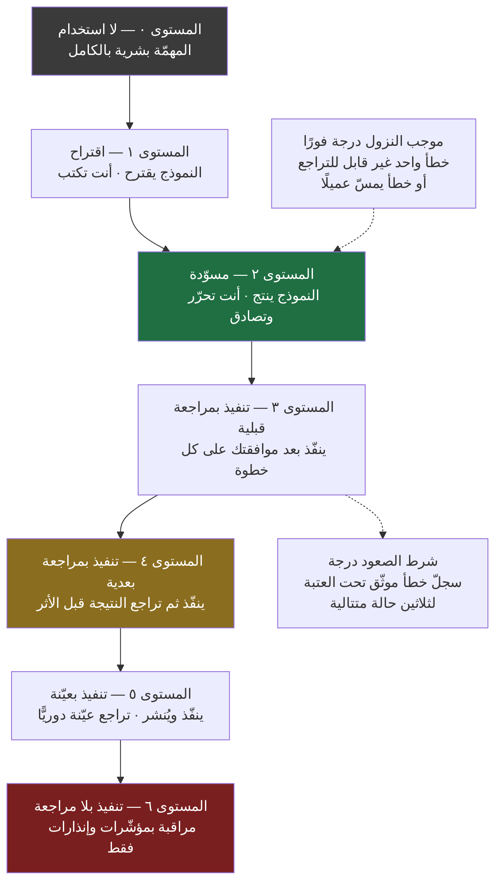
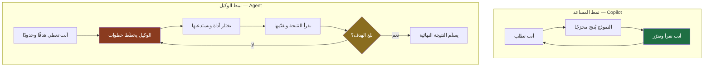
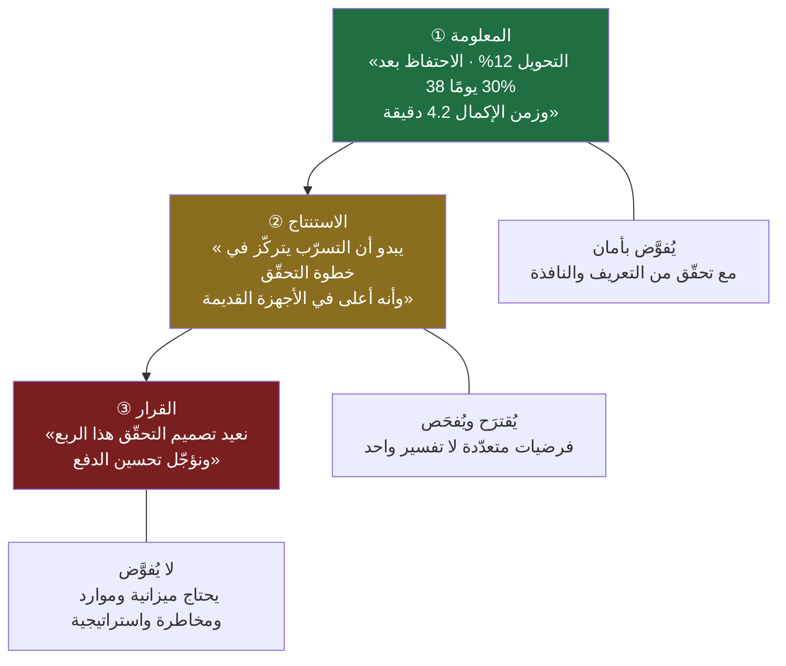
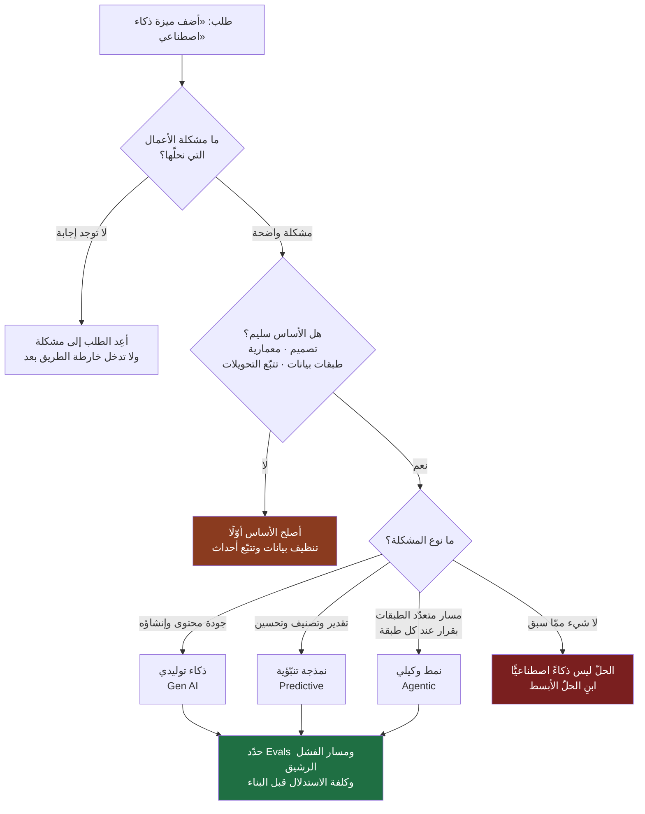

> [!info] الفصل 04 · إدارة المنتج في عصر الذكاء الاصطناعي
> **ماذا ستتعلّم:** ما الذي تغيّر **عمليًّا** في يوم مدير المنتج، مهمّةً مهمّة. أجاب [[01 - لماذا لا يزال مدير المنتج أهم من أي وقت مضى|الفصل الأول]] عن سؤال «لماذا لم يمت الدور»؛ وهذا الفصل يجيب عن سؤال أدقّ وأصعب: **أي مهمّة تُفوَّض إلى النموذج، وبأي مستوى إشراف، وبأي معيار قبول، وما خطر الاعتماد الأعمى فيها؟** ستخرج بجدول تشريح لعشرين مهمّة حقيقية، وبسلّم من ستّة مستويات للاستقلالية تعرف موقع كل مهمّة عليه، وبتمييز دقيق بين `Copilot` و`Agent` — وهو فرق في **البنية** لا في الدرجة — وبمعنى تشغيلي لأنماط `Human in the Loop` الثلاثة وعلاقتها بالمسؤولية والمساءلة. ثم ستتعلّم حدود النماذج بجدّية علمية (الهلوسة، الانحياز، ميل النموذج إلى **المتوسّط** بينما ميزتك تأتي من الشاذّ، وتسرّب السياق، والامتثال)، والفرق الحادّ بين **استخدامك** للذكاء الاصطناعي في عملك وبين **بنائك** لميزة ذكاء اصطناعي داخل المنتج — وما الذي يتغيّر عندئذٍ في [[PRD]] وفي القياس والاختبار.

# الفصل 04 — الذكاء الاصطناعي ومدير المنتج

## 🎯 أهداف التعلّم

- **تفكيك يوم مدير المنتج إلى مهامّ منفصلة**، وتصنيف كل مهمّة إلى: تُفوَّض كليًّا، أو تُفوَّض جزئيًّا، أو لا تُفوَّض — مع تحديد **معيار القبول** لمخرَج كل مهمّة قبل تفويضها.
- **التمييز بين ما تغيّر وما لم يتغيّر على مستوى المهمّة لا على مستوى الشعارات**: أي أن تقول «تغيّر زمن صياغة `PRD` من يومين إلى ساعة» بدل «الذكاء الاصطناعي غيّر كل شيء».
- **استخدام محور التصنيف الحاكم**: كلّما مالت المهمّة إلى **معالجة معلومات** ارتفع نفع النموذج؛ وكلّما مالت إلى **حكم في سياق تجاري متعدّد الأطراف** ارتفعت الحاجة إلى الإنسان — وشرح **لماذا** يعمل هذا المحور بدل حفظه.
- **تحديد موقع أي مهمّة على سلّم الاستقلالية السداسي** (من الاقتراح إلى التنفيذ بلا مراجعة)، ومعرفة الشرط الذي يسمح بالصعود درجة واحدة، والإشارة التي توجب النزول درجة.
- **التفريق البنيوي بين `Copilot` و`Agent`**: الفرق في من يملك **حلقة التحكّم** ومن يقرّر **الخطوة التالية** ومن يستدعي **الأدوات**، لا في جودة النموذج.
- **تشغيل أنماط `Human in the Loop` الثلاثة** (`in` / `on` / `out`)، وربط كلٍّ منها بكلفة الخطأ وقابلية التراجع والمساءلة القانونية والتنظيمية.
- **بناء بروتوكول مراجعة عملي لمخرَجات النماذج** يفرّق بين الخطأ الشكلي والخطأ الجوهري، ويحمي من «التحيّز إلى الأتمتة» (`Automation Bias`).
- **تشخيص حدود النماذج بلغة المخاطر**: الهلوسة، الانحياز في بيانات التدريب، ضعف التمثيل العربي/الخليجي، **الانحدار نحو المتوسّط**، تسرّب السياق والخصوصية، والامتثال ([[PDPL]] و`GDPR`).
- **تحديد ما يتغيّر في `PRD` وفي القياس والاختبار حين يصير الذكاء الاصطناعي داخل المنتج**: عدم الحتمية، والتقييم بـ`Evals`، وكلفة الاستدلال، والفشل الرشيق، وثقة المستخدم.
- **استخدام مقاييس تقييم ميزات الذكاء الاصطناعي فعليًّا**: معدّل القبول، ومعدّل التعديل بعد التوليد، ومعدّل التراجع، والوقت حتى القيمة، ومعدّل الاحتواء.
- **تحليل واقع السوق العربي والخليجي** من حيث اللغة واللهجات وتوطين البيانات والتوجّهات التنظيمية، وتحديد ما يترتّب على ذلك في قرارات المنتج لا في الخطابة.
- **عرض الحجّة المضادّة بإنصاف**: هل يتحوّل الوقت الموفَّر فعلًا إلى تفكير استراتيجي، أم تبتلعه المؤسّسة بمزيد من المخرجات؟

## القسم الأول: صيغة السؤال في 2022 — ولماذا كانت مضلّلة من جهة أخرى

حين ظهر `ChatGPT` أمام العامّة في أواخر 2022، انتشر سؤال واحد بصياغة واحدة تقريبًا: **هل انتهى عصر مدير المنتج؟** ونظر الناس إلى قائمة مهامّه المعلَنة — كتابة [[PRD]]، وصياغة [[11 - User Stories|قصص المستخدم]]، وتلخيص الاجتماعات، وإعداد العروض، وكتابة رسائل التحديث، وتحليل ملاحظات العملاء — فوجدوا أن الأداة تنجز كثيرًا منها في دقائق. والاستنتاج بدا منطقيًّا: إن كانت هذه هي الوظيفة، وقد أُتمتت، فقد انتهت الوظيفة.

عالج [[01 - لماذا لا يزال مدير المنتج أهم من أي وقت مضى|الفصل الأول]] هذا السؤال من جهته الفلسفية، وبيّن أنه يخلط بين **وصف** الدور و**تعريفه**، وأن المفارقة المركزية معكوسة: كلّما رخص البناء غلا الاختيار. ولن نعيد ذلك هنا. لكن للسؤال جهة ثانية لم يعالجها الفصل الأول، وهي الجهة التي يشتغل عليها هذا الفصل بأكمله: **صياغة السؤال بصيغة «نعم أو لا» على مستوى الوظيفة كلّها هي خطأ في وحدة التحليل.**

الوظيفة ليست وحدة قابلة للأتمتة أو غير قابلة لها. الوظيفة **حزمة من عشرات المهامّ المتباينة**، لكل مهمّة منها بنية مختلفة، وكلفة خطأ مختلفة، وقابلية تحقّق مختلفة. وحين تسأل «هل يُؤتمت مدير المنتج؟» فأنت تسأل سؤالًا بلا إجابة، لأنك تعامل الحزمة كأنها ذرّة. أمّا السؤال الذي يُنتج معرفة قابلة للاستعمال صباح الغد فهو: **خذ مهمّة واحدة بعينها، وقل لي: هل تُفوَّض؟ وبأي مستوى إشراف؟ وبأي معيار قبول؟ وما الذي يحدث لو أخطأ النموذج فيها ولم تنتبه؟**

هذا الانتقال — من مستوى الوظيفة إلى مستوى المهمّة — ليس تفصيلًا منهجيًّا، بل هو الفرق بين نقاش لا ينتهي ونتيجة عملية. ولهذا سيكون **ثقل هذا الفصل في التشريح**، لا في الدفاع عن المهنة ولا في الحماسة للأدوات.

> [!quote] من الويبينار
> شُخّصت الحالة التي سبقت الموجة تشخيصًا صريحًا:
> *"And product management became a **very admin-heavy role**. You do a lot of user interviews, you send a lot of emails, a lot of updates, and you spend time writing requirements for designers, for engineers. And it became very admin-heavy and tiring as a product manager."*
>
> **الترجمة:** «وصارت إدارة المنتج **دورًا إداريًّا ثقيلًا جدًّا**. تُجري كثيرًا من مقابلات المستخدمين، وترسل كثيرًا من الرسائل والتحديثات، وتقضي وقتك في كتابة المتطلّبات للمصمّمين وللمهندسين. وصار الدور إداريًّا ثقيلًا ومُرهِقًا لمدير المنتج.»
>
> ولاحظ الترتيب المنطقي في الجملة: الوصف يبدأ بأن الدور **صار** كذلك (`became`). أي أن الثقل الإداري **حالة طارئة على المهنة**، لا تعريفًا لها. وهذه الملاحظة هي مفتاح الفصل كلّه: ما ابتلعه الذكاء الاصطناعي هو الطارئ لا الأصل.

## القسم الثاني: المشكلة التي كانت موجودة قبل الذكاء الاصطناعي

من الخطأ الشائع أن يُقرأ هذا الفصل كأنه قصّة عن تقنية جديدة. القصّة الحقيقية تبدأ قبل التقنية بسنوات، ومن دون فهمها لن تفهم لماذا استُقبلت الأدوات بهذا القدر من الارتياح في هذه المهنة تحديدًا.

**الوظيفة كانت تنزلق تدريجيًّا نحو العمل التشغيلي.** ولم يكن الانزلاق مؤامرة ولا سوء إدارة، بل نتيجة طبيعية لثلاث قوى متضافرة:

**① العمل التشغيلي مرئيّ، والعمل الفكري غير مرئيّ.** حين تكتب وثيقة، يراها الناس. وحين تحدّث `Jira`، يرى الفريق التحديث. وحين ترسل تقرير الربع، يقرؤه المدير. أمّا حين تقضي ساعتين في مراجعة تذاكر الدعم لتكتشف نمطًا، فلا يظهر شيء في أي مكان — إلا بعد ثلاثة أشهر إن ظهر. والمؤسّسات تكافئ ما تراه.

**② العمل التشغيلي عاجل، والعمل الفكري مهمّ.** الاجتماع بعد ساعة، والتقرير مطلوب اليوم، والمهندس ينتظر جوابًا الآن. أمّا سؤال «هل نحن نبني الشيء الصحيح أصلًا؟» فليس له موعد نهائي. وحين يتنافس العاجل والمهمّ على وقت واحد، يفوز العاجل دائمًا — ما لم تُبنَ حماية صريحة، وهو ما لا يُبنى غالبًا.

**③ العمل التشغيلي قابل للتفويض إلى الأعلى، والعمل الفكري لا.** حين يطلب مدير أعلى تقريرًا، لا تستطيع أن تقول «هذا ليس جوهر دوري». فيتراكم الطلب من فوق، ويتراكم التنسيق من الجانبين، ويتراكم الردّ على الأسئلة من تحت، حتى يمتلئ التقويم بما لا يصنع قرارًا واحدًا.

والنتيجة المرصودة في الجلسة — كما وُصفت — أن أي مدير منتج تسأله عن حاله يقول «أنا مشغول»، وتفتح تقويمه فلا تجد فيه مساحة فارغة، بينما **جوهر عمله غائب من هذا التقويم تمامًا**.

> [!quote] من الويبينار
> وُضع موقع الذكاء الاصطناعي من هذه المشكلة بوضوح:
> *"It allows us to **automate these things**, get insights, do our job in a more efficient way, and allow us to do any sort of product management, **true product management**. I want to spend more time speaking to users. I want to spend more time looking to data. I want to spend more time discovering new opportunities and ideas."*
>
> **الترجمة:** «يتيح لنا **أتمتة هذه الأشياء**، والحصول على رؤى، وأداء عملنا بكفاءة أعلى، ويتيح لنا أن نمارس إدارة المنتج **الحقيقية**. أريد أن أقضي وقتًا أطول في الحديث إلى المستخدمين. أريد أن أقضي وقتًا أطول في النظر إلى البيانات. أريد أن أقضي وقتًا أطول في اكتشاف الفرص والأفكار الجديدة.»
>
> وقيلت الصياغة الشخصية للمشكلة كذلك:
> *"**بصراحة قبل AI**, a lot of my time was just going into a lot of **admin and manual tasks**."*
>
> **الترجمة:** «بصراحة قبل الذكاء الاصطناعي، كان كثير من وقتي يذهب إلى كثير من **الأعمال الإدارية واليدوية**.»

فالقضية إذن ليست «الذكاء الاصطناعي يقوم بعمل مدير المنتج»، بل **«الذكاء الاصطناعي يقوم ببعض الأعمال التي كان مدير المنتج مضطرًّا إلى القيام بها»** — وهما جملتان مختلفتان اختلافًا كاملًا في المعنى وفي النتيجة العملية.

> [!info] إضافة مرجعية
> ولهذا الانزلاق اسم في أدبيات تنظيم العمل: **الانجراف نحو العمل ذي الرؤية العالية والقيمة المنخفضة**. وهو يرتبط بمفهوم قديم في أدبيات الإنتاج النحيف: [[Value-Added vs Non-Value-Added vs Pure Waste|العمل المضيف للقيمة مقابل غير المضيف]]. فالعمل غير المضيف للقيمة ينقسم إلى نوعين: نوع **ضروري رغم عدم إضافته قيمة مباشرة** (التوثيق الذي يمنع سوء الفهم، التقرير الذي يحافظ على تفويض الفريق)، ونوع **هدر صافٍ** (اجتماع لا ينتج قرارًا، تقرير لا يقرؤه أحد، تحديث ثالث عن الشيء نفسه لثلاث جهات).
>
> وهذا التمييز مهمّ لأن الذكاء الاصطناعي يعالج النوعين بطريقتين مختلفتين تمامًا: **النوع الضروري يُؤتمت** (تُنتَج الوثيقة أسرع)، أمّا **الهدر الصافي فلا يُؤتمت بل يُحذف** — ومن يؤتمت الهدر يكون قد ضاعف إنتاجه من اللاشيء. وهذه أوّل قاعدة عملية في الفصل: **قبل أن تسأل «كيف أؤتمت هذه المهمّة؟» اسأل «لماذا توجد هذه المهمّة أصلًا؟»** — فبعض المهامّ جوابها الصحيح هو الإلغاء لا التسريع.

## القسم الثالث: المحور الحاكم — معالجة المعلومات مقابل الحكم في سياق

إن أردت قاعدة واحدة تحمل معك بقيّة الفصل، فهي هذه: **موقع المهمّة من الأتمتة يُحدَّد بموقعها على محور يمتدّ من «تحويل معلومات موجودة» إلى «إصدار حكم في سياق تجاري متعدّد الأطراف».**

المهمّة التي جوهرها **تحويل** — من نصّ إلى ملخّص، ومن ملخّص إلى جدول، ومن جدول إلى عرض، ومن متطلّب إلى قصّة مستخدم — هي مهمّة تعمل على **معلومات موجودة سلفًا** وتعيد ترتيبها في شكل آخر. وهنا يكون النموذج قويًّا جدًّا، لسبب بسيط: هذه بالضبط هي العملية التي دُرِّب عليها.

أمّا المهمّة التي جوهرها **حكم** — هل تستحقّ هذه المشكلة الحلّ الآن؟ ما الذي نتنازل عنه إن اخترناها؟ هل نحتمل غضب هذه الشريحة مقابل مكسب تلك؟ — فهي تعمل على **معلومات غير مكتوبة أصلًا في أي مكان**: نيّات القيادة، وتاريخ المؤسّسة مع محاولة سابقة فاشلة، وعلاقة متوتّرة مع عميل كبير، وحدس عن اتجاه السوق بعد ثمانية عشر شهرًا. والنموذج لا يملك من هذا شيئًا، ليس لضعف فيه بل لأن هذه المعلومات **لم تدخل إلى أي نصّ** حتى يتعلّمها.

اقرأ المخطّط بوصفه **تدرّجًا لا حدًّا فاصلًا**. الأخضر منطقة تفويض مريح؛ والأزرق منطقة تفويض بمراجعة خفيفة؛ والأصفر منطقة «اقتراح يُفحص»؛ والبرتقالي والأحمر منطقتان لا يُفوَّض فيهما القرار وإن فُوِّض فيهما **الإعداد**.

ولاحظ نقطة دقيقة كثيرًا ما تُهمَل: **الحدّ بين ④ و⑤ ليس حدّ ذكاء، بل حدّ ملكية.** النموذج قد يُنتج مفاضلة أفضل من كثير من البشر من حيث التماسك المنطقي. لكن المفاضلة تتطلّب **دالّة هدف**: ما الذي نعظّمه؟ الإيراد هذا الربع؟ أم الاحتفاظ على ثلاث سنوات؟ أم موقع تفاوضي أمام منافس؟ ودالّة الهدف ليست معلومة تُستخرج من البيانات — هي **اختيار قيمي** يحدّد أي البيانات تُجمَع أصلًا. من يختار دالّة الهدف هو صاحب القرار، وهو الذي يتحمّل نتيجتها.

> [!note] الصياغة المختصرة للقاعدة
> **كلّما اعتمدت المهمّة على إنتاج محتوى، زاد نفع الذكاء الاصطناعي. وكلّما اعتمدت على قرار في سياق تجاري معقّد، ازدادت الحاجة إلى الإنسان.**
> وهذه ليست قاعدة أخلاقية عن «ما ينبغي»، بل وصف بنيوي لما تستطيعه الأداة وما لا تستطيعه: **الأداة قويّة حيث تكون المعلومة موجودة، وضعيفة حيث تكون المعلومة في رأس أحدهم أو لم توجد بعد.**

## القسم الرابع: جدول تشريح المهامّ — عشرون مهمّة من يوم حقيقي

هذا هو قلب الفصل. القاعدة السابقة تبقى مجرّدة حتى تُطبَّق على مهامّ مسمّاة. وما يلي عشرون مهمّة تتكرّر في أسبوع أي مدير منتج، مصنَّفة بأربعة أعمدة: **درجة التفويض** · **مستوى الإشراف** · **معيار قبول المخرَج** · **خطر الاعتماد الأعمى**.

واقرأ العمود الثالث بعناية خاصّة، فهو الأقلّ حضورًا في نقاشات الأدوات وأكثرها أثرًا: **من يفوّض مهمّة بلا معيار قبول مكتوب، لا يفوّض بل يتخلّى.**

### المجموعة الأولى: الصياغة والتوثيق

| المهمّة | التفويض | الإشراف | معيار قبول المخرَج | خطر الاعتماد الأعمى |
|---|---|---|---|---|
| **مسوّدة أولى لـ[[PRD]]** | جزئي | مراجعة كاملة سطرًا سطرًا | بيان مشكلة **واحد** لا خمسة · كل رقم فيه له مصدر قابل للفتح · قسم المؤشّرات يذكر خطّ الأساس والهدف | وثيقة أنيقة تصف مشكلة لم يتحقّق أحد من وجودها؛ والأناقة تمنع السؤال عنها |
| **تحويل `PRD` إلى [[11 - User Stories\|قصص مستخدم]] وتذاكر** | كلّي تقريبًا | مراجعة عيّنة + فحص التغطية | لكل قصّة معيار قبول قابل للاختبار · تغطية [[Edge Cases\|الحالات الحدّية]] و[[Happy Path\|المسار السعيد]] معًا | تضخّم عدد التذاكر بلا تضخّم في القيمة؛ وتفتيت يخفي غياب التصوّر الكلّي |
| **ملخّص اجتماع** | كلّي | قراءة سريعة | يفصل بين **قرار** و**نقاش** و**بند معلّق**؛ ويسمّي مالكًا وموعدًا لكل قرار | تسجيل قرار لم يُتّخذ فعلًا؛ ثم بناء أسبوعين عمل عليه |
| **إعلان ميزة داخلي/خارجي** | كلّي | مراجعة خفيفة | يذكر القيمة للمستخدم لا قائمة التغييرات · لا يَعِد بما لا تفعله الميزة | وعد تسويقي يتجاوز الميزة فيتحوّل إلى ديون توقّعات |
| **رسائل التحديث لأصحاب المصلحة** | كلّي | مراجعة نبرة | يبدأ بما تغيّر في المؤشّر لا بما أُنجز من مهامّ | تحديث يبدو مطمئنًا بينما المؤشّر ثابت |
| **ترجمة/توطين نصوص الواجهة** | جزئي | مراجعة بشرية إلزامية | مراجعة ناطق أصلي · اتّساق المصطلح عبر الشاشات · مطابقة السجلّ اللغوي للجمهور | ترجمة صحيحة نحويًّا وغريبة ثقافيًّا تُفقد الثقة في ثانية |

### المجموعة الثانية: البحث والتحليل

| المهمّة | التفويض | الإشراف | معيار قبول المخرَج | خطر الاعتماد الأعمى |
|---|---|---|---|---|
| **تلخيص آلاف التقييمات والشكاوى** | كلّي | فحص عيّنة عشوائية | تُذكر نسبة كل موضوع + **أمثلة حرفية** لكل موضوع · تُذكر المواضيع النادرة لا الشائعة فقط | ابتلاع الإشارة الضعيفة داخل المتوسّط؛ والإشارة الضعيفة هي غالبًا بداية الفرصة |
| **وسم وتصنيف التغذية الراجعة** | كلّي | مراجعة تعريف الفئات أوّلًا | التصنيف يتبع تصنيفًا **حدّدته أنت** لا تصنيفًا اخترعه النموذج | فئات جميلة لا تطابق قرارات الفريق فتصير تقريرًا لا أداة |
| **تلخيص مقابلة مستخدم** | جزئي | مراجعة مع الاستماع للمقاطع الحرجة | يحتفظ بـ**كلمات المستخدم نفسها** لا بإعادة صياغتها | ضياع اللغة الأصلية للمستخدم، وهي أثمن ما في المقابلة |
| **صياغة أسئلة دليل المقابلة** | جزئي | مراجعة صارمة | لا سؤال إيحائي · أسئلة عن **سلوك ماضٍ** لا عن نيّة مستقبلية | أسئلة تقود المستخدم إلى الإجابة التي تريدها، فتُنتج دليلًا زائفًا |
| **إجراء المقابلة نفسها** | لا يُفوَّض | — | — | فقدان الملاحظة غير اللفظية، وفقدان القدرة على المتابعة الفورية لما لم يكن في الخطّة |
| **بناء استعلام بيانات وقراءته** | جزئي | تحقّق من المنطق لا من النصّ | مطابقة رقم واحد على الأقلّ مع مصدر مستقلّ · تعريف صريح للشريحة والنافذة الزمنية | استعلام صحيح نحويًّا يجيب عن سؤال غير الذي سألته |
| **تفسير سبب انخفاض مؤشّر** | جزئي (اقتراح فقط) | فحص كل فرضية | تُقدَّم **فرضيات متعدّدة** مع طريقة إبطال كل واحدة | قبول أول تفسير معقول، وهو أخطر أنواع [[Root Cause Analysis\|تحليل السبب الجذري]] الفاشل |
| **مسح المنافسين ومقارنة الحلول** | جزئي | تحقّق من كل ادّعاء | كل ميزة مذكورة لها رابط أو لقطة شاشة بتاريخ | معلومات قديمة أو مخترَعة عن منافس، تُبنى عليها استراتيجية |

### المجموعة الثالثة: القرار والتنظيم والعلاقات

| المهمّة | التفويض | الإشراف | معيار قبول المخرَج | خطر الاعتماد الأعمى |
|---|---|---|---|---|
| **ترتيب الأولويات** | جزئي جدًّا | القرار بشري كاملًا | يُستخدم كمُدخل لجدول [[RICE Prioritization\|RICE]] لا كمُخرج نهائي · تُعرض المدخلات لا النتيجة فقط | «الرقم قال» — وهو تفويض للمسؤولية إلى معادلة لا تتحمّلها |
| **تقدير الجهد** | لا يُفوَّض | — | — | تقدير بلا معرفة بالدَّين التقني ([[Technical Debt]]) ولا بحالة الفريق الفعلية |
| **قرار البناء/التأجيل/الرفض** | لا يُفوَّض | — | — | قرار بلا مالك؛ وحين يفشل لا يتعلّم منه أحد لأنه لا أحد اتّخذه |
| **إقناع أصحاب المصلحة والمواءمة** | لا يُفوَّض | — | — | رسالة مصقولة لغويًّا تتجاهل الخريطة السياسية للمؤسّسة، فتُغلق بابًا بدل فتحه |
| **متابعة الخيوط المعلّقة والتذكيرات** | كلّي | لا شيء تقريبًا | قائمة مرتّبة بالمخاطرة لا بالتاريخ | متابعة كل شيء بالتساوي، فتفقد المتابعة معناها |
| **إعداد نموذج أوّلي تفاعلي للاختبار** | جزئي | مراجعة تصميمية | يختبر **فرضية واحدة** محدّدة · لا يُعرض بوصفه منتجًا | نموذج جميل يُقنع الإدارة بأن الشيء «جاهز تقريبًا» فيقفز الفريق فوق التحقّق |

> [!warning] قاعدة العمود الثالث
> لاحظ أن كل معيار قبول في الجدول **قابل للفحص في أقلّ من خمس دقائق**. هذا شرط عملي لا تجميلي: المعيار الذي يحتاج نصف ساعة لفحصه لن يُفحص، وستكتشف بعد شهر أنك تعتمد على مخرَجات لم يراجعها أحد. **صمّم معايير قبولك على أساس أنك ستطبّقها وأنت مرهق في نهاية اليوم، لا وأنت في أفضل حالاتك.**

### كيف تُقرأ هذه الجداول عمليًّا؟

ثلاث ملاحظات تجمع ما سبق:

**① الأعمدة الثلاثة الأولى قابلة للتحسّن، والعمود الرابع لا يزول.** يمكن أن يرتفع مستوى التفويض في مهمّة مع نضج أدواتك ومعرفتك؛ لكن **خطر الاعتماد الأعمى لا يختفي بتحسّن النموذج**، لأنه ليس خطر جودة بل خطر **انتباه**: كلّما تحسّن المخرَج، قلّ احتمال أن تراجعه بجدّية، فارتفع أثر الخطأ النادر. وهذه مفارقة عملية مهمّة: **النموذج الذي يخطئ في 20% من الحالات أقلّ خطرًا من نموذج يخطئ في 2%** — لأن الأول يبقيك يقظًا، والثاني ينوّمك.

**② المهامّ غير المفوَّضة قليلة عددًا وثقيلة قيمةً.** خمس مهامّ فقط من العشرين لا تُفوَّض. لكن انظر إليها: القرار، التقدير، الأولويات، الإقناع، المقابلة. **هذه هي المهنة.** والباقي — خمس عشرة مهمّة — كان يستهلك أغلب الأسبوع.

**③ التفويض الجزئي هو الحالة الغالبة، وهو الأصعب.** لأنه يتطلّب أن تعرف **أين تنظر**. المراجعة الشاملة لكل مخرَج تُلغي مكسب الأتمتة؛ والمراجعة الصفرية تُلغي أمان المخرَج. والمهارة الحقيقية هي معرفة **المواضع الثلاثة أو الأربعة في كل مخرَج** التي إن صحّت صحّ الباقي غالبًا، وإن اختلّت اختلّ الباقي حتمًا. سنعود إلى هذا في القسم الثامن.

## القسم الخامس: سلّم الاستقلالية السداسي

«يُفوَّض» و«لا يُفوَّض» ثنائية فقيرة. الواقع سلّم، وموقعك عليه قرار واعٍ لا مصادفة.

### كيف تختار المستوى؟ ثلاثة أسئلة

**① ما كلفة الخطأ الأسوأ؟** لا كلفة الخطأ المتوسّط. إعلان ميزة فيه خطأ لغوي كلفته دقائق؛ ورسالة إلى قاعدة العملاء فيها وعد خاطئ كلفتها أشهر.

**② هل الخطأ قابل للتراجع؟** التراجع عن مسوّدة داخلية مجّاني. التراجع عن رسالة بريدية أُرسلت إلى عشرين ألف مستخدم مستحيل. والقاعدة: **كلّما قلّت قابلية التراجع، انخفض المستوى المسموح.**

**③ هل الخطأ مرئيّ؟** وهذا أخبث الأسئلة. الخطأ المرئي (تنسيق مكسور) يصحّح نفسه لأن أحدًا سيشتكي. أمّا الخطأ غير المرئي — رقم خاطئ في ملخّص بيانات، أو موضوع مهمّ سقط من تصنيف التغذية الراجعة — فلا يشتكي منه أحد أبدًا، ويستمرّ أثره سنوات. **الأخطاء غير المرئية تستحقّ مستوى إشراف أعلى من الأخطاء المكلفة المرئية.**

> [!example] تطبيق السلّم على ثلاث مهامّ حقيقية
> **① أتمتة إعلان ميزة داخلي على `Slack`:** الخطأ رخيص، قابل للتراجع (رسالة تُحذف)، مرئيّ (سيقرؤه الفريق فورًا). ⟵ **المستوى ٥** مقبول تمامًا: يُنشر آليًّا وتراجع عيّنة أسبوعية. وهذا بالضبط نوع الأتمتة الذي وُصف في الجلسة بأنه نقل الإعلان من ساعتين إلى ثلاث ساعات ← نحو عشر دقائق من المراجعة.
>
> **② توليد قصص المستخدم من `PRD` ورفعها إلى `Jira`:** الخطأ متوسّط الكلفة، قابل للتراجع (تُحذف التذاكر)، لكنه **شبه مرئي**: التذكرة الناقصة تُكتشف عند التنفيذ لا قبله. ⟵ **المستوى ٤**: ينفّذ ثم تراجع التغطية قبل أن يبدأ الفريق.
>
> **③ إرسال ملخّص أداء ربعي إلى الإدارة التنفيذية:** الخطأ باهظ، غير قابل للتراجع عمليًّا (الانطباع لا يُسحب)، وغالبًا **غير مرئي** لأن أحدًا لن يدقّق أرقامك أمامك. ⟵ **المستوى ٢** فقط: مسوّدة تُحرَّر وتُصادَق سطرًا سطرًا، مع مطابقة كل رقم بمصدره.

### قاعدة الصعود والنزول

الصعود على السلّم يجب أن يكون **مكتسَبًا بالبيانات، لا ممنوحًا بالحماس**. القاعدة العملية البسيطة: لا تصعد بمهمّة درجةً واحدة إلا بعد **ثلاثين حالة متتالية** بقي فيها معدّل التصحيح الجوهري تحت عتبة تحدّدها مسبقًا. والنزول عكس ذلك تمامًا: **درجة واحدة على الأقلّ فور أول خطأ غير قابل للتراجع أو خطأ وصل إلى عميل** — بلا نقاش وبلا استثناء.

ولاحظ عدم التماثل المقصود: الصعود بطيء وتراكمي، والنزول فوري وحادّ. هذا ليس تشاؤمًا، بل انعكاس لعدم تماثل الكلفة نفسها: مكسب الصعود خطّي (وقت أقلّ)، وخسارة الخطأ الكبير قد تكون كارثية. ومن يعامل الاثنين بالتماثل يخسر على المدى الطويل حتى لو ربح في المتوسّط.

## القسم السادس: `Copilot` مقابل `Agent` — فرق في البنية لا في الدرجة

يُستعمل المصطلحان بتبادل كأنهما درجتان من الشيء نفسه، وهذا خطأ يقود إلى قرارات إشراف خاطئة. الفرق **بنيوي**: من يملك حلقة التحكّم؟

- في نمط **المساعد** (`Copilot`): **أنت** تملك الحلقة. تطلب شيئًا، فيُنتَج مخرَج، فتقرّر أنت الخطوة التالية. كل دورة تمرّ من عندك. النموذج **لا يبادر**.
- في نمط **الوكيل** (`Agent`): **النظام** يملك الحلقة. تعطيه **هدفًا**، فيضع خطّة، ويختار أداة، وينفّذ، ويقرأ النتيجة، ويقرّر الخطوة التالية بنفسه، ويكرّر — حتى يرى أنه بلغ الهدف أو استنفد حدًّا موضوعًا.

### لماذا يهمّ هذا الفرق لمدير المنتج تحديدًا؟

لثلاثة أسباب عملية مباشرة:

**① نقطة الفحص تتغيّر.** في نمط المساعد أنت تفحص **مخرَجًا واحدًا**. في نمط الوكيل أنت تفحص **سلسلة قرارات** انتهت إلى مخرَج — وقد يكون المخرَج سليمًا بينما المسار الذي أوصله إليه غير سليم (استعلام على الشريحة الخطأ صادف أن أعطى رقمًا قريبًا). ولهذا فالوكيل يتطلّب أن **تقرأ أثره** (`Trace`)، لا مخرَجه فقط.

**② الخطأ يتراكم بدل أن يتوقّف.** في المساعد، خطأ في الخطوة الأولى يتوقّف عندك. في الوكيل، خطأ في الخطوة الأولى يصبح **مُدخلًا** للثانية، ثم للثالثة — فتنحرف السلسلة انحرافًا يتضاعف. وهذا أهمّ سبب تقني لتقييد الوكلاء بعدد خطوات وبنقاط توقّف إجبارية.

**③ الوكيل يتصرّف في العالم لا في النصّ فقط.** حين يُمنح صلاحية كتابة في `Jira` أو إرسال في `Slack` أو تعديل ملفّ، فإن نتيجة خطئه **خارج المحادثة**. وهنا تنتقل المسألة من جودة النصّ إلى **الصلاحيات والحوكمة** ([[Governance]]) و[[Guard Rails|الحواجز الواقية]].

> [!quote] من الويبينار
> ذُكر النمط الوكيلي بوصفه أحد ثلاثة أنماط لاستخدام الذكاء الاصطناعي **داخل المنتج**، وربط بمواضع القرار المتعدّدة:
> *"...to agentic AI... when you have **workflows** and there's in these workflows there's **a lot of levels** and a lot of levels where **you need decisions in each levels**... this is where potentially agentic AI can really help."*
>
> **الترجمة:** «…وصولًا إلى الذكاء الاصطناعي الوكيلي… حين تكون لديك **مسارات عمل**، وفي هذه المسارات **طبقات كثيرة**، وفي كل طبقة **تحتاج إلى قرار**… فهنا يمكن للذكاء الاصطناعي الوكيلي أن يساعد فعلًا.»
>
> والملاحظة المنهجية: الشرط المذكور لصلاحية النمط الوكيلي هو **تعدّد نقاط القرار داخل المسار**. فالمسار الخطّي البسيط لا يحتاج وكيلًا — يحتاج أتمتة عادية. وهذا معيار عملي دقيق يُغني عن كثير من الحماسة.

### جدول المقارنة التشغيلي

| البُعد | `Copilot` (مساعد) | `Agent` (وكيل) |
|---|---|---|
| من يملك حلقة التحكّم | الإنسان | النظام |
| المُدخل | طلب محدّد | هدف + قيود |
| عدد الخطوات | واحدة لكل تفاعل | متعدّدة وغير محدّدة سلفًا |
| ما تفحصه | المخرَج | المخرَج **والأثر** (`Trace`) |
| سلوك الخطأ | يتوقّف عندك | يتراكم عبر الخطوات |
| الصلاحيات المطلوبة | قراءة غالبًا | قراءة **وكتابة** وتنفيذ |
| أنسب المهامّ | الصياغة · التلخيص · التوليد | المتابعة · التجميع من مصادر · المسارات المتكرّرة |
| نمط الإشراف المناسب | `Human in the loop` | `Human on the loop` مع نقاط توقّف |
| أخطر ما فيه | قبول مخرَج معقول وخاطئ | تنفيذ سلسلة انحرفت مبكّرًا |

> [!info] إضافة مرجعية
> ولمن يريد ضبطًا اصطلاحيًّا أدقّ: النقاش المهني اليوم يميّز أحيانًا ثلاث درجات لا اثنتين — **مساعد** (`Assistant`) يجيب داخل المحادثة، و**مسار وكيلي** (`Agentic Workflow`) وهو سلسلة خطوات **حدّدها الإنسان مسبقًا** ينفّذها النموذج بترتيب معلوم، و**وكيل مستقلّ** (`Autonomous Agent`) يحدّد هو ترتيب خطواته وأدواته. والدرجة الوسطى هي الأكثر نفعًا عمليًّا اليوم وأقلّها ضجيجًا إعلاميًّا، لأنها تجمع بين مكسب الأتمتة وقابلية التنبّؤ.
>
> والمقياس العملي للتفريق بينها سؤال واحد: **من كتب ترتيب الخطوات؟** إن كتبته أنت فأنت أمام مسار وكيلي مضبوط؛ وإن كتبه النموذج في كل مرّة فأنت أمام وكيل مستقلّ، ويلزمك عندئذٍ حدّ أقصى للخطوات، وسقف للتكلفة، ونقطة توقّف إجبارية قبل أي فعل غير قابل للتراجع.
>
> والبروتوكولات التي تربط النماذج بالأدوات الخارجية (ومنها `MCP` الذي ذُكر في الجلسة بوصفه الجسر بين الأداة وبين `Jira` و`MetaBase`) هي **البنية التحتية** لهذا النمط لا النمط نفسه. وتفصيل الأدوات بأسمائها موضع [[07 - أدوات الذكاء الاصطناعي لمدير المنتج|الفصل السابع]].

## القسم السابع: `Human in the Loop` — ثلاثة أنماط ومسؤولية واحدة

عبارة «الإنسان في الحلقة» تُستعمل شعارًا مطمئنًا أكثر ممّا تُستعمل تصميمًا. وهي في الحقيقة **ثلاثة أنماط مختلفة**، لكل منها موضع صحيح وموضع كارثي.

| النمط | التعريف الدقيق | متى يكون صحيحًا | متى يكون خطأً | أثره على المساءلة |
|---|---|---|---|---|
| **`In the loop`** (في الحلقة) | لا يُنفَّذ أي فعل إلا بموافقة بشرية صريحة على كل حالة | خطأ باهظ أو غير قابل للتراجع · قرارات تمسّ أفرادًا · بيئات منظَّمة | حين يكون الحجم كبيرًا والخطأ رخيصًا — عندها تتحوّل الموافقة إلى ختم آلي بلا فحص | المسؤولية بشرية كاملة وواضحة |
| **`On the loop`** (على الحلقة) | النظام ينفّذ، والإنسان يراقب ويستطيع التدخّل والإيقاف والتراجع | حجم كبير · خطأ متوسّط الكلفة · وجود مؤشّرات مراقبة وإنذارات | حين لا توجد قدرة تراجع فعلية أو لا توجد إنذارات — فتكون مراقبةً بالاسم فقط | المسؤولية بشرية عن **التصميم والمراقبة** |
| **`Out of the loop`** (خارج الحلقة) | النظام ينفّذ بلا مراجعة، ويُراجَع الأداء إحصائيًّا لاحقًا | مهامّ عالية التكرار · خطأ رخيص وقابل للتصحيح · أثر تجميعي لا فردي | حين يمسّ الفعل عميلًا بعينه أو حقًّا أو مالًا | المسؤولية بشرية عن **السياسة والنظام**، لا عن الحالة |

### القاعدة الحاكمة في المساءلة

هذه هي النقطة التي تُختصر عادةً اختصارًا مخلًّا، فلتُقل صريحة: **تغيير موقع الإنسان من الحلقة لا يغيّر موقع المسؤولية.** أنت مسؤول في الأنماط الثلاثة؛ ما يتغيّر هو **موضوع** مسؤوليتك:

- في `in the loop` أنت مسؤول عن **كل حالة** بعينها.
- في `on the loop` أنت مسؤول عن **جودة المراقبة وسرعة التدخّل**.
- في `out of the loop` أنت مسؤول عن **السياسة التي سمحت بذلك** وعن مراجعتها دوريًّا.

ولا يوجد نمط رابع اسمه «النظام هو المسؤول». وحين يقول أحدهم «النموذج أخطأ»، فالجواب المهني الوحيد: **من قرّر تشغيل النموذج على هذه المهمّة بهذا المستوى؟**

> [!warning] وضع الفشل الأخطر: «الإنسان في الحلقة» صوريًّا
> أخطر تكوين على الإطلاق ليس `out of the loop`، بل **`in the loop` صوريّ**: أن يوجد إنسان مطلوب منه الموافقة على كل حالة، وأن يكون الحجم أكبر من أن يفحصه، فيوافق آليًّا. عندها تجتمع أسوأ خصلتين: **غياب الفحص فعليًّا** مع **وهم الأمان** لدى المؤسّسة، وغياب المراقبة الإحصائية التي كانت ستُبنى لو أُعلن النمط `out of the loop` صراحة.
>
> والعلامات التشخيصية عليه واضحة: زمن موافقة متوسّط يقلّ عن ثوانٍ · معدّل رفض يقارب الصفر · عدم وجود سجلّ لأسباب الرفض. إن رأيت واحدة منها فأنت أمام ختم لا مراجعة، **والعلاج هو التخفيض إلى المراجعة بالعيّنة مع مؤشّرات، لا الإصرار على مراجعة الكلّ**.

> [!info] إضافة مرجعية
> ولهذا الوضع اسم في أدبيات العوامل البشرية والأتمتة: **التحيّز إلى الأتمتة** (`Automation Bias`) — وهو ميل الإنسان إلى قبول اقتراح النظام الآلي وإهمال الأدلّة المعارضة، وقد وُثّق في مجالات سبقت الذكاء الاصطناعي التوليدي بعقود (الطيران، والتشخيص الطبي بمساعدة الحاسوب). وله وجهان معروفان: **خطأ الإغفال** (لا تلاحظ مشكلة لأن النظام لم ينبّه إليها) و**خطأ الارتكاب** (تنفّذ اقتراحًا خاطئًا لأن النظام اقترحه).
>
> ويرتبط به مفهوم أقدم في أدبيات الأتمتة يُعرف بـ**«مفارقات الأتمتة»** (صاغتها ليزان بينبريدج في ورقة كلاسيكية عام 1983): كلّما زادت الأتمتة، **قلّت** فرص الإنسان لممارسة المهارة التي يُفترض أن يتدخّل بها عند الفشل — فيتدهور استعداده للتدخّل في اللحظة التي يُحتاج فيها إليه أكثر من أي وقت. وترجمتها في سياقنا مباشرة: **مدير المنتج الذي لم يكتب `PRD` بيده منذ سنة قد لا يعرف الفرق بين `PRD` جيّد ورديء حين يقرأ مخرَج النموذج.**
>
> والعلاج المقترح في تلك الأدبيات ليس التخلّي عن الأتمتة، بل **الاحتفاظ العمدي بتمرين المهارة**: أن تكتب بيدك بين حين وآخر شيئًا تستطيع تفويضه، لا لأنك تحتاج المخرَج، بل لتُبقي حكمك على المخرَج حادًّا.

## القسم الثامن: بروتوكول مراجعة عملي — كيف تقرأ مخرَجًا لم تكتبه؟

قلنا إن التفويض الجزئي هو الحالة الغالبة وأنه الأصعب. وهذا القسم يحوّله إلى إجراء.

### القاعدة الأولى: افصل الخطأ الشكلي عن الخطأ الجوهري

المخرَجات المولَّدة **تتفوّق شكلًا وتضعف جوهرًا**، وهذا هو مصدر الخداع كلّه. الوثيقة منسّقة، والفقرات متوازنة، واللغة سليمة، والعناوين مرتّبة — وكل هذه إشارات كانت تاريخيًّا تدلّ على **جهد وعناية**، فيقرأها دماغك بوصفها دليلًا على الجودة. لكن الصلة انقطعت: الشكل صار مجّانيًّا، والجوهر لم يصر.

**فالقاعدة: لا تبدأ المراجعة من الأعلى إلى الأسفل.** ابدأ من المواضع الأربعة التي تحمل الجوهر:

**① الأرقام.** كل رقم في المخرَج: من أين جاء؟ افتح مصدره. الرقم الذي لا مصدر له يُحذف — لا يُعدَّل ولا يُخفَّف، يُحذف.
**② الأسماء الخاصّة.** أسماء المنافسين، والمنتجات، والميزات، والأشخاص. هذه أكثر مواضع الهلوسة.
**③ الروابط السببية.** كل «لأنّ» و«ممّا يعني» و«وبالتالي». النموذج يُنتج سببية سلسة حيث لا توجد سببية أصلًا.
**④ ما ليس موجودًا.** وهذا أصعبها وأهمّها: ما الذي كان ينبغي أن يكون في هذا المخرَج وليس فيه؟ الحالة الحدّية التي لم تُذكر، والشريحة التي أُغفلت، والمخاطرة التي لم تُسمَّ. **النموذج لا يعرف ما لم تسأله عنه، ولن يخبرك بأنه لا يعرفه.**

### القاعدة الثانية: اطلب البنية التي تسهّل الفحص

جزء كبير من كلفة المراجعة يُدفع بلا داعٍ لأن المخرَج جاء بشكل يصعب فحصه. اطلب صراحةً:

- **الفصل بين ما هو من المصدر وما هو استنتاج.** «ضع تحت كل نقطة اقتباسًا حرفيًّا من المصدر، وميّز استنتاجك بوسم صريح.»
- **الاعتراف بالنقص.** «إن لم يكن الجواب في المادّة المرفقة فقل: غير موجود — ولا تكمل من معرفتك العامّة.»
- **البدائل لا الجواب الواحد.** «أعطني ثلاثة تفسيرات محتملة مرتّبة بقوّة الدليل، ولكلٍّ منها طريقة إبطال.»
- **درجة الثقة مربوطة بدليل مسمّى** لا برقم مجرّد.

وهذه ليست حيلًا لغوية، بل **إعادة توزيع للعمل**: أنت تنقل جزءًا من كلفة الفحص إلى مرحلة التوليد، فتوفّره من وقتك.

### القاعدة الثالثة: راقب معدّل التصحيح كمؤشّر

سجّل لكل نوع مهمّة رقمًا واحدًا: **كم مرّة اضطررت إلى تصحيح جوهري في آخر عشر حالات؟** هذا الرقم هو مؤشّرك التشغيلي الوحيد الذي يستحقّ التتبّع، وهو الذي يقرّر الصعود والنزول على سلّم القسم الخامس. وإن لم تسجّله فأنت تتّخذ قرارات تفويضك بالانطباع.

> [!example] مراجعة `PRD` مولَّد في سبع دقائق
> **الدقيقة 1:** ابحث عن بيان المشكلة. هل هو **واحد**؟ إن وجدت ثلاثة، فالوثيقة تخفي غياب تركيز — أعدها قبل قراءة أي شيء آخر.
> **الدقيقة 2–3:** خذ كل رقم في قسم المؤشّرات وافتح مصدره. لو كان الرقم من رأسك أصلًا فقل ذلك في الوثيقة صراحةً: «تقدير غير مقيس».
> **الدقيقة 4:** ابحث عن **ما لا يفعله الحلّ** (`Non-Goals`). النماذج تكاد لا تكتبه تلقائيًّا لأنه لا يظهر في نصوص التدريب النموذجية. أضِفه بيدك.
> **الدقيقة 5:** اسأل: من الشريحة بالضبط؟ إن وجدت كلمة «المستخدمون» بلا تحديد، فأنت أمام حشو مقنع.
> **الدقيقة 6:** ابحث عن **شرط الفشل**: ما الإشارة التي تجعلنا نتراجع؟ إن لم تكن موجودة فأنت لا تملك فرضية.
> **الدقيقة 7:** اقرأ العنوان وبيان المشكلة معًا فقط، واسأل: **لو عرضت هذين السطرين على مهندس، هل يعرف ماذا يبني ولماذا؟** إن لم يعرف، فبقيّة العشرين صفحة زينة.
>
> ولاحظ أن هذه المراجعة تفحص **البنية والدليل**، لا اللغة. اللغة صارت شبه مضمونة، والبنية والدليل هما ما يبقى عملك أنت.

## القسم التاسع: ثلاثة مستويات — معلومة، استنتاج، قرار

الالتباس الشائع «هل صار الذكاء الاصطناعي يتّخذ القرارات؟» يزول بمجرّد فصل ثلاثة مستويات كانت مندمجة في الكلام:

**المستوى الأول — المعلومة.** كم مستخدمًا؟ ما نسبة التحويل؟ ما معدّل الاحتفاظ؟ هذه أرقام تُستخرج وتُحسب، والنموذج ممتاز فيها — **بشرط أن يكون تعريف المقياس وحدود الشريحة والنافذة الزمنية محدّدة بيدك**. أكثر أخطاء هذا المستوى ليست حسابية بل **تعريفية**: «المستخدم النشط» عندك غير «المستخدم النشط» في الاستعلام الذي وُلِّد.

**المستوى الثاني — الاستنتاج.** «يبدو أن المستخدمين يواجهون مشكلة في التسجيل.» وهذا مستوى مشروع للنموذج **إذا** كان الاستنتاج مقيَّدًا بالبيانات المعروضة، وإذا قُدِّم بوصفه **فرضية قابلة للإبطال** لا خلاصة. والخطر هنا مزدوج: الارتباط الزائف من جهة، وسلاسة العبارة التي تجعل الفرضية تبدو نتيجة من جهة أخرى.

**المستوى الثالث — القرار.** هل نعيد تصميم التسجيل الآن؟ أم نركّز على الدفع؟ أم نستثمر في ميزة جديدة أصلًا؟ هذا المستوى يحتاج **موازنة بين الميزانية والموارد والأولويات والمخاطر والاستراتيجية** — وأغلب هذه الأشياء ليست بيانات، بل التزامات وتوقّعات وعلاقات. ويبقى بشريًّا، لا بحجّة معنوية بل بحجّة تعريفية: **القرار هو ما يتحمّل صاحبه نتيجته.** وما لا يتحمّل النموذج نتيجته لا يسمّى قراره حتى لو كتبه بلسانه.

> [!note] التطبيق العملي للمستويات الثلاثة على اجتماع واحد
> في اجتماع مراجعة المؤشّرات الأسبوعي، اجعل الترتيب صريحًا: **الدقائق العشر الأولى للمستوى الأول فقط** — أرقام بلا تفسير، ويُمنع التفسير فيها منعًا. ثم **عشر دقائق للمستوى الثاني**: فرضيات متعدّدة تُكتب على الشاشة بلا حسم. ثم **الباقي للمستوى الثالث**: قرار واحد بمالك وموعد وشرط تراجع.
>
> وستُفاجأ بمقدار ما يوفّره هذا الفصل من جدل: أغلب الخلافات في اجتماعات المنتج هي في الحقيقة **خلط بين المستويين الثاني والثالث** — طرف يناقش تفسيرًا وطرف يناقش قرارًا، وكلاهما يظنّ أنهما في الموضوع نفسه.

## القسم العاشر: حدود النماذج — بجدّية علمية لا بتحفّظ شكلي

القسم السابق فرّق بين مستويات الاستخدام. وهذا القسم يفرّق بين **أنواع الخلل**، لأن لكل نوع علاجًا مختلفًا، ومن يخلط بينها يعالج المشكلة الخطأ.

### ① الهلوسة (`Hallucination`)

النموذج التوليدي في جوهره نظام يُنتج **التكملة الأرجح** لنصّ. وليس فيه — بذاته — آلية تفرّق بين «الأرجح لغويًّا» و«الصحيح واقعيًّا». ولهذا يُنتج بثقة كاملة اسم كتاب لم يُكتب، ورقمًا لم يُنشر، وميزة لا يملكها المنافس. والعلامة الفارقة: **الهلوسة لا تأتي بنبرة متردّدة**؛ بل تأتي بالنبرة نفسها التي تأتي بها الحقيقة، وهذا بالضبط ما يجعلها خطرة.

**العلاج العملي ثلاثي:** تقييد النموذج بمصدر محدّد ترفعه أنت (وهو ما يُعرف بنمط **التوليد المعزَّز بالاسترجاع**، `RAG`)؛ وطلب الاقتباس الحرفي مع كل ادّعاء؛ وقاعدة صارمة: **لا يدخل رقم ولا اسم إلى وثيقة رسمية قبل فتح مصدره بيدك.**

### ② الانحياز في بيانات التدريب

النموذج يتعلّم من نصوص كتبها بشر، فيرث ما فيها: تفاوت التمثيل بين اللغات والأسواق، والافتراضات الضمنية عن «المستخدم النموذجي»، وغلبة سياقات سوقية بعينها. والنتيجة في عملك أن **الاقتراح الافتراضي يميل إلى النمط الأمريكي/الأوروبي** في كل شيء: من بنية مسار الدفع إلى نبرة النصوص إلى ترتيب الحقول في نموذج التسجيل. وهذا ليس خللًا تقنيًّا بقدر ما هو خلل في **مطابقة السياق** — وهو موضوع [[03 - التوطين (Localization)|الفصل الثالث]] بأكمله.

### ③ ضعف التمثيل العربي والخليجي

وهذا وجه خاصّ من الانحياز يستحقّ تسميته منفصلًا لأنه يمسّك مباشرة:

- **العربية ممثَّلة تمثيلًا أضعف** من الإنجليزية في بيانات التدريب العامّة، والفجوة أوضح كلّما ابتعدت عن الفصحى.
- **اللهجات تكاد تكون غائبة نصيًّا**: تغذية راجعة مكتوبة بالخليجية أو المصرية أو المغاربية قد تُصنَّف تصنيفًا خاطئًا، وقد تُفهم السخرية على أنها رضا.
- **الكتابة المختلطة** (عربي بحروف لاتينية، أو خلط الإنجليزية داخل الجملة العربية) شائعة جدًّا في تغذية المستخدمين الحقيقية، وهي من أصعب الحالات على التصنيف الآلي.
- **اتّجاه الكتابة والتشكيل والأرقام** تظهر آثارها في مخرَجات الواجهة والنصوص المولَّدة.

والنتيجة العملية: **إن كانت مادّتك عربية، فمعدّل الخطأ لديك أعلى من المعدّل الذي يُروى في المقالات الإنجليزية** — فارفع مستوى الإشراف درجةً واحدة على الأقلّ عن التوصية الشائعة، واحتفظ دائمًا بعيّنة مراجَعة بشريًّا لقياس الفارق بنفسك بدل تقديره.

### ④ الانحدار نحو المتوسّط — أخطر الحدود وأقلّها ذكرًا

هذا هو الحدّ الذي يجب أن يبقى في ذهن مدير المنتج تحديدًا، لأنه لا يظهر بوصفه خطأً أصلًا.

**النموذج يُنتج المتوسّط المرجّح لما رآه.** حين تسأله عن مسار تسجيل، يعطيك المسار الشائع. وعن هيكل تسعير، يعطيك الهيكل السائد. وعن ميزات منتج في فئتك، يعطيك القائمة المعتادة. وكل هذه إجابات **جيّدة**، وهذا بالضبط هو المأزق: **الجيّد المتوسّط هو ألدّ أعداء التميّز.**

وميزة المنتج التي تصنع فرقًا في السوق تأتي غالبًا من **الشاذّ**: من ملاحظة سلوك غريب عند شريحة صغيرة، من قرار يخالف السائد لأن سياقك مختلف، من رهان لا يبدو معقولًا في المتوسّط. وهذا بالضبط ما لا يعطيك النموذج إلا إن أجبرته — ولن يخبرك بأنه لم يعطك إيّاه.

> [!warning] النتيجة الاستراتيجية
> **إن استعمل كل منافسيك الأدوات نفسها بالطريقة الافتراضية نفسها، فستتقارب منتجاتكم.** لأن الجميع ينحدر نحو المتوسّط نفسه بسرعة أعلى. والميزة التنافسية لن تأتي من «هل تستخدم الذكاء الاصطناعي؟» — سيستخدمه الجميع — بل من **جودة السياق الخاصّ الذي تُدخله إليه**: بياناتك، ومقابلاتك، ومعرفتك بالسوق التي لا توجد في أي نصّ عامّ.
>
> والصياغة العملية: **استعمل النموذج لتصل إلى المتوسّط بسرعة، ثم اصرف الوقت الموفَّر في تجاوزه.** من يتوقّف عند المخرَج الأول يكون قد اشترى سرعةً وباع تميّزًا.

### ⑤ تسرّب السياق والخصوصية

هذا الحدّ ليس عن جودة المخرَج بل عن **ما يخرج منك**. وقاعدته بسيطة وصارمة: **لا تُلصَق بيانات عملاء ولا بيانات تعاقدية ولا أسرار منتج في أداة عامّة لم تُقرّها مؤسّستك.**

والأخطاء الشائعة هنا لا تكون خبيثة، بل كسولة: لصق تصدير من قاعدة بيانات فيه بريد إلكتروني وأرقام هواتف بحجّة «تلخيص سريع»؛ ورفع عقد عميل لصياغة ملخّص؛ ونسخ محادثة دعم كاملة بأسماء حقيقية. وكل واحدة منها قد تكون **مخالفة تنظيمية** لا مجرّد ممارسة سيّئة.

**الحدّ الأدنى العملي:**
- استخدم بيئة مؤسّسية معتمَدة إن وُجدت، واعرف سياستها في الاحتفاظ بالبيانات والتدريب عليها.
- **أزل تعريف الهوية قبل الرفع** (`Anonymization`): استبدل الأسماء والبُرد والأرقام برموز قبل أي لصق.
- افصل بين «سياق عامّ» (نصّ منتجك العامّ، وثائق منشورة) و«سياق حسّاس» (بيانات أشخاص، أسعار تعاقدية، خطط غير معلنة).
- اكتب هذه القواعد في **صفحة واحدة** يعرفها الفريق. القاعدة التي لا تُكتب لا تُتّبع.

### ⑥ الامتثال: [[PDPL]] و`GDPR`

المسألة تتجاوز الحذر الشخصي إلى الإطار النظامي:

- **نظام حماية البيانات الشخصية السعودي ([[PDPL]])** ينظّم معالجة البيانات الشخصية داخل المملكة، ويضع اشتراطات على الأساس النظامي للمعالجة، وعلى حقوق صاحب البيانات، وعلى نقل البيانات خارج المملكة. وأدواته التنفيذية واللوائح المرتبطة به تُحدَّث، فالرجوع إلى النصّ الرسمي الساري وقت القرار **شرط لا تكميلي**.
- **اللائحة الأوروبية العامّة لحماية البيانات (`GDPR`)** تنطبق على معالجة بيانات أشخاص في الاتحاد الأوروبي حتى لو كانت شركتك خارجه، وتفرّق بين [[Controller vs Processor|المتحكّم والمعالج]]، وتشترط أساسًا قانونيًّا للمعالجة، وسجلًّا لأنشطة المعالجة ([[ROPA]])، وضمانات لنقل البيانات عبر الحدود ومنها [[Standard Contractual Clauses|الشروط التعاقدية النموذجية]].

**وما الذي يعنيه هذا لمدير المنتج عمليًّا؟** ثلاثة أشياء ملموسة: أن **اختيار مزوّد النموذج قرار امتثال** لا قرار جودة فقط؛ وأن **موقع معالجة البيانات وتخزينها** بند في `PRD` لا تفصيل بنية تحتية؛ وأن **إعلام المستخدم بأن ميزةً تعمل بالذكاء الاصطناعي** قد يكون التزامًا لا خيارًا تسويقيًّا. وحين تشكّ، فالمسار الصحيح هو إشراك الجهة القانونية **مبكّرًا**، لأن كلفة إعادة التصميم بعد الإطلاق أضعاف كلفة سؤال قبله.

> [!info] إضافة مرجعية
> ويستحقّ الذكر أن الاتجاه التنظيمي العالمي يميل إلى **التصنيف بحسب المخاطر**: أنظمة عالية المخاطر (ما يمسّ التوظيف والائتمان والصحّة والحقوق) تخضع لاشتراطات شفافية وتوثيق وإشراف بشري أشدّ، وأنظمة منخفضة المخاطر تخضع لالتزامات أخفّ. وقانون الاتحاد الأوروبي للذكاء الاصطناعي (`EU AI Act`) هو أبرز مثال منشور على هذا النهج، ويطبَّق على مراحل زمنية متدرّجة.
>
> **وما يهمّك منه بوصفك مدير منتج ليس نصّه، بل منطقه:** أن تسأل عن كل ميزة ذكاء اصطناعي تبنيها: **هل تمسّ قرارًا يؤثّر في حقّ من حقوق المستخدم؟** فإن كان الجواب نعم، فأنت في منطقة تحتاج توثيقًا وإشرافًا بشريًّا صريحًا وقدرة على التفسير — بصرف النظر عن الولاية القضائية التي تعمل فيها اليوم، لأن الاتجاه واحد.

## القسم الحادي عشر: الذكاء الاصطناعي **داخل** المنتج لا **حول** المنتج

كل ما سبق عن استخدامك أنت للأدوات في عملك. وهذا القسم عن شيء مختلف اختلافًا كاملًا: **أن تبني ميزة ذكاء اصطناعي في المنتج نفسه.** والخلط بينهما شائع ومكلف، لأن مهاراتك في الأول لا تنقلك إلى الثاني.

### القاعدة الأولى: الترتيب — الطبقة الأخيرة لا الأولى

> [!quote] من الويبينار
> جاء هذا ردًّا على سؤال مباشر: «الرئيس التنفيذي طلب منك إضافة ميزة ذكاء اصطناعي، ماذا تفعل؟»
> *"We **don't focus on building features of AI. We focus on solving real business problems first**... I don't just build AI for the sake of building AI... AI is likely the **final layer** that takes us from **good to amazing**."*
>
> **الترجمة:** «نحن **لا نركّز على بناء ميزات ذكاء اصطناعي. نركّز على حلّ مشكلات أعمال حقيقية أوّلًا**… أنا لا أبني الذكاء الاصطناعي لمجرّد بناء الذكاء الاصطناعي… فالذكاء الاصطناعي غالبًا هو **الطبقة الأخيرة** التي تنقلنا من **الجيّد إلى المذهل**.»
>
> وفُصّل شرط الأساس صراحةً:
> *"...before we have the AI layer, do we have a **clean design**? Do you have **clean architecture**? Do we have the ability to **track conversions and funnels**?... if your app is **broken**... users don't understand your app, **AI is not the right solution here**. You need to clean up your app, you need to build a foundation. Once you've got this foundation, **AI is your superpower**."*
>
> **الترجمة:** «…قبل أن نضع طبقة الذكاء الاصطناعي: هل لدينا **تصميم نظيف**؟ هل لديك **معمارية نظيفة**؟ هل نملك القدرة على **تتبّع التحويلات والمسارات**؟… فإن كان تطبيقك **مكسورًا**… والمستخدمون لا يفهمونه، فـ**الذكاء الاصطناعي ليس الحلّ الصحيح هنا**. تحتاج أن تنظّف تطبيقك، وأن تبني أساسًا. فمتى ما امتلكت هذا الأساس، صار الذكاء الاصطناعي **قوّتك الخارقة**.»

ولهذا الترتيب سبب هندسي لا خطابي: **ميزة الذكاء الاصطناعي تستهلك ما تنتجه بقيّة المنتج.** التخصيص يحتاج بيانات سلوك نظيفة؛ والتوصية تحتاج تتبّعًا سليمًا للأحداث؛ والتقييم يحتاج قدرة على ربط المخرَج بالنتيجة. فإن كانت طبقة البيانات مضطربة، فإن الميزة لن تكون رديئة فقط، بل **ستبدو رديئة بطريقة يصعب تشخيصها**، لأن سبب فشلها في مكان آخر من النظام.

### القاعدة الثانية: نمط الاستخدام يتبع نوع المشكلة

فُصّلت في الجلسة ثلاثة أنماط، ولكلٍّ شرط صلاحية مختلف:

| النمط | نوع المشكلة التي يحلّها | المثال المذكور | ما يجب أن تقيسه |
|---|---|---|---|
| **التوليدي** (`Gen AI`) | جودة المحتوى وإنشاؤه | مساعدة التجّار في `HungerStation` عند الانضمام، حيث تنقص الأوصاف والصور واكتمال القوائم | اكتمال المحتوى · معدّل قبول التاجر للمقترح · أثره على التحويل |
| **التنبّؤي** (`Predictive`) | التقدير والتصنيف والتحسين | نموذج في `Salasa` لتحسين إسناد السائقين إلى الطلبات بناءً على التكلفة و[[SLO\|اتفاقيات مستوى الخدمة]] والأداء التاريخي | دقّة التنبّؤ · أثره على الكلفة وزمن التسليم · حالات الفشل الطرفية |
| **الوكيلي** (`Agentic`) | مسارات متعدّدة الطبقات فيها قرار عند كل طبقة | مسارات عمل تؤدّي فيها القرارات المختلفة إلى نتائج مختلفة | نسبة الإتمام بلا تدخّل · معدّل التصعيد · كلفة الخطوة |

والفائدة العملية من هذا التصنيف ليست التسمية، بل أنه **يحدّد لك ما تقيسه قبل أن تبني**. من لا يعرف أي نمط يبني، لا يعرف أي مقياس يستخدم، فيقيس «عدد الاستخدامات» — وهو مقياس نشاط لا قيمة.

> [!quote] من الويبينار
> وحُذِّر بشدّة من النمط المضادّ الأكثر شيوعًا بعد رواج `ChatGPT`:
> *"...everybody wants to use **chat everywhere**... they **kill the feature**... if you're going to use AI in e-commerce, e-commerce starts off with a normal **search and discovery** process... **How can I use this for personalization? How can I use this to help users make the decisions they want to make in a more quick and efficient way?**... but **don't just put any chat interface everywhere. This is not how people use these products**, and they're not going to use products like this today just because we have AI."*
>
> **الترجمة:** «…الجميع يريد استخدام **المحادثة في كل مكان**… وهم بذلك **يقتلون الميزة**… إن كنت ستستخدم الذكاء الاصطناعي في التجارة الإلكترونية، فالتجارة الإلكترونية تبدأ من عملية **بحث واكتشاف** طبيعية… **كيف أستخدم هذا في التخصيص؟ كيف أستخدمه لمساعدة المستخدمين على اتّخاذ القرارات التي يريدون اتّخاذها بسرعة وكفاءة أعلى؟**… لكن **لا تضع واجهة محادثة في كل مكان فحسب. ليست هذه هي الطريقة التي يستخدم بها الناس هذه المنتجات**، ولن يستخدموها هكذا اليوم لمجرّد أننا نملك ذكاءً اصطناعيًّا.»
>
> والقاعدة المستخرَجة: **ابدأ من السلوك القائم للمستخدم، ثم اسأل أين يضيف النموذج قيمة داخل ذلك السلوك** — لا أن تفرض على المستخدم سلوكًا جديدًا لأن التقنية تتيحه.

### القاعدة الثالثة: ما الذي يتغيّر في `PRD` حين تكون الميزة ذكاءً اصطناعيًّا؟

هذا هو الجزء الأكثر عملية، وهو الذي يفصل مدير المنتج الذي بنى ميزة `AI` فعلًا عمّن قرأ عنها. تفصيل بنية `PRD` نفسها في [[06 - وثيقة متطلبات المنتج (PRD)|الفصل السادس]]؛ وما يلي هو **الفارق** الذي تضيفه طبيعة النموذج:

**① عدم الحتمية (`Non-determinism`).** المُدخل نفسه قد يعطي مخرَجًا مختلفًا مرّتين. فلا تكتب «يجب أن يُنتج النظام كذا»، بل اكتب **توزيعًا مقبولًا**: «في 90% من الحالات يقع المخرَج ضمن هذه المواصفات، وفي بقيّة الحالات يسلك النظام مسار الفشل الرشيق الموصوف أدناه.» وهذا يغيّر أيضًا تعريف [[Definition of Done|الجاهزية]] وتعريف الاختبار.

**② مجموعة تقييم (`Evals`) قبل الإطلاق.** وهذا أهمّ بند، وأكثرها إهمالًا. `Evals` هي مجموعة حالات اختبار **مسمّاة ومحفوظة** مع المخرَج المتوقّع أو معيار الحكم عليه، تُشغَّل عند كل تغيير في النموذج أو في التوجيه. وبدونها لا تعرف أن التحديث الذي حسّن حالة كسر ثلاثًا. اجعل مجموعتك تشمل:
- حالات **نموذجية** تمثّل الاستخدام الغالب.
- حالات **حدّية** ([[Edge Cases]]): مُدخل فارغ، مُدخل طويل جدًّا، لغة مختلطة، لهجة، محتوى مسيء.
- حالات **عدائية**: محاولة استخراج تعليمات النظام، أو دفع النموذج إلى مخرَج ضارّ.
- حالات **انحدارية** ([[Regression Testing]]): كل خطأ اكتُشف سابقًا يصير حالة اختبار دائمة.

**③ كلفة الاستدلال بندًا في اقتصاديات الوحدة.** كل استدعاء له ثمن، وهو ثمن **متغيّر مع الاستخدام** لا ثابت مع الإصدار. فالميزة التي تنجح نجاحًا كبيرًا قد تُنتج فاتورة تتجاوز قيمتها. اكتب في `PRD` صراحةً: الكلفة المقدَّرة لكل استخدام، والحدّ الأقصى المسموح، وسلوك النظام عند بلوغه، ومسار التخفيض (تخزين مؤقّت للنتائج، نموذج أصغر للحالات السهلة، تقييد الطول). وراجع [[TCO|إجمالي كلفة الملكية]] لا كلفة البناء فقط.

**④ الفشل الرشيق (`Graceful Degradation`).** السؤال الذي لا يُطرح: **ماذا يرى المستخدم حين يفشل النموذج أو يتأخّر أو يُرجع مخرَجًا رديئًا؟** والإجابة السيّئة هي «رسالة خطأ». والإجابات الجيّدة: مسار بديل غير ذكي يظلّ نافعًا، أو نتيجة جزئية مع إشارة صريحة، أو إحالة إلى إنسان. **صمّم مسار الفشل بجدّية تعادل مسار النجاح، لأن المستخدم يحكم على منتجك من مسار الفشل.**

**⑤ ثقة المستخدم والشفافية.** أن يعرف المستخدم أنه أمام مخرَج مولَّد؛ وأن يستطيع رؤية المصدر؛ وأن يملك **تحكّمًا**: تعديل، أو رفض، أو إيقاف الميزة. والقاعدة المرصودة عمليًّا: **الثقة تُبنى بالتحكّم أكثر ممّا تُبنى بالدقّة.** ميزة دقّتها 85% مع تحكّم سهل تُقبل أكثر من ميزة دقّتها 92% بلا تحكّم — لأن الأولى تترك المستخدم صاحب القرار.

**⑥ حلقة التغذية الراجعة مبنيّة داخل الميزة.** إبهام لأعلى/لأسفل ليس زينة: هو **مصدر بيانات التحسين الوحيد** الذي يربط المخرَج بحكم المستخدم عليه. صمّمه من اليوم الأول، واربطه بالحالة الكاملة (المُدخل، المخرَج، السياق) حتى يكون قابلًا للتحليل لا مجرّد عدّاد.

## القسم الثاني عشر: مقاييس تقييم ميزات الذكاء الاصطناعي

القياس التقليدي (استخدام، تحويل، احتفاظ) يبقى صالحًا لكنه لا يكفي، لأنه لا يخبرك **هل كان المخرَج جيّدًا**. وما يلي مقاييس تُستخدم فعلًا في فرق تبني ميزات توليدية:

| المقياس | تعريفه | ماذا يخبرك | فخّه |
|---|---|---|---|
| **معدّل القبول** (`Acceptance Rate`) | نسبة المخرَجات التي قبلها المستخدم كما هي | جودة مباشرة من منظور المستخدم | يرتفع إذا كان البديل مُرهقًا — القبول قد يكون استسلامًا |
| **معدّل التعديل بعد التوليد** (`Edit Rate`) | كم عدّل المستخدم في المخرَج قبل استخدامه | جودة أدقّ من القبول: تعديل طفيف = جيّد · تعديل جذري = فاشل | تعديل قليل قد يعني أن المستخدم لم يقرأ، لا أن المخرَج ممتاز |
| **معدّل التراجع** (`Undo / Revert Rate`) | نسبة من تراجع عن الفعل بعد تنفيذه | إشارة ندم صريحة، وهي أصدق إشارات الجودة | يتطلّب وجود زرّ تراجع فعليًّا؛ وغيابه يخفي المشكلة لا يلغيها |
| **الوقت حتى القيمة** ([[Time to Value]]) | الزمن من بدء المهمّة إلى نتيجة صالحة للاستعمال | هل الميزة توفّر وقتًا فعلًا أم تنقل الجهد إلى المراجعة؟ | يُقاس غالبًا للمسار الناجح فقط، فيُخفي كلفة المسارات الفاشلة |
| **معدّل الاحتواء** (`Containment Rate`) | نسبة الحالات التي أُنجزت بلا تصعيد إلى إنسان | مناسب لمساعدي الدعم والوكلاء | يرتفع بالتصعيد الصعب — فاقرأه دائمًا مع رضا المستخدم |
| **معدّل التصعيد الصحيح** | نسبة الحالات التي **صعّدها النظام في الوقت المناسب** | يقيس معرفة النظام بحدوده، وهي فضيلة لا عيب | يُهمَل غالبًا لأنه يبدو «فشلًا» بينما هو نجاح تصميمي |
| **كلفة الاستدلال لكل نتيجة مقبولة** | إجمالي كلفة الاستدعاءات ÷ عدد المخرَجات المقبولة | الاقتصاد الحقيقي للميزة | حساب الكلفة على كل استدعاء يخفي كلفة المحاولات الفاشلة |

> [!warning] الفخّ المشترك بين كل المقاييس أعلاه
> جميعها **مقاييس متوسّط**، وميزات الذكاء الاصطناعي تفشل عند **الأطراف**. المتوسّط الجيّد قد يخفي شريحة صغيرة تتلقّى مخرَجات سيّئة باستمرار — وهي غالبًا الشريحة الأبعد عن بيانات التدريب (مستخدمو لهجة معيّنة، قطاع نادر، حالة استخدام غير شائعة).
>
> **فالقاعدة: لا تقرأ متوسّطًا وحده أبدًا.** اقرأ [[Percentiles and Median vs Average|المئينات]]، وافحص أسوأ 5% من الحالات يدويًّا كل أسبوع. ما تتعلّمه من عشرين حالة سيّئة أكثر ممّا تتعلّمه من ألف حالة ناجحة.

## القسم الثالث عشر: مهارة جديدة — تنسيق الذكاء الاصطناعي (`AI Orchestration`)

المهارة التي أضافها هذا العصر إلى وصف الدور ليست «استخدام الأدوات» — هذه بديهية. المهارة هي **تنسيق**: أن تعرف متى يُستخدم، وعلى أي مهمّة، وبأي مستوى، وكيف تُراجَع مخرَجاته، ومتى **لا** يُعتمد عليه. والهدف ليس استخدامه في كل شيء، بل حيث يحقّق أكبر قيمة.

> [!quote] من الويبينار
> وُضع الحدّ الأدنى المطلوب من كل مدير منتج بلغة قاطعة:
> *"**Everybody should be AI-enabled.** Everybody should use tools... **I love PRDs, but not two days on PRDs.** This is what people used to do in the past... **How to do research, how to do... automate announcements, how to do Vibe coding. Everybody should be able to do this**... Every PM should know how to do this now."*
>
> **الترجمة:** «**على الجميع أن يكونوا ممكَّنين بالذكاء الاصطناعي.** على الجميع أن يستخدموا الأدوات… **أنا أحبّ وثائق `PRD`، لكن لا يومين على `PRD`.** هذا ما كان الناس يفعلونه في الماضي… **كيف تُجري بحثًا، وكيف تُؤتمت الإعلانات، وكيف تمارس `Vibe Coding`. على الجميع أن يقدروا على هذا**… كل مدير منتج ينبغي أن يعرف كيف يفعل هذا الآن.»
>
> ووُصف مصدر الميزة الحقيقية بين مستخدمي الأدوات وصفًا لافتًا — وقد قيل بالعربية في الجلسة:
> «أنا أقول لهم والله أنا **بكون غني من AI أكثر منكم** لإني أنا **goal driven**… أنا بشوف في الأخير منه شيء معيّن… فأنت عارف مصادر المعلومات، عارف مصادر المعرفة.»
>
> والملاحظة هنا دقيقة: الفارق بين شخصين يستخدمان الأداة نفسها لم يكن في عدد الاستخدامات ولا في حجم الاستهلاك، بل في **أن أحدهما يعرف ما يريد وأين مصادر معرفته**. وهذه هي `Orchestration` بالضبط.

### أربعة أسئلة تسبق أي تفويض

**① ما مخرَجي المطلوب بالضبط؟** إن لم تستطع وصف الشكل النهائي في جملة، فأنت لا تفوّض بل تتمنّى. والنموذج ممتاز في الوصول إلى هدف موصوف، ورديء في اكتشاف هدفك.

**② ما السياق الذي يجب أن أعطيه؟** أكثر ما ينقص المخرَجات ليس ذكاء النموذج بل **جهلَه بسياقك**: من عملاؤك، وما استراتيجيتكم هذا العام، وما حاولتم سابقًا وفشل، وما لغة مؤسّستكم. وهنا يظهر الرابط مع الفقرة التالية.

**③ ما معيار القبول؟** كما في جدول القسم الرابع: معيار قابل للفحص في دقائق.

**④ ما بديلي إن كان المخرَج رديئًا؟** إن لم يكن لديك بديل، فأنت تخاطر بأن تقبل الرديء لأنك لا تملك غيره. والبديل قد يكون: أن تكتبه بنفسك، أو أن تصغّر النطاق، أو أن تؤجّل.

### قاعدة السياق: النموذج قويّ بقدر ما تُطعمه

هذه هي النقطة التي تحوّل الاستخدام من عامّ إلى مؤسّسي: **ابنِ سياقًا دائمًا بدل إعادة شرحه كل مرّة.** ملفّ واحد فيه: تعريف المنتج، والشرائح، والمصطلحات الداخلية، والمؤشّرات وتعريفاتها الدقيقة، والقرارات الكبرى وأسبابها، وما جُرِّب وفشل. ثم اجعله المرجع المرفق في كل مهمّة.

وقد أُشير في الجلسة إلى هذا المعنى من زاويتين: أن **`PRD` صار يُكتب للبشر وللوكلاء معًا** — لتفهم الأدوات المشروع فلا تُعاد عليها القصّة في كل مرّة؛ وأن **إدارة المعرفة** (ويكي للشركة، وكتيّب تشغيل موثَّق) هي أساس القصّة كلّها، لأنها تجعل المعرفة في المؤسّسة لا في رأس شخص. وهذا يتّصل مباشرةً بمفهوم [[Single Source of Truth|المصدر الوحيد للحقيقة]] وبمنهج [[Docs as Code|التوثيق ككود]].

> [!example] بناء «ملفّ السياق» في تسعين دقيقة
> **الثلاثون الأولى — الأساسيات:** ما المنتج في ثلاث جمل · من الشرائح الثلاث الرئيسة وما يميّز كلًّا منها · ما نموذج الإيراد · من المنافسون الثلاثة الحقيقيون (بما فيهم البديل غير البرمجي: جدول بيانات، واتساب، ورقة).
> **الثلاثون الثانية — القياس:** المؤشّرات الخمسة التي تتابعها القيادة، **بتعريفاتها الحرفية** (ما «المستخدم النشط» عندكم بالضبط؟ ما نافذة الاحتفاظ؟) — وهذا وحده يمنع نصف أخطاء التحليل المولَّد.
> **الثلاثون الثالثة — الذاكرة:** خمسة قرارات كبرى في آخر سنة وأسبابها · ثلاثة أشياء جُرِّبت وفشلت ولماذا · قائمة **ما لا نفعله** (`Non-Goals`) على مستوى المنتج · مسرد المصطلحات الداخلية.
>
> ثم أرفقه في كل مهمّة تفويض. وستلاحظ الفرق فورًا: تنخفض العمومية، وتختفي الاقتراحات التي جُرِّبت وفشلت، وتقلّ الحاجة إلى إعادة الشرح. **هذه أرخص استثمار في هذا الفصل كلّه، وأعلاه عائدًا.**

### أين لا يُعتمد عليه — قائمة صريحة

اكتبها وعلّقها: **لا تُفوَّض** المقابلة المباشرة مع مستخدم · القرار الاستراتيجي · تقدير الجهد · التفاوض مع أصحاب المصلحة · أي مخرَج يخرج باسمك إلى عميل بلا قراءة سطرًا سطرًا · أي تعامل مع بيانات شخصية في أداة غير معتمَدة · أي حكم على أداء إنسان.

## القسم الرابع عشر: البُعد المحلّي — العربية والخليج والواقع التنظيمي

القواعد العامّة تُكتب في سياق سوق مختلف عن سوقك، وهذا الفصل يفقد نصف قيمته إن لم يُترجم إلى شروط السوق العربي والخليجي. وهذا ما يجعل [[03 - التوطين (Localization)|الفصل الثالث]] شرطًا لهذا الفصل لا مكمّلًا له.

### ① اللغة: الفصحى ليست المشكلة، اللهجة هي المشكلة

النماذج الحديثة معقولة في العربية الفصحى المكتوبة. لكن **مستخدمك لا يكتب بالفصحى.** يكتب بالخليجية أو المصرية أو الشامية أو المغاربية، ويخلط الإنجليزية داخل الجملة، ويكتب أحيانًا بحروف لاتينية، ويستعمل السخرية والمبالغة أسلوبًا معتادًا في الشكوى.

والأثر العملي في تحليل التغذية الراجعة تحديدًا:
- **تصنيف المشاعر** يخطئ في السخرية بمعدّل مرتفع: «ما شاء الله التطبيق سريع جدًّا» قد تكون شكوى لاذعة.
- **تجميع المواضيع** قد يفصل شكويين متطابقتين لأن كلًّا منهما كُتبت بلهجة مختلفة، أو يدمج شكويين مختلفتين لتشابه لفظي.
- **الأسماء المحلّية** (أحياء، مدن، خدمات، طرق دفع) قد لا يتعرّف عليها النموذج ككيانات، فتضيع إشارة جغرافية مهمّة.

**العلاج العملي:** لا تكتفِ بالمخرَج المجمَّع. اسحب **عيّنة عشوائية من ثلاثين تعليقًا** واقرأها بعينك، وقارنها بتصنيف النموذج، واحسب نسبة الاتّفاق. افعل ذلك مرّة كل شهر. الرقم الذي تخرج به هو معدّل الثقة الحقيقي لديك — لا الرقم المكتوب في مقالة أجنبية.

### ② توطين البيانات والتوجّه التنظيمي

في السعودية ودول الخليج اتجاه واضح نحو **حوكمة البيانات وتنظيم الذكاء الاصطناعي**، ومنه ما يتّصل بمعالجة البيانات الشخصية وضوابط نقلها خارج الحدود، وما يتّصل بتوجيهات وأطر أخلاقية للذكاء الاصطناعي. والهيئة السعودية للبيانات والذكاء الاصطناعي (`SDAIA`) هي الجهة المرجعية في هذا الشأن، ولها إصدارات منشورة في أخلاقيات الذكاء الاصطناعي وضوابط الاستخدام، إلى جانب دورها في الإشراف على تطبيق نظام حماية البيانات الشخصية.

كما أُعلن عن نماذج لغوية عربية طُوّرت محلّيًّا — ومنها نموذج **«علّام»** المنسوب إلى `SDAIA` — ضمن توجّه إقليمي أوسع لبناء نماذج تخدم اللغة العربية والسياق المحلّي. والمهمّ لمدير المنتج ليس الحماسة لهذا التوجّه ولا التقليل منه، بل **السؤال التشغيلي**: هل يوجد خيار يفي بمتطلّبات معالجة البيانات لدينا، وبأي جودة في حالة الاستخدام التي تهمّني تحديدًا؟ والجواب يُعرف بالاختبار على مادّتك أنت، لا بالمقارنات العامّة.

> [!warning] حدّ المعرفة هنا
> التفاصيل التنظيمية والمنتجية في هذا المجال **تتغيّر بسرعة**: لوائح تُحدَّث، ونماذج تُطلق وتُطوَّر، وضوابط تصدر. فما يُذكر هنا هو **الاتجاه العامّ والمنطق الذي ينبغي أن تفكّر به**، لا مرجع نظامي. وقبل أي قرار له أثر تعاقدي أو امتثالي، **ارجع إلى النصّ الرسمي الساري وإلى الجهة القانونية في مؤسّستك.** ولا تبنِ قرارًا على ما تتذكّره من مقال — ولا على ما يقوله نموذج لغوي عن الأنظمة، فهذه من أخطر مواضع الهلوسة على الإطلاق.

### ③ واقع التبنّي في الشركات الخليجية

ثلاث ملاحظات بنيوية تفسّر كثيرًا من الاحتكاك اليومي:

**أ. الفجوة بين الحماس القيادي والتمكين التشغيلي.** كثير من المؤسّسات تعلن تبنّي الذكاء الاصطناعي على مستوى الاستراتيجية بينما الموظّف لا يملك حسابًا مؤسّسيًّا معتمَدًا، فيستخدم أداةً شخصية على بيانات العمل. وهذا أسوأ التكوينات: **مخاطرة بلا مكسب مؤسّسي**، لأن ما يتعلّمه الفرد لا يتراكم في المؤسّسة.

**ب. غياب طبقة البيانات النظيفة.** الشرط الذي وُضع في الجلسة قبل أي طبقة `AI` — تصميم نظيف، ومعمارية نظيفة، وطبقات بيانات نظيفة، وقدرة على تتبّع التحويلات — غير متوفّر في كثير من المنتجات الإقليمية، لأن الأولوية كانت للنمو السريع. **وهذا يعني أن أنفع مشروع «ذكاء اصطناعي» في كثير من الشركات هو، عمليًّا، مشروع تنظيف بيانات وتتبّع أحداث.** وهو مشروع غير جذّاب في العرض التقديمي، وهو الفارق بين ميزة تعمل وميزة تُعلَن.

**ج. سيادة نموذج المشروع على نموذج المنتج.** حيث يُطلب من مدير المنتج تسليم ما اتُّفق عليه في موعده، لا اكتشاف ما يستحقّ البناء. وفي هذا السياق، **الوقت الذي يوفّره الذكاء الاصطناعي لا يعود إليه**، بل يُعاد استثماره في مزيد من التسليم. وهذه بالضبط هي الحجّة التي يقوم عليها القسم التالي.

> [!note] وملاحظة إنصاف
> ما سبق وصف لـ**النمط الغالب**، لا حكم على كل حالة. في المنطقة اليوم شركات منتجات تعمل بمستوى عالمي، ولديها بنية بيانات ناضجة وفرق منتج مُمكَّنة. والغرض من عرض النمط أن **تختبره على مؤسّستك** فتعرف موقعك، لا أن تتبنّاه وصفًا لكل شيء.

## القسم الخامس عشر: النقاش المفتوح — هل يتحوّل الوقت الموفَّر إلى تفكير؟

كل ما سبق قام على وعد واحد: أن أتمتة العمل الإداري **تُفرغ وقتًا** يُعاد استثماره في الاكتشاف والاستراتيجية. وهذا الوعد **محلّ شكّ جادّ**، والفصل الذي لا يعرضه يكون قد باع لك تفاؤلًا لا تحليلًا.

### الحجّة المضادّة في أقوى صورها

**① مفارقة جيفونز.** لاحظ الاقتصادي وليام ستانلي جيفونز في القرن التاسع عشر أن تحسين كفاءة استخدام الفحم لم يقلّل استهلاكه بل **زاده**، لأن انخفاض الكلفة وسّع نطاق الاستخدام. والقياس هنا مباشر: حين تنخفض كلفة إنتاج وثيقة من يومين إلى ساعة، فالنتيجة المرجّحة ليست «مدير منتج يملك يومًا حرًّا»، بل **مؤسّسة تطلب عشر وثائق بدل واحدة** — لأن طلبها صار رخيصًا.

**② العمل يتمدّد ليملأ الوقت المتاح.** والملاحظة المنسوبة إلى سيريل نورثكوت باركنسون تنطبق هنا بحرفيّتها. الوقت الموفَّر لا يبقى فارغًا في تقويم مؤسّسي؛ يُملأ بأول ما يطرق الباب، وأول ما يطرق الباب هو دائمًا العاجل لا المهمّ.

**③ الحمل انتقل ولم ينخفض.** كتابة الوثيقة صارت أسرع، لكن **مراجعة** المخرَجات صارت عملًا جديدًا: قراءة ما لم تكتبه، والتحقّق من أرقامه، وفحص ما سقط منه. وهذا عمل **ذهني مرهق**، وقد يكون أكثر إرهاقًا من الكتابة نفسها لأنه يفتقر إلى التدفّق. من ينظر إلى الميزان كاملًا قد يجد أن الوفر أقلّ ممّا يبدو.

**④ ارتفاع سقف التوقّعات.** حين يعرف الجميع أن الوثيقة تُنجز في ساعة، يصير المتوقَّع منك **وثائق أكثر بجودة أعلى في وقت أقصر** — لا وقتًا للتفكير. والقاعدة التي رأيناها في [[01 - لماذا لا يزال مدير المنتج أهم من أي وقت مضى|الفصل الأول]] عن نموذج كانو تنطبق على الإنتاجية نفسها: ما كان مبهرًا يصير متوقَّعًا، ولا يُشكر عليه أحد.

**⑤ الشاهد المباشر من الجلسة نفسها.** لاحظ ما رُوي عن اتّساع النطاق: من فريق فيه أربعة إلى ستّة مهندسين، إلى فريق فيه **ثلاثة عشر مهندسًا** لمدير منتج واحد. هذه ليست قصّة عن وقت فُرِّغ للتفكير؛ هذه قصّة عن **نطاق تضاعف**. والمكسب حقيقي بلا شكّ، لكنه ذهب إلى **التغطية** لا إلى العمق.

> [!quote] من الويبينار
> وقد قيلت هذه النقطة بصراحة نادرة، ومعها التحفّظ الذي يليها:
> *"...**still I can manage them — for how long, God knows**."*
>
> **الترجمة:** «…**ما زلت أستطيع إدارتهم — وإلى متى؟ الله أعلم.**»
>
> وحين سُئل عن مقدار الزيادة، جاء التقدير مقرونًا بتصحيح مهمّ: أن الأمر **ليس رفعًا للإنتاجية** بقدر ما هو قدرة على إدارة ما يعادل فريقين. وهذا التصحيح هو بيت القصيد في هذا النقاش كلّه: **اتّساع النطاق ليس هو الوقت الحرّ.**

### الحجّة المؤيّدة في أقوى صورها

**① الوفر حقيقي حتى لو أُعيد استثماره.** أن تدير فريقين بدل فريق ليس فشلًا؛ هو مكسب مؤسّسي ضخم. والحكم بأن «الوقت ابتُلع» يفترض أن البديل كان راحة، والبديل الحقيقي كان **توظيف مدير منتج ثانٍ** أو ترك النطاق بلا تغطية.

**② المهامّ التي أُتيحت لم تكن ممكنة أصلًا.** تلخيص مئات آلاف التقييمات لمعرفة ما يشتكي منه الناس **يستحيل يدويًّا**، وليس مجرّد بطيء. فالمكسب هنا ليس في السرعة بل في **إتاحة نوع من التعلّم لم يكن متاحًا**. وهذا مكسب لا يبتلعه أي تمدّد للعمل، لأنه يضيف قدرة جديدة لا يستبدل قدرة قائمة.

**③ الابتلاع خيار تنظيمي، لا قانون طبيعة.** الوقت يُبتلع في المؤسّسات التي تقيس نفسها بالمخرجات ([[Feature Factory|مصنع الميزات]])، ولا يُبتلع بالضرورة في مؤسّسة تقيس نفسها بالنتائج ([[Outcome vs Output|المُخرَج مقابل الناتج]]). فالمشكلة ليست في الأداة بل في **نظام الحوافز**.

**④ حماية الوقت ممكنة إن صارت صريحة.** الفرق التي تكتب في التزاماتها الربعية بندًا اسمه «اكتشاف» بميزانية زمنية معلنة، تحميه فعلًا. والوقت غير المسمّى هو وحده الذي يُبتلع.

### الحكم المنصف

**الوعد صحيح آليًّا وغير مضمون مؤسّسيًّا.** الأتمتة **تُنتج** وقتًا؛ ولا تضمن **وجهته**. ووجهة الوقت يحدّدها نظام القياس والحوافز، لا الأداة.

والاختبار العملي الذي يحسم الجدل في حالتك أنت بسيط ومباشر: **قارن تقويم أسبوعك اليوم بتقويمك قبل سنة، وصنّف الساعات إلى «تنفيذ وتنسيق ومراجعة» و«اكتشاف وقرار».** إن لم تتحسّن النسبة، فالوفر ذهب إلى مكان آخر — وهذه ليست مشكلة أداة، بل **مشكلة أولويات لن تحلّها أداة أخرى**. وهذا ما يفصّله [[09 - مدير المنتج في عصر الذكاء الاصطناعي|الفصل التاسع]].

## القسم السادس عشر: مفاهيم خاطئة وممارسات سيّئة

> [!failure] ستّة مفاهيم خاطئة شائعة
> **① «الذكاء الاصطناعي حلّ محلّ مدير المنتج.»**
> بل حلّ محلّ **جزء من طريقة عمله**. والخلط ناتج عن تعريف الدور بمهامّه الظاهرة. والدليل العملي: خمس مهامّ من العشرين في جدول القسم الرابع لا تُفوَّض أصلًا، وهي أثقل الخمس عشرة الباقية قيمةً.
>
> **② «الذكاء الاصطناعي يتّخذ قرارات.»**
> يُنتج **صياغة قرار**، وهذا غير اتّخاذه. القرار يتضمّن تحمّل النتيجة، ولا يتحمّل النموذج شيئًا. ومن يقول «النموذج قرّر» يكون قد أخفى المسؤول الحقيقي: من شغّل النموذج على هذه المهمّة بهذا المستوى.
>
> **③ «كلّما زاد استخدامه زاد نفعه.»**
> الاستخدام في المهمّة الخطأ **يضرّ**: يُنتج تحليلًا معقولًا وخاطئًا، ويستهلك وقت مراجعة، ويصنع ثقة زائفة. القيمة في **الانتقاء** لا في التغطية، وهو ما يميّز من يعمل موجَّهًا بهدف.
>
> **④ «المخرَج المصقول مخرَج جيّد.»**
> الصقل صار مجّانيًّا فانقطعت صلته بالجهد والجودة. والوثيقة الأنيقة قد تكون أخطر من الرديئة، لأن أناقتها تمنع السؤال.
>
> **⑤ «الميزة تعمل بالذكاء الاصطناعي، إذن هي ميزة جيّدة.»**
> التقنية ليست قيمة. وحشر واجهة محادثة في منتج لا يستخدمه الناس هكذا **يقتل الميزة** بدل أن يحسّنها. القيمة تُقاس بحركة مؤشّر، لا بذكر التقنية في الإعلان.
>
> **⑥ «الوقت الموفَّر يتحوّل تلقائيًّا إلى تفكير استراتيجي.»**
> لا يتحوّل تلقائيًّا إلى شيء. يُملأ بأول طارق للباب ما لم يُحمَ صراحةً بميزانية زمنية معلنة.

> [!failure] خمس ممارسات سيّئة — وعلاج عملي لكلٍّ منها
> **① لصق بيانات العملاء في أداة عامّة.**
> *الشكل:* تصدير من قاعدة البيانات فيه أسماء وبُرد إلكترونية وأرقام، يُلصق «فقط للتلخيص».
> **العلاج:** قاعدة مكتوبة في صفحة واحدة: ما الذي يُسمح برفعه وما لا يُسمح · أداة معتمَدة واحدة معروفة سياستها · **إزالة تعريف الهوية إلزاميًّا قبل أي لصق** · وقالب جاهز للتنقية حتى لا تكون النزاهة مكلفة.
>
> **② الأتمتة قبل الفهم.**
> *الشكل:* أتمتة تقرير أسبوعي لا يقرؤه أحد، فيصير هدرًا **أسرع**.
> **العلاج:** قبل أتمتة أي مهمّة اسأل السؤالين بالترتيب: «ما القرار الذي يعتمد على هذا المخرَج؟» ثم «من يتّخذه؟» فإن لم توجد إجابة، **احذف المهمّة ولا تؤتمتها**. وراجع كل مسار مؤتمت كل ربع بسؤال: هل ما زال أحد يستعمل مخرَجه؟
>
> **③ المراجعة الشكلية.**
> *الشكل:* قراءة سريعة تصحّح صياغة وتترك رقمًا مخترَعًا في مكانه.
> **العلاج:** بروتوكول القسم الثامن: ابدأ من الأرقام والأسماء والروابط السببية وما ليس موجودًا — لا من أعلى النصّ. وسجّل **معدّل التصحيح الجوهري** لكل نوع مهمّة، فهو مؤشّرك الوحيد الذي يستحقّ التتبّع هنا.
>
> **④ الوكيل بلا حواجز.**
> *الشكل:* منح صلاحية كتابة في أنظمة الإنتاج بلا سقف خطوات ولا نقطة توقّف ولا سجلّ أثر.
> **العلاج:** ثلاثة حدود لا تُترك أبدًا: **حدّ أقصى للخطوات** · **سقف للتكلفة** · **نقطة توقّف إجبارية قبل أي فعل غير قابل للتراجع** (إرسال خارجي، حذف، تغيير حالة يراها عميل). وسجلّ أثر يمكن قراءته لاحقًا. راجع [[Guard Rails|الحواجز الواقية]].
>
> **⑤ إطلاق ميزة `AI` بلا `Evals` وبلا مسار فشل.**
> *الشكل:* اختبار يدوي بعشرة أمثلة أعجبت الفريق، ثم إطلاق. وعند أول تحديث نموذج يتغيّر السلوك بلا أن يعلم أحد.
> **العلاج:** مجموعة تقييم محفوظة تُشغَّل عند كل تغيير، تشمل الحالات النموذجية والحدّية والعدائية والانحدارية · ومسار فشل رشيق مصمَّم مكتوب في `PRD` · و**إطلاق تدريجي** ([[Pilot Launch|إطلاق تجريبي]]) على شريحة صغيرة أوّلًا مع مقاييس القسم الثاني عشر.

## القسم السابع عشر: كيف تتمرّن على هذا الفصل

القراءة لا تبني حكمًا. وهذه خمسة تمارين تُنجَز **هذا الأسبوع** على عملك الحالي.

**① تمرين التشريح الشخصي (٤٥ دقيقة).**
افتح تقويم الأسبوع الماضي وسجلّ ما فعلته فعلًا، واستخرج **قائمة بعشرين مهمّة** قمت بها. ثم املأ لكلٍّ منها أعمدة جدول القسم الرابع الأربعة بيدك: التفويض · الإشراف · معيار القبول · خطر الاعتماد الأعمى. لا تنقل من الجدول الجاهز — املأه من واقعك، فالمهمّة نفسها قد تكون قابلة للتفويض في مؤسّسة وغير قابلة في أخرى بحسب كلفة الخطأ فيها.
**المخرَج:** جدولك أنت. وأول ما ستكتشفه غالبًا: عدد المهامّ التي تفوّضها **بلا معيار قبول**.

**② تمرين سلّم الاستقلالية (٢٠ دقيقة).**
خذ ثلاث مهامّ تفوّضها اليوم، وحدّد موقع كلٍّ منها على السلّم السداسي، ثم اسأل الأسئلة الثلاثة: ما كلفة الخطأ الأسوأ؟ هل هو قابل للتراجع؟ هل هو **مرئيّ**؟
**المخرَج:** مهمّة واحدة على الأقلّ ستكتشف أنها في مستوى أعلى ممّا تحتمل — أنزلها درجة اليوم.

**③ تمرين معدّل التصحيح (أسبوع، خمس دقائق يوميًّا).**
اختر نوع مهمّة واحدًا تفوّضه يوميًّا. وبعد كل مخرَج سجّل سطرًا واحدًا: **هل احتاج تصحيحًا جوهريًّا؟ نعم/لا — وما هو؟**
**المخرَج:** بعد عشر حالات لديك رقم حقيقي بدل انطباع. وهذا الرقم هو الذي يقرّر الصعود أو النزول على السلّم، لا حماستك ولا حذرك.

**④ تمرين ملفّ السياق (٩٠ دقيقة، مرّة واحدة).**
نفّذ ما في مثال القسم الثالث عشر: ثلاثون دقيقة للأساسيات، وثلاثون للمؤشّرات بتعريفاتها الحرفية، وثلاثون للذاكرة المؤسّسية وما جُرِّب وفشل.
**المخرَج:** ملفّ واحد ترفقه في كل مهمّة. وقِس أثره بمقارنة مخرَجين للمهمّة نفسها: مع الملفّ وبدونه. الفارق سيقنعك أكثر من هذا الفصل كلّه.

**⑤ تمرين المراجعة العكسية (٣٠ دقيقة).**
خذ **آخر مخرَج مولَّد اعتمدته بلا مراجعة دقيقة** — وثيقة، أو تحليل، أو ملخّص — وراجعه الآن ببروتوكول القسم الثامن: افتح كل رقم، وتحقّق من كل اسم، وافحص كل رابط سببي، واسأل ما الذي ينقصه.
**المخرَج:** أنت لا تصحّح وثيقة، أنت **تقيس المسافة بين ثقتك وما تستحقّه**. وهذا التمرين هو الوحيد في القائمة الذي يغيّر السلوك بمجرّد إنجازه مرّة واحدة.

> [!tip] تمرين سادس اختياري لمن يقود فريقًا
> اجمع الفريق ساعةً واحدة، واملؤوا جدول التشريح **جماعيًّا** لمهامّ الفريق. ستكتشفون أمرين: أن أعضاء الفريق يفوّضون المهمّة نفسها بمستويات مختلفة جدًّا بلا أن يعلم أحد؛ وأن معايير القبول تختلف بينهم اختلافًا يفسّر خلافات قديمة على الجودة. والمخرَج المطلوب من الجلسة **صفحة واحدة**: سياسة الفريق في التفويض والمراجعة والبيانات — وهي أوّل قطعة حوكمة حقيقية في هذا الباب.

## لماذا؟

> [!question] لماذا لا نترك الذكاء الاصطناعي يتّخذ القرار ما دام يقرأ بيانات أكثر منّا، ويتذكّر أدقّ منّا، ولا يتعب ولا ينحاز لمشروعه المفضّل؟

الاعتراض هنا ليس ساذجًا، وهو أقوى ممّا يعترف به أغلب من يردّ عليه بجملة «القرار للإنسان» ثم ينصرف. ومن الأمانة أن نبدأ من قوّته: **الإنسان صانع قرار رديء بمقاييس قابلة للقياس**. هو غير متّسق — يعطي الملفّ نفسه حكمين مختلفين في يومين مختلفين؛ ويهمل [[Base Rate|النسبة الأساسية]] فيبني تقديره على القصّة الأحدث لا على التوزيع؛ ويرجّح ما يؤكّد رأيه ([[Confirmation Bias]])؛ ويخضع لأعلى راتب في الغرفة ([[HiPPO]]). وفي مقابل ذلك، النظام الآلي متّسق، ولا يمَلّ، ويترك أثرًا يمكن تدقيقه. والدليل الأقوى أن التفويض الكامل **يحدث بالفعل ونجح**: ترتيب المحتوى، وتوجيه التذاكر، وكشف الاحتيال، واختبارات التسعير — كلّها قرارات لا يتّخذها بشر منذ سنوات، ولو أصررنا على مراجعة بشرية لكل منها لتوقّف المنتج. فمن يرفض التفويض من حيث المبدأ لا يدافع عن الحكم، بل عن عادة.

لكن الحجّة تنكسر عند تعريف الكلمة نفسها. **القرار ليس اختيار البديل الأفضل؛ القرار هو اختيار بديلٍ مع تحمّل نتيجته.** الجزء الأول حساب، والثاني التزام. والنظام يستطيع الأول تمامًا، ولا يستطيع الثاني بأي درجة من التطوّر، لأن التحمّل ليس قدرة تقنية تُضاف بل موقع في بنية المسؤولية. ولهذا فإن ما يحدث عمليًّا حين «يقرّر النظام» ليس انتقال القرار إليه، بل **تبخّر مالكه**: يصبح القرار شيئًا حدث، لا شيئًا اتّخذه أحد. وأول ما يُفقَد حينها هو المراجعة — إذ لا يوجد من يُسأل بعد ثلاثة أشهر: لماذا فعلت هذا؟

ويلي ذلك ثلاثة انكسارات أخرى:

**① دالّة الهدف تسبق التحليل ولا تُستخرج منه.** النظام يُحسّن ما تطلب منه تحسينه، وأخطر ما في تفويض القرار أنه يخفي **اختيارًا قيميًّا** خلف مظهر حسابي: أن تعظّم إيراد الربع أو ثقة المستخدم على ثلاث سنوات ليس فرقًا في البيانات بل في ما تريده أصلًا. وحين يُترك هذا الاختيار ضمنيًّا، ينحاز النظام تلقائيًّا إلى ما هو **قابل للقياس بسرعة**، فتُحسَّن النقرات وتُستنزف الثقة، وهذا هو [[Goodhart's Law|قانون غودهارت]] يعمل بكفاءة لم يبلغها من قبل.

**② أغلب قرارات المنتج بلا حلقة تغذية راجعة نظيفة.** التفويض ينجح حيث القرار متكرّر آلاف المرّات، ونتيجته تظهر خلال أيام، وتُنسب إليه نسبةً واضحة. أمّا «هل ندخل هذا القطاع؟» فقرار يُتّخذ مرّة، وتظهر نتيجته بعد سنتين، ولا يمكن عزلها عن عشرة عوامل أخرى. وفي غياب حلقة تعلّم، لا يتحسّن النظام ولا يتحسّن أنت — والفارق أنك على الأقلّ تعرف أنك تخمّن. أضف إلى ذلك أن الرهانات الكبرى تقع في منطقة [[Knightian Uncertainty|اللايقين الكنايتي]]: لا توجد سابقة يُتعلَّم منها لأن الحدث لم يقع بعد.

**③ «الإنسان في الحلقة» يتآكل بصمت.** حين تُراجع مئة اقتراح ويكون تسعون منها سليمًا، تتشكّل عادة الموافقة، ويتحوّل دورك من مراجع إلى **مصادِق شكلي** — وهذا [[Automation Bias|انحياز الأتمتة]] في أدقّ صوره: لا ترفض المراجعة، بل تُنجزها وقد سبق أن وافقت. والحلقة التي لا تُرفَض فيها اقتراحات بانتظام ليست حلقة رقابة، بل مسرحية توقيع.

ولاحظ أن هذه الانكسارات الثلاثة **لا تُعالَج بنموذج أقوى**، وهذه هي النقطة التي يُخطئ فيها أغلب النقاش. نموذج أدقّ بعشر مرّات لن يختار لك دالّة الهدف، ولن يخلق حلقة تغذية راجعة لقرار يظهر أثره بعد سنتين، ولن يمنعك من أن تعتاد الموافقة عليه. المشكلة ليست في سقف القدرة بل في **بنية المسؤولية والقياس** حول القرار — ولهذا فإن انتظار الجيل القادم من النماذج ليحسم هذا السؤال انتظارٌ لشيء لا يقع في مساره أصلًا.

وهناك سبب رابع تنظيمي يُهمَل عادةً: **القرار في مؤسّسة ليس حسابًا، بل حدث اجتماعي يحتاج قبولًا.** الفريق لا ينفّذ ما يقتنع بصوابه فقط، بل ما يستطيع أن يجادل فيه ويشارك في تحمّله. والقرار الذي يأتي من نظام لا يُجادَل يُنفَّذ بأدنى قدر من الالتزام، ويُتخلّى عنه عند أول عقبة، لأن أحدًا لم يربط اسمه به.

**والحكم المشروط:** فوّض القرار — لا الاقتراح، بل القرار كاملًا — حين تجتمع خمسة شروط: أن يكون **متكرّرًا** بما يكفي ليُتعلَّم منه · و**قابلًا للتراجع** بكلفة معروفة · وله **حلقة قياس نظيفة** تُظهر خطأه خلال أيام لا سنوات · و**دالّة هدفه مكتوبة صراحةً** ويملكها إنسان بالاسم · و[[Guard Rails|حدوده]] و[[Kill Criteria|شروط إيقافه]] معلَنة مسبقًا مع [[Audit Trail|أثر تدقيق]] كامل. فإن اختلّ شرط واحد، فما تفعله ليس تفويضًا بل تخلّيًا. والصياغة التي تحملها معك: **فوّض القرارات التي تستطيع أن تسحبها، واحتفظ بالتي ستُضطرّ إلى الدفاع عنها.**

## وقفة مدير المنتج

> [!quote] وقفة
> إذا خرجت من هذا الفصل وقد ازداد عدد الأدوات في متصفّحك ولم يتغيّر شيء في طريقة **مراجعتك**، فأنت لم تربح شيئًا — دفعت اشتراكات فقط. الفصل لم يكن عن أدوات؛ كان عن سؤال واحد يتكرّر عشرين مرّة في يومك: هذا المخرَج الذي أمامي، هل فحصته أم أعجبني؟ والفرق بين الجوابين هو الفرق بين مهنة ومظهر مهنة.
>
> وأصعب ما في هذا الباب أنه لا يُخطئ بصخب. لن يأتيك يوم تكتشف فيه أنك صرت تصادق بلا قراءة؛ ستنزلق إليه في أسابيع هادئة يكون فيها المخرَج جيّدًا في كل مرّة، حتى تكفّ عن التحقّق، ثم يمرّ الرقم الخاطئ في اللحظة التي لا تنتبه فيها. فاجعل لنفسك مؤشّرًا واحدًا صريحًا: **متى كانت آخر مرّة رفضت فيها مخرَجًا مولَّدًا وأعدت العمل من الصفر؟** إن لم تتذكّر، فمراجعتك لم تعد مراجعة.
>
> واحذر المكسب الذي يبدو مجّانيًّا. الوقت الذي وفّرته الأداة لن يذهب إلى التفكير من تلقاء نفسه؛ سيذهب إلى أول ما يطرق الباب، وأول ما يطرق الباب لا يكون مهمًّا أبدًا. وإن كنت اليوم تنتج ضعف ما كنت تنتجه العام الماضي وتتحدّث إلى العدد نفسه من المستخدمين — أو أقلّ — فأنت لم تصبح أسرع، أنت صرت [[Feature Factory|مصنعًا]] أكثر كفاءة.
>
> **الأداة تكتب بدلًا عنك، ولا تقف مكانك حين يُسأل: من قرّر هذا؟**

## اختبر نفسك

> [!question]- لماذا يُعدّ سؤال «هل يُؤتمت مدير المنتج؟» خطأً في **وحدة التحليل**، وما السؤال الذي يحلّ محلّه؟
> لأنه يعامل الوظيفة كأنها ذرّة واحدة قابلة للأتمتة أو غير قابلة لها، بينما الوظيفة **حزمة من عشرات المهامّ المتباينة**: لكل مهمّة بنية مختلفة (تحويل معلومات أم حكم في سياق)، وكلفة خطأ مختلفة، وقابلية تحقّق مختلفة، وقابلية تراجع مختلفة. ولهذا لا يوجد للسؤال جواب واحد صحيح — أي جواب عنه سيكون خاطئًا في نصف المهامّ. والسؤال البديل الذي يُنتج معرفة قابلة للاستعمال هو سؤال على مستوى **المهمّة الواحدة**: هل تُفوَّض كليًّا أم جزئيًّا أم لا تُفوَّض؟ وبأي مستوى إشراف على سلّم الاستقلالية؟ وما **معيار قبول** المخرَج، على أن يكون قابلًا للفحص في دقائق؟ وما خطر الاعتماد الأعمى فيها تحديدًا؟ وهذا الانتقال من مستوى الوظيفة إلى مستوى المهمّة هو الفرق بين نقاش لا ينتهي ونتيجة تُطبَّق صباح الغد.

> [!question]- ما المحور الحاكم الذي يحدّد نفع الذكاء الاصطناعي في مهمّة ما، ولماذا يعمل هذا المحور من حيث البنية لا من حيث الرأي؟
> المحور يمتدّ من **تحويل معلومات موجودة** إلى **إصدار حكم في سياق تجاري متعدّد الأطراف**. فكلّما كانت المهمّة تحويلًا (تلخيص، إعادة صياغة، تصنيف، تحويل نصّ إلى جدول، توليد بدائل) ارتفع نفع النموذج؛ وكلّما كانت حكمًا (هل تستحقّ المشكلة الحلّ الآن؟ ما الذي نتنازل عنه؟) ارتفعت الحاجة إلى الإنسان. **والسبب بنيوي لا قيمي:** مهامّ التحويل تشتغل على معلومات **موجودة سلفًا في نصّ**، وهذه بالضبط هي العملية التي دُرِّب عليها النموذج؛ أمّا مهامّ الحكم فتشتغل على معلومات **لم تُكتب في أي مكان** — نيّات القيادة، وتاريخ محاولة فاشلة سابقة، وعلاقة متوتّرة مع عميل، وحدس عن السوق بعد ثمانية عشر شهرًا. فالنموذج لا يعجز عنها لضعف فيه، بل لأنها لم تدخل إلى بياناته أصلًا. ويُضاف حدّ ثانٍ: المفاضلة تتطلّب **دالّة هدف** (ماذا نعظّم: إيراد الربع أم الاحتفاظ على ثلاث سنوات؟) — وهذه اختيار قيمي يحدّد أي البيانات تُجمَع، لا نتيجة تُستخرج من البيانات.

> [!question]- ما الفرق البنيوي بين `Copilot` و`Agent`، وما الأثر العملي الثلاثي لهذا الفرق على مدير المنتج؟
> الفرق ليس في جودة النموذج بل في **من يملك حلقة التحكّم**. في `Copilot` **أنت** تملكها: تطلب، فيُنتَج مخرَج، فتقرّر الخطوة التالية — والنموذج لا يبادر. وفي `Agent` **النظام** يملكها: تعطيه هدفًا وقيودًا، فيخطّط، ويختار أداة، وينفّذ، ويقرأ النتيجة، ويقرّر الخطوة التالية بنفسه، ويكرّر حتى يبلغ الهدف أو يستنفد حدًّا.
> **والأثر العملي ثلاثي:** (1) **نقطة الفحص تتغيّر** — في المساعد تفحص مخرَجًا واحدًا، وفي الوكيل تفحص **سلسلة قرارات**، وقد يكون المخرَج سليمًا والمسار غير سليم، ولهذا يلزم قراءة الأثر (`Trace`) لا المخرَج فقط. (2) **الخطأ يتراكم بدل أن يتوقّف** — خطأ الخطوة الأولى يصير مُدخلًا للثانية فينحرف المسار انحرافًا متضاعفًا، ومن هنا وجوب سقف الخطوات ونقاط التوقّف. (3) **الوكيل يتصرّف في العالم** لا في النصّ: صلاحية كتابة وإرسال وتعديل تعني أن أثر خطئه خارج المحادثة، فتنتقل المسألة من جودة النصّ إلى الصلاحيات والحوكمة والحواجز الواقية. والمعيار المستخرَج من الويبينار لصلاحية النمط الوكيلي: **وجود مسار عمل متعدّد الطبقات فيه قرار عند كل طبقة** — فالمسار الخطّي البسيط يحتاج أتمتة عادية لا وكيلًا.

> [!question]- اشرح أنماط `Human in the Loop` الثلاثة، ثم بيّن لماذا يُعدّ النمط الأول **صوريًّا** أخطر من غياب الإنسان أصلًا.
> **`In the loop`:** لا يُنفَّذ فعل إلا بموافقة بشرية صريحة على كل حالة — مناسب حين يكون الخطأ باهظًا أو غير قابل للتراجع أو يمسّ أفرادًا. **`On the loop`:** النظام ينفّذ والإنسان يراقب ويستطيع التدخّل والإيقاف والتراجع — مناسب مع الحجم الكبير والخطأ متوسّط الكلفة، بشرط وجود إنذارات وقدرة تراجع فعلية. **`Out of the loop`:** النظام ينفّذ بلا مراجعة ويُراجَع الأداء إحصائيًّا لاحقًا — مناسب للمهامّ عالية التكرار ذات الخطأ الرخيص القابل للتصحيح والأثر التجميعي لا الفردي.
> **وأمّا الخطر:** `in the loop` صوريّ يعني وجود إنسان مطلوب منه الموافقة على كل حالة، وحجمًا أكبر من قدرته على الفحص — فيوافق آليًّا. عندها تجتمع أسوأ خصلتين: **غياب الفحص فعليًّا** مع **وهم الأمان** لدى المؤسّسة، وغياب المراقبة الإحصائية التي كانت ستُبنى لو أُعلن النمط `out of the loop` صراحة. أي أنك تدفع كلفة الإشراف ولا تحصل على أيّ من فوائده. وعلاماته التشخيصية: زمن موافقة متوسّط بالثواني · معدّل رفض يقارب الصفر · لا سجلّ لأسباب الرفض. **والعلاج هو النزول إلى المراجعة بالعيّنة مع مؤشّرات، لا الإصرار على مراجعة الكلّ.** وفي الأنماط الثلاثة تبقى المسؤولية بشرية؛ ما يتغيّر هو موضوعها: الحالة، أو المراقبة، أو السياسة.

> [!question]- «النموذج يعكس المتوسّط.» اشرح لماذا هذا **أخطر** الحدود على مدير المنتج تحديدًا، وما النتيجة الاستراتيجية المترتّبة عليه؟
> لأنه الحدّ الوحيد الذي **لا يظهر بوصفه خطأً**. الهلوسة تُكتشف بالتحقّق، والانحياز يُكتشف بالمقارنة، أمّا الانحدار نحو المتوسّط فيُنتج إجابة **صحيحة وجيّدة ومعقولة** — وهذا بالضبط هو المأزق. فالنموذج يعطيك مسار التسجيل الشائع، وهيكل التسعير السائد، وقائمة الميزات المعتادة في فئتك. وميزة المنتج التي تصنع فرقًا تأتي غالبًا من **الشاذّ**: سلوك غريب عند شريحة صغيرة، أو قرار يخالف السائد لأن سياقك مختلف، أو رهان لا يبدو معقولًا في المتوسّط. والنموذج لا يعطيك هذا إلا إن أجبرته، **ولن يخبرك بأنه لم يعطك إيّاه**.
> **والنتيجة الاستراتيجية:** إن استعمل كل منافسيك الأدوات نفسها بالطريقة الافتراضية نفسها، **فستتقارب منتجاتكم** لأن الجميع ينحدر نحو المتوسّط نفسه بسرعة أعلى. فالميزة التنافسية لن تأتي من «هل تستخدم الذكاء الاصطناعي؟» — سيستخدمه الجميع — بل من **جودة السياق الخاصّ الذي تُدخله إليه**: بياناتك، ومقابلاتك، ومعرفتك بالسوق التي لا توجد في أي نصّ عامّ. والصياغة العملية: استعمل النموذج للوصول إلى المتوسّط بسرعة، ثم اصرف الوقت الموفَّر في **تجاوزه**.

> [!question]- ما الترتيب الصحيح قبل بناء ميزة ذكاء اصطناعي داخل المنتج، وما السبب الهندسي — لا الخطابي — لهذا الترتيب؟
> الترتيب: **الذكاء الاصطناعي طبقة أخيرة فوق أساس سليم**، لا نقطة بداية. والأسئلة التي تسبقه كما وُضعت في الجلسة: هل لدينا **تصميم نظيف**؟ **معمارية نظيفة**؟ **طبقات بيانات نظيفة**؟ **قدرة على تتبّع التحويلات والمسارات**؟ وهل التطبيق في أساسه يحلّ مشكلة المستخدم ويؤدّي جيّدًا في السوق؟ فإن كان الأساس سليمًا — يعمل جيّدًا لكنه غير مؤتمت وغير مخصَّص — صار الذكاء الاصطناعي «قوّة خارقة»؛ وإن كان التطبيق مكسورًا والمستخدمون لا يفهمونه فالحلّ **إصلاح الأساس**، لأن الذكاء الاصطناعي ليس الحلّ الصحيح هنا.
> **والسبب الهندسي:** ميزة الذكاء الاصطناعي **تستهلك ما تنتجه بقيّة المنتج**. التخصيص يحتاج بيانات سلوك نظيفة؛ والتوصية تحتاج تتبّعًا سليمًا للأحداث؛ والتقييم يحتاج ربط المخرَج بالنتيجة. فإن اضطربت طبقة البيانات لم تكن الميزة رديئة فحسب، بل **رديئة بطريقة يصعب تشخيصها** لأن سبب فشلها في مكان آخر من النظام. ونتيجة عملية مهمّة في السوق الإقليمي: أنفع «مشروع ذكاء اصطناعي» في كثير من الشركات هو عمليًّا **مشروع تنظيف بيانات وتتبّع أحداث** — غير جذّاب في العرض التقديمي، وهو الفارق بين ميزة تعمل وميزة تُعلَن.

> [!question]- ما الذي يتغيّر في `PRD` حين تكون الميزة ذكاءً اصطناعيًّا؟ اذكر أربعة تغييرات بتفصيلها.
> **① عدم الحتمية:** المُدخل نفسه قد يعطي مخرَجًا مختلفًا مرّتين، فلا تُكتب المواصفة بصيغة «يجب أن يُنتج النظام كذا» بل بصيغة **توزيع مقبول** («في 90% من الحالات يقع المخرَج ضمن هذه المواصفات، وفي البقيّة يسلك مسار الفشل الموصوف») — وهذا يغيّر أيضًا تعريف الجاهزية والاختبار. **② مجموعة تقييم (`Evals`) قبل الإطلاق:** حالات اختبار مسمّاة ومحفوظة تُشغَّل عند كل تغيير في النموذج أو التوجيه، تشمل الحالات النموذجية والحدّية (مُدخل فارغ، لغة مختلطة، لهجة) والعدائية والانحدارية (كل خطأ سابق يصير حالة دائمة) — وبدونها لا تعرف أن تحديثًا حسّن حالة وكسر ثلاثًا. **③ كلفة الاستدلال بندًا في اقتصاديات الوحدة:** الكلفة **متغيّرة مع الاستخدام** لا ثابتة مع الإصدار، فتُكتب الكلفة المقدَّرة لكل استخدام والحدّ الأقصى وسلوك النظام عند بلوغه ومسار التخفيض (تخزين مؤقّت، نموذج أصغر للحالات السهلة، تقييد الطول). **④ الفشل الرشيق:** ماذا يرى المستخدم حين يفشل النموذج أو يتأخّر أو يُرجع مخرَجًا رديئًا؟ رسالة الخطأ إجابة سيّئة؛ والجيّد مسار بديل غير ذكي يظلّ نافعًا، أو نتيجة جزئية بإشارة صريحة، أو إحالة إلى إنسان. **(ويُضاف:** الشفافية وتحكّم المستخدم — والثقة تُبنى بالتحكّم أكثر ممّا تُبنى بالدقّة؛ وحلقة تغذية راجعة مبنيّة داخل الميزة وموصولة بالحالة الكاملة لا مجرّد عدّاد.)

> [!question]- اذكر أربعة مقاييس تُستخدم فعلًا في تقييم ميزات الذكاء الاصطناعي، وفخّ كلٍّ منها، ثم الفخّ المشترك بينها جميعًا.
> **معدّل القبول** (نسبة المخرَجات المقبولة كما هي) — وفخّه أنه يرتفع إذا كان البديل مُرهقًا، فيكون القبول استسلامًا لا رضًا. **معدّل التعديل بعد التوليد** (كم عدّل المستخدم قبل الاستخدام) — وهو أدقّ من القبول لأن التعديل الطفيف يدلّ على جودة والجذري على فشل؛ وفخّه أن قلّة التعديل قد تعني أن المستخدم **لم يقرأ**. **معدّل التراجع** (نسبة من تراجع بعد التنفيذ) — وهو أصدق إشارات الندم؛ وفخّه أنه يتطلّب وجود زرّ تراجع فعليًّا، وغيابه يخفي المشكلة لا يلغيها. **الوقت حتى القيمة** — هل الميزة توفّر وقتًا فعلًا أم تنقل الجهد إلى المراجعة؟ وفخّه أنه يُقاس للمسار الناجح فيخفي كلفة المسارات الفاشلة. (ويُضاف معدّل الاحتواء، ومعدّل التصعيد الصحيح، وكلفة الاستدلال لكل نتيجة مقبولة.)
> **والفخّ المشترك:** جميعها **مقاييس متوسّط**، وميزات الذكاء الاصطناعي تفشل عند **الأطراف**. فالمتوسّط الجيّد قد يخفي شريحة صغيرة تتلقّى مخرَجات سيّئة باستمرار، وهي غالبًا الأبعد عن بيانات التدريب (لهجة معيّنة، قطاع نادر، حالة استخدام غير شائعة). **والقاعدة: لا تقرأ متوسّطًا وحده أبدًا** — اقرأ المئينات، وافحص أسوأ 5% يدويًّا كل أسبوع.

> [!question]- اعرض الحجّة القوية القائلة بأن الوقت الموفَّر **لا** يتحوّل إلى تفكير استراتيجي، ثم الردّ المنصف عليها، ثم الاختبار العملي الذي يحسم الأمر في حالتك.
> **الحجّة المضادّة:** (1) **مفارقة جيفونز** — تحسين الكفاءة يخفض الكلفة فيوسّع الاستهلاك؛ فحين تنخفض كلفة الوثيقة من يومين إلى ساعة، تطلب المؤسّسة عشر وثائق بدل واحدة. (2) **العمل يتمدّد ليملأ الوقت المتاح**، وأول ما يملأ الفراغ هو العاجل لا المهمّ. (3) **الحمل انتقل ولم ينخفض** — مراجعة ما لم تكتبه عمل ذهني مرهق يفتقر إلى التدفّق، وقد يقارب في كلفته الكتابة نفسها. (4) **ارتفاع سقف التوقّعات** — ما كان مبهرًا يصير متوقَّعًا. (5) **الشاهد من الجلسة نفسها**: الانتقال من فريق فيه 4–6 مهندسين إلى فريق فيه 13 مهندسًا هو قصّة **اتّساع نطاق** لا قصّة وقت فُرِّغ للتفكير — وقد صُحِّح فيها صراحةً أن الأمر ليس رفعًا للإنتاجية بقدر ما هو قدرة على إدارة ما يعادل فريقين، مع التحفّظ: «ما زلت أستطيع إدارتهم — وإلى متى؟ الله أعلم».
> **والردّ المنصف:** الوفر حقيقي وإن أُعيد استثماره (البديل لم يكن راحة، بل توظيف مدير منتج ثانٍ أو ترك النطاق بلا تغطية) · وبعض المهامّ **لم تكن ممكنة أصلًا** لا بطيئة فقط، كتلخيص مئات آلاف التقييمات، فهي قدرة مضافة لا مستبدَلة · والابتلاع **خيار تنظيمي لا قانون طبيعة**: يحدث في المؤسّسات التي تقيس نفسها بالمخرجات، ويقلّ في التي تقيس نفسها بالنتائج · والوقت غير المسمّى وحده هو الذي يُبتلع، فالحماية ممكنة ببند «اكتشاف» بميزانية زمنية معلنة.
> **والحكم:** الأتمتة **تُنتج** وقتًا ولا تضمن **وجهته**، ووجهته يحدّدها نظام القياس والحوافز. **والاختبار الحاسم:** قارن تقويم أسبوعك اليوم بتقويمك قبل سنة، وصنّف الساعات إلى «تنفيذ وتنسيق ومراجعة» و«اكتشاف وقرار». إن لم تتحسّن النسبة فالوفر ذهب إلى مكان آخر — وهذه مشكلة أولويات لن تحلّها أداة أخرى.

> [!question]- ما الحدّ الأدنى من ضوابط الخصوصية والامتثال الذي يلزم مدير المنتج عمليًّا، ولماذا يُعدّ اختيار مزوّد النموذج **قرار امتثال** لا قرار جودة فقط؟
> **الحدّ الأدنى العملي أربعة بنود:** استخدام بيئة مؤسّسية معتمَدة معروفة سياستها في الاحتفاظ بالبيانات والتدريب عليها · **إزالة تعريف الهوية قبل أي رفع** (استبدال الأسماء والبُرد والأرقام برموز) · الفصل الصريح بين «سياق عامّ» (نصوص منشورة، وثائق عامّة) و«سياق حسّاس» (بيانات أشخاص، أسعار تعاقدية، خطط غير معلنة) · وكتابة هذه القواعد في **صفحة واحدة** يعرفها الفريق، فالقاعدة التي لا تُكتب لا تُتّبع.
> **وأمّا لماذا هو قرار امتثال:** لأن [[PDPL]] السعودي ينظّم معالجة البيانات الشخصية ويضع اشتراطات على الأساس النظامي للمعالجة وعلى حقوق صاحب البيانات وعلى نقل البيانات خارج المملكة؛ ولأن `GDPR` ينطبق على معالجة بيانات أشخاص في الاتحاد الأوروبي حتى لو كانت شركتك خارجه، ويفرّق بين [[Controller vs Processor|المتحكّم والمعالج]]، ويشترط أساسًا قانونيًّا وسجلًّا لأنشطة المعالجة وضمانات لنقل البيانات عبر الحدود. وبناءً على ذلك فإن **موقع معالجة البيانات وتخزينها بند في `PRD`** لا تفصيل بنية تحتية، و**إعلام المستخدم بأن الميزة تعمل بالذكاء الاصطناعي** قد يكون التزامًا لا خيارًا تسويقيًّا. والاتجاه التنظيمي العالمي يميل إلى التصنيف بحسب المخاطر، فالسؤال العملي عن كل ميزة: **هل تمسّ قرارًا يؤثّر في حقّ من حقوق المستخدم؟** فإن كان الجواب نعم فأنت في منطقة تحتاج توثيقًا وإشرافًا بشريًّا وقدرة على التفسير. وحين تشكّ، أشرك الجهة القانونية **مبكّرًا**، لأن كلفة إعادة التصميم بعد الإطلاق أضعاف كلفة سؤال قبله — **ولا تسأل نموذجًا لغويًّا عن الأنظمة، فهذه من أخطر مواضع الهلوسة.**

## 🔗 مصطلحات ومفاهيم ذات صلة

**من [[معجم المصطلحات]]:**
[[PRD]] · [[Product Thinking|التفكير المنتَجي]] · [[Outcome vs Output|المُخرَج مقابل الناتج]] · [[Product Discovery|اكتشاف المنتج]] · [[Continuous Discovery|الاكتشاف المستمر]] · [[KPI]] · [[OKR]] · [[North Star Metric|مؤشّر النجم القطبي]] · [[Time to Value|زمن الوصول للقيمة]] · [[Adoption|التبنّي]] · [[Baseline|خطّ الأساس]] · [[Percentiles and Median vs Average|المئينات والوسيط مقابل المتوسّط]] · [[RICE Prioritization|ترتيب الأولويات بـRICE]] · [[Jobs to be Done|مهام يُستأجَر المنتج لإنجازها]] · [[Kano Model|نموذج كانو]] · [[Feature Factory|مصنع الميزات]] · [[Decision Log|سجلّ القرارات]] · [[Single Source of Truth|المصدر الوحيد للحقيقة]] · [[Docs as Code|التوثيق ككود]] · [[Guard Rails|الحواجز الواقية]] · [[Governance|الحوكمة]] · [[PDPL|نظام حماية البيانات الشخصية]] · [[Controller vs Processor|المتحكّم مقابل المعالج]] · [[ROPA|سجلّ أنشطة المعالجة]] · [[Standard Contractual Clauses|الشروط التعاقدية النموذجية]] · [[TCO|إجمالي كلفة الملكية]] · [[Edge Cases|الحالات الحدّية]] · [[Happy Path|المسار السعيد]] · [[Regression Testing|اختبار الانحدار]] · [[Definition of Done|تعريف الإنجاز]] · [[Risk-Based Testing|الاختبار المبني على المخاطر]] · [[Pilot Launch|الإطلاق التجريبي]] · [[Rollback|التراجع]] · [[Technical Debt|الدَّين التقني]] · [[Root Cause Analysis|تحليل السبب الجذري]] · [[Value-Added vs Non-Value-Added vs Pure Waste|المضيف للقيمة مقابل غير المضيف]] · [[SLO]] · [[MVP]] · [[11 - User Stories|قصص المستخدم]] · [[15 - Roadmap|خارطة الطريق]]

**مصطلحات هذا الفصل التي تحتاج وثائق في المعجم:**
[[Human in the Loop|الإنسان في الحلقة]] · [[AI Agent|الوكيل الذكي]] · [[AI Copilot|المساعد الذكي]] · [[AI Orchestration|تنسيق الذكاء الاصطناعي]] · [[Hallucination|الهلوسة]] · [[Prompt Engineering|هندسة الأوامر]] · [[Evals|مجموعات التقييم]] · [[Non-determinism|عدم الحتمية]] · [[Graceful Degradation|الفشل الرشيق]] · [[Automation Bias|التحيّز إلى الأتمتة]] · [[Retrieval-Augmented Generation|التوليد المعزَّز بالاسترجاع]] · [[MCP|بروتوكول سياق النموذج]] · [[Inference Cost|كلفة الاستدلال]] · [[GDPR]] · [[Vibe Coding]]

**الفصول ذات الصلة:**
[[01 - لماذا لا يزال مدير المنتج أهم من أي وقت مضى|الفصل 01]] أسّس **لماذا** لم يمت الدور والمفارقة المركزية، وهذا الفصل يجيب عن **ماذا تغيّر عمليًّا** · [[02 - فلسفة إدارة المنتج|الفصل 02]] يعمّق `Discovery` و`Outcome vs Output` اللذين يُفترض أن يتحوّل إليهما الوقت الموفَّر · [[03 - التوطين (Localization)|الفصل 03]] شرط لفهم قسم البُعد المحلّي هنا · [[10 - دورة حياة المنتج الكاملة|الفصل 10]] يضع كل مهمّة من جدول التشريح في موضعها من الدورة · [[06 - وثيقة متطلبات المنتج (PRD)|الفصل 06]] يفصّل بنية `PRD` التي عالجنا هنا ما يضيفه الذكاء الاصطناعي إليها · [[07 - أدوات الذكاء الاصطناعي لمدير المنتج|الفصل 07]] يتناول الأدوات بأسمائها وتكاملاتها · [[08 - Vibe Coding|الفصل 08]] يفصّل النمذجة بالكود ومتى تفشل · [[09 - مدير المنتج في عصر الذكاء الاصطناعي|الفصل 09]] يحوّل نقاش «الوقت الموفَّر» إلى ممارسة قابلة للقياس · [[ملحق أ - خريطة المصطلحات|الملحق أ]] يجمع مصطلحات المرجع كلّها.

## مصادر

- **المصدر الأساسي:** [[ويبينار - دور مدير المنتج في عصر الذكاء الاصطناعي]] — كل ما ورد داخل `> [!quote] من الويبينار` مأخوذ من التسجيل الأصلي وتفريغه المرفق بالملاحظة. والتفريغ **آلي ثنائي اللغة**، فقد التُزم بنقل ما هو واضح فقط، واستُعملت النقاط (…) حيث حُذف كلام غير واضح أو غير ذي صلة، ولم يُرمَّم أي مقطع بالتخمين. وعند الحاجة إلى اقتباس حرفي دقيق أو رقم، **يُرجَع إلى التسجيل** لا إلى التفريغ.
- **فهرس المرجع:** [[إدارة المنتج في عصر الذكاء الاصطناعي]].

**قراءات خارجية استُند إليها في فقرات «إضافة مرجعية» (للتوسّع):**

*عن الأتمتة والعوامل البشرية:*

- `Ironies of Automation` — Lisan Bainbridge (1983). ورقة كلاسيكية قصيرة تشرح لماذا تُضعف الأتمتة استعداد الإنسان للتدخّل في اللحظة التي يُحتاج إليه فيها. **ما تعطيك:** الأساس النظري لقاعدة «احتفظ بتمرين المهارة عمدًا». **وحدّها:** كُتبت في سياق أنظمة تحكّم صناعية، فالقياس على العمل المعرفي قياس مفيد لا نقل حرفي.
- أدبيات **التحيّز إلى الأتمتة** (`Automation Bias`) في مجالات الطيران والتشخيص الطبي بمساعدة الحاسوب. **ما تعطيك:** تصنيف خطأ الإغفال وخطأ الارتكاب، وهو تصنيف يصلح لتصميم بروتوكول مراجعتك. **وحدّها:** أغلب الدراسات على أنظمة إنذار محدّدة المخرَج، لا على نماذج توليدية مفتوحة.

*عن اقتصاد الكفاءة:*

- `The Coal Question` — William Stanley Jevons (1865). المصدر الأصلي لما يُعرف بـ**مفارقة جيفونز**. **ما تعطيك:** الحجّة البنيوية على أن الكفاءة قد تزيد الاستهلاك بدل أن تخفضه. **وحدّها:** جدال اقتصادي عن سلعة مادية، ونقله إلى وقت العمل المعرفي استعارة قويّة لا برهان.
- `Parkinson's Law` — Cyril Northcote Parkinson (1955، مقال في `The Economist` ثم كتاب). **ما تعطيك:** الملاحظة عن تمدّد العمل ليملأ الوقت المتاح. **وحدّها:** ملاحظة ساخرة قائمة على استقراء إداري، لا نتيجة تجريبية.

*عن المنتج والقياس:*

- `INSPIRED` — Marty Cagan. مرجع شائع في تعريف مسؤولية فريق المنتج والمخاطر الأربع، وهو خلفية ضرورية لفهم أي مهمّة لا تُفوَّض. **وحدّه:** مكتوب من زاوية شركات التقنية الكبيرة ويعرض النموذج المثالي أكثر ممّا يعطي أدوات الانتقال إليه.
- `Continuous Discovery Habits` — Teresa Torres (2021). **ما تعطيك:** الإيقاع الأسبوعي للاكتشاف، وهو الوجهة المفترضة للوقت الموفَّر. **وحدّها:** تفترض فريقًا مُمكَّنًا وقدرة وصول منتظمة إلى المستخدمين، وهما شرطان غير متوفّرين في كثير من المؤسّسات.
- `Trustworthy Online Controlled Experiments` — Ron Kohavi, Diane Tang, Ya Xu (2020). **ما تعطيك:** الانضباط الإحصائي في قراءة نتائج التجارب، وهو ما تحتاجه في تقييم أي ميزة `AI` تُطلق تدريجيًّا. **وحدّه:** كثيف تقنيًّا ومكتوب لبيئات ذات حجم مرور كبير.

*عن التنظيم والامتثال:*

- **نظام حماية البيانات الشخصية (`PDPL`) ولوائحه التنفيذية** — المنشور رسميًّا في السعودية. **ما يعطيك:** الإطار الملزم لمعالجة البيانات الشخصية. **وحدّه:** نصّ نظامي يُحدَّث، فالرجوع إلى النسخة السارية وقت القرار شرط.
- **اللائحة الأوروبية العامّة لحماية البيانات (`GDPR`)** ونصوصها المنشورة. **ما تعطيك:** تعريفات المتحكّم والمعالج والأساس القانوني وضمانات النقل عبر الحدود. **وحدّها:** ولاية قضائية محدّدة، ونطاق تطبيقها خارجها يحتاج فحصًا قانونيًّا لكل حالة.
- **`EU AI Act`** — النصّ المنشور للاتحاد الأوروبي، بوصفه أبرز مثال على تنظيم قائم على تصنيف المخاطر ويطبَّق على مراحل. **ما يعطيك:** منطق التصنيف بحسب المخاطر الذي يصلح إطار تفكير أينما عملت. **وحدّه:** لا ينطبق تلقائيًّا خارج نطاقه، ويجري تفصيل تطبيقه تدريجيًّا.
- **إصدارات الهيئة السعودية للبيانات والذكاء الاصطناعي (`SDAIA`)** في أخلاقيات الذكاء الاصطناعي وضوابط الاستخدام، وما يُعلن عنها من نماذج لغوية عربية ومنها «علّام». **ما تعطيك:** المرجعية المحلّية والاتجاه التنظيمي. **وحدّها:** مجال سريع التغيّر، فالإصدارات والقدرات تتبدّل ويجب التحقّق من المنشور الحالي.

> [!note] عن حدود هذا الفصل
> **① الاقتباسات.** كل ما نُسب إلى المتحدّثين مأخوذ من تفريغ التسجيل بلغته الأصلية؛ ما قيل بالإنجليزية أُبقي بالإنجليزية وتُرجم، وما قيل بالعربية نُقل كما قيل. ولم يُنسَب إلى أحد رأي لم يقله، ولم تُكمَل جملة ناقصة بالتخمين.
>
> **② الأمثلة عن شركات حقيقية.** ما ذُكر عن `HungerStation` و`Salasa` و`مرسول` هو **ما رواه المتحدّثون علنًا في الجلسة فقط**: استخدام التوليدي في مساعدة التجّار على إنشاء المحتوى، ونموذج لتحسين إسناد السائقين، وربط أدوات المنتج بمستودع البيانات. ولم تُنسَب إلى أيٍّ منها أرقام داخلية ولا قرارات خاصّة ولا تفاصيل تنفيذية غير منشورة. والأرقام التي ذُكرت في الجلسة (13 مهندسًا · `PRD` في نصف ساعة إلى ساعة · إعلان ميزة في نحو 10 دقائق · «مئة بالمئة») هي **تجارب فردية يرويها أصحابها**، صرّح أحدهم بأنها تقدير شخصي لا قياس، فلا تُعامَل كمعايير صناعية.
>
> **③ الأمثلة التعليمية.** جدول تشريح المهامّ العشرين، ومعايير القبول، والأمثلة على تطبيق سلّم الاستقلالية، وبروتوكول المراجعة في سبع دقائق — كلّها **أطر تعليمية مركّبة** بُنيت على منطق المهنة وعلى ما ورد في الجلسة، لا حالات موثّقة لشركة بعينها. اختبرها على سياقك وعدّلها، فكلفة الخطأ في مؤسّستك هي التي تحدّد مستوى الإشراف الصحيح لا هذا الجدول.
>
> **④ قسم البُعد المحلّي** مبنيّ على ملاحظة ممارسة متكرّرة وعلى تحليل بنيوي، لا على مسح إحصائي. وفي المنطقة شركات منتجات ناضجة تعمل بمستوى عالمي؛ والكلام عن **النمط الغالب** لا عن كل حالة.
>
> **⑤ سرعة التقادم.** قدرات النماذج وأسعارها وحدودها تتغيّر بوتيرة عالية. ولهذا كُتب الفصل على مستوى **البنية والمبادئ** (المحور، والسلّم، وأنماط الإشراف، وأنواع الخلل، والمقاييس) لا على مستوى «ما يستطيعه النموذج اليوم». فإن وجدت أن قدرة ما تجاوزت ما هو مذكور هنا، فالمطلوب **تعديل موقع المهمّة على السلّم**، لا إلغاء السلّم نفسه.
