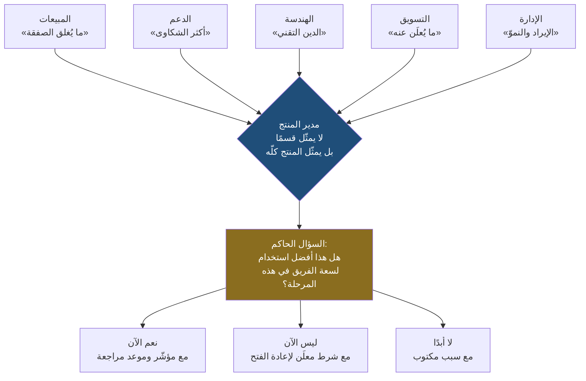
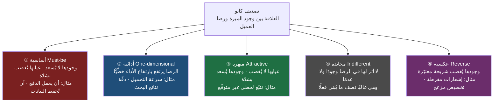
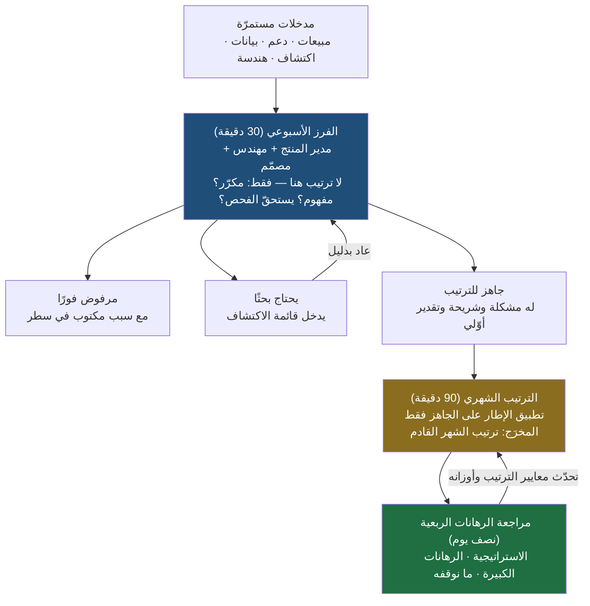
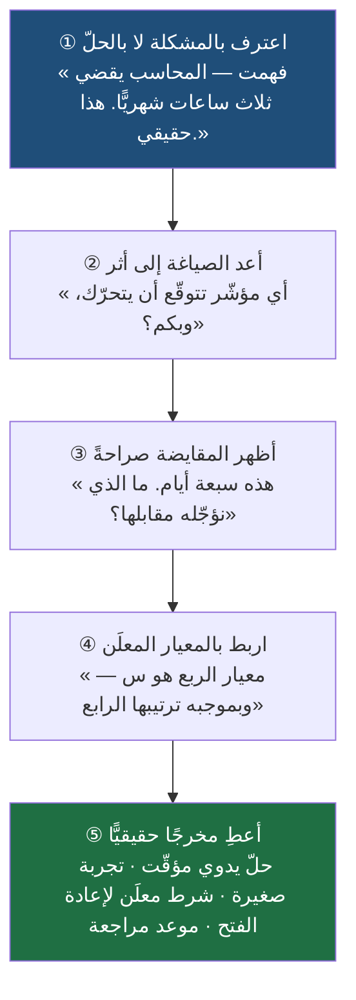
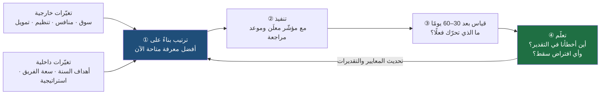

> [!info] الفصل 05 · إدارة المنتج في عصر الذكاء الاصطناعي
> **ماذا ستتعلّم:** لماذا يكون **اختيار ما لن يُبنى** قرارًا أثقل من اختيار ما سيُبنى، وكيف تحوّل الترتيب من ذوق شخصي أو سلطة تنظيمية إلى **عملية معلَنة قابلة للمساءلة**. ستتعلّم رياضيات الأطر الشهيرة (`RICE`، `ICE`، `WSJF`، `Weighted Scoring`) وحدودها الحقيقية بما فيها **الدقّة الزائفة**، ونموذج `Kano` بفئاته الخمس لا الثلاث واستبياره وظاهرة انحدار المبهر إلى أساسي، و`MoSCoW` بمعناه الصحيح لـ«لن نفعل **الآن**». وستدخل في اقتصاد القرار: **تكلفة الفرصة البديلة**، و**تكلفة التأخير**، و**التكلفة الغارقة**، ولماذا «مجاني لأن الفريق موجود أصلًا» مغالطة. ثم تنتقل من الإطار إلى **الحوكمة**: كيف تُدار قائمة الطلبات فعليًّا أسبوعًا بأسبوع، وكيف تُقال «لا» دون خسارة العلاقة، وأين يفيد الذكاء الاصطناعي في هذا كلّه وأين لا يجوز أن يُترك له القرار.

# الفصل 05 — تحديد الأولويات (Prioritization)

## 🎯 أهداف التعلّم

- تعريف **الأولوية** تعريفًا تشغيليًّا: أفضل استخدام لسعة الفريق في هذه المرحلة تحديدًا، لا الأكثر إثارة ولا الأعلى صوتًا ولا الأحدث وصولًا.
- تفكيك **تعارض الزوايا** بين المبيعات والدعم والهندسة والتسويق والإدارة، وشرح لماذا يمثّل مدير المنتج **المنتج كلّه** لا فريقًا بعينه.
- تطبيق ثلاثة مفاهيم اقتصادية على قرار المنتج: [[Opportunity Cost|تكلفة الفرصة البديلة]] و[[Cost of Delay|تكلفة التأخير]] و[[Sunk Cost Fallacy|مغالطة التكلفة الغارقة]]، وتفنيد وهم «الميزة المجّانية».
- حساب `RICE` يدويًّا، ثم **نقد نتيجته**: لماذا يضخّم الضربُ خطأَ التقدير، ولماذا يُعامَل `Impact` كسُلَّم ترتيبي، ولماذا يكون `Confidence` أكثر العوامل قابلية للتزوير.
- استخدام [[Kano Model|نموذج كانو]] بفئاته الخمس (`Must-be` · `One-dimensional` · `Attractive` · `Indifferent` · `Reverse`)، وبناء **استبيان كانو** بسؤاليه الوظيفي والمعكوس، وتفسير **انحدار المبهر إلى أساسي** مع الزمن.
- التمييز بين إطار **ترتيب** (`RICE`) وإطار **تسلسل** ([[WSJF]]) وإطار **تصنيف** (`Kano`) وإطار **التزام** ([[Shape Up]])، واختيار الإطار المناسب لطبيعة القرار.
- تصميم **حوكمة قائمة طلبات** كاملة: دورة ترتيب دورية، وسياسة للطلبات العاجلة، وحصّة ثابتة لـ[[Technical Debt|الدين التقني]]، ومالك معلَن لقرار الرفض.
- صياغة **رفض مهني** يربط «لا» بمعيار معلَن لا بذوق شخصي، ويفصل بين رفض الطلب ورفض صاحبه.
- تحديد ما يستطيع الذكاء الاصطناعي فعله في الترتيب (تجميع، تلخيص، تقدير أوّلي، بناء جداول مقارنة) وما لا يستطيعه بنيويًّا (اختيار دالّة الهدف، وتحمّل نتيجة القرار).
- رصد أربعة تحيّزات ترتيب في اجتماع حقيقي — تحيّز آخر طلب، وتحيّز أعلى صوت، وتحيّز الفكرة الجديدة، وتحيّز التكلفة الغارقة — واقتراح إجراء مضادّ لكلٍّ منها.
- تحليل **البُعد الخليجي**: خارطة الطريق التي تتحوّل إلى قائمة وعود بيعية، وسلطة «أكبر عميل»، وترتيب الأولويات في غياب البيانات.
- عرض الخلاف المهني المفتوح: هل ترتيب الأولويات **علم قرار** أم **غطاء عددي** لقرار سياسي اتُّخذ سلفًا؟ — بحججه القوية من الطرفين.

## الفكرة المحورية: أن تختار ما **لن** تبنيه

في [[02 - فلسفة إدارة المنتج|الفصل الثاني]] كان السؤال: كيف نكتشف مشكلة حقيقية بدل أن نفترضها؟ ولنفترض الآن أن الاكتشاف نجح نجاحًا كاملًا، وأنك خرجت من ربع كامل من المقابلات وتحليل البيانات بعشر مشكلات **حقيقية ومثبتة**، كلٌّ منها يؤلم شريحة معلومة، ولكلٍّ منها دليل لا يُناقَش.

هنا يبدأ هذا الفصل بسؤاله المزعج: **وماذا الآن؟**

الجواب البديهي — «نعالجها كلها» — هو أخطر جواب في المهنة، لأنه يبدو مسؤولًا وهو في الحقيقة هروب من المسؤولية. عشر مشكلات حقيقية وفريق واحد وربع واحد يعني أن **ستًّا أو سبعًا منها لن تُعالَج هذا العام**، سواء اعترفت بذلك أم لم تعترف. الفرق الوحيد بين الفريق الناضج والفريق المرتبك ليس أن الأول يعالج أكثر، بل أن الأول **يعرف أيها لن يعالج ولماذا**، بينما الثاني يبدأ في العشرة كلها ثم يكتشف بعد ثلاثة أشهر أنه لم يُنهِ واحدة.

ولهذا فإن أدقّ وصف لعمل مدير المنتج في هذه المرحلة ليس «أن يختار ما سيُبنى»، بل:

> **أن يختار ما لن يُبنى — بالعناية نفسها، وبالدليل نفسه، وبالوضوح نفسه.**

ولاحظ أن هذه ليست بلاغة. اختيار ما سيُبنى قرار **يُحتفَل به**: يُعلَن في اجتماع، ويُكتب في خارطة الطريق، ويُنسب إليك عند نجاحه. أمّا اختيار ما لن يُبنى فقرار **يُدفَع ثمنه**: يغضب من طلبه، ولا يشكرك عليه أحد، ولا يظهر أثره في أي شريحة عرض. ولذلك تميل المؤسّسات بطبيعتها إلى تجنّبه — فتقول «نعم» لكل شيء وتتركه يموت صامتًا في قائمة الطلبات بدل أن ترفضه صراحةً. وهذا أسوأ الحلول: كل تكاليف الرفض بلا أيٍّ من فوائده.

### وهم المبتدئ: عدد الميزات كمقياس نجاح

مدير المنتج المبتدئ يقيس نفسه بعدد ما أُطلق. وهو مقياس مُغرٍ لثلاثة أسباب: إنه **سهل العدّ**، و**يرتفع دائمًا**، و**يبدو كإنتاجية** أمام الإدارة. لكن الحقيقة القاسية أن المنتج يفشل بثلاث طرق مختلفة تمامًا، ولا يلتقط أيًّا منها مقياس العدد:

| نمط الفشل | ما الذي حدث؟ | لماذا لا يكشفه عدّ الميزات؟ |
|---|---|---|
| **الميزة الخاطئة** | بُنيت ميزة لا يحتاجها أحد فعلًا | العدّاد ارتفع؛ الاستخدام لم يرتفع |
| **الميزة الصحيحة في الوقت الخاطئ** | بُنيت ميزة متقدّمة قبل أن يستقرّ الأساس، أو بعد أن فات السوق | العدّاد لا يعرف الزمن |
| **الاستثمار الضخم في مشكلة صغيرة** | ثلاثة أشهر في مشكلة تمسّ 2% بينما تنتظر مشكلة تمسّ 60% | العدّاد لا يعرف الحجم |

النمط الثالث هو الأخطر لأنه **الأقلّ ظهورًا**. الفريق عمل بجدّ، والميزة أُطلقت في موعدها، وجودتها ممتازة، وأحدًا لم يخطئ في التنفيذ. الخطأ كلّه وقع في لحظة **الاختيار**، قبل أن يُكتب سطر واحد من الكود. ولهذا يقال في المهنة إن أعلى نقطة رافعة في عمل مدير المنتج ليست في التنفيذ ولا في التسليم، بل في **دقيقة الاختيار**.

> [!info] إضافة مرجعية
> هذا هو ما تسمّيه ميليسا بيري في `Escaping the Build Trap` **«فخّ البناء»** (`Build Trap`): أن تقيس المؤسّسة نفسها بما تُنتجه بدل ما تُحدثه من أثر، فتصبح آلة تسليم عالية الكفاءة تتحرّك في اتجاه لم يختره أحد بوعي. والعلامة التشخيصية عندها بسيطة: **اسأل الفريق «ما الذي لن نفعله هذا الربع؟» — إن لم توجد إجابة مكتوبة، فأنتم في الفخّ.**
>
> والفكرة أقدم من كتاب المنتج نفسه. ففي `Competitive Strategy` وفي مقالته الشهيرة `What Is Strategy?` (1996) يعرّف مايكل بورتر الاستراتيجية بأنها **«الاختيار الواعي لأن تفعل أشياء مختلفة، أو أن تفعل الأشياء بطريقة مختلفة»**، ويشدّد على أن **جوهر الاستراتيجية هو اختيار ما لا تفعله**. وهذه بالضبط هي إدارة المنتج على مستوى الميزة: ترتيب الأولويات هو الاستراتيجية وهي تُترجَم إلى أسابيع عمل.

### الاقتصاد الذي يجعل هذا الفصل أهمّ اليوم مما كان

في [[01 - لماذا لا يزال مدير المنتج أهم من أي وقت مضى|الفصل الأول]] وردت قاعدة تختصر الحقبة: **كلّما رخص البناء، غلا الاختيار.** وهذا الفصل هو موضع تطبيقها المباشر.

حين كان بناء الشيء الخاطئ يستهلك ستة أشهر من فريق كامل، كان **بطء التنفيذ نفسه فلترًا**: الفكرة الرديئة تموت أثناء الطريق لأن أحدًا سيسأل عن كلفتها قبل أن تكتمل. واليوم، حين يمكن أن يخرج نموذج أوّلي تفاعلي في ساعتين وميزة كاملة في أسبوع، سقط الفلتر. صار ممكنًا أن تخطئ عشرين مرة في السنة — لا في التنفيذ بل في الاختيار — وأن تخرج بمنتج مكتظّ بميزات لا تُستخدم، وبتعقيد لا يمكن التراجع عنه بسهولة، وبفريق منهك لم يخطئ أحد فيه.

> [!quote] من الويبينار
> عند الحديث عن الحدّ الفاصل بين ما يستحقّ العمل عليه وما لا يستحقّ، جاءت القاعدة صريحة:
> *"if you cannot justify **why this is a priority**, what data, what strategy, what metrics, what user discovery — then you should not focus on this."*
>
> **الترجمة:** «إن لم تستطع أن تبرّر **لماذا هذه أولوية** — أي بيانات، وأي استراتيجية، وأي مؤشّرات، وأي اكتشاف للمستخدم — فلا ينبغي أن تشتغل عليها.»
>
> ولاحظ أن السؤال هنا لم يكن «هل هذه فكرة جيدة؟» بل **«لماذا هي أولوية؟»** — وهو سؤال مختلف تمامًا، لأنه يفترض ضمنًا وجود بدائل تُزاح لصالحها.

## ما «الأولوية» بالضبط؟ — تعريف تشغيلي وثلاثة تعريفات فاسدة

قبل أي إطار، يجب أن يكون التعريف حادًّا؛ لأن أغلب الخلاف في اجتماعات الترتيب ليس خلافًا على الأرقام، بل خلاف على **معنى الكلمة نفسها** دون أن ينتبه أحد.

**التعريف التشغيلي:**

> الأولوية هي **العمل الذي يحقّق أكبر قيمة متوقّعة مقارنةً بالموارد والوقت المتاحين، في هذه المرحلة تحديدًا من عمر المنتج والشركة والسوق.**

في هذا التعريف أربعة قيود، كلّ واحد منها يُسقط تعريفًا فاسدًا شائعًا:

**① «مقارنةً بالموارد»** — الأولوية **نسبة لا قيمة مطلقة**. الفكرة العظيمة التي تستهلك ربعًا كاملًا قد تكون أدنى أولوية من ثلاث تحسينات متوسّطة تستغرق أسبوعين مجتمعة. من يناقش «هل هذه الميزة مفيدة؟» يطرح سؤالًا لا معنى له؛ السؤال الوحيد ذو المعنى هو **«هل هي أنفع من أفضل بديل متاح لنفس السعة؟»**

**② «القيمة المتوقّعة»** — أي القيمة مضروبة في احتمال تحقّقها. الرهان الذي يعطي أثرًا هائلًا باحتمال 10% ليس مساويًا للرهان الذي يعطي أثرًا متوسّطًا باحتمال 90%، ومن يقارن بينهما بالأثر وحده يخدع نفسه.

**③ «في هذه المرحلة»** — الأولوية **دالّة في الزمن والسياق**. الميزة نفسها قد تكون خاطئة تمامًا اليوم وصائبة تمامًا بعد ستة أشهر. ولهذا فإن «رفضنا هذا سابقًا» ليست حجّة، بل كسل.

**④ «من عمر المنتج والشركة والسوق»** — ثلاثة سياقات لا سياق واحد. منتج قبل [[Product-Market Fit|ملاءمة المنتج للسوق]] يرتّب بمنطق مختلف تمامًا عن منتج ناضج يدافع عن حصّته.

### ثلاثة تعريفات فاسدة تعمل في الظلّ

هذه التعريفات لا يعلنها أحد، لكنها هي التي تحكم فعليًّا في أغلب المؤسّسات:

**الفاسد الأول: «الأولوية ما يحبّه المدير.»** وهو ما يُعرف في أدبيات القرار باسم [[HiPPO|رأي أعلى راتب في الغرفة]] (`Highest Paid Person's Opinion`). ومشكلته ليست أن المدير مخطئ — قد يكون على حق كثيرًا بحكم خبرته وسياقه الأوسع — بل أن **آلية القرار لا تفرّق بين حين يكون على حقّ وحين لا يكون**. أي أن النظام لا يتعلّم.

**الفاسد الثاني: «الأولوية ما يطلبه أكبر عميل.»** وهذا أخطرها في سياق شركات المؤسّسات (`B2B`) وفي السوق الخليجي خصوصًا، وسيأتي تفصيله في قسم البُعد المحلّي. والمشكلة البنيوية فيه أن العميل الأكبر يمثّل **صوتًا واحدًا مضخّمًا**، لا سوقًا؛ فالمنتج الذي يُبنى بطلباته يتحوّل تدريجيًّا إلى نظام مخصّص لعميل واحد يُباع بسعر منتج، وهو أسوأ نموذج عمل ممكن: تعقيد المنتج وهامش الخدمات.

**الفاسد الثالث: «الأولوية أكثر الأفكار إثارة.»** وهي التي تنتصر في العصف الذهني وتموت في القياس. والإثارة مؤشّر على **حداثة الفكرة عند من يعرضها**، لا على قيمتها عند من سيستعملها.

> [!warning] العلامة التشخيصية للتعريف الفاسد
> إن كنت لا تستطيع أن تشرح لمهندس في الفريق **لماذا** يعمل على ما يعمل عليه الآن، بجملة واحدة تذكر المشكلة والشريحة والمؤشّر — فأنتم لا تعملون بتعريف صحيح، بأيّ إطار زيّنتم القائمة.

## لماذا هو أصعب ما يفعله مدير المنتج؟ — بنية التعارض

لو كان تحديد الأولويات عملية حسابية لَما احتاج إلى بشر. صعوبته ليست في الحساب، بل في أنه **القرار الوحيد الذي يخسر فيه شخص حقيقي شيئًا يريده، في كل مرة، بلا استثناء**.

وكلّ قسم في الشركة ينظر إلى قائمة الطلبات من زاويته، وكلّ زاوية **مشروعة** ومبنيّة على حوافز حقيقية لا على سوء نيّة:

| القسم | ما يريده | لماذا يريده (الحافز البنيوي) | الخطر إن ساد وحده |
|---|---|---|---|
| **المبيعات** | ما يُغلق الصفقة المفتوحة الآن | يُقاس بالعمولة والحصص الربعية | منتج مفصّل على صفقات، بلا نمط متكرّر |
| **الدعم** | إزالة أكثر الشكاوى تكرارًا | يُقاس بحجم التذاكر وزمن الإغلاق | تحسين المؤلم الظاهر وإهمال الصامت الأكبر |
| **الهندسة** | تقليل [[Technical Debt\|الدين التقني]] وتحسين البنية | تتحمّل كلفة كل اختصار سابق | استثمار داخلي لا يراه العميل ولا السوق |
| **التسويق** | ما يمكن الإعلان عنه | يُقاس بالوصول والقصّة | ميزات إعلان بلا عمق استخدام |
| **الإدارة** | الإيراد والنموّ وأهداف السنة | تُقاس أمام المجلس والمستثمرين | تحسين الربع الحالي على حساب السنة القادمة |
| **العمليات** | تقليل التدخّل اليدوي | تتحمّل الكلفة التشغيلية يوميًّا | أتمتة مسارات داخلية قبل قيمة المستخدم |

وهنا تظهر الجملة التي تختصر موقع الدور كلّه: **مدير المنتج لا يمثّل فريقًا بعينه، بل يمثّل المنتج كلّه.** ونتيجة ذلك أنه الوحيد في الغرفة الذي **حافزه ليس مطابقًا لحافز أي قسم**؛ وهذا مصدر قوّته ومصدر عزلته معًا. من يبحث في هذا الدور عن الشعبية سيجد نفسه — بعد سنة — منسّقًا لطلبات الآخرين بترتيب وصولها.

### القاعدة: ليس «نعم» لكل شيء ولا «لا» لكل شيء

الخطأ الشائع أن يُفهَم كلّ ما سبق على أنه دعوة إلى الرفض. وليس كذلك. مدير المنتج الذي يرفض كل شيء ليس أنضج ممّن يقبل كل شيء؛ كلاهما **استبدل الحكم بقاعدة ثابتة** ليعفي نفسه من كلفة التفكير في كل حالة.

القاعدة الصحيحة سؤال واحد يُطرح على كل طلب:

> **هل هذا أفضل استخدام لوقت الفريق في هذه المرحلة؟**

وجمال هذا السؤال أنه **ينقل النقاش من الشخص إلى المقارنة**. حين يقول مدير المبيعات «نحتاج هذه الميزة»، فالردّ ليس «لا» ولا «حسنًا»، بل: «هذه سبعة أيام من سعة الربع. البدائل المتاحة لنفس السبعة أيام هي س وص. ساعدني أن أقارن — من الشريحة؟ وكم حجمها؟ وما الذي سيتحرّك؟» وقد تنتهي المقارنة إلى قبول طلبه، وهذا نجاح لا هزيمة؛ المهم أنها انتهت إليه **بمعيار**، لا بنفاد صبرك أو بعلوّ صوته.

### سبعة أسئلة تسبق أي إطار

الأطر التي سيأتي شرحها لاحقًا كلّها تفترض أنك تملك مدخلات. وهذه هي الأسئلة التي تنتج المدخلات؛ ومن تجاوزها إلى الجدول مباشرةً فقد بنى حسابًا دقيقًا على أرقام مخترعة:

1. **كم عدد المتأثّرين؟** — لا «المستخدمون»، بل رقم من لوحة البيانات أو تقدير معلَن الطريقة.
2. **ما حجم المشكلة عند المتأثّر الواحد؟** — إزعاج بسيط مرة شهريًّا، أم عائق يمنع إنجاز المهمّة يوميًّا؟
3. **ما قيمة الحلّ؟** — ما الذي سيتغيّر في سلوكه فعلًا، وبأي [[KPI]] يُقاس؟
4. **كم يكلّف؟** — لا بالأيام فقط، بل بالسعة النادرة تحديدًا: من المهندس الوحيد الذي يفهم هذا الجزء؟
5. **كم يستغرق؟** — ومتى تبدأ القيمة في الظهور، لا متى ينتهي البناء؟
6. **ما المخاطر؟** — تقنية، تنظيمية ([[PDPL]] مثلًا)، تشغيلية، وسمعة المنتج.
7. **هل يتوافق مع الاستراتيجية؟** — أي رهان من رهانات السنة يخدم؟ وإن لم يخدم أيًّا منها، فلماذا هو في القائمة أصلًا؟

> [!note] السؤال الثامن الذي يُنسى دائمًا
> **ما الذي سيتوقّف إن فعلنا هذا؟** لأن السعة ثابتة. كل إدخال بلا إخراج ليس ترتيبًا للأولويات، بل **تضخّمًا للقائمة**. والفِرَق التي تضيف ولا تحذف تكتشف بعد سنة أن قائمة طلباتها صارت أرشيفًا لا أداة قرار.

## اقتصاد القرار: التكلفة التي لا تظهر في أي فاتورة

أخطر ما في ترتيب الأولويات أن **كلفته الحقيقية غير مرئية**. ما يظهر في الميزانية هو كلفة ما بنيته؛ أما كلفة ما لم تبنه بسببه فلا تظهر في أي مكان، مع أنها غالبًا أكبر. وهذا القسم يعالج ثلاثة مفاهيم اقتصادية تُذكر كثيرًا وتُطبَّق قليلًا.

### ① تكلفة الفرصة البديلة (`Opportunity Cost`)

[[Opportunity Cost|تكلفة الفرصة البديلة]] في الاقتصاد هي **قيمة أفضل بديل تخلّيت عنه**. لا مجموع البدائل، ولا متوسّطها — **أفضلها**. ونقلها إلى المنتج يعطي القاعدة الحاسمة:

> كلفة بناء الميزة (أ) ليست أيام العمل التي استهلكتها، بل **القيمة التي كانت الميزة (ب) ستحقّقها لو بُنيت مكانها**.

وهذا يقلب طريقة تقييم النجاح رأسًا على عقب. الميزة التي «نجحت» — أُطلقت ورفعت مؤشّرها 3% — قد تكون **قرارًا فاشلًا** إن كان البديل المتاح سيرفع مؤشّرًا أهمّ بـ 15%. ومراجعات ما بعد الإطلاق في أغلب الفرق لا تسأل هذا السؤال أبدًا؛ تسأل «هل نجحت؟» ولا تسأل «هل كانت أفضل ما أمكن؟».

> [!warning] مغالطة «هذه الميزة مجّانية لأن الفريق موجود أصلًا»
> هذه أكثر الجمل تدميرًا في اجتماعات الترتيب، وتُقال بحسن نيّة تامّة: «المهندسون على الراتب في كل الأحوال، فما ضرر إضافة هذه الميزة الصغيرة؟»
>
> والخطأ فيها ثلاثي:
> **① تخلط بين الكلفة النقدية والكلفة الاقتصادية.** الراتب مدفوع فعلًا، نعم؛ لكن **السعة** التي يشتريها هذا الراتب محدودة، وكل ساعة تُنفَق هنا لا تُنفَق هناك. الكلفة ليست في المال بل في **البديل الضائع**.
> **② تتجاهل الكلفة الدائمة للميزة.** الميزة ليست حدثًا بل **التزامًا**: صيانة، واختبارات انحدار ([[Regression Testing]]) عند كل تغيير قادم، ودعم، وتوثيق، وسطح هجوم أمني، وحالة إضافية في كل شاشة تُصمَّم بعدها. تقديرات الصناعة الشائعة تضع كلفة العمر الكامل للبرمجية أضعاف كلفة بنائها الأولى، والميزة التي كلّفت خمسة أيام قد تكلّف خمسة أيام أخرى موزّعة على ثلاث سنوات دون أن يحتسبها أحد.
> **③ تتجاهل كلفة التعقيد على المستخدم.** كل خيار إضافي في الواجهة يرفع الحمل الإدراكي على كل مستخدم، بمن فيهم من لا يحتاج الميزة أبدًا. فالميزة التي تسعد 3% قد تُبطئ 97% بمقدار صغير — وحاصل ضرب الصغير في الكثير ليس صغيرًا.
>
> **الصيغة الصحيحة:** لا شيء مجّاني. أرخص ميزة في العالم كلفتها **أفضل بديل لها**، زائدًا التزامها الدائم.

### ② التكلفة الغارقة (`Sunk Cost`) — ولماذا يصعب إيقاف مشروع

[[Sunk Cost Fallacy|مغالطة التكلفة الغارقة]] هي الميل إلى مواصلة الاستثمار في مسار لأنك **استثمرت فيه سابقًا**، لا لأن عائده المستقبلي يستحقّ. والقاعدة الاقتصادية الصارمة: **ما أُنفق أُنفق، ولا يدخل في أي قرار مستقبلي**. القرار الوحيد الصحيح في كل لحظة هو: بالنظر إلى السعة المتبقّية والمعرفة الحالية، هل إكمال هذا المسار أفضل استخدام لها؟

لكنها في المؤسّسات ليست مغالطة فردية فقط، بل **مغالطة بحوافز**. من أعلن المشروع في اجتماع المجلس يدفع ثمنًا شخصيًّا عند إيقافه؛ والفريق الذي عمل ستة أشهر يشعر بأن الإيقاف حكم على جهده بالعبث. ولهذا لا يكفي أن تعرف المغالطة نظريًّا؛ تحتاج **إجراءً يجعل التوقّف مقبولًا اجتماعيًّا**:

- **نقاط تخلٍّ معلنة مسبقًا** (`Kill Criteria`): تُكتب عند بدء المشروع لا عند تعثّره. «إن لم يصل معدّل الاستخدام إلى س بعد 45 يومًا من الإطلاق التجريبي، نوقف ونعيد التقييم.» والفرق هائل: القرار اتُّخذ وأنت هادئ، والتنفيذ لاحقًا مجرّد التزام بما اتّفقتم عليه.
- **إعادة تأطير الإيقاف كمكسب معرفي**: الفريق الذي أوقف مشروعًا بعد ستة أسابيع بدليل، **وفّر** على الشركة ستة أشهر. وهذا ما ينبغي أن يُعلَن في المراجعة، لا أن يُدفَن بصمت.
- **قاطع الدائرة** (`Circuit Breaker`) في [[Shape Up]]: إن لم تكتمل الدورة في وقتها المحدّد، لا تُمدَّد تلقائيًّا — بل تسقط ويُعاد التفكير. وهذا يعكس الافتراض المعتاد: **الوقت ثابت والنطاق متغيّر**، لا العكس.

### ③ تكلفة التأخير (`Cost of Delay`) — البُعد الذي يُنسى

الأطر الشائعة تسأل «ما قيمة هذا؟» و«كم يكلّف؟»، وتنسى السؤال الثالث: **«كم نخسر عن كل شهر تأخير؟»** — وهو [[Cost of Delay|تكلفة التأخير]]، ومصدره الأساسي أدبيات تدفّق المنتج عند دونالد رينرتسن في `The Principles of Product Development Flow` (2009).

وقيمته أنه يفكّ عقدة يعجز عنها الترتيب بالقيمة وحدها: **ميزتان متساويتان في القيمة قد تكونان مختلفتين تمامًا في إلحاح التوقيت.** الميزة التي تعطي قيمتها كاملة سواء أُطلقت في مارس أو في سبتمبر ليست كالميزة المرتبطة بموسم رمضان أو بموعد امتثال تنظيمي.

وتكلفة التأخير تأخذ أشكالًا تُرسَم عادةً هكذا:

| نمط تكلفة التأخير | الوصف | مثال |
|---|---|---|
| **خطّي** | خسارة ثابتة عن كل وحدة زمن | تسريب في مسار الدفع يكلّف مبلغًا شهريًّا ثابتًا |
| **موعد نهائي حادّ** | القيمة كاملة قبل تاريخ، وقريبة من الصفر بعده | تكامل يجب أن يعمل قبل موسم الحجّ أو قبل تاريخ إلزام تنظيمي |
| **متأخّر البداية** | لا خسارة الآن، ثم خسارة متسارعة لاحقًا | منافس يبني ميزة ستصبح معيارًا في السوق بعد عام |
| **تعويضي/مؤجَّل** | القيمة لا تضيع بالتأخير بل تتأجّل فقط | تحسين داخلي في لوحة الإدارة |

والفائدة العملية: **افصل «مهمّ» عن «عاجل» بجعل الإلحاح عاملًا مستقلًّا لا شعورًا.** بند تكلفة تأخيره من نمط «موعد نهائي حادّ» يستحقّ التقديم حتى لو كانت قيمته المطلقة أقلّ من غيره — وهذا بالضبط ما يشكّله [[WSJF]] رياضيًّا كما سيأتي.

## العاجل مقابل المهمّ: أخطر التباس في غرفة الاجتماع

هذا هو الالتباس الذي يستهلك أكثر من نصف سعة الفرق في المؤسّسات المتوسّطة، ويُقدَّم دائمًا في صورة أخلاقية: «كيف تتجاهل شكوى عميل؟».

### السيناريو الكلاسيكي

يوم الأحد صباحًا: عميل مؤسّسي كبير يرسل شكوى حادّة عن خلل في تقرير شهري. الشكوى تصل إلى المدير التنفيذي، فتصل إلى مدير المنتج بصيغة: «هذه أولوية قصوى، أوقفوا كل شيء».

يبدو الأمر محسومًا. لكن مدير المنتج المهني يفتح البيانات قبل أن يفتح التذكرة، فيجد:

- الخلل المشكوّ منه يمسّ **حسابًا واحدًا** بسبب إعداد خاصّ في تكامله.
- وفي الأسبوع نفسه، تُظهر لوحة البيانات **تسريبًا في مسار التسجيل** يمسّ نحو مئة ألف مستخدم شهريًّا، أحد لم يشتكِ منه — لأن من يتسرّب لا يبقى ليشتكي.

وهنا القاعدة المركزية:

> **المشكلات الصامتة أكبر من المشكلات الصائتة، لأن آلية الشكوى منحازة بنيويًّا.** من يشتكي هو من بقي؛ ومن غادر لا يرسل تذكرة.

هذا لا يعني تجاهل الشكوى. يعني أن **حجم الصوت ليس بديلًا عن حجم الأثر**، وأن مهمّة مدير المنتج أن يضع الاثنين على المقياس نفسه.

### مصفوفة عاجل/مهمّ — وحدّها

[[Eisenhower Matrix|مصفوفة أيزنهاور]] (المنسوبة إلى دوايت أيزنهاور وشاعت عبر `The 7 Habits of Highly Effective People` لستيفن كوفي) تعطي تصنيفًا سريعًا:

| | **عاجل** | **غير عاجل** |
|---|---|---|
| **مهمّ** | افعله الآن — أعطال، مخاطر امتثال، تسريبات إيراد نشطة | **هنا يُبنى المنتج فعلًا** — الاكتشاف، الرهانات، الدين التقني، التجارب |
| **غير مهمّ** | فوّضه أو قوننه — طلبات تقارير، استثناءات فردية، مهام قابلة للأتمتة | احذفه صراحةً — لا تتركه في القائمة يتعفّن |

والخانة الحاسمة هي **«مهمّ وغير عاجل»**، لأنها الخانة الوحيدة التي **لا يذكّرك بها أحد**. لا يوجد عميل يرسل تذكرة يطالب فيها بسداد الدين التقني، ولا مدير يسأل عن مقابلات المستخدمين هذا الأسبوع. ولهذا تُلتهم هذه الخانة أولًا في كل ضغط، وتظهر آثار ابتلاعها بعد ستة أشهر على شكل بطء غامض في كل شيء.

> [!info] إضافة مرجعية
> ولمصفوفة أيزنهاور حدّان يجب ذكرهما حتى لا تُستعمل أكثر ممّا تحتمل:
> **الأول:** «مهمّ» و«عاجل» في المصفوفة **ثنائيتان** (نعم/لا)، بينما هما في الواقع **متّصلتان** ومتفاوتتان بدرجات. فهي أداة **فرز سريع** لا أداة ترتيب، ولا تصلح لترتيب عشرين بندًا داخل الخانة الواحدة.
> **الثاني:** تصنيف البند «مهمًّا» هو نفسه القرار الصعب الذي تتظاهر المصفوفة بأنها تحلّه. فمن يعرف ما هو مهمّ لا يحتاج المصفوفة أصلًا؛ وقيمتها الحقيقية أنها **تكشف** كم من سعتك يذهب إلى الخانة «عاجل وغير مهمّ» — وهذا كشف مفيد جدًّا رغم بساطته.
>
> والمقابل التنفيذي الأنضج لهذه المصفوفة في أنظمة التدفّق هو [[Expedite Class|صنف الاستعجال]] في كانبان: بدل أن تُدار المقاطعات بالمزاج، تُعرَّف **فئة خدمة معلَنة** لها شروط دخول صارمة وسقف صارم (بند واحد في النظام في أي وقت مثلًا). فالطلب العاجل الحقيقي يبقى ممكنًا، لكنه يصبح **مكلفًا ومرئيًّا** بدل أن يكون مجّانيًّا وخفيًّا.

## `RICE`: الرياضيات كاملةً، ثم النقد كاملًا

[[RICE Prioritization|إطار `RICE`]] هو أشهر أطر الترتيب في المنتجات الرقمية، وقد طوّرته شركة `Intercom` ونشرته علنًا في مدوّنتها الهندسية والمنتجية. ولم يُشرَح في الويبينار، فهو هنا **إضافة مرجعية** بالكامل.

> [!info] إضافة مرجعية — الصيغة ومعاني عواملها
> $$\text{RICE} = \frac{\text{Reach} \times \text{Impact} \times \text{Confidence}}{\text{Effort}}$$
>
> - **`Reach` (المدى):** كم مستخدمًا (أو حدثًا) سيمسّه هذا **خلال فترة زمنية محدّدة** — ربع مثلًا. عدد حقيقي من لوحة البيانات لا تقدير انطباعي.
> - **`Impact` (الأثر):** حجم الأثر على المستخدم الواحد، بسُلَّم معلَن: 3 = هائل · 2 = كبير · 1 = متوسّط · 0.5 = منخفض · 0.25 = ضئيل.
> - **`Confidence` (الثقة):** نسبة مئوية تعبّر عن قوّة الدليل خلف التقديرات السابقة: 100% · 80% · 50%.
> - **`Effort` (الجهد):** بالشهر-شخص (`Person-Month`)، شاملًا التصميم والهندسة والاختبار والإطلاق — لا الهندسة وحدها.
>
> والنتيجة **رقم بلا وحدة**، لا معنى له في ذاته، ومعناه الوحيد في **المقارنة** بين بنود قُدِّرت بالطريقة نفسها في الجلسة نفسها.

### مثال محسوب بالكامل

خمسة بنود مقترحة لمنتج تجارة إلكترونية إقليمي (أرقام تعليمية):

| البند | `Reach`/ربع | `Impact` | `Confidence` | `Effort` (شهر-شخص) | النتيجة |
|---|---|---|---|---|---|
| تسريع صفحة المنتج | 400٬000 | 1 | 80% | 2 | **160٬000** |
| الدفع بالتقسيط | 90٬000 | 2 | 50% | 4 | **22٬500** |
| تحسين البحث بالعربية | 250٬000 | 2 | 80% | 5 | **80٬000** |
| برنامج ولاء | 30٬000 | 3 | 50% | 6 | **7٬500** |
| إعادة تصميم الرئيسية | 500٬000 | 0.5 | 50% | 4 | **31٬250** |

الترتيب الناتج: التسريع ← البحث ← إعادة التصميم ← التقسيط ← الولاء.

والملاحظة الأولى أن **البند الأقلّ إثارة تصدّر القائمة**. وهذه في الغالب فائدة الإطار الحقيقية: أنه يقاوم ميل الفريق إلى الجديد اللامع، ويجبر الجميع على النظر إلى المدى الذي يمسّه التحسين المملّ.

### النقد: لماذا هذا الرقم أقلّ صدقًا ممّا يبدو؟

الأطر تُساء بقدر ما تُحسن، وهذا الجزء أهمّ من الجزء السابق.

> [!warning] خمسة عيوب بنيوية في `RICE` — وعلاج كلٍّ منها
> **① الدقّة الزائفة (`False Precision`).** الناتج «160٬000» يوحي بدقّة من ستّ خانات، بينما مدخلاته تقديرات خشنة. والمشكلة نفسية قبل أن تكون رياضية: الرقم الدقيق **يُسكت النقاش**، لأن الاعتراض على رقم يبدو غير موضوعي. والعلاج: **لا تعرض الترتيب رقمًا، اعرضه ثلاث مجموعات** (عالٍ · متوسّط · منخفض). فالفروق داخل المجموعة الواحدة أصغر من هامش خطأ التقدير أصلًا، وادّعاء ترتيبها ادّعاء بلا سند.
>
> **② الضرب يضخّم الخطأ.** حين تُضرب أربعة تقديرات، **تتراكم أخطاؤها النسبية** ولا تتوسّط. خطأ 50% في المدى مع خطأ 50% في الجهد يمكن أن يعطي ناتجًا مضلّلًا بأضعاف. والعلاج: مرّر البنود المتصدّرة على **تحليل حساسية** بسيط — أعد الحساب بأسوأ تقدير للجهد وأفضل تقدير لمنافسه؛ فإن انقلب الترتيب، فأنت لا تملك ترتيبًا بل صدفة.
>
> **③ `Impact` سُلَّم ترتيبي يُعامَل معاملة الأعداد.** الأرقام 3 و2 و1 و0.5 **تسميات لرتب** لا كمّيات مقيسة؛ لا يوجد أي معنى تجريبي لكون «الهائل» يساوي ثلاثة أمثال «المتوسّط». وضربها ضرب أرقام لا تحتمل الضرب — وهو خطأ قياسي معروف في أدبيات القياس (`Ordinal vs Interval Scales`). والعلاج: اربط كل درجة بـ**تعريف سلوكي معلَن** («2 = يزيل خطوة كاملة من المسار» · «1 = يقلّل الاحتكاك دون إزالة خطوة»)، واقبل أن السُّلَّم أداة اتّساق داخل الفريق لا قياس للعالم.
>
> **④ `Confidence` أكثر العوامل قابلية للتزوير.** لأنه **العامل الوحيد الذي لا يوجد له مصدر خارجي يكذّبه**: المدى تراجعه لوحة البيانات، والجهد يدافع عنه المهندسون، والأثر يخضع لسُلَّم معلَن؛ أمّا الثقة فرقم يضعه صاحب الاقتراح عن اقتناعه بنفسه — ورفعه من 50% إلى 90% يكاد يضاعف النتيجة بلا أي عمل إضافي. والعلاج: **سُلَّم ثقة مربوط بدليل مسمّى** (100% لا تُمنح إلا مع تجربة سابقة أو `A/B Test` · 80% مع بيانات كمّية قوية أو مقابلات متّسقة · 50% مع طلب متكرّر بلا قياس)، وقاعدة صريحة: **أي بند ثقته دون 50% لا يُرتَّب بل يُحوَّل إلى تجربة صغيرة**.
>
> **⑤ يظلم الرهانات الكبيرة والاعتماديات.** الرهان التحويلي منخفض الثقة عالي الجهد بطبيعته، فيقع دائمًا في ذيل القائمة — ولو طُبّق `RICE` بحذافيره عبر سنوات لما بُني أي منتج جديد قطّ. كما أن الإطار **لا يرى التسلسل**: بند بنتيجة متوسّطة قد يكون شرطًا لثلاثة بنود عالية. والعلاج: **حصّة ثابتة من كل ربع خارج الترتيب** (20% مثلًا) للرهانات الاستكشافية، ورسم الاعتماديات قبل الترتيب لا بعده.

### `ICE` و`Weighted Scoring`: البديلان الأخفّ والأثقل

> [!info] إضافة مرجعية
> **`ICE`** — `Impact × Confidence × Ease`، شاع عبر ممارسات فرق النموّ (وارتبط اسمه بشون إليس ومدرسة `Growth Hacking`). هو نسخة مبسّطة من `RICE` بلا عامل المدى، وتصلح حين تكون البنود متقاربة الجمهور. ميزته السرعة (يمكن تقدير عشرين فكرة في نصف ساعة)، وعيبه أن إسقاط `Reach` يجعله عرضة لتفضيل ما يخدم شريحة صغيرة يعرفها الفريق جيدًا.
>
> **`Weighted Scoring`** (التقييم الموزون) — أعمّ الأطر وأقدمها، وأصله في نظرية القرار متعدّد المعايير (`MCDA`). تختار أنت المعايير وتعطي كلًّا منها وزنًا يجمع 100%: أثر الإيراد 30% · أثر الاحتفاظ 25% · جهد 20% · مخاطرة 15% · توافق استراتيجي 10%. ثم تقيّم كل بند على كل معيار.
> **قوّته:** أنه يجبر الفريق على **إعلان ما يهمّه** — ونقاش الأوزان نفسه أنفع من نتيجته، لأنه يكشف أن نصف الغرفة يظنّ أن الأولوية للإيراد والنصف الآخر يظنّها للاحتفاظ.
> **ضعفه:** أن الأوزان قابلة للهندسة العكسية — من يعرف الترتيب الذي يريده يستطيع أن يضبط الأوزان لتنتجه. والعلاج الوحيد: **ثبّت الأوزان لربع كامل قبل رؤية البنود، ولا تعدّلها إلا في مراجعة مستقلّة**.

## `Kano`: خمس فئات لا ثلاث، واستبيان حقيقي، وزمن يبتلع الإبهار

[[Kano Model|نموذج كانو]] هو أقدم الأطر المذكورة هنا وأعمقها نظريًّا، وأكثرها تعرّضًا للاختزال. طوّره الأكاديمي الياباني **نورياكي كانو** وزملاؤه في أدبيات الجودة، ونُشرت ورقته المؤسِّسة عام **1984** بعنوان «الجودة الجذّابة والجودة الواجبة» (`Attractive Quality and Must-be Quality`) في مجلة الجمعية اليابانية لضبط الجودة.

وفكرته المؤسِّسة أنها كسرت افتراضًا ضمنيًّا كان سائدًا: أن **العلاقة بين أداء الميزة ورضا العميل علاقة خطّية**. أثبت كانو أنها ليست كذلك، وأن الميزات تنقسم إلى فئات تختلف **دوالّها** اختلافًا جوهريًّا.

### الفئات الخمس

والفئتان الرابعة والخامسة هما اللتان تُحذفان عادةً من العروض المبسّطة، وهما أنفع ما في النموذج عمليًّا:

- **المحايدة (`Indifferent`)** هي التشخيص الأقسى الذي يمكن أن يصيب ميزة: لا أحد يمانع وجودها، ولا أحد يهتمّ. وهي مقبرة كثير من ميزات «تحسين التجربة» التي تُبنى بحسن نيّة ولا تحرّك مؤشّرًا. واكتشافها **قبل** البناء يوفّر أضعاف ما يوفّره أي ترتيب.
- **العكسية (`Reverse`)** هي التي تجعل النموذج نموذجًا حقيقيًّا: بعض الميزات **تخفض** الرضا عند شريحة معتبَرة. الإشعارات، والتخصيص الذي يبدو مقتحمًا، وواجهة المحادثة المحشورة في مكان لا يريدها فيه أحد. وهذا يلتقي مباشرةً بتحذير الويبينار من حشر `AI` في كل واجهة، كما سيأتي في [[04 - الذكاء الاصطناعي ومدير المنتج|الفصل الرابع]].

### استبيان كانو: السؤالان الوظيفي والمعكوس

أهمّ ما يُغفَل أن كانو ليس تصنيفًا تخمينيًّا يجلس الفريق ليضعه على السبّورة، بل **أداة قياس لها أداة جمع بيانات محدّدة**. ولكل ميزة يُسأل المستخدم سؤالين:

1. **الوظيفي:** «كيف تشعر **لو توفّرت** هذه الميزة؟»
2. **المعكوس:** «كيف تشعر **لو لم تتوفّر** هذه الميزة؟»

وللسؤالين خمسة خيارات ثابتة: *تعجبني · أتوقّعها بديهيًّا · محايد · أتحمّلها · لا تعجبني*. ثم يُصنَّف الجواب المزدوج عبر جدول تقاطع معياري:

| الوظيفي ↓ / المعكوس ← | تعجبني | أتوقّعها | محايد | أتحمّلها | لا تعجبني |
|---|---|---|---|---|---|
| **تعجبني** | مشكوك فيه | مبهرة | مبهرة | مبهرة | أدائية |
| **أتوقّعها** | عكسية | محايدة | محايدة | محايدة | أساسية |
| **محايد** | عكسية | محايدة | محايدة | محايدة | أساسية |
| **أتحمّلها** | عكسية | محايدة | محايدة | محايدة | أساسية |
| **لا تعجبني** | عكسية | عكسية | عكسية | عكسية | مشكوك فيه |

وخانة **«مشكوك فيه»** (`Questionable`) هي صمّام الأمان: أن يقول المستخدم إن وجود الميزة يعجبه **وغيابها يعجبه أيضًا** يعني أن السؤال صيغ صياغة سيّئة أو أن المجيب لم يفهمه. وارتفاع نسبة هذه الخانة إشارة إلى أن الاستبيان نفسه معطوب، لا إلى نتيجة.

> [!example] تطبيق مصغّر: تطبيق توصيل في الرياض
> عيّنة من 300 مستخدم نشط، أربع ميزات مقترحة (أرقام تعليمية توضّح الطريقة لا حالة موثّقة):
>
> | الميزة | أساسية | أدائية | مبهرة | محايدة | عكسية | التصنيف الغالب |
> |---|---|---|---|---|---|---|
> | وصول الطلب ساخنًا | 68% | 22% | 4% | 5% | 1% | **أساسية** |
> | دقّة وقت الوصول المتوقّع | 24% | 55% | 12% | 8% | 1% | **أدائية** |
> | تتبّع مباشر على الخريطة | 31% | 40% | 21% | 7% | 1% | **أدائية (كانت مبهرة)** |
> | مساعد محادثة لاقتراح الطلبات | 3% | 9% | 26% | 41% | 21% | **محايدة مع ذيل عكسي معتبَر** |
>
> **قراءة النتيجة:** البند الأول لا يُستثمَر فيه لزيادة الرضا بل **يُحمى** من التدهور. والثاني هو موضع الاستثمار الحقيقي لأن كل تحسين فيه يُترجَم رضًا. والرابع — وهو الأكثر إثارة في العصف الذهني — تصنيفه **محايد**، وأخطر ما فيه أن 21% صنّفوه **عكسيًّا**؛ أي أن إطلاقه للجميع سيضرّ خُمس القاعدة. والقرار المهني هنا ليس «نبني» ولا «لا نبني»، بل **«نبنيه اختياريًّا لشريحة تختاره، ونقيس»**.

### انحدار المبهر إلى أساسي: البُعد الزمني

أعمق ما في النموذج أن **التصنيفات ليست ثابتة، بل تنحدر مع الزمن في اتجاه واحد**:

> **مبهرة ← أدائية ← أساسية ← (وربّما) محايدة.**

ما كان إبهارًا في 2014 صار توقّعًا بديهيًّا في 2020، وصار غيابه في 2026 سببًا لحذف التطبيق. تتبّع الطلب على الخريطة، والدفع بنقرة واحدة، والبحث الذي يحتمل الخطأ الإملائي — كلّها سلكت هذا المسار.

ولهذا الانحدار ثلاث نتائج عملية مباشرة:

1. **كل ميزة مبهرة هي دَين مستقبلي.** لن تُسعد أحدًا بعد ثلاث سنوات، وستُغضب الجميع إن تعطّلت. فاحسب كلفة صيانتها الدائمة عند بنائها لا بعده.
2. **استبيان كانو له تاريخ صلاحية.** نتيجة عمرها سنتان قد تكون مضلّلة، والقاعدة العملية إعادة القياس على الميزات المحورية كل 12–18 شهرًا في الأسواق سريعة الحركة.
3. **حصّة إبهار دائمة.** المنتج الذي يكتفي بحماية الأساسيات يتحوّل خلال سنوات إلى منتج «مقبول لا يحبّه أحد». فبقاء بند أو بندين من فئة `Attractive` في كل خطّة سنوية ليس ترفًا، بل صيانة لموقع المنتج.

> [!info] إضافة مرجعية — حدود كانو نفسه
> النموذج قوي في **التصنيف** وضعيف في **الترتيب**: يقول لك إن هذه أساسية وتلك أدائية، ولا يقول أيّ ميزة أدائية تبدأ بها من بين ستّ. ويقيس **الرضا المصرَّح به** لا **السلوك** — والمستخدم الذي يقول إن الميزة تعجبه قد لا يستعملها أبدًا، وهو تحذير أساسي في [[The Mom Test|اختبار الأمّ]]. كما أن التصنيف يختلف بين الشرائح ويُخفي هذا الاختلافَ متوسطٌ واحد؛ فالتقسيم حسب الشريحة شرط لصلاحية النتيجة. والخلاصة: **استعمل `Kano` لتقرّر ما تستثمر فيه ونوع الاستثمار، واستعمل `RICE` أو `WSJF` لترتّب داخل الفئة الواحدة.**

## `MoSCoW`: القوّة كلّها في حرف واحد

`MoSCoW` إطار **تصنيف التزام** لا إطار ترتيب، وأصله في منهجية `DSDM` البريطانية لتطوير الأنظمة (طوّره داي كليغ في التسعينيات)، ومنها انتقل إلى ممارسات إدارة المتطلّبات ثم إلى المنتج.

- **`Must have`** — بدونها لا معنى للإصدار؛ إن سقطت واحدة سقط الإصدار كلّه.
- **`Should have`** — مهمّة وموجعة لكن لها التفاف مؤقّت.
- **`Could have`** — مرغوبة، وهي أوّل ما يُحذف عند الضغط.
- **`Won't have — this time`** — **ليس «أبدًا»، بل «لن نفعل هذا في هذا الإصدار»**.

وكل قيمة الإطار في هذا الحرف الأخير. الصياغة الكاملة في المنهجية الأصلية هي `Won't have this time`، وحذف «هذه المرّة» يحوّل الإطار من أداة تفاوض إلى أداة صدام. فالفرق بين أن تقول لمدير المبيعات «هذا لن يحدث» وأن تقول «هذا ليس في إصدار الربع الحالي، وسنعيد النظر فيه في مراجعة الربع القادم بشرط أن نجمع بيانات س» هو **الفرق بين خسارة العلاقة وكسب الوقت**.

> [!warning] العيب القاتل في `MoSCoW` عند سوء الاستعمال
> **تضخّم فئة `Must`.** حين تُترك التصنيفات بلا قيد، يكتشف الفريق أن 80% من البنود صارت `Must` — لأن كل صاحب طلب يصنّف طلبه ضروريًّا، ولا يوجد ما يمنعه. وعندها يفقد الإطار وظيفته كاملةً: قائمة كلّها ضروريات هي قائمة بلا أولويات.
>
> **العلاجان المعروفان:**
> **① سقف صريح على السعة:** ألّا تتجاوز بنود `Must` نسبة معلنة من سعة الإصدار — والقاعدة الشائعة في أدبيات `DSDM` هي **ألّا تتجاوز 60% من الجهد المقدَّر**، ويُترك الباقي احتياطًا يمتصّ الخطأ. فإن تجاوزت النسبة، فليس أمامك إلا إنزال بنود أو تمديد الإصدار — وهذا بالضبط النقاش الذي يهرب منه الجميع.
> **② اختبار `Must` الحقيقي:** لكل بند مصنَّف `Must`، اسأل: **«ماذا يحدث بالضبط يوم الإطلاق إن لم يكن موجودًا؟»** إن كانت الإجابة «سيكون الأمر سيّئًا» فهو `Should`. وإن كانت «لا يمكن إطلاق المنتج قانونيًّا / لا يعمل المسار الأساسي أصلًا» فهو `Must`. الفرق بين الإحراج والاستحالة.

## `WSJF` وتكلفة التأخير: من الترتيب إلى **التسلسل**

[[WSJF|الوظيفة الموزونة الأقصر أولًا]] (`Weighted Shortest Job First`) هو الإطار الوحيد بين ما سبق الذي **مبنيّ على نظرية طوابير حقيقية** لا على حدس منظَّم. أصله في أعمال دونالد رينرتسن عن تدفّق تطوير المنتج، ثم تبنّاه إطار `SAFe` ونشره على نطاق واسع.

> [!info] إضافة مرجعية — الصيغة والمنطق
> $$\text{WSJF} = \frac{\text{Cost of Delay}}{\text{Job Duration}}$$
>
> وتُقدَّر [[Cost of Delay|تكلفة التأخير]] عادةً كمجموع ثلاثة مكوّنات، كلٌّ منها بتقدير نسبي (متسلسلة فيبوناتشي: 1، 2، 3، 5، 8، 13، 20):
> - **القيمة للعميل/الأعمال** — الإيراد المحمي أو المكتسب، والخسارة المتجنَّبة.
> - **حساسية الوقت** — كم تتآكل هذه القيمة بالتأخير؟ (هنا يدخل الموعد النهائي الحادّ والموسم والمنافس)
> - **قيمة تقليل المخاطرة أو فتح الفرص** (`RR&OE`) — هل يزيل هذا البند مجهولًا كبيرًا أو يفتح الباب لبنود لاحقة؟
>
> والفكرة الرياضية العميقة: **حين تكون الموارد محدودة، فإن ترتيب الأعمال بنسبة القيمة إلى المدّة يعظّم القيمة الإجمالية المتحقّقة عبر الزمن.** وهذه ليست قاعدة إبهام؛ إنها نتيجة معروفة في جدولة الطوابير.

ولهذا فإن `WSJF` يجيب عن سؤال لا يجيب عنه `RICE`: **ليس «أيّها أثمن؟» بل «أيّها أوّلًا؟»**. والفرق ملموس: بند قيمته 20 ومدّته 10 يأتي **بعد** بند قيمته 8 ومدّته 2 — لأن الثاني يحرّر القيمة مبكّرًا ويحرّر السعة للثالث.

### مقارنة عملية توضّح الفرق

| البند | تكلفة التأخير | المدّة | `WSJF` | الترتيب بـ`WSJF` | الترتيب بالقيمة وحدها |
|---|---|---|---|---|---|
| تكامل امتثال قبل موعد تنظيمي | 20 | 5 | **4.0** | ① | ② |
| إعادة بناء محرّك البحث | 21 | 13 | **1.6** | ③ | ① |
| إصلاح تسريب في مسار الدفع | 13 | 2 | **6.5** | ② | ③ |
| تحديث لوحة الإدارة الداخلية | 5 | 5 | **1.0** | ④ | ④ |

لاحظ أن البند الأعلى قيمة مطلقة (محرّك البحث) نزل إلى المرتبة الثالثة، وأن الإصلاح الصغير تقدّم — لأنه يعيد قيمة كبيرة بسرعة ويحرّر السعة. وهذا هو المكسب الذي يخسره الفريق الذي يرتّب بالقيمة فقط.

> [!warning] حدود `WSJF`
> **① يفترض قابلية القسمة والاستقلال.** إن كانت البنود مترابطة بشدّة أو غير قابلة للتجزئة، تسقط منطقية التسلسل.
> **② التقدير النسبي يبقى تقديرًا.** استعمال فيبوناتشي يخفّف وهم الدقّة لكنه لا يلغي الذاتية، خصوصًا في مكوّن «حساسية الوقت» الذي يسهل تضخيمه لتقديم بند مفضّل.
> **③ ينحاز إلى الصغير بنيويًّا.** لأن المدّة في المقام، تتفوّق البنود القصيرة دائمًا — فإن طُبّق حرفيًّا لسنة كاملة أنتج منتجًا من ألف تحسين صغير وصفر رهانات كبيرة. والعلاج نفسه: حصّة محمية للرهانات خارج المعادلة.

## أطر أخرى يجب أن تعرفها — وأصولها

> [!info] إضافة مرجعية
> **① `Opportunity Scoring` (تقييم الفرص) — أنتوني أولويك.** أصله في منهجية **الابتكار المدفوع بالنتائج** (`Outcome-Driven Innovation`) المرتبطة بمدرسة [[Jobs to be Done|مهام يُستأجَر المنتج لإنجازها]]. لا يسأل المستخدم عن الميزات إطلاقًا، بل عن **نتائج** يريد تحقيقها، ويقيس لكل نتيجة بُعدين: **الأهمّية** و**الرضا الحالي**. ثم:
> $$\text{Opportunity} = \text{Importance} + \max(\text{Importance} - \text{Satisfaction},\ 0)$$
> والفرصة الحقيقية حيث **الأهمّية عالية والرضا منخفض**. وقوّته أنه يمنعك من سؤال المستخدم عن الحلّ (وهو ما لا يجيده) ويسألك عمّا يحاول إنجازه (وهو ما يجيده). وحدّه أنه يحتاج قائمة نتائج مصوغة صياغة دقيقة، وهو عمل بحثي مكلف لا يناسب كل قرار.
>
> **② `Buy-a-Feature` (اشترِ ميزة) — من ألعاب `Innovation Games` لـلوك هوهمان.** يُعطى المشاركون ميزانية وهمية محدودة، وتُسعَّر الميزات بما يقارب كلفتها الحقيقية، ثم يُطلب منهم الشراء — مع جعل بعض الميزات أغلى من ميزانية الفرد الواحد لإجبارهم على التحالف. وقيمته أنه **يحوّل الرأي إلى مفاضلة**: من السهل أن تقول «كلها مهمّة»، ومن المستحيل أن تشتريها كلها. وهو من أفضل ما يُستعمل في ورشة مع أصحاب مصلحة متنازعين أو مع عملاء مؤسّسيين، لأنه ينقل تجربة الندرة إليهم بدل أن تشرحها لهم.
>
> **③ `Story Mapping` (خريطة القصص) — جيف باتون.** ليس إطار ترتيب أصلًا بل **إعادة تنظيم للقائمة**: تُرتَّب الأنشطة أفقيًّا بتسلسل رحلة المستخدم، وتُعلَّق تحت كل نشاط تفاصيله عموديًّا بترتيب الأهمّية. ثم يُرسَم **شريط أفقي** يحدّد الإصدار الأول: أرقّ شريحة كاملة تقطع الرحلة من طرفها إلى طرفها. وقيمته أنه يعالج أخطر عيوب القائمة المسطّحة: أن ترتيب البنود بالقيمة قد يعطيك **أفضل عشرة بنود لا تشكّل معًا منتجًا صالحًا للاستعمال**. فالقائمة تُرتِّب البنود، والخريطة تحفظ **التماسك**.
>
> **④ `Shape Up` — رايان سنغر / `Basecamp` (2019، منشور مجّانًا).** يرفض منطق الترتيب المستمرّ من أساسه. لا توجد قائمة طلبات دائمة تُرتَّب أسبوعيًّا (والحجّة: القائمة الدائمة تنتج شعورًا بالذنب وتُبقي كل فكرة حيّة إلى الأبد). بدلًا من ذلك: **شهيّة** (`Appetite`) — كم نستحقّ أن ننفق على هذه المشكلة، ستّة أسابيع أو أسبوعان؟ — ثم **تشكيل** المشكلة إلى مستوى تجريد متوسّط، ثم **رهان** يُتّخذ في جلسة قصيرة، ثم **دورة ثابتة** يحميها [[Circuit Breaker|قاطع الدائرة]]: إن لم تكتمل في وقتها لا تُمدَّد بل تسقط.
> **الاختلاف الجوهري:** بقيّة الأطر تسأل «كم يكلّف هذا؟» ثم تقرّر؛ و`Shape Up` يسأل **«كم يستحقّ أن يكلّف؟»** ثم يشكّل الحلّ داخل هذا السقف. أي أن **الوقت ثابت والنطاق متغيّر** — وهو انقلاب حقيقي في افتراضات التخطيط.
> **وحدّه:** صُمّم لسياق شركة تملك منتجها بالكامل وتتحرّك بحرّية، ولا ينتقل بسهولة إلى بيئة فيها التزامات تعاقدية ومواعيد ملزَمة وفرق متعدّدة متشابكة.
>
> **⑤ `Cost of Delay Divided by Duration` (`CD3`).** صيغة مبسّطة من `WSJF` يستعملها بعض الممارسين (وأشهر من كتب عنها جوشوا آرنولد) بتقدير تكلفة التأخير **بالمال مباشرةً** لا بمقياس نسبي. وهي أدقّ حين يمكن تقدير المال بمعقولية (منتجات معاملات وإيراد مباشر)، وغير عملية حين لا يمكن.

## أي إطار متى؟ — جدول الاختيار

الخطأ الأشيع ليس اختيار إطار سيّئ، بل **استعمال إطار خارج نوع السؤال الذي صُمّم له**:

| الإطار | نوعه | السؤال الذي يجيبه | يصلح حين | يفشل حين |
|---|---|---|---|---|
| [[RICE Prioritization\|RICE]] | ترتيب | أيّها أعلى عائدًا على الجهد؟ | بنود متجانسة وبيانات مدى متاحة | رهانات كبيرة · اعتماديات · بيانات غائبة |
| `ICE` | ترتيب سريع | ترتيب خشن لعشرين فكرة بسرعة | جلسة توليد أفكار نموّ | القرارات الكبيرة |
| [[Kano Model\|Kano]] | تصنيف | أي **نوع** من القيمة تعطيه هذه الميزة؟ | قبل الاستثمار في ميزة جديدة · تصميم إصدار | الترتيب داخل الفئة الواحدة |
| `MoSCoW` | التزام | ما الذي يسقط منه الإصدار؟ | إصدار له نطاق وموعد | قائمة مفتوحة بلا إصدار محدّد |
| [[WSJF]] | تسلسل | أيّها **أوّلًا**؟ | بنود مستقلّة متفاوتة المدّة وحساسية الوقت | بنود مترابطة غير قابلة للتجزئة |
| `Weighted Scoring` | ترتيب | أيّها أوفق لمعاييرنا المعلَنة؟ | معايير متعدّدة متنافسة ومعلنة | حين تُهندَس الأوزان لإنتاج نتيجة مسبقة |
| `Opportunity Scoring` | اكتشاف | أين الفجوة بين الأهمّية والرضا؟ | اكتشاف فرص لم تُطلَب صراحةً | حين لا تملك قائمة نتائج مصوغة |
| `Buy-a-Feature` | مواءمة | كيف نُنهي خلاف أصحاب المصلحة؟ | ورشة تفاوض · عملاء مؤسّسيون | كبديل عن البيانات |
| `Story Mapping` | تماسك | ما أصغر شريحة كاملة صالحة؟ | تخطيط إصدار أول أو رحلة جديدة | ترتيب طلبات متفرّقة |
| [[Shape Up]] | التزام | كم يستحقّ أن ننفق على هذه المشكلة؟ | فريق مستقلّ يملك جدوله | التزامات تعاقدية ومواعيد ملزَمة |

> [!note] القاعدة الجامعة عن الأطر كلّها
> **الإطار يرتّب النقاش، ولا يحسم القرار.** قيمته الحقيقية ليست في الرقم الذي يخرج منه، بل في أنه **يُجبر الغرفة على إعلان افتراضاتها**: كم يمسّ؟ ما الدليل؟ كم يكلّف؟ ومتى تنفد قيمته؟ ومن استعمل الإطار ليتهرّب من الحكم، أنتج قرارًا سيّئًا مغلّفًا بطبقة رياضية تجعل الاعتراض عليه يبدو غير موضوعي — وهذا أسوأ من قرار سيّئ عارٍ، لأن الأخير على الأقلّ يمكن نقاشه.

## من الإطار إلى الحوكمة: كيف تُدار قائمة الطلبات فعليًّا؟

هنا تقع الفجوة الكبرى بين كتب المنتج والممارسة. الكتب تشرح الأطر ثم تصمت؛ والممارس يعود إلى مكتبه ليجد أن مشكلته ليست «أي إطار أستعمل؟» بل: **من يُدخل البنود؟ ومتى نجتمع؟ ومن يملك الرفض؟ وماذا نفعل بالطلب العاجل الذي يصل يوم الثلاثاء؟**

هذا القسم عن **النظام** الذي يجعل الترتيب ممكنًا أصلًا. ولاحظ أن نظامًا متوسّطًا مطبَّقًا بانضباط يتفوّق دائمًا على إطار ممتاز يُستعمل مرّة كل ربع.

### ① الإيقاع: ثلاث حلقات لا حلقة واحدة

والخطأ الأشيع هو **دمج الحلقات الثلاث في اجتماع واحد**، فينتهي إلى ساعتين من الجدل حول بند لم يُفحص أصلًا. والفصل بينها يحلّ ذلك: **الفرز يمنع دخول القمامة، والترتيب الشهري يقرّر داخل ما نُظّف، والمراجعة الربعية تعيد النظر في المعايير نفسها.** ولاحظ اتجاه السهم الراجع من الربعي إلى الشهري: **المعايير تُراجَع ربعيًّا لا شهريًّا** — وإلا صار كل اجتماع ترتيب اجتماعًا لتغيير القواعد، وهذا أسرع طريق إلى قائمة لا يثق بها أحد.

### ② سياسة الطلبات العاجلة — مكتوبة قبل أن تحتاجها

الطلب العاجل الذي يصل يوم الثلاثاء ليس استثناءً؛ إنه **الحالة الطبيعية**. والفريق الذي لا يملك سياسة له سيتعامل معه بالمزاج والضغط الاجتماعي، أي بالسلطة.

> [!example] نموذج سياسة استعجال قابلة للتبنّي مباشرةً
> **المعيار (يجب تحقّق واحد على الأقل):**
> - انقطاع أو تدهور يمسّ مسارًا أساسيًّا لشريحة معتبَرة.
> - خسارة إيراد نشطة قابلة للقياس بالساعة أو باليوم.
> - مخاطرة تنظيمية أو أمنية أو تتعلّق بحماية البيانات ([[PDPL]] / [[GDPR]]).
> - موعد نهائي خارجي حقيقي وثابت لا يمكن تحريكه.
>
> **وما ليس عاجلًا مهما قيل:** طلب عميل واحد بلا نمط · شيء «وعدنا به» دون أن يمرّ بالترتيب · تفضيل جمالي · «المنافس أطلقه أمس».
>
> **الآلية:**
> ① **سقف صارم:** بند استعجال واحد في النظام في أي لحظة ([[WIP Limit|حدّ العمل الجاري]]). الثاني ينتظر أو يزيح الأول صراحةً.
> ② **الاستعجال يُزيح ولا يُضاف.** يُعلَن في الاجتماع نفسه **ما الذي خرج مقابله**. وهذه الجملة وحدها تقلّل الطلبات العاجلة إلى النصف خلال ربع واحد، لأن الكلفة صارت مرئية لمن يطلب.
> ③ **مالك واحد معلَن** لقرار قبول الاستعجال (مدير المنتج، أو مديره عند الخلاف) — لا لجنة.
> ④ **عدّاد شهري ظاهر:** كم بند استعجال دخل؟ وكم من السعة استهلك؟ فإن تجاوز 15–20% باستمرار، فالمشكلة ليست في الطلبات بل في **صحّة المنتج أو في الاستراتيجية**، ويُرفع الأمر إلى المراجعة الربعية بوصفه عيبًا نظاميًّا لا حادثة.

### ③ الحصص الثابتة: الميزانية قبل النقاش

أنجع أداة حوكمة في الترتيب هي أبسطها: **تقسيم السعة بنسب معلنة مسبقًا، ثم الترتيب داخل كل حصّة على حدة.** نموذج شائع لفريق ناضج:

| الحصّة | النسبة | لماذا |
|---|---|---|
| رهانات النموّ والاستراتيجية | 50% | ما تخدم به أهداف السنة |
| صيانة و[[Technical Debt\|دين تقني]] | 20% | تبقي سرعة الفريق ثابتة بدل أن تتآكل |
| أعطال وطلبات عاجلة | 15% | احتياط واقعي — إن لم يُستهلَك، عاد إلى الرهانات |
| تحسينات صغيرة وشكاوى متكرّرة | 10% | يبقي ثقة الدعم والعملاء حيّة |
| استكشاف وتجارب | 5% | حماية الرهانات التي يظلمها كل إطار |

وقيمة هذا التقسيم أنه **ينقل الجدل من كل بند إلى مرّة واحدة في الربع**. حين تكون حصّة الدين التقني معلنة ومقرّة من الإدارة، لا يحتاج قائد الهندسة أن يتفاوض عليها في كل اجتماع؛ يحتاج فقط أن يرتّب **داخلها**. وهذا يحوّل عشرات المعارك الصغيرة إلى معركة واحدة تُخاض بجدّية.

> [!info] إضافة مرجعية
> ولنسبة الدين التقني حجّة اقتصادية لا أخلاقية. [[Technical Debt|الدين التقني]] استعارة صاغها وارد كنينغهام في مطلع التسعينيات، ووجه الاستعارة هو **الفائدة**: الاختصار التقني يشتري سرعة اليوم بفائدة تُدفَع في كل تغيير لاحق. والفريق الذي لا يسدّد شيئًا يرى ظاهرةً موصوفة جيدًا: **التقديرات تكبر تدريجيًّا للعمل نفسه**. أي أن سدّ 20% ليس تنازلًا للمهندسين، بل شراءٌ لقدرتك على الترتيب أصلًا — لأن الترتيب بلا سعة قابلة للتنبّؤ ليس ترتيبًا.
>
> ولقياسه اقترحوا مؤشّرات عملية: نسبة إعادة العمل ([[Rework Percentage]])، و[[Escaped Defect Rate|معدّل العيوب المتسرّبة]]، وانحراف التقدير ([[Estimation Variance]]) للنوع نفسه من العمل عبر الأرباع. فإن كان الانحراف يتّسع، فأنت تدفع الفائدة بالفعل وإن لم تسمّها.

### ④ من يملك قرار الرفض؟

سؤال يبدو تنظيميًّا وهو في الحقيقة السؤال الحاسم. وأنجح ترتيب في الممارسة هو **الملكية الفردية مع الشفافية والاستئناف**:

- **مدير المنتج يملك القرار** داخل حدود معلنة (حصّته من السعة، ونطاق منتجه).
- **القرار يُعلَن مع سببه** في مكان يراه الجميع، لا في رسالة خاصّة.
- **يوجد مسار استئناف واضح ومقنَّن**: من يرى أن القرار خاطئ يرفعه في مراجعة الربع بدليل جديد — لا بإلحاح متكرّر، ولا بتصعيد جانبي إلى المدير التنفيذي.
- **سجلّ قرارات** ([[Decision Log]]) يحفظ: البند · القرار · السبب · تاريخه · **شرط إعادة الفتح**.

وشرط إعادة الفتح هو أكثر ما يُغفَل، وهو أقواها أثرًا. حين تكتب «رُفض الآن؛ يُعاد فتحه إن تجاوزت الطلبات المتشابهة 15 حسابًا أو مسّ الأمر أكثر من 5% من الإيراد»، تكون قد فعلت ثلاثة أشياء دفعة واحدة: **أنهيت النقاش الحالي**، و**أعطيت صاحب الطلب طريقًا مشروعًا للعودة**، و**ألزمت نفسك بمعيار** لا تستطيع التنصّل منه إن تحقّق. وهذا هو الفرق بين مدير منتج له نظام ومدير منتج له مزاج.

## كيف تقول «لا» — القسم الذي يقرّر مصيرك المهني

يستطيع كثيرون أن يحسبوا `RICE`. والذي يفصل بين ممارس وآخر هو ما يحدث في **الثلاثين ثانية** التي تلي قولك «هذا ليس في خطّة الربع» لشخص يحتاجه ويحتاجك.

والمبدأ الحاكم:

> **ارفض الطلب دائمًا بمعيار معلَن، لا بذوق شخصي. وافصل دائمًا بين رفض الطلب ورفض صاحبه.**

الفرق ليس تهذيبًا. «لا أظنّ هذه فكرة جيدة» رفضٌ **شخصي** يدعو إلى معركة أشخاص، لأن الردّ الطبيعي عليه «ولماذا رأيك أصحّ من رأيي؟». أمّا «هذه تمسّ 3% بجهد ستّة أسابيع، والبديل يمسّ 40% بأسبوعين — والمعيار الذي أقرّيناه في مراجعة الربع هو تعظيم الأثر لكل أسبوع سعة» فرفضٌ **بمعيار**، والاعتراض عليه يجب أن يهاجم المعيار أو الأرقام، لا شخصك. وهذا انتقال هائل في طبيعة النقاش.

### بنية الرفض المهني: خمس خطوات

والخطوة الخامسة هي التي تفصل الرفض المهني عن الصدّ. **«لا» بلا مخرج تُنتج خصمًا؛ و«لا» مع مخرج تُنتج شريكًا** — لأن صاحب الطلب يغادر ومعه شيء: إجراء مؤقّت يخفّف الألم الآن، أو معرفة دقيقة بما يجب أن يجمعه ليعود بحجّة أقوى.

### صياغات عملية — بدل الصيغ التي تُفسد العلاقة

| الصيغة الرديئة | ما المشكلة فيها؟ | البديل المهني |
|---|---|---|
| «لا، هذا غير ممكن» | تُغلق النقاش وتبدو تعسّفية | «ممكن تقنيًّا، وكلفته سبعة أيام. السؤال: أفضل من أيّ بديل؟» |
| «سنضعه في الـ`Backlog`» | وعد ميّت — الجميع يعرف أنه رفض مقنَّع | «لن ندخله هذا الربع. سنعيد النظر في مراجعة أكتوبر بشرط س» |
| «الأولوية للإدارة» | تتنصّل من دورك وتفقد مصداقيتك | «المعيار الذي أقرّيناه هو س، وبموجبه ترتيبها الرابع. أعرض عليك المقارنة» |
| «الفريق مشغول» | تجعلها مسألة سعة مؤقّتة فيعود الطلب أسبوعيًّا | «سعة الربع 20 أسبوع-فريق، موزّعة هكذا. أين تضع طلبك في هذا التوزيع؟» |
| «هذه فكرة سيّئة» | حكم على الشخص لا على البند | «الفكرة معقولة، ودليلنا عليها ضعيف. ما أصغر تجربة تثبتها؟» |
| «سنحاول» | التزام غامض يُفسَّر وعدًا ويُحاسَب عليه | «لن نفعلها. وهذا ما نستطيع فعله بدلًا منها هذا الشهر…» |

> [!warning] ثلاث ممارسات تُفسد الرفض حتى لو كان صائبًا
> **① الرفض في الخاصّ والقبول في العلن.** إن كان قرارك سليمًا فليكن مرئيًّا؛ الرفض السرّي يُنتج روايات متضاربة، ويجعل صاحب الطلب يعيد المحاولة عبر قناة أخرى.
> **② الرفض بالصمت.** ترك الطلب في القائمة بلا قرار أسوأ من رفضه: يستهلك انتباه صاحبه شهورًا، ويجعله يخطّط على أساس أنه «قادم»، ويُفقده الثقة بالنظام كلّه حين يكتشف الحقيقة. **الطلب الذي لن يُنفَّذ خلال سنة يجب أن يُغلَق صراحةً، لا أن يُؤرشَف بصمت.**
> **③ الرفض بلا ذاكرة.** أن يُرفض الطلب نفسه ثلاث مرات بثلاثة أسباب مختلفة. وهذا يُثبت لصاحبه أن القرار مزاجي، ويعلّمه أن الإلحاح مجدٍ — لأن السبب سيتغيّر في المرة الرابعة وقد يسقط. وعلاجه [[Decision Log|سجلّ القرارات]] وحده.

## التحيّزات التي تفسد الترتيب — وأربعة إجراءات مضادّة

الأطر تفترض عقلًا حياديًّا يقدّر بموضوعية. والواقع أن كل رقم في جدول `RICE` يمرّ عبر دماغ بشري يحمل تحيّزات موثّقة في علم النفس المعرفي. والعلاج ليس «كن موضوعيًّا» — فهذه نصيحة بلا أثر — بل **إجراء يصعّب على التحيّز أن يعمل**.

> [!warning] أربعة تحيّزات وإجراءاتها المضادّة
> **① تحيّز آخِر طلب (`Recency Bias`).** ما وصل أمس يبدو أهمّ ممّا وصل قبل شهرين، لأنه ببساطة أسهل استحضارًا. وهذا يجعل ترتيبك دالّة في **توقيت وصول البريد** لا في الأثر.
> *الإجراء:* **فترة تبريد إلزامية** — لا يدخل أي طلب دورة الترتيب قبل أسبوع من وصوله (باستثناء ما تنطبق عليه سياسة الاستعجال). ثم قاعدة ثانية: **رتّب دائمًا القائمة كاملة، لا الطلبات الجديدة فقط** — لأن ترتيب الجديد وحده يعني أن القديم يهبط تلقائيًّا بلا قرار.
>
> **② تحيّز أعلى صوت / [[HiPPO|أعلى راتب]].** الطلب الذي يأتي من موقع سلطة يُقدَّر أثره أعلى — لا نفاقًا غالبًا، بل لأن الدماغ يقرأ الثقة إشارةً على الصحّة.
> *الإجراء:* **تقدير أعمى**. يقدّر كل مشارك `Impact` و`Effort` منفردًا وكتابةً **قبل** النقاش وقبل ذكر مصدر الطلب، ثم تُكشف التقديرات معًا (وهو منطق [[Planning Poker|بوكر التخطيط]] نفسه، منقولًا من التقدير إلى التقييم). والتباعد الكبير بين تقديرين ليس مشكلة بل **أثمن ما في الجلسة**: إنه يشير إلى أن الطرفين يفهمان البند فهمين مختلفين، وهذا أهمّ ممّا سينتهي إليه المتوسّط.
>
> **③ تحيّز الفكرة الجديدة.** الجديد يُقدَّر أثره أعلى من تحسين شيء قائم، لأن التحسين لا يحمل قصّة. والنتيجة نمط معروف: منتجات كثيرة الميزات ضعيفة الاستخدام في كلٍّ منها.
> *الإجراء:* اجعل قاعدة معلنة: **كل ميزة جديدة تُقارَن إلزاميًّا ببديل واحد صريح هو «تحسين ميزة قائمة تخدم الهدف نفسه»**. وأضف إلى معايير قبول الميزة الجديدة **سؤال ما بعد الإطلاق**: من يملكها بعد ثلاثة أشهر؟ ومتى نحذفها إن لم تُستخدَم؟
>
> **④ تحيّز التكلفة الغارقة.** «أنفقنا ثلاثة أشهر، لا يمكن أن نتوقّف الآن.»
> *الإجراء:* **معايير التخلّي المكتوبة مسبقًا**، ثم **مراجعة عمياء دورية**: اطرح السؤال بصيغة تحذف الماضي — «لو وصلنا إلى هذا اليوم بالضبط، بهذه المعرفة، وبلا أي عمل سابق: هل نبدأ هذا المشروع الآن؟» فإن كان الجواب لا، فالإكمال قرار عاطفي لا اقتصادي.
>
> **ويُضاف إليها تحيّز خامس أقلّ ذكرًا:** [[Confirmation Bias|التحيّز التأكيدي]] في اختيار البيانات نفسها — أن تبحث في اللوحة عن الرقم الذي يدعم البند الذي تريده أصلًا. *وإجراؤه المضادّ:* أن تحدّد **قبل** فتح لوحة البيانات ما الرقم الذي سيجعلك تتراجع، لا الرقم الذي سيؤيّدك.

## الذكاء الاصطناعي وتحديد الأولويات: حدّ واضح

هذا هو موضع الفصل من محور المرجع كلّه. والسؤال الشائع: هل يستطيع نموذج لغوي أن يقول لك «ابنِ هذه أولًا»؟

**الجواب المهني: يستطيع أن يقولها، ولا ينبغي أن تصدّقها بوصفها قرارًا.** والسبب ليس ضعفًا في النموذج بل **نقصًا في المدخلات وفي طبيعة المسؤولية**.

### لماذا لا يستطيع أن يحسم الترتيب؟

النموذج لا يعرف — إلا بقدر ما تُخبره، وغالبًا لا يمكنك أن تخبره بكلّه:

1. **أهدافك الحقيقية** للسنة، بما فيها غير المكتوب: هل هذا عام دفاع عن الحصّة أم عام توسّع؟ وهل الرهان على الإيراد أم على الاستحواذ؟
2. **ميزانيتك وسعتك الفعلية**، بمن فيها المهندس الوحيد الذي يفهم النظام القديم والذي سيغيب شهرًا.
3. **قدرة فريقك تحديدًا** لا فريقًا متوسّطًا افتراضيًّا: ما الذي بنيتموه من قبل؟ وأين تتعثّرون دائمًا؟
4. **استراتيجيتك**، وهي في جوهرها **اختيار قيمي** لما ستضحّي به.
5. **منافسيك** وحركتهم غير المنشورة، وما تسمعه من السوق ولا يُكتب في مكان.
6. **التزاماتك القانونية والتنظيمية** ومواعيدها الملزِمة.
7. **الضغوط التجارية والسياسية** داخل المؤسّسة: ما الذي وُعد به مستثمر؟ وما الذي لا يمكن سحبه من عميل هذا الربع دون كلفة علاقة؟

والأهمّ من هذا كلّه سببان بنيويان لا يزولان بتحسين النموذج:

> [!warning] السببان البنيويان
> **① اختيار دالّة الهدف.** النموذج يحسّن **ما تطلب منه تحسينه**، ولا يستطيع أن يختار **ما ينبغي** تحسينه. والمفاضلة بين إيراد هذا الربع وثقة المستخدم على ثلاث سنوات ليست مسألة بيانات؛ إنها **مفاضلة قيمية** تحدّد أي بيانات تُجمَع أصلًا وأي مؤشّر يُعتبر نجاحًا. من يسلّم هذا الاختيار للنموذج، يكون قد سلّم الاستراتيجية لطرف لا يتحمّل نتيجتها.
> **② ملكية العواقب.** الترتيب قرار تحت عدم يقين، وقيمته الاجتماعية داخل المؤسّسة مستمدّة من أن **شخصًا يتحمّل نتيجته**. مخرَج النموذج لا يحمل مسؤولية، فلا يمكن الاحتجاج به أمام فريق خسر ربعًا. ومن قال «النموذج رتّبها هكذا» فقد أعلن أنه لا يمارس الدور. ويزيد الخطر [[Automation Bias|انحياز الأتمتة]]: ميل البشر إلى قبول مخرَج آلي واثق النبرة بمراجعة أقلّ ممّا يمنحونه لزميل بشري يقول الشيء نفسه.

### وأين يفيد فعلًا — وهو كثير

المكسب الحقيقي في **المدخلات**، لا في القرار. وأربعة استخدامات تغيّر جودة الترتيب فعليًّا:

> [!example] أربعة استخدامات عملية عالية العائد
> **① تجميع الطلبات وكشف التكرار.** ثلاثمئة تذكرة دعم وثمانون طلب مبيعات وألف تقييم على المتجر — تُصنَّف آليًّا إلى مجموعات مشكلات بأحجامها. وهذه أعظم مكاسب الترتيب على الإطلاق، لأن **نصف قائمة الطلبات في أغلب المؤسّسات هو الطلب نفسه مكرّرًا بصياغات مختلفة**، وحين تندمج المكرّرات يتغيّر ترتيب المشكلة تغيّرًا جذريًّا.
>
> **② تلخيص المقابلات وتحليل المشاعر بمقياس مستحيل يدويًّا.** وهذا مذكور صراحةً في الويبينار: تلخيص مئات آلاف التقييمات لمعرفة ما يشتكي منه الناس **وما لا يشتكون منه** — وهي معلومة نفيسة في `Kano` تحديدًا، لأن الميزة التي لا يشتكي أحد من غيابها مرشّحة قوية لفئة **محايدة**.
>
> **③ توليد البدائل التي لم تخطر.** أنفع موجّه في هذا الباب ليس «أيّها أولى؟» بل: **«أعطني خمسة حلول أرخص لهذه المشكلة نفسها، وحلًّا واحدًا يدويًّا بلا برمجة إطلاقًا.»** فالنماذج جيدة في توسيع فضاء الخيارات، وأنت الجيد في تضييقه.
>
> **④ إعداد جدول المقارنة ومراجعة المعايير.** «هذه بنودي العشرة ومعاييري المعلنة — املأ الجدول، وأشِر إلى كل خانة يفتقر تقديرها إلى دليل مذكور.» فيتحوّل النموذج من مرتِّب إلى **مدقّق للاتّساق**، وهو دور يتقنه فعلًا: أن يكشف أنك أعطيت بندين متشابهين ثقتين مختلفتين بلا مبرّر.
>
> **واستخدام خامس متقدّم — الخصم الاصطناعي:** أعطِ النموذج ترتيبك النهائي واطلب منه أن يبني **أقوى حجّة ضدّه**: ما الافتراض الذي إن سقط انهار الترتيب كلّه؟ وهذا استعمال يقاوم [[Confirmation Bias|التحيّز التأكيدي]] بدل أن يغذّيه.

> [!quote] من الويبينار
> وحدّ الأدوات في الترتيب يعود دائمًا إلى الشرط الذي وضعته الجلسة لأي عمل منتَجي:
> *"PRD tells me what is the problem. **Why is this a priority?** What data do we have? What consumer research do we have? What discovery do we have? How is it going to impact the metrics?"*
>
> **الترجمة:** «الـ `PRD` يخبرني: ما المشكلة؟ **ولماذا هي أولوية؟** وما البيانات التي لدينا؟ وما أبحاث المستهلك التي لدينا؟ وما الاكتشاف الذي أجريناه؟ وكيف سيؤثّر هذا في المؤشّرات؟»
>
> ولاحظ أن «لماذا هي أولوية؟» جاء **سؤالًا داخل الوثيقة نفسها**، لا نشاطًا منفصلًا يسبقها. أي أن التبرير ليس مقدّمة للعمل بل **شرط لبدئه**؛ ومن لا يملك إجابته، فالمطلوب منه أن يتوقّف لا أن يكتب أسرع. وهذا هو الرابط المباشر بين هذا الفصل و[[06 - وثيقة متطلبات المنتج (PRD)|الفصل السادس]].

## دراسة حالة مطوّلة: منصّة توصيل تختار بين خمس مشكلات

> [!example] «لا تصوّتوا — حلّلوا»: ربع كامل في منصّة توصيل إقليمية
> **الإطار الافتراضي:** منصّة توصيل تعمل في ثلاث مدن خليجية، نحو 400 ألف مستخدم نشط شهريًّا، فريق منتج واحد بسعة **20 أسبوع-فريق** في الربع. **هذه حالة تعليمية مركّبة وأرقامها توضيحية، لا حالة موثّقة لشركة بعينها** — وقيمتها في الطريقة لا في الأرقام.
>
> ---
> **المرحلة صفر — الوضع كما وصل.** خرج اجتماع القيادة بخمسة مقترحات، وكاد يُحسم الأمر بتصويت الحاضرين برفع الأيدي:
> ① برنامج ولاء ونقاط · ② تحسين سرعة التطبيق · ③ تطوير البحث داخل التطبيق · ④ الدفع بالتقسيط · ⑤ إعادة تصميم الصفحة الرئيسية.
>
> وأوقف مدير المنتج التصويت بسؤال واحد: **«قبل أن نصوّت — ماذا نعرف عن كلٍّ منها؟»** واتّضح أن الإجابة: لا شيء تقريبًا. فطُلب أسبوع واحد قبل القرار.
>
> ---
> **المرحلة الأولى — أسبوع الأدلّة (خمسة أيام).**
> - **يومان في لوحة البيانات:** مسارات التحويل، وزمن التحميل مقسّمًا حسب الجهاز وجودة الشبكة، ونسبة الجلسات التي تتضمّن بحثًا ونسبة البحث الذي ينتهي بلا نتيجة، وتوزيع طرق الدفع.
> - **يوم في تذاكر الدعم:** تصنيف آلي لثلاثة أشهر من التذاكر إلى مجموعات مشكلات.
> - **يومان في مكالمات:** ثماني مكالمات قصيرة مع مستخدمين نشطين، وأربع مع مستخدمين توقّفوا.
>
> **ما ظهر:**
>
> | المشكلة | من تمسّ؟ | الدليل |
> |---|---|---|
> | البطء | **~90% من الجلسات** على أجهزة متوسّطة وشبكات غير مثالية | زمن تحميل وسيط 4.1 ثانية · 22% ارتداد قبل الاكتمال |
> | ضعف البحث | ~35% من الجلسات تتضمّن بحثًا، **41% منها بلا نتيجة مفيدة** | معظم الإخفاق في الأخطاء الإملائية العربية والمترادفات المحلّية |
> | غياب الولاء | **~8%** طلبوه صراحةً — وأغلبهم من الشريحة الأعلى تكرارًا أصلًا | لا دليل على أنه يغيّر سلوك غير المتكرّرين |
> | غياب التقسيط | ~12% من متوسّطي السلّة الكبيرة | مطلوب من شريحة صغيرة بمتوسّط سلّة أعلى بـ2.3× |
> | الرئيسية | لا شكوى تقريبًا | الطلب جاء من فريق التصميم داخليًّا |
>
> ---
> **المرحلة الثانية — الاكتشاف الذي غيّر السؤال.** ظهرت في تحليل التذاكر إشارة لم تكن في القائمة أصلًا: **مجموعة تذاكر بحجم معتبَر عن «الطلب وصل والتطبيق يقول إنه لم يصل»** — أي خلل في تحديث الحالة. لم يطلبها أحد لأنها ليست «ميزة»، لكنها كانت **أكبر مجموعة تذاكر منفردة** في الربع. وهذا وحده يبرّر أسبوع الأدلّة: **القائمة التي وصلت لم تكن تحوي أهمّ بند فيها.**
>
> ---
> **المرحلة الثالثة — الترتيب بإطارين لا بإطار واحد.**
>
> *أولًا `Kano` للتصنيف:* سرعة التطبيق ودقّة حالة الطلب ← **أساسية** (لا تُسعد وجودًا وتُغضب غيابًا). البحث ← **أدائية** (كل تحسين يُترجَم رضًا). الولاء ← **مبهرة لشريحة، محايدة للأغلبية**. الرئيسية ← **محايدة**.
> **الاستنتاج الأول:** الرئيسية تخرج من القائمة لا لأنها سيّئة بل لأنها **لا تحرّك شيئًا**.
>
> *ثانيًا `RICE` للترتيب داخل الباقي:*
>
> | البند | `Reach` | `Impact` | `Conf.` | `Effort` | النتيجة |
> |---|---|---|---|---|---|
> | تسريع التطبيق | 360٬000 | 2 | 80% | 4 | **144٬000** |
> | إصلاح حالة الطلب | 120٬000 | 3 | 100% | 1 | **360٬000** |
> | تحسين البحث العربي | 140٬000 | 2 | 80% | 5 | **44٬800** |
> | التقسيط | 48٬000 | 2 | 50% | 4 | **12٬000** |
> | برنامج الولاء | 32٬000 | 2 | 50% | 6 | **5٬333** |
>
> **الاستنتاج الثاني:** البند الذي لم يطلبه أحد تصدّر بفارق ضخم — أثر هائل، ثقة كاملة (الخلل مُعاد إنتاجه ومفهوم)، وجهد أسبوع واحد.
>
> ---
> **المرحلة الرابعة — القرار المكتوب.** سعة الربع 20 أسبوع-فريق، وُزّعت:
> - **إصلاح حالة الطلب — أسبوع.** هدف: خفض تذاكر «حالة الطلب» 70% خلال 30 يومًا.
> - **تسريع التطبيق — 8 أسابيع.** هدف: خفض زمن التحميل الوسيط من 4.1 إلى أقلّ من 2.5 ثانية، وخفض الارتداد من 22% إلى أقلّ من 16%.
> - **البحث العربي — 5 أسابيع، مرحلة أولى فقط** (تصحيح إملائي ومرادفات محلّية، بلا إعادة بناء المحرّك). هدف: خفض «البحث بلا نتيجة» من 41% إلى أقلّ من 25%.
> - **التقسيط — أسبوعان، تجربة لا بناء:** [[Fake Door Test|اختبار الباب الوهمي]] — يُعرض خيار التقسيط لـ10% من المستخدمين، ويُقاس عدد من يضغطه فعلًا، مع رسالة صادقة بأنه قادم قريبًا. المبرّر: ثقتنا 50%، والقاعدة عندنا أن ما ثقته 50% يُحوَّل إلى تجربة لا إلى بناء.
> - **الولاء — لا شيء هذا الربع.** والسبب المكتوب: طلبه 8% وأغلبهم متكرّرون أصلًا، أي أننا سنكافئ سلوكًا قائمًا لا نغيّر سلوكًا. **شرط إعادة الفتح:** إن أظهر تحليل الاحتفاظ أن التسرّب مركّز في متوسّطي التكرار، يُعاد فتحه فورًا بوصفه أداة احتفاظ لا مكافأة.
> - **احتياط 4 أسابيع** للأعطال والاستعجال.
>
> ---
> **المرحلة الخامسة — ماذا حدث، وما الذي تعلّمناه؟** *(نتائج تعليمية توضّح شكل المراجعة)*
> - إصلاح حالة الطلب: تذاكر المجموعة انخفضت 74%. **أعلى عائد في الربع من أرخص بند.**
> - التسريع: بلغ 2.7 ثانية لا 2.5، والارتداد نزل إلى 17.5% — **لم يبلغ الهدف وأثره مؤكَّد**، فيستمرّ بحصّة أصغر.
> - البحث: «بلا نتيجة» نزل إلى 27%، **أقلّ من المستهدف**، وتبيّن أن الجزء الأكبر المتبقّي يحتاج إعادة بناء فعلية — وهذه معلومة تُغيّر تقدير الربع القادم.
> - التقسيط: **ضغط الخيار 3.1% فقط** من المعروض عليهم، أي أقلّ بكثير ممّا أوحى به الطلب اللفظي. **أسبوعان وفّرا أربعة، وحوّلا نقاشًا سنويًّا متكرّرًا إلى رقم.**
>
> **الخلاصة المنهجية — وهي بيت القصيد:** لم يتغيّر شيء في القائمة الأصلية بالحدس ولا بالتصويت. تغيّر **مصدر المعلومة**. أسبوع واحد من الأدلّة أضاف بندًا لم يكن أحد يعرفه، وحذف بندًا كان الجميع متحمّسين له، وحوّل بندًا من التزام إلى تجربة. وهذا هو الفرق بين ترتيب الآراء وترتيب الأولويات.

## البُعد المحلّي: ترتيب الأولويات في السوق العربي والخليجي

الأطر أعلاه صيغت في سياق شركات منتجات ناضجة، تملك بيانات، وفرقًا مُمكَّنة، وفصلًا واضحًا بين المنتج والمبيعات. وكثير من السياقات في المنطقة لا تتوفّر فيها هذه الشروط — لا لضعف الكفاءات، بل لأن **بنية المؤسّسة نشأت حول التسليم لا حول المنتج**. وهذه أربعة أنماط متكرّرة، مع علاج عملي لكلٍّ منها.

### النمط الأول: خارطة الطريق كقائمة وعود بيعية

في الشركات التي يغلب عليها العمل المؤسّسي والمشاريع الحكومية، تتحوّل [[15 - Roadmap|خارطة الطريق]] من أداة تفكير إلى **مستند تفاوض**. تُعرض في اجتماع مع عميل محتمل، فيُضاف إليها بند أثناء الاجتماع نفسه لإغلاق الصفقة، ثم تعود إلى فريق المنتج بوصفها التزامًا لا اقتراحًا.

**النتيجة البنيوية:** الترتيب يحدث **خارج فريق المنتج**، بمعيار واحد هو إغلاق الصفقة القادمة، ثم يُطلَب من الفريق أن «يرتّب» ما لم يعد قابلًا لإعادة الترتيب.

> [!example] العلاج العملي — فصل الوثيقتين
> **① وثيقتان لا واحدة:** «خارطة طريق داخلية» بالمشكلات والرهانات ودرجات الثقة، و**«ما نعرضه للعملاء»** الذي لا يحوي إلا ما هو **قيد التنفيذ فعلًا** أو ملتزَم به رسميًّا. ولا تُشارَك الأولى خارج الشركة إطلاقًا.
> **② أفق ثقة معلَن** في الوثيقة الخارجية: **الآن** (ملتزَم به بتاريخ) · **التالي** (مشكلة واضحة وحلّ غير محسوم، بلا تاريخ) · **لاحقًا** (اتجاه فقط). فالعميل يفهم التدرّج إن شُرح له، وهو غالبًا يريد **أن يعرف أنه مسموع** أكثر ممّا يريد تاريخًا يعرف هو أيضًا أنه غير مضمون.
> **③ ممرّ رسمي بين المبيعات والمنتج:** أي وعد بميزة يمرّ عبر نموذج من خمسة حقول (العميل · حجم الصفقة · الميزة · هل تتكرّر عند غيره؟ · موعده) — لا عبر رسالة في مجموعة محادثة. والنموذج نفسه يخفّف الوعود العشوائية، لأن الكتابة تفرض تفكيرًا لا يفرضه الكلام.
> **④ اجعل المبيعات حليفًا لا خصمًا:** أعطِ فريق المبيعات **تقريرًا شهريًّا** بما بُني وأثره وما رُفض ولماذا. المندوب الذي يفهم المعيار يبدأ بترشيح الطلبات المتكرّرة بدل أي طلب — لأنه اكتشف أن هذا هو الطريق الذي ينجح فعلًا.

### النمط الثاني: سلطة «أكبر عميل»

في نموذج `B2B` الخليجي، قد يشكّل عميل واحد نسبة كبيرة من إيراد الشركة. وحين يطلب هذا العميل ميزة، فالسؤال «هل تخدم بقية السوق؟» يبدو ترفًا نظريًّا أمام سؤال «هل نخسر ثلث إيرادنا؟».

وهذا **قيد حقيقي لا يُنكَر**. والخطأ ليس في الاستجابة له، بل في **عدم تسميته**: أن يُقدَّم القرار بوصفه ترتيبًا موضوعيًّا للأولويات وهو في الحقيقة قرار تجاري مشروع. فيفقد النظام مصداقيته كلّها، لأن الفريق يرى الفجوة بين المعلَن والواقع.

> [!example] العلاج — سمِّ القرار باسمه، وسعّره
> **① حصّة معلَنة للطلبات المؤسّسية** (20% مثلًا) تُقرَّر في المراجعة الربعية. فيبقى القرار قرار الشركة، ويبقى الباقي محكومًا بالمعيار — والفريق يعرف قواعد اللعبة.
> **② تسعير التخصيص صراحةً.** الميزة الخاصّة بعميل واحد **تُسعَّر بوصفها خدمة**، لا تُدفَن في اشتراك المنتج. وهذا يفعل شيئين: يعوّض الكلفة، و**يختبر جدّية الطلب** — فكثير من الطلبات «الحرجة» تسقط حين يظهر لها ثمن.
> **③ اختبار التعميم قبل البناء:** «هل نستطيع أن نبني هذا بحيث يخدم ثلاثة عملاء آخرين على الأقلّ؟» فإن كان الجواب نعم، انتقل الطلب من تخصيص إلى **ميزة منتج** — وهذه أعلى نقطة قيمة في العلاقة كلّها.
> **④ سقف صريح على الدين التخصيصي:** إن تجاوزت الميزات الخاصّة بعميل واحد نسبة معلَنة من قاعدة الكود، فهذه **مسألة استراتيجية تُرفَع إلى الإدارة**، لا مسألة ترتيب أولويات. لأن المؤسّسة عندها لم تعد تبيع منتجًا، وينبغي أن تقرّر ذلك بوعي لا بالانجراف.

### النمط الثالث: الترتيب بلا بيانات

كثير من المنتجات في المنطقة تعمل ببنية قياس ناقصة: أحداث غير معرَّفة، ولوحات بيانات لا يصل إليها مدير المنتج ذاتيًّا، وأرقام تُطلب من فريق البيانات فتصل بعد أسبوعين. وفي هذه البيئة يصبح `RICE` تمرينًا في تلوين الحدس بأرقام.

> [!example] العلاج — ثلاثة بدائل تعمل اليوم
> **① رتّب بما تملك، وسمِّه ما هو.** ضع عمودًا صريحًا اسمه **«مصدر الرقم»**: (قياس · تقدير من الدعم · تخمين). والبند الذي كل أرقامه تخمين لا يُرتَّب بل **يُحوَّل إلى تجربة صغيرة**. وهذه الشفافية وحدها ترفع جودة النقاش أكثر من أي إطار.
> **② استعمل وكلاء قياس رخيصة.** عدد تذاكر الدعم في الموضوع الواحد، وعدّ نتائج البحث الفارغة، و**عشر مكالمات** مع مستخدمين، و[[Fake Door Test|اختبار باب وهمي]] يكلّف يومًا ويعطيك رقم طلب حقيقي. هذه ليست بديلًا كاملًا عن التحليلات، لكنها تسبق التخمين بمسافة هائلة.
> **③ اجعل بناء القياس نفسه بندًا مرتَّبًا.** أضف إلى الحصص بندًا دائمًا صغيرًا: «تعريف الأحداث وقياس المسار الأساسي». فبعد ربعين تكون قد اشتريت قدرتك على الترتيب في كل الأرباع القادمة. **الاستثمار في القياس ليس تكلفة إدارية، بل شرط وجود للترتيب أصلًا.**

### النمط الرابع: التوطين كبُعد في الترتيب نفسه

في [[03 - التوطين (Localization)|الفصل الثالث]] عولج [[Localization|التوطين]] بوصفه ممارسة لا ترجمة. وله أثر مباشر هنا: **الميزة نفسها لها `Reach` و`Impact` مختلفان تمامًا حسب السوق.**

فتحسين البحث العربي — الذي يحتمل الأخطاء الإملائية، ويجمع بين المترادفات المحلّية للصنف الواحد، ويتعامل مع اختلاف كتابة الاسم الواحد — قد يكون تحسينًا هامشيًّا في سوق إنجليزية، وهو في سوق عربية بند من فئة **أدائية** عالي الأثر لأنه يقع على المسار الأساسي. وكذلك دعم [[RTL|الاتجاه من اليمين إلى اليسار]] الكامل، والتقويم الهجري، وسلوك الطلب في مواسم بعينها، وأنماط الدفع السائدة محلّيًّا.

**النتيجة العملية:** لا تستورد ترتيبًا. المقارنة المرجعية بمنتج عالمي تخبرك بما هو ممكن، ولا تخبرك بما هو أولوية عندك. وهذا هو المعنى الدقيق لقاعدة الويبينار: أن نقل ما نجح في سوق آخر — بحذافيره — ليس ممارسة منتَجية.

## الأولويات تتغيّر: الترتيب عملية لا حدث

أشيع خطأ إجرائي في هذا الباب هو التعامل مع الترتيب بوصفه **قرارًا يُتّخذ مرّة** ثم يُنفَّذ. والواقع أن كل مدخلات القرار متغيّرة: السوق، والمنافس، وحالة الشركة، وأهداف السنة، وقدرة الفريق، ومعرفتك أنت — التي تتغيّر أسرع من كلّها لأنك تتعلّم من كل إطلاق.

والبند الذي لم يكن مهمًّا اليوم قد يصبح **أهمّ مشروع في الشركة** بعد ستّة أشهر — لا لأنك أخطأت أوّلًا، بل لأن الشرط الذي جعله غير مهمّ تغيّر. برنامج الولاء الذي رُفض في دراسة الحالة قد يصبح البند الأول تمامًا إن كشف تحليل الاحتفاظ تسرّبًا في شريحة متوسّطي التكرار، أو إن أطلق منافس برنامجًا غيّر توقّعات السوق.

> [!note] ثلاث قواعد تجعل التغيّر مكسبًا لا فوضى
> **① فرّق بين إعادة الترتيب والتذبذب.** إعادة الترتيب استجابة لـ**معلومة جديدة**؛ والتذبذب استجابة لـ**ضغط جديد**. والفرق يُختبر بسؤال واحد: **ما الذي عرفناه اليوم ولم نكن نعرفه أمس؟** إن لم توجد إجابة، فأنت تتذبذب.
> **② اجعل نافذة الالتزام قصيرة ومحترمة.** التزم بالترتيب لدورة كاملة (شهر أو ستّة أسابيع) ولا تفتحه في منتصفها إلا بسياسة الاستعجال المعلَنة. أمّا القائمة التي تُعاد ترتيبها كل ثلاثاء فلا تُنتج شيئًا، لأن كلفة تبديل السياق تلتهم كل مكسب من «المرونة».
> **③ راجع رفضًا قديمًا كل ربع.** خذ ثلاثة بنود رفضتها قبل ستّة أشهر واسأل: هل تحقّق شرط إعادة الفتح المكتوب؟ وهذه أرخص طريقة لضمان أن سجلّ قراراتك نظام حيّ لا مقبرة.

## النقاش المفتوح: علم قرار أم غطاء عددي؟

كل ما سبق يفترض أن ترتيب الأولويات ممارسة عقلانية يمكن تحسينها. وهذا الافتراض **محلّ خلاف حقيقي بين ممارسين جادّين**، لا بين متذمّرين. والفصل الذي يخفي الخلاف يمارس دعاية لا تعليمًا. فلنعرض الطرفين بأقوى صورة.

### الحجّة المتشكّكة: «الأطر مسرح للقرار»

**① القرار يُتّخذ قبل الجدول، والجدول يُبنى لتبريره.** هذه الملاحظة يعرفها كل من حضر اجتماع ترتيب حقيقيًّا: يدخل الجميع وهم يعرفون ما ستقرّره الإدارة، ثم تُملأ الخانات بأرقام تنتج هذه النتيجة. والإطار هنا ليس أداة قرار بل **أداة شرعنة** — بل هو أسوأ من غيابه، لأنه يمنح القرار السياسي مظهر الموضوعية فيصعّب الاعتراض عليه.

**② المدخلات وهمية، فالمخرجات مسرحية.** `Impact` سُلّم ترتيبي بلا معنى تجريبي، و`Confidence` رقم يضعه صاحب المصلحة عن نفسه، و`Effort` تقدير معروف انحرافه المنهجي، و`Reach` يُقاس أحيانًا على أحداث غير معرَّفة أصلًا. وضرب أربعة أرقام مشكوك فيها لا ينتج رقمًا موثوقًا؛ ينتج **وهم دقّة**.

**③ الأطر تنتج منتجات متوسّطة بنيويًّا.** كل إطار قائم على القياس ينحاز إلى ما يمكن قياسه، وما يمكن قياسه هو **التحسين التدريجي على القائم**. أمّا القفزات فمنخفضة الثقة عالية الجهد بحكم تعريفها، فتقع دائمًا في الذيل. ولو طُبِّق `RICE` بحذافيره على كل قرارات المنتجات التحويلية في التاريخ لَما بُني أغلبها. والنتيجة نمط معروف: **منتجات مصقولة لا تُلهم أحدًا**.

**④ كلفة النظام قد تتجاوز عائده.** فريق من ستّة أشخاص يقضي ثماني ساعات شهريًّا في اجتماعات ترتيب لبنود ستنقلب نصفها خلال أسابيع. وفي شركة ناشئة قبل [[Product-Market Fit|ملاءمة المنتج للسوق]]، الحدس المطّلع للمؤسّس الذي يجري المكالمات بنفسه غالبًا أسرع وأصدق من جدول من عشرة أعمدة مبني على بيانات لا وجود لها.

**⑤ الأطر تخفي السياسة بدل أن تحلّها.** التنظيمات بشرية، وتوزيع السعة قرار سلطة. وتغليفه برياضيات لا يغيّر الحقيقة، بل يمنع نقاشها الصريح — وربّما كان الأصدق أن يقال: «هذا قرار الإدارة، وهذه أسبابه التجارية».

### الحجّة المدافعة: «الإطار ليس آلة قرار، بل آلة كشف»

**① الاعتراض يقيس الإطار بمعيار لم يدّعه أحد.** لا أحد جادّ يزعم أن `RICE` يحسم القرار. وظيفته أن **يُجبر على إعلان الافتراضات**: كم يمسّ؟ ما دليلك؟ كم يكلّف؟ وهذه الأسئلة تُطرح أو لا تُطرح — والفرق بين طرحها وعدمه هو الفرق كلّه. **بديل الإطار السيّئ ليس حكمًا نقيًّا؛ بل حدس غير معلَن لا يمكن مراجعته ولا التعلّم منه.**

**② الأرقام السيّئة تُخطئ بطريقة قابلة للتصحيح.** حين تُكتب التقديرات، يمكن مقارنتها بالواقع بعد ثلاثة أشهر. وبعد أربعة أرباع يعرف الفريق أنه يبالغ في `Reach` بمقدار الثلث ويقلّل الجهد بالنصف — **فيصير النظام يتعلّم**. أمّا الحدس غير المكتوب فلا يخطئ أبدًا، لأنه يُعاد تفسيره بعد النتيجة (وهذا هو الانحياز الرجعي بعينه).

**③ الإطار يحمي من الشيء الأسوأ، لا يُنتج الأفضل.** ادّعاؤه المتواضع أنه يمنع سيطرة **أعلى صوت** و**آخر طلب** — وهذان هما البديل الفعلي في أغلب المؤسّسات، لا العبقرية الاستراتيجية. وهو دفاع ضدّ الأسوأ لا وعد بالأمثل.

**④ المسرح دليل على غياب الحوكمة لا على فساد الأطر.** إن كان القرار يُتّخذ قبل الجدول، فالعلّة في **من يملك القرار وكيف يُعلَن**، لا في الرياضيات. والعلاج معروف: تقدير أعمى قبل النقاش، وأوزان مثبَّتة قبل رؤية البنود، ومراجعة أثر بعد الإطلاق تكشف من كان يبالغ.

**⑤ اتهام «المنتجات المتوسّطة» يخلط الأداة بالميزانية.** الإطار يرتّب داخل الحصّة المتاحة؛ ومن يريد رهانات كبيرة **يخصّص لها حصّة** خارج الترتيب — وهذا حلّ معروف ومطبَّق، لا عيب أصيل في القياس.

### حكم منصف

النزاع في جوهره ليس على الأطر، بل على **ما الذي يُنتج قرارًا أفضل في ظرف بعينه**. والصيغة الأعدل:

> [!info] إضافة مرجعية — متى يكون كلّ طرف على حقّ؟
> **المتشكّكون على حقّ حين:** الفريق صغير جدًّا · المنتج قبل ملاءمة السوق والسؤال الحاكم «هل يوجد شيء هنا أصلًا؟» · المؤسّس متّصل يوميًّا بالعملاء ويملك السياق كاملًا · البيانات غائبة فعلًا فتكون الأرقام مخترعة · الرهان واحد كبير لا قائمة من عشرين بندًا.
> **المدافعون على حقّ حين:** تعدّد أصحاب المصلحة ذوي المصالح المتعارضة · تعدّد الفرق في المنتج نفسه · وجود بيانات معقولة · حاجة القرار إلى الشرح والدفاع أمام أطراف لم تحضر النقاش · مؤسّسة يتكرّر فيها نقض القرارات بالضغط.
>
> **والمعيار الحاسم عمليًّا:** انظر إلى القرارات الخمسة الأخيرة في مؤسّستك واسأل — **هل يستطيع شخص لم يحضر أن يفهم لماذا اتُّخذت؟** إن كان الجواب نعم، فنظامكم يعمل بأي إطار استعملتم أو لم تستعملوا. وإن كان لا، فأنتم لا تحتاجون إطارًا جديدًا، بل تحتاجون أن **تكتبوا الأسباب** — وهذا أرخص إصلاح متاح، وأكثره أثرًا.

## مفاهيم خاطئة وممارسات سيّئة

> [!warning] ستّة مفاهيم خاطئة عن تحديد الأولويات
> **① «الترتيب يعني ترتيب البنود من الأعلى إلى الأدنى.»** الترتيب الحقيقي **قرار توزيع سعة**، لا فرز قائمة. القائمة المرتّبة التي لا يقابلها التزام بسعة محدّدة وحصص معلنة لا تغيّر شيئًا — سيعمل الفريق على البنود العشرة الأولى معًا وينهي أربعة.
>
> **② «الإطار يحسم القرار.»** الإطار **يرتّب النقاش**. والرقم الخارج منه مدخَل في حكمك لا بديل عنه. ومن سلّم قراره لصيغة رياضية سلّمه في الحقيقة **لمن اختار مدخلاتها**.
>
> **③ «قول لا يعني أن تكون صعب المراس.»** الرفض بمعيار معلَن هو **أعلى أشكال الاحترام** لصاحب الطلب: أنك أخذته بجدّية كافية لتقارنه، وشرحت له كيف يعود بحجّة أقوى. أمّا الذي يقول «نعم» لكل شيء فهو الذي لا يحترم أحدًا فعلًا، لأنه يعلم أن أغلب ما وعد به لن يحدث.
>
> **④ «العميل يعرف أولوياته، فلنبنِ ما يطلبه.»** العميل يعرف **مشكلته** خير معرفة، وهو أضعف مرجع في **حلّها وترتيبها** — لأنه لا يرى بقيّة العملاء ولا كلفة الحلول ولا اعتماديات النظام. تُؤخذ منه المشكلة، ويبقى الحلّ والترتيب مسؤوليتك. (وهذا هو منطق [[The Mom Test|اختبار الأمّ]]: اسأل عن السلوك الماضي لا عن الرغبات المستقبلية.)
>
> **⑤ «الأولوية العليا يجب أن تكون الأكبر أثرًا.»** ليس دائمًا. [[WSJF]] يبيّن أن البند الصغير السريع قد يستحقّ التقديم لأنه يحرّر القيمة مبكّرًا ويحرّر السعة. والأثر الأكبر يفوز حين تتساوى المدد، لا مطلقًا.
>
> **⑥ «ما دام في الـ`Backlog` فهو محفوظ.»** [[13 - Backlog|قائمة الطلبات]] التي تحوي ألف بند هي **أرشيف لا أداة**. البند الذي مضت عليه سنة بلا حركة لن يُنفَّذ، ووجوده يزيد كلفة كل عملية فرز لاحقة. والقاعدة الصحّية: **ما لن يُنفَّذ خلال 6–12 شهرًا يُغلَق صراحةً** مع سبب وشرط إعادة فتح.

> [!failure] أربع ممارسات سيّئة شائعة — وحلّ عملي لكلٍّ منها
> **① التصويت على الأولويات.**
> *الشكل:* يُعرض عشرة بنود ويرفع الحاضرون أيديهم، أو تُستعمل نقاط لاصقة في ورشة.
> *لماذا يحدث:* لأنه سريع، ويبدو ديمقراطيًّا، ويوزّع مسؤولية القرار على الجميع فلا تقع على أحد.
> *لماذا يفشل:* التصويت يقيس **حماس الحاضرين**، وهم ليسوا المستخدمين، وحضورهم في الغرفة نفسه انحياز في العيّنة. كما أنه يتأثّر بترتيب العرض وبمن تكلّم أوّلًا.
> **الحلّ:** إن اضطُررت إلى ورشة، فاستعمل [[Buy-a-Feature|«اشترِ ميزة»]] بدل رفع الأيدي — لأنه يفرض ميزانية، أي يفرض **مقايضة** لا تفضيلًا. ثم عامل النتيجة **مدخلًا** إلى الترتيب لا حكمًا.
>
> **② خارطة طريق بلا سعة.**
> *الشكل:* اثنا عشر بندًا لربع تتّسع سعته لأربعة، وكلها بتاريخ.
> *لماذا يحدث:* لأن حذف البنود مواجهة، وإبقاءها مع تاريخ يؤجّل المواجهة إلى نهاية الربع.
> **الحلّ:** اعرض **السعة أوّلًا** ثم البنود: «سعتنا 20 أسبوع-فريق. هذه البنود مجموعها 46. أيّها نُسقط؟» — وهذا يحوّل النقاش من «هل هذا مهمّ؟» (والجواب دائمًا نعم) إلى «ما الأهمّ؟» (والجواب لا بدّ أن يستبعد). ولا تقبل أن يُضاف بند إلا مع إخراج بند.
>
> **③ ترتيب البنود دون ترتيب المشكلات.**
> *الشكل:* القائمة كلّها حلول جاهزة («أضف زرًّا…»، «أنشئ لوحة…»)، فيُرتَّب فضاء الحلول ولم تُرتَّب المشكلات أصلًا.
> *لماذا يفشل:* لأن ترتيب الحلول يفترض أن كل حلّ هو الأفضل لمشكلته، وهو افتراض غير مفحوص. وقد ترتّب خمسة حلول لمشكلة واحدة صغيرة، وتغفل مشكلة كبيرة لأن أحدًا لم يقترح لها حلًّا.
> **الحلّ:** **رتّب المشكلات أوّلًا** (أو الفرص، كما في [[Opportunity Solution Tree|شجرة الفرص والحلول]] عند تيريزا توريس)، ثم ولّد لكل مشكلة متصدّرة ثلاثة حلول متفاوتة الكلفة، ثم اختر داخلها. وهذا يعطي **البديل الأرخص** فرصة حقيقية بدل أن يموت لأن أحدًا لم يذكره.
>
> **④ الترتيب بمعيار سرّي.**
> *الشكل:* يخرج الترتيب من غرفة القيادة مكتملًا بلا سبب معلن، ويُطلب من الفريق التنفيذ.
> *لماذا يفشل:* لأن الفريق الذي لا يعرف المعيار **لا يستطيع أن يتّخذ قرارات صغيرة متّسقة معه** أثناء التنفيذ — وهي مئات القرارات اليومية التي لا تصل إليك أصلًا. فتضيع المواءمة في التفاصيل حتى لو كان الترتيب صحيحًا.
> **الحلّ:** انشر المعيار قبل الترتيب، وانشر القرار مع سببه بعده، ولو في ثلاثة أسطر لكل بند. **الشفافية هنا ليست فضيلة أخلاقية، بل آلية تنسيق أرخص من أي اجتماع.**

## كيف تتمرّن على هذا الفصل

القراءة لا تبني حكمًا في الترتيب؛ الحكم يُبنى بممارسة المقايضة وتحمّل نتيجتها. وهذه ستّة تمارين متدرّجة، من تمرين فردي بلا أدوات إلى تمرين على منتج حقيقي أمام أصحاب مصلحة حقيقيين. أنجزها بالترتيب.

**① تمرين الحذف (فردي، 45 دقيقة).**
- **المهمّة:** خذ منتجًا تستعمله يوميًّا (تطبيق توصيل، بنك، متجر). اكتب عشرين ميزة تراها فيه، ثم احذف اثنتي عشرة منها. اكتب لكل محذوفة سطرًا واحدًا: **لماذا حُذفت؟** ثم انظر في أسبابك واستخرج **المعيار الضمني** الذي كنت تستعمله دون أن تعلنه.
- **المخرَج:** قائمة بثماني ميزات باقية + جملة واحدة تصف معيارك.
- **الزمن:** 45 دقيقة.
- **كيف تعرف أنك أتقنته:** حين تكون قادرًا على صياغة معيارك في جملة واحدة، وحين تكتشف أن اثنتين على الأقلّ من المحذوفات حُذفتا لسبب مختلف عن السبب الذي ظننته أوّلًا.

**② تمرين إعادة الصياغة إلى مقايضة (فردي، 30 دقيقة).**
- **المهمّة:** خذ آخر عشرة طلبات وصلتك (من المبيعات، الدعم، الإدارة)، وأعد كتابة كلٍّ منها بالصيغة: **«لبناء [س] سننفق [ص] أسبوع-فريق، ولن نبني [ع] مقابلها.»** إن عجزت عن ملء الحقل الثالث، فأنت لا تعرف سعتك ولا بدائلك.
- **المخرَج:** جدول من ثلاثة أعمدة.
- **الزمن:** 30 دقيقة.
- **كيف تعرف أنك أتقنته:** أن يتغيّر رأيك في طلبين على الأقلّ بعد كتابة العمود الثالث فقط — قبل أي حساب.

**③ تمرين `RICE` وتحليل الحساسية (فردي، ساعة ونصف).**
- **المهمّة:** طبّق `RICE` على ستّة بنود حقيقية من منتجك. ثم **أعد الحساب مرّتين**: مرّة بمضاعفة تقدير الجهد لأعلى بند، ومرّة بخفض ثقته إلى 50%. سجّل هل انقلب الترتيب.
- **المخرَج:** ثلاثة جداول + فقرة تصف ما تعلّمته عن هشاشة ترتيبك.
- **الزمن:** ساعة ونصف.
- **كيف تعرف أنك أتقنته:** حين تستطيع أن تقول عن ترتيبك: **«البنود الثلاثة الأولى تصمد أمام أسوأ التقديرات، وترتيبها الداخلي لا يصمد»** — فتتعامل معها كمجموعة لا كتسلسل.

**④ تمرين استبيان كانو المصغّر (ميداني، ثلاث ساعات موزّعة على أسبوع).**
- **المهمّة:** اختر أربع ميزات مقترحة، وصُغ لكلٍّ منها السؤالين الوظيفي والمعكوس بخياراتهما الخمسة، وأرسلها إلى 30 مستخدمًا على الأقلّ. صنّف النتائج بجدول التقاطع.
- **المخرَج:** جدول تصنيف بأربعة صفوف + توصية استثمار لكلٍّ منها (احمِ · استثمر · اجعله اختياريًّا · لا تبنِه).
- **الزمن:** ساعة للصياغة، أسبوع للجمع، ساعتان للتحليل.
- **كيف تعرف أنك أتقنته:** أن تخرج بميزة واحدة على الأقلّ صُنِّفت **محايدة** أو **عكسية** خلافًا لتوقّع الفريق — وأن تكون نسبة «مشكوك فيه» أقلّ من 10% (وإلا فأسئلتك معطوبة، فأعد صياغتها).

**⑤ تمرين الرفض المكتوب (تطبيقي، ساعة).**
- **المهمّة:** اختر ثلاثة طلبات حقيقية قرّرت ألّا تنفّذها، واكتب لكلٍّ منها رفضًا بالخطوات الخمس: اعتراف بالمشكلة · إعادة صياغة إلى أثر · إظهار المقايضة · ربط بالمعيار · مخرَج حقيقي وشرط إعادة فتح. **ثم أرسل واحدًا منها فعلًا.**
- **المخرَج:** ثلاث رسائل مكتوبة + رسالة واحدة مُرسَلة + تسجيل ردّ صاحب الطلب.
- **الزمن:** ساعة.
- **كيف تعرف أنك أتقنته:** حين يردّ صاحب الطلب بسؤال عن **المعيار أو الشرط** («ماذا لو جمعت لك خمس حالات مشابهة؟») لا باستئناف عاطفي أو تصعيد. هذا الردّ هو الدليل على أنك نقلت النقاش من الأشخاص إلى النظام.

**⑥ تمرين الحوكمة الكاملة (مؤسّسي، أسبوعان).**
- **المهمّة:** طبّق النظام كلّه على فريقك لدورة واحدة: أعلن **حصص السعة** بنسبها · اكتب **سياسة استعجال** من صفحة واحدة · أنشئ **سجلّ قرارات** · اعقد **فرزًا أسبوعيًّا** و**ترتيبًا شهريًّا** منفصلين · واستعمل **التقدير الأعمى** قبل النقاش في جلسة الترتيب.
- **المخرَج:** وثيقة سياسة من صفحة · سجلّ قرارات فيه عشرة قيود على الأقلّ · ترتيب دورة كاملة مع أسبابه المكتوبة.
- **الزمن:** أسبوعان.
- **كيف تعرف أنك أتقنته:** بثلاث علامات — أن **ينخفض عدد الطلبات العاجلة** في الدورة الثانية · أن يستطيع مهندس في الفريق أن يشرح لماذا يعمل على ما يعمل عليه بجملة تذكر المشكلة والمؤشّر · وأن يعود إليك صاحب طلب مرفوض **بالبيانات التي طلبتها** بدل أن يعيد الطلب نفسه.

> [!tip] تمرين سابع اختياري لمن يريد أثرًا طويل المدى
> **مراجعة معايرة التقدير.** بعد ثلاثة أرباع من استعمال `RICE` أو `WSJF`، ارجع إلى تقديراتك القديمة وقارنها بما حدث فعلًا: كم كان انحرافك المنهجي في `Reach`؟ وفي `Effort`؟ ثم **صحّح تقديراتك القادمة بمعامل ثابت**. هذه أرخص طريقة معروفة لتحسين جودة الترتيب، ولا يفعلها أحد تقريبًا — لأنها الوحيدة التي تُظهر أخطاءك مكتوبةً بخطّك.

## خلاصة الفصل: خمس قواعد

> [!success] القواعد الخمس
> **① اختيار ما لن تبنيه قرار بحجم اختيار ما ستبنيه — وأصعب منه.**
> لأن الأول يُدفَع ثمنه ولا يُشكَر عليه أحد، ولأنه هو الذي يخلق السعة التي يُنفَّذ بها الثاني.
>
> **② الأولوية نسبة لا قيمة.**
> السؤال ليس «هل هذه مفيدة؟» — فالجواب دائمًا نعم — بل **«هل هي أنفع من أفضل بديل متاح لنفس السعة؟»**. ومن لا يعرف بدائله لا يملك أولويات، يملك قائمة.
>
> **③ الإطار يرتّب النقاش ولا يحسم القرار.**
> `RICE` و`Kano` و`MoSCoW` و`WSJF` أدوات كشف افتراضات، وناتجها العددي مدخَل في حكمك لا بديل عنه. والدقّة الزائفة أخطر من الحدس الصريح، لأنها تُسكت الاعتراض.
>
> **④ الحوكمة تسبق الإطار.**
> دورة ترتيب منتظمة، وسياسة استعجال مكتوبة، وحصص سعة معلنة، ومالك واحد لقرار الرفض، وسجلّ قرارات بشروط إعادة فتح — هذه تصنع فرقًا أكبر من أي إطار، وبدونها لا ينفع أي إطار.
>
> **⑤ نجاح المنتج لا يعتمد على عدد الأفكار التي تقول لها «نعم»، بل على جودة الأفكار التي تملك الشجاعة لتقول لها «ليس الآن».**
> ولاحظ الصيغة: **«ليس الآن»** لا «أبدًا». لأن الأولوية دالّة في الزمن، ولأن الرفض الذي يحمل شرط إعادة فتح يبني نظامًا يثق به الناس، بينما الرفض المطلق يبني خصومًا.

## لماذا؟

> [!question] لماذا لا نبني كل ما يطلبه العملاء، ما دام كلٌّ من هذه الطلبات يحلّ مشكلة حقيقية؟

هذا السؤال يبدو ساذجًا حتى تحاول أن تجيب عنه أمام مدير مبيعات يحمل خمسة طلبات، كلٌّ منها موقّع من عميل يدفع، وكلٌّ منها يصف احتكاكًا حقيقيًّا لا خياليًّا. الجواب السهل — «لأن السعة محدودة» — صحيح وناقص، لأنه يفترض أن المشكلة كمّية فقط، وأنها تُحلّ بالتوظيف أو بأدوات أسرع. وهي ليست كذلك. ولنعرض الوجهين بأمانة قبل الحكم.

### الوجه الأول: «الطلب دليل، والرفض تخمين»

**① الطلب أرخص دليل ميداني تملكه.** خلف كل طلب مستخدم اصطدم بشيء فعليًّا، في يوم عمل حقيقي، وأنفق من وقته ليخبرك. وأنت في المقابل ترفضه استنادًا إلى تقدير أثر وضعتَه بنفسك على سُلّم من خمس درجات. فمن الطرفين يستند إلى واقع، ومن يستند إلى رأي مغلّف برقم؟

**② مجموع الطلبات خريطة احتكاك لا تُشترى.** فِرَق كثيرة تنفق على أبحاث تكتشف بها ما هو مكتوب أصلًا في تذاكر الدعم. ومن يبني كل ما يُطلب لا يفوته موضع ألم واحد، بينما المُرتِّب الحذر قد يترك مشكلة قاتلة خارج القائمة سنتين لأنها لم تصل إلى عتبة النقاط.

**③ الرفض له كلفة لا تظهر في أي إطار.** العميل الذي يُرفض طلبه مرّتين يتوقّف عن الطلب، ثم يتوقّف عن الشرح، ثم يغادر بلا إنذار. وفي السوق المؤسّسي عندنا خصوصًا، قد يمثّل عميل واحد حصّة معتبرة من الإيراد، فتكون معادلة «الأثر على قاعدة المستخدمين» مضلِّلة بنيويًّا لأنها تعدّ الرؤوس ولا تزن العقود.

**④ الاتّساع نفسه استراتيجية مشروعة.** منتجات مؤسّسية كثيرة لم تفز بالأناقة بل بأنها **تملك الخانة** التي يسأل عنها المشتري في كل مقارنة. والقول إن «المنتج المكتظّ يخسر» ليس قانونًا طبيعيًّا؛ هو صحيح في المنتجات الاستهلاكية، وقابل للانعكاس في التوريد المؤسّسي.

**⑤ كثير من الرفض تعسّف مغلّف بمفردات مهنية.** «هذا ليس ضمن الرؤية»، «لا يتوافق مع الاستراتيجية» — هذه جمل تحتمل أن تكون حكمًا رصينًا، وتحتمل أن تكون غطاءً لعجز عن التقدير أو لكسل عن الفهم. والفارق بين الحالتين لا يظهر في الصياغة، بل في وجود معيار مكتوب من عدمه.

### الوجه الآخر: «الطلبات لا تُجمَع، بل تتزاحم»

**① كلفة الميزة ليست كلفة بنائها.** بناؤها حدث واحد؛ أمّا صيانتها واختبارها وترجمتها ودعمها وحضورها في كل قرار تصميم لاحق فتيّار مستمرّ. الميزة التي كلّفت أسبوعين تكلّف بعدها نسبة دائمة من سعة الفريق إلى أن تُحذف — وهذا هو [[TCO|إجمالي كلفة الملكية]] الذي لا يظهر في أي جدول ترتيب.

**② عيّنة الطلبات منحازة بنيويًّا.** الذين يطلبون هم الأعلى صوتًا والأكثر ارتباطًا والأقرب إلى قنواتك. والأغلبية الصامتة — ومنها من غادر أصلًا — لا تطلب شيئًا. فبناء كل ما يُطلب ليس بناءً لما يريده «العملاء»، بل لما تريده **الأقلية التي تتكلّم**، وهي أضيق شريحة في قاعدتك وأقلّها تمثيلًا لمن لم ينضمّ بعد.

**③ الميزات تتفاعل ولا تتراكم.** كل إضافة تزيد عدد المسارات الممكنة في المنتج، فترفع كلفة الفهم على كل مستخدم لاحق، وكلفة الاختبار على كل إطلاق لاحق، وكلفة التغيير على كل قرار لاحق. ولهذا يكون [[Feature Creep|تضخّم الميزات]] ضريبة مركّبة لا خطّية: العاشرة أغلى من الأولى بكثير وإن تساوى زمن بنائهما.

**④ الطلب حلّ متنكّر في هيئة حاجة.** العميل بارع في وصف ألمه، وضعيف في وصف علاجه — وقد فُصِّل هذا في [[The Mom Test|اختبار الأمّ]]. وبناء الحلول المطلوبة حرفيًّا ينتج منتجًا هو حاصل جمع اقتراحات، لا نتيجة تصميم؛ وهذه بالضبط بنية [[Feature Factory|مصنع الميزات]].

**⑤ «يحلّ مشكلة حقيقية» عتبة لا معيار.** السؤال في هذا الفصل لم يكن يومًا «أهذا مفيد؟» بل «أهو أنفع من أفضل بديل متاح للسعة نفسها؟». وكل بند يجتاز عتبة الفائدة؛ ومن يرتّب بالعتبة لا يرتّب أصلًا، بل يوافق بترتيب وصول الطلبات — وهذه هي [[Opportunity Cost|تكلفة الفرصة البديلة]] تُدفَع صامتة.

### حكم مشروط

> [!info] متى يكون «ابنِ ما يُطلب» صوابًا، ومتى يكون انتحارًا بطيئًا؟
> **هو صواب حين:** يكون نموذجك خدميًّا أو تعاقديًّا مخصّصًا — فالطلب هنا ليس مدخلًا للترتيب بل هو المنتج نفسه · أو تكون قبل [[Product-Market Fit|ملاءمة المنتج للسوق]] وعملاؤك قليلون معدودون، فالتعلّم من إرضائهم أثمن من كفاءة التوزيع · أو يكون الطلب رخيصًا وقابلًا للحذف، فتبنيه ومعه [[Kill Criteria|معايير إيقاف]] معلنة تُطفئه إن لم يُستعمل.
>
> **وهو انتحار بطيء حين:** يكون المنتج واحدًا يخدم شرائح متعدّدة، فما يُرضي شريحة يعقّد المنتج على البقيّة · أو يكون قرار البناء بلا مالك واحد، فيصير كل طلب مسألة علاقة لا مسألة قيمة · أو يكون ما تبنيه لا يُحذف أبدًا، فتتحوّل كل «نعم» إلى التزام دائم بسعة لم تحسبها.
>
> **والفحص العملي في خطوة واحدة:** خذ آخر عشرين طلبًا، وأعد كتابة كلٍّ منها كمشكلة لا كحلّ، ثم اعدّ المشكلات المتبقّية بعد الدمج. إن انكمشت العشرون إلى ثلاث أو أربع، فأنت لم تكن أمام مشكلة أولويات أصلًا، بل أمام **مشكلة ترجمة**: فريق يستقبل الحلول ويظنّها حاجات. وإن بقيت خمس عشرة مشكلة متمايزة فعلًا، فمشكلتك ليست في الترتيب أيضًا — بل في أنك تخدم أسواقًا كثيرة بمنتج واحد، وهذا قرار استراتيجي لا يُصلحه أي جدول.

## وقفة مدير المنتج

> [!quote] وقفة
> ستعرف أن شيئًا تغيّر فيك حين تدخل اجتماع الطلبات وأنت لا تفكّر فيما ستقبله، بل فيما ستُخرجه ليدخل غيره. هذا التحوّل لا يحدث بقراءة إطار؛ يحدث أول مرّة ترفض فيها طلبًا صادقًا من إنسان تحترمه، وتراه يخرج من الغرفة غير مقتنع، وتنام تلك الليلة وأنت تعيد النظر في نفسك. ثم بعد ثلاثة أشهر ترى ما بنيتَه بدلًا منه وقد نجح، فتفهم — لا فكريًّا بل في جسدك — أن الرفض لم يكن قسوة، بل كان الثمن.
>
> راقب نفسك في التفاصيل الصغيرة: هل ما زلت تقول «سنضيفه في خارطة الطريق» حين تعني «لن نفعله»؟ هل ما زال يريحك أن تنهي الاجتماع بالجميع راضين؟ الراحة هنا علامة إنذار لا علامة نجاح، لأن اجتماع أولويات ينتهي بلا خيبة أمل واحدة هو اجتماع لم يُرتَّب فيه شيء. ومن أوضح علامات النضج أن تبدأ بالقلق حين يوافق الجميع بسرعة.
>
> ثم يأتي الاختبار الأصعب، وهو أن ترفض ما تحبّه أنت. الرفض في وجه صاحب سلطة صعب، لكنه مهارة تُكتسب بالتمرين والمعيار المكتوب. أمّا أن تحذف فكرتك التي دافعتَ عنها شهرين لأن الأرقام لم تسندها، فذاك لا يُكتسب بالتمرين، بل بأن تكون قد فصلتَ بين قيمتك عند نفسك ونجاح ما اقترحتَه. ومن لم يفصل بينهما سيحمي فكرته على حساب منتجه، ولن يعرف أنه يفعل.
>
> وستعرف أنك وصلت حين يعود إليك من رفضتَ طلبه — لا ليعيد الطلب، بل ليسألك عن المعيار. عندها تكون قد بنيتَ شيئًا أثمن من أي ميزة: **نظامًا يثق به الناس وهم خاسرون فيه.**
>
> الترتيب لا يُقاس بما اخترتَه، بل بما استطعتَ أن تخسره وأنت واثق.

## اختبر نفسك

> [!question]- لماذا يُقال إن «اختيار ما لن يُبنى» أصعب من اختيار ما سيُبنى، وما العلاقة بين ذلك وتعريف الاستراتيجية؟
> لثلاثة أسباب. **الأول بنيوي:** السعة ثابتة، فكل «نعم» هي «لا» ضمنية لشيء آخر — لكن «نعم» تُعلَن و«لا» تبقى خفية، فيبدو القبول مجّانيًّا وهو ليس كذلك. **الثاني اجتماعي:** القبول يُحتفَل به ويُنسب إليك، والرفض يُدفَع ثمنه في علاقة مع من طلبه، ولا يشكرك عليه أحد ولا يظهر في أي شريحة عرض. **الثالث معرفي:** إثبات أن شيئًا يستحقّ البناء يحتاج دليلًا واحدًا مؤيِّدًا، أمّا إثبات أنه لا يستحقّ **الآن** فيحتاج معرفة بالبدائل كلّها وبسعتك وبمرحلتك.
> وعلاقته بالاستراتيجية مباشرة: يعرّف مايكل بورتر الاستراتيجية بأنها الاختيار الواعي لأن تفعل أشياء مختلفة، ويشدّد على أن **جوهرها اختيار ما لا تفعله**. فترتيب الأولويات هو الاستراتيجية مترجَمةً إلى أسابيع عمل؛ والمؤسّسة التي لا تستطيع أن تسمّي ما لن تفعله هذا الربع لا تملك استراتيجية مهما كتبت في شرائحها. والعلامة التشخيصية العملية: اسأل الفريق «ما الذي لن نفعله هذا الربع؟» — فغياب إجابة مكتوبة هو **فخّ البناء** بعينه.

> [!question]- اشرح خطأ جملة «هذه الميزة مجّانية لأن الفريق موجود أصلًا» من ثلاث زوايا.
> **① خلط الكلفة النقدية بالكلفة الاقتصادية:** الراتب مدفوع فعلًا، لكن **السعة** التي يشتريها محدودة. والكلفة الحقيقية هي [[Opportunity Cost|تكلفة الفرصة البديلة]]: **قيمة أفضل بديل تخلّيت عنه** لا مجموع البدائل ولا متوسّطها. فالميزة التي «نجحت» ورفعت مؤشّرها 3% قد تكون قرارًا فاشلًا إن كان البديل سيرفع مؤشّرًا أهمّ بـ15%.
> **② تجاهل الالتزام الدائم:** الميزة ليست حدثًا بل التزامًا — صيانة، واختبارات انحدار عند كل تغيير لاحق، ودعم، وتوثيق، وسطح هجوم أمني، وحالة إضافية في كل شاشة تُصمَّم بعدها. فما كلّف خمسة أيام قد يكلّف خمسة أخرى موزّعة على ثلاث سنوات لا يحتسبها أحد.
> **③ تجاهل كلفة التعقيد على المستخدم:** كل خيار إضافي يرفع الحمل الإدراكي على **كل** مستخدم بمن فيهم من لا يحتاج الميزة. فميزة تُسعد 3% قد تُبطئ 97% قليلًا — وحاصل ضرب القليل في الكثير ليس قليلًا.

> [!question]- في `RICE`، لماذا يُعدّ `Confidence` أكثر العوامل قابلية للتزوير؟ وما علاجه؟ ثم اذكر عيبًا آخر في الإطار.
> لأنه **العامل الوحيد الذي لا يوجد له مصدر خارجي يكذّبه**: `Reach` يمكن مراجعته في لوحة البيانات، و`Effort` يقدّره المهندسون ويدافعون عنه، و`Impact` يخضع لسُلَّم معلَن — أمّا `Confidence` فرقم يضعه صاحب الاقتراح عن اقتناعه بنفسه. ولأنه في بسط المعادلة، فرفعه من 50% إلى 90% يكاد يضاعف النتيجة **بلا أي عمل إضافي**، فيتحوّل الإطار من أداة ترتيب إلى آلة تبرير مغلَّفة بطبقة رياضية.
> **العلاج:** سُلَّم ثقة مربوط بدليل مسمّى (100% مع تجربة سابقة أو `A/B Test` · 80% مع بيانات كمّية قوية أو مقابلات متّسقة · 50% مع طلب متكرّر بلا قياس)، وقاعدة صريحة أن **ما ثقته دون 50% لا يُرتَّب بل يُحوَّل إلى تجربة صغيرة**.
> **عيب آخر (أيّ واحد يكفي):** **الدقّة الزائفة** — رقم من ستّ خانات من مدخلات خشنة يُسكت النقاش، وعلاجه عرض النتيجة كثلاث مجموعات لا كترتيب. أو أن **الضرب يضخّم الخطأ** فيتراكم الخطأ النسبي بدل أن يتوسّط. أو أن `Impact` **سُلَّم ترتيبي** يُعامَل معاملة الأعداد بلا معنى تجريبي لكون «الهائل» ثلاثة أمثال «المتوسّط». أو أنه **يظلم الرهانات الكبيرة** ويتجاهل الاعتماديات.

> [!question]- اذكر فئات كانو الخمس، ثم اشرح لماذا تُعدّ الفئتان الرابعة والخامسة أنفع ما في النموذج عمليًّا.
> **الفئات:** ① **أساسية** (`Must-be`) وجودها لا يُسعد وغيابها يُغضب بشدّة · ② **أدائية** (`One-dimensional`) الرضا يرتفع بارتفاع الأداء خطّيًّا · ③ **مبهرة** (`Attractive`) غيابها لا يُغضب ووجودها يُسعد · ④ **محايدة** (`Indifferent`) لا أثر لها وجودًا ولا عدمًا · ⑤ **عكسية** (`Reverse`) وجودها يُغضب شريحة معتبَرة.
> **ولماذا الرابعة والخامسة أنفع:** لأنهما الوحيدتان اللتان **تمنعان البناء** بدل أن ترتّباه. المحايدة هي التشخيص الأقسى الذي يمكن أن يصيب ميزة — لا أحد يمانعها ولا أحد يهتمّ — وهي مقبرة كثير من ميزات «تحسين التجربة»، واكتشافها قبل البناء يوفّر أضعاف ما يوفّره أي ترتيب. والعكسية تكسر افتراضًا خفيًّا في كل الأطر الأخرى وهو أن أسوأ ما قد تفعله ميزة هو ألّا تنفع؛ بينما بعض الميزات **تضرّ**: الإشعارات المفرطة، والتخصيص المقتحم، وواجهة المحادثة المحشورة حيث لا يريدها أحد. ولذلك فالقرار الصحيح عند ذيل عكسي معتبَر ليس «نبني» ولا «لا نبني» بل **«نجعلها اختيارية لمن يريدها، ونقيس»**.

> [!question]- ما «انحدار المبهر إلى أساسي»؟ واذكر ثلاث نتائج عملية له.
> هو أن تصنيفات كانو **ليست ثابتة بل تنحدر في اتجاه واحد مع الزمن**: مبهرة ← أدائية ← أساسية ← وربّما محايدة. ما كان إبهارًا في 2014 (تتبّع الطلب على الخريطة، الدفع بنقرة، البحث المحتمِل للخطأ الإملائي) صار توقّعًا بديهيًّا ثم صار غيابه سببًا لحذف التطبيق.
> **ونتائجه الثلاث:** ① **كل ميزة مبهرة دَين مستقبلي** — لن تُسعد أحدًا بعد ثلاث سنوات وستُغضب الجميع إن تعطّلت، فاحسب صيانتها الدائمة يوم بنائها. ② **لنتائج استبيان كانو تاريخ صلاحية** — نتيجة عمرها سنتان قد تكون مضلّلة، والقاعدة إعادة القياس كل 12–18 شهرًا على الميزات المحورية في الأسواق سريعة الحركة. ③ **حصّة إبهار دائمة** — المنتج الذي يكتفي بحماية أساسياته يتحوّل إلى منتج «مقبول لا يحبّه أحد»، فبقاء بند أو بندين من فئة `Attractive` في كل خطّة سنوية صيانة لموقعه لا ترف.

> [!question]- ما الفرق الجوهري بين `RICE` و`WSJF`؟ وأعطِ مثالًا رقميًّا ينقلب فيه الترتيب.
> `RICE` إطار **ترتيب** يجيب عن «أيّها أعلى عائدًا على الجهد؟»، و[[WSJF]] إطار **تسلسل** يجيب عن «أيّها **أوّلًا**؟». والفرق مصدره أن `WSJF` يضع في البسط [[Cost of Delay|تكلفة التأخير]] — وهي تجمع القيمة **وحساسية الوقت** وقيمة تقليل المخاطرة/فتح الفرص — ويقسمها على المدّة، مستندًا إلى نتيجة معروفة في جدولة الطوابير: **ترتيب الأعمال بنسبة القيمة إلى المدّة يعظّم القيمة المتحقّقة عبر الزمن حين تكون الموارد محدودة**.
> **مثال:** بند «إعادة بناء محرّك البحث» تكلفة تأخيره 21 ومدّته 13 ← `WSJF` = 1.6. وبند «إصلاح تسريب في مسار الدفع» تكلفة تأخيره 13 ومدّته 2 ← `WSJF` = 6.5. فالترتيب بالقيمة المطلقة يقدّم محرّك البحث، والترتيب بـ`WSJF` يقدّم الإصلاح الصغير — لأنه يحرّر قيمة كبيرة بسرعة **ويحرّر السعة** للبند التالي. **وحدّ `WSJF`:** أنه ينحاز بنيويًّا إلى الصغير (المدّة في المقام)، فتطبيقه حرفيًّا سنةً كاملة ينتج ألف تحسين صغير وصفر رهانات كبيرة — وعلاجه حصّة محمية للرهانات خارج المعادلة.

> [!question]- عميل مؤسّسي كبير يشتكي بشدّة من خلل، بينما تُظهر البيانات تسريبًا في التسجيل يمسّ مئة ألف. كيف تقرّر؟ وما المبدأ العام؟
> **أوّلًا افحص الحجم لا الصوت:** كم حسابًا يمسّ الخلل فعلًا؟ إن اتّضح أنه يمسّ حسابًا واحدًا بسبب إعداد خاصّ في تكامله، فهذه معلومة تغيّر التصنيف كلّه. **ثانيًا اختبره على سياسة الاستعجال المعلَنة:** هل يمسّ مسارًا أساسيًّا لشريحة معتبَرة؟ هل هناك خسارة إيراد نشطة؟ مخاطرة تنظيمية؟ موعد خارجي ثابت؟ فإن لم يتحقّق شيء منها فهو ليس عاجلًا بالمعيار مهما بدا عاجلًا بالنبرة. **ثالثًا سمِّ البُعد التجاري إن وُجد:** إن قُرِّر تقديمه حفاظًا على علاقة تمثّل نسبة كبيرة من الإيراد، فهذا قرار تجاري **مشروع** — لكن يجب أن يُعلَن بوصفه كذلك، لا أن يُلبَّس ثوب الترتيب الموضوعي، وإلّا فقد النظام مصداقيته. **رابعًا أعطِ مخرجًا:** حلّ مؤقّت أو إصلاح يدوي، مع موعد مراجعة.
> **والمبدأ العام:** **المشكلات الصامتة أكبر من المشكلات الصائتة، لأن آلية الشكوى منحازة بنيويًّا** — من يشتكي هو من بقي، ومن غادر لا يرسل تذكرة. فحجم الصوت ليس بديلًا عن حجم الأثر، ومهمّتك أن تضع الاثنين على المقياس نفسه. وأخطر خانة في مصفوفة أيزنهاور هي **«مهمّ وغير عاجل»** لأنها الوحيدة التي لا يذكّرك بها أحد.

> [!question]- ما الذي يستطيع الذكاء الاصطناعي فعله في ترتيب الأولويات، وما الذي لا يستطيعه بنيويًّا؟
> **ما يستطيعه — وهو كثير وقيمته في المدخلات لا في القرار:** ① **تجميع الطلبات وكشف التكرار** عبر آلاف التذاكر والتقييمات، وهو أعظم مكسب على الإطلاق لأن نصف قائمة الطلبات في أغلب المؤسّسات هو الطلب نفسه مكرّرًا بصياغات مختلفة. ② **تلخيص المقابلات وتحليل مئات آلاف التقييمات** لمعرفة ما يشتكي منه الناس **وما لا يشتكون منه** — وهي معلومة نفيسة في `Kano`. ③ **توليد بدائل أرخص** لم تخطر («أعطني خمسة حلول أرخص، وحلًّا يدويًّا بلا برمجة»). ④ **إعداد جداول المقارنة ومراجعة اتّساق التقديرات**. ⑤ **بناء أقوى حجّة ضدّ ترتيبك** — استعمال يقاوم التحيّز التأكيدي بدل أن يغذّيه.
> **ما لا يستطيعه:** لا يعرف أهدافك غير المكتوبة، ولا سعتك الفعلية بمن فيها المهندس الوحيد الذي يفهم النظام القديم، ولا قدرة فريقك تحديدًا، ولا استراتيجيتك، ولا حركة منافسيك غير المنشورة، ولا التزاماتك التنظيمية، ولا الضغوط التجارية داخل المؤسّسة. **وسببان بنيويان لا يزولان بتحسين النموذج:** ① **اختيار دالّة الهدف** — النموذج يحسّن ما تطلب منه تحسينه ولا يختار **ما ينبغي** تحسينه، والمفاضلة بين إيراد الربع وثقة المستخدم على ثلاث سنوات مفاضلة قيمية تحدّد أي بيانات تُجمَع أصلًا. ② **ملكية العواقب** — مخرَج النموذج لا يحمل مسؤولية، ومن قال «النموذج رتّبها هكذا» أعلن أنه لا يمارس الدور. ويزيد الخطر [[Automation Bias|انحياز الأتمتة]]: قبول المخرَج الآلي واثق النبرة بمراجعة أقلّ ممّا يُمنح لزميل بشري يقول الشيء نفسه.

> [!question]- اذكر أربعة تحيّزات تفسد الترتيب، مع إجراء مضادّ لكلٍّ منها. ولماذا لا تكفي نصيحة «كن موضوعيًّا»؟
> **① تحيّز آخِر طلب:** ما وصل أمس يبدو أهمّ لأنه أسهل استحضارًا، فيصير ترتيبك دالّة في توقيت وصول البريد. *الإجراء:* فترة تبريد أسبوع قبل دخول أي طلب دورة الترتيب، وقاعدة **ترتيب القائمة كاملة لا الجديد فقط** — لأن ترتيب الجديد وحده يعني هبوط القديم بلا قرار.
> **② تحيّز أعلى صوت/أعلى راتب:** الطلب من موقع سلطة يُقدَّر أثره أعلى، لأن الدماغ يقرأ الثقة إشارةً على الصحّة. *الإجراء:* **تقدير أعمى** — يقدّر كل مشارك كتابةً قبل النقاش وقبل ذكر مصدر الطلب، ثم تُكشف التقديرات معًا؛ والتباعد الكبير أثمن ما في الجلسة لأنه يكشف فهمين مختلفين للبند.
> **③ تحيّز الفكرة الجديدة:** الجديد يُقدَّر أعلى من تحسين القائم لأن التحسين لا يحمل قصّة. *الإجراء:* قاعدة تُلزم بمقارنة كل ميزة جديدة ببديل صريح هو «تحسين ميزة قائمة تخدم الهدف نفسه»، وإضافة سؤال ما بعد الإطلاق: متى نحذفها إن لم تُستخدَم؟
> **④ تحيّز التكلفة الغارقة:** «أنفقنا ثلاثة أشهر فلا يمكن التوقّف». *الإجراء:* **معايير تخلٍّ مكتوبة عند البدء لا عند التعثّر**، ومراجعة عمياء دورية بصيغة تحذف الماضي: «لو وصلنا إلى اليوم بهذه المعرفة وبلا أي عمل سابق، هل نبدأ الآن؟».
> **ولماذا لا تكفي «كن موضوعيًّا»:** لأن التحيّزات تعمل **تحت مستوى الوعي**، فمعرفتها لا تُبطلها — بل قد تزيد الثقة الزائفة («أنا أعرفها فأنا محصّن منها»). والعلاج الوحيد الفعّال هو **إجراء يجعل التحيّز أصعب ميكانيكيًّا**: الكتابة قبل النقاش، وإخفاء المصدر، وتثبيت الأوزان قبل رؤية البنود، وكتابة شرط التراجع قبل فتح لوحة البيانات.

> [!question]- شركة خليجية `B2B` يمثّل فيها عميل واحد ثلث الإيراد ويطلب ميزات خاصّة باستمرار. شخّص المشكلة واقترح نظامًا.
> **التشخيص:** القيد حقيقي لا وهمي — خسارة ثلث الإيراد ليست تفصيلًا يُتجاوَز بشعار «نحن مدفوعون بالبيانات». **والخطأ ليس في الاستجابة للقيد، بل في عدم تسميته:** أن يُقدَّم القرار بوصفه ترتيبًا موضوعيًّا وهو في الحقيقة قرار تجاري مشروع. فتنشأ فجوة بين المعلَن والواقع يراها الفريق، فيفقد النظام مصداقيته كلّها ويصير كل معيار لاحق بلا وزن. والخطر البنيوي الأبعد أن المنتج يتحوّل تدريجيًّا إلى نظام مخصّص لعميل واحد يُباع بسعر منتج — أي تعقيد المنتج مع هامش الخدمات، وهو أسوأ نموذج ممكن.
> **النظام المقترح — أربعة عناصر:** ① **حصّة معلَنة للطلبات المؤسّسية** (20% مثلًا) تُقرّها الإدارة في المراجعة الربعية، فيبقى القرار قرار الشركة ويبقى الباقي محكومًا بالمعيار والفريق يعرف قواعد اللعبة. ② **تسعير التخصيص صراحةً** بوصفه خدمة لا اشتراك منتج — فيعوّض الكلفة **ويختبر جدّية الطلب**، إذ يسقط كثير من الطلبات «الحرجة» حين يظهر لها ثمن. ③ **اختبار التعميم قبل البناء:** «هل نستطيع بناءه بحيث يخدم ثلاثة عملاء آخرين؟» فإن نعم، انتقل من تخصيص إلى ميزة منتج، وهذه أعلى نقطة قيمة في العلاقة. ④ **سقف صريح على الدين التخصيصي:** إن تجاوزت الميزات الخاصّة بعميل واحد نسبة معلَنة من قاعدة الكود، تُرفَع المسألة إلى الإدارة بوصفها **قرارًا استراتيجيًّا** لا مسألة ترتيب — لأن المؤسّسة عندها لم تعد تبيع منتجًا، وينبغي أن تقرّر ذلك بوعي لا بالانجراف.

> [!question]- اعرض أقوى حجّة ضدّ أطر الترتيب، ثم أقوى ردّ عليها، ثم احكم بإنصاف.
> **أقوى حجّة ضدّها:** أن القرار يُتّخذ قبل الجدول والجدول يُبنى لتبريره — فيصير الإطار **أداة شرعنة** لا أداة قرار، وهو أسوأ من غيابه لأنه يمنح القرار السياسي مظهر الموضوعية فيصعّب الاعتراض عليه. ويُسند هذا بأن المدخلات نفسها هشّة: `Impact` سُلَّم ترتيبي، و`Confidence` يضعه صاحب المصلحة، و`Effort` معروف انحرافه. ويُضاف أن كل إطار قائم على القياس ينحاز إلى **ما يمكن قياسه** — أي التحسين التدريجي — فينتج منتجات مصقولة لا تُلهم أحدًا، لأن القفزات منخفضة الثقة عالية الجهد بحكم تعريفها.
> **أقوى ردّ:** أن الاعتراض يقيس الإطار بمعيار لم يدّعه أحد. وظيفته أن **يُجبر على إعلان الافتراضات**، و**بديله ليس حكمًا نقيًّا بل حدسًا غير معلَن لا يمكن مراجعته ولا التعلّم منه**. والأرقام السيّئة تُخطئ بطريقة **قابلة للتصحيح**: تُكتب فتُقارَن بالواقع، وبعد أربعة أرباع يعرف الفريق أنه يبالغ في `Reach` بالثلث ويقلّل الجهد بالنصف — فيتعلّم النظام. أمّا الحدس غير المكتوب فلا يخطئ أبدًا لأنه يُعاد تفسيره بعد النتيجة. كما أن ادّعاء الإطار متواضع: يمنع سيطرة **أعلى صوت** و**آخر طلب**، وهذان هما البديل الفعلي لا العبقرية الاستراتيجية. و«المسرح» دليل على غياب الحوكمة لا على فساد الرياضيات، وعلاجه معروف: تقدير أعمى، وأوزان مثبَّتة قبل رؤية البنود، ومراجعة أثر بعد الإطلاق.
> **الحكم المنصف:** المتشكّكون على حقّ في الفرق الصغيرة جدًّا، وقبل ملاءمة المنتج للسوق، وحين يكون المؤسّس متّصلًا يوميًّا بالعملاء، وحين تكون البيانات غائبة فعلًا فتصير الأرقام مخترعة. والمدافعون على حقّ عند تعدّد أصحاب المصلحة والفرق، ووجود بيانات معقولة، وحاجة القرار إلى الدفاع أمام من لم يحضر. **والمعيار الحاسم عمليًّا:** انظر إلى القرارات الخمسة الأخيرة واسأل — هل يستطيع شخص لم يحضر أن يفهم لماذا اتُّخذت؟ إن نعم فنظامكم يعمل بأي إطار؛ وإن لا، فأنتم لا تحتاجون إطارًا جديدًا بل أن **تكتبوا الأسباب**.

## 🔗 مصطلحات ومفاهيم ذات صلة

**أطر الترتيب:** [[RICE Prioritization|ترتيب الأولويات بـRICE]] · [[Kano Model|نموذج كانو]] · [[MoSCoW Prioritization|ترتيب MoSCoW]] · [[WSJF|الوظيفة الموزونة الأقصر أولًا]] · [[Shape Up|التشكيل والشهيّة]] · [[Weighted Scoring|التقييم الموزون]] · [[ICE Scoring|تقييم ICE]] · [[Opportunity Scoring|تقييم الفرص]] · [[Buy-a-Feature|اشترِ ميزة]] · [[Story Mapping|خريطة القصص]]

**اقتصاد القرار:** [[Prioritization|تحديد الأولويات]] · [[Opportunity Cost|تكلفة الفرصة البديلة]] · [[Cost of Delay|تكلفة التأخير]] · [[Sunk Cost Fallacy|مغالطة التكلفة الغارقة]] · [[Trade-off|المقايضة]] · [[Cost of Experimentation|كلفة التجريب]] · [[Technical Debt|الدين التقني]] · [[Cost-of-Change Curve|منحنى كلفة التغيير]]

**الحوكمة والتدفّق:** [[13 - Backlog|قائمة الطلبات]] · [[Backlog Refinement|تنقيح قائمة الطلبات]] · [[15 - Roadmap|خارطة الطريق]] · [[Now-Next-Later Roadmap|خارطة الآن/التالي/لاحقًا]] · [[Initiative|المبادرة]] · [[Expedite Class|صنف الاستعجال]] · [[WIP Limit|حدّ العمل الجاري]] · [[Explicit Policies|السياسات الصريحة]] · [[Decision Log|سجلّ القرارات]] · [[Governance|الحوكمة]] · [[Stakeholder Map|خريطة أصحاب المصلحة]] · [[Severity vs Priority|الخطورة مقابل الأولوية]] · [[Quick Wins vs Big Bangs|المكاسب السريعة مقابل الضربات الكبرى]] · [[Capacity|السعة]] · [[Reserve Capacity|السعة الاحتياطية]] · [[Out of Scope|خارج النطاق]] · [[Non-Goals|الأهداف السلبية]]

**الدليل والقياس:** [[Product Discovery|اكتشاف المنتج]] · [[Continuous Discovery|الاكتشاف المستمر]] · [[Opportunity Solution Tree|شجرة الفرص والحلول]] · [[Jobs to be Done|مهام يُستأجَر المنتج لإنجازها]] · [[The Mom Test|اختبار الأمّ]] · [[User Interview|مقابلة المستخدم]] · [[Fake Door Test|اختبار الباب الوهمي]] · [[Hypothesis|الفرضية]] · [[Product Analytics|تحليلات المنتج]] · [[KPI]] · [[OKR]] · [[North Star Metric|مؤشّر النجم القطبي]] · [[Baseline|خطّ الأساس]] · [[Outcome vs Output|المُخرَج مقابل الناتج]] · [[Business Impact|أثر الأعمال]]

**تحيّزات ومزالق:** [[HiPPO|رأي أعلى راتب في الغرفة]] · [[Recency Bias|تحيّز الحداثة]] · [[Confirmation Bias|التحيّز التأكيدي]] · [[Automation Bias|انحياز الأتمتة]] · [[Feature Factory|مصنع الميزات]] · [[Feature Creep|زحف الميزات]] · [[Scope Creep|زحف النطاق]] · [[Gold Plating|التذهيب]] · [[100 Percent Utilization Fallacy|مغالطة الاستغلال الكامل]]

**الفصول ذات الصلة:** [[02 - فلسفة إدارة المنتج|الفصل 02 — فلسفة إدارة المنتج]] يعالج الاكتشاف الذي يُنتج المشكلات التي يرتّبها هذا الفصل · [[03 - التوطين (Localization)|الفصل 03]] يفسّر لماذا يختلف الترتيب باختلاف السوق · [[04 - الذكاء الاصطناعي ومدير المنتج|الفصل 04]] يفصّل حدود الأدوات التي أُشير إليها هنا · [[06 - وثيقة متطلبات المنتج (PRD)|الفصل 06]] هو المكان الذي يُكتب فيه تبرير الأولوية رسميًّا · [[15 - Roadmap|خارطة الطريق]] هي المخرَج المنشور لهذا الترتيب · [[02 - التدفّق وكفاءته وترتيب الأولويات (WSJF)|فصل التدفّق و`WSJF`]] في كورس قيادة التسليم يعالج البُعد التسليمي للترتيب نفسه.

## مصادر

- **المصدر الأساسي:** [[ويبينار - دور مدير المنتج في عصر الذكاء الاصطناعي]] — كل ما ورد داخل `> [!quote] من الويبينار` مأخوذ منه حرفيًّا؛ وعند الحاجة إلى دقّة أعلى يُرجَع إلى التسجيل الأصلي.
- **فهرس المرجع:** [[إدارة المنتج في عصر الذكاء الاصطناعي]].

**قراءات خارجية استُند إليها في فقرات «إضافة مرجعية» (مع حدّ كلٍّ منها):**

*أصول الأطر:*

- **Noriaki Kano et al., "Attractive Quality and Must-be Quality" (1984)** — الورقة المؤسِّسة لنموذج كانو في مجلة الجمعية اليابانية لضبط الجودة. تعطيك التصنيف الخماسي ومنهج الاستبيان بدقّته الأصلية. **حدّها:** كُتبت في سياق تصنيع لا برمجيات، ولا تعالج تعدّد الشرائح ولا سرعة الانحدار في المنتجات الرقمية.
- **Donald Reinertsen, `The Principles of Product Development Flow` (2009)** — المصدر الأعمق لتكلفة التأخير ولمنطق جدولة الطوابير الذي يقوم عليه `WSJF`. **حدّه:** كثيف رياضيًّا ويفترض قدرة على تقدير القيمة بالمال، وهي غير متاحة في كثير من السياقات.
- **`SAFe` (Scaled Agile Framework) — التوثيق العلني لـ`WSJF`** — يعطي الصيغة العملية بمكوّناتها الثلاثة والتقدير النسبي بفيبوناتشي. **حدّه:** جزء من إطار مؤسّسي ثقيل قد لا تريد بقيّته.
- **`Intercom` — منشوراتها العلنية عن `RICE`** — المصدر الأصلي للصيغة وسلالم عواملها. **حدّه:** يعرض الإطار من زاوية شركة تملك بيانات مدى دقيقة، ولا يعالج بجدّية مشكلة الدقّة الزائفة.
- **`DSDM` / Agile Business Consortium — توثيق `MoSCoW`** — المصدر المعياري، وفيه القاعدة العملية بسقف جهد بنود `Must`. **حدّه:** مصوغ لسياق مشاريع ذات نطاق وموعد، لا لمنتج مستمرّ.
- **Ryan Singer / `Basecamp`, `Shape Up` (2019، منشور مجّانًا)** — الشهيّة، والتشكيل، والرهان، وقاطع الدائرة، ورفض قائمة الطلبات الدائمة. **حدّه:** مصمَّم لشركة تملك منتجها وتتحرّك بحرّية، ولا ينتقل بسهولة إلى بيئة التزامات تعاقدية وفرق متشابكة.

*ممارسة المنتج:*

- **Melissa Perri, `Escaping the Build Trap` (2018)** — «فخّ البناء» ونضج المؤسّسة وربط الاستراتيجية بالترتيب. الأقرب إلى سياق المؤسّسات متوسّطة النضج. **حدّها:** أقوى في التشخيص منها في تفاصيل الآليات اليومية.
- **Teresa Torres, `Continuous Discovery Habits` (2021)** — [[Opportunity Solution Tree|شجرة الفرص والحلول]] ومنطق ترتيب **الفرص** قبل الحلول. **حدّها:** تفترض إيقاع تماسّ أسبوعيًّا مع العملاء يصعب في بعض السياقات المؤسّسية.
- **Marty Cagan, `INSPIRED`** — مصدر شائع للمخاطر الأربع وللفرق المُمكَّنة التي يفترضها هذا الفصل. **حدّه:** يعرض النموذج المثالي أكثر ممّا يعطي أدوات للانتقال إليه من واقع أقلّ نضجًا.
- **Anthony Ulwick, `What Customers Want` / `Jobs to be Done`** — منهجية الابتكار المدفوع بالنتائج وصيغة `Opportunity Score`. **حدّه:** يتطلّب عملًا بحثيًّا مكلفًا لصياغة قائمة النتائج، فلا يناسب كل قرار.
- **Luke Hohmann, `Innovation Games`** — أصل `Buy-a-Feature` وأخواتها من ألعاب المواءمة التعاونية. **حدّه:** أدوات ورشة لا بديل عن البيانات، وتنتج نتيجة تعتمد كثيرًا على من دُعي إلى الغرفة.
- **Jeff Patton, `User Story Mapping` (2014)** — خريطة القصص وشريط الإصدار الأول وحلّ مشكلة «أفضل عشرة بنود لا تشكّل منتجًا». **حدّه:** أداة تماسك لا أداة ترتيب بين مبادرات متنافسة.
- **Clayton Christensen et al., `Competing Against Luck`** — العرض الموسَّع لـ[[Jobs to be Done|مهام يُستأجَر المنتج لإنجازها]] كبديل عن ترتيب الميزات. **حدّه:** قويّ في إعادة التأطير، ضعيف في إعطاء إجراء قابل للتطبيق أسبوعيًّا.
- **Rob Fitzpatrick, `The Mom Test` (2013)** — لماذا لا يُسأل العميل عن رغباته المستقبلية بل عن سلوكه الماضي. **حدّه:** كتاب عن المحادثة لا عن القياس الكمّي.

*خلفية اقتصادية وإدارية:*

- **Michael Porter, "What Is Strategy?" (`Harvard Business Review`, 1996)** — أن جوهر الاستراتيجية اختيار ما لا تفعله. **حدّه:** مكتوب على مستوى الشركة والقطاع، ونقله إلى مستوى الميزة يحتاج اجتهادًا.
- **Ward Cunningham — استعارة الدين التقني (مطلع التسعينيات، وعروضه ومقالاته اللاحقة)** — أصل الاستعارة ووجه الشبه في «الفائدة». **حدّه:** استعارة تُساء بسهولة لتغطية رداءة التنفيذ، وهو نفسه نبّه على ذلك.
- **Stephen Covey, `The 7 Habits of Highly Effective People`** — المصدر الذي شاعت عبره مصفوفة عاجل/مهمّ. **حدّه:** أداة إنتاجية فردية، وتصنيفها ثنائي لا يصلح لترتيب قائمة داخل الخانة الواحدة.
- **Daniel Kahneman, `Thinking, Fast and Slow` (2011)** — الخلفية المعرفية للتحيّزات المذكورة ولماذا لا تُبطلها المعرفة بها. **حدّه:** بعض النتائج التجريبية المذكورة فيه خضعت لمراجعة نقدية لاحقة في أدبيات تكرار التجارب، فتُؤخذ التحيّزات المستقرّة منه لا كل مثال.

> [!note] عن حدود هذا الفصل
> **الاقتباسات** من الويبينار مأخوذة حرفيًّا من التفريغ ولم يُنسَب إلى المتحدّثين ما لم يقولوه. والويبينار **لم يشرح أطر الترتيب** (`RICE`، `Kano`، `MoSCoW`، `WSJF`) ولم يعرض دراسة حالة في الترتيب؛ فكل ما ورد عنها هنا **إضافة مرجعية** من خارج اللقاء، مسنودة إلى مصادرها المذكورة أعلاه.
>
> **دراسة الحالة** («منصّة توصيل») و**أمثلة الجداول** (`RICE`، استبيان كانو، نتائج المراحل) **حالات تعليمية مركّبة وأرقامها توضيحية**، لا حالات موثّقة لشركات بعينها؛ وقيمتها في الطريقة لا في الأرقام. ولم تُنسَب إلى أي شركة حقيقية أرقام داخلية أو قرارات غير منشورة.
>
> **قسم البُعد المحلّي** مبنيّ على ملاحظة أنماط متكرّرة وتحليل بنيوي، لا على مسح إحصائي؛ فاقرأه إطارًا تختبره على مؤسّستك، مع التنبّه إلى أن في المنطقة شركات منتجات ناضجة تعمل بمستوى عالمي، وأن الحديث عن **النمط الغالب** لا عن كل حالة.
>
> **نسب الحصص** (50/20/15/10/5) و**حدود السياسات** (سقف `Must` عند 60%، حصّة استعجال 15–20%) مذكورة بوصفها **نقاط بداية شائعة في الممارسة تُعايَر على سياقك**، لا معايير صناعية مثبتة.
