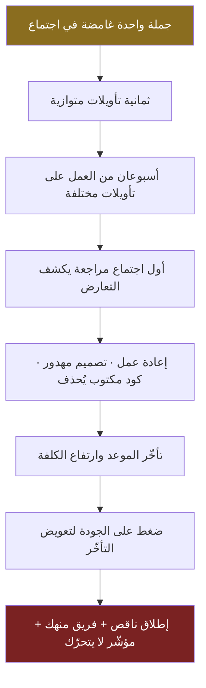
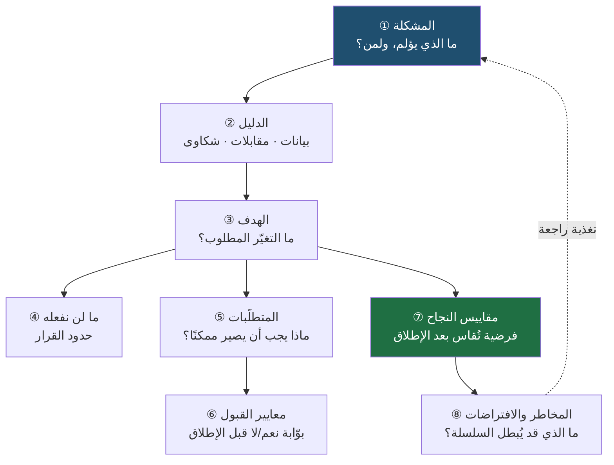
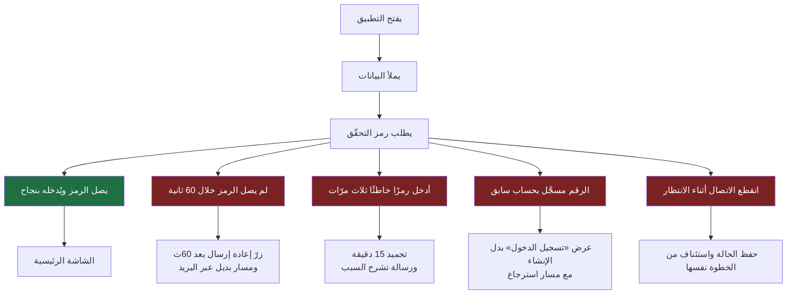
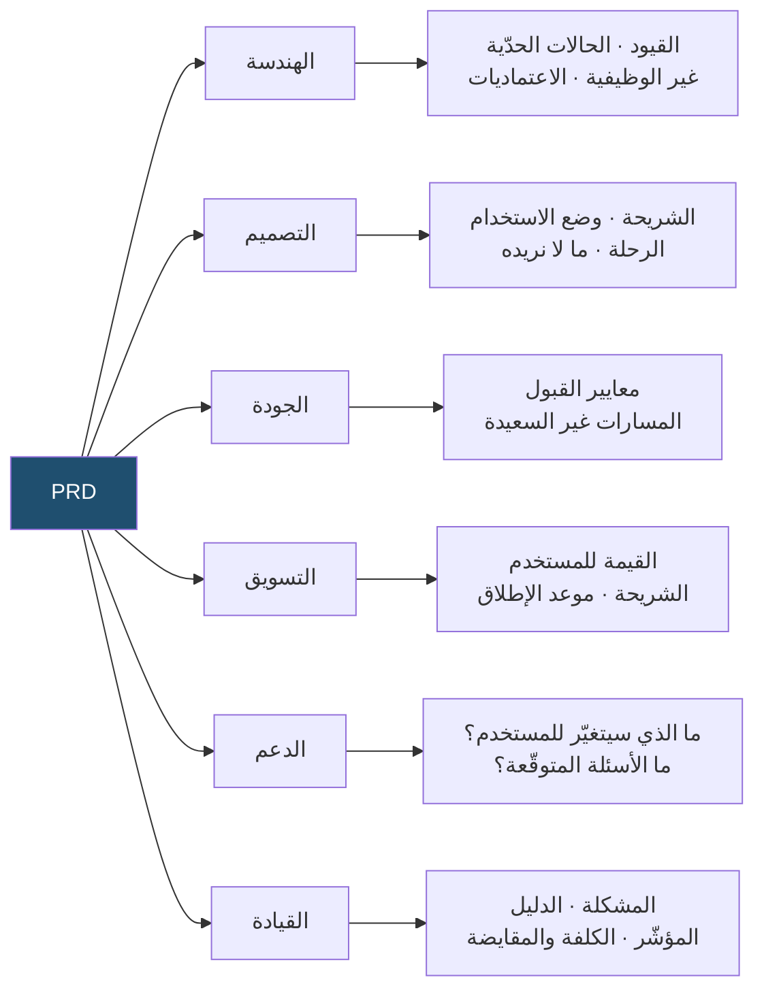
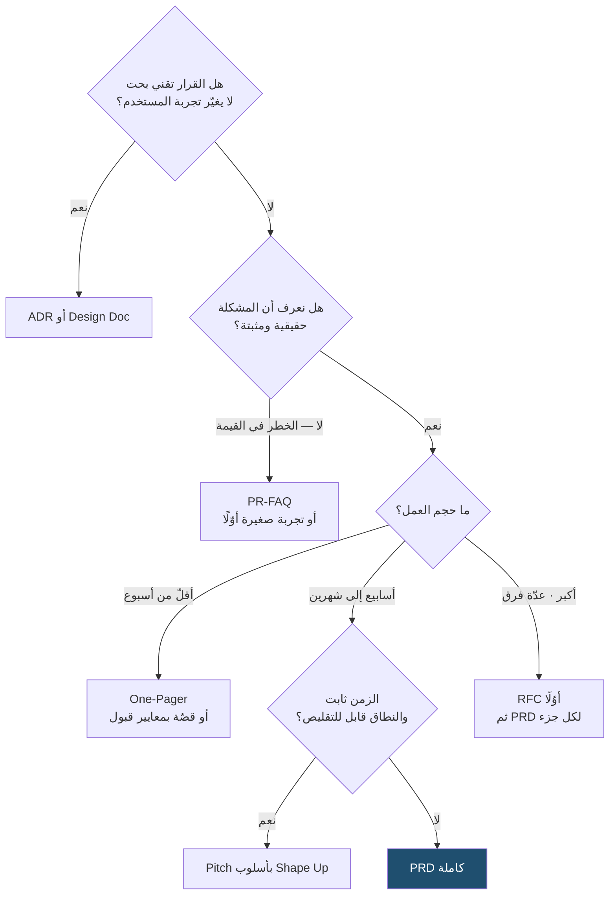

> [!info] الفصل 06 · إدارة المنتج في عصر الذكاء الاصطناعي
> **ماذا ستتعلّم:** لماذا لا يكتب مدير المنتج مستندًا، بل يبني **فهمًا مشتركًا** — وكيف تكون [[PRD|وثيقة متطلّبات المنتج]] وسيلةً إلى ذلك الفهم لا غايةً في نفسها. ستتعلّم العناصر العشرة للوثيقة عنصرًا عنصرًا مع أمثلة معبّأة، وكيف تُكتب **المتطلّبات غير الوظيفية** كمعايير قابلة للفحص لا كصفات إنشائية، وكيف تُصاغ **معايير القبول** بصيغة [[Given When Then|Given/When/Then]] وما الذي يفرّقها عن **مقاييس النجاح**. وستحصل على **قالب كامل قابل للنسخ** ثم **مثال معبّأ بالكامل** لحالة سعودية واقعية، وعلى جدول يفصل الـ`PRD` عن جيرانها ([[BRD]] · [[Software Requirements Specification|SRS]] · [[SOW]] · [[Scope Statement]] · [[11 - User Stories|User Story]])، وعلى مقارنة جادّة ببدائلها ([[Working Backwards|PR-FAQ]] · [[Shape Up]] · `One-Pager` · `RFC` · [[سجل قرار معماري (ADR)|ADR]] · `Design Doc`). وتنتهي بالسؤال الحادّ: متى تكون الوثيقة **هدرًا فعلًا**؟

# الفصل 06 — وثيقة متطلبات المنتج (PRD)

## 🎯 أهداف التعلّم

- التمييز بين **الوثيقة كمخرَج** و**الفهم المشترك كمخرَج حقيقي**، وشرح لماذا تُقاس جودة الوثيقة بقدرتها على الإجابة لا بعدد صفحاتها.
- كتابة **بيان مشكلة واحد** مصوغًا كمشكلة لا كحلّ، وتمييز البيان الضعيف من القوي بأربعة فحوص قابلة للتطبيق.
- بناء **سلسلة إسناد** متماسكة: مشكلة ← دليل ← هدف ← متطلّب ← معيار قبول ← مقياس نجاح، بحيث لا يوجد في الوثيقة سطر لا يتّصل بما قبله.
- صياغة [[Non-Goals|ما لن نفعله]] صياغة تمنع [[Scope Creep|تمدّد النطاق]]، وتمييزها عمّا هو `Out of Scope` نهائيًّا.
- تحويل **المتطلّبات غير الوظيفية** من صفات إنشائية («سريع»، «آمن») إلى **عتبات قابلة للفحص** بمئينات محدّدة ([[Percentiles and Median vs Average|p95 لا المتوسّط]]) وشروط أمن وإتاحة وإمكانية وصول وتوطين وامتثال.
- التفريق العملي بين **معيار القبول** (بوّابة ثنائية قبل الإطلاق) و**مقياس النجاح** (فرضية تُقاس بعد الإطلاق)، وكتابة كلٍّ منهما بصيغته الصحيحة.
- تنظيم الوثيقة لخدمة **ستّة جماهير** مختلفة (هندسة · تصميم · جودة · تسويق · دعم · قيادة) دون تضخيمها.
- إدارة الوثيقة بوصفها **وثيقة حيّة**: سجلّ تغييرات، وربط بـ[[Decision Log|سجلّ القرارات]]، ولحظة تجميد معلنة، ومصير محدّد بعد الإطلاق.
- المفاضلة الواعية بين الـ`PRD` وبدائلها ومعرفة **متى يكون البديل أنسب**: `PR-FAQ` حين يكون خطر القيمة هو الأكبر، و`Pitch` حين يكون الزمن ثابتًا والنطاق متغيّرًا، و`RFC`/`ADR` حين يكون القرار تقنيًّا لا منتجيًّا.
- تحديد ما غيّره الذكاء الاصطناعي فعلًا في كتابة الوثيقة (**الصياغة والسرعة والتنسيق**) وما لم يمسّه (**الحُكم والسياق المؤسّسي والمسؤولية**).
- تشخيص انقلاب الوثيقة في السوق المحلّي من **أداة فهم** إلى **أداة تعاقدية دفاعية**، واقتراح ترتيب يوازن بين الحاجتين بدل إنكار إحداهما.
- عرض حجّة تيّار «لا وثائق» بأقوى صورها، ثم تحديد الشروط الصريحة التي تكون الوثيقة عندها **هدرًا حقيقيًّا** لا حاجة.

## الفكرة المحورية: الوثيقة ليست المخرَج

خذ فريقًا نموذجيًّا: مدير منتج، ومصمّم، وثلاثة مهندسين، ومختبِر جودة، ومدير مشروع، ومسوّق. ثمانية أشخاص. كلّهم أذكياء، وكلّهم يريدون النجاح، وكلّهم حاضرون في الاجتماع نفسه. ثم يُقال في ذلك الاجتماع جملة واحدة: **«سنحسّن تجربة التسجيل.»**

ما الذي سمعه كلٌّ منهم؟

المصمّم سمع «إعادة تصميم للشاشات». والمهندس سمع «تفكيك للنموذج الحالي وربّما تغيير في مخطّط قاعدة البيانات». والمختبِر سمع «سيناريوهات اختبار جديدة لم يُعطَ لها وقت في الخطّة». والمسوّق سمع «حملة إطلاق». ومدير المشروع سمع «تأخير في التاريخ الموعود». ومدير المنتج كان يقصد شيئًا خامسًا تمامًا: **خفض عدد الحقول من أحد عشر إلى أربعة**.

لم يخطئ أحد منهم. الجملة نفسها كانت تحتمل كل هذه القراءات. والفريق سيمضي أسبوعين وهو يظنّ أنه متّفق، ثم يكتشف الخلاف في أول مراجعة تصميم — بعد أن يكون كل واحد قد أنفق أسبوعين على تأويله الخاصّ.

**هذا — لا نقص التوثيق — هو ما تعالجه وثيقة متطلّبات المنتج.**

ولهذا فالجملة الافتتاحية لهذا الفصل هي التي ينبغي أن تُقرأ مرّتين: **الهدف ليس كتابة `PRD`، ولا كتابة [[11 - User Stories|قصص المستخدم]]، ولا رسم [[15 - Roadmap|خارطة الطريق]]. كلّها وسائل.** الهدف الحقيقي واحد: **أن يفهم كل أفراد الفريق المشكلة نفسها بالطريقة نفسها، وأن يتّفقوا على تعريف واحد للنجاح الذي يسعون إليه.**

فالوثيقة **لغة مشتركة** لا ملفّ `Word`. وهي تنجح حين يستطيع أي فرد في الفريق — بعد قراءتها مرّة — أن يجيب من غير رجوع إليك عن ثلاثة أسئلة: ما المشكلة؟ ولمن؟ وكيف نعرف أننا نجحنا؟ وتفشل — مهما كانت جميلة ومنسّقة ومليئة بالجداول — إن لم يستطع أحدهم ذلك.

> [!quote] من الويبينار
> عند سؤال المتحدّث عمّا إذا كان `Vibe Coding` يكفي ليقوم بعمل مدير المنتج، جاء الجواب معاكسًا تمامًا لما يتوقّعه كثيرون:
> *"So any PRD is **mara mohim** (مرة مهم). If you cannot write a PRD, PRD tells me **what is the problem**. **Why is this a priority?** **What data do we have?** **What consumer research do we have?** **What discovery do we have?** **How is it going to impact the metrics?** If we don't know this, then **we should not be building**."*
>
> **الترجمة:** «الوثيقة **مهمّة جدًّا**. إن لم تستطع كتابة وثيقة… فالوثيقة هي التي تخبرني: **ما المشكلة؟** و**لماذا هي أولوية؟** و**ما البيانات التي لدينا؟** و**ما أبحاث المستهلك؟** و**ما الاكتشاف الذي أجريناه؟** و**كيف سيؤثّر هذا على المؤشّرات؟** فإن كنّا لا نعرف هذا، **فلا ينبغي أن نبني**.»
>
> ولاحظ البنية: الوثيقة عُرّفت هنا **بأسئلتها الستّة لا بأقسامها**. أي أنها ليست نموذجًا تملؤه، بل **فحص جاهزية**: إن عجزتَ عن الإجابة، فالعجز نفسه هو النتيجة المفيدة.

وهذه النقطة الأخيرة هي مفتاح الفصل كلّه. الوثيقة أداة **كشف** قبل أن تكون أداة **نقل**. حين تجلس لتكتب «ما الدليل على أن هذه مشكلة؟» وتجد أنك لا تملك سطرًا واحدًا تكتبه، فقد أدّت الوثيقة وظيفتها قبل أن يقرأها أحد. **الصفحة الفارغة أصدق ناقد لديك.**

> [!info] إضافة مرجعية
> هذه الوظيفة الكشفية للكتابة ليست ملاحظة خاصّة بإدارة المنتج. هي مبدأ معروف في أدبيات التفكير والتأليف: أن **الكتابة ليست تسجيلًا لفكر مكتمل، بل وسيلة لإكماله**. وقد بُنيت عليها ممارسات مؤسّسية معلنة، أشهرها ممارسة أمازون في استبدال العروض التقديمية بمذكّرات سردية تُقرأ صامتةً في أول الاجتماع — والحجّة المعلنة لها أن الشرائح تسمح بإخفاء ضعف التفكير خلف عناوين قصيرة، بينما الجملة الكاملة **تفضح الفجوة المنطقية**.
>
> والدرس العملي لمدير المنتج: إن وجدت نفسك تكتب فقرة غامضة، فالغموض ليس في أسلوبك — هو في **تفكيرك**، والوثيقة كشفته. أعد التفكير ولا تُعِد الصياغة.

## تعريف دقيق: ما هي، وما ليست

**وثيقة متطلّبات المنتج ([[PRD]]) وثيقة تصف: المشكلة · المستخدم · أهداف المشروع · متطلّبات الحلّ · حدود المشروع · معايير النجاح — بشكل يجعل الفريق يعمل وفق فهم واحد.**

ولاحظ في هذا التعريف تفصيلتين تُغفَلان دائمًا:

**الأولى: أنها تبدأ بالمشكلة لا بالحلّ.** وهذا ليس ترتيبًا شكليًّا؛ هو **الفرق بين وثيقة منتج ووثيقة تنفيذ**. الوثيقة التي تبدأ بوصف الشاشات قد تكون ممتازة كمواصفة، لكنها لا تسمح لأحد بالاعتراض على الفكرة نفسها — لأنها لم تعرض الفكرة، عرضت نتيجتها.

**الثانية: أن الغاية المذكورة في آخر التعريف هي «فهم واحد»، لا «توثيق كامل».** فالاكتمال ليس معيارًا. الوضوح هو المعيار.

### ما ليست الـ PRD

من أنفع طرق تعريف شيء أن تُحدَّد حدوده. والـ`PRD`:

- **ليست عقدًا.** العقد يُلزِم طرفين مصلحتاهما متعارضتان جزئيًّا، ويُقرأ عند الخلاف بحثًا عن المخالفة. والوثيقة تُقرأ عند العمل بحثًا عن الوضوح. من عاملها كعقد حصل على سلوك تعاقدي: تفاوض على الصياغة، وتوقيع، وتحصّن بها لاحقًا.
- **ليست مواصفة تقنية.** لا تقول كيف يُبنى الشيء. تقول **ما الذي يجب أن يصير صحيحًا** بعد أن يُبنى. اختيار قاعدة البيانات والبنية والمكتبات قرار هندسي يُوثَّق في `Design Doc` أو [[سجل قرار معماري (ADR)|ADR]] لا هنا.
- **ليست تصميمًا.** لا تحوي شاشات نهائية ولا ألوانًا. قد تحوي **مخطّط تدفّق** يوضّح الخطوات، لكن الفرق بين «المستخدم يتحقّق من رقمه» و«شاشة بها ستّ خانات وزرّ إعادة إرسال بعد 30 ثانية» هو الفرق بين المتطلّب والتصميم.
- **ليست خطّة مشروع.** المواعيد والاعتماديات والتوزيع على الأفراد تخصّ [[Gantt Chart|خطّة التنفيذ]]. الوثيقة تحدّد **ماذا ولماذا**، والخطّة تحدّد **متى ومن**.
- **ليست سجلّ كل ما تعرفه.** وهذا أكثرها انتهاكًا، وسنفرد له قسمًا كاملًا.

> [!warning] الخلط الأخطر: الوثيقة التي تصف الحلّ وتسمّيه مشكلة
> اقرأ هذين السطرين:
> - «**المشكلة:** لا يوجد لدينا تسجيل دخول عبر `Apple ID`.»
> - «**المشكلة:** 31% من مستخدمي `iOS` يبدأون التسجيل ولا يكملونه، ويظهر في تسجيلات الجلسات أنهم يتوقّفون عند شاشة كلمة المرور.»
>
> الأول **حلّ ناقص مقلوب**: صيغ بصيغة نفي لغياب ميزة بعينها، فأغلق باب النقاش على حلّ واحد قبل أن يُفتح. والثاني مشكلة حقيقية تحتمل خمسة حلول: تسجيل عبر `Apple`، أو رابط دخول بالبريد، أو تأجيل إنشاء كلمة المرور إلى ما بعد أول قيمة، أو تسجيل برقم الجوّال، أو حتى إصلاح رسالة خطأ مضلّلة.
>
> **القاعدة:** إن كان يمكن حلّ «مشكلتك» بطريقة واحدة فقط، فأنت لم تكتب مشكلة.

### أين تقف الـ PRD من المصطلحات المجاورة؟

| المصطلح | يجيب عن | مالكه عادةً | أفقه الزمني |
|---|---|---|---|
| [[Product Principles\|مبادئ المنتج]] | بأي قيَم نفاضل حين تتعارض الخيارات؟ | القيادة المنتجية | سنوات |
| [[15 - Roadmap\|خارطة الطريق]] | أي مشكلات نعالج ومتى تقريبًا؟ | مدير المنتج | أرباع |
| **`PRD`** | **ما هذه المشكلة بالتحديد، ولمن، وما شكل نجاحها؟** | **مدير المنتج** | **مبادرة واحدة** |
| [[11 - User Stories\|قصّة المستخدم]] | ما أصغر قطعة قيمة قابلة للتسليم؟ | الفريق مع مدير المنتج | `Sprint` |
| [[Definition of Done\|تعريف الإنجاز]] | متى نعدّ القطعة منتهية؟ | الفريق | ثابت عبر المبادرات |

والفائدة العملية من هذا الجدول أنه يمنع أشيع خطأين: أن تُحشى الوثيقة بما هو استراتيجي فتصير عرضًا للقيادة، أو أن تُحشى بما هو تنفيذي فتصير قائمة تذاكر بلغة أطول.

## لماذا ظهرت هذه الوثيقة أصلًا؟ اقتصاد سوء الفهم

الوثائق لا تُخترع لأن أحدًا أحبّ الكتابة. تُخترع لأن **كلفة عدم وجودها صارت أعلى من كلفة كتابتها**. ولفهم الـ`PRD` فهمًا صحيحًا، ينبغي أن ترى المعادلة الاقتصادية خلفها.

عد إلى فريق الثمانية. بلا وثيقة تقول **لماذا ننفّذ**، و**ما الذي نريده بالضبط**، و**ما الذي لن ننفّذه**، سيحدث ما يلي بترتيب شبه حتمي:



**كل دقيقة تُنفَق في توضيح الرؤية توفّر ساعات من إعادة العمل.** وهذه ليست عبارة تحفيزية؛ لها أساس معروف في هندسة البرمجيات باسم **منحنى كلفة التغيير** ([[Cost-of-Change Curve]]): كلفة تصحيح سوء الفهم ترتفع ارتفاعًا حادًّا كلّما تأخّر اكتشافه في السلسلة. سوء فهم يُكتشَف في الوثيقة يكلّف نقاشًا من عشرين دقيقة؛ ويُكتشَف في التصميم يكلّف يومين؛ ويُكتشَف في الكود يكلّف أسبوعًا؛ ويُكتشَف بعد الإطلاق يكلّف — إضافةً إلى إعادة البناء — ثقةَ المستخدمين وسمعةَ الفريق.

> [!example] حساب صريح لكلفة غياب الوثيقة
> فريق من ثمانية، متوسّط كلفة اليوم للفرد 1,200 ريال (رقم توضيحي مركّب، لا بيانات شركة بعينها). سوء فهم واحد في فهم شريحة المستخدم أدّى إلى بناء لوحة تحكّم للمشرف بينما المستخدم الفعلي كان المندوب الميداني.
> - اكتُشف الخطأ في الأسبوع الثالث.
> - العمل المهدور: مصمّم أسبوع كامل، ومهندسان أسبوعين، ومختبِر ثلاثة أيام ≈ **23 يوم عمل**.
> - الكلفة المباشرة ≈ **27,600 ريال**، غير كلفة الفرصة البديلة (ما كان يمكن بناؤه في هذه الأيام).
> - كلفة الوثيقة التي كانت ستمنعه: **ثلاث ساعات كتابة + ساعة مراجعة جماعية**.
>
> والنسبة هنا ليست 10 إلى 1 ولا 50 إلى 1 — هي بلا معنى تقريبًا، لأن الطرف الثاني قريب من الصفر. **ولهذا يصعب الدفاع عن الاستغناء عن الوثيقة بحجّة الوقت**: الوقت الذي تدّعي أنك توفّره أصغر من أن يُقاس مقارنةً بما تخاطر به.

### لكن الكلفة ليست دائمًا بهذه الضخامة

والإنصاف يقتضي إكمال المعادلة، وإلّا صارت دعاية. الحساب أعلاه يفترض ثلاثة شروط: **فريق بحجم معيّن**، و**مبادرة تستغرق أسابيع**، و**مسافة بين من يقرّر ومن ينفّذ**. أزِل أيّ شرط منها وتتغيّر النتيجة:

- في فريق من ثلاثة يجلسون في غرفة واحدة، سوء الفهم يُكتشَف في اليوم نفسه بمحادثة، لا في الأسبوع الثالث.
- في تغيير يستغرق نصف يوم، الوثيقة تكلّف أكثر ممّا تحمي.
- حين يكون من يكتب هو من ينفّذ، تنعدم الحاجة إلى النقل أصلًا.

**فالوثيقة ليست فضيلة أخلاقية، بل استثمار له عائد يتغيّر بالسياق.** وسيُفصَّل هذا في قسم «النقاش المفتوح»، لكن ذكره هنا ضروري حتى لا يُقرأ الفصل كأمر مطلق.

## سلسلة الإسناد: البنية المنطقية التي تجعل الوثيقة متماسكة

قبل استعراض العناصر العشرة، لا بدّ من فهم **المنطق الذي يربطها**. لأن أغلب الوثائق الرديئة ليست ناقصة الأقسام؛ هي **مكتملة الأقسام مفكّكة المنطق**: بيان مشكلة في الصفحة الأولى لا علاقة له بالمتطلّبات في الصفحة الثالثة، ومعايير نجاح في الأخيرة لا تقيس أثر أيٍّ منهما.

الوثيقة الجيّدة **سلسلة**، وكل حلقة فيها تشتقّ ممّا قبلها:



واستعمال هذا المخطّط عمليّ لا نظري: **خذ وثيقتك الحالية وحاول رسم هذه الأسهم عليها.** كل متطلّب لا تستطيع أن ترسم سهمًا منه إلى هدف هو متطلّب دخل من الباب الخلفي — طلبه أحدهم، أو أُضيف «ما دمنا نعمل في هذه الشاشة». وكل هدف لا سهم من الدليل إليه هو رغبة تسمّت هدفًا.

> [!tip] فحص السلسلة في ثلاث دقائق
> اقرأ وثيقتك من الأسفل إلى الأعلى: خذ **آخر متطلّب** فيها واسأل «لماذا؟» أربع مرّات متتالية. إن وصلت في الرابعة إلى بيان المشكلة، فالسلسلة سليمة. وإن وصلت إلى «لأن فلانًا طلبه» أو «لأن المنافس عنده»، فقد وجدت الحلقة المكسورة.

## العناصر العشرة — الجزء الأول: من الخلفية إلى المستخدم

الوثيقة تُبنى من عشرة عناصر. وليست كلّها بالوزن نفسه: عنصران منها يحملان أغلب القيمة (بيان المشكلة ومعايير النجاح)، وعنصر واحد هو الأكثر إهمالًا وأعلى مردود ([[Non-Goals|ما لن نفعله]]). وسنأخذها بالتفصيل الذي تستحقّه، لا كقائمة.

### ① خلفية المشروع — «لماذا نعمل على هذا الآن؟»

الخلفية سياق لا تاريخ. وظيفتها أن تُدخل القارئ إلى الموقف في فقرة واحدة، فيفهم **لماذا ظهرت هذه المبادرة الآن تحديدًا** لا قبل سنة ولا بعد سنة.

**مثال ضعيف:** «التسجيل جزء مهمّ من المنتج ونريد تحسينه باستمرار.» — هذا صحيح ولا يقول شيئًا. صالح لأي منتج وأي وقت.

**مثال قوي:** «انخفضت نسبة إكمال التسجيل من 45% إلى 33% خلال الأشهر الثلاثة الماضية، بالتزامن مع إضافة خطوة التحقّق من الهوية في مارس. وفي الوقت نفسه ارتفعت تكلفة اكتساب المستخدم 18% لأن الحملات التسويقية تجلب زيارات لا تتحوّل. وميزانية التسويق للربع القادم مرصودة بالفعل، فكل نقطة مئوية في التحويل تساوي زيادة مباشرة في المستخدمين المكتسَبين بالميزانية نفسها.»

لاحظ ما فعلته الفقرة الثانية في ثلاثة أسطر: أعطت **رقمًا واتجاهًا**، وربطته **بحدث معلوم** (تغيير مارس)، ثم ربطت المشكلة **بقرار عمل قائم** (ميزانية مرصودة). وهذا الربط الأخير هو ما يجعل القارئ من القيادة يواصل القراءة.

> [!note] معيار الخلفية الجيّدة
> إن استطعت حذف تاريخ الوثيقة واسم المنتج ولم تفقد الخلفيةُ معناها، فهي **حشو**. الخلفية الجيّدة **لا تصلح إلا لهذا الوقت وهذا المنتج**.

### ② بيان المشكلة — أهمّ جزء في الوثيقة كلّها

إن لم يكن لديك وقت إلا لسطرَين، فاجعلهما هنا.

> [!quote] من الويبينار
> *"PRD should have **one problem statement**. If you have… PRDs with **khamsa mashakil** (خمسة مشاكل), five problem statements… this shows a **lack of focus, a lack of clarity**. You should only have **one core problem statement**. What are you trying to solve?"*
>
> **الترجمة:** «يجب أن يكون في الوثيقة **بيان مشكلة واحد**. فإن رأيتَ — وأنا أرى هذا أحيانًا — وثائق فيها **خمس مشكلات**، خمسة بيانات مشكلة… فهذا دليل على **غياب التركيز وغياب الوضوح**. ينبغي أن يكون لديك **بيان مشكلة جوهري واحد**: ما الذي تحاول حلّه؟»
>
> والملاحظة دقيقة: تعدّد بيانات المشكلة ليس عيبًا في الوثيقة، بل **عَرَضٌ تشخيصي** يكشف أن صاحبها لم يحسم بعد ما الذي يعالجه. الوثيقة هنا لم تُخفِ المشكلة، بل **كشفتها**.

**القاعدة الحاسمة:** المشكلة تُكتب كمشكلة، لا كحلّ.

| صيغة الحلّ المتنكّر (مرفوضة) | صيغة المشكلة (مطلوبة) |
|---|---|
| «نريد تطوير صفحة التسجيل» | «المستخدمون يغادرون قبل إكمال التسجيل بسبب طول النموذج وتعقيده» |
| «نحتاج إلى تطبيق جوّال» | «الشريحة التي تعمل ميدانيًّا لا تستطيع إدخال البيانات إلا بعد العودة إلى المكتب، فتتأخّر البيانات 6–8 ساعات» |
| «نضيف إشعارات دفع» | «34% من الطلبات تُترك في السلّة، ولا يوجد لدينا أي مسار لتذكير المستخدم بها» |
| «نبني لوحة تحليلات» | «مدير المتجر لا يستطيع معرفة أي منتج يُرجَع أكثر من غيره إلا بطلب تقرير يدوي يستغرق ثلاثة أيام» |
| «نحدّث التصميم ليصبح عصريًّا» | «مستخدمون جدد في اختبارات الاستخدام لم يجدوا زرّ الإجراء الأساسي في 7 من 10 محاولات» |

وأربعة فحوص سريعة تميّز البيان القوي:

1. **فحص الحلول الخمسة:** هل تستطيع أن تذكر خمسة حلول مختلفة لهذه المشكلة؟ إن عجزت، فقد كتبت حلًّا.
2. **فحص الشريحة:** هل يظهر في البيان **من** يعاني؟ «المستخدمون» ليست شريحة. «المستخدم الجديد في أول جلسة» شريحة.
3. **فحص القياس:** هل في البيان رقم أو سلوك مرصود؟ المشكلة بلا أثر مرصود قد تكون مشكلة مُتخيَّلة.
4. **فحص الألم:** هل تستطيع أن تصف ما يفعله المستخدم **اليوم** للتحايل على المشكلة؟ وجود حلّ التفافي دليل قويّ على أن الألم حقيقي؛ وغيابه يستدعي سؤالًا صادقًا: هل هذه مشكلة فعلًا أم إزعاج نتخيّله؟

> [!info] إضافة مرجعية
> صيغة مفيدة لضبط البيان مستقاة من أدبيات [[Problem Statement|بيانات المشكلة]] في التصميم والاستشارات، وتُكتب في جملة واحدة:
>
> **«[الشريحة] يحتاج إلى [إنجاز محدّد]، لكنّه [العائق]، ممّا يؤدّي إلى [الأثر القابل للقياس]، والدليل [المصدر].»**
>
> مثال معبّأ: «**المستخدم الجديد** يحتاج إلى **إنشاء حساب وبدء أول طلب في أقلّ من دقيقتين**، لكنّه **يواجه نموذجًا من أحد عشر حقلًا وخطوة تحقّق يدوي**، ممّا يؤدّي إلى **تسرّب 67% قبل الشاشة الثالثة**، والدليل **مسار التحويل في `Amplitude` للفترة 1 يناير–31 مارس + 14 جلسة مسجّلة + 23 تذكرة دعم**.»
>
> وقيمة هذه الصيغة أنها تجعل النقص مرئيًّا: أي فراغ لم تستطع ملأه هو **فجوة معرفة** لا فجوة صياغة. ومن لا يستطيع ملء الخانة الأخيرة تحديدًا («الدليل») لا يملك مشكلة موثّقة، بل انطباعًا.

### ③ الأهداف — قابلة للقياس أو ليست أهدافًا

الهدف يجيب عن: **ما التغيّر الذي نريد إحداثه؟** وثلاثة شروط لأي هدف مكتوب هنا:

- **أن يكون تغيّرًا في العالم لا في خطّتنا.** «إطلاق الشاشة الجديدة» ليس هدفًا؛ هو ناتج. «رفع نسبة إكمال التسجيل» هدف.
- **أن يكون مقيَّدًا باتّجاه ومقدار وزمن.** «تحسين السرعة» رغبة. «خفض زمن التسجيل من 4 دقائق إلى دقيقتين خلال الربع الثالث» هدف.
- **أن يكون قابلًا لأن يفشل.** الهدف الذي لا يمكن ألّا يتحقّق ليس هدفًا، هو وصف لما سيحدث على أي حال.

وثلاثة أهداف كافية عادةً، وأربعة كثير. وسبب ذلك ليس جماليًّا: **كل هدف إضافي يفتح فرعًا في شجرة القرار**، وحين تتعارض الأهداف (وهي تتعارض دائمًا) لا يعرف الفريق أيّها يقدّم.

> [!warning] الأهداف المتعارضة التي لم تُرتَّب
> «نريد خفض عدد الحقول **و** رفع جودة البيانات المُدخلة **و** خفض الحسابات الوهمية.» هذه ثلاثة أهداف يشدّ بعضها بعضًا في اتجاهين متضادّين: تقليل الحقول يخفض جودة البيانات ويرفع الحسابات الوهمية.
>
> والحلّ ليس حذف الأهداف، بل **إعلان الترتيب صراحةً**: «الهدف الأول هو رفع الإكمال. والهدف الثاني هو ألّا ترتفع نسبة الحسابات الوهمية عن خطّ الأساس الحالي بأكثر من نقطتين — وهذا **قيد** لا هدف.» والتمييز بين **الهدف الذي نسعى إليه** و**القيد الذي نحرص ألّا نكسره** هو من أنفع ما تفعله في وثيقتك، ويسمّى في أدبيات القياس **المقياس الحارس** (`Guardrail Metric`) — ويتّصل مفهوميًّا بما في [[Guard Rails|الحواجز الواقية]].

### ④ ما لن نفعله (Non-Goals) — العنصر الأعلى مردودًا والأكثر إهمالًا

هذا هو العنصر الذي يهمله المبتدئون تمامًا، ويكتبه المحترفون **أوّلًا**.

[[Non-Goals|ما لن نفعله]] قائمة صريحة بما هو **خارج هذه المبادرة عن قصد**. مثال: «لن نغيّر تسجيل الدخول عبر الحسابات الاجتماعية في هذا الإصدار.» أو: «لن نعالج تجربة المستخدم العائد في هذه المبادرة؛ نطاقنا هو المستخدم الجديد فقط.»

ووظيفتها ثلاثية:

**① تمنع [[Scope Creep|تمدّد النطاق]].** لأن أكثر ما يمدّد النطاق ليس طلبًا جديدًا صريحًا، بل جملة تُقال في منتصف التنفيذ: «ما دمنا نعمل في هذه الشاشة، لنُصلح أيضًا…». وقائمة `Non-Goals` تحوّل هذه الجملة من اقتراح ودّي إلى **طلب تغيير** يحتاج قرارًا.

**② تحسم الغموض الذي لا يُحسم بالإيجاب.** حين تكتب «سنحسّن التسجيل»، يبقى القارئ لا يعرف إن كان استرجاع كلمة المرور داخلًا. وذكرك أنه غير داخل يوفّر سؤالًا ويمنع افتراضًا.

**③ تكشف لك أنت غموض تفكيرك.** وهذه أعمقها. كتابة خمسة أشياء لن تُبنى تجبرك على تحديد الحدّ، وكثيرًا ما تكتشف عند الخامس أنك لا تعرف بعدُ ما الذي **سيُبنى** بالضبط.

> [!note] ثلاثة أنواع من «خارج النطاق» لا نوع واحد
> يخلط كثيرون بين ثلاثة أشياء مختلفة، والخلط بينها يسبّب سوء فهم حقيقي:
>
> | النوع | معناه | مثال | إلى أين يذهب؟ |
> |---|---|---|---|
> | **`Non-Goal`** | لن نفعله **في هذه المبادرة**، وقد نفعله لاحقًا | «لا استرجاع كلمة مرور الآن» | قسم `Non-Goals` + [[13 - Backlog\|قائمة الانتظار]] |
> | **قرار سلبي دائم** | قرّرنا ألّا نفعله أصلًا، ولن نعيد النقاش بلا دليل جديد | «لن ندعم التسجيل بالفاكس» | [[Decision Log\|سجلّ القرارات]] |
> | [[Out of Scope\|خارج النطاق]] | ليس من مسؤولية هذا الفريق/العقد | «تكامل نظام المحاسبة يخصّ فريق المالية» | [[Scope Statement\|بيان النطاق]] |
>
> والخلط الشائع أن تُكتب القرارات السلبية الدائمة في `Non-Goals` فتُقرأ كتأجيل، فيعود الطلب كل ربع.

### ⑤ المستخدم المستهدف — لأن «المستخدمين» ليست شريحة

المنتج الواحد يخدم عادةً أكثر من نوع من الناس: **مستخدم جديد**، و**تاجر**، و**عميل متكرّر**، و**مدير متجر**. ولكلٍّ منهم احتياج مختلف، وسلوك مختلف، وحتى جهاز مختلف. والوثيقة التي تقول «المستخدمون سيستفيدون» لم تقل شيئًا.

والمطلوب هنا ثلاثة أسطر لا صفحة:

- **من هو بالضبط؟** بالسلوك لا بالديموغرافيا. «مستخدم جديد وصل من حملة إعلانية ولم يستخدم منتجًا مشابهًا من قبل» أنفع من «شاب 25–34».
- **كم حجمه؟** نسبة من قاعدة المستخدمين أو رقم مطلق. لأن الشريحة التي تمثّل 2% لا تستحقّ ما تستحقّه شريحة تمثّل 40% — إلا إن كانت الـ2% تمثّل 60% من الإيراد، وهذا يجب أن يُذكَر.
- **ما وضعه أثناء الاستخدام؟** (`Context of Use`) واقف أم جالس؟ على جوّال أم حاسب؟ في عجلة أم مسترخٍ؟ بيد واحدة؟ باتصال ضعيف؟ هذه التفصيلة تُغيّر الحلّ أكثر ممّا يتوقّع أغلب الناس، وهي أكثر ما يُنسى.

> [!example] كيف يقلب «وضع الاستخدام» الحلَّ رأسًا على عقب
> فريق يبني شاشة لتسجيل قراءة عدّاد لمندوب ميداني. الحلّ الأول: نموذج أنيق بحقول منسّقة وقائمة منسدلة للمنطقة وحقل ملاحظات.
> ثم خرج أحد أفراد الفريق يومًا واحدًا مع مندوب فعلي، فتبيّن: المندوب **واقف تحت شمس الظهيرة**، والشاشة **تعكس الضوء فلا تُقرأ**، ويحمل جهازًا **بيد واحدة** والأخرى مشغولة، و**القفّازات** تجعل الحقول الصغيرة عديمة الفائدة، والتغطية في بعض المواقع **ضعيفة**.
> ولم يتغيّر أي متطلّب وظيفي بعد هذه الزيارة — تغيّرت **المتطلّبات غير الوظيفية** كلّها: تباين لوني عالٍ، وأزرار لا تقلّ عن 56 بكسل، وإدخال رقمي بلوحة مفاتيح كبيرة، وحفظ محلّي ومزامنة مؤجّلة.
> **الدرس:** «من المستخدم؟» سؤال ناقص. السؤال الكامل: «من المستخدم، **وأين هو وهو يستخدمه**؟»

## العناصر العشرة — الجزء الثاني: من الرحلة إلى المخاطر

### ⑥ رحلة المستخدم (User Flow) — الخطوات لا الشاشات

الرحلة تصف **تسلسل ما يفعله المستخدم** حتى يصل إلى القيمة. مثال بسيط: يفتح التطبيق ← ينشئ حسابًا ← يدخل بياناته ← يتحقّق من رقم الهاتف ← يصل إلى الشاشة الرئيسية.

وقيمتها في الوثيقة ثلاثية: تكشف **الخطوات الزائدة** (كل خطوة تكلّف تسرّبًا)، وتكشف **نقاط الانتظار** (تحقّق يدوي، بريد لم يصل)، وتكشف **المسارات غير السعيدة** التي تُنسى دائمًا.

وأشيع خطأ هنا أن تُرسم الرحلة السعيدة ([[Happy Path|المسار السعيد]]) وحدها. والمسار السعيد أقلّ ما يحتاجه المهندس؛ لأنه أوضح ما في المنتج. أمّا الذي يستهلك 70% من وقت التنفيذ فهو **ما ليس سعيدًا**:



> [!tip] فحص «الحالات الحدّية» في خمس دقائق
> مرّ على كل خطوة في رحلتك واسأل خمسة أسئلة ثابتة، مستعينًا بمفهوم [[Edge Cases|الحالات الحدّية]]:
> **① ماذا لو كان فارغًا؟** (قائمة بلا عناصر، حساب بلا سجلّ، أول استخدام)
> **② ماذا لو كان كثيرًا جدًّا؟** (اسم من 200 حرف، 5,000 عنصر، ملف 40 ميجابايت)
> **③ ماذا لو كان خطأً؟** (حروف في حقل رقمي، تاريخ في المستقبل، رمز منتهٍ)
> **④ ماذا لو انقطع في المنتصف؟** (شبكة، بطارية، إغلاق التطبيق، رجوع بزرّ المتصفّح)
> **⑤ ماذا لو تكرّر؟** (ضغطتان على زرّ الدفع، إرسال النموذج مرّتين، تحديث الصفحة)
>
> هذه الأسئلة الخمسة، بلا أي أداة، تكشف عادةً ما بين ستّ وعشر حالات لم تكن في الوثيقة — وكلّها كانت ستُكتشَف لاحقًا بكلفة أعلى، إمّا في مراجعة هندسية وإمّا بعد الإطلاق.

### ⑦ المتطلّبات الوظيفية — ماذا يجب أن يصير ممكنًا؟

المتطلّب الوظيفي يصف **قدرة** يجب أن يمتلكها النظام: إرسال رمز تحقّق · التحقّق من صحّة البريد · حفظ البيانات المدخَلة · عرض رسائل خطأ واضحة عند كل حقل.

وثلاث قواعد تفصل المتطلّب الجيّد عن الرديء:

**① متطلّب واحد لكل بند.** إن وجدت «و» في المنتصف، فغالبًا لديك متطلّبان. والسبب عملي: المتطلّب المركّب لا يمكن أن يُقبَل أو يُرفَض؛ قد يتحقّق نصفه.

**② اكتب القدرة لا الآلية.** «يستطيع المستخدم استعادة الوصول إلى حسابه دون الاتصال بالدعم» متطلّب. «نرسل رابطًا صالحًا 15 دقيقة عبر `SendGrid`» **قرار تنفيذي** يخصّ الهندسة. والفرق يهمّ: الأول يبقى صحيحًا لو تغيّر مزوّد البريد، والثاني يُلزم الفريق بقرار لم يكن لك أن تتّخذه.

**③ رتّبها بـ[[MoSCoW Prioritization|MoSCoW]] داخل الوثيقة نفسها.** لأن الوثيقة بلا ترتيب داخلي تُقرأ كأن كل بنودها متساوية، وعند أول ضغط زمني سيقرّر المهندس بنفسه ما يسقط — وهو قرار منتج اتُّخذ في غير موضعه.

> [!warning] فخّ «المتطلّب المهذّب»
> عبارات مثل «يجب أن تكون الواجهة سهلة الاستخدام»، و«يجب أن تكون رسائل الخطأ واضحة»، و«يجب أن يكون النظام مرنًا» — هذه ليست متطلّبات، هي **أمنيات لا يمكن لأحد أن يفشل فيها ولا أن ينجح**.
>
> والفحص الحاسم: **هل يستطيع مختبِر الجودة أن يكتب حالة اختبار تنتهي بنعم أو لا؟** إن لم يستطع، أعد الكتابة. «رسائل خطأ واضحة» ← «كل رسالة خطأ تذكر الحقل المعنيّ والإجراء المطلوب، ولا تحوي رمزًا تقنيًّا، ولا تتجاوز 90 حرفًا».

### ⑧ المتطلّبات غير الوظيفية — حيث تُقتل المنتجات بهدوء

وهذا هو العنصر الذي يفصل الوثيقة الاحترافية عن الهاوية. **قد تعمل الميزة كما هو مطلوب تمامًا — وتفشل**. تعمل صحيحةً لكنها بطيئة جدًّا؛ أو صحيحة لكنها تنهار عند 500 مستخدم متزامن؛ أو صحيحة لكنها تسرّب بيانات؛ أو صحيحة لكن مستخدم قارئ الشاشة لا يستطيع استعمالها.

وسنفرد لهذا العنصر قسمًا كاملًا بعد قليل لأنه يستحقّه.

### ⑨ معايير النجاح — الرقم قبل والرقم بعد

معيار النجاح جملة تُكتب **قبل** البناء وتُقاس **بعده**، وتحوي أربعة أجزاء لا ثلاثة:

**[المؤشّر] · [قيمته الحالية = [[Baseline|خطّ الأساس]]] · [القيمة المستهدفة] · [النافذة الزمنية]**

- ✅ «نسبة إكمال التسجيل: **45% اليوم ← 60% خلال ثلاثة أشهر من الإطلاق**.»
- ✅ «متوسّط زمن إتمام التسجيل: **4 دقائق ← دقيقتان**، مقاسًا على المستخدمين الجدد فقط.»
- ❌ «تحسّن ملحوظ في التحويل.» — بلا خطّ أساس ولا هدف ولا زمن، أي لا يمكن أن تفشل، أي لا معنى له.

وأشيع خطأ في هذا القسم ليس غياب الأرقام، بل **غياب خطّ الأساس**. لأن من لا يعرف رقمه اليوم لا يستطيع أن يعرف غدًا إن كان ما حدث بسببه أم بسبب الموسم أو الحملة أو تغيّر في السوق.

> [!warning] المؤشّر الوحيد الذي يخدعك
> لا تكتفِ بمؤشّر واحد. أضف دائمًا **مؤشّرًا مضادًّا** (`Counter Metric`) يحرس من التحسين على حساب شيء آخر. أمثلة:
> - ترفع نسبة إكمال التسجيل ← احرس **نسبة الحسابات الوهمية** و**احتفاظ اليوم السابع**.
> - تخفض زمن الاستجابة ← احرس **معدّل الأخطاء**.
> - ترفع التفاعل ← احرس **معدّل إلغاء الاشتراك** و**الشكاوى**.
>
> فبلا مؤشّر مضادّ، كل هدف قابل للتحقيق بطريقة تضرّ المنتج. وأسهل طريقة لرفع «إكمال التسجيل» هي حذف كل تحقّق — وستحصل على 95% إكمال و**قاعدة مستخدمين بلا قيمة**.

### ⑩ المخاطر والافتراضات — إعلان ما لا نعرفه

هذا القسم هو **إقرار بالجهل مكتوب بلغة مهنية**، وهو أنضج ما في الوثيقة.

- **الافتراض** ([[Hypothesis|فرضية]] غير مختبَرة نبني عليها): «نفترض أن السبب الرئيس للتسرّب هو طول النموذج.» هذا افتراض لا حقيقة، وقد نكون مخطئين.
- **الخطر** (حدث محتمل يضرّ إن وقع): «تقليل الخطوات قد يرفع الحسابات الوهمية.» أو: «فريق الهوية الوطنية قد لا ينجز التكامل قبل نهاية الربع.»

والفرق العملي: **الافتراض يُختبَر، والخطر يُخفَّف**. ولذلك يُكتب لكل افتراض **كيف سنتحقّق منه**، ولكل خطر **ما إجراء التخفيف ومن يملكه** — تمامًا كما في [[Risk Register|سجلّ المخاطر]] لكن بصيغة أخفّ.

| النوع | البند | الاختبار / التخفيف | المالك |
|---|---|---|---|
| افتراض | طول النموذج هو السبب الرئيس للتسرّب | تجربة على 10% من المرور بنموذج مختصر لأسبوعين قبل البناء الكامل | مدير المنتج |
| افتراض | المستخدمون يملكون رقم جوّال محلّيًّا | فحص بيانات 3 أشهر: نسبة الأرقام غير المحلّية | محلّل البيانات |
| خطر | ارتفاع الحسابات الوهمية بعد التبسيط | مؤشّر حارس + تفعيل تحقّق تدريجي إن تجاوزت النسبة 4% | الهندسة |
| خطر | تأخّر تكامل التحقّق من الهوية | مسار بديل بتحقّق مؤجَّل بعد أول استخدام | مدير المنتج |

> [!info] إضافة مرجعية
> ثمّة أداة بسيطة تُغني عن كثير من الجدل في هذا القسم، مأخوذة من ممارسات [[Assumption Mapping|خرائط الافتراضات]] الشائعة في `Discovery`: ارسم مربّعًا بمحورين — **أهمّية الافتراض** (إن كان خاطئًا، هل تنهار الخطّة؟) و**درجة اليقين فيه** (كم دليلًا نملك؟).
>
> والافتراضات في الرُّبع **«عالي الأهمّية · منخفض اليقين»** هي وحدها التي تستحقّ تجربة قبل البناء. أمّا بقيتها فتُسجَّل وتُترك. والخطأ الشائع أن تُختبر الافتراضات السهلة الاختبار بدل الافتراضات الخطيرة — لأن السهل مريح والخطير مخيف.

## المتطلّبات غير الوظيفية بالتفصيل الذي تستحقّه

عاد كثير من الفرق يكتب هذا القسم بجملتين: «يجب أن يكون النظام سريعًا وآمنًا.» وهذه الجملة لا تعني شيئًا لأحد: ليس فيها ما يُبنى عليه، ولا ما يُختبَر، ولا ما يُرفض عند عدم تحقّقه.

**القاعدة الحاكمة لهذا القسم كلّه: حوّل كل صفة إلى عتبة قابلة للفحص.**

### ① الأداء — وبأي مئين؟

أشيع خطأ في متطلّبات الأداء هو استعمال **المتوسّط**. والمتوسّط يخفي أسوأ التجارب بالضبط.

تخيّل 100 طلب: 95 منها استجابت في 200 مللي ثانية، و5 استجابت في 9 ثوانٍ. المتوسّط ≈ 640 مللي ثانية — رقم يبدو ممتازًا. لكن **خمسة من كل مئة مستخدم انتظروا تسع ثوانٍ**، وهؤلاء هم من سيغادرون ويكتبون تقييمًا سلبيًّا.

ولذلك تُكتب متطلّبات الأداء بالمئينات ([[Percentiles and Median vs Average|المئينات والوسيط مقابل المتوسّط]]):

| الصيغة الرديئة | الصيغة المهنية |
|---|---|
| «الصفحة تُحمَّل بسرعة» | «`p95` لزمن تحميل الشاشة الأولى ≤ 2.5 ثانية على شبكة 4G وجهاز متوسّط» |
| «البحث سريع» | «`p95` لنتائج البحث ≤ 400 مللي ثانية عند 50 طلبًا/ثانية» |
| «النظام يتحمّل الضغط» | «يحافظ على `p99` ≤ 1.5 ثانية عند 500 مستخدم متزامن، ولا يتجاوز معدّل الأخطاء 0.5%» |

ولاحظ في العمود الأيمن ثلاثة أجزاء دائمًا: **المئين · العتبة · الظرف** (شبكة، جهاز، حِمل). والظرف هو المنسيّ عادةً، ومن دونه يُختبَر المتطلّب على شبكة المكتب وجهاز المهندس فيمرّ دائمًا.

> [!note] لماذا يهمّ هذا مدير المنتج لا المهندس فقط؟
> لأن اختيار المئين **قرار منتج** لا قرار تقني. `p50` يعني «نصف المستخدمين يحصلون على تجربة أفضل من هذا» — وهو قبول ضمني بأن النصف الآخر يعاني. و`p99` يعني «واحد من كل مئة فقط يقع خارج العتبة» — وهو أغلى بكثير في البنية التحتية. والمفاضلة بين الكلفة والتجربة مفاضلة **قيمية**، ومن يملكها هو من يملك [[Business Impact|أثر الأعمال]].

### ② الأمن والخصوصية

يُكتب هذا القسم عادةً بكلمة «آمن»، وهي أخطر كلمة في الوثيقة. والمطلوب بنود قابلة للفحص:

- **المصادقة والصلاحيات:** من يستطيع رؤية ماذا؟ هل يستطيع مدير المتجر رؤية بيانات متجر آخر؟ (هذا سؤال يكشف ثغرات حقيقية في أنظمة متعدّدة المستأجرين.)
- **البيانات الحسّاسة:** ما الحقول التي تُعدّ شخصية؟ وهل تُشفَّر في التخزين وفي النقل؟ ومن يستطيع الاطّلاع عليها من الموظّفين، وهل يُسجَّل اطّلاعه؟
- **الاحتفاظ والحذف:** كم تبقى البيانات؟ وماذا يحدث حين يطلب المستخدم حذف حسابه؟
- **التسجيل والتدقيق:** أي أحداث تُسجَّل؟ لأن ما لا يُسجَّل لا يمكن التحقيق فيه لاحقًا.

> [!warning] السؤال الذي ينبغي أن يُطرح في كل وثيقة تمسّ بيانات
> «**ما الذي يحدث لو تسرّبت هذه الشاشة كاملةً إلى العلن؟**» إن كان الجواب مقلقًا، فهذه ليست ميزة عادية، وتحتاج مراجعة أمنية قبل البناء لا بعده. وهذا سؤال يستطيع مدير المنتج أن يطرحه بلا أي خلفية تقنية، وقيمته أعلى من عشرة بنود مكتوبة بلغة أمنية منسوخة.

### ③ الإتاحة والموثوقية

- **الإتاحة المستهدفة** ([[Uptime|زمن التشغيل]]): 99.9% تعني نحو 43 دقيقة توقّف شهريًّا؛ و99.99% تعني نحو 4 دقائق. والفرق بينهما في الكلفة الهندسية كبير، والاختيار بينهما قرار عمل يعتمد على ما يكلّفه التوقّف فعلًا.
- **زمن التعافي** ([[MTTR]] و[[RTO and RPO]]): كم من الوقت نحتاج للعودة بعد عطل؟ وكم من البيانات نحتمل فقدانها؟
- **التدهور اللطيف** ([[Graceful Degradation|التدهور الرشيق]]): ماذا يحدث حين تسقط خدمة فرعية؟ هل تسقط الشاشة كلّها أم يظهر جزؤها العامل؟ **وهذا قرار منتج بامتياز**: هل عرض قائمة الطلبات بلا صور أفضل من عدم عرض شيء؟ الجواب يعتمد على المستخدم لا على البنية.
- وإن كان لديكم [[SLA]] معلن للعملاء، فيجب أن يُذكر هنا وأن تتّسق العتبات معه ومع [[SLO|أهداف مستوى الخدمة]] الداخلية.

### ④ القابلية للتوسّع

سؤالان فقط، لكنّهما يوفّران إعادة بناء كاملة:

- **ما الحجم المتوقّع خلال 12 شهرًا؟** لا اليوم. وابنِ للحجم المتوقّع مضروبًا في هامش معقول، لا للحجم الأقصى المتخيَّل (وهذا هدر).
- **أين الذروة؟** كثير من المنتجات في المنطقة لها ذروة موسمية حادّة: رمضان، والجمعة البيضاء، وموسم العودة للمدارس، ومواسم الفعاليات. والنظام الذي يعمل بامتياز في مارس قد ينهار في أول ليلة من رمضان. وهذه معلومة **سوقية** يملكها مدير المنتج لا المهندس.

### ⑤ إمكانية الوصول (a11y)

وهذا أكثر بند يُحذف من الوثائق في المنطقة، ثم يُضاف لاحقًا بكلفة مضاعفة. والحدّ الأدنى القابل للكتابة:

- **تباين لوني** لا يقلّ عن 4.5:1 للنصّ العادي (وهو معيار `WCAG` المستوى `AA`).
- **حجم أهداف اللمس** لا يقلّ عن 44×44 بكسل.
- **إمكانية التشغيل بلوحة المفاتيح** كاملةً، مع ترتيب تنقّل منطقي ومؤشّر تركيز مرئي.
- **بدائل نصّية** لكل صورة تحمل معنى، وتسميات صحيحة لكل حقل إدخال.
- **عدم الاعتماد على اللون وحده** لنقل المعلومة (فالأحمر وحده لا يكفي للدلالة على الخطأ).

> [!info] إضافة مرجعية
> إمكانية الوصول ليست بندًا أخلاقيًّا فحسب؛ لها ثلاثة مبرّرات عملية يسهل الدفاع بها أمام القيادة: **① أنها تحسّن التجربة للجميع** (التباين العالي ينفع من يستخدم هاتفه في الشمس، وأهداف اللمس الكبيرة تنفع من يمشي)؛ **② أنها متطلّب تنظيمي متزايد** في القطاع الحكومي وشبه الحكومي في المنطقة، وكثير من كرّاسات الشروط صارت تشترطها صراحةً؛ **③ أنها أرخص بكثير حين تُصمَّم من البداية** — إضافة التباين إلى نظام تصميم قائم تكلّف ساعات، وإعادة تلوين منتج مطلَق تكلّف أسابيع.

### ⑥ التوطين والتدويل

وهذا محلّ الوصل مع [[03 - التوطين (Localization)|الفصل الثالث]]، ولا يُعاد شرحه هنا. لكن في وثيقة المنتج تُكتب ثلاثة بنود على الأقلّ:

- **اللغات والاتجاه:** هل الواجهة عربية [[RTL|من اليمين إلى اليسار]]؟ وهل يجب أن تعمل بالإنجليزية أيضًا؟ وما سلوك المحتوى المختلط؟
- **الصيغ المحلّية** ([[Locale]]): التاريخ (هجري/ميلادي)، والأرقام (عربية/هندية)، والعملة، والفاصل العشري، وصيغة رقم الجوّال.
- **التوسّع النصّي:** النصّ العربي قد يطول أو يقصر عن الإنجليزي، فيجب ألّا ينكسر التخطيط. وهذا يُختبَر بـ[[Pseudo-localization|التوطين الزائف]] قبل وصول الترجمات الحقيقية.

### ⑦ الامتثال

وهو أكثر ما يُكتشَف متأخّرًا في المنطقة. والبنود التي تستحقّ سطرًا في الوثيقة:

- هل تمسّ الميزة **بيانات شخصية**؟ فإن كانت كذلك، فهي داخلة في نطاق [[PDPL|نظام حماية البيانات الشخصية]] السعودي (وربّما [[GDPR]] إن كان لديك مستخدمون في الاتحاد الأوروبي).
- **أين تُخزَّن البيانات؟** ([[Data Residency|إقامة البيانات]]) — وهذا سؤال يظهر كثيرًا في العقود الحكومية وشبه الحكومية.
- هل تتضمّن **تحقّقًا من الهوية** ([[KYC]])؟ فلها متطلّبات تنظيمية محدّدة في القطاع المالي.
- هل يوجد **موافقة صريحة** مطلوبة من المستخدم، ومتى تُطلب، وكيف يسحبها؟

> [!warning] القاعدة الذهبية للامتثال في الوثيقة
> لا يُنتظر من مدير المنتج أن يكون خبيرًا قانونيًّا. يُنتظر منه شيء واحد: **أن يعرف متى يسأل**. وسطر واحد في الوثيقة — «هذه الميزة تجمع رقم الهوية؛ رُوجعت مع الشؤون القانونية بتاريخ كذا وقرارها كذا» — يساوي في قيمته عشر صفحات من صياغة قانونية منسوخة. **والوثيقة التي لا تذكر الامتثال أصلًا هي التي تتحوّل إلى أزمة قبل الإطلاق بأسبوع.**

## معايير القبول: الفرق بينها وبين مقاييس النجاح

هذا التمييز من أكثر ما يُخلط في الممارسة، وأثر الخلط فيه مباشر: فرق تظنّ أنها قاست النجاح وهي لم تفعل إلا أنها تحقّقت من التنفيذ.

| | **معيار القبول** (`Acceptance Criterion`) | **مقياس النجاح** (`Success Metric`) |
|---|---|---|
| السؤال | هل بُني الشيء صحيحًا؟ | هل كان الشيء الصحيح أن يُبنى؟ |
| متى يُقاس؟ | **قبل** الإطلاق | **بعد** الإطلاق بأسابيع أو أشهر |
| طبيعته | ثنائي: نعم/لا | كمّي: رقم يتحرّك أو لا يتحرّك |
| من يفحصه؟ | مختبِر الجودة والفريق | مدير المنتج بالبيانات |
| نتيجة الفشل | لا يُطلَق | يُطلَق ثم يُراجَع القرار |
| علاقته بالمنتج | يتعلّق بـ**المخرَج** (`Output`) | يتعلّق بـ**المخرَج** ([[Outcome vs Output\|Outcome]]) |

**مثال يوضّح الفرق في سطرين:**
- **معيار قبول:** «حين يترك المستخدم حقلًا إلزاميًّا فارغًا ويضغط «متابعة»، تظهر رسالة عربية أسفل الحقل تحدّد المطلوب، ولا يُرسَل النموذج.» ← فحص ثنائي، يُنفَّذ قبل الإطلاق.
- **مقياس نجاح:** «ترتفع نسبة إكمال التسجيل من 45% إلى 60% خلال 90 يومًا.» ← لا يمكن معرفته قبل الإطلاق مهما بلغ إتقان الاختبار.

**ولاحظ العلاقة غير المتماثلة بينهما:** يمكن أن تُحقّق **كل** معايير القبول وتفشل **كل** مقاييس النجاح. وهذه هي الحالة الأشيع في الفرق التي وصفها [[01 - لماذا لا يزال مدير المنتج أهم من أي وقت مضى|الفصل الأول]] بـ[[Feature Factory|مصنع الميزات]]: تنفيذ لا غبار عليه لفكرة لم تستحقّ التنفيذ.

### كتابة معايير القبول بصيغة Given/When/Then

الصيغة القياسية ([[Given When Then]]) تفرض عليك ذكر ثلاثة أشياء لا يُذكَر أحدها عادةً: **الحالة الابتدائية**، و**الفعل**، و**النتيجة المرصودة**.

```
Given  أن المستخدم في شاشة التحقّق وقد مرّت 60 ثانية على إرسال الرمز
When   يضغط على «إعادة إرسال الرمز»
Then   يُرسَل رمز جديد ويُبطَل السابق، ويبدأ عدّاد 60 ثانية جديد،
       ويُعرَض تأكيد نصّي، ولا يزيد عدد الإرسالات عن 3 في الساعة
```

وثلاث ملاحظات على هذه الصيغة:

**① الجزء الأهمّ هو `Given`.** لأنه يجبرك على تحديد الحالة الابتدائية، وأكثر الأخطاء تنشأ من افتراض حالة ابتدائية لم تُذكر (مستخدم مسجَّل؟ لديه بيانات سابقة؟ اشتراكه فعّال؟).

**② لا تكتبها لكل شيء.** الصيغة ثقيلة، واستعمالها في كل تفصيلة يُنتج وثيقة لا تُقرأ. استعملها في: المسارات الحرجة، والحالات الحدّية المتّفق عليها، وكل ما يمسّ المال أو الصلاحيات أو البيانات الشخصية.

**③ اكتبها بلغة المجال لا بلغة الواجهة.** «حين يضغط الزرّ الأزرق في أعلى اليمين» معيار يكسر مع أول تغيير تصميمي. «حين يطلب إعادة إرسال الرمز» معيار يصمد.

> [!example] الفرق بين معيار ضعيف ومعيار قويّ في حالة دفع
> **ضعيف:** «يجب أن تعمل عملية الدفع بشكل صحيح.»
>
> **قويّ:**
> - `Given` أن السلّة تحوي عنصرًا واحدًا وبطاقة صالحة `When` يضغط المستخدم «ادفع» مرّتين متتاليتين خلال ثانية `Then` تُنشَأ عملية دفع **واحدة** فقط ولا يُخصَم المبلغ مرّتين.
> - `Given` أن الدفع قيد المعالجة `When` ينقطع اتصال المستخدم `Then` تُستكمل العملية في الخادم، ويرى المستخدم حالتها الصحيحة عند عودته، ولا يُطلَب منه الدفع مجدّدًا.
> - `Given` أن الرصيد غير كافٍ `When` تُرفض العملية `Then` تُعرَض رسالة عربية تذكر سبب الرفض دون رمز تقني، وتبقى السلّة كما هي، ولا يُنشَأ طلب.
>
> **لاحظ:** المعيار الضعيف يمرّ في كل اختبار لأن «صحيح» يعني ما يريده المختبِر. والمعايير الثلاثة القوية تغطّي حالات تسبّب في الواقع أكثر شكاوى الدعم في أنظمة الدفع: **الخصم المزدوج**، و**العملية المعلّقة**، و**رسالة الرفض الغامضة**.

## من يقرأ الوثيقة ولماذا: ستّة جماهير في مستند واحد

كثير من مديري المنتجات يكتبون الوثيقة لجمهور واحد يتخيّلونه — غالبًا المهندس — ثم يتعجّبون أن القيادة لم تفهم، وأن التسويق فوجئ، وأن الدعم اكتشف الميزة يوم الإطلاق.

والحقيقة أن الوثيقة تُقرأ بستّ عيون مختلفة، **وكل عين تدخل من باب مختلف وتبحث عن شيء مختلف**:



| الجمهور | يبحث عن | إن لم يجده حدث هذا |
|---|---|---|
| **الهندسة** | القيود، والحالات الحدّية، والمتطلّبات غير الوظيفية، والاعتماديات على أنظمة أخرى | يفترض افتراضات نيابةً عنك، وتكتشفها بعد البناء |
| **التصميم** | الشريحة، ووضع الاستخدام، والمهمّة، وما لا نريده | يصمّم حلًّا أوسع من المشكلة، أو لجهاز غير الجهاز الفعلي |
| **الجودة** | معايير القبول والمسارات غير السعيدة | يختبر المسار السعيد فقط، فتظهر العيوب عند المستخدم |
| **التسويق** | القيمة بلغة المستخدم، والشريحة، والنافذة الزمنية | يكتب رسالة لا تطابق ما بُني، أو يفاجَأ بالإطلاق |
| **الدعم** | ما الذي سيتغيّر بالضبط، وما الأسئلة المتوقّعة، وما مصير المستخدمين الحاليين | يتلقّى موجة تذاكر ولا يملك جوابًا |
| **القيادة** | المشكلة، والدليل، والمؤشّر، والمقايضة (ماذا أجّلنا مقابل هذا؟) | يتحوّل النقاش إلى استجواب في أسوأ وقت: بعد بدء التنفيذ |

**فكيف تخدمهم جميعًا دون أن تنتفخ الوثيقة إلى خمسين صفحة؟** بثلاث تقنيات:

**① الترتيب بالأهمّية لا بالتسلسل المنطقي.** ضع في أول صفحة ما يحتاجه **كل** الجماهير: المشكلة، والشريحة، والهدف، والمؤشّر، وما لن نفعله. ثم ضع التفاصيل في أقسام لاحقة يقرأها من يحتاجها. فالقيادي يقرأ الصفحة الأولى ويخرج بما يكفيه؛ والمهندس يواصل.

**② ملخّص تنفيذي من خمسة أسطر في الأعلى.** وهذه ليست ترفًا: هي **اختبار لك**. من لا يستطيع تلخيص وثيقته في خمسة أسطر لم يفهم مبادرته بعد.

**③ الإحالة لا التكرار.** لا تنسخ استراتيجية الشركة ولا وصف الشريحة الكامل ولا سياسة الأسعار. أحِل إليها برابط. **الوثيقة التي تكرّر ما هو موجود في مكان آخر تصير قديمة بمجرّد أن يتغيّر الأصل** — وهذه إحدى أشيع طرق موت الوثائق.

## طول الوثيقة: القاعدة الذهبية

السؤال الذي يُطرح دائمًا: **هل تكون الوثيقة طويلة؟**

الجواب: **لا.** جودة الوثيقة تُقاس بقدرتها على الإجابة عن الأسئلة، لا بعدد صفحاتها. وخمس صفحات مركّزة قد تفوق خمسين صفحة مترهّلة.

> [!quote] من الويبينار
> *"…it should be very **light**, very **quick**, something you can write and you can use AI to help you **format and organize** and help you organize your thoughts and ideas… but if you cannot write it, then **you don't know what you're building and why you're building it**."*
>
> **الترجمة:** «…ينبغي أن تكون **خفيفة** جدًّا، **سريعة** جدًّا، شيئًا تستطيع كتابته، ويمكنك أن تستعين بالذكاء الاصطناعي ليساعدك في **التنسيق والترتيب** وفي تنظيم أفكارك… لكن إن لم تستطع كتابتها، فأنت **لا تعرف ماذا تبني ولا لماذا تبنيه**.»
>
> وقيل في الموضع نفسه ما يمنع أن تُفهَم «الخفّة» على أنها استغناء:
> *"especially for **critical big features and projects you must have a PRD**."*
>
> **الترجمة:** «خصوصًا في الميزات والمشاريع الكبيرة الحرجة، **لا بدّ لك من وثيقة**.»

والجمع بين الجملتين يعطي القاعدة الصحيحة: **الخفّة في عدد الصفحات، لا في عدد الأسئلة المُجاب عنها.**

> [!success] القاعدة الذهبية
> **لا تكتب كل ما تعرفه، بل كل ما يحتاج الفريق إلى معرفته.**
>
> والفرق بينهما ليس في الكمّ فحسب، بل في **من هو مركز الوثيقة**. الوثيقة التي تكتب كل ما تعرفه مركزها **أنت** — تثبت فيها اجتهادك وبحثك وإحاطتك. والوثيقة التي تكتب ما يحتاجه الفريق مركزها **القارئ** — وهي وحدها التي تُقرأ.

### اختبار عملي للطول

بعد كتابة الوثيقة، مرّ على كل فقرة واسأل: **«أي قرار سيتغيّر لو حُذفت هذه الفقرة؟»**

- إن كان الجواب «لا شيء» ← احذفها. هذه معرفة زائدة أدخلتَها لتُظهر أنك تعرف.
- إن كان الجواب «قد يخطئ المهندس في كذا» ← أبقِها.
- إن كان الجواب «سيسألني أحدهم» ← أبقِها، فقد وفّرت اجتماعًا.

وهذا الاختبار وحده يحذف عادةً ثلث الوثيقة الأولى لأي كاتب مبتدئ. وأكثر ما يُحذف: خلفية تاريخية عن المنتج، ووصف مطوّل للمنافسين، وتبرير دفاعي للفكرة، وتفاصيل تصميمية لم يُطلب منك حسمها.

> [!warning] وحذارِ من الاتجاه المعاكس
> «الوثيقة القصيرة» ليست فضيلة في ذاتها. وثيقة من صفحة واحدة تحذف الحالات الحدّية والقيود ليست موجزة، بل **ناقصة** — والنقص هنا لا يوفّر وقتًا، بل يؤجّله إلى مرحلة أغلى. فالمعيار ليس «قصيرة»، بل: **هل يستطيع القارئ أن يعمل من دون أن يسألني؟**

## قالب PRD كامل قابل للنسخ

ما يلي قالب جاهز، النصّ بين قوسين معقوفين `[…]` إرشادي يُحذف عند التعبئة. وهو مقصود أن يكون **أطول ممّا تحتاجه أغلب المبادرات** — فاحذف منه ما لا يخدمك، ولا تضف إليه.

```markdown
# [اسم المبادرة]

| | |
|---|---|
| **المالك** | [اسم مدير المنتج] |
| **الفريق** | [الهندسة · التصميم · الجودة] |
| **الحالة** | مسوّدة / قيد المراجعة / معتمدة / قيد التنفيذ / مُطلقة / مؤرشفة |
| **آخر تحديث** | [التاريخ] |
| **الروابط** | [البحث] · [التصاميم] · [التذاكر] · [لوحة القياس] |

## 0) الملخّص التنفيذي (٥ أسطر)
[المشكلة في سطر · لمن · ما سنفعله في سطر · المؤشّر المستهدف · الكلفة التقديرية]

## 1) الخلفية — لماذا الآن؟
[ما الذي تغيّر في السوق أو في بياناتنا أو في استراتيجيتنا فجعل هذه المشكلة
مستحقّة الآن لا قبل سنة ولا بعد سنة؟ اذكر رقمًا واتجاهًا وحدثًا.]

## 2) بيان المشكلة (واحد فقط)
[الشريحة] يحتاج إلى [إنجاز محدّد]، لكنّه [العائق]،
ممّا يؤدّي إلى [الأثر القابل للقياس]، والدليل [المصدر].

**الأدلّة:**
- كمّية: [مؤشّر · فترة · مصدر]
- نوعية: [عدد المقابلات · أبرز اقتباس · تذاكر الدعم]
- تشغيلية: [حِمل على الدعم أو العمليات · حلول التفافية مرصودة]

## 3) الأهداف (٢–٣ لا أكثر، مرتّبة)
1. [تغيّر مطلوب + مقدار + زمن]
2. […]

**قيود حارسة (Guardrails):** [ما يجب ألّا يسوء أثناء تحقيق الأهداف]

## 4) ما لن نفعله (Non-Goals)
- [بند صريح] — [لماذا؟ ومتى قد نعيد النظر؟]
- […]

## 5) المستخدم المستهدف
| الشريحة | حجمها | ما تريده | وضع الاستخدام |
|---|---|---|---|
| […] | […] | […] | [جهاز · مكان · حالة · شبكة] |

**من ليس مستخدمًا مستهدفًا هنا:** […]

## 6) رحلة المستخدم
**المسار السعيد:** [خطوة ← خطوة ← خطوة]
**المسارات غير السعيدة:** [الفارغ · الكثير · الخطأ · الانقطاع · التكرار]

## 7) المتطلّبات الوظيفية
| # | المتطلّب | الأولوية | ملاحظات |
|---|---|---|---|
| F1 | [قدرة واحدة] | Must / Should / Could | […] |

## 8) المتطلّبات غير الوظيفية
| البُعد | العتبة القابلة للفحص |
|---|---|
| الأداء | [p95 ≤ … تحت ظرف …] |
| الأمن والخصوصية | [الصلاحيات · الحقول الحسّاسة · التشفير · التدقيق] |
| الإتاحة | [النسبة · التدهور اللطيف عند سقوط خدمة …] |
| القابلية للتوسّع | [الحجم المتوقّع خلال ١٢ شهرًا · الذروة الموسمية] |
| إمكانية الوصول | [التباين · أهداف اللمس · لوحة المفاتيح · البدائل النصّية] |
| التوطين | [اللغات · الاتجاه · التاريخ · العملة · التوسّع النصّي] |
| الامتثال | [بيانات شخصية؟ · مكان التخزين · موافقة · مراجعة قانونية] |

## 9) معايير القبول
Given [الحالة] When [الفعل] Then [النتيجة المرصودة]
[كرّر للمسارات الحرجة والحالات الحدّية فقط]

## 10) معايير النجاح
| المؤشّر | خطّ الأساس | المستهدف | النافذة | كيف يُقاس |
|---|---|---|---|---|
| [أساسي] | […] | […] | […] | [الأداة والحدث] |
| [مضادّ/حارس] | […] | لا يسوء عن … | […] | […] |

**متى نعدّ هذا فشلًا؟** [الشرط الصريح الذي يجعلنا نتراجع أو نعيد التفكير]

## 11) المخاطر والافتراضات
| النوع | البند | الاختبار / التخفيف | المالك |
|---|---|---|---|

## 12) الاعتماديات
[فرق أخرى · أنظمة خارجية · موافقات · بيانات]

## 13) الأسئلة المفتوحة
| # | السؤال | من يجيب؟ | مطلوب قبل |
|---|---|---|---|

## 14) سجلّ التغييرات
| التاريخ | التغيير | السبب | من |
|---|---|---|---|
```

> [!note] كيف تستعمل القالب دون أن يستعملك
> ثلاث قواعد تمنع القالب من أن يصير طقسًا:
> **① لا تملأ قسمًا لا يخدم قرارًا.** اكتب فيه «لا ينطبق» صراحةً — فهذا في ذاته معلومة (قرأها القارئ وعرف أنك فكّرت ولم تنسَ).
> **② ابدأ من القسم 2 لا من القسم 0.** الملخّص التنفيذي يُكتب آخر شيء، لأنه ملخّص لا مقدّمة.
> **③ القسم 13 («الأسئلة المفتوحة») هو أصدق أقسام الوثيقة.** الوثيقة التي لا أسئلة مفتوحة فيها إمّا أن صاحبها أحاط بكل شيء (نادر جدًّا)، وإمّا أنه لم ينظر بما يكفي. وأنا أقرأ هذا القسم أولًا حين تُعرَض عليّ وثيقة، لأنه يخبرني بمستوى نضج التفكير أكثر من كل ما قبله.

## دراسة حالة: وثيقة معبّأة بالكامل — تسجيل التاجر في منصّة تجارة إلكترونية سعودية

القالب أعلاه يبقى هيكلًا حتى تراه معبّأً. وما يلي وثيقة كاملة لحالة واقعية الطابع، **مركّبة لأغراض التعليم** — وهي سياق شائع في السوق السعودي: منصّة تجارة إلكترونية تتيح للتجّار فتح متاجرهم، وتعاني من تسرّب حادّ في مسار التسجيل.

> [!example] `PRD` — تقصير مسار تسجيل التاجر
> **المالك:** مدير منتج «نموّ التجّار» · **الفريق:** مهندسان + مصمّم + مختبِر · **الحالة:** معتمدة · **آخر تحديث:** بداية الربع
>
> ---
>
> **① الملخّص التنفيذي**
> يستغرق التاجر الجديد في المتوسّط 4 أيام و7 ساعات من لحظة إنشاء الحساب إلى نشر أول منتج، ويتسرّب 62% منهم قبل ذلك. السبب الأرجح أن مسار التسجيل يطلب **كل** بيانات التوثيق التجاري والبنكي **قبل** أن يرى التاجر أي قيمة. سنعيد ترتيب المسار لتأجيل ما يمكن تأجيله إلى ما بعد أول منتج منشور. المؤشّر: خفض الزمن إلى أقلّ من 24 ساعة ورفع نسبة الوصول إلى «أول منتج منشور» من 38% إلى 55% خلال 90 يومًا. الكلفة التقديرية: 6 أسابيع لفريق من أربعة.
>
> ---
>
> **② الخلفية — لماذا الآن؟**
> نسبة التجّار الذين ينشرون أول منتج خلال أسبوع من التسجيل هبطت من 46% إلى 38% خلال ستّة أشهر، بالتزامن مع إضافة خطوة التحقّق من السجلّ التجاري في المسار الإلزامي. وفي الوقت نفسه رُصدت زيادة 24% في الإنفاق على استقطاب التجّار — أي أننا **ندفع أكثر لنجلب تجّارًا يتسرّبون أكثر**. وخطّة الربع تتضمّن هدف نموّ في عدد المتاجر النشطة، وهو هدف لا يمكن بلوغه بزيادة الاستقطاب وحده لأن مضاعفة الإنفاق تعطي 38% من مضاعفة النتيجة.
>
> ---
>
> **③ بيان المشكلة**
> **التاجر الفرد الجديد** (متجر صغير، غالبًا صاحبه هو مَن يدير كل شيء) يحتاج إلى **أن يرى متجره حيًّا وفيه منتج واحد على الأقلّ في أسرع وقت**، لكنّه **يُطالَب بإكمال 4 خطوات توثيق (السجلّ التجاري، والحساب البنكي، والعنوان الوطني، وضريبة القيمة المضافة) قبل أن يُسمَح له بإضافة أي منتج**، ممّا يؤدّي إلى **تسرّب 62% قبل نشر أول منتج، وزمن وسيط 4 أيام و7 ساعات**، والدليل:
> - **كمّي:** مسار التحويل لثلاثة أشهر — أكبر انخفاض منفرد (‎−29 نقطة) عند شاشة الحساب البنكي.
> - **نوعي:** 12 مقابلة مع تجّار متسرّبين؛ تكرّرت فكرة واحدة: «ما أبغى أعطيكم حسابي البنكي وأنا ما جربت المنصّة أصلًا».
> - **تشغيلي:** 340 تذكرة دعم في الربع تحت تصنيف «مشكلة في التوثيق»، تستهلك نحو 190 ساعة من فريق التوثيق شهريًّا.
> - **حلول التفافية مرصودة:** 17% من التجّار يُدخلون بيانات بنكية غير صحيحة ليتجاوزوا الشاشة، ثم يصحّحونها لاحقًا عند أول عملية سحب — وهذا سلوك يثبت أن العائق مصطنع لا حقيقي.
>
> ---
>
> **④ الأهداف (مرتّبة)**
> 1. **خفض الزمن من التسجيل إلى نشر أول منتج** من 4 أيام و7 ساعات (وسيط) إلى أقلّ من **24 ساعة**، خلال 90 يومًا من الإطلاق.
> 2. **رفع نسبة الوصول إلى أول منتج منشور** خلال 7 أيام من **38% إلى 55%**.
>
> **قيود حارسة:**
> - ألّا ترتفع نسبة المتاجر التي تصل إلى مرحلة السحب المالي بدون توثيق مكتمل عن **2%**.
> - ألّا ترتفع نسبة المتاجر المخالفة المكتشَفة لاحقًا عن خطّ الأساس الحالي (1.1%) بأكثر من **0.3 نقطة**.
> - ألّا يزيد حِمل فريق التوثيق عن مستواه الحالي.
>
> ---
>
> **⑤ ما لن نفعله (Non-Goals)**
> - **لن نغيّر مسار تسجيل التاجر المؤسّسي** (الشركات ذات السجلّات المتعدّدة). نطاقنا هو التاجر الفرد فقط، لأن المؤسّسي يمثّل 6% من التسجيلات و**لديه مسار مبيعات مساعَد أصلًا**.
> - **لن نلغي أي متطلّب توثيق.** نحن نغيّر **توقيته** لا وجوده. (هذا البند وُضع أوّلًا لأنه أكثر ما يُساء فهمه في هذه المبادرة.)
> - **لن نبني تطبيق جوّال أصليًّا للتاجر** في هذه المبادرة، رغم أن 71% من التجّار يسجّلون من الجوّال. نحسّن الويب المتجاوب فقط. يُعاد النظر في الربع القادم بناءً على نتيجة هذه المبادرة.
> - **لن نعالج استيراد المنتجات بالجملة** (`Bulk Import`). طلبٌ متكرّر لكنه يخصّ التاجر المتوسّط لا الجديد.
> - **لن نغيّر تصميم لوحة تحكّم التاجر** خارج المسار المعنيّ، مهما بدا تحسينها مغريًا أثناء العمل.
>
> ---
>
> **⑥ المستخدم المستهدف**
>
> | الشريحة | حجمها | ما تريده | وضع الاستخدام |
> |---|---|---|---|
> | تاجر فرد جديد | 78% من التسجيلات | متجر حيّ فيه منتج واحد اليوم | جوّال (71%)، مساءً بعد ساعات العمل، غالبًا وحده بلا مساعدة تقنية |
> | تاجر ينقل متجره من قناة أخرى | 16% | نقل ما لديه بأقلّ جهد | حاسب، لديه صور ووصف جاهز |
>
> **ليس مستهدفًا هنا:** التاجر المؤسّسي · التاجر الذي أوقفت المنصّة حسابه سابقًا · التاجر خارج السعودية.
>
> ---
>
> **⑦ رحلة المستخدم**
>
> **الحالية:** إنشاء حساب ← السجلّ التجاري ← العنوان الوطني ← الحساب البنكي ← ضريبة القيمة المضافة ← **انتظار مراجعة (24–72 ساعة)** ← لوحة التحكّم ← إضافة منتج ← نشر المتجر.
>
> **المقترحة:** إنشاء حساب ← اسم المتجر ونطاقه ← **إضافة أول منتج** ← **معاينة المتجر حيًّا (وضع تجريبي)** ← دعوة لإكمال التوثيق لتفعيل الاستقبال والدفع ← التوثيق ← التفعيل الكامل.
>
> **المسارات غير السعيدة المطلوب حسمها:**
> - التاجر نشر متجره في الوضع التجريبي وشاركه مع عملائه قبل التوثيق → ماذا يرى الزائر؟ (قرار: صفحة تعمل، مع شارة «قريبًا» وزرّ تنبيه، وبلا إمكانية دفع.)
> - التاجر لم يكمل التوثيق خلال 14 يومًا → ماذا يحدث للمتجر؟
> - سجلّ تجاري مرفوض من الجهة المتحقّقة → كيف يعرف السبب ويصحّح دون تذكرة دعم؟
> - انقطاع خدمة التحقّق الخارجية → هل يتوقّف المسار كلّه؟
>
> ---
>
> **⑧ المتطلّبات الوظيفية (مختصرة)**
>
> | # | المتطلّب | الأولوية |
> |---|---|---|
> | F1 | يستطيع التاجر إنشاء متجر وإضافة منتج ونشره في **وضع تجريبي** دون أي توثيق | Must |
> | F2 | لا يستطيع المتجر في الوضع التجريبي **استقبال طلبات مدفوعة** | Must |
> | F3 | يرى التاجر في كل شاشة **ما الذي ينقصه للتفعيل الكامل** وأثر ذلك | Must |
> | F4 | يستطيع إكمال التوثيق على **دفعات** والعودة إليه لاحقًا مع حفظ ما أُدخل | Must |
> | F5 | يتلقّى **سبب الرفض** بلغة مفهومة مع الإجراء التصحيحي المحدّد | Must |
> | F6 | تُرسَل تذكيرات في اليوم 2 و7 و13 لمن لم يكمل التوثيق | Should |
> | F7 | يستطيع طلب مساعدة بشرية من داخل المسار بضغطة واحدة | Should |
>
> ---
>
> **⑨ المتطلّبات غير الوظيفية (مختصرة)**
>
> | البُعد | العتبة |
> |---|---|
> | الأداء | `p95` لحفظ خطوة التوثيق ≤ 1.2 ثانية على 4G وجهاز متوسّط |
> | الأمن | بيانات السجلّ والحساب البنكي مشفّرة في التخزين؛ لا تظهر كاملة في أي شاشة داخلية؛ كل اطّلاع موظّف عليها يُسجَّل |
> | الامتثال | المسار يمسّ بيانات شخصية وبيانات مالية → مراجعة قانونية مطلوبة قبل الإطلاق؛ إقامة البيانات داخل المملكة؛ موافقة صريحة على مشاركة البيانات مع جهة التحقّق |
> | الإتاحة | عند تعطّل خدمة التحقّق الخارجية: يُقبَل الإدخال ويُوضَع في طابور، ولا تُعرَض رسالة فشل |
> | إمكانية الوصول | تباين ≥ 4.5:1 · أهداف لمس ≥ 44 بكسل · المسار كامل بلوحة المفاتيح · كل حقل له تسمية مقروءة لقارئ الشاشة |
> | التوطين | عربي `RTL` أساسًا وإنجليزي كامل · التاريخ هجري وميلادي · صيغة الجوّال السعودية 05XXXXXXXX · لا كسر في التخطيط عند طول النصّ الإنجليزي |
>
> ---
>
> **⑩ معايير القبول (نماذج)**
> - `Given` أن التاجر أنشأ حسابًا ولم يوثّق شيئًا `When` يضيف منتجًا وينشره `Then` يصبح المتجر مرئيًّا في الوضع التجريبي خلال أقلّ من 5 ثوانٍ، وتظهر شارة «قيد التفعيل» في الصفحة العامّة، ويُمنع زرّ الشراء بوضوح مع تفسير للزائر.
> - `Given` أن التاجر في منتصف إدخال بيانات الحساب البنكي `When` يغلق المتصفّح `Then` تُحفَظ الحقول المكتملة، ويعود عند الدخول التالي إلى الخطوة نفسها لا إلى بدايتها.
> - `Given` أن جهة التحقّق رفضت السجلّ التجاري `When` يفتح التاجر شاشة التوثيق `Then` يُعرَض سبب الرفض بالعربية والإجراء التصحيحي، ولا يُعرَض أي رمز تقني، ويظهر زرّ «إعادة الإرسال» فعّالًا.
> - `Given` أن خدمة التحقّق الخارجية غير متاحة `When` يرسل التاجر بياناته `Then` تُقبَل وتُوضَع في الطابور، وتظهر رسالة «استلمنا بياناتك، سنُعلمك خلال 24 ساعة»، ولا تُعرَض رسالة خطأ.
>
> ---
>
> **⑪ معايير النجاح**
>
> | المؤشّر | خطّ الأساس | المستهدف | النافذة |
> |---|---|---|---|
> | الزمن الوسيط من التسجيل إلى أول منتج منشور | 4 أيام و7 ساعات | < 24 ساعة | 90 يومًا |
> | نسبة الوصول إلى أول منتج منشور خلال 7 أيام | 38% | 55% | 90 يومًا |
> | تذاكر الدعم المصنّفة «مشكلة توثيق» | 340/ربع | < 200/ربع | ربع كامل |
> | **حارس:** متاجر تصل للسحب المالي بلا توثيق مكتمل | 0% | ≤ 2% | مستمرّ |
> | **حارس:** متاجر مخالفة مكتشَفة لاحقًا | 1.1% | ≤ 1.4% | 6 أشهر |
>
> **متى نعدّ هذا فشلًا؟** إن لم تتجاوز نسبة الوصول إلى أول منتج **46%** بعد 60 يومًا، فالفرضية («التوثيق المبكر هو العائق الأكبر») مشكوك فيها، ونعيد فتح الفرضية البديلة: أن العائق هو **صعوبة إضافة المنتج نفسها** لا التوثيق — وهذه فرضية لها إشارة داعمة نتجاهلها اليوم: 22% ممّن أكملوا التوثيق كاملًا لم ينشروا منتجًا مع ذلك.
>
> ---
>
> **⑫ المخاطر والافتراضات**
>
> | النوع | البند | الاختبار/التخفيف | المالك |
> |---|---|---|---|
> | افتراض | التوثيق المبكر هو العائق الأكبر | تجربة على 15% من المرور لثلاثة أسابيع قبل البناء الكامل | مدير المنتج |
> | افتراض | الوضع التجريبي مقبول لدى التجّار ولا يُقرأ كخداع للزائر | 6 مقابلات + اختبار قابلية استخدام على النموذج | التصميم |
> | خطر | استغلال الوضع التجريبي لعرض منتجات مخالفة | فحص آلي للمحتوى + سقف 14 يومًا + حدّ أقصى 10 منتجات قبل التوثيق | الثقة والسلامة |
> | خطر | اعتراض الفريق القانوني على النشر قبل التوثيق | عرض التصميم على الشؤون القانونية **في الأسبوع الأول** لا قبل الإطلاق | مدير المنتج |
> | خطر | ارتفاع حِمل الدعم مؤقّتًا بسبب تغيّر المسار | مواد جاهزة للدعم قبل الإطلاق بأسبوع + إطلاق تدريجي 10% ← 50% ← 100% | الدعم |
>
> ---
>
> **⑬ الأسئلة المفتوحة**
>
> | # | السؤال | من يجيب؟ | مطلوب قبل |
> |---|---|---|---|
> | Q1 | هل يُسمح بمشاركة رابط المتجر التجريبي علنًا أم عبر رابط خاصّ فقط؟ | الثقة والسلامة + القانوني | بدء التصميم |
> | Q2 | ماذا يحدث لمتجر لم يوثّق بعد 14 يومًا: تجميد أم حذف أم إبقاء غير مرئي؟ | مدير المنتج + العمليات | بدء التنفيذ |
> | Q3 | هل نُطلق للتجّار الجدد فقط أم نُدخل الحاليين غير المكتملين (وعددهم 4,100)؟ | مدير المنتج | قبل الإطلاق |
>
> ---
>
> **⑭ ما الذي يجعل هذه الوثيقة عاملة؟**
> ليس اكتمال أقسامها. بل أن **كل رقم فيها له مصدر**، وأن **بيان المشكلة واحد**، وأن **قسم `Non-Goals` منع أربع توسّعات مغرية**، وأن **الفشل معرَّف مسبقًا برقم وتاريخ**، وأن **الأسئلة المفتوحة معلنة لا مخفيّة**. وحين يقرأها المهندس والمصمّم والمختبِر، يخرج ثلاثتهم بالفهم نفسه — وهذا، لا الوثيقة، هو المخرَج.

## الوثيقة الحيّة: ماذا يحدث لها بعد أن تُكتب؟

أشيع خطأ بعد كتابة وثيقة جيّدة هو **معاملتها كعقد جامد**. تُكتب، وتُعتمَد، وتُوقَّع، ثم يُمنع تغييرها لأن «الاتفاق كان على هذا».

والوثيقة **حيّة**: تُحدَّث كلّما تعلّم الفريق شيئًا جديدًا. لأن التعلّم أثناء التنفيذ ليس خللًا في التخطيط، بل **الفائدة الأساسية من التنفيذ**. والفريق الذي يصل إلى نهاية مبادرة بلا أي تغيير في فهمه للمشكلة لم يتعلّم شيئًا، وهذا ليس دليل انضباط بل دليل انغلاق.


### ① سجلّ التغييرات — ثلاثة أعمدة لا أربعة

كل تغيير في الوثيقة بعد الاعتماد يُسجَّل في ثلاثة أعمدة: **ماذا تغيّر · لماذا · من قرّر**. والعمود الثاني هو المهمّ، والأول موجود في تاريخ النسخ على أي حال.

والسبب أن أهمّ سؤال يُطرح بعد ستّة أشهر ليس «متى تغيّر هذا؟» بل **«لماذا تغيّر؟»** — وهو السؤال الذي لا يجيب عنه أي نظام إصدارات آلي.

### ② الربط بسجلّ القرارات

الوثيقة تحتوي القرارات **المتعلّقة بهذه المبادرة**. أمّا القرارات التي تتجاوزها — «قرّرنا ألّا ندعم الدفع عند الاستلام في المتاجر الجديدة»، «قرّرنا أن يكون التوثيق الكامل شرطًا للسحب لا للنشر» — فمكانها [[Decision Log|سجلّ القرارات]] المؤسّسي، وتُحال إليه الوثيقة بالرابط.

والفرق ليس تنظيميًّا فحسب: **القرار المدفون داخل وثيقة مبادرة انتهت هو قرار ضائع.** سيُعاد فتحه بعد ستّة أشهر من شخص لم يقرأ تلك الوثيقة، وسيُناقَش من الصفر، وقد يُحسَم عكس ما حُسم أوّلًا بلا دليل جديد. وهذا هدر خالص يتكرّر في كل مؤسّسة تنمو.

> [!tip] القاعدة الفاصلة
> **إن كان القرار سيبقى صحيحًا بعد انتهاء هذه المبادرة، فمكانه ليس هنا.**

### ③ متى تُجمَّد؟

التجميد ضروري، وإنكاره سذاجة. لأن الوثيقة الحيّة إلى ما لا نهاية تعني **نطاقًا لا يُغلَق أبدًا**، وفريقًا يعيد التقدير كل أسبوع.

والتوازن الصحيح ثلاث طبقات، لا قاعدة واحدة:

| الطبقة | متى تتجمّد؟ | ماذا يحدث لو تغيّرت بعدها؟ |
|---|---|---|
| **المشكلة والهدف** | عند الاعتماد | تغيّرها = **إلغاء المبادرة** وفتح مبادرة جديدة، لا تعديل |
| **النطاق والمتطلّبات** | [[Scope Freeze\|تجميد النطاق]] قبل الإطلاق بأسبوعين | تغيّرها = [[Change Request\|طلب تغيير]] معلن بكلفة وتأثير على الموعد |
| **التفاصيل والصياغات** | لا تتجمّد | تُحدَّث بحرّية، فهذا هو معنى «حيّة» |

وهذا التدرّج يحلّ التوتّر الظاهري بين «الوثيقة حيّة» و«النطاق يجب أن يُغلَق»: الحياة في الطبقة الثالثة، والانضباط في الأولى.

### ④ ماذا يحدث لها بعد الإطلاق؟

وهذا أكثر ما يُهمَل. الوثيقة بعد الإطلاق لها ثلاثة مصائر ممكنة، واثنان منها سيّئان:

- **المصير السيّئ الأول: تُنسى.** يُغلَق الملف ولا يفتحه أحد، فتضيع فرصة التعلّم الوحيدة الحقيقية: **مقارنة ما توقّعناه بما حدث**.
- **المصير السيّئ الثاني: تتحوّل إلى توثيق للمنتج.** فتُقرأ بعد سنة كأنها وصف للحالة الراهنة، وهي وصف لنيّة قديمة، فتضلّل من يقرأها.
- **المصير الصحيح: تُختَم بنتيجتها وتُؤرشَف.** يُضاف في أعلاها بعد 30–60 يومًا **صندوق نتيجة** من أربعة أسطر: ما توقّعناه · ما حدث · لماذا اختلفا · ماذا نفعل الآن (نواصل / نعدّل / نتراجع).

> [!success] لماذا صندوق النتيجة هو أثمن أربعة أسطر في مسيرتك؟
> لأنه **المصدر الوحيد للتغذية الراجعة على حُكمك أنت**، لا على تنفيذك. المهندس يعرف جودة كوده من الاختبارات، والمصمّم يعرف جودة تصميمه من اختبارات الاستخدام. أمّا مدير المنتج فلا يعرف جودة **اختياراته** إلا بمقارنة توقّعه بالنتيجة — ومن لا يفعل هذا قد يمضي عشر سنوات في المهنة وهو يكرّر الخطأ نفسه بثقة متزايدة.
>
> واحتفظ بهذه الصناديق مجموعةً في مكان واحد. بعد عشرين مبادرة سيكون لديك ما لا يملكه أغلب من هم أقدم منك: **سجلّ موثّق لدقّة حدسك**، ومعرفة بأي أنواع الرهانات تصيب فيها وأيّها تخطئ.

## الفرق عن الوثائق المجاورة

كثير من الارتباك في المؤسّسات — خصوصًا التي تعمل بعقود ومشاريع — سببه أن أربع وثائق مختلفة تُسمّى «وثيقة المتطلّبات»، فيدخل الناس إلى الاجتماع نفسه وكل واحد يقصد وثيقة أخرى.

| الوثيقة | تجيب عن | من يكتبها | الجمهور الأساسي | طبيعتها |
|---|---|---|---|---|
| **[[PRD]]** | ما المشكلة؟ لمن؟ ما شكل النجاح؟ | مدير المنتج | الفريق الداخلي | داخلية · حيّة · موجّهة للنتيجة |
| **[[BRD]]** | ما حاجة العمل ومبرّرها المالي؟ | محلّل الأعمال / الراعي | القيادة والتمويل | تبريرية · تسبق `PRD` غالبًا |
| **[[Software Requirements Specification\|SRS]]** | ما الذي يجب أن يفعله النظام بدقّة تقنية؟ | التحليل/الهندسة | الهندسة والجودة | تفصيلية · شبه رسمية · تلي `PRD` |
| **[[SOW]]** | ما الذي سيُسلَّم مقابل كم ومتى؟ | البائع/المشتري | الطرفان التعاقديان | **تعاقدية ملزمة** |
| **[[Scope Statement]]** | ما داخل المشروع وما خارجه؟ | مدير المشروع | فريق المشروع وأصحاب المصلحة | حدودية · تُدار بطلبات تغيير |
| **[[11 - User Stories\|User Story]]** | ما أصغر قطعة قيمة قابلة للتسليم؟ | الفريق مع مدير المنتج | الفريق المنفّذ | تنفيذية · قابلة للتجزئة |

وثلاث ملاحظات عملية على هذا الجدول أهمّ من الجدول نفسه:

**① الفرق الحاسم بين `PRD` و`SOW` ليس في المحتوى بل في الطبيعة.** الـ`SOW` **تعاقدية**: أي غموض فيها يُفسَّر لصالح أحد الطرفين، وأي تغيير فيها يكلّف مالًا. والـ`PRD` **تعاونية**: الغموض فيها يُحلّ بسؤال، والتغيير فيها تعلُّم. ومن يكتب `PRD` بعقلية `SOW` يُنتج وثيقة دفاعية لا أحد يقرأها إلا عند الخلاف.

**② الـ`SRS` ليست منافسًا للـ`PRD` بل مرحلة تالية لها** — وهي مفيدة في سياقات محدّدة (أنظمة منظَّمة، تكاملات معقّدة، عقود حكومية) وثقيلة بلا داعٍ في منتج رقمي يتطوّر أسبوعيًّا. وأغلب فرق المنتجات اليوم تستبدل بها **قصص المستخدم + معايير القبول**، وهي مقايضة واعية: تخسر الدقّة الشاملة وتكسب القدرة على التغيير.

**③ قصص المستخدم ليست بديلًا عن الـ`PRD`.** هذا خطأ منهجي شائع. القصص تصف **القطع**، والوثيقة تصف **الكلّ ولماذا**. وفريق لديه ثمانون قصّة ولا وثيقة هو فريق يعرف ماذا يبني تفصيلًا ولا يعرف **لماذا** — وسيبني كل قصّة على حدة بامتياز، وينتج شيئًا لا يحلّ مشكلة أحد.

## بدائل الـ PRD ومتى يكون البديل أنسب

الـ`PRD` ليست الشكل الوحيد ولا الأفضل دائمًا. وهذه ستّة بدائل تستحقّ أن تعرفها بجدّية، لا لتستبدل بها الوثيقة، بل **لتعرف متى يكون البديل أدقّ توصيفًا لموقفك**.

### ① Working Backwards / PR-FAQ (أمازون)

الفكرة المنشورة علنًا: **قبل أن تبني، اكتب البيان الصحفي** الذي ستنشره يوم الإطلاق، ومعه قائمة الأسئلة الشائعة (`FAQ`) الداخلية والخارجية. اكتبه بلغة العميل، وبالحاضر، وكأن المنتج موجود.

**لماذا تعمل؟** لأنها تجبرك على الإجابة عن سؤال واحد قبل كل شيء: **«ما الذي سيثير حماس العميل في هذا؟»** فإن وجدت أن بيانك الصحفي ممل، فالمنتج ممل — وقد اكتشفت ذلك بكلفة صفحتين لا بكلفة ربع سنة.

**متى تكون أنسب من `PRD`؟** حين يكون **خطر القيمة** هو الخطر الأكبر — أي حين لا تعرف إن كان أحد يريد هذا أصلًا. الـ`PRD` تفترض عادةً أن المشكلة مثبتة وتنتقل إلى تحديدها؛ والـ`PR-FAQ` تختبر أن هناك ما يستحقّ الحماس أصلًا. وهي أضعف في الجانب التنفيذي: لا تكفي وحدها لتوجيه هندسة.

### ② Shape Up والـ Pitch (Basecamp)

المنهجية منشورة مجّانًا، وتقلب المعادلة المعتادة: بدل أن يكون **النطاق ثابتًا والزمن متغيّرًا**، يكون **الزمن ثابتًا (دورة ستّة أسابيع) والنطاق متغيّرًا**. والوثيقة المستعملة تُسمّى `Pitch`، وبنيتها خمسة أقسام:

1. **المشكلة** — حالة واحدة محدّدة، لا فئة عامّة.
2. **الشهيّة** (`Appetite`) — كم من الوقت **نستحقّ** أن ننفق على هذا؟ (لا: كم سيستغرق؟) وهذا قلب المنهجية.
3. **الحلّ المرسوم** — رسم خشن عمدًا («`Fat Marker Sketch`») يوضّح الشكل ويترك التفاصيل للفريق.
4. **المخاطر و«حفر الأرنب»** (`Rabbit Holes`) — الأماكن التي قد يغرق فيها الفريق، تُحسم مسبقًا.
5. **ما لا نفعله** (`No-Gos`) — استبعاد صريح لتوسيع النطاق.

**متى تكون أنسب؟** حين تكون المشكلة الأكبر عندكم هي **الالتزامات المفتوحة** التي لا تنتهي، أو حين تريد إعطاء الفريق مساحة قرار حقيقية. و**قاطع الدائرة** (`Circuit Breaker`) فيها هو الفكرة الأقوى: إن لم يُنجَز العمل في الدورة، **لا يُمدَّد تلقائيًّا** — بل يعود إلى الطاولة ليُعاد تشكيله أو يُترك. وهذه القاعدة وحدها تعالج أشيع أمراض الفرق: المشروع الذي لا يموت.

**حدّها:** تفترض فريقًا مُمكَّنًا يملك اختيار الحلّ، ومؤسّسة تتحمّل ألّا تعرف تاريخ التسليم مسبقًا — وهذان شرطان غير متوفّرين في كثير من المؤسّسات في المنطقة.

### ③ One-Pager

صفحة واحدة: المشكلة · الدليل · الحلّ المقترح · المؤشّر · الكلفة التقديرية · ما لن نفعله.

**متى؟** للمبادرات الصغيرة والمتوسّطة (أسبوع إلى ثلاثة)، ولاختبار الفكرة داخليًّا قبل الاستثمار في وثيقة كاملة. وأنفع استعمال لها أنها **بوّابة أولى**: إن لم تُقنع صفحةٌ واحدة، فالمشكلة في الفكرة لا في الوثيقة، وكتابة عشرين صفحة لن تصلحها.

### ④ RFC (طلب تعليقات)

وثيقة تُطرح لجمع الاعتراضات **قبل** اتّخاذ القرار، لا لإبلاغ قرار متّخَذ. الشكل المعتاد: السياق · المشكلة · الخيارات المطروحة · المقايضات · التوصية · **مدّة مفتوحة للتعليق**.

**متى؟** حين يمسّ القرار عدّة فرق، أو حين تتوقّع اعتراضًا وتريد أن يظهر **الآن** لا بعد شهرين. وقيمتها الحقيقية سياسية بقدر ما هي تقنية: **من يُستشار قبل القرار يقاومه أقلّ بكثير ممّن يُبلَّغ بعده.**

### ⑤ ADR (سجلّ قرار معماري)

وثيقة قصيرة جدًّا (صفحة أو أقلّ) توثّق **قرارًا تقنيًّا واحدًا**: السياق · الخيارات · القرار · النتائج المترتّبة. وهي موجودة في المكتبة بتفصيلها في [[سجل قرار معماري (ADR)|سجلّ قرار معماري]].

**متى؟** حين يكون القرار **هندسيًّا لا منتجيًّا**: اختيار قاعدة بيانات، نمط تكامل، بروتوكول مصادقة. وهي ليست بديلًا عن الـ`PRD` بل **مكمّلة لها في الطبقة الأخرى**. والخطأ الشائع أن تُحشى القرارات المعمارية داخل وثيقة المنتج، فتصير ثقيلة على القارئ غير التقني، ويضيع القرار المعماري نفسه حين تُؤرشَف الوثيقة.

### ⑥ Design Doc الهندسية

وثيقة يكتبها المهندس **بعد** الـ`PRD` وقبل الكتابة: كيف سيُبنى الشيء؟ ما البدائل المعمارية؟ ما أثر ذلك على الأنظمة القائمة؟ ما خطّة الترحيل والتراجع؟

**والعلاقة الصحيحة بينهما:** الـ`PRD` تجيب عن **ماذا ولماذا**، والـ`Design Doc` تجيب عن **كيف**. وأنجح ترتيب رأيته أن يكون في أعلى وثيقة التصميم رابط إلى وثيقة المنتج، وفي أسفل وثيقة المنتج رابط إلى وثيقة التصميم — فيتحرّك القارئ بينهما حسب حاجته بلا تكرار.

### شجرة قرار: أي وثيقة أحتاج؟



> [!warning] الخطأ الذي تكشفه هذه الشجرة
> أكثر الفرق لا تختار الشكل، بل تستعمل شكلًا واحدًا لكل شيء. فإن كان شكلها الوحيد هو الـ`PRD` الكاملة، أهدرت وقتًا هائلًا على تغييرات صغيرة. وإن كان شكلها الوحيد هو التذكرة القصيرة، بنت مشاريع من شهرين بلا أي إجابة عن «لماذا». **والمهارة هنا ليست في إتقان شكل، بل في المطابقة بين حجم الرهان وحجم الوثيقة.**

## كيف غيّر الذكاء الاصطناعي كتابة الوثيقة — وما لم يغيّره

كان مدير المنتج يبدأ من **صفحة فارغة**. يجلس أمامها ساعات، يعيد ترتيب الأقسام، يبحث عن الصياغة، ويؤجّل البدء لأن البدء نفسه هو أثقل جزء.

هذا الجزء انتهى تقريبًا. واليوم يستطيع أن يطلب: هيكل الوثيقة لهذا النوع من المبادرات · تلخيص عشرين مقابلة مستخدم إلى موضوعات · مسوّدة أولى من نقاط متفرّقة · اقتراح معايير نجاح لهدف معلن · تحويل قرار إلى قصص مستخدم ومعايير قبول · صياغة الحالات الحدّية المنسيّة · مراجعة الوثيقة بحثًا عن التناقضات.

> [!quote] من الويبينار
> ووُصف أثر ذلك على الزمن وصفًا محدّدًا:
> *"…**kanet zaman** (كان زمان) tilaqi PRD 50 safha… you sit and you do research and you write 50 pages in a PRD. **Al-kalam da dilwaqti bin-nisbah li nuss sa'a, sa'a**."*
>
> **الترجمة (تنقيح للعبارة المنطوقة بالعامية):** «كانت وثيقة المتطلّبات قديمًا قد تصل إلى **خمسين صفحة**، تجلس تبحث وتكتب خمسين صفحة. **هذا كلّه صار عندي اليوم في حدود نصف ساعة إلى ساعة.**»
>
> وقيل في موضع آخر ما يوضّح أن هذا **معيار لا رفاهية**:
> *"I do not want to see anybody spending **two days** writing a PRD. **I love PRDs, but not two days on PRDs.** This is what people used to do in the past."*
>
> **الترجمة:** «لا أريد أن أرى أحدًا ينفق **يومين** في كتابة وثيقة متطلّبات. **أنا أحبّ هذه الوثائق، لكن لا يومين عليها.** هذا ما كان الناس يفعلونه في الماضي.»

### ما الذي تغيّر فعلًا؟ ثلاثة مكاسب حقيقية

**① انهار حاجز البدء.** أكبر كلفة في الوثيقة لم تكن الكتابة، بل **مقاومة البدء**. والمسوّدة الأولى — مهما كانت رديئة — تحوّل المهمّة من «إنشاء» إلى «تحرير»، وهذه أسهل نفسيًّا بكثير. والنتيجة العملية: وثائق تُكتب لمبادرات كانت ستمضي بلا وثيقة لأن «ما فيه وقت».

**② رخصت المعالجة الكمّية للمادّة النوعية.** تحويل 800 تعليق متجر تطبيقات و300 تذكرة دعم إلى عشرة موضوعات مرتّبة بالتكرار كان يستغرق أيامًا من العمل اليدوي في جدول بيانات — وصار يستغرق دقائق. وهذا يرفع مباشرةً **جودة قسم الأدلّة** في وثائقك، وهو أضعف أقسام أغلب الوثائق.

**③ صارت المراجعة النقدية متاحة قبل عرض الوثيقة.** وهذا أنفع استعمال وأقلّه شيوعًا: بدل أن تطلب كتابة الوثيقة، **اطلب نقدها**. «اقرأ هذه الوثيقة بوصفك مهندسًا سيبنيها: ما الأسئلة التي ستضطرّ إلى سؤالي عنها؟» و«ما الافتراضات غير المعلنة فيها؟» و«أي متطلّب لا يمكن اختباره؟» — هذه ثلاثة موجّهات تعطي مردودًا أعلى من عشرة موجّهات توليد.

> [!tip] خمسة موجّهات نافعة لمراجعة وثيقتك (لا لكتابتها)
> **①** «اقرأ هذه الوثيقة كمختبِر جودة: اكتب لي قائمة بكل حالة حدّية غير محسومة فيها.»
> **②** «ما الافتراضات التي تقوم عليها هذه الوثيقة ولم تُذكر صراحةً؟»
> **③** «أي متطلّب هنا مكتوب بصفة لا يمكن فحصها؟ أعِد صياغته كعتبة.»
> **④** «هل يتّصل كل متطلّب ببيان المشكلة؟ اذكر ما لا يتّصل.»
> **⑤** «اكتب أقوى حجّة ضدّ تنفيذ هذه المبادرة أصلًا، من زاوية أن الفريق ينفق ستّة أسابيع على المشكلة الخطأ.»
>
> والموجّه الخامس هو الأهمّ: **يعطيك المعارضة التي لن يجرؤ عليها فريقك.**

### وما الذي لم يتغيّر؟

النموذج لا يعرف — ولا يستطيع أن يعرف — ما يلي:

- **استراتيجية شركتك** غير المكتوبة، وما قيل في اجتماع القيادة الشهر الماضي.
- **أولويات الإدارة الحقيقية** لا المعلنة، ومن الذي يملك القرار فعلًا.
- **القيود القانونية والتنظيمية** الخاصّة بقطاعك وسوقك وعقودك.
- **الميزانية**، وما هو متاح فعلًا هذا الربع.
- **الصراعات بين الفرق**، وما الذي يمكن تمريره وما الذي سيُقتَل في أول اجتماع.
- **تاريخكم**: أن هذه الفكرة جُرّبت قبل سنتين وفشلت، ولماذا فشلت.

فهو **كاتب ممتاز… وليس مدير منتج**. والفرق ليس في مستوى القدرة بل في **نوعها**: الكتابة تحويل صيغة، وإدارة المنتج اختيار تحت عدم يقين مع تحمّل النتيجة.

> [!warning] الخطر الجديد: الوثيقة التي تبدو ممتازة وهي فارغة
> قبل هذه الأدوات، كانت الوثيقة المنسّقة الكاملة **إشارة ضمنية** على أن أحدًا فكّر مليًّا — لأن التنسيق نفسه كان يكلّف وقتًا لا ينفقه إلا من يهتمّ. واليوم سقطت هذه الإشارة تمامًا: يمكن أن تحصل على وثيقة أنيقة من عشر صفحات في ثلاث دقائق، ولا يوجد فيها **سطر واحد من معرفتك**.
>
> والنتيجة أن **عبء الإثبات انتقل من الشكل إلى المصدر**. صار السؤال الفارق في مراجعة أي وثيقة: «من أين جاء هذا الرقم؟» و«مع كم عميلًا تحدّثت؟» و«ما مصدر هذه النسبة؟». ومن يقرأ وثائق فريقه اليوم بلا هذه الأسئلة يقرأ نصًّا لا يعرف من ألّفه.
>
> والقاعدة الواقية بسيطة: **لا يدخل الوثيقةَ رقمٌ بلا مصدر، ولا ادّعاءٌ عن مستخدم لم تسمعه.** كل ما عدا ذلك يمكن أن يساعدك النموذج فيه بلا قلق.

### الجانب الآخر: الوثيقة صارت تُقرأ بآلة أيضًا

وهذا وجه ثانٍ للتغيير أهمّ من الأول على المدى، وقد عولج بتفصيله في [[08 - Vibe Coding|الفصل الثامن]] بوصفه **استعمالًا للوثيقة في التوليد**: أن الوثيقة صار لها جمهوران — بشر ووكلاء — وأن ذلك يضيف إليها أقسامًا لم تكن ضرورية حين كان قارئها بشرًا يعرف السياق.

ولا يُعاد هنا. لكن يهمّ في **هذا** الفصل استخلاص أثر واحد على الوثيقة نفسها: **أن ما كان يُترك للسياق المشترك صار يجب أن يُكتب.** فالمهندس في فريقك يعرف أن كل واجهاتكم عربية `RTL`، وأن الجوّال أوّلًا، وأنكم لا تدعمون متصفّحًا قديمًا معيّنًا — فلا تكتب شيئًا من ذلك. والوكيل لا يعرف، ويملأ الفراغ بأكثر الأنماط شيوعًا في بيانات تدريبه.

والمفارقة النافعة أن هذا **يحسّن الوثيقة للبشر أيضًا**: كل ما اضطررتَ إلى كتابته صراحةً لأجل الآلة هو شيء كان زميلك الجديد سيضطرّ إلى سؤالك عنه في أسبوعه الأول.

## البُعد المحلّي: الوثيقة للتوقيع أم الوثيقة للفهم؟

في كثير من الشركات في السوق السعودي والخليجي — خصوصًا تلك التي نشأت حول **المشاريع والخدمات** لا حول **المنتجات** — للوثيقة معنى مختلف عن كل ما سبق. وليس فهم هذا الاختلاف ترفًا؛ من لا يفهمه سيكتب وثيقة ممتازة تُرفَض لأسباب لا علاقة لها بجودتها.

### الجذر: الوثيقة كأداة تعاقدية

في نموذج المشاريع، العلاقة بين طرفين: **جهة تدفع** و**جهة تنفّذ**. والوثيقة في هذه العلاقة تؤدّي وظائف لا تؤدّيها في فريق منتج داخلي:

- **تحدّد ما استُحقّ عليه الدفع** — لأن الدفعات مربوطة بمخرَجات ([[Milestone-based Payment|الدفع على أساس المراحل]]).
- **تحمي من الطلبات المجّانية** — كل ما ليس فيها هو [[Change Request|طلب تغيير]] له سعر.
- **تُوقَّع** ([[Sign-off]]) — فالتوقيع نقل للمسؤولية، لا إعلان فهم.
- **تُقرأ عند الخلاف** — لا أثناء العمل.

والنتيجة سلوك متوقّع تمامًا: تُكتب الوثائق **دفاعيًّا**. تطول لتغطّي كل احتمال، وتُصاغ بلغة محكمة تحتمل التأويل الأقلّ، ويُتفاوَض على كلماتها، ثم تُوقَّع… **ولا يقرأها المنفّذون أصلًا**. يقرؤونها مرّة واحدة: عند الخلاف.

> [!warning] العلامات التشخيصية لانقلاب الوثيقة إلى أداة تعاقدية
> - يُسأل عنها بصيغة: «هل اعتُمدت؟» لا «هل الفريق فاهم؟»
> - أول ما يُطلب فيها **التوقيع** لا **الاعتراض**.
> - تطول كلّما ازداد انعدام الثقة، لا كلّما ازداد التعقيد.
> - تُذكر في الاجتماعات بصيغة «هذا مو موجود في الوثيقة» — أي أنها تُستعمل كسلاح دفاعي لا كمرجع مشترك.
> - لا أحد يعرف أين نسختها الأحدث، لأن أحدًا لا يستعملها في عمله اليومي.

### هل هذا خطأ؟ لا، وهذا هو المهمّ

من السهل — والخاطئ — أن يُقال إن هذه ثقافة متخلّفة يجب تجاوزها. والحقيقة أن **الوثيقة التعاقدية تحلّ مشكلة حقيقية** في سياقها: حين تنفّذ لجهة خارجية بعقد وميزانية معتمدة وجهاز مراجعة ومساءلة، فأنت **تحتاج** إلى وثيقة تُوقَّع. إنكار ذلك ليس نضجًا منتجيًّا، بل جهل بالسياق.

**الخطأ ليس في وجود الوثيقة التعاقدية، بل في أن تؤدّي وثيقة واحدة الوظيفتين معًا.** لأن الوظيفتين متعارضتان في التصميم:

| | وثيقة الفهم | وثيقة التوقيع |
|---|---|---|
| الغاية | أن يعمل الفريق بفهم واحد | أن تُحدَّد الالتزامات والمسؤوليات |
| الجمهور | المنفّذون | القيادة والجهة المتعاقدة |
| اللغة | مباشرة، تحتمل السؤال | محكمة، تقلّل التأويل |
| علاقتها بالتغيير | التغيير تعلُّم | التغيير كلفة |
| الطول | أقصر ما يكفي | أطول ما يحمي |
| متى تُقرأ؟ | يوميًّا أثناء العمل | عند الاعتماد وعند الخلاف |

### الترتيب العملي: وثيقتان مترابطتان لا وثيقة مزدوجة الشخصية

الحلّ الذي رأيته يعمل في هذا السياق ليس نظريًّا:

**① وثيقة النطاق التعاقدية** ([[Scope Statement|بيان النطاق]] أو [[SOW]]) بلغتها المحكمة، تُوقَّع، وتحكم المال والمواعيد والتغيير. تُكتب مرّة وتتغيّر بطلبات تغيير رسمية.

**② `PRD` داخلية خفيفة** لكل مبادرة داخل ذلك النطاق: المشكلة · الشريحة · الهدف · ما لن نفعله · معايير القبول · مقاييس النجاح. حيّة، ولا تُوقَّع، ويقرؤها من ينفّذ.

**③ رابط صريح بينهما**: تشير الوثيقة الداخلية إلى بند النطاق الذي تنفّذه، فيبقى واضحًا أين ينتهي التعلّم الحرّ ويبدأ الالتزام التعاقدي.

> [!example] الجملة التي تُنجح هذا الترتيب في اجتماع
> حين يُطلب منك «توقيع» وثيقة منتج داخلية، لا ترفض المبدأ — أعِد تعريف ما يُوقَّع عليه:
> «أنا مستعدّ أن نعتمد رسميًّا **المشكلة والهدف والمؤشّر والنطاق العام**، وهذه لن تتغيّر إلا بقرار منكم. أمّا **تفاصيل الحلّ** فأطلب أن تبقى مفتوحة للتعديل خلال التنفيذ، لأن كل ما نتعلّمه في الأسبوع الثالث سيجعل النتيجة أفضل بالكلفة نفسها. وسأعرض عليكم أي تغيير يمسّ الموعد أو الكلفة.»
>
> **لماذا تعمل؟** لأنها تعطي الطرف الآخر ما يريده فعلًا — **الالتزام بالنتيجة والموعد والكلفة** — ولا تعطيه ما لا يحتاجه ولا ينفعه: تجميد التفاصيل التنفيذية. وكثير من التوتّر حول الوثائق في هذا السياق سببه أننا نجادل في **مستوى** التجميد بينما نظنّ أننا نجادل في **مبدأ** التوثيق.

### ملاحظتان محلّيتان إضافيتان

**① الوثيقة ثنائية اللغة.** في كثير من الفرق يكون المهندسون والمصمّمون يعملون بالإنجليزية بينما القيادة وأصحاب المصلحة يقرؤون بالعربية. والحلّ العملي الذي يعمل: **الملخّص التنفيذي وبيان المشكلة والأهداف والمؤشّرات بالعربية**، والمتطلّبات ومعايير القبول بلغة الفريق المنفّذ. والأسوأ هو الترجمة الكاملة المزدوجة، لأنها تُنتج نسختين تتباعدان مع أول تحديث.

**② المصطلحات المنقولة بلا مقابل مستقرّ.** كثير من المصطلحات تُستعمل في الاجتماعات بالإنجليزية بينما تُكتب الوثيقة بالعربية، فيقع الالتباس. والحلّ ليس فرض ترجمة، بل **تثبيت المصطلح في أول ورود** بصيغة: «ما لن نفعله (`Non-Goals`)»، ثم استعمال أحد الشكلين بثبات في بقية الوثيقة. وهذا ما تفعله هذه المكتبة عبر [[معجم المصطلحات]] بالضبط.

## النقاش المفتوح: «لا وثائق — الكود والمحادثة يكفيان»

هذا تيّار حقيقي بين ممارسين جادّين، لا موقف كسالى. وعرضه بضعف ثم الردّ عليه دعاية لا تعليم. فلنعرضه في أقوى صورة.

### الحجّة ضدّ الوثائق — في أقوى صورها

**① الوثيقة التي تُكتب ولا تُقرأ هدر خالص.** وهذه ليست حالة نادرة بل الحالة الغالبة. اسأل في أي فريق: كم شخصًا قرأ آخر `PRD` كاملة؟ الجواب المعتاد: كاتبها. وربّما مهندس واحد قرأ قسم المتطلّبات. وكل ساعة أُنفقت على ما لم يُقرأ هي ساعة سُرقت من الاكتشاف أو من التنفيذ.

**② الوثيقة تخلق وهم الاتفاق.** الناس يوقّعون على وثيقة ثم يتبيّن أن كلًّا منهم فهم منها شيئًا مختلفًا — **والتوقيع أغلق باب السؤال**. فالوثيقة هنا لم تمنع سوء الفهم بل **أخفته وأجّلت اكتشافه**، وهذا أسوأ من عدم وجودها.

**③ الوثيقة تتقادم فورًا.** يبدأ التنفيذ، ويتعلّم الفريق، ويتغيّر القرار في محادثة على `Slack`، ولا يعود أحد لتحديث الوثيقة. فتصير **مصدر حقيقة كاذبًا** — أخطر من غياب المصدر أصلًا، لأن من يثق بها يبني على معلومة ميتة.

**④ الكود هو الحقيقة الوحيدة.** الوثيقة تصف نيّة، والكود يصف الواقع. وحين يختلفان — وهما يختلفان دائمًا — فالكود هو الصحيح. فلماذا نصون نسخة ثانية أقلّ دقّة؟

**⑤ الوثيقة تعوّض عن غياب القرب.** الفريق الذي يجلس مع مستخدميه ويتحدّث يوميًّا لا يحتاج إلى وسيط مكتوب. والوثيقة في كثير من الأحيان **عَرَض** لمرض تنظيمي — بُعد المسافة بين من يقرّر ومن ينفّذ — وعلاجها الصحيح تقريب المسافة لا زيادة التوثيق.

**⑥ الوثيقة تعطي إحساسًا زائفًا بالتقدّم.** يقضي مدير المنتج أسبوعًا في وثيقة، ويشعر أنه أنجز، وقد يكون كل ما فعله أنه كتب افتراضاته بخطّ أنيق. **الكتابة ليست تحقّقًا**، ومن يكتب عشرين صفحة عن مشكلة لم يتحدّث فيها إلى مستخدم واحد قد ضاعف ثقته بلا زيادة في معرفته.

### الحجّة مع الوثائق — في أقوى صورها

**① الشفهي لا يتوسّع.** المحادثة تكفي لثلاثة أشخاص في غرفة. عند سبعة أشخاص عبر منطقتين زمنيتين، تتحوّل «المحادثة» إلى **سبع محادثات متوازية بسبع نسخ مختلفة من القرار** — وهذا أسوأ من وثيقة قديمة.

**② الكود يخبرك ماذا، ولا يخبرك لماذا.** وهذه أهمّ حجّة على الإطلاق. تستطيع أن تقرأ الكود فتعرف أن المهلة 15 دقيقة؛ ولا تستطيع أن تعرف **لماذا 15 لا 60** — أهو قرار أمني؟ أم قيد من مزوّد خارجي؟ أم رقم اختاره أحدهم عشوائيًّا قبل سنتين؟ وبعد ثمانية عشر شهرًا، حين يغادر من يعرف، **يصير كل رقم في النظام لغزًا يخاف الجميع تغييره**. وهذا وحده يبرّر التوثيق الانتقائي.

**③ الوثيقة تكشف ضعف التفكير قبل أن يكلّف.** المحادثة تسمح بالغموض؛ يقول أحدهم جملة عامّة فيومئ الجميع. والكتابة لا تسمح: **الجملة الناقصة تظهر ناقصة**. وهذه الوظيفة الكشفية لا يؤدّيها الكود ولا المحادثة.

**④ الذاكرة المؤسّسية أصل رأسمالي.** الفريق يتغيّر. والمؤسّسة التي لا توثّق **تعيد اكتشاف نفسها كل سنتين**: تعيد النقاشات نفسها، وتكرّر التجارب الفاشلة نفسها، لأن من عاشها غادر.

**⑤ الوثيقة تحمي المستخدم من الفريق.** الفريق يميل — بحسن نيّة — إلى بناء ما هو ممتع تقنيًّا وما هو قريب من يده. والوثيقة، بربطها كل متطلّب بمشكلة موثّقة، تحوّل الاعتراض من رأي شخصي («ما أرى هذا مهمًّا») إلى مرجع مشترك («هذا لا يخدم بيان المشكلة الذي اتّفقنا عليه»).

### الحكم المنصف: متى تكون الوثيقة هدرًا فعلًا؟

الفصل الأمين هنا لا ينتهي بموقف، بل **بشروط صريحة**:

> [!info] إضافة مرجعية
> **الوثيقة هدر — فعلًا لا مجازًا — حين يجتمع أغلب هذه الشروط:**
> 1. **الفريق ثلاثة إلى خمسة في قناة واحدة**، وكلّهم حضروا نقاش المشكلة من أوّله. كلفة النقل شبه معدومة.
> 2. **العمل أقصر من أسبوع** وقابل للتراجع عنه بسهولة. كلفة الخطأ أقلّ من كلفة الوقاية.
> 3. **من يكتب هو من ينفّذ.** لا نقل، فلا فقدان في النقل.
> 4. **المشكلة مثبتة سلفًا** ولا خلاف عليها، والنقاش في التنفيذ فقط.
> 5. **لا امتثال ولا مال ولا بيانات شخصية** يمسّها العمل.
> 6. **الفريق يتحدّث إلى المستخدمين مباشرةً وأسبوعيًّا**، فمصدر الحقيقة حيّ لا مكتوب.
>
> **وتنقلب الحاجة فورًا حين يظهر واحد من هذه:**
> - **دخول طرف لم يحضر النقاش**: مهندس جديد، فريق ثانٍ، مقاول خارجي.
> - **امتداد العمل أكثر من أسبوعين**، فتتجاوز التفاصيل ما تحمله الذاكرة.
> - **مساس العمل بالمال أو الصلاحيات أو البيانات الشخصية** — هنا التوثيق ليس اختيارًا.
> - **تعارض في القرار داخل الفريق**، فالوثيقة تصير أداة حسم لا أداة نقل.
> - **بُعد جغرافي أو زمني** يجعل السؤال الفوري مكلفًا.
> - **نيّة إعادة النظر لاحقًا**: كل ما ستحتاج أن تسأل عنه «لماذا فعلنا هذا؟» بعد سنة يجب أن يُكتب اليوم.
>
> **والصياغة العادلة للخلاصة:** الخلاف ليس بين «وثائق» و«لا وثائق»، بل بين **توثيق شعائري** و**توثيق مقصود**. الأول يُكتب لأن العملية تطلبه، ويُقاس بوجوده. والثاني يُكتب لأن غيابه يسبّب ضررًا محدّدًا يمكنك تسميته، ويُقاس بأثره.
>
> **والفحص العملي في سؤال واحد:** *ما الضرر المحدّد الذي سيقع لو لم أكتب هذا؟* إن استطعت تسميته — اكتب. وإن لم تستطع — لا تكتب، ولا تشعر بالذنب.

## مفاهيم خاطئة وممارسات سيّئة

> [!warning] ستّة مفاهيم خاطئة عن وثيقة المتطلّبات
> **① «الوثيقة الجيّدة هي المفصّلة.»** لا. الوثيقة الجيّدة هي **التي تُقرأ وتُستعمل**. والتفصيل الزائد لا يزيد الوضوح بل يخفض احتمال القراءة، فينخفض الوضوح فعليًّا. **العلاقة بين الطول والفائدة منحنى لا خطّ**: يرتفع إلى حدّ ثم ينقلب.
>
> **② «الوثيقة عقد.»** العقد يُقرأ عند الخلاف، والوثيقة تُقرأ أثناء العمل. من عاملها كعقد حصل على سلوك تعاقدي كامل: تفاوض على الصياغة بدل نقاش الفكرة، وتحصّن بالنصّ بدل التعلّم، وخوف من التغيير بدل الترحيب به.
>
> **③ «الوثيقة مسؤولية مدير المنتج وحده.»** هو **يملكها** ويكتب مسوّدتها، لكن جودتها تأتي من مراجعة الهندسة والتصميم والجودة. والوثيقة التي لم يعترض عليها أحد لم تُقرأ.
>
> **④ «إن كتبتها فقد ضمنت الفهم.»** الكتابة نصف العمل. النصف الآخر **جلسة قراءة مشتركة** من ثلاثين دقيقة يُسأل فيها كل حاضر: «ما الذي لم يتّضح لك؟». وهذه الجلسة تكشف عادةً من ثلاث إلى ستّ نقاط غامضة كنت متأكّدًا أنها واضحة.
>
> **⑤ «الذكاء الاصطناعي يكتبها بدلًا عني.»** يكتب **الصياغة**، لا **المحتوى**. والمحتوى هو: ما المشكلة؟ ما دليلي؟ ما الذي أرفضه؟ ما الذي أخاطر به؟ وهذه مدخلاتك أنت. **النموذج يحوّل معرفتك إلى نصّ، ولا يخلق لك معرفة لا تملكها.**
>
> **⑥ «الوثيقة تسبق كل شيء دائمًا.»** لا. الوثيقة تأتي **بعد** الاكتشاف وترتيب الأولويات، لأنها تفترض أن المشكلة مثبتة ومختارة. والوثيقة التي تُكتب قبل أي بحث ليست وثيقة متطلّبات، بل **توثيق لتخمين**.

> [!failure] خمس ممارسات سيّئة — وعلاج عملي لكلٍّ منها
> **① وثيقة بخمسة بيانات مشكلة**
> *الشكل:* الوثيقة تعالج التسجيل والدفع والإشعارات والأداء في مبادرة واحدة، لأن كلًّا منها «مرتبط بالآخر».
> *لماذا يحدث:* لأن الفصل مؤلم — يعني أن تختار، والاختيار يعني أن تؤجّل شيئًا يريده أحدهم.
> **العلاج:** قاعدة صريحة: بيان مشكلة واحد لكل وثيقة. وإن لم تستطع الفصل، فما لديك ليس مبادرة بل **موضوعًا** — قسّمه إلى ثلاث وثائق مرتّبة، وأعلن أيّها أوّلًا ولماذا.
>
> **② متطلّبات بلا معايير قبول**
> *الشكل:* «يجب أن يستطيع المستخدم استعادة كلمة المرور» — ثم يبني كل واحد ما فهمه، وتُكتشَف الفجوة في الاختبار.
> *لماذا يحدث:* لأن كتابة معايير القبول عمل بطيء وممل، ويبدو تكرارًا لما هو «واضح».
> **العلاج:** لا يدخل متطلّب في تقدير الفريق قبل أن يكون له معيار قبول واحد على الأقلّ. واجعل هذا جزءًا من [[Definition of Ready|تعريف الجاهزية]] عندكم، لا نصيحة ودّية.
>
> **③ وثيقة تُكتب بعد بدء التنفيذ**
> *الشكل:* بدأ الفريق العمل، ثم طُلبت وثيقة «للتوثيق»، فكُتبت وصفًا لما يُبنى.
> *لماذا يحدث:* لأن الضغط الزمني يجعل البدء يبدو أهمّ من التفكير، ولأن الوثيقة تُفهَم كإجراء لا كأداة.
> **العلاج:** إن حدث فعلًا، **لا تكتبها كوصف**. اكتب صفحة واحدة تجيب عن ثلاثة أسئلة فقط: ما المشكلة؟ ما الدليل؟ كيف نعرف أننا نجحنا؟ — فإن عجزتَ عن واحد منها، فقد اكتشفت شيئًا يستحقّ إيقاف العمل لساعتين، وهذا أرخص من اكتشافه بعد ستّة أسابيع.
>
> **④ نسخ الوثائق بين المبادرات**
> *الشكل:* تُنسَخ وثيقة سابقة وتُغيَّر الأسماء، فتُنقَل معها متطلّبات غير وظيفية لا تنطبق، ومعايير نجاح لمشكلة أخرى.
> *لماذا يحدث:* لأنه سريع، ولأن الوثيقة المنسوخة تبدو مكتملة.
> **العلاج:** انسخ **القالب** لا **الوثيقة**. والفرق أن القالب فارغ فيجبرك على التفكير، والوثيقة ممتلئة فتغريك بالقبول.
>
> **⑤ الوثيقة التي لا تُغلَق**
> *الشكل:* أُطلقت الميزة قبل خمسة أشهر، والوثيقة ما زالت في حالة «قيد التنفيذ»، ولا أحد يعرف إن نجحت.
> *لماذا يحدث:* لأن الإطلاق يُعامَل كخطّ النهاية، ولأن قياس النتيجة قد يكشف فشلًا.
> **العلاج:** اجعل «مراجعة الأثر بعد 45 يومًا» **مهمّة مجدولة في التقويم لحظة الإطلاق**، لا نيّة. وأضف صندوق النتيجة في أعلى الوثيقة ثم أرشِفها. **الوثيقة التي لا تُغلَق بنتيجة هي وثيقة لم تُكتب أصلًا، من حيث الفائدة.**

## كيف تتمرّن على هذا الفصل

القراءة لا تبني مهارة كتابة. وهذه سبعة تمارين متدرّجة: تبدأ فرديًّا بلا أدوات ولا صلاحيات، وتنتهي بتمرين على منتج حقيقي تستخدمه أو تعمل فيه.

**① تمرين التشريح العكسي — بلا أدوات (٤٥ دقيقة).**
- **المهمّة:** اختر ميزة واحدة في تطبيق تستعمله يوميًّا (تطبيق توصيل، بنك، متجر). ثم اكتب **الوثيقة التي تظنّ أنها كُتبت قبل بنائها**: بيان المشكلة، والشريحة، والهدف، ومقياس النجاح المرجَّح.
- **المخرَج:** صفحة واحدة.
- **الزمن:** 45 دقيقة.
- **كيف تعرف أنك أتقنته:** إن استطعت أن تذكر **مقياس النجاح** الذي يرجَّح أنهم استهدفوه، **ومؤشّرًا حارسًا** واحدًا كانوا يخشون أن يسوء. من يكتب المشكلة والهدف فقط لم يصل بعد.

**② تمرين المشكلة لا الحلّ (٣٠ دقيقة).**
- **المهمّة:** اجمع عشرة طلبات وصلتك فعلًا (من المبيعات، الدعم، الإدارة، أو زملائك)، وأعد كتابة كلٍّ منها من صيغة **حلّ** إلى صيغة **مشكلة** بالصيغة الخماسية: «[الشريحة] يحتاج إلى [إنجاز]، لكنّه [العائق]، ممّا يؤدّي إلى [الأثر]، والدليل [المصدر]».
- **المخرَج:** جدول من عشرة صفوف، وعمود أخير: «هل أملك دليلًا؟ نعم/لا».
- **الزمن:** 30 دقيقة.
- **كيف تعرف أنك أتقنته:** إن كتبتَ «لا» في خانة الدليل **ثلاث مرّات على الأقلّ** بصدق. من ملأ الخانات العشر بـ«نعم» يخدع نفسه — أو يعمل في فريق استثنائي.

**③ تمرين Non-Goals (٢٠ دقيقة).**
- **المهمّة:** خذ آخر مبادرة عملت فيها (أو مبادرة متخيَّلة من التمرين الأول)، واكتب **سبعة بنود** لن تُفعَل فيها، مع سبب مختصر لكلٍّ منها.
- **المخرَج:** قائمة من سبعة بنود مع الأسباب.
- **الزمن:** 20 دقيقة.
- **كيف تعرف أنك أتقنته:** إن وجدت أن **البند الخامس أو السادس كشف لك غموضًا في النطاق نفسه** — أي أنك اضطررت إلى حسم شيء لم تكن قد حسمته. البنود التي تُكتب بسهولة عادةً بديهية ولا قيمة لها؛ القيمة تبدأ عند الرابع.

**④ تمرين تحويل الصفات إلى عتبات (٤٠ دقيقة).**
- **المهمّة:** خذ هذه الجمل الخمس وحوّل كلًّا منها إلى متطلّب غير وظيفي قابل للفحص: «سريع» · «آمن» · «سهل الاستخدام» · «موثوق» · «يدعم العربية».
- **المخرَج:** خمسة متطلّبات، كل واحد يذكر **العتبة والظرف وطريقة القياس**.
- **الزمن:** 40 دقيقة.
- **كيف تعرف أنك أتقنته:** إن استطاع مختبِر جودة أن يأخذ كل بند ويكتب منه حالة اختبار تنتهي بنعم/لا **بلا أن يسألك سؤالًا واحدًا**. اعرضها على مهندس أو مختبِر واطلب منه أن يخبرك عند أي بند احتاج إلى توضيح.

**⑤ تمرين معايير القبول للحالات الحدّية (٤٥ دقيقة).**
- **المهمّة:** خذ مسار «إعادة تعيين كلمة المرور» في أي منتج، واكتب **ثماني حالات** بصيغة `Given/When/Then`، منها **ستّ على الأقلّ غير سعيدة** (رابط منتهٍ، رابط مستعمل مرّتين، بريد غير مسجَّل، طلب متكرّر، تغيير البريد أثناء العملية، حساب معطَّل).
- **المخرَج:** ثماني حالات مكتوبة.
- **الزمن:** 45 دقيقة.
- **كيف تعرف أنك أتقنته:** إن كانت **كل** حالة تبدأ بـ`Given` يذكر حالة ابتدائية حقيقية لا مجرّد «أن المستخدم في الشاشة». ثم افتح المنتج الحقيقي وجرّب ثلاثًا من حالاتك — وسترى كم منها لم تُعالَج فعلًا.

**⑥ تمرين الوثيقة الكاملة على منتج حقيقي (٩٠ دقيقة).**
- **المهمّة:** اختر مشكلة حقيقية في منتج تعمل فيه (أو منتجًا تستعمله وتملك عنه ملاحظات)، واكتب **وثيقة كاملة** بالقالب الوارد في هذا الفصل. الشرط الوحيد: **لا يدخلها رقم بلا مصدر**. وإن لم تملك رقمًا، اكتب في مكانه «مطلوب: [كيف سأحصل عليه]».
- **المخرَج:** وثيقة كاملة (3–5 صفحات) + قائمة بما لا تعرفه.
- **الزمن:** 90 دقيقة.
- **كيف تعرف أنك أتقنته:** بمقياسين: **①** ألّا يزيد عدد الصفحات عن خمس؛ **②** أن يكون قسم «الأسئلة المفتوحة» فيه **ثلاثة بنود على الأقلّ**. الوثيقة الأولى التي تخلو من أسئلة مفتوحة هي وثيقة لم تُفتَّش جيدًا.

**⑦ تمرين القراءة المشتركة — التمرين الأصعب والأنفع (٣٠ دقيقة + تحضير).**
- **المهمّة:** اعرض وثيقة التمرين السادس على ثلاثة أشخاص من تخصّصات مختلفة (مهندس، مصمّم، شخص من الدعم أو المبيعات). أعطهم عشر دقائق للقراءة صامتين، ثم اسأل كلًّا منهم سؤالًا واحدًا: **«ما الذي ستضطرّ إلى سؤالي عنه قبل أن تبدأ عملك؟»** — واكتب كل سؤال دون أن تجيب عليه في اللحظة.
- **المخرَج:** قائمة الأسئلة، ثم نسخة ثانية من الوثيقة تعالجها.
- **الزمن:** 30 دقيقة للجلسة.
- **كيف تعرف أنك أتقنته:** حين تنخفض الأسئلة في الجلسة الثانية (على وثيقة أخرى بعد أسبوعين) إلى أقلّ من نصف عددها في الأولى. **هذا هو المقياس الحقيقي الوحيد لجودة وثائقك**: لا رأي أحد فيها، بل **عدد الأسئلة التي لم تعد تُطرح**.

> [!tip] تمرين ثامن اختياري لمن يريد أثرًا مؤسّسيًّا
> ارجع إلى آخر ثلاث مبادرات أُطلقت في فريقك قبل أكثر من ثلاثة أشهر، وأضف إلى وثيقة كلٍّ منها **صندوق نتيجة** من أربعة أسطر: ما توقّعنا · ما حدث · لماذا اختلفا · ماذا نفعل الآن. لا تعرضه على أحد في المرّة الأولى؛ اجعله لك. وبعد ثلاث مبادرات أخرى ستملك شيئًا لا يملكه كثيرون: **قياسًا لدقّة حدسك أنت**.

## الخلاصة: ستّ قواعد

> [!success] القواعد الستّ
> **① الوثيقة وسيلة، والفهم المشترك هو الغاية.**
> إن فهم الفريق من دونها، فقد نجحت بلا كتابة. وإن لم يفهم معها، فقد فشلت مهما كانت متقنة. **ولا تُقاس بجمالها بل بعدد الأسئلة التي لم تعد تُطرح.**
>
> **② بيان مشكلة واحد.**
> خمسة بيانات مشكلة ليست وثيقة غنيّة، بل **دليل على أن صاحبها لم يقرّر بعد**. والمشكلة التي لا تحتمل خمسة حلول ليست مشكلة، بل حلّ متنكّر.
>
> **③ ما لن نفعله أثمن ممّا سنفعله.**
> لأنه يمنع تمدّد النطاق، ويحسم الغموض الذي لا يُحسم بالإيجاب، ويكشف لك أنت حدود تفكيرك. اكتبه أوّلًا لا آخرًا.
>
> **④ كل صفة تُحوَّل إلى عتبة، وكل هدف يُقرن بمؤشّر حارس.**
> «سريع» ليست متطلّبًا، و`p95 ≤ 2.5 ثانية على 4G` متطلّب. وكل هدف بلا حارس قابل للتحقيق بطريقة تضرّ المنتج.
>
> **⑤ الوثيقة حيّة، والانضباط في طبقاتها لا في تجميدها.**
> المشكلة والهدف يتجمّدان عند الاعتماد، والنطاق قبل الإطلاق بأسبوعين، والتفاصيل لا تتجمّد أبدًا. ومن جمّد الكلّ منع التعلّم، ومن حرّر الكلّ منع التسليم.
>
> **⑥ الذكاء الاصطناعي غيّر كلفة الكتابة، لا مسؤولية المحتوى.**
> صارت المسوّدة تُكتب في نصف ساعة بدل يومين — وهذا مكسب حقيقي يجب أن تأخذه. لكن السؤال الذي يبقى بلا أتمتة هو نفسه منذ عرف الناس هذه الوثيقة: **ما المشكلة؟ وما دليلي؟ وكيف أعرف أنني نجحت؟** ومن لا يملك إجاباتها لم يكتب وثيقة، بل نسّق تخمينًا.

## لماذا؟

> [!question] لماذا لا نبدأ البناء مباشرةً ونكتب الوثيقة بعده — ما دمنا لا نعرف الحقيقة إلا بعد أن نبني؟

لاحظ أن هذا ليس سؤال «لا وثائق» الذي عُرض قبل قليل، بل سؤال أدقّ وأصعب: لا أحد هنا ينكر قيمة التوثيق، بل يُنكر **ترتيبه**. والحجّة في صورتها الحادّة: أنت تكتب أسبوعًا كاملًا في اللحظة التي تكون فيها معرفتك بالمشكلة في أدنى نقطة لها، ثم يعلّمك الأسبوع الأول من البناء ما يهدم نصف ما كتبت. فلماذا لا نؤجّل الكتابة إلى لحظة نعرف فيها شيئًا؟ السؤال وجيه، ويستحقّ عرضًا أمينًا للوجهين.

### الوجه الأول: «الكتابة المسبقة تخمين مؤرشف»

**① أدقّ ما تكتبه قبل البناء افتراض عن سلوك لم تره.** أنت تصف كيف سيتصرّف مستخدم في شاشة غير موجودة. وأول ساعة تشغيل حقيقية تنقض من هذا الوصف ما لا تنقضه عشر جلسات مراجعة، لأن السلوك يُكتشف ولا يُستنبط.

**② الوثيقة اللاحقة صادقة، والسابقة متفائلة.** ما يُكتب بعد البناء يصف ما استقرّ فعلًا، فلا يحتاج صيانة ولا يتقادم في أسبوعين، ولا يخلق [[Single Source of Truth|مصدر حقيقة]] كاذبًا يبني عليه من يثق به.

**③ الكتابة المبكّرة تثبّت الحلّ قبل اختباره.** من أنفق أسبوعًا في وصف حلّ صار طرفًا فيه لا حَكَمًا عليه، وهذه [[Sunk Cost Fallacy|مغالطة التكلفة الغارقة]] في أنقى صورها. والغريب أن الوثيقة التي كُتبت لتقلّل المخاطرة تصير أحيانًا هي سبب التمسّك بالمسار الخاطئ.

**④ اقتصاد البناء تغيّر، فتغيّر ما يستحقّ الوصف.** حين كان [[Prototype|النموذج الأولي]] يكلّف أسابيع، كانت الكتابة أرخص بديل للتفكير المشترك. أمّا اليوم فقد يجيب نموذج بُني في يومين عن أسئلة لا يجيب عنها أي مستند مهما أُتقن، لأن الناس يستجيبون لما يلمسونه لا لما يقرؤونه.

**⑤ جمهور الوثيقة الحقيقي متأخّر لا متقدّم.** من يحتاجها فعلًا هو المهندس الذي انضمّ بعد سنة، ومن يصلح عطلًا بعد ثمانية عشر شهرًا. وكلاهما يقرأ بعد الاستقرار. فلماذا نكتب لهم في أشدّ لحظات الجهل، ثم نعيد الكتابة مرّتين؟

### الوجه الآخر: «الوثيقة ليست تنبّؤًا، بل جهاز كشف»

**① وظيفتها الأولى ليست وصف المستقبل، بل كشف ما تجهله عنه.** الكتابة تُخرج الأسئلة المفتوحة والحالات الحديّة وتضارب القواعد إلى السطح **قبل أن يُدفع ثمنها**، وهذا هو معنى [[Assumption Mapping|خرائط الافتراضات]]. أمّا البناء فيكشف الشيء نفسه، لكن بعد أن يكون قد كلّفك بناءً.

**② المفاضلة ليست بين معرفتَين، بل بين سعرَين.** تغيير سطر في مستند مجّاني، وتغيير قرار في نظام مبني ومربوط ومُطلَق ليس كذلك — وهذا هو [[Cost-of-Change Curve|منحنى تكلفة التغيير]]. الوثيقة لا تدّعي أنها تعرف أكثر من البناء؛ تدّعي فقط أنها **ترتكب الخطأ في المكان الأرخص**.

**③ «سنوثّق بعد البناء» وعد بلا آلية.** بعد الإطلاق يزول الألم الذي كان يدفع إلى الكتابة، ويُفتح العمل التالي. والفرق بين نيّة وآلية أن الأولى تُعلَن والثانية تُنفَّذ. والفرق أن كتابة الوثيقة قبل البناء تُشترط لبدء العمل، أمّا بعده فلا يشترطها شيء.

**④ ما لا تصفه أنت يفترضه غيرك.** البناء بلا وصف ليس بناءً بلا افتراضات؛ هو بناء **بافتراضات لم تخترها** — يفترضها مهندس متعجّل أو نموذج توليدي، ثم تكتشفها بعد أن صارت جزءًا من النظام. وأنت لا تفاضل بين «افتراضات مكتوبة» و«لا افتراضات»، بل بين افتراضاتك وافتراضات غيرك.

**⑤ الأسبوع الموفَّر لا يُوفَّر.** الأسئلة التي كنت ستحسمها كتابةً لا تختفي، بل تُحسم لاحقًا في مقاطعات يومية ومراجعات وإعادة عمل، بسعر أعلى وبأطراف أكثر. فالكتابة **تُزيح الزمن ولا تخلقه**، والادّعاء بأنها كلفة صافية خطأ محاسبي لا خلاف في الرأي.

### حكم مشروط

> [!info] السؤال الصحيح ليس «متى نكتب؟» بل «ماذا نكتب متى؟»
> **اكتب قبل البناء ما لا يعلّمك البناء إيّاه:** بيان المشكلة، ودليلها، والأهداف، و[[Non-Goals|ما لن نبنيه]]، وحدود البيانات والصلاحيات، والقيود التنظيمية، وتعريف النجاح. هذه كلّها لا يكشفها كودٌ يعمل — لأن النظام يستطيع أن يعمل بإتقان وهو يحلّ المشكلة الخطأ.
>
> **وأخّر إلى ما بعد البناء ما يعلّمك البناء إيّاه:** تفاصيل التدفّق، والنصوص، وترتيب الحقول، والحالات الحديّة المكتشفة، وأشكال الخطأ. وكتابة هذه مسبقًا بالتفصيل ليست حرصًا بل هدرًا مضاعفًا: تُكتب مرّة وتُنقض مرّة وتُعاد مرّة.
>
> **والمعيار الحاسم قابلية العكس** — كما في [[Reversible vs Irreversible Decisions|القرارات القابلة للعكس وغير القابلة]]. ما يَرخص التراجع عنه: ابنِه واكتشفه واكتب عنه بعدُ. وما يَغلى التراجع عنه — نموذج بيانات، صلاحيات، تسعير، تكامل خارجي، أي شيء يمسّ مالًا أو بيانات شخصية — يُكتب قبلًا، ولو في صفحة واحدة.
>
> **وثلاثة شروط تُسقط الحجّة الأولى كلّها فورًا:** أن ينفّذ العمل من لم يحضر النقاش · أن يمتدّ أثره أكثر من ربع سنة · أن يكون البناء نفسه مُولَّدًا بالذكاء الاصطناعي — فعندها تكون الوثيقة هي المواصفة التي تُقرأ آليًّا، وغيابها لا يعني حرّية بل يعني أن **الافتراضات تُملأ نيابةً عنك بصمت**.

## وقفة مدير المنتج

> [!quote] وقفة
> أول وثيقة كتبتَها كنت تظنّها امتحانًا في الترتيب والصياغة، فأنفقتَ ساعتين على العناوين وربع ساعة على بيان المشكلة. وستعرف أن شيئًا تغيّر فيك حين ينعكس الرقمان: حين تجلس أمام سطر واحد — «ما المشكلة؟» — أربعين دقيقة لا تكتب فيها شيئًا، لأنك اكتشفت أنك لا تعرف الإجابة، وأنك كنت تكتب طوال الوقت لتتجنّب هذا الاكتشاف. الكتابة لا تنقل تفكيرك؛ هي التي تكشف أنك لم تفكّر بعد.
>
> راقب ما تشعر به حين يسألك مهندس سؤالًا لم تتوقّعه عن حالة حديّة. إن ضايقك السؤال، فأنت ما زلت تعامل الوثيقة كملكية شخصية تُدافَع عنها. وإن أسعدك — لأن كل سؤال يُطرح اليوم هو عطل لن يقع في الشهر الثالث — فقد بدأت تعاملها كما هي: أداة يستعملها الفريق عليك، لا أداة تستعملها أنت على الفريق. وثمّة علامة أوضح: أن تحذف صفحتين كتبتهما بعناية لأنك أدركت أن لا قرار يتغيّر بوجودهما، وأن تشعر بالراحة لا بالخسارة.
>
> واعلم أن الوثيقة لا تُقاس بالتصفيق عند مشاركتها، بل بالصمت بعدها: كم سؤالًا لم يُطرح، وكم اجتماعًا لم يُعقَد، وكم قرارًا اتّخذه الفريق صحيحًا وأنت في إجازة. هذا هو المقياس الوحيد، وهو مقياس لا يراه أحد سواك — ولن يشكرك عليه أحد، لأن الأشياء التي لم تحدث لا تُحتفَل بها. اعتد على ذلك مبكّرًا؛ فأثمن ما تنتجه في هذه المهنة أعطال لم تقع ونقاشات لم تتكرّر.
>
> اكتب حتى يصير حضورك غير ضروري.

## اختبر نفسك

> [!question]- الهدف الحقيقي من الـ`PRD` ليس الوثيقة. فما هو؟ وكيف يتغيّر تصرّفك حين تدرك ذلك؟
> الهدف هو **الفهم المشترك**: أن يفهم كل أفراد الفريق المشكلة نفسها بالطريقة نفسها، وأن يتّفقوا على تعريف واحد للنجاح — بحيث يتّخذون القرارات نفسها حتى حين لا يكون مدير المنتج حاضرًا. والوثيقة **لغة مشتركة** لا ملفّ.
> وثلاثة تغيّرات عملية تترتّب على هذا الإدراك: **①** تقيس نجاح وثيقتك بعدد الأسئلة التي لم تعد تُطرح، لا بعدد صفحاتها ولا بجمال تنسيقها. **②** تعقد **جلسة قراءة مشتركة** بعد الكتابة، لأن الكتابة نصف العمل والنصف الآخر هو التحقّق من أن الفهم انتقل فعلًا. **③** تحذف بلا تردّد كل فقرة لا يتغيّر بحذفها أي قرار، لأن الطول الزائد يخفض احتمال القراءة فيخفض الفهم — أي أن الإضافة هنا **تضرّ** بالغاية لا تخدمها.

> [!question]- لماذا يُعدّ تعدّد بيانات المشكلة في وثيقة واحدة علامة سيّئة؟ وما الفحوص التي تميّز بيان المشكلة القوي؟
> لأنه — كما شُخّص في الويبينار — **دليل على غياب التركيز وغياب الوضوح**: صاحب الوثيقة لم يحسم بعد ما الذي يعالجه، فأدرج كل ما يقلقه. والأثر العملي أن الفريق عند أول ضغط زمني لن يعرف أي المشكلات يقدّم، فيقرّر المهندس بنفسه — وهو قرار منتج اتُّخذ في غير موضعه. والوثيقة هنا لم تُخفِ الخلل بل **كشفته**، وهذه إحدى أهمّ وظائفها.
> **وأربعة فحوص للبيان القوي:** **①** **فحص الحلول الخمسة** — إن لم تستطع ذكر خمسة حلول مختلفة لمشكلتك، فقد كتبت حلًّا لا مشكلة. **②** **فحص الشريحة** — هل يظهر **من** يعاني بالتحديد؟ «المستخدمون» ليست شريحة. **③** **فحص القياس** — هل في البيان رقم أو سلوك مرصود بمصدر؟ **④** **فحص الألم** — هل تستطيع وصف الحلّ الالتفافي الذي يستعمله الناس **اليوم**؟ وجوده دليل قويّ على أن الألم حقيقي؛ وغيابه يستدعي سؤالًا صادقًا عمّا إذا كانت المشكلة متخيّلة.

> [!question]- ما الفرق بين معيار القبول ومقياس النجاح؟ ولماذا يمكن أن تُحقّق كل الأول وتفشل في كل الثاني؟
> **معيار القبول** يجيب عن «هل بُني الشيء صحيحًا؟» — يُقاس **قبل** الإطلاق، وطبيعته ثنائية (نعم/لا)، ويفحصه مختبِر الجودة، ونتيجة فشله ألّا يُطلَق. و**مقياس النجاح** يجيب عن «هل كان الشيء الصحيح أن يُبنى؟» — يُقاس **بعد** الإطلاق بأسابيع أو أشهر، وطبيعته كمّية (رقم يتحرّك أو لا)، ويملكه مدير المنتج، ونتيجة فشله مراجعة القرار لا منع الإطلاق. فالأول يتعلّق بالمخرَج (`Output`) والثاني بالمخرَج (`Outcome`).
> **ولماذا يمكن أن تنجح في الأول وتفشل في الثاني؟** لأنهما يقيسان شيئين مستقلّين تمامًا: الأول يقيس **دقّة التنفيذ**، والثاني يقيس **صواب الاختيار**. وتنفيذ لا غبار عليه لفكرة لم تستحقّ التنفيذ يحقّق كل معايير القبول ولا يحرّك مؤشّرًا واحدًا — وهذه بالضبط حالة **مصنع الميزات** ([[Feature Factory]]): فريق يُطلق كثيرًا ولا يُحدث شيئًا، ويشعر بالإنجاز لأنه يقيس نفسه بالبوّابة الأولى وحدها.

> [!question]- «يجب أن يكون النظام سريعًا وآمنًا.» ما الخطأ في هذه الجملة، وكيف تعيد كتابتها؟ ولماذا يُعدّ اختيار المئين قرار منتج؟
> الخطأ أنها **صفات لا عتبات**: لا يمكن لأحد أن ينجح فيها ولا أن يفشل، فلا يستطيع المهندس أن يبني عليها ولا المختبِر أن يفحصها، وسيقرّر كلٌّ منهما معناها بنفسه.
> **إعادة الكتابة:** «سريع» ← «`p95` لزمن تحميل الشاشة الأولى ≤ 2.5 ثانية على شبكة 4G وجهاز متوسّط». و«آمن» ← بنود محدّدة: من يستطيع رؤية ماذا؟ وأي الحقول شخصية وهل تُشفَّر في التخزين والنقل؟ وما مدّة الاحتفاظ وما إجراء الحذف؟ وأي أحداث تُسجَّل للتدقيق؟ ولاحظ أن الصيغة المهنية تحوي دائمًا **ثلاثة أجزاء: المئين · العتبة · الظرف** — والظرف هو المنسيّ غالبًا، ومن دونه يُختبَر المتطلّب على شبكة المكتب وجهاز المهندس فيمرّ دائمًا.
> **ولماذا المئين قرار منتج؟** لأن `p50` يعني قبولًا ضمنيًّا بأن نصف المستخدمين يعانون، و`p99` أغلى بكثير في البنية التحتية. والمفاضلة بين كلفة التشغيل وجودة التجربة **مفاضلة قيمية** لا تقنية، ومالكها هو من يملك أثر الأعمال. وسبب رفض **المتوسّط** أنه يخفي أسوأ التجارب: مئة طلب أحدها تسع ثوانٍ قد يعطي متوسّطًا ممتازًا بينما خمسة من كل مئة مستخدم ينتظرون ويغادرون.

> [!question]- ما الفرق بين `Non-Goal` والقرار السلبي الدائم و`Out of Scope`؟ ولماذا يسبّب الخلط بينها ضررًا حقيقيًّا؟
> **`Non-Goal`** = لن نفعله **في هذه المبادرة** وقد نفعله لاحقًا (مثل: «لا استرجاع كلمة مرور الآن») — ومكانه قسم `Non-Goals` وقائمة الانتظار. **القرار السلبي الدائم** = قرّرنا ألّا نفعله أصلًا ولن نعيد النقاش بلا دليل جديد — ومكانه [[Decision Log|سجلّ القرارات]] المؤسّسي لا الوثيقة. **`Out of Scope`** = ليس من مسؤولية هذا الفريق أو هذا العقد أصلًا — ومكانه [[Scope Statement|بيان النطاق]].
> **والضرر من الخلط:** حين تُكتب القرارات السلبية الدائمة في `Non-Goals`، تُقرأ على أنها **تأجيل**، فيعود الطلب نفسه كل ربع ويُناقَش من الصفر. وحين يُكتب ما هو خارج مسؤوليتك في `Non-Goals`، يفهم القارئ أنك تملك القرار وترفضه، فتتحمّل تبعة قرار ليس لك. والأخطر: **القرار المدفون داخل وثيقة مبادرة انتهت هو قرار ضائع** — سيُعاد فتحه بعد ستّة أشهر من شخص لم يقرأ تلك الوثيقة، وقد يُحسَم عكس ما حُسم أوّلًا بلا دليل جديد.

> [!question]- ما الوظيفة الثلاثية لقسم «ما لن نفعله»، ولماذا يوصى بكتابته أوّلًا لا آخرًا؟
> **الوظيفة الأولى: منع [[Scope Creep|تمدّد النطاق]].** فأكثر ما يمدّد النطاق ليس طلبًا جديدًا صريحًا، بل جملة تُقال في منتصف التنفيذ: «ما دمنا نعمل في هذه الشاشة، لنُصلح أيضًا…» — والقائمة تحوّل هذه الجملة من اقتراح ودّي إلى **طلب تغيير** يحتاج قرارًا معلنًا.
> **الوظيفة الثانية: حسم الغموض الذي لا يُحسم بالإيجاب.** حين تكتب «سنحسّن التسجيل» يبقى القارئ لا يدري إن كان استرجاع كلمة المرور داخلًا؛ وذكرك أنه غير داخل يوفّر سؤالًا ويمنع افتراضًا صامتًا.
> **الوظيفة الثالثة — وهي أعمقها: كشف غموض تفكيرك أنت.** كتابة خمسة أو سبعة أشياء لن تُبنى تجبرك على تحديد الحدّ، وكثيرًا ما تكتشف عند البند الخامس أنك لا تعرف بعدُ ما الذي **سيُبنى** بالضبط. **ولهذا يُكتب أوّلًا:** لأنه أداة تفكير لا ملحقًا توثيقيًّا؛ فإن كُتب في النهاية صار تلخيصًا لما استقرّ عليه رأيك، وإن كُتب في البداية صار هو الذي يصنع الاستقرار. والبنود الأولى فيه بديهية بلا قيمة — القيمة تبدأ عند الرابع.

> [!question]- متى يكون `PR-FAQ` أنسب من `PRD`؟ ومتى يكون `Pitch` بأسلوب `Shape Up` أنسب؟ ومتى `ADR`؟
> **`PR-FAQ`** (بيان صحفي وهمي + أسئلة شائعة، من ممارسة أمازون المنشورة) أنسب حين يكون **خطر القيمة** هو الخطر الأكبر — أي حين لا تعرف إن كان أحد يريد هذا أصلًا. لأنه يجبرك على الإجابة عن سؤال واحد قبل كل شيء: ما الذي سيثير حماس العميل؟ فإن خرج بيانك مملًّا فالمنتج ممل، واكتشفتَ ذلك بكلفة صفحتين. وحدّه أنه ضعيف تنفيذيًّا فلا يكفي لتوجيه هندسة.
> **`Pitch`** (المشكلة · الشهيّة · الحلّ المرسوم خشنًا · المخاطر وحفر الأرنب · ما لا نفعله) أنسب حين يكون **الزمن ثابتًا والنطاق متغيّرًا**، وحين تكون مشكلتكم الأكبر هي الالتزامات المفتوحة التي لا تنتهي. وأقوى ما فيه **قاطع الدائرة**: ما لا يُنجَز في الدورة لا يُمدَّد تلقائيًّا بل يعود إلى الطاولة. وحدّه أنه يفترض فريقًا مُمكَّنًا ومؤسّسة تتحمّل ألّا تعرف تاريخ التسليم مسبقًا.
> **`ADR`** أنسب حين يكون القرار **هندسيًّا لا منتجيًّا** (قاعدة بيانات، نمط تكامل، بروتوكول مصادقة). وهو ليس بديلًا عن الوثيقة بل مكمّلًا لها في طبقة أخرى. والخطأ الشائع حشر القرارات المعمارية داخل وثيقة المنتج، فتثقل على القارئ غير التقني ويضيع القرار المعماري حين تُؤرشَف الوثيقة.

> [!question]- اعرض أقوى ثلاث حجج لتيّار «لا وثائق»، ثم حدّد بدقّة متى تكون الوثيقة هدرًا فعلًا وما الذي يقلب الحكم.
> **أقوى ثلاث حجج ضدّ:** **①** **الوثيقة التي تُكتب ولا تُقرأ هدر خالص** — وهذه هي الحالة الغالبة لا النادرة؛ اسأل في أي فريق كم شخصًا قرأ آخر وثيقة كاملة، والجواب المعتاد: كاتبها. **②** **الكود هو الحقيقة والوثيقة تتقادم فورًا** — يتغيّر القرار في محادثة ولا يعود أحد لتحديثها، فتصير **مصدر حقيقة كاذبًا**، وهذا أخطر من غياب المصدر لأن من يثق بها يبني على معلومة ميتة. **③** **الوثيقة تعطي إحساسًا زائفًا بالتقدّم والاتفاق** — الكتابة ليست تحقّقًا، ومن يكتب عشرين صفحة عن مشكلة لم يتحدّث فيها إلى مستخدم واحد ضاعف ثقته بلا زيادة في معرفته؛ والتوقيع الجماعي قد يخفي سوء الفهم ويؤجّل اكتشافه بدل أن يمنعه.
> **ومتى تكون هدرًا فعلًا؟** حين يجتمع أغلب هذه: فريق من ثلاثة إلى خمسة في قناة واحدة حضروا جميعًا نقاش المشكلة · عمل أقصر من أسبوع وقابل للتراجع بسهولة · من يكتب هو من ينفّذ · المشكلة مثبتة ولا خلاف عليها · لا امتثال ولا مال ولا بيانات شخصية · فريق يتحدّث إلى مستخدميه أسبوعيًّا فمصدر الحقيقة حيّ.
> **وما الذي يقلب الحكم؟** دخول طرف لم يحضر النقاش (مهندس جديد، فريق ثانٍ، مقاول) · امتداد العمل أكثر من أسبوعين · مساس العمل بالمال أو الصلاحيات أو البيانات الشخصية · تعارض في القرار داخل الفريق · بُعد جغرافي أو زمني يجعل السؤال الفوري مكلفًا · نيّة إعادة النظر لاحقًا. **والصيغة العادلة:** الخلاف ليس بين «وثائق» و«لا وثائق»، بل بين **توثيق شعائري** يُقاس بوجوده و**توثيق مقصود** يُقاس بأثره. والفحص في سؤال واحد: *ما الضرر المحدّد الذي سيقع لو لم أكتب هذا؟*

> [!question]- ما الذي غيّره الذكاء الاصطناعي فعلًا في كتابة الوثيقة، وما الذي لم يمسّه؟ وما الخطر الجديد الذي أحدثه؟
> **ما تغيّر — ثلاثة مكاسب حقيقية:** **①** **انهار حاجز البدء**، وكانت مقاومة البدء أكبر كلفة في الوثيقة لا الكتابة نفسها؛ والمسوّدة الأولى مهما كانت رديئة تحوّل المهمّة من إنشاء إلى تحرير. **②** **رخصت المعالجة الكمّية للمادّة النوعية**: تحويل مئات التعليقات والتذاكر إلى موضوعات مرتّبة صار دقائق بدل أيام، وهذا يرفع مباشرةً جودة **قسم الأدلّة** وهو أضعف أقسام أغلب الوثائق. **③** **صارت المراجعة النقدية متاحة قبل العرض** — وهذا أنفع استعمال وأقلّه شيوعًا: اطلب نقد وثيقتك لا كتابتها.
> **وما لم يتغيّر:** النموذج لا يعرف استراتيجية شركتك غير المكتوبة، ولا أولويات الإدارة الحقيقية لا المعلنة، ولا القيود القانونية والتنظيمية في قطاعك، ولا الميزانية المتاحة، ولا الصراعات بين الفرق وما يمكن تمريره، ولا تاريخكم — أن هذه الفكرة جُرّبت قبل سنتين وفشلت ولماذا فشلت. **فهو كاتب ممتاز، وليس مدير منتج.**
> **والخطر الجديد:** أن **الوثيقة المنسّقة الكاملة كانت إشارة ضمنية على أن أحدًا فكّر مليًّا** — لأن التنسيق نفسه كان يكلّف وقتًا لا ينفقه إلا من يهتمّ. وقد سقطت هذه الإشارة تمامًا. فانتقل عبء الإثبات **من الشكل إلى المصدر**، وصار السؤال الفارق في أي مراجعة: «من أين جاء هذا الرقم؟» و«مع كم عميلًا تحدّثت؟». والقاعدة الواقية: **لا يدخل الوثيقةَ رقمٌ بلا مصدر، ولا ادّعاءٌ عن مستخدم لم تسمعه** — وما عدا ذلك يمكن أن يساعدك النموذج فيه بلا قلق.

> [!question]- في شركة خدمات إقليمية تُعامَل فيها الوثيقة كأداة تعاقدية تُوقَّع، كيف تعمل دون أن تنكر السياق ودون أن تفقد وظيفة الفهم؟
> **أولًا التشخيص:** في نموذج المشاريع تؤدّي الوثيقة وظائف لا تؤدّيها في فريق منتج داخلي — تحدّد ما استُحقّ عليه الدفع، وتحمي من الطلبات المجّانية، وتُوقَّع لنقل المسؤولية، وتُقرأ عند الخلاف لا أثناء العمل. فتُكتب **دفاعيًّا**: تطول لتغطّي كل احتمال، ويُتفاوَض على كلماتها، ثم لا يقرأها المنفّذون. وعلاماتها التشخيصية: يُسأل عنها «هل اعتُمدت؟» لا «هل الفريق فاهم؟»، وتُذكر في الاجتماعات كسلاح («هذا مو موجود في الوثيقة»)، ولا أحد يعرف أين نسختها الأحدث.
> **وثانيًا — وهذا الأهمّ — هذا ليس خطأً في ذاته.** الوثيقة التعاقدية تحلّ مشكلة حقيقية حين تنفّذ لجهة خارجية بعقد وميزانية ومساءلة. **الخطأ أن تؤدّي وثيقة واحدة الوظيفتين معًا**، لأنهما متعارضتان في التصميم: لغة محكمة مقابل لغة تحتمل السؤال، والتغيير كلفة مقابل التغيير تعلُّم، وأطول ما يحمي مقابل أقصر ما يكفي.
> **والترتيب العملي:** **①** وثيقة نطاق تعاقدية ([[SOW]] أو [[Scope Statement|بيان نطاق]]) تُوقَّع وتحكم المال والمواعيد وطلبات التغيير. **②** `PRD` داخلية خفيفة لكل مبادرة داخل ذلك النطاق، حيّة ولا تُوقَّع ويقرؤها من ينفّذ. **③** رابط صريح بينهما يوضّح أين ينتهي التعلّم الحرّ ويبدأ الالتزام التعاقدي. **والجملة التي تُنجح هذا في الاجتماع:** أن تعرض اعتماد **المشكلة والهدف والمؤشّر والنطاق العام** رسميًّا، مع إبقاء **تفاصيل الحلّ** مفتوحة للتعديل، والالتزام بعرض أي تغيير يمسّ الموعد أو الكلفة. فأنت تعطي الطرف الآخر ما يريده فعلًا — الالتزام بالنتيجة والموعد والكلفة — ولا تعطيه ما لا ينفعه: تجميد التفاصيل التنفيذية.

## 🔗 مصطلحات ومفاهيم ذات صلة

**جوهر الوثيقة:** [[PRD]] · [[Problem Statement|بيان المشكلة]] · [[Non-Goals|ما لن نفعله]] · [[Scope Statement|بيان النطاق]] · [[Out of Scope|خارج النطاق]] · [[Scope Creep|تمدّد النطاق]] · [[Scope Freeze|تجميد النطاق]] · [[Feature Creep|تضخّم الميزات]] · [[Gold Plating|التذهيب الزائد]]

**الوثائق المجاورة:** [[BRD]] · [[Software Requirements Specification|SRS]] · [[SOW]] · [[11 - User Stories|قصص المستخدم]] · [[سجل قرار معماري (ADR)|ADR]] · [[Working Backwards|العمل بالعكس]] · [[Shape Up|التشكيل والشهيّة]] · [[Docs as Code|التوثيق ككود]] · [[Single Source of Truth|مصدر الحقيقة الواحد]]

**القياس والقبول:** [[Given When Then]] · [[Definition of Ready|تعريف الجاهزية]] · [[Definition of Done|تعريف الإنجاز]] · [[INVEST Criteria|معايير INVEST]] · [[Baseline|خطّ الأساس]] · [[KPI]] · [[OKR]] · [[North Star Metric|مؤشّر النجم القطبي]] · [[Outcome vs Output|المخرَج والأثر]] · [[SMART Goals|أهداف SMART]] · [[Percentiles and Median vs Average|المئينات مقابل المتوسّط]] · [[Guard Rails|الحواجز الواقية]]

**المتطلّبات غير الوظيفية:** [[SLA]] · [[SLO]] · [[SLI]] · [[Uptime|زمن التشغيل]] · [[MTTR]] · [[RTO and RPO]] · [[Graceful Degradation|التدهور الرشيق]] · [[Edge Cases|الحالات الحدّية]] · [[Happy Path|المسار السعيد]] · [[Technical Debt|الدَّين التقني]]

**التوطين والامتثال:** [[Localization|التوطين]] · [[Internationalization|التدويل]] · [[Locale]] · [[RTL]] · [[Pseudo-localization|التوطين الزائف]] · [[PDPL]] · [[GDPR]] · [[Data Residency|إقامة البيانات]] · [[KYC]]

**الاكتشاف والمخاطر:** [[Product Discovery|اكتشاف المنتج]] · [[User Interview|مقابلة المستخدم]] · [[The Mom Test|اختبار الأمّ]] · [[Hypothesis|الفرضية]] · [[Assumption Mapping|خريطة الافتراضات]] · [[Risk Register|سجلّ المخاطر]] · [[RAID Log]] · [[Decision Log|سجلّ القرارات]] · [[Change Request|طلب التغيير]] · [[Sign-off|الاعتماد]] · [[Milestone-based Payment|الدفع على أساس المراحل]] · [[MoSCoW Prioritization|ترتيب MoSCoW]] · [[Feature Factory|مصنع الميزات]] · [[Cost-of-Change Curve|منحنى كلفة التغيير]]

**الفصول ذات الصلة:** [[01 - لماذا لا يزال مدير المنتج أهم من أي وقت مضى|الفصل 01]] يفصّل لماذا الوثيقة **أثر للقرار لا بديل عنه** · [[02 - فلسفة إدارة المنتج|الفصل 02]] يعمّق `Outcome vs Output` و`Discovery` الذي يسبق هذه الوثيقة · [[03 - التوطين (Localization)|الفصل 03]] يفصّل ما لُخّص هنا في بند التوطين · [[04 - الذكاء الاصطناعي ومدير المنتج|الفصل 04]] يعالج ما أزاله `AI` من العمل الكتابي وما أبقاه · [[05 - تحديد الأولويات (Prioritization)|الفصل 05]] يسبق هذا الفصل: الوثيقة تُكتب **بعد** أن تُختار المشكلة · [[08 - Vibe Coding|الفصل 08]] يعالج **الوجه المقابل**: الوثيقة كمواصفة قابلة للتنفيذ آليًّا وأقسامها الأربعة الموجّهة للوكلاء · [[10 - دورة حياة المنتج الكاملة|الفصل 10]] يضع الوثيقة في موقعها من الدورة كاملة.

## مصادر

- **المصدر الأساسي:** [[ويبينار - دور مدير المنتج في عصر الذكاء الاصطناعي]] — كل ما ورد في هذا الفصل داخل `> [!quote] من الويبينار` مأخوذ منه؛ وعند الحاجة إلى اقتباس حرفي دقيق يُرجَع إلى التسجيل الأصلي.
- **فهرس المرجع:** [[إدارة المنتج في عصر الذكاء الاصطناعي]].

**قراءات خارجية استُند إليها في فقرات «إضافة مرجعية» (للتوسّع):**

*في الوثيقة والكتابة كأداة تفكير:*

- `Working Backwards: Insights, Stories, and Secrets from Inside Amazon` — Colin Bryar & Bill Carr (2021). المصدر المنشور لآلية **`PR-FAQ`** ولممارسة **المذكّرة السردية** بدل الشرائح، بما فيها منطق القراءة الصامتة في أول الاجتماع. **ما يعطيك:** تفصيل عملي لآلية نادرًا ما تُشرح من الداخل. **وحدّه:** مكتوب من زاوية شركة استثنائية الحجم والثقافة، ونقل الآلية إلى مؤسّسة صغيرة بلا نقل شرطها الثقافي يُنتج طقسًا لا نتيجة.
- `Shape Up: Stop Running in Circles and Ship Work that Matters` — Ryan Singer / `Basecamp` (2019، منشور مجّانًا على الويب). المصدر الكامل لبنية **`Pitch`**، و**الشهيّة** بدل التقدير، و**حفر الأرنب**، و**قاطع الدائرة**. **ما يعطيك:** بديلًا متماسكًا فلسفيًّا لا مجرّد قالب. **وحدّه:** مبنيّ على شركة صغيرة مالكة لمنتجها بلا التزامات تعاقدية خارجية، وكثير من قواعده لا تنتقل إلى بيئة العقود.
- `INSPIRED: How to Create Tech Products Customers Love` — Marty Cagan. مرجع شائع في تعريف مسؤولية فريق المنتج وفي نقد الوثيقة الجامدة والفريق المنفّذ للطلبات. **وحدّه:** يعرض النموذج المثالي أكثر ممّا يعطي أدوات للانتقال إليه من واقع أقلّ نضجًا.
- `Escaping the Build Trap` — Melissa Perri (2018). أنفع ما فيه لهذا الفصل: الربط بين **نضج المؤسّسة** وشكل وثائقها، ولماذا تتحوّل الوثيقة في المؤسّسات غير الناضجة إلى إثبات نشاط.

*في المتطلّبات ومعايير القبول:*

- `Specification by Example` — Gojko Adzic (2011). المرجع الأوضح في تحويل المتطلّبات إلى **أمثلة قابلة للفحص** وفي منطق `Given/When/Then` وعلاقته بالاختبار الآلي. **وحدّه:** موجَّه إلى فرق تمارس أتمتة اختبار ناضجة، وقد يبدو ثقيلًا لفريق لا يملكها.
- `User Story Mapping` — Jeff Patton (2014). في العلاقة بين الصورة الكلّية للرحلة والقطع الصغيرة، وهو علاج مباشر لمشكلة «ثمانون قصّة بلا وثيقة».
- `Continuous Discovery Habits` — Teresa Torres (2021). مصدر منطق **الافتراضات وشجرة الفرص**، ونافع تحديدًا لقسم «المخاطر والافتراضات» ولخريطة الافتراضات.
- `The Mom Test` — Rob Fitzpatrick. في كيفية الحصول على أدلّة نوعية تصلح لأن تُكتب في وثيقة، بدل مجاملات لا تصلح دليلًا.

*في القياس والمتطلّبات غير الوظيفية:*

- `Site Reliability Engineering` — تحرير Betsy Beyer وآخرين / `Google` (2016، منشور مجّانًا). المرجع القياسي لمنطق **`SLI`/`SLO`/`SLA`** ولاستعمال **المئينات** بدل المتوسّطات في وصف الأداء. **وحدّه:** مكتوب لسياق تشغيلي ضخم، فخذ منه المنطق لا الأرقام.
- **إرشادات `WCAG`** الصادرة عن `W3C` — المرجع المعياري لبنود إمكانية الوصول المذكورة في هذا الفصل (التباين 4.5:1 للمستوى `AA`، والتشغيل بلوحة المفاتيح، والبدائل النصّية).
- **نظام حماية البيانات الشخصية السعودي (`PDPL`)** ولوائحه التنفيذية المنشورة — المرجع الرسمي لما ذُكر في بند الامتثال. لا تُبنى قرارات قانونية على فصل تعليمي؛ هذا موضع الرجوع إلى المختصّ.

> [!note] عن حدود هذا الفصل
> **القالب** الوارد في هذا الفصل و**دراسة الحالة المعبّأة** («تسجيل التاجر في منصّة تجارة إلكترونية سعودية») **مادّة تعليمية مركّبة**: كل أرقامها توضيحية وُضعت لتبيّن **شكل** الوثيقة الجيّدة ومنطق ترابطها، ولا تمثّل شركة بعينها ولا بيانات حقيقية لأي منصّة. اقرأها بوصفها نموذجًا للبنية لا مصدرًا للأرقام.
>
> وما ورد عن أمازون و`Basecamp` و`Google` مقصور على **ما هو منشور علنًا** في المصادر المذكورة أعلاه؛ ولم تُنسَب إلى أيٍّ منها أرقام داخلية أو قرارات خاصّة.
>
> وأمّا **قسم البُعد المحلّي** فمبنيّ على ملاحظة ممارسة متكرّرة وتحليل بنيوي لنموذج العمل التعاقدي، لا على مسح إحصائي؛ فاقرأه بوصفه إطارًا تختبره على مؤسّستك، مع التنبّه إلى أن في المنطقة فرق منتجات ناضجة تكتب وثائقها بأفضل الممارسات العالمية، وأن الكلام عن **نمط شائع** لا عن كل حالة.
>
> وقد عولجت **الوثيقة كمواصفة للوكلاء** في [[08 - Vibe Coding|الفصل الثامن]] ولم تُعَد هنا؛ وكذلك تفاصيل **التوطين** في [[03 - التوطين (Localization)|الفصل الثالث]] — وما ذُكر منهما هنا حدّ أدنى يلزم لاكتمال الوثيقة، مع الإحالة.
