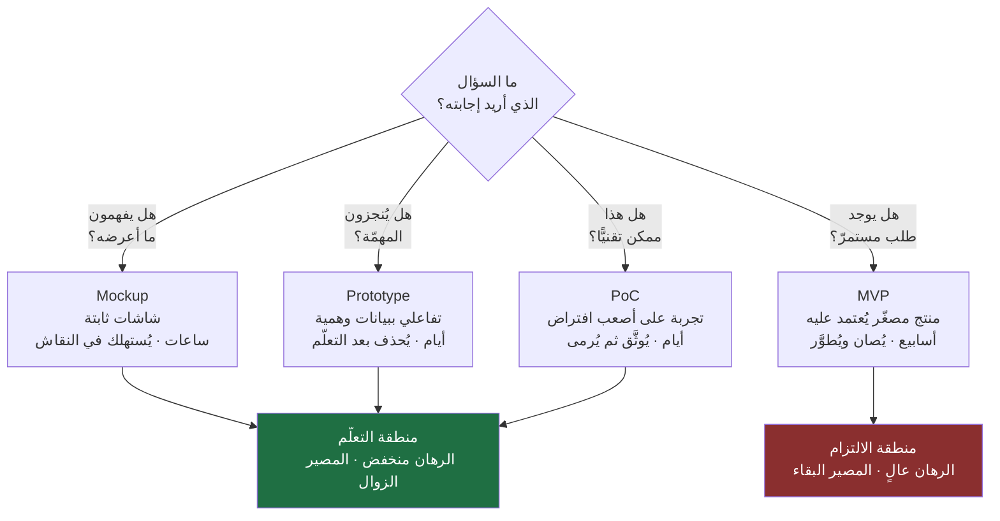
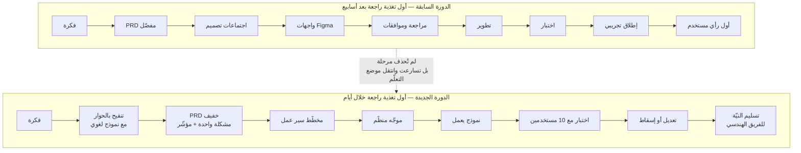
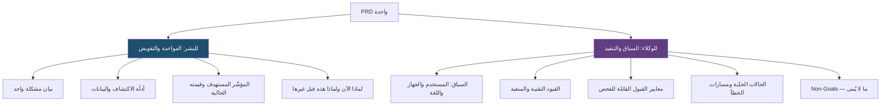
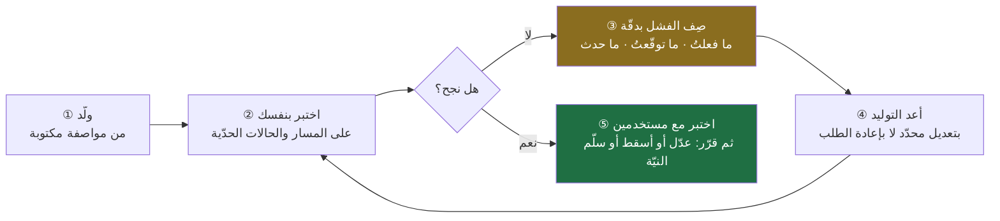
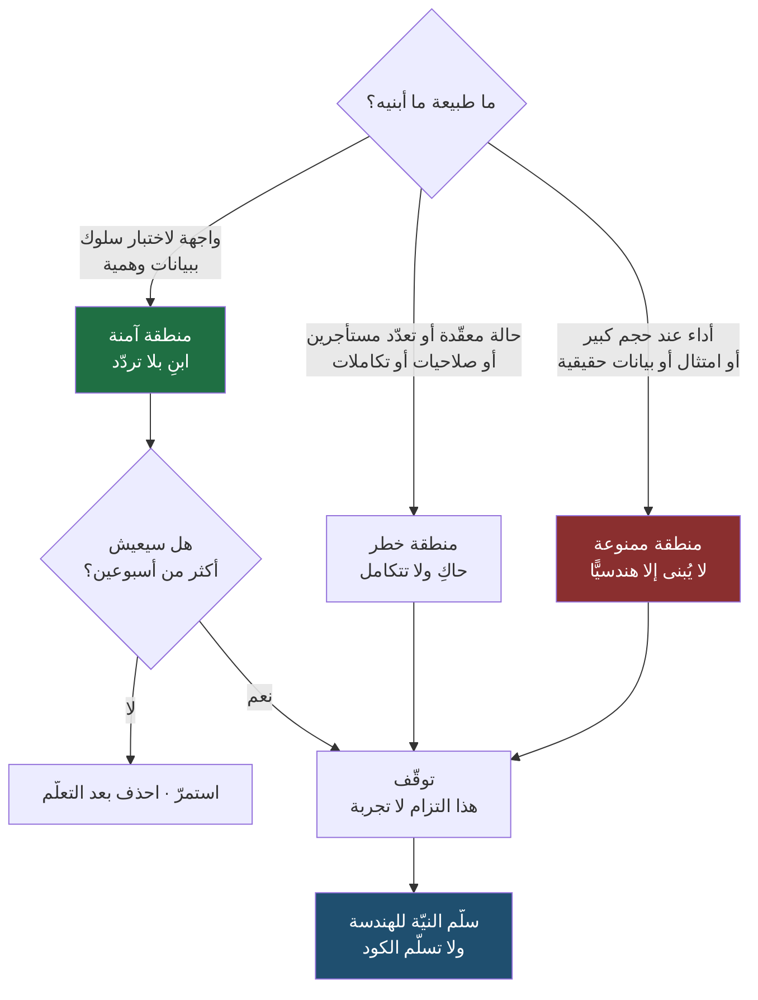

> [!info] الفصل 08 · إدارة المنتج في عصر الذكاء الاصطناعي
> **ماذا ستتعلّم:** ما هو `Vibe Coding` بدقّة — لا كما يُروَّج له، بل كما وُصف أوّل مرّة ومن قِبَل من صاغه — ولماذا كان في أصله **وصفًا ساخرًا جزئيًّا** لأسلوب يصلح لمشاريع نهاية الأسبوع لا للأنظمة الجادّة. ستتعلّم التمييز الحادّ بين أربعة مستويات مخرَجات يخلط بينها الناس يوميًّا (`Mockup` · `Prototype` · `PoC` · `MVP`)، وأي قرار يُتّخذ بكلٍّ منها. وستتعلّم كيف تتحوّل [[PRD|وثيقة متطلّبات المنتج]] من مستند مواءمة بين البشر إلى **مواصفة قابلة للتنفيذ آليًّا**، وبنية موجّه (`Prompt`) عملية لبناء نموذج أوّلي، وطريقة مراجعة مخرَجه دون أن تكون مهندسًا. ثم ستتعلّم — وهذا أهمّ ما في الفصل — **متى يفشل** هذا الأسلوب: أين تقع حدوده البنيوية، ولماذا يكون «النموذج الذي صار منتجًا» أغلى أخطاء هذه الموجة كلّها. وستخرج بإطار حوكمة عملي للنماذج الأوّلية، وبقاعدة واحدة تحكم علاقتك بالفريق الهندسي: **النموذج يوضّح النيّة، ولا يفرض التنفيذ.**

# الفصل 08 — Vibe Coding

**ثورة بناء المنتجات: كيف أصبح مدير المنتج قادرًا على تحويل الفكرة إلى نموذج أوّلي خلال ساعات؟**

## 🎯 أهداف التعلّم

- تعريف `Vibe Coding` تعريفًا دقيقًا يفصل بين **الأسلوب** (وصف النيّة بلغة طبيعية وترك التوليد للنموذج) وبين **الأدوات** التي تنفّذه، وبين **الادّعاءات التسويقية** المبنية عليه.
- عرض **أصل المصطلح** بأمانة: من صاغه، ومتى، وبأي نبرة، ولماذا يخالف كثيرٌ ممّا يُروَّج له باسمه اليومَ ما قصده صاحبه.
- التمييز العملي بين أربعة مستويات مخرَجات — `Mockup`، `Prototype`، `PoC`، `MVP` — وتحديد **القرار** الذي يُتّخذ بكل مستوى، والكلفة التي يستحقّها، والجمهور الذي يُعرَض عليه.
- شرح **تكلفة التجربة** (`Cost of Experimentation`) بوصفها المتغيّر الاقتصادي الذي يفسّر الموجة كلّها، وحساب أثر انخفاضها على عدد الفرضيات التي يقدر الفريق على اختبارها في الربع.
- تحويل [[PRD|وثيقة متطلّبات المنتج]] إلى **مواصفة قابلة للتنفيذ آليًّا**: السياق، والقيود، ومعايير القبول، والحالات الحدّية، وما لا نريده (`Non-Goals`).
- بناء **موجّه (`Prompt`) منظّم من سبعة أقسام** لتوليد نموذج أوّلي، وتشغيل حلقة «ولّد ← اختبر ← صِف الفشل بدقّة ← أعد التوليد» بوصفها منهج عمل لا محاولات عشوائية.
- **مراجعة مخرَج النموذج** بأدوات مدير المنتج (المسارات، الحالات الحدّية، البيانات، الرسائل) دون ادّعاء مراجعة هندسية للكود.
- تشخيص **مواضع فشل `Vibe Coding` الثمانية** — الحالة المعقّدة، تعدّد المستأجرين، الصلاحيات والأمن، التكاملات، الأداء عند الحجم، الامتثال، الصيانة بعد ستّة أشهر، ونقطة الانقلاب التي يصبح عندها فهم الكود المولَّد أغلى من كتابته.
- تصميم **حوكمة عملية للنماذج الأوّلية**: البيانات المسموح بها، ومكان الاستضافة، ومن يراجع قبل أي دمج، وكيف يُوسَم الكود المولَّد، ومتى يُحذف النموذج إلزاميًّا.
- إدارة **العلاقة بالفريق الهندسي** بحيث لا يُقرأ النموذج إهانةً لكفاءتهم ولا التزامًا بتسليمه كما هو.
- تحليل **البُعد المحلّي**: كيف تستفيد الفرق الصغيرة والشركات الناشئة في الخليج من هذه الموجة، وأين تسيء شركات الخدمات استخدام السرعة في التسعير والوعود.
- عرض **الحجّة المضادّة كاملة**: أن انخفاض كلفة البناء يُنتج تضخّمًا في الميزات ودَينًا تقنيًّا جماعيًّا، وأن ما رخص هو **الكتابة** لا **الفهم والصيانة**.

## الفكرة المحورية: ما الذي رخص فعلًا؟

كانت رحلة بناء أي منتج رقمي، حتى وقت قريب، رحلةً طويلة ومعروفة المحطّات: فكرة، ثم وثيقة متطلّبات، ثم اجتماعات مع المصمّمين، ثم تصميم الواجهات، ثم اجتماعات مراجعة، ثم تسليم للتطوير، ثم برمجة، ثم اختبارات، ثم تعديلات، ثم إطلاق نسخة تجريبية. أسابيع في أفضل الأحوال، وأشهر في أغلبها، قبل أن يرى مستخدم واحد شيئًا يستطيع أن يلمسه ويقول عنه رأيًا.

وهذه الرحلة لم تكن بيروقراطية عبثية؛ كانت **نتيجة منطقية لكلفة التنفيذ**. حين يكلّف بناء الشيء ثلاثة أشهر من فريق كامل، يصبح من العقل أن تنفق أسبوعين في التأكّد من أنك تبني الشيء الصحيح. الوثيقة، والاجتماع، والمراجعة، والموافقة — كل هذه **آليات تخفيف مخاطر** ولدت من كلفة الخطأ العالية.

ما فعله الذكاء الاصطناعي التوليدي أنه ضرب هذه الكلفة في موضع واحد بالتحديد: **المسافة بين الفكرة وأول شيء قابل للاختبار**. لم يُلغِ المهندسين، ولم يُلغِ المصمّمين، ولم يُلغِ أيّ مرحلة من مراحل الدورة. لكنه جعل مرحلةً كانت تستغرق أسبوعين تستغرق ساعات — وهذا يكفي لإعادة ترتيب المعادلة كلّها.

> [!quote] من الويبينار
> وصف أحد الضيوف الفارق بين نموذج الأمس ونموذج اليوم بجملتين قالهما بالإنجليزية داخل حديثه العربي:
> *"It's not just a wireframe anymore… It's an actual code that works."*
>
> **الترجمة:** «لم يعد مجرّد مخطّط هيكلي (`Wireframe`)… إنه **كود حقيقي يعمل فعلًا**.»
>
> وسياق الجملة أنه كان يقارن بين ما كان يفعله سابقًا — أن يجلس مع مصمّم منتج، ويفتحان `Figma`، ويبنيان نموذجًا، ثم يرسلانه وينتظران ردود الناس — وبين قدرته اليوم على بناء أربعة أو خمسة نماذج وإرسالها إلى شرائح مختلفة وجمع تغذيتها الراجعة.

انتبه إلى موضع الفرق بدقّة. النموذج في `Figma` كان **صورة تتظاهر بأنها منتج**: يضغط المستخدم فتنتقل الشاشة، لكن لا حسابات تجري، ولا بيانات تُحفظ، ولا حالات خطأ تظهر. أما النموذج المولَّد بالكود فهو **شيء يعمل**: تُدخل فيه بيانات فيستجيب، وتخطئ فيه فيُظهر رسالة، وتجرّبه على هاتفك فيسلك سلوك التطبيقات. والفارق بين الاثنين ليس فارق «جودة النموذج» بل فارق **نوع السؤال الذي يستطيع أن يجيب عنه**: الصورة تجيب عن «هل يفهم الناس هذه الشاشة؟»، والكود العامل يجيب عن «هل يُنجز الناس المهمّة فعلًا؟» — وبينهما فرق هائل في قيمة الإجابة.

لكن هذا الفصل ليس احتفالًا بالسرعة. السرعة أرخص ما في الموضوع وأكثره تضليلًا. الفصل كلّه محاولة للإجابة عن سؤال أدقّ: **ما الذي رخص بالضبط؟** لأن الإجابة الدقيقة عن هذا السؤال هي التي تحدّد أين تكسب من هذه الموجة وأين تخسر منها. والإجابة القصيرة — التي سنقضي بقيّة الفصل في تفصيلها والدفاع عنها ونقدها — هي:

> [!success] الأطروحة المركزية للفصل
> **رخصت كتابة الكود. ولم ترخص ثلاثة أشياء: فهمه، وصيانته، وتحمّل مسؤوليته.**
>
> ولهذا فإن المكسب الحقيقي من `Vibe Coding` يقع كلّه في المنطقة التي **لا نحتاج فيها إلى فهم دائم ولا صيانة طويلة ولا مسؤولية إنتاجية**: منطقة التعلّم السريع قبل الالتزام. وكل خسارة كبيرة رأيناها في هذه الموجة نشأت من نقل مخرَج هذه المنطقة إلى خارجها.

## أصل المصطلح: ما قاله كارباثي، وما فُهم منه

المصطلح ليس قديمًا ولا غامض النسب، ومع ذلك يُستعمل اليوم في معنى يكاد يكون معكوسًا لمعناه الأول. ولأن هذا الفصل مرجعي، يلزم ضبط الأصل قبل البناء عليه.

> [!info] إضافة مرجعية
> **من أين جاء المصطلح؟** صاغه **Andrej Karpathy** — من مؤسّسي `OpenAI` ومن قاد سابقًا الذكاء الاصطناعي في `Tesla` — في تدوينة قصيرة نشرها على منصّة `X` في **فبراير 2025**. وصف فيها أسلوبًا في العمل مع نماذج توليد الكود يتخلّى فيه المبرمج عن قراءة الكود سطرًا سطرًا، ويتعامل مع النموذج بلغة طبيعية، ويقبل مقترحاته، ويصف المشكلة حين تظهر بدل أن يشخّصها بنفسه — حتى يكاد **ينسى أن الكود موجود أصلًا**.
>
> والأهمّ في التدوينة — وهو ما يُحذَف عادةً عند الاقتباس — أن صاحبها **قيّد الأسلوب بنفسه**: وصفه بأنه مناسب لمشاريع صغيرة، من نوع «مشروع نهاية الأسبوع»، لا للأنظمة الجادّة. أي أن الرجل لم يقدّم منهجية هندسية جديدة، بل **وصف تجربة شخصية بنبرة فيها طرافة واعتراف بالحدود**.
>
> *(الصياغة هنا وصف للمعنى لا اقتباس حرفي؛ ولمن أراد النصّ الأصلي فليرجع إلى التدوينة نفسها.)*

ثم جرى للمصطلح ما يجري عادةً في هذا الحقل، وهو النمط الذي حلّله [[01 - لماذا لا يزال مدير المنتج أهم من أي وقت مضى|الفصل الأول]] تحت اسم «دورة الترند»: التُقط الاسم، وحُذف القيد، وبيع الوعد كاملًا بلا شروطه. فصار «`Vibe Coding`» في الخطاب التسويقي يعني: «ابنِ منتجك كاملًا بالمحادثة»، و«لن تحتاج مهندسين»، و«شركة بشخص واحد». وهذا **ليس تطويرًا للفكرة الأصلية، بل نقضٌ لها**، لأن الفكرة الأصلية كانت مشروطة بصغر الرهان.

وهذه الملاحظة ليست تدقيقًا تاريخيًّا ترفيًّا. لها أثر عملي مباشر: حين تسمع في اجتماع جملة «لماذا لا نبنيه بـ`Vibe Coding` ونوفّر ربعًا كاملًا؟»، فأنت أمام شخص يستعمل مصطلحًا **خارج شروطه المعلنة من صاحبه**. وأنفع ردّ ليس الرفض المبدئي، بل السؤال الذي يعيد الشرط إلى مكانه: **ما حجم الرهان هنا؟ وكم شهرًا سنعيش مع نتيجته؟**

> [!note] لماذا سُمّي «Vibe»؟
> لأن نقطة البداية ليست التفاصيل التقنية بل **الإحساس العام بالنتيجة المطلوبة**. المطوّر التقليدي يبدأ من: «أنشئ `Controller`، واربط `Route`، وابنِ `API`، وأضف طبقة تحقّق». أما هنا فتبدأ من: «أنشئ لي صفحة تسجيل بسيطة فيها البريد وكلمة المرور، مع تحقّق من صحّة البيانات ورسائل خطأ واضحة بالعربية».
>
> والفرق ليس في اللغة فقط، بل في **مستوى التجريد الذي تعمل عنده**: انتقلتَ من وصف *كيف يُبنى* إلى وصف *ما ينبغي أن يحدث*. وهذا — بالمصادفة السعيدة — هو بالضبط مستوى التجريد الذي يعمل عنده مدير المنتج أصلًا. ولهذا صارت هذه الأدوات في متناوله دون أن يغيّر مهنته.

## تعريف دقيق: ما هو، وما ليس هو

نحتاج تعريفًا يصمد في نقاش جادّ، لا شعارًا. فلنضعه في ثلاثة أسطر ثم نحصّنه بما يخرج منه:

> [!abstract] التعريف العملي
> **`Vibe Coding` هو أسلوب في إنتاج برمجيات يصف فيه الإنسان النتيجة المطلوبة بلغته الطبيعية، فيتولّى نموذج لغوي توليد الكود، ويقتصر دور الإنسان على التوجيه والاختبار ووصف الفشل — لا على قراءة كل سطر ومراجعته.**
>
> والحدّ الفاصل الذي يميّزه عمّا سواه هو تحديدًا: **درجة تخلّي الإنسان عن مراجعة الكود سطرًا سطرًا.** فمن يقرأ كل سطر ويفهمه ويعدّله ليس ممارسًا لـ`Vibe Coding` بمعناه الأصلي؛ هو مهندس يستعمل مساعدًا ذكيًّا. والفرق بينهما ليس فرق درجة بل فرق **موقع المسؤولية عن الصحّة**.

وممّا يوضّح التعريف أن نذكر ما **ليس** منه:

| ليس هو | لماذا |
|---|---|
| **الإكمال التلقائي للكود** (`Code Completion`) | المهندس هنا يقود ويقرأ ويقبل أو يرفض كل اقتراح. الاقتراح مساعدة داخل عمله لا بديل عن قراءته. |
| **التوليد الهندسي المُراجَع** | مهندس يطلب من النموذج توليد وحدة كاملة ثم يقرأها ويختبرها ويعيد كتابتها جزئيًّا. هذا أسلوب هندسي ناضج، وهو **غير** ما وُصف بـ`Vibe Coding`. |
| **`No-Code` / `Low-Code`** | المنصّة هنا تفرض عليك مكوّنات جاهزة وحدودًا واضحة، ولا تُنتج كودًا مفتوحًا تملكه. القيد مختلف تمامًا، وكذلك نمط الفشل. |
| **إلغاء الهندسة** | لا شيء في التعريف يقول ذلك. التعريف يصف **أسلوب إنتاج مسوّدة**، ولا يقول شيئًا عن كيفية إيصالها إلى الإنتاج. |
| **مهارة تقنية جديدة تُضاف لمدير المنتج** | الأدقّ أنها **إزاحة لحاجز**: صار بإمكانه أن يفعل بنفسه ما كان يحتاج فيه إلى وقت غيره. والمهارة المطلوبة منه ليست تقنية بل **مهارة وصف**. |

وهذا الجدول يكشف خطأً شائعًا في النقاش: كثير من المدافعين عن `Vibe Coding` يدافعون في الحقيقة عن **التوليد الهندسي المُراجَع** (وهو دفاع وجيه)، وكثير من المهاجمين له يهاجمون **إلغاء الهندسة** (وهو هجوم وجيه أيضًا) — والطرفان يتحدّثان عن شيئين مختلفين بالاسم نفسه.

### ثلاث درجات، لا حالة واحدة

الأنفع عمليًّا أن تتعامل مع الأمر كطيف من ثلاث درجات، وأن تعرف في أي درجة تقف الآن:

**① الدرجة الاستكشافية.** تصف ما تريد، تقبل ما يخرج، لا تقرأ شيئًا، هدفك أن ترى الفكرة قائمة أمامك. الرهان: صفر. المخرَج: يُحذف بعد أيام. وهذه هي الدرجة التي وُصف فيها المصطلح أوّل مرّة، وهي الدرجة التي يقع فيها **90% من عمل مدير المنتج المفيد**.

**② الدرجة المُوجَّهة.** تصف ما تريد، ثم تختبره اختبارًا منظّمًا على مسارات محدّدة وحالات حدّية، وتصف الفشل بدقّة، وتطلب تعديلات بعينها، وتراجع **السلوك** لا الكود. الرهان: منخفض. المخرَج: يُعرَض على مستخدمين حقيقيين، ثم يُحذف أو يُسلَّم كمواصفة.

**③ الدرجة المُهندَسة.** التوليد يُستعمل داخل عملية هندسية كاملة: مراجعة أقران، اختبارات آلية، معايير أمن، بيئة منفصلة. الرهان: عالٍ. المخرَج: قد يصل إلى الإنتاج. وهذه **ليست عمل مدير المنتج**، وادّعاؤها هو مصدر أكثر الكوارث في هذه الموجة.

والقاعدة التي تلخّص الفصل كلّه في سطر: **اعرف في أي درجة أنت، وأعلنها للجميع.** أكثر الضرر لا يأتي من العمل في الدرجة الأولى، بل من **تقديم مخرَج الدرجة الأولى وكأنه من الدرجة الثالثة**.

## سُلّم المخرَجات الأربعة: Mockup · Prototype · PoC · MVP

هذا القسم هو العمود الفقري العملي للفصل. أكثر الخلافات التي تراها في اجتماعات المنتج ليست خلافًا على القرار، بل **خلافًا غير معلن على مستوى المخرَج المقصود**: مدير المنتج يعرض شيئًا يقصد به التعلّم، والمدير التجاري يراه وعدًا بالتسليم، والمهندس يراه ادّعاءً بأن العمل قد أُنجز. ثلاثة أشخاص ينظرون إلى الشاشة نفسها ويرون ثلاثة أشياء مختلفة.

والعلاج ليس مزيدًا من الشرح، بل **مفردات مشتركة**:

| المستوى | ما هو | ماذا يجيب | لمن يُعرَض | الكلفة النموذجية | مصيره |
|---|---|---|---|---|---|
| **`Mockup` (موك ثابت)** | صور شاشات غير تفاعلية | «هل يفهم الناس ما تعرضه هذه الشاشة؟» وهل التسلسل البصري منطقي؟ | الفريق الداخلي، المصمّم، ومستخدمون في اختبار سريع | ساعات | يُستهلك في نقاش التصميم |
| **`Prototype` (نموذج تفاعلي)** | شيء يُضغط فيسلك سلوكًا، ببيانات وهمية | «هل يستطيع المستخدم إنجاز المهمّة؟ وأين يتعثّر؟» | مستخدمون حقيقيون (٥–١٥) | يوم إلى ثلاثة | يُحذف بعد استخلاص التعلّم |
| **`PoC` (إثبات مفهوم)** | تجربة تقنية ضيّقة على أصعب افتراض | «هل هذا ممكن تقنيًّا أصلًا وبأي كلفة؟» | المهندسون والقيادة التقنية | أيام | يُوثَّق ثم يُرمى — دائمًا |
| **`MVP` (منتج أدنى قابل للتطبيق)** | منتج حقيقي مصغَّر يستخدمه ناس فعليًّا ويعتمدون عليه | «هل يوجد طلب حقيقي مستمرّ؟ وهل يعود الناس؟» | السوق | أسابيع إلى أشهر | **يُصان ويُطوَّر** — لأنه منتج |

اقرأ العمود الأخير مرّتين. الفرق الجوهري بين الثلاثة الأولى والرابع ليس الحجم ولا الجودة ولا عدد الميزات؛ هو **الالتزام**. الثلاثة الأولى **مخرَجات تعلّم مصيرها الزوال**، والرابع **منتج مصيره البقاء**. ومن هنا تحديدًا يأتي الخطأ الأشهر في هذه الموجة، الذي سنفرد له قسمًا كاملًا بعد قليل: أن يُبنى شيء بمعايير الصفّ الثاني ثم يُعامَل معاملة الصفّ الرابع.



> [!warning] الخطأ الشائع في استعمال السُّلّم
> السُّلّم ليس مراحل متتابعة إلزاميًّا. لا يلزمك أن تمرّ بالأربعة بالترتيب. الاختيار يحكمه **السؤال المفتوح عندك الآن**، لا العادة:
> - إن كان السؤال المفتوح **تقنيًّا** («هل نستطيع مطابقة هذه الفواتير آليًّا؟») فلا معنى لبناء `Prototype` جميل قبل `PoC`.
> - وإن كان السؤال المفتوح **سلوكيًّا** («هل سيثق الناس بإدخال بياناتهم البنكية هنا؟») فلا معنى لـ`PoC` تقني، لأن التقنية ليست موضع الشكّ.
>
> **القاعدة:** ابنِ أقلّ شيء يجيب عن **أخطر افتراض غير مُختبَر** لديك الآن. لا أقلّ شيء عمومًا، ولا أجمل شيء ممكن.

### مثال تطبيقي: أربع نسخ من فكرة واحدة

لنأخذ فكرة واحدة ونمرّرها على المستويات الأربعة حتى يتّضح الفرق بالممارسة لا بالتعريف. الفكرة: **«مساعد يقترح على صاحب المتجر الإلكتروني وصفًا أفضل لمنتجاته الناقصة الأوصاف.»**

> [!example] الفكرة نفسها في أربعة مستويات
> **① `Mockup`:** ثلاث شاشات ثابتة: قائمة المنتجات الناقصة، وشاشة الاقتراح، وشاشة القبول. تُعرض على ثلاثة تجّار في مكالمة قصيرة، والسؤال: «ماذا تفهم من هذه الشاشة؟ وما أول شيء ستضغطه؟». **ما تتعلّمه:** هل مفهوم «الوصف الناقص» مفهوم عندهم أصلًا؟ (وقد تكتشف أنهم لا يعتبرونه نقصًا، وهذا اكتشاف يوفّر عليك شهرًا.)
>
> **② `Prototype`:** صفحة تعمل فعلًا، فيها عشرة منتجات وهمية، تضغط على واحد فيخرج اقتراح (قد يكون مكتوبًا مسبقًا لا مولَّدًا)، وتقبل أو تعدّل أو ترفض. تُعطى لعشرة تجّار حقيقيين على هواتفهم. **ما تتعلّمه:** كم اقتراحًا يقبلونه بلا تعديل؟ وأين يتوقّفون؟ وهل يعدّلون في الطول أم في الأسلوب أم في الأرقام؟ — وهذه معلومات لا يعطيها لك الموك مهما جمُل.
>
> **③ `PoC`:** لا واجهة إطلاقًا. ملفّ فيه مئتا منتج حقيقي من قاعدة بيانات مموّهة، وسكريبت يولّد لها أوصافًا، ثم يقيّمها ثلاثة مراجعين بشريين. **ما تتعلّمه:** ما نسبة الأوصاف المقبولة دون تعديل؟ وكم تكلّف المكالمة الواحدة للنموذج؟ وهل يهلوس أرقامًا غير موجودة (مقاسات، خامات)؟ — وهذا أخطر سؤال في الفكرة كلّها، ولا تجيب عنه واجهةٌ جميلة.
>
> **④ `MVP`:** ميزة حقيقية داخل المنتج، تعمل على بيانات التاجر الفعلية، ولها صلاحيات وسجلّ تدقيق وحدّ استهلاك وزرّ تراجع. تُطلق لخمسين تاجرًا. **ما تتعلّمه:** هل يستمرّون في استخدامها بعد الأسبوع الأول؟ وهل تحسّنت مؤشّرات صفحات المنتج فعلًا؟
>
> **ولاحظ الترتيب الأذكى هنا:** لو كان أخطر افتراضاتك هو **الهلوسة في المواصفات**، فالبدء بـ③ قبل ② هو الصواب — لأن نموذجًا تفاعليًّا جميلًا يقنع الجميع بفكرة تنهار عند أول اختبار جادّ للدقّة هو أسوأ مخرَج ممكن: **يشتري لك التزامًا قبل أن يشتري لك معرفة.**

## تكلفة التجربة: الاقتصاد الذي يفسّر الموجة كلّها

وراء كل هذا الكلام عن السرعة يقف متغيّر اقتصادي واحد يستحقّ أن يُسمّى بصراحة: **تكلفة التجربة** (`Cost of Experimentation`). وهي مجموع ما يلزم لاختبار فرضية واحدة اختبارًا يعطي إجابة يُوثَق بها: وقت البناء، ووقت التنسيق، ووقت الانتظار في الطوابير، وكلفة الفرصة البديلة لكل ذلك.

والقاعدة البسيطة التي تحكم الابتكار كلّه:

> [!success] القاعدة الاقتصادية
> **عدد التجارب التي يستطيع الفريق إجراءها في الربع = السعة المتاحة ÷ تكلفة التجربة الواحدة.**
>
> فإذا كانت التجربة تكلّف أسبوعين من فريق كامل، فأنت تختبر أربع أو خمس فرضيات في السنة، وتضطرّ إلى **اختيار أي الفرضيات تستحقّ الاختبار** — وهو اختيار يُتّخذ في الغالب بالسياسة الداخلية والرأي لا بالدليل. وإذا نزلت التكلفة إلى يوم واحد، صرت تختبر عشرات الفرضيات، ويصير الدليل — لا الرأي — هو ما يحسم.

وهذا يقلب طبيعة النقاش داخل الفريق قلبًا كاملًا. حين تكون التجربة غالية، يصير النقاش الطويل **عقلانيًّا**: من المنطقي أن تنفق يومين في الجدال لتتجنّب إنفاق أسبوعين على الخطأ. وحين ترخص التجربة، يصير النقاش الطويل **إهدارًا**: أنت تنفق في الجدال أضعاف ما ينفقه الاختبار.

> [!note] مؤشّر تشخيصي سريع لفريقك
> قارن بين رقمين: **متوسّط الزمن الذي ينفقه فريقكم في الجدال حول فرضية**، و**متوسّط الزمن اللازم لاختبارها**. إن كان الأول أكبر من الثاني، فأنتم تدفعون ضريبةً لا مبرّر لها. والجملة التي تنهي هذا النوع من الاجتماعات: **«هذا سؤال تجريبي، لا سؤال رأي. لنختبره هذا الأسبوع ونعود بالإجابة.»**

لكن للقاعدة وجهًا آخر يُغفَل، وهو الذي سنبني عليه النقاش المفتوح في آخر الفصل: **انخفاض تكلفة التجربة ليس انخفاضًا في تكلفة الالتزام.** رخُص أن تجرّب، ولم يرخص أن تتعهّد. فإذا حوّلت كل تجربة ناجحة إلى التزام دائم دون فرز، فأنت لم تستفد من انخفاض الكلفة — بل **ضاعفت وتيرة تراكم الالتزامات** التي ستدفع ثمنها لسنوات.

> [!info] إضافة مرجعية
> فكرة أن **معدّل التجريب** هو محرّك الابتكار الحقيقي ليست جديدة على أدبيات المنتج. عرضها `Eric Ries` في `The Lean Startup` (2011) عبر حلقة «ابنِ – قِس – تعلّم»، وجوهر حجّته أن ما ينبغي تحسينه هو **سرعة دورة التعلّم** لا سرعة البناء. وسبقه إليها في التفكير الهندسي `Stefan Thomke` في `Experimentation Matters` (2003)، حيث حلّل كيف غيّرت أدوات المحاكاة الرقمية في صناعات مثل السيارات والأدوية اقتصاديات التجريب: حين ترخص التجربة، لا تجرّب الشركات الشيء نفسه أسرع فحسب، بل **تجرّب أشياء ما كانت لتجرّبها أصلًا** لأن كلفتها السابقة كانت تحرّم المخاطرة الصغيرة.
>
> وهذه النقطة الأخيرة هي المكسب الأثمن لمدير المنتج اليوم: ليس أنك ستختبر أفكارك الحالية أسرع، بل أنك ستختبر **الأفكار الغريبة** التي لم تكن تجرؤ على طلب أسبوعين هندسيين لها. وأكثر الاكتشافات المفيدة تأتي من هذه تحديدًا، لأنها الوحيدة التي لم يكن أحد يعرف جوابها مسبقًا.

## دورة العمل الجديدة: ماذا تغيّر بالضبط في التسلسل؟

من المهم أن نصف التغيّر وصفًا دقيقًا، لأن الوصف المتساهل («صار كل شيء أسرع») لا يفيد أحدًا. الحقيقة أدقّ وأنفع: **لم تُلغَ أي مرحلة، لكن تسلسل المراحل تغيّر، وموضع أول تغذية راجعة حقيقية انتقل إلى الأمام كثيرًا.**



انظر إلى العقدة `N9` تحديدًا: **تسليم النيّة**، لا تسليم الكود. هذه أهمّ عقدة في المخطّط كلّه، وسيأتي تفصيلها في قسم العلاقة بالفريق الهندسي. النموذج ليس بديلًا عن التطوير؛ هو **أوضح صيغة ممكنة للمواصفة**.

> [!quote] من الويبينار
> وصف أحد الضيوف تسلسله الشخصي بالحرف:
> *"So what I do… I build the PRD, what is the problem and why is it a priority, aligned with stakeholders. I build the workflow diagrams to help me… what this product needs to do. Then I have any clarity when I write the prompt."*
>
> **الترجمة:** «ما أفعله أنا… أبني وثيقة المتطلّبات: ما المشكلة، ولماذا هي أولوية، بمواءمة مع أصحاب المصلحة. ثم أبني مخطّطات سير العمل لتساعدني… على تحديد ما يجب أن يفعله هذا المنتج. عندها يكون لديّ **وضوح حين أكتب الموجّه**.»
>
> *(في التفريغ الآلي بعض التشويش، وقد أُبقيت هنا المقاطع المفهومة بثقة فقط.)*

الجملة الأخيرة هي بيت القصيد: **الوضوح يسبق الموجّه، ولا ينتج عنه.** ومن يبدأ من الموجّه مباشرةً يفعل شيئًا واحدًا: ينقل ارتباكه من رأسه إلى الشاشة، ثم يفاجأ بأن المخرَج مرتبك.

> [!quote] من الويبينار
> وقيلت العلاقة السببية صراحةً في موضع آخر:
> *"And you'll see if you write good PRDs, you'll create better Vibe coding prototypes."*
>
> **الترجمة:** «وسترى أنك إن كتبت وثائق متطلّبات جيّدة، أنتجتَ **نماذج أوّلية أفضل** بـ`Vibe Coding`.»

### ما الذي تسارع، وما الذي لم يتسارع؟

| المرحلة | قبل | بعد | هل تسارعت فعلًا؟ |
|---|---|---|---|
| فهم المشكلة والبحث | أسابيع | أسابيع (مع تسريع في التلخيص) | **لا جوهريًّا** — لأن الوقت هنا يقضيه بشر مع بشر |
| كتابة الوثيقة | يوم إلى يومان | نصف ساعة إلى ساعة | نعم، جذريًّا |
| تصميم الواجهات الأولية | أيام إلى أسبوع | ساعات | نعم |
| بناء شيء قابل للاختبار | أسبوعان إلى شهر | ساعات إلى يومان | نعم، جذريًّا |
| **الحصول على قرار من مستخدمين حقيقيين** | أسابيع | أيام | نعم — وهذا **المكسب الحقيقي** |
| بناء نظام إنتاجي آمن قابل للصيانة | أشهر | أشهر (مع تحسين هامشي) | **لا** — وهنا مصدر أغلب سوء الفهم |
| إقناع أصحاب المصلحة والمواءمة | أسابيع | أسابيع | **لا** — وهي مهارة بشرية بحتة |

الصفّان الأخيران هما اللذان يفسّران أغلب خيبات هذه الموجة. من رأى تسارع الصفوف الوسطى فافترض تسارع الصفّ السادس، وعد بمواعيد لا يستطيع الوفاء بها. ومن ظنّ أن النموذج الجميل يُغني عن الإقناع، اكتشف أن عرض شيء يعمل قد **يزيد** المقاومة أحيانًا لا يقلّلها، لأنه يبدو كقرار مفروض.

> [!quote] من الويبينار
> وحُسم أمر المهارة البشرية الباقية بجملة صريحة:
> *"…هذا الـ AI الوحيد اللي ما هيقدر يسويه هو **إقناع الـ stakeholders**. هذه هتكون سكل موجودة للبشر، وحتكون **أقوى سكل** موجودة لمدير المنتج."*
>
> **الترجمة (تنقيح للعبارة المنطوقة بالعامية):** «الشيء الوحيد الذي لن يستطيع الذكاء الاصطناعي أن يقوم به هو **إقناع أصحاب المصلحة**. ستبقى هذه مهارة بشرية، بل ستصبح **أقوى مهارات مدير المنتج**.»

## الـ PRD كمواصفة قابلة للتنفيذ آليًّا

هذا هو الجسر بين هذا الفصل و[[06 - وثيقة متطلبات المنتج (PRD)|الفصل السادس]]، وهو أهمّ أقسام الفصل عمليًّا. لأن السؤال الذي طُرح في الويبينار حرفيًّا — «هل يكفي `Vibe Coding` ليقوم بعمل مدير المنتج؟» — جاءت إجابته معاكسة تمامًا لما يتوقّعه كثيرون:

> [!quote] من الويبينار
> *"If you cannot write a PRD… PRD tells me what is the problem. Why is this a priority? What data do we have? What consumer research do we have? What discovery do we have? How is it going to impact the metrics? If we don't know this, then **we should not be building**. We should not be focusing on the products. **We should not be building vibe coding**, you should not be spending time."*
>
> **الترجمة:** «إن لم تستطع كتابة وثيقة متطلّبات… فالوثيقة هي التي تخبرني: ما المشكلة؟ ولماذا هي أولوية؟ وما البيانات التي لدينا؟ وما أبحاث المستهلك؟ وما الاكتشاف الذي أجريناه؟ وكيف سيؤثّر هذا على المؤشّرات؟ فإن كنّا لا نعرف هذا، **فلا ينبغي أن نبني**. ولا ينبغي أن ننشغل بالمنتج. **ولا ينبغي أن نبني بـ`Vibe Coding`**، ولا أن تنفق وقتك فيه.»

فالوثيقة لم تُلغَ، بل **ارتفعت وظيفتها**. وسبب ذلك بنيوي لا شعاري: النموذج اللغوي يولّد ما تصفه، والمساحة التي لا تصفها **يملؤها هو بافتراضاته**. فإن كانت وثيقتك ناقصة، لم تحصل على «نموذج ناقص» بل على **نموذج مكتمل مبنيّ على افتراضات لم تخترها أنت ولا تعرفها**. وهذا أخطر بكثير من النقص الظاهر.

### من وثيقة للبشر إلى مواصفة للآلة: ما الذي يتغيّر؟

الوثيقة التي تُكتب للبشر تعتمد على **السياق المشترك**: القارئ يعرف منتجك، ويعرف عملاءك، ويعرف ما هو بديهي عندكم فلا تكتبه. أما الوكيل فلا يعرف شيئًا ممّا لم تقله، ويملأ الفراغ بأكثر الأنماط شيوعًا في بيانات تدريبه — وهي أنماط سوق آخر ولغة أخرى وثقافة أخرى.

> [!quote] من الويبينار
> والتقط أحد الضيوف هذه النقطة تحديدًا:
> *"…الـPRD تغيّر. أوّل كان للبشر، والحين صار حتى للـagents. إنت تسوي PRD عشان الـAI agents يفهموا البروجكت اللي إنت شغال عليه، ما يحتاج ترجع تشرحه من السياق… فهذا صار **إدارة المعرفة**: إنت كمان تدير المعرفة، مو بس للبشر، كمان للتولز اللي عندك."*
>
> **الترجمة (تنقيح للعبارة المنطوقة بالعامية):** «الوثيقة تغيّرت. كانت للبشر، وصارت اليوم للوكلاء أيضًا. تكتبها لتفهم وكلاء الذكاء الاصطناعي المشروعَ الذي تعمل عليه، فلا تعيد شرح السياق في كل مرّة… وهكذا امتدّت **إدارة المعرفة** لتشمل أدواتك لا البشر وحدهم.»

وهذا يعني عمليًّا أن الوثيقة تكتسب **أربعة أقسام جديدة** لم تكن ضرورية حين كان قارئها بشرًا يعرف السياق:

| القسم | لماذا صار ضروريًّا للآلة | مثال |
|---|---|---|
| **السياق الصريح** | الوكيل لا يعرف منتجك ولا مستخدمك ولا لغته | «تطبيق داخلي لمندوبي مبيعات ميدانيين في السعودية، يستخدمونه على الجوّال بيد واحدة، الواجهة عربية `RTL`، والاتصال ضعيف أحيانًا» |
| **القيود** (`Constraints`) | ما لا تذكره يختاره هو نيابةً عنك | «لا مكتبات خارجية مدفوعة · تخزين محلّي فقط · لا مصادقة حقيقية في هذا النموذج · صفحة واحدة» |
| **معايير القبول** | لتُحوّل «جيّد» من انطباع إلى فحص | «إتمام المهمّة في أقلّ من ثلاث ضغطات · رسالة خطأ عربية واضحة عند كل حقل ناقص · يعمل على شاشة 375 بكسل» |
| **ما لا نريده** (`Non-Goals`) | أخطر ما يفعله النموذج هو **الإضافة الحسنة النيّة** | «لا لوحة إدارة · لا تصدير `Excel` · لا وضع ليلي · لا تعدّد لغات · لا إشعارات» |

> [!warning] `Non-Goals` هو أقصر طريق لتحسين مخرَج النموذج
> النماذج اللغوية مدرَّبة على الإفادة، وميلها الافتراضي إلى **الإضافة**. اطلب صفحة تسجيل فتحصل على صفحة تسجيل ومعها استعادة كلمة مرور، وتسجيل بجوجل، ومؤشّر قوّة كلمة السرّ، ووضع ليلي — لم تطلب شيئًا من ذلك، وكلّه يشوّش اختبارك مع المستخدم لأنه **يضيف متغيّرات لم تكن تدرسها**.
>
> وقائمة «ما لا نريده» تفعل شيئين معًا: تضبط المخرَج، **وتضبطك أنت**. لأن كتابة خمسة أشياء لن تُبنى تكشف لك أحيانًا أنك لا تعرف بعدُ ما الذي *سيُبنى* بالضبط. وهذه فائدة الوثيقة الأصلية منذ عرفها الناس: **أن الكتابة تكشف غموض التفكير**، وهي فائدة لم يمسّها الذكاء الاصطناعي بشيء.

### مكوّنات الوثيقة الأربعة كما عُرضت في الجلسة

للتذكير بالأساس قبل البناء عليه — وتفصيله في [[06 - وثيقة متطلبات المنتج (PRD)|الفصل السادس]]:

> [!quote] من الويبينار
> *"PRD should have **one problem statement**. If you have… PRDs with five problem statements… this shows a lack of focus, a lack of clarity. You should only have **one core problem statement**. What are you trying to solve? And then you should have… **user discovery insights**… I've spoken to the customers, I've got data points… the customer care complaints… then I should highlight… **which metric**, a company metric and strategic goal… and then the last section of a PRD is just **high level overview** — the solution will do, automate this, and it will fix this."*
>
> **الترجمة:** «يجب أن تحوي الوثيقة **بيان مشكلة واحدًا**. فإن رأيتَ وثائق فيها خمسة بيانات مشكلة… فهذا دليل على **غياب التركيز وغياب الوضوح**. ينبغي أن يكون لديك **بيان مشكلة جوهري واحد**: ما الذي تحاول حلّه؟ ثم **رؤى اكتشاف المستخدم**… تحدّثت إلى العملاء، لديّ نقاط بيانات… وشكاوى خدمة العملاء… ثم أُبرز **أي مؤشّر** — مؤشّر شركة وهدف استراتيجي… وآخر قسم في الوثيقة هو **عرض عالي المستوى**: ماذا سيفعل الحلّ، وماذا سيؤتمت، وماذا سيصلح.»

وأضيف هنا ملاحظة لا تخرج عن روح الجلسة لكنها تفصيلها العملي: **هذه المكوّنات الأربعة كافية للبشر، وناقصة للآلة**. الوكيل لا يستفيد من «لماذا هي أولوية» في توليد الكود — لكنه يستفيد استفادة هائلة من القيود ومعايير القبول والحالات الحدّية. ولهذا فالوثيقة في عصر الوكلاء صارت ذات **جمهورين ووظيفتين**:



> [!note] قاعدة عملية: الوثيقة الخفيفة لا تعني الوثيقة الناقصة
> قيل في الجلسة إن الوثيقة ينبغي أن تكون *"very light, very quick"* — خفيفة سريعة يمكن كتابتها بسرعة، ويمكن للذكاء الاصطناعي أن يساعد في تنسيقها وترتيب الأفكار. لكن قيل معها بوضوح: *"especially for critical big features and projects **you must have a PRD**"* («خصوصًا للميزات والمشاريع الكبيرة الحرجة، **لا بدّ لك من وثيقة**»).
>
> والجمع بين الجملتين هو الموقف الصحيح: **الخفّة في عدد الصفحات، لا في عدد الأسئلة المُجاب عنها.** صفحة واحدة تجيب عن المشكلة والدليل والمؤشّر والقيود وما لا نريده، أثقل معرفيًّا من خمسين صفحة تصف الشاشات.

## بنية الموجّه: كيف تكتب طلبًا يُنتج نموذجًا صالحًا للاختبار؟

الموجّه الرديء ليس «قصيرًا»؛ هو **غامض في موضع كان يجب أن يكون فيه حاسمًا، ومفصّل في موضع لا يستحقّ**. وأفضل طريقة لبناء موجّه صالح هي أن تعامله كـ**مواصفة من سبعة أقسام**، لأن الأقسام السبعة تكشف لك ما نسيتَه.

> [!example] الهيكل السباعي للموجّه
> **① الدور والسياق.** من المستخدم؟ وعلى أي جهاز؟ وبأي لغة واتجاه؟ وفي أي ظرف يستعمله (عجلة، اتصال ضعيف، يد واحدة، ضوضاء)؟
> **② المهمّة الواحدة.** ما المهمّة الوحيدة التي يجب أن يُنجزها هذا النموذج؟ (واحدة. إن كتبت «و» أكثر من مرّتين، أنت تبني نموذجين.)
> **③ المسار السعيد** (`Happy Path`). خطوة بخطوة: يدخل المستخدم فيرى كذا، يضغط كذا فيحدث كذا، ينتهي عند كذا.
> **④ الحالات الحدّية** ([[Edge Cases|الحالات الحدّية]]). ماذا لو كانت القائمة فارغة؟ ماذا لو أدخل حروفًا في حقل رقمي؟ ماذا لو انقطع الاتصال في المنتصف؟ ماذا لو كان الاسم طويلًا جدًّا؟
> **⑤ القيود.** ملف واحد · لا مكتبات خارجية · بيانات وهمية داخل الملف · لا اتصال بخوادم · لا تخزين حقيقي.
> **⑥ معايير القبول.** جمل قابلة للفحص بنعم/لا: «يُنجز المستخدم المهمّة في أقلّ من ثلاث ضغطات» · «كل رسالة خطأ عربية وتشير إلى الحقل المعنيّ» · «يعمل على عرض 375 بكسل بلا تمرير أفقي».
> **⑦ `Non-Goals`.** خمسة أشياء صريحة لا تريدها.

وأضف إلى ما سبق **طلبًا واحدًا يُحدث فرقًا أكبر من الأقسام السبعة مجتمعة**:

> [!tip] الطلب الذي يكشف ما لا تعرفه
> اختم موجّهك بجملة: **«قبل أن تبدأ، اذكر الافتراضات التي ستضطرّ إلى اتّخاذها لأن مواصفتي لم تحسمها، ثم اسألني عن الثلاثة الأكثر أثرًا منها.»**
>
> هذا يقلب علاقة العمل رأسًا على عقب: بدل أن تكتشف الافتراضات الخاطئة بعد التوليد، تراها قبله. وستُفاجأ كم مرّة يكشف لك النموذج أنك لم تحسم أمرًا جوهريًّا: هل المستخدم مسجَّل مسبقًا؟ هل يمكن تعديل الطلب بعد إرساله؟ ماذا يحدث للطلب إن رفضه المسؤول؟ — أسئلة منتج خالصة، كشفتها أداة برمجة.

### مثال كامل: من `PRD` إلى موجّه إلى نموذج

لنأخذ حالة من السوق المحلّي: **تطبيق داخلي لمندوبي التوصيل يرفعون به «سبب تعذّر التسليم».**

> [!example] المواصفة ثم الموجّه
> **المشكلة (من الوثيقة):** 18% من الطلبات تُسجَّل بسبب تعذّر واحد مبهم هو «العميل غير متجاوب»، فلا يستطيع فريق العمليات معرفة السبب الحقيقي ولا معالجته. المؤشّر المستهدف: خفض نسبة الأسباب المبهمة من 18% إلى أقلّ من 6% خلال ربع.
>
> **الفرضية:** المندوب يختار السبب المبهم لأنه الأسرع، لا لأنه الأصحّ. فإن جعلنا الأسباب الدقيقة أسرع منه، تغيّر السلوك.
>
> **الموجّه:**
> ```
> ابنِ لي صفحة ويب واحدة (ملف HTML واحد، بلا مكتبات خارجية) بلغة عربية واتجاه RTL.
>
> السياق: المستخدم مندوب توصيل، يقف عند باب العميل، يستخدم الجوّال بيد واحدة، وعجل، وقد يكون الاتصال ضعيفًا.
>
> المهمّة الوحيدة: تسجيل سبب تعذّر تسليم طلب واحد.
>
> المسار السعيد: تظهر الصفحة وفيها رقم الطلب واسم الحيّ، وتحتها ستّة أزرار كبيرة للأسباب: «العنوان غير دقيق» · «العميل لا يجيب» · «العميل طلب التأجيل» · «الموقع مغلق» · «رفض الاستلام» · «سبب آخر». ضغطة واحدة على أي زرّ تسجّل السبب وتُظهر تأكيدًا خلال ثانية.
>
> الحالات الحدّية: عند اختيار «سبب آخر» يظهر حقل نصّي إلزامي لا يقلّ عن عشرة أحرف. وعند انقطاع الاتصال يُحفظ الاختيار محليًّا وتظهر رسالة «سيُرسَل عند عودة الاتصال». وإذا ضُغط الزرّ مرّتين لا يُسجَّل السبب مرّتين.
>
> القيود: ملف واحد · بيانات وهمية داخل الملف · لا اتصال بأي خادم · لا شاشة تسجيل دخول · أزرار لا تقلّ عن 56 بكسل ارتفاعًا.
>
> معايير القبول: يُنجَز التسجيل بضغطة واحدة للأسباب الخمسة الأولى · كل النصوص عربية · يعمل على عرض 375 بكسل بلا تمرير أفقي · لا يحتاج المستخدم إلى قراءة أي تعليمات.
>
> ما لا نريده: لا لوحة إدارة · لا تاريخ للطلبات السابقة · لا خريطة · لا صور · لا تعدّد لغات.
>
> قبل أن تبدأ، اذكر الافتراضات التي ستتّخذها لأن مواصفتي لم تحسمها، واسألني عن الثلاثة الأكثر أثرًا.
> ```
>
> **ما الذي يجعل هذا الموجّه جيّدًا؟** ليس طوله. بل أن كل سطر فيه **قرار منتج**: ستّة أسباب لا عشرة (لأن العشرة تُبطئ)، وأزرار كبيرة (لأن المستخدم واقف)، وحفظ محلّي (لأن الاتصال ضعيف)، وحقل إلزامي لـ«سبب آخر» (لأن المبهم هو المشكلة أصلًا). **الموجّه ليس مهارة كتابة؛ هو ملخّص مكثّف لتفكيرك في المنتج.** ومن لا يملك التفكير لا ينقذه أسلوب الكتابة.

## هندسة الموجّهات بما يخدم مدير المنتج

لا يحتاج مدير المنتج إلى نظرية في `Prompt Engineering`، بل إلى **خمس تقنيات** تحلّ 90% من مشاكله العملية. وقد أشير في الويبينار إلى ترتيب مهمّ في هذا الباب: أن معرفة **قدرات الأداة** تسبق إتقان **مخاطبتها** — فلا معنى لإتقان صياغة الطلب على أداة لا تعرف أصلًا ما الذي تستطيع فعله.

**① التوجيه بالأمثلة.** بدل أن تصف الأسلوب المطلوب، أعطِ مثالًا واحدًا صحيحًا ومثالًا واحدًا خاطئًا. «رسالة الخطأ يجب أن تكون مثل: *«رقم الجوّال يبدأ بـ05 ويتكوّن من عشرة أرقام»*، لا مثل: *«خطأ في الإدخال»*.» مثال واحد يساوي فقرة وصف.

**② تقسيم المهمّة.** لا تطلب المنتج كاملًا في طلب واحد. اطلب الهيكل، ثم الشاشة الأولى، ثم حالات الخطأ، ثم التحسين البصري. والسبب عملي: حين يفشل شيء في مخرَج ضخم، لا تعرف **أي جزء من طلبك** سبّب الفشل. والتقسيم يجعل الفشل **قابلًا للعزل**.

**③ طلب البدائل صراحةً.** «أعطني ثلاثة تصاميم مختلفة لهذه الشاشة: واحد يقلّل الضغطات، وواحد يقلّل الحمل الذهني، وواحد يعطي الأولوية للسرعة على الجوّال — واذكر لكلٍّ منها المقايضة.» هذه التقنية وحدها تحوّل الأداة من **منفّذ** إلى **موسّع لفضاء الخيارات**، وهو استعمالها الأنفع لمدير المنتج.

**④ طلب الافتراضات صراحةً.** سبق شرحها، وهي الأعلى مردودًا.

**⑤ حلقة «ولّد ← اختبر ← صِف الفشل بدقّة ← أعد التوليد».** وهذه هي المهارة الحقيقية، وتستحقّ تفصيلًا.



> [!warning] العقدة ③ هي التي يفشل فيها الناس
> حين لا يعمل شيء، أكثر ما يقوله المستخدمون: **«ما زال لا يعمل»** أو **«أصلحه»**. وهذا أسوأ ما يمكن قوله، لأنه لا يحمل معلومة واحدة جديدة. والوصف الصحيح ثلاثي دائمًا:
> **«فعلتُ كذا → توقّعتُ كذا → حدث كذا بدلًا منه.»**
>
> مثال رديء: «زرّ الحفظ لا يشتغل.»
> مثال جيّد: «ضغطت زرّ الحفظ وحقل الاسم فارغ. توقّعت رسالة خطأ تحت الحقل. ما حدث: انتقلت الصفحة إلى شاشة التأكيد وحُفظ سجلّ باسم فارغ.»
>
> والفائدة مزدوجة، وأهمّها الثانية: **هذا هو نفسه أسلوب كتابة بلاغ الخلل الهندسي المحترم.** فمن يتمرّن عليه مع النموذج يتحسّن تلقائيًّا في تواصله مع فريقه الهندسي. وهو أيضًا الشكل الذي تُصاغ به معايير القبول في صيغة [[Given When Then|«بافتراض/عندما/إذن»]].

> [!note] متى تتوقّف عن المحاولة؟
> ضع لنفسك **حدًّا صريحًا: ثلاث محاولات لإصلاح المشكلة نفسها**. إن فشلت الثلاث، فالمشكلة غالبًا ليست في صياغتك بل في **بنية ما بُني**، وإعادة البدء من موجّه أنظف أرخص من ترقيع دورة رابعة وخامسة. وأكثر ما يُستنزف فيه الوقت في هذه الأدوات هو **دورة الترقيع اللانهائية** — وهي، من حيث الشكل، النسخة الشخصية من الدَّين التقني: إصلاح فوق إصلاح فوق أساس معطوب.

## كيف تراجع مخرَج النموذج وأنت لست مهندسًا؟

سؤال يُطرح كثيرًا بصيغة اعتراض: «كيف تراجع كودًا لا تفهمه؟» والجواب الصادق: **أنت لا تراجع الكود، ولا ينبغي أن تدّعي ذلك.** أنت تراجع **السلوك**، وهذا اختصاصك أصلًا. والفرق بين المراجعتين هو الفرق بين اختبار الصندوق الأسود واختبار الصندوق الأبيض، وكلاهما مشروع في موضعه.

وهذه قائمة فحص عملية من ستّة محاور، تُنجَز في نصف ساعة، وتكشف أغلب ما يهمّك:

> [!example] قائمة فحص النموذج — ستّة محاور
> **① المسار السعيد كاملًا، ثلاث مرّات.** لا مرّة واحدة. النماذج المولَّدة كثيرًا ما تنجح في المحاولة الأولى وتفشل في الثانية لأن الحالة لم تُصفَّر. كرّر المسار ثلاث مرّات متتالية وراقب الاختلاف.
>
> **② الحالات الحدّية الخمس الثابتة.** حقل فارغ · قيمة طويلة جدًّا · قيمة من نوع خاطئ (حروف في حقل رقمي) · ضغط مزدوج سريع · تحديث الصفحة في منتصف المهمّة. هذه الخمس تكشف أكثر العيوب شيوعًا في المخرَج المولَّد.
>
> **③ اللغة والاتجاه.** هل النصوص كلّها عربية أم بقيت جمل إنجليزية مسرّبة؟ هل الاتجاه `RTL` صحيح في **كل** العناصر بما فيها رسائل الخطأ والقوائم المنسدلة؟ هل الأرقام والتواريخ بالصيغة المتوقّعة محلّيًّا؟ هذا المحور تحديدًا يفشل فيه المخرَج المولَّد كثيرًا، لأن الأنماط الغالبة في بيانات التدريب إنجليزية `LTR`.
>
> **④ البيانات: هل هي وهمية فعلًا؟** افتح ما يظهر على الشاشة وتأكّد أنها بيانات مختلَقة. وتحقّق أنك لم تُدخل — ولو في سياق الشرح — اسم عميل حقيقي أو رقمًا حقيقيًّا أو جزءًا من قاعدة بياناتكم.
>
> **⑤ الاتصالات الخارجية.** اسأل النموذج صراحةً: **«هل يرسل هذا الكود أي بيانات إلى أي خدمة خارجية؟ اذكرها كلها.»** ثم اطلب إزالتها إن وُجدت. النموذج الأوّلي المفترض أنه معزول قد يحوي استدعاءات لخدمات لم تطلبها.
>
> **⑥ الرسائل والنبرة.** اقرأ كل نصّ ظاهر على الشاشة قراءة ناقد: هل الرسالة تخبر المستخدم بما يفعله، أم تلومه؟ هل المصطلحات هي مصطلحات مستخدمك أم مصطلحات مطوّرين؟ هذا **عملك أنت بالضبط**، وهو أكثر ما يُهمَل في النماذج المولَّدة.

> [!warning] ما لا تستطيع مراجعته — وقُلْه بصراحة
> لا تستطيع بهذه القائمة أن تحكم على: **جودة البنية**، و**الأمن**، و**الأداء عند الحجم**، و**قابلية الصيانة**، و**سلامة التعامل مع الحالات المتزامنة**. وهذه ليست نقصًا فيك؛ هي **اختصاص مهني آخر**.
>
> والمهنية هنا أن تقول في العرض: «راجعت السلوك والمسارات والحالات الحدّية واللغة. **لم أراجع الأمن ولا البنية ولا الأداء، ولا يصلح هذا للإنتاج.**» هذه الجملة تحميك مرّتين: تحميك من أن يُحمَّل نموذجُك ما لا يحتمل، وتحمي علاقتك بالفريق الهندسي لأنها تعترف بحدود اختصاصك قبل أن يضطرّ أحدهم إلى تذكيرك بها.

## متى يفشل `Vibe Coding`؟

هذا أهمّ قسم في الفصل، ومعرفة حدوده أنفع بكثير من إتقان استعماله. لأن الاستعمال يتعلّمه الناس في أسبوع، أما معرفة الحدّ فتكلّف الجاهلين بها أشهرًا.

والفشل هنا ليس «مخرَجًا رديئًا» — بل غالبًا **مخرَج يبدو ممتازًا ويفشل لاحقًا**، وهذا أخطر أنواع الفشل لأنه يشتري ثقة لا يستحقّها.

### ① المشاريع ذات الحالة المعقّدة

«الحالة» (`State`) هي مجموع ما يجب أن يتذكّره النظام في أي لحظة. صفحة تسجيل حالتها بسيطة. أما نظام حجز به: طلب مبدئي، ودفع جزئي، وتعديل بعد التأكيد، وإلغاء ضمن نافذة زمنية، واسترداد جزئي، وتعارض مع حجز آخر — فهذا نظام حالته معقّدة.

ولماذا يفشل التوليد هنا تحديدًا؟ لأن النموذج يولّد بناءً على **الأنماط الشائعة**، والحالة المعقّدة هي بطبيعتها **خاصّة بعملك أنت**. سيولّد لك شيئًا يعمل في المسار المألوف، وينهار في التقاطعات التي لم تصفها — وهي بالضبط المواضع التي يعيش فيها عملك الحقيقي.

**العلامة التحذيرية:** إذا احتجت أكثر من صفحة لوصف «الحالات التي يمكن أن يكون فيها هذا الشيء والانتقالات بينها»، فأنت خارج منطقة `Vibe Coding` الآمنة.

### ② الأنظمة متعدّدة المستأجرين

نظام يخدم عدّة شركات على البنية نفسها (`Multi-tenant`) يحمل خطرًا لا يوجد في غيره: **تسرّب بيانات مستأجر إلى آخر**. وهذا الخطأ لا يظهر في اختبارك، ولا في عرضك، ولا في الأسبوع الأول — يظهر حين يرى عميل بيانات عميل آخر. وهو من أنواع الأخطاء التي لا تُغتفر تجاريًّا ولا نظاميًّا.

والكود المولَّد بلا مواصفة عزل صريحة يميل إلى **أبسط تنفيذ يعمل**، وأبسط تنفيذ يعمل في بيئة اختبارك هو غالبًا الذي لا يفصل شيئًا. **القاعدة: لا تبنِ نموذجًا متعدّد المستأجرين ببيانات حقيقية إطلاقًا.** إن كان لا بدّ من المحاكاة، فاجعل كل مستأجر بيانات وهمية منفصلة تمامًا.

### ③ الصلاحيات والأمن

الصلاحيات ليست ميزة تُضاف؛ هي **بنية تُصمَّم**. من يرى ماذا؟ ومن يعدّل ماذا؟ وماذا يحدث حين يترقّى موظّف أو ينتقل بين فرعين؟ ومن يوافق على الاستثناء؟

والنموذج المولَّد يميل إلى تنفيذ الصلاحيات في **طبقة العرض** — أي يُخفي الزرّ عمّن لا يملك الصلاحية — دون فرضها في طبقة البيانات. والنتيجة: من يعرف كيف يطلب البيانات مباشرةً يحصل عليها. وهذا نمط عيب معروف قديم، ولم يخترعه الذكاء الاصطناعي، لكنه يُنتجه بسرعة أكبر وبمظهر أكثر إتقانًا.

> [!warning] قاعدة صارمة بلا استثناء
> **لا نموذج أوّلي يلمس بيانات حقيقية للعملاء. لا استثناء «لمرّة واحدة». لا استثناء «للعرض فقط».**
> وإن كان لا بدّ من واقعية البيانات، فاستعمل بيانات **مموّهة** (`Anonymized`) أو مولّدة تحاكي الأنماط دون أن تحمل هوية أحد. وسيأتي في قسم الحوكمة تفصيل هذا.

### ④ التكاملات

كل تكامل مع نظام خارجي — بوّابة دفع، نظام محاسبي، `ERP`، شركة شحن، جهة حكومية — يحمل ثلاثة أشياء لا يعرفها النموذج: **العقد الدقيق للواجهة**، و**سلوكها عند الفشل**، و**اتفاقياتها التشغيلية**. وستجد أن النموذج يولّد لك تكاملًا «معقولًا الشكل» مبنيًّا على نسخة قديمة من الواجهة أو على واجهة متخيَّلة تمامًا. وهذا من أشهر أنماط الهلوسة في توليد الكود: **واجهة برمجية غير موجودة، مكتوبة بثقة كاملة**.

**العلاج في مرحلة النموذج:** لا تتكامل أصلًا. حاكِ الاستجابة (`Mock`) بقيمة ثابتة، وأعلن ذلك صراحةً في العرض: «الدفع هنا وهمي دائمًا الاستجابة ناجحة». فما تريد اختباره هو **سلوك المستخدم**، لا صحّة التكامل.

### ⑤ الأداء عند الحجم

نموذجك يعمل بعشرة سجلّات. المنتج الحقيقي يعمل بمليون. والفرق ليس فرق درجة بل فرق **نوع**: أساليب تصلح للعشرة تصير مستحيلة عند المليون. والكود المولَّد يختار افتراضيًّا أبسط الأساليب — وهي غالبًا الأسوأ نموًّا مع الحجم.

وهذه ليست مشكلة في مرحلة النموذج ما دمت تعرف أنها ستكون مشكلة لاحقًا. **الخطأ هو أن تستنتج من سرعة نموذجك أن الميزة ستكون سريعة.** ومن أشدّ ما يُحرج مدير المنتج أن يقول للفريق «النموذج يستجيب فورًا» فيجيبه المهندس بأن الاستعلام نفسه على البيانات الحقيقية سيستغرق عشرين ثانية.

### ⑥ الامتثال والبيئات المنظَّمة

في القطاعات المنظَّمة — المالية، والصحّية، والحكومية — لا تُقاس البرمجيات بما تفعله فحسب، بل بما تستطيع **إثباته**: أين تُخزَّن البيانات جغرافيًّا؟ ومن وصل إليها ومتى؟ وكيف تُحذف عند الطلب؟ وما سجلّ التدقيق؟

ولا شيء من ذلك يخرج من النموذج تلقائيًّا، لأنه لم يُطلب. وفي السياق الخليجي هذا حسّاس بوجه خاصّ: في السعودية [[PDPL|نظام حماية البيانات الشخصية]]، وفي دول الخليج أنظمة نظيرة، وفيها جميعًا اشتراطات على معالجة البيانات ونقلها خارج الحدود. ومجرّد رفع ملف فيه بيانات عملاء إلى أداة سحابية لتحليله قد يكون في ذاته مخالفة — بصرف النظر عن جودة الكود الناتج.

### ⑦ الصيانة بعد ستّة أشهر

هذا هو الفشل **المؤجَّل**، وأكثرها كلفة لأنه لا يظهر في اللحظة التي يُتّخذ فيها القرار. الكود المولَّد بلا فهم هو كود **بلا صاحب**. فحين يحتاج إلى تعديل بعد ستّة أشهر، لا يوجد في الفريق من يعرف لماذا كُتب بهذا الشكل، ولا ما الافتراضات المبنيّ عليها، ولا ما الذي سينكسر إن غُيّر.

والمهندس الذي يرث هذا الكود يواجه خيارًا كلاهما مرّ: أن يقضي أسبوعًا في فهم ما كُتب في ساعة، أو أن يعيد كتابته من الصفر. وفي الغالب يختار الثانية — وعندها يتبيّن أن **الساعة التي «وُفّرت» كلّفت أسبوعًا**.

### ⑧ نقطة الانقلاب: حين يصير الفهم أغلى من الكتابة

وهذه خلاصة المواضع السبعة السابقة في مبدأ واحد:

> [!success] معيار الانقلاب
> **`Vibe Coding` مربح ما دامت كلفة فهم المخرَج أقلّ من كلفة كتابته يدويًّا. وحين تنقلب النسبة، ينقلب المكسب إلى خسارة.**
>
> وينقلب المعيار عادةً عند أربعة عوارض مجتمعة أو أغلبها:
> ① تعدّى المشروع بضعة ملفات، وصرت لا تعرف أين يقع كل شيء.
> ② صار كل إصلاح يكسر شيئًا آخر لم تكن تتوقّعه.
> ③ صرت تصف الفشل نفسه للمرّة الرابعة.
> ④ صار أحد يسألك «لماذا يعمل بهذا الشكل؟» فلا تعرف الجواب.
>
> والعارض الرابع هو الأخطر، لأنه العارض الوحيد الذي **لا يزعجك أثناء العمل** — بل تكتشفه في اجتماع، أمام الناس، بعد أن تكون قد بنيت عليه وعودًا.



## «النموذج الذي صار منتجًا»: أغلى أخطاء هذه الموجة

إن لم يبقَ من هذا الفصل عند القارئ إلا قسم واحد، فليكن هذا.

الحكاية تتكرّر بالحرف تقريبًا في كل مكان. مدير منتج يبني نموذجًا في يومين لاختبار فكرة. يعرضه في اجتماع فيعجب الجميع. يقول أحدهم: «هذا يكفينا مؤقّتًا، دعونا نستخدمه في القسم الفلاني حتى نبني النسخة الحقيقية.» يُستخدم. يُضاف إليه حقل. ثم مستخدمان. ثم يربط بجدول بيانات فيه أرقام حقيقية. وبعد سبعة أشهر يصير أداةً يعتمد عليها ثلاثون موظّفًا في عملهم اليومي، لا يعرف أحد كيف تعمل، ولا يجرؤ أحد على تعديلها، ولم تدخل قطّ في أي مراجعة أمنية.

> [!failure] لماذا يحدث هذا دائمًا؟
> ليس لغباء أحد. بل لأن **كل خطوة منفردة كانت معقولة**:
> ① النموذج يعمل بالفعل، فرفضُ استخدامه يبدو تعنّتًا.
> ② البديل (بناء نسخة حقيقية) يكلّف أسابيع، والحاجة الآن.
> ③ الاستخدام «مؤقّت» — ولا أحد يكذب حين يقول ذلك، لكن لا أحد يحدّد متى ينتهي المؤقّت.
> ④ كل إضافة صغيرة تبدو أرخص من إعادة البناء، فيصير كل قرار محلّي صحيحًا والمسار الكلّي كارثيًّا.
>
> وهذه بنية «الطريق المعبَّد بالنوايا الحسنة» بعينها: **لا توجد لحظة واحدة يمكن أن تشير إليها وتقول: هنا أخطأنا.**

والدواء الوحيد الفعّال ليس الوعظ، بل **آلية**: أن تُبنى نهاية النموذج مع بدايته.

> [!success] بروتوكول «تاريخ انتهاء الصلاحية»
> **① تاريخ حذف معلن.** كل نموذج يُولَد ومعه تاريخ حذف مكتوب في اسمه وفي أول شاشة فيه. «نموذج — يُحذف في 12/09». من أراد التمديد، فليطلبه صراحةً ولمدّة محدودة، ومرّة واحدة.
>
> **② وسم بصري لا يُزال.** شريط أحمر ثابت أعلى كل شاشة: **«نموذج أوّلي — بيانات وهمية — غير صالح للاستخدام الفعلي»**. لا تجعله لطيفًا ولا صغيرًا. الغرض أن تكون لقطة الشاشة نفسها — حين تُرسَل إلى شخص ثالث لا يعرف السياق — حاملةً لتحذيرها معها. فأكثر ما ينتقل في المؤسّسات هو **لقطات الشاشة**، لا الشروح المصاحبة لها.
>
> **③ عجز مقصود.** اجعل النموذج **عاجزًا بنيويًّا** عن أن يصير منتجًا: بلا حفظ دائم، بلا تسجيل دخول، بيانات تُصفَّر عند التحديث. هذا القيد الذي يبدو نقصًا هو **أهمّ ميزة أمان في النموذج**، لأنه يجعل «الاستخدام المؤقّت» مستحيلًا عمليًّا لا ممنوعًا أخلاقيًّا فقط.
>
> **④ جملة تُقال في كل عرض.** «هذا نموذج للتعلّم. **لن يُطلق**، وسيُحذف بعد الاختبار. وما سنسلّمه للهندسة هو ما تعلّمناه منه، لا هو نفسه.» قلها كل مرّة حتى لو ملّ الحاضرون. النبرة الرتيبة أرخص بكثير من سبعة أشهر من الدَّين.

> [!info] إضافة مرجعية
> ما يجري هنا حالة خاصّة من ظاهرة معروفة في أدبيات الهندسة باسم **[[Technical Debt|الدَّين التقني]]**، وهو تشبيه صاغه `Ward Cunningham` في تسعينيات القرن الماضي: أن تختار حلًّا سريعًا اليوم مقابل «فائدة» تدفعها لاحقًا في صورة بطء التعديل وكثرة الأعطال.
>
> والتشبيه في أصله **محايد لا سلبي**: الاستدانة الواعية قرار مالي مشروع، بشرط أن تعرف أنك استدنت، وأن تخطّط للسداد. والذي يجعل حالة النموذج المُرقّى أسوأ من الدَّين التقني المعتاد أنها **دَين غير مُسجَّل**: لا أحد قرّر أن يستدين، ولا أحد يعرف المبلغ، ولا يظهر في أي سجلّ.
>
> وفي أدبيات الهندسة اللاحقة تمييز نافع بين **الدَّين المتعمَّد** (نعرف ونختار) و**الدَّين غير المتعمَّد** (لا نعرف أصلًا). و`Vibe Coding` بلا حوكمة هو مصنع للنوع الثاني على مستوى المؤسّسة كلّها.

## حوكمة النماذج الأوّلية: خمسة قرارات تُتّخذ مرّة واحدة

لا تحتاج المؤسّسة إلى سياسة من عشرين صفحة، بل إلى **صفحة واحدة تجيب عن خمسة أسئلة**، تُكتب مرّة وتُطبَّق على كل نموذج.

| السؤال | الإجابة الافتراضية الموصى بها | الاستثناء وشرطه |
|---|---|---|
| **هل يلمس النموذج بيانات حقيقية؟** | **لا.** بيانات وهمية أو مموّهة فقط | لا استثناء لبيانات العملاء الشخصية. أما البيانات الداخلية غير الشخصية فبموافقة مكتوبة من مالك البيانات |
| **أين يُستضاف؟** | محلّيًّا على جهاز صاحبه، أو في بيئة تجريب معزولة عن الشبكة الداخلية | إن احتاج رابطًا للمشاركة: رابط مؤقّت محمي بكلمة مرور وله تاريخ انتهاء |
| **من يراجع قبل أي دمج؟** | **لا دمج أصلًا.** الكود المولَّد لا يدخل مستودع الإنتاج | إن أراد الفريق الاستفادة منه: يُفتح كـ«مرجع» في مستودع منفصل، ويعيد المهندس كتابته بمراجعة أقران كاملة |
| **كيف يُوسَم؟** | بادئة ثابتة في الاسم (`proto-`)، وشريط تحذير في الواجهة، وملف `README` فيه: الغرض · التاريخ · المالك · تاريخ الحذف · ما لم يُراجَع | — |
| **متى يُحذف؟** | خلال أسبوعين من انتهاء الاختبار، أو في التاريخ المعلن — أيّهما أقرب | تمديد واحد بمدّة محدّدة، بطلب مكتوب |

> [!note] لماذا «لا دمج» هي القاعدة الافتراضية الصحيحة؟
> قد تبدو متشدّدة، وهي في الحقيقة **الأرحم بالجميع**. لأن البديل — «يُدمج بعد مراجعة» — يضع على المهندس عبئًا خفيًّا: أن يراجع كودًا لم يكتبه ولا يعرف نيّته، وهو عمل أبطأ وأكثر إرهاقًا من الكتابة من الصفر، ثم يتحمّل مسؤوليته بعد ذلك.
>
> وحين تكون القاعدة واضحة من البداية، **يزول النقاش الشخصي**: لا أحد يرفض كود أحد، ولا أحد يُطلَب منه ما لا يستطيع تحمّله. الكود المولَّد **مواصفة تنفيذية**، لا مساهمة برمجية — وهذا وصف أدقّ لقيمته الحقيقية أصلًا.

> [!tip] قاعدة الملف المصاحب
> اجعل مع كل نموذج ملفًّا من عشرة أسطر لا أكثر: **ما السؤال الذي بُني للإجابة عنه؟ · من بناه؟ · متى؟ · على أي مواصفة؟ · ما الذي حُوكي ولم يُبنَ فعلًا؟ · ما الذي لم يُراجَع (أمن، أداء، بنية)؟ · تاريخ الحذف.**
>
> هذا الملف هو الفرق بين «نموذج» و«شيء غامض على جهاز أحدهم». وهو أيضًا — بعد سنة — أفضل سجلّ لما جرّبته مؤسّستكم وما تعلّمته، وهو نوع من [[Decision Log|سجلّ القرارات]] موجَّه إلى التجارب.

## العلاقة بالفريق الهندسي: النموذج يوضّح النيّة ولا يفرض التنفيذ

هذا القسم يعالج أكثر ما يُخفق فيه مديرو المنتجات الجدد في هذه الموجة. لأن الأداة التي تعطيك قدرة على البناء تعطيك — من حيث لا تشعر — قدرةً على **الإساءة إلى فريقك** بثلاث طرق:

**① أن تقول ضمنًا: عملكم سهل.** حين تعرض شيئًا بنيته في ساعتين وتقول «انظروا، الأمر بسيط»، فأنت تقول لمن يقضي وقته في الأمن والأداء والحالات الحدّية والصيانة: إن ما تفعلونه لا يستحقّ ما تأخذونه من وقت. وهذه إهانة مهنية حقيقية، وإن لم تقصدها.

**② أن تحوّل الاستكشاف إلى التزام.** حين يرى المدير التنفيذي شيئًا يعمل، يتشكّل في ذهنه سؤال واحد: «إذن ما الذي يؤخّرنا؟» — وقد تحوّل نموذجك، دون أن تريد، إلى **موعد تسليم يُطالَب به المهندسون**.

**③ أن تصادر قرار التصميم.** الشاشة التي ولّدها لك النموذج هي حلّ من عشرة حلول ممكنة، وقد اختارها لأنها الأشيع لا لأنها الأنسب. فإذا عرضتها بوصفها «التصميم»، فقد أغلقت باب البدائل قبل أن يفتحه المصمّم والمهندس.

> [!success] القاعدة الحاكمة
> **النموذج يوضّح النيّة، ولا يفرض التنفيذ.**
> أي أنه يجيب عن سؤال «ما الذي نريد أن يحدث للمستخدم؟» — ولا يجيب عن سؤال «كيف يُبنى هذا؟». الأول ملكك، والثاني ملكهم. ومن خلط بينهما خسر الاثنين.

### كيف تعرض النموذج عرضًا لا يُسيء؟

> [!example] أربع جمل تُقال قبل أي عرض
> **① «هذا ليس تصميمًا ولا حلًّا — هذا سؤال في صورة شاشة.»**
> **② «بنيتُه لأتعلّم شيئًا محدّدًا هو: … وقد تعلّمت: …»** (كن محدّدًا؛ فرقٌ هائل بين «بنيت شاشة» و«اكتشفت أن سبعة من عشرة مندوبين لم يفهموا معنى الخيار الثالث»).
> **③ «لم أراجع الأمن ولا البنية ولا الأداء، ولا يصلح هذا للإنتاج.»**
> **④ «سؤالي إليكم ليس: هل نبنيه هكذا؟ بل: هل هذه هي المشكلة الصحيحة؟ وما أقلّ طريقة كلفةً لحلّها بشكل صحيح؟»**
>
> الجملة الرابعة هي الأهمّ، لأنها **تعيد القرار الهندسي إلى أصحابه صراحةً**، وتحوّل العرض من «إليكم ما قرّرت» إلى «إليكم ما تعلّمت، فما رأيكم؟».

### ما الذي يستفيده الفريق الهندسي فعلًا؟

وليس الأمر كلّه حذرًا؛ فالمكسب حقيقي لهم قبلك:

> [!quote] من الويبينار
> *"I give engineers better requirements because I give them a **vibe-coded prototype**, and I also give them much better… requirements written as well… The speed from [the idea to the] final requirements is much more in a higher quality, and the speed is a lot better."*
>
> **الترجمة:** «أعطي المهندسين متطلّبات أفضل، لأنني أعطيهم **نموذجًا مبنيًّا بـ`Vibe Coding`**، وأعطيهم أيضًا متطلّبات مكتوبة أفضل بكثير… فالطريق من الفكرة إلى المتطلّبات النهائية صار أعلى جودة وأسرع بكثير.»

وسبب المكسب أن **الغموض هو أغلى ما يدفعه فريق هندسي**. المهندس الذي يقرأ «شاشة لتسجيل سبب التعذّر» يبني تصوّرًا في رأسه، والمصمّم يبني تصوّرًا آخر، ومدير المنتج يحمل تصوّرًا ثالثًا، ولا يكتشف أحد الاختلاف إلا بعد أسبوعين من العمل. أما النموذج فيجعل التصوّرات الثلاثة **مرئية في اليوم الأول**، فتُحسم الخلافات وهي رخيصة.

| ما يقلّله النموذج | كيف |
|---|---|
| جولات «ماذا تقصد بالضبط؟» | النيّة مرئية لا موصوفة |
| اكتشاف الحالات الحدّية متأخّرًا | تظهر أثناء بناء النموذج نفسه، قبل التقدير |
| تغيير المتطلّبات بعد بدء التطوير | لأن التغيير حدث في مرحلة النموذج حيث كلفته صفر |
| الخلاف حول «هل هذا ما طلبناه؟» عند التسليم | لوجود مرجع بصري متّفق عليه مسبقًا |
| بناء ميزات لا تُستخدم | لأن الاختبار المبكر مع المستخدمين أسقط بعضها قبل أن تُقدَّر |

> [!warning] لكن انتبه إلى مقايضة حقيقية
> النموذج المفصّل قد **يقيّد فضاء الحلول** قبل أوانه. إن أعطيت الفريق شاشة مكتملة، فأغلب الظنّ أنهم سيبنونها كما هي — لا لأنها الأفضل بل لأنها **الأوضح**، والإنسان يميل إلى ما هو مرسوم أمامه.
>
> **العلاج:** اعرض **بديلين مختلفين** لا نموذجًا واحدًا. وجودُ خيارين يعيد فتح النقاش تلقائيًّا ويحوّل الجلسة من «تنفيذ» إلى «اختيار». وهذه إحدى أنفع فوائد رخص التجربة: أن تصير قادرًا على أن تأتي بخيارين بدل واحد.

## «مدير المنتج البنّاء»: دور جديد وحدوده

من أوضح ما خرج به الويبينار مسمّى جديد يستحقّ التوقّف:

> [!quote] من الويبينار
> *"The **Builder Product Manager** basically builds a prototype through Vibe Coding and other tools, and he gives it to… 10 users to use in this feedback validation. **No engineers involved.**"*
>
> **الترجمة:** «**مدير المنتج البنّاء** يبني — في جوهره — نموذجًا أوّليًّا عبر `Vibe Coding` وأدوات أخرى، ثم يضعه أمام… عشرة مستخدمين للتحقّق عبر تغذيتهم الراجعة. **دون إشراك أي مهندسين.**»
>
> *(في التفريغ الآلي تشويش في بعض الكلمات، وقد أُبقي المعنى المفهوم بثقة.)*

وقد جاء هذا ردًّا على ادّعاء شائع طُرح في الجلسة صراحةً: أن مدير المنتج بأدوات الذكاء الاصطناعي يستطيع أن يستغني عن معظم فريقه. والإجابة كانت **مقيّدة بدقّة**:

> [!quote] من الويبينار
> *"But to scale and build… any scale of the product, of course we need engineers, we need designers… we need marketing team, and we need all these different roles."* وقيل في وصف الادّعاء: *"There is a lot of truth in that claim, but it's **not totally 100% true**."*
>
> **الترجمة:** «أما للتوسّع وبناء… توسّع المنتج، فنحن بالطبع نحتاج مهندسين، ونحتاج مصمّمين… ونحتاج فريق تسويق، ونحتاج كل هذه الأدوار المختلفة.» و: «في هذا الادّعاء **قدر كبير من الصحّة، لكنه ليس صحيحًا مئة بالمئة**.»

فحدّ الدور الجديد واضح: **التحقّق مع عشرة إلى خمسة عشر مستخدمًا** يستطيعه مدير المنتج وحده اليوم. أما **بناء المنتج وتوسيعه** فيحتاج الفريق كاملًا كما كان.

> [!quote] من الويبينار
> وحُدّد الحدّ الأدنى المطلوب من الجميع بلا مجاملة:
> *"Everybody should use tools… How to do research, how to do… automate announcements, **how to do Vibe coding**. Everybody should be able to do this."* وقيل قبلها: *"I do not want to see anybody spending **two days** writing a [PRD]. I love PRDs, but not two days on PRDs."*
>
> **الترجمة:** «على الجميع أن يستخدموا الأدوات… كيف تُجري بحثًا، وكيف تؤتمت الإعلانات، **وكيف تمارس `Vibe Coding`**. ينبغي أن يكون كل واحد قادرًا على هذا.» و: «لا أريد أن أرى أحدًا ينفق **يومين** في كتابة وثيقة متطلّبات. أنا أحبّ هذه الوثائق، لكن لا يومين عليها.»

> [!note] كيف تقرأ هذا المطلب دون قلق؟
> ليس المطلوب أن تصير مطوّرًا. المطلوب أن **يزول عذر التأخّر**. والفرق بين المطلبين شاسع: الأول يستغرق سنوات ويغيّر مهنتك، والثاني يستغرق أسابيع ويحسّن أداءك في مهنتك نفسها.
>
> وقد وُصف في الجلسة مسار تعلّم بسيط ومقنع: **أداة واحدة، وحالة استخدام واحدة، ثم إضافة شيء كل أسبوع** — يبدأ الواحد بالوثيقة، ثم إعلانات الميزات، ثم القياس، ويجعل لنفسه تحدّيًا أسبوعيًّا: ما الشيء الذي استهلك وقتي هذا الأسبوع؟ ضعه في الأداة. وخلاصة صاحب التجربة: «لا أحد متأخّر». وتفصيل هذا كلّه في [[07 - أدوات الذكاء الاصطناعي لمدير المنتج|الفصل السابع]].

### ثلاثة أنماط لمدير المنتج البنّاء، لا نمط واحد

من الإنصاف أن يُقال إن الدور ليس واحدًا في كل سياق، وأن قيمته تتفاوت تفاوتًا كبيرًا:

| السياق | ما الذي يبنيه؟ | القيمة | الخطر الأكبر |
|---|---|---|---|
| **شركة ناشئة قبل ملاءمة المنتج للسوق** | نماذج كاملة تُختبر في السوق | **عالية جدًّا** — قد تختصر أشهرًا وتوفّر تمويلًا | أن يتحوّل النموذج إلى المنتج بحكم الأمر الواقع |
| **شركة نامية لها منتج قائم** | نماذج لميزات جديدة داخل منتج موجود | **متوسّطة إلى عالية** — تحسم النقاشات مبكّرًا | إغفال قيود المنتج القائم، فيبدو الحلّ أسهل ممّا هو |
| **مؤسّسة كبيرة أو قطاع منظَّم** | نماذج داخلية لأدوات فريق، وتوضيح متطلّبات | **متوسّطة** — القيمة في الوضوح لا في السرعة | مخاطر الامتثال والبيانات، وظهور «برمجيات ظلّ» خارج حوكمة تقنية المعلومات |

## البرمجة مقابل بناء المنتج: سؤالان مختلفان

مع كل هذه القدرة الجديدة، يظهر خطر ناعم لا يتحدّث عنه أحد: **أن ينجذب مدير المنتج إلى المتعة الخاطئة**. البناء ممتع، ونتيجته فورية ومرئية، بينما الاكتشاف بطيء وغامض ومحبِط. ومن السهل جدًّا أن تقضي أسبوعك في تحسين نموذج لن يراه أحد، وتشعر بإنتاجية عالية، وأنت لم تقترب من قرار منتج واحد.

والفرق الجوهري يظهر في السؤال الذي يطرحه كلٌّ منهما:

| المبرمج يسأل | مدير المنتج يسأل |
|---|---|
| كيف أبني هذه الصفحة؟ | هل يجب أن نبنيها أصلًا؟ |
| ما أنظف طريقة للتنفيذ؟ | ما أقلّ شيء يعطينا التعلّم المطلوب؟ |
| هل الكود يعمل؟ | هل تغيّر سلوك المستخدم؟ |
| كيف أتعامل مع هذه الحالة الحدّية؟ | هل تستحقّ هذه الحالة أن نتعامل معها في هذه المرحلة؟ |
| متى ينتهي البناء؟ | متى نعرف أننا أخطأنا فنتوقّف؟ |

> [!quote] من الويبينار
> وقد شخّص أحد الضيوف هذا الخطر تشخيصًا مباشرًا. يرى أن سهولة البناء اليوم — للتقني وغير التقني — صنعت **تشتّتًا**؛ فصار الواحد يبني بسرعة، وتراجع سؤال «**لماذا نبني هذا أصلًا؟ ولمن؟ وما قيمته للأعمال؟**». ولهذا فجوهر مدير المنتج في عصر الذكاء الاصطناعي **أهمّ من أي وقت مضى**، والضغط عليه أكبر.
>
> *(هذا المقطع قيل بالعربية العامية في الجلسة؛ وقد نُقل معناه كما هو مثبت في [[ويبينار - دور مدير المنتج في عصر الذكاء الاصطناعي|ملاحظة الأصل]].)*

وهذه هي المفارقة نفسها التي بُني عليها [[01 - لماذا لا يزال مدير المنتج أهم من أي وقت مضى|الفصل الأول]]، وقد صارت هنا ملموسة في يدك: **كلّما رخص البناء، غلا الاختيار.** ونضيف عليها هنا صياغةً أدقّ تخصّ هذا الفصل: **حين يصير البناء متاحًا لك شخصيًّا، يصير الخطر أن تنفق قدرتك الجديدة في بناء ما لم يكن يستحقّ أن يُبنى — وبيدك أنت لا بيد غيرك.**

> [!tip] قاعدة الحصّة
> لا تجعل نسبة وقتك في البناء تتجاوز حدًّا تعلنه لنفسك — **يوم واحد في الأسبوع مثلًا**. وإن تجاوزته، فاسأل نفسك سؤالًا واحدًا: **متى آخر مرّة تحدّثت فيها إلى مستخدم؟** فإن كانت الإجابة «لا أذكر»، فأنت لم تصر أقدر، بل غيّرت مهنتك بهدوء.

## التفكير التجريبي: من «هل الفكرة مثالية؟» إلى «كيف أختبرها بسرعة؟»

الأثر الأعمق لهذه الموجة ليس أداة ولا مهارة، بل **تحوّل في السؤال الافتراضي داخل الفريق**. في الثقافة القديمة، السؤال قبل أي شيء: هل الفكرة ناضجة؟ هل غطّينا كل الحالات؟ هل نالت الموافقات؟ وفي الثقافة التجريبية: **ما أسرع طريقة لمعرفة إن كانت هذه الفكرة صحيحة؟**

والفرق بينهما ليس فرق حماس بل فرق **اقتصاد**: الأول عقلاني حين تكون التجربة غالية، والثاني عقلاني حين ترخص.

> [!example] كيف تبدو الثقافة التجريبية في اجتماع أسبوعي؟
> **بدل:** «أظنّ أن المستخدمين لن يفهموا هذه الخطوة.» ← **يقال:** «هذا افتراض. سأختبره مع خمسة مستخدمين قبل الخميس ونعود إليه.»
> **بدل:** «لا نستطيع الحسم قبل بحث كامل.» ← **يقال:** «ما أرخص تجربة تعطينا إشارة كافية هذا الأسبوع؟»
> **بدل:** «الفكرة فشلت.» ← **يقال:** «الفرضية الأولى سقطت، وهذه تكلفتها: يومان. والفرضية الثانية هي…»
> **وبدل** قياس الفريق بعدد ما أطلق ← **يقاس** بعدد الفرضيات التي اختبرها وبما تعلّمه منها.

> [!warning] الحدّ الذي يُنسى: ليس كل شيء قابلًا للاختبار السريع
> التفكير التجريبي منهج قوي وله مجال محدود، والمبالغة فيه لها ثمن:
> - **قرارات المعمارية** لا تُختبر بنموذج؛ يُحكم عليها بالخبرة والمقايضات.
> - **الرهانات الاستراتيجية طويلة الأمد** (دخول سوق، تغيير نموذج تسعير) لا يعطيك اختبار أسبوع إجابةً عنها.
> - **العلامة والثقة** تُبنى بالاتّساق عبر الزمن، وتجريب الرسائل عشوائيًّا يضرّها.
> - **أثر التعلّم لدى المستخدم:** كثير من التصاميم يختبرها الناس في أوّل لقاء فيرفضونها، ثم يفضّلونها بعد أسبوع. والاختبار القصير يقيس **الغرابة** لا **القيمة**.
>
> فمن جعل التجريب منهجًا للكل، انتهى إلى فريق يحسّن التفاصيل الصغيرة بامتياز ولا يمتلك اتّجاهًا. وهذا هو بالضبط الخطأ الذي وقعت فيه موجة `Lean Startup` حين اختُزلت في «أطلق وقِس» بلا استراتيجية — كما فُصّل في [[01 - لماذا لا يزال مدير المنتج أهم من أي وقت مضى|الفصل الأول]].

## البُعد المحلّي: الخليج والسوق السعودي

لهذه الموجة في سوقنا خصوصيات تجعل مكاسبها أكبر ومخاطرها أكبر معًا. ونعرضها بوصفها **أنماطًا غالبة قابلة للاختبار على مؤسّستك**، لا أحكامًا مسحية.

### أولًا: المكسب الأكبر — الفرق الصغيرة والشركات الناشئة

في المنطقة كثير من الشركات الناشئة التي يقودها مؤسّس غير تقني يملك معرفة قطاعية عميقة — في اللوجستيات، أو المقاولات، أو التعليم، أو الرعاية الصحّية، أو الخدمات المالية. وكان الحاجز أمامه واحدًا ومكلفًا: **لكي يرى فكرته، يحتاج إلى مطوّر**. وهذا يعني إمّا شريكًا تقنيًّا يتنازل له عن حصّة كبيرة قبل التحقّق من الفكرة، وإمّا شركة تطوير تطلب مبلغًا كبيرًا مقدّمًا لبناء شيء لم يثبت أحد أن أحدًا يريده.

وهذا الحاجز تحديدًا هو الذي انخفض. صار المؤسّس قادرًا على أن يبني بنفسه شيئًا يعرضه على عشرة عملاء محتملين خلال أسبوع، **قبل** أن يتنازل عن حصّة وقبل أن يدفع ريالًا. وهذا تحوّل حقيقي في اقتصاديات التأسيس في المنطقة، وليس مجرّد تسريع.

> [!example] السياق المحلّي الذي يجعل النماذج السريعة أنفع هنا من غيرها
> - **الاختلافات السلوكية الحقيقية.** ما ينجح في سوق آخر لا يُنقل كما هو، وهذا هو جوهر [[03 - التوطين (Localization)|التوطين]] كما عُرض في الفصل الثالث. والنموذج السريع هو **أرخص أداة لاختبار الفرضية المحلّية** بدل استيرادها.
> - **الجوّال أوّلًا وبقوّة.** نسبة كبيرة من التفاعل تحدث على الهاتف، وكثير من قرارات التصميم التي تبدو صحيحة على شاشة الحاسب تنهار على شاشة 375 بكسل بيد واحدة. والنموذج القابل للفتح على جوّال المستخدم يكشف ذلك في دقائق.
> - **العربية والاتّجاه من اليمين.** أكثر ما يُنتجه التوليد الافتراضي مصمَّم لسياق إنجليزي، وستجد باستمرار مشاكل في الاتجاه والمحاذاة والأرقام. وهذا في ذاته **درس مفيد**: هو تذكير بأن الأدوات ليست محايدة ثقافيًّا، وأن التوطين يبدأ من أول سطر لا من مرحلة الترجمة.
> - **القرب من العميل.** في كثير من مدن المنطقة تستطيع أن تجلس مع خمسة مستخدمين حقيقيين في يوم واحد. وهذه ميزة تنافسية مهدورة عند كثيرين: تُستعمل الأدوات لتسريع البناء ولا تُستعمل السهولة الاجتماعية لتسريع **التعلّم**.

### ثانيًا: الخطر الأكبر — شركات الخدمات والتسعير بالوعد

وهنا يجب أن نتكلّم بصراحة عن نمط منتشر في سوق الخدمات والتطوير التعاقدي في المنطقة، لأنه سيتضخّم مع هذه الموجة:

> [!warning] أربع إساءات متوقّعة في سوق الخدمات
> **① بيع النموذج على أنه نظام.** تُبنى واجهة مقنعة في يومين، وتُعرض على عميل غير تقني بوصفها «النسخة الأولى من النظام»، فيوقّع بناءً على ما رآه. ثم يتّضح أن ما رآه لا يحمل شيئًا ممّا يحتاجه نظام حقيقي — لا صلاحيات، ولا تدقيق، ولا نسخًا احتياطية، ولا قابلية للنمو. وهذا في جوهره **بيعٌ لانطباع**.
>
> **② التسعير على أساس الزمن المحذوف.** إذا كان ما بُني في يومين يُباع بسعر ما كان يُبنى في شهرين، فالمكسب كلّه في جيب المورّد. وإذا سُعّر بالوقت الفعلي وحده، انهار السوق نحو القاع وتضرّرت الجودة. **والتسعير الصحيح يقوم على القيمة والمسؤولية والضمان**، لا على عدد الساعات ولا على الوقت المتوهَّم.
>
> **③ وعود الجدول الزمني المستحيلة.** «سنسلّم النظام في ثلاثة أسابيع» بناءً على سرعة بناء النموذج. وهذا يتجاهل أن **90% من عمل النظام الحقيقي يقع فيما لا يظهر في النموذج**: الحالات الحدّية، والتكاملات، والاختبار، والنشر، والتدريب، والتصحيح بعد الإطلاق.
>
> **④ تسليم كود لا يفهمه أحد.** يستلم العميل نظامًا لا يعرف مورّده كيف يعمل، فيصبح مرتهنًا لجهة لا تستطيع صيانته أصلًا. وهذا شكل جديد وأسوأ من [[Vendor Lock-in|الارتهان للمورّد]]: ارتهان لمورّد لا يملك المعرفة لا لمورّد يحتكرها.

> [!tip] خمسة أسئلة لأي جهة تشتري تطويرًا اليوم
> إن كنت في موقع الشراء — وكثير من قرّاء هذا الفصل في مؤسّسات تشتري التطوير لا تبنيه — فهذه أسئلة تكشف الحقيقة بسرعة:
> ① **ما الذي رأيته بالضبط: نموذج أم نظام؟** واطلب الإجابة مكتوبة.
> ② **من سيصون هذا بعد سنة؟ وهل يفهمه اليوم أحد في فريقكم؟**
> ③ **أين تُخزَّن البيانات؟ ومن يصل إليها؟ وهل يتوافق ذلك مع [[PDPL|نظام حماية البيانات الشخصية]]؟**
> ④ **ما الذي أُنجز بأدوات توليد، وما الذي كُتب ورُوجع بشريًّا؟** (السؤال مشروع، والإجابة الصادقة عنه مؤشّر نضج لا عيب.)
> ⑤ **ما خطّة الاختبار والتراجع؟** ووجود إجابة عن [[Rollback|التراجع]] وحده يفصل بين مورّد جادّ وآخر يبيع عرضًا.

### ثالثًا: «برمجيات الظلّ» داخل المؤسّسات الكبيرة

في المؤسّسات الكبيرة في المنطقة — والقطاع الحكومي وشبه الحكومي خصوصًا — دورات الاعتماد التقني طويلة بحكم الحوكمة. والنتيجة المتوقّعة أن يبني الموظّفون أدواتهم الصغيرة بأنفسهم ليتجاوزوا الانتظار: لوحة متابعة هنا، ونموذج إدخال هناك، وسكريبت يعالج ملفًّا أسبوعيًّا.

وهذه **ليست ظاهرة سيّئة بالضرورة**؛ هي في الغالب دليل على حاجة حقيقية لم تُخدَم. لكنها تصير خطرًا حين تلمس بيانات حقيقية، وحين يعتمد عليها أكثر من شخص، وحين لا يعرف بها أحد في تقنية المعلومات.

والموقف الناضج ليس المنع (فالمنع يدفعها إلى العمق ولا يلغيها)، بل **مسار معلن**: منطقة تجريب مسموح بها ببيانات وهمية، وقاعدة واضحة تحدّد متى يجب أن يتحوّل ما بُني إلى مسار رسمي (مثلًا: تجاوز خمسة مستخدمين، أو لمس بيانات حقيقية، أو الاستمرار أكثر من شهر). فتحصل المؤسّسة على سرعة الأطراف وانضباط المركز معًا.

## النقاش المفتوح: هل نحن أمام مكسب أم أمام دَين جماعي؟

كل ما سبق يفترض أن الموجة مكسب صافٍ إن أُحسن ضبطها. وهذا الافتراض **محلّ خلاف حقيقي بين ممارسين جادّين**، ومن الأمانة أن يُعرض الخلاف بأقوى صورة لكل طرف.

### الحجّة المضادّة — في أقوى صورها

**① ما رخص هو الكتابة، لا الفهم.** في أي نظام برمجي طويل العمر، الجزء الأكبر من الكلفة ليس في الكتابة الأولى بل في **القراءة**: قراءة المهندس الجديد للنظام، وقراءة من يصلح عطلًا في الثالثة فجرًا، وقراءة من يريد إضافة ميزة بعد سنتين. وهذه الكلفة **لم تنخفض بشيء**؛ بل ارتفعت، لأن الكود المولَّد يُكتب بلا نيّة مفهومة ولا تعليق يوضّح لماذا اختار هذا الحلّ دون غيره.

**② انخفاض كلفة البناء يُنتج تضخّمًا في الميزات.** حين كان بناء الميزة يكلّف أسبوعين، كان هناك **رادع طبيعي**: ندرة الموارد كانت تجبر الفريق على ترتيب الأولويات. وحين يزول الرادع، يصير الردّ الافتراضي على كل طلب هو «حسنًا، سنبنيه». والنتيجة منتج مكتظّ، وتجربة مشوّشة، وتعقيد تراكمي يقتل السرعة التي كانت هي المكسب الأصلي. **فالسرعة تأكل نفسها.**

**③ دَين تقني جماعي على مستوى الصناعة.** إذا بنت آلاف الفرق أنظمةً بهذه الطريقة في السنوات القليلة القادمة، فسنكون أمام كتلة هائلة من البرمجيات العاملة التي **لا يفهمها أحد**. وأثر ذلك لا يظهر اليوم؛ يظهر بعد ثلاث إلى خمس سنوات في صورة أعطال أكثر، وثغرات أمنية أوسع، وأنظمة تُعاد كتابتها من الصفر بكلفة تفوق ما وُفّر.

**④ تآكل التعلّم عند الممارسين الجدد.** المطوّر المبتدئ الذي يبدأ حياته بقبول المخرَج دون فهمه لا يبني الحدس الذي يجعله مهندسًا بعد خمس سنوات. وقد يُنتج هذا جيلًا قادرًا على التوليد وعاجزًا عن التشخيص — وهو نقص لا يظهر إلا حين ينكسر شيء.

**⑤ وهم الفهم.** وهذا أدقّ الاعتراضات وأقلّها ذكرًا. المخرَج المولَّد **يبدو نظيفًا ومقنعًا ومكتمل الصياغة**، فيمنح قارئه إحساسًا بالفهم أعلى بكثير من فهمه الفعلي. والكود الرديء المكتوب بشريًّا يبدو رديئًا فيُثير الشكّ؛ أما المولَّد فيبدو حسنًا وإن كان مبنيًّا على افتراض خاطئ. **وأخطر عيب هو العيب الأنيق.**

### الحجّة المؤيّدة — في أقوى صورها

**① الردّ على «الفهم لم يرخص»: صحيح، ولهذا لا نُدخله الإنتاج.** الحجّة الأولى قوية تمامًا **إذا** كان الكود المولَّد يذهب إلى الإنتاج. أما إذا بقي في منطقة التعلّم ومصيره الحذف، فكلفة الفهم لا تُدفع أصلًا لأنها غير مطلوبة. فالاعتراض في حقيقته اعتراض على **سوء الاستعمال**، لا على الأسلوب في حدوده.

**② التضخّم مشكلة حوكمة لا مشكلة أداة.** الفرق تبني ميزات لا تُستخدم منذ عقود، قبل هذه الأدوات بزمن طويل — وقد سُمّي ذلك [[Feature Factory|مصنع الميزات]]. الأداة تسرّع النمط ولا تخلقه. والعلاج نفسه لم يتغيّر: مؤشّر مستهدف معلن قبل البناء، ومراجعة أثر بعد الإطلاق، وحصّة ثابتة للحذف في كل ربع.

**③ المكسب يقع كلّه في المنطقة التي لا تُصان.** أثمن ما تعطيه هذه الأدوات ليس نظامًا؛ هو **الأسئلة التي مُنعنا من طرحها سابقًا لأن اختبارها كان أغلى من قيمتها**. وهذه أسئلة كانت تُحسم بالرأي وبالمنصب، وصارت تُحسم بالدليل. وهذا ربح صافٍ لا يوازيه شيء في العمود الآخر.

**④ الأثر التوزيعي.** رخص التجربة يفيد الصغار أكثر من الكبار: الفريق الذي يملك ثلاثة مهندسين استفاد نسبيًّا أكثر من الشركة التي تملك ثلاثمئة. وهذا **يوسّع دائرة من يستطيع أن يجرّب**، وهو في سياق سوق ناشئ كسوقنا مكسب هيكلي لا تفصيلي.

### الحكم المنصف

الطرفان يصفان **حالتين مختلفتين من الاستعمال**، لا الأسلوب نفسه. وأنفع صياغة للخلاصة:

> [!success] موضع الفصل بين الحجّتين
> **`Vibe Coding` مكسب صافٍ في منطقة التعلّم، وخسارة صافية في منطقة الالتزام.** والخلاف كلّه ينشأ من عبور الحدّ بينهما دون إعلان.
>
> والسؤال التشخيصي الوحيد الذي يحسم الأمر في أي حالة: **كم شهرًا سنعيش مع نتيجة هذا؟**
> - أسبوعان أو أقلّ ← ابنِ بلا تردّد.
> - ستّة أشهر أو أكثر ← هذا التزام، وله مسار آخر تمامًا.
>
> ولاحظ أن السؤال لا يتعلّق بحجم الكود ولا بصعوبته ولا بمهارتك — بل **بعمره المتوقّع**. وهذا هو المتغيّر الوحيد الذي يفصل بين المكسب والخسارة.

> [!info] إضافة مرجعية
> تدعم الحجّة المضادّة ملاحظات قديمة راسخة في هندسة البرمجيات، أشهرها ما ذكره `Fred Brooks` في `The Mythical Man-Month` (1975) من تمييز بين **التعقيد العَرَضي** (`Accidental Complexity`) الناتج عن أدواتنا، و**التعقيد الجوهري** (`Essential Complexity`) الكامن في المشكلة نفسها. وحجّته أن تحسينات الأدوات تهاجم العَرَضي، بينما الصعوبة الحقيقية جوهرية ولا تُحلّ بأداة.
>
> وهذا ينطبق بدقّة على موضوعنا: **`Vibe Coding` أزال قدرًا كبيرًا من التعقيد العَرَضي** — كتابة القوالب المتكرّرة، وتذكّر بنية اللغة، وربط الأجزاء. **ولم يمسّ التعقيد الجوهري** — أي فهم أن هذا العميل يريد شيئًا مختلفًا عن ذاك، وأن هذه القاعدة التنظيمية تتعارض مع تلك، وأن هذا الاستثناء يجب أن يبقى استثناءً. والفرضية العملية للفصل كلّه هي أن **هذا هو تحديدًا موضع مدير المنتج**: هو المسؤول عن التعقيد الجوهري، وهو الجزء الذي لم يرخص ولن يرخص قريبًا.

## مفاهيم خاطئة وممارسات سيّئة

> [!warning] ستّة مفاهيم خاطئة عن `Vibe Coding`
> **① «انتهت الحاجة إلى المهندسين.»** ما رخص هو إنتاج المسودّة الأولى. أما البنية، والأمن، والأداء عند الحجم، والتكاملات، والصيانة، والاستجابة للأعطال — فباقٍ كما كان، بل ازداد طلبًا لأن حجم الكود الذي يجب أن يُراجَع ويُصان ارتفع. **الأدقّ: تغيّر عمل المهندس من الكتابة إلى التصميم والمراجعة وضمان الصحّة.**
>
> **② «إن كان يعمل فهو صحيح.»** «يعمل» تعني: نجح في الحالة التي جرّبتها، بالبيانات التي استعملتها، على الجهاز الذي بين يديك، مرّة واحدة. وهذا أضعف تعريف ممكن للصحّة. النظام الصحيح هو الذي يعمل **في الحالات التي لم تجرّبها**، وتحت الضغط، وبعد ستّة أشهر، وبيد شخص لم يبنه.
>
> **③ «الوثيقة صارت أقلّ أهميّة لأن البناء صار أسرع.»** العكس تمامًا هو ما قيل في الجلسة صراحةً: الوثيقة صارت **أهمّ لا أقلّ**، لأن ما لا تصفه أنت يفترضه النموذج نيابةً عنك.
>
> **④ «النموذج الجميل دليل على أن الفكرة صحيحة.»** النموذج دليل على أن **البناء ممكن**، لا على أن **الحاجة موجودة**. وأخطر ما في النموذج الجميل أنه يقنع الحاضرين — وأنت أوّلهم — بقوّة عرضه لا بقوّة دليله. وقد تكون فكرة سيّئة معروضة عرضًا ممتازًا أضرّ من فكرة جيّدة معروضة بضعف.
>
> **⑤ «`Vibe Coding` هو اللعب العشوائي بالأفكار.»** وهذا ردّ على الطرف المقابل. قيل في الجلسة بالحرف: *"You should not just… Vibe code with random ideas and just play around. **Vibe coding is real code.**"* — «لا ينبغي أن تمارسه بأفكار عشوائية ولعب فحسب؛ **`Vibe Coding` كود حقيقي**.» فهو نشاط له مواصفة ومعايير قبول ومراجعة، لا عبث.
>
> **⑥ «مدير المنتج الذي لا يبني متأخّر ميؤوس منه.»** المطلوب أن يزول عذر التأخّر، لا أن تتحوّل المهنة. ومدير منتج يتقن الاكتشاف والحكم ولا يبني، أنفع بكثير من مدير منتج يبني كل أسبوع نموذجًا لم يسأل أحدًا إن كان يحتاجه.

> [!failure] أربع ممارسات سيّئة — وعلاج عملي لكلٍّ منها
> **① بناء النموذج قبل تعريف السؤال.**
> *الشكل:* تفتح الأداة وتبدأ بالوصف، ثم بعد ساعتين تسأل نفسك: ما الذي كنت أحاول معرفته؟
> *لماذا يحدث:* لأن البناء ممتع وفوري، والتفكير في السؤال بطيء ومحبِط.
> **العلاج:** اكتب قبل أي موجّه سطرًا واحدًا: **«أبني هذا لأعرف: ______ . وسأعرف الجواب حين: ______ .»** إن عجزت عن ملء الفراغين، لا تفتح الأداة.
>
> **② عرض النموذج على القيادة قبل عرضه على المستخدمين.**
> *الشكل:* يُبنى النموذج فيُعرض في اجتماع الإدارة أوّلًا، فيُعجَب به، فيصير التزامًا قبل أن يراه مستخدم واحد.
> *لماذا يحدث:* لأن العائد الاجتماعي من إعجاب القيادة فوري، وعائد اختبار المستخدمين مؤجّل ومزعج.
> **العلاج:** قاعدة صارمة: **لا يُعرض نموذج على القيادة قبل أن يُختبر مع خمسة مستخدمين على الأقل.** وعندها لا تعرض النموذج بل تعرض **ما تعلّمته منه**، والنموذج شاهدٌ لا موضوع.
>
> **③ الاحتفاظ بالنماذج «فلعلّها تنفع لاحقًا».**
> *الشكل:* مجلّد فيه أربعون نموذجًا من سنتين، لا يعرف أحد أيّها اختُبر وأيّها هُجر ولا لماذا.
> *لماذا يحدث:* لأن الحذف يبدو إهدارًا للجهد.
> **العلاج:** احذف النموذج واحتفظ بـ**ثلاثة أسطر**: ما السؤال؟ ما الجواب؟ ما القرار؟ فالقيمة كانت في الجواب لا في الملفّ، والاحتفاظ بالملفّ يخلق وهمًا بأن العمل محفوظ بينما التعلّم هو الذي ضاع.
>
> **④ إخفاء أن ما بُني مولَّد.**
> *الشكل:* يُقدَّم الكود للفريق الهندسي دون ذكر أنه مولَّد، خشية أن يُقلَّل من شأنه.
> *لماذا يحدث:* خوف مشروع من الحكم المسبق.
> **العلاج:** الإفصاح دائمًا، ومعه إعلان الحدود («لم أراجع الأمن ولا البنية»). فالإخفاء يوفّر عليك حرجًا لخمس دقائق ويكلّفك ثقة الفريق سنة كاملة إن انكشف — وهو ينكشف دائمًا.

## كيف تتمرّن على هذا الفصل

القراءة هنا أعجز منها في أي فصل آخر، لأن الموضوع مهارة أدائية. وهذه أربعة تمارين قابلة للتنفيذ **هذا الأسبوع**.

**① تمرين المواصفة قبل الأداة (٤٥ دقيقة، ولا تفتح فيه أي أداة).**
اختر ميزة صغيرة في منتجك، واكتب لها الأقسام السبعة كاملة: الدور والسياق · المهمّة الواحدة · المسار السعيد · خمس حالات حدّية · القيود · خمسة معايير قبول · خمسة `Non-Goals`. ثم **توقّف واقرأ ما كتبت**. الفائدة الحقيقية للتمرين ليست الموجّه؛ هي أن تعدّ كم سؤالًا اكتشفتَ أنك لا تعرف جوابه. هذا العدد هو حجم الغموض الذي كنت ستمرّره إلى فريقك.

**② تمرين البناء المقيّد (ساعتان، بسقف زمني صارم).**
خذ المواصفة السابقة وابنِ نموذجًا بها، بشرطين: **لا تتجاوز ساعتين مهما كانت النتيجة**، و**احذف الملفّ بعد التمرين**. الشرطان مقصودان: الأول يعلّمك أين تنفق الوقت فعلًا، والثاني يفكّ الارتباط العاطفي بما بنيت — وهو الارتباط الذي يجعل الناس يدافعون عن نماذجهم بدل أن يتعلّموا منها.

**③ تمرين وصف الفشل (٣٠ دقيقة).**
خذ نموذجًا فيه خلل، واكتب ثلاثة بلاغات بالصيغة الثلاثية: «فعلتُ ← توقّعتُ ← حدث». ثم أعطِ البلاغات للنموذج وقارن جودة الإصلاح بما كنت تحصل عليه من «أصلح هذا». **وأعد استعمال البلاغات نفسها في نقاشك القادم مع فريقك الهندسي** — ستلاحظ فرقًا في سرعة استجابتهم، وهذه هي الفائدة الحقيقية من التمرين.

**④ تمرين الأربعة مستويات (نصف ساعة، وهو أنفعها إن لم يكن لديك وقت إلا لواحد).**
خذ آخر خمسة أشياء بُنيت في فريقكم، وصنّف كلًّا منها: هل كان المطلوب `Mockup` أم `Prototype` أم `PoC` أم `MVP`؟ وما الذي بُني فعلًا؟ ثم انظر في الفجوات:
- ما بُني عند مستوى أعلى من المطلوب = **إسراف**، وقد كان يمكن أن تتعلّم الشيء نفسه بربع الكلفة.
- ما بُني عند مستوى أدنى من المطلوب = **دَين**، وستدفعه لاحقًا.
والنتيجة النموذجية في أغلب الفرق أن الفجوة في الاتجاهين معًا، وهذا في ذاته تشخيص نافع: **المشكلة ليست في الكلفة بل في غياب المفردات المشتركة.**

> [!tip] تمرين خامس اختياري لمن يريد أثرًا مؤسّسيًّا
> اكتب **صفحة حوكمة النماذج** لفريقك: خمسة أسئلة وخمس إجابات كما في جدول الحوكمة أعلاه، على صفحة واحدة، واعرضها على تقنية المعلومات والأمن قبل أن يعرضوا هم عليك منعًا شاملًا. الفريق الذي يأتي بحدوده بنفسه يُمنَح مساحة أوسع دائمًا ممّن ينتظر أن تُفرض عليه الحدود.

## الخلاصة: ستّ رسائل

> [!success] القواعد الستّ
> **① `Vibe Coding` لا يلغي البرمجة، بل يغيّر ممارستها.** انتقل ثقل عمل المهندس من الكتابة إلى التصميم والمراجعة وضمان الصحّة — وهذه أعمال أصعب لا أسهل.
>
> **② المكسب ليس السرعة، بل انتقال موضع التعلّم إلى الأمام.** كل قيمة هذه الموجة في أنك صرت تعرف أنك مخطئ في اليوم الثالث بدل الشهر الثالث.
>
> **③ رخصت التجربة، ولم يرخص الالتزام.** والسؤال الذي يفصل بينهما دائمًا: **كم شهرًا سنعيش مع نتيجة هذا؟**
>
> **④ الوثيقة صارت أهمّ لا أقلّ.** لأن ما لا تصفه أنت، يفترضه النموذج نيابةً عنك — ثم تكتشف افتراضه متأخّرًا، وقد بنيتَ عليه.
>
> **⑤ الأنظمة الإنتاجية ما زالت تحتاج خبرة هندسية عميقة.** ومن ظنّ غير ذلك، دفع الثمن مرّتين: مرّة حين انكشف، ومرّة حين أُعيد البناء من الصفر.
>
> **⑥ الميزة التنافسية لم تعد في سرعة كتابة الكود، بل في سرعة اكتشاف ما يستحقّ أن يُبنى.** وهذه — لا البناء — هي مهنتك.

## لماذا؟

> [!question] ما دامت كلفة التجربة قد قاربت الصفر، فلماذا نفكّر في الفكرة أصلًا بدل أن نبنيها ونرى؟

هذا ليس سؤالًا استفزازيًّا بل استنتاجًا منطقيًّا ممّا سبق: إن كان التفكير في الفكرة يستهلك يومين من الجدل، وبناؤها يستهلك ثلاث ساعات، فالتفكير هو الخطوة الأغلى في العملية — وإبقاؤها يخالف كل ما يقوله هذا الفصل عن اقتصاد التجربة. والحجّة تستحقّ أن تُعرض في أقوى صورة قبل أن تُناقَش.

### الوجه الأول: «البناء أرخص من الجدل، فلنبنِ»

**① النقاش لا يحسم الخلاف، والنموذج يحسمه.** اجتماعان حول «هل يفهم المستخدم هذه الشاشة؟» ينتهيان بآراء متعادلة، بينما نموذج يُعرض على خمسة مستخدمين ينهي السؤال في ساعة. والبناء هنا ليس بديلًا عن التفكير، بل **أسرع وسيلة تفكير متاحة**.

**② التفكير المسبق يُنتج ثقة لا معرفة.** كلّما أطلتَ التأمّل في فكرة ازداد يقينك بها دون أن يزداد دليلك — وهي مفارقة معروفة في اتّخاذ القرار. أمّا البناء فيولّد احتكاكًا بالواقع، والاحتكاك وحده هو ما يصحّح.

**③ كلفة الخطأ صارت أقلّ من كلفة تجنّبه.** حين تكون التجربة بثلاث ساعات، فإن إنفاق يومين للتأكّد من أنها تستحقّ الثلاث ساعات خسارة صافية. وهذا هو منطق [[Cost of Experimentation|كلفة التجربة]] حين تنهار: تنقلب قواعد الحرص القديمة إلى إسراف.

**④ التحليل المطوّل غالبًا خوف متنكّر.** كثير ممّا يُسمّى «دراسة» في الفرق هو تأجيل للحظة انكشاف الفكرة. والبناء السريع يزيل هذا الغطاء، ويستبدل بالخوف من الخطأ **الاستعداد لاكتشافه مبكّرًا** — وهو ما يوصف بـ[[Intelligent Failure|الفشل الذكي]].

**⑤ الأفكار الجيّدة لا تُعرَف قبل رؤيتها.** كثير من المنتجات الناجحة بدا وصفها المكتوب سخيفًا قبل التجربة. والفلتر الذهني الذي يستبعد الأفكار «غير المنطقية» يستبعد أيضًا الأفكار الجديدة، لأن الجدّة وعدم الألفة يبدوان متطابقين على الورق.

### الوجه الآخر: «ما رخص هو البناء، لا الانتباه»

**① التجربة رخصت، والقراءة لم ترخص.** كل نموذج يُبنى يجب أن يُعرَض ويُشاهَد ويُفسَّر ويُقرَّر بشأنه. وهذه ساعات بشرية ثابتة الكلفة، ينفقها أشخاص محدودو العدد. فمن يبني عشرين نموذجًا في شهر لا يملك سعة لتفسير عشرين نتيجة، فيبني كثيرًا ويتعلّم قليلًا.

**② الفكرة غير المصاغة تُنتج نتيجة غير قابلة للتفسير.** إن بنيتَ بلا فرضية معلنة، فأنت لا تملك معيارًا يقول: هذا نجح أو فشل. وستقرأ في النتيجة ما تريد أن تراه — وهذا انحياز التأكيد يعمل بلا مقاومة. ولهذا كانت [[Hypothesis|الفرضية]] المكتوبة سلفًا شرط أن يكون البناء تجربة لا نشاطًا.

**③ ليست كل الأسئلة تُجاب بالبناء.** «هل يوجد طلب على هذا؟» و«هل يقبله المنظّم؟» و«هل نحن الجهة التي يجب أن تفعله؟» أسئلة لا يجيب عنها أي نموذج مهما أُتقن. ومن يبني ليجيب عنها يكون قد أنفق سعةً على سؤال خطأ، ثم بنى ثقةً زائفة على إجابة لا علاقة لها به.

**④ التجربة الرخيصة تُنتج تكاثرًا لا تعلّمًا.** حين يرخص التوليد، ينهار الرادع الذي كان يفرض الاختيار — وهذه [[Jevons Paradox|مفارقة جيفونز]] في صورتها الأوضح. والمخرَج ليس عشرين درسًا، بل عشرين شيئًا موجودًا يجب أن يُصان أو يُشرح أو يُحذف، وكلٌّ منها يطالب بجزء من انتباه الفريق.

**⑤ ما يحسم النجاح ليس ترتيب الخطوات، بل جودة السؤال.** ساعة تفكير جيّدة تنتج فرضية تستحقّ ثلاث ساعات بناء؛ وثلاث ساعات بناء بلا سؤال تنتج شاشة أنيقة لا تخبرك بشيء. والاختيار الحقيقي ليس بين التفكير والبناء، بل بين **تفكير قبله** و**حيرة بعده**.

### حكم مشروط

> [!success] القاعدة: قصِّر التفكير، ولا تحذفه — والفارق ليس في المدّة بل في المخرَج
> **التفكير الذي يستحقّ الحذف** هو الجدل المفتوح بلا مخرَج: اجتماع ينتهي بانطباعات، ومستند يستعرض بدائل ولا يختار. هذا استُبدل بالبناء فعلًا، وحسنًا فُعِل.
>
> **والتفكير الذي لا يُحذف أبدًا** يستغرق ثلاثين دقيقة وينتج ثلاثة أسطر: **ما الافتراض الذي أختبره؟ وما الذي سأراه إن كان صحيحًا؟ وما الذي سأراه إن كان خاطئًا؟** ومن عجز عن السطر الثالث فهو لا يجري تجربة، بل يعرض عرضًا — و[[Assumption Mapping|خرائط الافتراضات]] لا تكلّف أكثر من ذلك.
>
> **ابنِ أوّلًا بلا تردّد حين:** يكون السؤال عن الشكل أو التدفّق أو الفهم أو قابلية الاستعمال · أو يكون الخلاف داخليًّا ولفظيًّا وقد استُنفدت جولتاه · أو يكون وصف الفكرة أصعب من إظهارها.
>
> **وفكّر أوّلًا حين:** يكون السؤال عن الطلب أو التسعير أو الجدوى أو الامتثال · أو يستهلك البناء وقت أشخاص آخرين لا وقتك وحدك · أو يكون النموذج سيُعرض على عميل حقيقي، فيصير ما تبنيه رسالةً لا تجربة، ولا يمكنك سحبها.
>
> **والفحص الأخير في سؤال واحد:** *لو خرجت النتيجة عكس ما أتوقّع، فماذا سأفعل غدًا؟* إن كان لديك جواب — ابنِ فورًا، فأنت تجري تجربة حقيقية. وإن لم يكن — فأنت لا تختبر شيئًا، بل تبحث عن تصديق؛ ولن يضرّك حينها أن تُنفق نصف ساعة في التفكير أكثر ممّا سيضرّك أن تبني شيئًا لن يغيّر قرارك مهما قال.

## وقفة مدير المنتج

> [!quote] وقفة
> أول مرّة تبني فيها شيئًا يعمل بيديك، ستشعر بشيء لم تشعر به في أي اجتماع: أن الفكرة خرجت من رأسك وصارت موجودة. احتفظ بهذه اللحظة، فهي التي ستدفعك سنوات. لكن انتبه إلى ما يليها مباشرةً، لأن هناك يُختبر معدنك: حين يعمل النموذج، ستبدأ فورًا في البحث عن أسباب لإبقائه — «مؤقّتًا فقط»، «لفريق واحد»، «حتى تجهز النسخة الحقيقية». وكل سبب منها معقول بمفرده، وكلّها معًا تصنع سبعة أشهر من الدَّين. النضج هنا ليس أن تقاوم الإغراء مرّة، بل أن تكون قد كتبت تاريخ الحذف قبل أن يوجد الإغراء أصلًا.
>
> راقب أيضًا علاقتك بالفريق الهندسي بعد أن صرت تبني. إن وجدت نفسك تقول «الأمر سهل، لقد فعلته في ساعتين»، فتوقّف — فأنت بنيتَ المسار السعيد وحده، بلا حالات خطأ ولا أحمال ولا أمن ولا صيانة، والمسافة بين ما بنيتَه وما سيُسلَّم للناس هي مهنة كاملة لا تختصرها ساعتان. القدرة على البناء إن لم تُصاحبها زيادة في التواضع أمام الهندسة، فقد جعلتك أسوأ لا أفضل.
>
> وستعرف أنك نضجت حين يصير أثمن ما تخرج به من النموذج **ليس النموذج**، بل الجملة التي تعلّمتها منه فغيّرت خطّتك. عندها تحذفه بلا حنين، لأنك أخذت ما جئت لأجله.
>
> النموذج ليس ما بنيتَه؛ هو السؤال الذي لم تعد بحاجة إلى طرحه.

## اختبر نفسك

> [!question]- ما أصل مصطلح `Vibe Coding`، ولماذا يُعدّ كثير ممّا يُروَّج له باسمه اليوم مخالفًا لما قصده صاحبه؟
> صاغه **Andrej Karpathy** في تدوينة على منصّة `X` في **فبراير 2025**، ووصف فيها أسلوبًا يتخلّى فيه المبرمج عن قراءة الكود سطرًا سطرًا، ويتعامل مع النموذج بلغة طبيعية، حتى يكاد ينسى أن الكود موجود. والمهمّ أن الوصف جاء **مقيَّدًا بنبرة فيها طرافة واعتراف بالحدّ**: أسلوب مناسب لمشاريع صغيرة من نوع «مشروع نهاية الأسبوع»، لا للأنظمة الجادّة. ثم جرت للمصطلح دورة الترند المعتادة: التُقط الاسم، وحُذف القيد، وبيع الوعد كاملًا («ابنِ منتجك بالمحادثة»، «لن تحتاج مهندسين»). وهذا **نقض للفكرة الأصلية لا تطوير لها**، لأن الفكرة كانت مشروطة بصغر الرهان. والفائدة العملية من ضبط الأصل أنك حين تسمع «لماذا لا نبنيه بـ`Vibe Coding` ونوفّر ربعًا؟» تعرف أن أنفع ردّ ليس الرفض بل السؤال الذي يعيد الشرط: **ما حجم الرهان؟ وكم شهرًا سنعيش مع نتيجته؟**

> [!question]- فرّق بين `Mockup` و`Prototype` و`PoC` و`MVP`، وبيّن القرار الذي يُتّخذ بكلٍّ منها ولماذا يقع الخطأ الأكبر بين الثالث والرابع.
> **`Mockup`** شاشات ثابتة، يجيب عن «هل يفهم الناس ما تعرضه هذه الشاشة؟»، كلفته ساعات ويُستهلك في نقاش التصميم. **`Prototype`** شيء تفاعلي ببيانات وهمية، يجيب عن «هل يُنجز المستخدم المهمّة وأين يتعثّر؟»، كلفته يوم إلى ثلاثة ويُحذف بعد استخلاص التعلّم. **`PoC`** تجربة تقنية ضيّقة على أصعب افتراض، تجيب عن «هل هذا ممكن أصلًا وبأي كلفة؟»، وتُوثَّق ثم تُرمى دائمًا. **`MVP`** منتج حقيقي مصغَّر يعتمد عليه ناس، يجيب عن «هل يوجد طلب مستمرّ؟»، ويُصان ويُطوَّر لأنه **منتج**. والفرق الجوهري ليس الحجم ولا الجودة بل **الالتزام**: الثلاثة الأولى مخرَجات تعلّم مصيرها الزوال، والرابع التزام مصيره البقاء. والخطأ الأكبر يقع عند العبور غير المعلن بين الثالث والرابع — أن يُبنى شيء بمعايير التعلّم ثم يُعامَل معاملة المنتج. والقاعدة الحاكمة في الاختيار: ابنِ أقلّ شيء يجيب عن **أخطر افتراض غير مُختبَر** عندك الآن، لا أقلّ شيء عمومًا ولا أجمل شيء ممكن.

> [!question]- «رخصت التجربة ولم يرخص الالتزام.» اشرح المعادلة الاقتصادية وراء ذلك، وأثرها على شكل النقاش داخل الفريق.
> تكلفة التجربة هي مجموع ما يلزم لاختبار فرضية اختبارًا يعطي إجابة موثوقة: البناء، والتنسيق، والانتظار، وكلفة الفرصة. وعدد التجارب الممكنة في الربع = السعة ÷ تكلفة التجربة الواحدة. فحين تكلّف التجربة أسبوعين، تختبر أربع فرضيات في السنة وتضطرّ إلى **اختيار أيّها يستحقّ الاختبار** — وهو اختيار يُحسم غالبًا بالسياسة الداخلية والرأي. وحين تنزل إلى يوم، تختبر عشرات الفرضيات ويصير الدليل هو الحاسم. وأثر ذلك على النقاش أن **الجدال الطويل كان عقلانيًّا وصار إهدارًا**: من المنطقي أن تنفق يومين في الجدال لتتجنّب أسبوعين على الخطأ، ومن العبث أن تنفق يومين في الجدال حول شيء يُختبر في ساعتين. والمؤشّر التشخيصي: قارن متوسّط زمن الجدال حول فرضية بمتوسّط زمن اختبارها. **لكن انخفاض كلفة التجربة ليس انخفاضًا في كلفة الالتزام**: رخص أن تجرّب، ولم يرخص أن تتعهّد بالصيانة والأمن والمسؤولية. ومن حوّل كل تجربة ناجحة إلى التزام دائم بلا فرز، ضاعف وتيرة تراكم الالتزامات بدل أن يستفيد من رخص التجربة.

> [!question]- ما الذي يتغيّر في `PRD` حين يصير جمهورها وكيلًا آليًّا لا بشرًا فقط؟ اذكر الأقسام الجديدة ولماذا صارت ضرورية.
> الوثيقة المكتوبة للبشر تتّكئ على **السياق المشترك**: القارئ يعرف المنتج والعملاء وما هو بديهي فلا تكتبه. أما الوكيل فلا يعرف شيئًا ممّا لم تقله، **ويملأ الفراغ بأكثر الأنماط شيوعًا في بيانات تدريبه** — وهي أنماط سوق آخر ولغة أخرى. فالنقص لا يعطيك «نموذجًا ناقصًا» بل نموذجًا مكتملًا مبنيًّا على افتراضات لم تخترها ولا تعرفها، وهذا أخطر. والأقسام الأربعة الجديدة: **السياق الصريح** (من المستخدم، على أي جهاز، بأي لغة واتجاه، في أي ظرف)؛ **القيود** (ما لا تذكره يختاره هو)؛ **معايير القبول** القابلة للفحص بنعم/لا؛ و**ما لا نريده** (`Non-Goals`) — وهو أعلاها مردودًا لأن ميل النموذج الافتراضي إلى **الإضافة الحسنة النيّة**، فيمنحك ميزات لم تطلبها تُفسد اختبارك بمتغيّرات لم تكن تدرسها. وقد قيل في الويبينار إن الوثيقة صارت تُكتب «للبشر وللوكلاء معًا»، وإن هذا وسّع **إدارة المعرفة** لتشمل الأدوات لا البشر وحدهم.

> [!question]- صف حلقة «ولّد ← اختبر ← صِف الفشل ← أعد التوليد»، وحدّد العقدة التي يفشل فيها الناس ولماذا.
> الحلقة: تولّد من مواصفة مكتوبة، ثم تختبر بنفسك على المسار السعيد والحالات الحدّية، فإن نجح تنتقل إلى الاختبار مع مستخدمين حقيقيين، وإن فشل تصف الفشل بدقّة وتعيد التوليد بتعديل محدّد. **والعقدة التي يفشل فيها الناس هي وصف الفشل**: يقولون «ما زال لا يعمل» أو «أصلحه»، وهي عبارات لا تحمل معلومة واحدة جديدة. والوصف الصحيح ثلاثي دائمًا: **فعلتُ كذا ← توقّعتُ كذا ← حدث كذا بدلًا منه**. مثال رديء: «زرّ الحفظ لا يشتغل». مثال جيّد: «ضغطت الحفظ وحقل الاسم فارغ، توقّعت رسالة خطأ تحت الحقل، وما حدث أن الصفحة انتقلت إلى التأكيد وحُفظ سجلّ باسم فارغ». وفائدته المزدوجة أنه **نفسه أسلوب بلاغ الخلل الهندسي المحترم**، وهو الشكل الذي تُصاغ به معايير القبول. ويُضاف حدّ عملي: **ثلاث محاولات لإصلاح المشكلة نفسها**، فإن فشلت فالمشكلة في بنية ما بُني لا في صياغتك، وإعادة البدء من موجّه أنظف أرخص من دورة ترقيع رابعة.

> [!question]- اذكر أربعة مواضع يفشل فيها `Vibe Coding` بنيويًّا، ثم صغ المعيار الجامع الذي يحكمها كلّها.
> **① الحالة المعقّدة:** حين تتعدّد الحالات والانتقالات (طلب، دفع جزئي، تعديل بعد تأكيد، إلغاء ضمن نافذة، استرداد)، لأن النموذج يولّد من الأنماط الشائعة والحالة المعقّدة خاصّة بعملك أنت، فينجح في المسار المألوف وينهار في التقاطعات. والعلامة التحذيرية: إن احتجت أكثر من صفحة لوصف الحالات والانتقالات فأنت خارج المنطقة الآمنة. **② الصلاحيات والأمن:** يميل المخرَج إلى فرض الصلاحية في **طبقة العرض** (إخفاء الزرّ) دون فرضها في طبقة البيانات، فمن يعرف كيف يطلب البيانات مباشرةً يحصل عليها. **③ التكاملات:** لا يعرف النموذج العقد الدقيق للواجهة ولا سلوكها عند الفشل، ومن أشهر أنماط الهلوسة أن يولّد واجهة برمجية **غير موجودة أصلًا** مكتوبة بثقة كاملة؛ والعلاج في مرحلة النموذج ألّا تتكامل بل تحاكي وتُعلن ذلك. **④ الصيانة بعد ستّة أشهر:** الكود المولَّد بلا فهم كود **بلا صاحب**؛ فالمهندس الذي يرثه يقضي أسبوعًا في فهم ما كُتب في ساعة، أو يعيد كتابته — وعندها تتبيّن أن الساعة الموفَّرة كلّفت أسبوعًا. (ويُضاف: تعدّد المستأجرين، والأداء عند الحجم، والامتثال.) **والمعيار الجامع:** الأسلوب مربح ما دامت **كلفة فهم المخرَج أقلّ من كلفة كتابته يدويًّا**، وحين تنقلب النسبة ينقلب المكسب خسارة. وعوارض الانقلاب: تجاوز المشروع بضعة ملفات · كل إصلاح يكسر شيئًا آخر · وصف الفشل نفسه للمرّة الرابعة · وأخطرها أن يسألك أحد «لماذا يعمل بهذا الشكل؟» فلا تعرف.

> [!question]- لماذا يُعدّ «النموذج الذي صار منتجًا» أغلى أخطاء هذه الموجة؟ وما البروتوكول العملي الذي يمنعه؟
> لأنه لا يحدث بقرار خاطئ واحد يمكن الإشارة إليه، بل بسلسلة من الخطوات **كل واحدة منها معقولة بذاتها**: النموذج يعمل فرفضه يبدو تعنّتًا · البديل يكلّف أسابيع والحاجة الآن · الاستخدام «مؤقّت» ولا أحد يحدّد نهاية المؤقّت · كل إضافة صغيرة أرخص من إعادة البناء. فتنتهي بعد أشهر إلى أداة يعتمد عليها عشرات الموظّفين، لا يفهمها أحد، ولا يجرؤ أحد على تعديلها، ولم تدخل مراجعة أمنية قطّ. وهو في جوهره [[Technical Debt|دَين تقني]] من النوع **غير المتعمَّد**: لا أحد قرّر أن يستدين، ولا أحد يعرف المبلغ، ولا يظهر في أي سجلّ. **والبروتوكول:** ① تاريخ حذف معلن في اسم النموذج وفي أول شاشة فيه · ② وسم بصري ثابت لا يُزال («نموذج أوّلي — بيانات وهمية — غير صالح للاستخدام») بحيث تحمل لقطة الشاشة تحذيرها معها حين تنتقل بلا سياق · ③ **عجز مقصود**: بلا حفظ دائم ولا تسجيل دخول وبيانات تُصفَّر عند التحديث، فيصير الاستخدام المؤقّت مستحيلًا عمليًّا لا ممنوعًا أخلاقيًّا فقط · ④ جملة تُقال في كل عرض: «لن يُطلق، وسيُحذف، والذي سنسلّمه هو ما تعلّمناه منه لا هو نفسه».

> [!question]- كيف تعرض نموذجًا على فريقك الهندسي دون أن يُقرأ إهانةً أو التزامًا بالتسليم؟
> القاعدة الحاكمة: **النموذج يوضّح النيّة، ولا يفرض التنفيذ** — يجيب عن «ما الذي نريد أن يحدث للمستخدم؟» ولا يجيب عن «كيف يُبنى؟»؛ الأول ملكك والثاني ملكهم. والمخاطر الثلاث التي يجب تحييدها: أن تقول ضمنًا «عملكم سهل» حين تعرض شيئًا بنيته في ساعتين؛ وأن يتحوّل الاستكشاف إلى موعد تسليم في ذهن الإدارة؛ وأن تصادر قرار التصميم لأن ما ولّده النموذج حلّ من عشرة اختاره لشيوعه لا لملاءمته. وأربع جمل تُقال قبل كل عرض: «هذا ليس تصميمًا ولا حلًّا، بل سؤال في صورة شاشة» · «بنيته لأتعلّم شيئًا محدّدًا هو كذا، وقد تعلّمت كذا» · «لم أراجع الأمن ولا البنية ولا الأداء، ولا يصلح للإنتاج» · و**الأهمّ**: «سؤالي ليس هل نبنيه هكذا، بل هل هذه هي المشكلة الصحيحة وما أقلّ طريقة كلفةً لحلّها بشكل صحيح؟». وللمقايضة علاج إضافي: **اعرض بديلين لا نموذجًا واحدًا**، لأن الخيار الواحد المكتمل يقيّد فضاء الحلول ويدفع الفريق إلى تنفيذ الأوضح لا الأفضل.

> [!question]- ما «مدير المنتج البنّاء»؟ وأين ينتهي حدّه بالضبط كما عُرض في الويبينار؟
> هو مدير منتج يبني نموذجًا أوّليًّا عبر `Vibe Coding` وأدوات أخرى، ويضعه أمام نحو **عشرة مستخدمين** للتحقّق من الفكرة عبر تغذيتهم الراجعة، **دون إشراك مهندسين** — وهو دور منطقي في شركة ناشئة لم يكتمل منتجها وتحتاج تحقّقًا سريعًا من السوق. وحدّه أُعلن بدقّة في الجلسة: التحقّق مع **10–15 مستخدمًا** يستطيعه وحده اليوم؛ أما **بناء المنتج وتوسيعه (`Scale`)** فيحتاج المهندسين والمصمّمين وفريق التسويق وبقية الأدوار كما كان. ووُصف الادّعاء الشائع (أن مدير المنتج بالأدوات يستغني عن معظم فريقه) بأن فيه «قدرًا كبيرًا من الصحّة، لكنه ليس صحيحًا مئة بالمئة». وقيمة الدور تتفاوت بالسياق: **عالية جدًّا** في شركة ناشئة قبل ملاءمة المنتج للسوق (وخطرها أن يصير النموذج منتجًا بحكم الأمر الواقع)؛ **متوسّطة إلى عالية** في شركة لها منتج قائم (وخطرها إغفال قيود المنتج القائم فيبدو الحلّ أسهل ممّا هو)؛ **متوسّطة** في المؤسّسات الكبيرة والقطاعات المنظَّمة حيث القيمة في الوضوح لا السرعة، والخطر في الامتثال والبيانات و«برمجيات الظلّ».

> [!question]- اعرض أقوى حجّتين ضدّ هذه الموجة، ثم الحكم المنصف الذي يفصل بين المؤيّدين والمعارضين.
> **الحجّة الأولى — ما رخص هو الكتابة لا الفهم:** الجزء الأكبر من كلفة أي نظام طويل العمر يقع في **القراءة** لا في الكتابة الأولى — قراءة المنضمّ الجديد، وقراءة من يصلح عطلًا ليلًا، وقراءة من يضيف ميزة بعد سنتين. وهذه لم تنخفض بل ارتفعت، لأن الكود المولَّد يُكتب بلا نيّة مفهومة. ويعزّزها **وهم الفهم**: المخرَج المولَّد يبدو نظيفًا مقنعًا مكتمل الصياغة فيمنح إحساسًا بالفهم أعلى من الفهم الفعلي — **وأخطر عيب هو العيب الأنيق**. **الحجّة الثانية — تضخّم الميزات ودَين جماعي:** كان غلاء البناء رادعًا طبيعيًّا يفرض ترتيب الأولويات، فلمّا زال صار الردّ الافتراضي على كل طلب «سنبنيه»، فينتج منتج مكتظّ وتعقيد تراكمي يقتل السرعة التي كانت المكسب — **فالسرعة تأكل نفسها**؛ ويمتدّ الأثر إلى مستوى الصناعة في صورة كتلة من البرمجيات العاملة التي لا يفهمها أحد، يظهر أثرها بعد ثلاث إلى خمس سنوات. **والحكم المنصف:** الطرفان يصفان **حالتين مختلفتين من الاستعمال** لا الأسلوب نفسه. `Vibe Coding` مكسب صافٍ في **منطقة التعلّم** وخسارة صافية في **منطقة الالتزام**، والخلاف كلّه ينشأ من عبور الحدّ بينهما دون إعلان. والسؤال التشخيصي الحاسم ليس عن حجم الكود ولا صعوبته ولا مهارتك، بل عن **عمره المتوقّع**: كم شهرًا سنعيش مع نتيجة هذا؟ أسبوعان أو أقلّ ← ابنِ بلا تردّد؛ ستّة أشهر أو أكثر ← هذا التزام وله مسار آخر تمامًا.

## 🔗 مصطلحات ومفاهيم ذات صلة

[[Vibe Coding|البرمجة بالإحساس]] · [[Prototype|النموذج الأوّلي]] · [[Mockup|الموك الثابت]] · [[Proof of Concept|إثبات المفهوم]] · [[MVP|أقلّ منتج قابل للتطبيق]] · [[Production System|النظام الإنتاجي]] · [[Technical Debt|الدَّين التقني]] · [[Cost of Experimentation|تكلفة التجربة]] · [[Prompt Engineering|هندسة الموجّهات]] · [[Non-Goals|ما لا نريده]] · [[PRD]] · [[Edge Cases|الحالات الحدّية]] · [[Happy Path|المسار السعيد]] · [[Given When Then|بافتراض/عندما/إذن]] · [[Definition of Ready|تعريف الجاهزية]] · [[Definition of Done|تعريف الإنجاز]] · [[Staging vs Production Environment|بيئة التجريب مقابل الإنتاج]] · [[Rollback|التراجع]] · [[Guard Rails|حواجز الأمان]] · [[Governance|الحوكمة]] · [[PDPL|نظام حماية البيانات الشخصية]] · [[Vendor Lock-in|الارتهان للمورّد]] · [[Feature Factory|مصنع الميزات]] · [[Gold Plating|الطلاء الذهبي]] · [[Scope Creep|زحف النطاق]] · [[Decision Log|سجلّ القرارات]] · [[Product Discovery|اكتشاف المنتج]] · [[Outcome vs Output|المُخرَج مقابل الناتج]] · [[Time to Value|زمن الوصول للقيمة]] · [[Single Source of Truth|المصدر الوحيد للحقيقة]] · [[User Journey Map|خريطة رحلة المستخدم]] · [[Risk-Based Testing|الاختبار القائم على المخاطر]]

**الفصول ذات الصلة:** [[01 - لماذا لا يزال مدير المنتج أهم من أي وقت مضى|الفصل 01]] يؤسّس المفارقة المركزية «كلّما رخص البناء غلا الاختيار» التي يقف هذا الفصل على أرضها · [[03 - التوطين (Localization)|الفصل 03]] يفسّر لماذا لا تُستورَد الحلول جاهزة، وهو ما يجعل النموذج المحلّي السريع أنفع أداة اختبار · [[04 - الذكاء الاصطناعي ومدير المنتج|الفصل 04]] يضع الحدّ بين ما أزاله `AI` وما أبقاه · [[10 - دورة حياة المنتج الكاملة|الفصل 10]] يضع النموذج الأوّلي في موضعه من الدورة · [[06 - وثيقة متطلبات المنتج (PRD)|الفصل 06]] هو الأساس المباشر لهذا الفصل: الوثيقة التي تتحوّل هنا إلى مواصفة قابلة للتنفيذ آليًّا · [[07 - أدوات الذكاء الاصطناعي لمدير المنتج|الفصل 07]] يفصّل الأدوات المذكورة هنا إجمالًا · [[09 - مدير المنتج في عصر الذكاء الاصطناعي|الفصل 09]] يحوّل الوقت المحرَّر إلى ممارسة.

## مصادر

- **المصدر الأساسي:** [[ويبينار - دور مدير المنتج في عصر الذكاء الاصطناعي]] — كل ما ورد في هذا الفصل داخل `> [!quote] من الويبينار` مأخوذ من الجلسة وتفريغها الموثّق؛ وعند الحاجة إلى اقتباس حرفي دقيق يُرجَع إلى التسجيل الأصلي، فالتفريغ آلي وفيه تشويش في مواضع أُشير إليها.
- **فهرس المرجع:** [[إدارة المنتج في عصر الذكاء الاصطناعي]].

**قراءات خارجية استُند إليها في فقرات «إضافة مرجعية» (للتوسّع):**

*أصل المصطلح والموجة:*

- **تدوينة Andrej Karpathy على منصّة `X`** (فبراير 2025) — النصّ الذي وُلد فيه المصطلح. قيمته أنه المرجع الوحيد لما قصده صاحبه فعلًا؛ وحدّه أنه تدوينة قصيرة لا ورقة منهجية، فلا يصلح أساسًا لبناء ممارسة مؤسّسية عليه.

*التجريب واقتصادياته:*

- `The Lean Startup` — Eric Ries (2011). أصل حلقة «ابنِ – قِس – تعلّم» ومفهوم [[MVP]]. يعطيك منطق الفرضية والتجربة؛ وحدّه أنه اختُزل عند كثيرين في «أطلق بسرعة» فأُسيء تطبيقه، وأنه موجَّه إلى سياق الشركات الناشئة أكثر من المؤسّسات القائمة.
- `Experimentation Matters` — Stefan Thomke (2003). التحليل الأعمق لأثر انخفاض كلفة التجربة على الابتكار في صناعات متعدّدة. يعطيك الإطار الاقتصادي الذي يفسّر الموجة الحالية قبل وجودها بعشرين سنة؛ وحدّه أن أمثلته صناعية (سيارات، أدوية) وتحتاج نقلًا واعيًا إلى سياق البرمجيات.

*الهندسة وحدود الأدوات:*

- `The Mythical Man-Month` — Fred Brooks (1975)، وخصوصًا مقالته `No Silver Bullet` (1986). مصدر التمييز بين التعقيد **العَرَضي** والتعقيد **الجوهري**، وهو أدقّ إطار متاح لتحديد ما تستطيع أداة أن تحلّه وما لا تستطيع. حدّه أن أمثلته من عصر مختلف تمامًا في الأدوات، لكن حجّته البنيوية صمدت.
- **مفهوم الدَّين التقني** — `Ward Cunningham` (بدايات التسعينيات)، ثم التوسّعات اللاحقة التي ميّزت بين الدَّين **المتعمَّد** وغير المتعمَّد. يعطيك لغة للتفاوض مع الإدارة حول المقايضة؛ وحدّه أن التشبيه المالي يُساء استعماله كثيرًا لتبرير رداءة لم يقرّرها أحد.
- `Accelerate` — Nicole Forsgren، Jez Humble، Gene Kim (2018). البحث الكمّي في ما يرفع أداء فرق تسليم البرمجيات فعلًا (سرعة النشر، زمن التغيير، معدّل الفشل، زمن التعافي). فائدته هنا أنه يذكّر بأن سرعة **كتابة** الكود ليست من محرّكات الأداء أصلًا؛ وحدّه أن بياناته سابقة لموجة التوليد الحالية.

*ممارسة المنتج:*

- `Continuous Discovery Habits` — Teresa Torres (2021). إيقاع التماس الأسبوعي مع العملاء وشجرة الفرص والحلول — وهو الإطار الذي يمنع أن تتحوّل قدرتك الجديدة على البناء إلى بديل عن التحدّث إلى الناس.
- `Escaping the Build Trap` — Melissa Perri (2018). «فخّ البناء» ونضج المؤسّسة — وهو التشخيص الأدقّ للخطر الذي يضاعفه رخص البناء.
- `INSPIRED` — Marty Cagan. مصدر شائع لإطار المخاطر الأربع (القيمة، قابلية الاستخدام، الجدوى التقنية، الجدوى التجارية) الذي يفيد هنا في تحديد **أي خطر** يعالجه نموذجك فعلًا. يُنتقد بأنه يعرض النموذج المثالي لشركات التقنية الكبيرة أكثر ممّا يعطي أدوات للانتقال إليه.

> [!note] عن حدود هذا الفصل
> **① الاقتباسات.** كل ما ورد داخل `> [!quote] من الويبينار` مأخوذ من تفريغ الجلسة. والتفريغ **آلي وثنائي اللغة**، وفيه تشويش في مواضع؛ فما كان مشوّشًا أُسقط أو أُشير إليه، ولم يُرمَّم بالتخمين. والمقاطع المنطوقة بالعامية العربية نُقلت بمعناها كما هو مثبت في [[ويبينار - دور مدير المنتج في عصر الذكاء الاصطناعي|ملاحظة الأصل]]، لا بوصفها اقتباسًا حرفيًّا مضبوطًا.
>
> **② أصل المصطلح.** ما ذُكر عن تدوينة `Andrej Karpathy` هو **وصف لمعناها**، لا اقتباس حرفيًّا منها؛ ومن أراد النصّ فليرجع إلى التدوينة نفسها.
>
> **③ الأمثلة.** جميع الأمثلة التطبيقية في هذا الفصل — سبب تعذّر التسليم، ومساعد أوصاف المنتجات، والأرقام المذكورة فيها — **أمثلة تعليمية مركّبة** وأرقامها توضيحية، لا حالات موثّقة لشركات بعينها. ولم تُنسب إلى أي شركة حقيقية أرقام داخلية ولا قرارات غير منشورة.
>
> **④ البُعد المحلّي.** القسم الخاصّ بالسوق السعودي والخليجي مبنيّ على ملاحظة أنماط متكرّرة وتحليل بنيوي، لا على مسح إحصائي؛ فاقرأه بوصفه إطارًا تختبره على سوقك ومؤسّستك. وفي المنطقة فرق منتجات وشركات خدمات تعمل بمستوى عالمي، والكلام عن **النمط الغالب** لا عن كل حالة.
>
> **⑤ الأدوات.** ذُكرت أسماء أدوات بوصفها جزءًا من بيئة العمل التي أشار إليها الويبينار، لا على سبيل المقارنة ولا التوصية؛ وهذا المجال يتغيّر بوتيرة أسبوعية، فتفصيله في [[07 - أدوات الذكاء الاصطناعي لمدير المنتج|الفصل السابع]] وما يبقى صالحًا منه هو **المعيار** لا الاسم.

