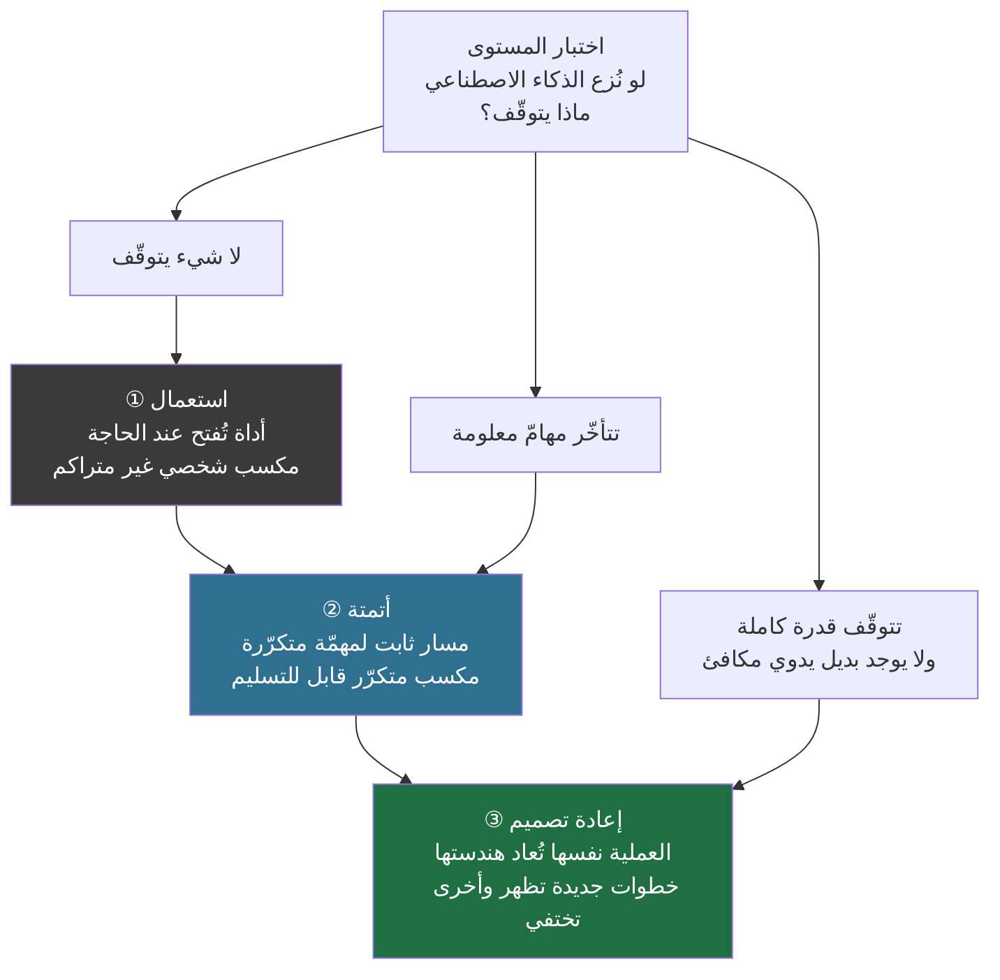
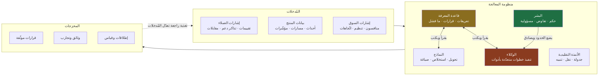
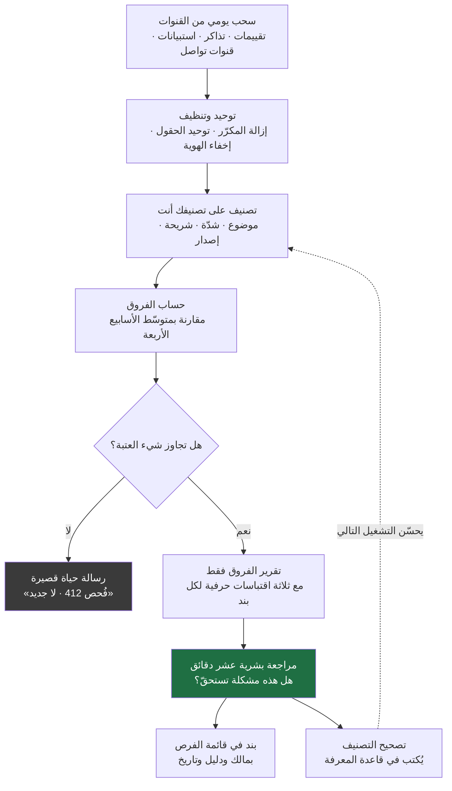
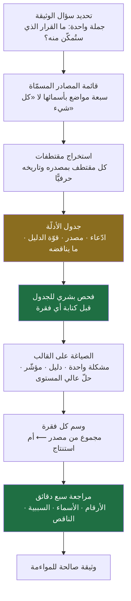
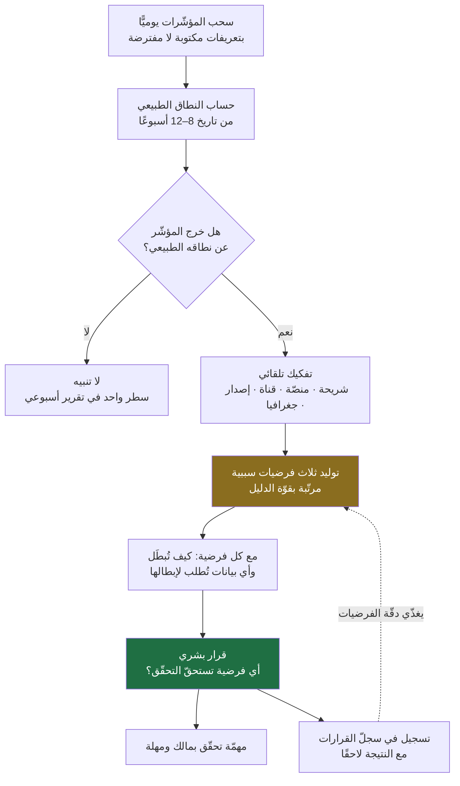
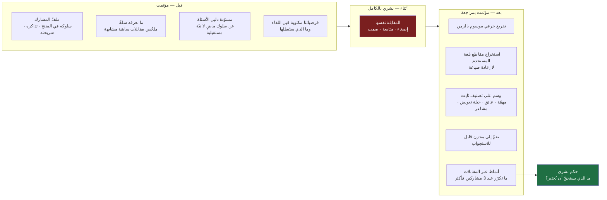
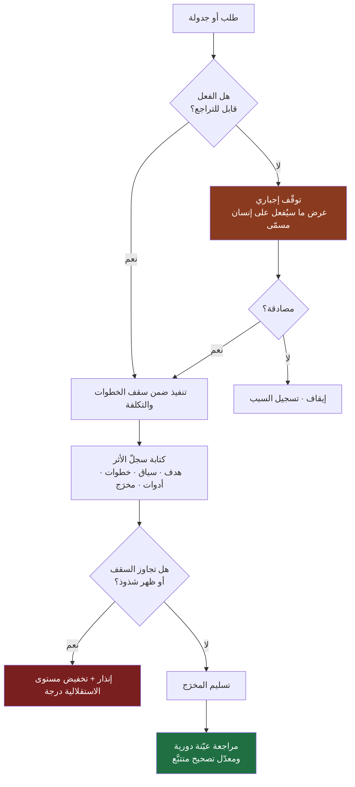
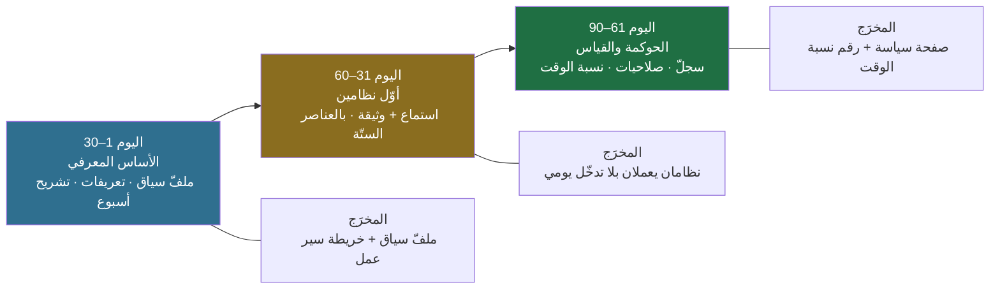

> [!info] الفصل 09 · إدارة المنتج في عصر الذكاء الاصطناعي
> **ماذا ستتعلّم:** كيف **تُصمَّم أنظمة عمل** يشترك فيها بشر ووكلاء، لا كيف تُستعمل أداة. أجاب [[04 - الذكاء الاصطناعي ومدير المنتج|الفصل الرابع]] عن سؤال «أي **مهمّة** تُفوَّض وبأي مستوى إشراف»؛ وهذا الفصل يقف على كتفه ويسأل سؤالًا هندسيًّا مختلفًا: **إذا كانت المهامّ الآن قابلة للتفويض فرادى، فكيف تُركَّب في نظام يعمل من نفسه؟** ستتعلّم تشريح أي سير عمل (`Workflow`) إلى ستّة عناصر لا يصحّ نظام بدونها، وستبني معي **أربعة أنظمة كاملة قابلة للتنفيذ هذا الشهر** (استماع مستمرّ لصوت العميل · إعداد وثيقة من مصادر متفرّقة · مراقبة مؤشّرات تقترح فرضية سببية · تحضير مقابلة مستخدم وتحليلها)، ثم **حوكمة الوكلاء** (الصلاحيات، وسقف الخطوات، وسجلّ الأثر، والتراجع، ومن يتحمّل الخطأ)، ثم **إدارة المعرفة كأصل** تصلح للبشر وللوكلاء معًا — وأين تفشل هذه الفكرة. وستواجه السؤال الصعب الذي يقرّر إن كان هذا الفصل نافعًا أم زخرفة: **الوقت الذي حرّرته الأتمتة، إلى أين ذهب فعلًا؟** وتخرج بمسار تسعين يومًا ينقلك من مستخدم أدوات إلى مصمّم أنظمة.

# الفصل 09 — مدير المنتج في عصر الذكاء الاصطناعي (AI-Native)

**من مدير يكتب المتطلّبات… إلى مهندس يصمّم أنظمة العمل**

## 🎯 أهداف التعلّم

- **تعريف `AI-Native` تعريفًا تشغيليًّا قابلًا للاختبار** — لا شعارًا — والتمييز بين ثلاثة مستويات نضج: استعمال أداة، وأتمتة مهمّة، وإعادة تصميم النظام؛ وتحديد موقع فريقك على هذا السلّم بدليل لا بانطباع.
- **تشريح أي سير عمل (`Workflow`) إلى ستّة عناصر** — المُدخل · الخطوات · موقف الإنسان · معيار القبول · وضع الفشل · المالك — ورفض أي «نظام» ينقصه عنصر منها.
- **تصميم نظام استماع مستمرّ لصوت العميل** يحوّل آلاف الإشارات المتفرّقة إلى قائمة فرص مرتّبة أسبوعيًّا، مع ضبط ما يجب أن يبقى بشريًّا فيه.
- **تصميم نظام إعداد وثيقة من مصادر متفرّقة** يفصل بين ما جُمِع وما استُنتج، ويجعل الفحص أرخص من إعادة الكتابة.
- **تصميم نظام مراقبة مؤشّرات** ينبّه عند الانحراف الحقيقي لا عند كل تذبذب، ويقترح **فرضيات سببية متعدّدة** قابلة للإبطال بدل تفسير واحد مريح.
- **تصميم نظام تحضير مقابلة مستخدم وتحليلها** يحافظ على لغة المستخدم الحرفية ولا يسمح للنموذج بأن يُجري المقابلة أو يستنتج مكانها.
- **بناء حوكمة عملية للوكلاء**: مصفوفة صلاحيات، وسقف خطوات وتكلفة، ونقاط توقّف إجبارية، و**سجلّ أثر** (`audit trail`) قابل للقراءة، ومسار تراجع، وإسناد صريح للمسؤولية.
- **بناء قاعدة معرفة صالحة للبشر وللوكلاء معًا** (مصدر وحيد للحقيقة · توثيق ككود · استرجاع معزَّز)، وتشخيص **فشلها الأخطر**: المعرفة القديمة التي تُسمّم المخرَجات بثقة.
- **قياس إعادة توزيع وقت مدير المنتج بالساعات** قبل وبعد، وتحليل أين يذهب الوقت المحرَّر فعلًا، وتحديد ما يجب أن **تفعله المؤسّسة** لكي يُصان هذا الوقت بدل أن يُبتلَع.
- **تحديد الحدّ المهني الصريح**: ما الذي لا يجوز أتمتته حتى لو أمكن تقنيًّا — الحكم على قيمة مشكلة، والوعد لصاحب مصلحة، والتقييم البشري، والقرار الأخلاقي — وتبرير المنع بحجّة بنيوية لا عاطفية.
- **تشغيل مسار تعلّم من تسعين يومًا** ينقل الممارس من مستخدم أدوات إلى مصمّم أنظمة، بمخرَجات محدّدة لكل ثلاثين يومًا.
- **عرض الحجّة المضادّة بقوّتها الكاملة**: هل «مدير المنتج مصمّم أنظمة» توصيف حقيقي، أم تضخيم لغوي لِما هو في جوهره استعمال أدوات؟

## القسم الأول: تغيّر السؤال المركزي، لا الإجابة عنه

عشرين عامًا تقريبًا، كان سؤال مدير المنتج المركزي سؤالًا واحدًا يُعاد صوغه بألف طريقة: **كيف نجعل هذا الفريق يبني المنتج الصحيح؟** كل ما تعلّمناه — الاكتشاف، وترتيب الأولويات، والوثائق، والمؤشّرات، والمواءمة — كان محاولات مختلفة للإجابة عن هذا السؤال، وكانت وحدة العمل فيه ثابتة: **مجموعة من البشر** يتفقون على شيء ثم ينفّذونه.

والسؤال اليوم صار أدقّ بدرجة واحدة، وهذه الدرجة تغيّر كل شيء عمليًّا: **كيف نجعل البشر والذكاء الاصطناعي يعملون معًا لبناء المنتج الصحيح؟**

لاحظ أن الجزء الثاني من السؤال لم يتغيّر حرفًا: «المنتج الصحيح» ما زال هو الغاية، وتحديدُ ما هو صحيح ما زال حكمًا بشريًّا كما بيّن [[01 - لماذا لا يزال مدير المنتج أهم من أي وقت مضى|الفصل الأول]]، ولم يُنقَص من مسؤوليتك عنه شيء كما فصّل [[04 - الذكاء الاصطناعي ومدير المنتج|الفصل الرابع]]. المتغيّر هو **تركيبة الفاعلين**: صار مدير المنتج يقود منظومة تتكوّن من بشر، ونماذج لغوية، وأدوات أتمتة، ووكلاء ينفّذون خطوات، وقواعد معرفة، ومنصّات تطوير ذكية. أي أنه لم يعد يدير **مشروعًا برمجيًّا**، بل يدير **منظومة إنتاج معرفي**.

والفرق بين التوصيفين ليس بلاغيًّا. المشروع البرمجي له نطاق وموعد وفريق ثابت، وأداتك فيه هي الخطّة. أمّا منظومة الإنتاج المعرفي فلها **مُدخلات** (إشارات من السوق والعملاء والبيانات) و**عمليات تحويل** (تلخيص، تصنيف، ربط، صياغة، فحص) و**مخرَجات** (قرارات، وثائق، تجارب، إطلاقات) و**حلقات تغذية راجعة** تعدّل المُدخلات التالية. وأداتك فيها ليست الخطّة، بل **التصميم**: كيف تتدفّق المعلومة، وأين تتوقّف، ومن يفحصها، وماذا يحدث حين تكون خاطئة.

> [!quote] من الويبينار
> وُصف هذا الانتقال في الجلسة من زاوية عملية جدًّا حين شُرح كيف يُبنى العمل قبل النمذجة بالكود:
> *"...what I do and I build the PRD — what is the problem and why is it priority, aligned with stakeholders. **I build the workflow diagrams to help me and use the workflow of what this product needs to do.** Then I have any clarity when I write the prompt."*
>
> **الترجمة:** «…ما أفعله أنني أبني `PRD`: ما المشكلة، ولماذا هي أولوية، بمواءمة مع أصحاب المصلحة. ثم **أبني مخطّطات سير العمل لتساعدني، وأستعمل سير العمل الذي يحتاج هذا المنتج أن يؤدّيه**. وعندها يكون لديّ وضوح حين أكتب الأمر (`Prompt`).»
>
> والترتيب هنا هو بيت القصيد: **الوضوح لا يأتي من صياغة الأمر، بل من رسم سير العمل قبله.** من يبدأ من الأمر يكون قد قفز فوق التصميم إلى التنفيذ، وهذا بالضبط ما يفعله أكثر مستخدمي الأدوات.

### مثال يوميّ يوضّح الفرق

خذ حالة مألوفة: وصل إلى مدير المنتج خمسمئة تعليق جديد على المتجر خلال أسبوع.

**الطريقة القديمة:** يفتح الملفّ، ويقرأ، ويلوّن، وينسخ في جدول بيانات، ويحاول أن يمسك نمطًا. وهذه ليست عملًا رديئًا؛ هي عمل حقيقي، لكنها تستهلك يومًا كاملًا وتُنتج تصنيفًا يعتمد على انتباهه في الساعة السابعة مساءً.

**الطريقة الأولى المستعملة اليوم (وهي ليست `AI-Native` بعد):** يلصق التعليقات في نموذج ويطلب: «استخرج أكثر عشر مشكلات تكرارًا، صنّفها حسب تأثيرها على المستخدمين الجدد، وأعطني أمثلة حرفية من كل فئة.» فيحصل على تقرير أوّلي في دقائق، ثم **يبدأ هو في التفكير**. وهذا مكسب حقيقي: لم يتّخذ النموذج قرارًا، لكنه أزال العمل اليدوي وأعاد إليه الساعات.

**الطريقة `AI-Native`:** لا يفعل شيئًا من هذا. لأنه **بنى قبل شهر نظامًا** يسحب التعليقات كل صباح، ويصنّفها على تصنيف حدّده هو بنفسه، ويقارن نسب هذا الأسبوع بالأسابيع الأربعة السابقة، ويرسل له في السابعة صباحًا **الفروق فقط**: ما الفئة التي ارتفعت أكثر من عتبة، وما الشكوى الجديدة التي لم تكن موجودة، ومع كل واحدة ثلاثة اقتباسات حرفية. فيقضي هو عشر دقائق في القراءة، ويصرف اليوم في **الجزء الذي لا يُفوَّض**: هل هذه المشكلة تستحقّ ربعًا من وقت الفريق؟

الفرق بين الثانية والثالثة ليس في «كمّية الذكاء الاصطناعي»، بل في أن الثانية **حدث** يقع حين يتذكّر، والثالثة **نظام** يقع سواء تذكّر أم لا. والأنظمة تتراكم؛ والأحداث لا تتراكم.

### إعادة تعريف القيمة الشخصية

وهذا يقودنا إلى الجملة التي تلخّص الفصل كلّه، وهي في الوقت نفسه أكثر جمله عرضةً لإساءة الفهم:

**كانت قيمة مدير المنتج تُقاس بما ينجزه بنفسه، وصارت تُقاس بما يستطيع أن يجعل النظام كلّه ينجزه.**

وإساءة الفهم المتوقّعة أن يُقرأ هذا بوصفه دعوة إلى **التخلّي**: أن تصير مديرًا يوزّع المهامّ على الأدوات ثم ينتظر. وهو عكس المقصود تمامًا. لأن **تصميم النظام عمل أصعب من تنفيذ المهمّة**، لا أسهل منه: أن تصف مخرَجًا بدقّة، وتحدّد معيار قبوله، وتتوقّع أوضاع فشله، وتقرّر أين يقف الإنسان، وتقيس أثره — هذا كلّه عمل هندسي يتطلّب فهمًا أعمق للمهمّة ممّا يتطلّبه أداؤها يدويًّا. **من لم يكتب `PRD` جيّدًا بيده، لن يصمّم نظامًا يُنتج `PRD` جيّدًا.**

> [!info] إضافة مرجعية
> هذا المعنى ليس جديدًا على أدبيات الإدارة؛ الجديد هو أنه صار متاحًا لفرد لا لمؤسّسة. فقد ميّز **دبليو إدواردز ديمنغ** بين تحسين الأداء داخل النظام وتحسين النظام نفسه، وشدّد على أن الجزء الأكبر من التباين في النتائج يعود إلى **النظام** لا إلى اجتهاد الأفراد داخله — ومن هنا عبارته المشهورة عن أن الناس يعملون داخل نظام، ووظيفة المدير أن يعمل **على** النظام.
>
> والصياغة الحديثة الأقرب إلى عملنا نجدها في أدبيات هندسة الإنتاجية تحت اسم **العمل الكادح** (`Toil`): العمل اليدوي المتكرّر القابل للأتمتة، الذي ينمو خطّيًّا مع حجم الخدمة ولا يضيف قيمة دائمة. والقاعدة المعروفة في أدبيات [[SRE|هندسة موثوقية الموقع]] أن يُحدَّد له سقف من وقت الفريق، وأن يُعامل تجاوزه بوصفه **خللًا في النظام** لا نقصًا في الاجتهاد. وترجمة ذلك إلى عملنا مباشرة: **إذا تكرّرت مهمّة ثلاث مرّات بالطريقة نفسها، فهي عيب في تصميم عملك لا بند في قائمة مهامّك.**

## القسم الثاني: ما معنى `AI-Native` بالضبط؟ ثلاثة مستويات لا مستوى واحد

مصطلح `AI-Native` يُستعمل اليوم استعمالًا فضفاضًا إلى حدّ يفقده معناه: تصف به الشركات نفسها بمجرّد أن تشترك في أداة. ولكي يكون المصطلح نافعًا، يجب أن يكون **قابلًا للنفي**: أن نستطيع أن نقول عن فريق بعينه «هذا ليس `AI-Native`» ونثبت ذلك.

**التعريف التشغيلي:** أن يُصمَّم العمل **من البداية** على أن الذكاء الاصطناعي **جزء أساسي من تركيبة الفريق**، لا أداة إضافية تُستدعى عند الحاجة. والاختبار الحاسم بسيط: **لو نُزع الذكاء الاصطناعي من عملك اليوم، ماذا يتوقّف؟** إن كان الجواب «لا شيء، سأعود إلى ما كنت أفعله وسأتأخّر قليلًا»، فأنت مستخدم أدوات. وإن كان الجواب «تتوقّف ثلاثة أنظمة، ولن أعرف ماذا يقول العملاء هذا الأسبوع أصلًا»، فقد صار جزءًا من البنية.

والتشبيه الأدقّ هو الفرق بين شركتين في موجة الرقمنة: الأولى استبدلت الورق بملفّات `PDF` — فبقيت العملية كما هي، والتوقيع ما زال يمرّ على أربعة مكاتب، وإنما صار الملفّ يُرسل بالبريد بدل أن يُحمل باليد. والثانية **أعادت تصميم العملية** على افتراض أن المستند رقمي: فألغت الأربعة مكاتب، واستبدلت بها قاعدة صلاحيات، وأضافت سجلًّا آليًّا. الأولى استبدلت **أداة**، والثانية غيّرت **التفكير**. وأغلب ما يُسمّى اليوم تبنّيًا للذكاء الاصطناعي هو، بلغة هذا التشبيه، ورقٌ صار `PDF`.

### سلّم النضج الثلاثي

| المستوى | ما يحدث فعلًا | العلامة الفارقة | حدّه |
|---|---|---|---|
| **① الاستعمال** (`AI-Assisted`) | يفتح الممارس أداة عند الحاجة، ويلصق، ويأخذ المخرَج | المكسب **شخصي وغير متراكم**؛ يختفي بغياب الشخص أو نسيانه | لا أثر مؤسّسي؛ ولا تتحسّن الجودة مع الوقت لأن لا شيء يُسجَّل |
| **② الأتمتة** (`AI-Automated`) | تُربط مهمّة متكرّرة بمسار ثابت يعمل بلا تدخّل يومي | المكسب **متكرّر** ويظهر في الوقت؛ ويمكن تسليمه لغيرك | المهامّ مؤتمتة والعملية كما هي؛ وقد تُؤتمت مهمّة كان ينبغي حذفها |
| **③ إعادة التصميم** (`AI-Native`) | تُعاد هندسة العملية نفسها على افتراض وجود قدرة توليد واسترجاع رخيصة | يظهر في العملية **خطوات لم تكن ممكنة** أصلًا، وتختفي خطوات كانت ضرورية | يتطلّب صلاحيات وبيانات وحوكمة؛ وهو أبطأ في البداية وأعلى كلفة |

والفرق بين ② و③ هو الذي يستحقّ الوقوف، لأنه موضع أكثر الالتباس. **الأتمتة تسأل: كيف أُنجز هذه الخطوة أسرع؟ وإعادة التصميم تسأل: هل ينبغي أن توجد هذه الخطوة؟**

مثال ملموس: فريق يعقد كل خميس اجتماعًا مدّته ساعتان لمراجعة التغذية الراجعة الواردة. الأتمتة تعني أن يُولَّد ملخّص للتعليقات قبل الاجتماع فيقصر إلى ساعة. إعادة التصميم تعني أن **يُلغى الاجتماع** ويُستبدل به تقرير آلي يومي بفروق فقط، ونصف ساعة أسبوعيًّا **لقرار واحد**: أي فرصة تدخل مسار الاكتشاف. الأولى وفّرت ساعة؛ الثانية غيّرت وحدة العمل من «مراجعة» إلى «قرار».

> [!warning] المستوى الثالث ليس دائمًا الصحيح
> يقرأ كثيرون سلّم النضج بوصفه سلّم **فضيلة**: كلّما صعدت كنت أفضل. وهذا خطأ مكلف. المستوى الثالث يتطلّب صلاحيات على أنظمة الإنتاج، وبيانات نظيفة، وحوكمة مكتوبة، وقدرة على تحمّل خطأ يقع بلا مراجعة. فإن لم تتوفّر هذه الشروط، فالصعود إليه **يزيد الخطر ولا يزيد القيمة**.
>
> والقاعدة العملية: **ابقَ في المستوى الثاني في كل ما يمسّ عميلًا أو مالًا أو حقًّا، وارتقِ إلى الثالث فيما لا يخرج أثره عن دائرتك.** وأغلب المكسب المتاح لمدير المنتج اليوم موجود في المستوى الثاني، لا في الثالث — وهذه حقيقة غير جذّابة في العروض التقديمية، وهي مع ذلك حقيقة.

## القسم الثالث: منظومة الإنتاج المعرفي — من هم الفاعلون؟

قبل أن نصمّم أنظمة، يجب أن نسمّي مكوّناتها. ومدير المنتج اليوم يقف على رأس منظومة من ستّة أنواع من الفاعلين، لكل نوع منها قدرة مختلفة وكلفة مختلفة ونمط فشل مختلف.

واقرأ في المخطّط ثلاث علاقات لا مكوّنات:

**① قاعدة المعرفة في القلب لا على الهامش.** لاحظ أنها الوحيدة الموصولة بسهم **ذي اتّجاهين** بالنماذج وبالوكلاء. لأن النظام الذي يقرأ من قاعدة معرفة ولا يكتب فيها يبقى في مكانه إلى الأبد: كل تشغيل يبدأ من الصفر، وكل خطأ يتكرّر. وهذه أكثر نقطة يُخطئ فيها من يبني أنظمته الأولى.

**② البشر يضعون الحدود ويصادقون، لا ينفّذون.** السهم من الإنسان إلى الوكيل ليس سهم «يشتغل معه»، بل سهم **سلطة**: يحدّد ما يُسمح به وما لا يُسمح، ويصادق عند نقاط التوقّف. وهذا هو موضع مدير المنتج في الرسم كلّه.

**③ الحلقة الراجعة تغلق الدائرة أو لا نظام أصلًا.** السهم المنقّط من المخرَجات إلى المُدخلات هو الذي يحوّل سلسلة خطوات إلى **نظام**. سلسلة بلا حلقة راجعة اسمها الدقيق: خطّ إنتاج. وخطوط الإنتاج تنتج المزيد؛ الأنظمة تتحسّن.

### لماذا يهمّ التمييز بين «الوكيل» و«الأتمتة التقليدية»؟

لأن الخلط بينهما هو أكثر ما يُهدر من المال والوقت في هذا الباب. فصّل [[04 - الذكاء الاصطناعي ومدير المنتج|الفصل الرابع]] الفرق البنيوي بينهما (من يملك حلقة التحكّم)، ولن نعيده. لكن ما يلزمنا هنا هو **قاعدة الاختيار عند التصميم**، وهي قاعدة تُغني عن نقاش طويل:

| صفة الخطوة | استعمل | السبب |
|---|---|---|
| ثابتة، معلومة الترتيب، لا قرار فيها | **أتمتة تقليدية** | أرخص، وأسرع، وقابلة للتنبّؤ، ولا تهلوس |
| ثابتة الترتيب، فيها **تحويل لغوي** | **أتمتة + نموذج في خطوة واحدة** | تحصل على الصياغة بلا فوضى الاستقلالية |
| متعدّدة الطبقات، وفي كل طبقة **قرار يغيّر الخطوة التالية** | **نمط وكيلي** | هذا بالضبط شرط صلاحيته |
| قرار واحد بعواقب | **إنسان** | لا يُفوَّض بحال |

> [!quote] من الويبينار
> والشرط الذي يجعل النمط الوكيلي مناسبًا قيل صراحةً، وهو معيار تصميمي دقيق لا حماسة:
> *"...when you have **workflows** and there's in these workflows there's **a lot of levels** and a lot of levels where **you need decisions in each levels**... there's lots of different decisions that will lead to different outcomes — this is where potentially agentic AI can really help."*
>
> **الترجمة:** «…حين تكون لديك **مسارات عمل**، وفي هذه المسارات **طبقات كثيرة**، وفي كل طبقة **تحتاج إلى قرار**… وهناك قرارات مختلفة تؤدّي إلى نتائج مختلفة — فهنا يمكن للذكاء الاصطناعي الوكيلي أن يساعد فعلًا.»
>
> والاستعمال الصحيح لهذا المعيار **عكسيّ**: لا تسأل «أين أضع وكيلًا؟» بل ارسم المسار أوّلًا، وعُدّ نقاط القرار فيه. فإن كانت صفرًا أو واحدة، فأنت لا تحتاج وكيلًا مهما بدا جذّابًا.

## القسم الرابع: ما `Workflow` أصلًا؟ تشريح لا تعريف

كلمة «سير عمل» تُستعمل في اجتماعات المنتج بوصفها مرادفًا مهذّبًا لكلمة «طريقة». وهي في السياق الهندسي شيء أضيق وأنفع: **سلسلة الخطوات التي تتحوّل بها الفكرة أو الإشارة إلى نتيجة، مع تحديد ما يعبر بين كل خطوتين.**

وأوضح مثال هو المسار الذي يمرّ به صوت العميل في أي فريق منتج:

والملاحظة التي تُغني عن نصف هذا الفصل: **أغلب هذه الخطوات كانت يدوية بالكامل قبل ثلاث سنوات، وأغلبها اليوم قابل للأتمتة — ما عدا الخطوتين الخضراوين.** والخطوتان الخضراوان هما بالضبط ما وصفه [[04 - الذكاء الاصطناعي ومدير المنتج|الفصل الرابع]] بأنه لا يُفوَّض: الحكم على قيمة المشكلة، وقرار البناء.

وهنا تظهر النتيجة العملية التي يقوم عليها الفصل كلّه: **إذا كانت سبع خطوات من تسع قابلة للأتمتة، فإن عملك الحقيقي انتقل من «تنفيذ الخطوات» إلى «تصميم الوصلات بينها».** أي: ماذا يعبر من ③ إلى ④ بالضبط؟ وبأي شكل؟ وما الذي يوقف العبور؟ ومن يُخطَر حين يتوقّف؟

### السؤال الذي يغيّر عادة التفكير

الانتقال من منفّذ إلى مصمّم يبدأ من **تغيير صيغة السؤال الذي تطرحه على نفسك عند كل مهمّة**. وهذا التغيير أرخص تدخّل في هذا الفصل، وأعلاه أثرًا:

| بدل أن تسأل | اسأل |
|---|---|
| «كيف أكتب هذا المستند؟» | «كيف أصمّم نظامًا يجعل كتابته تتمّ تلقائيًّا، فأراجعه فقط؟» |
| «كيف أحلّل هذه البيانات؟» | «كيف أبني نظامًا يحلّلها باستمرار ويرسل لي **المهمّ فقط**؟» |
| «كيف ألخّص هذه المقابلة؟» | «كيف أجعل كل مقابلة تدخل مخزنًا واحدًا قابلًا للاستجواب لاحقًا؟» |
| «كيف أتابع هذه الخيوط المعلّقة؟» | «كيف أجعل المتابعة تحدث بلا أن أتذكّرها؟» |
| «كيف أُعدّ تقرير الربع؟» | «ما البيانات التي لو كانت مسجَّلة طوال الربع لجعلت التقرير مخرَجًا لا مشروعًا؟» |

ولاحظ نمطًا مشتركًا في العمود الأيمن: كل الأسئلة تنقل التدخّل من **لحظة الحاجة** إلى **ما قبلها**. وهذه هي العلامة السلوكية الوحيدة الموثوقة على أن شخصًا صار يفكّر بالأنظمة: أنه يعمل على الشيء **قبل أن يحتاجه**، لا حين يحتاجه.

> [!info] إضافة مرجعية
> التفكير بالأنظمة (`Systems Thinking`) حقل قائم بذاته، وله ثلاثة مفاهيم تنفع مدير المنتج تحديدًا:
>
> **① نقاط الرفع** (`Leverage Points`) — كما عرضتها **دونيلا ميدوز** في مقالها الشهير: ليست كل التدخّلات في النظام متساوية الأثر. الأضعف أثرًا هو تعديل الأرقام والمعايير، والأقوى هو تغيير **تدفّق المعلومات** وقواعد النظام وأهدافه. وترجمتها هنا مباشرة: إضافة تقرير جديد تدخّلٌ ضعيف، أمّا **تغيير من يرى أي معلومة ومتى** فتدخّل قوي.
>
> **② تأخّر التغذية الراجعة** — النظام الذي تصل نتيجته متأخّرة يُنتج تذبذبًا وإفراطًا في التصحيح. وفي عملنا: الفريق الذي يعرف أثر قراره بعد ستّة أشهر سيقرّر بالانطباع لا بالتعلّم، مهما بلغت جودة أدواته.
>
> **③ القيد الحاكم** — من [[Theory of Constraints|نظرية القيود]] لإلياهو غولدرات: تحسين ما ليس قيدًا لا يحسّن المخرَج. وهذه أهمّ ملاحظة عملية قبل أن تبني أي نظام: **إن كان القيد الحقيقي في فريقك هو بطء اتّخاذ القرار، فأتمتة كتابة الوثائق ستزيد الازدحام أمام القرار ولن تحرّك شيئًا.** ابدأ بتشخيص القيد، لا بأتمتة ما تجيده.

## القسم الخامس: تشريح أي نظام إلى ستّة عناصر

كل ما سيأتي في الأقسام التالية يقوم على قالب واحد. وهذا القالب هو أنفع ما في هذا الفصل، لأنه يحوّل «فكرة أتمتة» إلى **مواصفة قابلة للتنفيذ والفحص والتسليم**. وأي نظام ينقصه عنصر من هذه الستّة سيفشل بطريقة يمكن التنبّؤ بها من الآن.

| العنصر | السؤال الذي يجيب عنه | ماذا يحدث إن غاب |
|---|---|---|
| **① المُدخل** | ما الذي يبدأ التشغيل، ومن أي مصدر، وبأي وتيرة؟ | نظام يعمل على بيانات ناقصة أو مكرّرة، ولا أحد يعرف السبب |
| **② الخطوات** | ما التحويلات بالترتيب، وما الذي يعبر بين كل خطوتين؟ | خطوات ضمنية في رأس صاحبها؛ لا يمكن تسليم النظام ولا إصلاحه |
| **③ موقف الإنسان** | أين نقطة التوقّف الإجبارية، ومن صاحبها؟ | إمّا مراجعة صورية بلا فحص، وإمّا تنفيذ بلا مسؤول |
| **④ معيار القبول** | كيف نعرف أن المخرَج صالح، **في أقلّ من خمس دقائق**؟ | تراكم مخرَجات لم يفحصها أحد، واكتشاف الخلل بعد شهور |
| **⑤ وضع الفشل** | ماذا يحدث حين يفشل النظام أو يتأخّر أو يُنتج رديئًا؟ | صمت. وأخطر أوضاع الفشل هو الذي لا يُصدر صوتًا |
| **⑥ المالك والمراجعة** | من يملكه، ومتى يُراجَع، وما إشارة إيقافه؟ | نظام يتيم يعمل سنة على تعريف قديم ويسمّم القرارات |

> [!warning] العنصر الخامس هو الذي يفصل الهاوي عن المحترف
> أغلب من يبني نظامه الأول يصمّم **مسار النجاح فقط**. والنتيجة نمط فشل واحد متكرّر: النظام يتوقّف بهدوء — ينتهي مفتاح، أو يتغيّر اسم حقل، أو يمتلئ حدّ استعمال — ولا يلاحظ أحد لأن غياب رسالة لا يلفت النظر كما يلفته وصول رسالة خاطئة.
>
> **القاعدة: كل نظام يجب أن يُصدر إشارة حياة.** إن لم يكن هناك ما يُبلَّغ عنه، فليقل «فحصتُ 412 تعليقًا، ولا جديد فوق العتبة». الرسالة الفارغة المتعمَّدة أرخص وسيلة اكتُشفت لمنع الفشل الصامت.

وأضف إلى ذلك قاعدة سابعة غير مذكورة في الجدول لأنها تعلو عليه: **لا تبنِ نظامًا لمهمّة لم تؤدّها بيدك عشر مرّات على الأقلّ.** لأنك قبل ذلك لا تملك المعرفة الضمنية التي تصنع معيار القبول: أين تكذب البيانات، وما الحالات الشاذّة، وما الذي يبدو صحيحًا وهو خاطئ. **النظام يُشفّر خبرتك؛ ومن لا خبرة له يُشفّر فراغًا ويسمّيه أتمتة.**

## القسم السادس: النظام الأوّل — الاستماع المستمرّ لصوت العميل

هذا أوّل نظام ينبغي أن يبنيه أي مدير منتج، لسبب واحد: **مُدخله متوفّر دائمًا، وكلفة خطئه منخفضة، وقيمته تظهر في الأسبوع الأول.** وهو أيضًا النظام الذي يُظهر بأوضح صورة الفرق بين «تلخيص» و«استماع».

### المواصفة الكاملة

**① المُدخل.** كل قناة يصل منها كلام العميل، مسحوبة يوميًّا: تقييمات المتجرين، وتذاكر الدعم المغلقة أمس، ورسائل قنوات التواصل، ونتائج استبيان [[NPS|صافي نقاط الترويج]] المفتوحة، ومحادثات المبيعات الخاسرة إن أمكن. والشرط الحاسم في هذا العنصر: **أن يُحفظ لكل إشارة سياقها** — التاريخ، والقناة، وإصدار التطبيق، ونوع الجهاز، وشريحة المستخدم إن عُرفت. لأن الإشارة بلا سياق تصلح للتلخيص ولا تصلح للقرار.

**② الخطوات.**

**③ أين يقف الإنسان.** في نقطة واحدة فقط، وهي `H1`: **الحكم على ما إذا كانت الإشارة مشكلة تستحقّ الاستثمار.** وما قبلها كلّه مؤتمت، وما بعدها يتبع مسار الاكتشاف المعتاد. وهذا مثال نموذجي على النمط الذي وصفه [[04 - الذكاء الاصطناعي ومدير المنتج|الفصل الرابع]] بـ`Human on the loop`: النظام ينفّذ، والإنسان يراقب ويتدخّل عند نقطة محدّدة.

**④ معيار القبول.** أربعة شروط، كلّها قابلة للفحص في دقائق:
- لكل موضوع **نسبة مئوية وعدد مطلق** معًا (النسبة وحدها تخدع حين ينخفض إجمالي التعليقات).
- لكل موضوع **ثلاثة اقتباسات حرفية بلغة المستخدم**، لا إعادة صياغة. وهذا أهمّ شرط في النظام كلّه، وسيأتي بيان سببه.
- **المواضيع النادرة تُذكر منفصلة**، لا تُبتلع في فئة «أخرى». فالإشارة الضعيفة هي غالبًا بداية الفرصة.
- **مصدر كل رقم قابل للفتح**: ملفّ أو رابط أو استعلام، لا رقم بلا نسب.

**⑤ وضع الفشل.** ثلاثة أوضاع متوقّعة، ولكلٍّ علاج مكتوب مسبقًا:
- **الفشل الصامت:** انقطعت قناة (تغيّر مفتاح، تعطّل مصدر) فانخفض العدد فجأة. **العلاج:** تنبيه صريح حين يقلّ عدد الإشارات عن نصف متوسّط الأسبوعين الماضيين — لا تنتظر أن تلاحظ بنفسك.
- **الانجراف التصنيفي:** يبدأ النموذج تدريجيًّا في وضع أشياء مختلفة تحت الفئة نفسها. **العلاج:** فحص عيّنة عشوائية من ثلاثين تعليقًا شهريًّا ومقارنتها بتصنيفك أنت، وتسجيل نسبة الاتّفاق كرقم متتبَّع.
- **التسميم بالضجيج:** حملة تسويقية أو عطل عابر يغرق النظام بموضوع واحد فيخفي كل شيء آخر. **العلاج:** فصل بند «حدث استثنائي» في التقرير، وحساب الفروق **باستثنائه**.

**⑥ المالك والمراجعة.** مالكه مدير المنتج نفسه — لا فريق البيانات. ويُراجع كل ربع بسؤالين: هل تغيّر تصنيفنا للمشكلات؟ وهل ما زال أحد يتّخذ قرارًا بناءً على مخرَجه؟ فإن كان الجواب الثاني «لا»، فالنظام يُوقَف لا يُحسَّن.

### لماذا الاقتباس الحرفي شرط لا تحسين؟

هذه النقطة تستحقّ قسمًا صغيرًا لأنها الأكثر إهمالًا. حين يلخّص النموذج مئة شكوى في جملة «يواجه المستخدمون صعوبة في عملية التسجيل»، فقد أنجز عملًا صحيحًا وأتلف الأثمن فيما بين يديه: **لغة المستخدم نفسها**.

لأن المستخدم لا يقول «أواجه صعوبة في عملية التسجيل». يقول: «كل ما أدخل يطلب رمز والرمز ما يجي إلا بعد ما أطلع من التطبيق». وفي هذه الجملة الواحدة **ثلاث معلومات تصميمية** لا توجد في الملخّص: أن الرمز يتأخّر، وأن المستخدم يضطرّ إلى مغادرة التطبيق، وأن المشكلة متكرّرة لا عارضة. والملخّص أضاعها كلّها لأنه صعد إلى مستوى تجريد أعلى ممّا ينبغي.

> [!example] كيف يبدو الفرق في تقرير حقيقي
> **الصيغة الرديئة:** «الموضوع الأول: مشكلات في التسجيل — 18% من التعليقات.»
>
> **الصيغة المقبولة:** «الموضوع الأول: **تأخّر رمز التحقّق** — 18% (74 تعليقًا)، مرتفع من 11% في الأسابيع الأربعة السابقة، ومتركّز في مستخدمي مشغّل واحد بحسب ما يذكرونه.
> > «الرمز ما يوصل إلا بعد ما أقفل التطبيق وأفتحه»
> > «صرت أسجّل بالإيميل عشان أتفادى الرسالة»
> > «ثلاث محاولات وما ضبط، خلاص»
>
> لاحظ الفارق العملي: الصيغة الأولى تُنتج اجتماعًا. والثانية تُنتج **فرضية قابلة للاختبار خلال ساعة**: هل التأخّر مرتبط بمشغّل بعينه؟ والاقتباس الثالث وحده يخبرك بشيء لا يظهر في أي مؤشّر: أن المستخدم **تخلّى** بعد ثلاث محاولات، وهذا رقم يمكن قياسه في بيانات المسار.

> [!info] إضافة مرجعية
> ما نبنيه هنا هو نسخة آلية من ممارسة قديمة اسمها **صوت العميل** (`Voice of the Customer`)، وهي في أصلها من أدبيات الجودة. والقيمة التي أضافها الذكاء الاصطناعي إليها ليست السرعة بل **الشمول**: كان الفريق سابقًا يقرأ عيّنة، فيرى ما هو شائع ويعمى عمّا هو نادر. واليوم يمكن معالجة الكلّ، فيصير النادر مرئيًّا لأول مرّة.
>
> ويحسن ربط هذا بمفهوم [[Continuous Discovery|الاكتشاف المستمرّ]] كما عرضته **تيريزا توريس**: أن يكون التواصل مع المستخدم **إيقاعًا أسبوعيًّا** لا مشروعًا فصليًّا. ونظام الاستماع لا يغني عن المقابلات — بل يغيّر وظيفتها: يصير دور المقابلة أن تجيب عن **لماذا** بعد أن أخبرك النظام بـ**ماذا** و**كم**.
>
> **وحدّ هذه الفكرة صريح:** من يشتكي ليس عيّنة ممثّلة. التقييمات تنحاز إلى الغاضبين جدًّا والراضين جدًّا، والصامتون — وهم الأغلبية، وفيهم من تسرّب بلا كلمة — لا يظهرون في هذا النظام أبدًا. فاقرأ مخرَجه دائمًا **مقرونًا ببيانات السلوك**، لا وحده.

## القسم السابع: النظام الثاني — إعداد وثيقة من مصادر متفرّقة

المشكلة التي يحلّها هذا النظام مألوفة إلى حدّ الملل: تحتاج إلى وثيقة (`PRD`، أو ملخّص ربعي، أو ورقة قرار)، والمعلومات اللازمة لها موجودة **كلّها** لكنها موزّعة على سبعة أماكن: قناة محادثة، ولوحة بيانات، ومقابلتان مسجّلتان، وتذاكر دعم، ووثيقة قديمة، ورسالة بريد من المالية، ورأس زميل.

والخطأ الشائع أن يُطلب من النموذج «اكتب لي `PRD` عن كذا» — فيُنتج وثيقة معقولة الشكل، مصدرها **معرفته العامّة** لا مصادرك أنت. والنتيجة وثيقة تصلح لأي شركة، أي لا تصلح لشركتك.

**التصميم الصحيح يقلب الترتيب:** لا تطلب وثيقة، بل **اجمع أوّلًا، وافصل الجمع عن الصياغة**.

### لماذا «جدول الأدلّة» هو قلب النظام؟

لأنه ينقل الفحص من مرحلة يصعب فيها إلى مرحلة يسهل فيها. فحص وثيقة مكتوبة من عشرين صفحة عمل شاقّ: الصياغة السلسة تُخفي الثغرات، والتسلسل المنطقي يجرّك معه. أمّا فحص **جدول** من خمسة عشر صفًّا فعمل ميكانيكي محدود: تنظر إلى عمود «المصدر» فترى أي صفّ فارغ، وتنظر إلى عمود «ما يناقضه» فترى أي ادّعاء لم يُختبر.

| الادّعاء | المصدر | قوّة الدليل | ما يناقضه |
|---|---|---|---|
| «المحاسبون يقضون 3 ساعات شهريًّا في التصدير اليدوي» | 3 مقابلات، مايو | متوسّطة — تقدير ذاتي لا قياس | حساب واحد قال «أقلّ من ساعة» بعد أن غيّر طريقته |
| «طلبات التصدير اليدوي 20 شهريًّا» | تذاكر الدعم، آخر 3 أشهر | قويّة — عدّ فعلي | لا شيء |
| «المنافس يوفّر هذه الميزة» | لقطة شاشة، يونيو | قويّة لكن قد تتقادم | خطّته الأساسية لا تشملها |
| «الميزة سترفع التحويل 15%» | تقدير الفريق | **ضعيفة — لا مصدر** | لا يوجد خطّ أساس مقاس |

انظر إلى الصفّ الأخير. في الوثيقة النثرية سيصير جملة أنيقة: «ونتوقّع أن ترفع الميزة التحويل بنسبة 15%.» وفي الجدول يظهر عاريًا: **رقم بلا مصدر**. والفرق بين المشهدين هو الفرق بين قرار مبنيّ على دليل وقرار مبنيّ على أمنية مصقولة.

> [!warning] الفخّ الأخطر في هذا النظام: الطبقة الثانية من الاستنتاج
> حين يقرأ النموذج مصادرك ويكتب، فهو يُنتج جملًا من نوعين ممزوجين بلا فاصل: جمل **منقولة** من مصادرك، وجمل **مستنتجة** بمنطقه الداخلي. والثانية تبدو مثل الأولى تمامًا، بل تكون غالبًا أفصح.
>
> ولهذا فالخطوة `A6` — **وسم كل فقرة بمصدرها أو باستنتاجها** — ليست ترفًا توثيقيًّا، بل هي الفارق بين وثيقة قابلة للمساءلة ووثيقة تبدو موثوقة. واطلبها صراحةً في كل مرّة: «ضع بعد كل ادّعاء وسمًا: [من المصدر: اسم الملفّ] أو [استنتاج]. وإن لم تجد الادّعاء في المرفقات فقل: غير موجود — ولا تُكمل من معرفتك العامّة.»

> [!quote] من الويبينار
> وقد وُصفت وظيفة `PRD` نفسها في الجلسة بما يجعل هذا النظام مفهومًا: الوثيقة ليست مخرَجًا نصّيًّا، بل هي **حزمة الأسئلة التي إن لم تُجب فلا ينبغي أن تبني**:
> *"PRD tells me **what is the problem? Why is this a priority? What data do we have? What consumer research do we have? What discovery do we have? How is it going to impact the metrics?** If we don't know this, then **we should not be building**."*
>
> **الترجمة:** «الـ`PRD` يخبرني: **ما المشكلة؟ ولماذا هي أولوية؟ وما البيانات التي لدينا؟ وما بحث المستهلك الذي لدينا؟ وما الاكتشاف الذي أجريناه؟ وكيف سيؤثّر هذا على المؤشّرات؟** فإن كنّا لا نعرف هذا، فـ**لا ينبغي أن نبني**.»
>
> والنتيجة التصميمية المباشرة: **نظام إعداد الوثيقة يجب أن يفشل صراحةً إذا لم يجد إجابة لأحد هذه الأسئلة.** لا أن يملأ الفراغ بجملة عامّة. واجعل مخرَجه يقول: «قسم بحث المستهلك: **لا توجد مصادر**» — فهذه أنفع جملة يمكن أن تظهر في مسوّدتك.

وتفصيل بنية `PRD` نفسها موضع [[06 - وثيقة متطلبات المنتج (PRD)|الفصل السادس]]؛ وما يعنينا هنا هو **النظام الذي يُنتجها**، لا الوثيقة.

## القسم الثامن: النظام الثالث — مراقبة المؤشّرات واقتراح الفرضية السببية

هذا أخطر الأنظمة الأربعة وأكثرها قيمة، وأكثرها فشلًا في التطبيق الأول. لأنه يعمل على **الأرقام**، والأرقام تُقنع بسهولة، والتفسير السببي الخاطئ المصوغ بلغة سليمة قد يقود ربعًا كاملًا في الاتّجاه الخطأ.

### المشكلة التي يحلّها

الحالة النموذجية: لديك لوحة بيانات فيها ثلاثون مؤشّرًا. تنظر إليها كل يوم اثنين، فترى أرقامًا تتحرّك صعودًا وهبوطًا، ولا تعرف أيّ حركة تستحقّ الانتباه. فينتهي الأمر بأحد أمرين: إمّا أن تتوقّف عن النظر (وهو الغالب)، أو أن تطارد كل تذبذب فتُنهك فريقك بتحقيقات لا نتيجة لها.

**والنظام الجيّد لا يُريك المؤشّرات؛ يُريك ما تغيّر بما يتجاوز التذبذب المعتاد.**

### ثلاثة شروط تصميمية لا تُساوَم

**① تعريفات المؤشّرات مكتوبة داخل النظام لا في رؤوس الناس.** ما «المستخدم النشط» عندكم بالضبط؟ نافذة سبعة أيام أم ثلاثين؟ يُحتسب بالدخول أم بفعل ذي معنى؟ وهل يشمل الحسابات الداخلية؟ إن لم تكن هذه التعريفات مكتوبة **حرفيًّا** في قاعدة معرفة يقرأها النظام، فسيولّد استعلامًا صحيحًا نحويًّا يجيب عن سؤال غير الذي سألته. وهذا أكثر أخطاء التحليل المولَّد شيوعًا، وأصعبها اكتشافًا لأن الرقم يبدو معقولًا.

**② النطاق الطبيعي قبل التنبيه.** المؤشّر الذي ينخفض 4% ليس بالضرورة حدثًا؛ قد يكون هذا مدى تذبذبه الأسبوعي المعتاد. وأبسط تطبيق عملي هو ما تفعله [[Control Chart|خرائط الضبط]] في أدبيات الجودة: احسب المتوسّط ومدى التباين على ثمانية إلى اثني عشر أسبوعًا، ولا تنبّه إلا عند الخروج عن الحدّ، أو عند اتّجاه متتالٍ في اتّجاه واحد (سبع نقاط متتالية مثلًا). **هذا وحده يقلّل تنبيهاتك إلى العُشر ويرفع صدقيّتها إلى حدّ يجعل الناس تقرؤها.**

**③ ثلاث فرضيات لا واحدة، وكلٌّ منها بطريقة إبطالها.** وهذا هو الشرط الذي يمنع الكارثة. فالنموذج يجيد صناعة سببية سلسة: «انخفض التحويل بسبب التغيير الأخير في صفحة الدفع» — جملة معقولة، ومقنعة، وقد تكون خاطئة تمامًا. والعلاج البنيوي ألّا تسمح له بتفسير واحد أبدًا:

> [!example] مخرَج مقبول من نظام المراقبة
> **الإشارة:** انخفض إتمام التسجيل من 62% إلى 51% خلال ستّة أيام — خارج النطاق الطبيعي (54%–68%).
> **التفكيك:** الانخفاض متركّز في `Android`، وفي المستخدمين الجدد فقط، وفي إصدار التطبيق 7.4، وفي منطقتين جغرافيتين.
>
> **الفرضية أ (الأقوى دليلًا):** عطل في الإصدار 7.4 على `Android`.
> *كيف تُبطَل:* قارن معدّل الإتمام بين 7.3 و7.4 في اليوم نفسه على الجهاز نفسه. إن تساويا، بطلت.
>
> **الفرضية ب:** تأخّر رمز التحقّق لدى مشغّل بعينه في المنطقتين.
> *كيف تُبطَل:* قِس زمن وصول الرمز لكل مشغّل. إن كان متساويًا، بطلت.
>
> **الفرضية ج:** تغيّر مصدر الاكتساب — حملة جلبت شريحة أقلّ نيّة.
> *كيف تُبطَل:* افحص توزيع المصادر قبل وبعد. إن لم يتغيّر، بطلت.
>
> **ما لا يفعله النظام:** لا يقول «السبب هو أ». يقول: «أ هي الأقوى بدليل التركّز في إصدار واحد، **وهذه طريقة إبطالها**.» والفرق أن الأولى تُنهي التفكير، والثانية تبدؤه.

> [!warning] الخطأ الذي يُفسد هذا النظام كلّه
> أن تُسمّى مخرَجاته «تحليلًا» بدل «فرضيات». فبمجرّد أن يُقال في الاجتماع «التحليل يقول إن السبب هو تغيير صفحة الدفع»، يُغلق باب البحث، ويبدأ الفريق في تصحيح شيء قد لا يكون معطوبًا. **اضبط لغة النظام نفسها**: اجعل عنوان كل بند في مخرَجه يبدأ بكلمة «فرضية»، لا «سبب» ولا «تحليل». هذا تدخّل لغوي بحت، وأثره التنظيمي أكبر ممّا يُتوقّع.

> [!info] إضافة مرجعية
> والأساس المنهجي هنا هو التمييز بين الارتباط والسببية، وهو أقدم من هذا كلّه. والقاعدة العملية التي تنفعك: **قبل قبول أي تفسير، اسأل عن ثلاثة أشياء** — هل التغيّر متزامن مع تغيير معروف (نشر، حملة، تحديث خارجي)؟ وهل هو متركّز في شريحة يفسّرها التفسير المقترح أم منتشر في الجميع؟ وهل يوجد **متغيّر ثالث** يفسّر الاثنين معًا؟
>
> ويرتبط بهذا القسم مباشرة مبدأ [[Root Cause Analysis|تحليل السبب الجذري]]، وحدّه المعروف: **أن الوقوف عند أول تفسير معقول هو أشهر أنواع فشله**. وحين يصير التفسير المعقول مجّانيًّا — لأن نموذجًا يولّده في ثانيتين — يصبح هذا الفشل هو الوضع الافتراضي ما لم تُصمَّم ضدّه صراحةً.

## القسم التاسع: النظام الرابع — تحضير مقابلة مستخدم وتحليلها

هذا النظام هو الاختبار الأخلاقي للفصل كلّه. لأنه يقع مباشرةً على حدود ما **لا يُفوَّض**: المقابلة نفسها. وقد قرّر [[04 - الذكاء الاصطناعي ومدير المنتج|الفصل الرابع]] أن إجراء المقابلة لا يُفوَّض بحال، وسبب المنع بنيوي: ما يُفقد ليس النصّ، بل الملاحظة غير اللفظية والقدرة على المتابعة الفورية لِما لم يكن في الخطّة.

**فما الذي يُؤتمت إذن؟** كلّ ما يحيط بالمقابلة، وهو الأكثر استهلاكًا للوقت والأقلّ قيمةً بشريًّا: التحضير، والتفريغ، والوسم، والربط بمقابلات سابقة، واستخراج الأنماط عبر عشرات المقابلات.

### القيمة الحقيقية: المخزن القابل للاستجواب

المكسب الأكبر في هذا النظام ليس في المقابلة الواحدة، بل في **الأربعين مقابلة** التي أجريتها خلال سنتين ثم نُسيت في مجلّد. فالممارسة السائدة أن تُلخَّص كل مقابلة في صفحة، ثم تُقرأ الصفحة مرّة، ثم تُدفن.

والنظام يغيّر هذا جذريًّا: حين تُفرَّغ كل المقابلات وتُوسَم وتُخزَّن بشكل قابل للاسترجاع، يصير بإمكانك أن تسأل سؤالًا لم يكن ممكنًا: **«ما الذي قاله كل من تحدّثنا إليهم عن التسعير خلال السنتين الماضيتين، مرتّبًا بالشريحة؟»** — ويأتيك الجواب باقتباسات حرفية ومصادر. وهذه ليست سرعة؛ هذه **قدرة جديدة** لم تكن متاحة أصلًا، تمامًا كما أن تلخيص مئات آلاف التقييمات ليس نسخة أسرع من القراءة اليدوية بل شيء يستحيل يدويًّا.

> [!warning] ثلاثة حدود صارمة في هذا النظام
> **① لا يُفوَّض تصميم الأسئلة تفويضًا كاملًا.** يمكن للنموذج أن يقترح، لكن مراجعتك إلزامية وصارمة: أي سؤال إيحائي يُحذف، وأي سؤال عن **نيّة مستقبلية** («هل ستستخدم هذه الميزة؟») يُستبدل بسؤال عن **سلوك ماضٍ** («متى آخر مرّة احتجت فيها إلى ذلك؟ ماذا فعلت وقتها؟»). وهذا هو جوهر ما تعلّمه أدبيات مقابلة العملاء منذ [[The Mom Test|اختبار الأم]].
>
> **② لا يُستنتج من التفريغ ما لم يُقَل.** النموذج سيميل إلى ملء الفجوات: «يبدو أن المستخدم يفضّل…». وكل جملة تبدأ بـ«يبدو» في تحليل مقابلة يجب أن تُوسَم استنتاجًا وتُفصل عن النقل.
>
> **③ الخصوصية شرط لا خيار.** التفريغات تحوي أسماءً وأرقامًا وتفاصيل عمل. فأزل تعريف الهوية قبل أي معالجة، واعرف أين تُخزَّن التسجيلات، واحصل على إذن التسجيل صراحةً. وراجع في هذا ما فصّله [[04 - الذكاء الاصطناعي ومدير المنتج|الفصل الرابع]] عن [[PDPL|نظام حماية البيانات الشخصية]] و[[Data Residency|توطين البيانات]].

### جدول جامع: الأنظمة الأربعة في صفحة واحدة

| النظام | المُدخل | أين يقف الإنسان | أخطر وضع فشل | القيمة الأساسية |
|---|---|---|---|---|
| **الاستماع المستمرّ** | قنوات صوت العميل يوميًّا | الحكم: هل تستحقّ المشكلة؟ | انقطاع قناة بصمت · انجراف التصنيف | رؤية النادر لا الشائع فقط |
| **إعداد الوثيقة** | مصادر مسمّاة لسؤال محدّد | فحص **جدول الأدلّة** قبل الصياغة | استنتاج يُقدَّم بوصفه نقلًا | فصل الجمع عن الصياغة |
| **مراقبة المؤشّرات** | مؤشّرات بتعريفات مكتوبة | اختيار الفرضية الجديرة بالتحقّق | تفسير واحد يُغلق التفكير | تنبيه عند الانحراف الحقيقي فقط |
| **المقابلات** | مشاركون + تاريخهم في المنتج | **المقابلة كلّها** + حكم الأنماط | فقدان لغة المستخدم بإعادة الصياغة | مخزن قابل للاستجواب عبر السنين |

ولاحظ العمود الثالث بامتداده: **في الأنظمة الأربعة، موقع الإنسان هو موقع الحكم دائمًا، لا موقع التنفيذ ولا موقع المراجعة الشكلية.** وهذا ليس مصادفة في التصميم، بل هو التصميم نفسه.

## القسم العاشر: حوكمة الوكلاء — ما لا يُبنى نظام بدونه

كل ما سبق كان تصميمًا. وهذا القسم هو **الشرط الذي يجعل التصميم مسموحًا به**. لأن اللحظة التي ينتقل فيها النظام من قراءة المعلومات إلى **التصرّف** — كتابة تذكرة، إرسال رسالة، تغيير حالة، تحديث سجلّ — تنتقل معها المسألة من جودة المخرَج إلى مسؤولية الفعل.

والملاحظة التي تفسّر أغلب الحوادث في هذا الباب: **الصلاحيات تُمنح دفعة واحدة، ثم تُنسى.** يُمنح الوكيل وصولًا واسعًا في يوم التجريب لأن التضييق مزعج، ثم يبقى الوصول سنة بلا مراجعة. وهذا ليس خطأ تقنيًّا؛ هو خطأ حوكمة، ومدير المنتج طرف فيه لا متفرّج.

### ① مصفوفة الصلاحيات: ثلاث فئات لا اثنتان

| الفئة | أمثلة | مستوى الاستقلالية المسموح | الشرط |
|---|---|---|---|
| **قراءة** | لوحات بيانات · وثائق · تذاكر · قنوات داخلية | عالٍ | إخفاء الهوية في البيانات الشخصية · نطاق محدّد لا وصول شامل |
| **كتابة داخلية قابلة للتراجع** | مسوّدة وثيقة · تذكرة في لوح · تعليق داخلي · رسالة في قناة الفريق | متوسّط | وسم صريح بأنه مولَّد · قابلية حذف · سجلّ أثر |
| **فعل غير قابل للتراجع أو يمسّ الخارج** | رسالة لعميل · تغيير حالة يراها مستخدم · تعديل بيانات · التزام مالي | **ممنوع بلا موافقة صريحة لكل حالة** | نقطة توقّف إجبارية · مصادقة إنسان مسمّى |

والخطّ الفاصل الحقيقي ليس بين «قراءة وكتابة» كما يُقال عادة، بل بين **ما يمكن التراجع عنه وما لا يمكن**. تذكرة مكتوبة خطأً تُحذف؛ ورسالة وصلت إلى عميل لا تُسحب. ولهذا فالسؤال الحاكم عند منح أي صلاحية: **ماذا يلزم لإرجاع الحال إلى ما كان، وكم يستغرق؟**

### ② الحدود الثلاثة التي لا تُترك أبدًا

**حدّ أقصى للخطوات.** الوكيل الذي يخطّط خطواته بنفسه قد يدخل في حلقة: يحاول، فيفشل، فيعيد المحاولة بصيغة أخرى، فيفشل. وبلا سقف، تستمرّ الحلقة حتى تنفد الميزانية أو ينتبه أحد. والسقف ليس رقمًا سحريًّا؛ اشتقّه من المهمّة: إن كانت تحتاج خمس خطوات في الحالة النموذجية، فاجعل السقف اثنتي عشرة، وليكن تجاوزه **حدثًا يُبلَّغ عنه** لا مجرّد توقّف صامت.

**سقف للتكلفة.** بحدّ يومي وحدّ لكل تشغيل. وهذا ليس بندًا ماليًّا فحسب، بل **مؤشّر سلامة**: الارتفاع المفاجئ في كلفة نظام مستقرّ هو غالبًا أول عَرَض لحلقة أو لمُدخل شاذّ.

**نقطة توقّف إجبارية قبل أي فعل غير قابل للتراجع.** بصيغة صريحة: «قبل الإرسال الخارجي، أو الحذف، أو تغيير حالة يراها عميل — توقّف واعرض ما ستفعله على إنسان مسمّى.» ولاحظ الشرط الأخير: **إنسان مسمّى**، لا «الفريق». فالمسؤولية الموزّعة على جماعة هي مسؤولية معدومة.

### ③ سجلّ الأثر: ما الذي يُسجَّل بالضبط؟

يُختصر `audit trail` عادةً إلى «سجلّ» بلا مواصفة، فيُبنى سجلّ لا يُقرأ. والسجلّ النافع يجيب عن ستّة أسئلة بعد شهر من الحادثة:

1. **ما الهدف الذي أُعطي؟** — النصّ الحرفي للطلب، لا وصفه.
2. **ما السياق الذي قُرئ؟** — أي ملفّات ومصادر دخلت، وبأي إصدار.
3. **ما الخطوات التي نُفّذت؟** — بترتيبها، ومع مخرَج كل خطوة.
4. **ما الأدوات التي استُدعيت وبأي صلاحية؟**
5. **أين توقّف ومن صادق؟** — باسم الشخص ووقت المصادقة.
6. **ما المخرَج النهائي وأين ذهب؟**

وقاعدة عملية تحسم جدلًا كثيرًا: **إن لم يكن السجلّ قابلًا لأن يقرأه إنسان لم يبنِ النظام، فهو ليس سجلًّا بل تفريغ تقني.** والاختبار: أعطه لزميل واسأله «ماذا فعل هذا الوكيل يوم الثلاثاء؟» — إن احتاج إلى شرحك، أعد تصميم السجلّ.

### ④ من يتحمّل مسؤولية خطأ الوكيل؟

هذا سؤال يُطرح كأنه لغز، وهو ليس لغزًا. **المسؤول هو من قرّر تشغيل الوكيل على هذه المهمّة بهذا المستوى من الاستقلالية.** ولا يوجد طرف رابع يمكن أن يُحال إليه اللوم: النموذج لا يتحمّل، والمزوّد يتحمّل عن جودة خدمته لا عن قراراتك، و«النظام» ليس شخصًا.

وما يترتّب على ذلك عمليًّا أن **لكل نظام مالكًا مكتوبًا باسمه**، وأن يكون هذا المالك هو نفسه من يملك صلاحية إيقافه. والفصل بين الاثنين — أن يملكه شخص ويوقفه شخص آخر — هو وصفة لاستمرار نظام معطوب لأسابيع لأن «صاحب الصلاحية مشغول».

> [!warning] النمط المضادّ: الحوكمة التي تُكتب بعد الحادثة
> النمط الغالب في المؤسّسات أن تُبنى الأنظمة أوّلًا، ثم تُكتب سياسة الوكلاء بعد أول حادثة محرجة. والمشكلة أن السياسة المكتوبة بعد الحادثة تكون دائمًا **مفرطة في التضييق**، لأنها كُتبت في لحظة خوف، فتُلغي مكاسب حقيقية.
>
> والبديل رخيص جدًّا: **صفحة واحدة قبل النظام الأول.** فيها مصفوفة الصلاحيات الثلاثية، والحدود الثلاثة، ومواصفة السجلّ، وقائمة «ما لا يُفوَّض أبدًا»، واسم المالك. كتابتها تستغرق ساعة، وهي أرخص قطعة حوكمة يمكن أن تمتلكها. وراجع في هذا [[Guard Rails|الحواجز الواقية]] و[[Governance|الحوكمة]] و[[Explicit Policies|السياسات الصريحة]].

### ⑤ التراجع: خطّة لا نيّة

لكل نظام يفعل شيئًا، اكتب **مسار التراجع** قبل تشغيله، وجرّبه مرّة واحدة على الأقلّ. والأسئلة التي يجيب عنها: كيف نوقفه فورًا (مفتاح واحد، لا سلسلة خطوات)؟ وكيف نعرف ما الذي فعله بين لحظة الخلل ولحظة الإيقاف؟ وكيف نُرجع ما فعله؟ ومن يُبلَّغ؟

والقاعدة المستقرّة في هندسة التشغيل تنطبق هنا حرفًا بحرف: **مسار التراجع الذي لم يُجرَّب ليس مسار تراجع، بل افتراض.** وراجع [[Rollback|التراجع]] و[[Decision Log|سجلّ القرارات]].

## القسم الحادي عشر: إدارة المعرفة كأصل — قاعدة تصلح للبشر وللوكلاء معًا

هنا نصل إلى ما وُصف في الجلسة بأنه **أساس القصّة كلّها**. والملاحظة جاءت من الحضور ثم طوّرها أحد الضيوف عمليًّا، وهي أهمّ من كثير ممّا قيل عن الأدوات.

> [!quote] من الويبينار
> جاءت المداخلة بهذه الصياغة:
> «…اللي كنت بتداخل أصلًا فيه اللي هو **إدارة المعرفة**، أنظمة زي **أوبسيديان** وزي… والأشياء المعروفة، هي **أساس القصّة كلّها**… لأن المشكلة إن الناس أصلًا **الأنظمة والفرق ما هي متكاملة مع بعض**… فالـ`AI` كسر الحاجز هذا تمامًا. الآن الموضوع عن **إدارة المعرفة** وعن **أطر العمل** فقط، لا أكثر من ذلك.»
>
> وعلّق المضيف بتشبيه لافت: «يعني أنا أتصوّر… إنه يكون زي **الأوركسترا**؛ الشخص اللي بيقود الفرقة الموسيقية الكثيرة بعصاها — **هذا هو الـ`PM`**.»
>
> ثم طوّرها أحد الضيوف إلى ممارسة مؤسّسية صريحة:
> «…فيكون عندك **ويكي للشركة**… خلاص أنت الآن فيه أحد جاء وفيه أحد مشى، فيه **`Succession Line`**… فريق المنتج عبارة عن خمسة أشخاص وليس شخصًا واحدًا… خلاص أنت الآن عندك **كتيّب التشغيل**، الـ`Operating Model`.»
>
> ولاحظ المنطق: إدارة المعرفة لم تُعرض بوصفها ترفًا تنظيميًّا، بل بوصفها **الشرط الذي يجعل المعرفة في المؤسّسة لا في رأس شخص** — وبالتالي الشرط الذي يجعل أي نظام آلي ممكنًا أصلًا، لأن ما ليس مكتوبًا لا يستطيع الوكيل قراءته.

وأضيفت إلى ذلك الزاوية التي تخصّ الوكلاء تحديدًا:

> [!quote] من الويبينار
> «…إحنا ذكرنا الـ`PRD` هو الـ`alignment` بين أكثر من إدارة. الـ`PRD` **تغيّر**: أوّل كان **للبشر**، والحين صار حتى للـ**`agents`**. إنت تسوّي `PRD` عشان الآخر **`AI agents` يفهموا البروجكت اللي أنت شغّال عليه**، ما يحتاج تفجع تشرحه من السياق… فهذا صار **إدارة المعرفة**؛ إنت كمان تدير المعرفة، مو بس البشر، كمان برضو **للتولز اللي عندك**.»
>
> والنتيجة العملية أعمق ممّا تبدو: **جمهور وثائقك تضاعف.** وكل معيار كنت تكتب به للبشر صار له معيار مقابل للآلة: البشر يحتملون الغموض ويسدّونه بالسؤال، والوكيل لا يسأل — يملأ الفراغ بالمعقول.

### ما الذي يجب أن يكون في قاعدة المعرفة بالضبط؟

القوائم العامّة («وثّق كل شيء») لا تُنفَّذ. وما يلي قائمة قابلة للإنجاز في أسبوع، مرتّبة بعائدها:

| الطبقة | المحتوى | لماذا هي أوّلًا |
|---|---|---|
| **① التعريفات** | تعريف كل مؤشّر حرفيًّا · مسرد المصطلحات الداخلية · أسماء الشرائح وحدودها | تمنع أكثر من نصف أخطاء التحليل المولَّد قبل وقوعها |
| **② القرارات** | القرارات الكبرى وأسبابها والبدائل المرفوضة ([[Decision Log\|سجلّ القرارات]]) | تمنع إعادة اقتراح ما جُرِّب، وتفسّر «لماذا نحن هنا» لكل قادم جديد |
| **③ ما فشل** | ما جُرِّب ولم ينجح، ولماذا، ومتى | أثمن طبقة وأقلّها توثيقًا؛ وغيابها يجعل النظام يقترح الفشل نفسه بثقة |
| **④ الحدود** | ما لا نفعله ([[Non-Goals\|اللاأهداف]]) · قيود تنظيمية · التزامات تعاقدية | تحوّل المخرَجات من «ممكن» إلى «مسموح» |
| **⑤ الإجراءات** | كتيّب التشغيل: كيف نطلق · كيف نتعامل مع عطل · كيف نقرّر ([[SOP\|إجراءات التشغيل]]) | تجعل النظام قابلًا للتسليم، وتصنع خطّ الإحلال المذكور في الجلسة |

ولاحظ أن هذه الطبقات الخمس **بشرية المنفعة أوّلًا**: كلّها كانت مفيدة قبل الذكاء الاصطناعي، وكلّها كانت تُهمَل. ما فعله الذكاء الاصطناعي أنه **رفع كلفة إهمالها**: كان غياب التوثيق يعني بطء الالتحاق للموظّف الجديد؛ وصار يعني أن كل نظام آلي تبنيه يعمل على فراغ فيملؤه بالمعقول.

### الشكل يهمّ: لماذا `Docs as Code` لا مستند مغلق؟

قاعدة المعرفة التي تصلح للاثنين معًا لها مواصفات شكلية ليست تفصيلًا:

- **نصّ عادي منظَّم** (`Markdown` أو ما يشبهه) لا صيغة مغلقة — لأن ما لا يُقرأ آليًّا لا يدخل السياق.
- **ملفّات صغيرة ذات عناوين دالّة** لا وثيقة واحدة من مئة صفحة — لأن الاسترجاع يعمل على الأجزاء.
- **تاريخ ومالك في رأس كل ملفّ** — لأن الوكيل لا يعرف أن الوثيقة قديمة ما لم تخبره.
- **تحكّم بالإصدارات** — لتعرف ما تغيّر ومتى ولماذا. وهذا هو معنى [[Docs as Code|التوثيق ككود]] عمليًّا.
- **مصدر وحيد لكل حقيقة** ([[Single Source of Truth]]): إذا وُجد تعريف «المستخدم النشط» في ثلاثة أماكن، فأنت لا تملك تعريفًا بل ثلاثة احتمالات.

> [!info] إضافة مرجعية
> وطريقة وصول هذه المعرفة إلى النموذج لها نمطان يخلط بينهما كثيرون:
> - **الاسترجاع المعزَّز** ([[Retrieval-Augmented Generation|`RAG`]]): يُبحَث في قاعدتك عن الأجزاء ذات الصلة بالسؤال، وتُحقن في السياق عند كل تشغيل. مناسب للقواعد الكبيرة المتغيّرة، وحدّه أن جودة الجواب تصير رهينة **جودة البحث** لا جودة النموذج: إن استُرجع الجزء الخطأ، فُقد كل شيء بعده.
> - **الربط بالأدوات والمصادر الحيّة** ([[MCP|بروتوكول سياق النموذج]] وما يشبهه): يصل النموذج إلى النظام نفسه فيقرأ الحالة الحالية بدل نسخة مخزّنة. مناسب للبيانات المتغيّرة بسرعة، وحدّه أنه يفتح **صلاحيات** — فعُد إلى القسم العاشر قبل تفعيله.
>
> والقاعدة العملية: **ابدأ بالسياق الثابت المرفق يدويًّا، ثم انتقل إلى الاسترجاع حين يكبر، ثم إلى الربط الحيّ حين تحتاج إلى الحالة اللحظية.** والقفز إلى الثالث أوّلًا هو أكثر أسباب الإحباط في المحاولات الأولى.

### وأين تفشل هذه الفكرة؟ المعرفة القديمة تُسمّم المخرَجات

هذا هو الوجه المظلم الذي يُغفَل في كل عرض حماسي عن إدارة المعرفة، ويجب أن يُقال بوضوح: **قاعدة المعرفة غير المصانة أسوأ من غيابها.**

لأن غيابها يجعل النظام يقول «لا أعرف»، وهذا حال قابل للعلاج. أمّا وجودها قديمةً فيجعله يقول شيئًا **محدّدًا وواثقًا وخاطئًا**، ومصدره داخلي فيبدو موثوقًا أكثر من أي معرفة عامّة. وأمثلة التسمّم في عمل مدير المنتج مألوفة إلى حدّ مؤلم:

- تعريف مؤشّر تغيّر قبل ستّة أشهر ولم يُحدَّث في الوثيقة، فصارت كل التحليلات المولَّدة تقيس شيئًا لم يعد مقصودًا.
- استراتيجية العام الماضي ما زالت في المجلّد بلا وسم، فيُبنى عليها اقتراح كامل يخالف اتّجاه الشركة الحالي.
- شريحة مستخدمين أُعيد تعريفها، والاسم القديم ما زال يعيش في خمس وثائق.
- قرار نُقض لاحقًا، ونصّه الأصلي باقٍ بلا إشارة إلى نقضه — وهذا أخطرها، لأن الوكيل سيستشهد به.

**والعلاج ثلاثي، وكلّه إجرائي لا تقني:**

**① تاريخ صلاحية لكل وثيقة سياقية.** حقل صريح: «تُراجَع في…». والوثيقة التي تجاوزت تاريخها تُوسَم آليًّا بأنها **غير موثوقة** حتى تُراجَع. لا تُحذف — تُوسَم.

**② نقض صريح لا حذف صامت.** حين يُنقض قرار، لا يُمحى؛ يُكتب فوقه: «نُقض في تاريخ كذا، والقرار البديل هنا، والسبب…». لأن **تاريخ التغيّر نفسه معرفة**: من لا يعرف لماذا غيّرنا رأينا سيقترح العودة إلى ما تركناه.

**③ فحص دوري بمسبار.** مرّة كل ربع، اسأل نظامك خمسة أسئلة تعرف إجاباتها الصحيحة يقينًا («ما تعريف المستخدم النشط؟» «ما موقفنا من كذا؟» «هل جرّبنا كذا؟»). فإن أخطأ في واحد، فأنت أمام تسمّم في القاعدة لا خللًا في النموذج. **هذا أرخص فحص جودة في هذا الباب كلّه، وأكثره إهمالًا.**

## القسم الثاني عشر: مهندس المعرفة وجودة السؤال

يُقال إن الدور الجديد لمدير المنتج هو **مهندس المعرفة** (`Knowledge Engineer`): من يعرف أين توجد المعلومات، وكيف تُجمع، وكيف تُربط، وكيف تتحوّل إلى قرارات. والعبارة صحيحة لكنها تحتاج تدقيقًا حتى لا تصير شعارًا آخر.

فالمنتجات الحديثة تعتمد على **المعرفة** أكثر ممّا تعتمد على الكود بمعنى دقيق: حين يصير كتابة الكود أرخص وأسرع، تنتقل الندرة إلى الطرف الآخر — إلى **معرفة ماذا يُكتب ولماذا**. والفريق الذي يملك معرفة منظَّمة عن سوقه وعملائه وتاريخ قراراته يستطيع أن يحوّلها إلى منتج بسرعة؛ والفريق الذي لا يملك إلا القدرة على البناء سيبني بسرعة **أشياء لا يعرف لماذا يبنيها**.

### جودة السؤال صارت أهمّ من سرعة الإجابة

هذه الجملة تُردَّد كثيرًا وتُفهم قليلًا. ومعناها الدقيق: حين تصبح الإجابة متاحة في ثوانٍ لأي سؤال، يصير **العائد الحدّي** لتحسين سرعة الإجابة صفرًا تقريبًا، وينتقل كل العائد إلى **صياغة السؤال**. وهذا ليس `Prompt Engineering` بالمعنى الشائع (حيل وصيغ سحرية)، بل هو **امتداد للتفكير المنظَّم**: الأسئلة الجيّدة كانت دائمًا هي المهارة، وإنما كانت تختفي خلف كلفة التنفيذ.

وأربعة عناصر تصنع السؤال الجيّد، وهي نفسها عناصر التكليف الجيّد لإنسان:

**① تحديد الهدف بدقّة.** لا «حلّل هذه البيانات» بل «حدّد الخطوة التي يتسرّب فيها أكبر عدد من المستخدمين الجدد في أول سبعة أيام، مقارنًا بالشهر الماضي». والفارق أن الثاني يمكن الحكم على صحّته، والأول لا.

**② وصف السياق.** من نحن، ومن عملاؤنا، وما استراتيجيتنا، وما جرّبناه وفشل. وهذا بالضبط ما تحلّه قاعدة المعرفة في القسم السابق: **السياق الذي يُعاد شرحه في كل مرّة هو سياق سيُنسى مرّة.**

**③ توضيح القيود.** الميزانية، والوقت، وما لا يمكن تغييره، والقيود التنظيمية. المخرَج الذي يتجاهل القيود ليس طموحًا، بل غير قابل للاستعمال.

**④ تعريف معايير النجاح.** كيف سأعرف أن هذا المخرَج جيّد؟ وهذا هو العنصر الذي يُسقطه 90% من الناس — وهو نفسه **معيار القبول** الذي جعله [[04 - الذكاء الاصطناعي ومدير المنتج|الفصل الرابع]] العمود الثالث في جدول تشريح المهامّ.

> [!note] الاختبار الحاسم لجودة سؤالك
> **لو أعطيت هذا الطلب نفسه لمتدرّب ذكي انضمّ أمس، هل يستطيع أن ينفّذه بلا أن يعود إليك بسؤال؟**
>
> إن كان الجواب لا، فالنقص في طلبك لا في النموذج — والفارق أن المتدرّب **سيسأل**، والنموذج **سيُكمل الفراغ من عنده** ويعطيك مخرَجًا يبدو مكتملًا. ولهذا فالنموذج يكشف رداءة التكليف بطريقة أخبث: لا يشتكي، بل ينتج شيئًا معقولًا لا علاقة له بحاجتك.

### من إدارة الأشخاص إلى إدارة المعرفة

كان جزء كبير من عمل مدير المنتج **نقلًا**: ينقل المعلومة من العميل إلى المصمّم، ومن المصمّم إلى المطوّر، ومن المطوّر إلى الإدارة، ومن الإدارة إلى العميل مرّة أخرى. وقد قدّر بعض الممارسين أن هذا النقل كان يستهلك ثلث وقتهم أو أكثر.

واليوم صار جزء من النقل يحدث في النظام: الملخّص يصل، والوثيقة تُشتقّ، والتحديث يُنشر. وما بقي لمدير المنتج ليس أقلّ، بل **أصعب**، وهو أربعة أشياء لا تُنقل بأنبوب:

| ما كان يُستهلك في النقل | ما بقي وازداد صعوبة |
|---|---|
| إعادة صياغة الطلب لكل جمهور | **التأكّد من صحّة الفهم** — أن ما فهمه الفريق هو ما قُصد فعلًا، لا ما بدا معقولًا |
| تمرير وجهات النظر المتعارضة | **حلّ التعارض** — حين يريد التسويق شيئًا وتقول البيانات غيره ويقدر الفريق على ثالث |
| تجميع الحالة وتقديمها | **اتّخاذ القرار** وتحمّل نتيجته |
| تكرار شرح الرؤية | **الحفاظ على تماسك رؤية المنتج** عبر عشرات القرارات الصغيرة التي تُتّخذ بلا حضورك |

والسطر الأخير يستحقّ وقفة، لأنه المهدَّد فعليًّا بالأنظمة. فحين يتضاعف عدد المخرَجات، ويصير كل مخرَج معقولًا في ذاته، **يصير الانحراف عن الرؤية تدريجيًّا وغير مرئي**: لا قرار واحد خاطئ، بل خمسون قرارًا صغيرًا كلٌّ منها مقبول، ومجموعها منتج بلا هوية. وهذا خطر جديد لم يكن موجودًا حين كانت كلفة كل مخرَج عالية بما يكفي لتفرض المراجعة.

## القسم الثالث عشر: إعادة توزيع الوقت — بالأرقام، ثم بالسؤال الصعب

الوعد المعلن لكل ما سبق هو **إعادة توزيع الوقت**. وقد وُصف في الجلسة بأمثلة ملموسة، ومن الأمانة أن تُعرض بأرقامها ثم تُختبر.

> [!quote] من الويبينار
> وُصفت أتمتة إعلان الميزة بتفصيلها التشغيلي:
> «…أنا مثلًا كان عندي `feature announcement`… **محتاج عشان نصّ ساعة أفكّر أنا عايز أعمل `feature announcement` إزاي**. أنا مدّي الـ`Cursor` هنا **`template`** عن `feature announcement`، أنا كـ`Product Manager` بحبّ أتكلّم إزاي، بحبّ أهايلايت إيه… فبدخل هنا أتكلّم مع `Cursor` في الـ`chat`، تقول له **اعمل لي `feature announcement`** ودي الـ`feature`، أنا `already` مبعّتّ له الـ`PRD` بتاعة الفيتشر و`already` مدّيه `template`، بيبدأ هو يجنرِت… بعد ما يطلع الـ`feature announcement`… أنا عايز دلوقتي أبوست ده، **فبيتكونكت ده `MCP` في `Slack` بيبدأ يبوست ده كله `automatic`**. فأنا بالنسبة للـ`feature announcement` **اللي كانت بتاخد منّي ساعتين تلاتة**… **خدت منّي 10 `minutes` بالظبط، `I'm just reviewing`**.»
>
> وذُكر مسار ثالث كان قيد البناء وقتها، وهو أوضح مثال على الانتقال من مهمّة إلى نظام:
> *"...there is a third use case that I'm working on as we speak, which is like **automating certain follow-ups on Slack**. There is lots of threads that I need to follow up... certain releases that I need to follow up on. And **I hate going to Slack, check my saved threads and go like, 'hey, any update'**. So this is the third thing that I want to do... that **automates all the follow-ups**."*
>
> **الترجمة:** «…وهناك حالة استخدام ثالثة أعمل عليها الآن، وهي **أتمتة متابعات معيّنة على `Slack`**. هناك خيوط كثيرة أحتاج إلى متابعتها… إصدارات معيّنة أتابعها. و**أنا أكره أن أذهب إلى `Slack` وأفتح الخيوط المحفوظة وأكتب: هل من جديد؟** فهذا هو الشيء الثالث الذي أريد فعله… أن **يؤتمت كل المتابعات**.»
>
> ولاحظ التفصيلة المنهجية في المثال الأول: **القالب سبق الأمر.** لم يُطلب من النموذج «اكتب إعلانًا»؛ بل أُعطي قالبًا يعكس أسلوب صاحبه وما يحبّ إبرازه، ثم `PRD` الميزة، ثم أُمر. وهذا هو الفرق بين استعمال أداة وبناء نظام: **النظام يحوي تفضيلاتك مشفَّرة، فلا تُعاد كل مرّة.**

### جدول «أسبوع مدير منتج» — قبل وبعد

ما يلي **نموذج مفترض معلَن الافتراض**، مبنيّ على أنواع المهامّ التي وُصفت في الجلسة وعلى الممارسة الشائعة — لا على قياس ميداني، ولا يُنقل بوصفه معيارًا. وقيمته أنه يجعل الجدل قابلًا للأرقام: املأ العمودين ببيانات أسبوعك أنت، وستكتشف أشياء لا يكشفها الكلام العامّ.

| النشاط | قبل (ساعة/أسبوع) | بعد (ساعة/أسبوع) | ما الذي تغيّر بالضبط |
|---|---|---|---|
| كتابة `PRD` ووثائق المتطلّبات | 8 | 2.5 | مسوّدة مولَّدة من قالب + سياق؛ والوقت انتقل إلى **الفحص** لا الكتابة |
| تحويل الوثائق إلى قصص وتذاكر | 3 | 0.5 | مؤتمت بالكامل مع فحص تغطية |
| ملخّصات اجتماعات وتحديثات | 4 | 1 | ملخّص آلي + مراجعة نبرة |
| إعلانات الميزات والتواصل الداخلي | 2.5 | 0.5 | قالب + أمر + نشر آلي |
| متابعة الخيوط المعلّقة والتذكيرات | 3 | 0.5 | نظام متابعة يذكّر بدل الذاكرة |
| تحليل التغذية الراجعة يدويًّا | 5 | 1 | نظام استماع مستمرّ + قراءة الفروق |
| استخراج بيانات وبناء استعلامات | 3 | 1 | وصول مباشر بلغة طبيعية + تحقّق من المنطق |
| **مجموع العمل التشغيلي** | **28.5** | **7** | **وفر ظاهري ≈ 21.5 ساعة** |
| مقابلات مستخدمين وحديث مع العملاء | 3 | 6 | ⟵ الوجهة المرجوّة |
| تحليل عميق وقرار وتفكير استراتيجي | 2 | 5 | ⟵ الوجهة المرجوّة |
| مواءمة أصحاب المصلحة والتفاوض | 4 | 6 | ازدادت لأن نطاق التغطية اتّسع |
| **مراجعة مخرَجات مولَّدة** (نشاط جديد) | 0 | 4 | ⟵ **عمل جديد لم يكن موجودًا** |
| اتّساع النطاق: فرق/مبادرات إضافية | 0 | 5 | ⟵ **ما ابتلعته المؤسّسة** |
| **المجموع** | **37.5** | **33** | الفرق الحقيقي أصغر بكثير من 21.5 |

اقرأ الصفّين الأخيرين قبل غيرهما، فهما بيت القصيد كلّه:

**① المراجعة عمل جديد، لا صفر.** الوفر الحقيقي ليس «21.5 ساعة»، لأن أربعًا منها عادت فورًا في صورة **مراجعة ما لم تكتبه**. وهذا عمل ذهني مرهق يفتقر إلى التدفّق: أن تقرأ نصًّا مصقولًا باحثًا عن خطأ فيه، وأن تفتح كل رقم، وأن تسأل عمّا ليس موجودًا. من يحسب الوفر بلا هذا البند يبيع لنفسه رقمًا.

**② اتّساع النطاق يبتلع الباقي.** خمس ساعات ذهبت إلى فريق إضافي أو مبادرة إضافية. وهذا ليس فشلًا بالضرورة — بل قد يكون أعظم مكسب مؤسّسي في الجدول — لكنه **ليس** ما وعدنا به: لم يتحوّل الوقت إلى تفكير، بل إلى **تغطية**.

### السؤال الصعب: إلى أين يذهب الوقت المحرَّر فعلًا؟

عرض [[04 - الذكاء الاصطناعي ومدير المنتج|الفصل الرابع]] الحجّة المضادّة كاملة — مفارقة جيفونز، وتمدّد العمل، وانتقال الحمل، وارتفاع سقف التوقّعات — وانتهى إلى حكم منصف: **الأتمتة تُنتج وقتًا ولا تضمن وجهته.** ولن نعيد الحجّة. ما يلزم هنا هو الخطوة التالية، وهي الخطوة العملية التي أُحيلت إلى هذا الفصل: **ما الذي يجب أن تفعله المؤسّسة لكي يُصان الوقت المحرَّر؟**

لأن مفارقة جيفونز ليست قانون طبيعة يُستسلم له؛ هي **نتيجة نظام حوافز**، والأنظمة تُصمَّم. وستّة تدخّلات مؤسّسية تعمل فعلًا، مرتّبة من الأرخص إلى الأصعب:

**① ميزانية زمنية مسمّاة للاكتشاف.** بند صريح في التزامات الربع: «20% من وقت فريق المنتج للاكتشاف»، يُتابَع كما يُتابَع أي التزام آخر. **والوقت غير المسمّى هو وحده الذي يُبتلع** — هذه القاعدة تكاد تكون بلا استثناء.

**② تغيير وحدة الالتزام من مخرجات إلى نتائج.** ما دام الفريق يلتزم بـ«إطلاق ستّ ميزات هذا الربع»، فكل ساعة موفَّرة ستتحوّل إلى ميزة سابعة حتمًا. وحين يلتزم بـ«رفع مؤشّر كذا من كذا إلى كذا»، يصير الوقت الموفَّر قابلًا لأن يُستثمر في **معرفة ما الذي يحرّك المؤشّر**. وهذا هو التحوّل الذي يفصّله [[02 - فلسفة إدارة المنتج|الفصل الثاني]] تحت [[Outcome vs Output|المُخرَج مقابل الناتج]]، وهو أصعب التدخّلات وأكثرها أثرًا.

**③ سقف صريح لعدد المبادرات المتزامنة.** لأن الابتلاع يحدث غالبًا بصيغة «ما دمت أسرع، خذ فريقًا ثالثًا». و[[WIP Limit|حدّ العمل الجاري]] المعروف في أدبيات `Kanban` ينطبق على مديري المنتج كما ينطبق على المهندسين تمامًا، ونادرًا ما يُطبَّق عليهم.

**④ احتساب وقت المراجعة بندًا معلنًا.** إن كانت المراجعة أربع ساعات أسبوعيًّا، فيجب أن تظهر في تخطيط السعة، لا أن تُدفع من وقت التفكير بصمت. **ما لا يُحتسَب يُدفع من أثمن ما لديك.**

**⑤ قياس النسبة لا الساعات.** المؤشّر الوحيد الذي يهمّ هنا: **نسبة وقت الاكتشاف والقرار إلى وقت التنفيذ والتنسيق والمراجعة.** قِسها كل ربع. إن لم تتحسّن، فالوفر ذهب إلى مكان آخر مهما ارتفعت إنتاجيتك الظاهرة.

**⑥ حماية المعرفة من التآكل.** وهذا تدخّل غير بديهي: جزء من الوقت المحرَّر يجب أن يعود إلى **صيانة قاعدة المعرفة** التي تجعل الأنظمة تعمل. وإلا دخلت في حلقة معروفة: تُبنى الأنظمة على معرفة، ثم يُصرف الوقت المحرَّر كلّه في الإنتاج، فتتقادم المعرفة، فتتدهور مخرَجات الأنظمة، فيعود العمل اليدوي من الباب الخلفي.

> [!warning] المؤشّر الذي يكشف الابتلاع في دقيقتين
> افتح تقويم أسبوعك اليوم، وتقويم الأسبوع نفسه قبل سنة، وصنّف كل ساعة إلى فئتين فقط: **«تنفيذ وتنسيق ومراجعة»** و**«اكتشاف وقرار»**. ثم احسب النسبة في الحالتين.
>
> إن ارتفعت النسبة، فقد صان نظامك وقتك. وإن بقيت كما هي بينما تضاعف إنتاجك، فقد حدث بالضبط ما تتنبّأ به مفارقة جيفونز: **صرتَ أكفأ في إنتاج الشيء نفسه، ولم تصر أقرب إلى معرفة إن كان الشيء صحيحًا.** وهذه ليست مشكلة أداة، ولن تحلّها أداة أخرى.

## القسم الرابع عشر: الحدّ المهني — ما لا يجوز أتمتته وإن أمكن

كل قسم سابق كان عن **ما يمكن**. وهذا القسم عن **ما لا ينبغي**، وهو أقصر الأقسام وأكثرها إلزامًا. والفرق بينهما ليس تقنيًّا: الأشياء الأربعة التالية **ممكنة تقنيًّا اليوم** بدرجة تكفي لإغراء المؤسّسات، وهذا بالضبط ما يجعل المنع ضروريًّا.

**① الحكم على قيمة مشكلة.** يمكن للنظام أن يرتّب المشكلات بمعادلة، وأن يُنتج جدول [[RICE Prioritization|`RICE`]] كاملًا في ثوانٍ. لكن ترتيب المشكلات يتطلّب **دالّة هدف** — ماذا نعظّم؟ إيراد هذا الربع أم موقعنا بعد ثلاث سنوات؟ — ودالّة الهدف اختيار قيمي، لا نتيجة تُستخرج من البيانات. **ومن يفوّض اختيار ما يعظّمه، لم يفوّض حسابًا بل فوّض استراتيجيته.**

**② الوعد لصاحب مصلحة.** يمكن للنظام أن يصوغ رسالة التزام لعميل أو لإدارة، وأن يصوغها أفصح ممّا تكتبه. لكن الوعد **عقد اجتماعي** يُبنى عليه سلوك أطراف أخرى، ومن يطلقه يجب أن يكون قادرًا على الوفاء به وعلى تحمّل عاقبة الإخلاف. والوعد الذي أطلقه نظام هو وعد بلا ضامن، وأول إخلاف فيه يكلّف ثقةً لا تُشترى.

**③ التقييم البشري.** أداء زميل، وترقية، وتقييم مرشّح، وتوزيع مسؤولية عند فشل. وهذا ممنوع لسببين لا سبب واحد: **سبب أخلاقي** — أن يُحكم على إنسان بمخرَج نظام يرث انحيازات بياناته؛ و**سبب امتثالي** — أن هذا النوع من القرارات يقع في المنطقة التي يتّجه التنظيم عالميًّا إلى تصنيفها **عالية المخاطر**، ويشترط فيها إشرافًا بشريًّا وتوثيقًا وقدرة على التفسير.

**④ القرار الأخلاقي.** ما الذي نفعله بالبيانات التي نستطيع جمعها ولا يتوقّع المستخدم أن نجمعها؟ هل نطلق ميزة نعرف أنها ترفع الاستخدام بطريقة تضرّ شريحة؟ هل نعرض السعر الأعلى لمن يبدو أقلّ حساسية للسعر؟ هذه ليست أسئلة تحسين؛ هي أسئلة عن **من نكون**. والنموذج سيعطيك عنها إجابة متوازنة اللغة تعكس ما هو شائع في نصوصه — وهذه أسوأ أنواع الإجابات في هذا الباب تحديدًا، لأن المتوسّط الأخلاقي ليس معيارًا أخلاقيًّا.

> [!note] القاعدة الجامعة للحدّ المهني
> **لا يُفوَّض ما لا يستطيع النظام أن يتحمّل نتيجته.** وهذا معيار تعريفي لا عاطفي: القرار هو ما يتحمّل صاحبه عاقبته؛ وما لا عاقبة عليه ليس قرارًا بل صياغة قرار.
>
> واكتب هذه الأربعة في صفحة سياسة فريقك بصيغة صريحة، لأن المنع غير المكتوب يتآكل تدريجيًّا: تبدأ بمسوّدة رسالة، فتصير رسالة تُرسل بعد نظرة سريعة، فتصير رسالة تُرسل. **الحدود التي لا تُكتب لا تُحفظ.**

## القسم الخامس عشر: خمس كفاءات لمدير المنتج `AI-Native`

هل يقلّ عدد مديري المنتج؟ **الويبينار لا يجزم بذلك، ولا يوجد إجماع موثّق في المهنة.** وأي من يعطيك رقمًا واثقًا هنا يبيعك توقّعًا لا معرفة. لكن الاتّفاق واسع على شيء أضعف ادّعاءً وأقوى نفعًا: **المهارات المطلوبة ستتغيّر**، وقد بدأت.

| الكفاءة | ما تعنيه تحديدًا | كيف تُقاس عمليًّا | ماذا يحدث إن غابت |
|---|---|---|---|
| **① التفكير الاستراتيجي** | ربط كل قرار بأثر أعمال وبموقع تنافسي، ومعرفة ما لن نفعله | هل تستطيع أن تشرح في ثلاث جمل لماذا هذه المبادرة قبل غيرها هذا الربع؟ | تصير أسرع فريق يبني الشيء الخطأ |
| **② محو الأمية في الذكاء الاصطناعي** | معرفة **قدرات** النماذج و**حدودها** و**استخداماتها** و**مخاطرها** — لا استعمالها فقط | هل تعرف متى **لا** تستعمله؟ وهل تستطيع أن تسمّي ثلاثة أوضاع فشل بأسمائها؟ | ثقة زائفة في مخرَج معقول وخاطئ |
| **③ تصميم سير العمل** | تشريح عملية إلى خطوات، وتحديد موقف الإنسان ومعيار القبول ووضع الفشل | كم نظامًا يعمل اليوم بلا تدخّلك اليومي؟ ومن يستطيع تسلّمه غيرك؟ | تبقى في مستوى الاستعمال مهما كثرت أدواتك |
| **④ تحليل البيانات** | صياغة سؤال قابل للقياس، وقراءة نتيجة بحذر، ومعرفة متى لا تكفي البيانات | هل تعرف تعريف كل مؤشّر تستشهد به **حرفيًّا**؟ | استعلامات صحيحة تجيب عن أسئلة أخرى |
| **⑤ القيادة والتواصل** | الإقناع، والتفاوض، وإدارة الخلاف، وبناء الرؤية المشتركة | هل غيّرت رأي صاحب مصلحة معارض هذا الربع، وكيف؟ | نظام ممتاز لا يتبنّاه أحد |

والكفاءة الخامسة تستحقّ تعليقًا مضادًّا للحدس: **كلّما زادت الأتمتة، ازدادت أهميتها لا العكس.** لأن الأتمتة تخفض كلفة إنتاج **الحجج والمواد والعروض** — فيصير الجميع قادرًا على تقديم مقترح مصقول مدعوم بأرقام. وحين تتساوى المواد، ينتقل الحسم إلى **الثقة والعلاقة وقدرة الإقناع**، وهي أشياء لا يُنتجها نظام.

> [!quote] من الويبينار
> وقد قيلت هذه النقطة صراحةً بوصفها الاستثناء الأكبر:
> «…أنا أتوقّع… هذا الـ`AI` الوحيد اللي **ما هيقدر يسويه هو إقناع الـ`stakeholders`**. هذه هتكون **سكِل موجودة للبشر**، وحتكون **أقوى سكِل موجودة لمدير المنتج**: كيف أنا عندي فكرة وأقنع كل اللي موجودين في الغرفة على الفكرة هذه.»
>
> والملاحظة أن هذا لم يُقل بوصفه تعزيةً للبشر، بل بوصفه **توقّعًا عن أين ستنتقل الندرة**: ما يندر يغلو، وما يرخص يفقد قيمته التفاوضية.

### دراسة حالة مطوّلة

> [!example] «مجد» — من ثلاثة أنظمة إلى نظام واحد ينفع (سياق خليجي معلَن الافتراض)
> **تنبيه:** هذه حالة **مركّبة تعليميًّا** من أنماط شائعة في السوق الإقليمي، لا سردٌ لشركة بعينها ولا نقلٌ لمعلومات داخلية عن أي جهة حقيقية. قيمتها في **بنية المشكلة والقرارات**، لا في الأرقام.
>
> **السياق:** منصّة `B2B` سعودية تبيع نظام إدارة عمليات لشركات متوسّطة، عمرها أربع سنوات، فريق منتج من ثلاثة أشخاص، وقاعدة عملاء نحو 400 حساب. مديرة المنتج مسؤولة عن مسارَي «الفوترة» و«التقارير»، وتعمل مع تسعة مهندسين بعد أن كانت تعمل مع خمسة.
>
> **الشهر الأول — الحماس والفشل الصامت.** بنت ثلاثة أنظمة في أسبوعين: نظام يلخّص تذاكر الدعم يوميًّا، ونظام يولّد `PRD` من ملاحظاتها، ونظام يرسل تقريرًا أسبوعيًّا للقيادة. وبعد شهر، لم يكن أي منها مستعمَلًا:
> - **نظام التذاكر** كان يرسل ملخّصًا جميلًا كل صباح، ولم يكن أحد يقرؤه — لأنه يلخّص **كل شيء** كل يوم، فصار كضجيج ثابت. ولم تلاحظ أنه توقّف تمامًا لمدّة تسعة أيام حين تغيّر مفتاح الوصول، لأن **غياب الرسالة لا يلفت النظر**.
> - **نظام الـ`PRD`** كان يُنتج وثائق ممتازة الشكل، فيها في كل مرّة جملة من نوع «تشير البيانات إلى أن هذه المشكلة تمسّ شريحة واسعة» — بلا أي بيانات. لأنه لم يكن موصولًا بأي مصدر: كان يكتب من معرفته العامّة عن أنظمة الفوترة.
> - **التقرير الأسبوعي للقيادة** توقّف بعد ثلاثة أسابيع، حين سأل المدير المالي عن رقم فيه، فتبيّن أن تعريف «الحساب النشط» في الاستعلام المولَّد يختلف عن التعريف المعتمَد في الشركة. وكان الرقم أعلى بـ18%.
>
> **التشخيص.** الأنظمة الثلاثة كانت تفتقر إلى ثلاثة عناصر من الستّة: **معيار قبول** (لا أحد كان يعرف كيف يحكم على المخرَج)، و**وضع فشل** (لا إشارة حياة، ولا تنبيه انقطاع)، و**مالك مراجعة** (بُنيت ونُسيت). والأهمّ: **لم تكن هناك قاعدة معرفة**، فكانت الأنظمة تعمل على فراغ فتملؤه بالمعقول.
>
> **الشهر الثاني — بناء الأساس بدل بناء أنظمة.** أوقفت الثلاثة، وصرفت أسبوعين في شيء غير جذّاب: ملفّ سياق من أربعة عشر صفحة فيه تعريفات المؤشّرات حرفيًّا (وكان تعريف «الحساب النشط» وحده يستغرق فقرة كاملة وثلاثة استثناءات)، وأسماء الشرائح الأربع وحدودها، وستّة قرارات كبرى في السنتين الماضيتين وأسبابها، وأربعة أشياء جُرّبت وفشلت، وقائمة لاأهداف. **وأصعب جزء كان الاتّفاق على التعريفات**: استغرق تعريف «الحساب النشط» ثلاث جلسات مع المالية والدعم، وانتهى إلى اكتشاف أن الفرق الثلاثة كانت تستعمل ثلاثة تعريفات مختلفة منذ سنتين، ويقارن كلٌّ منها أرقامه بأرقام الآخر في الاجتماعات.
>
> **وهذه كانت أنفع نتيجة في الحالة كلّها، وقد جاءت قبل أي أتمتة.**
>
> **الشهر الثالث — نظام واحد فقط.** بنت نظام استماع واحدًا بمواصفة العناصر الستّة: يسحب تذاكر الدعم والتقييمات يوميًّا، ويصنّف على تصنيف كتبته هي بنفسها (سبع فئات، لا فئة «أخرى» تتجاوز 10%)، ويقارن بمتوسّط أربعة أسابيع، **ولا يرسل شيئًا إلا عند تجاوز عتبة** — ومعه سطر واحد يوميًّا يقول «فُحص كذا، لا جديد» ليُثبت أنه حيّ. ومعيار القبول: ثلاثة اقتباسات حرفية لكل بند، ونسبة وعدد معًا، ومصدر قابل للفتح.
>
> **النتيجة بعد ستّة أسابيع:**
> - **ما نجح:** في الأسبوع الثاني، نبّه النظام إلى ارتفاع فئة نادرة — شكاوى عن «اختلاف مبلغ الفاتورة عن المتوقّع» — من حالتين شهريًّا إلى إحدى عشرة. وكانت ستضيع في أي ملخّص عامّ لأنها أقلّ من 3% من التذاكر. وتبيّن بعد تحقيق يومين أنها مرتبطة بتغيير في احتساب ضريبة على نوع عقد واحد. **الاكتشاف المبكر وفّر ما كان سيصير نزاعًا مع عملاء بعد إقفال الربع.**
> - **ما لم ينجح:** بقي معدّل الاتّفاق بين تصنيف النظام وتصنيفها اليدوي عند 78% في العيّنة الشهرية — والسبب الأول **اللهجة والكتابة المختلطة** في التقييمات، والثاني تداخل فئتين في تصنيفها هي (وهذا خطؤها لا خطأ النموذج). فأعادت تعريف الفئتين، فارتفع الاتّفاق إلى 86%، وثبت عنده. **وقرّرت أن تعيش مع 86%** بدل مطاردة الكمال، لأن البديل — قراءة الكلّ يدويًّا — كان يعطي دقّة أعلى نظريًّا وأقلّ عمليًّا بحكم الإرهاق.
> - **ما تعلّمته عن الوقت:** وفّرت نحو أربع ساعات أسبوعيًّا. وذهبت ثلاث منها إلى **مقابلتين إضافيتين شهريًّا**، وواحدة ابتلعها اتّساع النطاق. ولم تكن هذه صدفة: **كتبت في التزامات الربع بندًا اسمه «اكتشاف: 6 ساعات أسبوعيًّا»**، فصار له مكان يُدافَع عنه في التخطيط.
>
> **الدروس الأربعة القابلة للنقل:**
> ① **الأساس قبل الأنظمة.** الأسبوعان في التعريفات أنتجا أكثر ممّا أنتجه الشهر الأول كلّه.
> ② **نظام واحد يعمل خير من ثلاثة تُنسى.** والعدد ليس مقياس نضج.
> ③ **الصمت هو وضع الفشل الافتراضي.** أي نظام بلا إشارة حياة سيموت بهدوء ولن تعرف متى.
> ④ **الوقت المحرَّر يحتاج اسمًا مكتوبًا في الالتزامات**، وإلا ذهب إلى النطاق.

## القسم السادس عشر: مسار تسعين يومًا — من مستخدم أدوات إلى مصمّم أنظمة

القراءة لا تنقل أحدًا من مستوى إلى مستوى. وما يلي مسار قابل للتنفيذ بجانب عمل بدوام كامل، بمعدّل **ثلاث إلى خمس ساعات أسبوعيًّا**، وله مخرَج محدّد في نهاية كل ثلاثين يومًا.

**اليوم 1–30 — لا تبنِ شيئًا.** وهذه أصعب تعليمة في المسار، ومن يخالفها يعيد حالة «مجد» في الشهر الأول.
- **الأسبوع 1:** سجّل أسبوعك ساعةً بساعة، واستخرج قائمة المهامّ الفعلية. صنّفها إلى: يتكرّر أسبوعيًّا · يتكرّر شهريًّا · مرّة واحدة. **الأنظمة تُبنى للعمود الأول فقط.**
- **الأسبوع 2:** ارسم خريطة سير عمل واحدة كاملة (من إشارة العميل إلى القرار)، وسمِّ كل خطوة، وحدّد أين تتوقّف المعلومة اليوم ولماذا. وستكتشف على الأرجح أن أكبر تأخير في مسارك ليس في خطوة عمل بل في **انتظار**.
- **الأسبوع 3–4:** ابنِ **ملفّ السياق**: تعريفات المؤشّرات حرفيًّا، والشرائح، والقرارات الكبرى وأسبابها، وما فشل، واللاأهداف. واجعل التعريفات أوّلًا، وتوقّع أن يكشف الاتّفاق عليها خلافًا قديمًا. **هذا وحده يستحقّ الشهر.**

**اليوم 31–60 — نظامان لا خمسة.**
- **الأسبوع 5–6:** ابنِ **نظام الاستماع** بالعناصر الستّة كاملة. وشغّله سبعة أيام في وضع «ظِلّي»: يعمل، وتقرأ أنت المصدر الخام أيضًا، وتقارن. وسجّل معدّل الاتّفاق.
- **الأسبوع 7–8:** ابنِ **نظام إعداد الوثيقة** بجدول الأدلّة. وقِس شيئًا واحدًا: **كم من الوقت استغرقت مراجعته؟** فإن كانت المراجعة أطول من الكتابة اليدوية، فالنظام رديء ويُعاد تصميمه، لا يُلام النموذج.
- في نهاية هذه المرحلة، **سلِّم نظامًا واحدًا لزميل** ليشغّله أسبوعًا. إن لم يستطع بلا شرح منك، فهو ليس نظامًا بل عادة شخصية.

**اليوم 61–90 — اجعله يصمد.**
- **الأسبوع 9:** اكتب **صفحة السياسة**: مصفوفة الصلاحيات، والحدود الثلاثة، ومواصفة سجلّ الأثر، وقائمة ما لا يُفوَّض، واسم المالك.
- **الأسبوع 10:** أضف **أوضاع الفشل** لكل نظام: إشارة الحياة، وتنبيه الانقطاع، وفحص العيّنة الشهري، ومسار التراجع مجرَّبًا مرّة.
- **الأسبوع 11:** أضف **نظامًا ثالثًا** من الاثنين المتبقّيين (مراقبة المؤشّرات أو المقابلات) — بعد أن صارت لديك عادة التصميم لا الحماس.
- **الأسبوع 12:** **قِس**: نسبة «اكتشاف وقرار» إلى «تنفيذ وتنسيق ومراجعة» مقارنةً باليوم الأول. واكتب صفحة واحدة: ما نجح، وما فشل، وما ستوقفه. **وأوقف نظامًا واحدًا على الأقلّ** — القدرة على الإيقاف علامة النضج، وتراكم الأنظمة الميتة هو نمط الفشل الثاني في هذا الباب بعد الفشل الصامت.

> [!tip] معيار «كيف تعرف أنك وصلت؟»
> ليس عدد أنظمتك، ولا عدد أدواتك. المعيار ثلاثي: **① يستطيع زميل تشغيل أنظمتك بلا شرح منك · ② تعرف بالرقم متى آخر مرّة أخطأ فيها كل نظام · ③ لديك نظام أوقفته عن قصد وتعرف لماذا.** من تحقّقت فيه الثلاثة صار مصمّم أنظمة؛ ومن جمع عشرين أتمتة ولا يعرف حال أيّ منها، فهو هاوٍ نشيط.

## القسم السابع عشر: البُعد المحلّي — لماذا يصعب هذا في الشركات الإقليمية؟

كل ما سبق يفترض ثلاثة أشياء: أن بياناتك في مكان يمكن الوصول إليه، وأنك تملك صلاحية ربط الأنظمة، وأن رفع مادّتك إلى أداة أمر مسموح. **وهذه الثلاثة هي بالضبط ما يتعثّر في السياق الإقليمي**، ومن يتجاهل ذلك يكتب فصلًا نظريًّا.

### ① بنية البيانات المشتّتة

النمط الغالب في كثير من الشركات المتوسّطة في المنطقة: البيانات موجودة، لكنها **موزّعة على جزر لا تعرف بعضها**. نظام تشغيلي، ونظام محاسبي منفصل غالبًا ما يكون تجاريًّا مغلقًا، وجداول بيانات يحتفظ بها أشخاص بأسمائهم، ومحادثات واتساب فيها قرارات لم تُوثَّق في مكان آخر، وتقارير شهرية تُبنى يدويًّا بالنسخ.

**والأثر على أنظمتك مباشر:** نظام الاستماع يعمل على قناة أو قناتين لا على الصورة الكاملة، ونظام المؤشّرات لا يستطيع التفكيك بحسب الشريحة لأن الشريحة غير مسجَّلة أصلًا. وسبب هذا الشتات ليس إهمالًا؛ هو **أثر جانبي للنموّ السريع**: الأولوية كانت للتوسّع، والبنية جاءت لاحقًا.

**والنتيجة العملية غير الجذّابة:** في كثير من هذه الشركات، أنفع «مشروع ذكاء اصطناعي» هو عمليًّا **مشروع توحيد بيانات وتتبّع أحداث**. وهو مشروع لا يصلح عنوانًا في عرض تقديمي، وهو الفارق بين نظام يعمل ونظام يُعلَن.

### ② حسّاسية إخراج بيانات العملاء

الشركات الإقليمية — خصوصًا العاملة مع جهات حكومية أو في قطاعات منظَّمة (مالية، صحّية، لوجستية حسّاسة) — تواجه سؤالًا مشروعًا قبل أي أتمتة: **إلى أين تذهب البيانات؟**

وهذا سؤال امتثال لا سؤال تفضيل، ويتّصل مباشرةً بما فصّله [[04 - الذكاء الاصطناعي ومدير المنتج|الفصل الرابع]] عن [[PDPL|نظام حماية البيانات الشخصية]] و[[Data Residency|توطين البيانات]] و[[Standard Contractual Clauses|الشروط التعاقدية النموذجية]]. وما يعنينا هنا هو **الأثر التصميمي** على أنظمتك، وهو ثلاثي:

- **صمّم على افتراض أن المُدخل سيُنقّى.** أي أن تكون خطوة **إخفاء الهوية** جزءًا من النظام لا إجراءً يدويًّا يُنسى: تُستبدل الأسماء والبُرد والأرقام برموز قبل أي معالجة، ويُحتفظ بجدول الربط داخليًّا إن لزم.
- **افصل «ما يُعالَج خارجيًّا» عن «ما لا يخرج».** كثير من قيمة نظام الاستماع تتحقّق على نصّ الشكوى بلا هوية صاحبها. فإن صمّمت النظام على هذا الفصل من البداية، صار قابلًا للاعتماد؛ وإن صمّمته على البيانات الكاملة، سيُرفض بعد أن تبنيه.
- **اسأل قبل أن تبني، لا بعد.** كلفة سؤال الجهة القانونية أسبوعًا قبل التصميم أقلّ من كلفة إعادة بناء نظام رُفض بعد شهرين. وهذه ليست بيروقراطية؛ هذه هندسة قيود.

> [!warning] أسوأ التكوينات الشائعة إقليميًّا
> أن تعلن المؤسّسة تبنّي الذكاء الاصطناعي على مستوى الاستراتيجية، ولا تعطي الموظّف حسابًا مؤسّسيًّا معتمَدًا — فيستعمل أداة شخصية على بيانات العمل من هاتفه. وعندها تجتمع **كل المخاطرة** مع **صفر تراكم مؤسّسي**: ما يتعلّمه الفرد يبقى معه ويرحل معه، والبيانات خرجت فعلًا.
>
> **والعلاج ليس المنع** — المنع يدفع الاستعمال إلى الظلّ فقط — بل **إتاحة بديل معتمَد معروف السياسة**، ولو كان أضعف قدرةً. الأداة المعتمَدة المتوسّطة أنفع مؤسّسيًّا من الأداة الممتازة الممنوعة والمستعمَلة سرًّا.

### ③ من يملك صلاحية ربط الأنظمة؟

هذا أكثر عائق عملي يُغفَل في الأدبيات المستوردة. فالمقالات الأجنبية تفترض أن مدير المنتج يستطيع أن يربط أدواته بأنظمة الشركة بنفسه. وفي كثير من الشركات الإقليمية، **الصلاحية بيد فريق تقنية المعلومات أو الأمن السيبراني**، والطلب يمرّ بدورة موافقات تستغرق أسابيع، وقد يُرفض بلا تعليل مفصّل.

**والتعامل المهني مع هذا القيد ثلاثي:**
- **ابدأ بما لا يحتاج صلاحية.** نظام يعمل على تصدير يدوي أسبوعي أضعف من نظام موصول، وهو **موجود** بينما الثاني افتراض. والنظام الموجود يُنتج الدليل الذي تحتاجه لطلب الصلاحية.
- **اطلب الصلاحية بلغة المخاطر لا بلغة الإنتاجية.** لا تقل «سيوفّر وقتي»؛ قل «الوصول قراءةً فقط، على هذا النطاق المحدّد، بهذه البيانات المنقّاة، مع سجلّ أثر، ومسار إيقاف». **من يطلب بلغة الحوكمة يُجاب أسرع ممّن يطلب بلغة السرعة.**
- **ابنِ حليفًا في الفريق التقني مبكّرًا.** فالمعيار الذي ذُكر في الجلسة لاختيار الأداة — أن تكون **مستعملة حولك أصلًا** والشركة تدفع اشتراكها — ليس معيار راحة فحسب، بل معيار **حوكمة**: الأداة المعتمدة سلفًا لها مسار موافقة معروف، وأداة جديدة تعني معركة كاملة قبل أن تكتب سطرًا.

> [!info] إضافة مرجعية
> ويضاف بُعد لغوي خاصّ بأنظمة الاستماع في السوق العربي، فصّله [[04 - الذكاء الاصطناعي ومدير المنتج|الفصل الرابع]]: التغذية الراجعة تصل بالعامّية، وبالكتابة المختلطة، وبحروف لاتينية أحيانًا، والسخرية أسلوب شائع في الشكوى («ما شاء الله التطبيق سريع جدًّا» قد تكون أقسى شكوى في الملفّ).
>
> **والأثر التصميمي على نظامك مباشر:** ارفع مستوى الإشراف درجة عمّا توصي به المقالات الإنجليزية، واجعل **فحص العيّنة الشهري إلزاميًّا لا اختياريًّا**، واحتفظ برقم معدّل الاتّفاق بين تصنيف النظام وتصنيفك — فهو معدّل الثقة الحقيقي لديك، لا الرقم المنشور في مقالة كُتبت عن سوق آخر.
>
> ويستحقّ الذكر أن هناك توجّهًا إقليميًّا لبناء نماذج تخدم العربية والسياق المحلّي، وأن الهيئة السعودية للبيانات والذكاء الاصطناعي (`SDAIA`) هي الجهة المرجعية في حوكمة البيانات والذكاء الاصطناعي في المملكة ولها إصدارات منشورة في الأخلاقيات وضوابط الاستخدام. **والسؤال العملي الوحيد المفيد لمدير المنتج ليس أيّ نموذج «أفضل»، بل: هل يفي هذا الخيار بمتطلّبات معالجة بياناتنا، وبأي جودة على مادّتنا نحن؟** والجواب يُعرف بالاختبار على عيّنتك، لا بالمقارنات العامّة. وهذه تفاصيل **سريعة التغيّر**، فارجع إلى النصّ الرسمي الساري وإلى جهتك القانونية قبل أي قرار تعاقدي.

## القسم الثامن عشر: النقاش المفتوح — هل «مصمّم أنظمة» توصيف حقيقي أم تضخيم لغوي؟

الفصل كلّه قام على دعوى واحدة: أن دور مدير المنتج انتقل من التنفيذ إلى **تصميم الأنظمة**. وهذه الدعوى تستحقّ أن تُهاجَم بأقوى ما يمكن، لا أن تُمرَّر.

### الحجّة المضادّة في أقوى صورها

**① التسمية تضخّم ما هو في جوهره استعمال أدوات.** ما يفعله مدير المنتج فعليًّا هو: ربط أداة بأداة عبر تكامل جاهز، وكتابة تعليمات نصّية، وضبط جدولة. وهذا في أي تخصّص هندسي يُسمّى **إعدادًا** (`Configuration`) لا تصميمًا. وتسمية الشيء بأكبر من حجمه ليست بريئة: فهي تخلق فئة من الممارسين يظنّون أنهم يصمّمون بنية بينما هم يركّبون قطعًا جاهزة، وستنكشف الهشاشة عند أول عطل حقيقي.

**② الأنظمة تُبنى فعلًا في مكان آخر.** من يصمّم القدرة الحقيقية هم من يبنون النماذج والمنصّات والتكاملات. أمّا «تصميم سير العمل» فهو استهلاك لهذه القدرة. والدليل: حين تتغيّر المنصّة، تنهار «أنظمتك» كلّها ولا تملك عنها شيئًا. **ومن لا يملك ما يقف عليه لا يُسمّى مصمّمًا له.**

**③ ادّعاء الهندسة يزاحم الجوهر.** أخطر ما في هذه الموجة أن يقضي مدير المنتج ربعًا كاملًا في بناء أنظمة تصنيف وتلخيص وتقارير — وهذا كلّه **عمل داخلي لا يلمسه عميل** — بينما مشكلته الحقيقية أن فريقه يبني ميزات لا يريدها أحد. فتصير الأنظمة **هروبًا مقنّعًا**: عمل ممتع، وقابل للعرض، ويشعر صاحبه بالإنجاز، ولا يحرّك مؤشّرًا واحدًا.

**④ الشرط النادر يجعل الدعوى نخبوية.** الفصل يفترض بيانات نظيفة وصلاحيات ومساحة للتجريب. وأغلب مديري المنتج في المنطقة لا يملكون واحدًا من الثلاثة. فتتحوّل الدعوى إلى معيار **يُشعر الأغلبية بالتقصير عن شيء لا يملكون شروطه** — وهذا ضرر مهني حقيقي لا مجرّد خطأ وصفي.

**⑤ الأنظمة تتقادم أسرع ممّا تُبنى.** بعض ما بُني قبل عام صار غير ضروري لأن الأدوات استوعبته أصلًا. فالاستثمار في «هندسة» فوق طبقة تتحرّك بهذه السرعة قد يكون إهدارًا: من انتظر حصل على القدرة نفسها مجّانًا، ومن بنى دفع الكلفة مرّتين — بناءً ثم تفكيكًا.

### الردّ المنصف

**① التسمية قابلة للتنازل، والممارسة ليست.** إن كان الخلاف على كلمة «مصمّم»، فخذها. سمِّها «تصميم عمليات» أو «هندسة سير عمل» أو لا تسمِّها شيئًا. لكن **الممارسة** المذكورة في هذا الفصل — تحديد المُدخل، وتسمية الخطوات، وتثبيت معيار قبول، وتوقّع أوضاع الفشل، وتسمية مالك — هي ممارسة نافعة بصرف النظر عن اسمها. وهي تُنتج فرقًا قابلًا للقياس بين من يفعلها ومن لا يفعلها.

**② «مجرّد إعداد» وصف ناقص لأن القرارات الصعبة ليست تقنية.** أصعب ما في الأنظمة الأربعة أعلاه لم يكن الربط: كان تحديد **أين يقف الإنسان**، وصياغة **معيار قبول يُفحص في خمس دقائق**، وتصميم **وضع الفشل**. وهذه قرارات تصميمية بامتياز، ولا يملكها من يبني النماذج ولا من يبني المنصّات — يملكها من يعرف المهمّة وكلفة الخطأ فيها.

**③ خطر «الهروب إلى الأنظمة» حقيقي، والعلاج مذكور في الحجّة نفسها.** القاعدة الصارمة: **لا تبنِ نظامًا إلا لمهمّة تستهلك وقتًا فعليًّا تقيسه، ولا تبنِ أكثر من نظام في المرّة، وأوقف ما لا يُستعمل.** ومن يخالف هذا فقد وقع في النقد المضادّ بجدارة، ولا يُعتذر له.

**④ ندرة الشروط حجّة على المؤسّسات لا على المهنة.** وهي مع ذلك تلزمنا بشيء: **أن يُكتب الفصل بمستويات**. ولهذا كان المستوى الثاني (أتمتة مهمّة) هو الموصى به لأغلب القرّاء، لا المستوى الثالث. **أنظمة رخيصة تعمل على تصدير يدوي أسبوعي أنفع من انتظار بنية مثالية لن تأتي.**

**⑤ التقادم حقيقي، والعلاج هو التصميم لا الأداة.** ما يتقادم هو **التنفيذ** (أي أداة، أي تكامل)، وما لا يتقادم هو **المواصفة**: العناصر الستّة، ومعيار القبول، ووضع الفشل. من كتب أنظمته كمواصفة مستقلّة عن الأداة يهاجر بينها في ساعات. ومن بنى معرفته في إعدادات أداة بعينها سيخسر مع كل تحديث. **وهذه، بالمناسبة، هي حجّة مؤيّدة لتصميم الأنظمة لا ضدّه.**

### الحكم

**الدعوى صحيحة في جوهرها، ومبالَغ في تسميتها، ومشروطة بما لا يملكه الجميع.** الأصحّ أن يقال: **أُضيف إلى دور مدير المنتج بُعدٌ تصميميّ جديد**، لا أنه تحوّل إلى مهنة أخرى. وجوهره باقٍ كما قرّره [[01 - لماذا لا يزال مدير المنتج أهم من أي وقت مضى|الفصل الأول]]: اختيار المشكلة الصحيحة وتحمّل مسؤولية القرار. **ومن أتقن تصميم الأنظمة ولم يتقن اختيار المشكلة، بنى مصنعًا ممتازًا لمنتج لا يريده أحد** — وهذا أسوأ من ألّا يبني شيئًا، لأنه يستهلك موارد أكبر وهو يبدو أنجح.

## القسم التاسع عشر: مفاهيم خاطئة وممارسات سيّئة

> [!failure] ستّة مفاهيم خاطئة
> **① «`AI-Native` يعني أن تستخدم الذكاء الاصطناعي في كل شيء.»**
> بل يعني أن **تصمّم العمل** على وجوده. والاستخدام في كل شيء علامة على غياب التصميم لا على وجوده: من يؤتمت كل شيء لم يسأل عن كل شيء «هل ينبغي أن يوجد؟».
>
> **② «النظام يعني أدوات مربوطة ببعضها.»**
> الأدوات المربوطة **سلسلة**، والنظام سلسلة **مع حلقة تغذية راجعة ومعيار قبول ومالك**. وما ينقصه هذه الثلاثة يعمل مرّة ويتعفّن بعدها.
>
> **③ «كلّما زاد عدد الأنظمة زاد النضج.»**
> بل تزيد **كلفة الصيانة** وتزيد فرص الفشل الصامت. والمؤشّر الصحيح ليس عدد الأنظمة، بل عدد الأنظمة التي **تعرف حالها اليوم** ولها مالك ومعدّل خطأ متتبَّع.
>
> **④ «تصميم النظام أسهل من أداء المهمّة.»**
> عكس ذلك تمامًا. تصميم نظام لمهمّة يتطلّب فهمًا أعمق منها ممّا يتطلّبه أداؤها: أن تعرف أين تكذب البيانات، وما الحالات الشاذّة، وما الذي يبدو صحيحًا وهو خاطئ. **ولهذا لا يُصمَّم نظام لمهمّة لم تُؤدَّ بعد.**
>
> **⑤ «الوقت الموفَّر يذهب إلى الاستراتيجية.»**
> لا يذهب إلى شيء تلقائيًّا. يذهب إلى **أول ما يطرق الباب**، وهو دائمًا العاجل. ولا يُصان إلا إذا صار له **اسم مكتوب في التزامات الربع** وميزانية زمنية يُدافَع عنها.
>
> **⑥ «قاعدة المعرفة استثمار يمكن تأجيله.»**
> بل هي **الشرط** الذي يجعل كل نظام بعدها ممكنًا. وتأجيلها لا يؤجّل الكلفة، بل يحوّلها: تُبنى الأنظمة على فراغ فتملؤه بالمعقول، ثم تُصحَّح مخرَجاتها يدويًّا إلى الأبد.

> [!failure] ستّ ممارسات سيّئة — وعلاج عملي لكلٍّ منها
> **① بناء نظام لمهمّة لم تُقَس.**
> *الشكل:* أتمتة تقرير «لأنه يبدو متكرّرًا»، ثم اكتشاف أنه كان يستغرق عشرين دقيقة شهريًّا.
> **العلاج:** لا تبنِ إلا لمهمّة سجّلت وقتها الفعلي أسبوعين. والعتبة العملية: **ساعتان أسبوعيًّا فأكثر**، أو خطأ متكرّر مكلف.
>
> **② أتمتة الهدر بدل حذفه.**
> *الشكل:* تقرير أسبوعي لا يقرؤه أحد، صار يُنتج آليًّا — فتضاعف الهدر وصار أرخص.
> **العلاج:** قبل الأتمتة اسأل بالترتيب: «ما القرار الذي يعتمد على هذا المخرَج؟» ثم «من يتّخذه؟». فإن لم توجد إجابة، **احذف المهمّة**. وراجع كل نظام كل ربع بالسؤال نفسه.
>
> **③ نظام بلا إشارة حياة.**
> *الشكل:* توقّف النظام تسعة أيام ولم يلاحظ أحد، لأن غياب رسالة لا يلفت النظر.
> **العلاج:** رسالة يومية قصيرة حتى حين لا يوجد جديد · تنبيه حين ينخفض حجم المُدخل عن نصف المتوسّط · وفحص عيّنة شهري مسجَّل برقم.
>
> **④ وكيل بصلاحيات مفتوحة «مؤقّتًا».**
> *الشكل:* صلاحية كتابة واسعة مُنحت يوم التجريب، وبقيت سنة.
> **العلاج:** تاريخ انتهاء لكل صلاحية · مراجعة ربعية للصلاحيات الممنوحة · وقاعدة: **أي فعل غير قابل للتراجع يمرّ بنقطة توقّف وإنسان مسمّى**، بلا استثناء «مؤقّت».
>
> **⑤ قاعدة معرفة تُبنى ولا تُصان.**
> *الشكل:* ملفّ سياق ممتاز كُتب في مارس، وفي نوفمبر صار يعلّم النظام تعريفات ملغاة واستراتيجية منسوخة.
> **العلاج:** تاريخ صلاحية ومالك لكل ملفّ · **نقض صريح لا حذف صامت** · ومسبار ربعي من خمسة أسئلة تعرف إجاباتها يقينًا.
>
> **⑥ الهروب إلى بناء الأنظمة من مواجهة المشكلة.**
> *الشكل:* ربع كامل في أتمتة داخلية ممتعة، بينما المنتج يبني ميزات لا يطلبها أحد.
> **العلاج:** اجعل بند «أثر على مؤشّر خارجي» شرطًا في مراجعتك الربعية لنفسك. **إن لم تستطع ربط أنظمتك بقرار غيّر شيئًا في المنتج، فأنت تلمّع أدواتك لا تعمل.**

## القسم العشرون: كيف تتمرّن على هذا الفصل

سبعة تمارين متدرّجة: من تمرين فردي بالورقة والقلم بلا أي أداة، إلى تمرين على منتج حقيقي تستخدمه، إلى تمرين قيادي. ولكلٍّ منها مخرَج محدّد ومعيار إتقان.

**① تشريح سير عمل واحد — بالورقة والقلم (٤٠ دقيقة، بلا أدوات).**
اختر عملية واحدة تمارسها أسبوعيًّا (مثلًا: كيف تصل شكوى عميل إلى قرار). ارسمها خطوةً خطوة على ورقة، وحدّد لكل خطوة: من يؤدّيها · ما الذي يعبر إلى الخطوة التالية · كم تستغرق · أين تنتظر.
**المخرَج:** مخطّط بخطّ اليد فيه **مواضع الانتظار** مظلَّلة.
**الزمن:** 40 دقيقة. **معيار الإتقان:** أن تكون قادرًا على تسمية **أطول انتظار** في المسار، وأن تكتشف أنه ليس في خطوة عمل بل بين خطوتين. من لم يجد انتظارًا فقد رسم ما يتمنّاه لا ما يحدث.

**② كتابة مواصفة نظام بالعناصر الستّة — بلا بناء (٣٠ دقيقة).**
خذ أكثر مهمّة تكرارًا في أسبوعك، واكتب لها مواصفة كاملة: المُدخل · الخطوات · موقف الإنسان · معيار القبول · وضع الفشل · المالك والمراجعة. **لا تبنِ شيئًا.**
**المخرَج:** صفحة واحدة.
**الزمن:** 30 دقيقة. **معيار الإتقان:** أن يكون معيار القبول **قابلًا للفحص في أقلّ من خمس دقائق**، وأن تكون قد سمّيت **وضع فشل صامتًا** واحدًا على الأقلّ. المواصفة التي معيار قبولها «أن يكون المخرَج جيّدًا» لم تُكتب بعد.

**③ بناء ملفّ السياق (٩٠ دقيقة، مرّة واحدة).**
ثلاثون دقيقة للأساسيات (المنتج في ثلاث جمل، الشرائح، نموذج الإيراد، المنافسون الحقيقيون بما فيهم البديل غير البرمجي)، وثلاثون للمؤشّرات **بتعريفاتها الحرفية**، وثلاثون للذاكرة (قرارات كبرى وأسبابها، ما جُرّب وفشل، اللاأهداف، مسرد داخلي).
**المخرَج:** ملفّ نصّي واحد ترفقه في كل مهمّة تفويض.
**الزمن:** 90 دقيقة. **معيار الإتقان:** أن يظهر أثره في **مقارنة مباشرة**: نفّذ المهمّة نفسها مرّتين — مع الملفّ وبدونه — وسجّل الفرق في عدد التصحيحات. وإن اكتشفت أثناء الكتابة أن فريقك يستعمل تعريفين مختلفين لمؤشّر واحد، فقد ربحت أكثر ممّا كنت تسعى إليه.

**④ بناء نظام الاستماع على منتج حقيقي تستخدمه (٣ ساعات + أسبوع تشغيل).**
اختر منتجًا تستخدمه أنت شخصيًّا وله تقييمات عامّة. اسحب مئتي تقييم على الأقلّ، وصنّفها على تصنيف **تكتبه أنت** (خمس إلى سبع فئات)، واحسب النسب والأعداد، واستخرج ثلاثة اقتباسات حرفية لكل فئة. ثم شغّل الفحص أسبوعًا وقارن الفروق.
**المخرَج:** تقرير من صفحتين + قائمة بثلاث فرص محتملة.
**الزمن:** 3 ساعات إعداد + 10 دقائق يوميًّا. **معيار الإتقان:** أن تصنّف **ثلاثين تقييمًا بيدك** وتقارن بتصنيف النظام، وتخرج **برقم** لمعدّل الاتّفاق. من لا يملك هذا الرقم لا يعرف إن كان نظامه يعمل.

**⑤ اختبار تسمّم المعرفة (٢٠ دقيقة).**
اكتب خمسة أسئلة تعرف إجاباتها الصحيحة يقينًا عن منتجك (تعريف مؤشّر · قرار سابق · شيء جُرّب وفشل · حدّ تنظيمي · شريحة). اطرحها على نظامك أو على الأداة التي تستعملها مع سياقك المرفق.
**المخرَج:** جدول: السؤال · الإجابة الصحيحة · ما أجاب به · مصدر الخطأ.
**الزمن:** 20 دقيقة. **معيار الإتقان:** أن تميّز في كل خطأ بين **نقص في قاعدتك** و**تقادم فيها** و**هلوسة من معرفة عامّة** — لأن لكلٍّ علاجًا مختلفًا، ومن لا يفرّق بينها يعالج المشكلة الخطأ.

**⑥ حساب إعادة توزيع وقتك (٤٥ دقيقة).**
افتح تقويم أسبوعك الحالي وتقويم الأسبوع نفسه قبل سنة (أو قبل ستّة أشهر). صنّف كل ساعة إلى فئتين: «تنفيذ وتنسيق ومراجعة» و«اكتشاف وقرار». واحسب النسبة في الحالتين. ثم أضف عمودًا ثالثًا: **الساعات التي لم تكن موجودة قبل سنة** (مراجعة مخرَجات مولَّدة، نطاق إضافي).
**المخرَج:** جدول من ثلاثة أعمدة + جملة واحدة: أين ذهب الوفر فعلًا؟
**الزمن:** 45 دقيقة. **معيار الإتقان:** أن تخرج بجملة **محدّدة ومزعجة** لا بجملة مطمئنة. إن كانت خلاصتك «تحسّن الوضع عمومًا»، فلم تنجز التمرين.

**⑦ صفحة سياسة الوكلاء لفريقك (ساعة، جماعي).**
اجمع فريقك ساعةً واحدة، واكتبوا معًا صفحة واحدة: مصفوفة الصلاحيات الثلاثية · الحدود الثلاثة · مواصفة سجلّ الأثر · قائمة ما لا يُفوَّض أبدًا · مالك كل نظام قائم.
**المخرَج:** صفحة واحدة معتمَدة ومعلَّقة.
**الزمن:** 60 دقيقة. **معيار الإتقان:** أن تكتشفوا **خلافًا حقيقيًّا** أثناء الجلسة — على صلاحية ممنوحة، أو على ما يُعدّ فعلًا غير قابل للتراجع. الجلسة التي يتّفق فيها الجميع فورًا لم تكشف الواقع، بل كشفت أن أحدًا لم يكن يعرف ما يفعله الآخرون.

## لماذا؟

> [!question] لماذا لا نؤتمت عمل مدير المنتج بالكامل، ما دام هذا الفصل نفسه يعلّمك كيف تصمّم أنظمة تؤدّي عملك؟

هذا السؤال ليس اعتراضًا خارجيًّا على الفصل؛ هو **نتيجته المنطقية**. فإن كان مدير المنتج قادرًا على تحويل الاستماع لصوت العميل إلى نظام، وإعداد وثيقة من مصادر متفرّقة إلى نظام، ومراقبة المؤشّرات واقتراح فرضية سببية إلى نظام، وتحضير مقابلة وتحليلها إلى نظام — فما الذي بقي خارج النظام؟ والأخطر: **من استطاع وصف مهمّته بدقّة كافية لأتمتتها، فقد وصفها بدقّة كافية للاستغناء عنه فيها.** هذه حجّة جادّة، وتستحقّ أن تُعرض بأقوى صيغة قبل أن يُردّ عليها.

**الوجه الأول — الأتمتة الكاملة ممكنة، ومقاومتها عاطفية لا منطقية.**

**①** كل اعتراض تاريخي على الأتمتة اتّخذ الصيغة نفسها: «هذه المهمّة تحتاج حدسًا لا يُكتب». ثم تبيّن مرارًا أن ما سُمّي حدسًا كان **معرفة ضمنية لم يُكلّف أحد نفسه كتابتها**، وأن كتابتها كانت كافية لتسليمها. ومن يقول اليوم «الحكم لا يُؤتمت» يقف في الموضع الذي وقف فيه من قال ذلك عن التشخيص والترجمة والتصميم المبدئي.

**②** العناصر الستّة التي بُني عليها هذا الفصل **قابلة للترميز كلّها**: المُدخل مصدر، والخطوات تسلسل، ومعيار القبول قاعدة، ووضع الفشل شرط، والمالك سطر في جدول. فإن كان النظام يستطيع تنفيذ الستّة، فما يمنعه من تنفيذ الستّة على **نفسه** — أي أن يقترح النظام التالي، ويكتب مواصفته، ويراقب معدّل خطئه؟

**③** «الحكم» ليس جوهرًا غامضًا، بل **دالّة على مُدخلات**: سياق، وقيود، وأوزان تفضيل. ومن يستطيع كتابة أوزانه — وهذا بالضبط ما تفعله مبادئ المنتج و[[Non-Goals|اللاأهداف]] و[[Kill Criteria|معايير الإيقاف]] — فقد سلّم الدالّة، ولم يبقَ إلا الحساب.

**④** والمسؤولية حجّة **قانونية لا معرفية**. الشركة تتحمّل نتيجة أنظمتها كما تتحمّل نتيجة موظّفيها، والمساءلة تُنقل بعقد وتأمين وسجلّ أثر، لا بقدرة ذهنية فريدة. فالقول «لا بدّ من إنسان يتحمّل» يصف **ترتيبًا تنظيميًّا قائمًا**، لا حدًّا تقنيًّا.

**الوجه الثاني — ما يُؤتمت هو التنفيذ داخل دالّة هدف، والوظيفة الباقية هي اختيار الدالّة.**

والردّ المنصف لا ينكر شيئًا ممّا سبق، بل يضع عليه حدًّا واحدًا دقيقًا: **النظام يحسّن هدفًا معطًى، ولا يختار الهدف.** وكل أنظمة هذا الفصل الأربعة تفترض أن أحدًا قرّر مسبقًا: أي إشارة تُصنَّف، وأي مؤشّر يُراقَب، وأي مستخدم يُقابَل. وهذا القرار ليس خطوة سابقة يمكن أتمتتها بدورها، لأنه ليس حسابًا بل **حسمًا بين أطراف تريد أشياء متعارضة**: المبيعات تريد صفقة هذا الربع، والدعم يريد سكونًا في التذاكر، والهندسة تريد سداد دَين، والمستخدم يريد ما لا يعرف كيف يطلبه. والتعارض لا يُحلّ بمزيد من المعالجة، بل بترجيح تتحمّل جهةٌ ما نتيجته.

وثمّة سبب أعمق يجعل أتمتة الحكم عسيرة **بنيويًّا لا مؤقّتًا**: الأتمتة تحتاج إلى إشارة تصحيح، وهذه المهنة **فقيرة الإشارة إلى حدّ مؤلم**. القرار يُتّخذ اليوم، وتظهر نتيجته بعد أشهر، مختلطة بحملة تسويقية وموسم وتحرّك منافس، و**البديل الذي لم يُختَر لا يُلاحظ أبدًا**. فلا توجد مجموعة تدريب صادقة تقول «هذا قرار جيّد وهذا رديء»، وما يبدو كذلك هو غالبًا نتائج نجت فسُمّيت حكمة (← [[Confirmation Bias]] و[[Base Rate|معدّل الأساس]]). ومن يؤتمت الحكم على إشارة بهذا السوء، لا يؤتمت خبرة؛ **يؤتمت انحيازًا ويعطيه سرعة**.

ويضاف إلى ذلك أثر [[Goodhart's Law|قانون `Goodhart`]] في صورته الأشدّ: النظام الذي يملك حرّية اختيار الوسيلة سيبلغ المؤشّر بأقصر طريق، وأقصر طريق يمرّ غالبًا عبر ما لا يُقاس — الثقة، وسمعة العلامة، واحتمال ألّا يعود المستخدم بعد سنة. فما لا يدخل دالّة الهدف **يختفي**، لا يُهمَل فحسب. وهنا يظهر الفرق العملي بين الاثنين: الإنسان الذي يرى رقمًا يتحسّن ويشعر بأن شيئًا ما ليس على ما يرام، يملك حقّ التوقّف؛ والنظام لا يملك مفهوم «ليس على ما يرام» خارج ما كُتب له.

وأخيرًا، للمسؤولية وظيفة معلوماتية لا قانونية فقط: **وجود شخص يتحمّل النتيجة هو ما يجعل الناس يأتونه بالخبر السيّئ.** المهندس الذي يشكّ في تقدير، وموظّف الدعم الذي يرى نمطًا قبل ظهوره في اللوحة، يذهبان إلى شخص لا إلى مسار آلي. ومن يحذف هذا الشخص لا يحذف حلقة موافقة؛ **يحذف قناة مُدخَلات كاملة لا تظهر في أي مخطّط**.

**الحكم المشروط.** أَتمِت بلا تردّد كل ما هو **دون** دالّة الهدف: الجمع والتصنيف والتلخيص والمراقبة والتذكير والصياغة الأولى — وكلّما تقدّمت في أتمتته صار الباقي أنقى وأثقل. وتوقّف عند ثلاثة: ما يغيّر دالّة الهدف نفسها، وما هو [[Reversible vs Irreversible Decisions|غير قابل للتراجع]]، وما يمسّ حقّ إنسان أو ماله. وإن جاء يومٌ تملك فيه مؤسّستك **سجلّ قرارات مكتوبًا بتوقّعاته ونتائجه** ومعايرة موثّقة عبر سنوات، فسينتقل الحدّ فعلًا وتصير طبقة من الحكم قابلة للتسليم — ولن يبقى خارجها إلا السؤال الذي لا يُشتقّ من أي بيانات: **أي مؤشّر يستحقّ أن يُرفع، وعلى حساب من؟** ومن أجاب عن هذا وسلّم الباقي كلّه للأنظمة، فقد أدّى الجوهر ولم يخسر شيئًا.

## وقفة مدير المنتج

> [!quote] وقفة
> ستلاحظ بعد أسابيع من تطبيق هذا الفصل شيئًا لم تتوقّعه: أن أنظمتك تعمل، وأنك أقلّ ارتياحًا لا أكثر. لأن الأنظمة تنزع عنك بالضبط ما كنت تختبئ خلفه — لم يعد بوسعك أن تقول «انشغلت بجمع البيانات»، فالجمع يحدث كل صباح بلا إذنك. ولم يعد بوسعك أن تقول «لم أصل إلى صوت العميل»، فهو أمامك مصنَّفًا في تقرير قصير. وحين يختفي الانشغال يظهر السؤال الذي كان الانشغال يؤجّله: **حسنًا، وماذا ستفعل بكل هذا؟**
>
> ولهذا فالمقياس الذي أقيس به تحوّلك في هذا الفصل ليس عدد الأنظمة التي بنيتها، ولا أناقة مواصفاتها. المقياس شيء واحد: **هل تغيّرت الأسئلة التي تُطرَح عليك في الاجتماع؟** من كان يُسأل «أين وصل التقرير؟» ثم صار يُسأل «ما رأيك؟» فقد انتقل فعلًا. ومن بنى خمسة أنظمة وما زال يُسأل عن حالة التقرير، فقد بنى مصنعًا لصنعته القديمة. وثمّة اختبار أقسى: افتح تقويمك، واحسب الساعات التي حرّرتها، ثم اسأل نفسك بصدق إلى أين ذهبت. إن كانت قد ذهبت إلى اجتماعات أكثر ومخرجات أكثر، فأنت لم تُصمّم نظامًا؛ رفعتَ طاقة المصنع الذي تشتكي منه.
>
> وآخر ما أتركك به: راجع أنظمتك الأربعة وابحث عن نظام واحد **أوقفتَه**. إن لم تُوقف شيئًا فأنت تجمع أدوات لا تصمّم نظامًا، لأن من لا يستطيع قتل شيء بناه لا يملك معيارًا أصلًا. **الأتمتة تُقاس بما توقفه، لا بما تشغّله.**

## اختبر نفسك

> [!question]- ما الفرق العملي بين المستويات الثلاثة (استعمال · أتمتة · إعادة تصميم)، وما الاختبار الذي يحدّد موقعك، ولماذا ليس المستوى الثالث دائمًا هو الصحيح؟
> **الاستعمال** (`AI-Assisted`): تُفتح أداة عند الحاجة، والمكسب **شخصي وغير متراكم** ويختفي بغياب الشخص أو نسيانه. **الأتمتة** (`AI-Automated`): تُربط مهمّة متكرّرة بمسار ثابت يعمل بلا تدخّل يومي، فيصير المكسب متكرّرًا وقابلًا للتسليم لغيرك. **إعادة التصميم** (`AI-Native`): تُعاد هندسة العملية نفسها على افتراض وجود قدرة توليد واسترجاع رخيصة، فتظهر فيها خطوات لم تكن ممكنة وتختفي خطوات كانت ضرورية.
> **والاختبار الحاسم:** لو نُزع الذكاء الاصطناعي من عملك اليوم، **ماذا يتوقّف؟** «لا شيء» ⟵ استعمال · «تتأخّر مهامّ معلومة» ⟵ أتمتة · «تتوقّف قدرة كاملة بلا بديل يدوي مكافئ» ⟵ إعادة تصميم.
> **وأمّا لماذا ليس الثالث دائمًا هو الصحيح:** فلأنه يتطلّب صلاحيات على أنظمة الإنتاج، وبيانات نظيفة، وحوكمة مكتوبة، وقدرة على تحمّل خطأ يقع بلا مراجعة. فإن غابت هذه الشروط، فالصعود إليه **يزيد الخطر ولا يزيد القيمة**. والقاعدة: ابقَ في الثاني في كل ما يمسّ عميلًا أو مالًا أو حقًّا، وارتقِ إلى الثالث فيما لا يخرج أثره عن دائرتك. وأغلب المكسب المتاح لمدير المنتج اليوم في المستوى الثاني.

> [!question]- ما العناصر الستّة لأي نظام عمل، وأيّها أكثر إهمالًا ولماذا هو الأخطر؟
> **① المُدخل** (ما الذي يبدأ التشغيل، من أي مصدر، بأي وتيرة) · **② الخطوات** (التحويلات بالترتيب، وما الذي يعبر بين كل خطوتين) · **③ موقف الإنسان** (نقطة التوقّف الإجبارية وصاحبها بالاسم) · **④ معيار القبول** (كيف نعرف أن المخرَج صالح **في أقلّ من خمس دقائق**) · **⑤ وضع الفشل** (ماذا يحدث حين يفشل النظام أو يتأخّر أو يُنتج رديئًا) · **⑥ المالك والمراجعة** (من يملكه، ومتى يُراجَع، وما إشارة إيقافه).
> **وأكثرها إهمالًا هو الخامس**، لأن من يبني نظامه الأول يصمّم **مسار النجاح فقط**. وهو الأخطر لأن نمط الفشل الغالب **صامت**: ينتهي مفتاح، أو يتغيّر اسم حقل، أو يمتلئ حدّ استعمال — فيتوقّف النظام بهدوء ولا يلاحظ أحد، لأن **غياب رسالة لا يلفت النظر كما يلفته وصول رسالة خاطئة**. والعلاج أن يُصدر كل نظام **إشارة حياة**: إن لم يكن ثمّة ما يُبلَّغ عنه فليقل «فُحص 412، لا جديد فوق العتبة» — وهذه أرخص وسيلة اكتُشفت لمنع الفشل الصامت. ويُضاف إليها تنبيه صريح حين ينخفض حجم المُدخل عن نصف متوسّط الأسبوعين الماضيين.

> [!question]- لماذا يُشترط في نظام الاستماع لصوت العميل أن يعطي **اقتباسات حرفية** لا ملخّصات، وما حدّ هذا النظام الذي يجب أن يُقرأ معه دائمًا؟
> لأن الملخّص يصعد إلى مستوى تجريد أعلى ممّا ينبغي فيُتلف أثمن ما في المادّة: **لغة المستخدم نفسها**. فحين يُلخَّص مئة تعليق في «يواجه المستخدمون صعوبة في التسجيل»، تُفقد المعلومات التصميمية الموجودة في العبارة الأصلية — مثل «الرمز ما يجي إلا بعد ما أطلع من التطبيق»، التي تحمل وحدها ثلاث معلومات: أن الرمز يتأخّر، وأن المستخدم يضطرّ إلى مغادرة التطبيق، وأن المشكلة متكرّرة لا عارضة. والفارق العملي أن الملخّص يُنتج **اجتماعًا**، والاقتباس يُنتج **فرضية قابلة للاختبار خلال ساعة**. ويُضاف إلى معيار القبول: نسبة **وعدد مطلق** معًا، وذكر المواضيع النادرة منفصلة لا مبتلعة في «أخرى»، ومصدر قابل للفتح لكل رقم.
> **وحدّه الذي يُقرأ معه دائمًا:** من يشتكي ليس عيّنة ممثّلة. التقييمات تنحاز إلى الغاضبين جدًّا والراضين جدًّا، **والصامتون — وفيهم من تسرّب بلا كلمة — لا يظهرون في هذا النظام أبدًا**. فيجب أن يُقرأ مخرَجه مقرونًا ببيانات السلوك، لا وحده. ويُضاف في السياق العربي أن اللهجة والكتابة المختلطة والسخرية تخفض دقّة التصنيف، فيصير **فحص العيّنة الشهري إلزاميًّا** ومعدّل الاتّفاق رقمًا متتبَّعًا لا تقديرًا.

> [!question]- لماذا يُعدّ «جدول الأدلّة» قلب نظام إعداد الوثيقة، وما الفخّ الذي يعالجه وسم الفقرات؟
> لأنه **ينقل الفحص من مرحلة يصعب فيها إلى مرحلة يسهل فيها**. فحص وثيقة نثرية من عشرين صفحة عمل شاقّ: الصياغة السلسة تخفي الثغرات والتسلسل المنطقي يجرّك معه؛ أمّا فحص جدول من خمسة عشر صفًّا (ادّعاء · مصدر · قوّة الدليل · ما يناقضه) فعمل ميكانيكي محدود — تنظر إلى عمود المصدر فترى أي صفّ فارغ، وإلى عمود «ما يناقضه» فترى أي ادّعاء لم يُختبر. والمثال الحاسم: جملة «نتوقّع أن ترفع الميزة التحويل 15%» تبدو أنيقة في النثر، وتظهر في الجدول عاريةً بوصفها **رقمًا بلا مصدر**.
> **وأمّا الفخّ الذي يعالجه الوسم** فهو **الطبقة الثانية من الاستنتاج**: النموذج يُنتج جملًا من نوعين ممزوجين بلا فاصل — منقولة من مصادرك، ومستنتجة بمنطقه الداخلي — والثانية تبدو مثل الأولى، بل تكون غالبًا أفصح. فيُطلب صراحةً وسم كل ادّعاء بـ«[من المصدر: اسم الملفّ]» أو «[استنتاج]»، مع تعليمة صريحة: «إن لم تجد الادّعاء في المرفقات فقل: غير موجود — ولا تُكمل من معرفتك العامّة». وأنفع جملة يمكن أن تظهر في مسوّدتك هي: «قسم بحث المستهلك: لا توجد مصادر».

> [!question]- ما الشروط الثلاثة التي لا تُساوَم في نظام مراقبة المؤشّرات، ولماذا يُشترط توليد ثلاث فرضيات لا تفسير واحد؟
> **① تعريفات المؤشّرات مكتوبة داخل النظام لا في الرؤوس:** ما «المستخدم النشط» بالضبط؟ نافذة سبعة أيام أم ثلاثين؟ بالدخول أم بفعل ذي معنى؟ وهل تُستثنى الحسابات الداخلية؟ فبدون ذلك يُولَّد استعلام صحيح نحويًّا يجيب عن سؤال آخر — وهو أكثر أخطاء التحليل المولَّد شيوعًا وأصعبها اكتشافًا لأن الرقم يبدو معقولًا. **② النطاق الطبيعي قبل التنبيه:** يُحسب المتوسّط ومدى التباين على 8–12 أسبوعًا (بمنطق [[Control Chart|خرائط الضبط]])، ولا يُنبَّه إلا عند الخروج عن الحدّ أو عند اتّجاه متتالٍ — وهذا وحده يقلّل التنبيهات إلى العُشر ويرفع صدقيّتها إلى حدّ يجعل الناس تقرؤها. **③ ثلاث فرضيات مرتّبة بقوّة الدليل، مع طريقة إبطال كلٍّ منها.**
> **وأمّا سبب الشرط الثالث:** فلأن النموذج يجيد صناعة **سببية سلسة** حيث لا سببية — «انخفض التحويل بسبب تغيير صفحة الدفع» جملة معقولة ومقنعة وقد تكون خاطئة تمامًا. والتفسير الواحد **يُنهي التفكير**، والفرضيات الثلاث **تبدؤه**. ويُضاف تدخّل لغوي بحت وأثره التنظيمي كبير: **اجعل عنوان كل بند يبدأ بكلمة «فرضية» لا «سبب» ولا «تحليل»** — لأن قول «التحليل يقول» في الاجتماع يُغلق باب البحث ويبدأ الفريق في إصلاح ما قد لا يكون معطوبًا.

> [!question]- في نظام المقابلات: ما الذي يُؤتمت وما الذي لا يُؤتمت، وما القدرة الجديدة التي يتيحها المخزن القابل للاستجواب؟
> **يُؤتمت كل ما يحيط بالمقابلة:** ملفّ المشارك (سلوكه في المنتج، تذاكره، شريحته) · ملخّص ما نعرفه سلفًا من مقابلات مشابهة · مسوّدة دليل الأسئلة · التفريغ الحرفي الموسوم بالزمن · استخراج المقاطع بلغة المستخدم · الوسم على تصنيف ثابت · استخراج الأنماط عبر عشرات المقابلات. **ولا تُؤتمت المقابلة نفسها بحال**، والسبب بنيوي لا عاطفي: ما يُفقد ليس النصّ بل **الملاحظة غير اللفظية والقدرة على المتابعة الفورية لما لم يكن في الخطّة**. ولا يُفوَّض كذلك **الحكم النهائي** على أي نمط يستحقّ الاختبار.
> **والقدرة الجديدة:** حين تُفرَّغ كل المقابلات وتُوسَم وتُخزَّن بشكل قابل للاسترجاع، يصير ممكنًا سؤال لم يكن ممكنًا: «ما الذي قاله كل من تحدّثنا إليهم عن التسعير خلال السنتين الماضيتين، مرتّبًا بالشريحة؟» — بإجابة مسنودة باقتباسات حرفية ومصادر. وهذه ليست سرعة بل **قدرة مضافة**، تمامًا كما أن تلخيص مئات آلاف التقييمات ليس نسخة أسرع من القراءة اليدوية بل شيء يستحيل يدويًّا. **وحدوده الثلاثة:** لا تفويض كامل لتصميم الأسئلة (تُحذف الأسئلة الإيحائية، ويُستبدل السؤال عن النيّة المستقبلية بسؤال عن سلوك ماضٍ) · ولا استنتاج لما لم يُقَل (كل «يبدو أن» تُوسَم استنتاجًا) · والخصوصية شرط لا خيار.

> [!question]- ما مصفوفة صلاحيات الوكلاء، وما الحدود الثلاثة التي لا تُترك، ومن يتحمّل مسؤولية خطأ الوكيل؟
> **المصفوفة ثلاثية لا ثنائية:** **قراءة** (لوحات، وثائق، تذاكر) بمستوى استقلالية عالٍ بشرط النطاق المحدّد وإخفاء الهوية · **كتابة داخلية قابلة للتراجع** (مسوّدة، تذكرة، تعليق) بمستوى متوسّط بشرط الوسم الصريح بأنه مولَّد وقابلية الحذف وسجلّ الأثر · **فعل غير قابل للتراجع أو يمسّ الخارج** (رسالة لعميل، تغيير حالة يراها مستخدم، تعديل بيانات، التزام مالي) **ممنوع بلا موافقة صريحة لكل حالة**. والخطّ الفاصل الحقيقي ليس «قراءة مقابل كتابة» بل **ما يمكن التراجع عنه مقابل ما لا يمكن**، والسؤال الحاكم: ماذا يلزم لإرجاع الحال، وكم يستغرق؟
> **والحدود الثلاثة:** **حدّ أقصى للخطوات** (يُشتقّ من المهمّة، ويكون تجاوزه حدثًا يُبلَّغ عنه لا توقّفًا صامتًا) · **سقف للتكلفة** يوميًّا ولكل تشغيل (وهو مؤشّر سلامة لا بند مالي: الارتفاع المفاجئ أول عَرَض لحلقة أو مُدخل شاذّ) · **نقطة توقّف إجبارية قبل أي فعل غير قابل للتراجع**، تُعرض على **إنسان مسمّى** لا على «الفريق».
> **وأمّا المسؤولية:** فهي على **من قرّر تشغيل الوكيل على هذه المهمّة بهذا المستوى من الاستقلالية**. ولا يوجد طرف رابع: النموذج لا يتحمّل، والمزوّد يتحمّل عن جودة خدمته لا عن قراراتك، و«النظام» ليس شخصًا. ويترتّب على ذلك أن **لكل نظام مالكًا باسمه**، وأن يكون هو نفسه صاحب صلاحية إيقافه — فالفصل بينهما يُبقي نظامًا معطوبًا يعمل أسابيع لأن «صاحب الصلاحية مشغول».

> [!question]- لماذا تُعدّ قاعدة المعرفة غير المصانة **أسوأ** من غيابها، وما العلاج الثلاثي؟
> لأن غيابها يجعل النظام يقول «لا أعرف» — وهذا حال قابل للعلاج ومرئيّ. أمّا وجودها قديمةً فيجعله يقول شيئًا **محدّدًا وواثقًا وخاطئًا**، ومصدره **داخلي** فيبدو موثوقًا أكثر من أي معرفة عامّة. وأشكال التسمّم مألوفة: تعريف مؤشّر تغيّر ولم يُحدَّث فصارت كل التحليلات تقيس ما لم يعد مقصودًا · استراتيجية العام الماضي باقية بلا وسم فيُبنى عليها اقتراح كامل · شريحة أُعيد تعريفها واسمها القديم يعيش في خمس وثائق · **وأخطرها: قرار نُقض لاحقًا ونصّه الأصلي باقٍ بلا إشارة إلى نقضه**، فيستشهد به الوكيل.
> **والعلاج ثلاثي وكلّه إجرائي لا تقني:** **① تاريخ صلاحية لكل وثيقة سياقية** — والوثيقة المتجاوزة تُوسَم بأنها غير موثوقة حتى تُراجَع، ولا تُحذف. **② نقض صريح لا حذف صامت** — يُكتب فوق القرار المنقوض: «نُقض في تاريخ كذا، والبديل هنا، والسبب…»، لأن تاريخ التغيّر نفسه معرفة: من لا يعرف لماذا غيّرنا رأينا سيقترح العودة إلى ما تركناه. **③ مسبار ربعي** من خمسة أسئلة تعرف إجاباتها يقينًا؛ فإن أخطأ في واحد فأنت أمام تسمّم في القاعدة لا خلل في النموذج — وهذا أرخص فحص جودة في هذا الباب وأكثره إهمالًا.

> [!question]- الوقت الذي حرّرته الأتمتة: ما البنود التي تُنقص الوفر الظاهري، وما التدخّلات المؤسّسية التي تصون ما بقي؟
> **بندان يُنقصان الوفر ويُغفلان دائمًا:** **① المراجعة عمل جديد لا صفر** — قراءة ما لم تكتبه، وفتح كل رقم، وفحص ما سقط؛ وهو عمل ذهني مرهق يفتقر إلى التدفّق، وقد يبتلع خُمس الوفر أو أكثر. **② اتّساع النطاق** — الساعات المحرَّرة تذهب إلى فريق إضافي أو مبادرة إضافية. وهذا قد يكون أعظم مكسب مؤسّسي في الجدول، لكنه **ليس** ما وُعد به: لم يتحوّل الوقت إلى تفكير بل إلى **تغطية**.
> **وأمّا التدخّلات المؤسّسية الستّة:** **① ميزانية زمنية مسمّاة للاكتشاف** في التزامات الربع — فالوقت غير المسمّى هو وحده الذي يُبتلع. **② تغيير وحدة الالتزام من مخرجات إلى نتائج** — فما دام الالتزام «ستّ ميزات»، فكل ساعة موفَّرة ستصير ميزة سابعة حتمًا. **③ سقف لعدد المبادرات المتزامنة** ([[WIP Limit|حدّ العمل الجاري]] ينطبق على مديري المنتج كما ينطبق على المهندسين). **④ احتساب وقت المراجعة بندًا معلنًا في تخطيط السعة** — فما لا يُحتسب يُدفع من أثمن ما لديك. **⑤ قياس النسبة لا الساعات**: نسبة «اكتشاف وقرار» إلى «تنفيذ وتنسيق ومراجعة»، تُقاس كل ربع. **⑥ إعادة جزء من الوقت إلى صيانة قاعدة المعرفة** — وإلا تقادمت، فتدهورت مخرَجات الأنظمة، فعاد العمل اليدوي من الباب الخلفي. **والخلاصة: مفارقة جيفونز ليست قانون طبيعة، بل نتيجة نظام حوافز — والأنظمة تُصمَّم.**

> [!question]- اعرض أقوى حجّة ضدّ وصف مدير المنتج بأنه «مصمّم أنظمة»، ثم الردّ المنصف، ثم الحكم.
> **الحجّة المضادّة:** (1) **التسمية تضخّم إعدادًا** — ما يجري فعلًا هو ربط أدوات جاهزة وكتابة تعليمات وضبط جدولة، وهذا في أي تخصّص هندسي يُسمّى `Configuration` لا تصميمًا، وتسمية الشيء بأكبر من حجمه تخلق ممارسين يظنّون أنهم يبنون بنية وهم يركّبون قطعًا. (2) **الأنظمة تُبنى في مكان آخر** — من يصمّم القدرة هم بناة النماذج والمنصّات، ومن لا يملك ما يقف عليه لا يُسمّى مصمّمًا له؛ والدليل أن تغيّر المنصّة ينهي «أنظمتك». (3) **ادّعاء الهندسة يزاحم الجوهر** — فيصير بناء الأنظمة **هروبًا مقنّعًا**: عمل ممتع وقابل للعرض لا يحرّك مؤشّرًا، بينما الفريق يبني ما لا يريده أحد. (4) **الشرط نادر** — بيانات نظيفة وصلاحيات ومساحة تجريب لا يملكها أغلب مديري المنتج في المنطقة، فتصير الدعوى معيارًا يُشعر الأغلبية بالتقصير عن شيء لا يملكون شروطه. (5) **الأنظمة تتقادم أسرع ممّا تُبنى** — فبعض ما بُني قبل عام استوعبته الأدوات مجّانًا.
> **والردّ المنصف:** التسمية قابلة للتنازل والممارسة ليست (تحديد المُدخل، ومعيار القبول، ووضع الفشل، والمالك — نافعة بأي اسم) · و«مجرّد إعداد» وصف ناقص لأن أصعب القرارات ليست تقنية بل تصميمية: **أين يقف الإنسان، وما معيار القبول، وكيف يفشل النظام** — وهذه لا يملكها بناة النماذج ولا المنصّات · وخطر الهروب حقيقي وعلاجه في الحجّة نفسها: لا تبنِ إلا لمهمّة قِست وقتها، ولا أكثر من نظام في المرّة، وأوقف ما لا يُستعمل · وندرة الشروط حجّة على المؤسّسات لا على المهنة، وتلزمنا بالكتابة **بمستويات** (والمستوى الثاني هو الموصى به لأغلب القرّاء) · والتقادم يصيب **التنفيذ** لا **المواصفة**، ومن كتب أنظمته كمواصفة مستقلّة عن الأداة يهاجر بينها في ساعات.
> **والحكم:** الدعوى **صحيحة في جوهرها، ومبالَغ في تسميتها، ومشروطة بما لا يملكه الجميع**. والأصحّ أن يقال: أُضيف إلى الدور **بُعد تصميمي جديد**، لا أنه صار مهنة أخرى. وجوهره باقٍ: اختيار المشكلة الصحيحة وتحمّل مسؤولية القرار. **ومن أتقن تصميم الأنظمة ولم يتقن اختيار المشكلة، بنى مصنعًا ممتازًا لمنتج لا يريده أحد** — وهذا أسوأ من ألّا يبني، لأنه يستهلك أكثر وهو يبدو أنجح.

## 🔗 مصطلحات ومفاهيم ذات صلة

**من [[معجم المصطلحات]]:**
[[AI Agent|الوكيل الذكي]] · [[AI Copilot|المساعد الذكي]] · [[AI Orchestration|تنسيق الذكاء الاصطناعي]] · [[Human in the Loop|الإنسان في الحلقة]] · [[Guard Rails|الحواجز الواقية]] · [[Governance|الحوكمة]] · [[Explicit Policies|السياسات الصريحة]] · [[Decision Log|سجلّ القرارات]] · [[Rollback|التراجع]] · [[Single Source of Truth|المصدر الوحيد للحقيقة]] · [[Docs as Code|التوثيق ككود]] · [[Retrieval-Augmented Generation|التوليد المعزَّز بالاسترجاع]] · [[MCP|بروتوكول سياق النموذج]] · [[Hallucination|الهلوسة]] · [[Automation Bias|التحيّز إلى الأتمتة]] · [[Evals|مجموعات التقييم]] · [[Non-determinism|عدم الحتمية]] · [[Inference Cost|كلفة الاستدلال]] · [[Prompt Engineering|هندسة الأوامر]] · [[Vibe Coding]] · [[SOP|إجراءات التشغيل القياسية]] · [[Organizational Process Assets|أصول العمليات المؤسّسية]] · [[Non-Goals|اللاأهداف]] · [[Definition of Ready|تعريف الجاهزية]] · [[Control Chart|خريطة الضبط]] · [[Baseline|خطّ الأساس]] · [[KPI]] · [[North Star Metric|مؤشّر النجم القطبي]] · [[Product Analytics|تحليلات المنتج]] · [[Percentiles and Median vs Average|المئينات والوسيط مقابل المتوسّط]] · [[Root Cause Analysis|تحليل السبب الجذري]] · [[Hypothesis|الفرضية]] · [[Feedback Loop|حلقة التغذية الراجعة]] · [[Continuous Discovery|الاكتشاف المستمرّ]] · [[Product Discovery|اكتشاف المنتج]] · [[User Interview|مقابلة المستخدم]] · [[The Mom Test|اختبار الأم]] · [[Pain Point|نقطة الألم]] · [[NPS]] · [[Outcome vs Output|المُخرَج مقابل الناتج]] · [[Feature Factory|مصنع الميزات]] · [[WIP Limit|حدّ العمل الجاري]] · [[Flow Efficiency|كفاءة التدفّق]] · [[Little's Law|قانون ليتل]] · [[Cycle Time|زمن الدورة]] · [[Theory of Constraints|نظرية القيود]] · [[Value Stream Mapping|رسم خريطة تدفّق القيمة]] · [[Value-Added vs Non-Value-Added vs Pure Waste|المضيف للقيمة مقابل غير المضيف]] · [[DOWNTIME|أنواع الهدر الثمانية]] · [[Kaizen|التحسين المستمرّ]] · [[PDCA|دورة التخطيط والتنفيذ والفحص والتصرّف]] · [[SRE|هندسة موثوقية الموقع]] · [[Graceful Degradation|الفشل الرشيق]] · [[Master Data|البيانات المرجعية]] · [[Data Residency|توطين البيانات]] · [[PDPL|نظام حماية البيانات الشخصية]] · [[Standard Contractual Clauses|الشروط التعاقدية النموذجية]] · [[Vendor Lock-in|الارتهان للمورّد]] · [[RICE Prioritization|ترتيب الأولويات بـRICE]] · [[Stakeholder Map|خريطة أصحاب المصلحة]] · [[Team Working Agreement|اتّفاق عمل الفريق]] · [[Psychological Safety|الأمان النفسي]] · [[Empowerment|التمكين]] · [[PRD]] · [[MVP]] · [[11 - User Stories|قصص المستخدم]] · [[15 - Roadmap|خارطة الطريق]]

**مصطلحات هذا الفصل التي تحتاج وثائق في المعجم:**
[[AI-Native|المؤسَّس على الذكاء الاصطناعي]] · [[Systems Thinking|التفكير بالأنظمة]] · [[Workflow|سير العمل]] · [[Knowledge Management|إدارة المعرفة]] · [[Knowledge Engineer|مهندس المعرفة]] · [[Audit Trail|سجلّ الأثر]] · [[Toil|العمل الكادح]] · [[Jevons Paradox|مفارقة جيفونز]] · [[Voice of the Customer|صوت العميل]] · [[Context Engineering|هندسة السياق]] · [[Leverage Points|نقاط الرفع]] · [[Anonymization|إخفاء الهوية]]

**الفصول ذات الصلة:**
[[01 - لماذا لا يزال مدير المنتج أهم من أي وقت مضى|الفصل 01]] يثبّت الجوهر الذي لا تغيّره أي أنظمة: اختيار المشكلة وتحمّل مسؤولية القرار · [[02 - فلسفة إدارة المنتج|الفصل 02]] يفصّل `Discovery` و`Outcome vs Output` — وهما **وجهة** الوقت المحرَّر التي يقيسها هذا الفصل · [[03 - التوطين (Localization)|الفصل 03]] شرط لفهم قسم البُعد المحلّي هنا، خصوصًا في أنظمة الاستماع العربية · [[04 - الذكاء الاصطناعي ومدير المنتج|الفصل 04]] هو **الأساس المباشر** لهذا الفصل: يشرّح المهامّ فرادى، ويعرّف `Copilot` مقابل `Agent`، وسلّم الاستقلالية، و`Human in the Loop`، وحدود النماذج — وهذا الفصل يركّب ما شرّحه في أنظمة · [[05 - تحديد الأولويات (Prioritization)|الفصل 05]] يفصّل الحكم الذي منعنا أتمتته في القسم الرابع عشر · [[06 - وثيقة متطلبات المنتج (PRD)|الفصل 06]] يفصّل بنية الوثيقة التي بنينا هنا **النظام المنتِج لها** · [[07 - أدوات الذكاء الاصطناعي لمدير المنتج|الفصل 07]] يتناول الأدوات بأسمائها وتكاملاتها، وهو الطبقة التنفيذية لهذه الأنظمة · [[08 - Vibe Coding|الفصل 08]] يفصّل النمذجة بالكود ومتى تفشل · [[10 - دورة حياة المنتج الكاملة|الفصل 10]] يضع كل نظام من الأربعة في موضعه من دورة الحياة · [[11 - عقلية مدير المنتج|الفصل 11]] يعالج الحكم تحت عدم اليقين، وهو ما تبقّى بشريًّا بعد كل أتمتة · [[ملحق أ - خريطة المصطلحات|الملحق أ]] يجمع مصطلحات المرجع كلّها.

## مصادر

- **المصدر الأساسي:** [[ويبينار - دور مدير المنتج في عصر الذكاء الاصطناعي]] — كل ما ورد داخل `> [!quote] من الويبينار` مأخوذ من التسجيل الأصلي وتفريغه المرفق بالملاحظة. والتفريغ **آلي ثنائي اللغة**، فقد التُزم بنقل ما هو واضح فقط، واستُعملت النقاط (…) حيث حُذف كلام غير واضح أو غير ذي صلة، ولم يُرمَّم أي مقطع بالتخمين. وعند الحاجة إلى اقتباس حرفي دقيق أو رقم، **يُرجَع إلى التسجيل** لا إلى التفريغ.
- **فهرس المرجع:** [[إدارة المنتج في عصر الذكاء الاصطناعي]].

> [!warning] عن دراسة الحالة وعن الأرقام في هذا الفصل
> دراسة حالة «مجد» **مركّبة تعليميًّا** من أنماط شائعة، وليست سردًا لشركة بعينها ولا نقلًا لمعلومات داخلية عن أي جهة حقيقية. وجدول «أسبوع مدير منتج قبل وبعد» **نموذج مفترض معلَن الافتراض** لا قياس ميداني — وقيمته في بنيته لا في أرقامه، والمطلوب منك أن تملأه ببيانات أسبوعك أنت. وكل ما ورد عن الأنظمة والجهات التنظيمية هو **اتّجاه عامّ ومنطق تفكير**، لا مرجع نظامي؛ فارجع إلى النصّ الرسمي الساري وإلى جهتك القانونية قبل أي قرار تعاقدي أو امتثالي.

**قراءات خارجية استُند إليها في فقرات «إضافة مرجعية» (للتوسّع):**

*عن الأنظمة والتفكير النُّظمي:*

- `Thinking in Systems: A Primer` — Donella H. Meadows (2008، عن مسوّدات أقدم). **ما تعطيك:** أوضح مدخل منشور إلى المخزونات والتدفّقات وحلقات التغذية الراجعة، ومقالها المرافق عن **نقاط الرفع** يعطيك ترتيبًا عمليًّا لأقوى مواضع التدخّل في أي نظام — وأعلاها في عملنا **تغيير تدفّق المعلومات** لا تعديل الأرقام. **وحدّها:** أمثلتها بيئية واقتصادية في الغالب، ونقلها إلى نظام عمل معرفي يحتاج اجتهادًا منك.
- `Out of the Crisis` — W. Edwards Deming (1986). **ما تعطيك:** التمييز الحاسم بين تحسين الأداء **داخل** النظام والعمل **على** النظام، وحجّته أن معظم التباين في النتائج يعود إلى النظام لا إلى اجتهاد الأفراد. **وحدّه:** كُتب لسياق التصنيع الجماهيري، ولغته الإحصائية تحتاج ترجمة إلى عمل المنتج.
- `The Goal` — Eliyahu M. Goldratt (1984). **ما تعطيك:** [[Theory of Constraints|نظرية القيود]] في صورة روائية: تحسين ما ليس قيدًا لا يحسّن المخرَج. **وحدّه:** روائي مبسَّط عمدًا، ويميل إلى إيحاء بأن القيد واحد وواضح، وهو في المؤسّسات المعرفية متعدّد ومتنقّل.

*عن الأتمتة والتشغيل:*

- `Site Reliability Engineering` — تحرير Betsy Beyer وآخرين (Google, 2016). **ما تعطيك:** مفهوم **العمل الكادح** (`Toil`) وسقفه الزمني، ومبدأ أن تكرار العمل اليدوي عيب في النظام لا نقص في الاجتهاد؛ ومنهج الإنذار المبني على الأعراض لا على الأسباب — وهو مباشرة ما يحتاجه نظام مراقبة المؤشّرات. **وحدّه:** مكتوب لبيئة تشغيل بحجم استثنائي، ونقل عتباته حرفيًّا إلى فريق صغير مبالغة.
- `Ironies of Automation` — Lisanne Bainbridge (1983). **ما تعطيك:** الأساس النظري لخطر ضمور المهارة عند من يفترض به التدخّل عند الفشل — وهو خطر مباشر على من يصمّم أنظمة تكتب عنه وثائقه. **وحدّها:** سياقها أنظمة تحكّم صناعية، والقياس على العمل المعرفي مفيد لا حرفي.

*عن اقتصاد الكفاءة:*

- `The Coal Question` — William Stanley Jevons (1865). **ما تعطيك:** الحجّة البنيوية على أن رخص المورد قد يزيد استهلاكه لا يقلّله، وهي عصب قسم إعادة توزيع الوقت. **وحدّها:** جدال اقتصادي عن سلعة مادية؛ ونقله إلى وقت العمل المعرفي استعارة قويّة لا برهان.

*عن المنتج والاكتشاف والمعرفة:*

- `Continuous Discovery Habits` — Teresa Torres (2021). **ما تعطيك:** الإيقاع الأسبوعي للاكتشاف وشجرة الفرص، وهو الشكل الذي **ينبغي** أن يأخذه الوقت المحرَّر. **وحدّها:** تفترض فريقًا مُمكَّنًا ووصولًا منتظمًا إلى المستخدمين، وهما شرطان غير متوفّرين في كثير من المؤسّسات الإقليمية.
- `INSPIRED` — Marty Cagan. **ما تعطيك:** تعريف مسؤولية فريق المنتج والمخاطر الأربع، وهو الخلفية التي تُفهم بها قائمة «ما لا يُفوَّض». **وحدّه:** يعرض النموذج المثالي أكثر ممّا يعطي أدوات الانتقال إليه من واقع أقلّ نضجًا.
- `Team Topologies` — Matthew Skelton & Manuel Pais (2019). **ما تعطيك:** لغة دقيقة لتصميم الحدود بين الفرق وأنماط التفاعل بينها، وهي اللغة نفسها التي تحتاجها لتصميم حدود الأنظمة ومالكيها. **وحدّه:** يعالج البنية التنظيمية لا سير العمل اليومي، فلا تنتظر منه مواصفات أنظمة.
- `Working Backwards` — Colin Bryar & Bill Carr (2021). **ما تعطيك:** مثال منشور على **تحويل عادة تفكير إلى آلية مؤسّسية** (المذكّرة المكتوبة وبيان الصحافة المتخيَّل)، وهو جوهر ما يفعله هذا الفصل بأدوات مختلفة. **وحدّه:** مكتوب من داخل ثقافة شركة واحدة، ونقل آلياتها حرفيًّا إلى سياق آخر هو بالضبط الخطأ الذي يحذّر منه [[01 - لماذا لا يزال مدير المنتج أهم من أي وقت مضى|الفصل الأول]] في دورة الترند.

