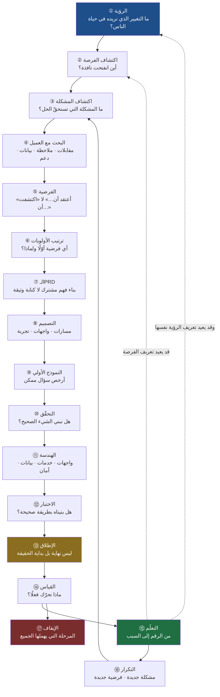
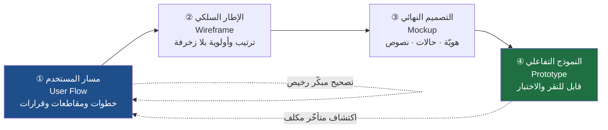
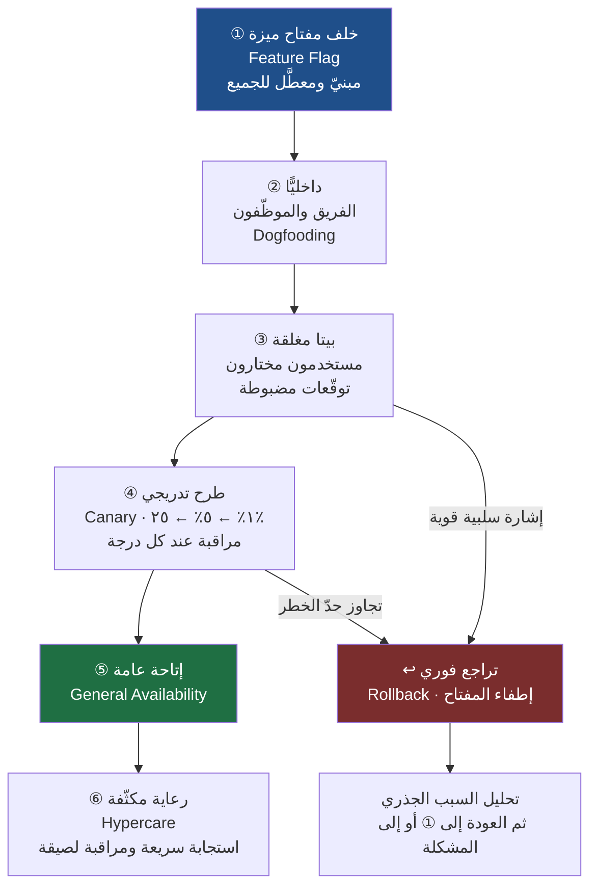
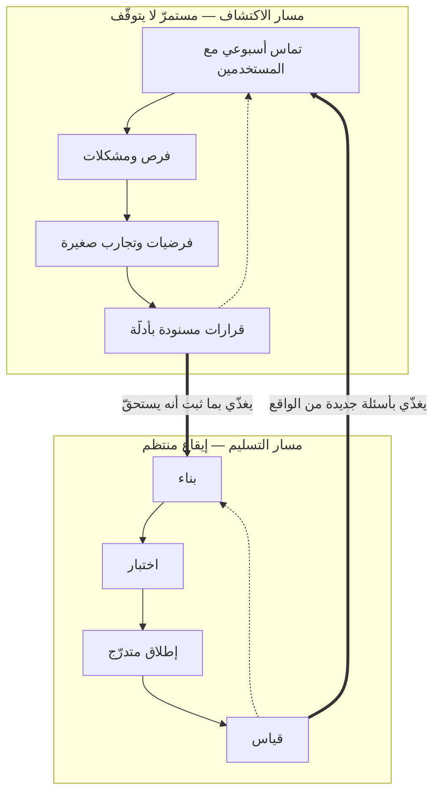
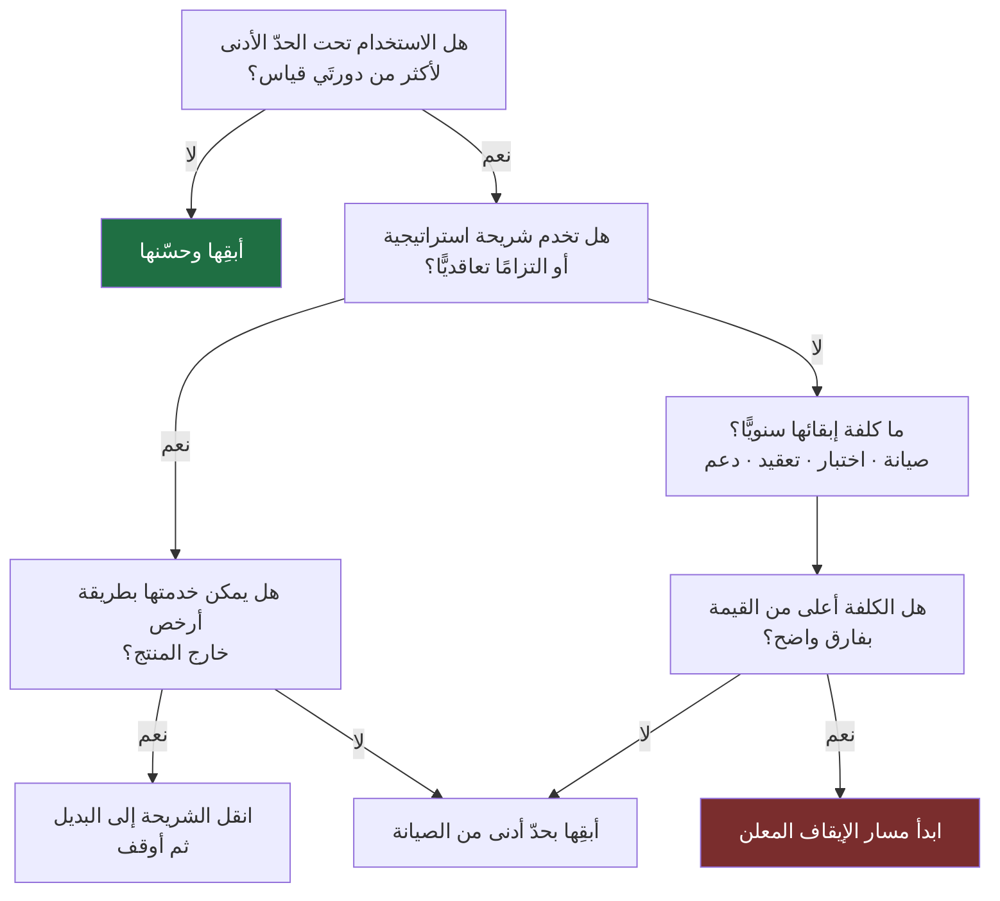

> [!info] الفصل 10 · إدارة المنتج في عصر الذكاء الاصطناعي
> **ماذا ستتعلّم:** هذا **الفصل الجامع** للمرجع كلّه. وظيفته أن يضع كل ما شرحته الفصول السابقة في **دورة واحدة متّصلة**، فتعرف أين تقف الآن، وما الذي يجب أن يكون قد اكتمل قبل أن تتقدّم، وما الذي ستأخذه معك إلى المرحلة التالية. ستتعلّم قراءة دورة حياة المنتج بستّ عشرة مرحلة، كلٌّ منها معروضة ببطاقة موحّدة: **المُدخل · النشاط · المُخرَج · المالك · شرط الانتقال · أشيع الأعطال · دور الذكاء الاصطناعي وحدّه**. وستفرّق بين «دورة عمل الفريق» و`Product Life Cycle` التسويقي الكلاسيكي (تقديم · نموّ · نضج · انحدار) لأن الخلط بينهما يفسد قرارات الأولويات. وستتعلّم لماذا **الإطلاق ليس حدثًا واحدًا** بل مسار متدرّج له معيار تراجع، ولماذا **القياس بلا تعلّم زينة**، ولماذا المرحلة التي يهملها الجميع هي **الإيقاف**. وستخرج بمعرفة أن الدورة **ليست شلّالًا**: مساراتها متوازية ومتداخلة، وأن جوهر عمل مدير المنتج ليس بناء المنتج، بل **إدارة دورة التعلّم** التي تجعل المنتج يتحسّن باستمرار.

# الفصل 10 — دورة حياة المنتج الكاملة

## 🎯 أهداف التعلّم

- رسم دورة حياة المنتج الكاملة من **الرؤية** إلى **التكرار** ثم إلى **الإيقاف**، وتحديد موقع أي عمل تقوم به الآن داخلها.
- قراءة كل مرحلة ببطاقة موحّدة (مُدخل · نشاط · مُخرَج · مالك · **شرط انتقال** · أعطال · دور `AI`)، واستخدام **شرط الانتقال** بوصفه أداة انضباط لا بيروقراطية.
- التمييز الحادّ بين **دورة عمل الفريق** (موضوع هذا الفصل) و**`Product Life Cycle` التسويقي** (تقديم · نموّ · نضج · انحدار)، وشرح كيف يغيّر الثاني قرارات الأولويات في مرحلتَي النضج والانحدار.
- صياغة **رؤية منتج** تجتاز ثلاثة اختبارات جودة، وتمييزها عن `Mission` و`Strategy` و[[15 - Roadmap|Roadmap]] و[[OKR]] في جدول واحد.
- التفريق بين **المشكلة** و**الفرصة**، وتصنيف مصادر الفرص الأربعة (تقنية · تنظيمية · سلوكية · سوقية) وتحويل الفرصة إلى رهان قابل للتسعير.
- التمييز الدقيق بين **التحقّق** (`Validation`: هل نبني الشيء الصحيح؟) و**الاختبار** (`Testing`: هل بنيناه بطريقة صحيحة؟)، وتحديد أي سؤال يُطرح على أي جمهور وفي أي مرحلة.
- تصميم **إطلاق متدرّج** لا حدثًا واحدًا: `Feature Flags` · `Canary` · `Beta` مغلقة ومفتوحة · [[Go or No-Go Decision|قرار المضيّ]] · [[Rollback|معيار التراجع]] · [[Hypercare|الرعاية المكثّفة]].
- بناء نظام قياس يميّز **المؤشّر الرائد** من **المتأخّر**، ويتجنّب [[North Star Metric|النجم القطبي]] المفرد، ويكشف `Vanity Metrics`، ويستعمل [[Percentiles and Median vs Average|المئينات بدل المتوسّط]] حيث يجب.
- تحويل البيانات إلى **معرفة**: إجراء مراجعة ما بعد الإطلاق، وكتابة تعلّم قابل للنقل، وتغذية [[Decision Log|سجلّ القرارات]].
- تشخيص **متى يُوقَف منتج أو ميزة**، وتنفيذ الإيقاف (`Sunset` / `Deprecation`) بأقلّ ضرر ممكن على المستخدم والسمعة.
- تحديد **أين يدخل الذكاء الاصطناعي في كل مرحلة وأين يقف حدّه**، وشرح لماذا يبقى قائدُ الدورة إنسانًا.
- نقد قراءة الدورة قراءةً شلّالية، وربط المراحل بـ[[Dual-Track Agile|المسار المزدوج]] و[[Continuous Discovery|الاكتشاف المستمر]].
- تشخيص الأعطال البنيوية للدورة في السوق العربي والخليجي — وخصوصًا **سقوط مرحلتَي القياس والتعلّم من العقود أصلًا**.

## الفكرة المحورية: المنتج ليس مشروعًا له خطّ نهاية

كل فصل سبق في هذا المرجع عالج قطعة: [[01 - لماذا لا يزال مدير المنتج أهم من أي وقت مضى|الفصل الأول]] عرّف جوهر الدور، و[[02 - فلسفة إدارة المنتج|الفصل الثاني]] عرّف طريقة التفكير التي يُمارَس بها، و[[05 - تحديد الأولويات (Prioritization)|الفصل الخامس]] عالج المفاضلة، و[[06 - وثيقة متطلبات المنتج (PRD)|الفصل السادس]] عالج ترجمة القرار إلى خطّة، و[[08 - Vibe Coding|الفصل الثامن]] عالج النمذجة السريعة، و[[09 - مدير المنتج في عصر الذكاء الاصطناعي|الفصل التاسع]] عالج تصميم أنظمة العمل. وهذا الفصل لا يعيد شرح أيٍّ منها. وظيفته مختلفة تمامًا: أن يضعها في **تسلسل واحد** يوضّح كيف تتغذّى كل قطعة على التي قبلها، وما الذي يجب أن يكون قد اكتمل قبل أن تُسلَّم القطعة التالية.

ولهذا فالقاعدة التي يمشي عليها هذا الفصل صريحة: **كلّما وصلنا إلى مرحلة شُرحت في فصل آخر، شرحنا موقعها في الدورة ومدخلاتها ومخرجاتها وشرط الانتقال منها، ثم أحلنا إلى فصلها.** ليس اختصارًا، بل لأن التكرار هنا يضرّ: من قرأ الاكتشاف مرّتين بصياغتين مختلفتين يخرج بانطباع أنهما شيئان.

### الخطأ الذي يصنع أغلب المنتجات الرديئة

الخطأ الأشهر في هذه المهنة ليس خطأً في التنفيذ، بل خطأ في **الشكل الذهني** للعملية. أغلب الناس يحملون في رؤوسهم صورة **الخطّ**: فكرة ← بناء ← إطلاق ← انتهى. وهذه الصورة مستوردة من عالم المشاريع، حيث يوجد فعلًا نطاق مغلق وتاريخ تسليم ومحضر استلام. وهي صورة صحيحة تمامًا لبناء جسر، وخاطئة تمامًا لبناء منتج.

الفرق بنيوي لا شكليّ. الجسر بعد افتتاحه لا يتصرّف بشكل غير متوقّع: لا يقرّر المارّة أن يمشوا عليه بطريقة لم يتخيّلها المهندس، ولا ينشأ جسر منافس بعد ثلاثة أشهر يجعل جسرك بلا معنى. أما المنتج فيبدأ **بعد** الإطلاق في التصرّف بطرق لم يتوقّعها أحد: يستعمل الناس الميزة لغرض آخر، ويلتفّون على قيد وضعته عمدًا، ويهجرون شاشة كنت واثقًا أنها الأهمّ.

ولهذا فالصورة الصحيحة **دائرة**، لا خطّ: كل إطلاق يولّد بيانات، والبيانات تولّد أسئلة، والأسئلة تولّد فرضيات، والفرضيات تولّد الدورة التالية. ومن رأى العملية خطًّا، توقّف عند نهاية الخطّ وسمّاها نجاحًا — وهو في الحقيقة قد توقّف عند اللحظة التي تبدأ فيها المعلومة الحقيقية بالوصول.

### الفكرة الأهمّ في الفصل، مقدَّمة مبكرًا

خلاصة هذا الفصل جملة واحدة تستحقّ أن تُقرأ قبل تفاصيله لا بعدها:

> [!success] الفكرة الجامعة
> **مدير المنتج ليس مسؤولًا عن بناء المنتج، بل عن إدارة دورة التعلّم التي تجعل المنتج يتحسّن باستمرار.**
>
> المنتج يبنيه الفريق: المهندسون يكتبون الكود، والمصمّمون يصمّمون، والجودة تختبر، والتسويق يطلق. أمّا الشيء الوحيد الذي لا يبنيه أحد غيرك فهو **الحلقة**: أن يكون هناك سؤال قبل البناء، ومقياس بعده، وتعلّم مكتوب يغيّر القرار التالي. الفريق الذي يبني بلا حلقة ينتج **نشاطًا**؛ والفريق الذي يبني داخل حلقة ينتج **تحسّنًا مركّبًا**.

### لماذا يستحقّ هذا التسلسل فصلًا مستقلًّا؟

لأن أخطر الأعطال في عمل المنتج ليست أعطالًا **داخل** المراحل، بل **بين** المراحل:

- بحث مستخدمين ممتاز لا يصل إلى الـ`PRD` فيُكتب الـ`PRD` من الانطباع.
- `PRD` واضح لا تُشتقّ منه أحداث قياس، فيُطلَق المنتج بلا قدرة على معرفة نتيجته.
- تصميم جميل يُسلَّم للهندسة بلا حالات حافّة، فتُملأ الفجوات باجتهاد فردي وقت الكتابة.
- إطلاق ناجح تقنيًّا لا يتبعه أحد بالقياس، فتضيع التغذية الراجعة الوحيدة على جودة القرار.

هذه كلها **أعطال وصلات**، لا أعطال محطّات. ولهذا يقوم هذا الفصل على فكرة **شرط الانتقال** (`Exit Criteria`): ما الذي يجب أن يكون صحيحًا قبل أن تُغادر مرحلة إلى التي بعدها. وهي أنفع فكرة واحدة يخرج بها القارئ من الفصل كلّه.

## خريطة الدورة الكاملة

هذه هي الخريطة التي سنمشي عليها في بقيّة الفصل. اقرأها الآن كخريطة تعليمية مرتّبة، ثم انتظر القسم الذي **ينقضها** ويعيد رسمها بشكلها الواقعي المتوازي.

لاحظ ثلاثة أشياء في هذه الخريطة قبل أن نمضي:

**① السهم الراجع من التكرار لا يعود إلى الرؤية بل إلى اكتشاف المشكلة.** أي أن الدورة المعتادة قصيرة: تعلّمت، فوجدت مشكلة جديدة، فبنيت فرضية. أمّا العودة إلى الرؤية فحدث نادر واستثنائي، وإن تكرّر كل ربع فأنت لا تملك رؤية بل عناوين متغيّرة.

**② الإيقاف متفرّع من القياس لا من نهاية الخطّ.** لأن قرار قتل ميزة يولد من الأرقام، لا من انتهاء عمر افتراضي.

**③ التصميم والنموذج والتحقّق ليست ثلاث محطّات متتالية دائمًا.** كثيرًا ما تتداخل في يومين. وُضعت متتالية هنا لأغراض الشرح فقط، وسيأتي تصحيح الصورة.

## البطاقة الموحّدة: كيف تُقرأ كل مرحلة في هذا الفصل

ما يجعل هذا الفصل **مرجعًا يُرجَع إليه** لا سردًا يُقرأ مرّة، هو أن كل مرحلة تُعرض بالبنية نفسها. وهذه هي البنية، بشرحها:

| الحقل | ما يعنيه بالضبط | الخطأ الشائع فيه |
|---|---|---|
| **المُدخل** | ما الذي يجب أن يصلك جاهزًا لتبدأ | البدء بمُدخل ناقص ثم اختراع الناقص |
| **النشاط** | العمل الفعلي الذي يجري داخل المرحلة | الخلط بين النشاط ومخرَجه |
| **المُخرَج** | القطعة الملموسة التي تخرج بها | مُخرَج غير قابل للتسليم («فهم أعمق») |
| **المالك** | من يُسأل إن تعطّلت (مسؤول واحد) | «الفريق» — أي لا أحد |
| **شرط الانتقال** | الجملة التي إن لم تصدق، لا تنتقل | خلطه بقائمة مهام مكتملة |
| **أشيع الأعطال** | الأنماط المتكرّرة للفشل | معالجتها كحوادث فردية |
| **دور `AI` وحدّه** | ما يسرّعه فعلًا وما لا يستطيعه | إسناد الحكم إليه لا التسريع |

### عن «شرط الانتقال» تحديدًا

هذه أهمّ خانة في البطاقة، وأكثرها عرضة لسوء الفهم. **شرط الانتقال ليس بوّابة موافقة إدارية**، ولا نموذجًا يُوقَّع، ولا اجتماعًا يُعقد. هو **جملة واحدة قابلة للصدق أو الكذب** تصف الحالة المعرفية المطلوبة للمضيّ.

قارن بين صيغتين:

| صيغة معطوبة (قائمة مهام) | صيغة صحيحة (حالة معرفية) |
|---|---|
| «اكتملت خمس مقابلات» | «نستطيع وصف المشكلة بجملة واحدة يوافق عليها ثلاثة من الفريق دون شرح إضافي» |
| «كُتب الـ`PRD`» | «يستطيع مهندس لم يحضر أي اجتماع أن يشرح لماذا نبني هذا وما الذي لن نبنيه» |
| «اكتمل التصميم» | «لكل حالة حافّة معروفة سلوك مُصمَّم مكتوب، ولا يوجد سؤال مفتوح يحتاج قرارًا وقت الكتابة» |
| «أُطلقت الميزة» | «الحدث الذي يقيس نجاحها يظهر في اللوحة، وخطّ الأساس مسجَّل قبل الإطلاق» |

الفرق أن العمود الأيمن **قابل للفشل**. والمعيار الذي لا يمكن أن يفشل ليس معيارًا، بل طقس.

> [!warning] لا تحوّل شروط الانتقال إلى بيروقراطية
> أخطر ما يمكن أن يحدث لهذه الفكرة أن تتحوّل إلى نموذج بستّة عشر توقيعًا. القاعدة العملية: **شرط الانتقال يُكتب لتذكيرك أنت، لا لمحاسبتك من الخارج.** في فريق ناضج، تُقرأ هذه الشروط في دقيقتين شفويًّا قبل الانتقال. وفي مؤسّسة تحتاج توثيقًا، تُكتب في سطر واحد داخل الوثيقة القائمة — لا في وثيقة جديدة. وإن وجدت نفسك تنشئ ملفًّا لإدارة شروط الانتقال، فقد ضاعت الفكرة.

### قاعدة «المُخرَج القابل للتسليم»

معيار سريع يكشف المراحل الوهمية في أي عملية: **إذا لم تستطع أن تسمّي القطعة التي تخرج من المرحلة وتضعها في يد شخص آخر، فالمرحلة لم تحدث.** «فهمنا المشكلة أكثر» ليس مُخرَجًا. أمّا «بيان مشكلة من ثلاثة أسطر + ثلاث نقاط بيانات تسنده + الحلّ الالتفافي الذي يستعمله المستخدم اليوم» فمُخرَج، يمكن تسليمه ونقده وإبطاله.

## تمييز اصطلاحي حاسم: أي «دورة حياة» نتحدّث عنها؟

قبل أي تفصيل، يجب حسم لبس اصطلاحي يفسد نقاشات كثيرة. لعبارة «دورة حياة المنتج» **معنيان مختلفان تمامًا** في الأدبيات، وكلاهما شائع ومشروع:

**المعنى الأول — دورة عمل الفريق (`Product Development Lifecycle`):** وهي موضوع هذا الفصل. تصف كيف يتحوّل السؤال إلى منتج ثم إلى تعلّم: رؤية ← اكتشاف ← تحقّق ← بناء ← إطلاق ← قياس ← تكرار. وحدتها الزمنية أسابيع أو أشهر، وتتكرّر مئات المرات في عمر المنتج الواحد.

**المعنى الثاني — دورة حياة المنتج التسويقية (`Product Life Cycle`):** وهي مفهوم كلاسيكي في أدبيات التسويق والإدارة، يصف مسار المنتج في **السوق** عبر أربع مراحل: **التقديم** ← **النموّ** ← **النضج** ← **الانحدار**. وحدتها الزمنية سنوات، وتحدث مرّة واحدة لكل منتج (أو فئة منتجات).

الخلط بينهما ليس خطأً لغويًّا فحسب؛ هو خطأ يُنتج قرارات سيّئة. لأن **المرحلة التسويقية التي يقف فيها منتجك تغيّر معنى النجاح داخل دورة عمل الفريق**.

> [!info] إضافة مرجعية
> مفهوم `Product Life Cycle` بمراحله الأربع مستقرّ في أدبيات التسويق منذ عقود، وأشهر عرض منهجي له في `Marketing Management` لفيليب كوتلر. وقد وُجّه إليه نقد معروف: أن المنحنى **وصفي لا تنبّؤي**، فأنت لا تعرف أنك في «النضج» إلا بعد أن تخرج منه؛ وأن كثيرًا من المنتجات لا تتبع المنحنى أصلًا بل تُعاد شبابها بتغيّر السوق أو بإعادة تموضع. فاستعمله كـ**عدسة تشخيصية** تسأل بها «أين نحن غالبًا؟»، لا كجدول زمني تتنبّأ به.

### كيف تغيّر المرحلة التسويقية قراراتك في دورة العمل؟

| المرحلة التسويقية | السؤال الحاكم | ما يُرجَّح في الأولويات | مؤشّر الحكم الرئيس | الخطأ النمطي |
|---|---|---|---|---|
| **التقديم** | هل يوجد شيء هنا أصلًا؟ | التعلّم والتحقّق السريع · قابلية التغيير | تفعيل الاستخدام الأول و[[Time to Value\|زمن الوصول للقيمة]] | البناء للتوسّع قبل إثبات القيمة |
| **النموّ** | كيف نلتقط الطلب دون أن ننكسر؟ | القابلية للتوسّع · الموثوقية · إزالة الاحتكاك | معدّل الاحتفاظ ونموّ الشريحة النشطة | مطاردة كل طلب جديد وتشتيت المنتج |
| **النضج** | كيف ندافع ونربح أكثر من القاعدة نفسها؟ | الكفاءة · التسعير · التوسّع الأفقي · الدَّين التقني | هامش الربح وتكلفة الخدمة والتسرّب | الاستمرار في إضافة ميزات كأننا في التقديم |
| **الانحدار** | نستثمر، أم نحلب، أم نُوقف؟ | الصيانة الدنيا · الهجرة · [[15 - Roadmap\|خارطة]] إيقاف معلنة | كلفة الاحتفاظ لكل مستخدم متبقٍّ | إبقاء المنتج حيًّا لأسباب عاطفية أو سياسية |

**المثال العملي على الفرق:** طلب «تحسين تجربة الإعداد الأولي» له وزن هائل في مرحلة التقديم (لأنك تشتري تعلّمًا وتفعيلًا)، ووزن متوسّط في النضج (لأن أغلب مستخدميك قد تجاوزوها)، ووزن شبه معدوم في الانحدار. وهو الطلب **نفسه** بالنصّ نفسه — والفرق كلّه في موقعك من المنحنى. ومن يرتّب أولوياته بـ[[RICE Prioritization|RICE]] دون أن يعدّل تقدير «المدى» بحسب مرحلة السوق، يحصل على رقم دقيق المظهر خاطئ المعنى.

> [!note] القاعدة العملية للتمييز
> حين تقرأ «دورة حياة المنتج» في هذا المرجع، فالمقصود **دورة عمل الفريق** ما لم يُصرَّح بغير ذلك. وحين يستعملها زميل من التسويق، اسأله قبل الجدال: **أي دورة تقصد؟** — فأكثر خلافات الأولويات بين المنتج والتسويق ليست خلافات في الحكم، بل في تعريف المصطلح.

## المرحلة ①: الرؤية — البوصلة التي تُستخرَج منها القرارات

### الرؤية ليست «ماذا سنبني»

أشيع خطأ في كتابة الرؤية أن تُكتب كوصف للمنتج: «أن نكون المنصّة الرائدة في حجز المواعيد الطبية». هذا ليس رؤية، بل **طموح تنافسي**. والفرق أن الرؤية تصف **التغيير الذي تريده في حياة الناس**، لا الموقع الذي تريده لنفسك في السوق.

الصياغة الأنفع تجيب عن سؤال واحد: **لو نجحنا تمامًا بعد سبع سنوات، ما الذي سيكون قد تغيّر في يوم شخص حقيقي؟**

- «أن تشعر أنك في منزلك أينما سافرت» — رؤية، لأنها تصف حالة إنسان.
- «أن تصبح أكبر منصّة تأجير» — طموح، لأنه يصف موقعك.

ولاحظ الأثر العملي للفرق: الطموح لا يساعدك في أي قرار يومي (كل ميزة تخدم «أن نكون الأكبر»)، أمّا الرؤية فتستبعد: لو كانت رؤيتك أن يشعر المسافر أنه في منزله، فالميزة التي تختصر ثانيتين في السداد أقلّ أهمّية من الميزة التي تجعل المضيف يبدو إنسانًا حقيقيًّا موثوقًا.

### اختبار جودة الرؤية: ثلاثة أسئلة

قبل أن تعتمد رؤية، مرّرها على هذه:

**① هل تصلح لعشر سنوات؟** إن كانت مربوطة بتقنية بعينها («أن نكون رائدين في تطبيقات الجوّال») فستموت بموت التقنية. الرؤية تُكتب على مستوى **حاجة إنسانية**، والحاجات تعمّر أطول من التقنيات.

**② هل تستبعد شيئًا؟** هذا هو الاختبار الحاسم، وهو نفسه اختبار [[Product Principles|مبادئ المنتج]] الذي مرّ في [[02 - فلسفة إدارة المنتج|الفصل الثاني]]. الرؤية التي يوافق عليها الجميع فورًا ولا تمنع شيئًا هي زينة لغوية. اسأل: **ما الذي لن نفعله بسببها؟** فإن لم تجد جوابًا، أعد الكتابة.

**③ هل يستطيع مهندس جديد أن يقرّر بها؟** هذا أدقّ اختبار عملي: اعطِ الرؤية لشخص انضمّ أمس، واعرض عليه خيارين متساويين تقنيًّا، واسأله: أيّهما أقرب لرؤيتنا؟ إن تردّد وطلب اجتماعًا، فالرؤية غير تشغيلية. الرؤية الجيدة **تُنقص عدد الاجتماعات**، لأنها تحسم صنفًا كاملًا من الخلافات مسبقًا.

### الرؤية وأخواتها: الجدول الفاصل

هذه المصطلحات الخمسة تُستعمل بالتبادل في أغلب الاجتماعات، وهذا مصدر إرباك دائم. والفصل بينها بسيط حين يُربط كلٌّ منها بأفق زمني وسؤال:

| المصطلح | السؤال الذي يجيب عنه | الأفق | من يملكه | مثال (منصّة عيادات) |
|---|---|---|---|---|
| **`Vision`** الرؤية | ما التغيير الذي نريده في حياة الناس؟ | ٥–١٠ سنوات | المؤسّس / قيادة المنتج | «ألّا يؤجّل أحد زيارة طبيب بسبب تعقيد الحجز» |
| **`Mission`** الرسالة | ما دورنا نحن في إحداث ذلك؟ | ٣–٥ سنوات | القيادة | «نربط المريض بأقرب موعد متاح فعلًا في أقلّ من دقيقتين» |
| **`Strategy`** الاستراتيجية | أين نلعب وكيف نفوز؟ وما الذي لن نفعله؟ | ١–٣ سنوات | قيادة المنتج | «نبدأ بعيادات الأسنان في ثلاث مدن، ونفوز بدقّة التوافر لا بعدد العيادات» |
| **[[15 - Roadmap\|Roadmap]]** خارطة الطريق | ما الرهانات التي نعمل عليها الآن وبأي ترتيب؟ | ١–٤ أرباع | مدير المنتج | «هذا الربع: دقّة التوافر · تذكير الموعد · لوحة العيادة» |
| **[[OKR]]** الأهداف والنتائج | كيف نعرف أننا نتقدّم هذا الربع؟ | ربع | الفريق | «خفض المواعيد المُلغاة من العيادة من ١٨٪ إلى ٩٪» |

> [!warning] العطل الأشيع: خارطة طريق بلا استراتيجية
> في أغلب المؤسّسات، الطبقات الموجودة فعليًّا هي **الرؤية** (شعار على الجدار) و**خارطة الطريق** (قائمة ميزات) — والطبقة الغائبة هي **الاستراتيجية**. والنتيجة حتمية: خارطة الطريق تتحوّل إلى قائمة رغبات مرتّبة بالنفوذ، لأن الاستراتيجية هي **الطبقة الوحيدة التي تقول «لا»** بشكل مبدئي. الرؤية عامّة أكثر من أن ترفض بندًا، والخارطة تفصيلية أكثر من أن تناقشه.
>
> والعلامة التشخيصية: إن كان بإمكانك إضافة أي بند إلى الخارطة دون أن يتعارض مع شيء مكتوب، فأنت بلا استراتيجية.

### الرؤية داخل الدورة

> [!note] بطاقة المرحلة ① — الرؤية
> **المُدخل:** قراءة للسوق · قناعة المؤسّسين · فهم لحاجة إنسانية معمّرة.
> **النشاط:** صياغة، ثم اختبارها بالأسئلة الثلاثة، ثم تحويلها إلى استراتيجية تستبعد.
> **المُخرَج:** جملة رؤية + وثيقة استراتيجية من صفحة إلى ثلاث: أين نلعب · كيف نفوز · ما الذي لن نفعله.
> **المالك:** القيادة (لا مدير المنتج منفردًا) — ومدير المنتج مسؤول عن **ترجمتها** لا عن اختراعها.
> **شرط الانتقال:** أن يستطيع ثلاثة أشخاص من فرق مختلفة أن يذكروا **بندًا رفضناه بسبب الرؤية**.
> **أشيع الأعطال:** رؤية تسويقية لا تستبعد شيئًا · رؤية مربوطة بتقنية · رؤية لا يعرفها الفريق أصلًا · تغييرها كل ربع.
> **دور `AI` وحدّه:** ممتاز في صياغة بدائل لغوية وفي ضغط مسوّدة طويلة إلى جملة، وفي لعب دور «الناقد» الذي يسألك ما الذي تستبعده. وعاجز بنيويًّا عن **اختيار** الرؤية، لأن الاختيار قيمي: يقرّر أي مستقبل يستحقّ أن تُنفق عليه سنوات، وهذا حكم لا استنتاج.

## المرحلة ②: اكتشاف الفرصة — وما الفرق بينها وبين المشكلة؟

### تعريف يفصل المفهومين

هذا تمييز يُهمَل كثيرًا، مع أنه يفسّر لماذا تفشل فرق تتقن الاكتشاف في إنتاج شيء ذي قيمة استراتيجية:

- **المشكلة** عائق يعانيه مستخدم **الآن**. مصدرها الداخل: من مستخدميك ومن بياناتك.
- **الفرصة** نافذة انفتحت في **المحيط** تجعل حلًّا كان مستحيلًا أو غير مجدٍ أمس ممكنًا اليوم. مصدرها الخارج.

المشكلات تحسّن منتجك؛ والفرص تغيّر موقعك. والفريق الذي يعمل على المشكلات وحدها ينتج منتجًا **مصقولًا ومتأخّرًا**: كل ميزة فيه مبرّرة ببحث، ومجموعها لا يجيب عن السؤال الذي تغيّر في السوق.

### مصادر الفرص الأربعة

| المصدر | مثاله | السؤال الذي يفتحه | الخطر الملازم |
|---|---|---|---|
| **تقني** | نضوج النماذج اللغوية وانخفاض [[Inference Cost\|كلفة الاستدلال]] | ما الذي صار ممكنًا وكان مكلفًا؟ | البناء لأن التقنية موجودة لا لأن الحاجة موجودة |
| **تنظيمي / قانوني** | نظام حماية البيانات ([[PDPL]]) · اشتراطات الفوترة الإلكترونية | ما الذي صار **إلزاميًّا** على كل السوق دفعةً واحدة؟ | معالجته كمشروع امتثال لا كفرصة تموضع |
| **سلوكي** | انتقال شريحة كاملة إلى الدفع عبر الجوّال · تغيّر توقّعات السرعة | ما الذي صار الناس يفعلونه ولم يكونوا يفعلونه؟ | الاعتماد على انطباع إعلامي بدل بيانات سلوك |
| **سوقي** | خروج منافس · دخول سوق جديدة · تغيّر بنية التكلفة | ما الذي تحرّر أو انسدّ في السوق؟ | ردّ فعل تقليدي: «المنافس فعل، فلنفعل» |

**المصدر التنظيمي هو الأكثر إهمالًا وأعلاها عائدًا في السوق الخليجي تحديدًا.** لأن التغيير التنظيمي يخلق **طلبًا مؤكّدًا وموقّتًا**: كل الشركات في القطاع مجبرة على الامتثال في تاريخ معلوم. ومن رأى ذلك مشروع امتثال بنى ميزة أدنى ما يقبله النظام؛ ومن رآه فرصة بنى القدرة التي يحتاجها القطاع كلّه، ودخل بها حسابات ما كانت لتفتح له بابًا.

### كيف تحوّل الفرصة إلى رهان قابل للتسعير؟

الفرصة بطبيعتها مبهمة («الذكاء الاصطناعي فرصة»)، ولا يُبنى على المبهم. وأربعة أسئلة تحوّلها إلى شيء يمكن ترتيبه مع غيره:

1. **ما الذي تغيّر بالضبط، ومتى؟** تاريخ ومصدر، لا انطباع.
2. **من المستفيد الأول، وما حجم شريحته؟** الفرصة التي لا تُسمّى شريحتُها لا تُسعَّر.
3. **ما نافذتها الزمنية؟** بعض الفرص تُغلق بعد ستّة أشهر (فرص تنظيمية غالبًا)، وبعضها يبقى سنوات. وهذا يغيّر ترتيبها كليًّا عبر [[Cost of Delay|كلفة التأخير]].
4. **ما أرخص دليل يثبت أنها حقيقية؟** ليس منتجًا، بل إشارة: صفحة هبوط، عشر مكالمات، اختبار باب وهمي ([[Fake Door Test]]).

> [!note] بطاقة المرحلة ② — اكتشاف الفرصة
> **المُدخل:** استراتيجية معلنة (وإلّا فكل شيء يبدو فرصة) · إشارات من السوق والتنظيم والتقنية.
> **النشاط:** مسح دوري منظّم (شهري أو ربعي) للمصادر الأربعة · تصفية بالاستراتيجية · تسعير مبدئي.
> **المُخرَج:** قائمة قصيرة من **الفرص المُسمّاة** لكل واحدة: ما تغيّر · لمن · نافذتها · أرخص دليل.
> **المالك:** مدير المنتج، بمشاركة التسويق والقانوني حيث يلزم.
> **شرط الانتقال:** أن تُختار فرصة واحدة يمكن ربطها بشريحة محدّدة وبنافذة زمنية معلَنة.
> **أشيع الأعطال:** الخلط بين الفرصة والفكرة · متابعة كل ضجيج تقني · معالجة الفرص التنظيمية كعبء · غياب أي مسح دوري أصلًا فتصل الفرص متأخّرة عبر المنافسين.
> **دور `AI` وحدّه:** مفيد جدًّا في **المسح**: تلخيص تغييرات تنظيمية، ورصد ما يتغيّر في تقييمات المنافسين، وتصنيف آلاف الإشارات. وحدّه أنه يرى **ما هو منشور**، ولا يرى ما لم يُكتب بعد — وأثمن الفرص غالبًا في المسافة بين ما يقوله السوق وما يفعله.

## المراحل ③–⑤: المشكلة والبحث والفرضية — موقعها في الدورة

هذه المراحل الثلاث هي **موضوع [[02 - فلسفة إدارة المنتج|الفصل الثاني]] بالكامل**: تعريف المشكلة، وفضاء المشكلة مقابل فضاء الحل، والمقابلة التي لا تكذب عليك، والملاحظة والتحليلات وقنوات الدعم، وكتابة الفرضية القابلة للإبطال، وأصغر تجربة تختبرها. ولن يُعاد شيء من ذلك هنا. ما يخصّ هذا الفصل هو **موقعها في السلسلة**: ما الذي يدخل، وما الذي يخرج، ومتى يحقّ لك أن تتقدّم.

### ③ اكتشاف المشكلة

> [!note] بطاقة المرحلة ③ — اكتشاف المشكلة
> **المُدخل:** فرصة مختارة + شريحة مبدئية.
> **النشاط:** الصعود من الطلبات إلى المشكلات (← [[02 - فلسفة إدارة المنتج|الفصل الثاني]]).
> **المُخرَج:** بيان مشكلة **واحد** بصيغة تذكر: من يعانيها · العائق · كم مرة · كم تكلّف · الحلّ الالتفافي الحالي.
> **المالك:** مدير المنتج.
> **شرط الانتقال:** أن تستطيع تخيّل **ثلاثة حلول مختلفة جوهريًّا** للمشكلة كما صغتها. إن أمكن حلّ واحد فقط فأنت في فضاء الحل؛ وإن بدا كل شيء حلًّا فأنت في تجريد مفرط.
> **العطل الأخطر:** تعدّد بيانات المشكلة. وقد قيلت هذه صراحةً في الويبينار عند الحديث عن الـ`PRD`، وهي تنطبق هنا قبله: خمسة بيانات مشكلة دليل غياب تركيز، لا دليل شمول.
> **دور `AI`:** تصنيف الشكاوى واستخراج الأنماط من آلاف التقييمات — وهو مكسب هائل. وحدّه أنه يعطيك **ما يتكرّر**، والمشكلة الأثمن كثيرًا ما تكون نادرة الذكر عالية الكلفة.

### ④ البحث مع العميل

الملاحظة المحورية هنا — وهي التي تربط هذه المرحلة بالدورة كلّها — أن البحث **ليس محطّة تُعبَر مرّة**. هو نشاط **مستمرّ** يجري بالتوازي مع كل المراحل الأخرى، وهذا بالضبط معنى [[Continuous Discovery|الاكتشاف المستمر]]. الفريق الذي يجعل البحث مرحلة يمرّ بها ثم يغلقها، يكون قد قرّر — دون أن يعلن — أن ما عرفه في يناير سيظلّ صحيحًا في أكتوبر.

> [!note] بطاقة المرحلة ④ — البحث مع العميل
> **المُدخل:** بيان مشكلة + أسئلة مفتوحة محدّدة (لا «نريد أن نفهم أكثر»).
> **النشاط:** مقابلات سلوكية · ملاحظة ميدانية · استبيانات · مراجعات المتاجر · بيانات الاستخدام · مكالمات الدعم.
> **المُخرَج:** ملاحظات موثّقة مربوطة بمصادرها، ومقاطع حرفية من كلام المستخدمين لا إعادة صياغة.
> **المالك:** مدير المنتج، والمصمّم شريك أصيل فيه لا ضيف.
> **شرط الانتقال:** ألّا تسمع شيئًا جديدًا جوهريًّا في آخر مقابلتين (تشبّع مبدئي)، **مع** وجود دليل كمّي واحد على الأقل يسند الرواية النوعية.
> **أشيع الأعطال:** الاكتفاء بالكمّي فتعرف «أين» ولا تعرف «لماذا» · الاكتفاء بالنوعي فتبني على خمس حالات · مقابلة العملاء الودودين فقط · حجب مدير المنتج عن المستخدم (وهذا عطل مؤسّسي شائع في المنطقة).
> **دور `AI`:** التفريغ والتلخيص والترميز الأولي للمقابلات، وتوليد أسئلة متابعة. وحدّه أنه لا يحضر: لا يرى التردّد، ولا يلتقط اللحظة التي يصمت فيها المستخدم قبل أن يجيب — وهي غالبًا أهمّ من إجابته.

### ⑤ الفرضية

الفكرة التي يجب أن تُنقَل من [[02 - فلسفة إدارة المنتج|الفصل الثاني]] إلى هنا بالنصّ: **مدير المنتج لا يقول «اكتشفت الحقيقة»، بل «أعتقد أن…»**. ولهذا نتيجة ثقافية عميقة على الدورة كلّها:

> [!success] اكتشاف خطأ الفرضية نجاح لا فشل
> إن كشفت تجربة صغيرة أن فرضيتك خاطئة، فقد **وفّرت على الفريق أشهرًا** كانت ستُنفَق على فكرة غير صحيحة. هذا ناتج نافع بالمعنى الاقتصادي الحرفي: كلفته أيام، وقيمته أشهر.
>
> والمشكلة أن أغلب المؤسّسات **لا تملك خانة في تقاريرها لهذا النوع من النجاح**. تقرير الربع فيه «ما أطلقناه»، وليس فيه «ما أوقفناه بعد أن تبيّن خطؤه». والعلاج المؤسّسي بسيط ومكلف سياسيًّا: أن يكون في التقرير عنوان صريح باسم **«فرضيات أبطلناها وما وفّرته علينا»**. ما لا يُذكر في التقرير لا يفعله الناس.

> [!note] بطاقة المرحلة ⑤ — الفرضية
> **المُدخل:** ملاحظات بحث + بيان مشكلة.
> **النشاط:** صياغة قابلة للإبطال: «نعتقد أن [الشريحة] ستفعل [سلوكًا قابلًا للقياس] إذا [التغيير]، وسنعرف أننا مخطئون إذا [إشارة محدّدة]».
> **المُخرَج:** فرضية مكتوبة + أرخص تجربة تختبرها + معيار الحسم مسبقًا.
> **المالك:** مدير المنتج.
> **شرط الانتقال:** وجود **جملة الإبطال**. الفرضية بلا شرط إبطال ليست فرضية بل أمنية.
> **دور `AI`:** توليد فرضيات بديلة لم تخطر لك، واقتراح تجارب أرخص. وحدّه: لا يستطيع أن يقرّر أي فرضية تستحقّ المخاطرة، لأن ذلك يتطلّب معرفة بما تحتمله الشركة الآن.

## المرحلة ⑥: ترتيب الأولويات — ما يخصّ الدورة منه

التفصيل الكامل في [[05 - تحديد الأولويات (Prioritization)|الفصل الخامس]]: [[RICE Prioritization|RICE]] و[[Kano Model|كانو]] و[[MoSCoW Prioritization|MoSCoW]] و[[WSJF]] و[[Cost of Delay|كلفة التأخير]] وتحيّزات الترتيب. وما يخصّ هذا الفصل ثلاث نقاط تنشأ من **موقع** هذه المرحلة في الدورة تحديدًا:

**① ما يُرتَّب هنا فرضيات لا ميزات.** هذا فرق جوهري يُغفَل. حين ترتّب ميزات، يكون السؤال «أيّها نبني أوّلًا؟». وحين ترتّب فرضيات، يكون السؤال «أيّها **نتعلّم** أوّلًا؟» — وقد يكون الجواب أن أعلى بند في القائمة يستحقّ تجربة بيومين لا مشروعًا بشهرين.

**② الترتيب يجب أن يحجز حصّة للاكتشاف نفسه.** إن كانت سعة الفريق كلّها محجوزة للتسليم، فالدورة مقطوعة من أوّلها: لن يدخل شيء جديد إلى القمع إلا ما يصل من الخارج جاهزًا كحلّ. والقاعدة العملية الشائعة: **حصّة ثابتة معلنة** (١٠–٢٠٪) للاكتشاف والتجارب، تُحمى كما تُحمى الالتزامات.

**③ الترتيب يتغيّر بتغيّر موقعك على المنحنى التسويقي.** كما مرّ في الجدول أعلاه. البند نفسه بوزنين مختلفين في مرحلتين مختلفتين.

> [!note] بطاقة المرحلة ⑥ — الأولويات
> **المُدخل:** مجموعة فرضيات مصاغة + سعة الفريق الحقيقية (لا الاسمية).
> **النشاط:** مفاضلة معلنة المعايير · تقدير كلفة التأخير · تحديد ما لن يُنفَّذ.
> **المُخرَج:** ترتيب مكتوب + **قائمة المرفوض ولماذا** (وهي أثمن من قائمة المقبول).
> **المالك:** مدير المنتج، بمصادقة أصحاب المصلحة.
> **شرط الانتقال:** أن يعرف الفريق **ما الذي تنازلنا عنه** مقابل البند الأول، بالاسم.
> **أشيع الأعطال:** الترتيب بالنفوذ · تزوير عامل الثقة في `RICE` · إعادة الترتيب أسبوعيًّا فتضيع الاستمرارية · غياب حصّة الاكتشاف.
> **دور `AI`:** ممتاز في **مقارنة الخيارات** وإبراز الاعتماديات المنسيّة وحساب السيناريوهات. وحدّه أنه لا يعرف السياسة الداخلية: أن هذا البند وعدٌ قُطع لعميل، وأن ذاك يمسّ فريقًا يمرّ بضغط — وهذه معطيات حقيقية في القرار وإن لم تكن في الجدول.

## المرحلة ⑦: الـ`PRD` — نقطة التحوّل بين الفضاءين

تفصيل مكوّنات الـ`PRD` في [[06 - وثيقة متطلبات المنتج (PRD)|الفصل السادس]]. وما يخصّ الدورة أن هذه المرحلة هي **المفصل**: قبلها كنّا في فضاء المشكلة، وبعدها ندخل فضاء الحل. ولهذا فالوثيقة ليست غاية، بل **آلية إجبار**: تجبرك على أن تكتب بوضوح ما لم تكن قد حسمته.

> [!quote] من الويبينار
> عُرضت وظيفة الـ`PRD` بوصفها اختبارًا لجاهزيتك للبناء أصلًا:
> *"PRD tells me what is the problem. Why is this a priority? What data do we have? What consumer research do we have? What discovery do we have? **How is it going to impact the metrics? If we don't know this, then we should not be building.**"*
>
> **الترجمة:** «الـ`PRD` يخبرني ما المشكلة. ولماذا هي أولوية. وما البيانات التي لدينا. وما بحث المستهلك الذي لدينا. وما الاكتشاف الذي أجريناه. **وكيف سيؤثّر هذا على المؤشّرات؟ فإن كنّا لا نعرف هذا، فينبغي ألّا نبني.**»
>
> ولاحظ أن السؤال الأخير هو الذي يربط هذه المرحلة بمرحلة **القياس** التي تبعد عنها ستّ مراحل. أي أن نظام القياس لا يُصمَّم بعد الإطلاق، بل يُولد هنا.

هذه الملاحظة الأخيرة هي الأهمّ في القسم كلّه. **أغلب فشل القياس ليس فشلًا في مرحلة القياس، بل فشل في مرحلة الـ`PRD`.** الفريق الذي يكتب وثيقة بلا مؤشّر مستهدف وبلا خطّ أساس ([[Baseline]]) وبلا حدث قياس مطلوب، سيصل إلى ما بعد الإطلاق ثم يكتشف أنه لا يملك ما يقيس به — فيقيس ما هو متاح، وما هو متاح غالبًا هو [[Vanity Metrics|مؤشّرات الغرور]].

> [!note] بطاقة المرحلة ⑦ — الـ`PRD`
> **المُدخل:** فرضية مرتّبة + أدلّة الاكتشاف + قيود معروفة.
> **النشاط:** كتابة خفيفة سريعة تبني **فهمًا مشتركًا**: بيان مشكلة واحد · رؤى الاكتشاف · المؤشّرات المستهدفة · عرض عالي المستوى للحل · [[Non-Goals|ما لن نفعله]].
> **المُخرَج:** وثيقة قصيرة + **قائمة أحداث القياس المطلوبة** + خطّ الأساس الحالي لكل مؤشّر.
> **المالك:** مدير المنتج.
> **شرط الانتقال:** أن يستطيع مهندس ومصمّم لم يحضرا شيئًا أن يشرحا لماذا نبني هذا وما الذي لن نبنيه — **دون سؤالك**.
> **أشيع الأعطال:** وثيقة طويلة تُقرأ مرّة · مؤشّرات مذكورة بلا خطّ أساس · غياب `Non-Goals` فيتمدّد النطاق · كتابتها بعد بدء التنفيذ لتوثيق ما جرى.
> **دور `AI`:** المسوّدة الأولى، وإعادة التنظيم، وكشف التناقضات، وتوليد حالات الحافّة المنسيّة، وصياغة الوثيقة بحيث تصلح **سياقًا للوكلاء** لاحقًا. وحدّه: لا يملك الأدلّة التي لم تجمعها أنت — والوثيقة المصقولة فوق فراغ معرفي أخطر من المسوّدة الركيكة، لأنها تبدو ناضجة.

## المرحلة ⑧: التصميم — ليس ألوانًا بل طريقة تفكير

### أين ينتهي مدير المنتج وأين يبدأ المصمّم؟

هذه واحدة من أكثر الحدود توتّرًا في الفرق، وتُحسم بقاعدة واضحة: **مدير المنتج لا يصمّم الواجهة، والمصمّم لا يحدّد الاستراتيجية.** وبينهما منطقة مشتركة واسعة يعمل فيها الاثنان معًا: تعريف المشكلة، وفهم المستخدم، وتحديد مسار المهمّة.

| السؤال | يملكه | يشارك فيه |
|---|---|---|
| أي مشكلة نحلّ ولمن؟ | مدير المنتج | المصمّم شريك أصيل |
| ما المهمّة التي يجب أن تُنجز؟ | مشترك | الفريق |
| كيف يبدو المسار وترتيب الخطوات؟ | المصمّم | مدير المنتج |
| ما شكل الواجهة وتسلسلها البصري؟ | المصمّم | — |
| ما القيود التقنية والزمنية؟ | الهندسة | الجميع |
| ما الذي **لن** نصمّمه هذه المرة؟ | مدير المنتج | المصمّم |

**العطل الأشيع** أن يصل مدير المنتج بالحلّ مرسومًا («أريد هذه الشاشة بهذا الترتيب»)، فيتحوّل المصمّم إلى منفّذ رسومي، وتضيع أثمن مساهمة يقدّمها: أنه يعرف كيف يفكّر الناس في الواجهات، وأنت لا تعرف.

### سلسلة الدقّة: من المسار إلى النموذج

القراءة العملية للمخطّط: كل خطوة إلى اليمين ترفع الدقّة **وترفع كلفة التغيير**. تغيير مسار في المرحلة ① يستغرق دقائق على ورقة؛ وتغييره في المرحلة ④ يعني إعادة بناء شاشات وربّما إعادة نقاش النطاق. ولهذا فالقاعدة: **اجعل أكبر قدر من الخلاف يحدث في المرحلة ①**. الفريق الذي يقفز إلى الواجهات النهائية مباشرةً لا يوفّر وقتًا، بل يؤجّل الخلاف إلى أغلى نقطة ممكنة.

> [!info] إضافة مرجعية
> هذا المنطق هو نفسه ما يُعرف بـ[[Cost-of-Change Curve|منحنى كلفة التغيير]]: كلفة تصحيح خطأ ترتفع ارتفاعًا حادًّا كلّما تأخّر اكتشافه في السلسلة. وهو المبدأ الذي تقوم عليه ممارسات [[Shift-Left and Shift-Right|الإزاحة إلى اليسار]] في الجودة: أن تُنقل أنشطة الكشف إلى أبكر نقطة ممكنة.
>
> وله تطبيق مباشر في التصميم: **مراجعة مسار مكتوب مع مهندس قبل رسم أي شاشة** تكشف عادةً قيدين أو ثلاثة كانت ستُكتشف بعد أسبوعين من التصميم. عشرون دقيقة مقابل أسبوعين.

### ما الذي يجب أن يخرج من التصميم فعلًا؟

المُخرَج الحقيقي للتصميم ليس ملفّ `Figma`. هو **مجموعة قرارات موثّقة**، وأهمّها ما يُنسى دائمًا:

- **الحالات غير السعيدة:** فارغة · تحميل · خطأ شبكة · صلاحية مرفوضة · نتائج صفرية · إدخال غير صالح.
- **[[Edge Cases|حالات الحافّة]]:** اسم طويل جدًّا · رقم بصيغة غريبة · مستخدم بلا سجلّ سابق · تعدّد الأجهزة.
- **الاتجاه واللغة:** سلوك الواجهة في [[RTL|الاتجاه من اليمين إلى اليسار]]، وتمدّد النصّ عند الترجمة، والأرقام والتقويم (← [[03 - التوطين (Localization)|الفصل الثالث]]).
- **إمكانية الوصول:** تباين كافٍ · أحجام لمس · قابلية القراءة بقارئ الشاشة.

> [!note] بطاقة المرحلة ⑧ — التصميم
> **المُدخل:** `PRD` واضح + `Non-Goals` + قيود تقنية معروفة.
> **النشاط:** مسار المستخدم ← إطار سلكي ← تصميم ← نموذج · مع اختبار مبكّر على مستخدمين.
> **المُخرَج:** مسار موثّق + تصاميم لكل الحالات (بما فيها غير السعيدة) + قرارات مكتوبة لا ملفّات فقط.
> **المالك:** المصمّم.
> **شرط الانتقال:** **صفر أسئلة مفتوحة تحتاج قرارًا وقت كتابة الكود.** كل سؤال يصل إلى المهندس بلا جواب سيُجاب باجتهاد فردي غير موثّق.
> **أشيع الأعطال:** تصميم الحالة السعيدة فقط · تجاهل `RTL` وتمدّد النصّ · إقحام مدير المنتج في تفاصيل الواجهة · تصميم بلا مراجعة تقنية مبكّرة.
> **دور `AI`:** توليد بدائل تخطيط سريعة، ونصوص واجهة، وقوائم حالات حافّة، ومراجعة اتّساق. وحدّه: لا يعرف سياق الاستخدام الحقيقي (يد واحدة؟ شمس؟ اتصال ضعيف؟ عجلة؟) — وهذا السياق هو ما يحسم أغلب قرارات التصميم الجيدة.

## المرحلة ⑨: النموذج الأولي — أرخص سؤال ممكن

### النموذج ليس منتجًا مصغَّرًا

الخطأ الشائع أن يُفهم [[Prototype|النموذج الأولي]] على أنه «نسخة أولى من المنتج». وهو ليس كذلك؛ هو **سؤال مُجسَّد**. وظيفته الوحيدة أن يجيب عن سؤال واحد محدّد بأرخص كلفة ممكنة، ثم يُرمى.

ومن هنا القاعدة التي تحسم أغلب النقاشات: **حدّد السؤال قبل أن تبني النموذج.** «هل يفهم المستخدم من أين يبدأ؟» سؤال يجاب عنه بنموذج ورقي في ساعة. «هل يقبل المستخدم دفع رسوم مقابل هذا؟» سؤال لا يجيب عنه نموذج تفاعلي مهما جمُل، بل يحتاج التزامًا حقيقيًّا (تسجيل، انتظار، دفع مسبق).

| مستوى الوفاء | يجيب عن | لا يجيب عن | كلفته |
|---|---|---|---|
| ورقي / رسم يدوي | ترتيب الخطوات · المنطق العام | الجاذبية · الثقة · الأداء | دقائق |
| إطار سلكي قابل للنقر | إمكانية إتمام المهمّة · نقاط التوهان | القبول التجاري | ساعات |
| تصميم عالي الوفاء | الوضوح · الثقة البصرية · النصوص | الأداء الحقيقي · الحالات النادرة | أيام |
| نموذج مبنيّ بكود (`Vibe Coding`) | التفاعل الحقيقي · التوقيت · الشعور | القابلية للتوسّع · الأمان · الحمل | ساعات إلى أيام |
| [[Fake Door Test\|اختبار الباب الوهمي]] | **الطلب الحقيقي** قبل البناء | تجربة الاستخدام | ساعات |

### ما الذي تغيّر فعلًا في هذه المرحلة بسبب الذكاء الاصطناعي؟

هذه إحدى أوضح النقاط التي تغيّرت فعلًا — لا بالادّعاء بل بالممارسة المروية في الويبينار:

> [!quote] من الويبينار
> وصف أحد الضيوف الفرق بين طريقتين للنمذجة:
> *«أنا أقدر دلوقتي بأدوات كتير قوي زي `Lovable` أعمل أربعة خمسة `prototype` وأبعتها لأربعة خمسة `different segments` وأبدأ أكولكت الفيدباك منهم. ده زمان عشان كان يحصل، أنت تقعد مع `product designer` ونفتح `figma` ونعمل `prototype` ونبعتها ونستنّى الناس تردّ. دلوقتي مش محتاج أقعد مع `designer`، أنا أقدر أعمل `interactive prototype`… It's not just a wireframe anymore… It's an actual code that works.»*
>
> **الترجمة (للمقاطع الإنجليزية):** «لم يعد مجرّد إطار سلكي… إنه كود حقيقي يعمل فعلًا.»
>
> **ملاحظة:** النصّ عربي بلهجة مصرية مخلوط بمصطلحات إنجليزية كما قيل، ونُقل من التفريغ الموثّق مع تصحيح إملائي.

القيمة هنا **ليست** أن مدير المنتج صار مبرمجًا. القيمة في **تعدّد النماذج المتوازية**: أن تختبر أربعة اتجاهات مختلفة على أربع شرائح في الوقت الذي كان يكفي سابقًا لاختبار اتجاه واحد. وهذا يغيّر شكل التعلّم نفسه: من «هل هذا الاتجاه صحيح؟» إلى «أي الاتجاهات الأربعة أقوى؟» — وهو سؤال أنفع بمراتب.

وتفصيل `Vibe Coding` وحدوده وأخطاره في [[08 - Vibe Coding|الفصل الثامن]].

> [!warning] الخطر المصاحب: النموذج الذي يصير منتجًا
> أخطر ما في رخص النمذجة أن يعجب النموذج أحدًا في الإدارة فيُقال: «هذا يعمل، لماذا لا نطلقه؟» — والنموذج مبنيّ بلا أمان ولا اختبارات ولا صلاحيات ولا قابلية توسّع. وهذا النمط يتكرّر بما يكفي ليستحقّ قاعدة معلنة في الفريق: **كل نموذج يُبنى للرمي، ويُعلَن ذلك مكتوبًا قبل عرضه**، ويُسمّى في العرض «نموذج» لا «نسخة».

> [!note] بطاقة المرحلة ⑨ — النموذج الأولي
> **المُدخل:** سؤال واحد محدّد + تصاميم أو مسار.
> **النشاط:** بناء أرخص شيء يجيب عن السؤال · عرضه على مستخدمين حقيقيين.
> **المُخرَج:** إجابة عن السؤال + قائمة ملاحظات + قرار: نمضي · نعدّل · نتوقّف.
> **المالك:** مدير المنتج أو المصمّم بحسب نوع السؤال.
> **شرط الانتقال:** أن يكون السؤال قد أُجيب بدليل مرصود (سلوك) لا بانطباع («أعجبهم»).
> **أشيع الأعطال:** بناء نموذج بلا سؤال · رفع الوفاء بلا داع · عرضه على زملاء بدل مستخدمين · تحويله إلى منتج.
> **دور `AI`:** بناء نماذج تفاعلية في ساعات، وتوليد بدائل متعدّدة للمقارنة. وحدّه أنه يجعل **البناء** رخيصًا ولا يجعل **الحكم** رخيصًا: أربعة نماذج بلا معيار مقارنة تنتج حيرة أكثر لا تعلّمًا أكثر.

## المرحلة ⑩: التحقّق مقابل الاختبار — أوضح تمييز وأكثره انتهاكًا

### السؤالان المختلفان

| | **التحقّق** (`Validation`) | **الاختبار** (`Testing`) |
|---|---|---|
| **السؤال** | هل نبني **الشيء الصحيح**؟ | هل بنيناه **بطريقة صحيحة**؟ |
| **مثاله** | «هل تحقّق هذه الشاشة هدفكم؟» | «هل الزرّ يعمل؟» |
| **الجمهور** | المستخدم · السوق · صاحب المصلحة | النظام نفسه |
| **الفشل فيه يعني** | الفكرة خاطئة → أعد التفكير | التنفيذ معطوب → أصلح |
| **كلفة اكتشافه متأخّرًا** | فادحة (شهور مهدورة) | مرتفعة لكنها محدودة |
| **يجري في** | الاكتشاف · النمذجة · ما قبل الإطلاق · ما بعده | ما قبل الإطلاق أساسًا |
| **مالكه** | مدير المنتج | الجودة والهندسة |

الجملة التي تحسم اللبس: **يمكن أن تجتاز كل الاختبارات وتفشل في التحقّق.** منتج خالٍ من الأخطاء تمامًا، سريع، مستقرّ — ولا يحتاجه أحد. وهذا هو الفشل الأشيع في المنتجات، وهو فشل **لا تكشفه أي أداة اختبار**، لأن الأدوات تفحص المطابقة للمواصفة، لا صواب المواصفة.

### أدوات التحقّق مرتّبة بقوّة الدليل

ليست كل أدوات التحقّق متساوية. وترتيبها بقوّة الإشارة التي تعطيها:

1. **سؤال رأي** («هل تعجبك الفكرة؟») — أضعف دليل ممكن، ويكاد لا يُعتدّ به.
2. **اختبار قابلية استخدام على نموذج** — يكشف التوهان والاحتكاك، لا الرغبة.
3. **[[Fake Door Test|اختبار باب وهمي]]** — يقيس نيّة حقيقية بكلفة شبه معدومة.
4. **التزام غير مالي** (تسجيل في قائمة انتظار، رفع بيانات) — إشارة أقوى.
5. **التزام مالي** (دفع مسبق، عقد نيّة) — أقوى إشارة قبل البناء.
6. **إطلاق محدود مُقاس** — الدليل الأقوى، وكلفته الأعلى.

القاعدة: **اصعد في السلّم فقط بقدر ما يبرّره حجم الالتزام.** ميزة بيومين لا تحتاج إلا الدرجة الثانية؛ ورهان بربع كامل لا يجوز أن يُبنى على الدرجة الأولى.

### التحقّق لا يتوقّف عند الإطلاق

خطأ شائع أن يُفهم التحقّق كبوّابة تُعبَر قبل البناء ثم تُغلق. والصحيح أنه يستمرّ: كل إطلاق تدريجي هو تحقّق، وكل قراءة للأرقام بعد شهر هي تحقّق، وكل مراجعة لميزة قديمة هي تحقّق متأخّر. وقد وُصف ذلك في الويبينار بوصفه إيقاع عمل لا مرحلة:

> [!quote] من الويبينار
> *«فدايمًا `experimentation`، دايمًا بتعمل `experimentation` وتشوف الفيدباك وتبصّ على شويّة `metrics`… and then you make your mind: آه دي شغّالة، أبدأ أرول-آوت.»*
>
> **الترجمة (للمقطع الإنجليزي):** «ثم تحسم رأيك: نعم هذه تعمل، فأبدأ الطرح التدريجي.»
>
> ولاحظ التسلسل الكامل في جملة واحدة: **تجربة ← تغذية راجعة ← مؤشّرات ← قرار ← طرح تدريجي.** هذا هو تلخيص المراحل من ⑨ إلى ⑬ كما تُمارَس فعلًا، لا كما تُرسَم في المخطّطات.

> [!note] بطاقة المرحلة ⑩ — التحقّق
> **المُدخل:** نموذج أو نسخة محدودة + فرضية بمعيار حسم معلن.
> **النشاط:** عرض على مستخدمين حقيقيين من الشريحة المستهدفة · قياس سلوك لا جمع آراء.
> **المُخرَج:** قرار موثّق: نمضي · نعدّل · نوقف — مع الدليل الذي بُني عليه.
> **المالك:** مدير المنتج.
> **شرط الانتقال:** أن يكون الدليل **سلوكيًّا** (فعل شيئًا) لا **لفظيًّا** (قال إنه سيفعل)، ومن **الشريحة المستهدفة** لا من المتاحين.
> **أشيع الأعطال:** الخلط بين التحقّق والاختبار · التحقّق مع زملاء ومعارف · تغيير معيار النجاح بعد رؤية النتيجة · اعتبار «لم يعترض أحد» تحقّقًا.
> **دور `AI`:** تلخيص تغذية راجعة من مصادر متعدّدة، وكشف الأنماط المتكرّرة، ومحاكاة اعتراضات محتملة قبل الجلسة. وحدّه الحاسم: **لا يستطيع أن يكون المستخدم**. سؤال نموذج لغوي «هل ستستعمل هذا؟» ليس تحقّقًا بأي معنى، لأنه يعطيك متوسّط ما هو مكتوب على الإنترنت لا سلوك شريحتك.

## المراحل ⑪–⑫: الهندسة والاختبار — ماذا يملك مدير المنتج هنا؟

### الهندسة: القرار الذي يبدو تقنيًّا وهو منتجيّ

المرحلة الهندسية تشمل الواجهة الأمامية والخلفية والـ`APIs` وقواعد البيانات والتكاملات والأمان والأداء. ومن السهل أن يعتبرها مدير المنتج «منطقة ليست لي»، وهذا خطأ مكلف — ليس لأن عليه أن يقرّر معماريًّا، بل لأن **كثيرًا من القرارات التي تُقدَّم كتقنية هي في الحقيقة قرارات منتج مغلَّفة بلغة تقنية**.

أمثلة تتكرّر في كل فريق:

- «سنخزّن التاريخ بالتوقيت العالمي فقط» — يبدو تقنيًّا، وأثره أن المستخدم في الرياض قد يرى موعده في يوم مختلف عند حدود منتصف الليل. هذا قرار منتج.
- «سنكتفي بمزامنة كل ١٥ دقيقة» — يبدو تقنيًّا، وأثره أن «التوافر» الذي يعِد به منتجك قد يكون قديمًا بربع ساعة. وهذا يمسّ جوهر الوعد.
- «سنحدّ الرفع بخمسة ملفات» — يبدو تقنيًّا، وهو في الواقع تعريف لشريحة المستخدمين التي سنخدمها وتلك التي سنطردها.
- «سنؤجّل التعامل مع الفشل الجزئي» — يبدو تقنيًّا، وهو تحديد لسلوك المنتج في أسوأ لحظاته (← [[Graceful Degradation|التدهور الرشيق]]).

**القاعدة العملية:** كل قرار تقني يغيّر ما يراه المستخدم أو يشعر به أو يقدر عليه، هو قرار مشترك. ومهمّتك ليست أن تقرّره بل أن **تكشفه**: أن تسأل «ما الذي سيتغيّر للمستخدم إن اخترنا هذا؟» — والسؤال وحده يخرج نصف هذه القرارات من الظلّ.

### الدَّين التقني بوصفه بند خارطة طريق

[[Technical Debt|الدَّين التقني]] هو المكان الذي تنكسر فيه العلاقة بين المنتج والهندسة في أغلب الفرق. لأنه يُقدَّم عادةً بلغة لا يستطيع مدير المنتج تسعيرها («نحتاج إعادة كتابة هذه الخدمة»)، فيُؤجَّل، فيتراكم، فتصبح كل ميزة أبطأ من سابقتها.

والعلاج ليس أن يثق مدير المنتج ثقةً عمياء، بل أن يطلب **الترجمة نفسها التي يطلبها من أي طلب آخر**: ما الأثر؟ «كل تعديل في قواعد الفوترة يستغرق أسبوعين وينتج عيبًا في المتوسّط» جملة قابلة للترتيب مع غيرها. أمّا «الكود سيّئ» فليست.

> [!note] بطاقة المرحلة ⑪ — الهندسة
> **المُدخل:** تصميم مكتمل الحالات + `PRD` + أحداث قياس محدّدة + معايير قبول.
> **النشاط:** بناء · مراجعة كود · تكامل · أمان · أداء · إعداد القياس.
> **المُخرَج:** برمجية عاملة في بيئة اختبار + الأحداث تُرسَل فعلًا وتظهر في اللوحة.
> **المالك:** قائد الهندسة.
> **شرط الانتقال:** أن يكون **القياس جزءًا من [[Definition of Done|تعريف الإنجاز]]** لا عملًا لاحقًا. الميزة التي لا تُقاس لم تكتمل مهما عملت.
> **أشيع الأعطال:** تأجيل الأحداث إلى ما بعد الإطلاق (فتضيع أول أسبوعين وهما الأثمن) · قرارات منتج تُتَّخذ صامتة داخل الكود · دَين تقني بلا لغة أثر.
> **دور `AI`:** توليد أجزاء من الكود، والاختبارات، والتوثيق، وتسريع المراجعة. وحدّه: يزيد **سرعة الإنتاج** فيكشف بشدّة أي ضعف في وضوح المتطلّبات — ومخرجاته تحتاج مراجعة بشرية لأن الخطأ فيها يبدو سليمًا لغويًّا.

### الاختبار: ليس مسؤولية فريق الجودة وحده

يشمل الاختبار: صحّة الوظائف · الأداء تحت الحمل · الأمان · تجربة الاستخدام · غياب الأخطاء الظاهرة · [[Regression Testing|اختبار الانحدار]] للتأكّد أن الجديد لم يكسر القديم.

ودور مدير المنتج فيه محدّد ولا يُفوَّض: **مراجعة الميزة بعين المستخدم لا بعين المواصفة.** فريق الجودة يفحص المطابقة لما هو مكتوب؛ ووظيفتك أن تفحص ما لم يُكتب: هل المسار مفهوم؟ هل الرسائل واضحة بعربية سليمة؟ هل الحالة الفارغة تقول للمستخدم ماذا يفعل؟ هل يبدو الشيء كما وعدنا في الـ`PRD` أم انحرف تدريجيًّا بقرارات صغيرة؟

> [!warning] الانحراف التدريجي
> أخطر ما يحدث بين الـ`PRD` والتسليم ليس تغييرًا كبيرًا واحدًا، بل **عشرة تنازلات صغيرة** كلٌّ منها معقول بمفرده: «سنؤجّل هذه الحالة» · «سنستعمل رسالة عامة مؤقّتًا» · «سنخفي هذا الخيار الآن». ومجموعها منتج لا يحقّق الغرض الذي بُني له.
>
> والعلاج بسيط ورخيص: **مراجعة واحدة قبل الإطلاق يقرأ فيها مدير المنتج بيان المشكلة والمؤشّر المستهدف بصوت عالٍ، ثم يستعمل الميزة كمستخدم.** إن لم تشعر بأنها ستحرّك المؤشّر، فهي لن تحرّكه — وهذا أرخص وقت لاكتشاف ذلك.

> [!note] بطاقة المرحلة ⑫ — الاختبار
> **المُدخل:** برمجية في بيئة اختبار + معايير قبول + حالات حافّة موثّقة.
> **النشاط:** اختبار وظيفي · انحدار · أداء · أمان · مراجعة منتجية.
> **المُخرَج:** تقرير حالة + قائمة عيوب مصنّفة بـ[[Severity vs Priority|الخطورة والأولوية]] + قرار جاهزية.
> **المالك:** الجودة، ومدير المنتج مالك المراجعة المنتجية.
> **شرط الانتقال:** ألّا يبقى عيب حرج مفتوح، وأن يكون كل عيب مؤجَّل **مقبولًا بقرار معلن** لا منسيًّا.
> **أشيع الأعطال:** اختبار الحالة السعيدة فقط · ضغط الموعد فيُختصر الاختبار · تصنيف العيوب بالمزاج · غياب اختبار الأداء حتى يظهر تحت الحمل الحقيقي.
> **دور `AI`:** توليد حالات اختبار وحالات حافّة وبيانات اصطناعية، وكشف الثغرات في التغطية. وحدّه: لا يعرف **أي الأعطال مؤلمة فعلًا** لمستخدمك، ولا يميّز عيبًا تجميليًّا من عيب يفقد الثقة.

## المرحلة ⑬: الإطلاق ليس حدثًا واحدًا

### لماذا الإطلاق «بداية الحقيقة»؟

كل ما سبق الإطلاق — مهما كان منضبطًا — يجري في ظروف مصطنعة: مستخدمون يعرفون أنهم يُختبرون، وبيانات نظيفة، وسيناريوهات أعددناها نحن. وفي لحظة الإطلاق يدخل المتغيّر الوحيد الذي لا يمكن محاكاته: **الواقع**. المستخدم الحقيقي يستعمل المنتج بطريقة لم يتوقّعها أحد، ويقع في مسارات لم تُرسَم، ويأتي من قنوات لم تُحسَب، ويحمل توقّعات كوّنها منتج آخر تمامًا.

ولهذا فالجملة التي تلخّص هذه المرحلة: **الإطلاق ليس نهاية المشروع، بل بداية المعلومة.**

### الإطلاق كمسار متدرّج

الفريق الناضج لا يطلق «مرّة». يطلق على درجات، وكل درجة تشتري معلومة وتقلّل مخاطرة:

**الفائدة الحقيقية من هذا التدرّج ليست تقليل الأخطاء فحسب**، بل أنه يحوّل الإطلاق من قرار واحد كبير عالي المخاطرة إلى **سلسلة قرارات صغيرة قابلة للتراجع**. ومن يملك مفتاح ميزة يستطيع أن يطلق في يوم ثلاثاء عادي بلا توتّر؛ ومن لا يملكه يحوّل كل إطلاق إلى حدث ليلي مرهق.

### قرار المضيّ ومعيار التراجع

[[Go or No-Go Decision|قرار المضيّ]] لا يُتَّخذ بالانطباع في اجتماع. له قائمة تُملأ قبله بيوم:

| البند | السؤال | من يجيب |
|---|---|---|
| الجاهزية التقنية | لا عيوب حرجة · الأداء ضمن الحدّ · التراجع مُختبَر فعلًا | الهندسة |
| الجاهزية القياسية | الأحداث تصل · اللوحة جاهزة · [[Baseline\|خطّ الأساس]] مسجّل | مدير المنتج |
| جاهزية الدعم | الفريق يعرف الميزة · نصوص الأسئلة الشائعة جاهزة · مسار التصعيد واضح | الدعم |
| جاهزية السوق | الرسالة · التوقيت · التسعير · قنوات الإعلان ([[Go-to-Market\|الوصول إلى السوق]]) | التسويق |
| القانوني والامتثال | الخصوصية · الموافقات · حفظ البيانات ([[PDPL]] حيث ينطبق) | القانوني |
| **معيار التراجع** | **ما الرقم الذي إن بلغناه نتراجع فورًا، ومن يملك القرار؟** | مدير المنتج |

**الصفّ الأخير هو الذي يُنسى دائمًا وهو أهمّها.** [[Rollback|التراجع]] الذي لم يُتّفق على شرطه مسبقًا لا يحدث في وقته أبدًا، لأن اللحظة التي يجب أن يحدث فيها هي بالضبط اللحظة التي يكون فيها الجميع متورّطين عاطفيًّا في نجاح الإطلاق. ولهذا يُكتب المعيار **قبل** الإطلاق بصيغة رقمية: «إن تجاوز معدّل الخطأ ٢٪، أو انخفض إتمام الحجز أكثر من ٥ نقاط خلال ساعتين، نطفئ المفتاح فورًا ولا نناقش».

### ما بعد الإطلاق مباشرة: الرعاية المكثّفة

[[Hypercare|الرعاية المكثّفة]] هي النافذة القصيرة (أيامًا إلى أسبوعين) التي يكون فيها الفريق في حالة تأهّب: مراقبة لصيقة، واستجابة سريعة، وقناة مباشرة مع الدعم. وقيمتها أنها **أثمن نافذة تعلّم في الدورة كلّها**: الأسئلة التي تصل في الأيام الثلاثة الأولى تكشف عن سوء الفهم بدقّة لا تعطيها عشر مقابلات مخطّطة.

> [!note] بطاقة المرحلة ⑬ — الإطلاق
> **المُدخل:** برمجية مجتازة للاختبار + قياس جاهز + خطّة اتصال + معيار تراجع مكتوب.
> **النشاط:** إطلاق متدرّج مراقَب · إعلان · تمكين الدعم · رعاية مكثّفة.
> **المُخرَج:** ميزة متاحة لشريحة محدّدة + بيانات تصل + قنوات ملاحظات مفتوحة.
> **المالك:** مدير المنتج (يملك قرار المضيّ والتراجع).
> **شرط الانتقال:** أن يكون خطّ الأساس مسجَّلًا **قبل** الإطلاق، ومواعيد المراجعة (٣٠ · ٦٠ · ٩٠ يومًا) موضوعة في التقويم **يوم الإطلاق نفسه** لا بعده.
> **أشيع الأعطال:** الإطلاق للجميع دفعةً واحدة · غياب مفتاح ميزة فيصبح التراجع نشر إصدار كامل · إعلان لميزة لم تُختبر تحت الحمل · إطلاق مساء آخر يوم عمل · اعتبار الإطلاق نهاية العمل.
> **دور `AI`:** صياغة إعلانات الميزة ونصوص الدعم بسرعة — وقد وُصف في الويبينار أن إعلان الميزة الواحد نزل من ساعتين أو ثلاث إلى نحو عشر دقائق مراجعة — ومراقبة الشذوذ في المؤشّرات، وتصنيف موجة التذاكر الأولى. وحدّه: **لا يملك قرار التراجع**، لأنه لا يستطيع الموازنة بين ضرر الاستمرار وكلفة الإلغاء وسمعة الفريق.

## المرحلة ⑭: القياس — وبلا قياس لا تحسين

### المؤشّرات ليست نوعًا واحدًا

الخطأ الأشيع في القياس ليس اختيار مؤشّر خاطئ، بل **استعمال نوع واحد من المؤشّرات لكل الأغراض**. والتصنيف الأنفع رباعي:

| النوع | يجيب عن | مثاله | خطره |
|---|---|---|---|
| **رائد** (`Leading`) | ما الذي يتحرّك الآن ويتنبّأ بالنتيجة؟ | إتمام الإعداد الأولي · التفعيل في أول ٧ أيام | قد يتحرّك بلا أن يصل الأثر |
| **متأخّر** (`Lagging`) | ما النتيجة النهائية؟ | الإيراد · التسرّب الشهري · الاحتفاظ بعد ٩٠ يومًا | يظهر متأخّرًا جدًّا للتصحيح |
| **مضادّ** (`Counter`) | ما الضرر الذي قد نُحدثه ونحن نحسّن؟ | إلغاء الاشتراك في الإشعارات · تذاكر الدعم · زمن التحميل | إغفاله يجعل التحسين وهميًّا |
| **تشغيلي** (`Health`) | هل النظام سليم أصلًا؟ | [[Uptime\|الجاهزية]] · معدّل الخطأ · [[MTTR]] | الخلط بينه وبين نجاح المنتج |

**المؤشّر المضادّ هو الأكثر إهمالًا وأعلاها قيمة.** لأن كل تحسين تقريبًا يمكن تحقيقه بثمن مدفوع في مكان آخر: ترفع التحويل بإخفاء التكلفة حتى الخطوة الأخيرة، وترفع التفاعل بالإشعارات حتى يهرب الناس، وترفع الاستخدام بجعل الخروج صعبًا. المؤشّر المضادّ هو ما يمنع الفريق من «النجاح» بهذه الطرق.

### لماذا لا يكفي مؤشّر النجم القطبي وحده؟

فكرة [[North Star Metric|النجم القطبي]] — مؤشّر واحد يمثّل القيمة التي يتلقّاها المستخدم ويوجّه الفريق كلّه — فكرة نافعة في المواءمة، وخطيرة إذا اتُّخذت وحدها. لثلاثة أسباب:

1. **كل مؤشّر مفرد قابل للتلاعب.** حين يصير المقياس هدفًا يكفّ عن كونه مقياسًا جيدًا (وهذا ما يُعرف بقانون `Goodhart`)، ويبدأ الفريق — بلا سوء نيّة — بتحسين الرقم لا الشيء الذي يمثّله.
2. **المؤشّر المفرد يخفي التوزيع.** «ارتفع متوسّط الاستخدام» قد تعني أن شريحة صغيرة تستعمل كثيرًا بينما الأغلبية تتسرّب.
3. **المؤشّر المفرد لا يرى الأضرار الجانبية.** ولهذا يحتاج دائمًا إلى مؤشّرات مضادّة مقترنة به في اللوحة نفسها.

والصيغة العملية: **نجم قطبي واحد + ٢–٣ مؤشّرات داعمة + مؤشّر مضادّ واحد على الأقل**، معروضة معًا في لوحة واحدة لا في تقارير متفرّقة.

### خطر مؤشّرات الغرور

[[Vanity Metrics|مؤشّرات الغرور]] هي الأرقام التي **ترتفع دائمًا ولا تخبرك بشيء قابل للفعل**: إجمالي التسجيلات التراكمي، عدد التحميلات، مشاهدات الصفحة، عدد الميزات المُطلقة. وعلامتها التشخيصية سؤالان:

- **هل يمكن أن ينخفض هذا الرقم؟** إن كان تراكميًّا فلا، وإذًا لا يمكن أن يُظهر فشلًا.
- **إن ارتفع، ما القرار الذي سأغيّره؟** إن لم يكن هناك قرار، فالرقم زينة تقرير.

والبديل ليس التخلّي عن الأرقام، بل استبدال كل مؤشّر تراكمي بنظيره **النِّسبي والمقيَّد بزمن**: لا «إجمالي المسجّلين» بل «نسبة المسجّلين الذين أنجزوا مهمّتهم الأولى خلال ٧ أيام».

### المتوسّط يكذب

هذه نقطة تقنية لها أثر عملي كبير على قرارات المنتج. **المتوسّط الحسابي مقياس رديء لأي توزيع غير متماثل** — وأغلب توزيعات المنتج غير متماثلة: أزمنة الاستجابة، ومدّة الجلسة، وعدد الطلبات لكل مستخدم.

مثال يوضّح الفرق: زمن استجابة متوسّطه ٨٠٠ مللي ثانية قد يخفي أن ٥٪ من المستخدمين ينتظرون ستّ ثوانٍ. وهؤلاء الـ٥٪ هم من يكتبون التقييمات السلبية ويتسرّبون. ولهذا يُقاس الأداء بـ[[Percentiles and Median vs Average|المئينات]]: الوسيط (`p50`) لتعرف الحالة المعتادة، و`p95` و`p99` لتعرف الحالة التي تخسر بها المستخدمين.

> [!info] إضافة مرجعية
> ثلاث أدوات تحليلية تكمّل القياس اللحظي وتُغفَل كثيرًا:
>
> **① تحليل الأفواج (`Cohort Analysis`):** بدل النظر إلى «كل المستخدمين»، تقسّمهم بحسب شهر انضمامهم وتتبع كل فوج على حدة. وهذا يكشف ما يخفيه الإجمالي تمامًا: قد ينمو العدد الكلّي بينما يسوء كل فوج جديد عن سابقه — أي أن التسويق يعوّض عن منتج يتدهور.
>
> **② تحليل القمع (`Funnel Analysis`):** يكشف **أين** يسقط الناس لا كم سقط. والقاعدة أن التحسين في أضيق نقطة في القمع يعطي عائدًا يفوق التحسين في أوسعها بمراتب.
>
> **③ [[Feedback Loop|حلقة التغذية الراجعة]] النوعية:** الأرقام تقول «أين»، والمقابلات تقول «لماذا». ومن يملك الأولى فقط يعرف موضع النزيف ولا يعرف سببه، فيعالجه بالتخمين.

> [!note] بطاقة المرحلة ⑭ — القياس
> **المُدخل:** أحداث تعمل + خطّ أساس مسجَّل + تعريف نجاح مكتوب قبل الإطلاق.
> **النشاط:** مراقبة · مقارنة بخطّ الأساس · تقطيع بحسب الشريحة والفوج · فحص المؤشّرات المضادّة.
> **المُخرَج:** قراءة موثّقة: ماذا تحرّك، وبكم، ولأي شريحة، وما الذي لم يتحرّك.
> **المالك:** مدير المنتج.
> **شرط الانتقال:** أن تكون قد قارنت النتيجة بـ**التعريف المكتوب مسبقًا**، لا بتعريف صيغ بعد رؤية الأرقام.
> **أشيع الأعطال:** القياس بلا خطّ أساس · النظر إلى الإجمالي دون تقطيع · المتوسّط بدل المئينات · مؤشّرات غرور · نسبة النجاح إلى الميزة وحدها مع تزامنها مع حملة تسويقية.
> **دور `AI`:** كشف الشذوذ، وتوليد الاستعلامات بلغة طبيعية، ومقارنة الفترات، وتفسير أوّلي للانحرافات — وقد وُصف في الويبينار مسار عملي يربط الأداة بقاعدة البيانات عبر [[MCP]] فيسأل مدير المنتج بالإنجليزية العادية ويحصل على النتيجة دون معرفة مخطّط قاعدة البيانات (← [[07 - أدوات الذكاء الاصطناعي لمدير المنتج|الفصل السابع]]). وحدّه: **يعطيك ارتباطًا لا سببًا**، ويميل إلى تفسير مقنع لغويًّا حتى حين تكون البيانات لا تحتمله.

## المرحلة ⑮: التعلّم — البيانات وحدها لا تكفي

### الفرق بين «رأيت رقمًا» و«تعلّمت شيئًا»

انخفض معدّل إتمام الحجز ٦٪. هذه **بيانات**. أمّا التعلّم فيبدأ بالسؤال: **لماذا؟** وهنا يجب أن تُطرح الفرضيات المنافسة كلّها قبل اختيار واحدة:

- هل هو **التصميم**؟ خطوة جديدة أضيفت أو ترتيب تغيّر.
- هل هو **الأداء**؟ زمن استجابة ارتفع في شريحة أجهزة معيّنة.
- هل هو **السعر**؟ رسوم ظهرت متأخّرة في المسار.
- هل هو **المنافس**؟ عرض جديد سحب شريحة.
- هل هو **الموسم**؟ إجازة أو موسم دراسي أو موسم حجّ وعمرة.
- هل هو **القياس نفسه**؟ تغيّر في تعريف الحدث أو عطل في الإرسال — وهذا احتمال يجب أن يُفحص **أوّلًا** دائمًا، لأنه الأرخص والأشيع.

**القاعدة:** لا تقبل التفسير الأول الذي يخطر لك. اكتب ثلاثة تفسيرات محتملة، ثم اسأل: **أي بيانات تفصل بينها؟** التفسير الذي لا يمكن لأي بيانات أن تكذّبه ليس تفسيرًا بل رواية مريحة.

### مراجعة ما بعد الإطلاق

هذه هي الآلية التي تحوّل التعلّم من نيّة إلى ممارسة. جلسة قصيرة (٣٠–٤٥ دقيقة) بعد ٣٠ يومًا من الإطلاق، تجيب عن خمسة أسئلة مكتوبة:

1. **ماذا توقّعنا؟** (يُقرأ من الوثيقة، لا من الذاكرة)
2. **ماذا حدث فعلًا؟** (بالأرقام، مع خطّ الأساس)
3. **أين اختلف التوقّع عن الواقع، وبكم؟**
4. **ما أفضل تفسير لدينا، وما الدليل عليه؟**
5. **ما القرار الذي يتغيّر بسبب هذا؟** — وإن لم يتغيّر أي قرار، فلم نتعلّم شيئًا.

والسؤال الخامس هو محكّ الجدّية. **التعلّم الذي لا يغيّر قرارًا ليس تعلّمًا، بل تسلية فكرية.**

> [!warning] راجع نجاحاتك أيضًا
> أغلب الفرق تراجع فشلها فقط، وهذا خطأ منهجي. النجاح غير المفسَّر خطر مثل الفشل غير المفسَّر تمامًا: إن ارتفع المؤشّر ولم تعرف السبب، فأنت لا تستطيع تكراره، وستنسب النجاح إلى ما تحبّه من قراراتك — وهذا [[Confirmation Bias|تحيّز تأكيدي]] يتراكم عبر السنين حتى يصير «خبرة».

### أين يُخزَّن التعلّم؟

التعلّم الذي يبقى في رأس شخص واحد يغادر معه. ولهذا يحتاج مكانًا:

- **[[Decision Log|سجلّ القرارات]]:** القرار · الدليل · البديل المرفوض · المؤشّر المتوقّع · ما حدث فعلًا. وهو أثمن وثيقة يملكها فريق منتج.
- **ويكي المنتج:** المعرفة المستقرّة عن الشرائح والسلوكيات والقيود، بحيث لا يُعاد اكتشافها مع كل منضمّ جديد ([[Single Source of Truth|مصدر حقيقة واحد]]).
- **سجلّ الفرضيات المُبطَلة:** ما جرّبناه ولم ينجح ولماذا — وهو ما يمنع إعادة تنفيذ الفكرة نفسها كل ثمانية عشر شهرًا بمسمّى جديد.

وهذه النقطة طُرحت في الويبينار بوصفها أساسًا للقصّة كلّها: أن يكون لديك ويكي شركة وكتيّب تشغيل موثَّق، فلا تُعاد المعرفة شرحًا مع كل منضمّ، ويصير لديك **فريق منتج** لا شخص واحد يحمل كل شيء في رأسه. وقد أضاف الذكاء الاصطناعي إلى ذلك بُعدًا جديدًا: أن هذه المعرفة المكتوبة صارت **سياقًا تقرأه الأدوات** لا البشر وحدهم (← [[09 - مدير المنتج في عصر الذكاء الاصطناعي|الفصل التاسع]]).

> [!note] بطاقة المرحلة ⑮ — التعلّم
> **المُدخل:** قراءة قياس موثّقة + التعريف المكتوب مسبقًا للنجاح.
> **النشاط:** توليد تفسيرات متنافسة · فحصها بالبيانات · مراجعة ما بعد الإطلاق.
> **المُخرَج:** **تعلّم مكتوب قابل للنقل**: جملة واحدة تصلح لفريق آخر لم يعش التجربة.
> **المالك:** مدير المنتج.
> **شرط الانتقال:** أن يكون هناك **قرار واحد على الأقل تغيّر** بسبب ما تعلّمناه.
> **أشيع الأعطال:** الاكتفاء بالرقم · تفسير واحد مريح · مراجعة الفشل دون النجاح · تعلّم شفهي لا يُكتب · تحويل المراجعة إلى محكمة فيتوقّف الناس عن الصراحة.
> **دور `AI`:** اكتشاف الأنماط عبر مصادر متعدّدة (تقييمات، تذاكر، بيانات)، وربط الإشارات المتفرّقة، وصياغة التعلّم بلغة قابلة للنقل. وحدّه: يقترح تفسيرات معقولة **الصياغة** ولا يميّز المعقول من الصحيح — فالتفسير يبقى بشريًّا لأن تكلفته على القرار بشرية.

## المرحلة ⑯: التكرار — ولماذا الدورة ليست شلّالًا

### حلقة التحسين المركّب

التكرار ليس مرحلة مستقلّة بقدر ما هو **الإقرار بأن الدورة تُغلق**: قياس ← تعلّم ← مشكلة جديدة أدقّ ← فرضية جديدة ← تطوير. والفرق بين فريق يكرّر وفريق يطلق ميزات متتالية هو أن الأول **يبني على ما تعلّمه**، فتتحسّن جودة قراراته دورة بعد دورة؛ والثاني يبدأ كل مرة من الصفر المعرفي نفسه.

وهذا بالضبط معنى الجملة التي تُقال كثيرًا بلا تفسير: **إدارة المنتجات عملية مستمرّة لا مشروع.**

### الآن ننقض المخطّط الخطّي

المخطّط الذي في صدر هذا الفصل **أداة تعليمية، وليس وصفًا لما يحدث**. في الواقع تجري المراحل متوازية ومتداخلة، وهذه هي الصورة الأصدق:

هذا هو [[Dual-Track Agile|المسار المزدوج]]: مساران يعملان **في الوقت نفسه** بالفريق نفسه، لا مرحلتان متتاليتان. الاكتشاف يغذّي التسليم بما ثبت أنه يستحقّ، والتسليم يغذّي الاكتشاف بأسئلة الواقع. والفريق الذي يفصلهما زمنيًّا («هذا الربع بحث، والقادم بناء») يقع في عطلين معًا: مهندسون بلا عمل واضح في ربع الاكتشاف، ومدير منتج بلا وقت في ربع التسليم.

> [!warning] ثلاثة أخطاء تولد من قراءة الدورة شلّالًا
> **① انتظار اكتمال المرحلة السابقة كليًّا.** التصميم لا ينتظر آخر مقابلة، والهندسة لا تنتظر آخر شاشة. الصحيح تداخل مُدار: تبدأ المرحلة التالية على الجزء المستقرّ.
> **② اعتبار الرجوع فشلًا.** الرجوع من التحقّق إلى المشكلة نجاح للعملية لا خرق لها. النظام الذي لا يسمح بالرجوع يجبر الفريق على المضيّ في طريق يعرف أنه خاطئ.
> **③ تسليم مسؤولية بدل مشاركتها.** «سلّمنا التصميم للهندسة» جملة شلّالية. المصمّم يبقى معنيًّا حتى الإطلاق، وإلّا فكل تنازل صغير سيقع بلا صاحب قرار.

> [!note] بطاقة المرحلة ⑯ — التكرار
> **المُدخل:** تعلّم مكتوب + قرار تغيّر.
> **النشاط:** إعادة دخول الدورة من نقطة المشكلة بمعرفة أعلى.
> **المُخرَج:** فرضية جديدة أدقّ من سابقتها.
> **المالك:** مدير المنتج.
> **شرط الانتقال:** أن تكون الفرضية الجديدة **مبنيّة على ما تعلّمناه**، لا فكرة جديدة بلا صلة.
> **أشيع الأعطال:** التكرار بلا تعلّم (نسخة ٢ من الشيء نفسه) · هجر الميزة بعد الإطلاق مباشرةً · اعتبار التكرار اعترافًا بفشل الإصدار الأول.
> **دور `AI`:** تسريع كل حلقة على حدة، فيقصر زمن الدورة. وحدّه المفارق: **تقصير الدورة يضاعف أهمّية اتجاهها**. من يدور بسرعة في اتجاه خاطئ يبتعد أسرع.

## المرحلة ⑰: الإيقاف — المرحلة التي يهملها الجميع

### لماذا لا يُوقف أحد شيئًا؟

كل منتج له خاتمة، وأغلب الفرق لا تخطّط لها. والسبب ليس جهلًا بل **بنية الحوافز**: إطلاق ميزة يُذكر في تقرير الربع، وإيقافها لا يُذكر في شيء. ويضاف إليه سببان نفسيان:

- **مغالطة التكلفة الغارقة:** «أنفقنا ستّة أشهر على هذا، كيف نلغيه؟» — والحقيقة أن الستّة أشهر ذهبت سواء أبقيت أم أوقفت، والسؤال الوحيد الصحيح: هل الصيانة المستقبلية تستحقّ؟
- **الخوف من الغضب:** كل ميزة لها مستخدمون، ولو قلّة. وإيقافها يُنتج شكاوى مسموعة، بينما كلفة إبقائها موزّعة وصامتة.

وكلفة عدم الإيقاف حقيقية وإن كانت غير مرئية: كل ميزة حيّة تستهلك صيانة، وتزيد سطح الاختبار، وتعقّد الواجهة لكل المستخدمين، وتفرض قيودًا على قرارات معمارية مستقبلية، وتشتّت الوثائق والدعم.

### معايير القرار

### كيف يُنفَّذ الإيقاف بأقلّ ضرر؟

الإيقاف السيّئ يفقدك ثقة تحتاجها لسنوات؛ والإيقاف الجيد قد يزيدها. والفرق في ستّ خطوات:

1. **قياس دقيق أوّلًا:** من يستعملها بالضبط؟ كم؟ ومنذ متى؟ وهل بينهم حسابات كبيرة؟ الإيقاف بلا هذه القائمة مقامرة.
2. **إعلان مبكر بمهلة معقولة:** المهلة تتناسب مع عمق الاعتماد. ميزة ثانوية: شهر. مسار عمل يعتمد عليه المستخدم يوميًّا: ربع أو أكثر.
3. **بديل واضح:** لا تقل «أُوقفت» فقط، بل «افعل هذا بدلًا منها». الإيقاف بلا بديل يترك المستخدم في الفراغ، وهذا هو الذي يولّد الغضب لا الإيقاف نفسه.
4. **مساعدة على الهجرة:** أداة تصدير، أو تحويل تلقائي، أو دعم مخصّص للحسابات الكبيرة.
5. **إيقاف تدريجي:** إخفاء من الواجهة للمستخدمين الجدد ← تحذير داخل المنتج للحاليين ← إيقاف القدرة ← إزالة الكود. وبين كل خطوة نافذة مراقبة.
6. **احتفاظ ببيانات المستخدم فترة معلنة** بعد الإيقاف، لأن أسوأ ما يمكن فعله أن تختفي بيانات شخص مع اختفاء الميزة.

> [!info] إضافة مرجعية
> يفيد هنا تمييز اصطلاحي مستقرّ في الصناعة: **`Deprecation`** هو إعلان أن القدرة لم تعد مدعومة ولا يُنصح باستعمالها، مع بقائها عاملة فترةً؛ و**`Sunset`** هو الإطفاء الفعلي في تاريخ محدّد. والفصل بينهما هو ما يعطي المستخدمين نافذة الهجرة. وهذه الممارسة معتادة ومعلنة في سياسات إيقاف إصدارات واجهات البرمجة لدى كبار مزوّدي الخدمات السحابية، حيث تُنشَر جداول إيقاف مسبقة بأشهر أو سنوات — وهي عادة تستحقّ النقل إلى منتجات أصغر بكثير.

> [!note] بطاقة المرحلة ⑰ — الإيقاف
> **المُدخل:** بيانات استخدام موثوقة + تقدير كلفة الإبقاء + التزامات تعاقدية معروفة.
> **النشاط:** قرار معلن · إعلان بمهلة · بديل · هجرة مدعومة · إطفاء تدريجي.
> **المُخرَج:** قدرة مُزالة + مستخدمون منقولون + كلفة صيانة محرَّرة + تعلّم موثّق.
> **المالك:** مدير المنتج.
> **شرط الانتقال (إلى الإطفاء):** أن ينخفض الاستخدام تحت عتبة معلنة **بعد** توفّر البديل، لا قبله.
> **أشيع الأعطال:** الإيقاف المفاجئ · إيقاف بلا بديل · إبقاء ميزات ميّتة لأسباب عاطفية · نسيان التزام تعاقدي مع عميل واحد.
> **دور `AI`:** تحليل من يستعمل الميزة وأنماط استعمالهم، وصياغة رسائل الإيقاف والوثائق البديلة، ورصد ما سيتأثّر تقنيًّا. وحدّه: **قرار الإيقاف سياسي وعلائقي** — يمسّ عملاء وعقودًا وسمعة، ولا يُختزل في نسبة استخدام.

## أين يدخل الذكاء الاصطناعي في الدورة — وأين يقف

### الجدول الجامع

هذا تجميع لما ورد موزّعًا في بطاقات المراحل، في صورة واحدة تصلح للرجوع السريع:

| المرحلة | ما يسرّعه `AI` فعلًا | حدّه البنيوي | ما تبقى مسؤوليتك أنت |
|---|---|---|---|
| ① الرؤية | صياغة بدائل · نقد ما لا تستبعده | لا يختار مستقبلًا | الاختيار القيمي وتحمّل نتيجته |
| ② الفرصة | مسح تنظيمي وتقني وتنافسي · تصنيف الإشارات | يرى المنشور فقط | الحكم على النافذة وحجم الرهان |
| ③ المشكلة | تصنيف الشكاوى · استخراج الأنماط | يبرز المتكرّر لا المهمّ | اختيار **المشكلة الواحدة** |
| ④ البحث | تفريغ · تلخيص · ترميز · أسئلة متابعة | لا يحضر اللقاء | التماس نفسه وقراءة ما لم يُقَل |
| ⑤ الفرضية | توليد فرضيات بديلة · اقتراح تجارب أرخص | لا يعرف ما تحتمله الشركة | اختيار المخاطرة وشرط الإبطال |
| ⑥ الأولويات | مقارنة خيارات · كشف اعتماديات · سيناريوهات | يجهل السياسة الداخلية | القرار والتنازل المعلن |
| ⑦ الـ`PRD` | مسوّدة · تنظيم · كشف تناقضات · حالات حافّة | لا يملك أدلّة لم تجمعها | الأدلّة والمؤشّر وخطّ الأساس |
| ⑧ التصميم | بدائل تخطيط · نصوص واجهة · مراجعة اتّساق | يجهل سياق الاستخدام | قرار التجربة وحدود النطاق |
| ⑨ النموذج | بناء نماذج تفاعلية في ساعات | يجعل البناء رخيصًا لا الحكم | تحديد السؤال ومعيار المقارنة |
| ⑩ التحقّق | تلخيص تغذية راجعة · محاكاة اعتراضات | لا يكون المستخدم | جمع دليل سلوكي حقيقي |
| ⑪ الهندسة | كود · اختبارات · توثيق · مراجعة | يبدو خطؤه سليمًا | كشف قرارات المنتج المدفونة |
| ⑫ الاختبار | حالات اختبار · بيانات · ثغرات تغطية | لا يعرف الألم الحقيقي | ترتيب العيوب بأثرها |
| ⑬ الإطلاق | إعلانات · نصوص دعم · رصد شذوذ | لا يملك قرار التراجع | معيار التراجع والمضيّ |
| ⑭ القياس | استعلامات بلغة طبيعية · مقارنات · شذوذ | ارتباط لا سببية | التعريف المسبق للنجاح |
| ⑮ التعلّم | أنماط عبر مصادر · صياغة تعلّم قابل للنقل | يقنع لغويًّا لا منطقيًّا | اختيار التفسير وتغيير القرار |
| ⑯ التكرار | تقصير زمن الدورة | يسرّع الاتجاه الخاطئ أيضًا | ضبط الاتجاه |
| ⑰ الإيقاف | تحليل الاستخدام · رسائل الهجرة | قرار علائقي وسياسي | تحمّل كلفة القرار |

### الخيط الجامع في الجدول

اقرأ العمود الثاني كلّه دفعةً واحدة، ثم الثالث. يظهر نمط واحد لا يتخلّف: **الذكاء الاصطناعي يتفوّق حيث المُدخَل نصّ كثير والمخرَج نمط أو مسوّدة، ويعجز حيث يُطلب اختيار تتحمّل نتيجته.** وهذا ليس نقصًا مؤقّتًا يُسدّ بالإصدار التالي؛ هو حدّ بنيوي: القرار ليس استنتاجًا من بيانات، بل تحديد لأي دالّة هدف نُحسّن أصلًا، وهو ما يفصل بين إيراد هذا الربع وثقة المستخدم بعد ثلاث سنوات (← [[04 - الذكاء الاصطناعي ومدير المنتج|الفصل الرابع]]).

**والنتيجة العملية:** `AI` يساعد في كل مرحلة تقريبًا، **ولا يقود الدورة**. القائد هو مدير المنتج، لأن القيادة هنا تعني تحمّل نتيجة الاختيار.

### وقبل ذلك كلّه: أين يدخل `AI` في المنتج نفسه؟

يجب التفريق بين مسألتين تختلطان دائمًا: `AI` بوصفه **أداة يستعملها الفريق** (وهو موضوع الجدول أعلاه)، و`AI` بوصفه **ميزة في المنتج** يراها المستخدم. وللثانية قاعدة صريحة قيلت في الويبينار:

> [!quote] من الويبينار
> جاء هذا ردًّا مباشرًا على سؤال «الرئيس التنفيذي طلب ميزة ذكاء اصطناعي، ماذا تفعل؟»:
> *"I don't just build AI for the sake of building AI… **AI is likely the final layer that takes us from good to amazing**. So before we have the AI layer: do we have a clean design? Do we have clean architecture? Do we have the ability to track conversions and funnels? … If your app is broken… **AI is not the right solution here; you need to clean up your app, you need to build a foundation.** Once you've got this foundation, AI is your superpower."*
>
> **الترجمة:** «أنا لا أبني ذكاءً اصطناعيًّا لمجرّد بناء ذكاء اصطناعي… **الذكاء الاصطناعي غالبًا هو الطبقة الأخيرة التي تنقلنا من «جيد» إلى «مذهل»**. فقبل أن نضع طبقة الذكاء الاصطناعي: هل لدينا تصميم نظيف؟ هل لدينا معمارية نظيفة؟ هل نملك القدرة على تتبّع التحويلات والمسارات؟… فإن كان تطبيقك مكسورًا… **فالذكاء الاصطناعي ليس الحلّ الصحيح هنا؛ عليك أن تصلح تطبيقك وتبني الأساس.** فإذا امتلكت هذا الأساس صار الذكاء الاصطناعي قوّتك الخارقة.»

ولاحظ الشرط الثالث تحديدًا: **«القدرة على تتبّع التحويلات والمسارات»**. أي أن **مرحلة القياس شرطٌ لإضافة `AI`، لا نتيجةٌ له.** وهذا يعيدنا إلى بنية هذا الفصل كلّها: من لا يملك حلقة قياس وتعلّم عاملة، لا يستطيع أن يعرف إن كانت طبقة الذكاء الاصطناعي التي أضافها حسّنت شيئًا أم أفسدته. فيبقى يضيف، ويبقى لا يعلم.

## دراسة حالة ممتدّة: منصّة حجز عيادات في السعودية عبر الدورة كاملة

> [!example] «موعد» — منتج تعليمي مركّب يمرّ على المراحل السبع عشرة
> **تنبيه ضروري:** هذه حالة **تعليمية مركّبة**، وكل أرقامها **افتراضية معلَنة الافتراض**، وضعت لتوضيح كيف تتّصل المراحل ببعضها. لا تنسبها إلى شركة قائمة، ولا تستعملها كمعيار سوقي. ما هو حقيقي فيها هو **بنية التفكير** لا الأرقام.
>
> ---
>
> **① الرؤية.** «ألّا يؤجّل أحد زيارة طبيب بسبب تعقيد الحجز.» ونختبرها: هل تصلح لعشر سنوات؟ نعم، لأنها حاجة لا تقنية. هل تستبعد شيئًا؟ نعم — استبعدت أن نكون «دليل أطبّاء» أو «منصّة محتوى صحّي»، وكلاهما اقتُرح ورُفض. هل يقرّر بها موظّف جديد؟ نعم: بين ميزة تختصر خطوة في الحجز وميزة تضيف مقالات صحّية، الجواب واضح بلا اجتماع.
>
> **② اكتشاف الفرصة.** ثلاث إشارات في الربع نفسه: توسّع التغطية التأمينية لفئات جديدة (فرصة تنظيمية) · ارتفاع حادّ في استعمال المحافظ الرقمية في الدفع (فرصة سلوكية) · تراجع منافس عن السوق (فرصة سوقية). النافذة المقدَّرة للأولى: تسعة أشهر قبل أن يستقرّ السوق على مزوّد. **القرار:** نركّز على التأمين، لأن نافذته أضيق و[[Cost of Delay|كلفة التأخير]] فيه أعلى.
>
> **③ اكتشاف المشكلة.** الطلب الوارد من فريق المبيعات كان: «العيادات تريد لوحة تحكّم». وبالصعود من الطلب إلى المشكلة (← [[02 - فلسفة إدارة المنتج|الفصل الثاني]]) يتّضح أن المشكلة عند **المريض** لا عند العيادة: **المواعيد المعروضة في المنصّة لا تطابق التوافر الحقيقي، فيصل المريض ويجد الموعد غير قائم، أو يحجز ثم تتّصل به العيادة لتغييره.** بيان المشكلة الواحد: «المريض لا يثق بأن الموعد المعروض حقيقي، فيتّصل بالعيادة هاتفيًّا للتأكيد، فيفقد المنتجُ سببَ وجوده.»
>
> **④ البحث مع العميل.** اثنتا عشرة مقابلة مريض، وثماني عيادات، ومراجعة ٤٠٠ تقييم في متجري التطبيقات، وقراءة تذاكر الدعم لشهرين. **المُخرَج الأثمن سلوكي لا لفظي:** ٦٨٪ ممّن حجزوا عبر التطبيق اتّصلوا بالعيادة هاتفيًّا خلال ساعتين من الحجز. هذا حلّ التفافي مكتمل، وهو أصدق وصف للمشكلة من أي إجابة على سؤال مباشر.
>
> **⑤ الفرضية.** «نعتقد أن المرضى الذين يرون **تأكيدًا فوريًّا من نظام العيادة نفسه** لن يتّصلوا هاتفيًّا؛ ونتوقّع انخفاض المكالمات التأكيدية من ٦٨٪ إلى أقلّ من ٢٥٪ خلال ستّة أسابيع. **وسنعرف أننا مخطئون** إن بقيت المكالمات فوق ٥٠٪ رغم ظهور التأكيد، وهو ما يعني أن المشكلة ثقة بالمنصّة لا بالمعلومة.»
>
> **⑥ الأولويات.** ثلاثة رهانات على الطاولة: التكامل المباشر مع أنظمة العيادات · لوحة تحكّم للعيادة تُدخل التوافر يدويًّا · تذكير قبل الموعد بيوم. الترتيب بـ`RICE` يضع «التذكير» أولًا لأنه رخيص — **ثم يُرفض هذا الترتيب** لأن التذكير يحسّن عرضًا لا سببًا، ولا يعالج انعدام الثقة. **القرار المعلن:** التكامل المباشر مع أكبر نظامَي عيادات (يغطّيان ٦٠٪ من عياداتنا)، وتأجيل التذكير ربعًا. **والتنازل مذكور بالاسم:** أُجّل تحسين مسار الدفع الذي كان مطلوبًا من التسويق.
>
> **⑦ الـ`PRD`.** بيان مشكلة واحد. رؤى الاكتشاف بالأرقام أعلاه. المؤشّر المستهدف: نسبة المكالمات التأكيدية (خطّ الأساس ٦٨٪) ونسبة المواعيد الملغاة من العيادة (خطّ الأساس ١٨٪). **`Non-Goals` صريحة:** لا نبني نظام إدارة عيادة، ولا ندعم الأنظمة الأربعة الأصغر هذه المرحلة، ولا نعالج الدفع. **وأحداث القياس مكتوبة داخل الوثيقة**: حدث عند عرض التأكيد، وحدث عند فتح رقم العيادة، وحدث عند الإلغاء من طرف العيادة.
>
> **⑧ التصميم.** الحالات غير السعيدة هي التي أخذت أغلب الجهد: ماذا يرى المريض إذا تأخّر ردّ نظام العيادة ثلاث ثوانٍ؟ وإذا فشل التكامل تمامًا؟ وإذا عاد النظام بموعد مختلف قليلًا؟ **القرار التصميمي المحوري:** لا نعرض «مؤكّد» إلّا بتأكيد حقيقي؛ وعند التأخّر نعرض «جارٍ التأكيد مع العيادة» مع مهلة قصوى دقيقتين ثم بديل واضح. أي أننا فضّلنا **صدق الحالة** على سلاسة الشاشة — وهذا قرار منتج لا قرار واجهة.
>
> **⑨ النموذج الأولي.** نموذج تفاعلي في يومين، عُرض على تسعة مرضى. السؤال المحدّد مسبقًا: **«هل تُغني حالة التأكيد عن الاتصال؟»** والنتيجة كاشفة: كلمة «مؤكّد» وحدها لم تكن كافية؛ الذين رأوا **اسم العيادة ووقت التأكيد** («أكّدت عيادة … الساعة ٣:٤٢») قالوا إنهم لن يتّصلوا، والذين رأوا كلمة «مؤكّد» مجرّدة بقوا مترددين. تعديل بكلفة ساعات نتج عن نموذج بكلفة يومين.
>
> **⑩ التحقّق.** لم نكتفِ بأقوالهم. أُطلق التكامل لعيادة واحدة متعاونة لمدّة أسبوعين (تحقّق بدرجة «إطلاق محدود مقاس»). النتيجة: انخفضت المكالمات في تلك العيادة من ٦٨٪ إلى ٣١٪. **أقلّ من الهدف (٢٥٪) لكنها فوق شرط الإبطال (٥٠٪)** — فالقرار: نمضي، مع فرضية فرعية جديدة عن الـ٣١٪ المتبقّية.
>
> **⑪ الهندسة.** ظهر هنا قرار «تقني» هو في الحقيقة منتجيّ بامتياز: النظامان يختلفان في زمن الاستجابة، وأحدهما لا يدعم التأكيد الفوري بل كل خمس دقائق. **الخيار:** إمّا أن نعرض تجربتين مختلفتين، أو نوحّدهما على أبطأ الاثنين. **القرار:** تجربتان مختلفتان مع نصّ صادق في كلٍّ منهما — لأن توحيد الجميع على الأبطأ يعاقب ٦٠٪ من المرضى إرضاءً للاتّساق.
>
> **⑫ الاختبار.** الحالات الحرجة: انقطاع التكامل أثناء الحجز · تأكيد يصل بعد أن غادر المستخدم الشاشة · تعارض موعدين · اسم عيادة طويل يكسر التخطيط · سلوك الواجهة في [[RTL|الاتجاه من اليمين إلى اليسار]] مع الأرقام والتواريخ. وفي المراجعة المنتجية اكتُشف انحراف تدريجي: نصّ «جارٍ التأكيد» كان قد استُبدل بمؤشّر تحميل صامت — وهو تنازل صغير كان سيلغي جوهر الحل.
>
> **⑬ الإطلاق.** خلف مفتاح ميزة. داخليًّا يومين. ثم ٥٪ من مستخدمي عيادتين. ثم ٢٥٪. **معيار التراجع المكتوب مسبقًا:** «إن تجاوز فشل التأكيد ٣٪ من المحاولات، أو انخفض إتمام الحجز أكثر من ٤ نقاط، نطفئ المفتاح فورًا — والقرار لمدير المنتج بلا اجتماع.» وقد استُعمل فعلًا في اليوم الثاني حين تجاوز الفشل الحدّ بسبب اختناق في نظام أحد المزوّدين، فأُطفئ المفتاح لتسع ساعات ثم أُعيد.
>
> **⑭ القياس.** بعد ٣٠ يومًا: المكالمات التأكيدية ٢٩٪ (من ٦٨٪) · الإلغاء من العيادة ١١٪ (من ١٨٪) · **والمؤشّر المضادّ:** زمن إتمام الحجز ارتفع من ٥١ إلى ٦٣ ثانية بسبب انتظار التأكيد. وهذا ارتفاع مقبول قياسًا بالمكسب، لكنه **كان سيمرّ دون أن يراه أحد لولا أنه أُدرج في اللوحة مسبقًا**. وبالتقطيع: المكسب في نظام المزوّد الأول ضعف المكسب في الثاني — وهو ما يفسّر بقاء الـ٢٩٪.
>
> **⑮ التعلّم.** التفسيرات الثلاثة المتنافسة للمتبقّي: (أ) عادة راسخة لا تزول بمعلومة · (ب) عدم ثقة بالمنصّة نفسها · (ج) حاجة إلى شيء آخر في المكالمة أصلًا. والبيانات التي فصلت بينها: تسجيلات الدعم أظهرت أن أغلب المكالمات المتبقّية تسأل عن **موقف السيارات وطابق العيادة** لا عن الموعد. **التعلّم المكتوب:** «المكالمة لم تكن تأكيدًا فقط، بل استعلامًا عن الوصول. حين حللنا نصف السبب، بقي النصف الآخر مرئيًّا.» — وهذا تعلّم قابل للنقل إلى أي منتج يظنّ أن سلوكًا واحدًا له سبب واحد.
>
> **⑯ التكرار.** الفرضية التالية وُلدت من التعلّم لا من فكرة جديدة: «معلومات الوصول (موقف · طابق · مدخل) داخل بطاقة الموعد تخفض المكالمات المتبقّية إلى أقلّ من ١٥٪.» — وهي أرخص بكثير من التكامل الأول، ولم تكن لتخطر لأحد قبل الدورة الأولى.
>
> **⑰ الإيقاف.** بعد ثلاثة أرباع، كانت لوحة الإدخال اليدوي للتوافر (التي بُنيت قبل التكامل) يستعملها ٤٪ من العيادات فقط. القرار: `Deprecation` معلن بمهلة ربع كامل · إبلاغ العيادات الأربع الكبرى فرديًّا · أداة نقل تلقائية · ثم `Sunset` في تاريخ محدّد. النتيجة: تحرير صيانة مستمرّة، **وشكوى واحدة** — لأن البديل كان جاهزًا قبل الإعلان لا بعده.
>
> ---
>
> **ما الذي يجب أن تلتقطه من الحالة كلّها؟** ثلاثة أشياء: أن **المشكلة تحوّلت** بين المرحلة ③ والمرحلة ⑮ (من «الثقة بالموعد» إلى «الاستعلام عن الوصول») وهذا طبيعي لا خطأ · أن **المؤشّر المضادّ** هو الذي منع خداعنا لأنفسنا · وأن **معيار التراجع المكتوب مسبقًا** هو ما جعل قرار الإطفاء في اليوم الثاني قرارًا هادئًا لا أزمة.

## البُعد المحلّي: أين تنكسر الدورة في السوق العربي والخليجي؟

### العطل الأكبر: نصف الدورة ليس في العقد أصلًا

في جزء كبير من سوق البرمجيات في المنطقة، لا يُشترى «منتج» بل يُشترى **مشروع تسليم**: نطاق متّفق عليه، ودفعات مرتبطة بمراحل، ومحضر استلام نهائي. وفي هذا النموذج تُدفع أموال مقابل **المراحل ⑦ إلى ⑬** فقط: الوثيقة، والتصميم، والبناء، والاختبار، والتسليم.

أمّا **⑭ القياس** و**⑮ التعلّم** و**⑯ التكرار** فليست بنودًا في العقد. لا أحد يدفع مقابلها، ولا أحد مسؤول عنها، ولا تُذكر في محضر الاستلام. والنتيجة حتمية: **الدورة مقطوعة عند نقطتها الأهمّ**، ويتحوّل «النجاح» تلقائيًّا إلى معناه التعاقدي: سُلِّم في الموعد وبالنطاق المتّفق عليه.

وهذا يفسّر ظاهرة مألوفة: أنظمة سُلِّمت بنجاح كامل بالمعنى التعاقدي، ولا يستعملها أحد بعد ستّة أشهر. لم يفشل أحد بمعايير العقد؛ العقد نفسه كان يقيس شيئًا آخر.

### خمسة أعراض قابلة للتشخيص

**① «الإطلاق نهاية المشروع».** حفل إطلاق، وصورة جماعية، ثم انتقال الفريق كاملًا إلى المشروع التالي في الأسبوع نفسه. لا رعاية مكثّفة، ولا مراجعة بعد ٣٠ يومًا، ولا أحد يملك الميزة بعد التسليم.

**② غياب البنية التحتية للقياس.** لا أحداث معرَّفة، ولا لوحة، وأحيانًا لا وصول لمدير المنتج إلى البيانات أصلًا. فيصبح القياس مستحيلًا **تقنيًّا** لا فقط ثقافيًّا — وهذا سبب حقيقي لا عذر، وعلاجه إدراج القياس في تعريف الإنجاز منذ أول ميزة.

**③ فصل من يبني عمّن يشغّل.** المورّد بنى، والجهة تشغّل. فمن يقرأ الأرقام؟ ومن يملك التحسين؟ الجواب في أغلب الحالات: لا أحد، حتى يظهر تذمّر كافٍ فيُفتح «مشروع مرحلة ثانية» — أي دورة جديدة كاملة بدل تكرار صغير.

**④ رفض الإطلاق التدريجي ثقافيًّا.** «كيف نطلق لخمسة بالمئة فقط؟» يُقرأ أحيانًا كنقص في الثقة أو كتمييز بين المستخدمين، لا كإدارة مخاطر. وهذا يحتاج إعادة تأطير: الإطلاق التدريجي **حماية للمستخدم** لا حجب عنه.

**⑤ الإيقاف محرَّم عمليًّا.** إزالة أي ميزة تُقرأ كاعتراف بخطأ سابق، وفي بيئات كثيرة يكون الاعتراف مكلفًا شخصيًّا. فتتراكم الميزات الميّتة، ويصير المنتج أثقل سنةً بعد سنة.

### وفي المقابل: ثلاث فرص حقيقية

الصورة ليست سوداء، وفي السياق المحلّي مزايا بنيوية تُغفَل:

**① نافذة تنظيمية نشطة وواضحة.** التحوّل الرقمي الحكومي وأنظمة حماية البيانات والفوترة الإلكترونية والمدفوعات — كلّها تخلق فرصًا مؤقّتة **معلنة التوقيت**، وهذا نادر في أسواق أخرى. من يبني قدرة قبل الموعد النظامي يدخل السوق بميزة زمنية حقيقية.

**② قرب من صاحب القرار.** في كثير من الشركات الإقليمية، المسافة بين مدير المنتج والرئيس التنفيذي أقصر منها في المؤسّسات الكبرى العالمية. وهذا سيف ذو حدّين، لكنه يعني أن **تغيير طريقة العمل ممكن في أشهر لا سنوات** إن أُحسن عرضه بالأرقام.

**③ سوق قابل للقياس بسرعة.** حجم السوق ووضوح شرائحه يجعلان التحقّق السريع ممكنًا: عشر مقابلات تصلك في أسبوع، وشريحة كاملة يمكن الوصول إليها بقناة واحدة.

### كيف تدخل الدورة إلى مؤسّسة لا تعرفها؟

لا تبدأ بمحاولة تغيير العملية كلّها؛ ستفشل. ابدأ بأرخص حلقة كاملة ممكنة:

1. **اختر ميزة واحدة صغيرة** ستُطلق قريبًا، ويفضَّل ألّا تكون مسيّسة.
2. **اكتب سطرين قبل الإطلاق:** المؤشّر المستهدف وخطّ أساسه الحالي. سطران فقط.
3. **اطلب حدثًا واحدًا** يُضاف إلى الميزة. حدثًا واحدًا لا نظام تحليلات.
4. **بعد ٣٠ يومًا، اعرض صفحة واحدة:** توقّعنا كذا، وحدث كذا، وتعلّمنا كذا.
5. **كرّر ذلك ثلاث مرات.** ثم اعرض الثلاث معًا.

هذه أرخص طريقة لبناء **الدليل قبل طلب الصلاحية**. الحديث عن «ثقافة القياس» يُقابَل بالمجاملة؛ أمّا ثلاث صفحات تُظهر أن قرارين تغيّرا بسبب أرقام، فتغيّر السؤال في الغرفة من «هل نتبنّى هذا؟» إلى «كيف نعمّمه؟».

## النقاش المفتوح: هل هذه الدورة نفسها ترف تنظيمي؟

### الحجّة المعاكسة كاملةً

من الإنصاف أن تُعرض أقوى صيغة للاعتراض، لا صيغة يسهل هدمها. والاعتراض له أربعة أركان:

**① الدورة الكاملة تفترض حجمًا ليس عند أغلب الفرق.** ستّ عشرة مرحلة، وبطاقات، وشروط انتقال، ومراجعات بعد ٣٠ و٦٠ و٩٠ يومًا — هذا نظام مصمَّم لمؤسّسة فيها أدوار متخصّصة. أمّا فريق من أربعة أشخاص يبني منتجه الأول فتطبيقه لهذا يعني أن يقضي وقته في إدارة العملية بدل بناء المنتج.

**② في مرحلة ما قبل ملاءمة المنتج للسوق، السرعة تغلب الانضباط.** حين يكون السؤال «هل يوجد شيء هنا أصلًا؟»، فأنفع ما تفعله هو أن تبني وتطلق وتنظر — لا أن تختبر فرضية معلنة الإبطال. والشركات التي وجدت ملاءمتها وجدتها غالبًا بمحاولات متعجّلة لا بعملية منضبطة.

**③ شروط الانتقال تتحوّل إلى بوّابات، والبوّابات تقتل السرعة.** كل معيار مكتوب يميل بمرور الوقت إلى أن يصير نموذجًا، ثم اجتماعًا، ثم توقيعًا. وهذا ما حدث لكل منهجية ثقيلة سبقت. وما يبدأ اليوم «شرط انتقال في سطر» يصير بعد سنتين لجنة جاهزية.

**④ الأثر يصعب عزله أصلًا، فالقياس الصارم وهم منظّم.** أطلقت ميزة، وتزامنت مع حملة تسويقية وموسم وتغيير سعر عند منافس. فأي جزء من التحسّن يعود إليك؟ في غياب تجربة مضبوطة (وهي غالبًا غير متاحة بحجم بيانات صغير)، تكون «قراءة المؤشّرات» رواية مصقولة بالأرقام لا استدلالًا.

### الردّ المنصف — لا الرفض

الركن الرابع هو **أقوى الأركان وأصدقها**، ولا يُردّ عليه بالإنكار. نعم، عزل الأثر صعب، ونعم، كثير مما يُقدَّم بوصفه «قياسًا» هو سرد. والموقف الصحيح ليس التخلّي عن القياس بل **خفض ادّعائه**: أن نقول «تزامن هذا مع ذاك، وهذه أفضل قراءة متاحة، وهذه احتمالات منافسة لم نستبعدها» بدل «الميزة رفعت التحويل ١٢٪». والقياس بهذا التواضع يبقى أفضل بكثير من غيابه، لأن غيابه لا يترك فراغًا بل يترك **رواية بلا أرقام أصلًا** — وهي أسوأ.

أمّا الأركان الثلاثة الأولى فيُردّ عليها بتمييز واحد حاسم:

> [!success] المراحل إلزامية، وثقلها اختياري
> **لا يمكن حذف مرحلة، ويمكن أن تستغرق المرحلة خمس دقائق.**
>
> في فريق من ثلاثة أشخاص، «مرحلة الرؤية» جملة على الجدار، و«الـ`PRD`» رسالة من فقرتين، و«شرط الانتقال» سؤال يُطرح شفهيًّا قبل البدء، و«مراجعة ما بعد الإطلاق» عشر دقائق أمام لوحة واحدة. الدورة كاملة، وثقلها قريب من الصفر.
>
> والخطأ ليس في تخفيف الثقل، بل في **حذف المرحلة والافتراض أنها تحدث تلقائيًّا**. المرحلة المحذوفة لا تختفي، بل تحدث ضمنيًّا وبلا مالك: من لم يحدّد معيار التراجع اتّخذ قرارًا (أن يبقى دائمًا)؛ ومن لم يقس اتّخذ قرارًا (أن يصدّق انطباعه).

وعن الركن الثالث (التحوّل إلى بوّابات) فالتحذير في محلّه تمامًا، وعلاجه صريح: **شرط الانتقال يملكه الفريق لا جهة خارجية.** في اللحظة التي يصير فيها الشرط شيئًا تثبته لطرف آخر، يكون قد فقد وظيفته وصار طقسًا. والعلامة التشخيصية: إن كنت تكتبه لتقرأه أنت غدًا فهو أداة؛ وإن كنت تكتبه ليقرأه من يحاسبك فهو نموذج.

وعن الركن الثاني (ما قبل الملاءمة) فالإنصاف يقتضي التسليم بجزء كبير منه: في تلك المرحلة تكون الدورة **أسرع وأخشن**، وقد تكون التجربة كلّها هي المنتج نفسه. لكن حتى هناك، المرحلتان اللتان لا تسقطان أبدًا هما **⑩ التحقّق** و**⑮ التعلّم** — لأنهما بالضبط ما يفرّق بين شركة تجرّب عشر مرات فتتعلّم، وشركة تجرّب عشر مرات فتكرّر الخطأ نفسه بأسماء مختلفة.

## مفاهيم خاطئة وممارسات سيّئة

> [!warning] عشرة أخطاء متكرّرة حول الدورة
> **① «الإطلاق هو النجاح».** الإطلاق ناتج، لا مُخرَج (← [[Outcome vs Output|المخرَج والأثر]]). وهو اللحظة التي تبدأ فيها المعلومة، لا التي تنتهي عندها.
>
> **② «الدورة خطوات متتابعة».** المخطّط الخطّي أداة تعليمية. الواقع مساران متوازيان، وارتداد مستمرّ. من يديرها كشلّال يجمع أسوأ ما في الطريقتين: بطء الشلّال وفوضى غياب التخطيط.
>
> **③ «القياس شيء نفعله بعد الإطلاق».** القياس يُصمَّم في مرحلة الـ`PRD`، ويُبنى في مرحلة الهندسة، ويُتحقّق منه قبل الإطلاق. ما يحدث بعد الإطلاق هو **القراءة** لا التصميم.
>
> **④ «التحقّق والاختبار شيء واحد».** يمكن أن تجتاز كل الاختبارات وتبني شيئًا لا يريده أحد.
>
> **⑤ «مؤشّر واحد يكفي».** أي مؤشّر مفرد يُحسَّن حتى يفقد معناه. لا بدّ من مؤشّر مضادّ في اللوحة نفسها.
>
> **⑥ «إن لم يشتكِ أحد فالأمر بخير».** الأغلبية الصامتة لا تشتكي، بل تغادر. غياب الشكوى ليس بيانات.
>
> **⑦ «التعلّم يحدث تلقائيًّا».** التعلّم يحدث فقط إن كان له موعد ومكان ومالك وسؤال «ما القرار الذي تغيّر؟».
>
> **⑧ «الفرضية الخاطئة فشل».** بل هي أرخص ما يشتريه فريق منتج: أيامٌ ثمنًا لأشهر.
>
> **⑨ «الإيقاف اعتراف بالخطأ».** الإيقاف قرار تخصيص موارد. والفريق الذي لا يوقف شيئًا أبدًا لا يملك سعة لشيء جديد، ومنتجه يزداد ثقلًا كل عام.
>
> **⑩ «الذكاء الاصطناعي يدير الدورة».** يسرّع مراحلها كلّها تقريبًا، ولا يملك أيًّا من قراراتها. وتسريع دورة بلا اتجاه يزيد المسافة عن الهدف لا يقلّلها.

## خلاصة الفصل: ستّ قواعد

> [!success] ما ينبغي أن يبقى معك
> **① المنتج دورة لا خطّ.** كل إطلاق مُدخَل للدورة التالية، لا خطّ نهاية.
>
> **② المراحل إلزامية وثقلها اختياري.** لا تحذف مرحلة؛ اجعلها تستغرق خمس دقائق إن لزم.
>
> **③ الأعطال في الوصلات لا في المحطّات.** ولهذا فشرط الانتقال أنفع أداة في الفصل كلّه.
>
> **④ الإطلاق ليس حدثًا.** مفتاح ميزة · تدرّج · معيار تراجع مكتوب قبل أن تتورّط عاطفيًّا.
>
> **⑤ بلا قياس لا تعلّم، وبلا تعلّم لا تحسين.** والقياس يُولد في الـ`PRD` لا بعد الإطلاق.
>
> **⑥ وظيفتك إدارة دورة التعلّم.** المنتج يبنيه الفريق؛ والحلقة لا يبنيها أحد غيرك.

## كيف تتمرّن على هذا الفصل

هذه التمارين مرتّبة من تمرين فردي بلا أدوات إلى تمرين على منتج حقيقي تستعمله يوميًّا. أنجزها بالترتيب، فكلٌّ منها يبني على سابقه.

**① تمرين تحديد الموقع (٢٠ دقيقة · فردي · بلا أدوات).**
**المهمّة:** خذ آخر شيء عملت عليه — ميزة، مشروع، طلب — وحدّد بدقّة في أي مرحلة من المراحل السبع عشرة تقف الآن، وما المرحلة التي **قفزتَ فوقها**.
**المخرَج:** ورقة واحدة: المرحلة الحالية · المرحلة المتخطّاة · ما الذي كان سيتغيّر لو لم تُتخطَّ.
**كيف تعرف أنك أتقنته:** إن استطعت تسمية مرحلة واحدة على الأقل تُخطَّى **بانتظام** في فريقك، لا مرّة واحدة.

**② تمرين شرط الانتقال (٤٥ دقيقة · فردي).**
**المهمّة:** اكتب شروط انتقال لخمس مراحل تعمل فيها فعلًا، بصيغة **حالة معرفية قابلة للفشل** لا قائمة مهام. ثم طبّقها بأثر رجعي على آخر ميزة أطلقتها: كم شرطًا كان سيفشل؟
**المخرَج:** خمسة أسطر + نتيجة الفحص الرجعي.
**كيف تعرف أنك أتقنته:** إن كان شرط واحد على الأقل قد فشل بأثر رجعي. إن نجحت كلّها، فشروطك ضعيفة لا عمليّاتك مثالية.

**③ تمرين خريطة القياس (ساعة · على منتج عملك أو منتج تستعمله).**
**المهمّة:** اختر ميزة موجودة واكتب لها أربعة مؤشّرات: رائد · متأخّر · **مضادّ** · تشغيلي. ثم اسأل: أيّها متاح فعلًا اليوم؟
**المخرَج:** جدول من أربعة صفوف مع عمود «متاح / غير متاح».
**كيف تعرف أنك أتقنته:** إن كان المؤشّر المضادّ الذي كتبته يجعلك **غير مرتاح** — لأن المؤشّر المضادّ الجيد هو الذي قد يفضح تحسينك.

**④ تمرين خطّة الإطلاق (ساعة · جماعي إن أمكن).**
**المهمّة:** صمّم خطّة إطلاق متدرّجة لميزة قادمة: الدرجات · نسبة كل درجة · ما تراقبه عند كلٍّ منها · **معيار التراجع بالرقم** · من يملك القرار.
**المخرَج:** صفحة واحدة، فيها معيار التراجع مكتوبًا بصيغة رقمية.
**كيف تعرف أنك أتقنته:** إن استطعت أن تقرأ معيار التراجع على مهندس فيقول «واضح، أستطيع تنفيذه دون سؤالك».

**⑤ تمرين مراجعة ما بعد الإطلاق بأثر رجعي (٩٠ دقيقة).**
**المهمّة:** خذ ميزة أُطلقت قبل ٣–٦ أشهر، وأجرِ عليها المراجعة الخمسية كاملة: ماذا توقّعنا · ماذا حدث · أين الفارق · التفسير ودليله · ما القرار الذي يتغيّر.
**المخرَج:** صفحة واحدة، وسطر واحد يبدأ بـ«تعلّمنا أن…» ويصلح لفريق آخر.
**كيف تعرف أنك أتقنته:** إن وجدت أنك **لا تملك** ما توقّعته مكتوبًا. هذا الاكتشاف هو نصف قيمة التمرين.

**⑥ تمرين تفكيك منتج حقيقي تستعمله (ساعتان).**
**المهمّة:** اختر تطبيقًا تستعمله يوميًّا (حجز، توصيل، مصرف، نقل)، واستنتج من سلوكه: ما رؤيته الظاهرة؟ ما المؤشّر الذي يبدو أنه يحسّنه؟ وما المؤشّر المضادّ الذي يبدو أنه يهمله؟ ابحث عن دليل من داخل المنتج نفسه (مواضع الإشعارات، ترتيب الشاشات، ما يصعب إلغاؤه).
**المخرَج:** صفحة تحليل بثلاثة استنتاجات، كلٌّ منها مسنود بمشاهدة محدّدة.
**كيف تعرف أنك أتقنته:** إن استطعت أن تسمّي **قرار تصميم واحدًا** يبدو أنه اتُّخذ لتحسين مؤشّر على حساب تجربة المستخدم.

**⑦ تمرين قرار الإيقاف (ساعة).**
**المهمّة:** اختر ميزة في منتجك (أو في منتج تعرفه جيدًا) تظنّ أنها ميّتة. مرّرها على شجرة قرار الإيقاف في هذا الفصل، ثم اكتب خطّة إيقاف من ستّ خطوات لها.
**المخرَج:** قرار مسبَّب + خطّة من صفحة.
**كيف تعرف أنك أتقنته:** إن كانت خطّتك تتضمّن **البديل قبل الإعلان**، ومهلة متناسبة مع عمق الاعتماد، وقائمة بالحسابات التي تحتاج تواصلًا فرديًّا.

**⑧ تمرين الحلقة الكاملة (٦ أسابيع · التمرين الحقيقي).**
**المهمّة:** خذ أصغر ميزة ممكنة ومرّرها على الدورة كاملة بوعي: فرضية مكتوبة بشرط إبطال · خطّ أساس مسجّل · حدث قياس واحد · إطلاق متدرّج · معيار تراجع · مراجعة بعد ٣٠ يومًا · تعلّم مكتوب · قرار تغيّر.
**المخرَج:** ملفّ واحد يحوي كل ذلك بالتسلسل، بصفحتين لا أكثر.
**كيف تعرف أنك أتقنته:** إن كان في الملفّ **سطر واحد يقول «كنّا مخطئين في…»**. الحلقة التي لا تُنتج هذا السطر لم تُغلق فعلًا؛ أُغلقت شكلًا.

## لماذا؟

> [!question] لماذا لا ننهي المشروع عند الإطلاق، كما تفعل كل شركات المشاريع الناجحة منذ عقود؟

الإطلاق نهاية طبيعية جدًّا. النطاق سُلّم، والاختبارات مرّت، والعميل وقّع، والفاتورة صدرت، والفريق انتقل إلى ما بعده. وصناعة كاملة — الاستشارات وشركات التطوير والمقاولات البرمجية — تعمل بهذا المنطق منذ عقود، وتربح، وتسلّم أنظمة تعمل بعد عشر سنوات. فمن أين لنا الجرأة على القول إن الإطلاق «بداية» لا نهاية؟ أليس هذا كلامًا يليق بشركة منتج ممولة تملك ترف الاستمرار، ولا يليق بمن يعمل بعقد له تاريخ انتهاء؟

**الوجه الأول — الإنهاء عند الإطلاق ليس قصورًا، بل انضباط مهني.**

**①** المشروع **تعريفه** أنه مسعًى مؤقّت له بداية ونهاية ومخرَج محدّد. ومن يرفض النهاية يرفض التعريف لا يصحّحه. و[[Iron Triangle|المثلّث الحديدي]] لا يُخدع: نطاق مفتوح بلا نهاية معناه إمّا كلفة مفتوحة وإمّا جودة متآكلة، ولا ثالث. و«الدورة التي لا تنتهي» في عقد مسعَّر بمبلغ ثابت اسمها الصريح: **[[Scope Creep|تمدّد نطاق]] غير مموَّل**.

**②** النهاية المعلنة تُنتج انضباطًا لا يُنتجه شيء آخر. فحين يعرف الفريق أن هناك [[Sign-off|توقيع تسليم]] وتاريخًا، يُحسم النقاش، وتُكتب [[Scope Statement|وثيقة نطاق]]، وتُرتَّب الأولويات فعلًا. أمّا «سنستمرّ في التحسين بعد الإطلاق» فهي أشهر ذريعة لتأجيل الحسم، ولإطلاق شيء ناقص بضمير مرتاح.

**③** والاستمرار بلا نهاية له كلفة مخفيّة اسمها **ثقل المنتج**: كل ميزة تبقى تحتاج صيانة وتوثيقًا واختبار انحدار، فيزداد [[Technical Debt|الدَّين التقني]] وتتباطأ الفرق. وأنظف المنتجات التي رأيتَها هي غالبًا ما بُني بنطاق مغلق ثم تُرك يعمل.

**④** ثم إن هذا الفصل نفسه يعترف بالنهاية في مرحلته السابعة عشرة: [[Sunset and Deprecation|الإيقاف]]. فإن كانت للمنتج نهاية، فالخلاف ليس على وجود النهاية بل على موضعها — وهذا خلاف كمّي لا مبدئي.

**الوجه الثاني — ما ينتهي هو عقد التسليم، وما لا ينتهي هو دورة التعلّم.**

والردّ المنصف لا ينكر شيئًا من ذلك، بل يفصل بين شيئين يُخلط بينهما دائمًا: **التسليم** و**الملكية**. المشروع ينتهي فعلًا — وينبغي أن ينتهي، بتاريخ وتوقيع. والذي لا ينتهي هو **مسؤولية أحدٍ ما عن نتيجة ما سُلّم**. والفرق بينهما هو الفرق بين سؤالين: «هل بُني ما اتّفقنا عليه؟» و«هل حدث ما أردناه؟». الأول يُجاب عنه يوم الإطلاق؛ والثاني **لا يمكن** أن يُجاب عنه يوم الإطلاق، لأن بياناته لم توجد بعد. ومن أنهى عند الإطلاق لم يغلق مشروعًا فحسب؛ **أغلق الملفّ قبل أن تصل المعلومة الوحيدة التي كانت تستحقّ الانتظار**.

ولهذا بالضبط وُضع في هذا الفصل تمييز [[Closure vs Handover|الإغلاق مقابل التسليم]]: الإغلاق حدث إداري، والتسليم **نقل ملكية مسمّاة**. وحين ينتهي المشروع بلا تسليم، لا تختفي المراحل ⑭ و⑮ و⑯ من الوجود؛ تصير **بلا مالك**. فتُقرأ المؤشّرات بلا أحد يقرّر بناءً عليها، ويُشتكى بلا أحد يصنّف الشكوى، وتتراكم الملاحظات في بريد شخص انتقل إلى مشروع آخر. **المرحلة المحذوفة لا تُحذف؛ تُترك.**

وثمّة فارق اقتصادي أعمق: شركة المشاريع تبيع **مخرَجًا**، وشركة المنتج تعيش على **أثر متراكم**. الأولى تتحمّل مخاطر التنفيذ (التأخّر، الجودة، الكلفة)، والثانية تتحمّل مخاطر القيمة (ألّا يريده أحد). والأولى محقّة تمامًا في الإنهاء عند الإطلاق، لأن هذا حدّ مسؤوليتها التعاقدية. والخطأ ليس في ممارستها؛ الخطأ في أن تُدار **منتجات** بمنطق المشاريع — أي أن يُعامَل شيء يعيش سنوات، ويُقاس بالاحتفاظ والعائد، بوصفه دفعة تسليم لها فاتورة ختامية. وهذا أشيع عطل في السوق المحلّي: يُطلَق المنتج، ويُحتفَل، ويُسرَّح الفريق، ثم يُسأل بعد ثمانية أشهر «لماذا لا يستعمله أحد؟» فلا يوجد من يملك حتى **الوصول** إلى الرقم الذي يجيب.

وأمّا حجّة الانضباط فهي في محلّها، ولا يُردّ عليها بإنكارها بل بتصحيح موضع النهاية: **أنهِ النطاق، ولا تُنهِ الحلقة.** النطاق يُجمَّد بتاريخ ([[Scope Freeze|تجميد النطاق]])، ويُسلَّم بتوقيع، وتُصدَر الفاتورة. وما بعده لا يكون «تحسينًا مفتوحًا»، بل **فترة مسمّاة ومموَّلة**: [[Hypercare|رعاية مكثّفة]] لأسابيع محدّدة، ثم [[Post-Launch Review|مراجعة ما بعد الإطلاق]] في موعد مكتوب، ثم مالك معلَن للمؤشّرات. وهذا كلّه يُسعَّر ويُتعاقَد عليه كما يُسعَّر التطوير؛ ومن لم يستطع تمويله فالموقف المهني أن **يقول ذلك صراحة في العقد** — «لا أحد يملك قياس الأثر بعد التسليم» — لا أن يدّعي دورة لا يموّلها أحد.

**الحكم المشروط.** أنهِ المشروع عند الإطلاق إن كنت تبيع تسليمًا، وكان الأثر مسؤولية طرف آخر يملك البيانات والقرار، وكُتب اسم ذلك الطرف. ولا تُنهِه إن كنت أنت من سيُسأل عن النتيجة، لأنك ستكون قد أغلقت الملفّ قبل أن تصل الإجابة. والمرحلتان اللتان لا تسقطان في أي عقد ومهما ضاق التمويل هما **⑮ التعلّم** و**⑰ الإيقاف**: الأولى تمنعك من تكرار الخطأ نفسه بأسماء مختلفة، والثانية تمنع منتجك من أن يزداد ثقلًا كل عام حتى يعجز عن الحركة. وما عداهما قابل للضغط إلى خمس دقائق. **النهاية ليست خطأً؛ الخطأ أن تكون نهاية المشروع هي نهاية السؤال.**

## وقفة مدير المنتج

> [!quote] وقفة
> سيأتي عليك يوم إطلاق. وستشعر فيه بشيء يشبه الفرح، وستُهنَّأ، وستكتب رسالة شكر للفريق. وأريدك أن تلاحظ في تلك اللحظة بالذات ما يحدث في جسدك: **ارتخاء**. هذا الارتخاء هو أخطر ما في هذه المهنة، لأنه صادق تمامًا — عملتَ شهورًا واستحققته — ولأنه يأتي في اللحظة التي تبدأ فيها المعلومة الحقيقية بالوصول. الفرق بين من يتعلّم من إطلاقاته ومن يكرّرها لا يقع بعد أسابيع؛ يقع في تلك الليلة: هل أغلقتَ اللوحة وذهبتَ، أم كتبتَ سطرًا واحدًا يقول ماذا تتوقّع أن يحدث خلال ثلاثين يومًا؟
>
> ولهذا فالمقياس الذي أقيس به تحوّلك في هذا الفصل ليس أن تحفظ المراحل السبع عشرة، ولا أن ترسمها لفريقك. المقياس أن تتغيّر **اللحظة التي تشعر فيها بالقلق**. قبل هذا الفصل كان قلقك يبلغ ذروته قبل الإطلاق ثم ينهار بعده؛ وبعده ينبغي أن يهدأ قبل الإطلاق — لأنك كتبت معيار التراجع ولم تعد تخاف ما بعده — ويعود بعد ثلاثين يومًا حين تفتح ما توقّعته وتقارنه بما حدث. من انتقل قلقه من «هل سنطلق في الموعد؟» إلى «هل غيّر هذا شيئًا؟» فقد انتقل من إدارة مشروع إلى إدارة منتج، مهما كان مسمّاه الوظيفي.
>
> وثمّة اختبار واحد لا يُخدَع فيه أحد: افتح آخر ثلاث ميزات أطلقتَها، وابحث عن **ميزة أوقفتَها**. لا واحدة أجّلتها، ولا واحدة نسيها الناس، بل واحدة قرّرتَ صراحةً أن تُنهيها وكتبتَ خطّة لإنهائها. إن لم تجد، فأنت لا تدير دورة؛ تدير تراكمًا. **من لا يغلق شيئًا لا يملك سعة لشيء، ومنتجه يثقل كل عام حتى يعجز عن الحركة.**

## اختبر نفسك

> [!question]- ما الفرق بين «دورة عمل الفريق» و`Product Life Cycle` التسويقي، ولماذا يفسد الخلط بينهما قرارات الأولويات؟
> **دورة عمل الفريق** تصف كيف يتحوّل السؤال إلى منتج ثم إلى تعلّم (رؤية ← اكتشاف ← بناء ← إطلاق ← قياس ← تكرار)، وحدتها أسابيع أو أشهر، وتتكرّر مئات المرات في عمر المنتج. أمّا **`Product Life Cycle` التسويقي** فيصف مسار المنتج في السوق عبر أربع مراحل (تقديم · نموّ · نضج · انحدار)، وحدته سنوات، ويحدث مرّة واحدة. والخلط يفسد الأولويات لأن **المرحلة التسويقية تغيّر وزن البند نفسه**: تحسين الإعداد الأولي ذو وزن هائل في التقديم (تشتري به تفعيلًا وتعلّمًا)، ومتوسّط في النضج (أغلب مستخدميك تجاوزوه)، وشبه معدوم في الانحدار. ومن يرتّب بـ`RICE` دون تعديل تقدير «المدى» بحسب موقعه على المنحنى، يحصل على رقم دقيق المظهر خاطئ المعنى. والنقد الموجَّه إلى المنحنى التسويقي يستحقّ الذكر: إنه **وصفي لا تنبّؤي**، فلا تعرف أنك في النضج إلا بعد الخروج منه — فاستعمله كعدسة تشخيصية لا كجدول زمني.

> [!question]- ما «شرط الانتقال»، وكيف تفرّق بين صيغة صحيحة وصيغة معطوبة؟ ولماذا هو أنفع فكرة في هذا الفصل؟
> شرط الانتقال (`Exit Criteria`) هو **جملة واحدة قابلة للصدق أو الكذب** تصف الحالة المعرفية المطلوبة قبل مغادرة مرحلة إلى التالية. والصيغة المعطوبة قائمة مهام («اكتملت خمس مقابلات» · «كُتب الـ`PRD`»)، والصيغة الصحيحة حالة معرفية («نستطيع وصف المشكلة بجملة يوافق عليها ثلاثة من الفريق دون شرح» · «يستطيع مهندس لم يحضر شيئًا أن يشرح لماذا نبني هذا وما الذي لن نبنيه»). والفرق الحاسم أن الصيغة الصحيحة **قابلة للفشل**، والمعيار الذي لا يمكن أن يفشل ليس معيارًا بل طقسًا. وهو أنفع فكرة في الفصل لأن **أخطر أعطال العمل المنتجي تقع بين المراحل لا داخلها**: بحث ممتاز لا يصل إلى الـ`PRD` · `PRD` لا تُشتقّ منه أحداث قياس · تصميم بلا حالات حافّة. وشرطه الوحيد ألّا يتحوّل إلى بوّابة إدارية: يملكه الفريق لنفسه، ويُقرأ في دقيقتين شفويًّا.

> [!question]- فرّق بين `Validation` و`Testing` بمثال، ثم رتّب أدوات التحقّق بقوّة الدليل.
> **التحقّق** يسأل: هل نبني الشيء الصحيح؟ ومثاله «هل تحقّق هذه الشاشة هدفكم؟» — جمهوره المستخدم والسوق، ومالكه مدير المنتج، وفشله يعني أن الفكرة خاطئة. **الاختبار** يسأل: هل بنيناه بطريقة صحيحة؟ ومثاله «هل الزرّ يعمل؟» — جمهوره النظام، ومالكه الجودة والهندسة، وفشله يعني أن التنفيذ معطوب. والجملة الحاسمة: **يمكن أن تجتاز كل الاختبارات وتفشل في التحقّق** — منتج خالٍ من الأخطاء، سريع، مستقرّ، لا يحتاجه أحد. وترتيب أدوات التحقّق بقوّة الدليل: سؤال رأي (أضعفها ويكاد لا يُعتدّ به) ← اختبار قابلية استخدام على نموذج ← اختبار باب وهمي ← التزام غير مالي (قائمة انتظار، رفع بيانات) ← التزام مالي (دفع مسبق) ← إطلاق محدود مُقاس (أقواها وأغلاها). والقاعدة: اصعد في السلّم بقدر ما يبرّره حجم الالتزام؛ ميزة بيومين لا تحتاج إلا الدرجة الثانية، ورهان بربع كامل لا يجوز أن يُبنى على الأولى.

> [!question]- لماذا يوصف الإطلاق بأنه «بداية الحقيقة»، وما مكوّنات الإطلاق المتدرّج؟ ولماذا يُكتب معيار التراجع مسبقًا تحديدًا؟
> لأن كل ما سبقه جرى في ظروف مصطنعة: مستخدمون يعرفون أنهم يُختبرون، وبيانات نظيفة، وسيناريوهات أعددناها. وفي الإطلاق يدخل المتغيّر الوحيد غير القابل للمحاكاة — **الواقع**: استعمالات لم تُتخيّل، ومسارات لم تُرسم، وقنوات لم تُحسب. ومكوّنات الإطلاق المتدرّج: مفتاح ميزة (`Feature Flag`) ← تجربة داخلية ← بيتا مغلقة ← طرح تدريجي (`Canary`: ١٪ ← ٥٪ ← ٢٥٪) ← إتاحة عامة ← [[Hypercare|رعاية مكثّفة]]، مع مسار [[Rollback|تراجع]] متاح من كل درجة. وفائدته الحقيقية أنه يحوّل قرارًا واحدًا كبيرًا عالي المخاطرة إلى **سلسلة قرارات صغيرة قابلة للتراجع**. أمّا معيار التراجع فيُكتب مسبقًا لأن اللحظة التي يجب أن يُستعمل فيها هي بالضبط اللحظة التي يكون فيها الجميع متورّطين عاطفيًّا في نجاح الإطلاق — والقرار وقتها لن يُتّخذ. ولهذا يُصاغ رقميًّا مع مالك واحد: «إن تجاوز معدّل الخطأ ٢٪ نطفئ المفتاح فورًا ولا نناقش».

> [!question]- ما أنواع المؤشّرات الأربعة، ولماذا يُعدّ المؤشّر المضادّ الأهمّ والأكثر إهمالًا؟
> **الرائد** يتنبّأ بالنتيجة ويتحرّك مبكرًا (إتمام الإعداد الأولي، التفعيل في أول ٧ أيام) · **المتأخّر** يقيس النتيجة النهائية ويظهر متأخّرًا (الإيراد، التسرّب، الاحتفاظ بعد ٩٠ يومًا) · **المضادّ** يرصد الضرر الذي قد نُحدثه ونحن نحسّن (إلغاء الاشتراك في الإشعارات، تذاكر الدعم، زمن التحميل) · **التشغيلي** يقيس سلامة النظام ([[Uptime|الجاهزية]]، معدّل الخطأ، [[MTTR]]). والمؤشّر المضادّ هو الأهمّ لأن **كل تحسين تقريبًا يمكن تحقيقه بثمن مدفوع في مكان آخر**: ترفع التحويل بإخفاء التكلفة حتى الخطوة الأخيرة، وترفع التفاعل بالإشعارات حتى يهرب الناس، وترفع الاستخدام بجعل الخروج صعبًا. وبلا مؤشّر مضادّ في **اللوحة نفسها** يبدو كل ذلك نجاحًا. وفي دراسة الحالة الممتدّة، كان المؤشّر المضادّ (ارتفاع زمن إتمام الحجز من ٥١ إلى ٦٣ ثانية) هو ما منع الفريق من خداع نفسه — ولم يكن ليُرى لولا إدراجه مسبقًا.

> [!question]- كيف تفرّق بين «رأيت رقمًا» و«تعلّمت شيئًا»؟ وما الاحتمال الذي يجب فحصه أوّلًا دائمًا؟
> البيانات تقول: انخفض إتمام الحجز ٦٪. والتعلّم يبدأ بسؤال **لماذا**، وبطرح تفسيرات متنافسة قبل اختيار واحد: التصميم؟ الأداء؟ السعر؟ المنافس؟ الموسم؟ ثم السؤال الفاصل: **أي بيانات تفرّق بين هذه التفسيرات؟** — والتفسير الذي لا يمكن لأي بيانات أن تكذّبه ليس تفسيرًا بل رواية مريحة. أمّا الاحتمال الذي يُفحص **أوّلًا دائمًا** فهو **عطل القياس نفسه**: تغيّر في تعريف الحدث، أو توقّف إرساله، أو تغيّر في التقطيع — لأنه الأرخص فحصًا والأشيع وقوعًا، وأكثر ما يُهدر من ساعات التحليل يُنفَق في تفسير رقم كان معطوبًا من الأساس. والمحكّ النهائي للتعلّم سؤال واحد: **ما القرار الذي تغيّر بسببه؟** فإن لم يتغيّر قرار، فما جرى تسلية فكرية لا تعلّم.

> [!question]- لماذا لا يُوقف أحد المنتجات والميزات؟ وكيف يُنفَّذ الإيقاف بأقلّ ضرر؟
> ثلاثة أسباب متضافرة: **بنية الحوافز** (الإطلاق يُذكر في التقرير والإيقاف لا يُذكر في شيء) · **مغالطة التكلفة الغارقة** («أنفقنا ستّة أشهر، كيف نلغي؟» — والستّة أشهر ذهبت في الحالين، والسؤال الوحيد هو عن الصيانة المستقبلية) · **الخوف من الغضب** (شكاوى الإيقاف مسموعة، وكلفة الإبقاء موزّعة صامتة). وكلفة عدم الإيقاف حقيقية: صيانة مستمرّة، وسطح اختبار أوسع، وتعقيد واجهة يدفعه **كل** المستخدمين، وقيود على قرارات معمارية مستقبلية. والتنفيذ بأقلّ ضرر في ستّ خطوات: قياس دقيق لمن يستعملها ومنذ متى · إعلان مبكر بمهلة تتناسب مع عمق الاعتماد · **بديل واضح** (فالإيقاف بلا بديل هو ما يولّد الغضب، لا الإيقاف نفسه) · مساعدة على الهجرة (تصدير أو تحويل تلقائي أو دعم فردي للحسابات الكبيرة) · إطفاء تدريجي (إخفاء للجدد ← تحذير للحاليين ← إيقاف القدرة ← إزالة الكود) · احتفاظ ببيانات المستخدم فترة معلنة. ويفيد التمييز بين `Deprecation` (إعلان عدم الدعم مع بقاء العمل) و`Sunset` (الإطفاء الفعلي في تاريخ محدّد).

> [!question]- ما الحدّ البنيوي للذكاء الاصطناعي في هذه الدورة؟ وما شرط إضافته إلى المنتج نفسه؟
> النمط الجامع عبر المراحل السبع عشرة واحد: **`AI` يتفوّق حيث المُدخَل نصّ كثير والمخرَج نمط أو مسوّدة، ويعجز حيث يُطلب اختيار تتحمّل نتيجته.** يلخّص المقابلات ولا يحضرها؛ ويقترح فرضيات ولا يعرف ما تحتمله الشركة؛ ويكشف الشذوذ ويعطيك **ارتباطًا لا سببية**؛ ويصوغ إعلان الإطلاق ولا يملك قرار التراجع. وهذا حدّ بنيوي لا نقص مؤقّت، لأن القرار ليس استنتاجًا من بيانات بل تحديدٌ لأي دالّة هدف نحسّن أصلًا. فالنتيجة: **يساعد في كل مرحلة ولا يقود الدورة.** أمّا شرط إضافته إلى المنتج نفسه فقد جاء في الويبينار صريحًا: هو **الطبقة الأخيرة** التي تنقل المنتج من «جيد» إلى «مذهل»، ولا يُضاف قبل تصميم نظيف ومعمارية نظيفة و**قدرة على تتبّع التحويلات والمسارات**. ولاحظ أن الشرط الثالث هو مرحلة القياس نفسها — أي أن القياس **شرطٌ** لإضافة `AI` لا نتيجةٌ له، لأن من لا يملك حلقة قياس عاملة لن يعرف إن كانت الطبقة التي أضافها حسّنت أم أفسدت.

> [!question]- «الدورة الكاملة ترف تنظيمي لا يحتمله فريق صغير.» اعرض الحجّة بإنصاف ثم ردّ عليها.
> **الحجّة:** الدورة بستّ عشرة مرحلة وبطاقات وشروط انتقال ومراجعات ٣٠/٦٠/٩٠ مصمَّمة لمؤسّسة ذات أدوار متخصّصة؛ وفي مرحلة ما قبل ملاءمة المنتج للسوق تغلب السرعةُ الانضباطَ لأن السؤال «هل يوجد شيء هنا أصلًا؟»؛ وكل معيار مكتوب يميل مع الوقت إلى أن يصير نموذجًا فاجتماعًا فتوقيعًا؛ وأخيرًا — وهو أقوى الأركان — **عزل الأثر صعب فعلًا**، فالميزة تتزامن مع حملة وموسم وتغيّر عند منافس، فتصير «قراءة المؤشّرات» رواية مصقولة بالأرقام. **والردّ:** الركن الأخير صادق ولا يُنكَر، وعلاجه **خفض ادّعاء القياس** لا التخلّي عنه: «تزامن هذا مع ذاك، وهذه أفضل قراءة متاحة، وهذه احتمالات لم نستبعدها» — وهو أفضل من غياب القياس الذي لا يترك فراغًا بل رواية بلا أرقام. وأمّا الأركان الثلاثة الأولى فيردّها تمييز واحد: **المراحل إلزامية وثقلها اختياري.** في فريق من ثلاثة، الرؤية جملة، والـ`PRD` رسالة من فقرتين، وشرط الانتقال سؤال شفهي، والمراجعة عشر دقائق. الخطأ ليس تخفيف الثقل بل **حذف المرحلة وافتراض حدوثها تلقائيًّا**: من لم يحدّد معيار تراجع فقد قرّر ألّا يتراجع، ومن لم يقس فقد قرّر أن يصدّق انطباعه. وحتى في ما قبل الملاءمة، المرحلتان اللتان لا تسقطان هما **التحقّق** و**التعلّم**، لأنهما ما يفرّق بين من يجرّب عشرًا فيتعلّم ومن يجرّب عشرًا فيكرّر الخطأ بأسماء مختلفة.

> [!question]- في السوق الخليجي، لماذا تسقط مرحلتا القياس والتعلّم بانتظام؟ وكيف تُدخل الدورة إلى مؤسّسة لا تعرفها؟
> **السبب البنيوي:** في جزء كبير من السوق لا يُشترى «منتج» بل **مشروع تسليم**: نطاق مغلق، ودفعات مرتبطة بمراحل، ومحضر استلام. والعقد يشتري المراحل من الـ`PRD` إلى الإطلاق فقط؛ أمّا القياس والتعلّم والتكرار فليست بنودًا فيه — لا أحد يدفع مقابلها ولا أحد مسؤول عنها. فيصير «النجاح» بمعناه التعاقدي: سُلّم في الموعد وبالنطاق. وهذا يفسّر أنظمة سُلّمت بنجاح كامل ولا يستعملها أحد بعد ستّة أشهر. وتتضافر معه أعراض: حفل إطلاق ثم انتقال الفريق فورًا · غياب البنية التحتية للقياس أصلًا · فصل من يبني عمّن يشغّل فلا يملك أحد التحسين · قراءة الإطلاق التدريجي كحجب لا كإدارة مخاطر · تحريم الإيقاف لأنه يُقرأ اعترافًا بخطأ. **وطريقة الإدخال ليست تغيير العملية كلّها** — ستفشل — بل أرخص حلقة كاملة: ميزة صغيرة غير مسيّسة · سطران قبل الإطلاق (المؤشّر وخطّ أساسه) · **حدث قياس واحد** لا نظام تحليلات · صفحة واحدة بعد ٣٠ يومًا (توقّعنا · حدث · تعلّمنا) · كرّرها ثلاث مرات ثم اعرض الثلاث معًا. فالحديث عن «ثقافة القياس» يُقابَل بالمجاملة، أمّا ثلاث صفحات تُظهر أن قرارين تغيّرا بسبب أرقام فتغيّر السؤال من «هل نتبنّى؟» إلى «كيف نعمّم؟».

## 🔗 مصطلحات ومفاهيم ذات صلة

**الدورة والاكتشاف:** [[Product Discovery|اكتشاف المنتج]] · [[Continuous Discovery|الاكتشاف المستمر]] · [[Dual-Track Agile|المسار المزدوج]] · [[Hypothesis|الفرضية]] · [[Assumption Mapping|خريطة الافتراضات]] · [[Opportunity Solution Tree|شجرة الفرص والحلول]] · [[Jobs to be Done|المهام المطلوب إنجازها]] · [[User Interview|مقابلة المستخدم]] · [[The Mom Test|اختبار الأم]]

**التحقّق والنمذجة:** [[Customer and Market Validation|التحقّق من العميل والسوق]] · [[Prototype|النموذج الأولي]] · [[Proof of Concept|إثبات المفهوم]] · [[MVP|أقل منتج قابل للتشغيل]] · [[Fake Door Test|اختبار الباب الوهمي]] · [[Cost of Experimentation|كلفة التجريب]] · [[Cost-of-Change Curve|منحنى كلفة التغيير]] · [[Product-Market Fit|ملاءمة المنتج للسوق]]

**التخطيط والأولويات:** [[PRD]] · [[Non-Goals|اللاأهداف]] · [[Problem Statement|بيان المشكلة]] · [[15 - Roadmap|خارطة الطريق]] · [[OKR]] · [[RICE Prioritization|ترتيب الأولويات بـRICE]] · [[MoSCoW Prioritization|MoSCoW]] · [[WSJF]] · [[Kano Model|نموذج كانو]] · [[Cost of Delay|كلفة التأخير]]

**البناء والجودة:** [[Definition of Done|تعريف الإنجاز]] · [[Definition of Ready|تعريف الجاهزية]] · [[Edge Cases|حالات الحافّة]] · [[Happy Path|المسار السعيد]] · [[Regression Testing|اختبار الانحدار]] · [[Severity vs Priority|الخطورة مقابل الأولوية]] · [[QA vs QC|ضمان الجودة مقابل ضبطها]] · [[Shift-Left and Shift-Right|الإزاحة يسارًا ويمينًا]] · [[Technical Debt|الدَّين التقني]] · [[Graceful Degradation|التدهور الرشيق]]

**الإطلاق والتشغيل:** [[Go or No-Go Decision|قرار المضيّ]] · [[Pilot Launch|الإطلاق التجريبي]] · [[Rollback|التراجع]] · [[Hypercare|الرعاية المكثّفة]] · [[Go-to-Market|الوصول إلى السوق]] · [[Staging vs Production Environment|بيئة الاختبار مقابل الإنتاج]] · [[Hotfix|الإصلاح العاجل]] · [[Uptime|الجاهزية]] · [[MTTR]] · [[SLO]]

**القياس والتعلّم:** [[Product Analytics|تحليلات المنتج]] · [[KPI]] · [[North Star Metric|مؤشّر النجم القطبي]] · [[Baseline|خطّ الأساس]] · [[Percentiles and Median vs Average|المئينات والوسيط مقابل المتوسّط]] · [[Feedback Loop|حلقة التغذية الراجعة]] · [[Time to Value|زمن الوصول للقيمة]] · [[Adoption|التبنّي]] · [[NPS]] · [[Decision Log|سجلّ القرارات]] · [[Root Cause Analysis|تحليل السبب الجذري]] · [[PDCA]] · [[Confirmation Bias|التحيّز التأكيدي]]

**مفاهيم عامة:** [[Outcome vs Output|المخرَج والأثر]] · [[Product Thinking|التفكير المنتَجي]] · [[Product Principles|مبادئ المنتج]] · [[Feature Factory|مصنع الميزات]] · [[Feature Creep|تضخّم الميزات]] · [[Product Maturity|نضج المؤسّسة المنتجية]] · [[Single Source of Truth|مصدر الحقيقة الواحد]] · [[Localization|التوطين]] · [[RTL|الاتجاه من اليمين إلى اليسار]] · [[PDPL]] · [[MCP]] · [[Human in the Loop|الإنسان في الحلقة]] · [[Vibe Coding]]

**مصطلحات لم تُفرَد بعد في المعجم** (وردت هنا مربوطة تمهيدًا لإضافتها): [[Product Vision|رؤية المنتج]] · [[Product Strategy|استراتيجية المنتج]] · [[Opportunity Discovery|اكتشاف الفرصة]] · [[Product Life Cycle|دورة حياة المنتج التسويقية]] · [[Validation vs Verification|التحقّق مقابل التثبّت]] · [[Feature Flags|مفاتيح الميزات]] · [[Canary Release|الإطلاق التدريجي]] · [[Beta Release|الإصدار التجريبي]] · [[Sunset and Deprecation|الإيقاف والإهمال]] · [[Vanity Metrics|مؤشّرات الغرور]] · [[Leading and Lagging Indicators|المؤشّرات الرائدة والمتأخّرة]] · [[Counter Metric|المؤشّر المضادّ]] · [[Cohort Analysis|تحليل الأفواج]] · [[Funnel Analysis|تحليل القمع]] · [[Post-Launch Review|مراجعة ما بعد الإطلاق]] · [[Wireframe|الإطار السلكي]] · [[User Flow|مسار المستخدم]] · [[Iteration|التكرار]]

**الفصول ذات الصلة:** [[02 - فلسفة إدارة المنتج|الفصل 02]] يفصّل المراحل ③–⑤ (المشكلة والبحث والفرضية) · [[05 - تحديد الأولويات (Prioritization)|الفصل 05]] يفصّل المرحلة ⑥ · [[06 - وثيقة متطلبات المنتج (PRD)|الفصل 06]] يفصّل المرحلة ⑦ · [[08 - Vibe Coding|الفصل 08]] يفصّل النمذجة في المرحلة ⑨ · [[09 - مدير المنتج في عصر الذكاء الاصطناعي|الفصل 09]] يحوّل هذه الدورة إلى نظام عمل مؤتمَت · [[04 - الذكاء الاصطناعي ومدير المنتج|الفصل 04]] يعمّق حدود `AI` الواردة في جدول هذا الفصل.

## مصادر

- **المصدر الأساسي:** [[ويبينار - دور مدير المنتج في عصر الذكاء الاصطناعي]] — كل ما ورد داخل `> [!quote] من الويبينار` مأخوذ من التفريغ الموثّق للجلسة؛ وعند الحاجة إلى اقتباس حرفي دقيق يُرجَع إلى التسجيل الأصلي.
- **فهرس المرجع:** [[إدارة المنتج في عصر الذكاء الاصطناعي]].

**قراءات خارجية استُند إليها في فقرات «إضافة مرجعية» (للتوسّع):**

*الدورة والاكتشاف:*

- `Continuous Discovery Habits` — Teresa Torres (2021). المرجع الأوضح في جعل الاكتشاف إيقاعًا أسبوعيًّا لا مرحلة، ومصدر شجرة الفرص والحلول. حدّه أنه يفترض فريقًا يملك وصولًا منتظمًا إلى المستخدمين، وهو ما لا يتوفّر في مؤسّسات كثيرة — فاقرأ فيه الآلية لا الافتراض.
- `INSPIRED: How to Create Tech Products Customers Love` — Marty Cagan. مرجع شائع في تعريف مسؤولية فريق المنتج والمخاطر الأربع. يُنتقد بأنه يعرض النموذج المثالي أكثر مما يعطي أدوات للانتقال إليه من واقع أقلّ نضجًا.
- `The Lean Startup` — Eric Ries (2011). أصل حلقة «ابنِ – قِس – تعلّم» التي يقوم عليها منطق التكرار في هذا الفصل. حدّه أن `MVP` فيه أُسيء فهمه على نطاق واسع بوصفه «إصدارًا ناقصًا» لا «أصغر تجربة تعطي تعلّمًا موثوقًا».

*القياس والتحليل:*

- `Lean Analytics` — Alistair Croll & Benjamin Yoskovitz (2013). أنفع ما فيه التمييز بين مؤشّرات الغرور والمؤشّرات القابلة للفعل، وفكرة «المؤشّر الواحد المهمّ الآن» المرتبط بمرحلة الشركة. حدّه ميله إلى منتجات الإنترنت الاستهلاكية أكثر من `B2B` والقطاع المؤسّسي.
- `Actionable Agile Metrics for Predictability` — Daniel Vacanti. مرجع في استعمال التوزيعات والمئينات بدل المتوسّطات في قياس التدفّق — وهو المنطق نفسه المطبَّق هنا على مؤشّرات المنتج. حدّه أنه موجَّه إلى التسليم لا إلى نتائج المنتج.
- **قانون `Goodhart`** — الصياغة الشائعة «حين يصير المقياس هدفًا يكفّ عن كونه مقياسًا جيدًا» تُنسب إلى `Marilyn Strathern` في تلخيصها لملاحظة `Charles Goodhart` الاقتصادية. تُستعمل هنا لتفسير هشاشة المؤشّر المفرد، لا كقانون رياضي.

*الاستراتيجية والرؤية:*

- `Good Strategy / Bad Strategy` — Richard Rumelt (2011). أوضح تفكيك لمعنى الاستراتيجية بوصفها تشخيصًا وسياسة موجِّهة وأفعالًا متماسكة، ونقده لـ«الاستراتيجية الرديئة» التي هي أهداف بلا تشخيص. مفيد تحديدًا للطبقة الغائبة بين الرؤية وخارطة الطريق.
- `Escaping the Build Trap` — Melissa Perri (2018). ربط نضج المؤسّسة بقدرتها على قياس الأثر لا المخرجات، وهو التشخيص الذي يقوم عليه قسم البُعد المحلّي هنا.
- `Marketing Management` — Philip Kotler (وطبعاته المتعاقبة). المرجع الكلاسيكي لمفهوم `Product Life Cycle` بمراحله الأربع. يُقرأ مع نقده المعروف: المنحنى وصفي لا تنبّؤي، وكثير من المنتجات لا تتبعه.

*التسليم والإطلاق:*

- `Accelerate` — Nicole Forsgren, Jez Humble, Gene Kim (2018). الأساس البحثي لممارسات النشر المتكرّر والتراجع السريع ومقاييس التسليم الأربعة. مفيد لمن يريد حجّة مسنودة ببيانات لصالح الإطلاق التدريجي بدل الإطلاق الكبير.
- `Continuous Delivery` — Jez Humble & David Farley. المرجع التقني لمفاتيح الميزات والنشر التدريجي وفصل النشر عن الإصدار — وهو الفصل الذي يجعل الإطلاق المتدرّج ممكنًا أصلًا.
- **وثائق سياسات إيقاف واجهات البرمجة المنشورة علنًا** لدى كبار مزوّدي الخدمات السحابية — أوضح مثال عملي على الفصل بين `Deprecation` و`Sunset` وعلى الإعلان المسبق بجداول زمنية.

> [!note] عن حدود هذا الفصل
> **دراسة الحالة الممتدّة («موعد») مثال تعليمي مركّب، وكل أرقامها افتراضية معلَنة الافتراض.** لا تُنسب إلى شركة قائمة ولا تصلح معيارًا سوقيًّا؛ قيمتها في بنية التفكير لا في الأرقام.
>
> وما نُسب إلى الويبينار مقصور على ما ورد في التفريغ الموثّق للجلسة، وقد بقي النصّ الأصلي كما قيل مع ترجمته. وحيث ذُكرت أمثلة في الجلسة بلا تفاصيل، لم تُكمَّل هنا من الخيال.
>
> وأمّا **قسم البُعد المحلّي** فمبنيّ على ملاحظة نمط متكرّر وتحليل بنيوي لطبيعة العقود، لا على مسح إحصائي؛ فاقرأه إطارًا تختبره على مؤسّستك، مع التنبّه إلى أن في المنطقة شركات منتجات ناضجة تدير الدورة كاملةً بمستوى عالمي، وأن الكلام عن **النمط الغالب** لا عن كل حالة.
>
> وترقيم المراحل بـ«سبع عشرة مرحلة» **تنظيم تعليمي لهذا الفصل**، لا تصنيف معياري متّفق عليه في الصناعة؛ ستجد في المراجع تقسيمات بستّ مراحل وبعشر، والمهمّ هو الوصلات وشروط الانتقال لا عدد الصناديق.
