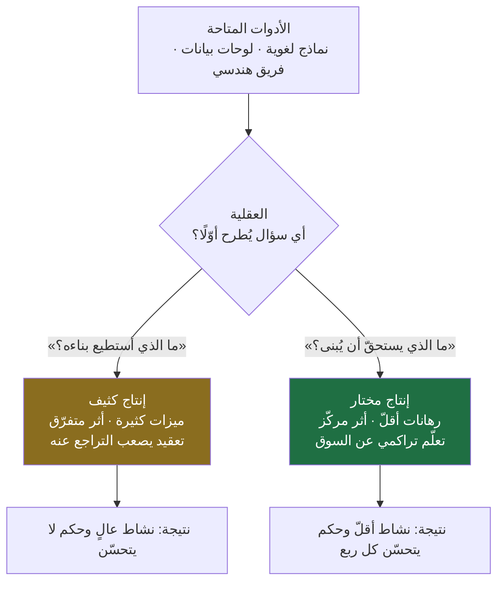
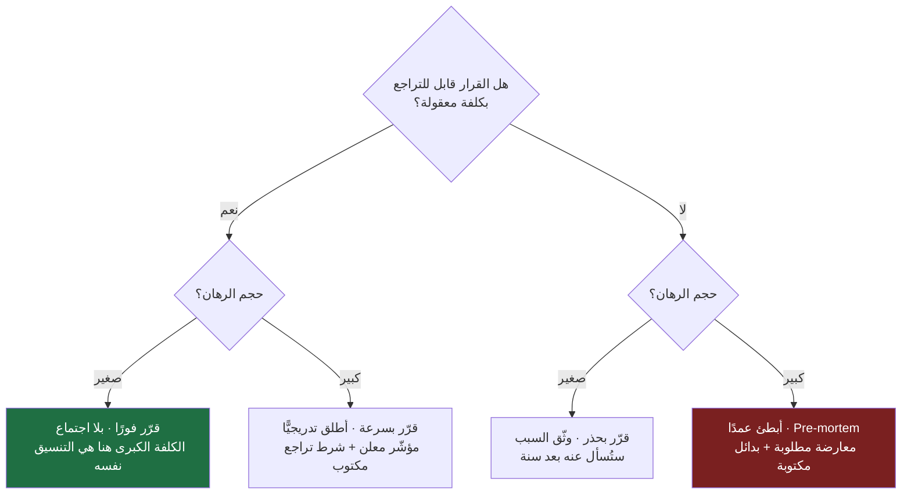
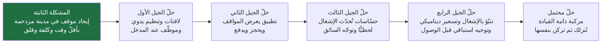
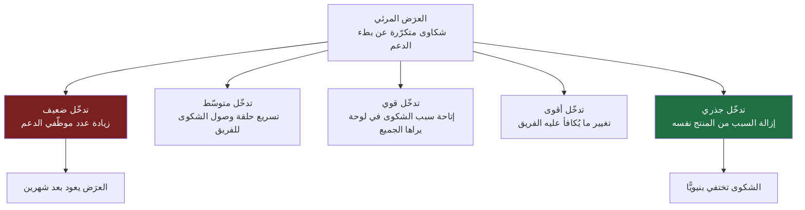
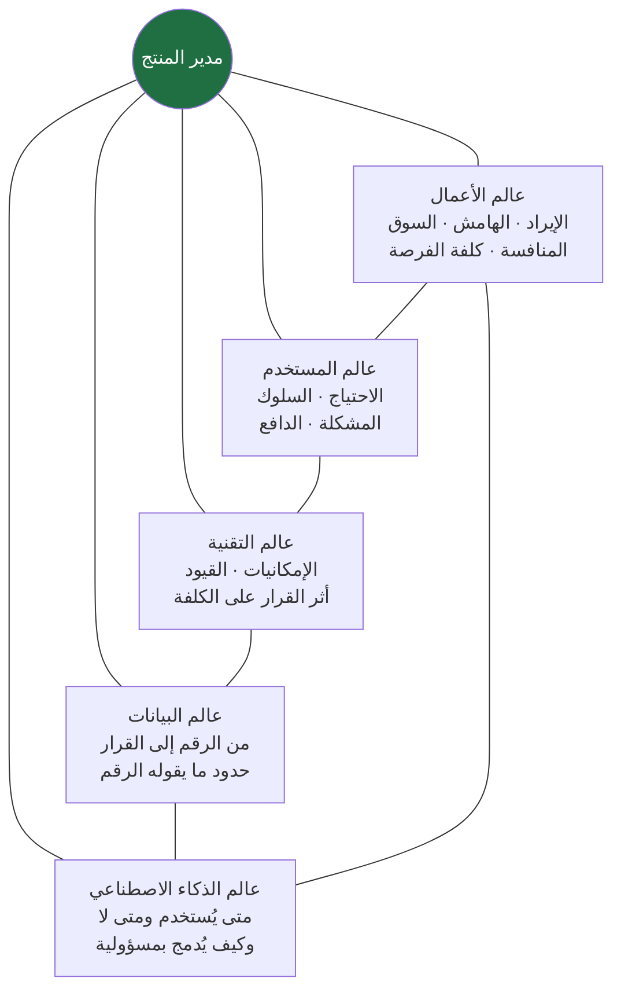
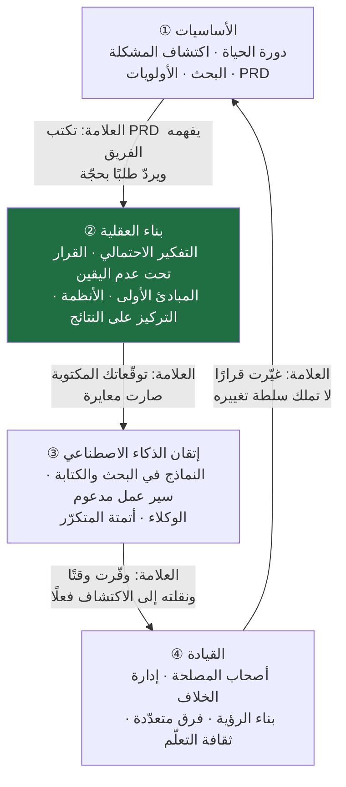

> [!info] الفصل 11 · إدارة المنتج في عصر الذكاء الاصطناعي
> **ماذا ستتعلّم:** هذا الفصل الأخير لا يضيف مهارة جديدة إلى قائمة مهاراتك؛ هو يعيد ترتيب كل ما سبق داخل **إطار ذهني واحد**. ستتعلّم كيف تعمل تحت **عدم اليقين** بدل انتظار اليقين، وكيف تتكلّم بلغة **الاحتمالات** لا بلغة الأبيض والأسود، وكيف تصنّف قراراتك إلى قابلة للتراجع وغير قابلة فتغيّر سرعتك بحسب ذلك، وكيف تبني **عُدّة قرار** شخصية (سجلّ قرارات · مذكّرة تنبّؤ · `Pre-mortem` · شرط تراجع معلن). وستتعرّف على التحيّزات المعرفية التي تفسد حكم مدير المنتج بأسمائها، وعلى الفرق بين `Data Driven` و`Data Informed`، وبين **الفشل الذكي** و**الفشل الرديء**، وعلى موقع **الحُكم الأخلاقي** من المهنة لا كملحق تجميلي. ثم ستخرج بخارطة طريق لما بعد هذا المرجع، وبإجابة نهائية عن السؤال الذي فتح [[01 - لماذا لا يزال مدير المنتج أهم من أي وقت مضى|الفصل الأول]]: **ما الذي لم يتغيّر؟**

# الفصل 11 — عقلية مدير المنتج في عصر الذكاء الاصطناعي

> «لماذا سيبقى بعض مديري المنتجات مطلوبين… بينما يخرج آخرون من السوق؟»

## 🎯 أهداف التعلّم

- **التمييز** بين المخاطرة (`Risk`) وعدم اليقين (`Uncertainty`) بالمعنى الاقتصادي الدقيق، وتحديد أيّ من نوعَي القرار تواجهه قبل أن تختار أداتك.
- **صياغة** أي رأي منتَجي بصيغة احتمالية قابلة للمراجعة («٧٠٪ أن يتحرّك المؤشّر بمقدار كذا خلال ستّة أسابيع») بدل الصيغة القطعية، ومعرفة لماذا هذه الصيغة أصدق وأنفع.
- **تصنيف** أي قرار على محورَي **قابلية التراجع** و**حجم الرهان**، واشتقاق السرعة المناسبة ومستوى التوثيق المناسب من هذا التصنيف.
- **بناء** أربع أدوات شخصية للقرار وتشغيلها فعليًّا: [[Decision Log|سجلّ القرارات]]، ومذكّرة التنبّؤ المسبق، و`Pre-mortem`، وشرط النقض المعلن (**ما الدليل الذي يجعلني أغيّر رأيي؟**).
- **تشخيص** ستّ تحيّزات معرفية بأسمائها في قرارات منتج واقعية (الإتاحة · التثبيت · التكلفة الغارقة · تحيّز الناجين · التحيّز التأكيدي · مغالطة التخطيط)، واقتراح مضادّ إجرائي لكلٍّ منها.
- **التفريق** عمليًّا بين `Data Driven` و`Data Informed`، وتفكيك رقم واحد غامض إلى خمس فرضيات تفسيرية متنافسة قبل التصرّف.
- **تصميم** تجربة صغيرة لأي قرار كبير: الفرضية، والمقياس، والحدّ الفاصل، ومعيار الإيقاف (`Kill Criteria`)، وكلفة التعلّم مقابل كلفة الخطأ.
- **التمييز** بين الفشل الذكي والفشل الرديء وفق طيف الفشل، وتصميم مراجعة ما بعد الحدث بلا إلقاء لوم.
- **تطبيق** التفكير من **المبادئ الأولى** و**التفكير بالأنظمة** على مشكلة منتَج واحدة، ومعرفة حدود كلٍّ منهما ومتى يصيران ترفًا ضارًّا.
- **تقييم** ادّعاءات شائعة عن العقلية (`Strong Opinions, Weakly Held`، العقلية النامية) تقييمًا نقديًّا مسنودًا إلى ما قيل في نقدها العلمي.
- **إدراج** الحُكم الأخلاقي في قرار المنتج: التعرّف على الأنماط المظلمة (`Dark Patterns`)، ونقد الإدمان كمقياس نجاح، وحدود التجريب على المستخدمين.
- **قراءة** إعلان وظيفي وتشخيص نوع الدور المعروض ونضج المؤسّسة قبل التقديم، وبناء ملفّ إنجاز يُثبت **الحُكم** لا **النشاط**.
- **تركيب** الفصول العشرة السابقة في نموذج ذهني واحد، والإجابة عن سؤال المرجع الافتتاحي: ما الذي لم يتغيّر؟

## المدخل: لماذا لا تُنتج الأداة الواحدة نتيجتين متساويتين؟

أعطِ شخصين الأدوات نفسها. اشتراك واحد في النموذج اللغوي نفسه، ووصول إلى لوحة البيانات نفسها، وفريق هندسي بالحجم نفسه، ومنتج في السوق نفسه. انتظر ستّة أشهر ثم انظر إلى ما بناه كلٌّ منهما.

النتيجتان لن تتساويا. ولن يكون الفارق في عدد ساعات العمل ولا في إتقان الأداة — قد يكون الأقلّ إتقانًا للأداة هو صاحب النتيجة الأفضل. الفارق يقع في مكان أصعب على القياس وأسهل على الملاحظة: **الأسئلة التي طرحها كلٌّ منهما قبل أن يمسّ الأداة**.

الأول سأل: «ما الذي أستطيع بناءه بهذا؟» فبنى كثيرًا. والثاني سأل: «ما الذي يستحقّ أن يُبنى، ولمن، وكيف أعرف أنني كنت مخطئًا؟» فبنى أقلّ، وأثّر أكثر.

هذا الفارق هو موضوع الفصل. وهو ليس موضوعًا تحفيزيًّا ولا مجموعة نصائح في «الإيجابية» و«الشغف»؛ هو **بنية تحتية للقرار**: مجموعة عادات ذهنية مسمّاة، لها أصول معرفية معروفة، وأدوات إجرائية تُمارَس بالورقة والقلم، ومعايير تُعرف بها الإجادة من الادّعاء.

ولأنّ هذا الفصل خاتمة المرجع، فوظيفته مزدوجة: أن يقدّم هذه العقلية بوصفها موضوعًا مستقلًّا يستحقّ الدراسة، وأن **يجمع** الفصول العشرة السابقة داخلها — فتتحوّل الأطر التي تعلّمتها من قائمة أدوات متجاورة إلى منظومة واحدة لها منطق داخلي. أنت لا تحتاج في نهاية هذا الفصل أن تحفظ شيئًا جديدًا؛ تحتاج أن تخرج وقد تغيّرت **طريقة سؤالك**.

> [!quote] من الويبينار
> عند تحديد الركيزة التي قامت عليها المنصّة المستضيفة، صيغ الموقف هكذا:
> *"We focus very heavily on **business impact, not theories**."*
>
> **الترجمة:** «نركّز تركيزًا شديدًا على **أثر الأعمال، لا على النظريات**.»
>
> وهذا التوجيه ينطبق على هذا الفصل تحديدًا أكثر من غيره: كل ما يأتي هنا من «عقلية» يجب أن يُقاس بأثره على جودة قرار حقيقي، لا بجماله كفكرة.

### ما «العقلية» تحديدًا؟ وما ليست؟

الكلمة مستهلكة إلى حدّ يجعلها شبه فارغة. فلنعرّفها تعريفًا يمكن الاعتراض عليه:

**العقلية هي مجموعة الافتراضات الافتراضية التي يعمل بها عقلك حين لا يتوفّر وقت للتفكير المنهجي.** أي أنها ليست ما تقوله في ورشة عمل، بل **ما تفعله في اجتماع مضغوط حين يُطلب منك رأي فوري**. وهي تظهر في ثلاثة مواضع بالتحديد:

1. **السؤال الأول الذي يقفز إلى ذهنك** حين تسمع طلبًا جديدًا. هل هو «كم يستغرق تنفيذه؟» أم «مشكلة مَن هذه؟»
2. **ما تفعله عند تعارض الدليل مع رأيك.** هل تبحث عمّا يدعمك أم عمّا ينقضك؟
3. **كيف تصف نتيجة لم تنجح.** هل هي «فشل» أم «معلومة كلفتنا ثلاثة أسابيع»؟

ولاحظ أن كل ما سبق **سلوك قابل للملاحظة**، لا شعور داخلي. وهذا مقصود: العقلية التي لا تظهر في سلوك ليست عقلية، بل خطاب عن الذات.

| ما تُظنّ العقلية | ما هي فعلًا |
|---|---|
| شغف وحماس ودافعية | مجموعة عادات في طرح السؤال ومعالجة الدليل |
| سمة شخصية ثابتة تولد بها | ممارسة مكتسبة قابلة للتدريب والقياس البطيء |
| ثقة عالية وحسم سريع | معايرة: ثقة تناسب قوّة الدليل، لا أكثر ولا أقلّ |
| «التفكير خارج الصندوق» | معرفة دقيقة بحدود الصندوق قبل الخروج منه |
| اجتهاد فردي | نظام شخصي مكتوب يعمل حتى وأنت متعب أو مضغوط |

> [!info] إضافة مرجعية
> التمييز بين **الأداء** و**نظام الأداء** تمييز قديم في أدبيات الخبرة. فما يفصل الخبير عن المتمرّس ليس عادةً معرفةً إضافية بل **بنية تمثيل أفضل للمشكلة**: الخبير يرى في الموقف نفسه أنماطًا لا يراها غيره، فيصل إلى القرار الجيد بجهد أقلّ. وهذا موثّق في أدبيات دراسة الخبرة منذ أبحاث `Herbert Simon` و`William Chase` على لاعبي الشطرنج (سبعينيات القرن الماضي): الخبير لا يحسب نقلات أكثر، بل **يرى مواقف أقلّ** لأنه يجمع القطع في وحدات معنى (`Chunks`).
>
> ومقابله في المنتج مباشر: مدير المنتج المتمرّس لا يقرأ لوحة بيانات أسرع، بل يعرف **أي ثلاثة أرقام تستحقّ النظر** فيتجاهل الباقي بلا قلق. وهذا هو معنى «حسّ المنتج» (`Product Sense`) الذي يصعب تعليمه مباشرةً ويسهل بناؤه بالانكشاف المكثّف على أمثلة كثيرة، جيدة ورديئة، مع تغذية راجعة صادقة على كل مثال.

## أوّلًا: العيش في عدم اليقين — المهارة التي لا تُدرَّس

### فرق بنيوي عن المهن المجاورة

المبرمج يعمل في عالم فيه **مرجع نهائي للصواب**. يكتب الكود، ويشغّل الاختبار، فيحصل على إجابة قاطعة: يعمل أو لا يعمل. قد تكون الإجابة مزعجة، لكنها **قاطعة**، وتصل خلال ثوانٍ، ولا تحتمل التأويل. وهذا امتياز معرفي هائل: التغذية الراجعة سريعة ودقيقة، فتتحسّن المهارة بسرعة.

انظر الآن إلى أسئلة مدير المنتج اليومية:

- هل هذه مشكلة حقيقية أم شكوى عابرة من ثلاثة أشخاص صاخبين؟
- هل سيستخدم الناس هذا فعلًا، أم سيقولون إنهم سيستخدمونه ثم لا يفعلون؟
- هل السوق مستعدّ لهذا الآن، أم أننا مبكّرون بسنتين؟
- هل نستثمر في هذا الربع أم ننتظر إشارة أوضح؟
- ماذا سيفعل المنافس خلال ستّة أشهر؟
- هل البيانات التي بين يديّ كافية للقرار، أم أنها كافية فقط لخداعي؟

**لا واحد من هذه الأسئلة له إجابة قاطعة.** ولا يوجد اختبار تشغّله فيخبرك. والأسوأ: التغذية الراجعة — إن وصلت — تصل **متأخّرة** و**ملوّثة** بعشرات المتغيّرات الأخرى (موسم، حملة تسويقية، تغيّر في السوق، خلل تقني، تحرّك منافس). فحتى حين تنجح، لا تعرف يقينًا **لماذا** نجحت.

ولهذا فإن الوصف الدقيق لعمل مدير المنتج ليس «اتخاذ القرار الصحيح»، بل: **اتّخاذ أفضل قرار ممكن بالمعلومات المتاحة، ثم تحمّل نتيجته، ثم تحسين الطريقة التي تُتّخذ بها القرارات التالية.**

انتبه إلى الجزء الثالث؛ هو المُهمَل عادةً. الفارق بين مدير منتج في سنته الأولى وآخر في سنته العاشرة ليس أن الثاني يصيب أكثر — قد يخطئ بالنسبة نفسها تقريبًا — بل أن **عملية اتّخاذ قراره تحسّنت**: يخطئ أخطاءً أرخص، ويكتشف خطأه أسرع، ويستخرج من الخطأ معلومة قابلة لإعادة الاستعمال.

### التمييز الحاسم: المخاطرة ليست عدم اليقين

هذا تمييز يُخلط فيه دائمًا، وله أثر عملي مباشر على اختيار الأداة.

> [!info] إضافة مرجعية
> في كتابه `Risk, Uncertainty and Profit` (1921) وضع الاقتصادي **`Frank Knight`** تمييزًا صار أساسًا في نظرية القرار:
> - **المخاطرة** (`Risk`): الاحتمالات فيها **معروفة أو قابلة للتقدير** من بيانات سابقة. رمي النرد. معدّل تعطّل خادم عرفنا تاريخه عبر سنتين. نسبة التحويل في مسار تسجيل قِيس ألف مرة.
> - **عدم اليقين** (`Uncertainty`، ويسمّى أحيانًا `Knightian Uncertainty`): لا توجد فيه توزيعة احتمالات موثوقة أصلًا، لأن الحدث **جديد نوعيًّا**. إطلاق فئة منتج لم توجد من قبل. دخول سوق بسلوك مستهلك غير مرصود. رهان على تقنية عمرها ثمانية عشر شهرًا.
>
> وأهمية التمييز عملية بحتة: **أدوات المخاطرة لا تعمل في عدم اليقين.** حساب القيمة المتوقّعة ونمذجة `Monte Carlo` ومصفوفة الاحتمال والأثر — كلها تفترض توزيعة. وحين لا توجد توزيعة، فإن استعمالها يعطيك **دقّة زائفة**: رقم عشري يوحي بالصرامة ومدخلاته مخترَعة.
>
> والأداة الصحيحة في عدم اليقين مختلفة النوع: **تقليل حجم الرهان، وشراء المعلومة بتجارب رخيصة، وتصميم قابلية التراجع، وتقصير المدّة بين القرار وأول إشارة**. أي أنك لا تحاول أن تعرف أكثر قبل الرهان، بل تجعل الرهان **أرخص وأسرع في الكشف**.

| البُعد | المخاطرة (`Risk`) | عدم اليقين (`Uncertainty`) |
|---|---|---|
| مثال في المنتج | تقدير أثر تحسين على مسار تسجيل قائم | إطلاق فئة منتج جديدة كليًّا في سوق جديد |
| مصدر المعرفة | بيانات تاريخية كافية | لا يوجد تاريخ يُقاس عليه |
| الأداة المناسبة | نماذج كمّية · [[Probability and Impact Matrix\|مصفوفة الاحتمال والأثر]] · [[Monte Carlo Simulation\|محاكاة مونتي كارلو]] | تجارب رخيصة · [[Fake Door Test\|اختبار الباب الوهمي]] · إطلاق محدود · تقليل حجم الرهان |
| شكل الخطأ الشائع | إفراط في التحفّظ وتضخيم الهوامش | استعمال أدوات المخاطرة فتُنتج ثقة زائفة |
| ما يشتريه المال | تقليل التباين حول نتيجة معروفة | **معلومة** تحوّل عدم اليقين إلى مخاطرة |
| علامة النضج | معايرة جيدة للأرقام | تواضع صريح + سرعة في التعلّم |

**والخلاصة الإجرائية:** قبل أن تختار أداة، اسأل: هل أنا في مخاطرة أم في عدم يقين؟ استخدام الأداة الخطأ هو أحد أشيع أسباب القرارات السيّئة المصحوبة بثقة عالية — وهي أسوأ تركيبة ممكنة.

### الفخّان المتقابلان: شلل التحليل وتهوّر الحدس

لعدم اليقين استجابتان خاطئتان متقابلتان، وكلتاهما شائعة:

**① شلل التحليل.** تأجيل القرار في انتظار «بيانات كافية». والمشكلة أن البيانات الكافية لن تصل أبدًا في القرارات التي تستحقّ اسم القرار — وإلا لما كانت قرارًا بل حسابًا. ولهذا الشلل تكلفة خفيّة يجهلها كثيرون: **تكلفة التأخير** ([[Cost of Delay|كلفة التأخير]])، وهي كلفة حقيقية تُدفع من حصّة السوق ومن معنويات الفريق ومن نافذة الفرصة، ولا تظهر في أي جدول لأن لا أحد يحاسبك على قرار **لم** تتّخذه.

**② تهوّر الحدس.** الطرف الآخر: «أنا أعرف هذا السوق، لا أحتاج بحثًا». وهذا موقف قد يكون صحيحًا أحيانًا — الحدس المدرَّب في بيئة مستقرّة ذات تغذية راجعة سريعة حدس معتبر — لكنه في بيئة المنتج غالبًا ما يكون تحيّزًا مغلَّفًا بثقة. والخبرة لا تُنتج حدسًا صحيحًا تلقائيًّا؛ تُنتجه فقط حين تكون التغذية الراجعة **سريعة ودقيقة ومتكرّرة**، وهي شروط نادرة في المنتج.

> [!note] القاعدة العملية بين الفخّين
> اسأل عن كل قرار مؤجَّل سؤالًا واحدًا: **«ما المعلومة المحدّدة التي أنتظرها، ومتى ستصل، وكم تكلّف، وهل ستغيّر قراري فعلًا؟»**
> - إن لم تستطع تسميتها بدقّة، فأنت لا تنتظر معلومة — أنت تؤجّل خوفًا. قرّر الآن.
> - إن سمّيتها لكنك أدركت أنها **لن تغيّر قرارك مهما جاءت**، فلا تشترِها. المعلومة التي لا تغيّر قرارًا لا قيمة لها مهما بدت مثيرة.
> - إن سمّيتها وكانت ستغيّر القرار فعلًا وكلفتها أقلّ من كلفة الخطأ، فانتظارها هو الحكمة لا التردّد.
>
> هذا السؤال وحده يحلّ أغلب حالات التردّد التي تستهلك أسابيع في الفرق.

## ثانيًا: التفكير الاحتمالي — كيف تتكلّم بالأرقام حين لا تملك أرقامًا؟

### من الجزم إلى المعايرة

المبتدئ يقول: **«هذه الميزة ستنجح.»**
والمحترف يقول: **«لدينا ثلاثة أدلّة تجعلني أقدّر احتمال نجاحها بنحو ٧٠٪، وأكبر مصدر لعدم يقيني هو أننا لم نختبرها على الشريحة الثانية.»**

الفرق ليس تهذيبًا لغويًّا ولا تحفّظًا مهنيًّا. الجملة الثانية **تحمل معلومات أكثر بكثير**:
- تعطي تقديرًا كمّيًّا يمكن مراجعته لاحقًا.
- تكشف مصدر القناعة (ثلاثة أدلّة، ويمكن سؤاله عنها).
- تحدّد **أضعف نقطة** في الحجّة — وهذه أثمن ما فيها، لأنها تخبر الفريق أين يستثمر ساعة التحقّق التالية.

والأهم: الجملة الأولى **لا يمكن أن تكون خاطئة بطريقة مفيدة**. إن نجحت الميزة قال صاحبها «قلت لكم»، وإن فشلت قال «الظروف تغيّرت». أما الجملة الثانية فتنشئ سجلًّا: بعد عشرين تقديرًا بنسبة ٧٠٪، ينبغي أن ينجح نحو أربعة عشر منها. إن نجح تسعة عشر فأنت **متحفّظ أكثر من اللازم** وتفوّت فرصًا. وإن نجح ثمانية فأنت **مفرط الثقة** وتحرق موارد الفريق.

> [!info] إضافة مرجعية
> هذا هو جوهر ما وثّقه `Philip Tetlock` في مشروعه الطويل حول دقّة التنبّؤ، وعرضه في `Expert Political Judgment` (2005) ثم في `Superforecasting: The Art and Science of Prediction` (2015، مع `Dan Gardner`). ونتائجه الأشهر ثلاث:
>
> **① متوسّط الخبراء كان ضعيف الأداء في التنبّؤ** بأحداث سياسية واقتصادية، وكثيرًا ما كان أداء الأكثر شهرةً منهم أسوأ — لأن الظهور الإعلامي يكافئ الجزم لا الدقّة.
> **② بعض الأفراد العاديين تفوّقوا بفارق معتبر ومستقرّ عبر السنوات** («المتنبّئون الفائقون»)، أي أن الأمر مهارة لا حظّ.
> **③ ما ميّزهم كان أسلوب التفكير لا الذكاء الخام ولا المعلومات السرّية:** تقسيم السؤال الكبير إلى أسئلة فرعية قابلة للتقدير · البدء من **معدّل الأساس** (`Base Rate`) قبل تفاصيل الحالة · تحديث التقدير بخطوات صغيرة متكرّرة مع كل دليل جديد بدل القفز أو التجمّد · استعمال تدرّج دقيق للاحتمالات (٦٥٪ لا «مرجّح») · والاحتفاظ بسجلّ يُصحّح المعايرة.
>
> **وحدّ هذا العمل:** يقيس أسئلة **مغلقة محدّدة الأجل** قابلة للتصحيح («هل يحدث س قبل تاريخ ص؟»)، وليس أسئلة مفتوحة من نوع «ما الاستراتيجية الصحيحة لشركتنا؟». فلا تُسقِط نتائجه على كل قرار. لكن حصّة معتبرة من قرارات المنتج **قابلة فعلًا** لهذه الصيغة، وهي تحديدًا الحصّة التي يُساء التعامل معها اليوم.

### أداة معدّل الأساس: علاجك من قصص النجاح

من أقوى ما في التفكير الاحتمالي، وأرخصه تطبيقًا، **البدء من معدّل الأساس قبل النظر في تفاصيل حالتك**.

المثال المألوف: يعرض عليك الفريق ميزة جديدة ويعدّد أسباب نجاحها المرتقب. الاستجابة الطبيعية أن تقيّم الأسباب. والاستجابة الأنضج أن تسأل أوّلًا: **«من بين آخر عشرين ميزة أطلقناها، كم واحدة حرّكت مؤشّرًا مستهدفًا بالمقدار الذي وُعد به؟»**

الجواب في أغلب الفرق التي تقيس فعلًا يكون متواضعًا. وهذا لا يعني رفض الميزة؛ يعني أن **نقطة انطلاقك ليست ٩٠٪ بل معدّل الأساس عندكم**، ثم تعدّله صعودًا أو هبوطًا بحسب ما يميّز هذه الحالة فعلًا. من يبدأ من الصفر مع كل ميزة سيقع أسير حماس العرض التقديمي في كل مرّة.

ونظير ذلك في تقدير الوقت: بدل «كم يستغرق هذا؟» اسأل «كم استغرقت آخر خمس ميزات مشابهة؟» — وهذا هو التقدير المرجعي (`Reference Class Forecasting`)، وهو العلاج المعروف لمغالطة التخطيط التي سنعود إليها بعد قليل.

### كيف تُنطق الاحتمالات في اجتماع لا يحبّها؟

الاعتراض العملي الأول على هذا الكلام: «مديري لا يريد احتمالات، يريد جوابًا.» وهو اعتراض حقيقي لا يُحلّ بالتمسّك بالمبدأ ولا بالتنازل عنه، بل بصياغة تعطي الطرفين ما يحتاجانه:

> [!example] ثلاث صياغات لنفس القدر من عدم اليقين
> **الصياغة الرديئة (جزم كاذب):** «نعم، سنطلق في الربع الثالث وسيرفع التحويل ٢٠٪.»
> — تشتري راحة مؤقّتة، وتشتري معها فقدان ثقة مؤجّلًا بعد ثلاثة أشهر.
>
> **الصياغة الرديئة الأخرى (تحفّظ مشلول):** «من الصعب الجزم، هناك متغيّرات كثيرة، لا نستطيع الالتزام برقم.»
> — صادقة، وعديمة النفع، وتُقرأ في الغرفة على أنها ضعف لا أمانة، فتفقد بها المقعد والقرار معًا.
>
> **الصياغة المهنية:** «التزامي: نطلق النسخة الأولى على شريحة المطاعم الصغيرة قبل نهاية أغسطس. توقّعي: ارتفاع التحويل بين ٨٪ و١٥٪، وأرجّح النصف الأدنى. أكبر مصدر لعدم يقيني أننا لم نختبر على مستخدمي الأجهزة القديمة، وسنغلق هذه الفجوة خلال أسبوعين. وإن جاء الارتفاع دون ٥٪ بعد أربعة أسابيع كاملة، فسنوقف التوسّع ونعيد النظر بدل المضيّ.»
> — لاحظ ما فعلته هذه الصياغة: **فصلت الالتزام عن التوقّع**. الالتزام قاطع (تاريخ الإطلاق، وهو تحت سيطرتك)، والتوقّع احتمالي (أثر السوق، وهو ليس تحت سيطرتك). وأغلب الصدام بين مديري المنتجات والإدارة سببه خلط هذين النوعين في جملة واحدة.

> [!warning] الخطأ الذي يفسد التفكير الاحتمالي في الممارسة
> استعمال الاحتمالات **كغطاء للمسؤولية** لا كأداة للدقّة. من يقول «قلت إن الاحتمال ٧٠٪ فقط» بعد الفشل، ولم يقل ذلك قبله بصيغة مكتوبة، ولم يشتقّ منه أي إجراء (لا تجربة، ولا خطّة بديلة، ولا تصغير للرهان)، إنما يستعمل لغة الاحتمال في وظيفة الاعتذار.
>
> **العلامة الفارقة بسيطة:** التقدير الاحتمالي الحقيقي **يغيّر الفعل**. إن كان تقديرك ٧٠٪ ولم يترتّب عليه شيء مختلف عمّا لو كان ٩٥٪، فهو ليس تقديرًا بل زينة لغوية.

## ثالثًا: تصنيف القرارات — لماذا تتعامل مع كل القرارات بالسرعة نفسها؟

### الخطأ التنظيمي الأشيع

أغلب الفرق تعامل قراراتها بسرعة واحدة. إمّا أن تكون بطيئة في كل شيء (كل قرار يحتاج عرضًا ولجنة وموافقة، فيموت الابتكار في الطوابير)، أو سريعة في كل شيء (تُتّخذ قرارات معمارية وتسعيرية بلا تفكير كما تُتّخذ قرارات نصّ الزرّ). وكلا النمطين مكلف، لكنه مكلف بطريقة مختلفة.

والمخرج ليس «توازنًا» مبهمًا، بل **تصنيفًا صريحًا** يسبق كل قرار.

> [!info] إضافة مرجعية
> شاع هذا التصنيف عبر خطابات `Jeff Bezos` السنوية إلى المساهمين في `Amazon` (وأشهرها خطاب 1997 وخطاب 2015، وكلاهما منشور علنًا على موقع علاقات المستثمرين)، بصيغة **قرارات الباب الواحد وقرارات الباب الدوّار**:
> - **الباب الدوّار** (`Two-way door`): قرار يمكن الرجوع عنه بكلفة محتملة. الخطأ فيه رخيص، وتكلفة **البطء** فيه أعلى من تكلفة الخطأ. ينبغي أن يُتّخذ بسرعة، وعلى مستوى أقرب ما يكون إلى العمل نفسه، وبقدر معلومات ناقص (نحو ٧٠٪ ممّا تتمنّى معرفته، بحسب الصياغة المنشورة في خطاب 2016).
> - **الباب الواحد** (`One-way door`): قرار يصعب الرجوع عنه أو تكون كلفة الرجوع فادحة. يستحقّ بطئًا ومراجعة ومناقشة معارضة صريحة.
>
> **والملاحظة النقدية المهمّة:** الخطر الحقيقي ليس في التصنيف بل في **إساءة التصنيف**. والمؤسّسات تخطئ في الاتجاهين: تعامل قرارات الباب الدوّار كأبواب واحدة فتشلّ نفسها؛ وتعامل قرارات الباب الواحد كأبواب دوّارة فتدفع الثمن بعد سنتين. وفي المنتج، أشهر ما يُساء تصنيفه: **نموذج التسعير**، و**بنية البيانات وهوية المستخدم**، و**الوعود التعاقدية للعملاء الكبار**، و**التكاملات العميقة مع طرف ثالث** — كلها تبدو قرارات عادية وهي أبواب واحدة عمليًّا.

### مصفوفة عملية: السرعة تُشتقّ من التصنيف

اجمع بُعدَي **قابلية التراجع** و**حجم الرهان** تحصل على أربعة أرباع، لكل ربع سلوك مختلف:

| | **رهان صغير** | **رهان كبير** |
|---|---|---|
| **قابل للتراجع** | **قرّر فورًا وحدك.** لا اجتماع ولا وثيقة. الكلفة الحقيقية هنا هي الوقت المهدور في التنسيق. | **قرّر بسرعة وقِس بجدّية.** أطلق تدريجيًّا، وحدّد مؤشّرًا وشرط تراجع، واجعل التراجع إجراءً معدًّا لا مفاجأة. |
| **غير قابل للتراجع** | **قرّر بحذر ووثّق السبب.** الحجم صغير لكن الأثر ممتدّ، وسيسألك أحد بعد سنة: لماذا؟ | **أبطئ عمدًا.** `Pre-mortem`، وجهة نظر معارضة مطلوبة صراحةً، وبدائل مكتوبة، ومراجعة من خارج الفريق. |

> [!example] ثلاثة قرارات وتصنيفها — ولماذا يُخطئ فيها الناس
> **① تغيير نصّ زرّ رئيسي في صفحة الاشتراك.** باب دوّار، رهان صغير. الصواب: غيّره اليوم وراقب المؤشّر أسبوعًا. الخطأ الشائع: ثلاثة اجتماعات ونقاش ذوقي بين ثلاثة أقسام لأن «الصفحة الرئيسية حسّاسة». الكلفة المدفوعة هنا ليست في الزرّ بل في **الأسبوعين** اللذين ضاعا، وفي الرسالة الضمنية للفريق بأن لا شيء يتحرّك بلا إذن.
>
> **② تغيير نموذج التسعير من اشتراك شهري إلى تسعير بالاستهلاك.** باب واحد عمليًّا، رهان كبير. الرجوع ممكن نظريًّا ومستحيل عمليًّا: العملاء الحاليون سيقارنون، والعقود ستتأثّر، وتوقّعات السوق تتغيّر، والفرق المالية بنت نماذجها على المنطق القديم. الصواب: نمذجة أثر مالي على شرائح، وتجربة على شريحة جديدة فقط لا على القاعدة القائمة، و`Pre-mortem` مكتوب، وسياسة انتقال معلنة. الخطأ الشائع: معاملته كتجربة نموّ.
>
> **③ اختيار مزوّد خارجي لخدمة أساسية داخل المنتج** (بحث، دفع، توصيات). يبدو بابًا دوّارًا («يمكننا تغييره لاحقًا») وهو باب واحد بعد ستّة أشهر من التكامل، لأن بنية بياناتك تكون قد تشكّلت على واجهته. الصواب: اسأل صراحةً في يوم القرار: **«ما كلفة الخروج بعد سنة؟»** وإن لم يعرف أحد الإجابة، فأنت أمام باب واحد وأنت تحسبه دوّارًا. وهذه صيغة أخرى لـ[[Vendor Lock-in|الارتهان للمورّد]].

### قاعدة الاختبار الذاتي

قبل أي قرار، أجب عن سؤالين مكتوبين لا أكثر — عشرون ثانية:

1. **إن كان هذا خطأً، متى سأعرف، وكم سيكلّفني التراجع؟**
2. **هل بطئي هنا يشتري لي معلومة، أم يشتري لي راحة نفسية فقط؟**

السؤال الثاني قاسٍ ومفيد. كثير من «الحذر» في المنتجات ليس حذرًا بل **تجنّبًا للمسؤولية**: كلّما زاد عدد الحاضرين في القرار، قلّت حصّة كلٍّ منهم من اللوم. والمؤسّسات التي تكافئ عدم الخطأ أكثر ممّا تكافئ الأثر تُنتج هذا السلوك بالضبط، ثم تشتكي من بطئها.

## رابعًا: عُدّة القرار — أربع أدوات تُمارَس بالورقة

المبادئ التي لا تتحوّل إلى إجراء تبقى شعارات. وهذه أربع أدوات صغيرة، كلفتها دقائق، وأثرها التراكمي على جودة حكمك أكبر من أي كتاب تقرأه هذا العام. اجعلها نظامًا واحدًا لا أدوات متفرّقة.

### الأداة ①: سجلّ القرارات

ملفّ واحد. كل قرار منتج فيه ستّة أسطر:

| الحقل | ماذا تكتب |
|---|---|
| **التاريخ والقرار** | جملة واحدة: ماذا قرّرنا بالضبط؟ |
| **الدليل** | ما الذي استندنا إليه: بيانات، مقابلات، طلبات دعم، حكم بلا دليل (وقُلها إن كانت كذلك) |
| **البديل المرفوض** | ما الذي لم نفعله ولماذا — وهذا أثمن سطر في السجلّ |
| **التوقّع** | أي مؤشّر سيتحرّك، بكم، ومتى تُراجَع النتيجة |
| **درجة الثقة** | نسبة مئوية صريحة، لا «مرجّح» ولا «إن شاء الله» |
| **شرط النقض** | ما الذي يجعلنا نتراجع؟ رقم أو حدث محدّد |

> [!info] إضافة مرجعية
> [[Decision Log|سجلّ القرارات]] ممارسة قديمة في الهندسة والحوكمة (`Architecture Decision Records` في هندسة البرمجيات مثالها الأشهر)، وقيمتها في المنتج مضاعفة لسبب معرفي دقيق: **التحيّز الاسترجاعي** (`Hindsight Bias`) — ميل الذاكرة إلى إعادة كتابة ما كنّا نعتقده قبل ظهور النتيجة. بعد نجاح ميزة، يتذكّر الجميع أنهم كانوا متحمّسين لها؛ وبعد فشلها، يتذكّر الجميع تحفّظاتهم. وهذا يجعل التعلّم من التجربة **مستحيلًا** بلا سجلّ مكتوب، لأنك لا تقارن الواقع بما توقّعته، بل بما تتذكّر الآن أنك توقّعته.
>
> والسجلّ يفعل شيئًا آخر أثمن: يحوّل ذاكرتك المهنية من **قصص** إلى **بيانات**. بعد سنة، لديك ثلاثون قرارًا موثّقًا بتوقّعاتها ونتائجها — وهذه أقوى مادة لتحسين المعايرة، ولمقابلة عمل، ولترقية، ولمعرفة نفسك.

**ولا تجعله بيروقراطيًّا وإلا مات.** لا تسجّل كل قرار — سجّل ما ينطبق عليه أحد ثلاثة: أنفقنا عليه أكثر من أسبوعين من عمل الفريق · صعب التراجع عنه · أو اختلفنا فيه اختلافًا حقيقيًّا. وما عدا ذلك لا يستحقّ سطرًا.

### الأداة ②: مذكّرة التنبّؤ المسبق

قبل أي إطلاق مهم، اكتب على ورقة واحدة، **قبل أن ترى النتيجة**:

- ما الرقم الذي أتوقّعه بعد ٣٠ يومًا؟ (رقم واحد، لا نطاق مطّاط)
- ما الرقم الذي إن جاء دونه أعتبر هذا فشلًا؟
- ما التفسير الذي سأقدّمه لو فشل؟ **اكتبه الآن** — قبل أن تعرف.
- ما الذي سيغيّر رأيي في هذه الفئة من الرهانات كلّها لو تكرّر الفشل؟

السطر الثالث هو الحيلة الذكية في هذه الأداة. لأنك حين تكتب تفسير الفشل مسبقًا، تكتشف غالبًا أنك **تعرفه الآن** — وأنك مضطرّ إمّا إلى معالجته قبل الإطلاق أو إلى الاعتراف بأنك تراهن وأنت ترى الحفرة. أما التفسير الذي يُخترع بعد النتيجة فهو دائمًا متاح، ودائمًا مقنع، ودائمًا عديم الفائدة.

### الأداة ③: `Pre-mortem` — الفحص السابق للوفاة

> [!info] إضافة مرجعية
> اقترح هذه التقنية عالم النفس المعرفي **`Gary Klein`** (وعرضها في `Harvard Business Review` عام 2007 بعنوان `Performing a Project Premortem`)، وأصلها بحثه الطويل في اتّخاذ القرار في الميدان (`Naturalistic Decision Making`). والفكرة انقلاب بسيط في صيغة السؤال:
>
> بدل أن تسأل الفريق **«ما المخاطر المحتملة؟»** — وهو سؤال يستدعي إجابات مؤدّبة وعامّة ولا يجرؤ أحد فيه على التشاؤم أمام قائد متحمّس — تقول:
> **«نحن الآن بعد ستّة أشهر. المشروع فشل فشلًا ذريعًا. اكتب كلٌّ منكم منفردًا، في خمس دقائق، القصّة الكاملة لكيف حدث ذلك.»**
>
> والفرق بين الصيغتين نفسيّ ومهمّ: الأولى تطلب توقّعًا احتماليًّا (وهو مكلف اجتماعيًّا)، والثانية تطلب **تفسيرًا لحدث مفروض وقوعه** — وهذا ما يجيده العقل البشري ويستمتع به. ويسمّي `Klein` هذا «الاستبصار بأثر رجعي المفترَض» (`Prospective Hindsight`)، وتشير الأدبيات التي استند إليها إلى أن هذه الصيغة ترفع عدد الأسباب المحدّدة التي يذكرها الناس ودقّتها مقارنةً بالسؤال المباشر.
>
> **وشرط نجاحه:** الكتابة **الفردية الصامتة أوّلًا** قبل النقاش. وإلا سيطر أعلى الحاضرين رتبةً على الجلسة وعاد كل شيء إلى قائمة مخاطر مهذّبة.

**والمخرَج المطلوب من الجلسة ليس قائمة مخاوف، بل ثلاثة أشياء:** أخطر سببين للفشل · إشارة مبكّرة تكشف كلًّا منهما قبل فوات الأوان · وإجراء واحد يُنفَّذ هذا الأسبوع لتقليل احتماله. جلسة بلا هذه الثلاثة كانت تنفيسًا جماعيًّا لا أداة قرار.

### الأداة ④: سؤال النقض

اسأل نفسك — واسأل من يعرض عليك مقترحًا — سؤالًا واحدًا: **«ما الدليل الذي يجعلني أغيّر رأيي؟»**

للإجابة ثلاث حالات، وكل واحدة تشخيص:

- **إجابة محدّدة** («لو أجرينا عشر مقابلات مع الشريحة (ب) ولم يذكر أحد المشكلة تلقائيًّا») → أنت أمام فرضية حقيقية. تابع.
- **إجابة مطّاطة** («لو أثبتت البيانات العكس») → لا تملك موقفًا قابلًا للاختبار. اضغط أكثر: أي بيانات؟ أي رقم؟ متى؟
- **لا توجد إجابة** → أنت لا تناقش رأيًا، بل **هوية**. والنقاش بعدها بلا فائدة، ويجب أن يتحوّل إلى تجربة صغيرة تحسم بدل جدل يستنزف.

> [!tip] كيف تجعلها ثقافة لا عادة فردية
> اطرح السؤال على نفسك **علنًا وأمام فريقك أوّلًا**. «موقفي أن نبني (أ)، والذي يغيّر رأيي هو كذا.» حين يسمعك الفريق تفعل ذلك بانتظام، يصبح السؤال إجراءً محايدًا لا اتّهامًا. وإن بدأت بتوجيهه إلى الآخرين فقط، فسيُقرأ على أنه أداة إفحام، وسيتوقّف الناس عن عرض أفكارهم عليك — وهذا أسوأ ما قد يحدث لمدير منتج.

## خامسًا: التحيّزات التي تفسد حكم مدير المنتج

الحكم البشري ليس عشوائي الخطأ؛ يخطئ **بأنماط منتظمة قابلة للتسمية والتوقّع**. وهذه هي البشرى الوحيدة في الموضوع: ما دام الخطأ منتظمًا، فيمكن بناء مضادّات إجرائية له.

> [!info] إضافة مرجعية
> الأساس هنا هو برنامج البحث الذي أسّسه **`Daniel Kahneman`** و**`Amos Tversky`** منذ السبعينيات، وعُرض للجمهور في `Thinking, Fast and Slow` (2011)، ثم في `Noise: A Flaw in Human Judgment` (2021، مع `Olivier Sibony` و`Cass Sunstein`).
>
> **وثلاث ملاحظات نقدية واجبة حتى لا يُستعمل هذا الأدب استعمالًا خاطئًا:**
> ① بعض تجارب أدبيات الإعداد النفسي (`Priming`) المذكورة في الكتاب واجهت **مشكلات في إعادة الإنتاج** ضمن ما عُرف بأزمة التكرار في علم النفس، وقد أشار `Kahneman` نفسه علنًا إلى أنه أفرط في الثقة بذلك الجزء تحديدًا. أما التحيّزات الأساسية (التثبيت، الإتاحة، مغالطة التخطيط، التأكيدي) فأدلّتها أقوى وأوسع.
> ② معرفة اسم التحيّز **لا تحصّنك منه**. هذه من أثبت النتائج وأكثرها إزعاجًا: التحيّزات تعمل حتى على من يدرّسها. والحلّ ليس الوعي بل **تغيير الإجراء** (نموذج مكتوب، ترتيب مختلف للاجتماع، رأي مستقلّ قبل النقاش).
> ③ أضاف كتاب `Noise` بُعدًا يُهمَل: كثير من رداءة الأحكام ليس **تحيّزًا** (خطأً منهجيًّا في اتجاه واحد) بل **ضوضاء** (تشتّتًا عشوائيًّا: القرار نفسه يُحكم عليه بشكل مختلف من شخصين، أو من الشخص نفسه في يومين). والضوضاء تُعالَج بأدوات مختلفة تمامًا: معايير معلنة، وتقييم مستقلّ قبل النقاش، وتجميع الأحكام بدل توحيدها بالنقاش.

### ستّة تحيّزات بأسمائها ومضادّاتها

| التحيّز | كيف يظهر في المنتج تحديدًا | المضادّ الإجرائي |
|---|---|---|
| **الإتاحة** (`Availability`) | شكوى واحدة من عميل كبير في اجتماع صباحي تُعيد ترتيب خارطة الطريق، لأنها **حاضرة في الذهن** لا لأنها ممثّلة | لا تقبل حادثة مفردة كدليل. اسأل دائمًا: **كم مرّة، ولأي نسبة من المستخدمين؟** قبل مناقشة الحلّ |
| **التثبيت** (`Anchoring`) | أول تقدير يُذكر في الاجتماع («أسبوعان؟») يجذب كل التقديرات اللاحقة إليه ولو كان اعتباطيًّا | اجمع التقديرات **مكتوبةً ومستقلّةً** قبل النقاش (وهو منطق [[Planning Poker\|بوكر التخطيط]])، ثم ناقش التباين لا المتوسّط |
| **التكلفة الغارقة** (`Sunk Cost`) | «أنفقنا أربعة أشهر، لا يمكن أن نوقفه الآن» — والمنفَق ذهب ولا يعود سواء أكملنا أم لا | أعد صياغة السؤال دائمًا إلى: **«لو عُرض عليّ هذا اليوم بحالته الحالية وبما تعلّمناه، هل أبدأه؟»** |
| **تحيّز الناجين** (`Survivorship`) | «هكذا فعلت شركة كذا فنجحت» — ولا نرى العشرات الذين فعلوا الشيء نفسه واختفوا | اسأل: **كم شركة فعلت هذا وفشلت؟** وإن كان الجواب مجهولًا، فالحكاية ليست دليلًا |
| **التحيّز التأكيدي** ([[Confirmation Bias\|التأكيدي]]) | نصمّم المقابلات والاستبيانات لتثبت ما نظنّه، ونسأل أسئلة موحية، ونقرأ البيانات انتقائيًّا | كلّف شخصًا صراحةً بدور **ناقض الفرضية**، واكتب شرط النقض قبل جمع البيانات لا بعده |
| **مغالطة التخطيط** (`Planning Fallacy`) | كل تقدير زمني متفائل بانتظام، ثم نتفاجأ بالتأخير في كل مرة كأنها الأولى | استخدم **التقدير المرجعي**: كم استغرقت آخر خمس ميزات مشابهة فعلًا؟ ابدأ من هناك لا من الخطّة المثالية |

> [!warning] تحيّز خاصّ بعصرنا: [[Automation Bias|الانحياز إلى الآلة]]
> ميل الإنسان إلى قبول مخرَج النظام الآلي لأنه **بدا واثقًا ومصوغًا صياغة محكمة**، وإلى إهمال الدليل المعارض حين يناقض النظام. وهو موثّق في أدبيات الطيران والطبّ منذ عقود، وقد صار اليوم الخطر اليومي الأول على مدير المنتج، لسبب مزعج: النماذج اللغوية **تُنتج نصًّا حسن الصياغة بمستوى ثقة ثابت بصرف النظر عن صحّة المحتوى**. فالفقرة الخاطئة تبدو تمامًا كالفقرة الصحيحة.
>
> ويتضاعف الأثر حين يكون المخرَج **متوافقًا مع ما تتمنّاه** — فيلتقي الانحياز إلى الآلة بالتحيّز التأكيدي، وتصبح الأداة آلة لتوليد المبرّرات. وهذا هو الاستعمال الأخطر للذكاء الاصطناعي في إدارة المنتج، لا الاستعمال الكسول.
>
> **المضادّ الإجرائي:** اطلب من النموذج **الحجّة المعاكسة أوّلًا**، وقبل أن تعرض عليه رأيك. واطلب منه أن يذكر ما الذي سيجعل توصيته خاطئة. وعامل كل رقم أو مصدر يذكره على أنه غير موجود حتى تتحقّق منه بنفسك ([[Hallucination|الهلوسة]] ليست حالة استثنائية بل خاصّية بنيوية في الاستعمال غير المقيَّد).

## سادسًا: أن تقع في حبّ المشكلة لا في حبّ الحلّ

### لماذا الحلّ أسهل في العشق؟

المؤسّس يقع في حبّ فكرته: منصّة، أو تطبيق، أو ميزة تخيّلها في ذهنه بتفاصيلها. ثم يقضي سنتين في بنائها، ثم يكتشف أن لا أحد يريدها. وليست المشكلة أنه أخطأ الفكرة — الأفكار تخطئ كثيرًا — بل أنه **لم يمنح نفسه فرصة اكتشاف الخطأ إلا بعد أن صار مكلفًا**.

والسبب النفسي معروف: **الحلّ ملموس، والمشكلة مجرّدة.** الحلّ له شكل يُرى وشاشة تُعرض وقصّة تُروى في مجلس. أما «ازدحام المواقف» فلا شكل لها ولا يمكنك أن تفتخر بها. ثم يضاف إلى ذلك أن الحلّ يصير **جزءًا من هويّتك** حين تدافع عنه علنًا ثلاث مرات — وبعدها لن يكون الدليل المعارض معلومة، بل تهديدًا شخصيًّا.

### المشكلة تبقى والحلول تتغيّر

خذ المشكلة الأشهر: **إيجاد موقف للسيارة في مدينة مزدحمة.** المشكلة قائمة منذ عقود ولم تتغيّر جوهريًّا. أمّا الحلول فتبدّلت جيلًا بعد جيل:

من عرّف نفسه بأنه «شركة تطبيق مواقف» انتهى مع الجيل الذي يليه. ومن عرّف نفسه بأنه «نحلّ مشكلة الوصول إلى موقف» انتقل بين الأجيال بموجوداته الحقيقية: فهم سلوك السائق، وعلاقات ملّاك المواقف، وبيانات الإشغال التاريخية، وثقة المستخدم. **الأصول الحقيقية تنتمي إلى المشكلة لا إلى الحلّ.**

> [!quote] من الويبينار
> وُصف ترتيب الأولوية بين فهم المشكلة وإنتاج الحلّ بصراحة:
> *«أهم حاجة في `product management` هي `problem definition`، اللي أنا أفهم أصلًا إيه المشكلة… أنا لو معي يوم كامل أفهم مشكلة وأطلّع حلّ، هقعد ٩٠ في المية من اليوم بفهم المشكلة و١٠ في المية بطلّع الحلّ.»*
>
> ثم عُرضت أدوات فهم المشكلة الثلاث بالترتيب: **بحث العملاء** (تلخيص مئات آلاف التقييمات آليًّا لمعرفة ما يشتكي منه الناس وما لا يشتكون منه) · ثم **البيانات** للتحقّق · ثم **الفرضيات والتجريب**.

ولاحظ أن النسبة (٩٠/١٠) ليست وصفة تُطبَّق حرفيًّا على كل يوم عمل، بل **إعلان أولوية**: حين تتزاحم الساعات، أيّهما يُضحّى به؟ والممارسة الشائعة تفعل العكس تمامًا: ساعة في تعريف المشكلة وعشر ساعات في تفاصيل الحلّ — ثم يُكتشف بعد الإطلاق أن الساعة الأولى كانت هي كل شيء.

> [!warning] الوجه الآخر: عشق المشكلة الخطأ
> لهذا المبدأ حدّ يُهمَل في العرض المتحمّس له. **الوقوع في حبّ المشكلة قد يكون بدوره فخًّا** إذا كانت المشكلة:
> - **حقيقية لكن غير قابلة للتسييل:** يعاني منها الناس فعلًا ولا يدفع أحد لحلّها، ولا يوجد طرف ثالث يدفع عنهم. مقبرة الشركات الناشئة مليئة بمشكلات حقيقية بلا نموذج إيراد.
> - **حقيقية لكن ليست لك:** حلّها يتطلّب أصولًا لا تملكها ولن تملكها (تراخيص، بنية توزيع، بيانات حصرية، علاقات تنظيمية).
> - **حقيقية لكن مشبعة:** يحلّها خمسة لاعبون بكفاءة، والمستخدم راضٍ بما فيه الكفاية ليتحمّل كلفة التبديل.
> - **حقيقية لكن نادرة:** تحدث مرّة كل سنتين، فلا يبني المستخدم عادة حولها ولا يتذكّر منتجك أصلًا وقت الحاجة.
>
> فالصيغة الأدقّ ليست «اعشق المشكلة» بل: **اعشق المشكلة، واختبر جدواها، واستعدّ لتركها إن لم تكن مشكلتك.** الالتزام بمشكلة خاطئة لعشر سنوات ليس مثابرة بل تكلفة غارقة ممتدّة، وتُروى عادةً كقصّة إصرار مُلهمة.

## سابعًا: `Data Informed` لا `Data Driven`

### الفرق في كلمة واحدة

`Data Driven` تعني حرفيًّا: **البيانات تقود**. أي أن الرقم يقرّر وأنت تنفّذ.
`Data Informed` تعني: **البيانات تُخبر**. أي أن الرقم مُدخَل ثمين في قرار يتّخذه إنسان يملك سياقًا لا يملكه الرقم.

الفرق ليس لفظيًّا. فالبيانات، مهما كثرت، تخبرك دائمًا **بما حدث**، ولا تخبرك أبدًا **بلماذا حدث**، ولا **بما ينبغي أن تفعل**. القفز من الأولى إلى الثالثة مباشرةً هو أشيع خطأ تحليلي في فرق المنتج، ويرتدي دائمًا ثوب الموضوعية.

> [!example] رقم واحد وخمسة تفسيرات — ولماذا كلّها معقولة
> **الملاحظة:** ٧٠٪ من المستخدمين يغادرون صفحة الدفع دون إتمام العملية.
>
> هذا الرقم **لا يقول شيئًا عن السبب**. وهذه خمسة تفسيرات متنافسة، لكلٍّ منها علاج مختلف تمامًا وكلفة مختلفة تمامًا:
>
> **① السعر.** رأوا المبلغ النهائي مع الرسوم والضريبة فتراجعوا. → العلاج: كشف الكلفة الكاملة مبكّرًا، أو مراجعة التسعير، أو خيار أرخص.
> **② التصميم.** النموذج طويل ويطلب بيانات كثيرة، والزرّ الأساسي غير واضح، والأخطاء تظهر بعد الإرسال لا قبله. → العلاج: تقليل الحقول وتحسين التحقّق اللحظي.
> **③ الأداء.** الصفحة تستغرق سبع ثوانٍ على شبكة الجوّال في مناطق بعينها. → العلاج هندسي بحت، ولا علاقة له بالتصميم ولا بالسعر.
> **④ الثقة.** لا يوجد ما يطمئن إلى أمان الدفع، ولا سياسة استرجاع ظاهرة، والعلامة جديدة على المستخدم. → العلاج: إشارات ثقة، ووسائل دفع مألوفة محلّيًّا، وسياسة واضحة.
> **⑤ النيّة أصلًا.** كثير منهم كان يستكشف ويقارن ولم ينوِ الشراء اليوم؛ صفحة الدفع عندهم أداة **معرفة السعر النهائي** لا خطوة شراء. → لا يوجد شيء لتصلحه هنا؛ المشكلة في **تعريف المقياس**، وربما في تسمية «التسرّب» ما هو سلوك طبيعي.
>
> **ولاحظ التفسير الخامس** — هو الأخطر لأنه غير مرئي في البيانات، ولأنه ينقض المشروع كلّه. الفريق الذي لا يفكّر فيه سيقضي ربعًا كاملًا في تحسين صفحة لا تحتاج تحسينًا.
>
> **وكيف يُحسم الأمر؟** لا بالنظر أطول إلى اللوحة، بل بالخروج منها: تقسيم المؤشّر بحسب الجهاز والشبكة والمنطقة وقناة الوصول ونوع المستخدم (جديد/عائد) · مشاهدة عشر جلسات مسجّلة · خمس مقابلات قصيرة مع من غادروا فعلًا · واختبار سريع لأرجح فرضيتين. **البيانات تدلّك على أين تنظر؛ الفهم يأتي من مكان آخر.**

### المغالطات الكمّية التي تصطاد مديري المنتجات

> [!info] إضافة مرجعية
> **① قانون `Goodhart`.** صياغته الشائعة (وتُنسب في هذه الصيغة إلى `Marilyn Strathern`، اختصارًا لملاحظة `Charles Goodhart` الاقتصادية عام 1975): **«حين يصير المقياس هدفًا، يكفّ عن كونه مقياسًا جيدًا.»** لأن الناس يحسّنون الرقم بأقصر طريق متاح، وأقصر طريق نادرًا ما يمرّ عبر القيمة الحقيقية. مثاله في المنتج: استهداف «الجلسات اليومية» يُنتج إشعارات ضاغطة تصنع جلسات مزعجة قصيرة؛ واستهداف «زمن المشاهدة» يُنتج توصيات تستنزف الوقت لا توصيات جيدة.
> **② مفارقة `Simpson`.** قد ينخفض مؤشّر في كل شريحة على حدة ويرتفع في المجموع (أو العكس) لمجرّد تغيّر أوزان الشرائح. ولهذا **لا تقرأ رقمًا كلّيًّا قبل أن تقسّمه**، ولا سيّما بعد حملة تسويقية غيّرت تركيبة الوافدين.
> **③ الارتباط ليس سببيّة.** المستخدمون الذين فعّلوا الميزة (س) يبقون أطول — هذا لا يعني أن (س) سبب البقاء؛ قد يكون العكس (الملتزمون أصلًا هم من يجرّبون كل شيء). وهذا التحيّز يسمّى **الاختيار الذاتي** (`Self-selection`)، وهو الخطأ الأول في تقارير «أثر الميزات» التي تُعرض على الإدارة.
> **④ تحيّز الناجين في التحليلات.** كل تحليلاتك مبنية على من **بقي** في المنتج. أمّا من غادر في اليوم الثاني — وهو غالبًا صاحب أهمّ معلومة — فليس في بياناتك أصلًا. ولهذا لا يُستغنى عن مقابلات المغادرين مهما كانت لوحاتك جميلة.
> **⑤ الدلالة الإحصائية ليست الدلالة العملية.** فرق يبلغ ٠٫٣٪ قد يكون «ذا دلالة إحصائية» على عيّنة ضخمة وعديم الأثر على العمل. والسؤال دائمًا: **ما أصغر أثر يستحقّ أن نغيّر شيئًا لأجله؟** وحدّده **قبل** التجربة لا بعدها.

> [!note] العلاقة بين هذا القسم والفصل العاشر
> [[10 - دورة حياة المنتج الكاملة|الفصل العاشر]] يعالج **كيف** تُبنى منظومة القياس عبر دورة حياة المنتج، ومتى تُوضع الأحداث والمؤشّرات. أمّا هنا فالموضوع **موقف ذهني** من الرقم: أن تعامله باعتباره سؤالًا لا جوابًا. من يخلط بين الاثنين يبني منظومة قياس ممتازة يستعملها استعمالًا رديئًا.

## ثامنًا: كل قرار تجربة — من الأحكام النهائية إلى الفرضيات

### إعادة صياغة العمل كلّه

النقلة الذهنية الأعمق في هذا الفصل تُختصر في جملة: **لا تُصدر أحكامًا نهائية؛ اصنع فرضيات قابلة للاختبار.**

| الصيغة الحُكمية | الصيغة الفرضية |
|---|---|
| «المستخدمون يريدون تسجيل دخول أسرع» | «نفترض أن تقليل خطوات التسجيل من ٥ إلى ٢ يرفع إتمام التسجيل من ٤٠٪ إلى ٥٥٪ خلال ٣ أسابيع لدى المستخدمين الجدد على الجوّال» |
| «الميزة فشلت» | «الميزة لم تحرّك المؤشّر (س) لدى الشريحة (ص)؛ والتفسيران الأرجح هما (أ) و(ب)، ونستطيع الفصل بينهما بهذا الفحص» |
| «السوق غير جاهز» | «الشريحة التي جرّبنا معها لم تُظهر استعدادًا للدفع؛ ولم نختبر بعد الشريحة الأقرب إلى الاحتياج، وهذا اختبارنا التالي» |

الفارق العملي أن الصيغة اليمنى **تنتج خطوة تالية**، بينما الصيغة اليسرى تُنهي النقاش. ومن هنا القاعدة: كل جملة لا تنتج خطوة تالية هي — في سياق العمل — جملة عديمة القيمة مهما كانت صحيحة.

> [!info] إضافة مرجعية
> صيغة الفرضية الجيدة في المنتج ([[Hypothesis|الفرضية]]) تحوي خمسة عناصر لا تقلّ:
> **①** التغيير المقترح بدقّة · **②** الشريحة المستهدفة بالتحديد · **③** المؤشّر المتأثّر · **④** حجم الأثر المتوقّع ونطاقه · **⑤** المدّة الزمنية.
> وكل عنصر ناقص يفتح بابًا لتأويل ما بعد النتيجة. وأشيع الناقص هو **④** — لأن ذكر الرقم يجعل الفشل مرئيًّا، وهذا بالضبط سبب وجوب ذكره.
>
> ويُضاف إليها عنصر سادس نادرًا ما يُكتب وهو الأهمّ: **معيار الإيقاف** (`Kill Criteria`). ما الرقم الذي إن جاء دونه نتوقّف؟ ومتى نقيسه؟ ومن يملك قرار الإيقاف؟ فبدون مالك معلَن للإيقاف، لن يوقف أحد شيئًا: إيقاف مشروع فعل مكلف اجتماعيًّا، ولن يتطوّع له أحد إلا إن كان مكتوبًا في وظيفته.

### اقتصاد التجربة: متى تختبر ومتى تبني مباشرةً؟

التجريب ليس فضيلة مطلقة. له كلفة (وقت، أدوات، تعقيد تنظيمي، إرباك للمستخدمين، تشتيت للفريق)، وله عائد (تقليل احتمال بناء الشيء الخطأ). والقاعدة الاقتصادية بسيطة:

**اختبر حين تكون كلفة التجربة أقلّ بكثير من (كلفة البناء × احتمال أن نكون مخطئين).**

فإن كان البناء يستغرق يومين والتجربة تستغرق ثلاثة، **ابنِ**. وإن كان البناء يستغرق ثلاثة أشهر واحتمال الخطأ ٤٠٪ والتجربة تستغرق أسبوعًا، فأنت أمام أفضل صفقة في وظيفتك. وهذا هو ما يعنيه [[Cost of Experimentation|كلفة التجريب]] بوصفه متغيّرًا في القرار لا شعارًا.

> [!example] سلّم التجارب من الأرخص إلى الأغلى
> **① سؤال في مقابلة قائمة (ساعة).** تضيف سؤالًا إلى مقابلات تجريها أصلًا. أرخص شيء ممكن، ويُهمَل دائمًا.
> **② تحليل بيانات موجودة (نصف يوم).** الجواب موجود غالبًا في بياناتك ولم يبحث فيه أحد.
> **③ [[Fake Door Test\|اختبار الباب الوهمي]] (يومان).** أضف مدخلًا للميزة غير الموجودة وقِس من ينقر — مع رسالة صادقة عند النقر («نعمل على هذا، هل تودّ إشعارًا؟»). وحدّه الأخلاقي واضح: لا تخدع المستخدم ولا تجعله يظنّ أنه أنجز شيئًا لم يُنجَز.
> **④ نموذج أوّلي قابل للنقر أمام ٨–١٠ مستخدمين (٣–٥ أيام).** يكشف مشكلات الفهم لا مشكلات القيمة.
> **⑤ تشغيل يدوي خلف الواجهة (`Concierge` / `Wizard of Oz`) لأسبوعين.** تقدّم الخدمة يدويًّا لعشرة عملاء قبل بناء أي أتمتة. أقوى اختبار للقيمة على الإطلاق، وأقلّها استعمالًا لأنه غير مريح.
> **⑥ إطلاق محدود على شريحة (٢–٤ أسابيع).** أقرب شيء إلى الحقيقة، وأغلى شيء قبل البناء الكامل.
>
> **والقاعدة:** انزل في السلّم من الأعلى فقط حين تعجز الدرجة الأرخص عن حسم السؤال. وأكثر ما يُهدَر في الفرق هو القفز إلى الدرجة السادسة لسؤال كانت الدرجة الثانية تحسمه في نصف يوم.

> [!quote] من الويبينار
> عن جدّية ما يُبنى بسرعة، جاء التنبيه صريحًا:
> *"You should not just see any Vibe code with random ideas and just play around. **Vibe coding is real code.** You should do it with any proper PRD first and do proper user journey mapping."*
>
> **الترجمة:** «لا ينبغي أن تكتفي بـ`Vibe Coding` بأفكار عشوائية وتعبث فحسب. **`Vibe Coding` كود حقيقي.** ينبغي أن تفعله مع `PRD` سليم أوّلًا، ومع رسم صحيح لرحلة المستخدم.»
>
> والدلالة العقلية هنا أهمّ من الدلالة التقنية: **رخص التنفيذ لا يُرخّص عشوائية التفكير.** بل كلّما رخص التنفيذ، صار الانضباط في تعريف المشكلة هو المتغيّر الحاكم الوحيد المتبقّي.

## تاسعًا: الفشل الذكي والفشل الرديء — ليس كل فشل تعلّمًا

### الشعار الذي أفسد المعنى

«نحن نحتفي بالفشل» شعار متكرّر في ثقافات الشركات، وهو في أغلب الاستعمالات **رديء وضارّ**. فليس كل فشل مصدر تعلّم؛ بعض الفشل مجرّد إهمال، والاحتفاء به يكافئ الإهمال ويظلم من يعمل بعناية.

> [!info] إضافة مرجعية
> عالجت **`Amy Edmondson`** (أستاذة في `Harvard Business School`) هذا الخلط في أعمالها عن التعلّم التنظيمي والأمان النفسي، ومنها مقالها `Strategies for Learning from Failure` في `Harvard Business Review` (2011) وكتابها اللاحق `Right Kind of Wrong` (2023). وخلاصتها أن الفشل **طيف** لا كتلة واحدة:
> - **فشل يمكن منعه** (`Preventable`): في عمل معروف الخطوات، سببه انحراف عن إجراء واضح أو إهمال أو نقص تدريب. **لا يُحتفى به**؛ يُعالَج بالتدريب والانضباط والأتمتة.
> - **فشل معقّد** (`Complexity-related`): في أنظمة متشابكة تلتقي فيها ظروف غير مألوفة. غير مقصود وغير متوقّع تمامًا. يُعالَج بتقليل الاقتران في النظام، وإشارات إنذار مبكّر، وتقليل حجم الدفعات.
> - **فشل ذكي** (`Intelligent`): في أرض جديدة، حيث لا سبيل إلى المعرفة إلا بالتجربة. **هذا وحده** ما يستحقّ الاحتفاء، وبشروط: أن يكون في منطقة مجهولة فعلًا · ومصمَّمًا لا عشوائيًّا · وبأصغر حجم يكفي للتعلّم · ومسبوقًا بمراجعة ما هو معروف أصلًا · ومتبوعًا باستخلاص مكتوب.
>
> والنتيجة العملية: **الشركة التي تحتفي بالفشل بلا تصنيف تُنتج فوضى؛ والشركة التي تعاقب كل فشل تُنتج جبنًا وإخفاءً للمعلومات — وهو أخطر لأنك تفقد رؤية المشكلات وهي صغيرة.**

| | فشل ذكي | فشل رديء |
|---|---|---|
| **الأرض** | مجهولة، لا سبيل للمعرفة إلا بالتجربة | معروفة، والجواب كان متاحًا لمن سأل |
| **الحجم** | أصغر رهان يكفي للتعلّم | رهان كبير بلا داعٍ |
| **التصميم** | فرضية ومقياس وشرط إيقاف مكتوب مسبقًا | «جرّبنا ونشوف» |
| **قبله** | مراجعة لما هو معروف داخليًّا وخارجيًّا | لم يسأل أحد الدعم ولا المبيعات ولا البيانات |
| **بعده** | استخلاص مكتوب يُغيّر قرارًا تاليًا | «سوء حظّ» أو بحث عن مسؤول |
| **قابلية التكرار** | لن يتكرّر لأن المعرفة تراكمت | سيتكرّر بعد ستّة أشهر بمسمّى آخر |

### مراجعة ما بعد الحدث بلا إلقاء لوم

الآلية التي تحوّل الفشل إلى معرفة اسمها **المراجعة اللاحقة بلا لوم** (`Blameless Postmortem`)، وهي ممارسة انتقلت من هندسة الموثوقية (`SRE`) إلى فرق المنتج. ومبدؤها المؤسِّس: **افترض أن كل شخص تصرّف تصرّفًا معقولًا بالنظر إلى المعلومات والحوافز والضغوط المتاحة له في تلك اللحظة.** فإن كان التصرّف معقولًا وأنتج نتيجة سيّئة، فالخلل في **النظام** — في المعلومات المتاحة، أو الحوافز، أو الإشارات، أو التوقيت — والنظام هو ما يمكن إصلاحه فعلًا. أمّا تسمية شخص فتنهي التحقيق قبل أن يبدأ، وتضمن أن يخفي الجميع أخطاءهم المرّة القادمة.

> [!example] هيكل جلسة مراجعة لإطلاق لم يحقّق هدفه (٦٠ دقيقة)
> **① الخطّ الزمني الواقعي (١٥ د).** ماذا حدث فعلًا وبأي ترتيب — وقائع لا تفسيرات. متى ظهرت أول إشارة؟ من رآها؟ ماذا فعل بها؟
> **② التوقّع مقابل الواقع (١٠ د).** يُفتح [[Decision Log|سجلّ القرارات]] ومذكّرة التنبّؤ. ماذا توقّعنا مكتوبًا؟ ما الذي حدث؟ **أين تحديدًا انفصل الخطّان؟** هذه اللحظة هي كل قيمة الجلسة.
> **③ أين كان القرار قابلًا للتحسين بالمعلومات المتاحة **حينها**؟ (١٥ د).** الشرط الأخير حاسم؛ الحكم بمعلومات اليوم على قرار الأمس ليس تعلّمًا بل إدانة.
> **④ ما الإشارة المبكّرة التي أهملناها؟ (١٠ د).** غالبًا توجد واحدة على الأقلّ: ملاحظة في مقابلة، أو تحفّظ مهندس، أو رقم شاذّ في الأسبوع الأول.
> **⑤ تغييران فقط (١٠ د).** لا عشرة. تغيير واحد في العملية، وتغيير واحد في ما نقيسه أو نراقبه. ولهما مالك وتاريخ، وإلا لن يحدثا.
>
> **وقاعدة الجلسة الوحيدة:** ممنوع ذكر الأسماء في سياق السبب. «لم يصل تحذير الأداء إلى صاحب القرار» — لا «فلان لم يبلّغ».

> [!warning] الحدّ الذي يُساء فيه استعمال «بلا لوم»
> «بلا لوم» تعني **بلا لوم على الخطأ الصادق**، ولا تعني **بلا مساءلة**. الفرق: من جرّب فرضية معقولة ففشلت لا يُلام؛ ومن تجاهل بيانات موجودة، أو أخفى إشارة، أو كرّر الخطأ نفسه ثلاث مرات دون تغيير في الطريقة، فهذا **نمط** لا حادثة، والمساءلة عنه واجبة وإلا فقدت الثقافة معناها. والثقافة التي تُلغي المساءلة باسم الأمان النفسي تنتج ما هو أسوأ من ثقافة اللوم: **لا مبالاة مؤدَّبة**. و[[Psychological Safety|الأمان النفسي]] في تعريفه الأصلي هو أمان **قول الحقيقة**، لا أمان **من النتائج**.

## عاشرًا: النجاح ليس بناء الميزات — `Outcome` كعقلية لا كمصطلح

تعلّمت التمييز بين [[Outcome vs Output|المخرَج والأثر]] في [[02 - فلسفة إدارة المنتج|الفصل الثاني]]، ورأيت أثره على القياس في [[10 - دورة حياة المنتج الكاملة|الفصل العاشر]]. ولن يُعاد شرحه هنا. المطلوب في هذا الفصل شيء آخر: أن تلاحظ أن الفارق بين الاثنين ليس تعريفيًّا بل **نفسيًّا**، وأن مقاومته أعمق ممّا يبدو.

فالمخرَج (`Output`) يمنحك ثلاثة أشياء يصعب التخلّي عنها: **يقينًا** (أطلقنا، هذه حقيقة)، و**فوريّةً** (اليوم لا بعد ثلاثة أشهر)، و**نسبةً إلى الذات** (أنا فعلت هذا). أمّا الأثر (`Outcome`) فيمنحك عكس ذلك تمامًا: **غموضًا** (هل تحرّك المؤشّر بسببنا أم بسبب الموسم؟)، و**تأخّرًا** (النتيجة بعد ربع)، و**ملكيّةً موزّعة** (تحرّك المؤشّر بفضل المنتج والتسويق والدعم والسعر معًا).

ولهذا تنجرف الفرق إلى عدّ الميزات ولو كانت تعرف نظريًّا أن ذلك خطأ: **المخرَج يعطي شعورًا بالإنجاز كل أسبوع، والأثر يعطي قلقًا كل أسبوع ويقينًا كل ربع.** والعقلية الناضجة هي القدرة على **تحمّل ذلك القلق** دون الهرب منه إلى النشاط.

> [!note] السؤال الذي يكشف الفرق في ثلاثين ثانية
> اسأل أي فريق: **«ما آخر شيء أوقفتموه أو حذفتموه من المنتج، ولماذا؟»**
> الفريق الذي يقيس نفسه بالناتج لا يملك إجابة — لأن الحذف يقلّل المخرَج، والإيقاف يبدو اعترافًا بالخطأ. والفريق الذي يقيس نفسه بالأثر يجيب في ثوانٍ، لأن الحذف عنده **تحسين للمؤشّر** لا خسارة له.

## حادي عشر: التفكير من المبادئ الأولى — وحدوده

### ما هو، ولماذا يُساء استعماله

**التفكير من المبادئ الأولى** أصله فلسفي قديم (يُردّ عادةً إلى تحليل `Aristotle` للمقدّمات الأولى غير المشتقّة من غيرها)، ومعناه العملي: بدل أن تشتقّ الحلّ من قياس على ما يفعله الآخرون، فكّك المشكلة إلى الحقائق الأساسية التي تعرف أنها صحيحة، ثم أعد البناء منها.

والنمط المضادّ له هو **التفكير بالتناظر** (`Reasoning by Analogy`): «كيف تفعل الشركات الأخرى هذا؟» وهو ليس رديئًا في ذاته — بل هو **الوضع الافتراضي الصحيح** في أغلب القرارات اليومية، لأنه سريع ورخيص ويستفيد من تجارب متراكمة. الخطأ هو استعماله في المواضع التي يجب أن تُفكَّك.

| البُعد | التفكير بالتناظر | التفكير من المبادئ الأولى |
|---|---|---|
| السؤال | «كيف يفعلها الآخرون؟» | «ما القيود الحقيقية غير القابلة للتفاوض؟» |
| السرعة | سريع ورخيص | بطيء ومكلف ذهنيًّا |
| متى يصلح | قرارات يومية · معايير مستقرّة · سياق مشابه | قرارات كبيرة · سوق مختلف · قيود تغيّرت |
| خطره | نقل ممارسة مع إسقاط شرطها | إعادة اختراع أشياء محلولة، وبطء بلا مبرّر |
| مثاله | «نضيف تقييمًا بخمس نجوم لأن الجميع يفعل» | «ما الذي يحتاجه المشتري ليثق؟ هل النجوم هي الوسيلة في سوقنا؟» |

### كيف يُمارَس فعليًّا: ثلاث خطوات

**① اكتب كل افتراض قائم كجملة صريحة.** المهارة هنا هي رؤية الافتراضات التي صارت غير مرئية لفرط ألفتها: «المستخدم يجب أن يسجّل حسابًا قبل التجربة» · «التسعير شهري» · «الطلب يمرّ عبر مندوب» · «التقرير يُصدَّر ملفًّا».

**② صنّف كل افتراض إلى ثلاثة:** قيد فيزيائي/قانوني حقيقي (لا يتفاوض: نظام حماية البيانات، حدّ فيزيائي، متطلّب تنظيمي) · قيد تقني حالي (يمكن تغييره بكلفة معلومة) · **عادة موروثة** (لا سبب لها إلا أنها كذلك منذ البداية).

**③ أعد البناء من الفئة الأولى فقط**، وافترض أن الثانية والثالثة قابلتان للتغيير، ثم قدّر كلفة تغيير كلٍّ منهما.

> [!example] تفكيك عملي: «لا يمكن تسليم البقالة في أقلّ من ساعة»
> **الافتراضات المعلنة عند الفريق:** التوصيل من متجر تجزئة قائم · السائق يتسلّم بعد اكتمال التجهيز · التجهيز يبدأ بعد إرسال الطلب · مسافة المتجر عن العميل معطاة · مسار السائق يُحدَّد بعد الاستلام.
>
> **التصنيف:** لا شيء ممّا سبق قيد فيزيائي. القيد الفيزيائي الوحيد هو **الزمن اللازم لقطع مسافة معيّنة في حركة مرور معلومة**. كل ما عداه ترتيب تشغيلي قابل لإعادة التصميم.
>
> **إعادة البناء تفتح خيارات لم تكن على الطاولة:** مستودعات صغيرة قريبة تخدم نطاقًا ضيّقًا بدل متجر كبير بعيد (`Dark Stores`) · بدء التجهيز عند إضافة أول صنف إلى السلّة لا عند الدفع · تخصيص السائق أثناء التجهيز لا بعده · تجميع طلبات متجاورة في مسار واحد · تخزين مسبق للأصناف الأكثر طلبًا قرب مناطق الطلب المرتفع.
>
> **وهذا هو موضع الملاحظة الأهمّ:** كل خيار من هذه له كلفة رأسمالية وتشغيلية قد تكون أكبر من قيمة تقصير الوقت. **التفكيك يوسّع مساحة الخيارات ولا يعفيك من المفاضلة الاقتصادية.** من يتوقّف عند «اكتشفت أن القيد ليس حقيقيًّا» ويظنّ أنه انتهى، إنما مارس نصف التمرين — وهو النصف الممتع.

> [!warning] الحدود الأربعة للتفكير من المبادئ الأولى
> **①** **مكلف زمنيًّا**، فلا يصلح إلا لقرارات قليلة كبيرة. من يفكّك كل شيء لا ينهي شيئًا، ويصير عبئًا على فريقه.
> **②** **يُنتج ثقة زائفة أحيانًا**، لأن «الحقائق الأساسية» التي بنيت عليها قد تكون هي نفسها افتراضات غير مفحوصة، وقد تكون منقوصة (كثير من القيود الحقيقية اجتماعي وتنظيمي، لا فيزيائي، ولا يظهر في التفكيك الهندسي).
> **③** **يُستعمل كغطاء للتعالي على الممارسات القائمة.** كثير من «المبادئ الأولى» في الاجتماعات ليس تفكيكًا بل رفضًا لسماع تجربة الآخرين، ومن يفعل ذلك يعيد اكتشاف أخطاء معروفة على حساب شركته.
> **④** **لا يُغني عن معرفة المجال.** لا يمكنك تفكيك مشكلة في سوق لا تعرف قيوده — ستسمّي عادةً موروثة ما هو في الحقيقة قيد تنظيمي، ثم تصطدم به بعد شهرين. **التفكيك بلا معرفة مجال هو تخيّل.**

## ثاني عشر: التفكير بالأنظمة — من إصلاح العرَض إلى تغيير البنية

مدير المنتج المبتدئ يصلح ما يظهر. والناضج يسأل: **ما الذي يُنتج هذا باستمرار؟**

الفرق أن الأول يعالج حادثة، والثاني يعالج **آلة تُنتج الحوادث**. ولهذا تجد فرقًا تحلّ المشكلة نفسها كل ثلاثة أشهر بأسماء مختلفة، ولا تلاحظ أنها تحلّ العرَض في كل مرّة.

> [!info] إضافة مرجعية
> المرجع الأشهر في تبسيط هذا الحقل هو `Thinking in Systems: A Primer` لـ**`Donella Meadows`** (نُشر 2008 بعد وفاتها)، وأشهر ما فيه **قائمة نقاط الرفع** (`Leverage Points`): مواضع التدخّل في النظام مرتّبة من الأضعف أثرًا إلى الأقوى. وترتيبها المبسَّط، مسقَطًا على المنتج:
>
> | نقطة التدخّل | الأثر | مثالها في منتج |
> |---|---|---|
> | تعديل معايير رقمية (`Parameters`) | ضعيف | تغيير حدّ التنبيه، أو مدّة التجربة المجّانية من ١٤ إلى ٣٠ يومًا |
> | تعديل حلقات التغذية الراجعة | متوسّط | تسريع وصول شكوى المستخدم إلى الفريق من أسبوعين إلى يوم |
> | تعديل تدفّق المعلومات (من يرى ماذا) | قوي | جعل مؤشّر الاحتفاظ مرئيًّا لكل الفريق يوميًّا بدل تقرير ربعي للإدارة |
> | تعديل القواعد والحوافز | أقوى | تغيير ما يُكافأ عليه الفريق: من عدد الإطلاقات إلى أثر مُقاس |
> | تعديل الهدف نفسه | الأقوى | من «زيادة الجلسات» إلى «زيادة المهامّ المنجَزة بنجاح» |
>
> **والملاحظة الحاسمة:** أغلب الفرق تنفق طاقتها في السطر الأول، وأغلب التغيير الحقيقي يقع في السطرين الأخيرين — وهما الوحيدان اللذان لا يستطيع مدير المنتج تنفيذهما وحده، بل يحتاج فيهما إقناعًا وسلطة وتحالفات. ولهذا فإن مهارة الإقناع ليست مهارة «ناعمة» مكمّلة، بل هي **شرط الوصول إلى نقاط الرفع العالية**.

> [!example] الفارق في حالة واحدة
> **العرَض:** ٤٠٪ من تذاكر الدعم عن «لم يصلني رمز التحقّق».
> **الحلّ العرَضي:** زيادة موظّفي الدعم، وقالب ردّ سريع، ولوحة متابعة لزمن الاستجابة. تتحسّن المؤشّرات وتبقى المشكلة.
> **الحلّ البنيوي:** لماذا لا يصل الرمز أصلًا؟ فيتبيّن أن مزوّد الرسائل يفشل بنسبة معتبرة عند مشغّل بعينه في ساعات الذروة. والعلاج: مزوّد احتياطي وتحويل تلقائي عند الفشل، وإتاحة تحقّق بديل (بريد أو مكالمة)، وقياس معدّل التسليم لا معدّل الإرسال.
> **الحلّ الأعمق:** هل نحتاج رمز تحقّق في هذه اللحظة من الرحلة أصلًا؟ ربما يمكن تأجيله إلى ما بعد أول قيمة يلمسها المستخدم. وهذا يحذف فئة الشكاوى كلّها بدل تحسين معالجتها.
>
> **ولاحظ:** الحلّ العرَضي يرفع مؤشّرات فريق الدعم، والحلّ البنيوي **يقلّل عمل فريق الدعم** — وهذا سبب مقاومته أحيانًا. الأنظمة تقاوم التحسين حين يهدّد مقاييس أجزائها.

## ثالث عشر: ما الذي لا يُختزل إلى توليد نصوص؟

### الجرد الصريح

لو افترضنا أقصى ما يُتوقّع في الأفق المنظور — أن يكتب النموذج البريد والوثيقة والكود ويحلّل البيانات ويولّد التقارير ويلخّص المقابلات ويقترح الفرضيات — فماذا يبقى للإنسان؟

يبقى **كل ما لا يُختزل إلى توليد نصّ أو تنفيذ تعليمة**، وهو ستّة أشياء:

1. **الرؤية.** الجواب عن «إلى أين نذهب ولماذا هذا الاتجاه دون غيره؟» — وهو سؤال لا مُدخَل له في البيانات لأن البيانات كلّها عن الماضي.
2. **الحُكم.** الاختيار بين خيارين كلاهما معقول والمعلومات ناقصة والوقت محدود.
3. **الأخلاق.** ما الذي **ينبغي** أن نفعله؟ وما الذي نرفض بناءه ولو كان مربحًا؟
4. **القيادة.** إقناع، ومواءمة، وبناء ثقة، وتحمّل مسؤولية أمام أشخاص لهم مصالح متعارضة.
5. **المفاضلة القيمية.** إيراد الربع مقابل ثقة السنوات الثلاث؛ نموّ سريع مقابل جودة تجربة. لا تُستخرج من البيانات لأنها هي التي تحدّد أي بيانات تُجمَع.
6. **فهم البشر.** ما لم يُقَل في المقابلة، والتناقض بين ما يقوله المستخدم وما تفعله يده، والسؤال المتابع الذي يخطر لك في اللحظة.

وقد فُصّل هذا الجرد في [[01 - لماذا لا يزال مدير المنتج أهم من أي وقت مضى|الفصل الأول]] (بما فيه المنطقة الرمادية التي ستتحرّك حدودها فعلًا)، وفي [[04 - الذكاء الاصطناعي ومدير المنتج|الفصل الرابع]] من زاوية ما أُزيل وما بقي، وفي [[09 - مدير المنتج في عصر الذكاء الاصطناعي|الفصل التاسع]] من زاوية إعادة تصميم العمل. فلا يُعاد هنا. المضاف في هذا الفصل هو **كيف تستعمل الأداة بحيث تنمّي حكمك بدل أن تستبدله**.

> [!quote] من الويبينار
> وحين طُرح السؤال عمّا لا يستطيع الذكاء الاصطناعي فعله، جاءت الإجابة محدّدة:
> *«أتوقّع أنه… هذا الشيء الوحيد اللي ما يقدر يسويه هو إقناع الـ`stakeholders`. هذي بتكون `skill` موجودة للبشر، وتكون أقوى `skill` موجودة لمدير المنتج: كيف أنا عندي فكرة وأقنع كل اللي موجودين في الغرفة على الفكرة هذي.»*
>
> ولاحظ أن الإقناع هنا ليس مهارة خطابية؛ هو — بلغة القسم السابق — **الوسيلة الوحيدة للوصول إلى نقاط الرفع العالية في النظام**، لأن تغيير الحوافز والأهداف لا يملكه مدير المنتج بسلطته بل بحجّته.

### ثلاثة أنماط لاستعمال النموذج: أيّها ينمّي الحكم؟

| النمط | كيف يبدو | أثره على حكمك |
|---|---|---|
| **الاستبدال** | «اكتب لي `PRD` لميزة تصدير» ثم تنسخ المخرَج وترسله | **يضمر الحكم.** لم تمرّ بعملية التفكير أصلًا، ولا تملك ما تدافع عنه في أول سؤال صعب |
| **التسريع** | تكتب الهيكل والقرارات، ويصوغ هو ويرتّب ويكتشف الثغرات الشكلية | **محايد إلى إيجابي.** يوفّر وقتًا يُنقل إلى الاكتشاف — وهذا هو المكسب الذي وُصف في الويبينار |
| **الخصومة** | تعرض عليه موقفك وتطلب أقوى ثلاث حجج ضدّه، ثم تطلب ما الذي يجعله باطلًا | **ينمّي الحكم فعلًا.** يعوّض أخطر نقص في عمل مدير المنتج: قلّة من يعارضه بجدّية |

> [!tip] ثلاثة موجّهات تستحقّ أن تكون عادةً أسبوعية
> **①** «هذا قراري وهذه أدلّتي. اذكر أقوى ثلاث حجج مضادّة، ثم اذكر ما الدليل الذي يحسم بين موقفي وموقف المعارض.»
> **②** «نحن بعد ستّة أشهر وقد فشل هذا فشلًا ذريعًا. اكتب القصّة الكاملة لكيف حدث — بأسباب محدّدة لا عامّة.» (وهذا `Pre-mortem` بتكلفة دقيقتين، ويصلح تمهيدًا للجلسة البشرية لا بديلًا عنها.)
> **③** «هذه بياناتي وهذا استنتاجي. اذكر خمسة تفسيرات بديلة للنمط نفسه، ورتّبها بحسب ما يمكن استبعاده بأرخص فحص.»
>
> ولاحظ أن الموجّهات الثلاثة تشترك في شيء واحد: **لا تطلب من النموذج أن يقرّر، بل أن يوسّع مساحة ما تفكّر فيه قبل أن تقرّر.** وهذا هو الفرق بين أداة تنمّي عقلك وأداة تحلّ محلّه.

## رابع عشر: سرعة التعلّم — المهارة التي تحكم بقية المهارات

### لماذا هي المهارة الأولى؟

ليست البرمجة، ولا كتابة الموجّهات، ولا حتى إدارة المنتجات بالمعنى المهاري. أهمّ مهارة على مدى مسيرة مهنية هي **سرعة التعلّم**، لسبب حسابي بسيط: الأدوات تتغيّر في دورات قصيرة، والمعرفة الأداتية التي أتقنتها هذا العام قد تفقد جزءًا من قيمتها خلال سنتين، بينما **قدرتك على اكتساب الأداة التالية تتراكم ولا تتقادم**.

وهذا لا يعني أن كل معرفة سريعة التقادم. بل هناك ثلاث طبقات مختلفة تمامًا في عمر الصلاحية:

| الطبقة | مثالها | عمر الصلاحية | كم تستثمر فيها |
|---|---|---|---|
| **الأداة** | إتقان أداة بعينها، تفاصيل تكامل، صياغة موجّه لنموذج بعينه | شهور إلى سنتين | ما يكفي للإنتاج اليوم، بلا تعلّق |
| **الممارسة** | كيف تُجرى مقابلة لا توحي بالجواب · كيف تُصمَّم تجربة · كيف يُكتب `PRD` نافع | سنوات | استثمار كبير — هذا متن المهنة |
| **المبادئ** | تعريف المشكلة · المفاضلة تحت ندرة · القرار في عدم اليقين · الأثر على الأعمال | عقود | أكبر استثمار — وهو ما يبنيه هذا المرجع |

**والخطأ الشائع أن يقضي الممارس أغلب وقته في الطبقة الأولى** لأنها الأوضح والأسرع مكافأةً والأكثر ظهورًا على وسائل التواصل، ثم يجد نفسه بعد خمس سنوات يملك سيرة ذاتية مليئة بالأدوات وحكمًا لم يتغيّر.

> [!info] إضافة مرجعية
> يشير أدب **الممارسة المتعمّدة** (`Deliberate Practice`، وأصله أعمال **`K. Anders Ericsson`**) إلى أن التكرار وحده لا يُنتج خبرة؛ يُنتجها التكرار المصحوب بـ**هدف محدّد، وصعوبة تتجاوز مستواك قليلًا، وتغذية راجعة سريعة ودقيقة، وتصحيح فوري**.
>
> **وهنا المشكلة البنيوية في إدارة المنتج:** الشرط الثالث مفقود بطبيعة المهنة. التغذية الراجعة على قرار منتج تصل بعد شهور، ملوّثة بعشرات المتغيّرات. ولهذا **لا تُنتج سنوات الخبرة وحدها حكمًا جيدًا في هذه المهنة** — بل قد تُنتج ثقةً بلا كفاءة، وهو أسوأ ما يمكن.
>
> **والعلاج الوحيد المتاح هو صناعة التغذية الراجعة صناعةً:** أن تكتب التوقّع قبل النتيجة (مذكّرة التنبّؤ)، وأن تراجع قرارًا قديمًا كل شهر، وأن تحتفظ بسجلّ يمنع ذاكرتك من إعادة كتابة الماضي. أي أن **الأدوات الأربع في القسم الرابع ليست ترفًا تنظيميًّا؛ هي البديل الصناعي عن حلقة تغذية راجعة لا توجد طبيعيًّا في هذه المهنة.**
>
> ويُنبَّه أيضًا إلى أن «قاعدة العشرة آلاف ساعة» التي شاعت عن هذه الأبحاث **تبسيط شعبي** اعترض عليه `Ericsson` نفسه علنًا: المدّة ليست هي المتغيّر الحاكم، بل بنية الممارسة ووجود التغذية الراجعة.

### نظام تعلّم شخصي بأربع حلقات

> [!example] كيف يبدو التعلّم المنضبط في تقويم أسبوعي واقعي
> **حلقة يومية (١٠ دقائق):** سطر واحد في دفتر: ما الذي تعلّمته اليوم عن المستخدم أو عن المنتج أو عن نفسي؟ **بشرط أن يكون ملاحظة لا انطباعًا** («ثلاثة من أربعة في المقابلات اليوم فتحوا التطبيق من الإشعار لا من الأيقونة»).
> **حلقة أسبوعية (٣٠ دقيقة):** حدّد الشيء الذي استهلك وقتك هذا الأسبوع، وابحث عن طريقة لأتمتته أو إلغائه — وهي القاعدة التي وُصفت في الويبينار بـ«التحدّي الأسبوعي». وأضِف إليها: مراجعة تقديراتك التي حان موعد التحقّق منها.
> **حلقة شهرية (ساعتان):** افتح إطلاقًا عمره ثلاثة أشهر وانظر أرقامه الآن مقابل ما توقّعته مكتوبًا. اكتب فقرة: أين انفصل الخطّان ولماذا؟
> **حلقة ربعية (نصف يوم):** راجع سجلّ القرارات كاملًا. احسب: كم قرارًا صحّ توقّعك فيه؟ هل أنت مفرط الثقة أم متحفّظ؟ وما **نوع** الأخطاء المتكرّر؟ (المبالغة في تقدير التبنّي؟ الاستهانة بمقاومة المؤسّسة؟ إهمال التوقيت؟) — النوع المتكرّر هو خطّة تطويرك للربع القادم، وهو أدقّ من أي خطّة تطوير يكتبها لك مديرك.

### جدول التحوّل: من ماذا إلى ماذا

الطريقة الأوضح لرؤية أثر هذه العقلية هي النظر إلى ما تغيّر في **ثقل** عمل مدير المنتج قبل موجة الذكاء الاصطناعي وبعدها. ولاحظ أن ما في اليمين لم يُلغَ، بل **انخفضت حصّته من قيمتك**:

| ما كان يستهلك الثقل | ما صار يستهلكه |
|---|---|
| تنفيذ المهامّ ومتابعتها | **اتّخاذ القرارات** وتحمّل نتائجها |
| كتابة الوثائق | **صياغة الرؤية** وضمان أن يفهمها الجميع بالطريقة نفسها |
| جمع البيانات يدويًّا | **تفسير** البيانات واختيار السؤال الذي تُوجَّه إليه |
| إدارة العمليات اليومية | **تصميم الأنظمة** التي تجعل العمليات تدير نفسها |
| متابعة التنفيذ | **قيادة التعلّم**: ماذا تعلّمنا هذا الربع وكيف غيّر خططنا؟ |
| إنتاج المحتوى والمخرَجات | **إنتاج القيمة** المقيسة على المستخدم والأعمال |

> [!warning] كيف يُساء استعمال هذا الجدول
> يُقرأ أحيانًا كإذن بالتخلّي عن العمود الأيمن كلّه. وهذا خطأ مكلف. من لا يكتب وثيقة أبدًا يفقد أداة التفكير الأساسية (فالكتابة ليست توثيقًا للفكرة، بل **اختبار** لها: الفكرة الغامضة تنكشف عند الكتابة ولا تنكشف في الحديث). ومن لا يقترب من التنفيذ يفقد الإحساس بالكلفة، فتصير قراراته خفيفة على لسانه ثقيلة على فريقه.
>
> **الصيغة الصحيحة:** انتقل من **أداء** هذه الأعمال إلى **تصميمها ومراجعتها**. لا تكتب كل وثيقة، لكن اكتب الوثيقة الحاسمة بنفسك. لا تتابع كل تذكرة، لكن اعرف أين يعلق العمل ولماذا.

## خامس عشر: العوالم الخمسة لمدير المنتج الحديث

الوصف الأدقّ لمدير المنتج الناضج أنه يعيش في **خمسة عوالم في وقت واحد**، وينتقل بينها في اليوم الواحد بلغات مختلفة ومعايير مختلفة. ولا يُطلب منه إتقان أيٍّ منها إتقان المتخصّص، بل **الكفاية للحوار الجادّ فيه ولإدراك أثر قراره عليه**.

| العالم | سؤاله الحاكم | علامة الضعف فيه | أرخص طريقة لبنائه |
|---|---|---|---|
| **الأعمال** | كيف تكسب الشركة من هذا؟ | مقترحات لا يعرف صاحبها كيف تربح الشركة أصلًا | اقرأ نموذج إيراد شركتك وهوامشها، وحضّر اجتماع نتائج ربعي واحد |
| **المستخدم** | ما المهمّة التي يحاول إنجازها؟ | التحدّث عن «المستخدمين» ككتلة واحدة | مقابلتان أسبوعيًّا، وقراءة تذاكر الدعم بنفسك ساعةً كل أسبوع |
| **التقنية** | ما كلفة هذا الخيار على السنتين القادمتين؟ | قبول كل تقدير بلا سؤال، أو رفضه بلا فهم | اجلس في مراجعة تصميم تقني شهريًّا واسأل «لماذا هذا الخيار لا ذاك؟» |
| **البيانات** | ما الذي لا يقوله هذا الرقم؟ | قراءة الأرقام الكلّية بلا تقسيم | تعلّم استعلامات أساسية، وقسّم كل مؤشّر تقرؤه بثلاثة أبعاد على الأقلّ |
| **الذكاء الاصطناعي** | هل هذه مشكلة تستحقّ نموذجًا أصلًا؟ | حشر واجهة محادثة في كل مكان | راجع [[07 - أدوات الذكاء الاصطناعي لمدير المنتج\|الفصل السابع]] و[[04 - الذكاء الاصطناعي ومدير المنتج\|الرابع]]، وابنِ حالة استخدام واحدة كل أسبوع |

> [!quote] من الويبينار
> وفي العالم الخامس تحديدًا، جاء التوجيه واضحًا حين سُئل عن طلب إضافة ميزة ذكاء اصطناعي:
> *«يهتمّ بالـ`why`، ليش؟ هل هو فعلًا مفيد؟ هل هو يخدم المنتج؟ لأن إدخال الـ`AI` لمجرّد إدخال الـ`AI` ممكن يكون… `obstacle` للمستخدم.»*
>
> وهذه صياغة عملية للعقلية كلّها في جملة: **السؤال عن السبب يسبق السؤال عن الأداة، حتى حين تكون الأداة هي الموضة السائدة.**

## سادس عشر: التواضع الفكري — قوّة تُساء قراءتها

### «لا أعلم» بوصفها مهارة تقنية

كلّما ازدادت خبرة الممارس، ازدادت قدرته على قول «لا أعلم» — وهذه ملاحظة تبدو متناقضة وهي منطقية تمامًا: **المبتدئ لا يعرف حدود معرفته، فيظنّها بلا حدود.** أمّا من مرّ بعشرين رهانًا فرأى بعينه كم مرّة كان واثقًا ومخطئًا، فصار يعرف أين تنتهي معرفته بالضبط.

لكن «لا أعلم» ليست جملة واحدة؛ هي أربع جمل مختلفة تمامًا، وواحدة فقط منها مهنية:

| الصيغة | ما تعنيه فعلًا | الحكم |
|---|---|---|
| «لا أعلم.» (وتصمت) | تهرّب | مرفوضة |
| «لا أعلم، لكن أظنّ…» ثم تسترسل بثقة | تغطية للجهل بلغة الحدس | خطرة |
| «لا أعلم، وسأبحث.» | جيدة، وناقصة الالتزام | مقبولة |
| **«لا أعلم. وهذا ما نعرفه، وهذه فرضيتي الحالية بدرجة ثقة ٤٠٪، وهذا أرخص فحص يحسمها، وسأعود بالجواب الثلاثاء.»** | معرفة دقيقة بحدود المعرفة + خطّة لتضييقها | **هذه هي** |

الصيغة الرابعة لا تُضعف موقفك في الغرفة؛ **ترفعه**، لأنها تُظهر أنك تعرف الفرق بين ما تعرفه وما تظنّه — وهي القدرة التي يفتقدها كل من في الغرفة تقريبًا.

### نقد شعارين شائعين

> [!info] إضافة مرجعية
> **① `Strong Opinions, Weakly Held`.** عبارة شاعت عن **`Bob Johansen`** من `Institute for the Future` (ونشرها `Paul Saffo` في مقال قصير عام 2008)، ومعناها المقصود: كوّن رأيًا واضحًا مبكّرًا لأنه يوجّه البحث، ثم تخلَّ عنه فورًا عند ظهور دليل معارض.
> **والنقد الموجَّه إليها في الممارسة وجيه:** الشقّ الأول («آراء قويّة») سهل ومكافَأ اجتماعيًّا، والشقّ الثاني («يُتخلّى عنها بسهولة») صعب ونادر. فتنتهي العبارة عمليًّا إلى **ترخيص للجزم**، ويستعملها الأعلى صوتًا لفرض رأيه ثم لا يتخلّى عنه أبدًا. وقد صاغ `Saffo` نفسه لاحقًا توضيحات لهذا الالتباس.
> **والبديل الأنضج** الذي شاع في أوساط التنبّؤ المعاير: **آراء مُعايَرة، محدَّثة كثيرًا** — أي أن تُرفق رأيك بدرجة ثقة صريحة وتحدّثها بخطوات صغيرة مع كل دليل، بدل تأرجح بين الجزم والتخلّي الكامل.
>
> **② العقلية النامية** (`Growth Mindset`، **`Carol Dweck`**). الفكرة: من يعتقد أن القدرات قابلة للتطوير يتعامل مع الصعوبة والفشل بطريقة أنفع ممّن يعتقد أنها ثابتة. وهي فكرة مفيدة في المنتج بشكل مباشر.
> **وحدّها العلمي يجب أن يُذكر:** واجهت الأبحاث اللاحقة صعوبات في إعادة إنتاج بعض النتائج، وأظهرت **تحليلات بعدية واسعة أن أثر التدخّلات المدرسية القائمة عليها صغير جدًّا في المتوسّط**، وإن ظهر أثر أوضح لدى فئات معيّنة (الطلاب المتعثّرون أو الأقلّ حظًّا). كما نبّهت `Dweck` نفسها إلى ما سمّته «العقلية النامية الزائفة»: أن تُختزل الفكرة في مدح الجهد بلا تغيير في الاستراتيجية ولا في التغذية الراجعة.
> **والخلاصة المهنية:** اعتمد **السلوك** (اطلب النقد، غيّر رأيك أمام الدليل، تمرّن على ما تُتقنه أقلّ) ولا تعتمد على **الاعتقاد** وحده. الاعتقاد بلا نظام لا يغيّر شيئًا.

> [!warning] الوجه المظلم للتواضع: حين يصير شللًا
> التواضع الفكري له حدّ يجب ذكره بإنصاف: مدير المنتج **يُطلب منه أن يقرّر**، وفريق لا يعرف موقف مديره لا يستطيع أن يعمل. من يقول «لا أعلم» في كل مسألة يُنتج فراغًا في القيادة يملؤه الأعلى صوتًا أو الأعلى رتبةً — وهي النتيجة نفسها التي أراد تجنّبها.
>
> **والصيغة العملية:** تواضع في **الاعتقاد**، وحسم في **القرار**. أي أن تقول: «لست واثقًا، وأقدّر الاحتمال بـ٦٠٪، **ومع ذلك قرارنا هو (أ)، لأننا لا نستطيع الانتظار وكلفة التراجع محتملة، وهذا ما يجعلنا نعيد النظر.»** هذا هو الجمع الصحيح: يقين في الالتزام، وتواضع في الادّعاء المعرفي.

## سابع عشر: الحُكم الأخلاقي جزء من العقلية لا ملحق بها

### لماذا يقع هذا على مدير المنتج تحديدًا؟

لأن القرارات ذات الأثر الأخلاقي في المنتج **لا تُتّخذ في لجنة أخلاقيات**؛ تُتّخذ في اجتماع أولويات، بصياغة بريئة: «نجعل زرّ الإلغاء أقلّ بروزًا» · «نفعّل التجديد التلقائي افتراضيًّا» · «نضيف عدّادًا تنازليًّا للعرض» · «نرسل ثلاثة إشعارات بدل واحد». وكل بند من هذه يرفع مؤشّرًا في الربع القادم، ولن يعترض عليه أحد بلغة الأخلاق لأنه لا يبدو مسألة أخلاقية أصلًا.

**ومن يملك السلطة على هذه القرارات هو مدير المنتج.** فإن لم يمارس الحكم الأخلاقي هنا، لن يمارسه أحد بعده.

> [!info] إضافة مرجعية
> **الأنماط المظلمة** (`Dark Patterns`، ويسمّيها بعض المنظّمين اليوم `Deceptive Patterns`) مصطلح صاغه المصمّم البريطاني **`Harry Brignull`** عام 2010، ويعني: عناصر واجهة مصمّمة قصدًا لدفع المستخدم إلى فعل لم يكن ينوي فعله. وقد انتقل المفهوم من نقد التصميم إلى **الحقل التنظيمي**: أصدرت `Federal Trade Commission` الأمريكية تقريرها `Bringing Dark Patterns to Light` (سبتمبر 2022)، وتناولت هيئات أوروبية الأنماط نفسها في سياق نظام حماية البيانات ([[GDPR]]) ولوائح الخدمات الرقمية.
>
> **وأشهر أنماطها:**
> - **الطريق المتعرّج** (`Roach Motel`): الاشتراك بنقرة، والإلغاء عبر مكالمة في ساعات محدودة.
> - **التوجيه البصري** (`Confirmshaming` / `Misdirection`): زرّ القبول ملوّن وبارز، والرفض نصّ رمادي صغير، وأحيانًا بصيغة تُشعر بالذنب («لا، لا أريد أن أوفّر المال»).
> - **الكلفة الخفيّة** (`Hidden Costs`): تظهر الرسوم في الخطوة الأخيرة بعد استثمار المستخدم مجهودًا.
> - **التسلّل إلى السلّة** (`Sneak into Basket`): إضافة بند لم يطلبه.
> - **الندرة الكاذبة** (`False Urgency`): «بقي مقعدان» بلا أساس في المخزون الفعلي.
>
> **وحدّ المفهوم:** ليس كل إقناع نمطًا مظلمًا. تسليط الضوء على الخيار الأنسب، والتذكير بعربة متروكة، وعرض القيمة بوضوح — كلها ممارسات مشروعة. **المعيار الفاصل هو التضليل ومصلحة من يخدمها الاحتكاك:** هل صُمّم العنصر ليساعد المستخدم على قرار يريده هو، أم ليمنعه من قرار يريده ويضرّ مؤشّرك؟

### ثلاث حالات يحتاج فيها مدير المنتج إلى موقف مكتوب

**① الإدمان كمقياس نجاح.** حين يكون مؤشّرك الأعلى هو «الوقت المقضيّ» أو «عدد الجلسات»، فأنت تكافئ الفريق على استنزاف انتباه المستخدم بصرف النظر عن قيمة ما يقضيه فيه. والعلاج ليس شعارًا بل **تغيير المؤشّر**: من «الوقت المقضيّ» إلى «المهامّ المنجَزة بنجاح»، ومن «عدد الجلسات» إلى «الجلسات التي انتهت بقيمة». وهذا تدخّل في **نقطة رفع عالية** بلغة القسم الثاني عشر: تغيير الهدف نفسه.

**② حدود التجريب على المستخدمين.** تجربة `A/B` على لون زرّ لا تحتاج إذنًا. أمّا التجريب الذي يمسّ **الحالة النفسية أو المالية أو الصحّية** للمستخدم — تغيير محتوى يستهدف مشاعره، أو تسعير تمييزي بناءً على استدلال عن قدرته على الدفع، أو حجب معلومة عن مجموعة لقياس أثر الحجب — فهذا مجال آخر تمامًا. **ثلاثة أسئلة قبل أي تجربة:** هل يمكن أن يتضرّر المستخدم في المجموعة (ب)؟ · هل كنّا سنقبل أن يُشرح له ما فعلناه؟ · هل الضرر المحتمل قابل للتراجع؟
**③ مسؤولية ما يبنيه فريقك.** المسؤولية لا تنتقل بالتفويض. القول «طلبت الإدارة ذلك» صحيح وصفًا ولا يعفي أحدًا. والحدّ المهني الأدنى: **أن تعترض مكتوبًا، وأن تسجّل اعتراضك في سجلّ القرارات، وأن تعرف مسبقًا أين خطّك الذي لا تتجاوزه.** والمعرفة المسبقة بالخطّ هي كل شيء؛ من لم يحدّده قبل الأزمة لن يجده أثناءها.

> [!note] الحجّة العملية لا الوعظية
> الحجّة الأقوى ضدّ الأنماط المظلمة في اجتماع أعمال ليست أخلاقية بل **اقتصادية**: هذه الأنماط تُنتج مكسبًا في الربع الحالي وتكلفة في المدى المتوسّط — ارتفاع في المرتجعات والنزاعات البنكية، وتقييمات سلبية في المتاجر، وتآكل ثقة يظهر في الاحتفاظ، وانكشاف تنظيمي متزايد. **أنت لا تدافع عن قيمة مجرّدة، بل عن الفرق بين إيراد مستدام وقرض من ثقة المستخدم يُسدَّد لاحقًا بفائدة.** وهذه صياغة يفهمها المدير المالي، بخلاف الصياغة الوعظية.

## ثامن عشر: القسم المهني — كيف يُقيَّم مدير المنتج فعلًا؟

هذا القسم لا يوجد عادةً في كتب المنتج، وهو من أنفعها للقارئ الذي يبني مسارًا.

### الفجوة بين ما يُقال وما يُقاس

يُقال لك إنك تُقيَّم على «الأثر». وفي الواقع، تُقيَّم في أغلب المؤسّسات على مزيج من أربعة:

| ما يُقيَّم فعلًا | وزنه الحقيقي | كيف تتعامل معه |
|---|---|---|
| **أثر مُقاس على مؤشّر معلَن** | عالٍ في المؤسّسات الناضجة، منخفض في غيرها | اربط عملك بمؤشّر معلَن **قبل** البدء، وإلا لن يُنسب إليك لاحقًا |
| **الثقة التي يمنحك إياها المهندسون والمصمّمون** | عالٍ دائمًا وغير معلن أبدًا | تُبنى بالوضوح وبعدم تبديد وقتهم على ما يُلغى بعد أسبوع |
| **جودة قراراتك في المواقف الصعبة** | عالٍ لدى المدير المباشر | اجعلها مرئية: اعرض المفاضلة والبديل المرفوض، لا النتيجة فقط |
| **ظهورك التنظيمي** | معتبر ويُنكَر دائمًا | لا تبالغ فيه ولا تهمله؛ عمل ممتاز لا يعرف به أحد لا يُقيَّم |

**والتشخيص الأهمّ:** إن كنت في مؤسّسة يغيب فيها السطر الأول تمامًا، فأنت تُقيَّم على النشاط لا على الأثر — وهذه معلومة عن **المؤسّسة** لا عنك، وينبغي أن تُدخِلها في قرارك بالبقاء أو الرحيل.

### ملفّ إنجاز يُثبت الحُكم لا النشاط

السيرة الذاتية النمطية لمدير منتج تقول: «أطلقت ميزة كذا، وقدت فريقًا من ٨، ونسّقت بين ٣ إدارات». وكل هذا **نشاط**. والسيرة التي تُميّز تقول شيئًا آخر تمامًا؛ لكل قرار خمسة أسطر:

> [!example] بنية مدخل واحد في ملفّ الإنجاز
> **السياق والقيد:** «فريق من أربعة مهندسين، ربع واحد، ومؤشّر الاحتفاظ في الشهر الثاني عند ٢٢٪ بعد هبوط استمرّ ثلاثة أرباع.»
> **القرار:** «رفضت طلبين متكرّرين من المبيعات لبناء تكاملات مؤسّسية، ووجّهت الربع كلّه إلى أول سبعة أيام في رحلة المستخدم.»
> **الدليل الذي استندت إليه:** «٦٨٪ من المتسرّبين غادروا قبل إنجاز أول مهمّة كاملة؛ و١٢ مقابلة أظهرت أن المستخدم لا يفهم ما يفعله المنتج بعد التسجيل.»
> **البديل المرفوض ولماذا:** «التكاملات كانت سترفع إغلاق ثلاث صفقات كبيرة، لكن كلفتها ربع كامل وأثرها محصور في ٤ حسابات مقابل تسرّب يمسّ كل الوافدين الجدد.»
> **النتيجة والتعلّم:** «ارتفع الاحتفاظ إلى ٣١٪ خلال ٩ أسابيع — أقلّ من توقّعي (٣٥٪). والتعلّم: بالغت في تقدير أثر التحسينات الإرشادية وقلّلت من أثر تبسيط الخطوة الأولى نفسها؛ وغيّرت ترتيب أولوياتي في الرهانات المشابهة بعدها.»

لاحظ السطر الأخير: **الاعتراف بفارق التقدير هو أقوى ما في المدخل كلّه**، لأنه الدليل الوحيد على أن صاحبه يقيس نفسه فعلًا. ومن يعرض نتائج مثالية دائمًا يعرض إمّا حظًّا وإمّا عدم قياس.

### قراءة إعلان وظيفي: تشخيص الدور قبل التقديم

الإعلانات تستعمل المسمّى نفسه لأدوار مختلفة جذريًّا. وهذه إشارات التشخيص:

| ما يظهر في الإعلان | ما يعنيه غالبًا |
|---|---|
| «كتابة قصص المستخدم وإدارة الـ`Backlog` وتنسيق مع الفرق» ولا ذكر لمستخدم أو مؤشّر | دور **مالك `Backlog`**، لا إدارة منتج. ليس عيبًا إن قصدته، وعيب إن فوجئت به |
| «العمل مع الفرق التقنية لضمان التسليم في الموعد» | إدارة مشروع بمسمّى منتج. مقياس النجاح هو التاريخ لا الأثر |
| «إجراء بحث المستخدم، وتحديد الفرص، وامتلاك مؤشّرات المنتج» | دور منتج حقيقي — تحقّق منه بسؤال المقابلة أدناه |
| «مسؤول عن استراتيجية المنتج و`P&L`» في شركة صغيرة | مسؤولية واسعة بلا سلطة غالبًا. تحقّق من التفويض |
| «تحويل رؤية القيادة إلى متطلّبات تنفيذية» | **علامة تحذير صريحة:** الدور معرَّف كناقل من الأعلى إلى الأسفل |

### خمسة أسئلة تكشف نضج المؤسّسة قبل أن تكشف نضجك

اسألها في **مقابلتك** أنت — فالمقابلة تقييم متبادل، ومن يزعجه السؤال عنها قد أعطاك الإجابة:

1. **«ما آخر شيء قرّرتم عدم بنائه رغم أن أحدًا مهمًّا طلبه، ولماذا؟»** — إن لم توجد إجابة، فالمؤسّسة لا ترفض شيئًا، وأنت ذاهب إلى [[Feature Factory|مصنع ميزات]].
2. **«كيف عرفتم أن آخر إطلاق كبير نجح؟»** — إن كانت الإجابة «أطلقناه في موعده» فالمقياس هو الناتج لا الأثر.
3. **«كم مرّة تحدّث مدير المنتج إلى مستخدم في الشهر الماضي، ومن رتّب ذلك؟»** — الرقم يخبرك عن الوصول، والمرتِّب يخبرك عن الاستقلالية.
4. **«ما القرارات التي يستطيع مدير المنتج اتّخاذها دون موافقة؟ اذكر ثلاثة أمثلة حقيقية.»** — الإجابة المجرّدة («لدينا ثقافة تمكين») لا تعني شيئًا؛ الأمثلة تعني كل شيء.
5. **«ماذا حدث آخر مرّة فشل فيها رهان كبير؟»** — تكشف الثقافة أكثر من أي سؤال آخر: هل قيل «تعلّمنا كذا وغيّرنا كذا» أم ذُكر اسم شخص؟

## تاسع عشر: البُعد المحلّي — ممارسة العقلية في مؤسّسة لم تنضج بعد

عالج [[01 - لماذا لا يزال مدير المنتج أهم من أي وقت مضى|الفصل الأول]] الأسباب البنيوية لاختزال الدور في السوق العربي والخليجي، والشروط الأربعة التي لا يوجد الدور قبلها. فلا تُعاد هنا. السؤال المتبقّي — وهو سؤال هذا الفصل تحديدًا — عمليّ وصعب: **كيف تمارس هذه العقلية في مؤسّسة لا تطلبها ولا تكافئها؟**

### أربع مقاومات محدّدة وردود عليها

> [!example] المقاومة ①: «لا وقت للاكتشاف، القيادة تريد التسليم»
> **الشكل:** كل ساعة غير مخصّصة للتنفيذ تُقرأ على أنها تأخير.
> **الردّ العملي:** لا تطلب وقتًا للاكتشاف بوصفه نشاطًا؛ **اربطه بمشكلة تؤلم القيادة الآن**. «سأقضي ثلاث ساعات هذا الأسبوع على سبب إعادة فتح تذاكر الفوترة» أقوى ألف مرّة من «أحتاج وقتًا لبحث المستخدم». والاكتشاف الذي يُقدَّم كنشاط منهجي يُرفض؛ والذي يُقدَّم كتحقيق في رقم مزعج يُقبل.
> **ولاحظ:** أنت لا تتنازل عن المبدأ، بل تتنازل عن **اسمه**. وهذا تنازل يستحقّ.

> [!example] المقاومة ②: «القرار عند الرئيس التنفيذي وحده»
> **الشكل:** خارطة الطريق تُملى، ودورك التنفيذ.
> **الردّ العملي:** لا تصادم التفويض؛ **غيّر مُدخَلاته**. أرسل ملخّصًا أسبوعيًّا من ثلاثة أسطر: رقم واحد يتحرّك، وملاحظة واحدة من مستخدم حقيقي بكلماته، وسؤال واحد مفتوح. لا تطلب قرارًا ولا صلاحية. بعد ثمانية أسابيع من ذلك، تكون قد صرت **مصدر معلومات القرار** لا منفّذه — وهذا تفويض واقعي لا يحتاج إعلانًا تنظيميًّا. أمّا المطالبة المباشرة بالصلاحية في الشهر الأول فتُقرأ على أنها منافسة على الموقع، وتُغلق الباب.

> [!example] المقاومة ③: «لا بيانات أصلًا»
> **الشكل:** لا لوحات، ولا أحداث مُقاسة، أو بيانات موجودة ولا يُسمح لك بالوصول إليها.
> **الردّ العملي:** ابنِ **أصغر منظومة قياس ممكنة** لمسار واحد فقط — المسار الأهمّ. خمسة أحداث لا خمسين، وجدول بسيط، ورقم أسبوعي واحد تُرسله للجميع. الرقم الوحيد المتّفق عليه أقوى من لوحة شاملة لا يفتحها أحد. وفي غياب البيانات الكمّية تمامًا، فإن **البدائل النوعية المنضبطة** (عشر مقابلات مسجّلة، عشرون تذكرة دعم مصنّفة يدويًّا) دليل معتبر — ودورك أن تعرضه بوصفه دليلًا لا انطباعًا: بالعدد والتاريخ والمصدر.

> [!example] المقاومة ④: «الأقدمية تحسم النقاش»
> **الشكل:** الرأي الأعلى رتبةً يفوز بحكم موقعه، ومعارضته مكلفة اجتماعيًّا.
> **الردّ العملي:** حوّل الاعتراض من **مواجهة** إلى **تجربة**. لا تقل «أعتقد أن هذا خطأ»؛ قل: «رأيك مرجّح، وأقترح أن نختبره على شريحة صغيرة أسبوعين قبل التوسّع — إن صحّ ربحنا يقينًا، وإن لم يصحّ وفّرنا شهرين». هذه الصياغة **تحفظ ماء الوجه للجميع** وتنقل الحسم من الغرفة إلى السوق. وهي في الأسواق التي تُقدّر التراتبية والعلاقة أنفع بكثير من الصدام المباشر مهما كان محقًّا.

> [!note] البُعد الثقافي بإنصاف
> يُقال أحيانًا إن ثقافات المنطقة «لا تتحمّل الاعتراض» أو «تخاف الفشل»، وهذا تعميم كسول. الأدقّ أن **الاعتراض المباشر العلني** مكلف اجتماعيًّا في سياقات كثيرة (وهو مكلف في اليابان وألمانيا وأمريكا أيضًا، بأشكال مختلفة)، وأن ذلك يغيّر **قناة** الاعتراض لا وجوده: يمرّ عبر علاقة ثنائية قبل الاجتماع لا عبر مواجهة داخله. ومدير المنتج الفعّال محلّيًّا هو من يفهم هذه القناة ويستعملها، لا من يشكو منها ولا من يتنازل عن مضمون اعتراضه بسببها.
>
> ويقابل ذلك ميزة حقيقية في كثير من مؤسّسات المنطقة يُقلَّل من شأنها: **قصر المسافة إلى صانع القرار**. في شركة أوروبية بحجم مماثل قد تحتاج ستّة أشهر للوصول إلى من يملك تغيير الحوافز؛ وهنا قد تجده في المكتب المجاور. ومن يحسن استعمال ذلك يتحرّك أسرع لا أبطأ.

> [!example] دراسة حالة ممتدّة: قرار «الدفع عند الاستلام» في متجر إلكتروني خليجي
> *(حالة تعليمية مركّبة، مبنيّة على أنماط سوق معروفة ومنشورة في تقارير المدفوعات الإقليمية؛ الأرقام توضيحية لا منسوبة إلى شركة بعينها. الغرض منها تشغيل أدوات هذا الفصل كاملة على قرار واحد.)*
>
> **الموقف.** متجر إلكتروني خليجي متوسّط، ٤٠٪ من طلباته تُدفَع نقدًا عند الاستلام ([[Cash on Delivery|الدفع عند الاستلام]]). ويرى المدير المالي أن هذا الخيار يستنزف الشركة: كلفة تحصيل نقدي، ونسبة رفض عند الباب، وتأخّر في التدفّق النقدي. ويقترح إلغاءه كليًّا. ومؤسّس الشركة يميل إلى الفكرة لأن «المتاجر العالمية لا تفعل هذا».
>
> **① التصنيف قبل أي نقاش.** هل هو باب دوّار أم باب واحد؟ الظاهر أنه دوّار («يمكننا إعادته»). والحقيقة أنه **قريب من الباب الواحد**: إلغاؤه سيدفع شريحة إلى منافس، واستعادة العميل بعد انتقاله أغلى بكثير من الاحتفاظ به؛ والأثر يظهر بعد شهرين لا بعد أسبوع. **الحكم: أبطئ، وصغّر الرهان.**
>
> **② التفكير بالتناظر مقابل المبادئ الأولى.** حجّة «المتاجر العالمية لا تفعل هذا» تفكير بالتناظر مع إسقاط الشرط: تلك الأسواق فيها اختراق بطاقات مرتفع تاريخيًّا، وأنظمة حماية مشترٍ راسخة، وثقة متراكمة في التجارة الإلكترونية عبر عقود. **بالمبادئ الأولى:** ما وظيفة الدفع عند الاستلام عند المستخدم فعلًا؟ ليست وسيلة دفع بل **آلية ضمان**: لا أدفع حتى أرى. أي أن المشكلة الحقيقية ليست الدفع بل **الثقة**.
>
> **③ التحيّزات التي كانت ستحسم النقاش لولا الانتباه.** *الإتاحة:* المدير المالي يتذكّر ثلاث حالات رفض مكلفة الأسبوع الماضي. *التثبيت:* رقم «٤٠٪» تكرّر حتى صار المشكلة نفسها، مع أن السؤال هو من هؤلاء الأربعون لا كم هم. *تحيّز الناجين:* المتاجر العالمية المذكورة هي التي نجحت؛ ولا نعرف كم متجرًا إقليميًّا ألغى الخيار ثم تراجع بصمت.
>
> **④ من الرقم إلى الفهم.** التقسيم يكشف ما لم يكن ظاهرًا: نسبة الدفع عند الاستلام لدى **العميل المكرّر** (٣ طلبات فأكثر) لا تتجاوز ١٢٪، بينما ترتفع لدى **الوافد الجديد** إلى ٦٥٪. وفي المرتجعات: معدّل الرفض عند الباب مرتفع في فئة منتج واحدة تحديدًا (المقاسات)، وهو أقرب إلى الطبيعي في بقية الفئات. **إذن ليست لدينا مشكلة واحدة بل مشكلتان مختلفتان تمامًا:** مشكلة **ثقة أوّلى** لدى الوافد الجديد، ومشكلة **معلومات منتج** في فئة المقاسات.
>
> **⑤ الفرضيات بدل الحكم.** *(أ)* الوافد الجديد يستعمل الدفع عند الاستلام كضمان، وإن أعطيناه ضمانًا أوضح (استرجاع مجّاني خلال ١٤ يومًا معروض بوضوح عند الدفع + دفع إلكتروني بحماية) سينخفض استعماله دون أن تنخفض الطلبات. *(ب)* الرفض في فئة المقاسات سببه معلومات ناقصة، وإضافة دليل مقاسات وصور واقعية تخفضه.
>
> **⑥ التجربة والتصنيف الصحيح للرهان.** بدل الإلغاء (رهان كبير غير قابل للتراجع)، تُجرى تجربة على **الوافدين الجدد فقط في فئة واحدة لأربعة أسابيع**: يبقى الخيار متاحًا لكن يُعرض الدفع الإلكتروني أوّلًا مع ضمان الاسترجاع بارزًا. **المؤشّرات:** نسبة اختيار الدفع الإلكتروني · **إجمالي الطلبات المكتملة** (وهو المؤشّر الحارس: إن انخفض فقد ربحنا كلفةً وخسرنا عملًا) · معدّل الرفض عند الباب. **شرط الإيقاف مكتوب مسبقًا:** انخفاض إجمالي الطلبات المكتملة بأكثر من ٥٪ يوقف التجربة فورًا.
>
> **⑦ `Pre-mortem` قبل التشغيل.** تظهر منه ثلاثة أسباب فشل محتملة: أن يُقرأ إبراز الدفع الإلكتروني على أنه إلغاء للخيار الآخر فينسحب المستخدم · أن تكون فترة الاسترجاع غير قابلة للتنفيذ لوجستيًّا فتتحوّل الثقة إلى شكوى · أن يتداخل التوقيت مع موسم يفسد المقارنة. **وكلها عولجت قبل الإطلاق** — وهذا هو ريع الجلسة.
>
> **⑧ النتيجة والتعلّم.** ارتفع اختيار الدفع الإلكتروني لدى الوافدين الجدد من ٣٥٪ إلى ٥٢٪، وبقي إجمالي الطلبات مستقرًّا (تراجع ١٪ داخل نطاق الضوضاء)، وانخفض الرفض في فئة المقاسات بعد دليل المقاسات. **والتعلّم الأهمّ ليس الأرقام:** المشكلة التي عُرضت بوصفها «مشكلة وسيلة دفع» كانت **مشكلة ثقة ومعلومات**. ولو نُفّذ الحلّ الأول (الإلغاء) لكان قد عالج العرَض وأنتج ضررًا لا يظهر إلا بعد ربع كامل — حين يصعب ربطه بسببه.
>
> **وما فعلته العقلية هنا بالضبط:** أعادت تصنيف القرار · فكّكت التناظر إلى مبادئ · سمّت التحيّزات · حوّلت رقمًا كلّيًّا إلى شريحتين · صاغت فرضيتين · صمّمت أرخص تجربة تحسم · وكتبت شرط الإيقاف قبل أن تبدأ. **ولم تُستعمل أداة واحدة لم ترد في هذا الفصل.**

## عشرون: النقاش المفتوح — هل «العقلية» مفهوم قابل للتعليم أصلًا؟

هذا الفصل كلّه قائم على افتراض أن العقلية **تُبنى**. والافتراض محلّ اعتراض جادّ، ومن الأمانة عرض الاعتراض بأقوى صوره.

### الحجّة ضدّ

**① «العقلية» مفهوم غير قابل للإبطال.** لا يوجد اختبار يكذّبها. إن نجحت فالفضل للعقلية، وإن فشلت فلأنك «لم تطبّقها بحقّ». وهذه بنية كلامية تشبه بنية التنجيم لا بنية العلم. والمفهوم الذي لا يمكن أن يكون خاطئًا لا يمكن أن يكون مفيدًا معرفيًّا.

**② ما يُسمّى عقلية هو في الغالب سياق.** مدير المنتج الذي «يعشق المشكلة» ويجرّب ويرفض بحجّة، غالبًا يعمل في مؤسّسة تسمح بذلك. ضعه في مؤسّسة تُملي عليه خارطة الطريق وتحجب عنه البيانات، وسيتحوّل خلال ستّة أشهر إلى كاتب متطلّبات. **فالسلوك نتاج النظام أكثر ممّا هو نتاج الشخص** — وهي بالمناسبة نتيجة أساسية في أدبيات التفكير بالأنظمة نفسها التي يستشهد بها هذا الفصل. وتعليم الأفراد عقليةً دون تغيير النظام قد يكون تحميلًا للفرد مسؤولية عجز بنيوي.

**③ التحيّزات لا تُعالَج بالوعي.** أدلّة قويّة تشير إلى أن معرفة التحيّز لا تمنعه. فقيمة فصل كامل عن «طريقة التفكير» مشكوك فيها؛ الأنفع تغيير الإجراءات والقوالب والحوافز، وهي ليست عقلية بل تصميم تنظيمي.

**④ خطر التحوّل إلى تديّن مهني.** أدبيات العقلية تنتج بسهولة لغةً طقسية («كن فضوليًّا»، «تقبّل الفشل»، «فكّر من المبادئ الأولى») تُستعمل للتمييز الاجتماعي بين «من يفهم» و«من لا يفهم»، بلا فارق حقيقي في النتائج.

### الحجّة مع

**① الاعتراض الأول يصحّ على الصياغة المبهمة لا على الصياغة الإجرائية.** «كن متواضعًا فكريًّا» غير قابل للإبطال فعلًا. أمّا «اكتب تقديرك بنسبة مئوية قبل الإطلاق، وراجع بعد ٣٠ يومًا، واحسب معايرتك بعد عشرين قرارًا» فقابل للقياس والإبطال تمامًا: إمّا أن تتحسّن معايرتك أو لا. **وهذا الفصل مكتوب عمدًا بالصيغة الثانية**، وكل قسم فيه انتهى إلى إجراء.

**② صحّة أثر السياق لا تُلغي أثر الفرد.** المؤسّسة تحدّد سقف ما تستطيع فعله، وأنت تحدّد أين تقف تحت السقف. وشخصان في المؤسّسة نفسها، بالقيود نفسها، ينتجان نتائج مختلفة — وهذه ملاحظة يستطيع أي قارئ التحقّق منها في محيطه. **الأصحّ أن العقلية شرط لازم غير كافٍ:** لن تنقذك في مؤسّسة مغلقة، وغيابها سيهدرك في مؤسّسة ممكِّنة.

**③ الاعتراض الثالث حجّة على الوعي المجرّد لا على الأدوات.** ولهذا لم يُقدَّم هنا «انتبه للتحيّز التأكيدي» فحسب، بل: اكتب شرط النقض قبل جمع البيانات، وكلّف شخصًا بدور الناقض، واجمع التقديرات مستقلّةً قبل النقاش. **هذه إجراءات تعمل حتى على من نسي اسم التحيّز.**

**④ والاعتراض الرابع تحذير صحيح ومقبول.** ولهذا فالمعيار الوحيد الذي يفصل بين العقلية والطقس هو السؤال الذي بدأ به هذا المرجع: **هل تغيّر قرار حقيقي؟ وهل تحسّن أثر حقيقي؟** فإن لم يتغيّر شيء بعد ستّة أشهر من «تبنّي العقلية»، فالنقد كان محقًّا في حالتك أنت.

> [!note] الحكم المنصف
> العقلية ليست سرًّا ولا سمةً ولا خطابًا. هي **مجموعة إجراءات صغيرة مكتوبة، تعمل حين تكون متعبًا ومضغوطًا، وتُنتج أثرًا تراكميًّا يظهر بعد سنة لا بعد أسبوع.** وكل ما لا ينطبق عليه هذا الوصف في هذا الفصل — أو في غيره — يستحقّ شكّك.

## واحد وعشرون: مفاهيم خاطئة وممارسات سيّئة

> [!warning] ستّة مفاهيم خاطئة عن «العقلية»
> **① «العقلية موقف نفسي: كن شغوفًا وإيجابيًّا.»** الشغف لا يحسّن قرارًا واحدًا، وقد يسوّئه: المتحمّس يقاوم الدليل المعارض أكثر من غيره. المطلوب نظام لا مزاج.
>
> **② «التفكير الاحتمالي معناه ألّا تلتزم بشيء.»** بالعكس: التفكير الاحتمالي **يجبرك** على الالتزام بأرقام صريحة وشروط تراجع مكتوبة. الذي لا يلتزم هو من يتكلّم بالعموميات.
>
> **③ «`Data Informed` تعني أن أتجاهل البيانات حين لا تعجبني.»** هذا هو الاستعمال الأسوأ للمفهوم، وهو أشيع من عكسه. الفرق: `Data Informed` تعني أن تفسّر الرقم بسياق **قبل** أن تتصرّف، لا أن تلغيه لأنه يزعجك. من يتجاهل البيانات المزعجة ليس `Data Informed` بل `Opinion Driven`.
>
> **④ «تقبّل الفشل يعني ألّا نحاسب أحدًا.»** الفشل الذكي يُحتفى به، والفشل الرديء يُعالَج، والنمط المتكرّر يُسأل عنه. إلغاء التمييز بين الثلاثة يفسد الثقافة لا يحرّرها.
>
> **⑤ «المبادئ الأولى تعني تجاهل ما فعله الآخرون.»** بل تعني معرفة ما فعلوه **ومعرفة شرطه**، ثم الحكم بانطباقه من عدمه. من يفكّك بلا معرفة مجال إنما يخترع أخطاءً معروفة.
>
> **⑥ «العقلية بديل عن المهارة.»** لا. من يفكّر تفكيرًا ممتازًا ولا يعرف كيف تُجرى مقابلة، ولا يقرأ مؤشّرًا، ولا يكتب `PRD` نافعًا، لن ينفعه تفكيره. العقلية **تضاعف** المهارة ولا تنوب عنها — وضرب أي رقم في صفر يعطي صفرًا.

> [!failure] أربع ممارسات سيّئة — وعلاج عملي لكلٍّ منها
> **① التنبّؤ بعد وقوع الحدث.** بعد كل نتيجة، تفسير جاهز ومقنع. وهذا يمنع التعلّم تمامًا لأنه يجعل كل نتيجة متوقّعة بأثر رجعي.
> **العلاج:** لا تُقبل مذكّرة تفسير بعد الإطلاق إلا مقرونة بمذكّرة التنبّؤ المكتوبة قبله. لا مذكّرة سابقة = لا تفسير لاحق.
>
> **② استعمال الذكاء الاصطناعي لتوليد المبرّرات.** تعرض على النموذج ما تريد فعله فيعطيك عشرة أسباب ممتازة لفعله — لأن هذا ما طُلب منه.
> **العلاج:** اجعل الموجّه الافتراضي **معارضًا**. اطلب الحجّة المضادّة أوّلًا وقبل أن تفصح عن ميلك، واطلب صراحةً: «ما الذي يجعل هذه التوصية خاطئة؟»
>
> **③ اجتماعات القرار بلا معارضة.** الجميع يوافق، ثم يُنفَّذ القرار، ثم يظهر بعد شهرين أن ثلاثة كانوا متحفّظين ولم يقولوا.
> **العلاج:** عيّن **مالكًا معلنًا للاعتراض** في كل قرار كبير، بالتناوب، ووظيفته المعلنة أن يبني أقوى حجّة ضدّ. الدور المسمّى يزيل الكلفة الاجتماعية للاعتراض. وأضِف قاعدة: **جولة مكتوبة صامتة قبل النقاش** لتجنّب التثبيت على رأي أول المتحدّثين.
>
> **④ الاحتفاء بالنشاط.** تقرير الربع مليء بـ«أنجزنا، أطلقنا، نسّقنا» وخالٍ من رقم واحد تحرّك.
> **العلاج:** اجعل الجملة الأولى في كل تقرير ربعي: **«المؤشّر (س) تحرّك من (أ) إلى (ب) بسبب (ج)، وثقتنا في نسبة السبب هي (د)٪.»** فإن عجزت عن ملء الفراغات، فقد أنتجت ولم تُحدث أثرًا — وهذه معلومة تستحقّ أن تُواجَه لا أن تُغطّى بقائمة إنجازات.

## كيف تتمرّن على هذا الفصل

العقلية لا تُقرأ، تُمارَس. وهذه سبعة تمارين مرتّبة تصاعديًّا: من تمرين فردي بورقة واحدة بلا أدوات ولا إذن من أحد، إلى تمرين على منتج حقيقي تستخدمه، إلى تمرين يغيّر شيئًا في فريقك. ابدأ بالأول ولو كنت متمرّسًا؛ نتيجته وحدها تستحقّ الساعة.

**① سجلّ التنبّؤات الشخصي (٣٠ دقيقة إنشاءً · ٥ دقائق أسبوعيًّا · مراجعة بعد ٩٠ يومًا).**
*المهمّة:* اكتب اليوم عشرة تنبّؤات قابلة للتحقّق خلال ثلاثة أشهر، لكلٍّ منها **نسبة ثقة صريحة**. خمسة عن عملك (سيتأخّر الإطلاق الفلاني عن موعده · سيرتفع المؤشّر الفلاني فوق كذا · سيطلب العميل الفلاني ميزة كذا) وخمسة عن أمور عامّة قابلة للتحقّق.
*المخرَج:* جدول من ثلاثة أعمدة (التنبّؤ · الثقة · النتيجة)، يُراجَع بعد ٩٠ يومًا وتُحسب نسبة الإصابة في كل شريحة ثقة.
*الزمن:* ٣٠ دقيقة + مراجعة ساعة.
*كيف تعرف أنك أتقنته:* حين تكون نسبة إصابتك في تنبّؤات «٧٠٪» قريبة من ٧٠٪ فعلًا. إن أصبت ٩٥٪ منها فأنت متحفّظ وتفوّت فرصًا؛ وإن أصبت ٤٠٪ فأنت مفرط الثقة. **المعايرة هي المهارة، لا الإصابة.**

**② تشريح ثلاثة قرارات ماضية بأثر رجعي (ساعة ونصف).**
*المهمّة:* اختر ثلاثة قرارات منتج اتُّخذت قبل ستّة أشهر على الأقلّ (لك أو لفريقك)، واملأ لكلٍّ منها بطاقة سجلّ القرار كما لو كنت كتبتها حينها: القرار · الدليل المتاح **حينها** · البديل المرفوض · التوقّع · شرط النقض.
*المخرَج:* ثلاث بطاقات + فقرة تجيب: **كم منها كان يمكن تحسينه بالمعلومات المتاحة في حينه؟** (لا بمعلومات اليوم — هذا هو الشرط الصعب).
*الزمن:* ٩٠ دقيقة.
*كيف تعرف أنك أتقنته:* حين تجد قرارًا واحدًا على الأقلّ اتّضح لك أنه اتُّخذ بلا دليل، وكنت تظنّه قرارًا مبنيًّا على دليل. الصدمة الصغيرة هنا هي المخرَج الحقيقي.

**③ تفكيك مؤشّر واحد إلى خمس فرضيات (ساعة).**
*المهمّة:* خذ مؤشّرًا واحدًا مزعجًا في منتجك (أو في منتج تستخدمه، إن لم تكن توظَّف في منتج بعد: مثل تسرّب مستخدمين ظاهر في تقييمات المتجر). اكتب **خمسة تفسيرات متنافسة** لا ثلاثة، ثم لكل تفسير: ما أرخص فحص يستبعده أو يؤكّده؟ ثم رتّبها بحسب (رجحان × رخص الفحص).
*المخرَج:* جدول من خمسة صفوف وخطّة فحص لليوم التالي.
*الزمن:* ٦٠ دقيقة.
*كيف تعرف أنك أتقنته:* حين يكون بين تفسيراتك الخمسة **واحد على الأقلّ يقول إن المؤشّر نفسه مُعرَّف تعريفًا خاطئًا** — أي أن لا مشكلة أصلًا. من لا يصل إلى هذا التفسير يبحث عن علاج قبل أن يتأكّد من المرض.

**④ `Pre-mortem` فردي لأكبر رهان حالي (٤٥ دقيقة).**
*المهمّة:* خذ أكبر شيء تعمل عليه الآن. اكتب على رأس الورقة: «نحن بعد ستّة أشهر، وقد فشل هذا فشلًا ذريعًا.» ثم اكتب القصّة كاملة **بأسباب محدّدة لا عامّة** («تأخّر التكامل مع مزوّد الدفع ثم اكتُشف أن سياسة الاسترجاع غير قابلة للتنفيذ» لا «لم يتبنَّ المستخدمون الميزة»).
*المخرَج:* أخطر سببين · إشارة مبكّرة لكلٍّ منهما · إجراء واحد ينفَّذ هذا الأسبوع.
*الزمن:* ٤٥ دقيقة.
*كيف تعرف أنك أتقنته:* حين تنفّذ الإجراء فعلًا خلال سبعة أيام. جلسة بلا إجراء منفَّذ كانت تسليةً.

**⑤ الخصم الاصطناعي: أدر نقاشًا ضدّ نفسك (٤٥ دقيقة).**
*المهمّة:* اكتب موقفك من قرار حاليّ في فقرة واحدة، ثم اعرضه على نموذج لغوي بثلاثة موجّهات بالترتيب: **(أ)** أقوى ثلاث حجج ضدّ موقفي · **(ب)** ما الدليل الذي يحسم بيني وبين المعارض؟ · **(ج)** خمسة تفسيرات بديلة لبياناتي. ثم — وهذا الجزء الأهمّ — **تحقّق يدويًّا من كل ادّعاء واقعي أو رقم يذكره** قبل استعماله.
*المخرَج:* صفحة تحوي: حجّتان مضادّتان لم تخطر لك · الفحص الحاسم · قائمة بما ذكره النموذج وتبيّن أنه غير دقيق.
*الزمن:* ٤٥ دقيقة.
*كيف تعرف أنك أتقنته:* حين تغيّر شيئًا في خطّتك بسبب حجّة مضادّة، **وحين تكون قد أمسكت على النموذج خطأً واحدًا على الأقلّ**. الثاني لا يقلّ أهمّية عن الأول: هو تدريبك المباشر ضدّ الانحياز إلى الآلة.

**⑥ التفكيك من المبادئ الأولى لمنتج تستخدمه يوميًّا (ساعتان).**
*المهمّة:* اختر منتجًا تستخدمه (تطبيق توصيل، مصرف رقمي، منصّة حكومية). اكتب عشرة افتراضات مضمَّنة في تصميمه، وصنّفها: قيد قانوني/فيزيائي حقيقي · قيد تقني قابل للتغيير بكلفة · عادة موروثة. ثم أعد تصميم **مسار واحد** فقط من المبادئ الأولى.
*المخرَج:* جدول الافتراضات المصنّفة + وصف من صفحة للمسار البديل + **تقدير صريح لكلفته** ولماذا قد لا يكون مجديًا رغم أنه ممكن.
*الزمن:* ساعتان.
*كيف تعرف أنك أتقنته:* حين تصل إلى تقدير الكلفة وتخرج بحكم مفاضلة — لا بمجرّد «اكتشفت أن القيد وهمي». نصف التمرين الأول ممتع، ونصفه الثاني هو المهنة.

**⑦ تجربة حقيقية على منتج حقيقي، من الفرضية إلى القرار (٣–٤ أسابيع).**
*المهمّة:* اختر أصغر تغيير مفيد يمكنك دفعه فعلًا في منتج تعمل عليه. اكتب قبل البدء: الفرضية بعناصرها الخمسة · المؤشّر الحارس الذي يجب ألّا يسوء · شرط الإيقاف · مالك قرار الإيقاف · وتصنيف القرار على مصفوفة (قابلية التراجع × حجم الرهان). نفّذ، ثم أجرِ مراجعة لاحقة بلا لوم بالهيكل المذكور في القسم التاسع.
*المخرَج:* وثيقة من صفحتين: ما توقّعناه · ما حدث · أين انفصل الخطّان · تغييران فقط للمرّة القادمة.
*الزمن:* ٣–٤ أسابيع (وقت فعلي منك: نحو ٥ ساعات).
*كيف تعرف أنك أتقنته:* حين **يُتّخذ قرار الإيقاف أو الاستمرار بناءً على الشرط المكتوب مسبقًا لا بناءً على النقاش في الغرفة**. هذه اللحظة تحديدًا — أن تحترم شرطًا كتبته لنفسك حين كنت أكثر موضوعية — هي كل ما يعنيه هذا الفصل.

> [!tip] كيف تتابع هذه التمارين على مدى سنة
> ضع تذكيرًا ربعيًّا واحدًا بثلاثة أسئلة: **كم قرارًا في سجلّي هذا الربع؟ · ما نسبة معايرتي؟ · ما نوع خطئي المتكرّر؟** ثلاث دقائق كل تسعين يومًا، وهي أرخص نظام تطوير مهني يمكن أن تملكه، وأدقّ من أي تقييم أداء سنوي.

## اثنان وعشرون: خارطة طريق لما بعد هذا المرجع

انتهاء الكتاب ليس نهاية شيء. وهذه أربع مراحل مرتّبة، لكل واحدة سؤال حاكم وعلامة انتقال واضحة إلى ما بعدها:

| المرحلة | السؤال الحاكم | الخطر الأكبر فيها | الفصول المرجعية |
|---|---|---|---|
| **① الأساسيات** | ما الذي أبنيه ولماذا؟ | حفظ الأطر بلا ممارسة | [[02 - فلسفة إدارة المنتج\|٢]] · [[05 - تحديد الأولويات (Prioritization)\|٥]] · [[06 - وثيقة متطلبات المنتج (PRD)\|٦]] · [[10 - دورة حياة المنتج الكاملة\|١٠]] |
| **② العقلية** | كيف أقرّر حين لا أعرف؟ | التحوّل إلى خطاب بلا إجراء | هذا الفصل · [[01 - لماذا لا يزال مدير المنتج أهم من أي وقت مضى\|١]] |
| **③ الذكاء الاصطناعي** | أين تضيف الأداة قيمة فعلًا؟ | تجميع أدوات بلا حالة استخدام | [[04 - الذكاء الاصطناعي ومدير المنتج\|٤]] · [[07 - أدوات الذكاء الاصطناعي لمدير المنتج\|٧]] · [[08 - Vibe Coding\|٨]] · [[09 - مدير المنتج في عصر الذكاء الاصطناعي\|٩]] |
| **④ القيادة** | كيف أُحدث تغييرًا لا أملك سلطته؟ | إتقان التأثير مع ضمور الحكم | [[03 - التوطين (Localization)\|٣]] · [[ملحق ج - دراسات حالة\|ملحق ج]] |

**ولاحظ أن السهم يعود من الرابعة إلى الأولى.** ليس هذا زخرفًا في المخطّط: كلّما ارتفعت، احتجت العودة إلى الأساسيات بمستوى أعمق — لأن أسئلة «ما المشكلة؟» و«لمن؟» لا تُستنفَد، بل تتغيّر إجاباتها كلّما اتّسع نطاقك.

## ثلاثة وعشرون: خلاصة المرجع في عشرين قاعدة

> [!success] العشرون قاعدة
> **① ابدأ بالمشكلة لا بالحلّ.** الحلّ الجميل لمشكلة خاطئة يبقى خطأً جميلًا.
> **② افهم المستخدم قبل أن تكتب سطرًا واحدًا.** لا تسأله عمّا يريد؛ اسأله عمّا فعل.
> **③ عامل أفكارك كفرضيات لا كحقائق.** والفرضية بلا شرط نقض ليست فرضية بل أمنية.
> **④ اختر أولوياتك بعناية؛ كل «نعم» هي «لا» لشيء آخر لم يُقَل اسمه.**
> **⑤ اجعل الـ`PRD` أداة فهم مشترك لا وثيقة امتثال.** بيان مشكلة واحد لا خمسة.
> **⑥ استخدم النماذج الأوّلية لتقليل كلفة التعلّم لا لإبهار الغرفة.**
> **⑦ الإطلاق بداية التعلّم لا نهاية العمل.** ومن يحتفل عند الإطلاق يحتفل في منتصف الطريق.
> **⑧ قِس النتائج لا الميزات.** الميزات تُعدّ دائمًا وترتفع دائمًا وتخدع دائمًا.
> **⑨ ركّز على `Outcomes`؛ وتحمّل القلق الذي يأتي معها بدل الهرب منه إلى النشاط.**
> **⑩ استخدم الذكاء الاصطناعي لتسريع العمل لا للتخلّي عن التفكير.** واستعمله خصمًا لا مصفّقًا.
> **⑪ صمّم أنظمة لا مهامّ.** المهمّة تُنجَز مرّة، والنظام يعمل بعدك.
> **⑫ فكّر بالأنظمة: اسأل عمّا يُنتج المشكلة باستمرار لا عمّا ظهر اليوم.**
> **⑬ البيانات لا تغني عن فهم السياق.** الرقم يخبرك بما حدث، ولا يخبرك بلماذا ولا بماذا تفعل.
> **⑭ لا تقع في حبّ الحلول؛ اعشق المشكلة، ثم اختبر جدواها، واستعدّ لتركها.**
> **⑮ طوّر قرارك تحت عدم اليقين: صنّف القرار، ثم اشتقّ سرعتك منه.**
> **⑯ تعلّم باستمرار، واستثمر في الطبقة التي لا تتقادم: المبادئ ثم الممارسة ثم الأداة.**
> **⑰ حافظ على التواضع الفكري: تواضع في الاعتقاد، وحسم في القرار.**
> **⑱ ابنِ تعاونًا بين البشر والآلة يبقى فيه الحكم بشريًّا والمراجعة إجراءً لا نيّة.**
> **⑲ اجعل التعلّم جزءًا من دورة التطوير لا نشاطًا موازيًا يُلغى عند الضغط.**
> **⑳ وأعظم قيمة تضيفها هي: اختيار المشكلات الصحيحة، واتّخاذ القرارات الصحيحة، وقيادة الفريق نحو قيمة حقيقية.**

## خاتمة المرجع: ما الذي لم يتغيّر؟

بدأ [[01 - لماذا لا يزال مدير المنتج أهم من أي وقت مضى|الفصل الأول]] بسؤال، وقال إن السؤال الشائع («ما الذي غيّره الذكاء الاصطناعي؟») سؤال خاطئ، وإن السؤال الذي تُبنى عليه مهنة هو: **ما الذي لم يتغيّر؟** وقد مرّت أحد عشر فصلًا، ووقت الإجابة الآن.

**لم يتغيّر أن الموارد محدودة والأفكار ليست كذلك.** ما دام في الشركة مهندسون أقلّ من الأفكار، وأشهر أقلّ من الخطط، فسيبقى هناك من يقرّر أيّها يُبنى — ويتحمّل نتيجة اختياره. والأدوات لم تلمس هذه المعادلة؛ بل شدّدتها، لأن رخص التنفيذ ضاعف عدد الأشياء الممكنة ولم يضاعف عدد الأشياء المفيدة.

**لم يتغيّر أن السؤال عن المشكلة يسبق السؤال عن الحلّ.** ما تعلّمته في هذا المرجع عن الاكتشاف، وعن تعريف المشكلة، وعن ٩٠٪ من اليوم في الفهم و١٠٪ في الحلّ — لا يتقادم بتقادم الأدوات، لأنه ليس ممارسة تقنية بل ترتيب منطقي للأسئلة.

**لم يتغيّر أن القرار الجيد يحتاج إلى إنسان يتحمّل نتيجته.** يمكن للنموذج أن يقترح، وأن يلخّص، وأن يولّد عشر فرضيات في دقيقة. ولا يمكنه أن **يقف أمام الفريق ويقول: قرّرت هذا وأتحمّل نتيجته**. والمسؤولية ليست عبئًا لحقًا بالقرار؛ هي **ما يجعله قرارًا** أصلًا. ولهذا لن يكون سؤال المستقبل «هل يستطيع الذكاء الاصطناعي أن يقرّر؟» بل: **من يتحمّل ما ترتّب على القرار؟** والجواب على هذا السؤال بشريّ بطبيعته لا بقصور الأداة.

**لم يتغيّر أن المستخدم يقول شيئًا ويفعل شيئًا آخر**، وأن الفجوة بينهما هي مصدر رزق هذه المهنة كلّها. ولن يسدّ هذه الفجوة تلخيص آليّ لألف تقييم، لأن ما ينقص ليس حجم البيانات بل **ما لم يُقَل أصلًا**.

**ولم يتغيّر أن اختيار ما يستحقّ أن يُحسَّن قرار قيمي.** أي مؤشّر نرفع؟ وعلى حساب ماذا؟ ولمن ندين بالنتيجة: للمساهم هذا الربع أم للمستخدم بعد ثلاث سنوات؟ هذه أسئلة لا تُستخرج من بيانات، لأن الإجابة عنها هي التي تقرّر أي بيانات تُجمَع أصلًا.

**أمّا ما تغيّر فعلًا فشيء واحد: الحدّ الأدنى.** ارتفع سقف ما يُتوقّع منك، وارتفعت معه كلفة أن تكون ناقلًا. من كان يضيف قيمته بالتوثيق والتنسيق سيجدها تتآكل بسرعة لم تُعهد؛ ومن يضيفها بالاختيار والحكم والمسؤولية سيجدها ترتفع، لأن الطلب على الاختيار الجيد ارتفع بقدر ما رخص التنفيذ.

ولهذا فالصيغة الصحيحة للخلاصة ليست تطمينًا ولا تهويلًا:

> **لن يحلّ الذكاء الاصطناعي محلّ مدير المنتج… لكنه سيحلّ محلّ مدير المنتج الذي لا يطوّر طريقة تفكيره.**
>
> *(وهذه العبارة **ليست اقتباسًا من الويبينار** ولا منسوبة إلى أحد المتحدّثين؛ هي **استنتاج جامع** لهذا المرجع، صيغ لتلخيص موقفه.)*

وأنت الآن تملك ما يجعل هذه الجملة إجراءً لا شعارًا: سجلّ قرارات يمنع ذاكرتك من خداعك · مذكّرة تنبّؤ تُنتج التغذية الراجعة التي لا تنتجها هذه المهنة تلقائيًّا · تصنيفًا للقرار يعطي كل قرار سرعته · و`Pre-mortem` يستدعي الفشل قبل أن يزورك · وسؤالًا واحدًا تحمله معك إلى كل اجتماع: **ما الدليل الذي يجعلني أغيّر رأيي؟**

> [!note] وبعد أن تُغلق هذا المرجع
> الملاحق الأربعة ليست ملخّصات للقراءة، بل **أدوات تُفتح أثناء العمل**:
> - [[ملحق أ - خريطة المصطلحات|الملحق أ]] حين تحتاج تعريفًا دقيقًا أو ترتيبًا لمصطلحات متجاورة تختلط عليك.
> - [[ملحق ب - أطر العمل|الملحق ب]] قبل أن تختار إطارًا — ليس لتعرف ما يفعله فحسب، بل لتعرف **متى يُساء استعماله**.
> - [[ملحق ج - دراسات حالة|الملحق ج]] حين تريد أن ترى الأدوات تعمل على حالات كاملة لا على أمثلة مقتطعة.
> - [[ملحق د - خرائط المفاهيم|الملحق د]] حين تريد استرجاع بنية المرجع كلّه في نظرة واحدة، أو تحتاج مخطّطًا جاهزًا لشرح فكرة لفريقك.
>
> **وأصدق اختبار لهذا المرجع كلّه ليس ما تتذكّره منه، بل سؤال واحد بعد ستّة أشهر: ما القرار الذي اتّخذته بطريقة مختلفة بسببه؟**

## لماذا؟

> [!question] لماذا نُبقي على الحُكم البشري أصلًا، ما دام هذا الفصل نفسه أثبت أنه متحيّز ومتقلّب وسيّئ المعايرة — ولدينا بيانات؟

هذا الفصل قضى أقسامًا كاملة في تشريح عيوب الحُكم: تحيّز التأكيد، ومغالطة الكلفة الغارقة، وسوء المعايرة، وتحيّز الناجين، والثقة التي تعلو كلّما نقصت المعرفة. ثم انتهى — بعد كل هذا — إلى الدفاع عنه. أليس هذا تناقضًا؟ إن كانت الأداة معطوبة إلى هذا الحدّ، فالنتيجة المنطقية أن تُستبدل بقاعدة عددية ثابتة لا تتعب ولا تنحاز ولا تتأثّر بمن رفع صوته آخِر مرّة.

**الوجه الأول — القاعدة تهزم الخبير، وهذه ليست مبالغة.**

**①** ثمّة تقليد بحثي طويل في علم النفس بدأ منتصف القرن العشرين مع أعمال `Paul Meehl` حول التنبّؤ الإكلينيكي مقابل الإحصائي، وخلاصته المتكرّرة في مراجعات لاحقة: أن **قاعدة بسيطة مبنية على عدد قليل من المتغيّرات تضاهي حُكم الخبير أو تتفوّق عليه** في مهامّ تنبّؤ متكرّرة كثيرة. والسبب ليس ذكاء القاعدة، بل **اتّساقها**: الخبير نفسه يعطي إجابتين مختلفتين للحالة نفسها في يومين مختلفين، والقاعدة لا تفعل.

**②** والاستثناء الذي يتذرّع به الخبراء — «لكنّي أرى ما لا تراه القاعدة» — مكلف عمليًّا: من يُمنح حقّ نقض القاعدة يستعمله كثيرًا، وأغلب نقوضه يخفض الدقّة لا يرفعها. فالمشكلة ليست في وجود الاستثناء بل في **أننا لا نميّزه من الوهم لحظة وقوعه**.

**③** وفي عمل المنتج تحديدًا، أغلب ما يُسمّى «حكمًا» هو في الواقع تخمين مُلبَّس: ترجيح بلا احتمال معلن، وثقة بلا سجلّ معايرة، وسرد يُبنى **بعد** النتيجة ليفسّرها. ومن لا يملك [[Decision Log|سجلّ قرارات]] لا يملك أي دليل على أن حكمه أفضل من عملة معدنية — وأغلب من يدافعون عن الحكم لا يملكونه.

**④** ثم إن «الحُكم» في المؤسّسات كثيرًا ما يكون اسمًا مهذّبًا لشيء آخر: رأي أعلى الحاضرين رتبة (← [[HiPPO]]). والبيانات — على عيوبها — **أداة سياسية تحرّرية**: هي ما يسمح لمن لا يملك سلطة أن يعترض على من يملكها.

**الوجه الثاني — البيانات ترتّب داخل هدف، ولا تختار الهدف ولا تفسّر نفسها.**

والردّ المنصف يبدأ بالتسليم الكامل بالوجه الأول: نعم، حيثما تحقّقت **ثلاثة شروط** — هدف ثابت متّفق عليه، وتغذية راجعة سريعة، ونتيجة قابلة للقياس بلا لبس — فالقاعدة أفضل من الحدس، والإصرار على النقض ترفٌ يُدفع ثمنه من الدقّة. من يرتّب طلبات دعم، أو يقرّر عتبة إعادة المحاولة، أو يوجّه رسالة تفعيل، لا ينبغي أن «يشعر»؛ ينبغي أن يقيس ويسلّم القرار لقاعدة.

لكن الشروط الثلاثة **نادرة** في القرارات التي تُدفع لمدير المنتج أجرة مقابلها. وأعمق ما في هذه المسألة أن البيانات لا يمكنها — بنيويًّا لا تقنيًّا — أن تفعل ثلاثة أشياء:

**أوّلها أنها لا تختار دالّة الهدف.** الرقم يستطيع أن يقول أي خيار يرفع التحويل؛ ولا يستطيع أن يقول هل التحويل هو ما ينبغي رفعه. و«أي مؤشّر نرفع، وعلى حساب ماذا، ولمن ندين بالنتيجة: للمساهم هذا الربع أم للمستخدم بعد ثلاث سنوات؟» — هذه أسئلة **قيمية**، والإجابة عنها هي التي تقرّر أي بيانات تُجمَع أصلًا. ومن يقول «دع البيانات تقرّر» فقد اتّخذ القرار سلفًا وأخفاه في اختيار المقياس.

**وثانيها أنها لا تفسّر نفسها.** الرقم يخبرك بما حدث، ولا يخبرك بلماذا. وقد مرّ في هذا الفصل مثال التسرّب عند الدفع بتفسيراته الخمسة المتنافسة، وأخطرها الخامس — أن السلوك طبيعي وأن العطل في **تعريف المقياس** نفسه. وهذا التفسير لا يظهر في أي لوحة مهما دقّقت النظر، لأنه يقع **خارج** إطار البيانات لا داخلها. ومن لا يملك من يخرج من اللوحة سيقضي ربعًا في تحسين شيء لا يحتاج تحسينًا.

**وثالثها أنها تصمت حيث يكون القرار أثقل.** [[Knightian Uncertainty|عدم اليقين النايتي]] هو الحالة التي لا توجد فيها توزيعة أصلًا: سوق جديدة، منتج لا سابقة له، تغيير تنظيمي، أزمة. وهنا لا يوجد ما يُحسَب؛ يوجد قرار يُتّخذ ويُتحمّل. وأخطر ما في الالتزام الحرفي بالبيانات أنه يجعل المؤسّسة **جيّدة في تحسين ما تقيسه، عاجزة عن رؤية ما لا تقيسه** — وهذا بالضبط ما يشرحه [[Goodhart's Law|قانون `Goodhart`]]: المقياس حين يصير هدفًا يُبلَغ بأقصر طريق، وأقصر طريق يمرّ عادةً عبر ما لا يُقاس: الثقة، والسمعة، واحتمال ألّا يعود المستخدم بعد سنة.

يُضاف إلى ذلك أن البيانات نفسها **ليست حَكَمًا محايدًا**: هي مبنية على من بقي لا على من غادر، وتخفي [[Simpson's Paradox|مفارقة `Simpson`]] في كل رقم كلّي لم يُقسَّم، وتخلط الارتباط بالسببية في كل تقرير «أثر ميزة». فالاختيار الحقيقي ليس بين حكم متحيّز وبيانات نظيفة، بل **بين تحيّز يعرف نفسه وتحيّز يرتدي ثوب الموضوعية** — والثاني أخطر، لأنه لا يُناقَش.

**الحكم المشروط.** حيث تحقّقت الشروط الثلاثة، سلّم القرار لقاعدة مكتوبة و**التزم بها حتى حين تخالف شعورك**، ولا تنقضها إلا بمعلومة خارجة عن نطاقها تمامًا وسجّل النقض ونتيجته. وحيث اختلّ شرط منها — هدف متنازَع عليه، أو تغذية راجعة تأتي بعد أشهر ملتبسة، أو قرار يُتّخذ مرّة واحدة — فالحكم ليس بديلًا احتياطيًّا عن البيانات؛ هو **الأداة الوحيدة الموجودة**، وواجبك أن تصلحه لا أن تتبرّأ منه: احتمال معلن، وشرط نقض مكتوب، وتوقّع مسجّل قبل النتيجة، ومراجعة معايرة بعد أشهر. **الحُكم لا يُستبدَل بالبيانات؛ يُدرَّب بها.** ومن يعالج تحيّزه بإلغاء نفسه من المعادلة لم يُلغِ التحيّز، بل ألغى الجهة الوحيدة القادرة على ملاحظته.

## وقفة مدير المنتج

> [!quote] وقفة
> أنت الآن في آخر فصل، ومن حقّك أن تسأل: ماذا تغيّر فيّ فعلًا؟ ولن يجيبك عن هذا شعورك، لأن الشعور بعد قراءة كتاب جيّد شعور خادع تمامًا — وضوح مؤقّت يشبه التعلّم ولا يشبه أثره. الإجابة الوحيدة الصادقة موجودة في مكان واحد: في **أوّل اجتماع صعب تدخله بعد إغلاق هذه الصفحة**. هناك، حين يُطلب منك رأي ولا تملك بيانات، وحين يُصرّ شخص أعلى منك على شيء تشكّ فيه، ستعرف أي جزء من هذا المرجع دخل فيك وأي جزء بقي معلومات.
>
> ولهذا فالمقياس الذي أقيس به تحوّلك في هذا الفصل ليس أن تعرف الفرق بين المخاطرة وعدم اليقين، ولا أن تسمّي ستّة تحيّزات. المقياس أن تلاحظ متى تغيّرت **الجملة التي تقولها حين لا تعرف**. من كان يقول «أعتقد أن هذا سينجح» ثم صار يقول «أرجّح نجاحه بنحو ستّين بالمئة، وهذا ما سيجعلني أغيّر رأيي» لم يتعلّم مصطلحًا؛ غيّر علاقته بجهله. والأصعب من ذلك: أن تصير قادرًا على قول «لا أعلم» في غرفة تكافئ اليقين، **ثم تقرّر رغم ذلك** — لأن التواضع الذي ينتهي إلى الشلل ليس تواضعًا بل هروب بثوب فضيلة.
>
> وثمّة اختبار أخير لا مجاملة فيه. افتح سجلّ قراراتك بعد ستّة أشهر — إن كنت قد بدأته، وإن لم تبدأه فهذا هو جوابك — وابحث عن **قرار واحد اتّخذتَه بطريقة مختلفة بسبب هذا المرجع**. لا فكرة أعجبتك، ولا فقرة اقتبستها لفريقك، بل قرارًا كنت ستتّخذه بشكل ما فاتّخذتَه بشكل آخر. إن وجدتَه فقد ربحتَ الكتاب كلّه، وإن لم تجده فما قرأتَه كان تسليةً ذكيّة. **المعرفة لا تُقاس بما أضافته إلى رأسك، بل بما غيّرته في يدك.**

## وقفة الختام

في آخر كل فصل من هذا المرجع وقفة قصيرة لا تشرح شيئًا ولا تُختبَر فيها. وظيفتها واحدة: أن تقيس **تحوّلك** لا معرفتك — أي أن تسألك عمّا تغيّر في طريقة عملك، لا عمّا صار في ذاكرتك. وهذه الصفحة تجمعها كلّها في مكان واحد، لتكون آخر ما تقرأه وأوّل ما تعود إليه.

**كيف تُستعمل هذه الصفحة:** لا تقرأها دفعةً واحدة. اقرأ سطرًا واحدًا، وتوقّف، واسأل نفسك: **هل حدث هذا فعلًا؟** فإن كان الجواب لا، فارجع إلى وقفة ذلك الفصل واقرأها كاملة — فالسطر هنا فهرس للتحوّل، ونصّه الكامل هناك.

| الفصل | التحوّل الذي تقيسه وقفته | الجملة التي تبقى |
|---|---|---|
| [[01 - لماذا لا يزال مدير المنتج أهم من أي وقت مضى\|① لماذا لا يزال مدير المنتج أهم]] | أن يتحوّل مقياسك من امتلاء تقويمك إلى ما رفضتَه بسبب مكتوب | **الدور لا يُثبَت بما تنجزه، بل بما تمنع الفريق من إنجازه بلا سبب.** |
| [[02 - فلسفة إدارة المنتج\|② فلسفة إدارة المنتج]] | أن تسمع الطلب فترى المشكلة خلفه، وأن يصير الحلّ عندك فرضية لا قرارًا | **ليس التأخّر في الفهم بطئًا؛ التأخّر في اكتشاف الخطأ هو البطء الوحيد المكلف.** |
| [[03 - التوطين (Localization)\|③ التوطين]] | أن تتوقّف عن قراءة «الفشل في السوق» ككتلة، وأن تسمّي الطبقة التي انكسرت | **السوق الذي لم تعش فيه لا يُقرأ من لوحة بيانات، ولا يُشترى بترجمة.** |
| [[04 - الذكاء الاصطناعي ومدير المنتج\|④ الذكاء الاصطناعي ومدير المنتج]] | أن تفوّض بمعيار قبول مكتوب لا بانطباع، وأن تعرف ما لا تفوّضه أبدًا | **الأداة تكتب بدلًا عنك، ولا تقف مكانك حين يُسأل: من قرّر هذا؟** |
| [[05 - تحديد الأولويات (Prioritization)\|⑤ تحديد الأولويات]] | أن يصير «لا» عندك حسابًا معلنًا لا ذوقًا شخصيًّا تدافع عنه | **الترتيب لا يُقاس بما اخترتَه، بل بما استطعتَ أن تخسره وأنت واثق.** |
| [[06 - وثيقة متطلبات المنتج (PRD)\|⑥ وثيقة متطلبات المنتج]] | أن تقيس وثيقتك بالأسئلة التي أغلقتها لا بعدد صفحاتها | **اكتب حتى يصير حضورك غير ضروري.** |
| [[07 - أدوات الذكاء الاصطناعي لمدير المنتج\|⑦ أدوات الذكاء الاصطناعي]] | أن تختار الأداة من فئة المهمّة، وأن تحسب كلفة الخروج قبل الدخول | **الأداة تعطيك الجواب دائمًا؛ ويبقى عليك أن تكون الوحيد في الغرفة الذي يعرف قيمة السؤال.** |
| [[08 - Vibe Coding\|⑧ Vibe Coding]] | أن تعرف أي سؤال يشتريه نموذجك الأوّلي، ومتى يُحذف إلزامًا | **النموذج ليس ما بنيتَه؛ هو السؤال الذي لم تعد بحاجة إلى طرحه.** |
| [[09 - مدير المنتج في عصر الذكاء الاصطناعي\|⑨ مدير المنتج في عصر الذكاء الاصطناعي]] | أن تتغيّر الأسئلة التي تُطرَح عليك: من «أين وصل التقرير؟» إلى «ما رأيك؟» | **الأتمتة تُقاس بما توقفه، لا بما تشغّله.** |
| [[10 - دورة حياة المنتج الكاملة\|⑩ دورة حياة المنتج الكاملة]] | أن ينتقل قلقك من «هل سنطلق في الموعد؟» إلى «هل غيّر هذا شيئًا؟» | **من لا يغلق شيئًا لا يملك سعة لشيء.** |
| ⑪ عقلية مدير المنتج *(هذا الفصل)* | أن تتغيّر الجملة التي تقولها حين لا تعرف — من جزم إلى احتمال بشرط نقض | **المعرفة لا تُقاس بما أضافته إلى رأسك، بل بما غيّرته في يدك.** |

> [!note] كيف تُقرأ هذه الصفحة
> الجدول أعلاه ليس ملخّصًا للمرجع — الملخّص في [[ملحق أ - خريطة المصطلحات|الملحق أ]]. هذا **مقياس تحوّل**: كل صفّ يسألك سؤالًا واحدًا عن نفسك لا عن الكتاب. اقرأ عمود «التحوّل» أوّلًا وضع علامة عند ما تحقّق منه فعلًا في شهرك الأخير، ثم اقرأ عمود «الجملة» عند ما لم يتحقّق — فتلك هي فصولك التي تستحقّ إعادة قراءة، لا الفصول التي نسيتَ مصطلحاتها.

> [!success] وإن لم تحتفظ من هذه الصفحة إلا بشيء واحد
> فلاحظ أن الأحد عشر سطرًا لا يسأل واحدٌ منها عمّا **تعرفه**. كلّها تسأل عمّا **فعلتَه بشكل مختلف**: ما رفضتَه، وما أوقفتَه، وما اعترفتَ بجهله، وما راجعتَه بعد ثلاثين يومًا لتعرف إن كنت مخطئًا. وهذا ليس صدفةً في التحرير؛ هو الدعوى المركزية لهذا المرجع كلّه: أن هذه المهنة لا تُقاس بما يدخل رأسك، بل بما يخرج منه إلى قرار يتحمّله أحد.
>
> **فاختر سطرًا واحدًا من الأحد عشر، وابدأ به هذا الأسبوع. واحدًا فقط — فمن حاول أحد عشر تحوّلًا معًا لم يُنجز واحدًا.**

## اختبر نفسك

> [!question]- ما الفرق بين المخاطرة وعدم اليقين بالمعنى الدقيق، ولماذا يغيّر هذا الفرق اختيارك للأداة؟
> **المخاطرة** (`Risk`) حالة تُعرف فيها الاحتمالات أو تُقدَّر من بيانات سابقة كافية: نسبة تحويل في مسار قِيس ألف مرّة، أو معدّل تعطّل خادم عرفناه عبر سنتين. أمّا **عدم اليقين** (`Uncertainty`، بمعنى `Knight` عام 1921) فحالة لا توجد فيها توزيعة احتمالات موثوقة أصلًا لأن الحدث جديد نوعيًّا: فئة منتج لم توجد، أو سوق بسلوك غير مرصود.
> **وأثر التمييز عملي بحت:** أدوات المخاطرة (القيمة المتوقّعة، مصفوفة الاحتمال والأثر، محاكاة `Monte Carlo`) تفترض وجود توزيعة، فإن استُعملت في عدم اليقين أنتجت **دقّة زائفة**: رقمًا عشريًّا صارم المظهر ومدخلاته مخترَعة، وهو أخطر من الاعتراف بالجهل لأنه يمنح ثقة بلا أساس. والأداة الصحيحة في عدم اليقين مختلفة النوع لا الدرجة: تصغير حجم الرهان، وشراء المعلومة بتجارب رخيصة، وتصميم قابلية التراجع، وتقصير المدّة بين القرار وأول إشارة. أي أنك لا تحاول أن تعرف أكثر قبل الرهان، بل تجعل الرهان أرخص وأسرع في الكشف عن خطئه.

> [!question]- «التفكير الاحتمالي معناه ألّا تلتزم.» فنّد هذا الاعتراض، ثم اذكر العلامة التي تفرّق بين تقدير احتمالي حقيقي وزينة لغوية.
> الاعتراض مقلوب. الصيغة القطعية («ستنجح») هي التي **لا تلتزم بشيء قابل للفحص**: إن نجحت قال صاحبها «قلت لكم»، وإن فشلت قال «الظروف تغيّرت»، فلا سبيل إلى تقييمه في الحالتين. أمّا الصيغة الاحتمالية فتُلزم صاحبها برقم صريح ونطاق أثر ومدّة وشرط تراجع مكتوب — وكلها قابلة للمراجعة بعد ثلاثين يومًا. والأداة العملية التي تحسم الالتباس في اجتماع هي **فصل الالتزام عن التوقّع**: الالتزام قاطع لأنه على ما تسيطر عليه (تاريخ الإطلاق، نطاق النسخة الأولى)، والتوقّع احتمالي لأنه على ما لا تسيطر عليه (استجابة السوق). وأغلب الصدام بين مديري المنتجات والإدارة سببه دمج النوعين في جملة واحدة.
> **والعلامة الفارقة:** التقدير الحقيقي **يغيّر الفعل**. إن كان تقديرك ٧٠٪ ولم يترتّب عليه شيء مختلف عمّا لو كان ٩٥٪ — لا تجربة أصغر، ولا خطّة بديلة، ولا شرط إيقاف — فهو ليس تقديرًا بل زينة لغوية، وغالبًا وسيلة استباقية للاعتذار بعد الفشل.

> [!question]- اشرح تصنيف الباب الواحد والباب الدوّار، ثم اذكر ثلاثة قرارات منتج تبدو دوّارة وهي في الحقيقة أبواب واحدة.
> **الباب الدوّار** قرار يمكن الرجوع عنه بكلفة محتملة؛ كلفة **البطء** فيه أعلى من كلفة الخطأ، فينبغي أن يُتّخذ سريعًا وعلى أقرب مستوى إلى العمل وبمعلومات ناقصة. **والباب الواحد** قرار يصعب الرجوع عنه أو تكون كلفة الرجوع فادحة، فيستحقّ بطئًا متعمّدًا و`Pre-mortem` ومعارضة مطلوبة صراحةً وبدائل مكتوبة. وقد شاع التصنيف عبر خطابات `Amazon` السنوية المنشورة إلى المساهمين.
> **وثلاثة أبواب واحدة متنكّرة:** **①** **نموذج التسعير** — يبدو قابلًا للتعديل، وتغييره يمسّ العقود القائمة وتوقّعات السوق والنماذج المالية، والرجوع عنه يُقرأ تراجعًا. **②** **بنية البيانات وهوية المستخدم** — قرار يُتّخذ في نصف ساعة مع مهندس ويحكم قدرتك على التقسيم والقياس والدمج لسنوات. **③** **التكامل العميق مع مزوّد خارجي لخدمة أساسية** — يبدو قابلًا للاستبدال حتى تتشكّل بنية بياناتك على واجهته، ثم يصير خروجًا لا تبديلًا ([[Vendor Lock-in|ارتهانًا للمورّد]]). **والفحص الكاشف سؤال واحد يوم القرار:** «ما كلفة الخروج من هذا بعد سنة؟» — وإن لم يعرف أحد الإجابة فأنت أمام باب واحد تحسبه دوّارًا.

> [!question]- ما الوظيفة المعرفية الدقيقة لسجلّ القرارات ولمذكّرة التنبّؤ؟ ولماذا لا تُغني الذاكرة عنهما؟
> لأن الذاكرة البشرية **تعيد كتابة الماضي بعد ظهور النتيجة**، وهو ما يسمّى **التحيّز الاسترجاعي** (`Hindsight Bias`): بعد النجاح يتذكّر الجميع حماسهم، وبعد الفشل يتذكّر الجميع تحفّظاتهم. وأثر ذلك أن التعلّم من التجربة يصير مستحيلًا، لأنك لا تقارن الواقع بما توقّعته فعلًا بل بما تتذكّر الآن أنك توقّعته — والمقارنة الثانية تُنتج دائمًا شعورًا بأن كل شيء كان متوقّعًا.
> **ووظيفة الأداتين** أن تُثبّتا الحالة المعرفية **قبل** النتيجة: [[Decision Log|سجلّ القرارات]] يثبّت القرار ودليله والبديل المرفوض ودرجة الثقة وشرط النقض؛ ومذكّرة التنبّؤ تثبّت الرقم المتوقّع وحدّ الفشل وتفسير الفشل المكتوب مسبقًا. وللسطر الأخير فائدة إضافية: كتابة تفسير الفشل قبل الإطلاق تكشف غالبًا أنك **تعرفه الآن**، فتضطرّ إمّا إلى معالجته أو إلى الاعتراف بأنك تراهن وأنت ترى الحفرة.
> **وهناك سبب بنيوي أعمق:** إدارة المنتج مهنة تفتقر إلى تغذية راجعة سريعة ودقيقة (شرط الممارسة المتعمّدة)، فالنتيجة تصل بعد شهور ملوّثة بمتغيّرات كثيرة. ولهذا **لا تُنتج سنوات الخبرة وحدها حكمًا جيدًا فيها**، وهاتان الأداتان هما البديل الصناعي عن حلقة تغذية راجعة غير موجودة طبيعيًّا.

> [!question]- مؤشّر واحد: ٧٠٪ يغادرون صفحة الدفع. اذكر خمسة تفسيرات متنافسة، وبيّن أيّها الأخطر ولماذا، ثم صف كيف تحسم بينها.
> **التفسيرات:** ① **السعر** — ظهرت الكلفة النهائية بالرسوم والضريبة فتراجعوا. ② **التصميم** — نموذج طويل، وزرّ غير واضح، وأخطاء تظهر بعد الإرسال. ③ **الأداء** — الصفحة بطيئة على شبكة الجوّال في مناطق بعينها، وهذه مشكلة هندسية بحتة. ④ **الثقة** — لا إشارات أمان، ولا سياسة استرجاع ظاهرة، والعلامة جديدة. ⑤ **النيّة أصلًا** — كثير منهم كان يستكشف ويقارن، ويستعمل صفحة الدفع أداةً لمعرفة السعر النهائي.
> **والأخطر هو الخامس**، لسببين: أنه غير مرئي في البيانات (لا يوجد حقل اسمه «النيّة»)، وأنه ينقض المشروع كلّه — فالمشكلة عندها في **تعريف المقياس** لا في الصفحة، وقد نكون سمّينا «تسرّبًا» سلوكًا طبيعيًّا تمامًا. والفريق الذي لا يفكّر فيه قد ينفق ربعًا كاملًا في تحسين شيء لا يحتاج تحسينًا.
> **والحسم لا يكون بالنظر أطول إلى اللوحة**، بل: تقسيم المؤشّر بحسب الجهاز والشبكة والمنطقة وقناة الوصول ونوع المستخدم (جديد/عائد) · مشاهدة عشر جلسات مسجّلة · خمس مقابلات قصيرة مع من غادروا · ثم اختبار سريع لأرجح فرضيتين. **البيانات تدلّك على أين تنظر؛ الفهم يأتي من مكان آخر.**

> [!question]- «نحن نحتفي بالفشل.» متى تكون هذه العبارة ضارّة، وكيف تفرّق بين الفشل الذكي والرديء؟
> تكون ضارّة حين تُطلق بلا تصنيف، لأنها عندئذٍ **تكافئ الإهمال وتظلم من يعمل بعناية**. والفشل طيف لا كتلة واحدة (بحسب تصنيف `Amy Edmondson`): **فشل يمكن منعه** في عمل معروف الخطوات سببه انحراف عن إجراء واضح — لا يُحتفى به بل يُعالَج بالتدريب والأتمتة؛ **فشل معقّد** ناتج عن التقاء ظروف غير مألوفة في نظام متشابك — يُعالَج بتقليل الاقتران وإشارات الإنذار المبكّر وتصغير الدفعات؛ **وفشل ذكي** في أرض مجهولة لا سبيل إلى معرفتها إلا بالتجربة — وهذا وحده ما يستحقّ الاحتفاء.
> **والفشل الذكي مشروط بخمسة:** أن يكون في منطقة مجهولة فعلًا · مصمَّمًا لا عشوائيًّا (فرضية ومقياس وشرط إيقاف مكتوب مسبقًا) · بأصغر حجم يكفي للتعلّم · مسبوقًا بمراجعة لما هو معروف داخليًّا وخارجيًّا · ومتبوعًا باستخلاص مكتوب يغيّر قرارًا تاليًا.
> **وفي المقابل، «بلا لوم» تعني بلا لوم على الخطأ الصادق، لا بلا مساءلة.** من تجاهل بيانات موجودة، أو أخفى إشارة، أو كرّر الخطأ نفسه ثلاث مرّات بلا تغيير في الطريقة، فهذا **نمط** لا حادثة، والمساءلة عنه واجبة. والثقافة التي تلغي المساءلة باسم الأمان النفسي تنتج ما هو أسوأ من ثقافة اللوم: لا مبالاة مؤدَّبة.

> [!question]- ما التفكير من المبادئ الأولى، ومتى يكون التفكير بالتناظر هو الصواب؟ واذكر حدَّين للأول.
> **التفكير من المبادئ الأولى** هو تفكيك المشكلة إلى ما تعرف يقينًا أنه صحيح ثم إعادة البناء منه، بدل اشتقاق الحلّ قياسًا على ما يفعله الآخرون. ويُمارَس في ثلاث خطوات: كتابة كل افتراض قائم كجملة صريحة · تصنيفه إلى قيد قانوني/فيزيائي حقيقي أو قيد تقني قابل للتغيير بكلفة أو **عادة موروثة** · ثم إعادة البناء من الفئة الأولى وحدها مع تقدير كلفة تغيير الفئتين الأخريين.
> **والتفكير بالتناظر ليس رديئًا؛ بل هو الوضع الافتراضي الصحيح** في القرارات اليومية وحيث تكون المعايير مستقرّة والسياق مشابهًا، لأنه سريع ورخيص ويستفيد من تجارب متراكمة. والخطأ هو استعماله حيث اختلف الشرط — كالاستدلال بأن «المتاجر العالمية لا تقدّم الدفع عند الاستلام» في سوق تختلف فيه الثقة واختراق البطاقات وأنظمة حماية المشتري.
> **وحدّان للأول:** ① **أنه مكلف زمنيًّا** فلا يصلح إلا لقرارات قليلة كبيرة، ومن يفكّك كل شيء لا ينهي شيئًا. ② **أنه لا يُغني عن معرفة المجال** — فمن لا يعرف قيود سوقه سيصنّف قيدًا تنظيميًّا حقيقيًّا على أنه عادة موروثة، ثم يصطدم به بعد شهرين؛ والتفكيك بلا معرفة مجال تخيّل لا تحليل. (ويُضاف: ميله إلى إنتاج ثقة زائفة لأن «الحقائق الأساسية» قد تكون هي نفسها افتراضات غير مفحوصة، واستعماله أحيانًا غطاءً للتعالي على تجارب الآخرين.)

> [!question]- ما `Automation Bias`، ولماذا هو أخطر على مدير المنتج اليوم من الاستعمال الكسول للأدوات؟ وما مضادّه الإجرائي؟
> [[Automation Bias|الانحياز إلى الآلة]] هو ميل الإنسان إلى قبول مخرَج النظام الآلي وإهمال الدليل المعارض له، وهو موثّق في أدبيات الطيران والطبّ منذ عقود. وخطره اليوم مضاعف لسبب بنيوي: النماذج اللغوية **تُنتج نصًّا حسن الصياغة بمستوى ثقة ثابت بصرف النظر عن صحّة المحتوى** — فالفقرة الخاطئة تبدو تمامًا كالصحيحة، وتختفي الإشارات التي كان الإنسان يستعملها تاريخيًّا للحكم على جودة مصدر (التردّد، التحفّظ، ضعف الصياغة).
> **ولماذا أخطر من الكسل؟** لأن الكسول يعرف أنه لم يفكّر، فيظلّ حذرًا وقابلًا للتصحيح. أمّا المنحاز إلى الآلة فيظنّ أنه فكّر — وقد قرأ فعلًا تحليلًا محكمًا ووافق عليه. ويتضاعف الأثر حين يكون المخرَج **موافقًا لما يتمنّاه**، فيلتقي الانحياز إلى الآلة بالتحيّز التأكيدي، وتتحوّل الأداة إلى آلة لتوليد المبرّرات المقنعة لما كان يريده أصلًا.
> **والمضادّ إجرائي لا شعوري:** اطلب الحجّة المعاكسة **أوّلًا وقبل أن تفصح عن ميلك** · اطلب صراحةً «ما الذي يجعل هذه التوصية خاطئة؟» · عامل كل رقم أو مصدر يذكره على أنه غير موجود حتى تتحقّق منه بنفسك · واستعمله في نمط **الخصومة** لا نمط الاستبدال. والقاعدة الجامعة: لا تطلب منه أن يقرّر، بل أن يوسّع مساحة ما تفكّر فيه قبل أن تقرّر.

> [!question]- كيف تمارس هذه العقلية في مؤسّسة تُملي عليك خارطة الطريق وتحجب عنك البيانات؟ اذكر ثلاث تحرّكات عملية.
> **① لا تطلب وقتًا للاكتشاف بوصفه نشاطًا منهجيًّا؛ اربطه برقم يؤلم القيادة الآن.** «سأقضي ثلاث ساعات على سبب إعادة فتح تذاكر الفوترة» تُقبل، و«أحتاج وقتًا لبحث المستخدم» تُرفض. أنت تتنازل عن **اسم** الممارسة لا عن مضمونها، وهذا تنازل يستحقّ.
> **② لا تصادم التفويض؛ غيّر مُدخَلاته.** أرسل ملخّصًا أسبوعيًّا من ثلاثة أسطر: رقم واحد يتحرّك، وملاحظة واحدة من مستخدم بكلماته هو، وسؤال واحد مفتوح. لا تطلب قرارًا ولا صلاحية. بعد ثمانية أسابيع تكون قد صرت **مصدر معلومات القرار**، وهو تفويض واقعي لا يحتاج إعلانًا تنظيميًّا. أمّا المطالبة المباشرة بالصلاحية مبكّرًا فتُقرأ منافسةً على الموقع.
> **③ ابنِ أصغر منظومة قياس ممكنة لمسار واحد** — خمسة أحداث لا خمسين، ورقم أسبوعي واحد يُرسل للجميع؛ فالرقم الوحيد المتّفق عليه أقوى من لوحة شاملة لا يفتحها أحد. وفي الغياب التامّ للبيانات الكمّية، اعرض **الدليل النوعي المنضبط** (عشر مقابلات مسجّلة، عشرون تذكرة دعم مصنّفة) بوصفه دليلًا لا انطباعًا: بالعدد والتاريخ والمصدر.
> **(ورابعة عند حسم النقاش بالأقدمية:)** حوّل الاعتراض من مواجهة إلى تجربة: «رأيك مرجّح، ولنختبره على شريحة صغيرة أسبوعين قبل التوسّع» — فتنقل الحسم من الغرفة إلى السوق وتحفظ ماء الوجه للجميع. وراجع الشروط البنيوية الأربعة لوجود الدور في [[01 - لماذا لا يزال مدير المنتج أهم من أي وقت مضى|الفصل الأول]]، فإن غاب أكثرها فالمعلومة عن المؤسّسة لا عنك.

> [!question]- اعرض أقوى حجّتين ضدّ فكرة «العقلية» أصلًا، ثم ردّ عليهما بإنصاف.
> **الحجّة الأولى: المفهوم غير قابل للإبطال.** إن نجحت فالفضل للعقلية، وإن فشلت فلأنك «لم تطبّقها بحقّ» — وهذه بنية كلامية لا تسمح بأي اختبار، وما لا يمكن أن يكون خاطئًا لا يمكن أن يكون مفيدًا معرفيًّا.
> **الحجّة الثانية: ما يُسمّى عقلية هو في الغالب سياق.** مدير المنتج الذي يجرّب ويرفض بحجّة يعمل غالبًا في مؤسّسة تسمح بذلك؛ وضعه في مؤسّسة تُملي وتحجب، وسيصير خلال ستّة أشهر كاتب متطلّبات. فالسلوك نتاج النظام أكثر ممّا هو نتاج الشخص — وهي نتيجة أساسية في أدبيات التفكير بالأنظمة نفسها التي يستشهد بها هذا الفصل. وتعليم الأفراد عقليةً دون تغيير النظام قد يكون تحميلًا للفرد مسؤولية عجز بنيوي.
> **والردّ على الأولى** أن الاعتراض يصحّ على الصياغة المبهمة لا على الإجرائية: «كن متواضعًا فكريًّا» غير قابل للإبطال فعلًا، أمّا «اكتب تقديرك بنسبة مئوية، وراجع بعد ٣٠ يومًا، واحسب معايرتك بعد عشرين قرارًا» فقابل للقياس والإبطال تمامًا — إمّا أن تتحسّن معايرتك أو لا.
> **والردّ على الثانية** أن صحّة أثر السياق لا تُلغي أثر الفرد: المؤسّسة تحدّد السقف، وأنت تحدّد أين تقف تحته؛ وشخصان بالقيود نفسها ينتجان نتائج مختلفة. **فالأصحّ أن العقلية شرط لازم غير كافٍ:** لن تنقذك في مؤسّسة مغلقة، وغيابها سيهدرك في مؤسّسة ممكِّنة. والمعيار الحاسم الذي يفصل العقلية عن الطقس هو سؤال المرجع نفسه: هل تغيّر قرار حقيقي؟ وهل تحسّن أثر حقيقي؟

## 🔗 مصطلحات ومفاهيم ذات صلة

**من المعجم المركزي:** [[Product Thinking|التفكير المنتَجي]] · [[Outcome vs Output|المخرَج والأثر]] · [[Decision Log|سجلّ القرارات]] · [[Hypothesis|الفرضية]] · [[Confirmation Bias|التحيّز التأكيدي]] · [[Automation Bias|الانحياز إلى الآلة]] · [[Cost of Experimentation|كلفة التجريب]] · [[Cost of Delay|كلفة التأخير]] · [[Fake Door Test|اختبار الباب الوهمي]] · [[Psychological Safety|الأمان النفسي]] · [[Root Cause Analysis|تحليل السبب الجذري]] · [[Product Discovery|اكتشاف المنتج]] · [[Continuous Discovery|الاكتشاف المستمر]] · [[The Mom Test|اختبار الأم]] · [[User Interview|مقابلة المستخدم]] · [[Product Analytics|تحليلات المنتج]] · [[KPI]] · [[OKR]] · [[North Star Metric|مؤشّر النجم القطبي]] · [[Baseline|خطّ الأساس]] · [[Feature Factory|مصنع الميزات]] · [[Product Maturity|نضج المؤسّسة المنتجية]] · [[Product-Market Fit|ملاءمة المنتج للسوق]] · [[Business Impact|أثر الأعمال]] · [[PRD]] · [[MVP|أقل منتج قابل للتشغيل]] · [[Prototype|النموذج الأوّلي]] · [[Hallucination|الهلوسة]] · [[Human in the Loop|الإنسان في الحلقة]] · [[Non-determinism|اللاحتمية]] · [[Guard Rails|الحواجز الواقية]] · [[Evals|التقييمات]] · [[Prompt Engineering|هندسة الموجّهات]] · [[Vibe Coding]] · [[Probability and Impact Matrix|مصفوفة الاحتمال والأثر]] · [[Monte Carlo Simulation|محاكاة مونتي كارلو]] · [[Percentiles and Median vs Average|المئينات والوسيط مقابل المتوسّط]] · [[Planning Poker|بوكر التخطيط]] · [[Vendor Lock-in|الارتهان للمورّد]] · [[Cash on Delivery|الدفع عند الاستلام]] · [[GDPR]] · [[PDPL]] · [[Theory of Constraints|نظرية القيود]] · [[Feedback Loop|حلقة التغذية الراجعة]] · [[Emotional Intelligence|الذكاء العاطفي]] · [[Adaptability|القابلية للتكيّف]]

**مصطلحات يستعملها هذا الفصل ولم تُفرَد بعد في المعجم:** [[First Principles Thinking|التفكير من المبادئ الأولى]] · [[Systems Thinking|التفكير بالأنظمة]] · [[Pre-mortem|الفحص السابق للوفاة]] · [[Data Informed vs Data Driven|مُستنير بالبيانات مقابل مقود بها]] · [[Knightian Uncertainty|عدم اليقين النايتي]] · [[Base Rate|معدّل الأساس]] · [[Calibration|المعايرة]] · [[Reversible vs Irreversible Decisions|القرارات القابلة للتراجع وغير القابلة]] · [[Kill Criteria|معايير الإيقاف]] · [[Blameless Postmortem|المراجعة اللاحقة بلا لوم]] · [[Intelligent Failure|الفشل الذكي]] · [[Anchoring Bias|تحيّز التثبيت]] · [[Availability Heuristic|استدلال الإتاحة]] · [[Sunk Cost Fallacy|مغالطة التكلفة الغارقة]] · [[Survivorship Bias|تحيّز الناجين]] · [[Planning Fallacy|مغالطة التخطيط]] · [[Hindsight Bias|التحيّز الاسترجاعي]] · [[Goodhart's Law|قانون غودهارت]] · [[Simpson's Paradox|مفارقة سيمبسون]] · [[Dark Patterns|الأنماط المظلمة]] · [[Intellectual Humility|التواضع الفكري]] · [[Strong Opinions Weakly Held|آراء قويّة يُتخلّى عنها بسهولة]] · [[Growth Mindset|العقلية النامية]] · [[Deliberate Practice|الممارسة المتعمّدة]] · [[Product Sense|حسّ المنتج]] · [[Leverage Points|نقاط الرفع]] · [[Concierge MVP|النموذج المُدار يدويًّا]]

**الفصول ذات الصلة:** [[01 - لماذا لا يزال مدير المنتج أهم من أي وقت مضى|الفصل 01]] فتح سؤال «ما الذي لم يتغيّر؟» وهذا الفصل يغلقه · [[02 - فلسفة إدارة المنتج|الفصل 02]] أرسى `Outcome vs Output` و`Discovery` اللذين يُفترضان هنا · [[04 - الذكاء الاصطناعي ومدير المنتج|الفصل 04]] و[[09 - مدير المنتج في عصر الذكاء الاصطناعي|الفصل 09]] يفصّلان ما أزاله `AI` وكيف يُعاد تصميم العمل · [[05 - تحديد الأولويات (Prioritization)|الفصل 05]] يعطي أدوات المفاضلة التي يستعملها الحكم هنا · [[10 - دورة حياة المنتج الكاملة|الفصل 10]] يبني منظومة القياس التي يعتمد عليها هذا الفصل موقفًا لا آلية.

**الملاحق:** [[ملحق أ - خريطة المصطلحات|أ]] · [[ملحق ب - أطر العمل|ب]] · [[ملحق ج - دراسات حالة|ج]] · [[ملحق د - خرائط المفاهيم|د]].

## مصادر

- **المصدر الأساسي:** [[ويبينار - دور مدير المنتج في عصر الذكاء الاصطناعي]] — كل ما ورد في هذا الفصل داخل `> [!quote] من الويبينار` مأخوذ منه؛ وعند الحاجة إلى اقتباس حرفي دقيق يُرجَع إلى التسجيل الأصلي.
- **فهرس المرجع:** [[إدارة المنتج في عصر الذكاء الاصطناعي]].

**قراءات خارجية استُند إليها في فقرات «إضافة مرجعية» (بترتيب ورودها):**

*القرار وعدم اليقين:*

- `Risk, Uncertainty and Profit` — **Frank H. Knight** (1921). أصل التمييز بين المخاطرة وعدم اليقين. **ما يعطيك:** أساسًا نظريًّا يمنعك من استعمال أدوات كمّية في غير موضعها. **وحدّه:** كتاب اقتصادي كثيف اللغة كُتب قبل قرن، ولا يقدّم أي أدوات تطبيقية لصانع القرار المعاصر.
- `Superforecasting: The Art and Science of Prediction` — **Philip E. Tetlock & Dan Gardner** (2015)، ومن قبله `Expert Political Judgment` (2005). **ما يعطيك:** أدلّة تجريبية على أن دقّة التنبّؤ مهارة قابلة للتدريب، وقائمة عادات المتنبّئين الفائقين. **وحدّه:** نتائجه مبنية على أسئلة مغلقة محدّدة الأجل، ولا تُسقَط مباشرةً على أسئلة استراتيجية مفتوحة.
- **خطابات `Amazon` السنوية إلى المساهمين** (منشورة علنًا على موقع علاقات المستثمرين؛ وأشهرها في هذا الباب خطابا 2015 و2016). **ما يعطيك:** الصياغة الأصلية لقرارات الباب الواحد والباب الدوّار وقاعدة الـ٧٠٪. **وحدّه:** وثيقة تسويقية بطبيعتها تعرض الممارسة في أفضل صورها، ولا تعرض حالات إساءة التصنيف داخل الشركة نفسها.
- `Performing a Project Premortem` — **Gary Klein**، `Harvard Business Review` (سبتمبر 2007). **ما يعطيك:** التقنية كاملة في ثلاث صفحات، وهي من أعلى نسب العائد إلى الجهد في هذا الفصل. **وحدّه:** لا يعالج المشكلة التنظيمية الحقيقية — أن الجلسة تفقد قيمتها إن حضرها قائد لا يريد سماع الفشل.
- `Sources of Power: How People Make Decisions` — **Gary Klein** (1998). الخلفية الأوسع لاتّخاذ القرار في الميدان (`Naturalistic Decision Making`) ومتى يكون الحدس المدرَّب معتبرًا.

*التحيّزات وجودة الحكم:*

- `Thinking, Fast and Slow` — **Daniel Kahneman** (2011). **ما يعطيك:** الخريطة الأشمل للتحيّزات المعرفية بأسمائها. **وحدّه:** بعض فصوله (وخصوصًا ما يتعلّق بأدبيات `Priming`) واجه مشكلات في إعادة الإنتاج، وقد علّق `Kahneman` نفسه على ذلك علنًا.
- `Noise: A Flaw in Human Judgment` — **Kahneman, Sibony & Sunstein** (2021). **ما يعطيك:** التمييز بين التحيّز والضوضاء وأدوات علاج الثانية (التقييم المستقلّ قبل النقاش، المعايير المعلنة). **وحدّه:** أمثلته مأخوذة غالبًا من القضاء والتأمين والطبّ، ونقلها إلى فرق المنتج يحتاج اجتهادًا منك.

*الفشل والتعلّم التنظيمي:*

- `Strategies for Learning from Failure` — **Amy C. Edmondson**، `Harvard Business Review` (أبريل 2011)، و`Right Kind of Wrong: The Science of Failing Well` (2023). **ما يعطيك:** طيف الفشل وشروط الفشل الذكي وأساس الأمان النفسي. **وحدّه:** مكتوب من زاوية المؤسّسات الكبيرة والمستشفيات وشركات الطيران أكثر من زاوية الفرق الصغيرة.
- `The Fearless Organization` — **Amy C. Edmondson** (2018). التأصيل الأوسع للأمان النفسي، ومهمّ لتصحيح الخلط الشائع بينه وبين إلغاء المساءلة.

*الأنظمة والمبادئ الأولى:*

- `Thinking in Systems: A Primer` — **Donella H. Meadows** (2008). **ما يعطيك:** قائمة نقاط الرفع وأوضح مدخل متاح إلى التفكير بالأنظمة. **وحدّه:** أمثلته بيئية واقتصادية كلّية، وإسقاطها على منتج رقمي يحتاج منك ترجمة واعية.
- `The Fifth Discipline` — **Peter M. Senge** (1990). المرجع الشائع في إدخال التفكير بالأنظمة إلى الإدارة، ومصدر مفهوم «المنظّمة المتعلّمة».

*الخبرة والممارسة:*

- `Peak: Secrets from the New Science of Expertise` — **K. Anders Ericsson & Robert Pool** (2016). **ما يعطيك:** شروط الممارسة المتعمّدة، وتصحيح `Ericsson` نفسه لأسطورة «عشرة آلاف ساعة». **وحدّه:** أبحاثه الأساسية على مجالات ذات تغذية راجعة سريعة (الموسيقى، الشطرنج، الرياضة)، وهي الشرط المفقود تحديدًا في إدارة المنتج — وهذا ما يجعل أدوات هذا الفصل ضرورية.
- **أبحاث `Herbert A. Simon` و`William G. Chase` عن إدراك لاعبي الشطرنج** (سبعينيات القرن الماضي) — مصدر فكرة تجميع المعنى (`Chunking`) التي يقوم عليها تفسير «حسّ المنتج».

*العقلية والشعارات المتداولة:*

- `Mindset: The New Psychology of Success` — **Carol S. Dweck** (2006)، مع مراجعة نقدية واجبة: **التحليلات البعدية الواسعة للتدخّلات المدرسية القائمة على العقلية النامية** (ومنها أعمال `Macnamara` وزملائها وما تلاها من نقاش منشور) التي وجدت أثرًا متوسّطًا صغيرًا جدًّا مع تفاوت بحسب الفئة.
- `Strong Opinions, Weakly Held` — **Paul Saffo** (مقال قصير، 2008) عن صياغة **Bob Johansen**، مع ملاحظة الالتباس الذي أحدثته العبارة في الممارسة والتوضيحات اللاحقة لها.

*الأخلاق في تصميم المنتج:*

- `Deceptive Design` (سابقًا `darkpatterns.org`) — **Harry Brignull**، وكتابه `Deceptive Patterns` (2023). المصدر الأصلي لتسمية الأنماط وتصنيفها.
- `Bringing Dark Patterns to Light` — **U.S. Federal Trade Commission** (تقرير، سبتمبر 2022). **ما يعطيك:** التصنيف من زاوية تنظيمية وأمثلة إنفاذ فعلية. **وحدّه:** إطاره قانوني أمريكي، ولا يغني عن معرفة الأطر المحلّية مثل [[PDPL|نظام حماية البيانات الشخصية السعودي]].

*أساسات المنتج المستدعاة في هذا الفصل:*

- `INSPIRED` و`EMPOWERED` — **Marty Cagan** (وشريكه `Chris Jones` في الثاني). مصدر المخاطر الأربع ومفهوم الفرق المُمكَّنة الذي يتوقّف عليه أغلب ما في هذا الفصل من افتراضات تنظيمية.
- `Continuous Discovery Habits` — **Teresa Torres** (2021). الإيقاع الأسبوعي للتماس مع العملاء، وهو الترجمة العملية لقاعدة «اعشق المشكلة».
- `Escaping the Build Trap` — **Melissa Perri** (2018). الأقرب إلى واقع المؤسّسات متوسّطة النضج، ومفيد مباشرةً لقسم «البُعد المحلّي».

> [!note] عن حدود هذا الفصل
> **①** الاقتباسات المنسوبة إلى الويبينار مقصورة على ما ورد فعلًا في [[ويبينار - دور مدير المنتج في عصر الذكاء الاصطناعي|تفريغ الجلسة]]؛ ولم يُنسَب إلى أي متحدّث رأي لم يقله. وعبارة الخاتمة («لن يحلّ الذكاء الاصطناعي محلّ مدير المنتج… لكنه سيحلّ محلّ من لا يطوّر تفكيره») **استنتاج جامع لهذا المرجع ولا يُنسَب إلى أحد**، وقد نُصّ على ذلك في موضعه.
> **②** **دراسة الحالة الممتدّة في القسم التاسع عشر حالة تعليمية مركّبة**: بُنيت على أنماط سوق معروفة ومنشورة في تقارير المدفوعات الإقليمية، وأرقامها **توضيحية** ولا تُنسَب إلى شركة بعينها. والغرض منها تشغيل أدوات الفصل كاملة على قرار واحد، لا توثيق واقعة.
> **③** ما ذُكر عن `Amazon` مقصور على **خطاباتها المنشورة علنًا إلى المساهمين**؛ ولم تُنسَب إليها ولا إلى غيرها أرقام داخلية ولا قرارات غير منشورة.
> **④** فقرات النقد العلمي (العقلية النامية، أزمة التكرار، `Strong Opinions`) مذكورة بوصفها **نقاشًا مفتوحًا في الأدبيات** لا حكمًا نهائيًّا؛ والقارئ مدعوّ إلى الرجوع إلى المصادر المذكورة والحكم بنفسه.
> **⑤** قسم **البُعد المحلّي** مبنيّ على ملاحظة ممارسة متكرّرة وتحليل بنيوي لا على مسح إحصائي، وامتدادٌ لما فُصّل في [[01 - لماذا لا يزال مدير المنتج أهم من أي وقت مضى|الفصل الأول]]. فاقرأه إطارًا تختبره على مؤسّستك، مع التنبّه إلى أن في المنطقة شركات منتجات ناضجة تعمل بمستوى عالمي، وأن الكلام عن **النمط الغالب** لا عن كل حالة.

