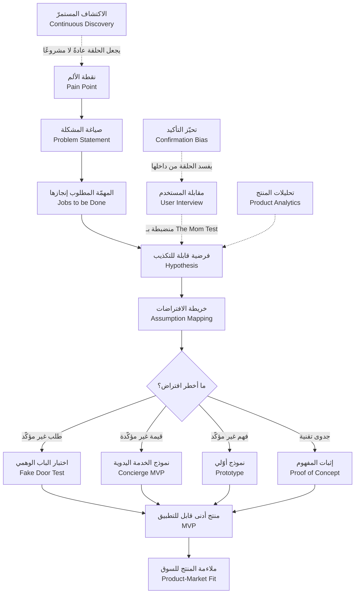
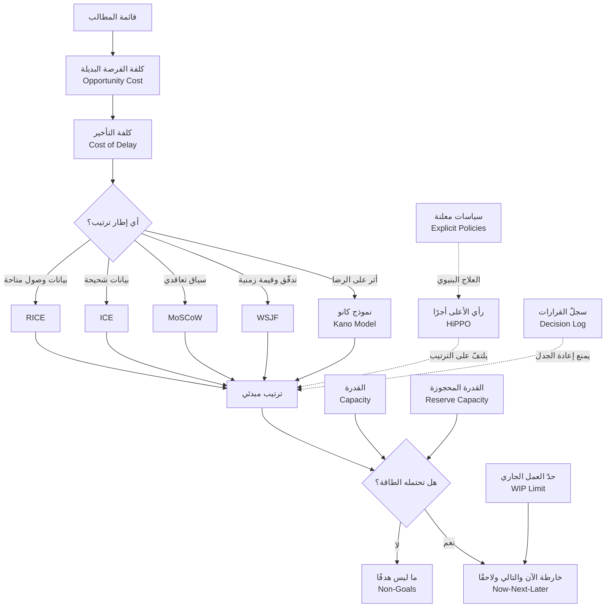
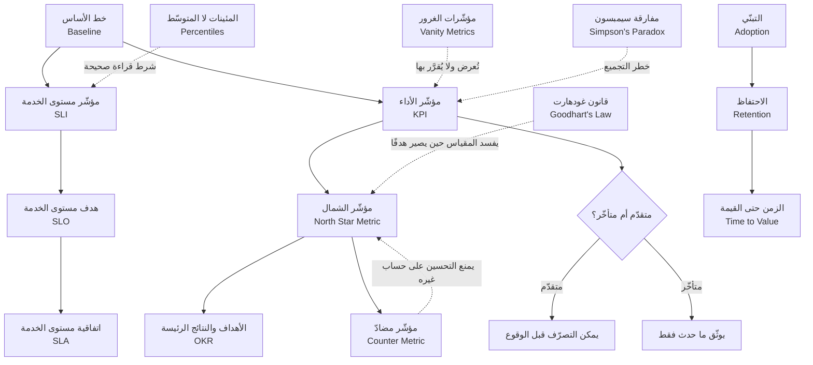
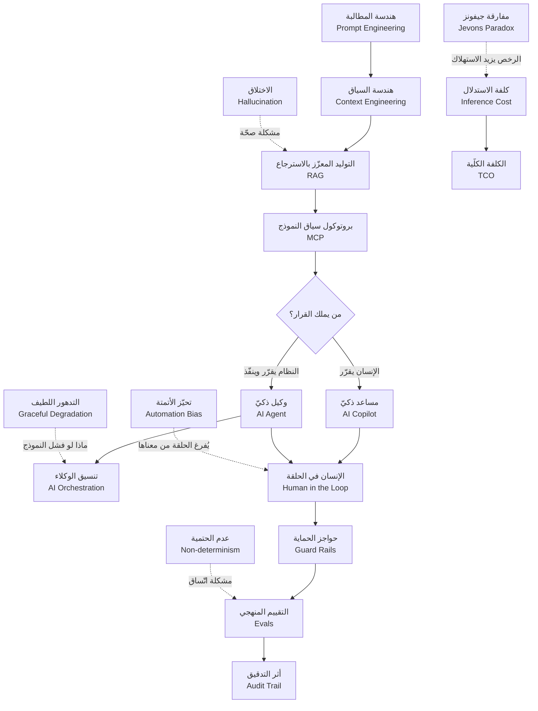
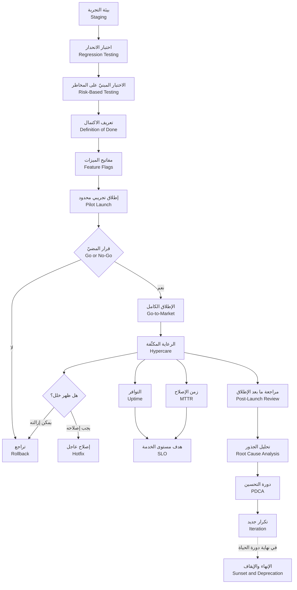
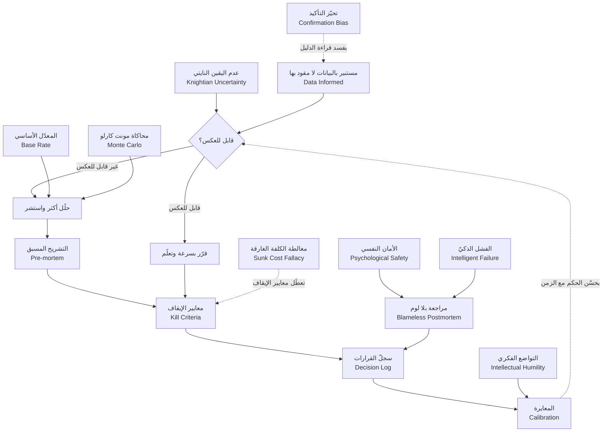

> [!info] الملحق أ · إدارة المنتج في عصر الذكاء الاصطناعي
> **ما هذا الملحق:** ليس معجمًا. المعجم موجود ومكتمل — [[معجم المصطلحات]] بمصطلحاته الـ٣٢٦ — وهو **المرجع الوحيد** لتعريف أي مصطلح في هذا الكتاب. هذا الملحق شيء آخر تمامًا: **خريطة**. يفترض أن التعريف متاح لك بنقرة واحدة، ويجيب عن الأسئلة التي لا يجيب عنها التعريف: أين يقع هذا المصطلح في المرجع؟ وما وظيفته في الفصل الذي ورد فيه؟ وأيّ مصطلح يجب أن تعرفه **قبله**؟ وأيّ مصطلح **يناقضه**؟ وأيّ مصطلح **يُخلط به** خلطًا يكلّف قرارات خاطئة؟
>
> **كيف تستعمله:** لا تقرأه من أوّله إلى آخره. ادخل إليه من أحد أربعة أبواب — من فصل تقرؤه الآن (القسم الثاني)، أو من مجال تريد إتقانه (القسم الثالث)، أو من التباس يزعجك (القسم الرابع)، أو من مصطلح بعينه (الفهرس الأبجدي في آخره). وكل مصطلح هنا **رابط** — النقرة تأخذك إلى تعريفه الكامل في المعجم، ولن تجد التعريف مكرَّرًا في هذه الصفحة.

# الملحق أ — خريطة المصطلحات

## المعجم والخريطة: أداتان لا واحدة

المعجم يجيب عن سؤال واحد: **«ما معنى هذه الكلمة؟»**. وهو سؤال ممتاز، وهو أوّل ما يحتاجه القارئ الجديد. لكنّه ليس السؤال الذي يقف عنده الممارس بعد شهور من العمل. الممارس يعرف معنى `Outcome` ومعنى `Output`؛ ما يربكه هو أن مديره يستعمل الكلمتين بالتبادل في الاجتماع نفسه. ويعرف ما `MVP` وما `Prototype`؛ ما يكلّفه أسابيع هو أنه بنى واحدًا وهو يظنّ أنه يبني الآخر.

الفرق بين الأداتين فرق في **نوع المعرفة** لا في مقدارها:

| | [[معجم المصطلحات]] | هذا الملحق |
|---|---|---|
| **السؤال الذي يجيب عنه** | ما معنى المصطلح؟ | أين يقع المصطلح؟ وبمَ يتّصل؟ |
| **وحدة التنظيم** | المصطلح المفرد | العلاقة بين مصطلحين أو أكثر |
| **الترتيب** | أبجدي + ١٦ مجموعة موضوعية | حسب الفصل، وحسب سلسلة الاستعمال، وحسب الالتباس |
| **ما تخرج به** | تعريف دقيق | حكم على متى تستعمل أيًّا |
| **متى تدخله** | حين تصادف كلمة لا تعرفها | حين تعرف الكلمات ولا تعرف أيّها تستعمل الآن |
| **يحتوي شرحًا؟** | نعم — الشرح كلّه هنا | لا — أيّ شرح هنا يكون تكرارًا وخطأً |

> [!important] القاعدة التي بُني عليها هذا الملحق
> **معجم واحد لا معجمان.** كل سطر في الجداول التالية يصف **وظيفة** المصطلح في سياقه، لا **معناه**. إن أردت المعنى فالرابط أمامك. وإن وجدت في هذا الملحق تعريفًا كاملًا لمصطلح فذلك عيب في الملحق لا ميزة فيه.

### ثلاث طرق لاستعمال الخريطة عمليًّا

> [!tip] الاستعمال الأول — قبل الفصل
> قبل أن تفتح فصلًا، افتح جدوله في القسم الثاني واقرأ المصطلحات العشرين أو الستّين بترتيبها. لن تفهمها كلّها، وليس هذا المقصود؛ المقصود أن يصير الفصل **متوقَّعًا**: تعرف الطريق قبل أن تسلكه، فلا يفاجئك مصطلح فتتوقّف عنده وتفقد خيط الحجّة.

> [!tip] الاستعمال الثاني — بعد الفصل
> بعد إنهاء الفصل، ارجع إلى الجدول نفسه وضع علامة على كل مصطلح تستطيع أن تشرح **دوره في الفصل** دون النظر. ما لم تستطع شرحه هو خريطة مراجعتك — لا الفصل كلّه.

> [!tip] الاستعمال الثالث — أثناء العمل
> حين تكتب `PRD` أو تجهّز اجتماع أولويات أو تراجع لوحة مؤشّرات، افتح **العنقود** المناسب في القسم الثالث والمخطّط الموافق له. العناقيد مصمّمة لتكون قوائم تحقّق ضمنية: إن كان مصطلح في العنقود لم يظهر في عملك أصلًا، فاسأل نفسك: هل تجاهلته عن قصد أم عن غفلة؟

## أولًا: خريطة بالفصل

في كل جدول أدناه، المصطلحات مرتّبة **بترتيب ظهورها المنطقي في الفصل** لا بترتيب أبجدي — أي أنك تستطيع أن تقرأ عمود «الدور» من أعلى إلى أسفل فتحصل على هيكل الفصل مختصرًا. العمود الثالث يقول **ماذا يفعل المصطلح هنا**، لا ما هو.

### الفصل ١ — لماذا لا يزال مدير المنتج أهم من أي وقت مضى

الفصل الأول قليل المصطلحات عمدًا: حجّته فلسفية لا إجرائية، فالمصطلحات فيه تعمل **شواهد** على أن جوهر الدور لم يتغيّر، لا **أدوات** تُستعمل.

| # | المصطلح | دوره في هذا الفصل |
|---|---|---|
| ١ | [[Business Impact]] | المحور الذي يُعرَّف به جوهر الدور: ما يُحاسَب عليه مدير المنتج ليس عدد الميزات بل الأثر. |
| ٢ | [[Outcome vs Output]] | التمييز الذي يجعل سؤال «هل انتهى الدور؟» سؤالًا بلا معنى — الأتمتة تسرّع الناتج ولا تنتج الأثر. |
| ٣ | [[PRD]] | يظهر هنا **كموضوع للجدل** لا كأداة: «لم نعد بحاجة إلى PRD» هي الدعوى التي يردّ عليها الفصل. |
| ٤ | [[Product Thinking]] | الاسم الذي يُعطى للقدرة التي تبقى بعد أن تُؤتمت المهام. |
| ٥ | [[Feature Factory]] | التشخيص المضادّ: ماذا تصير المؤسّسة حين يُختزل الدور في تنفيذ الطلبات. |
| ٦ | [[Jobs to be Done]] | أوّل الأطر الخمسة المسمّاة في الفصل — يُعرض بأصله والمشكلة التي يحلّها وحدّ إساءة استعماله. |
| ٧ | [[Kano Model]] | الإطار الثاني: لماذا لا تتساوى الميزات في أثرها على الرضا. |
| ٨ | [[RICE Prioritization]] | الإطار الثالث: أن الترتيب قابل للتفسير لا للتبرير. |
| ٩ | [[North Star Metric]] | الإطار الرابع: أن يكون للمنتج مؤشّر واحد يفسّر البقية. |
| ١٠ | [[Opportunity Solution Tree]] | الإطار الخامس: أن الحلّ لا يُختار قبل أن تُفصَّل الفرصة. |
| ١١ | [[Continuous Discovery]] | الممارسة التي تحوّل الأطر الخمسة من عرض نظري إلى إيقاع أسبوعي. |
| ١٢ | [[Customer and Market Validation]] | الفرق بين «العميل يريدها» و«السوق يدفع مقابلها» — مصدر أكثر أخطاء الدور شيوعًا. |
| ١٣ | [[Value Proposition Canvas]] | الأداة التي تُترجم فهم العميل إلى صياغة قيمة قابلة للاختبار. |
| ١٤ | [[MVP]] | يُذكر هنا بوصفه **بقيّة موجة `Lean Startup`** — مثال حيّ على مصطلح بقي بعد انحسار موجته. |
| ١٥ | [[Shape Up]] | مثال على موجة منهجية لاحقة، تُقرأ بالأسئلة الثلاثة نفسها: ماذا وعدت؟ ماذا بقي؟ أين أُسيء تطبيقها؟ |
| ١٦ | [[OKR]] | يُستعمل كشاهد على كيف يتحوّل إطار للمحاذاة إلى طقس إداري حين يُفصل عن الأثر. |
| ١٧ | [[KPI]] | ما يُطلب من مدير المنتج أن يربط به كل طلب ميزة قبل قبوله. |
| ١٨ | [[Adoption]] | المؤشّر الذي يكشف الفرق بين «أُطلقت» و«استُعملت». |
| ١٩ | [[Time to Value]] | زاوية القياس التي تجعل «سرعة البناء» ادّعاءً قابلًا للفحص لا شعارًا. |
| ٢٠ | [[Product Maturity]] | يفسّر لماذا يختلف تعريف الدور نفسه بين شركة ناشئة ومؤسّسة راسخة. |

### الفصل ٢ — فلسفة إدارة المنتج

هنا يتضاعف عدد المصطلحات لأن الفصل يبني **الأساس النظري**: من أين جاءت `Lean`، ومن أين جاءت `Agile`، وكيف تلتقيان في ممارسة الاكتشاف.

| # | المصطلح | دوره في هذا الفصل |
|---|---|---|
| ١ | [[Outcome vs Output]] | حجر الزاوية: كل ما بعده في الفصل تفريع على هذا التمييز. |
| ٢ | [[Product Thinking]] | الاسم الجامع للفلسفة التي يعرضها الفصل. |
| ٣ | [[Business Impact]] | المعيار الذي يُحكم به على أي ممارسة: هل غيّرت شيئًا في الأعمال؟ |
| ٤ | [[Agile Manifesto]] | النصّ الأصلي — يُقرأ لبيان الفجوة بين ما قيل وما مورس. |
| ٥ | [[Lean Startup]] | الموجة التي أدخلت الاختبار قبل البناء إلى ثقافة المنتج. |
| ٦ | [[Toyota Production System]] | الأصل الصناعي الذي جاءت منه `Lean` قبل أن تصل إلى البرمجيات. |
| ٧ | [[Muda, Mura, Muri]] | تصنيف الهدر الثلاثي كما وُضع في أصله، قبل ترجمته إلى لغة المنتج. |
| ٨ | [[Pull System]] | مبدأ السحب: العمل يُسحب عند القدرة، لا يُدفع عند الطلب. |
| ٩ | [[WIP Limit]] | الترجمة العملية لمبدأ السحب داخل فريق منتج. |
| ١٠ | [[Gemba Walk]] | أن ترى العمل حيث يحدث — أصل فكرة «اذهب إلى المستخدم». |
| ١١ | [[Product Principles]] | ما يجعل القرارات متّسقة حين يغيب مدير المنتج عن الغرفة. |
| ١٢ | [[Product Discovery]] | النشاط المقابل للتسليم — نصف المهنة الذي يُهمَل عادةً. |
| ١٣ | [[Continuous Discovery]] | تحويل الاكتشاف من مشروع إلى عادة أسبوعية. |
| ١٤ | [[Dual-Track Agile]] | الشكل التنظيمي الذي يسمح للاكتشاف والتسليم أن يجريا معًا. |
| ١٥ | [[Problem Statement]] | نقطة بدء الاكتشاف: صياغة المشكلة قبل أي حديث عن حل. |
| ١٦ | [[Pain Point]] | الوحدة الخام التي تُبنى منها صياغة المشكلة. |
| ١٧ | [[Jobs to be Done]] | العدسة التي تحوّل «ما يشتكي منه» إلى «ما يحاول إنجازه». |
| ١٨ | [[Hypothesis]] | تحويل الرأي إلى عبارة قابلة للتكذيب. |
| ١٩ | [[Assumption Mapping]] | فرز الفرضيات: أيّها خطر بما يكفي ليُختبر أولًا. |
| ٢٠ | [[User Interview]] | الأداة الأساسية لجمع الأدلّة النوعية. |
| ٢١ | [[The Mom Test]] | الانضباط الذي يمنع المقابلة من أن تصير تحصيلًا للمجاملة. |
| ٢٢ | [[Confirmation Bias]] | الخطر الذي يفسد الاكتشاف من داخله — سبب وجود `The Mom Test` أصلًا. |
| ٢٣ | [[Fake Door Test]] | اختبار الطلب قبل بناء أي شيء. |
| ٢٤ | [[Opportunity Solution Tree]] | ربط النتيجة المرجوّة بالفرص بالحلول بالتجارب في بنية واحدة. |
| ٢٥ | [[Value Proposition Canvas]] | صياغة القيمة بعد أن يستقرّ فهم المشكلة. |
| ٢٦ | [[Customer and Market Validation]] | الخطوة التي تفصل بين إعجاب فردي وسوق قائم. |
| ٢٧ | [[Product-Market Fit]] | الحالة التي يسعى إليها كل ما سبق. |
| ٢٨ | [[MVP]] | أصغر ما يُبنى لاختبار الفرضية الأخطر — لا أصغر ما يُشحن. |
| ٢٩ | [[Product Analytics]] | المصدر الكمّي المقابل للمقابلات النوعية. |
| ٣٠ | [[Baseline]] | خط الأساس الذي بدونه لا معنى لأي ادّعاء تحسّن. |
| ٣١ | [[KPI]] | المؤشّر الذي يُترجم إليه هدف المنتج. |
| ٣٢ | [[OKR]] | ربط الأهداف بالنتائج القابلة للقياس على مستوى المؤسّسة. |
| ٣٣ | [[Percentiles and Median vs Average]] | تصحيح إحصائي أساسي: المتوسّط يُخفي أسوأ تجارب المستخدمين. |
| ٣٤ | [[Definition of Done]] | حدّ الاكتمال المتّفق عليه — يمنع الجدل بعد التسليم. |
| ٣٥ | [[Cost-of-Change Curve]] | لماذا يكون التصحيح المبكر أرخص بمراتب. |
| ٣٦ | [[Root Cause Analysis]] | الانتقال من الأعراض إلى السبب قبل إنفاق أي جهد. |
| ٣٧ | [[Feature Factory]] | النموذج المضادّ لكل ما يعرضه الفصل. |
| ٣٨ | [[Feature Creep]] | العَرَض الذي يظهر حين تغيب مبادئ المنتج. |
| ٣٩ | [[Working Backwards]] | ممارسة منشورة علنًا: أن تُكتب النتيجة النهائية قبل بدء البناء. |
| ٤٠ | [[Shape Up]] | بديل منهجي يعرض الفصل منطقه ومحدوديّته. |
| ٤١ | [[PRD]] | يوضع في موضعه من الفلسفة: أداة تفكير، لا طقس توثيق. |
| ٤٢ | [[Adoption]] | الدليل النهائي على أن الفلسفة أثمرت. |
| ٤٣ | [[PDPL]] | يدخل هنا لأن أي فلسفة منتج في السوق السعودي تعمل داخل قيد نظامي. |

### الفصل ٣ — التوطين (Localization)

أكثر فصول المرجع تخصّصًا في مصطلحاته. مصطلحاته تنقسم إلى ثلاث طبقات واضحة: طبقة تقنية، وطبقة سوق، وطبقة امتثال.

| # | المصطلح | دوره في هذا الفصل |
|---|---|---|
| ١ | [[Localization]] | موضوع الفصل — ويُعرَّف ابتداءً بما **ليس** هو: ليس ترجمة. |
| ٢ | [[Internationalization]] | العمل الهندسي الذي يجب أن يسبق التوطين، وإلا استحال التوطين. |
| ٣ | [[Locale]] | وحدة التوطين التقنية: لغة + منطقة + تفضيلات تنسيق. |
| ٤ | [[RTL]] | التحدّي البصري والهندسي الأول في السياق العربي. |
| ٥ | [[Pseudo-localization]] | اختبار جاهزية الواجهة للتوطين قبل وجود ترجمة أصلًا. |
| ٦ | [[ICU Message Format]] | معالجة الجمع والتذكير والتأنيث في النصوص بلا تشعّب شيفرة. |
| ٧ | [[Translation Memory]] | البنية التي تجعل كلفة التوطين تنازلية عبر الإصدارات. |
| ٨ | [[UX vs CX]] | لماذا لا يكفي توطين الواجهة إن بقيت الرحلة كلّها أجنبية. |
| ٩ | [[User Journey Map]] | أداة رصد المواضع التي ينكسر فيها التوطين فعليًّا. |
| ١٠ | [[Jobs to be Done]] | التحقّق من أن «المهمّة» نفسها هي هي في السوق الجديد — وغالبًا ليست كذلك. |
| ١١ | [[Customer and Market Validation]] | إعادة التحقّق في كل سوق على حدة: نجاح سوق لا يُورَّث. |
| ١٢ | [[Product-Market Fit]] | ملاءمة المنتج للسوق تُعاد من الصفر عند كل دخول جديد. |
| ١٣ | [[Product Discovery]] | الاكتشاف المحلّي بوصفه شرطًا لا رفاهية. |
| ١٤ | [[PESTEL]] | مسح البيئة الكلّية للسوق المستهدف. |
| ١٥ | [[CAGE Framework]] | قياس المسافة بين السوقين على أربعة أبعاد قبل تقدير الكلفة. |
| ١٦ | [[Hofstede Cultural Dimensions]] | أداة لقراءة الفروق الثقافية — يعرض الفصل نقدها كما يعرض فائدتها. |
| ١٧ | [[Market Entry Modes]] | خيارات الدخول وكلفة كلٍّ منها. |
| ١٨ | [[Go-to-Market]] | خطة الوصول التي يجب أن تُوطَّن هي الأخرى، لا المنتج وحده. |
| ١٩ | [[Cash on Delivery]] | مثال ملموس على أن سلوك الدفع المحلّي يغيّر بنية المنتج لا واجهته. |
| ٢٠ | [[KYC]] | متطلّب تحقّق يختلف اختلافًا جوهريًّا بين الولايات القضائية. |
| ٢١ | [[PDPL]] | الإطار النظامي السعودي لحماية البيانات — قيد تصميم لا بند قانوني لاحق. |
| ٢٢ | [[Data Residency]] | أين تُخزَّن البيانات فعليًّا — سؤال يسبق اختيار البنية التحتية. |
| ٢٣ | [[Controller vs Processor]] | تحديد المسؤولية النظامية بينك وبين مورّديك. |
| ٢٤ | [[ROPA]] | سجلّ أنشطة المعالجة الذي يُطلب عند التدقيق. |
| ٢٥ | [[Fit-Gap Analysis]] | تحديد الفجوة بين المنتج القائم ومتطلّبات السوق الجديد. |
| ٢٦ | [[TCO]] | الكلفة الكاملة للتوطين، لا كلفة الترجمة وحدها. |
| ٢٧ | [[Vendor Lock-in]] | خطر ارتباط التوطين بمزوّد واحد يصعب الخروج منه. |
| ٢٨ | [[Technical Debt]] | ما يتراكم حين يُنفَّذ التوطين التصاقًا بالسطح بدل التدويل الصحيح. |
| ٢٩ | [[Edge Cases]] | الحالات الحدّية اللغوية والتنسيقية التي تكسر الواجهات. |
| ٣٠ | [[Single Source of Truth]] | مصدر واحد للنصوص والمصطلحات يمنع تضارب الترجمات. |
| ٣١ | [[PRD]] | أين تُكتب متطلّبات التوطين داخل الوثيقة بدل أن تُترك ضمنية. |
| ٣٢ | [[SLA]] | التزامات الخدمة التي تختلف بين الأسواق والمناطق الزمنية. |
| ٣٣ | [[Pilot Launch]] | إطلاق محدود في السوق الجديد قبل الالتزام الكامل. |
| ٣٤ | [[Go or No-Go Decision]] | نقطة القرار الصريحة بعد التجربة المحدودة. |
| ٣٥ | [[Decision Log]] | تسجيل قرارات التوطين — أكثر القرارات عرضةً للنسيان وإعادة الجدل. |
| ٣٦ | [[Baseline]] | خط الأساس المحلّي الذي يُقاس عليه نجاح الدخول. |
| ٣٧ | [[KPI]] | المؤشّرات الخاصّة بالسوق الجديد، لا مؤشّرات السوق الأصلي. |
| ٣٨ | [[Adoption]] | التبنّي المحلّي بوصفه الحكم النهائي على التوطين. |
| ٣٩ | [[Time to Value]] | كم يستغرق المستخدم المحلّي حتى يصل إلى القيمة الأولى. |
| ٤٠ | [[Outcome vs Output]] | التذكير الخاتم: عدد اللغات المدعومة ناتج، لا أثر. |

### الفصل ٤ — الذكاء الاصطناعي ومدير المنتج

هنا يظهر عنقود مصطلحات الذكاء الاصطناعي كاملًا لأول مرّة، ملتصقًا بعنقود الحوكمة — وهذا الالتصاق هو حجّة الفصل نفسها.

| # | المصطلح | دوره في هذا الفصل |
|---|---|---|
| ١ | [[AI Copilot]] | الطرف الأول من التمييز المحوري: نظام يقترح والقرار لك. |
| ٢ | [[AI Agent]] | الطرف الثاني: نظام ينفّذ خطوات بلا مراجعة عند كل خطوة. |
| ٣ | [[AI Orchestration]] | الطبقة التي تنسّق بين نماذج وأدوات متعدّدة في مسار واحد. |
| ٤ | [[Human in the Loop]] | الشرط الذي يحدّد أين يتوقّف الآلي ويبدأ الحُكم البشري. |
| ٥ | [[Automation Bias]] | الخلل النفسي الذي يجعل `Human in the Loop` صوريًّا إن لم يُصمَّم بعناية. |
| ٦ | [[Hallucination]] | العيب البنيوي الأول: مخرَج واثق النبرة وخاطئ المحتوى. |
| ٧ | [[Non-determinism]] | العيب البنيوي الثاني: المدخل نفسه لا يعطي المخرَج نفسه. |
| ٨ | [[Evals]] | الجواب الهندسي على العيبين: قياس منهجي بدل الانطباع. |
| ٩ | [[Prompt Engineering]] | صياغة المدخل بوصفها متغيّرًا يُضبط لا فنًّا شخصيًّا. |
| ١٠ | [[Retrieval-Augmented Generation]] | تقييد النموذج بمصادرك أنت لتقليل الاختلاق. |
| ١١ | [[MCP]] | البروتوكول الذي يربط النموذج بأدواتك ومصادرك بصيغة موحّدة. |
| ١٢ | [[Inference Cost]] | البند الذي يحوّل ميزة ذكاء اصطناعي من فكرة إلى قرار اقتصادي. |
| ١٣ | [[TCO]] | الكلفة الكاملة لتشغيل الميزة، لا كلفة النموذج وحده. |
| ١٤ | [[Guard Rails]] | القيود التي تمنع المخرَج غير المقبول قبل وصوله للمستخدم. |
| ١٥ | [[Governance]] | الإطار المؤسّسي الذي تُشتقّ منه القيود ومسؤولياتها. |
| ١٦ | [[Graceful Degradation]] | ماذا يفعل المنتج حين يفشل النموذج — سؤال تصميم لا سؤال بنية تحتية. |
| ١٧ | [[Risk-Based Testing]] | توجيه الاختبار إلى ما يؤذي أكثر، لا إلى ما يسهل اختباره. |
| ١٨ | [[Regression Testing]] | حماية ما كان يعمل من تغييرات النماذج والمطالبات. |
| ١٩ | [[Rollback]] | خطة التراجع حين يسوء الإصدار — شرط قبول لا خطّة طوارئ. |
| ٢٠ | [[SLO]] | التعهّد القابل للقياس بجودة الخدمة الذكية. |
| ٢١ | [[Definition of Done]] | كيف يتغيّر تعريف الاكتمال حين يكون المخرَج احتماليًّا. |
| ٢٢ | [[Happy Path]] | المسار المثالي الذي تُعرض به الأدوات في العروض التسويقية. |
| ٢٣ | [[Edge Cases]] | ما يظهر خارج المسار المثالي — وهو حيث يُحكم على الميزة فعلًا. |
| ٢٤ | [[GDPR]] | الإطار الأوروبي حين تمسّ المعالجة بيانات خاضعة له. |
| ٢٥ | [[PDPL]] | الإطار السعودي الموازي — القيد الأقرب لمعظم قرّاء المرجع. |
| ٢٦ | [[Controller vs Processor]] | من المسؤول نظاميًّا حين تمرّ البيانات عبر مزوّد نموذج. |
| ٢٧ | [[ROPA]] | توثيق أنشطة المعالجة الناتجة عن استعمال الذكاء الاصطناعي. |
| ٢٨ | [[Standard Contractual Clauses]] | الأداة التعاقدية لنقل البيانات عبر الحدود. |
| ٢٩ | [[Value-Added vs Non-Value-Added vs Pure Waste]] | تصنيف مهامّ مدير المنتج قبل الحكم على ما يستحق الأتمتة. |
| ٣٠ | [[Root Cause Analysis]] | ما لا يستطيع النموذج أن ينوب عنك فيه: تحديد السبب الحقيقي. |
| ٣١ | [[Product Thinking]] | القدرة التي بقيت بعد أن أُتمتت المهارات المجاورة. |
| ٣٢ | [[Product Discovery]] | نشاط لم يُلغَ بل تسارعت أدواته. |
| ٣٣ | [[Continuous Discovery]] | ما صار ممكنًا بوتيرة أعلى بفضل الأدوات الجديدة. |
| ٣٤ | [[Jobs to be Done]] | العدسة التي لا تُستخرج من نموذج لأنها تتطلّب حكمًا على السياق. |
| ٣٥ | [[Kano Model]] | لماذا لا تتحوّل كل قدرة تقنية جديدة إلى قيمة مدركة. |
| ٣٦ | [[PRD]] | الوثيقة التي أعاد الذكاء الاصطناعي تعريف وظيفتها ولم يُلغِها. |
| ٣٧ | [[Docs as Code]] | معاملة التوثيق كشيفرة — يصير ضروريًّا حين يقرأ التوثيقَ نموذجٌ. |
| ٣٨ | [[Single Source of Truth]] | شرط جودة أي نظام استرجاع أو وكيل. |
| ٣٩ | [[MVP]] | كيف تختبر ميزة ذكية بأقل التزام. |
| ٤٠ | [[Pilot Launch]] | الإطلاق المحدود بوصفه المسار الافتراضي لميزات الذكاء الاصطناعي. |
| ٤١ | [[Vibe Coding]] | يُقدَّم هنا تمهيدًا للفصل الثامن. |
| ٤٢ | [[Technical Debt]] | ما يتراكم حين يُبنى بسرعة النموذج وتُترك المراجعة. |
| ٤٣ | [[Time to Value]] | الوعد الحقيقي للأدوات الجديدة: تقصير المسافة إلى القيمة. |
| ٤٤ | [[Percentiles and Median vs Average]] | لماذا يخدع «متوسّط زمن الاستجابة» في الأنظمة الاحتمالية. |
| ٤٥ | [[Baseline]] | ما تقيس عليه ادّعاء «الذكاء الاصطناعي حسّن الأداء». |
| ٤٦ | [[KPI]] · [[OKR]] · [[North Star Metric]] | طبقات القياس الثلاث التي تُترجم إليها أي مبادرة ذكاء اصطناعي. |
| ٤٧ | [[Adoption]] | المؤشّر الذي يفضح ميزات الذكاء الاصطناعي المعروضة وغير المستعملة. |
| ٤٨ | [[Decision Log]] | توثيق قرارات النماذج والمزوّدين — أسرع القرارات تقادمًا. |
| ٤٩ | [[Feature Factory]] | الخطر الجديد: مصنع ميزات بسرعة مضاعفة. |
| ٥٠ | [[Outcome vs Output]] | الحكم الختامي على كل ما سبق. |
| ٥١ | [[RICE Prioritization]] | كيف تدخل ميزات الذكاء الاصطناعي في ترتيب الأولويات كغيرها. |

### الفصل ٥ — تحديد الأولويات (Prioritization)

أكثف فصول المرجع اقتصاديًّا. مصطلحاته تنقسم إلى: منطق اقتصادي، وأطر ترتيب، وقيود قدرة، وتحيّزات، ومصطلحات النطاق.

| # | المصطلح | دوره في هذا الفصل |
|---|---|---|
| ١ | [[Prioritization]] | موضوع الفصل — يُعرَّف بوصفه قرار **رفض** لا قرار قبول. |
| ٢ | [[Opportunity Cost]] | المفهوم الاقتصادي الذي يجعل الرفض قابلًا للتبرير عدديًّا. |
| ٣ | [[Cost of Delay]] | الوجه الزمني للكلفة: ما يخسره التأجيل لا ما يكلّفه التنفيذ. |
| ٤ | [[WSJF]] | ترجمة كلفة التأخير إلى ترتيب تشغيلي. |
| ٥ | [[Sunk Cost Fallacy]] | لماذا يصعب إيقاف ما بُذل فيه جهد كبير — أشهر تحيّزات الترتيب. |
| ٦ | [[100 Percent Utilization Fallacy]] | لماذا تبطئ الفرق المشغولة بالكامل التسليم بدل أن تسرّعه. |
| ٧ | [[Capacity]] | القدرة الفعلية بوصفها القيد الحقيقي على أي قائمة أولويات. |
| ٨ | [[Reserve Capacity]] | القدرة المحجوزة للعاجل غير المخطّط — بدونها ينهار أي ترتيب. |
| ٩ | [[Expedite Class]] | الفئة الاستثنائية للعاجل، معرَّفة مسبقًا بدل التفاوض عند كل حالة. |
| ١٠ | [[Circuit Breaker]] | آلية إيقاف تُفعَّل عند تجاوز حدّ متّفق عليه. |
| ١١ | [[WIP Limit]] | الحدّ الذي يحوّل الأولوية من نيّة إلى إجراء. |
| ١٢ | [[RICE Prioritization]] | الإطار الكمّي الأشهر: أربعة عوامل تجعل الترتيب قابلًا للنقاش. |
| ١٣ | [[ICE Scoring]] | نسخة أخفّ من `RICE` تُستعمل حين تغيب بيانات الوصول. |
| ١٤ | [[Weighted Scoring]] | الشكل العام لكل الأطر الرقمية — ومصدر خداعها حين تُختار الأوزان بعد النتيجة. |
| ١٥ | [[MoSCoW Prioritization]] | التصنيف الرباعي المستعمل في السياقات التعاقدية أكثر من المنتجية. |
| ١٦ | [[Kano Model]] | تصنيف الميزات بأثرها على الرضا، لا بكلفتها. |
| ١٧ | [[Opportunity Scoring]] | ترتيب الفرص بالفجوة بين الأهمية والرضا. |
| ١٨ | [[Buy-a-Feature]] | أسلوب تشاركي يجعل أصحاب المصلحة يواجهون القيد بأنفسهم. |
| ١٩ | [[Eisenhower Matrix]] | المصفوفة الشخصية التي تُساء ترقيتها إلى أداة منتج. |
| ٢٠ | [[Quick Wins vs Big Bangs]] | التوازن بين المكاسب السريعة والرهانات الكبيرة. |
| ٢١ | [[Story Mapping]] | ترتيب بصري يربط الأولوية برحلة المستخدم لا بقائمة مسطّحة. |
| ٢٢ | [[Now-Next-Later Roadmap]] | صيغة خارطة طريق تعبّر عن الأولوية بلا وعود بتواريخ. |
| ٢٣ | [[Initiative]] | وحدة العمل الأكبر التي تُرتَّب على مستوى استراتيجي. |
| ٢٤ | [[Backlog Refinement]] | الطقس الذي يبقي قائمة العمل قابلة للترتيب أصلًا. |
| ٢٥ | [[Planning Poker]] | التقدير الجماعي بوصفه مدخلًا لعامل الجهد في المعادلات. |
| ٢٦ | [[Estimation Variance]] | تشتّت التقديرات — ما يجعل الأرقام في `RICE` أقل صلابة ممّا تبدو. |
| ٢٧ | [[Severity vs Priority]] | التمييز الذي يمنع أكثر خصومات الفرق شيوعًا حول الأخطاء. |
| ٢٨ | [[Rework Percentage]] | نسبة إعادة العمل بوصفها ضريبة خفيّة على الترتيب السيّئ. |
| ٢٩ | [[Escaped Defect Rate]] | ما تسرّب إلى الإنتاج — دليل على أن الترتيب ضحّى بالجودة. |
| ٣٠ | [[Technical Debt]] | البند الذي يُؤجَّل دائمًا حتى يصير هو القيد. |
| ٣١ | [[Regression Testing]] | الكلفة الثابتة التي تكبر مع كل ميزة يوافق عليها الترتيب. |
| ٣٢ | [[Cost of Experimentation]] | كلفة المعرفة: أرخص من كلفة البناء بمراتب. |
| ٣٣ | [[Cost-of-Change Curve]] | لماذا يستحق الترتيب المبكر كل هذا العناء. |
| ٣٤ | [[Fake Door Test]] | اختبار الطلب بوصفه بديلًا عن الجدل حول الأولوية. |
| ٣٥ | [[Hypothesis]] | صياغة كل بند مرتَّب كفرضية قابلة للتكذيب. |
| ٣٦ | [[Product Discovery]] · [[Continuous Discovery]] | مصدر البدائل التي يُرتَّب بينها. |
| ٣٧ | [[User Interview]] · [[The Mom Test]] | الدليل النوعي الذي يُغذّي عامل «الأثر». |
| ٣٨ | [[Product Analytics]] | الدليل الكمّي المقابل. |
| ٣٩ | [[Jobs to be Done]] | التأكّد من أن ما يُرتَّب حلول لمهمّة حقيقية. |
| ٤٠ | [[HiPPO]] | الاسم الصريح لأكبر مفسد للترتيب: رأي الأعلى أجرًا. |
| ٤١ | [[Stakeholder Map]] | التعامل مع أصحاب المصلحة بوصفه جزءًا من الترتيب لا خارجه. |
| ٤٢ | [[Explicit Policies]] | جعل قواعد الترتيب مكتوبة ومعلنة — العلاج البنيوي لـ`HiPPO`. |
| ٤٣ | [[Governance]] | الإطار الذي يعطي تلك القواعد سلطة. |
| ٤٤ | [[Decision Log]] | حفظ سبب الترتيب حتى لا يُعاد الجدل عند كل تغيّر. |
| ٤٥ | [[Confirmation Bias]] | التحيّز الذي يجعلك ترتّب ما تحبّه لا ما يستحق. |
| ٤٦ | [[Automation Bias]] | التحيّز المستجدّ: قبول ترتيب اقترحه نموذج بلا فحص. |
| ٤٧ | [[Non-Goals]] | ما قرّرت ألّا تفعله — الوجه المكتوب لقرار الرفض. |
| ٤٨ | [[Out of Scope]] | ما خرج من نطاق هذه الدفعة تحديدًا. |
| ٤٩ | [[Scope Creep]] | تمدّد النطاق من الخارج رغم الترتيب. |
| ٥٠ | [[Feature Creep]] | تكدّس الميزات عبر الزمن بلا حذف. |
| ٥١ | [[Gold Plating]] | إضافة غير مطلوبة من داخل الفريق نفسه. |
| ٥٢ | [[Feature Factory]] | ما تصير إليه المؤسّسة حين يُلغى الترتيب عمليًّا. |
| ٥٣ | [[Localization]] · [[RTL]] | مثال تطبيقي: كيف يُرتَّب استحقاق دعم العربية مقابل ميزات أخرى. |
| ٥٤ | [[PDPL]] · [[GDPR]] | البنود التي لا تدخل الترتيب أصلًا لأنها شرط لا خيار. |
| ٥٥ | [[Product-Market Fit]] | كيف يتغيّر منطق الترتيب كلّه قبل الملاءمة وبعدها. |
| ٥٦ | [[Shape Up]] | بديل يقلب المعادلة: تثبيت الوقت وتغيير النطاق. |
| ٥٧ | [[Opportunity Solution Tree]] | البنية التي تمنع ترتيب الحلول قبل ترتيب الفرص. |
| ٥٨ | [[Baseline]] · [[KPI]] · [[OKR]] · [[North Star Metric]] | طبقة القياس التي يُحاكم إليها الترتيب بعد التنفيذ. |
| ٥٩ | [[Business Impact]] | المعيار الأعلى الذي تُشتقّ منه كل عوامل الترتيب. |
| ٦٠ | [[Outcome vs Output]] | الفحص الأخير: هل رتّبنا أثرًا أم رتّبنا إنتاجًا؟ |

### الفصل ٦ — وثيقة متطلبات المنتج (PRD)

مصطلحات هذا الفصل هي في معظمها **أقسام الوثيقة نفسها**. اقرأ العمود الثالث من أعلى إلى أسفل تحصل على هيكل `PRD` كاملًا.

| # | المصطلح | دوره في هذا الفصل |
|---|---|---|
| ١ | [[PRD]] | موضوع الفصل — تُعرَّف بوصفها أداة تفكير ومحاذاة، لا نموذجًا يُملأ. |
| ٢ | [[BRD]] | الوثيقة المجاورة الأولى: منظور الأعمال لا منظور المنتج. |
| ٣ | [[Software Requirements Specification]] | الوثيقة المجاورة الثانية: المواصفة الهندسية التفصيلية. |
| ٤ | [[SOW]] | الوثيقة المجاورة الثالثة: التعاقدية التي تُلزم طرفين. |
| ٥ | [[Scope Statement]] | بيان النطاق بوصفه مرجع الفصل في الخلافات. |
| ٦ | [[Problem Statement]] | القسم الأول في الوثيقة: المشكلة قبل أي حل. |
| ٧ | [[Business Impact]] | لماذا تستحق هذه المشكلة الحلّ الآن. |
| ٨ | [[Hypothesis]] | ما نظنّ أنه سيحدث، مصوغًا بحيث يمكن أن يُكذَّب. |
| ٩ | [[Assumption Mapping]] | الافتراضات التي تقوم عليها الوثيقة، مرتّبة بخطورتها. |
| ١٠ | [[Working Backwards]] | ممارسة كتابة النتيجة النهائية أولًا — بديل منشور للبدء من الميزات. |
| ١١ | [[Product Principles]] | ما يحسم الخلاف حين لا تحسمه البيانات. |
| ١٢ | [[Non-Goals]] | القسم الأهم والأكثر إهمالًا: ما لن تفعله هذه الوثيقة عمدًا. |
| ١٣ | [[Out of Scope]] | ما استُبعد من هذه الدفعة تحديدًا — أضيق من `Non-Goals`. |
| ١٤ | [[Scope Creep]] | الخطر الذي وُجدت أقسام النطاق لصدّه. |
| ١٥ | [[Feature Creep]] | التمدّد التراكمي عبر الإصدارات. |
| ١٦ | [[Gold Plating]] | التمدّد النابع من الفريق نفسه بحسن نيّة. |
| ١٧ | [[Scope Freeze]] | نقطة تجميد النطاق قبل التسليم. |
| ١٨ | [[Change Request]] | المسار النظامي لأي تغيير بعد التجميد. |
| ١٩ | [[Sign-off]] | الاعتماد الرسمي ومعناه الحقيقي: من يتحمّل التبعة. |
| ٢٠ | [[Milestone-based Payment]] | حين تكون الوثيقة أساسًا لدفعات مالية، تتغيّر صياغتها. |
| ٢١ | [[Gantt Chart]] | يُعرض ليُقال متى **لا** يُوضع في `PRD` منتج. |
| ٢٢ | [[Given When Then]] | الصيغة التي تحوّل المتطلّب إلى معيار قبول قابل للاختبار. |
| ٢٣ | [[INVEST Criteria]] | معايير جودة عناصر العمل المشتقّة من الوثيقة. |
| ٢٤ | [[Definition of Ready]] | متى يصير البند جاهزًا لأن يدخل التنفيذ. |
| ٢٥ | [[Definition of Done]] | متى يصير البند منتهيًا — الطرف المقابل. |
| ٢٦ | [[Happy Path]] | المسار الأساسي الذي تصفه الوثيقة أولًا. |
| ٢٧ | [[Edge Cases]] | الحالات الحدّية التي تُميّز وثيقة ناضجة عن وثيقة سطحية. |
| ٢٨ | [[Uptime]] | متطلّب غير وظيفي: نسبة التوافر المتعهَّد بها. |
| ٢٩ | [[MTTR]] | متوسّط زمن الإصلاح بوصفه التزامًا مكتوبًا. |
| ٣٠ | [[RTO and RPO]] | أهداف التعافي بعد الأعطال الكبرى. |
| ٣١ | [[Graceful Degradation]] | سلوك المنتج عند الفشل الجزئي، موصوفًا لا متروكًا. |
| ٣٢ | [[SLA]] | التعهّد الخارجي تجاه العميل. |
| ٣٣ | [[SLO]] | الهدف الداخلي الأشدّ من التعهّد الخارجي. |
| ٣٤ | [[SLI]] | المؤشّر الفعلي الذي يُقاس عليه الهدف. |
| ٣٥ | [[Percentiles and Median vs Average]] | كيف تُكتب أهداف الأداء بصيغة لا تخدع. |
| ٣٦ | [[RTL]] · [[Locale]] · [[Pseudo-localization]] | متطلّبات التوطين حين تُكتب داخل الوثيقة بدل أن تُفترض. |
| ٣٧ | [[Localization]] · [[Internationalization]] | التمييز الذي يجب أن يظهر صراحةً في متطلّبات الوثيقة. |
| ٣٨ | [[PDPL]] · [[GDPR]] · [[Data Residency]] · [[KYC]] | قسم الامتثال: قيود لا خيارات. |
| ٣٩ | [[Risk Register]] | سجلّ المخاطر المرتبط بالوثيقة. |
| ٤٠ | [[RAID Log]] | السجلّ الأشمل: مخاطر وافتراضات وقضايا وتبعيات. |
| ٤١ | [[Decision Log]] | لماذا اتُّخذ كل قرار في الوثيقة — يمنع إعادة الجدل. |
| ٤٢ | [[Baseline]] | الوضع الحالي الذي سيُقاس عليه أثر التغيير. |
| ٤٣ | [[KPI]] · [[OKR]] · [[North Star Metric]] · [[SMART Goals]] | قسم معايير النجاح بطبقاته الأربع. |
| ٤٤ | [[MoSCoW Prioritization]] | ترتيب المتطلّبات داخل الوثيقة نفسها. |
| ٤٥ | [[Guard Rails]] | الحدود التي لا يجوز تجاوزها مهما تغيّر التنفيذ. |
| ٤٦ | [[Technical Debt]] | ما تقبله الوثيقة صراحةً من ديون مقابل السرعة. |
| ٤٧ | [[Cost-of-Change Curve]] | الحجّة الاقتصادية لوجود الوثيقة أصلًا. |
| ٤٨ | [[Docs as Code]] | معاملة الوثيقة كأصل حيّ يُراجَع ويُنسخ ويُدار بإصدارات. |
| ٤٩ | [[Single Source of Truth]] | شرط ألّا تتعدّد نسخ الحقيقة. |
| ٥٠ | [[Product Discovery]] · [[User Interview]] · [[The Mom Test]] | مصدر الأدلّة التي تُبنى عليها أقسام الوثيقة. |
| ٥١ | [[Shape Up]] | بديل منهجي للوثيقة الطويلة: `Pitch` محدّد الوقت. |
| ٥٢ | [[Feature Factory]] | ما تصير إليه الوثيقة حين تُكتب لتُنفَّذ لا لتُفكَّر فيها. |
| ٥٣ | [[Outcome vs Output]] | الفحص النهائي لجودة الوثيقة. |

### الفصل ٧ — أدوات الذكاء الاصطناعي لمدير المنتج

مصطلحات هذا الفصل ثلاث طبقات: قدرات الأدوات، وقيودها، ومعايير اختيارها.

| # | المصطلح | دوره في هذا الفصل |
|---|---|---|
| ١ | [[AI Copilot]] | الصنف الأول من الأدوات: مساعد يقترح داخل سير عملك. |
| ٢ | [[AI Agent]] | الصنف الثاني: منفّذ يتصرّف بلا مراجعة عند كل خطوة. |
| ٣ | [[AI Orchestration]] | الصنف الثالث: طبقة تربط أدوات متعدّدة في مسار واحد. |
| ٤ | [[MCP]] | البروتوكول الذي جعل ربط الأدوات بمصادرك مسألة تكامل قياسي. |
| ٥ | [[Retrieval-Augmented Generation]] | كيف تجعل الأداة تجيب من وثائقك أنت لا من ذاكرتها. |
| ٦ | [[Prompt Engineering]] | المهارة التي تفرّق بين مخرَجين من الأداة نفسها. |
| ٧ | [[Hallucination]] | القيد الأول الذي يجب أن يُحسب في أي سير عمل. |
| ٨ | [[Non-determinism]] | القيد الثاني: عدم قابلية التكرار الحرفي. |
| ٩ | [[Evals]] | كيف تحكم على أداة موضوعيًّا بدل الانطباع من جلسة واحدة. |
| ١٠ | [[Automation Bias]] | خطر المستخدم لا خطر الأداة: قبول المخرَج لأنه من آلة. |
| ١١ | [[Human in the Loop]] | تصميم نقاط المراجعة داخل سير العمل الأداتي. |
| ١٢ | [[Guard Rails]] | القيود المفروضة على الأداة قبل السماح لها بالإنتاج. |
| ١٣ | [[Governance]] | من يقرّر أي أداة تُعتمد وبأي بيانات تُغذّى. |
| ١٤ | [[PDPL]] · [[GDPR]] | ماذا يجوز أن يُلصق في نافذة الأداة وماذا لا يجوز. |
| ١٥ | [[Data Residency]] | أين تعالَج بياناتك حين تستعمل خدمة سحابية. |
| ١٦ | [[Controller vs Processor]] | موقعك النظامي مقابل مزوّد الأداة. |
| ١٧ | [[ROPA]] | تسجيل استعمال الأدوات ضمن أنشطة المعالجة. |
| ١٨ | [[Standard Contractual Clauses]] | الغطاء التعاقدي لنقل البيانات عبر الحدود. |
| ١٩ | [[Inference Cost]] | البند الذي يجعل الاستعمال المكثّف قرارًا ماليًّا. |
| ٢٠ | [[TCO]] | الكلفة الكاملة: اشتراك + تدريب + تكامل + هجرة محتملة. |
| ٢١ | [[Vendor Lock-in]] | كلفة الخروج — أهم سؤال يُنسى عند التبنّي. |
| ٢٢ | [[Vendor Management]] | إدارة المزوّدين بوصفها مهارة منتجية لا مشترياتية فقط. |
| ٢٣ | [[Master Data]] | جودة البيانات المرجعية بوصفها سقف جودة أي أداة تحليل. |
| ٢٤ | [[Single Source of Truth]] | شرط ألّا تنتج الأدوات إجابات متعارضة. |
| ٢٥ | [[Docs as Code]] | تهيئة وثائقك لتكون صالحة كمصدر للنموذج. |
| ٢٦ | [[Product Analytics]] | الطبقة التي تدخلها أدوات الاستعلام والتحليل. |
| ٢٧ | [[KPI]] · [[North Star Metric]] | ما تُبنى عليه لوحات المؤشّرات التي تولّدها الأدوات. |
| ٢٨ | [[Percentiles and Median vs Average]] | كيف تقرأ مخرجات لوحة توليدية قراءة صحيحة. |
| ٢٩ | [[Baseline]] | ما تقارن به قبل ادّعاء أن الأداة وفّرت وقتًا. |
| ٣٠ | [[PRD]] · [[Given When Then]] | مخرجات الكتابة التي تُستعمل الأدوات في تسريعها لا في استبدال الحكم فيها. |
| ٣١ | [[Non-Goals]] · [[Out of Scope]] | ما يجب أن يبقى بشريًّا في وثائقك مهما تحسّنت الأدوات. |
| ٣٢ | [[User Interview]] · [[The Mom Test]] | حيث تفيد الأدوات في التلخيص والترميز، لا في الاستنتاج. |
| ٣٣ | [[Confirmation Bias]] | كيف تحوّل الأداة تحيّزك إلى مخرَج يبدو موضوعيًّا. |
| ٣٤ | [[Continuous Discovery]] | العملية التي تُقاس بها فائدة الأدوات فعليًّا. |
| ٣٥ | [[Edge Cases]] | حيث تنهار عروض الأدوات المصقولة. |
| ٣٦ | [[Scope Creep]] | خطر أن تجرّك سهولة الأدوات إلى نطاق لم تقرّره. |
| ٣٧ | [[RTL]] · [[Localization]] | جودة الأدوات في العربية بوصفها معيار اختيار لا تفصيلًا. |
| ٣٨ | [[Decision Log]] | توثيق سبب اختيار كل أداة — قرارات سريعة التقادم. |
| ٣٩ | [[Vibe Coding]] | الأداة الأكثر إثارةً للجدل، تمهيدًا للفصل الثامن. |
| ٤٠ | [[Outcome vs Output]] | المعيار الوحيد للحكم على أداة: هل غيّرت قرارًا؟ |

### الفصل ٨ — Vibe Coding

فصل قصير المصطلحات عالي الخطورة: كل مصطلح فيه تقريبًا **حدّ** أو **شرط سلامة**.

| # | المصطلح | دوره في هذا الفصل |
|---|---|---|
| ١ | [[Vibe Coding]] | موضوع الفصل — يُعرَّف بحدّه: بناء بالوصف لا بالكتابة. |
| ٢ | [[Prototype]] | المخرَج المشروع الأول: يُبنى ليُرى ثم يُرمى. |
| ٣ | [[Proof of Concept]] | المخرَج المشروع الثاني: يُبنى ليُجيب عن سؤال جدوى تقني واحد. |
| ٤ | [[MVP]] | المخرَج الذي **لا** ينبغي أن ينتج عن `Vibe Coding` بلا مراجعة — أشهر أخطاء الفصل. |
| ٥ | [[Cost of Experimentation]] | لماذا صار هذا الأسلوب منطقيًّا اقتصاديًّا: انهيار كلفة المحاولة. |
| ٦ | [[Prompt Engineering]] | المهارة التي يقوم عليها جودة المخرَج. |
| ٧ | [[PRD]] | البديل عن الغموض: وثيقة واضحة تجعل التوليد قابلًا للتقييم. |
| ٨ | [[Given When Then]] | صياغة معايير القبول التي تحوّل «يبدو أنه يعمل» إلى «يعمل». |
| ٩ | [[Non-Goals]] | تقييد ما لا تريده — أهمّ ما يُغفل في المطالبات. |
| ١٠ | [[Definition of Ready]] | متى تكون فكرتك جاهزة للتوليد أصلًا. |
| ١١ | [[Definition of Done]] | متى يصير الناتج المولَّد مقبولًا. |
| ١٢ | [[Happy Path]] | ما ينجح فيه التوليد دائمًا — وهو أقل ما يهمّ. |
| ١٣ | [[Edge Cases]] | ما يفشل فيه غالبًا — وهو حيث تُحسم صلاحية الناتج. |
| ١٤ | [[Risk-Based Testing]] | كيف تختبر ناتجًا لا تعرف بنيته الداخلية. |
| ١٥ | [[Staging vs Production Environment]] | الفصل الذي بدونه يصير الأسلوب خطرًا مباشرًا. |
| ١٦ | [[Rollback]] | شرط سلامة غير قابل للتفاوض. |
| ١٧ | [[Guard Rails]] | القيود المفروضة على ما يُسمح للنموذج بلمسه. |
| ١٨ | [[Governance]] | من يأذن أصلًا بتشغيل شيفرة مولّدة على بيانات حقيقية. |
| ١٩ | [[PDPL]] | القيد النظامي على البيانات المستعملة في التجريب. |
| ٢٠ | [[Technical Debt]] | ما يتراكم بصمت في شيفرة لم يقرأها أحد. |
| ٢١ | [[Scope Creep]] | كيف تجرّ سهولة التوليد الفريق إلى نطاق أوسع. |
| ٢٢ | [[Gold Plating]] | إضافات مولَّدة لم يطلبها أحد. |
| ٢٣ | [[Vendor Lock-in]] | الارتباط بمنصّة توليد بعينها. |
| ٢٤ | [[Single Source of Truth]] | ما يمنع تعدّد النسخ المولَّدة المتعارضة. |
| ٢٥ | [[Decision Log]] | توثيق ما وُلِّد ولماذا — بديل ضروري عن غياب تاريخ الشيفرة الذهني. |
| ٢٦ | [[User Journey Map]] | التأكّد من أن النموذج المولَّد يخدم رحلة حقيقية. |
| ٢٧ | [[Product Discovery]] | الموضع الصحيح لهذا الأسلوب: داخل الاكتشاف لا داخل التسليم. |
| ٢٨ | [[Time to Value]] | الوعد الأساسي: من الفكرة إلى شيء يُرى في ساعات. |
| ٢٩ | [[Feature Factory]] | الخطر الأكبر: مصنع ميزات بسرعة غير مسبوقة وبلا حكم. |
| ٣٠ | [[Outcome vs Output]] | الحكم الختامي: الناتج صار رخيصًا، والأثر لم يرخص. |

### الفصل ٩ — مدير المنتج في عصر الذكاء الاصطناعي (AI-Native)

أوسع فصول المرجع تنوّعًا في مصطلحاته، لأنه يدمج ثلاثة عوالم: الذكاء الاصطناعي، وهندسة التدفّق `Lean`، وتصميم الأنظمة.

| # | المصطلح | دوره في هذا الفصل |
|---|---|---|
| ١ | [[AI-Native]] | وصف الحالة التي يعالجها الفصل: مؤسّسة بُنيت حول القدرة لا أضافتها. |
| ٢ | [[Systems Thinking]] | العدسة المركزية: من كاتب متطلّبات إلى مصمّم أنظمة عمل. |
| ٣ | [[Leverage Points]] | أين تضع جهدك داخل النظام ليُحدث أكبر تغيير. |
| ٤ | [[Theory of Constraints]] | القيد الواحد الذي يحكم إنتاجية النظام كلّه. |
| ٥ | [[Workflow]] | وحدة التصميم الجديدة: مسار عمل قابل للأتمتة جزئيًّا. |
| ٦ | [[SOP]] | الإجراء المكتوب الذي بدونه لا يمكن أتمتة شيء بثقة. |
| ٧ | [[Organizational Process Assets]] | الأصول التنظيمية التي تصير مادّة تغذية للأنظمة الذكية. |
| ٨ | [[Knowledge Management]] | جعل معرفة المؤسّسة قابلة للاسترجاع آليًّا. |
| ٩ | [[Context Engineering]] | تصميم ما يُعطى للنموذج من سياق — المهارة التي تلي `Prompt Engineering`. |
| ١٠ | [[Retrieval-Augmented Generation]] | البنية التي تُوصِل معرفة المؤسّسة إلى النموذج. |
| ١١ | [[MCP]] | البروتوكول الذي يربط الأنظمة بالأدوات ربطًا قياسيًّا. |
| ١٢ | [[AI Agent]] | الوحدة المنفِّذة داخل نظام العمل المصمَّم. |
| ١٣ | [[AI Copilot]] | الوحدة المساعِدة — تُستعمل حيث لا يجوز التفويض الكامل. |
| ١٤ | [[AI Orchestration]] | تنسيق الوحدات في مسار واحد له بداية ونهاية ومسؤول. |
| ١٥ | [[Human in the Loop]] | تحديد نقاط التوقّف البشري داخل المسار. |
| ١٦ | [[Automation Bias]] | لماذا تفشل نقاط التوقّف إن كانت شكلية. |
| ١٧ | [[Hallucination]] · [[Non-determinism]] | القيدان اللذان يحكمان تصميم أي مسار ذكي. |
| ١٨ | [[Evals]] | كيف يُقاس المسار قياسًا منهجيًّا لا انطباعيًّا. |
| ١٩ | [[Guard Rails]] | حدود التصرّف المسموح للوكلاء. |
| ٢٠ | [[Explicit Policies]] | جعل قواعد التشغيل مكتوبة لتصير قابلة للأتمتة والمساءلة. |
| ٢١ | [[Governance]] | من يملك القرار في نظام يعمل جزء منه بلا إشراف لحظي. |
| ٢٢ | [[Audit Trail]] | أثر التدقيق: بدونه لا مساءلة على قرار آليّ. |
| ٢٣ | [[Rollback]] | التراجع بوصفه قدرة مصمَّمة في النظام لا إجراء طارئًا. |
| ٢٤ | [[Graceful Degradation]] | ما يحدث حين يفشل جزء من المسار الآلي. |
| ٢٥ | [[SRE]] | الانضباط الهندسي الذي يستعير منه الفصل مفرداته. |
| ٢٦ | [[Toil]] | العمل التشغيلي المتكرّر — الهدف الأول للأتمتة. |
| ٢٧ | [[Jevons Paradox]] | لماذا لا تقلّ الكلفة الكلّية حين يرخص التنفيذ، بل يزيد الاستهلاك. |
| ٢٨ | [[Inference Cost]] | البند المالي الذي يجعل المفارقة السابقة ملموسة في الفاتورة. |
| ٢٩ | [[Flow Efficiency]] | نسبة العمل الفعلي إلى الانتظار داخل المسار. |
| ٣٠ | [[Little's Law]] | العلاقة الرياضية بين العمل الجاري وزمن الدورة. |
| ٣١ | [[Cycle Time]] | المقياس الأساسي لسرعة النظام. |
| ٣٢ | [[WIP Limit]] | الضابط الذي يحسّن التدفّق قبل أي أتمتة. |
| ٣٣ | [[Value Stream Mapping]] | رسم المسار كاملًا قبل الحكم على أي جزء منه. |
| ٣٤ | [[Value-Added vs Non-Value-Added vs Pure Waste]] | تصنيف كل خطوة قبل قرار الأتمتة أو الحذف. |
| ٣٥ | [[DOWNTIME]] | مسطرة الهدر الثمانية المطبَّقة على عمل المعرفة. |
| ٣٦ | [[Kaizen]] · [[PDCA]] | إيقاع التحسين المستمرّ الذي يبقي النظام حيًّا. |
| ٣٧ | [[Control Chart]] | تمييز التباين الطبيعي عن الخلل الحقيقي. |
| ٣٨ | [[Root Cause Analysis]] | ما لا يُفوَّض لنموذج: تحديد السبب الجذري. |
| ٣٩ | [[Feedback Loop]] | حلقات التغذية الراجعة بوصفها بنية النظام لا نشاطًا دوريًّا. |
| ٤٠ | [[Voice of the Customer]] | إدخال صوت العميل إلى النظام إدخالًا بنيويًّا. |
| ٤١ | [[NPS]] | مؤشّر يُعرض بفائدته وبحدوده معًا. |
| ٤٢ | [[Product Analytics]] | الطبقة الكمّية التي يُراقَب بها النظام. |
| ٤٣ | [[Percentiles and Median vs Average]] | كيف تُقرأ مؤشّرات النظام قراءةً لا تخفي الأسوأ. |
| ٤٤ | [[Baseline]] · [[KPI]] · [[North Star Metric]] | طبقات قياس أثر إعادة التصميم. |
| ٤٥ | [[Hypothesis]] | معاملة كل تغيير في النظام كتجربة لا كإصلاح. |
| ٤٦ | [[Product Discovery]] · [[Continuous Discovery]] | ما يجب أن يتحرّر له الوقت بعد الأتمتة. |
| ٤٧ | [[User Interview]] · [[The Mom Test]] · [[Pain Point]] | مصادر الإشارة التي لا تُولَّد آليًّا. |
| ٤٨ | [[RICE Prioritization]] | ترتيب مبادرات الأتمتة نفسها. |
| ٤٩ | [[Definition of Ready]] | متى تكون عملية جاهزة لأن تُؤتمت. |
| ٥٠ | [[Master Data]] | جودة البيانات المرجعية بوصفها سقف جودة النظام. |
| ٥١ | [[Single Source of Truth]] · [[Docs as Code]] | البنية التوثيقية التي يعتمد عليها كل وكيل. |
| ٥٢ | [[PDPL]] · [[Data Residency]] · [[Standard Contractual Clauses]] | قيود البيانات على تصميم النظام. |
| ٥٣ | [[Anonymization]] | تقنية تمكين التحليل مع تقليل المخاطرة النظامية. |
| ٥٤ | [[Vendor Lock-in]] | خطر بناء نظام العمل كلّه فوق مزوّد واحد. |
| ٥٥ | [[Stakeholder Map]] | من يتأثّر بإعادة تصميم العمل — وغالبًا يُنسى. |
| ٥٦ | [[Team Working Agreement]] | إعادة التفاوض على قواعد العمل بعد دخول الوكلاء. |
| ٥٧ | [[Psychological Safety]] | الشرط الذي بدونه لا يُبلَّغ عن فشل النظام. |
| ٥٨ | [[Empowerment]] | تفويض القرار بوصفه شرطًا لسرعة النظام. |
| ٥٩ | [[Decision Log]] | حفظ قرارات التصميم في نظام سريع التغيّر. |
| ٦٠ | [[Non-Goals]] | ما قرّرت ألّا تؤتمته عمدًا. |
| ٦١ | [[PRD]] · [[MVP]] · [[Vibe Coding]] · [[Prompt Engineering]] | الأدوات السابقة، موضوعة الآن داخل نظام لا كأنشطة منفردة. |
| ٦٢ | [[Feature Factory]] | ما يصير إليه النظام إن أُتمت بلا هدف. |
| ٦٣ | [[Outcome vs Output]] | معيار الحكم على إعادة التصميم كلّها. |

### الفصل ١٠ — دورة حياة المنتج الكاملة

أطول جداول الملحق، لأن الفصل يمرّ على المراحل كلّها. المصطلحات مرتّبة هنا **بترتيب المراحل**، فالجدول نفسه خريطة دورة الحياة.

| # | المصطلح | دوره في هذا الفصل |
|---|---|---|
| ١ | [[Product Life Cycle]] | الإطار الجامع — ويُميَّز صراحةً عن دورة عمل الفريق. |
| ٢ | [[Product Vision]] | نقطة البدء: إلى أين، ولماذا يستحق الذهاب. |
| ٣ | [[Product Strategy]] | الاختيارات التي تجعل الرؤية قابلة للتنفيذ. |
| ٤ | [[Product Principles]] | ما يحسم الخلافات أثناء الرحلة. |
| ٥ | [[OKR]] | ترجمة الاستراتيجية إلى أهداف دورية. |
| ٦ | [[Opportunity Discovery]] | المرحلة الأولى: أين الفرصة أصلًا. |
| ٧ | [[Product Discovery]] · [[Continuous Discovery]] | نشاط الاكتشاف بوصفه مسارًا موازيًا لا مرحلة تنتهي. |
| ٨ | [[Dual-Track Agile]] | الشكل التنظيمي الذي يجعل التوازي ممكنًا. |
| ٩ | [[Problem Statement]] | صياغة المشكلة قبل أي حل. |
| ١٠ | [[Hypothesis]] · [[Assumption Mapping]] | تحويل الغموض إلى فرضيات مرتّبة بالخطورة. |
| ١١ | [[User Interview]] · [[The Mom Test]] | جمع الدليل النوعي بانضباط. |
| ١٢ | [[Jobs to be Done]] | تأطير ما يحاول المستخدم إنجازه. |
| ١٣ | [[Opportunity Solution Tree]] | ربط الفرص بالحلول بالتجارب. |
| ١٤ | [[Customer and Market Validation]] | التحقّق قبل الالتزام بالبناء. |
| ١٥ | [[Fake Door Test]] | اختبار الطلب بأقل كلفة ممكنة. |
| ١٦ | [[Cost of Experimentation]] | الميزانية الذهنية لمرحلة التجريب. |
| ١٧ | [[Wireframe]] | أول تجسيد بصري منخفض الكلفة. |
| ١٨ | [[User Flow]] | مسار المستخدم قبل تفاصيل الواجهة. |
| ١٩ | [[Prototype]] | نموذج يُرى ويُختبر ولا يُشحن. |
| ٢٠ | [[Proof of Concept]] | إثبات الجدوى التقنية وحده. |
| ٢١ | [[MVP]] | أصغر نسخة تختبر الفرضية الأخطر في السوق. |
| ٢٢ | [[Product-Market Fit]] | المحطّة التي يتغيّر بعدها كل شيء. |
| ٢٣ | [[PRD]] | الوثيقة التي تنقل ما تعلّمناه إلى التنفيذ. |
| ٢٤ | [[Definition of Ready]] | بوّابة الدخول إلى التنفيذ. |
| ٢٥ | [[Definition of Done]] | بوّابة الخروج منه. |
| ٢٦ | [[MoSCoW Prioritization]] · [[Kano Model]] · [[WSJF]] · [[RICE Prioritization]] | أطر الترتيب حيث تدخل داخل دورة الحياة. |
| ٢٧ | [[Cost of Delay]] | ما يحكم توقيت المراحل لا ترتيبها فقط. |
| ٢٨ | [[Cost-of-Change Curve]] | لماذا تُدفع التصحيحات إلى أبكر مرحلة ممكنة. |
| ٢٩ | [[Shift-Left and Shift-Right]] | نقل الاختبار إلى ما قبل التسليم وما بعده معًا. |
| ٣٠ | [[Validation vs Verification]] | التمييز الحاسم في مرحلة الجودة: بنينا الشيء الصحيح أم بنيناه صحيحًا؟ |
| ٣١ | [[QA vs QC]] | الفرق بين ضمان العملية وضبط المخرَج. |
| ٣٢ | [[Happy Path]] · [[Edge Cases]] | تغطية الاختبار داخل المرحلة وخارجها. |
| ٣٣ | [[Regression Testing]] | حماية ما كان يعمل عند كل إصدار. |
| ٣٤ | [[Severity vs Priority]] | فرز الأخطاء قبل الإطلاق. |
| ٣٥ | [[Technical Debt]] | ما يُقبل صراحةً في مقابل التاريخ. |
| ٣٦ | [[RTL]] · [[Localization]] | متطلّبات التوطين داخل مراحل البناء لا بعدها. |
| ٣٧ | [[Staging vs Production Environment]] | الفصل الذي تُختبر فيه الإصدارات قبل المستخدمين. |
| ٣٨ | [[Feature Flags]] | فصل النشر عن الإطلاق — مفتاح المراحل التالية كلّها. |
| ٣٩ | [[Pilot Launch]] | الإطلاق المحدود قبل الكامل. |
| ٤٠ | [[Go or No-Go Decision]] | نقطة القرار الرسمية قبل الإطلاق. |
| ٤١ | [[Go-to-Market]] | خطة الوصول المصاحبة للإطلاق. |
| ٤٢ | [[Hypercare]] | فترة الرعاية المكثّفة بعد الإطلاق مباشرة. |
| ٤٣ | [[Hotfix]] | الإصلاح العاجل ضمن قواعد معروفة سلفًا. |
| ٤٤ | [[Rollback]] | التراجع بوصفه شرط قبول للإطلاق لا خطّة طوارئ. |
| ٤٥ | [[Graceful Degradation]] | سلوك المنتج عند الفشل الجزئي بعد الإطلاق. |
| ٤٦ | [[Uptime]] · [[MTTR]] · [[SLO]] | التزامات التشغيل بعد أن يصير المنتج حيًّا. |
| ٤٧ | [[Adoption]] | أول ما يُقاس بعد الإطلاق. |
| ٤٨ | [[Time to Value]] | كم يستغرق المستخدم للوصول إلى القيمة الأولى. |
| ٤٩ | [[Funnel Analysis]] | أين يتسرّب المستخدمون في الرحلة. |
| ٥٠ | [[Cohort Analysis]] | كيف يختلف سلوك الأفواج عبر الزمن. |
| ٥١ | [[Product Analytics]] | البنية التي تُنتج التحليلين السابقين. |
| ٥٢ | [[Baseline]] · [[KPI]] · [[North Star Metric]] | طبقات القياس بعد الإطلاق. |
| ٥٣ | [[Leading and Lagging Indicators]] | التمييز الذي يحدّد هل تستطيع التصرّف أم تكتفي بالتوثيق. |
| ٥٤ | [[Counter Metric]] | المؤشّر المضادّ الذي يمنع التحسين على حساب شيء آخر. |
| ٥٥ | [[Vanity Metrics]] | المؤشّرات التي ترضي ولا تُقرَّر بها. |
| ٥٦ | [[NPS]] | مؤشّر الرضا بحدوده. |
| ٥٧ | [[Percentiles and Median vs Average]] | القراءة الصحيحة لأي مؤشّر زمني. |
| ٥٨ | [[Feedback Loop]] | حلقة الرجوع من القياس إلى الاكتشاف. |
| ٥٩ | [[Post-Launch Review]] | المراجعة المنهجية بعد استقرار الإطلاق. |
| ٦٠ | [[Root Cause Analysis]] | الوصول إلى سبب ما حدث لا إلى وصفه. |
| ٦١ | [[PDCA]] | إيقاع التحسين بين الدورات. |
| ٦٢ | [[Iteration]] | وحدة التكرار التي تعيد تشغيل الدورة. |
| ٦٣ | [[Product Maturity]] | كيف يتغيّر منطق القرار مع نضج المنتج. |
| ٦٤ | [[Sunset and Deprecation]] | المرحلة الأخيرة التي يتجاهلها معظم المديرين: الإنهاء المنظّم. |
| ٦٥ | [[Decision Log]] | الذاكرة المؤسّسية عبر المراحل كلّها. |
| ٦٦ | [[Single Source of Truth]] | ما يمنع تضارب الروايات بين المراحل. |
| ٦٧ | [[Confirmation Bias]] | التحيّز الذي يفسد قراءة نتائج ما بعد الإطلاق. |
| ٦٨ | [[Non-Goals]] | ما بقي خارج النطاق عبر الدورة كاملة. |
| ٦٩ | [[Human in the Loop]] · [[Vibe Coding]] · [[MCP]] · [[Inference Cost]] | أين يدخل الذكاء الاصطناعي في كل مرحلة، وبأي كلفة. |
| ٧٠ | [[PDPL]] | القيد النظامي الحاضر في كل مرحلة، لا في مرحلة الامتثال وحدها. |
| ٧١ | [[Product Thinking]] · [[Feature Factory]] · [[Feature Creep]] | الحكم على الدورة: هل هي دورة تعلّم أم خط إنتاج؟ |
| ٧٢ | [[Outcome vs Output]] | السؤال الذي يُختم به كل دوران. |

### الفصل ١١ — عقلية مدير المنتج

المصطلحات هنا **معرفية** في معظمها: أدوات حكم لا أدوات تنفيذ. اقرأها بوصفها عُدّة تفكير تحت عدم اليقين.

| # | المصطلح | دوره في هذا الفصل |
|---|---|---|
| ١ | [[Knightian Uncertainty]] | التمييز المؤسّس للفصل: عدم يقين لا يُختزل إلى احتمال. |
| ٢ | [[First Principles Thinking]] | التفكيك إلى الأساسيات حين لا تنفع القياسات على السابق. |
| ٣ | [[Systems Thinking]] | رؤية العلاقات لا العناصر. |
| ٤ | [[Leverage Points]] | أين يُحدث الجهد الصغير فرقًا كبيرًا. |
| ٥ | [[Data Informed vs Data Driven]] | الموقف المعرفي المركزي للفصل: البيانات مدخل للحكم لا بديل عنه. |
| ٦ | [[Base Rate]] | المعدّل الأساسي بوصفه نقطة انطلاق أي تقدير. |
| ٧ | [[Calibration]] | معايرة الثقة: أن تكون صائبًا بقدر ما تدّعي. |
| ٨ | [[Probability and Impact Matrix]] | أداة تقدير بسيطة تُساء بسهولة. |
| ٩ | [[Monte Carlo Simulation]] | التعامل مع التقدير كتوزيع لا كرقم. |
| ١٠ | [[Percentiles and Median vs Average]] | الانضباط الإحصائي الأدنى في قراءة أي بيانات. |
| ١١ | [[Simpson's Paradox]] | كيف ينقلب الاتجاه عند التجميع — أخطر فخّ في قراءة الأرقام. |
| ١٢ | [[Goodhart's Law]] | لماذا يفسد المقياس حين يصير هدفًا. |
| ١٣ | [[Vanity Metrics]]¹ | المؤشّرات التي تُختار لأنها تسرّ. |
| ١٤ | [[Confirmation Bias]] | البحث عن دليل يؤيّد ما قرّرته سلفًا. |
| ١٥ | [[Automation Bias]] | الثقة الزائدة في مخرَج الآلة. |
| ١٦ | [[Sunk Cost Fallacy]] | الاستمرار لأنك أنفقت، لا لأنه يستحق. |
| ١٧ | [[HiPPO]]¹ | استبدال الحكم الجماعي برأي الأعلى منصبًا. |
| ١٨ | [[Reversible vs Irreversible Decisions]] | التمييز الذي يحدّد كم تحليلًا يستحق القرار. |
| ١٩ | [[Kill Criteria]] | تحديد شروط الإيقاف **قبل** البدء. |
| ٢٠ | [[Pre-mortem]] | تخيّل الفشل مسبقًا لاستخراج المخاطر المسكوت عنها. |
| ٢١ | [[Blameless Postmortem]] | مراجعة الفشل بلا بحث عن مذنب. |
| ٢٢ | [[Intelligent Failure]] | التمييز بين فشل يُعلَّم منه وفشل مكرّر. |
| ٢٣ | [[Psychological Safety]] | الشرط التنظيمي لكل ما سبق. |
| ٢٤ | [[Intellectual Humility]] | التواضع الفكري بوصفه مهارة قابلة للتمرين لا سمة أخلاقية. |
| ٢٥ | [[Growth Mindset]] | يُعرض بفائدته وبنقده معًا. |
| ٢٦ | [[Deliberate Practice]] | كيف تتحسّن فعلًا بدل أن تتراكم عليك السنوات. |
| ٢٧ | [[Product Sense]] | الحدس المدرَّب — ما يُبنى بكل ما سبق. |
| ٢٨ | [[Emotional Intelligence]] | إدارة نفسك والآخرين تحت الضغط. |
| ٢٩ | [[Adaptability]] | تغيير الموقف عند تغيّر الدليل. |
| ٣٠ | [[Theory of Constraints]] | أين المشكلة الحقيقية في النظام قبل حلّ الأعراض. |
| ٣١ | [[Root Cause Analysis]] | الانضباط الذي يمنع علاج العَرَض. |
| ٣٢ | [[Feedback Loop]] | ما يجعل الحكم يتحسّن مع الزمن بدل أن يتصلّب. |
| ٣٣ | [[Hypothesis]] · [[Cost of Experimentation]] | معاملة الرأي كفرضية رخيصة الاختبار. |
| ٣٤ | [[Fake Door Test]] · [[Concierge MVP]] | أرخص طريقتين للحصول على دليل قبل الالتزام. |
| ٣٥ | [[Prototype]] · [[MVP]] | مستويا الالتزام بعد ذلك. |
| ٣٦ | [[Cost of Delay]] | البُعد الزمني الذي يجعل «مزيدًا من التحليل» قرارًا مكلفًا. |
| ٣٧ | [[Planning Poker]] | التقدير الجماعي بوصفه أداة كشف اختلاف الفهم. |
| ٣٨ | [[Dark Patterns]] | الحدّ الأخلاقي: ما لا يُفعل ولو رفع المؤشّر. |
| ٣٩ | [[PDPL]] · [[GDPR]] | الحدّ النظامي الموازي للحدّ الأخلاقي. |
| ٤٠ | [[Vendor Lock-in]] | قرار طويل الأثر يُتّخذ عادةً بمنطق قصير. |
| ٤١ | [[Hallucination]] · [[Non-determinism]] | ما يجب أن يفترضه حكمك عن أي مخرَج ذكيّ. |
| ٤٢ | [[Human in the Loop]] · [[Guard Rails]] · [[Evals]] | الترجمة العملية لتلك الافتراضات. |
| ٤٣ | [[Prompt Engineering]] · [[Vibe Coding]] | مهارات لا تعوّض غياب الحكم. |
| ٤٤ | [[Product Discovery]] · [[Continuous Discovery]] · [[User Interview]] · [[The Mom Test]] | الممارسات التي تُبقي الحكم متّصلًا بالواقع. |
| ٤٥ | [[Product Analytics]] · [[Baseline]] · [[KPI]] · [[OKR]] · [[North Star Metric]] | طبقة الأدلّة التي يعمل عليها الحكم. |
| ٤٦ | [[Product Maturity]] · [[Product-Market Fit]] | السياق الذي يغيّر معنى القرار الصحيح. |
| ٤٧ | [[Cash on Delivery]] | مثال محلّي على قرار يبدو غير عقلاني حتى تُفهم بيئته. |
| ٤٨ | [[Decision Log]] | الأداة الوحيدة التي تجعل حكمك قابلًا للتحسّن: سجلّ ما قرّرت ولماذا. |
| ٤٩ | [[Product Thinking]] · [[Business Impact]] · [[PRD]] | ما يُترجَم إليه الحكم في العمل اليومي. |
| ٥٠ | [[Feature Factory]] | ما يحدث حين يُستبدل الحكم بالإنتاج. |
| ٥١ | [[Outcome vs Output]] | خاتمة المرجع كلّه، لا خاتمة الفصل وحده. |

> [!note] ¹ ملاحظة على الجدول
> `Vanity Metrics` و`HiPPO` يظهران أول مرة في الفصلين العاشر والخامس على الترتيب، لكنهما يُعاد استعمالهما هنا بوظيفة مختلفة: هناك مصطلحان تشغيليان، وهنا **تحيّزان معرفيان**. هذا نمط متكرّر في المرجع، وهو سبب وجود عمود «الدور» أصلًا.

## ثانيًا: خريطة بالمجال — المصطلحات كعلاقات

المجموعات الستّ عشرة أدناه توازي مجموعات [[معجم المصطلحات]] نفسها، لكنّها **لا تُعرض كقوائم**. لكل مجموعة ثلاثة أسطر ثابتة:

- **السلسلة** — أي مصطلح يسبق أيّ. السهم `←` يعني «لا معنى للثاني قبل الأول».
- **التناقض** — أي مصطلح يشدّ في الاتجاه المعاكس لأي. التوتّر بينهما مقصود لا خطأ.
- **الالتباس** — أي مصطلح يُخلط به أيّ خلطًا يكلّف.

### ١) التدفّق وكانبان

- **السلسلة:** [[Value Stream Mapping]] ← [[Cycle Time]] ← [[Flow Efficiency]] ← [[WIP Limit]] ← [[Little's Law]] ← [[Theory of Constraints]] ← [[Expedite Class]].
- **التناقض:** [[WIP Limit]] ضدّ [[100 Percent Utilization Fallacy]] — الأول يترك طاقة عاطلة عمدًا، والثاني يطاردها. و[[Expedite Class]] ضدّ [[Explicit Policies]] حين يصير الاستثناء قاعدة.
- **الالتباس:** [[Cycle Time]] يُخلط بمدّة المشروع؛ و[[Flow Efficiency]] تُخلط بإنتاجية الأفراد؛ و[[Capacity]] تُخلط بـ[[Reserve Capacity]] فتُستهلك الثانية في التخطيط.

### ٢) سكرم وأجايل

- **السلسلة:** [[Agile Manifesto]] ← [[Iteration]] ← [[Definition of Ready]] ← [[Definition of Done]] ← [[Backlog Refinement]] ← [[Planning Poker]] ← [[INVEST Criteria]].
- **التناقض:** [[Agile Manifesto]] ضدّ ما صار يُمارَس باسمه؛ و[[Definition of Done]] ضدّ [[Gold Plating]]؛ و[[Shape Up]] ضدّ منطق السباقات المتساوية.
- **الالتباس:** [[Definition of Ready]] تُخلط بـ[[Definition of Done]] — الأولى بوّابة دخول والثانية بوّابة خروج؛ و[[Iteration]] تُخلط بـ[[Product Life Cycle]] وهما مستويان مختلفان تمامًا.

### ٣) التقدير

- **السلسلة:** [[Planning Poker]] ← [[Estimation Variance]] ← [[Base Rate]] ← [[Monte Carlo Simulation]] ← [[Calibration]].
- **التناقض:** [[Monte Carlo Simulation]] ضدّ الرقم الواحد الملزم؛ و[[Calibration]] ضدّ الثقة المرتفعة بلا سجلّ.
- **الالتباس:** التقدير يُخلط بالالتزام؛ و[[Estimation Variance]] تُخلط بسوء أداء الفريق وهي في الغالب خاصّية العمل لا خاصّية الناس.

### ٤) ترتيب الأولويات

- **السلسلة:** [[Opportunity Cost]] ← [[Cost of Delay]] ← [[RICE Prioritization]] / [[WSJF]] / [[ICE Scoring]] ← [[Weighted Scoring]] ← [[Now-Next-Later Roadmap]] ← [[Non-Goals]].
- **التناقض:** [[MoSCoW Prioritization]] ضدّ [[RICE Prioritization]] — الأول تصنيفي تفاوضي والثاني كمّي تفاضلي؛ و[[Explicit Policies]] ضدّ [[HiPPO]]؛ و[[Kano Model]] ضدّ الترتيب بالكلفة وحدها.
- **الالتباس:** [[Prioritization]] تُخلط بالجدولة؛ و[[Severity vs Priority]] يُخلط طرفاه يوميًّا؛ و[[Quick Wins vs Big Bangs]] يُقرأ كأنه تفضيل ثابت لا مقايضة سياقية.

### ٥) Lean والتحسين

- **السلسلة:** [[Toyota Production System]] ← [[Muda, Mura, Muri]] ← [[DOWNTIME]] ← [[Value-Added vs Non-Value-Added vs Pure Waste]] ← [[Kaizen]] ← [[PDCA]] ← [[Gemba Walk]].
- **التناقض:** [[Pull System]] ضدّ الدفع بالطلب؛ و[[Kaizen]] ضدّ التحوّل الكبير الواحد؛ و[[Lean Startup]] ضدّ التخطيط الشامل قبل الدليل.
- **الالتباس:** [[Lean Startup]] تُخلط بـ`Lean` الصناعية وهما نسبٌ لا هويّة؛ و[[Muda, Mura, Muri]] يُختزل في `Muda` وحده فيضيع علاج التذبذب والإجهاد.

### ٦) التغيير والمقاييس

- **السلسلة:** [[Baseline]] ← [[SLI]] ← [[KPI]] ← [[North Star Metric]] ← [[OKR]] ← [[Leading and Lagging Indicators]] ← [[Counter Metric]].
- **التناقض:** [[Counter Metric]] ضدّ [[North Star Metric]] بالتصميم — وجوده كلّه لكبح تحسين أحادي؛ و[[Vanity Metrics]] ضدّ كل ما سبق؛ و[[Goodhart's Law]] ضدّ فكرة أن مقياسًا يصلح هدفًا.
- **الالتباس:** [[KPI]] يُخلط بـ[[OKR]] — الأول مؤشّر مستمرّ والثاني إطار أهداف دورية؛ و[[SLI]] بـ[[SLO]] بـ[[SLA]] وهي ثلاث طبقات لا مترادفات؛ و[[Adoption]] بـ[[Retention]] فيُحتفل بالتسجيل ويُتجاهل البقاء.

### ٧) الجودة والاختبار

- **السلسلة:** [[Risk-Based Testing]] ← [[Given When Then]] ← [[Happy Path]] ← [[Edge Cases]] ← [[Regression Testing]] ← [[Escaped Defect Rate]] ← [[Shift-Left and Shift-Right]].
- **التناقض:** [[Validation vs Verification]] طرفاه في اتجاهين: أحدهما يسأل عن صواب المنتج والآخر عن صواب التنفيذ؛ و[[QA vs QC]] كذلك: عملية مقابل مخرَج.
- **الالتباس:** أخطر التباسات المرجع كلّه هنا — [[Validation vs Verification]]، و[[QA vs QC]]، و[[Severity vs Priority]]. وثلاثتها تُحسم في [[10 - دورة حياة المنتج الكاملة]].

### ٨) القيادة والفريق

- **السلسلة:** [[Psychological Safety]] ← [[Team Working Agreement]] ← [[Empowerment]] ← [[Blameless Postmortem]] ← [[Intelligent Failure]].
- **التناقض:** [[Empowerment]] ضدّ الحوكمة المفرطة؛ و[[Psychological Safety]] ضدّ ثقافة البحث عن مذنب؛ و[[Stakeholder Map]] ضدّ افتراض أن الجميع معنيّ بالتساوي.
- **الالتباس:** الأمان النفسي يُخلط بغياب المساءلة، وهو عكسه تمامًا: بيئة آمنة تُبلّغ عن الخطأ مبكرًا فتُحاسِب على الفعل لا على الشخص.

### ٩) الحُكم والقرار

- **السلسلة:** [[Knightian Uncertainty]] ← [[Reversible vs Irreversible Decisions]] ← [[Pre-mortem]] ← [[Kill Criteria]] ← [[Decision Log]] ← [[Calibration]].
- **التناقض:** [[Data Informed vs Data Driven]] طرفاه في توتّر دائم؛ و[[First Principles Thinking]] ضدّ القياس على أفضل الممارسات؛ و[[Intellectual Humility]] ضدّ الحسم المتعجّل.
- **الالتباس:** [[Pre-mortem]] يُخلط بـ[[Blameless Postmortem]] — الأول قبل البدء والثاني بعد الوقوع؛ و[[Sunk Cost Fallacy]] يُخلط بالمثابرة؛ و[[Base Rate]] يُهمَل لصالح تفاصيل الحالة.

### ١٠) الحوكمة والقانوني

- **السلسلة:** [[Governance]] ← [[Explicit Policies]] ← [[Controller vs Processor]] ← [[ROPA]] ← [[Data Residency]] ← [[Standard Contractual Clauses]] ← [[Audit Trail]].
- **التناقض:** [[Governance]] ضدّ سرعة [[Vibe Coding]]؛ و[[Guard Rails]] ضدّ حرّية الوكيل؛ و[[Anonymization]] ضدّ ثراء التحليل — كلّها مقايضات لا أخطاء.
- **الالتباس:** [[PDPL]] يُخلط بـ[[GDPR]] فتُنسخ ممارسات لا تنطبق؛ و[[SLA]] بـ[[SLO]]؛ و[[Sign-off]] بالمسؤولية الفعلية — التوقيع لا ينقل التبعة الهندسية.

### ١١) تقني

- **السلسلة:** [[Staging vs Production Environment]] ← [[Feature Flags]] ← [[Rollback]] ← [[Hotfix]] ← [[MTTR]] ← [[RTO and RPO]] ← [[Graceful Degradation]].
- **التناقض:** [[Technical Debt]] ضدّ [[Cost-of-Change Curve]] — كل تأجيل يرفع كلفة التغيير لاحقًا؛ و[[Feature Flags]] ضدّ فكرة أن النشر هو الإطلاق.
- **الالتباس:** [[Uptime]] يُخلط بـ[[SLO]]؛ و[[Hotfix]] بـ[[Rollback]] — الأول يضيف والثاني يزيل؛ و[[Docs as Code]] بـ«توثيق أكثر» وهو في الحقيقة توثيق **مُدار** لا أكثر.

### ١٢) اكتشاف المنتج والتجريب

- **السلسلة:** [[Pain Point]] ← [[Problem Statement]] ← [[Jobs to be Done]] ← [[Hypothesis]] ← [[Assumption Mapping]] ← [[Fake Door Test]] / [[Concierge MVP]] ← [[Prototype]] ← [[MVP]] ← [[Product-Market Fit]].
- **التناقض:** [[Continuous Discovery]] ضدّ الاكتشاف كمرحلة تُغلق؛ و[[The Mom Test]] ضدّ المقابلة التي تبحث عن تأكيد؛ و[[Cost of Experimentation]] ضدّ منطق «نبني ثم نرى».
- **الالتباس:** [[Prototype]] بـ[[Proof of Concept]] بـ[[MVP]] — أخطر ثلاثيّة في المرجع؛ و[[Product Discovery]] بالتسليم؛ و[[Customer and Market Validation]] طرفاه يُخلطان فيُبنى منتج يحبّه عشرة ولا يشتريه أحد.

### ١٣) الرؤية والاستراتيجية

- **السلسلة:** [[Product Vision]] ← [[Product Strategy]] ← [[Product Principles]] ← [[OKR]] ← [[Now-Next-Later Roadmap]] ← [[Initiative]].
- **التناقض:** [[Product Vision]] ضدّ قائمة الميزات؛ و[[Now-Next-Later Roadmap]] ضدّ خارطة الطريق بالتواريخ؛ و[[Product Principles]] ضدّ القرار حسب الحالة.
- **الالتباس:** الرؤية تُخلط بالاستراتيجية — الأولى وجهة والثانية اختيارات تُستبعد بها بدائل؛ و[[Initiative]] تُخلط بـ`Epic` وهما مستويان في هرم واحد.

### ١٤) التوطين والأسواق

- **السلسلة:** [[Internationalization]] ← [[Locale]] ← [[RTL]] ← [[ICU Message Format]] ← [[Pseudo-localization]] ← [[Localization]] ← [[Translation Memory]] ← [[Go-to-Market]].
- **التناقض:** [[Localization]] ضدّ الترجمة الحرفية؛ و[[CAGE Framework]] ضدّ افتراض أن السوق القريب جغرافيًّا قريب فعلًا؛ و[[Hofstede Cultural Dimensions]] ضدّ نفسه — الفصل يعرض نقدها كما يعرض فائدتها.
- **الالتباس:** [[Localization]] بـ[[Internationalization]] — أشهر خلط في المجال، وثمنه إعادة بناء؛ و[[Locale]] باللغة؛ و[[Market Entry Modes]] بالتسويق.

### ١٥) الذكاء الاصطناعي

- **السلسلة:** [[Prompt Engineering]] ← [[Context Engineering]] ← [[Retrieval-Augmented Generation]] ← [[MCP]] ← [[AI Copilot]] ← [[AI Agent]] ← [[AI Orchestration]] ← [[Evals]].
- **التناقض:** [[Human in the Loop]] ضدّ [[AI Agent]] المستقلّ — كل زيادة في أحدهما نقص في الآخر؛ و[[Guard Rails]] ضدّ سعة القدرة؛ و[[Inference Cost]] ضدّ الاستعمال المفتوح؛ و[[Jevons Paradox]] ضدّ توقّع أن يوفّر الرخصُ المالَ.
- **الالتباس:** [[AI Copilot]] بـ[[AI Agent]] — الخلط هنا خلط في **من يملك القرار**؛ و[[Hallucination]] بـ[[Non-determinism]]؛ و[[Evals]] بالاختبار التقليدي؛ و[[AI-Native]] بـ«شركة تستعمل الذكاء الاصطناعي».

### ١٦) أخرى — المصطلحات العابرة للمجالات

- **السلسلة:** [[Single Source of Truth]] ← [[Docs as Code]] ← [[Knowledge Management]] ← [[Organizational Process Assets]] ← [[Master Data]].
- **التناقض:** [[Single Source of Truth]] ضدّ تعدّد الأدوات؛ و[[Systems Thinking]] ضدّ التحسين الموضعي؛ و[[Leverage Points]] ضدّ توزيع الجهد بالتساوي.
- **الالتباس:** [[Workflow]] يُخلط بـ[[SOP]] — الأول مسار والثاني نصّ يحكمه؛ و[[Toil]] يُخلط بالعمل الصعب وهو في الحقيقة العمل **المتكرّر القابل للأتمتة**.

## ثالثًا: لا تخلط بينهما — خمسة وعشرون زوجًا

هذا أهمّ جدول في الملحق. كل سطر فيه يمثّل خلطًا **رأيناه يكلّف** — أسابيع عمل، أو ميزانية، أو ثقة فريق. العمود الأخير ليس تعريفًا للطرفين بل **الفصل الحاسم**: الجملة الواحدة التي تكفي للتفريق بينهما في اجتماع.

| # | الزوج أو الثلاثي | الفصل الحاسم بينهما |
|---|---|---|
| ١ | [[Validation vs Verification]] | التحقّق (`Verification`) يسأل: هل بنيناه **صحيحًا** كما هو مكتوب؟ والمصادقة (`Validation`) تسأل: هل بنينا **الشيء الصحيح** أصلًا؟ ويمكن أن تنجح الأولى تمامًا بينما تفشل الثانية تمامًا. |
| ٢ | [[Outcome vs Output]] | الناتج (`Output`) شيء **أنجزته أنت**، والأثر (`Outcome`) **تغيّر في سلوك المستخدم أو الأعمال**. الناتج تتحكّم فيه، والأثر تراهن عليه. |
| ٣ | [[Localization]] / [[Internationalization]] | التدويل عمل **هندسي** يسبق أي لغة: تجهيز المنتج لقبول لغات وتنسيقات مختلفة. والتوطين عمل **محتوى وسياق** يجري بعده. من يبدأ بالتوطين قبل التدويل يعيد البناء لا يعدّله. |
| ٤ | [[Product Life Cycle]] / [[Iteration]] | دورة حياة المنتج تمتدّ سنوات وتنتهي بـ[[Sunset and Deprecation]]؛ ودورة عمل الفريق تمتدّ أسبوعين وتنتهي بمراجعة. الأولى وحدة استراتيجية والثانية وحدة تشغيلية، والخلط بينهما ينتج خارطات طريق مقطّعة. |
| ٥ | [[Prototype]] / [[Proof of Concept]] / [[MVP]] | النموذج الأوّلي يجيب: **هل يفهمه المستخدم؟** وإثبات المفهوم يجيب: **هل يمكن بناؤه تقنيًّا؟** و`MVP` يجيب: **هل يستعمله السوق فعلًا؟** الأولان يُرميان بعد الإجابة، والثالث يُشحن. |
| ٦ | [[AI Copilot]] / [[AI Agent]] | المساعد **يقترح وأنت تقرّر**؛ والوكيل **يقرّر وينفّذ وأنت تراجع لاحقًا إن راجعت**. الفرق ليس في الذكاء بل في **موقع المسؤولية**. |
| ٧ | [[Scope Creep]] / [[Feature Creep]] / [[Gold Plating]] | تمدّد النطاق يأتي من **الخارج** بطلبات جديدة؛ وتكدّس الميزات يأتي من **الزمن** بتراكم بلا حذف؛ والتذهيب يأتي من **الداخل** بإضافات لم يطلبها أحد بحسن نيّة. ثلاثة أمراض بثلاثة علاجات مختلفة. |
| ٨ | [[Data Informed vs Data Driven]] | «مقود بالبيانات» يجعل الرقم **يقرّر**؛ و«مستنير بالبيانات» يجعل الرقم **مدخلًا** إلى حكم بشري يضمّ السياق والاستراتيجية والأخلاق. الأول يبدو أكثر انضباطًا وهو في الحقيقة تهرّب من المسؤولية. |
| ٩ | [[Leading and Lagging Indicators]] | المؤشّر المتأخّر يخبرك **بما حدث** ولا تستطيع تغييره؛ والمؤشّر المتقدّم يخبرك **بما يوشك أن يحدث** ويمكنك التصرّف. لوحة كلّها مؤشّرات متأخّرة لوحة توثيق لا لوحة قيادة. |
| ١٠ | [[Product Discovery]] / التسليم | الاكتشاف يقرّر **ماذا يستحق أن يُبنى**، والتسليم يبنيه **جيّدًا**. الخلط بينهما ينتج فرقًا تنفّذ بإتقان أشياء لا يريدها أحد — انظر [[Dual-Track Agile]] و[[Feature Factory]]. |
| ١١ | [[KPI]] / [[OKR]] | المؤشّر شيء **تراقبه باستمرار** ولا ينتهي؛ والهدف والنتائج الرئيسة شيء **تسعى إليه في فترة محدّدة** ثم ينتهي. تحويل كل `KPI` إلى `OKR` يُفرغ الإطار من معناه. |
| ١٢ | [[SLA]] / [[SLO]] / [[SLI]] | المؤشّر (`SLI`) هو **ما يُقاس**؛ والهدف (`SLO`) هو **ما نلتزم به داخليًّا** وهو أشدّ؛ والاتفاقية (`SLA`) هي **ما نتعهّد به للعميل** ولها تبعة تعاقدية. من يساوي بينها يوقّع على ما لا يستطيع الوفاء به. |
| ١٣ | [[Definition of Ready]] / [[Definition of Done]] | الأولى **بوّابة دخول** إلى التنفيذ، والثانية **بوّابة خروج** منه. غياب الأولى يملأ التنفيذ بالأسئلة، وغياب الثانية يملأ ما بعده بالجدل. |
| ١٤ | [[Severity vs Priority]] | الخطورة وصف **تقني** لحجم الضرر؛ والأولوية قرار **إداري** بترتيب المعالجة. يمكن أن يكون خلل عالي الخطورة منخفض الأولوية إن كان يمسّ عشرة مستخدمين، والعكس صحيح. |
| ١٥ | [[QA vs QC]] | ضمان الجودة يعمل على **العملية** ليمنع وقوع الخلل؛ وضبط الجودة يعمل على **المخرَج** ليكتشف الخلل بعد وقوعه. الأول وقائي والثاني كشفي، ولا يغني أحدهما عن الآخر. |
| ١٦ | [[Adoption]] / [[Retention]] | التبنّي يقيس **من دخل**، والاحتفاظ يقيس **من بقي**. منتج بتبنٍّ ممتاز واحتفاظ منهار منتج فاشل يحتفل بنفسه. |
| ١٧ | [[Hallucination]] / [[Non-determinism]] | الاختلاق مشكلة **صحّة**: مخرَج واثق وخاطئ. وعدم الحتمية مشكلة **اتّساق**: مخرَج مختلف للمدخل نفسه. علاج الأول تقييد بالمصادر ([[Retrieval-Augmented Generation]])، وعلاج الثاني ضبط الإعدادات والتقييم المنهجي ([[Evals]]). |
| ١٨ | [[Non-Goals]] / [[Out of Scope]] | «ليست أهدافًا» قرار **استراتيجي دائم**: لن نفعل هذا لأنه لا يخدم المنتج. و«خارج النطاق» قرار **تشغيلي مؤقّت**: ليس في هذه الدفعة. الأول يُحمى، والثاني يُعاد النظر فيه. |
| ١٩ | [[PDPL]] / [[GDPR]] | إطاران **متشابهان في الفلسفة ومختلفان في التفاصيل**: نطاق التطبيق، ومتطلّبات نقل البيانات، والجهة المشرفة. نسخ ممارسات أحدهما إلى الآخر يورث امتثالًا وهميًّا. |
| ٢٠ | [[Rollback]] / [[Hotfix]] | التراجع **يزيل** التغيير ويعيد الحالة السابقة المعروفة؛ والإصلاح العاجل **يضيف** تغييرًا جديدًا فوق حالة معطوبة. الأول أقلّ خطرًا وغالبًا أسرع، ومع ذلك يُختار الثاني عادةً لأسباب نفسية لا هندسية. |
| ٢١ | [[Pre-mortem]] / [[Blameless Postmortem]] | التشريح المسبق يجري **قبل البدء**: تخيّل أن المشروع فشل واسأل لماذا. والمراجعة بلا لوم تجري **بعد الحدث**: ماذا حدث فعلًا وما الذي في النظام سمح به. الأول يمنع، والثاني يتعلّم. |
| ٢٢ | [[North Star Metric]] / [[Counter Metric]] / [[Vanity Metrics]] | مؤشّر الشمال هو ما **تسعى لرفعه**؛ والمؤشّر المضادّ هو ما **تمنع انهياره** أثناء ذلك؛ ومؤشّرات الغرور هي ما **يُعرض ولا يُقرَّر به**. لوحة بلا مؤشّر مضادّ دعوةٌ مفتوحة لـ[[Goodhart's Law]]. |
| ٢٣ | [[Product Vision]] / [[Product Strategy]] | الرؤية تجيب: **إلى أين نذهب ولماذا يستحق**؟ والاستراتيجية تجيب: **ما الذي سنستبعده لنصل**؟ استراتيجية لا تستبعد شيئًا ليست استراتيجية بل أمنية مطوّلة. |
| ٢٤ | [[Prompt Engineering]] / [[Context Engineering]] | هندسة المطالبة تضبط **كيف تسأل**؛ وهندسة السياق تضبط **ما الذي يعرفه النموذج حين يُسأل**. مع نضج الأنظمة تتحوّل القيمة من الأولى إلى الثانية. |
| ٢٥ | [[PRD]] / [[BRD]] / [[Software Requirements Specification]] / [[SOW]] | وثيقة المنتج تجيب: **ما المشكلة ولمن ولماذا الآن**؟ ووثيقة الأعمال: **ما المبرّر التجاري**؟ والمواصفة الهندسية: **كيف يُبنى بالتفصيل**؟ ونطاق العمل: **ما المتّفق عليه تعاقديًّا**؟ استعمال إحداها مكان الأخرى مصدر دائم لخلاف الفرق. |

> [!warning] خمسة التباسات من الدرجة الثانية — أقلّ تكرارًا وأشدّ كلفةً حين تقع
> [[Capacity]] مقابل [[Reserve Capacity]] · [[Cycle Time]] مقابل [[Lead Time]] · [[Locale]] مقابل اللغة · [[Toil]] مقابل العمل الصعب · [[Sign-off]] مقابل المسؤولية الفعلية.

## رابعًا: عناقيد بصرية

المخطّطات التالية لا تضيف معلومة جديدة — تعيد ترتيب ما سبق في صورة تُحفظ. كل عنقدة مستقلّة، ويمكن تصويرها ولصقها في وثيقة فريق.

### العنقود الأول: الاكتشاف

### العنقود الثاني: الأولوية

### العنقود الثالث: القياس

### العنقود الرابع: الذكاء الاصطناعي

### العنقود الخامس: الإطلاق

### العنقود السادس: القرار

### العنقود السابع: التوطين

```mermaid
flowchart TD
  A["التدويل<br/>Internationalization"] --> B["المحلّية<br/>Locale"]
  B --> C["الاتجاه من اليمين لليسار<br/>RTL"]
  B --> D["صيغة رسائل ICU<br/>ICU Message Format"]
  C --> E["التوطين الزائف<br/>Pseudo-localization"]
  D --> E
  E --> F["التوطين<br/>Localization"]
  F --> G["ذاكرة الترجمة<br/>Translation Memory"]
  H["تحليل البيئة<br/>PESTEL"] --> I["مسافة السوق<br/>CAGE"]
  I --> J["أنماط الدخول<br/>Market Entry Modes"]
  J --> K["خطّة الوصول للسوق<br/>Go-to-Market"]
  F --> K
  L["إقامة البيانات<br/>Data Residency"] --> M["الامتثال المحلّي<br/>PDPL"]
  M --> K
  N["اعرف عميلك<br/>KYC"] --> M
  O["الدفع عند الاستلام<br/>Cash on Delivery"] -.->|"سلوك محلّي يغيّر البنية"| F
  P["تحليل الفجوة<br/>Fit-Gap Analysis"] --> Q["الكلفة الكلّية<br/>TCO"]
  Q --> R{"قرار الدخول<br/>Go or No-Go"}
  K --> R
  R -->|"نعم"| S["إطلاق تجريبي محدود<br/>Pilot Launch"]
```

## خامسًا: ثلاثة مسارات تعلّم

المعجم مرتّب أبجديًّا، وهذا ترتيب ممتاز للبحث ورديء للتعلّم. المسارات الثلاثة أدناه ترتّب المصطلحات **بترتيب الحاجة**: كل محطّة تفترض ما قبلها ولا تفترض ما بعدها. اختر مسارك بحسب من أنت، لا بحسب ما تحبّ أن تعرف.

### المسار الأول: المبتدئ في إدارة المنتج

الهدف: أن تفهم ما تفعله المهنة قبل أن تتعلّم أدواتها. لا تبدأ بالأطر — الأطر بلا أساس تصير طقوسًا.

| المحطّة | المصطلحات | لماذا هنا | الفصل |
|---|---|---|---|
| ١. الفرق الجوهري | [[Outcome vs Output]] · [[Business Impact]] · [[Product Thinking]] | بدون هذا التمييز يصير كل ما بعده تنسيقًا. | [[01 - لماذا لا يزال مدير المنتج أهم من أي وقت مضى\|١]] |
| ٢. المرض المضادّ | [[Feature Factory]] · [[Feature Creep]] | أن تعرف الشكل الفاشل قبل الناجح يوفّر عليك سنوات. | [[02 - فلسفة إدارة المنتج\|٢]] |
| ٣. المشكلة قبل الحل | [[Pain Point]] · [[Problem Statement]] · [[Jobs to be Done]] | أساس كل ما تبقّى. | [[02 - فلسفة إدارة المنتج\|٢]] |
| ٤. الدليل | [[User Interview]] · [[The Mom Test]] · [[Confirmation Bias]] | كيف تجمع دليلًا لا مجاملة. | [[02 - فلسفة إدارة المنتج\|٢]] |
| ٥. الفرضية | [[Hypothesis]] · [[Assumption Mapping]] | تحويل الرأي إلى شيء يمكن أن يُكذَّب. | [[02 - فلسفة إدارة المنتج\|٢]] |
| ٦. أرخص اختبار | [[Fake Door Test]] · [[Prototype]] · [[MVP]] | ثلاث درجات التزام مرتّبة بالكلفة. | [[10 - دورة حياة المنتج الكاملة\|١٠]] |
| ٧. القياس الأدنى | [[Baseline]] · [[KPI]] · [[Adoption]] | ثلاثة يكفيان للبدء؛ لا تضف قبل أن تتقنها. | [[02 - فلسفة إدارة المنتج\|٢]] |
| ٨. الرفض | [[Prioritization]] · [[Opportunity Cost]] · [[Non-Goals]] | أن ترتّب يعني أن ترفض، وأن ترفض يعني أن تكتب الرفض. | [[05 - تحديد الأولويات (Prioritization)\|٥]] |
| ٩. أول إطار كمّي | [[RICE Prioritization]] · [[Kano Model]] | ادخل الأطر الآن فقط، بعد أن صار لها ما تُطبَّق عليه. | [[05 - تحديد الأولويات (Prioritization)\|٥]] |
| ١٠. الوثيقة | [[PRD]] · [[Problem Statement]] · [[Non-Goals]] · [[Given When Then]] | أوّل مخرَج مهنيّ تُحاسَب عليه. | [[06 - وثيقة متطلبات المنتج (PRD)\|٦]] |
| ١١. الحدود | [[Definition of Ready]] · [[Definition of Done]] · [[Out of Scope]] | ما يمنع الجدل قبل التنفيذ وبعده. | [[06 - وثيقة متطلبات المنتج (PRD)\|٦]] |
| ١٢. الدورة كاملة | [[Product Life Cycle]] · [[Iteration]] · [[Product Discovery]] | ضع كل ما سبق في مكانه من الرحلة. | [[10 - دورة حياة المنتج الكاملة\|١٠]] |

> [!tip] علامة إتقان هذا المسار
> أن تستطيع رفض طلب ميزة من مديرك بجملتين: واحدة عن كلفة الفرصة البديلة، وواحدة عن المؤشّر الذي كنت ستتحرّك به لو قبلت.

### المسار الثاني: المنتقل من إدارة المشاريع

الهدف: **إعادة توطين** مفردات تعرفها في سياق مختلف. خطر هذا المسار ليس الجهل بل الثقة: مصطلحات كثيرة تبدو مألوفة ومعناها هنا مختلف.

| المحطّة | المصطلحات | ما الذي يتغيّر عمّا تعرفه | الفصل |
|---|---|---|---|
| ١. تحوّل المساءلة | [[Outcome vs Output]] · [[Business Impact]] | كنت تُحاسَب على التسليم في الوقت والميزانية؛ صرت تُحاسَب على أن يكون التسليم **مستحقًّا**. | [[01 - لماذا لا يزال مدير المنتج أهم من أي وقت مضى\|١]] |
| ٢. النطاق ليس عدوًّا | [[Scope Creep]] · [[Non-Goals]] · [[Out of Scope]] · [[Change Request]] | تعلّمت أن تحمي النطاق؛ عليك الآن أن تتعلّم متى يكون تغيير النطاق **تعلّمًا** لا انفلاتًا. | [[05 - تحديد الأولويات (Prioritization)\|٥]] |
| ٣. الوثائق تتبدّل | [[PRD]] مقابل [[BRD]] · [[Software Requirements Specification]] · [[SOW]] · [[Scope Statement]] | أقرب أربع وثائق إلى ما اعتدته — والفروق بينها ليست شكلية. | [[06 - وثيقة متطلبات المنتج (PRD)\|٦]] |
| ٤. مستويان لا واحد | [[Product Life Cycle]] مقابل [[Iteration]] | «دورة الحياة» عندك كانت دورة المشروع؛ هنا دورة حياة **المنتج** تستمرّ بعد إغلاق كل مشروع فيها. | [[10 - دورة حياة المنتج الكاملة\|١٠]] |
| ٥. نصف المهنة الجديد | [[Product Discovery]] · [[Continuous Discovery]] · [[Dual-Track Agile]] | لا مقابل له في إدارة المشاريع التقليدية — وهو نصف الدور. | [[02 - فلسفة إدارة المنتج\|٢]] |
| ٦. الترتيب لا الجدولة | [[Prioritization]] · [[Cost of Delay]] · [[WSJF]] · [[RICE Prioritization]] | لا تسأل «متى يُنجَز؟» بل «هل يستحق أن يُنجَز؟». | [[05 - تحديد الأولويات (Prioritization)\|٥]] |
| ٧. أدوات تبقى معك | [[Risk Register]] · [[RAID Log]] · [[Decision Log]] · [[Stakeholder Map]] | خبرتك هنا ميزة صافية — معظم مديري المنتج أضعف منك في هذا. | [[06 - وثيقة متطلبات المنتج (PRD)\|٦]] |
| ٨. القياس يتغيّر | [[KPI]] · [[OKR]] · [[North Star Metric]] · [[Leading and Lagging Indicators]] | لا `CPI` و`SPI` — مؤشّرات سلوك المستخدم مكانها. | [[10 - دورة حياة المنتج الكاملة\|١٠]] |
| ٩. الجودة بمعنى آخر | [[Validation vs Verification]] · [[QA vs QC]] · [[Severity vs Priority]] | مصطلحات تعرفها، ومسؤوليتك عنها تغيّرت. | [[10 - دورة حياة المنتج الكاملة\|١٠]] |
| ١٠. التدفّق | [[WIP Limit]] · [[Cycle Time]] · [[Flow Efficiency]] · [[Theory of Constraints]] | بديل التخطيط المسبق التفصيلي. | [[09 - مدير المنتج في عصر الذكاء الاصطناعي\|٩]] |
| ١١. الحكم | [[Reversible vs Irreversible Decisions]] · [[Data Informed vs Data Driven]] · [[Kill Criteria]] | القدرة على الإيقاف صارت جزءًا من الدور، لا فشلًا فيه. | [[11 - عقلية مدير المنتج\|١١]] |

> [!warning] الفخّ الخاص بهذا المسار
> أخطر ما ينقله المنتقل من إدارة المشاريع هو **الراحة إلى الخطّة**. الخطّة في المنتج فرضية لا التزام، و[[Scope Freeze]] أداة تُستعمل في موضعها لا قيمة في ذاتها. راجع [[Feature Factory]] — أكثر ما ينتجه المنتقلون غير المنتبهين.

### المسار الثالث: المتمرّس الذي يريد محور الذكاء الاصطناعي فقط

الهدف: إضافة طبقة واحدة إلى معرفة قائمة. تخطَّ الأساسيات ولا تتخطَّ القيود — القيود هي الجديد فعلًا.

| المحطّة | المصطلحات | لماذا هنا | الفصل |
|---|---|---|---|
| ١. التمييز الحاكم | [[AI Copilot]] · [[AI Agent]] · [[Human in the Loop]] | كل قرار تصميم لاحق مشتقّ من موقع المسؤولية. | [[04 - الذكاء الاصطناعي ومدير المنتج\|٤]] |
| ٢. القيدان البنيويان | [[Hallucination]] · [[Non-determinism]] | ليسا عيوبًا مؤقّتة تُصلَح بالإصدار القادم — بل خصائص تُصمَّم حولها. | [[04 - الذكاء الاصطناعي ومدير المنتج\|٤]] |
| ٣. الجواب الهندسي | [[Evals]] · [[Guard Rails]] · [[Graceful Degradation]] | ما يحوّل ميزة ذكية من عرض تسويقي إلى منتج. | [[04 - الذكاء الاصطناعي ومدير المنتج\|٤]] |
| ٤. الاقتصاد | [[Inference Cost]] · [[TCO]] · [[Jevons Paradox]] | البند الذي يقتل أكثر الميزات الذكية بعد إطلاقها. | [[09 - مدير المنتج في عصر الذكاء الاصطناعي\|٩]] |
| ٥. المعرفة | [[Prompt Engineering]] · [[Context Engineering]] · [[Retrieval-Augmented Generation]] · [[MCP]] | تصاعد أربع درجات من ضبط المدخل إلى ربط النظام. | [[07 - أدوات الذكاء الاصطناعي لمدير المنتج\|٧]] |
| ٦. شرط الجودة | [[Single Source of Truth]] · [[Docs as Code]] · [[Master Data]] · [[Knowledge Management]] | لا نظام ذكيّ أفضل من الوثائق التي يقرؤها. | [[09 - مدير المنتج في عصر الذكاء الاصطناعي\|٩]] |
| ٧. الحوكمة | [[Governance]] · [[Explicit Policies]] · [[Audit Trail]] · [[PDPL]] · [[Data Residency]] · [[Controller vs Processor]] | أكثر ما يوقف المشاريع الذكية في المؤسّسات — لا التقنية. | [[07 - أدوات الذكاء الاصطناعي لمدير المنتج\|٧]] |
| ٨. البناء السريع | [[Vibe Coding]] · [[Prototype]] · [[Proof of Concept]] · [[Staging vs Production Environment]] · [[Rollback]] | متى يكون الأسلوب مشروعًا ومتى يصير خطرًا. | [[08 - Vibe Coding\|٨]] |
| ٩. النظام | [[AI-Native]] · [[Systems Thinking]] · [[Workflow]] · [[AI Orchestration]] · [[Toil]] · [[Leverage Points]] | الانتقال من استعمال الأدوات إلى تصميم أنظمة العمل. | [[09 - مدير المنتج في عصر الذكاء الاصطناعي\|٩]] |
| ١٠. التحيّز الجديد | [[Automation Bias]] · [[Data Informed vs Data Driven]] | آخر ما يُكتسب وأول ما يُفقد. | [[11 - عقلية مدير المنتج\|١١]] |

> [!important] المحطّة الصفر لهذا المسار
> إن كنت متمرّسًا وتريد أن تتخطّى كل ما سبق إلى محطّة واحدة، فهي [[Human in the Loop]] مقروءةً مع [[Automation Bias]] معًا. المصطلح الأول يصف ما يُصمَّم، والثاني يصف لماذا يفشل التصميم في الواقع. من فهم هذين فهم لماذا تفشل معظم مشاريع الذكاء الاصطناعي المؤسّسية بعد نجاح عروضها التوضيحية.

## سادسًا: الفهرس الأبجدي الكامل

كل مصطلح ورد في فصول المرجع الأحد عشر، مرتّبًا أبجديًّا. العمود الثالث يذكر **الفصل الذي يظهر فيه المصطلح أوّل مرّة** — وهو الفصل الذي يُشرح فيه دوره عادةً. العمود الرابع يذكر **في كم فصل يظهر**، وهو مؤشّر تقريبي على مركزيّته: كل مصطلح يظهر في ستّة فصول فأكثر مصطلح **بنيوي** في المرجع لا مصطلح موضعيّ.

> [!note] عن هذا الفهرس
> الفهرس يغطّي **٢٣٠ مصطلحًا** من مصطلحات [[معجم المصطلحات]] الـ٣٢٦. المصطلحات الباقية موجودة في المعجم ولم تُستدعَ في فصول هذا المرجع تحديدًا — وأكثرها من مجالات إدارة المشاريع والتسليم التي يغطّيها [[قيادة التسليم للمشاريع البرمجية|مرجع قيادة التسليم]].

| المصطلح | الرابط | أول ظهور | عدد الفصول |
|---|---|---|---|
| `100 Percent Utilization Fallacy` | [[100 Percent Utilization Fallacy]] | ٥ | ١ |
| `Adaptability` | [[Adaptability]] | ١١ | ١ |
| `Adoption` | [[Adoption]] | ١ | ٥ |
| `Agile Manifesto` | [[Agile Manifesto]] | ٢ | ١ |
| `AI Agent` | [[AI Agent]] | ٤ | ٣ |
| `AI Copilot` | [[AI Copilot]] | ٤ | ٣ |
| `AI Orchestration` | [[AI Orchestration]] | ٤ | ٣ |
| `AI-Native` | [[AI-Native]] | ٩ | ١ |
| `Anonymization` | [[Anonymization]] | ٩ | ١ |
| `Assumption Mapping` | [[Assumption Mapping]] | ٢ | ٣ |
| `Audit Trail` | [[Audit Trail]] | ٩ | ١ |
| `Automation Bias` | [[Automation Bias]] | ٤ | ٥ |
| `Backlog Refinement` | [[Backlog Refinement]] | ٥ | ١ |
| `Base Rate` | [[Base Rate]] | ١١ | ١ |
| `Baseline` | [[Baseline]] | ٢ | ٩ |
| `Blameless Postmortem` | [[Blameless Postmortem]] | ١١ | ١ |
| `BRD` | [[BRD]] | ٦ | ١ |
| `Business Impact` | [[Business Impact]] | ١ | ٥ |
| `Buy-a-Feature` | [[Buy-a-Feature]] | ٥ | ١ |
| `CAGE Framework` | [[CAGE Framework]] | ٣ | ١ |
| `Calibration` | [[Calibration]] | ١١ | ١ |
| `Capacity` | [[Capacity]] | ٥ | ١ |
| `Cash on Delivery` | [[Cash on Delivery]] | ٣ | ٢ |
| `Change Request` | [[Change Request]] | ٦ | ١ |
| `Circuit Breaker` | [[Circuit Breaker]] | ٥ | ١ |
| `Cohort Analysis` | [[Cohort Analysis]] | ١٠ | ١ |
| `Concierge MVP` | [[Concierge MVP]] | ١١ | ١ |
| `Confirmation Bias` | [[Confirmation Bias]] | ٢ | ٥ |
| `Context Engineering` | [[Context Engineering]] | ٩ | ١ |
| `Continuous Discovery` | [[Continuous Discovery]] | ١ | ٨ |
| `Control Chart` | [[Control Chart]] | ٩ | ١ |
| `Controller vs Processor` | [[Controller vs Processor]] | ٣ | ٣ |
| `Cost of Delay` | [[Cost of Delay]] | ٥ | ٣ |
| `Cost of Experimentation` | [[Cost of Experimentation]] | ٥ | ٤ |
| `Cost-of-Change Curve` | [[Cost-of-Change Curve]] | ٢ | ٤ |
| `Counter Metric` | [[Counter Metric]] | ١٠ | ١ |
| `Customer and Market Validation` | [[Customer and Market Validation]] | ١ | ٤ |
| `Cycle Time` | [[Cycle Time]] | ٩ | ١ |
| `Dark Patterns` | [[Dark Patterns]] | ١١ | ١ |
| `Data Informed vs Data Driven` | [[Data Informed vs Data Driven]] | ١١ | ١ |
| `Data Residency` | [[Data Residency]] | ٣ | ٤ |
| `Decision Log` | [[Decision Log]] | ٣ | ٩ |
| `Definition of Done` | [[Definition of Done]] | ٢ | ٥ |
| `Definition of Ready` | [[Definition of Ready]] | ٦ | ٤ |
| `Deliberate Practice` | [[Deliberate Practice]] | ١١ | ١ |
| `Docs as Code` | [[Docs as Code]] | ٤ | ٤ |
| `DOWNTIME` | [[DOWNTIME]] | ٩ | ١ |
| `Dual-Track Agile` | [[Dual-Track Agile]] | ٢ | ٢ |
| `Edge Cases` | [[Edge Cases]] | ٣ | ٦ |
| `Eisenhower Matrix` | [[Eisenhower Matrix]] | ٥ | ١ |
| `Emotional Intelligence` | [[Emotional Intelligence]] | ١١ | ١ |
| `Empowerment` | [[Empowerment]] | ٩ | ١ |
| `Escaped Defect Rate` | [[Escaped Defect Rate]] | ٥ | ١ |
| `Estimation Variance` | [[Estimation Variance]] | ٥ | ١ |
| `Evals` | [[Evals]] | ٤ | ٤ |
| `Expedite Class` | [[Expedite Class]] | ٥ | ١ |
| `Explicit Policies` | [[Explicit Policies]] | ٥ | ٢ |
| `Fake Door Test` | [[Fake Door Test]] | ٢ | ٤ |
| `Feature Creep` | [[Feature Creep]] | ٢ | ٤ |
| `Feature Factory` | [[Feature Factory]] | ١ | ٩ |
| `Feature Flags` | [[Feature Flags]] | ١٠ | ١ |
| `Feedback Loop` | [[Feedback Loop]] | ٩ | ٣ |
| `First Principles Thinking` | [[First Principles Thinking]] | ١١ | ١ |
| `Fit-Gap Analysis` | [[Fit-Gap Analysis]] | ٣ | ١ |
| `Flow Efficiency` | [[Flow Efficiency]] | ٩ | ١ |
| `Funnel Analysis` | [[Funnel Analysis]] | ١٠ | ١ |
| `Gantt Chart` | [[Gantt Chart]] | ٦ | ١ |
| `GDPR` | [[GDPR]] | ٤ | ٥ |
| `Gemba Walk` | [[Gemba Walk]] | ٢ | ١ |
| `Given When Then` | [[Given When Then]] | ٦ | ٣ |
| `Go or No-Go Decision` | [[Go or No-Go Decision]] | ٣ | ٢ |
| `Go-to-Market` | [[Go-to-Market]] | ٣ | ٢ |
| `Gold Plating` | [[Gold Plating]] | ٥ | ٣ |
| `Goodhart's Law` | [[Goodhart's Law]] | ١١ | ١ |
| `Governance` | [[Governance]] | ٤ | ٥ |
| `Graceful Degradation` | [[Graceful Degradation]] | ٤ | ٤ |
| `Growth Mindset` | [[Growth Mindset]] | ١١ | ١ |
| `Guard Rails` | [[Guard Rails]] | ٤ | ٦ |
| `Hallucination` | [[Hallucination]] | ٤ | ٤ |
| `Happy Path` | [[Happy Path]] | ٤ | ٤ |
| `HiPPO` | [[HiPPO]] | ٥ | ١ |
| `Hofstede Cultural Dimensions` | [[Hofstede Cultural Dimensions]] | ٣ | ١ |
| `Hotfix` | [[Hotfix]] | ١٠ | ١ |
| `Human in the Loop` | [[Human in the Loop]] | ٤ | ٥ |
| `Hypercare` | [[Hypercare]] | ١٠ | ١ |
| `Hypothesis` | [[Hypothesis]] | ٢ | ٦ |
| `ICE Scoring` | [[ICE Scoring]] | ٥ | ١ |
| `ICU Message Format` | [[ICU Message Format]] | ٣ | ١ |
| `Inference Cost` | [[Inference Cost]] | ٤ | ٤ |
| `Initiative` | [[Initiative]] | ٥ | ١ |
| `Intellectual Humility` | [[Intellectual Humility]] | ١١ | ١ |
| `Intelligent Failure` | [[Intelligent Failure]] | ١١ | ١ |
| `Internationalization` | [[Internationalization]] | ٣ | ٢ |
| `INVEST Criteria` | [[INVEST Criteria]] | ٦ | ١ |
| `Iteration` | [[Iteration]] | ١٠ | ١ |
| `Jevons Paradox` | [[Jevons Paradox]] | ٩ | ١ |
| `Jobs to be Done` | [[Jobs to be Done]] | ١ | ٦ |
| `Kaizen` | [[Kaizen]] | ٩ | ١ |
| `Kano Model` | [[Kano Model]] | ١ | ٤ |
| `Kill Criteria` | [[Kill Criteria]] | ١١ | ١ |
| `Knightian Uncertainty` | [[Knightian Uncertainty]] | ١١ | ١ |
| `Knowledge Management` | [[Knowledge Management]] | ٩ | ١ |
| `KPI` | [[KPI]] | ١ | ١٠ |
| `KYC` | [[KYC]] | ٣ | ٢ |
| `Leading and Lagging Indicators` | [[Leading and Lagging Indicators]] | ١٠ | ١ |
| `Lean Startup` | [[Lean Startup]] | ٢ | ١ |
| `Leverage Points` | [[Leverage Points]] | ٩ | ٢ |
| `Little's Law` | [[Little's Law]] | ٩ | ١ |
| `Locale` | [[Locale]] | ٣ | ٢ |
| `Localization` | [[Localization]] | ٣ | ٥ |
| `Market Entry Modes` | [[Market Entry Modes]] | ٣ | ١ |
| `Master Data` | [[Master Data]] | ٧ | ٢ |
| `MCP` | [[MCP]] | ٤ | ٤ |
| `Milestone-based Payment` | [[Milestone-based Payment]] | ٦ | ١ |
| `Monte Carlo Simulation` | [[Monte Carlo Simulation]] | ١١ | ١ |
| `MoSCoW Prioritization` | [[MoSCoW Prioritization]] | ٥ | ٣ |
| `MTTR` | [[MTTR]] | ٦ | ٢ |
| `Muda, Mura, Muri` | [[Muda, Mura, Muri]] | ٢ | ١ |
| `MVP` | [[MVP]] | ١ | ٧ |
| `Non-determinism` | [[Non-determinism]] | ٤ | ٤ |
| `Non-Goals` | [[Non-Goals]] | ٥ | ٦ |
| `North Star Metric` | [[North Star Metric]] | ١ | ٨ |
| `Now-Next-Later Roadmap` | [[Now-Next-Later Roadmap]] | ٥ | ١ |
| `NPS` | [[NPS]] | ٩ | ٢ |
| `OKR` | [[OKR]] | ١ | ٧ |
| `Opportunity Cost` | [[Opportunity Cost]] | ٥ | ١ |
| `Opportunity Discovery` | [[Opportunity Discovery]] | ١٠ | ١ |
| `Opportunity Scoring` | [[Opportunity Scoring]] | ٥ | ١ |
| `Opportunity Solution Tree` | [[Opportunity Solution Tree]] | ١ | ٤ |
| `Organizational Process Assets` | [[Organizational Process Assets]] | ٩ | ١ |
| `Out of Scope` | [[Out of Scope]] | ٥ | ٣ |
| `Outcome vs Output` | [[Outcome vs Output]] | ١ | ١١ |
| `Pain Point` | [[Pain Point]] | ٢ | ٢ |
| `PDCA` | [[PDCA]] | ٩ | ٢ |
| `PDPL` | [[PDPL]] | ٢ | ١٠ |
| `Percentiles and Median vs Average` | [[Percentiles and Median vs Average]] | ٢ | ٧ |
| `PESTEL` | [[PESTEL]] | ٣ | ١ |
| `Pilot Launch` | [[Pilot Launch]] | ٣ | ٣ |
| `Planning Poker` | [[Planning Poker]] | ٥ | ٢ |
| `Post-Launch Review` | [[Post-Launch Review]] | ١٠ | ١ |
| `PRD` | [[PRD]] | ١ | ١٠ |
| `Pre-mortem` | [[Pre-mortem]] | ١١ | ١ |
| `Prioritization` | [[Prioritization]] | ٥ | ١ |
| `Probability and Impact Matrix` | [[Probability and Impact Matrix]] | ١١ | ١ |
| `Problem Statement` | [[Problem Statement]] | ٢ | ٣ |
| `Product Analytics` | [[Product Analytics]] | ٢ | ٦ |
| `Product Discovery` | [[Product Discovery]] | ٢ | ٩ |
| `Product Life Cycle` | [[Product Life Cycle]] | ١٠ | ١ |
| `Product Maturity` | [[Product Maturity]] | ١ | ٣ |
| `Product Principles` | [[Product Principles]] | ٢ | ٣ |
| `Product Sense` | [[Product Sense]] | ١١ | ١ |
| `Product Strategy` | [[Product Strategy]] | ١٠ | ١ |
| `Product Thinking` | [[Product Thinking]] | ١ | ٥ |
| `Product Vision` | [[Product Vision]] | ١٠ | ١ |
| `Product-Market Fit` | [[Product-Market Fit]] | ٢ | ٥ |
| `Prompt Engineering` | [[Prompt Engineering]] | ٤ | ٥ |
| `Proof of Concept` | [[Proof of Concept]] | ٨ | ٢ |
| `Prototype` | [[Prototype]] | ٨ | ٣ |
| `Pseudo-localization` | [[Pseudo-localization]] | ٣ | ٢ |
| `Psychological Safety` | [[Psychological Safety]] | ٩ | ٢ |
| `Pull System` | [[Pull System]] | ٢ | ١ |
| `QA vs QC` | [[QA vs QC]] | ١٠ | ١ |
| `Quick Wins vs Big Bangs` | [[Quick Wins vs Big Bangs]] | ٥ | ١ |
| `RAID Log` | [[RAID Log]] | ٦ | ١ |
| `Regression Testing` | [[Regression Testing]] | ٤ | ٣ |
| `Reserve Capacity` | [[Reserve Capacity]] | ٥ | ١ |
| `Retrieval-Augmented Generation` | [[Retrieval-Augmented Generation]] | ٤ | ٣ |
| `Reversible vs Irreversible Decisions` | [[Reversible vs Irreversible Decisions]] | ١١ | ١ |
| `Rework Percentage` | [[Rework Percentage]] | ٥ | ١ |
| `RICE Prioritization` | [[RICE Prioritization]] | ١ | ٥ |
| `Risk Register` | [[Risk Register]] | ٦ | ١ |
| `Risk-Based Testing` | [[Risk-Based Testing]] | ٤ | ٢ |
| `Rollback` | [[Rollback]] | ٤ | ٤ |
| `Root Cause Analysis` | [[Root Cause Analysis]] | ٢ | ٥ |
| `ROPA` | [[ROPA]] | ٣ | ٣ |
| `RTL` | [[RTL]] | ٣ | ٥ |
| `RTO and RPO` | [[RTO and RPO]] | ٦ | ١ |
| `Scope Creep` | [[Scope Creep]] | ٥ | ٤ |
| `Scope Freeze` | [[Scope Freeze]] | ٦ | ١ |
| `Scope Statement` | [[Scope Statement]] | ٦ | ١ |
| `Severity vs Priority` | [[Severity vs Priority]] | ٥ | ٢ |
| `Shape Up` | [[Shape Up]] | ١ | ٤ |
| `Shift-Left and Shift-Right` | [[Shift-Left and Shift-Right]] | ١٠ | ١ |
| `Sign-off` | [[Sign-off]] | ٦ | ١ |
| `Simpson's Paradox` | [[Simpson's Paradox]] | ١١ | ١ |
| `Single Source of Truth` | [[Single Source of Truth]] | ٣ | ٧ |
| `SLA` | [[SLA]] | ٣ | ٢ |
| `SLI` | [[SLI]] | ٦ | ١ |
| `SLO` | [[SLO]] | ٤ | ٣ |
| `SMART Goals` | [[SMART Goals]] | ٦ | ١ |
| `Software Requirements Specification` | [[Software Requirements Specification]] | ٦ | ١ |
| `SOP` | [[SOP]] | ٩ | ١ |
| `SOW` | [[SOW]] | ٦ | ١ |
| `SRE` | [[SRE]] | ٩ | ١ |
| `Staging vs Production Environment` | [[Staging vs Production Environment]] | ٨ | ٢ |
| `Stakeholder Map` | [[Stakeholder Map]] | ٥ | ٢ |
| `Standard Contractual Clauses` | [[Standard Contractual Clauses]] | ٤ | ٣ |
| `Story Mapping` | [[Story Mapping]] | ٥ | ١ |
| `Sunk Cost Fallacy` | [[Sunk Cost Fallacy]] | ٥ | ٢ |
| `Sunset and Deprecation` | [[Sunset and Deprecation]] | ١٠ | ١ |
| `Systems Thinking` | [[Systems Thinking]] | ٩ | ٢ |
| `TCO` | [[TCO]] | ٣ | ٣ |
| `Team Working Agreement` | [[Team Working Agreement]] | ٩ | ١ |
| `Technical Debt` | [[Technical Debt]] | ٣ | ٦ |
| `The Mom Test` | [[The Mom Test]] | ٢ | ٧ |
| `Theory of Constraints` | [[Theory of Constraints]] | ٩ | ٢ |
| `Time to Value` | [[Time to Value]] | ١ | ٥ |
| `Toil` | [[Toil]] | ٩ | ١ |
| `Toyota Production System` | [[Toyota Production System]] | ٢ | ١ |
| `Translation Memory` | [[Translation Memory]] | ٣ | ١ |
| `Uptime` | [[Uptime]] | ٦ | ٢ |
| `User Flow` | [[User Flow]] | ١٠ | ١ |
| `User Interview` | [[User Interview]] | ٢ | ٧ |
| `User Journey Map` | [[User Journey Map]] | ٣ | ٢ |
| `UX vs CX` | [[UX vs CX]] | ٣ | ١ |
| `Validation vs Verification` | [[Validation vs Verification]] | ١٠ | ١ |
| `Value Proposition Canvas` | [[Value Proposition Canvas]] | ١ | ٢ |
| `Value Stream Mapping` | [[Value Stream Mapping]] | ٩ | ١ |
| `Value-Added vs Non-Value-Added vs Pure Waste` | [[Value-Added vs Non-Value-Added vs Pure Waste]] | ٤ | ٢ |
| `Vanity Metrics` | [[Vanity Metrics]] | ١٠ | ١ |
| `Vendor Lock-in` | [[Vendor Lock-in]] | ٣ | ٥ |
| `Vendor Management` | [[Vendor Management]] | ٧ | ١ |
| `Vibe Coding` | [[Vibe Coding]] | ٤ | ٦ |
| `Voice of the Customer` | [[Voice of the Customer]] | ٩ | ١ |
| `Weighted Scoring` | [[Weighted Scoring]] | ٥ | ١ |
| `WIP Limit` | [[WIP Limit]] | ٢ | ٣ |
| `Wireframe` | [[Wireframe]] | ١٠ | ١ |
| `Workflow` | [[Workflow]] | ٩ | ١ |
| `Working Backwards` | [[Working Backwards]] | ٢ | ٢ |
| `WSJF` | [[WSJF]] | ٥ | ٢ |

## خاتمة الملحق

> [!success] كيف تعرف أن هذا الملحق أدّى وظيفته
> حين تتوقّف عن فتحه. الخريطة أداة **انتقال** لا أداة **إقامة**: تستعملها حتى تصير العلاقات بين المصطلحات جزءًا من طريقة تفكيرك، فتصير الجداول أعلاه وصفًا لما تفعله لا تعليمات لما ينبغي أن تفعله. وحينها يبقى [[معجم المصطلحات]] وحده مفتوحًا عندك — للبحث عن التفاصيل، لا للتعلّم.

### الملاحق الأخرى

[[ملحق ب - أطر العمل|الملحق ب — أطر العمل]] · [[ملحق ج - دراسات حالة|الملحق ج — دراسات حالة]] · [[ملحق د - خرائط المفاهيم|الملحق د — خرائط المفاهيم]]

### فصول المرجع

[[01 - لماذا لا يزال مدير المنتج أهم من أي وقت مضى\|١]] · [[02 - فلسفة إدارة المنتج\|٢]] · [[03 - التوطين (Localization)\|٣]] · [[04 - الذكاء الاصطناعي ومدير المنتج\|٤]] · [[05 - تحديد الأولويات (Prioritization)\|٥]] · [[06 - وثيقة متطلبات المنتج (PRD)\|٦]] · [[07 - أدوات الذكاء الاصطناعي لمدير المنتج\|٧]] · [[08 - Vibe Coding\|٨]] · [[09 - مدير المنتج في عصر الذكاء الاصطناعي\|٩]] · [[10 - دورة حياة المنتج الكاملة\|١٠]] · [[11 - عقلية مدير المنتج\|١١]]
