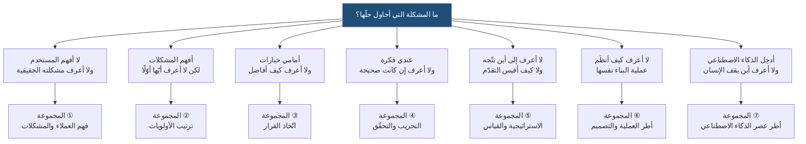
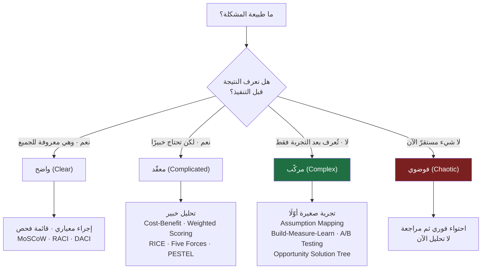
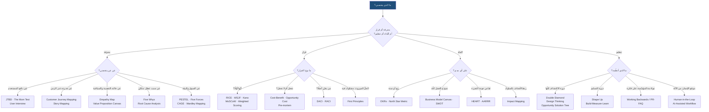
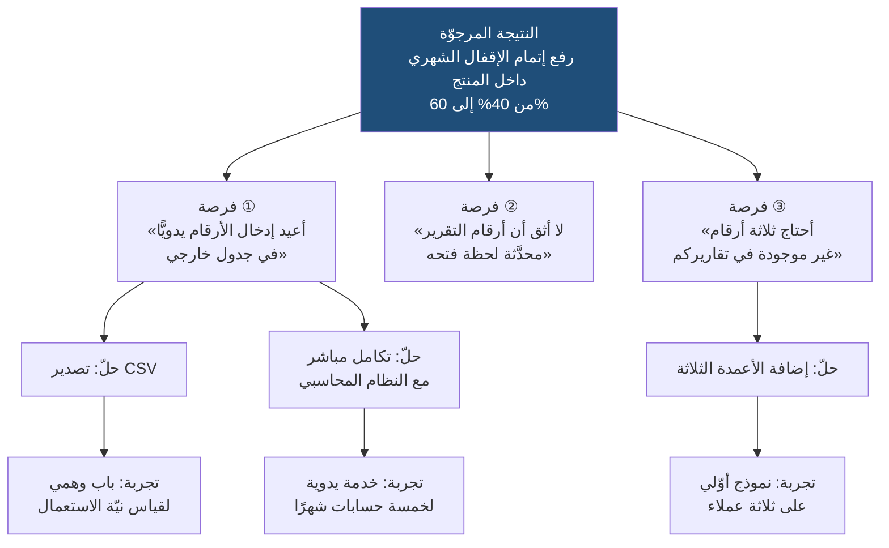
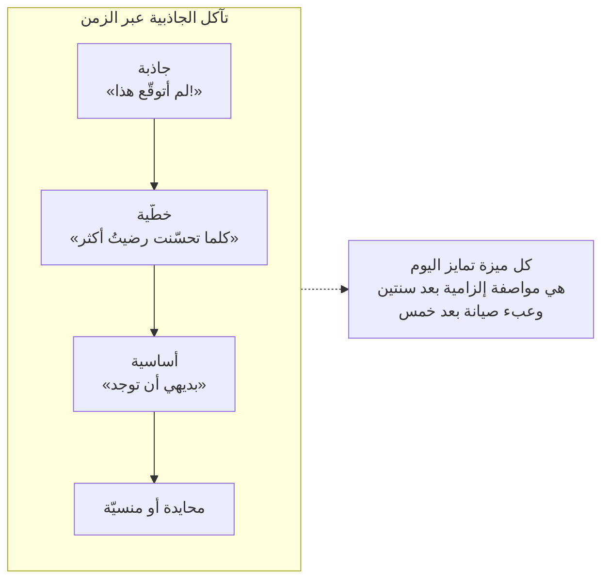
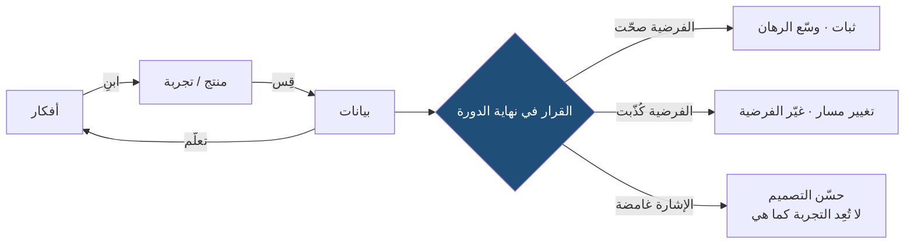
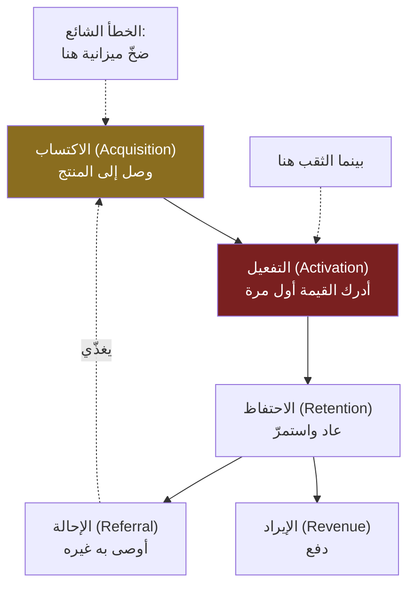
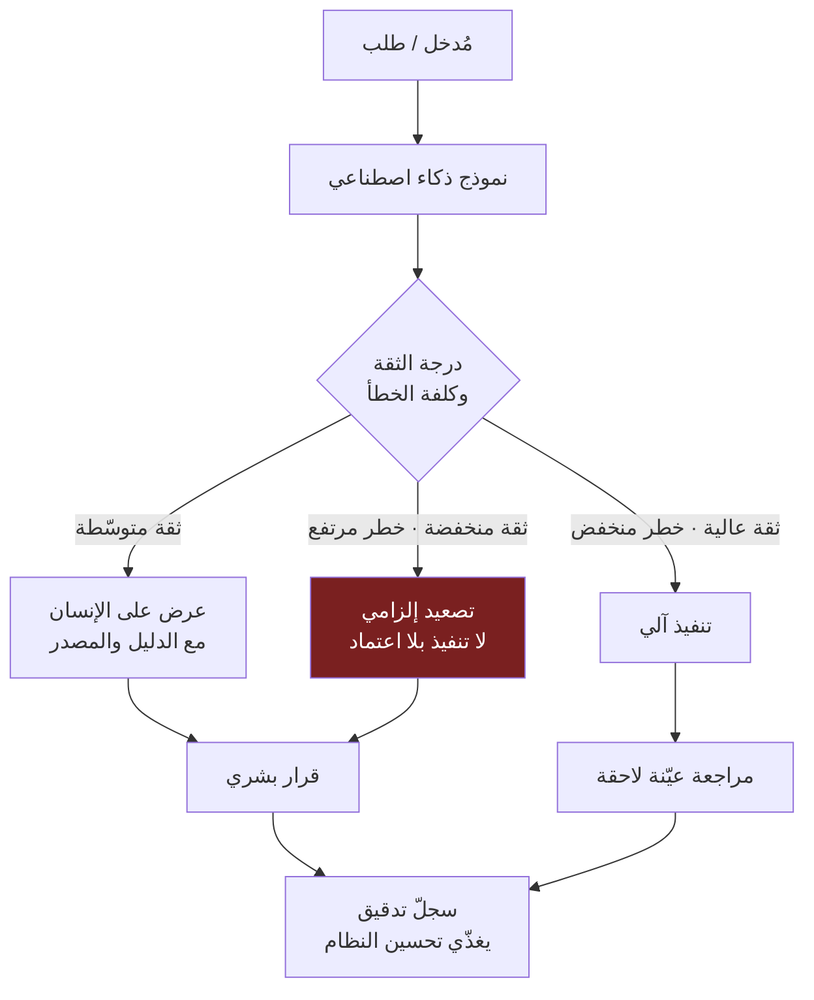
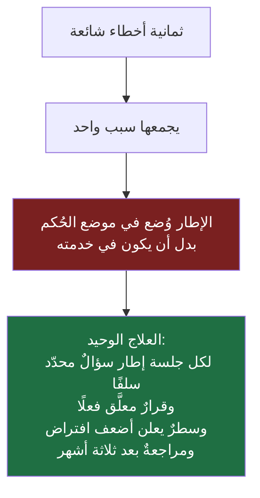

> [!info] الملحق ب · إدارة المنتج في عصر الذكاء الاصطناعي
> **ما هذا الملحق؟** دليل عملي إلى **أربعة وأربعين إطارًا** من أطر إدارة المنتج والقرار والاستراتيجية، مرتَّبة لا بحسب شهرتها بل بحسب **المشكلة التي تحلّها**. لكل إطار **بطاقة موحّدة** بتسعة حقول: ما هو · من صاغه ومتى · المشكلة التي يحلّه · مُدخلاته · مخرَجه · الوقت اللازم · متى **لا** يصلح · أشهر إساءة استعمال · رابط المعجم.
>
> **كيف تستعمله؟** لا تقرأه من أوّله إلى آخره في جلسة واحدة. اقرأ التمهيد وقسم **«كيف تختار الإطار»** كاملَين مرّة واحدة — فهما العمود الفقري — ثم عُد إلى بطاقة الإطار الذي تحتاجه ساعةَ تحتاجه. وإن كنت في حيرة، ابدأ من جدول **«إذا كنت تريد… فاستخدم…»** في آخر الملحق، أو من شجرة القرار في القسم الأول.
>
> **ما ليس هذا الملحق؟** ليس بديلًا عن [[معجم المصطلحات]] — المعجم يعرّف المصطلح، وهذا الملحق يقول لك **متى تستعمله ومتى تتركه**. وليس قائمة توصيات: نصفُ ما فيه نقدٌ للأطر نفسها، لأن أخطر ما يصيب الممارس ليس جهله بالأطر بل ثقته الزائدة فيها.

# الملحق ب — أطر العمل (Frameworks): أيّ عدسة لأيّ مشكلة؟

## 🎯 أهداف التعلّم

- تعريف «الإطار» تعريفًا دقيقًا يفصله عن **المنهجية** و**العملية** و**الأداة** و**النموذج الذهني**، وفهم لماذا يترتّب على هذا الفصل أثر عملي مباشر.
- الانتقال من سؤال «ما أفضل إطار؟» إلى سؤال **«ما طبيعة المشكلة التي أمامي؟»** — واستخدام `Cynefin` بوصفه إطارًا لاختيار الأطر لا إطارًا للتنفيذ.
- قراءة أي إطار من خلال **بطاقة موحّدة** تسعة الحقول، بحيث تصبح المقارنة بين إطارين ممكنة بدل أن تكون مسألة ذوق.
- التمييز بين ما يُنتج الإطار فعلًا (**ترتيب للنقاش**) وما يُظنّ أنه ينتجه (**حقيقة موضوعية**)، وفهم لماذا الرقم الناتج عن ضرب تقديرات ذاتية **ليس قياسًا**.
- معرفة **متى لا يصلح** كل إطار — وهي المعلومة الأندر والأنفع، لأن الأدبيات المتاحة تشرح الاستعمال ونادرًا ما تشرح الحدّ.
- تشخيص **التركيبات المتعارضة**: أي إطارَين يفترضان افتراضين متناقضين فلا يصحّ تشغيلهما معًا على القرار نفسه.
- تقدير **الشرط المؤسّسي** لكل إطار: أيّها يعمل في مؤسّسة لم تنضج بعد، وأيّها يحتاج بيانات وسلطة وثقافة قد لا تكون متوفّرة.
- بناء **حقيبة عدسات شخصية** صغيرة تُتقنها بدل قائمة طويلة تعرف أسماءها فقط.

## تمهيد: ما الإطار، وما ليس هو؟

### التعريف

**الإطار (`Framework`) طريقة منظَّمة للتفكير واتّخاذ القرار.** ليس قانونًا يُلزمك بنتيجة، ولا وصفة سحرية تُخرج الجواب إن أدخلت المكوّنات. هو بنية تفرض عليك أن **تسأل أسئلة معيّنة بترتيب معيّن**، وأن تُظهر افتراضاتك بدل أن تبقيها في رأسك.

وقيمته تنبع من ثلاثة أشياء لا رابع لها:

1. **يمنع النسيان.** العقل تحت الضغط ينسى الأبعاد التي لا تهمّه شخصيًّا. الإطار قائمةُ فحص ضدّ الغفلة.
2. **يجعل التفكير قابلًا للمشاركة.** حين يقول اثنان «أظنّ هذه الميزة أهمّ»، لا يمكن حسم الخلاف. وحين يقول أحدهما «أقدّر الوصول بألفَي مستخدم والثقة بـ50%»، صار الخلاف **موضعيًّا وقابلًا للنقاش**: أين بالضبط تختلف تقديراتنا؟
3. **يبني ذاكرة.** القرار المتّخذ داخل إطار مكتوب يمكن مراجعته بعد سنة: ما الذي افترضناه وأخطأنا فيه؟ أما القرار الحدسي فلا يترك أثرًا يُتعلَّم منه ([[Decision Log|سجلّ القرارات]]).

### استعارة نظام التصنيف — وحدّها

تخيّل مكتبة فيها مليون كتاب بلا نظام تصنيف. الكتب كلها موجودة، والمعرفة كلها متاحة نظريًّا، لكنّها **غير قابلة للوصول عمليًّا**. نظام التصنيف لا يضيف كتابًا واحدًا؛ يضيف **قدرة على الوصول**. وكذلك الإطار: لا يضيف معلومة لا تملكها، بل يرتّب ما تملكه ترتيبًا يجعله قابلًا للاستعمال.

> [!warning] حدّ الاستعارة
> لكن الاستعارة تخدع في نقطة مهمّة: نظام التصنيف **محايد** تجاه محتوى الكتب، أما الإطار **ليس محايدًا** تجاه القرار. `RICE` يميل بنيويًّا إلى ما هو كبير وسريع وقابل للقياس، فيُخفت صوت الرهانات الصغيرة الطويلة الأمد. و`SWOT` يميل إلى إنتاج قوائم متوازنة ظاهريًّا حتى حين تكون الحقيقة غير متوازنة. **كل إطار يحمل نظرية ضمنية عمّا يستحقّ الانتباه، وما لا يدخل في خاناته يختفي من النقاش.** فاختيار الإطار قرارٌ في ذاته، لا تحضير محايد للقرار.

### أربعة أشياء يُخلط بينها

| المفهوم | ما هو | مثال | العلاقة بالإطار |
|---|---|---|---|
| **نموذج ذهني** (`Mental Model`) | فكرة مضغوطة تفسّر جانبًا من العالم | [[Opportunity Cost\|تكلفة الفرصة البديلة]] · [[Little's Law\|قانون ليتل]] | أصغر من الإطار؛ الإطار كثيرًا ما يكون نموذجًا ذهنيًّا مضافًا إليه إجراء |
| **إطار** (`Framework`) | بنية أسئلة/أبعاد تنظّم التفكير في نوع من المشكلات | `RICE` · `Kano` · `SWOT` | موضوع هذا الملحق |
| **منهجية** (`Methodology`) | منظومة كاملة من المبادئ والأدوار والطقوس | [[Lean Startup\|Lean Startup]] · `Scrum` · [[Shape Up\|Shape Up]] | أكبر من الإطار؛ تتضمّن عادةً عدّة أطر |
| **أداة** (`Tool`) | برمجية أو نموذج مطبوع يُنفَّذ فيه الإطار | `Jira` · `Miro` · جدول بيانات | الأداة تُنفِّذ ولا تُفكِّر |

والخلط بين الطبقات هو أصل أخطاء شائعة: من يعامل `Scrum` كإطار ترتيب أولويات يفشل، ومن يعامل `RICE` كمنهجية عمل كاملة يفشل أيضًا.

> [!info] إضافة مرجعية
> هناك طبقة خامسة نادرًا ما تُذكر وهي **الطقس الفارغ** (`Cargo Cult`): استعمال شكل الإطار بعد أن فُقد سببه. الفريق الذي يملأ لوحة `Business Model Canvas` في كل ربع لأن «هذا ما نفعله»، دون أن يتغيّر قرار واحد بناءً عليها، لا يمارس إطارًا بل يمارس عادة. **الاختبار الحاسم لأي إطار: هل غيّر قرارًا؟** إن كان ناتجه دائمًا هو ما كنت ستفعله أصلًا، فأنت تدفع كلفة الإطار بلا عائده.

### القاعدة المؤسِّسة لهذا الملحق كلّه

**لا تبدأ بسؤال «ما أفضل إطار؟». ابدأ بسؤال «ما المشكلة التي أحاول حلّها؟»**

السؤال الأول لا جواب له، لأن «الأفضل» صفة لا معنى لها بلا سياق — كسؤال «ما أفضل أداة في صندوق العدّة؟». والسؤال الثاني له جواب دائمًا، وهو الذي يقود إلى الإطار المناسب تلقائيًّا. ولهذا رُتِّب هذا الملحق بحسب **نوع المشكلة**، لا بحسب شهرة الإطار ولا ترتيبه الأبجدي.

## كيف تقرأ البطاقة الموحّدة

كل إطار في هذا الملحق مكتوب بالحقول التسعة نفسها. الغرض من التوحيد أن تصبح **المقارنة ممكنة**: حين تقرأ الحقل نفسه في إطارين، ترى الفرق بينهما بدل أن تنطبع بأسلوب من كتب عن كلٍّ منهما.

| الحقل | ما يجيب عنه | لماذا يهمّ |
|---|---|---|
| **ما هو** | جملتان تصفان البنية لا الفائدة | يمنع التعريفات الدعائية |
| **من صاغه ومتى** | النسبة الدقيقة قدر المستطاع؛ وإن جُهل قيل ذلك صراحةً | يكشف السياق الذي وُلد فيه الإطار — وهو غالبًا شرط نجاحه |
| **المشكلة التي يحلّها** | السؤال الواحد الذي وُجد الإطار للإجابة عنه | هو مفتاح الاختيار |
| **مُدخلاته** | ما يجب أن يتوفّر قبل البدء | معظم الإخفاقات سببها إطار شُغِّل بلا مُدخلاته |
| **مخرَجه** | ما تخرج به حرفيًّا | يمنع توقّع أكثر ممّا يعطي |
| **الوقت اللازم** | تقدير واقعي لجلسة كفؤة | يُظهر أن بعض الأطر أرخص بمراتب من غيرها |
| **متى لا يصلح** | شروط البطلان | أنفع حقل في البطاقة |
| **أشهر إساءة استعمال** | الخطأ المتكرّر في الممارسة | لأنك ستقع فيه إن لم تُحذَّر |
| **في المعجم** | رابط التعريف المركزي | فصل التعريف عن الاستعمال |

> [!note] عن «الوقت اللازم»
> التقديرات الزمنية في هذا الملحق تصف **الجلسة الأولى الكفؤة** لفريق يعرف ما يفعل ويملك مُدخلاته. وهي ليست معيارًا ولا نتيجة دراسة؛ هي تقدير عملي غرضه المقارنة النسبية: أن تعرف أن `Empathy Map` من عائلة الساعة الواحدة، وأن `Wardley Mapping` من عائلة الأيام. ولا تُقرأ رقمًا مطلقًا.

## أوّلًا: كيف تختار الإطار؟

هذا القسم هو أهمّ ما في الملحق. ما بعده تفاصيل.

### المشكلة قبل الأداة

الخطأ الشائع أن يتعلّم الممارس إطارًا فيبدأ برؤية كل المشكلات على شكله — وهي نسخة مهنية من الملاحظة القديمة: من لا يملك إلا مطرقة يرى كل شيء مسمارًا. علاجها الوحيد هو **عكس ترتيب السؤالين**: صِف المشكلة أوّلًا بلغتك أنت، ثم ابحث عن العدسة.

وأول تصنيف نافع للمشكلات يفرّق بين أربعة أسئلة:

- **سؤال معرفي:** لا أعرف شيئًا عن الواقع. (← أطر الاكتشاف والتحقّق)
- **سؤال مفاضلة:** أعرف الواقع لكن الموارد لا تكفي للجميع. (← أطر الأولويات)
- **سؤال اتّجاه:** أعرف الخيارات لكن لا أعرف أين أريد أن أصل. (← أطر الاستراتيجية)
- **سؤال تنظيم:** أعرف ما أريد لكن لا أعرف كيف أنظّم إنتاجه. (← أطر العملية)

معظم الحيرة التي يعبّر عنها الممارسون بـ«أي إطار أستخدم؟» تنحلّ فور تصنيف السؤال إلى واحد من هذه الأربعة.

### `Cynefin`: إطار لاختيار الأطر

**البطاقة**

| الحقل | المحتوى |
|---|---|
| **ما هو** | إطار يصنّف المواقف بحسب **طبيعة العلاقة بين السبب والنتيجة** فيها، إلى خمسة نطاقات، ولكل نطاق أسلوب استجابة مختلف. اسمه كلمة ويلزية تعني «الموطن» بمعنى تعدّد المؤثّرات التي تشكّلنا. |
| **من صاغه ومتى** | `Dave Snowden` أثناء عمله في `IBM` أواخر التسعينيات، وطُوِّر عبر سنوات؛ وعُرّف على نطاق واسع بمقال في `Harvard Business Review` عام 2007 شارك في كتابته مع `Mary Boone` بعنوان *A Leader's Framework for Decision Making*. |
| **المشكلة التي يحلّها** | «لماذا فشل الأسلوب الذي نجح معنا سابقًا؟» — الجواب عادةً أن نوع المشكلة تغيّر ولم يتغيّر أسلوبنا. |
| **مُدخلاته** | وصف صادق للموقف، وقدرة على الاعتراف بأننا لا نعرف. |
| **مخرَجه** | تصنيف الموقف إلى نطاق، ومنه **أسلوب الاستجابة** المناسب — لا الحلّ. |
| **الوقت اللازم** | 15–30 دقيقة نقاشًا، ويمكن أن يكون لحظيًّا بعد التمرّس. |
| **متى لا يصلح** | حين يُستعمل تصنيفًا نهائيًّا جامدًا؛ النطاقات **تتحرّك**، والموقف الواحد قد يحتوي أجزاء من نطاقات مختلفة. |
| **أشهر إساءة استعمال** | تصنيف كل شيء بـ«مركّب» هربًا من الانضباط، أو تصنيف كل شيء بـ«معقّد» ثقةً بالخبير. |
| **في المعجم** | لا يوجد له مدخل بعد — يُنصح بإضافته. |

**النطاقات الخمسة وما يترتّب عليها**

| النطاق | العلاقة سبب↔نتيجة | نمط العمل | ما يناسبه من الأطر |
|---|---|---|---|
| **بسيط / واضح** (`Clear`) | معروفة ومكرَّرة للجميع | استشعِر ← صنِّف ← استجب | قوائم فحص · [[SOP\|إجراءات معيارية]] · `MoSCoW` · `RACI` |
| **معقّد** (`Complicated`) | معروفة لكن تحتاج خبيرًا لكشفها | استشعِر ← حلِّل ← استجب | `Cost-Benefit` · `Weighted Scoring` · `RICE` · [[Fit-Gap Analysis\|تحليل الفجوة]] |
| **مركّب** (`Complex`) | لا تُعرف إلا **بأثر رجعي** بعد التجربة | جرِّب ← استشعِر ← استجب | `Build→Measure→Learn` · `A/B Testing` · `Assumption Mapping` · `Opportunity Solution Tree` |
| **فوضوي** (`Chaotic`) | لا توجد علاقة قابلة للتمييز الآن | تصرَّف ← استشعِر ← استجب | لا إطار تحليلي — إجراءات احتواء ثم [[Blameless Postmortem\|مراجعة بلا لوم]] |
| **ملتبس** (`Confused`) | لا نعرف في أي نطاق نحن | قسِّم الموقف إلى أجزاء وصنِّف كل جزء | التشخيص أوّلًا |

والفائدة العملية الكبرى من `Cynefin` في إدارة المنتج هي كشف **الخطأ الأكثر كلفة في المهنة**: معاملة مشكلة **مركّبة** بأدوات النطاق **المعقّد**. حين تكون النتيجة غير معروفة مسبقًا (هل سيتبنّى المستخدمون هذه الميزة؟)، فالتحليل مهما اشتدّ لا ينتج يقينًا — يحتاج الأمر تجربة صغيرة. ومع ذلك تُنفَق أسابيع في نماذج تقدير وجداول ترجيح، وتُنتَج أرقام دقيقة المظهر عن مستقبل لم يُختبر. هذا ليس تحليلًا، هو **تأجيل التعلّم بكلفة عالية**.

### شجرة القرار الكاملة: من نوع المشكلة إلى الإطار

هذه الشجرة لا تعطي «الإطار الصحيح»، بل **تُضيّق الاحتمالات من أربعة وأربعين إلى ثلاثة**. والاختيار النهائي من بين الثلاثة يعتمد على وقتك وبياناتك وثقافة مؤسّستك.

### ثلاثة أسئلة قبل أن تفتح أي إطار

مهما بلغت الشجرة من دقّة، لا تفتح إطارًا قبل أن تجيب عن هذه الثلاثة صراحةً:

1. **ما القرار الذي سيتغيّر بناءً على المخرَج؟** إن لم يكن هناك قرار معلَّق، فأنت تمارس نشاطًا لا عملًا.
2. **هل أملك مُدخلات الإطار؟** `RICE` بلا أرقام وصول حقيقية هو تخمين مموَّه بالحساب. و`Kano` بلا استبيان هو رأي الفريق في المستخدم.
3. **ما أرخص شيء يعطيني 80% من الفائدة؟** كثير من جلسات الأطر تُستبدَل بثلاث مكالمات مع مستخدمين، وبكلفة أقلّ بمراتب.

> [!warning] القاعدة الحاسمة
> **الإطار الذي لا يستطيع أن يقول «لا» لا قيمة له.** إن كان بناؤك للإطار بحيث يخرج دائمًا مؤيّدًا لما تريد فعله أصلًا، فقد بنيت آلة تبرير لا آلة قرار. الاختبار: قبل أن تبدأ، اكتب على ورقة النتيجة التي تتوقّعها. إن خرج الإطار بالنتيجة نفسها في كل مرة عبر عشرة قرارات، فهو زينة.

## المجموعة ①: فهم العملاء والمشكلات

هذه المجموعة تجيب عن سؤال واحد بصيغ مختلفة: **من هو المستخدم فعلًا، وما مشكلته الحقيقية لا ما يطلبه؟** وهي المجموعة الأكثر إهمالًا في المؤسّسات، لأن مخرَجاتها لا تظهر في تقارير الإنجاز؛ والأكثر عائدًا، لأن الخطأ فيها يجعل كل ما بعده خطأً منظَّمًا.

### `Jobs to be Done` (JTBD) — المهمّة التي يُوظَّف المنتج لإنجازها

| الحقل | المحتوى |
|---|---|
| **ما هو** | عدسة تنظر إلى المنتج بوصفه شيئًا «يُوظِّفه» العميل لإنجاز **مهمّة** في سياق معيّن، لا بوصفه سلعة تُشترى لخصائصها. والوحدة التحليلية ليست العميل ولا المنتج، بل **المهمّة**. |
| **من صاغه ومتى** | لا مؤلّف واحد. تعود جذوره الفكرية إلى ملاحظة سُوِّقت منذ الستينيات في أدبيات التسويق ونُسبت إلى `Theodore Levitt` بصيغ متباينة، مفادها أن من يشتري مثقابًا لا يريد المثقاب بل الثقب. ثم طُوِّر تطويرًا منهجيًّا في مسارين متوازيين: `Tony Ulwick` منذ التسعينيات ضمن `Outcome-Driven Innovation`، و`Clayton Christensen` ومعه `Bob Moesta` و`Rick Pedi` في صياغة أشهر عرضًا، بلغت ذروتها في كتاب *Competing Against Luck* (2016). |
| **المشكلة التي يحلّها** | «لماذا يستخدم الناس منتجنا فعلًا؟» — وتحديدًا: كيف نتجاوز الخصائص الديموغرافية إلى **الدافع**، وكيف نكتشف منافسينا الحقيقيين الذين ليسوا في قطاعنا. |
| **مُدخلاته** | مقابلات مع مستخدمين **حديثي التبنّي أو حديثي الانصراف** (لأن ذاكرة القرار عندهم طازجة)، وأسئلة عن اللحظة والسياق لا عن الرأي. |
| **مخرَجه** | قائمة «بيانات مهمّة» (`Job Statements`) بصيغة: *حين [سياق]، أريد [دافع]، حتى [نتيجة مرجوّة]* — مع القوى الأربع الدافعة والمعوِّقة. |
| **الوقت اللازم** | 8–15 مقابلة، وأسبوعان إلى ثلاثة للدورة الكاملة. |
| **متى لا يصلح** | حين تكون المشكلة تقنية بحتة (أداء، استقرار، أمن) — فالمهمّة معروفة والعطل في التنفيذ. وحين يكون المنتج داخليًّا إلزاميًّا لا يختاره مستخدمه. وفي أسواق تنظيمية يكون فيها القرار مفروضًا بجهة ثالثة. |
| **أشهر إساءة استعمال** | تحويله إلى **إعادة تسمية لقصص المستخدم**: كتابة «حين أفتح التطبيق أريد زرًّا للتصدير حتى أصدّر» — وهذه صياغة حلّ بقالب مهمّة، وقد أفرغت الإطار من مضمونه. الإساءة الثانية: افتراض أن لكل عميل مهمّة واحدة، والواقع أن المهمّات متعدّدة ومتضاربة (وظيفية · عاطفية · اجتماعية). |
| **في المعجم** | [[Jobs to be Done]] |

**القوى الأربع** — الجزء الأنفع عمليًّا والأقلّ استعمالًا. كل قرار تبنٍّ أو انصراف تحكمه أربع قوى متعارضة:

| القوة | تعمل لصالح | مثال عملي |
|---|---|---|
| **ألم الوضع الحالي** (`Push`) | التغيير | «الإقفال الشهري يستهلك ثلاثة أيام» |
| **جاذبية الحلّ الجديد** (`Pull`) | التغيير | «هذا النظام يُنجزه في ساعة» |
| **قلق الجديد** (`Anxiety`) | البقاء | «ماذا لو ضاعت بياناتنا في الترحيل؟» |
| **تعلّق بالقديم** (`Habit / Inertia`) | البقاء | «الفريق يعرف النظام الحالي عن ظهر قلب» |

والدرس العملي أن معظم الفرق تستثمر كل جهدها في **رفع الجاذبية** (ميزات أكثر)، بينما تكون العقبة الفعلية في **القلق والتعلّق** — وعلاجهما ليس ميزة، بل ضمان أو ترحيل مجاني أو وضع تجريبي قابل للتراجع.

> [!info] إضافة مرجعية
> أشهر ما يُروى لتوضيح `JTBD` هو مثال «المخفوق اللبني» (`Milkshake`): دراسة سلوكية أظهرت أن قسمًا كبيرًا من المبيعات يقع صباحًا لسائقين وحدهم في الطريق، وأن المهمّة الحقيقية لم تكن الطعم بل ملء الرحلة الطويلة بشيء يُستهلك بيد واحدة ويطول أثره. **وتُروى القصّة بتفاصيل وأرقام متباينة بين المصادر**، ولذلك تُذكر هنا بوصفها توضيحًا للمبدأ لا واقعةً موثّقة برقم. والمبدأ ثابت مهما اختلفت التفاصيل: **المنافس الحقيقي قد يكون الموزة والقهوة، لا مخفوقًا آخر** — أي أن تعريف السوق بالمنتج يعمي عن المنافسة الفعلية.

### `Customer Journey Mapping` — خريطة رحلة العميل

| الحقل | المحتوى |
|---|---|
| **ما هو** | تمثيل بصري لخطوات العميل عبر الزمن من أول وعي بالحاجة إلى ما بعد الاستعمال، مصحوبًا في كل خطوة بما يفعله وما يفكّر فيه وما يشعر به ونقاط الاحتكاك. |
| **من صاغه ومتى** | لا مؤلّف واحد. جذوره في **تصميم الخدمات**، وأقرب سلف موثّق هو **مخطّط الخدمة** (`Service Blueprint`) الذي قدّمته `G. Lynn Shostack` في `Harvard Business Review` عام 1984. وانتشرت الصيغة الحالية في أوساط `UX` وتجربة العميل خلال العقدين التاليين دون أن تُنسب إلى شخص بعينه. |
| **المشكلة التي يحلّها** | «أين بالضبط يتعثّر العميل؟» — والأهمّ: كشف أن أسوأ لحظات التجربة تقع غالبًا **بين** الأقسام لا داخلها. |
| **مُدخلاته** | شخصية مستخدم محدّدة (لا «كل المستخدمين»)، وسيناريو واحد محدّد، وبيانات سلوك أو مقابلات — لا تخمين الفريق. |
| **مخرَجه** | خريطة زمنية بمسارات (فعل · تفكير · شعور · نقاط تماس · احتكاك · فرص)، ومنها قائمة فرص مرقّمة. |
| **الوقت اللازم** | ورشة 3–4 ساعات إن توفّرت البيانات؛ أسبوع إلى أسبوعين لجمع البيانات قبلها. |
| **متى لا يصلح** | للمنتجات ذات المسار الواحد القصير جدًّا (شاشة واحدة). ولا يصلح بديلًا عن البيانات: خريطة مبنيّة على انطباعات الفريق هي **توثيق لتحيّزاته** بشكل جميل. |
| **أشهر إساءة استعمال** | إنتاجها كمخرَج نهائي: لوحة ملوّنة تُعلَّق على الجدار ولا تتحوّل إلى قرار واحد. الإساءة الثانية: خريطة واحدة لكل الشرائح، فتذوب الفروق التي هي مقصد التمرين. |
| **في المعجم** | [[User Journey Map]] · [[User Flow]] · [[UX vs CX]] |

**تمييز ثلاثي يُخلط دائمًا:**

| الأداة | تصف | مستواها | تُستعمل حين |
|---|---|---|---|
| `User Flow` | خطوات داخل الواجهة | شاشات ونقرات | تصمّم مسارًا محدّدًا |
| `Customer Journey Map` | تجربة العميل عبر القنوات والزمن | أسابيع أو أشهر | تبحث عن نقاط الألم الكبرى |
| `Service Blueprint` | ما يحدث **خلف الكواليس** لدعم كل نقطة تماس | العمليات والأنظمة والأدوار | تعرف الألم ولا تعرف سببه التشغيلي |

والخطأ الأكثر كلفة هو رسم رحلة العميل ثم محاولة إصلاحها دون النزول إلى مستوى `Service Blueprint` — لأن سبب الاحتكاك في تسع حالات من عشر ليس في الواجهة، بل في عملية داخلية أو نظام قديم أو حدود بين قسمين.

### `Empathy Map` — خريطة التعاطف

| الحقل | المحتوى |
|---|---|
| **ما هو** | لوحة مقسَّمة تجمع ما يقوله المستخدم ويفكّر فيه ويفعله ويشعر به، مع آلامه ومكاسبه المرجوّة — في صفحة واحدة. |
| **من صاغه ومتى** | `Dave Gray` مؤسّس شركة `XPLANE`؛ انتشرت الصيغة الكلاسيكية ذات الأرباع الأربعة في أوساط التصميم منذ منتصف العقد الأول من الألفية، ونشر `Gray` نسخة محدَّثة عام 2017 تبدأ بتحديد **الهدف** قبل الملء. |
| **المشكلة التي يحلّها** | «كيف نُدخل المستخدم إلى غرفة الاجتماع وهو غائب؟» — أداة **مواءمة** أكثر منها أداة بحث. |
| **مُدخلاته** | ملاحظات مقابلات أو تسجيلات دعم أو جلسات ملاحظة. |
| **مخرَجه** | صفحة واحدة تُستعمل مرجعًا مشتركًا أثناء التصميم والقرار. |
| **الوقت اللازم** | 45–90 دقيقة. أرخص أطر هذه المجموعة. |
| **متى لا يصلح** | حين تكون البيانات معدومة — تتحوّل حينها إلى تخيّل جماعي مقنّن. ولا تصلح للقرارات الكمّية إطلاقًا. |
| **أشهر إساءة استعمال** | ملؤها بأفكار الفريق عن المستخدم بدل كلام المستخدم. القاعدة العملية: **كل ملصق في الخريطة يجب أن يكون قابلًا للإحالة إلى مصدر** — مقابلة رقم كذا، تذكرة دعم رقم كذا. ما لا مصدر له يُوسم بلون مختلف بوصفه **فرضية**، لا معرفة. |
| **في المعجم** | لا يوجد مدخل مستقلّ — أقرب المداخل [[Voice of the Customer]] و[[User Interview]] |

### `Five Whys` — الأسباب الخمسة

| الحقل | المحتوى |
|---|---|
| **ما هو** | تقنية استجواب متسلسل: تسأل «لماذا؟» عن العرَض، ثم تسأل «لماذا؟» عن الجواب، خمس مرات تقريبًا، حتى تصل إلى سبب يمكن التدخّل فيه فعلًا. |
| **من صاغه ومتى** | `Sakichi Toyoda` مؤسّس مجموعة `Toyota`، ودخلت ركنًا أساسيًّا في [[Toyota Production System\|نظام إنتاج تويوتا]] الذي طوّره `Taiichi Ohno` — الذي عبّر عن جوهرها بأن تكرار «لماذا» خمس مرات يكشف طبيعة المشكلة وحلّها معًا. |
| **المشكلة التي يحلّها** | «لماذا يتكرّر هذا العطل رغم أننا أصلحناه؟» — الجواب عادةً: أصلحنا العرَض لا السبب. |
| **مُدخلاته** | واقعة محدّدة واحدة (لا فئة مشكلات)، وحضور من يعرف التفاصيل، ومناخ [[Psychological Safety\|أمان نفسي]]. |
| **مخرَجه** | سلسلة سببية مكتوبة، وإجراء تصحيحي عند أعمق نقطة يمكن التأثير فيها. |
| **الوقت اللازم** | 30–60 دقيقة. |
| **متى لا يصلح** | **في الأنظمة المركّبة متعدّدة الأسباب** — وهو حدّها الجوهري. `Five Whys` يفترض سلسلة سببية **خطّية واحدة**، والواقع في الأنظمة التقنية والاجتماعية شبكة أسباب متفاعلة لا سلسلة. الحوادث الكبرى نادرًا ما يكون لها سبب جذري واحد. |
| **أشهر إساءة استعمال** | الانتهاء عند **شخص**: «لماذا؟ لأن فلانًا لم ينتبه». هذا ليس سببًا جذريًّا بل نهاية تحقيق. القاعدة: إن انتهت سلسلتك عند إنسان، فقد توقّفت مبكّرًا؛ اسأل «ولماذا سمح النظام بأن يؤدّي خطأٌ فردي إلى هذه النتيجة؟». |
| **في المعجم** | [[Root Cause Analysis]] · [[Blameless Postmortem]] — ولا يوجد مدخل مستقلّ باسم `Five Whys` |

> [!warning] نقد صريح
> `Five Whys` من أكثر الأطر عرضةً لـ**وهم العمق**: خمس خطوات منطقية الشكل تنتهي إلى استنتاج يبدو عميقًا، بينما كل خطوة فيها كانت اختيارًا واحدًا من بين عدّة أجوبة ممكنة. سؤال «لماذا؟» عن عطل قد يُجاب بخمسة أجوبة صحيحة، فتختار أنت واحدًا وتكمل عليه — والنتيجة أن الفريق نفسه بالوقائع نفسها قد يصل إلى «جذور» مختلفة تمامًا بحسب أول منعطف. العلاج: **لا تسلك فرعًا واحدًا**؛ ارسمها شجرةً لا خطًّا (وهذا ما تفعله أدوات مثل مخطّط `Ishikawa`)، واطلب في كل مستوى دليلًا لا استنتاجًا.

### `Value Proposition Canvas` — لوحة القيمة المقترحة

| الحقل | المحتوى |
|---|---|
| **ما هو** | لوحة من نصفين: نصف العميل (مهمّاته · آلامه · مكاسبه المرجوّة) ونصف المنتج (المنتجات والخدمات · مسكّنات الألم · مولّدات المكاسب)، والغرض فحص **درجة التطابق** بين النصفين. |
| **من صاغه ومتى** | `Alexander Osterwalder` و`Yves Pigneur` وزملاؤهما، في كتاب *Value Proposition Design* (2014)، بوصفها تكبيرًا لخانة «القيمة المقترحة» في `Business Model Canvas`. |
| **المشكلة التي يحلّها** | «هل ما نبنيه يخاطب فعلًا ما يهمّ العميل؟» — تكشف المنتجات التي تحلّ مشكلات لا أحد يعاني منها. |
| **مُدخلاته** | فهم مسبق للعميل (مخرَج `JTBD` أو المقابلات)، ووصف صريح لما يقدّمه المنتج. |
| **مخرَجه** | خرائط تطابق: أي مسكّن يقابل أي ألم، وأي ألم بلا مسكّن (ثغرة)، وأي مسكّن بلا ألم (**تبديد**). |
| **الوقت اللازم** | 2–3 ساعات، بعد توفّر بحث العملاء. |
| **متى لا يصلح** | حين لم يُجرَ بحث عملاء بعد — تصبح تمرينًا في التخيّل. ولا تصلح لتحديد الأولوية بين ميزات متقاربة. |
| **أشهر إساءة استعمال** | ملء نصف المنتج أوّلًا ثم اختراع آلام تناسبه — وهو **عكس ترتيب اللوحة تمامًا**، ويحوّلها من أداة فحص إلى أداة تبرير. اللوحة تُملأ من اليمين (العميل) إلى اليسار (المنتج) لا العكس. |
| **في المعجم** | [[Value Proposition Canvas]] |

### `Story Mapping` — خريطة القصص

| الحقل | المحتوى |
|---|---|
| **ما هو** | ترتيب متطلّبات المنتج في **بعدين**: أفقيًّا بحسب تسلسل رحلة المستخدم، وعموديًّا بحسب الأولوية داخل كل خطوة — بحيث يصبح كل «شريحة أفقية» إصدارًا كاملًا وظيفيًّا. |
| **من صاغه ومتى** | `Jeff Patton` الذي عرض الفكرة في كتاباته منذ منتصف العقد الأول من الألفية (مقاله المعروف «قائمة القصص الجديدة خريطة» عام 2005)، وفصّلها في كتاب *User Story Mapping* (2014). |
| **المشكلة التي يحلّها** | «كيف نخرج من قائمة `Backlog` مسطّحة لا تُظهر السياق ولا تُظهر ما هو إصدار قابل للاستعمال؟» |
| **مُدخلاته** | فهم لرحلة المستخدم، وقائمة أوليّة بالمتطلّبات، وحضور الفريق كاملًا. |
| **مخرَجه** | خريطة ثنائية الأبعاد، وخطوط تقطيع تحدّد الإصدار الأول والثاني والثالث. |
| **الوقت اللازم** | ورشة نصف يوم إلى يوم. |
| **متى لا يصلح** | للمنتجات التي لا رحلة زمنية فيها (لوحة تحكّم واحدة، `API` خدمي). ولا يصلح للصيانة والدين التقني. |
| **أشهر إساءة استعمال** | استعمالها كطريقة عرض جميلة للـ`Backlog` دون رسم **خطوط التقطيع** — وهي المخرَج الوحيد الذي يبرّر الورشة. بلا خطوط تقطيع، الخريطة زينة. |
| **في المعجم** | [[Story Mapping]] · [[13 - Backlog\|Backlog]] · [[11 - User Stories\|قصص المستخدم]] |

### `Opportunity Solution Tree` — شجرة الفرص والحلول

| الحقل | المحتوى |
|---|---|
| **ما هو** | شجرة من أربعة مستويات: **نتيجة مرجوّة** واحدة في القمّة ← **فرص** (مشكلات وحاجات مكتشفة من المستخدمين) ← **حلول** مقترحة لكل فرصة ← **تجارب** للتحقّق من كل حلّ. |
| **من صاغه ومتى** | `Teresa Torres`، طوّرتها في كتاباتها وورشها منذ نحو عام 2016، وفصّلتها في كتاب *Continuous Discovery Habits* (2021). |
| **المشكلة التي يحلّها** | «كيف نربط ما نبنيه اليوم بالنتيجة التي نسعى إليها، ونجعل الاكتشاف مستمرًّا لا مرحلة تسبق البناء؟» |
| **مُدخلاته** | نتيجة مرجوّة واحدة محدّدة ومقيسة، وتدفّق مستمرّ من مقابلات المستخدمين. |
| **مخرَجه** | شجرة حيّة تُحدَّث أسبوعيًّا، ومن كل فرع سؤال صريح: أي تجربة ستحسم هذا؟ |
| **الوقت اللازم** | بناء أوّلي في 2–3 ساعات، لكن قيمتها في **الاستمرار** — أسبوعيًّا لأشهر. |
| **متى لا يصلح** | حين لا تملك المؤسّسة نتيجة مرجوّة محدّدة (بل قائمة ميزات مطلوبة)، وحين لا يُتاح للفريق التواصل مع المستخدمين. وكلاهما شائع. |
| **أشهر إساءة استعمال** | ملء مستوى «الفرص» بحلول مقنّعة: «فرصة: المستخدم يحتاج إشعارات» — هذا حلّ لا فرصة. الفرصة تُصاغ بلغة المستخدم عن حاجته، والحلّ بلغتنا عن استجابتنا. |
| **في المعجم** | [[Opportunity Solution Tree]] · [[Continuous Discovery]] · [[Product Discovery]] |

### `Assumption Mapping` — خريطة الافتراضات

| الحقل | المحتوى |
|---|---|
| **ما هو** | تمرين يستخرج كل الافتراضات المضمَرة خلف فكرة، ثم يرتّبها على محورين: **مدى أهمّيتها** (ماذا يحدث لو كانت خاطئة؟) و**مدى الدليل المتوفّر عليها**. والربع الأخطر: مهمّ جدًّا ودليله ضعيف. |
| **من صاغه ومتى** | `David J. Bland` بالتعاون مع `Alex Osterwalder` في كتاب *Testing Business Ideas* (2019)، مبنيًّا على تقاليد سابقة في اختبار الفرضيات في الشركات الناشئة. |
| **المشكلة التي يحلّها** | «بأي شيء نبدأ الاختبار؟» — الجواب: بأخطر افتراض أقلّ دليلًا، لا بأسهل شيء نبنيه. |
| **مُدخلاته** | فكرة أو مبادرة محدّدة، وفريق مختلط (منتج · تقنية · تصميم · أعمال · مبيعات). |
| **مخرَجه** | مصفوفة، وقائمة مرتَّبة بالافتراضات القاتلة، ولكل افتراض **تجربة أرخص ما يمكن** تحسمه. |
| **الوقت اللازم** | 90 دقيقة إلى ساعتين. |
| **متى لا يصلح** | حين يكون القرار [[Reversible vs Irreversible Decisions\|قابلًا للتراجع]] ورخيصًا — فتجريبه أرخص من رسم خريطته. |
| **أشهر إساءة استعمال** | إنتاج الخريطة ثم عدم تشغيل أي تجربة. الخريطة **مقدّمة لخطة اختبار**؛ من يتوقّف عندها يكون قد وثّق مخاوفه ولم يُزِلها. |
| **في المعجم** | [[Assumption Mapping]] · [[Hypothesis]] · [[Kill Criteria]] |

**تصنيف الافتراضات الأربعة** — يقابل مخاطر المنتج الأربع:

| نوع الافتراض | السؤال | نموذج فشله |
|---|---|---|
| **الرغبة** (`Desirability`) | هل يريده أحد أصلًا؟ | بنينا شيئًا لا أحد يستعمله |
| **الجدوى التقنية** (`Feasibility`) | هل يمكن بناؤه بمواردنا؟ | تعثّرنا بعد ستة أشهر |
| **الجدوى التجارية** (`Viability`) | هل يعمل اقتصاديًّا؟ | نجح ونحن نخسر على كل مستخدم |
| **قابلية الاستخدام** (`Usability`) | هل يستطيع الناس استعماله؟ | يريدونه ولا يفهمونه |

> [!warning] نقد صريح للمجموعة ①
> هذه المجموعة مصدر **يقين زائف من نوع خاص**: يقين السرد. مخرَجات أطر الفهم كلّها نصوص وصور مقنعة — خريطة رحلة، بيان مهمّة، لوحة تعاطف — والنص المقنع يشعر بالصدق أكثر من الرقم. ثلاث آفات محدّدة:
>
> **أوّلًا، تحيّز المقابلة.** الناس لا يعرفون دوافعهم بدقّة، ويعيدون بناء أسبابهم بعد الفعل، ويجاملون من يسألهم. ولهذا تكون أسئلة «هل تستخدم هذا لو وُجد؟» عديمة القيمة تقريبًا؛ والبديل هو السؤال عن **السلوك الماضي المحدّد**: ماذا فعلت آخر مرة؟ متى؟ وكم دفعت؟ (وهذا صلب [[The Mom Test|اختبار الأمّ]]).
>
> **ثانيًا، حجم العيّنة.** خمس مقابلات تكفي لكشف **وجود** نمط، ولا تكفي أبدًا لتقدير **حجمه**. من يخرج من ثماني مقابلات بقول «60% من عملائنا يعانون كذا» فقد ارتكب خطأ إحصائيًّا صريحًا. البحث النوعي يجيب عن «ماذا ولماذا»، والكمّي عن «كم». استبدال أحدهما بالآخر خطأ فادح في الاتّجاهين.
>
> **ثالثًا، اختيار من نقابل.** إن قابلت من يستعمل منتجك اليوم فقط، فقد استبعدت بنيويًّا كل من جرّبه وانصرف — وهم غالبًا حاملو أهمّ المعلومات. المقابلة الأثمن هي مع **المنصرفين ومن رفض الشراء**، وهي أصعب المقابلات ترتيبًا، ولهذا تُهمَل.

## المجموعة ②: ترتيب الأولويات

هذه المجموعة تجيب عن السؤال الأقسى في المهنة: **الموارد لا تكفي لكل ما نريد — فبأي شيء نبدأ، وما الذي لن نفعله؟** وكلها بلا استثناء أدوات **تنظيم نقاش** لا أدوات قياس، مهما بدت رياضية. راجع [[05 - تحديد الأولويات (Prioritization)|الفصل الخامس]] لتأصيل الموضوع كاملًا؛ هنا البطاقات فقط.

### `RICE` — الوصول × الأثر × الثقة ÷ الجهد

| الحقل | المحتوى |
|---|---|
| **ما هو** | صيغة تسجيل تعطي كل مبادرة درجة = (`Reach` × `Impact` × `Confidence`) ÷ `Effort`. الوصول عدد المستخدمين المتأثّرين في مدّة محدّدة، والأثر مقياس تقديري سُلَّمي، والثقة نسبة مئوية، والجهد بأشخاص-شهر. |
| **من صاغه ومتى** | فريق المنتج في شركة `Intercom`، ونُشر علنًا في مدوّنتها عام 2016 (يُنسب الطرح إلى `Sean McBride`) بوصفه علاجًا لمشكلة داخلية: أن نقاشات الأولويات كانت تُحسم بالحماس. |
| **المشكلة التي يحلّها** | «كيف نقارن مبادرات غير متجانسة على مسطرة واحدة، ونجعل خلافنا موضعيًّا؟» |
| **مُدخلاته** | تقدير عددي للوصول (يفضَّل من بيانات فعلية)، وتقدير للجهد من المهندسين، ونطاق زمني موحّد لكل البنود. |
| **مخرَجه** | قائمة مرتَّبة بدرجات، وأهمّ منها: **سجلّ التقديرات** الذي يمكن مراجعته لاحقًا. |
| **الوقت اللازم** | 2–4 ساعات لعشرين بندًا، بعد جمع البيانات. |
| **متى لا يصلح** | ① للرهانات الاستراتيجية الطويلة (وصولها اليوم صفر وأثرها بعد سنتين) — `RICE` يقتلها بنيويًّا. ② لأعمال الالتزام الإلزامي (تنظيمي، أمني، دين تقني حرج) — هذه لا تُرتَّب بل تُنفَّذ. ③ حين لا توجد بيانات وصول أصلًا. |
| **أشهر إساءة استعمال** | معاملة الناتج كرقم موضوعي. `RICE` يضرب **ثلاثة تقديرات ذاتية** ويقسم على تقدير ذاتي رابع؛ فالخطأ يتراكم مضاعفةً لا جمعًا. تقدير الوصول بضعف الحقيقة والجهد بنصفها يعطي درجة أعلى بأربعة أضعاف الصحيح — بلا أي تغيّر في الواقع. |
| **في المعجم** | [[RICE Prioritization]] · [[Prioritization]] |

> [!info] إضافة مرجعية
> حقل **الثقة** (`Confidence`) هو أذكى ما في `RICE` وأكثر ما يُهمَل. وظيفته أن يعاقب التقديرات المبنيّة على الهواء: مبادرة أثرها مذهل وثقتها 20% تنزل إلى مكانها الصحيح. ومن يملأ كل الصفوف بـ100% قد ألغى نصف قيمة الإطار. **قاعدة انضباط عملية:** لا تكتب ثقة تتجاوز 80% إلا إن كان لديك بيانات فعلية أو تجربة سابقة مباشرة؛ و50% هي الافتراض الطبيعي لفكرة لم تُختبر؛ وما دون 30% ليس بندًا للتنفيذ بل بندًا للتجريب.

### `ICE` — الأثر × الثقة × السهولة

| الحقل | المحتوى |
|---|---|
| **ما هو** | صيغة أبسط: `Impact` × `Confidence` × `Ease`، كلٌّ منها على سُلَّم 1–10. |
| **من صاغه ومتى** | يُنسب شيوعه إلى `Sean Ellis` في أوساط `Growth Hacking` مطلع العقد الثاني من الألفية، بوصفه أداة ترتيب سريعة لتجارب النموّ الأسبوعية. |
| **المشكلة التي يحلّها** | «كيف نرتّب عشرين تجربة صغيرة في عشرين دقيقة؟» |
| **مُدخلاته** | حدس مطّلع من فريق قريب من البيانات. |
| **مخرَجه** | ترتيب سريع لقائمة تجارب. |
| **الوقت اللازم** | 20–40 دقيقة. |
| **متى لا يصلح** | للقرارات الكبيرة عالية الكلفة — بساطته التي هي فضيلته في التجارب الصغيرة تصير رعونةً في الالتزامات الكبيرة. ولا يصلح للمقارنة بين فرق مختلفة لأن سُلَّم 1–10 غير معايَر بينها. |
| **أشهر إساءة استعمال** | استعماله بديلًا عن `RICE` في قرارات ربع سنوية. الفرق الجوهري أن `RICE` يُلزمك برقم **وصول** من الواقع، بينما `ICE` كلّه أحكام على سُلَّم. `ICE` أداة سرعة، لا أداة دقّة. |
| **في المعجم** | [[ICE Scoring]] |

### `Kano Model` — نموذج كانو

| الحقل | المحتوى |
|---|---|
| **ما هو** | نموذج يصنّف خصائص المنتج بحسب **العلاقة غير الخطّية** بين مستوى تنفيذها ومستوى رضا العميل، إلى خمس فئات. |
| **من صاغه ومتى** | البروفيسور `Noriaki Kano` وزملاؤه، في ورقة يابانية منشورة عام 1984 عن «الجودة الجاذبة والجودة الواجبة». |
| **المشكلة التي يحلّها** | «لماذا لا يرفع تحسينُ بعض الأشياء الرضا أبدًا، بينما يخفضه غيابُها كارثيًّا؟» |
| **مُدخلاته** | **استبيان بسؤالين لكل خاصّة** (سؤال إيجابي: كيف تشعر لو وُجدت؟ وسؤال سلبي: كيف تشعر لو غابت؟) على عيّنة معقولة من المستخدمين. |
| **مخرَجه** | تصنيف كل خاصّة إلى فئة، ومنه قرارات استثمار مختلفة نوعيًّا لكل فئة. |
| **الوقت اللازم** | أسبوع إلى أسبوعين مع الاستبيان؛ وساعتان إن اكتُفي بحكم الفريق (وهذه نسخة ضعيفة). |
| **متى لا يصلح** | حين لا يمكن الوصول إلى عيّنة مستخدمين. وفي الأسواق شديدة التقلّب حيث تتحرّك الفئات أسرع من دورة القياس. |
| **أشهر إساءة استعمال** | تصنيف الخصائص بحكم الفريق بدل الاستبيان — فيصبح النموذج مرآةً لتحيّز الفريق. والإساءة الثانية: نسيان أن التصنيف **يتآكل بالزمن**؛ ما كان «جاذبًا» يصير «متوقّعًا» ثم «أساسيًّا». |
| **في المعجم** | [[Kano Model]] |

| الفئة | العلاقة بالرضا | القاعدة الاستثمارية | مثال |
|---|---|---|---|
| **أساسية** (`Must-be`) | غيابها يُسخط، ووجودها لا يُسعد | نفّذها إلى حدّ الكفاية ثم **توقّف** | تسجيل الدخول يعمل |
| **خطّية** (`Performance`) | كلما زادت زاد الرضا طرديًّا | استثمر بحسب المنافسة | سرعة التحميل |
| **جاذبة** (`Attractive`) | غيابها لا يُسخط، ووجودها يُبهج | مصدر التمايز الحقيقي | ميزة لم يتوقّعها أحد |
| **محايدة** (`Indifferent`) | لا أثر لها في الاتّجاهين | **احذفها** — كلفة بلا عائد | خيارات إعدادات لا يفتحها أحد |
| **عكسية** (`Reverse`) | وجودها يُسخط شريحةً | افصلها أو اجعلها اختيارية | «مساعدة» تعترض المحترفين |

**الدرس الأعمق في `Kano`** أنه يفكّك وهمًا شائعًا: أن الاستثمار في أي خاصّة يعطي عائدًا متناسبًا. الحقيقة أن الإفراط في تحسين خاصّة **أساسية** بعد بلوغها حدّ الكفاية عائدُه صفر تقريبًا، وأن الخصائص **المحايدة** — وهي كثيرة في المنتجات الناضجة — تكلّف صيانةً دائمة بلا مقابل. وهذا يفسّر لماذا يكون **الحذف** أحيانًا أعلى المبادرات عائدًا.

### `MoSCoW` — يجب / ينبغي / يمكن / لن

| الحقل | المحتوى |
|---|---|
| **ما هو** | تصنيف بنود النطاق إلى أربع فئات: `Must have` (إلزامي وإلا فشل التسليم) · `Should have` (مهمّ وله بديل مؤقّت) · `Could have` (مرغوب إن سمح الوقت) · `Won't have this time` (خارج هذه الجولة صراحةً). |
| **من صاغه ومتى** | `Dai Clegg` أثناء عمله في `Oracle` مطلع التسعينيات، وتبنّته منهجية `DSDM` فانتشر منها. |
| **المشكلة التي يحلّها** | «ما الذي يجب أن يُسلَّم قطعًا في هذا الموعد، وما الذي يمكن التخلّي عنه تحت الضغط؟» — أداة **حماية موعد** لا أداة مفاضلة قيمة. |
| **مُدخلاته** | نطاق محدّد، وموعد محدّد، وسلطة قادرة على قول «لن». |
| **مخرَجه** | نطاق مصنَّف يمكن تقليصه تحت الضغط بلا نقاش جديد. |
| **الوقت اللازم** | ساعة إلى ساعتين. |
| **متى لا يصلح** | حين يكون السؤال «أي المبادرات أعلى قيمة؟» — `MoSCoW` لا يقارن قيمة، بل يقارن **إلزامًا**. وحين لا يوجد موعد ثابت أصلًا يفقد معناه. |
| **أشهر إساءة استعمال** | أن يصير كل شيء `Must`. وهذا ليس فشلًا في التطبيق بل **عرَض** لغياب سلطة القرار: حين لا يستطيع أحد قول «لا» يهرب الجميع إلى تصنيف كل شيء إلزاميًّا. القاعدة العملية المستعملة في `DSDM`: ألّا تتجاوز بنود `Must` نحو 60% من مجهود الجولة، وإلا فلا احتياطي لديك. والفئة الأنفع — والأكثر إهمالًا — هي `Won't`: هي وحدها التي تُنتج مواءمة حقيقية لأنها تُكتب صراحةً وتُوقَّع. |
| **في المعجم** | [[MoSCoW Prioritization]] · [[Out of Scope]] · [[Scope Creep]] |

### `Opportunity Scoring` — تسجيل الفرص

| الحقل | المحتوى |
|---|---|
| **ما هو** | قياس كمّي يسأل المستخدمين عن كل نتيجة مرجوّة سؤالين: **ما أهمّيتها لك؟** و**ما درجة رضاك عنها اليوم؟** ثم يحسب «درجة فرصة» تعلو حيث تجتمع أهمّية عالية مع رضا منخفض. الصيغة الشائعة: `الأهمّية + (الأهمّية − الرضا)` بحيث لا يُسمح للفرق السالب بالخصم. |
| **من صاغه ومتى** | `Tony Ulwick` ضمن منهجية `Outcome-Driven Innovation` التي طوّرها منذ التسعينيات وعرضها في *What Customers Want* (2005). |
| **المشكلة التي يحلّها** | «أين توجد فجوة حقيقية بين ما يهمّ العميل وما نقدّمه؟» — أي تحديد **المناطق غير المخدومة** بدلًا من التخمين. |
| **مُدخلاته** | قائمة نتائج مرجوّة مصوغة بلغة العميل (وهي أصعب جزء)، وعيّنة استبيان معتبرة. |
| **مخرَجه** | مخطّط تشتّت للفرص، مقسّم إلى مناطق: غير مخدومة · مخدومة بالقدر المناسب · **مخدومة بإفراط** (استثمار زائد يجب سحبه). |
| **الوقت اللازم** | 2–4 أسابيع مع الاستبيان. الأغلى في هذه المجموعة. |
| **متى لا يصلح** | للفرق الصغيرة التي لا تملك قاعدة مستخدمين تكفي لاستبيان ذي دلالة. وفي المنتجات الجديدة كلّيًّا حيث لا يستطيع المستخدم تقييم «رضاه» عن شيء لم يجرّبه. |
| **أشهر إساءة استعمال** | صياغة النتائج المرجوّة بلغة الحلول: «رضاك عن زرّ التصدير» بدل «رضاك عن سرعة إنجاز الإقفال الشهري». هذا يحوّل الأداة من كشف فرص إلى تقييم ميزات. |
| **في المعجم** | [[Opportunity Scoring]] · [[Opportunity Discovery]] |

### `Weighted Scoring` — التسجيل المرجَّح

| الحقل | المحتوى |
|---|---|
| **ما هو** | مصفوفة تحدّد فيها معايير القرار وتعطي كلًّا منها **وزنًا**، ثم تقيّم كل خيار على كل معيار، والدرجة النهائية مجموع حاصل الضرب. أعمّ أطر هذه المجموعة وأكثرها مرونة. |
| **من صاغه ومتى** | لا مؤلّف واحد؛ ينتمي إلى تقاليد **تحليل القرار متعدّد المعايير** في بحوث العمليات منذ منتصف القرن العشرين، وأشهر صيغه المنهجية **مصفوفة `Pugh`** التي طوّرها `Stuart Pugh` في الثمانينيات لاختيار مفاهيم التصميم الهندسي. |
| **المشكلة التي يحلّها** | «كيف نقارن خيارات على معايير متعدّدة غير متكافئة الأهمّية؟» — وأشهر استعمالاته اختيار مورّد أو منصّة. |
| **مُدخلاته** | معايير متّفق عليها **قبل** رؤية الخيارات، وأوزان معلَنة، وتقييمات من أكثر من شخص. |
| **مخرَجه** | ترتيب مبرّر، وتوثيق يجيب عن «لماذا خسر البديل الثاني؟». |
| **الوقت اللازم** | 2–3 ساعات. |
| **متى لا يصلح** | حين تكون المعايير متداخلة (فتحتسب الشيء نفسه مرّتين وتضخّمه)، أو حين يكون أحد المعايير **شرطًا مانعًا** لا معيارًا — الشرط المانع يُستبعد به الخيار ولا يُرجَّح. |
| **أشهر إساءة استعمال** | **ضبط الأوزان بعد رؤية النتيجة** حتى يفوز الخيار المفضّل سلفًا. وهذه أخطر إساءة في الملحق كلّه، لأنها تُنتج وثيقة قرار موضوعية المظهر لقرار حُسم مسبقًا. العلاج الوحيد: تثبيت الأوزان كتابةً وتوقيعها قبل إدخال أي خيار، وتوثيق أي تعديل لاحق بسببه. |
| **في المعجم** | [[Weighted Scoring]] · [[Fit-Gap Analysis]] |

### `WSJF` — العمل الأقصر الأعلى قيمة أوّلًا

| الحقل | المحتوى |
|---|---|
| **ما هو** | ترتيب بالصيغة: **تكلفة التأخير ÷ حجم العمل**. وتكلفة التأخير نفسها تُقدَّر بثلاثة مكوّنات: قيمة الأعمال · حساسية الوقت · تمكين الفرص أو تخفيض المخاطر. |
| **من صاغه ومتى** | الأساس الاقتصادي من `Donald Reinertsen` في *The Principles of Product Development Flow* (2009)، حيث جعل [[Cost of Delay\|تكلفة التأخير]] المتغيّر الاقتصادي الأهمّ في تطوير المنتجات؛ ثم اعتُمدت صيغة `WSJF` التشغيلية في إطار `SAFe`. |
| **المشكلة التي يحلّها** | «كيف نرتّب في بيئة موارد ثابتة بحيث نعظّم القيمة المتدفّقة لا القيمة المنجَزة؟» |
| **مُدخلاته** | تقديرات نسبية (يفضَّل بسلسلة فيبوناتشي) لا مطلقة، وفهم مشترك لتكلفة التأخير. |
| **مخرَجه** | ترتيب يفضّل بنيويًّا **الأشياء الصغيرة عالية القيمة** — وهو تحيّز مقصود ومفيد. |
| **الوقت اللازم** | 2–3 ساعات لعشرين بندًا. |
| **متى لا يصلح** | حين تكون الأعمال ذات اعتماديات صارمة تجعل الترتيب النظري غير قابل للتنفيذ. وحين تكون تكلفة التأخير غير خطّية بشدّة (موعد تنظيمي: التكلفة صفر قبله ولانهائية بعده) — هذه تُعالج بموعد لا بترتيب. |
| **أشهر إساءة استعمال** | ملء مكوّنات تكلفة التأخير بأرقام بلا أي نقاش عن المعنى الاقتصادي، فيتحوّل `WSJF` إلى `RICE` مقلوبًا بأسماء أطول. القيمة الحقيقية في الإطار هي **النقاش حول تكلفة التأخير**، لا الخارج القسمة. |
| **في المعجم** | [[WSJF]] · [[Cost of Delay]] · [[Relative Estimation]] |

### جدول المقارنة: أي أداة أولويات لأي موقف؟

| الإطار | يقارن | يحتاج بيانات؟ | كلفة الجلسة | أقوى ما فيه | أضعف ما فيه |
|---|---|---|---|---|---|
| `RICE` | مبادرات متجانسة الحجم | نعم (الوصول) | متوسّطة | يُلزمك برقم من الواقع | يقتل الرهانات الطويلة |
| `ICE` | تجارب صغيرة | لا | منخفضة جدًّا | سرعة | لا معايرة بين المقيّمين |
| `Kano` | خصائص منتج | نعم (استبيان) | عالية | يكشف الإفراط والحياد | بطيء ويتآكل |
| `MoSCoW` | بنود نطاق تحت موعد | لا | منخفضة | يحمي الموعد | لا يقيس قيمة |
| `Opportunity Scoring` | نتائج مرجوّة | نعم (استبيان كبير) | عالية جدًّا | يكشف المناطق غير المخدومة | يحتاج قاعدة مستخدمين |
| `Weighted Scoring` | خيارات متعدّدة المعايير | لا ضرورةً | متوسّطة | مرونة | أسهل الأطر تلاعبًا |
| `WSJF` | تدفّق عمل مستمرّ | لا | متوسّطة | يفضّل الصغير السريع | تقدير تكلفة التأخير هشّ |

> [!warning] نقد صريح للمجموعة ②: لماذا الرقم ليس قياسًا
> هذه أهمّ فقرة نقدية في الملحق، لأن أطر الأولويات هي الأكثر إنتاجًا لليقين الزائف.
>
> **① ضرب التقديرات يضخّم الخطأ ولا يلغيه.** حين تضرب أربعة تقديرات لكل منها هامش خطأ ±50%، فالناتج قد ينحرف بمقدار أضعاف. والحسّ العام يقول عكس ذلك: يشعر الناس أن «التقديرات المتعدّدة تتوازن»، وهي لا تتوازن في الضرب. الأسوأ أن التقديرات في الممارسة **مترابطة**: من يتحمّس لفكرة يرفع وصولها وأثرها وثقته فيها معًا ويخفض جهدها — فتنحرف كلها في الاتّجاه نفسه.
>
> **② دقّة العرض تكذب على المستقبِل.** درجة `RICE` تساوي 42.7 تُقرأ بوصفها أدقّ من 41.3، والفرق بينهما يقع بالكامل داخل ضجيج التقدير. **قاعدة عرض إلزامية: قرِّب الدرجات إلى فئات (مرتفع/متوسّط/منخفض) أو إلى أعداد صحيحة خشنة، ولا تعرض كسورًا عشرية أبدًا.** كسر عشري واحد في مخرَج تقديري هو خطأ في الأمانة لا في الحساب.
>
> **③ ما لا يدخل الصيغة يختفي.** لا تقيس أطر الأولويات: الأثر التراكمي، والتعلّم المتولّد، وأثر البند في تسهيل ما بعده، ونزيف الثقة من عيب صغير متكرّر، والخيارات الاستراتيجية التي يفتحها بناء اليوم. وهذه ليست عيوبًا في تطبيق الإطار، بل **حدود بنيوية** في كل نموذج تسجيلي.
>
> **④ [[Goodhart's Law|قانون جودهارت]] يعمل هنا أيضًا.** حين تصير درجة `RICE` هي ما تُقاس به قوّة مقترحك، سيتعلّم زملاؤك تحسين الدرجة لا تحسين المقترح. وهذا يحدث دائمًا، بلا سوء نيّة، خلال ثلاثة أرباع سنة تقريبًا في أي فريق.
>
> **⑤ الاختبار الحاسم:** بعد ستة أشهر، ارجع إلى عشرة بنود نُفِّذت وقارن **الوصول والأثر المقدَّرين بالفعليَّين**. إن كان الانحراف عشوائيًّا وكبيرًا، فإطارك يُنتج ترتيبًا عشوائيًّا بمظهر منضبط. وهذه المراجعة — [[Calibration|المعايرة]] — هي الفرق الوحيد بين فريق يتعلّم من تقديراته وفريق يكرّرها. ونادرًا ما تُجرى.
>
> **الخلاصة:** أطر الأولويات تستحقّ الاستعمال لأنها **تُظهر الافتراضات وتنقل الخلاف من الأشخاص إلى الأرقام**، لا لأنها تحسب الصواب. المخرَج الحقيقي لجلسة `RICE` ليس الترتيب؛ هو الجملة: «اكتشفنا أننا نختلف على تقدير الوصول بمقدار عشرة أضعاف — فلنذهب لنعرف الرقم الحقيقي.»

## المجموعة ③: اتّخاذ القرار

المجموعة السابقة ترتّب بنودًا متشابهة. هذه تُعالج قرارًا واحدًا كبيرًا: نفعل أم لا؟ وأيّ الخيارين؟ ومن يقرّر أصلًا؟

### `SWOT` — القوّة والضعف والفرص والتهديدات

| الحقل | المحتوى |
|---|---|
| **ما هو** | مصفوفة رباعية تقسم عوامل الموقف إلى داخلية (قوّة · ضعف) وخارجية (فرص · تهديدات). |
| **من صاغه ومتى** | **الأصل متنازَع فيه**. يُنسب شيوعًا إلى `Albert Humphrey` في `Stanford Research Institute` في الستينيات، لكن هذه النسبة تعود إلى رواية متأخّرة وقد شُكّك فيها. ويُشار كذلك إلى نشأة موازية في تدريس سياسة الأعمال في `Harvard Business School` منتصف الستينيات (تحليل نقاط القوّة والضعف في مقابل الفرص والتهديدات البيئية). **الأمانة تقتضي القول إن الأصل غير محسوم.** |
| **المشكلة التي يحلّها** | «ما موقعنا الآن؟» — أداة **تنظيم نقاش أوّلي** لا أكثر. |
| **مُدخلاته** | معرفة بالسوق والداخل، ومجموعة متنوّعة الخلفيات. |
| **مخرَجه** | أربع قوائم. |
| **الوقت اللازم** | 60–90 دقيقة. |
| **متى لا يصلح** | لأي قرار يحتاج مفاضلة أو تسلسلًا زمنيًّا. `SWOT` **لا يرتّب ولا يوصي بشيء**، وهذا حدّه الجوهري لا عيب تطبيق. |
| **أشهر إساءة استعمال** | التوقّف عند القوائم. القوائم الأربع بلا الخطوة التالية بلا قيمة تقريبًا. |
| **في المعجم** | لا يوجد مدخل — يُنصح بإضافته |

**العلاج المعروف: مصفوفة `TOWS`.** بدل القوائم، ولِّد أربع فئات من **الاستراتيجيات** بالتقاطع:

| | **الفرص** (خارجي) | **التهديدات** (خارجي) |
|---|---|---|
| **القوّة** (داخلي) | `SO` — كيف نستخدم قوّتنا لاقتناص الفرصة؟ (هجوم) | `ST` — كيف نستخدم قوّتنا لتحييد التهديد؟ (دفاع) |
| **الضعف** (داخلي) | `WO` — أي ضعف يجب إصلاحه لنستطيع اقتناص الفرصة؟ (تطوير) | `WT` — أي تقاطع ضعف×تهديد قد يقتلنا؟ (بقاء) |

الخانة الأخيرة `WT` هي الأهمّ عمليًّا وأكثر ما يُتجاوز، لأنها الوحيدة التي تُنتج قلقًا نافعًا.

> [!warning] نقد صريح
> `SWOT` هو **أشهر إطار وأضعفه**. ثلاثة أعطاب بنيوية: ① لا يفرّق بين المهمّ والهامشي — بند في قائمة القوّة يبدو بوزن بند آخر مع أن أحدهما ميزة تنافسية والآخر ملاحظة. ② حدّ «الداخلي/الخارجي» غير حاسم: أهي قدرة تمويلية قوّة داخلية أم فرصة سوق؟ ويُنفَق نصف الوقت في هذا الجدل العقيم. ③ **يميل إلى الرضا عن النفس**: كل فريق ينتج قائمة قوّة أطول من قائمة ضعفه، ولا آلية في الإطار تصحّح ذلك. استعمله لتسخين النقاش في نصف ساعة، ولا تبنِ عليه قرارًا.

### `Cost-Benefit Analysis` — تحليل التكلفة والعائد

| الحقل | المحتوى |
|---|---|
| **ما هو** | تقدير منهجي لكل التكاليف وكل العوائد المتوقّعة من قرار، مردودةً إلى وحدة واحدة (غالبًا نقدية) وموزّعةً على الزمن، ثم المقارنة. |
| **من صاغه ومتى** | جذوره في الاقتصاد الفرنسي في القرن التاسع عشر — يُعزى الطرح المبكّر لفكرة المنفعة العامة للمهندس `Jules Dupuit` عام 1848 — وتقنّن استعماله حكوميًّا في الولايات المتحدة مع `Flood Control Act` عام 1936 الذي اشترط تجاوز المنافع للتكاليف. |
| **المشكلة التي يحلّها** | «هل يستحقّ هذا الاستثمار أصلًا؟» — سؤال «نعم/لا» لا سؤال ترتيب. |
| **مُدخلاته** | تكاليف مباشرة وغير مباشرة (تشغيل · صيانة · تدريب · فرصة بديلة)، وعوائد مقدَّرة مع توقيتها، وأفق زمني معلَن. |
| **مخرَجه** | صافي قيمة مقدَّرة، ونقطة تعادل، وتحليل حسّاسية. |
| **الوقت اللازم** | يوم إلى أسبوع بحسب الحجم. |
| **متى لا يصلح** | ① حين تكون المنافع **غير قابلة للتنقيد** بلا تعسّف (الثقة، السمعة، الأمان، رضا الموظّفين) — تحويلها إلى أرقام يُنتج دقّة كاذبة. ② في البيئات شديدة عدم اليقين ([[Knightian Uncertainty\|عدم اليقين النايتي]]) حيث لا تُعرف الاحتمالات أصلًا. ③ للقرارات الرخيصة القابلة للتراجع — كلفة التحليل تتجاوز كلفة الخطأ. |
| **أشهر إساءة استعمال** | إغفال **الكلفة الدائمة**: يُحسب بناء الميزة ولا تُحسب صيانتها وتوثيقها ودعمها ودينها التقني على خمس سنوات. القاعدة: كل ميزة تُبنى هي **التزام تشغيلي دائم** حتى تُسحب صراحةً ([[Sunset and Deprecation\|السحب والإيقاف]]). |
| **في المعجم** | [[Business Case]] · [[TCO]] · [[CapEx vs OpEx]] |

**قائمة التكاليف المنسيّة** — استعملها حرفيًّا كقائمة فحص:

- كلفة **الصيانة** السنوية (قاعدة عملية متداولة: نسبة معتبرة من كلفة البناء الأصلية سنويًّا، وتزيد بتقادم الشيفرة).
- كلفة **الدعم**: كل ميزة تولّد تذاكر وأسئلة وتدريبًا.
- كلفة **التعقيد**: كل خيار جديد يجعل كل تغيير لاحق أبطأ، وهذا أثر تراكمي غير خطّي.
- كلفة **الاختبار والانحدار**: تكبر مساحة [[Regression Testing\|اختبار الانحدار]] مع كل ميزة.
- كلفة **الفرصة البديلة**: ما لم نبنه لأننا بنينا هذا (وهي دائمًا أكبر من المكتوب).
- كلفة **الانتباه**: واجهة أزدحمت تُبطئ كل مستخدم في كل مهمّة، لا فقط مستخدمي الميزة الجديدة.

### `Opportunity Cost` — تكلفة الفرصة البديلة

| الحقل | المحتوى |
|---|---|
| **ما هو** | ليس إطار جلسة، بل **نموذج ذهني** يقول: كلفة أي خيار الحقيقية هي **قيمة أفضل بديل تخلّيت عنه**، لا المال المنفَق فيه. |
| **من صاغه ومتى** | صاغ المصطلح الاقتصادي النمساوي `Friedrich von Wieser` مطلع القرن العشرين (في كتابه المنشور عام 1914)، والفكرة نفسها أقدم في الاقتصاد الكلاسيكي. |
| **المشكلة التي يحلّها** | «هل هذا القرار جيّد؟» — سؤال خاطئ. السؤال الصحيح: «هل هو **أفضل من البديل**؟» |
| **مُدخلاته** | قائمة صريحة بالبدائل الحقيقية المتاحة بالموارد نفسها. |
| **مخرَجه** | إعادة تأطير القرار من «نعم/لا» إلى «هذا **بدلًا من** ذاك». |
| **الوقت اللازم** | دقائق — أرخص أداة في الملحق وأعلاها عائدًا. |
| **متى لا يصلح** | حين لا تكون الموارد قابلة للتحويل فعلًا (فريق أمن لا يستطيع بناء ميزات) — عندها البديل وهمي. |
| **أشهر إساءة استعمال** | مقارنة الخيار بالبديل **الأسهل** لا بالبديل **الأفضل**. المقارنة الصحيحة دائمًا مع أفضل ما كنت ستفعله بالموارد نفسها. والإساءة الثانية: خلطها بـ[[Sunk Cost Fallacy\|مغالطة الكلفة الغارقة]] — تكلفة الفرصة تنظر إلى الأمام، والكلفة الغارقة يجب ألّا تدخل الحساب إطلاقًا. |
| **في المعجم** | [[Opportunity Cost]] · [[Sunk Cost Fallacy]] · [[Cost of Delay]] |

> [!info] إضافة مرجعية
> الصيغة العملية التي تجعل هذا النموذج قابلًا للاستعمال يوميًّا هي: **«كل نعم هي لا لشيء آخر — فما هو؟»** واشترط في أي وثيقة قرار سطرًا اسمه «البديل الذي رفضناه ولماذا». هذا السطر وحده يرفع جودة القرار أكثر من كل جداول التسجيل مجتمعة، لأنه يمنع الخيار الوحيد المعروض — وهو أخطر أشكال العرض، إذ يحوّل القرار إلى موافقة.

### `First Principles Thinking` — التفكير من المبادئ الأولى

| الحقل | المحتوى |
|---|---|
| **ما هو** | تفكيك المسألة إلى الحقائق الأساسية التي لا يمكن ردّها إلى ما هو أبسط، ثم إعادة البناء منها — بدل التفكير بالقياس على ما يفعله الآخرون. |
| **من صاغه ومتى** | أصله فلسفي قديم: مفهوم «المبادئ الأولى» عند `Aristotle` بوصفها القضايا الأولى التي تُعرف بذاتها ويُبنى عليها غيرها. وشاع استعماله في أوساط التقنية والأعمال في العقد الثاني من الألفية بوصفه أسلوب تفكير في مواجهة الافتراضات الموروثة. |
| **المشكلة التي يحلّها** | «لماذا نفعل هذا هكذا؟» حين يكون الجواب الوحيد «لأن الجميع يفعلونه هكذا». |
| **مُدخلاته** | استعداد لتحمّل عدم الراحة، ووقت، ومعرفة تقنية أو اقتصادية كافية بالمجال. |
| **مخرَجه** | إعادة تعريف للمسألة، وغالبًا حلّ مختلف نوعيًّا لا كمّيًّا. |
| **الوقت اللازم** | ساعات إلى أيام. باهظ، وليس أداة يومية. |
| **متى لا يصلح** | ① في المسائل المحسومة التي تراكمت فيها الخبرة (لا تعيد اشتقاق أساسيات الأمن السيبراني من الصفر). ② تحت ضغط الوقت. ③ حين تكون معرفتك بالمجال ضحلة — إعادة البناء من مبادئ خاطئة تنتج ثقةً في الخطأ. |
| **أشهر إساءة استعمال** | استعماله ذريعةً لتجاهل الخبرة المتراكمة والمعايير الصناعية. «نفكّر من المبادئ الأولى» تُقال أحيانًا لتبرير إعادة اختراع ما حُلّ جيّدًا. **الفارق بين التفكير الأصيل والغرور: الأول يعرف لماذا وُجد المعيار قبل أن يخالفه.** |
| **في المعجم** | [[First Principles Thinking]] · [[11 - عقلية مدير المنتج\|الفصل الحادي عشر]] |

**بروتوكول عملي من أربع خطوات:**

1. **اكتب الافتراض الموروث صراحةً.** «ينبغي أن تكون الفترة التجريبية 14 يومًا.»
2. **اسأل: ما الحقيقة الفعلية تحته؟** ما الذي نعرفه يقينًا؟ (نعرف أن الوصول للقيمة الأولى يستغرق عندنا 3 أيام، وأن معظم من يبقى يقرّر خلال أسبوع.)
3. **اسأل: من أين جاء الرقم 14؟** غالبًا: من المنافس، ومن قبله من منافسه، وأصله غير معروف.
4. **أعد البناء من الحقائق.** ربما تكون الفترة الصحيحة مرتبطة بـ**حدث** (إتمام أول إقفال شهري) لا بعدد أيام أصلًا.

### `Pre-mortem` — التشريح المسبق

| الحقل | المحتوى |
|---|---|
| **ما هو** | جلسة تُعقد **قبل** البدء، يُطلب فيها من الفريق أن يتخيّل أن المشروع أُنجز وفشل فشلًا ذريعًا، ثم يكتب كل فرد بمفرده أسباب الفشل — بصيغة الماضي. |
| **من صاغه ومتى** | `Gary Klein` عالم النفس المعرفي، عرضه في *Harvard Business Review* عام 2007 في مقال *Performing a Project Premortem*، مستندًا إلى أبحاث في «الاستبصار المستقبلي» (`prospective hindsight`) أظهرت أن تخيّل حدث وقع بالفعل يرفع قدرة الناس على توليد أسبابه. |
| **المشكلة التي يحلّها** | «لماذا لا يتكلّم أحد عن المخاطر قبل الانطلاق؟» — لأن التشكيك في مشروع متحمَّس له اجتماعيًّا مكلف. `Pre-mortem` يجعل التشكيك **هو المهمّة المطلوبة**، فيرفع الكلفة الاجتماعية عن قائله. |
| **مُدخلاته** | خطّة شبه مكتملة (لا فكرة مبهمة)، وحضور من ينفّذون فعلًا، **وكتابة فردية صامتة قبل أي نقاش** — وهذه الخطوة إلزامية لا تُختصر. |
| **مخرَجه** | قائمة مخاطر مرتّبة، وإجراءات وقائية، وفي أحسن الأحوال: **إلغاء مشروع** قبل إنفاق شيء. |
| **الوقت اللازم** | 60–90 دقيقة. من أعلى الأطر عائدًا على الوقت. |
| **متى لا يصلح** | حين يكون القرار محسومًا فعليًّا وغير قابل للتغيير — تتحوّل الجلسة إلى تنفيس يزيد السخط. وحين لا يوجد [[Psychological Safety\|أمان نفسي]] — لن يكتب أحد السبب الحقيقي. |
| **أشهر إساءة استعمال** | البدء بالنقاش الجماعي بدل الكتابة الفردية، فيهيمن أول متحدّث وأعلى منصبًا وتضيع الأسباب المختلفة (وهو أثر «تثبيت» معروف في ديناميات المجموعات). والإساءة الثانية: عدم تحويل المخاطر إلى إجراءات ذات مالك وموعد. |
| **في المعجم** | [[Pre-mortem]] · [[Risk Register]] · [[Kill Criteria]] · [[Intelligent Failure]] |

> [!example] كيف تُدار جلسة `Pre-mortem` بالضبط
> **① التأطير (5 دقائق):** «نحن الآن بعد سنة. المشروع أُطلق وفشل فشلًا كاملًا. الأمر واقع لا احتمال.» صيغة الماضي مقصودة: هي التي تُطلق آلية توليد الأسباب.
> **② الكتابة الصامتة (10 دقائق):** كلٌّ يكتب أكبر عدد من الأسباب بمفرده. لا نقاش ولا تعليق.
> **③ الجولة (20 دقيقة):** كل شخص يقرأ سببًا واحدًا بالتناوب، حتى تنفد الأسباب. التناوب يمنع هيمنة الأطول قائمةً.
> **④ التجميع والترتيب (20 دقيقة):** ضمّ المتشابه، ثم تصويت على الأخطر.
> **⑤ الإجراءات (20 دقيقة):** لكل خطر من الخمسة الأوائل: إمّا إجراء وقائي بمالك وموعد، أو **مؤشّر إنذار مبكّر** يُراقَب، أو قبول صريح مكتوب للمخاطرة.
> **⑥ شرط الإيقاف:** اسأل صراحةً «ما الذي لو رأيناه بعد ثلاثة أشهر أوقفنا المشروع؟» واكتب الجواب. هذا سطر [[Kill Criteria\|معايير الإيقاف]]، وهو أثمن ما يخرج من الجلسة.

### `RACI` — مصفوفة المسؤوليات

| الحقل | المحتوى |
|---|---|
| **ما هو** | مصفوفة تحدّد لكل مهمّة أو قرار: من **ينفّذ** (`Responsible`) · من **يُساءل** ويملك النتيجة (`Accountable`، وواحد لا أكثر) · من **يُستشار** قبل القرار (`Consulted`) · من **يُبلَّغ** بعده (`Informed`). |
| **من صاغه ومتى** | لا مؤلّف واحد موثّق؛ ينتمي إلى تقاليد «مصفوفة إسناد المسؤولية» في إدارة المشاريع منذ سبعينيات القرن العشرين، وشاع في أدبيات الاستشارات الإدارية دون نسبة محسومة. |
| **المشكلة التي يحلّها** | «من يفعل ماذا؟» و«من نلوم حين لا يحدث شيء؟» — أداة **تنفيذ** لا أداة قرار. |
| **مُدخلاته** | قائمة مهامّ محدّدة، وسلطة قادرة على إسناد `A` واحد لكل صفّ. |
| **مخرَجه** | مصفوفة مرجعية. |
| **الوقت اللازم** | 60–90 دقيقة. |
| **متى لا يصلح** | في الفرق الصغيرة المتلاحمة — بيروقراطية بلا فائدة. وفي العمل الاستكشافي الذي لا يمكن تفصيله مسبقًا. |
| **أشهر إساءة استعمال** | إسناد `A` إلى أكثر من شخص — وهذا يُلغي الإطار من أصله، لأن المساءلة الموزّعة مساءلة معدومة. والإساءة الثانية: تضخيم عمود `C` حتى يصير كل قرار رهين استشارة عشرة أشخاص. |
| **في المعجم** | [[Stakeholder Map]] · [[Governance]] · [[SPOC]] — ولا يوجد مدخل مستقلّ باسم `RACI` |

### `DACI` — من يقرّر ومن يوصي

| الحقل | المحتوى |
|---|---|
| **ما هو** | إطار قرار من أربعة أدوار: **`Driver`** يقود العملية ويجمع المعلومات · **`Approver`** يقرّر (شخص واحد) · **`Contributors`** يقدّمون خبرة · **`Informed`** يُبلَّغون. |
| **من صاغه ومتى** | نشأ في شركة `Intuit` في ثمانينيات القرن العشرين وشاع لاحقًا في شركات البرمجيات. |
| **المشكلة التي يحلّها** | «لماذا يستغرق هذا القرار ستة أسابيع؟» — لأن أحدًا لا يعرف من يملك القرار، فيتحوّل النقاش إلى سعي دائم لإجماع لن يأتي. |
| **مُدخلاته** | قرار واحد محدّد المدى، وتسمية `Approver` واحد بالاسم. |
| **مخرَجه** | وثيقة قرار: الخيارات · التوصية · القرار · التاريخ · من قرّر. |
| **الوقت اللازم** | 30 دقيقة للإعداد؛ والقرار نفسه في اجتماع واحد. |
| **متى لا يصلح** | حين تكون سلطة القرار غير واضحة مؤسّسيًّا أو محلّ نزاع — لا يخلق `DACI` سلطة لا توجد، بل يفضح غيابها فقط (وهذه فائدة في ذاتها). |
| **أشهر إساءة استعمال** | استعماله للقرارات الصغيرة القابلة للتراجع، فيصير احتفالًا بيروقراطيًّا. القاعدة: `DACI` للقرارات **[[Reversible vs Irreversible Decisions\|غير القابلة للتراجع]]** أو عالية الكلفة فقط. |
| **في المعجم** | [[Decision Log]] · [[Reversible vs Irreversible Decisions]] · [[Go or No-Go Decision]] |

**الفرق الجوهري بين `RACI` و`DACI`** — يُخلط بينهما دائمًا:

| | `RACI` | `DACI` |
|---|---|---|
| **يجيب عن** | من ينفّذ العمل؟ | من يتّخذ القرار؟ |
| **وحدته** | مهمّة أو مخرَج | قرار واحد |
| **زمنه** | ممتدّ عبر المشروع | لحظي |
| **مخرَجه** | مصفوفة أدوار | وثيقة قرار |
| **يصلح لـ** | تنفيذ متعدّد الفرق | حسم عالق |

> [!warning] نقد صريح للمجموعة ③
> **① اليقين الزائف في `Cost-Benefit`.** ما إن تُكتب الأرقام في جدول حتى تكتسب سلطة لا تستحقّها. الرقم المقدَّر والرقم المقيس يبدوان متطابقين في الخليّة، والفرق بينهما هو الفرق بين العلم والتمنّي. **القاعدة: لوِّن الخلايا بحسب مصدرها** — مقيس · مشتقّ · مقدَّر — واعرض نطاقات لا نقاطًا (بين كذا وكذا)، وأرفق تحليل حسّاسية يجيب: أي رقم لو تغيّر 30% انقلب القرار؟
>
> **② `SWOT` و`RACI` يخفيان مشكلة السلطة.** كلاهما يفترض وجود جهة تقرّر وتُسند. في المؤسّسات التي تكون فيها السلطة غير معلنة، تُنتج هذه الأطر وثائق لا يلتزم بها أحد، فتزيد السخرية من «الأطر» عمومًا.
>
> **③ `Pre-mortem` وحده لا يكفي.** يكشف المخاطر ولا يغيّر الحوافز. إن كان النظام يعاقب من يتنبّأ بالفشل ويكافئ من يعد بالنجاح، فستُكتب في الجلسة مخاطر مهذّبة والخطر الحقيقي — «القيادة ملتزمة بهذا علنًا ولن تسمح بإيقافه» — لن يُكتب. لا يعالج هذا إطار.
>
> **④ الخطر الأكبر: القرار المتّخذ سلفًا.** كل أطر هذه المجموعة قابلة للتحويل إلى مسرح: يُدار التحليل بعد أن حُسم الأمر، ليُوثَّق لا ليُقرّر. والعلامة الفارقة الوحيدة: **هل غيّرت الجلسة يومًا قرارًا؟** فريق أجرى عشرين جلسة قرار ولم يعكس نتيجة واحدة، ليس لديه عملية قرار — لديه عملية موافقة.

## المجموعة ④: التجريب والتحقّق

هذه المجموعة هي الاستجابة الصحيحة للنطاق **المركّب** في `Cynefin`: حين لا يمكن معرفة النتيجة بالتحليل، تُعرف بالتجربة. وجوهرها كلّه في جملة واحدة: **اشترِ المعلومة بأرخص ثمن ممكن قبل أن تشتري الحلّ بأغلى ثمن ممكن.**

### `MVP` — المنتج الأدنى القابل للحياة

| الحقل | المحتوى |
|---|---|
| **ما هو** | أصغر شيء يمكن بناؤه ليختبر **فرضية محدّدة** ويُنتج تعلّمًا موثوقًا بأقلّ جهد. الوحدة المقيسة ليست «الميزات» بل **التعلّم لكل وحدة جهد**. |
| **من صاغه ومتى** | صاغ المصطلح `Frank Robinson` (مؤسّس `SyncDev`) عام 2001، وشاع على نطاق واسع عبر `Steve Blank` في منهجية تطوير العملاء و`Eric Ries` في [[Lean Startup\|Lean Startup]] (2011). |
| **المشكلة التي يحلّها** | «كيف نتحقّق من أن أحدًا يريد هذا قبل أن ننفق سنة عليه؟» |
| **مُدخلاته** | **فرضية مكتوبة قابلة للتكذيب**، ومعيار نجاح رقمي محدّد قبل الإطلاق، وشريحة مستخدمين محدّدة. |
| **مخرَجه** | إشارة صدق أو كذب عن الفرضية — لا منتج. |
| **الوقت اللازم** | أيام إلى أسابيع. إن تجاوز الشهرين فغالبًا ليس `MVP`. |
| **متى لا يصلح** | ① حيث يكون الفشل غير مقبول (الأدوية، الطيران، المدفوعات، الأمن) — لا تُختبر الفرضيات على مستخدمين حقيقيين بمنتج ناقص. ② في المنتجات المؤسّسية التي تُشترى بعقد سنوي بعد تقييم شامل. ③ حين يكون معيار السوق مرتفعًا بحيث يقتل «الأدنى» علامتك التجارية. |
| **أشهر إساءة استعمال** | فهم `Minimum` بمعنى «رديء». `MVP` ليس منتجًا سيّئًا، بل **منتجًا ضيّق النطاق ممتاز التنفيذ فيما يفعله**. والإساءة الثانية — الأخطر — إطلاق `MVP` بلا فرضية ولا معيار نجاح، فيصبح مجرّد إصدار مبكّر لا يُنتج تعلّمًا؛ ثم يُصان إلى الأبد لأن أحدًا لم يجرؤ على سحبه. |
| **في المعجم** | [[MVP]] · [[Lean Startup]] · [[Concierge MVP]] · [[Proof of Concept]] |

**سُلَّم التحقّق: من الأرخص إلى الأغلى** — القاعدة أن تصعد درجةً درجة، ولا تقفز إلى البناء إلا بعد استنفاد ما تحته.

| الدرجة | الأسلوب | ما يختبره | الكلفة |
|---|---|---|---|
| 1 | مقابلة سلوكية ([[The Mom Test\|اختبار الأمّ]]) | وجود المشكلة | ساعات |
| 2 | [[Fake Door Test\|باب وهمي]] — زرّ يقود إلى «قريبًا» | **نيّة** الاستعمال | يوم |
| 3 | صفحة هبوط بعرض قيمة | جاذبية العرض | أيام |
| 4 | [[Prototype\|نموذج أوّلي]] تفاعلي | قابلية الاستخدام | أيام |
| 5 | [[Concierge MVP\|خدمة يدوية خلف واجهة]] | القيمة الفعلية بلا بناء نظام | أسبوع |
| 6 | «ساحر أوز» — واجهة آلية وخلفية بشرية | التجربة الكاملة | أسبوعان |
| 7 | `MVP` مبنيّ فعلًا | الاستدامة والتشغيل | أسابيع |

> [!warning] الخطأ الأشهر في السُّلَّم
> الفرق تقفز من الدرجة 1 إلى الدرجة 7 مباشرة. والسبب ليس الجهل غالبًا، بل أن الدرجات الوسطى **لا تبدو عملًا**: لا شيء يُسلَّم، ولا تذكرة تُغلق، ولا شيء يُعرض في مراجعة السبرنت. ومؤسّسة تكافئ التسليم فقط تجعل التعلّم الرخيص مكلفًا اجتماعيًّا. وهذه مشكلة حوافز لا مشكلة معرفة، ولن يحلّها إطار.

### `Prototype` — النموذج الأوّلي

| الحقل | المحتوى |
|---|---|
| **ما هو** | تمثيل غير كامل للمنتج يُبنى لاختبار جانب واحد محدّد: الشكل، أو التدفّق، أو الفهم، أو الجدوى التقنية. **لا يُقصد به أن يصبح المنتج.** |
| **من صاغه ومتى** | لا مؤلّف واحد؛ ممارسة هندسية وتصميمية أقدم من حقل البرمجيات نفسه، وأُدمجت في أدبيات التصميم التفاعلي منذ الثمانينيات. |
| **المشكلة التي يحلّها** | «كيف نجعل الفكرة قابلة للتجريب قبل أن تُبنى؟» |
| **مُدخلاته** | سؤال واحد محدّد يريد النموذج الإجابة عنه. |
| **مخرَجه** | إجابة عن ذلك السؤال — لا أكثر. |
| **الوقت اللازم** | ساعات (ورقي) إلى أيام (تفاعلي عالي الدقّة). |
| **متى لا يصلح** | حين يكون السؤال عن **الرغبة في الشراء** — النموذج يختبر الفهم والاستخدام، لا الاستعداد للدفع. ولاختبار الأداء تحت الحمل. |
| **أشهر إساءة استعمال** | ① **رفع دقّة النموذج قبل الأوان**: النموذج عالي الدقّة يجعل المستخدم يعلّق على الألوان بدل المنطق، ويجعل الفريق يتعلّق بما بناه. ابدأ منخفض الدقّة قصدًا. ② **تحويل النموذج إلى المنتج** حين يعجب أحدهم في العرض — وهي أشهر طريقة لولادة دين تقني في اليوم الأول. |
| **في المعجم** | [[Prototype]] · [[Wireframe]] · [[Proof of Concept]] |

**تمييز ثلاثي ضروري:**

- **`Wireframe`** — هيكل بلا تفاصيل: يجيب عن «أين تقع الأشياء؟».
- **`Prototype`** — تفاعلي غير مكتمل: يجيب عن «هل يفهمه الناس ويستطيعون استعماله؟».
- **`Proof of Concept`** — إثبات تقني: يجيب عن «هل هذا ممكن أصلًا بمكدّسنا؟». وهو موجَّه للداخل لا للمستخدم.

### `A/B Testing` — الاختبار المقارن

| الحقل | المحتوى |
|---|---|
| **ما هو** | تجربة مضبوطة تُوزَّع فيها شريحة من المستخدمين عشوائيًّا على نسختين أو أكثر، ويُقارَن أثرهما في مؤشّر محدَّد مسبقًا. |
| **من صاغه ومتى** | أساسه الإحصائي هو التجربة العشوائية المضبوطة التي أرسى قواعدها `Ronald A. Fisher` في العشرينيات في السياق الزراعي. وانتقلت الممارسة إلى المنتجات الرقمية مع انتشار الويب حول مطلع الألفية، وصارت بنيةً تحتية قياسية في شركات التقنية الكبرى خلال العقد التالي. |
| **المشكلة التي يحلّها** | «هل هذا التغيير هو سبب تحسّن الرقم فعلًا، أم صادف أن الرقم تحسّن؟» — أي فصل **السببية** عن الارتباط. |
| **مُدخلاته** | ① حجم مرور كافٍ ② مؤشّر واحد أساسي محدَّد قبل البدء ③ حساب حجم عيّنة ومدّة قبل الإطلاق ④ بنية تحتية موثوقة للتوزيع والقياس. |
| **مخرَجه** | فرق مقدَّر مع فترة ثقة — **لا «فائز» قاطع**. |
| **الوقت اللازم** | أسبوع إلى أربعة أسابيع لتشغيل التجربة، بحسب حجم المرور وحجم الأثر المتوقّع. |
| **متى لا يصلح** | ① **قلّة المرور** — وهذا يستبعد معظم المنتجات الناشئة والمؤسّسية. ② التغييرات الاستراتيجية الكبيرة التي لا تُجزّأ. ③ حين يكون الأثر بطيئًا يظهر بعد أشهر (الاحتفاظ طويل المدى). ④ حين يكون تعريض شريحة للنسخة الأسوأ غير مقبول أخلاقيًّا أو تعاقديًّا. |
| **أشهر إساءة استعمال** | **الإيقاف المبكّر عند ظهور نتيجة مواتية** (`Peeking`). النظر المتكرّر في النتائج والإيقاف عند أول لحظة «دلالة» يرفع احتمال النتيجة الكاذبة ارتفاعًا حادًّا. القاعدة: حدّد المدّة وحجم العيّنة **قبل** الإطلاق والتزم بهما، أو استعمل أساليب مصمَّمة صراحةً للفحص المتتابع. والإساءة الثانية: اختبار عشرين مؤشّرًا والإعلان عن الذي «نجح» — مشكلة المقارنات المتعدّدة. |
| **في المعجم** | [[AB Testing]] · [[Hypothesis]] · [[Baseline]] · [[Counter Metric]] |

> [!warning] نقد صريح: ما لا يخبرك به الاختبار المقارن
> **① يقيس المحلّي لا العام.** الاختبار ممتاز في «أي زرّ أفضل»، وعاجز عن «هل هذا المنتج فكرة صحيحة». التحسين المتوالي بالاختبارات يقود إلى **قمّة محلّية**: منتج مصقول في اتّجاه خاطئ. عشرون اختبارًا ناجحًا متتاليًا قد تُنتج زيادة تراكمية لا يظهر منها شيء في الإيرادات — وهذه ملاحظة متكرّرة في ممارسة فرق النموّ.
> **② يقيس القصير لا الطويل.** كثير من المكاسب قصيرة الأجل تُشترى بثمن طويل الأجل: إشعارات أكثر ترفع الجلسات هذا الأسبوع وتزيد الإلغاء بعد ثلاثة أشهر. العلاج: [[Counter Metric|مؤشّر مضادّ]] معلن مع كل تجربة، ورصد أثر متأخّر.
> **③ يقيس المتوسّط لا التوزيع.** نتيجة «محايدة» في المتوسّط قد تخفي تحسّنًا كبيرًا لشريحة وضررًا كبيرًا لأخرى. اقرأ النتائج مقسّمةً على شرائح معرَّفة **مسبقًا** (لا شرائح تُنقَّب عنها بعد رؤية النتيجة، فهذا تنقيب عن دلالة).
> **④ [[Simpson's Paradox|مفارقة سيمبسون]] حقيقية وتقع فعلًا:** قد يفوز خيار في كل شريحة على حدة ويخسر في المجموع، أو العكس، بسبب اختلاف أحجام الشرائح.

### `Build → Measure → Learn` — ابنِ ثم قِس ثم تعلّم

| الحقل | المحتوى |
|---|---|
| **ما هو** | حلقة تكرارية: تحويل الفكرة إلى شيء يُبنى، ثم قياس أثره ببيانات، ثم استخلاص تعلّم يُغذّي الفكرة التالية — والقرار في نهاية كل دورة: **نثبت أم نغيّر المسار** (`Persevere or Pivot`). |
| **من صاغه ومتى** | `Eric Ries` في *The Lean Startup* (2011)، مبنيًّا على تقاليد أسبق: دورة [[PDCA\|خطّط-نفّذ-تحقّق-تصرّف]] في الجودة، وحلقات القرار السريعة في نظرية القرار العسكرية، ومنهجية تطوير العملاء عند `Steve Blank`. |
| **المشكلة التي يحلّها** | «كيف نعمل تحت عدم اليقين دون أن نراهن كل شيء على خطّة واحدة طويلة؟» |
| **مُدخلاته** | فرضية · مؤشّر · قدرة تقنية على الإطلاق السريع · **وسلطة تغيير الخطّة بناءً على النتيجة**. |
| **مخرَجه** | تعلّم موثَّق يغيّر الخطّة التالية. |
| **الوقت اللازم** | الحلقة الصحّية: أسبوعان إلى ستّة أسابيع. الحلقة التي تتجاوز ربعًا لا تُنتج تعلّمًا مفيدًا. |
| **متى لا يصلح** | في الأنظمة التي يكون فيها الإطلاق نفسه مكلفًا أو خطرًا (عتاد، طبّي، بنية تحتية). وحين تكون دورة التغذية الراجعة أطول من دورة القرار (منتج يُقاس أثره سنويًّا). |
| **أشهر إساءة استعمال** | **حذف حرف الـ`Learn`.** الشائع عمليًّا هو `Build → Build → Build` بإيقاع سريع، ويُسمّى ذلك رشاقة. القياس يُنفَّذ شكليًّا والتعلّم لا يُوثَّق ولا يغيّر شيئًا. والعلامة الفارقة: **متى آخر مرة أُلغي فيها بند من خارطة الطريق بسبب نتيجة قياس؟** إن لم تكن هناك مرة، فالحلقة مفتوحة لا مغلقة. |
| **في المعجم** | [[Lean Startup]] · [[Feedback Loop]] · [[PDCA]] · [[Hypothesis]] |

> [!info] إضافة مرجعية
> الحالة الثالثة — **الإشارة الغامضة** — هي الأكثر وقوعًا والأقلّ ذكرًا في الكتب. الفرق تُصمَّم تجاربها فتخرج بنتيجة لا تحسم شيئًا، فتعيد التجربة نفسها بأمل مختلف. والصواب أن الغموض معلومة عن **تصميم التجربة** لا عن الفرضية: إمّا أن الأثر أصغر من قدرة التصميم على كشفه، أو أن المؤشّر لا يعكس الفرضية، أو أن الشريحة مختلطة. عالج التصميم، أو اقبل صراحةً أن الفرق ضئيل بحيث لا يستحقّ قرارًا.

## المجموعة ⑤: الاستراتيجية والقياس

المجموعات السابقة تُحسِن الحركة. هذه تحدّد **الاتّجاه** — وهي التي إن أخطأت فيها، جعلتْ كفاءتك في الباقي ضررًا مضاعفًا.

### `North Star Metric` — مؤشّر النجم القطبي

| الحقل | المحتوى |
|---|---|
| **ما هو** | مؤشّر واحد يمثّل **القيمة الأساسية التي يتلقّاها العميل** من المنتج، تلتفّ حوله الفرق ويُشتقّ منه ما دونه من مؤشّرات. |
| **من صاغه ومتى** | لا يُنسب إلى شخص واحد بيقين؛ شاع المفهوم في أوساط النموّ والمنتجات في العقد الثاني من الألفية، ويُذكر `Sean Ellis` من أبرز من نشره في تلك الأوساط. |
| **المشكلة التي يحلّها** | «كيف نمنع الفرق من تحسين مؤشّرات متعارضة كلٌّ في اتّجاه؟» |
| **مُدخلاته** | فهم واضح للقيمة الجوهرية للمنتج، وقدرة على القياس، وتوافق قيادي. |
| **مخرَجه** | مؤشّر واحد + شجرة مؤشّرات مدخلات تحته يمكن لكل فريق التأثير في فرع منها. |
| **الوقت اللازم** | أسابيع من النقاش القيادي. ليس تمرين ورشة. |
| **متى لا يصلح** | ① للشركات متعدّدة المنتجات المتباينة — مؤشّر واحد يجبر أشياء غير متجانسة على مسطرة واحدة. ② في مرحلة ما قبل [[Product-Market Fit\|ملاءمة المنتج للسوق]] حيث لا يزال تعريف القيمة نفسه محلّ اكتشاف. |
| **أشهر إساءة استعمال** | اختيار مؤشّر يقيس **ما تكسبه الشركة** لا ما يتلقّاه العميل (الإيراد مثلًا). النجم القطبي يجب أن يكون رقمًا **يرتفع حين ينتفع العميل**، وتكون العلاقة بينه وبين الإيراد لاحقةً لا مباشرة. الإساءة الثانية: مؤشّر لا تستطيع الفرق التأثير فيه، فيتحوّل إلى شعار جداري. |
| **في المعجم** | [[North Star Metric]] · [[KPI]] · [[Vanity Metrics]] · [[Leading and Lagging Indicators]] |

**اختبار صلاحية النجم القطبي — خمسة أسئلة:**

1. هل يرتفع حين ينتفع العميل فعلًا؟ (لا حين يُجبَر أو يُخدع)
2. هل تستطيع الفرق التأثير فيه خلال ربع واحد؟
3. هل يقود إلى الإيراد **بعد** مدّة معقولة؟ (وإلا فهو [[Vanity Metrics|مؤشّر غرور]])
4. هل يمكن تفكيكه إلى مؤشّرات مدخلات يملك كل فريق أحدها؟
5. **هل يمكن التلاعب به؟** إن كانت هناك طريقة لرفعه بلا نفع للعميل، فسيجدها أحدهم — أضِف [[Counter Metric|مؤشّرًا مضادًّا]] يحرسه.

### `OKRs` — الأهداف والنتائج الرئيسة

| الحقل | المحتوى |
|---|---|
| **ما هو** | نظام تحديد أهداف: **هدف** (`Objective`) نوعي ملهِم، تحته 3–5 **نتائج رئيسة** (`Key Results`) كمّية تقيس بلوغه — ودورة مراجعة منتظمة. |
| **من صاغه ومتى** | طوّره `Andy Grove` في `Intel` في السبعينيات تطويرًا لفكرة «الإدارة بالأهداف» عند `Peter Drucker`، ونقله `John Doerr` إلى `Google` عام 1999، وشاع عالميًّا بعد كتابه *Measure What Matters* (2018). |
| **المشكلة التي يحلّها** | «كيف نوائم مؤسّسة كاملة على أهداف مشتركة دون إدارة تفصيلية من الأعلى؟» |
| **مُدخلاته** | استراتيجية واضحة (وإلا فلا شيء تشتقّ منه)، وثقافة تتحمّل عدم بلوغ الهدف، ودورة مراجعة منضبطة. |
| **مخرَجه** | مجموعة أهداف على مستويات المؤسّسة، ومؤشّر تقدّم دوري. |
| **الوقت اللازم** | 2–4 أسابيع لدورة الصياغة الأولى، ثم مراجعة أسبوعية قصيرة وربع سنوية موسّعة. |
| **متى لا يصلح** | ① حين لا توجد استراتيجية — `OKR` أداة **ترجمة** للاستراتيجية لا بديل عنها، وتطبيقه بلا استراتيجية يُنتج أهدافًا جميلة الصياغة عشوائية الاتّجاه. ② في العمل التشغيلي المستمرّ (الدعم، الصيانة) الذي يُقاس بمستويات خدمة لا بأهداف تغيير. ③ في المؤسّسات التي تربط بلوغ `KR` بالمكافأة المالية مباشرة. |
| **أشهر إساءة استعمال** | ثلاث إساءات متلازمة: ① **تحويل النتائج الرئيسة إلى قائمة مهامّ** («إطلاق الميزة س») — وهذه نواتج لا نتائج. ② **ربطها بالأداء والمكافأة**، فيصير الجميع خبراء في وضع أهداف يبلغونها حتمًا، وتموت وظيفة الطموح. ③ **الإفراط في العدد**: خمسة عشر هدفًا لفريق واحد تعني أنه لا توجد أولوية أصلًا. |
| **في المعجم** | [[OKR]] · [[SMART Goals]] · [[2X and 10X Goals]] · [[Stretch Goal]] · [[Goodhart's Law]] |

| الصيغة الخاطئة | الصيغة الصحيحة | لماذا |
|---|---|---|
| `KR`: إطلاق تطبيق الجوّال | `KR`: رفع نسبة المستخدمين النشطين أسبوعيًّا من الجوّال من 5% إلى 20% | الأول ناتج يمكن بلوغه دون أن يتغيّر شيء |
| `KR`: إجراء 20 مقابلة مستخدم | `KR`: تحديد 3 فرص مؤكَّدة بدليل تدخل خارطة الطريق | العدّ ليس نتيجة |
| `KR`: تحسين تجربة التسجيل | `KR`: خفض الزمن الوسيط للتسجيل من 6 دقائق إلى دقيقتين | «تحسين» لا يُقاس |
| `KR`: تسليم الميزات المخطّطة | `KR`: رفع الاحتفاظ في اليوم الثلاثين من 22% إلى 30% | تسليم الخطّة ليس هدفًا بل افتراضًا |

> [!warning] لماذا يفشل `OKR` في أغلب المؤسّسات
> السبب المعلن دائمًا «سوء التطبيق»، والسبب الحقيقي أن الإطار يفترض ثلاثة شروط مؤسّسية نادرة مجتمعة:
> **① وجود استراتيجية فعلية** — لا قائمة رغبات. أكثر من نصف الإخفاقات تعود إلى هذا وحده.
> **② تحمّل عدم البلوغ** — النظام مصمَّم بحيث يكون بلوغ 70% نجاحًا. مؤسّسة تعتبر ذلك فشلًا ستحصل على أهداف محافظة خلال دورتين.
> **③ فصل الأهداف عن التقييم الفردي** — وهذا أصعبها لأنه يخالف عادات إدارة الأداء السائدة، وهو الشرط الذي يسقط أوّلًا.
> وحين تغيب هذه الشروط، لا يكون `OKR` محايدًا بل **ضارًّا**: يضيف طقسًا ربع سنويًّا مكلفًا ويوثّق التزامات محافظة بلغة الطموح.

### `HEART Framework` — إطار قياس تجربة المستخدم

| الحقل | المحتوى |
|---|---|
| **ما هو** | إطار لقياس **جودة تجربة المستخدم** بخمسة أبعاد: `Happiness` الرضا · `Engagement` الانخراط · `Adoption` التبنّي · `Retention` الاحتفاظ · `Task Success` إتمام المهمّة. ويُقرَن بمنهج **الأهداف ← الإشارات ← المؤشّرات** لاشتقاق مقاييس لكل بُعد. |
| **من صاغه ومتى** | فريق بحث في `Google` — `Kerry Rodden` و`Hilary Hutchinson` و`Xin Fu` — وعُرض في ورقة بمؤتمر `CHI` عام 2010. |
| **المشكلة التي يحلّها** | «كيف نقيس شيئًا نوعيًّا كالتجربة بطريقة قابلة للتتبّع دون اختزالها في رقم واحد؟» |
| **مُدخلاته** | تحديد الهدف لكل بُعد أوّلًا، ثم الإشارة السلوكية الدالّة عليه، ثم المؤشّر — بهذا الترتيب حصرًا. |
| **مخرَجه** | مجموعة مؤشّرات متوازنة تكشف المفاضلات الخفيّة بين الأبعاد. |
| **الوقت اللازم** | يوم إلى يومين للتصميم؛ والتنفيذ بحسب البنية التحتية للقياس. |
| **متى لا يصلح** | استعمال الأبعاد الخمسة كلها لكل ميزة — الإطار نفسه ينصّ على انتقاء ما يناسب. وفي المنتجات التي لا تولّد سلوكًا رقميًّا قابلًا للتتبّع. |
| **أشهر إساءة استعمال** | قياس الأبعاد الخمسة لكل شيء فيتحوّل إلى بيروقراطية قياس. والإساءة الثانية: القفز إلى المؤشّرات قبل تحديد الأهداف والإشارات، فتُقاس الأشياء **المتاحة** لا الأشياء **الدالّة** — وهو أشهر مرض في لوحات البيانات. |
| **في المعجم** | [[Adoption]] · [[Retention]] · [[NPS]] · [[Product Analytics]] · [[UX vs CX]] |

| البُعد | يقيس | مثال إشارة | حذّر منه |
|---|---|---|---|
| **الرضا** (`Happiness`) | شعور مبلَّغ عنه | تقييم بعد المهمّة · [[NPS]] | تحيّز من يجيب الاستبيان |
| **الانخراط** (`Engagement`) | عمق الاستعمال | جلسات لكل مستخدم نشط | «مزيد من الوقت» ليس دائمًا نفعًا |
| **التبنّي** (`Adoption`) | مستخدمون جدد للميزة | نسبة من جرّبها خلال شهر | يرتفع بالإجبار والإشعارات |
| **الاحتفاظ** (`Retention`) | العودة عبر الزمن | نشِط بعد 30 يومًا | يتأخّر ظهوره |
| **إتمام المهمّة** (`Task Success`) | الفعالية | معدّل الإتمام · زمن المهمّة · الأخطاء | أقوى بُعد وأقلّها استعمالًا |

### `AARRR` — قمع القرصان

| الحقل | المحتوى |
|---|---|
| **ما هو** | نموذج لقياس دورة حياة المستخدم في خمس مراحل: `Acquisition` الاكتساب · `Activation` التفعيل · `Retention` الاحتفاظ · `Referral` الإحالة · `Revenue` الإيراد. |
| **من صاغه ومتى** | `Dave McClure` عام 2007 في عرضه المعروف *Startup Metrics for Pirates* — وسُمّي كذلك لأن الأحرف الخمسة تُقرأ كصيحة القراصنة. |
| **المشكلة التي يحلّها** | «أين بالضبط نخسر المستخدمين؟» — يمنع علاج مرحلة سليمة بينما العطب في غيرها. |
| **مُدخلاته** | تعريف صريح لكل مرحلة (خصوصًا **التفعيل**: ما الحدث الذي يعني أن المستخدم أدرك القيمة؟)، وبنية تتبّع. |
| **مخرَجه** | قمع بأرقام تحويل بين المراحل، ومنه المرحلة الأضعف. |
| **الوقت اللازم** | يوم للتعريف؛ أسابيع لبناء القياس. |
| **متى لا يصلح** | للمنتجات المؤسّسية ذات دورة البيع الطويلة متعدّدة الأطراف — القمع الخطّي لا يصف الواقع. وللمنتجات الداخلية التي لا اكتساب فيها. |
| **أشهر إساءة استعمال** | الاستثمار في **الاكتساب** بينما العطب في **التفعيل أو الاحتفاظ** — وهو الخطأ الأكثر تكلفة في الشركات الناشئة: صبّ المال في أعلى قمع مثقوب. القاعدة المتداولة في أوساط النموّ: أصلح الاحتفاظ أوّلًا، فهو المضاعِف الذي يجعل كل ريال اكتساب يعمل. |
| **في المعجم** | [[Funnel Analysis]] · [[Retention]] · [[Churn]] · [[Cohort Analysis]] · [[Time to Value]] |

### `Business Model Canvas` — لوحة نموذج العمل

| الحقل | المحتوى |
|---|---|
| **ما هو** | لوحة من تسع خانات تصف نموذج عمل كامل في صفحة: شرائح العملاء · القيمة المقترحة · القنوات · علاقات العملاء · تدفّقات الإيراد · الموارد الرئيسة · الأنشطة الرئيسة · الشركاء الرئيسون · هيكل التكاليف. |
| **من صاغه ومتى** | `Alexander Osterwalder` في أطروحته للدكتوراه عام 2004 بإشراف `Yves Pigneur`، ونُشرت في كتاب *Business Model Generation* عام 2010 بمشاركة مجتمع واسع من الممارسين. |
| **المشكلة التي يحلّها** | «كيف نرى نموذج العمل كلّه دفعةً واحدة ونكتشف التناقضات بين أجزائه؟» |
| **مُدخلاته** | معرفة بالسوق والاقتصاديات، وصراحة في خانة التكاليف. |
| **مخرَجه** | صفحة واحدة تكشف الروابط: هل تناسب القناة الشريحة؟ هل يغطّي الإيراد الهيكل؟ |
| **الوقت اللازم** | 2–4 ساعات للنسخة الأولى. |
| **متى لا يصلح** | للقرارات التشغيلية اليومية. ولمنتج واحد داخل شركة قائمة (نموذج العمل معطًى لا متغيّر). |
| **أشهر إساءة استعمال** | ملؤها مرّة عند التأسيس وتعليقها. اللوحة أداة **حوار وتغيير**، وقيمتها في نسخها المتعدّدة التي تقارن سيناريوهات. |
| **في المعجم** | [[Value Proposition Canvas]] · [[Product Strategy]] · [[Business Case]] |

### `PESTEL` — مسح البيئة الكلّية

| الحقل | المحتوى |
|---|---|
| **ما هو** | مسح منهجي للعوامل الخارجية الكلّية عبر ستّة محاور: سياسية · اقتصادية · اجتماعية · تقنية · بيئية · قانونية. |
| **من صاغه ومتى** | يعود أصله إلى إطار `ETPS` الذي قدّمه `Francis J. Aguilar` في كتابه *Scanning the Business Environment* عام 1967، وتطوّر عبر صيغ متتابعة (`PEST` ثم `PESTEL`) دون نسبة محسومة لكل توسعة. |
| **المشكلة التي يحلّها** | «ما العوامل خارج سيطرتنا التي قد تقلب افتراضاتنا؟» |
| **مُدخلاته** | نطاق جغرافي وزمني محدّد، ومصادر معلومات فعلية لا انطباعات. |
| **مخرَجه** | قائمة عوامل، ومنها **الافتراضات الحرجة** التي يجب رصدها. |
| **الوقت اللازم** | يوم إلى ثلاثة مع البحث. |
| **متى لا يصلح** | للقرارات قصيرة المدى. وفي البيئات المستقرّة التي لا يتغيّر فيها شيء يُذكر بين دورة وأخرى. |
| **أشهر إساءة استعمال** | إنتاج قائمة عامّة صالحة لأي شركة في أي قطاع («الذكاء الاصطناعي يغيّر كل شيء»). المخرَج المفيد هو **العامل المحدّد الذي يغيّر قرارًا محدّدًا لدينا**، لا مسح صحفي للعالم. |
| **في المعجم** | [[PESTEL]] · [[PDPL]] · [[GDPR]] · [[Data Residency]] |

> [!info] إضافة مرجعية
> `PESTEL` أعلى قيمةً في السياق الخليجي منه في كثير من الأسواق الأخرى، لسبب بنيوي: نسبة أعلى من محرّكات السوق مرتبطة بسياسات عامة وبرامج وطنية وأطر تنظيمية سريعة التطوّر. فالمحوران **السياسي** و**القانوني** ليسا خلفيةً بعيدة بل مُدخلًا مباشرًا في تخطيط المنتج — تنظيمات حماية البيانات ومتطلّبات الإقامة المحلّية للبيانات ومتطلّبات الفوترة والهوية الرقمية كلها تغيّر النطاق التقني والجدول الزمني مباشرة. راجع [[03 - التوطين (Localization)|الفصل الثالث]].

### `Porter's Five Forces` — قوى بورتر الخمس

| الحقل | المحتوى |
|---|---|
| **ما هو** | تحليل جاذبية **قطاع** (لا شركة) عبر خمس قوى تحدّد سقف الربحية فيه: حدّة المنافسة القائمة · تهديد الداخلين الجدد · تهديد البدائل · القوة التفاوضية للمورّدين · القوة التفاوضية للمشترين. |
| **من صاغه ومتى** | `Michael E. Porter`، في مقاله بمجلة `Harvard Business Review` عام 1979 *How Competitive Forces Shape Strategy*، وفصّله في كتاب *Competitive Strategy* عام 1980. |
| **المشكلة التي يحلّها** | «لماذا تكون بعض القطاعات مربحة بنيويًّا وأخرى تستنزف كل من يدخلها مهما أحسن التنفيذ؟» |
| **مُدخلاته** | تعريف دقيق لحدود القطاع (وهو أصعب جزء وأكثره أثرًا في النتيجة)، وبيانات عن الهيكل التنافسي. |
| **مخرَجه** | حكم على جاذبية القطاع، ومواضع الضغط التي يجب معالجتها استراتيجيًّا. |
| **الوقت اللازم** | أيام مع البحث. |
| **متى لا يصلح** | ① في الأسواق ذات آثار الشبكة والمنصّات متعدّدة الأطراف — النموذج صُمّم لقطاعات تقليدية ولا يلتقط ديناميكيات المنصّة والمكمّلات جيّدًا. ② في الأسواق الناشئة سريعة التشكّل حيث لا توجد حدود قطاع مستقرّة أصلًا. ③ لقرارات المنتج التفصيلية — أداة مستوى شركة لا مستوى ميزة. |
| **أشهر إساءة استعمال** | استعماله لتحليل **شركة** بدل **قطاع**. النموذج يفسّر لماذا يكون القطاع بأكمله جاذبًا أو طاردًا، ولا يفسّر لماذا تتفوّق شركة على أخرى داخل القطاع نفسه — وهذا سؤال آخر تجيب عنه أدبيات الموارد والقدرات. |
| **في المعجم** | لا يوجد مدخل — يُنصح بإضافته · وانظر [[Market Entry Modes]] و[[Product Strategy]] |

### `CAGE Framework` — إطار المسافة بين الأسواق

| الحقل | المحتوى |
|---|---|
| **ما هو** | إطار يقيس «المسافة» بين سوقين على أربعة أبعاد: ثقافية (`Cultural`) · إدارية-سياسية (`Administrative`) · جغرافية (`Geographic`) · اقتصادية (`Economic`) — لتقدير صعوبة التوسّع وكلفته. |
| **من صاغه ومتى** | `Pankaj Ghemawat`، وعرضه في `Harvard Business Review` عام 2001 في مقال *Distance Still Matters*، ضدّ أطروحة «العالم مسطّح» التي كانت شائعة حينها. |
| **المشكلة التي يحلّها** | «لماذا نجح منتجنا في سوق وفشل في سوق تبدو مشابهة؟» |
| **مُدخلاته** | معرفة بالسوقين، وصراحة عن الفروق التي يسهل إنكارها. |
| **مخرَجه** | تقدير للتكييف المطلوب، ومنه قرار التوسّع وترتيب الأسواق. |
| **الوقت اللازم** | يوم إلى يومين لكل سوق مستهدفة. |
| **متى لا يصلح** | للمنتجات الرقمية البحتة التي لا قيود تنظيمية ولا لغوية عليها (وهي نادرة). |
| **أشهر إساءة استعمال** | افتراض أن تقارب اللغة يعني تقارب السوق. **البُعد الثقافي أعمق من اللغة بكثير**: تفضيلات الدفع، ودرجة الرسمية المتوقّعة في الخطاب، وموقع الأسرة والمجموعة في القرار، ودورة العمل الأسبوعية والموسمية. سوقان تتحدّثان العربية قد تفترقان في هذه كلها. |
| **في المعجم** | [[CAGE Framework]] · [[Localization]] · [[Hofstede Cultural Dimensions]] · [[Market Entry Modes]] |

### `Wardley Mapping` — خرائط واردلي

| الحقل | المحتوى |
|---|---|
| **ما هو** | خريطة تضع مكوّنات منظومة القيمة على محورين: عموديًّا **مدى قربها من حاجة المستخدم** (سلسلة القيمة)، وأفقيًّا **درجة نضجها التطوّري** من التكوين إلى المخصّص إلى المنتج الجاهز إلى السلعة/الخدمة المرافقة. والغرض رؤية **اتّجاه الحركة** لا الوضع الراهن فقط. |
| **من صاغه ومتى** | `Simon Wardley`، طوّرها من تجربته في قيادة شركة منتصف العقد الأول من الألفية، ونشرها مجّانًا عبر سلسلة مقالاته عن رسم الخرائط. |
| **المشكلة التي يحلّها** | «أين يجب أن نبني، وأين يجب أن نشتري، وما الذي سيصير سلعةً رخيصة فنخسر إن استثمرنا فيه؟» — وهو أقرب ما في هذه المجموعة إلى **استراتيجية حقيقية بالمعنى الموضعي**. |
| **مُدخلاته** | فهم عميق للمنظومة التقنية والسوقية، ووقت، وقدرة على تحمّل الغموض في التصنيف. |
| **مخرَجه** | خريطة تُظهر مواضع الاستثمار والاستبعاد، واتّجاه التطوّر المتوقّع. |
| **الوقت اللازم** | يوم إلى أيام للخريطة الأولى، ومنحنى تعلّم حادّ. |
| **متى لا يصلح** | للفرق الصغيرة ذات الأفق القصير — الكلفة المعرفية عالية والعائد يظهر في قرارات السنتين والثلاث. وحين لا يوجد من يفهم المنظومة التقنية بعمق كافٍ. |
| **أشهر إساءة استعمال** | معاملتها كرسم تنظيمي جميل. الخريطة بلا **حركة** (أين سيكون هذا المكوّن بعد ثلاث سنوات؟) تفقد كل قيمتها؛ فالإطار مبني على أن المكوّنات تتحرّك يمينًا حتمًا. |
| **في المعجم** | لا يوجد مدخل — يُنصح بإضافته · وانظر [[Systems Thinking]] و[[Product Strategy]] |

### `Impact Mapping` — خرائط الأثر

| الحقل | المحتوى |
|---|---|
| **ما هو** | خريطة ذهنية بأربعة مستويات تجيب بالتتابع: **لماذا؟** (الهدف) ← **مَن؟** (الفاعلون) ← **كيف؟** (التغيير السلوكي المطلوب في كل فاعل) ← **ماذا؟** (ما نبنيه ليُحدث ذلك التغيير). |
| **من صاغه ومتى** | `Gojko Adzic` في كتابه *Impact Mapping* (2012)، مبنيًّا على ممارسة «رسم الأثر» التي طوّرها ممارسون في السويد (`Ingrid Domingues` و`Mijo Balic`). |
| **المشكلة التي يحلّها** | «لماذا نبني هذا؟» حين تكون خارطة الطريق قائمة ميزات مفصولة عن أي هدف. |
| **مُدخلاته** | هدف واحد مقيس، وحضور من يفهم الفاعلين. |
| **مخرَجه** | خريطة تجعل كل ميزة **فرضية** معلَّقة على تغيير سلوكي محدّد، ويمكن حذف فروع كاملة بوضوح. |
| **الوقت اللازم** | ورشة 2–3 ساعات. |
| **متى لا يصلح** | حين يكون الهدف غير مقيس. وللعمل التقني الداخلي البحت الذي لا يمرّ بسلوك فاعل. |
| **أشهر إساءة استعمال** | القفز إلى مستوى «ماذا» مباشرة — وهو ما يفعله الفريق تلقائيًّا، لأن الميزات جاهزة في الأذهان. الانضباط كلّه في **عدم كتابة أي ميزة قبل تحديد التغيير السلوكي المطلوب**. |
| **في المعجم** | [[Outcome vs Output]] · [[Hypothesis]] · [[15 - Roadmap\|خارطة الطريق]] |

> [!warning] نقد صريح للمجموعة ⑤
> **① وهم الاتّجاه.** أخطر ما في أطر الاستراتيجية أنها تُنتج شعورًا بامتلاك استراتيجية. لوحة `Business Model Canvas` مملوءة، و`OKR` مصاغة، و`SWOT` منجَز — ومع ذلك قد لا يوجد جواب عن السؤالين اللذين تتألّف منهما الاستراتيجية فعلًا: **أين نلعب؟** و**كيف نفوز هناك تحديدًا؟** الاستراتيجية اختيار **يستبعد** خيارات، فإن لم تُنتج قائمة بما لن نفعله فهي أمنية منظَّمة.
>
> **② [[Goodhart's Law|قانون جودهارت]] وسط الغرفة.** كل مؤشّر في هذه المجموعة يفسد بمجرّد أن يصير هدفًا للحوافز. النجم القطبي يُتلاعب به، و`KR` تُصاغ ليُبلَغ، و`HEART` يُقاس فيها ما هو متاح لا ما هو دالّ. **العلاج البنيوي الوحيد: زوج المؤشّر بمؤشّر مضادّ.** الجلسات لكل مستخدم مقابل معدّل الإلغاء. سرعة التسليم مقابل معدّل العيوب المتسرّبة. النموّ مقابل كلفة الاكتساب.
>
> **③ تفاؤل التقدير في الأهداف الطموحة.** كثير من الفرق تُلزم بأهداف طموحة بلا أي مسار سببي معقول إليها، فيُنتج ذلك **سلوك تظاهر** لا طموحًا. الهدف الطموح المفيد يجب أن يكون له فرضية مكتوبة عن الآلية: لماذا نظنّ أن الوصول ممكن أصلًا؟
>
> **④ أدوات مستوى خاطئ.** `Five Forces` و`PESTEL` و`Wardley` أدوات مستوى شركة وقطاع. استعمالها لقرارات ميزة إهدار للوقت وإخفاء للسؤال الحقيقي. اسأل دائمًا: **أي قرار على أي مستوى سيتغيّر بهذا المخرَج؟**

## المجموعة ⑥: أطر العملية والتصميم

المجموعات السابقة تنظّم **التفكير**. هذه تنظّم **العمل نفسه**: كيف تُدار دورة الاكتشاف والبناء من أوّلها إلى آخرها.

### `Design Thinking` — التفكير التصميمي

| الحقل | المحتوى |
|---|---|
| **ما هو** | منهج حلّ مشكلات متمركز حول الإنسان في خمس مراحل متكرّرة: التعاطف · تعريف المشكلة · توليد الأفكار · النمذجة · الاختبار. |
| **من صاغه ومتى** | جذوره الفكرية في أدبيات «علوم الاصطناع» عند `Herbert Simon` (1969) وفي حركة أساليب التصميم في الستينيات؛ وصيغته الخماسية الشائعة انتشرت عبر شركة `IDEO` و`Hasso Plattner Institute of Design` في `Stanford` (المعروف بـ`d.school`) منذ منتصف العقد الأول من الألفية. |
| **المشكلة التي يحلّها** | «كيف نمنع القفز إلى الحلّ قبل فهم المشكلة، ونجعل التعاطف خطوة إجرائية لا نيّة حسنة؟» |
| **مُدخلاته** | وصول حقيقي للمستخدمين، وفريق متعدّد التخصّصات، ومدّة زمنية غير مضغوطة. |
| **مخرَجه** | تعريف مُعاد للمشكلة، ونماذج أوّلية مختبَرة. |
| **الوقت اللازم** | أسابيع لدورة كاملة (أو خمسة أيام في صيغته المكثّفة على هيئة «سبرنت تصميم»). |
| **متى لا يصلح** | للمشكلات المعروفة جيّدًا ذات الحلول المعيارية. وحين تكون القيود التقنية أو التنظيمية هي المحدِّد الفعلي — التعاطف لا يزيح قيدًا قانونيًّا. |
| **أشهر إساءة استعمال** | تحويله إلى **ورشة ملصقات**: يومان من النشاط الممتع، وحائط مليء بالأفكار، ولا شيء يدخل الإنتاج. النقد الموجَّه إلى `Design Thinking` في السنوات الأخيرة يتركّز هنا: أنه في كثير من المؤسّسات أنتج **طقسًا للابتكار** بدل ابتكار، لأن المراحل الأخيرة (النمذجة والاختبار) هي الأكثر كلفة والأكثر إسقاطًا. |
| **في المعجم** | لا يوجد مدخل — يُنصح بإضافته · وانظر [[Product Discovery]] و[[Prototype]] |

### `Double Diamond` — الماسة المزدوجة

| الحقل | المحتوى |
|---|---|
| **ما هو** | نموذج بصري لعملية التصميم في أربع مراحل موزّعة على ماستين: **اكتشف** (توسيع) ← **حدّد** (تضييق) ← **طوّر** (توسيع) ← **سلّم** (تضييق). والماسة الأولى عن **المشكلة**، والثانية عن **الحلّ**. |
| **من صاغه ومتى** | `Design Council` البريطاني عام 2004، بوصفه وصفًا مبسّطًا لما لاحظوه في ممارسة فرق تصميم متعدّدة. |
| **المشكلة التي يحلّها** | «متى نوسّع الخيارات ومتى نضيّقها؟» — يجعل التناوب بين التفكير المتشعّب والمتقارب **صريحًا ومجدولًا** بدل أن يكون فوضويًّا. |
| **مُدخلاته** | مساحة زمنية للاكتشاف، وانضباط في عدم القفز إلى الحلّ. |
| **مخرَجه** | بيان مشكلة محدّد (نهاية الماسة الأولى) ثم حلّ مسلَّم. |
| **الوقت اللازم** | يصف دورة مشروع كاملة: أسابيع إلى أشهر. |
| **متى لا يصلح** | حين يُقرأ بوصفه عملية خطّية تُمشى مرّة واحدة — الواقع أن الفرق تعود من الماسة الثانية إلى الأولى مرارًا، وهذه العودة **صحّة لا فشل**. |
| **أشهر إساءة استعمال** | **تخطّي الماسة الأولى بأكملها.** أشهر مرض تنظيمي في المنتج: تبدأ المؤسّسات من منتصف الماسة الثانية (لدينا الحلّ، هيّا نطوّره). ونقطة الاختناق الحقيقية دائمًا هي **نهاية الماسة الأولى**: هل نستطيع كتابة بيان مشكلة واحد متّفق عليه في جملة واحدة؟ من لا يستطيع، سيبني حلولًا لمشكلات مختلفة في رؤوس مختلفة. |
| **في المعجم** | [[Problem Statement]] · [[Product Discovery]] · [[Dual-Track Agile]] |

### `Shape Up` — التشكيل

| الحقل | المحتوى |
|---|---|
| **ما هو** | منهجية عمل تقلب المعادلة المعتادة: بدل تقدير الوقت اللازم للنطاق، **يُثبَّت الوقت ويُشكَّل النطاق ليناسبه** — دورات ستّة أسابيع، وعمل «مُشكَّل» بمستوى تجريد متوسّط (لا وثيقة تفصيلية ولا فكرة مبهمة)، وفريق مستقلّ يملك حريّة التنفيذ، و«سقف زمني» يُلغى العمل عند تجاوزه بدل تمديده. |
| **من صاغه ومتى** | `Ryan Singer` في شركة `Basecamp`، ونُشر كتابًا مجّانيًّا عام 2019 يوثّق ممارسة الشركة الداخلية. |
| **المشكلة التي يحلّها** | «لماذا تتمدّد المشاريع بلا نهاية، ولماذا لا يُنجَز شيء ذو معنى في سبرنت أسبوعين؟» |
| **مُدخلاته** | فرق صغيرة مستقلّة، وثقة إدارية عالية، وقدرة على إلغاء العمل غير المكتمل، وغياب التزامات تسليم خارجية صارمة. |
| **مخرَجه** | شيء مكتمل قابل للإطلاق كل ستّة أسابيع، وفترة تهدئة بعده. |
| **الوقت اللازم** | دورة كاملة: ستّة أسابيع + أسبوعان تهدئة. |
| **متى لا يصلح** | ① في المؤسّسات ذات التزامات تعاقدية بمواعيد ونطاق محدَّدين — لا يمكن «إلغاء» ما تعاقدت عليه. ② في الفرق التي لا تملك استقلالية القرار. ③ في العمل التشغيلي والصيانة الكثيفة. ④ **حين تكون الثقة المؤسّسية منخفضة** — الإطار مبني كلّه على منح الفريق حريّة داخل الصندوق، وبلا ثقة يتحوّل إلى ستّة أسابيع بلا رقابة. |
| **أشهر إساءة استعمال** | أخذ **الشكل** (دورات ستّة أسابيع) دون **الجوهر** (سلطة إلغاء العمل عند تجاوز السقف الزمني). دورة ستّة أسابيع تُمدَّد كلما لزم هي شلال قصير لا `Shape Up`. |
| **في المعجم** | [[Shape Up]] · [[Timeboxing]] · [[Kill Criteria]] · [[Scope Creep]] |

### `Working Backwards / PR-FAQ` — العمل بالعكس

| الحقل | المحتوى |
|---|---|
| **ما هو** | ممارسة تبدأ من **النهاية**: قبل بناء أي شيء، يُكتب بيان صحفي وهمي (`Press Release`) يعلن المنتج كما لو أُطلق، بلغة العميل لا لغة الفريق، متبوعًا بقائمة أسئلة شائعة (`FAQ`) داخلية وخارجية تعالج الأسئلة الصعبة. ولا يُعتمد المشروع حتى تقنع الوثيقة. |
| **من صاغه ومتى** | ممارسة داخلية في `Amazon` تطوّرت خلال العقد الأول من الألفية، ووُثّقت علنًا في كتاب *Working Backwards* (2021) لـ`Colin Bryar` و`Bill Carr`، وهما من العاملين السابقين في الشركة. |
| **المشكلة التي يحلّها** | «كيف نكتشف أن الفكرة ضعيفة قبل أن ننفق عليها، لا بعد؟» — إذا كان البيان الصحفي مملًّا، فالمنتج مملّ، والاكتشاف كلّفنا يومين لا سنة. |
| **مُدخلاته** | كاتب قادر على الصراحة، وثقافة تقرأ وثائق طويلة بجدّية، وقيادة تقبل «لا». |
| **مخرَجه** | وثيقة قرار قوية، ومواءمة حقيقية لأن الجميع قرأوا النصّ نفسه. |
| **الوقت اللازم** | 2–5 أيام للمسوّدة، وعدّة جولات مراجعة. |
| **متى لا يصلح** | للتحسينات الصغيرة والتغييرات المتوالية. وفي الثقافات التي لا تُقرأ فيها الوثائق فعلًا — تتحوّل إلى تمرين كتابة معزول. |
| **أشهر إساءة استعمال** | كتابة بيان صحفي **دعائي** يبالغ ليُمرَّر المشروع. الغرض عكس ذلك تمامًا: أن يكون الاختبار قاسيًا. والقسم الأثمن في الوثيقة هو **الأسئلة الشائعة الداخلية**، لأنه المكان الذي تُكتب فيه الأسئلة المزعجة: ما اقتصاديات الوحدة؟ ولماذا نحن من يبني هذا؟ ولماذا الآن؟ وماذا لو لم يتبنّه أحد؟ ومن يخسر داخل الشركة إن نجح هذا؟ |
| **في المعجم** | [[Working Backwards]] · [[PRD]] · [[Non-Goals]] · [[06 - وثيقة متطلبات المنتج (PRD)\|الفصل السادس]] |

> [!info] إضافة مرجعية
> العلاقة بين `PR-FAQ` و[[PRD]] علاقة **تتابع لا تنافس**: الأولى تجيب عن **«هل نفعل هذا أصلًا؟»** والثانية عن **«ما الذي نبنيه بالضبط؟»**. الخلط بينهما يُنتج وثيقة واحدة مضخّمة لا تصلح لأي من الغرضين — وثيقة طويلة يقرؤها المهندسون بحثًا عن المتطلّبات فيجدون تسويقًا، وتقرؤها القيادة بحثًا عن الجدوى فتجد تفاصيل واجهة.

## المجموعة ⑦: أطر عصر الذكاء الاصطناعي

هذه المجموعة أحدث ما في الملحق وأقلّه استقرارًا. أطرها ليست ناضجة نضوج `Kano` أو `Five Forces`، ومعجمها لا يزال يتشكّل. وقد أُدرجت لأن أسئلتها صارت يومية في عمل مدير المنتج — راجع [[04 - الذكاء الاصطناعي ومدير المنتج|الفصل الرابع]] و[[09 - مدير المنتج في عصر الذكاء الاصطناعي|الفصل التاسع]].

### `Human-in-the-Loop` — الإنسان في الحلقة

| الحقل | المحتوى |
|---|---|
| **ما هو** | نمط تصميمي يُدخل حكم الإنسان في نقطة أو أكثر من مسار آلي: قبل التنفيذ (اعتماد)، أو أثناءه (تصعيد عند انخفاض الثقة)، أو بعده (مراجعة عيّنة وتغذية راجعة). |
| **من صاغه ومتى** | لا مؤلّف واحد؛ المصطلح قديم في هندسة أنظمة التحكّم والمحاكاة، وانتقل إلى تعلّم الآلة في سياق وسم البيانات والتعلّم النشط، ثم صار مصطلحًا شائعًا في تصميم منتجات الذكاء الاصطناعي التوليدي. |
| **المشكلة التي يحلّها** | «كيف نستفيد من سرعة الآلة دون أن نتحمّل كلفة أخطائها في القرارات التي لا تحتمل الخطأ؟» |
| **مُدخلاته** | تصنيف للقرارات بحسب كلفة الخطأ وقابلية التراجع، ومقياس ثقة من النظام، وقدرة بشرية فعلية على المراجعة. |
| **مخرَجه** | تصميم مسار محدَّد فيه: أين يقف الإنسان، وبأي صلاحية، وبأي معلومات. |
| **الوقت اللازم** | يوم إلى يومين لتصميم المسار. |
| **متى لا يصلح** | ① في العمليات عالية الحجم حيث يستحيل بشريًّا مراجعة كل شيء — فيصبح الإنسان **عنق زجاجة** ثم يُلغى الشرط عمليًّا. ② حين لا يملك المراجع البشري خبرة أو معلومات تفوق النظام — عندها هو **ختم مطاطي** يمنح شرعية بلا قيمة. |
| **أشهر إساءة استعمال** | استعماله **درعًا قانونيًّا لا ضمانة جودة**: «هناك إنسان يعتمد» بينما يعتمد الإنسان ثلاثمئة حالة في الساعة بلا قراءة. وهذا ليس فشلًا فرديًّا بل [[Automation Bias\|تحيّز الأتمتة]]: ميل موثَّق إلى قبول مخرَج النظام الآلي وتقليل التدقيق فيه، ويشتدّ مع دقّة النظام لا يخفّ. |
| **في المعجم** | [[Human in the Loop]] · [[Automation Bias]] · [[Guard Rails]] · [[Least Privilege]] · [[Audit Trail]] |

**مصفوفة تحديد موضع الإنسان:**

| كلفة الخطأ | قابلية التراجع | النمط المناسب |
|---|---|---|
| منخفضة | سهل | آلي بالكامل · مراجعة عيّنة لاحقًا |
| منخفضة | صعب | آلي مع تأكيد خفيف قبل التنفيذ |
| مرتفعة | سهل | آلي مع مراجعة لاحقة سريعة وإمكانية [[Rollback\|تراجع]] |
| مرتفعة | صعب | **اعتماد بشري إلزامي قبل التنفيذ** · وسجلّ تدقيق |

> [!warning] الشرط الذي يُلغي الإطار
> `Human-in-the-Loop` لا يعمل إلا إذا تحقّق ثلاثة أشياء معًا: أن يرى المراجع **الدليل** الذي بنى عليه النظام قراره (لا الخلاصة فقط)، وأن يكون لديه **وقت** فعلي مخصَّص للمراجعة، وأن يكون **الاعتراض غير مكلف** له مهنيًّا. إن اختلّ أحدها، فما لديك ليس إنسانًا في الحلقة بل إنسانًا **بجانب** الحلقة يوقّع.

### `AI-Assisted Workflow` — سير العمل المدعوم بالذكاء الاصطناعي

| الحقل | المحتوى |
|---|---|
| **ما هو** | ليس إطارًا مسمّى بمؤلّف، بل **نمط تصميم عمل** ناشئ: تفكيك سير عمل قائم إلى خطوات، وتحديد ما يُسند إلى النموذج (توليد · تلخيص · تصنيف · استخراج · ترجمة) وما يبقى للإنسان (الحكم · الأولوية · المسؤولية · العلاقات)، مع تعريف نقاط التسليم والتحقّق بينهما. |
| **من صاغه ومتى** | **لا يُنسب إلى شخص أو جهة**؛ مصطلح وصفي تبلور في ممارسة الفرق منذ انتشار النماذج التوليدية عام 2022 وما بعده. وذكره هنا بوصفه نمطًا لا إطارًا مقنَّنًا. |
| **المشكلة التي يحلّها** | «أين تحديدًا يدخل الذكاء الاصطناعي في عملنا، ولماذا لم يوفّر الوقت الذي وعد به؟» |
| **مُدخلاته** | خريطة سير عمل حالية بخطواتها وأزمنتها، وتصنيف الخطوات بحسب كلفة الخطأ. |
| **مخرَجه** | سير عمل معاد تصميمه، بنقاط تحقّق صريحة ومعايير قبول لكل خطوة مؤتمتة. |
| **الوقت اللازم** | ورشة نصف يوم لكل سير عمل. |
| **متى لا يصلح** | حين تكون البيانات المدخلة سرّية أو خاضعة لقيود [[Data Residency\|إقامة البيانات]] دون بنية متوافقة. وحين تكون الخطوة الأثقل هي الحكم لا الإنتاج — فالأتمتة لن تمسّ عنق الزجاجة. |
| **أشهر إساءة استعمال** | **أتمتة الخطوة الخطأ.** يُختار ما هو أسهل أتمتةً لا ما هو أثقل في العملية، فتُختصر خطوة كتابة تستغرق عشرين دقيقة بينما تبقى خطوة المراجعة التي تستغرق ثلاثة أيام كما هي — والمخرَج النهائي لا يتسارع إطلاقًا. هذا تطبيق مباشر لـ[[Theory of Constraints\|نظرية القيود]]: تحسين ما ليس قيدًا لا يحسّن النظام. والإساءة الثانية: نقل الجهد لا إلغاؤه — يولّد النموذج مسوّدة في دقيقة، ثم تُنفَق ساعتان في تصحيحها والتحقّق منها. |
| **في المعجم** | [[AI Copilot]] · [[AI Agent]] · [[AI Orchestration]] · [[Workflow]] · [[Theory of Constraints]] · [[Shadow AI]] |

> [!info] إضافة مرجعية
> القاعدة العملية لاختيار ما يُؤتمت: **أتمِت ما كان حجمه كبيرًا وتنوّعه منخفضًا وكلفة خطئه محتمَلة وتحقّقه رخيصًا.** والمهامّ التي يسهل التحقّق من صحّتها (شيفرة تُختبر، استخراج بيانات يُقارَن بالمصدر، ترجمة تُراجَع) تستفيد من الذكاء الاصطناعي أكثر بكثير من المهامّ التي يكلّف التحقّق منها كلفة إنجازها. **قيمة الأتمتة تُحدَّد بكلفة التحقّق لا بكلفة الإنتاج** — وهذا هو المبدأ الذي يفسّر لماذا نجح المساعد البرمجي أكثر من «المساعد الاستراتيجي».

### `RAG` — التوليد المعزَّز بالاسترجاع

| الحقل | المحتوى |
|---|---|
| **ما هو** | معمارية تُدخل خطوة **استرجاع** من مصدر معرفة خارجي قبل التوليد: يُبحث عن المقاطع ذات الصلة بالسؤال، وتُمرَّر إلى النموذج ضمن السياق، فيولّد إجابته مستندًا إليها لا إلى ما حفظه أثناء التدريب فقط. |
| **من صاغه ومتى** | صيغ المصطلح والمعمارية في ورقة بحثية عام 2020 بعنوان *Retrieval-Augmented Generation for Knowledge-Intensive NLP Tasks* لـ`Patrick Lewis` وزملائه في `Facebook AI Research` ومتعاونين أكاديميين. |
| **المشكلة التي يحلّها** | ثلاث مشكلات معًا: **التقادم** (معرفة النموذج مجمّدة عند تاريخ)، و**غياب المعرفة الخاصّة** (لا يعرف مستنداتك)، و**تعذّر التحقّق** (لا مصدر يُرجَع إليه). |
| **مُدخلاته** | مجموعة مستندات نظيفة ومحدَّثة وذات صلاحيات معرَّفة، وتجزئة (`chunking`) مدروسة، وطبقة بحث جيّدة. |
| **مخرَجه** | إجابات **مسنَدة إلى مصادر** قابلة للفتح والمراجعة. |
| **الوقت اللازم** | نموذج أوّلي في أيام؛ نظام إنتاجي موثوق في أسابيع إلى أشهر. |
| **متى لا يصلح** | ① حين تكون المعرفة نفسها **رديئة أو متناقضة** — لا تُصلح المعمارية مصدرًا فاسدًا، بل تُسرّع نشر فساده بثقة. ② للمهامّ التي لا تحتاج معرفة خاصّة (تلخيص نصّ مُعطى). ③ حين يكون المطلوب استدلالًا متعدّد الخطوات على البيانات لا استرجاعًا. |
| **أشهر إساءة استعمال** | ثلاث إساءات متلازمة: ① الظنّ أنه **يلغي الهلوسة** — بل يقلّلها، وقد يهلوس النموذج **رغم** المصادر أو يستشهد بمقطع لا يدعم ما قاله. ② إهمال **الصلاحيات**: نظام استرجاع لا يحترم من يحقّ له رؤية ماذا هو تسريب بيانات منظَّم. ③ إهمال **[[Evals\|التقييمات]]**: نظام بلا مجموعة أسئلة مرجعية تُقاس عليها الإجابات لا يُعرف إن كان يتحسّن أم يسوء بعد كل تعديل. |
| **في المعجم** | [[Retrieval-Augmented Generation]] · [[Grounding]] · [[Hallucination]] · [[Evals]] · [[Context Engineering]] · [[Prompt Injection]] |

> [!note] تنبيه على تشابه الأسماء
> اختصار `RAG` في هذا الملحق يعني **التوليد المعزَّز بالاسترجاع**. وهو غير [[RAG Status|حالة أحمر/أصفر/أخضر]] المستعملة في تقارير حالة المشاريع، والاختصار نفسه في السياقين. انتبه للسياق قبل الترجمة.

> [!warning] نقد صريح للمجموعة ⑦
> **① النضج الناقص.** هذه ليست أطرًا بالمعنى الذي عليه `Kano` أو `Five Forces`؛ هي أنماط تصميم وصفية تتغيّر مع تغيّر القدرات التقنية. من يتعامل معها كأطر مستقرّة سيبني عليها التزامات مؤسّسية تتقادم خلال أشهر.
> **② اليقين الزائف الجديد.** مخرَج النموذج **مصوغ بلغة واثقة دائمًا**، وثقة الصياغة لا علاقة لها بصحّة المضمون. وهذا شكل من اليقين الزائف أخطر من رقم `RICE`، لأن النصّ الفصيح يوقف السؤال بينما الرقم يستدعيه أحيانًا.
> **③ الإطار لا يحلّ مشكلة الحوافز ولا الحوكمة.** من يستعمل الذكاء الاصطناعي في اتّخاذ قرار ما يزال هو المسؤول عن القرار. لا توجد معمارية تنقل المسؤولية إلى النموذج، ولا ينبغي أن توجد.

## جدول المرجع السريع: «إذا كنت تريد… فاستخدم…»

هذا الجدول هو الصفحة التي ستعود إليها فعلًا. اقرأ العمود الأول بلغتك، لا بلغة الأطر.

| إذا كنت تريد… | فاستخدم | وتجنّب |
|---|---|---|
| أن تفهم **لماذا** يستخدم الناس منتجك | `JTBD` · مقابلات سلوكية | استبيانات الرأي عن المستقبل |
| أن تعرف **أين** يتعثّر العميل عبر رحلته | `Customer Journey Mapping` | `User Flow` وحده |
| أن تعرف **لماذا** يتعثّر تشغيليًّا | `Service Blueprint` | إصلاح الواجهة فقط |
| أن تُدخل المستخدم إلى غرفة الاجتماع بسرعة | `Empathy Map` | استعمالها بديلًا عن البحث |
| أن تصل إلى سبب عطل متكرّر | `Five Whys` · [[Root Cause Analysis\|تحليل الجذر]] | التوقّف عند شخص |
| أن تفحص إن كان ما تبنيه يخاطب ما يهمّ | `Value Proposition Canvas` | ملء نصف المنتج أوّلًا |
| أن تربط ما تبنيه اليوم بنتيجة محدّدة | `Opportunity Solution Tree` · `Impact Mapping` | خارطة طريق بالميزات |
| أن تعرف **بأي اختبار تبدأ** | `Assumption Mapping` | البدء بالأسهل بناءً |
| أن ترتّب مبادرات كبيرة متجانسة | `RICE` · `WSJF` | استعمالها للرهانات الطويلة |
| أن ترتّب عشرين تجربة صغيرة بسرعة | `ICE` | استعماله لقرار ربع سنوي |
| أن تعرف أين توقف الاستثمار في ميزة | `Kano` | الاكتفاء بحكم الفريق |
| أن تحمي موعد إطلاق تحت الضغط | `MoSCoW` | جعل كل شيء `Must` |
| أن تكتشف حاجات غير مخدومة كمّيًّا | `Opportunity Scoring` | تطبيقه بلا قاعدة مستخدمين |
| أن تختار بين مورّدين أو منصّتين | `Weighted Scoring` | تعديل الأوزان بعد رؤية النتيجة |
| أن تقرّر «نفعل أم لا نفعل؟» | `Cost-Benefit` · `Opportunity Cost` | إغفال كلفة الصيانة الدائمة |
| أن تكشف مخاطر خطّة قبل انطلاقها | `Pre-mortem` | النقاش الجماعي قبل الكتابة الفردية |
| أن تتحرّر من حلّ موروث لا مبرّر له | `First Principles` | تجاهل الخبرة المتراكمة |
| أن تعرف **من يقرّر** فينتهي التعليق | `DACI` | استعماله للقرارات الصغيرة |
| أن توزّع مسؤوليات التنفيذ | `RACI` | تعدّد حرف `A` |
| أن تتحقّق من فكرة بأرخص ثمن | سُلَّم التحقّق · `Fake Door` · `Concierge` | القفز مباشرة إلى البناء |
| أن تثبت أن تغييرًا هو السبب | `A/B Testing` | تشغيله بمرور غير كافٍ |
| أن تجعل التعلّم دوريًّا لا مرحليًّا | `Build→Measure→Learn` | حذف خطوة التعلّم |
| أن توائم فرقًا على قيمة واحدة | `North Star Metric` | اختيار مؤشّر إيراد |
| أن تترجم الاستراتيجية إلى أهداف | `OKRs` | تطبيقه بلا استراتيجية |
| أن تقيس جودة تجربة الاستخدام | `HEART` | قياس الأبعاد الخمسة لكل ميزة |
| أن تعرف أين تخسر المستخدمين | `AARRR` | ضخّ الاكتساب والثقب في التفعيل |
| أن ترى نموذج العمل كلّه دفعة واحدة | `Business Model Canvas` | ملؤها مرّة وتعليقها |
| أن تفهم بيئة سوق جديدة | `PESTEL` · `CAGE` | قائمة عامّة تصلح لأي شركة |
| أن تفهم لماذا القطاع نفسه صعب | `Porter's Five Forces` | استعماله لتحليل شركة |
| أن ترى ما سيصير سلعة رخيصة | `Wardley Mapping` | خريطة بلا حركة |
| أن تنظّم دورة الاكتشاف كاملة | `Double Diamond` · `Design Thinking` | تخطّي الماسة الأولى |
| أن تُنهي شيئًا كاملًا كل ستّة أسابيع | `Shape Up` | أخذ الدورة دون سلطة الإلغاء |
| أن تختبر قوّة فكرة قبل تمويلها | `Working Backwards / PR-FAQ` | كتابة بيان دعائي |
| أن تحدّد موقع الإنسان من الأتمتة | `Human-in-the-Loop` | اعتماد صوري بلا وقت مراجعة |
| أن تُسنِد إجابات الذكاء الاصطناعي إلى مصادرك | `RAG` | إهمال الصلاحيات والتقييمات |
| أن تعرف **أي إطار أصلًا** | `Cynefin` | البدء من اسم الإطار |

## أطر لا تصلح معًا

ليست كل الأطر قابلة للتركيب. بعضها يقوم على افتراضات متناقضة، فتشغيله معًا على القرار نفسه يُنتج إمّا شللًا وإمّا تبريرًا انتقائيًّا (تأخذ من كلٍّ ما يوافق ما تريد). هذه أبرز التعارضات المنهجية:

| التركيب | لماذا يتعارض | البديل |
|---|---|---|
| `MoSCoW` + `RICE` **على القائمة نفسها** | الأول يصنّف بالإلزام والثاني بالقيمة. ما هو `Must` تنظيميًّا قد تكون درجته صفرًا، فتُنتج قائمتان متناقضتان | افصل: استبعد الإلزامي أوّلًا، ثم رتّب الباقي بـ`RICE` |
| `Shape Up` + التزام تعاقدي بنطاق وموعد | `Shape Up` مبني على **إلغاء** العمل عند تجاوز السقف؛ والعقد يمنع الإلغاء | `Shape Up` للمنتج الداخلي، ونموذج نطاق-وموعد للتعاقدي |
| `OKR` مربوط بالمكافأة + `Stretch Goals` | الطموح يقتضي احتمال عدم البلوغ؛ والمكافأة تقتضي ضمان البلوغ. لا يجتمعان | افصل الأهداف عن التقييم الفردي، وإلا فاستعمل [[SMART Goals\|أهدافًا واقعية]] |
| `A/B Testing` مكثّف + رهان استراتيجي كبير | التحسين المتوالي يقود إلى قمّة محلّية؛ والرهان الاستراتيجي قفزة لا تُجزّأ | خصّص حصّة للتحسين وحصّة للرهانات، ولا تُخضع الثانية لحكم الأولى |
| `Design Thinking` كامل + سباق إطلاق أسبوعين | الأول يقتضي توسيعًا وتضييقًا بمهلة؛ والثاني يفترض أن المشكلة معروفة | صيغة مكثّفة (سبرنت تصميم) أو تأجيل الموعد |
| `First Principles` + معيار امتثال إلزامي | لا معنى لإعادة اشتقاق ما يفرضه المنظّم؛ الإطار يوهم بحريّة غير موجودة | طبّق المعيار، وطبّق `First Principles` على ما فوقه |
| `RICE` + دين تقني وأعمال أمنية | وصولها الظاهر منخفض وأثرها غير مباشر، فتخسر دائمًا حتى ينهار النظام | حصّة محجوزة ثابتة من كل دورة، خارج الترتيب |
| `Kano` + منتج قبل [[Product-Market Fit\|ملاءمة المنتج للسوق]] | التصنيف يفترض مستخدمين جرّبوا وكوّنوا توقّعات مستقرّة | `JTBD` ومقابلات وتجارب سريعة |
| `Human-in-the-Loop` + هدف إنتاجية عالٍ للمراجع | الوقت اللازم للمراجعة يتعارض مع هدف الحجم؛ يفوز الحجم دائمًا | راجِع عيّنة بجودة عالية بدل الكلّ بجودة صفرية |
| مؤشّر نجم قطبي + مؤشّرات فرق متعارضة | إن كان كل فريق يُقاس بمؤشّره الخاص، فالنجم شعار | اشتقّ مؤشّرات الفرق من شجرة النجم صراحةً |
| `PR-FAQ` + ثقافة عروض تقديمية | الوثيقة تفترض قراءة صامتة وتدقيقًا؛ والشرائح تفترض إقناعًا شفهيًّا | اختر ثقافة واحدة، فالمزج يُنتج وثيقة لا تُقرأ |
| أكثر من إطار تسجيل على القرار نفسه | `RICE` و`WSJF` و`Weighted Scoring` معًا تُنتج ثلاثة ترتيبات مختلفة فتختار أنت المريح | إطار تسجيل واحد لكل نوع قرار، معلَن مسبقًا |

> [!warning] قاعدة التكديس
> **إطار واحد لكل سؤال.** الفريق الذي يشغّل خمسة أطر على قرار واحد لا يزداد دقّة؛ يزداد فقط عددُ المخارج التي يستطيع أن يبرّر بها ما قرّره سلفًا. وكلّما زاد عدد الأطر المتاحة على الطاولة، زادت حريّة الاختيار الانتقائي — وهذه حريّة تُضعف القرار لا تقوّيه.

## البُعد المحلّي: أي الأطر يصلح في مؤسّسة لم تنضج بعد؟

معظم الأطر في هذا الملحق وُلدت في شركات منتجات ناضجة: قاعدة مستخدمين كبيرة، وبنية تحليلات، وفرق ذات استقلالية، وثقافة تقبل التجريب والفشل. ونقلها كما هي إلى مؤسّسة لا تتوفّر فيها هذه الشروط يُنتج **طقسًا** لا ممارسة — ثم يُنتج سخريةً عامة من «الأطر» تُفقد النافع منها معه.

### تشخيص أوّلًا: ما مستوى نضج مؤسّستك؟

| السؤال | إن كان الجواب «لا» فاستبعد |
|---|---|
| هل نملك بيانات استخدام موثوقة يمكن الاستعلام عنها؟ | `RICE` بمعناه الحقيقي · `A/B Testing` · `AARRR` · `HEART` |
| هل نستطيع التحدّث إلى مستخدمين حقيقيين دون إذن معقّد؟ | `JTBD` · `Opportunity Solution Tree` · `Kano` |
| هل توجد استراتيجية مكتوبة يمكن الاشتقاق منها؟ | `OKR` · `North Star Metric` |
| هل يستطيع الفريق تغيير الخطّة بناءً على نتيجة؟ | `Build→Measure→Learn` · `Shape Up` |
| هل يمكن أن يقول أحد «لا» لطلب من مستوى أعلى؟ | `MoSCoW` · `Weighted Scoring` · أي إطار أولويات |
| هل تُقرأ الوثائق فعلًا قبل الاجتماعات؟ | `PR-FAQ` |
| هل الفشل الصغير مقبول ولا يُعاقَب عليه؟ | `Pre-mortem` · `MVP` · التجريب كلّه |

### الطبقة الأولى: ما يعمل في أي مؤسّسة اليوم

هذه أطر لا تحتاج بيانات ولا استقلالية ولا نضجًا — تحتاج انضباطًا شخصيًّا فقط، ويمكن لمدير منتج واحد أن يمارسها ولو كان محاطًا بفوضى:

- **[[Opportunity Cost|تكلفة الفرصة البديلة]]** — سؤال «وما البديل الذي تخلّينا عنه؟» في كل اجتماع. مجّاني تمامًا.
- **`Five Whys`** — لا يحتاج إلا فضولًا وأدبًا في السؤال.
- **`Pre-mortem`** — 90 دقيقة، وأعلى عائد على الوقت في هذا الملحق كلّه، ويعمل حتى في الثقافات المتحفّظة لأنه يجعل التشكيك مهمّةً موكَلة لا اعتراضًا شخصيًّا.
- **`MoSCoW`** — إن توفّر موعد وسلطة.
- **`Empathy Map`** — إن وُجدت أي مقابلات أو تذاكر دعم.
- **إعادة صياغة الطلب إلى أثر** — كما في [[01 - لماذا لا يزال مدير المنتج أهم من أي وقت مضى|الفصل الأول]].
- **[[Decision Log|سجلّ القرارات]]** — ليس إطارًا مسمّى، لكنه أنفع ما يمكن أن تبدأ به على الإطلاق.

### الطبقة الثانية: ما يحتاج شرطًا واحدًا

| الإطار | الشرط الوحيد الناقص غالبًا |
|---|---|
| `RICE` | رقم وصول من بيانات فعلية (وبدونه هو `ICE` بأسماء أطول) |
| `Story Mapping` | حضور الفريق كاملًا في غرفة واحدة نصف يوم |
| `JTBD` | إذن بالتحدّث إلى العملاء مباشرة دون وساطة المبيعات |
| `Value Proposition Canvas` | بحث عملاء سابق، ولو خفيفًا |
| `Impact Mapping` | هدف واحد مقيس بدل قائمة ميزات |
| `Working Backwards` | ثقافة قراءة وثيقة من صفحتين قبل الاجتماع |

### الطبقة الثالثة: ما يحتاج شرطًا مؤسّسيًّا نادرًا

| الإطار | الشرط النادر | ما يحدث بدونه |
|---|---|---|
| `OKR` | استراتيجية + تحمّل عدم البلوغ + فصل عن المكافأة | طقس ربع سنوي يوثّق أهدافًا محافظة بلغة الطموح |
| `A/B Testing` | حجم مرور + بنية تجارب + انضباط إحصائي | قرارات مبنيّة على ضجيج، بثقة أعلى من قبل التجربة |
| `Shape Up` | استقلالية فريق + سلطة إلغاء العمل | ستّة أسابيع بلا مراجعة، ثم تمديد |
| `Opportunity Scoring` | قاعدة مستخدمين تكفي لاستبيان ذي دلالة | نتائج بأرقام دقيقة المظهر عديمة الدلالة |
| `Continuous Discovery` | وصول أسبوعي مستمرّ للمستخدمين | شجرة فرص جميلة تُحدَّث مرّةً كل ربع |
| `Wardley Mapping` | أفق قرار من سنتين إلى خمس | تمرين فكري لا يمسّ قرارًا |

### ملاحظات خاصّة بالسياق العربي والخليجي

> [!info] إضافة مرجعية
> هذه ملاحظات على أنماط شائعة يصفها ممارسون في المنطقة، لا أحكامًا معمَّمة على كل مؤسّسة؛ ولكل قاعدة استثناءات معروفة.
>
> **① مسافة القوّة وأثرها في أطر الأولويات.** في البيئات التي تكون فيها مسافة القوّة بين المستويات الإدارية أوسع — وهو نمط يصفه [[Hofstede Cultural Dimensions|إطار هوفستيده الثقافي]] بوصفه بُعدًا يتفاوت بين المجتمعات — تصير كل أطر الأولويات هشّة أمام طلب واحد من مستوى أعلى. والعلاج ليس إطارًا أفضل، بل تغيير **شكل العرض**: لا تقدّم ترتيبًا لتُصادَق عليه (فيُعدَّل)، بل قدّم **المقايضة** صراحةً: «إن قدّمنا هذا، يتأخّر ذاك ثمانية أسابيع، وهذه كلفة التأخير المقدَّرة». صاحب القرار يبقى صاحب القرار، لكن القرار يصير مكلفًا وواعيًا ومسجَّلًا — وهذا هو المتاح فعليًّا.
>
> **② الوزن التنظيمي مُدخل لا خلفية.** متطلّبات حماية البيانات وإقامتها محلّيًّا، والفوترة الإلكترونية، والهوية الرقمية، والتكامل مع منصّات حكومية: هذه في أسواق المنطقة **قيود نطاق مباشرة** تغيّر الجدول والتكلفة والمعمارية. أدخِلها في `PESTEL` وفي `Cost-Benefit` منذ اليوم الأول، ولا تعاملها مخاطر متأخّرة. راجع [[PDPL]] و[[Data Residency]].
>
> **③ التوطين ليس بندًا في القائمة.** [[Localization|التوطين]] — بالمعنى الكامل الذي يشرحه [[03 - التوطين (Localization)|الفصل الثالث]] — يخترق كل الأطر: شرائح `Kano` تختلف باختلاف السوق، ورحلة العميل تختلف بطرق الدفع وقنوات الدعم المفضّلة، و`CAGE` هو الإطار الوحيد الذي يجعل هذه الفروق صريحة.
>
> **④ الأطر الخفيفة تصمد، والثقيلة تُهجَر.** في المؤسّسات التي لا يزال الدور فيها يُختزل في التنسيق وكتابة المتطلّبات، لا تبدأ بمشروع تبنٍّ لإطار ثقيل. ابدأ بشيء واحد رخيص يُنتج مكسبًا مرئيًّا خلال أسابيع — `Pre-mortem` على أخطر مشروع جارٍ، أو سجلّ قرارات، أو إعادة صياغة طلبين إلى أثر قابل للقياس. **مصداقيتك هي ما يمنحك لاحقًا الإذن بإطار أكبر، لا العكس.**
>
> **⑤ حذار من الاستيراد الحرفي للمصطلح.** كثير من إخفاقات تبنّي الأطر في المنطقة سببها نقل الكلمة دون شرطها: `Sprint` بلا استقلالية، و`OKR` بلا استراتيجية، و`MVP` بلا فرضية. والسؤال الذي يقي من ذلك: **ما الشرط الذي كان متوفّرًا عند من ابتكر هذا الإطار، وهل هو متوفّر عندنا؟**

## أخطاء شائعة في استعمال الأطر

### ① استخدام الإطار لشهرته لا لملاءمته

العرَض: يُذكر اسم الإطار قبل ذكر المشكلة. السبب: في مهنة بلا شهادة معيارية، تصير معرفة الأطر إشارةَ كفاءة بديلة. الكلفة: وقت مُنفَق في تمرين لا يغيّر قرارًا، وثقة زائفة بأن التفكير قد جرى. العلاج: اشترط في كل مرّة جملة واحدة مكتوبة: «نستعمل هذا الإطار لأننا نحتاج أن نقرّر [كذا] قبل [تاريخ]».

### ② اعتبار نتائج الإطار حقائق نهائية

العرَض: «درجة `RICE` تقول…» — والإطار لا يقول شيئًا، أنت الذي قلت وهو رتّب. السبب: **الأرقام تكتسب سلطة بمجرّد كتابتها**، ويسمّى هذا أحيانًا «سلطة الجدول». الكلفة: توقّف النقاش عند لحظة يجب أن يبدأ فيها. العلاج: اكتب مع كل مخرَج سطرًا: **«أضعف افتراض في هذه النتيجة هو…»** — وناقشه.

### ③ تكديس الأطر بلا سبب

العرَض: `SWOT` ثم `PESTEL` ثم `Five Forces` ثم `Business Model Canvas` في ورشة واحدة، والخروج بأربعين ملصقًا وقرار واحد صغير. السبب: الأطر ممتعة والنشاط يشبه الإنتاج. الكلفة: إرهاق الفريق، وانصرافه لاحقًا عن أي إطار مهما كان نافعًا. العلاج: **إطار واحد لكل سؤال، ومخرَج واحد ملزم لكل جلسة.**

### ④ نسيان أن البيانات والحكم البشري متكاملان

العرَض: إمّا «الأرقام تقول» وإمّا «حدسي يقول»، وكلاهما اختزال. السبب: راحة الحسم. الكلفة: في الحالة الأولى تحسين ما يُقاس فقط، وفي الثانية تكرار التحيّزات. العلاج: مبدأ [[Data Informed vs Data Driven|«مستنير بالبيانات» لا «مقاد بها»]]: البيانات تضيّق مساحة الاحتمالات، والحكم البشري يختار داخلها ويتحمّل المسؤولية.

### ⑤ ملء الإطار بالمتاح لا بالصحيح

العرَض: `RICE` بأرقام وصول مأخوذة من العدد الكلّي للمستخدمين لأن الرقم الحقيقي يحتاج استعلامًا. السبب: كلفة الحصول على المُدخل الصحيح. الكلفة: مخرَج بدرجة ثقة عالية وأساس فاسد. العلاج: اترك الخانة فارغة صراحةً واكتب «غير معروف — يلزم استعلام». **الفراغ المعلَن أنفع من رقم مخترع.**

### ⑥ إجراء الجلسة بعد اتّخاذ القرار

العرَض: التحليل يُنجَز في اليوم السابق للعرض، والقرار محسوم منذ أسبوعين. السبب: الحاجة إلى غطاء. الكلفة: تآكل ثقة الفريق في العملية كلها. العلاج: توقيت الجلسة **قبل** تخصيص الموارد لا بعده، وتوثيق تاريخ الجلسة وتاريخ القرار في [[Decision Log|السجلّ]].

### ⑦ نسيان مراجعة التقديرات

العرَض: لا أحد يعود إلى تقديرات الربع الماضي. السبب: لا أحد يطلب ذلك. الكلفة: **الفريق لا يتحسّن أبدًا في التقدير**، ويكرّر انحرافاته سنوات. العلاج: [[Calibration|جلسة معايرة]] ربع سنوية مدّتها ساعة: عشرة بنود، المقدَّر مقابل الفعلي، وسؤال واحد: **في أي اتّجاه نخطئ عادةً؟**

### ⑧ استعمال إطار من المستوى الخطأ

العرَض: `Five Forces` لقرار ميزة، أو `MoSCoW` لاستراتيجية شركة. الكلفة: تمرين لا يمسّ شيئًا. العلاج: السؤال الثابت: **أي قرار على أي مستوى سيتغيّر؟**

## تمارين تطبيقية

> [!question] التمرين ١ — تشخيص النطاق قبل اختيار الأداة
> خذ ثلاثة قرارات معلّقة عندك الآن. صنّف كلًّا منها في نطاق من نطاقات `Cynefin` (واضح · معقّد · مركّب · فوضوي)، واكتب الدليل على تصنيفك في جملة. ثم قارن الأسلوب الذي كنت تنوي استعماله بالأسلوب الذي يقتضيه النطاق. **السؤال الحاسم: هل تعالج مشكلةً مركّبةً بأدوات تحليلية؟**

> [!question] التمرين ٢ — تحويل طلب إلى قرار
> خذ آخر طلب ميزة وصلك بصيغة حلّ. طبّق عليه بالترتيب: `Five Whys` لبلوغ المشكلة تحت الطلب، ثم صياغة `JTBD` واحدة، ثم `Opportunity Cost` (ما البديل الأفضل بالموارد نفسها؟)، ثم أعد صياغة الطلب أثرًا قابلًا للقياس بخطّ أساس ومهلة. المخرَج المطلوب: **فقرة واحدة** تصلح للعرض على صاحب الطلب.

> [!question] التمرين ٣ — اختبار متانة الترتيب
> رتّب عشرة بنود بـ`RICE`. ثم أعد الحساب بعد تغيير تقدير الوصول للبند الأول إلى **نصفه**، ثم إلى **ضعفه**. كم بندًا تغيّر موضعه في كل حالة؟ إن انقلب الترتيب كلّه، فأنت لا تملك ترتيبًا بل تملك رأيًا في تقدير واحد. اكتب: **أي مُدخل واحد يجب أن أعرفه بدقّة أكبر قبل أن يكون لهذا الترتيب معنى؟**

> [!question] التمرين ٤ — تشريح مسبق حقيقي
> اختر أخطر مشروع جارٍ عندك، وأدِر جلسة `Pre-mortem` بالبروتوكول المذكور في هذا الملحق حرفيًّا (كتابة فردية صامتة أوّلًا، ثم جولة بالتناوب). ثم أخرج بثلاثة إجراءات وقائية لها مالك وموعد، **وسطر واحد لمعايير الإيقاف**. راجعه بعد ثلاثة أشهر.

> [!question] التمرين ٥ — سُلَّم التحقّق
> خذ ميزة على وشك البناء وتقدير جهدها ثلاثة أسابيع فأكثر. صمّم ثلاث تجارب من الدرجات 2–5 في سُلَّم التحقّق، كلٌّ منها بكلفة يوم أو أقلّ، وحدّد لكل واحدة: الفرضية · المؤشّر · **العتبة التي تجعلنا نلغي الميزة**. ثم نفّذ واحدة منها هذا الأسبوع.

> [!question] التمرين ٦ — تدقيق النجم القطبي
> اكتب المؤشّر الذي تُقاس به فرقك اليوم. مرّره على أسئلة الصلاحية الخمسة. ثم أجب: **ما أسهل طريقة لرفع هذا المؤشّر دون أن ينتفع العميل شيئًا؟** إن وجدت طريقة (وستجد)، اقترح مؤشّرًا مضادًّا يحرسه.

> [!question] التمرين ٧ — تشخيص النضج
> املأ جدول «تشخيص النضج» في قسم البُعد المحلّي بصدق عن مؤسّستك. اشطب كل إطار سقط شرطه. ثم اختر **إطارًا واحدًا فقط** من الطبقة الأولى والتزم به ثلاثة أشهر. اكتب في نهاية المدّة: هل غيّر قرارًا؟ وأي قرار؟

> [!question] التمرين ٨ — كشف التعارض
> اكتب الأطر المستعملة فعلًا في مؤسّستك (بما فيها غير المسمّاة). ابحث عن تركيب واحد من جدول «أطر لا تصلح معًا». اكتب فقرة تشرح كيف يظهر هذا التعارض عمليًّا عندكم، وما البديل المقترح.

> [!question] التمرين ٩ — بناء حقيبة عدساتك
> من الأربعة والأربعين إطارًا في هذا الملحق، اختر **خمسة** تلتزم بإتقانها هذه السنة، بحيث يغطّي كلٌّ منها نوعًا مختلفًا من المشكلات (فهم · أولويات · قرار · تحقّق · اتّجاه). اكتب لكلٍّ منها: متى استعملته آخر مرة؟ وما الشرط الناقص عندي لتطبيقه جيّدًا؟ **خمسة أطر تُتقنها تغلب أربعين تعرف أسماءها.**

## الخلاصة

**الأطر عدسات لا غايات.** والعدسة الواحدة مهما كانت جيّدة تُظهر بُعدًا وتُخفي غيره: `RICE` يُظهر الحجم ويخفي المعنى، و`JTBD` يُظهر الدافع ويخفي الجدوى، و`SWOT` يُظهر الموقع ولا يُظهر طريقًا. وكلّما اتّسعت مجموعة عدساتك، رأيت الصورة أكمل — بشرطين اثنين:

**الشرط الأول: أن تعرف حدّ كل عدسة.** من يستعمل إطارًا ولا يعرف متى لا يصلح، لا يملك أداة بل يملك عادة. ولهذا كان حقل «متى لا يصلح» في هذا الملحق أنفع حقوله.

**الشرط الثاني: ألّا تُخطئ العدسة بالعين.** الإطار لا يقرّر ولا يتحمّل. المسؤولية عن القرار تبقى كاملةً عند من اتّخذه، وهذا بالضبط ما لا يمكن أتمتته ولا تفويضه إلى صيغة حسابية ولا إلى نموذج لغوي. الرقم الناتج عن ضرب تقديرات ذاتية ليس قياسًا؛ هو **رأي مكتوب بلغة الأرقام** — ولا بأس في ذلك ما دمنا نسمّيه باسمه.

وأنفع ما يمكن أن تخرج به من هذا الملحق ليس معرفة أربعة وأربعين إطارًا. هو ثلاث عادات:

1. **أن تسأل عن المشكلة قبل الأداة** — دائمًا، وبصوت مسموع في الاجتماع.
2. **أن تعلن أضعف افتراض** في كل مخرَج تعرضه.
3. **أن تعود بعد ثلاثة أشهر** لتقارن ما توقّعته بما حدث.

من فعل هذه الثلاث بإطارين اثنين، سبق من حفظ أربعين.

## روابط ذات صلة

**فصول المرجع:** [[01 - لماذا لا يزال مدير المنتج أهم من أي وقت مضى|الفصل الأول]] · [[02 - فلسفة إدارة المنتج|الفصل الثاني]] · [[03 - التوطين (Localization)|الفصل الثالث]] · [[04 - الذكاء الاصطناعي ومدير المنتج|الفصل الرابع]] · [[05 - تحديد الأولويات (Prioritization)|الفصل الخامس]] · [[06 - وثيقة متطلبات المنتج (PRD)|الفصل السادس]] · [[09 - مدير المنتج في عصر الذكاء الاصطناعي|الفصل التاسع]] · [[10 - دورة حياة المنتج الكاملة|الفصل العاشر]] · [[11 - عقلية مدير المنتج|الفصل الحادي عشر]]

**المعجم:** [[معجم المصطلحات]]

**مفاهيم حاكمة لهذا الملحق:** [[Data Informed vs Data Driven]] · [[Goodhart's Law]] · [[Cognitive Bias]] · [[Confirmation Bias]] · [[HiPPO]] · [[Calibration]] · [[Decision Log]] · [[Reversible vs Irreversible Decisions]] · [[Knightian Uncertainty]] · [[Systems Thinking]] · [[Intellectual Humility]]
