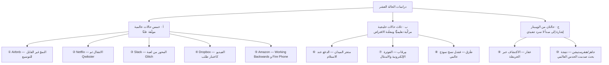
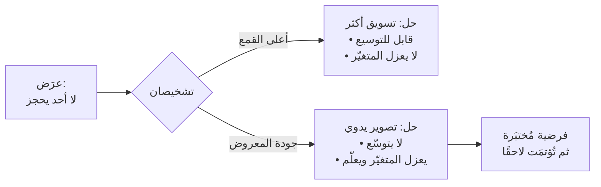
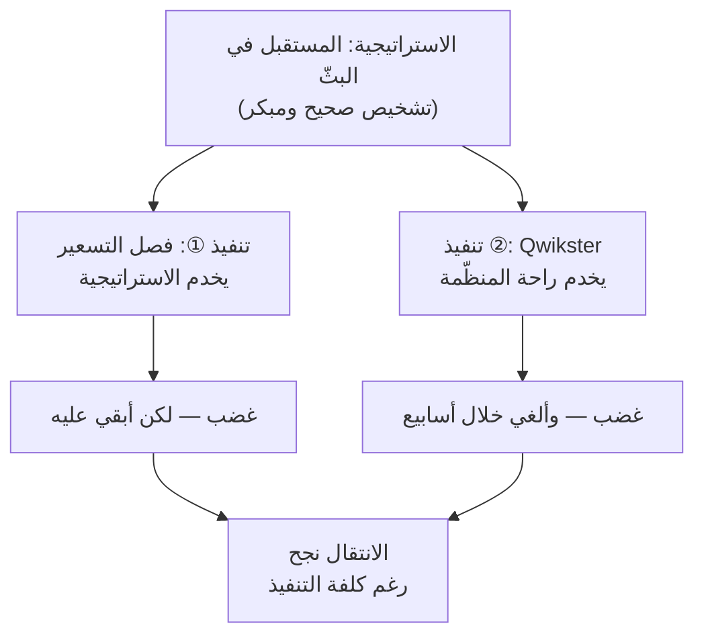
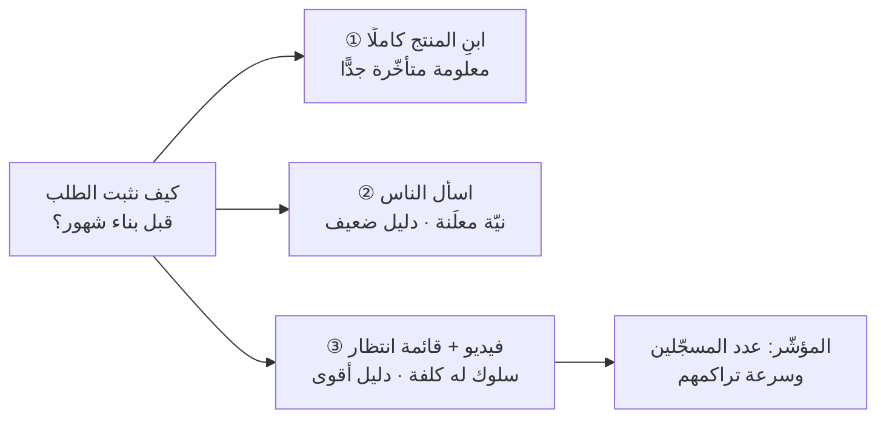
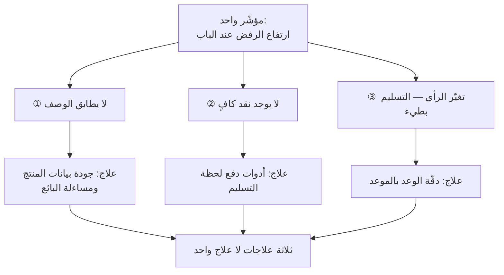
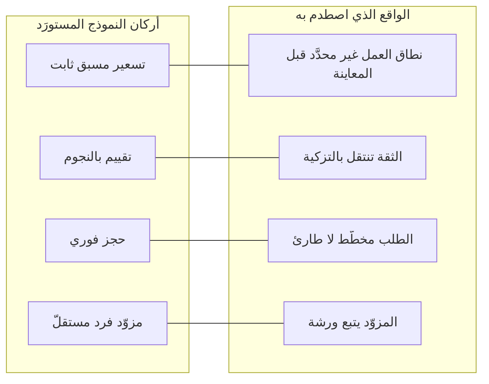
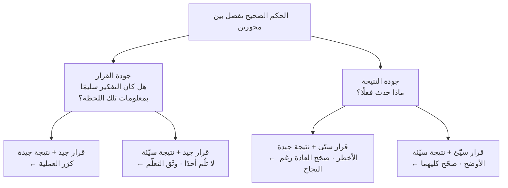
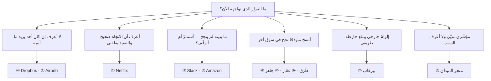

> [!info] الملحق ج · إدارة المنتج في عصر الذكاء الاصطناعي
> **ما هذا الملحق:** عشر دراسات حالة تُقرأ بأدوات هذا المرجع لا بأدوات القصص. الفصول شرحت المفاهيم مجرَّدةً — [[02 - فلسفة إدارة المنتج|المخرَج والأثر]]، [[03 - التوطين (Localization)|التوطين]]، [[05 - تحديد الأولويات (Prioritization)|تكلفة الفرصة البديلة]]، [[11 - عقلية مدير المنتج|القرار تحت عدم اليقين]] — وهنا تراها **وهي تعمل**: في قرار اتُّخذ فعلًا، وله بديل رُفض، وله نتيجة يمكن الحكم عليها.
>
> **كيف تستعمله:** لا تقرأه دفعةً واحدة كمجموعة حكايات. اقرأ حالةً واحدة قبل قرار مشابه تواجهه، وتوقّف عند قسم **«المشكلة كما بدت» قبل أن تقرأ «المشكلة كما تبيّنت»** واكتب تشخيصك أنت. الفارق بين تشخيصك وتشخيص الحالة هو الدرس الحقيقي، لا الحالة نفسها.
>
> **وقبل كل شيء:** لكل حالة قسم إلزامي اسمه **«حدّ ما نعرفه»** يقول بصراحة أي جزء موثّق علنًا وأيّ جزء إعادة بناء تحليلية. لا تنقل رقمًا ولا تفصيلًا من هذا الملحق دون قراءة ذلك القسم أوّلًا.

# الملحق ج — دراسات حالة: المفاهيم وهي تعمل

## 🎯 ماذا يفعل هذا الملحق (وماذا لا يفعل)

دراسات الحالة في أدبيات المنتج مصابةٌ بداءين مزمنين، وهذا الملحق مبنيّ لتفاديهما تحديدًا.

**الداء الأول: انحياز الناجي** (`Survivorship Bias`). نروي قصص الشركات التي نجحت، ثم نستخرج من قراراتها «مبادئ». والمشكلة أن مئات الشركات اتّخذت القرارات نفسها وفشلت، لكنها لم تُروَ لأن لا أحد يكتب عن شركة ماتت. فحين تقرأ أن مؤسّسي «س» رفضوا رأي المستثمرين وأصرّوا على رؤيتهم فنجحوا، تذكّر أن العناد نفسه دفن غيرهم. القرار الجيد لا يُقاس بنتيجته وحدها — يُقاس بجودة التفكير الذي أنتجه في اللحظة التي اتُّخذ فيها، بالمعلومات التي كانت متاحة حينها لا بالتي عرفناها بعدها. وهذا ما يسمّيه [[11 - عقلية مدير المنتج|الفصل الحادي عشر]] الفصل بين **جودة القرار** و**جودة النتيجة**.

**الداء الثاني: السرد المرتَّب بأثر رجعي**. تُروى الحالات دائمًا كخطّ مستقيم: رأوا المشكلة، فحلّوها، فنجحوا. والواقع أن أحدًا لم يرَ المشكلة بهذا الوضوح وقتها؛ رأوا ضبابًا، وجرّبوا خمسة أشياء، ونجح واحد، ثم كُتبت القصّة وكأن الأربعة الباقية لم تكن. لهذا فُصلت في كل حالة هنا **«المشكلة كما بدت»** عن **«المشكلة كما تبيّنت»**: القسم الأول هو ما كان على الطاولة فعلًا، والثاني ما ظهر بعد الاكتشاف أو بعد الفشل.

وما لا يفعله هذا الملحق: **لا يقدّم وصفات**. لا يوجد في أيّ حالة هنا «إذن افعل مثلهم». السياق الذي أنتج القرار — سوق، وتوقيت، وفريق، ورأس مال، وتنظيم — لن يتكرّر لك. ما ينتقل بين السياقات هو **بنية السؤال** لا الإجابة.

### البنية الموحّدة لكل حالة

كل حالة في هذا الملحق مكتوبة بثمانية أقسام ثابتة، والثبات مقصود: هو ما يحوّل الملحق من مجموعة قصص إلى **أداة قابلة لإعادة الاستعمال**. حين تصبح البنية مألوفة، تستطيع أن تطبّقها على حالة من عملك أنت (وهذا ما تفعله [[#🧪 تمارين — كيف تحلّل حالة بنفسك|تمارين نهاية الملحق]]).

| القسم | السؤال الذي يجيب عنه | الخطأ الشائع فيه |
|---|---|---|
| **السياق** | أين كانت الشركة، ومتى، وما القيود الفعلية؟ | حذفه، فيبدو القرار أذكى ممّا كان |
| **المشكلة كما بدت** | ما الذي ظنّه الفريق مشكلةً في حينه؟ | كتابته بمعرفة اليوم بدل معرفة وقتها |
| **المشكلة كما تبيّنت** | ما المشكلة الحقيقية بعد الاكتشاف؟ | القفز إليها مباشرةً |
| **القرار وبديله المرفوض** | ماذا اختاروا، **وماذا رفضوا**؟ | ذكر الخيار المتَّخذ فقط — فيبدو بلا كلفة |
| **النتيجة** | ماذا حدث، وبأي قياس؟ | خلط النتيجة بالقرار |
| **أدوات المرجع التي تفسّرها** | أي فصل ومصطلح يشرح ما جرى؟ | تعليق أي إطار على أي حالة |
| **ماذا نتعلّم** | ما الذي ينتقل إلى سياق آخر؟ | استخراج وصفة بدل مبدأ |
| **حدّ ما نعرفه** | ما الموثّق وما المُعاد بناؤه؟ | تجاهله — وهذا أخطرها |

> [!important] عن قسم «حدّ ما نعرفه»
> هذا القسم ليس تحفّظًا قانونيًّا ولا اعتذارًا. هو **جزء من المنهج**. مدير المنتج الذي لا يعرف الفرق بين ما وثّقته الشركة وما استنتجه محلّل بعد عشر سنوات، سيبني قراره على أسطورة. وفي كل حالة عالمية هنا ستجد تمييزًا صريحًا بين ثلاث طبقات:
> - **موثّق علنًا:** ما نشرته الشركة نفسها أو ما رواه أصحاب القرار في مواضع عامّة معروفة.
> - **متواتر بروايات متباينة:** ما يُروى كثيرًا لكن تختلف تفاصيله وأرقامه باختلاف الراوي — يُذكر بوصفه كذلك.
> - **إعادة بناء تحليلية:** ربطٌ وتفسير من هذا المرجع، لا من الشركة. وهو مفيد للتعلّم، **ولا يُنقل عنه كواقعة**.

### أربعة أخطاء شائعة في استعمال دراسات الحالة

قبل الدخول، يفيد أن تُسمّى الأخطاء التي تُفسِد الاستفادة من هذا النوع من المواد — لأن أغلبها يُرتكَب بحسن نيّة.

**الخطأ الأول: نقل الحلّ بدل نقل السؤال.** أن تقرأ عن `Dropbox` فتصنع فيديو، أو عن `Airbnb` فتخرج بكاميرا. الحلّ نتاج سياق: منتج بعينه، ومرحلة بعينها، وقيد بعينه. أمّا الذي ينتقل فهو **السؤال الذي أنتج الحلّ**: «ما أرخص طريقة أقيس بها الطلب قبل أن أبني؟». السؤال ينتقل عبر الأسواق والعقود؛ الجواب لا ينتقل حتى عبر منتجين في الشركة نفسها.

**الخطأ الثاني: قياس شركةٍ في مرحلةٍ على شركةٍ في مرحلةٍ أخرى.** «افعل أشياء لا تتوسّع» نصيحةٌ ممتازة لشركة عمرها ستّة أشهر، وكارثةٌ تشغيلية لشركة تخدم ملايين المستخدمين. وكذلك «اقتل عملك المربح قبل أن يقتله غيرك» — نصيحةٌ لشركة قائمة تواجه إزاحة، ولا معنى لها لشركة لم تجد نموذجها بعد. **اسأل دائمًا: هل هذه الشركة في مرحلتي؟** فإن لم تكن، فالدرس صالح للفهم لا للتطبيق.

**الخطأ الثالث: الاستشهاد بالحالة لإسكات الخلاف.** «هكذا فعلت `Amazon`» جملةٌ تُنهي النقاش ولا تُثبت شيئًا — وهي في بنيتها المنطقية نفسها مغالطة [[HiPPO|رأي الأعلى أجرًا]]، إلا أن السلطة هنا مستعارة من شركةٍ بعيدة بدل مديرٍ قريب. الحالة تُستعمل لتوسيع الخيارات المطروحة، لا لإغلاقها. ومن استشهد بحالة فعليه أن يبيّن **وجه الشبه في السياق**، لا في النتيجة.

**الخطأ الرابع: قراءة الحالة كسردٍ أخلاقي.** الشركة التي أخطأت ليست غبية، والتي أصابت ليست عبقرية. أغلب القرارات في هذه الحالات اتُّخذت بمعلومات ناقصة وضغط زمني ومصالح متضاربة — وهي الظروف نفسها التي تعمل فيها أنت. من يقرأ الحالة ليشعر بالتفوّق على من اتّخذ القرار لا يتعلّم منها شيئًا؛ ومن يقرأها ليسأل «كيف كنتُ سأقع في الخطأ نفسه؟» يخرج بشيء.

### تصنيف الحالات العشر



---

# أ) خمس حالات عالمية موثّقة علنًا

> [!warning] قاعدة هذا القسم
> **لا رقم داخلي مخترع، ولا اقتباس مخترع.** ما تجده هنا إمّا نشرته الشركة، أو قاله صاحب القرار في موضع عامّ معروف، أو هو متواتر بروايات متباينة — وحينها يُقال ذلك صراحةً. وحيثما اختلفت الروايات، تُذكر الرواية بوصفها رواية لا بوصفها واقعة مقطوعًا بها.

> [!note] لماذا هذه الخمس بالذات؟
> اختيرت هذه الحالات لتغطّي **خمس لحظات مختلفة في عمر المنتج**، لا لأنها الأشهر:
>
> | الحالة | اللحظة التي تمثّلها | المخاطرة الغالبة فيها |
> |---|---|---|
> | Dropbox | قبل وجود المنتج | مخاطرة **القيمة**: هل يريده أحد؟ |
> | Airbnb | منتج يعمل ولا ينمو | مخاطرة **القيمة** في التفاصيل التنفيذية |
> | Slack | منتج فشل ولديه أصل خفيّ | مخاطرة **الجدوى التجارية** وقرار الاستمرار |
> | Amazon | شركة ناضجة تدخل سوقًا جديدة | مخاطرة **القيمة** تحت وهم القدرة |
> | Netflix | شركة ناجحة تُبدّل نموذجها | مخاطرة **الانتقال** وإدارة القاعدة القائمة |
>
> ولاحظ أن ثلاثًا من الخمس سقطت فيها **مخاطرة القيمة** تحديدًا — لا الجدوى التقنية ولا قابلية الاستخدام. وهذا ليس مصادفة في الاختيار؛ هو انعكاسٌ لواقعٍ يقرّره [[01 - لماذا لا يزال مدير المنتج أهم من أي وقت مضى|الفصل الأول]]: **أكثر ما يُهدَر في المنتجات يُهدَر في بناء أشياء لا يريدها أحد، لا في بنائها بطريقة رديئة.** الفرق الهندسية جيدة عمومًا في بناء ما يُطلب منها؛ والمشكلة في ما يُطلب.
>
> واختيرت كذلك لأنها **متفاوتة في النتيجة** عمدًا: نجاحان واضحان (Dropbox، Slack)، وفشل واضح (Fire Phone)، وحالة نجاحٍ داخلها فشل (Netflix)، وحالة نجاحٍ بحلٍّ لا يُنصح بتعميمه (Airbnb). فمن يقرأ خمس قصص نجاح متتالية يخرج بخرافة، لا بمنهج.

---

## ① Airbnb — حين كان الحلّ أن يخرج المؤسّسون بكاميرا

### السياق

في مطلع 2009 كانت `Airbnb` شركة صغيرة جدًّا داخل برنامج تسريع (`Y Combinator`). الفكرة كانت مفهومة نظريًّا: منصّة تربط من عنده مساحة فارغة بمن يبحث عن مكان يبيت فيه. والمنتج كان يعمل تقنيًّا: تستطيع أن تُدرج مسكنك، وتستطيع أن تحجز. لكن الحجوزات لم تكن تحدث بالقدر الذي يبقي الشركة حيّة.

القيد الحاكم هنا ليس تقنيًّا: **فريق مؤلّف من ثلاثة أشخاص، ورأس مال يكفي أسابيع، ومنصّة ذات جانبين** (`Two-sided Marketplace`) — والمنصّات ذات الجانبين تعاني مشكلة «الدجاجة والبيضة» في بدايتها: لا مضيفون بلا ضيوف، ولا ضيوف بلا مضيفين. أي إصلاح لا بدّ أن يعمل داخل هذه القيود، لا في عالمٍ افتراضي فيه ميزانية تسويق.

### المشكلة كما بدت

بلغة ذلك الوقت، المشكلة كانت: **«لا أحد يحجز — إذن نحتاج مستخدمين أكثر»**. وهذا التشخيص هو التشخيص الافتراضي في كل منتج مبكّر، وهو صحيح إحصائيًّا وخاطئ عمليًّا في أغلب الأحيان. الحلول التي يقترحها هذا التشخيص متوقّعة: مزيد من التسويق، تحسين محرّكات البحث، خصومات، ميزات جديدة تجعل المنتج «أفضل».

لاحظ أن كل هذه الحلول **تفترض أن المنتج سليم وأن المشكلة في أعلى القمع** (`Funnel`). وهذا افتراض لم يُختبر.

### المشكلة كما تبيّنت

الرواية التي يقصّها بول جراهام (`Paul Graham`) والمؤسّسون أنفسهم في مواضع عامّة كثيرة تقول إنهم نظروا إلى الإعلانات المنشورة في نيويورك — وكانت نيويورك أكبر تجمّعاتهم — فوجدوا أن **الصور رديئة**. صور بهواتف قديمة، في إضاءة سيّئة، لا تُظهر المكان. والمستخدم الذي يقرّر أن ينام في بيت غريب لا يملك إلا الصورة ليقرّر بها.

فالمشكلة لم تكن «عدد الزوّار». كانت **مشكلة تحويل** (`Conversion`) سببها أن المنتج لا يوفّر للمستخدم ما يحتاجه ليتّخذ قرارًا عالي المخاطرة نفسيًّا. وهذا فرق تشخيصي هائل: العلاج الأول (تسويق أكثر) كان سيصبّ زوّارًا في وعاء مثقوب.

وهنا يظهر التمييز الذي بُني عليه [[01 - لماذا لا يزال مدير المنتج أهم من أي وقت مضى|الفصل الأول]] بين **العرَض والمرض**: «لا أحد يحجز» عرَض؛ «الصور لا تحمل الثقة اللازمة لقرار المبيت» مرض.

### القرار وبديله المرفوض

**القرار:** سافر المؤسّسون إلى نيويورك، واستأجروا كاميرا، وطرقوا أبواب المضيفين، وصوّروا البيوت بأنفسهم، واستبدلوا الصور. عملٌ يدويّ بالكامل، لا يتوسّع (`Doesn't Scale`)، ولا يمكن أن يستمرّ لو كبرت المنصّة.

**البديل المرفوض:** بناء **حلٍّ قابل للتوسيع فورًا** — دليل إرشادي للمضيفين عن التصوير الجيد، أو أداة تحسين صور آلية، أو معايير جودة إلزامية في نموذج الإدراج. البديل كان أذكى هندسيًّا، وأسرع في الاستهلاك للوقت، ويخدم كل المدن دفعةً واحدة.

ولماذا كان البديل خطأً في تلك اللحظة تحديدًا؟ لأن الفريق **لم يكن قد أثبت الفرضية بعد**. لو بنى أداةً آلية ثم لم تتحسّن الحجوزات، لما عرف: هل الفرضية خاطئة، أم أن الأداة رديئة؟ الحلّ اليدوي يعزل المتغيّر: صورٌ ممتازة قطعًا، منفَّذة بأيديهم، فإن لم يتحرّك شيء فالفرضية ساقطة.

هذا هو المبدأ الذي صاغه بول جراهام لاحقًا في مقالته المعروفة **«افعل أشياء لا تتوسّع»** (`Do Things That Don't Scale`، 2013): في المرحلة المبكّرة، العمل اليدوي ليس ضعفًا في الحلّ — هو **أداة تعلّم** ثمنها وقت المؤسّسين، وعائدها معرفة لا تُشترى.



### النتيجة

الرواية المتواترة — ويقصّها المؤسّسون وجراهام معًا — أن الحجوزات في نيويورك تحسّنت تحسّنًا ملموسًا بعد استبدال الصور، وأن ذلك أقنع الفريق بأن جودة العرض متغيّر حاسم لا تفصيلة تجميلية. وبناءً على هذا التعلّم أُنشئ لاحقًا **برنامج تصوير احترافي** يوفّر مصوّرين للمضيفين — أي أن العمل اليدوي **تحوّل إلى نظام** بعد أن أثبت جدواه، لا قبلها.

وهذا الترتيب هو الدرس: يدويّ ← تعلّم ← أتمتة. لا: أتمتة ← أمل.

### أدوات المرجع التي تفسّرها

- [[02 - فلسفة إدارة المنتج|الفصل الثاني]] — [[Product Discovery|الاكتشاف]] و[[Lean Startup|منهج الشركة الرشيقة]]: الفرضية قبل البناء.
- [[10 - دورة حياة المنتج الكاملة|الفصل العاشر]] — مرحلة التحقّق و[[Concierge MVP|منتج الكونسيرج]]: تقديم الخدمة يدويًّا لاختبار الطلب.
- [[11 - عقلية مدير المنتج|الفصل الحادي عشر]] — [[First Principles Thinking|التفكير من المبادئ الأولى]]: لماذا يحجز الناس أصلًا؟ لأنهم يثقون بما يرَون.
- من المعجم: [[Concierge MVP]] · [[Product Discovery]] · [[Hypothesis|الفرضية]] · [[Funnel Analysis|تحليل القمع]] · [[Customer and Market Validation]] · [[Pain Point|نقطة الألم]].

### ماذا نتعلّم

1. **«نحتاج مستخدمين أكثر» تشخيصٌ كسول حتى تُثبت أن الوعاء غير مثقوب.** قبل أي إنفاق على أعلى القمع، انظر إلى معدّل التحويل في الخطوة الأضعف.
2. **العمل اليدوي في المرحلة المبكّرة استثمار في المعرفة لا دَينٌ تشغيلي** — بشرط أن يكون له تاريخ انتهاء وسؤال يجيب عنه.
3. **اعزل المتغيّر.** الحلّ الآلي يخلط بين «الفرضية خاطئة» و«التنفيذ رديء». الحلّ اليدوي يفصلهما.
4. **الثقة ميزةٌ تُصمَّم، لا شعورٌ يُرجى.** في أي منتج يتضمّن مخاطرة (مال، بيت، بيانات، صحّة)، ابحث عن الإشارة التي يبني عليها المستخدم ثقته وحسّنها قبل أي شيء آخر.

### حدّ ما نعرفه

> [!warning] حدّ ما نعرفه — Airbnb
> - **موثّق علنًا:** أن `Airbnb` مرّت ببرنامج `Y Combinator`؛ وأن مبدأ **«افعل أشياء لا تتوسّع»** صاغه بول جراهام في مقالة منشورة باسمه؛ وأن `Airbnb` شغّلت لاحقًا برنامج تصوير احترافي للمضيفين كخدمة رسمية.
> - **متواتر بروايات متباينة:** واقعة سفر المؤسّسين إلى نيويورك واستئجار الكاميرا والتصوير بأنفسهم — تُروى كثيرًا وبتفاصيل مختلفة (عدد المؤسّسين الذين ذهبوا، المدّة، عدد الإعلانات). **وأشدّ ما تتباين فيه الروايات هو مقدار التحسّن**: تتردّد نسب مختلفة لمضاعفة الإيراد في نيويورك، ولم يُعتمد أيٌّ منها هنا لأنها تتغيّر من رواية إلى أخرى. اعتمدنا صياغة «تحسّن ملموس» عمدًا.
> - **إعادة بناء تحليلية:** تسمية البديل المرفوض (الأداة الآلية / الدليل الإرشادي) وشرح «عزل المتغيّر» هما **تحليل هذا المرجع**، لا سردٌ منقول عن الشركة. الفريق لم ينشر مفاضلةً موثّقة بين خيارين بهذه الصيغة.
> - **ما لا نعرفه:** ماذا كانت ستفعل الشركة لو لم تتحسّن الحجوزات بعد التصوير. النتيجة الإيجابية جعلت القرار يبدو بديهيًّا بأثر رجعي، وهو لم يكن كذلك وقتها.

---

## ② Netflix — انتقالٌ ناجح وقرارُ تسعيرٍ كاد يقتله

### السياق

هذه الحالة مفيدة تحديدًا لأنها **حالتان في شركة واحدة**: انتقالٌ استراتيجي يُدرَّس كنموذج، ثم قرارٌ داخل الانتقال نفسه يُدرَّس كنموذج مضادّ. والدرس ليس «نتفليكس ذكية» ولا «نتفليكس أخطأت» — بل أن **الاستراتيجية الصحيحة لا تعصم من تنفيذٍ خاطئ**.

انطلقت `Netflix` سنة 1997 بنموذج تأجير أقراص `DVD` بالبريد، ثم انتقلت إلى اشتراك شهري بلا رسوم تأخير — وكان ذلك في حدّ ذاته توطينًا للنموذج على ألمِ العميل الحقيقي: رسوم التأخير في محلّات التأجير التقليدية. وفي 2007 أطلقت خدمة **البثّ** (`Streaming`) بوصفها إضافةً مجّانية لمشتركي الأقراص.

القيد الحاكم: **الأقراص كانت هي العمل المربح**، والبثّ كان مكلفًا ومحدود المكتبة وضعيف الجودة (بسرعات الإنترنت آنذاك). أي دفعٍ نحو البثّ يعني إضعاف مصدر الدخل الحالي عمدًا.

### المشكلة كما بدت

بلغة ذلك الوقت: **«كيف نضيف البثّ دون أن نُضعف عمل الأقراص؟»** — وهو سؤال معقول تمامًا من زاوية المالية والعمليات. الشركة تملك مراكز توزيع، وعقودًا، وقاعدة مشتركين راضية، وهامش ربح معروف.

### المشكلة كما تبيّنت

المشكلة الحقيقية لم تكن «كيف نضيف»، بل **«متى نقتل عملنا المربح بأيدينا قبل أن يقتله غيرنا»** — وهي مشكلة الابتكار الهادم الكلاسيكية. البثّ لم يكن ميزةً تُضاف إلى نموذج الأقراص؛ كان **نموذجًا بديلًا** سيبتلعه.

وقد أعلنت قيادة الشركة هذا الفهم علنًا وبوضوح: أن مستقبل الشركة في البثّ، وأن عمل الأقراص في انحدار حتمي. أي أن **التشخيص الاستراتيجي كان صحيحًا وصريحًا ومبكّرًا**. المشكلة كانت في مكانٍ آخر تمامًا: في **كيف يُنقل العميل** من نموذج إلى نموذج.

### القرار وبديله المرفوض

هنا يتشعّب المسار إلى قرارين متتاليين، والفصل بينهما هو جوهر الحالة.

**القرار الأول (2011): فصل الخدمتين وإعادة التسعير.** أعلنت الشركة فصل باقة الأقراص عن باقة البثّ، وتسعير كلٍّ منهما على حدة — بما يعني ارتفاعًا كبيرًا في الفاتورة لمن يريد الاثنتين معًا.

**القرار الثاني (سبتمبر 2011): Qwikster.** أُعلن أن عمل الأقراص سيُفصل إلى شركة/علامة مستقلة باسم `Qwikster` بموقع منفصل وحساب منفصل وفاتورة منفصلة وتقييمات لا تنتقل بين الخدمتين.

**البديل المرفوض:** انتقال **تدريجي** يبقي حساب العميل واحدًا وتجربته واحدة، ويستخدم التسعير والمكتبة كحوافز تدفع نحو البثّ عبر شهور، مع تواصل يشرح **لماذا** يحدث ما يحدث قبل أن يحدث.

المنطق الداخلي للقرار المرفوض... بل للقرار المتَّخَذ، كان دفاعيًّا ومفهومًا: فصلُ العمليتين يمنع الأقراص من تعطيل تطوير البثّ، ويجعل كل عمل يُدار بمنطقه. **لكن هذا منطق منظّمة، لا منطق عميل.** العميل لا يشتري هيكلك التنظيمي؛ يشتري تجربته. والتغيير حمّله ثلاث كلفات دفعةً واحدة: كلفةً مالية، وكلفة جهد (حسابان)، وكلفة رمزية (شعور بأن ما اشتراه سُحب منه).

### النتيجة

النتيجة موثّقة علنًا لأنها ظهرت في إفصاحات الشركة ذاتها: **اعتراضٌ عارم من المشتركين، وخسارةُ عددٍ كبير منهم في الربع الثالث من 2011، وانهيارٌ حادّ في سعر السهم**. ونشر الرئيس التنفيذي ريد هاستينغز (`Reed Hastings`) **اعتذارًا علنيًّا** أقرّ فيه بسوء إدارة التواصل مع العملاء. وخلال أسابيع **أُلغي مشروع `Qwikster` بالكامل قبل أن يُطلق فعليًّا**، وبقي عمل الأقراص داخل `Netflix`.

أما فصل التسعير فلم يُلغَ. وهذا تفصيل يستحق التوقّف: **الشركة تراجعت عن جزء وأبقت جزءًا**. الجزء الذي أبقته هو الذي كانت استراتيجيتها تتطلّبه فعلًا؛ والجزء الذي تراجعت عنه هو الذي كان يخدم راحتها التنظيمية لا استراتيجيتها. والتمييز بينهما تحت ضغط الغضب العام قرارٌ صعب، وهو من أنضج ما في هذه الحالة.

ثم — وهذا هو المهمّ — **استمرّ الانتقال إلى البثّ ونجح**. أي أن الكارثة كانت في **الكيفية والتوقيت والتواصل**، لا في الاتجاه.



### أدوات المرجع التي تفسّرها

- [[05 - تحديد الأولويات (Prioritization)|الفصل الخامس]] — [[Opportunity Cost|تكلفة الفرصة البديلة]] وحساب كلفة التأخير: متى تُضحّي بدخل حاضر لأجل موقع مستقبلي.
- [[10 - دورة حياة المنتج الكاملة|الفصل العاشر]] — [[Sunset and Deprecation|إنهاء الخدمة والإيقاف التدريجي]]: كيف يُنقل المستخدمون بين نموذجين.
- [[11 - عقلية مدير المنتج|الفصل الحادي عشر]] — [[Reversible vs Irreversible Decisions|القرارات القابلة للعكس وغير القابلة]]: `Qwikster` كان قابلًا للعكس فعُكس، وهذا نجاح لا فشل.
- من المعجم: [[Product Life Cycle]] · [[Sunset and Deprecation]] · [[Reversible vs Irreversible Decisions]] · [[Churn|معدّل التسرّب]] · [[Voice of the Customer]] · [[Go-to-Market]] · [[Cost of Delay|كلفة التأخير]].

### ماذا نتعلّم

1. **افصل «هل الاتجاه صحيح؟» عن «هل التنفيذ صحيح؟».** أكثر ما يُهدر في نقاشات ما بعد الفشل هو الخلط بينهما، فيُلغى اتجاهٌ سليم بسبب تنفيذٍ رديء.
2. **لا تُحمّل المستخدم ثلاث كلفات في يوم واحد.** سعر أعلى، وجهد أكبر، وشعور بالخسارة — كلٌّ منها محتمَل وحده، ومجموعها انفجار.
3. **الهيكل التنظيمي ليس عذرًا يفهمه العميل.** كل تصميمٍ يحلّ مشكلةً داخلية على حساب التجربة يدفع ثمنه العميل ثم تدفعه أنت.
4. **التراجع الجزئي مهارة.** أن تُلغي ما كان خطأً وتُبقي ما كان صحيحًا وسط ضجيج عالٍ — هذا هو [[Data Informed vs Data Driven|القرار المستنير بالبيانات لا المسيَّر بها]].
5. **قابلية العكس تُخطَّط لها.** `Qwikster` أُلغي قبل الإطلاق الفعلي، فكانت كلفته سمعةً ومالًا لا سنواتٍ من الالتزام التقني.

### حدّ ما نعرفه

> [!warning] حدّ ما نعرفه — Netflix
> - **موثّق علنًا:** انتقال `Netflix` من الأقراص إلى البثّ؛ إعلان فصل الباقات وتغيير التسعير في 2011؛ إعلان `Qwikster` في سبتمبر 2011 ثم إلغاؤه بعد أسابيع؛ **اعتذار ريد هاستينغز العلني** المنشور باسمه؛ وإفصاح الشركة في تقاريرها للمساهمين عن خسارة عدد كبير من المشتركين في ذلك الربع.
> - **متواتر بروايات متباينة:** **الأرقام الدقيقة** — عدد المشتركين المفقودين ونسبة هبوط السهم تُنقل بصيغ مختلفة قليلًا باختلاف المصدر وتاريخ القياس. **لهذا لم يُذكر هنا رقم بعينه**، رغم أن أصل الواقعة موثّق في إفصاحات الشركة. من أراد رقمًا فليأخذه من خطاب المساهمين الأصلي لا من هذا الملحق.
> - **إعادة بناء تحليلية:** تفكيك القرار إلى «ما يخدم الاستراتيجية» و«ما يخدم راحة المنظّمة»، وتحليل «الكلفات الثلاث»، وقراءة الإلغاء بوصفه نجاحًا في قابلية العكس — كلّها **تحليل هذا المرجع**. الشركة لم تصف قرارها بهذه اللغة.
> - **ما لا نعرفه:** ما دار داخل الشركة من نقاش قبل القرار، ومن اعترض، وهل عُرض بديل تدريجي ورُفض. البديل المذكور أعلاه هو **البديل المنطقي المتاح**، لا بديلٌ موثّق أنه طُرح.

---

## ③ Slack — حين كانت الأداة الداخلية أثمن من المنتج

### السياق

`Tiny Speck` شركة أسّسها ستيوارت باترفيلد (`Stewart Butterfield`) لبناء لعبة إلكترونية جماعية اسمها **`Glitch`**. اللعبة أُطلقت سنة 2011، وكانت طموحة وغريبة ومحبوبة من قاعدة صغيرة من اللاعبين، لكنها لم تصل إلى حجم يجعلها عملًا مستدامًا. وفي **نوفمبر 2012 أُغلقت `Glitch` رسميًّا**.

القيد الحاكم: فريقٌ موزَّع جغرافيًّا، ورأس مال مستثمَر في منتجٍ لم ينجح، ونافذة زمنية قصيرة قبل نفاد المال. والقرار المطروح على الطاولة في تلك اللحظة هو أصعب قرار في عمر أي شركة: **نستمرّ، أم نغيّر، أم نعيد المال ونغلق؟**

ومن التفاصيل اللافتة أن هذه لم تكن تجربة باترفيلد الأولى مع هذا الموقف بالضبط: شركته السابقة `Ludicorp` كانت تبني لعبةً أخرى اسمها `Game Neverending`، وخرجت منها ميزةٌ لمشاركة الصور صارت **`Flickr`**. أي أن النمط تكرّر: لعبة تفشل، وأداة داخلية بداخلها تنجح.

### المشكلة كما بدت

بلغة تلك اللحظة، المشكلة كانت: **«اللعبة فشلت — ماذا نفعل بالمال المتبقّي والفريق؟»**. وهذا تأطيرٌ للمشكلة بوصفها مشكلة **تصفية**: كيف نخرج بأقل خسارة، وكيف نتصرّف بكرامة تجاه المستثمرين والموظفين واللاعبين.

### المشكلة كما تبيّنت

المشكلة الحقيقية كانت سؤالًا مختلفًا تمامًا: **«ما الأصل الذي بنيناه ولم ننتبه إلى قيمته؟»**

فالفريق، لكونه موزّعًا، كان قد بنى لنفسه — لأغراضه الداخلية بحتًا — أداة محادثة تربط قنوات النقاش بأرشيف قابل للبحث وبتكاملات مع الأدوات التي يستعملها. لم تكن منتجًا ولا مخطّطًا لها أن تكون؛ كانت بنيةً تحتية داخلية بُنيت لأن الفريق **احتاجها فعلًا**.

والملاحظة التي غيّرت مسار الشركة هي أن هذه الأداة كانت **تحلّ مشكلةً يعانيها كل فريق موزَّع في العالم**، لا مشكلةً خاصّة بهم. أي أن الشركة كانت تملك، دون أن تدري، **دليلًا على الحاجة من الدرجة الأولى**: مستخدمون حقيقيون (هم أنفسهم) يستعملون المنتج يوميًّا بلا تسويق وبلا إجبار، وهو أقوى إشارة على وجود ألمٍ حقيقي.

وهذا هو الفرق بين **المحور القائم على اليأس** والمحور القائم على الدليل. المحور اليائس يقول: «لم تنجح، فلنجرّب أي شيء آخر». والمحور القائم على الدليل يقول: «لم تنجح، لكن هذا الجزء منها **يُستعمل فعلًا** — فلنكبّره».

### القرار وبديله المرفوض

**القرار:** إغلاق اللعبة، وإعادة توجيه الشركة بالكامل لتحويل أداة المحادثة الداخلية إلى منتج، بإطلاق معاينة (`Preview`) في 2013 ثم إطلاق عامّ في 2014 باسم **`Slack`**.

**البديلان المرفوضان:**
1. **الاستمرار في اللعبة** بمحاولة إنقاذها — تعديل نموذج الربح، أو تسويق أكثر، أو إعادة تصميم. وهذا البديل تسنده مغالطةٌ نفسية قوية اسمها [[Sunk Cost Fallacy|مغالطة التكلفة الغارقة]]: أنفقنا سنوات وملايين، فكيف نرميها؟
2. **إغلاق الشركة وإعادة ما تبقّى من المال للمستثمرين** — وهو خيارٌ مشرِّف وواقعي، وكان مطروحًا فعلًا في شركات كثيرة في وضعٍ مماثل.

والقرار المتَّخذ ليس «الأشجع» ولا «الأذكى» بالضرورة؛ هو القرار الذي **كان يملك دليلًا** لا يملكه البديلان. وهذه نقطة تستحقّ الحدّة: لو لم تكن الأداة الداخلية موجودة ومستعمَلة، لكان المحور مقامرةً، ولكان إغلاق الشركة هو القرار الأرشد.

### النتيجة

`Slack` صار من أسرع منتجات البرمجيات المؤسّسية انتشارًا في عقده، ثم استُحوذ عليه لاحقًا من `Salesforce` في صفقة معلنة علنًا. وهذا موثّق ولا خلاف عليه.

لكن النتيجة الأهمّ تعليميًّا ليست الحجم: هي أن **المنتج الذي نجح لم يكن فكرةً جديدة وُلدت في غرفة اجتماعات؛ كان أثرًا جانبيًّا لعملٍ حقيقي**. وسوق المحادثة المؤسّسية لم يكن فارغًا وقتها — كان فيه لاعبون كبار. أي أن الميزة لم تكن «لا أحد فعل هذا»، بل **«فعلناه بطريقة تناسب سلوكًا لاحظناه في أنفسنا»**.

### أدوات المرجع التي تفسّرها

- [[02 - فلسفة إدارة المنتج|الفصل الثاني]] — [[Product-Market Fit|الملاءمة بين المنتج والسوق]] و[[Lean Startup|المنهج الرشيق]]: المحور (`Pivot`) قرارٌ منهجي لا انهيار.
- [[05 - تحديد الأولويات (Prioritization)|الفصل الخامس]] — [[Sunk Cost Fallacy|مغالطة التكلفة الغارقة]] و[[Kill Criteria|معايير الإيقاف]]: متى يُقرَّر أن يتوقّف مشروع.
- [[11 - عقلية مدير المنتج|الفصل الحادي عشر]] — [[Intellectual Humility|التواضع الفكري]]: أن تقبل أن أثمن ما لديك ليس ما راهنت عليه.
- من المعجم: [[Product-Market Fit]] · [[Sunk Cost Fallacy]] · [[Kill Criteria]] · [[Pain Point]] · [[Product Sense]] · [[Intelligent Failure|الفشل الذكي]] · [[Opportunity Discovery]].

### ماذا نتعلّم

1. **افحص أدواتك الداخلية قبل أن تفتّش عن أفكار جديدة.** ما بنيتَه لنفسك لأنك احتجتَه هو الفرضية الوحيدة التي تملك عليها دليل استعمال حقيقي.
2. **المحور المشروع يقوم على أصلٍ مُثبَت، لا على يأسٍ مُلِحّ.** اسأل قبل أي محور: ما الجزء من عملنا الذي يُستعمل فعلًا ولو من فئة صغيرة؟
3. **مغالطة التكلفة الغارقة تقتل الشركات بلطف.** المال المنفَق ذهب سواء استمررتَ أم توقّفت؛ القرار الوحيد المتاح لك هو **أين تضع المال والوقت القادمَين**.
4. **حدّد معايير الإيقاف قبل أن تبدأ.** الفريق الذي كتب مسبقًا «إن لم نبلغ كذا خلال كذا فنحن نتوقّف» يتّخذ قرار الإيقاف بعقله؛ ومن لم يكتبها يتّخذه بعواطفه أو لا يتّخذه أصلًا.
5. **الفشل الذكي يترك أصلًا وراءه.** الفرق بين فشلٍ يُتعلَّم منه وفشلٍ يُنسى هو ما إذا كان الفريق قد وثّق ما اكتشفه أثناء الطريق.

> [!info] إضافة مرجعية — متى يكون المحور خطأً؟
> تُروى قصص المحور الناجحة كثيرًا حتى صار المحور نفسه يبدو فضيلة. وهو ليس كذلك. المحور **إعادة تخصيص لكل ما تبقّى لديك**، وثمنه أنك تفقد ما تراكم من معرفة وعلاقات وسمعة في المجال الأول. وهذه أربع علامات على أن المحور المطروح أمامك محورُ هروب لا محور دليل:
>
> 1. **لا يوجد استعمال حقيقي للفكرة الجديدة** — لا أنت تستعملها، ولا فئة صغيرة تستعملها. الحماس ليس دليلًا.
> 2. **الفكرة الجديدة أبعد ما تكون عن قدرات الفريق** — المحور الناجح غالبًا يقع **قريبًا** من أصلٍ تملكه: تقنية، أو قناة، أو فهم عميق لشريحة.
> 3. **لم تُستنفَد فرضيات المنتج الحالي** — إن كنت لم تختبر ثلاث فرضيات جوهرية بعد، فما تهرب منه ليس فشلًا بل صعوبة.
> 4. **المحور يُطرح مباشرةً بعد خبر سيّئ** — القرار المتَّخَذ في أسبوع الخبر السيّئ يكون عاطفيًّا في أغلب الأحوال. أجّله أسبوعين واكتب معياره أوّلًا.
>
> وفي المقابل، العلامة الوحيدة القوية على أن المحور مشروع: **أن تجد شيئًا يُستعمل بلا تسويق وبلا إجبار**. الاستعمال التلقائي أندر من أن يُتجاهَل.

### حدّ ما نعرفه

> [!warning] حدّ ما نعرفه — Slack
> - **موثّق علنًا:** أن `Tiny Speck` بنت لعبة `Glitch`، وأنها أُطلقت في 2011 وأُغلقت في نوفمبر 2012؛ أن `Slack` خرج من الشركة نفسها وأُطلق للعموم في 2014؛ أن باترفيلد كان قبلها من مؤسّسي `Flickr` التي خرجت هي الأخرى من مشروع لعبة؛ أن `Salesforce` استحوذت على `Slack` لاحقًا.
> - **متواتر بروايات متباينة:** **تفاصيل نشأة الأداة الداخلية** — منذ متى بُنيت، وكم استعملها الفريق، وفي أي لحظة بالضبط أدركوا قيمتها. تُروى القصّة بصياغات مختلفة، وبعضها يجعل الإدراك لحظةً واحدة وبعضها يجعله تدريجيًّا. لم نعتمد أي تفصيل زمني دقيق هنا.
> - **إعادة بناء تحليلية:** التمييز بين «المحور اليائس» و«المحور القائم على دليل»، وصياغة البديلين المرفوضين، وربط القرار بمعايير الإيقاف — **تحليل هذا المرجع**. لا يوجد إفصاح رسمي يصف مداولات الشركة بهذه البنية.
> - **ما لا نعرفه:** الوضع المالي الدقيق للشركة لحظة القرار، وهو متغيّر حاسم: المحور بمالٍ يكفي سنتين قرارٌ مختلف تمامًا عن المحور بمالٍ يكفي ثلاثة أشهر. من يقرأ الحالة كوصفة دون معرفة هذا المتغيّر يقيس بمسطرة خاطئة.

---

## ④ Dropbox — فيديو يختبر الطلب قبل أن يوجد المنتج

### السياق

في 2007–2008 كان درو هيوستن (`Drew Houston`) يبني `Dropbox`: مزامنة ملفات بين الأجهزة تعمل بصمت وبلا تفكير من المستخدم. والمشكلة التي واجهها ليست تسويقية بل **إثباتية**: كيف تُقنع نفسك — ثم المستثمرين — بأن الناس يريدون هذا؟

والقيد التقني هنا حاسم لفهم الحالة: منتج مزامنة موثوق ليس واجهةً تُرسم في أسبوع. هو نظامٌ يعمل في العمق: تتبّع تغييرات، وحلّ تعارضات، وأداء، وأنظمة تشغيل متعدّدة. أي أن **بناء نسخة قابلة للتجربة كان يكلّف شهورًا** — وهذا بالضبط ما يجعل الحالة مهمّة.

### المشكلة كما بدت

بلغة تلك اللحظة: **«الناس لا يفهمون ما نبنيه»**. حين كان يشرح الفكرة، كان الردّ المعتاد: أليست هذه مشكلةً محلولة؟ هناك أقراص `USB`، وهناك إرسال الملف بالبريد إلى نفسك، وهناك خدمات مزامنة كثيرة. وهذا تشخيصٌ يقود إلى حلٍّ تسويقي: **اشرح أفضل**.

### المشكلة كما تبيّنت

المشكلة الحقيقية كانت أعقد من الشرح: **المنتج لا يمكن تقييمه بالوصف.** قيمة `Dropbox` تكمن في **الإحساس** بأن الملف ظهر في الجهاز الآخر دون أن تفعل شيئًا. من لم يعش هذه اللحظة لا يفهم لماذا هي مختلفة عن `USB`. أي أن الفجوة بين «فهم الوصف» و«فهم القيمة» كانت **فجوة تجربة لا فجوة بلاغة**.

وهذا يخلق مأزقًا دائريًّا: لا يمكن إثبات الطلب دون أن يجرّب الناس، ولا يمكن أن يجرّبوا دون بناء شهور. وكسر هذه الدائرة هو جوهر القرار.

### القرار وبديله المرفوض

**القرار:** صناعة **فيديو توضيحي قصير** (`Demo Video`) يُظهر المنتج وهو يعمل في سيناريو واقعي، ونشره في مجتمعات تقنية مهتمّة، ووضع **قائمة انتظار** لمن يريد التجربة. أي أن الفيديو لم يكن تسويقًا لمنتج جاهز — كان **أداة قياس**: عدد المسجَّلين في القائمة هو المؤشّر.

**البديلان المرفوضان:**
1. **بناء المنتج كاملًا ثم إطلاقه** ثم اكتشاف الطلب من عدمه — البديل «الطبيعي»، وكلفته شهور من عمر الشركة قبل أي معلومة.
2. **الاكتفاء بسؤال الناس** في مقابلات: «هل تحتاج أداة مزامنة؟». وهذا البديل أرخص لكنه **يقيس النيّة المعلَنة لا السلوك**، وهي من أضعف الأدلّة في بحث المستخدم — لأن الناس يجاملون، ويتخيّلون أنفسهم أفضل ممّا هم، ولا يعرفون ما سيفعلون فعلًا. وهذا بالضبط ما تعالجه قاعدة [[The Mom Test|اختبار الأم]]: اسأل عن سلوك ماضٍ محدّد، لا عن نيّة مستقبلية.

**لماذا كان الفيديو أقوى من السؤال؟** لأن التسجيل في قائمة الانتظار **سلوك له كلفة** — ولو صغيرة: بريد إلكتروني، ونيّة، ووقت. والسلوك ذو الكلفة إشارةٌ أصدق من الإجابة المجّانية.



### النتيجة

الرواية التي يقصّها هيوستن نفسه — وصارت من أشهر أمثلة أدبيات الشركة الرشيقة — أن الفيديو حقّق انتشارًا واسعًا في المجتمعات التقنية، وأن **قائمة الانتظار قفزت قفزةً حادّة خلال ليلة واحدة**. والأرقام المتداولة في هذه الرواية معروفة ومتكرّرة، لكنها تعود إلى رواية هيوستن الشخصية لا إلى إفصاح مؤسّسي مدقّق — ولهذا تُنسب إليه ولا تُقدَّم كرقمٍ محايد.

النتيجة الأهم منهجيًّا: **تحوّلت المخاطرة من «هل يريده أحد؟» إلى «هل نستطيع بناءه جيدًا؟»**. وهذه أهمّ من الرقم نفسه، لأنها نقلت الشركة من مخاطرة **قيمة** إلى مخاطرة **جدوى تقنية** — والثانية أسهل بكثير من الأولى، لأنها تعتمد عليك لا على السوق. وهذا ترتيبٌ صحيح للمخاطر الأربع كما شرحها [[01 - لماذا لا يزال مدير المنتج أهم من أي وقت مضى|الفصل الأول]]: عالِج مخاطرة القيمة أولًا، فهي التي لا يشتريها المال ولا الجهد.

### أدوات المرجع التي تفسّرها

- [[02 - فلسفة إدارة المنتج|الفصل الثاني]] — [[MVP|المنتج الأدنى القابل للتطبيق]] و[[Fake Door Test|اختبار الباب الوهمي]]: قياس الطلب بأقل بناء ممكن.
- [[10 - دورة حياة المنتج الكاملة|الفصل العاشر]] — مرحلة التحقّق: ما الدليل الذي يبرّر الانتقال إلى البناء.
- [[11 - عقلية مدير المنتج|الفصل الحادي عشر]] — قياس السلوك لا النيّة، و[[The Mom Test|اختبار الأم]].
- من المعجم: [[Fake Door Test]] · [[MVP]] · [[The Mom Test]] · [[Hypothesis]] · [[Cost of Experimentation|كلفة التجربة]] · [[Vanity Metrics|مؤشّرات الغرور]] · [[Customer and Market Validation]].

### ماذا نتعلّم

1. **إذا كانت التجربة هي القيمة، فلا تشرحها — أرِها.** أي منتج تُفهَم قيمته بالإحساس لا بالوصف يحتاج عرضًا مرئيًّا أو تجربة مباشرة، لا صفحة نصّ أفضل.
2. **صمّم الاختبار حول المؤشّر لا حول الجمال.** الفيديو الناجح هنا لم يكن هدفه الإعجاب؛ كان هدفه **رقمٌ محدّد** يُتَّخذ على أساسه قرار الاستمرار. قبل أي تجربة، اكتب: ما الرقم الذي سيغيّر قراري، وعند أي حدّ؟
3. **افصل بين النيّة والسلوك.** «نعم أحتاج هذا» ليست دليلًا. التسجيل، والدفع، والانتظار، والعودة — أدلّة.
4. **رتّب المخاطر.** ابدأ دائمًا بالمخاطرة التي لا تملك السيطرة عليها (هل يريده أحد؟) قبل التي تملكها (هل نستطيع بناءه؟).
5. **الاختبار المبكّر لا يعفيك من البناء الجيد.** الفيديو أثبت الطلب فقط؛ لو كان المنتج بعده غير موثوق لانهار كل شيء. اختبار الطلب **يبرّر البناء ولا يستبدله**.

> [!info] إضافة مرجعية
> هذا النمط له اسم في الأدبيات: **اختبار الباب الوهمي** (`Fake Door Test`) — أن تعرض المدخل إلى ميزةٍ غير موجودة وتقيس كم يطرقه. وله شرطٌ أخلاقي لا يجوز تجاوزه: **ألّا يُوهَم المستخدم بأنه اشترى ما لم يُبنَ**. حالة `Dropbox` ملتزمة بهذا الشرط لأن الفيديو كان صريحًا في أنه دعوةٌ لقائمة انتظار، لا بيعًا لمنتج متاح. أما استعمال النمط لتحصيل مدفوعات مقابل شيء غير موجود فهو من [[Dark Patterns|الأنماط المظلمة]]، ويُفسد ثقة السوق قبل أن يُفسد التجربة.

---

## ⑤ Amazon — منهج «العمل بالعكس» وحالة Fire Phone

### السياق

تُعرَف `Amazon` بممارسة داخلية معلَنة في كتابات قادتها اسمها **«العمل بالعكس»** (`Working Backwards`): قبل الموافقة على بناء منتج، يُكتب **بيانٌ صحفي داخلي** (`Press Release`) كأن المنتج أُطلق بالفعل، ومعه **قائمة أسئلة وأجوبة** (`FAQ`) للعملاء وللداخل. لا شرائح عرض، ولا مخطّطات معمارية أوّلًا — بل نصّ يشرح: ما المنتج؟ لمن؟ وما المشكلة؟ ولماذا سيهتمّ العميل؟

والمنطق وراء الممارسة بسيط وقاسٍ: **إذا لم تستطع كتابة إعلانٍ مقنع لمنتجك، فلن يكون المنتج مقنعًا.** الوثيقة تُجبر الفريق على البدء من العميل والنتيجة، لا من التقنية والإمكان. وهي في جوهرها معالجةٌ لمرض [[Feature Factory|مصنع الميزات]]: أن تُبنى أشياء لأنها ممكنة لا لأنها مطلوبة.

وفي 2014 أطلقت `Amazon` هاتف **`Fire Phone`**: هاتف ذكي بمزايا مميِّزة أبرزها **`Dynamic Perspective`** — تتبّع لموضع رأس المستخدم بأربع كاميرات أمامية لإنتاج إحساس ثلاثي الأبعاد في الواجهة — و**`Firefly`** للتعرّف على الأشياء والمنتجات من الكاميرا. وسُعِّر عند إطلاقه في شريحة الهواتف الرائدة.

### المشكلة كما بدت

من موقع `Amazon` في تلك اللحظة، المشكلة الاستراتيجية كانت حقيقية وليست وهمًا: **منافسوها يملكون أنظمة تشغيل وأجهزة تضع نفسها بين `Amazon` وعملائها**. من يملك الجهاز يملك المتجر الافتراضي والمساعد والافتراضات. فالسؤال المطروح: كيف نمتلك نقطة الوصول إلى العميل بدل استئجارها من غيرنا؟

هذا تأطير سليم. المشكلة كانت في **الجواب**.

### المشكلة كما تبيّنت

بعد الفشل، صار التشخيص أوضح: المشكلة لم تكن «كيف نصنع هاتفًا مميّزًا»، بل **«ما الذي يجعل مستخدمًا يترك نظامه البيئي القائم؟»**

والمستخدم في سوق الهواتف ليس مقيَّمًا للمزايا؛ هو **أسير كلفة تحوّل** (`Switching Cost`): تطبيقاته، وصوره، ورسائله، وعاداته، ودائرته الاجتماعية. وأي ميزة جديدة، مهما كانت بارعة تقنيًّا، تُقارَن بهذه الكلفة لا بجدول مواصفات المنافس.

وهنا مربط الفرس: **`Dynamic Perspective` كانت إنجازًا هندسيًّا وحلًّا لمشكلة لم يشتكِ منها أحد.** لم يكن في السوق مستخدمٌ يقول «هاتفي جيد لكن الواجهة ليست ثلاثية الأبعاد». أي أن الميزة المميِّزة **مميِّزة تقنيًّا وغير ذات صلة بمهمّة العميل** (`Job to be Done`). ثم أُضيف إلى ذلك تسعيرٌ في الشريحة الرائدة، فصار العرض: ادفع سعر هاتف رائد، واقبل نظامًا بيئيًّا أضعف، مقابل ميزة لا تحتاجها.

> [!info] إضافة مرجعية — ما الذي تحتويه وثيقة «العمل بالعكس» عمليًّا
> لأن الممارسة تُذكر كثيرًا وتُطبَّق قليلًا، يفيد تفصيل ما تحتويه فعلًا. البنية المعروفة من كتابات قادة الشركة تدور حول عنصرين:
>
> **أولًا — البيان الصحفي (`Press Release`)**، ويُكتب بلغة العميل لا بلغة الفريق، ويجيب عن:
> - **العنوان:** اسم المنتج في جملة يفهمها العميل المستهدف.
> - **الفقرة الافتتاحية:** لمن هذا المنتج وما الذي يفعله في سطرين.
> - **المشكلة:** ما الذي يعانيه العميل اليوم، ويُكتب بحدّة كافية بحيث يشعر القارئ بالألم.
> - **الحلّ:** كيف يزيل المنتج هذه المعاناة تحديدًا.
> - **اقتباس داخلي:** لماذا بنينا هذا — ويكشف ضعف الأطروحة إن كانت ضعيفة.
> - **كيف يبدأ العميل:** الخطوات الأولى، فإن كانت معقّدة فهذه إشارة إنذار مبكّرة.
> - **اقتباس عميل:** كيف يصف المنتج بعد استعماله — وهذا أصعبها، لأنه يجبرك على تخيّل نتيجة ملموسة لا شعور عامّ.
>
> **ثانيًا — الأسئلة والأجوبة (`FAQ`)** بشقّين: أسئلة العميل (السعر، الخصوصية، البدائل، ماذا لو لم يعجبني)، وأسئلة داخلية أقسى (ما حجم الفرصة؟ ما التبعات على أنظمتنا؟ ما الذي سيوقف هذا المشروع؟).
>
> **وأهمّ ما في الممارسة ليس القالب بل قاعدتان تحكمانه:**
> 1. **تُكتب قبل البناء لا بعده.** الوثيقة المكتوبة بعد أن يُحسم القرار ليست أداة تفكير؛ هي محضر تبرير.
> 2. **تُقرأ في صمت في بداية الاجتماع.** لا يعرضها كاتبها ولا يشرحها. النصّ الذي يحتاج شرحًا شفويًّا ليُفهَم هو نصٌّ يخفي ضعفًا.
>
> وهذا يفسّر لماذا تُقارَن هذه الممارسة بـ[[PRD|وثيقة متطلّبات المنتج]] وتُعدّ صيغةً منها تبدأ من العميل والنتيجة بدل أن تبدأ من الميزة والنطاق — وهو موضوع [[06 - وثيقة متطلبات المنتج (PRD)|الفصل السادس]].

### القرار وبديله المرفوض

**القرار:** بناء هاتف كامل، بمزايا تميّز عتادية، وتسعيره كهاتف رائد.

**البدائل المرفوضة:**
1. **الدخول من أسفل السوق** بجهاز رخيص جدًّا يخدم عمل `Amazon` الأصلي (الشراء والمحتوى) بدل منافسة الرواد في ملعبهم — وهو تقريبًا ما فعلته الشركة بنجاحٍ في أجهزة أخرى لها.
2. **عدم بناء جهاز أصلًا** وتركيز الاستثمار على الطبقة البرمجية والخدمية داخل الأنظمة القائمة.
3. **اختبار مخاطرة القيمة أولًا** — على غرار ما تفعله الوثيقة نفسها: هل يوجد دليل على أن المستخدم يريد ما نميّز به؟

والمفارقة التي تجعل هذه الحالة مفيدةً بهذا القدر: **الشركة نفسها هي صاحبة `Working Backwards`.** وجود منهجٍ ممتاز داخل المؤسّسة لا يضمن تطبيقه في كل قرار، خصوصًا حين يكون القرار مدفوعًا من أعلى وحين يكون السؤال المطروح «كيف ننفّذ هذا؟» بدل «هل نفعله؟».

### النتيجة

النتيجة موثّقة في إفصاحات الشركة المالية العلنية: **مخزونٌ لم يُبَع، وشطبٌ محاسبي كبير أفصحت عنه `Amazon` في نتائج الربع الثالث من 2014**، ثم خفض سعر الجهاز خفضًا حادًّا، ثم إيقافه. والمشروع يُصنَّف اليوم في أدبيات المنتج ضمن أشهر إخفاقات الأجهزة الاستهلاكية.

وما يُنقل علنًا عن جيف بيزوس (`Jeff Bezos`) بعد ذلك — في حديثٍ عامّ ونُقل في تغطيات صحفية واسعة — هو تعليق بمعنى أن هذا ليس أكبر فشلٍ لديهم وأنهم يعملون على إخفاقاتٍ أكبر منه، وأن الشركة التي لا تُخفق لا تجرّب. **نُقدّم هذا بوصفه معنًى منقولًا لا اقتباسًا حرفيًّا**، لأن صياغته تختلف بين المصادر.

ولا يقلّ أهمية أن التقنيات والفريق لم يُهدَرا كليًّا؛ فبعض القدرات والاستثمارات في هذا المسار غذّت خطوطًا أخرى في الشركة. لكن **هذا لا يُبرّر القرار بأثر رجعي** — الفائدة الجانبية ليست عذرًا، وإلا لصار كل فشل «استثمارًا في التعلّم».

### أدوات المرجع التي تفسّرها

- [[06 - وثيقة متطلبات المنتج (PRD)|الفصل السادس]] — [[Working Backwards|العمل بالعكس]] بوصفه صيغةً من صيغ وثيقة المنتج تبدأ من العميل، وعلاقته بـ[[Non-Goals|اللاأهداف]].
- [[01 - لماذا لا يزال مدير المنتج أهم من أي وقت مضى|الفصل الأول]] — المخاطر الأربع: مخاطرة **القيمة** هي التي سقطت هنا، لا الجدوى التقنية.
- [[05 - تحديد الأولويات (Prioritization)|الفصل الخامس]] — [[HiPPO|رأي الأعلى أجرًا]] وأثره على الترتيب، و[[Opportunity Cost|تكلفة الفرصة البديلة]].
- [[11 - عقلية مدير المنتج|الفصل الحادي عشر]] — [[Intelligent Failure|الفشل الذكي]] و[[Blameless Postmortem|مراجعة ما بعد الحدث بلا لوم]].
- من المعجم: [[Working Backwards]] · [[Jobs to be Done]] · [[Feature Factory]] · [[HiPPO]] · [[Product-Market Fit]] · [[Non-Goals]] · [[Intelligent Failure]] · [[Kill Criteria]].

### ماذا نتعلّم

1. **التميّز التقني ليس تمايزًا سوقيًّا.** الميزة التي لا تخدم مهمّةً يحاول العميل إنجازها هي كلفةٌ مُقنَّعة في هيئة ابتكار.
2. **في الأسواق الناضجة، احسب كلفة التحوّل قبل أي شيء.** سؤالك ليس «هل منتجي أفضل؟» بل «هل هو أفضل بفارقٍ يتجاوز ألم الانتقال؟».
3. **وجود منهجٍ جيد لا يعني تطبيقه.** المؤسّسة قد تملك أفضل الوثائق وتتجاوزها حين يأتي القرار من أعلى. اسأل دائمًا: هل مررنا بالمنهج فعلًا، أم كتبنا الوثيقة بعد أن حُسم القرار؟
4. **التسعير جزء من تعريف المنتج لا خطوة تالية له.** السعر يحدّد مع من تُقارَن؛ ومن يُسعّر كالرواد يُقاس بمسطرتهم.
5. **الفشل المقبول هو الفشل الذي حُدّدت كلفته سلفًا.** الشركة التي تُخفق وتستمرّ هي التي عرفت مسبقًا كم تستعدّ أن تخسر ومتى تتوقّف — وهذا هو معنى [[Kill Criteria|معايير الإيقاف]].

### حدّ ما نعرفه

> [!warning] حدّ ما نعرفه — Amazon
> - **موثّق علنًا:** ممارسة `Working Backwards` وبنيتها (بيان صحفي + أسئلة وأجوبة) مذكورة في كتابات قادة الشركة ومنشوراتها؛ إطلاق `Fire Phone` في 2014 ومزاياه `Dynamic Perspective` و`Firefly`؛ **الشطب المحاسبي المرتبط بمخزون الهاتف والمفصح عنه في نتائج الربع الثالث 2014**؛ خفض السعر ثم إيقاف المنتج.
> - **متواتر بروايات متباينة:** **تعليق بيزوس عن الفشل** — يُنقل بصياغات مختلفة عن مناسبة عامّة، ولذلك عُرض هنا **معنًى لا نصًّا**. من أراد النصّ فليرجع إلى التسجيل الأصلي للمناسبة. وكذلك **الرقم الدقيق للشطب** يُذكر في تغطيات مختلفة بصيغ متقاربة — الأصل موجود في إفصاح الشركة، ولم نثبّت رقمًا هنا.
> - **إعادة بناء تحليلية:** ربط الفشل بـ«مخاطرة القيمة»، وتحليل كلفة التحوّل، والقول إن الشركة تجاوزت منهجها الخاصّ، وقائمة البدائل الثلاثة — كلّها **تحليل هذا المرجع**. `Amazon` **لم تنشر** تشريحًا داخليًّا لأسباب الفشل، ولا نعرف ما إذا كُتبت وثيقة `Working Backwards` للهاتف أصلًا ولا ماذا قالت.
> - **ما لا نعرفه — وهذا مهمّ:** لا نملك دليلًا علنيًّا على أن المنهج «تُجووز». ما نملكه هو **نتيجة تتّسق مع تجاوزه**، وهذا استنتاج لا إثبات. اقرأه بوصفه فرضيةً تفسيرية مفيدة تعليميًّا، لا واقعةً عن الشركة.

---

# ب) ثلاث حالات خليجية — مركّبة تعليميًّا ومعلَنة الافتراض

> [!danger] إعلان صريح قبل قراءة هذا القسم — اقرأه ولا تتجاوزه
> **الحالات الثلاث التالية شركاتٌ غير موجودة.** أسماؤها — «متجر الميدان»، «مِرقاب»، «طَرَق» — **أسماء افتراضية اختُرعت لهذا الملحق**، ولا تشير إلى أي شركة سعودية أو خليجية قائمة، ولا تحاكيها، ولا تلمّح إليها. وأي تشابه في الاسم أو النشاط مع كيان حقيقي فهو مصادفة لا أكثر.
>
> **وما المبنيّ على واقع إذن؟** الأنماط لا الوقائع. أنماط سوقية عامّة ومعروفة لمن يعمل في المنطقة: هيمنة **الدفع عند الاستلام** على التجارة الإلكترونية وأثرها على الاقتصاد التشغيلي؛ وأثر **متطلّبات الفوترة الإلكترونية والامتثال التنظيمي** على خارطة طريق منتجات الأعمال؛ وفشل **نسخ نماذج عالمية** دون توطين. هذه الأنماط حقيقية ومشتركة.
>
> **ولماذا تُركَّب الحالة أصلًا بدل نقل حالة حقيقية؟** لسببين: الأول أن الشركات الخليجية — كأغلب الشركات — **لا تنشر تفاصيل قراراتها الداخلية**، فأي «حالة حقيقية» مفصّلة عنها ستكون في معظمها تخمينًا مُلبَسًا لباس التوثيق، وهذا أسوأ من التركيب المعلَن. والثاني أن التركيب يسمح بعرض **بنية القرار كاملة** — بما فيها البديل المرفوض والأرقام المتّسقة — وهو ما لا تتيحه حالة مبتورة.
>
> **وكيف تُقرأ؟** بوصفها **تمارين مبنيّة على أنماط**، لا شهاداتٍ عن السوق. **كل رقم فيها توضيحيّ** اختير ليكون متّسقًا داخليًّا فقط، ولا يُنقل ولا يُستشهد به عن أي سوق. القيمة هنا في **بنية المفاضلة**، لا في الأرقام.

---

## ⑥ «متجر الميدان» — حين كان الدفع عند الاستلام هو المنتج لا وسيلة الدفع

### السياق

> [!note] تذكير: شركة افتراضية بالكامل
> «متجر الميدان» اسم مخترع. الحالة تمرين مبنيّ على نمط سوقي حقيقي، وكل رقم فيها توضيحي.

منصّة تجارة إلكترونية إقليمية عمرها ثلاث سنوات، تبيع سلعًا استهلاكية عبر بائعين متعدّدين. فريق المنتج صغير، والنموّ جيد من حيث عدد الطلبات، لكن **الربحية على مستوى الطلب الواحد ضعيفة** — أي أن كل طلب إضافي لا يضيف ربحًا بقدر ما يضيف أعباء.

القيد الحاكم: **أغلبية الطلبات تُدفع نقدًا عند الاستلام** (`Cash on Delivery`). وهذا نمط سوقي معروف في المنطقة وله جذور سلوكية مفهومة: تفضيلٌ لمعاينة السلعة قبل الدفع، وحذرٌ من إعطاء بيانات البطاقة، وعادةٌ متجذّرة، وتجربةٌ سابقة سيّئة مع الاسترداد لدى بعض المتاجر.

### المشكلة كما بدت

جاءت المشكلة إلى فريق المنتج بهذه الصياغة: **«نسبة الطلبات المرتجعة والمرفوضة عند الباب مرتفعة — نحتاج تحسين تجربة الدفع الإلكتروني لتشجيع الناس على الدفع مسبقًا.»**

والحلول المقترحة كانت متوقّعة: تبسيط صفحة الدفع، إضافة محافظ إلكترونية، خصم على الدفع المسبق، حملة تسويقية تشرح أمان الدفع.

لاحظ التأطير: المشكلة عُرّفت بوصفها **مشكلة تبنّي لوسيلة دفع**. والحلّ المفترض: اجعل الوسيلة الأخرى أجمل.

### المشكلة كما تبيّنت

الاكتشاف بدأ بسؤال واحد: **لماذا يرفض العميل الطلب عند الباب؟** فبدل تحسين الدفع الإلكتروني، فُتح سجلّ محاولات التسليم الفاشلة وأُجريت مقابلات قصيرة مع من رفضوا.

فظهر أن «الرفض عند الباب» ليس سلوكًا واحدًا بل **ثلاثة سلوكيات مختلفة تمامًا** كانت مُكوَّمة تحت مؤشّر واحد:

| السلوك | ما يعنيه فعلًا | العلاج الصحيح |
|---|---|---|
| **رفض بعد المعاينة** | السلعة لا تطابق الصورة أو الوصف | جودة بيانات المنتج والبائع |
| **عدم توفّر المبلغ نقدًا** | نيّة الشراء قائمة والعائق تشغيلي | جهاز دفع مع المندوب · [[Split Payment\|دفع مجزّأ]] · تنبيه مسبق بالمبلغ |
| **تغيّر الرأي أثناء الانتظار** | طول مدّة التسليم أفقد الطلب إلحاحه | سرعة التسليم ودقّة الوعد بالموعد |

وهذا هو المكسب الحقيقي للاكتشاف: **المؤشّر الواحد كان يخفي ثلاث مشكلات لكلٍّ منها علاج مختلف**. أي حلّ واحد كان سيعالج ثلثًا ويترك ثلثين، ثم يُحكَم عليه بأنه «لم ينجح».

وتبيّن أيضًا أن التأطير الأصلي كان **معكوسًا**: الدفع عند الاستلام لم يكن عيبًا يُعالَج، بل **آليةَ تقليل مخاطرة يستعملها العميل** لأنه لا يثق بعد. فمن يهاجم الوسيلة يهاجم العرَض؛ ومن يعالج سبب انعدام الثقة يجفّف المنبع. والفرق بينهما هو الفرق نفسه بين العرَض والمرض في [[01 - لماذا لا يزال مدير المنتج أهم من أي وقت مضى|الفصل الأول]].



### القرار وبديله المرفوض

**القرار:** **قبول الدفع عند الاستلام بوصفه واقعًا وتصميم المنتج حوله**، مع معالجة كل سبب من الأسباب الثلاثة بمسار منفصل وقياس منفصل. عمليًّا: صور ومواصفات إلزامية بمعيار جودة قبل النشر؛ وأثرٌ للرفض على تقييم البائع؛ ووسيلة دفع بالبطاقة **لحظة التسليم**؛ ونطاق موعدٍ أضيق مع إشعار قبل الوصول.

**البديل المرفوض:** **حملة تحويل نحو الدفع المسبق** بخصمٍ محفّز وتقليص مكانة خيار الدفع عند الاستلام في صفحة الطلب.

ولماذا رُفض؟ لثلاثة أسباب متتالية:
1. **يعالج العرَض:** يقلّل الرفض بتقليل الطلبات النقدية، لا بإصلاح ما يجعل العميل يرفض.
2. **يخفي الإشارة:** الطلب الذي يُرفض عند الباب هو **إشارة جودة مجّانية**. إخفاء الدفع النقدي يقتل الإشارة ويترك مشكلة الوصف الرديء تنمو بصمت حتى تظهر في مكان أسوأ: [[Churn|التسرّب]].
3. **يخالف اتجاه السوق:** تقليص خيارٍ يفضّله أغلب العملاء لصالح راحة تشغيلية هو تكرارٌ لخطأ **قرار يخدم المنظّمة على حساب العميل** — وهو الخطأ نفسه الذي وقع في حالة `Qwikster` أعلاه، بمقياس أصغر.

> [!info] إضافة مرجعية — ما تكشفه هذه الحالة عن التوطين
> [[03 - التوطين (Localization)|الفصل الثالث]] يقرّر أن التوطين ليس ترجمة ولا تعريبَ واجهة. وهذه الحالة تعرض أعمق مستوياته: **توطين النموذج التشغيلي والمالي نفسه**. المنصّة العالمية تفترض ضمنًا أن المال يُقبض قبل الشحن، فيُبنى عليه: احتساب الإيراد، والاسترداد، والاحتيال، والتخطيط النقدي. والسوق الذي يغلب فيه الدفع عند الاستلام يقلب هذه الافتراضات كلها: المال يُقبض بعد التسليم عبر طرف ثالث، والمرتجع يعني بضاعة تعود مادّيًّا، والاحتيال يأخذ شكل الطلبات الوهمية لا البطاقات المسروقة.
>
> فالسؤال ليس «كيف أُقنع السوق بالدفع المسبق؟» بل **«ما الذي يجب أن يتغيّر في منتجي لأن المال يصل متأخّرًا؟»**. وهذه أسئلة منتج لا أسئلة مالية.

### النتيجة

النتيجة هنا **افتراضية بالكامل** وتُعرض لإكمال بنية التمرين، لا بوصفها بيانًا عن أي سوق:

في التمرين، بعد فصل المؤشّر إلى ثلاثة وقياس كلٍّ على حدة، ظهر أن السبب الأكبر لم يكن ما ظنّه الفريق — كان **عدم مطابقة الوصف**، لا انعدام النقد. فتحوّلت الأولوية من مشروع مدفوعات إلى مشروع **جودة بيانات المنتج ومساءلة البائع**؛ وهو مشروع أرخص ولم يكن على خارطة الطريق أصلًا. وارتفع الدفع الإلكتروني تدريجيًّا كـ**أثر جانبي للثقة**، لا كهدف مباشر — وهذا هو الترتيب الصحيح: الثقة سبب، وطريقة الدفع نتيجة.

### أدوات المرجع التي تفسّرها

- [[03 - التوطين (Localization)|الفصل الثالث]] — التوطين في النموذج التشغيلي لا في النصوص فقط.
- [[05 - تحديد الأولويات (Prioritization)|الفصل الخامس]] — إعادة الترتيب بعد الاكتشاف، و[[Opportunity Cost|تكلفة الفرصة البديلة]] لمشروع المدفوعات.
- [[10 - دورة حياة المنتج الكاملة|الفصل العاشر]] — القياس والتكرار: تفكيك المؤشّر المركّب قبل الحكم عليه.
- من المعجم: [[Cash on Delivery]] · [[Split Payment]] · [[Churn]] · [[Retention|الاحتفاظ]] · [[Funnel Analysis]] · [[Root Cause Analysis|تحليل السبب الجذري]] · [[Voice of the Customer]] · [[Counter Metric|المؤشّر المضادّ]] · [[Localization]].

### ماذا نتعلّم

1. **المؤشّر المركّب يكذب.** أي مؤشّر يجمع سلوكيات مختلفة تحت اسم واحد سيقودك إلى حلٍّ واحد لمشكلات متعدّدة. **فكّك قبل أن تعالج.**
2. **حين يستعمل العميل سلوكًا لتقليل مخاطرته، فالسلوك ليس المشكلة.** الدفع عند الاستلام تأمينٌ يشتريه العميل بثقته الناقصة. عالِج الثقة.
3. **لا تخفِ إشاراتك السيّئة.** كل آلية تكشف رداءةً في منتجك هي أصل، لا عبء. من يزيلها يشتري هدوءًا اليوم بعمًى غدًا.
4. **التوطين قد يعني إعادة تصميم الاقتصاد التشغيلي، لا الواجهة.** اسأل: أي افتراضٍ ماليّ مدفون في هذا المنتج لأنه بُني لسوقٍ آخر؟
5. **أرخص المشاريع أثرًا كثيرًا ما يكون خارج خارطة الطريق** — لأن خارطة الطريق تُبنى على التأطير القديم للمشكلة.

### حدّ ما نعرفه

> [!warning] حدّ ما نعرفه — «متجر الميدان»
> - **مركّب تعليميًّا بالكامل:** الشركة والفريق والقرار والنتيجة. **لا يوجد كيان بهذا الاسم**، ولا تُنسب الحالة إلى أي شركة سعودية أو خليجية.
> - **المبنيّ على نمط واقعي:** أن الدفع عند الاستلام وسيلةٌ راجحة في تجارة إلكترونية كثيرة في المنطقة، وأن له أسبابًا سلوكية تتعلّق بالثقة والمعاينة، وأنه يفرض قيودًا على الاقتصاد التشغيلي. هذا نمط عامّ معروف لمن يعمل في السوق.
> - **الأرقام:** **لا يوجد رقم واحد في هذه الحالة منسوب إلى سوق حقيقي**، وقد تُجنّبت النسب المئوية عمدًا لهذا السبب.
> - **ما لا يجوز فعله بهذه الحالة:** الاستشهاد بها في عرضٍ أو تقرير كدليل على سلوك السوق السعودي أو الخليجي. هي **تمرين تحليلي**، ومن أراد بيانات فليأخذها من مصادر السوق الرسمية والتقارير المنشورة.

---

## ⑦ «مِرقاب» — منتج B2B حين يصبح الامتثال نصف خارطة الطريق

### السياق

> [!note] تذكير: شركة افتراضية بالكامل
> «مِرقاب» اسم مخترع لمنتج برمجي افتراضي. الحالة تمرين مبنيّ على نمط تنظيمي حقيقي، وكل تفصيل تشغيلي فيها توضيحي.

منتج `SaaS` يخدم منشآت صغيرة ومتوسطة: إدارة مبيعات وفواتير وحسابات أساسية. عمره أربع سنوات، وقاعدة عملائه مستقرّة، وتمايزه المعلَن **بساطة الاستعمال** مقارنةً بأنظمة `ERP` الثقيلة.

القيد الحاكم الجديد: **متطلّبات الفوترة الإلكترونية والربط مع الجهات التنظيمية**. وهذه ليست ميزةً يقرّرها المنتج؛ هي **إلزام خارجي بمواعيد ومواصفات لا يملك الفريق التفاوض عليها**. ومن هنا صعوبتها الخاصّة: أغلب أدوات إدارة المنتج مصمّمة لعالمٍ تختار فيه ما تبني ومتى.

### المشكلة كما بدت

وصلت المشكلة إلى الفريق بصيغة تنفيذية: **«علينا دعم الفوترة الإلكترونية قبل الموعد المحدّد — كم يستغرق ذلك؟»** وهذا تأطير مشروع لا تأطير منتج: نطاق معروف، وموعد نهائي صلب، والسؤال الوحيد هو التقدير.

وتحت هذا التأطير جرى ما يجري عادةً: تجميد شبه كامل لبقية خارطة الطريق، وتحويل الفريق إلى مسار الامتثال، وتأجيل كل ما عداه إلى «بعد أن ننتهي».

### المشكلة كما تبيّنت

ظهرت ثلاث طبقات لم يكشفها التأطير الأول:

**الطبقة الأولى — الامتثال ليس حدثًا بل حالة دائمة.** المتطلّبات التنظيمية تتغيّر وتُحدَّث على مراحل. من يبني «مشروعًا» ينتهي، سيعيد بناءه في كل تحديث. ومن يبني **قدرة** — طبقة تُحدَّث فيها القواعد دون إعادة هندسة — يدفع أكثر مرّةً واحدة ويدفع أقلّ بعدها دائمًا. أي أن السؤال الصحيح ليس «كم يستغرق؟» بل **«ماذا نبني بحيث لا نبنيه ثانيةً في كل دورة؟»**.

**الطبقة الثانية — الامتثال يغيّر معنى الجودة في المنتج.** في الميزات العادية، الخطأ يعني إزعاجًا للمستخدم. أمّا هنا فالخطأ قد يعني مخالفةً على العميل. وهذا يرفع **درجة الخطورة** ويستدعي [[Audit Trail|أثر تدقيق]] كاملًا، وسجلّات لا تُعدَّل، ووضوحًا في من فعل ماذا ومتى. أي أن المتطلّبات غير الوظيفية صارت هي المتطلّبات الأساسية.

**الطبقة الثالثة — وهي التي غيّرت القرار:** الامتثال **يهدّد تمايز المنتج الأصلي**. تمايز «مِرقاب» بساطته. ومتطلّبات الفوترة تدفع نحو حقول أكثر وتعقيد أكثر. فلو نُقلت المتطلّبات إلى الواجهة كما هي، لخسر المنتج سببَ اختياره أصلًا وصار نسخةً أضعف من الأنظمة الثقيلة.

**فالمشكلة الحقيقية:** كيف نمتثل امتثالًا كاملًا **دون أن ننقل عبء الامتثال إلى المستخدم**؟

### القرار وبديله المرفوض

**القرار:** بناء **طبقة امتثال داخلية** تحمل التعقيد بعيدًا عن الواجهة: قواعد قابلة للتحديث بلا نشر برمجي جديد، واشتقاق تلقائي لأكبر قدر من الحقول من بيانات موجودة أصلًا، وسؤال المستخدم فقط عمّا لا يمكن اشتقاقه، ورسائل خطأ **بلغة العمل** لا بلغة المواصفة التقنية. وبقاء **جزء من طاقة الفريق** خارج مسار الامتثال حمايةً لبقية المنتج.

**البديل المرفوض:** **مشروع امتثال يستوعب الفريق كاملًا**، ينقل الحقول المطلوبة إلى الواجهة كما وردت في المواصفة، ويُسلَّم قبل الموعد ثم يعود الفريق إلى «خارطة الطريق الحقيقية».

ولماذا رُفض؟ لأن كلفته الحقيقية لا تظهر في الجدول الزمني:
- **يجمّد المنتج دورةً كاملة** — وهي [[Opportunity Cost|كلفة فرصة بديلة]] لا تُحتسب لأن أحدًا لا يفوترها.
- **يخلق [[Technical Debt|دَينًا تقنيًّا]] يتجدّد** مع كل تحديث تنظيمي.
- **وأخطرها: يهدم التمايز.** المنتج الذي يُشترى لبساطته إذا صار معقّدًا، فقد سبب وجوده — وهذه خسارة استراتيجية لا تظهر في أي تقرير تسليم.

> [!info] إضافة مرجعية — الفرق بين «الالتزام» و«نقل العبء»
> كل منتج يعمل في بيئة منظَّمة يواجه هذه المفاضلة، وفيها مبدأ يستحق أن يُحفظ: **الامتثال التزامٌ على المنتج، لا على المستخدم.** الجهة التنظيمية تشترط أن تصل البيانات صحيحةً بصيغة محدّدة؛ **ولا تشترط أن يراها المستخدم ولا أن يدخلها بيده**. وكل حقل تنقله من المواصفة إلى الشاشة دون أن تسأل «أيمكن اشتقاقه؟» هو تنازلٌ عن عملك إلى عميلك.
>
> ويقترن به مبدأ ثانٍ: **حوّل الإلزام إلى ميزة حيثما أمكن.** الشركة التي بنت طبقة قواعد قابلة للتحديث تستطيع أن تَعِد عملاءها بأن التحديث التنظيمي القادم لن يكلّفهم شيئًا — وهذا وعدٌ تنافسي حقيقي في سوق يعاني فيه الجميع من الشيء نفسه.

### النتيجة

النتيجة هنا **افتراضية بالكامل**، وتُعرض لإكمال بنية التمرين:

سُلّم الامتثال في موعده، وبقي عدد الحقول التي يراها المستخدم قريبًا مما كان عليه لأن أكثرها اشتُقّ. وفي التحديث التنظيمي التالي كان التعديل تغييرًا في القواعد لا مشروعًا جديدًا. وظهرت فائدة لم تكن مقصودة: **مسار الامتثال صار سببًا للترقية إلى الباقات الأعلى**، لأن العميل الذي يخاف المخالفة يدفع مقابل الاطمئنان.

وظهرت كلفة أيضًا: **بناء الطبقة كلّف أكثر من الحل المباشر في الدورة الأولى**، وواجه الفريق ضغطًا داخليًّا بأنه «يبالغ في الهندسة». والدفاع عن هذا القرار أمام إدارةٍ ترى الموعد فقط هو **العمل الحقيقي لمدير المنتج** في هذه الحالة — لا كتابة المتطلّبات.

### أدوات المرجع التي تفسّرها

- [[05 - تحديد الأولويات (Prioritization)|الفصل الخامس]] — ترتيب ما هو **إلزامي** مع ما هو **قيمي**، و[[MoSCoW Prioritization|تصنيف موسكو]]: «يجب» ليست بابًا يبتلع كل شيء.
- [[06 - وثيقة متطلبات المنتج (PRD)|الفصل السادس]] — [[Non-Goals|اللاأهداف]]: تصريحٌ مكتوب بأن نقل المواصفة إلى الواجهة ليس هدفًا.
- [[09 - مدير المنتج في عصر الذكاء الاصطناعي|الفصل التاسع]] — [[Systems Thinking|التفكير النظمي]]: بناء قدرة تتكرّر بدل مخرَج ينتهي.
- [[10 - دورة حياة المنتج الكاملة|الفصل العاشر]] — النضج والصيانة: كيف تُدار متطلّبات لا تُنهى.
- من المعجم: [[Audit Trail]] · [[Governance|الحوكمة]] · [[Technical Debt]] · [[Non-Goals]] · [[MoSCoW Prioritization]] · [[Systems Thinking]] · [[Opportunity Cost]] · [[Fit-Gap Analysis|تحليل الفجوة]] · [[Data Residency]] · [[PDPL]].

### ماذا نتعلّم

1. **ميّز الإلزام الذي يتكرّر من الإلزام الذي ينتهي.** المتكرّر يُبنى كقدرة؛ والمنتهي يُبنى كمشروع. والخلط بينهما هو أصل الدَّين التقني في منتجات الأعمال.
2. **الامتثال التزامٌ على منتجك لا على مستخدمك.** كل حقل تنقله إلى الشاشة دون محاولة اشتقاقه تنازلٌ عن عملك.
3. **احمِ تمايزك أثناء الإلزام.** اسأل قبل أي متطلّب تنظيمي: هل ينقض هذا سبب اختيار العملاء لنا؟ فإن كان كذلك، فالتصميم — لا التنفيذ — هو المهمّة.
4. **لا تجمّد المنتج بالكامل لمسار إلزامي.** الحجز الكامل للطاقة يبدو انضباطًا وهو في الحقيقة مراهنة بكل شيء على مسارٍ لا يزيد قيمة.
5. **في `B2B` المنظَّم، الثقة ميزة تُباع.** من يستطيع أن يقول «التحديث القادم لن يكلّفك شيئًا» يملك حجّة بيع أقوى من قائمة ميزات.

### حدّ ما نعرفه

> [!warning] حدّ ما نعرفه — «مِرقاب»
> - **مركّب تعليميًّا بالكامل:** الشركة والمنتج والقرار والنتيجة والكلفة. **لا يوجد كيان بهذا الاسم**، ولا تُنسب الحالة إلى أي مزوّد برمجيات سعودي أو خليجي.
> - **المبنيّ على نمط واقعي:** أن أنظمة الفوترة الإلكترونية والربط التنظيمي **تُلزم** مزوّدي البرمجيات بمواصفات ومواعيد؛ وأن ذلك يبتلع سعة الفرق؛ وأن التحديثات تأتي على مراحل. هذا نمط عامّ يعرفه من عمل في منتجات الأعمال في المنطقة.
> - **ما لا تتضمّنه هذه الحالة عمدًا:** **أي تفصيل عن مواصفة تنظيمية بعينها** — لا اسم مرحلة، ولا حقل، ولا تاريخ، ولا متطلّب فنّي. المواصفات التنظيمية تتغيّر، ونقلها في مرجع تعليمي يُنتج معلومة تتقادم ويخطئ من يبني عليها. **المصدر الوحيد الصحيح لأي متطلّب هو الوثيقة الرسمية السارية من الجهة المختصّة.**
> - **إعادة بناء تحليلية:** تقسيم المشكلة إلى ثلاث طبقات، ومبدأ «الامتثال التزام على المنتج لا على المستخدم» — **تحليل هذا المرجع** وصياغته، ويُقيَّم بمنطقه لا بنسبته إلى أحد.

---

## ⑧ «طَرَق» — حين فشلت النسخة العربية من نموذجٍ عالمي ناجح

### السياق

> [!note] تذكير: شركة افتراضية بالكامل
> «طَرَق» اسم مخترع لتطبيق افتراضي. الحالة تمرين مبنيّ على نمط متكرّر في المنطقة، ولا تشير إلى أي شركة قائمة.

تطبيق خدمات منزلية عند الطلب: سباكة، وكهرباء، وتنظيف، وصيانة تكييف. أُسّس على أطروحة واضحة ومقنعة للمستثمرين: **«نموذج عالمي مُثبَت، ونطبّقه هنا»** — سوقٌ مجزّأ، وخدمة غير موثوقة، ومنصّة تنظّمه.

والنموذج المنسوخ له أركان معروفة: مزوّدون مستقلّون يسجّلون بأنفسهم، وتسعير شفّاف معروض مسبقًا، وحجز فوري بضغطة، وتقييم متبادل بعد الخدمة، ودفع داخل التطبيق.

### المشكلة كما بدت

بعد سنة: التحميلات جيدة، والتسجيل جيد، **لكن معدّل تكرار الاستخدام منخفض جدًّا** ومعدّل إلغاء الطلبات مرتفع. والتشخيص السائد داخل الفريق: **«المشكلة في العرض — نحتاج مزوّدين أكثر»**. فذهبت الجهود إلى استقطاب المزوّدين وحوافز التسجيل.

### المشكلة كما تبيّنت

الاكتشاف كشف أن كل ركن من أركان النموذج المنسوخ اصطدم بواقع مختلف عن السوق الذي وُلد فيه:

**أولًا: التسعير المسبق لا يعمل حين يكون العمل غير محدَّد.** «إصلاح تسريب» ليس منتجًا قياسيًّا؛ قد يكون دقائق وقد يكون يومًا. فالسعر المعروض مسبقًا إمّا يخسر المزوّد وإمّا يصدم العميل عند التسليم. والنتيجة: إمّا إلغاء وإمّا خلاف. **العلاج لم يكن سعرًا أدقّ، بل مرحلة تشخيص مدفوعة تسبق التسعير.**

**ثانيًا: الثقة تنتقل بالتوصية لا بالتقييم.** في هذا السياق يُدخِل العميل غريبًا إلى بيته — أحيانًا وفي البيت نساء وأطفال. وخمس نجوم من مجهولين لا تكفي لهذا القرار. **الوسيط الحقيقي للثقة هو التزكية**: من جرّبه أحد أعرفه. أي أن نظام السمعة المستورد كان يحلّ مشكلة ثقةٍ **أضعف** من الموجودة فعلًا.

**ثالثًا: «الفوري» ليس هو الطلب.** كثير من هذه الخدمات مخطَّط لها لا طارئ، ومقيَّد بحضور شخصٍ في البيت. فالميزة المركزية للنموذج العالمي — الفورية — كانت تخدم حاجةً أقلّ من حاجة **الموعد المضمون المتّفق عليه**.

**رابعًا: المزوّد ليس مستقلًّا.** كثير من الفنّيين يعملون ضمن ورش ومؤسّسات صغيرة، لا كأفراد يديرون تقويمهم بأنفسهم. والتطبيق الذي يخاطب الفرد كان يخاطب **الشخص الخطأ في سلسلة القرار**.

**فالمشكلة الحقيقية:** لم يكن السوق ناقص عرض؛ كان **النموذج المنسوخ يحلّ مشكلةً غير المشكلة القائمة**. وكل ركن منه كان جوابًا صحيحًا لسؤالٍ لم يُطرَح هنا.



### القرار وبديله المرفوض

**القرار:** إعادة تصميم النموذج نفسه لا تسويقه: **زيارة تشخيص مسعّرة** تسبق عرض السعر النهائي؛ و**ضمانٌ من المنصّة** يحلّ محلّ التقييم كوسيط ثقة (إعادة العمل أو استرداد إن لم تُقبل النتيجة)؛ و**مواعيد مؤكَّدة بنافذة ضيّقة** بدل الفورية؛ و**تسجيل الورش ككيانات** يديرها مشرف يوزّع الفنّيين. مع تضييق النطاق إلى فئتَي خدمة فقط حتى يثبت النموذج.

**البديلان المرفوضان:**
1. **الاستمرار في ضخّ المزوّدين** مع تحسينات في الواجهة — أي علاج العرَض. وكان أرخص وأسرع وأكثر قابلية للعرض على المستثمرين، لأنه يُظهر أرقام نموّ في مؤشّرات لا تعني شيئًا: [[Vanity Metrics|مؤشّرات الغرور]].
2. **الخروج من الخدمات المنزلية إلى فئة أسهل** — محورٌ كامل. ورُفض لسببٍ منهجي: **الفريق لم يكن قد اختبر النموذج المُعدَّل بعد**. المحور قبل استنفاد الفرضيات ليس شجاعة؛ هو هروبٌ من التعلّم.

### النتيجة

النتيجة هنا **افتراضية بالكامل**:

في التمرين، تحسّن التكرار في الفئتين المختارتين تحسّنًا واضحًا، وانخفض الإلغاء بعد إدخال زيارة التشخيص. وظهرت كلفة صريحة: **النموذج الجديد أبطأ في النموّ** — زيارة تشخيص تعني احتكاكًا أكثر وخطوةً إضافية. أي أن الفريق **بادل النموّ السريع بالنموّ الذي يبقى**. وهذه مبادلة يجب أن تُعلَن للمستثمرين مقدَّمًا، وإلا حُوسب الفريق بالمسطرة القديمة على نتائج نموذج جديد.

### أدوات المرجع التي تفسّرها

- [[03 - التوطين (Localization)|الفصل الثالث]] — التوطين في **نموذج العمل** لا في الواجهة: أعمق مستويات التوطين وأكثرها إهمالًا.
- [[02 - فلسفة إدارة المنتج|الفصل الثاني]] — [[Jobs to be Done|مهمّة العميل]]: ما المهمّة التي يستأجر العميل هذا المنتج لإنجازها؟
- [[05 - تحديد الأولويات (Prioritization)|الفصل الخامس]] — تضييق النطاق لإثبات النموذج قبل التوسّع.
- [[11 - عقلية مدير المنتج|الفصل الحادي عشر]] — [[First Principles Thinking|التفكير من المبادئ الأولى]] بدل القياس على نجاح غيرك.
- من المعجم: [[Localization]] · [[Jobs to be Done]] · [[Product-Market Fit]] · [[Vanity Metrics]] · [[Retention]] · [[Hofstede Cultural Dimensions|أبعاد هوفستيده الثقافية]] · [[Market Entry Modes|أنماط دخول السوق]] · [[User Interview|مقابلة المستخدم]].

### ماذا نتعلّم

1. **النموذج المُثبَت مُثبَتٌ في سياقه.** نجاحه في سوقٍ آخر ليس دليلًا لك؛ هو **فرضية** تحتاج اختبارًا كأي فرضية أخرى.
2. **فكّك النموذج إلى أركانه واختبر كل ركن على حدة.** «نسخنا النموذج وفشل» تشخيص عديم الفائدة. «التسعير المسبق فشل لأن نطاق العمل غير محدَّد» تشخيصٌ يُبنى عليه.
3. **اسأل عن وسيط الثقة في هذا المجتمع تحديدًا.** التقييمات، أو التزكية، أو ضمان المنصّة، أو الترخيص الرسمي — لكل سوق وسيطه، ومن يستورد وسيطًا لا يعمل هنا يبني على رمل.
4. **الفورية ليست قيمةً في ذاتها.** اسأل: هل الطلب طارئ أم مخطَّط؟ فقد يكون **اليقين بالموعد** أثمن من السرعة.
5. **اعرف من يقرّر في سلسلة العرض.** الواجهة التي تخاطب الفرد بينما القرار عند الورشة تخاطب الشخص الخطأ مهما حسّنتها.
6. **إذا بادلتَ السرعة بالمتانة، فأعلِن المبادلة.** ومعها المؤشّر الذي يجب أن يُحاسَب عليه الفريق بعد التغيير.

### حدّ ما نعرفه

> [!warning] حدّ ما نعرفه — «طَرَق»
> - **مركّب تعليميًّا بالكامل:** الشركة والمنتج والقرار والنتيجة والمبادلة. **لا يوجد كيان بهذا الاسم**، ولا تُنسب الحالة إلى أي تطبيق خدمات سعودي أو خليجي — لا ناجح ولا متعثّر.
> - **المبنيّ على نمط واقعي:** تكرار نمط «نسخ نموذج عالمي دون توطين» في المنطقة، وهو نمط أشار إليه الويبينار نفسه في مثالٍ مذكور فيه عن شركة نقل حاولت نقل طريقة عملها من سوقٍ خليجي إلى آخر فلم تنجح ([[#⑨ «عقار» — الاكتشاف عبر الخريطة بوصفه توطينًا في البنية|انظر الحالة التاسعة]]).
> - **الملاحظات السلوكية** (التزكية كوسيط ثقة · تنظيم الفنّيين ضمن ورش · الطلب المخطَّط لا الطارئ) **ملاحظات عامّة معقولة** يعرفها المقيم في المنطقة، **وليست نتائج دراسة**. من يبني عليها قرارًا حقيقيًّا فعليه أن يتحقّق منها بنفسه ببحث مستخدم في سوقه هو.
> - **ما لا يجوز فعله بهذه الحالة:** الاستشهاد بها كتفسيرٍ لتعثّر أي شركة حقيقية. الحالة **لم تُبنَ على أي شركة بعينها**، والإسقاط عليها ظلمٌ لها وخطأٌ منهجي.

---

# ج) حالتان من الويبينار — إشارتان إلى مبدأ، لا سردٌ تنفيذي

> [!danger] اقرأ هذا قبل الحالتين — قاعدة صارمة تحكمهما
> الحالتان التاليتان مأخوذتان من [[ويبينار - دور مدير المنتج في عصر الذكاء الاصطناعي|الويبينار الأصلي]]، وهما **الحالتان الوحيدتان في هذا الملحق اللتان تُذكر فيهما منتجات سعودية حقيقية بأسمائها** — لأن المتحدّث ذكرها بنفسه في جلسة عامّة.
>
> **ولهذا السبب بالذات هما أقصر الحالات وأشدّها تحفّظًا.** الويبينار **لم يعطِ أي تفصيل تنفيذي**: لا كيف اتُّخذ القرار، ولا ما البدائل التي نوقشت، ولا ما المؤشّرات، ولا ما النتائج بالأرقام. ما ورد جملتان أو ثلاث في سياق الحديث عن التوطين.
>
> **فالقاعدة هنا:** يُنقل **ما قيل حرفيًّا فقط**، ويُقرأ بوصفه **إشارةً إلى مبدأ**، ولا يُملأ الفراغ بتخمين. لن تجد في هاتين الحالتين قسم «القرار وبديله المرفوض» ممتلئًا كما في الحالات السابقة — **وامتلاؤه كان سيكون اختلاقًا**. والفراغ المعلَن أنفع من امتلاءٍ مصنوع.
>
> **ملاحظة عن التفريغ:** التسجيل ثنائي اللغة وفُرّغ آليًّا، والتفريغ **شوّه أسماء العلم**: `عقار` ظهرت `a car` و`our card`، و`جاهز` ظهرت `jahis`، و«حيّ قرطبة» ظهرت `hey kutbah`. نُبقي النصّ كما ورد حرفيًّا ونشير إلى التشويه بين قوسين، حفاظًا على أمانة النقل.

---

## ⑨ «عقار» — الاكتشاف عبر الخريطة بوصفه توطينًا في البنية

### السياق

سياق الحديث في الجلسة كان الركيزة الثانية لمنصّة «مشورة»: **التوطين** (`Localization`)، وأن ممارسات المنتج نفسها — لا نصوص الواجهة فقط — يجب أن تُوطَّن. وسيق المثال بوصفه نموذجًا على منتج محلّي بُني على سلوك السوق بدل نسخ الشكل السائد عالميًّا.

### المشكلة كما بدت

لم تُعرَض في الجلسة «مشكلة» يواجهها فريق عقار. ما عُرض هو **الشكل السائد عالميًّا**: أن تطبيقات العقار في العالم مبنيّة على **البحث والقوائم** (`Search and Listings`) — تُدخل معايير، فتحصل على قائمة نتائج. وهذا هو النمط الافتراضي الذي كان سيُنسَخ لو بُني المنتج بالقياس على غيره.

### المشكلة كما تبيّنت

الملاحظة التي ذُكرت: أن **الموقع في الرياض ليس معلومةً واحدة**. اسم الحيّ لا يكفي لتحديد ما يريده المشتري، لأن أجزاء الحيّ الواحد قد تكون مختلفة اختلافًا كبيرًا. أي أن **الوحدة التي يفكّر بها المستخدم أدقّ من الوحدة التي يقدّمها البحث النصّي**.

> [!quote] من الويبينار
> *"a car [كذا — المقصود: عقار] is amazing for localization, there is no other app that focuses on any map driven discovery for real estate, it's all search and listings, but our card [كذا — عقار] is perfect the case. Say you live in Riad, you have to have a map and it makes a big difference. This part of hey kutbah [كذا — حيّ قرطبة] versus that part of hey kutbah is there could be two completely different places."*
>
> **الترجمة:** «`عقار` مثال رائع على التوطين. لا يوجد تطبيق آخر يركّز على **الاكتشاف المدفوع بالخريطة** في العقار — كلّها بحثٌ وقوائم. لكن `عقار` مثالٌ مثالي على هذا. لنقل إنك تعيش في الرياض: لا بدّ أن تكون لديك خريطة، وهي تُحدث فرقًا كبيرًا. هذا الجزء من **حيّ قرطبة** مقابل ذاك الجزء منه — قد يكونان مكانين مختلفين تمامًا.»
>
> **ملاحظة على النصّ:** التفريغ الآلي شوّه أسماء العلم كما هو ظاهر أعلاه؛ أُبقيت كما وردت وأُلحق بها التصحيح بين قوسين.

### القرار — وما لا نعرفه عنه

**ما قيل:** إن المنتج بُني على **الاكتشاف عبر الخريطة** (`Map-Driven Discovery`) بدل البحث والقوائم.

**البديل المرفوض ضمنًا:** النمط العالمي السائد — البحث النصّي بمرشّحات وقائمة نتائج.

**وما لا نعرفه — ولن نخترعه:**
- هل كان هذا قرارًا واعيًا نتيجة بحث مستخدم، أم نتيجة حدسٍ عن السوق، أم نتيجة تطوّر تدريجي للمنتج؟ **لم يُذكر.**
- ما البدائل التي نوقشت داخليًّا؟ **لم يُذكر.**
- ما أثر ذلك على أي مؤشّر؟ **لم يُذكر.**
- هل ما زال هذا هو التمايز الأساسي للمنتج اليوم؟ **خارج نطاق ما قيل.**

فالحالة إذن **شاهدٌ على مبدأ**، لا سردٌ لقرار.

### المبدأ الذي تشير إليه

**التوطين قد يقع في بنية المنتج ونموذج التفاعل نفسه، لا في نصوصه.** الفرق بين «بحث وقوائم» و«اكتشاف عبر خريطة» ليس فرقًا في الواجهة؛ هو فرقٌ في **الافتراض الضمني عن كيف يفكّر المستخدم في الموقع**:
- نموذج البحث يفترض أن المستخدم **يعرف ما يريد ويصفه بكلمات** (حيّ، مساحة، سعر).
- نموذج الخريطة يفترض أن المستخدم **يتعرّف على ما يريد حين يراه في مكانه** — لأن ما يهمّه غير قابل للتسمية: قربٌ من مسجد، أو من مدرسة، أو من مخرج طريق، أو هدوء شارعٍ داخلي.

وحين تكون المعلومة الحاسمة **غير قابلة للتسمية**، ينهار البحث النصّي مهما حسّنته، لأن المستخدم لا يملك الكلمة التي يبحث بها.

> [!info] إضافة مرجعية — كيف تكتشف هذا النمط في منتجك
> هذا نمط عامّ يتجاوز العقار، وله علامةٌ تدلّ عليه: **راقب ما يفعله المستخدم بعد أن يستعمل بحثك.** إن كان يبحث ثم يفتح خريطة في تطبيق آخر، أو ينسخ النتائج إلى جدول، أو يسأل في مجموعة، فإن أداة الاستكشاف التي تقدّمها **لا تطابق نموذجه الذهني**. السلوك التعويضي خارج منتجك هو أوضح مؤشّر على فجوة بين تصميمك وتفكير المستخدم.
>
> ويقترن به تمييز مفيد بين وضعين: **البحث** (`Search`) يخدم من يعرف ما يريد، و**الاكتشاف** (`Discovery`) يخدم من يتعرّف عليه حين يراه. وأكثر المنتجات تبني الأول وتفترض أنه يغني عن الثاني.

### أدوات المرجع التي تفسّرها

- [[03 - التوطين (Localization)|الفصل الثالث]] — التوطين في المنتج و`UX`، وهو الفصل الذي وردت فيه هذه الأمثلة أصلًا.
- [[02 - فلسفة إدارة المنتج|الفصل الثاني]] — [[Product Thinking|التفكير المنتَجي]]: النموذج الذهني للمستخدم قبل الواجهة.
- [[11 - عقلية مدير المنتج|الفصل الحادي عشر]] — [[First Principles Thinking|التفكير من المبادئ الأولى]]: لماذا يهتمّ الناس بالموقع أصلًا؟
- من المعجم: [[Localization]] · [[Product Discovery]] · [[User Flow|مسار المستخدم]] · [[Product Thinking]] · [[Locale]] · [[UX vs CX]].

### ماذا نتعلّم

1. **اسأل: ما الوحدة التي يفكّر بها مستخدمي؟** إن كانت أدقّ من وحدة بياناتك (الحيّ)، فمشكلتك في نموذج البيانات لا في الواجهة.
2. **الشكل السائد عالميًّا افتراضٌ لا قاعدة.** «كل التطبيقات تفعل هذا» جملةٌ تصف انتشارًا، لا تُثبت ملاءمة.
3. **حين تكون المعلومة الحاسمة غير قابلة للتسمية، ابنِ اكتشافًا لا بحثًا.**
4. **التوطين يبدأ من البنية.** من يعرّفه بتعريب النصوص وقلب الاتجاه إلى [[RTL|اليمين-لليسار]] يكون قد فوّت أهمّ ما فيه.

### حدّ ما نعرفه

> [!warning] حدّ ما نعرفه — «عقار»
> - **موثّق (بحدود):** ما نُقل أعلاه **حرفيًّا** من تفريغ الويبينار: أن المتحدّث وصف `عقار` بأنه مثال ممتاز على التوطين، وأنه قائم على الاكتشاف عبر الخريطة بخلاف نمط البحث والقوائم السائد، وأن أجزاء الحيّ الواحد في الرياض قد تكون مختلفة تمامًا. **هذا كلّ ما قيل.**
> - **جودة المصدر:** تفريغ **آلي** لتسجيل ثنائي اللغة، وفيه تشويه واضح لأسماء العلم كما بُيّن. المعنى العامّ للمقطع واضح ولا لبس فيه، لكن **الصياغة الحرفية قد تختلف قليلًا عن المنطوق الفعلي**. من أراد اقتباسًا للنشر فليرجع إلى التسجيل الأصلي.
> - **رأي لا واقعة:** عبارة «لا يوجد تطبيق آخر يركّز على الاكتشاف عبر الخريطة» هي **قول المتحدّث ورأيه**، لا حقيقةً مُتحقَّقًا منها عن سوق التطبيقات العالمي.
> - **إعادة بناء تحليلية:** كل ما ورد تحت «المبدأ الذي تشير إليه» و«ماذا نتعلّم» — بما فيه التمييز بين البحث والاكتشاف، وفكرة «المعلومة غير القابلة للتسمية» — **تحليل هذا المرجع**، ولم يُذكر شيء منه في الجلسة.
> - **ما لا نعرفه إطلاقًا:** عملية اتّخاذ القرار داخل `عقار`، والبدائل، والمؤشّرات، والنتائج. **ولا يُملأ هذا الفراغ.**

---

## ⑩ «جاهز» و«هنقرستيشن» — حين ناقض بحثُ المستخدم الحدسَ العالمي

### السياق

المتحدّث — مؤسّس «مشورة» — يذكر في سيرته المعلَنة في الجلسة أنه عمل `Lead Product Manager` في `HungerStation`. والحادثة رُويت في سياق الحديث نفسه عن التوطين، وتحديدًا عن **حدود المعرفة المستوردة**.

### المشكلة كما بدت

لم تكن هناك «مشكلة منتج» معروضة. كان هناك **حدسٌ مسبق** — وهو تحديدًا موضوع الحالة. الحدس الذي يحمله من تدرّب في أسواق غربية عن أي المنتجات «يجب» أن تفوز: الأفضل تجربةً، والأوسع انتشارًا، والأقوى علامةً بمقاييس تلك الأسواق.

### المشكلة كما تبيّنت

أن **نتيجة بحث المستهلك ناقضت هذا الحدس**، وأن المفاجأة نفسها كانت الدرس: ما بدا نتيجةً غريبة لمن هو خارج السوق كان طبيعيًّا لمن هو داخله.

> [!quote] من الويبينار
> *"and he jahis [كذا — جاهز] any you know jahis you know when I was on hunger station, uh, it was something amazing to me that when I did consumer research, um, consumers told me that they preferred jahis to hunger station. If I asked any of my friends back in britania and america they would have been — they were amazed by this feedback."*
>
> **الترجمة:** «وكذلك `جاهز`… حين كنت في `HungerStation`، كان أمرًا مدهشًا بالنسبة لي أن المستهلكين أخبروني في **بحث المستهلك** (`Consumer Research`) أنهم **يفضّلون `جاهز` على `HungerStation`**. لو سألتُ أيًّا من أصدقائي في بريطانيا وأمريكا لكانوا قد اندهشوا من هذه النتيجة.»
>
> **ملاحظة على النصّ:** التفريغ الآلي مضطرب في هذا المقطع (تكرار وحشو ظاهر)، وقد أُبقي كما هو وأُلحقت التصحيحات بين قوسين.

وفي السياق نفسه من الجلسة وردت أمثلة أخرى تعزّز المبدأ ذاته:
- **حراج ومشكلة الاحتيال:** أن قيادات منتج في شركات عالمية كبرى كانت ستبني خوارزمية تعلّم آلي متقدّمة لكشف أنماط الاحتيال، بينما حلّها `حراج` بطريقة أخرى مناسبة لسياقه.
- **كريم:** أن الشركة حاولت نقل طريقة عملها وخطّة دخولها للسوق (`Go-to-Market`) من سوقٍ خليجي إلى آخر كما هي، فلم تنجح.
- **شهادة زميل خبير:** أنه عمل في **17 سوقًا** وأن السعودية كانت **الأكثر تفرّدًا** بينها جميعًا، وأنه اضطرّ إلى العيش فيها ليفهمها بخلاف بقية الأسواق.

### القرار — وما لا نعرفه عنه

**ما قيل:** أنه أجرى بحث مستهلك، وأن نتيجته كانت مفاجئة له.

**وما لا نعرفه — ولن نخترعه:**
- **لماذا** فضّل المستهلكون أحدهما على الآخر. **لم يُذكر أي سبب في الجلسة**، لا سعرًا ولا سرعةً ولا تغطيةً ولا علامةً ولا خدمة. أي تفسير هنا سيكون تأليفًا.
- ما منهج البحث؟ وكم عيّنته؟ ومتى أُجري؟ **لم يُذكر.**
- ماذا فعل الفريق بالنتيجة؟ **لم يُذكر.**
- هل الحال كذلك اليوم؟ **خارج نطاق ما قيل، والأسواق تتغيّر.**

فالحالة — كسابقتها — **شاهدٌ على مبدأ**.

### المبدأ الذي تشير إليه

المبدأ ليس «`جاهز` أفضل» ولا العكس. المبدأ **معرفيّ**: أن **حدسك عن المستخدم ليس معرفةً بالمستخدم**، وأن الحدس المدرَّب في سوقٍ آخر قد يكون أسوأ من عدمه — لأنه يأتي بثقةٍ زائفة تمنع صاحبه من السؤال.

ولهذا وزنٌ خاصّ حين نتذكّر **من الذي فوجئ**: مدير منتج خبير، يعمل داخل المنصّة المنافسة، ولديه وصول كامل إلى بياناتها. ومع ذلك احتاج أن **يسأل المستخدمين** ليعرف. فإن كان هذا حاله، فما حال من يقرّر من غرفة اجتماعات بناءً على «ما نعرفه عن السوق»؟

وهنا يظهر التقاء هذه الحالة بموضوع المرجع كلّه — الذكاء الاصطناعي. فالنماذج اللغوية مدرَّبة على نصوص يغلب عليها المحتوى الإنجليزي والسياق الغربي، وستعطيك عن سوقك المحلّي إجابةً **واثقةً ومصوغةً جيدًا** وقد تكون مبنيّة على أنماط سوقٍ آخر. أي أن الذكاء الاصطناعي **يُنتج الحدس المستورد نفسه، لكن بلغةٍ أكثر إقناعًا** — وهذا ما يجعله أخطر لا أقلّ خطرًا. وهو تطبيقٌ مباشر لما يقرّره [[04 - الذكاء الاصطناعي ومدير المنتج|الفصل الرابع]] عن [[Human in the Loop|الإنسان في الحلقة]]، ولما يحذّر منه [[11 - عقلية مدير المنتج|الفصل الحادي عشر]] من [[Automation Bias|انحياز الأتمتة]] و[[Sycophancy|تملّق النماذج]].

### أدوات المرجع التي تفسّرها

- [[03 - التوطين (Localization)|الفصل الثالث]] — حدود المعرفة المستوردة، وهو موضع هذا المثال في الجلسة.
- [[04 - الذكاء الاصطناعي ومدير المنتج|الفصل الرابع]] — [[Human in the Loop|الإنسان في الحلقة]]: لماذا يبقى الحكم على السياق المحلّي بشريًّا.
- [[11 - عقلية مدير المنتج|الفصل الحادي عشر]] — [[Intellectual Humility|التواضع الفكري]] و[[Confirmation Bias|انحياز التأكيد]].
- من المعجم: [[User Interview]] · [[The Mom Test]] · [[Voice of the Customer]] · [[Confirmation Bias]] · [[Automation Bias]] · [[Sycophancy]] · [[Localization]] · [[Hofstede Cultural Dimensions]].

### ماذا نتعلّم

1. **الخبرة المستوردة تنفع في المنهج وتخذل في المحتوى.** كيف تُجري بحثًا ينتقل بين الأسواق؛ ماذا سيقول الناس فيه لا ينتقل.
2. **المفاجأة أثمن نتائج البحث.** بحثٌ لا يفاجئك في شيء هو غالبًا بحثٌ سألتَ فيه أسئلةً تؤكّد ما تعرفه.
3. **الوصول إلى البيانات لا يغني عن الكلام مع الناس.** البيانات تخبرك **ماذا** حدث، والمستخدم وحده يخبرك **لماذا**.
4. **عامل مخرجات الذكاء الاصطناعي عن سوقك المحلّي كفرضية لا كإجابة** — خصوصًا حين تأتي واثقة ومصوغة جيدًا.
5. **من فُوجئ سابقًا يُفاجَأ لاحقًا.** الخبير الذي يروي مفاجأته يعلّمك شيئًا أهمّ من النتيجة: أن السؤال لا يتوقّف بالخبرة.

### حدّ ما نعرفه

> [!warning] حدّ ما نعرفه — «جاهز» و«هنقرستيشن»
> - **موثّق (بحدود):** ما نُقل حرفيًّا أعلاه — أن المتحدّث أجرى بحث مستهلك أثناء عمله في `HungerStation`، وأن المستهلكين أخبروه بتفضيلهم `جاهز`، وأنه وجد ذلك مدهشًا وأن أصدقاءه في بريطانيا وأمريكا كانوا سيندهشون. **هذا كلّ ما قيل.**
> - **رواية شخصية لا دراسة:** هذه **شهادة فرد** عن بحثٍ أجراه في وقتٍ غير محدّد بمنهجٍ غير موصوف. **ليست دراسة سوق منشورة**، ولا يُستدلّ بها على حصص سوقية ولا على تفضيلات السوق اليوم.
> - **جودة المصدر:** التفريغ الآلي مضطرب في هذا المقطع تحديدًا (تكرار وحشو). المعنى واضح، والصياغة الحرفية قد تختلف.
> - **لم يُذكر أي سبب** لهذا التفضيل. وقد تُرك الفراغ فارغًا عمدًا؛ وأي مرجع يملأه بأسبابٍ «منطقية» يكون قد ألّف.
> - **إعادة بناء تحليلية:** ربط الحالة بانحياز الأتمتة وبمخرجات النماذج اللغوية عن الأسواق المحلّية — **تحليل هذا المرجع** ولم يُذكر في الجلسة. أمّا أمثلة حراج وكريم وشهادة الأسواق الـ17 فمنقولة من [[ويبينار - دور مدير المنتج في عصر الذكاء الاصطناعي|ملاحظة الويبينار]] كما وردت فيها.
> - **ملاحظة أخيرة على الإنصاف:** ذكر المنتجات هنا **ليس تقييمًا لأيٍّ منهما**. الحالة عن **الحدس والبحث**، لا عن أيّهما أفضل.

---

# 🔍 قراءة عرضية — خمسة أنماط تتكرّر عبر الحالات العشر

الحالات العشر جاءت من ثلاثة عوالم مختلفة: شركات عالمية موثّقة، وتمارين مركّبة على أنماط خليجية، وإشارتان من جلسة عامّة. ومع هذا الاختلاف في المصدر والحجم والسوق والعقد الزمني، تتكرّر فيها خمسة أنماط بعينها. وتكرارُ نمطٍ عبر سياقات متباعدة هو أقوى ما نملكه من دليل على أنه **بنيوي لا عارض** — أي أنه سيعترضك أنت أيضًا.

## النمط الأول: التأطير الأول للمشكلة يكاد يكون خاطئًا دائمًا

راجع قسم «المشكلة كما بدت» في الحالات العشر، ستجد بنيةً واحدة:

| الحالة | التأطير الأول | التأطير بعد الاكتشاف |
|---|---|---|
| ① Airbnb | «نحتاج مستخدمين أكثر» | «لا نعطي المستخدم ما يبني به ثقته» |
| ④ Dropbox | «الناس لا يفهمون شرحنا» | «القيمة لا تُدرَك بالوصف أصلًا» |
| ⑤ Amazon | «كيف نصنع هاتفًا مميّزًا؟» | «ما الذي يجعل مستخدمًا يترك نظامه؟» |
| ⑥ متجر الميدان | «نحتاج دفعًا إلكترونيًّا أكثر» | «ثلاث مشكلات مختلفة تحت مؤشّر واحد» |
| ⑦ مِرقاب | «كم يستغرق مشروع الامتثال؟» | «كيف نمتثل بلا نقل العبء إلى المستخدم؟» |
| ⑧ طَرَق | «نحتاج مزوّدين أكثر» | «كل ركن في النموذج المستورَد لا يطابق الواقع» |

ولاحظ خاصّيةً مشتركة في عمود التأطير الأول: **كلّه صياغات تبدأ من الحلّ**. «نحتاج دفعًا إلكترونيًّا»، «نحتاج مزوّدين»، «نحتاج مستخدمين» — كل واحدة منها حلٌّ مُقنَّع في هيئة مشكلة. وحين يصل الطلب إلى الفريق بهذه الصيغة، يكون النقاش قد أُغلق قبل أن يبدأ: صار السؤال «كيف ننفّذ؟» بدل «هل هذا هو المطلوب؟».

**العلاج العملي:** حوّل كل طلبٍ يصلك إلى الصيغة القياسية قبل أي شيء — **«حين يحاول [مَن] أن يفعل [ماذا]، يواجه [العائق]، فيضطرّ إلى [السلوك التعويضي]، وتكلفة ذلك [كذا]»**. الطلب الذي لا يمكن كتابته بهذه الصيغة هو طلبٌ لا نعرف مشكلته بعد. وهذا هو معنى [[Problem Statement|بيان المشكلة]] في [[06 - وثيقة متطلبات المنتج (PRD)|الفصل السادس]].

## النمط الثاني: القرار الذي يخدم راحة المنظّمة يُهزَم دائمًا

ظهر هذا النمط صراحةً في ثلاث حالات على الأقل، بأحجام متفاوتة:

- **`Qwikster`** — فصلٌ يخدم منطق إدارة عملين منفصلين، ويحمّل العميل حسابين وفاتورتين.
- **حملة الدفع المسبق في «متجر الميدان»** — تقلّل عبء التحصيل النقدي على العمليات، وتُلغي خيارًا يفضّله العميل.
- **نقل حقول المواصفة إلى واجهة «مِرقاب»** — أسرع تسليمًا للفريق، وأثقل استعمالًا للعميل.

والقاسم المشترك في الثلاث: **حلٌّ صحيح تمامًا من داخل المنظّمة، وخاطئ تمامًا من مقعد العميل**. وهذه أخطر أنواع الأخطاء لأنها تمرّ بسهولة في الاجتماعات — كل من في الغرفة يرى منطقها، لأن كل من في الغرفة يعمل داخل المنظّمة.

**العلاج العملي:** لكل قرار تصميمي، اسأل صراحةً وبصوت مسموع: **«من الذي يرتاح بهذا القرار: نحن أم المستخدم؟»**. والإجابة «كلاهما» تحتاج دليلًا لا نيّة حسنة. ثم اجعل هذا السؤال بندًا مكتوبًا في مراجعة التصميم حتى لا يعتمد على وجود شخصٍ شجاع في الغرفة.

## النمط الثالث: كل حالة نجاح فيها عملٌ يدوي مخفيّ

النتائج تُروى دائمًا كأنظمة، والبدايات كانت دائمًا يدوية:

- مؤسّسون يحملون كاميرا ويطرقون الأبواب (①).
- فيديو مصنوع بيد المؤسّس لقياس رقم واحد (④).
- أداة داخلية بُنيت للاستعمال الذاتي لا كمنتج (③).
- مقابلات قصيرة مع من رفضوا الطلب عند الباب (⑥).
- مدير منتج يجلس مع مستهلكين ليسمع ما لم تقله بياناته (⑩).

والملاحظة الحاسمة: **العمل اليدوي لم يكن مرحلةً تُتجاوَز، بل كان مصدر المعرفة الذي بُني عليه كل ما بعده.** والفرق بينه وبين الفوضى شرطان: أن يكون له **سؤال يجيب عنه**، وأن يكون له **تاريخ انتهاء** يتحوّل بعده إلى نظام أو يُلغى.

وهذا النمط يزداد أهميةً لا يقلّ في عصر الذكاء الاصطناعي، وهي مفارقةٌ تستحقّ التأمّل: كلّما رخصت المخرجات — وثائق، ونماذج أوّلية، وتحليلات — ارتفعت القيمة النسبية للمعرفة التي **لا يمكن توليدها**، وهي المعرفة التي تأتي من الاحتكاك المباشر بالمستخدم. الأداة تكتب لك في دقائق ما كان يستغرق يومًا؛ ولا تكتب لك ما لم يقله أحد لك بعد. وهذا امتداد مباشر لما يقرّره [[09 - مدير المنتج في عصر الذكاء الاصطناعي|الفصل التاسع]] عن إعادة توزيع وقت مدير المنتج: **الوقت المحرَّر من العمل الإداري إن لم يُعَد استثماره في الاكتشاف، فقد ضاع مرّتين.**

## النمط الرابع: البديل المرفوض هو دائمًا الخيار الأجمل على الورق

في كل حالة، كان البديل الذي رُفض هو **الأكثر قابلية للعرض في اجتماع**:

| الحالة | البديل المرفوض | لماذا كان أجمل على الورق |
|---|---|---|
| ① | أداة تحسين صور آلية | قابل للتوسيع · يخدم كل المدن |
| ④ | بناء المنتج كاملًا | «جدّي» · لا يبدو خدعة تسويقية |
| ③ | إنقاذ اللعبة | يحفظ ما أُنفق · يتجنّب الاعتراف بالفشل |
| ⑥ | حملة تحويل للدفع المسبق | نتائج سريعة · مؤشّر يتحرّك في أسابيع |
| ⑦ | مشروع امتثال شامل | تسليم في الموعد · نطاق واضح |
| ⑧ | ضخّ مزوّدين أكثر | أرقام نموّ تُعرض على المستثمرين |

والسبب البنيوي واحد: **البديل المرفوض يُحسِّن مؤشّرًا ظاهرًا بسرعة، والقرار الصحيح يعالج سببًا خفيًّا ببطء.** والمؤسّسات تكافئ الأول وتُساءل عن الثاني، لأن الأول يُرى في التقرير الربعي والثاني لا يظهر إلا بعد سنة.

**العلاج العملي:** حين تختار الخيار الأبطأ، فاشتره بثمنه — أي **أعلِن المبادلة مقدَّمًا**: ما المؤشّر الذي سيسوء مؤقّتًا، وكم يستمرّ، وما المؤشّر البديل الذي نُحاسَب عليه في الأثناء. الفريق الذي يختار المسار الصحيح ولا يعلن كلفته يُحاسَب بمسطرة المسار الآخر، فيُهزَم وهو مُحقّ.

## النمط الخامس: الحكم على القرار يختلط دائمًا بالحكم على النتيجة

هذا أخفى الأنماط وأشدّها أثرًا، ويظهر في اتّجاهين متقابلين:

- **قرار جيد ونتيجة سيّئة:** أن تُثبِت فرضيةً باختبار رخيص فتظهر سلبية. النتيجة سيّئة، والقرار ممتاز — لأنك اشتريت المعرفة بأرخص ثمن ممكن.
- **قرار سيّئ ونتيجة جيدة:** أن تُطلق ميزةً بلا دليل فتنجح لسببٍ خارجي. النتيجة جيدة، والقرار سيّئ — **وهذه أخطر الحالات الأربع على الإطلاق**، لأنها تُرسّخ عادةً رديئة وتكافئها، فتتكرّر حتى تفشل في مرّةٍ تكون كلفتها أعلى.



وهذا هو بالضبط ما يمنحه [[Decision Log|سجلّ القرارات]] للفريق: أن تحكم على القرار بما كُتب لحظة اتّخاذه لا بما انتهى إليه. وهو أيضًا شرط [[Blameless Postmortem|المراجعة بلا لوم]]: من لا يستطيع أن يقول «القرار كان صحيحًا والنتيجة سيّئة» سيتعلّم فريقه أن يتجنّب المخاطرة لا أن يُحسنها.

> [!important] كيف تستعمل هذه الأنماط الخمسة
> اجعلها **قائمة فحص من خمسة أسئلة** تمرّ بها قبل أي قرار منتج كبير:
> 1. هل صيغة المشكلة عندي حلٌّ مُقنَّع؟
> 2. من يرتاح بهذا القرار — نحن أم المستخدم؟
> 3. ما الجزء الذي أستطيع اختباره يدويًّا هذا الأسبوع؟
> 4. ما البديل الأجمل على الورق، ولماذا أرفضه بالتحديد؟
> 5. لو ساءت النتيجة، هل سيبقى هذا القرار قرارًا جيدًا؟
>
> خمسة أسئلة تستغرق عشر دقائق، وهي خلاصة عشر حالات وعقودٍ من الأخطاء.

---

# 📊 الجدول الجامع — أي حالة تختبر أي مفهوم؟

> [!tip] كيف تُقرأ هذه الجداول
> ابدأ من **المفهوم الذي تريد فهمه** لا من الحالة التي تريد قراءتها. إن كنت تواجه قرار محور، اذهب إلى `Slack`؛ وإن كنت تواجه إلزامًا تنظيميًّا يبتلع خارطة طريقك، اذهب إلى «مِرقاب». الملحق مُفهرَس بالمشكلة لا بالقصّة.

## أ) الحالات مقابل الفصول

| # | الحالة | النوع | الفصل الأساسي | فصول ثانوية |
|---|---|---|---|---|
| ① | Airbnb — النموّ غير القابل للتوسيع | موثّقة علنًا | [[02 - فلسفة إدارة المنتج\|② الفلسفة]] | [[10 - دورة حياة المنتج الكاملة\|⑩]] · [[11 - عقلية مدير المنتج\|⑪]] |
| ② | Netflix — الانتقال وQwikster | موثّقة علنًا | [[10 - دورة حياة المنتج الكاملة\|⑩ دورة الحياة]] | [[05 - تحديد الأولويات (Prioritization)\|⑤]] · [[11 - عقلية مدير المنتج\|⑪]] |
| ③ | Slack — المحور من Glitch | موثّقة علنًا | [[02 - فلسفة إدارة المنتج\|② الفلسفة]] | [[05 - تحديد الأولويات (Prioritization)\|⑤]] · [[11 - عقلية مدير المنتج\|⑪]] |
| ④ | Dropbox — الفيديو كاختبار طلب | موثّقة علنًا | [[02 - فلسفة إدارة المنتج\|② الفلسفة]] | [[10 - دورة حياة المنتج الكاملة\|⑩]] · [[11 - عقلية مدير المنتج\|⑪]] |
| ⑤ | Amazon — Working Backwards وFire Phone | موثّقة علنًا | [[06 - وثيقة متطلبات المنتج (PRD)\|⑥ الـPRD]] | [[01 - لماذا لا يزال مدير المنتج أهم من أي وقت مضى\|①]] · [[05 - تحديد الأولويات (Prioritization)\|⑤]] |
| ⑥ | متجر الميدان — الدفع عند الاستلام | مركّبة تعليميًّا | [[03 - التوطين (Localization)\|③ التوطين]] | [[05 - تحديد الأولويات (Prioritization)\|⑤]] · [[10 - دورة حياة المنتج الكاملة\|⑩]] |
| ⑦ | مِرقاب — الامتثال والفوترة الإلكترونية | مركّبة تعليميًّا | [[05 - تحديد الأولويات (Prioritization)\|⑤ الأولويات]] | [[06 - وثيقة متطلبات المنتج (PRD)\|⑥]] · [[09 - مدير المنتج في عصر الذكاء الاصطناعي\|⑨]] |
| ⑧ | طَرَق — فشل نسخ نموذج عالمي | مركّبة تعليميًّا | [[03 - التوطين (Localization)\|③ التوطين]] | [[02 - فلسفة إدارة المنتج\|②]] · [[11 - عقلية مدير المنتج\|⑪]] |
| ⑨ | عقار — الاكتشاف عبر الخريطة | من الويبينار | [[03 - التوطين (Localization)\|③ التوطين]] | [[02 - فلسفة إدارة المنتج\|②]] |
| ⑩ | جاهز/هنقرستيشن — مفاجأة البحث | من الويبينار | [[03 - التوطين (Localization)\|③ التوطين]] | [[04 - الذكاء الاصطناعي ومدير المنتج\|④]] · [[11 - عقلية مدير المنتج\|⑪]] |

## ب) المفاهيم مقابل الحالات التي تختبرها

| المفهوم | الحالات | ما الذي تكشفه تحديدًا |
|---|---|---|
| [[Product Discovery\|الاكتشاف]] | ① ⑥ ⑧ ⑩ | الفرق بين ما يُطلب وما يُحتاج، وبين العرَض والمرض |
| [[MVP]] و[[Fake Door Test\|اختبار الباب الوهمي]] | ④ ① | إثبات الطلب بأقل بناء ممكن |
| [[Concierge MVP\|منتج الكونسيرج]] | ① | العمل اليدوي أداةَ تعلّم لا حلًّا دائمًا |
| [[Product-Market Fit\|الملاءمة مع السوق]] | ③ ⑤ ⑧ | متى تُستنتج ومتى تُفترض خطأً |
| [[Sunk Cost Fallacy\|التكلفة الغارقة]] و[[Kill Criteria\|معايير الإيقاف]] | ③ ⑤ | متى يُقرَّر التوقّف، ومن يقرّره |
| [[Localization\|التوطين]] | ⑥ ⑧ ⑨ ⑩ | التوطين في البنية والنموذج التشغيلي لا في النصّ |
| [[Jobs to be Done\|مهمّة العميل]] | ⑤ ⑧ ⑨ | الميزة البارعة التي لا تخدم مهمّة |
| [[Opportunity Cost\|تكلفة الفرصة البديلة]] | ② ⑤ ⑦ | كلفة ما لم يُبنَ، وهي التي لا يفوترها أحد |
| [[Sunset and Deprecation\|الإيقاف التدريجي]] | ② | كيف يُنقل المستخدم بين نموذجين |
| [[Reversible vs Irreversible Decisions\|قابلية العكس]] | ② ④ | القرار الذي يمكن التراجع عنه يُتّخذ أسرع |
| [[Working Backwards\|العمل بالعكس]] و[[Non-Goals\|اللاأهداف]] | ⑤ ⑦ | المنهج الجيد لا يُطبَّق تلقائيًّا |
| [[Systems Thinking\|التفكير النظمي]] | ⑦ ⑥ | بناء قدرة تتكرّر بدل مخرَج ينتهي |
| [[Technical Debt\|الدَّين التقني]] | ⑦ | الدَّين الذي يتجدّد مع كل تحديث خارجي |
| [[Vanity Metrics\|مؤشّرات الغرور]] | ⑧ ① | النموّ الذي يُرضي العرض ولا يعني شيئًا |
| [[Voice of the Customer\|صوت العميل]] و[[User Interview\|المقابلة]] | ⑥ ⑧ ⑩ | لماذا لا تغني البيانات عن الكلام مع الناس |
| [[Human in the Loop\|الإنسان في الحلقة]] و[[Automation Bias\|انحياز الأتمتة]] | ⑩ | لماذا يخذلك الذكاء الاصطناعي في السياق المحلّي |
| [[Intelligent Failure\|الفشل الذكي]] | ⑤ ③ ② | الفشل الذي يترك أصلًا مقابل الفشل الذي يترك ندبة |
| [[Audit Trail\|أثر التدقيق]] و[[Governance\|الحوكمة]] | ⑦ | حين يرفع الامتثال سقف الجودة المطلوب |

## ج) خريطة التعلّم — من أي حالة تبدأ؟



---

# 🧪 تمارين — كيف تحلّل حالة بنفسك

> [!abstract] الغرض من هذا القسم
> الفائدة الحقيقية من هذا الملحق ليست في حفظ الحالات العشر، بل في **قدرتك على كتابة الحادية عشرة بنفسك** — من عملك أنت. وهذه التمارين مرتّبة تصاعديًّا: من إعادة قراءة حالة جاهزة، إلى تشريح قرارٍ اتّخذته، إلى بناء عادة مؤسّسية.

## التمرين ١ — اقرأ حالةً بالبنية الثمانية قبل أن تقرأ تحليلها

اختر منتجًا تعرفه واتّخذ قرارًا معلَنًا (تغيير تسعير، إيقاف ميزة، تغيير جذري في الواجهة). املأ البطاقة التالية **قبل** أن تقرأ أي تحليل منشور عنه:

```
المنتج: ________  ·  القرار: ________  ·  التاريخ التقريبي: ________

١) السياق (ثلاثة قيود حاكمة فقط):
٢) المشكلة كما بدت — بلغة ذلك الوقت لا بلغة اليوم:
٣) المشكلة كما تبيّنت:
٤) القرار: ________
   البديل المرفوض: ________
   لماذا رُفض (سبب واحد على الأقل يقنعني أنا شخصيًّا):
٥) النتيجة — وبأي مؤشّر تُقاس:
٦) أدوات تفسّرها: فصلان + ثلاثة مصطلحات من المعجم:
٧) ماذا نتعلّم — ثلاث نقاط قابلة للنقل إلى سياق آخر:
٨) حدّ ما أعرفه:
    - موثّق: ________
    - متواتر بروايات متباينة: ________
    - استنتاجي أنا: ________
```

**معيار النجاح:** إن كان القسم ٤ يحتوي بديلًا واحدًا ضعيفًا اخترعتَه لتبرير القرار، فأنت **تكتب تبريرًا لا تحليلًا**. البديل المرفوض الجيد هو الذي يبدو معقولًا وتشعر بجاذبيته وأنت تكتبه.

## التمرين ٢ — اقلب الحالة: حلّل قرارًا اتّخذتَه أنت

خذ قرار منتج اتّخذتَه في آخر ستة أشهر — **قرارًا ناجحًا تحديدًا**، فالفاشلة تُحلَّل تلقائيًّا والناجحة لا تُحلَّل أبدًا. طبّق البنية نفسها، مع ثلاثة أسئلة إضافية قاسية:

1. **هل كنتُ سأتّخذ القرار نفسه لو عادت اللحظة بمعلومات تلك اللحظة فقط؟** إن كان الجواب نعم، فالقرار جيد بغضّ النظر عن نتيجته. وإن كان لا، فقد **نجحتَ رغم قرار سيّئ** — وهذا أخطر ما يمكن أن يمرّ بمدير منتج، لأنه يُعلّم درسًا خاطئًا.
2. **ما الدليل الذي كان سيغيّر رأيي، ولماذا لم أبحث عنه؟**
3. **من كان سيعترض لو سألته، ولماذا لم أسأله؟**

اكتب الإجابات **ووقّتها**. أي مؤرّخها بتاريخ اليوم. فالذاكرة تُعيد كتابة القرارات بأثر رجعي لتجعلها تبدو أذكى.

## التمرين ٣ — مرّن نفسك على «حدّ ما نعرفه»

خذ أي مقالة أو منشور تحليلي عن شركة معروفة، ولوّنه بثلاثة ألوان:
- **موثّق:** ما تنسبه المقالة إلى إفصاح رسمي أو تصريح مباشر من صاحب القرار.
- **متواتر:** ما يُقدَّم كواقعة بلا مصدر، أو بمصدر يقول «يُقال».
- **تفسير الكاتب:** الربط والاستنتاج والدوافع المنسوبة إلى أشخاص.

**النتيجة المتوقّعة في أغلب المقالات:** اللون الثالث هو الغالب، واللون الأول هو الأقلّ. وهذا التمرين وحده يغيّر طريقة قراءتك لأدبيات المنتج كلها.

## التمرين ٤ — ابنِ سجلّ قرارات لفريقك

الحالات في هذا الملحق موجودة لأن شخصًا ما وثّق شيئًا. وأغلب قرارات فريقك لن يوثّقها أحد، فستتكرّر أخطاؤها. أنشئ [[Decision Log|سجلّ قرارات]] بصيغة خفيفة تكفي أن تُملأ في خمس دقائق:

| الحقل | لماذا |
|---|---|
| التاريخ والقرار في سطر | يمنع التعديل بأثر رجعي |
| **البديل المرفوض** | أهمّ حقل — وأكثره إهمالًا |
| الافتراض الذي يقوم عليه القرار | ليصبح قابلًا للإبطال لاحقًا |
| المؤشّر الذي سيحكم عليه، ومتى يُراجَع | يحوّل القرار إلى فرضية قابلة للاختبار |
| من اعترض وبماذا | يحمي [[Psychological Safety\|الأمان النفسي]] ويحفظ الحجّة المضادّة |

ثم راجع السجلّ كل ربع مراجعةً واحدة، بسؤالين: **أي افتراض بطَل؟** و**أي قرار كنّا سنعكسه لو أُتيح؟**

## التمرين ٥ — تمرين جماعي: الحالة بلا نهاية

اعرض على فريقك حالةً من هذا الملحق **حتى نهاية قسم «المشكلة كما تبيّنت» فقط**، ثم اطلب من كل فرد أن يكتب منفردًا — قبل أي نقاش — قراره وبديله المرفوض. ثم اكشفوا القرار الفعلي وناقشوا الفروق.

**القيمة ليست في من أصاب.** القيمة في اكتشاف أن الفريق الواحد يقرأ المشكلة نفسها بخمس طرق مختلفة — وهذا بالضبط ما يحدث في اجتماعاتكم كل أسبوع دون أن تلاحظوه، لأن أحدًا لا يكتب رأيه قبل أن يسمع رأي الأعلى منصبًا.

## التمرين ٦ — اكتب الحالة الحادية عشرة ونشرها في فريقك

هذا التمرين الختامي، وهو الوحيد الذي يترك أثرًا بعد انتهائك من قراءة الملحق.

اختر مشروعًا **انتهى** في فريقك خلال العام الماضي — نجح أو فشل، لا فرق — واكتب عنه حالةً كاملة بالبنية الثمانية، بما فيها قسم «حدّ ما نعرفه»، في صفحتين لا أكثر. والتزم بأربعة شروط تجعل الوثيقة نافعة بدل أن تكون تقريرًا آخر:

1. **اكتب «المشكلة كما بدت» من الوثائق المعاصرة للقرار** — رسائل، وتذاكر، وشرائح ذلك الوقت — لا من ذاكرتك. الذاكرة ستكتب لك تشخيصًا أذكى ممّا كان.
2. **اذكر البديل المرفوض باسمه واسم من اقترحه** — وإن كان قد رُفض واتّضح لاحقًا أنه كان الأصوب، فهذا **أثمن ما في الوثيقة كلها**، لا أحرجه.
3. **لا تُخفِ الأرقام السيّئة، ولا تخترع أرقامًا حسنة.** وما لا تعرفه اكتب أنك لا تعرفه — فقسم «حدّ ما نعرفه» في حالة داخلية أسهل بكثير منه في حالة عن شركة بعيدة، وأنفع.
4. **اختم بسؤال مفتوح لا بدرس مغلق.** الحالة التي تنتهي بـ«وهكذا تعلّمنا أن نكون أفضل» ماتت عند كتابتها.

ثم انشرها في مكان يقرأه الفريق، وكرّرها كل ربع. وبعد عام سيكون لديك **ملحق دراسات حالة خاصّ بمؤسّستك** — أنفع لك من كل الحالات العالمية مجتمعة، لأن سياقه سياقك، ولأن أبطاله ما زالوا في الغرفة يمكن سؤالهم.

> [!tip] قاعدة الكتابة قبل النقاش
> هذا التمرين يعالج مشكلة [[HiPPO|رأي الأعلى أجرًا]] بأرخص أداة ممكنة: **الكتابة الفردية الصامتة قبل الحوار**. من كتب رأيه أولًا يصعب عليه أن يتماهى تلقائيًّا مع رأي القائد.

---

## 🧭 خلاصة الملحق

عشر حالات، ثلاثة أنواع من الأدلّة، وبنيةٌ واحدة تجمعها. وإن بقي منها شيء واحد فليكن هذا:

**دراسة الحالة لا تعطيك جوابًا — تعطيك سؤالًا أفضل.** `Airbnb` لن تخبرك أن تخرج بكاميرا؛ ستخبرك أن تسأل: أي جزء من هذه المشكلة أستطيع اختباره يدويًّا هذا الأسبوع؟ و`Netflix` لن تخبرك ألّا تغيّر تسعيرك؛ ستخبرك أن تسأل: كم كلفة أُحمّلها للعميل دفعةً واحدة؟ و`Slack` لن تخبرك أن تُغلق مشروعك؛ ستخبرك أن تسأل: أي شيء بنيناه يُستعمل فعلًا دون أن نجبر أحدًا؟

وأمّا الحالات الخليجية الثلاث فلها رسالة إضافية: **أنماط سوقك ليست عيوبًا تُعالَج بل قيودًا تُصمَّم حولها**. والحالتان من الويبينار لهما أقسى الرسائل وأقصرها: **حدسك عن مستخدمك ليس معرفةً به** — ولو كنتَ خبيرًا، ولو كانت البيانات كلّها بين يديك، ولو أجابك أذكى نموذج لغوي بثقةٍ تامّة.

> [!quote] وأخيرًا — عن قسم «حدّ ما نعرفه»
> إن لم تأخذ من هذا الملحق إلا عادةً واحدة، فلتكن هذه: **قبل أن تنقل حالةً في عرضٍ أو اجتماع، اسأل نفسك أي جزء منها تعرفه فعلًا وأي جزء أعاد أحدهم بناءه.** المهنة التي تبني قراراتها على أساطير مرتّبة، تنتج منتجات مبنيّة على أساطير مرتّبة.

## 🔗 روابط الملحق

**الفصول:** [[01 - لماذا لا يزال مدير المنتج أهم من أي وقت مضى|①]] · [[02 - فلسفة إدارة المنتج|②]] · [[03 - التوطين (Localization)|③]] · [[04 - الذكاء الاصطناعي ومدير المنتج|④]] · [[05 - تحديد الأولويات (Prioritization)|⑤]] · [[06 - وثيقة متطلبات المنتج (PRD)|⑥]] · [[07 - أدوات الذكاء الاصطناعي لمدير المنتج|⑦]] · [[08 - Vibe Coding|⑧]] · [[09 - مدير المنتج في عصر الذكاء الاصطناعي|⑨]] · [[10 - دورة حياة المنتج الكاملة|⑩]] · [[11 - عقلية مدير المنتج|⑪]]

**المصادر داخل القاعدة:** [[إدارة المنتج في عصر الذكاء الاصطناعي|فهرس المرجع]] · [[ويبينار - دور مدير المنتج في عصر الذكاء الاصطناعي|الويبينار الأصلي]] · [[معجم المصطلحات|المعجم المركزي]]
