> [!info] الملحق د · إدارة المنتج في عصر الذكاء الاصطناعي
> **ما هذا الملحق؟** هو المرجع كلّه في صور. جزؤه الأول يجمع **السبعة والستّين مخطّطًا** المبثوثة في الفصول الأحد عشر — منقولة كما هي حرفيًّا — لكن مرتّبة **بحسب المحور لا بحسب الفصل**، فترى للمرّة الأولى كيف تتجاور مخطّطات من فصول متباعدة لأنها تجيب عن أسئلة متجاورة. وجزؤه الثاني **ثماني خرائط جامعة لا توجد في أي فصل**، وُضعت خصّيصًا لهذا الملحق لتربط المرجع كلّه في صورة واحدة: خريطته الكبرى، وخريطة الدور، ودورة العمل، وخريطة القرار، وخريطة الذكاء الاصطناعي، وخريطة المصطلحات المتشابهة، وخريطة النضج، وخريطة مسار التعلّم.
>
> **كيف تستعمله؟** بثلاث طرق. **① للمراجعة السريعة:** امشِ على أقسامه العشرة فتستعيد المرجع كلّه في نصف ساعة. **② للتدريس والعرض:** كل مخطّط هنا مستقلّ بعنوانه ومصدره وسطر يقول ما السؤال الذي يجيب عنه — فخذ ما يلزمك وضعه في شريحة. **③ للاستدلال أثناء العمل:** حين تواجه قرارًا، ابحث في «أي خريطة لأي موقف» في آخر الملحق، وستجد المخطّط الذي يفكّر معك.
>
> **قبل كل مخطّط سطران:** رابط 📄 إلى فصله الأصلي، وسؤال واحد هو ما يجيب عنه المخطّط. والمخطّطات المنقولة **لم تُعدَّل ولم تُعَد صياغتها** — هي كما وردت في مواضعها حتى يبقى الرجوع إلى السياق ممكنًا.

> [!tip] للعرض والطباعة
> فعّل **وضع القراءة** (`Ctrl+E`) لتظهر المخطّطات مرسومة، ثم `Ctrl+P` ← *Export to PDF* لإخراج الملحق كلّه ملفًّا واحدًا قابلًا للتوزيع.

# الملحق د — خرائط المفاهيم

---

# 🗺️ القسم صفر: الخرائط الجامعة الثماني

> [!abstract] لماذا هذا القسم أوّلًا؟
> المخطّطات في الفصول تشرح **أجزاءً**. وهذه الثماني تشرح **العلاقات بين الأجزاء** — وهي المعرفة التي لا يمنحها أي فصل بمفرده لأنها لا تظهر إلا حين ينتهي المرجع كلّه. اقرأها الآن لترى الخريطة، ثم عد إليها بعد كل فصل لترى أين وقعتَ منها.

## 🅐 الخريطة الكبرى للمرجع — الفصول الأحد عشر وما يبني على ما

*السؤال الذي تجيب عنه: بأي ترتيب منطقي يبني هذا المرجع معرفته، وأي فصل يعتمد على أي فصل؟*

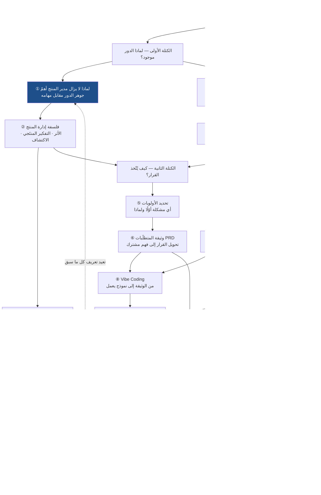
```mermaid
flowchart TD
    ROOT["المرجع<br/>إدارة المنتج في عصر الذكاء الاصطناعي"]
    ROOT --> B1["الكتلة الأولى — لماذا الدور موجود؟"]
    ROOT --> B2["الكتلة الثانية — كيف يُتّخذ القرار؟"]
    ROOT --> B3["الكتلة الثالثة — كيف يُنفَّذ ويُبنى؟"]
    ROOT --> B4["الكتلة الرابعة — ما الذي يبقى بشريًّا؟"]

    B1 --> C1["① لماذا لا يزال مدير المنتج أهمّ<br/>جوهر الدور مقابل مهامه"]
    B1 --> C4["④ الذكاء الاصطناعي ومدير المنتج<br/>ما يُفوَّض وما لا يُفوَّض"]
    C1 --> C2["② فلسفة إدارة المنتج<br/>الأثر · التفكير المنتَجي · الاكتشاف"]
    C2 --> C3["③ التوطين<br/>أول اختبار عملي للفلسفة في سوق حقيقي"]

    C2 --> B2
    B2 --> C5["⑤ تحديد الأولويات<br/>أي مشكلة أوّلًا ولماذا"]
    C5 --> C6["⑥ وثيقة المتطلّبات PRD<br/>تحويل القرار إلى فهم مشترك"]

    C4 --> B3
    B3 --> C7["⑦ أدوات الذكاء الاصطناعي<br/>الأداة تابعة للمهمّة"]
    C7 --> C8["⑧ Vibe Coding<br/>من الوثيقة إلى نموذج يعمل"]
    C6 --> C8
    C7 --> C9["⑨ مدير المنتج AI-Native<br/>من كاتب متطلّبات إلى مصمّم أنظمة"]
    C8 --> C9

    C3 --> C10["⑩ دورة حياة المنتج الكاملة<br/>الفصل الجامع — كل ما سبق في مكانه"]
    C6 --> C10
    C9 --> C10
    C10 --> B4
    B4 --> C11["⑪ عقلية مدير المنتج<br/>ما لا تستطيع أداة أن تنوب عنه"]
    C11 -.->|"تعيد تعريف كل ما سبق"| C1

    C10 --> AP["الملاحق الأربعة<br/>أ المصطلحات · ب الأطر · ج دراسات الحالة · د الخرائط"]
    C11 --> AP

    style C1 fill:#1f4f8a,color:#fff
    style C10 fill:#1f6f43,color:#fff
    style C11 fill:#8a6d1f,color:#fff
    style AP fill:#4a4a4a,color:#fff
```

> [!note] كيف تُقرأ؟
> الأسهم المتّصلة تعني **اعتماد معرفي**: الفصل التالي يفترض أنك قرأت السابق. والسهم المنقّط من الفصل الحادي عشر إلى الأول يعني أن العقلية **تُعيد تعريف** جوهر الدور، فالمرجع دائري لا خطّي. ولاحظ أن الفصل العاشر هو **عقدة التجميع**: كل المسارات تمرّ به.

## 🅑 خريطة ذهنية لدور مدير المنتج — الفروع الخمسة

*السؤال الذي تجيب عنه: ماذا يشمل الدور فعلًا حين يُفرَد من جذر واحد إلى فروعه الخمسة؟*

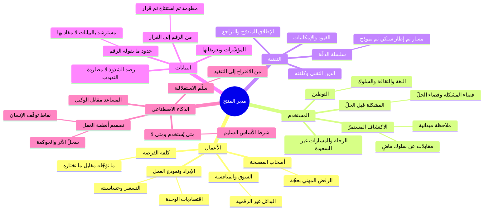
```mermaid
mindmap
  root((مدير المنتج))
    الأعمال
      الإيراد ونموذج العمل
        التسعير وحساسيته
        اقتصاديات الوحدة
      كلفة الفرصة
        ما نؤجّله مقابل ما نختاره
      السوق والمنافسة
        البدائل غير الرقمية
      أصحاب المصلحة
        الرفض المهني بحجّة
    المستخدم
      المشكلة قبل الحلّ
        فضاء المشكلة وفضاء الحلّ
      الاكتشاف المستمرّ
        مقابلات عن سلوك ماضٍ
        ملاحظة ميدانية
      الرحلة والمسارات غير السعيدة
      التوطين
        اللغة والثقافة والسلوك
    التقنية
      القيود والإمكانيات
      الدين التقني وكلفته
      سلسلة الدقّة
        مسار ثم إطار سلكي ثم نموذج
      الإطلاق المتدرّج والتراجع
    البيانات
      من الرقم إلى القرار
        معلومة ثم استنتاج ثم قرار
      حدود ما يقوله الرقم
        مسترشد بالبيانات لا مقاد بها
      المؤشّرات وتعريفاتها
      رصد الشذوذ لا مطاردة التذبذب
    الذكاء الاصطناعي
      متى يُستخدم ومتى لا
        شرط الأساس السليم
      سلّم الاستقلالية
        من الاقتراح إلى التنفيذ
      المساعد مقابل الوكيل
      تصميم أنظمة العمل
        نقاط توقّف الإنسان
        سجلّ الأثر والحوكمة
```

> [!note] الفروع الخمسة ليست تخصّصات
> لا يُطلب من مدير المنتج إتقان أيٍّ منها إتقان المتخصّص، بل **الكفاية للحوار الجادّ فيه ولإدراك أثر قراره عليه**. والخلل الشائع أن يقوى فرعان ويضمر ثلاثة، فتصير القرارات منحازة إلى الفرعين القويّين دائمًا. راجع مخطّط **[١-٥]** «العوالم الخمسة» في القسم الأول لصورته الأصلية في الفصل الحادي عشر.

## 🅒 دورة العمل الكاملة — الاكتشاف والتسليم متوازيان

*السؤال الذي تجيب عنه: كيف تجري مراحل المرجع كلّها في الواقع، لا في الترتيب التعليمي الذي رُسمت به؟*

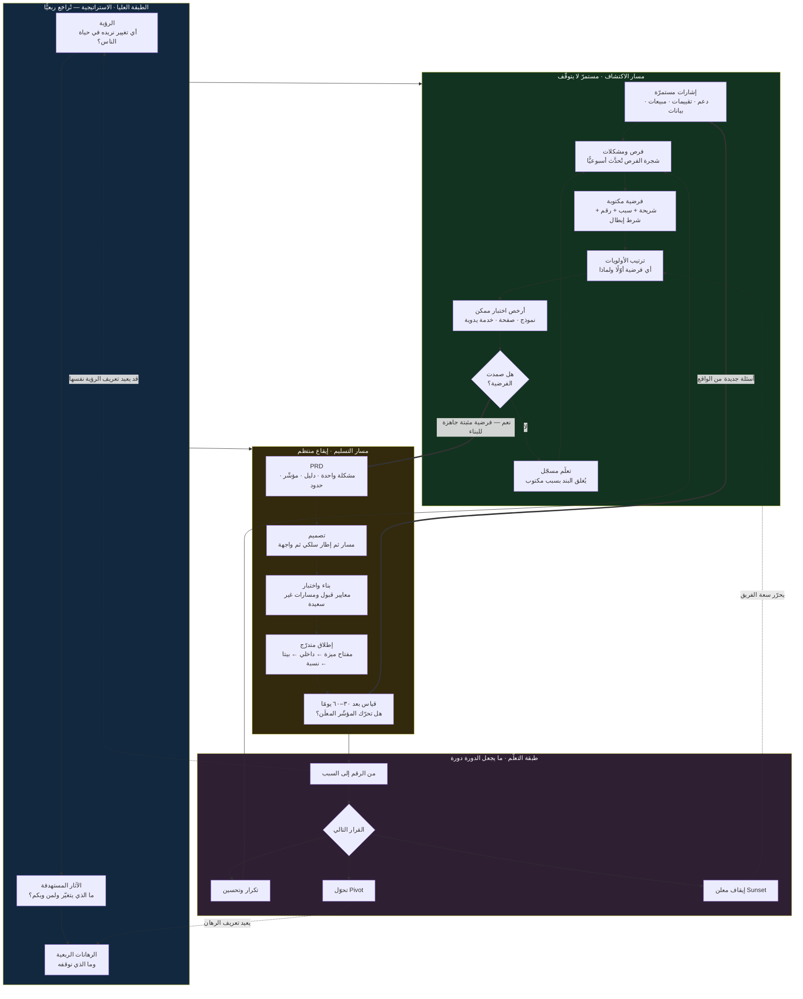
```mermaid
flowchart TB
    subgraph STRAT["الطبقة العليا · الاستراتيجية — تُراجَع ربعيًّا"]
        direction LR
        S1["الرؤية<br/>أي تغيير نريده في حياة الناس؟"] --> S2["الآثار المستهدفة<br/>ما الذي يتغيّر ولمن وبكم؟"]
        S2 --> S3["الرهانات الربعية<br/>وما الذي نوقفه"]
    end

    subgraph DISC["مسار الاكتشاف · مستمرّ لا يتوقّف"]
        direction LR
        D1["إشارات مستمرّة<br/>دعم · تقييمات · مبيعات · بيانات"] --> D2["فرص ومشكلات<br/>شجرة الفرص تُحدَّث أسبوعيًّا"]
        D2 --> D3["فرضية مكتوبة<br/>شريحة + سبب + رقم + شرط إبطال"]
        D3 --> D4["ترتيب الأولويات<br/>أي فرضية أوّلًا ولماذا"]
        D4 --> D5["أرخص اختبار ممكن<br/>نموذج · صفحة · خدمة يدوية"]
        D5 --> D6{"هل صمدت<br/>الفرضية؟"}
        D6 -->|"لا"| D7["تعلّم مسجّل<br/>يُغلق البند بسبب مكتوب"]
        D7 --> D2
    end

    subgraph DELV["مسار التسليم · إيقاع منتظم"]
        direction LR
        E1["PRD<br/>مشكلة واحدة · دليل · مؤشّر · حدود"] --> E2["تصميم<br/>مسار ثم إطار سلكي ثم واجهة"]
        E2 --> E3["بناء واختبار<br/>معايير قبول ومسارات غير سعيدة"]
        E3 --> E4["إطلاق متدرّج<br/>مفتاح ميزة ← داخلي ← بيتا ← نسبة"]
        E4 --> E5["قياس بعد ٣٠–٦٠ يومًا<br/>هل تحرّك المؤشّر المعلَن؟"]
    end

    subgraph LEARN["طبقة التعلّم · ما يجعل الدورة دورة"]
        direction LR
        L1["من الرقم إلى السبب"] --> L2{"القرار التالي"}
        L2 --> L3["تكرار وتحسين"]
        L2 --> L4["تحوّل Pivot"]
        L2 --> L5["إيقاف معلن Sunset"]
    end

    STRAT --> DISC
    STRAT --> DELV
    D6 ==>|"نعم — فرضية مثبتة جاهزة للبناء"| E1
    E5 ==>|"أسئلة جديدة من الواقع"| D1
    E5 --> L1
    L3 --> D2
    L4 -.->|"يعيد تعريف الرهان"| S3
    L5 -.->|"يحرّر سعة الفريق"| D4
    L1 -.->|"قد يعيد تعريف الرؤية نفسها"| S1

    style DISC fill:#12331f,color:#fff
    style DELV fill:#33290c,color:#fff
    style STRAT fill:#12283f,color:#fff
    style LEARN fill:#2f1f33,color:#fff
```

> [!warning] الخطأ الذي يمنعه هذا المخطّط
> أشيع خطأ تنظيمي هو تشغيل **مسار التسليم وحده** وتسمية ذلك «تنفيذًا سريعًا». والنتيجة فريق ينتج بلا انقطاع ولا يتعلّم شيئًا، لأن الأسهم العائدة من `E5` إلى `D1` غير موجودة أصلًا. الدورة تصير دورة **بالأسهم الراجعة لا بالمربّعات**.

## 🅓 خريطة القرار — من إشارة إلى قرار، وأين تدخل كل أداة وكل إطار

*السؤال الذي تجيب عنه: حين تصلني إشارة اليوم، ما الخطوة التالية بالضبط، وأي إطار أو أداة تُستعمل عندها؟*

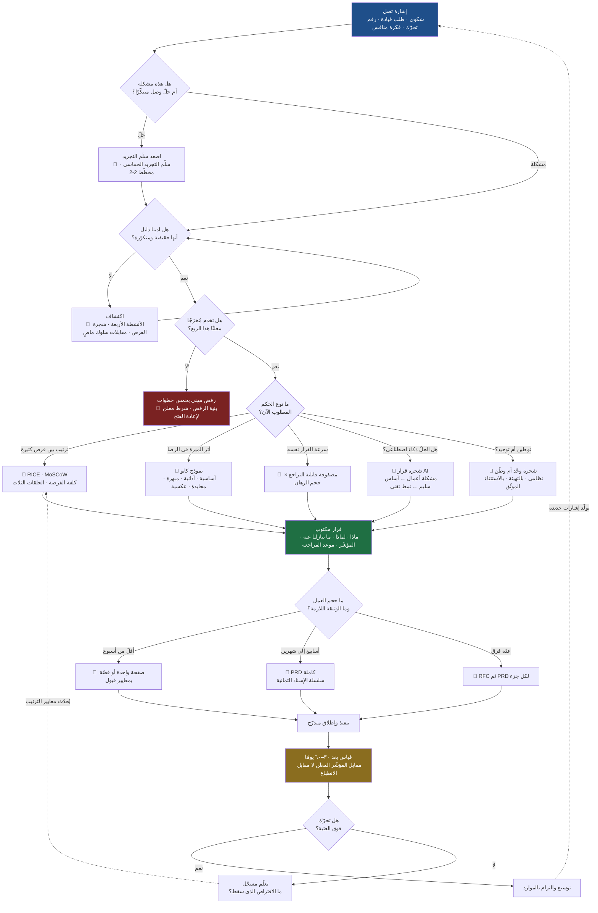
```mermaid
flowchart TD
    IN["إشارة تصل<br/>شكوى · طلب قيادة · رقم تحرّك · فكرة منافس"]
    IN --> G1{"هل هذه مشكلة<br/>أم حلّ وصل متنكّرًا؟"}
    G1 -->|"حلّ"| U1["اصعد سلّم التجريد<br/>🧰 سلّم التجريد الخماسي · مخطّط 2-2"]
    U1 --> G2
    G1 -->|"مشكلة"| G2{"هل لدينا دليل<br/>أنها حقيقية ومتكرّرة؟"}
    G2 -->|"لا"| R1["اكتشاف<br/>🧰 الأنشطة الأربعة · شجرة الفرص · مقابلات سلوك ماضٍ"]
    R1 --> G2
    G2 -->|"نعم"| G3{"هل تخدم مُخرَجًا<br/>معلنًا هذا الربع؟"}
    G3 -->|"لا"| R2["رفض مهني بخمس خطوات<br/>🧰 بنية الرفض · شرط معلن لإعادة الفتح"]
    G3 -->|"نعم"| G4{"ما نوع الحكم<br/>المطلوب الآن؟"}

    G4 -->|"ترتيب بين فرص كثيرة"| F1["🧰 RICE · MoSCoW<br/>كلفة الفرصة · الحلقات الثلاث"]
    G4 -->|"أثر الميزة في الرضا"| F2["🧰 نموذج كانو<br/>أساسية · أدائية · مبهرة · محايدة · عكسية"]
    G4 -->|"سرعة القرار نفسه"| F3["🧰 مصفوفة قابلية التراجع × حجم الرهان"]
    G4 -->|"هل الحلّ ذكاء اصطناعي؟"| F4["🧰 شجرة قرار AI<br/>مشكلة أعمال ← أساس سليم ← نمط تقني"]
    G4 -->|"توطين أم توحيد؟"| F5["🧰 شجرة وحّد أم وطّن<br/>نظامي · بالتهيئة · بالاستثناء الموثّق"]

    F1 --> D["قرار مكتوب<br/>ماذا · لماذا · ما تنازلنا عنه · المؤشّر · موعد المراجعة"]
    F2 --> D
    F3 --> D
    F4 --> D
    F5 --> D

    D --> G5{"ما حجم العمل<br/>وما الوثيقة اللازمة؟"}
    G5 -->|"أقلّ من أسبوع"| W1["🧰 صفحة واحدة أو قصّة بمعايير قبول"]
    G5 -->|"أسابيع إلى شهرين"| W2["🧰 PRD كاملة<br/>سلسلة الإسناد الثمانية"]
    G5 -->|"عدّة فرق"| W3["🧰 RFC ثم PRD لكل جزء"]

    W1 --> EX["تنفيذ وإطلاق متدرّج"]
    W2 --> EX
    W3 --> EX
    EX --> M["قياس بعد ٣٠–٦٠ يومًا<br/>مقابل المؤشّر المعلَن لا مقابل الانطباع"]
    M --> G6{"هل تحرّك<br/>فوق العتبة؟"}
    G6 -->|"نعم"| K1["توسيع والتزام بالموارد"]
    G6 -->|"لا"| K2["تعلّم مسجّل<br/>ما الافتراض الذي سقط؟"]
    K2 -.->|"يُحدّث معايير الترتيب"| F1
    K1 -.->|"يولّد إشارات جديدة"| IN

    style IN fill:#1f4f8a,color:#fff
    style D fill:#1f6f43,color:#fff
    style R2 fill:#7a2222,color:#fff
    style M fill:#8a6d1f,color:#fff
```

> [!tip] استعمال عملي
> علامة 🧰 تشير إلى **أداة أو إطار** مفصّل في [[ملحق ب - أطر العمل|الملحق ب]]. والقيمة العملية للمخطّط أنه يمنع الخلط الشائع بين أدوات تجيب عن أسئلة مختلفة: `RICE` يرتّب، وكانو يصنّف الأثر، ومصفوفة قابلية التراجع تحدّد **سرعة** القرار لا محتواه. استعمال إطار في غير موضعه سببٌ شائع لقرارات تبدو منهجية وهي فارغة.

## 🅔 خريطة الذكاء الاصطناعي — أين يدخل في كل مرحلة، وأين يقف الإنسان

*السؤال الذي تجيب عنه: في أي مهمّة أفوّض بأمان، وفي أي مهمّة يبقى القرار بشريًّا بالكامل، مرحلةً مرحلة؟*

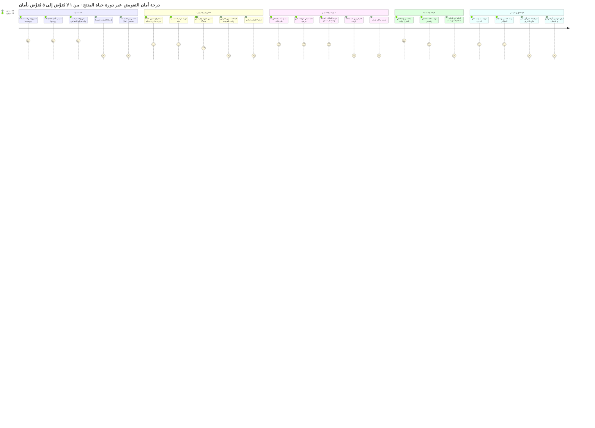
```mermaid
journey
    title درجة أمان التفويض عبر دورة حياة المنتج · من ١ لا يُفوَّض إلى ٥ يُفوَّض بأمان
    section الاكتشاف
      تجميع إشارات العملاء وتوحيدها: 5: النموذج
      تصنيف آلاف التعليقات ووسمها: 5: النموذج
      تفريغ المقابلات واستخراج المقاطع: 5: النموذج
      إجراء المقابلة نفسها: 1: الإنسان
      الحكم بأن المشكلة تستحقّ الحلّ: 1: الإنسان
    section التعريف والترتيب
      استخراج جدول الأدلّة من مصادر مسمّاة: 4: النموذج
      توليد فرضيات سببية بديلة: 4: النموذج
      تقدير الجهد والوصول مبدئيًّا: 3: النموذج, الإنسان
      المفاضلة بين الفرص وكلفة الفرصة: 1: الإنسان
      قول لا لطلب قيادي: 1: الإنسان
    section الوثيقة والتصميم
      مسوّدة أقسام الوثيقة على قالب: 4: النموذج
      نقد عدائي للوثيقة قبل عرضها: 4: النموذج
      توليد الحالات الحدّية والمسارات غير السعيدة: 4: النموذج
      اختيار بيان المشكلة الواحد: 1: الإنسان
      تحديد ما لن نفعله: 1: الإنسان
    section البناء والنمذجة
      بناء نموذج تفاعلي لسؤال واحد: 5: النموذج
      توليد حالات اختبار وقصص: 4: النموذج
      كتابة كود إنتاجي بصلاحيات وبيانات حقيقية: 1: الإنسان
    section الإطلاق والقياس
      توليد مسوّدة إعلان الميزة: 4: النموذج
      رصد الشذوذ وتفكيك المؤشّر: 4: النموذج
      المراجعة قبل أي نشر خارج الفريق: 1: الإنسان
      قرار التوسيع أو التراجع أو الإيقاف: 1: الإنسان
```

> [!important] القاعدة التي تلخّص الخريطة
> كلّما اقتربت المهمّة من **تحويل معلومات موجودة** ارتفع الرقم، وكلّما اقتربت من **إصدار حكم في سياق تجاري متعدّد الأطراف** انخفض إلى واحد. ولاحظ أن كل مرحلة — بلا استثناء — تنتهي بمهمّة درجتها `1`: هذه هي **نقطة توقّف الإنسان**، وهي ليست بقيّةً متروكة للبشر بل **موضع القيمة**. للتفصيل: مخطّطات **[٤-١]** و**[٤-٢]** و**[٤-٤]** في القسم الرابع.

## 🅕 خريطة المصطلحات المتشابهة — شجرة تفريق بصرية

*السؤال الذي تجيب عنه: ما الفرق الحاسم بين المصطلحات التي يُخلط بينها في هذا المرجع، وبأي سؤال واحد أفرّق بينها؟*

```mermaid
flowchart TD
    ROOT["المصطلحات التي يكثر الخلط بينها<br/>لكل زوج سؤال واحد يفصل بينهما"]

    ROOT --> P1["① المخرَج والأثر<br/>Output ⇄ Outcome"]
    P1 --> P1Q{"السؤال الفاصل:<br/>هل تغيّر شيء عند المستخدم؟"}
    P1Q -->|"شحنّا شيئًا"| P1A["Output — ناتج<br/>يُقاس بعدد ما أُطلق"]
    P1Q -->|"تغيّر سلوك أو رقم"| P1B["Outcome — مُخرَج<br/>يُقاس بأثر مرصود"]

    ROOT --> P2["② عائلة التوطين<br/>g11n ⇄ i18n ⇄ l10n ⇄ Transcreation"]
    P2 --> P2Q{"السؤال الفاصل:<br/>ما الذي يُغيَّر؟"}
    P2Q -->|"الأسواق وترتيب دخولها"| P2A["العولمة g11n"]
    P2Q -->|"قدرة المنتج التقنية على التعدّد"| P2B["التدويل i18n<br/>يسبق كل شيء"]
    P2Q -->|"التجربة كلّها في سوق بعينه"| P2C["التوطين l10n"]
    P2Q -->|"النصّ فقط"| P2D["الترجمة"]
    P2Q -->|"الأثر العاطفي للرسالة"| P2E["الإبداع التكيّفي"]

    ROOT --> P3["③ المساعد مقابل الوكيل<br/>Copilot ⇄ Agent"]
    P3 --> P3Q{"السؤال الفاصل:<br/>من يملك حلقة التحكّم؟"}
    P3Q -->|"أنت · كل دورة تمرّ بك"| P3A["Copilot — مساعد<br/>لا يبادر"]
    P3Q -->|"النظام · يخطّط وينفّذ ويقيّم"| P3B["Agent — وكيل<br/>يحتاج حدودًا وسجلّ أثر"]

    ROOT --> P4["④ عائلة النماذج<br/>Mockup ⇄ Prototype ⇄ PoC ⇄ MVP"]
    P4 --> P4Q{"السؤال الفاصل:<br/>ما مصيره بعد التعلّم؟"}
    P4Q -->|"يُستهلك في نقاش التصميم"| P4A["Mockup — شاشات ثابتة"]
    P4Q -->|"يُحذف بعد استخلاص التعلّم"| P4B["Prototype — تفاعلي وهمي"]
    P4Q -->|"يُوثَّق ثم يُرمى دائمًا"| P4C["PoC — إثبات مفهوم تقني"]
    P4Q -->|"يُصان ويُطوَّر لأنه منتج"| P4D["MVP — منتج مصغّر يُعتمد عليه"]

    ROOT --> P5["⑤ فضاء المشكلة مقابل فضاء الحلّ"]
    P5 --> P5Q{"السؤال الفاصل:<br/>هل الجملة تصف ألمًا أم تصف بناءً؟"}
    P5Q -->|"ألم وسياق وكلفة"| P5A["فضاء المشكلة<br/>يُملأ بالاكتشاف"]
    P5Q -->|"ميزة وشاشة وزرّ"| P5B["فضاء الحلّ<br/>يُملأ بالتصميم"]

    ROOT --> P6["⑥ مقاد بالبيانات مقابل مسترشد بها<br/>Data Driven ⇄ Data Informed"]
    P6 --> P6Q{"السؤال الفاصل:<br/>ماذا تفعل حين يصمت الرقم؟"}
    P6Q -->|"تنتظر رقمًا أو تتجمّد"| P6A["Data Driven<br/>يعجز أمام الجديد وقليل البيانات"]
    P6Q -->|"تقرّر بحكم مسنود وتعلن شرط الإبطال"| P6B["Data Informed<br/>الرقم مدخل لا حاكم"]

    ROOT --> P7["⑦ الاكتشاف مقابل التسليم<br/>Discovery ⇄ Delivery"]
    P7 --> P7Q{"السؤال الفاصل:<br/>ما السؤال الذي تجيب عنه الآن؟"}
    P7Q -->|"هل نبني الشيء الصحيح؟"| P7A["الاكتشاف<br/>يخفّض مخاطرة القيمة"]
    P7Q -->|"هل نبنيه بطريقة صحيحة؟"| P7B["التسليم<br/>يخفّض مخاطرة التنفيذ"]

    ROOT --> P8["⑧ المتطلّب مقابل معيار القبول مقابل مقياس النجاح"]
    P8 --> P8Q{"السؤال الفاصل:<br/>متى يُفحص؟"}
    P8Q -->|"يصف ما يجب أن يصير ممكنًا"| P8A["المتطلّب"]
    P8Q -->|"بوّابة نعم أو لا قبل الإطلاق"| P8B["معيار القبول"]
    P8Q -->|"فرضية تُقاس بعد الإطلاق"| P8C["مقياس النجاح"]

    ROOT --> P9["⑨ الأتمتة مقابل إعادة تصميم العملية"]
    P9 --> P9Q{"السؤال الفاصل:<br/>أي سؤال طُرح؟"}
    P9Q -->|"كيف أُنجز هذه الخطوة أسرع؟"| P9A["أتمتة<br/>الخطوة تبقى"]
    P9Q -->|"هل ينبغي أن توجد هذه الخطوة؟"| P9B["إعادة تصميم<br/>خطوات تختفي وأخرى تظهر"]

    style P1B fill:#1f6f43,color:#fff
    style P2B fill:#8a6d1f,color:#fff
    style P2C fill:#1f6f43,color:#fff
    style P3B fill:#8a3b1f,color:#fff
    style P4D fill:#8a2f2f,color:#fff
    style P5A fill:#1f6f43,color:#fff
    style P6B fill:#1f6f43,color:#fff
    style P7A fill:#1f6f43,color:#fff
    style P9B fill:#1f6f43,color:#fff
```

> [!note] لماذا شجرة تفريق لا قائمة تعريفات؟
> التعريف المكتوب يُنسى، والسؤال الفاصل يبقى. فحين تسمع مصطلحًا في اجتماع ولا تدري أيّهما يُقصد، لا تحتاج إلى استرجاع تعريفين بل إلى **سؤال واحد** يفصل بينهما. والتعريفات الكاملة في [[معجم المصطلحات]]، والخريطة التصنيفية الشاملة في [[ملحق أ - خريطة المصطلحات|الملحق أ]].

## 🅖 خريطة النضج المؤسّسي — ما الممارسة الممكنة في كل مستوى

*السؤال الذي تجيب عنه: أين تقع مؤسّستي، وما الممارسة التي يمكنني فعلًا أن أمارسها فيها اليوم لا في المؤسّسة المثالية؟*

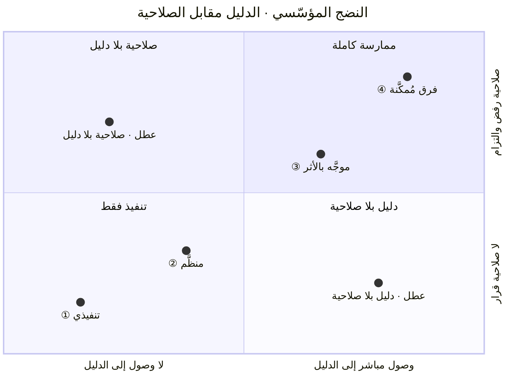
```mermaid
%%{init: {"quadrantChart": {"chartWidth": 700, "chartHeight": 520, "pointRadius": 6, "pointTextPadding": 12, "pointLabelFontSize": 14, "quadrantLabelFontSize": 15, "quadrantTextTopPadding": 14, "titleFontSize": 19, "xAxisLabelFontSize": 14, "yAxisLabelFontSize": 14, "yAxisPosition": "right"}}}%%
quadrantChart
    title النضج المؤسّسي · الدليل مقابل الصلاحية
    x-axis "لا وصول إلى الدليل" --> "وصول مباشر إلى الدليل"
    y-axis "لا صلاحية قرار" --> "صلاحية رفض والتزام"
    quadrant-1 "ممارسة كاملة"
    quadrant-2 "صلاحية بلا دليل"
    quadrant-3 "تنفيذ فقط"
    quadrant-4 "دليل بلا صلاحية"
    "① تنفيذي": [0.16, 0.16]
    "② منظَّم": [0.38, 0.32]
    "③ موجَّه بالأثر": [0.66, 0.62]
    "④ فرق مُمكَّنة": [0.84, 0.86]
    "عطل · صلاحية بلا دليل": [0.22, 0.72]
    "عطل · دليل بلا صلاحية": [0.78, 0.22]
```

*المحور الأفقي هو **الوصول إلى الدليل**: من لا وصولَ فيه إلى العميل ولا إلى البيانات، إلى وصولٍ مباشر وذاتيّ. والمحور الرأسي هو **صلاحية القرار**: من لا صلاحية، إلى صلاحية رفضٍ والتزامٍ بالأثر. و«ممارسة كاملة» اجتماعُ الاثنين — اكتشافٌ مستمرّ وصلاحية رفض وملكية نتيجة — و«تنفيذ فقط» غيابُهما معًا: كتابة متطلّبات وتنسيق وترجمة قرارات القمّة. وتفصيل المستويات الأربعة في الجدول، والعطلان تحته.*

| المستوى | ما هو ممكن فعلًا | المهمّة الواقعية فيه | علامة الانتقال إلى ما بعده |
| --- | --- | --- | --- |
| **① تنفيذي** | كتابة متطلّبات واضحة · تنسيق · توثيق قرارات | **بناء الدليل وكسب الثقة**: اربط أول قرار بأثر مقيس مهما صغر | صار أحدهم يسألك «ما الدليل؟» قبل أن تعرضه |
| **② منظَّم** | ملكية جزئية للـ`Backlog` · مؤشّرات تُعرض | **إدخال لغة الأثر**: حوّل بندًا واحدًا من «سنطلق كذا» إلى «سيتحرّك كذا بكذا» | صار الترتيب يُناقَش بالمؤشّر لا بالمُطالِب |
| **③ موجَّه بالأثر** | أهداف بالأثر · وصول مباشر للعميل · بيانات ذاتية | **المفاضلة وقول لا بحجّة**: أظهر كلفة الفرصة في كل قرار | صار الفريق يُعطى مشكلة أحيانًا لا حلًّا |
| **④ فرق مُمكَّنة** | مشكلة لا حلّ · اكتشاف مستمرّ · صلاحية الرفض | **الاستراتيجية والرهانات**: اختر ما لا يُبنى، لا ما يُبنى فقط | — هذا سقف الممارسة |

> [!warning] النمطان المختلّان
> النقطتان خارج القُطر ليستا مستويات نضج بل **أعطالًا تنظيمية**. `صلاحية بلا دليل` تُنتج قرارات سريعة متقلّبة تُستهلك فيها ثقة الفريق. و`دليل بلا صلاحية` تُنتج مديري منتجات ممتازي التحليل، محبَطين، لأن أعمالهم تنتهي في عرض تقديمي. وعلاج الأولى **إدخال القياس**، وعلاج الثانية **إدخال الملكية** — وهما تدخّلان مختلفان تمامًا. الأصل في [[01 - لماذا لا يزال مدير المنتج أهم من أي وقت مضى|الفصل الأول]] ومخطّطه **[١-٤]**.

## 🅗 خريطة مسار التعلّم — من مبتدئ إلى متمرّس عبر الفصول والملاحق

*السؤال الذي تجيب عنه: بأي ترتيب أقرأ هذا المرجع بحسب مستواي، وما المخرَج العملي المطلوب في كل مرحلة؟*

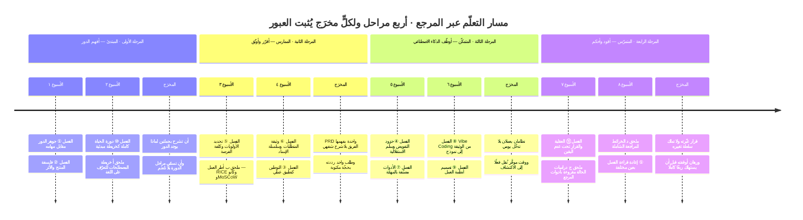
```mermaid
timeline
    title مسار التعلّم عبر المرجع · أربع مراحل ولكلٍّ مخرَج يُثبت العبور
    section المرحلة الأولى · المبتدئ — أفهم الدور
        الأسبوع ١ : الفصل ① جوهر الدور مقابل مهامه : الفصل ② فلسفة المنتج والأثر
        الأسبوع ٢ : الفصل ⑩ دورة الحياة كاملة كخريطة مبدئية : ملحق أ خريطة المصطلحات للتعرّف على اللغة
        المخرَج : أن تشرح بجملتين لماذا يوجد الدور : وأن تسمّي مراحل الدورة بلا تلعثم
    section المرحلة الثانية · الممارس — أقرّر وأوثّق
        الأسبوع ٣ : الفصل ⑤ تحديد الأولويات وكلفة الفرصة : ملحق ب أطر العمل — RICE وكانو وMoSCoW
        الأسبوع ٤ : الفصل ⑥ وثيقة المتطلّبات وسلسلة الإسناد : الفصل ③ التوطين كتطبيق عملي
        المخرَج : PRD واحدة يفهمها الفريق بلا شرح شفهي : وطلب واحد رددته بحجّة مكتوبة
    section المرحلة الثالثة · المتمكّن — أوظّف الذكاء الاصطناعي
        الأسبوع ٥ : الفصل ④ حدود التفويض وسلّم الاستقلالية : الفصل ⑦ الأدوات مصنّفة بالمهمّة
        الأسبوع ٦ : الفصل ⑧ Vibe Coding من الوثيقة إلى نموذج : الفصل ⑨ تصميم أنظمة العمل
        المخرَج : نظامان يعملان بلا تدخّل يومي : ووقت موفَّر نُقل فعلًا إلى الاكتشاف
    section المرحلة الرابعة · المتمرّس — أقود وأحكم
        الأسبوع ٧ : الفصل ⑪ العقلية والقرار تحت عدم اليقين : ملحق ج دراسات الحالة مقروءة بأدوات المرجع
        الأسبوع ٨ : ملحق د الخرائط للمراجعة الشاملة : إعادة قراءة الفصل ① بعين مختلفة
        المخرَج : قرار غيّرته ولا تملك سلطة تغييره : ورهان أوقفته قبل أن يستهلك ربعًا كاملًا
```

> [!tip] المسار ليس ملزِمًا بترتيبه
> إن كنت في مؤسّسة **مستواها الأول أو الثاني** (راجع الخريطة 🅖)، قدّم الفصل الحادي عشر على السابع: العقلية تنفعك قبل الأدوات لأن الأدوات بلا صلاحية تُنتج مخرجات لا قرارات. وإن كنت في فريق **يبني ميزة ذكاء اصطناعي الآن**، اقفز إلى الفصل الرابع مباشرةً ثم عد إلى الثاني — فأخطر ما في هذا الباب هو البناء قبل تحديد ما لا يُفوَّض.

---

# 📚 الجزء الثاني: مخطّطات المرجع مرتّبةً بالمحور

> [!abstract] سبعة وستّون مخطّطًا من أحد عشر فصلًا
> كل مخطّط هنا **منقول حرفيًّا** من موضعه في فصله، ولم يُعدَّل ولم تُعَد صياغته. والترتيب هنا **بالمحور لا بالفصل**، فتجد مخطّطًا من الفصل الأول بجوار مخطّط من الفصل الحادي عشر لأنهما يجيبان عن سؤالين متجاورين. ورقم كل مخطّط بصيغة **[القسم-الترتيب]** يُستعمل في الإحالات داخل هذا الملحق.

---

# 🧭 القسم الأول: جوهر الدور والعقلية الحاكمة

> لماذا يوجد هذا الدور أصلًا، ولماذا تزداد الحاجة إليه كلّما سهُل البناء — وما العقلية التي تحدّد ما تُنتجه الأدوات في يدك.

## [١-١] · جوهر الدور مقابل مهامه الظاهرة

📄 المصدر: [[01 - لماذا لا يزال مدير المنتج أهم من أي وقت مضى|الفصل الأول · لماذا لا يزال مدير المنتج أهم]] · *لماذا لا تُنتج المهامّ اليومية جوهرَ الدور، بينما الجوهر هو الذي يولّدها؟*

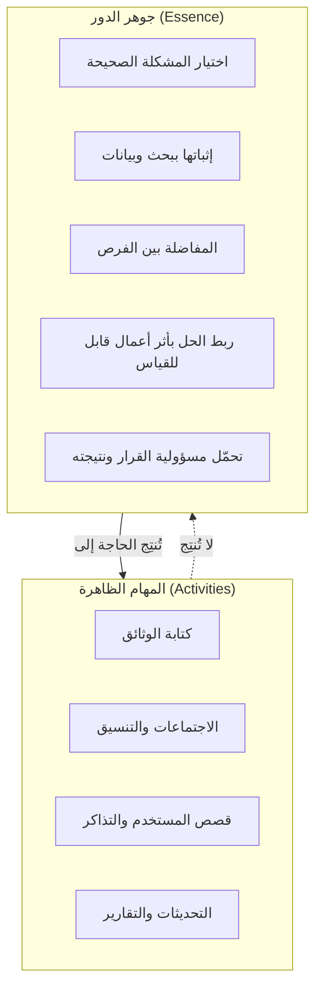
```mermaid
flowchart TD
    subgraph ACT["المهام الظاهرة (Activities)"]
        A1["كتابة الوثائق"]
        A2["الاجتماعات والتنسيق"]
        A3["قصص المستخدم والتذاكر"]
        A4["التحديثات والتقارير"]
    end
    subgraph ESS["جوهر الدور (Essence)"]
        E1["اختيار المشكلة الصحيحة"]
        E2["إثباتها ببحث وبيانات"]
        E3["المفاضلة بين الفرص"]
        E4["ربط الحل بأثر أعمال قابل للقياس"]
        E5["تحمّل مسؤولية القرار ونتيجته"]
    end
    ESS -->|"تُنتِج الحاجة إلى"| ACT
    ACT -.->|"لا تُنتِج"| ESS
```

## [١-٢] · دورة «الترندات» الرباعية

📄 المصدر: [[01 - لماذا لا يزال مدير المنتج أهم من أي وقت مضى|الفصل الأول · لماذا لا يزال مدير المنتج أهم]] · *لماذا يتكرّر الحماس ثم الخيبة مع كل منهجية جديدة، وما الذي يبقى منها فعلًا؟*

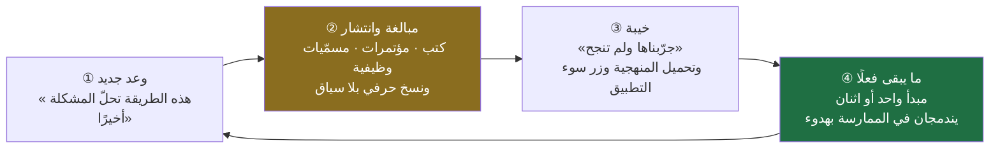
```mermaid
flowchart LR
    A["① وعد جديد<br/>«هذه الطريقة تحلّ المشكلة أخيرًا»"] --> B["② مبالغة وانتشار<br/>كتب · مؤتمرات · مسمّيات وظيفية<br/>ونسخ حرفي بلا سياق"]
    B --> C["③ خيبة<br/>«جرّبناها ولم تنجح»<br/>وتحميل المنهجية وزر سوء التطبيق"]
    C --> D["④ ما يبقى فعلًا<br/>مبدأ واحد أو اثنان<br/>يندمجان في الممارسة بهدوء"]
    D --> A
    style D fill:#1f6f43,color:#fff
    style B fill:#8a6d1f,color:#fff
```

## [١-٣] · كلّما رخص البناء غلا الاختيار

📄 المصدر: [[01 - لماذا لا يزال مدير المنتج أهم من أي وقت مضى|الفصل الأول · لماذا لا يزال مدير المنتج أهم]] · *لماذا يزداد دور مدير المنتج أهميةً كلّما صار البناء أسهل وأرخص؟*

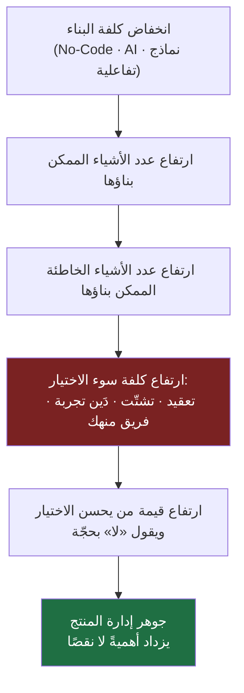
```mermaid
flowchart TD
    A["انخفاض كلفة البناء<br/>(No-Code · AI · نماذج تفاعلية)"] --> B["ارتفاع عدد الأشياء الممكن بناؤها"]
    B --> C["ارتفاع عدد الأشياء الخاطئة الممكن بناؤها"]
    C --> D["ارتفاع كلفة سوء الاختيار:<br/>تعقيد · تشتّت · دَين تجربة · فريق منهك"]
    D --> E["ارتفاع قيمة من يحسن الاختيار<br/>ويقول «لا» بحجّة"]
    E --> F["جوهر إدارة المنتج<br/>يزداد أهميةً لا نقصًا"]
    style F fill:#1f6f43,color:#fff
    style D fill:#7a2222,color:#fff
```

## [١-٤] · مستويات نضج المؤسّسة الأربعة

📄 المصدر: [[01 - لماذا لا يزال مدير المنتج أهم من أي وقت مضى|الفصل الأول · لماذا لا يزال مدير المنتج أهم]] · *ما الدور الذي تستطيع أن تلعبه فعلًا في مؤسّستك، وما مهمّتك الواقعية في مستواك؟*

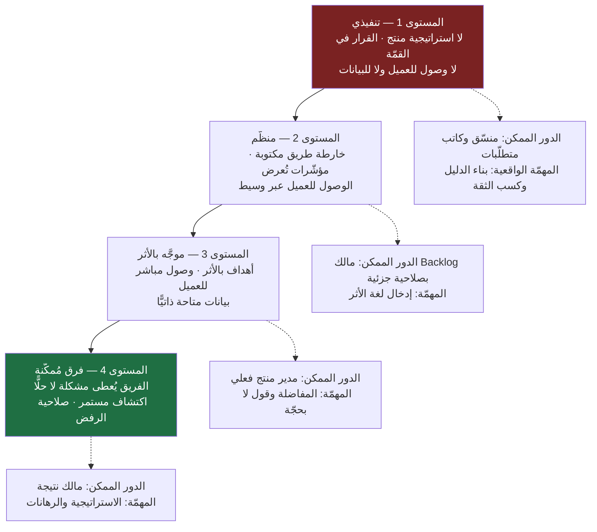
```mermaid
flowchart TD
    L1["المستوى 1 — تنفيذي<br/>لا استراتيجية منتج · القرار في القمّة<br/>لا وصول للعميل ولا للبيانات"]
    L2["المستوى 2 — منظَّم<br/>خارطة طريق مكتوبة · مؤشّرات تُعرض<br/>الوصول للعميل عبر وسيط"]
    L3["المستوى 3 — موجَّه بالأثر<br/>أهداف بالأثر · وصول مباشر للعميل<br/>بيانات متاحة ذاتيًّا"]
    L4["المستوى 4 — فرق مُمكَّنة<br/>الفريق يُعطى مشكلة لا حلًّا<br/>اكتشاف مستمر · صلاحية الرفض"]
    L1 --> L2 --> L3 --> L4
    R1["الدور الممكن: منسّق وكاتب متطلّبات<br/>المهمّة الواقعية: بناء الدليل وكسب الثقة"]
    R2["الدور الممكن: مالك Backlog بصلاحية جزئية<br/>المهمّة: إدخال لغة الأثر"]
    R3["الدور الممكن: مدير منتج فعلي<br/>المهمّة: المفاضلة وقول لا بحجّة"]
    R4["الدور الممكن: مالك نتيجة<br/>المهمّة: الاستراتيجية والرهانات"]
    L1 -.-> R1
    L2 -.-> R2
    L3 -.-> R3
    L4 -.-> R4
    style L4 fill:#1f6f43,color:#fff
    style L1 fill:#7a2222,color:#fff
```

## [١-٥] · العوالم الخمسة لمدير المنتج

📄 المصدر: [[11 - عقلية مدير المنتج|الفصل الحادي عشر · عقلية مدير المنتج]] · *في أي عوالم يعيش مدير المنتج في اليوم الواحد، وكيف يتّصل كلٌّ منها بالآخر؟*

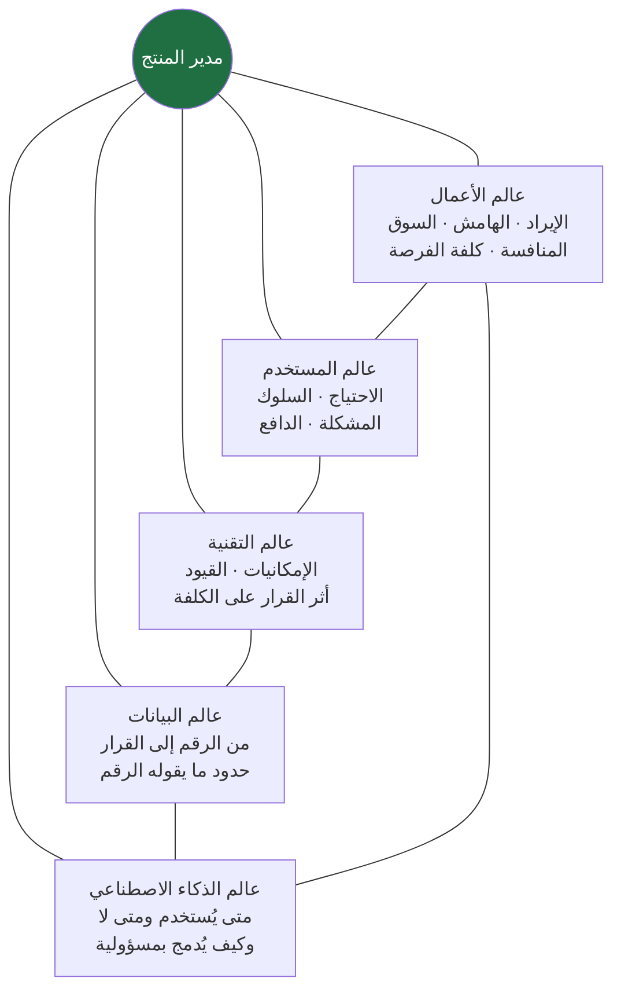
```mermaid
flowchart TD
    PM(("مدير المنتج"))
    PM --- B["عالم الأعمال<br/>الإيراد · الهامش · السوق<br/>المنافسة · كلفة الفرصة"]
    PM --- U["عالم المستخدم<br/>الاحتياج · السلوك<br/>المشكلة · الدافع"]
    PM --- T["عالم التقنية<br/>الإمكانيات · القيود<br/>أثر القرار على الكلفة"]
    PM --- D["عالم البيانات<br/>من الرقم إلى القرار<br/>حدود ما يقوله الرقم"]
    PM --- A["عالم الذكاء الاصطناعي<br/>متى يُستخدم ومتى لا<br/>وكيف يُدمج بمسؤولية"]
    B --- U
    U --- T
    T --- D
    D --- A
    A --- B
    style PM fill:#1f6f43,color:#fff
```

## [١-٦] · العقلية تحدّد ما تُنتجه الأدوات

📄 المصدر: [[11 - عقلية مدير المنتج|الفصل الحادي عشر · عقلية مدير المنتج]] · *لماذا يُنتج مديران بالأدوات نفسها نتيجتين مختلفتين تمامًا؟*

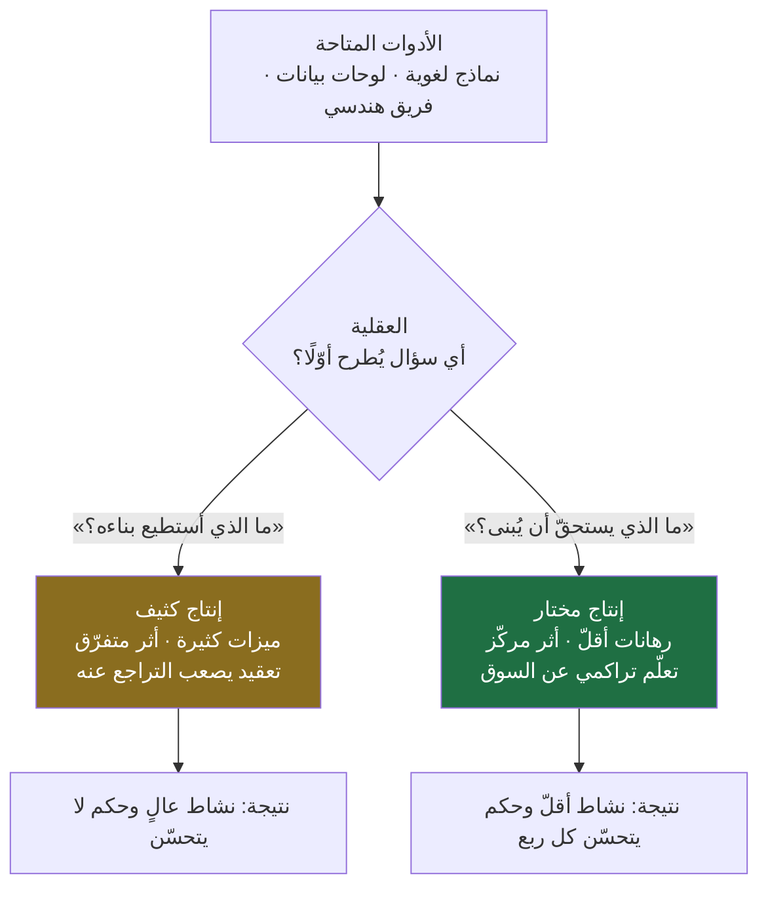
```mermaid
flowchart TD
    T["الأدوات المتاحة<br/>نماذج لغوية · لوحات بيانات · فريق هندسي"] --> M{"العقلية<br/>أي سؤال يُطرح أوّلًا؟"}
    M -->|"«ما الذي أستطيع بناءه؟»"| P1["إنتاج كثيف<br/>ميزات كثيرة · أثر متفرّق<br/>تعقيد يصعب التراجع عنه"]
    M -->|"«ما الذي يستحقّ أن يُبنى؟»"| P2["إنتاج مختار<br/>رهانات أقلّ · أثر مركّز<br/>تعلّم تراكمي عن السوق"]
    P1 --> R1["نتيجة: نشاط عالٍ وحكم لا يتحسّن"]
    P2 --> R2["نتيجة: نشاط أقلّ وحكم يتحسّن كل ربع"]
    style P2 fill:#1f6f43,color:#fff
    style P1 fill:#8a6d1f,color:#fff
```

---

# 🔍 القسم الثاني: التفكير المنتَجي والاكتشاف

> كيف تُبنى المعرفة قبل القرار: من الطلب كما وصل، إلى المشكلة الحقيقية، إلى فرضية قابلة للإبطال، إلى أرخص تجربة تختبرها.

## [٢-١] · الطبقات الأربع للتفكير المنتَجي

📄 المصدر: [[02 - فلسفة إدارة المنتج|الفصل الثاني · فلسفة إدارة المنتج]] · *ما الذي يعنيه «التفكير المنتَجي» تعريفًا قابلًا للتعليم لا مدحًا مبهمًا؟*

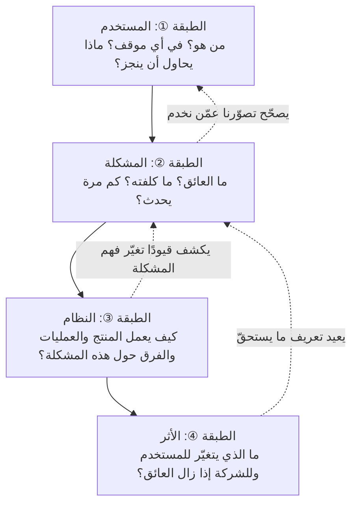
```mermaid
flowchart TD
    L1["الطبقة ①: المستخدم<br/>من هو؟ في أي موقف؟ ماذا يحاول أن ينجز؟"]
    L2["الطبقة ②: المشكلة<br/>ما العائق؟ ما كلفته؟ كم مرة يحدث؟"]
    L3["الطبقة ③: النظام<br/>كيف يعمل المنتج والعمليات والفرق حول هذه المشكلة؟"]
    L4["الطبقة ④: الأثر<br/>ما الذي يتغيّر للمستخدم وللشركة إذا زال العائق؟"]
    L1 --> L2 --> L3 --> L4
    L4 -.->|"يعيد تعريف ما يستحقّ"| L2
    L3 -.->|"يكشف قيودًا تغيّر فهم المشكلة"| L2
    L2 -.->|"يصحّح تصوّرنا عمّن نخدم"| L1
```

## [٢-٢] · سلّم التجريد بين الطلب والهدف

📄 المصدر: [[02 - فلسفة إدارة المنتج|الفصل الثاني · فلسفة إدارة المنتج]] · *كيف تصعد من «أضِف زرّ تصدير» إلى المشكلة الحقيقية ثم تنزل منها إلى بدائل حلول؟*

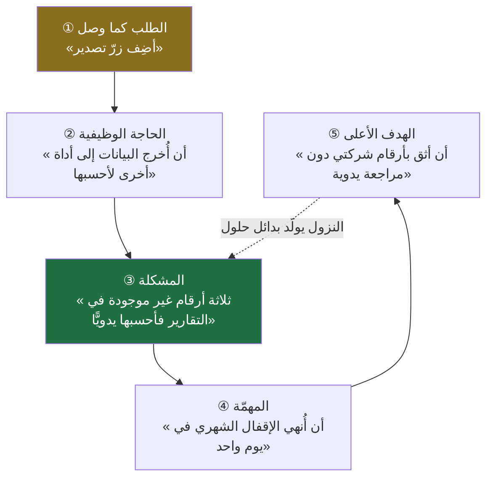
```mermaid
flowchart TD
    A["⑤ الهدف الأعلى<br/>«أن أثق بأرقام شركتي دون مراجعة يدوية»"]
    B["④ المهمّة<br/>«أن أُنهي الإقفال الشهري في يوم واحد»"]
    C["③ المشكلة<br/>«ثلاثة أرقام غير موجودة في التقارير فأحسبها يدويًّا»"]
    D["② الحاجة الوظيفية<br/>«أن أُخرج البيانات إلى أداة أخرى لأحسبها»"]
    E["① الطلب كما وصل<br/>«أضِف زرّ تصدير»"]
    E --> D --> C --> B --> A
    A -.->|"النزول يولّد بدائل حلول"| C
    style C fill:#1f6f43,color:#fff
    style E fill:#8a6d1f,color:#fff
```

## [٢-٣] · شجرة الفرص والحلول والاختبارات

📄 المصدر: [[01 - لماذا لا يزال مدير المنتج أهم من أي وقت مضى|الفصل الأول · لماذا لا يزال مدير المنتج أهم]] · *كيف ينزل مُخرَج واحد إلى فرص، ثم إلى حلول مقترحة، ثم إلى اختبارات افتراضات؟*

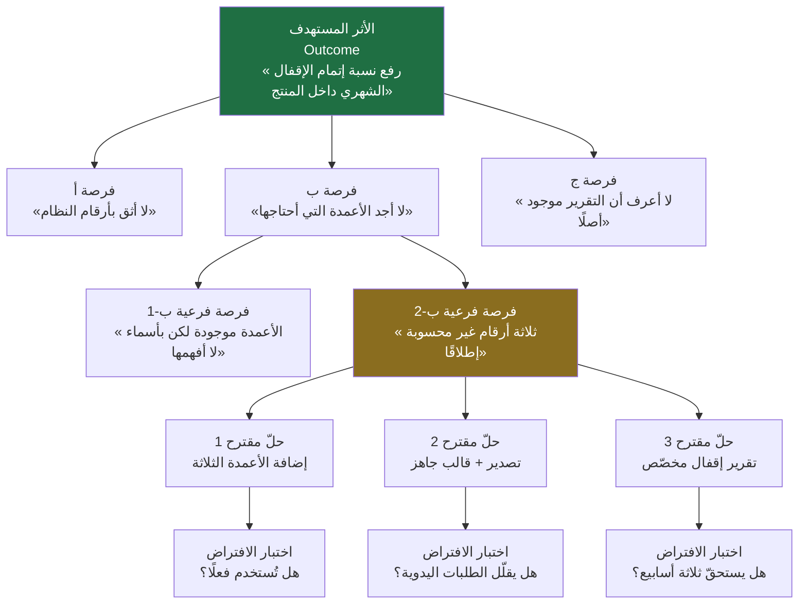
```mermaid
flowchart TD
    O["الأثر المستهدف<br/>Outcome<br/>«رفع نسبة إتمام الإقفال الشهري داخل المنتج»"]
    O --> P1["فرصة أ<br/>«لا أثق بأرقام النظام»"]
    O --> P2["فرصة ب<br/>«لا أجد الأعمدة التي أحتاجها»"]
    O --> P3["فرصة ج<br/>«لا أعرف أن التقرير موجود أصلًا»"]
    P2 --> P21["فرصة فرعية ب-1<br/>«الأعمدة موجودة لكن بأسماء لا أفهمها»"]
    P2 --> P22["فرصة فرعية ب-2<br/>«ثلاثة أرقام غير محسوبة إطلاقًا»"]
    P22 --> S1["حلّ مقترح 1<br/>إضافة الأعمدة الثلاثة"]
    P22 --> S2["حلّ مقترح 2<br/>تصدير + قالب جاهز"]
    P22 --> S3["حلّ مقترح 3<br/>تقرير إقفال مخصّص"]
    S1 --> E1["اختبار الافتراض<br/>هل تُستخدم فعلًا؟"]
    S2 --> E2["اختبار الافتراض<br/>هل يقلّل الطلبات اليدوية؟"]
    S3 --> E3["اختبار الافتراض<br/>هل يستحقّ ثلاثة أسابيع؟"]
    style O fill:#1f6f43,color:#fff
    style P22 fill:#8a6d1f,color:#fff
```

## [٢-٤] · شجرة فرص تطبيقية — منصّة صيانة منزلية

📄 المصدر: [[02 - فلسفة إدارة المنتج|الفصل الثاني · فلسفة إدارة المنتج]] · *كيف تبدو شجرة الفرص حين تُطبَّق على أثر حقيقي في سوق محلّي؟*

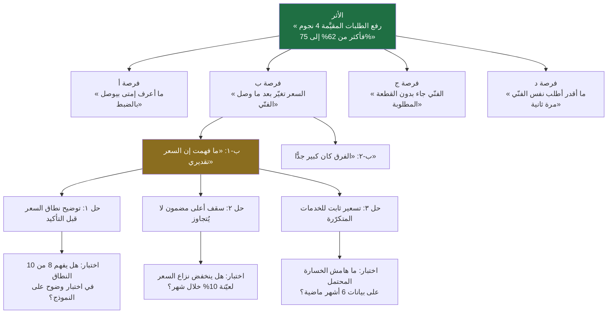
```mermaid
flowchart TD
    O["الأثر<br/>«رفع الطلبات المقيَّمة 4 نجوم فأكثر من 62% إلى 75%»"]
    O --> P1["فرصة أ<br/>«ما أعرف إمتى بيوصل بالضبط»"]
    O --> P2["فرصة ب<br/>«السعر تغيّر بعد ما وصل الفنّي»"]
    O --> P3["فرصة ج<br/>«الفنّي جاء بدون القطعة المطلوبة»"]
    O --> P4["فرصة د<br/>«ما أقدر أطلب نفس الفنّي مرة ثانية»"]
    P2 --> P21["ب-١: «ما فهمت إن السعر تقديري»"]
    P2 --> P22["ب-٢: «الفرق كان كبير جدًّا»"]
    P21 --> S1["حل ١: توضيح نطاق السعر قبل التأكيد"]
    P21 --> S2["حل ٢: سقف أعلى مضمون لا يُتجاوز"]
    P21 --> S3["حل ٣: تسعير ثابت للخدمات المتكرّرة"]
    S1 --> E1["اختبار: هل يفهم 8 من 10 النطاق<br/>في اختبار وضوح على النموذج؟"]
    S2 --> E2["اختبار: هل ينخفض نزاع السعر<br/>لعيّنة 10% خلال شهر؟"]
    S3 --> E3["اختبار: ما هامش الخسارة المحتمل<br/>على بيانات 6 أشهر ماضية؟"]
    style O fill:#1f6f43,color:#fff
    style P21 fill:#8a6d1f,color:#fff
```

## [٢-٥] · الأنشطة الأربعة للاكتشاف

📄 المصدر: [[02 - فلسفة إدارة المنتج|الفصل الثاني · فلسفة إدارة المنتج]] · *أي سؤال يجيب عنه كل نشاط بحثي بالضبط، وعن أي سؤال يعجز؟*

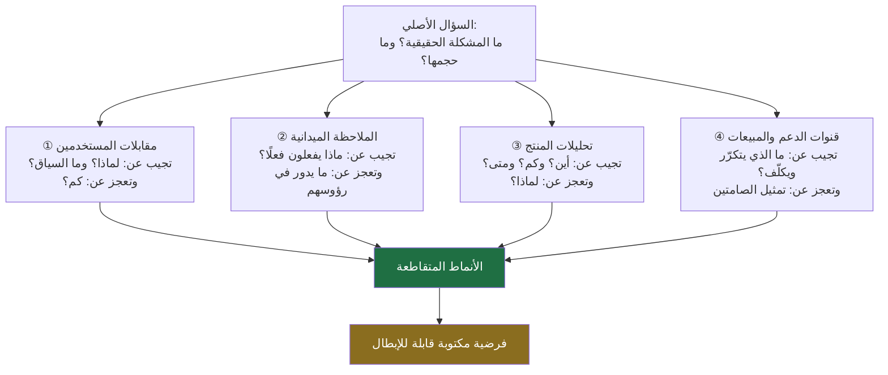
```mermaid
flowchart TD
    Q["السؤال الأصلي:<br/>ما المشكلة الحقيقية؟ وما حجمها؟"]
    Q --> A["① مقابلات المستخدمين<br/>تجيب عن: لماذا؟ وما السياق؟<br/>وتعجز عن: كم؟"]
    Q --> B["② الملاحظة الميدانية<br/>تجيب عن: ماذا يفعلون فعلًا؟<br/>وتعجز عن: ما يدور في رؤوسهم"]
    Q --> C["③ تحليلات المنتج<br/>تجيب عن: أين؟ وكم؟ ومتى؟<br/>وتعجز عن: لماذا؟"]
    Q --> D["④ قنوات الدعم والمبيعات<br/>تجيب عن: ما الذي يتكرّر ويكلّف؟<br/>وتعجز عن: تمثيل الصامتين"]
    A --> S["الأنماط المتقاطعة"]
    B --> S
    C --> S
    D --> S
    S --> H["فرضية مكتوبة قابلة للإبطال"]
    style S fill:#1f6f43,color:#fff
    style H fill:#8a6d1f,color:#fff
```

## [٢-٦] · من الملاحظة إلى الفرضية إلى التجربة

📄 المصدر: [[02 - فلسفة إدارة المنتج|الفصل الثاني · فلسفة إدارة المنتج]] · *كيف تتحوّل شكوى متفرّقة إلى فرضية قابلة للإبطال ثم إلى قرار توسيع أو تعلّم؟*

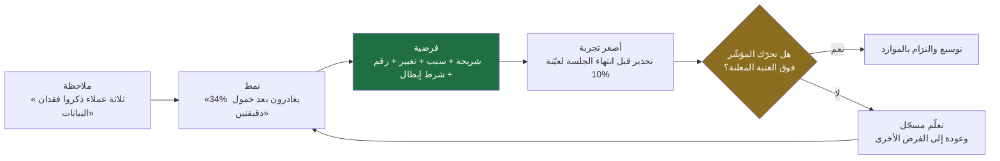
```mermaid
flowchart LR
    O["ملاحظة<br/>«ثلاثة عملاء ذكروا فقدان البيانات»"] --> P["نمط<br/>«34% يغادرون بعد خمول دقيقتين»"]
    P --> H["فرضية<br/>شريحة + سبب + تغيير + رقم + شرط إبطال"]
    H --> E["أصغر تجربة<br/>تحذير قبل انتهاء الجلسة لعيّنة 10%"]
    E --> R{"هل تحرّك المؤشّر<br/>فوق العتبة المعلنة؟"}
    R -->|"نعم"| D["توسيع والتزام بالموارد"]
    R -->|"لا"| L["تعلّم مسجّل<br/>وعودة إلى الفرص الأخرى"]
    L --> P
    style H fill:#1f6f43,color:#fff
    style R fill:#8a6d1f,color:#fff
```

## [٢-٧] · حلقة ابنِ · قِس · تعلّم واتجاه التخطيط العكسي

📄 المصدر: [[02 - فلسفة إدارة المنتج|الفصل الثاني · فلسفة إدارة المنتج]] · *لماذا يُخطَّط للحلقة بالعكس بينما تُنفَّذ بالترتيب؟*

```mermaid
flowchart LR
    subgraph EXEC["اتجاه التنفيذ"]
        B["ابنِ"] --> M["قِس"] --> L["تعلّم"]
    end
    subgraph PLAN["اتجاه التخطيط — عكسي"]
        L2["① ما الذي أريد تعلّمه؟"] --> M2["② ما الذي يجب أن أقيسه؟"] --> B2["③ ما أقلّ ما يجب أن أبنيه؟"]
    end
    PLAN -.->|"يحدّد نطاق"| EXEC
    style PLAN fill:#1f6f43,color:#fff
```

---

# 🌍 القسم الثالث: التوطين — الفلسفة في سوق حقيقي

> أول اختبار عملي لكل ما سبق: كيف يصمد المنتج حين ينتقل إلى سوق له لغته وسلوكه وأنظمته واقتصاده.

## [٣-١] · عائلة مصطلحات التوطين

📄 المصدر: [[03 - التوطين (Localization)|الفصل الثالث · التوطين]] · *ما الفرق بين العولمة والتدويل والتوطين والترجمة والإبداع التكيّفي، وأيّها يسبق أيًّا؟*

```mermaid
flowchart TD
    G["العولمة g11n<br/>أي أسواق · بأي ترتيب · بأي نموذج"] --> I["التدويل i18n<br/>تهيئة تقنية تسبق كل شيء"]
    I --> L["التوطين l10n<br/>تكييف التجربة لسوق بعينه"]
    L --> T["الترجمة Translation<br/>نقل النصوص"]
    L --> TC["الإبداع التكيّفي Transcreation<br/>إعادة إنتاج الرسالة"]
    L --> B["تكييف السلوك والميزات<br/>الدفع · المسارات · الأولويات"]
    L --> O["توطين التشغيل والدعم<br/>ساعات · قنوات · لهجة"]
    T -.->|"لا تُنتِج"| L
    style I fill:#8a6d1f,color:#fff
    style L fill:#1f6f43,color:#fff
```

## [٣-٢] · سبع خطوات التدويل التقني

📄 المصدر: [[03 - التوطين (Localization)|الفصل الثالث · التوطين]] · *ما الذي يجب أن يُبنى في الكود حتى يصير دخول سوق جديد مسألة إعدادات لا مسألة كود؟*

```mermaid
flowchart LR
    A["① فصل النصوص<br/>عن الكود"] --> B["② Unicode<br/>من الطرف إلى الطرف"]
    B --> C["③ قواعد الجمع<br/>ICU MessageFormat"]
    C --> D["④ التاريخ والتقويم<br/>ميلادي · هجري · بداية الأسبوع"]
    D --> E["⑤ الأرقام والعملات<br/>والوحدات"]
    E --> F["⑥ بنية البيانات<br/>متعدّدة اللغات"]
    F --> G["⑦ الاتجاه المنطقي<br/>start / end لا left / right"]
    G --> H["منتج قابل للتوطين<br/>كلفة السوق الجديد = إعدادات لا كود"]
    style H fill:#1f6f43,color:#fff
```

## [٣-٣] · قرار عكس الاتجاه في الواجهات العربية

📄 المصدر: [[03 - التوطين (Localization)|الفصل الثالث · التوطين]] · *أي عنصر يُعكس في واجهة RTL، وأيّها لا يُعكس أبدًا؟*

```mermaid
flowchart TD
    Q{"هل للعنصر دلالة اتجاهية<br/>مرتبطة باتجاه القراءة؟"}
    Q -->|"نعم"| M["اعكسه<br/>قوائم · أسهم تنقّل · تقدّم الخطوات"]
    Q -->|"لا"| Q2{"هل يمثّل زمنًا<br/>أو ظاهرة فيزيائية؟"}
    Q2 -->|"نعم"| N["لا تعكسه<br/>مشغّل الوسائط · الساعة · محور الزمن"]
    Q2 -->|"لا"| Q3{"هل هو هوية بصرية<br/>أو رمز اصطلاحي عالمي؟"}
    Q3 -->|"نعم"| N2["لا تعكسه<br/>الشعار · أيقونة التشغيل · العلامات"]
    Q3 -->|"لا"| R["راجعه يدويًّا<br/>ووثّق القرار في نظام التصميم"]
    style M fill:#1f6f43,color:#fff
    style N fill:#8a1f1f,color:#fff
    style N2 fill:#8a1f1f,color:#fff
```

## [٣-٤] · طبقات التوطين الخمس

📄 المصدر: [[03 - التوطين (Localization)|الفصل الثالث · التوطين]] · *أي طبقة أرخص وأيّها أعلى أثرًا، ولماذا يقف أغلب الفرق عند الأولى؟*

```mermaid
flowchart TD
    L1["① اللغة<br/>ترجمة · نبرة · مسرد"] --> L2["② الثقافة<br/>صور · مناسبات · أسماء وعناوين"]
    L2 --> L3["③ السلوك<br/>كيف يكتشفون · كيف يقرّرون"]
    L3 --> L4["④ الأنظمة<br/>بيانات · مدفوعات · فوترة · ترخيص"]
    L4 --> L5["⑤ الاقتصاد<br/>نموذج الإيراد · التسعير · اقتصاديات الوحدة"]
    L1 -.->|"الكلفة الأقلّ · الأثر الأقلّ"| X[" "]
    L5 -.->|"الكلفة الأعلى · الأثر الأعلى"| X
    style L1 fill:#8a6d1f,color:#fff
    style L5 fill:#1f6f43,color:#fff
    style X fill:none,stroke:none
```

## [٣-٥] · أربعة قرارات توطين ومالك كلٍّ منها

📄 المصدر: [[03 - التوطين (Localization)|الفصل الثالث · التوطين]] · *من يملك كل جزء من التوطين، ولماذا يكفي فشل واحد لإسقاط التجربة كلّها؟*

```mermaid
flowchart TD
    S["قرار دخول السوق"] --> P["① توطين المنتج<br/>مالكه: مدير المنتج<br/>مقياسه: التحويل والاحتفاظ"]
    S --> G["② توطين خطّة الدخول GTM<br/>مالكه: النمو والقيادة<br/>مقياسه: كلفة الاكتساب والكثافة"]
    S --> C["③ توطين المحتوى والتسويق<br/>مالكه: التسويق<br/>مقياسه: الوعي والتفاعل"]
    S --> O["④ توطين الدعم والتشغيل<br/>مالكه: العمليات<br/>مقياسه: الاستجابة والرضا"]
    P --> R["تجربة واحدة عند المستخدم<br/>يكفي فشل واحد منها لإسقاطها"]
    G --> R
    C --> R
    O --> R
    style R fill:#8a1f1f,color:#fff
```

## [٣-٦] · لماذا لا تُنقل الميزة الناجحة بالنسخ

📄 المصدر: [[03 - التوطين (Localization)|الفصل الثالث · التوطين]] · *ما الشروط الخفية التي جعلت الميزة تنجح هناك ولم تنتقل معها إلى هنا؟*

```mermaid
flowchart TD
    subgraph SRC["السوق الأصلي"]
        F1["الميزة الناجحة"]
        C1["بنية تحتية"]
        C2["عادة مستخدم"]
        C3["منافس بمستوى معيّن"]
        C4["إطار تنظيمي"]
        C5["هيكل تكلفة"]
        C1 --> F1
        C2 --> F1
        C3 --> F1
        C4 --> F1
        C5 --> F1
    end
    F1 -->|"النسخ ينقل هذا فقط"| F2["الميزة في السوق الجديد"]
    subgraph DST["السوق الجديد"]
        F2
        D1["بنية مختلفة"]
        D2["عادة مختلفة"]
        D3["منافس مختلف"]
        D4["تنظيم مختلف"]
        D5["تكلفة مختلفة"]
    end
    F2 --> X["نتيجة مختلفة<br/>ولا أحد يعرف السبب"]
    style X fill:#8a1f1f,color:#fff
```

## [٣-٧] · موقع مدير المنتج المحلّي بين المركز والسوق

📄 المصدر: [[03 - التوطين (Localization)|الفصل الثالث · التوطين]] · *كيف توازن بين النواة العالمية والواقع المحلّي دون أن تكسر أيّهما؟*

```mermaid
flowchart LR
    subgraph GL["الاستراتيجية العالمية"]
        A1["رؤية المنتج"]
        A2["النواة الموحّدة"]
        A3["معايير العلامة"]
    end
    subgraph PM["مدير المنتج المحلّي"]
        B1["يترجم الاستراتيجية إلى قرارات هنا"]
        B2["يرفع الأدلّة المحلّية إلى المركز"]
        B3["يتفاوض على الاستثناءات ويوثّقها"]
    end
    subgraph LO["الواقع المحلّي"]
        C1["سلوك المستخدم"]
        C2["الأنظمة والمدفوعات"]
        C3["المنافسة والاقتصاد"]
    end
    GL --> PM
    LO --> PM
    PM --> D["منتج يعمل هنا<br/>ولا يكسر النواة هناك"]
    style D fill:#1f6f43,color:#fff
```

## [٣-٨] · مقياس نضج التوطين — أربعة مستويات

📄 المصدر: [[03 - التوطين (Localization)|الفصل الثالث · التوطين]] · *في أي مستوى تقع شركتك: مترجَم، أم متكيّف، أم مُوطَّن، أم مبنيّ محلّيًّا؟*

```mermaid
flowchart LR
    M0["المستوى ٠<br/>مترجَم<br/>لغة فقط"] --> M1["المستوى ١<br/>متكيّف<br/>تنسيقات · دفع · RTL"]
    M1 --> M2["المستوى ٢<br/>مُوطَّن<br/>ميزات ومسارات محلّية"]
    M2 --> M3["المستوى ٣<br/>مبنيّ محلّيًّا<br/>السوق يقود المنتج"]
    style M0 fill:#8a1f1f,color:#fff
    style M1 fill:#8a6d1f,color:#fff
    style M2 fill:#1f5f8a,color:#fff
    style M3 fill:#1f6f43,color:#fff
```

## [٣-٩] · شجرة قرار: أوَحّد أم أوطّن؟

📄 المصدر: [[03 - التوطين (Localization)|الفصل الثالث · التوطين]] · *متى يكون التوطين واجبًا لا يُناقَش، ومتى يكون تفريعًا مكلفًا يجب رفضه بحجّة؟*

```mermaid
flowchart TD
    Q1{"هل البند مطلوب<br/>نظاميًّا أو للدفع؟"}
    Q1 -->|"نعم"| A1["وطّن — غير قابل للنقاش<br/>وادرجه في النواة كقدرة قابلة للتهيئة"]
    Q1 -->|"لا"| Q2{"هل يمكن تحقيقه<br/>بإعداد لا بتفريع كود؟"}
    Q2 -->|"نعم"| A2["وطّن عبر التهيئة<br/>أرخص مسار وأكثره استدامة"]
    Q2 -->|"لا"| Q3{"هل يفوق الأثر المقدَّر<br/>كلفة الصيانة على ثلاث سنوات؟"}
    Q3 -->|"لا"| A3["وحّد — ووثّق سبب الرفض<br/>حتى لا يعود الطلب كل ربع"]
    Q3 -->|"نعم"| A4["استثناء بشرط:<br/>مالك · مؤشّر · تاريخ مراجعة · شرط إلغاء"]
    style A1 fill:#1f6f43,color:#fff
    style A2 fill:#1f5f8a,color:#fff
    style A3 fill:#8a6d1f,color:#fff
    style A4 fill:#8a1f1f,color:#fff
```

---

# 🤖 القسم الرابع: الذكاء الاصطناعي — الحدود والاستقلالية

> أين ينتهي ما يُفوَّض ويبدأ ما لا يُفوَّض: محور المهامّ، وسلّم الاستقلالية، والفرق البنيوي بين المساعد والوكيل.

## [٤-١] · محور المهامّ الستّ — من التحويل إلى القرار

📄 المصدر: [[04 - الذكاء الاصطناعي ومدير المنتج|الفصل الرابع · الذكاء الاصطناعي ومدير المنتج]] · *أين تقع هذه المهمّة على محور «تحويل معلومات موجودة» إلى «حكم بعواقب»؟*

```mermaid
flowchart LR
    A["① تحويل صرف<br/>تلخيص · إعادة صياغة · تنسيق<br/>تحويل نصّ إلى جدول"] --> B["② استخلاص وتصنيف<br/>تجميع مواضيع متكرّرة<br/>وسم آلاف التعليقات"]
    B --> C["③ توليد بدائل<br/>عشرة عناوين · خمس فرضيات<br/>أسئلة مقابلة مقترحة"]
    C --> D["④ استنتاج مقيّد بالبيانات<br/>«يبدو أن التسرّب في الخطوة الثالثة»"]
    D --> E["⑤ مفاضلة بين خيارات<br/>تحتاج وزنًا للأهداف والقيود"]
    E --> F["⑥ قرار بعواقب<br/>مالك · موعد · مسؤولية · شرط تراجع"]
    style A fill:#1f6f43,color:#fff
    style B fill:#1f6f43,color:#fff
    style C fill:#2f6f8f,color:#fff
    style D fill:#8a6d1f,color:#fff
    style E fill:#8a3b1f,color:#fff
    style F fill:#7a1f1f,color:#fff
```

## [٤-٢] · سلّم الاستقلالية السداسي

📄 المصدر: [[04 - الذكاء الاصطناعي ومدير المنتج|الفصل الرابع · الذكاء الاصطناعي ومدير المنتج]] · *ما درجة استقلالية الأداة الآن، ومتى تصعد بها درجة ومتى تنزل درجة فورًا؟*

```mermaid
flowchart TD
    L0["المستوى ٠ — لا استخدام<br/>المهمّة بشرية بالكامل"]
    L1["المستوى ١ — اقتراح<br/>النموذج يقترح · أنت تكتب"]
    L2["المستوى ٢ — مسوّدة<br/>النموذج ينتج · أنت تحرّر وتصادق"]
    L3["المستوى ٣ — تنفيذ بمراجعة قبلية<br/>ينفّذ بعد موافقتك على كل خطوة"]
    L4["المستوى ٤ — تنفيذ بمراجعة بعدية<br/>ينفّذ ثم تراجع النتيجة قبل الأثر"]
    L5["المستوى ٥ — تنفيذ بعيّنة<br/>ينفّذ ويُنشر · تراجع عيّنة دوريًّا"]
    L6["المستوى ٦ — تنفيذ بلا مراجعة<br/>مراقبة بمؤشّرات وإنذارات فقط"]
    L0 --> L1 --> L2 --> L3 --> L4 --> L5 --> L6
    G1["شرط الصعود درجة<br/>سجلّ خطأ موثّق تحت العتبة<br/>لثلاثين حالة متتالية"]
    G2["موجب النزول درجة فورًا<br/>خطأ واحد غير قابل للتراجع<br/>أو خطأ يمسّ عميلًا"]
    L3 -.-> G1
    G2 -.-> L2
    style L0 fill:#3a3a3a,color:#fff
    style L2 fill:#1f6f43,color:#fff
    style L4 fill:#8a6d1f,color:#fff
    style L6 fill:#7a1f1f,color:#fff
```

## [٤-٣] · المساعد مقابل الوكيل — من يملك الحلقة؟

📄 المصدر: [[04 - الذكاء الاصطناعي ومدير المنتج|الفصل الرابع · الذكاء الاصطناعي ومدير المنتج]] · *ما الفرق البنيوي بين `Copilot` و`Agent`، ولماذا يغيّر نمط الإشراف المطلوب؟*

```mermaid
flowchart TB
    subgraph CP["نمط المساعد — Copilot"]
        C1["أنت تطلب"] --> C2["النموذج يُنتج مخرَجًا"]
        C2 --> C3["أنت تقرأ وتقرّر"]
        C3 --> C1
    end
    subgraph AG["نمط الوكيل — Agent"]
        A1["أنت تعطي هدفًا وحدودًا"] --> A2["الوكيل يخطّط خطوات"]
        A2 --> A3["يختار أداة ويستدعيها"]
        A3 --> A4["يقرأ النتيجة ويقيّمها"]
        A4 --> A5{"بلغ الهدف؟"}
        A5 -->|"لا"| A2
        A5 -->|"نعم"| A6["يسلّم النتيجة النهائية"]
    end
    style C3 fill:#1f6f43,color:#fff
    style A2 fill:#8a3b1f,color:#fff
    style A5 fill:#8a6d1f,color:#fff
```

## [٤-٤] · معلومة · استنتاج · قرار

📄 المصدر: [[04 - الذكاء الاصطناعي ومدير المنتج|الفصل الرابع · الذكاء الاصطناعي ومدير المنتج]] · *أي المستويات الثلاثة يُفوَّض بأمان، وأيّها يُقترَح ويُفحَص، وأيّها لا يُفوَّض بحال؟*

```mermaid
flowchart TD
    D1["① المعلومة<br/>«التحويل 12% · الاحتفاظ بعد 30 يومًا 38%<br/>وزمن الإكمال 4.2 دقيقة»"]
    D2["② الاستنتاج<br/>«يبدو أن التسرّب يتركّز في خطوة التحقّق<br/>وأنه أعلى في الأجهزة القديمة»"]
    D3["③ القرار<br/>«نعيد تصميم التحقّق هذا الربع<br/>ونؤجّل تحسين الدفع»"]
    D1 --> D2 --> D3
    T1["يُفوَّض بأمان<br/>مع تحقّق من التعريف والنافذة"]
    T2["يُقترَح ويُفحَص<br/>فرضيات متعدّدة لا تفسير واحد"]
    T3["لا يُفوَّض<br/>يحتاج ميزانية وموارد ومخاطرة واستراتيجية"]
    D1 --- T1
    D2 --- T2
    D3 --- T3
    style D1 fill:#1f6f43,color:#fff
    style D2 fill:#8a6d1f,color:#fff
    style D3 fill:#7a1f1f,color:#fff
```

## [٤-٥] · شجرة قرار: أهذه مشكلة ذكاء اصطناعي أصلًا؟

📄 المصدر: [[04 - الذكاء الاصطناعي ومدير المنتج|الفصل الرابع · الذكاء الاصطناعي ومدير المنتج]] · *كيف تردّ طلب «أضف ميزة ذكاء اصطناعي» إلى مشكلة أعمال، وأي نمط تقني يناسبها؟*

```mermaid
flowchart TD
    S["طلب: «أضف ميزة ذكاء اصطناعي»"] --> Q1{"ما مشكلة الأعمال<br/>التي نحلّها؟"}
    Q1 -->|"لا توجد إجابة"| R1["أعِد الطلب إلى مشكلة<br/>ولا تدخل خارطة الطريق بعد"]
    Q1 -->|"مشكلة واضحة"| Q2{"هل الأساس سليم؟<br/>تصميم · معمارية<br/>طبقات بيانات · تتبّع التحويلات"}
    Q2 -->|"لا"| R2["أصلح الأساس أوّلًا<br/>تنظيف بيانات وتتبّع أحداث"]
    Q2 -->|"نعم"| Q3{"ما نوع المشكلة؟"}
    Q3 -->|"جودة محتوى وإنشاؤه"| N1["ذكاء توليدي<br/>Gen AI"]
    Q3 -->|"تقدير وتصنيف وتحسين"| N2["نمذجة تنبّؤية<br/>Predictive"]
    Q3 -->|"مسار متعدّد الطبقات<br/>بقرار عند كل طبقة"| N3["نمط وكيلي<br/>Agentic"]
    Q3 -->|"لا شيء ممّا سبق"| R3["الحلّ ليس ذكاءً اصطناعيًّا<br/>ابنِ الحلّ الأبسط"]
    N1 --> E["حدّد Evals ومسار الفشل الرشيق<br/>وكلفة الاستدلال قبل البناء"]
    N2 --> E
    N3 --> E
    style R2 fill:#8a3b1f,color:#fff
    style R3 fill:#7a1f1f,color:#fff
    style E fill:#1f6f43,color:#fff
```

## [٤-٦] · ثلاثة مستويات لتبنّي الذكاء الاصطناعي

📄 المصدر: [[09 - مدير المنتج في عصر الذكاء الاصطناعي|الفصل التاسع · مدير المنتج AI-Native]] · *ما الفرق بين الاستعمال والأتمتة وإعادة تصميم العملية، وكيف تعرف مستواك بسؤال واحد؟*

```mermaid
flowchart TD
    L1["① استعمال<br/>أداة تُفتح عند الحاجة<br/>مكسب شخصي غير متراكم"]
    L2["② أتمتة<br/>مسار ثابت لمهمّة متكرّرة<br/>مكسب متكرّر قابل للتسليم"]
    L3["③ إعادة تصميم<br/>العملية نفسها تُعاد هندستها<br/>خطوات جديدة تظهر وأخرى تختفي"]
    L1 --> L2 --> L3
    T1["اختبار المستوى<br/>لو نُزع الذكاء الاصطناعي<br/>ماذا يتوقّف؟"]
    A1["لا شيء يتوقّف"]
    A2["تتأخّر مهامّ معلومة"]
    A3["تتوقّف قدرة كاملة<br/>ولا يوجد بديل يدوي مكافئ"]
    T1 --> A1 --> L1
    T1 --> A2 --> L2
    T1 --> A3 --> L3
    style L1 fill:#3a3a3a,color:#fff
    style L2 fill:#2f6f8f,color:#fff
    style L3 fill:#1f6f43,color:#fff
```

---

# ⚖️ القسم الخامس: الأولويات والقرار

> ما الذي يُبنى ولا يُبنى، وبأي سرعة يُتّخذ القرار، وكيف يُرفض طلب دون خسارة العلاقة ولا الحجّة.

## [٥-١] · مدير المنتج بين خمسة أقسام متنازعة

📄 المصدر: [[05 - تحديد الأولويات (Prioritization)|الفصل الخامس · تحديد الأولويات]] · *لماذا لكل قسم أولوية مختلفة، وما السؤال الحاكم الذي يفصل بينها؟*

```mermaid
flowchart TD
    S1["المبيعات<br/>«ما يُغلق الصفقة»"] --> PM
    S2["الدعم<br/>«أكثر الشكاوى»"] --> PM
    S3["الهندسة<br/>«الدين التقني»"] --> PM
    S4["التسويق<br/>«ما يُعلَن عنه»"] --> PM
    S5["الإدارة<br/>«الإيراد والنموّ»"] --> PM
    PM{"مدير المنتج<br/>لا يمثّل قسمًا<br/>بل يمثّل المنتج كلّه"}
    PM --> Q["السؤال الحاكم:<br/>هل هذا أفضل استخدام<br/>لسعة الفريق في هذه المرحلة؟"]
    Q --> D1["نعم الآن<br/>مع مؤشّر وموعد مراجعة"]
    Q --> D2["ليس الآن<br/>مع شرط معلَن لإعادة الفتح"]
    Q --> D3["لا أبدًا<br/>مع سبب مكتوب"]
    style PM fill:#1f4e79,color:#fff
    style Q fill:#8a6d1f,color:#fff
```

## [٥-٢] · فئات كانو الخمس

📄 المصدر: [[05 - تحديد الأولويات (Prioritization)|الفصل الخامس · تحديد الأولويات]] · *ما علاقة وجود الميزة برضا العميل، ولماذا يكون نصف ما يُبنى محايدًا؟*

```mermaid
flowchart TD
    K["تصنيف كانو<br/>العلاقة بين وجود الميزة ورضا العميل"]
    K --> M["① أساسية Must-be<br/>وجودها لا يُسعد · غيابها يُغضب بشدّة<br/>مثال: أن يعمل الدفع · أن تُحفظ البيانات"]
    K --> O["② أدائية One-dimensional<br/>الرضا يرتفع بارتفاع الأداء خطّيًّا<br/>مثال: سرعة التحميل · دقّة نتائج البحث"]
    K --> A["③ مبهرة Attractive<br/>غيابها لا يُغضب · وجودها يُسعد بشدّة<br/>مثال: تتبّع لحظي غير متوقّع"]
    K --> I["④ محايدة Indifferent<br/>لا أثر لها في الرضا وجودًا ولا عدمًا<br/>وهي غالبًا نصف ما يُبنى فعلًا"]
    K --> R["⑤ عكسية Reverse<br/>وجودها يُغضب شريحة معتبَرة<br/>مثال: إشعارات مفرطة · تخصيص مزعج"]
    style M fill:#7a2020,color:#fff
    style O fill:#1f4e79,color:#fff
    style A fill:#1f6f43,color:#fff
    style I fill:#4a4a4a,color:#fff
    style R fill:#6b2d6b,color:#fff
```

## [٥-٣] · ثلاث حلقات للترتيب لا حلقة واحدة

📄 المصدر: [[05 - تحديد الأولويات (Prioritization)|الفصل الخامس · تحديد الأولويات]] · *ما إيقاع الفرز والترتيب والمراجعة، وأي قرار يُتّخذ في كل حلقة؟*

```mermaid
flowchart TD
    IN["مدخلات مستمرّة<br/>مبيعات · دعم · بيانات · اكتشاف · هندسة"] --> TRI
    TRI["الفرز الأسبوعي (30 دقيقة)<br/>مدير المنتج + مهندس + مصمّم<br/>لا ترتيب هنا — فقط: مكرّر؟ مفهوم؟ يستحقّ الفحص؟"]
    TRI --> R1["مرفوض فورًا<br/>مع سبب مكتوب في سطر"]
    TRI --> R2["يحتاج بحثًا<br/>يدخل قائمة الاكتشاف"]
    TRI --> R3["جاهز للترتيب<br/>له مشكلة وشريحة وتقدير أوّلي"]
    R3 --> MON["الترتيب الشهري (90 دقيقة)<br/>تطبيق الإطار على الجاهز فقط<br/>المخرَج: ترتيب الشهر القادم"]
    MON --> QTR["مراجعة الرهانات الربعية (نصف يوم)<br/>الاستراتيجية · الرهانات الكبيرة · ما نوقفه"]
    QTR -->|"تحدّث معايير الترتيب وأوزانه"| MON
    R2 -->|"عاد بدليل"| TRI
    style TRI fill:#1f4e79,color:#fff
    style MON fill:#8a6d1f,color:#fff
    style QTR fill:#1f6f43,color:#fff
```

## [٥-٤] · بنية الرفض المهني في خمس خطوات

📄 المصدر: [[05 - تحديد الأولويات (Prioritization)|الفصل الخامس · تحديد الأولويات]] · *كيف تقول «لا» دون أن تخسر العلاقة ولا الحجّة؟*

```mermaid
flowchart TD
    A["① اعترف بالمشكلة لا بالحلّ<br/>«فهمت — المحاسب يقضي ثلاث ساعات شهريًّا. هذا حقيقي.»"] --> B
    B["② أعد الصياغة إلى أثر<br/>«أي مؤشّر تتوقّع أن يتحرّك، وبكم؟»"] --> C
    C["③ أظهر المقايضة صراحةً<br/>«هذه سبعة أيام. ما الذي نؤجّله مقابلها؟»"] --> D
    D["④ اربط بالمعيار المعلَن<br/>«معيار الربع هو س — وبموجبه ترتيبها الرابع»"] --> E
    E["⑤ أعطِ مخرجًا حقيقيًّا<br/>حلّ يدوي مؤقّت · تجربة صغيرة · شرط معلَن لإعادة الفتح · موعد مراجعة"]
    style A fill:#1f4e79,color:#fff
    style E fill:#1f6f43,color:#fff
```

## [٥-٥] · الترتيب عملية لا حدث

📄 المصدر: [[05 - تحديد الأولويات (Prioritization)|الفصل الخامس · تحديد الأولويات]] · *ما الذي يجعل ترتيب الأولويات يتغيّر، وكيف يتغذّى الترتيب من القياس؟*

```mermaid
flowchart LR
    A["① ترتيب بناءً على<br/>أفضل معرفة متاحة الآن"] --> B["② تنفيذ<br/>مع مؤشّر معلَن وموعد مراجعة"]
    B --> C["③ قياس بعد 30–60 يومًا<br/>ما الذي تحرّك فعلًا؟"]
    C --> D["④ تعلّم<br/>أين أخطأنا في التقدير؟<br/>وأي افتراض سقط؟"]
    D -->|"تحديث المعايير والتقديرات"| A
    E["تغيّرات خارجية<br/>سوق · منافس · تنظيم · تمويل"] --> A
    F["تغيّرات داخلية<br/>أهداف السنة · سعة الفريق · استراتيجية"] --> A
    style A fill:#1f4e79,color:#fff
    style D fill:#1f6f43,color:#fff
```

## [٥-٦] · مصفوفة القرار — قابلية التراجع وحجم الرهان

📄 المصدر: [[11 - عقلية مدير المنتج|الفصل الحادي عشر · عقلية مدير المنتج]] · *ما السرعة الصحيحة لهذا القرار بالذات: فورًا، أم بحذر، أم بإبطاء متعمَّد؟*

```mermaid
flowchart TD
    Q1{"هل القرار قابل للتراجع<br/>بكلفة معقولة؟"}
    Q1 -->|"نعم"| Q2{"حجم الرهان؟"}
    Q1 -->|"لا"| Q3{"حجم الرهان؟"}
    Q2 -->|"صغير"| A["قرّر فورًا · بلا اجتماع<br/>الكلفة الكبرى هنا هي التنسيق نفسه"]
    Q2 -->|"كبير"| B["قرّر بسرعة · أطلق تدريجيًّا<br/>مؤشّر معلن + شرط تراجع مكتوب"]
    Q3 -->|"صغير"| C["قرّر بحذر · وثّق السبب<br/>ستُسأل عنه بعد سنة"]
    Q3 -->|"كبير"| D["أبطئ عمدًا · Pre-mortem<br/>معارضة مطلوبة + بدائل مكتوبة"]
    style A fill:#1f6f43,color:#fff
    style D fill:#7a2020,color:#fff
```

## [٥-٧] · نقاط الرفع في النظام

📄 المصدر: [[11 - عقلية مدير المنتج|الفصل الحادي عشر · عقلية مدير المنتج]] · *لماذا تعود المشكلة بعد شهرين، وأين التدخّل الذي يزيلها بنيويًّا؟*

```mermaid
flowchart TD
    S["العرَض المرئي<br/>شكاوى متكرّرة عن بطء الدعم"]
    S --> L1["تدخّل ضعيف<br/>زيادة عدد موظّفي الدعم"]
    S --> L2["تدخّل متوسّط<br/>تسريع حلقة وصول الشكوى للفريق"]
    S --> L3["تدخّل قوي<br/>إتاحة سبب الشكوى في لوحة يراها الجميع"]
    S --> L4["تدخّل أقوى<br/>تغيير ما يُكافأ عليه الفريق"]
    S --> L5["تدخّل جذري<br/>إزالة السبب من المنتج نفسه"]
    L1 --> R["العرَض يعود بعد شهرين"]
    L5 --> G["الشكوى تختفي بنيويًّا"]
    style L5 fill:#1f6f43,color:#fff
    style L1 fill:#7a2020,color:#fff
```

## [٥-٨] · المشكلة تبقى والحلول تتغيّر

📄 المصدر: [[11 - عقلية مدير المنتج|الفصل الحادي عشر · عقلية مدير المنتج]] · *لماذا يُبنى المنتج على مشكلة ثابتة لا على تقنية متغيّرة؟*

```mermaid
flowchart LR
    P["المشكلة الثابتة<br/>إيجاد موقف في مدينة مزدحمة<br/>بأقلّ وقت وكلفة وقلق"]
    P --> S1["حلّ الجيل الأول<br/>لافتات وتنظيم يدوي<br/>وموظّف عند المدخل"]
    S1 --> S2["حلّ الجيل الثاني<br/>تطبيق يعرض المواقف<br/>ويحجز ويدفع"]
    S2 --> S3["حلّ الجيل الثالث<br/>حسّاسات تُحدّث الإشغال<br/>لحظيًّا وتوجّه السائق"]
    S3 --> S4["حلّ الجيل الرابع<br/>تنبّؤ بالإشغال وتسعير ديناميكي<br/>وتوجيه استباقي قبل الوصول"]
    S4 --> S5["حلّ محتمل<br/>مركبة ذاتية القيادة<br/>تُنزلك ثم تركن بنفسها"]
    style P fill:#1f6f43,color:#fff
```

---

# 📄 القسم السادس: وثيقة المتطلّبات والفهم المشترك

> كيف يتحوّل القرار إلى فهم مشترك مكتوب: سلسلة الإسناد، والجماهير الستّة، والوثيقة الحيّة، وأي وثيقة تلزم أصلًا.

## [٦-١] · اقتصاد سوء الفهم

📄 المصدر: [[06 - وثيقة متطلبات المنتج (PRD)|الفصل السادس · وثيقة متطلبات المنتج]] · *ما الذي يحدث بالضبط حين لا توجد وثيقة، وبأي ترتيب شبه حتمي؟*

```mermaid
flowchart TD
    A["جملة واحدة غامضة في اجتماع"] --> B["ثمانية تأويلات متوازية"]
    B --> C["أسبوعان من العمل على تأويلات مختلفة"]
    C --> D["أول اجتماع مراجعة يكشف التعارض"]
    D --> E["إعادة عمل · تصميم مهدور · كود مكتوب يُحذف"]
    E --> F["تأخّر الموعد وارتفاع الكلفة"]
    F --> G["ضغط على الجودة لتعويض التأخّر"]
    G --> H["إطلاق ناقص + فريق منهك + مؤشّر لا يتحرّك"]
    style A fill:#8a6d1f,color:#fff
    style H fill:#7a2222,color:#fff
```

## [٦-٢] · سلسلة الإسناد داخل الوثيقة

📄 المصدر: [[06 - وثيقة متطلبات المنتج (PRD)|الفصل السادس · وثيقة متطلبات المنتج]] · *كيف تشتقّ كل حلقة في الوثيقة ممّا قبلها حتى تتماسك بدل أن تكون أقسامًا مفكّكة؟*

```mermaid
flowchart TD
    P["① المشكلة<br/>ما الذي يؤلم، ولمن؟"] --> E["② الدليل<br/>بيانات · مقابلات · شكاوى"]
    E --> G["③ الهدف<br/>ما التغيّر المطلوب؟"]
    G --> NG["④ ما لن نفعله<br/>حدود القرار"]
    G --> R["⑤ المتطلّبات<br/>ماذا يجب أن يصير ممكنًا؟"]
    R --> AC["⑥ معايير القبول<br/>بوّابة نعم/لا قبل الإطلاق"]
    G --> M["⑦ مقاييس النجاح<br/>فرضية تُقاس بعد الإطلاق"]
    M --> RA["⑧ المخاطر والافتراضات<br/>ما الذي قد يُبطل السلسلة؟"]
    RA -.->|"تغذية راجعة"| P
    style P fill:#1f4f6f,color:#fff
    style M fill:#1f6f43,color:#fff
```

## [٦-٣] · رحلة المستخدم بمساراتها غير السعيدة

📄 المصدر: [[06 - وثيقة متطلبات المنتج (PRD)|الفصل السادس · وثيقة متطلبات المنتج]] · *ما الذي يُنسى دائمًا في رسم الرحلة ويستهلك أغلب وقت التنفيذ؟*

```mermaid
flowchart TD
    S["يفتح التطبيق"] --> F["يملأ البيانات"]
    F --> V["يطلب رمز التحقّق"]
    V --> OK["يصل الرمز ويُدخله بنجاح"]
    OK --> H["الشاشة الرئيسية"]
    V --> E1["لم يصل الرمز خلال 60 ثانية"]
    V --> E2["أدخل رمزًا خاطئًا ثلاث مرّات"]
    V --> E3["الرقم مسجَّل بحساب سابق"]
    V --> E4["انقطع الاتصال أثناء الانتظار"]
    E1 --> R1["زرّ إعادة إرسال بعد 60ث<br/>ومسار بديل عبر البريد"]
    E2 --> R2["تجميد 15 دقيقة<br/>ورسالة تشرح السبب"]
    E3 --> R3["عرض «تسجيل الدخول» بدل الإنشاء<br/>مع مسار استرجاع"]
    E4 --> R4["حفظ الحالة واستئناف من الخطوة نفسها"]
    style OK fill:#1f6f43,color:#fff
    style E1 fill:#7a2222,color:#fff
    style E2 fill:#7a2222,color:#fff
    style E3 fill:#7a2222,color:#fff
    style E4 fill:#7a2222,color:#fff
```

## [٦-٤] · ستّة جماهير تقرأ الوثيقة نفسها

📄 المصدر: [[06 - وثيقة متطلبات المنتج (PRD)|الفصل السادس · وثيقة متطلبات المنتج]] · *ماذا يبحث كل قارئ في الوثيقة، ومن أي باب يدخلها؟*

```mermaid
flowchart LR
    PRD["PRD"]
    PRD --> ENG["الهندسة"]
    PRD --> DES["التصميم"]
    PRD --> QA["الجودة"]
    PRD --> MKT["التسويق"]
    PRD --> SUP["الدعم"]
    PRD --> LEAD["القيادة"]
    ENG --> E1["القيود · الحالات الحدّية<br/>غير الوظيفية · الاعتماديات"]
    DES --> D1["الشريحة · وضع الاستخدام<br/>الرحلة · ما لا نريده"]
    QA --> Q1["معايير القبول<br/>المسارات غير السعيدة"]
    MKT --> M1["القيمة للمستخدم<br/>الشريحة · موعد الإطلاق"]
    SUP --> S1["ما الذي سيتغيّر للمستخدم؟<br/>ما الأسئلة المتوقّعة؟"]
    LEAD --> L1["المشكلة · الدليل<br/>المؤشّر · الكلفة والمقايضة"]
    style PRD fill:#1f4f6f,color:#fff
```

## [٦-٥] · دورة حياة الوثيقة الحيّة

📄 المصدر: [[06 - وثيقة متطلبات المنتج (PRD)|الفصل السادس · وثيقة متطلبات المنتج]] · *ماذا يحدث للوثيقة بعد كتابتها، حتى أرشفتها بنتيجتها الفعلية؟*

```mermaid
flowchart LR
    D["مسوّدة<br/>يكتبها مدير المنتج"] --> R["مراجعة جماعية<br/>الهندسة · التصميم · الجودة"]
    R --> A["معتمدة<br/>بدأ التنفيذ"]
    A --> U["تحديثات أثناء التنفيذ<br/>كل تغيير بسبب مكتوب"]
    U --> F["تجميد النطاق<br/>قبل الإطلاق بأسبوعين"]
    F --> L["مُطلقة"]
    L --> M["مراجعة أثر<br/>بعد ٣٠–٦٠ يومًا"]
    M --> AR["مؤرشفة<br/>مع نتيجتها الفعلية"]
    M -.->|"المؤشّر لم يتحرّك"| D
    style A fill:#1f4f6f,color:#fff
    style M fill:#1f6f43,color:#fff
    style AR fill:#4a4a4a,color:#fff
```

## [٦-٦] · شجرة قرار: أي وثيقة أحتاج؟

📄 المصدر: [[06 - وثيقة متطلبات المنتج (PRD)|الفصل السادس · وثيقة متطلبات المنتج]] · *متى تكفي صفحة واحدة، ومتى تلزم وثيقة كاملة، ومتى يسبقها RFC؟*

```mermaid
flowchart TD
    Q1{"هل القرار تقني بحت<br/>لا يغيّر تجربة المستخدم؟"}
    Q1 -->|"نعم"| ADR["ADR أو Design Doc"]
    Q1 -->|"لا"| Q2{"هل نعرف أن المشكلة<br/>حقيقية ومثبتة؟"}
    Q2 -->|"لا — الخطر في القيمة"| PRFAQ["PR-FAQ<br/>أو تجربة صغيرة أوّلًا"]
    Q2 -->|"نعم"| Q3{"ما حجم العمل؟"}
    Q3 -->|"أقلّ من أسبوع"| OP["One-Pager<br/>أو قصّة بمعايير قبول"]
    Q3 -->|"أسابيع إلى شهرين"| Q4{"الزمن ثابت<br/>والنطاق قابل للتقليص؟"}
    Q4 -->|"نعم"| SU["Pitch بأسلوب Shape Up"]
    Q4 -->|"لا"| PRD["PRD كاملة"]
    Q3 -->|"أكبر · عدّة فرق"| RFC["RFC أوّلًا<br/>ثم PRD لكل جزء"]
    style PRD fill:#1f4f6f,color:#fff
```

## [٦-٧] · وثيقة واحدة لجمهورين — بشر ووكلاء

📄 المصدر: [[08 - Vibe Coding|الفصل الثامن · Vibe Coding]] · *ما الذي يحتاجه الإنسان من الوثيقة، وما الذي يحتاجه الوكيل المنفّذ؟*

```mermaid
flowchart TD
    PRD["PRD واحدة"]
    PRD --> H["للبشر: المواءمة والتفويض"]
    PRD --> A["للوكلاء: السياق والتنفيذ"]
    H --> H1["بيان مشكلة واحد"]
    H --> H2["أدلّة الاكتشاف والبيانات"]
    H --> H3["المؤشّر المستهدف وقيمته الحالية"]
    H --> H4["لماذا الآن ولماذا هذه قبل غيرها"]
    A --> A1["السياق: المستخدم والجهاز واللغة"]
    A --> A2["القيود التقنية والمنعية"]
    A --> A3["معايير القبول القابلة للفحص"]
    A --> A4["الحالات الحدّية ومسارات الخطأ"]
    A --> A5["Non-Goals — ما لا يُبنى"]
    style H fill:#1f4f6f,color:#fff
    style A fill:#5f3f7f,color:#fff
```

---

# 🛠️ القسم السابع: الأدوات والنمذجة و`Vibe Coding`

> الأداة تابعة للمهمّة لا العكس: كيف تُصنَّف الأدوات، وكيف تُتبنّى أو تُرفض، وأين يقف مدير المنتج في البناء.

## [٧-١] · ست فئات مهامّ لا قائمة أدوات

📄 المصدر: [[07 - أدوات الذكاء الاصطناعي لمدير المنتج|الفصل السابع · أدوات الذكاء الاصطناعي]] · *كيف تصنّف الأدوات بالمهمّة، وما السؤال الذي تسأله لكل فئة قبل التبنّي؟*

```mermaid
flowchart TD
    PM["مدير المنتج<br/>ست فئات مهامّ"]
    PM --> T1["① التفكير والحوار<br/>عصف · نقد · صياغة بدائل<br/>سؤال الأداة: هل تجادلني أم توافقني؟"]
    PM --> T2["② العمل على مستندات كثيرة<br/>أبحاث · مقابلات · سياسات · وثائق سابقة<br/>سؤال الأداة: هل تلتزم بمصدري؟"]
    PM --> T3["③ تحليل البيانات<br/>استعلامات · لوحات · فحص فرضية<br/>سؤال الأداة: هل أرى الاستعلام نفسه؟"]
    PM --> T4["④ البناء والنمذجة<br/>نموذج تفاعلي · حالة اختبار<br/>سؤال الأداة: أيسهل رميه بعد الاختبار؟"]
    PM --> T5["⑤ الأتمتة والربط<br/>تذاكر · إعلانات · متابعات<br/>سؤال الأداة: أين نقطة توقّف الإنسان؟"]
    PM --> T6["⑥ البحث والاستكشاف<br/>سوق · منافس · تنظيم · أدبيات<br/>سؤال الأداة: أتعطيني المصدر أم الخلاصة فقط؟"]
    style PM fill:#1f6f43,color:#fff
```

## [٧-٢] · مشكلة N×M وما يحلّه `MCP`

📄 المصدر: [[07 - أدوات الذكاء الاصطناعي لمدير المنتج|الفصل السابع · أدوات الذكاء الاصطناعي]] · *لماذا يخفّض البروتوكول الموحّد عدد التكاملات من N×M إلى N+M؟*

```mermaid
flowchart LR
    subgraph BEFORE["بلا معيار — N×M تكاملًا مخصّصًا"]
        direction TB
        A1["تطبيق أ"] --- S1["نظام التذاكر"]
        A1 --- S2["طبقة البيانات"]
        A1 --- S3["مساحة الوثائق"]
        A2["تطبيق ب"] --- S1
        A2 --- S2
        A2 --- S3
    end
    subgraph AFTER["بمعيار MCP — N+M"]
        direction TB
        B1["تطبيق أ"] --> P["بروتوكول MCP"]
        B2["تطبيق ب"] --> P
        P --> X1["خادم: التذاكر"]
        P --> X2["خادم: البيانات"]
        P --> X3["خادم: الوثائق"]
    end
    style P fill:#1f6f43,color:#fff
```

## [٧-٣] · أتمتة بنقطة توقّف بشرية

📄 المصدر: [[07 - أدوات الذكاء الاصطناعي لمدير المنتج|الفصل السابع · أدوات الذكاء الاصطناعي]] · *أين توضع مراجعة الإنسان بالضبط في مسار مؤتمت: قبل النشر أم بعده؟*

```mermaid
flowchart LR
    A["مدخل موثوق<br/>PRD + قالب الشركة"] --> B["توليد المسوّدة"]
    B --> C{"نقطة توقّف الإنسان<br/>مراجعة المعنى لا الصياغة"}
    C -->|"مقبول"| D["نشر آلي في القناة"]
    C -->|"مرفوض"| E["تصحيح المدخل لا المخرَج"]
    E --> B
    D --> F["أثر مرئي خارج فريقك"]
    style C fill:#8a6d1f,color:#fff
    style F fill:#7a2222,color:#fff
```

## [٧-٤] · شجرة قرار: أأتبنّى هذه الأداة؟

📄 المصدر: [[07 - أدوات الذكاء الاصطناعي لمدير المنتج|الفصل السابع · أدوات الذكاء الاصطناعي]] · *كيف تقرّر تبنّي أداة أو رفضها بمعيار قابل للقياس بعد أسبوعين؟*

```mermaid
flowchart TD
    Q1{"هل المهمّة مكتوبة<br/>في جملة واحدة؟"}
    Q1 -->|"لا"| STOP1["توقّف — لا تشترِ شيئًا<br/>عرّف المهمّة أولًا"]
    Q1 -->|"نعم"| Q2{"هل تلمس بيانات<br/>عملاء أو أسرار عمل؟"}
    Q2 -->|"نعم"| GATE["بوّابة الامتثال<br/>عقد · مكان التخزين · تدريب · سجلّات"]
    Q2 -->|"لا"| Q3
    GATE -->|"لم تُستوفَ"| STOP2["ارفض أو استخدم بيانات مموّهة"]
    GATE -->|"استُوفيت"| Q3{"هل هي مستعملة حولك<br/>وتندمج في حزمتك؟"}
    Q3 -->|"لا"| Q4{"هل المكسب كبير<br/>بما يبرّر التعلّم من الصفر؟"}
    Q3 -->|"نعم"| PILOT["تجربة أسبوعين<br/>حالة استخدام واحدة"]
    Q4 -->|"لا"| STOP3["أجّل — أعد النظر بعد ربع"]
    Q4 -->|"نعم"| PILOT
    PILOT --> M{"هل نقص عدد الخطوات؟<br/>وهل توقّفنا عن شيء؟"}
    M -->|"لا"| STOP4["أوقف التجربة<br/>وسجّل السبب"]
    M -->|"نعم"| ADOPT["تبنَّ · وثّق · حدّد المالك<br/>وضع موعد مراجعة بعد ربع"]
    style ADOPT fill:#1f6f43,color:#fff
    style STOP1 fill:#7a2222,color:#fff
    style GATE fill:#8a6d1f,color:#fff
```

## [٧-٥] · يوم عمل متكامل — كيف تتحرّك المعلومة

📄 المصدر: [[07 - أدوات الذكاء الاصطناعي لمدير المنتج|الفصل السابع · أدوات الذكاء الاصطناعي]] · *كيف تنتقل المعلومة من مدخلات الصباح إلى أثر خارجي، وأين تقف نقاط الإنسان؟*

```mermaid
flowchart TD
    IN1["مدخلات الصباح<br/>ملخّص الوقوف · تذاكر جديدة · تنبيه مؤشّر"] --> TRIAGE["فرز شخصي<br/>ما الذي يستحقّ انتباهي اليوم؟"]
    TRIAGE --> D1["مسار البيانات<br/>سؤال بلغة طبيعية ← استعلام ← رقم"]
    TRIAGE --> D2["مسار الاكتشاف<br/>دفتر مقيَّد بمصدر ← أنماط الشكاوى"]
    D1 --> CHK1{"فحص: أرى الاستعلام؟<br/>والتعريف صحيح؟"}
    D2 --> CHK2{"فحص: فتحتُ إحالتين؟"}
    CHK1 --> SYN["تركيب بشري<br/>الرقم + النمط ← بيان مشكلة واحد"]
    CHK2 --> SYN
    SYN --> DOC["وثيقة PRD في ملفّ<br/>مسنودة بسياق الشركة المحفوظ"]
    DOC --> CRIT["نقد عدائي للوثيقة<br/>قبل عرضها على أحد"]
    CRIT --> PROTO["نموذج تفاعلي<br/>لسؤال واحد محدّد"]
    PROTO --> HUM{"نقطة توقّف<br/>قرار بشري: نمضي أم لا؟"}
    HUM -->|"نمضي"| AUTO["أتمتة طرفية<br/>قصص ← نظام التذاكر · إعلان ← مسوّدة"]
    HUM -->|"لا"| ARCH["يُوثَّق القرار وسببه<br/>في سجلّ القرارات"]
    AUTO --> REV{"مراجعة بشرية<br/>قبل أي نشر خارج الفريق"}
    REV --> OUT["أثر خارجي"]
    style HUM fill:#8a6d1f,color:#fff
    style REV fill:#8a6d1f,color:#fff
    style SYN fill:#1f6f43,color:#fff
```

## [٧-٦] · `Mockup` · `Prototype` · `PoC` · `MVP`

📄 المصدر: [[08 - Vibe Coding|الفصل الثامن · Vibe Coding]] · *أي نموذج تحتاج لسؤالك، وما مصير كلٍّ منها بعد استخلاص التعلّم؟*

```mermaid
flowchart TD
    Q1{"ما السؤال<br/>الذي أريد إجابته؟"}
    Q1 -->|"هل يفهمون<br/>ما أعرضه؟"| M["Mockup<br/>شاشات ثابتة<br/>ساعات · يُستهلك في النقاش"]
    Q1 -->|"هل يُنجزون<br/>المهمّة؟"| P["Prototype<br/>تفاعلي ببيانات وهمية<br/>أيام · يُحذف بعد التعلّم"]
    Q1 -->|"هل هذا<br/>ممكن تقنيًّا؟"| C["PoC<br/>تجربة على أصعب افتراض<br/>أيام · يُوثَّق ثم يُرمى"]
    Q1 -->|"هل يوجد<br/>طلب مستمرّ؟"| V["MVP<br/>منتج مصغّر يُعتمد عليه<br/>أسابيع · يُصان ويُطوَّر"]
    M --> L["منطقة التعلّم<br/>الرهان منخفض · المصير الزوال"]
    P --> L
    C --> L
    V --> B["منطقة الالتزام<br/>الرهان عالٍ · المصير البقاء"]
    style L fill:#1f6f43,color:#fff
    style B fill:#8a2f2f,color:#fff
```

## [٧-٧] · الدورة السابقة مقابل الدورة الجديدة

📄 المصدر: [[08 - Vibe Coding|الفصل الثامن · Vibe Coding]] · *ما الذي تغيّر فعلًا في التسلسل، ومتى تصل أول تغذية راجعة حقيقية؟*

```mermaid
flowchart TB
    subgraph OLD["الدورة السابقة — أول تغذية راجعة بعد أسابيع"]
        direction LR
        O1["فكرة"] --> O2["PRD مفصّل"] --> O3["اجتماعات تصميم"] --> O4["واجهات Figma"] --> O5["مراجعة وموافقات"] --> O6["تطوير"] --> O7["اختبار"] --> O8["إطلاق تجريبي"] --> O9["أول رأي مستخدم"]
    end
    subgraph NEW["الدورة الجديدة — أول تغذية راجعة خلال أيام"]
        direction LR
        N1["فكرة"] --> N2["تنقيح بالحوار<br/>مع نموذج لغوي"] --> N3["PRD خفيف<br/>مشكلة واحدة + مؤشّر"] --> N4["مخطّط سير عمل"] --> N5["موجّه منظّم"] --> N6["نموذج يعمل"] --> N7["اختبار مع 10 مستخدمين"] --> N8["تعديل أو إسقاط"] --> N9["تسليم النيّة<br/>للفريق الهندسي"]
    end
    OLD -.->|"لم تُحذف مرحلة<br/>بل تسارعت وانتقل موضع التعلّم"| NEW
```

## [٧-٨] · حلقة التوليد والاختبار في `Vibe Coding`

📄 المصدر: [[08 - Vibe Coding|الفصل الثامن · Vibe Coding]] · *كيف تعالج فشل التوليد بتعديل محدّد بدل إعادة الطلب من الصفر؟*

```mermaid
flowchart LR
    A["① ولّد<br/>من مواصفة مكتوبة"] --> B["② اختبر بنفسك<br/>على المسار والحالات الحدّية"]
    B --> C{"هل نجح؟"}
    C -->|"لا"| D["③ صِف الفشل بدقّة<br/>ما فعلتُ · ما توقّعتُ · ما حدث"]
    D --> E["④ أعد التوليد<br/>بتعديل محدّد لا بإعادة الطلب"]
    E --> B
    C -->|"نعم"| F["⑤ اختبر مع مستخدمين<br/>ثم قرّر: عدّل أو أسقط أو سلّم النيّة"]
    style D fill:#8a6d1f,color:#fff
    style F fill:#1f6f43,color:#fff
```

## [٧-٩] · مناطق الأمان والخطر في البناء بالذكاء الاصطناعي

📄 المصدر: [[08 - Vibe Coding|الفصل الثامن · Vibe Coding]] · *ما الذي يجوز أن تبنيه بنفسك، وأين تتوقّف وتسلّم النيّة للهندسة؟*

```mermaid
flowchart TD
    S{"ما طبيعة ما أبنيه؟"}
    S -->|"واجهة لاختبار سلوك<br/>ببيانات وهمية"| G1["منطقة آمنة<br/>ابنِ بلا تردّد"]
    S -->|"حالة معقّدة أو تعدّد مستأجرين<br/>أو صلاحيات أو تكاملات"| R1["منطقة خطر<br/>حاكِ ولا تتكامل"]
    S -->|"أداء عند حجم كبير<br/>أو امتثال أو بيانات حقيقية"| R2["منطقة ممنوعة<br/>لا يُبنى إلا هندسيًّا"]
    G1 --> T{"هل سيعيش<br/>أكثر من أسبوعين؟"}
    T -->|"لا"| OK["استمرّ · احذف بعد التعلّم"]
    T -->|"نعم"| W["توقّف<br/>هذا التزام لا تجربة"]
    R1 --> W
    R2 --> W
    W --> H["سلّم النيّة للهندسة<br/>ولا تسلّم الكود"]
    style G1 fill:#1f6f43,color:#fff
    style R2 fill:#8a2f2f,color:#fff
    style H fill:#1f4f6f,color:#fff
```

---

# ⚙️ القسم الثامن: تصميم أنظمة العمل — `AI-Native`

> الانتقال من استعمال الأدوات إلى تصميم أنظمة تعمل بلا تدخّل يومي، ولكلٍّ منها نقطة توقّف بشرية وسجلّ أثر.

## [٨-١] · منظومة الإنتاج المعرفي — من الفاعلون؟

📄 المصدر: [[09 - مدير المنتج في عصر الذكاء الاصطناعي|الفصل التاسع · مدير المنتج AI-Native]] · *من الفاعلون حول مدير المنتج اليوم، وكيف تنتقل المعلومة بينهم؟*

```mermaid
flowchart LR
    subgraph IN["المُدخلات"]
        S1["إشارات العملاء<br/>تقييمات · تذاكر دعم · مقابلات"]
        S2["بيانات المنتج<br/>أحداث · مسارات · مؤشّرات"]
        S3["إشارات السوق<br/>منافسون · تنظيم · اتّجاهات"]
    end
    subgraph SYS["منظومة المعالجة"]
        H["البشر<br/>حكم · تفاوض · مسؤولية"]
        M["النماذج<br/>تحويل · استخلاص · صياغة"]
        AG["الوكلاء<br/>تنفيذ خطوات متعدّدة بأدوات"]
        KB["قاعدة المعرفة<br/>تعريفات · قرارات · ما فشل"]
        AU["الأتمتة التقليدية<br/>جدولة · نقل · تنبيه"]
    end
    subgraph OUT["المخرَجات"]
        O1["قرارات موثّقة"]
        O2["وثائق وتجارب"]
        O3["إطلاقات وقياس"]
    end
    IN --> SYS --> OUT
    OUT -.->|"تغذية راجعة تعدّل المُدخلات"| IN
    KB <-->|"يقرأ ويكتب"| M
    KB <-->|"يقرأ ويكتب"| AG
    H -->|"يضع الحدود ويصادق"| AG
    style H fill:#1f6f43,color:#fff
    style KB fill:#8a6d1f,color:#fff
    style AG fill:#8a3b1f,color:#fff
```

## [٨-٢] · تشريح سير عمل: من شكوى عميل إلى قرار

📄 المصدر: [[09 - مدير المنتج في عصر الذكاء الاصطناعي|الفصل التاسع · مدير المنتج AI-Native]] · *ما الخطوات التي يعبرها صوت العميل حتى يصير قرار بناء؟*

```mermaid
flowchart LR
    A["شكوى عميل<br/>تقييم · تذكرة دعم · رسالة"] --> B["تجميع في مكان واحد"]
    B --> C["تحليل وتصنيف<br/>موضوع · شدّة · شريحة"]
    C --> D["كشف الأنماط<br/>ما تكرّر · ما تغيّر عن الأسبوع الماضي"]
    D --> E["مراجعة بشرية<br/>هل هذه مشكلة تستحقّ؟"]
    E --> F["دخول قائمة الفرص<br/>بمالك ودليل"]
    F --> G["اكتشاف وتحقّق"]
    G --> H["PRD وقرار بناء"]
    H --> I["تنفيذ وقياس"]
    I -.->|"يولّد إشارات جديدة"| A
    style E fill:#1f6f43,color:#fff
    style H fill:#1f6f43,color:#fff
```

## [٨-٣] · النظام الأول — الاستماع المستمرّ

📄 المصدر: [[09 - مدير المنتج في عصر الذكاء الاصطناعي|الفصل التاسع · مدير المنتج AI-Native]] · *كيف تُبنى منظومة تفحص آلاف الإشارات ولا تعرض عليك إلا الفروق؟*

```mermaid
flowchart TD
    I1["سحب يومي من القنوات<br/>تقييمات · تذاكر · استبيانات · قنوات تواصل"] --> I2["توحيد وتنظيف<br/>إزالة المكرّر · توحيد الحقول · إخفاء الهوية"]
    I2 --> I3["تصنيف على تصنيفك أنت<br/>موضوع · شدّة · شريحة · إصدار"]
    I3 --> I4["حساب الفروق<br/>مقارنة بمتوسّط الأسابيع الأربعة"]
    I4 --> I5{"هل تجاوز شيء العتبة؟"}
    I5 -->|"لا"| I6["رسالة حياة قصيرة<br/>«فُحص 412 · لا جديد»"]
    I5 -->|"نعم"| I7["تقرير الفروق فقط<br/>مع ثلاثة اقتباسات حرفية لكل بند"]
    I7 --> H1["مراجعة بشرية عشر دقائق<br/>هل هذه مشكلة تستحقّ؟"]
    H1 --> O1["بند في قائمة الفرص<br/>بمالك ودليل وتاريخ"]
    H1 --> O2["تصحيح التصنيف<br/>يُكتب في قاعدة المعرفة"]
    O2 -.->|"يحسّن التشغيل التالي"| I3
    style H1 fill:#1f6f43,color:#fff
    style I6 fill:#3a3a3a,color:#fff
```

## [٨-٤] · النظام الثاني — وثيقة من مصادر متفرّقة

📄 المصدر: [[09 - مدير المنتج في عصر الذكاء الاصطناعي|الفصل التاسع · مدير المنتج AI-Native]] · *كيف تُجمع الأدلّة قبل الصياغة حتى لا تُنتج وثيقة تصلح لأي شركة؟*

```mermaid
flowchart TD
    A1["تحديد سؤال الوثيقة<br/>جملة واحدة: ما القرار الذي ستُمكّن منه؟"] --> A2["قائمة المصادر المسمّاة<br/>سبعة مواضع بأسمائها لا «كل شيء»"]
    A2 --> A3["استخراج مقتطفات<br/>كل مقتطف بمصدره وتاريخه حرفيًّا"]
    A3 --> A4["جدول الأدلّة<br/>ادّعاء · مصدر · قوّة الدليل · ما يناقضه"]
    A4 --> H1["فحص بشري للجدول<br/>قبل كتابة أي فقرة"]
    H1 --> A5["الصياغة على القالب<br/>مشكلة واحدة · دليل · مؤشّر · حلّ عالي المستوى"]
    A5 --> A6["وسم كل فقرة<br/>مجموع من مصدر ⟵ أم استنتاج"]
    A6 --> H2["مراجعة سبع دقائق<br/>الأرقام · الأسماء · السببية · الناقص"]
    H2 --> O["وثيقة صالحة للمواءمة"]
    style H1 fill:#1f6f43,color:#fff
    style H2 fill:#1f6f43,color:#fff
    style A4 fill:#8a6d1f,color:#fff
```

## [٨-٥] · النظام الثالث — رصد الشذوذ في المؤشّرات

📄 المصدر: [[09 - مدير المنتج في عصر الذكاء الاصطناعي|الفصل التاسع · مدير المنتج AI-Native]] · *كيف تعرف أي حركة في اللوحة تستحقّ الانتباه، وأيّها تذبذب معتاد؟*

```mermaid
flowchart TD
    M1["سحب المؤشّرات يوميًّا<br/>بتعريفات مكتوبة لا مفترضة"] --> M2["حساب النطاق الطبيعي<br/>من تاريخ 8–12 أسبوعًا"]
    M2 --> M3{"هل خرج المؤشّر<br/>عن نطاقه الطبيعي؟"}
    M3 -->|"لا"| M4["لا تنبيه<br/>سطر واحد في تقرير أسبوعي"]
    M3 -->|"نعم"| M5["تفكيك تلقائي<br/>شريحة · منصّة · قناة · إصدار · جغرافيا"]
    M5 --> M6["توليد ثلاث فرضيات سببية<br/>مرتّبة بقوّة الدليل"]
    M6 --> M7["مع كل فرضية: كيف تُبطَل<br/>وأي بيانات تُطلب لإبطالها"]
    M7 --> H1["قرار بشري<br/>أي فرضية تستحقّ التحقّق؟"]
    H1 --> O1["مهمّة تحقّق بمالك ومهلة"]
    H1 --> O2["تسجيل في سجلّ القرارات<br/>مع النتيجة لاحقًا"]
    O2 -.->|"يغذّي دقّة الفرضيات"| M6
    style H1 fill:#1f6f43,color:#fff
    style M6 fill:#8a6d1f,color:#fff
```

## [٨-٦] · النظام الرابع — المقابلة: ما يُؤتمت وما لا يُؤتمت

📄 المصدر: [[09 - مدير المنتج في عصر الذكاء الاصطناعي|الفصل التاسع · مدير المنتج AI-Native]] · *ما الذي يبقى بشريًّا بالكامل في بحث المستخدم، ولماذا هو كذلك بنيويًّا؟*

```mermaid
flowchart LR
    subgraph PRE["قبل — مؤتمت"]
        P1["ملفّ المشارك<br/>سلوكه في المنتج · تذاكره · شريحته"]
        P2["ما نعرفه سلفًا<br/>ملخّص مقابلات سابقة مشابهة"]
        P3["مسوّدة دليل الأسئلة<br/>عن سلوك ماضٍ لا نيّة مستقبلية"]
        P4["فرضياتنا مكتوبة قبل اللقاء<br/>وما الذي سيُبطلها"]
    end
    subgraph LIVE["أثناء — بشري بالكامل"]
        L1["المقابلة نفسها<br/>إصغاء · متابعة · صمت"]
    end
    subgraph POST["بعد — مؤتمت بمراجعة"]
        Q1["تفريغ حرفي موسوم بالزمن"]
        Q2["استخراج مقاطع بلغة المستخدم<br/>لا إعادة صياغة"]
        Q3["وسم على تصنيف ثابت<br/>مهمّة · عائق · حيلة تعويض · مشاعر"]
        Q4["ضمّ إلى مخزن قابل للاستجواب"]
        Q5["أنماط عبر المقابلات<br/>ما تكرّر عند 3 مشاركين فأكثر"]
    end
    PRE --> LIVE --> POST
    Q5 --> H1["حكم بشري<br/>ما الذي يستحقّ أن يُختبر؟"]
    style L1 fill:#7a1f1f,color:#fff
    style H1 fill:#1f6f43,color:#fff
```

## [٨-٧] · حوكمة الوكيل وسجلّ الأثر

📄 المصدر: [[09 - مدير المنتج في عصر الذكاء الاصطناعي|الفصل التاسع · مدير المنتج AI-Native]] · *ما الضوابط التي تمنع فعلًا غير قابل للتراجع، وكيف يُسجَّل ما جرى ومن صادق؟*

```mermaid
flowchart TD
    A["طلب أو جدولة"] --> B{"هل الفعل<br/>قابل للتراجع؟"}
    B -->|"نعم"| C["تنفيذ ضمن سقف الخطوات والتكلفة"]
    B -->|"لا"| D["توقّف إجباري<br/>عرض ما سيُفعل على إنسان مسمّى"]
    D --> E{"مصادقة؟"}
    E -->|"لا"| F["إيقاف · تسجيل السبب"]
    E -->|"نعم"| C
    C --> G["كتابة سجلّ الأثر<br/>هدف · سياق · خطوات · أدوات · مخرَج"]
    G --> H{"هل تجاوز السقف<br/>أو ظهر شذوذ؟"}
    H -->|"نعم"| I["إنذار + تخفيض مستوى الاستقلالية درجة"]
    H -->|"لا"| J["تسليم المخرَج"]
    J --> K["مراجعة عيّنة دورية<br/>ومعدّل تصحيح متتبَّع"]
    style D fill:#8a3b1f,color:#fff
    style I fill:#7a1f1f,color:#fff
    style K fill:#1f6f43,color:#fff
```

---

# 🔄 القسم التاسع: دورة حياة المنتج كاملة

> الفصل الجامع في صور: المراحل كلّها من الرؤية إلى الإيقاف، ثم نقض الترتيب الخطّي وإعادة رسمه متوازيًا.

## [٩-١] · خريطة الدورة الكاملة — سبع عشرة مرحلة

📄 المصدر: [[10 - دورة حياة المنتج الكاملة|الفصل العاشر · دورة حياة المنتج الكاملة]] · *ما المراحل كلّها من الرؤية إلى الإيقاف، وأي سؤال تجيب عنه كل مرحلة؟*

```mermaid
flowchart TD
    V["① الرؤية<br/>ما التغيير الذي نريده في حياة الناس؟"] --> OD["② اكتشاف الفرصة<br/>أين انفتحت نافذة؟"]
    OD --> PD["③ اكتشاف المشكلة<br/>ما المشكلة التي تستحقّ الحل؟"]
    PD --> CR["④ البحث مع العميل<br/>مقابلات · ملاحظة · بيانات · دعم"]
    CR --> HY["⑤ الفرضية<br/>«أعتقد أن…» لا «اكتشفت أن…»"]
    HY --> PR["⑥ ترتيب الأولويات<br/>أي فرضية أوّلًا ولماذا؟"]
    PR --> RD["⑦ الـPRD<br/>بناء فهم مشترك لا كتابة وثيقة"]
    RD --> DS["⑧ التصميم<br/>مسارات · واجهات · تجربة"]
    DS --> PT["⑨ النموذج الأولي<br/>أرخص سؤال ممكن"]
    PT --> VL["⑩ التحقّق<br/>هل نبني الشيء الصحيح؟"]
    VL --> EN["⑪ الهندسة<br/>واجهات · خدمات · بيانات · أمان"]
    EN --> TS["⑫ الاختبار<br/>هل بنيناه بطريقة صحيحة؟"]
    TS --> LA["⑬ الإطلاق<br/>ليس نهاية بل بداية الحقيقة"]
    LA --> ME["⑭ القياس<br/>ماذا تحرّك فعلًا؟"]
    ME --> LE["⑮ التعلّم<br/>من الرقم إلى السبب"]
    LE --> IT["⑯ التكرار<br/>مشكلة جديدة · فرضية جديدة"]
    IT --> PD
    LE -.->|"قد يعيد تعريف الفرصة"| OD
    LE -.->|"وقد يعيد تعريف الرؤية نفسها"| V
    ME --> SU["⑰ الإيقاف<br/>المرحلة التي يهملها الجميع"]
    style V fill:#1f4f8a,color:#fff
    style LA fill:#8a6d1f,color:#fff
    style LE fill:#1f6f43,color:#fff
    style SU fill:#7a2d2d,color:#fff
```

## [٩-٢] · المسار المزدوج — التصميم المبدئي

📄 المصدر: [[02 - فلسفة إدارة المنتج|الفصل الثاني · فلسفة إدارة المنتج]] · *كيف يعمل مسارا الاكتشاف والتسليم دائمًا وبالتوازي بدل مرحلتين متتابعتين؟*

```mermaid
flowchart LR
    subgraph DIS["مسار الاكتشاف — يعمل دائمًا"]
        D1["تماس أسبوعي<br/>مقابلة أو مقابلتان"]
        D2["تحليل بيانات<br/>وتحديث الفرص"]
        D3["تجارب صغيرة<br/>ونماذج أوّلية"]
        D1 --> D2 --> D3 --> D1
    end
    subgraph DEL["مسار التسليم — يعمل دائمًا"]
        B1["تصميم تفصيلي"]
        B2["بناء واختبار"]
        B3["إطلاق وقياس"]
        B1 --> B2 --> B3
    end
    D3 -->|"فرضيات مثبتة جاهزة للبناء"| B1
    B3 -->|"بيانات ما بعد الإطلاق تغذّي الاكتشاف"| D2
    style DIS fill:#1f6f43,color:#fff
    style DEL fill:#8a6d1f,color:#fff
```

## [٩-٣] · الصورة الواقعية — اكتشاف وتسليم متوازيان

📄 المصدر: [[10 - دورة حياة المنتج الكاملة|الفصل العاشر · دورة حياة المنتج الكاملة]] · *لماذا لا تجري المراحل بالترتيب الذي رُسمت به في المخطّط التعليمي؟*

```mermaid
flowchart TD
    subgraph DISC["مسار الاكتشاف — مستمرّ لا يتوقّف"]
        D1["تماس أسبوعي مع المستخدمين"] --> D2["فرص ومشكلات"]
        D2 --> D3["فرضيات وتجارب صغيرة"]
        D3 --> D4["قرارات مسنودة بأدلّة"]
        D4 -.-> D1
    end
    subgraph DELV["مسار التسليم — إيقاع منتظم"]
        E1["بناء"] --> E2["اختبار"]
        E2 --> E3["إطلاق متدرّج"]
        E3 --> E4["قياس"]
        E4 -.-> E1
    end
    D4 ==>|"يغذّي بما ثبت أنه يستحقّ"| E1
    E4 ==>|"يغذّي بأسئلة جديدة من الواقع"| D1
```

## [٩-٤] · سلسلة الدقّة — من المسار إلى النموذج

📄 المصدر: [[10 - دورة حياة المنتج الكاملة|الفصل العاشر · دورة حياة المنتج الكاملة]] · *لماذا يبدأ التصميم من الخطوات لا من الشاشات، وأين يكون التصحيح أرخص؟*

```mermaid
flowchart LR
    UF["① مسار المستخدم<br/>User Flow<br/>خطوات ومقاطعات وقرارات"] --> WF["② الإطار السلكي<br/>Wireframe<br/>ترتيب وأولوية بلا زخرفة"]
    WF --> MK["③ التصميم النهائي<br/>Mockup<br/>هويّة · حالات · نصوص"]
    MK --> PT["④ النموذج التفاعلي<br/>Prototype<br/>قابل للنقر والاختبار"]
    UF -.->|"تصحيح مبكّر رخيص"| UF
    PT -.->|"اكتشاف متأخّر مكلف"| UF
    style UF fill:#1f4f8a,color:#fff
    style PT fill:#1f6f43,color:#fff
```

## [٩-٥] · الإطلاق كمسار متدرّج

📄 المصدر: [[10 - دورة حياة المنتج الكاملة|الفصل العاشر · دورة حياة المنتج الكاملة]] · *كيف تشتري كل درجة من درجات الإطلاق معلومةً وتقلّل مخاطرة؟*

```mermaid
flowchart TD
    A["① خلف مفتاح ميزة<br/>Feature Flag<br/>مبنيّ ومعطَّل للجميع"] --> B["② داخليًّا<br/>الفريق والموظّفون<br/>Dogfooding"]
    B --> C["③ بيتا مغلقة<br/>مستخدمون مختارون<br/>توقّعات مضبوطة"]
    C --> D["④ طرح تدريجي<br/>Canary · ١٪ ← ٥٪ ← ٢٥٪<br/>مراقبة عند كل درجة"]
    D --> E["⑤ إتاحة عامة<br/>General Availability"]
    E --> F["⑥ رعاية مكثّفة<br/>Hypercare<br/>استجابة سريعة ومراقبة لصيقة"]
    D -->|"تجاوز حدّ الخطر"| R["↩ تراجع فوري<br/>Rollback · إطفاء المفتاح"]
    C -->|"إشارة سلبية قوية"| R
    R --> G["تحليل السبب الجذري<br/>ثم العودة إلى ① أو إلى المشكلة"]
    style A fill:#1f4f8a,color:#fff
    style E fill:#1f6f43,color:#fff
    style R fill:#7a2d2d,color:#fff
```

## [٩-٦] · شجرة قرار: أنُبقي الميزة أم نوقفها؟

📄 المصدر: [[10 - دورة حياة المنتج الكاملة|الفصل العاشر · دورة حياة المنتج الكاملة]] · *متى يصير إيقاف ميزة هو القرار الصحيح لا الهزيمة؟*

```mermaid
flowchart TD
    Q1["هل الاستخدام تحت الحدّ الأدنى<br/>لأكثر من دورتَي قياس؟"] -->|"لا"| KEEP["أبقِها وحسّنها"]
    Q1 -->|"نعم"| Q2["هل تخدم شريحة استراتيجية<br/>أو التزامًا تعاقديًّا؟"]
    Q2 -->|"نعم"| Q3["هل يمكن خدمتها بطريقة أرخص<br/>خارج المنتج؟"]
    Q2 -->|"لا"| Q4["ما كلفة إبقائها سنويًّا؟<br/>صيانة · اختبار · تعقيد · دعم"]
    Q3 -->|"نعم"| MIG["انقل الشريحة إلى البديل<br/>ثم أوقف"]
    Q3 -->|"لا"| KEEP2["أبقِها بحدّ أدنى من الصيانة"]
    Q4 --> Q5["هل الكلفة أعلى من القيمة<br/>بفارق واضح؟"]
    Q5 -->|"نعم"| SUN["ابدأ مسار الإيقاف المعلن"]
    Q5 -->|"لا"| KEEP2
    style SUN fill:#7a2d2d,color:#fff
    style KEEP fill:#1f6f43,color:#fff
```

---

# 🎓 القسم العاشر: مسارات النموّ والتعلّم

> ما بعد المعرفة: مساران زمنيان محدّدا المخرَجات، أحدهما تشغيلي في تسعين يومًا والآخر مهني لما بعد المرجع.

## [١٠-١] · مسار تسعين يومًا نحو تصميم الأنظمة

📄 المصدر: [[09 - مدير المنتج في عصر الذكاء الاصطناعي|الفصل التاسع · مدير المنتج AI-Native]] · *ما المخرَج المطلوب فعلًا عند نهاية كل ثلاثين يومًا؟*

```mermaid
flowchart LR
    D1["اليوم 1–30<br/>الأساس المعرفي<br/>ملفّ سياق · تعريفات · تشريح أسبوع"]
    D2["اليوم 31–60<br/>أوّل نظامين<br/>استماع + وثيقة · بالعناصر الستّة"]
    D3["اليوم 61–90<br/>الحوكمة والقياس<br/>سجلّ · صلاحيات · نسبة الوقت"]
    D1 --> D2 --> D3
    M1["المخرَج<br/>ملفّ سياق + خريطة سير عمل"]
    M2["المخرَج<br/>نظامان يعملان بلا تدخّل يومي"]
    M3["المخرَج<br/>صفحة سياسة + رقم نسبة الوقت"]
    D1 --- M1
    D2 --- M2
    D3 --- M3
    style D1 fill:#2f6f8f,color:#fff
    style D2 fill:#8a6d1f,color:#fff
    style D3 fill:#1f6f43,color:#fff
```

## [١٠-٢] · خارطة الطريق لما بعد المرجع

📄 المصدر: [[11 - عقلية مدير المنتج|الفصل الحادي عشر · عقلية مدير المنتج]] · *ما المراحل الأربع بعد إنهاء المرجع، وما علامة الانتقال من كلٍّ منها؟*

```mermaid
flowchart TD
    S1["① الأساسيات<br/>دورة الحياة · اكتشاف المشكلة<br/>البحث · الأولويات · PRD"]
    S2["② بناء العقلية<br/>التفكير الاحتمالي · القرار تحت عدم اليقين<br/>المبادئ الأولى · الأنظمة · التركيز على النتائج"]
    S3["③ إتقان الذكاء الاصطناعي<br/>النماذج في البحث والكتابة · سير عمل مدعوم<br/>الوكلاء · أتمتة المتكرّر"]
    S4["④ القيادة<br/>أصحاب المصلحة · إدارة الخلاف<br/>بناء الرؤية · فرق متعدّدة · ثقافة التعلّم"]
    S1 -->|"العلامة: تكتب PRD يفهمه الفريق<br/>ويردّ طلبًا بحجّة"| S2
    S2 -->|"العلامة: توقّعاتك المكتوبة<br/>صارت معايرة"| S3
    S3 -->|"العلامة: وفّرت وقتًا<br/>ونقلته إلى الاكتشاف فعلًا"| S4
    S4 -->|"العلامة: غيّرت قرارًا<br/>لا تملك سلطة تغييره"| S1
    style S2 fill:#1f6f43,color:#fff
```

---

# 🧭 دليل الاستعمال: أي خريطة لأي موقف

> [!tip] أنت في موقف — أي مخطّط تفتح؟
> | الموقف الذي أنت فيه | المخطّطات |
> | --- | --- |
> | **وصلني طلب من القيادة ولا أعرف كيف أردّه** | 🅓 · [٢-٢] · [٥-١] · [٥-٤] |
> | **لا أعرف أي مشكلة أبدأ بها هذا الربع** | [٢-٣] · [٥-٢] · [٥-٣] · [٥-٦] |
> | **أكتب وثيقة وأريدها متماسكة لا مجرّد أقسام** | [٦-٢] · [٦-٣] · [٦-٤] · [٦-٦] |
> | **يُطلب مني إضافة «ميزة ذكاء اصطناعي»** | [٤-٥] · 🅔 · [٤-١] · [٤-٤] |
> | **أريد أتمتة عملي دون أن أفقد السيطرة** | [٤-٢] · [٧-٣] · [٨-٧] · 🅔 |
> | **أدخل سوقًا جديدًا** | [٣-١] · [٣-٤] · [٣-٥] · [٣-٦] · [٣-٩] |
> | **قرار كبير على طاولتي الآن** | [٥-٦] · [٥-٧] · [٩-٥] · [٩-٦] |
> | **الفريق ينتج كثيرًا ولا شيء يتحرّك** | 🅒 · [١-٣] · [٥-٥] · [٩-٣] |
> | **أشعر أن دوري تنفيذي بلا صلاحية** | 🅖 · [١-٤] · [١-١] · [٥-٤] |
> | **أريد أن أبني نموذجًا بنفسي** | [٧-٦] · [٧-٨] · [٧-٩] · [٩-٤] |
> | **مؤشّر تحرّك ولا أعرف لماذا** | [٨-٥] · [٤-٤] · [٥-٧] · [٩-٦] |
> | **أخطّط لتعلّمي أو لتدريب فريقي** | 🅗 · [١٠-١] · [١٠-٢] · 🅑 |

> [!tip] أي خريطة لأي جمهور في العرض؟
> | الجمهور | المخطّطات المقترحة |
> | --- | --- |
> | **القيادة التنفيذية** | 🅐 · [١-٣] · [٥-١] · [٩-١] · [٩-٥] |
> | **فريق المنتج والتصميم** | 🅒 · 🅓 · [٢-٣] · [٦-٢] · [٩-٤] |
> | **الفريق الهندسي** | [٣-٢] · [٦-٣] · [٧-٢] · [٩-٥] · [٨-٧] |
> | **فريق التسويق والعمليات** | [٣-٥] · [٣-٦] · [٦-٤] · [٩-٣] |
> | **ورشة تعريف بالذكاء الاصطناعي** | 🅔 · [٤-١] · [٤-٢] · [٤-٣] · [٤-٦] |
> | **تعريف موظّف جديد بالدور** | 🅑 · [١-١] · [٩-١] · 🅗 |
> | **ورشة توطين لسوق جديد** | [٣-١] · [٣-٣] · [٣-٧] · [٣-٩] |

> [!note] ماذا تعني الرموز؟
> **🅐 … 🅗** تحيل إلى الخرائط الجامعة الثماني في القسم صفر — وهي وحدها الخاصّة بهذا الملحق. و**[س-ت]** تحيل إلى مخطّط منقول من فصل: الرقم الأول رقم القسم في هذا الملحق، والثاني ترتيبه داخله. وكل مخطّط منقول يحمل فوقه رابط 📄 إلى فصله الأصلي لقراءته في سياقه.

## 📊 توزيع المخطّطات

| القسم | المحور | عدد المخطّطات |
| --- | --- | --- |
| صفر | الخرائط الجامعة (خاصّة بهذا الملحق) | ٨ |
| الأول | جوهر الدور والعقلية | ٦ |
| الثاني | التفكير المنتَجي والاكتشاف | ٧ |
| الثالث | التوطين | ٩ |
| الرابع | الذكاء الاصطناعي — الحدود والاستقلالية | ٦ |
| الخامس | الأولويات والقرار | ٨ |
| السادس | وثيقة المتطلّبات | ٧ |
| السابع | الأدوات والنمذجة وVibe Coding | ٩ |
| الثامن | تصميم أنظمة العمل | ٧ |
| التاسع | دورة حياة المنتج | ٦ |
| العاشر | مسارات النموّ والتعلّم | ٢ |
| **المجموع** | **منقول ٦٧ + جديد ٨** | **٧٥** |

## 🔗 مواضيع ذات صلة

- [[إدارة المنتج في عصر الذكاء الاصطناعي|فهرس المرجع]]
- [[ملحق أ - خريطة المصطلحات|الملحق أ · خريطة المصطلحات]]
- [[ملحق ب - أطر العمل|الملحق ب · أطر العمل]]
- [[ملحق ج - دراسات حالة|الملحق ج · دراسات حالة]]
- [[معجم المصطلحات]]
