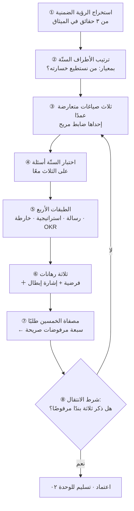
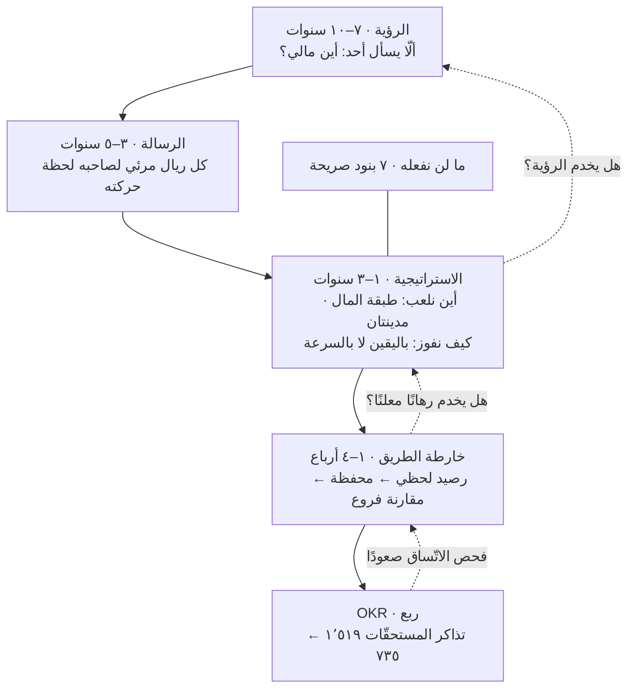
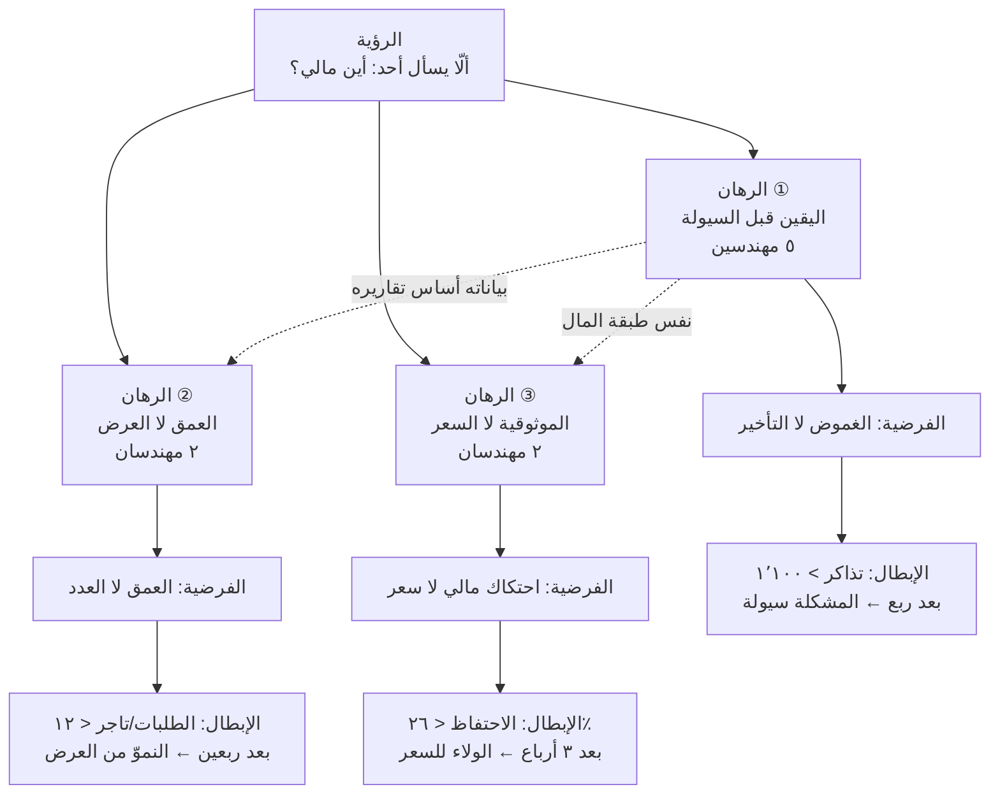
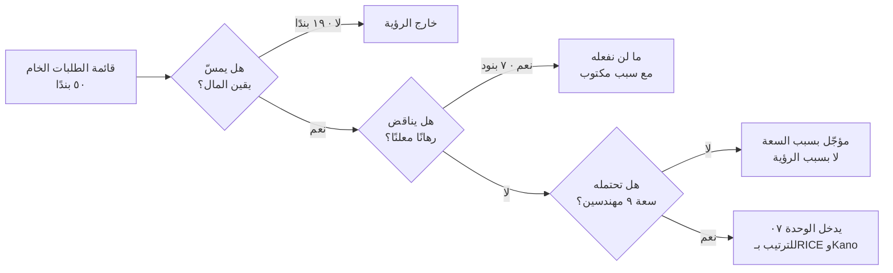
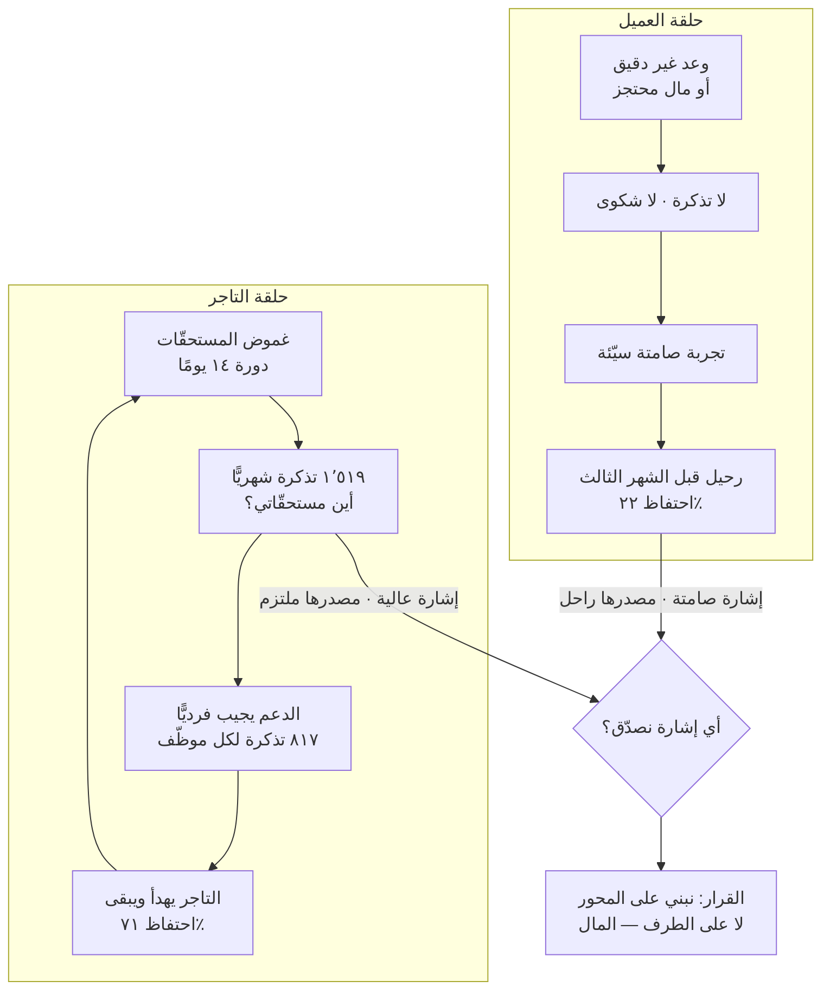

> [!info] الوحدة 01 · ورشة BridgePay
> **المخرَج:** بيان رؤية مصوغ فعليًّا (بعد مقارنة ثلاث صياغات مرشَّحة) · تمييز تطبيقي بين الرؤية والرسالة والاستراتيجية و[[OKR]] وخارطة الطريق على BridgePay نفسه · ثلاثة رهانات استراتيجية بفرضياتها وإشارات إبطالها · قائمة «ما لن نفعله» بسبعة بنود من قائمة الطلبات الخمسين · واختبار رؤية من ستّة أسئلة مطبَّق بنتيجته.
>
> **الفصل المرجعي:** [[10 - دورة حياة المنتج الكاملة]]، المرحلة ① — يشرح **ما هي** الرؤية وكيف تختلف عن الطموح، ويعطي **ثلاثة** أسئلة لاختبارها. هذه الوحدة لا تعيد ذلك الشرح؛ بل **تصوغ** رؤية لمنتج قائم يعاني، وتوسّع الاختبار إلى ستّة أسئلة، وتدفع الثمن.

# الوحدة 01 — رؤية المنتج واستراتيجيته

## ما ورثته من الوحدة السابقة

ورثت من [[00 - ميثاق المشروع ومصدر الحقيقة|الميثاق]] منتجًا عمره **١٤ شهرًا** في **مدينتين**، لا فكرة على ورق. وهذا يغيّر طبيعة العمل جذريًّا: من يكتب رؤية لمنتج لم يُطلق بعدُ يكتب **رهانًا على المستقبل** لا أحد يستطيع تكذيبه اليوم؛ ومن يكتب رؤية لمنتج مطلَق يكتب **حكمًا على الماضي**، لأن كل رقم في الميثاق هو شهادة على ما فعلته الرؤية الضمنية السابقة — تلك التي لم تُكتب لكنها كانت تُنفَّذ.

وهذه هي الأرقام التي أدخل بها الوحدة، مصنَّفة بحسب ما تقوله لي لا بحسب مصدرها:

| الرقم الموروث | القيمة | ماذا يقول لصائغ الرؤية |
|---|---|---|
| احتفاظ التاجر (الشهر السادس) | ٧١٪ | التاجر **يبقى**، فالمنتج يحلّ له شيئًا جوهريًّا |
| احتفاظ العميل (الشهر الثالث) | ٢٢٪ | العميل **يذهب**، فالمنتج لا يملك سببًا للبقاء عنده |
| تذاكر «أين مستحقّاتي؟» | ٣١٪ من ٤٬٩٠٠ شهريًّا | التاجر الباقي **غير راضٍ** — البقاء ليس رضا |
| المطاعم والتجّار المفعَّلون / النشطون | ٤١٠ / ٢٦٣ (٦٤٪) | ثلث العرض ميت، والنموّ في العدد ليس نموًّا في السوق |
| متوسّط الطلبات اليومية × متوسّط القيمة | ٢٬٧٥٠ × ٧٤ ريالًا | حجم يومي معلوم، سنشتقّ منه كل اقتصاديات القرار |
| عمولة المنصّة | ١٢٪ | مصدر الإيراد **الوحيد** المذكور في الميثاق |
| دورة التسوية | ١٤ يومًا | الرقم الذي يقف خلف ٣١٪ من التذاكر |
| السيولة اللازمة لتقصيرها إلى ٧ أيام | ~١٫٩ مليون ريال | القيد الذي يحوّل «الحلّ البديهي» إلى قرار مالي |
| الفريق | ٩ مهندسين · دورة أسبوعان · لا توظيف | السعة التي تجعل «ما لن نفعله» ضرورة لا فضيلة |
| قائمة الطلبات الخام | ٥٠ بندًا غير مرتّبة | مادّة اختبار الرؤية: كم بندًا ترفضه؟ |
| الأطراف | ستّة، ومصالحها متعارضة نصًّا | لا رؤية تُرضي الستّة، فاختر واحصِ الخسارة |

### الاشتقاقات التي بنيتها فوق الميثاق (وكيف)

الميثاق لا يذكر إيرادًا ولا حجم أعمال، لكنه يذكر ما يكفي لاشتقاقهما. وكل رقم مشتقّ في هذه الوحدة معروض بحسابه، ولا يُستعمل أي رقم غير موجود في الميثاق أو غير مشتقّ منه هنا:

| المشتقّ | الحساب | القيمة |
|---|---|---|
| حجم الأعمال اليومي (`GMV`) | ٢٬٧٥٠ طلبًا × ٧٤ ريالًا | ٢٠٣٬٥٠٠ ريال/يوم |
| حجم الأعمال الشهري | ٢٠٣٬٥٠٠ × ٣٠ | ٦٬١٠٥٬٠٠٠ ريال/شهر |
| إيراد العمولة الشهري | ٦٬١٠٥٬٠٠٠ × ١٢٪ | ٧٣٢٬٦٠٠ ريال/شهر |
| إيراد نقطة عمولة واحدة | ٧٣٢٬٦٠٠ ÷ ١٢ | ٦١٬٠٥٠ ريال/شهر (٧٣٢٬٦٠٠ ريال/سنة) |
| عمولة الطلب الواحد | ٧٤ × ١٢٪ | ٨٫٨٨ ريال |
| مستحقّات التجّار اليومية | ٢٠٣٬٥٠٠ × ٨٨٪ | ١٧٩٬٠٨٠ ريال/يوم |
| تذاكر «أين مستحقّاتي؟» شهريًّا | ٤٬٩٠٠ × ٣١٪ | ١٬٥١٩ تذكرة |
| نصيب التاجر النشط من هذه التذاكر | ١٬٥١٩ ÷ ٢٦٣ | ٥٫٨ تذكرة شهريًّا لكل تاجر نشط |
| حِمل موظّف الدعم الواحد | ٤٬٩٠٠ ÷ ٦ | ٨١٧ تذكرة شهريًّا |
| طلبات الدفع عند الاستلام يوميًّا | ٢٬٧٥٠ × ٣٨٪ | ١٬٠٤٥ طلبًا |
| ساعات توفيق التسويات سنويًّا (P5) | ٦ ساعات × ٥٢ أسبوعًا | ٣١٢ ساعة |

> [!example] اشتقاق يستحقّ التوقّف: من أين جاء ١٫٩ مليون؟
> الميثاق يقول إن تقصير التسوية من ١٤ يومًا إلى ٧ يستهلك **~١٫٩ مليون ريال** رأس مال عامل. والحساب المباشر يعطي رقمًا أقلّ: ٧ أيام مؤجَّلة × ١٧٩٬٠٨٠ ريالًا يوميًّا = **١٬٢٥٣٬٥٦٠ ريالًا** فقط.
>
> والفرق (~٦٥٠ ألف ريال، أي ٥٢٪ فوق الحساب المباشر) ليس خطأً في الميثاق بل **احتياطي**: نزاعات، وإلغاءات، واستردادات، وذروة موسمية ترفع الحجم اليومي فوق متوسّطه. وهذا بالضبط ما يفعله المشتغل بالمال: لا يحتجز الرقم النظري بل الرقم النظري زائد وسادة. **أعرض الاشتقاق ولا أعدّل رقم الميثاق** — الميثاق هو [[Single Source of Truth|مصدر الحقيقة]]، وحسابي يفسّره ولا ينسخه.

### ما لم أرثه — وهو الأهمّ

لم أرث **رؤية**. لا جملة معتمدة، ولا وثيقة استراتيجية، ولا قائمة مرفوضات. ومع ذلك فالمنتج يعمل منذ ١٤ شهرًا ويتّخذ قرارات يوميًّا — وهذا يعني أن ثمّة رؤية **ضمنية** كانت تعمل، وأنها قابلة للاستنتاج من آثارها كما يُستنتج مسار جسيم من أثره.

واستنتاجي من الأرقام: الرؤية الضمنية لـBridgePay خلال ١٤ شهرًا كانت **«أن نزيد عدد الطلبات»**. والدليل ثلاثي: عدد المطاعم المفعَّلة (٤١٠) يفوق النشطة (٢٦٣) بنسبة ٥٦٪ — وهذا نمط فريق يقيس التفعيل لا الاستعمال؛ والدفع عند الاستلام ظلّ عند ٣٨٪ لأنه يزيل احتكاك الطلب الأول ولو رفع الرسوم؛ و٣١٪ من التذاكر عن المستحقّات ظلّت ١٤ شهرًا بلا حلّ لأن حلّها لا يزيد عدد الطلبات غدًا.

هذه رؤية ضمنية **متماسكة تمامًا** — وهذا خطرها. فهي ليست غباءً بل **اختيارًا لم يُعلَن**، ولذلك لم يُناقَش، ولذلك لم يُراجَع حين بدأت أرقامه تتناقض. وأول عمل هذه الوحدة أن تُخرج ذلك الاختيار إلى العلن، حيث يمكن الاعتراض عليه.

## السؤال الذي تجيب عنه هذه الوحدة

> [!question] السؤال
> **بأي جملةٍ واحدة نستطيع أن نرفض أربعين طلبًا من الخمسين — دون اجتماع؟**

لاحظ أن السؤال ليس «ما رؤيتنا؟». صياغة السؤال بهذه الطريقة تنتج جملة جميلة يوافق عليها الجميع في اثنتي عشرة دقيقة ولا تغيّر قرارًا واحدًا. أمّا صياغته بـ**قدرة الرفض** فتجعل الجملة أداة، ويصبح لها معيار فشل واضح: رؤية لا تُسقط بندًا من قائمة الخمسين رؤيةٌ فاشلة، مهما كانت بليغة.

وتحت هذا السؤال يقبع سؤال أصعب، هو **التوتّر المركزي** الذي وضعه الميثاق عمدًا:

> **التاجر يشتكي ويبقى (٧١٪ احتفاظ، ٣١٪ من التذاكر)، والعميل لا يشتكي ويذهب (٢٢٪ احتفاظ). فأي رؤية تختار جانبًا؟ ومن يخسر؟**

وأصعب ما في هذا التوتّر أنه **يقلب حدس مدير المنتج**. الحدس يقول: اذهب حيث الألم المعلَن، فالشكوى بيانات. والأرقام تقول: الألم المعلَن يأتي ممّن **قرّر البقاء رغمه**، والصمت يأتي ممّن **قرّر الرحيل**. فالشكوى ليست مؤشّر خطر بل — أحيانًا — **مؤشّر التزام**؛ ومن يشتكي يستثمر وقته في إصلاحك، ومن يرحل لا يكلّف نفسه ذلك. هذا يعيد ترتيب معنى «الاستماع للعميل» بالكامل، وسنعالجه في قسم [[#لماذا؟]] بعد أن نكون قد دفعنا ثمنه في القرار.

## العمل خطوة بخطوة

الزمن الكلّي المقدَّر: **٢١٠ دقائق** موزّعة على ثماني خطوات. وهي مصمّمة لتُنفَّذ بورقة وقلم قبل أي أداة، ولا تحتاج بيانات خارج [[00 - ميثاق المشروع ومصدر الحقيقة|الميثاق]].

**① استخرج الرؤية الضمنية القائمة — ٢٠ دقيقة.**
لا تبدأ بالجملة الجديدة، بل بالجملة العاملة الآن. اكتب على ورقة ثلاثة أعمدة: قرار اتُّخذ في المنتج · ما الذي كان يجب أن يكون صحيحًا ليُتَّخذ · أي جملة تفسّر القرارات كلها معًا. طبّقها على ثلاث حقائق من الميثاق (٤١٠ مفعَّل مقابل ٢٦٣ نشطًا · ٣٨٪ دفعًا عند الاستلام · ١٤ شهرًا دون حلّ المستحقّات). الجملة التي تفسّرها الثلاث هي رؤيتك الضمنية. **مخرَج الخطوة:** جملة واحدة لا تحبّها.

**② رتّب الأطراف الستّة بمعيار «من يمكن أن نخسره؟» — ١٥ دقيقة.**
ليس «من الأهمّ؟» — فهذا سؤال يُجاب عنه بالمجاملة. بل: لو خسرنا هذا الطرف بالكامل خلال ستّة أشهر، هل يبقى المنتج؟ رتّب الستّة من الأصعب استبدالًا إلى الأسهل. **مخرَج الخطوة:** ترتيب مبرَّر بسطر لكل طرف.

**③ اكتب ثلاث صياغات مرشَّحة متعارضة عمدًا — ٣٠ دقيقة.**
شرط الجودة هنا **التعارض**: يجب أن تكون كل صياغة قابلة لأن تُرفض من صاحب الصياغتين الأخريين. إن أمكن تبنّي الثلاث معًا فقد كتبت ثلاث صياغات لجملة واحدة، لا ثلاثة مرشّحين. اجعل واحدة منها هي **الصياغة المريحة** التي لا تستبعد شيئًا، لتستعملها ضابطًا (`control`) في الاختبار.

**④ ابنِ اختبار الستّة أسئلة وطبّقه على الثلاث — ٣٠ دقيقة.**
ثلاثة أسئلة موروثة من [[10 - دورة حياة المنتج الكاملة|الفصل العاشر]] (تصلح لعشر سنوات؟ · تستبعد شيئًا؟ · يقرّر بها مهندس جديد؟) وثلاثة تضيفها هذه الوحدة لأن المنتج **قائم ومتعدّد الأطراف** (تصف حالة إنسان؟ · يعرف الخاسر أنه يخسر؟ · لها شرط إبطال؟). سجّل النتيجة في جدول ✅/⚠️/❌ ولا تكتفِ بالحكم، بل اكتب **الجملة التي تبرّره**.

**⑤ اشتقّ الطبقات الأربع تحت الرؤية — ٢٥ دقيقة.**
لكل طبقة (رسالة · استراتيجية · خارطة · [[OKR]]) اكتب سطرًا واحدًا فقط، ثم افحص الاتّساق **صعودًا**: هل كل `OKR` مشتقّ من بند خارطة؟ وكل بند خارطة من رهان استراتيجي؟ وكل رهان من الرؤية؟ أي طبقة لا تتّصل بما فوقها هي عمل يتيم.

**⑥ حوّل الاستراتيجية إلى ثلاثة رهانات مسعَّرة — ٣٥ دقيقة.**
لكل رهان أربعة حقول إلزامية: أين نلعب · كيف نفوز · الفرضية الضمنية (الجملة التي لو كذبت سقط الرهان) · إشارة الإبطال (رقم من الميثاق مع عتبة وأجل). الرهان بلا إشارة إبطال ليس رهانًا بل أمنية — راجع [[Kill Criteria]].

**⑦ مرّر الخمسين طلبًا على المصفاة واستخرج سبعة مرفوضات صريحة — ٣٠ دقيقة.**
لا ترفض بالحدس. لكل بند مرفوض اكتب: أي رهان يناقضه · وما ثمنه المحسوب · ومن يغضب. وانتبه: يجب أن يكون بين السبعة **بند واحد على الأقلّ يريده من تخدمهم الرؤية** — وإلّا فأنت لم تختر جانبًا بل مدحته.

**⑧ اختبر شرط الانتقال — ٢٥ دقيقة.**
شرط الانتقال المعتمد في الفصل العاشر: أن يذكر ثلاثة أشخاص من فرق مختلفة **بندًا رفضناه بسبب الرؤية**. طبّقه فعليًّا: اعرض الرؤية على مهندس ومصمّم وموظّف دعم، واعطِ كلًّا منهم بندين من قائمة الخمسين متساويين في الجاذبية، واطلب اختيارًا في أقلّ من دقيقة وبلا نقاش. إن تردّد اثنان فالرؤية غير تشغيلية، وارجع إلى الخطوة ③ — لا إلى الخطوة ⑦.



> [!tip] لماذا يعود الفشل إلى ③ لا إلى ⑦؟
> لأن الرؤية التي لا تحسم خيارًا بين بندين لن تُصلَح بإضافة مرفوضات. المرفوضات **نتيجة** الرؤية لا مكوّنها. من يعالج فشل شرط الانتقال بتطويل قائمة «ما لن نفعله» يكون قد صنع قائمة ممنوعات إدارية معلّقة في الهواء، وأول مدير جديد يشطبها لأن لا شيء يسندها.

## المخرَج

هذا هو قلب الوحدة، وهو خمس قطع مترابطة: **بيان الرؤية** (بمرشّحيه الثلاثة ومعايير الاختيار) · **الطبقات الخمس** مطبَّقة على BridgePay · **ثلاثة رهانات استراتيجية** · **قائمة «ما لن نفعله»** · **اختبار الرؤية بستّة أسئلة** ونتيجته المعلَنة.

### القطعة ①: بيان رؤية BridgePay

#### الصياغات المرشَّحة الثلاث

كُتبت الثلاث بحيث **تتعارض**: من يتبنّى إحداها يرفض الأخريين. وهذا شرط الجودة الأول — ثلاث صياغات متوافقة ليست ثلاثة مرشّحين بل ثلاث حالات مزاجية لجملة واحدة.

> [!quote] المرشّح (أ) — محور «اليقين المالي»
> **«ألّا يسأل أحدٌ في هذه السوق: أين مالي؟»**
>
> الصورة بعد سبع سنوات: صاحب مطعم يفتح هاتفه في الحادية عشرة ليلًا فيرى رصيده اللحظي وموعد وصوله بلا اتّصال بأحد؛ ومندوب يعرف أرباح يومه قبل أن يغلق الطلب الأخير؛ ومحاسبة المنصّة لا تفتح `Excel`؛ وعميلٌ أُلغي طلبه فرأى المبلغ عائدًا قبل أن يفكّر في الاتّصال.

> [!quote] المرشّح (ب) — محور «الوعد المحفوظ»
> **«ألّا يخيب وعدٌ قُطع في هذه المنصّة.»**
>
> الصورة بعد سبع سنوات: الوقت المعلَن هو وقت الوصول الفعلي؛ والصنف المعروض متاح؛ والسعر المعروض هو المدفوع؛ والطلب المقبول لا يُلغى. المنصّة تصير مرادفًا للدقّة في سوق اعتاد التقريب.

> [!quote] المرشّح (ج) — محور «التمكين الشامل» (الضابط)
> **«أن نجعل الطلب والتوصيل والدفع أسهل للجميع.»**
>
> الصورة بعد سبع سنوات: … كل شيء أفضل قليلًا للجميع.

المرشّح (ج) موضوع هنا **عمدًا** بوصفه ضابطًا (`control`). وهو الصياغة التي تُعتمد فعليًّا في أغلب الشركات، لأنها الوحيدة التي لا يعترض عليها أحد في الاجتماع. وسنتركه يخوض الاختبار كاملًا ليظهر فشله بالأرقام لا بالذوق.

#### المعايير المعلَنة للاختيار

قبل النتيجة، تُعلَن المعايير — لأن إعلان المعيار **بعد** رؤية النتيجة هو أشهر طرق خداع النفس في اتّخاذ القرار، وسيتكرّر التحذير منه في وحدة القياس. المعايير ستّة، ثلاثة موروثة من [[10 - دورة حياة المنتج الكاملة|الفصل العاشر]] وثلاثة أضافتها هذه الوحدة لأن BridgePay **قائم** و**متعدّد الأطراف**:

| # | المعيار | السؤال الحاسم | مصدره |
|---|---|---|---|
| ١ | العمر | هل تصلح لعشر سنوات؟ هل تنجو من موت أي تقنية؟ | الفصل ١٠ |
| ٢ | الاستبعاد | ماذا تمنع؟ كم بندًا من الخمسين تُسقط؟ | الفصل ١٠ |
| ٣ | التشغيلية | هل يحسم بها مهندس جديد خيارًا في أقلّ من دقيقة؟ | الفصل ١٠ |
| ٤ | الإنسانية | هل تصف حالة إنسان أم موقع شركة؟ | إضافة الوحدة |
| ٥ | صراحة الخسارة | هل يستطيع الخاسر أن يعرف أنه يخسر ولماذا؟ | إضافة الوحدة |
| ٦ | القابلية للإبطال | ما الحدث الذي يجبرنا على إعادة كتابتها؟ | إضافة الوحدة |

المعايير الثلاثة المضافة ليست ترفًا؛ كلٌّ منها يعالج عطلًا تفرضه طبيعة هذا المشروع تحديدًا:

**المعيار ٤ (الإنسانية)** لأن المنصّات متعدّدة الأطراف تنزلق تلقائيًّا إلى لغة النظام: «تحسين كفاءة التسوية»، «رفع معدّل الالتقاط». هذه أوصاف لآلة، ولا أحد يستيقظ متحمّسًا لها، ولا تُشتقّ منها قرارات تصميم.

**المعيار ٥ (صراحة الخسارة)** لأن الميثاق نصّ على أنه **لا يوجد قرار يُرضي الستّة**. فالرؤية التي لا يُعرف خاسرها تكذب على أحد الأطراف بالصمت، والصمت هنا ليس حيادًا بل تأجيلٌ للصدام إلى لحظة يكون فيها أغلى.

**المعيار ٦ (القابلية للإبطال)** لأن المنتج عمره ١٤ شهرًا ويعاني. رؤية غير قابلة للإبطال في هذا السياق تعني أننا نعِد بألّا نتعلّم شيئًا من الأشهر الأربعة والعشرين القادمة. وهذا معيار مستعار من منهج [[Kill Criteria|معايير الإيقاف]] ومطبَّق على مستوى أعلى ممّا يُطبَّق عليه عادةً.

#### نتيجة الاختبار على المرشّحين الثلاثة

| المعيار | (أ) اليقين المالي | (ب) الوعد المحفوظ | (ج) التمكين الشامل |
|---|---|---|---|
| ① العمر (١٠ سنوات) | ✅ «أين مالي؟» سؤال عمره أقدم من التطبيقات | ✅ الوعد حاجة معمّرة | ✅ لكن بلا معنى: يصلح لألف سنة ولأي منتج |
| ② الاستبعاد | ✅ يُسقط ١٩ بندًا من الخمسين | ⚠️ يُسقط ١١ بندًا | ❌ لا يُسقط بندًا واحدًا |
| ③ التشغيلية | ✅ حسم فوري: «أيّهما يقلّل سؤال المال؟» | ⚠️ حسم ممكن لكن «الوعد» يشمل كل شيء تقريبًا | ❌ يستدعي اجتماعًا |
| ④ الإنسانية | ✅ حالة إنسان: القلق على المال | ✅ حالة إنسان: خيبة الانتظار | ⚠️ حالة لا أحد |
| ⑤ صراحة الخسارة | ✅ الخاسر معلوم ومسمّى (لاحقًا) | ⚠️ الخاسر غامض: من يخسر بالدقّة؟ | ❌ يوحي بأن لا خاسر |
| ⑥ القابلية للإبطال | ✅ شرط إبطال رقمي محدَّد | ⚠️ يمكن صياغته بصعوبة | ❌ لا يمكن إبطاله لأنه لا يدّعي شيئًا |

**التوثيق العددي للمعيار ②** — لأن «يُسقط ١٩ بندًا» ادّعاء لا رأي، وسنبرهنه في [[#القطعة ④ قائمة «ما لن نفعله»|القطعة الرابعة]]. الحساب: من قائمة الطلبات الخمسين، يُسقط المرشّح (أ) كل بند لا يمسّ **يقين المال ولا الوعد الناتج عنه**: تسعة من أصل اثني عشر طلبًا للعملاء (يبقى: الاسترداد الفوري، موعد الوصول الدقيق، التتبّع المباشر)، وأربعة من تسعة للإدارة والتسويق، وثلاثة من ستّة عشر للتجّار، وثلاثة من سبعة للمندوبين. المجموع ١٩. أمّا المرشّح (ب) فيُبقي على الطلبات المرتبطة بالدقّة كلها من الأطراف الأربعة ويُسقط ١١ فقط. وأمّا (ج) فكل بند من الخمسين يخدم «الأسهل للجميع» بلا استثناء — وهذه ليست ميزةً بل تشخيصٌ للفشل.

#### القرار: الرؤية المعتمدة

> [!success] رؤية BridgePay المعتمدة
> # **ألّا يسأل أحدٌ في هذه السوق: أين مالي؟**
>
> **الأفق:** ٧–١٠ سنوات · **المالك:** قيادة المنتج · **آخر مراجعة:** الوحدة ٠١ · **شرط إعادة الكتابة:** مذكور في المعيار ⑥ أدناه.

**ولماذا (أ) لا (ب)؟** لأن كليهما اجتاز معياري العمر والإنسانية، فالفصل جرى على المعايير الأربعة الباقية:

**أولًا — قوّة الاستبعاد.** ١٩ بندًا مقابل ١١. و«الوعد» مفهوم مطّاط بطبعه: كل ميزة في المنتج يمكن تقديمها بوصفها وعدًا (وعدنا بتوصيل أسرع، وعدنا بتنوّع أكبر، وعدنا بسعر أفضل). المفهوم الذي يستوعب كل شيء لا يرفض شيئًا. أمّا «أين مالي؟» فسؤال ضيّق **لا يمكن توسيعه بالحيلة اللفظية**؛ ومن أراد أن يمرّر عبره «نقاط الولاء» فسيُضطرّ إلى ادّعاء أن نقاط الولاء تجيب عن سؤال «أين مالي؟» — وهو ادّعاء يفضح نفسه في الجملة.

**ثانيًا — الاتّساق مع الأرقام الموروثة.** الرؤية ليست حرّة تمامًا؛ هي **مقيَّدة بما يقوله المنتج القائم عن نفسه**. و٣١٪ من ٤٬٩٠٠ تذكرة، أي ١٬٥١٩ تذكرة شهريًّا، تقول جملة واحدة حرفيًّا: **أين مستحقّاتي؟** ليست هذه رؤية اختُرعت في غرفة، بل رؤية **كان العملاء يكتبونها ١٬٥١٩ مرّة في الشهر** ولم يقرأها أحد بوصفها رؤية. واعتماد (أ) هو ترقية أعلى إشارة في النظام من مرتبة «شكوى تُعالَج» إلى مرتبة «محور يُبنى عليه».

**ثالثًا — قابلية الحسم.** جرّب على خيارين متساويين تقنيًّا من قائمة الخمسين: «تنبيه عند التحويل» مقابل «تقييم المندوب». تحت (أ) الحسم لحظي. تحت (ب) يمكن الدفاع عن الاثنين (التقييم يحمي الوعد!). وتحت (ج) لا معنى للسؤال أصلًا.

**رابعًا — الرؤية تعبر الأطراف بدل أن تحابي طرفًا.** وهذه ألطف نقاط (أ) وأكثرها إساءةً للفهم: تبدو رؤية «للتاجر»، وليست كذلك. سؤال «أين مالي؟» يطرحه **أربعة** من الأطراف الستّة بصيغ مختلفة، ولكلٍّ منهم بند صريح في قائمة الخمسين يثبت ذلك:

| الطرف | صيغته للسؤال | البند المقابل في قائمة الخمسين |
|---|---|---|
| **P1** صاحب المطعم | «كم لي عندكم الآن؟» | شاشة رصيد لحظي · تنبيه عند التحويل · كشف حساب `PDF` |
| **P2** مديرة ٦ فروع | «أي فرع يربح ولماذا؟» | تقرير الأصناف · إدارة الفروع · تقرير الملغاة وأسبابها |
| **P4** المندوب | «كم سأربح من هذا الطلب؟» | رؤية قيمة الطلب قبل القبول · تقرير أرباح أسبوعي · صرف يومي |
| **العميل** | «أين المبلغ الذي دُفع ولم أستلم مقابله؟» | استرداد فوري عند الإلغاء |
| **P5** محاسب المنصّة | «هل الأرقام متطابقة؟» | لوحة توفيق تسويات |

فالرؤية لا تختار **طرفًا**، بل تختار **محورًا** يمرّ عبر أربعة أطراف — وهذا فرق جوهري في المنصّات متعدّدة الأطراف. الرؤية التي تختار طرفًا تصنع منتجًا نصفه ميت؛ والرؤية التي تختار محورًا تصنع منتجًا **ضيّقًا وكاملًا**. لكن هذا لا يعني أن لا خاسر — الخاسر موجود وسنسمّيه بالاسم والرقم في [[#القرار وما ضحّينا به|قسم القرار]].

#### ما تعنيه الرؤية عمليًّا — وما لا تعنيه

> [!warning] ثلاث قراءات خاطئة محتملة لهذه الجملة
> **«أين مالي؟» ≠ «مالي أسرع».** الرؤية لا تعِد بتقصير التسوية، بل بإزالة **السؤال**. والفرق بينهما ١٫٩ مليون ريال (قيد السيولة رقم ٢ في الميثاق). من يقرأ الرؤية على أنها وعدٌ بالسرعة يكون قد حوّل جملةً منتجية إلى التزام مالي لا نملكه.
>
> **«أين مالي؟» ≠ «تقارير أكثر».** التقرير الذي يُطلب هو دليل على غياب اليقين لا على وجوده. والغاية أن يَعرف الطرف رصيده **دون أن يطلب**، وهذا يقلب اتّجاه المعلومة من «سحب» (`pull`) إلى «دفع» (`push`) — وهو قرار معماري تشتقّه الوحدة ٠٨ من هذه الجملة بالذات.
>
> **«أين مالي؟» ≠ «للتاجر فقط».** أثبتنا أعلاه أن أربعة أطراف تطرحه. والوحدة ٠٥ ستبني خريطة رحلة **مالية** موازية لرحلة الطلب، وهي رحلة لا يراها أحد اليوم لأنها لم تكن موضوعًا لأحد.

#### وثيقة بيان الرؤية — النصّ المعتمد للتداول

هذه هي الصفحة التي تُعلَّق وتُرسَل وتُقتبس في كل اجتماع لاحق. وهي مكتوبة لتُقرأ في تسعين ثانية، لأن الوثيقة التي تحتاج شرحًا شفويًّا لن تُستعمل حين لا تكون في الغرفة.

> [!abstract] بيان رؤية BridgePay · الإصدار ١٫٠ · مالكه: قيادة المنتج
> **الرؤية:** ألّا يسأل أحدٌ في هذه السوق: **أين مالي؟**
>
> **لماذا هذه الجملة؟** لأن أكثر ما يُقال لنا اليوم هو هذا السؤال حرفيًّا: **١٬٥١٩ مرّة في الشهر** (٣١٪ من ٤٬٩٠٠ تذكرة). لم نخترع الرؤية؛ قرأناها.
>
> **ما الذي سيكون قد تغيّر بعد سبع سنوات لو نجحنا؟**
> — صاحب مطعم لا يفتح `Excel` ولا يتّصل بالدعم ليعرف كم له، ولا يتفاجأ بمبلغ التحويل.
> — مديرة سلسلة تعرف أي فرع يربح دون أن تجمع ستّة تقارير بيدها.
> — مندوب يعرف ربح الطلب قبل أن يقبله لا بعد أن يوصّله.
> — عميل أُلغي طلبه يرى ماله عائدًا **قبل** أن يفكّر في السؤال عنه.
> — محاسبة المنصّة لا تنفق **٣١٢ ساعة في السنة** على توفيق يدوي.
>
> **ما الذي تمنعه هذه الرؤية؟** كل ما لا يزيد يقين أحدٍ بماله: الإعلانات، ونقاط الولاء، والمنافسة السعرية، والتوسّع الجغرافي قبل إصلاح التسريب، وكل طبقة ذكاء اصطناعي تجعل السؤال أسهل بدل أن تُلغيه. **١٩ بندًا من ٥٠ خارج النطاق، و٧ مرفوضة صراحةً.**
>
> **ما الذي لا تعِد به؟** لا تعِد بمال **أسرع**. دورة التسوية تبقى ١٤ يومًا حتى إشعار مالي آخر. نعِد بمال **معلوم**، وهذان وعدان مختلفان، وثمن الخلط بينهما ١٫٩ مليون ريال.
>
> **من يخسر؟** المندوب يؤجَّل هذا الربع. والعميل الباحث عن السعر لن نلاحقه بالخصومات. والتوسّع يتأخّر. الأرقام كاملةً في جدول الخسارة.
>
> **متى نعيد كتابتها؟** إن بطلت الرهانات الثلاثة معًا، أو إن صار يقين المال إلزامًا تنظيميًّا يملكه كل منافس.

> [!tip] لماذا يحتوي البيان على فقرة «ما الذي لا تعِد به»؟
> لأن أخطر ما يحدث للرؤية الجيّدة ليس رفضها، بل **تبنّيها بالمعنى الخاطئ**. جملة «ألّا يسأل أحد: أين مالي؟» ستصل إلى فريق المبيعات، فيقولها لتاجر، فيسمع التاجر «سيصلني مالي أسرع» — ونكون قد أنشأنا التزامًا بـ١٫٩ مليون ريال عن طريق البلاغة. فقرة النفي الصريح ليست تواضعًا، بل **إدارة مخاطر لغوية**: هي تسدّ الباب الذي سيدخل منه سوء الفهم الأكثر احتمالًا. وأي رؤية قابلة لأن تُفهَم بطريقتين مكلفتين تحتاج هذه الفقرة.

### القطعة ②: الطبقات الخمس مطبَّقة على BridgePay

الفصل العاشر يعطي [[10 - دورة حياة المنتج الكاملة|الجدول الفاصل]] بين الخمسة نظريًّا. وهذه الوحدة تفعل ما لا يفعله الفصل: **تملأ الخمسة على منتج واحد بأرقامه**، ثم — وهو الأهمّ — تختبر التماسك بين الطبقات صعودًا ونزولًا.

| الطبقة | النصّ المعتمد لـBridgePay | الأفق | المالك | ما الذي ينكسر إن غابت؟ |
|---|---|---|---|---|
| **`Vision`** الرؤية | «ألّا يسأل أحدٌ في هذه السوق: أين مالي؟» | ٧–١٠ سنوات | قيادة المنتج | تصير الأولويات تابعة لأعلى صوت |
| **`Mission`** الرسالة | «نجعل كل ريال يمرّ عبر المنصّة **مرئيًّا لصاحبه لحظةَ حركته**، ونسوّيه في موعد لا يتغيّر.» | ٣–٥ سنوات | القيادة | تبقى الرؤية شعارًا بلا دور محدَّد لنا نحن |
| **`Strategy`** الاستراتيجية | «نلعب في **طبقة المال** داخل المدينتين الحاليتين، ونفوز بـ**اليقين** لا بالسرعة ولا بالسعر — ولا ندخل مدينة ثالثة قبل أن يتجاوز احتفاظ العميل ٣٥٪.» | ١–٣ سنوات | قيادة المنتج | تتحوّل الخارطة إلى قائمة رغبات مرتّبة بالنفوذ |
| **[[15 - Roadmap\|Roadmap]]** خارطة الطريق | «الربع الحالي: الرصيد اللحظي · تنبيه التحويل · كشف الحساب. التالي: المحفظة والسحب. لاحقًا: مقارنة الفروع.» | ١–٤ أرباع | مدير المنتج | يفقد الفريق التتابع فيبني قطعًا لا تتراكم |
| **[[OKR]]** الأهداف والنتائج | «الهدف: يعرف التاجر رصيده دون أن يسأل. ن١: خفض تذاكر «أين مستحقّاتي؟» من ١٬٥١٩ إلى ٧٣٥ شهريًّا. ن٢: ٧٠٪ من التجّار النشطين يفتحون شاشة الرصيد ٤ مرّات شهريًّا أو أكثر. ن٣: صفر تعديل يدوي في تسوية واحدة.» | ربع | الفريق | نعرف أننا نعمل ولا نعرف أننا نتقدّم |

**من أين جاء رقم ٧٣٥؟** من ١٬٥١٩ × (١٥٪ ÷ ٣١٪) = ٧٣٥ تذكرة، أي خفض حصّة هذه الفئة من ٣١٪ إلى ١٥٪ من إجمالي ٤٬٩٠٠ تذكرة. وأثره التشغيلي محسوب: ٧٨٤ تذكرة أقلّ شهريًّا ÷ ٨١٧ تذكرة (حِمل موظّف الدعم الواحد) = **٠٫٩٦ موظّف دعم متفرّغ**. أي أن الهدف الربعي يعادل تحرير موظّف دعم كامل تقريبًا من أصل ستّة — دون توظيف يمنعه القيد الخامس، ودون أن يكلّف ريالًا من السيولة.

**ولماذا ١٥٪ لا صفر؟** لأن جزءًا من التذاكر سيبقى مشروعًا (نزاعات فعلية، تسويات معلّقة بسبب طرف ثالث). والهدف الذي يفترض الكمال يُضطرّ الفريق إمّا إلى الفشل المعلَن أو إلى العبث بالتعريف — وكلاهما أسوأ من هدف متواضع صادق.



> [!note] الطبقة التي تسقط أولًا
> في التطبيق العملي على BridgePay، أضعف الطبقات هي **الرسالة**، لأنها تبدو تكرارًا للرؤية بلغة أطول. والفرق الحاسم أن الرؤية تصف **حالة العالم** («ألّا يسأل أحد»)، والرسالة تصف **دورنا نحن فيها** («نجعل كل ريال مرئيًّا لصاحبه… ونسوّيه في موعد لا يتغيّر»). ولاحظ ما تفعله الرسالة هنا تحديدًا: كلمة **«موعد لا يتغيّر»** لا **«موعد أقرب»** — وهذه أربع كلمات تحسم، مبكرًا وبلا اجتماع، أن التسوية الأسبوعية ليست وعدنا. الرسالة الجيّدة تحمل قرارًا مهرَّبًا داخلها.
>
> والطبقة الغائبة عمومًا — كما يحذّر الفصل العاشر — هي **الاستراتيجية**، والعلامة التشخيصية أنك تستطيع إضافة أي بند إلى الخارطة دون أن يتعارض مع مكتوب. اختبرها الآن: أضِف «إعلانات داخل التطبيق» إلى خارطة BridgePay. هل تتعارض؟ نعم — مع «نفوز باليقين» ومع البند ⑤ في قائمة المرفوضات. فالاستراتيجية هنا **موجودة**.

### القطعة ③: الرهانات الاستراتيجية الثلاثة

الاستراتيجية جملة، والرهانات هي **تفكيكها إلى مقامرات قابلة للتسعير والخسارة**. وكل رهان هنا مكتوب بستّة حقول: أين نلعب · كيف نفوز · الفرضية الضمنية · ما يجب أن يصحّ ليفوز · إشارة الإبطال · حصّته من السعة. والحقلان الأخيران هما ما يميّز الرهان عن الأمنية: **رقم يوقفه، وسعة يستهلكها**.

وتوزيع السعة إجباري لأن القيد الأول في الميثاق يحسمه: **٩ مهندسين، لا توظيف**. وأي رهان لا يُخصَّص له مهندسون هو رهان لم يُتَّخذ.

#### الرهان ①: اليقين قبل السيولة

| الحقل | المحتوى |
|---|---|
| **أين نلعب** (`Where to play`) | طبقة المستحقّات لدى **٢٦٣ تاجرًا نشطًا** في المدينتين الحاليتين — لا في طبقة الطلب ولا في طبقة التوصيل. |
| **كيف نفوز** (`How to win`) | بإزالة **السؤال** لا بتقصير **الدورة**: رصيد لحظي · تنبيه استباقي عند كل حركة · كشف حساب يطابق التحويل ريالًا بريال. تبقى الدورة ١٤ يومًا كما هي. |
| **الفرضية الضمنية** | أن **معظم** الـ١٬٥١٩ تذكرة الشهرية سببها **الغموض** لا **التأخير**؛ أي أن التاجر يحتمل الانتظار ١٤ يومًا ولا يحتمل ألّا يعرف ماذا ينتظر ومتى. |
| **ما يجب أن يصحّ ليفوز** | ① أن يتوقّف التاجر عن السؤال حين يعرف المبلغ والموعد، مع بقاء الدورة ١٤ يومًا. ② أن تكون بيانات التسوية **دقيقة** فعليًّا — فشاشة رصيد خاطئة أسوأ من غياب الشاشة، لأنها تحوّل الغموض إلى اتّهام. ③ ألّا يستهلك بناؤها أكثر من نصف السعة الهندسية. |
| **إشارة الإبطال** | بعد **ربع كامل** من إطلاق الشاشة والتنبيه لكامل الـ٢٦٣: إن بقيت تذاكر «أين مستحقّاتي؟» فوق **١٬١٠٠ شهريًّا** (أي خفض أقلّ من ٢٨٪ عن ١٬٥١٩)، فالفرضية كاذبة والمشكلة سيولة لا شفافية → يُغلق الرهان ويُرفع ملفّ الـ١٫٩ مليون إلى الإدارة التنفيذية بوصفه **قرارًا ماليًّا** لا منتجيًّا. |
| **حصّة السعة** | **٥ مهندسين من ٩** طوال ثلاث دورات (٦ أسابيع). |

> [!note] لماذا عتبة ٢٨٪ تحديدًا؟
> لأنها الحدّ الذي يفصل بين تفسيرين. الخفض الطفيف (أقلّ من ٢٨٪) يمكن أن ينتج عن أثر الجدّة وحده — التاجر يفتح الشاشة لأنها جديدة ثم يعود لعادته. والهدف الربعي المعلَن في الـ[[OKR]] أطمح (خفض ٥٢٪ إلى ٧٣٥ تذكرة)، لكن **عتبة الإبطال ليست الهدف**: الهدف يقيس الطموح، والعتبة تقيس **صدق الفرضية**. الخلط بينهما يجعل الفريق يُغلق رهانًا صحيحًا لمجرّد أنه لم يبلغ طموحه — وهذا أشيع أخطاء [[Kill Criteria|معايير الإيقاف]].

#### الرهان ②: العمق لا العرض

| الحقل | المحتوى |
|---|---|
| **أين نلعب** | داخل التجّار القائمين: **P2** (سلاسل الفروع) و**التاجر غير المطعمي** — لا في تفعيل تجّار جدد ولا في مدينة ثالثة. |
| **كيف نفوز** | بأن نمنح التاجر **ما يصنعه اليوم يدويًّا**: الميثاق ينصّ على أن التاجر غير المطعمي **يصدّر بياناته إلى `Excel` أسبوعيًّا**، وأن P2 **تحتاج مقارنة الفروع لا رقمًا واحدًا**. فنحن لا نخترع حاجة بل نأخذ عملًا يدويًّا معروفًا ونلغيه. |
| **الفرضية الضمنية** | أن قيمة المنصّة تنمو بـ**عمق** استعمال التاجر لا بـ**عدد** التجّار؛ وأن الفجوة بين ٤١٠ مفعَّلًا و٢٦٣ نشطًا (١٤٧ تاجرًا خاملًا، ٣٦٪) هي دليل على أن التفعيل ليس المشكلة. |
| **ما يجب أن يصحّ ليفوز** | ① أن يرتفع متوسّط الطلبات لكل تاجر نشط: ٢٬٧٥٠ ÷ ٢٦٣ = **١٠٫٥ طلب يوميًّا** اليوم. ② أن يظلّ عدد التجّار النشطين ثابتًا أو يرتفع — فارتفاع المتوسّط بسبب خروج الضعفاء ليس فوزًا بل **مغالطة إحصائية** (راجع [[Simpson's Paradox]]). ③ أن يكون تقرير المقارنة قابلًا للبناء فوق بيانات التسوية نفسها التي يبنيها الرهان ①. |
| **إشارة الإبطال** | بعد **ربعين**: إن لم يرتفع متوسّط الطلبات لكل تاجر نشط من ١٠٫٥ إلى **١٢ طلبًا يوميًّا** (+١٤٪) مع ثبات عدد النشطين عند ٢٦٣ فأكثر، فالفرضية كاذبة: العمق لا يشتري نموًّا، والنموّ في هذه السوق يأتي من العرض → يُعاد فتح ملفّ التوسّع. |
| **حصّة السعة** | **٢ من ٩** — ويبدآن **بعد** الدورة الثانية من الرهان ①، لأن تقاريرهما تقف على بياناته. |

**من أين جاء ١٠٫٥؟** من قسمة معطيَين في الميثاق: ٢٬٧٥٠ طلبًا يوميًّا ÷ ٢٦٣ تاجرًا نشطًا. والرقم ليس في الميثاق نصًّا لكنه مشتقّ منه بالقسمة، ولا يضيف افتراضًا جديدًا. وهو مقياس مركزي لأنه **الرقم الوحيد الذي يفرّق بين نموّ حقيقي ونموّ بالإضافة**.

#### الرهان ③: العميل يُكسب بالموثوقية لا بالسعر

| الحقل | المحتوى |
|---|---|
| **أين نلعب** | العميل **المتكرّر** داخل المدينتين (شخصية **P3**: ٩ طلبات شهريًّا) — لا العميل الجديد، ولا العميل المستقطَب بخصم. |
| **كيف نفوز** | بالجانب **المالي** من تجربته لا بسعرها: استرداد فوري عند الإلغاء · موعد وصول دقيق · شفافية ما دُفع ومتى. أي أننا ندخل تجربة العميل من نفس باب الرؤية: «أين مالي؟». |
| **الفرضية الضمنية** | أن جزءًا معتبرًا من هجرة العميل (٧٨٪ يذهبون قبل الشهر الثالث) سببه **احتكاك مالي غير معلَن** — لا السعر وحده. والقرينة في الميثاق: **٣٨٪ دفعًا عند الاستلام**، ووجود «الاسترداد الفوري عند الإلغاء» في قائمة طلبات العملاء، وغياب أي شكوى مسجَّلة (٣١٪ من التذاكر للمستحقّات، لا لسعر التوصيل). |
| **ما يجب أن يصحّ ليفوز** | ① أن يكون العميل الراحل **صامتًا لا راضيًا** — أي أن غياب الشكوى ليس دليل رضا. ② أن تكون تكلفة الموثوقية أقلّ من تكلفة الخصم المستمرّ. ③ ألّا نحتاج ميزانية تسويقية لا نملك التصرّف فيها. |
| **إشارة الإبطال** | بعد **ثلاثة أرباع**: إن لم يتحرّك احتفاظ الشهر الثالث من **٢٢٪ إلى ٢٦٪** على الأقلّ، نعترف بأن قراءة الميثاق لشخصية **P3** («ولاؤه للسعر لا للمنصّة») هي القراءة الصحيحة، ونتوقّف عن الاستثمار في احتفاظ العميل المباشر، وننتقل إلى نموذج **الطلب المقود من التاجر**. |
| **حصّة السعة** | **٢ من ٩** — وهي حصّة صغيرة عمدًا: رهان استكشافي لا رهان بناء. |

> [!warning] الرهان ③ يراهن ضدّ ظاهر الميثاق — وهذا مقصود
> الميثاق يقول عن **P3** حرفيًّا: «ولاؤه للسعر لا للمنصّة»، ويقول عن سلوك العميل: «يقارن الأسعار عبر ثلاثة تطبيقات قبل الطلب». وهذا **دليل ضدّ** الرهان ③، ويجب أن يُعلَن لا أن يُخفى.
>
> ولماذا نراهن رغمه؟ لأن الملاحظة تصف **سلوك الاختيار** لا **سبب البقاء**، وهما مختلفان: المقارنة السعرية تفسّر كيف يختار العميل الطلبة **الأولى**، ولا تفسّر لماذا لا تصله الطلبة **العاشرة**. ولأن حصّة السعة صغيرة (٢ من ٩) وإشارة الإبطال قريبة (٣ أرباع) وتكلفة الخطأ محتملة. هذا هو معنى **تسعير الرهان**: لا نراهن بحجم قناعتنا، بل بحجم ما نحتمل خسارته إن كنّا مخطئين.
>
> والقاعدة العامّة المستفادة: **الرهان الذي يعارضه دليل في يدك يستحقّ سعة أصغر وإشارة إبطال أقرب — لا الإلغاء.** إلغاؤه يعني أنك لن تتعلّم شيئًا عن أهمّ مشكلة عندك (٧٨٪ تسرّبًا)، وتوسيعه يعني المقامرة ضدّ دليل. والحلّ بينهما: راهن صغيرًا، واقرأ النتيجة مبكرًا.

**قراءة مضادّة يجب أن تُسمع:** يمكن لعضو في الفريق أن يقول بحقّ إن ترتيب الرهانات مقلوب — فالمنصّة تموت من نقص الطلب لا من بطء التسوية، والرهان ③ يستحقّ الخمسة مهندسين. وهذه حجّة قوية، وردّها ليس أنها خاطئة بل أنها **غير قابلة للتنفيذ اليوم**: نحن لا نعرف بعدُ **لماذا** يرحل العميل (لا مقابلات، لا أنماط، لا شخصيات مبنية — كلها مخرَجات الوحدات ٠٣ و٠٤ و٠٥). فتخصيص خمسة مهندسين لرهانٍ لا نملك تشخيصه هو إنفاق سعة على تخمين. أمّا الرهان ① فتشخيصه في يدنا مكتوبًا ١٬٥١٩ مرّة شهريًّا. **نبدأ حيث الدليل، لا حيث الألم الأكبر** — على أن نعود إلى الألم الأكبر مسلَّحين بالتشخيص بعد ثلاث وحدات. وهذا الترتيب نفسه هو ما يجعل الورشة تتراكم بدل أن تتقافز.



> [!tip] لماذا رُبطت الرهانات الثلاثة ببعضها؟
> لأن ثلاثة رهانات مستقلّة تمامًا ليست استراتيجية بل **ثلاث مبادرات متزامنة**. والاستراتيجية الجيّدة — كما يعرّفها رملت في `Good Strategy / Bad Strategy` — أفعال **متماسكة** يقوّي بعضها بعضًا. وهنا التماسك مادّي لا بلاغي: الرهان ② يقرأ من بيانات التسوية التي يبنيها ①، والرهان ③ يستعمل نفس محرّك حركة الأموال في الاسترداد الفوري. فلو أُلغي ① لسقط ② و③ معه — وهذا يفسّر تخصيص ٥ مهندسين له لا ٣.

### القطعة ④: قائمة «ما لن نفعله»

سبعة بنود **مأخوذة حرفيًّا من قائمة الطلبات الخمسين** في الميثاق. وشرط الجودة الذي التزمناه: **ثلاثة من السبعة يطلبها التاجر نفسه** — أي الطرف الذي تخدمه الرؤية. من يرفض فقط ما يطلبه غيره لم يختر جانبًا بل مدح جانبًا. راجع [[Non-Goals|أهداف مستبعَدة]].

| # | البند المرفوض | مَن طلبه | الرهان/الرؤية الذي يناقضه | الثمن المحسوب لرفضه — أو لقبوله | شرط إعادة النظر |
|---|---|---|---|---|---|
| ١ | **تخفيض العمولة** | المطاعم والتجّار | الاستراتيجية: «نفوز باليقين لا بالسعر» | قبوله يكلّف **٦١٬٠٥٠ ريالًا شهريًّا لكل نقطة** (٧٣٢٬٦٠٠ سنويًّا) — من مصدر الإيراد الوحيد | لا يُعاد النظر إلّا بتغيير نموذج الإيراد نفسه (رسوم اشتراك بديلة) |
| ٢ | **التسوية الأسبوعية** | المطاعم والتجّار | الرهان ①: نزيل السؤال لا نقصّر الدورة | قبوله يحتجز **~١٫٩ مليون ريال** (القيد ٢) — وهو قرار مالي خارج صلاحية المنتج | إن أُبطل الرهان ① (تذاكر > ١٬١٠٠ بعد ربع) يُرفع الملفّ تنفيذيًّا فورًا |
| ٣ | **التوسّع لمدينة ثالثة** | الإدارة والتسويق | الاستراتيجية: «لا مدينة ثالثة قبل احتفاظ ٣٥٪» | التوسّع باحتفاظ ٢٢٪ يضاعف تسريب الدلو المثقوب، ويستهلك سعة ٩ مهندسين المقيَّدة | ارتفاع احتفاظ الشهر الثالث إلى ٣٥٪ فأكثر |
| ٤ | **نقاط الولاء واشتراك التوصيل المجاني** | العملاء | الرهان ③: نكسب بالموثوقية لا بالسعر | قبولهما اعتراف ضمني بأن ولاء العميل للسعر — فيهزم الرهان ③ قبل اختباره | إبطال الرهان ③ بعد ٣ أرباع (احتفاظ < ٢٦٪) |
| ٥ | **الإعلانات داخل التطبيق** | الإدارة والتسويق | الرؤية: وضوح المال. الإعلان يجعل ترتيب المطاعم مدفوعًا لا صادقًا | إيراد إضافي مجهول مقابل إضعاف الثقة التي يقوم عليها الرهان ③ كلّه | لا يُعاد النظر ما دامت الرؤية قائمة |
| ٦ | **تقسيم الدفع بين أكثر من بطاقة** | العملاء | الرؤية: كل ريال مرئي لصاحبه | يضاعف تعقيد التسوية والاسترداد ويزيد غموض المال — راجع [[Split Payment]] | انخفاض الدفع عند الاستلام دون ٢٠٪ وتغيّر بنية المدفوعات |
| ٧ | **مساعد ذكي يجيب أسئلة التجّار** | الإدارة والتسويق (بالنيابة عن التجّار) | الرؤية حرفيًّا: هدفنا ألّا **يُسأل** السؤال، لا أن نجيب عنه بأناقة | يجعل السؤال أرخص فيثبّته إلى الأبد، ويحجب الإشارة التي نقيس بها الرهان ① | بعد أن تنخفض التذاكر دون ٧٣٥ — عندها يصير المساعد أداة راحة لا قناعًا |

**البنود التي يطلبها التاجر نفسه ومع ذلك رُفضت: ١ و٢ و٧.** وهذا هو الاختبار الحقيقي لصدق قائمة المرفوضات. أمّا البند ٧ فهو أذكى المرفوضات وأخطرها: مساعد ذكي يجيب «أين مستحقّاتي؟» في ثانيتين يبدو **متّسقًا تمامًا** مع الرؤية، ويحسّن رضا التاجر فورًا، ويخفّف عن الدعم. لكنه يفعل شيئًا واحدًا قاتلًا: **يحوّل عرَضًا كنّا نستعمله كمقياس إلى ضوضاء مُدارة**. فبعد إطلاقه لن تنخفض التذاكر لأننا حللنا المشكلة، بل لأننا نقلناها إلى قناة أخرى — ولن نعرف أبدًا إن كان الرهان ① قد فاز أو خسر. البند الذي يُفسد أداة قياسك يُرفض ولو خدم رؤيتك.



> [!important] التمييز الذي يُفسد أغلب قوائم المرفوضات
> لاحظ الفرق بين **X2** و**X3** في المخطّط أعلاه. البند المرفوض لأنه يناقض الرؤية **لا يعود أبدًا** إلّا بتغيّر الرؤية. والبند المؤجّل لضيق السعة **يعود حتمًا** حين تتّسع السعة. وخلط الصنفين هو ما يجعل قوائم «ما لن نفعله» تتآكل خلال ربعين: يُدرَج فيها المؤجّل، فيعود المؤجّل، فيظنّ الفريق أن القائمة قابلة للنقض دائمًا — فيسقط المرفوض معه. **اكتب قائمتين، لا قائمة.**

#### القائمة الثانية: المؤجَّل بسبب السعة (لا بسبب الرؤية)

هذه بنود **داخل** الرؤية وموافِقة لرهاناتها، ولم يمنعها إلّا القيد الأول: ٩ مهندسون ودورة أسبوعان. وهي تُسلَّم إلى [[07 - ترتيب الأولويات|الوحدة ٠٧]] لا إلى سلّة المهملات، وهذا الفرق يجب أن يكون مرئيًّا للفريق كي لا يشعر أحد بأن طلبه أُهمل بلا سبب.

| البند المؤجَّل | طالبه | لماذا هو داخل الرؤية | شرط عودته |
|---|---|---|---|
| محفظة قابلة للسحب الفوري | التاجر | صميم يقين المال ومِلكيّته | بعد نجاح الرهان ① — وهي مخرَج الوحدة ٠٨ |
| رؤية قيمة الطلب قبل القبول | المندوب | «أين مالي؟» بصيغة المندوب | الربع الثاني، تُشتقّ من طبقة المال نفسها |
| تقرير أرباح أسبوعي للمندوب | المندوب | نفس المحور، جهة أخرى | مع البند السابق |
| لوحة توفيق التسويات | الدعم والعمليات | تُلغي ٣١٢ ساعة يدوية سنويًّا (P5) | بعد استقرار بيانات التسوية في الرهان ① |
| تقرير الطلبات الملغاة وأسبابها | التاجر | كل إلغاء حركة مال في اتّجاهين | مع الرهان ② |
| موعد وصول دقيق · تتبّع مباشر | العميل | يحمي وعد المال المدفوع مسبقًا | مع الرهان ③ إن لم يبطل |
| فوترة إلكترونية متوافقة | التاجر | **ليس اختياريًّا** — التزام في القيد ٣ | يدخل بوصفه عمل امتثال لا رهانًا، ويُموّل من خارج حصص الرهانات |

> [!danger] البند الأخير ليس مؤجَّلًا حقًّا
> الفوترة الإلكترونية **إلزامية** بنصّ القيد الثالث في الميثاق. وإدراجها في قائمة المؤجَّل خطأ شائع وخطير، لأن الالتزام التنظيمي **لا يُرتَّب بـ`RICE`** ولا يُقارَن بميزة. وضعُه هنا مقصود لهذا السبب وحده: ليُرى، ثم يُنقَل إلى بند «عمل الامتثال» في الوحدة ٠٧ حيث يُموَّل من خارج المنافسة على السعة. من يرتّب الامتثال مع الميزات سيجده دائمًا في المرتبة الثامنة عشرة — حتى يصير مشكلة قانونية لا منتجية.

### القطعة ⑤: اختبار الرؤية — ستّة أسئلة ونتيجتها

طُبِّق الاختبار سلفًا على المرشّحين الثلاثة في جدول موجز. وهنا يُطبَّق على **الرؤية المعتمدة وحدها** بتفصيل يكفي للحكم عليه — لأن الاختبار الذي لا يعرض دليله ليس اختبارًا بل تصديقًا.

**① هل تصلح لعشر سنوات؟ — ✅ نعم.**
«ألّا يسأل أحد: أين مالي؟» جملة لا تذكر تطبيقًا ولا هاتفًا ولا شبكة دفع بعينها. لو اختفت البطاقات كلها وحلّت محلّها وسيلة أخرى، لبقيت الجملة صالحة حرفيًّا. وهي مرتبطة بحاجة إنسانية معمّرة — **القلق على المال المستحقّ** — وهي حاجة أقدم من المنصّات الرقمية بقرون. **الدليل المضادّ الذي فحصناه:** هل يمكن أن تُحلّ نهائيًّا فتصبح الرؤية منتهية الصلاحية؟ لا، لأن كل توسّع في المنتج (فروع، بلدان، أطراف جديدة) يعيد إنتاج غموض المال بشكل جديد.

**② هل تستبعد شيئًا؟ — ✅ نعم، بقوّة قابلة للعدّ.**
تُسقط **١٩ بندًا** من قائمة الخمسين خارج نطاقها، وترفض **٧ بنود** صراحةً رغم وقوعها داخل النطاق. وثلاثة من السبعة يطلبها الطرف الذي تخدمه. وهذا يتجاوز عتبة الفصل العاشر («ما الذي لن نفعله بسببها؟») إلى دليل عددي.

**③ هل يقرّر بها مهندس جديد؟ — ✅ نعم.**
اختُبرت على أربعة أزواج من قائمة الخمسين، متساوية تقريبًا في الجهد الهندسي:

| الخيار (أ) | الخيار (ب) | الحسم بالرؤية | زمن الحسم المتوقّع |
|---|---|---|---|
| تنبيه عند التحويل | تقييم المندوب | (أ) — يجيب عن «أين مالي؟» مباشرةً | فوري |
| كشف حساب `PDF` | دردشة مع المطعم | (أ) — الكشف دليل مالي، الدردشة قناة دعم | فوري |
| استرداد فوري عند الإلغاء | إعادة الطلب السابق بضغطة | (أ) — الاسترداد مال العميل المحتجز | فوري |
| محفظة قابلة للسحب الفوري | تجميع طلبات متقاربة | (أ) — رغم أن (ب) يرفع الكفاءة التشغيلية | ثوانٍ مع تردّد |

الحالة الرابعة هي الأهمّ: التردّد فيها **مشروع** لأن (ب) يحسّن اقتصاديات المنصّة كلها. والرؤية تحسمها مع ذلك — لكنها لا تدّعي أن (ب) بلا قيمة، بل تقول إن قيمته لا تقع على محورنا هذه السنة. هذا هو الفرق بين رؤية تحسم ورؤية تلغي.

**④ هل تصف حالة إنسان لا موقع شركة؟ — ✅ نعم.**
قارن بالصياغة التي كانت ستُكتب لو غاب هذا المعيار: «أن نكون أدقّ منصّة تسوية في السوق». هذه تصف موقعنا، ولا يستيقظ لأجلها مهندس، ولا يُشتقّ منها قرار تصميم. أمّا «ألّا يسأل أحد: أين مالي؟» فتصف **لحظة إنسانية**: صاحب مطعم ينظر إلى هاتفه ليلًا. وهذه اللحظة قابلة للرسم في الوحدة ٠٥ وقابلة للاختبار في الوحدة ٠٩.

**⑤ هل يعرف الخاسر أنه يخسر؟ — ✅ نعم، بالاسم والرقم.**
الخاسر الأول: **المندوب (P4)** — أُعطي رهانًا بلا سعة مخصَّصة، وطلباته السبعة كلها خارج الأرباع الثلاثة الأولى عدا ما يشتقّ من طبقة المال. والخاسر الثاني: **العميل الباحث عن السعر** — رُفض له بندان صراحةً. والخاسر الثالث: **الإدارة والتسويق** — رُفضت لهم ثلاثة بنود من تسعة. والتفصيل الكامل في [[#القرار وما ضحّينا به|القسم التالي]]. المهمّ هنا أن الرؤية **تسمح بحساب الخسارة**، ولا تخفيها خلف لغة الشمول.

**⑥ ما الحدث الذي يجبرنا على إعادة كتابتها؟ — ✅ محدَّد مسبقًا.**
شرطان، وكلاهما رقمي:
- **شرط الإبطال الأول:** أن تُبطَل الرهانات الثلاثة معًا (تذاكر > ١٬١٠٠ بعد ربع · طلبات/تاجر < ١٢ بعد ربعين · احتفاظ < ٢٦٪ بعد ثلاثة أرباع). إبطال ثلاثة رهانات مشتقّة من رؤية واحدة ليس فشل تنفيذ بل خطأ في المحور نفسه.
- **شرط الإبطال الثاني:** أن يصبح يقين المال **سلعة تنظيمية** — أي أن تفرض جهة تنظيمية شفافية تسوية لحظية على كل المنصّات. عندها لا تكون الرؤية خاطئة، بل تكون قد **تحقّقت خارجنا**، وتصير ميزتنا الفارقة خطًّا أساسيًّا يمتلكه الجميع، فنعيد الكتابة على محور آخر.

> [!success] النتيجة المعلَنة: ٦/٦ اجتياز
> والاجتياز الكامل ليس مدعاة للطمأنينة بل للشكّ: اختبار يمرّ به مرشّحك دائمًا اختبارٌ مصمَّم على مقاسه. ولهذا خضع المرشّحان (ب) و(ج) للاختبار **نفسه**، وسقط (ج) في أربعة من ستّة، وتعثّر (ب) في أربعة بدرجة «⚠️». وجود ضابط فاشل هو ما يجعل نجاح (أ) معلومة لا مجاملة.

## القرار وما ضحّينا به

الميثاق ينصّ على أنه **لا يوجد قرار في BridgePay يُرضي الستّة**، وأن من لا يصرّح بالخاسر لم يتّخذ قرارًا بل أجّله. وهذا الجدول هو الفاتورة كاملةً، وقد كُتب قبل أن يُطلب منّا كتابته.

**وحدة القياس المستعملة:** توزيع السعة الهندسية للربع (٩ مهندسين = ١٠٠٪)، وعدد البنود المرفوضة من نصيب كل طرف في قائمة الخمسين.

| الطرف | ماذا يخسر | كم يخسر بالضبط | لماذا قبِلنا خسارته |
|---|---|---|---|
| **المندوب (P4)** | كل شيء تقريبًا في هذا الربع | **صفر من ٩ مهندسين** · ٧ طلبات مؤجَّلة بالكامل | هو **الخاسر الأكبر**، وقبلناه لسببين: طلبه الأول («رؤية قيمة الطلب قبل القبول») يُشتقّ **مجّانًا** من طبقة المال في الربع الثاني، ولأن عدد المندوبين ليس القيد الحالي — القيد هو ثقة التاجر والعميل. وهذا قبولٌ **موقّت ومعلَن**، لا إنكار. |
| **العميل الباحث عن السعر** | المنافسة على السعر بالكامل | بندان مرفوضان صراحةً (نقاط الولاء · اشتراك التوصيل المجاني) · **٢٢٪ من السعة فقط** | لأن المنافسة السعرية في سوق يقارن فيه العميل ثلاثة تطبيقات هي حرب لا نملك ميزانيتها، ولأن العمولة ١٢٪ هي مصدر الإيراد الوحيد. نخسر شريحةً كي لا نخسر النموذج. |
| **الإدارة والتسويق** | التوسّع والإعلان | ٣ بنود مرفوضة من ٩ (مدينة ثالثة · إعلانات · مساعد ذكي) | لأن التوسّع باحتفاظ عميل ٢٢٪ يضاعف التسريب. وهذه خسارة **نموّ معلن** لا تأجيل: نقبل رقم نموّ أقلّ هذا العام مقابل قاعدة لا تتسرّب. |
| **المطعم والتاجر (P1)** | العمولة والتسوية الأسبوعية | بندان من أهمّ ما يطلبه (تخفيض العمولة · تسوية أسبوعية) | لأنه — رغم كونه المستفيد الأكبر من الرؤية — يخسر **ما يطلبه بصوت عالٍ** ويربح **ما يحتاجه**. وقيمة ذلك محسوبة: ٦١٬٠٥٠ ريالًا شهريًّا لكل نقطة عمولة، و١٫٩ مليون سيولة. |
| **بوّابة الدفع** | خفض الدفع عند الاستلام | لا مبادرة موجَّهة لخفض ٣٨٪ في الأرباع الثلاثة | لأن العقد ١٨ شهرًا (القيد ٤) وتغييره [[Reversible vs Irreversible Decisions|قرار باب واحد]]. ما لا نستطيع نقضه لا نبني عليه رهانًا. |
| **التاجر غير المطعمي** | أولوية الدور | ٢٢٪ من السعة، وتبدأ **بعد** الدورة الثانية | لأن تقاريره تقف على بيانات التسوية نفسها؛ فبناؤه أولًا يعني بناءه مرّتين. تأخير بسببٍ معماري، لا بسبب قيمة أقلّ. |

### التوتّر المركزي: من نصدّق — الشكوى أم الرحيل؟

هذا هو القرار الذي تختصره الوحدة كلها، ويستحقّ أن يُعرض بآليته لا بنتيجته.



**لماذا هذا الرسم مهمّ؟** لأنه يُظهر أن الحلقتين **غير متماثلتين بنيويًّا**: حلقة التاجر **مغلقة** (الشكوى تعود إلينا فنعالجها فيبقى)، وحلقة العميل **مفتوحة** (الألم يخرج من النظام ولا يعود). والنظام الذي يستمع لحلقاته المغلقة فقط يتحسّن باستمرار في نظر من بقي، ويسوء باطّراد في نظر من ذهب — وهو لا يشعر بذلك لأن من ذهب لا يخبره.

وقرارنا ليس «نختار التاجر». قرارنا: **نختار المحور المالي**، وهو محور يمرّ بأربعة أطراف — ونعترف بأن **نصيب التاجر من هذا المحور أكبر** لأن ماله أكبر وأبطأ، فيكون هو المستفيد الأول عمليًّا. ولا نتظاهر بأن هذا حياد.

> [!danger] الخطر الذي نمشي إليه بأعيننا مفتوحة
> إن صحّ الرهان ① وحده وسقط ③، نكون بعد سنة قد بنينا **منصّة يحبّها التجّار ويهجرها العملاء** — وهذا مسار موت بطيء في منصّة متعدّدة الأطراف، لأن التاجر لا يبقى في سوق بلا طلب مهما كانت تسوياته دقيقة. ولهذا تحديدًا وُضع للرهان ③ **أقصر إشارة إبطال بالنسبة لحجمه**، ولهذا رُبط بند «التوسّع لمدينة ثالثة» بعتبة **احتفاظ العميل** لا بعتبة تجارية. الرؤية اختارت جانبًا، والاستراتيجية وضعت حارسًا على الجانب الآخر.

## أين يدخل الذكاء الاصطناعي — وأين يقف

الفصل العاشر يحسم القاعدة العامّة: `AI` ممتاز في **صياغة البدائل ونقدها**، وعاجز بنيويًّا عن **الاختيار**، لأن الاختيار قيمي. وهذه الوحدة تنزل بالقاعدة إلى مهامّ محدّدة.

| المهمّة | يُفوَّض؟ | لماذا |
|---|---|---|
| توليد ١٥ صياغة رؤية مرشّحة من الميثاق | ✅ كاملًا | عمل توليدي، والحكم يبقى لك |
| فحص كل صياغة ضدّ الخمسين بندًا وعدّ ما تُسقطه | ✅ كاملًا | عمل عدّي متكرّر ممل، وهو أكثر ما يُهمَل يدويًّا |
| لعب دور «الناقد» الذي يهاجم رؤيتك | ✅ كاملًا | نافع تحديدًا لأن الفريق يجامل ولا يجامل النموذج |
| اشتقاق الأرقام (`GMV`، الإيراد، التذاكر) من الميثاق | ⚠️ بمراجعة | يخطئ حسابيًّا بثقة — راجع كل رقم بنفسك |
| صياغة إشارات الإبطال بعتباتها | ⚠️ بمراجعة | يقترح عتبات معقولة الشكل بلا سند؛ العتبة قرار تحمّل مخاطر |
| **اختيار الرؤية** | ❌ أبدًا | اختيار من يخسر — وهذا حكم قيمي يُسأل عنه إنسان |
| **تقرير أن رهانًا قد بطل** | ❌ أبدًا | قرار إيقاف بتبعات على أشخاص وميزانيات |

### موجّه كامل النصّ: «ناقد الرؤية»

يُستعمل بعد كتابة المرشّحين الثلاثة وقبل الاختيار. ولاحظ أنه **لا يطلب اختيارًا**:

```text
أنت ناقد استراتيجي صارم. مهمّتك مهاجمة الرؤى الآتية، لا تحسينها ولا مدحها.

المعطيات (لا تستعمل أي معلومة خارجها، وإن نقصك معطًى فقل "غير متوفّر"):
— منتج وساطة طلب وتوصيل ودفع، عمره ١٤ شهرًا، مدينتان.
— ٤١٠ تاجرًا مفعَّلًا، ٢٦٣ نشطًا. ٨٧٬٤٠٠ عميل مسجّل، ١٩٬٢٠٠ نشط شهريًّا.
— ٢٬٧٥٠ طلبًا يوميًّا، متوسّط ٧٤ ريالًا، عمولة ١٢٪، تسوية كل ١٤ يومًا.
— دفع عند الاستلام ٣٨٪. احتفاظ العميل (ش٣) ٢٢٪. احتفاظ التاجر (ش٦) ٧١٪.
— ٤٬٩٠٠ تذكرة دعم شهريًّا، ٣١٪ منها "أين مستحقّاتي؟".
— القيود: ٩ مهندسين ولا توظيف؛ تقصير التسوية إلى ٧ أيام يحتجز ١٫٩ مليون ريال؛
  عقد بوّابة الدفع ١٨ شهرًا متبقّية.
— ستّة أطراف متعارضة المصالح: عميل، مطعم، تاجر غير مطعمي، مندوب، بوّابة دفع، إدارة.
— قائمة من ٥٠ طلبًا خامًا (ألصقها هنا كاملة).

الرؤى المرشّحة:
(أ) ألّا يسأل أحدٌ في هذه السوق: أين مالي؟
(ب) ألّا يخيب وعدٌ قُطع في هذه المنصّة.
(ج) أن نجعل الطلب والتوصيل والدفع أسهل للجميع.

أنتج لكل رؤية، وبهذا الترتيب:
① عدد البنود من الخمسين التي تُسقطها هذه الرؤية، مع سردها بأرقامها.
② عدد البنود التي تبقيها داخل النطاق.
③ ثلاثة بنود "حدّية" يستطيع مدافع ذكي أن يمرّرها عبر الرؤية بحيلة لفظية،
   مع نصّ الحيلة التي سيستعملها.
④ الطرف الأكثر خسارة بهذه الرؤية من الأطراف الستّة، ومقدار خسارته بأرقام
   المعطيات لا بالوصف.
⑤ سيناريو فشل من ١٨ شهرًا: كيف يبدو المنتج لو نُفّذت هذه الرؤية بإتقان
   وكانت خاطئة؟ اذكر الرقم الذي سيكشف الخطأ أولًا.
⑥ رقم واحد من المعطيات يناقض هذه الرؤية مباشرة.

قواعد ملزمة:
— لا تفضّل رؤية على أخرى ولا ترشّح واحدة. النقد فقط.
— لا تخترع رقمًا. كل رقم إمّا من المعطيات أو عملية حسابية تعرضها.
— لا تقترح صياغة رابعة.
```

**معيار فحص المخرَج** — لا تقبل الناتج قبل أن يجتاز الخمسة:

1. **فحص الأرقام:** أعِد حساب كل رقم اشتقّه بنفسك. (`GMV` اليومي ٢٠٣٬٥٠٠ · تذاكر المستحقّات ١٬٥١٩). خطأ حسابي واحد يعني إعادة الفحص كاملًا.
2. **فحص الاختلاق:** ابحث عن أي معطًى ليس في الموجّه (أسماء منافسين، حصص سوقية، متوسّطات قطاع). وجوده يُبطل الناتج — وهذه [[Hallucination|هلوسة]] نموذجية في أسئلة الاستراتيجية.
3. **فحص التمييز:** إن أعطى الرؤى الثلاث نقدًا متقاربًا في القوّة، فهو يجامل التوازن. الرؤية (ج) **يجب** أن تسقط في البند ① بعدد قريب من الصفر.
4. **فحص الحيَل (البند ③):** هذا أنفع مخرَج في الموجّه كله. إن لم تجد فيه حيلة تعرف أن أحد زملائك سيستعملها فعلًا، فالنقد سطحي.
5. **فحص التناقض (البند ⑥):** إن قال «لا يوجد رقم يناقضها» فهو يجامل. لكل رؤية رقم يناقضها — وللرؤية (أ) رقمان على الأقلّ: احتفاظ العميل ٢٢٪ (يقول إن مشكلتك في الطلب لا في التسوية)، وسلوك P3 المقارِن للأسعار.

> [!danger] الحدّ الذي لا يُفوَّض
> **لا يُدخَل أي معطًى شخصي إلى أداة خارجية** — لا أسماء تجّار، ولا أرقام هواتف، ولا نصوص تذاكر دعم بأعيانها. الميثاق يفرض ذلك في القيد ③ ([[PDPL]] و[[Anonymization]] و[[Shadow AI]]). وما وُضع في الموجّه أعلاه **أرقام مجمَّعة فقط**، وهذا مقصود.
>
> والحدّ الأعمق ليس قانونيًّا بل مِلكيًّا: الرؤية التي كتبها نموذج ووافقت عليها **لا يدافع عنها أحد** في الاجتماع الصعب. وقيمة الرؤية الحقيقية تظهر يوم يطلب مسؤول تنفيذي بندًا مرفوضًا، وتقول «لا» وتتحمّل. النموذج لا يمكن أن يتحمّل نيابةً عنك، ولذلك لا يمكن أن يختار نيابةً عنك. راجع [[Automation Bias]] و[[Sycophancy]].

## الأخطاء الشائعة في هذه الوحدة

> [!warning] ثمانية أخطاء ترصدها هذه الوحدة تحديدًا
> **① كتابة رؤية لا تُسقط بندًا واحدًا من الخمسين.** ← **لماذا يضرّ:** تصبح الرؤية زينة، وتعود الأولويات إلى صاحب أعلى صوت — وهو ما أنتج ١٤ شهرًا من إهمال المستحقّات. ← **الحلّ:** اجعل الاستبعاد **رقمًا معلَنًا** ضمن بيان الرؤية نفسه («تُسقط ١٩ من ٥٠»)، لا شعورًا.
>
> **② الخلط بين «المرفوض» و«المؤجّل».** ← **لماذا يضرّ:** تتآكل قائمة «ما لن نفعله» خلال ربعين حين يعود المؤجَّل، فيظنّ الفريق أن القائمة كلها قابلة للنقض. ← **الحلّ:** قائمتان منفصلتان، ولكل بند مؤجَّل **شرط عودة** مكتوب، ولكل بند مرفوض **شرط إعادة نظر** أعلى كلفة.
>
> **③ صياغة الرؤية كطموح تنافسي.** ← **لماذا يضرّ:** «أن نكون الأولى في التوصيل» تخدمها كل ميزة، فلا ترفض شيئًا — وهذا هو التشخيص نفسه الذي يعطيه [[10 - دورة حياة المنتج الكاملة|الفصل العاشر]]. ← **الحلّ:** ابدأ الجملة بحالة إنسان لا بموقع شركة، واختبرها بالمعيار ④.
>
> **④ اشتقاق الرؤية من الشكاوى مباشرةً.** ← **لماذا يضرّ:** الشكاوى تأتي ممّن بقي، فتنتج رؤية للباقين وتُعمي عن الراحلين — وهذا هو الفخّ الذي يخفيه رقم ٢٢٪. ← **الحلّ:** قبل الاعتماد، اسأل صراحة: **ما الإشارة التي لا تصلني؟ ومن الذي رحل ولم يترك أثرًا؟**
>
> **⑤ رهان بلا إشارة إبطال أو بعتبة صيغت بعد رؤية النتيجة.** ← **لماذا يضرّ:** الرهان الذي لا يُبطَل يستهلك سعة إلى الأبد ويتحوّل إلى هوية للفريق، فتصير مراجعته إهانة شخصية. ← **الحلّ:** اكتب العتبة والأجل **قبل** البدء، ووثّقهما في [[Decision Log|سجلّ القرارات]].
>
> **⑥ توزيع السعة على الرهانات بالتساوي (٣ · ٣ · ٣).** ← **لماذا يضرّ:** التساوي إعلانٌ بأنك لم ترجّح، وهو تأجيل للقرار متنكّرًا في هيئة عدالة. ← **الحلّ:** ٥ · ٢ · ٢، وبرّر الفارق بترتيب التبعية المعماري لا بالحماس.
>
> **⑦ قبول ميزة تحسّن الرقم وتُفسد قياسه.** ← **لماذا يضرّ:** المساعد الذكي الذي يجيب «أين مستحقّاتي؟» يخفض التذاكر دون أن يحلّ شيئًا، فتفقد المؤشّر الوحيد الذي تحكم به على رهانك الأكبر — وهذا [[Goodhart's Law|قانون غودهارت]] في أنقى صوره. ← **الحلّ:** لكل رهان **مؤشّر محمي** يُمنع تغيير طريقة قياسه أو تخفيفه أثناء سريان الرهان.
>
> **⑧ الادّعاء بأن الرؤية لا خاسر لها لأنها «تخدم المنصّة كلها».** ← **لماذا يضرّ:** يمنع الأطراف الخاسرة من التخطيط لخسارتها، فتكتشفها متأخّرة وتقاومها في أسوأ لحظة. ← **الحلّ:** جدول الخسارة الصريح بستّة صفوف، مع **رقم** لكل صفّ — كما في [[#القرار وما ضحّينا به|قسم القرار]].

## قائمة تحقّق

- [ ] استخرجتُ الرؤية **الضمنية** القائمة من ثلاث حقائق في الميثاق قبل كتابة أي صياغة جديدة.
- [ ] كتبتُ **ثلاث** صياغات متعارضة فعلًا، إحداها ضابط مريح لا يستبعد شيئًا.
- [ ] أعلنتُ المعايير الستّة **قبل** عرض النتيجة، لا بعدها.
- [ ] طبّقتُ الاختبار على الثلاث لا على المختارة وحدها.
- [ ] عدَدتُ بالضبط كم بندًا من الخمسين تُسقطه كل صياغة، ولم أكتفِ بالانطباع.
- [ ] ملأتُ الطبقات الخمس (رؤية · رسالة · استراتيجية · خارطة · [[OKR]]) وفحصت اتّصال كل طبقة بما فوقها.
- [ ] لكل رهان: أين نلعب · كيف نفوز · الفرضية الضمنية · ما يجب أن يصحّ · إشارة إبطال برقم وعتبة وأجل · حصّة سعة.
- [ ] توزيع السعة **غير متساوٍ** ومبرَّر بتبعية معمارية لا بحماس.
- [ ] في قائمة «ما لن نفعله» **سبعة بنود**، ثلاثة منها على الأقلّ يطلبها الطرف الذي تخدمه الرؤية.
- [ ] لكل بند مرفوض: طالبه · الرهان الذي يناقضه · ثمن محسوب · شرط إعادة نظر.
- [ ] فصلتُ «المرفوض» عن «المؤجَّل بسبب السعة» في قائمتين لا قائمة.
- [ ] جدول الخسارة يغطّي الأطراف **الستّة** كلها، ولكلٍّ رقم لا وصف.
- [ ] لكل رقم غير موجود في الميثاق حسابٌ معروض بجواره.
- [ ] اختبرتُ شرط الانتقال فعليًّا: ثلاثة أشخاص ذكروا بندًا مرفوضًا بسبب الرؤية في أقلّ من دقيقة.
- [ ] لم يُدخَل أي معطًى شخصي إلى أداة `AI` خارجية.

## تمرين على مشروعك أنت

**الزمن: ١٨٠ دقيقة.** لا تنقل رؤية BridgePay إلى منتجك؛ انقل **الطريقة**.

**① احصر مصادر الشكوى والصمت (٣٠ دقيقة).** اكتب رقمين: كم شكوى تصلك شهريًّا وممّن؟ وكم مستخدمًا غادر في نفس المدّة ولم يترك أثرًا؟ إن لم تعرف الرقم الثاني، فهذا في ذاته أهمّ اكتشاف في التمرين — والفجوة بينهما هي فجوتك.

**② استخرج رؤيتك الضمنية (٢٠ دقيقة).** اذكر آخر خمسة قرارات كبرى في منتجك، واسأل: أي جملة واحدة تفسّرها كلها؟ هذه رؤيتك العاملة الآن، سواء أعجبتك أم لا.

**③ اكتب ثلاث صياغات متعارضة (٣٠ دقيقة).** بشرط أن تسقط إحداها في اختبار الاستبعاد عمدًا لتكون ضابطًا.

**④ عُدّ الاستبعاد (٤٠ دقيقة).** خذ قائمة طلباتك المتراكمة (`backlog`) كما هي — غير مرتّبة — وعُدّ كم بندًا تُسقط كل صياغة. **الصياغة التي تُسقط أقلّ من ٢٥٪ من قائمتك تُرمى فورًا.**

**⑤ اصنع رهانين لا ثلاثة (٤٠ دقيقة).** إن كان فريقك أصغر من تسعة، فرهانان أصدق. ولكلٍّ: فرضية · ما يجب أن يصحّ · إشارة إبطال برقم وأجل · حصّة سعة بأسماء أشخاص لا بنسب.

**⑥ اكتب خمسة مرفوضات (٢٠ دقيقة).** بشرط أن يكون بينها **بند يطلبه أهمّ عملائك**.

> [!success] معيار الإتقان
> أعطِ الرؤية لشخص انضمّ إلى فريقك خلال الشهر الأخير، واعرض عليه **ثلاثة أزواج** من بنود قائمتك متساوية في الجهد، واطلب حسمًا في أقلّ من دقيقة لكل زوج **دون أن يسألك**.
> — **حسم ٣/٣ بلا تردّد:** رؤية تشغيلية. اعتمدها.
> — **حسم ٢/٣:** قابلة للإنقاذ — الزوج المتعثّر يكشف الكلمة المطّاطة فيها؛ استبدلها.
> — **حسم ١/٣ أو أقلّ:** ارجع إلى الخطوة ③. **لا** تعالجها بإضافة مرفوضات.
>
> ومعيار ثانٍ أقسى بعد شهر: افتح [[Decision Log|سجلّ قراراتك]] وابحث عن قرار واحد اتُّخذ **خلافًا** لما كان سيُتَّخذ قبل الرؤية. إن لم تجد، فالرؤية مكتوبة وغير عاملة.

## لماذا؟

> [!question] لماذا نبني لمن يشتكي ويبقى، لا لمن يذهب صامتًا؟

هذا السؤال يبدو محسومًا في الاتّجاه المعاكس. فمن يذهب هو الخسارة الحقيقية: ٧٨٪ من العملاء يتبخّرون قبل الشهر الثالث، وكل عميل راحل هو طلبات لن تأتي وعمولة لن تُحصَّل ونموّ لن يحدث. أمّا من يشتكي فقد بقي — واحتفاظه ٧١٪ — فلماذا نصرف ٥٦٪ من سعتنا الهندسية على تهدئة من لن يرحل، بينما نصرف ٢٢٪ على استبقاء من يرحل فعلًا؟

**الوجه الأول — البناء لمن يذهب هو الصواب.** هذا موقف له سند قوي. الشكوى **مؤشّر متأخّر ومنحاز**: لا يشتكي إلّا من قرّر أصلًا أن يبقى، ولذلك تخبرك الشكاوى كيف تُسعد من هم عندك، ولا تخبرك أبدًا لماذا لم يأتِ غيرهم. والمنصّة متعدّدة الأطراف تعيش على **الطلب**: التاجر لا يبقى في سوق بلا زبائن مهما كانت تسويته دقيقة، فمن يبني للتاجر أولًا يبني الجانب الذي يتبع، لا الجانب الذي يقود. وتاريخيًّا، الشركات التي أفنت نفسها في إسعاد المستخدم الصاخب المخلص هي نفسها التي فوجئت بمنافس أخذ الصامتين. وأخيرًا فإن ٥٦٪ من السعة على مشكلة يعرفها الجميع منذ ١٤ شهرًا هو — بلغة أخرى — **اعتراف بأننا نصلح دَينًا لا نبني ميزة**.

**الوجه الثاني — البناء على المحور الذي يمسّ الاثنين معًا.** والردّ المنصف ليس أن الوجه الأول خطأ، بل أنه يقرأ التوتّر كخيار **بين طرفين** بينما هو خيار **بين محورين**.

أولًا، البناء لمن ذهب صامتًا يتطلّب معرفة **سبب** ذهابه، ونحن **لا نملكها**. ٢٢٪ احتفاظ رقم، والرقم ليس تشخيصًا. ومن يبني اليوم على تخمين سبب الرحيل يقامر بسعة نادرة (٩ مهندسين، لا توظيف) على فرضية بلا دليل. ولهذا بالضبط خُصّص للرهان ③ **رهان استكشافي** لا رهان بناء، ولهذا تأتي وحدة `Discovery` **بعد** هذه الوحدة لا قبلها: الوحدة ٠١ تحدّد **أين ننظر**، والوحدة ٠٣ تكتشف **ماذا هناك**.

ثانيًا، وهو الأهمّ: من قال إن المحور المالي يخدم التاجر وحده؟ **الاسترداد الفوري عند الإلغاء** بندٌ في قائمة **العملاء**، و**الدفع عند الاستلام ٣٨٪** إشارة نقص ثقة **من العميل** لا من التاجر، و**موعد الوصول الدقيق** وعدٌ ماليّ بقدر ما هو لوجستي (لأن العميل الذي دفع مسبقًا وانتظر يشعر بأن ماله مُحتجَز). فاختيار محور «أين مالي؟» ليس انحيازًا للصامت ضدّ الصاخب، بل **رفض للسؤال المطروح أصلًا**.

ثالثًا، ثمّة سبب تشغيلي بارد: إشارة التاجر **قابلة للقياس فورًا** (١٬٥١٩ تذكرة شهريًّا)، وإشارة العميل **بطيئة ومكلفة** (احتفاظ الشهر الثالث يحتاج تسعين يومًا لكل قياس). ومن يبني استراتيجيته كلها على مؤشّر دورته تسعون يومًا يقود بمرآة ضبابية. فالحكمة أن تُبنى الرهانات على مؤشّر سريع **وتُحرَس** بمؤشّر بطيء — وهذا بالضبط ما فعله ربط «التوسّع لمدينة ثالثة» بعتبة احتفاظ العميل ٣٥٪: الحارس البطيء يملك حقّ النقض على أهمّ قرار توسّعي، ولو لم يملك السعة.

**والخلاصة الصادقة:** لسنا نختار الصاخب على الصامت؛ نحن نختار **المحور الذي يمسّ الاثنين ونملك قياسه**، ونعترف بأن نصيب الصاخب منه أكبر هذا العام. ولو خُيّرنا بلا قيود لبنينا للاثنين معًا — لكن ٩ مهندسين بلا توظيف هم تعريف القيد، والاستراتيجية ليست إلّا ما تفعله حين لا تستطيع فعل كل شيء.

## وقفة مدير المنتج

> [!quote] وقفة
> ستكتشف — إن لم تكن قد اكتشفت — أن أصعب ما في الرؤية ليس كتابتها، بل **الجلوس في الاجتماع الذي تُنقض فيه**. سيأتي يوم قريب يطلب فيه شخص أعلى منك بندًا من السبعة المرفوضة: مدينة ثالثة، أو تخفيض عمولة، أو مساعد ذكي يبدو رائعًا في العرض التقديمي. وفي تلك اللحظة لن تنفعك بلاغة الجملة ولا جمال المخطّطات؛ سينفعك شيء واحد فقط: أنك كتبت **الرقم** بجوار البند قبل شهرين، وأنك تستطيع أن تقول «هذا يكلّفنا ٧٣٢ ألف ريال سنويًّا، وقد اتّفقنا في الوحدة ٠١ أن هذا ليس محورنا» — بدل أن تقول «لا أعتقد أنه يتّسق مع رؤيتنا».
>
> ولهذا فالمقياس الذي أقيس به تحوّلك في هذه الوحدة ليس أن تكتب رؤية أفضل، بل أن تتغيّر **علاقتك بكلمة «لا»**. قبل هذه الوحدة كانت «لا» شعورًا تدافع عنه؛ بعدها ينبغي أن تصير **حسابًا تعرضه**. من يرفض بالذوق يخسر أمام أي شخص أعلى منه رتبة؛ ومن يرفض برقم وشرط إعادة نظر مكتوب يجعل الرفض **قرار المؤسّسة** لا رأيه الشخصي — وهذا هو الفرق العملي بين مدير منتج وموظّف يجمع الطلبات.
>
> وآخر ما أتركك به: راجع البند السابع في قائمة المرفوضات مرّة أخرى. رفضنا شيئًا **يخدم رؤيتنا ويُسعد عملاءنا ويريح فريقنا** — لأنه يفسد أداة قياسنا. إن استوعبت هذا البند وحده، فقد استوعبت أن الاستراتيجية ليست اختيار الأفضل، بل حماية قدرتك على معرفة أنك مخطئ. وإن خرجت من هذه الوحدة وأنت لا تزال ترى في «ما لن نفعله» قائمةَ حرمان لا **مصدرَ حرّية**، فارجع إلى القطعة الرابعة واقرأها بعينَي من سيدافع عنها في الاجتماع القادم.

## ما سلّمته للوحدة التالية

الوحدة ٠٢ ([[02 - السوق والمنافسون]]) ترث من هذه الوحدة **قيدًا لا مادّة حرّة**: لا تحلّل السوق كلها، بل حلّل السوق **من زاوية المحور المختار**.

| المسلَّم | القيمة الدقيقة | كيف تستعمله الوحدة ٠٢ |
|---|---|---|
| **الرؤية المعتمدة** | «ألّا يسأل أحدٌ في هذه السوق: أين مالي؟» | معيار قراءة المنافس: كيف يعالج كلٌّ منهم يقين المال، لا من الأسرع توصيلًا |
| **الرسالة** | «كل ريال مرئي لصاحبه لحظة حركته، ويُسوَّى في موعد لا يتغيّر» | تحدّد الفجوة التي نبحث عنها في خريطة المنافسين |
| **الاستراتيجية** | طبقة المال · مدينتان · اليقين لا السرعة ولا السعر | تحصر التحليل الجغرافي في المدينتين، وتمنع تحليل أسواق التوسّع |
| **الرهانات الثلاثة بعتباتها** | ١٬١٠٠ تذكرة / ربع · ١٢ طلبًا لكل تاجر / ربعان · ٢٦٪ احتفاظ / ٣ أرباع | تصير أعمدة المقارنة مع المنافسين: هل يهزمنا أحد في أيٍّ منها؟ |
| **قائمة «ما لن نفعله»** | ٧ بنود بأسبابها وأثمانها | تمنع الوحدة ٠٢ من اقتراح فجوة سوقية داخل ما رفضناه (كالإعلانات أو مدينة ثالثة) |
| **قائمة المؤجَّل بسبب السعة** | ما وقع في **X3** في مصفاة الخمسين | مدخل مباشر إلى الوحدة ٠٧ لا إلى ٠٢ |
| **الأرقام المشتقّة** | `GMV` ٦٫١٠٥ مليون/شهر · إيراد ٧٣٢٬٦٠٠/شهر · ٨٫٨٨ ريال لكل طلب · ١٠٫٥ طلب لكل تاجر نشط | أساس أي حساب حصّة سوقية أو مقارنة اقتصاديات وحدة |
| **توزيع السعة** | ٥ · ٢ · ٢ · صفر للمندوب | يمنع الوحدة ٠٢ من اقتراح تحرّك تنافسي بلا سعة |
| **الأسئلة المفتوحة** | ما سبب رحيل ٧٨٪ من العملاء؟ ولماذا ١٤٧ تاجرًا خاملًا؟ | تُسلَّم إلى الوحدة ٠٣ بوصفها أسئلة بحث، لا إلى ٠٢ |

> [!warning] تحذير للوحدة ٠٣ تحديدًا
> السؤالان المفتوحان أعلاه **لم تُجب عنهما هذه الوحدة عمدًا**. الرؤية تحدّد أين ننظر ولا تدّعي أنها رأت. ومن يدخل الوحدة ٠٣ ومعه إجابة مسبقة عن سبب رحيل العملاء سيبني دليل مقابلة يبحث عن تأكيد لا عن حقيقة — راجع [[Confirmation Bias]] و[[The Mom Test]].

## 🔗 مرتبط

**الورشة:** [[ورشة BridgePay]] · [[00 - ميثاق المشروع ومصدر الحقيقة]] · [[02 - السوق والمنافسون]] · [[07 - ترتيب الأولويات]]
**المرجع:** [[10 - دورة حياة المنتج الكاملة]] · [[02 - فلسفة إدارة المنتج]] · [[05 - تحديد الأولويات (Prioritization)]] · [[15 - Roadmap]]
**المعجم:** [[Product Vision]] · [[Product Strategy]] · [[Non-Goals]] · [[Kill Criteria]] · [[Product Principles]] · [[OKR]] · [[North Star Metric]] · [[Counter Metric]] · [[Opportunity Cost]] · [[Decision Log]] · [[Reversible vs Irreversible Decisions]] · [[Goodhart's Law]] · [[Systems Thinking]] · [[Single Source of Truth]] · [[Working Backwards]] · [[Simpson's Paradox]] · [[Split Payment]] · [[Automation Bias]] · [[Sycophancy]] · [[Hallucination]] · [[PDPL]] · [[Shadow AI]] · [[Anonymization]]
