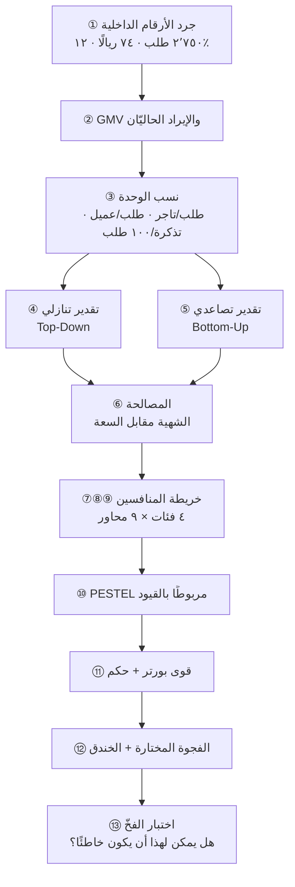
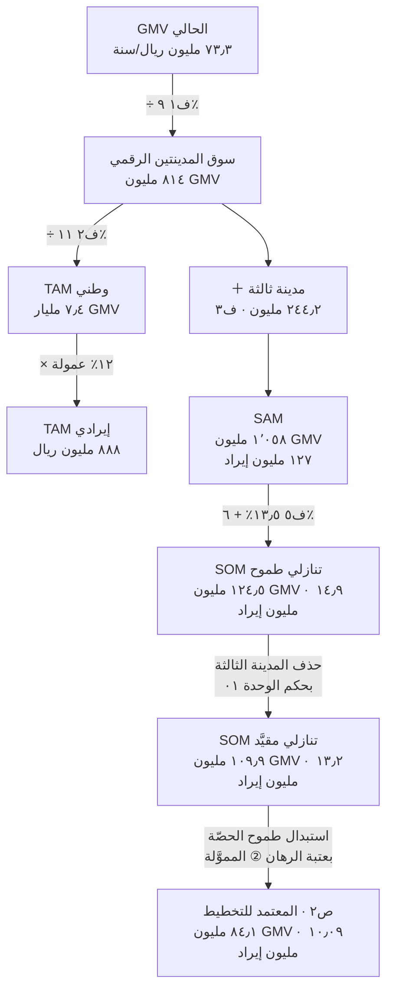
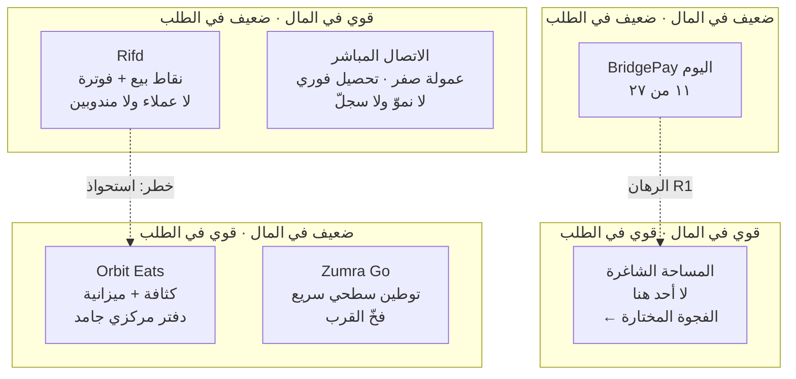
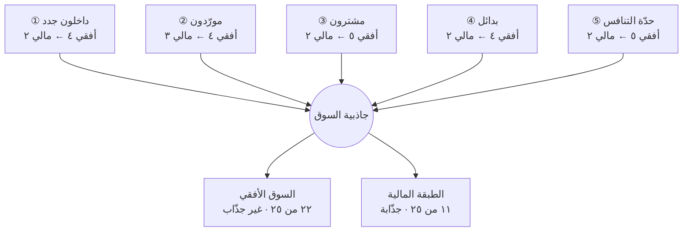

---
title: "الوحدة 02 — السوق والمنافسون: من الحجم إلى الفجوة"
aliases:
  - السوق والمنافسون
  - BridgePay Market Analysis
  - وحدة تحليل السوق
unit: 2
workshop: "[[ورشة BridgePay]]"
course: "[[إدارة المنتج في عصر الذكاء الاصطناعي]]"
tags:
  - إدارة-المشاريع
  - إدارة-المنتج
  - ورشة
status: لم يبدأ
---

> [!info] الوحدة 02 · ورشة BridgePay
> **هذه وحدة تنفيذ لا شرح.** لن تجد هنا تعريفًا لـ`PESTEL` ولا لـ`Porter's Five Forces` ولا لأنماط دخول السوق — تعريفها في [[03 - التوطين (Localization)|الفصل ٠٣]] وفي [[PESTEL]] و[[Market Entry Modes]] و[[CAGE Framework]]. ما ستجده هنا: **حجم سوق محسوب من أرقام الميثاق بحساب معروض**، و**خريطة منافسين بمحاور تنافس حقيقية**، و**حكم صريح على جاذبية السوق**، و**فجوة واحدة نراهن عليها مع خندق يمنع نسخها**.
>
> والقاعدة التي تحكم كل رقم في هذه الوحدة: **لا رقم من الهواء.** كل عدد إمّا منقول من [[00 - ميثاق المشروع ومصدر الحقيقة|الميثاق]]، أو مشتقّ منه بخطوات مكشوفة، أو **افتراض معلَن بوسم `ف#`** يمكنك تغييره وإعادة الحساب.

# الوحدة 02 — السوق والمنافسون: من الحجم إلى الفجوة

## ما ورثته من الوحدة السابقة

ورثت من [[01 - رؤية المنتج واستراتيجيته|الوحدة ٠١]] **قيدًا لا مادّة حرّة**، بنصّها: «لا تحلّل السوق كلها، بل حلّلها **من زاوية المحور المختار**». وهذا يعني عمليًّا أن هذه الوحدة **ممنوعة** من أن تُنتج فجوة سوقية خارج المحور المالي، وممنوعة من أن تقترح تحرّكًا تنافسيًّا بلا سعة تسنده.

**① الرؤية المعتمدة:**

> [!success] الرؤية الموروثة
> # **ألّا يسأل أحدٌ في هذه السوق: أين مالي؟**
>
> **والرسالة المشتقّة منها:** «نجعل كل ريال يمرّ عبر المنصّة **مرئيًّا لصاحبه لحظةَ حركته**، ونسوّيه في **موعد لا يتغيّر**.»
>
> **والاستراتيجية:** نلعب في **طبقة المال** داخل المدينتين الحاليتين، ونفوز بـ**اليقين** لا بالسرعة ولا بالسعر — **ولا ندخل مدينة ثالثة قبل أن يتجاوز احتفاظ العميل ٣٥٪**.

**وأثر هذه الجملة على وحدتنا مباشر:** معيار قراءة المنافس لم يعد «من الأسرع توصيلًا» بل «**كيف يعالج كلٌّ منهم يقين المال**». ولهذا بُنيت محاور التنافس التسعة في ٤٫٢ حول زمن وصول المال وشفافيته وقابلية توفيقه، لا حول زمن التوصيل وكثافة القوائم.

**② الرهانات الثلاثة بحصص سعتها وعتبات إبطالها** — وهذا أهمّ ما ورثناه، لأن **حصّة السعة هي التي تمنعنا من اقتراح ما لا نستطيع تنفيذه**:

| الرهان | أين نلعب · كيف نفوز | الفرضية الضمنية | إشارة الإبطال | حصّة السعة |
|---|---|---|---|---|
| **①** اليقين قبل السيولة | طبقة مستحقّات ٢٦٣ تاجرًا نشطًا · نزيل **السؤال** لا نقصّر **الدورة** | معظم الـ١٬٥١٩ تذكرة سببها **الغموض** لا **التأخير** | تذاكر > ١٬١٠٠ بعد ربع ← المشكلة سيولة لا شفافية | **٥ من ٩ مهندسين** |
| **②** العمق لا العرض | داخل التجّار القائمين (P2 والتاجر غير المطعمي) · نلغي عملًا يدويًّا قائمًا | القيمة تنمو بـ**عمق** الاستعمال لا بـ**عدد** التجّار | طلبات/تاجر نشط < ١٢ يوميًّا بعد ربعين | **٢ من ٩** — تبدأ بعد الدورة الثانية |
| **③** الموثوقية لا السعر | العميل المتكرّر (P3) · الجانب **المالي** من تجربته | جزء من هجرة ٧٨٪ سببه **احتكاك مالي** لا السعر وحده | احتفاظ الشهر الثالث < ٢٦٪ بعد ٣ أرباع | **٢ من ٩** — رهان استكشافي |
| **—** | **المندوب (P4)** | — | — | **صفر** |

**③ قائمة «ما لن نفعله» — سبعة بنود، تحكم هذه الوحدة حكمًا مباشرًا:**

| # | البند المرفوض | ماذا يمنعنا في الوحدة ٠٢ تحديدًا |
|---|---|---|
| ١ | **تخفيض العمولة** | يثبّت ١٢٪ كمعطى في كل حساب سوق هنا — فلا سيناريو تسعير بديل |
| ٢ | **التسوية الأسبوعية** | يمنعنا من بناء ميزة تنافسية على **سرعة** المال؛ الميزة على **يقينه** |
| ٣ | **التوسّع لمدينة ثالثة** | يمنع اعتماد المدينة الثالثة في أي `SOM` تخطيطي (انظر التصحيح في ٤٫١) |
| ٤ | **نقاط الولاء واشتراك التوصيل المجاني** | يمنع اقتراح فجوة قائمة على استمالة العميل بالسعر |
| ٥ | **الإعلانات داخل التطبيق** | يمنع اقتراح «فجوة إيراد إعلاني» مهما بدت جذّابة في تحليل السوق |
| ٦ | **تقسيم الدفع بين أكثر من بطاقة** | يمنع اقتراح توسيع طرق الدفع كمحور تنافس |
| ٧ | **مساعد ذكي يجيب أسئلة التجّار** | يمنع أن يكون مخرَج الذكاء الاصطناعي في هذه الوحدة موجَّهًا للتاجر — استعمالنا له **تحليلي داخلي** فقط (انظر قسم الذكاء الاصطناعي) |

> [!note] لماذا يهمّ البند ٧ لهذه الوحدة بالذات؟
> لأنه رُفض **لسبب قياسي لا لسبب قيمي**: المساعد الذكي يخفض التذاكر دون أن يحلّ المشكلة، فيُفسد أداة القياس التي يقوم عليها الرهان ①. وهذه الوحدة تبني تقديرها التصاعدي كلّه على معدّل التذاكر (٥٫٩٤ لكل ١٠٠ طلب). **لو قُبِل البند ٧ لانهار أساس الحساب في ٤٫١ ب.** فقائمة المرفوضات ليست خلفية أخلاقية للوحدة، بل **شرط صحّة رياضية فيها**.

**④ الأرقام الخام الموروثة** (من الميثاق حرفيًّا، ومن الأرقام التي اشتقّتها الوحدة ٠١ فوقه — وهي مادّة كل حساب لاحق):

| المعطى | القيمة | سيُستعمل في |
|---|---|---|
| متوسّط الطلبات اليومية | ٢٬٧٥٠ | التقدير التنازلي والتصاعدي معًا |
| متوسّط قيمة الطلب | ٧٤ ريالًا | حجم التداول `GMV` |
| عمولة المنصّة | ١٢٪ | تحويل `GMV` إلى إيراد |
| التجّار المفعَّلون / النشطون | ٤١٠ / ٢٦٣ (٦٤٪) | التقدير التصاعدي |
| العملاء المسجَّلون / النشطون | ٨٧٬٤٠٠ / ١٩٬٢٠٠ | سقف جانب الطلب |
| تذاكر الدعم شهريًّا | ٤٬٩٠٠ | **قيد السعة الحاكم** |
| نسبة تذاكر «أين مستحقّاتي؟» | ٣١٪ | فكّ قيد السعة |
| حصّة الدفع عند الاستلام | ٣٨٪ | `PESTEL` وقوى بورتر |
| دورة التسوية | ١٤ يومًا | خندق الدفاع |
| كلفة تقصير التسوية إلى ٧ أيام | **١٫٢٥ مليون أساسًا** + ~٥٠٪ احتياطي ذروة وعائم نقدي = **~١٫٩ مليون** | حاجز الدخول أمام المنافس |
| الفريق | ٩ مهندسين · ٦ دعم · لا توظيف | سقف `SOM` |
| عمر المنتج / المدن | ١٤ شهرًا / مدينتان | معدّل الاكتساب التاريخي |
| **حصص السعة (الوحدة ٠١)** | ٥ · ٢ · ٢ · صفر للمندوب | يمنع اقتراح تحرّك تنافسي بلا سعة |
| **عتبة المدينة الثالثة (الوحدة ٠١)** | احتفاظ العميل ≥ ٣٥٪ | يقيّد `SAM` و`SOM` التخطيطي |

## السؤال الذي تجيب عنه هذه الوحدة

سؤال واحد، وله ثلاث طبقات لا يجوز الخلط بينها:

> **هل السوق الذي نلعب فيه يستحقّ اللعب — وإن استحقّ، فأين بالضبط تُوجد فجوة نستطيع أن نحتلّها ونمنع نسخها؟**

الطبقات الثلاث:

1. **طبقة الحجم:** كم يساوي هذا السوق فعلًا، لا كم يُقال إنه يساوي؟ وما الفرق بين ما يمكن أن نطاله نظريًّا وما نستطيع خدمته فعليًّا بتسعة مهندسين وستّة موظّفي دعم؟
2. **طبقة البنية:** من يلعب هنا، وعلى أي محاور يتنافسون فعلًا (لا على أي شعارات يرفعون)؟ وهل بنية السوق نفسها تسمح بربح مستدام أم تُصادره؟
3. **طبقة الفجوة:** ما الشيء الذي يحتاجه طرف من الأطراف الستّة، ولا يقدّمه أحد اليوم، ولسبب **بنيوي** لا لسبب غفلة؟ ولماذا لن يقدّمه أحد خلال ستّة أشهر حتى لو قرأ هذه الوثيقة؟

> [!note] لماذا الطبقة الثالثة هي المهمّة؟
> الطبقتان الأولى والثانية تُنتجان **معرفة**. والطبقة الثالثة وحدها تُنتج **قرارًا**. ووحدة تحليل سوق تنتهي بمعرفة بلا قرار هي بالضبط ما يسمّيه القسم الأخير من هذه الوحدة «التحليل المكتوب للمستثمر لا للقرار».

## العمل خطوة بخطوة

هذه خطوات قابلة للتنفيذ حرفيًّا على أي منتج قائم، لا على BridgePay وحده. الزمن التقديري لفريق من شخصين (مدير منتج + محلّل نصف وقت، وهو تحديدًا ما يملكه الميثاق).

| # | الخطوة | ماذا تُنتج | الزمن |
|---|---|---|---|
| **١** | **جرد الأرقام الداخلية أولًا** — قبل أي بحث خارجي، اكتب كل رقم تملكه عن منتجك في جدول واحد (طلبات، متوسّط قيمة، عمولة، مستخدمون نشطون، تذاكر). | جدول «مصدر الحقيقة الرقمي» | ٤٥ دقيقة |
| **٢** | **احسب `GMV` والإيراد الحاليَّين** بحساب معروض، لا من لوحة تحكّم. من يحسب بيده يكتشف تعريفات مختلفة للرقم نفسه. | سطران محسوبان | ٣٠ دقيقة |
| **٣** | **اشتقّ نسب الوحدة** (طلبات لكل مستخدم نشط، طلبات لكل تاجر نشط، تذاكر لكل ١٠٠ طلب). هذه النسب هي التي تجعل التقدير التصاعدي ممكنًا. | ٥–٧ نسب | ٤٥ دقيقة |
| **٤** | **بناء التقدير التنازلي** — ابدأ من سوق شامل وانزل بالقسمة إلى حصّتك. صرّح بكل افتراض بوسم `ف#`. | `TAM/SAM/SOM` تنازلي | ٩٠ دقيقة |
| **٥** | **بناء التقدير التصاعدي** — ابدأ من وحدة واحدة (تاجر، عميل، طلب) واضرب. ثم **اضرب في قيدك الداخلي**، لا في طموحك. | `SOM` تصاعدي | ٩٠ دقيقة |
| **٦** | **المصالحة بين التقديرين** — لا تأخذ المتوسّط. اشرح **لماذا** اختلفا، وأيّهما يقيس الشهية وأيّهما يقيس السعة. | فقرة حكم | ٤٥ دقيقة |
| **٧** | **تسمية فئات المنافسين الأربع** — عالمي، إقليمي، محلّي مباشر، **وغير رقمي**. الفئة الرابعة هي التي ينساها الجميع وهي غالبًا الأكبر. | ٤ بطاقات منافس | ٦٠ دقيقة |
| **٨** | **استخراج محاور التنافس الحقيقية** — من تذاكر الدعم وأسباب الإلغاء وأسئلة المبيعات، لا من صفحات «لماذا نحن». | ٩ محاور | ٩٠ دقيقة |
| **٩** | **تعبئة مصفوفة المنافسين** ووضع عمود «الشرط الخفي» لكل ميزة يملكها المنافس. | مصفوفة | ٦٠ دقيقة |
| **١٠** | **تشغيل `PESTEL`** — ولكل محور اكتب **القيد المقابل من ميثاقك**، لا القيد العامّ. | ٦ محاور بقيود | ٧٥ دقيقة |
| **١١** | **تشغيل `Porter's Five Forces`** بتقييم رقمي (١–٥) لكل قوّة، وحكم صريح واحد. | حكم | ٧٥ دقيقة |
| **١٢** | **اختيار فجوة واحدة** والإجابة عن ثلاثة أسئلة: لماذا هي شاغرة؟ ما خندقها؟ كم شهرًا يحتاج المنافس لنسخها؟ | صفحة الفجوة | ٩٠ دقيقة |
| **١٣** | **اختبار الفخّ** — أعد قراءة كل ما كتبت وضع علامة على كل جملة لا يمكن أن تكون خاطئة. احذفها أو أرفق لها رقمًا يكذّبها. | نسخة منقّاة | ٤٥ دقيقة |

**الإجمالي: ~١٢ ساعة عمل صافية** — أي دورة واحدة من دورتَي الميثاق لشخص واحد بنصف طاقته. وهذا وحده قرار: الوحدة ٠٢ تكلّف نصف مدير منتج لأسبوعين، وهذه سعة لن تُنفَق على شيء آخر.



## المخرَج

> [!warning] إعلان الافتراضات
> كل رقم يحمل وسمًا: **`م`** = منقول من الميثاق · **`ش`** = مشتقّ بحساب معروض · **`ف#`** = افتراض معلَن ليس في الميثاق (وهو الوحيد القابل للنقاش والتغيير). عدد الافتراضات المعلَنة في هذه الوحدة **ستّة**، وكلها مجموعة في جدول واحد قبل الحسابات، حتى يستطيع القارئ أن يغيّر رقمًا واحدًا ويرى أثره في كل شيء.

### ٤٫١ تقدير حجم السوق

#### الطبقة صفر: الأرقام المشتقّة — قبل أي تقدير

قبل أن نتحدّث عن السوق، علينا أن نعرف **حجمنا نحن** بدقّة. وهذه الأرقام ليست في الميثاق نصًّا، لكنها كلها مشتقّة منه بضرب وقسمة:

| # | المشتقّ | الحساب | القيمة | الوسم |
|---|---|---|---|---|
| ش١ | الطلبات الشهرية | ٢٬٧٥٠ × ٣٠ | **٨٢٬٥٠٠ طلب/شهر** | `ش` |
| ش٢ | `GMV` الشهري | ٨٢٬٥٠٠ × ٧٤ | **٦٬١٠٥٬٠٠٠ ريال/شهر** | `ش` |
| ش٣ | `GMV` السنوي | ٦٬١٠٥٬٠٠٠ × ١٢ | **٧٣٬٢٦٠٬٠٠٠ ريال/سنة** | `ش` |
| ش٤ | عمولة الطلب الواحد | ٧٤ × ١٢٪ | **٨٫٨٨ ريالًا** | `ش` |
| ش٥ | الإيراد الشهري | ٨٢٬٥٠٠ × ٨٫٨٨ | **٧٣٢٬٦٠٠ ريال/شهر** | `ش` |
| ش٦ | الإيراد السنوي | ٧٣٢٬٦٠٠ × ١٢ | **٨٬٧٩١٬٢٠٠ ريال/سنة** | `ش` |
| ش٧ | طلبات لكل تاجر نشط شهريًّا | ٨٢٬٥٠٠ ÷ ٢٦٣ | **٣١٣٫٧ طلبًا** | `ش` |
| ش٨ | إيراد لكل تاجر نشط شهريًّا | ٣١٣٫٧ × ٨٫٨٨ | **٢٬٧٨٦ ريالًا** | `ش` |
| ش٩ | `GMV` لكل تاجر نشط شهريًّا | ٣١٣٫٧ × ٧٤ | **٢٣٬٢١٤ ريالًا** | `ش` |
| ش١٠ | طلبات لكل عميل نشط شهريًّا | ٨٢٬٥٠٠ ÷ ١٩٬٢٠٠ | **٤٫٣٠ طلبات** | `ش` |
| ش١١ | نسبة تحويل المسجَّل إلى نشط | ١٩٬٢٠٠ ÷ ٨٧٬٤٠٠ | **٢١٫٩٪** | `ش` |
| ش١٢ | تذاكر لكل ١٠٠ طلب | ٤٬٩٠٠ ÷ ٨٢٬٥٠٠ × ١٠٠ | **٥٫٩٤ تذكرة** | `ش` |
| ش١٣ | تذاكر «أين مستحقّاتي؟» شهريًّا | ٤٬٩٠٠ × ٣١٪ | **١٬٥١٩ تذكرة** | `ش` |
| ش١٤ | طلبات الدفع عند الاستلام شهريًّا | ٨٢٬٥٠٠ × ٣٨٪ | **٣١٬٣٥٠ طلبًا** | `ش` |
| ش١٥ | معدّل تفعيل التجّار تاريخيًّا | ٤١٠ ÷ ١٤ شهرًا | **٢٩٫٣ تاجرًا/شهر** | `ش` |
| ش١٦ | معدّل التسجيل التاريخي للعملاء | ٨٧٬٤٠٠ ÷ ١٤ | **٦٬٢٤٣ مسجَّلًا/شهر** | `ش` |
| ش١٧ | الاحتياطي فوق أساس السيولة | ١٬٩٠٠٬٠٠٠ − (١٧٩٬٠٨٠ × ٧ = ١٬٢٥٣٬٥٦٠) | **٦٤٦٬٤٤٠ ريالًا** (~٥٠٪ فوق الأساس) | `ش` |
| ش١٨ | كلفة تقصير التسوية بأيام `GMV` | ١٬٩٠٠٬٠٠٠ ÷ (٦٬١٠٥٬٠٠٠ ÷ ٣٠) | **٩٫٣ أيام من `GMV`** | `ش` |

> [!example] لاحظ ش١١ و`ش١٢` — هما مفتاحا الوحدة كلها
> **ش١١ = ٢١٫٩٪** يكاد يطابق «احتفاظ العميل في الشهر الثالث ٢٢٪» المذكور في الميثاق. وهذه ليست مصادفة تحليلية بل **تأكيد اتّساق**: قاعدة العملاء المسجَّلين ليست أصلًا، بل هي أثر تاريخي لعملاء مرّوا وذهبوا. من يبني تقدير سوق على ٨٧٬٤٠٠ مسجَّل يبني على [[Vanity Metrics|مؤشّر غرور]].
>
> **ش١٢ = ٥٫٩٤ تذكرة لكل ١٠٠ طلب** هو الرقم الذي سيقتل التقدير التنازلي بعد قليل. لأن الدعم — لا الهندسة ولا السوق — هو القيد الحاكم.

#### الافتراضات المعلَنة الستّة

| الوسم | الافتراض | القيمة | لماذا هذه القيمة تحديدًا | أثر تغييرها |
|---|---|---|---|---|
| **ف١** | حصّة BridgePay من طلبات التوصيل الرقمية في مدينتيه | **٩٪** | منتج عمره ١٤ شهرًا في سوق فيه لاعب عالمي وآخر إقليمي راسخان؛ الوافد الثالث في سوق ثنائي الجانب نادرًا ما يتجاوز خانة أحادية مبكّرًا | خطّية عكسية: كل نقطة أقلّ تكبّر السوق المقدَّر |
| **ف٢** | حصّة المدينتين من السوق الوطني للتوصيل | **١١٪** | المدينتان ليستا الأكبر في المملكة (لو كانتا كذلك لما كان «التوسّع لمدينة ثالثة» بندًا في قائمة الطلبات الخام) | خطّية عكسية على `TAM` فقط |
| **ف٣** | حجم المدينة الثالثة نسبةً لمتوسّط مدينتينا | **٦٠٪** | التوسّع يبدأ عادةً بالمدينة الأصغر التالية لا بالأكبر | يؤثّر على `SAM` وحده — **أُخرِج من `SOM` بحكم البند ٣ في «ما لن نفعله»** |
| **ف٤** | إنتاجية التاجر الجديد نسبةً للتاجر الحالي | **٧٠٪** | التجّار الأوائل هم الأكثر حماسًا والأكبر حجمًا؛ ما بعدهم ذيل أطول | يؤثّر على `SOM` التصاعدي |
| **ف٥** | طموح الحصّة بعد ٢٤ شهرًا في المدينتين | **١٣٫٥٪** (من ٩٪) | «زيادة الحصّة بمقدار النصف» طموح تسويقي معتاد — **وهو تحديدًا ما نريد فضحه**، وقد سقط فعلًا في ٤٫١ ج لصالح **١٠٫٣٪** المشتقّة من عتبة الرهان ② | يؤثّر على `SOM` التنازلي فقط |
| **ف٦** | نسبة تذاكر «أين مستحقّاتي؟» التي تُلغى بالطبقة المالية | **١٠٠٪** من الفئة | حدّ أعلى متعمَّد لنرى **سقف** ما يمكن أن يفكّه إصلاح واحد | يخفّض `SOM` التصاعدي إن قلّ |

> [!tip] لماذا نعلن الافتراضات في جدول منفصل؟
> لأن التحليل الذي تُدفن افتراضاته داخل النصّ **لا يمكن الاعتراض عليه**، ومن لا يمكن الاعتراض عليه لا يمكن الوثوق به. جدول الافتراضات هو الفرق بين نموذج مالي وبين رأي مزخرف بالأرقام. وحين يقول لك أحدهم «رقمك خطأ»، السؤال الصحيح: **أي `ف` تعترض عليه؟**

#### أ. التقدير التنازلي (`Top-Down`)

المنطق: ابدأ من الكلّ، واقسم نزولًا حتى تصل إلى حصّتك.

**الخطوة ١ — من حجمنا إلى حجم مدينتينا الرقمي:**
`GMV` السنوي لنا = **٧٣٬٢٦٠٬٠٠٠** ريال (ش٣).
حصّتنا `ف١` = ٩٪.
سوق التوصيل الرقمي في المدينتين = ٧٣٬٢٦٠٬٠٠٠ ÷ ٠٫٠٩ = **٨١٤٬٠٠٠٬٠٠٠ ريال `GMV` سنويًّا**.

**الخطوة ٢ — من المدينتين إلى الوطن:**
حصّة المدينتين `ف٢` = ١١٪.
`TAM` بالـ`GMV` = ٨١٤٬٠٠٠٬٠٠٠ ÷ ٠٫١١ = **٧٬٤٠٠٬٠٠٠٬٠٠٠ ريال** (٧٫٤ مليار).

**الخطوة ٣ — تحويل `TAM` إلى طبقة الإيراد (الطبقة الوحيدة التي تعنينا):**
`TAM` الإيرادي = ٧٬٤٠٠٬٠٠٠٬٠٠٠ × ١٢٪ = **٨٨٨٬٠٠٠٬٠٠٠ ريال/سنة**.

> [!warning] هنا يُرتكب أشهر خطأ في تقدير حجم السوق
> ٧٫٤ مليار ريال رقم **صحيح ومضلّل معًا**. صحيح لأنه حجم التداول، ومضلّل لأنه ليس مالنا: نحن نأخذ ١٢٪ منه فقط. والفرق بين ٧٫٤ مليار و٨٨٨ مليونًا هو الفرق بين شريحة عرض للمستثمر وبين نموذج قرار. **قاعدة: قدّر السوق بالطبقة التي تُفوتِر عليها، لا بالطبقة التي تمرّ عبرك.**

**الخطوة ٤ — `SAM` (السوق القابل للخدمة):**
حدود القابلية للخدمة عندنا ثلاثة، وكلها من الميثاق:
- **جغرافيًّا:** مدينتان + المدينة الثالثة المذكورة في قائمة الطلبات الخام. لا أكثر، لأن «لا توظيف خلال دورتَي ميزانية» يمنع فرق عمليات جديدة. **وانتبه:** إدراج المدينة الثالثة هنا **قياسٌ لا نيّة** — الوحدة ٠١ رفضتها صراحةً (البند ٣ في «ما لن نفعله») حتى يتجاوز احتفاظ العميل ٣٥٪. و`SAM` بطبيعته **سقف الإمكان لا خطّة العمل**؛ الخلط بينهما هو تحديدًا ما يعالجه التصحيح في الخطوة ٥.
- **قطاعيًّا:** المطاعم والتجّار غير المطعميّين (بقالات، صيدليات، ورود) — وهو ما تخدمه المنصّة فعلًا.
- **تنظيميًّا:** التجّار الملزَمون بالفوترة الإلكترونية، وهم من نستطيع أن نبيع لهم قيمة الامتثال.

حجم المدينة الثالثة = (٨١٤٬٠٠٠٬٠٠٠ ÷ ٢) × `ف٣` ٦٠٪ = ٤٠٧٬٠٠٠٬٠٠٠ × ٠٫٦ = **٢٤٤٬٢٠٠٬٠٠٠ ريال `GMV`**.
`SAM` بالـ`GMV` = ٨١٤٬٠٠٠٬٠٠٠ + ٢٤٤٬٢٠٠٬٠٠٠ = **١٬٠٥٨٬٢٠٠٬٠٠٠ ريال**.
`SAM` الإيرادي = × ١٢٪ = **١٢٦٬٩٨٤٬٠٠٠ ريال/سنة**.

**الخطوة ٥ — `SOM` التنازلي (ما نطمح لالتقاطه في ٢٤ شهرًا):**
المدينتان: ٨١٤٬٠٠٠٬٠٠٠ × `ف٥` ١٣٫٥٪ = ١٠٩٬٨٩٠٬٠٠٠ ريال `GMV`.
المدينة الثالثة: ٢٤٤٬٢٠٠٬٠٠٠ × ٦٪ (سنة أولى لوافد جديد) = ١٤٬٦٥٢٬٠٠٠ ريال `GMV`.
`SOM` التنازلي **الطموح** = ١٢٤٬٥٤٢٬٠٠٠ ريال `GMV` → **١٤٬٩٤٥٬٠٠٠ ريال إيرادًا/سنة**. أي نموّ **٧٠٪** عن ٨٬٧٩١٬٢٠٠ اليوم.

> [!warning] تصحيح إلزامي بحكم الوحدة ٠١ — احذف المدينة الثالثة
> رقم ١٤٫٩٤٥ مليونًا **غير قابل للاعتماد كخطّة**، لأن ١٤٬٦٥٢٬٠٠٠ ريالًا منه تأتي من مدينة **مرفوضة بقرار معلَن**: البند ٣ في «ما لن نفعله»، وشرط رفعه احتفاظ عميل ≥ ٣٥٪ — ونحن عند ٢٢٪. والرهان ③ نفسه (٢ من ٩ مهندسين) لا يستهدف أكثر من ٢٦٪ بعد ثلاثة أرباع. فبلوغ ٣٥٪ خلال نافذة الأربعة والعشرين شهرًا **احتمال لا أساس له في أي رقم بين أيدينا**.
>
> **`SOM` التنازلي المقيَّد** = ١٠٩٬٨٩٠٬٠٠٠ ريال `GMV` → ١٠٩٬٨٩٠٬٠٠٠ × ١٢٪ = **١٣٬١٨٦٬٨٠٠ ريال إيرادًا/سنة**، أي نموّ **٥٠٪** لا ٧٠٪.
>
> **ولاحظ ما فعله هذا التصحيح** — سنعود إليه في المصالحة: مجرّد احترام قيدٍ ورثناه من وحدة سابقة قرّب التقديرين من بعضهما أكثر ممّا فعلت أي مراجعة حسابية.



#### ب. التقدير التصاعدي (`Bottom-Up`)

المنطق معكوس تمامًا: ابدأ من **وحدة واحدة تعرفها معرفة يقينية**، واضرب — ثم **اصطدم بقيدك**.

**المسار ١ — من جانب العرض (التجّار): استقراء تاريخي، لا خطّة.**
هذا المسار يجيب عن سؤال «ماذا لو استمرّ ما كان؟» — وهو **ليس** ما تعتزمه الوحدة ٠١ (الرهان ② يمنع صرف سعة على تفعيل تجّار جدد). نحسبه لأنه يكشف القيد، ثم نصحّحه في المسار ٥.
معدّل التفعيل التاريخي = ٢٩٫٣ تاجرًا/شهر (ش١٥).
على ٢٤ شهرًا بالمعدّل نفسه = ٢٩٫٣ × ٢٤ = **٧٠٣ تاجرًا إضافيًّا** → إجمالي مفعَّل = ٤١٠ + ٧٠٣ = ١٬١١٣.
نسبة النشاط ٦٤٪ (من الميثاق) → التجّار النشطون = ١٬١١٣ × ٠٫٦٤ = **٧١٢ تاجرًا نشطًا**.
منهم ٢٦٣ بإنتاجية حالية (٣١٣٫٧ طلبًا/شهر) و٤٤٩ بإنتاجية `ف٤` ٧٠٪ = ٢١٩٫٦ طلبًا/شهر.

الطلبات الشهرية المحتملة = (٢٦٣ × ٣١٣٫٧) + (٤٤٩ × ٢١٩٫٦) = ٨٢٬٥٠٣ + ٩٨٬٦٠٠ = **١٨١٬١٠٣ طلبًا/شهر**.

**المسار ٢ — فحص جانب الطلب (هل يوجد عملاء يكفون؟):**
لتحقيق ١٨١٬١٠٣ طلبًا بمعدّل ٤٫٣٠ طلبات لكل عميل نشط (ش١٠) نحتاج = ١٨١٬١٠٣ ÷ ٤٫٣٠ = **٤٢٬١١٧ عميلًا نشطًا**.
بنسبة تحويل ٢١٫٩٪ (ش١١) نحتاج قاعدة مسجَّلين = ٤٢٬١١٧ ÷ ٠٫٢١٩ = **١٩٢٬٣١٥ مسجَّلًا**.
الفجوة عن اليوم = ١٩٢٬٣١٥ − ٨٧٬٤٠٠ = **١٠٤٬٩١٥ تسجيلًا جديدًا** على ٢٤ شهرًا = **٤٬٣٧١ تسجيلًا/شهر**.
والمعدّل التاريخي = ٦٬٢٤٣ (ش١٦). **إذن جانب الطلب ليس القيد** — نستطيع تسجيل أكثر من المطلوب بـ٤٣٪.

**المسار ٣ — الاصطدام بالقيد الحاكم (الدعم):**
معدّل التذاكر = ٥٫٩٤ لكل ١٠٠ طلب (ش١٢).
عند ١٨١٬١٠٣ طلبًا → التذاكر = ١٨١٬١٠٣ × ٠٫٠٥٩٤ = **١٠٬٧٥٧ تذكرة/شهر**.
سعة الدعم الحالية = ٤٬٩٠٠ تذكرة/شهر بستّة موظّفين (أي ٨١٧ تذكرة لكل موظّف شهريًّا ≈ ٤١ تذكرة في يوم عمل).
ولا توظيف جديد (القيد ٥ في الميثاق).
**النتيجة: نحتاج ٢٫٢ ضعف سعة الدعم القائمة. القيد يرفض.**

بل الأخطر: **بمعدّل التذاكر الحالي، سقف النموّ صفر.** الحدّ الأقصى للطلبات = ٤٬٩٠٠ ÷ ٠٫٠٥٩٤ = ٨٢٬٤٩٢ ≈ **٨٢٬٥٠٠ طلبًا**، وهو بالضبط حجمنا اليوم. المنصّة **مشبعة على قيد الدعم لا على قيد السوق**.

**المسار ٤ — فكّ القيد بالطبقة المالية:**
لو أُلغيت فئة «أين مستحقّاتي؟» بالكامل (`ف٦`):
التذاكر المتبقّية عند الحجم الحالي = ٤٬٩٠٠ − ١٬٥١٩ = **٣٬٣٨١ تذكرة**.
معدّل التذاكر الجديد = ٣٬٣٨١ ÷ ٨٢٬٥٠٠ = **٤٫١٠ لكل ١٠٠ طلب**.
السقف الجديد للطلبات = ٤٬٩٠٠ ÷ ٠٫٠٤١٠ = **١١٩٬٥١٢ طلبًا/شهر** (نأخذها ١١٩٬٦٠٠ تقريبًا).
النموّ المتاح = (١١٩٬٥١٢ ÷ ٨٢٬٥٠٠) − ١ = **+٤٤٫٩٪** بلا موظّف واحد إضافي.

**`SOM` التصاعدي (أ) — سقف السعة:**
`GMV` = ١١٩٬٥١٢ × ٧٤ × ١٢ = **١٠٦٬١٢٥٬٠٠٠ ريال/سنة**.
الإيراد = × ١٢٪ = **١٢٬٧٣٥٬٠٠٠ ريال/سنة**.
وهذا جواب سؤال **«كم نستطيع أن نخدم؟»** — لا سؤال «كم التزمنا؟».

**المسار ٥ — `SOM` التصاعدي (ب): ما التزمت به الوحدة ٠١ فعلًا.**
الرهان ② لا يشتري نموًّا بتجّار جدد بل **بعمق استعمال التجّار القائمين**، وعتبته الرقمية معلَنة: رفع الطلبات لكل تاجر نشط من **١٠٫٥ إلى ١٢ طلبًا يوميًّا** خلال ربعين، مع ثبات عدد النشطين عند ٢٦٣ فأكثر.
الطلبات الشهرية عند العتبة = ٢٦٣ × ١٢ × ٣٠ = **٩٤٬٦٨٠ طلبًا/شهر** (+١٤٫٨٪ عن اليوم).
`GMV` = ٩٤٬٦٨٠ × ٧٤ × ١٢ = **٨٤٬٠٧٥٬٨٤٠ ريالًا/سنة**.
الإيراد = × ١٢٪ = **١٠٬٠٨٩٬١٠٠ ريال/سنة**.

> [!warning] القيد الحاكم ليس الدعم — بل عتبة الرهان ②
> هذه أهمّ نتيجة في ٤٫١، وهي **تصحّح ما كنّا سنستنتجه لو قرأنا الأرقام وحدها**: سقف الدعم بعد فكّ قيد المستحقّات ١١٩٬٥١٢ طلبًا، وخطّة الوحدة ٠١ تبلغ ٩٤٬٦٨٠ فقط. الفارق **٢٤٬٨٣٢ طلبًا شهريًّا من السعة غير المستعملة** (٢٦٪ فوق الخطّة).
>
> **إذن الترتيب الصحيح للقيود عندنا:**
> **①** اليوم — الدعم يقيّدنا عند **٨٢٬٥٠٠** (مشبع تمامًا).
> **②** بعد الرهان ① — يرتفع السقف إلى **١١٩٬٥١٢**، فيتوقّف الدعم عن كونه القيد.
> **③** فيصير القيد **قدرتنا على تعميق استعمال التاجر** (الرهان ② بسعته: مهندسان فقط، ويبدآن بعد الدورة الثانية).
>
> وهذا يعني أن **الرهان ① يشتري سعة لن يستهلكها الرهان ② كاملة** — وهي ملاحظة تُسلَّم إلى [[07 - ترتيب الأولويات|الوحدة ٠٧]] بوصفها سؤال تخصيص: هل تُعاد نقطة سعة من ① إلى ②؟

> [!example] القراءة المنتجية لهذا الحساب
> ميزة المحفظة والسحب (التي ستُكتب `PRD`ها في [[08 - وثيقة متطلبات المنتج|الوحدة ٠٨]]) ليست «تحسين تجربة تاجر». هي **رافعة سعة**: تحرير ١٬٥١٩ تذكرة شهريًّا يعادل توظيف ١٫٩ موظّف دعم (١٬٥١٩ ÷ ٨١٧) — وهو توظيف ممنوع بالقيد ٥. أي أن الميزة **تشتري سعة محظورة الشراء**. هذه هي الجملة التي تُقنع الإدارة، لا «التجّار سعداء».

#### ج. لماذا اختلفت الطريقتان — وأيّهما أوثق هنا؟

| # | النسخة | `GMV` سنويًّا | الإيراد سنويًّا | ما الذي تقيسه فعلًا |
|---|---|---|---|---|
| **ت١** | تنازلي طموح (٣ مدن · `ف٥` ١٣٫٥٪) | ١٢٤٬٥٤٢٬٠٠٠ | **١٤٬٩٤٥٬٠٠٠** | الشهية بلا قيد |
| **ت٢** | تنازلي مقيَّد (مدينتان · `ف٥` ١٣٫٥٪) | ١٠٩٬٨٩٠٬٠٠٠ | **١٣٬١٨٦٬٨٠٠** | الشهية بعد خصم الممنوع |
| **ص١** | تصاعدي — سقف السعة بعد فكّ قيد الدعم | ١٠٦٬١٢٥٬٠٠٠ | **١٢٬٧٣٥٬٠٠٠** | ما نستطيع **خدمته** |
| **ص٢** | تصاعدي — عتبة الرهان ② المعلَنة | ٨٤٬٠٧٥٬٨٤٠ | **١٠٬٠٨٩٬١٠٠** | ما **التزمنا** به فعلًا |
| — | الحالي | ٧٣٬٢٦٠٬٠٠٠ | ٨٬٧٩١٬٢٠٠ | — |

**والفوارق مرتّبة:** ت١ ← ص١ = **−١٤٫٨٪** · ت٢ ← ص١ = **−٣٫٤٪** · ت٢ ← ص٢ = **−٢٣٫٥٪**.

**لماذا اختلفت النسخ؟** لثلاثة أسباب متمايزة، وكلٌّ منها من نوع مختلف تمامًا:

1. **الفارق ت١ ← ت٢ (١٫٧٦ مليون) سببه قرار استراتيجي مُهرَّب.** المدينة الثالثة مرفوضة في «ما لن نفعله»، ومع ذلك تسلّلت إلى الحساب لأن الحساب لا يقرأ قرارات. **ثلثا فجوة التقديرين الأولى لم يكونا خلافًا في المنهج بل تهريبًا لخطّة مرفوضة.**
2. **الفارق ت٢ ← ص١ (٤٥٢ ألفًا، ٣٫٤٪) هو الفارق المنهجي الحقيقي الوحيد** — وهو صغير جدًّا. أي أن الطريقتين، حين تُغذَّيان بالقيود نفسها، **تكادان تتّفقان**.
3. **الفارق ت٢ ← ص٢ (٣٫١ ملايين، ٢٣٫٥٪) هو الفارق الأخطر**: بين ما **نستطيع** وما **موّلناه**. `ف٥` تفترض حصّة ١٣٫٥٪، بينما عتبة الرهان ② تعني حصّة **١٠٫٣٪** فقط (٨٤٬٠٧٥٬٨٤٠ ÷ ٨١٤٬٠٠٠٬٠٠٠). وهذه ليست مسألة تقدير بل **مسألة تخصيص سعة**: مهندسان لا يشتريان ١٣٫٥٪.

> [!example] المصالحة الكاملة — وما تكشفه عن طبيعة التقدير التنازلي
> استبدل `ف٥` (١٣٫٥٪ — طموح) بالعتبة الملتزَم بها (١٠٫٣٪ — رهان مموَّل)، فيصير التنازلي: ٨١٤٬٠٠٠٬٠٠٠ × ١٠٫٣٪ = ٨٤٬٠٧٥٬٨٤٠ ريالًا `GMV` → **١٠٬٠٨٩٬١٠٠ ريال إيرادًا** — أي **مطابقًا للتصاعدي حرفيًّا**.
>
> والتطابق هنا **ليس دليل صحّة بل كشف**: التقدير التنازلي **ليس مصدر معرفة مستقلًّا**، بل مرآة لافتراض حصّتك. فمن يعرض تقديرًا تنازليًّا وتصاعديًّا «متقاربين» بوصفهما تحقّقًا متبادلًا، غالبًا ما يكون قد ضبط أحدهما على الآخر دون أن يعلن ذلك. **التحقّق المتبادل الحقيقي يشترط أن يكون مدخل كل طريقة مستقلًّا عن الأخرى** — وهو شرط نادر التحقّق.
>
> **الدرس العملي:** حين يختلف تقديران، ابحث بهذا الترتيب: ① افتراض يخالف قرارًا معلَنًا ② فارق في تعريف السوق ③ خطأ حسابي. الترتيب المعكوس يضيّع الوقت في المكان الخطأ.

**والقاعدة الأعمّ:**

- التنازلي يسأل: *كم يوجد؟* وينتهي بحصّة نطمح إليها. وكل خطأ فيه **مضاعِف**: لو كانت `ف١` ٧٪ بدل ٩٪ لصار `TAM` ٩٫٥ مليارات بدل ٧٫٤ — قفزة ٢٨٪ من تغيير نقطتين. التنازلي **حسّاس بشكل متفجّر** لافتراض لا نملك بيانات عليه.
- التصاعدي يسأل: *كم نستطيع أن نخدم؟ وكم موّلنا؟* وينتهي بقيد نملك عليه بيانات يقينية (٤٬٩٠٠ تذكرة، ٦ موظّفين، ٩ مهندسين، ٥·٢·٢·صفر). وكل رقم فيه **قابل للتحقّق داخليًّا غدًا صباحًا**.

**الرقم المعتمد للتخطيط في هذه الورشة: `ص٢` = ١٠٬٠٨٩٬١٠٠ ريالًا** — لأنه الوحيد الذي يقابله **مهندسون مخصَّصون بالاسم**. و`ص١` (١٢٫٧٣ مليونًا) يبقى مسجَّلًا بوصفه **سقف السعة المتاح**، أي المساحة التي يمكن أن تُستعمل إن أُعيد تخصيص السعة.

> [!tip] الحكم: التصاعدي أوثق في حالة BridgePay — وليس دائمًا
> **التصاعدي أوثق هنا** لسببين محدّدين: **①** المنتج **قائم منذ ١٤ شهرًا**، فعندنا سلاسل زمنية حقيقية لا تخمينات (معدّل تفعيل، معدّل تسجيل، معدّل تذاكر). **②** القيد الحاكم **داخلي** (الدعم والسعة الهندسية)، والسوق أكبر من قدرتنا بمراحل: `SAM` الإيرادي ١٢٧ مليونًا ونحن نلتقط ٨٫٨ ملايين، أي **٦٫٩٪ من سوقنا القابل للخدمة**. ومن يكون سقفه داخليًّا لا يستفيد شيئًا من تكبير تقدير السوق.
>
> **ومتى ينعكس الحكم؟** حين لا يكون لديك منتج بعد (فلا وحدة اقتصادية تصعد منها)، أو حين يكون القيد **خارجيًّا** (تنظيم يمنع، أو سوق أصغر من طاقتك). عندها التنازلي يمنعك من بناء آلة لا سوق لها.
>
> **وماذا نفعل بالتنازلي إذن؟** لا نرميه. نستعمله **كسقف عقلاني**: لو أنتج التصاعدي رقمًا يتجاوز `SAM` التنازلي لكان في حسابنا خطأ. هنا ١٠٫٠٩ ملايين (`ص٢`) مقابل `SAM` المفتوح ٩٧٫٦٨ مليونًا = ١٠٫٣٪، وهو معقول. **التنازلي يفحص، والتصاعدي يقرّر.**

#### د. الجدول الجامع — `TAM/SAM/SOM`

| الطبقة | التعريف التشغيلي في BridgePay | بالـ`GMV` (ريال/سنة) | بالإيراد (ريال/سنة) | نسبتنا منها اليوم |
|---|---|---|---|---|
| **`TAM`** | كل طلبات التوصيل الرقمية للمطاعم والمتاجر في المملكة | ٧٬٤٠٠٬٠٠٠٬٠٠٠ | ٨٨٨٬٠٠٠٬٠٠٠ | **٠٫٩٩٪** |
| **`SAM`** | ثلاث مدن × قطاعا المطاعم والتجزئة × التجّار الملزَمون بالفوترة — **والمدينة الثالثة مقفلة اليوم بحكم الوحدة ٠١** | ١٬٠٥٨٬٢٠٠٬٠٠٠ | ١٢٦٬٩٨٤٬٠٠٠ | **٦٫٩٢٪** |
| **`SAM` المفتوح فعليًّا** | مدينتان فقط، ما دام احتفاظ العميل دون ٣٥٪ | ٨١٤٬٠٠٠٬٠٠٠ | ٩٧٬٦٨٠٬٠٠٠ | **٩٫٠٪** |
| **`SOM` — سقف السعة (`ص١`)** | ما تسمح به سعة ٦ دعم + ٩ مهندسين بعد فكّ قيد المستحقّات | ١٠٦٬١٢٥٬٠٠٠ | ١٢٬٧٣٥٬٠٠٠ | **٦٩٫٠٪** |
| **`SOM` — المعتمد للتخطيط (`ص٢`)** | عتبة الرهان ② المموَّلة بمهندسَين: ١٢ طلبًا لكل تاجر نشط | ٨٤٬٠٧٥٬٨٤٠ | ١٠٬٠٨٩٬١٠٠ | **٨٧٫١٪** |
| **الحالي** | ٢٬٧٥٠ طلبًا/يوم | ٧٣٬٢٦٠٬٠٠٠ | ٨٬٧٩١٬٢٠٠ | — |

> [!warning] القراءة التي تقلب الاستراتيجية
> نحن نمتلك **٨٧٪ من `SOM` المعتمد** و**٦٩٪ من سقف السعة**. أي أن المساحة المتبقّية لنا في المدى القريب ليست «سوقًا لم نلمسه» بل **١٣٪ ملتزَمة و٣١٪ متاحة سعةً**. وهذا يقلب سؤال الاستراتيجية من «كيف نصل إلى سوق أكبر؟» إلى سؤالين تشغيليَّين: «**كيف نفكّ القيد؟**» ثم «**بمن نملأ السعة بعد فكّه؟**». من قرأ `TAM` ٧٫٤ مليارات سيبني فريق مبيعات لمدينة رابعة — وهي مرفوضة أصلًا بالبند ٣. ومن قرأ ش١٢ سيبني محفظة.

### ٤٫٢ خريطة المنافسين

> [!warning] إعلان إلزامي عن الأسماء
> **الأسماء الأربعة التالية مخترَعة بالكامل لأغراض هذه الورشة التعليمية.** لا تقابل أي شركة قائمة، سعودية أو خليجية أو عالمية، وأي تشابه في الاسم محض مصادفة. وما يُنسب إليها من سلوك **ليس نقلًا عن سوق حقيقي** بل نماذج بنيوية (`archetypes`) صيغت لتوضيح المفاضلة. أمّا ما يرد من ممارسات عالمية موثّقة علنًا فيُحال إلى موضعه في [[03 - التوطين (Localization)|الفصل ٠٣]].

#### أ. محاور التنافس التسعة — من أين جاءت؟

المحور التنافسي الحقيقي ليس ما تكتبه الشركات في صفحاتها، بل **ما يجعل تاجرًا يبقى أو يرحل، وعميلًا يفتح تطبيقًا دون آخر**. ولذلك اشتُقّت المحاور التسعة من ثلاثة مصادر داخلية فقط:

| المصدر | ماذا يكشف | المحاور المستخرَجة منه |
|---|---|---|
| توزيع تذاكر الدعم (٤٬٩٠٠ شهريًّا، ٣١٪ عن المستحقّات) | أين يتألّم الطرف فعلًا لا أين يقول إنه يتألّم | ①②③ |
| جدول الأطراف الستّة في الميثاق (عمود «ما يبدو من سلوكه») | الفجوة بين القول والفعل | ④⑤⑨ |
| القيود الصلبة (فوترة · [[PDPL]] · دفع عند الاستلام ٣٨٪ · تعاقد البوّابة) | ما يمنع الدخول أو يمنع الخروج | ⑥⑦⑧ |

| # | المحور | لماذا هو محور تنافس لا ميزة | مقياسه القابل للقياس |
|---|---|---|---|
| ① | **زمن وصول المال إلى التاجر** | التاجر يشتري سيولة لا برمجيات | عدد الأيام بين البيع والإيداع |
| ② | **شفافية الرصيد اللحظي** | ٣١٪ من التذاكر سؤال عن رقم لا عن مشكلة | هل يوجد رقم رصيد محدَّث < ٦٠ ثانية؟ |
| ③ | **قابلية التوفيق** (`Reconciliation`) | P5 يوفّق يدويًّا ٦ ساعات أسبوعيًّا | ساعات التوفيق اليدوي لكل ١٠٠ ألف ريال |
| ④ | **العمولة الفعلية الشاملة** | العمولة المعلَنة ليست الكلفة؛ الرسوم الخفية تفعل | إجمالي ما يُقتطع ÷ `GMV` التاجر |
| ⑤ | **كثافة العرض في الحيّ** | يحدّد زمن التوصيل ونسبة الإلغاء | عدد المطاعم النشطة في نصف قطر ٣ كم |
| ⑥ | **الفوترة الإلكترونية داخل المنتج** | إلزام تنظيمي، فهو شرط دخول لا ميزة | هل تخرج الفاتورة متوافقة بلا أداة ثانية؟ |
| ⑦ | **معالجة الدفع عند الاستلام** | ٣٨٪ من الطلبات نقدية؛ وهي أصعب طبقة محاسبية | زمن تصفية النقد من المندوب إلى دفتر التاجر |
| ⑧ | **الامتثال لـ[[PDPL]] وإقامة البيانات** | يحدّد أي أدوات يجوز استعمالها أصلًا | أين تُخزَّن البيانات ومن المتحكّم/المعالج |
| ⑨ | **ملكية علاقة العميل النهائي** | من يملك العميل يملك التسعير | نسبة الطلبات المتكرّرة عبر المنصّة لا عبر المطعم |

#### ب. بطاقات المنافسين الأربعة

---

**الفئة ①: المنصّة العالمية — «Orbit Eats» (اسم افتراضي)**

| البند | الوصف |
|---|---|
| **النموذج** | منصّة توصيل عالمية دخلت السوق عبر [[Market Entry Modes\|كيان محلّي مملوك]] بعد اختبار تصدير رقمي |
| **مصدر قوّتها الحقيقي** | كثافة العرض (المحور ⑤) وميزانية اكتساب لا نستطيع مجاراتها، ومنتج مصقول على ملايين الطلبات |
| **مصدر ضعفها البنيوي** | دفتر أستاذ مالي **مركزي موحّد عالميًّا**: دورة التسوية والعملة وقواعد الاقتطاع معرَّفة في نظام واحد يخدم عشرات الأسواق. تغييره لسوق واحد قرار معماري لا قرار منتج |
| **موقفها من الفوترة الإلكترونية** | تُنجزها كمشروع امتثال بالحدّ الأدنى (تصدير ملف)، لا كتجربة داخل المنتج |
| **موقفها من الدفع عند الاستلام** | تقلّصه عمدًا لأنه يرفع كلفتها التشغيلية ويعقّد تسويتها المركزية |
| **الشرط الخفي الذي جعلها تنجح في موطنها** | عناوين دقيقة + اختراق بطاقات شبه كامل + تسوية أسبوعية ممكّنة برأس مال ضخم — راجع نظرية «الشرط الخفي» في [[03 - التوطين (Localization)\|الفصل ٠٣]] |

---

**الفئة ②: المنصّة الإقليمية — «Zumra Go» (اسم افتراضي)**

| البند | الوصف |
|---|---|
| **النموذج** | منصّة خليجية توسّعت من سوق مجاور. مسافتها على [[CAGE Framework\|أبعاد المسافة]] قريبة: لغة واحدة، منطقة زمنية واحدة، سلوك متشابه |
| **مصدر قوّتها الحقيقي** | سرعة التوطين السطحي (لهجة، عروض موسمية، طرق دفع محلّية) وشراكات تجّار سريعة |
| **مصدر ضعفها البنيوي** | **فخّ القرب**: افترضت أن السوقين متطابقان، فنقلت دورة تسوية ونموذج فوترة سوقها الأمّ. والفروق التنظيمية بين سوق وآخر هي الأخطر لأنها **غير متوقَّعة** (وهذا بالضبط تحذير [[CAGE Framework]] في الفصل ٠٣) |
| **موقفها من الفوترة الإلكترونية** | متأخّرة، لأن سوقها الأمّ لا يفرض المتطلّبات نفسها فلا يوجد ضغط داخلي على خارطة طريقها |
| **موقفها من الدفع عند الاستلام** | تدعمه لأنها اعتادته في سوقها، لكن بلا طبقة توفيق ناضجة |
| **زمن ردّها المتوقّع** | أسرع منافسينا استجابةً: تعمل بالمنطقة الزمنية نفسها وقرارها أقصر |

---

**الفئة ③: الحلّ المحلّي المباشر — «Rifd» (اسم افتراضي)**

| البند | الوصف |
|---|---|
| **النموذج** | ليس منصّة توصيل أصلًا: هو **نظام نقاط بيع ومحاسبة** للمطاعم، أضاف طبقة طلبات. يدخل من الباب الخلفي |
| **مصدر قوّته الحقيقي** | يملك المحاور ①②③⑥ من اليوم الأول: التاجر يرى رصيده وفواتيره في مكان واحد، وتوفيقه شبه آلي. وكلفة التبديل عنه عالية لأنه ملتحم بعمليات المطبخ والكاشير |
| **مصدر ضعفه البنيوي** | لا يملك **طلبًا**: لا عملاء ولا مندوبين ولا كثافة (المحور ⑤). يحتاج منصّة ليعيش، فهو مرشّح شراكة بقدر ما هو منافس |
| **موقفه من الفوترة الإلكترونية** | هو منتجه الأساسي — أقوى منّا هنا |
| **موقفه من الدفع عند الاستلام** | يسجّله محاسبيًّا لكنه لا يحرّك النقد |
| **الخطر الحقيقي منه** | أن تشتريه منصّة عالمية أو إقليمية فتقفز فوق ضعفها المالي دفعةً واحدة. **هذا أخطر سيناريو في الخريطة كلها** |

---

**الفئة ④: البديل غير الرقمي — «الاتصال بالمطعم مباشرةً»**

| البند | الوصف |
|---|---|
| **النموذج** | العميل يتّصل هاتفيًّا أو عبر تطبيق مراسلة، والمطعم يوصّل بمندوبه أو بمندوب مستقلّ، والدفع نقدًا عند الباب |
| **حصّته** | لا يظهر في أي تقرير سوق لأنه لا يترك أثرًا رقميًّا — **ولهذا يُنسى، وهو غالبًا أكبر منافس فعلي** |
| **مصدر قوّته الحقيقي** | **عمولة صفر للتاجر** (مقابل ١٢٪ عندنا = ٨٫٨٨ ريالًا لكل طلب، ش٤)، و**تحصيل فوري** (صفر أيام مقابل ١٤ يومًا عندنا)، وعلاقة شخصية مباشرة، ومرونة كاملة في التعديل |
| **مصدر ضعفه البنيوي** | لا تتبّع، لا سجلّ، لا فوترة متوافقة، لا نموّ فوق سعة الهاتف، ولا اكتشاف لعملاء جدد |
| **لماذا يجب أن يكون في الخريطة** | لأنه **مقياس القيمة الحقيقي**: كل ريال نأخذه عمولةً يجب أن يشتري للتاجر شيئًا لا يوفّره الهاتف. وحين نحسب «العمولة الفعلية» (المحور ④) فإن المرجع ليس منافسًا رقميًّا بل **الصفر** |
| **ما الذي يجعل التاجر يتركه؟** | حجم الطلبات الذي يفوق قدرته على الردّ الهاتفي، وإلزام الفوترة الإلكترونية الذي يجعل الدفتر الورقي مخالفة |

---

#### ج. المصفوفة التنافسية — تسعة محاور × خمسة لاعبين

المقياس: **٠** غائب · **١** ضعيف · **٢** متوسّط · **٣** قوي. والصفّ الأخير ليس مجموعًا حسابيًّا فحسب، بل مرجّح بأهمّية المحور عندنا.

| المحور | BridgePay اليوم | Orbit Eats | Zumra Go | Rifd | الاتصال المباشر |
|---|---|---|---|---|---|
| ① زمن وصول المال | ١ (١٤ يومًا) | ٢ | ٢ | ٢ | **٣** (فوري) |
| ② شفافية الرصيد | ٠ | ١ | ١ | **٣** | ٢ (نقد بيده) |
| ③ قابلية التوفيق | ٠ | ١ | ١ | **٣** | ١ |
| ④ العمولة الفعلية | ١ | ١ | ١ | ٢ | **٣** (صفر) |
| ⑤ كثافة العرض | ٢ | **٣** | ٢ | ٠ | ٠ |
| ⑥ الفوترة الإلكترونية | ١ | ١ | ١ | **٣** | ٠ |
| ⑦ معالجة الدفع عند الاستلام | ٢ | ١ | ٢ | ١ | **٣** |
| ⑧ [[PDPL]] وإقامة البيانات | ٢ | ١ | ٢ | ٢ | **٣** (لا بيانات) |
| ⑨ ملكية علاقة العميل | ٢ | **٣** | ٢ | ٠ | ١ (للمطعم) |
| **المجموع الخام (٢٧)** | **١١** | **١٤** | **١٤** | **١٦** | **١٦** |

> [!example] اقرأ الصفّ الأخير مرّتين
> **BridgePay هو الأدنى في المصفوفة.** وهذا ليس خطأ في التقييم بل هو الحقيقة التي تفسّر أرقام الميثاق: عميل يذهب بعد ثلاثة أشهر (٢٢٪)، وتاجر يبقى لكنه يشتكي (٧١٪ و٣١٪). نحن اليوم **لا نتصدّر أي محور من التسعة**. من يكتب تحليل سوق ينتهي بأن منتجه متفوّق في أغلب المحاور فقد كتب إعلانًا، لا تحليلًا.
>
> ولاحظ أن أعلى مجموعَين هما **Rifd** و**الاتصال المباشر** — أي المنافسان اللذان لا يظهران في أي «خريطة منافسين» تقليدية لأنهما ليسا في فئتنا. وهذه هي القيمة الكاملة للفئتين ③ و④.

#### د. الخريطة على محورين — أين يقف كلٌّ فعلًا

المحوران المختاران ليسا اعتباطًا: **الطلب** (كثافة العرض وملكية العميل) و**المال** (زمن الوصول والشفافية والتوفيق). لأن هذا المنتج **منصّة وساطة**، والوساطة تعيش على الاثنين معًا.



> [!note] لماذا الربع الأعلى شاغر؟
> ليس لأن أحدًا لم ينتبه. بل لأن الوصول إليه يتطلّب **جمع قدرتين تنتميان إلى شركتين مختلفتين**: كثافة شبكة (تحتاج رأس مال تسويقي وعمليات ميدانية) وطبقة مالية محاسبية (تحتاج معمارية دفتر أستاذ وامتثال ورأس مال عامل). ومن يملك الأولى يرى الثانية «مسألة محاسبة»، ومن يملك الثانية يرى الأولى «حرق نقد». وهذا التفسير — لا الغفلة — هو ما يجعل الفجوة **قابلة للاحتلال ومقاوِمة للنسخ** معًا، كما سنفصّل في ٤٫٥.

### ٤٫٣ `PESTEL` مطبَّقًا على السوق السعودي

> [!info] لا شرح هنا
> تعريف الإطار وأصله وحدوده في [[03 - التوطين (Localization)|الفصل ٠٣، القسم ثامنًا]] وفي [[PESTEL]]. وما يلي **تشغيل** له: لكل محور، الحقيقة البيئية ← القيد المقابل في ميثاقنا ← **القرار المنتجي** الناتج. والعمود الأخير هو الذي يحوّل `PESTEL` من قائمة إلى أداة؛ فبدونه ينتج ما وصفه الفصل: «قائمة طويلة بلا أوزان ولا أولويات».

#### ① السياسي (`Political`)

**الحقيقة البيئية:** بيئة سياسات تدفع نحو التحوّل الرقمي والمدفوعات غير النقدية والتقنية المالية المرخَّصة، مع إشراف تنظيمي متزايد على مزوّدي خدمات الدفع.

**القيد المقابل في الميثاق:** القيد ٤ — بوّابة الدفع الحالية عقدها ١٨ شهرًا متبقّية، وتغييرها [[Reversible vs Irreversible Decisions|قرار باب واحد]].

**القرار المنتجي:** لا نبني اعتمادًا عميقًا على واجهات البوّابة الحالية في الطبقة المالية الجديدة. نضع **طبقة تجريد** (`abstraction layer`) بين دفتر الأستاذ الداخلي وبين البوّابة، حتى لا يكون خروجنا بعد ١٨ شهرًا إعادةَ كتابة. الكلفة الهندسية للتجريد أقلّ بكثير من كلفة الارتهان — وهي مثال مباشر على [[Vendor Lock-in|الارتهان للمورّد]].

**ما لا يعنيه هذا المحور:** لا يعني أن نراهن على تغيّر سياسة بعينها. الرهان على التنظيم رهان لا نتحكّم في توقيته.

#### ② الاقتصادي (`Economic`)

**الحقيقة البيئية:** حساسية سعرية عالية في فئة التوصيل، وقدرة شرائية متفاوتة بين الشرائح، وتكلفة رأس مال عامل حقيقية على أي طرف يحتجز أموال غيره.

**القيد المقابل:** القيد ٢ — تقصير التسوية من ١٤ يومًا إلى ٧ يستهلك ~١٫٩ مليون ريال رأس مال عامل، وهو **قرار مالي لا منتجيّ**. والميثاق يعرض تركيبه: **١٫٢٥ مليون أساسًا** (١٧٩٬٠٨٠ ريالًا مستحقّات يومية × ٧ أيام) **زائدًا ~٥٠٪ احتياطيًّا** لذروة نهاية الأسبوع وللعائم الناتج عن الدفع عند الاستلام. وبحساب ش١٨ يعادل الإجمالي **٩٫٣ أيام من `GMV`** الكامل للمنصّة.

> [!note] الجزء الذي يخصّ هذا المحور تحديدًا
> نصف الاحتياطي (٦٤٦٬٤٤٠ ريالًا — ش١٧) ليس كلفة تسوية بل **كلفة نقد**: عائم [[Cash on Delivery|الدفع عند الاستلام]] هو ما يجعل الرقم ١٫٩ لا ١٫٢٥. أي أن ٣٨٪ النقدية لا تكلّفنا رسومًا أعلى فحسب، بل **تُثقل ميزانيتنا العمومية**. وهذه ملاحظة تُسلَّم إلى قرار التسعير لاحقًا: كلفة النقد الحقيقية أكبر من الرسم الظاهر.

**والحقيقة الاقتصادية من جهة العميل:** سلوك P3 في الميثاق — «يقارن الأسعار عبر ثلاثة تطبيقات قبل الطلب»، و«ولاؤه للسعر لا للمنصّة». هذا يعني أن **مرونة الطلب السعرية عالية جدًّا**، وأن أي زيادة في رسوم التوصيل تُقابَل بهجرة فورية لا بتذمّر.

**القرار المنتجي:** لا نتنافس على السعر (وهو ما ورثناه في «ما لن نفعله»). ونحوّل الميزة المالية من **تقصير الدورة** (يكلّف ١٫٩ مليون) إلى **إظهار الدورة** (يكلّف أسابيع هندسية). التاجر الذي يعرف أن ماله يصل يوم ١٤ ويرى الرصيد ينمو لحظيًّا **يتألّم أقلّ** من التاجر الذي ينتظر في العمى المدّة نفسها. وهذا فرق بين معالجة **الانتظار** ومعالجة **عدم اليقين** — والثاني أرخص بمراتب.

#### ③ الاجتماعي (`Social`)

**الحقيقة البيئية:** استخدام جوّالي بمعناه الحرفي لا الشعاري، وثقل عالٍ للتوصية الشخصية والدليل الاجتماعي، وموسمية سلوكية حادّة (رمضان، الإجازات، مواسم المدارس).

**القيد المقابل:** لا قيد مباشر في الميثاق — لكن قائمة الطلبات الخام تحمل أثره: «برنامج إحالة»، «عروض موسمية»، «إشعار عند تخفيض سعر مطعم مفضّل».

**القرار المنتجي:** الموسمية **قيد سعة لا فرصة تسويقية**. إذا كان سقفنا ١١٩٬٥١٢ طلبًا شهريًّا بعد فكّ قيد الدعم، فإن ذروة موسمية بمعامل ١٫٥ تعني ١٧٩٬٢٦٨ طلبًا في شهر الذروة — أي **تجاوز السقف بنسبة ٥٠٪ وانهيار الدعم**. القرار: أي حملة موسمية تُقيَّد بسقف طلبات محسوب، لا بميزانية تسويقية. وهذا [[Counter Metric|مؤشّر مضادّ]] يُسلَّم إلى [[10 - الإطلاق والقياس|الوحدة ١٠]].

#### ④ التقني (`Technological`)

**الحقيقة البيئية:** بنية دفع محلّية واسعة الانتشار، ومحافظ جوّالية أزالت حاجزَي إدخال البطاقة والثقة في الموقع، وتوقّع مستخدم بأن كل شيء يعمل على شاشة صغيرة أولًا.

**القيد المقابل:** حصّة الدفع عند الاستلام **٣٨٪** — أي ٣١٬٣٥٠ طلبًا شهريًّا (ش١٤) لا تمرّ عبر قناة رقمية أصلًا.

**القرار المنتجي، وهو من أهمّ قرارات الوحدة:** التحوّل نحو الدفع الرقمي حقيقي ومستمرّ (كما يوثّق [[03 - التوطين (Localization)|الفصل ٠٣]])، **لكنه ليس رهاننا**. لأن ٣٨٪ اليوم ليست رقمًا يمكن تجاهله انتظارًا لتحوّل. ولو افترضنا انخفاضًا سنويًّا بمقدار ٥ نقاط لبقيت الحصّة ٢٨٪ بعد سنتين — أي ما يزيد على ٣٣ ألف طلب نقدي شهريًّا عند سقفنا الجديد. **إذن نبني الطبقة المالية لتتعامل مع النقد كمواطن من الدرجة الأولى، لا كحالة استثناء.** راجع [[Cash on Delivery]] والتحذير من الخطأ المعاكس (إلغاؤه لأنه «انتهى») في الفصل ٠٣.

#### ⑤ البيئي (`Environmental`)

**الحقيقة البيئية:** مناخ يفرض موسمية استخدام حادّة (الحرّ يرفع الطلب على التوصيل ويخفض عرض المندوبين في آنٍ)، وامتداد عمراني أفقي يجعل المسافة عاملًا اقتصاديًّا مباشرًا.

**القيد المقابل:** سلوك P4 في الميثاق — «يرفض الطلبات البعيدة صغيرة القيمة»، و«يحسب الربح لكل طلب قبل القبول». وفي قائمة الطلبات الخام: «احتساب أدقّ للمسافة» و«تجميع طلبات متقاربة».

**القرار المنتجي:** الجغرافيا ليست شأن التوصيل وحده بل **شأن مالي**: الطلب البعيد صغير القيمة يولّد عمولة ٨٫٨٨ ريالًا (ش٤) بكلفة توصيل قد تفوقها، ثم يولّد تذكرة دعم عند التأخّر. أي أن **بعض طلباتنا خاسرة مرّتين**. القرار: الطبقة المالية يجب أن تُظهر ربحية الطلب لا قيمته فقط — وهذا يمهّد لقرار تسعير في [[10 - الإطلاق والقياس|الوحدة ١٠]].

**ملاحظة صدق:** هذا أضعف محاور `PESTEL` عندنا لضعف البيانات البيئية في الميثاق. **وإعلان ضعف المحور خير من ملئه بكلام عامّ عن الاستدامة.**

#### ⑥ القانوني (`Legal`)

**الحقيقة البيئية:** الفوترة الإلكترونية إلزامية بمراحلها المعلَنة، و[[PDPL]] بلائحته التنفيذية يحكم بيانات الأفراد، و[[Data Residency|إقامة البيانات]] مسألة يقرّرها التنظيم لا التفضيل التقني.

**القيد المقابل:** القيد ٣ في الميثاق — بثلاث شعب: فوترة إلزامية · بيانات عملاء تحت [[PDPL]] · **لا تُغذّى أداة ذكاء اصطناعي خارجية ببيانات شخصية خام** (راجع [[Anonymization]] و[[Shadow AI]]).

**القرار المنتجي المزدوج:**
- **دفاعيًّا:** حقوق صاحب البيانات (اطّلاع، تصحيح، حذف، نسخة) **ميزات منتج لها شاشات وتدفّقات وزمن استجابة**، لا بنود سياسة. وبنية بيانات لا تسمح بحذف مستخدم بعينه ستنكشف قبل الإطلاق لا بعده.
- **هجوميًّا — وهذا هو المهمّ:** الفوترة الإلكترونية **حاجز دخول يحمي من يتقنها**. المنافس العالمي بفاتورته الموحّدة لا يستطيع أن يعمل هنا بفاتورته العالمية. وهذا يحوّل بندًا نراه «كلفة امتثال» إلى **عنصر في الخندق** (٤٫٥).

| المحور | الحقيقة | القيد من الميثاق | القرار | وزنه عندنا |
|---|---|---|---|---|
| **P** سياسي | تنظيم مدفوعات متزايد | عقد بوّابة ١٨ شهرًا | طبقة تجريد عن البوّابة | متوسّط |
| **E** اقتصادي | حساسية سعرية + كلفة سيولة | ١٫٩ مليون لتقصير التسوية | إظهار الدورة لا تقصيرها | **مرتفع جدًّا** |
| **S** اجتماعي | موسمية + دليل اجتماعي | لا توظيف · ٦ دعم | سقف طلبات للحملات | متوسّط |
| **T** تقني | محافظ منتشرة | دفع عند الاستلام ٣٨٪ | النقد مواطن درجة أولى | **مرتفع** |
| **E** بيئي | مسافات + موسمية مناخية | رفض المندوب للطلبات البعيدة | ربحية الطلب لا قيمته | منخفض (بيانات ضعيفة) |
| **L** قانوني | فوترة + [[PDPL]] | القيد ٣ بشعبه الثلاث | الامتثال كخندق لا ككلفة | **مرتفع جدًّا** |

> [!warning] كيف كان يمكن أن يُكتب هذا القسم خطأً
> أن يقول: «السوق السعودي واعد، والتحوّل الرقمي متسارع، والشباب يشكّلون نسبة كبيرة من السكّان، والحكومة داعمة للتقنية». **كل جملة صحيحة، وكل جملة عديمة الفائدة**، لأنها لا تُنتج قرارًا ولا يمكن أن تكون خاطئة. الاختبار الذي يجب أن يمرّ عليه كل سطر في `PESTEL`: **هل يمكن لأحد أن يعترض عليه بدليل؟ وهل يتغيّر قرارٌ ما لو كان خاطئًا؟** إن كان الجواب لا ولا، فاحذفه.

### ٤٫٤ `Porter's Five Forces` — وحكم صريح على جاذبية السوق

> [!info] عن الإطار
> `Porter's Five Forces` إطار طرحه مايكل بورتر في `Harvard Business Review` عام ١٩٧٩ ثم في `Competitive Strategy` (1980)، وجوهر حجّته أن **ربحية الصناعة تُحدَّد ببنيتها لا بذكاء اللاعبين فيها**، وأن المنافسة ليست بين الأقران فحسب بل بين خمس قوى تتقاسم القيمة. وهو إطار **بنيوي ساكن**: يصف من يستولي على القيمة، لا كيف تتحرّك الصناعة. ولذلك نستعمله هنا لسؤال واحد: **أين تذهب القيمة التي نصنعها؟**

**سلّم التقييم:** ١ = القوّة ضعيفة (السوق جذّاب من هذه الجهة) ← ٥ = القوّة شديدة (السوق يلتهم ربحك). **إذن كلما ارتفع المجموع، قلّت الجاذبية.**

#### القوّة ①: تهديد الداخلين الجدد — **٤ / ٥**

**ما يخفض التهديد:** الفوترة الإلكترونية بمتطلّباتها الكاملة (حقول إلزامية، تكامل، إشعارات دائنة ومدينة، أرشفة) — وهي وحدها، كما يقدّر [[03 - التوطين (Localization)|الفصل ٠٣]]، قد تعادل ربع سنة من فريق كامل. يُضاف إليها متطلّبات [[PDPL]] و[[Data Residency|إقامة البيانات]].

**ما يرفع التهديد بشدّة:** الدخول من الباب الخلفي. اللاعب الذي يملك نقاط بيع (فئة ③) أو محفظة أو شبكة مندوبين يدخل **بجزء من التكلفة**، لأنه لا يبني من الصفر بل يضيف طبقة. ونحن أنفسنا دخلنا كذلك: منصّة عمرها ١٤ شهرًا وصلت إلى ٤١٠ تجّار — أي **٢٩٫٣ تاجرًا شهريًّا** (ش١٥). ومن استطعنا نحن أن نفعله في ١٤ شهرًا يستطيع غيرنا.

**الحكم:** الحاجز التنظيمي حقيقي لكنه **حاجز مؤقّت**: يُدفع مرّة ثم يزول. والحواجز التي تُدفع مرّة واحدة لا تصنع خندقًا.

#### القوّة ②: قوّة المورّدين — **٤ / ٥**

عندنا ثلاثة موردين لا واحد:

| المورّد | مصدر قوّته | الرقم الدالّ |
|---|---|---|
| **بوّابة الدفع** | عقد ١٨ شهرًا + تغييرها [[Reversible vs Irreversible Decisions\|قرار باب واحد]] + ترفع الرسوم على الدفع عند الاستلام | تمسّ ٣١٬٣٥٠ طلبًا نقديًّا شهريًّا (ش١٤) |
| **المندوبون** | عمالة مرنة بلا التزام، ينتقون الطلبات ويرفضون البعيد صغير القيمة | كل رفض يمدّ زمن التوصيل ويولّد تذكرة |
| **المطاعم كمورّد عرض** | العرض نفسه هو المنتج؛ ورحيل مطعم مطلوب يُخرج عملاءه معه | ٢٦٣ تاجرًا نشطًا يصنعون ١٠٠٪ من `GMV` |

**النقطة الحادّة:** التاجر في هذه المنصّة **مورّد وعميل في آنٍ واحد**. يوفّر العرض ويدفع العمولة. وهذه الازدواجية تعني أن كل ضغط عليه يضرب طرفي المعادلة معًا — وهي بنية أصعب من `B2C` التقليدي.

#### القوّة ③: قوّة المشترين — **٥ / ٥** (الأعلى)

**من جهة العميل:** الميثاق حاسم — P3 «يقارن الأسعار عبر ثلاثة تطبيقات قبل الطلب» و«ولاؤه للسعر لا للمنصّة». **كلفة التبديل صفر**: التطبيقات الثلاثة على الشاشة نفسها. والدليل الرقمي: احتفاظ ٢٢٪ في الشهر الثالث يعني أن **٧٨ من كل ١٠٠ عميل يمارسون قوّتهم الشرائية بالرحيل الصامت**.

**من جهة التاجر:** الصورة معاكسة ظاهريًّا — احتفاظ ٧١٪ — لكن هذا **ليس ولاءً**: التاجر يشتكي (٣١٪ من ٤٬٩٠٠ تذكرة = ١٬٥١٩ شكوى شهريًّا) ويبقى لأن كلفة تبديله أعلى (إعادة تدريب، فقد سجلّ، قوائم، عملاء). هو **مقيَّد لا راضٍ**. وهذا النوع من البقاء ينهار دفعةً واحدة حين يظهر بديل يخفّض كلفة التبديل — وهو بالضبط ما يفعله لاعب نقاط البيع (فئة ③) إذا أضاف طلبات.

**الحكم:** ٥ من ٥. والمشتري هنا يستولي على القيمة من الجهتين.

#### القوّة ④: تهديد البدائل — **٤ / ٥**

البديل ليس منصّة أخرى، بل **عدم استعمال منصّة**: الاتصال المباشر بالمطعم. وقوّته الاقتصادية صريحة ومحسوبة: يوفّر على التاجر **٨٫٨٨ ريالًا لكل طلب** (ش٤)، و**٢٬٧٨٦ ريالًا شهريًّا** لتاجر متوسّط (ش٨)، ويصل ماله **يوم البيع لا بعد ١٤ يومًا**.

قابل هذا بأثر الدورة على تاجر واحد: `GMV` التاجر الشهري ٢٣٬٢١٤ ريالًا (ش٩) — أي أن دورة ١٤ يومًا تعني أن ما يقارب **١٠٬٨٣٤ ريالًا من ماله** (نصف الشهر تقريبًا × ٨٨٪ بعد العمولة) محتجزة عندنا في أي لحظة. البديل الهاتفي يحتجز صفرًا.

**ما يحدّ من البديل:** لا يوسّع الطلب، ولا يوفّر اكتشافًا، ولا يُنتج فاتورة متوافقة، وينهار فوق سعة معيّنة من المكالمات. لكنه **يظلّ السقف الذي يقيس قيمتنا**: إن لم يكن ما نقدّمه يساوي أكثر من ٨٫٨٨ ريالًا للطلب زائدًا كلفة انتظار ١٤ يومًا، فالتاجر يخسر بوجودنا.

#### القوّة ⑤: حدّة التنافس بين القائمين — **٥ / ٥**

**ثلاث خصائص بنيوية تجعل هذا القطاع من أشرس ما يكون:**
1. **منتج شبه غير متمايز عند العميل** — القوائم متشابهة والمطاعم نفسها على المنصّات الثلاث. فالتمايز الوحيد المدرَك هو **السعر وزمن التوصيل**.
2. **كلفة تبديل صفرية** عند العميل، فالمنافسة تُدار بالكوبونات — وهي حرب استنزاف نقدي يفوز فيها الأعمق جيبًا لا الأذكى.
3. **تعدّد الانتماء** (`Multi-homing`) على الجانبين: العميل على ثلاثة تطبيقات، والمطعم على ثلاث منصّات. وهذا يفكّك أثر الشبكة الذي يُفترض أن يحمي المنصّات.

#### الحكم الصريح

| القوّة | التقييم | مصدر الحكم الرقمي |
|---|---|---|
| ① الداخلون الجدد | ٤ | ٢٩٫٣ تاجر/شهر أنجزناها نحن كوافد جديد |
| ② المورّدون | ٤ | عقد ١٨ شهرًا · ٣١٬٣٥٠ طلبًا نقديًّا |
| ③ المشترون | **٥** | احتفاظ ٢٢٪ · مقارنة ثلاثة تطبيقات |
| ④ البدائل | ٤ | ٨٫٨٨ ريالًا/طلب يوفّرها الهاتف |
| ⑤ حدّة التنافس | **٥** | تعدّد انتماء على الجانبين |
| **المجموع** | **٢٢ / ٢٥** | — |

> [!warning] الحكم: سوق التوصيل الأفقي **غير جذّاب بنيويًّا** — ٢٢ من ٢٥
> وهذا ليس رأيًا متشائمًا بل قراءة بنيوية: **القيمة التي نصنعها لا تبقى عندنا**. تتسرّب إلى العميل عبر الكوبونات، وإلى المندوب عبر أجر الطلب، وإلى البوّابة عبر الرسوم، وإلى المنافس عبر تعدّد الانتماء. ولو استمرّت اللعبة على هذه المحاور، فالفائز هو صاحب أعمق جيب — ونحن لسنا هو (٩ مهندسين، لا توظيف، دورتا ميزانية).
>
> **ولذلك: لا نلعب هذه اللعبة.**

#### إعادة تشغيل الإطار على شريحة واحدة — الطبقة المالية للتاجر

الإطار نفسه، لكن مطبَّقًا لا على «سوق التوصيل» بل على **«إدارة الحقّ المالي للتاجر داخل منصّة وساطة»**:

| القوّة | التقييم | لماذا انخفضت |
|---|---|---|
| ① الداخلون الجدد | **٢** | يحتاج الداخل: دفتر أستاذ مزدوج + توفيق نقدي + فوترة متوافقة + رأس مال عامل. هذه ليست ميزة تُبنى في دورتين |
| ② المورّدون | **٣** | البوّابة تبقى، لكن طبقة التجريد تخفّض ارتهاننا |
| ③ المشترون | **٢** | التاجر الذي يبني دورته المحاسبية على رصيدنا لا يبدّل بضغطة. كلفة التبديل ترتفع من «إعادة تدريب» إلى «إعادة بناء دفاتر» |
| ④ البدائل | **٢** | البديل الهاتفي **يفقد** هنا: لا يُنتج فاتورة متوافقة ولا كشف حساب ولا سجلّ توفيق |
| ⑤ حدّة التنافس | **٢** | لا أحد يتنافس هنا اليوم (الربع الشاغر في خريطة ٤٫٢) |
| **المجموع** | **١١ / ٢٥** | — |



> [!tip] الدرس المنهجي وراء هذا التمرين
> **جاذبية السوق ليست خاصّية في السوق، بل في الحدّ الذي ترسمه حوله.** الفرق بين ٢٢ و١١ ليس أن سوقًا آخر ظهر، بل أننا **أعدنا تعريف السوق الذي نلعب فيه**. ومن يشتكي أن «القطاع صعب» ولم يجرّب إعادة رسم حدوده فقد استعمل الإطار ليتذمّر لا ليقرّر. وهذا هو الاستعمال الوحيد النافع لبورتر عند مدير المنتج: **لا لتقييم سوق، بل لاختيار أي قطعة منه تستحقّ أن تُسمّى سوقك.**

### ٤٫٥ الفجوة المختارة — وخندق الدفاع

#### أ. صياغة الفجوة

> **الفجوة:** لا يوجد اليوم لاعب واحد يجمع بين **كثافة الطلب** (شبكة عملاء ومندوبين تصنع الحجم) وبين **الحقّ المالي الشفّاف للتاجر** (رصيد لحظي + توفيق نقدي للدفع عند الاستلام + كشف حساب وفاتورة متوافقة). من يملك الأولى يعتبر الثانية «شأن محاسبة»، ومن يملك الثانية لا يملك طلبًا.

**رهاننا:** أن نكون **المنصّة التي يثق التاجر بدفترها**، وأن نستعمل هذه الثقة كرافعة سعة داخليًّا (فكّ ١٬٥١٩ تذكرة) وكحاجز تبديل خارجيًّا.

**والصياغة القابلة للاختبار** (تُسلَّم إلى [[06 - الفرضيات والتحقّق|الوحدة ٠٦]]):

> نعتقد أن **التاجر النشط** إذا رأى **رصيدًا لحظيًّا وكشف حساب متوافقًا وتوفيقًا آليًّا لطلبات الدفع عند الاستلام**، فإن **تذاكر فئة «أين مستحقّاتي؟» ستنخفض بما لا يقلّ عن ٧٠٪**، وسنعرف أننا على صواب حين يهبط عدد تذاكر الفئة من ١٬٥١٩ إلى أقلّ من ٤٥٦ شهريًّا خلال دورتين من الإطلاق الكامل.

#### أ-٢. الفجوة مقابل الرهانات الثلاثة — أيّها تخدم؟

الفجوة ليست اكتشافًا حرًّا؛ هي **مطالَبة بأن تخدم رهانًا مموَّلًا**، وإلّا فهي اقتراح بلا سعة. وهذا فحصها بندًا بندًا:

| الرهان | حصّته | هل تخدمه الفجوة؟ | كيف بالضبط | ماذا تضيف الوحدة ٠٢ فوق ما قالته الوحدة ٠١ |
|---|---|---|---|---|
| **①** اليقين قبل السيولة | ٥ من ٩ | **نعم — خدمة مباشرة وكاملة** | الرصيد اللحظي والكشف المتوافق **هما** الفجوة نفسها | **حجّة تنافسية** لم تكن عند الوحدة ٠١: لا منافس من الأربعة يجمع الطلب والمال (الربع الشاغر)، وزمن نسخ الطبقة ١٢ شهرًا |
| **②** العمق لا العرض | ٢ من ٩ | **نعم — خدمة غير مباشرة** | التاجر الذي يصير دفترنا مصدر حقيقته المالي **يعمّق استعماله بالضرورة**، فمقارنة الفروع وتقارير الأصناف تُبنى فوق بيانات التسوية نفسها | **مقياس تنافسي** للعمق: المحوران ② و③ في المصفوفة، حيث يتفوّق علينا لاعب نقاط البيع بـ٣ مقابل ٠ |
| **③** الموثوقية لا السعر | ٢ من ٩ | **جزئيًّا فقط** | توفيق النقد يسرّع الاسترداد عند الإلغاء، وهو بند عملاء صريح | **تحذير:** الفجوة لا تعالج سبب رحيل ٧٨٪، ولا تدّعي ذلك. والرهان ③ يبقى استكشافيًّا حتى تأتي [[03 - الاكتشاف والبحث الميداني\|الوحدة ٠٣]] |
| **—** المندوب | صفر | **لا** | لا شيء في الفجوة موجَّه إليه هذا الربع | تؤكّد الوحدة ٠٢ خسارته وتضيف سببًا تنافسيًّا: لا منافس يتفوّق علينا في محور يخصّه، فلا ضغط سوقيًّا يجبرنا — وهذا **تبرير بارد لا عادل** |

> [!important] الحكم على اتّساق الفجوة
> الفجوة تخدم **الرهان ① خدمة كاملة، والرهان ② خدمة بنيوية، والرهان ③ خدمة جزئية، والمندوب لا شيء** — وهو توزيع يطابق حصص السعة الموروثة (٥ · ٢ · ٢ · صفر) مطابقةً شبه تامّة. وهذا **ليس مصادفة ولا إنجازًا**: الوحدة ٠٢ قُيِّدت من البداية بأن تنظر من زاوية المحور المختار، فمن الطبيعي أن تجد فجوة عليه.
>
> **والصدق يقتضي إعلان ذلك:** هذه الوحدة **لم تختبر الاستراتيجية بل نفّذتها**. ولو أردنا اختبارها فعلًا لكان علينا أن نسأل: هل توجد فجوة أكبر **خارج** المحور المالي؟ والجواب من ٤٫٤: نعم توجد فجوات على محاور الكثافة والسعر — لكنها في سوق قياسه ٢٢ من ٢٥ في بورتر، ولا نملك جيبًا يخوضها. **فالمحور لم يُختَر لأنه الأكبر، بل لأنه الوحيد الذي نستطيع الدفاع عنه.**

#### ب. لماذا لم يشغلها أحد؟ خمسة أسباب بنيوية لا أربعة أعذار

| # | السبب | لماذا هو بنيوي لا عارض |
|---|---|---|
| **①** | **كلفة رأس المال العامل** | أي تحسين في زمن وصول المال يستهلك سيولة (١٫٩ مليون ريال للانتقال من ١٤ إلى ٧ أيام = ٩٫٣ أيام `GMV`). الشركة العالمية لا تخصّص سيولة لسوق واحد من عشرات، والقرار عندها **مالي مركزي لا منتجيّ محلّي** |
| **②** | **جمود المعمارية المركزية** | دفتر الأستاذ الموحّد عالميًّا يخدم عشرات الأسواق بقواعد واحدة. تغييره لسوق واحد يفتح مخاطر تسوية في كل الأسواق الأخرى. فالمنع **معماري وحوكمي**، لا نقص فهم |
| **③** | **الطبقة المالية لا تُعلَن** | لا تظهر في متجر التطبيقات ولا في حملة تسويقية. وفي الميثاق: إدارة المنصّة «تطلب ميزات تُعلَن في التسويق»، و«الميزات المعلَنة تزاحم إصلاح المستحقّات». هذا **تحيّز حوافز مؤسّسي** موجود عند كل منافس أيضًا |
| **④** | **الامتثال يبدو كلفةً لا فرصة** | من يقرأ الفوترة الإلكترونية كـ«مشروع امتثال» ينجزها بالحدّ الأدنى ويمضي. ومن يقرأها كـ**واجهة تاجر** يبني عليها منتجًا. الفرق في القراءة لا في القدرة |
| **⑤** | **النقد يُعامَل كحالة استثناء** | ٣٨٪ دفع عند الاستلام تعني أن أي طبقة مالية جادّة يجب أن تتعامل مع نقد يمرّ بيد مندوب. المنصّات المصمَّمة على افتراض «الدفع رقمي» تعالج هذا كـ`edge case`، فتتراكم عندها فروق التوفيق التي تُنتج تذاكر |

> [!note] الاختبار المضادّ الذي يجب أن يمرّ عليه كل ادّعاء «فجوة»
> اسأل: **«لو كانت هذه فرصة واضحة، لماذا لم يفعلها أذكى منّي وأغنى منّي؟»** لهذا السؤال ثلاث إجابات مقبولة فقط: **①** لأنه **لا يستطيع** (قيد بنيوي: معمارية، رأس مال، تنظيم). **②** لأنه **لا يريد** (يضرّ نموذج ربحه أو سوقه الأكبر). **③** لأنه **لا يرى** (بياناته لا تلتقط الإشارة). وأي إجابة رابعة — «لأنهم غافلون» — علامة على أن التحليل لم ينضج. وفي حالتنا: السبب ① ينطبق على العالمي والإقليمي، والسبب ② على العالمي، والسبب ③ على من لا يقرأ تذاكره.

#### ج. خندق الدفاع — ما الذي يمنع النسخ خلال ستّة أشهر؟

الخندق ليس ميزة، بل **فارق زمني مضروب في تراكم**. ولذلك نقيسه بسؤال واحد: **كم شهرًا يحتاج منافس جادّ لنسخ كل طبقة؟**

| الطبقة | ما هي | زمن نسخها | لماذا هذا الزمن |
|---|---|---|---|
| **الواجهة** — شاشة الرصيد | رقم لحظي وكشف حساب | **٤–٦ أسابيع** | تُنسخ بصريًّا في أسبوع. **لا تصنع خندقًا** |
| **الدفتر** — دفتر أستاذ مزدوج على مستوى التاجر | كل عمولة وخصم واسترداد كقيد مزدوج قابل للتتبّع | **٤–٦ أشهر** | إعادة بناء أساس محاسبي داخل نظام حيّ دون توقف الخدمة، مع ترحيل تاريخي |
| **التوفيق النقدي** — تسوية ٣١٬٣٥٠ طلبًا نقديًّا شهريًّا | مسار النقد من العميل ← المندوب ← المنصّة ← التاجر | **٦–٩ أشهر** | يحتاج تغييرًا **تشغيليًّا ميدانيًّا** لا برمجيًّا فقط: إجراءات تسليم، وحدود عهدة، وتسوية فروق |
| **الفوترة الإلكترونية داخل المنتج** | فاتورة متوافقة تُصدَر تلقائيًّا لكل تسوية | **٣–٦ أشهر** للمحلّي، **٩–١٢** للعالمي | العالمي يصطدم بفاتورته الموحّدة عالميًّا (راجع [[03 - التوطين (Localization)\|الفصل ٠٣]]) |
| **البيانات المتراكمة** | تاريخ فروق التوفيق وأنماط النزاع لكل تاجر ومندوب | **لا يُنسخ** | لا يمكن استنساخ ماضٍ لم تعشه. وكل شهر إضافي يوسّع الفارق |
| **عادة التاجر** | أن يصبح دفترنا **مصدر حقيقته المالي** بدل دفتره | **لا يُنسخ** | يتحوّل التبديل من «تجربة تطبيق» إلى «إعادة بناء محاسبة». وهو أعمق حاجز في القائمة |

**الحساب الصريح لعمر الخندق:**
- أقصر مسار نسخ **كامل** (لا واجهة فقط) = **٦ أشهر** (الدفتر) **+ ٦ أشهر** (التوفيق النقدي، ولا يمكن أن يسبق الدفتر) = **١٢ شهرًا** لمنافس محلّي متفرّغ.
- ونحن نحتاج للبناء: أقلّ من ذلك، لأننا نملك البيانات والعلاقة والتشغيل الميداني بالفعل.
- **إذن الفارق المتاح ≈ ١٢ شهرًا**، وليس دائمًا. الخندق **يتآكل**، والسؤال ليس «هل يُنسخ؟» بل «**ماذا نراكم خلال الاثني عشر شهرًا حتى يصير النسخ بلا جدوى؟**» والجواب: بيانات التوفيق وعادة التاجر — الطبقتان اللتان لا تُنسخان.


> [!warning] الخطر الوحيد الذي يُسقط هذا الرهان
> **استحواذ منصّة كبرى على لاعب نقاط بيع (فئة ③).** عندها يجتمع الطلب والمال في يد واحدة خلال شهور لا سنوات، ويصبح خندقنا الزمني بلا معنى. وهذا **ليس افتراضًا بعيدًا** بل السيناريو الأرجح للردّ. ولذلك يُدرَج في سجلّ المخاطر بمؤشّر إنذار مبكّر واحد: **أي تكامل جديد بين منصّة توصيل ونظام نقاط بيع يُعلَن في السوق**. وإن وقع، فردّنا ليس منافسة تقنية بل تسريع العمق: طبقة التوفيق النقدي التي لا يملكها لاعب نقاط البيع أصلًا.

### ٤٫٦ الفخّ الشائع: تحليل سوق يُكتب لإقناع مستثمر لا لاتّخاذ قرار

هذا أشيع فساد في تحليل السوق، وأصعبه اكتشافًا لأن الوثيقتين **تتشابهان شكلًا تشابهًا تامًّا**: كلتاهما فيها `TAM/SAM/SOM`، وكلتاهما فيها `PESTEL` وخريطة منافسين ورسوم أنيقة. الفرق ليس في الأقسام بل في **اتّجاه السببية**: وثيقة الإقناع تبدأ من النتيجة المطلوبة وتبحث عن أرقام تسندها، ووثيقة القرار تبدأ من الأرقام وتقبل بأي نتيجة تخرج — **بما فيها «لا تدخل»**.

#### أ. الفروق الثمانية

| البُعد | تحليل للإقناع | تحليل للقرار |
|---|---|---|
| **نقطة البداية** | الاستنتاج مكتوب سلفًا | السؤال مفتوح، والنتيجة قد تكون «لا» |
| **الرقم البطل** | `TAM` كبير (٧٫٤ مليارات) | `SOM` مموَّل (١٠٫٠٩ ملايين) وقيده وحصّة سعته مذكورة |
| **الافتراضات** | مدفونة في الحواشي أو غائبة | في **جدول مستقلّ بأوسمة** يمكن تغييرها وإعادة الحساب |
| **المنافسون** | أضعف ممّا هم، وأقلّ عددًا | أقوى ممّا نحبّ؛ والبديل غير الرقمي **مذكور بحصّته** |
| **موقعنا** | متفوّق في أغلب المحاور | ١١ من ٢٧ — **الأدنى في المصفوفة** |
| **حدود المعرفة** | غائبة | معلَنة («المحور البيئي ضعيف لضعف بياناته») |
| **قابلية التكذيب** | لا جملة يمكن أن تكون خاطئة | كل ادّعاء مرفق برقم يكذّبه |
| **ما يتغيّر بعده** | لا شيء — يُقدَّم ثم يُؤرشَف | تتغيّر خارطة الطريق والسعة والتوظيف |

#### ب. الأعراض الستّة التي تكشف الوثيقة فورًا

**① عرَض «١٪ من السوق».** «السوق ٧٫٤ مليارات، ويكفينا ١٪». هذه ليست خطّة بل **قسمة**. لا تخبرك من أين يأتي الـ١٪ ولا بأي سعة يُخدَم. الاختبار المضادّ: اطلب **عدد التجّار والطلبات والتذاكر** التي يعنيها هذا الـ١٪. في حالتنا: ١٪ من `TAM` الإيرادي = ٨٫٨٨ ملايين ريال ≈ ٨٣٬٠٠٠ طلب شهريًّا ≈ ٤٬٩٣٠ تذكرة — أي **حجمنا اليوم بالضبط، وعلى حافّة انهيار الدعم**. الرقم الذي بدا متواضعًا هو في الحقيقة سقفنا.

**② عرَض `GMV` بدل الإيراد.** ذكر ٧٫٤ مليارات دون ذكر أن نصيبنا ١٢٪ منها. القاعدة: **قدّر بالطبقة التي تُفوتِر عليها.**

**③ عرَض المنافس الغائب.** خريطة منافسين بلا الفئة ④. من يستبعد البديل غير الرقمي يستبعد — في أسواق كثيرة — أكبر لاعب فيها. وغيابه ليس سهوًا: وجوده يُحرِج، لأنه يقدّم عمولة صفر وتحصيلًا فوريًّا.

**④ عرَض النموّ بلا قيد.** «سننمو ٧٠٪ في ٢٤ شهرًا» دون ذكر أن الدعم يشبع عند ٨٢٬٥٠٠ طلب، وأن الرهان الذي يشتري النموّ مموَّل بمهندسَين فقط. **كل توقّع نموّ لا يذكر القيد الذي سيصطدم به أولًا — ولا حصّة السعة التي تشتريه — هو أمنية.** وقد وقعنا نحن في هذا الفخّ داخل هذه الوحدة نفسها، وصحّحناه في ٤٫١: من +٧٠٪ إلى +٥٠٪ إلى **+١٤٫٨٪** الملتزَم بها فعلًا.

**⑤ عرَض السوق المتنامي.** «السوق ينمو بمعدّل مركّب مرتفع». وحتى لو صحّ، فالسوق المتنامي **يجذب داخلين جددًا ويشدّد التنافس**؛ النموّ يرفع القوّتين ① و⑤ في بورتر. النموّ ليس بحدّ ذاته خبرًا سارًّا لك.

**⑥ عرَض الغياب المريح.** «لا أحد يفعل هذا اليوم» تُساق كدليل فرصة. وهي بلا الأسباب الخمسة في ٤٫٥ **دليل تحذير**: الأرجح أن أحدهم جرّب وفشل، أو أن اللعبة لا تستحقّ.

#### ج. أربعة اختبارات تشغيلية — طبّقها على وثيقتك قبل عرضها

1. **اختبار التكذيب:** ضع خطًّا تحت كل جملة **يمكن أن تكون خاطئة** بدليل. إن قلّت عن نصف الوثيقة، فما كتبته أدبيات لا تحليل.
2. **اختبار القرار المعكوس:** اسأل: **ما الرقم الذي لو تغيّر لقلبتُ قراري؟** إن لم يوجد، فالقرار اتُّخذ قبل التحليل. عندنا: لو كانت تذاكر «أين مستحقّاتي؟» ١٠٪ لا ٣١٪، لسقط الرهان كلّه — لأن فكّ القيد يصبح +١٠٪ بدل +٤٤٫٩٪.
3. **اختبار الخاسر:** من يخسر بهذا القرار؟ وثيقة الإقناع لا خاسر فيها. (وهذا ما يفرضه القسم التالي.)
4. **اختبار الجمهور المقلوب:** اقرأ الوثيقة بعين **أقوى منافس**. إن لم تجد فيها ما يسرّه، فأنت لم تكتب المخاطر.

> [!tip] الوجه المنصف للمسألة
> لا يعني هذا أن كتابة وثيقة للمستثمر خطأ. **الخطأ أن تكون عندك وثيقة واحدة تؤدّي الدورين.** وثيقة الجمع تُبنى على وثيقة القرار وتُشتقّ منها — لا العكس. ومن يبدأ بوثيقة العرض ثم يحاول أن يقرّر بها يكون قد صدّق تسويقه، وهو أخطر ما يصيب فريق منتج. **اكتب وثيقة القرار أولًا، واحتفظ بها كاملة بأوسمة افتراضاتها، ثم اشتقّ منها ما تعرضه.**

## القرار وما ضحّينا به

**القرار المتّخذ في هذه الوحدة:** نضيّق تعريف سوقنا من «التوصيل» إلى «**الطبقة المالية للتاجر داخل منصّة وساطة**»، ونُخرج المدينة الثالثة من كل حساب تخطيطي التزامًا بالبند ٣ في «ما لن نفعله»، ونعتمد `ص٢` (**١٠٬٠٨٩٬١٠٠ ريال** — عتبة الرهان ② المموَّلة) أساسًا للتخطيط، لا `ص١` (١٢٫٧٣ مليونًا — سقف السعة) ولا `ت١` (١٤٫٩٤ مليونًا — الطموح التنازلي).

وثلاثة قرارات فرعية تتبعه: **①** لا ننافس على السعر ولا على كثافة العرض. **②** لا نطارد `TAM` بل نفكّ قيدًا داخليًّا. **③** نبني للنقد (٣٨٪) بدل انتظار زواله.

### من يخسر — الأطراف الستّة، بالأرقام

| الطرف | ماذا يخسر تحديدًا | كم | لماذا قبِلنا خسارته |
|---|---|---|---|
| **العميل** | لا شيء من محفظته، لكنه **يخسر أولوية**: ميزات قائمته الخام (تتبّع مباشر، موعد وصول دقيق، إعادة الطلب بضغطة) تتأجّل دورتين على الأقلّ | تأجيل ~٤ أسابيع لكل ميزة عميل في المسار | لأن احتفاظه ٢٢٪ **لا يُعالَج بميزة واحدة**، وأي منها يُنسخ في أسابيع. ونحن نفقده اليوم لسبب سعري لا نستطيع منافسته |
| **المطعم / التاجر** | يخسر **الشيء الذي طلبه صراحةً**: تخفيض العمولة والتسوية الأسبوعية. ونعطيه بدلًا منهما الشفافية | ١٫٩ مليون ريال لم تُنفَق لتقصير الدورة → التاجر يظلّ ينتظر ١٤ يومًا | لأن الدورة **قرار مالي لا منتجيّ** (القيد ٢)، ولأن ألمه المقيس هو **عدم اليقين** (١٬٥١٩ تذكرة) لا الانتظار نفسه. وهذه مقايضة نعترف بأنها غير كاملة |
| **التاجر غير المطعمي** | يخسر **الترتيب لا النصيب**: احتياجه للمخزون مختلف، والطبقة المالية تُبنى على منطق المطعم أولًا | **٢ من ٩ مهندسين** لكنهما يبدآن بعد الدورة الثانية (الرهان ②) | لأن تقاريره تقف على بيانات التسوية نفسها؛ فبناؤه أولًا يعني بناءه مرّتين. **تأخير معماري لا تجاهل** — وهذه خسارة مبرَّرة |
| **المندوب** | يخسر كل شيء تقريبًا: بنوده السبعة (رؤية قيمة الطلب، تجميع الطلبات، صرف يومي) خارج المسار | **صفر من ٩ مهندسين** · ٧ من ٥٠ بندًا مؤجّلة بالكامل | لأنه **ليس مصدر إيراد مباشر**، ولأن المصفوفة التنافسية في ٤٫٢ لا تُظهر منافسًا يتفوّق علينا في محور يخصّه — فلا ضغط سوقيًّا يجبرنا. **حجّتان: إحداهما تشغيلية باردة والأخرى ضعيفة أخلاقيًّا.** ونعوّضه جزئيًّا: توفيق النقد يخفّض النزاعات على عهدته |
| **بوّابة الدفع** | تخسر **مكانتها المركزية**: طبقة التجريد تجعل استبدالها ممكنًا بعد ١٨ شهرًا | انخفاض ارتهاننا من «كامل» إلى «تعاقدي» | لأن الارتهان الكامل خطر أكبر من علاقة متوتّرة. وهذا قرار [[Vendor Lock-in\|مقاومة ارتهان]] مقصود |
| **إدارة المنصّة** | تخسر **ما يمكن إعلانه**: لا ميزة براقة في متجر التطبيقات لدورتين، ولا مدينة ثالثة هذا العام | تأجيل توسّع جغرافي كامل + غياب إعلان منتجي · و`SOM` تخطيطي أصغر بـ٤٫٨٦ ملايين من الطموح التنازلي | لأن المدينة الثالثة على سعة مشبعة تعني **مضاعفة تذاكر لا مضاعفة إيراد**: الدعم مشبع اليوم عند ٨٢٬٥٠٠ طلبًا. والبند ٣ يربط رفع الحظر بعتبة **احتفاظ عميل ٣٥٪** — لا بقرار تجاري |

> [!warning] الخسارة التي لا نستطيع تبريرها تمامًا
> **المندوب هو الخاسر الوحيد بلا تعويض، وحصّته من السعة صفر — ورثناها كذلك من الوحدة ٠١ ولم نصحّحها.** ونكتب هذا صراحةً لا اعتذارًا بل لأن القرار الذي لا يُسمّي خاسره غير المعوَّض لم يُتَّخذ بعد.
>
> **وهذه الوحدة تضيف إلى ملفّه حجّة جديدة وحجّة مضادّة معًا.** الجديدة: توفيق النقد (٣١٬٣٥٠ طلبًا شهريًّا) هو **نفسه** الطبقة التي يحتاجها المندوب لمعرفة عهدته وأرباحه — أي أن بنديه الأولين يُشتقّان من الفجوة المختارة **بكلفة حدّية شبه صفرية** بعد بناء الدفتر. والمضادّة: أضفنا في ٤٫١ أن سقف السعة (١١٩٬٥١٢) يفوق الخطّة (٩٤٬٦٨٠) بـ**٢٤٬٨٣٢ طلبًا شهريًّا غير مستعملة** — فحجّة «لا سعة» تضعف بعد الربع الثاني.
>
> والمراجعة مقيَّدة بموعد: تُعاد هذه الخسارة إلى الطاولة في [[07 - ترتيب الأولويات|الوحدة ٠٧]] عند تشغيل `RICE`، وإن ظهر أن بندًا واحدًا من بنود المندوب السبعة يخفّض تذاكر أو إلغاءات بقدر معتبر، فهو يسبق نصف بنود التاجر.

### ما ضحّينا به منهجيًّا لا منتجيًّا

**ضحّينا بالرقم الكبير — مرّتين.** كان بوسعنا أن نغلق الوحدة عند «سوق ٧٫٤ مليارات» ونمضي. واخترنا أن ننتهي عند **١٠٫٠٩ ملايين** — رقم أصغر بـ**٧٣٣ ضعفًا** من `TAM` بالـ`GMV`. والتضحية الثانية أقسى: نزلنا من ١٢٫٧٣ مليونًا (ما نستطيع) إلى ١٠٫٠٩ (ما موّلناه)، أي **تنازلنا طوعًا عن ٢٫٦٤ مليون ريال من السقف** لأن لا مهندس يقابلها. **الرقم الذي لا يقابله اسم مهندس ليس تقديرًا بل زينة.**

## أين يدخل الذكاء الاصطناعي — وأين يقف

### المهامّ الأربع التي يؤدّيها فعلًا في هذه الوحدة

| المهمّة | ما يفعله النموذج | ما يبقى عليك | التوفير التقديري |
|---|---|---|---|
| **① فحص اتّساق الحسابات** | يعيد حساب كل مشتقّ (ش١–ش١٨) من المدخلات الخام ويبلّغ عن أي تعارض | التحقّق من **تعريف** كل مؤشّر (ما «الطلب»؟ هل الملغى يُحسب؟) | ٦٠–٩٠ دقيقة |
| **② تحليل حساسية الافتراضات** | يولّد جدول سيناريوهات لكل `ف#` عند ثلاث قيم ويُظهر أثرها على `SOM` | اختيار السيناريو المرجعي وتبريره | ٤٥ دقيقة |
| **③ توليد محاور تنافس مرشَّحة** | يقرأ **عيّنة مجهَّلة** من نصوص تذاكر الدعم ويقترح محاور متكرّرة | حذف المحاور التي لا يتغيّر بها قرار، ودمج المتشابه | ٩٠ دقيقة |
| **④ اختبار الفخّ آليًّا** | يمرّ على المسوّدة ويضع علامة على كل جملة لا يمكن أن تكون خاطئة | الحكم: أتُحذف أم يُرفق بها رقم؟ | ٤٥ دقيقة |

### موجّه كامل النصّ — «مدقّق قابلية التكذيب»

```text
أنت مراجع نقدي لوثيقة تحليل سوق داخلية. مهمّتك واحدة فقط:
كشف الجُمل التي كُتبت لتُقنع لا لتُقرِّر.

السياق:
- المنتج: منصّة وساطة طلب وتوصيل، قائمة منذ ١٤ شهرًا في مدينتين.
- الأرقام الملزِمة (لا تخترع غيرها ولا تعدّلها):
  ٢٬٧٥٠ طلبًا يوميًّا · متوسّط قيمة الطلب ٧٤ · عمولة ١٢٪ ·
  ٢٦٣ تاجرًا نشطًا من ٤١٠ · ١٩٬٢٠٠ عميلًا نشطًا من ٨٧٬٤٠٠ ·
  ٤٬٩٠٠ تذكرة دعم شهريًّا منها ٣١٪ عن المستحقّات ·
  ٣٨٪ دفع عند الاستلام · دورة تسوية ١٤ يومًا ·
  ٩ مهندسين · ٦ موظّفي دعم · لا توظيف جديد.

النصّ المطلوب مراجعته:
"""
<الصق هنا قسمًا واحدًا فقط من الوثيقة — لا الوثيقة كاملة>
"""

نفّذ الخطوات الأربع بالترتيب، وأخرج النتيجة في جدول واحد:

١) لكل جملة تحمل ادّعاءً، صنّفها إلى واحدة من ثلاث:
   [قابلة للتكذيب] — يوجد دليل محدّد يمكن أن يثبت خطأها. اذكر الدليل.
   [غير قابلة للتكذيب] — صحيحة دائمًا بأي حال، فلا تُنتج قرارًا.
   [مدعومة برقم غير مذكور] — تفترض معطًى ليس في القائمة أعلاه. سمِّ المعطى.

٢) لكل جملة صنّفتها [غير قابلة للتكذيب]، اقترح إمّا حذفها
   وإمّا إعادة صياغتها بحيث ترتبط برقم من القائمة أعلاه.

٣) استخرج كل رقم ورد في النصّ، وبيّن لكل واحد:
   هل هو منقول من القائمة، أم مشتقّ منها (اكتب عملية الاشتقاق)،
   أم لا مصدر له؟ ضع علامة ⚠ على الأخير.

٤) اذكر ثلاثة أسئلة يطرحها أشدّ المنافسين خصومةً على هذا النصّ،
   بحيث لا يوجد في النصّ ما يجيب عنها.

قيود صارمة:
- لا تضف أي رقم أو حقيقة سوقية من معرفتك الخارجية.
- لا تحسّن أسلوب النصّ ولا تعِد كتابته.
- إن كان النصّ خاليًا من الجمل غير القابلة للتكذيب، قل ذلك صراحةً
  ولا تخترع ملاحظات لملء الجدول.
```

### معيار فحص المخرَج — كيف تعرف أن الناتج صالح؟

قبل أن تستعمل سطرًا واحدًا من ناتج النموذج، مرّره على خمسة:

1. **معيار العدد صفر:** لا يجوز أن يظهر في الناتج **أي رقم** ليس في قائمة المدخلات أو مشتقًّا منها بعملية معروضة. رقم واحد بلا مصدر ← **يُرفَض الناتج كلّه**، لأن نموذجًا اخترع رقمًا واحدًا اخترع منطقًا معه.
2. **معيار إعادة الحساب اليدوي:** خذ **مشتقَّين عشوائيًّا** واحسبهما بآلة حاسبة. إن اختلف أحدهما ولو في الخانة الثانية، أعد المهمّة.
3. **معيار الاعتراض المضادّ:** يجب أن يحتوي الناتج على **اعتراض واحد على الأقلّ يزعجك**. الناتج المطابق تمامًا لما كنت تظنّه علامة على [[Sycophancy|مجاملة النموذج]] لا على صحّة تحليلك.
4. **معيار التخلّي عن الصياغة:** إن أعاد النموذج كتابة النصّ بأسلوب أجمل بدل نقده، فقد أخفق في المهمّة — **الجمال هو تحديدًا ما نحاول أن ننزعه**.
5. **معيار العيّنة المجهَّلة:** في المهمّة ③ تحديدًا، تحقّق أن نصوص التذاكر الملصَقة **خالية من أسماء وأرقام جوّال وعناوين ومعرّفات طلبات**.

### الحدّ الصريح — ما لا يُفوَّض مطلقًا

| لا يُفوَّض | لماذا |
|---|---|
| **اختيار قيم `ف١`–`ف٦`** | هي **رهانات إدارة**، ومن يفوّضها يفوّض القرار كلّه بلا أن يشعر. النموذج سيعطيك رقمًا واثقًا لا مصدر له |
| **الحكم على جاذبية السوق** | ٢٢ من ٢٥ حكم يترتّب عليه إيقاف مسار كامل. الأداة تجمع الأدلّة، والمسؤول يحكم |
| **اختيار الفجوة** | يتطلّب معرفة بما **لا نستطيع** فعله (سيولة، سعة، عقود) — وهي معرفة لا توجد في أي نصّ يقرأه النموذج |
| **تقدير حصّة السوق من معرفة خارجية** | النموذج سيعطيك أرقام سوق تبدو مرجعية وقد تكون مهلوسة أو قديمة. راجع [[Hallucination]] و[[Grounding]] |
| **إدخال بيانات تجّار أو عملاء خام** | القيد ٣ في الميثاق صريح: لا تُغذّى أداة خارجية ببيانات شخصية خام. راجع [[Anonymization]] و[[Shadow AI]] و[[PDPL]] |
| **تسمية المنافسين الحقيقيين وتقييمهم** | نسبة سلوك إلى شركة قائمة بناءً على استنتاج نموذج **خطأ مهني وقانوني**، وهو سبب كون أسماء هذه الوحدة افتراضية معلَنة |

## الأخطاء الشائعة في هذه الوحدة

> [!warning] سبعة أخطاء ترى أثرها بعد شهور لا بعد أيام
> **① الخطأ: تقدير السوق بالـ`GMV` بدل الإيراد.**
> **لماذا يضرّ:** يضخّم السوق ٨٫٣ أضعاف (٧٫٤ مليارات مقابل ٨٨٨ مليونًا)، فيبرّر إنفاقًا واستقطابًا لا يسنده اقتصاد المنصّة، ويُنتج توقّعات إيراد تنكشف في أول ربع.
> **الحلّ:** قدّر دائمًا بالطبقة التي **تُفوتِر عليها**، واذكر `GMV` كسياق لا كحجم سوق. اكتب الرقمين متجاورين في السطر نفسه.
>
> **② الخطأ: بناء التقدير على المستخدمين المسجَّلين.**
> **لماذا يضرّ:** ٨٧٬٤٠٠ مسجَّل تُخفي أن النشط ١٩٬٢٠٠ فقط (٢١٫٩٪ — ش١١). التقدير المبني على المسجَّلين يتضخّم **٤٫٥ أضعاف** ويُنتج خطط سعة كاذبة.
> **الحلّ:** كل تقدير يبدأ من **المستخدم النشط والطلب المتكرّر**. وإن استُعمل المسجَّلون، فبنسبة تحويل مصرَّح بها.
>
> **③ الخطأ: تجاهل القيد الداخلي في تقدير `SOM`.**
> **لماذا يضرّ:** هو الخطأ الذي كان سيجعلنا نخطّط لـ١٨١٬١٠٣ طلبًا شهريًّا بينما الدعم يشبع عند ٨٢٬٥٠٠. النتيجة العملية: نموّ يُشترى بانهيار خدمة، ثم موجة رحيل تمحو المكسب.
> **الحلّ:** لكل تقدير تصاعدي، اكتب سطرًا صريحًا: **«القيد الذي سنصطدم به أولًا هو ــــ، وسقفه ــــ»**. إن لم تعرف قيدك، فتقديرك أمنية.
>
> **④ الخطأ: خريطة منافسين من ثلاث فئات رقمية فقط.**
> **لماذا يضرّ:** يسقط البديل غير الرقمي الذي يقدّم للتاجر **عمولة صفر وتحصيلًا فوريًّا** — أي أقوى عرض في السوق على محورين من تسعة. وغيابه يجعلك تظنّ أن ١٢٪ سعر «تنافسي» بينما مرجع التاجر الحقيقي هو الصفر.
> **الحلّ:** أدخل فئة «كيف يُنجز العمل اليوم بلا منتجنا» في كل خريطة، وقيّمها على المحاور نفسها.
>
> **⑤ الخطأ: `PESTEL` كقائمة عوامل بلا قيود ولا قرارات.**
> **لماذا يضرّ:** ينتج صفحتين صحيحتين لا تغيّران سطرًا في خارطة الطريق، ويستهلك ساعات فريق، والأسوأ: يمنح **شعورًا زائفًا بالإحاطة**.
> **الحلّ:** لكل محور، ثلاثة أعمدة إلزامية: الحقيقة ← **القيد المقابل من ميثاقك** ← القرار. المحور الذي يعجز عن ملء العمودين الأخيرين **يُحذف أو يُعلَن ضعفه**.
>
> **⑥ الخطأ: قراءة احتفاظ التاجر ٧١٪ كولاء.**
> **لماذا يضرّ:** يقودك إلى استنتاج «التاجر راضٍ فلننتقل إلى العميل»، بينما الرقم الحقيقي هو **١٬٥١٩ شكوى شهريًّا من قاعدة ٢٦٣ تاجرًا** — أي ٥٫٨ شكاوى لكل تاجر شهريًّا. البقاء هنا **قيد لا رضا**، وينهار دفعةً واحدة عند ظهور بديل أرخص تبديلًا.
> **الحلّ:** لا تقرأ الاحتفاظ منفردًا أبدًا. اقرنه بمعدّل الشكوى وبكلفة التبديل. **احتفاظ عالٍ + شكوى عالية = دَين مؤجَّل، لا أصل.**
>
> **⑦ الخطأ: اعتبار الفجوة الشاغرة دليلَ فرصة.**
> **لماذا يضرّ:** أغلب الفجوات شاغرة لسبب: جُرِّبت وفشلت، أو تحتاج رأس مال لا نملكه، أو لا تستحقّ. الدخول بلا تفسير للشغور هو **رهان على غفلة السوق**، وهو أضعف الرهانات.
> **الحلّ:** لا تعتمد فجوة قبل أن تكتب: **لماذا لم يشغلها أذكى منّي وأغنى منّي؟** بثلاث إجابات مقبولة فقط (لا يستطيع · لا يريد · لا يرى)، وكلٌّ منها مسنَد.

## قائمة تحقّق

**الأرقام والتقدير**
- [ ] كل رقم في الوثيقة موسوم: منقول (`م`) أو مشتقّ (`ش`) أو افتراض معلَن (`ف#`)
- [ ] الافتراضات مجموعة في **جدول واحد مستقلّ** قبل أي حساب
- [ ] `TAM` مذكور بطبقتين: `GMV` والإيراد — ولا يُستعمل `GMV` وحده
- [ ] `SAM` له ثلاثة حدود مصرَّح بها (جغرافي · قطاعي · تنظيمي) لا حدّ واحد
- [ ] `SOM` مبنيّ على **قيد داخلي مسمّى** بسقفه الرقمي
- [ ] لا يتضمّن أي تقدير بندًا **رفضته وحدة سابقة** (اختبار التهريب: اطرح كل مكوّن ممنوع وأعد الحساب)
- [ ] كل رقم تخطيطي يقابله **تخصيص سعة بالاسم**؛ وإن لم يقابله، فهو سقف لا خطّة
- [ ] التقديران التنازلي والتصاعدي منفّذان، وسبب اختلافهما مشروح، وأحدهما مُختار بتبرير
- [ ] نسبة `SOM` من `SAM` محسوبة ومعقولة (إن تجاوزت `SAM` فهناك خطأ)
- [ ] كل مشتقّ أعيد حسابه يدويًّا مرّة واحدة على الأقلّ

**المنافسون**
- [ ] الفئات الأربع موجودة، **بما فيها البديل غير الرقمي**
- [ ] الأسماء الافتراضية معلَنة صراحةً بإخلاء مسؤولية
- [ ] لا سلوك منسوب إلى شركة سعودية أو خليجية قائمة
- [ ] محاور التنافس مشتقّة من بيانات داخلية (تذاكر · سلوك · قيود) لا من مواد تسويقية
- [ ] لكل محور **مقياس قابل للقياس** لا وصف
- [ ] موقعنا في المصفوفة **ليس** الأعلى (وإن كان، فأعد التقييم)
- [ ] لكل ميزة يملكها منافس، عمود «الشرط الخفي» الذي مكّنها

**الأطر**
- [ ] `PESTEL` بستّة محاور، لكلٍّ قيد من الميثاق وقرار منتجي
- [ ] المحاور الضعيفة **معلَن ضعفها** لا مملوءة بكلام عامّ
- [ ] `Porter` بخمس قوى مقيَّمة رقميًّا ومجموع وحكم صريح بجملة واحدة
- [ ] الإطار أُعيد تشغيله على تعريف سوق أضيق للمقارنة

**الفجوة والخندق**
- [ ] الفجوة مصاغة كجملة قابلة للاختبار برقم ومهلة
- [ ] شغور الفجوة مفسَّر بأسباب بنيوية لا بغفلة المنافس
- [ ] لكل طبقة في الخندق **زمن نسخ مقدَّر**
- [ ] عمر الخندق محسوب صراحةً (لا «صعب النسخ»)
- [ ] الطبقات التي **لا تُنسخ** مسمّاة، وخطّة تراكمها موجودة
- [ ] السيناريو الذي يُسقط الرهان مذكور بمؤشّر إنذار مبكّر

**الفخّ**
- [ ] أكثر من نصف جمل الوثيقة **قابلة للتكذيب**
- [ ] الرقم الذي لو تغيّر لقُلب القرار **مذكور بالاسم**
- [ ] الخاسرون الستّة مسمّون بمقدار خسارتهم
- [ ] الوثيقة تحتوي على شيء **يسرّ منافسك** لو قرأها

## تمرين على مشروعك أنت

**المدّة:** جلستان × ٩٠ دقيقة. **الأدوات:** جدول بيانات واحد ووثيقة واحدة، لا أكثر.

**الجلسة الأولى — الأرقام:**
1. اكتب **عشرة أرقام** تعرفها يقينًا عن منتجك (حجم، تكرار، سعر، مستخدمون نشطون، تذاكر/شكاوى، سعة فريق). إن عجزت عن عشرة، فالمخرَج الحقيقي لهذا التمرين هو **قائمة ما لا تقيسه**، وهي أثمن ممّا كنت ستكتبه.
2. اشتقّ منها **سبع نسب** على الأقلّ. النسب — لا الأرقام المطلقة — هي ما يجعل التقدير ممكنًا.
3. ابنِ التقديرين. اجعل التنازلي في ثلاث قسمات على الأكثر، وسمِّ كل افتراض `ف#`.
4. في التصاعدي، **توقّف عند أول قيد** واكتب سقفه. لا تكمل الضرب متجاهلًا القيد.

**الجلسة الثانية — البنية:**
5. سمِّ أربعة منافسين بفئاتهم، **ولا تبدأ بالرقميين**: ابدأ بـ«كيف يُنجَز هذا العمل اليوم بلا منتجك؟» — جدول `Excel`؟ رسالة واتساب؟ موظّف؟ اتصال هاتفي؟ ثم قيّمه على محاورك.
6. استخرج محاورك من **آخر ٥٠ رسالة دعم أو شكوى** حقيقية، لا من عصف ذهني.
7. شغّل `PESTEL` بعمود «القيد المقابل عندي». احذف كل محور عجز عن ملئه.
8. اكتب فجوة واحدة، وأجب عن السؤال الوحيد: **لماذا لم يشغلها أذكى منّي وأغنى منّي؟**

> [!success] معيار الإتقان — ثلاثة، وكلها قابلة للتأشير
> **①** تستطيع أن تقول لمديرك في جملة واحدة: **«القيد الذي يحدّ سوقي هو ــــ، وسقفه ــــ، وهذا ما يفكّه»** — بلا أن تذكر `TAM` إطلاقًا.
> **②** يوجد في وثيقتك **رقم واحد على الأقلّ يمكن أن يهدم قرارك**، وتعرفه بالاسم.
> **③** حين عرضتَ الوثيقة، اعترض أحدهم على **افتراض بعينه بوسمه** (`ف٢` مثلًا) لا على «الشعور العامّ». هذا وحده دليل أن ما كتبته وثيقة قرار لا وثيقة عرض.

## لماذا؟

> **لماذا نحلّل السوق أصلًا — أليس الأنفع أن نبني ونقيس ما يحدث؟**

هذا اعتراض جادّ، وأقوى ممّا يبدو، وله في أدبيات المنتج سند حقيقي.

**الوجه الأول — الحجّة ضدّ تحليل السوق:**

تحليل السوق **مكلف ومتقادم وقابل للتحيّز**. مكلف: هذه الوحدة وحدها ١٢ ساعة عمل صافية، أي نصف مدير منتج لدورة كاملة — سعة كان يمكن أن تنتج ميزة. ومتقادم: بنية سوق التوصيل تتغيّر بحدث واحد (استحواذ، تنظيم جديد، دخول لاعب)، فتصير المصفوفة التي أتعبتنا وثيقة تاريخية. وقابل للتحيّز: كل ما كتبناه أعلاه مرّ عبر عقل واحد يريد نتيجة معيّنة — و[[Confirmation Bias|انحياز التأكيد]] لا يُلغى بالوعي به.

والأقوى من ذلك كلّه: **السوق لا يجيب على الاستبيانات، يجيب على المنتجات.** كل ما قدّرناه عن حصّتنا (٩٪) وعن ردّ المنافس (١٢ شهرًا) هو تخمين مبنيّ على تخمين. ولو أنفقنا الاثنتي عشرة ساعة في إطلاق شاشة رصيد بسيطة لعشرين تاجرًا، لخرجنا ببيانات **حقيقية** لا مقدَّرة. وهذا جوهر منطق [[Lean Startup|الشركة الرشيقة]]: التعلّم من السوق أرخص من التنبّؤ به. بل إن أوثق رقم في هذه الوحدة كلّها — ٥٫٩٤ تذكرة لكل ١٠٠ طلب — **لم يأتِ من تحليل سوق بل من التشغيل**.

**الوجه الثاني — لماذا يبقى التحليل ضروريًّا رغم ذلك:**

لأن «ابنِ وقِس» يجيب عن سؤال **التكتيك** ولا يجيب عن سؤال **الاتّجاه**. الاختبار يخبرك أن هذه الشاشة أفضل من تلك، ولا يخبرك أبدًا أنك **تختبر في السوق الخطأ**. لو أطلقنا عشرين تجربة على تسريع التوصيل وتحسين الكوبونات، فكل واحدة قد تنجح جزئيًّا، وكلها معًا تخسر — لأن بورتر أخبرنا في ٤٫٤ أن هذه المحاور بالذات تسرّب القيمة إلى العميل والمندوب والمنافس. **التجربة تحسّن موقعك داخل الملعب، والتحليل يخبرك أنك في الملعب الخطأ.** ولا كمّ من التجارب يصحّح اختيار ملعب.

وثانيًا: بعض القرارات **لا تُختبر لأن كلفة الخطأ فيها لا رجعة فيها**. تغيير بوّابة الدفع [[Reversible vs Irreversible Decisions|قرار باب واحد]]، وتقصير التسوية يستهلك ١٫٩ مليون ريال، والتوسّع لمدينة ثالثة يستنزف فريقًا لأشهر. هذه لا تُجرَّب بـ`A/B`، بل تُقرَّر بتحليل — لأن الاختبار نفسه هو الالتزام.

وثالثًا — وهو الأهمّ: **التحليل يوجّه التجربة**. الفرق بين فريق يجري عشرين تجربة عشوائية وفريق يجري تجربتين موجّهتين ليس في الاجتهاد بل في **معدّل التعلّم لكل ساعة**. وحدتنا هذه لم تنتج حكمًا نهائيًّا بل **أنتجت أضيق سؤال يستحقّ الاختبار**: هل يخفض إظهارُ الرصيد تذاكرَ المستحقّات ٧٠٪؟ وهذا السؤال — لا الإجابة — هو مخرَجها الحقيقي.

**الحكم المنصف:** التحليل الذي ينتهي بقرار نهائي **بديلٌ خاطئ** عن التجربة. والتحليل الذي ينتهي بـ**فرضية مقيَّدة برقم ومهلة** شرطٌ لجدوى التجربة. والقاعدة العملية: **حلّل بقدر ما يلزم لتضيّق ساحة التجربة، ثم توقّف فورًا.** والعلامة على أنك تجاوزت الحدّ أنك بدأت تجمّل الوثيقة بدل أن تضيّق السؤال.

## وقفة مدير المنتج

> [!quote] وقفة
> أسهل شيء في هذه المهنة أن تكتب رقمًا كبيرًا وتشعر بالرضا. سبعة مليارات وأربعمئة مليون. الرقم صحيح، والحساب معروض، ولا أحد سيعترض عليه — ولهذا بالضبط لا قيمة له. القيمة كانت في الرقم القبيح الذي خرج بعده: ٥٫٩٤ تذكرة لكل مئة طلب، وسقف عند ٨٢٬٥٠٠. هذا الرقم لا يُقال في اجتماع بثقة، ولا يُوضع في شريحة عرض، لكنه الرقم الوحيد الذي **يمنعك من إنفاق سنة على النموّ في اتّجاه لا تحتمله**.
>
> فإن خرجت من هذه الوحدة وأنت تعرف حجم سوقك ولا تعرف **القيد الذي يقف عنده نموّك غدًا**، فأنت لم تحلّل سوقًا؛ حلّلت شعورك تجاهه. ومن علامات النضج في هذا العمل أن تبدأ عرضك أمام إدارتك لا بأكبر رقم عندك بل **بأصغر رقم يقيّدك** — وأن تحتمل الصمت الذي يعقبه.
>
> وآخر ما أقوله لك: حين تنتهي من وثيقة تحليل سوق، اقرأها مرّة أخيرة وأنت تسأل نفسك سؤالًا واحدًا — **«ماذا سأفعل يوم الاثنين بشكل مختلف بسبب هذه الوثيقة؟»** إن لم يكن للجواب اسم ميزة، أو اسم قيد، أو اسم شيء أوقفتَه، فقد كتبتَ مقالًا جميلًا. والمقالات لا تُغيّر منتجات.

## ما سلّمته للوحدة التالية

قبل جدول التسليم، **معطًى واحد يسبق الجميع** لأنه لم يكن في [[00 - ميثاق المشروع ومصدر الحقيقة|الميثاق]] ولا في [[01 - رؤية المنتج واستراتيجيته|الوحدة ٠١]]، ولأن الوحدتين ٠٦ و٠٧ ستبنيان عليه:

> [!important] المعطى الجديد: المنصّة مشبعة على قيد الدعم — لا على قيد السوق
> **الاشتقاق (ش١٢):** ٤٬٩٠٠ تذكرة ÷ ٨٢٬٥٠٠ طلبًا = **٥٫٩٤ تذكرة لكل ١٠٠ طلب**. وسعة الدعم ٤٬٩٠٠ تذكرة بستّة موظّفين لا يُزادون (القيد ٥). إذن **أقصى ما تحتمله المنصّة اليوم = ٤٬٩٠٠ ÷ ٠٫٠٥٩٤ = ٨٢٬٤٩٢ طلبًا ≈ حجمنا الحالي بالضبط**. سقف النموّ اليوم **صفر**.
>
> **وفكّ القيد محسوب لا متخيَّل:** إلغاء فئة «أين مستحقّاتي؟» (١٬٥١٩ تذكرة) يهبط بالمعدّل إلى ٤٫١٠ لكل ١٠٠ طلب، فيرتفع السقف إلى **١١٩٬٥١٢ طلبًا (+٤٤٫٩٪)**، أي ما يعادل **١٫٩ موظّف دعم** (١٬٥١٩ ÷ ٨١٧) لا يمكن توظيفهم أصلًا.
>
> **وهذا يغيّر نوع الحجّة لا قوّتها فحسب.** الوحدة ٠١ برّرت الرهان ① بأنه **رهان تعلّم**: فرضية عن الغموض مقابل التأخير، بإشارة إبطال عند ١٬١٠٠ تذكرة. وهذا تبرير صحيح لكنه **قابل للتأجيل** — إذ يمكن دائمًا أن يُقال «نجرّبه الربع القادم». أمّا بعد ش١٢ فالرهان ① يصير **حجّة نموّ**: هو **الطريق الوحيد المتاح لزيادة الطلبات أصلًا**، لأن كل مسار نموّ آخر (تجّار جدد، مدينة ثالثة، حملة موسمية) يصطدم بالسقف نفسه قبل أن يُنتج ريالًا. **الميزة لا تحسّن التجربة؛ هي تشتري سعةً محظورة الشراء.**
>
> **ولذلك تحديدًا يُسلَّم هذا المعطى بصيغته هذه:**
> — إلى [[06 - الفرضيات والتحقّق|الوحدة ٠٦]]: فرضية «الغموض لا التأخير» لم تعد فرضية تحسين بل **فرضية سعة**، وتصميم اختبارها يجب أن يقيس **التذاكر لكل ١٠٠ طلب** لا رضا التاجر. والمؤشّر المضادّ واضح: تذاكر تُخفَّض بنقلها إلى قناة أخرى (وهو سبب رفض البند ٧).
> — إلى [[07 - ترتيب الأولويات|الوحدة ٠٧]]: أي بند من الخمسين يُقيَّم بـ`RICE` **يجب أن يُضاف إلى تقديره أثره في معدّل التذاكر**، لأن البند الذي يرفع التذاكر يستهلك سعةً من سقف ثابت — أي أن له **كلفة خفيّة لا تظهر في `Effort`**. وهذا يقلب ترتيب أي بند يزيد التفاعل مع الدعم.
> — إلى [[10 - الإطلاق والقياس|الوحدة ١٠]]: «تذاكر لكل ١٠٠ طلب» مرشّح [[Counter Metric|مؤشّر مضادّ]] لأي مؤشّر نموّ.

[[03 - الاكتشاف والبحث الميداني|الوحدة ٠٣]] ترث من هنا **خمس قطع مسمّاة**، لا انطباعات:

| # | القطعة | القيمة المسلَّمة | كيف تستعملها الوحدة ٠٣ |
|---|---|---|---|
| **①** | **جدول المشتقّات ش١–ش١٨** | ١٨ مشتقًّا محسوبًا من الميثاق | أرقام مرجعية تُختبر ضدّها دعاوى المقابلات («التاجر يقول إن ماله يتأخّر شهرًا» ← الحقيقة ١٤ يومًا؛ **الفجوة بين الإدراك والواقع هي المادّة**) |
| **②** | **جدول الافتراضات `ف١`–`ف٦`** | ٦ افتراضات موسومة | `ف٦` تحديدًا (إلغاء ١٠٠٪ من تذاكر المستحقّات) **فرضية تُختبر في المقابلات لا معطى** |
| **③** | **الفرضية المركزية** | «رصيد لحظي + توفيق + كشف متوافق ← خفض تذاكر الفئة ٧٠٪ خلال دورتين» | تصير **محور دليل المقابلة**: أسئلة عن السلوك الماضي في تتبّع المستحقّات، لا عن الرأي في الميزة |
| **④** | **محاور التنافس التسعة** | ٩ محاور بمقاييسها | تُترجَم إلى أسئلة مقابلة: «آخر مرّة احتجت أن تعرف رصيدك — ماذا فعلت؟» بدل «هل تريد شاشة رصيد؟» ([[The Mom Test\|اختبار الأمّ]]) |
| **⑤** | **الخاسر غير المعوَّض** | المندوب (صفر من ٩) · والتاجر غير المطعمي (مؤجَّل معماريًّا) | **إلزام على عيّنة المقابلات**: لا يجوز أن تكون المقابلات الثماني كلها من المطاعم. من نخسرهم بالقرار يجب أن نسمعهم — وأولهم المندوب |

**وقيدان يُسلَّمان معهما:**
- **قيد السعة:** ٨٢٬٥٠٠ طلبًا هو السقف الحالي، و١١٩٬٥١٢ بعد فكّ القيد، و**٩٤٬٦٨٠ هو الملتزَم به فعلًا** بحسب عتبة الرهان ②. أي مخرَج لاحق (شخصيات، أولويات، `PRD`، خطّة إطلاق) يفترض حجمًا أكبر **مرفوض** ما لم يذكر كيف رفع السقف ومن يموّله.
- **قيد النطاق:** السوق الذي نلعب فيه صار «الطبقة المالية للتاجر»، لا «التوصيل». وكل بند في قائمة الطلبات الخام الخمسين يُقاس على هذا التعريف في [[07 - ترتيب الأولويات|الوحدة ٠٧]].
- **قيد السعة المخصَّصة:** ٥ · ٢ · ٢ · صفر. لم تغيّرها هذه الوحدة، وأضافت إليها ملاحظتين: سقف السعة يفوق الخطّة بـ٢٤٬٨٣٢ طلبًا شهريًّا، وحصّة المندوب صفر بلا ضغط تنافسي يبرّرها.
- **قيد التخطيط المالي:** الرقم المعتمد `ص٢` = **١٠٬٠٨٩٬١٠٠ ريال إيرادًا سنويًّا**. ولا يجوز لأي وحدة أن تستشهد بـ`TAM` ٧٫٤ مليارات ولا بـ`ت١` ١٤٫٩٤ مليونًا في تبرير قرار.

**وسؤالان مفتوحان لا نملك لهما جوابًا هنا** — وهما مهمّة الاكتشاف:
1. هل ألم التاجر **عدم اليقين** فعلًا أم **الانتظار**؟ إن كان الثاني، فالشفافية لا تكفي وتعود مسألة الـ١٫٩ مليون إلى الطاولة.
2. لماذا يرحل ٧٨٪ من العملاء في ثلاثة أشهر؟ لا نملك في الميثاق ولا في هذه الوحدة **سببًا واحدًا مسنَدًا**، ولا يجوز أن نخترعه.

## 🔗 مرتبط

**الورشة:** [[ورشة BridgePay]] · [[00 - ميثاق المشروع ومصدر الحقيقة]] · [[01 - رؤية المنتج واستراتيجيته]] · [[03 - الاكتشاف والبحث الميداني]] · [[07 - ترتيب الأولويات]] · [[08 - وثيقة متطلبات المنتج]] · [[10 - الإطلاق والقياس]]

**فصول المرجع:** [[03 - التوطين (Localization)]] · [[10 - دورة حياة المنتج الكاملة]] · [[ملحق ب - أطر العمل]]

**المعجم — الأطر:** [[PESTEL]] · [[Market Entry Modes]] · [[CAGE Framework]] · [[Hofstede Cultural Dimensions]] · [[Localization]] · [[Go-to-Market]] · [[Product Strategy]] · [[Product-Market Fit]]

**المعجم — السوق والمال:** [[Cash on Delivery]] · [[Split Payment]] · [[Vendor Lock-in]] · [[Opportunity Cost]] · [[TCO]] · [[Retention]] · [[Churn]] · [[Vanity Metrics]] · [[Counter Metric]]

**المعجم — الامتثال:** [[PDPL]] · [[GDPR]] · [[Data Residency]] · [[Controller vs Processor]] · [[Anonymization]] · [[Shadow AI]]

**المعجم — التفكير والقرار:** [[Systems Thinking]] · [[Reversible vs Irreversible Decisions]] · [[Confirmation Bias]] · [[Base Rate]] · [[First Principles Thinking]] · [[Decision Log]] · [[Hypothesis]] · [[Lean Startup]] · [[The Mom Test]] · [[Hallucination]] · [[Grounding]] · [[Sycophancy]]
